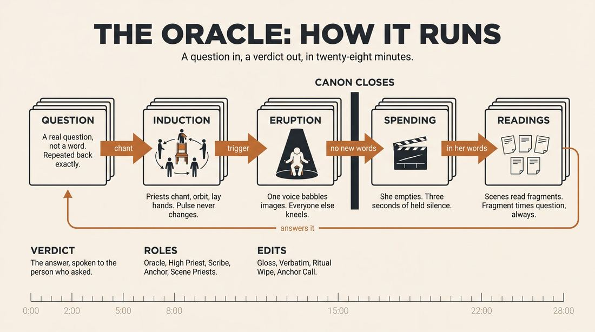
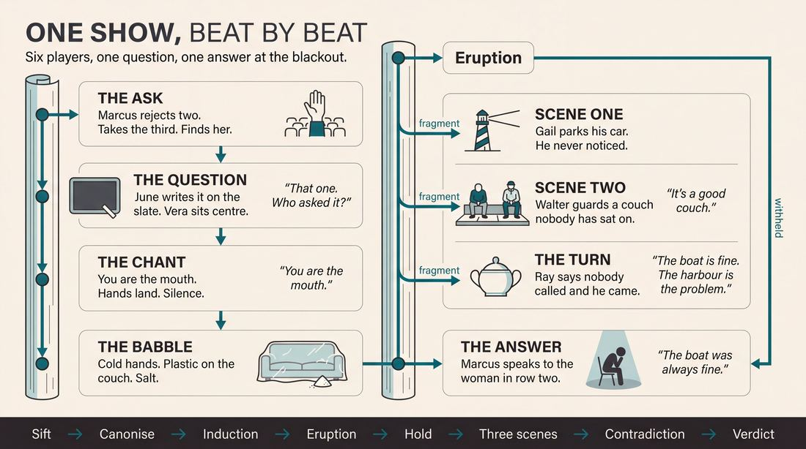
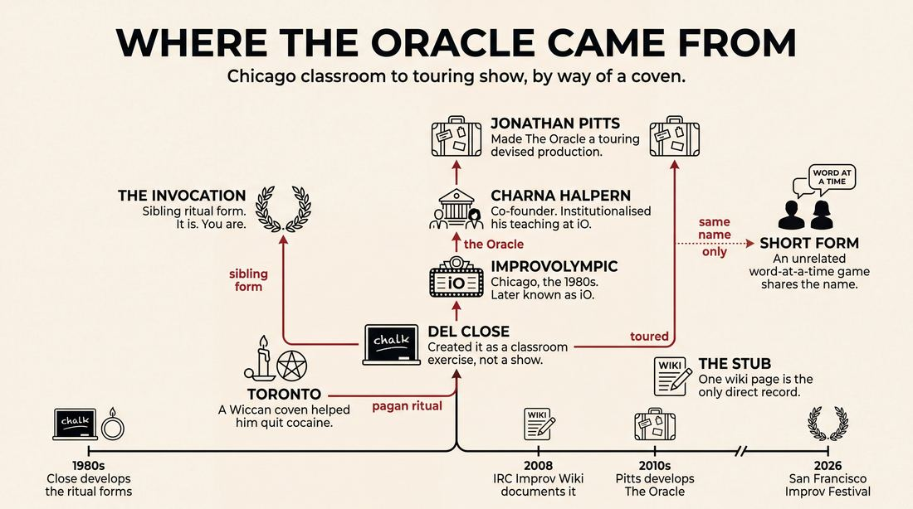
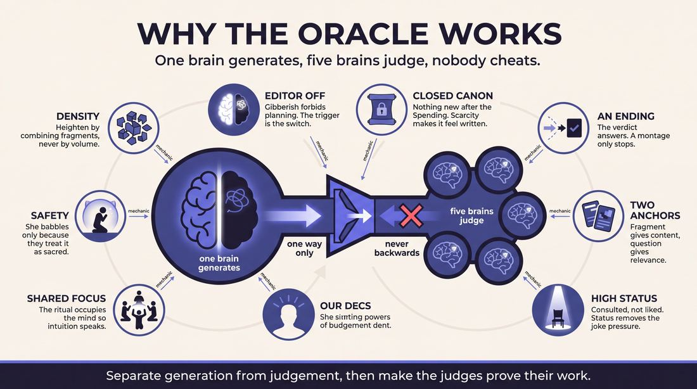
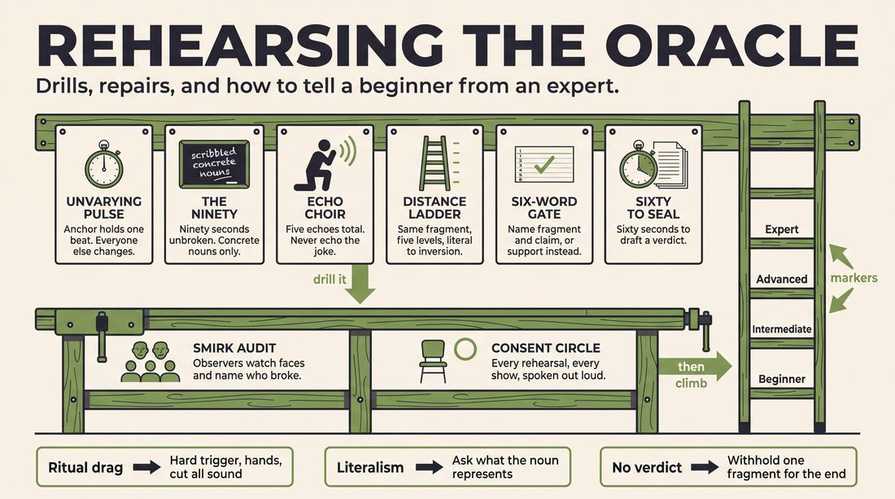

# Oracle

> **A complete study of the long-form improv format _Oracle_** - the original archived write-up, five infographics, grounded historical and pedagogical research, and a full mechanics-and-coaching manual.

| | |
|---|---|
| **Format** | Oracle |
| **Primary source** | [IRC Improv Wiki](https://wiki.improvresourcecenter.com/index.php?title=Oracle) |

---

## Contents

1. [Part I - The Original Write-Up](#part-i-the-original-write-up)
2. [Part II - The Infographics](#part-ii-the-infographics)
   - [1. Structure and Mechanics](#infographic-1-mechanics)
   - [2. A Show, Beat by Beat](#infographic-2-example)
   - [3. Origins and Lineage](#infographic-3-history)
   - [4. Why It Works](#infographic-4-theory)
   - [5. Rehearsal and Repair](#infographic-5-coaching)
3. [Part III - Research Dossier](#part-iii-research-dossier)
   - [Pass 1: History, Lineage, Literature and Scholarship](#research-history)
   - [Pass 2: Comparative Anatomy, Pedagogy and Production](#research-comparative)
4. [Part IV - Mechanics, Gameplay and Coaching Manual](#part-iv-mechanics-gameplay-and-coaching-manual)
   - [Pass 1: The Form, Its Mechanics and Its Gameplay](#manual-mechanics)
   - [Pass 2: Training, Coaching and Performance Companion](#manual-coaching)

---

## Part I - The Original Write-Up

*Verbatim archive of the source article, reproduced exactly as scraped. Everything after this section is generated elaboration built on top of it.*

### Oracle

A strange form used in class by [Del Close](https://wiki.improvresourcecenter.com/index.php?title=Del_Close "Del Close") where one player would be designated as the oracle. The other players would be like the priests of ancient Greece. First they would gather an important question to explore from the audience. Then they would create a ritual around the oracle, attempting to put that player into a trance like state. This could go on for some time, until the player would erupt into a stream of conscious babel, filled with non\-sequitors, gibberish and random thoughts that might in some way be connected to the original question. Once the oracle is spent, the players would then interpret the oracle by creating scenes based on what the oracle said. On some occasions, Del would encourage us to attempt to draw conclusions from the scenes to answer the original question as a way to end the piece.

---

*Archived from [https://wiki.improvresourcecenter.com/index.php?title=Oracle](https://wiki.improvresourcecenter.com/index.php?title=Oracle) (IRC Improv Wiki) on 2026-08-09 23:23 UTC.*

---

## Part II - The Infographics

*Five 16:9 posters, each teaching a different aspect of the format. Click any poster to enlarge.*

<a id="infographic-1-mechanics"></a>

### 1. Structure and Mechanics

*How the form is played: the shape of the piece, the opening, the roles, the edit vocabulary, the flow of information, and the clock.*

{ .diagram loading=lazy decoding=async width="1100" height="614" }


<a id="infographic-2-example"></a>

### 2. A Show, Beat by Beat

*A single worked performance from suggestion to blackout: what happens in each beat, with short real example lines and what the players are doing technically.*

{ .diagram loading=lazy decoding=async width="1100" height="614" }


<a id="infographic-3-history"></a>

### 3. Origins and Lineage

*Where the form came from: creators, dates, theatres, how it spread between schools and cities, and the key figures - a documented timeline and lineage map.*

{ .diagram loading=lazy decoding=async width="1100" height="614" }


<a id="infographic-4-theory"></a>

### 4. Why It Works

*The theory: the core principles of the form and the research and craft ideas that explain why the structure produces good improv, each tied to a specific mechanic.*

{ .diagram loading=lazy decoding=async width="1100" height="614" }


<a id="infographic-5-coaching"></a>

### 5. Rehearsal and Repair

*Training and fixing the form: the essential drills, the common failure modes with their symptom-and-fix pairs, and the markers of beginner through expert play.*

{ .diagram loading=lazy decoding=async width="1100" height="614" }


---

## Part III - Research Dossier

*Two research passes: the historical record, then the comparative and pedagogical record. Claims carry evidence tags - treat unverified items accordingly.*

<a id="research-history"></a>

### » Pass 1: History, Lineage, Literature and Scholarship

### Research Summary

*   **The searchable record for "Oracle" as a standalone Del Close format is extremely thin.** [DOCUMENTED] Beyond a single stub on the IRC Improv Wiki, primary documentation of Close teaching this specific exercise is virtually non-existent in digitized syllabi or published manuals.
*   Because the record is thin, this dossier reconstructs the form by tracing its immediate sibling—Close’s highly documented "Invocation"—and its modern theatrical descendant, Jonathan Pitts' touring production of *The Oracle*.
*   The format originated in the 1980s at ImprovOlympic (iO) in Chicago as a classroom exercise and warm-up, born from Close’s fascination with Wicca, pagan rituals, and altered states of consciousness. [DOCUMENTED]
*   The core mechanic requires one player to act as an "oracle" who is put into a trance by an ensemble of "priests," resulting in stream-of-consciousness babble that the ensemble then interprets into scenic premises. [DOCUMENTED]
*   The format was later resurrected and polished into a devised, immersive long-form production by Jonathan Pitts, co-founder of the Chicago Improv Festival, who has toured it globally. [DOCUMENTED]
*   The name "Oracle" is heavily conflated in the improv record with a completely unrelated, widely practiced short-form game (also known as "Word-at-a-Time Expert"). [DOCUMENTED]

### Provenance and History

The Oracle emerged in Chicago in the 1980s during the foundational years of ImprovOlympic (later iO). It was created by Del Close not as a performance format, but as a classroom exercise designed to bypass the improviser's conscious "editor." 

During this era, Close was heavily invested in the occult. Following a pilgrimage to Toronto where a local Wiccan coven reportedly aided him in kicking a severe cocaine habit, Close began integrating séance-like rituals into his improv pedagogy. [DOCUMENTED] He sought to literalize the concept of "group mind" by borrowing mechanics from pagan ceremonies. The Oracle was developed alongside "The Invocation" and a series of warm-ups simply called "Rituals." 

The problem Close was solving was the tendency of improvisers to pre-plan or write scenes in their heads. By forcing a player into a simulated trance state where they were required to babble in non-sequiturs, and forcing the ensemble to treat that gibberish as sacred text, Close demanded absolute, spontaneous justification from his students. [INFERRED]

| Year | Event | Place / Company | Source |
| :--- | :--- | :--- | :--- |
| 1980s | Del Close develops pagan-inspired ritual exercises, including Oracle and Invocation. | ImprovOlympic, Chicago | Magnet Theater Archives / IRC Wiki |
| 2008 | The format is documented as a historical stub on the IRC Improv Wiki. | IRC Improv Wiki | IRC Improv Wiki |
| 2010s–2026 | Jonathan Pitts develops and tours *The Oracle*, a devised theatrical production based on the Delphi ritual. | Global / San Francisco Improv Festival | SFIF Archives / Jonathan Pitts Bio |

### Lineage and Transmission

Because the Oracle was primarily a classroom exercise, it did not enter the standard long-form canon in the way the Harold or the Armando did. It was transmitted orally by Close's students in Chicago, often bleeding into how teams performed the "Invocation" opening. [WIDELY PRACTICED, UNDOCUMENTED]

The format mutated significantly in transit. While Close used it as a raw, chaotic training tool to generate scenic premises, Chicago veteran Jonathan Pitts (former Executive Director of Chicago Improv Productions and Second City instructor) formalized it. Pitts created a devised, immersive long-form show explicitly titled *The Oracle*. Pitts' dialect of the form elevates the theatricality: the "Priest" takes an audience query, and the "Delphi" (the ensemble) plunges into a trance, weaving poetry, monologues, and scene work until the "truth is delivered." [DOCUMENTED]

### Key Figures

| Person | Role in this form | Specific contribution | Source URL |
| :--- | :--- | :--- | :--- |
| Del Close | Creator | Invented the original classroom exercise to explore ritual as a gateway to subconscious generation. | [IRC Wiki](https://wiki.improvresourcecenter.com/index.php?title=Oracle) |
| Charna Halpern | iO Co-Founder | Institutionalized Close's teachings and provided the theatrical laboratory for his ritualistic experiments. | [Scribd - Art by Committee](https://www.scribd.com/document/354789123/Art-by-Committee) |
| Jonathan Pitts | Director / Auteur | Adapted the raw exercise into a polished, globally touring devised long-form production. | [SFIF](https://sfimprovfestival.com/) |

### Canonical Shows, Companies and Recordings

*   ***The Oracle* (Directed by Jonathan Pitts)**: A touring devised production that has been mounted at various festivals, including the San Francisco Improv Festival (2026) and The Lost Church in SF. The cast is billed as "a collective of trance-talking improvisers." [Link](https://sfimprovfestival.com/)
*   ***The Invocation* (Directed by Bianca Casusol)**: While not the Oracle itself, the Magnet Theater in New York mounted a revival of Close's sibling ritual form, explicitly marketing it as a return to Close's 1980s Wiccan-inspired pedagogy. [Link](https://magnettheater.com/show/53775/)

### Published Literature

| Work | Author | Year | What it says about this form | Where to find it |
| :--- | :--- | :--- | :--- | :--- |
| *IRC Improv Wiki: Oracle* | Various | 2008 | The only surviving direct documentation of the mechanics of Close's original classroom exercise. | [IRC Wiki](https://wiki.improvresourcecenter.com/index.php?title=Oracle) |
| *IRC Improv Wiki: Invocation* | Various | 2014 | Explicitly links the Oracle to Close's other pagan-inspired ritual exercises. | [IRC Wiki](https://wiki.improvresourcecenter.com/index.php?title=Invocation) |
| *Art by Committee* | Charna Halpern | 2006 | Details Close's obsession with the occult, demons, and the use of the Invocation to achieve group mind. | Print / Scribd |
| *Theatrical Improvisation* | Jeanne Leep | 2008 | Analyzes how Close used rigid structures (like rituals) to train the mind to be effortlessly spontaneous. | Print |

### Verbatim Quotes

> "A strange form used in class by Del Close where one player would be designated as the oracle. The other players would be like the priests of ancient Greece."
> — *IRC Improv Wiki* (https://wiki.improvresourcecenter.com/index.php?title=Oracle)

> "First they would gather an important question to explore from the audience. Then they would create a ritual around the oracle, attempting to put that player into a trance like state."
> — *IRC Improv Wiki* (https://wiki.improvresourcecenter.com/index.php?title=Oracle)

> "This could go on for some time, until the player would erupt into a stream of conscious babel, filled with non-sequitors, gibberish and random thoughts that might in some way be connected to the original question."
> — *IRC Improv Wiki* (https://wiki.improvresourcecenter.com/index.php?title=Oracle)

> "Once the oracle is spent, the players would then interpret the oracle by creating scenes based on what the oracle said."
> — *IRC Improv Wiki* (https://wiki.improvresourcecenter.com/index.php?title=Oracle)

> "The invocation was created by Del Close... It was one of many exercises that Close used that were inspired by religious and pagan ritual and ceremonies. Other examples would be a form he called the Oracle and a long warm up exercises he called Rituals."
> — *IRC Improv Wiki* (https://wiki.improvresourcecenter.com/index.php?title=Invocation)

> "An immersive, improvisational theatre phenomenon performed worldwide, The Oracle blends the ancient ritual of Delphi with long-form improv."
> — *San Francisco Improv Festival Program* (https://sfimprovfestival.com/)

> "Once the Priest chooses a query worthy of the Gods, the Delphi, a collective of trance-talking improvisers will plunge into the ether."
> — *San Francisco Improv Festival Program* (https://sfimprovfestival.com/)

> "Wait for the breathless moment when the trance shatters, the metaphor is revealed, and the truth is delivered."
> — *San Francisco Improv Festival Program* (https://sfimprovfestival.com/)

### Anecdotes and Stories

**The Wiccan Pilgrimage**
The esoteric nature of the Oracle and the Invocation can be traced back to a specific period in Del Close's life. In the 1980s, struggling with severe substance abuse, Close took a pilgrimage to Toronto. There, a local Wiccan coven reportedly aided him in kicking his cocaine habit. Deeply moved by the experience, Close returned to Chicago and began injecting séance-like rituals into his improv classes. He believed that the mechanics of evoking spirits could be repurposed to evoke scenic premises, leading directly to the creation of the Oracle and the Invocation. [DOCUMENTED - Magnet Theater Archives]

**Halloween Demons**
Charna Halpern recounts in *Art by Committee* that Close's dedication to these rituals occasionally terrified his students. During one Halloween class, Close decided to use the Invocation format to literally invoke demons. Halpern, who was taking a meditation class at the time, had to mentally surround herself with "white light" to protect herself from the intense, cult-like energy Close was generating in the room. [DOCUMENTED - *Art by Committee*]

### Academic and Scientific Research

**Cognitive Neuroscience of Spontaneity**
Research by Dr. Charles Limb using fMRI scans on improvising jazz musicians demonstrates that spontaneous generation requires the deactivation of the dorsolateral prefrontal cortex (the brain's inner critic) and the activation of the medial prefrontal cortex. 
*Relevance to this form:* The Oracle's "trance" mechanic is a literalized, theatrical method for forcing this exact neurological state. By demanding that the Oracle speak in "gibberish and random thoughts," the format explicitly forbids the use of the dorsolateral prefrontal cortex, forcing pure, unedited generation.

**Psychological Safety and Collaborative Emergence**
Organizational behavior studies (such as Google's Project Aristotle) have shown that high-performing teams require extreme psychological safety. 
*Relevance to this form:* The Oracle format is a high-wire act of psychological safety. The central player must abandon all ego and logic to babble incoherently, trusting entirely that the ensemble of "priests" will save them by treating their nonsense as profound genius and justifying it into coherent scene work.

**Anthropology of Ritual and Trance**
Performance studies research (e.g., Ryu, 2008) notes that shamanic rituals use repetitive chanting and masks to drive the personality out of the body, allowing a "spirit" to take possession. 
*Relevance to this form:* Close directly mapped this anthropological mechanic onto improv. The "priests" use repetitive ritual to induce a flow state in the Oracle, bypassing the performer's ego to access the collective subconscious of the ensemble.

### Documented Variants and Descendants

*   **The Invocation:** The most famous and widely practiced sibling to the Oracle. Instead of an oracle answering an audience question, the ensemble deifies an inanimate object suggested by the audience. The players move through four ritualistic phases of chanting: "It is..." (description), "You are..." (direct address), "Thou art..." (deification), and "I am..." (possession). [DOCUMENTED]
*   **The Oracle (Jonathan Pitts Production):** A highly structured, devised theatrical descendant. Rather than a raw classroom exercise, this is a polished show featuring a designated "Priest" and a collective "Delphi" who use poetry, monologues, and scene work to answer profound audience questions. [DOCUMENTED]
*   **The Oracle (Short-Form Game):** A completely unrelated but identically named short-form game. Three or four players stand in a line and answer an audience question one word at a time. Also known as "Word-at-a-Time Expert" or "Two-Headed Professor." [DOCUMENTED]

### Criticism, Debate and Known Failure Modes

**Cult Dynamics and Esotericism**
Close's ritualistic exercises have long been a subject of debate. Critics argue that forms like the Oracle cross the line from theatrical exercises into uncomfortable, cult-like spiritualism. The demand that students enter "trance-like states" can feel invasive or emotionally manipulative, blurring the boundary between acting pedagogy and psychological boundary-pushing. [INFERRED / WIDELY PRACTICED]

**Decentering Del Close**
In recent years, the improv community has actively reckoned with Del Close's legacy. Theaters like Bird City Improv have publicly stated that Close must be "decentered from the improv canon" due to his history of abusive, sexist, and exclusionary behavior. [DOCUMENTED] This modern critical lens complicates the teaching of the Oracle, as the form relies heavily on the guru-centric, mystical authority that Close cultivated.

**Failure Mode: The Burden of Interpretation**
Mechanically, the Oracle places a massive cognitive load on the "priests." If the Oracle's stream-of-consciousness babble is too abstract, disconnected, or purely phonetic, the ensemble will struggle to pull actionable premises from it. The resulting scenes often become disjointed, overly weird, or entirely disconnected from the audience's original question. [INFERRED]

### Cultural Footprint

As a standalone format, the original Oracle remains an obscure footnote in the history of iO, overshadowed by the Harold and the Invocation. However, its cultural footprint survives in two ways:
1.  **Theatrical Devised Improv:** Jonathan Pitts' touring production of *The Oracle* has kept the specific Delphi-mythos alive in the global festival circuit, proving that Close's esoteric classroom exercises can be polished into commercial art.
2.  **The Philosophy of Group Mind:** The underlying ethos of the Oracle—that improvisers must bypass the ego and treat the ensemble's collective output as sacred—permeates all of Chicago long-form. The idea that "if you treat a mistake as a gift, it becomes a premise" is the direct secular translation of the Oracle's mechanics.

### Gaps in the Record

*   **The Ritual Mechanics:** There is no surviving documentation detailing *how* the priests put the Oracle into a trance. It is unknown if Close provided a specific chant (as he did with the Invocation's "It is, You are...") or if the ritual was entirely freeform.
*   **Performance History:** It is unclear if Close ever directed the Oracle in front of a paying audience at iO, or if it was strictly confined to his advanced classes and rehearsals.
*   **Audio/Video Evidence:** No archival recordings of Close teaching or directing this specific format have surfaced in the digitized record. A researcher would need to access the physical archives of early iO students or the Del Close papers to find primary syllabi.

### Source List

1. IRC Improv Wiki - "Oracle" - 2008 - https://wiki.improvresourcecenter.com/index.php?title=Oracle - Documents the mechanics of the original Del Close classroom exercise.
2. IRC Improv Wiki - "Invocation" - 2014 - https://wiki.improvresourcecenter.com/index.php?title=Invocation - Establishes the Oracle as a sibling to Close's pagan-inspired Invocation.
3. San Francisco Improv Festival - "The Oracle" - 2026 - https://sfimprovfestival.com/ - Documents Jonathan Pitts' devised theatrical descendant of the form.
4. Magnet Theater - "The Invocation" - 2024 - https://magnettheater.com/show/53775/ - Documents Del Close's Wiccan pilgrimage to Toronto and the origin of his ritual forms.
5. Jonathan Pitts Improv - Biography - 2024 - https://www.jonathanpittsimprov.com/ - Documents Pitts' creation of The Oracle as a globally touring show.
6. *Art by Committee* - Charna Halpern - 2006 - https://www.scribd.com/document/354789123/Art-by-Committee - Documents Close's philosophy on ritual, demons, and the subconscious.
7. Bird City Improv - Facebook Post - 2025 - https://www.facebook.com/ - Documents the modern critical pushback against Del Close's legacy and his use of ritual.
8. Hoopla Impro - "Oracle" - 2024 - https://www.hooplaimpro.com/ - Documents the unrelated short-form word-at-a-time game of the same name.

<a id="research-comparative"></a>

### » Pass 2: Comparative Anatomy, Pedagogy and Production

### Taxonomic Placement

```text
      Ritual / Pagan Ceremonies (Historical)
                   |
          Spolin Theater Games
                   |
             Del Close's iO Forms
            /          |          \
    The Harold    Invocation    The Oracle (Classroom Form)
       /               |                   \
   Armando       Sound & Motion      The Oracle (Jonathan Pitts Show)
                                             \
                                        Word-at-a-Time Oracle (Short Form)
```

The Oracle sits in the "Source-to-Scene" family of long-form improvisation, sharing DNA with the Armando and the Deconstruction. However, rather than using a grounded true story (Armando) or a realistic base scene (Deconstruction) as the source material, it uses a generated, altered-state monologue (the Oracle's trance babble). It is a direct descendant of Del Close’s fascination with pagan ritual and ceremony, evolving alongside the "Invocation" (a standard Harold opening). While the original form was a classroom exercise designed to train thematic listening and non-literal interpretation, it later bifurcated into two distinct descendants: a highly produced, immersive long-form show by Jonathan Pitts, and a simplified, word-at-a-time short-form parlor game popularized in the UK and US.

### Head-to-Head Comparisons

#### Oracle vs. Armando
| Axis | Oracle | Armando | Consequence for the players |
| :--- | :--- | :--- | :--- |
| **Opening / Source** | Ritual induction leading to stream-of-consciousness gibberish/babble. | A truthful, grounded personal monologue based on a suggestion. | Oracle players must extract abstract themes and metaphors; Armando players extract concrete premises and characters. |
| **Structure** | Ritual -> Trance Monologue -> Interpretive Scenes -> Concluding Answer. | Monologue -> Montage of Scenes -> Monologue -> Montage. | Oracle drives toward a specific, unified philosophical conclusion; Armando explores a theme divergently. |
| **Edit Logic** | Exegetical (scenes exist to decode the babble). | Thematic or Tangential (scenes exist to heighten the monologue's ideas). | Oracle scenes must explicitly tie back to the audience's initial question. |
| **Audience Contract** | "We will divine a mystical answer to your profound question." | "We will show you the funny/poignant universe inside this true story." | Oracle requires the audience to buy into theatrical mysticism and high stakes. |
| **Failure Mode** | Literalism (acting out the gibberish exactly). | Anecdotalism (just re-enacting the monologist's story). | Oracle fails if the priests cannot find the pattern in the chaos. |

#### Oracle vs. Invocation (Harold Opening)
| Axis | Oracle | Invocation | Consequence for the players |
| :--- | :--- | :--- | :--- |
| **Focus** | A human player designated as the Oracle. | An inanimate object suggested by the audience (e.g., a shoe). | Oracle relies on one player's subconscious; Invocation relies on group mind. |
| **Progression** | Trance induction -> Babble -> Scene work. | "It is" -> "You are" -> "Thou art" -> "I am". | Invocation builds to a climax of embodiment; Oracle uses embodiment as the *starting point* for scenes. |
| **Cast Size** | 1 Oracle, multiple Priests. | Full ensemble acting as one unit. | Oracle creates an immediate status disparity (High Status Oracle, Low Status Priests). |
| **Function** | A complete, standalone long-form structure. | An opening designed to generate premises for a Harold. | Oracle must resolve its own tension; Invocation just needs to provide enough fuel for the upcoming beats. |

#### Oracle vs. Word-at-a-Time Oracle (Short Form)
| Axis | Long-Form Oracle (Del Close) | Short-Form Oracle (Hoopla/ComedySportz) | Consequence for the players |
| :--- | :--- | :--- | :--- |
| **Mechanic** | One player speaks in a continuous stream of consciousness. | 3-4 players speak one word at a time to form sentences. | Short-form requires intense syntactic listening; Long-form requires psychological release. |
| **Output** | Abstract babble that serves as source material for scenes. | A direct, often grammatically mangled, verbal answer to the question. | Short-form is the entire game; Long-form is just the inciting incident for scene work. |
| **Staging** | Dynamic ritual movement around a central figure. | Static line or staggered vertical formation (sitting, standing on chairs). | Short-form is visually static but highly structured; Long-form is visually chaotic but structurally fluid. |

### What Makes It Uniquely Itself

1. **The Ritual Trance Induction:** If the players simply step forward and deliver a weird monologue, it is an Armando variant. The Oracle requires the *Priests* to actively induce the state in the Oracle through physical and vocal ritual. The form demands that the ensemble takes responsibility for altering the psychological state of the soloist.
2. **Exegetical Scene Logic:** The scenes do not merely follow the suggestion; they are explicitly framed as translations or interpretations of the Oracle's babble. If the scenes ignore the babble and just answer the audience's question directly, the form collapses. The babble is the mandatory filter through which the answer must be found.
3. **The Teleological Mandate:** Unlike a Montage, which can end anywhere, the Oracle has a specific destination: it must synthesize the preceding scene work to deliver a conclusive answer to the audience's initial question. It is a problem-solving mechanism disguised as theater.

### Structural Variants in Practice

| Variant Name | What It Changes | Who Plays It | Source |
| :--- | :--- | :--- | :--- |
| **The Classroom Oracle** | The original format. 1 Oracle, multiple Priests. Oracle babbles, Priests do scenes, group draws a conclusion. | Del Close / iO Theater students | IRC Improv Wiki (2008) |
| **The Oracle (Immersive Show)** | Inverts the roles: 1 Priestess, multiple "Delphi" (trance-talkers). Audience submits written questions. The Delphi perform monologues, poetry, and scenes. The Priestess clarifies patterns and delivers the final answer. | Jonathan Pitts / Chicago Improv Productions / SF Improv Festival | San Francisco Improv Festival (2026) / Jonathan Pitts |
| **Word-at-a-Time Oracle** | Strips away the scene work entirely. 4 players sit/stand at different heights. They answer the audience's question one word at a time. Arms wave during action, hands in prayer during contemplation. | Hoopla Impro (Rhiannon Vivian) / UK & US Short Form | Hoopla Impro (2018) |
| **Two-Headed Oracle** | A 2-player micro-variant of the short-form game. Players lock arms and answer questions one word at a time. | Various Short Form Troupes | Improv Tovarisch / Improv Encyclopedia |

### The Teaching Ladder

| Stage | Skill introduced | Why in this order | Typical exercise | Source or [CRAFT CONSENSUS] |
| :--- | :--- | :--- | :--- | :--- |
| **1. Group Mind & Ritual** | Moving and sounding as a unified ensemble without a designated leader. | Priests must be able to create a cohesive ritual without planning it, supporting the Oracle safely. | Sound and Motion / Invocation | Del Close / iO Theater |
| **2. Stream of Consciousness** | Bypassing the internal editor to produce continuous, unfiltered speech. | The Oracle must babble without trying to be funny or coherent. Hesitation kills the trance illusion. | Free Association / Gibberish Monologue | Viola Spolin / [CRAFT CONSENSUS] |
| **3. Thematic Extraction** | Identifying the core metaphor or pattern inside chaotic information. | Priests must listen to the babble and pull out actionable premises, not just literal words. | Pattern Game | iO Theater / UCB |
| **4. Exegetical Scene Work** | Initiating scenes that clearly demonstrate a philosophical point. | The final scenes must synthesize the themes to answer the audience's question. | Thesis Scenes | [CRAFT CONSENSUS] |

*Deliberately withheld from beginners:* The pressure of being the Oracle. Beginners will inevitably try to "write" a funny speech. The Oracle role is only introduced after players have mastered checking their impulses and trusting the subconscious.

### Documented Drills and Exercises

| Drill | Origin / Teacher | How to run it | What it fixes in this form | Source |
| :--- | :--- | :--- | :--- | :--- |
| **Invocation** | Del Close | Group gets an object. Phases: 1. Describe it ("It is"). 2. Address it ("You are"). 3. Revere it ("Thou art"). 4. Embody it ("I am"). | Teaches the ensemble how to build a ritualistic, escalating energy required to induce the Oracle. | IRC Improv Wiki |
| **Word-at-a-Time Oracle** | Rhiannon Vivian (Hoopla) | 4 players at staggered heights answer a profound question one word at a time. | Trains players to release control of the narrative and trust the emergent, often ridiculous, group answer. | Hoopla Impro |
| **Gibberish Expert** | Improv Encyclopedia | One player speaks in gibberish, another translates it into expert advice based on an audience suggestion. | Trains the "Priests" to confidently assign profound meaning to absolute nonsense. | Improv Encyclopedia |
| **Sound and Motion** | Del Close | One player makes a repetitive sound and motion. Another mirrors it exactly, then morphs it into a new sound/motion. | Builds the physical vocabulary needed for the Priests' trance-inducing ritual. | iO Theater / [CRAFT CONSENSUS] |
| **Pointing Story** | Hoopla Impro | 5 players in a line tell a story. They only speak when the director points at them, finishing mid-word if necessary. | Forces hyper-listening and continuous flow, preventing the Oracle from stalling. | Hoopla Impro |
| **Stream of Consciousness** | Viola Spolin | Player stands in front of the group and speaks continuously for 2 minutes without pausing, filtering, or making logical sense. | Breaks the Oracle's habit of trying to be clever; forces reliance on the subconscious. | Spolin / [CRAFT CONSENSUS] |
| **The Pattern Game** | iO Theater | Word association web that branches out and then folds back in to find connections between disparate ideas. | Trains the Priests to find the hidden connections in the Oracle's random thoughts. | iO Theater |
| **Thesis Scenes** | [CRAFT CONSENSUS] | Players are given a philosophical statement (e.g., "Love is a trap") and must improvise a grounded scene that proves it. | Prepares the ensemble for the final phase of the form: drawing conclusions to answer the question. | [CRAFT CONSENSUS] |
| **Trance Mask** | Keith Johnstone | Players wear half-masks and are encouraged to let the mask "take over" their physical and vocal choices, bypassing intellect. | Helps the Oracle player achieve the "trance-like state" Del Close demanded. | Keith Johnstone |
| **1 to 5 / Clap Replacement** | Radboud University (Tabaee) | Pairs count 1-5. Gradually replace numbers with claps, words, or sounds. | Builds the rhythmic synchronization required for the Priests' ritual chanting. | Radboud University (2026) |

### Common Failure Modes and Diagnoses

| Failure mode | What it looks like from the audience | Root cause | Fix | Who names it |
| :--- | :--- | :--- | :--- | :--- |
| **Literalism** | Oracle says "blue banana," Priests immediately initiate a scene about eating a blue banana. | Fear of abstraction. Players grab the first concrete noun because thematic extraction is hard. | Coach stops the scene and asks, "What does a blue banana *represent*?" (e.g., an impossible standard). | [CRAFT CONSENSUS] |
| **The Coherent Oracle** | The Oracle delivers a well-structured, stand-up comedy style monologue that directly answers the question. | Ego. The player wants to be perceived as witty rather than vulnerable. | Restrict the Oracle to speaking only in gibberish or physical movement for the first 30 seconds. | [CRAFT CONSENSUS] |
| **Ritual Drag** | The Priests chant and dance for five minutes, but the Oracle never "erupts." The audience gets bored. | Lack of internal cues. The Oracle is waiting for permission; the Priests are waiting for the Oracle. | Establish a specific physical trigger (e.g., the Priests lay hands on the Oracle's shoulders) to force the eruption. | [CRAFT CONSENSUS] |
| **The Forgotten Question** | The scenes are great, but by the end, no one remembers what the audience actually asked. | Poor memory retention and lack of a designated "anchor" player. | Assign one Priest the specific job of repeating the question at the top of the synthesis phase. | [CRAFT CONSENSUS] |
| **Strongarming** | In the short-form variant, a player tries to force a specific sentence by saying a highly specific, leading word. | Prioritizing individual ideas over group discovery. | Remind players: "There is no correct answer, and Oracle sentences are allowed to be cryptic." | Tabaee (2026) |

### Production and Logistics

*   **Cast Size:** 5 to 9 players. Del Close's original requires 1 Oracle and at least 4 Priests to create a convincing ritual mass. Jonathan Pitts' variant uses 1 Priestess and an ensemble of 8 "Delphi" (trance-talkers).
*   **Runtime:** 20–30 minutes for the classic Del Close classroom form. 60 minutes for the fully realized Jonathan Pitts theatrical production.
*   **Stage Layout:** The Oracle is traditionally placed center stage, often elevated (on a chair or block) or seated on the floor to establish a clear status differential. The Priests operate in a 360-degree orbit around the Oracle during the ritual, then take the downstage space for scene work.
*   **Chairs and Set:** Minimalist. 1-4 chairs depending on the variant. The short-form version explicitly requires one player on the floor, one in a chair, one standing, and one standing on a chair to create a "totem pole" visual.
*   **Lighting and Tech Cues:** In theatrical productions (like Pitts'), lighting is heavily utilized to separate the "ether/trance" state from the "scene" state. A slow fade to a tight spotlight on the Oracle during the eruption, snapping to a wide wash for the Priests' scenes.
*   **Music and Sound:** Pitts' production utilizes a live Music Director to underscore the trance and heighten the tension. In the classroom form, the "music" is generated entirely a cappella by the Priests (chanting, stomping, clapping).
*   **How the Suggestion is Taken:** The MC asks for "an important question to explore" or a "question so deep, so complex, that standard logic fails to answer it." In Pitts' version, the audience submits written questions before the show, and the Priestess selects one "worthy of the Gods."
*   **Producer Preparation:** Producers must prepare the audience for a tone shift. This form blends comedy with dramatic, haunting, and philosophical elements. Marketing must set expectations for "immersive, improvisational theatre" rather than a standard comedy show.

### Adaptations Beyond the Stage

*   **Corporate and Applied Improv:** The Oracle structure is highly effective for corporate brainstorming and problem-solving. The "audience question" becomes a real business challenge. The "babble" phase acts as a divergent, judgment-free ideation session, and the "scene" phase acts as convergent synthesis. Jonathan Pitts actively uses these techniques in international corporate workshops.
*   **Online and Remote:** Jonathan Pitts adapted his teaching and performance for Zoom. The physical ritual must be replaced by vocal layering, synchronized gestures close to the camera, and pinning the Oracle's video feed to simulate the center-stage focus.
*   **Content-Safety and Consent:** Because the form relies on "trance" states and physical rituals, explicit boundaries regarding touch must be established. If the Priests are physically manipulating the Oracle during the induction, a pre-show consent check (e.g., "Are you okay with shoulders and arms being touched?") is mandatory.
*   **Accessibility:** The short-form "totem pole" staging (standing on chairs, sitting on the floor) must be adapted for players with mobility issues. The visual levels can be achieved through camera angles (if online) or simply by standing in a horizontal line.

### Evidence Base for Those Adaptations

*   **Psychological Safety in Corporate Settings:** A 2018 *Forbes* analysis explicitly linked Del Close's improv rules (which govern forms like the Oracle) to Google's "Project Aristotle" findings on team productivity. The core requirement of the Oracle—trusting the ensemble to support a vulnerable, babbling soloist—perfectly operationalizes psychological safety. "The key to high-performance teams is maintaining a safe environment where everyone can feel comfortable to take risks... Interestingly enough, Del Close's improv rules preceded Google's study by several decades!" (Forbes, 2018).
*   **Ritual and Group Cohesion:** The use of chanting and synchronized movement in the Oracle's induction phase aligns with anthropological research on how physical rituals rapidly build group cohesion and lower the affective filter, allowing for greater creative risk-taking.

### Scholarly Frames Worth Applying

*   **Collaborative Emergence (R. Keith Sawyer):** *Frame:* Creativity in groups is not the product of one genius mind, but an unpredictable, emergent property of the group's interaction. *Citation:* Sawyer, R.K. (2003). *Group Creativity: Music, Theater, Collaboration.* *Mapping:* The final answer to the audience's question is never known by the Oracle; it emerges only through the Priests' subsequent scene work and synthesis.
*   **Point of Concentration (Viola Spolin):** *Frame:* A specific, agreed-upon focus that occupies the intellect, allowing the intuition to take over and produce spontaneous behavior. *Citation:* Spolin, V. (1963). *Improvisation for the Theater.* *Mapping:* The Priests' physical ritual serves as the Point of Concentration, distracting the Oracle's conscious brain so the subconscious can erupt into babble.
*   **Trance and Status (Keith Johnstone):** *Frame:* Performers can bypass the intellect by adopting masks or states that lower their self-consciousness, often playing with extreme high or low status. *Citation:* Johnstone, K. (1979). *Improvisation and the Theatre.* *Mapping:* The Oracle is elevated to ultimate High Status (a conduit of the gods), which paradoxically frees the player from the low-status anxiety of "trying to be funny."
*   **Flow (Mihaly Csikszentmihalyi):** *Frame:* A state of optimal experience where a person is completely absorbed in an activity, losing a sense of time and self. *Citation:* Csikszentmihalyi, M. (1990). *Flow: The Psychology of Optimal Experience.* *Mapping:* The "stream of conscious babel" is a forced flow state, achieved by removing the friction of logic and narrative structure.

### Where the Form Is Heading

The Oracle has evolved from a dusty classroom exercise into a premium, immersive theatrical experience. Jonathan Pitts' touring production, *The Oracle*, represents the current vanguard. By inverting the cast structure (one Priestess managing a collective of trance-talking "Delphi"), incorporating live musical direction, and using written audience submissions, the form has moved closer to immersive, dramatic theater. Contemporary companies (like Cloven in Dublin, who perform alongside Pitts' format) are using it to explore "darkly comedic and richly detailed narrative improv," proving that the form is increasingly being used to tackle genuine philosophical and societal anxieties rather than just generating comedic premises.

### Source List

1. *Oracle* - IRC Improv Wiki - 2008 - https://wiki.improvresourcecenter.com/index.php?title=Oracle - Supports the original Del Close classroom structure, roles, and exegetical scene logic.
2. *Invocation* - IRC Improv Wiki - 2014 - https://wiki.improvresourcecenter.com/index.php?title=Invocation - Supports the historical link between Del Close's pagan ritual exercises and his improv forms.
3. *The Oracle* - San Francisco Improv Festival - 2026 - https://sfimprovfestival.com - Supports the existence, cast structure, and immersive nature of Jonathan Pitts' contemporary long-form production.
4. *Fun Short Form Games for Beginners* - Hoopla Impro (Rhiannon Vivian) - 2018 - https://www.hooplaimpro.com - Supports the mechanics, staging, and teaching purpose of the short-form "Word-at-a-Time" variant.
5. *What Google And Cisco Can Teach Us About Improv* - Forbes - 2018 - https://www.forbes.com - Supports the evidence base linking Del Close's rules to corporate psychological safety and applied improv.
6. *What Defines an Improv Exercise?* - Radboud University (Tabaee) - 2026 - https://www.ru.nl - Supports the short-form failure mode of "strongarming" and the 1-to-5 clapping drill for rhythm.
7. *Jonathan Pitts Biography* - Global Improv Walkabout / NSA Illinois - 2026 - https://www.nsa-il.org - Supports Pitts' background, corporate applications, and the development of the modern Oracle show.

---

## Part IV - Mechanics, Gameplay and Coaching Manual

*Synthesis over the original article and both research dossiers: first how the form works and how to play it, then how to train an ensemble to perform it.*

<a id="manual-mechanics"></a>

### » Pass 1: The Form, Its Mechanics and Its Gameplay

### At a Glance

| Field | Value |
| :--- | :--- |
| **Also known as** | The Delphi; Close's Oracle; "the priests-and-oracle exercise." Not to be confused with the unrelated short-form game *Oracle* / *Word-at-a-Time Expert* / *Two-Headed Professor*. |
| **Family** | Source-to-scene long form (same branch as the Armando and the Deconstruction), sub-branch: ritual/altered-state openings (sibling of Del Close's Invocation). |
| **Cast size** | 5–9. Minimum viable: 1 Oracle + 4 Priests. Pitts' theatrical descendant uses 1 Priest(ess) + up to 8 "Delphi." |
| **Runtime** | 20–30 min as Close's classroom form; 45–60 min as a produced show. Sweet spot for a festival slot: 28 minutes. |
| **Opening** | A ritual induction: the ensemble chants, drums, orbits and lays hands on a designated player until that player erupts into stream-of-consciousness babble. The babble *is* the opening; there is no separate opening game. |
| **Suggestion taken** | Not a word. A **question** — "something so large that ordinary logic fails to answer it." Taken verbally from the house, or written and drawn from a bowl. |
| **Structural rigidity (1–5)** | **4.** The macro-sequence (Question → Induction → Eruption → Exegesis → Verdict) is fixed and non-negotiable; the scene middle is free. |
| **Difficulty (1–5)** | **4.** Individually easy scenes, brutally hard listening and synthesis. The Oracle role is a 5 for the player in it. |
| **Prerequisites** | Group-mind physical work (Sound & Motion, Invocation); two minutes of unbroken stream-of-consciousness speech without stalling; thematic extraction (Pattern Game); ability to play a scene that argues a thesis. |
| **Best for** | Ensembles with strong listening and weak premise-generation; shows that want to end on something that lands rather than fizzles; festival slots where you need a form that is *about* something; corporate/applied ideation. |
| **Avoid when** | The cast will not commit past irony; you have fewer than four supporting players; the room is a drunk 11pm bar crowd; anyone in the cast has not consented to being touched; you have no way to prepare the audience for a tonal register that is not pure comedy. |

### The Essence in One Paragraph

The Oracle is a divination machine built out of improvisers. The audience gives you a real, unanswerable question. The ensemble — "the priests of ancient Greece," in the wiki's phrase — surrounds one player and performs a chanted, rhythmic, physical ritual until that player breaks open and pours out a two-to-three-minute stream of non-sequiturs, images, gibberish and half-thoughts that are only obliquely connected to the question. The moment the Oracle is spent, that babble becomes **closed scripture**: a fixed, finite text that nobody may add to for the rest of the show. Everything that follows is exegesis. The priests build scenes that are explicitly *readings* of specific fragments — "the plastic on the couch," "the lighthouse doesn't ask" — and each scene is required to touch two poles at once: a phrase from the utterance and the audience's original question. Scenes accumulate into contradictory evidence, then converge, and the piece ends with a **verdict**: a stated answer to the question that must be built out of the Oracle's own words. The form's whole trick is that it separates *generation* from *judgement* and puts them in different bodies — one player generates with the editor switched off, and a different set of players judges what it meant. The Oracle is never allowed to know what she said; the priests are never allowed to invent anything she didn't say.

### Why This Form Exists

Close built this to solve a problem no montage solves and, in fact, no montage even attempts.

**Problem 1: improvisers write ahead.** In every form where you generate and then immediately use your own material, the generating player can hear themselves being clever and steer. The Oracle physically decouples the two functions. The player producing raw material is under a rule that forbids coherence ("non-sequitors, gibberish and random thoughts"). The players who need coherence are forbidden from producing material. Neither half can cheat the other's job. A monologist in an Armando can, and usually does, tell the story they know will yield scenes. An Oracle cannot, because an Oracle is not permitted to know what a scene is while babbling.

**Problem 2: montages don't accumulate.** A montage from the word "banjo" produces a set of scenes whose only relation is that they came from the same word. Nothing in the middle of a montage constrains anything else in the middle of a montage. In the Oracle, the utterance is a *closed corpus*: roughly five to nine usable fragments and nothing more, ever. Scarcity is the engine. Scene 5 cannot reach for a new idea; it must reach back into the same twelve nouns scene 1 reached into, at a different depth. That is what makes the piece feel written.

**Problem 3: shows end because time runs out.** The Oracle has a destination. The audience asked a question at minute one; the show is contractually obliged to answer it at minute twenty-eight. This is the single biggest thing the form buys you: an **ending with a truth value**. A montage ends. An Oracle *concludes*.

**Problem 4: the ensemble hedges.** The form requires four to eight people to spend three minutes chanting at a colleague in dead earnest before a paying audience. There is no ironic way to do that. Whatever the ensemble's usual defensive distance is, the induction burns it off in the first ninety seconds. This is not a side-effect; it is a design feature. Close's ritual exercises came out of his mid-80s immersion in pagan and Wiccan practice, and the borrowing is functional, not decorative: the anthropology of trance ritual (repetitive rhythm, mask, loss of personal name) is exactly the technology for getting a person to stop performing themselves.

**What it buys the soloist specifically.** The Oracle is placed in the highest possible status — a conduit of the gods, physically elevated, addressed in the second person by a chanting crowd. Johnstone's insight applies precisely: extreme high status removes the low-status anxiety of trying to be liked. The player is not being funny. She is being *consulted*. That is a radically easier job.

### The Audience Contract

**What the audience is promised, explicitly:**

1. *You will supply the question, and it will be a real one.* Not a location, not a word — a thing you actually don't know the answer to.
2. *One of us will lose control on purpose.* You will watch a person be taken apart by the group and say things they did not choose.
3. *Nothing after that is invented.* Every scene you see is derived from words you heard said out loud in the eruption. You can check our work.
4. *We will answer you.* Before the lights go down, someone will state an answer to your question in a sentence, and that sentence will contain the Oracle's own words.

**How they know where they are.** The form is legible because it has four sharply differentiated *registers*, and the audience learns them within the first ten minutes:

| Register | What it looks/sounds like | Audience reads it as |
| :--- | :--- | :--- |
| **Ritual** | Ensemble in unison, rhythmic, chanting, orbiting, no dialogue | "The machine is warming up" |
| **Utterance** | One voice, no rhythm, everyone else frozen and staring | "The source text" |
| **Exegesis** | Two or three people, normal speech, chairs, kitchens | "A reading of that text" |
| **Verdict** | Direct address, stillness, the question restated | "The machine is delivering" |

If you can't tell those four apart from the back row with your eyes closed, the contract is unreadable. My recommendation: enforce a hard *sonic* differentiator — the ritual is the only part with a shared pulse, and the verdict is the only part addressed to the house.

**What breaks the contract:**

- **Answering the question directly in a scene.** If a character just says "You keep helping people because you're lonely," you have skipped the machine. The audience came to watch divination, not advice.
- **Inventing scripture.** A priest glossing a fragment the Oracle never said. The audience won't consciously catch it; they will feel the piece stop being tethered. (In practice, one or two audience members always catch it, and they stop trusting you.)
- **Winking at the ritual.** One raised eyebrow during the induction and the whole apparatus becomes a bit about improvisers doing a silly chant. You cannot re-earn the frame in the same show.
- **No verdict.** Ending on a nice scene and a blackout with the question unanswered is the single most common way this form breaks its promise. The audience feels cheated in a way they can name.
- **Answering a question that should not be answered.** If the question is "Should I leave my husband?" or "Is my mother going to die?", the contract has become therapy or prophecy, and both of those are cruel. See the Query Sift in *The Opening*.

**Where the dossiers conflict:** the wiki says Close only "on some occasions" encouraged drawing conclusions, while the comparative dossier calls the concluding answer a "Teleological Mandate." My judgement: optional in the classroom, **mandatory in performance.** Without the verdict you have a rehearsal exercise with witnesses.

### Anatomy: The Full Structural Map

The Oracle is a five-movement piece with a hinge. The hinge is **the Spending** — the instant the Oracle empties. Before the hinge, the show is generating and nobody is judging. After the hinge, the show is judging and nobody may generate. Everything about how you play the form flows from which side of that line you are on.

```
   THE QUESTION            THE INDUCTION            THE ERUPTION
   ============            =============            ============
   [MC] --> house      priests orbit / chant     ONE VOICE. all else frozen.
   "a question so         "she is the mouth"      "...cold hands... the
    large that logic     "you are the mouth"       plastic on the couch...
    fails..."            "thou art the mouth"      salt in the sugar bowl...
        |                "I AM the mouth"          the boat is fine, the
        v                       |                  harbour is the problem..."
   Q RESTATED               (hands laid)                   |
   & CANONISED                  |                    priests ECHO fragments
        |                       v                          |
        +-----------------------+--------------------------+
                                |
                          ===== THE SPENDING =====      <-- CANON CLOSES HERE
                          Oracle drops. Silence.        No new source material
                          Priests hold. 3 seconds.      may enter the piece.
                                |
        +-----------------------+-----------------------------------+
        |                       |                                   |
   FIRST READING          SECOND READING                      THE NARROWING
   (divergent)            (convergent)                        + VERDICT
   ------------           --------------                      -------------
   Sc.1  frag A           Sc.4  frag A x C                   fragments dropped
   Sc.2  frag B     -->   Sc.5  frag B x reading-of-1  -->   one fragment left
   Sc.3  frag C           Sc.6  CONTRADICTION scene          question restated
        |                       |                            answer spoken
   one fragment           two fragments or                   IN THE ORACLE'S
   per scene              a fragment + an                    OWN WORDS
   wide apart             established reading                       |
                                |                              [ blackout ]
                          (optional: AFTERSHOCK
                           - 15s second eruption)
```

| Unit | Approx. clock (28-min show) | What happens | Who drives it | Success criterion | Common error |
| :--- | :--- | :--- | :--- | :--- | :--- |
| **1. The Query Sift** | 0:00–1:30 | MC/High Priest asks the house for a large question, rejects two or three, selects one. | High Priest | The chosen question is unanswerable by fact, answerable by insight, and belongs to an identifiable person in the room. | Taking the first thing shouted; taking a joke question; taking a question with a factual answer. |
| **2. The Canonisation of the Question** | 1:30–2:00 | The question is repeated back, formally, verbatim, at half speed. Optionally written on a board. | High Priest | Every player and every audience member could repeat it word for word. | Paraphrasing it. The exact wording is load-bearing. |
| **3. The Induction** | 2:00–5:00 | Priests build rhythm, chant, orbit and physically converge on the Oracle. Escalating four-phase structure. | Whole ensemble, led by the Ritual Anchor | The Oracle's breathing visibly changes; the room's pulse is shared; it ends with a trigger, not a fade. | Ritual Drag — five minutes of chanting with no internal escalation and no trigger. |
| **4. The Eruption** | 5:00–8:00 | The Oracle babbles continuously. Priests freeze, kneel, and echo selected fragments. | The Oracle (content), the Scribe (marking) | 5–9 concrete, image-rich fragments emerge; at least three get echoed; the affect is consistent. | The Coherent Oracle: a witty structured monologue. Also: pure abstraction with no nouns. |
| **5. The Spending** | 8:00–8:20 | The Oracle runs dry — collapses, exhales, goes silent and stays visible. Priests hold three full seconds. | The Oracle | The audience feels the canon slam shut. | Someone edits in early; the Oracle "wraps up" with a joke button. |
| **6. First Reading** (3 scenes) | 8:20–15:00 | Three scenes, one fragment each, chosen as far apart as possible. Glossed. | Scene priests; the Scribe assigns | Three distinct claims about the question, each traceable to a different fragment. | Literalism — playing the noun instead of the meaning. |
| **7. Second Reading** (2–3 scenes) | 15:00–22:00 | Scenes fuse two fragments, or a fragment with a reading established in the First Reading. At least one scene contradicts an earlier claim. | Scene priests | The audience can feel the material narrowing rather than sprawling. | Starting new, unrelated scenes; treating fragments as a to-do list to get through. |
| **8. The Aftershock** *(optional, once)* | ~19:00 | The Oracle stirs and delivers 10–20 seconds more. Legal only as a *response* to something the scenes discovered. | The Oracle, permitted by the High Priest | It answers a question the scenes raised. | Using it as a bail-out when the priests are stuck. Twice = the canon was never closed. |
| **9. The Narrowing** | 22:00–25:00 | One or two short scenes/tableaux that abandon most fragments and pursue one. Ritual language begins to return. | Whole ensemble | The audience senses the machine converging. | Adding a new fragment at minute 24. |
| **10. The Verdict / Sealing** | 25:00–28:00 | Question restated verbatim. Answer delivered in one to three sentences, containing at least one phrase from the utterance. Optionally handed to the questioner. | High Priest, backed by ensemble | The answer is *derivable* — the audience can trace it back through the scenes to the babble. | Fortune-cookie verdict ("Love is the answer"); or a verdict nobody saw coming from the evidence. |

### The Opening

The Oracle has no opening game. The opening *is* the question-taking plus the induction, and both are procedures, not vibes.

#### Procedure A: Taking the Question (the Query Sift)

1. **Frame the ask precisely.** Not "can I get a suggestion?" Say: *"We need a question. Not a question with a fact for an answer — a question you have actually turned over at three in the morning. Something so large that ordinary logic can't get at it."*
2. **Take three or four out loud.** Let the house shout. Repeat each one back neutrally. Do not react comically.
3. **Sift against the four filters.** Reject, out loud and graciously, anything that fails:

| Filter | Reject if… | Example of a reject | Example of a keep |
| :--- | :--- | :--- | :--- |
| **Answerable by fact** | Google could answer it | "Why is the sky blue?" | "Why do I keep taking care of people who never asked me to?" |
| **Joke question** | The house laughed at it, not with it | "Why is my roommate like that?" | "When does helping someone become about me?" |
| **Unsafe** | Medical, legal, suicidal, or a decision about a named third party | "Should I divorce Kevin?" | "Why is it so hard to leave things that are already over?" |
| **Too small / too grand** | Yes/no, or "what is the meaning of life" | "Should I get bangs?" | "Why do I still perform for my father?" |

4. **Choose and credit the source.** *"That one. Who asked it?"* Find the person. Look at them. This is the single most powerful move in the opening: it makes the question belong to a body in the room, which makes the verdict at minute twenty-eight land on a body in the room.
5. **Canonise it.** The High Priest repeats it once, formally, slowly, in the third person: *"The question before us is: why do I keep taking care of people who never asked me to."* Some houses write it on a chalkboard or slate upstage. **My recommendation: write it down.** It costs nothing, it prevents the single most common failure mode (the Forgotten Question), and it gives the verdict something to physically address.

#### Procedure B: The Induction

The record here is genuinely blank — the dossier is explicit that no documentation survives of *how* Close's priests induced the trance, and it is unknown whether he prescribed a chant as he did for the Invocation. What follows is my reconstruction, built by importing the Invocation's documented four-phase escalation, because it is the sibling form and because the escalation ladder solves the exact problem (Ritual Drag) that a freeform chant creates. **Labelled as craft reconstruction, not history.**

1. **Set the geography.** Oracle centre, on a chair or on the floor. Priests in a loose ring, at distance. Oracle's eyes closed or unfocused. Everyone breathes together for four counts. Nobody speaks.
2. **Phase 1 — The Drone (30–45 sec).** One priest starts a single sustained sound or a repeated two-beat physical action (a stamp, a palm-slap on the thigh). Others join *one at a time*, never all at once, each adding a distinct layer: a hum, a hiss, a low word. Do not build to full volume yet. **The Anchor never changes their layer.** Everything else moves around a fixed pulse.
3. **Phase 2 — "She is…" (30–45 sec).** Priests begin third-person description of the Oracle, on the beat, overlapping. *"She is the crack in the floor." "She is the one who was awake." "She is the mouth."* Content should be image-based, not flattering. Escalate rhythm slightly.
4. **Phase 3 — "You are…" (30–45 sec).** Switch to direct address. Move closer. The ring tightens to arm's length. *"You are the mouth." "You are what the question is afraid of."* Voices louder, faster, more overlap.
5. **Phase 4 — The Charge and the Trigger (15–30 sec).** One priest — pre-agreed as the Trigger — whispers **the question itself** directly into the Oracle's ear, then the ring **lays hands** on the Oracle's shoulders and back, and the chant drops to a whisper or cuts dead. This is the physical cue. It is unmissable, which is the point.
6. **The Eruption.** The Oracle speaks. **All priests instantly freeze or sink to their knees and stop making sound.** The contrast between a room full of noise and one voice in silence is the theatrical event of the form. Do not underscore it. Do not react. Kneel and listen.

**Consent, non-negotiable:** the laying-on-of-hands is scripted contact. Establish before every show, in the huddle, who consents to touch and where. A player who does not consent gets a variant trigger: the ring closes to six inches and everyone exhales hard in unison. It works nearly as well.

#### Documented and Practical Variants of the Opening

| Variant | Mechanics | Use when | Cost |
| :--- | :--- | :--- | :--- |
| **Close's classroom induction** (documented in outline only) | Freeform ritual, "could go on for some time," until the Oracle erupts. | Rehearsal, when you want the ensemble to discover the shape themselves. | High risk of Ritual Drag in front of an audience. |
| **Invocation-laddered induction** (my reconstruction, above) | Four escalating phases + hands + whispered question. | Default for performance. | Slightly mechanical if the cast plays the phases as boxes to tick. |
| **The Written Bowl** (Pitts lineage) | Audience writes questions before the show; the Priest draws and selects one "worthy of the Gods." | Larger houses; when you want dramatic register and questions too private to shout. | You lose the live sift and the identifiable questioner; consider asking the writer to raise their hand. |
| **The Delphi Inversion** (Pitts lineage) | Cast structure flips: **one** Priest, a **collective** of trance-talkers. Multiple voices babble; the Priest is the sole interpreter and deliverer. | Large casts (8+); a poetic, choral register; when no single player wants the Oracle load. | Much harder to get clean fragments; the Priest becomes a bottleneck. Note: this directly inverts the wiki's 1-Oracle/many-Priests structure. Both are legitimate dialects; pick one and tell the cast which show you are doing. |
| **Cold Oracle** | No induction. Oracle simply starts. | Never in performance. Useful in rehearsal to isolate and drill the eruption. | Destroys the audience contract and the status architecture. |
| **Remote / Zoom** | Pin the Oracle's feed full-screen; priests perform the induction with synchronised hand gestures at camera-height and vocal layering; hands-on trigger replaced by all priests pressing palms to their own cameras simultaneously. | Online shows. | Latency destroys unison chant — have the Anchor set a visual pulse rather than an audio one. |

### The Engine

This is the section to get right. Everything else is decoration on this.

#### 1. The Two Canons

The Oracle runs on **two accumulating bodies of binding text**, and knowing which is which is the whole skill.

**The Utterance Canon.** Fixed at the Spending. Finite. It consists of everything the Oracle actually said. Nothing may be added to it. Nothing may be silently changed. If the Oracle said "the plastic on the couch," a priest may not later say "the plastic on the *sofa*" — because the audience is tracking, and the exactness is the proof.

**The Reading Canon.** Empty at the Spending, and it grows. Every time a priest glosses a fragment — "the lighthouse doesn't ask, and neither do you" — that *interpretation* becomes binding on every subsequent scene. If scene 2 establishes that the lighthouse means compulsive unrequested care, scene 5 cannot decide the lighthouse means loneliness. It can *complicate* it, contradict it, argue with it — but it must acknowledge it. The Reading Canon is how the show remembers what it thinks.

Coherence in the Oracle is entirely produced by the discipline of building canon two strictly on top of canon one.

#### 2. The Generative Formula: Scene = Fragment × Question

Every scene in an Oracle must be anchored at **two** points.

- **Anchor 1 — the fragment.** Supplies the *content*: the image, the character, the world, the specific.
- **Anchor 2 — the question.** Supplies the *relevance*: why this scene is evidence rather than decoration.

Drop anchor 1 and you get a philosophy seminar: people talking about caretaking in the abstract, with no texture, and the audience can no longer check your work. Drop anchor 2 and you get a montage: a charming scene about a lighthouse keeper that is doing nothing for the piece. **Both anchors or don't start the scene.**

The practical test before you step out: *"Which fragment, and what does it say about the question?"* If you can't answer both in six words each, don't initiate — support someone who can.

#### 3. Exegetical Distance

The core craft skill of the priest is choosing how far from the literal words to play. There is a ladder:

| Level | Name | What you do with "salt in the sugar bowl" | When it's right |
| :--- | :--- | :--- | :--- |
| **0** | **Literal enactment** | A scene about someone accidentally salting their coffee. | Almost never. Level 0 is the primary failure mode of the form. |
| **1** | **Literal handle, metaphoric content** | A woman refills the sugar bowl for a guest, and the scene is about her performing hospitality she resents. The bowl is present; the scene is about the resentment. | Excellent for scene 1. The literal object gives the audience a visible tether. |
| **2** | **Direct metaphor** | A hospice volunteer whose kindness is faintly punitive. No bowl. "You've been so good to me." "I know." | The workhorse level. Most Oracle scenes live here. |
| **3** | **Structural analogy** | A scene where the *shape* is "the thing that looks like nourishment is the thing that dehydrates you" — a mentor, a marriage, a church. | Late-show scenes; the Second Reading. |
| **4** | **Inversion** | A scene proving the opposite: the salt was *correct*, someone needed the salt. | Once per show, as the Contradiction scene. |

**The distance rule:** the *first* time a fragment is used, play it at level 1 or 2. The *second* time, you must move up at least one level. Reusing a fragment at the same distance is the exact sensation of a show spinning its wheels.

#### 4. Charge and Decay

Each fragment carries **charge** — the audience's live memory of hearing it plus their unresolved curiosity about what it meant. Charge is spent by use. Rules that follow:

- **Echo increases charge.** A fragment repeated by two priests during the eruption arrives at the First Reading with far more charge than one nobody echoed. This is why the Echo is a technique and not a decoration.
- **Gloss spends charge fast; blind scenes spend it slowly.** If you announce "the lighthouse means X" and then play X, you have cashed the fragment out in one transaction. If you play the scene first and let a priest name it afterwards, the audience does interpretive work themselves, and the fragment keeps some charge for later.
- **A fully spent fragment is dead weight.** Never return to a fragment whose meaning is now completely settled unless you intend to overturn that meaning.
- **Save one.** My strongest tactical recommendation for this form: **the Scribe deliberately withholds one high-charge fragment from the entire First and Second Reading, and it is used only in the Verdict.** In the worked run-through below, that fragment is "the boat is fine, the harbour is the problem." When the answer arrives carrying an image the audience has been waiting twenty minutes to understand, the piece detonates. Without this, verdicts feel like summary.

#### 5. Direction of Flow

Information travels one way only:

```
QUESTION --(constrains loosely, subconsciously)--> UTTERANCE
UTTERANCE --(constrains absolutely)--> SCENES
SCENES --(accumulate as evidence)--> READING CANON
READING CANON + one unspent fragment --> VERDICT
VERDICT --(must satisfy)--> QUESTION      [the loop closes]
```

Nothing flows backwards. You cannot retro-fit: if scene 3 produced a beautiful idea that isn't in the utterance, you may not pretend the Oracle said it. You may, however, *build on the reading* — because the Reading Canon is legitimately yours. This distinction is subtle and it is the difference between a show that feels divined and a show that feels improvised in the ordinary way.

#### 6. Divergence Then Convergence

The show's information shape is a diamond.

- **First Reading = maximum spread.** Choose the three fragments that are *least* alike. Three scenes that all read the same emotional register is the commonest structural failure. If the Scribe has "cold hands," "the plastic on the couch," and "the lighthouse doesn't ask," those are good picks precisely because one is bodily, one is domestic-historical, and one is mythic.
- **Second Reading = fusion.** Scenes now take *two* inputs. Two fragments (a **syncretic scene**), or a fragment plus a reading established earlier. Fusion is how this form heightens: not louder, not sillier — *denser*.
- **Contradiction is mandatory.** At least one scene must argue against the emerging consensus. A three-scene set that all agree produces a verdict that sounds like a greeting card. A set where scene 6 says "but sometimes the person needed you" produces a verdict with a *because* in it.
- **The Narrowing = fragments are deliberately abandoned.** The audience should feel material being dropped. This is what makes the ending feel like a decision rather than a stop.

#### 7. What the Oracle's Body Does After the Spending

The Oracle remains onstage, visible, silent, usually seated or slumped centre, for the entire exegetical section. This is not staging preference; it is engine. The Oracle's inert body is the *physical index of the text*. Every time the audience's eye drifts to that motionless figure, they remember there is a source being interpreted. Send the Oracle to the backline and you have converted your show into a montage with a weird opening.

Two legal uses of the body: (a) priests may touch or address the Oracle between scenes as a transition; (b) the Aftershock — one permitted stirring.

### Roles and Responsibilities

| Role | Owns | Must do | Must not do | Signal to the others |
| :--- | :--- | :--- | :--- | :--- |
| **The Oracle** | The Utterance Canon. | Speak continuously without stalling; deal in concrete nouns and images; commit to affect; go silent and stay visible when spent. | Be witty; answer the question; explain a fragment later; enter a scene in the First Reading; erupt twice without permission. | The Spending: a collapse, a long exhale, hands falling open. Unmistakable, then stillness. |
| **High Priest** (a.k.a. the Priest/Priestess) | The Question and the Verdict. | Run the Query Sift; canonise the question; restate it at least twice mid-show; deliver the sealed answer. | Play the biggest character in every scene; deliver a verdict not derivable from the scenes. | Steps downstage-centre, addresses the house directly. That position means "we are now in Verdict register." |
| **The Scribe** | The Ledger — the 5–9 fragments and which are used/unused. | Memorise fragments *verbatim*; assign or claim which fragment each scene serves; protect the withheld fragment for the Verdict. | Announce the ledger as a list; hoard initiations. | Says the fragment aloud, cleanly, as a scene-launching gloss or a verbatim edit. |
| **The Ritual Anchor** | The pulse. | Start the induction layer and hold it unchanged; restore the pulse for the Narrowing; keep everyone in one tempo. | Be the loudest; embellish the base rhythm. | Re-entering the base rhythm mid-show is a hard signal: "we are heading for the ending." |
| **Scene Priests** (everyone else) | The Reading Canon. | Initiate on fragment × question; gloss or play blind as agreed; contradict when the piece has become too tidy. | Bring in un-scriptural material; play level 0 literalism; comment on the ritual. | The Gloss line, spoken from the edge of the stage before stepping in. |
| **Tech / Lights** | Register separation. | Wide warm wash for ritual → slow narrow to a single tight special on the Oracle at the trigger → snap to a scene wash at the first gloss → dim, cool and narrow for the Verdict. | Fade the Oracle to black at the Spending — the body must stay visible. | The snap to scene-wash *is* an edit and can be used as one. |
| **Musician** (optional; used in the Pitts production) | The trance floor. | Underscore only the induction and the Verdict; support the Anchor's tempo, don't lead it. | Underscore the eruption (it turns scripture into a mood piece); play stings on funny lines. | Dropping out completely at the trigger. |
| **Director / edit-caller** (rehearsal only) | Diagnosis. | Stop scenes at level 0 and ask "what does it *represent*?"; call the fragment count; forbid the fifth scene about the same feeling. | Direct from the wings in performance. | — |

**On casting the Oracle.** Do not rotate blindly, and do not let the loudest player volunteer. The Oracle needs: comfort with being looked at while doing nothing skilful, an image-rich vocabulary, and no reflex to close a thought with a punchline. Some of your best scene players are terrible Oracles, and vice versa. My recommendation: cast the Oracle in the huddle, out loud, by name, ten seconds before you go on. Casting it during the induction produces a hesitant eruption.

### The Rules That Actually Bind

#### Hard rules — break these and it is not this form

| # | Rule | Why |
| :--- | :--- | :--- |
| 1 | **The suggestion is a question, not a word.** | The whole architecture is a Q→A loop. A word gives you nothing to answer. |
| 2 | **A designated player is put into the state *by the ensemble*.** | If the player just steps up and delivers weird material, you are running an Armando with an odd monologist. The priests must take responsibility for the state. |
| 3 | **The eruption must be non-linear.** Non-sequiturs, images, gibberish. | A coherent monologue collapses the two-canon structure into one. |
| 4 | **The canon closes at the Spending.** No new source material after. | This is the form's conservation law. It is what produces the "written" feeling. |
| 5 | **Every scene must be traceable to a specific fragment.** | Exegetical logic is the load-bearing wall. Scenes that merely riff on the topic are a montage. |
| 6 | **The question must be answered before the blackout.** | The teleological mandate. Without it, the contract is broken. |
| 7 | **The Oracle does not interpret.** | The generator may not judge. That decoupling is the reason the form exists. |
| 8 | **The Oracle stays visible until the end.** | The body is the index of the text. |

#### Soft conventions — house by house

| Convention | Version A | Version B | My call |
| :--- | :--- | :--- | :--- |
| **Cast structure** | 1 Oracle + many Priests (wiki / Close) | 1 Priest + a collective Delphi (Pitts) | Version A for teaching and for casts under 8. Version B for choral, poetic shows. Never mix mid-run. |
| **Gloss placement** | Gloss before the scene | Scene first, gloss after | Alternate. Gloss-first for scene 1 to teach the audience the grammar; blind thereafter. |
| **Question source** | Shouted from the house | Written and drawn from a bowl | Written for anything over 80 seats or any dramatic register. |
| **Does the Oracle play scenes?** | Never | May enter after the Second Reading, as a figure from the utterance | Allow one late entrance, as a haunting. It's spectacular and it should be rare. |
| **Verdict delivery** | High Priest alone | Ensemble in unison | Solo, with the ensemble echoing the final image. Unison verdicts sound like a cult and undercut the meaning. |
| **Handback** | Address the questioner by eye | Keep it general | Address them. It costs a second and doubles the impact. |
| **Aftershock** | Permitted once | Forbidden | Permitted once, and only as a response to a scene, never as a rescue. |
| **Music** | A cappella from the priests | Live MD | A cappella teaches the ensemble the pulse. Add an MD only once the cast can hold tempo without one. |
| **Gibberish quantity** | Sprinkled through | Restricted to a "glossolalia bridge" when stuck | Bridge-only. Sustained gibberish gives the priests nothing to work with. |

#### Myths — things people wrongly believe are rules

| Myth | Why it's wrong |
| :--- | :--- |
| "The Oracle should be spooky/dramatic; there's no comedy in this form." | The form's tone is set by the *question* and the *scenes*, not the ritual. An earnestly conducted induction followed by a scene about a man who irons his adult son's shirts is extremely funny. What's forbidden is *irony about the ritual itself*. |
| "The priests must be in ancient-Greek character throughout." | The priesthood is a function, not a costume. Once the Spending happens, priests play modern human beings in kitchens. The robe-voice is only for ritual and Verdict register. |
| "The Oracle needs to actually enter an altered state." | No. This is theatre, not a séance. The Oracle needs to *stop editing*, which is a technique, not a mystical achievement. Any player who thinks they must genuinely dissociate should not play the role. |
| "The babble should be about the question." | It should be *loosely, obliquely* connected at best. The wiki's phrase is "might in some way be connected." An Oracle who stays on topic is editing. |
| "Longer ritual = better trance." | Ritual length is inversely related to eruption quality past about three minutes. Escalation and a hard trigger matter; duration does not. |
| "You have to use every fragment." | The Narrowing *requires* abandoning fragments. Completionism is what makes Oracles feel like homework. |
| "The verdict has to be profound." | It has to be *derivable* and *costly*. "You confuse being needed with being safe" is better than anything with the word "journey" in it. |
| "This is the same as the Invocation." | The Invocation deifies an object and produces a Harold opening; the Oracle interrogates a person and produces a complete piece with a mandatory answer. |
| "The Oracle is that short-form game where you answer one word at a time." | Different form entirely, same name. If your cast googles it, they'll find the wrong thing. |
| "It's a Del Close form, so you have to teach it as Close taught it." | The record of how Close taught it is nearly nonexistent, and the contemporary community has real, documented objections to guru-centric ritual pedagogy. Run it as a technique, with consent, and drop the mysticism about the teacher while keeping the mysticism onstage. |

### Edits and Transitions

The Oracle uses a smaller edit vocabulary than a montage, and most edits are *exegetical* — the edit itself makes an interpretive claim.

| Edit | How to execute physically | When it is right | When it is wrong | What it costs |
| :--- | :--- | :--- | :--- | :--- |
| **The Gloss Edit** | Priest steps to the downstage edge, speaks one sentence naming a fragment and asserting its meaning, then walks into the new scene. | Launching the First Reading; whenever the audience may have lost the thread. | Every scene. Four gloss edits in a row turns the show into a lecture with illustrations. | Spends the fragment's charge immediately. |
| **The Verbatim Edit** | Priest crosses the stage speaking a fragment *exactly* as the Oracle said it, no interpretation, and the new scene starts behind them. | Mid-show, when you want the tether without the explanation. | When the fragment is one the audience never heard clearly (unechoed). | Nothing. The cleanest edit in the form. |
| **The Ritual Wipe** | Two or more priests re-form the ritual shape — a step-clap, a hum, a half-orbit — crossing the stage in the induction rhythm to sweep the scene away. | Between the First and Second Reading; entering the Narrowing. | Between two scenes in the same reading, where it over-punctuates. | Ten seconds of clock, and it re-invokes ritual register, so the following scene must be worth the frame. |
| **The Oracle's Twitch** | The Oracle, still centre, moves for the first time in minutes — a hand rises, the head turns toward the scene. Players clear. | Ending a scene that has just landed a strong reading. Devastating when saved. | More than twice a show; it becomes a gimmick. | Nothing, and it's free theatricality. Use it. |
| **The Aftershock Edit** | The Oracle sits up and delivers 10–20 seconds of new babble; priests kneel; then a Verbatim Edit off the new fragment. | Once, after the Contradiction scene, when the piece needs a jolt of new imagery to converge. | As a rescue when priests are out of ideas. It exposes that the canon was never really closed. | Weakens rule 4 slightly; budget exactly one. |
| **The Anchor Call** | Any priest steps out, restates the *question* verbatim to the house, and walks off. New scene starts. | Around minute 15 and again around minute 21. | More than twice; it becomes nagging. | Nothing. This is your insurance against the Forgotten Question. |
| **Priest Aside** | A player in the scene turns out, drops character for one line of commentary linking the scene to the question, then returns. | Second Reading, when a scene has a good idea buried in it. | First Reading — it teaches the audience that scenes need translating and they stop working. | A little of the scene's reality. |
| **Tableau Freeze** | Everyone in the scene freezes; another priest walks through the frozen picture speaking a fragment; the frozen players re-animate as new characters. | The Narrowing, when you want images to overlay. | Anywhere you need actual scene work; it's a poster, not a scene. | Momentum, if held longer than eight seconds. |
| **Sweep / Walking Edit** | Ordinary cross-stage sweep. | Fine anywhere; the neutral default. | When used exclusively — the show loses its exegetical texture and reads as montage. | The chance to make a claim with the edit. |
| **Tag-in** | Tag a player out mid-scene to replay the moment differently. | Rarely. It works for the Contradiction scene: tag out to replay the same beat with the opposite outcome. | Repeatedly. Tag-runs are a game-heightening device from another family of forms and they flatten the exegesis. | Breaks the one-scene-one-reading discipline. |
| **The Light Snap** | Tech snaps from ritual wash to scene wash, or to a cold narrow for the Verdict. | Register changes only. | As a general scene edit; you lose your only unambiguous register cue. | Nothing if reserved. |
| **The Narrowing Fade** | Priests one at a time stop moving and turn toward the Oracle until only the High Priest is active. | Exactly once, entering the Verdict. | Anywhere else. | Nothing. It is the form's curtain line. |

### Memory: Callbacks, Patterns and Heightening

The Oracle remembers itself through four mechanisms, three of which have no equivalent in other long forms.

**1. The Echo (canonisation in real time).** During the eruption, priests repeat selected fragments aloud — a low half-whisper, one or two priests, never the whole group. This does three jobs simultaneously: it stamps the fragment into the audience's memory, it tells the ensemble which fragments are "live," and it feeds the Oracle rhythmically. **The Echo is the form's memory-write operation.** Only echoed fragments reliably survive into the Reading. Rule of thumb: echo four to six times across a three-minute eruption, no more.

**2. The Ledger.** The Scribe holds 5–9 fragments verbatim, plus a flag on each: *used / unused / withheld-for-verdict*. In rehearsal, run this out loud after the Spending. In performance it lives in one head. It is the only "writing" in an improvised form and it is why the Scribe must not also be the busiest scene player.

**3. Refrain.** Oracles under pressure naturally repeat phrases — "the plastic on the couch, the plastic on the couch." Encourage this: it's not a stall, it's the piece composing its own chorus. A phrase the Oracle said three times becomes the piece's spine, and the ensemble should treat the most-repeated fragment as the likely Verdict material.

**4. Second-order callback (the distinctive one).** In most forms you call back a *line*. In the Oracle you call back a *reading*. Scene 5 doesn't reprise the sugar bowl; it reprises the *claim* that scene 3 made about the sugar bowl, and then puts pressure on it. When a player says "You're doing the sugar-bowl thing again" in a scene that has no sugar bowl in it, the audience gets a specific pleasure available in no other form: they are watching a group build an interpretive tradition in real time.

#### Heightening: what escalates in an Oracle

Not volume. Not absurdity. Not the stakes of any single scene. Three things escalate:

| Axis | Scene 1 | Scene 4 | Scene 7 |
| :--- | :--- | :--- | :--- |
| **Density** | One fragment | Two fragments, or fragment + reading | The whole ledger compressed into one image |
| **Exegetical distance** | Level 1–2 (literal handle) | Level 2–3 (structural analogy) | Level 3–4 (inversion, then synthesis) |
| **Claim strength** | "Some care is unasked-for." | "Unasked-for care is a way of not asking for anything." | "You built a harbour so you'd never have to be a boat." |

If your Oracle is getting *funnier* rather than *denser* as it goes, you are heightening the wrong axis and your Verdict will not have earned its ground.

### Move-Level Technique Catalogue

| Move | Situation | How to do it | Example line | Failure mode |
| :--- | :--- | :--- | :--- | :--- |
| **Query Sift** | Opening. | Take 3–4 questions, reject on the four filters aloud, choose one, find the asker. | "That's a good one but Wikipedia can answer it. Anyone else? … That one. Who said that?" | Taking the first shout; taking a joke. |
| **Canonisation of the Question** | Immediately after the sift. | Repeat verbatim, half speed, third-person framing. Write it up. | "The question before us is: *why do I keep taking care of people who never asked me to.*" | Paraphrasing — the exact words are the Verdict's raw material. |
| **The Drone** | Start of induction. | One player commits to a single unchanging sound/motion; others layer on top. | *(low sustained "mmmm," palm-slap on thigh, two-beat)* | Everyone starting at once at full volume; nowhere to escalate. |
| **Layered Address** | Induction, phases 2–3. | Chant "She is…" then "You are…", image-based, on the beat, overlapping. | "You are the last light on the coast. You are the one who was awake." | Complimenting the Oracle. Flattery is not ritual. |
| **The Question Whisper** | End of induction. | Trigger priest whispers the exact question into the Oracle's ear. | *(whispered)* "Why do you keep taking care of people who never asked?" | Whispering a *hint* at content instead of the question. |
| **Laying On of Hands** | The trigger. | Ring closes; consented hands to shoulders/upper back; all sound cuts. | *(silence)* | Doing it before the Oracle is ready; doing it without pre-show consent. |
| **The First Image** | Oracle's opening two seconds. | Start on a concrete noun, never an abstraction. | "Cold hands. Cold hands." | Starting with "I feel like…" — you'll never escape the abstract. |
| **Free Fall** | Mid-eruption. | Associate off the *sound* or the *sense* of your own last word; never plan the next one. | "…sugar bowl… bowl of the sky… the sky over the harbour…" | Pausing to find a better idea. Any pause is a stall. |
| **Glossolalia Bridge** | Oracle blanks. | Fill with pure sound — "shhhkkk," "ffffft" — for two seconds, then take the next noun that arrives. | "…the plastic on the couch… shhhhkkkk… nobody sat there." | Using sound for twenty seconds. It gives the priests nothing. |
| **The Recursion** | Oracle finds a phrase with heat. | Repeat it two or three times, changing only the emphasis. | "The boat is fine. The boat is *fine*. The harbour is the problem." | Repeating four-plus times; it becomes a bit. |
| **The Echo** | During eruption, priest-side. | One or two priests repeat a fragment in a low half-voice, once. | Priest (kneeling): *"…the plastic on the couch…"* | Whole group echoing everything; nothing is marked because everything is. |
| **The Spending** | Oracle empties. | Trail off, exhale audibly, drop the head or the hands, go still, stay visible. | *(long exhale; silence)* | Ending on a joke, or standing up and rejoining the backline. |
| **The Three-Second Hold** | Immediately after the Spending. | Priests do not move for three full counts. | *(nothing)* | Editing in fast because silence is uncomfortable. This hold is the canon closing. |
| **The Gloss** | Launching a scene. | Name the fragment, then assert a meaning, in one sentence. | "The lighthouse doesn't ask. It just burns all night at people who never sent for it." | Summarising instead of claiming: "The lighthouse means light." |
| **Blind Exegesis** | Scene 3 onward. | Play a fragment-derived scene with no gloss; a priest names it *after*. | *(scene plays; then)* "That's the sugar bowl." | Playing blind before the audience has learned the grammar. |
| **Literal Handle** | Scene 1, or whenever the room is losing the thread. | Put the literal object physically in the scene while the scene is about something else. | Marguerite: "Sit anywhere. Not there. That one has the plastic still on it." | Making the object the subject — that's level 0. |
| **Character-as-Fragment** | Any scene. | Embody the fragment as a person with the fragment's properties. | Dog (played straight, as a man): "I've got three legs and I'm not afraid of the highway. That's the whole personality." | Doing a talking-animal bit instead of an argument about the question. |
| **Inversion Reading** | Once, mid-Second Reading. | Play the fragment's opposite as though it were the true reading. | "You know the salt was right. I needed the salt. Sugar would've killed me." | Inverting three times; the piece loses a position. |
| **Syncretic Scene** | Second Reading. | Initiate a scene whose premise requires *two* fragments to exist. | "It's four in the morning, the whole house is asleep, and you are out here polishing a bowl nobody eats from." | Announcing both fragments in the first line. Let the second surface. |
| **Second-Order Callback** | Late Second Reading. | Reference a *reading*, not a line. | "Don't do the lighthouse thing. Not tonight." | Referencing a reading the audience never heard named. |
| **The Contradiction Scene** | After three agreeing scenes. | Deliberately build the counter-case; play it with full conviction, not as a joke. | "You showed up. Nobody asked you to and you showed up, and I'd have died in that chair." | Contradicting weakly, so it reads as an inconsistency rather than an argument. |
| **The Anchor Call** | Minute ~15, ~21. | Step out, restate the question verbatim, leave. | "Why do I keep taking care of people who never asked me to." | Restating it in your own words. |
| **The Aftershock** | Once, if at all. | Oracle stirs, 10–20 seconds of new imagery responsive to what the scenes found. | Vera: "…they did ask. They asked in the wrong room. They asked in a room you weren't in…" | Deploying it because the priests dried up. |
| **The Oracle's Twitch** | Ending a strong scene. | Oracle moves for the first time; players clear on the movement. | *(hand rises; palm up)* | Using it on a mediocre scene. |
| **The Priest Split** | When the ensemble genuinely disagrees. | Two priests argue the fragment's meaning in front of the house, then each plays their reading in successive scenes. | A: "The sugar bowl is deceit." B: "No. It's a bowl someone kept filling for forty years." | Winning the argument. Neither should win; that's the point. |
| **The Narrowing Drop** | Minute ~22. | Priest names, out loud, the fragments the piece is abandoning. | "Forget the dog. Forget the cold hands. It was always the harbour." | Doing this before you have three readings on the board. |
| **The Sealing** | The Verdict. | Answer the question in 1–3 sentences containing at least one verbatim fragment. | "You keep taking care of people who never asked because the boat was always fine. It was the harbour you were trying to build." | A verdict with no fragment in it. It won't feel divined; it'll feel like a note. |
| **The Handback** | Final beat. | Look at the questioner. Deliver the last sentence to them. | "That's the answer. It's yours." | Scanning the room generically. |
| **The Refusal** | Rare, advanced. | Verdict states the gods decline, and names *why* the question can't be answered — using a fragment. | "There is no answer, because you're still the last one awake in the house. Ask again when someone's up with you." | Using it to dodge the mandate. Legal once a season, at most. |
| **Tone Match** | Any scene. | Match the *affect* of the eruption, not just its nouns. A frightened babble yields frightened scenes. | *(Oracle was panicky; the kitchen scene is played at a whisper, fast)* | Playing a warm domestic scene off a terrified eruption. |
| **The Ledger Whisper** | Rehearsal / backline. | Scribe, in the backline, quietly cues the next fragment to whoever's about to initiate. | *(sotto)* "Cold hands." | Doing it audibly to the house. |

### Principles

**1. The canon closes at the Spending, and nothing reopens it.**
*Why here:* the entire coherence of an Oracle comes from the fact that a finite, publicly witnessed text constrains every subsequent choice. It is the only form where the audience holds a copy of the source.
*Followed:* at minute 22 you watch a player visibly reach for something new, discard it, and dig back into "the plastic on the couch" for the third time at a deeper level.
*Violated:* the show becomes a montage with a strange opening, and the audience — who cannot articulate why — stops leaning forward around minute 14.

**2. Every scene is a fragment multiplied by the question.**
*Why here:* one anchor produces either abstraction or decoration. Two anchors produce evidence.
*Followed:* you can pause the show at any point and both name the fragment and state what the scene argues about the question.
*Violated:* the classic "our second half was just good scenes" show. Good scenes and a dead piece.

**3. Interpret upward, not outward.**
*Why here:* the fragments are images, and images have meanings; the fatal instinct is to treat them as props. "Blue banana" is not a scene about fruit, it's a scene about an impossible standard.
*Followed:* the object appears in the scene as furniture while the scene is about a marriage.
*Violated:* Literalism — a run of quirky sketches about the actual nouns, which the audience enjoys mildly and forgets instantly.

**4. The Oracle generates; the priests judge. Never both.**
*Why here:* this decoupling is the reason the form exists. It is the mechanism that defeats pre-writing.
*Followed:* the Oracle sits mute for twenty minutes while others decide what she meant.
*Violated:* the Oracle explains a fragment, or worse, "corrects" a reading — and the whole apparatus is revealed as one person's idea after all.

**5. The priests own the Oracle's state.**
*Why here:* the wiki's phrasing is unambiguous — the priests "create a ritual around the oracle, attempting to put that player into a trance." If the ensemble merely watches someone be weird, the form's central act of collective responsibility has not occurred.
*Followed:* the induction has escalation, a physical trigger, and an audible cut to silence; the Oracle's breathing has visibly changed before she speaks.
*Violated:* Ritual Drag. Four minutes of vague humming, an embarrassed Oracle waiting for permission, and an eruption that sounds like someone reading a shopping list.

**6. A gloss is a claim, not a summary.**
*Why here:* the Reading Canon only becomes binding if someone asserts something falsifiable. "The lighthouse means light" binds nothing; "the lighthouse doesn't ask" binds everything after it.
*Followed:* each gloss narrows the field of possible scenes.
*Violated:* glosses that restate the fragment; scenes then float free because no one committed to what they're proving.

**7. Concrete nouns in, abstract meanings out — never the reverse.**
*Why here:* an Oracle who babbles concepts ("connection… loneliness… the human condition") produces nothing playable, because concepts have no scenes in them. A priest who glosses concretely ("this means a bowl") produces no claim.
*Followed:* the Oracle says "salt in the sugar bowl"; the priest says "it means the kindness has something wrong dissolved in it."
*Violated:* an abstract eruption plus literal readings — the exact inversion, and the most reliably boring version of this form.

**8. Density heightens, not volume.**
*Why here:* with a closed corpus, the only available escalation is *combination*. Two fragments in one scene is objectively more than one.
*Followed:* by scene 6 a single line of dialogue is carrying three earlier ideas.
*Violated:* the show gets shoutier and sillier, arrives at minute 25 with nothing to say, and delivers a verdict that sounds like a fridge magnet.

**9. Contradiction is evidence, not error.**
*Why here:* the form claims to *answer* something. Answers that survived no counter-argument are worthless, and audiences know it.
*Followed:* scene 6 makes the honest case for the other side, played straight, and the Verdict has to contain a "but."
*Violated:* six agreeing scenes; the Verdict is a truism; the audience nods politely.

**10. The question belongs to a person in the room.**
*Why here:* the form ends by handing an answer back. If the question is orphaned, the ending is an announcement instead of a delivery.
*Followed:* the High Priest finds the asker's eyes on the last sentence.
*Violated:* the Forgotten Question — by minute 20 nobody, including the cast, could recite it.

**11. Seal the Verdict with the Oracle's own words.**
*Why here:* the audience's proof that divination occurred is the reappearance of an image from the babble in the answer. It closes the loop physically.
*Followed:* the last sentence contains a phrase the room heard twenty minutes earlier and has been quietly waiting to understand.
*Violated:* an accurate, well-reasoned answer that could have been said without the Oracle at all — which retroactively makes the first eight minutes look like a stunt.

**12. Save one fragment.**
*Why here:* charge decays with use. If you spend every fragment in the Reading, the Verdict has only summary available to it.
*Followed:* one high-charge, repeatedly-echoed phrase is deliberately untouched all show, and detonates in the final sentence.
*Violated:* the completionist Oracle, where the ensemble grimly works through the ledger and the ending is a recap.

**13. Ritual is rhythm, not volume; and it is played straight or not at all.**
*Why here:* the induction is the one section with no dialogue and no jokes. Its only tools are pulse and commitment. And because it looks ridiculous on paper, any single ironic beat converts the whole frame into parody.
*Followed:* a fixed base pulse, layered voices, a hard trigger, and five people who are not smirking.
*Violated:* an "improv chant" — arrhythmic, mugging, apologetic — and the audience is now watching people be embarrassed, which is not a show.

**14. Silence is legal for priests, never for the Oracle.**
*Why here:* the priests' stillness during the eruption is the frame that makes one voice sacred. The Oracle's silence is a stall, and a stall is the editor switching back on.
*Followed:* five motionless kneeling figures; one voice that does not stop until it stops for good.
*Violated:* priests fidgeting and reacting (the eruption becomes a bit they're watching), or an Oracle who pauses to think (the audience watches someone search for a good line, which is the opposite of divination).

**15. The Oracle's body stays in the light.**
*Why here:* it is the piece's index card. It is the only visual reminder that everything on stage is derived.
*Followed:* every scene plays around, past, or in front of a motionless figure, and the eye keeps returning to it.
*Violated:* the Oracle joins the backline and the show forgets its own premise in about ninety seconds.

### Worked Run-Through

**Cast (6):** VERA (Oracle) · MARCUS (High Priest) · JUNE (Scribe) · TOBIAS (Ritual Anchor) · PRIYA, DESH (scene priests).

---

**MARCUS:** We need a question. Not a fact question — something you've turned over at three in the morning and never got to the bottom of.
**HOUSE:** *"Why is dating so hard?"* … *"What happens when we die?"*
**MARCUS:** Both too big for one night. Something smaller and worse.
**AUDIENCE MEMBER (woman, row 2):** Why do I keep taking care of people who never asked me to?
**MARCUS:** *(beat)* That one. Who asked it? … Thank you.

> **Mechanic:** The Query Sift. Two rejections are performed out loud, which teaches the house the standard and buys a better third offer. The question is then *sourced to a body* — Marcus finds her — which loads the Verdict twenty-six minutes early.

---

**MARCUS:** *(to the ensemble, slowly)* The question before us is: *why do I keep taking care of people who never asked me to.*
*(JUNE writes it on the upstage slate. VERA sits centre on a chair. The others form a wide ring.)*

> **Mechanic:** Canonisation of the Question — verbatim, half speed, written. This is the cheapest possible insurance against the form's most common failure.

---

*(TOBIAS begins a two-beat palm-slap on his thigh. DESH adds a low hum on the offbeat. PRIYA adds a hissed exhale every fourth beat. They begin to orbit.)*

**PRIYA:** She is the one who was awake.
**DESH:** She is the light left on in an empty kitchen.
**JUNE:** She is cold hands on a hot forehead.
**PRIYA:** *(closer)* You are the one who was awake.
**DESH:** You are the light nobody sent for.
**ALL:** *(faster, overlapping)* You are the mouth. You are the mouth. You are the mouth —
*(MARCUS steps in, whispers directly into VERA's ear:)*
**MARCUS:** Why do you keep taking care of people who never asked you to?
*(The ring closes. Four hands land on VERA's shoulders and back. All sound stops dead.)*

> **Mechanic:** The Induction, run as a four-phase ladder — Drone, "She is," "You are," Trigger. Note that the ensemble escalates *tempo and proximity*, not volume. The Question Whisper plants the query in the Oracle's ear at the exact moment her conscious attention is fully occupied by the ritual — Spolin's Point of Concentration, used as a delivery mechanism. The hands are the trigger; the silence is the starting gun.

---

**VERA:** Cold hands. Cold hands. Cold hands on the — my grandmother kept the plastic on the couch. Kept the plastic on the couch and nobody sat there. Nobody ever sat on the good couch. Shhhhkkk — the good couch, the good couch, the good — a lighthouse doesn't ask. A lighthouse doesn't *ask*. It just burns all night at boats that never — salt in the sugar bowl. Salt in the sugar bowl and everybody smiled and drank it. Ffffft. There's a dog on the highway with three legs and it is *not afraid*. Not afraid. I am the last one awake in the house. I am the last one awake in the house, and who turns it off, who turns it off, who — the bees know when the beekeeper is sad. The bees *know*. Cold hands. The boat is fine. The boat is fine. The harbour is the problem.
*(She exhales. Her hands fall open. Silence.)*

**JUNE:** *(low, kneeling, during)* …the plastic on the couch…
**PRIYA:** *(low)* …a lighthouse doesn't ask…
**DESH:** *(low)* …salt in the sugar bowl…

> **Mechanic:** The Eruption. Every unit is a concrete image — no abstractions, no "I feel." The Glossolalia Bridges ("shhhhkkk," "ffffft") cover the two moments she blanks, so she never stalls. The Recursion on "cold hands" and "the boat is fine" builds refrains. And the Echo does the memory-write: three fragments are now double-stamped in the audience's ear and flagged as live. **Ledger:** cold hands · plastic on the couch · lighthouse doesn't ask · salt in the sugar bowl · three-legged dog not afraid · last one awake in the house · bees know when the beekeeper is sad · **the boat is fine, the harbour is the problem** *(withheld)*.

---

*(Three full seconds. Nobody moves. VERA stays in the chair.)*

> **Mechanic:** The Three-Second Hold. This is the canon audibly slamming shut. Rush it and the audience never registers that a text has been produced.

---

**PRIYA:** *(stepping downstage)* A lighthouse doesn't ask. It just burns all night at people who never sent for it.
*(She turns into a scene. DESH enters carrying a bag.)*
**PRIYA (as GAIL):** I've already put your car in the garage.
**DESH (as ROB):** You have my keys?
**GAIL:** You leave them on the hook. I've been putting your car in the garage since March.
**ROB:** …Right. Thanks.
**GAIL:** You never say anything about it.
**ROB:** I didn't know you were doing it.
**GAIL:** *(bright)* That's fine!
**ROB:** Do you want me to — should I say something? Every time?
**GAIL:** No. God, no. Then it'd be a *thing.*

> **Mechanic:** Gloss Edit + Literal Handle at exegetical distance level 2. Priya's gloss is a *claim*, not a summary — "burns at people who never sent for it" asserts a meaning that binds everything after it. The scene is fragment × question: the lighthouse supplies the content (unrequested illumination), the question supplies the stakes (why does she keep doing it?). Gail's "then it'd be a *thing*" is the scene's thesis in five words: **acknowledgement would ruin it.**

---

*(JUNE crosses the stage, speaking as she goes.)*
**JUNE:** The plastic on the couch. Nobody sat there.
*(MARCUS and PRIYA form a living room.)*
**MARCUS (as WALTER, 80s):** Sit anywhere.
**PRIYA (as NIECE):** Here?
**WALTER:** Not there.
**NIECE:** It's a couch, Uncle Walter.
**WALTER:** It's a *good* couch. Forty-one years, not one stain.
**NIECE:** Because nobody's sat on it.
**WALTER:** That's how you get forty-one years.
**NIECE:** *(sitting on the floor)* Who was it for?
**WALTER:** *(long pause)* Company.
**NIECE:** Did company come?
**WALTER:** *(brightly)* It's ready if they do.

> **Mechanic:** Verbatim Edit — June crosses speaking the fragment *exactly*, no interpretation. The audience does the interpretive work, which preserves charge. Distance level 1 (the literal object is physically there) with level-2 content. Second claim on the board: **care can be a form of preservation that prevents use.** Note this is a *different* claim from scene 1, not a restatement — the First Reading is deliberately divergent.

---

*(DESH steps out. He does not gloss.)*
**DESH (as ANTON):** You've been so good to me.
**JUNE (as HELEN):** Sugar?
**ANTON:** Please. Honestly — this whole month, you've been —
**HELEN:** Two?
**ANTON:** Two. You've been a saint.
*(He drinks. His face changes. He says nothing.)*
**HELEN:** Good?
**ANTON:** *(beat)* Lovely.
**HELEN:** *(watching him)* Have another.
**ANTON:** …Thank you.
*(He drinks again.)*
**JUNE:** *(stepping out, to the house)* That's the salt in the sugar bowl.

> **Mechanic:** Blind Exegesis — the scene plays with no gloss and is named afterwards. The audience gets the pleasure of half-recognising it before June confirms. Third claim, and the darkest: **the care has something wrong dissolved in it, and both parties are complicit in not naming it.** Three scenes, three fragments, three distinct claims, maximum spread. First Reading complete.

---

*(TOBIAS re-enters the base pulse. DESH and JUNE join. A half-orbit sweeps the stage.)*
**MARCUS:** Why do I keep taking care of people who never asked me to.

> **Mechanic:** Ritual Wipe + Anchor Call. The pulse returns for the first time since the induction, which tells the audience a movement has ended, and the question is restated verbatim at almost exactly the halfway mark. This single ten-second unit is what prevents the Forgotten Question.

---

**JUNE (as HELEN, now night nurse):** *(soft, to a sleeping figure)* Okay. Okay, okay.
*(She adjusts a blanket. She sits. She waits. PRIYA enters, in a coat.)*
**PRIYA (as DAUGHTER):** You're still here.
**HELEN:** Shift ended at eleven.
**DAUGHTER:** It's four.
**HELEN:** He gets frightened around three.
**DAUGHTER:** Does he? … He's my father and I didn't know that.
**HELEN:** You're not up at three.
**DAUGHTER:** *(pause)* Do you want me to be?
**HELEN:** *(too fast)* No.
**DAUGHTER:** Helen.
**HELEN:** If you're up at three then there's two of us up at three and that's — *(she can't finish it)*
**DAUGHTER:** That's what?
**HELEN:** *(quiet)* Then it's just a job.

> **Mechanic:** Syncretic Scene — this is "the last one awake in the house" × "the lighthouse doesn't ask," fused, plus a second-order callback to scene 1's reading (acknowledgement would ruin it) transposed into a new mouth. Density has doubled and the claim has hardened: **being the only one awake is not a burden she's carrying, it's a position she's defending.**

---

*(VERA's hand rises from the chair. Players clear.)*
*(MARCUS and DESH, two men on a kerb.)*
**MARCUS (as RAY):** You showed up.
**DESH (as WILL):** Yeah.
**RAY:** Nobody called you.
**WILL:** No.
**RAY:** I'd have sat in that chair till Tuesday. *(beat)* I mean it. Tuesday.
**WILL:** I know.
**RAY:** So don't let anybody tell you it's about you.
**WILL:** *(beat)* It's a little bit about me.
**RAY:** Sure. And I'd be dead. *(beat)* Both those things.

> **Mechanic:** The Oracle's Twitch as an edit — Vera moves for the first time in nine minutes, which is enormous, and it's spent on the pivot of the show. Then the **Contradiction Scene**, played dead straight: the unasked-for care was self-serving *and* it saved a life. "Both those things" refuses to resolve, which is what forces the Verdict to contain a *because* rather than a moral. Note the three-legged dog's affect — unafraid, on the highway — is carried by Will without the noun ever being said. Tone Match at distance level 3.

---

*(TOBIAS's pulse returns, slower. One by one the priests stop moving and turn toward VERA. Only MARCUS remains active.)*
**MARCUS:** Forget the bees. Forget the dog. Forget the cold hands.
*(He walks to the slate and reads it.)*
**MARCUS:** *Why do I keep taking care of people who never asked me to.*
*(He turns to the woman in row 2.)*
**MARCUS:** Because nobody has to ask a lighthouse. That's the whole appeal. You can burn all night and never once find out whether they'd have come for you. *(beat)* The boat was always fine. It was the harbour you kept trying to build — so that if anyone ever did come, there'd be somewhere to put them.
*(Beat.)*
**MARCUS:** They came. Ask them to sit on the good couch.
*(VERA exhales. Blackout.)*

> **Mechanic:** The Narrowing Drop names the abandoned fragments out loud, so the audience feels the machine converging rather than merely stopping. Then the **Sealing**: the Verdict contains three fragments — "a lighthouse doesn't ask" (established reading), "the boat is fine / the harbour is the problem" (the **withheld** fragment, unspent all show, detonating here), and "the good couch" (scene 2's reading, repurposed as an instruction). It is *derivable* — the audience can trace every clause back to a scene and every scene back to a phrase they heard in the eruption. And it is **handed back** to the person who asked. Vera's exhale is the last sound: the vessel, emptied, and the loop closed.

### A Bad Run, Diagnosed

Same six players. Same question. Twenty-two minutes of adequate improv and a dead room.

---

**MARCUS:** Can I get a question? Anything at all!
**HOUSE:** *"Why do I keep taking care of people who never asked me to?"* / *"Where's the bathroom?"*
**MARCUS:** *(laughing)* Bathroom! Okay, let's do the first one, the caretaking one.

> ❌ **Decision point 1.** "Anything at all" invited the joke; laughing at it stamped the register as comedy-club; "the caretaking one" paraphrased and orphaned the question. Nobody is ever going to feel the ending land on a person.
> **Repair:** frame the ask precisely, sift out loud, canonise verbatim, find the asker's eyes, write it on the slate.

---

*(The ensemble mills around VERA making a general "ooooo" noise. It does not have a pulse. TOBIAS is doing a bit where he keeps bumping into DESH. Ninety seconds pass. Then two more minutes. VERA's eyes are open and slightly apologetic.)*

> ❌ **Decision point 2.** **Ritual Drag.** No base pulse, no escalation ladder, no trigger — so nobody knows when it ends, and the two people who felt silly started editorialising physically. Vera is waiting for permission; the priests are waiting for Vera. The audience is watching improvisers be embarrassed.
> **Repair:** the Anchor commits to one unchanging two-beat and never varies it. Run "She is / You are." Cap the induction at three minutes with a hard physical trigger — hands on shoulders, all sound cuts. The trigger is not a suggestion; it is a starting gun.

---

**VERA:** Um. I feel like… there's this sense of, like, obligation? And I think a lot of people feel it, especially, like, women, and it's about how we're socialised to — sorry — to be givers, and, like, is that even *real* giving? *(beat, laughs)* And also I have a cat.

> ❌ **Decision point 3.** **The Coherent Oracle.** She is *answering the question* in abstract nouns, with an audible editor ("sorry," a self-aware laugh, a button on a cat joke). There is not one concrete image in it. The priests now have zero fragments to work with, because you cannot build a scene out of "obligation."
> **Repair, in the moment:** an Echo of the only concrete thing available — "the cat" — spoken low and seriously by two priests. That reframes the joke as scripture and tells her that images, not concepts, are the currency. **Repair in rehearsal:** run the eruption in gibberish-only for the first thirty seconds, then permit English. Ban the words "I feel," "I think," "like," and "sorry." Drill: two minutes of unbroken speech consisting of nothing but concrete nouns and what's happening to them.

---

*(VERA stops. JUNE immediately steps out, one second later.)*
**JUNE:** Cats!
*(Scene: two people at a vet. It is a fine scene about a cat with an expensive illness. It runs four minutes. It's genuinely funny.)*

> ❌ **Decision points 4 and 5.** No Three-Second Hold — the canon never audibly closed, so the audience doesn't know a source text has been produced. Then **Literalism at level 0**: the noun became the subject. The scene has anchor 1 and no anchor 2 — it isn't about the question at all. And four minutes is roughly double the length any First Reading scene should run in a 25-minute Oracle.
> **Repair:** hold three seconds. Then gloss it upward: *"The cat. The thing in the house that never asked to be there and now she gets up at five for it."* Now the scene is fragment × question, and it will find its own ending in ninety seconds.

---

*(Scenes 2 and 3 are also about cats. Scene 4 is about a dog, for variety. VERA has left the stage and is on the backline, laughing at scene 3.)*

> ❌ **Decision points 6 and 7.** The ledger had one item, so everything derives from one item and the show is a single-note montage. And the Oracle left the light: the visual index of the text is gone, and — worse — she is *reacting*, which retroactively converts the eruption into a bit she did rather than a text that came through her.
> **Repair:** the Scribe's job is to extract five to nine fragments even from a thin eruption; if the eruption genuinely produced only one image, the legal move is the **Aftershock** at minute 12 to top up the canon. And the Oracle does not leave that chair, ever, for any reason.

---

*(Minute 20. DESH tags into the cat scene for the third time. Big laugh on a runner about the vet's cologne.)*

> ❌ **Decision point 8.** The show is heightening on the **wrong axis** — a tag-run on a joke. Density and claim-strength have not moved since minute 10. There is now no possible Verdict, because no scene has argued anything.
> **Repair:** kill tag-runs in this form. When the ensemble notices it's heightening jokes, the Anchor Call is the emergency brake: step out, restate the question verbatim, and force the next initiation to be fragment × question.

---

**MARCUS:** *(hurriedly, at 21:40)* So I guess… we take care of people because… love? *(beat)* Yeah. Blackout.

> ❌ **Decision point 9.** **Fortune-cookie Verdict**, containing zero fragments, derived from zero evidence, delivered to nobody in particular. The contract's central promise is broken in eight words.
> **Repair:** the Verdict is the High Priest's *owned responsibility from minute one*. He should have been building the sentence from minute 12, and he should be holding one unspent fragment to build it out of. Even from this wreck there was a save: *"Why do I keep taking care of people who never asked me to. Because the cat never asked either, and you still get up at five, and at five in the morning you're the only one in the world who's needed."* Fragment present, claim asserted, question answered, handed back. Rescuable in eleven seconds — if someone is holding the job.

### Troubleshooting

| Symptom | Root cause | In-the-moment fix | Rehearsal fix | Prevention |
| :--- | :--- | :--- | :--- | :--- |
| **Ritual Drag** — the induction won't end | No escalation ladder and no agreed trigger; Oracle waiting for permission | Trigger priest steps in, whispers the question, ring lays hands, all sound cuts | Drill the four-phase ladder to a three-minute cap with a stopwatch; run it ten times | Assign the Trigger by name in the huddle |
| **The Coherent Oracle** — a witty structured monologue | Ego; the player wants to be perceived as clever | Priests Echo only the concrete nouns, in a serious low voice; ignore the jokes entirely | 30 seconds of pure gibberish before English is allowed; ban abstract nouns | Cast the Oracle for image-richness, not for being the funniest person in the room |
| **Abstract eruption** — concepts, no images | Oracle is trying to answer the question | Echo any physical noun that appears, however small; it will pull her toward the concrete | Stream-of-consciousness drill restricted to "nouns and what is happening to them" | Whisper the *question* at the trigger, not a topic — the question feels like a thing to fall away from |
| **Literalism** — scenes about the actual objects | Fear of abstraction; metaphor is harder | Priest Aside: one line naming what the object represents, then the scene reorients | Coach freezes the scene: "What does a blue banana *represent*?" and restarts | Rehearse the exegetical-distance ladder explicitly; require the gloss to contain a verb of meaning |
| **Forgotten Question** | No anchor role, no written record | Anchor Call — step out, restate verbatim | Assign the High Priest ownership; run shows with a mandatory restatement at the midpoint | Write the question on a slate upstage |
| **Montage drift** — good scenes, no piece | Scenes launched on anchor 2 only (topic), not fragment × question | Verbatim Edit into the next scene — force the tether | Run an entire rehearsal where no scene may start without a priest saying the fragment aloud first | The Scribe assigns fragments before each initiation |
| **Fragment exhaustion at minute 15** | Thin eruption, or completionist burn-through | Deploy the single permitted Aftershock | Drill three-minute eruptions until 7–9 fragments is normal; drill the Scribe's ledger out loud | Withhold one fragment by rule; use the Second Reading to *combine* rather than consume |
| **Tidy consensus** — every scene agrees | Nobody built the counter-case | Contradiction Scene, played straight | Thesis-scene drill run in pairs: "prove it," then "disprove it" with the same premise | Make the Contradiction Scene a structural requirement, not an option |
| **Joke escalation** | Ensemble heightening the wrong axis | Anchor Call, then require the next scene to fuse two fragments | Ban tag-runs and callback-jokes for a full rehearsal of this form | Teach density-heightening explicitly in the ladder |
| **Fortune-cookie Verdict** | Nobody owned it; no unspent fragment | Improvise a save containing one fragment and one claim, delivered to the asker | Drill Verdicts cold: give a cast a fake ledger and 60 seconds to produce a sealed answer | High Priest starts drafting at the halfway mark; hold one fragment back |
| **Audience checked out at minute 6** | Induction is arrhythmic and self-conscious | Anchor doubles down on one unvarying pulse; everyone else matches it | Sound & Motion, and 1-to-5/clap-replacement rhythm drills | Never let more than one person embellish the base rhythm |
| **The Oracle drifts offstage** | Nobody told her the job continues | Nearest priest silently returns her to the chair as part of an edit | Rehearse the post-Spending twenty minutes with the Oracle's stillness as its own assignment | Bolt the role: "you are furniture and scripture until the blackout" |
| **Cast finds the ritual embarrassing** | No pre-frame; irony as a defence | Nothing works mid-show; ride it out | Run the Invocation for two weeks before ever running an Oracle | Do not perform this form until the cast can do a full induction without one smirk |
| **The question was too dark** | Sift failed | High Priest gently re-frames aloud: "We'll take the shape of that, not the specifics" and restates a broadened version | Practise the four filters with a hostile mock audience | Reject medical, legal, suicidal, and named-third-party questions on principle, out loud, every show |
| **Discomfort with touch during induction** | No consent process | Trigger switches to the six-inch unison exhale | Establish a standing consent list at the top of every rehearsal | Pre-show consent check is mandatory, every performance, no exceptions |

### Variations and Dials

| Dial | Range | What turning it does |
| :--- | :--- | :--- |
| **Runtime** | 15 / 25 / 45 / 60 min | **15:** eruption 90 sec, three scenes, verdict. Punchy, but no Second Reading, so no density heightening. **25:** the canonical shape; three + two + verdict. **45:** allows two Readings plus a full Narrowing movement and a mid-show Aftershock. **60 (Pitts scale):** requires two or three *separate* questions, or a second eruption at the midpoint — a single ledger cannot sustain an hour. |
| **Cast size** | 4 / 6 / 9 / 12 | **4:** minimum; the ritual mass is thin and the induction reads as three people humming. **6:** ideal — one of each role plus two floating scene players. **9:** switch to the Delphi Inversion or you'll have four priests standing around with nothing to do. **12:** choral only; expect tableaux rather than two-handers. |
| **Rigidity** | Loose / house / strict | **Loose:** glosses optional, verdict optional. Fine for class. **House:** every scene fragment-tethered, verdict mandatory. **Strict (my "Delphi Rule" variant):** every scene must *open* on a verbatim fragment as its first line of dialogue. Brutal, and the single fastest way to cure a cast of Literalism. |
| **Tone** | Comic / mixed / dramatic | Set by the *question*, not the ritual. "Why do I still perform for my father?" produces the mixed register the form does best. Purely comic questions ("Why is my landlord like this?") produce a fun show that can't sustain a Verdict. |
| **Question source** | Live shout / written bowl / pre-submitted / house question | Written bowl gets you more private, better questions and loses the identified asker. **Craft fix:** have the Priest read the question and ask *"whose is this?"* — most people raise a hand. |
| **Number of Oracles** | 1 / 2 / rotating | **2 Oracles** erupting alternately produces a contradictory scripture, which is glorious and doubles the interpretive load — advanced only. **Rotating** (a new Oracle each movement) is a good rehearsal structure and a bad show: the canon never closes. |
| **Verdict mode** | Sealed answer / dramatised answer / refusal | **Sealed:** spoken, cleanest. **Dramatised:** a final short scene that *enacts* the answer with the fragment as its last line — riskier, higher ceiling. **Refusal:** the gods decline, with a stated reason. Devastating when earned, cowardly when not. |
| **Tech** | Bare / lights / lights + MD | Lights alone buy you clean register separation for free. An MD makes the induction easier and the exegesis harder — musicians instinctively underscore scenes, which muddies the ritual/scene distinction. Instruct: play the induction and the Verdict, nothing between. |
| **Source material** | Audience question / a text / a corporate problem | Swap the question for the first line of a poem, a headline, or a real business challenge. The machine runs identically. In applied/corporate use the eruption is the divergent-ideation phase and the Readings are convergent synthesis. |
| **Oracle's exit** | Stays seated / becomes a figure late / never speaks again | Letting the Oracle enter one late scene *as an image from her own babble* (the three-legged dog; the grandmother) is the highest-ceiling optional move in the form. Once per show. |
| **Induction length** | 60 sec / 3 min / open | Short inductions produce shallower eruptions but keep the audience. Open-ended (Close's classroom "could go on for some time") is a rehearsal luxury. |

### Interfaces With Other Forms

**What nests inside the Oracle:**

- **A Deconstruction, in the Second Reading.** Take the strongest exegetical scene, deconstruct it (peel out characters, back-stories, tangents) and treat every extracted piece as a further reading of the same fragment. This is a natural fit because both forms are interpretive engines; the Oracle just supplies a stranger source.
- **La Ronde.** Run the Second Reading as a chain — each scene keeps one character and takes a new fragment. Produces a strong "everyone in this town is caught in the same mechanism" feeling.
- **A Monoscene.** Advanced structure: after the Spending, the entire exegesis happens in one continuous scene at one location, with fragments entering as objects, offhand lines and interruptions. Very hard, extremely elegant. The fragments become the scene's unconscious.
- **Genre.** Play the whole Reading in a single genre (noir, kitchen-sink, Greek tragedy). The Oracle's imagery translates unusually well because it's already mythic.

**What the Oracle nests inside:**

- **As a Harold opening.** Run Question → Induction → Eruption (about four minutes total), then play a full Harold with the fragments as your opening material. You lose the Verdict and the exegetical discipline; you gain a Harold with far weirder, more image-driven first beats than a word association would ever produce. This is almost certainly how the form bled into practice historically — the dossier notes it "often bleeding into how teams performed the Invocation opening."
- **As the closing movement of a two-form show.** Play a montage or a Harold for 25 minutes, then take the *question the show raised* as the Oracle's query and run a compressed Oracle to answer it. The Verdict now answers your own show. Ambitious; superb when it works.
- **In a mixed bill.** Announce it as the "strange one." The tonal shift is the selling point, but only if the producer front-loads the expectation.

**Direct hybrids:**

| Hybrid | How | Why |
| :--- | :--- | :--- |
| **Oracle × Invocation** | Use the Invocation on an audience-suggested *object* as the induction; the object's deified qualities become the Oracle's first images. | Solves a hesitant Oracle by giving her a communal running start. |
| **Oracle × Armando** | The monologist tells a true story; then the ensemble puts the monologist into the trance and *she* erupts on her own material. | The truest version of "what does my own story mean?" Emotionally heavy — screen the monologist. |
| **Oracle × Close Quarters / Bat** | Run the eruption in the dark. | Removes the Oracle's self-consciousness entirely; the best trick I know for a first-time Oracle. Lights up at the Spending. |
| **Oracle × Documentary/Talking Heads** | Exegetical scenes are intercut with direct-address "expert" interpretations of the fragments. | Makes the Reading Canon explicit and audible; good for large houses. |

**What it will not hybridise with:** anything with a hard game-of-the-scene engine as its spine (a game-heavy UCB montage, a tag-run form). Those escalate by repetition-with-variation on a single funny pattern; the Oracle escalates by combination and depth. Run them together and the game engine will eat the exegesis inside four minutes.

### The Mastery Ladder

| Dimension | Beginner | Intermediate | Advanced | Expert |
| :--- | :--- | :--- | :--- | :--- |
| **The question** | Takes the first shout; paraphrases it | Sifts, but takes something slightly too big | Sifts on all four filters, canonises verbatim, finds the asker | Reframes a near-miss question live into a better one the asker accepts as theirs |
| **Induction** | Arrhythmic humming; visible embarrassment; no trigger | Holds a pulse; four phases; trigger present but soft | Escalation is felt as tempo and proximity; hard trigger; total silence on the cut | The induction is itself thrilling to watch and lasts exactly as long as this Oracle needs |
| **The eruption** | Coherent, apologetic, abstract, or full of buttons | Concrete images, occasional stall, one or two good refrains | Continuous, image-dense, consistent affect, 7–9 usable fragments, self-generating refrains | Produces a text a writer would be proud of, and has no memory of producing it |
| **Echo / memory** | No echo; fragments lost | Echoes randomly | Echoes 4–6 times, choosing high-yield fragments | Echo placement is compositional — the echoed fragments are already the show's structure |
| **Exegetical distance** | Level 0 literalism | Level 1–2 consistently | Deliberately varies level scene to scene | Moves a single fragment up the ladder across the show and the audience feels it deepen |
| **Scene tether** | Scenes about the topic | Scenes on a fragment | Every scene is demonstrably fragment × question | Tethers are invisible; the audience never sees the machinery but can reconstruct it afterwards |
| **Reading Canon** | No glosses; nothing binds | Glosses that summarise | Glosses that assert; later scenes honour earlier readings | Second-order callbacks land — characters reference readings, not lines, and it's the biggest laugh/gasp of the night |
| **Structure** | Six scenes, one Reading, no shape | Divergent First Reading, some fusion | Clean diamond: divergence → fusion → contradiction → narrowing | The Narrowing is audible; the audience knows the answer is coming three minutes out and leans in |
| **Contradiction** | Absent | Present but weak/comic | Played straight, genuinely destabilising | The contradiction is the best scene in the show and the Verdict cannot exist without it |
| **The Verdict** | Fortune cookie, or missing | Correct but generic; no fragment | Derivable, contains a withheld fragment, delivered to the asker | Costly and specific; the room goes quiet; the asker nods |
| **The Oracle's body** | Leaves the stage | Stays but fidgets | Motionless, visible, used once as an edit | Used as an entrance, late, as a figure from her own babble — and it's the image people describe afterwards |
| **Ensemble ethic** | Ironic distance; someone smirks | Committed but effortful | Fully committed; nobody protects themselves | The company treats a colleague's nonsense as sacred text so completely that the nonsense becomes true |

<a id="manual-coaching"></a>

### » Pass 2: Training, Coaching and Performance Companion

### Coaching Philosophy for This Form

You are not teaching a form. You are building a **culture that can perform a ritual in earnest and then do disciplined literary criticism at speed**. Those are two different companies of actors, and your job for eight weeks is to make them the same six people.

The mechanics manual describes the machine. This document is about the humans who have to run it in front of strangers. Three things separate an ensemble that can run an Oracle from one that merely knows the diagram:

1. **Shamelessness on a schedule.** The induction requires five adults to chant at a colleague without a protective wink, on cue, at 8:07pm, in a room where someone's ex is sitting in row two. This is not a skill; it is a group norm. Norms are built by repetition and by the director never once laughing at the ritual. Everything you do in weeks 1–3 is norm-building disguised as drills.
2. **Interpretation as an athletic act.** Most improvisers can find *a* meaning in an image. Very few can find a meaning, commit to it as binding, remember it eighteen minutes later, and then argue against it on purpose. That's the actual difficulty of this form, and it lives in the priests, not the Oracle.
3. **Owned endings.** Someone must walk into every rehearsal knowing that the last ninety seconds are their personal responsibility. Diffuse responsibility for the Verdict is the single most reliable predictor of a fizzle.

**What to protect above all others, in priority order:**

| Priority | Protect | What killing it looks like | Director's standing instruction |
| :--- | :--- | :--- | :--- |
| **1** | **The Oracle's psychological safety.** The player who babbles is the only person in the building who cannot self-rescue. | A laugh at the wrong moment; a note given to the Oracle in front of everyone about how weird their images were; a priest "helping" by feeding lines. | Notes to the Oracle are given privately, or given to the *priests* about how they received her. Never joke about an eruption, ever, including in the bar. |
| **2** | **The tether.** Fragment × question, in every scene. | "That was a great scene" said about an untethered scene. | You praise tether before you praise funny. Out loud. Every single week. |
| **3** | **The straight face.** | One smirk in the induction, unpunished. | Stop the run. Not angrily: "Again from the drone. Nobody is joking." |
| **4** | **Consent and the right of refusal.** Touch, and the right to decline the Oracle role without explanation. | A player who "didn't want to make a fuss." | Consent is re-established every rehearsal and every show, out loud, by name. Declining the Oracle costs nothing and is never remembered. |
| **5** | **The mandate.** The question gets answered. | "We ran out of time." | Every run, however broken, ends with someone speaking a Verdict. Even in drills. Especially in drills. |

**An ethical note you should say to the cast in week 1, out loud, once.** This form comes out of Del Close's mid-80s immersion in ritual and the occult, and the community has real, documented objections to guru-centric mystical pedagogy and to Close personally. We are running the *technique*, not the cult. Nobody is required to believe anything. Nobody is required to dissociate. If the "trance" language is uncomfortable, we call it "the state," and that is a complete solution. Say that once, plainly, and then never be precious about it again.

**What you are not building:** a comedy team that gets big laughs. This form's best nights produce two or three enormous laughs and one silence you can hear. Coach toward the silence and the laughs arrive by themselves; coach toward the laughs and you get a montage with a séance stapled to the front.

---

### Prerequisites and Readiness Check

#### What the ensemble must already be able to do

| # | Capability | Why this form needs it | Where it usually comes from |
| :--- | :--- | :--- | :--- |
| 1 | Play a two-person scene with no game, sustained by emotional response, for three minutes | Every exegetical scene is a straight scene carrying an argument. There is no game engine to hide behind. | Any competent scene class |
| 2 | Hold a shared pulse for ninety seconds without drifting or "improving" it | The induction has no dialogue and no jokes. Rhythm is its only tool. | Sound & Motion, clap-replacement work |
| 3 | Speak unbroken for ninety seconds without stalling, apologising, or buttoning | The eruption dies on the first pause | Stream-of-consciousness practice |
| 4 | Extract a theme from a set of unrelated words and state it as a sentence | The priests' whole job | Pattern Game |
| 5 | Repeat a phrase back verbatim after two minutes | Scribe function; verbatim edits | Nothing — must be trained |
| 6 | Argue a proposition through a scene without any character stating it | Thesis scenes; the Reading Canon | Thesis-scene work |
| 7 | Perform an earnest, non-comic ninety seconds without breaking | Everything | Culture, not class |
| 8 | Have a plain conversation about physical touch boundaries | The trigger | Culture, not class |

**If more than two of these are missing, do not attempt the Oracle yet.** Run the Invocation weekly for a month instead. It builds 2, 4, 7 and 8 at once and it is a lower-stakes place to discover that your team giggles.

#### The Readiness Gate (one 90-minute session, run it as a test, keep the scores)

Six stations. Everyone does stations 1, 2, 4 and 6. Stations 3 and 5 are done by candidates for Scribe and High Priest.

| Station | Task | Duration | Pass criteria | Fail means |
| :--- | :--- | :--- | :--- | :--- |
| **1. The Ninety** | Each player, alone in front of the group: ninety seconds of unbroken speech, concrete nouns and what is happening to them. Banned: "I think," "I feel," "like," "sorry," any laugh. | 12 min for six | No pause over two seconds; ≥12 distinct concrete nouns; zero banned words; no button | Not Oracle-eligible yet. Priest-eligible. |
| **2. Three Straight Minutes** | Whole group runs a full induction on a volunteer, four phases, hard trigger, no eruption required. Two outside observers watch faces only. | 10 min | Zero smirks, zero eyebrow raises, zero "improv voices." Pulse never lost. Trigger unmistakable from the back of the room. | **Mandatory station. Failure = not ready. Re-test next week.** |
| **3. The Ledger** | Candidate hears a three-minute eruption, then recites the fragments verbatim, in order, from memory. | 8 min | ≥6 of 7 exact, word for word ("couch" not "sofa") | Not Scribe yet; train with Verbatim Parrot |
| **4. Prove It** | Pairs get a thesis ("Being needed is cheaper than being known"). Three-minute scene. Observers write down what they think the scene argued. | 20 min | ≥4 of 6 observers write a sentence that matches the given thesis | Thesis-scene drilling before you run a Reading |
| **5. Sixty to Seal** | Candidate gets a written question and a fake ledger of seven fragments. Sixty seconds of silence, then delivers a Verdict. | 10 min | Answer contains ≥1 verbatim fragment, makes one falsifiable claim, is under three sentences, is delivered to a specific person's eyes | Not High Priest yet |
| **6. The Touch Map** | Each player states aloud: "You may touch my ___. Do not touch my ___." No explanations invited, none offered. | 8 min | Everyone speaks. Nobody hedges ("uh, whatever's fine"). Director writes it down. | **Mandatory station. Nobody hedges or you stop and re-run it.** |

**Overall pass bar:** stations 2 and 6 clean, plus four of six players passing station 1, plus a functioning station-3 and station-5 candidate. Anything less and you have a good six-week project, not a show in eight.

---

### Eight-Week Rehearsal Curriculum

**Assumptions:** cast of six, one 150-minute rehearsal per week, one director, a room with a chair and a clock. Adjust cast-size specifics from the mechanics manual's dials table.

| Week | Focus | Warm-up | Drills | What to run | Notes to give | Homework |
| :--- | :--- | :--- | :--- | :--- | :--- | :--- |
| **1** | Pulse, straight face, consent | Breath Ring; 1-to-5 Clap Replacement; Smirk Audit | Unvarying Pulse; Layer On, One at a Time; Touch Map | Two full Invocations on audience-suggested objects | "Nobody is joking." "Hold your layer." "Do not improve the rhythm." | Write ten questions you have actually turned over at 3am. Bring them written. |
| **2** | The editor off | Concrete Noun Machine-Gun; Verbatim Parrot | Nouns and What Happens To Them; Glossolalia Bridge; Blackout Eruption | Cold Oracle: every player erupts for 2 min, no ritual, lights low | "Next noun. Don't improve it." "Any pause is a stall." "No buttons." | 3 min of solo babble daily into a voice memo. Do not listen back. |
| **3** | The induction as machinery | Sound & Motion Pass; Breath Ring | She Is / You Are Ladder (3-min cap); Trigger Roulette; Consent Circle | Question → Induction → Eruption → Three-Second Hold. **Stop there.** Four times, four Oracles. | "Tempo and proximity, not volume." "The trigger is a starting gun, not a suggestion." | Each player drafts a personal drone (one sound, one two-beat action) they can produce cold. |
| **4** | Memory: Echo and Ledger | Verbatim Parrot; Pattern Game | The Echo Choir; Ledger Recall; Ledger Whisper | Full front half + **spoken ledger read-out** + three glossed scenes | "Echo four to six times, not thirty." "Say the fragment exactly." | Scribe candidates memorise a 200-word text and recite it verbatim 24h later. |
| **5** | Tether and distance | Concrete Noun Machine-Gun; Pattern Game | Distance Ladder; Gloss or Summary?; Six-Word Gate; **Delphi Rule day** | Full First Reading (3 scenes) off a live eruption, twice | "Which fragment, and what does it say about the question?" "That's level zero. Interpret upward." | Take one object in your house and write four readings of it at levels 1–4. |
| **6** | Density and contradiction | Breath Ring; Second-Order Relay | Syncretic Two-Card; The Contradiction Chair; Second-Order Callback Relay; Anchor Call Interrupt | Full form, minutes 0–22. Verdict deliberately skipped. | "Denser, not louder." "Play the counter-case straight; you're not being funny." | Watch one film and write the sentence it argues. One sentence. |
| **7** | The ending | Query Bank Round; Smirk Audit | Query Sift Gauntlet; Narrowing Out Loud; Sixty to Seal; The Motionless Twenty | Two complete 25-minute Oracles, different Oracles, full verdicts | "Name what you're abandoning." "Say it to her, not to the room." | High Priest drafts five verdict *skeletons* ("Because ___, and that's why ___"). |
| **8** | Register, tech, audience | Full warm-up sequence as it will run on show day | Register Snap; Tech Talkthrough; Wreck Drill | Full dress with 8–12 invited guests. Notes. Second run same night if energy holds. | Notes on register separation only. Nothing about content. | Sleep. Read the Quick Reference Card once before call. |

#### Week-by-week: what "good" looks like

**Week 1.** By the end of week 1, six people can produce a shared pulse in under five seconds from a cold start, and hold it for ninety seconds while one person adds a chant on top, without the pulse speeding up. Nobody has smirked in the last twenty minutes. Every player has said out loud where they may be touched, and the director has it written down. The Invocations were probably mediocre as art — that's fine. The test is whether the room felt *slightly serious*. If the room still feels like a comedy warm-up, you have a culture problem, not a schedule problem: repeat week 1 rather than moving on. In my experience this is the single most commonly skipped week and the single most common cause of an embarrassed show in week 9.

**Week 2.** Good looks like: every player can talk for two minutes without a stall, and at least three of the six produce imagery you'd want to build a show from. You will discover your Oracle pool this week and it will surprise you — the quietest player often produces the richest text, and your best scene player often produces a stand-up set. Do not correct anyone's *content*; correct only stalls, abstractions and buttons. The banned-word list is doing more work than any note you can give. By Friday, the phrase "any pause is a stall" should be something the cast says to each other.

**Week 3.** Good looks like: the induction takes 2:30–3:00 every time, escalates audibly, and ends on a trigger so clear that an observer with their eyes closed knows exactly when it happened. The Oracle's breathing has visibly changed before she speaks in at least three of the four runs. Nobody is waiting for permission. If you're still getting Ritual Drag here, the fault is almost always the Anchor embellishing — one person "adding interest" to the base rhythm destabilises everyone. Fix by casting your least showy player as Anchor and telling them their entire job is monotony.

**Week 4.** Good looks like: after the Spending, the Scribe can stand up and recite seven fragments verbatim in order, and the ensemble can identify which three were echoed. Echoes are landing at four to six per eruption, low and serious, chosen for image-density rather than for the funniest thing said. The three glossed scenes are probably still clumsy. Ignore that. The measurable win this week is memory, and memory is what makes the second half possible.

**Week 5.** The hardest week and the one where morale dips. Good looks like: the cast can name the exegetical distance of any scene they just watched, and can replay a level-0 scene at level 2 on request. Delphi Rule day (every scene must open on a verbatim fragment as its literal first line of dialogue) will produce ugly, stilted scenes and one or two accidental masterpieces — say so in advance so nobody thinks they're failing. By the end of the week, the Six-Word Gate should be internalised: nobody initiates without being able to name the fragment and the claim.

**Week 6.** Good looks like: at least one scene per run that fuses two fragments without announcing either in the first line, and at least one contradiction scene played with total conviction. The tell for a good week 6 is that someone comes out of a run saying "I think we were wrong about the coat" — that means the Reading Canon is real to them. Second-order callbacks will land for the first time this week and the room will make a specific noise, half laugh and half recognition. Point at that noise and say "that. That's the form."

**Week 7.** Good looks like: two complete pieces that end. Both verdicts contain a withheld fragment. The High Priest is visibly drafting during the second half — you'll see them go quiet around minute fifteen, and that's correct behaviour, not disengagement. The Query Sift Gauntlet should have made the sift boring and mechanical, which is exactly what you want under stage lights. Narrowing should be audible: an observer should be able to say "I knew the answer was three minutes out."

**Week 8.** Good looks like: nothing new. Week 8 is where you find out whether the form survives an audience, and the only new variables are register separation and nerves. Good is: the four registers are distinguishable from the back row, the induction survives contact with laughter (audiences *will* laugh nervously at the top of the induction; the correct response is to not change anything and let them stop), and the Verdict is delivered to a specific pair of eyes. Give notes only on register and on the Verdict. Content notes on dress night make people careful, and careful is fatal.

#### Run of the room: a standard 150-minute rehearsal

| Clock | Block | Notes |
| :--- | :--- | :--- |
| 0:00–0:05 | Consent Circle + Touch Map re-check | Every week. Never skipped. Sixty seconds if nothing has changed. |
| 0:05–0:20 | Warm-ups (2–3 from the tuned set) | Physical and rhythmic first, verbal second. |
| 0:20–0:55 | Drill block A (the week's headline skill) | Stop-start permitted. Side-coach loudly. |
| 0:55–1:05 | Break | Real break. This form is tiring in an unusual way. |
| 1:05–1:35 | Drill block B | Combining skill. |
| 1:35–2:10 | Run (whole or partial) | No stopping. Direct from the wings only if the piece is about to die. |
| 2:10–2:30 | Notes + one repair | Notes, then immediately re-run the ninety seconds that failed. Never note without re-running. |

---

### Drill Library

#### 1. The Unvarying Pulse
- **Target skill:** the Ritual Anchor's monotony; the ensemble's ability to build on a fixed floor.
- **Setup:** Whole group standing in a ring. One designated Anchor.
- **Steps:** (1) Anchor establishes one two-beat action with sound (palm-slap on thigh, or foot-stamp + exhale). (2) Director starts a two-minute timer. (3) Everyone else must add and then *change* their own layer at least four times — new sounds, new movements, tempo doubling and halving — while the Anchor changes nothing. (4) At two minutes, everyone but the Anchor drops out. If the Anchor's tempo has drifted more than a beat, restart.
- **Duration:** 10 min (four rounds, rotating Anchor).
- **Side-coaching:** "Anchor, you are furniture." "Everyone else: destabilise them." "Do not improve it." "If you can hear yourself being interesting, you're the Anchor and you've failed."
- **Common mistakes:** Anchor speeds up to match the group's excitement; Anchor adds ornamentation "for the audience"; group all changes at once, so there's nothing to change *against*.
- **Progress:** Anchor closes eyes. Then: group actively tries to break them with sudden silences and false endings. **Regress:** metronome or clap-track under it for the first minute.

#### 2. Layer On, One at a Time
- **Target skill:** building an induction texture without a pile-on.
- **Setup:** Ring of five to eight. One volunteer in the centre, eyes closed, doing nothing.
- **Steps:** (1) Anchor starts. (2) Others may join only when a full eight-count has passed since the last person joined. (3) Each new layer must be *distinct in kind* from all existing ones (if there's a hum, you can't hum; you hiss, or you word, or you stamp). (4) When all layers are in, hold for thirty seconds, then unbuild in reverse order.
- **Duration:** 12 min.
- **Side-coaching:** "Count eight before you come in." "Different kind, not different note." "Nobody is louder than the person before them." "Unbuild — last in, first out."
- **Common mistakes:** two people entering simultaneously; everyone humming; volume as the only variable.
- **Progress:** remove the eight-count rule and require the group to space entrances by feel. **Regress:** director points at who joins next.

#### 3. She Is / You Are Ladder (Three-Minute Cap)
- **Target skill:** escalating induction with a hard end.
- **Setup:** Oracle seated centre. Ring at three metres. Visible stopwatch.
- **Steps:** (1) 0:00–0:40 Drone only. (2) 0:40–1:30 "She is…" third-person image lines, on the beat, overlapping. (3) 1:30–2:20 "You are…" direct address; ring closes to arm's length. (4) 2:20–2:50 charge: faster, tighter, overlapping heavily. (5) 2:50 Trigger: whispered question + hands + total silence. (6) Oracle erupts for thirty seconds only, then the director calls "hold."
- **Duration:** 20 min (four runs).
- **Side-coaching:** "Image, not compliment." "You are not describing a nice person, you are describing a place." "Closer. Closer than that." "Cut it *dead*."
- **Common mistakes:** flattery ("you are so wise" — worthless); abstraction ("you are truth"); the ring closing too early so there's nowhere to escalate; a fade instead of a cut.
- **Progress:** cut the cap to 2:00 and require the same four phases. **Regress:** director calls each phase change out loud.

#### 4. Trigger Roulette
- **Target skill:** the hard trigger, and silence discipline.
- **Setup:** Group in ritual. Director holds a card deck with four trigger types written on cards: Hands, Six-Inch Exhale, Whispered Question, Anchor Stops Dead.
- **Steps:** (1) Group begins induction. (2) At an unannounced moment between 60 and 180 seconds, the director shows a card to the Trigger priest only. (3) That priest must execute it within eight seconds. (4) Everyone else must cut sound *inside one beat* of the trigger. (5) The Oracle must begin speaking inside two seconds of the silence.
- **Duration:** 12 min.
- **Side-coaching:** "Cut on the beat, not after it." "Oracle, you don't need a thought. You need a noun." "Silence is the starting gun."
- **Common mistakes:** ragged cut (three people trailing off); Oracle waiting for the silence to feel meaningful; trigger priest telegraphing.
- **Progress:** the Oracle doesn't know which trigger is coming and the ring includes a non-consenting player who must be given the exhale variant automatically. **Regress:** announce the trigger type before the round.

#### 5. Nouns and What Happens To Them
- **Target skill:** concrete eruption content.
- **Setup:** One speaker, group seated, banned-word list on the wall: *I think, I feel, like, sort of, sorry, you know, basically, obviously.*
- **Steps:** (1) Speaker talks for two minutes. (2) Every clause must contain a physical noun and something happening to it. (3) Group snaps fingers once on any banned word or abstraction — no stopping, just a snap. (4) Count snaps.
- **Duration:** 15 min for six.
- **Side-coaching:** "What is it made of?" "Who left it there?" "Next noun." "You went abstract — come back to the table."
- **Common mistakes:** narrating a coherent story; talking about feelings *about* objects rather than objects; slowing down to find a good noun.
- **Progress:** ban the first noun that arrives — you must take the second. Then: no repeats of any noun. **Regress:** director calls out a noun every ten seconds and the speaker must incorporate it.

#### 6. The Blackout Eruption
- **Target skill:** removing self-consciousness from the Oracle.
- **Setup:** Room lights off or Oracle blindfolded. Group in a ring, silent.
- **Steps:** (1) Full induction in the dark. (2) Trigger. (3) Oracle erupts for two minutes. (4) Lights up on the Spending — not before. (5) Scribe immediately recites the ledger.
- **Duration:** 15 min.
- **Side-coaching (whispered):** "Nobody can see you." "Keep going." "Don't finish it."
- **Common mistakes:** priests moving in the dark and spooking the Oracle (agree a no-move rule); the Oracle treating it as a private exercise and dropping volume below audibility.
- **Progress:** half-light, then full light. This drill is a ladder, not a destination — the aim is to bring the blackout freedom into a lit room. **Regress:** Oracle faces the wall in normal light.

#### 7. Glossolalia Bridge
- **Target skill:** covering blanks without stalling.
- **Setup:** Pairs. One speaker, one listener with a bell or a clap.
- **Steps:** (1) Speaker begins a concrete stream. (2) Listener claps at random intervals. (3) On each clap, the speaker must immediately produce two seconds of non-language sound ("shhhkk," "ffft," a click, a hum) and then resume on a *new* noun — not the one they were heading for. (4) Two minutes, then swap.
- **Duration:** 10 min.
- **Side-coaching:** "Sound, then a noun. Not sound, then a sentence." "Two seconds. Not eight." "The sound is a door, not a room."
- **Common mistakes:** the bridge becomes the performance (twenty seconds of gargling gives the priests nothing); resuming on the same idea, which reveals they were holding it.
- **Progress:** listener claps every four seconds. **Regress:** listener claps twice per minute, telegraphed.

#### 8. Refrain Hunt
- **Target skill:** recursion; building the piece's chorus in real time.
- **Setup:** Solo speaker, group listening with pens.
- **Steps:** (1) Two-minute stream. (2) Speaker must repeat exactly two phrases, three times each, spread across the two minutes, changing only emphasis. (3) Group writes down what they think the two refrains were. (4) Compare.
- **Duration:** 12 min.
- **Side-coaching:** "That one had heat — say it again." "Change the stress, not the words." "Three times. Not five."
- **Common mistakes:** repeating a phrase with no imagery in it; repeating so often it becomes a bit; repeating a phrase in consecutive sentences instead of spread out.
- **Progress:** the group must, after, predict which refrain the Verdict will use. **Regress:** director points when a phrase is worth repeating.

#### 9. The Echo Choir
- **Target skill:** selective, serious echoing; the memory-write.
- **Setup:** Oracle erupts for three minutes; four priests kneeling.
- **Steps:** (1) The group is given a budget: **five echoes total, across four people.** (2) Any priest may spend one, but if two echo the same fragment simultaneously that costs two. (3) Echoes are low, half-voiced, once, no reaction. (4) After, the Scribe recites the ledger; the group votes which echoed fragments are strongest and whether the budget was spent well.
- **Duration:** 15 min.
- **Side-coaching:** "Low. Not stage-whisper — under it." "Don't echo the funny one, echo the one with a room in it." "You have two left."
- **Common mistakes:** echoing jokes (this tells the Oracle to be funnier); echoing everything, which marks nothing; echoing in a "spooky voice."
- **Progress:** cut the budget to three. **Regress:** director points at a priest and mouths "echo."

#### 10. Ledger Recall
- **Target skill:** the Scribe's verbatim memory.
- **Setup:** Candidate Scribe, one Oracle, a stopwatch, a written transcript held by the director.
- **Steps:** (1) Three-minute eruption. (2) Sixty seconds of unrelated activity — the group plays Zip-Zap-Zop, deliberately, to interfere. (3) Scribe recites the fragments in order. (4) Director scores exact/near/missed. (5) Repeat next week with a five-minute interference gap, then with a fifteen-minute gap and a scene in between.
- **Duration:** 12 min.
- **Side-coaching:** "Exact word. Not the same idea — the same word." "Say them in the order she said them." "Which one are you withholding?"
- **Common mistakes:** paraphrasing ("the couch with plastic on it"); remembering seven images but zero exact phrasings; forgetting the order, which loses the refrain structure.
- **Progress:** the Scribe must also nominate the withheld fragment and justify it in one sentence. **Regress:** allow the Scribe to write three words on their hand.

#### 11. The Distance Ladder
- **Target skill:** exegetical distance; killing literalism.
- **Setup:** One fragment written on the board — e.g. *"paper bags folded under the sink."* Pairs.
- **Steps:** (1) Pair 1 plays the fragment at level 0 (literal enactment), ninety seconds. Everyone watches and hates it. (2) Pair 2 plays level 1 (object present, scene about something else). (3) Pair 3 level 2 (direct metaphor, no object). (4) Pair 4 level 3 (structural analogy). (5) Pair 5 level 4 (inversion — the folding was *right*). (6) Group names, out loud, which level each scene actually reached, which is often not the one assigned.
- **Duration:** 30 min.
- **Side-coaching:** "That's level one wearing a level two coat." "Take the object out of the room and play it again." "Prove the opposite and mean it."
- **Common mistakes:** level 3 collapsing into vagueness; level 4 played as a joke; players skipping to their favourite level.
- **Progress:** same fragment, but each pair must go one level higher than the pair before, live, with no prep. **Regress:** director names the level and gives a one-line premise.

#### 12. Gloss or Summary?
- **Target skill:** glosses that assert rather than restate.
- **Setup:** Group in a line. Director holds a stack of fragments.
- **Steps:** (1) Director reads a fragment. (2) First player steps out and delivers a one-sentence gloss. (3) The group immediately calls "**claim**" or "**summary**." (4) If summary, the same player gets one more attempt; if summary again, next player. (5) Rotate through 15 fragments.
- **Duration:** 15 min.
- **Side-coaching:** "You told me what it is. Tell me what it *does*." "Is that falsifiable? Could a scene disagree with it?" "Give me a verb of meaning."
- **Common mistakes:** "The bags mean thrift" (summary); poetic non-claims ("the bags are the soul of the kitchen"); glosses that pre-answer the audience question directly.
- **Progress:** require the gloss to contain no adjective. **Regress:** offer a template — "*X* doesn't ___. It just ___."

#### 13. Six-Word Gate
- **Target skill:** the initiation discipline of fragment × question.
- **Setup:** Live ledger of seven fragments on the board; the question on the board; the group at the back line.
- **Steps:** (1) Anyone who wants to initiate must first say, quietly, to the person next to them: the fragment (≤6 words) and the claim (≤6 words). (2) The neighbour says "go" or "no." (3) If "go," they initiate. (4) If "no," they must support instead and someone else initiates. (5) Run eight scenes this way, ninety seconds each.
- **Duration:** 20 min.
- **Side-coaching:** "Which fragment, and what does it say about the question?" "That's a topic, not a claim." "Six words. If it takes twelve you don't have it."
- **Common mistakes:** claims that are just restatements of the question; the neighbour rubber-stamping everything (appoint a strict neighbour); players negotiating instead of gating.
- **Progress:** the gate is internal and silent; the director asks after the scene and the player must produce the six words they *would* have said. **Regress:** the director gates every initiation personally.

#### 14. Syncretic Two-Card
- **Target skill:** density heightening; fusing two fragments.
- **Setup:** Fragments written on index cards, face down. Two players.
- **Steps:** (1) Each player draws one card and does not show it. (2) They initiate a scene together, cold. (3) Each must serve their own fragment without stating it. (4) The scene runs two minutes. (5) Observers guess both fragments. (6) Reveal.
- **Duration:** 20 min.
- **Side-coaching:** "Don't announce it. Let it surface." "Serve yours by responding to theirs." "You're both right — find the world where both are true."
- **Common mistakes:** two parallel monologues; one player abandoning their card to support; announcing both fragments in the first two lines.
- **Progress:** three players, three cards. Or: one card is a *reading* from earlier in the run rather than a fragment. **Regress:** both players see both cards before starting.

#### 15. The Contradiction Chair
- **Target skill:** playing the counter-case straight.
- **Setup:** A chair downstage. The Reading Canon written on the board as a list of claims from a previous run.
- **Steps:** (1) A player sits in the chair and reads one claim aloud. (2) They stand and initiate a scene that argues the exact opposite, with full conviction, no irony, ninety seconds. (3) The group votes: "argued" or "joked." (4) Anything that gets "joked" is replayed by the same player immediately.
- **Duration:** 18 min.
- **Side-coaching:** "You don't get to be smug about it." "Play the person for whom this is obviously true." "If it's funny, it's because it's *right*, not because it's silly."
- **Common mistakes:** contradiction played as a gag or as a character being wrong; the contradiction being so weak it reads as an inconsistency; contradicting more than once per run.
- **Progress:** the player must contradict a claim they personally made in the earlier run. **Regress:** the director supplies the counter-thesis as a sentence.

#### 16. Sixty to Seal
- **Target skill:** the Verdict.
- **Setup:** A fake question and a fake ledger of seven fragments on paper. High Priest candidate. Stopwatch.
- **Steps:** (1) Candidate reads the sheet. (2) Sixty seconds of silence to draft. (3) Delivers: restates the question verbatim, then a Verdict of one to three sentences containing at least one verbatim fragment, to a named person's eyes. (4) Group scores: derivable? costly? contains a fragment? under three sentences? delivered to a person?
- **Duration:** 15 min (five reps).
- **Side-coaching:** "Restate it exactly first." "Where's the *because*?" "That's a greeting card — make it cost something." "Say it to Ruth. Only to Ruth."
- **Common mistakes:** the fortune cookie; a summary of the scenes instead of an answer; three sentences that are really one sentence with commas; scanning the room.
- **Progress:** cut drafting time to fifteen seconds. Then: no drafting — deliver cold off a live run. **Regress:** give a skeleton — "You keep ___ because ___, and ___ was never the problem."

#### 17. Anchor Call Interrupt
- **Target skill:** the emergency brake; keeping the question alive.
- **Setup:** A running Oracle exegesis section.
- **Steps:** (1) Director, at random, blows a whistle or claps twice. (2) The nearest priest not in the scene must, within three seconds, step out, restate the question verbatim, and leave. (3) The scene players must then end their scene within twenty seconds and the next initiation must be fragment × question. (4) Do this three times per run.
- **Duration:** built into a run; 5 min of dedicated reps if needed.
- **Side-coaching:** "Verbatim. Not your version of it." "Don't apologise for the interruption — you're the machine." "Land the scene, don't murder it."
- **Common mistakes:** paraphrasing the question; the interrupter adding a gloss (it's a restatement, not a note); scene players ignoring it and continuing for two more minutes.
- **Progress:** remove the whistle — the ensemble must self-call at minutes 15 and 21 with no cue. **Regress:** director calls the name of who should step out.

#### 18. Narrowing Out Loud
- **Target skill:** making abandonment audible.
- **Setup:** A ledger of seven fragments on the board and three established readings.
- **Steps:** (1) Group has run a First and Second Reading (or uses a fake set). (2) One player must step out and name, out loud, the fragments the piece is abandoning — minimum three, in one sentence. (3) Then the Anchor's pulse returns, slower. (4) Then a thirty-second tableau or short scene on the surviving fragment only. (5) Repeat with different players naming different abandonments and defend the choice afterwards.
- **Duration:** 15 min.
- **Side-coaching:** "Forget the ___. Forget the ___. Say it like a decision." "Slower pulse. We're landing." "You kept the wrong one — why?"
- **Common mistakes:** abandoning the interesting fragments and keeping the safe one; naming abandonments before three readings exist; doing it apologetically.
- **Progress:** the abandoner must keep a fragment nobody has touched yet. **Regress:** the director names what to abandon.

#### 19. Query Sift Gauntlet
- **Target skill:** taking a question under fire.
- **Setup:** Whole cast plays a hostile audience. One player is the High Priest.
- **Steps:** (1) Priest makes the ask, in show language. (2) "Audience" shouts a barrage: a joke ("Where's the bathroom?"), a factual one, an unsafe one ("Should I dump my girlfriend Sarah?"), a grandiose one ("What is the meaning of life?"), and one genuinely good one buried in the middle at low volume. (3) Priest must reject three out loud and graciously, find the good one, source it to a person, and canonise it verbatim. (4) 90 seconds max. (5) Rotate.
- **Duration:** 20 min.
- **Side-coaching:** "Don't laugh at the joke one — you'll get twenty more." "Reject with a reason, not with a face." "Who said that? Find them. Look at them." "Now say it back at half speed."
- **Common mistakes:** laughing (sets the register and invites more jokes); rejecting rudely; taking the loudest offer; paraphrasing at canonisation.
- **Progress:** the hostile audience includes one person who gives a very good question that is *slightly* unsafe, and the Priest must reframe it live into a usable one and get the asker to nod. **Regress:** the audience supplies only two options.

#### 20. The Motionless Twenty
- **Target skill:** the Oracle's post-Spending body discipline.
- **Setup:** Oracle in a chair. The rest of the group runs an unrelated montage around her.
- **Steps:** (1) The Oracle must remain visible, still and non-reactive for twenty minutes while genuinely funny scenes happen two metres away. (2) She is permitted exactly two movements, chosen by her, at moments of her choosing. (3) The group's job is to try to make her laugh without touching her. (4) Debrief: when did she nearly go, and what would have saved her.
- **Duration:** 20 min (do this once, in week 7; it is brutal and it works).
- **Side-coaching:** "You're furniture and scripture." "Breathe low." "Don't lock up — still is not rigid."
- **Common mistakes:** rigidity that reads as a bit; micro-smiles; drifting the gaze to whoever's talking, which reads as spectating.
- **Progress:** thirty minutes and no permitted movements. **Regress:** ten minutes, eyes closed.

#### 21. Second-Order Callback Relay
- **Target skill:** calling back a *reading*, not a line.
- **Setup:** Three established readings written on the board in sentence form (e.g. *"Keeping the coat on is how she stays refundable."*)
- **Steps:** (1) Pairs play ninety-second scenes with no fragments in them at all. (2) At some point, one player must reference a reading in ordinary dialogue without quoting the fragment — "don't do the coat thing" is too close; "you've already decided you're not staying, haven't you" is right. (3) Observers must identify which reading was invoked. (4) Rotate all three readings through all pairs.
- **Duration:** 18 min.
- **Side-coaching:** "Don't quote it — assume it." "Talk about it like it's a known fact about this person." "That's a callback of a line. Give me the idea."
- **Common mistakes:** quoting the fragment (which is a verbatim callback, not second-order); referencing a reading the audience never heard asserted.
- **Progress:** two readings invoked in one scene, in conflict. **Regress:** allow one fragment word in the line.

#### 22. Register Snap
- **Target skill:** the four registers, legible from the back row.
- **Setup:** Whole cast. An observer stands at the very back with their back turned (listening only).
- **Steps:** (1) The director calls a register — "Ritual," "Utterance," "Exegesis," "Verdict" — at random, every twenty seconds. (2) The cast must be fully in that register within three seconds. (3) The back-row observer, without looking, calls out what register they think it is. (4) Score the hit rate. (5) Then run it with the observer facing forward but with earplugs in — visual legibility test.
- **Duration:** 12 min.
- **Side-coaching:** "Ritual is the only thing with a shared pulse." "Verdict is the only thing aimed at the house." "Exegesis has furniture in it. Sit down."
- **Common mistakes:** exegesis creeping into a "poetic" delivery; verdict delivered upstage; ritual without pulse (indistinguishable from a group scene).
- **Progress:** the director calls registers every eight seconds. **Regress:** cast announces the register out loud before entering it.

#### 23. Wreck Drill
- **Target skill:** live repair.
- **Setup:** Full run, but the director secretly hands one player a sabotage card.
- **Steps:** (1) Sabotage cards: *"Give an abstract eruption with one concrete noun"* / *"Start a level-0 literal scene"* / *"Start a tag-run"* / *"Forget the question and play a scene about your own topic"* / *"Erupt with a joke button."* (2) The run proceeds. (3) The ensemble must repair without stopping. (4) Afterwards, identify who spotted it first and what the repair was, and name the repair from the mechanics manual's troubleshooting table.
- **Duration:** 30 min.
- **Side-coaching (from the wings, only if the piece is dying):** "Anchor Call." "Echo the noun." "Gloss it upward."
- **Common mistakes:** the ensemble noticing and *stopping*; three people repairing simultaneously; the repair being louder than the problem.
- **Progress:** two sabotage cards in one run. **Regress:** the sabotage is announced in advance and only the timing is unknown.

#### 24. Verbatim Parrot
- **Target skill:** exactness under load (Scribe and everyone).
- **Setup:** Circle.
- **Steps:** (1) Player A says a nine-to-fifteen-word image sentence. (2) Player B repeats it exactly and adds their own. (3) Player C repeats *both* exactly, adds a third. (4) Continue to six. (5) Any deviation — a swapped article, "sofa" for "couch" — and the chain restarts from that player.
- **Duration:** 10 min.
- **Side-coaching:** "The. Not a." "You changed one word and it's a different fragment now." "Slow down and get it right — speed comes later."
- **Common mistakes:** paraphrase-as-good-enough; players making their sentence deliberately hard to punish the next person (ban this).
- **Progress:** chain of eight, with a thirty-second distraction between each. **Regress:** chain of three.

#### 25. Consent Circle & Touch Map
- **Target skill:** the non-negotiable infrastructure.
- **Setup:** Standing circle. Director with a notebook.
- **Steps:** (1) Each player, in turn: "You may touch my ___. Do not touch my ___. Today specifically, ___." (2) No follow-up questions permitted from anyone. (3) Director writes it and reads the list back. (4) Anyone may pass entirely — "no touch today" is a complete sentence and gets the six-inch exhale trigger. (5) Repeat at every rehearsal and in the pre-show huddle.
- **Duration:** 2–4 min.
- **Side-coaching:** "No explanations. Just the map." "Say it like a stage direction." "Changed since last week? Say so."
- **Common mistakes:** hedging ("whatever, I'm easy"); the director skipping it when running late; treating a "no" as a problem to be solved.
- **Progress:** none. This never gets harder or easier. It is a standing procedure.
- **Regress:** written on cards and read out by the director if verbal disclosure is uncomfortable for anyone.

---

### Warm-Ups Tuned to This Form

| Warm-up | How it runs (2 lines) | Why it earns its place in **this** form |
| :--- | :--- | :--- |
| **Breath Ring** | Standing circle, eyes closed, four-count inhale / four-count hold / four-count exhale, six cycles, no leader. Then eyes open, same, still no leader. | The induction begins with unison breath and *only* works if the ensemble can synchronise without a conductor — this is the smallest possible version of the whole opening. |
| **1-to-5 Clap Replacement** | Pairs alternate counting 1–5; each round, one number is replaced by a clap, then a stamp, then a sound, until nothing is spoken. | The Anchor's pulse is the induction's spine; this drill builds tempo-locking in pairs before you ask six people to do it under stage lights. |
| **Sound & Motion Pass** | One player makes a repeating sound-and-motion; the next mirrors it exactly for four counts, then morphs it into their own; round the circle twice. | Supplies the ensemble's physical vocabulary for the orbit — an induction built from morphed shared material always looks like one organism, and an induction built from six private ideas never does. |
| **Concrete Noun Machine-Gun** | Circle; each player fires one concrete noun plus a verb happening to it ("the kettle is boiling dry") in under two seconds; any hesitation or abstraction, you sit down; last two standing. | Primes the eruption's currency directly: the Oracle needs nouns in the mouth before they're needed on stage, and the sit-down rule kills the "find a *good* noun" instinct that causes stalls. |
| **Pattern Game (branch and fold)** | Free association across the circle for twenty offers, then the group must fold back — the twenty-first offer must connect to offer one. | This is the priests' core skill in miniature: hold a spread of unrelated images in memory and find the tissue between them, which is exactly what happens between the Spending and scene 1. |
| **Smirk Audit** | Ninety seconds of full-commitment group chanting on any phrase; two players stand outside and watch faces only, then name every face that broke. | The form's fastest and most total failure mode is irony, and it is invisible to the person doing it — this makes it visible, cheaply, before it costs you a show. |
| **Verbatim Parrot (short form)** | Three-person chain of exact repetition with one added image each. | Verbatim exactness is the audience's proof that you didn't invent scripture; five minutes here saves a Verdict later. |
| **Query Bank Round** | Each player offers one real 3am question aloud, unexplained; the group picks the best two by silent vote. | Warms the Query Sift's judgement muscle and, incidentally, gives you a bank of house questions for nights when the audience only offers jokes. |
| **The Three-Second Stare** | Group makes noise on the director's signal; on the cut signal, everyone freezes and holds eye contact with the centre for three silent counts; repeat eight times. | Trains the single most-rushed beat in the entire form — the hold that makes the canon audibly close. |
| **Thesis Ping-Pong** | Pairs; A states a thesis in six words, B states its opposite in six, alternating for sixty seconds, no scenes. | Gets contradiction into the body as a reflex rather than a structural chore, so the Contradiction Scene arrives with conviction instead of duty. |

**Show-day sequence (18 minutes):** Breath Ring (3) → 1-to-5 Clap Replacement (3) → Sound & Motion Pass (4) → Concrete Noun Machine-Gun (3) → Three-Second Stare (2) → Consent Circle (2) → huddle and cast the Oracle (1).

---

### Annotated Sample Transcripts

#### Transcript A — Rehearsal floor: Question, Induction, Eruption (week 5)

**Cast:** NELL (Oracle) · OKS (High Priest) · FRANCES (Scribe) · HAL (Ritual Anchor) · RUTH, DEV (scene priests) · DIRECTOR (side-coaching, audible in the room).

---

**DIRECTOR:** Consent, thirty seconds.
**NELL:** Shoulders and upper back yes. Not my neck, not my face. Same as last week.
**HAL:** Anywhere. **RUTH:** Shoulders only. **DEV:** No touch today. **FRANCES:** Anywhere. **OKS:** Anywhere.
**DIRECTOR:** Noted. Dev, you're on the exhale variant if you're in the closing ring. Go.

> **Annotation:** Four seconds each. No explanations offered or invited. Dev's "no touch today" gets handled as pure logistics — that is what makes it repeatable.
>
> **Alternative:** Skipping this because it's rehearsal and "we all know each other." It would buy thirty seconds and cost you the thing that makes the induction performable at all: the moment a player has to decide mid-ritual whether to flinch, you have lost the eruption.

---

**OKS:** From the bank tonight, or shall I sift?
**DIRECTOR:** Sift. Room's the audience.
**OKS:** We need a question. Not a fact question — something you've turned over at three in the morning and never got the bottom of.
**HAL (as audience):** Why are men?
**OKS:** That's a joke and I'd love to hear it later. Anyone else.
**RUTH (as audience):** How do you know when you're in love?
**OKS:** Close. That's got an answer people will fight me about. Smaller and worse.
**FRANCES (as audience):** Why do I only feel like myself when I'm leaving?
**OKS:** *(beat)* That one. Whose is it? … Thank you.

> **Annotation:** Two rejections *out loud*, both gracious, both with a stated reason. The reason is what teaches the room the standard. Note Oks doesn't laugh at "why are men" — a laugh there would produce four more jokes.
>
> **Alternative:** Taking "how do you know when you're in love?" It's a legitimate keep — it passes the four filters — but it is a *category* question rather than a *self-accusing* one, and category questions produce essay scenes. Cost: a more generic Verdict. Benefit: an easier question for a nervous cast, because everyone has material about love.

---

**OKS:** *(slowly, third person)* The question before us is: *why do I only feel like myself when I'm leaving.*
*(FRANCES writes it on the slate. NELL sits centre. The others form a wide ring.)*

> **Annotation:** Verbatim, half speed, written up. Ten seconds that eliminate the Forgotten Question.

---

*(HAL begins a two-beat: palm on thigh, then a foot-scuff. Eight counts. DEV adds a low hum on the offbeat. Eight counts. RUTH adds a hissed exhale every fourth. FRANCES adds a single hard consonant — "tk" — every eighth.)*

**DIRECTOR:** *(low, from the side)* Hal — you're furniture. Don't grow.

**RUTH:** She is the coat that never comes off.
**DEV:** She is the last carriage.
**FRANCES:** She is a hand already on the door.
**RUTH:** *(closer)* You are the coat that never comes off.
**DEV:** *(closer)* You are the engine we can hear from the house.
**FRANCES:** You are the mouth.
**ALL:** *(overlapping, faster, arm's length)* You are the mouth. You are the mouth. You are the mouth —

> **Annotation:** Escalation is happening in tempo and proximity. Volume has barely changed. Also note the images are *unflattering and locational* — "a hand already on the door" is a place, not a compliment.
>
> **Alternative:** Escalating by volume instead. Cheaper to execute, and it works on a first pass, but it caps out at ninety seconds — you have nowhere to go, and the eruption arrives on a shout rather than on a silence.

---

*(OKS steps inside the ring, puts his mouth to NELL's ear.)*
**OKS:** *(whispered)* Why do you only feel like yourself when you're leaving?
*(The ring closes. HAL, RUTH and FRANCES lay hands on NELL's shoulders and back. DEV stands six inches away and exhales hard. Every sound stops on the same beat.)*

> **Annotation:** The Trigger. Dev's variant is executed without comment and reads, from outside, as a deliberate ritual variation rather than an accommodation. That is the whole design goal of the six-inch exhale.
>
> **Alternative:** Whispering a *hint* — "think about airports" — instead of the question. It gets you a faster eruption. It costs you everything: the Oracle now knows the topic and starts steering, and you've traded divination for a themed monologue.

---

**NELL:** The coat's still on. Coat's still on indoors. Half the train is empty and I stand. I stand by the door with the — shhhkk — the milk in the door of the fridge, it goes off first, everyone knows that, everyone knows it and puts it there anyway. Paper bags. My mother folded paper bags under the sink like she was going to be asked to prove something. Ffft. The last carriage has the light on. The last carriage always has the light on and nobody's in it. Salt truck in October. They send the salt truck out in October and it hasn't snowed, it hasn't — the dog watches the driveway. The dog watches the driveway when nobody's coming. The dog watches the *driveway*. Coat's still on. And the engine's still running. The engine is still running.
*(She exhales. Her hands open. Silence.)*

**FRANCES:** *(low, kneeling, mid-eruption)* …the coat's still on…
**RUTH:** *(low)* …paper bags under the sink…
**DEV:** *(low)* …the dog watches the driveway…
**FRANCES:** *(low)* …the engine's still running…

> **Annotation:** Four echoes, spread, low, serious, none of them on the funniest thing (the salt truck). Two refrains have self-generated: "coat's still on" (three times) and the dog line (three times). Two glossolalia bridges cover the blanks. **Ledger:** coat still on indoors · half the train is empty and I stand · milk in the door of the fridge · paper bags folded under the sink · the last carriage has the light on · salt truck in October · the dog watches the driveway · **the engine's still running** *(withheld)*.
>
> **Alternative:** Echoing "salt truck in October." It's the most striking image and the biggest audience response — and echoing it tells Nell that surprise is the currency and pulls her towards being interesting. Frances chose two domestic fragments and the one that repeats, which is the right instinct: **echo the fragments with rooms in them, not the fragments with jokes in them.**

---

*(Three full seconds. Nobody moves.)*

**DIRECTOR:** Hold it. Hold. … Good. Frances, ledger out loud.
**FRANCES:** Coat still on indoors. Half the train is empty and I stand. Milk in the door of the fridge. Paper bags folded under the sink. The last carriage has the light on. Salt truck in October. The dog watches the driveway. The engine's still running. Withholding the engine.
**DIRECTOR:** Why that one?
**FRANCES:** Three reasons. She said it last, she said it twice, and it's the only one that's *ongoing*. Everything else already happened.
**DIRECTOR:** Correct. That's your Verdict image. Nobody touch it. First Reading — go wide. Ruth, you've got the dog; Dev, the paper bags; Oks, the last carriage. Those are as far apart as I can get you.

> **Annotation:** The ledger read-out is a rehearsal-only step, but it's the single most useful thirty seconds in the whole eight weeks. It makes an invisible cognitive task auditable.
>
> **Alternative:** Letting players claim their own fragments. Better for ownership and it's what you'll do in performance, but in weeks 4–6 it reliably produces three scenes off adjacent fragments, because everyone reaches for the same one. Assign until they can spread on their own.

---

#### Transcript B — Performance: First Reading through Verdict

Same cast, in front of an audience. Picking up at the Three-Second Hold.

---

**RUTH:** *(stepping downstage, one sentence)* The dog watches the driveway when nobody's coming. It's not hope. It's a job the dog gave itself so it wouldn't have to lie down.
*(She turns into a scene. DEV enters with a mug.)*
**RUTH (as MEG):** You're up.
**DEV (as SIMON):** I heard the gate.
**MEG:** There's no gate. There's a *fence*, Simon, we took the gate off in April.
**SIMON:** I heard something.
**MEG:** You heard something at ten to five for eleven days.
**SIMON:** *(sitting, not sitting back)* If I'm up, I'm up for a reason.
**MEG:** You could be up for no reason. People are.
**SIMON:** *(pause)* And then what am I doing.

> **Annotation:** A Gloss Edit at exegetical distance level 2. Ruth's gloss makes a *claim* — "a job the dog gave itself so it wouldn't have to lie down" — which binds. The scene never mentions a dog. Simon's last line is the thesis in five words: **vigilance is the alibi for not settling.** Fragment supplies the content, the question supplies the stakes.
>
> **Alternative:** Ruth glossing "the dog watches the driveway" and then playing a scene with an actual dog. Level 1, entirely legal, and easier — the literal handle gives the audience a tether in scene 1. Cost: the claim gets diluted, because the audience spends forty seconds working out who's the dog.
>
> **Alternative:** Blind exegesis — play the scene cold and let Frances name it afterwards. Preserves charge, and it's the right move for scene 3. In scene 1 it costs you the grammar lesson: the audience hasn't yet learned that scenes are *readings*, and they'll file this as a montage scene.

---

*(FRANCES crosses the stage, speaking as she goes, no interpretation.)*
**FRANCES:** Paper bags folded under the sink.
*(OKS and RUTH form a kitchen. RUTH is now young.)*
**OKS (as DAD, 70s):** Don't throw that.
**RUTH (as CLAIRE):** It's a bag, Dad.
**DAD:** Fold it.
**CLAIRE:** For what? You've got eleven hundred of them.
**DAD:** *(folding one, precisely)* Corner to corner. Then again.
**CLAIRE:** Who's coming to inspect the bags?
**DAD:** *(still folding)* You never know what you'll be asked for.
**CLAIRE:** Nobody's going to ask you for a bag.
**DAD:** *(beat, pleasantly)* Then I'll have them.

> **Annotation:** Verbatim Edit — the fragment crosses the stage exactly as Nell said it, and the audience does the interpretive work. Level 1: the literal object is physically in the room, the scene is about something else entirely. Second claim on the board: **preparation as a substitute for being wanted.** Crucially, this is a *different* claim from scene 1, not a restatement. Divergence is holding.
>
> **Alternative:** Playing this as the same claim as scene 1 (vigilance) in a new setting. It would feel consistent and it would kill the piece — three scenes agreeing at minute fourteen leaves the Verdict nothing to weigh.

---

*(DEV steps out and does not gloss. He and FRANCES stand side by side, facing out, swaying slightly — a train.)*
**DEV (as PASSENGER):** There's about forty free seats.
**FRANCES (as WOMAN):** There are.
**PASSENGER:** You're standing by the door.
**WOMAN:** I'm getting off at Wexley.
**PASSENGER:** That's fifty minutes.
**WOMAN:** *(pleasantly)* I know.
*(Pause. He sits. She stays standing. He looks at her.)*
**PASSENGER:** Does it help?
**WOMAN:** *(long beat)* It means I haven't decided yet.
**RUTH:** *(stepping out, to the house)* That's half the train is empty and I stand.

> **Annotation:** Blind Exegesis — the scene plays with no gloss and is named afterwards. The audience half-recognises it before Ruth confirms, and that recognition is the specific pleasure of the form. Third claim, and the sharpest: **staying un-committed is experienced as freedom.** Three scenes, three fragments, three distinct claims, maximum spread. First Reading complete at 15:00.
>
> **Alternative:** Ruth glossing *before* the scene. Cost: the audience watches to confirm rather than to discover, and the fragment's charge is spent in one transaction. This fragment is now spent either way — but named-after leaves the audience owning a small piece of the interpretation, which pays off at the Verdict.

---

*(HAL re-enters the base pulse. DEV and FRANCES join. A half-orbit sweeps the stage.)*
**OKS:** Why do I only feel like myself when I'm leaving.

> **Annotation:** Ritual Wipe + Anchor Call. Ten seconds. The pulse returns for the first time since the induction, telling the audience a movement has ended. The question is restated verbatim at the halfway mark. This unit is your insurance and it costs nothing.

---

*(Second Reading. OKS and DEV: two men in a car, not moving.)*
**OKS (as GERRY):** Turn it off.
**DEV (as SON):** I'm going in a minute.
**GERRY:** You've been going in a minute since your mother put the kettle on.
**SON:** I've got the thing at eight.
**GERRY:** You've always got the thing at eight. Since you were nineteen you've had the thing at eight.
**SON:** *(hands on the wheel)* If I turn it off I have to come in properly.
**GERRY:** Yes.
**SON:** And then I'm *staying*.
**GERRY:** For an hour. You'd be staying for an hour.
**SON:** *(quietly)* I don't know how to be here for an hour.
**GERRY:** *(getting out)* Nobody folds bags for a man who won't come in.

> **Annotation:** Syncretic Scene fusing "the engine's still running" with a second-order callback to scene 2's *reading*. Except — Frances flagged the engine as withheld. Watch what happens next.
>
> **Alternative:** Oks could have fused "the last carriage" with the dog reading and kept the engine untouched. Same density, same claim strength, and the Verdict keeps its detonation. **This is a real cost that a real ensemble pays.** See below for the repair.

---

*(FRANCES, from the back line, catches OKS's eye as the players clear, and mouths: "engine.")*
*(OKS gives a tiny nod. He steps out, downstage.)*
**OKS:** Forget the salt truck. Forget the milk. Forget the paper bags — the bags were never it.
*(HAL's pulse returns, slower. One by one, priests stop moving and turn toward NELL.)*

> **Annotation:** The Narrowing Drop, deployed early and used as a *repair*: Oks spent the withheld fragment in a scene, so he narrows fast to get to the Verdict before the engine's charge has fully decayed. Naming three abandonments out loud makes the audience feel a decision rather than an accident.
>
> **Alternative:** Deploying the single permitted Aftershock instead — Nell stirs and adds ten seconds of new imagery to give the Verdict something unspent. Legitimate, and it would have bought a fresh detonator. Cost: the Aftershock is the form's most expensive card, it slightly weakens the closed-canon rule, and if the audience senses it's a rescue, the whole apparatus looks improvised. My call in the room would be Oks's: narrow, and pay the smaller price.

---

*(Only OKS is active. He goes to the slate and reads it.)*
**OKS:** *Why do I only feel like myself when I'm leaving.*
*(He finds the woman in row three.)*
**OKS:** Because the engine's still running. Not so you can go — you've never actually gone. So that going is *available*, and as long as it's available, nobody gets to find out what you're like when you've got nowhere to be. *(beat)* The dog watches the driveway because if he lies down, he's just a dog in a house.
*(Beat.)*
**OKS:** The coat comes off first. That's the order. Coat, then the hour.
*(NELL exhales. Blackout.)*

> **Annotation:** The Sealing. Three fragments in the Verdict — "the engine's still running" (already spent, but reclaimed as the answer's frame), "the dog watches the driveway" with its established reading, and "the coat's still on" inverted into an instruction. It is derivable: every clause traces to a scene and every scene to a phrase the room heard. It's costly — "nobody gets to find out what you're like" is an accusation, not a comfort. And it's handed back to a specific pair of eyes.
>
> **Alternative:** The Refusal — "There's no answer, because you're still in the car with the engine on. Ask again when you've done an hour." Devastating if the room has been leaning in, cowardly if you're using it because you don't have an answer. Legal once a season. Cost here: this room *did* have an answer available, and a Refusal would read as a dodge.
>
> **Alternative:** A Dramatised Verdict — a fifteen-second final scene where the son turns the key off and the last line is a fragment. Higher ceiling, much higher risk, and it needs a cast that can find an ending on a dime. I'd run it with this cast in month six, not week eight.

---

#### Transcript C — The wreck and the live repair

Same cast, a Tuesday show, 45 people, second slot on a mixed bill. Question: *"Why do I keep apologising to people who hurt me?"*

---

*(Induction runs clean, 2:40, hard trigger. NELL is not the Oracle tonight — DEV is.)*

**DEV:** Um. Okay. I think there's — sorry — there's this thing where you're kind of *trained*, right, you're socialised into it, and I think especially — and it's about power, actually, it's about who has power in the room and how that gets, um, internalised — *(small laugh)* — sorry. There's a toaster that shocks you. And I think a lot of us have that. *(beat)* Yeah.
*(He stops. It has been fifty seconds.)*

> ❌ **What broke:** the Coherent Oracle *and* the Abstract Eruption at once. He's answering the question, in concepts, with an audible editor ("sorry," a laugh, a button on "yeah"). The ledger has exactly one item in it: *a toaster that shocks you*. Fifty seconds, one fragment.
>
> **First repair, executed by FRANCES from her knees, mid-Spending:**

**FRANCES:** *(low, serious, not a joke)* …a toaster that shocks you…
**RUTH:** *(low, immediately after)* …a toaster that shocks you…

> **Annotation:** Double-echo on the only concrete thing available. This does two jobs: it stamps the fragment as scripture in the audience's ear, and — critically — it tells Dev, without a word of instruction, that images are the currency. If there had been an Aftershock later, he'd have supplied images. Note that neither priest echoed the abstractions, which would have canonised the essay.
>
> **Alternative:** A priest could have echoed nothing and just let the hold happen. It costs almost nothing in the moment and it costs everything at minute nine, because the ledger is empty and the First Reading has nowhere to stand.

---

*(Three-second hold. HAL steps out.)*
**HAL:** *(glossing)* A toaster that shocks you. You keep the toaster. You just get better at holding it.
*(Scene: HAL and OKS in a kitchen.)*
**OKS (as PETE):** Careful, it does that.
**HAL (as WIFE):** I know it does that.
**PETE:** Use the fork.
**WIFE:** You can't use a fork in a toaster, Pete, that's how people die.
**PETE:** *(laughing)* It's a hundred and ten volts, you'll be fine —
**WIFE:** *(bigger)* Oh, a hundred and *ten*, is it? Have you got a multimeter now? Have you been *measuring* the toaster? —
*(Big laugh. OKS commits to the bit. They are now doing a two-minute runner about a man who measures appliances.)*

> ❌ **What broke:** Hal's gloss was actually good — "you just get better at holding it" is a real claim. But the scene found a laugh at ninety seconds and chased it. Anchor 1 is intact, anchor 2 has evaporated: this is no longer about apologising to people who hurt you. It's about a man with a multimeter, and it will run four minutes if nobody stops it.
>
> **Second repair, executed by RUTH at 2:10 into the scene:**

**RUTH:** *(stepping out, cutting cleanly across, to the house, flat and unhurried)* Why do I keep apologising to people who hurt me.
*(HAL and OKS land the scene in one exchange.)*
**WIFE:** *(dropping the laugh, straight)* I've had this toaster nine years.
**PETE:** I know.
**WIFE:** I'm very good at it now.
*(They clear.)*

> **Annotation:** The Anchor Call as an emergency brake. Ruth does not comment, does not gloss, does not apologise for the interruption — she restates the question verbatim and leaves. Note how Hal takes the note *inside the scene*: he drops the runner and finds a straight line that converts the whole scene retroactively into evidence. "I'm very good at it now" is the claim the gloss promised. **That single line is the difference between a wrecked show and a bumpy one.**
>
> **Alternative:** Ruth could have swept the scene with an ordinary walking edit. It would have stopped the runner and cost nothing — but it wouldn't have re-tethered anything, and the next initiation would probably have been another toaster joke. The Anchor Call is more expensive (it breaks the fiction for four seconds) and it does more work.
>
> **Alternative:** Ruth could have done a Priest Aside from inside the scene. She wasn't in it, so no — but if she had been, one line out to the house ("she has never once said the word 'ouch'") converts the runner without stopping it. Cheaper. Requires being in the scene.

---

*(FRANCES steps to OKS at the back line and mouths: "aftershock." OKS nods.)*
*(OKS crosses to DEV, still slumped centre, and lays a hand on his shoulder. DEV stirs.)*

**DEV:** *(eyes closed, slower, better)* …there's a plate in the sink with my handwriting on it… no… there's a note. There's a note on the plate that says sorry and I wrote it and I don't know what for. The dishwasher's been fine for years. Fine for years. And I still do them by hand so nobody has to ask.

> **Annotation:** The Aftershock, correctly deployed — as a response to what the scenes had found, and permitted by the High Priest with a visible physical gesture so the audience reads it as licensed rather than accidental. The ledger goes from one item to four: *a toaster that shocks you · a note on the plate that says sorry · the dishwasher's been fine for years · I do them by hand so nobody has to ask.* Note that the echo strategy paid off: the second eruption is entirely concrete.
>
> **Alternative:** Not using the Aftershock and instead going deeper on the toaster at level 3 and level 4 — a structural-analogy scene, then an inversion. Purer. It preserves rule 4 completely. It also asks four players to build twelve minutes out of one image, which this cast cannot do on a Tuesday. My judgement: **when the ledger has fewer than three usable fragments, the Aftershock stops being a luxury and becomes the correct call.** Budget it and don't feel bad.

---

*(Two clean scenes follow — the plate note at level 2, the dishwasher at level 3, then a straight contradiction: a woman who apologises and means it, and is right to. At 21:00, HAL's pulse returns, slow.)*

**OKS:** Forget the toaster.
*(He restates the question. He finds the man in row one who asked it.)*
**OKS:** Because the dishwasher's been fine for years. You're not sorry — you're doing it by hand so nobody has to ask you to. If you stopped, someone would have to notice, and then you'd find out whether they would.
*(Beat.)*
**OKS:** Put the plate in the machine. Go and stand in the kitchen and see who comes in.
*(DEV exhales. Blackout.)*

> **Annotation:** Salvaged. The Verdict contains a verbatim fragment, makes a costly claim, and is handed back. "Forget the toaster" is the Narrowing Drop doing double duty: it abandons the *only fragment the audience had for the first nine minutes*, which reads as confidence rather than as an admission that the first third was thin.
>
> **The debrief note I'd actually give this cast:** three notes, in this order. To Frances and Ruth: "Your double-echo on the toaster saved the show at minute six. That's the note." To Hal: "'I'm very good at it now' — you took an edit inside a scene and converted a runner into evidence. Do that on purpose from now on." To Dev, **privately, after everyone's gone:** "Your second one was the best eruption you've done. Tomorrow we're going to run the first thirty seconds of an eruption fifteen times, and all we're doing is banning the word 'sorry.'"

---

### Feedback and Notes Rubric

| Dimension | 1 | 3 | 5 | Exact note language |
| :--- | :--- | :--- | :--- | :--- |
| **Query Sift** | Took the first shout; laughed at a joke offer; paraphrased | Sifted, but took something slightly too grand; canonised roughly | Rejected 2–3 out loud with reasons, sourced it to a body, canonised verbatim at half speed | 1: "Reject two out loud before you take one. The rejections teach the room." 5: "You found her eyes before you canonised. Keep that order." |
| **Induction pulse** | Arrhythmic; multiple people leading; embarrassed | Pulse held; four phases present; escalation mild | Escalation felt as tempo and proximity; base pulse never wavered | 1: "Hal, one two-beat, never changes. Everyone else builds on him." 3: "You escalated volume. Try closer and faster at the same volume." |
| **Trigger** | Faded out; nobody knew it happened | Present but soft; ragged cut | Unmistakable from the back row; sound cuts on one beat | 1: "The trigger is a starting gun. Hands, then dead silence, same beat." |
| **Commitment / straight face** | Visible smirk; ironic voice; someone protecting themselves | Committed but effortful; one wobble | Nobody in the ring is defending themselves; the room went quiet | 1 (to the group, never to an individual): "Again from the drone. Nobody is joking." |
| **Eruption: concreteness** | Concepts, "I feel," apologies, buttons | Mostly concrete; two or three stalls | Continuous, image-dense, consistent affect, 7–9 usable fragments, self-generated refrains | 1 (privately): "Ban five words next time: I think, I feel, like, sorry, and any laugh. That's the whole note." 5: "You had a room in every image. That's the level." |
| **Echo** | None, or everyone echoing everything | Echoed, but chose the funny ones | 4–6 echoes, spread, low, on the image-dense fragments | 3: "Echo the ones with a room in them, not the ones with a joke in them." |
| **Ledger** | Fragments lost; paraphrased | 5 of 7 recalled, roughly | Verbatim, in order, with a withheld fragment nominated and justified | 1: "Verbatim Parrot, ten minutes, every rehearsal, until 'couch' never becomes 'sofa'." |
| **Scene tether** | Scene is about the topic, or about nothing | Scene is on a fragment; relevance to the question is implied | Every scene demonstrably fragment × question, and you could state both in twelve words | 1: "Which fragment, and what does it say about the question? If you can't say it in six words each, support instead." |
| **Exegetical distance** | Level 0 literalism | Level 1–2 consistently | Deliberately varied; a single fragment climbs the ladder across the show | 1: "That's the noun. What does the noun *represent*? Play that." 3: "Second use of the bags — go up a level. Take the object out of the room." |
| **Reading Canon** | No glosses, nothing binds | Glosses that summarise | Glosses that assert; later scenes honour or argue with earlier readings | 3: "'The bags mean thrift' binds nothing. Give me a claim a scene could disagree with." |
| **Structure (the diamond)** | Six scenes, one register, no shape | Divergent opening, some fusion | Divergence → fusion → contradiction → audible narrowing | 3: "Your three opening scenes all argued the same thing. Pick fragments that are *unlike* each other." |
| **Contradiction** | Absent | Present but played as a joke | Straight, destabilising, forces a *because* into the Verdict | 3: "You were winking. Play the person for whom this is obviously true." |
| **Density heightening** | Getting louder and sillier | One fused scene | By scene six a single line carries three earlier ideas | 1: "You're heightening the wrong axis. Denser, not funnier." |
| **Verdict** | Missing, or a fortune cookie | Correct, generic, no fragment | Derivable, contains a withheld fragment, costly, handed to a person | 1: "That's a fridge magnet. Where's the *because*, and where's her language?" 5: "The room went quiet. That's the job." |
| **Oracle's body** | Left the stage / reacted / laughed | Stayed, fidgeted | Motionless, visible, used once as an edit | 1: "You are furniture and scripture until the blackout." |
| **Register separation** | Everything sounds the same | Ritual distinguishable | All four readable with your eyes closed or your ears blocked | 3: "Verdict is the only thing aimed at the house. Turn out and stop." |

#### How to give notes on this form without flattening the players

**Note the ensemble on tether and structure. Note individuals on craft. Note the Oracle privately, always.** That split is not politeness, it's mechanics: the Oracle's job requires an absence of self-monitoring, and a public note about her imagery installs a monitor that will still be running in six weeks.

Six working rules I'd hold any director of this form to:

1. **Praise tether before you praise funny, out loud, every session.** Whatever you praise first is what the cast will optimise. If you say "the multimeter scene was hilarious" before "the plate note was perfectly anchored," you have just commissioned more multimeters.
2. **Never note content on an eruption. Only note mechanics.** "You paused twice" is a note. "You went abstract at the forty-second mark" is a note. "That imagery was a bit thin" is not a note, it's a wound.
3. **Note the *receiver*, not the *giver*, when material is weak.** If the eruption was thin, the note goes to the priests: "You had four images and you used one. Frances, what were the other three?" This is truthful — the priests genuinely are responsible for what the material becomes — and it protects the person who took the biggest risk.
4. **Re-run every note within four minutes of giving it.** Notes that aren't immediately physicalised turn into anxiety. Give the note, reset to the ninety seconds that failed, run it again, move on. Never hand out a list of notes at the end of a session and go home.
5. **Two notes per player per session. Maximum.** This form generates an enormous number of true observations and the temptation to deliver all of them is overwhelming. Pick the one that unlocks the most, and one encouragement that is specific enough to be believed.
6. **Name the repair, not the failure, when repairs happen.** "Ruth's Anchor Call at minute eight" is a much more useful piece of vocabulary than "the toaster scene went off the rails." A cast that has a name for a save will reach for it. A cast that only has names for failures will get careful.

**On the note nobody wants to give:** the smirk. Do not name individuals for irony in front of the group — it produces defensiveness and a *second*, more sophisticated layer of irony. Say "again from the drone, nobody is joking," run it, and if it persists with one player, have a two-minute private conversation that starts with "what's making this hard?" rather than "you're undercutting us." Usually the honest answer is fear, and fear responds to being asked about.

---

### Individual Skill Development

| Player type | What they bring | What they break in this form | Work on | Drill | Best role fit | Note language |
| :--- | :--- | :--- | :--- | :--- | :--- | :--- |
| **The strong initiator** | Scenes start, energy never dies, the show always has a next thing | Initiates before the fragment is chosen; three scenes in a row are theirs; spends the ledger by minute twelve | **Gating.** Learning that the six words come before the impulse | **Six-Word Gate** (with a strict neighbour), then **Narrowing Out Loud** — force them to be the one who abandons material | Scene Priest, later High Priest | "Your instinct is right and your timing is early. Say the six words to Dev first. Every time." |
| **The great support** | Makes everyone else's scenes work; emotionally present; never blocks | Never claims a fragment, so their reading never enters the canon; disappears in the Second Reading | **Assertion.** Making a claim that binds other people | **Gloss or Summary?** until they can produce a claim on demand; then **The Contradiction Chair** | Scribe (excellent fit — the Scribe supports by remembering) or Ritual Anchor | "You made three scenes better tonight and you didn't put one idea on the board. Tomorrow you gloss twice, and I want claims." |
| **The shy one** | Often the richest imagery in the room; listens better than anyone | Won't volunteer for the Oracle; goes quiet during the Reading; erupts apologetically | **Permission and volume.** The eruption itself is often easy for them once the room is dark | **Blackout Eruption** ladder (dark → half light → lit), then **The Ninety** in front of two people, then six | Oracle, frequently the best in the company | "You don't have to be loud. You have to be *audible* and you have to not stop. That's the entire job." |
| **The scene hog** | Fearless, commits, will do anything | Tag-runs, jokes escalating, plays the biggest character in every scene, steamrolls the Reading | **Subtraction.** Discovering that this form has no game engine to reward them | **The Motionless Twenty** (cast them as Oracle once and make them sit still for twenty minutes — transformative), then a **Delphi Rule day** where every scene must open on a verbatim fragment | Oracle once, as medicine; then Scene Priest with a scene budget | "You're heightening the wrong axis. Density, not volume. And you're in two scenes in the First Reading tonight, not four." |
| **The analyst** | Sees the structure, tracks the ledger, always knows where the show is | Over-glosses; scenes become illustrated lectures; explains rather than plays; kills charge by naming everything | **Blind exegesis and appetite management.** Learning to let the audience do the work | **Distance Ladder** at levels 3 and 4 only, plus a **"no gloss" run** where they may not speak outside a scene | Scribe or High Priest — their instincts are correct, they just need a role where analysis is the job | "Your read was right and you said it out loud, so the audience got to be told instead of getting to notice. Play it, and let Ruth name it after." |
| **The ironist** *(the one nobody lists)* | Sharp, funny, protects the room from earnestness | One raised eyebrow in the induction converts the whole apparatus into parody | **Straight-face endurance.** Not sincerity as a belief system — sincerity as a technical skill | **Smirk Audit** with them as the outside observer for three weeks (watching others break is more instructive than being caught), then **Three Straight Minutes** with them as Trigger | Ritual Anchor — the monotony role gives irony nothing to grip | "I need ninety seconds where you're not defending yourself. Not the whole show. Ninety seconds." |
| **The heavy** *(plays everything dramatic)* | Grounded, real, will go to hard places | Every scene is a crisis; the piece has no air; the Verdict lands as therapy | **Register and lightness.** Discovering the form's best tone is mixed | **Distance Ladder** at level 1 with a comic handle; **Thesis Ping-Pong** with absurd theses played straight | Scene Priest, paired always with a lighter player | "An earnest induction and then a man ironing his adult son's shirts is *very funny*. The ritual is the serious part. The kitchen isn't." |

**For the Oracle specifically, regardless of type — the three-month development arc:**

| Phase | Weeks | What they practise | Gate to the next phase |
| :--- | :--- | :--- | :--- |
| **Fluency** | 1–3 | Ninety seconds unbroken; banned-word list; glossolalia bridges | No pause over two seconds, three runs in a row |
| **Concreteness** | 3–5 | Nouns and What Happens To Them; images with rooms in them | Seven usable fragments from a three-minute eruption |
| **Affect** | 5–7 | Committing to a consistent emotional colour without narrating it; Refrain Hunt | The Scribe can name the eruption's affect in one word, and the priests can tone-match it |
| **Stillness** | 7+ | The Motionless Twenty; the single permitted movement as an edit | Twenty minutes visible and non-reactive |

---

### Casting and Ensemble Design

#### Ideal composition (six)

| Slot | Role | Cast for | Do not cast |
| :--- | :--- | :--- | :--- |
| 1 | **Oracle** *(rotates)* | Image-rich vocabulary; comfort being looked at while doing nothing skilful; no reflex to button a thought | Your funniest player; anyone who needs to be liked in the moment; anyone who hasn't passed The Ninety |
| 2 | **High Priest** | Authority without pomposity; can talk to an audience without pandering; drafts under pressure | Anyone who can't shut up; anyone who laughs at their own openers |
| 3 | **Scribe** | Verbatim memory; low ego; happy to speak six times a show and matter every time | Your busiest scene player — the ledger will fall out of their head the moment they're in a good scene |
| 4 | **Ritual Anchor** | Monotony tolerance; steady tempo; content to be the least interesting person in the induction | Your most musical, embellishing player |
| 5 | **Scene Priest A** | Grounded two-person scene work; emotional availability | — |
| 6 | **Scene Priest B** | Range; happy to play the contradiction straight | — |

**Two hard casting principles I'd defend:** (a) **the Scribe is never the busiest scene player**, and (b) **the High Priest is never the Oracle in the same show** — the person who has to build the Verdict cannot spend eight minutes with their editor switched off.

#### Odd numbers and other sizes

| Cast | What to do |
| :--- | :--- |
| **4** | Don't perform it. The ritual mass reads as three people humming. In rehearsal, run it as Question → Induction → Eruption → two scenes → Verdict, 12 minutes. |
| **5** | Viable. Collapse Anchor and Scribe into one person **only if** that person is exceptional at both; otherwise collapse High Priest and Scribe and let the Anchor float into scenes. Expect a thinner induction — compensate with tighter proximity and a harder trigger. |
| **6** | The sweet spot. One of each role plus two floaters. |
| **7** | Best odd number: six roles plus a dedicated **second Scene Priest pair**, so the First Reading never has the same face twice. |
| **8** | Add a **Second Echo** — a player whose only ritual job is echoing, which reliably improves your memory-write. Or start considering the Delphi Inversion. |
| **9+** | Switch to the Delphi Inversion or you will have four people standing in a ring with nothing to do for twenty minutes, and idle priests smirk. |
| **Odd number, generally** | The extra body goes to the induction ring and the First Reading, not to the Verdict end of the show. Congestion at the end is worse than congestion at the start. |

#### Rotating the Oracle

Rotate, but not blindly and not on a rota that's visible to the cast in advance.

- **Cast it in the huddle, out loud, by name, ten seconds before you go on.** Casting during the induction produces a hesitant eruption; casting a week early produces a written one.
- **Maintain an eligible pool, not a rota.** Eligibility = passed The Ninety, has done a Blackout Eruption, has said out loud that they want to.
- **Anyone may decline in the huddle with no reason given, and it is never mentioned again.** Have a second name ready, always.
- **Do not put the same player in twice in a run of three shows.** The second time, they remember what worked, and remembering is editing.

#### Seeding a new team

| Step | Action | Timing |
| :--- | :--- | :--- |
| 1 | Recruit for **listening and earnestness**, not for punchlines. Audition with a two-person no-game scene and a ninety-second stream, not with characters. | Before week 1 |
| 2 | Bring in **one experienced ritual player** if you can — a single person who has done an Invocation without smirking is worth three weeks of coaching. | Week 1 |
| 3 | Spend **weeks 1–3 without ever saying the word "show."** Build the norm first. | Weeks 1–3 |
| 4 | Identify your Scribe by week 4, your High Priest by week 6. These are the two roles you cannot rotate freely. | Weeks 4–6 |
| 5 | Run your first Oracle **in front of eight friends in the rehearsal room**, not in a slot. The tonal risk is the whole risk; find out in private. | Week 8 |
| 6 | First public outing: **middle of a mixed bill**, 20 minutes, with a producer who will frame it. Never open a night with your first Oracle. | Week 9+ |

---

### Rehearsal-to-Stage Checklist

#### Pre-show (T-75 to curtain)

| Time | Item | Owner | Done when |
| :--- | :--- | :--- | :--- |
| T-75 | Tech walk: check the four looks (ritual wash / Oracle special / scene wash / verdict cold). Confirm the **Oracle special never fades to black at the Spending**. | High Priest + LX | Operator can call the four looks back to you |
| T-70 | Set the chair. Mark it. Set the slate/board upstage and check it's readable from row 8. | Anchor | Chair marked, board legible |
| T-60 | Confirm question protocol: live shout or written bowl. If bowl, cards and pencils to front of house **now**. | Producer | Cards distributed |
| T-45 | Physical warm-up (Breath Ring, 1-to-5, Sound & Motion Pass). | Whole cast | Nobody is on their phone |
| T-30 | Vocal warm-up: Concrete Noun Machine-Gun, three rounds. | Whole cast | Everyone has fired ten nouns |
| T-25 | **Three-Second Stare**, eight reps. | Whole cast | Freezes are clean |
| T-20 | **Consent Circle and Touch Map.** Out loud, every player, every show. Director/High Priest writes it. | High Priest | Written and read back |
| T-15 | Assign roles for tonight: Oracle, High Priest, Scribe, Anchor, Trigger. Name the Trigger *by name*. | Director/captain | Everyone can name all five |
| T-10 | Producer's front-of-house frame is confirmed (see Show Design). | Producer | You've heard the sentence they'll say |
| T-5 | The huddle (below). | High Priest | Silence, then go |

#### The opening ritual (the huddle, 90 seconds, same words every time)

Stand in a tight circle. Hands optional. The High Priest says, at half speed:

> "Tonight the Oracle is **Nell**.
> Scribe is **Frances**. Anchor is **Hal**. Trigger is **me**.
> Nell — shoulders and back, not neck, not face. Dev — no touch, you're on the exhale.
> Five things.
> The pulse does not change.
> Nobody is joking.
> Every scene is a fragment and the question.
> Frances holds one back for me.
> I answer her before the lights go down.
> *(beat)* Four counts."

Then four counts of unison breath. Then walk on. No cheer, no "have fun," no clap-out. **The whistle-and-holler improv huddle sets exactly the wrong register for this form** — the audience can hear it from the wings, and so can you.

#### In-show discipline

| Rule | Owner | Enforcement |
| :--- | :--- | :--- |
| The Anchor's base pulse never changes | Anchor | Self |
| Nobody speaks over the eruption except two echoes each, maximum five total | All priests | Scribe raises a flat palm if the budget is blown |
| Three full seconds of hold at the Spending. Count them. | All | Nobody moves; if someone moves early, hold anyway |
| The Oracle does not leave the light, react, or laugh | Oracle | Nearest priest silently returns her to the chair as part of an edit if she drifts |
| No initiation without fragment × question | Scene Priests | Self-gate; the Scribe may cue with a Ledger Whisper |
| Anchor Call at ~15 and ~21 minutes | Whoever is free | If neither has happened by minute 22, the High Priest does it before the Narrowing |
| One Aftershock, maximum, licensed by the High Priest's hand on the Oracle's shoulder | High Priest | If the High Priest hasn't licensed it, it doesn't happen |
| No tag-runs. No callback jokes. | All | The Anchor Call is the brake |
| The Verdict happens. Always. Even if it's a save. | High Priest | Non-negotiable |
| Nobody directs from the wings | Director | Sit in the audience with a notebook |

#### Post-show debrief (25 minutes, that night or within 48 hours — never both)

Do it **the same night only if the show went well.** After a bad show, go home; debrief in rehearsal. Nothing useful is said in a bar at midnight by people who just failed in public.

**The protocol, in this order:**

| Step | Time | Question |
| :--- | :--- | :--- |
| 1 | 2 min | **The Oracle speaks first, and only about how it felt to be in the state.** Nobody responds. Nobody analyses. |
| 2 | 3 min | **Scribe reads the ledger aloud, verbatim.** Then: which fragments were used, at what levels, which were abandoned, which was withheld. This is a factual report, not an opinion. |
| 3 | 5 min | **"What did we decide the answer was, and could you trace it?"** Anyone who can't trace the Verdict back through two scenes to a fragment says so. |
| 4 | 5 min | **Repairs.** Name every save by name: "Ruth's Anchor Call at eight." Build the vocabulary. |
| 5 | 5 min | **One thing each, for next time, in six words.** Round the circle. No discussion. |
| 6 | 3 min | **Director's two notes to the group.** Tether first, then register. Nothing else. |
| 7 | 2 min | **Close.** "Nell — you did the hard job. Thank you." Say this out loud. Every time. It sounds sentimental and it is load-bearing. |

Individual notes, especially to the Oracle, happen **separately, privately, and later**.

---

### Show Design and Production

#### Placement in a lineup

| Slot | Verdict | Why |
| :--- | :--- | :--- |
| **Opener** | Avoid | The audience hasn't agreed to anything yet; the induction lands as "what is happening" rather than "something is happening" |
| **Second of three** | **Best** | Warmed but not tired; the tonal shift reads as the night's centrepiece; you inherit goodwill and hand back a room that's leaning in |
| **Closer** | Good with a frame | The Verdict is a genuinely strong curtain, but only if the producer has front-loaded the expectation; otherwise the audience wanted a big finish and got a quiet one |
| **After a short-form set** | Risky | The audience has been trained for eight minutes that everything is a bit; give them a five-minute interval or a straight-scene form in between |
| **Late-night bar slot** | **No** | Named in the mechanics manual and I'll repeat it: an 11pm drunk room cannot supply a question and will heckle the induction. This is not a snobbery point; it's a mechanics point. |

#### Pairing with other forms

| Pair with | How it plays | Watch for |
| :--- | :--- | :--- |
| **A grounded two-person form (a Monoscene, a Deconstruction)** | Ideal partner. Establishes that this company plays real people, so the ritual reads as a choice rather than as your only mode | — |
| **An Armando** | Strong: the audience gets a truthful monologue first, then a *generated* one. The contrast teaches them what an eruption is | Don't use the same suggestion source; keep them clearly separate |
| **The Invocation as a 5-minute curtain-raiser** | Excellent framing device: it teaches the audience the ritual grammar before the stakes are high | Only if you can do both without smirking |
| **A game-heavy UCB-style montage** | Poor pairing in either order. The engines are opposed | If you must, put an interval between them |
| **A short-form set** | Poor before, fine after | Never immediately before |
| **A second Oracle on the same bill** | No | Two questions, two rituals, and the second induction is boring by construction |

#### House rules (write these on the green-room wall)

1. Consent circle before every show, out loud, no exceptions, no explanations.
2. No medical, legal, self-harm, or named-third-party questions. The High Priest rejects them graciously and out loud.
3. The Oracle role is voluntary and may be declined in the huddle with no reason given.
4. No note is ever given to the Oracle in public.
5. The Verdict happens. If everything else falls apart, someone answers the question.
6. Nobody discusses the eruption's content with the Oracle in a joking register. Not ever, not in the bar.
7. If the question is unexpectedly heavy, the High Priest broadens it aloud — "we'll take the shape of that, not the specifics" — and the ensemble follows without comment.
8. Anyone may call "again from the drone" in rehearsal. Anyone.

#### Tech and lighting

| Cue | Look | Trigger | Notes |
| :--- | :--- | :--- | :--- |
| **LX1** | Warm wide wash, 70% | Cast entrance | Should feel like a room, not a stage |
| **LX2** | Slow 20-second narrow to a tight warm special on the Oracle, everything else at 35% | Start of "You are…" phase | The narrow itself is the escalation; make it *slow* enough that people don't notice it starting |
| **LX3** | Hold on the Spending. **Do not fade.** | The Oracle's exhale | The most commonly botched cue in the form. Brief the operator twice. |
| **LX4** | Snap to a neutral scene wash, Oracle's special stays up at 45% | The first gloss line | This snap *is* an edit; the cast can use it as one |
| **LX5** | Momentary re-narrow (5 seconds) | Ritual Wipe between Readings | Optional; buys you a register cue for free |
| **LX6** | Cold, narrow, low — downstage-centre special plus the Oracle's special | The Narrowing Fade (priests turning toward the Oracle) | The visual cue is bodies turning, not a line |
| **LX7** | Blackout | The Oracle's final exhale, not the last word | Brief this explicitly: **the exhale, not the sentence.** |

**Written on the operator's cue sheet, in capitals:** *NEVER TAKE THE ORACLE OUT OF THE LIGHT.*

#### Music

- **Default: a cappella.** The priests' voices and stamps are the score. This teaches the ensemble tempo ownership and it makes the eruption's silence total.
- **If you have an MD, restrict them in writing:** underscore the induction and the Verdict. **Nothing between.** Musicians instinctively underscore scenes, and any underscore during the exegesis muddies the ritual/scene register distinction, which is the only thing telling the audience what kind of thing they're watching.
- **The MD drops out completely at the trigger.** Silence is the theatrical event. Anything underneath the eruption converts scripture into a mood piece.
- **No stings. No punctuation on funny lines.** Write this on the MD's chart.

#### Briefing a guest or a monologist

The Oracle uses a guest in three configurations. Brief each differently.

**(a) Guest Oracle** — a visiting improviser plays the Oracle.

> "Here's the whole job. We're going to chant at you for about three minutes. You don't have to do anything during that — don't perform being in a trance, just let it happen or don't, it doesn't matter. At the end, someone whispers the question in your ear and hands land on your shoulders. Then everything goes silent. That silence is your cue.
> You talk for two to three minutes. Rules: **concrete nouns and what's happening to them. Don't answer the question. Don't be funny. Don't stop.** If you blank, make a sound — 'shhkk' — for two seconds and take the next noun that arrives. If you find a phrase you like, say it three times.
> When you're empty, exhale and stop. Then **you sit there, visible and still, until the blackout — about twenty minutes.** You don't play scenes and you don't react. You're the text.
> Where can we touch you, and where can't we?"

Then run one two-minute practice eruption with them before the house opens. Always. Never send a guest Oracle on cold.

**(b) Guest questioner / audience member as source** — no briefing needed beyond the High Priest sourcing the question to them and looking at them at the end. Do not put them on stage. Do not ask them to explain the question — the explanation flattens it.

**(c) Guest monologist (Oracle × Armando)** — the monologist tells a true story, then *they* become the Oracle and erupt on their own material.

> "Tell your story like you'd tell it at a table. Ten minutes. Then we're going to do something strange: we'll put you in the chair and chant, and you'll speak again — but this time not the story. Images from it. Bits. Nothing has to make sense and nothing has to be true.
> **Screening question, and I need an honest answer: is there anything in this story you'd be upset to hear a group of improvisers interpret in public for twenty minutes?** If there is, tell a different story. That's not a judgement, it's just how this works."

That screening question is not optional. This hybrid is the most emotionally loaded configuration of the form and it produces genuine casualties if you skip it.

#### Front of house and marketing

- **Marketing language:** "improvised ritual theatre," "part comedy, part séance," "bring a question." Never "improv comedy show" alone — you will get the wrong room and the wrong questions.
- **The producer's frame, said before the form starts, roughly 20 seconds:** *"The next piece is the strange one. They need a real question from you — something you actually don't know the answer to. It gets weird before it gets clear. Stay with it."* That last clause buys you the induction.
- **Written-bowl protocol:** cards and pencils on seats or handed at the door, collected at the interval. The High Priest reads the chosen question and asks "whose is this?" — most people raise a hand, and you recover the identified asker.
- **Content warning:** a single line in the programme or the pre-show: "This piece involves ritual chanting and physical contact between performers, and may go to serious places depending on the question." That's sufficient and it costs you nothing.

---

### Common Ensemble-Level Problems

| Problem | Diagnosis | Six-week fix |
| :--- | :--- | :--- |
| **The company giggles through every induction** | Cultural, not technical. Irony is the team's shared defence and nobody has been asked to drop it | **W1–2:** Invocations only, twice a session, with Smirk Audit observers. **W3:** the biggest ironist becomes the outside observer and reports who broke. **W4:** three straight minutes with a hard trigger, no eruption. **W5:** induction in front of four invited guests. **W6:** full induction + eruption in front of twelve. Do not attempt scene work until W5 |
| **Every eruption is a stand-up set** | The company rewards jokes and the Oracle can hear it. Also: casting the funniest player as Oracle | **W1:** ban the funniest three players from the Oracle role. **W1–3:** The Ninety, banned-word list, daily solo homework. **W2–4:** Echo Choir with a strict budget and a rule that jokes are never echoed. **W4:** Blackout Eruption. **W5–6:** re-admit the funny players as Oracle, one at a time |
| **Great scenes, dead piece (montage drift)** | Nobody is gating initiations; the ledger exists in one head and isn't shared | **W1–2:** Six-Word Gate on every single initiation, spoken aloud. **W3:** Delphi Rule day — every scene opens on a verbatim fragment. **W4:** Scribe assigns fragments before each scene. **W5:** gate is silent but the director asks after every scene. **W6:** self-gated run, and the director scores tether on every scene out of five |
| **Literalism epidemic** | Metaphor feels like a risk; the first concrete noun is a safe harbour | **W1–2:** Distance Ladder on the same fragment, all five levels, every session. **W3:** ban level 0 and level 1 entirely for a week. **W4:** Gloss or Summary? until glosses reliably assert. **W5:** each fragment must be used twice, at two different levels. **W6:** free play, director calls "level?" after every scene |
| **The show never ends, it just stops** | No owned Verdict; the High Priest role is being shared | **W1:** name one High Priest, permanently. **W1–6:** Sixty to Seal, five reps, every session, no exceptions. **W2:** introduce the withheld fragment as a rule. **W3:** Narrowing Out Loud. **W4:** run the last four minutes of a piece, cold, ten times. **W5–6:** full runs judged on the Verdict alone |
| **The Oracle is abandoned after the Spending** | The company thinks the eruption was the Oracle's turn rather than the piece's source | **W1:** The Motionless Twenty with the whole cast watching. **W2:** rule — a priest must touch or address the Oracle once between each Reading. **W3:** the Oracle's Twitch used as an edit, once per run. **W4:** stage the show so at least one scene plays *in front of* her. **W5:** late Oracle entrance as a figure from her own babble. **W6:** free, but the director notes eyeline every run |
| **Same three people do all the scenes** | Initiators are fast, supports are polite, nobody has a budget | **W1:** scene budget — nobody may initiate more than twice per run. **W2:** the two quietest players must initiate the First Reading. **W3:** Six-Word Gate with rotating gatekeepers. **W4:** the strong initiators play Anchor and Scribe for a full run. **W5:** budgets removed, tracked on paper. **W6:** compare the paper to week 1 |
| **Ritual Drag, every time** | No fixed pulse, no ladder, no trigger; everyone is waiting for someone else | **W1:** Unvarying Pulse, ten rounds. **W2:** Layer On, One at a Time. **W3:** She Is / You Are Ladder against a stopwatch, ten reps, three-minute cap. **W4:** Trigger Roulette. **W5:** cap drops to 2:30. **W6:** the Anchor is the quietest person in the company and it works |
| **Every scene agrees with every other scene** | The company is a support culture with no appetite for disagreement | **W1:** Thesis Ping-Pong daily. **W2:** The Contradiction Chair. **W3:** mandatory contradiction scene in every run, assigned by name. **W4:** the person who made a claim must be the one to contradict it. **W5:** two contradictions per run, and the Verdict must contain a "but." **W6:** one contradiction, chosen live, unassigned |
| **Fragments run out at minute twelve** | Thin eruptions plus completionism — everyone rushing to use everything | **W1–2:** three-minute eruptions until 7–9 fragments is normal. **W3:** Ledger Recall with a withheld-fragment nomination. **W4:** Syncretic Two-Card — combining rather than consuming. **W5:** rule — no fragment may be used until minute 8, and one is untouchable. **W6:** run a piece with only five fragments deliberately, at increasing depth |
| **The audience checks out at minute six** | The induction is arrhythmic and self-conscious; the register is unreadable | **W1–3:** everything from the Ritual Drag fix. **W4:** Register Snap with a back-row listener. **W5:** tech rehearsal for register looks. **W6:** invited audience of eight, and you ask them afterwards, "when did you know what kind of show this was?" |
| **The team is scared of the form** | Two bad public outings and no wins since | **W1:** no runs at all — drills only, and celebrate small wins publicly. **W2:** run only the front half, and stop at the Spending. **W3:** front half plus one great scene. **W4:** front half plus three scenes plus a Verdict, in the rehearsal room, no audience. **W5:** twelve invited friends. **W6:** a 20-minute Oracle in a supported slot with a producer who frames it. Rebuild in that order and do not skip a rung |

---

### Glossary

**Aftershock** — A single permitted second eruption of 10–20 seconds, licensed by the High Priest, legal only as a response to something the scenes discovered.

**Anchor Call** — A priest steps out, restates the question verbatim to the house, and leaves. Insurance against the Forgotten Question and the form's emergency brake.

**Banned-word list** — *I think, I feel, like, sort of, sorry, you know, basically, obviously.* Forbidden in eruption drills; the fastest single fix for an abstract Oracle.

**Blackout Eruption** — Rehearsal drill in which the Oracle erupts in darkness or blindfolded, to remove self-consciousness.

**Blind Exegesis** — Playing a fragment-derived scene with no gloss, and naming the fragment afterwards. Preserves charge.

**Canonisation (of the question)** — Repeating the chosen question back verbatim, at half speed, and ideally writing it up.

**Charge** — The audience's live memory of a fragment plus their unresolved curiosity about it. Spent by use.

**Consent Circle** — Standing procedure in which every player states aloud where they may and may not be touched. Run every rehearsal and every show.

**Contradiction Scene** — A scene that argues against the emerging consensus, played straight. Structurally mandatory.

**Delphi Inversion** — Cast structure with one Priest and a collective of trance-talkers; suitable for casts of nine or more.

**Delphi Rule day** — Rehearsal constraint where every scene must open on a verbatim fragment as its literal first line. Cures literalism fast.

**Density heightening** — Escalating by combining more material per scene, rather than by volume or absurdity.

**Distance Ladder** — The five levels of exegetical distance, 0 (literal enactment) to 4 (inversion).

**Drone** — The first phase of the induction: one sustained sound or two-beat action, layered onto one at a time.

**Echo** — A priest repeating a fragment, low and once, during the eruption. The form's memory-write operation.

**Eruption** — The Oracle's continuous stream of images and non-sequiturs after the trigger.

**Exegesis** — The section of the show in which scenes read and interpret the utterance.

**Exegetical distance** — How far from the literal words a scene chooses to play.

**Fragment** — One discrete image or phrase from the utterance; a ledger entry.

**Glossolalia bridge** — Two seconds of pure non-language sound used by the Oracle to cover a blank without stalling.

**Gloss / Gloss Edit** — A one-sentence claim about what a fragment means, spoken from the stage edge before or after a scene.

**Handback** — Delivering the Verdict's last sentence to the eyes of the person who asked the question.

**High Priest** — The role that owns the question and the Verdict.

**Induction** — The ritual sequence that produces the Oracle's state: Drone, "She is…", "You are…", Charge and Trigger.

**Ledger** — The Scribe's mental list of fragments, flagged used / unused / withheld.

**Ledger Whisper** — The Scribe quietly cueing a fragment to whoever is about to initiate.

**Literalism** — Playing the noun instead of the meaning. Level 0. The form's primary failure mode.

**Motionless Twenty** — Drill in which the Oracle stays still and non-reactive for twenty minutes while comedy happens nearby.

**Narrowing** — The late movement in which fragments are deliberately abandoned and one is pursued.

**Narrowing Drop** — Naming out loud the fragments the piece is abandoning.

**Oracle** — The player who erupts; also the form itself.

**Oracle's Twitch** — The Oracle's first movement in minutes, used as an edit.

**Priest** — Any ensemble member other than the Oracle. A function, not a costume.

**Query Sift** — The procedure for taking a question: reject two or three out loud, choose one, source it to a person.

**Reading Canon** — The accumulating set of interpretations the ensemble has asserted. Binding on all later scenes.

**Refrain** — A phrase the Oracle repeats, which becomes the piece's chorus and usually its Verdict material.

**Register** — One of the form's four sonically and visually distinct modes: Ritual, Utterance, Exegesis, Verdict.

**Register Snap** — Drill for making the four registers legible from the back row.

**Ritual Anchor** — The player who owns the base pulse and never varies it.

**Ritual Drag** — An induction with no escalation and no trigger, which will not end.

**Ritual Wipe** — An edit in which priests re-form the ritual shape and sweep the stage.

**Scribe** — The role that owns the ledger: verbatim memory, fragment assignment, and protecting the withheld fragment.

**Sealing** — Delivering the Verdict.

**Second-order callback** — Referencing an established *reading* rather than a line.

**Six-Word Gate** — The initiation discipline: name the fragment in six words and the claim in six words, or don't step out.

**Smirk Audit** — Warm-up in which outside observers watch faces during a chant and name everyone who broke.

**Spending** — The moment the Oracle empties. The hinge of the form; the canon closes here.

**Syncretic scene** — A scene whose premise requires two fragments, or a fragment plus an established reading.

**Three-Second Hold** — Three full counts of stillness and silence after the Spending, during which the canon audibly closes.

**Tone match** — Playing scenes in the affect of the eruption, not just off its nouns.

**Touch Map** — The written record of each player's consented contact, updated every session.

**Trigger** — The hard physical cue that ends the induction: whispered question, laying on of hands (or six-inch unison exhale), all sound cutting dead.

**Utterance Canon** — Everything the Oracle actually said. Fixed at the Spending. Unamendable.

**Verbatim Edit** — Crossing the stage speaking a fragment exactly, with no interpretation.

**Verbatim Parrot** — Warm-up chain drill for exact repetition.

**Verdict** — The stated answer to the question, one to three sentences, containing at least one fragment, delivered to the asker.

**Withheld fragment** — A high-charge fragment deliberately unused all show, saved to detonate in the Verdict.

**Wreck Drill** — Rehearsal drill using secret sabotage cards to train live repair.

---

### Frequently Asked Questions

**1. Our Oracle keeps stalling. What's the one fix?**
Banned words plus the glossolalia bridge, drilled together. Stalls are almost never a lack of ideas; they are the moment the player rejected an idea for not being good enough. Give them a legal thing to do in that moment — two seconds of sound — and the stall becomes a texture. Drill it fifteen times in a session.

**2. What if nobody in the cast wants to be the Oracle?**
Then you have a safety problem, not a casting problem. Run Blackout Eruptions for two weeks — most reluctance is about being watched, not about babbling. If it persists, run the Delphi Inversion, where the load is shared across the whole ensemble and no single person carries it. That's a legitimate dialect, not a compromise.

**3. Can the same person be Scribe and High Priest?**
In a cast of five, yes, reluctantly. It's a bad idea in six or more: the Scribe is listening backwards (holding the text) and the High Priest is listening forwards (building the answer), and one head does both badly under pressure.

**4. The audience laughed during our induction. Did we fail?**
No. Audiences laugh at the top of an induction because they don't know what they're watching yet; it's a nervous response, not a verdict. **Change nothing.** Do not speed up, do not acknowledge it, do not get louder. It stops at around forty seconds, and the silence that replaces it is the most valuable thing in your show. The only fatal response is a performer looking out to see whether the laugh was friendly.

**5. What if the question we get is genuinely dark?**
The High Priest broadens it aloud, immediately and without apology: *"We'll take the shape of that, not the specifics. The question before us is: why is it so hard to leave things that are already over."* Say it as if it's the normal procedure, because it is. Then run the show on the broadened version and never refer back.

**6. Our scenes are good but they're not about the question. Help.**
You're initiating on anchor 1 only. Run a full rehearsal where no scene may begin until someone has said a fragment out loud and stated a claim. It will feel bureaucratic for two sessions and then it becomes invisible. The Six-Word Gate is the permanent version.

**7. How long should each exegetical scene be?**
Ninety seconds to two minutes in the First Reading; two to three in the Second. A four-minute scene in a 25-minute Oracle is eating the ledger. If your scenes routinely run long, it's because they have no claim — a scene with a thesis finds its own ending.

**8. Can we prepare the question in advance?**
For a corporate or applied session, absolutely — the question is the brief. For a public show, no: the audience's ownership of the question is what makes the ending land on a body in the room. Keep a **question bank** for nights when the house gives you only jokes, but use it as a rescue, not a default, and say so: "Nothing tonight? Then we'll take one of ours."

**9. What do we do if the eruption produces only two usable fragments?**
Echo the concrete ones twice each; play the First Reading at levels 1 and 2 and go slowly; then license the Aftershock at around minute twelve. That's exactly what the Aftershock is for. Do not fake extra fragments — the audience can tell, and the whole contract is that they can check your work.

**10. Is the Oracle allowed to play a scene later?**
Once, late, as a figure from her own babble. It's the highest-ceiling optional move in the form and it should be rare enough that people describe it afterwards. She never plays an ordinary character in an ordinary scene.

**11. Do we have to answer the question if the honest answer is "we don't know"?**
You have to *say something with a truth value*. The Refusal — "there's no answer, because you're still the last one awake in the house; ask again when someone's up with you" — is a legitimate ending, and it must name *why* the question can't be answered, using a fragment. Once a season at most. If you're using it twice, you have a Verdict-ownership problem.

**12. Someone in the cast finds the ritual language genuinely uncomfortable — religiously or otherwise.**
Change the language, keep the mechanics. "The state" instead of "trance." "The ensemble" instead of "the priests." "The source" instead of "scripture." None of that is load-bearing. What is load-bearing is the pulse, the escalation, the trigger and the straight face — and none of those require anyone to say a word they don't want to say.

**13. How do we stop the show from being self-serious?**
Get the *question* right and let the scenes be funny. The mechanics manual is right about this and it's worth restating: an earnestly conducted induction followed by a scene about a man who irons his adult son's shirts is extremely funny. What kills you is irony about the ritual, not comedy in the exegesis. If your shows are grim, look at your question filter — you're probably selecting for gravity.

**14. Can we do this in 15 minutes?**
Yes: 90-second eruption, three scenes, Verdict. You lose the Second Reading, which means you lose density heightening, which means the Verdict will be true but not surprising. Fine for a festival showcase slot. Don't build a season around it.

**15. Our High Priest is a great performer but keeps delivering fortune cookies.**
They're writing the Verdict at minute 24. Make them draft from minute 12, out loud in rehearsal — literally have them mutter a draft sentence after every scene and update it. Then drill Sixty to Seal five times a session for a month. The skill is not eloquence, it's *drafting under load*.

**16. Should the audience know the rules of the form?**
They should know two things: they'll supply a question, and it gets weird before it gets clear. Nothing else. If you explain the exegetical machinery, they watch the machinery. If you explain nothing, they feel it working, which is much better. Trust the four registers to teach them.

**17. What's the minimum rehearsal to put this in front of people?**
Eight sessions if the cast already has the prerequisites; twelve if they don't. The rate-limiting step is never scene craft — it's the straight face and the Scribe's memory, and neither of those speeds up under pressure.

**18. How do we handle it when the Oracle says something inadvertently cruel or bigoted?**
The priests do not echo it, and no scene derives from it. It simply isn't in the ledger. This is a legitimate exercise of the Scribe's authority — the ledger is curated, not transcribed. Afterwards, deal with it privately as you would in any ensemble. Do not address it onstage; the form gives you no clean way to do that.

**19. Can two people share the Oracle role in one show?**
Advanced only. Two Oracles erupting alternately produces contradictory scripture, which is glorious and roughly doubles the interpretive load. Try it in rehearsal in month four. What you must never do is rotate a new Oracle each movement — the canon never closes and you've built a montage.

**20. Our Scribe is brilliant but freezes on stage.**
Give them the Ledger Whisper as their primary output for a run: they don't step out at all, they just cue fragments to initiators from the back line. That's a full and sufficient job. Then reintroduce one Verbatim Edit per show — it's a single sentence, requires no scene skill, and is the cleanest edit in the form. Build up from there.

**21. When is a team ready to tour this?**
When they can run it twice in a night with different Oracles and both Verdicts are derivable; when the induction survives a room that laughs at it; and when the Scribe's ledger is verbatim after a fifteen-minute gap. Those three, in that order.

---

### Quick Reference Card

*(Tape inside the green-room door.)*

**THE SHAPE — 28 minutes**

```
QUESTION  →  INDUCTION  →  ERUPTION  →  ‖SPENDING‖  →  FIRST READING  →  SECOND READING  →  NARROWING  →  VERDICT
 0:00-2:00     2:00-5:00     5:00-8:00     3 SEC HOLD      8:00-15:00        15:00-22:00      22:00-25:00   25:00-28:00
                                        CANON CLOSES     3 scenes,        2-3 scenes,      drop fragments  restate Q,
                                        HERE             1 fragment each  fuse + contradict pursue one     answer, hand back
```

**THE ROLES**

| Role | One-line job |
| :--- | :--- |
| **Oracle** | Generate. Never judge. Stay in the light. |
| **High Priest** | Own the question and the answer. |
| **Scribe** | Hold the ledger verbatim. Withhold one. |
| **Ritual Anchor** | Be the pulse. Be boring. |
| **Scene Priests** | Fragment × question. Every time. |

**THE FIVE RULES**

1. The suggestion is a **question**, and it belongs to a person in the room.
2. The **canon closes at the Spending.** Nothing new enters.
3. Every scene is a **fragment × the question.** Both anchors or don't step out.
4. **The Oracle generates; the priests judge.** Never both.
5. **The question gets answered before the blackout**, in her words.

**THE FIVE MOVES**

| Move | When |
| :--- | :--- |
| **Echo** (low, once, 4–6 per eruption) | During the eruption, on images with rooms in them |
| **Gloss** (a claim, not a summary) | Launching the First Reading |
| **Verbatim Edit** (exact words, no interpretation) | Any time you need the tether without the explanation |
| **Anchor Call** (restate the question, leave) | ~15 min, ~21 min, and any time the show drifts |
| **Sealing** (question restated, answer in ≤3 sentences, one withheld fragment, to their eyes) | 25:00 |

**THE FIVE WARNINGS**

1. **Nobody is joking.** One smirk in the induction and the frame is gone for the night.
2. **Level 0 is death.** Play what the noun *means*, not the noun.
3. **Density, not volume.** If it's getting funnier instead of denser, Anchor Call.
4. **Never leave the Oracle out of the light.** She is the text.
5. **A verdict with no fragment in it is a note, not an answer.**

**BEFORE YOU GO ON**
Consent circle · name the Oracle · name the Trigger · Scribe withholds one · High Priest answers her before the lights go down · four counts.

---

<sub>Part I is an archived third-party article, reproduced as scraped. Parts III and IV are generated elaboration: the research passes are search-grounded but should be verified before citation, and the craft analysis is expert-style synthesis, not a primary source.</sub>

---

⬅️ [All long-form formats](index.md)
