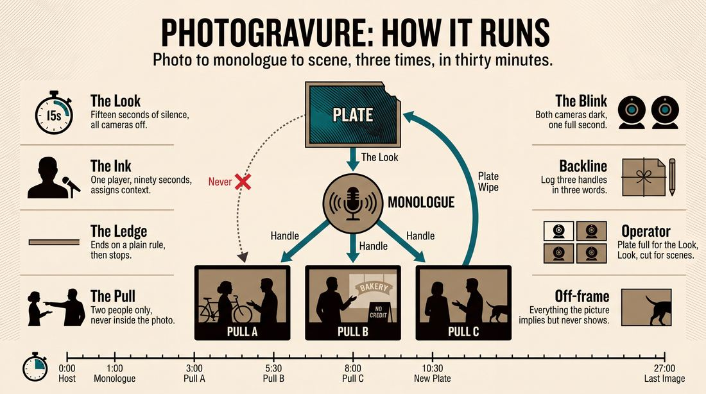
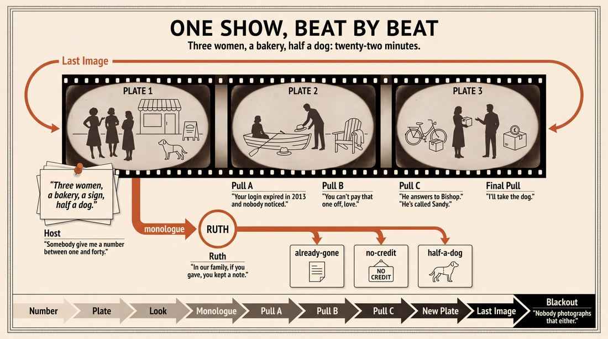
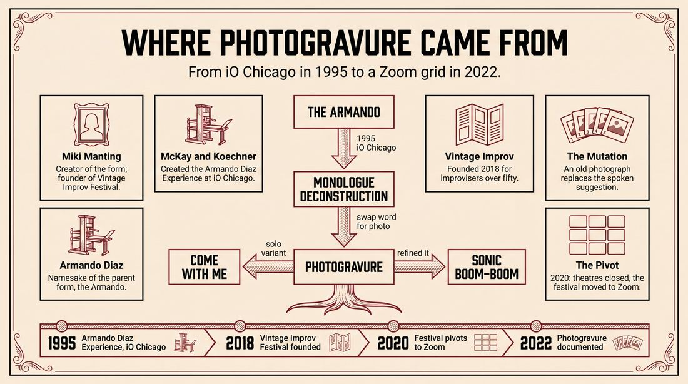
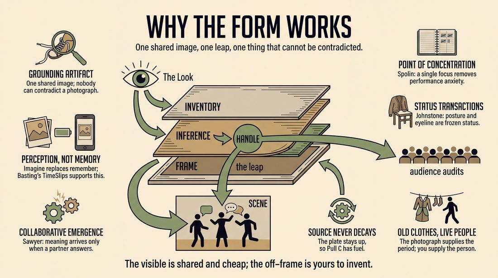
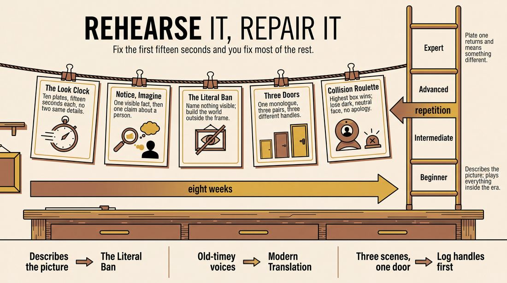

# Photogravure

> **A complete study of the long-form improv format _Photogravure_** - the original archived write-up, five infographics, grounded historical and pedagogical research, and a full mechanics-and-coaching manual.

| | |
|---|---|
| **Format** | Photogravure |
| **Primary source** | [IRC Improv Wiki](https://wiki.improvresourcecenter.com/index.php?title=Photogravure) |

---

## Contents

1. [Part I - The Original Write-Up](#part-i-the-original-write-up)
2. [Part II - The Infographics](#part-ii-the-infographics)
   - [1. Structure and Mechanics](#infographic-1-mechanics)
   - [2. A Show, Beat by Beat](#infographic-2-example)
   - [3. Origins and Lineage](#infographic-3-history)
   - [4. Why It Works](#infographic-4-theory)
   - [5. Rehearsal and Repair](#infographic-5-coaching)
3. [Part III - Research Dossier](#part-iii-research-dossier)
   - [Pass 1: History, Lineage, Literature and Scholarship](#research-history)
   - [Pass 2: Comparative Anatomy, Pedagogy and Production](#research-comparative)
4. [Part IV - Mechanics, Gameplay and Coaching Manual](#part-iv-mechanics-gameplay-and-coaching-manual)
   - [Pass 1: The Form, Its Mechanics and Its Gameplay](#manual-mechanics)
   - [Pass 2: Training, Coaching and Performance Companion](#manual-coaching)

---

## Part I - The Original Write-Up

*Verbatim archive of the source article, reproduced exactly as scraped. Everything after this section is generated elaboration built on top of it.*

### Photogravure

The Photogravure form was created by [Miki Manting](https://wiki.improvresourcecenter.com/index.php?title=Miki_Manting&action=edit&redlink=1 "Miki Manting (page does not exist)"). It uses old photographs as inspiration. The photographs spark monologues, which, in turn, inspire two\-person scenes. The improv team Sonic Boom\-Boom has further adapted the form.

---

*Archived from [https://wiki.improvresourcecenter.com/index.php?title=Photogravure](https://wiki.improvresourcecenter.com/index.php?title=Photogravure) (IRC Improv Wiki) on 2026-08-09 23:23 UTC.*

---

## Part II - The Infographics

*Five 16:9 posters, each teaching a different aspect of the format. Click any poster to enlarge.*

<a id="infographic-1-mechanics"></a>

### 1. Structure and Mechanics

*How the form is played: the shape of the piece, the opening, the roles, the edit vocabulary, the flow of information, and the clock.*

{ .diagram loading=lazy decoding=async width="1100" height="614" }


<a id="infographic-2-example"></a>

### 2. A Show, Beat by Beat

*A single worked performance from suggestion to blackout: what happens in each beat, with short real example lines and what the players are doing technically.*

{ .diagram loading=lazy decoding=async width="1100" height="614" }


<a id="infographic-3-history"></a>

### 3. Origins and Lineage

*Where the form came from: creators, dates, theatres, how it spread between schools and cities, and the key figures - a documented timeline and lineage map.*

{ .diagram loading=lazy decoding=async width="1100" height="614" }


<a id="infographic-4-theory"></a>

### 4. Why It Works

*The theory: the core principles of the form and the research and craft ideas that explain why the structure produces good improv, each tied to a specific mechanic.*

{ .diagram loading=lazy decoding=async width="1100" height="614" }


<a id="infographic-5-coaching"></a>

### 5. Rehearsal and Repair

*Training and fixing the form: the essential drills, the common failure modes with their symptom-and-fix pairs, and the markers of beginner through expert play.*

{ .diagram loading=lazy decoding=async width="1100" height="614" }


---

## Part III - Research Dossier

*Two research passes: the historical record, then the comparative and pedagogical record. Claims carry evidence tags - treat unverified items accordingly.*

<a id="research-history"></a>

### » Pass 1: History, Lineage, Literature and Scholarship

### Research Summary

*   **Record Status:** The searchable, documented record for "Photogravure" is extremely thin. It is a highly localized, niche format confined almost entirely to the Vintage Improv Festival (VIF) ecosystem and its virtual resident teams.
*   **Core Mechanic:** The form uses old photographs as a visual prompt. These photographs inspire monologues, which in turn inspire a series of two-person scenes [DOCUMENTED].
*   **Creator and Context:** It was created by Michele "Miki" Manting, the founder and Artistic Director of the Vintage Improv Festival, an organization dedicated to improvisers over the age of 50 [DOCUMENTED].
*   **Development Era:** The form was developed and refined during the COVID-19 pandemic (2020–2022), when VIF pivoted to become a pioneer in large-scale virtual improvisation via Zoom [DOCUMENTED].
*   **Primary Practitioners:** The form is exclusively associated with "Sonic Boom-Boom," an online resident team for VIF coached by Manting, who are credited with slowly refining the format [DOCUMENTED].
*   **Lineage:** Because the specific literature on Photogravure is sparse, performance-studies analysis must classify it as a visual-prompt mutation of the **Monologue Deconstruction** (commonly known as **The Armando**), adapted specifically for the constraints and affordances of screen-shared virtual performance [INFERRED].

### Provenance and History

Photogravure was created by Miki Manting, a Boston-based improviser (formerly associated with ImprovBoston) who founded the Vintage Improv Festival in 2018 to combat ageism in comedy and provide a platform for older improvisers. When the COVID-19 pandemic forced brick-and-mortar theaters to close in 2020, Manting transitioned VIF into a purely virtual entity, hosting global online festivals and weekly Zoom shows. 

The problem Manting was solving with Photogravure was twofold: how to ground virtual improv when players do not share physical space, and how to generate rich, evocative monologues without relying on the standard (and often chaotic) virtual audience chat suggestion [INFERRED]. By using a screen-shared old photograph, the performers are given a highly specific, shared visual reality. 

The name "Photogravure" is a direct reference to the 19th-century photographic printing process, aligning perfectly with the "vintage" branding of the festival and the antique nature of the visual prompts [INFERRED].

| Year | Event | Place / Company | Source |
| :--- | :--- | :--- | :--- |
| 1995 | Creation of the parent form, *The Armando Diaz Experience* | iO Chicago (Adam McKay, Dave Koechner, Del Close) | [improvresourcecenter.com](https://wiki.improvresourcecenter.com/index.php?title=Monologue_Deconstruction) |
| 2018 | Vintage Improv Festival founded by Miki Manting | ImprovBoston, MA | [creativeground.org](https://www.creativeground.org/profile/vintage-improv-festival) |
| 2020 | VIF pivots to virtual, pioneering large-scale Zoom improv | Virtual / Zoom | [vintageimprov.org](https://vintageimprov.org/) |
| 2022 | Photogravure documented as the primary form of Sonic Boom-Boom | VIF / IRC Improv Wiki | [wiki.improvresourcecenter.com](https://wiki.improvresourcecenter.com/index.php?title=Photogravure) |

### Lineage and Transmission

Because Photogravure is a micro-format played by a single virtual team, it has not transmitted widely through the traditional brick-and-mortar theater pipelines (like UCB, iO, or Second City). It is taught and played within the closed ecosystem of the Vintage Improv Festival's online classes and Sunday "Follies" showcases.

**Parent Form:** Photogravure is a direct descendant of the **Monologue Deconstruction** (The Armando). In a traditional Armando, a guest monologist takes a verbal suggestion from the audience, tells a true personal story, and the ensemble pulls details, themes, and characters from that story to initiate scenes. 
**The Mutation:** Photogravure replaces the verbal audience suggestion with a curated visual artifact (an old photograph). Furthermore, Manting's documented solo work involves improvising *character* monologues based on photographic portraits (e.g., her "Come With Me" album project), suggesting that the monologues in Photogravure may be character-driven rather than the strictly truthful, out-of-character personal stories demanded by a traditional Armando [INFERRED].

### Key Figures

| Person | Role in this form | Specific contribution | Source URL |
| :--- | :--- | :--- | :--- |
| Miki Manting | Creator | Invented the form; founded the Vintage Improv Festival. | [vintageimprov.org](https://vintageimprov.org/) |
| Sonic Boom-Boom | Resident Team | The ensemble (Lynn Means, Joan Larason, Michelle Fineblum, Tom Haselwood, Susan Parker, Jude da Silva, Judy Weatherbee) credited with refining the form. | [vintageimprov.org](https://vintageimprov.org/resident-teams/) |
| Armando Diaz | Lineage Ancestor | Namesake of the parent form; his grounded, truthful monologues set the template for the genre. | [magnettheater.com](https://magnettheater.com/show/55495/) |
| Adam McKay & Dave Koechner | Lineage Ancestors | Created the original *Armando Diaz Experience* at iO Chicago in 1995. | [improvresourcecenter.com](https://wiki.improvresourcecenter.com/index.php?title=Monologue_Deconstruction) |

### Canonical Shows, Companies and Recordings

| Production | Venue / Platform | Year | Link |
| :--- | :--- | :--- | :--- |
| *Vintage Improv Follies: Sonic Boom-Boom* | Facebook Live / Zoom (4th Sunday of every month) | 2020–Present | [vintageimprov.org](https://vintageimprov.org/resident-teams/) |
| *The Armando Diaz Experience* (Parent Form) | iO Chicago / Magnet Theater NYC | 1995–Present | [magnettheater.com](https://magnettheater.com/show/55495/) |

### Published Literature

There are no published books detailing Photogravure. The literature is restricted to wiki stubs and festival documentation. To understand the mechanics, practitioners must study the literature of its parent form.

| Work | Author | Year | What it says about this form | Where to find it |
| :--- | :--- | :--- | :--- | :--- |
| *IRC Improv Wiki: Photogravure* | Wiki Contributors | 2022 | Defines the basic mechanic: old photographs spark monologues, which inspire scenes. | [wiki.improvresourcecenter.com](https://wiki.improvresourcecenter.com/index.php?title=Photogravure) |
| *VIF Resident Teams* | VIF Staff | 2024 | Documents Sonic Boom-Boom's ongoing refinement of the format under Manting's coaching. | [vintageimprov.org](https://vintageimprov.org/resident-teams/) |
| *IRC Improv Wiki: Monologue Deconstruction* | Wiki Contributors | 2024 | Details the mechanics of the parent form, emphasizing the expansion of minute details over recreating the story. | [wiki.improvresourcecenter.com](https://wiki.improvresourcecenter.com/index.php?title=Monologue_Deconstruction) |

### Verbatim Quotes

> "Sonic Boom-Boom focuses primarily on Miki Manting's Photogravure improv form, which uses old photographs as inspiration."
> — *Vintage Improv Festival Website*
> [vintageimprov.org](https://vintageimprov.org/resident-teams/)

> "The photographs spark monologues, which, in turn, inspire two-person scenes."
> — *Vintage Improv Festival Website*
> [vintageimprov.org](https://vintageimprov.org/resident-teams/)

> "While the form was created by Miki Manting, it's been slowly refined by Sonic Boom-Boom."
> — *Vintage Improv Festival Website*
> [vintageimprov.org](https://vintageimprov.org/resident-teams/)

> "VIF envisioned what could be accomplished virtually and became an early pioneer in the new art form of virtual improvisation."
> — *CreativeGround Profile for VIF*
> [creativeground.org](https://www.creativeground.org/profile/vintage-improv-festival)

> "Senior citizens are often invisible if not altogether missing representation in many traditional improv institutions and settings."
> — *CreativeGround Profile for VIF*
> [creativeground.org](https://www.creativeground.org/profile/vintage-improv-festival)

> "The Monologue Deconstruction is a longform improv structure in which actual stories inspire improvised scenework."
> — *IRC Improv Wiki (on the parent form)*
> [wiki.improvresourcecenter.com](https://wiki.improvresourcecenter.com/index.php?title=Monologue_Deconstruction)

> "The improvisors are challenged to expand minute pieces of information within the stories as opposed to recreating the events held within."
> — *IRC Improv Wiki (on the parent form)*
> [wiki.improvresourcecenter.com](https://wiki.improvresourcecenter.com/index.php?title=Monologue_Deconstruction)

> "The stories create a universe which allow other improv scenes to exist within them."
> — *EasyLaughs Blog (on the parent form)*
> [easylaughs.nl](https://easylaughs.nl/blog/what-is-an-armando-improv-format/)

### Anecdotes and Stories

**The Pandemic Pivot**
When brick-and-mortar theaters collapsed in March 2020, Miki Manting, then in her sixties, recognized that the older demographic of the Vintage Improv Festival was the most at-risk and isolated group in the comedy community. She rapidly transitioned the festival to Zoom, creating a massive virtual network. It was in this digital crucible—where traditional stage mechanics like object work and spatial relationship were severely handicapped—that forms like Photogravure were born, utilizing the screen-share function to provide a shared visual reality that physical distance had stripped away [DOCUMENTED].

**The Character Monologue Experiment**
UNVERIFIED - While traditional Armandos rely on the monologist telling a true, out-of-character story, Manting's own artistic practice heavily features character work. In early 2022, she developed a project called "Come With Me," improvising 30 different character monologues inspired by photographic portraits and unknown music tracks. It is highly likely that this solo exercise was the direct mechanical prototype for the ensemble version of Photogravure played by Sonic Boom-Boom.

### Academic and Scientific Research

**Visual Stimuli and Episodic Memory Retrieval**
*Relevance to this form:* Photogravure relies on old photographs to generate monologues. Cognitive psychology demonstrates that visual artifacts (like photographs) bypass semantic processing and directly trigger episodic memory, leading to higher-fidelity, detail-rich storytelling. In an improv context, this provides the ensemble with highly specific "minute pieces of information" to deconstruct, rather than the generic tropes often generated by a one-word verbal suggestion.

**Cognitive Load in Video-Mediated Communication**
*Relevance to this form:* Virtual improv (Zoom) suffers from high cognitive load due to the lack of shared spatial reference (often called "Zoom fatigue"). By screen-sharing a photograph at the top of the form, Photogravure provides a "grounding artifact." This shared visual anchor reduces the cognitive bandwidth required for performers to establish a base reality, allowing them to focus entirely on character and relationship.

**Applied Improvisation and Healthy Aging**
*Relevance to this form:* The form was built specifically for older adults. Research in gerontology shows that improvisational theater improves cognitive flexibility, memory, and social connectedness in seniors. Photogravure's pacing—allowing a single monologue to breathe before transitioning into two-person scenes—accommodates a more thoughtful, less physically frantic style of play suited to the "Vintage Vibe."

### Documented Variants and Descendants

Because Photogravure is itself a highly specific variant of the Armando, its "descendants" are best understood as other visual-prompt virtual formats that emerged during the 2020–2022 pandemic era:
*   **The Street View Armando:** [WIDELY PRACTICED, UNDOCUMENTED] A virtual format where a performer screen-shares a random drop on Google Street View, describes the location as if they grew up there, and the team initiates scenes based on that fictionalized geography.
*   **The Artifact:** [WIDELY PRACTICED, UNDOCUMENTED] A form where performers hold up physical objects to their webcams to inspire the opening monologue, rather than using a 2D photograph.

### Criticism, Debate and Known Failure Modes

*   **Acting Out the Photograph:** The most common failure mode of any Monologue Deconstruction is "play-writing" or directly recreating the events of the monologue. In Photogravure, this manifests as players simply acting out the literal scene depicted in the photograph, rather than using the *themes, emotions, or tangential details* of the monologue it inspired [INFERRED].
*   **The Virtual Pacing Trap:** Because Photogravure is played on Zoom, it is susceptible to the "talking heads" failure mode. Without the ability to do dynamic physical edits (like sweep edits or tag-outs), virtual teams often struggle to cleanly transition from the monologue into the two-person scenes, leading to muddy initiations [WIDELY PRACTICED, UNDOCUMENTED].
*   **Debate over "True" vs. "Character" Monologues:** In traditional improv pedagogy (UCB, iO), the Armando monologue must be 100% truthful and out-of-character to provide a grounded contrast to the absurd scenes that follow. If Photogravure uses *character* monologues inspired by the photos, purists argue this removes the grounding element, making the entire piece float in a state of unrooted fiction [INFERRED].

### Cultural Footprint

Photogravure's cultural footprint is microscopic outside of the Vintage Improv Festival. However, its existence is a vital historical marker of the **Virtual Improv Era (2020–2022)**. It represents how marginalized communities (in this case, seniors facing ageism in traditional comedy spaces) used digital tools to bypass gatekeepers, invent new mechanics tailored to their medium, and build international performance networks when physical theaters were shuttered.

### Gaps in the Record

*   **Exact Mechanics of the Edit:** The record does not state how Sonic Boom-Boom transitions from the monologue to the scenes in a virtual space (e.g., do they turn cameras off? Do they use a verbal cue?).
*   **Nature of the Monologue:** It is contested/unverified whether the monologist in Photogravure speaks as themselves (projecting their own memories onto the photo) or invents a character based on the photo.
*   **First Performance:** The exact date of the format's debut remains undocumented. A researcher should interview Miki Manting or members of Sonic Boom-Boom directly to establish the timeline and mechanical minutiae.

### Source List

1. *Vintage Improv Festival - Resident Teams* - VIF - 2024 - [vintageimprov.org](https://vintageimprov.org/resident-teams/) - Supports the definition of the form, its creator, and the cast of Sonic Boom-Boom.
2. *IRC Improv Wiki: Photogravure* - Wiki Contributors - 2022 - [wiki.improvresourcecenter.com](https://wiki.improvresourcecenter.com/index.php?title=Photogravure) - The seed text establishing the basic mechanic.
3. *CreativeGround: Vintage Improv Festival* - New England Foundation for the Arts - 2024 - [creativeground.org](https://www.creativeground.org/profile/vintage-improv-festival) - Documents Manting's founding of VIF and the organization's pandemic pivot to virtual improv.
4. *IRC Improv Wiki: Monologue Deconstruction* - Wiki Contributors - 2024 - [wiki.improvresourcecenter.com](https://wiki.improvresourcecenter.com/index.php?title=Monologue_Deconstruction) - Documents the mechanics and history of the parent form (The Armando).
5. *What is an Armando?* - EasyLaughs - 2022 - [easylaughs.nl](https://easylaughs.nl/blog/what-is-an-armando-improv-format/) - Provides practitioner philosophy on how monologue deconstructions operate.
6. *Magnet Theater: The Armando Diaz Experience* - Magnet Theater - 2024 - [magnettheater.com](https://magnettheater.com/show/55495/) - Verifies the 1995 origin and namesake of the parent format.

<a id="research-comparative"></a>

### » Pass 2: Comparative Anatomy, Pedagogy and Production

### Taxonomic Placement

```text
                 [The Harold] (Theme -> Scenes)
                              |
               [The Armando Diaz Experience] (Suggestion -> Monologue -> Scenes)
                              |
         +--------------------+--------------------+
         |                    |                    |
  [The Documentary]     [Photogravure]      [Picture Perfect]
 (Interview -> Scene) (Photo -> Mono -> Scene) (Photo -> Scene)
                              |
                      [Come With Me]
               (Photo + Music -> Solo Monologue)
```

Photogravure belongs to the "Source-to-Scene" or "Armando" family of long-form improvisation. Its defining mutation is the replacement of the audience's verbal suggestion with a curated visual stimulus (an old photograph). Rather than the photograph directly inspiring a scene (as in tableau or "Picture Perfect" forms), the photograph serves as the catalyst for a character or thematic monologue. That monologue then acts as the traditional Armando-style source material, generating premises for subsequent two-person scenes. It shifts the improviser's initial cognitive load from memory-retrieval (finding a true personal story) to visual-interpretation (decoding and extrapolating from an image).

### Head-to-Head Comparisons

#### Photogravure vs. The Armando Diaz Experience
| Axis | Photogravure | The Armando | Consequence for the players |
| :--- | :--- | :--- | :--- |
| **Opening / Initiation** | A curated vintage photograph is displayed. | A verbal audience suggestion is taken. | Photogravure players must react to fixed visual data rather than an abstract word, grounding the initiation in concrete imagery. |
| **Monologue Source** | Fictional character extrapolation or thematic reaction to the photo. | True, personal, lived-experience stories from the monologist. | Photogravure allows for character monologues, removing the vulnerability of personal disclosure while requiring stronger character-generation skills. |
| **Memory Load** | Low. The stimulus remains visible on screen/stage. | High. Players must remember details of the spoken story. | Photogravure players can continuously reference the photo if they get stuck, providing a permanent safety net. |

#### Photogravure vs. Montage
| Axis | Photogravure | Montage | Consequence for the players |
| :--- | :--- | :--- | :--- |
| **Structure** | Hub-and-spoke (Photo -> Monologue -> Scenes -> New Photo). | Linear or associative chain of scenes. | Photogravure requires players to repeatedly return to a baseline (the monologue/photo) rather than endlessly drifting from the last scene. |
| **Edit Logic** | Hard edits back to the monologist or a new photograph. | Tag-outs, sweep edits, associative morphs. | Photogravure has a highly regulated rhythm; the transition back to the photo/monologue acts as a structural palate cleanser. |
| **Audience Contract** | "Watch us translate this static image into a living world." | "Watch us connect these disparate scenes." | The audience judges Photogravure on the cleverness of the inferential leap from the photo to the monologue. |

#### Photogravure vs. The Documentary
| Axis | Photogravure | The Documentary | Consequence for the players |
| :--- | :--- | :--- | :--- |
| **Visual Anchor** | External (the photograph). | Internal (the imagined subject of the documentary). | Photogravure players share the exact same visual reality as the audience, preventing "talking head" contradictions. |
| **Failure Mode** | "Photo-Literalism" (just describing the picture). | "Talking Head Syndrome" (telling instead of showing). | Photogravure requires a deliberate A-to-C leap from the photo to the monologue to avoid merely narrating the image. |

### What Makes It Uniquely Itself

1. **The Two-Step Translation:** If a form uses a photo to directly inspire a scene, it is a Tableau or Picture Perfect form. If a form uses a monologue to inspire a scene, it is an Armando. Photogravure *requires* the intermediate step: the photo inspires the monologue, and the monologue inspires the scene. Removing this chain destroys the form's specific cognitive rhythm.
2. **The Vintage Visual Anchor:** The form specifically relies on *old* photographs (hence "Photogravure"). This bakes a sense of history, nostalgia, and generational distance into the form's DNA, forcing players to bridge the gap between the past and the present.
3. **The Shared Objective Reality:** Unlike a verbal suggestion which creates 50 different images in the minds of 50 audience members, the photograph provides a single, undeniable objective reality. The improviser's job is not to invent the reality, but to invent the *context* of that reality.

### Structural Variants in Practice

| Variant Name | What It Changes | Who Plays It | Source |
| :--- | :--- | :--- | :--- |
| **Sonic Boom-Boom (Online)** | Adapted natively for Zoom. The photo is screen-shared. The monologist is "Spotlighted," then the screen-share ends and two scene players are spotlighted. | Sonic Boom-Boom (Vintage Improv Festival Resident Team) | Vintage Improv Festival / Miki Manting |
| **Come With Me (Solo)** | Removes the scene-work entirely. A photo is paired with an unheard, randomly selected 3-minute music track. The improviser performs a solo character monologue until the track ends. | Miki Manting (TikTok/YouTube project) | Miki Manting |
| **Live Stage Projection** | Played in physical theaters. The photo is projected on a cyclorama or back wall. The monologist stands downstage center; scene players use the full stage. | [CRAFT CONSENSUS] | General stagecraft adaptation |

### The Teaching Ladder

| Stage | Skill introduced | Why in this order | Typical exercise | Source |
| :--- | :--- | :--- | :--- | :--- |
| **1. Visual Decoding** | Observing without inventing. Stating concrete facts about the image. | Players must learn to actually *look* at the stimulus before overlaying their own ideas, preventing generic choices. | *I Notice, I Imagine* | [CRAFT CONSENSUS] |
| **2. The Inferential Leap** | Moving from a visual fact to an emotional or contextual assumption. | This is the core mechanic of the form's monologue phase. It bridges the photo and the character. | *Detail to Emotion* | [CRAFT CONSENSUS] |
| **3. Monologuing** | Sustaining a single POV inspired by the visual leap for 1-3 minutes. | Players must generate enough thematic material to feed the subsequent scenes. | *The 3-Minute Life* | Miki Manting |
| **4. Premise Extraction** | Pulling thematic ideas (A-to-C) from the monologue to initiate scenes. | Beginners tend to play the literal characters from the monologue. They must learn to play the *theme*. | *Premise Highlighting* | [CRAFT CONSENSUS] |

### Documented Drills and Exercises

| Drill | Origin / Teacher | How to run it | What it fixes in this form | Source |
| :--- | :--- | :--- | :--- | :--- |
| **I Notice, I Imagine** | General Pedagogy | Player looks at a photo. They must say one literal fact ("I notice the man's shoes are scuffed"), followed by one assumption ("I imagine he walked a long way to get here"). | Cures "Photo-Literalism" by forcing the brain to separate fact from invention. | [CRAFT CONSENSUS] |
| **Detail to Emotion** | General Pedagogy | Player points to a specific, minor detail in the photo (e.g., a clenched fist, a tilted hat) and builds an entire emotional POV based *only* on that detail. | Prevents players from being overwhelmed by the whole image; teaches specific focus. | [CRAFT CONSENSUS] |
| **The Photographer's Lens** | [CRAFT CONSENSUS] | The player delivers the monologue not as the subject of the photo, but as the person taking the picture, speaking to the subjects. | Breaks the habit of always playing the most obvious character in the frame. | [CRAFT CONSENSUS] |
| **Track & Talk** | Miki Manting | Player is shown a photo and simultaneously played a random instrumental track. They must synthesize the mood of the music and the visual of the photo into a monologue. | Trains emotional fluidity and pacing; forces the player out of their head. | Miki Manting (*Come With Me*) |
| **Premise Highlighting** | Armando Pedagogy | Player A monologues. Players B and C listen with their backs turned and must write down three distinct thematic premises (not plot points) to use for scenes. | Fixes "Premise Abandonment" where scenes ignore the monologue entirely. | [CRAFT CONSENSUS] |
| **The Modern Translation** | [CRAFT CONSENSUS] | Players identify the core relationship dynamic in a vintage photo (e.g., stern matriarch and rebellious daughter). They must play that exact dynamic, but set the scene in a modern Starbucks. | Cures "Historical Pastiche" (playing generic "old-timey" tropes instead of real human behavior). | [CRAFT CONSENSUS] |
| **Status Freeze-Frame** | Keith Johnstone | Players look at the photo and assign a status number (1-10) to every person in the image based purely on posture and eyeline. The monologue must defend that status choice. | Grounds the monologue in playable relationship dynamics rather than just historical fiction. | [CRAFT CONSENSUS] |
| **Zoom Frame Handoff** | Sonic Boom-Boom | Player A finishes their monologue on Zoom. Player B initiates the scene by matching Player A's final physical posture in their own Zoom window, then speaking. | Smooths out clunky virtual transitions and maintains visual continuity. | [CRAFT CONSENSUS] |
| **The Unseen Subject** | [CRAFT CONSENSUS] | The monologue is delivered from the perspective of an object or animal visible in the background of the photograph. | Encourages lateral thinking and highly creative A-to-C leaps. | [CRAFT CONSENSUS] |
| **The Literal Ban** | [CRAFT CONSENSUS] | The monologist is forbidden from naming any object, clothing item, or location actually visible in the photograph. They can only speak about the *context*. | Forces the player to invent the world *outside* the frame of the photograph. | [CRAFT CONSENSUS] |

### Common Failure Modes and Diagnoses

| Failure mode | What it looks like from the audience | Root cause | Fix | Who names it |
| :--- | :--- | :--- | :--- | :--- |
| **Photo-Literalism** | The monologist simply describes the photograph out loud ("I am wearing a big hat and standing next to a horse"). | Lack of inferential leap; treating the photo as a script rather than a prompt. | *The Literal Ban* drill. | [CRAFT CONSENSUS] |
| **Historical Pastiche** | Players put on generic "1920s transatlantic" voices and talk about telegraphs, ignoring emotional truth. | Intimidation by the vintage aesthetic; relying on tropes instead of relationships. | *The Modern Translation* drill. | [CRAFT CONSENSUS] |
| **Monologue Drift** | The monologue starts with the photo but immediately abandons it to tell a pre-planned, unrelated story. | Discomfort with character monologues; defaulting to stand-up comedy habits. | *Detail to Emotion* drill (forcing continuous reference to the visual). | [CRAFT CONSENSUS] |
| **Premise Abandonment** | The two-person scenes have absolutely nothing to do with the preceding monologue. | Poor listening skills during the monologue phase; players thinking of their own ideas instead of receiving. | *Premise Highlighting* drill. | [CRAFT CONSENSUS] |

### Production and Logistics

*   **Cast Size:** 4 to 8 players. (Sonic Boom-Boom operates with 7 core members). This allows for a rotation of monologists and enough variety in scene pairings without crowding the virtual or physical stage.
*   **Runtime:** Typically 20 to 30 minutes, allowing for 3 to 4 distinct "Photo -> Monologue -> Scenes" cycles.
*   **Stage Layout (Virtual):** Played natively on Zoom/StreamYard. Requires a dedicated technical director to screen-share the vintage photographs, spotlight the monologist, and then spotlight the scene players while removing the screen-share.
*   **Stage Layout (Physical):** Requires a high-lumen projector and a cyclorama or blank upstage wall. The monologist takes downstage center so the photo looms behind them.
*   **Music and Sound:** Often utilizes vintage pre-show music to set the tone. In solo variants, random music tracks are played live to influence the improviser's emotional tone.
*   **Host Duties:** The host must explicitly explain the form's mechanics to the audience ("We will show a vintage photograph, which will inspire a monologue, which will inspire our scenes"). The host may ask the audience for a number (e.g., "1 through 50") to randomly select the first photo from a pre-loaded slide deck, proving the form is improvised.
*   **Producer Preparation:** The producer must curate a deck of 20-50 high-resolution, public-domain vintage photographs. These should be rich in human interaction, ambiguous in exact context, and strictly vetted for content safety.

### Adaptations Beyond the Stage

*   **Online and Remote:** This is the form's primary contemporary habitat (via the Vintage Improv Festival). The chat function can be used to have the audience suggest which detail in the photo the monologist should focus on.
*   **Classroom and Youth:** Vintage photos may not resonate with children. Adapt by using photos of fantastical landscapes, strange objects, or animals.
*   **Corporate and Applied:** Use stock photos of office environments, abstract art, or the company's own historical archives to prompt discussions about corporate culture and communication.
*   **Community and Therapeutic Settings:** Highly effective for older adults. The form aligns perfectly with reminiscence therapy, allowing seniors to use visual prompts to bypass memory-retrieval anxiety and engage in imaginative play.
*   **Content-Safety and Consent:** When using real historical photographs, producers must ensure the images do not depict real-world trauma, exploitation, war crimes, or non-consensual suffering. The ethics of using real people's lives as comedy fodder requires curating photos that are mundane, joyful, or ambiguous, rather than tragic.

### Evidence Base for Those Adaptations

The therapeutic and applied use of Photogravure—particularly for older adults, which is the core demographic of its originating organization, the Vintage Improv Festival—is strongly supported by research into creative aging. Anne Basting's *TimeSlips* methodology (2001) demonstrates that replacing the pressure to "remember" with the invitation to "imagine" via visual prompts (specifically photographs) significantly improves communication, mood, and social engagement in older adults, including those with cognitive decline. By providing a fixed visual anchor, the cognitive load of generating a reality from scratch is removed, allowing the improviser to focus entirely on emotional expression and collaborative storytelling.

### Scholarly Frames Worth Applying

*   **Collaborative Emergence (Sawyer, 2003):** Sawyer posits that in improvisation, the meaning of an action is not fixed until it is responded to by a partner. *Mapping:* In Photogravure, the objective meaning of the photograph is irrelevant; its "truth" emerges collaboratively when the monologist assigns it a context, which is then solidified and re-contextualized by the scene players.
*   **Status Transactions (Johnstone, 1979):** Johnstone argues that every human interaction involves a negotiation of status. *Mapping:* Vintage photographs inherently capture frozen status dynamics (who is sitting, who is standing, who is looking at the camera, who is looking away). Players use these visual status cues as the primary engine to initiate the monologue.
*   **Point of Concentration (Spolin, 1963):** Spolin designed exercises around a singular focus to distract the player from the pressure of performing. *Mapping:* The photograph serves as the ultimate Point of Concentration. By focusing entirely on decoding the visual details of the image, the improviser bypasses the "in-their-head" anxiety of inventing a premise.

### Where the Form Is Heading

Photogravure has found a permanent home in the virtual improv space, championed by troupes like Sonic Boom-Boom and the broader Vintage Improv Festival community. Because it relies on screen-sharing rather than physical stage movement, it is uniquely resistant to the "talking head" fatigue of Zoom improv; the photograph provides constant visual stimulation. Contemporary practice is seeing the form hybridize with musical improv (as seen in Miki Manting's *Come With Me* project), where the visual stimulus of the photo is combined with the auditory stimulus of an unknown music track, pushing the form into short-form video platforms like TikTok and Instagram Reels as a solo character-study exercise.

### Source List

1. *Photogravure* - IRC Improv Wiki - 2022 - https://wiki.improvresourcecenter.com/index.php?title=Photogravure - Supports the core definition, creator (Miki Manting), and the troupe that refined it (Sonic Boom-Boom).
2. *Resident Teams (Sonic Boom-Boom)* - Vintage Improv Festival - 2024 - https://vintageimprov.org - Supports the cast size, online adaptation, and the form's integration into senior/vintage improv communities.
3. *Miki Manting improvises (Come With Me)* - Miki Manting (YouTube) - 2022 - https://www.youtube.com/watch?v=... - Supports the solo structural variant combining photographs with unknown music tracks for 3-minute monologues.
4. *The Arts and Dementia Care (TimeSlips)* - Anne D. Basting - 2001 - [Academic Consensus] - Supports the evidence base for using visual photographic prompts to bypass memory anxiety in older adults.
5. *Improvisation and the Theater* - Viola Spolin - 1963 - [Academic Consensus] - Supports the Point of Concentration scholarly frame.
6. *Impro: Improvisation and the Theatre* - Keith Johnstone - 1979 - [Academic Consensus] - Supports the Status Transactions scholarly frame and related drills.

---

## Part IV - Mechanics, Gameplay and Coaching Manual

*Synthesis over the original article and both research dossiers: first how the form works and how to play it, then how to train an ensemble to perform it.*

<a id="manual-mechanics"></a>

### » Pass 1: The Form, Its Mechanics and Its Gameplay

### At a Glance

| Field | Entry |
|---|---|
| **Also known as** | No documented alternate name. Informally "the Photo Armando"; within the Vintage Improv Festival ecosystem it is simply "the Sonic Boom-Boom form." |
| **Family** | Monologue Deconstruction (Armando family), visual-prompt branch. Source-to-scene, hub-and-spoke. |
| **Cast size** | 4–8. The originating team, Sonic Boom-Boom, runs 7. Playable at 3; a documented solo variant exists (*Come With Me*). |
| **Runtime** | 20–30 minutes. Two to four photograph cycles; three is the standard. |
| **Opening** | No group opening, no pattern game, no warm-up scene. A curated vintage photograph is revealed to cast and audience simultaneously, followed by 10–15 seconds of shared silence. |
| **Suggestion taken** | Optionally a *number* ("give me a number between one and fifty") to pick a slide from a pre-loaded deck, purely to prove the photo wasn't pre-planned. The photograph itself replaces the verbal suggestion. |
| **Structural rigidity (1–5)** | **3.** The photo→monologue→two-person-scenes chain is inviolable; everything inside a cycle is free. |
| **Difficulty (1–5)** | **3.** Easy to complete, hard to make land. The failure modes (literalism, pastiche) are unusually seductive and unusually visible to the audience. |
| **Prerequisites** | Ability to sustain a solo monologue for 90–180 seconds without a rehearsed anecdote; A-to-C initiation; two-person scene discipline (no walk-ons); if virtual, drilled camera-on/camera-off edit protocol and a competent plate operator. |
| **Best for** | Virtual and hybrid shows; mixed-age and mixed-experience ensembles; teams strong in character and relationship, weak in physical clowning; festival slots; applied/therapeutic settings with older adults; any ensemble whose scenes habitually start from nothing. |
| **Avoid when** | Your cast cannot resist funny old-timey voices; you have no reliable operator to run the images; the audience cannot see the image (a radio or podcast context guts the form); you need a hot, fast opener for a mixed bill; the only available photographs depict real trauma. |

---

### The Essence in One Paragraph

Photogravure is a monologue deconstruction whose source is not a word from the audience but a real old photograph that everybody — cast and audience — is looking at simultaneously. A curated vintage image goes up. The ensemble reads it in silence. One player then delivers a solo monologue that does *not* describe the picture but assigns it a context: who these people were to each other, what happened four minutes before the shutter, who is standing outside the frame. That monologue, not the photograph, is the source text for two or three two-person scenes, which mine its themes rather than restaging its events. Then the photograph comes down, a new one goes up, and a different player monologues. The form's whole distinctiveness lies in the mandatory two-step chain — **photo → monologue → scene, never photo → scene** — and in the fact that the source material is *visible, objective, silent and permanent*. Unlike a spoken Armando monologue, which decays in everyone's memory the moment it ends, the plate can be re-read mid-show; unlike a verbal suggestion, which becomes fifty different pictures in fifty heads, it is one undeniable shared reality. That single change reorganises the physics of the form: the audience can audit every inferential leap you make, so leaps must be earned; and the ensemble never has to invent a world, only a *context* for a world already on the wall.

---

### Why This Form Exists

The documented record is blunt about the circumstances: Miki Manting founded the Vintage Improv Festival in 2018 to give improvisers over fifty a stage, and when COVID closed physical theatres in 2020 she moved the whole enterprise onto Zoom. Photogravure was developed in that environment (2020–2022) and refined by the resident team Sonic Boom-Boom. Everything structural about the form is a solution to a problem that environment created.

**Problem 1: Virtual improv has no shared physical reality.** In a room, two players share a floor, a door, a kitchen table established by a hand gesture. On a video grid, each player is in a separate box in a separate house; every square inch of shared reality must be built verbally and can be contradicted by anyone at any moment. Photogravure hands the ensemble a **grounding artifact**: a single image that everyone, including the audience, is objectively looking at. You cannot contradict a photograph. The bandwidth normally burnt on "where are we, what is this, who are you" is returned to character and relationship.

**Problem 2: Virtual suggestion-taking is a mess.** The Zoom chat generates fifty simultaneous, unheard, often unusable words. Replacing the verbal suggestion with a curated slide deck removes the chaos while preserving the proof of spontaneity (the audience calls a number; nobody knows which photo comes up).

**Problem 3: The Armando's monologue is a memory tax.** A true personal story demands both retrieval ("what happened to me that relates to *pancakes*") and disclosure. For an ensemble of older adults — the demographic this form was built for — the retrieval pressure is precisely the wrong pressure, and there is a strong evidence base (Anne Basting's *TimeSlips* work with photographic prompts) that replacing *remember* with *imagine* dramatically improves engagement. Photogravure swaps a memory task for a perception task. You are not asked what happened to you; you are asked what you *see*.

**What it buys you over a plain montage.** A montage asks the ensemble to keep drifting outward from the last thing said; its coherence is retrospective and fragile. Photogravure is hub-and-spoke: every scene in a cycle radiates from one hub, and every eight to ten minutes the hub is replaced. That gives you (a) a hard structural reset that lets a weak scene die without poisoning the show, (b) three scenes per cycle that are *thematically siblings* without anyone having to be clever about connecting them, (c) a pace that permits a monologue to breathe — an asset, not a defect, for an ensemble that plays thoughtfully rather than frantically — and (d) a non-decaying source, which means a stalled cycle is always rescuable by looking at the wall again. In practice, a montage's third scene is the hardest scene in the show; in Photogravure it is the easiest, because there is always one detail nobody has used yet.

---

### The Audience Contract

**The explicit promise.** The host states the mechanism out loud before the first plate goes up. This is not optional and not a formality: the audience must understand that the chain runs photo→monologue→scenes, or they will spend the first cycle trying to work out whether the scenes are supposed to be *in* the photograph.

> "Here's how this works. We're going to show you a real photograph — none of us have seen it. One of us is going to look at it and tell you something. And then everything you see after that comes out of what she said. Somebody give me a number between one and forty."

**The four implicit promises.**

1. **You will see what we see.** The audience holds the source material at the same fidelity the performers do. This is the form's signature and its great pleasure: the audience is not watching improvisers *know* something, they are watching improvisers *decide* something, with the evidence in plain view.
2. **We will not merely describe it.** Everyone in the room can see the hat. Saying "I have a hat" is not a performance. The audience is implicitly promised an *inferential leap* — a claim about the picture that goes beyond it and cannot be checked, only enjoyed.
3. **We will use it up before we move on.** A plate that goes down after four minutes feels like a stolen dessert. The contract is: this image will be fully metabolised.
4. **We will not mock these people.** They were real; several of them are dead; the audience knows this and feels it. There is a residual tenderness in the room that a normal improv audience does not carry. Comedy at the expense of the *subjects* reads as cruelty; comedy at the expense of the *human situation* reads as recognition.

**How the audience always knows where they are.** Three unmistakable state signals, and the show must keep them clean:

| State | Signal (virtual) | Signal (physical) |
|---|---|---|
| Reading the plate | Plate shared full-screen, all cameras off | Projection at full, stage dark, no one lit |
| Monologue | Plate up + exactly one camera on | Plate at full, single downstage special |
| Scene | Plate reduced or cut + exactly two cameras on | Plate faded to ~30% or out, mid-stage lit |
| Cycle break | Everything dark for one full second | Blackout, plate cross-fades |

**What breaks the contract.**

- **Photo-literalism.** The monologue inventories what is visible. The audience has now watched you read them a list they can already see.
- **Restaging.** A scene that is a dramatisation of the depicted moment. This collapses the two-step chain into one step and turns the form into a tableau exercise.
- **Historical pastiche.** Transatlantic accents, telegrams, "I do declare." The audience stops believing anyone is a person.
- **Premise abandonment.** Scenes that have no traceable descent from the monologue. Since the audience heard the monologue eight seconds ago, this is far more obvious here than in a montage.
- **Orphaning a plate.** Moving to a new photograph while an obvious, rich, unused detail is still on it.
- **Cruel curation.** A photograph of real suffering played for laughs. This is the one break the audience will not forgive and will not tell you about.

---

### Anatomy: The Full Structural Map

Photogravure is built of **cycles**. A cycle is one photograph and everything it produces. A show is two to four cycles plus a closing gesture.

I will use a consistent vocabulary throughout this chapter. **These names are mine, coined for teaching precision — they are not documented terminology from the originating team**, but they map onto the physical printing process the form is named after, and rehearsals go faster when a thing has a name.

| Term | Means |
|---|---|
| **Plate** | The photograph currently displayed. |
| **The Look** | The 10–15 second shared silence after the plate goes up. |
| **Ink** | The monologue: the act of making the silent plate speak. |
| **Handle** | A nameable, playable premise extracted from the monologue. Target: three per monologue. |
| **Pull** | One two-person scene descended from a handle. |
| **Wipe** | The edit back out of a scene. |
| **Plate Wipe** | The larger edit that ends a cycle and changes the image. |
| **Off-frame** | Everything the photograph implies but does not show. The form's richest territory. |
| **The Ledge** | The last ~20 seconds of a monologue, where the monologist plants a clean landing premise. |

#### Beat-by-beat

| Unit | Approx. clock | What happens | Who drives it | Success criterion | Common error |
|---|---|---|---|---|---|
| Host frame | 0:00–0:45 | Mechanics explained in two sentences; number taken from audience | Host | Audience can predict the shape of the next ten minutes | Over-explaining; apologising for the form; taking a *word* suggestion out of habit |
| Plate 1 up + The Look | 0:45–1:00 | Image appears full-screen/full-projection. Nobody speaks. | Plate operator | Audience leans in; at least one cast member finds a detail off the main subject | Someone talks at second three; operator flashes the image too briefly |
| Monologue 1 (Ink) | 1:00–3:00 | One player, solo, uninterrupted, in first person, assigns context to the image | Monologist | Three distinct handles land; at least one is about something off-frame; ends on a Ledge | Description; drifting into a rehearsed anecdote; ending on a punchline that closes all doors |
| Pull 1A | 3:00–5:30 | Two-person scene off Handle 1 | Two players who moved first | Recognisably descended from the monologue; not set in the photograph | Restaging the photograph; three people in it |
| Wipe | 5:30–5:32 | Clean edit | Backline / operator | One second of nothing | Edit lands mid-line; two pairs both step in |
| Pull 1B | 5:32–8:00 | Two-person scene off a *different* handle | Two players who did not play 1A | Different tone, different door, same thematic family | Same premise as 1A in a new costume |
| Wipe | 8:00–8:02 | Clean edit | Backline / operator | — | — |
| Pull 1C | 8:02–10:30 | Third scene: either the unused handle, or a *re-pull* returning to 1A's characters later in their lives | Best-positioned pair; monologist may now play | Cycle feels used up; a detail nobody touched gets touched | Running out of the monologue and inventing a fresh unrelated premise |
| Plate Wipe | 10:30–10:45 | Blackout, image change | Operator | One full second of nothing; the new plate is a genuine tonal step | Cross-fading straight into the next monologue with no breath |
| Cycle 2 | 10:45–20:00 | Repeat: new plate, **new monologist**, 2–3 pulls | Ensemble | Someone in cycle 2 knowingly touches cycle 1's theme without explaining it | The second cycle plays as an unrelated second show |
| Cycle 3 (short) | 20:00–27:00 | New plate, monologue, one or two pulls; convergence permitted | Ensemble | Characters or themes from earlier cycles surface without exposition | Cramming a full three-scene cycle into the last five minutes |
| The Last Image | 27:00–28:00 | Optional closing gesture: return to Plate 1, or a 20-second "second exposure" monologue over it | Whoever is holding the show's feeling | Audience recognises the first image and feels the difference | Explaining what the show meant |

#### The shape

```
                      P H O T O G R A V U R E   (≈28 min, 3 plates)

 ┌───────────────────────── CYCLE 1 (≈10 min) ─────────────────────────┐
 │                                                                      │
 │  [PLATE 1 UP]                                                        │
 │       │                                                              │
 │   (THE LOOK: 10-15s silence — everyone reads, nobody speaks)         │
 │       │                                                              │
 │       ▼                                                              │
 │  ┌──────────────┐                                                    │
 │  │  MONOLOGUE   │  solo · 90-180s · first person · assigns context   │
 │  │    (INK)     │  ends on THE LEDGE                                 │
 │  └──────┬───────┘                                                    │
 │         │ outputs                                                    │
 │    ┌────┼─────────┬─────────────┐                                    │
 │    ▼    ▼         ▼             ▼                                    │
 │   H1   H2        H3        (off-frame residue)                       │
 │    │    │         │                                                  │
 │    ▼    ▼         ▼                                                  │
 │ ┌──────┐ wipe ┌──────┐ wipe ┌──────┐                                 │
 │ │PULL A│─────▶│PULL B│─────▶│PULL C│──────▶ [PLATE WIPE]             │
 │ │ 2-hdr│      │ 2-hdr│      │ 2-hdr│         (1 full second dark)    │
 │ └──────┘      └──────┘      └───┬──┘                                 │
 │                                 │ (or: RE-PULL of A, later in time)  │
 └─────────────────────────────────┼────────────────────────────────────┘
                                   ▼
 ┌───────── CYCLE 2 (new plate · NEW monologist · 2-3 pulls) ──────────┐
 │  thematic residue from Cycle 1 leaks forward ──────────────┐        │
 └────────────────────────────────────────────────────────────┼────────┘
                                                              ▼
 ┌───────── CYCLE 3 (short · convergence permitted) ───────────────────┐
 │  characters / images / phrases from C1 + C2 surface unexplained     │
 └──────────────────────────┬──────────────────────────────────────────┘
                            ▼
                    [ THE LAST IMAGE ]
             Plate 1 returns · 20s second-exposure · out.


 HUB-AND-SPOKE VIEW OF ONE CYCLE
                          ┌───────┐
                     ┌────│ PLATE │────┐
                     │    └───┬───┘    │
                     │        │        │      the plate feeds ONLY the
                     │    ┌───▼───┐    │      monologue. It never feeds
                     │    │ MONO  │    │      a scene directly.
                     │    └───┬───┘    │
              ┌──────┴──┐  ┌──┴───┐  ┌─┴──────┐
              │ PULL A  │  │PULL B│  │ PULL C │
              └─────────┘  └──────┘  └────────┘
               ▲ atmosphere only ──────────────┘
                 (the plate's era, weather, texture may bleed
                  into scenes; its EVENTS may not)
```

---

### The Opening

Photogravure has no group opening in the Harold sense. There is no pattern game, no word association, no organic movement piece. **The opening is a reveal and a silence.** That is a deliberate design choice: a group opening would generate ensemble-invented material that competes with the plate, and the whole point is that the source is external and objective.

#### Procedure: the standard opening (virtual)

1. **Pre-show (producer, days ahead).** Build a deck of 20–50 images (see curation spec below). Number every slide. Nobody in the cast sees the deck. If the coach also plays, a non-playing operator builds it.
2. **Pre-show (operator, ten minutes ahead).** Load the deck. Test screen-share. Confirm that shared content plus a spotlighted speaker both remain visible in the audience's view. Set the ensemble's default state: **all cameras off**.
3. **Host frame (30–45 seconds).** Name the form, name the chain, name the vintage. Two sentences maximum.
4. **Take the number.** "Give me a number between one and forty." Take the first clear one; do not shop for a better number. On Zoom, take it from chat, read it aloud, and *name the person who gave it* — this is the audience's only participation and it should be acknowledged.
5. **Plate up.** Operator shares the corresponding slide, full screen, high resolution.
6. **The Look.** 10–15 seconds. **All cameras stay off.** Nobody speaks. This is the single most-skipped and most-important beat in the form. It does three things: it lets the audience finish reading the image before words interfere; it lets every player find a *different* detail; and it signals that this ensemble takes the picture seriously.
7. **The Ink.** One camera comes on. That player is now the monologist. There is no negotiation and no take-backs — first camera on wins. (See "Collision protocol" below.)
8. **Ledge and hand-off.** Monologist lands, holds one beat, camera off. Plate reduces or cuts.
9. **First pull.** Two cameras come on. Scene begins.

#### Procedure: the standard opening (physical stage)

Identical, with these substitutions: the deck runs from a laptop to a projector on a cyclorama or blank upstage wall; the ensemble stands in a shallow backline in low light; The Look is performed with the whole cast *turned upstage looking at the image* — the audience watches the ensemble read, which is a beautiful and legible beat; the monologist turns and walks downstage centre into a special, so the image looms behind and above her head.

#### Documented and craft variants of the opening

| Variant | Mechanics | When to use | Cost |
|---|---|---|---|
| **Numbered deck** (standard; documented practice) | Audience calls a number, operator jumps to that slide | Public shows; proves the form is improvised | Slight admin drag at the top |
| **Blind pull** | Operator advances to the next unseen slide, no number | Rehearsal; second and third cycles of a show | Audience loses the "we didn't plan this" proof; take a number for Plate 1 only, then blind-pull the rest |
| **Audience detail-call** (documented as available on virtual platforms) | Plate goes up; host reads one detail from chat ("the dog!"); the monologist must build from that detail | Late in a run when the team is getting predictable; audiences that want more agency | Removes the monologist's freedom to find the *unobvious* detail. Use sparingly. |
| **Player-curated plate** | Each player brings one image; the plate for their cycle is somebody *else's* image | Rehearsal, and for shows built around an ensemble's own history | Risks pre-cooked monologues if a player recognises their own image — never let a player monologue on the image they brought |
| **Family album / community plate** (applied settings) | Photographs supplied by the audience or the participant group, with explicit consent | Reminiscence and community work; residency shows | Enormous ethical weight. Requires named-person consent, and a hard rule that no living named person is ever the butt |
| **The Artifact** (adjacent documented practice) | A physical object held to camera instead of a 2D image | When you have no deck, or want tactility | You lose the frozen human status relationships that make the photographic version work; treat as a related form, not a substitute |
| **Track & Talk** (documented, Manting's *Come With Me*) | Plate + a random instrumental track playing under the monologue | To break a monologist's verbal-cleverness habit | The music will drive tone harder than the image; expect longer, slower, more lyrical monologues |

#### Plate curation spec (producer's checklist)

This is engine design disguised as admin. A bad deck cannot be improvised around.

| Criterion | Target | Why |
|---|---|---|
| Human content | 2–4 people in most images; a few with none | Two-to-four gives readable status relationships; a peopleless image once per show creates a change of gear |
| Ambiguity | The reason for the photograph should be unclear | If the image explains itself, the monologue has nothing to invent |
| One unexplained element | A parcel, an animal half in frame, a sign, someone looking the wrong way | This is the third scene's fuel. **Never buy an image without one.** |
| Resolution | High enough to read faces and hands at full screen | Detail is the material; a soft image yields generic monologues |
| Era | Roughly pre-1970 | The generational gap is the form's charge. A 2015 phone snapshot has no off-frame mystery |
| Rights | Public domain / open archives (national library and museum commons collections) | Legal and reputational hygiene for anything recorded |
| Content safety | No war crimes, no atrocity, no ethnographic "specimen" photography, no images whose subjects were clearly coerced, no visible children in distress | The documented ethical constraint on this form. Curate mundane, joyful, or ambiguous |
| Tonal spread | Roughly 40% warm, 40% odd, 20% austere | Lets you sequence a show that changes temperature |
| Order | Never sequence by theme | You want the plates to be unrelated so the *ensemble's* mind provides the through-line |

---

### The Engine

This is the section that matters. Every other decision in Photogravure descends from how information moves.

#### 1. The three layers of a plate

A photograph carries three separable strata of information. The form succeeds or fails on which one you mine.

| Layer | What it is | Example (a 1936 street photo) | Use in the form |
|---|---|---|---|
| **Inventory** (literal) | Everything visible and nameable | "Three women, a bicycle, a bakery window, a sign reading NO CREDIT, half a dog" | **Almost none.** Inventory is what the audience already has. Naming it is the primary failure mode. Its only legitimate use: *one* detail, spoken once, as an anchor. |
| **Inference** (relational) | What the visible data implies about people | Who is standing apart. Whose weight is on which foot. Who is looking at the camera and who is looking past it. Who is touching whom. | **The monologue's ground floor.** Status, history, and unspoken relationship are all directly readable and cannot be contradicted. |
| **Frame** (meta) | The photograph as an *event* | Somebody chose to take this. Somebody stopped these people. Somebody is not in it. Someone kept it for ninety years. Something is cropped out. | **The richest and least-used layer.** Almost all great Photogravure monologues live here. |

**Operating rule:** name at most one inventory item, build the monologue on inference, and go to the frame for your best move.

#### 2. The monologue is a transducer, not a story

The monologue's function is mechanical. It converts silent, non-verbal, objective visual data into verbal, subjective, *playable* premise. Its deliverable is not "a nice story"; its deliverable is **three handles**.

A handle is a premise a scene player can pick up. It must be nameable in one clause and playable by two people who are not in a photograph.

| Handle type | Sounds like (from the monologue) | Generates |
|---|---|---|
| **Relational** | "Ruby and I were sisters for forty years and never once in the same room voluntarily" | A two-hander with a pre-loaded dynamic |
| **Behavioural** | "He dressed up for water. He dressed up for everything that couldn't see him" | A scene about a person with one specific, heightenable habit |
| **Thematic** | "That sign said NO CREDIT and my mother lived her whole life by it" | A scene about a rule of the universe, set anywhere |
| **Situational** | "That was the last morning any of us stood on that corner" | A scene at a threshold: a last day, a first day, a handover |
| **Verbal** | A repeated phrase: *"nobody in this picture is looking at the same thing"* | A callback line usable verbatim in three scenes |

**Target density:** three handles in two minutes, at least one of them off-frame. Below two handles, the cycle stalls at scene 1B and the team starts inventing. Above five, nobody remembers any of them.

#### 3. The two-step chain and why it is load-bearing

> **The rule:** the plate feeds the monologue; the monologue feeds the scenes. A scene may inherit *atmosphere* from the plate (its era, its weather, its class texture) but never its *events*.

Why the intermediate step cannot be dropped, mechanically:

- A photograph is a **moment**, not a premise. Moments generate reenactment, which is not scene work — there is no game in it, only illustration.
- The monologue performs the **abstraction**. It converts "three women on a corner" into "people who are physically present and mentally already gone" — a proposition that can be played by two people in a car park in 2024.
- The chain creates the **audit trail** the audience enjoys. They can see A, they heard B, they are watching C, and their pleasure is the traceability of the distance travelled. Photo→scene shows the distance travelled as zero.

If you remove the monologue, you have a tableau form (the dossier is right to call this "Picture Perfect"). If you remove the photograph, you have an Armando. The two-step chain *is* the form.

#### 4. Four routes information travels

```
                    ┌──────── (D) PUBLIC CHANNEL ────────┐
                    │  audience holds the plate directly  │
                    ▼                                     ▼
   [PLATE] ──(A forward)──▶ [MONOLOGUE] ──(A forward)──▶ [PULL A]
      ▲                          ▲                          │
      │                          │                    (B lateral)
      │                    (C backward)                      ▼
      │                          │                       [PULL B]
      └──────────────────────────┴───────────────────────[PULL C]
```

**(A) Forward — the spine.** Handle → initiation. Non-negotiable for pulls A and B.

**(B) Lateral — scene to scene inside a cycle.** Pull B may take Pull A's *emotional* discovery and apply it to a new handle. Pull C may re-pull Pull A's characters at a different point in their lives. Lateral travel is what makes a cycle feel like a piece rather than three sketches.

**(C) Backward — scene to next monologue.** This is the advanced move and the reason cycle 2 shouldn't feel like a fresh start. The cycle-2 monologist has just watched three scenes about being owed things. When she looks at the new plate, she should let that residue colour what she notices. She never *mentions* cycle 1. She simply notices the debt in the new picture.

**(D) The public channel — unique to this form.** The audience holds the source *directly and non-verbally*. Two consequences with no analogue in any other Armando descendant:

- **Zero-exposition callbacks.** A scene player can say "the back half of a dog" and the audience instantly retrieves the image without anyone re-describing it. In a standard Armando, callbacks to the monologue must be reconstructed verbally; here they are free.
- **Auditable leaps.** A monologist who claims "she was in love with the photographer" is making a claim the audience will check against a face they can see. If the face supports it, the leap gets a specific, appreciative silence. If it doesn't, the audience quietly disengages. **The photograph is a lie detector for cheap inference.**

#### 5. The non-decaying source

An Armando monologue is a decaying signal: by the third scene, half the details are gone from everyone's memory including the monologist's. A plate does not decay. It is still there. This changes practical play in three ways:

1. **Rescue.** A scene that has lost its thread can be edited and the next pair can go straight back to the image for a fresh, unused detail. There is always fuel.
2. **Third-scene economics.** Pull C is normally the weakest scene in an Armando and the strongest in Photogravure, because the unexplained element from the curation spec has been sitting there for eight minutes gathering charge.
3. **Discipline requirement.** Because the source is available, the temptation to *re-consult it out loud* is constant. Do not narrate the image during scenes. The plate is a reference for the *player*, not a prop for the *character*.

> **Contradiction in the record, flagged:** one dossier says the stimulus "remains visible on screen/stage" throughout (low memory load), while the same dossier's variant table says Sonic Boom-Boom *ends* the screen-share before spotlighting the scene players. My judgement: both are true at different moments and the useful rule is — **plate at full during The Look and the monologue; plate reduced, faded, or cut during scenes.** A photograph competing with a two-hander for attention will win, and your scene will be watched as wallpaper.

#### 6. The then/now gradient

The plate is old. The players are alive. That gap is a battery, and the form draws current from it. There are exactly three legitimate temporal positions for a scene, and a good cycle uses at least two.

| Position | Where the scene sits | What it buys | The trap |
|---|---|---|---|
| **Inside the era** | The photograph's own decade | Texture, formality, stakes we no longer have (letters, credit, shame) | Pastiche. Only go here if your ensemble can play period people as *people*. |
| **At the seam** | The place where past meets present: an estate sale, an archive, a nursing home, a box in an attic, a genealogy website | The form's sweet spot. Both time frames are live, and the photograph itself can legitimately exist as an object in the scene | Sentimentality; the scene becomes an essay about memory |
| **Now** | Today, no period costume at all | The strongest antidote to pastiche. The vintage dynamic is proven universal by being replayed in a Starbucks | Losing the connection entirely if the handle wasn't clean |

**My recommendation for a three-pull cycle:** Pull A *now*, Pull B *inside the era*, Pull C *at the seam*. Beginner ensembles should play all three pulls *now* for their first six months. The vintage is in the monologue; it does not need to be in the scenes.

#### 7. Ambiguity budget and cycle economics

A plate supports roughly **three pulls and eight to ten minutes**. This is not arbitrary. A monologue of two minutes yields three handles. Each handle supports one scene of full commitment. By minute ten, the inference space of a single image is genuinely exhausted and the ensemble begins inventing material that has no descent from the source — at which point the form has silently become a montage and the audience feels the change without being able to name it.

**Symptom that a cycle is one scene over budget:** the fourth scene requires a line of dialogue that *explains* its connection to the monologue.

#### 8. Convergence: how the show develops

Photogravure does not build a plot. It develops an image, in the darkroom sense. Three unrelated plates, chosen at random, produce three monologues by three different people — and because those three people are one ensemble on one night, the monologues will share a preoccupation none of them chose. Absence. Debt. Being outside the frame. Duty.

The ensemble's job in cycle 3 is to *notice* the preoccupation and let it in, without stating it. Mechanically:

- The cycle-3 monologist deliberately chooses the detail that rhymes with what the show has been about.
- The final pull may reunite a character from cycle 1 with the situation from cycle 2 (see The Last Image).
- Nobody ever says "this is a show about people who are always leaving." The moment a player says it, the audience stops making it themselves, and the pleasure was theirs to make.

---

### Roles and Responsibilities

| Role | Owns | Must do | Must not do | Signal to the others |
|---|---|---|---|---|
| **Host / MC** | The audience's understanding of the mechanism | Explain the chain in two sentences; take the number; name the audience member who gave it; disappear | Explain what the photo "means"; apologise for the form's slowness; take a word suggestion | Steps out of frame / off camera on the number call — this is the "we're starting" cue |
| **Plate Operator (tech director)** | The image, its timing, and the state signals | Hold the plate up for the full Look; reduce/cut on the monologist's Ledge; give one clean dark second at Plate Wipe; keep resolution high | Advance early; ken-burns or zoom the image; cut the plate before the monologue has landed | The image itself is the signal; a reduced/cut plate means "scene state now" |
| **Monologist (this cycle)** | The transduction: photo → handles | Look before speaking; anchor on one visible detail then leave it; deliver ≥3 handles; end on a Ledge and *stop* | Describe; run past 3 minutes; end on a joke that closes every door; monologue twice in one show unless the show is designed that way | Camera off / step out of the special = "handles are on the table" |
| **First Pair (Pull A)** | The show's proof that the chain works | Initiate within 2 seconds of the Ledge; play a handle, not the photo; two people only | Set the scene inside the photograph; do a period accent; wait for someone braver | Camera on / step to light. Once on, you are committed |
| **Backline (listening)** | Handles, and the wipe | Silently log three handles during the monologue; take the handle *not yet used*; call the wipe on a discovery, not a laugh | Turn a camera on "to see what happens"; add a third body to a two-hander; talk in the green room / chat | Camera off = available; a brief lean toward camera = "I'm going next" |
| **Edit-caller** | The clock and the cycle economy | Wipe at the top of the descending line; enforce three-pull budget; call the Plate Wipe | Let a good scene run past its discovery because the ensemble is enjoying it; wipe a scene that hasn't reached its handle yet | In virtual: both scene cameras go dark simultaneously. In physical: a step into light from the backline |
| **Musician (optional)** | Temperature, not comedy | Underscore the Look and the Plate Wipe only; stop dead when the monologue starts | Sting jokes; play "old-timey" music (this actively manufactures pastiche) | A single sustained chord under the Look means "10 seconds and go" |
| **Producer / Curator** (pre-show) | The deck | Build 20–50 vetted, high-resolution, ambiguous, rights-clear images; number them; keep the cast blind | Curate for a theme; include atrocity or coerced-subject photography; reuse a deck a cast has seen | — |
| **Director / Coach** (rehearsal) | The two-step chain | Drill inference and handle extraction separately from scene work | Give notes on the *photograph choice* to players (that's the producer's job) | — |

#### Collision protocol (virtual) — a gap in the record, filled with craft

The dossier explicitly notes that the record does not document how Sonic Boom-Boom transitions from monologue to scenes, and names muddy virtual initiations as a real failure mode. Here is a protocol that works; drill it until it is reflex.

1. **Default state is dark.** Cameras off unless you are performing. Gallery view then does your staging for you: one box = monologue, two boxes = scene.
2. **The Half-Beat.** After the Ledge, count one beat of silence. This is not politeness; it is a collision window. Anybody who wants the scene turns their camera on during that beat.
3. **Two on, done.** If exactly two cameras come on, the scene is cast. Begin.
4. **Three on: highest box wins, others go dark instantly, no apology.** Zoom's gallery order gives you a deterministic tiebreak; agree in rehearsal which rule you use and never renegotiate live.
5. **Nobody on after two beats: the monologist's neighbour in the gallery goes.** Assign this in rehearsal as a rota so the silence never lasts three beats.
6. **First line inside 2 seconds of camera-on.** A lit box with a silent person in it reads to the audience as a technical fault.

---

### The Rules That Actually Bind

#### Hard rules — break these and you are not playing Photogravure

| # | Rule | Why it is load-bearing |
|---|---|---|
| H1 | **The photograph is real, found, and unseen by the cast before it goes up.** | The form's honesty. A commissioned or cast-selected image makes the monologue a recital. |
| H2 | **Cast and audience receive the plate simultaneously.** | The entire audit-trail contract and the public-callback channel depend on it. |
| H3 | **The chain runs photo → monologue → scene. Never photo → scene.** | This is the form's only true mutation from the Armando. Skip the monologue and you are running a tableau exercise. |
| H4 | **The monologue is solo, uninterrupted, and continuous.** No tag-ins, no ensemble chorus, no interviewing the monologist. | The monologue is the transducer; interference corrupts the signal and destroys the handle set. |
| H5 | **Pulls are two-person scenes.** | Documented in the source definition. Practically: two people can hold a photograph's status dyad; three cannot, and a third body in a virtual grid destroys the two-shot. |
| H6 | **No pull may be a literal reenactment of the depicted moment.** | The named failure mode. One sanctioned exception, my judgement: the show's *final* twenty seconds may return to the plate as a closing image, and only as a monologue fragment, not a scene. |
| H7 | **A cycle belongs to its plate.** Once a new plate is up, the previous monologue's handles are retired as *initiations* (they may still return as callbacks). | Without this, cycle 2 becomes a continuation and the hub-and-spoke shape collapses into a chain. |
| H8 | **The plate is not a prop.** No character in a scene may hold, describe, or be in the photograph as its subject during the era it depicts. | The one exception is the seam scene where the photo is an *object* in the present — an estate sale, an archive box. |
| H9 | **The subjects are not the joke.** | The audience is holding a picture of real dead people. This is the ethical floor and the audience polices it silently. |

#### Soft conventions — vary by house, cast, and night

| Convention | Common settings | How to choose |
|---|---|---|
| **True vs. character monologue** | Purist Armando: 100% true, out of character. Photogravure as practised: character monologues in first person, inspired by the image. | *Conflict in the record, flagged:* the history dossier says the parent form demands truth while Manting's own practice is character-based, and notes purists argue character monologues remove the grounding element. **My judgement: character monologue in first person is the correct default for this form,** because the photograph itself supplies the grounding that a true story supplies in an Armando — objective, uninventable, shared. Impose one condition: **one true feeling per monologue.** The facts may be invented; the emotion must be the player's own. |
| **Number of pulls per cycle** | 2 (30-min show, 4 plates) / 3 (standard) / 4 (rare) | Three unless your monologues are running short. |
| **Monologist rotation** | Rotating (default) / anchor monologist for all cycles / two monologists per plate | Rotating develops the whole cast. Anchor is a good festival choice when you have one exceptional monologist. |
| **Plate visibility during scenes** | Cut entirely / reduced to a corner / faded to 30% | Cut for comedy-forward shows, fade for melancholy ones. |
| **Third-person walk-on at cycle end** | Forbidden (default) / permitted for the last 30 seconds of Pull C only | Permit it only in ensembles that have earned it; it is the fastest way to lose the two-shot. |
| **Era of the deck** | Pre-1950 (strict "vintage") / pre-1970 / any pre-digital | The more recent the deck, the smaller the generational gap and the less charge in the form. |
| **Music** | None / vintage pre-show only / live underscore | Vintage *pre-show* music is documented practice and works. Live underscore during scenes tends to manufacture the pastiche you're trying to avoid. |
| **Audience detail-call** | Off (default) / on for one cycle | On for cycle 2 makes a long-running show feel fresh. |

#### Myths

| Myth | Why people believe it | Why it is wrong |
|---|---|---|
| "It's just an Armando with a picture instead of a word." | Superficially true taxonomy. | The persistent, public, non-verbal source changes the physics: no memory decay, free callbacks, and audience auditing of your inferences. Those change how you play, not just how you start. |
| "The monologue has to be a true personal story." | Imported wholesale from UCB/iO Armando pedagogy. | The photograph supplies the grounding. What must be true is the *feeling*, not the facts. |
| "You must mention the photograph in every scene." | Anxiety about "using the suggestion." | Scenes descend from the *monologue*. A scene that has to point at the photo has failed to abstract. |
| "The photographs must be black and white." | The form is named after a 19th-century printing process. | Faded 1970s colour is often better: the colour cast is itself an emotional signal and colour resists the pastiche reflex. |
| "The image needs a story in it." | Producers pick dramatic photos. | Dramatic photographs explain themselves and leave the monologist nothing to invent. **Ambiguous and mundane out-perform dramatic, every time.** |
| "It can only be played on Zoom." | Its documented habitat is virtual. | It projects beautifully. The physical version has a move the virtual one lacks: the ensemble turning upstage to read the image together. |
| "You can't play it with young performers because vintage photos won't resonate." | The originating community is 50+. | Generational distance is the *engine*; it is larger, not smaller, for a 22-year-old. What must be adapted is the classroom version for children, where fantastical images are the documented substitute. |
| "The monologist should keep talking until they find something good." | Fear of stopping. | Past three minutes, handle recall collapses. A 90-second monologue with three clean handles beats a four-minute one with seven. |
| "Whoever gave the best idea in the monologue should play the first scene." | Ownership instinct. | The monologist should sit out Pull A. Their head is full of what they *meant*; the ensemble needs someone who heard what was actually *said*. |

---

### Edits and Transitions

Photogravure's edit vocabulary is deliberately narrow. The dossier is right that virtual play makes sweep edits and tag-outs difficult; the form's answer is to replace physical edits with **state changes** that the audience reads instantly.

| Edit | How to execute physically | When it is right | When it is wrong | What it costs |
|---|---|---|---|---|
| **The Blink** (virtual house edit) | Both scene players' cameras go dark on the same beat. One full second of nothing. Next pair's cameras come on. | Standard between-pull edit. Every time, unless you have reason not to. | Never wrong; just needs precision. Any camera lingering half a second reads as a mistake. | Nothing, once drilled. Costs three rehearsals to drill. |
| **The Wipe** (physical house edit) | A backline player walks a clean line across downstage, eyes front; scene players clear upstage as she passes. | Physical staging, between pulls. | If the walker looks at the scene — it becomes a comment. | Nothing. |
| **Plate Wipe** (cycle edit) | Operator cuts the image to black, holds one second, brings up the new plate. Everyone dark. | End of a cycle only. | Mid-cycle. It reads as a hard restart and the audience will believe the previous plate has been abandoned. | Costs momentum by design — that's the point. |
| **The Ledge Hand-off** | Monologist lands, holds a beat, camera off / steps out of the special. Half-beat. Two cameras on. | Monologue → Pull A, every cycle. | If the monologist trails off instead of landing, the ensemble can't find the beat and you get a three-second hole. | The monologue's last laugh, sometimes. Worth it. |
| **Frame Match** (documented as a Sonic Boom-Boom drill) | Player B assumes the monologist's final posture in her own window, holds it for a beat, then speaks as a different person. | The seam between monologue and Pull A when you want continuity rather than contrast. Also excellent between two scenes about the same handle. | If overused it becomes a bit; twice a show maximum. | Requires the monologist to *have* a final posture, which requires physical intention on Zoom. |
| **The Swap-In** (virtual tag equivalent) | New player's camera comes on the same beat the exiting player's goes off; the remaining player stays lit and stays in character. | Time jumps within a pull: same character, new scene partner, ten years later. | As a punchline machine. In this form the swap is structural, not comic. | Very high rehearsal cost. Do not attempt cold. |
| **The Re-Pull** | Wipe out of Pull B, then bring back Pull A's two players in the same lighting/state | Pull C, when Pull A found something the ensemble wants to finish | If Pull A was fine but unremarkable. Re-pull earned scenes only. | Sacrifices the unused handle. |
| **Second Exposure** (closing edit) | Plate returns to full. One player, camera on. 15–25 seconds describing the moment *after* the shutter. Out. | Show ending only. | Anywhere else — it is the form's full stop. | Nothing; it is the cheapest great ending available in long form. |
| **The Held Frame** | Two scene players freeze, cameras stay on, plate comes up over/behind them; hold three seconds; all out | End of cycle when a pull has produced a strong image | If the pull's ending was verbal rather than visual | Slow. Buy it once per show. |
| **Verbal Baton** (emergency) | Scene player says a line that explicitly hands off ("Somebody should have taken a picture"), backline picks up immediately | When cameras collide or the operator misses a cue | As a habit — it makes the edit a piece of dialogue and puts the seam in the audience's ear | Breaks the invisibility of the machinery. Emergency only. |
| **The Dark Second** | Every camera off, no image, one to two seconds of genuine nothing | Between a very funny pull and a very sad one; before the last cycle | If used more than twice — the show starts to feel like it's buffering | A laugh's tail. Often worth it. |

**Rhythm rule.** The form's editing rhythm should be *regular and slightly slow*. Fast, dense, tag-heavy editing fights the plate: every time you cut, you interrupt an audience that is still thinking about a photograph. In practice, teams find that a Photogravure with 2.5-minute pulls and one clean second between them feels *tighter* than the same material cut at 90 seconds, because the audience's attention has somewhere to rest.

---

### Memory: Callbacks, Patterns and Heightening

#### Three memory systems, running at once

1. **The plate (visual, permanent, public).** Available to everyone, at zero retrieval cost, for the whole cycle. Callbacks to it are free of exposition.
2. **The monologue (verbal, decaying, semi-public).** The audience heard it once. Verbatim phrases from it retain force for about six minutes; paraphrases lose it fast.
3. **The show's residue (thematic, emergent, private-until-revealed).** What the three cycles turn out to be about. This one nobody plants and everybody feels.

#### Mechanics of recall specific to this form

**The Visual Callback.** Touch a detail from the plate *in a scene set anywhere and any-when*, without explaining it. "There's a dog in it, but only the back half of him." The audience's eye goes to the memory of the image and does the connecting work for free. This is the single highest-yield callback available in long form, because it does not require the callback to be *funny* to land — only accurate.

**The Verbal Echo.** Take one phrase from the monologue and place it verbatim in a scene where it means something else. If the monologue said "nobody in this picture is looking at the same thing," a scene about two people planning a funeral can use the line exactly. Rule of use: verbatim or don't bother. A paraphrase reads as coincidence.

**The Off-Frame Return.** The monologue mentioned someone not visible ("my brother took this and never came in the house again"). A later pull *is* that person, in a completely different context. The audience gets the private pleasure of being introduced to someone they were told about but never shown. This is the form's version of a Harold's third-beat pay-off.

**The Cross-Plate Rhyme.** In cycle 3, a monologist notices a detail in the *new* plate that answers a question raised in cycle 1. She does not mention cycle 1. She just says the thing. Advanced, and the most satisfying single move in the form.

#### Heightening ladders

Photogravure heightens along three axes, and a good cycle uses at least two.

| Axis | Beat 1 | Beat 2 | Beat 3 |
|---|---|---|---|
| **Behavioural** (a habit gets bigger) | Lorraine puts on pearls to take the bins out | She puts on pearls to answer the phone | She has a pair of shoes for waiting |
| **Temporal** (the same premise moves through time) | Two sisters argue about a loan today | The same argument, 1974, about a bicycle | The same argument at the estate sale, 2031, over who gets the ledger |
| **Ontological** (the premise expands its jurisdiction) | She keeps a ledger of favours | She offers a payment plan on an apology | She has priced her own funeral as a favour owed |

**Do not heighten the vintage.** The single most common heightening error in this form is escalating the *period* rather than the *behaviour*: scene one has a telegram, scene two has a horse, scene three has a war. Nothing has heightened; the set dressing has merely thickened.

#### The show's memory of itself

Assign one player per show as the **Residue Watcher** (my term; a rehearsal-room role, not an onstage one). Their job during cycles 1 and 2 is to notice the word or feeling that keeps reappearing without anyone planning it, and to carry it into cycle 3 as their monologue's centre of gravity. In practice, teams find that the residue is almost always a single abstract noun. Name it in the notes session afterwards; never name it onstage.

---

### Move-Level Technique Catalogue

| Move | Situation | How to do it | Example line | Failure mode |
|---|---|---|---|---|
| **The Silent Look** | Plate just went up | Say nothing for a full 10–15 seconds. Let your eye travel to the edges, not the centre. | *(silence)* | Somebody speaks at second three and everyone's eye snaps to the middle of the frame |
| **The Grain Pick** | Choosing what to monologue about | Deliberately reject the largest human in the frame; pick a small, specific detail | "There's a fork on the ground behind them and I want to talk about the fork." | Picking something so peripheral it can't carry a POV — a texture, a shadow |
| **Notice / Imagine** (documented drill, usable live) | Opening the monologue | State one visible fact, immediately follow with one invented inference, then never return to the fact | "Her shoes are scuffed to the leather. She walked here from somewhere she doesn't want to say." | Doing three notices before your first imagine — that's just description |
| **The Emotional Thesis** | 20 seconds into the monologue | Say the feeling out loud, once, plainly, then stop saying it | "I have never been more relieved than the day this was taken." | Saying it four times; the monologue becomes an argument for itself |
| **The Photographer's Voice** (documented drill) | You don't want to play a subject | Monologue as the person behind the camera, addressing the subjects | "Ruby. *Ruby.* You've got till three and then I'm taking it whether you're smiling or not." | Becoming a narrator instead of a person — the photographer must want something |
| **The Absent One** | The image feels closed | Monologue as, or about, someone not in the frame | "There should be four of us in this. My sister is in the kitchen and she stayed in the kitchen for eleven more years." | Mentioning the absent person and then not using them |
| **The Unseen Subject** (documented drill) | Advanced, once a show maximum | Monologue from an object or animal in the picture | "I am the only one here who has ever been on time." | Cuteness. If the object has no stake, it's a bit |
| **The Caption Lie** | You want a fast, funny handle | State a confident, obviously wrong caption and defend it | "This is a wedding. It doesn't look like a wedding because nobody told the bride." | Defending it with jokes rather than with detail |
| **Second Exposure** | Ending a monologue, or ending the show | Describe the four seconds *after* the shutter | "And then the dog came all the way into the frame, and that was the last thing that ever went right for us." | Doing it in the middle of a monologue, where it functions as a stop |
| **Status Read-Out** (from Johnstone drill) | You have no idea what the picture is about | Silently assign a status number to each person from posture and eyeline; monologue as the lowest one | "I'm the one holding the bicycle. You always give the bicycle to the one who isn't quite family." | Announcing status ("I was the low-status one") instead of playing it |
| **The Ledge Plant** | Last 20 seconds of the monologue | Land on a plain, non-comic sentence that names a rule of the universe, then stop | "In our family, if you gave you kept a note of it." | Ending on your best joke, which closes the door for the scene players |
| **Handle Logging** (backline) | During any monologue | Silently note three handles in three words each: *already-gone / no-credit / half-a-dog* | *(no line)* | Logging plot points instead of premises |
| **The Theme Initiation** | Opening Pull A | First line establishes the *handle*, not the photo. Modern setting, ordinary relationship | KARINA: "Dennis, your login expired in 2013 and nobody noticed. Including you." | Opening with "Well, here we are, in 1936" |
| **The Modern Translation** (documented drill) | Ensemble is drifting into pastiche | Take the exact relational dynamic from the monologue and place it today | "Mum, I'm not asking for money, I'm asking you to Venmo me and then let it go." | Modernising the *setting* but keeping the period *diction* |
| **The Literal Ban** (documented drill, usable live) | You are prone to describing | Forbid yourself from naming any object visible in the frame | "Nobody in this town would give my mother anything on trust." *(the NO CREDIT sign is never mentioned)* | Straining so hard to avoid the words that the monologue becomes vague |
| **The Descendant Scene** | Pull B or C, seam position | Play two people alive today who are related to, or in possession of, the photograph's world | "This is Nan. That's the bakery. I don't know who the other two are and neither did she." | Turning it into a lecture about ancestry |
| **The Colourise** | The show has gone monochrome and airless | Give the scene one violently specific sensory fact the photo cannot contain | "That whole street smelled of scorched sugar every single morning and I have never eaten a doughnut since." | Sensory description as a substitute for wanting something |
| **The Half-Beat** | Every monologue ending | Count one beat of silence, then commit fully — camera on, or step to light | *(no line)* | Two beats becomes three becomes a hole |
| **Frame Match** (documented drill) | Monologue → scene, virtual | Take the monologist's final posture into your own box before you speak | *(no line)* | Matching a posture the monologist never actually held |
| **The Two-Door Split** | Ensemble keeps playing the same handle | Two players privately take *opposite* inferences from one detail and play them as a disagreement | ADA: "That dog is happy." / WALTER: "That dog is *managing*." | Arguing about the interpretation instead of playing people who differ |
| **The Held Object** | Seam scenes only | Let the photograph physically exist in the scene as a found object | "There's a box of these. Two dollars the box." | Letting the characters describe the photo, which un-does the whole abstraction |
| **The Re-Pull** | Pull C, when A was strong | Bring back A's characters at a different point in time, no re-introduction | DENNIS: "Fourteen months, Karina. You said it'd be a fortnight." | Re-pulling for continuity rather than for escalation |
| **The Verbal Echo** | Any pull, once per cycle | Place a phrase from the monologue verbatim into a new mouth | "Nobody in this room is looking at the same thing." | Paraphrasing; or landing it with a knowing pause |
| **The Cross-Plate Rhyme** | Cycle 3 monologue | Notice, in the new image, the answer to a question cycle 1 raised. Never mention cycle 1. | "Whoever sat in this chair got up in a hurry, and I've decided she was happy about it." | Explaining the rhyme out loud |
| **The Confession Pivot** | Last 15 seconds of a character monologue | Reveal one thing the character has been avoiding, plainly, then stop | "I took the money. Nobody ever asked me and I have been furious about that for sixty years." | Revealing something so large the scenes can only illustrate it |
| **The Vintage Vibe Pause** | Any time the show feels frantic | Take three full seconds before answering a scene partner | *(silence, then)* "…No." | Confusing a pause with not having a thing to say |
| **The Backline Dark** | Always | Camera off within one second of leaving a scene | *(no line)* | Lingering in the grid, watching, visible |
| **Hand-Back** | Ending a pull | Land a final line that quotes a plate detail; the operator takes this as the wipe cue | EZRA: "I'll take the dog." | Making the cue line funny enough that the ensemble wants to keep going |

---

### Principles

**1. The photograph is a witness, not a script.**
*Why in this form:* the plate contains testimony (posture, eyeline, wear on a shoe) but no narrative. Treating it as a script produces reenactment; treating it as a witness produces cross-examination, which is where all the material is.
*Followed:* the monologist asks the image questions it cannot answer, then answers them herself.
*Violated:* the monologue is a caption and the scenes are a costume drama.

**2. Play the inference, never the inventory.**
*Why in this form:* everything in the inventory is already in the audience's possession. Only inference is new information.
*Followed:* one visible detail named once, then two minutes of claims that cannot be checked.
*Violated:* the audience is read a list. Their eyes go to the picture and stay there; the performer becomes an audio guide.

**3. Two steps, always: photo → monologue → scene.**
*Why in this form:* this chain is the only structural difference between Photogravure and its neighbours. Collapse it and you are playing Picture Perfect or an Armando, both of which are fine forms and neither of which is this one.
*Followed:* you can point at any scene and trace it to a sentence in the monologue, and trace that sentence to a detail in the plate.
*Violated:* scenes that are set inside the photograph. The audience sees illustration and stops making meaning.

**4. Everything valuable is off-frame.**
*Why in this form:* the visible is shared and therefore cheap; the invisible is yours to invent and therefore the only place your imagination shows. The best monologues are about the person who left, the reason they stopped, the thing just outside the crop.
*Followed:* "There should be four of us in this."
*Violated:* six-minute cycles that run dry, because the frame is a small place.

**5. Old clothes, live people.**
*Why in this form:* the vintage aesthetic is a gravitational field pulling every performer toward pastiche. The photograph has already supplied the period; you have to supply the person, and periods and people compete for the same attention.
*Followed:* a 1936 woman who wants the same thing a 2024 woman wants, and is stopped by different obstacles.
*Violated:* transatlantic accents, ration books, and nobody in the room believing a word.

**6. The source doesn't decay — use it.**
*Why in this form:* the plate is still on the wall, unlike an Armando monologue that has evaporated. Any stall is fixable by looking again.
*Followed:* Pull C mines the detail nobody touched, and is the best scene in the cycle.
*Violated:* the ensemble panics at minute eight and invents unrelated material, silently converting the show into a montage.

**7. Because the audience holds the source, they audit your leaps.**
*Why in this form:* they can see the face you just claimed was in love. This is a constraint no verbal-suggestion form imposes.
*Followed:* leaps that are surprising *and* supportable get a very particular quiet "oh" from the room.
*Violated:* leaps that contradict the image produce a specific dead silence that improvisers often misread as the audience being slow.

**8. The monologue's product is handles, not story.**
*Why in this form:* the monologue is a machine part. Its output specification is three playable premises delivered inside three minutes.
*Followed:* three players can each name a different handle in three words the moment it ends.
*Violated:* a beautiful, moving, sealed two-minute story that no one can start a scene from.

**9. One monologue, three different doors.**
*Why in this form:* hub-and-spoke geometry only pays if the spokes diverge. Three scenes off the same handle is a montage with extra steps.
*Followed:* Pull A is a comedy about work, Pull B is a knife-fight between sisters, Pull C is two neighbours and a dog, and all three are recognisably from one monologue.
*Violated:* three variations on the same joke; by Pull C the audience is ahead of you.

**10. Cross the then/now gap on purpose.**
*Why in this form:* the generational distance between the plate and the room is the battery. A cycle played entirely in the past drains it; a cycle played entirely in the present ignores it.
*Followed:* at least two of the three temporal positions (era / seam / now) appear in every cycle.
*Violated:* a costume show, or a show in which the photograph might as well have been a word.

**11. Edits here are architectural, not comedic.**
*Why in this form:* the audience is holding an image and thinking. Fast tag-heavy editing fights that thought. The Plate Wipe is a deliberate palate cleanser and needs its full dark second.
*Followed:* the show breathes in a regular, slightly slow rhythm and the audience never wonders where they are.
*Violated:* muddy virtual transitions, two boxes lighting up at once, and the audience spending three seconds per edit re-orienting.

**12. Use a plate up, then let it go.**
*Why in this form:* the contract says the picture will be fully metabolised. Under-using a plate cheats the audience; over-using one exhausts the inference space and forces invention.
*Followed:* three pulls, eight to ten minutes, at least one detail per cycle discovered late.
*Violated:* four-minute cycles (feels like channel-surfing) or fifteen-minute ones (feels like homework).

**13. One true feeling per monologue, whatever the facts.**
*Why in this form:* the record is genuinely divided on whether these monologues are true or character-based, and the character-monologue tradition risks the whole piece floating in unrooted fiction. The photograph grounds the *world*; only the performer can ground the *feeling*.
*Followed:* the invented character says one thing the performer means, and the room goes still.
*Violated:* a well-constructed fictional person made of nothing, and three scenes built on nothing.

**14. The subjects are not the joke.**
*Why in this form:* they existed. The audience knows it, and the picture is right there. This is an ethical rule with a mechanical payoff: the moment an ensemble punches at the photograph, the audience protects the photograph and withdraws from the ensemble.
*Followed:* the comedy is about the human situation and the audience laughs with their guard down.
*Violated:* a room that is polite, and afterwards, quiet.

**15. Slow is a feature.**
*Why in this form:* Photogravure was built by and for an ensemble whose strength is consideration rather than velocity, and it is played in a medium (video) where speed produces collisions. Its pleasures are recognition and inference, both of which need time.
*Followed:* three-second silences that the audience uses to look at the picture.
*Violated:* a Photogravure played at Harold tempo, which reads as anxious and leaves the plate unread.

---

### Worked Run-Through

**Cast:** Ruth, Frank, Bev, Ezra, Marguerite (5 players). **Operator/Host:** Dara. **Format:** virtual, 28 minutes, 3 plates.

---

**0:00 — Host frame**

> **DARA:** Here's the shape of the thing. We show a real photograph — none of these five have seen it, and neither have I. One of them will look at it and tell you something. Everything after that comes out of what they said. Somebody in chat give me a number between one and forty.
> *(reads chat)* Twenty-two, from Priya. Twenty-two it is.

> **Mechanic:** The host names the two-step chain explicitly and takes a *number* rather than a word. Naming Priya gives the audience their single moment of agency and certifies that the deck is not stacked. Forty-five seconds, no apologising, no explaining what the form "means."

---

**0:45 — Plate 1 up. The Look.**

*Plate 1: c.1936. Three women outside a bakery. One straddles a bicycle, one holds a paper parcel against her chest, the third stands half a pace apart, looking off past the camera. A hand-painted sign in the window reads NO CREDIT. At the right edge, the back half of a dog is leaving the frame.*

*Fifteen seconds. All cameras off. Nobody speaks.*

> **Mechanic:** The Look. Cameras stay dark so the audience's entire visual field is the plate. Fifteen seconds is long enough for the eye to travel past the three faces to the sign, the parcel and the dog — which is exactly where all three of the cycle's handles are going to come from.

---

**1:00 — The Ink. Ruth's monologue (1:50).**

> **RUTH:** *(camera on; she is looking slightly off her own camera, as if past it)*
> I'm the one on the end. Not the bicycle, not the parcel — the end.
>
> That's my sister Ruby with the parcel and that's Ruby's friend Doreen with the bicycle, and Doreen is holding that bicycle like it's a horse she's just been given. It isn't hers. It was never hers. That's Doreen all over.
>
> Here's the thing about that morning. I had already gone. I don't mean afterwards. I mean *then*. Standing there. I had a ticket in the lining of that coat and I'd had it for nine days and I stood on that corner with the two of them talking about flour and I was already three hundred miles away and slightly cold.
>
> They never knew. Nobody photographs that.
>
> Our mother had a rule and the whole street had it painted in the window. You didn't take what you couldn't pay back. Not money — money was the least of it. You didn't take *kindness* on credit. If somebody minded your baby for an hour you owed an hour, and she kept it, she genuinely kept it, in her head, and she died with everybody square.
>
> There was a dog. He wasn't ours. He wasn't anybody's — he went to Sadler's for his breakfast and to us at eleven and to the Kellys at night and he had a different name at every door and he never once looked worried about it. He's going out of the picture there. He was always going out of the picture.
>
> *(beat)*
> Nine days I had that ticket. In our family, if you gave, you kept a note of it.
>
> *(camera off)*

> **Mechanic:** Three clean handles — **already-gone** (present in body, departed in mind), **no-credit** (kindness as a ledger), **half-a-dog** (the creature who belongs to everyone and no one). One inventory item per handle, named once and abandoned. The Ledge is the last line: a plain, non-comic statement of a rule of the universe, which is the most initiable thing a monologist can leave behind. Note that the two richest handles are *off-frame* — a ticket in a coat lining, a dead mother's accounting. Note also the one true feeling: the monologue's real subject is the loneliness of having already decided something.

---

**3:00 — Pull A. Frank and Bev.** *(Handle: already-gone. Temporal position: now.)*

*Half-beat. Two cameras on.*

> **BEV (KARINA):** Dennis — before you cut the cake. Quick thing. IT flagged it. Your login expired in 2013.
> **FRANK (DENNIS):** Right.
> **KARINA:** Twenty-thirteen, Dennis.
> **DENNIS:** I know when it was.
> **KARINA:** You've come in every day for eleven years and not logged in.
> **DENNIS:** I log in on Gary's.
> **KARINA:** …Gary retired in 2019.
> **DENNIS:** Gary's is still open. Nobody's shut Gary's.
> **KARINA:** *(pause)* What have you been *doing*?
> **DENNIS:** *(entirely calm)* Parking. Coffee. I read the trade press. I sit at the desk. Sandra tells me about her hip. At half four I go home and my wife asks how work was and I say fine, because it is. It's the best job I've ever had.
> **KARINA:** Dennis, this is a *retirement party*. We got you a card. Everyone signed a card for a man who hasn't—
> **DENNIS:** I left in 2013. I just didn't want to make a thing of it.

> **Mechanic:** Theme Initiation — Karina's first line establishes the *handle*, not the photograph. Nothing in this scene is 1936; a period initiation here would have collapsed the two-step chain in the show's first thirty seconds. Dennis is Ruth's "already gone" rendered playable: physically present, mentally departed, and *comfortable*. The heightening is behavioural (he has a whole functioning life inside the vacancy), not situational.

---

**5:30 — Blink edit. Pull B. Ezra and Marguerite.** *(Handle: no-credit. Position: at the seam.)*

> **MARGUERITE (JOAN):** *(sat, opening a ring binder)* Right. Before we talk about the roof — page four.
> **EZRA (PHILIP):** Joanie, I'm not doing the book.
> **JOAN:** Page four. Nineteen eighty-eight. I drove you to Manchester twice.
> **PHILIP:** For Dad's *thing*.
> **JOAN:** It's not about what for. Twice. And you took me to the airport once, in 1994, and it was on your way.
> **PHILIP:** So I'm one and a half down.
> **JOAN:** You're eleven down, Philip, because there's the hospital sits, and there's the Christmases I hosted, and there's the phone call after Sheila.
> **PHILIP:** *(carefully)* You've got the phone call after Sheila in the book.
> **JOAN:** Forty minutes. I've got it as forty minutes.
> **PHILIP:** *(a long beat)* What do I owe on that one?
> **JOAN:** *(not unkindly)* You can't pay that one off, love. That one you carry. But I'll take the roof and we'll call the Manchesters square.

> **Mechanic:** A completely different door out of the same monologue: different tone, different pair, different temporal position (the seam — the past is present as a *record*). Joan is the mother from the monologue, one generation on, un-named as such. The escalation is ontological: the ledger's jurisdiction expands from lifts, to hospitality, to grief. The turn on "you can't pay that one off" is where the scene stops being funny and becomes true — which is the beat the edit-caller waits for.

---

**8:00 — Blink edit. Pull C. Bev and Ezra.** *(Handle: half-a-dog. Position: now.)*

> **BEV (ADA):** *(over a fence)* He's had his tea.
> **EZRA (WALTER):** He's had *a* tea.
> **ADA:** He's had his tea at half four, same as every day for nine years, so whatever you've got in that bowl—
> **WALTER:** He has his tea at *six*. With me. That's the arrangement.
> **ADA:** There's no arrangement, Walter, we've never spoken.
> **WALTER:** *(beat)* We have. In 2016. About the bins.
> **ADA:** About the *bins*.
> **WALTER:** I call him Bishop.
> **ADA:** …He's called Sandy.
> **WALTER:** He answers to Bishop.
> **ADA:** He answers to *anything*, Walter, that's his whole personality. *(pause)* You did his flea treatment in March.
> **WALTER:** I did.
> **ADA:** I did his teeth in June.
> **WALTER:** Then between us we've been keeping a dog for nine years.
> **ADA:** We have.
> **WALTER:** *(pause)* I'm Walter.
> **ADA:** I know. It's on your bins.

> **Mechanic:** The unused handle, taken last — and the exact reason the curation spec demands one unexplained element per plate. Nobody touched the dog for eight minutes and it accrued charge. The scene is a Two-Door Split: both players took the same fact (a shared creature) and inferred opposite ownerships. Note what the scene *doesn't* do: it doesn't set itself in 1936, doesn't mention the photograph, and doesn't explain that it is about the dog. The audience does that instantly and for free, because they can see the dog.

---

**10:30 — Plate Wipe.** *Black. One full second. Plate 2.*

*Plate 2: a man alone in a rowboat on flat, grey water. Suit, tie, hat. On the seat beside him, a large parcel in brown paper and string, unopened. No date.*

*Twelve seconds of silence.*

> **Mechanic:** A full dark second before the new plate. The audience's attention resets and the previous cycle is closed, not abandoned. Plate 2 is tonally a hard turn from Plate 1 — one image dense with people, one with a single figure and a great deal of grey — which the operator chose *by sequencing the deck for tonal contrast*, not for theme.

---

**11:00 — The Ink. Frank's monologue (1:40), using the Photographer's Voice.**

> **FRANK:** *(camera on)*
> That's my father and I'm on the bank with my mother's camera and I have got about four exposures left, so — I'm not wasting them, but I am *waiting*.
>
> He's been out there forty minutes. He is not fishing. There is no rod in that boat.
>
> The parcel came Tuesday. It came from Cork and it had his own handwriting on it, which is a thing I didn't understand for another thirty years. He put it on the hall table Tuesday, and Wednesday he moved it to the sideboard, and Thursday morning he got up at five, put on the good suit, put the parcel under his arm and rowed out to the middle of Lough Derg to *not open it* somewhere private.
>
> He dressed up for water. He dressed for anything that couldn't see him. He'd put a tie on to sit in the car. My mother said it was pride and I don't think it was pride, I think he was frightened of being caught looking ordinary.
>
> And I'm on the bank. That's the whole of my childhood in one line, that. Someone's out there having the moment and I'm on the shore with the equipment.
>
> *(beat)*
> He rowed back at eleven, put the parcel back on the sideboard, and it was still there when he died.

> **Mechanic:** A different structural approach — the Photographer's Voice, which prevents Frank from playing the obvious subject and immediately generates a second character (the boy on the bank) for free. Handles: **the unopened parcel** (things we carry out to the middle of the lake and don't open), **dressed for water** (formality as armour), **on the bank with the equipment** (the person who documents rather than participates). Notice the third handle rhymes with Ruth's "already gone" — nobody planned this, and nobody has mentioned it. This is residue, forming.

---

**12:45 — Pull A. Bev and Ezra.** *(Handle: dressed for water. Position: now.)*

> **EZRA (KEVIN):** Mum. It's the recycling.
> **BEV (LORRAINE):** *(fastening something at her throat)* I'm aware.
> **KEVIN:** It's twelve metres. It's twelve metres and back and it's dark.
> **LORRAINE:** Pass me the other one.
> **KEVIN:** You cannot wear Nan's pearls to the wheelie bin.
> **LORRAINE:** Why not?
> **KEVIN:** Because — Mum, nobody sees you.
> **LORRAINE:** *(genuine puzzlement)* What's that got to do with it?
> **KEVIN:** *(beat)* Do you do this when I'm not here?
> **LORRAINE:** I do the bins on a Tuesday and a Friday, and on a Tuesday and a Friday I put my mother's pearls on and I walk to the end of the drive and I come back. Eleven other things happen to me in a day and I don't choose any of them. I choose that.
> **KEVIN:** …Right.
> **LORRAINE:** Now. Do you want to carry the glass, or do you want to go and put a shirt on?

> **Mechanic:** Behavioural handle, played straight and then defended. The pivot line — "Eleven other things happen to me in a day and I don't choose any of them" — converts a funny habit into a person, which is what stops the cycle turning into a sketch about a woman with pearls. Kevin is Frank's boy-on-the-bank in modern dress: the one watching someone else have the moment.

---

**15:15 — Blink edit. Pull B. Ruth and Marguerite.** *(Handle: on the bank with the equipment. Position: seam.)*

> **RUTH (MAUREEN):** *(a card table, albums stacked)* That's the 1994 one. Weddings are all in the maroon.
> **MARGUERITE (SIOBHAN):** Auntie Maureen, I've been through eleven of these.
> **MAUREEN:** There's nineteen.
> **SIOBHAN:** You're not in any of them.
> **MAUREEN:** No.
> **SIOBHAN:** Not one. Not the weddings, not the christenings, not Lanzarote—
> **MAUREEN:** I was in Lanzarote.
> **SIOBHAN:** You're not *in* Lanzarote, you're — this is the back of Uncle Tom's head and a bit of your thumb.
> **MAUREEN:** That's a good thumb, that. You can tell it's me.
> **SIOBHAN:** *(gently)* Come here. Stand there. I'm going to take one.
> **MAUREEN:** *(immediately busy)* No, no. Somebody's got to hold the—
> **SIOBHAN:** There's nothing to hold.
> **MAUREEN:** *(beat, quietly)* Then I don't know where to put my hands, love.

> **Mechanic:** The seam position, doing what only it can: the *photograph as object* is legitimate here (hard rule H8's sanctioned exception). Ruth, who monologued in cycle 1, is now playing — correct rotation. The scene lands on the physical helplessness underneath the handle, which is the discovery the edit-caller is listening for. Blink.

---

**17:45 — Plate Wipe. Plate 3.**

*Plate 3: an empty wooden chair on a porch. A cardigan over the back of it. A cup on the floorboards beside it. No people.*

*Ten seconds.*

> **Mechanic:** The peopleless plate, deliberately sequenced third. The status-reading and relationship-reading moves are unavailable; the ensemble must go straight to the frame layer — who got up, who took this, why. This is a gear change the audience feels without being told.

---

**18:00 — The Ink. Bev's monologue (1:20).**

> **BEV:** *(camera on)*
> I'm not in this. That's the point of it.
>
> That's my chair, that's my cardigan, that's my tea going cold on the boards, and the reason I'm not in the picture is that I got up. And the reason I got up is that Terence came round the side of the house with a camera and said *don't move* — and I have never in my life been able to do that.
>
> Somebody says don't move and I'm up. Somebody says relax and I'm doing the dishes. Fifty-one years of being told to sit down.
>
> And here's what I want to say about it. I've seen a lot of these now. My mother's, my sister's. And it's never the ones where everyone's lined up and squinting. It's the chair. It's the coat on the hook. You never get a picture of a person, you get a picture of where a person just *was*.
>
> *(beat)*
> Two dollars the box, apparently.

> **Mechanic:** Cross-Plate Rhyme and Residue Watching, executed together. Bev has been listening for two cycles and has noticed the show's unplanned subject — people who are not in the frame, who have already gone, who are on the bank, who aren't in any of them. She does not say "as we've seen tonight." She simply *is* the residue. And her Ledge — "two dollars the box" — is a hard-edged, entirely unexplained gift that plants the location of the final scene.

---

**19:30 — Final Pull. Ezra and Ruth.** *(Position: seam. Convergence.)*

> **EZRA (COLM):** *(handling a box)* How much for the photos?
> **RUTH (DENISE):** Two dollars the box.
> **COLM:** These are somebody's family.
> **DENISE:** They're somebody's. Whether they're *my* somebody's I couldn't tell you. She had four of these under the stairs and I've matched about nine faces.
> **COLM:** *(lifting one)* There's three women outside a bakery here.
> **DENISE:** Is there.
> **COLM:** One of them's got a bicycle. And there's a sign. *(reads)* "No credit."
> **DENISE:** *(not looking)* That'll be the Kilburn lot.
> **COLM:** One of them's not looking at the camera.
> **DENISE:** They never are. That's why I can't match them. *(beat)* Two dollars.
> **COLM:** There's half a dog in it.
> **DENISE:** *(finally looking)* …There is, too.
> **COLM:** *(putting a coin down)* I'll take the dog.

> **Mechanic:** Convergence executed with almost no exposition. The photograph from Plate 1 physically enters the world of Plate 3, ninety years later, worth two dollars — which retroactively gives Ruth's cycle-1 monologue a whole second meaning she did not put there. The Visual Callback ("half a dog") costs one line and pays like a fifth-beat callback, because the audience *saw* the dog and has been carrying it for nineteen minutes. Note that Ruth, who invented Ruby and the bicycle, is here playing the person who does not know who they were. Nobody comments on the irony. The line "I'll take the dog" is the Hand-Back: an unmistakable button that cues the operator.

---

**21:30 — The Last Image. Marguerite, Second Exposure over Plate 1.**

*Plate 1 returns, full screen. One camera on: Marguerite, who has not monologued tonight.*

> **MARGUERITE:** *(quietly)*
> And then — about a second after this — the dog came all the way in.
> Doreen let go of the bicycle to get at him and it went over into the road, and Ruby laughed so hard she dropped the parcel, and the woman on the end put her hand out to catch it and she missed.
>
> But she put her hand out.
>
> *(beat)*
> Nobody photographs that either.

*Plate holds three seconds. Black.*

> **Mechanic:** Second Exposure as ending — the sanctioned exception to the no-reenactment rule, and available only at the very end. It describes the four seconds after the shutter, which is the one thing about the plate the audience has been quietly wanting for twenty-two minutes. It closes Ruth's handle (the woman who had already gone *reaches for her sister anyway*) without stating a moral, and it gives the last word to the player who hasn't spoken alone tonight. Total runtime, 22:30 — comfortably inside a 25-minute festival slot with a minute of applause to spare.

---

### A Bad Run, Diagnosed

Same plate. Same cast. A Thursday rehearsal where nobody has drilled anything.

---

**Plate 1 up.** *Three seconds pass.* Ezra's camera comes on.

> ❌ **Decision point 1.** The Look was three seconds. Everyone's eye is still on the centre of the frame — the three women — so nobody has found the sign, the parcel or the dog. Every handle available to this monologue has already been narrowed to "three women."
> **Repair:** the operator does not surrender the plate. Rehearse a hard rule: *no camera comes on before ten seconds*. If someone jumps, the coach calls "again."

---

> **EZRA:** So there's three ladies outside what looks like a bakery — you can see the loaves in the window there — and one of them's got a bicycle, she's holding it, and the one in the middle's got a package, like a wrapped-up parcel. And they're all in those long coats, you know the ones. And there's a sign, it says "No credit," which is funny 'cause I've got no credit either, my wife took the card off me in March — she did! Sixty quid on a fish tank. And I don't even *have* fish. I've got the tank. I keep meaning to—

> ❌ **Decision point 2 — Photo-Literalism.** The first forty seconds are pure inventory. He has read the audience a list they can already see. The audience's eyes are on the picture, not on Ezra, and they will not come back.
> **Repair:** the Notice/Imagine move. One fact, then leave it. *"She's holding that bicycle like a horse she's just been given. It isn't hers."* Sixteen words, one inference, and now there's a person.
>
> ❌ **Decision point 3 — Monologue Drift.** At "which is funny 'cause I've got no credit either," the monologue leaves the photograph for a pre-loaded stand-up bit about a fish tank. The plate is now decoration.
> **Repair:** *The Literal Ban* drill in rehearsal — forbid naming any visible object, which starves the descriptive habit; and *Detail to Emotion*, which forces continuous return to the visual.
>
> ❌ **Decision point 4 — no Ledge.** He ends on a fish-tank punchline. That's a closed door: the last thing in everyone's head is a joke about a fish tank, and the strongest available initiation is now "a scene about a fish tank," which has nothing to do with anything.
> **Repair:** plant a rule of the universe in the last twenty seconds and stop talking. Any plain sentence beats any good joke here.

---

**Pull A.** Two cameras come on. It's Bev and Frank. Marguerite's camera also comes on, half a second later, then goes off again.

> ❌ **Decision point 5 — collision.** The audience saw a box appear and vanish. It reads as a technical fault and costs two seconds of credibility.
> **Repair:** the Half-Beat and the deterministic tiebreak — highest box wins, others dark instantly, no apology, drilled until reflex.

---

> **BEV:** *(a strained mid-Atlantic honk)* Wellll, Doreen, I dooo declare, that is a *fine* bicycle.
> **FRANK:** *(same)* Ohhh, it's the bees' knees, Ruby! Say — have you heard? They've got the wireless in at the Palmers'.
> **BEV:** The *wireless*! What next — a telephone in every home?
> **FRANK:** And the *aeroplanes*, Ruby. They say a man may one day fly to the *moon*.

> ❌ **Decision point 6 — restaging + Historical Pastiche, together.** The scene is set inside the photograph (breaking the two-step chain) and is made of period tropes rather than human behaviour. There is no relationship, no want, and no descent from any monologue, because the monologue produced no handles. Both improvisers are performing "1936" at each other.
> **Repair, in the moment:** whoever is on the backline edits at the second dropped trope. Do not let it find its feet.
> **Repair, structural:** Pull A must be set *now* until the ensemble has proven it can play period people as people. Run *The Modern Translation* drill for two weeks: identify the relational dynamic, then play it in a Starbucks.
> **Repair, deepest:** the pastiche is a *symptom*. Bev and Frank had no handle to play, so they played the only thing left, which was the surface of the image. Fix the monologue and the pastiche mostly evaporates.

---

**Pull B.** Marguerite and Ruth come on. It's two women outside a bakery in the 1930s discussing a parcel.

> ❌ **Decision point 7 — same door twice.** Two consecutive scenes from the same non-handle, in the same era, in the same location. The cycle has no spokes; it has one spoke, played twice. The audience is now certain they know what the rest of the show is.
> **Repair:** the backline's Handle Logging job. Before Pull B, whoever is going next silently names the handle they are taking, in three words, and it must not be the one Pull A used. If there are no handles, the correct move is to look at the plate and take a *detail nobody has mentioned* — here, the dog — which at least guarantees divergence.

---

**Plate Wipe at 6:40.** New photo up.

> ❌ **Decision point 8 — the orphaned plate.** The cycle ran under seven minutes and the plate goes down with the sign, the parcel, the dog and the woman looking away all unused. The audience feels short-changed in a way they cannot articulate: they were promised the picture would be metabolised.
> **Repair:** minimum three pulls or ten minutes per plate, whichever comes first, enforced by the edit-caller as a clock discipline. If a cycle is genuinely dead, do not advance the plate — go back to it. Have someone deliver a *second, short monologue* on the same image from a different position (the photographer, the absent one, the dog). That is a legitimate rescue and it re-opens the cycle in forty seconds.

**Net diagnosis:** one root cause with four downstream symptoms. The Look was cut, so the monologue had no material, so it defaulted to description and then to stand-up, so it produced no handles, so the scene players had nothing to play but the surface of the image, so they produced pastiche and repetition, so the ensemble bailed on the plate early. **In this form, almost every failure downstream is a monologue failure, and almost every monologue failure is a Look failure.** Fix the first fifteen seconds and you fix 70% of everything else.

---

### Troubleshooting

| Symptom | Root cause | In-the-moment fix | Rehearsal fix | Prevention |
|---|---|---|---|---|
| Monologist describes the picture | The Look was too short; no inference found before speaking | Whoever's next initiates on the *only* inference offered, however small, and commits hard | *The Literal Ban*; *I Notice / I Imagine* | Enforce a 10-second minimum Look with the operator holding the plate |
| Monologue drifts into a rehearsed anecdote | Discomfort with character monologue; stand-up habits | Nothing live — let it finish. Scene players take the last *image* mentioned, not the joke | *Detail to Emotion* — build a whole POV from one minor detail, no story permitted | Assign the monologist a *position* before the plate goes up (subject / photographer / absent one / object) so they have a lens, not a topic |
| Scenes set inside the photograph | Two-step chain collapsed | Edit at 40 seconds; the next pair opens explicitly in the present day | Ban period settings entirely for four rehearsals | Rule for new ensembles: Pull A is always *now* |
| Old-timey accents | No handle to play; players default to surface | Edit early. Do not wait for it to get better; it doesn't | *The Modern Translation* | Do not let the musician play period music, and do not tell the cast the year |
| Scenes have nothing to do with the monologue | Backline was rehearsing their own idea instead of listening | Next initiation quotes a monologue phrase verbatim in its first line | *Premise Highlighting* — listen with backs turned, write three thematic (not plot) premises | Formal Handle Logging: three words, silently, every monologue |
| Three scenes are all the same scene | Nobody claimed different handles | Whoever goes next takes an *unmentioned visual detail* as their door | Run one monologue, then have three pairs each play a different handle back to back and compare | Rotate an explicit "handle caller" who names which handle each pair is taking, in rehearsal only |
| Cycles running four minutes | Anxiety; treating the plate as spent | Do not advance the plate. Add a 40-second second monologue from a different position | Practise the second-monologue rescue as a drill | Edit-caller owns a visible clock; ten-minute cycle floor |
| Cycles running fifteen minutes | Ensemble enjoying itself; no clock discipline | Plate Wipe on the next laugh, not the next discovery | Time every cycle in rehearsal and read the times aloud | Three pulls, hard cap |
| Muddy virtual initiations | No collision protocol | Verbal Baton (emergency only) | Drill the Half-Beat and the tiebreak rule for twenty minutes, cold, no scenes | Default-dark discipline: camera off within one second of leaving |
| Three people in a "two-person" scene | Excitement; tag habits from other forms | The third player goes dark immediately, mid-sentence if necessary. Never apologise | Play a whole rehearsal where the third camera is disabled at the platform level | Name it as hard rule H5 in every pre-show |
| The show feels like three unrelated shows | No backward information travel | Cycle-3 monologist deliberately picks the detail that rhymes with cycle 1 | Assign a Residue Watcher every rehearsal; debrief with "what was that about?" | Sequence the deck for tonal contrast, never for thematic similarity — you want the ensemble to supply the theme |
| Audience is quiet and polite throughout | Tone problem: the ensemble is punching at the subjects, or the deck is too sombre | Next monologue takes a warmer position (the photographer who loves them) | Discuss the ethics floor explicitly; it is a craft note, not a moral lecture | Curation: 40% warm images, no atrocity, no coerced subjects |
| Scenes are talky and static (virtual) | Two boxes, no physical vocabulary | Give one player a strong physical task in the frame (folding, sorting, fastening) | Rehearse "one hand-task per scene" — everything in shot from the chest up | The seam position naturally supplies props: boxes, albums, ledgers |
| The monologist can't find anything in the plate | Frozen by the whole image | Say the least important thing you can see and build from that | *Detail to Emotion*; *The Unseen Subject* | Curate images with an unexplained element; it is the escape hatch |
| Last cycle feels rushed | Cycles 1 and 2 overran | Cut to one pull and go straight to the Last Image | Time-box the show at 3 × 9 minutes in rehearsal | Design cycle 3 short by intent, not by accident |

---

### Variations and Dials

| Dial | Settings | What it does to the piece |
|---|---|---|
| **Number of plates** | 2 / **3** / 4 | 2 = deep, monoscene-ish, each cycle can run 12 minutes and support a re-pull. 3 = standard; enough contrast for residue to form. 4 = brisk and revue-like; the ensemble loses the ability to converge. |
| **Pulls per cycle** | 2 / **3** / re-pull as the third | 2 leaves the plate under-used unless the cycles are short. 3 is the economic optimum. Making the third a re-pull of the first trades breadth for depth. |
| **Cast size** | 1 / 3 / **5–7** / 8+ | 1 = the documented solo variant (*Come With Me*): photo + unheard music track, no scene work, 3-minute character monologue. 3 = every player monologues once, plays twice; very intimate. 5–7 = the sweet spot; rotation without traffic. 8+ = someone will not play, and on video the grid becomes unreadable — split into two casts of four and alternate cycles. |
| **Monologist rotation** | Rotating / anchor / two per plate | Rotating develops everyone and produces varied residue. An anchor monologist makes the show feel authored and is a strong festival choice. Two monologues per plate (different positions on the same image) doubles the handles and halves the scene count — good for teams with strong talkers and shy scene players. |
| **Monologue truth setting** | Character (default) / true personal / hybrid | Character monologues are what this form actually does and what its creator's own practice suggests. True personal monologues re-grounds it toward classical Armando and is powerful in community and reminiscence settings — where the photograph functions as a memory prompt rather than a fiction prompt. Hybrid ("this isn't my family but this is my mother's kitchen") is, in practice, what happens anyway. |
| **Plate visibility during scenes** | Cut / 30% fade / corner thumbnail | Cut = scenes get full attention, best for comedy. Fade = melancholy, the past visibly persisting behind the present, best for the seam. Thumbnail = useful in virtual so latecomers can orient, but it splits attention; avoid. |
| **Era of deck** | Pre-1900 / **1900–1950** / 1950–1975 / mixed | Pre-1900 images are so formal they push everyone toward pastiche. 1900–1950 is the form's native register. 1950–1975 colour snapshots produce sharper comedy and a smaller generational gap. Mixed decks are excellent for a three-plate show: give the ensemble one formal portrait, one snapshot, one peopleless image. |
| **Music** | None / vintage pre-show / live underscore / *Track & Talk* | *Track & Talk* (documented: an unheard random instrumental plays under the monologue) is a genuine mutation — it drives tone harder than the image and produces longer, more lyrical, less funny monologues. Superb for a late-night or "vintage vibe" slot; poor for a comedy bill. |
| **Tone** | Comic / **warm-melancholic** / austere | The form's natural register is warm-melancholic: laughs arriving inside recognition. Forcing it comic produces caption-jokes; forcing it austere produces a slow show about mortality that will play beautifully to forty people and die at a festival. |
| **Source material** | Public-domain archives / cast's own family photos / audience-submitted / Street View drops / corporate archive / fantastical images | Cast-family photos make monologues devastating and raise consent stakes. Audience-submitted photos are the strongest community-show version and require written consent and a no-living-person-as-butt rule. Street View drops (documented as an adjacent virtual practice) remove people and therefore remove status — different form, related family. Fantastical images are the documented youth adaptation, because vintage photographs do not resonate for children. |
| **Rigidity** | Locked cycles / floating | Locked = every cycle is Look–Ink–3 pulls–Wipe. Floating = the ensemble may call an early Plate Wipe if a cycle dies, or extend a live one. Only give an ensemble the float after they have run the locked version ten times; the float is how good teams stay honest and how bad teams avoid difficulty. |
| **Medium** | Virtual / physical projection / hybrid | Physical adds one great beat the virtual lacks (the whole cast turning upstage to read the plate) and one great cost (you need a bright projector and a clean surface, and any spill on the image kills detail). Hybrid — remote monologist, in-room scene players — is genuinely good and under-explored: the monologue arrives as a disembodied voice over the image, and the room supplies the bodies. |

---

### Interfaces With Other Forms

**What Photogravure nests inside.**
It is a near-perfect 25-minute festival or mixed-bill slot, and it is the best *second* piece on a bill — it slows a room down after a fast opener and readies them for anything. It also nests inside a themed evening (a "vintage night," an archive-partnership show at a museum or local history society, a residency in a care setting).

**What nests inside Photogravure.**

| Nested element | Where it goes | Why it works |
|---|---|---|
| A two-person **deconstruction** | Pull C, replacing three separate scenes with one scene mined three ways | Keeps the hub-and-spoke intact while giving one relationship depth |
| A **monoscene** | The whole of cycle 2 or 3 | The plate establishes a place; the monologue establishes its rules; one long scene lives in it. Very effective for the peopleless plate |
| A **tag run** (physical staging only) | Late in Pull C | Only in the room, never on video, and only when a behavioural handle has generated a repeatable action |
| A **musical number** | Closing gesture instead of a Second Exposure | Direct descendant of the *Come With Me* lineage; sing the monologue's Ledge line back over the returned Plate 1 |
| **La Ronde chaining** | Across the three pulls of one cycle | Player from Pull A carries into Pull B with a new partner. Adds continuity at the cost of the "three different doors" principle — a real trade, worth making once |

**Hybrids worth building.**

- **Photogravure/Armando.** Take a *word* suggestion, then have the operator find a photograph that suits it, then run the chain normally. Restores audience agency; costs you the "nobody chose this" honesty. My judgement: not worth it — the number-call already solves the agency problem more cheaply.
- **Photogravure/Harold.** Three plates as the three beats of a Harold: each cycle's scenes are the beats of the *same* three relationships, revisited under new images. Very hard, very good when it lands. Requires the operator to sequence images live rather than by number.
- **Photogravure/Documentary.** A talking-head interview about the photograph replaces the monologue: one player interviews another *as the subject's grandchild*. This is a real improvement for ensembles with weak solo monologists, because two people can generate handles conversationally. It costs the form its central discipline — the solo transduction — so I would call the result a cousin, not a variant.
- **Photogravure/The Artifact.** Alternate plates with physical objects held to camera. Objects give you tactility and no status; photographs give you status and no tactility. Alternating them across a show produces a pleasing change of gear. Documented as adjacent practice; the hybrid is my own suggestion.
- **Photogravure/Reminiscence session (applied).** In care settings, run the chain with participants supplying the monologue and improvisers supplying only the pulls. The chain's separation of *remember* from *imagine* is precisely what the *TimeSlips* evidence base supports. This is the form's most valuable non-comedy application and the closest thing it has to a public-health argument.

---

### The Mastery Ladder

| Observable marker | Beginner | Intermediate | Advanced | Expert |
|---|---|---|---|---|
| **The Look** | Speaks within 3–5 seconds; eye stays on the centre of the frame | Holds the silence; finds a subject and a detail | Holds the silence and deliberately rejects the obvious subject | Uses the silence to choose a *position* (subject / photographer / absent / object) before the first word |
| **The leap** | Describes the image | One clean inference, then more description | Inference from a minor detail, sustained without returning to the fact | Builds the whole monologue on the frame layer — who took this, who kept it, who isn't here |
| **Handle density** | 0–1 handles, unnameable | 2 handles, one plot-shaped | 3 distinct handles, all playable | 3 handles of different *types* (relational, behavioural, thematic) plus a verbal echo phrase |
| **The Ledge** | Ends on a joke or trails off | Ends deliberately | Ends on a plain rule of the universe | The Ledge quietly answers a question raised by an *earlier cycle* |
| **Scene descent** | Restages the photograph | Plays the monologue's plot | Plays the monologue's theme in a new setting | Plays the monologue's *feeling* in a setting that appears unrelated and lands as inevitable |
| **Temporal placement** | Everything in the photo's era | Everything now | Deliberate mix of era / seam / now across the cycle | Uses temporal position as an escalation axis — the same premise moving forward through time |
| **Scene diversity** | Three variations on one idea | Two doors, one repeat | Three genuinely different doors | Three doors that turn out to be one door, and only the audience notices |
| **Edits** | Collisions, lingering cameras, verbal hand-offs | Clean Blinks; edits at the laugh | Edits at the discovery; one Dark Second placed with intent | Edits shape the show's breathing; the audience never sees the machinery |
| **Use of the off-frame** | Never mentioned | One absent person named | The absent person becomes a scene | The show is *about* the off-frame, and nobody said so |
| **Callback** | None, or explained | Verbal paraphrase of the monologue | Verbatim echo, and one Visual Callback to a plate detail | Cross-Plate Rhyme: cycle 3 answers cycle 1 without a word of reference |
| **Cycle economy** | 4-minute or 15-minute cycles | Roughly even cycles | 8–10 minutes, plate fully used | Cycles sized to the material; a dead cycle rescued with a second monologue rather than abandoned |
| **Tone toward subjects** | Old-timey voices | Neutral | Warm and specific | The audience protects the ensemble instead of the photograph |
| **Ending** | Runs out of time | A last scene that stops | A Second Exposure or Held Frame | Plate 1 returns and *means something different* than it did at minute one |
| **Ensemble behaviour** | Everyone wants to monologue | Rotation observed | Monologist sits out the first pull; backline logs handles silently | Players take the scene nobody else can take, and give away the one they want |

<a id="manual-coaching"></a>

### » Pass 2: Training, Coaching and Performance Companion

### Coaching Philosophy for This Form

You are not building a funny team. You are building an ensemble of **perceivers** who can be watched while they perceive, and who can then hand each other work.

The mechanics manual describes a machine: plate → monologue → pulls. What a director actually builds in rehearsal is three human capacities that the machine runs on, and none of them are the capacities most improv training develops.

| What most improv training builds | What Photogravure needs instead |
|---|---|
| Fast reactive invention | Slow deliberate reading, then one committed leap |
| Yes-and off a partner's offer | Receiving from a *silent, non-human* source and converting it |
| Filling space with energy | Tolerating 10–15 seconds of nothing while an audience watches you think |
| Owning a good idea | Logging three ideas you will not personally play |

**The director's actual job is triage on the first fifteen seconds.** Almost every failure in this form is a monologue failure, and almost every monologue failure is a Look failure. If you fix nothing else in eight weeks, fix the silence at the top and the ensemble's willingness to reject the obvious subject. Everything downstream is cheaper after that.

#### The three things to protect above all others

**1. The silence.** The Look is the form's load-bearing beat and the first thing every ensemble cuts, because silence on a video grid or a dark stage feels like a mistake to the person inside it. Protect it with absolute rigidity: no camera on before ten seconds, no exceptions, restart the run if it's broken. An ensemble that can hold The Look has already solved half the pastiche problem, because they have found a detail off the centre of the frame.

**2. The two-step chain.** photo → monologue → scene. The moment a scene is set inside the photograph, you are running a different form. This is not a taste preference; it is the only structural difference between Photogravure and its neighbours, and if you let it soften, you have spent eight weeks teaching a mediocre tableau exercise. Be boring and repetitive about it. "Where did that scene come from? Point at the sentence."

**3. The tenderness.** The people in the plate were real and most of them are dead, and the audience feels this whether or not they articulate it. An ensemble that punches at the subjects loses the room silently and permanently — nobody will boo, they will simply go polite. Protect this early, protect it as a *craft* note rather than a moral one ("that laugh cost you the next ten minutes"), and never let it become the note that makes people afraid to be funny. The comedy lives in the human situation, and the human situation is inexhaustible.

#### What I am optimising for, in order

1. Every player can hold a 90-second monologue that produces three nameable handles.
2. Every player can initiate a scene from a handle without mentioning the photograph.
3. The ensemble can produce three genuinely different scenes from one monologue.
4. The transitions are invisible.
5. The show accidentally means something by cycle three.

Note the order. Items 1 and 2 take six weeks. Items 3 and 4 take two. Item 5 you cannot teach — you can only stop the ensemble from blocking it by making them stop explaining themselves.

#### The coaching stance

This form was built by and for an ensemble whose strength is consideration rather than velocity. Coach it at that tempo. Do not run this rehearsal like a Harold rehearsal: no clapping people out, no "faster, faster," no games in the first hour that reward the loudest. The players who thrive here are often the ones who have been told for years that they are "too slow" or "too in their head." A director who runs this form at high speed will systematically select against exactly the people it was designed to serve.

Corollary, and I own this as judgement rather than doctrine: **be more directive here than you would be in a montage rehearsal.** The failure modes are seductive and the players cannot see them from the inside. Say "that was inventory, do it again as inference" out loud, in the moment, and then let them try again immediately. This form rewards a coach who interrupts.

---

### Prerequisites and Readiness Check

#### What an ensemble must already be able to do

| Prerequisite | Why it is non-negotiable here | Acceptable substitute |
|---|---|---|
| Sustain a solo monologue of 90 seconds without a rehearsed anecdote | The monologue is a machine part; if it cannot run, nothing downstream has fuel | None. Build it in Week 1–2 if absent, but do not attempt a show without it |
| Two-person scene discipline: no walk-ons, no third body | Hard rule H5, and on video a third box destroys the two-shot | None |
| Initiate a scene from an abstract idea rather than a location | Handles are premises, not settings | Two weeks of A-to-C initiation work first |
| Edit cleanly without a laugh to hide in | Edits here are architectural; the discovery, not the laugh, is the cue | None |
| Tolerate silence for 10 seconds without filling it | The Look | None. This is trainable in one session |
| (Virtual) Camera on/off within one second, reliably, on any device | The entire state-signal system | A drilled operator who can force-mute/spotlight, as a crutch |
| Emotional availability: can say one true thing in front of the team | Principle 13 — one true feeling per monologue | None, but this grows fast in a safe room |
| A competent, non-playing operator | The plate *is* the staging | Coach operates during rehearsal; you need a real one for the show |

**Not prerequisites,** despite what people assume: physical comedy skill, object work, character voices, fast wit, prior Armando experience, age, or any knowledge of history.

#### The Readiness Test (45 minutes, run it as a rehearsal)

Run this cold in the ensemble's first or second meeting. Score each item pass/fail on the spot; do not soften. Publish the results to the team as a group score, never as individual scores.

| # | Test | Setup | Pass criterion |
|---|---|---|---|
| 1 | **Silence hold** | Put a plate up. Everyone dark/still. Coach times 15 seconds. | Nobody speaks, nobody laughs, nobody comments after. Two attempts allowed. |
| 2 | **Periphery find** | Same plate. Each player names, in one word, a detail. Go round. | No two players name the same detail. At least half the details are off the central subject. |
| 3 | **Inference conversion** | Each player gives one sentence: fact, then inference. | 100% produce a genuine inference (a claim about a person that cannot be checked), not a second fact. |
| 4 | **The 90** | Each player, in turn, monologues on a fresh plate for 90 seconds. Coach cuts at 90 hard. | Every player reaches 90 seconds. Nobody stops before 60. Nobody runs a pre-existing anecdote. |
| 5 | **Handle audit** | After each 90, three listeners each name one handle in three words. | For at least 60% of the monologues, the three listeners name three *different* handles. |
| 6 | **Naked initiation** | One monologue, then two players initiate a scene within 2 seconds of the Ledge. Run 60 seconds. | The scene is set outside the photograph, in the present or unspecified, with two people who want different things. |
| 7 | **Two-hander hold** | Same scene continues to 2 minutes. | Nobody else joins. Nobody references the photograph aloud. |
| 8 | **Clean edit** | Backline calls a Blink/Wipe on a discovery. | One clean second of nothing. Only one pair comes in next. |
| 9 | **The tenderness check** | Coach asks: "Was anything we just did at the expense of the people in that picture?" | The team can answer honestly and can point at a specific line if the answer is yes. |
| 10 | **State literacy** | Coach asks a non-playing observer (or the operator): "At any moment tonight, did you not know whether we were in a monologue or a scene?" | Answer is no. |

**Scoring and what to do:**

| Score | Reading | Action |
|---|---|---|
| 9–10 pass | Ready. | Start the eight-week curriculum at Week 1; you will likely compress Weeks 1–2 into one. |
| 6–8 pass | Normal for a competent team new to the form. | Run the curriculum as written. |
| 3–5 pass | Underlying scene skills are thin. | Spend three weeks on general two-person scene work and monologue stamina *before* Week 1. |
| 0–2 pass | Not an ensemble yet. | Do not attempt this form. Build a team on montage or two-person scenes for a term. |

**Fails that are fine:** items 5, 8 and 10. Those are pure form-craft and the curriculum teaches them.
**Fails that are serious:** items 1, 4 and 7. Silence tolerance, monologue stamina and two-hander discipline are prerequisites, not curriculum. If item 4 fails for more than one player, you have a monologue problem that will eat your whole rehearsal period.

---

### Eight-Week Rehearsal Curriculum

Assumes one 2-hour rehearsal per week plus homework, an ensemble of 5–7, and a target of one 25-minute show at the end of Week 8. Every rehearsal ends with 10 minutes of notes and 5 minutes of "what was that about?" Every rehearsal is run with a real operator and a real deck, from Week 1. **Do not rehearse this form without images.**

#### Week 1 — Looking

| Field | Content |
|---|---|
| **Week** | 1 |
| **Focus** | Perception before invention. The Look. Inventory vs inference vs frame. |
| **Warm-up** | Sixty Seconds of Nothing (5 min) → Eyes to the Edges (8 min) → Name the Least Important Thing (7 min) |
| **Drills** | D1 The Look Clock; D2 I Notice / I Imagine; D3 The Three Layers Sort; D4 Off-Frame Census |
| **What to run** | No scenes at all. Ten plates, ten Looks, ten rounds of inference. End with each player giving a 45-second "half-monologue" on a plate — no story required, just sustained inference. |
| **Notes to give** | "You named three things before you claimed one." / "That's a second fact, I want a claim." / "Your eye went to the middle again — go to the edge." / "Ten seconds is not long. Sit in it." |
| **Homework** | Find five vintage photographs online (public archives). For each, write one line of inventory, three lines of inference, and one line about the frame — who took it, who kept it, who isn't in it. Bring the frame lines only. |

**What "good" looks like by the end of Week 1:** the room can sit in fifteen seconds of silence without anyone giggling or checking their camera. Every player, given a fresh plate, can produce a claim about a person within five seconds of being asked — and the claim is about behaviour or relationship, not clothing. At least two players have discovered on their own that the interesting question is "who took this?" You have heard the word "probably" a lot, and that's fine at this stage. You should *not* yet be hearing complete monologues; if a player produces a beautiful two-minute story in Week 1, that is a warning sign of a pre-loaded anecdote, and you should quietly note their name.

#### Week 2 — The Ink

| Field | Content |
|---|---|
| **Week** | 2 |
| **Focus** | The monologue as transducer. Position, one true feeling, the Ledge. |
| **Warm-up** | Sixty Seconds of Nothing (3 min) → One True Feeling (7 min) → Slow Hello (5 min) |
| **Drills** | D5 Position Assignment; D6 Detail to Emotion; D7 The Ledge Bank; D8 The Literal Ban |
| **What to run** | Six monologues, 90 seconds each, each with a coach-assigned position (subject / photographer / absent one / object). Immediately after each, the Ledge is read back to the monologist verbatim by a listener. |
| **Notes to give** | "You said the feeling four times. Say it once and trust us." / "Land it. Don't taper." / "That last line was a joke and it closed every door — give me the rule of the universe instead." / "You are describing again. Ban the nouns." |
| **Homework** | Record yourself doing three 90-second monologues on three plates, one per position. Listen back with a stopwatch and mark where you stopped inferring and started describing. Bring the timestamp, not the recording. |

**What "good" looks like by the end of Week 2:** every player can hit 90 seconds and stop *deliberately*. Ledges are landing as plain statements rather than punchlines about half the time — that's the right ratio for Week 2. Players are starting to use positions other than "I am the main person in this photo," and the photographer's voice has produced at least one genuinely surprising monologue. The most common remaining fault is the four-minute monologue from your most articulate player. Time them in public and say the number out loud; it is the fastest cure I know.

#### Week 3 — Handles

| Field | Content |
|---|---|
| **Week** | 3 |
| **Focus** | Extraction. Turning a monologue into three nameable, playable premises. Initiation off a handle. |
| **Warm-up** | Eyes to the Edges (5 min) → Handle Shout (10 min, as warm-up version) |
| **Drills** | D9 Premise Highlighting (backs turned); D10 Handle Logging in Three Words; D11 The Theme Initiation Gauntlet |
| **What to run** | Monologue → **Pull A only**, six times, rotating monologists. Every pull is set *now*, no exceptions. Cut every pull at 90 seconds regardless of quality. |
| **Notes to give** | "Name your handle before you turn your camera on." / "That was the plot, not the premise." / "First line: the handle, not the picture." / "You set that in 1936 and I'm ending the scene." |
| **Homework** | Listen to any podcast interview for ten minutes. Write down three handles — three-word premises, not plot points. Bring them. |

**What "good" looks like by the end of Week 3:** on any given monologue, three separate listeners can write down three different three-word handles, and they broadly agree with each other about what the handles *are*. First lines of pulls contain a want and a relationship and no reference to a photograph. Scenes are still not good — expect them to be thin, over-controlled and a bit dutiful. That is correct. You are teaching descent, not scene quality, and quality returns in Week 4.

#### Week 4 — Live People, Old Clothes

| Field | Content |
|---|---|
| **Week** | 4 |
| **Focus** | Two-person scene quality inside the form. Anti-pastiche. Temporal placement. |
| **Warm-up** | Slow Hello (5 min) → Status Grid Read (8 min) → One Hand-Task Hum (5 min) |
| **Drills** | D12 The Modern Translation; D13 Temporal Ladder; D14 The Two-Door Split; D15 One Hand-Task |
| **What to run** | Monologue → Pull A (now) → Pull B (era). Four times. Coach edits pastiche within eight seconds, every time, with the word "again." |
| **Notes to give** | "That's an accent, not a person. What does she want?" / "You heightened the period, not the behaviour." / "Play the same argument, now, in a car park." / "Give me one thing she does with her hands." |
| **Homework** | Watch ten minutes of any documentary featuring people over 70 talking about their lives. Note three specific behaviours — not opinions, behaviours. Bring one. |

**What "good" looks like by the end of Week 4:** the ensemble can set a scene in 1938 without a single transatlantic vowel, and the scene is about somebody wanting something from somebody else. Players are voluntarily choosing to place scenes *now* when the handle is emotional and *in the era* when the handle needs stakes we no longer have. Nobody is doing a telegram bit. You should also start seeing the first hand-tasks in frame — folding, sorting, buttoning — and the scenes will immediately look 30% better on video.

#### Week 5 — Cycle Economy

| Field | Content |
|---|---|
| **Week** | 5 |
| **Focus** | Three doors from one hub. Edits, states, and the clock. |
| **Warm-up** | The Half-Beat Metronome (10 min, cold, no scenes) → Dark Second Metronome (5 min) |
| **Drills** | D16 Three Doors; D17 The Blink Drill / Wipe Drill; D18 Collision Roulette; D19 The Second Monologue Rescue |
| **What to run** | Full single cycles: Look → Ink → three pulls → Plate Wipe. Three complete cycles, timed aloud. Coach reads the clock at each edit. |
| **Notes to give** | "That was door one again wearing a hat." / "Two boxes came on. Highest box wins. Again." / "You edited on the laugh. The discovery was eleven seconds earlier." / "You are at 6:40 with a whole dog unused." |
| **Homework** | Watch any recorded improv show, ignore the content, and time the gaps between scenes with a stopwatch. Bring the average. |

**What "good" looks like by the end of Week 5:** cycles land between 8 and 10 minutes without the coach saying anything. Blinks are clean — one full dark second, no ghost cameras. Collisions resolve deterministically and nobody apologises. The three pulls in a cycle are recognisably siblings and genuinely different: different pair, different tone, different temporal position. The unexplained element in the plate (the dog, the parcel, the sign) is reliably being taken by Pull C rather than being orphaned.

#### Week 6 — The Show's Mind

| Field | Content |
|---|---|
| **Week** | 6 |
| **Focus** | Backward travel, residue, cycle 2 and 3, convergence. |
| **Warm-up** | Sixty Seconds of Nothing (3 min) → Residue Naming from last week's run (7 min) |
| **Drills** | D20 Residue Watch; D21 The Cross-Plate Rhyme; D22 Verbatim Echo Relay; D23 Off-Frame Return |
| **What to run** | Two full three-cycle runs (25 min each), with a named Residue Watcher for each. Debrief between them with the single question "what was that about?" and nothing else. |
| **Notes to give** | "You explained the rhyme. Cut the explanation and the move doubles." / "Paraphrase kills it. Verbatim or drop it." / "Cycle two played like a fresh show. Let cycle one's feeling into what you notice." / "Somebody said 'owed' in all three cycles and nobody used it." |
| **Homework** | Write down, privately, the abstract noun you think the team keeps circling. One word. Bring it sealed; compare at the top of Week 7. |

**What "good" looks like by the end of Week 6:** the third cycle no longer feels like a fresh start. Someone in cycle 3 has touched cycle 1 without a word of exposition, and the room reacted. The team's private one-word guesses at the residue overlap for at least half the ensemble. Crucially, nobody said the theme out loud onstage. If they did, that is the note of the week and it is worth twenty minutes.

#### Week 7 — Endings and Machinery

| Field | Content |
|---|---|
| **Week** | 7 |
| **Focus** | The Last Image. Tech integration. Host frame. Failure recovery. |
| **Warm-up** | Slow Hello (5 min) → One True Feeling (5 min) → The Half-Beat Metronome (5 min) |
| **Drills** | D24 Second Exposure Bank; D25 The Sabotage Run; D26 Host Frame Reps |
| **What to run** | Two full shows with the real operator, the real deck, the real host script, in the real venue or platform. Second run includes three coach-injected sabotages (a dead plate, a collision, a monologist who freezes). |
| **Notes to give** | "Your Second Exposure explained the show. Describe the four seconds after the shutter and stop." / "The host apologised for the form. Don't." / "The plate came down before her last line landed." / "When it went wrong you all looked at each other. Next time somebody just goes." |
| **Homework** | Each player prepares nothing. Genuinely nothing. Rest the eye. Anyone caught pre-writing a monologue owes the team coffee. |

**What "good" looks like by the end of Week 7:** the show runs end to end with no coach intervention, inside the time. The host frame takes 45 seconds and does not apologise. The Last Image works and nobody explained anything. And — the real test — when you sabotage the run, the recovery takes under four seconds and the audience-eye observer cannot say what went wrong.

#### Week 8 — Performance Conditions

| Field | Content |
|---|---|
| **Week** | 8 |
| **Focus** | Repetition under pressure. Confidence. Nothing new. |
| **Warm-up** | The full pre-show ritual, exactly as it will be run (see checklist) |
| **Drills** | None new. Twenty minutes of D16 Three Doors as a tune-up, then stop drilling. |
| **What to run** | Two complete shows with an invited audience of 5–15 people. Notes only between them, not after the second. |
| **Notes to give** | Almost none. Two per player, maximum, both positive-and-specific. "Hold the Ledge one more beat." / "That was the best door of the night." |
| **Homework** | Sleep. Do not read about improv. |

**What "good" looks like by the end of Week 8:** the ensemble does not need you. The Look holds even with strangers watching. Someone takes a monologue position nobody has tried in rehearsal and it works. The show is between 22 and 28 minutes. Afterwards, the team can name the residue without you asking, and at least one person is annoyed about a scene they didn't take — which is the healthiest possible sign, because it means they were logging handles they intended to give away.

---

### Drill Library

Notation: **V** = works virtually, **P** = works on a physical stage, **V/P** = both. All drills assume a real plate deck and an operator.

---

#### D1 — The Look Clock

| | |
|---|---|
| **Target skill** | Silence tolerance; scanning the periphery. |
| **Medium** | V/P |
| **Duration** | 10 minutes (10 reps) |

**Setup.** Deck loaded. Cast dark/still. Coach holds a visible stopwatch or counts aloud after the fact.

**Steps.**
1. Operator puts a plate up.
2. Everyone reads in total silence. Coach times.
3. At 15 seconds, coach says "and." Every player, in gallery order, says one word: the detail their eye ended on.
4. If any two players say the same word, the whole round is void — go again with a new plate.
5. Ten plates.

**Side-coaching.**
- "Ten seconds is not long. You are two seconds in."
- "Your eye is in the middle. Take it to the corner."
- "Don't decide what it means yet. Just find the thing."
- "Nobody has looked at the floor. Somebody look at the floor."

**Common mistakes.** Players "helpfully" narrate. Players find a detail at second two and then stop looking. Players choose a detail because it will be funny to say. Somebody laughs at second eight and it collapses.

**Progress.** Reduce to 10 seconds and require every player to name a detail *and* who it belongs to. Then: forbid all detail that involves a human body.
**Regress.** Do it with only three players so the "no duplicates" rule is easy. Or let players write instead of speak.

---

#### D2 — I Notice / I Imagine

| | |
|---|---|
| **Target skill** | Separating inventory from inference. The core conversion. |
| **Medium** | V/P |
| **Duration** | 12 minutes |

**Setup.** One plate, whole team.

**Steps.**
1. Round the circle. Each player says exactly one sentence of the shape: "I notice \_\_\_. I imagine \_\_\_."
2. The notice must be visible and checkable. The imagine must be about a *person* and must be uncheckable.
3. Second lap: **imagine only.** No notices permitted. Players must build on what has been imagined, not on the picture.
4. Third lap: each player takes one *other player's* imagine and imagines one step further from it.

**Side-coaching.**
- "That's two notices. I want the claim."
- "Your imagine is about the weather. Make it about a person."
- "Uncheckable. If I can see it, it's a notice."
- "Now stop noticing. You've noticed enough for one evening."

**Common mistakes.** Inferences that are really descriptions ("I imagine it's cold" when everyone has coats on). Inferences about history rather than people ("I imagine this is during the war"). Players competing to be the cleverest imaginer, which slows the lap.

**Progress.** Ban all inferences about the people *in* the frame — every imagine must concern someone off-frame or the photographer.
**Regress.** Coach supplies the notice; players only supply the imagine.

---

#### D3 — The Three Layers Sort

| | |
|---|---|
| **Target skill** | Recognising inventory / inference / frame as distinct strata. |
| **Medium** | V/P |
| **Duration** | 15 minutes |

**Setup.** One plate. Three named buckets: INVENTORY, INFERENCE, FRAME.

**Steps.**
1. Coach names a bucket at random. The next player must produce a statement from that bucket within three seconds.
2. Go fast, round the circle, buckets called unpredictably.
3. After three minutes, remove INVENTORY from the rotation entirely and continue with INFERENCE and FRAME only.
4. Final two minutes: FRAME only. Every statement must be about the photograph as an *event* — who took it, who kept it, who cropped it, who is missing, who paid for it, what it cost.

**Side-coaching.**
- "That's frame, I asked for inference. Again."
- "Who *kept* this for ninety years? Answer that one."
- "Frame is the richest layer and you're all avoiding it."
- "Somebody chose to stop these people. Why?"

**Common mistakes.** Confusing frame with era ("I imagine cameras were expensive" is trivia, not frame). Producing frame statements that are jokes about photography rather than claims about people.

**Progress.** FRAME-only round where each statement must contradict the previous one.
**Regress.** Coach gives an example in each bucket before the round starts.

---

#### D4 — Off-Frame Census

| | |
|---|---|
| **Target skill** | Populating the world outside the crop. Principle 4. |
| **Medium** | V/P |
| **Duration** | 8 minutes |

**Setup.** One plate.

**Steps.**
1. The team collectively names, one at a time, everyone who is *not* in the photograph but exists in its world. Each must be a specific person with a reason for their absence.
2. Keep going until the team runs dry. Aim for twelve.
3. Coach picks one absent person. Each player gives one sentence about them, in first person as themselves-as-that-person.
4. Optional tail: one player monologues 60 seconds as that absent person.

**Side-coaching.**
- "Not a role — a person. Who specifically?"
- "Why aren't they in it? That's the whole answer."
- "Someone is in the house. Someone is always in the house."
- "You've got eight. Get to twelve. The twelfth is the good one."

**Common mistakes.** Generic absences ("the mailman"). Stopping at four. Naming absent people without a reason for absence, which is just a cast list.

**Progress.** Require the census to include one person who was *deliberately* excluded and one who refused to be in it.
**Regress.** Coach names the absent person and the team only supplies reasons.

---

#### D5 — Position Assignment

| | |
|---|---|
| **Target skill** | Choosing a lens before speaking; breaking the "I am the main person" default. |
| **Medium** | V/P |
| **Duration** | 20 minutes |

**Setup.** Deck loaded. Four positions written up where all can see: **SUBJECT / PHOTOGRAPHER / ABSENT ONE / OBJECT.**

**Steps.**
1. Plate up. The Look, 12 seconds.
2. Coach calls a position aloud at the end of the Look — but does not say who.
3. First camera on wins, as in performance, and must monologue from the called position for 90 seconds.
4. Rotate through all four positions at least once per player over the session.
5. After each, listeners name the handles produced.

**Side-coaching.**
- "You're drifting back to the subject. Stay behind the camera."
- "The photographer *wants* something. What?"
- "You're the object and you have a stake. What's the stake?"
- "Absent one: don't come into the room. Talk from where you are."

**Common mistakes.** The photographer becomes a neutral narrator. The object becomes a whimsical bit with no want. The absent one describes the scene they aren't in, which is just inventory at a distance.

**Progress.** Coach calls the position *after* the monologue has started, at the 20-second mark, and the player must pivot without stopping.
**Regress.** Player chooses their own position and announces it before starting.

---

#### D6 — Detail to Emotion

| | |
|---|---|
| **Target skill** | Building a whole POV from one minor detail; anti-drift. |
| **Medium** | V/P |
| **Duration** | 15 minutes |

**Setup.** One plate. Coach points at (or names) one small, non-central detail.

**Steps.**
1. Coach names the detail: "the fork on the ground," "the third woman's left hand," "the gate."
2. Player monologues 75 seconds, and the *entire* monologue must be traceable to that one detail.
3. Player may not name any other detail in the picture.
4. Repeat with a new detail, new player. Six reps.

**Side-coaching.**
- "You left the fork. Come back to the fork."
- "Not what the fork is — what the fork *means about somebody*."
- "You've got 40 seconds left and you haven't said a feeling yet."
- "Smaller. The detail is smaller than that."

**Common mistakes.** Using the detail as an opening line then abandoning it. Explaining the detail's history instead of using it as evidence about a person. Choosing a detail so abstract (a shadow, a texture) that no POV can hang on it — that's the coach's fault, pick better details.

**Progress.** Coach names a detail that is genuinely trivial (a crease, a button) and gives 90 seconds.
**Regress.** Coach names a detail *and* suggests a feeling; player supplies only the connection.

---

#### D7 — The Ledge Bank

| | |
|---|---|
| **Target skill** | Landing a monologue on a plain, initiable rule of the universe. |
| **Medium** | V/P |
| **Duration** | 12 minutes |

**Setup.** Whiteboard or shared doc visible to all.

**Steps.**
1. Round one, no plates: each player invents a "rule of the universe" sentence out of thin air. Plain, non-comic, declarative. "In our family, you never said the word 'ill'." Write them all up. Aim for 20.
2. Round two: coach reads a Ledge aloud; two players immediately initiate a scene off it within two seconds. 45 seconds of scene, then cut.
3. Round three, with plates: a player monologues 60 seconds and must land on a Ledge. Listeners score it: *initiable* or *closed*.
4. Any Ledge that is a joke is scored *closed* regardless of how funny it is.

**Side-coaching.**
- "Plainer. Take the shine off it."
- "That's a punchline. Give me the rule underneath the punchline."
- "Say it and *stop*. Don't add the tag."
- "Present tense, general truth. 'In our family…' 'You never…' 'Nobody ever…'"

**Common mistakes.** Adding a laugh after the Ledge, which converts it back into a closed door. Ledges that are plot ("and that was the day he left") rather than rule. Trailing off with "…so, yeah."

**Progress.** Require the Ledge to *not* use any word from the monologue's first 30 seconds.
**Regress.** Coach supplies the Ledge and the monologist's only job is to build 60 seconds that arrives at it.

---

#### D8 — The Literal Ban

| | |
|---|---|
| **Target skill** | Starving the descriptive habit. Cures photo-literalism. |
| **Medium** | V/P |
| **Duration** | 12 minutes |

**Setup.** Plate up. A designated buzzer — a player who says "seen it" out loud.

**Steps.**
1. Monologist begins. They may not name any object, garment, location or person visible in the frame.
2. Anyone may call "seen it" the instant a banned word is used.
3. On "seen it," the monologist does not stop — they must immediately continue in a different direction. No restarts.
4. 90 seconds. Then a new monologist and a new plate.
5. Track the buzz count per player, publicly, without comment.

**Side-coaching.**
- "Seen it. Keep going."
- "You're circling the thing you can't say. Go somewhere else entirely."
- "Talk about the person who isn't there. They're not banned."
- "Vagueness isn't the answer — specificity about something *off* frame is."

**Common mistakes.** The monologue becomes vague and floaty (the failure mode of the drill itself). Players use elaborate circumlocutions for the banned noun, which is the same sin in fancy dress. The buzzer becomes a game and gets over-eager.

**Progress.** Ban all visible nouns *and* require three handles.
**Regress.** Allow exactly one visible noun, used once, at any point.

---

#### D9 — Premise Highlighting (Backs Turned)

| | |
|---|---|
| **Target skill** | Listening for premise rather than plot. Cures premise abandonment. |
| **Medium** | V/P (virtual: listeners turn cameras off and physically face away) |
| **Duration** | 20 minutes |

**Setup.** One monologist can see the plate. Everyone else turns away and cannot see it.

**Steps.**
1. Monologist delivers 90 seconds.
2. Listeners, without conferring, write three premises. Rule: a premise must be playable by two people who have never seen the photograph.
3. Reveal all lists simultaneously.
4. Coach sorts each entry into PREMISE or PLOT POINT out loud.
5. The listener with the most PREMISE entries chooses which one gets played, and does not play it themselves.

**Side-coaching.**
- "'The sister left' is plot. 'Kindness is a debt' is premise."
- "If your note contains a proper noun, it's probably plot."
- "You wrote what happened. I want what's true."

**Common mistakes.** Writing quotes instead of premises. Writing three variations of the same premise. Listeners looking at the plate — enforce the turn-away, because the point is to prove that the *monologue* is the source, not the photo.

**Progress.** Listeners get 60 seconds of monologue only, and must produce three premises of three different *types* (relational / behavioural / thematic).
**Regress.** Listeners produce one premise each, and coach sorts.

---

#### D10 — Handle Logging in Three Words

| | |
|---|---|
| **Target skill** | Fast, silent, compressive listening — the backline's actual job. |
| **Medium** | V/P |
| **Duration** | 10 minutes, and thereafter permanently embedded in every run |
| |

**Setup.** Everyone has paper or a private notes app. Cameras dark.

**Steps.**
1. Monologue runs.
2. Every listener writes exactly three handles, each exactly three words or fewer. *already-gone. no-credit. half-a-dog.*
3. At the Ledge, everyone reads theirs aloud in gallery order, fast, no elaboration.
4. Coach notes duplicates.
5. If the room produced fewer than four distinct handles across everyone, the monologue is scored a fail — and that is a note for the monologist, not the listeners.

**Side-coaching.**
- "Three words. Not a sentence."
- "Hyphenate it. Make it a thing you can grab."
- "Nobody logged anything from the last thirty seconds. Why?"
- "Four people wrote the same handle. That monologue had one door."

**Common mistakes.** Long handles, which are secretly plans. Logging the funniest line rather than the most playable idea. Logging only from the beginning of the monologue.

**Progress.** Log three handles *and* mark which of the three you would refuse to play.
**Regress.** Log one handle.

---

#### D11 — The Theme Initiation Gauntlet

| | |
|---|---|
| **Target skill** | First lines that establish the handle, not the photograph. |
| **Medium** | V/P |
| **Duration** | 15 minutes |

**Setup.** A bank of handles on the board (from D7 or D10). Pairs in rotation.

**Steps.**
1. Coach reads a handle.
2. A pair has two seconds to come on and the initiator has one line to establish: a relationship, a want, and the handle. Modern setting mandatory.
3. Coach cuts after the second line, always. This is a first-lines drill, not a scene drill.
4. Twelve reps minimum. Same handle can recur with different pairs — that's useful.

**Side-coaching.**
- "Too much setup. Get the want into the first clause."
- "That first line could open any scene. Make it open *this* one."
- "You said 'photograph.' Restart."
- "Name the person you're talking to."

**Common mistakes.** Over-establishing location. Starting with a question ("So, what do you think about…"). Starting *at* the handle so directly that it's a thesis statement ("Kindness is a debt, isn't it, Deborah").

**Progress.** No location words at all in the first line.
**Regress.** Allow four lines instead of two, and let the pair confer for five seconds first.

---

#### D12 — The Modern Translation

| | |
|---|---|
| **Target skill** | Killing pastiche by proving the dynamic is universal. |
| **Medium** | V/P |
| **Duration** | 20 minutes |

**Setup.** A plate with a clear relational dynamic between two people.

**Steps.**
1. Team names the dynamic in one clause: "the one who is being tolerated and the one doing the tolerating."
2. Pair plays it *in the era*, 90 seconds.
3. Coach cuts. Same pair plays the *identical* dynamic in a wholly modern setting — a phone shop, a hospital car park, a WhatsApp group made physical — 90 seconds.
4. Team says which was better and why. It is almost always the second.
5. Third round: play it in the era again, but importing everything that made the modern version live.

**Side-coaching.**
- "Same dynamic. Different century. Go."
- "Now bring the modern *behaviour* back into 1938 and drop the modern *words*."
- "You changed the accent. Change the situation, keep the person."
- "What is the 2024 version of that shame?"

**Common mistakes.** Modernising the setting but keeping period diction. Treating the modern version as a parody of the period version. Changing the dynamic between rounds so there's nothing to compare.

**Progress.** Three settings: era, now, and 40 years in the future.
**Regress.** Coach supplies both the dynamic and the modern setting.

---

#### D13 — Temporal Ladder

| | |
|---|---|
| **Target skill** | Using era / seam / now as an escalation axis, not a decoration. |
| **Medium** | V/P |
| **Duration** | 18 minutes |

**Setup.** One handle, three pairs standing by.

**Steps.**
1. Pair 1 plays the handle **now**, 90 seconds.
2. Blink. Pair 2 plays the same handle **inside the era**, 90 seconds — and must escalate the *behaviour*, not the period.
3. Blink. Pair 3 plays it **at the seam** (estate sale, archive, care home, attic, ancestry site), 90 seconds, and must land the consequence.
4. Debrief: did anything actually heighten, or did the set dressing just thicken?

**Side-coaching.**
- "You added a horse. A horse is not an escalation."
- "Seam scene: the past is present as an *object* or a *record*. Use it."
- "Bigger want, same premise."
- "Third pair — you're the consequence. What did it cost?"

**Common mistakes.** The era scene becomes a costume drama. The seam scene becomes an essay about memory. The three scenes tell one continuous story instead of escalating one premise.

**Progress.** Reverse the order — seam, era, now — and see whether it still builds.
**Regress.** Two rungs only: now, then seam.

---

#### D14 — The Two-Door Split

| | |
|---|---|
| **Target skill** | Two players taking opposite inferences from the same fact and playing the difference as people, not as an argument about interpretation. |
| **Medium** | V/P |
| **Duration** | 12 minutes |

**Setup.** Coach names one detail from the plate. Two players privately message/whisper the coach their inference about it — they do not tell each other.

**Steps.**
1. Coach confirms the two inferences genuinely conflict. If not, swap a player.
2. Pair plays a modern two-hander in which both hold their inference as an unspoken conviction about *life*, not about the photograph.
3. Neither may state their inference as a thesis. It must show up as behaviour.
4. 2 minutes. Cut on the discovery.

**Side-coaching.**
- "Don't argue about what's true. Be two people who already know different things."
- "You said your inference out loud. Play it instead."
- "Where does your version of the world make you *do* something?"
- "Let her be right too."

**Common mistakes.** Debating. Converting the disagreement into a plot conflict. One player capitulating in the first thirty seconds.

**Progress.** Add a third constraint: the two must be trying to co-operate on a practical task while holding incompatible worldviews.
**Regress.** Coach assigns both inferences aloud and the pair simply plays them.

---

#### D15 — One Hand-Task

| | |
|---|---|
| **Target skill** | Making a chest-up video two-shot watchable. Kills talking-head fatigue. |
| **Medium** | V primarily; useful on stage too |
| **Duration** | 10 minutes |

**Setup.** Each player has three real objects within reach of their camera: something to fold, something to sort, something to fasten.

**Steps.**
1. Two-person scene begins. Both players must have a hand-task running before their third line.
2. The task must be genuinely finishable and must not be commented on.
3. Coach calls "swap" at 60 seconds; both players change tasks without breaking the scene.
4. Debrief: what did the task tell us about the character that dialogue didn't?

**Side-coaching.**
- "Hands. Now."
- "Don't perform the task. Do the task."
- "Stop talking about the folding."
- "Your task got faster when she said that. Good. Keep it."

**Common mistakes.** Mime, which on video reads as nothing. Tasks that require leaving frame. Tasks that become the scene's subject.

**Progress.** Task must be tied to the handle — a person who sorts, in a scene about a person who counts what she's owed.
**Regress.** One player has a task, the other doesn't.

---

#### D16 — Three Doors

| | |
|---|---|
| **Target skill** | The cycle's core economy: divergence from one hub. |
| **Medium** | V/P |
| **Duration** | 25 minutes |

**Setup.** One monologue. Three pairs pre-assigned. Handles logged and read aloud first.

**Steps.**
1. Monologue, 90 seconds.
2. All log three handles; read aloud. Coach writes up the distinct set.
3. Each pair publicly claims a handle. No duplicates permitted. Coach may veto a claim as "too close."
4. Pairs play in sequence, 2 minutes each, Blinks between.
5. Debrief: the audience-eye observer names which door each scene came from. If they can't, the descent was too weak; if they can name it instantly and it felt obvious, the descent was too literal.

**Side-coaching.**
- "Different door. That's door one in a wig."
- "Take the handle nobody wants."
- "Observer — which door was that? … They couldn't tell. Say the handle line again in your first thirty seconds."

**Common mistakes.** Three scenes about the same relationship type. The third pair inventing a fresh unrelated premise because the handles are used up (which means the monologue only had two).

**Progress.** Remove the public claiming; pairs must diverge by instinct.
**Regress.** Coach assigns the doors.

---

#### D17 — The Blink Drill / The Wipe Drill

| | |
|---|---|
| **Target skill** | Mechanically perfect edits. |
| **Medium** | V (Blink) / P (Wipe) |
| **Duration** | 15 minutes, cold, no scene content |

**Setup.** No scenes. Just states.

**Steps (virtual, the Blink).**
1. Two cameras on. Both players count to ten aloud, alternating numbers.
2. Coach says "wipe." Both cameras go dark on the same beat.
3. One full second of nothing. Coach counts it.
4. Next pair on, counting resumes from one.
5. Twenty reps. Any lingering camera = the whole cycle restarts.

**Steps (physical, the Wipe).**
1. Two players hold a frozen tableau mid-stage.
2. A backline player walks a clean line across downstage, eyes front, never looking at the scene.
3. Scene players clear upstage as the walker passes.
4. Next pair steps into light as the walker exits.
5. Twenty reps.

**Side-coaching.**
- "Half a second late reads as a mistake. Again."
- "Eyes front. You looked at them and turned it into a comment."
- "One second of nothing. Count it. Nothing is a choice."
- "Don't hesitate. A dark grid with nobody in it for three seconds is worse than a collision."

**Common mistakes.** Cameras going off in sequence rather than together. The walker glancing at the scene. Players "acting" the exit.

**Progress.** Coach calls "wipe" at unpredictable moments including mid-word.
**Regress.** Coach counts the players out: "three, two, one, dark."

---

#### D18 — Collision Roulette

| | |
|---|---|
| **Target skill** | Deterministic resolution of who plays next; no apologies. |
| **Medium** | V primarily; P variant below |
| **Duration** | 15 minutes |

**Setup.** Agree the tiebreak rule aloud first (I use: highest gallery box wins). Everyone dark.

**Steps.**
1. Coach says "Ledge."
2. Half-beat. Everyone who wants the scene turns their camera on.
3. If exactly two: they say one line each and go dark.
4. If three or more: the tiebreak applies instantly, losers dark within one second, nobody speaks about it.
5. If zero after two beats: the rota player goes.
6. Thirty reps. Deliberately induce collisions by telling everyone "this round, all of you want it."

**Side-coaching.**
- "You apologised with your face. Don't."
- "Losers dark in one second, and nothing on your face."
- "Nobody came on. Rota — who is it? Go."
- "You hesitated because you were being polite. Politeness reads as a fault."

**Common mistakes.** Half-on, half-off flickering. Verbal negotiation ("you go" / "no, you"). Turning the collision into a joke.

**Physical variant.** Backline players step to the light; highest stage-right wins; losers step back without breaking their neutral.
**Progress.** Add a rule that the monologist's neighbour must never be the one who goes.
**Regress.** Coach assigns pairs before each rep and the drill is purely about timing.

---

#### D19 — The Second Monologue Rescue

| | |
|---|---|
| **Target skill** | Rescuing a dead cycle without abandoning the plate. |
| **Medium** | V/P |
| **Duration** | 15 minutes |

**Setup.** Coach deliberately runs a weak monologue (or asks a player to give a bad one on purpose — 45 seconds of pure inventory).

**Steps.**
1. Bad monologue happens.
2. A pull is attempted and dies. Coach edits at 40 seconds.
3. **Instead of a second pull**, a different player comes on and gives a 40-second second monologue on the *same plate* from a *different position* (photographer, absent one, object).
4. Two pulls then run off the new handles.
5. Debrief: did the cycle recover? Time it — the whole rescue should cost under a minute.

**Side-coaching.**
- "Don't fix the first monologue. Ignore it. New position, new lens."
- "Forty seconds. This is a patch, not a second act."
- "Do not reference that the first one didn't work."
- "Take the detail nobody has touched."

**Common mistakes.** The second monologist apologises or comments. The second monologue is four minutes and becomes the cycle's real monologue, which unbalances the show. Taking the same position as the first monologist.

**Progress.** Run it live inside a full show run so the rescue has to happen under time pressure.
**Regress.** Coach calls "rescue" and names both the rescuer and the position.

---

#### D20 — Residue Watch

| | |
|---|---|
| **Target skill** | Noticing the show's unplanned subject; carrying it without stating it. |
| **Medium** | V/P |
| **Duration** | Runs across a whole 25-minute run + 10-minute debrief |

**Setup.** One player secretly designated Residue Watcher before the run. They play normally but also keep a private list.

**Steps.**
1. Full run of two cycles.
2. Residue Watcher writes down every abstract noun and repeated image, privately.
3. Before cycle 3, the coach asks the Watcher for one word, privately, in chat or a whisper.
4. That word becomes the Watcher's centre of gravity for the cycle-3 monologue — expressed only as *what they choose to notice* in the new plate.
5. Debrief: everyone writes one word for "what was that about." Compare.

**Side-coaching.**
- "One word. Not a sentence."
- "Don't say the word onstage. Notice things that are made of the word."
- "Three people used 'owed' tonight. Nobody used it on purpose."
- "You explained it. Half the pleasure was theirs to make and you took it."

**Common mistakes.** The Watcher stating the theme in their monologue. The Watcher choosing a word that's a plot element rather than a feeling. The ensemble treating the word as an assignment and hammering it.

**Progress.** No coach involvement — the Watcher decides alone whether the residue is real.
**Regress.** Coach names the residue after cycle 1 and everyone plays toward it.

---

#### D21 — The Cross-Plate Rhyme

| | |
|---|---|
| **Target skill** | Answering an earlier cycle's question in a later cycle without exposition. |
| **Medium** | V/P |
| **Duration** | 20 minutes |

**Setup.** Two unrelated plates, sequenced with deliberate tonal contrast.

**Steps.**
1. Monologue on Plate 1. Coach writes up the one *unanswered question* it raised ("did she ever go?").
2. Plate Wipe. Plate 2.
3. New monologist has one instruction: find, in the new image, the thing that answers that question. Never mention Plate 1.
4. 90 seconds.
5. Audience-eye observer says whether they felt the connection without being told.

**Side-coaching.**
- "You mentioned the last picture. Restart."
- "Answer it sideways. Don't answer it."
- "The answer is in a detail, not in a statement."
- "Say the thing and move on. Don't wait for us to catch it."

**Common mistakes.** Explicit reference. Waiting for the audience to applaud the connection. Choosing a rhyme so tight it's a sequel.

**Progress.** Three plates, and the third answers a question from the first while raising one for the ending.
**Regress.** Coach names the question and the detail; player only supplies the monologue.

---

#### D22 — Verbatim Echo Relay

| | |
|---|---|
| **Target skill** | Callback craft; verbatim, not paraphrase. |
| **Medium** | V/P |
| **Duration** | 12 minutes |

**Setup.** A monologue is delivered and one listener transcribes exactly one full sentence from it, word for word.

**Steps.**
1. The transcribed sentence is passed to a pair, in writing.
2. They play a two-minute scene set anywhere, in which one of them says the sentence **verbatim**, once, and it means something completely different.
3. It may not be flagged, paused around, or delivered knowingly.
4. Next pair, same sentence, different scene, different meaning.
5. Three pairs, one sentence.

**Side-coaching.**
- "Verbatim or drop it. A paraphrase reads as coincidence."
- "You gave it a pause and a look. Throw it away."
- "New meaning. That was the same meaning in a different room."
- "Say it early, not as the button."

**Common mistakes.** Landing the echo as a punchline with a knowing pause. Altering the wording "to fit," which destroys the effect. Building the entire scene as a delivery vehicle for the line.

**Progress.** The sentence must be said by the *quieter* character, in the middle of the scene.
**Regress.** Allow the pair to choose which sentence they echo.

---

#### D23 — The Off-Frame Return

| | |
|---|---|
| **Target skill** | Making the absent person into a scene. The form's third-beat payoff. |
| **Medium** | V/P |
| **Duration** | 15 minutes |

**Setup.** A monologue in which someone off-frame is named ("my brother took this and never came in the house again").

**Steps.**
1. Coach identifies the off-frame person.
2. Two pulls run on other handles, normally.
3. Pull C **is** the off-frame person, in a wholly different context, at a different time, with a stranger.
4. No one explains who they are. The scene must work for a viewer who missed the monologue.
5. Debrief: did the reveal land as pleasure or as a puzzle?

**Side-coaching.**
- "Don't introduce him. Just be him."
- "He doesn't know he's the answer to anything."
- "One detail from the monologue, said flat. That's all you need."
- "That scene needs to work on its own first. Is it a scene?"

**Common mistakes.** The scene is only a reveal, with no independent life. The player explains the connection in the first line. The off-frame person is played as a mystery rather than as a person.

**Progress.** Two off-frame people meet in Pull C, neither introduced.
**Regress.** The off-frame person appears in Pull B, closer to the monologue, so the retrieval is easier.

---

#### D24 — Second Exposure Bank

| | |
|---|---|
| **Target skill** | Endings. Describing the four seconds after the shutter. |
| **Medium** | V/P |
| **Duration** | 12 minutes |

**Setup.** A plate that has already been used in a run. Everyone has seen it for ten minutes.

**Steps.**
1. Plate returns full screen.
2. Each player in turn delivers a 20-second Second Exposure: what happened immediately after the photograph was taken. First person, quiet.
3. Rule: it must close a feeling raised earlier, and must not state a moral.
4. Everyone votes on which they'd use as the show's ending, and says why in one clause.

**Side-coaching.**
- "Four seconds after. Not four years."
- "You just told us what the show meant. Delete that sentence."
- "Physical, small, specific. Somebody moves, something drops."
- "Twenty seconds. Land it and go dark."

**Common mistakes.** Summarising the show. Going for a big emotional swing when the plainest image would do more. Running 45 seconds.

**Progress.** The Second Exposure must contain one detail from a *different* plate.
**Regress.** Coach gives the first line and the player continues.

---

#### D25 — The Sabotage Run

| | |
|---|---|
| **Target skill** | Recovery under pressure. |
| **Medium** | V/P |
| **Duration** | One full 25-minute run |

**Setup.** Full show conditions. Coach and operator have a list of sabotages the cast does not know about.

**Steps.**
1. Run the show.
2. Coach/operator injects, unannounced, three of the following:
   - Plate fails to appear for eight seconds.
   - A wrong plate appears mid-monologue.
   - Operator cuts the plate 20 seconds early.
   - Coach privately tells one player to freeze for five seconds mid-monologue.
   - Coach privately tells three players to all come on at the Ledge.
   - Coach privately tells one player to enter a two-hander as a third body.
3. Do not stop the run. Ever.
4. Debrief: for each sabotage, how many seconds until the audience-eye observer stopped noticing?

**Side-coaching (given only in debrief, not during).**
- "Four seconds. Good. Six is where they start watching the machine."
- "Nobody moved. Somebody has to just go."
- "You talked about it. Never talk about it."

**Common mistakes.** The ensemble freezing collectively. Someone using the Verbal Baton as a joke. A player apologising to the audience.

**Progress.** Five sabotages, including one to the operator (coach tells the operator to make an error the cast must cover).
**Regress.** Announce that sabotages will occur, without saying which.

---

#### D26 — Host Frame Reps

| | |
|---|---|
| **Target skill** | Setting the audience contract in 45 seconds without apology. |
| **Medium** | V/P |
| **Duration** | 10 minutes |

**Setup.** Whoever hosts, plus a backup. Stopwatch.

**Steps.**
1. Host delivers the frame cold, timed.
2. Coach cuts at 46 seconds regardless.
3. Team scores three things: was the chain stated? Was a number taken? Did they apologise or over-explain?
4. Ten reps, alternating hosts.
5. Final three reps with a deliberately unhelpful audience (coach shouts a word instead of a number, gives 400, gives no answer).

**Side-coaching.**
- "You apologised for the pace. Never do that."
- "You said 'we'll try.' Cut it."
- "Somebody shouted a word — take the number of letters in it and move on."
- "Name the person who gave you the number. That's their whole participation."

**Common mistakes.** Explaining what the form "means." Shopping for a better number. Talking over the plate as it comes up.

**Progress.** Host must adapt the frame for three different rooms: a festival, a care home, a corporate away-day.
**Regress.** Host reads a written script until the rhythm is in the body.

---

#### D27 — Plate Autopsy (coach and producer only, but run it with the team once)

| | |
|---|---|
| **Target skill** | Understanding why a deck fails, so players stop blaming themselves. |
| **Medium** | V/P |
| **Duration** | 20 minutes |

**Setup.** Ten candidate images, five good and five deliberately bad (self-explaining, dramatic, low-res, no unexplained element, ethically dubious).

**Steps.**
1. Team scores each plate 1–5 against four criteria: ambiguity, unexplained element, readable status, ethical safety.
2. Team predicts which will produce good monologues.
3. Test two of the low-scorers and one high-scorer with live 60-second monologues.
4. Compare prediction with result.

**Side-coaching.**
- "Why does this image leave you nothing to invent?"
- "Where's the unexplained element? … There isn't one. That's a Pull C with no fuel."
- "Would you be comfortable if a descendant of these people was in the room?"

**Common mistakes.** Choosing dramatic photographs. Choosing images the team finds "funny," which produces caption jokes. Ignoring resolution.

**Progress.** Team builds a 20-plate show deck to spec, coach vetoes.
**Regress.** Coach supplies scored examples first.

---

#### D28 — The Vintage Vibe Pause

| | |
|---|---|
| **Target skill** | Playing at the form's native tempo; making silence a choice rather than a hole. |
| **Medium** | V/P |
| **Duration** | 12 minutes |

**Setup.** Two-person scenes, ordinary content.

**Steps.**
1. Rule: before every reply, a full three-second pause. No exceptions, all scene, both players.
2. Two minutes. It will feel unbearable and then, around 40 seconds, it will start to feel good.
3. Second round: two seconds, but the pause must be *used* — the player does something in it.
4. Third round: no rule. Observe how much slower the ensemble naturally plays.

**Side-coaching.**
- "Three full seconds. You gave me one."
- "Do something in the pause. Don't wait in it."
- "That silence was the best thing in the scene."
- "A pause you've filled with a thought is different from a pause where you're stuck. We can tell."

**Common mistakes.** Filling pauses with "hmm" and breath noises. Using the pause as comic timing rather than as thought. Speeding up the moment the rule lifts.

**Progress.** Apply to a monologue: three-second pauses between paragraphs.
**Regress.** One-second pauses.

---

#### D29 — The Cruelty Check

| | |
|---|---|
| **Target skill** | Calibrating the ethics floor as craft, not morality. |
| **Medium** | V/P |
| **Duration** | 15 minutes |

**Setup.** One plate with real, ordinary, slightly awkward-looking people.

**Steps.**
1. Round one, deliberately transgressive: each player makes one joke *at* the subjects. Yes, really. Get it out of the room.
2. Note what the room's laughter feels like. Coach names it: "that was a shrug laugh."
3. Round two: each player makes one joke about the *human situation* the subjects are in.
4. Compare the two laughs out loud.
5. Round three: 60-second monologue that is funny and entirely on the subjects' side.

**Side-coaching.**
- "Feel the difference in that laugh? That's the whole note."
- "Punching at the photo makes the audience protect the photo instead of you."
- "You can be very funny and completely on their side. Do that."
- "The situation is funny. The people are not the joke."

**Common mistakes.** Coaches skipping round one out of squeamishness, which means nobody learns to feel the difference. Players over-correcting into reverence, which is its own dead end.

**Progress.** Do it with a plate of the ensemble's own family photos, with consent.
**Regress.** Skip round one; coach demonstrates both laughs.

---

#### D30 — The Cold Deck Blitz

| | |
|---|---|
| **Target skill** | Speed of position choice; killing preciousness. |
| **Medium** | V/P |
| **Duration** | 15 minutes |

**Setup.** Twenty plates, advancing every 45 seconds automatically.

**Steps.**
1. Plate up. Five-second Look only.
2. Whoever's turn it is monologues for 40 seconds. Hard cut at 40.
3. Next plate. Next player. No breaks, no discussion.
4. Twenty in a row.
5. Debrief only at the end: which three were the best, and what did those three have in common?

**Side-coaching.**
- "Go. Don't choose the best thing, choose a thing."
- "Cut. Next."
- "You're editing yourself while you talk. Stop."
- "That one was good because you didn't have time to be clever."

**Common mistakes.** Players trying to make each one good. Players recycling the same position twenty times.

**Progress.** 30 seconds each, and each must land a Ledge.
**Regress.** 60 seconds each, ten plates.

---

### Warm-Ups Tuned to This Form

Run 20–25 minutes of warm-up before rehearsal, 25 minutes before a show. Sequence them from silence outward, not from noise inward — the reverse of a standard improv warm-up, deliberately.

| # | Warm-up | How | Why it earns its place *in this form* |
|---|---|---|---|
| 1 | **Sixty Seconds of Nothing** (3 min) | Everyone dark/still, eyes on a blank screen or the back wall, 60 seconds of total silence. Coach times it. No debrief. | The Look is the beat everyone cuts; a team that has just sat in 60 seconds of nothing will not flinch at 15. |
| 2 | **Eyes to the Edges** (6 min) | Plate up. Everyone traces the frame's border with their eye for 20 seconds before looking at the centre. Then each names one edge detail. | The centre of the frame is where all the bad monologues live; this physically retrains the eye toward the periphery, where the handles are. |
| 3 | **Name the Least Important Thing** (5 min) | Round the circle on one plate: each player names the *least* significant thing they can see, and must not repeat. | Trains the Grain Pick — deliberately rejecting the largest human in the frame — which is the single move that separates intermediate from advanced monologists here. |
| 4 | **One True Feeling** (6 min) | Each player, in one plain sentence, says a feeling that is actually true for them today. No stories, no jokes, no follow-up questions. Everyone else says nothing. | Principle 13 requires one true feeling per monologue; this makes the ensemble's emotional register available before anybody has to invent a character to hide in. |
| 5 | **Slow Hello** (5 min) | Pairs. Two minutes of small talk with a mandatory three-second pause before every reply. Swap partners. | Sets the form's tempo in the body. Photogravure played at Harold speed reads as anxious and leaves the plate unread. |
| 6 | **The Half-Beat Metronome** (5 min) | Coach says "Ledge"; half-beat; exactly two cameras on within one second; both say their name; both dark. Twenty reps. | The documented weak point of virtual Photogravure is muddy initiations; this makes the collision protocol reflexive rather than considered. |
| 7 | **Status Grid Read** (6 min) | Plate up. Each player privately assigns 1–10 to every person in it from posture and eyeline only. Reveal simultaneously; discuss disagreements for 60 seconds. | A vintage photograph is a frozen status transaction, and status is the most reliably playable thing in it; disagreements in the read are free handles. |
| 8 | **One Hand-Task Hum** (4 min) | Everyone finds a real object in reach and performs a genuine hand-task in frame while humming. No talking. | On video the two-shot is chest-up and static; having hands already busy before the show begins is the cheapest visual upgrade available. |
| 9 | **Handle Shout** (5 min) | Coach reads a 30-second monologue fragment. Everyone shouts a three-word handle simultaneously. Repeat six times. | Compresses the backline's real job into a reflex, so that logging happens without conscious effort during the show. |
| 10 | **The Deck Look** (pre-show only, 3 min) | Operator shows the cast **a plate that is not in tonight's deck**. Full 15-second Look, one round of inference, then discard. | Gets the perception engine running on a live image without spending any of tonight's material — the equivalent of a vocal warm-up on a song you won't sing. |

**Never use as a warm-up for this form:** high-speed word association, anything with an elimination mechanic, anything requiring a funny voice, anything that rewards volume. All four actively install the habits you spend eight weeks removing.

---

### Annotated Sample Transcripts

---

#### Transcript 1 — Week 4 rehearsal: monologue and Pull A, with live coaching

**Cast:** Nan, Oyelaran ("Oye"), Trish, Dev, Marilyn. **Coach:** me. **Operator:** Kit.

*Plate: c.1953, black and white. A woman in a good winter coat and hat sits fully upright in a deckchair on a shingle beach, facing the sea. She is not dressed for a beach. Beside the chair, on the stones, a pair of men's shoes, neatly placed, toes toward the water. No man in frame. Middle distance, blurred: a pier.*

**KIT:** Plate up.

*Fifteen seconds. Total silence.*

> **Mechanic:** In Week 4 the Look holds itself. Note that Kit says "plate up" out loud in rehearsal — a rehearsal-only convention so the coach can hear the timing. Strip it before the show.

**NAN:** *(camera on)*
I'm not going to talk about her.

> **Mechanic:** The Grain Pick, announced. Nan has rejected the only human in the frame, which is a strong Week 4 instinct.
>
> **Alternative:** She could have opened as the woman. That's legitimate and it's what four out of five players do. It buys immediate access to a clear, readable, status-laden figure — a woman overdressed and rigid on a beach is practically a character sheet. It costs the surprise, and it costs the shoes, which are the plate's unexplained element and therefore Pull C's fuel. My judgement: taking the obvious subject in cycle 1 is fine and often right; taking it in *every* cycle is how a team plateaus.

**NAN:**
Those are my father's shoes and he put them there himself. Very neatly. He was a neat man about the wrong things.

He went in at ten past eleven on the second of March. Not to swim. He wasn't a swimmer, he was frightened of the water, that's the thing people got wrong afterwards —

**COACH:** *(cutting in)* Nan, hold there. You're about to tell us a death.

> **Mechanic:** Live intervention, eleven seconds in. I am not stopping her because it's grim; I'm stopping her because a suicide is a handle so large that all three pulls can only illustrate it. The scenes have nowhere to go except being sad about the same fact.
>
> **Alternative:** Let her run. Some coaches would, and there's a case for it — the ensemble learns from the wreckage, and occasionally a player finds something extraordinary on the other side of a huge premise. It costs you the rehearsal's next twenty minutes and it teaches the room that enormous stakes are the goal. My judgement: interrupt in rehearsal, never in performance.

**COACH:** Same shoes. Same neatness. Don't tell me where he went. Tell me what the neatness cost somebody.

**NAN:** *(restarting, camera still on)*
Those are my father's shoes and he put them there himself, very neatly, and that is the whole of him, that.

He had a way of leaving things tidy that made you feel like the mess. He'd wash a cup you were still drinking out of. When he went out of a room he squared the cushions and you'd sit back down and feel like a stain on the day.

My mother is in that deckchair because he asked her to sit in it. He didn't say why. He said "sit there a minute, Eileen," and she sat there for — I want to say two hours. She still had her hat on. She'd have sat there till dark, and the joke of it is that in our house *she* was the difficult one. Everyone said so. Everyone said Eileen's very highly strung, and nobody ever said, and where does she get it.

*(beat)*

I'll tell you the thing nobody believes about my father. He never once raised his voice. Not once in his life. He didn't need to. He'd just tidy up around you until you left.

*(beat)*

In our house, being good at something was how you got out of doing it for anyone.

*(camera off)*

> **Mechanic:** Ninety-five seconds. Three handles, cleanly separable: **tidy-as-violence** (behavioural), **sit-there-Eileen** (relational: obedience with no explanation), **who-gets-blamed** (thematic: the loud one carries the reputation the quiet one earns). The Ledge is plain, general, present tense, and entirely non-comic: *being good at something was how you got out of doing it for anyone.* That is initiable in four directions.
>
> Note also: the shoes are named once, in the first clause, and then abandoned. The pier, the coat and the sea are never mentioned. Inventory discipline is excellent.
>
> **Alternative:** She could have ended on "and where does she get it," which is her best line. It's funnier and it lands harder — and it's a closed door, because it's an observation about two specific people rather than a rule anyone can play. Ending on the plainer sentence costs Nan the applause and buys the ensemble a cycle. That trade is the whole job of a monologist, and it's worth saying that out loud to the team.

**COACH:** Handles. Three words. Go.

**OYE:** Tidy-as-attack.
**TRISH:** Sit-there-Eileen.
**DEV:** Wrong-one-blamed.
**MARILYN:** Good-at-it-therefore-exempt.

> **Mechanic:** Four distinct handles from four listeners with no overlap. That is a passing monologue by the D10 standard, and I would say so out loud: "Four doors. Nan, that's the note — that's what a monologue is for."

**COACH:** Pull A. Now. Present day. Go.

*Half-beat. Dev and Marilyn's cameras come on. Trish's flickers and goes dark.*

> **Mechanic:** A small collision, resolved in under a second. In Week 4 I let this pass without comment; by Week 5 I'd run it again.
>
> **Alternative:** Stop and re-run the collision immediately. Buys precision, costs the scene's momentum and Dev and Marilyn's readiness. My judgement: fix collisions in a dedicated drill, not in the middle of scene work, or you train people to be tentative about coming on at all.

**DEV (as GRAHAM):** *(sorting something small on a table)* It's fine. Leave it. I'll do it after.
**MARILYN (as PAULINE):** I've done it.
**GRAHAM:** You've done *some* of it.
**PAULINE:** I've done all of it, Graham, I did it while you were on the phone.

> **Mechanic:** Theme Initiation. No photograph, no beach, no 1953. Two people, a want, and the handle (tidy-as-attack) already operating by line three. Dev has a hand-task running immediately, which is the D15 habit showing.

**GRAHAM:** *(not looking up, still sorting)* Mm.
**PAULINE:** What.
**GRAHAM:** Nothing.
**PAULINE:** You did the noise.
**GRAHAM:** I didn't make a noise.
**PAULINE:** You made the small noise. *(pause)* What's wrong with it.
**GRAHAM:** Nothing's wrong with it. It's done. You've done it.
**PAULINE:** Graham.
**GRAHAM:** *(finally)* The forks are in with the spoons.

> **Mechanic:** The scene has found its engine at 35 seconds. Note that Marilyn is playing the *loud* one and Dev the *quiet* one — they have correctly inherited the monologue's inversion (the reputation belongs to the wrong person) without discussing it.
>
> **Alternative:** Graham could have said nothing and simply *redone* the drawer while Pauline watched. Physically stronger, and on a stage it might be the better scene. On video, where the drawer is off-camera, it dies. Worth naming to the team as a medium-specific choice rather than a craft choice.

**PAULINE:** Right.
**GRAHAM:** It doesn't matter.
**PAULINE:** No, it does. Show me. *(a pause)* Show me how you'd do it.
**GRAHAM:** Pauline—
**PAULINE:** No, genuinely. I want to learn. Show me the correct way to put the forks in.
**GRAHAM:** *(a long beat; then, quietly, he begins doing it)*
**PAULINE:** *(watching)* …You've been doing it again after me. Every time. Haven't you.
**GRAHAM:** Not every time.
**PAULINE:** For how long?
**GRAHAM:** *(carefully, still sorting)* You do a lot for this family, Pauline. Everyone says so.

> **Mechanic:** That last line is the discovery, and it lands because it is simultaneously a compliment and the exact mechanism of the monologue's cruelty. This is where the edit-caller cuts — on the discovery, not on the laugh.
>
> **Alternative:** Let it run for another minute and see if they find the reconciliation. Buys a fuller scene and possibly a moving one; costs the cycle two minutes it needs for the other two doors, and risks the scene "explaining" what it just did. My judgement in this form: cut here, always. The audience finishes the scene themselves and the residue carries into Pull B for free.

**COACH:** Wipe. — Good. Dev, you did the whole scene without ever saying you were angry. Keep that. Marilyn, the "show me" turn is the best move in the rehearsal so far. Nan, note: your best handle was the one you thought was a throwaway.

---

#### Transcript 2 — Performance: Pull B and Pull C from one cycle, showing three doors and convergence

Same show, later. *Plate 2: colour, c.1971, faded. A family of five in front of a touring caravan on a bright day. The father holds a coiled hosepipe. One girl, about nine, is wearing a plastic raincoat and hood, buttoned to the chin, in evident sunshine. A folding table has been laid for a meal, but nobody is sitting.*

Monologue (Oye, as the photographer's voice, 100 seconds) has already produced: **hose-as-authority** (a man whose entire competence is one task), **raincoat-girl** (a child preparing for a disaster nobody else can see), **table-laid-nobody-sitting** (the ritual outlives the appetite). Pull A took hose-as-authority, set now, in a car park.

**Blink. One second of dark.**

**PULL B — Trish and Nan.** *(Handle: raincoat-girl. Position: inside the era.)*

**TRISH (as JOY, nine years old, without any child-voice):** Are you going to come in.
**NAN (as her AUNT VAL):** Into the caravan? It's twenty-two degrees, Joy.
**JOY:** It's going to change.
**VAL:** It's not going to change.
**JOY:** It changed on Tuesday.

> **Mechanic:** Trish is playing a child by playing *conviction*, not by playing small. No squeaky voice, no skipping. This is the single most common place where this form dies on a Tuesday and survives on a Saturday.
>
> **Alternative:** Play the scene between two adults *about* the girl. Safer, and arguably more legible to an audience. It costs you the girl's interiority, which is the actual handle. My judgement: if you have a player who can play a child straight, always take the child.

**VAL:** *(sitting, lighting something, or not)* Come and sit down.
**JOY:** I'm alright.
**VAL:** You've got the hood up.
**JOY:** I know I've got the hood up.
**VAL:** *(a beat)* Does your mother know you sleep in it?
**JOY:** *(a long pause)* …She doesn't mind.
**VAL:** I didn't ask if she minded.

> **Mechanic:** Val has just found the scene. Note that the era is doing real work here — a 1971 aunt has a specific relationship to "does your mother know," and there is no social service in the sentence. That's why this door is placed inside the era rather than now.

**JOY:** If you've got it on, you don't have to think about it.
**VAL:** About what?
**JOY:** Any of it. Because you've already done the thing. You've already got it on. *(pause)* Then whatever happens, you did the thing.
**VAL:** *(after a while)* Right.
**JOY:** Do you want one? Mum's got a spare in the boot. It's blue.
**VAL:** *(a very long pause; then)* …Go on, then.

> **Mechanic:** The Vintage Vibe Pause used as the scene's turn. Nan does nothing for three full seconds, on camera, and the audience does the work. On video this is disproportionately powerful because there is nothing else to look at.
>
> **Alternative:** Val could refuse, warmly, and the scene ends on the gap between them. Sadder, cleaner, arguably truer. Taking the coat is more generous and it hands the ensemble an image — two people in raincoats in the sunshine — which Pull C can use. My judgement: in a three-pull cycle, Pull B should hand something forward. Refusal closes; acceptance passes the ball.

**Blink. One second of dark.**

**PULL C — Dev and Marilyn.** *(Handle: table-laid-nobody-sitting. Position: the seam. Convergence with cycle 1.)*

**MARILYN (as SHEILA):** *(unfolding something)* It's the same table.
**DEV (as her SON, ANDREW):** It can't be the same table.
**SHEILA:** It's the same table. There's the burn.
**ANDREW:** Mum, we're not taking a table.
**SHEILA:** I'm not taking it. I'm laying it.

> **Mechanic:** The seam, executed in four lines: a house clearance, the past present as an object. No exposition about who died. The audience assembles it instantly.

**ANDREW:** For who?
**SHEILA:** *(continuing to lay it)* Five.
**ANDREW:** There's two of us.
**SHEILA:** I know how many of us there are, Andrew, I'm the one who counts.

> **Mechanic:** "I'm the one who counts" is a Verbal Echo — the phrase from cycle 1's monologue about who gets blamed and who keeps the ledger — placed verbatim in a mouth where it means something new. Nobody pauses around it. If Marilyn had given it a knowing look, it would have died.
>
> **Alternative:** Drop the echo and play the scene clean. Costs nothing structurally; the scene works either way. What the echo buys is the audience's private sense that the show has a mind. That's not a laugh; it's the specific quiet the form exists to produce.

**ANDREW:** *(picking something up)* Who's this?
**SHEILA:** Give it here.
**ANDREW:** There's a girl in a raincoat. It's boiling in this. Why's she in a raincoat?
**SHEILA:** *(not looking)* That's Auntie Val's blue one. She had two.
**ANDREW:** That's *you*.
**SHEILA:** *(a pause; still laying the table)* Sit down, Andrew.
**ANDREW:** There's nobody coming.
**SHEILA:** Sit down anyway. *(pause)* You've already done the thing, then. Whatever happens.

*Both hold. Plate 2 comes back up behind them at full. Three seconds. Black.*

> **Mechanic:** The Held Frame ending on a cycle, and three retrievals at once — the raincoat (visual callback, free, because the audience can see it), the aunt (off-frame return from Pull B), and Joy's own logic returned to her forty years later, verbatim. Note that the photograph legitimately exists as an object here (hard rule H8's sanctioned seam exception) and that nobody describes it beyond the one thing the audience needs.
>
> **Alternative:** End on "That's *you*." Sharper, funnier, a cleaner button. It costs the ensemble the moment where the child's defence mechanism is revealed as still load-bearing at sixty. My judgement: take the longer ending when the cycle is your second of three, because it sets up cycle 3's temperature. Take the sharper button when you're running long.
>
> **Alternative (technical):** Cut straight to black without the Held Frame. Faster, and it protects the pacing of a 25-minute slot. The Held Frame costs about six seconds and buys the audience one look at the raincoat girl with everything they now know. Buy it once a show, and I would buy it here.

---

#### Transcript 3 — A cycle that goes wrong, and its repair in real time

Live show, cycle 1. Cast: Nan, Oye, Trish, Dev, Marilyn. This is a real-time repair, in performance, with no coach available.

*Plate 1: c.1941, black and white. Two women at a factory workbench, both in headscarves. One is looking at the camera and smiling widely. The other is not looking at the camera and is not smiling; on a chain around her neck, outside her overall, a wedding ring. Behind them, a chalkboard with numbers that have been rubbed out and rewritten.*

**Plate up. Four seconds.** Trish's camera comes on.

> ❌ **Failure 1 — the Look is cut at four seconds.** Nobody has reached the chalkboard or the ring; everyone is still on the two faces. The available handle set has already collapsed to "two women, one happy one not."
>
> **Real-time repair available:** none for Trish — she's committed. But the operator, Kit, does the one thing available: he does *not* reduce the plate, and he does not follow Trish with a spotlight for a beat, which gives the audience one extra second on the image. That is the entire toolkit at this moment and it's worth about half a second of grace.
>
> **Alternative:** Kit could pull the plate to force everyone's attention onto Trish. That's the reflex, and it's wrong here — the ensemble needs the image up because Trish is about to fail to use it.

**TRISH:**
So, this is a factory, obviously — it's the war, you've got the two of them in their headscarves and their overalls, and there's a great big blackboard behind them with all the — you can see they've done the numbers and rubbed them out again, so somebody's not hitting their targets, and the one on the left is having a lovely time and the one on the right is having what I would describe as a Tuesday, and honestly, that's me at work. That is *me* at work. Every all-hands, there's a Barbara who's *thrilled* about the new CRM and there's me, and I'm—

> ❌ **Failure 2 — photo-literalism (0:00–0:22).** The first twenty-two seconds are inventory. The audience can see the headscarves, the overalls and the board.
> ❌ **Failure 3 — monologue drift (0:22 onward).** She has left the plate for a stand-up bit about her actual job. The plate is now wallpaper.
>
> **Real-time repair Trish could still make, mid-monologue:** stop the comparison, take one thing she has *not* named, and make one claim about a person. Something like: *"There's a ring on a chain round her neck, on the outside. You don't wear it on the outside unless you want someone to ask."* Twenty words and the monologue restarts. Players almost never do this because it feels like admitting failure. It isn't; the audience does not have the shape of your intended monologue and cannot tell.
>
> **Alternative:** Trish could commit *harder* to the office bit and simply give the ensemble one clean handle out of it — "there is always somebody who is genuinely delighted, and the rest of us are managing." That's a real handle. It's a worse monologue for this form but a survivable one. My judgement: the bit-commitment route is the better emergency choice for a player who has already lost the plate, because attempting to reconnect mid-drift usually produces a third failure — vagueness.

**TRISH:**
—and I'm sat there with my face doing this. *(does a face)* And that's — yeah. That's the picture. *(camera off)*

> ❌ **Failure 4 — no Ledge.** She ends on a physical joke, which gets a laugh and closes every door. The strongest available initiation is now "a scene about a meeting."

**Half-beat.** Nobody comes on. **Two beats.** Still nobody.

> ❌ **Failure 5 — the hole.** Three seconds of a dark grid. The audience reads a technical fault.
>
> **Real-time repair, and the one that actually happened:** **Nan's camera comes on alone.** She has decided, in about a second, to run the D19 Second Monologue Rescue in performance — before Pull A, not after it. This is a judgement call and it is the right one: attempting a pull off a handle-free monologue produces a dead scene, and *then* you need the rescue anyway, having spent two minutes.
>
> **Alternative:** Two players come on and play "a scene about a meeting" as strongly as they can. Legitimate, and many good teams would. It buys momentum and audience comfort; it costs the plate entirely, because a modern office scene descended from a stand-up bit has no traceable descent from the photograph, and cycle 1 is where the audience learns whether the chain is real. My judgement: rescue before the pull, if you have anybody with the nerve.
>
> **Alternative:** The rota player (Marilyn, by the agreed rota) simply initiates a scene with someone. This is what the protocol technically demands. Nan overrides it. Overriding an agreed protocol in performance is only acceptable when you are stepping *into* difficulty, never out of it — and this is the one case that qualifies. Note this in the debrief; don't let it become a habit.

**NAN:** *(camera on, calm, no acknowledgement of anything)*

I'm the one who isn't smiling.

I'm not unhappy. I want that on the record, because for sixty years the story in this family has been that Auntie Rene was the cheerful one and I was the other thing.

The ring's on a chain because my hands swelled. That's all it was. And then he was gone eleven months and I kept it on the chain, and when he came back I found I couldn't get it back on and I found I didn't try very hard.

Rene's smiling because there's a man with a camera. Rene would smile at a bus.

*(beat)*

That board behind us — they wiped it every morning. Whatever you did yesterday, gone by seven. Fourteen months I worked in that room and there is not one number left anywhere that says I was there.

*(beat)*

In this family, if you didn't complain about it, it didn't happen to you.

*(camera off)*

> ✅ **Repair executed.** Forty-eight seconds. Three handles: **ring-on-the-chain** (she didn't try very hard), **Rene-would-smile-at-a-bus** (relational), **wiped-every-morning** (thematic: unrecorded labour). A plain Ledge. Nan has taken the two details Trish never mentioned, which is exactly the rescue rule — *take what nobody touched*.
>
> **Note what she did not do:** she did not reference Trish's monologue, did not fix it, did not undercut it, and did not signal to the audience that anything had happened. From out front, this reads as a form that sometimes has two monologues. That's the whole craft of the move.

**Half-beat. Two cameras on cleanly: Dev and Oye.**

**PULL A.** *(Handle: wiped-every-morning. Position: now.)*

**OYE (as PRIYA):** — right, so, exit interview, this is just for our records, it's very informal.
**DEV (as MR. OKONKWO):** Yes.
**PRIYA:** So. Twenty-six years.
**MR. OKONKWO:** Twenty-eight.
**PRIYA:** *(checking)* It says twenty-six.
**MR. OKONKWO:** *(pleasantly)* Yes.
**PRIYA:** …Do you want me to change it?
**MR. OKONKWO:** No.

> **Mechanic:** Clean recovery. This pull is *unmistakably* descended from Nan's rescue, which retroactively certifies the chain for the audience — they were told the scenes come from the monologue, and here is one that plainly does. The cycle is now saved, and the earlier mess reads as a slow start rather than a failure.
>
> **Alternative:** Oye could have opened with a callback to Trish's office bit, tying the two monologues together and "rescuing" Trish socially. Kind, and it would have got a laugh. It costs the audience their clarity about where scenes come from, in the one cycle where clarity matters most. My judgement: rescue the *form* in cycle 1 and rescue the *player* in the debrief.

**What the debrief said, that night, in this order:**

1. To the whole team, first: "Nan's rescue is the reason that cycle exists. Everybody learn the shape of it: forty seconds, new position, take the untouched detail, never acknowledge."
2. To Trish, second, in front of the team, briefly: "The Look was four seconds and everything followed from that. Nothing else in your monologue is worth a note." *(One root cause. Do not list her five symptoms; she'll hear five failures and learn nothing.)*
3. To the ensemble, third: "Three seconds of dark grid. That's the note for all of us, not for Nan. Somebody has to go at two beats. We drill Collision Roulette on Thursday."
4. To Trish, privately, after: "You're the funniest person on this team and this form does not want your fastest thing first. Come to Thursday early and we'll do The Literal Ban for ten minutes."

---

### Feedback and Notes Rubric

| Dimension | 1 | 3 | 5 | Exact note language to use |
|---|---|---|---|---|
| **The Look** | Speaks inside 5 seconds; eye stays centre-frame | Holds the silence; finds a subject and one detail | Uses the silence to choose a *position* before the first word | 1: "Four seconds. Everything after that was downstream of that. Nothing else is worth a note." 3: "You held it. Now use it to pick your lens, not just your topic." 5: "You'd decided you were the photographer before you spoke. That's the level." |
| **Inference vs inventory** | Reads the audience a list they can see | One clean inference, then more description | Whole monologue built on the frame layer — who took it, who kept it, who isn't here | 1: "That was inventory. One noun, then claims — go again." 3: "You noticed three times before you claimed once. Flip the ratio." 5: "You never told us what was in it and we saw all of it." |
| **Handle density** | 0–1 handles, unnameable | 2 handles, one of them plot-shaped | 3 handles of different types plus an echo phrase | 1: "Nobody could log a handle. Ninety seconds, three doors — that's the spec." 3: "Two doors. The second one's a plot point; make it a rule." 5: "Four of us logged four different things. That's a monologue." |
| **The Ledge** | Ends on a joke or tapers out | Ends deliberately, plainly | Ledge quietly answers a question raised in an earlier cycle | 1: "That was your best joke and it shut every door. Give me the plain rule underneath it." 3: "Good landing. Now cut the tag after it." 5: "That answered cycle one and you never mentioned cycle one." |
| **Scene descent** | Restages the photograph | Plays the monologue's plot | Plays the monologue's *feeling* in a setting that looks unrelated and lands as inevitable | 1: "You set it in the picture. Two-step chain — point at the sentence you came from." 3: "You played what happened. Play what's true." 5: "Nobody could have predicted that setting and everybody knew where it came from." |
| **Temporal placement** | Everything in the photo's era | Everything now | Deliberate mix; time used as an escalation axis | 1: "Costume drama. Play it now until you've earned the era back." 3: "All three were today. Put one at the seam and the show gets a second dimension." 5: "Same premise, three decades, and it got bigger each time." |
| **Anti-pastiche** | Accents and telegrams | Period diction, human behaviour | Period people who want exactly what we want, stopped by different obstacles | 1: "That's a voice, not a person. What does she want?" 3: "Drop the diction, keep the manners." 5: "1941 and not one word of set dressing. That's how you do the era." |
| **Two-hander discipline** | Third body enters; walk-ons | Two people, but one is a servant to the other's idea | Two people, two wants, both right | 1: "Three boxes. Third one dark, mid-word, no apology." 3: "You were supporting. Want something of your own." 5: "You let her be right and you were still right. That's the scene." |
| **Edits and states** | Collisions, lingering cameras, verbal hand-offs | Clean edits, called on the laugh | Edits called on the discovery; one Dark Second placed with intent | 1: "Half a second late reads as a fault. Drill it Thursday." 3: "You cut on the laugh. The discovery was eleven seconds earlier." 5: "I never saw the machinery once." |
| **Off-frame use** | Never mentioned | One absent person named | The show is *about* the off-frame and nobody said so | 1: "Everything you said was inside the crop. The crop is a small place." 3: "You named the brother and never used him. He's Pull C." 5: "Every good thing tonight was about somebody who wasn't in a picture." |
| **Callback craft** | None, or explained | Paraphrase of the monologue | Verbatim echo + a free visual callback to a plate detail | 1: "You explained the callback. That's the callback dying." 3: "Paraphrase reads as coincidence. Verbatim or drop it." 5: "'Half a dog' cost you one line and paid like a fifth beat." |
| **Cycle economy** | 4-minute or 15-minute cycles | Roughly even cycles | Cycles sized to the material; dead cycles rescued, not abandoned | 1: "You put the plate down with the ring, the board and the doorway unused." 3: "Nine minutes, three doors, good." 5: "That cycle should have died and you patched it in forty seconds." |
| **Tone toward subjects** | Old-timey voices; jokes at the subjects | Neutral, respectful, a bit careful | Warm, specific, funny, entirely on their side | 1: "Feel that laugh? That's the shrug laugh. It cost you the next ten minutes." 3: "Safe. You can be much funnier and still be on their side." 5: "The room laughed with their guard down. That's the whole ethic working." |
| **Ensemble generosity** | Everyone wants the monologue; nobody logs | Rotation observed; handles logged | Players take the scene nobody else can take and give away the one they want | 1: "Four cameras came on. One of you has to want it less." 3: "Good rotation. Now notice which door nobody's brave enough for." 5: "You gave away your favourite handle and took the hard one." |
| **Endings** | Runs out of time | A last scene that stops | Plate 1 returns and means something different than it did at minute one | 1: "We stopped, we didn't end. Bank three Second Exposures this week." 3: "Clean stop. Now make it *land* on something." 5: "Same picture, different picture. Nothing else needed saying." |

#### How to give notes on this form without flattening the players

**Give one root cause, not five symptoms.** This form fails in cascades: the Look was short, so the monologue had no material, so it described, so there were no handles, so the pulls were pastiche, so the plate got orphaned. If you list all six, the player hears six failures and gets smaller. Name the first domino only. Everything I have seen suggests roughly 70% of a bad run traces to the first fifteen seconds, and a note about fifteen seconds is survivable in a way that a note about a whole cycle is not.

**Note the monologue in public, note the person in private.** Monologue craft is a shared technical problem and the whole team learns from the note. Anything about a player's habits, fear, or comedy instincts goes in a corridor conversation, that night, brief.

**Never note the photograph to a player.** If the plate was bad — self-explaining, low-resolution, no unexplained element — that is a producer failure, and saying "that image gave you nothing" in front of the team is both true and enormously freeing. Players who don't know a deck can be bad will silently conclude they are bad.

**Separate "didn't work" from "wasn't the form."** Two different notes with two different tones. "That scene didn't land" is a shrug. "That scene was set inside the photograph" is structural, and should be delivered flatly and without disappointment, like a stagehand pointing at a mark.

**Give a note the player can execute in ten seconds next time.** "Be more grounded" is not a note. "Say the feeling once instead of four times" is. "Hold your Ledge for one more beat" is. "Take the detail nobody has mentioned" is. If you cannot state the physical action, you have a feeling, not a note.

**Note the giving-away, loudly.** The single most valuable behaviour in this form is a player logging a great handle and letting someone else have it. It is invisible to the audience and easy to under-reward. Name it every single time you see it, by name, in front of everyone. It is how you build a backline that listens.

**Protect the slow player from the room's impatience.** In mixed-tempo ensembles the faster players will start filling the silences kindly. That kindness is the form's slow death. The note goes to the fast player, never to the slow one: "You went at one and a half beats. Let her have two."

**End every notes session with the residue question and nothing else.** "What was that about?" Take answers, don't adjudicate, don't summarise. It teaches the ensemble that the show has a mind without teaching them to plan one.

---

### Individual Skill Development

| Player type | How they present in this form | What they must build | Their drill | The one note that lands |
|---|---|---|---|---|
| **The Strong Initiator** | Camera on at second three. Monologues twice a show. First into every pull. Genuinely good, which is the problem. | Deferral with intent, and the discipline to log handles they will not play. | **D10 Handle Logging** with the added rule: they must log three and are then *forbidden* to play any of them. Also **D1 The Look Clock** with them designated last-to-speak. | "You are never going to be less good at starting. You're going to get better at what the fourth thing you notice is." |
| **The Great Support** | Beautiful in scenes, invisible in monologues. Volunteers to operate. Never comes on at the Ledge. | Solo authority. The belief that their perception is worth ninety seconds. | **D30 Cold Deck Blitz** — twenty 40-second monologues in a row removes the possibility of preciousness. Then **D5 Position Assignment** with the ABSENT ONE position, which lets them speak from outside the frame, which is where they already live. | "You've supported four monologues tonight and every one of them used your handle. You're already writing them. Say one out loud." |
| **The Shy One** | Waits for a gap that never comes. Monologues once, well, and then doesn't again. Apologises with their face. | Occupancy — the right to take up 90 seconds — and non-apology on collision loss. | **D18 Collision Roulette**, specifically the losing reps: they come on, lose the tiebreak, go dark with a neutral face, thirty times, until losing costs nothing. Then **D7 The Ledge Bank**, which gives them a landing to aim at so the ending is not a cliff. | "You don't have to be interesting for ninety seconds. You have to look at a picture out loud for ninety seconds. Those are different jobs and you can do the second one." |
| **The Scene Hog** | Third camera. Walk-ons. Tags. Makes every two-hander a three-hander. Usually generous in intention. | Trust that the scene will survive without them; a physical habit of going dark. | **D17 The Blink Drill** where they are the designated backline for twenty consecutive reps and never play. Then **D16 Three Doors** where they must claim last and take whatever is left. | "Every time you come on, two people lose a scene. Not a moment — a scene. You're spending other people's minutes." |
| **The Analyst** | Brilliant handle-logger, forensic in notes, dies in the monologue because they're auditing themselves while speaking. Says "well, technically it's not the era." | Getting out of the meta-layer during performance. Speed of commitment. | **D6 Detail to Emotion** — one small detail, 75 seconds, no escape into analysis. Then **D28 The Vintage Vibe Pause**, which converts their thinking time from a fault into a legible choice. | "You're the best listener here and you're doing it to yourself while you talk. Pick the fork. Only the fork. You can analyse in the debrief." |
| **The Comedian** *(worth adding: this form's most common casualty)* | Monologue becomes stand-up. Great Ledges wasted as punchlines. Gets the biggest laugh and kills the cycle. | Landing plain. Understanding that a closed door costs three scenes. | **D8 The Literal Ban** (starves the descriptive/observational reflex) then **D7 The Ledge Bank** scored strictly: any Ledge that is a joke scores zero, regardless of laugh. | "That joke was worth eight seconds of laughter and cost us three scenes. You can have both — just put the joke at second sixty and the rule at second ninety." |
| **The Reverent One** *(the over-corrector)* | Terrified of disrespecting the subjects. Monologues in a hushed voice. Everything is elegiac. Never funny. | Permission. Comedy on the subjects' side. | **D29 The Cruelty Check**, all three rounds, especially round three. Then **D12 The Modern Translation** — playing the dynamic in a phone shop breaks the reverence instantly because nobody is reverent about a phone shop. | "They were funny. They made each other laugh in that kitchen. Being solemn about them is its own kind of not seeing them." |
| **The Technically Fluent Newcomer** *(strong improviser, wrong habits)* | Sweep edits, tag-outs, walk-ons, game-of-the-scene vocabulary, plays fast. | Unlearning speed and unlearning the tag. | **D28 Vintage Vibe Pause** and **D17 Blink Drill** back to back for three weeks. Sit them out of the first monologue rotation until they've watched four. | "Everything you know works. It works in a different medium at a different speed. Nothing to unlearn, just re-time." |

**A note on assignment.** Do not tell a player which type they are. Assign the drill, not the label. "You're on Collision Roulette losing reps tonight" is a task; "you're the shy one" is a permanent identity you have just handed someone.

---

### Casting and Ensemble Design

#### Ideal composition

**Five to seven players is the sweet spot,** matching documented practice (Sonic Boom-Boom runs seven) and the arithmetic of the form: three cycles × one monologue = three monologists, plus six to nine pull slots at two players each. Seven means everybody works and nobody stands in traffic.

| Cast size | Cycles | Monologues | What happens | Verdict |
|---|---|---|---|---|
| 3 | 2–3 | Everyone monologues once, sometimes twice | Extremely intimate; each player plays in almost every pull; exhausting but powerful | Good for a tight festival slot or a rehearsal-room show |
| 4 | 3 | Three monologists, one player never monologues (rotate across shows) | Clean, no traffic, but the same two pairings recur and the cycle's "three different doors" gets harder | Workable; watch for pairing fatigue |
| **5–6** | **3** | **Three, rotating** | **The default. Every player monologues roughly once every two shows and plays in two to four pulls** | **Ideal** |
| 7 | 3 | Three, rotating; one player is Residue Watcher | Documented team size; enough variety that pairings never repeat within a show | Ideal, with tighter camera discipline required |
| 8+ | 3–4 | Three or four | On video the grid becomes unreadable and somebody will not play at all | Split into two casts of four and alternate cycles, or cut |

#### What you actually need in the mix

Not personality types — capacities. A functional Photogravure cast needs, at minimum:

| Capacity | How many you need | What happens without it |
|---|---|---|
| Can reliably deliver a handle-rich 90-second monologue | **3 minimum** | Cycles run dry; the same person monologues every show and the residue never varies |
| Can play a child, an animal, or an object straight | 1 | The Unseen Subject and the child-in-scene doors are closed to you |
| Can play period behaviour without pastiche | 2 | You are locked into playing every pull in the present, which is playable but flattens the then/now gradient |
| Ruthless edit instinct — will cut a scene they're enjoying | 1–2 | Fifteen-minute cycles |
| Comfortable being second, third, fourth to speak | Most of them | Collisions every Ledge |
| Genuinely warm on camera / in the room | 1 minimum | The tone drifts austere and the show dies at festivals |

**Age and experience mixing.** This form is unusually tolerant of mixed experience and mixed age, which is why it exists. A beginner can be excellent in it within eight weeks because the hardest skill it demands — looking at a photograph and saying what you think about the people in it — is a life skill, not an improv skill. My strong recommendation for a mixed-age team: put the older players on monologues early and the younger players on pulls early, then *swap deliberately in Week 5*. The generational gap is the engine, and it runs in both directions — a 22-year-old monologuing on a 1953 photograph makes leaps a 70-year-old cannot, precisely because they are not correcting themselves against memory.

#### Odd numbers

Pulls are two-person scenes, so an odd cast feels like a problem. It is not, because of one structural fact: **the monologist sits out Pull A.** That makes odd numbers arithmetically *better* than even ones.

| Cast | Cycle 1 allocation | Notes |
|---|---|---|
| 5 (odd) | Monologist sits out Pull A → 4 available → two clean pairs for A and B → Pull C draws from anyone including the monologist | Perfect fit. Five is my favourite number for this form. |
| 7 (odd) | Monologist out → 6 → three pairs, one per pull, nobody doubles | Perfect fit. |
| 4 (even) | Monologist out → 3 → Pull A takes two, Pull B must reuse one of them or use the monologist | Assign the monologist into Pull C by default; it's a documented-adjacent convention and it works |
| 6 (even) | Monologist out → 5 → A and B use four, Pull C reuses one plus the fifth | Fine; nominate the "swing" player per cycle in the pre-show |

**If you are genuinely one short on the night:** cut to two cycles and three pulls each, or run one cycle as a monoscene (a single long two-hander for the whole cycle). Do not add a walk-on to fill the gap.

**If you have one too many:** the extra player takes the **operator** chair for one cycle and plays the other two, or serves as the show's dedicated Residue Watcher with a lighter play load. Never have a player who simply doesn't perform.

#### Seeding a new team

A twelve-week path from strangers to a first show, assuming you're building from scratch rather than converting an existing team.

| Phase | Weeks | What you do | Why |
|---|---|---|---|
| **Recruit for perception, not comedy** | Pre-0 | Audition with D2 (I Notice / I Imagine) and one 90-second monologue on a plate. Do not audition with scenes, games or two-person work. | You are casting for the ability to look and to sustain. Scene skill is teachable in this form; monologue nerve mostly isn't. |
| **Two weeks of nothing but two-person scenes** | 1–2 | Ordinary scene work, no plates, no monologues. Establish who listens. | H5 (two-person pulls) is the discipline the whole form rests on. Build it before adding structure. |
| **Weeks 1–8 of the curriculum** | 3–10 | As written. | — |
| **Two weeks of shows** | 11–12 | Two invited-audience runs, then a public slot. | — |

**Seeding rules I'd hold to:**

1. **Do not seed a team where one player is obviously the best monologist.** They will monologue every show, the residue will be theirs every show, and the other five will quietly become a backline. If you have such a player, make them the operator for the first three rehearsals.
2. **Seed at least two players who have never done improv.** This form is the single best entry point I know of into long-form, and inexperienced players don't arrive with the tag-out reflex you'd otherwise spend a month removing.
3. **Appoint the operator before you appoint anything else.** The plate is the staging. A team with a mediocre cast and a great operator will look better than the reverse.
4. **Do not let anyone build the deck who plays in the show.** Ever. Not even "I won't look at the ones I picked." Hard rule H1 depends on it.
5. **Name the ethics floor in the first rehearsal, once, in plain language, and then never lecture about it again.** It becomes a craft habit fast if it's introduced as craft.

---

### Rehearsal-to-Stage Checklist

#### T-minus one week

| ✔ | Item | Owner |
|---|---|---|
| ☐ | Deck built: 20–50 plates, numbered, curated to spec, rights-clear, tonally spread 40/40/20 | Producer |
| ☐ | Deck vetted by one person who is *not* the curator, specifically for content safety | Coach |
| ☐ | Cast confirmed blind to deck; no cast member has seen any image | Producer |
| ☐ | Runtime target agreed and written down (e.g. 25 min = 3 cycles) | Coach |
| ☐ | Host script rehearsed to 45 seconds | Host |
| ☐ | Collision tiebreak rule confirmed aloud and unanimously | Whole team |
| ☐ | Rota order for "nobody came on after two beats" agreed and written | Whole team |
| ☐ | Residue Watcher named | Coach |
| ☐ | Operator has run one full show with this deck format | Operator |

#### Pre-show, day of

| Time | Item | Owner |
|---|---|---|
| T-90 | Tech in. Projector focus / screen-share test. Check the plate is legible from the back row or on a phone screen. | Operator |
| T-75 | Full state test: plate up → one performer visible → plate reduced → two performers visible → all dark. Run it four times. | Operator + two players |
| T-60 | Deck loaded, numbered, jump-to-slide tested at random. Backup copy on a second device. | Operator |
| T-45 | Cast call. Phones away. | All |
| T-40 | **Warm-up sequence** (see below) | Coach |
| T-15 | The Deck Look: one throwaway plate, full Look, one round of inference, discard. | All |
| T-10 | Silence. Genuinely. Ten minutes of no talking, in the room or in the Zoom with cameras off. | All |
| T-2 | Operator holds black. Host in position. | All |

**The T-40 warm-up sequence, in this order and no other:**
1. Sixty Seconds of Nothing (3)
2. One True Feeling (6)
3. Slow Hello (5)
4. Status Grid Read on a throwaway plate (5)
5. The Half-Beat Metronome (5)
6. Handle Shout (4)
7. One Hand-Task Hum (2)

Sequenced silence-outward. Do not add an energy game at the end because the room feels quiet. The room is *supposed* to feel quiet.

#### The opening ritual

Fixed, identical every show. Rituals are how an ensemble stops negotiating under pressure.

1. **The Circle Word.** Thirty seconds before house lights, every player says one word — anything. No response, no comment. It establishes that everyone's voice has been in the room.
2. **The Sentence.** One player, rotating by show, says the ensemble's sentence aloud. Pick your own; ours is *"We look first."* It should name the discipline you most often lose.
3. **The Dark.** Everyone goes to their performance default — cameras off, or backline neutral — and holds it in silence for ten seconds before the host begins. This is a rehearsal of the Look, immediately before the real one.
4. **Host frame.** 45 seconds, chain stated, number taken, name spoken.
5. **Plate up.** Fifteen seconds. Nobody moves.

Note what is *not* in the ritual: no huddle chant, no clap-in, no "have fun out there." Those raise the room's temperature and this form wants it low.

#### In-show discipline

| Rule | The behaviour |
|---|---|
| **Dark within one second** | Camera off / step upstage within one second of leaving a scene. No lingering, no watching from the grid. |
| **Log, always** | Three handles, three words, every monologue, even if you know you're not playing next. |
| **Half-beat, then commit** | One beat after the Ledge, then camera on and speak inside two seconds. |
| **Lose without a face** | If you lose a collision, dark instantly, expression neutral. No apology, no smile, no shrug. |
| **Never talk about it** | No acknowledging errors, tech faults, or dropped cues, in any way, ever, out loud or with the face. |
| **Two bodies, always** | Third camera goes dark mid-word if necessary. |
| **No chat, no green room** | Virtual: no back-channel messages during the show. It splits attention and someone always misses a Ledge. |
| **The plate is not a prop** | Do not narrate the image during a scene. Reference it, don't read it. |
| **Edit on the discovery** | Not the laugh. Count to two after the laugh; if nothing new arrives, wipe. |
| **The clock lives with one person** | The edit-caller owns cycle length. Everyone else forgets the time exists. |

#### Post-show debrief

Run it the same night, 20 minutes maximum, in this order. Do not skip to notes.

| Step | Duration | What happens |
|---|---|---|
| 1. **The residue question** | 4 min | "What was that about?" Everyone answers in one word. No discussion, no adjudication. Write the words down. |
| 2. **The numbers** | 2 min | Operator reads out the raw facts, flatly: cycle lengths, monologue lengths, number of pulls, total runtime. No commentary. Numbers deflate arguments. |
| 3. **The one thing that worked** | 4 min | Each player names one thing *somebody else* did. Not themselves. Specific, one clause. |
| 4. **The root cause** | 5 min | Coach names *one* structural failure for the whole show and one repair. Not three. One. |
| 5. **Assignments** | 3 min | Two drills for the week, named, with who runs them. |
| 6. **Stop** | — | No general discussion. Individual notes happen in the corridor, one per player, thirty seconds each. |

**The debrief question I would not skip, ever:** *"Was anything tonight at the expense of the people in the photographs?"* Ask it every single time. Most nights the answer is no and it takes four seconds. The night the answer is yes, you will be very glad you had a routine slot for it rather than having to invent a conversation.

---

### Show Design and Production

#### Placement in a lineup

| Slot | Verdict | Why |
|---|---|---|
| **Opener** | Avoid | Needs a settled room. The 15-second Look with a cold, chattering house reads as a technical fault. |
| **Second** | **Best slot** | A fast opener lifts the room, then Photogravure slows it and deepens it. This is the form's natural home on a mixed bill. |
| **Middle of three** | Very good | Same logic; it becomes the bill's centre of gravity. |
| **Closer** | Good, with caveats | Ends on warmth and quiet rather than a big laugh. Excellent for a festival's evening close; wrong for a raucous Friday-night bar show. |
| **After another monologue form** | Never | Two Armando-family pieces in a row and the audience stops hearing monologues. |
| **After a musical form** | Good | The tonal contrast is enormous and the silence lands harder. |
| **Solo bill (45–60 min)** | Yes, at 4 cycles + Last Image | Works, but you must vary the deck aggressively: one formal portrait, one snapshot, one peopleless, one crowd. |

#### Pairing with other forms on a bill

| Paired form | How it sits | Notes |
|---|---|---|
| Short-form / games | Excellent contrast | Put the games first. Never after — the audience's palate is wrecked for silence. |
| Harold | Good | Harold's density makes Photogravure's air feel deliberate. Photogravure second. |
| A two-person longform | Excellent | The two-hander discipline rhymes; audiences read both as "watching people." |
| Musical improv | Excellent | Best possible closer after Photogravure, actually — reverse the usual order and let the music release what the photographs built. |
| Another visual-prompt form | Avoid | Diminishing returns; the audience stops finding the image special. |
| A monologue/storytelling set (a real storyteller) | Very strong, with care | If a real storyteller precedes you, brief them not to reference photographs. Follows beautifully. |

#### House rules to state or enforce

**Stated to the audience** (by the host, in the 45-second frame):
- The chain: photo → monologue → scenes.
- That nobody has seen the photographs.
- The one participatory moment: the number.

**Not stated to the audience but enforced:**
- No latecomers seated during a Look. Hold them at the door until the first pull. (Virtual: no unmuting, ever; chat visible to the operator only.)
- No photography of the projected plates by the audience — rights hygiene, and it changes the room's relationship to the image.
- No audience shouting of details unless you're deliberately running the audience detail-call variant.
- No recording without a rights check on the deck.

#### Tech and lighting cue sheet

**Physical stage**

| Cue | Trigger | Action | Hold |
|---|---|---|---|
| Q1 | House to half | Preset: projection black, backline in deep blue wash at 20% | — |
| Q2 | Host's last word | Plate 1 up at 100%, stage to black except backline at 10% | 15 sec |
| Q3 | Monologist steps downstage | Downstage special up to 80%. Plate stays at 100%. | Duration of monologue |
| Q4 | Ledge lands + one beat | Special out. Plate to 30% (melancholic tone) **or** out (comic tone) — decide per show, not per cycle. Mid-stage wash up. | — |
| Q5 | Each Blink/Wipe | Mid-stage wash to 20% for one second, back to full | 1 sec exactly |
| Q6 | Plate Wipe | Everything to black. Plate out. **One full second of nothing.** New plate up at 100%, backline to 10%. | 1 sec dark, then 12–15 sec Look |
| Q7 | Held Frame (optional, once) | Scene players freeze in wash at 40%; plate to 100% behind | 3 sec |
| Q8 | The Last Image | Plate 1 restored at 100%. Single special on final speaker at 60%. | Duration + 3 sec on plate alone |
| Q9 | Out | Everything to black, simultaneous | 3 sec, then house |

**Critical physical notes:** kill all spill onto the projection surface — one stray edge from a downstage special washes out the detail that the entire form depends on. Test by standing at the back of the house and reading a shoelace. If you can't, the special is too wide or the projector too dim. Aim for a genuinely bright projector; this is the single most common production failure.

**Virtual**

| Cue | Trigger | Action |
|---|---|---|
| Q1 | Pre-show | All cameras off. Screen-share standby. Spotlight controls open. |
| Q2 | Host's last word | Share plate full-screen. Confirm audience view shows plate + any speaker. |
| Q3 | 15 sec | Wait. Do nothing. The temptation to "help" here is enormous and must be resisted. |
| Q4 | One camera on | Spotlight that player. Plate remains shared. |
| Q5 | Ledge + camera off | Stop share (comic) or reduce share window (melancholic). Clear spotlight. |
| Q6 | Two cameras on | Multi-spotlight both. Nothing else visible. |
| Q7 | Blink | Both dark → hold one second on genuinely empty/black → next pair spotlit |
| Q8 | Plate Wipe | Black slide for one full second, then next plate |
| Q9 | Last Image | Re-share Plate 1, spotlight final speaker, then black slide 3 sec, then out |

**Critical virtual notes:** run the plate deck from a *second* device or second monitor with a black slide always one keystroke away. Have the deck open as both slideshow and image folder in case the slideshow crashes. Confirm before every show that a spotlighted speaker remains visible alongside shared content in the *audience's* view — platform updates break this regularly and it will not be your fault, but it will be your show.

#### Music

| Placement | Recommendation |
|---|---|
| Pre-show | **Yes** — period-appropriate instrumental, quiet, running as the house fills. Documented practice, and it does most of the tonal work for free. |
| Under the Look | Optional: one sustained chord or drone, out at 10 seconds as a cue. Useful for a nervous ensemble. |
| Under the monologue | **No** by default. It will drive tone harder than the image and the monologue becomes lyrical rather than useful. |
| Under scenes | **No.** Live underscore manufactures exactly the pastiche you spend eight weeks removing. |
| Plate Wipe | Optional short sting or chord to cover the dark second. Use it or don't, but be consistent all show. |
| The Last Image | Optional: bring the pre-show music back, very low, under the Second Exposure. Cheap and effective. |
| **Track & Talk variant** | A documented mutation: an unheard random instrumental plays under the monologue. Real and good, but a different show — slower, more lyrical, less funny. Programme it deliberately for a late-night or "vintage vibe" slot, never for a comedy bill. |

#### Briefing a guest monologist

The form does not require a guest, but a guest works well for a festival or a special. Brief them in person, 10 minutes, the day before if possible, never five minutes before curtain.

**The brief, verbatim, adapted to your guest:**

> "Here's what happens. We put a real old photograph up. Nobody has seen it, including me. You look at it for fifteen seconds without speaking — that's longer than it sounds and I need you to actually do it. Then you talk for about ninety seconds. You're not describing it; we can all see it. You're telling us something about the people that we can't see. Who they were to each other, what happened just before, who isn't in it. You can invent everything. You can be one of them or you can be the person taking the picture or you can be somebody who wasn't there at all. The only thing that has to be true is the feeling.
>
> Two things I need from you. First, don't finish on a joke — finish on something plain, some rule about how the world works, and then stop. Second, ninety seconds. I'll signal you at two minutes if you're going long, and if I signal you, land within a sentence.
>
> Then you sit down, and five improvisers make scenes out of what you said. They will not act out your story and they won't do impressions of you. If they do something you didn't intend, that's the form working. You'll do this three times with three different photographs. That's the whole job."

| Guest type | Extra brief |
|---|---|
| A storyteller / stand-up | Emphasise the Ledge rule twice. They will reflexively end on a laugh. Give them the note before, not after. |
| A historian / archivist | Emphasise that accuracy is irrelevant and invention is the job. They will want to tell you what the photograph actually is. If they know the image, do not use it. |
| An older guest in a community setting | Offer both modes explicitly: "you can tell us about these people, or you can tell us about your own — either is right." Never require fiction. |
| A celebrity guest / total non-improviser | Cut to two cycles, give them one, and have a cast member do the other. Never make a nervous non-performer carry three. |
| A guest who freezes | Agreed rescue in advance: "If you dry up, just stop, and one of us will pick it up. That's a normal thing that happens and it isn't a problem." Say this to them beforehand and mean it. |

**The one thing never to say to a guest:** "just be yourself and it'll be great." It tells them nothing and it is the reason guest monologues run four minutes.

---

### Common Ensemble-Level Problems

| Problem | Diagnosis | Six-week fix |
|---|---|---|
| **Every monologue describes the picture** | The Look is being cut, so nobody has found anything to infer from; players default to the only content they're sure of. | W1–2: D1 Look Clock, 10 reps, every rehearsal, non-negotiable. W2–3: D8 Literal Ban with the "seen it" buzzer, 10 min weekly. W4: D6 Detail to Emotion. W5–6: run cycles with the Look enforced by the operator refusing to reduce the plate before 12 sec. Measure: the buzz count in D8 should halve by W4. |
| **One player monologues every show** | Nobody else believes their perception is worth 90 seconds, and the strong monologist genuinely is faster to the camera. | W1: strong monologist becomes operator, plays no monologues. W2: D30 Cold Deck Blitz — everyone does twenty 40-second monologues, which destroys preciousness. W3–4: D5 Position Assignment rotates positions so nobody's habitual lens is available. W5: strong monologist returns but is banned from cycle 1. W6: free rotation. Measure: three different monologists in a show, unplanned. |
| **Every scene is set in the photograph** | The two-step chain has not been internalised as *structural*; the team thinks it's a stylistic preference. | W1–2: hard ban on period settings — every pull is set today, no exceptions, coach edits at 8 seconds. W3: D11 Theme Initiation Gauntlet, 12 reps weekly. W4: D12 Modern Translation. W5: reintroduce the era, one pull per cycle, only for pairs who pass D12. W6: free placement. Measure: coach can trace every scene to a sentence. |
| **Old-timey voices everywhere** | Symptom, not cause: no handles to play, so players play the surface of the image. | Fix the monologue and 80% evaporates. W1–3: monologue work only, no scenes at all in W1. W4: D12 Modern Translation twice weekly. Ban period music. Stop telling the cast the year of the plate. W5–6: era scenes only from a named behavioural handle. Measure: an era scene with no period diction that still feels like 1938. |
| **Three scenes are all the same scene** | Nobody is claiming handles; everyone plays the first idea, which is everyone's first idea. | W1–2: D10 Handle Logging embedded permanently. W3: D9 Premise Highlighting, backs turned. W4–5: D16 Three Doors with public claiming and coach veto. W6: remove public claiming. Measure: an observer can name three distinct doors after a cycle. |
| **Muddy transitions, camera collisions, dark holes** | No drilled protocol; the team is being polite in real time. | W1: agree the tiebreak, in writing, and the rota. W1–4: D17 Blink Drill and D18 Collision Roulette, 15 min *every* rehearsal, cold, no scene content. W5: D25 Sabotage Run with induced collisions. W6: full shows. Measure: 30 consecutive clean Blinks and zero verbal negotiation. |
| **Cycles run four minutes; plates get orphaned** | Anxiety plus no clock ownership; the team abandons a plate at the first sign of difficulty. | W1–2: coach reads cycle times aloud at every edit. W3: appoint a permanent edit-caller with a visible clock and give them authority. W4: D19 Second Monologue Rescue, drilled until the rescue is a reflex rather than a rescue. W5–6: floor of three pulls or ten minutes, whichever comes first. Measure: two rescues executed in six weeks without the coach calling for them. |
| **Cycles run fifteen minutes; the last cycle is crushed** | Everyone is enjoying themselves and the edit-caller is enjoying themselves too. | W1: read all cycle times aloud, no comment. W2: edit-caller is the person who is *not* playing that cycle. W3–4: cut on the discovery drill — coach calls "there" the instant a scene finds its turn, and the ensemble learns to hear it. W5: hard cap of three pulls, enforced mechanically by the operator advancing the plate. W6: return authority to the edit-caller. Measure: three cycles within 90 seconds of each other. |
| **The show feels like three unrelated shows** | No backward information travel; each cycle starts from zero. | W2: appoint a Residue Watcher every rehearsal without exception. W3: D20 Residue Watch. W4–5: D21 Cross-Plate Rhyme. W6: run full shows and ask only "what was that about?" Measure: half the ensemble's private one-word residue guesses match. |
| **Room is polite and quiet all show** | Either the ensemble is punching at the subjects, or the deck is uniformly sombre, or the team has over-corrected into reverence. | Diagnose first — check the deck's tonal spread before blaming the cast. If deck: recurate to 40% warm. If cast: W1 D29 Cruelty Check including round one. W2–3: monologues must contain one thing the character finds funny. W4–6: reintroduce comedy from the subjects' side, and note the laugh quality out loud every time. Measure: laughs arriving inside recognition rather than at the top of a line. |
| **Scenes are static talking heads (virtual)** | Two boxes, no physical vocabulary, nothing to look at but faces. | W1: D15 One Hand-Task, drilled to reflex. Every player builds a permanent "kit" of three objects within camera reach. W2–3: seam scenes prioritised because they supply props naturally. W4: framing audit — every player's shot checked for headroom, light, and hand-visibility. W5–6: one hand-task minimum per scene, enforced. Measure: an observer can describe what each character was doing with their hands. |
| **Nobody wants to go second (the fear of Pull B)** | Pull B is the hardest slot — the obvious handle is gone and the cycle isn't rescued by being last. | W2: coach assigns Pull B and never lets it be volunteered. W3: D16 Three Doors with reverse claiming — the *second* door is claimed first. W4: praise Pull B specifically and loudly in every debrief. W5: pairs rotate through slots on a written rota. W6: free. Measure: two players volunteer for Pull B unprompted. |
| **The team has plateaued at "competent"** | They have stopped taking the unobvious position; every monologue is the main subject, every scene is set now. | W1–2: D5 Position Assignment with SUBJECT removed from the options entirely. W3: D23 Off-Frame Return. W4: D13 Temporal Ladder. W5: D3 Three Layers Sort, FRAME only. W6: one show where no monologue may be delivered by a person visible in the frame. Measure: a monologue from the frame layer that produces the show's best cycle. |
| **New members can't break in** | The founding four have a private shorthand and take every slot without noticing. | W1: newcomers monologue in cycle 1 only, every rehearsal. W2: founders are banned from Pull A. W3–4: pairings assigned to always include one newcomer. W5: newcomers own the edit-caller and Residue Watcher roles. W6: free play, then audit who spoke how much. Measure: playing-time distribution within 20% across the cast. |

---

### Glossary

**A-to-C initiation.** Starting a scene from a thematic or associative leap off the source rather than from its literal content.

**Ambiguity budget.** The finite amount of inference a single plate can support — roughly three pulls and eight to ten minutes — after which the ensemble begins inventing unrelated material.

**Backline.** The players not currently in a scene; in this form, dark cameras or the upstage line. Their job is handle logging and calling the wipe.

**Blink.** The virtual house edit: both scene players' cameras go dark on the same beat, one full second of nothing, next pair on.

**Circle Word.** Opening ritual element in which every player says one word before the show, unremarked.

**Closed door.** A monologue ending (usually a joke) that leaves scene players with nothing initiable.

**Collision.** Two or more players attempting the same slot; resolved by a pre-agreed deterministic tiebreak, never by negotiation.

**Cross-Plate Rhyme.** A later monologue noticing, in a new image, the answer to a question raised by an earlier cycle, without ever mentioning it.

**Cycle.** One photograph and everything it produces: Look, monologue, pulls, Plate Wipe.

**Dark Second.** A deliberate one-to-two-second gap with nothing on screen or stage, used as punctuation between tonally different scenes.

**Deck.** The curated, numbered set of 20–50 vetted photographs, built by a non-playing producer and unseen by the cast.

**Detail-call.** Optional variant in which the audience nominates which detail the monologist must build from.

**Edit-caller.** The player who owns the clock and the wipe decisions for a given cycle.

**Ethics floor.** The non-negotiable rule that the photograph's subjects are never the joke.

**Frame layer.** The photograph considered as an event — who took it, who kept it, who is cropped out. The richest and least-used stratum.

**Grain Pick.** Deliberately rejecting the largest or most obvious human in the frame and building the monologue on something small.

**Half-Beat.** The single beat of silence after the Ledge, functioning as the collision window.

**Handle.** A nameable, playable premise extracted from the monologue; target three per monologue, loggable in three words.

**Handle Logging.** The backline's silent discipline of writing three three-word handles during every monologue.

**Hand-Back.** A pull's final line, containing a plate detail, that cues the operator to wipe.

**Held Frame.** Cycle-ending edit in which scene players freeze while the plate returns behind them for about three seconds.

**Historical pastiche.** The failure mode in which players perform generic period tropes and accents in place of human behaviour.

**Hub-and-spoke.** The form's geometry: one source (the plate/monologue) radiating into several scenes, then replaced.

**Ink.** The monologue — the act of making the silent plate speak.

**Inference layer.** What visible data implies about people: status, history, unspoken relationship. The monologue's ground floor.

**Inventory layer.** Everything visible and nameable in the plate. Almost entirely unusable, because the audience already has it.

**Ledge.** The last ~20 seconds of a monologue, where the monologist plants a plain, non-comic, initiable rule of the universe.

**The Look.** The 10–15 seconds of shared silence after a plate goes up. The form's most-skipped and most load-bearing beat.

**Monologue drift.** Beginning with the photograph and immediately abandoning it for a pre-loaded anecdote or bit.

**Off-frame.** Everything the photograph implies but does not show; the form's richest territory.

**Off-Frame Return.** A late pull that *is* a person named but never shown in the monologue, unintroduced.

**Orphaning a plate.** Moving to a new photograph while an obvious, rich, unused detail remains.

**Photo-literalism.** The failure mode in which the monologue simply describes what is visible.

**Plate.** The photograph currently displayed.

**Plate Autopsy.** The coach/producer exercise of scoring candidate images against ambiguity, unexplained element, status readability and ethical safety.

**Plate operator.** The non-playing technical director who owns the images, their timing, and the state signals.

**Plate Wipe.** The cycle-ending edit: black, one full second, new plate.

**Position.** The lens a monologist chooses before speaking: subject, photographer, absent one, or object.

**Premise abandonment.** Scenes with no traceable descent from the monologue.

**Pull.** One two-person scene descended from a handle.

**Re-Pull.** Bringing back Pull A's characters at a different point in time as Pull C.

**Rescue (Second Monologue Rescue).** Salvaging a dead cycle with a 40-second second monologue on the same plate from a different position, rather than advancing the plate.

**Residue.** The unplanned preoccupation the show turns out to share; usually a single abstract noun.

**Residue Watcher.** A rehearsal-room role: the player who tracks the residue and carries it into the final cycle without stating it.

**Restaging.** Playing a scene that dramatises the depicted moment; collapses the two-step chain.

**Rota.** The pre-agreed order determining who initiates when nobody comes on after two beats.

**Seam.** The temporal position where past meets present — estate sale, archive, attic, care home. The form's sweet spot.

**Second Exposure.** A short monologue describing the four seconds after the shutter; the show's standard closing gesture.

**State signal.** The unambiguous visual cue telling the audience whether they are in the Look, a monologue, a scene, or a cycle break.

**Swap-In.** The virtual tag equivalent: a new player replaces one member of a pair while the other stays lit and in character.

**Temporal position.** Where a scene sits in time: inside the era, at the seam, or now.

**Track & Talk.** Documented variant in which an unheard random instrumental plays under the monologue.

**Transducer.** What the monologue functionally is: a device converting silent visual data into playable verbal premise.

**Two-Door Split.** Two players privately taking opposite inferences from one detail and playing the difference as behaviour.

**Two-step chain.** photo → monologue → scene. The form's only true structural mutation and its inviolable rule.

**Verbal Baton.** Emergency edit in which a scene line explicitly hands off to the backline. Breaks the machinery's invisibility; use only in a crisis.

**Verbal Echo.** Placing a phrase from the monologue verbatim in a later scene where it means something else.

**Vintage Vibe Pause.** A deliberate three-second silence before answering, used as thought rather than as comic timing.

**Visual Callback.** Referencing a plate detail in a scene set anywhere, without explanation; free of exposition because the audience can see it.

**Wipe.** The physical-stage house edit: a backline player crosses downstage, eyes front, as scene players clear.

---

### Frequently Asked Questions

**1. Do we have to use the number-from-the-audience thing? It feels fussy.**
Use it for Plate 1 only, then blind-pull the rest. Its entire function is to certify that the deck isn't stacked, and it only needs to do that once. Take the first clear number, don't shop for a better one, and say the giver's name — that's the audience's whole participation and it costs four seconds.

**2. Our best monologist wants to do all three. Is that allowed?**
It's a documented soft convention ("anchor monologist") and it's a legitimate festival choice when you have one exceptional talker. In rehearsal, never. An anchor monologist makes the show feel authored, which is a real artistic gain and a real developmental cost: the other five never build the skill and the residue is one person's preoccupation three times over. My rule: anchor is a choice you make for a specific show, not a default you drift into.

**3. Can the monologist play in the first pull?**
No, by convention, and the reason is mechanical rather than fair-sharing. The monologist's head is full of what they *meant*; the ensemble needs someone who heard what was actually *said*. Put them in Pull C.

**4. What if nobody comes on after the Ledge?**
That's what the rota is for. Agree in rehearsal, in writing, who initiates when the half-beat becomes two beats — I use "the monologist's gallery neighbour." Three seconds of a dark grid reads to the audience as a technical fault, which is far worse than a mediocre initiation.

**5. Two of us came on and we both froze. What now?**
Whoever is physically higher in the gallery (or stage-right) speaks first, and speaks about the *relationship*, not the situation. "You said you'd tell her." Anything with a "you" and a past tense in it will start a scene. Then the other person disagrees.

**6. Can we ever set a scene inside the photograph?**
Only in the show's final twenty seconds, as a Second Exposure — a monologue fragment, not a scene. Everywhere else, no. This is hard rule H6 and it's the difference between this form and a tableau exercise.

**7. Isn't playing everything in the present day a bit of a cop-out?**
For the first six months, no — it's the single most reliable cure for pastiche and it costs you almost nothing, because the vintage is already in the monologue. After six months, playing everything in the present is a plateau. The target is a deliberate mix of era, seam and now within each cycle.

**8. Our monologues are gorgeous and our scenes are dead. Why?**
Almost always because the monologues are *sealed* — beautiful, moving, self-contained, and productive of no handles. Run D10 Handle Logging publicly for three weeks: after every monologue, everyone reads their three-word handles aloud. When four listeners produce one handle between them, the monologist gets the note in front of everybody and it lands immediately, because it's a measurement rather than an opinion.

**9. How long should the monologue actually be?**
90 to 180 seconds, with 90–120 as the sweet spot. Past three minutes, handle recall collapses — nobody remembers anything from the first minute. A 90-second monologue with three clean handles is worth more than a four-minute one with seven.

**10. We can't afford a dedicated operator. Can a player run the deck?**
Badly, and only in rehearsal. The plate *is* your set, your lighting and your staging; a player running it will always be half a beat late and will always be tempted to help. If you genuinely cannot find someone, recruit a friend of the theatre and train them in one 90-minute session — the job is four keystrokes and a stopwatch, and they will be better at it than any player.

**11. Where do we get photographs legally?**
National library, museum and archive commons collections, and public-domain image repositories. Check the licence per image, not per site. Keep a spreadsheet with source URL and licence for every plate, because the day you want to record a show is the day you'll need it. Never scrape a genealogy site or a stranger's social media.

**12. Can we use our own family photographs?**
Yes, and they produce devastating monologues, but three rules. Never let a player monologue on an image they supplied. Get consent from any living person depicted or closely related. And apply the no-living-person-as-butt rule absolutely. The emotional stakes go up by an order of magnitude and so does the duty of care.

**13. Someone in the audience recognised the photograph / knew the actual story. What do we do?**
Nothing, during the show. Never adjudicate. Afterwards, be genuinely curious and genuinely apologetic if the image touched something. Add the image to a permanent do-not-use list. This is rare and it is survivable; what is not survivable is arguing with them.

**14. Does this work with young performers? Vintage photos mean nothing to them.**
They mean *more*, not less — generational distance is the engine and it is wider for a 22-year-old. What you must not assume is knowledge: don't announce the year, don't expect period vocabulary, and don't let anyone feel tested on history. Accuracy is irrelevant; invention is the job. For children specifically, the documented adaptation is to substitute fantastical images, strange objects and animals, because the vintage register genuinely doesn't land.

**15. Can we play this in a room where the audience can't see the image well?**
No. If the audience cannot read a shoelace from the back row, you are running a different, worse form — the audit-trail contract and the free visual callback both collapse. Either fix the projector or don't programme the show. This is the one production constraint I'd refuse to compromise on.

**16. Our cycles keep running long because the scenes are good. Is that a problem?**
Yes, though it's the nicest problem in the list. A 15-minute cycle means either cycle 3 gets crushed or the show runs 40 minutes when it was billed at 25. Give the clock to one named person per cycle and let everyone else forget time exists. And accept the trade explicitly: three good cycles beat one great one.

**17. How do we handle a monologue that goes somewhere genuinely dark?**
Let it finish — never interrupt in performance. Then the pulls must go *sideways*, not deeper: take a small behavioural handle rather than the enormous thematic one. A huge premise is a premise all three scenes can only illustrate. In rehearsal, interrupt freely and redirect toward the cost of the thing rather than the thing itself.

**18. Should the monologue be true?**
The record is genuinely divided and I'd own this as judgement: character monologue in the first person is the right default here, because the photograph supplies the grounding that a true story supplies in an Armando. One condition — one true feeling per monologue. Invent every fact; mean the emotion. In community and reminiscence settings, offer both modes explicitly and never require fiction.

**19. Can we do this hybrid — some players in the room, some remote?**
Yes, and it's under-explored and good. The strongest configuration I know of: a remote monologist whose voice arrives disembodied over the projected image, with the scene players in the room supplying the bodies. It requires a very disciplined operator and a rehearsed audio path. Don't attempt it for a first show.

**20. What do we do when a plate is just bad — nothing in it?**
Two moves. First, someone monologues from the frame layer: who took this, who kept it, who paid for it. There is always something in the frame layer even when the image is inert. Second, if the cycle still dies, run the Second Monologue Rescue rather than advancing the plate; a bad plate that produces two short monologues is more interesting than a plate abandoned at four minutes. Then tell your producer, without blame, and cut the image from the deck.

**21. How do we know when we're ready to perform?**
Three tests, all from Week 7: (a) a full show runs end to end without a coach intervention, inside time; (b) three sabotages are absorbed in under four seconds each with no acknowledgement; (c) after the run, half the team's one-word residue guesses match. If all three pass, book the show.

**22. Our audiences laugh less at this than at our other shows. Are we failing?**
Probably not. The form's native register is warm-melancholic — laughs arriving inside recognition rather than at the top of a line. What you should measure is not laugh count but laugh *quality*: a room that laughs with its guard down and then goes very quiet is a room this form has worked on. A room that is uniformly polite, though, is a warning, and the first place to look is the deck's tonal spread, not the cast.

---

### Quick Reference Card

*Tape inside the green-room door.*

---

#### THE SHAPE

```
[PLATE UP] → THE LOOK (15s silence, all dark)
   → INK (one player, 90–120s, ends on THE LEDGE)
      → HALF-BEAT
         → PULL A (2 people, ~2.5 min) → BLINK (1 sec dark)
         → PULL B (2 different people, different door) → BLINK
         → PULL C (unused handle, or re-pull) → PLATE WIPE (1 full sec black)
[× 3 CYCLES, ~9 min each] → THE LAST IMAGE (Plate 1 returns, 20s Second Exposure, out)
```

**The chain is: PHOTO → MONOLOGUE → SCENE. Never photo → scene.**

---

#### THE ROLES

| Role | One job |
|---|---|
| Host | State the chain, take the number, disappear. 45 seconds. |
| Operator | Hold the plate for the full Look. Reduce on the Ledge. One dark second on the Wipe. |
| Monologist | Look first. One noun, then claims. Three handles. Land plain and stop. |
| First pair | On within 2 seconds. Play the handle, not the photo. |
| Backline | Log three handles in three words. Dark within one second. Call the wipe on the discovery. |
| Edit-caller | Own the clock. Three pulls, 8–10 minutes. |
| Residue Watcher | One abstract noun. Carry it into cycle 3. Never say it. |

---

#### THE FIVE RULES

1. **Photo → monologue → scene.** Never skip the middle.
2. **The Look is 15 seconds.** Nobody speaks. No exceptions.
3. **Pulls are two people.** Third camera goes dark mid-word.
4. **Never restage the photograph.** Only the final 20 seconds may return to it.
5. **The subjects are not the joke.**

---

#### THE FIVE MOVES

1. **Grain Pick** — reject the biggest person in the frame; take something small.
2. **Notice / Imagine** — one visible fact, then a claim about a person, then never go back.
3. **The Ledge** — end on a plain rule of the universe. *"In our family, if you gave, you kept a note of it."* Then stop.
4. **Theme Initiation** — first line = relationship + want + handle. No photograph, no year.
5. **Visual Callback** — say a plate detail in any scene, any era, unexplained. Free. Lands like a fifth beat.

---

#### THE FIVE WARNINGS

1. **Describing.** They can see the hat. Claim, don't inventory.
2. **Pastiche.** "I do declare" is a voice, not a person. Play now until you've earned the era.
3. **Same door three times.** Log a handle before your camera goes on. Take one nobody wants.
4. **Ending on a joke.** Your best laugh closes three scenes. Plain beats funny at the Ledge.
5. **Orphaning the plate.** Three pulls or ten minutes. If a cycle dies, rescue with a 40-second second monologue — don't run away to a new picture.

---

#### IF IT GOES WRONG

| Then | Do this |
|---|---|
| Monologue produced nothing | Second Monologue Rescue: new player, 40 sec, new position, take the untouched detail. Never acknowledge. |
| Nobody came on | Rota player goes. Now. First line: "You said you'd tell her." |
| Three cameras on | Highest box wins. Others dark in one second. Neutral face. No apology. |
| Scene is dying | Wipe. Next pair opens today, present tense, with a want. |
| Tech fails | Nothing on your face. Nothing in your voice. Keep going. |

**Ensemble sentence:** *We look first.*

---

<sub>Part I is an archived third-party article, reproduced as scraped. Parts III and IV are generated elaboration: the research passes are search-grounded but should be verified before citation, and the craft analysis is expert-style synthesis, not a primary source.</sub>

---

⬅️ [All long-form formats](index.md)
