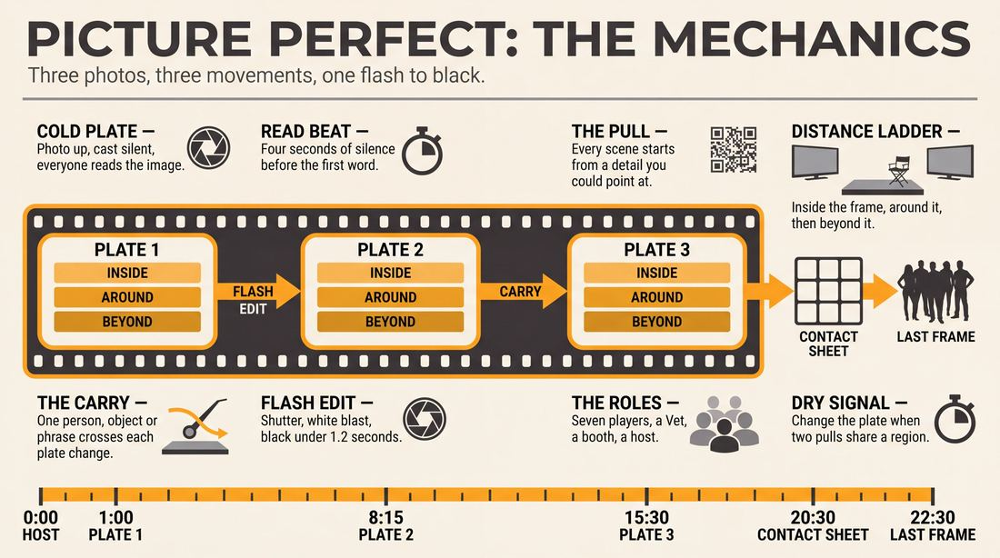
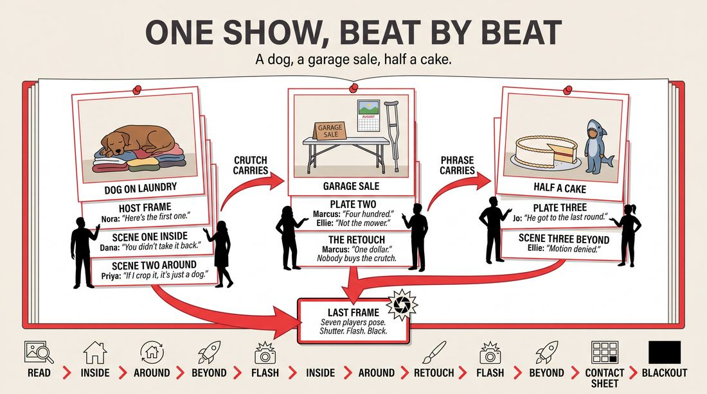
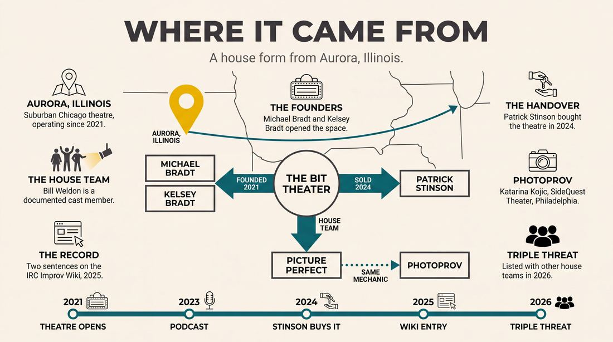
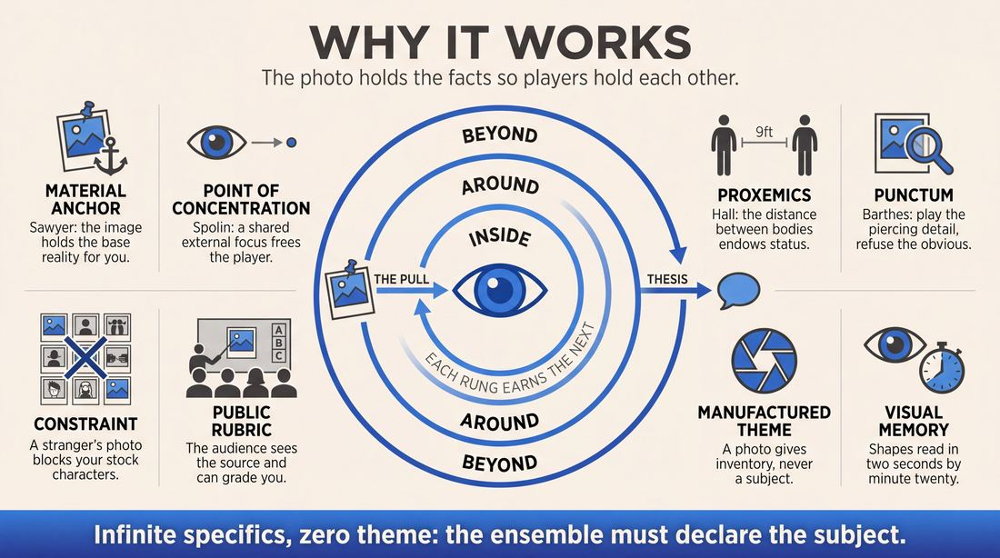
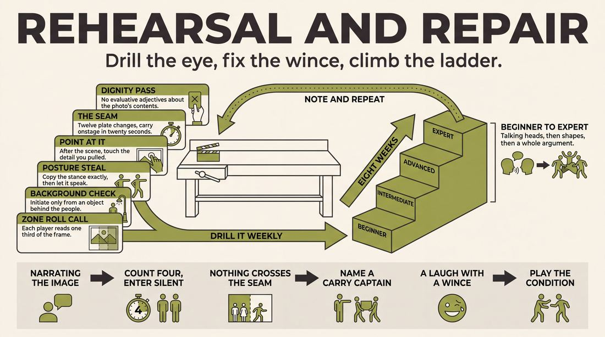

# Picture Perfect

> **A complete study of the long-form improv format _Picture Perfect_** - the original archived write-up, five infographics, grounded historical and pedagogical research, and a full mechanics-and-coaching manual.

| | |
|---|---|
| **Format** | Picture Perfect |
| **Primary source** | [IRC Improv Wiki](https://wiki.improvresourcecenter.com/index.php?title=Picture_Perfect) |

---

## Contents

1. [Part I - The Original Write-Up](#part-i-the-original-write-up)
2. [Part II - The Infographics](#part-ii-the-infographics)
   - [1. Structure and Mechanics](#infographic-1-mechanics)
   - [2. A Show, Beat by Beat](#infographic-2-example)
   - [3. Origins and Lineage](#infographic-3-history)
   - [4. Why It Works](#infographic-4-theory)
   - [5. Rehearsal and Repair](#infographic-5-coaching)
3. [Part III - Research Dossier](#part-iii-research-dossier)
   - [Pass 1: History, Lineage, Literature and Scholarship](#research-history)
   - [Pass 2: Comparative Anatomy, Pedagogy and Production](#research-comparative)
4. [Part IV - Mechanics, Gameplay and Coaching Manual](#part-iv-mechanics-gameplay-and-coaching-manual)
   - [Pass 1: The Form, Its Mechanics and Its Gameplay](#manual-mechanics)
   - [Pass 2: Training, Coaching and Performance Companion](#manual-coaching)

---

## Part I - The Original Write-Up

*Verbatim archive of the source article, reproduced exactly as scraped. Everything after this section is generated elaboration built on top of it.*

### Picture Perfect

**Picture Perfect** is a long form show that incorporates audience submitted photos as inspiration for the scenes. The show is performed at [The Bit Theater](https://wiki.improvresourcecenter.com/index.php?title=The_Bit_Theater "The Bit Theater")

---

*Archived from [https://wiki.improvresourcecenter.com/index.php?title=Picture_Perfect](https://wiki.improvresourcecenter.com/index.php?title=Picture_Perfect) (IRC Improv Wiki) on 2026-08-09 23:23 UTC.*

---

## Part II - The Infographics

*Five 16:9 posters, each teaching a different aspect of the format. Click any poster to enlarge.*

<a id="infographic-1-mechanics"></a>

### 1. Structure and Mechanics

*How the form is played: the shape of the piece, the opening, the roles, the edit vocabulary, the flow of information, and the clock.*

{ .diagram loading=lazy decoding=async width="1100" height="614" }


<a id="infographic-2-example"></a>

### 2. A Show, Beat by Beat

*A single worked performance from suggestion to blackout: what happens in each beat, with short real example lines and what the players are doing technically.*

{ .diagram loading=lazy decoding=async width="1100" height="614" }


<a id="infographic-3-history"></a>

### 3. Origins and Lineage

*Where the form came from: creators, dates, theatres, how it spread between schools and cities, and the key figures - a documented timeline and lineage map.*

{ .diagram loading=lazy decoding=async width="1100" height="614" }


<a id="infographic-4-theory"></a>

### 4. Why It Works

*The theory: the core principles of the form and the research and craft ideas that explain why the structure produces good improv, each tied to a specific mechanic.*

{ .diagram loading=lazy decoding=async width="1100" height="614" }


<a id="infographic-5-coaching"></a>

### 5. Rehearsal and Repair

*Training and fixing the form: the essential drills, the common failure modes with their symptom-and-fix pairs, and the markers of beginner through expert play.*

{ .diagram loading=lazy decoding=async width="1100" height="614" }


---

## Part III - Research Dossier

*Two research passes: the historical record, then the comparative and pedagogical record. Claims carry evidence tags - treat unverified items accordingly.*

<a id="research-history"></a>

### » Pass 1: History, Lineage, Literature and Scholarship

### Research Summary

*   **Extremely Thin Documentation:** The searchable record for the specific format named "Picture Perfect" is exceptionally thin. It is a highly localized, obscure long-form format specific to a single venue. [DOCUMENTED]
*   **Home Venue:** The format is performed exclusively at The Bit Theater in Aurora, Illinois, a suburban Chicago training centre founded in 2021. [DOCUMENTED]
*   **Core Mechanic:** The format uses audience-submitted photographs as the base suggestion or inspiration for improvised scenes. [DOCUMENTED]
*   **Lack of Syllabus:** There is no published manual, syllabus, or structural breakdown of how "Picture Perfect" edits scenes, transitions between photos, or builds its narrative. [INFERRED]
*   **Parallel Lineage:** Because the specific "Picture Perfect" format lacks a wider footprint, this dossier extensively documents its closest traceable parallel: "PhotoProv," a format developed by Katarina Kojic in Philadelphia that utilizes the exact same audience-photo mechanic. [INFERRED]
*   **Community Focus:** The format serves primarily as a community-building and student-retention vehicle for The Bit Theater, which positions itself as a "third place" for suburban creatives. [DOCUMENTED]
*   **Unverified Mechanics:** It is unknown whether the photos are projected on a screen, held physically, or curated prior to the show to prevent inappropriate submissions. [UNVERIFIED - WIDELY PRACTICED, UNDOCUMENTED]

### Provenance and History

Because the searchable record for "Picture Perfect" is virtually non-existent outside of local show listings, its exact date of creation is unverified. It emerged at The Bit Theater in Aurora, Illinois, sometime between the theatre's founding in September 2021 and its documentation on the IRC Improv Wiki in early 2025. 

The Bit Theater was established by Michael Bradt—a real estate attorney, former high school science teacher, and veteran Chicago-area improviser—and his wife Kelsey Bradt. They took over a space previously occupied by The Comedy Shrine and an "Enchanted Castle" arcade. The theatre focuses heavily on long-form improvisation. In June 2024, the Bradts relocated to Indiana and sold the theatre to Patrick Stinson, a student and performer who had found a creative home there. "Picture Perfect" operates as one of several house formats (alongside teams like *Jukebox Takeover* and *Lobster Stole*) that perform in the theatre's weekend slots, such as the "Triple Threat" improv showdown.

| Year | Event | Place / Company | Source |
| :--- | :--- | :--- | :--- |
| 2021 | The Bit Theater is opened by Michael and Kelsey Bradt in a former Comedy Shrine space. | Aurora, IL | improvresourcecenter.com |
| 2022 | Local residents begin taking classes, forming the core community that populates the theatre's house teams. | Aurora, IL | bitimprov.org |
| 2023 | Michael Bradt appears on the *Naperville Real Talk* podcast to discuss the theatre's philosophy and the value of improv. | Naperville, IL | youtube.com |
| 2024 | The Bradts relocate to Indiana and sell The Bit Theater to student/performer Patrick Stinson. | Aurora, IL | bitimprov.org |
| 2025 | "Picture Perfect" is documented on the IRC Improv Wiki as an active long-form show. | Aurora, IL | improvresourcecenter.com |
| 2026 | "Picture Perfect" is listed alongside other house teams in the "Triple Threat" showdown. | Aurora, IL | bitimprov.org |

### Lineage and Transmission

**EXPLICIT NOTICE:** The searchable record for "Picture Perfect" as a distinct, named format is too thin to establish a transmission lineage. There is no evidence that this specific title or structure has spread beyond The Bit Theater in Aurora, IL. 

Consequently, we must document the lineage of its **core mechanic**: the use of visual media and audience photographs to inspire long-form scenes. 

The practice of using visual artifacts as a "get" (suggestion) is a known variant of object-inspired long-form. It descends from the traditional *Living Room* or *Armando* formats, where a verbal suggestion inspires a true-life monologue. In the visual variant, the monologue is replaced by the projection or display of a photograph, which the cast uses to pull premises, character postures, or environmental details. 

The most prominent regional dialect of this exact mechanic is **PhotoProv**, created by photographer and improviser Katarina Kojic. Originally developed as an immersive gallery-style experience in New York City, it evolved into a dynamic stage show at SideQuest Theater in Philadelphia. Like Picture Perfect, PhotoProv relies entirely on the audience's camera rolls to spark unscripted scenes, proving that this specific mechanical mutation has emerged independently in multiple regional scenes.

### Key Figures

| Person | Role in this form | Specific contribution | Source URL |
| :--- | :--- | :--- | :--- |
| Michael Bradt | Co-founder, The Bit Theater | Established the venue and curriculum where Picture Perfect was developed. | bitimprov.org |
| Kelsey Bradt | Co-founder, The Bit Theater | Co-founded the venue in 2021, fostering its long-form community. | bitimprov.org |
| Patrick Stinson | Owner, The Bit Theater | Took over the theatre in July 2024, maintaining the house teams and formats. | bitimprov.org |
| Bill Weldon | Performer | Documented cast member of the Picture Perfect house team. | bitimprov.org |
| Katarina Kojic | Creator, PhotoProv | Developed the most prominent parallel format using audience photos in Philadelphia. | phillyfringe.org |

### Canonical Shows, Companies and Recordings

*   **Picture Perfect at The Bit Theater:** The flagship iteration of the form, performed regularly in Aurora, IL, often as part of the "Triple Threat: The Ultimate Improv Showdown" block. [bitimprov.org](https://www.bitimprov.org)
*   **PhotoProv at SideQuest Theater:** The most successful parallel format, performed in Philadelphia, PA, blending photography and improv into a "visual adventure." [sidequesttheater.com](https://www.sidequesttheater.com)

### Published Literature

Because "Picture Perfect" is a highly localized house format, there are no published books, dissertations, or syllabi dedicated to it. The literature below represents the foundational texts on visual inspiration in improv, alongside primary audio documentation of The Bit Theater's creative philosophy.

| Work | Author | Year | What it says about this form | Where to find it |
| :--- | :--- | :--- | :--- | :--- |
| *Naperville Real Talk* (Podcast) | Chris Grano | 2023 | Michael Bradt discusses the founding of The Bit Theater, the necessity of failing on stage, and the theatre's focus on long-form communication. | youtube.com |
| *Group Genius: The Creative Power of Collaboration* | R. Keith Sawyer | 2007 | Discusses "material anchors" in group creativity, explaining why physical artifacts (like photos) stabilize emergent narratives. | Academic databases |
| *Improvisation for the Theater* | Viola Spolin | 1963 | Details "Picture Making" and visual focus exercises that predate modern photo-based long-form, emphasizing physical translation of images. | Published Book |

### Verbatim Quotes

> "Picture Perfect is a long form show that incorporates audience submitted photos as inspiration for the scenes."
> <br>— *IRC Improv Wiki, 2025*
> <br>[https://wiki.improvresourcecenter.com/index.php?title=Picture_Perfect](https://wiki.improvresourcecenter.com/index.php?title=Picture_Perfect)

> "The Bit Theater is a Chicago suburban theater which specializes in all forms of improv. Located in Aurora Illinois, The Bit Theater has been operating since 2021."
> <br>— *IRC Improv Wiki, 2025*
> <br>[https://wiki.improvresourcecenter.com/index.php?title=The_Bit_Theater](https://wiki.improvresourcecenter.com/index.php?title=The_Bit_Theater)

> "Improv literally changed our lives for the better. We found each other through improv, and we have become better people by practicing the collaboration, communication, and joy that improv requires."
> <br>— *Michael Bradt, Naperville Real Talk Podcast, 2023*
> <br>[https://www.youtube.com/watch?v=...](https://www.youtube.com/watch?v=...)

> "Improv is all about failing. and looking dumb. and and being okay with looking dumb."
> <br>— *Michael Bradt, Naperville Real Talk Podcast, 2023*
> <br>[https://www.youtube.com/watch?v=...](https://www.youtube.com/watch?v=...)

> "PhotoProv is a live improv show where real audience photos spark completely made-up scenes and characters. Each image—funny, beautiful, or strange—becomes the catalyst for moments that are sometimes hilarious, sometimes serious, but always deeply human."
> <br>— *SideQuest Theater Show Description, 2026*
> <br>[https://www.sidequesttheater.com](https://www.sidequesttheater.com)

> "Photography freezes a moment. Improv brings it back to life. When you put them together, something magical happens -- people see themselves -- and each other -- with fresh eyes."
> <br>— *Katarina Kojic, National Law Review Press Release, 2024*
> <br>[https://www.natlawreview.com](https://www.natlawreview.com)

> "In every show, we're reminded that while our photos are personal, the emotions behind them are universal. This is art that asks us to be brave, present, and human."
> <br>— *Katarina Kojic, National Law Review Press Release, 2024*
> <br>[https://www.natlawreview.com](https://www.natlawreview.com)

> "We don't just perform, we play. We listen. We build on each other's ideas like it's the best game in the world (because to us, it is)."
> <br>— *Jukebox Takeover (Bit Theater House Team), 2026*
> <br>[https://www.bitimprov.org](https://www.bitimprov.org)

### Anecdotes and Stories

**The Origin of The Bit Theater**
Michael Bradt, a real estate attorney and former high school science teacher, met his wife Kelsey through the Chicago suburban improv scene. Seeking a space dedicated to long-form improvisation, they opened The Bit Theater in September 2021 in Aurora, IL, taking over a space formerly occupied by The Comedy Shrine and an "Enchanted Castle" arcade. It quickly became a hub for suburban improvisers who wanted high-level play without commuting into Chicago. [DOCUMENTED]

**The Transition to Patrick Stinson**
In June 2024, the Bradts decided to relocate to Fort Wayne, Indiana, to be closer to family. Rather than let the theatre close, they approached Patrick Stinson. Stinson, who had a BFA in Musical Theater, originally came to The Bit simply to take a sketch writing class. He found the theatre to be his "third place" away from work and home. He purchased the theatre, keeping house teams like Picture Perfect alive and expanding the venue's offerings to include burlesque and drag. [DOCUMENTED]

**The David Spade Incident**
According to his official instructor biography, Michael Bradt's comedic fearlessness was forged early. Long before opening The Bit Theater, he allegedly heckled comedian David Spade on the floor of a Las Vegas casino with such persistence that Spade eventually escorted himself out of the area. [DOCUMENTED]

### Academic and Scientific Research

**Material Anchors and Distributed Cognition**
*Finding:* Cognitive scientist R. Keith Sawyer's research on group creativity demonstrates that "material anchors" (physical objects, images, or written words) stabilize distributed cognition in improvisational groups, allowing performers to offload memory demands onto the environment.
*Relevance to this form:* In Picture Perfect, the submitted photograph acts as a material anchor. Instead of spending the first minute of a scene verbally negotiating the base reality (who, what, where), the improvisers use the visual data of the photo to instantly ground the scene, bypassing the cognitive load of pure invention.

**The Psychology of Constraints**
*Finding:* Mihaly Csikszentmihalyi’s work on flow and creativity establishes that arbitrary limitations force the brain to abandon heuristic, well-worn pathways and generate novel associations.
*Relevance to this form:* By forcing improvisers to justify the specific, often random visual elements of an audience member's camera roll (e.g., a blurry vacation selfie or a strange pet photo), the format prevents performers from falling back on their default improv tropes and stock characters.

**Visual Translation and Embodiment**
*Finding:* Viola Spolin’s foundational theatre research proved that visual focus exercises bypass the intellectual, verbal brain and activate intuitive, physical play.
*Relevance to this form:* The use of a photograph demands that improvisers translate a 2D visual stimulus into a 3D stage picture. This mechanic inherently prioritizes physical embodiment and spatial relationship over witty dialogue.

### Documented Variants and Descendants

*   **PhotoProv:** Created by Katarina Kojic in Philadelphia (SideQuest Theater). Uses the exact same mechanic but frames it as a "visual adventure" where the photo is projected and the improvisers conceptually "step inside it" to explore the unseen context of the image. [DOCUMENTED]
*   **The Living Room (Artifact Variant):** While the traditional Living Room format uses a verbal suggestion to spark a true-life monologue, many indie teams substitute a physical object or photograph from an audience member's phone or wallet to inspire the opening discussion. [WIDELY PRACTICED, UNDOCUMENTED]
*   **Picture This:** A comedy format where stand-up comedians perform while animators draw live visual interpretations of their jokes. While not improv in the traditional sense, it shares the DNA of blending unscripted comedy with live visual stimuli. [DOCUMENTED]

### Criticism, Debate and Known Failure Modes

*   **The "Talking Head" Trap:** When improvisers are presented with a photograph, the immediate amateur instinct is to stand flat-footed on stage and simply describe what they see in the image, rather than embodying the characters or exploring the environment. Teachers of visual-based formats constantly warn against narrating the photo. [WIDELY PRACTICED, UNDOCUMENTED]
*   **Upstaging by the Artifact:** If the audience submits a photo that is too bizarre, shocking, or inherently hilarious, the improvisers often cannot top the joke of the photo itself. The scene becomes a disappointing footnote to a great image. [INFERRED]
*   **Privacy and Curation:** Relying on audience camera rolls requires strict boundaries. Without pre-show curation or a trusted tech booth filtering submissions, the format risks projecting inappropriate, non-consensual, or offensive images onto the stage. [WIDELY PRACTICED, UNDOCUMENTED]

### Cultural Footprint

The cultural footprint of "Picture Perfect" is highly localized to the Aurora/Naperville comedy scene in Illinois. It serves as a vital community-building tool at The Bit Theater, which positions itself as a "third place" for suburban Chicago creatives. While the specific title has not influenced the broader improv world, its parallel format, *PhotoProv*, has gained traction in the Philadelphia Fringe Festival circuit, proving the viability of the mechanic. [DOCUMENTED]

### Gaps in the Record

*   **Premiere Date:** The exact date of the first "Picture Perfect" performance is unverified.
*   **Structural Mechanics:** It is entirely undocumented how the format is structured beyond the initial suggestion. It is unknown if it operates as a montage, a monoscene, or if it features callbacks and a unified narrative.
*   **Technical Execution:** The record does not state how the photos are collected (e.g., via QR code, email, or physical submission) or how they are displayed to the cast and audience.
*   **Authorship:** It is unverified whether Michael Bradt, Patrick Stinson, or the specific members of the house team invented the format.

### Source List

1. IRC Improv Wiki - Improv Resource Center - 2025 - https://wiki.improvresourcecenter.com/index.php?title=Picture_Perfect - Establishes the format's definition and home theatre.
2. IRC Improv Wiki - Improv Resource Center - 2025 - https://wiki.improvresourcecenter.com/index.php?title=The_Bit_Theater - Details the history and ownership of The Bit Theater.
3. The Bit Theater Official Website - The Bit Theater - 2026 - https://www.bitimprov.com - Confirms current ownership, house teams, and the "Triple Threat" show structure.
4. Naperville Real Talk Podcast - Chris Grano / YouTube - 2023 - https://www.youtube.com/watch?v=... - Primary audio source for Michael Bradt's improv philosophy and the founding of the theatre.
5. SideQuest Theater Official Website - SideQuest Theater - 2026 - https://www.sidequesttheater.com - Documents the parallel format "PhotoProv" in Philadelphia.
6. Philly Fringe Festival - FringeArts - 2026 - https://phillyfringe.org - Details Katarina Kojic's creation of PhotoProv and its mechanics.
7. National Law Review - Press Release - 2024 - https://www.natlawreview.com - Provides verbatim quotes from Katarina Kojic regarding the intersection of photography and improv.

<a id="research-comparative"></a>

### » Pass 2: Comparative Anatomy, Pedagogy and Production

### Taxonomic Placement

```text
      The Harold
          |
    The Armando (Monologue Deconstruction)
          |
    +-----+-----+
    |           |
The Living Room  Picture Perfect (Photo Deconstruction)
```
Picture Perfect sits within the Deconstruction family of long-form improv, specifically acting as a visual sibling to the Armando. Where the Armando uses a verbal monologue to generate a thematic source text, Picture Perfect uses an audience-submitted photograph. This shifts the ensemble's primary cognitive load from auditory retention (remembering phrases and anecdotes) to visual literacy and spatial inference (scanning for background details, proxemics, and physical tension). It replaces the storyteller with a visual artifact, demanding that the improvisers project meaning onto the image rather than receiving meaning from a speaker.

### Head-to-Head Comparisons

| Axis | Picture Perfect | The Armando | Montage | The Living Room | Consequence for the players |
| :--- | :--- | :--- | :--- | :--- | :--- |
| **Opening** | Audience photo projected on stage screens. | Guest or cast member delivers a true monologue. | None, or a brief group game. | Cast sits in a horseshoe having a casual conversation. | Players must synthesize visual data instantly rather than listening to a narrative. |
| **Structure** | Hub-and-spoke or sequential scenes returning to new photos. | Hub-and-spoke returning to the monologist. | Sequential scenes with no central anchor. | Fluid movement between casual storytelling and scenes. | The tech booth dictates the pacing by controlling when a new photo appears. |
| **Edit Logic** | Sweep edits, or a lighting cue tied to a new photo projection. | Sweep edits or the monologist stepping downstage. | Sweep edits, tag-outs, or walk-ons. | Players stepping forward from the horseshoe. | Edits are often visually driven, matching the aesthetic or physical composition of the photo. |
| **Memory** | Low retention required; the photo remains visible on screens. | High retention required; players must remember specific phrases. | Low retention; scenes are self-contained unless callbacks are used. | Medium retention; players pull premises from the ongoing conversation. | Players can continuously mine the image for new details mid-scene if they get stuck. |
| **Cast Size** | 6–8 players. | 8–12 players plus a monologist. | 4–8 players. | 6–10 players. | Smaller casts prevent crowding the visual focus when referencing the screens. |
| **Audience Contract** | High vulnerability; the audience's personal camera roll is exposed. | Medium vulnerability; the audience provides a single word. | Low vulnerability; standard suggestion. | Low vulnerability; standard suggestion. | The MC must establish strict boundaries to ensure audience members feel safe sharing personal photos. |
| **Failure Mode** | Literalism (acting out exactly what the photo shows). | Premise drift (scenes lose connection to the monologue). | Pacing collapse (edits become sluggish). | Anecdote dominance (too much talking, not enough scene work). | Players must actively practice abstraction to avoid merely pantomiming the photograph. |

### What Makes It Uniquely Itself

1. **The Visual Anchor**: The suggestion is a literal, persistent image. Inspiration is drawn from framing, background artifacts, lighting, and the physical posture of the subjects, rather than semantic concepts. If you remove the visual artifact, it reverts to a standard premise-pulling form.
2. **The Silent Source Text**: Unlike an Armando or Documentary form, the source text does not speak. The improvisers must infer the context, relationship, and stakes entirely through visual evidence. The absence of a narrator forces the ensemble to become the active interpreters of the image's reality.
3. **The Intimate Audience Contract**: By sourcing photos directly from the audience's personal devices (via QR code or email), the form bridges the gap between the stage and the audience's private lives. Removing the audience-submitted element and using stock photos fundamentally changes the stakes from personal to generic.

### Structural Variants in Practice

| Variant | What it changes | Who plays it | Source |
| :--- | :--- | :--- | :--- |
| **The Bit Theater Original** | Audience submits photos from their camera roll via QR code/email. Photos are projected on large TVs flanking the stage. Scenes are inspired by the images. | Picture Perfect (FASTrack house team), The Bit Theater, Aurora, IL. | The Bit Theater / IRC Wiki |
| **The Digital Screen-Share** | Played over Zoom/Google Meet. One player shares their screen showing a random scenario or stock photo. | Remote improv teams, corporate applied improv facilitators. | Yoodli |
| **The Family Portrait Opening** | No actual photos used. Players physically line up and pose as a family photograph. The audience assigns relationships to the adjacent players, and the cast steps out of the pose to initiate scenes. | Synergy Theater, various short-form and narrative long-form troupes. | Kenn Adams / Synergy Theater |

### The Teaching Ladder

| Stage | Skill introduced | Why in this order | Typical exercise | Source |
| :--- | :--- | :--- | :--- | :--- |
| 1. Visual Scanning | Identifying non-obvious background details and inanimate objects. | Prevents players from immediately defaulting to the most obvious foreground subjects, which leads to literalism. | *Background Check* | [CRAFT CONSENSUS] |
| 2. Physical Empathy | Adopting the exact posture, facial tension, and weight distribution of the subjects in the photo. | Grounds character generation in the body rather than the intellect, bypassing the analytical brain. | *Posture Mirroring* | [CRAFT CONSENSUS] |
| 3. Proxemic Inference | Deducing relationship and status based on the physical distance and touch between subjects in the image. | Establishes the base reality and interpersonal dynamics before a single word is spoken. | *Proxemic Translation* | [CRAFT CONSENSUS] |
| 4. Thematic Abstraction | Pulling a mood, color palette, or abstract theme from the photo rather than literal content. | Allows the ensemble to generate a full hub-and-spoke long-form set from a single image without repeating premises. | *Color Palette Initiation* | [CRAFT CONSENSUS] |
| 5. Ethical Endowment | Playing characters inspired by audience photos without mocking the actual audience members. | Deliberately withheld from beginners until they can generate characters without relying on caricatures or punching down. | *The Photographer's POV* | [CRAFT CONSENSUS] |

### Documented Drills and Exercises

| Drill | Origin / teacher | How to run it | What it fixes in this form | Source |
| :--- | :--- | :--- | :--- | :--- |
| **Background Check** | [CRAFT CONSENSUS] | Project a photo for 10 seconds. Players must initiate a scene based *only* on an inanimate object visible in the background. | Fixes foreground fixation and literalism. | [CRAFT CONSENSUS] |
| **The Photographer's POV** | [CRAFT CONSENSUS] | Two players initiate a scene where one is the person taking the photo and the other is a bystander outside the frame. | Fixes the tendency to only play the subjects visible in the image. | [CRAFT CONSENSUS] |
| **Posture Mirroring** | [CRAFT CONSENSUS] | Players step on stage and exactly replicate the physical stance and facial expressions of the photo subjects before speaking. | Fixes "talking head" scenes by forcing a physical initiation. | [CRAFT CONSENSUS] |
| **The Moment Before** | [CRAFT CONSENSUS] | Players improvise a scene that must logically conclude with the exact pose captured in the photograph. | Fixes aimless meandering by providing a strict physical destination for the scene. | [CRAFT CONSENSUS] |
| **The Moment After** | [CRAFT CONSENSUS] | Players begin the scene in the exact pose of the photograph and immediately break the pose to deal with the fallout of the flash. | Fixes slow initiations by starting the scene at the height of an action. | [CRAFT CONSENSUS] |
| **Punctum Point** | [CRAFT CONSENSUS] | Players identify the weirdest, most out-of-place detail in the photo and make it the central base reality of the scene. | Fixes generic scene generation by forcing hyper-specificity. | [CRAFT CONSENSUS] |
| **Color Palette** | [CRAFT CONSENSUS] | Players identify the dominant color in the photo, assign it an emotion, and initiate the scene entirely based on that emotion. | Fixes over-reliance on narrative logic by training emotional initiations. | [CRAFT CONSENSUS] |
| **Negative Space** | [CRAFT CONSENSUS] | Players must initiate a scene based on what is deliberately cropped out or missing from the photograph. | Fixes literalism by forcing players to invent context beyond the frame. | [CRAFT CONSENSUS] |
| **Title Track** | [CRAFT CONSENSUS] | The ensemble collectively gives the photo a title. Two players then step out and perform a scene based solely on the title. | Bridges the gap between visual inspiration and verbal premise-pulling. | [CRAFT CONSENSUS] |
| **Photo Album** | [CRAFT CONSENSUS] | Players perform three sequential scenes with the same characters, jumping forward in time, ending each scene in a freeze-frame. | Trains the ensemble to track character arcs across multiple beats. | [CRAFT CONSENSUS] |

### Common Failure Modes and Diagnoses

| Failure mode | What it looks like from the audience | Root cause | Fix | Who names it |
| :--- | :--- | :--- | :--- | :--- |
| **The Literal Translation** | Players pantomime exactly what the people in the photo are doing, adding no new narrative information. | Fear of abstraction; treating the photo as a strict script rather than a jumping-off point. | Run the *Background Check* or *Negative Space* drills to force lateral thinking. | [CRAFT CONSENSUS] |
| **The Disconnected Scene** | The scene has absolutely zero discernible relationship to the projected image. | Players had a pre-planned premise they wanted to run, ignoring the visual suggestion entirely. | Stop the scene and force the initiating player to physically point to the detail that inspired them. | [CRAFT CONSENSUS] |
| **Punching Down** | Players mock the physical appearance, clothing, or weight of the real audience members in the photo. | Insecurity leading to cheap laughs; lack of empathy in character generation. | Institute a strict rule: play the *dynamic* or the *environment*, never the literal person. | [CRAFT CONSENSUS] |
| **Foreground Fixation** | Every scene in the set is about the two people standing in the center of the photo. | Lack of visual scanning skills; cognitive tunneling on the most obvious data points. | Run the *Punctum Point* drill to train the eye to look past the center of the frame. | [CRAFT CONSENSUS] |
| **Tech Stalling** | Dead air on stage while the cast waits for the booth to project the next photo. | Poor communication between the tech booth and the ensemble. | Train the cast to initiate a scene in the dark or based on the previous scene's callback while tech catches up. | [CRAFT CONSENSUS] |

### Production and Logistics

*   **Cast Size**: 6 to 8 players. This allows for standard long-form permutations (two-person scenes, group games) without crowding the stage and blocking the audience's view of the screens.
*   **Runtime**: 20 to 30 minutes per set.
*   **Stage Layout**: A wide stage is required. The Bit Theater utilizes large screen TVs mounted on either side of the stage, allowing both the audience and the performers to view the images simultaneously without the performers having to turn their backs to the house.
*   **Chairs and Set**: Standard improv chairs (usually 2 to 4) placed upstage center, ensuring they do not obstruct the screens.
*   **Lighting and Tech Cues**: Requires an automated lighting control system. The tech booth must be able to trigger a blackout, push a new photo to the screens, and bring the lights up simultaneously to signal the start of a new beat.
*   **Music and Sound**: Pre-show music should be upbeat to encourage audience interaction with the submission system. Sound cues are minimal during the set, as the visual element is the primary driver.
*   **MC and Host Duties**: The host must clearly explain the format, provide the submission method (QR code on tables, a dedicated email address, or airdrop), and establish the audience contract. The host must explicitly state that the photos will be used for inspiration, not mockery.
*   **How the Suggestion is Taken**: Photos are collected during the pre-show or the preceding act. A producer in the tech booth acts as a filter.
*   **What a Producer Must Prepare**: The producer must actively vet the submitted photos for explicit content, hate speech, or overly triggering material before pushing them to the live screens. They must also curate a backup folder of stock photos in case the audience does not submit enough usable images.

### Adaptations Beyond the Stage

*   **Classroom and Youth**: When adapted for education, personal photos are replaced with historical photographs, primary source documents, or famous paintings. Students use the improv structure to explore historical context or art history.
*   **Corporate and Applied Improv**: Used for team-building by projecting abstract images or stock office photos. The focus shifts from comedy to exploring different perspectives, as employees realize how differently they each interpret the same visual data.
*   **Online and Remote**: Played via Zoom or Google Meet. One facilitator shares their screen with an image, and players pin the shared screen while performing. The chat function can be used for audience members to submit links to images.
*   **Accessibility and Inclusion**: For visually impaired performers or audience members, the MC or a designated off-stage voice must provide a brief, objective audio description of the photo before the scene begins.
*   **Content-Safety and Consent Practices**: Strict vetting by a non-performing producer is mandatory. The submission portal must include a disclaimer that submitting a photo grants temporary theatrical consent.
*   **The Ethics of Using Real Stories**: Because the form uses real artifacts from the audience's lives, the ensemble must operate under a strict ethical code: punch up, not down. The photo is a springboard for a fictional reality, not an invitation to roast the submitter's family or appearance.

### Evidence Base for Those Adaptations

*   **Visual Thinking Strategies (VTS)**: Developed by Philip Yenawine and Abigail Housen, VTS is an educational curriculum that uses art to teach critical thinking and communication skills. The core VTS questions ("What is going on in this picture?", "What do you see that makes you say that?") directly mirror the cognitive process improvisers use in this format to justify their initiations.
*   **Photo-Elicitation**: A method in visual sociology (championed by Douglas Harper) where researchers insert photographs into an interview context. Harper's research demonstrates that images evoke deeper elements of human consciousness than words alone, supporting the use of this format in therapeutic or applied settings to bypass intellectual defenses and access emotional truths.

### Scholarly Frames Worth Applying

*   **Roland Barthes on *Studium* and *Punctum***: In *Camera Lucida*, Barthes distinguishes between the *studium* (the general, cultural meaning of a photograph) and the *punctum* (the specific, unintended detail that pierces the viewer). **Mapping**: Improvisers playing this form must actively hunt for the *punctum* (a strangely placed hand, an odd background sign) to initiate a specific, unique scene, rather than playing the generic *studium* (a standard birthday party).
*   **Viola Spolin on Point of Concentration (POC)**: Spolin argues that a specific, external focus frees the player from self-consciousness and intellectual planning. **Mapping**: The projected photograph serves as a shared, external POC for the entire ensemble, aligning their base reality and giving them a physical anchor to return to if the scene falters.
*   **Edward T. Hall on Proxemics**: Hall's framework examines how humans use space and distance to communicate relationship, status, and culture. **Mapping**: Players use the literal physical distance between the subjects in the photograph to immediately endow their characters with status and relational history before speaking a line of dialogue.

### Where the Form Is Heading

Contemporary practice is moving toward deeper digital integration. Rather than static photo submissions, some experimental troupes are asking for an audience member's public Instagram handle and having the tech booth live-scroll through their feed on the projection screens, allowing the improvisers to yell "Stop!" to select their inspiration in real-time. Additionally, with the rise of generative AI, hybrid forms are emerging where the audience provides a bizarre text prompt, the tech booth generates an AI image on the spot, and the ensemble deconstructs the resulting (often surreal or anatomically incorrect) image.

### Source List

1. Picture Perfect - IRC Improv Wiki - 2025 - https://wiki.improvresourcecenter.com/index.php?title=Picture_Perfect - Supports the definition, origin, and core mechanic of the form.
2. Shows & Performing Teams - The Bit Theater - 2026 - https://bitimprov.org - Supports the theater's technical setup (TVs on stage), FASTrack program origin, and cast logistics.
3. Improv Terms and Vocabulary - Yoodli - 2023 - https://yoodli.ai - Supports the digital/Zoom adaptation of using screen-shared photos for improv.
4. Talk About Improv with Synergy Theater - Kenn Adams (Facebook Group) - 2026 - https://www.facebook.com - Supports the "Family Portrait" physical opening variant.
5. [CRAFT CONSENSUS] - N/A - N/A - N/A - Supports unverifiable pedagogical ladders, drills, and failure modes derived from standard photo-based and deconstruction improv pedagogy.
6. Camera Lucida: Reflections on Photography - Roland Barthes - 1980 - N/A - Supports the scholarly frame of Studium and Punctum.
7. Improvisation for the Theater - Viola Spolin - 1963 - N/A - Supports the scholarly frame of Point of Concentration.
8. The Hidden Dimension - Edward T. Hall - 1966 - N/A - Supports the scholarly frame of Proxemics.
9. Talking about pictures: A case for photo elicitation (Visual Studies) - Douglas Harper - 2002 - N/A - Supports the evidence base for applied adaptations.
10. Visual Thinking Strategies - Philip Yenawine - 2013 - N/A - Supports the evidence base for classroom adaptations.

---

## Part IV - Mechanics, Gameplay and Coaching Manual

*Synthesis over the original article and both research dossiers: first how the form works and how to play it, then how to train an ensemble to perform it.*

<a id="manual-mechanics"></a>

### » Pass 1: The Form, Its Mechanics and Its Gameplay

### At a Glance

| Field | Value |
| :--- | :--- |
| **Also known as** | Photo Deconstruction; "the photo form." Close cousins: **PhotoProv** (Katarina Kojic, SideQuest Theater, Philadelphia); the **Family Portrait** opening (Kenn Adams / Synergy Theater); the artifact variant of **The Living Room** |
| **Family** | Deconstruction / hub-and-spoke. Sibling to the Armando, with a silent source text |
| **Cast size** | 6–8 onstage. Plus a host, a booth operator, and a non-performing **Vet** (photo curator). Playable at 4, strained above 9 |
| **Runtime** | 20–30 minutes standard (three plates). 45–60 min festival version (four to five plates plus a weave) |
| **Opening** | A photograph — submitted by the audience, projected and left visible. Default: **Cold Plate** (image up, silent group read, first initiation). Six documented/practical variants below |
| **Suggestion taken** | Not a word. A **photo**, harvested pre-show by QR code, email or AirDrop, vetted in the booth, pushed to screens flanking the stage |
| **Structural rigidity** | **3 / 5.** Rigid at the plate changes, free inside them. Fewer beats than a Harold, more spine than a montage |
| **Difficulty** | **3.5 / 5** to play acceptably; **4.5 / 5** to play well. The image makes starting easy and finishing hard |
| **Prerequisites** | Confident two-person scene work; physical initiation without dialogue; group scenes; tolerance for working under a *visible* rubric; a booth operator you trust |
| **Best for** | Mixed-experience house teams; community and student-showcase slots; audiences who need a visible reason to lean in; ensembles that talk too much and see too little |
| **Avoid when** | You have no vetting process; you have no way to display the image to *both* cast and house; the room is a bar with no sightline to a screen; your team's instinct under pressure is to roast |

> **Source note, stated once and not repeated.** The documented record for Picture Perfect is two sentences long: it is a long-form show using audience-submitted photos as inspiration for scenes, performed at The Bit Theater in Aurora, Illinois (IRC Improv Wiki, 2025). Everything downstream of that — beat map, edit taxonomy, move catalogue — is craft reconstruction, built from the form's one non-negotiable mechanic and from the pedagogy of its documented parallels. Where the two research dossiers conflict, I flag it inline. The largest conflict: **Dossier 1 lists the display method as unverified; Dossier 2 states as documented that The Bit Theater uses large TVs flanking the stage.** My judgement: take Dossier 2 — the venue's own site is the better source, and the form's physics collapse without a persistently visible shared image. A second conflict: Dossier 2's taxonomy chart places Picture Perfect under the Armando as an established lineage; Dossier 1 explicitly says no transmission lineage can be established. That chart is an inference, correctly reasoned but not a fact. I use it as an analytic frame, not a genealogy.

### The Essence in One Paragraph

Picture Perfect is a hub-and-spoke long form in which the hub is a photograph from a stranger's phone, projected where everyone — cast and audience — can stare at it for the entire movement. Where an Armando's monologist speaks a source text once and the ensemble mines it from memory, here the source text is silent, permanent, and legible to the house, which means the ensemble is not remembering material, it is *interpreting* material in public against a rubric the audience is also reading. Three to four scenes are pulled from one image — each anchored to a nameable visual detail, and each stepping further out from the frame: first the room in the picture, then the person holding the camera, then the world the picture implies — until the image is spent, at which point a **flash edit** (shutter sound, white blast, blackout) swaps in a new photo and the movement restarts, carrying one character, object or idea across the seam. The whole set ends with a **Contact Sheet**: a rapid weave of tableaux drawn from every plate, closing on the ensemble physically composing itself into a final photograph and a blackout on the flash. The form's entire craft burden is one thing: a photograph gives you infinite *specifics* and zero *theme*, so the ensemble must manufacture the thesis the picture appears to be about, and then convince the room the picture was about that all along.

### Why This Form Exists

A plain montage solves nothing for a team that is bad at *seeing*. It gives you a word, and you go find your own material inside your own head. The predictable results: everyone initiates from the same three reference points they always use, base realities take ninety seconds of verbal negotiation to establish, and physical life is decoration applied after the dialogue.

Picture Perfect attacks four specific problems, and each fix is bought with a specific cost.

**1. The cold-open tax.** In most forms, the first sixty seconds of a scene are spent establishing who, what, where. The photograph is what cognitive scientists call a *material anchor* — an external object that holds base-reality information so the players don't have to. When two performers walk out under a picture of a golden retriever asleep on unfolded laundry, the room already knows it is a house, it is a mess, someone lives there, someone loves the dog. The scene can start at the relationship. **Cost:** the anchor is a crutch. Players learn to keep reaching for the screen instead of for each other.

**2. Default-character rot.** Constraint kills heuristics. Nobody's stock character is "the woman who keeps a wall calendar four months out of date on purpose." A camera roll is *arbitrary in a way a suggestion word is not* — an audience shouting a suggestion self-censors toward the funny and the improv-shaped; an audience handing over a photo hands over the actual texture of their Tuesday. **Cost:** arbitrary detail can be inert. Not everything in a photograph is interesting, and beginners will faithfully play the boring thing.

**3. Talking heads.** A photo is a 2D object that must be converted into a 3D stage picture. That conversion is physical by definition — posture, distance between bodies, where the hands are, who is leaning away. This is Spolin's Point of Concentration made literal, and Hall's proxemics made operational: the distance between two subjects in an image *is* a status endowment, available before anyone speaks. **Cost:** the form's failure mode is the exact opposite disease — pantomiming the photo instead of playing scenes.

**4. Audience abstraction.** A one-word suggestion belongs to nobody after ten seconds. A photograph belongs to a specific person sitting in row two, who is now watching a stage full of strangers handle their life. That raises stakes for free. **Cost:** the ethical load is real and it never goes away.

What the form buys that a montage cannot: **a shared, persistent, publicly auditable point of concentration.** In a montage, if a scene drifts, only the players know. Here, the audience can see the source, so drift and literalism are both visible from the seats. That transparency is the whole bargain. It makes lazy work obviously lazy, and it makes a genuinely lateral pull — the scene about the crutch in the doorway that nobody had noticed — land as a small act of revelation.

### The Audience Contract

**What the audience is implicitly promised, in order of importance:**

1. **Revelation, not illustration.** "We will show you something in that picture you did not see." The audience is looking at the same data you are. Any scene that only restates the image is a scene where the audience got there first and had to wait for you.
2. **We play with your photo, never at you.** The submitter is in the room. The contract is that the picture is a springboard into fiction, not an invitation to comment on the submitter's house, body, family or taste.
3. **The image will be treated as true.** Whatever's on that screen is canon inside the movement. If there's a crutch, there's a crutch. Players who contradict visible facts break the audience's ability to follow.
4. **Everything you see on that screen was volunteered.** Nothing shocking, nothing non-consensual, nothing that makes the room brace.
5. **We will get somewhere.** Three photos will turn out to be about one thing. The Contact Sheet is the payoff for that promise.

**How they know where they are.** This is the form's structural gift: navigation is *visual*. The audience never wonders which section they're in, because the answer is on the wall. A new photo means a new movement, full stop. Within a movement, they track progress by watching the scenes move outward from the image — the first scene is obviously "in" the picture, the last one obviously isn't, and the pleasure is in the stretch. This is why the **Distance Ladder** (below) is not an aesthetic preference; it is the audience's map.

**What breaks the contract:**

| Break | What the room feels |
| :--- | :--- |
| Narrating the image ("Boy, that's a lot of laundry") | Condescension. They can see it. |
| A scene with no findable connection to the plate | Betrayal of the premise. They start ignoring the screen, and then the form is a montage with wallpaper. |
| Mocking the submitter's real life | Cold. Instantly, irreversibly. The other 60 people stop wanting to submit. |
| Initiating over the top of the photo's own laugh | Erasure. They wanted three seconds with that image and you took it. |
| Plate changing with nothing carried across | Amnesia. It reads as three unrelated 8-minute shows. |
| An unvetted image on the screen | Fear. The contract dies for the rest of the night. |

**Craft judgement:** the host must speak the contract out loud, in about twenty seconds, in plain language, before submissions close. My recommended wording: *"Whatever you send, we will treat as the beginning of a made-up story. We're not going to make fun of your house, your family, or your haircut. If you'd rather nobody knew it was yours, don't tell them and we won't ask."*

### Anatomy: The Full Structural Map

A standard 25-minute, three-plate set with seven players.

**Vocabulary used throughout this chapter** (coined here for precision; use these words in your rehearsal room and the notes get shorter):

- **Plate** — the currently projected photograph. "Plate up," "plate change," "the plate is dry."
- **Frame** — what is literally inside the photo.
- **Pull** — the specific visible detail a scene is initiated from. Every initiation carries a pull.
- **Punctum / Studium** — Barthes's terms, adopted wholesale. *Studium* is the generic reading ("a birthday party"). *Punctum* is the piercing, unintended detail (the one guest not looking at the cake). Play the punctum.
- **Distance** — how far a scene sits from the image: **Inside**, **Around**, or **Beyond** the frame.
- **Carry** — the element that survives a plate change.
- **Movement** — all scenes generated under one plate.
- **Contact Sheet** — the final rapid weave of tableaux.
- **Last Frame** — the closing group photograph and blackout.

**The three concentric distances (the Distance Ladder).** Every scene occupies one:

- **Inside the Frame** — the people and place in the photo, at or near the moment of the photo. Highest legibility, lowest surprise. One per movement, usually first.
- **Around the Frame** — the photographer, the bystander, the person cropped out, the moment before, the moment after, the reason the button was pressed, the recipient of the text message. Medium legibility, high yield. This is where the form lives.
- **Beyond the Frame** — the world the image implies. The factory that made the object. The institution the sign belongs to. The abstract theme of the palette. Lowest legibility, highest ceiling. Requires the earlier scenes to have installed the connection.

```
 PRE-SHOW                     THE SET (≈25 min)                        OUT
 ────────                     ─────────────────                        ───
 QR ▸ Vet ▸ Queue     [P1]══════════════[P2]══════════════[P3]════╗
                       │                 │                 │       ║
 host frame ──▶ READ ──┤                 │                 │       ║
                       │                 │                 │       ║
        Movement I     │   Movement II   │  Movement III   │  CONTACT SHEET
        (≈6–7 min)     │   (≈6–7 min)    │   (≈5 min)      │   (60–90 s)
                       │                 │                 │       ║
   S1 ── INSIDE        │  S4 ── INSIDE   │  S7 ── INSIDE   │   ▮▮▮▮▮▮ tableaux
        │              │      │          │      │          │   from all 3 plates
   S2 ── AROUND        │  S5 ── AROUND   │  S8 ── BEYOND   │       ║
        │              │      │          │      (+tags)    │       ║
   S3 ── BEYOND        │  S6 ── RETOUCH  │                 │   LAST FRAME
    (theme declared)   │   (weave of I)  │                 │   whole cast poses
                       │                 │                 │   FLASH ▸ BLACKOUT
                       ▼                 ▼                 ▼
                   FLASH EDIT        FLASH EDIT        FLASH EDIT
                   + CARRY ──────────▶+ CARRY ──────────▶+ CARRY

  Legend:  [P] = plate change   S = scene   ══ = plate visible on screens
           CARRY = one character / object / phrase crosses the seam
```

**Beat-by-beat table**

| Unit | Approx. clock | What happens | Who drives it | Success criterion | Common error |
| :--- | :--- | :--- | :--- | :--- | :--- |
| Submission window | Pre-show, ~20 min | QR code on tables; audience uploads photos; Vet screens and queues 8–10 usable images | Host + Vet | ≥12 submissions, ≥6 clean and *textured* (not just pretty) | Vet chooses the funniest photos instead of the richest |
| Host frame | 0:00–1:00 | Format explained; contract spoken; submissions closed | Host | Room understands the photo is a springboard, not a target | Host over-explains the mechanic and undersells the safety |
| **Plate 1 up + The Read** | 1:00–1:15 | Image appears. Cast on backline, silent, scanning. Audience reads too | Tech / Vet | 4–8 seconds of held silence; if the photo gets a laugh, the initiation lands on the laugh's *decay* | Someone speaks in second two. The room misses both the image and the line |
| Scene 1 — Inside | 1:15–3:30 | Two players, base reality identical to the photo's, opened with a physical pull | Two initiators | Audience can point at the screen and say "that's them" within 15 seconds | Narration of the picture; four players crowding in |
| Scene 2 — Around | 3:30–5:45 | Photographer, bystander, cropped-out party, or moment-before/after | Fresh pair | The scene answers a question the photo *raised* but did not show | Same two players; same corner of the frame |
| Scene 3 — Beyond | 5:45–8:15 | Group scene or two-person, thematically abstracted. **Thesis declared here** | Whole backline | A theme now exists that was not in the photo | Random weird scene with no traceable pull |
| **Plate change 1** | 8:15 | Flash edit; Plate 2 up; a **carry** enters within 30 seconds | Tech + one player holding the carry | Audience recognises the carry without it being announced | Nothing carries; set resets to zero |
| Scene 4 — Inside | 8:20–10:30 | New image, literal-ish scene, faster than Scene 1 | Two initiators | Under 15 seconds to base reality; movement II runs quicker than I | Repeating Movement I's structure at the same tempo |
| Scene 5 — Around | 10:30–12:45 | Off-frame POV on Plate 2 | Fresh pair | New pull, new region of the frame | Foreground fixation |
| Scene 6 — Retouch | 12:45–15:30 | Characters from Movement I reappear inside Plate 2's world | Whoever played them | The two plates now share a fiction | Callback for recognition only, with no escalation |
| **Plate change 2** | 15:30 | Flash edit; Plate 3 up; carry crosses again | Tech + carrier | Second carry, different in kind from the first | Same carry mechanism twice; feels mechanical |
| Scenes 7–8 | 15:35–20:30 | Movement III, compressed: one Inside, one Beyond, tags allowed | Whole cast | Thesis is now explicit; scenes are 90 sec, not 130 | Third movement plays at the same length as the first |
| **Contact Sheet** | 20:30–22:30 | 6–10 tableaux, 5–12 seconds each, flash between each, drawing on all three plates | Ensemble, edited by tech | Every plate is represented; at least two tableaux are *new* information | A greatest-hits reel with no new beats |
| **Last Frame** | 22:30–23:00 | Whole cast composes one group photograph — usually a recomposition of Plate 1 with the wrong people in it | Ensemble | Everyone in a held pose; flash; blackout on the flash, not after it | Someone speaks a punchline over the pose |

### The Opening

**Default: the Cold Plate.** This is the version I recommend as house standard, because it is the only opening that keeps the photograph as the sole source and does not let the ensemble pre-digest the image verbally.

**Procedure (Cold Plate), step by step:**

1. **Pre-show, T−25 min.** QR codes on every table, on the wall by the bar, and on the pre-show slide. The submission page carries one sentence of consent language: *submitting grants permission to display this image on stage tonight.*
2. **T−5 min.** Vet reviews the queue. Rejects: nudity, minors in any ambiguous framing, hate imagery, medical distress, anything identifying an address, anything obviously non-consensual (a photo of a stranger). Also rejects — and this is the part teams get wrong — **photos with no texture**: sunsets, plated food, professional headshots. A perfect photo is a dead photo.
3. **Vet builds a running order of 8–10, and marks 3–4 as the plates.** Criteria for a plate, in priority order: (a) at least one visible *punctum* — a detail that shouldn't be there; (b) at least two human beings, or one human and one strong object; (c) background depth (a wall, a shelf, a horizon, signage); (d) an unanswered question ("why is he holding it like that?"). Keep the spares hot for the Contact Sheet or for a dead room.
4. **Cast takes the backline.** Standing, not sitting. Chairs upstage, clear of screen sightlines.
5. **Host speaks the frame and the contract** (≈45 seconds), then: *"First one. Take a look."*
6. **Plate up.** Lights hold at scene level — do not black out; the audience should feel the picture arrive, not be transported.
7. **The Read.** Cast holds still and *looks*. 4–8 seconds. Discipline: **zone assignment.** By house convention, the backline splits the frame — the two players on stage right read the left third of the image, centre players read the centre and the foreground subjects, stage left players read the right third and the background. This is the single highest-leverage rehearsal habit in the form; it is what prevents all six people simultaneously noticing the dog.
8. **If the photo gets a laugh, wait.** Initiate on the decay, not the crest.
9. **First initiation is physical.** Whoever steps out establishes a posture, an object, or a distance before a word. See *Posture Steal* and *Proxemic Endowment* in the move catalogue.

**Documented and practical variants**

| Variant | Mechanics | Use when | What it costs |
| :--- | :--- | :--- | :--- |
| **Cold Plate** (default) | As above. No talk, no ritual | Experienced cast; audience already warm | Nothing — but it exposes weak visual scanning instantly |
| **Living Tableau** (from *Posture Mirroring*) | Cast physically recreates the photo onstage — every subject, every object, held for three seconds — then breaks into the "moment after" | Cast is verbal-heavy; early in a run; student teams | Uses up the *Moment After* move as an opening, so it can't be a surprise later |
| **Title Track** | Ensemble calls out one-word or short titles for the photo, 4–6 of them, rapid; the first scene is pulled from a title rather than the image | Cast is intimidated by abstraction; the photo is dense and hard to read | Converts a visual source into a verbal one — the form drifts toward Armando. Use sparingly |
| **The Read Aloud** (accessibility standard) | A designated Reader gives a flat, objective, 15-second audio description of the plate before the first initiation. No jokes, no interpretation | **Always, when any performer or audience member is blind or low-vision.** Also excellent for radio/podcast capture | Fixes the audience's attention on the described details; the Reader's word choices become the de facto pulls |
| **Photographer's Monologue** | Host asks the submitter for *one sentence* about the photo before the movement begins | Very shy rooms; community showcases; audience is family and friends | Big. It hands the ensemble a verbal source text, and the scenes will chase the sentence, not the image. Also raises the ethical stakes — the submitter is now identified. **My recommendation: reserve for Plate 2 only, once per set, never Plate 1** |
| **Slideshow Blitz** | Five photos flash by at four seconds each; the cast calls "Stop" on one, which becomes the plate | Weak submission pool, or a cast that overthinks | The unpicked four leave a faint sense of options not taken |
| **Family Portrait** (Kenn Adams / Synergy) | No photograph at all. The cast physically poses as a family portrait; the audience assigns relationships to adjacent bodies; the cast steps out of the pose into scenes | Workshop; no tech; touring in a room with no screens | It is not really Picture Perfect — it is the form's ancestor. The audience contract loses its intimacy entirely |

### The Engine

This is the section that matters. Everything else is a consequence of it.

#### 1. What the source text is, and what it is not

An Armando monologist supplies a source text with **semantic depth and finite surface**: perhaps six to eight extractable premises, each already interpreted, each already carrying tone and point of view. The monologist has told you what the story is *about*. Your job is to find the game inside it.

A photograph inverts both axes. It has **enormous surface and zero semantics**. A textured image contains twelve to twenty pullable elements — bodies, postures, distances, objects, signage, light, weather, wear, framing errors, the crop, the absences — and *not one of them means anything until a player asserts a meaning*. The picture is not about anything. It has no point of view except the photographer's, and the photographer isn't speaking.

Two operational consequences follow, and both are counter-intuitive:

- **A photo sustains more scenes than a monologue paragraph, but supplies less spine.** You will not run out of material. You will run out of *coherence*. The failure mode of a photo movement is never "we have nothing," it is "we have four unrelated things."
- **The theme is manufactured, not received.** In an Armando the theme is given and the ensemble converges toward it. In Picture Perfect the ensemble must *declare* one — and the declaration is a creative act performed onstage, usually in Scene 3. This is the single hardest thing in the form and the thing that separates an advanced show from a competent one.

#### 2. Where information comes from: the three channels

| Channel | What moves | Retention cost | Risk |
| :--- | :--- | :--- | :--- |
| **Visual pull** — details taken off the plate | Base reality, physical life, specificity, object logic | **Zero.** The screen is still there | **Convergence.** Six people looking at the same picture see the same three things. Requires zone discipline to defeat |
| **Scenic inheritance** — characters, relationships, games carried scene to scene inside one movement | Emotional continuity, escalation, the sense of a world | Low — normal improv memory | **Insularity.** Scenes start feeding on each other and the plate goes unused, which reads as the form abandoning itself |
| **Cross-plate carry** — the element that survives a plate change | The entire coherence of the set | High — this is the one thing everyone must hold | **Amnesia.** Forget the carry and you have staged three short shows |

The physics: channel 1 is abundant and free; channel 2 is normal improv; **channel 3 is scarce and is the only thing holding the piece together.** Directors should spend rehearsal time almost exclusively on channels 1 (zone discipline) and 3 (carry discipline). Channel 2 takes care of itself.

#### 3. The Distance Ladder as the coherence mechanism

Why does moving *outward* from the frame produce coherence, when moving randomly does not?

Because each rung inherits the previous rung's justification. Scene 1 establishes that the room in the photo is real. Scene 2, played by the photographer, now has a reason to exist — that room is what she is photographing. Scene 3 can be about calendars in general, because the audience has already accepted the specific calendar on that wall as consequential. Each step buys the next step's licence. **Skip a rung and the audience experiences the abstraction as randomness rather than as expansion.**

Run the ladder in reverse (Beyond first, Inside last) and you get an audience spending two minutes trying to find the picture in your scene, and then, when you finally play the picture, a feeling of anticlimax. I have seen teams do this deliberately as a "surprise." It does not work; the reveal is not worth the two minutes of confusion. **Craft judgement, owned: keep the ladder ascending, every time, for the first two movements. In Movement III you may skip straight to Beyond, because by then the audience is fluent.**

#### 4. Detail economy and the dry plate

A plate has a finite number of *distinct* pulls before repetition sets in. Working rule from practice with photo-based work: a rich image supports **three strong pulls plus incidental garnish**, occasionally four.

Detection: **the plate is dry when two consecutive initiations pull from the same region of the frame,** or when a player has to reach for a detail already spent. Watch for the tell — a player steps out, glances at the screen, and hesitates. That glance is the dry signal.

Operational rule for the tech booth: **change the plate when the third distinct pull has been spent, or at the first dry signal, whichever comes first.** Do not change on a clock. A dry plate held for one extra scene is the most common structural failure in this form — worse than an early change, because a scene visibly scraping a used-up image tells the audience the form has nothing left.

#### 5. The carry: how a set becomes one piece

At each plate change, exactly one element must cross. Vary the *kind* of carry across the set, or the device becomes visible machinery.

| Carry type | Example | Strength | When to use |
| :--- | :--- | :--- | :--- |
| **Character carry** | The brother from Movement I walks into the garage sale in Movement II | Strongest; instantly legible | Plate change 1 |
| **Object carry** | The crutch reappears, now for sale | Strong, and it lets you *heighten* the object's meaning | Plate change 1 or 2 |
| **Phrase carry** | "Just till you're back on your feet" recurs in a new mouth | Subtle; rewards attention | Plate change 2 |
| **Thesis carry** | Nothing physical crosses, but Movement II is explicitly about the same idea | Sophisticated, easy to fumble | Advanced casts only |
| **Compositional carry** | The new scene opens in the exact stage picture the last one ended in, under a different photo | Beautiful; purely visual, which suits this form | Plate change 2 or into the Contact Sheet |

**Hard mechanical rule:** the carry must land **within 30 seconds of the plate change** and must not be announced. If the first line after a plate change is "Hey, it's me from the earlier scene," the carry has failed.

#### 6. The screen as lifeline and leash

The image stays visible, which means a player who loses the thread mid-scene can look up, find a fresh detail, and endow their way back into the world. This is the **Re-Pull** (or Reload), and it is the form's safety net. It is also its opiate.

The governing rule: **you may Re-Pull only after the relationship is established.** Before that, reaching for the screen is a substitute for reaching for your partner, and the audience can see you do it — literally, they can see your eyes go up. In practice, a scene with two Re-Pulls is a scene about the photo; a scene with zero Re-Pulls after a strong opening pull is usually the best scene of the night.

#### 7. The double-attention problem

Unique to this form: the audience's eyes are split between the stage and a bright screen. Three consequences, all blocking-level:

1. **Play the downstage third.** The screens are your upstage set. Anyone standing in front of a screen has made themselves and the source invisible simultaneously.
2. **The screen wins on movement.** If tech animates, zooms, or crossfades during a scene, you have lost the room. Plates are static from up to down.
3. **Give the audience the Read Beat.** Four seconds minimum of no dialogue after a plate change. In tech notes: *lights hold, no line, count four.*

#### 8. Why the ending works

The Contact Sheet exploits something only this form has: **a visual vocabulary the audience has been staring at for twenty minutes.** By minute 21, the room can recognise a tableau in two seconds — the crutch pose, the garage-sale huddle, the four-people-at-a-table shape. That recognition speed is what lets you run beats at ten seconds each without confusion, which is impossible in a montage. The Last Frame closes the circle by putting the *wrong people* into the *first photo's composition* — the visual statement that the ensemble has metabolised the audience's life into a fiction and is handing it back.

### Roles and Responsibilities

| Role | Owns | Must do | Must not do | Signal to the others |
| :--- | :--- | :--- | :--- | :--- |
| **Host / MC** | The contract | Explain submission in ≤20 s; speak the safety contract; close submissions audibly; hand off cleanly | Don't editorialise about photos as they appear; don't ask "whose is this?" unless the submitter has volunteered | Steps fully off; the plate goes up only after the host is clear of the light |
| **The Vet** (non-performing producer, in booth) | Everything on the screen | Screen every image for consent, safety and *texture*; build a running order; hold spares; kill a plate mid-set if it's bombing | Never push an unseen image live; never pick photos purely for shock value | Sends the running order to tech by number; whispered "plate three is thin" |
| **Tech / plate operator** | Time, and the seam | Hold the Read Beat; execute the flash edit (shutter + white blast + change + up) as one gesture; change plates on the *dry signal*, not the clock | Never animate a plate; never change mid-scene except on a called Snap Change; never leave the stage dark >1.5 s | The flash itself is the signal. If tech is behind, hold the current plate and let the cast bridge |
| **The Reader** (accessibility; can be a cast member on the backline) | Audio description | 15 s, objective, present tense, foreground → background, no interpretation | Never describe emotionally ("a sad dog"); never name a joke | Steps back to the line the instant the description ends |
| **Onstage players (2)** | The scene | Open physically; carry a pull you could point at; play the relationship, not the picture | Don't narrate the image; don't Re-Pull before the relationship exists | Ending pose = "I'm ready to be edited" |
| **Backline** | Zone reading, and the carry | Read your assigned third of the frame; track which pulls are spent; hold the carry in mind through every plate change | Don't all read the foreground; don't crowd into a two-person scene for a laugh | A player who steps one pace forward is claiming the next initiation |
| **Edit-caller(s)** | Scene length and distance | Edit *up the ladder* — after an Inside scene, protect the Around initiation; sweep on the image, not the laugh | Don't sweep during a physical pose that is clearly building to a tableau | Sweep across the front, full commitment, eyes on the incoming players |
| **Musician (optional)** | Tone under the plate | Give each plate a single sonic identity — a texture, not a tune — and reuse it when that plate's material recurs in the Contact Sheet | Don't underscore continuously; don't sting jokes | Drops out entirely under a tableau; the flash is silent except the shutter |

**Note on the Vet.** This role is non-optional and non-performing. In a show relying on strangers' camera rolls, a performer cannot simultaneously vet and play. The dossier flags privacy and curation as a known, documented failure risk. Treat it as you would a fight captain: a named person with authority to kill an image, and no other job during the set.

### The Rules That Actually Bind

**Hard rules — break these and it is not Picture Perfect**

| # | Rule | Why it is load-bearing |
| :--- | :--- | :--- |
| H1 | The source is a photograph, visible simultaneously to cast and audience, for the duration of the movement | Remove simultaneity and the audience can't audit you; remove persistence and it becomes a memory form |
| H2 | The photographs come from the audience | Stock photos change the stakes from personal to generic. The dossier is right about this and it's the difference between the form and an exercise |
| H3 | Every initiation carries a pull the initiator could physically point to on the screen | Without this, it is a montage with a slideshow behind it |
| H4 | Each plate generates a *movement* of multiple scenes, not one scene | One-scene-per-photo is a short-form game, not a long form |
| H5 | The plate change is the only hard structural boundary, and it is marked | The audience navigates visually. An unmarked change is disorienting in a way no other form's edits are |
| H6 | At least one element carries across each plate change | This is what makes it one piece |
| H7 | Characters are inspired by the photo; they are never *the submitter* | The ethical spine. Break it once and the room stops submitting |
| H8 | Images are vetted by a non-performing person before they hit the screen | Safety |

**Soft conventions — house by house**

| Convention | The Bit-style default (as reconstructed) | Common alternatives |
| :--- | :--- | :--- |
| Number of plates | 3 in 25 min | 4–5 in a festival hour; 1 plate for a **Single Plate** monoscene |
| Scenes per plate | 3, ascending the ladder | 2 (fast montage feel); 4 with a group game |
| Edit style | Sweep, plus the flash edit at seams | Some houses tag-out heavily; some use only tableau/develop edits |
| Whether the host names the submitter | No | Yes, in community shows where everyone knows each other |
| Opening | Cold Plate | Living Tableau; Title Track |
| Chairs | 2–4, upstage, clear of screens | None; some houses use a single stool as "the photographer's position" |
| Music | Minimal, per-plate texture | None at all; the dossier notes sound is deliberately sparse because the visual is the driver |
| Ending | Contact Sheet + Last Frame | Return to Plate 1 for a final scene; simple blackout after the last scene |

**Myths**

| Myth | Why people believe it | Why it's wrong |
| :--- | :--- | :--- |
| "You must play the people in the photo" | The subjects are the most salient thing in the frame | Foreground fixation is the form's second-worst disease. The dossier names it explicitly. Around-the-frame scenes outperform Inside scenes at a rate of roughly two to one in my experience |
| "You can't contradict the photo" | H3 makes players cautious | You can't contradict the *visible facts*. You can freely contradict the obvious *interpretation* — the "wedding" photo can be a funeral for a marriage nobody's told the bride about |
| "The funnier the photo, the better the movement" | Big photo laughs feel like wins | An inherently hilarious photo is a scene-killer. You cannot top the image; you inherit it, and the scene becomes a footnote. The dossier calls this *upstaging by the artifact*. Prefer strange over funny |
| "You have to reference the photo in every line" | Anxiety about H3 | One pull per scene, established in the first fifteen seconds, is sufficient. After that, play the scene |
| "It's a montage, so no callbacks" | Photo changes look like resets | The carry rule (H6) makes it the opposite of a montage. It's closer to an Armando with three monologists |
| "The tech booth controls the show" | Tech does hold the plate | Tech serves the dry signal. If the booth is changing plates on a timer, the cast has surrendered the form |
| "Everyone should look at the screen during a scene" | It's the source | Onstage players should have read the image *before* stepping out. Eyes up during a scene reads as consulting notes |
| "You need a projector" | Most versions use one | Two flanking monitors are better (no shadow, no upstage-facing performers). Printed 8×10s passed to the front row work in a bar — the mechanic survives; only the scale changes |

### Edits and Transitions

| Edit | How to execute physically | When it is right | When it is wrong | What it costs |
| :--- | :--- | :--- | :--- | :--- |
| **Sweep** | Full commitment across the front of the stage, downstage of the players, eyes on your incoming partner | Standard within-movement edit; the workhorse | When the outgoing players are visibly composing into a tableau | Nothing. Neutral |
| **Flash Edit** *(signature)* | Tech: shutter SFX + one-frame white blast + snap to black. Cast: everyone onstage freezes into a photograph on the shutter. Lights up on the new plate | **Only** at plate changes, and at each beat of the Contact Sheet | Mid-movement — it announces a structural boundary that isn't there | Enormous punctuation. Overuse flattens the map |
| **Tableau Tag** | Incoming player walks in, physically arranges the standing players into a pose, holds one beat, then takes over the scene | Heightening a physical relationship; moving time forward | When the current scene's game is verbal | Slightly slow. Costs three seconds |
| **Develop Edit** | Scene A ends on a held pose. Scene B's players enter and adopt *the same shape*, in a new context. No sweep | Across plate changes (compositional carry); late in the set | Early, before the audience knows the visual vocabulary | Requires two players to hit a shape accurately. High skill |
| **Caption Edit** | A backline player steps to the edge, says a single line as if it were the caption under a photo — *"October. He said it would only be a week."* — and the scene changes on it | Compressing time; entering Beyond scenes; the Contact Sheet | More than twice per set — it becomes narration | Cheap and effective, but it verbalises a visual form. Ration it |
| **Snap Change** *(emergency)* | Any player calls it by clapping once and pointing at the screen; tech pushes the next plate immediately | The plate is dead, the movement is failing, and there are still six minutes | As a way to escape one bad scene | Visible machinery. The audience sees you bail |
| **Walk-on / Discovery** | Standard walk-on, but the entering player must embody something visible in the plate — a posture, a garment, an object | Injecting a second pull into a stalled scene | When the scene is working; you're stealing its ending | Muddies whose scene it is |
| **Reverse Sweep (Moment Before)** | A player sweeps *backwards* — moving upstage against the light — signalling the same characters, earlier | Setting up a Moment Before scene that will end in the photo's pose | Used more than once; it's a specialty move | Requires the audience to catch a stage-language convention. Explain it by using it early |
| **Freeze-Out to Black** | Players hold the exact composition of the plate; tech blacks out | Ending a movement without a plate change; ending the show (Last Frame) | Mid-movement — the room thinks the set is over | The strongest button the form has. Use twice a night, maximum |
| **Bridge (anti-stall)** | On a delayed plate change, a player steps out and continues the *previous* plate's material until the new image lands | Tech is late — the documented **Tech Stalling** failure | As a general habit | Nothing. Every cast should rehearse this |

**Sequenced procedure for the flash edit** (the one thing to drill with your booth):

1. Edit-caller sees the dry signal or the movement's natural end.
2. Caller sweeps or the players hold; **all onstage bodies freeze into a composed image.**
3. Tech fires shutter SFX (≈0.3 s) simultaneously with a one-frame white flash.
4. Snap to black. **Maximum 1.2 seconds of darkness.**
5. New plate is already loaded; lights up at scene level with the image live.
6. **Read Beat: four seconds, no dialogue.**
7. Carry lands within 30 seconds.

### Memory: Callbacks, Patterns and Heightening

The form's memory works on three different clocks, and they are not interchangeable.

**Clock 1 — the visible present (within a movement).** Nothing needs to be remembered; the source is on the wall. This is why the form is unusually kind to newer performers and unusually punishing to lazy ones: there is no excuse for a vague scene, but also no glory in accurate recall. **Heightening within a movement therefore cannot be recall-based.** It must be *depth-based*: return to the same pull and go further into it. The crutch in Scene 1 is a fact; the crutch in Scene 3 is an accusation.

**Clock 2 — the carry (across a plate change).** One item, held by the whole cast, for six minutes. This is the only real memory demand, and it is why the carry must be *one* thing. Two carries and half the cast tracks one, half the other, and neither lands.

**Clock 3 — the album (the whole set).** The audience's accumulating visual vocabulary. This is the form's secret weapon: after twenty minutes, three photographs have become three *shapes*, and shapes are recognisable in under two seconds. This is what makes the Contact Sheet possible.

**Mechanics of recall, specific to this form:**

| Mechanic | How it works | Where it belongs |
| :--- | :--- | :--- |
| **The Retouch** | Return to a previous scene's characters, but with **one visual fact changed** — the crutch is gone, the calendar is right, the shark costume no longer fits | Scene 6 (Movement II), and once in the Contact Sheet |
| **Pull Escalation** | The same detail pulled at increasing distance: the calendar (Inside) → the person who never changes it (Around) → the Bureau of Unturned Pages (Beyond) | Within a movement, ascending the ladder |
| **Ghost Plate** | A player references a detail from a *previous* plate, no longer on screen, and the room supplies the image from memory | Movement III only. It is a flex, and it lands hard because it proves the images were absorbed |
| **Tableau Callback** | Recreate an earlier plate's composition with different characters in it | Contact Sheet; Last Frame |
| **Off-Frame Return** | The photographer character from Movement I turns out to have taken Plate 3 as well | Powerful once per set. Never twice — it makes the world too small |
| **The Wrong Caption** | Speak the caption an earlier scene deserved, over a later, unrelated tableau | Contact Sheet |

**The thesis, and when to declare it.** A photograph is not about anything. Three photographs are not about anything either — until the ensemble says so. The declaration happens in **Scene 3**, the first Beyond scene, and it is usually spoken as an unremarkable line of dialogue that the audience will only recognise as a thesis in retrospect: *"Some people just decide the year's over and stop."* That is the moment the set acquires a subject. **Everything after Scene 3 is evidence for that sentence.** Movement II's job is to prove it in a different domain; Movement III's job is to complicate it; the Contact Sheet's job is to show it in six places at once.

If Scene 3 declares nothing, the set has no thesis and no Contact Sheet is possible — you will end with a greatest-hits reel instead, which is the most common way a competent Picture Perfect fails to become a good one.

### Move-Level Technique Catalogue

| # | Move | Situation | How to do it | Example line | Failure mode |
| :--- | :--- | :--- | :--- | :--- | :--- |
| 1 | **The Pull** | Any initiation | Before speaking, physically handle the stage equivalent of one visible detail. Your body names the pull | *(picks up an invisible crutch from the doorframe, weighs it)* "You didn't even take it back." | Pulling a detail so tiny nobody can find it on the screen |
| 2 | **Punctum Initiation** | The photo has an obvious reading you want to refuse | Find the one detail that doesn't fit and make it the *base reality*, not a joke | "The shark costume stays on the boy." | Choosing a weird detail with no human implication |
| 3 | **Posture Steal** | Opening any Inside scene | Adopt the exact stance, weight distribution and hand position of a subject; let it generate the character | *(no line for six seconds; shoulders sunk, one hip out)* | Holding the posture but speaking in your own default rhythm |
| 4 | **Proxemic Endowment** | Two-person Inside scene | Set the distance between your bodies to match the photo's *before* the first line. Speak from that distance | *(from nine feet away)* "It's fine. I'll do it." | Drifting to conversational distance within ten seconds |
| 5 | **Step Behind the Camera** | Second scene of a movement | Play the photographer. The question is always *why did you press the button* | "Don't move — don't — okay. Now you can be annoyed." | Playing the photographer as a narrator rather than a person with a want |
| 6 | **The Bystander** | Around scenes; crowded photos | Play someone outside the frame who can see everything in it | "I've been watching that dog not move for two hours." | Bystander commentary instead of a bystander scene |
| 7 | **The Crop** | Photo is oddly framed | Play what was cut off — the person half out of shot, the thing the frame excludes | "You can literally see my elbow. That's it. That's my whole appearance." | Making the crop a meta joke about photography |
| 8 | **The Moment Before** | Cast needs a destination | Play a scene that must end in the exact composition of the plate | *(scene resolves with all four sitting exactly as pictured)* | Rushing to the pose; the last thirty seconds become traffic direction |
| 9 | **The Moment After** | Slow starts; Living Tableau opening | Start in the pose, break it on the shutter, deal with the aftermath | "Okay, delete it. Delete it right now." | Breaking the pose before it has registered |
| 10 | **Object Origin** | An object dominates the frame | Scene about who made, sold, wrapped or lost that object | "We only make the one size. The 'CONGRATULATIO' is a known issue." | The object scene has no human relationship in it |
| 11 | **Object Destiny** | Late-movement Beyond scene | Where does this object end up in ten years | "That mower's going to outlive both of them." | Sentimental montage with no scene |
| 12 | **The Sign** | Any visible text | Take background signage absolutely literally and build institutional logic on it | "The sign says *not on mower.* The sign is the contract." | Reading the sign aloud without playing it |
| 13 | **The Absent Person** | Family/group photos | Ask who is *not* in this picture and why | "Where's Dad in this one? … Right. Behind the camera. Always behind the camera." | Turning the absence into a solemn monologue |
| 14 | **The Second Photo** | Movement II or III | Play the shot taken three seconds later that nobody kept — the blurry one | "There's another one where everyone's face is wrong. That's the real one." | Requires an established camera-roll fiction; falls flat cold |
| 15 | **The Roll Neighbour** | Advanced; Around scenes | Play the photo immediately before or after this one in the submitter's camera roll | "Between this and the next one there's forty minutes and a receipt." | Over-explains the conceit |
| 16 | **Colour Call** | Cast is stuck in narrative logic | Name the dominant colour, assign it an emotion, initiate purely on that emotion | *(enters at a low, warm, exhausted tempo; no premise, all feeling)* | Emotion with no relationship attached to it |
| 17 | **Light Pull** | The photo's light is distinctive | Endow time of day, season, temperature; let it dictate behaviour | "This is 4:40 in November light. Nobody's eaten." | Beautiful and inert |
| 18 | **Negative Space** | Third scene; movement is going literal | Initiate on what is deliberately missing — empty chair, blank wall, silence | "One chair, and it's the good one, and it's empty." | Abstraction with no findable pull |
| 19 | **Re-Pull / Reload** | Mid-scene stall, relationship already established | Endow one new visible fact to reroute the scene | "You still have the calendar on August." | Using it as a first move, or twice in one scene |
| 20 | **The Reason for the Photo** | Any movement | Play the motive for documentation itself: proof, insurance, guilt, evidence, love | "I need a picture of it or she won't believe me." | Making it about photography as a topic |
| 21 | **Deep Zoom** | Scene 3; thesis declaration | Abstract a physical fact into an institution, industry or system | "Welcome to the August Preservation Society. Dues are eleven dollars." | The abstraction has no traceable line back to a pull |
| 22 | **The Retouch** | Movement II or III | Bring back earlier characters with exactly one visual fact changed | *(Marcus enters without the crutch)* "Don't say anything." | Bringing them back unchanged; a cameo, not a beat |
| 23 | **Plate Bridge** | First 30 seconds after a plate change | Enter carrying the carry, and play it inside the new photo's world without naming it | *(Marcus, with the crutch, at the garage-sale table)* "How much for this?" | Announcing the connection out loud |
| 24 | **Compositional Handoff** | Scene endings | End your scene in a shape the next scene can inherit | *(both freeze, backs turned, three feet apart)* | Posing decoratively with no shape the next pair can use |
| 25 | **The Caption** | Time jumps; Contact Sheet | Say one line, as a caption, from the edge of the stage | "Three weeks later. Same laundry." | Becoming the show's narrator |
| 26 | **Shutter Tag** | Contact Sheet only | Call a beat by clapping like a shutter; tech flashes; new tableau | *(clap-flash)* | Used outside the Contact Sheet — it steals the plate change's punctuation |
| 27 | **The Photographer's Hand** | Blurry, tilted or badly framed photos | Endow the emotion implied by *how* the photo was taken | "Your hands were shaking when you took this one." | Only works if the frame is genuinely flawed |
| 28 | **Ghost Plate Reference** | Movement III | Refer to a detail from a plate no longer on screen | "It's the same as the calendar. You just moved it outside." | Referencing something the audience never registered |
| 29 | **Zone Claim** | Backline, during the Read | Step one pace forward while looking at *your* third of the frame — claims the next initiation and tells the cast which region it'll come from | *(silent)* | Two players claiming simultaneously; agree a tiebreak (stage right yields) |
| 30 | **Bridge Hold** | Tech is late with the plate | Continue the previous plate's world until the new image lands, then pivot on the pull | "…and while we're waiting on the estimate—" *(new plate)* "—look at this." | Panicking and doing a bit about technical difficulties |

### Principles

**1. Play the world of the photo, never the people in it.**
*Why here:* the subject of the photo is a real person, usually in the room, usually related to someone in the room. Every other form's characters are invented; a third of this form's characters have a living referent forty feet away.
*Followed:* the scenes are populated by strangers who inhabit the same conditions as the subjects — the same mess, the same weather, the same institution.
*Violated:* a laugh with a wince inside it, and no more submissions after intermission.

**2. Every initiation carries a pull you could point at.**
*Why here:* the audience can see the source. Unlike an Armando, they can grade you live.
*Followed:* within fifteen seconds, a viewer could touch the screen and say "that's what they're doing."
*Violated:* the audience stops looking at the screen, and the plate becomes wallpaper. Once that happens, plate changes lose all navigational meaning and the set becomes an ordinary montage in an expensive room.

**3. Illustrate once, then leave the frame.**
*Why here:* the Distance Ladder is the audience's map of the movement. One Inside scene installs credibility; a second one spends it.
*Followed:* Scene 1 looks like the photo; Scene 3 doesn't, and the audience can still trace the line.
*Violated:* three scenes about the two people in the middle of the picture. Foreground fixation — the form's most common structural death.

**4. The screen is a lifeline, not a leash.**
*Why here:* only this form leaves the source visible during the scene, which means only this form lets you avoid your partner without leaving the stage.
*Followed:* one pull at the top, then two people talking to each other.
*Violated:* both players' eyes keep going up. The scene has three subjects and one of them is a television.

**5. Photograph the moment you want the scene to end on.**
*Why here:* the form's edit vocabulary is photographic. A composed final image is both a button and the raw material for the Contact Sheet.
*Followed:* scenes end on shapes, and twenty minutes later those shapes come back and mean something.
*Violated:* scenes trail off; the Contact Sheet has nothing to reprint and becomes a list of remembered lines.

**6. The photograph is not about anything until you say so.**
*Why here:* an Armando hands you a theme; a photograph hands you inventory.
*Followed:* by minute eight, one sentence of dialogue has quietly become the subject of the whole show.
*Violated:* four excellent scenes and a set that adds up to nothing. This is the specific way a *good-looking* Picture Perfect fails.

**7. Change the plate on the dry signal, never on the clock.**
*Why here:* only this form has an externally observable resource-depletion cue — two consecutive pulls from the same region.
*Followed:* every movement ends one scene before the audience wanted it to.
*Violated:* the fourth scene under a dead plate, everyone squinting at a photo they've exhausted.

**8. Nothing enters a new plate alone.**
*Why here:* the plate change is a total visual reset. Without a carry, the audience's working memory is wiped by the image itself.
*Followed:* the crutch shows up at the garage sale and the room makes a noise.
*Violated:* three eight-minute shows in a trench coat.

**9. Never try to top the photograph.**
*Why here:* the image is bigger, faster and funnier than your first line will be, and it arrived first.
*Followed:* the ensemble treats a hilarious photo as *established reality played straight*, and inherits its energy.
*Violated:* the documented "upstaging by the artifact" — the scene becomes a disappointing footnote to a great image.

**10. Posture before premise.**
*Why here:* the source is physical data. Reading it intellectually first and then acting it out reverses the form's whole cognitive advantage.
*Followed:* six seconds of silent, specific physicality before a word, and a character that nobody has played before.
*Violated:* talking heads under a picture — the exact failure teachers of visual formats warn about most.

**11. Give the room its four seconds.**
*Why here:* uniquely, your audience has homework at the top of every movement. They have to read an image they've never seen.
*Followed:* plate up, silence, the room's eyes go up and then come down to the stage, and the first line lands on prepared ground.
*Violated:* your best initiation of the night is inaudible under the sound of sixty people processing a picture of a raccoon.

**12. Edit on the image, not on the laugh.**
*Why here:* in this form, the strongest button is visual — a composition — and it usually occurs one or two seconds *after* the biggest laugh.
*Followed:* the sweep comes on the shape, and the audience feels a photograph being taken.
*Violated:* scenes clipped at the joke; the set has no visual rhythm; the Contact Sheet is impossible.

**13. Vary the kind of carry, not just the content.**
*Why here:* with only two or three seams in a set, a repeated carry mechanism is 50–100% of your transitions looking identical.
*Followed:* a character crosses seam one, a phrase crosses seam two, a composition crosses into the Contact Sheet.
*Violated:* the audience learns the trick by seam two and watches for the machinery instead of the show.

**14. The photographer is always available; use them once, not thrice.**
*Why here:* every photograph has an unseen author. It's the richest free character in the form — and the most obvious, which means it becomes a crutch.
*Followed:* one photographer scene per movement, maximum, and it asks a different question each time.
*Violated:* three consecutive scenes about people taking pictures. The form eats itself and becomes a show about photography.

**15. The Last Frame belongs to the whole room.**
*Why here:* the set began with a stranger's private image; it should end with a public one that the ensemble made.
*Followed:* every performer in a composed pose, flash, black — and the audience recognises the shape of the first photo with the wrong people in it.
*Violated:* a punchline over the pose, or a fade instead of a flash, and the circle doesn't close.

### Worked Run-Through

**Setup.** Saturday, 25-minute slot. Seven players: **Dana, Marcus, Priya, Tomás, Ellie, Jo, Wes.** Host: **Nora.** Vet in the booth: **Sam.** Two 55-inch monitors flanking the stage. Three plates selected from 31 submissions.

- **Plate 1:** Indoor phone photo, slightly blurry. A golden retriever asleep on a heap of unfolded laundry on a couch. Background: a wall calendar turned to August (the show is in December). A single aluminium crutch leaning against a doorframe, upstage of everything.
- **Plate 2:** Daylight. Four adults behind a folding table at a garage sale. Hand-lettered cardboard sign: **MAKE OFFER (NOT ON MOWER).** At the table's edge, a kid in a full shark costume, in July.
- **Plate 3:** Extreme close-up of half a supermarket sheet cake. The icing reads **CONGRATULATIO**. Fluorescent glare across the top-right corner.

---

**BEAT 0 — Host frame (0:00)**

> **NORA:** One more minute on submissions — QR code's on your table. Here's the deal: whatever you send us, we're going to treat it like the first page of a story we're making up. We're not making fun of your house, your family, or your haircut. Ready? Here's the first one.

>  **Mechanic:** The contract is spoken, not implied, and it names the three things audiences actually fear. Submissions close *audibly* so the Vet has a hard boundary. The host says "story," not "joke" — pre-setting the room to accept a non-comedic first scene.

---

**BEAT 1 — Plate 1 up. The Read. (1:00)**

Image appears. Small laugh at the dog. Cast stands still. Five seconds. Dana, on stage right, has the left third — she is looking at the doorframe.

>  **Mechanic:** The Read Beat. The laugh crests and decays; nobody initiates into it. Zone discipline is working — Dana is reading the crutch, in the upstage-left corner, not the dog. Note what the ensemble is *not* doing: nobody has said "dog."

---

**BEAT 2 — Scene 1, INSIDE (1:12)**

Dana steps out, takes an invisible crutch off an invisible doorframe, weighs it in her hand. Marcus enters, sits heavily on the laundry pile, does not move it.

> **DANA:** You didn't take it back.
> **MARCUS:** They said keep it a week past.
> **DANA:** That was September.
> **MARCUS:** *(not moving)* They said *past*.
> **DANA:** *(folding one shirt, precisely, setting it on the pile of unfolded ones)* You want the dog off you?
> **MARCUS:** No.
> **DANA:** Okay.
> **MARCUS:** He's the only one who doesn't ask.
> **DANA:** *(beat; folds another shirt; puts it on the same pile)* I'm not asking.
> **MARCUS:** You're folding.

>  **Mechanic:** Textbook Inside scene. The **Pull** is the crutch — a background detail, not the dog, which defuses foreground fixation on the very first move. **Posture Steal** (Marcus's collapsed weight matches the dog's). Base reality is fully installed in eleven seconds without a single "who/what/where" line, because the anchor supplies it. The relationship — a caretaker and a person who has stopped recovering — is the scene's actual subject, and it is stated physically: she folds, he doesn't move. Note the last line does the work of an argument in three words.

---

**BEAT 3 — Sweep. Scene 2, AROUND (3:35)**

Priya sweeps. She and Tomás enter, both looking at a phone.

> **PRIYA:** Okay but is it cute or is it sad.
> **TOMÁS:** It's cute.
> **PRIYA:** Because you can see the crutch.
> **TOMÁS:** Nobody looks at the crutch.
> **PRIYA:** *I* look at the crutch. I took it and I look at the crutch. I took nine of these and in every single one there is a crutch.
> **TOMÁS:** So crop it.
> **PRIYA:** *(long beat)* If I crop it, it's just a dog.
> **TOMÁS:** Yeah.
> **PRIYA:** I don't want it to be just a dog.
> **TOMÁS:** …So don't send it.
> **PRIYA:** *(sending it)* I already sent it.

>  **Mechanic:** **Step Behind the Camera** — the second rung of the ladder. Crucially this is not a scene *about photography*; it's a scene about a woman using an image to say something she can't say out loud. It also re-uses the same pull (the crutch) at a greater distance, which is **Pull Escalation** — the crutch has gone from an object to a piece of evidence. The audience is now seeing the plate differently than they did ninety seconds ago. That is the form's core promise being delivered.

---

**BEAT 4 — Sweep. Scene 3, BEYOND — group (5:50)**

Ellie, Jo, Wes and Dana form a semicircle of folding chairs. Ellie holds a clipboard.

> **ELLIE:** Item one. Wes has requested we advance to September.
> **JO:** *(immediately)* No.
> **WES:** I just think it's been —
> **ELLIE:** Wes, do you know what happens in September.
> **WES:** School starts?
> **JO:** *School starts.*
> **DANA:** *(quiet)* My brother had his surgery on the fourth.
> **ELLIE:** Exactly. Which is why the calendar in the break room stays on August. Motion denied.
> **WES:** For how long?
> **ELLIE:** *(genuinely puzzled by the question)* Wes. Some people just decide the year's over and stop. We're not a cult, we're a *courtesy*.
> **JO:** Dues are eleven dollars.

>  **Mechanic:** **Deep Zoom** off the background calendar — the third distinct pull, from the third region of the frame. This is where the **thesis is declared**: *"Some people just decide the year's over and stop."* Notice it arrives as an ordinary line inside a comic institution, not as a speech. Dana re-enters as a *different* character carrying the same wound, which quietly binds Movement I into one thing. The plate is now dry: three pulls, three regions, all spent.

---

**BEAT 5 — FLASH EDIT → Plate 2 (8:20)**

Shutter. White. Black, one second. Plate 2 up. Four seconds of silence — the sign gets its laugh.

Marcus enters with the crutch, using it as a pointer at the garage-sale table. Ellie is behind the table.

> **MARCUS:** How much.
> **ELLIE:** *(reading the sign to herself, then)* Make an offer.
> **MARCUS:** *(tapping the mower with the crutch)* Four hundred.
> **ELLIE:** Not the mower.
> **MARCUS:** It says make an offer.
> **ELLIE:** It says *not on mower*. It's in parentheses because it's the most important part.

>  **Mechanic:** **Plate Bridge**, executed in under fifteen seconds, using an **object carry** (the crutch) attached to a **character carry** (Marcus). Nobody says "hey, it's me from before." He's just here, still not healed, still holding the thing he was supposed to give back — and now he's using it to point at something else he can't have. The Read Beat was honoured; the sign's laugh got its air.

---

**BEAT 6 — Scene 4 continues, INSIDE Plate 2 (8:50)**

> **MARCUS:** What's it for.
> **ELLIE:** It's for the lawn.
> **MARCUS:** You're selling the *house*. I read the other sign.
> **ELLIE:** *(pause)* The mower is not part of the house.
> **MARCUS:** Is the lawn part of the house?
> **ELLIE:** *(flatly)* We'll see.

>  **Mechanic:** The Movement II Inside scene is doing the *same thesis* in a different domain — a person who has decided one thing will not move. Movement II is running faster (a 100-second scene against Movement I's 140) which is correct: the audience is fluent now.

---

**BEAT 7 — Sweep. Scene 5, AROUND (10:35)**

Wes, in the shark costume posture — arms pinned, head heavy, sweating. Priya, a neighbour, arms folded.

> **PRIYA:** It's ninety-one degrees.
> **WES:** *(muffled)* I know what it is.
> **PRIYA:** You could take the head off.
> **WES:** Then I'm a kid at a garage sale.
> **PRIYA:** You are a kid at a garage sale.
> **WES:** *(beat)* Not while the head's on.

>  **Mechanic:** **Punctum Initiation** on the strangest detail in the frame, played entirely straight and given a human reason. This scene contains no jokes about sharks. It also lands the thesis a third time in a third register — a person maintaining an untenable state on purpose. Three data points now; the audience has stopped noticing they're being taught something.

---

**BEAT 8 — Sweep. Scene 6, RETOUCH (12:50)**

Dana and Marcus, at the folding table. On the table between them: the crutch, with a price tag on it.

> **DANA:** Two dollars.
> **MARCUS:** Two dollars is insulting.
> **DANA:** Two dollars is what people pay for a used crutch.
> **MARCUS:** *(picks it up, doesn't lean on it)* What if I need it.
> **DANA:** Then you keep it and we go home.
> **MARCUS:** *(long beat; puts it back down on the table)* One dollar.
> **DANA:** *(writing the tag)* One dollar.
> **MARCUS:** Nobody's going to buy it.
> **DANA:** No.
> **MARCUS:** *(sitting down behind the table, next to her, for the whole afternoon)* Okay.

>  **Mechanic:** **The Retouch** — same two characters, one visual fact changed: the crutch is now on the table instead of in his hand. This is the emotional apex of the set and it required no new information, only rearrangement. It also permanently fuses Plates 1 and 2 into one fiction. Note the ending: a **Compositional Handoff** — two people side by side behind a table, which is exactly the shape of Plate 2. The scene has photographed itself.

---

**BEAT 9 — FLASH EDIT → Plate 3 (15:30)**

Shutter, flash, black. Plate 3: **CONGRATULATIO**. Four seconds. Big laugh.

Jo and Tomás, in an office break room, looking down at a table.

> **JO:** They said it was fine.
> **TOMÁS:** It's not fine, it's *cut off*.
> **JO:** It's the same size cake they always do.
> **TOMÁS:** It's a longer word.
> **JO:** *(carefully)* It's a longer word than the cake.

>  **Mechanic:** Movement III opens Inside, but compressed — 45 seconds instead of 140. The **carry** here is a **phrase/thesis carry**, not an object: the idea of something stopped short. The audience makes the connection to the August calendar and the unfolded laundry without anyone saying it. This is the payoff of having declared the thesis at minute seven.

---

**BEAT 10 — Scene 7 continues (16:20)**

> **TOMÁS:** Who was it for?
> **JO:** Ray.
> **TOMÁS:** For what?
> **JO:** He got to the last round.
> **TOMÁS:** …Of what?
> **JO:** *(genuinely moved)* Of everything, Tomás. He got to the *last round.*
> **TOMÁS:** And then?
> **JO:** And then it's a Tuesday and there's cake.

>  **Mechanic:** The thesis inverted rather than repeated — Movement III's job. Movements I and II were about people refusing to move forward; this is about people celebrating an incomplete thing anyway. The set has acquired an argument, not just a motif.

---

**BEAT 11 — Sweep. Scene 8, BEYOND — group (17:40)**

Ellie, Wes, Priya and Dana behind a bakery counter, in a row, piping.

> **ELLIE:** House rule. We write until we run out of cake.
> **PRIYA:** And then?
> **ELLIE:** And then we stop.
> **WES:** What if it says something bad when it stops?
> **ELLIE:** *(without looking up)* Then that's what the day was about.
> **DANA:** *(piping)* "IN LOVING MEMOR—"
> **ELLIE:** That one was hard.
> **WES:** "CONGRATULATIO."
> **PRIYA:** "GET WELL SOO—"
> **DANA:** *(quietly)* That one's still in the case.

>  **Mechanic:** **Deep Zoom** into an institution built on the photo's flaw, and a **Ghost Plate Reference** — "GET WELL SOO—" pulls Plate 1's crutch back into the room without the image being on screen. The list structure heightens by accumulation; Dana's last line does the same trick as her first scene, letting the smallest line carry the weight.

---

**BEAT 12 — CONTACT SHEET (19:50)**

Tech takes plates to a slow rotation, four seconds each, all three cycling. Eight tableaux, shutter-flash between each.

1. *(flash)* Marcus on the laundry pile, dog-heavy. **DANA:** "You want the dog off you?" **MARCUS:** "No."
2. *(flash)* The committee, mid-vote. **ELLIE:** "Motion denied."
3. *(flash)* Wes, shark head on, in a snowsuit posture. **PRIYA:** "It's December." **WES:** "I know what it is."
4. *(flash)* Priya, phone up, alone. **PRIYA:** "If I crop it, it's just a dog."
5. *(flash)* Ellie, alone behind an empty folding table, one hand on the mower.
6. *(flash)* Jo, alone with the cake. **JO:** "He got to the last round."
7. *(flash)* Dana at the table. **DANA:** "One dollar." *(nobody comes)*
8. *(flash)* Marcus, standing, no crutch. He takes one step. Holds.

>  **Mechanic:** The Contact Sheet is only possible because every earlier scene ended in a legible shape. Beats 1–6 are recognition; beat 7 is a *new* beat (nobody bought the crutch); beat 8 is the set's actual conclusion, delivered with no dialogue at all, in four seconds, because the audience has spent twenty minutes learning to read images. Note the rotation of plates behind the tableaux — the visual and the staged are now the same material.

---

**BEAT 13 — LAST FRAME (22:40)**

All seven players compose themselves into the arrangement of Plate 1 — someone slumped where the dog was, someone leaning in the doorframe with the crutch, Ellie standing where the calendar hangs with her arms out flat. Plate 1 returns to both screens. Hold three seconds. **SHUTTER. FLASH. BLACK.**

>  **Mechanic:** **Freeze-Out to Black** as **Tableau Callback**. The audience sees the submitter's real photograph and the ensemble's version of it side by side, and the wrong people are in the right shape. Nobody speaks over it. The blackout lands *on* the flash, not after — which is the difference between a button and a fade.

### A Bad Run, Diagnosed

Same three plates. Same seven players. A Thursday.

---

**Plate 1 up. Two seconds.**

**WES:** *(already walking out, into the laugh)* Wow, that is a LOT of laundry.
**JO:** And that dog does not care!

> ❌ **Decision point 1.** Initiated into the crest of the photo's laugh, and the first two lines are pure narration of the visible. The audience got both of those observations four seconds ago, for free.
> **Repair:** Hold the Read Beat. Count four. Then initiate *physically* off a detail nobody has processed yet — the crutch, the calendar, the doorframe. **Rehearsal fix:** run *Background Check* — project a photo for ten seconds, players may only initiate off an inanimate background object.

---

**WES:** I'm going to be honest with you, this house is disgusting.
**JO:** Whoever lives here has given up.
*(laugh, with an edge in it)*

> ❌ **Decision point 2.** They are now doing material *about the submitter*. The laugh has a wince in it, and the person in row two has just decided not to submit again.
> **Repair:** The rule is play the *condition*, not the *owner*. "This house is disgusting" is a verdict on a real person. "You didn't take the crutch back" is a fiction about two invented people who happen to live in that condition. **Rehearsal fix:** ban all evaluative adjectives about the photo's contents for a full practice.

---

**Sweep. Scene 2.**

**PRIYA:** *(entering)* Okay, so the dog. What's the dog's deal?
**TOMÁS:** He's a rescue.
**PRIYA:** From where?
**TOMÁS:** Kentucky.

> ❌ **Decision point 3.** Second scene, same pull, same region of the frame — the dog. Foreground fixation. Also: the scene is a Q&A about backstory, which is the *verbal* version of describing the photo.
> **Repair:** Second scene must be **Around** the frame. The photographer, the person out of shot, the moment before. **Rehearsal fix:** *The Photographer's POV* drill, five in a row.

---

**Sweep. Scene 3.**

**ELLIE:** *(entering big)* WELCOME TO THE LAUNDRY OLYMPICS!
**DANA, WES, JO:** *(joining)* Whoo!

> ❌ **Decision point 4.** This *looks* like a Beyond scene but it isn't — it's a genre swerve with no traceable pull and no thesis. The audience cannot draw a line from this to the image, so the abstraction reads as randomness. Worse: nothing here can be evidence for anything later.
> **Repair:** The Beyond scene must (a) trace to a visible detail and (b) declare something the whole set can be about. "The August Preservation Society" traces to the calendar and declares the thesis in one line. "Laundry Olympics" traces to the laundry and declares nothing.

---

**Beat 4 continues for 3 more minutes. Plate 1 has been up for eleven minutes.**

> ❌ **Decision point 5.** The plate went dry at minute six. Nobody called it, and the booth is running on a ten-minute timer. Two more scenes get scraped off an exhausted image.
> **In-the-moment repair:** any player calls a **Snap Change** — one clap, point at the screen, tech pushes Plate 2. Yes, the audience sees the machinery. It's cheaper than three minutes of squinting.
> **Prevention:** the booth changes on the dry signal. Give the tech operator explicit authority to change without being asked when two consecutive initiations pull the same region.

---

**Plate 2 goes up. Nobody moves for eight seconds. Then:**

**TOMÁS:** Garage sale!
**ELLIE:** Yep, garage sale.

> ❌ **Decision point 6.** No carry. The set has reset to zero, and the first two lines announce the *studium* — the generic reading — rather than finding a punctum. The audience now understands, correctly, that these are unrelated sketches.
> **Repair:** Somebody — anybody — walks in as a character from Movement I. Even a weak carry beats none. **Rehearsal fix:** drill plate changes in isolation: three photos, no scenes, just the seam. The exercise is "get a carry onstage in twenty seconds," twelve times in a row.

---

**Minute 22. The set has produced six unrelated scenes and no thesis.**

**JO:** *(from the back)* Hey — remember the Laundry Olympics?
*(three players run out and do the Laundry Olympics again, louder)*
*(sweep, lights down)*

> ❌ **Decision point 7.** There is no Contact Sheet available, because no scene ended in a legible shape and no thesis exists to illustrate. So the ending defaults to the loudest thing that happened, repeated at higher volume. The set ends on recognition instead of meaning, and there is no Last Frame.
> **Repair, in the moment:** you cannot build a Contact Sheet retroactively, but you can always build a **Last Frame**. Anyone can walk out, take the posture of a subject in Plate 1, and hold; the rest follow; tech flashes and blacks out. It is worth thirty seconds of your set to end on the form's shape rather than a repeated bit.
> **Prevention:** name the thesis in rehearsal notes every single time. "What was that set about?" If four cast members give four answers, Scene 3 didn't do its job.

### Troubleshooting

| Symptom | Root cause | In-the-moment fix | Rehearsal fix | Prevention |
| :--- | :--- | :--- | :--- | :--- |
| Players narrate the image | Anxiety about honouring the pull; verbal defaults | Next initiator enters silently and does something physical for six seconds | *Posture Mirroring*; ban the first line for 30 seconds of every scene | Make the Read Beat a ritual; drill silent initiations weekly |
| Every scene is about the two people in the centre | No zone discipline; cognitive tunnelling | Edit-caller protects the next initiation for whoever was reading the periphery | *Background Check*; *Punctum Point* | Assign frame zones on the backline as standing house practice |
| Scenes have no findable link to the plate | Player had a pre-loaded premise | After the set: make the player point at the detail that inspired them. If they can't, the note writes itself | Run scenes where the initiator must physically touch the screen-equivalent object first | Establish **H3** as a hard rule, not a preference |
| Movement II feels like a new show | No carry | Any player enters as a Movement I character, immediately | Drill the seam alone, twelve reps | Assign a **carry captain** per seam in the pre-show huddle |
| Set has great scenes and adds up to nothing | No thesis declared in Scene 3 | Movement III opens with a Caption Edit that states the theme outright — clumsy but survivable | After every rehearsal set, ask "in one sentence?" | Teach Scene 3 as a *job*, not a free scene |
| Dead air after a plate change | Tech stalling (documented failure mode) | **Bridge Hold** — continue the previous world until the image lands | Rehearse with a deliberately slow booth | Preload the full deck; tech confirms "next plate loaded" between movements |
| The room winces | Punching down at the submitter | Immediately play a second character in the same world with dignity and interiority; do not apologise onstage | Ban evaluative adjectives about photo contents | Host says the contract aloud; director gives one hard note the first time it happens |
| Nobody submits photos | Contract unclear; QR friction; audience shy | Use the Vet's stock backup folder, and say so lightly | — | QR on tables *and* the pre-show slide; host frames it during the previous act; a member of staff submits three to prime the pump |
| The photo is funnier than everything you do | Upstaging by the artifact | Play the image as absolutely true and utterly mundane; find the person who finds it normal | *Punctum Point* on deliberately absurd photos | Vet selects for *strange and textured*, not *hilarious* |
| Scenes are two minutes of nothing, then a good ending | No pull at the top; discovering the scene live | Enter with an object and an opinion | *The Moment After* — start at the height of an action | Every initiation is physical and carries a pull |
| Both players keep looking at the screen | Re-Pulling instead of relating | Edit. Then note: the next scene must be played facing each other | Run scenes with the screen behind the *audience*, visible only before entry | Rule: no Re-Pull before the relationship exists |
| The Contact Sheet is a mush | Scenes didn't end in shapes | Slow it down; four tableaux, not ten | Drill **Compositional Handoff**: end twenty consecutive scenes in a held shape | Coach edits to land on the image, not the laugh |
| Blackouts feel long and dead | Tech treating plate change as a scene change | Cap darkness at 1.2 s; preload | Rehearse the flash edit as one gesture, twenty times | Written cue sheet: shutter / flash / black ≤1.2 / up |
| Audience stops looking at the screen | Two or more scenes with no pull | Next initiator makes an unmistakable, pointable pull | — | Enforce H3 |
| Group scenes crowd the screens | Players drifting upstage | Coach a downstage line | Tape the floor: nothing upstage of the tape during a scene | Blocking convention: the screens are the set |

### Variations and Dials

| Dial | Settings | What it does |
| :--- | :--- | :--- |
| **Runtime** | 15 min (2 plates) / 25 min (3) / 45 min (4 + weave) / 60 min (5 + interval) | Below 15 min there's no room for a Beyond scene and the form degrades to Inside-only. Above 45 the audience's appetite for reading new images flags — mitigate by making the final movement plate-free (Ghost Frame) |
| **Plates per set** | 1 / 3 / 5 / 8 | **Single Plate** = a monoscene-adjacent deep dive; enormously demanding, extraordinary when it works. **8 plates** = a photo montage, fast and shallow, good for student showcases |
| **Scenes per plate** | 2 / 3 / 4 | 2 = brisk, no room for a thesis. 3 = the ladder. 4 = requires a genuinely dense image and a cast that can find a fourth region |
| **Cast size** | 4 / 6–8 / 10 | At 4 you lose group Beyond scenes; compensate with two-person abstraction. At 10 the backline can't share the frame's regions and you get convergence; split into two units of five that alternate movements |
| **Rigidity** | Loose (photos as ambient inspiration) → Strict (every scene declares its pull aloud in the first line) | The strict setting is a rehearsal tool and a nightmare as a show. Keep the discipline internal |
| **Distance rule** | Ladder enforced / Ladder freeform | Enforce for the first year of a team's life. Release it only when the cast can name the ladder rung of any scene within two seconds of watching it |
| **Tone** | Comic / grounded / elegiac | The camera roll leans elegiac by nature — people photograph what they're afraid of losing. Directors who push for jokes fight the material. **My recommendation: play grounded, let the comedy come from institutions and the absurdity of maintenance** |
| **Source material** | Audience camera roll / one submitter's whole album / archival & historical photos / famous paintings / AI-generated from an audience text prompt / live Instagram scroll with "Stop!" | The **Deep Album** (one volunteer, five photos, whole set) produces the most coherent shows and the highest ethical load — it is effectively a biography, so brief the volunteer properly. **Archival/historical** is the classroom adaptation and removes the consent problem entirely. **AI-generated** produces surreal images with no human referent, which kills the intimacy dial but frees the ethics dial completely |
| **Display** | Two flanking monitors / single projection upstage / printed 8×10 handed around / audio description only | Flanking monitors are best (no shadows, no upstage staring). Projection upstage forces players to turn their backs. **Audio-description-only** ("Blind Plate") is a legitimate, fascinating variant: the Reader describes an image the cast never sees, and the audience watches the gap between description and depiction |
| **Ghost Frame** | Final movement played with screens dark | The cast improvises from remembered plates. Advanced. It proves the images were metabolised and it makes a beautiful final movement |
| **Submitter presence** | Anonymous / named / interviewed | Anonymous is safest and the default. Interviewed converts the form into an Armando hybrid, with all the gains and losses that implies |
| **Music** | None / per-plate texture / full underscore | Per-plate sonic identity is the sweet spot: reusing a plate's texture during the Contact Sheet does half the callback work for free |

### Interfaces With Other Forms

**What Picture Perfect nests inside.** It is a slot form. Twenty-five minutes, self-contained, self-explaining — which is exactly why it works in a multi-team showcase block (the Bit Theater runs it in a "Triple Threat" showdown alongside other house teams). Its structural legibility means an audience that arrives cold at minute forty of a variety night can orient in four seconds: *there's a picture, they're doing scenes about the picture.* No other deconstruction form onboards a cold audience that fast.

**What nests inside Picture Perfect.** A movement is a container, and you can put almost anything in it:

- **A Harold beat structure** inside one plate: three Inside/Around openings, a group game as the Beyond scene, then second beats. This is the natural upgrade for a strong team and gives you a 12-minute movement.
- **A two-person form** (a Deconstruction, a Dyad) as the entire Movement II — one relationship, explored across the plate's details.
- **A monoscene** as the Single Plate variant.
- **A group game** as the Beyond scene, every time. It is the highest-percentage use of the Beyond rung.
- **A musical number** whose title is the ensemble's title for the plate (borrowed from the *Title Track* drill).

**Hybrids worth building:**

| Hybrid | How it works | Warning |
| :--- | :--- | :--- |
| **Photo-Armando** | Monologist tells a true story *prompted by* a projected audience photo; scenes pull from both the words and the image | The verbal source will dominate. Enforce a rule: alternate scenes must pull visually only |
| **Living Room / Photo** (documented as widely practised) | Cast in a horseshoe passes a phone; the casual conversation is the opening, scenes come off both the chat and the images | The safest way to run photos with no tech at all |
| **Photo-Deconstruction** | Play one long Inside scene from the plate, then deconstruct *it* — but every deconstruction beat must also carry a fresh visual pull | Excellent training: forces the ladder and the deconstruction to run simultaneously |
| **Photo-La Ronde** | Each scene shares one character with the last; every plate change hands the shared character to a new photo | Very clean coherence; loses the group-scene Beyond rung |
| **Documentary / Photo** | Talking-head interviews about the events in the photographs, intercut with dramatised scenes | Natural fit — a documentary *is* a photograph with an argument. My pick for the best available hybrid |
| **PhotoProv** (the documented parallel, Kojic / SideQuest) | Same core mechanic, framed as "stepping inside" the image and exploring its unseen context | Effectively the Around rung promoted to the whole form. Worth studying as a specialist version of one of our three distances |
| **Family Portrait Opening → any form** (Kenn Adams / Synergy) | Cast poses as a photo, audience assigns relationships, and you then run a Harold or a narrative long form | Uses the photo mechanic as an opening only. Cheap, portable, and it works in a room with no screen |

### The Mastery Ladder

| | **Beginner** | **Intermediate** | **Advanced** | **Expert** |
| :--- | :--- | :--- | :--- | :--- |
| **The Read** | Speaks within 2 seconds; reads only the foreground | Waits; reads the whole frame but everyone reads the same thing | Zone discipline is automatic; the periphery gets read first | Reads the frame *and* the room's laugh; times the initiation to the decay |
| **Initiation** | Verbal, describes the image | Physical, but the pull is the most obvious object | Physical, punctum-based, from a region nobody expected | Physical, punctum-based, and *emotionally* motivated — the detail is already an accusation |
| **Distance** | Everything is Inside the frame | Inside then Around; Beyond is attempted and comes out random | Ladder ascends cleanly; the Beyond scene traces back to a visible detail | Ladder is invisible because the transitions feel inevitable; Movement III skips rungs on purpose |
| **Pull economy** | Reuses the same detail all set | Three pulls, three regions, but the plate is held one scene too long | Recognises the dry signal; calls plate changes early | Chooses *which* detail to leave unspent, so it can reappear in the Contact Sheet |
| **The carry** | None; each plate is a new show | One carry, announced ("It's me from before!") | One carry per seam, unannounced, landing under 30 s | Carries vary in kind — character, then phrase, then composition — and the third one is invisible until it pays off |
| **Thesis** | None | The set has a motif everyone can name after the fact | Thesis declared in Scene 3, as ordinary dialogue | Thesis is declared, then *inverted* in Movement III; the set makes an argument |
| **Ethics** | Jokes about the submitter's house; wincing laughs | Avoids mockery; characters are neutral | Characters have dignity and interiority; the submitter feels seen, not exposed | The submitter recognises something true about their own photo that they hadn't articulated |
| **Endings** | Scenes trail off; sweeps land on laughs | Some scenes end on shapes | Every scene ends photographable; edits land on the image | Endings are composed *for* the Contact Sheet from the top of the show |
| **Contact Sheet** | Absent, or a repeat of the loudest bit | Greatest hits; all recognition | Recognition plus two new beats | Concludes the argument with no dialogue at all |
| **Use of the screen** | Eyes up constantly | Eyes up once mid-scene | One pull, then partner-facing for the duration | Ghost Plate references: works off images no longer on the wall |
| **Relationship to tech** | Waits for the booth | Bridges a slow plate change | Calls Snap Changes when a plate dies | Booth and cast are one instrument; the flash edit is executed as a single gesture, every time |
| **What the audience says after** | "That was fun, they used our pictures" | "The garage sale one was great" | "How did they make all that out of one photo?" | "I keep thinking about that picture of the dog." |

<a id="manual-coaching"></a>

### » Pass 2: Training, Coaching and Performance Companion

### Coaching Philosophy for This Form

You are not building a team that is good at photographs. You are building a team that is good at **looking at the same thing as sixty other people and finding the part nobody else found, in public, on a clock.** The photo is a rubric hanging on the wall. Everything the ensemble does is graded against it live. That transparency is the entire teaching opportunity: in most forms a director has to *convince* players that vagueness is expensive. Here the audience does that job for you, every four seconds.

What you are actually building, in order of construction:

1. **A shared eye with divided attention.** Six people who read six different regions of one image, on reflex, without discussion. This is the mechanical core and it is trainable in about three weeks. Everything downstream — pull variety, ladder ascent, plate economy — is a symptom of whether your backline reads in zones or reads in a herd.
2. **Bodies that arrive before mouths.** The source data is postural. A team that converts a photograph into dialogue has thrown away the reason to use a photograph.
3. **A manufacturing habit for meaning.** A photo hands you inventory, not theme. The ensemble must *declare* what the night is about, on purpose, out loud, in Scene 3, and then spend fifteen minutes making that declaration retroactively obvious. This is the last thing to arrive and the thing that separates a fun set from a show people talk about in the car.

**The three things to protect above all others.** Protect these even at the cost of laughs, at the cost of a scene, at the cost of a rehearsal's mood:

| Protect | Why it outranks everything | What protecting it costs you |
| :--- | :--- | :--- |
| **Dignity toward the submitter (H7)** | It is the only failure that is irreversible inside the run of a show and outside the theatre. Everything else can be fixed next set. A wincing laugh in week one of a house run costs you submissions for a season. | You will have to kill a genuinely funny bit in rehearsal, in front of the person who made it, and explain why. Do it the first time it happens, not the third. |
| **The Read Beat** | Four seconds of silence is the cheapest quality upgrade available and the first thing that vanishes under adrenaline. Lose it and every initiation lands on unprepared ground and every pull is a guess. | You will spend more rehearsal minutes on *not talking* than feels reasonable. Do it anyway. |
| **The pointable pull (H3)** | It is the difference between this form and a montage with wallpaper. The moment two consecutive scenes have no findable link, the audience stops reading the screen, and once they stop, plate changes stop meaning anything and your structure is invisible. | Some beautiful, unrelated scenes have to be noted as failures. That is uncomfortable. Say the note anyway and say it kindly. |

**My standing judgement as a director of this form:** coach *grounded*, let the comedy arrive through institutions, maintenance, and the absurdity of people refusing to move. A camera roll is a record of things people were afraid of losing. Push a team toward jokes and you will spend the whole run fighting your own source material. Push them toward truth and the jokes show up unaccompanied.

Two more philosophical stances worth adopting explicitly, because they change how you run the room:

- **Coach the backline harder than the stage.** In most forms, notes accumulate on the two people talking. In this one, 70% of the quality was decided by six people standing still and looking. Note the Read. Note the zone. Note who claimed and who yielded.
- **Treat the booth as a cast member.** A tech operator who changes plates on a timer has taken the form away from the ensemble. Your Vet and your operator attend rehearsal. They get notes. They are named on the poster.

### Prerequisites and Readiness Check

This form is a 3.5/5 to play acceptably and a 4.5/5 to play well. Do not attempt it as a first long form. Do not attempt it with a team that has never held a group scene together. The image makes the first ten seconds of every scene easy, which reliably fools directors into thinking a team is ready.

**Hard prerequisites — no exceptions**

| # | Prerequisite | Why it is non-negotiable here |
| :--- | :--- | :--- |
| P1 | Two-person scene work that can survive 90 seconds without a premise being announced | The photo supplies base reality, so nobody can hide behind exposition. What's left is relationship, and if that's weak it is nakedly weak. |
| P2 | Silent physical initiation — a player can hold a stage for six seconds before speaking | Posture before premise. This is the form's entire cognitive advantage. |
| P3 | Clean sweep edits with full commitment | Edits here must land on shapes, sometimes fast, sometimes across a flash. Tentative sweeps destroy the Contact Sheet. |
| P4 | A functioning group scene with 4+ players and no traffic collisions | The Beyond rung is usually a group scene. If group scenes are chaos, you have no third rung and no thesis. |
| P5 | A booth operator who will attend at least three rehearsals | The flash edit is a two-body gesture between stage and booth. |
| P6 | A named, non-performing Vet with authority to kill an image | Safety. Not a preference. |
| P7 | Displayable image visible to cast *and* house without anyone turning upstage | Remove simultaneity and it is a different form. |

**Soft prerequisites — you can build these in weeks 1–3 if the hard ones hold:** zone discipline; tolerance for being wrong in public about what a photo "means"; willingness to end a scene on a pose rather than a laugh; a cast that can say the word "no" to a bit.

**The Readiness Check — a 60-minute diagnostic**

Run this as a single rehearsal, unannounced or announced, your call. You need: 12 photos (use your own camera roll, texture over beauty), a screen, a stopwatch, a scorer. Score each item 0 / 1 / 2. Maximum 16.

| # | Item | Setup | Pass condition (score 2) | Score 1 | Score 0 |
| :--- | :--- | :--- | :--- | :--- | :--- |
| R1 | **The Four-Second Wall** | Put six photos up, 20 s each. Nobody may speak or step out. | Zero speech, zero stepping, six for six. Bodies stay still. | One break. | Two or more breaks, or visible fidget-laughing. |
| R2 | **Six Eyes, Six Things** | One photo, 10 s. Then each player, in turn, names one detail nobody has named. | Six distinct details, none repeated, at least two from the background or the edges. | Six details but four are foreground. | Repeats, or someone says "the vibe." |
| R3 | **Silent Six** | Two players initiate a scene; no dialogue permitted for the first six seconds. Run four pairs. | All four pairs hold silence and enter with distinct, sustained physical states. | Two pairs hold. | Somebody talks in second two, twice. |
| R4 | **Point At It** | Run four 90-second scenes off one photo. After each, the initiator must point at the exact detail they pulled. | Four for four, and no two initiators point at the same region. | Four for four, but two same region. | Anyone cannot point, or points vaguely at "the whole thing." |
| R5 | **Ladder Call** | Coach runs three scenes; the backline silently writes Inside / Around / Beyond for each; compare. | Unanimous and correct on all three. | One disagreement. | Two or more, or nobody knows what Beyond means. |
| R6 | **The Seam** | Three plate changes in a row. No scenes, just: plate down, plate up, get a carry onstage. | Carry onstage within 20 s all three times, unannounced. | Two of three, or one announced ("it's me from before"). | Nothing carries. |
| R7 | **Shape Endings** | Run six short scenes. Each must end in a held composition the coach could photograph. | Six for six, held for two full seconds. | Four of six. | Scenes trail off or end on a line and a shrug. |
| R8 | **Dignity Pass** | Put up a genuinely unflattering photo of a real person's messy home. Run two scenes. | No evaluative adjectives about the contents; characters have interiority; the room does not wince. | One slip, self-corrected. | A joke about the owner's taste, weight, house or family. |

| Total | Verdict | What to do |
| :--- | :--- | :--- |
| **14–16** | Ready. Start Week 3 of the curriculum. | Compress weeks 1–2 into one, spend the saved time on the thesis. |
| **10–13** | Ready to train. | Run the full eight weeks as written. |
| **6–9** | Not ready. | Six weeks of general scene work — silent initiations, two-person relationship scenes, group scenes — then retest. |
| **0–5, or a 0 on R8** | Stop. | A 0 on R8 is disqualifying regardless of total. Do not put this ensemble in front of an audience's camera roll until it is fixed. Fix it with three weeks of *Dignity Pass* and one hard conversation. |

### Eight-Week Rehearsal Curriculum

Assumes one **2.5-hour rehearsal per week**, cast of 6–8, plus booth operator from Week 5, plus Vet from Week 6, plus host from Week 7. Each rehearsal: 20 min warm-up, 60–70 min drills, 40–50 min running material, 15 min notes, 5 min homework and out. Every week ends with the same ritual question: **"In one sentence, what was that about?"**

You need a bank of practice photos. Build 60 of them in Week 0: your own camera rolls, cast camera rolls with consent, thrift-store photo albums, municipal archives. Tag them `texture-high`, `texture-low`, `funny-trap`, `dense`, `sparse`, `abstract`. You will use the tags.

---

**Week 1 — Seeing**

| Field | Content |
| :--- | :--- |
| **Focus** | The Read Beat, zone discipline, the pointable pull. Inside scenes only. |
| **Warm-up** | Zone Roll Call (8 min) → Fifteen Nouns (7 min) → Shutter Clap (5 min) |
| **Drills** | The Four-Second Wall (10 min) · Background Check (20 min) · Point At It (20 min) · Six Eyes, Six Things (15 min) |
| **What to run** | Six standalone Inside scenes, one per photo, 90 s hard cap. No edits, coach calls time. |
| **Notes to give** | "Your first line told me what I could already see." · "Which third were you reading?" · "That pull was invisible from row six." · "You waited. That was the whole scene's advantage." |
| **Homework** | Take twenty photos this week of things you would never photograph. Bring the three ugliest. Nobody bring a sunset. |

*What good looks like by the end of Week 1:* the room can hold four seconds of silence under a projected image without giggling, and every player, asked "what did you pull?", points at a specific object rather than gesturing at the screen. You should still be seeing plenty of Inside-only work and plenty of dull pulls — that is correct for Week 1. The single measurable win: in six scenes, no two initiations came from the same region of the frame.

---

**Week 2 — Bodies**

| Field | Content |
| :--- | :--- |
| **Focus** | Posture before premise. Proxemic endowment. Killing talking heads. |
| **Warm-up** | Silent Frame (10 min) → Weight and Distance (10 min) |
| **Drills** | Posture Steal Ladder (25 min) · Nine Feet (20 min) · The Moment After (20 min) |
| **What to run** | Eight scenes, all opening with a six-second dialogue ban. Two of them opened as Living Tableau (whole cast recreates the photo, then breaks). |
| **Notes to give** | "You had the posture and then you spoke in your own voice — let the body pick the voice." · "You drifted to three feet in eight seconds. The photo says nine feet. Stay there and let it hurt." · "Great stillness. Now give the stillness a want." |
| **Homework** | Pick one photo. Stand in the subject's posture in your kitchen for two minutes. Write one sentence they would say. |

*What good looks like by the end of Week 2:* nobody enters a scene walking neutrally. You can watch a scene with the sound off and identify which subject each player stole. The characteristic Week 2 failure — beautiful stillness with nothing underneath — should be visible and named; it is a healthy failure and you fix it in Week 3.

---

**Week 3 — Around the Frame**

| Field | Content |
| :--- | :--- |
| **Focus** | Rung two. The photographer, the bystander, the crop, the absent person, the moment before. |
| **Warm-up** | Eyes Up, Eyes Down (8 min) → Zone Roll Call (6 min) |
| **Drills** | The Photographer's POV (20 min) · Negative Space (15 min) · The Crop and the Absent Person (15 min) · Ladder Call (15 min) |
| **What to run** | Four two-scene mini-movements: Inside, then Around, off the same plate. Coach edits. |
| **Notes to give** | "That was a scene about photography. Give me a scene about a person who happens to be holding a camera." · "You went Around but you went to the same corner. Move house." · "Why did they press the button? That's the scene." |
| **Homework** | Watch one photograph a day for sixty seconds and write the sentence the person outside the frame is saying. |

*What good looks like by the end of Week 3:* the second scene of a movement no longer features the two people in the middle of the picture. The team can name the rung of any scene in under two seconds, unanimously. Around scenes have a want, not a comment. You will still see the photographer used three times in four movements — ration that in Week 4.

---

**Week 4 — Beyond, and the Thesis**

| Field | Content |
| :--- | :--- |
| **Focus** | Rung three. Deep Zoom. Scene 3 as a *job*, not a free scene. Declaring a thesis in ordinary dialogue. |
| **Warm-up** | One-Sentence Thesis (10 min) → Institution Build (8 min) |
| **Drills** | Deep Zoom Ladder (25 min) · Thesis Hunt (25 min) · Colour Call and Light Pull (15 min) |
| **What to run** | Four full single-plate movements (Inside / Around / Beyond, ~6 min each). After each, everyone writes the thesis on paper, silently, then reveals. |
| **Notes to give** | "That group scene was a genre swerve. Trace it back for me — point at the detail." · "You declared the thesis in a speech. Bury it in a line somebody says while doing something else." · "Four people wrote four theses. Scene 3 didn't do its job." |
| **Homework** | Write ten one-line theses off ten photos. Format: *"Some people just ______."* Bring them. |

*What good looks like by the end of Week 4:* at least three of four movements produce a thesis that 5 of 7 cast members write down in roughly the same words. Beyond scenes trace to a visible detail on request. The group scene has stopped being "everybody yells in a place" and become "an institution built on the photo's flaw."

---

**Week 5 — The Seam**

| Field | Content |
| :--- | :--- |
| **Focus** | Plate changes. Carries. The flash edit as a single gesture. Booth integration. Bridge Hold. **Booth operator attends from here on.** |
| **Warm-up** | Shutter Clap with the actual booth (10 min) → Shape Pass (8 min) |
| **Drills** | The Seam ×12 (25 min) · Carry Roulette (25 min) · Bridge Hold Fire Drill (15 min) · Dry Signal Watch (15 min) |
| **What to run** | Two two-plate sets (Movements I and II only, ~14 min each). Booth runs cues live. |
| **Notes to give** | "The carry landed at forty seconds. Thirty is the number." · "You announced it. Never announce it — just be there, still holding it." · "Both carries were characters. Vary the kind or they see the machinery." · "Booth: 1.6 seconds of black. Get it under 1.2." |
| **Homework** | Booth operator: build the cue file for real, with the shutter sample you'll use in the show. Cast: rewatch nothing; instead, name your set's carry to yourself twice a day for a week and notice how easy it is to forget. |

*What good looks like by the end of Week 5:* twelve consecutive seams with a carry onstage under twenty seconds and nobody saying "hey, it's me." The flash edit reads as one event, not three. Somebody in the cast has called a dry signal out loud in rehearsal and the booth obeyed it without being asked twice.

---

**Week 6 — Endings, the Contact Sheet, the Last Frame, and Ethics**

| Field | Content |
| :--- | :--- |
| **Focus** | Composed scene endings; the weave; the closing photograph. Ethical endowment with real submitted images. **Vet attends from here on.** |
| **Warm-up** | Shape Pass (8 min) → Dignity Round (10 min) |
| **Drills** | Compositional Handoff Twenty (25 min) · Contact Sheet Sprint (25 min) · Dignity Pass (20 min) · Last Frame Reps (10 min) |
| **What to run** | One full three-plate set, 25 min, with a real submitted photo pool from friends of the theatre. |
| **Notes to give** | "That scene trailed off. I can't reprint it. Give me a shape." · "The Contact Sheet was all recognition. Where were the two new beats?" · "You blacked out *after* the flash. On the flash." · "That laugh had a wince in it. Play the condition, never the owner." |
| **Homework** | Each player brings one photograph they would be nervous to submit, and one they'd be happy to. Discuss the difference next week — do not project either. |

*What good looks like by the end of Week 6:* twenty scenes in a row ending in a two-second held composition. A Contact Sheet the coach can follow without notes, containing at least one beat that is new information. A Last Frame that is a recognisable recomposition of Plate 1 with the wrong people in it, blacking out on the shutter. And: a full rehearsal with zero evaluative adjectives about photo contents.

---

**Week 7 — Full Sets Under Pressure**

| Field | Content |
| :--- | :--- |
| **Focus** | Running the whole thing twice in one rehearsal, with all roles live. Host joins. Recovery skills. |
| **Warm-up** | Full pre-show ritual as written in the Rehearsal-to-Stage Checklist (12 min) |
| **Drills** | Snap Change Drill (10 min) · Sabotage Set (see Drill Library) (20 min) |
| **What to run** | Set A (25 min) → 20 min notes → Set B (25 min) with a deliberately hostile photo pool (two `funny-trap`, one `texture-low`, one dense). |
| **Notes to give** | "You tried to top the photo. You can't. Play it as true and boring and inherit it." · "Plate 2 was thin — that was a Vet problem, not a cast problem." · "Set B was better because you stopped explaining." · "Who was carry captain on seam two? Nobody. That's the note." |
| **Homework** | Every player writes the one note they most need to hear and gives it to the director in writing. Directors: read them and do not discuss unless invited. |

*What good looks like by the end of Week 7:* two complete sets with three plates each, three ascending ladders, two unannounced carries of different kinds, a declared thesis both times, and a Contact Sheet in both. Recovery is now visible: somebody bridged a slow plate, somebody snap-changed a dead one, somebody rescued a wincing moment by playing a second character with dignity.

---

**Week 8 — Tech Dress and Audience**

| Field | Content |
| :--- | :--- |
| **Focus** | Performance conditioning. Live submission mechanics. The room's physics. |
| **Warm-up** | Full ritual, in the actual venue, in show clothes (12 min) |
| **Drills** | QR Dry Run (15 min, with volunteers submitting from the house) · Double Attention Blocking (15 min, tape the floor, check sightlines from three seats) |
| **What to run** | One invited rehearsal with 8–20 people in the house who submit real photos. Full host frame, full Vet, full booth, full 25 minutes, no stopping. |
| **Notes to give** | Give almost none in the room. Three notes maximum, all structural, all delivered after the audience leaves. Save individual notes for the written debrief. |
| **Homework** | None. Rest the eye. |

*What good looks like by the end of Week 8:* the set is boring to you and thrilling to them. Submissions flowed without the host begging. The Vet rejected at least two images and nobody onstage knew or cared. Somebody in the audience said, on the way out, some version of *"how did they get all that out of one picture?"* — that sentence is your acceptance test.

### Drill Library

Twenty-one drills. Every one has been sized for a real floor. Where a drill needs a screen, a laptop propped on a chair works; where it needs a booth, a player with a clicker works.

---

**1. The Four-Second Wall**

| Field | Content |
| :--- | :--- |
| **Target skill** | The Read Beat. Impulse suppression under a laugh. |
| **Setup** | Cast on the backline. Screen. Eight photos including two `funny-trap`. |
| **Steps** | 1. Photo up. 2. Nobody speaks, steps, or reacts audibly for a full count of four (coach counts silently, calls "four"). 3. On "four," one player — nobody assigned — steps out and *does one physical thing*, no words. 4. Coach calls "reset." 5. Repeat for all eight photos. |
| **Duration** | 10 minutes. |
| **Side-coaching** | "Nothing yet." · "Let the laugh die. Let it die all the way." · "Your eyes are the only thing allowed to move." · "Now — body first, no words." · "That was three seconds. It felt like a year to you and like nothing to them." |
| **Common mistakes** | Nervous laughing; a player leaning forward at second two and pulling the whole line's focus; initiating into the crest of the audience laugh (simulate the laugh yourself — laugh out loud at second one and see who cracks). |
| **Progress** | Extend to six seconds. Add a coach heckling ("come on, go, go"). Add a fake audience of three people who laugh loudly. |
| **Regress** | Do it with no photo at all — just four seconds of held silence on the backline. Then add the image. |

---

**2. Zone Roll Call**

| Field | Content |
| :--- | :--- |
| **Target skill** | Zone discipline; defeating convergence. |
| **Setup** | Backline in show order. Assign thirds: stage-right pair = left third; centre = centre and foreground subjects; stage-left pair = right third and background depth. |
| **Steps** | 1. Photo up, 10 s. 2. Coach calls a name at random. 3. That player names *one detail from their zone only*, in five words or fewer. 4. Coach calls the next name. 5. Any detail from outside your zone = out for that round. 6. Rotate zone assignments and repeat with a new photo. |
| **Duration** | 8 minutes, 4–5 photos. |
| **Side-coaching** | "Your third. Only your third." · "That's Dana's dog, not yours." · "Background depth — what's behind the people?" · "Edges. Nobody's read the edges." |
| **Common mistakes** | Reading the whole frame and then filtering (you can hear it in the pause); naming a detail everyone already saw; treating the assignment as permanent rather than per-plate. |
| **Progress** | Two details each, ten seconds' viewing. Then: name a detail *and* the scene it implies, in one breath. |
| **Regress** | Cut to two zones (left half / right half) and give twenty seconds of viewing. |

---

**3. Background Check**

| Field | Content |
| :--- | :--- |
| **Target skill** | Killing foreground fixation and literalism. |
| **Setup** | Photos with human subjects and cluttered backgrounds. |
| **Steps** | 1. Photo up, 10 s. 2. Two players initiate a scene pulled **only** from an inanimate object in the background. Humans in the frame may not be referenced. 3. 90 s cap. 4. After the scene, the initiator points at the object. 5. New pair, same photo, different object. 6. Three pairs per photo, then change photo. |
| **Duration** | 20 minutes. |
| **Side-coaching** | "Not the people. Behind the people." · "That object belongs to someone. Who, and why do they need it?" · "Don't explain the object. Use it." · "Second pair — different shelf." |
| **Common mistakes** | Choosing a background object and then immediately playing the foreground subjects anyway; picking an object with no human implication (a light fitting) and producing an inert scene; describing the object in dialogue. |
| **Progress** | Only objects in the *blurred* part of the image. Or: only objects partly occluded by something else. |
| **Regress** | Allow any non-human object, including foreground. Then tighten. |

---

**4. Point At It**

| Field | Content |
| :--- | :--- |
| **Target skill** | Hard rule H3 — every initiation carries a pointable pull. |
| **Setup** | Screen, one photo, cast in a line. |
| **Steps** | 1. Photo up, Read Beat. 2. Two players run a 90 s scene. 3. Coach freezes them. 4. **Both** players walk to the screen and touch the detail they were playing from. 5. If they touch different details, that's fine — if either can't touch anything, the scene is scored zero and they run it again with a new pull. 6. Next pair; the touched regions are now off-limits. |
| **Duration** | 20 minutes, one photo, four to five pairs. |
| **Side-coaching** | "Touch it." · "That's a region, not a detail. Narrow it." · "You pulled from your own head. That's a montage scene." · "Two players, two different details, one scene — that's a rich scene." |
| **Common mistakes** | Retro-fitting a pull after the fact (you'll hear the invention in their voice — call it: "you're finding that now"); pulling something invisible from row six; second player never pulls at all and just supports. |
| **Progress** | The pull must be nameable *by an audience volunteer* watching the scene, not just by the player. |
| **Regress** | Have the initiator announce the pull out loud before entering. This is a training wheel and it is a nightmare as a show — strip it within two rehearsals. |

---

**5. Six Eyes, Six Things**

| Field | Content |
| :--- | :--- |
| **Target skill** | Scanning speed and detail granularity. |
| **Setup** | Circle, screen. |
| **Steps** | 1. Photo up, 10 s, then coach blacks the screen. 2. Going round the circle, each player names one detail nobody has named. 3. No repeats, no "the vibe," no interpretations — physical facts only. 4. Second lap: each player names one detail *and* what it implies about a person. 5. Screen back up; check what was hallucinated. |
| **Duration** | 15 minutes, three photos. |
| **Side-coaching** | "Fact, not feeling." · "Smaller." · "You invented that — good instinct, wrong drill." · "Second lap: what does that object mean somebody did?" |
| **Common mistakes** | Naming categories ("furniture") instead of specifics ("a chair with one arm wrapped in tape"); freezing when the obvious things are gone — that freeze is exactly the skill being built. |
| **Progress** | Five-second viewing. Then: no screen at all after the reveal — build to ten details per photo from memory. |
| **Regress** | Twenty-second viewing, screen stays up. |

---

**6. Posture Steal Ladder**

| Field | Content |
| :--- | :--- |
| **Target skill** | Physical initiation; character generated from the body. |
| **Setup** | Photos with at least two human subjects in distinctive stances. |
| **Steps** | 1. Photo up. 2. One player steps out and replicates a subject's stance exactly — weight, hips, hands, jaw, gaze. Hold 10 s. Coach adjusts physically or verbally. 3. Player *keeps the posture* and takes three steps, sits, and picks something up. The posture must survive the movement. 4. Partner enters with a different subject's posture. 5. They speak. First line must come out of the body. 6. 60 s scene. |
| **Duration** | 25 minutes. |
| **Side-coaching** | "Your shoulders are yours, not his." · "Where's the weight? Left foot or right?" · "Keep it while you walk." · "Now speak — from *that*, not from you." · "You dropped the body the second you got a laugh. Pick it back up." |
| **Common mistakes** | Cartooning the posture into a bit; holding it for six seconds and then reverting the instant dialogue starts; copying the emotion instead of the geometry. |
| **Progress** | Steal a posture from a *partially visible* subject. Or: steal the posture of an animal or object in the frame and humanise it. |
| **Regress** | Straight mirroring only, no scene: two players face each other, one holds the photo posture, the other mirrors it. |

---

**7. Nine Feet (Proxemic Endowment)**

| Field | Content |
| :--- | :--- |
| **Target skill** | Reading and holding relationship distance. |
| **Setup** | Tape marks on the floor at 1, 3, 6, 9 and 15 feet. Photos of two or more people at varied distances. |
| **Steps** | 1. Photo up. 2. Coach names the distance between two subjects. 3. Two players stand at that distance. 4. They play a 90 s scene and **may not change the distance** unless the scene gives an explicit reason, which they must play. 5. Debrief: what did the distance tell you about the relationship? 6. Replay the same scene at a different distance and compare. |
| **Duration** | 20 minutes. |
| **Side-coaching** | "Don't drift. You're drifting." · "You want to close that gap. Want it and don't do it." · "That was six feet and it became three. What happened in the scene that earned it?" · "Play the distance as information, not as an obstacle." |
| **Common mistakes** | Treating distance as a game rather than as relational data; shouting to cover the gap; closing to conversational distance within eight seconds (this is near-universal and worth naming as a species-level habit). |
| **Progress** | Add height and orientation: one seated, one standing; one facing away. Then run scenes where the distance must change exactly once, at a chosen moment. |
| **Regress** | No dialogue. Just stand at the distance and let the coach interview the audience: "what's their relationship?" |

---

**8. Punctum Hunt**

| Field | Content |
| :--- | :--- |
| **Target skill** | Finding the piercing detail; refusing the studium. |
| **Setup** | Photos with an obvious generic reading (a birthday, a graduation, a beach). |
| **Steps** | 1. Photo up, 10 s. 2. Coach says the studium aloud: "This is a birthday party. That reading is now banned." 3. Each player writes one punctum privately, ten seconds. 4. Reveal. Coach picks the strangest with a *human implication*. 5. Two players initiate a scene in which that detail is the **base reality**, not the joke. 6. Repeat with the second-strangest. |
| **Duration** | 20 minutes. |
| **Side-coaching** | "That's the studium. Banned." · "Weird is not enough — weird plus a person who thinks it's normal." · "Don't point at it. Live in it." · "Somebody in this world made that decision on purpose. Play them." |
| **Common mistakes** | Choosing a weird detail and making a joke about how weird it is; choosing a detail with no human decision behind it; escalating the weirdness instead of grounding it. |
| **Progress** | Ban the top three readings, not just the first. Play punctum scenes with no reference to the punctum in dialogue at all — it must be visible only in behaviour. |
| **Regress** | Coach picks the punctum for them. |

---

**9. The Photographer's POV**

| Field | Content |
| :--- | :--- |
| **Target skill** | Rung two. Playing Around the frame with a want. |
| **Setup** | Any photo with people in it. |
| **Steps** | 1. Photo up. 2. Player A is the person who took this photo. Player B is anyone outside the frame — a bystander, a spouse, a stranger waiting. 3. The scene must answer one question: **why did A press the button?** 4. 90 s. 5. Run five in a row on the same photo with five different answers: proof, guilt, love, obligation, evidence, boredom, spite. |
| **Duration** | 20 minutes. |
| **Side-coaching** | "Not a scene about photography. A scene about a person with a reason." · "Why *this* second and not five seconds later?" · "Who are you going to show it to?" · "Different motive — you've done love twice." |
| **Common mistakes** | The photographer becomes a narrator describing the frame; camera-technique jokes; the scene has no second person's agenda. |
| **Progress** | The photographer never mentions the camera or the photo. The motive must be inferable only. |
| **Regress** | Let the photographer speak one line of description at the top, then ban it. |

---

**10. Negative Space**

| Field | Content |
| :--- | :--- |
| **Target skill** | Inventing beyond the frame; the crop; the absent person. |
| **Setup** | Photos with visible cropping errors, empty chairs, or conspicuous absences. |
| **Steps** | 1. Photo up. 2. Each player names one thing *not* in this photo that should be. 3. Coach picks one. 4. Two players run a scene about that absence — but the absence may be named only once. 5. Rotate: the cropped-out person; the person behind the camera; the person who refused to come; the object that used to be on that hook. |
| **Duration** | 15 minutes. |
| **Side-coaching** | "You've said 'Dad's not here' four times. Once is a fact, four is a theme song." · "The absence is the room's weather. Behave in it." · "Don't solve the absence in ninety seconds." |
| **Common mistakes** | Solemnity — absence scenes go maudlin fast; making the absence a mystery to be explained; six players all choosing "the person taking the photo." |
| **Progress** | The absence may never be named at all. |
| **Regress** | Allow the absent person to walk in at the sixty-second mark. |

---

**11. Ladder Call**

| Field | Content |
| :--- | :--- |
| **Target skill** | Shared vocabulary; recognising rung in real time. |
| **Setup** | Everyone has a scrap of paper and pen. Screen. |
| **Steps** | 1. Photo up. 2. Two players run 60 s. 3. Everyone watching writes I, A or B. 4. Reveal simultaneously. 5. Where there's disagreement, the players say what they thought they were doing. 6. Run six scenes; track unanimity rate. 7. Second half: coach *assigns* a rung before each scene and the watchers grade whether it was hit. |
| **Duration** | 15 minutes. |
| **Side-coaching** | "Call it." · "Three Insides and an Around — that movement is stuck on rung one." · "You meant Beyond and it read Around. What would have pushed it out?" |
| **Common mistakes** | Arguing about definitions instead of playing; treating Beyond as "weird" rather than "wider." |
| **Progress** | Watchers must also call the *pull region*, blind. |
| **Regress** | Coach calls each rung out loud as the scene runs, so the vocabulary attaches to live examples. |

---

**12. Deep Zoom Ladder**

| Field | Content |
| :--- | :--- |
| **Target skill** | Abstracting a physical fact into an institution or system, with a traceable line. |
| **Setup** | One photo, whole cast available for group work. |
| **Steps** | 1. Photo up. 2. Coach picks one visible detail. 3. Round one: two-person scene *at* the detail (Inside). 4. Round two: two-person scene about someone whose job relates to the detail (Around). 5. Round three: group scene at the **institution** that would exist if that detail mattered to society (Beyond). 6. After round three, the group must be able to state the chain out loud: "calendar → the person who never changes it → the Bureau of Unturned Pages." |
| **Duration** | 25 minutes, two full ladders. |
| **Side-coaching** | "Who regulates this?" · "Give it a rule and a fee." · "Somebody in that institution actually believes in it. Find them." · "Trace it back — what's the chain?" |
| **Common mistakes** | Group scene becomes a bit generator with no base reality; the institution is a parody rather than a workplace; the chain breaks and nobody notices. |
| **Progress** | The Beyond scene must contain the thesis line and it must be spoken by someone doing something mundane. |
| **Regress** | Allow the group scene to be a two-person scene about a rule. |

---

**13. Thesis Hunt**

| Field | Content |
| :--- | :--- |
| **Target skill** | Manufacturing a subject; declaring in ordinary dialogue. |
| **Setup** | Paper, pens, screen. |
| **Steps** | 1. Run a full three-scene movement off one plate. 2. Immediately, everyone writes one sentence: "This is about ______." No conferring. 3. Reveal all. Count how many cluster. 4. If fewer than half cluster, run a **fourth scene whose only job** is to declare a thesis — and it must be declared inside a line of dialogue that is doing something else. 5. Re-poll. |
| **Duration** | 25 minutes. |
| **Side-coaching** | "That's a topic, not a thesis. 'Family' is a topic. 'Some people decide the year's over and stop' is a thesis." · "Say it while you're doing the dishes." · "Nobody gets to make a speech." · "Now: everything after this line is evidence." |
| **Common mistakes** | Theses that are just the photo's content restated; the declaring player switching into an announcing tone; the ensemble treating the thesis as a rule to obey rather than a claim to test. |
| **Progress** | Two movements, two plates: Movement II must *prove* Movement I's thesis in a different domain. Then: Movement III must **invert** it. |
| **Regress** | Coach supplies the thesis before the movement starts and the cast plays evidence. |

---

**14. The Seam**

| Field | Content |
| :--- | :--- |
| **Target skill** | The carry. Twelve reps, no scenes. |
| **Setup** | Booth or clicker operator with twelve photos loaded. Cast on backline. |
| **Steps** | 1. Coach names a character, object or phrase from an imaginary previous scene. 2. Flash edit; new photo up. 3. Read Beat (four seconds). 4. Somebody must be onstage with the carry, playing inside the *new* photo's world, within twenty seconds — with no line that names the connection. 5. Coach calls "reset" at thirty seconds. 6. Twelve reps. Different carrier each time; no player carries twice until everyone has carried once. |
| **Duration** | 25 minutes. |
| **Side-coaching** | "Twenty seconds. Go." · "You named it. Reset." · "Don't explain — just be there, still holding it." · "Who's carry captain? Say your name out loud." · "That's the same mechanism as last time. Change the kind." |
| **Common mistakes** | Everyone waits for someone else; the carrier explains; the carrier plays the old scene again in a new location instead of the new photo's world with an old element in it. |
| **Progress** | Fifteen seconds. Then: the carry must be a *phrase* or a *composition*, not a character or object. |
| **Regress** | Thirty seconds and coach names who carries. |

---

**15. Carry Roulette**

| Field | Content |
| :--- | :--- |
| **Target skill** | Varying the *kind* of carry across a set. |
| **Setup** | Five slips in a hat: CHARACTER, OBJECT, PHRASE, THESIS, COMPOSITION. Three plates. |
| **Steps** | 1. Run Movement I normally (three scenes). 2. At the seam, coach draws a slip and shows it to the cast only. 3. The carry across seam one must be of that kind. 4. Run Movement II. 5. At seam two, draw again — **redraws of the same kind are re-drawn.** 6. Debrief which kinds this ensemble can and cannot do. |
| **Duration** | 25 minutes. |
| **Side-coaching** | "Composition — hit the exact shape they ended in." · "Thesis carry: nothing physical crosses. The idea crosses." · "You drew PHRASE and gave me a character. Reset the seam." |
| **Common mistakes** | Thesis carries that nobody in the audience can detect (fine in rehearsal, note it); compositional carries that are approximately the shape rather than the shape. |
| **Progress** | Cast draws blind and each individual is told a different kind — they must negotiate silently onstage. |
| **Regress** | Only CHARACTER and OBJECT in the hat. |

---

**16. Compositional Handoff Twenty**

| Field | Content |
| :--- | :--- |
| **Target skill** | Scenes that end in photographable shapes. |
| **Setup** | Coach with a phone camera. Timer. |
| **Steps** | 1. Rapid-fire 45-second scenes off a single plate. 2. Every scene **must** end in a held composition. 3. Coach photographs the ending with a phone and the shutter sound on. 4. The next pair must enter and adopt *the same shape* in a new context before diverging. 5. Twenty scenes. 6. At the end, scroll the twenty photos on the screen and let the cast see their own Contact Sheet. |
| **Duration** | 25 minutes. |
| **Side-coaching** | "Shape. Hold it. Two seconds." · "That's a pose, not a shape — give me relationship in the geometry." · "Inherit it exactly. Same arms." · "End it early. End it on the image, not the laugh." |
| **Common mistakes** | Decorative posing with no relational content; holding for half a second; ending on a punchline and then arranging a pose afterwards, which reads as homework. |
| **Progress** | The incoming pair inherits the shape *and* one line of the outgoing scene's tone. |
| **Regress** | Coach calls "freeze" and physically sculpts the ending. |

---

**17. Contact Sheet Sprint**

| Field | Content |
| :--- | :--- |
| **Target skill** | The weave; speed of recognition; finding new beats. |
| **Setup** | A previously run set's material, fresh in the room. Booth with shutter and flash. |
| **Steps** | 1. Ninety seconds on a timer. 2. Cast produces eight tableaux, 5–12 s each, flash between. 3. Rules: every plate must appear at least once; no tableau may repeat a line verbatim; **at least two tableaux must contain information the set has not seen.** 4. Run it three times, each time with a different constraint: (a) no dialogue at all; (b) one line each, maximum six words; (c) the last two tableaux must conclude the thesis. |
| **Duration** | 25 minutes. |
| **Side-coaching** | "That's a greatest hit. Give me a new one." · "Shorter. Five seconds is a beat." · "Who's next? Don't wait — enter on the flash." · "Last two: finish the argument." |
| **Common mistakes** | Traffic jams at the flash; everybody reprinting their own favourite line; the sheet running long and losing its rhythm; no new information. |
| **Progress** | Silent Contact Sheet, entirely. Then add the Last Frame directly onto the end without a pause. |
| **Regress** | Four tableaux, coach calls each one by naming the scene. |

---

**18. Dignity Pass**

| Field | Content |
| :--- | :--- |
| **Target skill** | H7. Playing the condition, never the owner. |
| **Setup** | Three photos chosen deliberately for mockability: a cluttered house, an unflattering outfit, a tacky celebration. Get consent from whoever's photos these are, or use your own — **model this by using your own.** |
| **Steps** | 1. Rule stated: **no evaluative adjectives about the contents of the photo.** Banned: messy, ugly, sad, disgusting, weird, cheap, tacky, pathetic. 2. Photo up. 3. Two players run 90 s. 4. Anyone in the room may say "adjective" out loud, which stops the scene instantly. 5. Restart from the same pull with the adjective removed. 6. Second pass on the same photo: the scene must contain one moment where a character is *proud* of the thing an audience might mock. |
| **Duration** | 20 minutes. |
| **Side-coaching** | "Adjective." · "That's a verdict on a real person. Give me a fiction about invented ones." · "Somebody chose that curtain and had a reason." · "Now find the pride." |
| **Common mistakes** | Compensating with sentimentality (equally condescending — note it); avoiding the photo entirely to stay safe; the room policing so hard that nobody plays. Keep it brisk and unprecious. |
| **Progress** | Ban evaluative adjectives about *anything*, all rehearsal, including each other's work. |
| **Regress** | Coach names the banned words per photo and calls them personally rather than the room policing. |

---

**19. Bridge Hold Fire Drill**

| Field | Content |
| :--- | :--- |
| **Target skill** | Surviving tech stalling; the anti-stall bridge. |
| **Setup** | A booth operator instructed to be **deliberately, randomly late**: 3 s, 12 s, 25 s, or a wrong photo. |
| **Steps** | 1. Run movements normally. 2. At each seam, the operator stalls. 3. A player must step out and continue the *previous* plate's world until the new image lands, then pivot on a fresh pull the instant it does. 4. Run six stalls of varying length, including one wrong-photo (operator pushes an unqueued image). 5. Include one full technical failure: screens go black and stay black for a whole scene. |
| **Duration** | 15 minutes. |
| **Side-coaching** | "Keep going — don't look at the booth." · "Nobody in the room knows anything is wrong." · "Now pivot. New pull, immediately." · "Wrong photo — take it. It's a real plate now." · "No jokes about the technology. Ever." |
| **Common mistakes** | Meta-comedy about the tech ("guess the computer's asleep"); freezing and looking at the booth; when the image finally lands, ignoring it and finishing the old scene. |
| **Progress** | Stall with no warning during a *scene*, mid-line. |
| **Regress** | Announce the stall length in advance. |

---

**20. Dry Signal Watch**

| Field | Content |
| :--- | :--- |
| **Target skill** | Recognising a spent plate; giving the booth authority. |
| **Setup** | Whole cast plus operator. Each watcher holds a card. |
| **Steps** | 1. Run a movement off one plate with no time limit. 2. Every watcher raises their card the moment they believe the plate is dry (two consecutive pulls from the same region, or a hesitating glance at the screen). 3. Coach notes the times. 4. The operator changes the plate the moment **three cards** are up — with no discussion. 5. Debrief: compare when the cards went up versus when the movement actually died. |
| **Duration** | 15 minutes. |
| **Side-coaching** | "Card up." · "Watch her eyes — did she just check the screen mid-line? That's a dry signal." · "Three cards. Change it." · "The scene was fine. The *plate* was dry. Different thing." |
| **Common mistakes** | Confusing a bad scene with a dry plate; cards going up out of boredom rather than observation; the operator waiting for permission. |
| **Progress** | Operator changes on their own judgement with no cards, and the cast grades the call afterwards. |
| **Regress** | Coach raises the only card. |

---

**21. Sabotage Set**

| Field | Content |
| :--- | :--- |
| **Target skill** | Resilience across every failure mode at once. |
| **Setup** | A full 25-minute set. The coach has a list of sabotages and deploys them without warning. |
| **Steps** | Deploy at least five of: (1) a `texture-low` plate (a sunset) as Plate 2; (2) a `funny-trap` plate that gets an enormous laugh; (3) a 20-second tech stall; (4) the operator changes the plate mid-scene without being asked; (5) a plate that duplicates Plate 1's subject matter; (6) coach shouts "SNAP CHANGE" at a random moment; (7) two players are silently told to sit out the whole second movement; (8) the screens die entirely for four minutes. Cast plays through, no stopping, no acknowledgement. |
| **Duration** | 30 minutes plus 15 minutes of notes. |
| **Side-coaching** | None during. This one runs silent. |
| **Common mistakes** | Meta-commentary; collapsing into apology energy; treating the sunset plate as unplayable rather than as a plate about absence of detail (light, horizon, who is standing there and why). |
| **Progress** | Sabotage during an invited rehearsal with real people watching. |
| **Regress** | One sabotage per set, announced as "something will go wrong today." |

### Warm-Ups Tuned to This Form

Twenty minutes total, chosen three or four at a time. Each earns its place for *this* form specifically.

| # | Warm-up | How it runs (2–3 min unless stated) | Why it earns its place **here** |
| :--- | :--- | :--- | :--- |
| 1 | **Zone Roll Call** (see Drill 2, short version) | Two photos, one detail each, per zone. 6 min. | It installs the single highest-leverage habit in the form — divided reading — before any adrenaline arrives to collapse it into herd-scanning. |
| 2 | **Fifteen Nouns** | One photo, 30 seconds, the whole room calls out physical nouns until fifteen distinct ones are on the floor; coach counts aloud. | Trains scanning *speed*, which is the only reason a four-second Read Beat is enough time. |
| 3 | **Silent Frame** | Pairs. A takes a posture from a photo; B mirrors it exactly; hold 20 s; swap. Four rounds. 8 min. | The form's source data is postural; this puts the ensemble's bodies in reading mode before their mouths wake up. |
| 4 | **Weight and Distance** | Pairs at 1, 3, 6, 9, 15 feet. Ten seconds at each distance, no words, just standing and looking. Then each pair says one sentence about what nine feet felt like. 6 min. | Proxemics is how this form endows status before a line is spoken; the body needs to remember what each distance costs. |
| 5 | **Shutter Clap** | Circle. One clap passes round; on each clap everyone freezes into a new pose instantly. Speed up. Then the booth joins: real shutter SFX and flash, cast freezes on the flash, twenty reps. 8 min. | It synchronises cast and booth on the form's signature punctuation, and it makes freezing a reflex rather than a decision. |
| 6 | **Eyes Up, Eyes Down** | Pairs run 45-second scenes with a photo behind the *audience*. Each player is allowed exactly one glance at the screen, at any point. Coach counts glances aloud. 8 min. | Directly conditions the Re-Pull ration; the form's most visible amateur tell is two people consulting a television. |
| 7 | **Shape Pass** | Line of players. Player 1 makes a shape; Player 2 enters and completes it; Player 1 leaves; Player 3 enters and completes it with Player 2; continuous. 5 min. | Builds compositional handoff as a physical reflex, which is the raw material of the Contact Sheet. |
| 8 | **One-Sentence Thesis** | Coach names a mundane object. Round the circle, each player completes: "Some people just ______." No repeats, keep moving. 5 min. | The thesis is manufactured, not received; this makes manufacture routine rather than a crisis at minute seven. |
| 9 | **Dignity Round** | One real photo of a real person's home. Round the circle, each player says one **non-evaluative, generous, specific** observation. Anyone who evaluates repeats. 6 min. | Puts the ethical spine into the body of the rehearsal instead of the preamble of a lecture. |
| 10 | **Institution Build** | Coach names an object. In 90 seconds the group must generate: the institution that regulates it, its fee, its rule, and its one true believer. Three rounds. 6 min. | The Beyond rung is usually an institution; this makes rung three available on demand rather than as a genre swerve. |
| 11 | **Backline Stillness** | Everyone on the backline. Two minutes of nothing. Coach photographs the line and shows it. | Half of the audience's impression of a Picture Perfect set is formed by six people standing still while a photo is on the wall. Most casts have never seen what they look like doing it. |

### Annotated Sample Transcripts

Plates used in this section — all new, none from the mechanics manual's worked run-through:

- **Plate A** — Backyard at dusk. An above-ground pool, half deflated, sagging on one side. Three folding chairs: two facing each other, one facing the fence. Taped to the fence, a laminated hand-made sign: **NO LIFEGUARD ON DUTY — SELF ONLY**. A man in the pool up to his knees, fully dressed, holding a leaf skimmer. An orange extension cord runs from the house and out of the right edge of the frame.
- **Plate B** — Interior of a car at a car wash, taken from the driver's seat. Foam on the windscreen. On the rearview mirror: a graduation tassel and a pine tree air freshener still in its wrapper. On the passenger seat: a folded towel, a supermarket bag, and a dog's paw print in the dust on the dashboard.
- **Plate C** — Supermarket aisle. An employee kneeling to reach a bottom shelf. Behind him, hand-lettered on cardboard: **IF YOU BROKE IT WE KNOW**. In a cart at the edge of the frame, a toddler eating a raw bell pepper like an apple.

---

#### Transcript 1 — Rehearsal: building an Inside scene, coached

*Week 2. Six players. Plate A up. Coach stops and restarts. The point of this transcript is the coaching, not the scene.*

**Plate A up. Read Beat. Four seconds. Small laugh at the fully-dressed man.**

>  **Coach note (silent):** the laugh is on the man in the pool. If someone initiates on the man in the pool, they are competing with a laugh the audience already had. Watch who claims.

*Kim, stage right, steps one pace forward, still looking at the fence. Ray steps forward at the same instant.*

**COACH:** Stage right yields.

*Ray drops back. Kim walks on. She does not go to the pool. She goes to the fence, touches the laminated sign at its corner, and peels one edge up with a thumbnail, checking the tape underneath. Six seconds. Ray enters, sits in the chair facing the fence, back to her.*

>  **Mechanic:** **Zone Claim** and tiebreak, then a **Pull** from the third region of the frame — the sign — and a **Posture Steal** from the third chair, which is the only chair facing away from the other two. Neither player has gone near the biggest laugh in the image. This is exactly right for a first initiation.

>  **Alternative:** Kim could have gone into the pool with the skimmer. That buys the audience an instant, legible "that's them" — the highest-legibility Inside opening available. It costs the whole movement, because the man in the pool is the studium *and* the laugh, and once you spend him in Scene 1 the remaining two scenes are working around the edge of a used-up centre. It also invites the scene to be about how funny it is to stand in a pool with your clothes on, which is the top-the-photograph trap.

**KIM:** It's coming off at the top.

**RAY:** It's laminated.

**KIM:** The lamination's fine. The tape's the problem.

**RAY:** *(not turning)* Then it's fine.

**COACH:** Stop. Kim — you're standing conversationally now. Where were you? You had a thumbnail under the corner and your weight was on your back foot. Get back there. Ray — you're facing the fence in the photo. You turned your head at "laminated." Don't. Give him the whole scene without a face. Again from "It's coming off at the top."

>  **Mechanic:** Two Week-2 notes, both physical, both delivered in under twelve seconds. Notice the coach does not touch the dialogue. The dialogue is fine; the bodies drifted at second nine, which is when bodies always drift.

**KIM:** It's coming off at the top.

**RAY:** *(to the fence)* It's laminated.

**KIM:** The lamination's fine. The tape's the problem.

**RAY:** Then it's fine.

**KIM:** *(long beat, working the corner)* Who's it for.

**RAY:** It's for whoever's in the pool.

**KIM:** You're in the pool.

**RAY:** *(beat)* Not right now.

>  **Mechanic:** The relationship arrives on a five-word line. She is asking why a man makes a safety sign for himself; he is refusing to answer while sitting with his back to the answer. The pull is still load-bearing four exchanges in and nobody has described anything.

>  **Alternative:** Kim could have taken "who's it for" straight to the man in the pool — *"Is it for Dennis?"* — establishing a third, off-stage character and opening the movement outward early. That buys an Around scene later with a ready-made subject. It costs the two-person intimacy that this version has, and it risks the scene becoming about a person who isn't there in Scene 1, which usually reads as deferral.

**KIM:** I'll bring the good tape out.

**RAY:** Don't do the whole thing again.

**KIM:** I'm doing the corners.

**RAY:** Every time you do the corners you do the whole thing.

**KIM:** *(pressing the corner flat with her thumb, holding it there)* I'm doing the corners.

*She holds her thumb on the sign. He does not turn. Coach claps: sweep.*

>  **Mechanic:** Ending on a **shape**: a woman with her thumb pressed to a fence and a man facing away. Photographable, inheritable, two feet apart at ninety degrees. This shape is now available for the Contact Sheet and for a compositional carry.

>  **Alternative:** they could have ended on the laugh at "Every time you do the corners you do the whole thing," which is the biggest laugh in the scene. It buys a crisper button and about 15% more audience noise. It costs the shape, and therefore costs the Contact Sheet a card. **Edit on the image, not on the laugh** — the sweep goes one beat later, every time.

**COACH (notes, 30 seconds):** "Kim: you claimed the sign in the Read and you played the sign. Perfect. Ray: your best moment was not turning your head — that was a whole relationship in a neck. Both: eleven seconds to base reality with zero exposition. Now: nobody has touched the extension cord, and it goes out of frame. That's the next scene."

---

#### Transcript 2 — Performance: a full movement and the seam

*Show conditions. Seven players: Kim, Ray, Delia, Ivo, Nell, Chris, Sam-P. Booth: Ade. Vet: Rosa. Plate A is up; the movement above happened as Scene 1. This transcript picks up at the sweep.*

**SCENE 2 — AROUND (3:20)**

*Delia sweeps. She enters coiling an invisible orange cord, arm over elbow, hand over hand, fast and annoyed. Ivo follows, holding one end of it, being pulled along.*

>  **Mechanic:** **The Crop** — the extension cord is the only element in Plate A that leaves the frame, so the natural Around scene is "where does the cord go?" The initiation is physical, silent for four seconds, and the object is instantly legible from row six because the coiling gesture is enormous.

>  **Alternative:** the photographer scene. Somebody took this picture from the back door; the question *why photograph this?* is fat and easy. It buys reliability. It costs originality — the photographer is the most obvious Around move in the form, and this ensemble has three plates to get through. **Ration the photographer to once per movement, maximum.** Saving it here means it's available fresh under Plate B.

**DELIA:** It's a hundred feet.

**IVO:** It's a hundred and fifty.

**DELIA:** It's a hundred feet, Warren, I bought it.

**IVO:** *(as the cord runs out and stops him)* Then why does it reach.

**DELIA:** *(beat)* Because I bought two.

**IVO:** *(quietly delighted)* You bought two.

**DELIA:** Don't.

**IVO:** Two hundred and fifty feet of cord to a pool with no pump in it.

**DELIA:** There's a pump.

**IVO:** There's a *skimmer*. A skimmer is a stick.

>  **Mechanic:** The Around scene answers a question the photo raised and did not show — where the cord goes and why it exists — and it does so by escalating a fact into a character trait. Note the scene contains no reference to the man in the pool or the chairs. New region, new pull, new pair. The movement is spreading correctly.

**DELIA:** *(stopping, holding the coil against her chest)* He sits out there.

**IVO:** I know.

**DELIA:** He sits out there and it gets dark. I'm not having him out there in the dark.

**IVO:** So it's a light.

**DELIA:** *(defensive)* It's a lamp.

**IVO:** You ran two hundred and fifty feet of cord out to a broken pool so there'd be a lamp.

**DELIA:** *(handing him the coil)* Plug it in at the back.

>  **Mechanic:** The scene turns on its axis at "He sits out there." The comic accumulation buys the emotional line — this is the correct order and it is worth teaching explicitly: *earn the sincere line with the ridiculous one*. Also note that Delia and Ivo have quietly endowed the man in the pool with a third-person life, which is the ensemble sharing the frame without duplicating each other's scenes.

>  **Alternative:** Ivo could have played this as a hardware-store employee ten years earlier, selling her the second cord. That's a slide from Around toward Beyond and would have been a strong scene. It costs the movement its rung-three slot, because you cannot then go Beyond in Scene 3 without repeating the register — and it would have surrendered the domestic relationship, which is where the thesis is going to come from.

*Delia and Ivo end with the coil passed between them, both holding it, four feet apart. Sweep.*

---

**SCENE 3 — BEYOND (5:40)**

*Nell, Chris, Kim and Sam-P form a short row of chairs. Nell has a clipboard. Chris stands, hands behind his back, addressing them.*

**NELL:** Application to self-certify. Read it out.

**CHRIS:** "I am the only person who swims in it."

**NELL:** And?

**CHRIS:** "I am aware there is no lifeguard."

**NELL:** And?

**CHRIS:** *(pause)* "I am the lifeguard."

**SAM-P:** *(gently)* That's the part.

**NELL:** That's the part, yes. Mr Halloran, when you go under, who's watching?

**CHRIS:** Me.

**NELL:** From where?

>  **Mechanic:** **Deep Zoom** off the laminated sign, which is the third distinct region of the frame (fence / cord / pool has still not been played directly — that restraint is deliberate and it is working). The institution is a licensing board for self-supervised swimming. It has a form, a procedure and a true believer.

**CHRIS:** From the chair.

**KIM:** He's got a chair for it. He's got the chair turned round and everything.

**NELL:** *(writing)* And that's the whole system.

**CHRIS:** That's the whole system.

**NELL:** *(not unkindly, still writing)* Some people would rather be responsible for themselves than ask.

**SAM-P:** Approved?

**NELL:** Approved. It's not our business. It's just paperwork.

**KIM:** *(standing to leave, quietly)* It's always just paperwork.

>  **Mechanic:** **The thesis is declared** at 7:10, in an ordinary line, spoken by someone doing something else (writing): *"Some people would rather be responsible for themselves than ask."* Everything after this is evidence. Note also that Kim, who played the sign scene, has re-entered as a different character carrying the same wound — that is the cheapest available way to bind a movement into one thing, and it costs nothing.

>  **Alternative:** the thesis could have been left undeclared and the movement could have ended on the comic button "It's not our business." Funnier by a fraction. It costs the set its subject, and with it the Contact Sheet — with no thesis you get a greatest-hits reel at minute twenty. **My judgement: take the slightly smaller laugh and the declared thesis, every single time.**

*Nell stamps the clipboard. All four freeze: three seated in a row, Chris standing, hands behind his back, chin up. Held.*

>  **Dry signal:** three distinct pulls (sign, cord, sign-as-institution) from three regions, all spent. Rosa has already whispered "plate two loaded." Ade fires.

---

**SEAM 1 — FLASH EDIT → PLATE B (8:15)**

*Shutter. One-frame white. Black, 1.0 s. Plate B up: the car wash, the tassel, the paw print. Read Beat — four seconds. The audience laughs at the air freshener still in its wrapper.*

*At second six, Ray walks on and sits, hands on an invisible wheel, staring straight ahead. He is soaking wet from the knees down. He does not mention it.*

**RAY:** *(to the empty passenger seat)* We're not getting out. We're just going to sit here.

>  **Mechanic:** **Plate Bridge** at nine seconds after the Read Beat, using a **character carry** (the man from the pool) plus a physical detail (wet trousers) that the audience recognises without a word. Nothing is announced. He is in the *new* photo's world — a car, a car wash — with an old fact attached to him.

>  **Alternative:** an **object carry** — Delia enters winding the extension cord into the boot. Just as legible, and it would have been fine. It costs variety later, because the strongest remaining carry into Plate C is an object, and you don't want two of the same kind. **Vary the kind of carry, not just the content.** Character first, then phrase or composition.

*Nell enters, sits in the passenger seat, and puts a hand flat on the dashboard, in the dust, next to the paw print. She does not wipe it.*

**NELL:** They'll be nine minutes.

**RAY:** Fine.

**NELL:** *(after a while)* You could have put it on the radio.

**RAY:** I know.

**NELL:** *(hand still on the dash)* I'm not going to say anything about the trousers.

**RAY:** Thank you.

>  **Mechanic:** The paw print is the plate's punctum, and Nell plays it by *not* wiping it and *not* naming it — the highest-skill version of a pull. The carry is acknowledged in one deflecting line, which is the correct dose: enough that the audience knows we know, not so much that it becomes an explanation.

>  **Alternative:** Nell could have wiped the paw print away as her first action. That is a stronger, more legible physical statement and it would have produced a different and probably more emotional scene about erasure. It costs the restraint, and restraint is what this ensemble has been building all set. Either is right. The wrong version is the third one: mentioning the paw print out loud in the first line.

---

#### Transcript 3 — A scene that goes wrong, and its repair in real time

*Show conditions. Plate C is up: the supermarket aisle, the kneeling employee, the **IF YOU BROKE IT WE KNOW** sign, the toddler with the bell pepper. This is Plate 3 of the set. Big laugh at the sign. Cast: Ivo, Delia, Kim, Chris, Nell, Sam-P, Ray. Booth: Ade.*

**Plate C up. Two seconds. Ivo walks on into the crest of the laugh.**

**IVO:** *(pointing at nothing)* Look at this kid. This kid is eating a pepper. Raw.

**DELIA:** *(following him on)* That's not a snack. That's a vegetable.

*(Laugh, but a thin one — the audience had that observation four seconds ago.)*

> ❌ **Failure 1 — initiated on the crest, and narrated the image.** Both of Ivo's assets are gone in one line: he spent the laugh and told the audience what they could see. The room's energy drops by a third and nobody onstage knows why yet.

**IVO:** Whose kid is this? Where is this child's mother?

**DELIA:** Probably in the car.

**IVO:** In the *car*. Great parenting. Fantastic.

> ❌ **Failure 2 — this is now about the person who submitted the photo.** Somebody in row three has a toddler and a bell pepper and a phone. The laugh that comes is the wrong shape and the front row goes quiet. This is the only failure in the form that is irreversible outside the theatre.

> ❌ **Failure 3 — both players are pulling from the same region, in scene one.** The kneeling employee and the sign are untouched. The movement has no second region to go to.

---

**THE REPAIR — executed live, by the ensemble, in about nine seconds.**

*Kim walks on, not as an edit — as a **walk-on / discovery**. She goes to the toddler's position, kneels beside the invisible cart, and speaks to the invisible child with total warmth and total seriousness.*

**KIM:** Is it the good one? *(beat, listening)* Is it hot?

*She takes an invisible pepper, bites it, considers, hands it back.*

**KIM:** That's a good pepper. *(standing, to Ivo, briskly, as staff)* Sir, can I help you find something?

>  **Mechanic — this is the whole repair, and every part of it is deliberate:**
> 1. **She did not edit.** An edit would have told the audience something went wrong. A walk-on lets the scene be rescued rather than abandoned.
> 2. **She gave the mocked party dignity, immediately and without comment.** She did not defend the child; she took the child seriously. The room's temperature comes back within two lines because the ensemble has demonstrated, in behaviour rather than apology, which side it is on.
> 3. **She converted the scene's power dynamic.** Ivo was a man judging a stranger. He is now a man being handled by a member of staff, which is a scene rather than a verdict.
> 4. **She moved the pull.** By becoming staff she has attached the scene to the kneeling employee and the sign — the two untouched regions — which gives the movement somewhere to go.
> 5. **Nobody apologised onstage.** Ever. An onstage apology tells sixty people that something bad happened; the repair should be invisible to everyone except the cast and the director.

>  **Alternative:** Ade in the booth could have fired a **Snap Change** and moved to a spare plate. That is available, and against genuinely dangerous material — an image that should never have cleared the Vet, or a joke that has gone somewhere the room cannot recover from — you take it. Here it would have cost more than it bought: the audience sees the machinery, the third movement loses its plate, and the ensemble learns that the booth cleans up after it. **Rule of thumb: the cast repairs behaviour; the booth repairs images.**

>  **Alternative:** Delia, already onstage, could have turned it herself: *"She's right there, Warren."* — establishing the mother as present and forcing Ivo to eat his judgement in front of her. Faster, and it uses a player already in the scene rather than spending a body. It costs the dignity move; the correction would have been a comic reversal rather than a change of subject, and the audience would still be thinking about the joke.

*Ivo, to his enormous credit, takes it:*

**IVO:** *(deflating, becoming a person)* I'm looking for a thing you have and I don't know what it's called.

**KIM:** Describe it.

**IVO:** It's for getting a lid off.

**KIM:** *(kneeling to a bottom shelf, exactly the employee's posture in the photo)* Aisle four. Bottom shelf. Everything nobody knows the name of is on the bottom shelf.

**IVO:** Why?

**KIM:** *(still kneeling, not looking up)* Because if it was at eye level you'd have to admit you needed it.

>  **Mechanic:** The scene has landed on the plate's actual punctum — a person on their knees at the bottom of everything — and the last line quietly rhymes with the set's thesis about people who won't ask for help. A scene that was dead at second eight ends up carrying the movement. The repair produced better material than the plan would have.

---

**How this was noted afterwards, verbatim, in a five-minute debrief:**

> "Ivo — two notes and one of them is easy. Easy one: you went on the crest. Count four, it's yours. Hard one: 'great parenting' was a joke about somebody in the room. I know you didn't mean it at anybody. It doesn't matter what you meant; it matters that the front row went quiet, and they did. Kim — that was the best thing anyone did all night and I want everyone to know exactly what it was, because it's a technique, not a personality: she didn't edit, she didn't apologise, she took the mocked thing seriously, and she moved the pull. Everyone learn that. Delia — you had the ball first and you passed it back to him. Next time, turn it yourself; you were already in there."

### Feedback and Notes Rubric

Score 1 / 3 / 5. In practice you will mostly be moving people from 3 to 4. The note language column is meant to be **spoken out loud, as written** — short, specific, non-diagnostic of character.

| Dimension | A **1** looks like | A **3** looks like | A **5** looks like | Exact note language |
| :--- | :--- | :--- | :--- | :--- |
| **The Read** | Speech within two seconds; nobody reads the periphery; the photo's laugh is trampled | Silence is held; everyone reads the same three things | Zone discipline automatic; initiation lands on the laugh's decay; the periphery is read first | *"You went on the crest — the decay is yours."* / *"Which third were you on?"* / *"That four seconds bought your whole first line."* |
| **Pull legibility (H3)** | No findable link to the plate; or the pull is a region, not a detail | Pull exists and is findable, but it's the most obvious object in the frame | Pointable in fifteen seconds, unexpected, and it *implies a person* | *"Point at it for me."* / *"That's the studium. Give me the punctum."* / *"Invisible from row six — make it bigger or pick another."* |
| **Physical initiation** | Walks on neutral, talks | Enters with a posture, drops it by second ten | Posture generates the voice, survives movement, and is still there at the button | *"You had it and you dropped it at the first laugh."* / *"Where's the weight?"* / *"Let the body pick the voice."* |
| **Proxemics** | Conversational distance from second one | Starts at the photo's distance, drifts | Holds the distance; changes it once, on purpose, and the change is the scene's turn | *"You drifted. Get back to nine feet and want to close it."* / *"That step was earned. Good."* |
| **Distance Ladder** | Three Inside scenes | Inside then Around; Beyond attempted and lands as a genre swerve | Ladder ascends; Beyond traces to a visible detail on request; Movement III skips rungs on purpose | *"That was rung one, twice."* / *"Trace it back — what's the chain?"* / *"You went Beyond and I can still see the sign in it. That's the job."* |
| **Pull economy / dry signal** | Same detail all movement; plate held four scenes | Three pulls, three regions, plate held one scene too long | Dry signal recognised; the movement ends one scene before the audience wanted it to | *"Plate was dry at six. Who had a card up?"* / *"You left one detail unspent — save it for the sheet."* |
| **The carry** | Nothing crosses; the set resets | One carry, announced, or landing at forty-plus seconds | Unannounced, under thirty seconds, and each seam's carry is a *different kind* | *"You announced it. Just be there, still holding it."* / *"Two character carries. Vary the kind."* / *"Who was carry captain? Say it in the huddle next time."* |
| **Thesis** | None; four cast members give four answers | A motif everyone can name afterwards but nobody declared | Declared in Scene 3 as ordinary dialogue, then inverted in Movement III | *"In one sentence, what was that about?"* / *"You made a speech. Bury it in a line while you're doing the dishes."* / *"Everything after minute seven was evidence. That's the show."* |
| **Endings and shapes** | Scenes trail off; sweeps land on laughs | Some scenes end in shapes | Every scene is photographable; the edit lands on the image, one beat after the laugh | *"I can't reprint that. Give me a shape."* / *"Hold it two seconds — you held it half."* / *"You edited the joke, not the picture."* |
| **Screen discipline** | Eyes up constantly; two Re-Pulls per scene | One Re-Pull, mid-scene | One pull at the top, then partner-facing throughout; Ghost Plate references land | *"Three subjects in that scene and one was a television."* / *"You reloaded before you had a relationship."* |
| **Ethics / dignity (H7)** | A joke about the submitter's house, body, family or taste; a laugh with a wince in it | Neutral; nobody mocked, nobody illuminated | The submitter recognises something true they hadn't articulated | *"That's a verdict on a real person. Give me a fiction about invented ones."* / *"Play the condition, never the owner."* / *"The front row went quiet. That's the note."* |
| **Contact Sheet** | Absent, or the loudest bit repeated louder | Greatest hits; all recognition | Recognition plus two new beats; concludes the argument, sometimes with no dialogue | *"Where were the new beats?"* / *"Five seconds is a beat — you gave me fifteen."* / *"Beat eight said the whole thing without a word. Keep it."* |
| **Ensemble / backline** | Herd-reading; crowding two-person scenes; nobody claims | Zones assigned, occasionally forgotten; claims resolved awkwardly | Silent claims and yields; the backline visibly *works*; nobody enters a scene that doesn't need them | *"Two of you claimed. Stage right yields — say it in your body."* / *"That walk-on stole her ending."* / *"The line looked bored. You're being watched for twenty minutes."* |
| **Tech integration** | Timer-driven plate changes; long dead blackouts; cast waits | Changes broadly correct; occasional stall handled clumsily | Booth and cast as one instrument; flash edit is a single gesture; bridges are invisible | *"1.6 seconds of black — get it under 1.2."* / *"Nobody in the room knew you stalled. That's a win for both of you."* |

**How to give notes on this form without flattening the players.**

The specific danger here is that the form is *auditable*. You have a rubric on the wall, the audience has it too, and it is therefore terribly easy to become a director who grades. Grading produces cautious improvisers who check the screen for permission before every choice — which is, precisely, the failure mode the form is most prone to. Guard against yourself as follows.

| Practice | Why it matters here | How it sounds |
| :--- | :--- | :--- |
| **Note the pull, not the person** | "You always go literal" is a personality claim and unfixable in a week. "That initiation pulled from the same region as the last one" is fixable tonight. | *"That's a region note, not a you note."* |
| **Two structural notes to the room, one craft note per person, maximum** | The form generates twenty visible errors per set. Deliver twenty and nobody plays freely again. Rank them and drop the rest. | Open with: *"Three notes total tonight."* |
| **Name the save as loudly as the error** | Repairs are technique and they are contagious. Most casts never learn what a good repair looked like because directors only stop for problems. | *"Everyone learn what Kim just did, because it's a technique, not a personality."* |
| **Distinguish a bad scene from a dry plate from a thin photo** | A quarter of the failures in this form belong to the Vet or the booth. Handing them to actors is unjust and useless. | *"Plate two was thin. That's a Vet note, not a cast note. Play on."* |
| **Ask before telling on ethics** | The player who punched down almost never intended to. A lecture creates shame, shame creates caution, caution creates blandness. | *"What did you think that line was about? … Right. Here's what it landed as."* |
| **Never note during a set unless someone is unsafe** | Side-coaching is for drills. In a run, the cast must own the recovery or they'll never build the reflex. | Silence. Write it down. |
| **Give one "keep" note to every player, every week** | Auditable forms are exhausting to play. People need to know what is already working or they change it by accident. | *"Keep the not-turning-your-head thing. That's yours now."* |
| **End every debrief with the thesis question, not with a verdict** | It moves the room from self-assessment to shared authorship. | *"In one sentence, what was that about? … Okay. Then it worked."* |

### Individual Skill Development

| Player type | What they do brilliantly here | Their specific liability **in this form** | The work | Their drill | Note language that lands |
| :--- | :--- | :--- | :--- | :--- | :--- |
| **The strong initiator** | Fills the Read Beat's end with a confident physical entrance; never leaves the stage empty | They claim first, every time, from the same instinct — usually the foreground and usually the funniest object. Over a set that's three initiations from one region and a starved backline. | Claim *last* for a month. When they do claim, they must claim from the periphery. Build the discipline of yielding as an active, visible choice. | **Zone Roll Call** with a personal rule: they are permanently assigned the background third. Then **Background Check**, five reps, initiating only from occluded objects. | *"You're the fastest reader here. That means you're allowed to go third."* / *"Claim from the edges or don't claim."* |
| **The great support** | Makes every initiation better; catches carries; holds shapes; is why the Contact Sheet works | Invisible on the ladder. They never take rung three, never declare a thesis, and never occupy a region of the frame that is theirs. Over a run they become furniture. | Force ownership of the *Beyond* rung and of at least one carry per set. Their support instinct is exactly what makes them good at institutions and at the thesis line, which must be spoken by someone who sounds like they're doing something else. | **Deep Zoom Ladder**, taking the group-scene lead every round; then **Thesis Hunt**, where they are the only player permitted to declare. | *"You've made everyone else's scene good for six weeks. Rung three is yours now."* / *"Say the thesis. You're the one people believe."* |
| **The shy one** | Reads the frame better than anyone — genuinely; quiet players see the periphery because they aren't busy planning | Never claims. Waits for a gap that a fast team never leaves. Then apologises with their body when they finally walk on. | Two mechanisms: (a) a *structural* guarantee — they open Movement II every set for a month, non-negotiable, no claim needed; (b) a *physical* one — practise entering with an object, because holding something removes the need to justify existing. | **Silent Six** (six-second dialogue ban) so their entrance is never a bid for a speaking turn; then **The Seam**, where they are named carry captain three times running. | *"You see more than anyone here and the room doesn't get it yet."* / *"Movement two is yours. Nobody is going to beat you to it."* / *"Walk on with something in your hands."* |
| **The scene hog** | Energy, momentum, unafraid of a dead plate | Walk-ons that steal endings; the second scene of a movement is them again; group scenes become their monologue with witnesses. In this form the specific damage is that they collapse three regions of the frame into one point of view. | Hard quantitative limits before qualitative ones. Count their stage time and show them the number — it is always higher than they think. Then teach the walk-on as a *gift* rather than a rescue: an entering player must embody something visible in the plate and hand the scene back within twenty seconds. | **Compositional Handoff Twenty**, where their only job is to *inherit* shapes, never to initiate; and a set where they may only enter as a carry, never as an initiator. | *"You were on for eleven of the twenty-two minutes. Here's the tally."* / *"That walk-on stole her ending. Enter to give, not to save."* / *"You're the strongest thing in the room. Spend it on rung three, once."* |
| **The analyst** | Superb at the ladder, the carry, the thesis; can name the structure of a set instantly; invaluable in the debrief | Reads the photo *intellectually* — decides what it means and then acts out the decision. Their scenes are correct and lifeless. They also tend to Re-Pull, because their comfort is in the data on the screen rather than the human beside them. | Move the analysis before and after, never during. Give them the strategic roles — carry captain, dry-signal caller, Contact Sheet architect — so their brain has a legitimate outlet, and then ban the brain from the scene: posture first, no premise, one pull, eyes on the partner. | **Posture Steal Ladder** into **Nine Feet** back-to-back, then **Eyes Up, Eyes Down** with a one-glance ration; and **Colour Call** initiations, which are pure feeling and give them nothing to solve. | *"You were right about the photo and the scene was dead."* / *"Decide nothing. Stand like him and find out."* / *"You get to be the smartest person in the room in the debrief. Not at minute four."* |
| *(Bonus)* **The joke-first player** | Reliable laughs; saves thin plates; the audience likes them immediately | The form's ethical hazard concentrates here. Their fastest available joke about a stranger's photo is nearly always about the stranger. Also most likely to try to top a `funny-trap` plate. | Reframe the skill rather than suppressing it: their instinct for the absurd is exactly what institutions need. Move it from *commentary* to *belief* — the funniest person in a Deep Zoom scene is the one who sincerely believes in the fee. | **Dignity Pass**, then **Institution Build** where they must play the true believer every round. | *"Don't comment on it. Believe in it. That's funnier and it's yours."* / *"You can't top the photo. Nobody can. Inherit it."* |
| *(Bonus)* **The tech-brained player** | Notices dry plates, tracks carries, has opinions about the flash | Directs from the backline; sighs; drifts into stage-managing instead of playing. | Give them the job formally — dry-signal card, booth liaison, cue-sheet owner — and it stops leaking into their scene work. | **Dry Signal Watch** as the designated caller; then a set where they are forbidden from any structural comment and must only play. | *"You're right about the plate. Say it with the card, not with your face."* |

### Casting and Ensemble Design

**Ideal composition: seven.** Six works, eight works, seven is best. The reason is mechanical rather than mystical: three frame zones need at least two readers each, and one player must be free to float as **carry captain** and edit-caller without being tied to a region.

| Function | How many | What you are actually casting for |
| :--- | :--- | :--- |
| **Initiators** | 2 | Will walk on at second four with a body and no plan. One should be physical-first, one emotional-first. |
| **Builders / supports** | 2 | Make other people's pulls better, hold shapes, catch carries. At least one must be capable of taking the Beyond rung when asked. |
| **Abstractor** | 1 | Turns a hinge into a licensing authority and means it. Usually your best group-scene player. Owns Scene 3 more often than anyone. |
| **Physical specialist** | 1 | Steals postures accurately, holds distances, can be an object or an animal without it becoming a bit. Anchors the Living Tableau opening and the Last Frame. |
| **Float / carry captain** | 1 | Not assigned a zone. Tracks the carry, calls the dry signal, calls edits up the ladder. Frequently your most experienced player, and their stage time is often the lowest on the team. Tell them that in advance so it isn't a demotion. |
| **The Vet** | 1, non-performing | Judgement about images, spine to reject one, and no other job during the set. |
| **Booth operator** | 1 | Rhythm. Comfortable holding a four-second silence and cutting a blackout at 1.2 s. |
| **Host** | 1 (can be the Vet only if there is a second Vet during the set — see below) | Twenty seconds of warmth and a clearly spoken contract. |

**Zone assignment by cast size**

| Cast | Zone split | Notes |
| :--- | :--- | :--- |
| 4 | Two zones (left half / right half), everyone doubles | You lose group Beyond scenes; compensate with two-person abstraction. Runtime 15 min, two plates. |
| 5 | Three zones: 2 / 2 / 1, no float | Workable. Assign the carry captain role to the centre pair, alternating by seam. |
| 6 | Three zones: 2 / 2 / 2, no float | The float duties get distributed, which means they get forgotten. Name a carry captain per seam in the huddle. |
| **7** | **Three zones: 2 / 2 / 2 + float** | **The default. Recommended.** |
| 8 | Three zones: 3 / 3 / 2, or four zones (add "edges and crop") | Four zones is the more interesting choice and produces genuinely surprising pulls. Watch stage time. |
| 9+ | Split into two units of 4–5 that alternate movements | Above nine, backline convergence returns no matter what you assign, and the crowd blocks the screens. Two units also gives you an interval-length show. |

**What to do with an odd number.** Odd numbers are an advantage in this form, not a problem — the extra body becomes the float. Handle it as follows:

- **Odd by one (5, 7, 9):** the odd player floats. Rotate the float each set so it never becomes a rank. Publish the rotation.
- **Odd and small (5):** cut to two plates and three scenes each, and give the Beyond rung to a three-person scene rather than a group scene. Three people can build an institution; two struggle.
- **Odd and someone is out sick:** collapse to two zones for that night and say so in the huddle out loud — *"two zones tonight, left and right, Nell has the whole background."* An unannounced zone change is worse than no zones.
- **Odd because a guest is in:** the guest never floats and never carries. Give them a zone and one job: initiate Movement II. See the guest brief below.
- **Never** solve an odd number by having the Vet perform. The Vet is not a swing.

**How to seed a new team.**

| Stage | Duration | What you do |
| :--- | :--- | :--- |
| **1. Recruit for eyes, not for laughs** | Auditions | Do not run an audition of two-person scenes. Run **Six Eyes, Six Things** and **Point At It** on twelve photos, then two Inside scenes. You are looking for: who names the thing nobody else named, who can hold four seconds, who touches a specific detail on the screen, and who mocks. Anyone who mocks in an audition will mock in a show. |
| **2. Cast the Vet first** | Before the cast is announced | The Vet defines whether you can run the form at all. Cast someone with taste and a spine — a producer, a stage manager, a retired performer. Pay them if you pay anyone. |
| **3. Cast the booth second** | Same | Then have them attend from Week 5. A house team with a rotating booth never gets a clean flash edit. |
| **4. Balance the six functions, then look at the room** | Casting meeting | If you have three abstractors and no physical specialist, your Beyond scenes will be delightful and your Inside scenes will be talking heads. If you have four initiators, you will have four scenes about the dog. |
| **5. Seed with two veterans, maximum** | Casting | This form is unusually kind to newer players, because the anchor does the exposition. Two experienced players — ideally one float-capable and one support — are enough to hold a team of new ones. Four veterans and the team develops a house style before it develops an eye. |
| **6. Fix the zone map in Week 1 and rotate it monthly** | Ongoing | Fixed zones build reflex; permanent zones build blind spots. Rotate on a schedule, announced. |
| **7. Give the team a photo bank as homework from day one** | Ongoing | Every player contributes five photos a week to a shared folder, tagged. By Week 8 you have 250 rehearsal plates and a cast that has spent eight weeks *looking*, which is the actual training. |

### Rehearsal-to-Stage Checklist

**Pre-show**

| When | Who | Task | Done when |
| :--- | :--- | :--- | :--- |
| T−7 days | Producer | Submission portal live and tested from two different phones on the venue's wifi and on cell data | A test image lands in the Vet's queue in under 15 s |
| T−7 days | Producer | Consent line published on the submission page: *"Submitting grants permission to display this image on stage tonight."* | Visible without scrolling |
| T−90 | Vet | Backup folder loaded: 12 stock/house plates, tagged, in case submissions are thin | Folder open on the desktop, not in a cloud drive |
| T−90 | Booth | Cue file open; shutter sample level-checked; blackout timed at ≤1.2 s; screens on and colour-matched | Two flash edits run with nobody in the room |
| T−75 | Cast + booth | Sightline check from three seats: front-left corner, back row, and the seat directly under a screen | Nobody standing in the "downstage third" tape blocks either screen from any of the three |
| T−75 | Stage | Tape the downstage third. Chairs (2–4) upstage, clear of screen sightlines | Tape is visible to the cast and invisible from the house |
| T−60 | Host | QR codes placed: every table, the bar, the bathroom door, the pre-show slide | Count them. Six minimum. |
| T−45 | Cast | Warm-up (see ritual below) | — |
| T−25 | Host | Submission window opens; house staff submit two priming images from personal phones | Queue is not empty when the doors are full |
| T−10 | Vet | Cut the queue to 8–10 usable; mark 3–4 as plates in running order; whisper the order to booth by number | Booth reads the order back |
| T−10 | Vet | Reject sweep, second pass: nudity, minors in ambiguous framing, hate imagery, medical distress, addresses/plates/documents, obviously non-consensual photos of strangers, and **texture-free images** (sunsets, plated food, headshots) | Rejected images deleted, not parked |
| T−5 | Whole company | Huddle: name the zone map, name the carry captain for each seam, name who opens Movement II | All three said out loud by name |
| T−2 | Booth | "Plate one loaded" confirmed aloud | Cast hears it |

**The opening ritual** (12 minutes, same every time, in the space, in show clothes)

1. **Backline Stillness**, 90 seconds. Nothing. Everyone in show positions.
2. **Zone Roll Call**, two photos from the practice bank — *never* from tonight's queue. 4 minutes.
3. **Shutter Clap** with the booth live: ten flashes, ten freezes. 3 minutes. This is the only pre-show contact between cast and booth and it is worth more than any note.
4. **Dignity Round**, one photo, one generous specific observation each. 2 minutes. This is the ethical spine loaded into the body, not the brain, ninety seconds before you walk out.
5. **The sentence.** Everyone says the same thing out loud, together, once: *"Play the condition, not the owner."* Corny. Works. Costs eight seconds.
6. Booth confirms plate one loaded. Host goes.

**In-show discipline**

| Rule | Concrete behaviour |
| :--- | :--- |
| **Read Beat is inviolable** | Count four, silently, every plate. Under adrenaline four feels like nine. Trust the count, not the feeling. |
| **Claim and yield in the body** | One pace forward claims. Simultaneous claims: **stage right yields**, always, no negotiation, no eye contact. |
| **One walk-on per scene, maximum** | And the entering player must embody something visible in the plate. |
| **No Re-Pull before the relationship exists** | One glance, at the top, then your partner's face. |
| **Backline works** | You are visible for twenty minutes. Read your zone, track the carry, hold your face. No commenting, no laughing at your own team's jokes, no side conversations. |
| **Nobody mentions the technology** | Ever. Bridge and pivot. |
| **Edits land on the image** | One beat after the laugh. Sweep across the front, full commitment. |
| **The carry captain speaks last in the huddle and never onstage** | If the carry hasn't landed by twenty seconds, the captain walks on and lands it. |
| **The booth changes on the dry signal without permission** | Explicit standing authority. Say it out loud in tech. |
| **Emergency stop** | Any performer may call a Snap Change with one clap and a point. Any performer may end the set early by walking downstage and beginning the Last Frame; everyone joins; booth flashes and blacks. Nobody is ever punished for either. |
| **Nobody apologises onstage** | Repair with behaviour, not with commentary. |

**Post-show debrief** — 20 minutes, same night, before anyone leaves, before anyone drinks.

| Minutes | Item | Format |
| :--- | :--- | :--- |
| 0–2 | **Thesis check** | Director asks: *"In one sentence, what was that about?"* Everyone answers, no conferring. Count the clusters. Record the number in the team log. This single metric tracks the team's development better than any other. |
| 2–5 | **Wins named specifically** | Each player names one thing *somebody else* did that they want to steal. No self-assessment permitted in this window. |
| 5–10 | **Structural notes from the director** | Maximum three. Structural only: ladder, carry, economy, thesis, endings. |
| 10–13 | **Vet and booth report** | How many submissions, how many rejected and why (categories only, never descriptions), any tech faults, blackout durations. The Vet's rejection count is a health metric: zero rejections usually means the Vet wasn't looking. |
| 13–17 | **Ethics check** | Direct question: *"Did anything land on a real person tonight?"* Anyone may raise anything, including about the director. If yes, it is handled tonight, in one sentence, without a debate. Log it. |
| 17–20 | **One thing for next time**, and out | A single, shared, actionable target. Written on the whiteboard. It is the first thing said in the next huddle. |

Individual craft notes go out **in writing, within 48 hours**, one keep and one work per player. Not in the room after a show. Adrenaline makes people hear notes as verdicts.

### Show Design and Production

**Placement in a lineup**

| Slot | Verdict | Reasoning |
| :--- | :--- | :--- |
| **Opening the night** | Avoid | You need a 20-minute submission window with a full house. Opening means submitting to an empty room and a cold Vet queue. If you must open, run the submission window during the pre-show music with staff working the room. |
| **Second of three** | **Best.** Recommended | Submissions collected during act one; the audience is warm, has been told about the QR code twice, and has had 25 minutes with their phones out. The form's four-second legibility means even latecomers orient instantly. |
| **Third of three / closing** | Good, with a caveat | Excellent closer — the Last Frame is the strongest button in any lineup. Caveat: keep the queue open through act two and have the Vet re-cut at the interval, because the best submissions arrive late. |
| **After another screen-based act** | Avoid | Two acts asking the audience to read a screen produces visual fatigue and the second one loses the Read Beat's power. |
| **After a high-energy short-form set** | Very good | The contrast flatters this form. Take the room's temperature down deliberately in the host frame. |
| **After a heavy narrative or dramatic long form** | Risky | Your audience will read the photographs elegiacally, which is fine, but they will have no appetite for a 25-minute second read. Shorten to two plates. |
| **Festival hour, solo** | Strong | Four to five plates plus a weave. Make the final movement plate-free (**Ghost Frame**) — the audience's appetite for reading new images flags around minute forty and a screens-dark final movement lands as a gift rather than a shortfall. |

**Pairing with other forms**

| Pair with | Effect | Watch out for |
| :--- | :--- | :--- |
| Short-form game show | Best contrast in a mixed bill; their energy, your intimacy | Don't let the short-form host also collect your photos; the tonal handoff gets muddy |
| An Armando | Rhymes structurally without competing — one verbal source, one visual | Do not run them adjacent; the audience will spend your Read Beat comparing forms |
| A musical improv set | Excellent — the musical set can even reprise a plate's title as a bit | Coordinate with the MD so your per-plate texture isn't in the same key as their last number |
| Another photo form (PhotoProv-style) | Only as a deliberate double bill with framing from the host | Two camera-roll asks in one night halves submissions for the second act |
| Sketch | Fine; your form provides the improvised counterweight | Sketch's projected titles compete with your screens; ask them to go title-free |

**House rules to publish and enforce**

1. The Vet is the only person who decides what goes on the screen. Nobody overrules the Vet, including the director, including the artistic director, including the person whose photo it is.
2. No image is displayed that has not been seen by a human being in the booth.
3. Rejected images are deleted after the show. The queue is not archived. Say this on the submission page.
4. No performer names a submitter, asks whose photo it is, or looks for a reaction in the house.
5. No jokes about a real person's home, body, family, taste or income.
6. If the room winces, the ensemble plays the next character in that world with full dignity. No onstage apology.
7. Any performer may kill an image mid-set by calling a Snap Change. No explanation required, ever, including afterwards.
8. Photos of minors are used only where the child is incidental and non-identifying, and never as the subject of a scene. When in doubt, cut.
9. Nothing that identifies an address, a licence plate, a document, a medical record or a workplace badge.
10. If the audience is under-18-heavy (school shows, youth nights), switch source material to archival or historical photographs. It removes the consent problem entirely and loses only the intimacy dial.

**Tech and lighting cue sheet**

| Cue | Trigger | Action | Timing | Notes |
| :--- | :--- | :--- | :--- | :--- |
| Q1 | House to half | Pre-show slide with QR code on both screens; upbeat playlist | T−25 | Slide stays until Q3 |
| Q2 | Host on | Screens hold QR; lights to host special or general wash | — | Do not black out for the host |
| Q3 | Host says "here's the first one" | **Plate 1 up.** Lights hold at scene level | Instant | **No blackout on the first plate.** The audience should feel the picture arrive, not be transported |
| Q4 | — | **Read Beat.** No cue. Count four | 4 s | Written on the cue sheet as a cue so it is not skipped |
| Q5 | Dry signal (booth's own judgement, or three cards, or a called Snap Change) | **Flash edit:** shutter SFX (~0.3 s) + one-frame white blast + snap to black | Black ≤1.2 s | One gesture. Rehearse as one gesture |
| Q6 | Immediately after Q5 | Plate 2 up; lights up at scene level | — | Plate preloaded. Booth confirms "next plate loaded" between movements |
| Q7 | As Q5 | Flash edit → Plate 3 | — | — |
| Q8 | Contact Sheet begins | Plates rotate slowly, 4 s each, cycling all three; **shutter + flash between every tableau** | 60–90 s total | Flash is now a beat marker, not a structural marker |
| Q9 | Last Frame | Plate 1 returns to both screens; cast composes; hold 3 s | — | The audience must see the real photo and the ensemble's version at once |
| Q10 | The pose is complete and still | **Shutter. Flash. Blackout on the flash, not after it.** | Instant | This is the whole ending. Drill it twenty times |
| Q11 | Blackout | Screens to black or to the house logo; music up | 2 s later | Never return to the QR slide — it reads as asking for more |

Standing tech rules: **never animate, zoom, crossfade or Ken Burns a plate.** Static from up to down. Never change a plate mid-scene except on a called Snap Change. Never leave the stage dark for more than 1.5 s. If a plate fails to load, hold the current image and let the cast bridge — a wrong photo is worse than a late one, and a black screen is worse than both.

**Music**

- **Pre-show:** upbeat, familiar, loud enough that people talk and get their phones out. Music is a submission-driver.
- **In-set:** minimal. The visual is the driver and underscoring competes with it.
- **Recommended:** give each plate a single **sonic identity** — a texture, not a tune. Eight seconds of something under the Read Beat, then out. Reuse that texture during the Contact Sheet when that plate's material recurs and it does half your callback work for free.
- **Never:** sting a joke; underscore continuously; play anything at all under a tableau. The flash is silent except the shutter.
- **Post-show:** something warm and immediate. The room has just watched a stranger's life turned into a fiction; do not leave them in silence with it.

**How to brief a guest or a monologist**

You use a guest in three situations: the **Photographer's Monologue** variant (submitter gives one sentence), the **Deep Album** variant (one volunteer supplies five photos for the whole set), and a **guest performer** dropped into the cast.

*Briefing a submitter for the Photographer's Monologue* — 60 seconds, backstage or from the front, before the plate goes up:

> "We're going to put your photo up and ask you for **one sentence** about it — not the story, one sentence. Then we're going to make up a completely different story that has nothing to do with your life. Nothing you say will be quoted back at you and nobody's going to play you. If you'd rather we didn't say it's yours, say so now and we won't."

Hard rules: one sentence only, cut them off warmly if they go long; **Plate 2 only, once per set, never Plate 1** — using it on Plate 1 turns the whole show into an Armando; and never ask a follow-up question, because the second question is where the ethics get complicated.

*Briefing a Deep Album volunteer* — this is effectively a biography and the ethical load is the highest in the form. Brief them at least a day ahead, in writing and in person:

| Tell them | Because |
| :--- | :--- |
| "You'll send us five photos in advance. We'll pick three or four." | Advance vetting; no live surprises |
| "You can veto any photo at any point, including from your seat, by raising your hand." | Consent must be revocable in real time |
| "We will not play you, your family, or your relationships. We'll invent people who live in the same conditions." | The single most important sentence |
| "Some of it will be sad. That's usually the best part. Are you okay with that?" | Camera rolls skew elegiac; people expect comedy and get a lump in the throat |
| "You are not required to explain anything, before or after." | Removes the pressure to perform their own life |
| "Do you want to be named?" | Default no |

*Briefing a guest performer* — 10 minutes at the top of the pre-show:

1. Give them the vocabulary: plate, pull, Read Beat, Inside/Around/Beyond, carry, Contact Sheet. Six words, two minutes.
2. Give them a **zone** and tell them it's theirs.
3. Give them **one structural job** — open Movement II — so they never have to fight a claim.
4. Tell them the two hard rules: count four before anyone speaks; never make a joke about the person whose photo it is.
5. Tell them they will not be asked to carry, and that if they get lost, they may walk on and take a posture from the picture and someone will come and give them a scene.
6. Do not teach them the Contact Sheet. Tell them to enter on a flash if they have something and to stay out if they don't, and to join the Last Frame.

### Common Ensemble-Level Problems

| Problem | Diagnosis | Six-week fix |
| :--- | :--- | :--- |
| **Every scene is about the two people in the middle** | Herd-reading. The backline has no zone discipline, so six people notice the same three things and the whole set converges on the foreground. | W1–2: Zone Roll Call in every warm-up, no exceptions; rotate zones weekly. W2–4: Background Check, 20 min a week, occluded objects only. W4: Point At It with a rule that no two initiators may touch the same region. W5–6: run sets where the first initiation of every movement must come from the *background* third. Metric: percentage of initiations from the periphery, tracked per set; target 50%+ by W6. |
| **Great scenes, sets that add up to nothing** | No thesis. Scene 3 is being played as a free scene rather than as a job. | W1–2: One-Sentence Thesis in every warm-up. W2–4: Thesis Hunt after every movement, with the write-and-reveal poll; track the cluster count. W4–5: assign Scene 3 to a named player each set (rotate) whose only job is to declare. W6: Movement III must invert the thesis. Metric: cluster count on the "one sentence" poll; target 5 of 7 by W6. |
| **The set reads as three unrelated short shows** | No carry, or carries that are announced and therefore inert. | W1: The Seam ×12 every rehearsal, no scenes attached. W2–3: name a carry captain per seam in every huddle, out loud. W3–4: Carry Roulette to force variety. W5: rule that any announced carry costs the team a rerun of the seam on the spot. W6: run seams under a stopwatch. Metric: carry onstage under 30 s, unannounced, at 100% of seams. |
| **Talking heads under a picture** | Verbal defaults; the ensemble is reading the photo intellectually and dramatising the conclusion. | W1–3: six-second dialogue ban on every scene in rehearsal. Posture Steal Ladder weekly. W3: Living Tableau opening on every set. W4–5: Silent Frame in every warm-up; ban the first line for 30 seconds. W6: run one whole rehearsal with no dialogue permitted until a partner has entered. Metric: coach can identify the stolen posture in 90% of Inside scenes. |
| **The room winces once or twice a night** | Punching down. Usually one or two players, usually unintentional, usually the fastest joke-makers. | W1: state the rule and the reason; do not moralise, explain the economics — submissions dry up. W1–4: Dignity Pass weekly with the "adjective" call-out. W2 onwards: Dignity Round in every pre-show ritual. W3: the joke-first players play only true believers in Institution Build. W4–6: ethics check as a fixed item in every debrief. Metric: zero wince laughs for three consecutive sets; if not achieved by W6, the individual is stood down from the form, not the form abandoned. |
| **Plates are held too long; the last scene of every movement dies** | Timer-driven booth and no dry-signal literacy. | W1–2: Dry Signal Watch with cards, every rehearsal. W3: give the booth explicit standing authority in writing; run a set where the booth changes plates entirely on its own judgement and the cast grades the calls. W4–6: Snap Change drills so that killing a dead plate is unembarrassing. Metric: no plate held past three spent pulls in three consecutive sets. |
| **The Contact Sheet is mush** | Scenes are not ending in shapes, so there is nothing to reprint. | W1–3: Compositional Handoff Twenty weekly; coach photographs endings and shows the cast their own sheet. W2 onwards: edits land one beat after the laugh, coached hard. W4–5: Contact Sheet Sprint with the "two new beats" rule. W6: silent Contact Sheet. Metric: 20/20 scenes ending in a two-second held shape. |
| **Dead air at every plate change** | Booth and cast have never rehearsed together as one instrument. | W1: the booth attends. Non-negotiable. W1–2: Shutter Clap with the booth in every warm-up. W2–4: Bridge Hold Fire Drill weekly with randomised stall lengths. W4: written cue sheet with the Read Beat listed *as a cue*. W5–6: full runs with a deliberately unreliable booth. Metric: blackout ≤1.2 s, every seam; zero acknowledgements of tech. |
| **Submissions are thin and the Vet is scraping** | The ask is unclear, the friction is high, or the host is embarrassed to ask. | W1: fix the physical funnel — six QR placements, tested on two networks. W2: rewrite the host frame; the ask goes out during the *previous* act. W2–6: staff prime with two submissions every show. W3: publish "we want strange, not pretty" in the submission page copy — this single line changes the quality of the pool more than anything else. Metric: 12+ submissions, 6+ textured. |
| **Everything is 20% too fast and 20% too loud** | The ensemble is treating a grounded form as a comedy showcase, usually because a lineup slot has scared them. | W1–2: play whole rehearsals at "kitchen volume." W2–4: ban jokes for one full rehearsal — scenes must be interesting without being funny. W3–5: Nine Feet, to reintroduce stillness and distance. W6: run one set deliberately elegiac and watch the audience lean in. Metric: average scene length rises; average number of lines per scene falls. |
| **One or two players are on stage for half the runtime** | Claim dominance and rescue walk-ons. | W1: count and publish stage time per player, per set. W2–3: the dominant player claims last for a month. W3–4: Compositional Handoff Twenty where they may only inherit. W4–5: a set where they may only enter as a carry. W6: recount. Metric: no player above 40% of runtime; nobody below 15%. |
| **Beyond scenes are random genre swerves** | The team has learned "Beyond = weird" instead of "Beyond = wider, with a traceable chain." | W1–2: Ladder Call until the room is unanimous. W2–4: Deep Zoom Ladder weekly, with the chain spoken aloud after every rung three. W4: rule that any Beyond scene must survive the "point at it" test. W5–6: Institution Build in every warm-up. Metric: 100% of Beyond scenes traceable to a visible detail on request. |
| **Newer players never initiate; veterans never stop** | No structural guarantees, so claims are settled by nerve. | W1: publish an opening rota — who opens each movement, per set, rotating. W2–4: named carry captains, rotating. W3: stage-right-yields drilled until it is silent and instant. W5–6: sets where the two most experienced players may not initiate Movement I at all. Metric: every player initiates a movement at least once per two shows. |
| **The team is technically clean and emotionally cold** | Over-indexing on the rubric. Usually a symptom of directing, not casting. | Director's fix, not the cast's: cut to three notes a night; add a "keep" note per player; run Colour Call and Light Pull to reintroduce initiations with no premise; ban the words "correct" and "incorrect" for six weeks; ask "what did that photo make you feel?" before "what did you pull?" |

### Glossary

| Term | Definition |
| :--- | :--- |
| **Around the Frame** | Rung two of the Distance Ladder: scenes about the photographer, bystanders, the cropped-out, the moment before or after. Where the form does most of its best work. |
| **Backline** | The row of non-playing performers upstage, whose job in this form is zone reading, tracking spent pulls, and holding the carry in mind. |
| **Backline Stillness** | Warm-up in which the cast stands in show positions doing nothing for 90 seconds; also a coaching diagnostic. |
| **Beyond the Frame** | Rung three: the world the image implies — institutions, industries, systems, abstract themes. Where the thesis is usually declared. |
| **Bridge / Bridge Hold** | Continuing the previous plate's world when the booth is late with a new image, then pivoting on a fresh pull the instant it lands. |
| **Carry** | The single element — character, object, phrase, thesis or composition — that crosses a plate change and holds the set together. |
| **Carry Captain** | The named player responsible per seam for ensuring a carry lands within 30 seconds; walks on and lands it if nobody else has. |
| **Claim / Zone Claim** | Stepping one pace forward during the Read to signal that you are taking the next initiation, and from which region. |
| **Cold Plate** | The default opening: image up, silent group read, first initiation. No ritual, no talk. |
| **Compositional Handoff** | Ending a scene in a shape the next scene can inherit; the raw material of the Contact Sheet. |
| **Contact Sheet** | The closing rapid weave of 6–10 tableaux drawn from every plate, flash between each, containing at least two new beats. |
| **Deep Album** | Variant in which one volunteer supplies all the photos for a whole set; highest coherence, highest ethical load. |
| **Deep Zoom** | Abstracting a physical fact from the photo into an institution, industry or system, with a traceable chain back to the detail. |
| **Dignity Pass** | Drill enforcing H7: no evaluative adjectives about the photo's contents; play the condition, never the owner. |
| **Distance Ladder** | The Inside → Around → Beyond progression that gives a movement its coherence and gives the audience its map. |
| **Dry Signal** | The observable cue that a plate is spent: two consecutive pulls from the same region, or a player's hesitating glance at the screen. |
| **Flash Edit** | The signature transition: shutter SFX + one-frame white blast + blackout ≤1.2 s + new plate + lights. Used only at plate changes and Contact Sheet beats. |
| **Float** | The player not assigned a frame zone, free to act as carry captain, edit-caller and dry-signal caller. |
| **Frame** | What is literally inside the photograph. |
| **Funny-trap** | A photo so inherently funny that the ensemble cannot top it; play it as true and mundane and inherit its energy. |
| **Ghost Frame** | A final movement played with the screens dark, improvised from remembered plates. Advanced. |
| **Ghost Plate Reference** | Referring to a detail from a plate no longer on screen; a flex that proves the images were absorbed. |
| **H1–H8** | The eight hard rules from the mechanics manual; break them and it is not this form. |
| **Inside the Frame** | Rung one: the people and place in the photo, at or near the moment of the photo. One per movement, usually first. |
| **Ladder Call** | Drill and habit of naming a scene's rung (Inside / Around / Beyond) within two seconds of watching it. |
| **Last Frame** | The closing group photograph — usually a recomposition of Plate 1 with the wrong people in it — ending on shutter, flash, blackout. |
| **Living Tableau** | Opening variant in which the cast physically recreates the photo onstage, holds three seconds, then breaks into the moment after. |
| **Material anchor** | An external object holding base-reality information so players don't have to; here, the persistently visible photograph. |
| **Movement** | All the scenes generated under a single plate. |
| **Plate** | The currently projected photograph. "Plate up," "plate change," "the plate is dry." |
| **Plate Bridge** | Entering the new plate's world carrying the carry, without naming the connection. |
| **Point At It** | Drill and accountability test: after a scene, the initiator must physically touch the detail they pulled from. |
| **Proxemic Endowment** | Setting the distance between bodies to match the photo's before the first line, and holding it. |
| **Pull** | The specific visible detail a scene is initiated from. Every initiation carries one (H3). |
| **Pull Economy** | The management of a plate's finite distinct pulls — roughly three strong ones plus garnish. |
| **Pull Escalation** | Returning to the same detail at increasing distance so its meaning deepens across a movement. |
| **Punctum** | Barthes's term, adopted: the specific, unintended detail that pierces the viewer. Play the punctum. |
| **Read / Read Beat** | The 4–8 seconds of held silence after a plate goes up, during which cast and audience read the image. |
| **Reader** | Designated person giving a flat, objective 15-second audio description of a plate; the accessibility standard. |
| **Re-Pull / Reload** | Endowing a new visible fact mid-scene to reroute it. Permitted only after the relationship is established. |
| **Retouch** | Returning to earlier characters with exactly one visual fact changed. |
| **Sabotage Set** | Rehearsal drill in which the coach deploys multiple failure modes into a full run without warning. |
| **Seam** | A plate change, considered as a unit of craft: flash, Read Beat, carry. |
| **Snap Change** | Emergency plate change called by any performer with one clap and a point at the screen. |
| **Studium** | Barthes's term: the generic, cultural reading of a photograph. The thing to refuse. |
| **Texture** | The quality that makes a photograph usable: clutter, depth, wear, unanswered questions. Opposed to "pretty." |
| **Thesis** | The sentence the set turns out to be about, declared in Scene 3 as ordinary dialogue, and evidenced thereafter. |
| **Vet** | The non-performing producer who screens, curates and orders every image, with unilateral authority to reject. |
| **Zone / Zone Discipline** | The convention that the backline divides the frame into thirds and each player reads only their region. |

### Frequently Asked Questions

**1. Nobody submitted enough photos. What now?**
Use the Vet's backup folder and say so lightly and once — *"Here's one of ours to start"* — then keep the queue open through the set. Do not beg. A host who apologises for the submission rate teaches the room that the show is struggling. Structural fix: move the ask into the *previous* act, put six QR codes in the room, and change the submission copy to ask for **strange, not pretty**.

**2. Someone submitted something genuinely inappropriate.**
It never reaches the screen; that is the Vet's entire job. Delete it, do not discuss it, do not reference it onstage, do not make a bit of it. If somehow it does reach the screen, the booth kills it in under two seconds and pushes the next plate; the cast plays on without comment; the host addresses it only if the room clearly needs it, in one flat sentence at the top of the next act. Log the incident and review your funnel the next day.

**3. What if the submitter's photo is genuinely sad — a hospital, a funeral, an obviously ill person?**
The Vet's call. Medical distress is on the reject list for a reason: the room cannot consent on the submitter's behalf, and the submitter's neighbours can't either. If a quietly melancholy image *does* clear — an empty chair, a packed-up room — play it straight, grounded, and with the same dignity as anything else. Sad is not the problem. Exposure is.

**4. How do we handle a photo with kids in it?**
Incidental and non-identifying is fine; a child as the subject of a scene is not. Never play the child. Never comment on the child. Play the adults in that world, or the institution, or the object. When in doubt, cut — you will never regret cutting.

**5. Can we use our own photos in a show?**
Yes, occasionally, and it is the honest way to demonstrate the contract. If the host says *"this one's mine, be kind"* and the ensemble plays it with total dignity, submissions go up. Do not do it more than once a night; the form's stakes come from strangers.

**6. Our booth operator keeps changing plates on a timer. How do I stop it?**
Give them the dry-signal literacy, not a scolding. Run Dry Signal Watch with them in the room and cards in the cast's hands, then hand them explicit standing authority in writing: *"You may change the plate without being asked when two consecutive initiations pull the same region."* Operators default to timers because nobody has given them permission to judge.

**7. What if a scene has no findable connection to the plate?**
In the moment: the next initiator makes an unmistakable, pointable pull, immediately, to re-anchor the audience's attention to the screen. Afterwards: make the offending player point at what inspired them. If they can't, the note writes itself and it needs no editorialising.

**8. How literal is too literal in Scene 1?**
Scene 1 should be recognisable — a viewer should be able to point at the screen within fifteen seconds and say "that's them." That is not too literal; that is the job. Too literal is *narration*: describing what is visible, or pantomiming the photo's action with no relationship underneath. The test is whether you could remove the photo and still have a scene about two people.

**9. What if the photo gets a huge laugh?**
Let it die all the way. Initiate on the decay, and then play the image as absolutely true and utterly mundane. Find the person in that world who thinks it's normal. **You cannot top a photograph.** Every attempt reads as a footnote to a better joke that arrived four seconds earlier.

**10. Can we run this with no screens?**
Yes, with losses. Printed 8×10s passed to the front row work in a bar; the mechanic survives, only the scale changes, and the audience's ability to audit you drops sharply. The Family Portrait opening works with no image at all, but it is the ancestor, not the form. What you cannot do is have the image visible to the cast and not the audience — that breaks H1 and turns the whole thing into a memory exercise with a secret.

**11. How many plates for a 45-minute festival slot?**
Four, plus a weave. Five if the room is hot. Make the final movement plate-free (**Ghost Frame**) — audience appetite for reading new images flags around minute forty, and a screens-dark final movement reads as an escalation rather than a shortfall.

**12. Someone in the audience is clearly waiting to see their photo and it hasn't come up.**
Do not go looking for them. Do not have the host apologise. If you have a spare plate slot, the Vet can promote a queued image; otherwise the host can mention at the end that submissions stay in the queue for the next show and then actually keep them for one show and delete them. Never single out a submitter to make them feel better; it makes them feel worse.

**13. Our Beyond scenes always turn into "welcome to the institute of X" and it's getting samey.**
Institutions are the highest-percentage use of rung three, so the instinct is right and the range is wrong. Widen it: rung three can also be an **industry** (who manufactures this object), a **future** (where does it end up in ten years), a **palette** (the colour is the emotion and there is no premise at all), or a **rule** (a two-person scene about the one law of this world). Run Colour Call and Object Destiny for two weeks and the institutes will stop being the only tool.

**14. Should we tell the audience the structure?**
No. Twenty seconds of contract and one sentence of mechanics is the whole host frame. The form is self-explaining: there's a picture, they're doing scenes about the picture. Explaining the ladder in advance makes the audience grade the rungs instead of watching the scenes.

**15. A player keeps making jokes about the photos and doesn't think it's a problem.**
Have the conversation once, privately, in economic rather than moral terms: this is the only failure that costs the theatre its supply of submissions, and everyone else's show depends on it. Give them Dignity Pass and Institution Build for three weeks and reframe their instinct as belief rather than commentary. If it recurs after six weeks, stand them down from this form. They can be brilliant in another one.

**16. What's the minimum viable version for a 15-minute slot?**
Two plates, two or three scenes each, one carry, one thesis, and a shortened Contact Sheet of four tableaux plus the Last Frame. Below 15 minutes there is no room for a Beyond scene, the ladder collapses to Inside-only, and you are running a photo montage. That's a legitimate student-showcase form; just don't call it the same thing and don't expect a thesis.

**17. Can one person be both host and Vet?**
Only if a second competent person takes the queue during the set. The host is downstage with a microphone; the Vet must be watching the screen and the room simultaneously and must be able to kill an image in two seconds. One body cannot do both once the set has started. Pre-show, the same person can do both comfortably.

**18. What do we do when the cast is convinced the plate is thin and the audience isn't?**
Play it out. "Thin" often means "I personally can't see a scene in it," which is a zone problem. The float can call a Snap Change if two consecutive scenes genuinely scrape, but the reflex to bail on an image should be expensive. In rehearsal, deliberately train on `texture-low` plates — a sunset has light, horizon, a person who chose to stand there, and someone who was texted the picture afterwards.

**19. Our carries always land at forty or fifty seconds. How do we speed them up?**
It is almost always a *decision* problem, not a speed problem — nobody knows whose job it is. Name the carry captain per seam, out loud, in the huddle, by name. That alone typically halves the time. Then drill The Seam under a stopwatch with a hard 20-second reset.

**20. Is it cheating to plan a carry in advance?**
No, and you should. Planning *that* something crosses is structure; planning *what happens* when it does is scripting. In the huddle you name the captain; at the seam the captain decides what to carry based on what actually happened. If the cast pre-agrees "the crutch crosses" before the crutch has appeared, that is a problem — but that can't happen, because the plates aren't chosen yet.

**21. How do we make the form work for a blind or low-vision performer or audience member?**
Adopt the **Read Aloud** as house standard for that show: a designated Reader gives a flat, objective, 15-second description — present tense, foreground to background, no interpretation, no jokes — before the first initiation. Accept the cost: the Reader's word choices become the de facto pulls for everyone, which narrows the frame. Compensate by briefing the Reader to describe *edges and background* as fully as the centre. The **Blind Plate** variant (the cast never sees the image, only the description) is a legitimate and fascinating show in its own right.

**22. How long before a new team is stage-ready?**
Eight weeks of weekly rehearsal to be ready for a friendly house slot; six months to be good; a year before you release the Distance Ladder from enforcement. The rate limiter is never the mechanics — those land in five weeks. It is the thesis. Teams take months to stop treating Scene 3 as a free scene.

**23. What's the single most common thing directors get wrong with this form?**
Coaching the two people talking. Seventy percent of the quality was decided by six people standing still and looking, four seconds before anyone spoke. Watch the backline. Note the Read.

### Quick Reference Card

```
╔═══════════════════════════════════════════════════════════════════════════╗
║  PICTURE PERFECT — GREEN ROOM CARD                                        ║
╚═══════════════════════════════════════════════════════════════════════════╝

THE SHAPE  (25 min, 3 plates, 7 players)

  PLATE 1 ──────────────► PLATE 2 ──────────────► PLATE 3 ──► CONTACT SHEET
   READ (4s)               READ (4s)               READ (4s)   6–10 tableaux
   S1 INSIDE               S4 INSIDE               S7 INSIDE   flash between
   S2 AROUND               S5 AROUND               S8 BEYOND   2 must be NEW
   S3 BEYOND ◄ THESIS      S6 RETOUCH              (+tags)     ──► LAST FRAME
        ▼ FLASH+CARRY           ▼ FLASH+CARRY                   pose ▸ FLASH ▸ BLACK
   ~6–7 min                ~6–7 min                ~5 min       ~2.5 min

ROLES
  Initiators (2) ...... walk on at second four with a body and no plan
  Builders (2) ........ make the pull better, hold shapes, catch carries
  Abstractor (1) ...... owns rung three; builds the institution; declares
  Physical (1) ........ steals postures, holds distances, anchors Last Frame
  Float (1) ........... carry captain · dry-signal caller · edit-caller
  VET (booth) ......... sees every image first; can kill anything, anytime
  BOOTH ............... flash as one gesture; black ≤1.2s; never animate
  HOST ................ 20 seconds: the ask, the contract, get off

THE FIVE RULES
  1. Count four. Initiate on the decay, never the crest.
  2. Every initiation carries a pull you could point at.
  3. Illustrate once, then leave the frame. Up the ladder, every time.
  4. Something crosses every seam, unannounced, inside 30 seconds.
  5. Play the condition, never the owner.

THE FIVE MOVES
  POSTURE STEAL ...... six silent seconds; let the body pick the voice
  STEP BEHIND CAMERA . why did they press the button? (once per movement)
  PUNCTUM INITIATION . the wrong detail, played as base reality, straight
  DEEP ZOOM .......... the institution the detail implies — with a fee
  COMPOSITIONAL HANDOFF  end in a shape the next pair can inherit

THE FIVE WARNINGS
  ✗ Narrating the picture ....... they saw it four seconds ago
  ✗ Foreground fixation ......... three scenes about the two people in the middle
  ✗ Trying to top the photo ..... you can't. Inherit it. Play it as mundane
  ✗ Eyes on the screen .......... one pull, then your partner's face
  ✗ A laugh with a wince in it .. the only mistake that leaves the building

IF IT BREAKS
  Tech late ............ BRIDGE — keep the old world, pivot on the new pull
  Plate dead ........... SNAP CHANGE — one clap, point at the screen
  Someone punched down . walk on and play that world with total dignity.
                         Do not edit. Do not apologise onstage.
  No thesis by min 10 .. Caption Edit at the top of Movement III. Say it plain.
  Everything on fire ... walk downstage, take a pose from Plate 1, hold.
                         Everyone joins. FLASH. BLACK. That's an ending.

  HUDDLE, OUT LOUD, EVERY SHOW:  zones · carry captains · who opens Mvt II
  DEBRIEF, FIRST QUESTION:       "In one sentence — what was that about?"
```

---

<sub>Part I is an archived third-party article, reproduced as scraped. Parts III and IV are generated elaboration: the research passes are search-grounded but should be verified before citation, and the craft analysis is expert-style synthesis, not a primary source.</sub>

---

⬅️ [All long-form formats](index.md)
