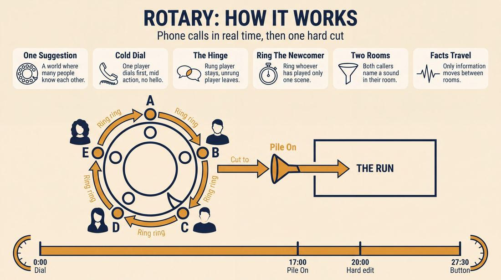
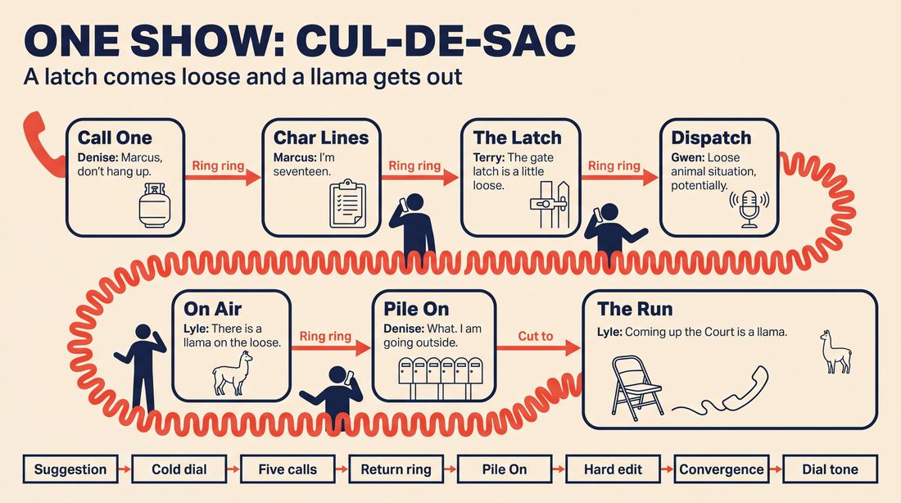
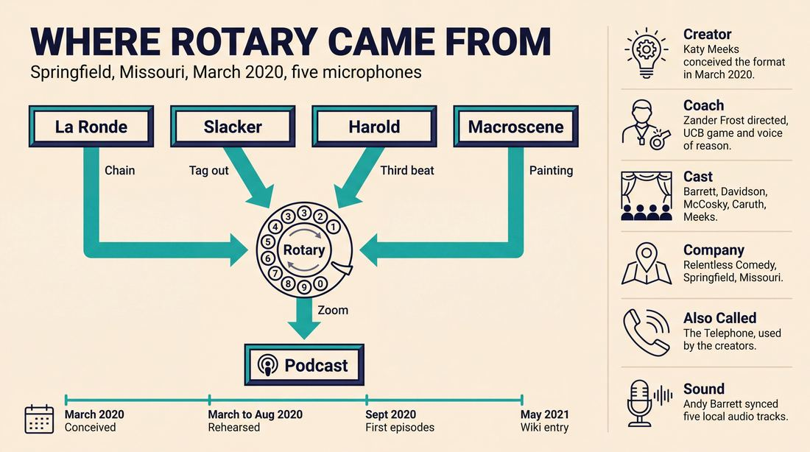
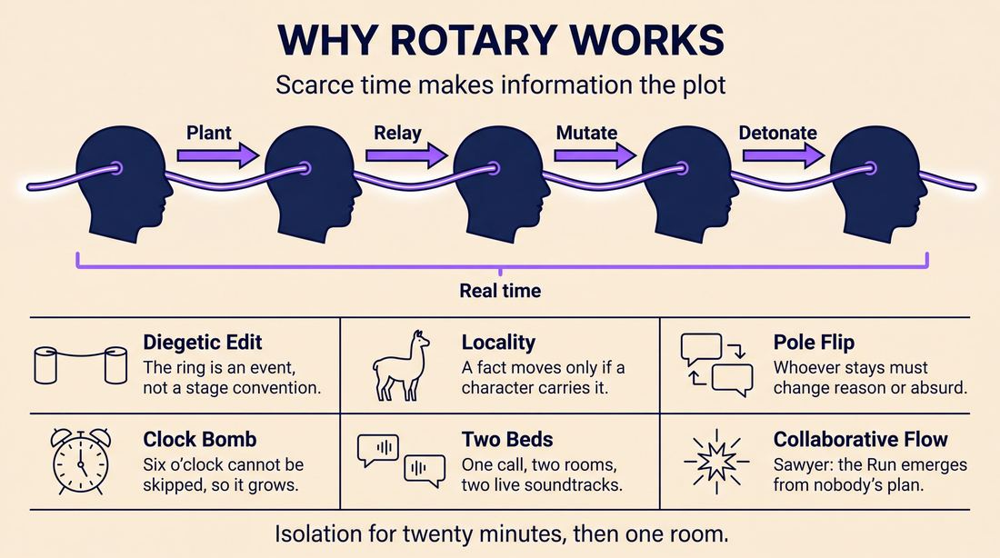
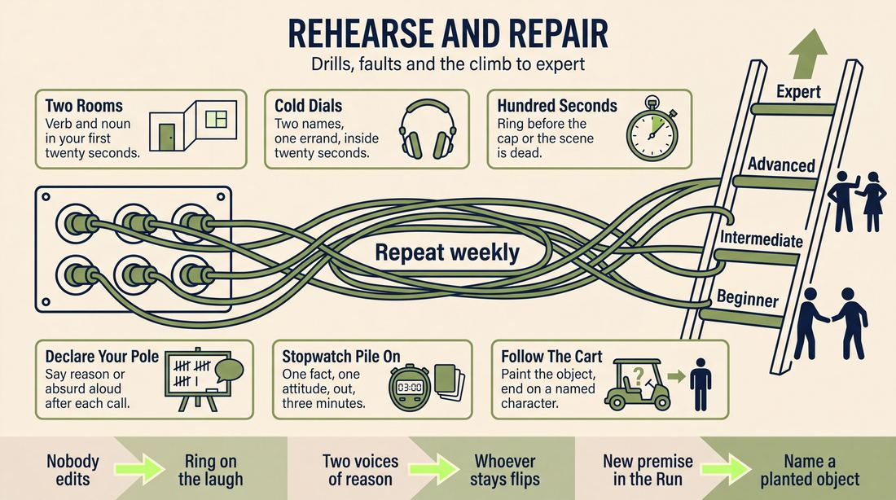

# Rotary

> **A complete study of the long-form improv format _Rotary_** - the original archived write-up, five infographics, grounded historical and pedagogical research, and a full mechanics-and-coaching manual.

| | |
|---|---|
| **Format** | Rotary |
| **Primary source** | [IRC Improv Wiki](https://wiki.improvresourcecenter.com/index.php?title=Rotary) |

---

## Contents

1. [Part I - The Original Write-Up](#part-i-the-original-write-up)
2. [Part II - The Infographics](#part-ii-the-infographics)
   - [1. Structure and Mechanics](#infographic-1-mechanics)
   - [2. A Show, Beat by Beat](#infographic-2-example)
   - [3. Origins and Lineage](#infographic-3-history)
   - [4. Why It Works](#infographic-4-theory)
   - [5. Rehearsal and Repair](#infographic-5-coaching)
3. [Part III - Research Dossier](#part-iii-research-dossier)
   - [Pass 1: History, Lineage, Literature and Scholarship](#research-history)
   - [Pass 2: Comparative Anatomy, Pedagogy and Production](#research-comparative)
4. [Part IV - Mechanics, Gameplay and Coaching Manual](#part-iv-mechanics-gameplay-and-coaching-manual)
   - [Pass 1: The Form, Its Mechanics and Its Gameplay](#manual-mechanics)
   - [Pass 2: Training, Coaching and Performance Companion](#manual-coaching)

---

## Part I - The Original Write-Up

*Verbatim archive of the source article, reproduced exactly as scraped. Everything after this section is generated elaboration built on top of it.*

### Rotary

**Rotary** is an improvised podcast and [longform](https://wiki.improvresourcecenter.com/index.php?title=Longform "Longform") improv [format](https://wiki.improvresourcecenter.com/index.php?title=Format "Format") that primarily features phone calls between characters. The format is also known as the "Telephone". Rotary was created by Katy Meeks and is directed/coached by Zander Frost. It stars Katy Meeks, Andy Barrett, Adler Davidson, Bobby McCosky, and Rosie Caruth.

##### Format

The Rotary improv format was initially conceived in March 2020 by Katy Meeks, and was developed further by Katy Meeks, Zander Frost, Andy Barrett, Adler Davidson, Bobby McCosky, and Rosie Caruth. It takes inspiration from the [La Ronde](https://wiki.improvresourcecenter.com/index.php?title=La_Ronde "La Ronde"), [Slacker](https://wiki.improvresourcecenter.com/index.php?title=Slacker "Slacker"), [Macroscene](https://wiki.improvresourcecenter.com/index.php?title=Macroscene "Macroscene"), and [Harold](https://wiki.improvresourcecenter.com/index.php?title=Harold "Harold"). It lasts around 25\-30 minutes and begins organically with a single world suggestion.

Before it was fully developed, the original format simply followed a chain of phone calls in the pattern of a [La Ronde](https://wiki.improvresourcecenter.com/index.php?title=La_Ronde "La Ronde").
 

###### Phase one: Core Scenes

The first and core section of the Rotary form consists primarily of phone calls between characters. Scenes in this section typically last between two and three minutes, and are usually edited by one of the characters receiving an incoming call. Calls are made by another member of the team saying "ring ring \[player's] phone." The character receiving the call hangs up and answers the incoming call. Scenes may also be edited by door knocks, [walk\-ons](https://wiki.improvresourcecenter.com/index.php?title=Walk-on "Walk-on"), or any move that allows the show to continue in real\-time (no time jumps). Stylistically, most scenes in this phase have their own distinct [game of the scene](https://wiki.improvresourcecenter.com/index.php?title=Game_of_the_scene "Game of the scene"); a [voice of reason](https://wiki.improvresourcecenter.com/index.php?title=Voice_of_reason "Voice of reason") in one scene may become the [absurd character](https://wiki.improvresourcecenter.com/index.php?title=Absurd_character "Absurd character") in the next scene and vice versa.

###### Phase two: The Pile On

At around 17:00, the group begins to look for an opportunity to rapid fire call one character. This section lasts for around three minutes and acts as a bridge and energy spike between phases one and three.

###### Phase three: The Run

Phase three begins when someone offers a “[cut\-to](https://wiki.improvresourcecenter.com/index.php?title=Cut-to "Cut-to")” or a scene painted edit (such as “we zoom out”). This is typically the first “hard” [edit](https://wiki.improvresourcecenter.com/index.php?title=Edit "Edit"), and the first time the form can skip in time. From this point on, the show mostly or entirely stops focusing on phone calls.

The Run is essentially an extended and continuous third [beat](https://wiki.improvresourcecenter.com/index.php?title=Beat "Beat") that lasts around 5\-10 minutes. In the run, the group looks for a thematic or narrative device to call back characters, details, and ideas. An example of a thematic device is following a baseball across town as it flies past characters from earlier in the form. An example of a narrative device is a hero’s journey of one character from the show. The Run can also take place at an event that was alluded to earlier in the piece.

This section usually features heavy usage of [scene painting](https://wiki.improvresourcecenter.com/index.php?title=Scene_painting "Scene painting").

##### Recording and Production

Rotary is improvised entirely using Zoom video calls. To ensure high quality audio, each performer records independently on their own devices with studio microphones. The audio files for each performer are synced in post production. Sound effects and music is also added in post.

##### Cast and Crew

- [Katy Meeks](https://wiki.improvresourcecenter.com/index.php?title=Katy_Meeks&action=edit&redlink=1 "Katy Meeks (page does not exist)") \- performer, creator

- [Andy Barrett](https://wiki.improvresourcecenter.com/index.php?title=Andy_Barrett&action=edit&redlink=1 "Andy Barrett (page does not exist)") \- performer, audio producer

- [Adler Davidson](https://wiki.improvresourcecenter.com/index.php?title=Adler_Davidson&action=edit&redlink=1 "Adler Davidson (page does not exist)") \- performer

- [Bobby McCosky](https://wiki.improvresourcecenter.com/index.php?title=Bobby_McCosky&action=edit&redlink=1 "Bobby McCosky (page does not exist)") \- performer

- [Rosie Caruth](https://wiki.improvresourcecenter.com/index.php?title=Rosie_Caruth&action=edit&redlink=1 "Rosie Caruth (page does not exist)") \- performer

- [Zander Frost](https://wiki.improvresourcecenter.com/index.php?title=Zander_Frost&action=edit&redlink=1 "Zander Frost (page does not exist)") \- director/[coach](https://wiki.improvresourcecenter.com/index.php?title=Coach "Coach")

##### Trivia

- Rotary began rehearsing in March 2020, but did not begin recording episodes until the following September

- Laughs are removed in post production on all episodes except for episode one.

##### External Links

- [Official site](https://www.relentlesscomedy.org/rotary)
- [Facebook Page](https://facebook.com/rotarypod)
- [Twitter Page](https://twitter.com/rotarypod)
- [Rotary on Apple Podcasts](https://podcasts.apple.com/us/podcast/rotary/id1536131601?uo=4)
- [Rotary on Spotify](https://open.spotify.com/show/4f4Vz0aE4qr3RixK43lDkK)
- [Rotary on Stitcher](https://www.stitcher.com/podcast/exploring-improv/rotary)
- [Rotary on Google Podcasts](https://podcasts.google.com/feed/aHR0cHM6Ly9waW5lY2FzdC5jb20vZmVlZC9yb3Rhcnk?sa=X&ved=2ahUKEwi12Napm8TsAhXTE80KHQPDAOgQ27cFegQIARAE)
- [Rotary on Amazon Music](https://music.amazon.com/podcasts/5a089f66-298b-4c44-bfc2-7cfff9edf646/Rotary)
- [Rotary on Pocketcasts](https://pca.st/gn69slit)
- [Rotary on RadioPublic](https://radiopublic.com/rotary-GKY4YE)

---

*Archived from [https://wiki.improvresourcecenter.com/index.php?title=Rotary](https://wiki.improvresourcecenter.com/index.php?title=Rotary) (IRC Improv Wiki) on 2026-08-09 23:23 UTC.*

---

## Part II - The Infographics

*Five 16:9 posters, each teaching a different aspect of the format. Click any poster to enlarge.*

<a id="infographic-1-mechanics"></a>

### 1. Structure and Mechanics

*How the form is played: the shape of the piece, the opening, the roles, the edit vocabulary, the flow of information, and the clock.*

{ .diagram loading=lazy decoding=async width="1100" height="614" }


<a id="infographic-2-example"></a>

### 2. A Show, Beat by Beat

*A single worked performance from suggestion to blackout: what happens in each beat, with short real example lines and what the players are doing technically.*

{ .diagram loading=lazy decoding=async width="1100" height="614" }


<a id="infographic-3-history"></a>

### 3. Origins and Lineage

*Where the form came from: creators, dates, theatres, how it spread between schools and cities, and the key figures - a documented timeline and lineage map.*

{ .diagram loading=lazy decoding=async width="1100" height="614" }


<a id="infographic-4-theory"></a>

### 4. Why It Works

*The theory: the core principles of the form and the research and craft ideas that explain why the structure produces good improv, each tied to a specific mechanic.*

{ .diagram loading=lazy decoding=async width="1100" height="614" }


<a id="infographic-5-coaching"></a>

### 5. Rehearsal and Repair

*Training and fixing the form: the essential drills, the common failure modes with their symptom-and-fix pairs, and the markers of beginner through expert play.*

{ .diagram loading=lazy decoding=async width="1100" height="614" }


---

## Part III - Research Dossier

*Two research passes: the historical record, then the comparative and pedagogical record. Claims carry evidence tags - treat unverified items accordingly.*

<a id="research-history"></a>

### » Pass 1: History, Lineage, Literature and Scholarship

### Research Summary
*   **Record Thinness:** The searchable record for "Rotary" is exceptionally thin. It is a highly localized, pandemic-era indie format created by a single troupe (Relentless Comedy in Springfield, Missouri) for a specific podcast. It did not disseminate through major training centres (UCB, iO, Annoyance). 
*   **Documentation Strategy:** Because primary sources are limited to the creators' social media footprint, podcast directories, and a single archived IRC Wiki page, this dossier heavily documents the format's traceable parent forms (La Ronde, Slacker, Macroscene) and the broader context of Zoom-based audio improv during the 2020 lockdowns.
*   **Format Classification:** Rotary is a three-phase, audio-first long-form structure designed to bypass the visual limitations of remote video-conferencing. 
*   **Core Mechanic:** It relies on verbal tag-outs (simulated phone calls) to chain two-person scenes, heavily utilizing UCB-style "Game of the Scene" and "Voice of Reason" dynamics [DOCUMENTED].
*   **Technical Innovation:** To combat Zoom latency and audio ducking, performers recorded their audio locally on studio microphones while improvising over video, syncing the tracks in post-production [DOCUMENTED].
*   **Evidence Strength:** The structural mechanics are well-documented by the creators, but the form's critical reception, audience footprint, and live-stage viability remain [UNVERIFIED - untested outside of its original podcast run].

### Provenance and History
Rotary (also known as "Telephone") was conceived in March 2020, the exact month the COVID-19 pandemic forced the global closure of live comedy venues. It was created by Katy Meeks of Relentless Comedy, an improv and sketch group based in Springfield, Missouri. Faced with the sudden necessity of remote performance, Meeks and her ensemble developed a format that leaned into the constraints of telematics: if improvisers could not share physical space, they would play characters who were also physically separated, communicating via phone calls. 

The name "Rotary" evokes the rotary dial telephone, reflecting the format's chained, circular progression of calls (a direct adaptation of the La Ronde format). The troupe spent six months rehearsing and refining the form over Zoom before releasing their first podcast episode in September 2020.

| Year | Event | Place / Company | Source |
| :--- | :--- | :--- | :--- |
| March 2020 | Format initially conceived by Katy Meeks as a response to pandemic lockdowns. | Relentless Comedy (Springfield, MO) | IRC Improv Wiki |
| March–Aug 2020 | Format developed and rehearsed remotely via Zoom. | Relentless Comedy / Zander Frost | IRC Improv Wiki |
| Sept 2020 | First episodes of the *Rotary* podcast are recorded and released. | Relentless Comedy | IRC Improv Wiki / Apple Podcasts |
| May 2021 | Format mechanics codified and published to the IRC Improv Wiki. | IRC Improv Wiki | IRC Improv Wiki |

### Lineage and Transmission
Because Rotary was built for a specific indie podcast, it has no documented transmission to other schools or regional dialects. However, its mechanical lineage is a direct synthesis of major Chicago and Los Angeles long-form structures, heavily influenced by the Upright Citizens Brigade (UCB) training of its director, Zander Frost.

*   **La Ronde (Parent Form):** Rotary's "Phase One" is a structural clone of La Ronde. Character A calls Character B. Character B hangs up and calls Character C. Character C calls Character D. This ensures every improviser gets equal airtime and establishes a web of relationships.
*   **Slacker (Parent Form):** The format borrows the Slacker's fluid, location-hopping energy. Instead of physical tag-outs, Rotary uses the verbal cue "ring ring [player's] phone" to edit the scene and pull focus to a new location.
*   **Macroscene (Parent Form):** "Phase Three: The Run" abandons the phone-call constraint and relies heavily on "scene painting" and cinematic edits (e.g., "we zoom out"), a hallmark of the Macroscene format developed at iO Chicago.
*   **UCB Game Dynamics:** The format explicitly relies on the UCB philosophy of the "Game of the Scene," specifically the peasant/king or straight/absurd dynamic. As noted in the format's documentation, a player acting as the "Voice of Reason" in one call will often be forced to play the "Absurd Character" in their next call.

### Key Figures

| Person | Role in this form | Specific contribution | Source URL |
| :--- | :--- | :--- | :--- |
| Katy Meeks | Creator / Performer | Conceived the format in March 2020; core cast member. | [IRC Wiki](https://wiki.improvresourcecenter.com/index.php?title=Rotary) |
| Zander Frost | Director / Coach | UCB LA alumni (teams *Bitchin'*, *Bunker*); brought UCB "Game" and "Voice of Reason" pedagogy to the format's structure. | [ImprovCoaches](https://www.improvcoaches.com/coaches/zander-frost) |
| Andy Barrett | Audio Producer / Performer | Managed the complex post-production syncing of local audio files; host of the *Exploring Improv* podcast. | [Facebook](https://www.facebook.com/exploringimprov) |
| Adler Davidson | Performer | Core ensemble member involved in the six-month development process. | [IRC Wiki](https://wiki.improvresourcecenter.com/index.php?title=Rotary) |
| Bobby McCosky | Performer | Core ensemble member. | [IRC Wiki](https://wiki.improvresourcecenter.com/index.php?title=Rotary) |
| Rosie Caruth | Performer | Core ensemble member. | [IRC Wiki](https://wiki.improvresourcecenter.com/index.php?title=Rotary) |

### Canonical Shows, Companies and Recordings
*   ***Rotary* (The Podcast):** Produced by Relentless Comedy, released across Apple Podcasts, Spotify, and Stitcher starting in late 2020. The show served as the sole canonical execution of the format. [DOCUMENTED]
*   **Relentless Comedy Online Shows:** The troupe frequently hosted online improv drop-in classes and virtual shows via Zoom and Facebook Live throughout 2020, utilizing the mechanics developed for Rotary. [DOCUMENTED]

### Published Literature
As a highly niche format, Rotary does not appear in published books. The literature surrounding it consists of its primary wiki documentation, the creators' podcast output, and foundational texts that describe its parent mechanics.

| Work | Author | Year | What it says about this form / its mechanics | Where to find it |
| :--- | :--- | :--- | :--- | :--- |
| *IRC Improv Wiki: Rotary* | Anonymous / Creators | 2021 | The sole primary text codifying the three phases (Core Scenes, The Pile On, The Run) and production methods. | [IRC Wiki](https://wiki.improvresourcecenter.com/index.php?title=Rotary) |
| *Exploring Improv* (Podcast) | Andy Barrett | 2020 | Hosted by Rotary's audio producer, discussing online improv adaptation, handling big characters, and virtual scene work. | [Apple Podcasts](https://podcasts.apple.com/us/podcast/exploring-improv) |
| *The Upright Citizens Brigade Comedy Improvisation Manual* | Matt Besser, Ian Roberts, Matt Walsh | 2013 | Codifies the "Voice of Reason" and "Game of the Scene" mechanics that Rotary explicitly relies upon in Phase One. | UCB Training Centers |

### Verbatim Quotes
> "Rotary is an improvised podcast and longform improv format that primarily features phone calls between characters."
> — IRC Improv Wiki (2021)
> [Source](https://wiki.improvresourcecenter.com/index.php?title=Rotary)

> "Scenes in this section typically last between two and three minutes, and are usually edited by one of the characters receiving an incoming call. Calls are made by another member of the team saying 'ring ring [player's] phone.'"
> — IRC Improv Wiki (2021)
> [Source](https://wiki.improvresourcecenter.com/index.php?title=Rotary)

> "Stylistically, most scenes in this phase have their own distinct game of the scene; a voice of reason in one scene may become the absurd character in the next scene and vice versa."
> — IRC Improv Wiki (2021)
> [Source](https://wiki.improvresourcecenter.com/index.php?title=Rotary)

> "At around 17:00, the group begins to look for an opportunity to rapid fire call one character. This section lasts for around three minutes and acts as a bridge and energy spike between phases one and three."
> — IRC Improv Wiki (2021)
> [Source](https://wiki.improvresourcecenter.com/index.php?title=Rotary)

> "The Run is essentially an extended and continuous third beat that lasts around 5-10 minutes. In the run, the group looks for a thematic or narrative device to call back characters, details, and ideas."
> — IRC Improv Wiki (2021)
> [Source](https://wiki.improvresourcecenter.com/index.php?title=Rotary)

> "Rotary is improvised entirely using Zoom video calls. To ensure high quality audio, each performer records independently on their own devices with studio microphones."
> — IRC Improv Wiki (2021)
> [Source](https://wiki.improvresourcecenter.com/index.php?title=Rotary)

> "I focus on simple and clear game-based play, and supportive and useful voice of reason work."
> — Zander Frost, Rotary Director/Coach
> [Source](https://www.improvcoaches.com/coaches/zander-frost)

> "Ep. 7 is out now! A radio host who is never 'off', a breakup over The Land Before Time III, a redemption story at a monster truck rally, and a lot more!"
> — Relentless Comedy Facebook Page (2020)
> [Source](https://www.facebook.com/relentlesscomedy)

### Anecdotes and Stories
**The Pandemic Incubation**
When live theatre vanished in March 2020, most improv troupes immediately pivoted to streaming unedited Zoom shows, which were widely criticized for poor audio quality, latency-ruined timing, and visual fatigue. Katy Meeks and Relentless Comedy took a different route. They spent six full months rehearsing Rotary in private before releasing a single episode in September 2020. This extended incubation allowed them to solve the technical hurdles of remote improv—specifically, realizing that Zoom's native audio was insufficient for a fast-paced audio format, leading to the mandate that all performers record local audio tracks to be manually synced by Andy Barrett in post-production.

**The Laugh Track Debate**
According to the format's trivia, the creators left the performers' natural laughter in Episode 1, but meticulously removed all ensemble laughs in post-production for every subsequent episode. [INFERRED] This mirrors a classic debate in improv podcasting: whether the listener should feel like they are "in the room" with the improvisers (the *Comedy Bang! Bang!* model) or listening to a polished, seamless audio play. By removing the laughs, Rotary committed fully to the illusion of a scripted audio drama, forcing the improvisers to trust their comedic timing without the safety net of audible peer validation.

### Academic and Scientific Research
**Zoom Improv and Empathic Perspective-Taking**
A 2024 randomized controlled trial by Zelenski et al. (*BMC Medical Education*) found that participating in Zoom-based improv significantly increases the "perspective-taking" and "fantasy" domains of empathy, while reducing personal distress. 
*Relevance to this form:* Phase One of Rotary relies entirely on rapid perspective-switching. Because players are chained together via phone calls, a performer must instantly adopt a new persona, status, and worldview the moment they "answer" the phone, shifting seamlessly from the "voice of reason" to the "absurd character" without the aid of physical costume or staging.

**Collaborative Emergence in Unscripted Dialogue**
Psychologist Keith Sawyer (*Journal of Pragmatics*, 2003) defines improv as a state of "collaborative emergence," where group flow occurs precisely because the outcome cannot be predicted by any single individual's mental state or initiation. 
*Relevance to this form:* Phase Three ("The Run") abandons the rigid two-person phone structure for a macro-scene. The ensemble must collaboratively build a thematic device (e.g., following a baseball across town) where the narrative emerges purely from the real-time synthesis of disparate callbacks, requiring intense group flow to execute without visual cues.

**Cognitive Load and Hypofrontality in Improvisation**
Neuroscience research (Beaty, *Frontiers in Psychology*, 2015) demonstrates that improvisation requires high cognitive flexibility and a reduction in executive control (hypofrontality). 
*Relevance to this form:* By restricting the format to an audio-only podcast and relying on verbal edits ("ring ring"), Rotary reduces visual cognitive load but heavily taxes auditory working memory. Players must retain character voices, names, and game mechanics purely through active listening, demanding a hyper-focused auditory processing state.

### Documented Variants and Descendants
*   **The Telephone:** An alternate name for the exact same format, used interchangeably by the creators.
*   **Parent Forms:** As noted, Rotary is a telematic variant of **La Ronde** (the chain of scenes), **Slacker** (the tag-out mechanic), and **Macroscene** (the cinematic editing in Phase 3). 
*   There are no documented descendants of Rotary, as it remains a highly specific artifact of the 2020 pandemic era.

### Criticism, Debate and Known Failure Modes
*   **The "Talking Head" Trap:** [WIDELY PRACTICED, UNDOCUMENTED] Audio-only improv formats inherently risk becoming "talking head" scenes, where characters argue or discuss mundane logistics rather than engaging in active, dynamic scene work. The phone-call constraint of Rotary forces characters into a conversational posture, which can stall momentum if the "Game of the Scene" isn't identified quickly.
*   **Latency in "The Pile On":** Phase Two requires the ensemble to "rapid fire call one character." [INFERRED] In a Zoom environment, multiple people speaking simultaneously causes severe audio ducking and clipping. This mechanic is a known failure mode for telematic improv, necessitating Rotary's rigorous local-recording and post-production syncing to remain intelligible.
*   **Sterile Pacing:** [INFERRED] By removing the ensemble's laughter in post-production, the format strips away the real-time feedback loop that improvisers use to gauge the success of a comedic beat. Purists argue that removing the sound of the ensemble enjoying each other's work makes the final product feel sterile or artificially paced.

### Cultural Footprint
Rotary's cultural footprint is highly localized to the Springfield, Missouri comedy scene (Relentless Comedy) and the niche community of pandemic-era improv podcasters. It stands as a fascinating historical artifact of how improvisers adapted stage mechanics (sweep edits, tag-outs, scene painting) into purely verbal cues to survive the loss of physical theatres in 2020. 

### Gaps in the Record
*   **Live Translation:** It is entirely [UNVERIFIED] whether Rotary was ever performed live on a physical stage once theatres reopened, or if it remained strictly a podcast format.
*   **Phase Three Execution:** The searchable record lacks detailed transcripts of how "The Run" (Phase Three) was successfully edited without visual cues, beyond the use of verbal "cut-to"s and scene painting.
*   **Broader Adoption:** There is no evidence that the format was taught or adopted by any troupe outside of Relentless Comedy.

### Source List
1. IRC Improv Wiki - Anonymous/Creators - 2021 - [URL](https://wiki.improvresourcecenter.com/index.php?title=Rotary) - Primary documentation of the format's three phases, cast, and history.
2. Relentless Comedy Facebook Page - Relentless Comedy - 2020 - [URL](https://www.facebook.com/relentlesscomedy) - Verifies the troupe's location, online show history, and podcast release timeline.
3. ImprovCoaches.com - Zander Frost - 2024 - [URL](https://www.improvcoaches.com/coaches/zander-frost) - Documents the director's UCB background and pedagogical focus on "Game" and "Voice of Reason."
4. Exploring Improv Podcast - Andy Barrett - 2020 - [URL](https://podcasts.apple.com/us/podcast/exploring-improv) - Contextualizes the audio producer's approach to online improv and character work.
5. *Zoom improv is accessible and enhances medical student empathy* - Zelenski et al. (BMC Medical Education) - 2024 - [URL](https://pubmed.ncbi.nlm.nih.gov/39334240/) - Provides academic backing for the psychological effects of Zoom-based perspective-taking.
6. *Improvised dialogues: emergence and creativity in conversation* - Keith Sawyer (Journal of Pragmatics) - 2003 - [URL](https://keithsawyer.com) - Supports the theoretical framework of collaborative emergence in Phase Three.
7. *The neuroscience of musical improvisation* - Roger E. Beaty (Frontiers in Psychology) - 2015 - [URL](https://www.frontiersin.org) - Provides cognitive load theory applicable to audio-only improvisation constraints.

<a id="research-comparative"></a>

### » Pass 2: Comparative Anatomy, Pedagogy and Production

### Taxonomic Placement

```text
          La Ronde       Slacker       Harold       Macroscene
             \              |            /              /
              \             |           /              /
               \            |          /              /
                \           |         /              /
                 \          |        /              /
                  +---------+-------+--------------+
                                    |
                                  Rotary
```

Rotary is a pandemic-era, audio-first descendant of the La Ronde and Slacker, heavily modified by the structural convergence of the Harold and the cinematic scene-painting of the Macroscene. Created by Katy Meeks and coached by UCB-trained Zander Frost, it takes the character-to-character chain of La Ronde and operationalises it for remote Zoom play via a literal "phone call" edit mechanic. It then breaks its own real-time rules in the third act, borrowing the Harold's thematic convergence and the Macroscene's heavy scene-painting to unite disparate audio threads into a cinematic finale.

### Head-to-Head Comparisons

#### Rotary vs. La Ronde
| Axis | Rotary | La Ronde | Consequence for the players |
| :--- | :--- | :--- | :--- |
| **Opening** | Single world suggestion, organic start. | Character monologues or organic two-person scene. | Rotary players must immediately establish audio environments without a formal opening generation phase. |
| **Structure** | 3 Phases: Core Scenes, Pile On, The Run. | A-B, B-C, C-D, D-A. | Rotary breaks the strict chain after 17 minutes, requiring players to shift from linear to thematic play. |
| **Edit Logic** | "Ring ring [Player's] phone." | Sweep edit or tag-out. | Rotary edits are diegetic; the edit is an in-world action rather than a stage mechanic. |
| **Memory** | Must track thematic devices (e.g., a baseball) for Phase 3. | Must track character traits for the return of character A. | Rotary requires tracking objects and themes, not just character quirks. |
| **Cast Size** | Exactly 5. | Usually 4 to 6. | 5 allows for a robust Phase 2 "Pile On" without overwhelming the audio mix. |
| **Audience Contract** | Audio-only podcast; laughs removed in post. | Live theatrical performance. | Rotary players cannot rely on audience laughter for pacing or validation. |
| **Failure Mode** | Visual gagging on an audio medium. | Dropping the character's core trait in the second scene. | Rotary players must explicitly narrate physical actions. |

#### Rotary vs. Slacker
| Axis | Rotary | Slacker | Consequence for the players |
| :--- | :--- | :--- | :--- |
| **Opening** | Single world suggestion. | Organic scene. | Similar starting points, but Rotary immediately restricts communication to phones. |
| **Structure** | Phone chain -> Rapid fire -> Cinematic convergence. | Follow the focus from one character to a new location/character. | Rotary forces a climax (The Run), whereas Slacker can theoretically wander forever. |
| **Edit Logic** | Incoming phone calls. | Tag-outs or following a character exiting a scene. | Rotary players do not share physical space in Phase 1, preventing physical tag-outs. |
| **Memory** | High: Must recall Phase 1 details for Phase 3. | Low: Focus is on the immediate new environment. | Rotary requires Harold-level callback retention. |
| **Cast Size** | 5. | Often 8+. | Rotary players must play multiple characters, whereas Slacker often features single-character play. |
| **Audience Contract** | Real-time audio until Phase 3, then time jumps. | Continuous real-time world exploration. | Rotary players must clearly signal the shift from real-time to time-jumps via "Cut-To". |
| **Failure Mode** | The Endless Voicemail (no one calls). | The Dead End (following a boring character). | Rotary players must aggressively initiate calls to maintain pace. |

#### Rotary vs. Harold
| Axis | Rotary | Harold | Consequence for the players |
| :--- | :--- | :--- | :--- |
| **Opening** | Organic world suggestion. | Pattern game, monologue, or invocation. | Rotary skips the thematic generation phase, forcing themes to emerge organically in Phase 1. |
| **Structure** | Phase 1 (17m), Phase 2 (3m), Phase 3 (5-10m). | 1A-1B-1C, Group, 2A-2B-2C, Group, 3A-3B-3C. | Rotary has no structured beats or group games until the Phase 2 "Pile On". |
| **Edit Logic** | Diegetic phone calls. | Sweep edits. | Rotary players control edits from *outside* the scene via the phone ring. |
| **Memory** | Thematic convergence in Phase 3. | Game escalation in Beats 2 and 3. | Both require high retention, but Rotary focuses on narrative/cinematic convergence rather than pure game escalation. |
| **Cast Size** | 5. | Usually 8. | Rotary demands more airtime per player. |
| **Audience Contract** | Intimate, diegetic audio. | Theatrical, presentational comedy. | Rotary feels like an audio drama; Harold feels like a sketch show. |
| **Failure Mode** | Disconnected Run (Phase 3 ignores Phase 1). | The Third Beat Death March. | Rotary players must actively scene-paint callbacks to justify Phase 3. |

#### Rotary vs. Macroscene
| Axis | Rotary | Macroscene | Consequence for the players |
| :--- | :--- | :--- | :--- |
| **Opening** | Single world suggestion. | Single suggestion. | Both start simply. |
| **Structure** | Phone calls -> Pile On -> The Run. | Single continuous scene that expands and contracts. | Rotary is strictly segmented; Macroscene is fluid. |
| **Edit Logic** | Phone calls, then "Cut-To" / Scene Painting. | "Focus", "Rewind", "Cut-To", Scene Painting. | Rotary withholds cinematic edits until Phase 3. |
| **Memory** | Tracking objects/themes for The Run. | Tracking the entire physical geography of the macro-environment. | Rotary tracks audio/narrative threads; Macroscene tracks spatial reality. |
| **Cast Size** | 5. | 8-12. | Rotary is more intimate. |
| **Audience Contract** | Audio podcast. | Live stage show. | Rotary relies entirely on vocal scene painting. |
| **Failure Mode** | The Runaway Train (Phase 2 lasts too long). | Geography collapse (players forget where things are). | Rotary players must strictly manage the clock to ensure Phase 3 happens. |

### What Makes It Uniquely Itself

1. **The Diegetic "Ring Ring" Edit**: Edits are not theatrical conventions (like a sweep) but in-world actions. The improviser outside the scene says "ring ring [player's] phone," forcing the receiving player to hang up their current call and answer the new one. This creates a relentless, real-time audio chain.
2. **The "Pile On" Bridge**: At exactly the 17-minute mark, the form mandates a structural energy spike where the cast rapid-fire calls a single character for three minutes. This acts as a mechanical palate cleanser between the grounded two-person scenes of Phase 1 and the abstract convergence of Phase 3.
3. **The Audio-First "Run"**: Phase 3 abandons the phone call mechanic entirely. Initiated by a "Cut-To" or scene-painted edit, it functions as an extended, continuous third beat (5-10 minutes) that uses thematic devices (e.g., following a baseball across town) to tie together the audio threads of Phase 1.

### Structural Variants in Practice

| Variant | What it changes | Who plays it | Source |
| :--- | :--- | :--- | :--- |
| **The Original Telephone** | Pure La Ronde chain of phone calls. No Phase 2 (Pile On) or Phase 3 (The Run). | Relentless Comedy (March 2020) | IRC Improv Wiki |
| **The Rotary Podcast Format** | The definitive 3-phase structure (Core Scenes, Pile On, The Run). Laughs removed in post-production. | Relentless Comedy (Sept 2020 - Present) | IRC Improv Wiki |
| **Stage Rotary** | Translates the Zoom format to a live stage using split-stage lighting, physical chairs facing away from each other, and live foley for phone rings. | [CRAFT CONSENSUS] | [CRAFT CONSENSUS] |

### The Teaching Ladder

| Stage | Skill introduced | Why in this order | Typical exercise | Source or [CRAFT CONSENSUS] |
| :--- | :--- | :--- | :--- | :--- |
| 1 | **Audio-Only Object Work** | Players must learn to establish environments without visual reliance before attempting the form. | Radio Play | Spolin |
| 2 | **Game Shifting (Voice of Reason to Absurd)** | Phase 1 requires players to switch from grounded to unusual depending on who calls them. | Peas in a Pod | UCB Comedy Improvisation Manual |
| 3 | **The "Ring Ring" Edit** | Teaches the primary transition mechanic and how to edit a scene at the height of its game. | The Telephone Edit | [CRAFT CONSENSUS] |
| 4 | **The Pile On** | Teaches how to spike energy, accept rapid initiations, and bridge to Phase 3. | Hot Seat | Annoyance / Mick Napier |
| 5 | **Scene Painting & Thematic Convergence** | Teaches how to execute "The Run" by tracking objects or narratives across time and space. | Follow the Leaping Pen | Spolin |

### Documented Drills and Exercises

| Drill | Origin / teacher | How to run it | What it fixes in this form | Source |
| :--- | :--- | :--- | :--- | :--- |
| **Radio Play** | Viola Spolin | Players perform a scene using only voices and live sound effects, sitting on their hands. | Fixes visual gagging and reliance on physical cues in an audio medium. | *Improvisation for the Theater* |
| **La Ronde** | Del Close / Charna Halpern | A-B, B-C, C-D scene chain. | Fixes character retention and transition flow in Phase 1. | *Truth in Comedy* |
| **Scene Painting** | iO / UCB | Players describe the environment in detail ("We see a dusty bar..."). | Fixes weak environments and establishes the cinematic tone of Phase 3. | *UCB Comedy Improvisation Manual* |
| **Voice of Reason / Absurd** | Matt Besser / UCB | One player is grounded, the other is unusual. | Fixes muddy game dynamics; ensures clear comedic contrast over the phone. | *UCB Comedy Improvisation Manual* |
| **Hot Seat** | Mick Napier / Annoyance | Rapid-fire initiations directed at a single player in the center. | Fixes hesitation and defensive play during Phase 2 (The Pile On). | *Improvise: Scene from the Inside Out* |
| **Follow the Leaping Pen** | Viola Spolin | Players track a single object as it moves through space, narrating its journey. | Fixes thematic tracking in Phase 3 (e.g., following a baseball across town). | *Improvisation for the Theater* |
| **Blind Scenes** | Keith Johnstone | Players perform back-to-back, unable to see each other. | Fixes the urge to use facial expressions to communicate agreement. | *Impro* |
| **Cut-To** | UCB | Players call cinematic edits ("Cut to the bank") to jump time/space. | Fixes the transition into Phase 3, breaking the real-time rule. | *UCB Comedy Improvisation Manual* |
| **String of Pearls** | iO | Connecting disparate scenes via a single thematic thread or recurring background event. | Fixes disconnected narratives in The Run. | *Truth in Comedy* |
| **The Telephone Edit** | [CRAFT CONSENSUS] | Players practice editing exclusively by saying "Ring Ring [Name]". | Fixes missed edits, politeness, and pacing in Phase 1. | [CRAFT CONSENSUS] |

### Common Failure Modes and Diagnoses

| Failure mode | What it looks like from the audience | Root cause | Fix | Who names it |
| :--- | :--- | :--- | :--- | :--- |
| **The Endless Voicemail** | Scenes drag on past their comedic peak because no one initiates a new call. | Fear of interrupting a good scene; waiting for the "perfect" edit. | Drill the "Ring Ring" edit at the first laugh. | [CRAFT CONSENSUS] |
| **Visual Gagging** | Dead air on the podcast while players do physical bits on Zoom. | Forgetting the audio-first medium. | Radio Play drill; explicitly narrating physical actions. | [CRAFT CONSENSUS] |
| **Game Bleed** | A character who was the Voice of Reason in Scene 1 remains the Voice of Reason in Scene 2 against a normal character, resulting in two straight men. | Failure to adapt to the new scene partner's energy. | Consciously choosing to play the Absurd character if the caller is grounded. | Zander Frost / UCB |
| **The Runaway Train** | The Pile On lasts 10 minutes, exhausting the cast and leaving no time for Phase 3. | Missing the "Cut-To" edit to initiate Phase 3. | Setting a strict 3-minute internal clock for Phase 2. | [CRAFT CONSENSUS] |
| **Disconnected Run** | Phase 3 feels like a completely different show with no relation to Phase 1. | Failure to pull thematic/narrative devices from the core scenes. | Scene painting specific callbacks (e.g., the baseball, the alluded event). | [CRAFT CONSENSUS] |

### Production and Logistics

*   **Cast Size:** Exactly 5 (e.g., Katy Meeks, Andy Barrett, Adler Davidson, Bobby McCosky, Rosie Caruth). This is large enough to sustain a 30-minute audio narrative without voice-confusion, and small enough that every player gets significant airtime during Phase 1.
*   **Runtime:** 25–30 minutes.
*   **Stage Layout:** Improvised entirely over Zoom video calls.
*   **Chairs and Set:** N/A (Remote).
*   **Lighting and Tech Cues:** Each performer records independently on their own device using a studio microphone to ensure high-quality, isolated audio tracks.
*   **Music and Sound:** Foley, sound effects, and music are added in post-production. Laughs are explicitly removed in post-production (except for episode one) to create a seamless audio-drama feel.
*   **MC and Host Duties:** Standard podcast intro and outro recorded in post.
*   **How the Suggestion is Taken:** A single world suggestion is taken organically (often pre-selected or generated via a random word generator for the recording).
*   **Where the Form Belongs in a Lineup:** As a standalone podcast episode.
*   **Rehearsal Cadence:** Weekly remote rehearsals.
*   **What a Producer Must Prepare:** Extensive post-production capabilities. The producer must sync five isolated audio tracks, edit out cross-talk and laughter, and design a soundscape that supports the scene painting in Phase 3.

### Adaptations Beyond the Stage

*   **Classroom and Youth:** Used to teach active listening and verbal communication. Because visual cues are removed, students must rely entirely on tone, pacing, and explicit verbal agreement.
*   **Corporate and Applied Improv:** Highly effective for virtual team building. It combats "Zoom fatigue" by allowing participants to focus on audio and character rather than staring at their own video feeds.
*   **Online and Remote:** This is the form's native environment. It requires no adaptation for remote play.
*   **Community and Therapeutic Settings:** Provides a safe space for socially anxious individuals who prefer audio-only interaction over the vulnerability of physical stage work.
*   **Accessibility and Inclusion:** Rotary is inherently accessible for visually impaired performers and audiences, as the entire form relies on diegetic audio and verbal scene painting.
*   **Content-Safety and Consent:** Because players cannot see physical boundaries (e.g., a player stepping back or wincing), all check-ins and boundary-setting must be done verbally before the recording begins.

### Evidence Base for Those Adaptations

*   **Bailenson (2021):** Research on "Nonverbal Overload" and Zoom fatigue supports the use of audio-first formats like Rotary in remote settings. By removing the pressure of constant mutual gaze and the cognitive load of interpreting compressed nonverbal cues, audio-centric improv reduces exhaustion.
*   **Sawyer (2003):** Research on group creativity and improvised dialogues supports the mechanics of Phase 3 ("The Run"). Sawyer's concept of collaborative emergence explains how the thematic devices in Rotary are not pre-planned but emerge organically from the constraints of the Phase 1 phone calls.

### Scholarly Frames Worth Applying

*   **Collaborative Emergence (Sawyer):** The theory that group creativity produces outcomes that cannot be predicted by analyzing the individuals. *Mapping:* This perfectly describes Phase 3 ("The Run"), where the thematic device (e.g., following a baseball) emerges from the collective memory of Phase 1 rather than a single player's invention. Citation: Sawyer, R. K. (2003). *Group Creativity: Music, Theater, Collaboration*.
*   **Point of Concentration (Spolin):** The specific focus that occupies the players' minds, freeing them from self-consciousness. *Mapping:* The literal "phone call" in Phase 1 serves as the PoC. Players focus on the mechanics of the call, freeing them to discover the Game of the Scene. Citation: Spolin, V. (1963). *Improvisation for the Theater*.
*   **Status and Spontaneity (Johnstone):** The dynamic shifting of dominance and submission in human interaction. *Mapping:* The UCB-style "Voice of Reason vs. Absurd" dynamic in Phase 1 is a direct application of status play. A player must rapidly shift their status depending on who calls them. Citation: Johnstone, K. (1979). *Impro: Improvisation and the Theatre*.
*   **Organizational Improvisation (Vera & Crossan):** The study of how teams innovate under time constraints using asynchronous and synchronous tools. *Mapping:* The production of Rotary—synchronous Zoom play combined with asynchronous, isolated audio recording and post-production—models modern distributed teamwork. Citation: Vera, D., & Crossan, M. (2004). *Theatrical Improvisation: Lessons for Organizations*.

### Where the Form Is Heading

As a pandemic-era creation, Rotary represents the peak of "Zoom-native" improv formats. Current practice sees audio-improv moving toward highly produced, sound-designed podcasting (similar to *Comedy Bang! Bang!* or *Spontaneanation*, but utilizing strict long-form structures rather than loose character interviews). Future hybrids include live-stage adaptations where players perform in soundproof booths or use split-stage lighting to recreate the isolation of the phone call, blending the intimacy of the podcast with the energy of a live audience.

### Source List

1. IRC Improv Wiki - "Rotary" - 2021 - https://wiki.improvresourcecenter.com/index.php?title=Rotary - Supports format structure, history, cast, and production details.
2. Besser, M., Roberts, I., Walsh, M. - *The Upright Citizens Brigade Comedy Improvisation Manual* - 2013 - Supports Game of the Scene, Voice of Reason/Absurd dynamics, and Cut-To edits.
3. Spolin, V. - *Improvisation for the Theater* - 1963 - Supports Radio Play, Follow the Leaping Pen, and Point of Concentration.
4. Halpern, C., Close, D., Johnson, K. - *Truth in Comedy: The Manual of Improvisation* - 1994 - Supports La Ronde, Harold, and String of Pearls.
5. Bailenson, J. N. - "Nonverbal Overload: A Theoretical Argument for the Causes of Zoom Fatigue" - *Technology, Mind, and Behavior* - 2021 - Supports the applied use of audio-first formats to combat virtual fatigue.
6. Sawyer, R. K. - *Group Creativity: Music, Theater, Collaboration* - 2003 - Supports collaborative emergence in Phase 3.
7. Napier, M. - *Improvise: Scene from the Inside Out* - 2004 - Supports the Hot Seat drill for Phase 2.
8. Johnstone, K. - *Impro: Improvisation and the Theatre* - 1979 - Supports Blind Scenes and Status dynamics.
9. Vera, D., & Crossan, M. - "Theatrical Improvisation: Lessons for Organizations" - *Organization Studies* - 2004 - Supports organizational improvisation frames.

---

## Part IV - Mechanics, Gameplay and Coaching Manual

*Synthesis over the original article and both research dossiers: first how the form works and how to play it, then how to train an ensemble to perform it.*

<a id="manual-mechanics"></a>

### » Pass 1: The Form, Its Mechanics and Its Gameplay

### At a Glance

| Field | Detail |
|---|---|
| **Also known as** | *The Telephone*; occasionally "the phone-call form." (The dossiers treat "Rotary" and "Telephone" as interchangeable names used by the creators; I use "Rotary" for the finished three-phase structure and "the Telephone" for the earlier pure-chain version, because they are mechanically different animals.) |
| **Family** | Chained-scene / La Ronde family, crossed with Slacker's follow-the-focus logic, resolved by a Macroscene-style cinematic finale. Audio-first / telematic long form. |
| **Cast size** | Exactly 5 in the canonical podcast. Workable 4–6. Below 4 the rotation collapses; above 6 the listener cannot tell voices apart. |
| **Runtime** | 25–30 minutes, hard. The clock is structural, not aspirational — see The Engine. |
| **Opening** | None. No pattern game, no monologue, no invocation. The show begins with one person dialling. |
| **Suggestion taken** | A single **world** suggestion (a place, a milieu, a noun that implies a community), taken once, at the top. |
| **Structural rigidity (1–5)** | **4.** Phase boundaries and the edit mechanic are non-negotiable; content inside them is free. |
| **Difficulty (1–5)** | **4.** Individually forgiving, ensemble-brutal. The hard parts are clock discipline, information tracking, and painting a world you cannot point at. |
| **Prerequisites** | Game of the scene; voice-of-reason/absurd dynamics; scene painting; cut-to edits; the ability to narrate physical action out loud; enough listening stamina to hold five characters, five locations and a dozen facts in auditory memory. |
| **Best for** | Podcasts and recorded work; remote/distributed ensembles; small casts who want equal airtime; blind and low-vision performers and audiences; ensembles that talk better than they move; anyone who wants a long form with a guaranteed climax. |
| **Avoid when** | The cast can't find game quickly (the phone posture will strand you in two talking heads); the ensemble's strength is physical/clown work; you have more than six players; you have no way to control audio (a bad room mic or a laggy call will destroy the Pile On); you have less than 20 minutes. |

### The Essence in One Paragraph

Rotary is a 25–30 minute long form in which every scene of the first two-thirds is a **telephone call between two characters in different places**, and every edit is an **in-world sound** — a second call coming in. One player says "ring ring, Denise's phone"; Denise says "hold on, that's my other line," hangs up on whoever she was talking to, and answers the new caller. The abandoned player is released to the backline; the caller becomes the new scene partner; **Denise carries over.** That single hinge move, repeated, chains the whole cast into a rotating web (hence the dial). Because nobody can be edited without an audible reason, the fiction never breaks: the show runs in **unbroken real time** for seventeen minutes, which means the five characters are all alive *simultaneously*, in five separate rooms, and the only thing that can move between rooms is **information**. That is the engine: facts, rumours, plans and lies travelling down phone lines, mutating at every relay, while events scheduled for "six o'clock tonight" sit unreachable because time cannot be skipped. Around the 17-minute mark the ensemble funnels every thread into one character with a three-minute **Pile On** — rapid-fire calls to a single person until they are drowning — and then, for the first and only time, someone throws a hard cinematic edit ("Cut to —", "We zoom out —"). That edit unlocks time and space. **The Run**, five to ten minutes of continuous, heavily scene-painted play, follows one thematic or narrative device (an object crossing town, one character's reckoning, the event everyone kept mentioning) and physically puts in the same place the people who have spent half an hour unable to reach each other. Rotary is a form about isolation that ends by curing it.

### Why This Form Exists

The stated origin is practical: March 2020, live venues shut, an ensemble in Springfield, Missouri decides that if improvisers can't share a room, their characters shouldn't either. But that only explains the premise. The structure exists to solve four specific problems, and it is worth being precise about each, because if you don't feel the problem you will play the form as a gimmick.

**Problem 1: In audio, you cannot sweep.** The sweep edit is a *visual* convention. A body crosses; the audience reads "new scene." Strip the picture and the ensemble is left with either silence (which sounds like a mistake or a dropout) or an announced edit (which shatters the fiction of an audio drama, especially one with laughs removed in post). Rotary's answer is the **diegetic edit**: the transition *is an event in the story*. A phone rings. That's not a compromise; it's an upgrade. The edit carries narrative information — someone in the world *chose* to call this person *right now* — which no sweep has ever done.

**Problem 2: A montage of two-handers has no accumulation.** Five people doing unrelated two-person scenes for 25 minutes is a mixer, and a mixer's ceiling is "some of those were funny." La Ronde solves the connection problem by chaining (A–B, B–C, C–D) but has no engine for climax; it just goes around and stops. Rotary bolts a **funnel** and a **collapse** onto the chain. The Pile On converges every thread on one person; The Run converges every person on one place. You get La Ronde's guaranteed relational web *plus* a Harold's third-beat convergence, without needing eight players or a pattern opening.

**Problem 3: Improvised worlds are usually loose about time.** Most long forms treat time as free — "two weeks later," "meanwhile," "at the funeral." Rotary forbids it for seventeen minutes. What that buys is enormous and is the thing most teams miss: **real time makes information scarce and therefore valuable.** If nobody can jump to six o'clock, then everything about six o'clock has to be *transmitted, misheard, argued about, and prepared for* — on the phone. The constraint manufactures plot out of nothing but conversation. It also generates dramatic irony automatically: the audience hears every room, the characters hear one.

**Problem 4: Small casts starve or hog.** With five players and a chain edit where the caller is always someone offstage, airtime distributes itself. The player who has been quiet longest has a mechanism — and a mandate — to enter. Nobody has to "find a way in."

What a plain montage would not buy you: a reason for the next scene to exist, a currency that travels between scenes, a mandatory energy spike, a guaranteed act break, and a finale in which the whole cast is finally, physically together.

### The Audience Contract

Rotary makes an unusually specific promise, and it makes it in the first fifteen seconds. Listeners are quick and they are literal. They will hold you to all of this.

**What the audience is promised**

1. *Every scene you hear is a phone call between two people who cannot see each other.* Therefore everything visual will be spoken.
2. *The world is running continuously.* No one will say "three days later." The characters you are not hearing are still out there, doing the thing they said they were doing.
3. *You will never be edited out of a scene without an in-world reason.* Transitions will be rings, knocks, doors, or people walking into someone's room.
4. *Everybody knows somebody.* This is one community. The chain will keep tightening.
5. *At some point the phones stop and everyone ends up in the same place.* This promise is made implicitly by the accumulation of un-payable references ("see you at six," "if that llama gets out"). The audience begins waiting for the collision.

**How they know where they are** — four cues, delivered fast, every scene:

| Cue | Delivered by | Example | Deadline |
|---|---|---|---|
| Who is calling | The **answerer**, naming the caller | "Terry? Why are you calling the emergency line?" | Line 1–2 |
| Where each of them is | Both, in passing | "I'm at the Gas-N-Sip with a propane tank on my foot." | First 20 seconds |
| The relationship | Either, as attitude | "I'm your *sister*, Denise, not your vendor." | First 30 seconds |
| The reason for the call | The **caller** | "I need you to unlock the pavilion." | First 20 seconds |

**What breaks the contract**

| Break | Why it costs you |
|---|---|
| A silent edit (scene just stops, new one starts) | The listener assumes a technical fault, or worse, rewinds. |
| A time jump before the hard edit | Kills the simultaneity engine. Once time is elastic, information stops being scarce and every scene becomes negotiable. |
| A character in two places | With no bodies onstage, geography lives entirely in the listener's head. One error and they stop building the map. |
| Three voices on a Phase 1 call with no stated mechanism | The listener's model is "two rooms, two people." Add a third without saying "you're on speaker" and they lose count. |
| A character knowing something nobody told them | This is the single most damaging error in Rotary, because information transit *is* the plot. It reads as a continuity bug, not a joke. |
| Two players talking over each other outside the Pile On | In a mix, overlap is mush. Live, it's noise. Either way the audience loses a fact. |
| Returning to phone calls after The Run has started | Undoes the act break. The audience had just been told "we're in the endgame." |

### Anatomy: The Full Structural Map

Rotary is three phases with two gear-changes. The first gear-change (into the Pile On) is soft and is *found*; the second (into The Run) is hard and is *declared*.

```
STORY CLOCK RUNS 1:1 WITH SHOW CLOCK  ───────────────►│ TIME UNLOCKS │─────────►

0:00        3:00      6:00      9:00     12:00    15:00   17:00   20:00      28:00
 │           │         │         │         │        │       │       │          │
 │  Call 1   │ Call 2  │ Call 3  │ Call 4  │ Call 5 │Call 6 │Call 7 │          │
 ├───────────┴─────────┴─────────┴─────────┴────────┴───────┤       │          │
 │            PHASE 1 : CORE SCENES  (6–8 calls)            │       │          │
 │            two-handers · real time · game per scene      │       │          │
 │                                                          │       │          │
 │                                            ┌─────────────┤       │          │
 │                                            │  PHASE 2:   │       │          │
 │                                            │  THE PILE ON│       │          │
 │                                            │  everyone → │       │          │
 │                                            │  ONE person │       │          │
 │                                            └─────────────┤       │          │
 │                                                       ╔══╧══╗    │          │
 │                                                       ║HARD ║ "Cut to —"    │
 │                                                       ║EDIT ║ "We zoom out" │
 │                                                       ╚══╤══╝    │          │
 │                                                          ├───────┴──────────┤
 │                                                          │  PHASE 3: THE RUN│
 │                                                          │  one continuous  │
 │                                                          │  third beat ·    │
 │                                                          │  scene painting ·│
 │                                                          │  convergence     │
 └──────────────────────────────────────────────────────────┴──────────────────┘
                                                                        BUTTON

THE ROTATION (Phase 1 hinge logic) — one full revolution = 5 calls:

              (A)
          ⑤ ／   ＼ ①
          (E)      (B)          Call 1: A—B     A dials B
            ＼     ／           Call 2: B—C     C rings B ; A released
          ④  (D)—(C)  ②        Call 3: C—D     D rings C ; B released
                 ③             Call 4: D—E     E rings D ; C released
                                Call 5: E—A     A rings E ; D released
   ● hinge = the player who stays          ○ released = next to dial
```

| Unit | Approx. clock | What happens | Who drives it | Success criterion | Common error |
|---|---|---|---|---|---|
| **Suggestion** | 0:00–0:20 | One world suggestion taken and repeated back once. | Host or any player | The word implies a *community with phone numbers* — a street, a rink, a county fair, a hospital wing. | Taking an abstract noun ("regret") that gives no locations. |
| **The Cold Dial (Call 1)** | 0:20–2:40 | One player dials another, unprompted. Two characters, two locations, one relationship, one game established. | The dialler | Within 30 seconds the listener can name both characters, both places, and why the call is happening. | Opening with a "hello?" and negotiating who's who for 90 seconds. |
| **Calls 2–5 (First Revolution)** | 2:40–12:00 | Chain edits. Each new caller rings the *newcomer* of the last pair; the veteran is released. All five characters are established. | Backline callers | All five characters exist, each with one distinct game; at least two facts have crossed between scenes. | Ringing the same two people back and forth; characters who never touch the rest of the web. |
| **Calls 6–7 (Second Revolution)** | 12:00–17:00 | Pairs recombine. Facts from Revolution 1 arrive distorted. Clock bombs (things scheduled for later) get louder. | Whoever has been offstage longest | Every scene now *uses* prior information rather than generating fresh premise. | Starting brand-new premises at minute 14. |
| **The Turn** | ~16:30–17:00 | The ensemble silently agrees who the Pile On target is: whoever is most responsible for the coming event. | Whole backline | One character is visibly the nexus. | Two competing targets; the Pile On splits. |
| **The Pile On** | 17:00–20:00 | Rapid-fire calls to that one character. 15–40 second micro-calls, no scene development, pure pressure. Target's answering pattern escalates. | Backline, in overlapping volleys | Energy spikes; the target ends up holding every thread in the show. | Running long (the "Runaway Train"); or playing full scenes instead of jabs. |
| **The Hard Edit** | ~20:00 | One player throws the only hard edit in the show: "Cut to —" or a painted pull-back. Phones are done. | Any player; usually the one with the strongest image | Unmistakable. The listener feels the gear change. | Sneaking into Phase 3; nobody commits and Phase 1 limps on. |
| **The Run** | 20:00–27:30 | One continuous 5–10 minute movement, heavily scene-painted, following a thematic device (an object moving through the world), a narrative device (one character's arc), or the event everyone kept mentioning. Time and space are free. Characters meet in person. | The Painter (rotating) plus everyone | Every significant Phase 1 thread gets exactly one touch; at least two characters who have only ever spoken by phone are in the same physical space. | The "Disconnected Run" — a brand-new scene wearing Phase 3's clothes. |
| **The Button** | 27:30–28:00 | A single closing image or sound, usually a callback to the very first call. | One player | Silence lands clean. | Three endings in a row. |

### The Opening

Rotary has no opening in the technical sense — no generative sequence, no pattern game. Its opening is a **cold dial**, and the reason is structural: the form generates its themes *inside* Phase 1 through information transit, so a front-loaded thematic engine would be redundant and would burn clock the real-time rule cannot spare.

**Canonical procedure (the Cold Dial)**

1. **Take one world suggestion.** Ask for it as a world, not a word: "Can we get a place where a lot of people know each other?" Good returns: *bowling alley, cul-de-sac, county fair, hospital night shift, marina, church basement, small-town radio station.*
2. **Repeat it once, out loud, clearly.** In audio this is the last time the listener will hear it in a neutral voice. ("Cul-de-sac. Thank you.")
3. **Two to four seconds of silence.** This is a real beat. It is the sound of the world before it starts.
4. **One player dials.** They speak first, in character, already mid-action: no "hello?" from the answerer first. The dialler owns the initiation.
5. **The answerer names the caller inside two lines.** This is the **Name Tag**, and it is compulsory. "Marcus? It's Denise Palko from the HOA." Now the listener has two names and a relationship.
6. **Both players drop an ambient.** Each says one concrete thing about where they physically are, inside the first twenty seconds. Not "I'm at work" — "I've got the walk-in freezer open and my hands are going numb."
7. **The caller states the errand.** Every Phase 1 call must have a *reason to have been placed*. Reason first, game second; the game grows out of how each character mishandles the errand.
8. **Play 2–3 minutes.** Find the game. Someone rings.

**Documented and craft variants**

| Variant | Mechanics | When to use | Cost |
|---|---|---|---|
| **The Cold Dial** (canonical) | As above. | Default. Always correct. | None. Requires a confident first dialler. |
| **The Original Telephone** (documented, historical) | Pure La Ronde chain of calls; no Pile On, no Run. This is what the form was before mid-2020. | Teaching Phase 1 in isolation; a 15-minute set. | No climax. It will feel like it stopped rather than ended. |
| **The Answering Machine Open** (craft) | Show opens on a character leaving a voicemail nobody picks up; on "beep," the *recipient* dials someone else. | When your cast needs a monologue-ish runway to find the world; when you want an immediate clock bomb ("call me before six"). | Slightly presentational. Only one player is playing for 40 seconds. |
| **The Double Dial** (craft) | Two players dial simultaneously, get busy signals, then one connects. | High-energy start; instantly establishes that these people are all trying to reach each other. | Muddy audio unless rehearsed. Not for a laggy call. |
| **The Switchboard Open** (craft) | The world suggestion implies a hub (dispatch, front desk, radio request line). Call 1 is an inbound call *to* the hub. | When you want a guaranteed Pile On target planted at minute one. | Makes the show's shape predictable; the target is obvious from the start. |
| **Generated word** (documented, production) | For recording sessions the "suggestion" is pre-selected or from a random word generator. | Podcast recording with no audience. | Loses the audience-gift feeling; compensate by having the word spoken by a real outside voice. |

**My recommendation:** run the Cold Dial for the first year. It is the only variant that trains the skill the whole form depends on — the ability to build a room in the listener's head while doing something else.

### The Engine

This is the section to reread. Everything else in Rotary is decoration on six physical laws.

#### Law 1 — The Hinge: every edit conserves exactly one player

An edit in Rotary is not a wipe; it is a **substitution**. Two players are in a call. A third rings one of them. The rung player *stays*. The unrung player *leaves*. Therefore:

- The scene never fully resets. Something always carries over: a mood, an unfinished argument, a fact just learned, a lie just told.
- The carried player is under immediate pressure to **change**, because their new partner has a different energy and a different relationship to them. (See Law 4.)
- The **released** player is the show's next resource. Convention: *hung up on, next up.* They should be actively looking for who to ring, though rarely immediately.

**Who to ring: ring the newcomer.** In a pair, one player has been onstage for two scenes (the veteran) and one for one (the newcomer). Ring the **newcomer**. This releases the veteran, who has had their two, and gives the newcomer their second. Repeat and you get a clean revolution: five calls, everyone plays twice, back to the top.

| Call | Pair | Who rings | Who is released | Onstage count after |
|---|---|---|---|---|
| 1 | A–B | (A dials) | — | A1 B1 |
| 2 | B–C | C rings B | A | B2 C1 |
| 3 | C–D | D rings C | B | C2 D1 |
| 4 | D–E | E rings D | C | D2 E1 |
| 5 | E–A | A rings E | D | E2 A2 |
| 6 | A–C | C rings A | E | A3 C2 — *second revolution begins, pairs recombine* |

**The exception — the Double-Back.** Ring the *veteran* instead. This gives one character three consecutive scenes and makes them visibly besieged. Used once, around minute 13–15, the Double-Back is the best possible advertisement for the Pile On: it teaches the audience what "everybody wants this person" sounds like before you do it for real. Used twice, it breaks airtime equity.

#### Law 2 — Locality: information moves only along channels

Because there are no time jumps and no shared rooms, a fact known in Room A can reach Room C only if somebody carries it. There are exactly four channels, and knowing them lets you plan:

| Channel | How it works | Cost | Best use |
|---|---|---|---|
| **The call itself** | A tells B directly. | Cheap, exact. | Establishing baseline facts. |
| **The relay** | B, in the next call, tells C what A said — imperfectly. | One scene. | The comedy engine. See Law 3. |
| **The ambient** | The other party *overhears* something in your room: a PA announcement, a llama, a fight. | Free, but you must paint it. | Planting facts the characters don't notice and the audience does. |
| **The third voice** | Someone physically present with one caller speaks up. Requires a stated mechanism ("hang on, you're on speaker"; "Marcus, who's that?"). | Risks voice confusion. | Once per show, maximum, in Phase 1. |

**The rule that follows:** *if a character knows it, you must be able to name the call in which they learned it.* This is not pedantry; it is the show's only continuity system, and the audience is tracking it whether they know it or not.

#### Law 3 — Mutation: the form is named after the children's game too

The single richest generator in Rotary is **fact decay**. A piece of information does not travel intact; it travels through characters, each of whom has a game, a bias, and something they want. Run the same fact around the dial and you get free escalation with zero invention.

| Relay | Speaker | Version of the fact | What warped it |
|---|---|---|---|
| 0 | Terry (truth) | "Pilot's gate latch is loose." | — |
| 1 | Terry → Denise | "Pilot might get out during the party." | Terry minimising |
| 2 | Denise → Gwen | "There is a *loose animal situation* on Ridgeback Court." | Denise's HOA formality |
| 3 | Gwen → Lyle | "We've got a possible large-animal call, unconfirmed." | Dispatcher hedging |
| 4 | Lyle → 40,000 listeners | "Springfield, there is a llama on the loose in the Bradford Heights area, stay indoors." | Lyle's need for content |
| 5 | Marcus → Terry | "Dude, they're saying on the radio there's a llama attacking people." | Radio → teenager |

Note what you now have for free: a public panic, a reason for everyone to call Denise (Pile On), and a reason for the whole neighbourhood to be outside at six o'clock (The Run). **Nobody invented a plot.** They passed a latch around a circle.

**How to operate it deliberately:**
1. In your first scene, plant one **small, physical, specific** fact.
2. When you carry over, mention it in the first minute of the next call, altered by your character's filter.
3. Never correct a mutation. If someone garbles your fact, the garble is now canon.
4. Around Revolution 2, let a character hear the *fifth-generation* version of their own fact. That's a laugh you cannot write.

#### Law 4 — Inversion: your game is assigned by whoever calls you

Documented in the primary source and central to the form: *a voice of reason in one scene may become the absurd character in the next, and vice versa.* This is not a stylistic preference; it is forced by the hinge. The carried player meets a new partner. Whatever that partner brings, the carried player must **occupy the opposite pole**, because two grounded people on a phone is a logistics call, and two absurd people on a phone is noise.

The mechanic in practice:

- **You are the hinge. Listen to the caller's first two lines.** Are they bringing pressure and reason, or are they bringing an unusual point of view?
- **If they bring reason, you become the unusual one** — and the fastest legitimate route is to *heighten something you already were*. Denise's officiousness was mild and reasonable against a teenager; against a llama owner asking for an exemption, she can become the absurd bureaucrat, and the same trait reads as insane.
- **If they bring the unusual, you become the anchor** — and your job is UCB-standard voice-of-reason work: notice it, name it, ask why, and then *play along under protest*.

**The failure this prevents (named in the dossier): Game Bleed.** You were the voice of reason and you stayed the voice of reason. Now two sane people are discussing an event. The audio is dead. In rehearsal, drill the flip explicitly: run five calls and require every hinge player to announce, after the scene, which pole they took and why.

**The deeper payoff:** because each character is reasonable in some rooms and unbearable in others, Rotary produces *rounded* characters almost by accident. The listener assembles the whole person from contradictory phone behaviour, which is exactly how you know people in life.

#### Law 5 — The clock is the world's clock (for seventeen minutes)

Real time means: **show minutes = story minutes.** A show that starts at 5:38 p.m. of story time reaches 5:55 p.m. by the Pile On. This produces three effects you should exploit on purpose.

1. **Clock bombs.** Anything scheduled for later is *unreachable*. Say "the party starts at six" at minute two and you have installed a countdown the form physically cannot skip. Every subsequent scene is coloured by proximity to it. This is the form's cheapest and strongest tension source. Plant one clock bomb by minute four; plant a second, smaller one by minute ten.
2. **Travel is real.** If Marcus is at the Gas-N-Sip and says he'll be at the cul-de-sac in ten minutes, the ensemble now owes him ten minutes of driving. This is a gift: he is *available on the phone while driving*, and his arrival becomes an event.
3. **Simultaneity = dramatic irony as a default.** The audience holds all five rooms; each character holds one. The instant two characters have different pictures of the same situation, you have a scene. You don't have to engineer misunderstanding; the geometry produces it.

The Hard Edit into The Run is the moment this law is repealed, and repealing it should *feel like something*. That's why the edit must be hard and loud.

#### Law 6 — The funnel and the collapse

Phases 2 and 3 are not "more scenes." They are two mechanical operations on the information the show has built.

**Phase 2 (Pile On) is a funnel.** Everyone calls one character. By the end of three minutes, that character holds every thread: they've been told the mutated fact, the schedule change, the emergency, the personal grievance, and the wrong number. Structurally, the Pile On does three jobs at once:

- **Energy.** After 17 minutes of two-handers at a steady pulse, the show needs a gear change or it flatlines. The Pile On is the only place overlap and speed are legal.
- **Consolidation.** It gives The Run a protagonist or a pivot. Whoever gets piled on is either the hero of The Run, the villain of it, or the person standing at its centre.
- **Permission.** It escalates to a point where continuing on the phone becomes absurd, which *motivates* the hard edit rather than merely allowing it.

**Phase 3 (The Run) is a collapse.** The network becomes a place. Five people who have been electrically connected and physically apart for twenty minutes are put in one geography. The device that carries you through it — the primary source names two — is either:

- **Thematic:** follow an object through the world. (The documented example is a baseball flying across town past characters from earlier.) The object is the camera; each character it passes gets one touch.
- **Narrative:** one character's arc completes. (A hero's journey; a redemption at the monster truck rally.) Everyone else appears as stations on that arc.
- **Event-based:** the thing everyone kept mentioning finally happens, and we stay in it. (This is my recommended default, because your clock bombs have already built it.)

The Run is *one continuous movement*, not a set of scenes. There are no more edits, only **shifts of focus**, painted aloud.

#### Sound is the only set: the two-bed rule

Every Phase 1 call has **two ambient beds** running in the listener's imagination, and it is your job to keep both alive. The physics: a phone call is the only dramatic situation where the audience is in two places at once. Waste that and you are doing radio drama with extra steps.

- Each player states their bed in the first 20 seconds and **refreshes it at least once mid-scene** ("hang on, the pumps are beeping").
- Use your bed to interrupt yourself. The best Phase 1 comedy comes from a character trying to have a conversation while their room misbehaves.
- Cross the beds: react to *their* bed. "What is that? Are you at a *bar*?" That single line is worth 30 seconds of exposition, because it proves both rooms are real.

#### Audio traffic control

Practical physics of the medium, which the ensemble must obey or the form is unplayable:

- **One voice at a time**, everywhere except the Pile On. On a video call, overlapping speech ducks and clips; live, it's mush.
- **Leave a half-beat** before responding. Latency eats fast overlaps; in post, the producer needs air to cut on.
- **Vary your voices at the pitch/rhythm level, not the accent level.** With five performers, the listener distinguishes people by *tempo and register* far more reliably than by dialect.
- **Say proper nouns twice** across the show. A name heard once is a name lost.
- **The "ring ring" cue is scaffolding.** In the canonical production it is spoken aloud. If you are recording with isolated tracks, you can have the producer replace the spoken cue with a real ring in post — the same way ensemble laughter is stripped. In live performance you either keep it as a spoken convention or hand it to a foley player. My recommendation for recorded work: keep it spoken (it's clean and unmistakable for the performers) and let the producer decide.

### Roles and Responsibilities

Rotary has only two people "onstage" at a time, and everyone else is a switchboard operator with a loaded finger. Roles rotate constantly; the labels below describe *what you are doing right now*, not who you are.

| Role | Owns | Must do | Must not do | Signal to the others |
|---|---|---|---|---|
| **The Dialler** (Call 1 only) | The world's first image | Speak first, in action; give the answerer a name to say; state the errand within 20 seconds | Ask "hello?" and wait; take 90 seconds to establish who they are | Just start. The silence before you is the cue. |
| **The Hinge** (carried-over player) | Continuity | Take the opposite pole from the incoming caller; carry one fact forward, altered; refresh your ambient | Repeat the game you just played (Game Bleed); explain your last scene to the new caller | Your first line to the new caller declares your pole. |
| **The Caller** (incoming) | The edit | Ring at the *top* of the other scene's laugh, not after it; bring a reason for the call; bring a pole | Ring to "check in"; ring the same person twice in a row; ring while the previous scene is mid-reveal | "Ring ring, [name]'s phone." |
| **The Released** | The next edit | Take one last line, then go completely silent; start hunting for who to ring | Keep talking after the hang-up; sulk offstage; ring back immediately | Silence. Full stop. |
| **The Backline / Switchboard** (2–3 players) | Airtime distribution, clock | Track the ledger (names, places, facts, clock bombs); notice who has been offstage longest and give them the ring | Ring simultaneously (collision); stay silent past 3 minutes of another scene | If two people ring at once, the *quieter* one yields instantly and audibly does not repeat. |
| **The Clock Keeper** (assign one player per show) | Phase boundaries | At ~16:30, initiate the Turn; at ~20:00, ensure the hard edit happens even if they have to throw it themselves | Announce the time out loud; rush a good scene at 16:00 | The Turn is signalled by ringing the target twice in quick succession. |
| **The Pile On Target** | The funnel | Establish an escalating answer pattern; retain every incoming fact; get progressively more overwhelmed and less able to hang up cleanly | Solve any of it; play full scenes; go quiet | Your answer line degrades: "Hello?" → "This is Denise." → "*What.*" |
| **The Painter** (Phase 3, rotates) | The image | Paint in present tense, concrete nouns, one sense at a time; hand off by naming a character you want next | Narrate your own character's feelings; paint for more than ~20 seconds without letting a character speak | End your paint on a named character: "…and Terry is standing in the middle of Ridgeback Court with an empty lead rope." |
| **Director / Coach** (rehearsal and pre-show) | Form integrity | Set the clock; call out Game Bleed and missed edits in notes; run the drills | Give notes during a take | Notes after, never during. |
| **Audio Producer** (recorded version) | Intelligibility | Sync isolated local tracks; strip cross-talk and ensemble laughter; place foley for rings, doors, and Phase 3 ambience; ride levels through the Pile On | "Fix" a mutated fact; add SFX that contradict a painted image | A pre-agreed list of which SFX exist so players can play into them. |
| **Foley / Tech** (live version) | Diegetic edits | Ring the phone the instant a player calls it; hold Phase 3 ambience under the whole Run | Ring unprompted (that's an edit, and edits belong to players) | Ring lands on the player's cue word, not before. |
| **Host** (live or podcast intro) | Frame | Take one world suggestion; get off | Explain the form's three phases to the audience | "…here is Rotary." |

### The Rules That Actually Bind

#### Hard rules — break these and it is not Rotary

| # | Rule | Why it is load-bearing |
|---|---|---|
| H1 | **Every Phase 1 scene is a phone call** (or another real-time in-world contact: a knock, a walk-on into someone's room). | The two-room geometry *is* the form. One face-to-face café scene and the audience stops modelling parallel space. |
| H2 | **Every edit is diegetic and audible.** | Without a visual sweep, an inaudible edit is indistinguishable from a mistake. |
| H3 | **No time jumps until the hard edit.** | Real time is the scarcity that makes information valuable. Documented in the primary source: edits must be "any move that allows the show to continue in real time." |
| H4 | **One conversation at a time: the answerer hangs up.** | Call-waiting is the substitution mechanic. If nobody hangs up, there is no edit. |
| H5 | **Each edit conserves exactly one player.** | Two-out/two-in is a montage, not a chain. |
| H6 | **The caller must be a player not currently in the scene.** | The edit is an intrusion from the rest of the world; that's what makes the world feel populated. |
| H7 | **The Pile On targets exactly one character.** | Two targets = two half-Pile Ons = no funnel and no protagonist for The Run. |
| H8 | **There is exactly one hard edit, and it opens The Run.** | It is the act break. A second one tells the audience the rules were never real. |
| H9 | **After the hard edit, do not go back to phone-call scenes as the primary mechanic.** | The Run's job is collapse. Returning to the phone re-scatters what you just gathered. (One *final* phone callback as a button is fine — see M30.) |
| H10 | **Anything physical must be spoken.** | Non-negotiable in an audio-first form. A gesture the microphone can't hear did not happen. |

#### Soft conventions — house by house

| Convention | Canonical practice | Common alternatives | When to switch |
|---|---|---|---|
| Cast size | Exactly 5 | 4 (tighter, faster revolutions) or 6 (richer web, harder to track) | 4 for a 20-minute set; never above 6 for recorded audio. |
| Scene length | 2–3 minutes | 90 seconds (higher velocity) | Shorten when the cast is strong at game and weak at patience. |
| Phase 2 trigger | "Around 17:00" | Trigger by *event* (something breaks) rather than clock | The two dossiers differ here: one says the group "begins to look for an opportunity" around 17:00, the other says the form "mandates" it at exactly 17:00. My judgement: it is a **window, not a cue** — start hunting at 16:00 and be in it by 18:00. |
| The verbal cue | "Ring ring, [name]'s phone" | Vocal foley ("brrring"); foley player; producer-added SFX | Use the spoken tag whenever the cast is under a year in the form; it never fails. |
| Character count | One primary character per player | Multiple voices per player | The dossiers conflict: one implies Rotary players play multiple characters, the La Ronde lineage implies one each. **My judgement: one primary character per player, plus incidental third voices.** Five distinct voices is already the auditory ceiling. |
| Naming in the cue | Character name | Player name | Character name — it doubles as a free name reinforcement for the listener. |
| Ensemble laughter | Removed in post (all episodes but the first) | Kept | Keep it live; strip it if you are selling an audio-drama illusion. Be aware of the trade-off named in the record: stripping laughter removes the performers' real-time feedback loop and can read as sterile. |
| Wrong numbers | Used sparingly | Banned; or one guaranteed per show | A single wrong number inside the Pile On is close to free comedy. |
| Speakerphone | Allowed once, with a stated mechanism | Banned in Phase 1 | Ban it for new casts. |
| Where the suggestion comes from | Audience, or generator when recording | Pre-chosen world | Generator is fine for recording; announce that it is one. |
| Run device | Thematic, narrative, or event | Any | Event-based is the most reliable; thematic (following an object) is the most beautiful. |

#### Myths — things people wrongly believe are rules

| Myth | Why it's wrong |
|---|---|
| "Only phones can edit." | The primary source explicitly allows door knocks, walk-ons, "or any move that allows the show to continue in real time." The rule is *real-time and diegetic*, not *telephonic*. |
| "You must say the exact words 'ring ring'." | The words are a convenient convention. What binds is that the edit is audible and in-world. |
| "It's a La Ronde, so the last call must return to the first character." | Rotary's chain is not required to close a circle; it is required to *funnel*. The Pile On and The Run replace La Ronde's return-to-A closure. |
| "Audio-only means no physicality." | The opposite. Physicality is *mandatory* — it just has to be spoken and heard. Grunt, strain, drop things into the mic, walk while talking. |
| "The Pile On is the group game." | It has a group game's *position* but not its function. It is not pattern play; it is pressure on one person. Don't turn it into a montage of one-liners on a theme. |
| "The Run has to be a story." | It can be purely thematic — an object crossing town past everyone. Narrative is one of at least three legal devices. |
| "You can't do Rotary live." | It has not been *documented* as a live show, which is not the same as impossible. See Variations for a stage design. Be honest that this is untested. |
| "Characters can never meet before The Run." | They can, in real time, if someone physically travels or knocks. Rare, and expensive in clock, but legal — and a great late-Phase-1 escalation. |
| "The hinge player has to keep the same emotion." | The hinge has to keep *continuity*, and change *pole*. Same facts, opposite function. |
| "You need a strong first scene." | You need a *clear* first scene. Rotary's first call is a delivery vehicle for two names, two rooms and one errand. Charm is optional. |

### Edits and Transitions

| Edit | How to execute physically | When it is right | When it is wrong | What it costs |
|---|---|---|---|---|
| **The Ring** (standard) | Offstage player, clear and unhurried: "Ring ring — Denise's phone." Hinge: "Hang on, that's my other line." Beat. "This is Denise." | Default. At the top of the current scene's biggest laugh, once the game has been run twice. | Mid-reveal; before a game has been found; twice on the same person in a row. | Two seconds of clock and one abandoned character's dignity. |
| **The Double-Back Ring** | Same, but ring the *veteran* rather than the newcomer. | Once, minute 13–15, to seed the Pile On. | Early (destroys airtime balance) or repeatedly. | The newcomer gets only one scene. |
| **The Hang-Up Edit** | Hinge ends the call decisively ("Don't call this number again") and immediately dials someone else: "Ring ring — Gwen's phone." | When a scene has a natural blackout line and no one has rung. | Used as the default; it puts the same player in three scenes. | Loses the intrusion energy; the show becomes one person's day. |
| **The Call Waiting Hold** (soft, in-scene) | "Hold on." Beat of silence. Then back to the *same* partner. | To cut a dead 20 seconds without ending the scene; to show the character being besieged. | More than once per scene. | Nothing. Free. Use it. |
| **The Door Knock** | Knock into the mic. In-scene character: "There's someone at my door — hang on." New player enters that character's room and speaks. | Late Phase 1, when you want two characters in one *physical* space without breaking real time. | Whenever you couldn't be bothered to phone. | Collapses two rooms into one; you lose the parallel geometry for that scene. |
| **The Walk-On** | Offstage player simply speaks *inside* one of the two rooms, as a person who just arrived. Must be immediately named by the room's owner. | To add pressure without ending the call; to introduce an incidental character. | Without naming — instant voice confusion. | Three voices in the mix. Requires discipline. |
| **The Speakerphone Expand** | "Hang on, I'm putting you on speaker. Terry, say that again." | Once per show, to let three characters interact in real time. | As a habit; in the first two calls. | The listener has to re-map who is where. |
| **The Third Voice** | Someone in a caller's room says one line, off-mic-ish. Owner names them: "That's my sister, ignore her." | Ambient colour and free planting. | If the third voice negotiates plot. | Minimal if kept to two lines. |
| **The Wrong Number** | A ring, the hinge answers, and the caller is a stranger. Play 20–40 seconds, hang up. | Pile On; or once in Phase 1 as a palate cleanser. | As an escape from a scene you don't like. | Burns a player's turn on a character who won't return — unless they do, which is better. |
| **The Dropped Call** | "You're break— … hello? … Hello?" Then silence, then a new dial. | When a scene has died and there is no natural button. | As a rescue more than once. | Reads as an admission that the scene failed. |
| **The Voicemail** | Ring, four rings, then the target's outgoing message plays (the target performs it), then the caller leaves a message. | To deliver a fact to a character who is busy, and to let the audience know something the recipient doesn't yet. | When you actually want a scene. | It's a monologue. Keep it under 40 seconds. |
| **The Return Ring** | Ring a pair we've already seen, now that circumstances have changed. | Revolution 2. Best when the relationship has been altered by a mutated fact. | Revolution 1 (nothing has changed yet). | None — this is one of the strongest moves in the form. |
| **The Pile On Volley** | Rapid, overlapping: "Ring ring." — "Ring ring." — "Ring ring, it's the *radio station*." Target answers, gets one exchange, gets rung again. | Phase 2 only. | Ever, anywhere else. | Audio chaos; requires isolated tracks or excellent live discipline. |
| **The Hard Cut-To** | One player, out of character, in a clear declarative voice: "Cut to: Ridgeback Court, six-oh-four p.m." | Exactly once, at ~20:00, to open The Run. | Twice. Or early, which torches real time. | The whole real-time contract. Spend it well. |
| **The Zoom-Out / Painted Edit** | "We pull back off Denise's kitchen window, up over the roofline, and the whole cul-de-sac is below us—" | Alternative to the Cut-To; better when your Run is thematic. | If nobody follows the image; a painted edit that nobody inhabits is dead air. | Requires the ensemble to hand over focus instantly. |
| **The Follow** (Phase 3 focus shift) | "The llama passes the Hendersons' driveway — where Marcus is unloading propane." | Throughout The Run, as the *only* transition device. | If you announce a new location that has no character in it. | None. This is Phase 3's grammar. |
| **The Freeze-and-Paint** | Stop the action mid-motion, paint the tableau, resume. | Once in The Run, at the convergence. | More than once; it becomes a slideshow. | Momentum, briefly, in exchange for an image. |
| **The Convergence** | Two characters who have only ever spoken by phone now speak *in the same room*. Mark it: "…Terry. In person." | Once, in the last three minutes. | Early — it spends the whole show's promise. | Nothing. This is the payoff. |
| **The Dial Tone Button** | Final line, then a phone hangs up, then a dial tone, then out. | The ending. | If you've already ended twice. | None. |

### Memory: Callbacks, Patterns and Heightening

Rotary remembers itself through **three ledgers** and **one detonation schedule**. Because the show is audio, memory is fragile in a way stage forms don't have to deal with: your audience cannot glance at a chair to remember there's a bar. Everything recalled must be recalled *aloud*.

#### The three ledgers (every player keeps all three, in their head, live)

| Ledger | Contents | Refresh rule |
|---|---|---|
| **The Roster** | Five character names, five voices, five locations, five relationships to the others. | Say every character's name aloud at least once per revolution. If a name hasn't been spoken in six minutes, the audience has lost it. |
| **The Facts** | Every concrete, physical, checkable thing established. The propane tank. The loose latch. The clipboard. The seventeen dollars. | Facts must *travel*. A fact stated in Call 1 and never relayed is dead weight. |
| **The Clock** | Every scheduled event and every stated travel time. "Six o'clock." "Ten minutes away." "She lands at seven." | These are the only things the audience is actively waiting for. Reference them once per revolution and they get louder. |

#### The detonation schedule: the Rule of Three Touches

The specific escalation grammar of this form is not "beat one, beat two, beat three." It is **plant → relay → detonate**, and each touch happens in a *different channel*:

1. **Plant.** State the fact plainly, physically, inside a scene about something else. *"Pilot's gate latch is loose, I keep meaning to—"*
2. **Relay.** It travels, mutated, in a call the planter is not in. *"There's a loose-animal situation on the Court."*
3. **Detonate.** It becomes physically true in The Run. *"And Pilot is out."*

Three touches, three phases. Everything you plant should be pointed at Phase 3. A plant that never travels is a missed callback; a plant that travels but never detonates is the "Disconnected Run."

#### Heightening in an audio chain

- **Heighten by relay, not by volume.** In most forms you heighten a game by doing a bigger version of the same move. In Rotary the cheapest and best heightening is *the same fact arriving in a more distorted, higher-stakes form through another character's mouth.* The escalation happens in the transmission, not the performance.
- **Heighten the *answering*, not just the content.** A character's phone manner is a game engine. Denise's answer line across the show: "Ridgeback Court Homeowners' Association, this is Denise." → "This is Denise." → "*What.*" → (picks up, says nothing at all). That arc is entirely audible and costs nothing.
- **Heighten the *inability to hang up*.** Every scene in Rotary contains a person who wants to end a call. Escalating the difficulty of getting off the phone is a game that lives only in this form.
- **Aural callbacks beat verbal ones.** The listener remembers *sounds*: a specific ringtone, a squeaky screen door, a llama, the beeping of a reversing truck. Plant one signature sound per character and you can call any of them back in a single Phase 3 beat with no dialogue at all.

#### The convergence checklist for The Run

Before you throw the hard edit, the Clock Keeper should mentally hold a list of four to six items. During The Run, the ensemble touches each *once*:

- Each character's location and unfinished business.
- Each clock bomb.
- The mutated fact, in its final public form.
- Two signature sounds.
- One relationship that has been strained by the phone and can only be repaired in person.

Touch each **once**. Touching a callback twice in The Run makes it a checklist; touching it once makes it a chord.

### Move-Level Technique Catalogue

| # | Move | Situation | How to do it | Example line | Failure mode |
|---|---|---|---|---|---|
| M1 | **The Name Tag** | You are answering, ever | Name the caller and your relation within two lines | "Terry? Why are you calling the *emergency* line?" | Waiting for them to say who they are — 20 seconds of nobody having a name. |
| M2 | **The Ambient Drop** | First 20 seconds of any call | State one concrete physical thing about your room, with a verb | "Sorry — I've got a propane tank on my foot." | Vague location ("I'm at work"). |
| M3 | **The Errand** | You are the caller | State why you called before you do anything funny | "I need the pavilion unlocked by five-fifty." | Calling to "see how things are going." |
| M4 | **The Cold Dial** | Opening the show | Speak first, mid-action, unprompted | "Marcus. It's Denise Palko. Do not hang up." | Opening with "Hello…?" and negotiating. |
| M5 | **Ring the Newcomer** | Editing in Phase 1 | Ring whoever has been onstage only one scene | "Ring ring — Marcus's phone." | Ringing the veteran and starving a player. |
| M6 | **The Double-Back** | Once, minute 13–15 | Ring the veteran; give them a third consecutive call | "Ring ring — Denise's phone. *Again.*" | Doing it twice; airtime collapses. |
| M7 | **The Hinge Pivot** | You've been rung and carried over | Take the opposite pole to the incoming caller in your first line | (After being reasonable) "Oh *good*, someone who understands ordinances." | Game Bleed: two voices of reason. |
| M8 | **The Call Waiting Hold** | Mid-scene lull | "Hold on." Beat. Come back changed | "Hold on. …Sorry. That was my sister. Where were we." | Overuse; it becomes a stutter. |
| M9 | **The Half-Hang-Up** | You are the hinge, being rung | Give the abandoned partner one last line that lands | "Marcus — the *char lines*. I'll call you back." | Long goodbyes; the edit loses its snap. |
| M10 | **The Clock Bomb** | First four minutes | Schedule a specific event at a specific time you cannot reach | "Live remote at six sharp, Denise. *Sharp.*" | Vague timing ("later tonight"). |
| M11 | **The Rumour Relay** | You are the hinge with a fact | Repeat the previous scene's fact through your character's bias | "We have a *loose animal situation.*" | Repeating it accurately; no mutation, no comedy. |
| M12 | **The Escalating Mutation** | Revolution 2 | Take the already-warped version and warp it further, upward in stakes | "They're saying it *charged* somebody." | Correcting the previous distortion. |
| M13 | **The Boomerang** | Late Phase 1 | Let a character hear the fifth-generation version of their own fact | "Who told the radio my llama is *aggressive*?" | Explaining the chain of transmission out loud. |
| M14 | **The Dramatic Irony Hold** | You know something your partner doesn't | Actively decline to tell them, for a character-consistent reason | "…No. Nothing. Everything's fine. See you at six." | Dumping the information because it's "honest." |
| M15 | **The Cross-Bed Reaction** | Mid-call | React to *their* room's sound | "Are you at a *bar*? Is that a jukebox?" | Ignoring their ambient; the two rooms stop being real. |
| M16 | **The Grounding Question** | Your partner is absurd | Ask the one obvious question a real person would ask, then stay in the call anyway | "Terry, why does the llama need a *wristband*?" | Asking, then leaving the call — VOR abandons the scene. |
| M17 | **The Absurd Handoff** | Your partner is grounded | Take the unusual pole by heightening something you already established | "Because the ordinance covers *guests*, Terry. Pilot is a guest." | Inventing a brand-new weirdness with no root. |
| M18 | **The Battery Warning** | You need a future exit | Plant your own out early | "I'm at nine percent, so make it fast." | Planting it and never using it. |
| M19 | **The Number Swap** | You want to license a future call | Give or take a phone number on-mic | "Give me your cell. I'm putting you on the tree." | Forgetting you did it; the licence expires unused. |
| M20 | **The Signature Sound** | Establishing your character | Attach one repeatable, distinctive noise to your world | (screen door screech) "That's the door, hang on." | A sound too generic to recognise later. |
| M21 | **The Nickname Lock** | Voice-confusion risk | Give one character a fixed verbal tag only they use | Lyle always signs off "…and that's the word." | Every character having a catchphrase — now none are distinctive. |
| M22 | **The Third Voice** | You want pressure without an edit | Speak from inside someone's room, get named, get out | (off) "Mom, who is it?" — "Nobody. Go inside." | Staying and negotiating plot. |
| M23 | **The Door Knock Interrupt** | Late Phase 1 | Knock, get admitted, play in-person while the phone is still live | "Denise — someone's at your door." | Doing it early and losing parallel geography. |
| M24 | **The Pile On Bait** | Minute 15–17 | Create one event that gives everyone a *reason* to call the same person | "The gate's open. Pilot's out. Call Denise, she's got the phone tree." | Piling on with no in-world justification. |
| M25 | **The Switchboard Answer** | You are the Pile On target | Degrade your answer line, one step per call | "Ridgeback Court HOA—" / "This is Denise." / "*What.*" / (silence) | Answering pleasantly every time; no arc. |
| M26 | **The Jab** | You are a Pile On caller | One fact, one attitude, out. 15–25 seconds | "Denise — Channel 3 is on the corner. Bye." | Trying to play a scene; the funnel becomes a montage. |
| M27 | **The Overload Break** | End of the Pile On | Target reaches the point where the phone stops working as a solution | "I am *hanging up* the phone. I am going *outside*." | Solving the crisis on the phone — now Phase 3 has nothing to do. |
| M28 | **The Hard Cut-To** | ~20:00, once | Clear, declarative, out of character, with a time and a place | "Cut to: Ridgeback Court. Six-oh-four p.m." | Mumbling it, or asking permission. |
| M29 | **The Object Follow** | Throughout The Run | Move focus by following one physical thing past a named character | "Pilot clears the Hendersons' hedge and comes out right where Marcus is—" | Cutting to a location with nobody in it. |
| M30 | **The Convergence Line** | Last three minutes | Mark, explicitly, that two phone-only characters are now face to face | "Gwen. …I've never actually seen you standing up." | Letting the first in-person meeting pass unmarked. |
| M31 | **The Final Ring** | The button | One last phone rings, after everything is resolved | (ring) "Ridgeback Court Homeowners' Association, this is Denise." | Answering it and starting a new scene. |
| M32 | **The Dial Tone Close** | The very end | Hang-up sound, dial tone, out | — | Adding a line after the dial tone. |

### Principles

**1. The edit belongs to a character, not to a stage manager.**
Every other long form edits from outside the fiction. Rotary edits from inside it: a person, with a motive, at a specific moment, chose to dial. *Followed:* every transition adds information — you learn who wanted whom, and when. *Violated:* rings become mechanical timekeeping, "ring ring" starts sounding like a metronome, and the audience begins hearing the structure instead of the story.

**2. If it isn't said, it isn't there.**
The microphone is the only witness. *Followed:* players narrate their hands, their doors, their weather; the listener builds five rooms. *Violated:* dead air on the recording while two people mime brilliantly at each other on a video call — the documented failure mode called "visual gagging."

**3. The clock is the world's clock — until you spend it.**
Seventeen minutes of story time for seventeen minutes of show. *Followed:* "six o'clock" becomes unbearable; travel is real; the hard edit at minute twenty feels like a door opening. *Violated:* someone says "later that afternoon" at minute nine, and from that moment on nothing is urgent, because anything can be skipped.

**4. Ring at the top of the laugh, not the bottom.**
The current scene's peak is the next scene's runway. *Followed:* the show has a rising pulse; scenes end while the audience still wants them. *Violated:* the "Endless Voicemail" — everyone is too polite to interrupt a good scene, it dies in public, and the ensemble learns to fear the edit.

**5. Whoever stays must change poles.**
The hinge player is the one variable the form controls; if they carry their function as well as their facts, the next scene is a repeat. *Followed:* characters become three-dimensional because they are sane to one person and impossible to another. *Violated:* Game Bleed — two reasonable people discussing logistics for three minutes.

**6. Every fact must travel, and it must be damaged in transit.**
Locality plus mutation is the plot generator; nothing else in this form makes plot. *Followed:* by minute fifteen the town believes something insane that started as a loose latch. *Violated:* five clean, sealed scenes with excellent games and no story; the Run has nothing to converge.

**7. Two rooms, two soundtracks, always.**
The phone call is the only staging that lets an audience be in two places simultaneously. *Followed:* both ambients stay alive, characters react to each other's noise, dramatic irony arrives for free. *Violated:* the show becomes two disembodied voices in a beige void, and the Pile On has nowhere to happen.

**8. Nobody hears what you hear.**
The audience holds all five rooms; each character holds one. That asymmetry is your comedy and your suspense. *Followed:* the audience is ahead of the characters and squirming. *Violated:* players "help" by having characters share everything instantly; the show becomes a briefing.

**9. Plant the meeting you cannot yet have.**
Real time forbids the collision, so build hunger for it. *Followed:* by minute seventeen the listener actively wants these people in a room. *Violated:* The Run puts everyone together and it means nothing, because nothing was owed.

**10. The Pile On is a funnel, not a party.**
Its job is to consolidate every thread into one person, not to be loud. *Followed:* three minutes, escalating, and at the end one character holds the entire show. *Violated:* the "Runaway Train" — ten minutes of shouting, an exhausted cast, no time for Phase 3, and the show just stops.

**11. One hard edit. Ever.**
The single Cut-To is the show's act break, and its power comes from being the only one. *Followed:* the audience physically feels the medium change. *Violated:* two or three "cut-to"s, and the real-time rule is retroactively revealed as decoration.

**12. The Run pays the phone bill.**
Every significant Phase 1 thread gets exactly one touch in Phase 3 — no more, no less. *Followed:* the finale feels inevitable, and each callback lands like a chord rather than a joke. *Violated:* the "Disconnected Run" (a whole new premise) or the checklist Run (each callback hit three times until it's a to-do list).

**13. Focus in the Run moves by image, never by edit.**
Once the phones are gone the only grammar is following something — an object, a person, a sound — past a named character. *Followed:* five to ten unbroken minutes that feel like a single camera move. *Violated:* Phase 3 turns into a montage of short scenes, which is just Phase 1 with the phones removed.

**14. Nobody is alone at the end.**
This form is *about* separation; the ending has to answer it. *Followed:* at least two people who have only ever been voices are physically together, and it is marked out loud. *Violated:* the show ends with five people still on five phones, and the audience feels the shape but not the point.

**15. Airtime is a shared instrument; the coldest player dials.**
With five people and a mechanical hinge, distribution is solvable — but only if the backline is tracking who's been out longest. *Followed:* all five characters are equally real by minute twelve. *Violated:* two strong players ping-pong for eight minutes and the show has three ghosts in it.

### Worked Run-Through

**Cast:** KATY, ANDY, ADLER, BOBBY, ROSIE. Recorded remotely, isolated tracks. Suggestion taken from an audience member on the call.

**Suggestion: "Cul-de-sac."**

Story clock starts at **5:38 p.m.** Show clock and story clock run together until minute 20.

---

**0:00 — Suggestion**

> HOST: Can we get a place where a lot of people know each other?
> AUDIENCE: Cul-de-sac!
> HOST: Cul-de-sac. Thank you. This is *Rotary.*

>  **Mechanic:** A world suggestion, not a concept. "Cul-de-sac" hands the ensemble a fixed geography with a finite population and implied phone numbers — everything the chain will need.

---

**0:20 — Call 1 (Denise → Marcus). Story time 5:38 p.m.**

> KATY (DENISE, dialling): Marcus. Marcus, don't hang up.
> BOBBY (MARCUS): Mrs. Palko, I'm— hang on— *(clank)* —I have a propane tank on my foot right now.
> DENISE: Where are you.
> MARCUS: The Gas-N-Sip. They only had the twenty-pounders so I got two, and the guy said—
> DENISE: Marcus, the block party is at six. Six *sharp*. Lyle Howser is doing a live radio remote from my driveway at six sharp.
> MARCUS: I know.
> DENISE: Do you know what char lines are?
> MARCUS: …Grill marks?
> DENISE: They are *not* grill marks. Grill marks happen *to* you. Char lines are *chosen*. I need four across, at a forty-five degree angle, on eighty burgers.
> MARCUS: I'm seventeen.
> DENISE: Which is why I'm calling now and not at six.

>  **Mechanic:** Cold Dial (M4) + Name Tag (M1) + Ambient Drop (M2) + Errand (M3), all inside twenty seconds. And the Clock Bomb (M10) is planted at 0:45: *six o'clock, radio remote, Denise's driveway.* That single line is the show's entire Phase 3 already loaded. Poles: Denise absurd, Marcus voice of reason.

---

**2:15 — the ring**

> ADLER (offstage): Ring ring — Denise's phone.
> DENISE: Hold on, that's my other line. Marcus — *the char lines.* *(click)* This is Denise.

>  **Mechanic:** The Ring lands on the laugh, not after it (Principle 4), and the Half-Hang-Up (M9) gives Marcus's abandonment a button. Note the choice: ringing *Denise*, not Marcus, means Denise is the hinge — the ensemble has spotted that she's the highest-status node in this world and is building toward her as the Pile On target early.

---

**2:20 — Call 2 (Terry → Denise). Story time 5:40 p.m.**

> ADLER (TERRY): Denise. Terry Lundquist. Question about the party.
> DENISE: You've been sent three emails about the party.
> TERRY: Does Pilot need a wristband.
> DENISE: …Who is Pilot.
> TERRY: My llama.
> DENISE: Terry, the wristbands are for *drinks*.
> TERRY: He's fifteen.
> DENISE: He's a *llama*.
> TERRY: Right, and if the sheet says "one wristband per resident," and he's on the deed—
> DENISE: He is not on the deed.
> TERRY: He's on the *homeowner's insurance,* which I would argue is—
> DENISE: Terry. *(exhales)* Fine. He can come. He stays on the lead. I don't want that thing loose on the Court.
> TERRY: He won't get loose. *(beat)* The gate latch is a little loose, but he won't get loose.
> DENISE: What?
> TERRY: I keep meaning to.

>  **Mechanic:** The Hinge Pivot (M7). Denise was the absurd bureaucrat thirty seconds ago; against Terry she is forced into the voice of reason and the *same trait* reads as sanity. This is the documented pole-flip working exactly as advertised. And at 4:20 the show's central Plant lands: **the gate latch is loose** — physical, small, checkable, and pointed at Phase 3.

---

**5:00 — Call 3 (Gwen → Terry). Story time 5:43 p.m.**

> ROSIE (GWEN): Terry, it's Gwen.
> TERRY: Gwen! Are you calling about the wristbands?
> GWEN: I'm calling from *dispatch*. Do you have any nine-volt batteries.
> TERRY: …You're calling from 911 to ask me for batteries.
> GWEN: The line's dead quiet. It's a Thursday.
> TERRY: This is a recorded line.
> GWEN: Everything's a recorded line, Terry, that's not the flex you think it is. Do you have batteries or not.
> TERRY: I've got batteries. Why?
> GWEN: My sister put a *doorbell camera* on the pavilion. To monitor the potato salad.
> TERRY: She put a camera on the *pavilion*—
> GWEN: To monitor the *potato salad.*

>  **Mechanic:** Pole flip again, in the other direction — Terry, absurd for three minutes, becomes the voice of reason the instant Gwen brings a bigger unreasonableness. Also the Roster tightening: we learn Gwen is Denise's sister, so the web is now four characters and three relationships. Note the free relay: Gwen has just carried a *new* fact (the camera) into the ledger without anyone planning it.

---

**7:25 — Call 4 (Lyle → Gwen). Story time 5:45 p.m.**

> ANDY (LYLE, on-air voice, always): Gwen, my friend, Lyle Howser, KZRK.
> GWEN: Lyle, this is the emergency line.
> LYLE: And I would call that an emergency of *content*, Gwen. I'm live at six from Bradford Heights and I've got nothing. Give me something.
> GWEN: I'm not giving you dispatch traffic.
> LYLE: Give me *colour*. Is anything happening on that street?
> GWEN: …There's a homeowners' association camera pointed at a potato salad.
> LYLE: *(sotto, to himself)* "Surveillance state comes to Bradford Heights."
> GWEN: Don't do that.
> LYLE: Anything else? Anything with *legs*?
> GWEN: There's a llama.
> LYLE: A *what.*
> GWEN: There's a llama at the party. Loose animal situation, potentially.
> LYLE: *Potentially loose.*
> GWEN: I said *potentially*.
> LYLE: I heard you.

>  **Mechanic:** The Rumour Relay (M11) and the first mutation. Terry said "the latch is a little loose." Gwen has rendered it as "loose animal situation, potentially." Lyle — whose game is that he is never off the air — has already begun converting it into broadcast. Three characters, three filters, one fact, and no one invented anything.

---

**9:50 — Call 5 (Marcus → Lyle). Story time 5:47 p.m.**

> BOBBY (MARCUS): Is this KZRK?
> LYLE: You have reached the request line for the Drive Home with Lyle Howser.
> MARCUS: I'm calling because I'm the pit boss for the Bradford Heights block party and I want to make sure you announce it correctly.
> LYLE: The what boss.
> MARCUS: Pit boss. I'm running the grill. Eighty burgers, four char lines, forty-five degrees.
> LYLE: How old are you, pit boss?
> MARCUS: That's not relevant to the pit.
> LYLE: What's your walk-up music.
> MARCUS: …I hadn't thought about walk-up music.
> LYLE: Every pit boss has walk-up music.
> MARCUS: What's yours?
> LYLE: "Sirius," by The Alan Parsons Project, which is the Chicago Bulls entrance theme, and I play it every day at 5:50 whether the station wants me to or not.

>  **Mechanic:** Revolution 1 completes: all five characters established, each with a distinct game, each connected to at least two others. Marcus's flip is the big one — the show's voice of reason has become absurd, having absorbed Denise's char-line lunacy and converted it into an identity. That is heightening by *transmission* rather than by volume (Principle 6). And Lyle plants a second, small clock bomb: 5:50, "Sirius."

---

**12:05 — Call 6 (Denise → Marcus). Story time 5:50 p.m.**

> DENISE: Marcus, where are you.
> MARCUS: Approaching the Court.
> DENISE: What does that mean.
> MARCUS: It means I'm nine minutes out and I need you to have the pit lit.
> DENISE: The *what.*
> MARCUS: Also I'm going to need "Sirius" by The Alan Parsons Project when I pull in.
> DENISE: Marcus—
> MARCUS: Mrs. Palko, you asked for char lines. Char lines require a *culture*.
> DENISE: *(a long pause)* …Is that the radio in your car?
> MARCUS: Yeah.
> LYLE (distant, through Marcus's car radio): "—and we're hearing there may be a *loose animal* in the Bradford Heights area, so keep the little ones close—"
> DENISE: *What did he just say.*

>  **Mechanic:** Three things at once. The Cross-Bed Reaction (M15) — Denise reacts to the sound in Marcus's room. The Boomerang (M13) — the mutated fact returns to the person it most affects, through a third party's radio, which no one had to explain. And travel time is now on the clock: Marcus is nine minutes out at 5:50, which means he arrives at 5:59 — after the Pile On, inside The Run. Real time is doing the plotting.

---

**14:30 — Call 7 (Terry → Denise). Story time 5:53 p.m.**

> ADLER (offstage): Ring ring — Denise's phone.
> DENISE: Hold on. Marcus, *light nothing.* *(click)* This is Denise.
> TERRY: Did you tell the radio my llama is aggressive?
> DENISE: I did not talk to the radio.
> TERRY: Somebody talked to the radio.
> DENISE: Terry, is Pilot in the pen.
> TERRY: Pilot is *fine.* Pilot is a *service-adjacent* animal—
> DENISE: Terry. Go look at the pen.
> TERRY: I'm looking at the pen.
> DENISE: And?
> TERRY: *(a screen door screeches, footsteps on gravel, a long silence)*
> DENISE: Terry.
> TERRY: I'm going to call you back.
> DENISE: *Terry.*
> TERRY: The latch was loose. *(click)*

>  **Mechanic:** The Return Ring — a pair we've seen, transformed, because a fact travelled a full circuit and came back changed. Terry's silence and the screen door are Signature Sounds (M20) doing narrative work with no dialogue at all. And this is Pile On Bait (M24): the show has just manufactured an event that gives all four other characters a reason to call the same person.

---

**16:50 — PHASE 2: THE PILE ON (target: Denise). Story time 5:55 p.m.**

> ROSIE: Ring ring — Denise's phone.
> DENISE: Ridgeback Court Homeowners' Assoc—
> GWEN: We're getting calls. Plural. About a llama.
> DENISE: Gwen—
> ANDY: Ring ring — Denise's phone.
> DENISE: *(click)* This is Denise.
> LYLE: Denise! Lyle Howser. I'm four minutes out and I understand there's a *situation*—
> DENISE: There is no—
> BOBBY: Ring ring — Denise's phone.
> DENISE: *(click)* This is Denise.
> MARCUS: There's a llama on Kingsbury and it is *moving*.
> DENISE: Are you driving?
> MARCUS: I am driving *at* it.
> ADLER: Ring ring.
> DENISE: *(click) What.*
> TERRY: Don't chase him. He *loves* a chase.
> ROSIE: Ring ring.
> DENISE: *What.*
> GWEN: Denise, the Channel 3 van just came off the highway.
> DENISE: *How does Channel 3 know—*
> ANDY: Ring ring.
> DENISE: *(silence — she just picks up and breathes)*
> LYLE: Denise. Lyle again. Would you say the neighbourhood is "under siege"?
> DENISE: *(click)*
> BOBBY: Ring ring.
> DENISE: *(click)*
> MARCUS: The llama is at the *mailboxes.*
> ADLER: Ring ring.
> ROSIE: Ring ring.
> ANDY: Ring ring.
> DENISE: *(a clatter — the phone hitting the counter)* I am hanging up the phone. I am *going outside.*

>  **Mechanic:** Three minutes, five callers, jabs only (M26) — nobody plays a scene. The Switchboard Answer (M25) degrades on a clean arc: full greeting → "This is Denise" → "*What*" → silence → nothing. And the Overload Break (M27) at the end is the crucial move: the phone stops being a solution *in the fiction*, which motivates the hard edit rather than merely permitting it. Note that the funnel has done its job — Denise now holds every thread in the show.

---

**19:55 — THE HARD EDIT**

> ANDY (LYLE, on-air, but now scene-painting): We come off Denise Palko's kitchen counter, out through the screen door, up over the roofline — and we pull *back* off Bradford Heights until you can see the whole cul-de-sac from above. Cut to: Ridgeback Court. **Six-oh-four p.m.**

>  **Mechanic:** The one and only hard edit (M28), executed as a Zoom-Out Paint and delivered by the character whose *job* is talking to a crowd — which means the painting is diegetically motivated. Time jumps eleven minutes for the first time in the show. **My recommendation, generalised:** plant a broadcaster, dispatcher, tour guide or auctioneer in Phase 1 so that Phase 3 has a licensed narrator. It solves the audio form's hardest problem — who is allowed to describe things — in a single character choice.

---

**20:05 — PHASE 3: THE RUN. Story time 6:04 p.m.**

> LYLE: Springfield, I'm standing in a driveway in Bradford Heights, and I want to describe to you what I am seeing. There are forty folding chairs. There is a pavilion with a doorbell camera zip-tied to the support post. There is a table of potato salad under Saran Wrap going soft in the heat. And coming up the middle of Ridgeback Court at a steady, unbothered walk — is a llama.
> ADLER (TERRY, in person, close, out of breath): Pilot. *Pilot.*
> LYLE: The owner is in socks.
> TERRY: I'm in socks.

>  **Mechanic:** The Object Follow (M29) begins. Pilot is the camera. Every callback in the ledger will be reached by *where the llama goes*, not by an edit. Also: Terry and Lyle are speaking in person, in the same air, for the first time in the show — twenty minutes of separation being spent.

---

**21:30 — the llama passes the pavilion**

> LYLE: He passes the pavilion. He does not slow down. He does not look at the potato salad.
> ROSIE (GWEN, arriving, car door): Denise! I got off at six, I came straight—
> KATY (DENISE): Gwen. *(beat)* You're standing in my driveway.
> GWEN: Yeah.
> DENISE: I've talked to you nine hundred times this year and I don't think I've seen you standing up since March.
> GWEN: You put a camera on a potato salad, Denise.
> DENISE: I did.
> GWEN: Why.
> DENISE: Because if I'm not watching something, I'm not — *(stops)* — I don't know what I'm doing at six o'clock.

>  **Mechanic:** The Convergence Line (M30), marked explicitly, plus the one moment of weight the form has been saving. Notice it costs eight seconds. The Run is not the place for a full emotional scene; it is the place where one true sentence can finally be said face to face because the phone is gone.

---

**23:00 — the llama reaches the mailboxes**

> LYLE: He reaches the bank of mailboxes at the mouth of the Court, and he stops. And into the Court, at approximately four miles an hour, comes a Corolla with two twenty-pound propane tanks in the back seat.
> BOBBY (MARCUS, through a rolled-down window): Is that him?
> TERRY: Don't chase him.
> MARCUS: I'm not chasing him. I'm *arriving.* *(beat)* Mrs. Palko. Is the pit lit.
> DENISE: The pit is not lit, Marcus.
> MARCUS: *(getting out)* Then I'll light the pit.
> LYLE: *(on-air)* The pit boss has arrived, Springfield.
> MARCUS: *(quietly, to Lyle)* Do you have it?
> LYLE: *(quietly)* I have it. *(then, on-air)* KZRK, five past six.

>  **Mechanic:** Three Phase-1 threads touched in ninety seconds — the propane, the char lines, the walk-up music — each **once**, each arrived at physically rather than referenced verbally (Principle 12). The whispered "do you have it?" pays the Lyle–Marcus call from minute ten without restating any of it.

---

**24:40 — the button of the Run**

> LYLE: And out of the KZRK van comes The Alan Parsons Project.
> *(all five voices, in the same physical space, overlapping for the first time)*
> TERRY: He's coming back. *He's coming back toward us—*
> GWEN: Terry, *lead rope*—
> DENISE: Nobody run! *NOBODY RUN—*
> MARCUS: *(over everything)* CHAR LINES.
> LYLE: Springfield, I'm going to let this one speak for itself.
> *(the music, the crowd, the llama, forty folding chairs)*

>  **Mechanic:** The first legal overlap outside the Pile On, and it lands because it is the sonic *opposite* of the entire first act: five voices in one room instead of two voices in two rooms. This is the form's thesis executed as an audio texture.

---

**26:50 — the tag-down**

> LYLE: Six-eleven p.m. The llama is on a lead rope. The potato salad is a loss. Denise Palko is sitting in a folding chair in her own driveway and she is not holding a clipboard.
> DENISE: *(quiet)* Where's my clipboard.
> GWEN: I hid it.
> DENISE: …Okay.

>  **Mechanic:** One last callback, deployed as character resolution rather than as a joke. The clipboard has appeared three times; this is its fourth and final touch, and it's the only one that isn't funny.

---

**27:40 — the button**

> *(a phone rings)*
> DENISE: *(a long beat)*
> GWEN: Don't.
> DENISE: *(picks up)* …Ridgeback Court Homeowners' Association, this is Denise.
> *(click. dial tone. out.)*

>  **Mechanic:** The Final Ring (M31) and the Dial Tone Close (M32). The show's very first sound-shape returns as its last. Nobody plays the new scene — the ring is the joke, the answer is the character, and the dial tone is the blackout.

### A Bad Run, Diagnosed

Same suggestion, same cast, a Thursday rehearsal where nobody set a clock.

---

> KATY: *(dials)* Hey!
> BOBBY: Hey!
> KATY: How's it going?
> BOBBY: Oh, you know. Same old.

**Decision point 1 — 0:05.** No Name Tag, no ambient, no errand. Ninety seconds will now be spent discovering who these people are.
**Repair:** the dialler owns the initiation. "Marcus. It's Denise Palko. Do not hang up." One line, two names, one relationship, one attitude. Drill it: run twenty cold dials in a row and cut any that don't deliver both names in two lines.

---

> BOBBY: I'm at the store.
> KATY: Which store?
> BOBBY: The, uh — the grocery store?
> KATY: Oh, okay, cool. I'm at home.

**Decision point 2 — 0:40.** Both ambients are generic, so neither room exists, so there is no reason for this to be a phone call at all. The form's only advantage — two simultaneous places — has been thrown away.
**Repair:** Ambient Drop with a verb and a noun. "I've got a propane tank on my foot." Rehearsal drill: **Radio Play** — run scenes sitting on your hands with everything physical narrated, and forbid the words "here," "there," and "this."

---

*(The scene continues to 5:30. It has a mild game — Marcus is bad at shopping — that repeats four times without heightening. Nobody rings.)*

**Decision point 3 — 2:30.** The backline heard a good laugh at 2:20 and decided not to interrupt. This is the **Endless Voicemail**, and it is the single most common failure in the form.
**Repair, in the moment:** ring on the laugh. It is never rude; the ring is the form. **Rehearsal fix:** run "The Telephone Edit" — a full Phase 1 where the coach hard-caps every scene at 100 seconds and the backline must ring before the cap or the scene is stopped dead. Politeness is the enemy; the mechanism is designed to be used.

---

> ADLER: Uh — ring ring? Katy's phone?
> KATY: *(overlapping)* Sorry, what?
> ADLER: Ring ring. Your phone.
> KATY: Oh! Um — hello?

**Decision point 4 — 5:35.** The edit was tentative, used the *player's* name, and collided with the outgoing scene. Two seconds of confusion in an audio form is an eternity, and it teaches the audience that the mechanism is fragile.
**Repair:** rings are declarative and land in a gap, not on top of a line. Use the *character* name. And the hinge's answer must be a Name Tag, not "hello?" — "This is Denise" costs nothing and re-anchors the listener.

---

> ADLER (TERRY): Hey Denise, I was wondering about the party.
> KATY (DENISE): Sure, what's up?
> TERRY: Do I need to bring anything?
> DENISE: Just a side, if you want.

**Decision point 5 — 5:50.** **Game Bleed.** Denise was the reasonable one in Call 1 and has stayed reasonable. Two grounded people are now confirming logistics. Nothing is at stake, no one is unusual, and the audio is flat.
**Repair, in the moment:** the hinge reads the caller's pole in two lines and takes the other one. If Terry brings mild reason, Denise must heighten something she already showed — turn the party into a compliance regime. **Rehearsal fix:** the **Peas in a Pod / Voice-of-Reason** drill, then a chain drill where each hinge must state their pole aloud after the scene.

---

> DENISE: Anyway, I'll see you tonight.
> TERRY: See you tonight!
> ROSIE: *(new scene)* Okay, so, later that afternoon—

**Decision point 6 — 8:10.** A time jump in Phase 1. Real time is now dead, eleven minutes before it was supposed to be spent. Every clock bomb the show might have planted is defused, because anything can now be skipped to.
**Repair:** the hard edit is a *single, expensive* resource. If a scene needs to be somewhere later, that is what The Run is for. **Prevention:** in rehearsal, have the coach say "no jump" and stop the show the instant one occurs — it takes about three stops for a cast to internalise it.

---

*(Calls 4, 5 and 6 are pleasant. Nobody relays anything from a previous call. At 24:00 the coach says "Pile On.")*

**Decision point 7 — 24:00.** The Pile On is starting seven minutes late, and it has no bait: no event has occurred that would make anyone call anyone. It becomes five people ringing Denise to say unrelated funny lines.
**Repair, in the moment:** before you pile on, someone must break something. One line at minute 15 — "the gate was open" — is enough. **Rehearsal fix:** assign a Clock Keeper every run, whose only job is to create or spot the bait by 16:00.

---

> BOBBY: And, cut to — a laser tag arena.
> ROSIE: *(new character)* Welcome to Laser Quest.

**Decision point 8 — 27:00.** The **Disconnected Run.** Phase 3 is a brand-new premise with new characters, in a location nobody has mentioned, with three minutes left. Every plant in the show is now garbage.
**Repair:** The Run must be built out of the ledger, and the ledger should be *audible* in the first fifteen seconds of Phase 3 — a named location from Phase 1, a named character, a planted object. **Rehearsal fix:** run "String of Pearls" and "Follow the Leaping Pen" — practise choosing one object from a completed Phase 1 and moving it past every character in the show. Then run Phase 3 in isolation from a written list of six Phase 1 facts, requiring one touch each.

---

> KATY: And then everybody had a great time at the party!
> ALL: *(laughter)*

**Decision point 9 — 29:30.** Summary as ending. In an audio form with laughs stripped in post, a narrated "and everyone had fun" is literally the last thing the listener hears.
**Repair:** the ending is an image or a sound, not a report. A phone rings; someone answers; dial tone; out.

### Troubleshooting

| Symptom | Root cause | In-the-moment fix | Rehearsal fix | Prevention |
|---|---|---|---|---|
| **Endless Voicemail** — scenes run 5+ minutes, energy sags | Backline is being polite; nobody wants to interrupt a good scene | Ring immediately, on the next laugh, without apology | Hard-cap scenes at 100 seconds for a full run; stop the show if the cap is missed | Assign a rotating "finger on the dial" — one player per revolution whose job is *only* to ring |
| **Two talking heads** — grounded logistics, no game | Game Bleed: the hinge kept their pole | The incoming caller takes an unmistakable pole in line one; the hinge takes the other | Peas in a Pod, then chain drills where hinges name their pole aloud | Coach the rule as "whoever stays must change" and note it every single run |
| **Beige rooms** — no sense of place | Nobody dropped an ambient, or ambients were generic | Any player: react to the *other* room's sound, even if it hasn't been established ("Are you outside?") — this forces the partner to paint | Radio Play with the words "here/there/this" banned | Require a physical noun with a verb in every character's first 20 seconds |
| **Voice confusion** — listener can't tell who's who | Five similar registers; names spoken once | Say the other character's name at the top of the next three exchanges | Record a rehearsal and listen back with your eyes closed; anyone unidentifiable at 10 seconds changes tempo or register | Assign each player a distinct *tempo* and one Signature Sound before the run |
| **Ring collision** — two people ring at once | No airtime tracking | The second, quieter voice yields instantly and does *not* re-ring for 30 seconds | Chain drill where the coach calls out who has been offstage longest after every scene | Convention: the coldest player has right of way |
| **Sealed scenes** — good games, no story | Facts aren't travelling | The hinge opens their next call by mentioning the previous call's fact, wrong | Relay drill: run five calls where every hinge must misreport one thing | Plant one physical fact per scene, and demand a relay by the next revolution |
| **No clock bomb** — nothing to wait for | Nothing was scheduled in the first four minutes | Any player states a time and an event: "Six sharp." | Run Phase 1 openings only, requiring a timed event by minute 3 | Make it a hard opening requirement |
| **Runaway Train** — Pile On won't end | No exit condition; players keep finding new jokes | The target executes the Overload Break: "I'm hanging up the phone. I'm going outside." | Time the Pile On with a stopwatch; run it to exactly 3:00, repeatedly | The Clock Keeper owns the exit and may throw the hard edit unilaterally |
| **Pile On with no bait** | No event forced the convergence | Any player breaks something on-mic *before* the volley starts | Practise minute-15 bait lines: one sentence that gives everyone a reason to call the same person | Coach says "bait by sixteen" every run |
| **Disconnected Run** | The ensemble abandoned the ledger | Whoever paints first must name a Phase 1 location, a Phase 1 character, and a Phase 1 object in the first two sentences | Run Phase 3 in isolation off a written list of six facts; one touch each | Have a designated Painter who has been quietly tracking the ledger |
| **Checklist Run** — callbacks feel like homework | Each callback touched two or three times | Move the object; let the geography choose the order, not the list | Follow the Leaping Pen — let the object's path dictate what gets touched | One touch per thread, and cut the two weakest threads entirely |
| **Three endings** | Nobody committed to the button | The first person to find a clean image says the last line and stops talking | Practise buttons: run the last 40 seconds twenty times | Pre-agree the button *shape* (a ring, then a dial tone) even though the content is improvised |
| **Dead air on the recording** | Visual gagging on the video call | Whoever notices says what they see: "Terry, what are you *doing* over there?" | Turn cameras off for a full rehearsal run | Turn cameras off for performance takes, or point them away |
| **Mush in the mix** | Overlap outside the Pile On | Full stop; one voice yields for two beats | Blind Scenes; enforce a half-beat gap before every response | Isolated local tracks, and a producer note that overlap outside Phase 2 will be cut, not saved |
| **The show ends with everyone still on phones** | Nobody executed a Convergence | Put two characters in the same air and mark it out loud | Rehearse Phase 3 endings only: two phone-only characters, first in-person line | Add it to the pre-show checklist: "who meets whom?" |

### Variations and Dials

| Dial | Settings | What it does |
|---|---|---|
| **Length** | **15 min:** four calls, 90-second Pile On, 4-minute Run. **25–30 min (canonical):** as documented. **45 min:** three revolutions, two Pile Ons on different targets, 12-minute Run. | Shortening squeezes the information engine — with only four calls a fact can mutate twice, not five times. Lengthening past 35 minutes strains auditory memory badly; if you go long, add a sixth character rather than more scenes per character. |
| **Cast size** | **3:** the chain becomes a triangle; every pair repeats by call 4. Not recommended. **4:** fast revolutions, very tight web, excellent for teaching. **5 (canonical):** the sweet spot. **6:** richer, but you must enforce Signature Sounds. **7+:** the listener loses the roster. | Cast size controls how *incestuous* the web feels. Four feels claustrophobic (good for farce); six feels like a town. |
| **Rigidity** | **Loose:** phases are guidelines, other real-time edits welcome. **Canonical:** three phases, one hard edit. **Strict:** stopwatch on the Pile On, a mandated revolution order, a pre-assigned Painter. | Strict is correct for the first ten rehearsals and for any cast that keeps missing 17:00. Loose is only earned. |
| **Tone** | **Comedy (default):** UCB game, voice-of-reason play. **Drama:** keep every mechanic, drop the pole-flip requirement; use the phone for what it's actually for — the things people only say when they can't see your face. **Horror:** the real-time rule is a gift; something is happening at six o'clock and nobody can skip to it. | The structure is genre-agnostic. The pole-flip is the only comedy-specific rule; everything else is dramaturgy. |
| **Source material** | **World suggestion (canonical).** **Institution:** everyone works for the same organisation — instantly tighter web. **Hotline:** one character's phone is a public line (dispatch, radio request, customer service) — guarantees a Pile On target. **Historical:** a period with one phone per household changes the physics entirely (party lines, operators, "I'll have to call you from the drugstore"). | Institution and Hotline are the two safest variants for a young cast because they solve "why would these people have each other's numbers." |
| **Phase 2 target** | **The nexus (default):** whoever is most responsible for the coming event. **The innocent:** the least-involved character gets piled on — funnier, but you must justify it. **The absent:** everyone calls someone who doesn't answer; the Pile On is five voicemails. | The absent-target Pile On is a beautiful, difficult variant: the funnel still consolidates, but into the *audience's* head rather than a character's. Only for advanced casts. |
| **Run device** | **Event-based:** the thing everyone mentioned, happening. **Thematic:** an object crossing the world (the documented "baseball across town"). **Narrative:** one character's arc completes. | Event is the most reliable and requires the least ensemble telepathy. Thematic is the most beautiful and the most likely to collapse. Narrative risks four players standing around while one has a journey. |
| **Laughter** | **Stripped in post (canonical after ep. 1).** **Kept.** **Kept only in the Pile On.** | Stripping buys the audio-drama illusion and costs the performers their real-time feedback loop — a criticism named in the record and worth taking seriously. My recommendation: strip for release, and *never* strip in rehearsal. |
| **Production** | **Isolated local tracks + post-sync (canonical).** **Single-room recording.** **Live-to-air.** | Isolated tracks are what make the Pile On survivable. If you cannot record locally, cut the Pile On's overlap density by half. |
| **Medium** | **Remote/podcast (native).** **Live stage.** | See below — the live version is my design, not documented practice. |

**Stage Rotary (untested — this is my design, and one dossier's "craft consensus" label for it overstates the record; there is no evidence Rotary was ever staged).** Five chairs in a wide arc, each facing outward, players never looking at each other. Five isolated pools of light; only the two lights of the active call are up. A foley operator with a real bell or a sampler executes the ring on the caller's cue word, and the caller's light snaps up as the released player's snaps down. The Pile On is the only moment all five lights are up at once. At the hard edit, **the whole stage goes to a general wash for the first time in the show**, the chairs are abandoned, and the players share the floor for The Run. That single lighting event does live what the form does in audio: twenty minutes of enforced isolation, then one room.

### Interfaces With Other Forms

**What Rotary is built from.** The genealogy is explicit in the record: **La Ronde** supplies the hinge chain; **Slacker** supplies the follow-the-focus attitude and the willingness to leave a scene for whatever's more interesting; the **Harold** supplies the idea of thematic convergence and a third beat; **Macroscene** supplies Phase 3's scene painting and cinematic edits. Rotary's contribution is the diegetic edit and the real-time lock.

**What nests inside Rotary.**

| Guest form | Where it fits | How |
|---|---|---|
| **Two-person scene work (any school)** | Phase 1 | Unmodified, except that both players are in different rooms and every physical action is spoken. |
| **Group game** | Phase 2 | The Pile On *is* the slot, but it is not a pattern game. If you want an actual pattern game, run it as five callers hitting the same target with escalating variations on one idea — but be warned that this dilutes the funnel. |
| **Macroscene** | Phase 3 | The Run is a Macroscene with prior obligations. Everything a Macroscene does — focus, painting, expansion and contraction — is legal there. |
| **A monologue** | Phase 1, once | As a voicemail (M-Voicemail). Keep it under 40 seconds; it is the only monologue the form can absorb. |
| **Deconstruction beats** | Phase 3 | If your Run is narrative, you can deconstruct the show's central relationship in the last four minutes. Advanced only. |

**What Rotary nests inside.**

- **A mixed bill.** As a 25-minute closer, Rotary is superb, because its final three minutes are the loudest and fullest thing in the form and it ends on a hard sonic button. As an opener it is weaker — a cold audience needs 90 seconds to build the two-room model.
- **An Armando/monologue show.** Take a true story from a guest, then run Rotary in that world. The monologue replaces the world suggestion and hands you free facts to relay. This is a strong hybrid: the monologist's specific details become the mutating facts of Phase 1.
- **A Harold's slot.** Rotary's Phase 1 can function as a Harold's first beats if you keep the phone constraint and then discard it: three calls, group game (Pile On), three calls, and then The Run as a combined second-group-game-plus-third-beat. **My recommendation:** don't. The Harold's power is beat structure; Rotary's is real time. Bolted together they cancel.

**Hybrids worth building.**

| Hybrid | Recipe | Why it works |
|---|---|---|
| **Rotary → Living Room** | Run Phase 1 and the Pile On as written. Instead of a cinematic Run, hard-cut to a single room where all five characters arrive over the next eight minutes, one at a time. | Keeps the collapse but replaces cinematic painting with arrivals — much easier for a cast weak at scene painting. |
| **Thread** (text-message Rotary) | Same architecture; the edit is a phone *buzzing*; characters read their messages aloud as they type them. | Preserves the diegetic edit and the information-mutation engine while adding tone-of-text misreadings as a second corruption channel. Untested; my design. |
| **Dispatch** | Fix one character permanently as a hub (911, a taxi dispatcher, a hospital switchboard). Every call goes through them. | Trades La Ronde's rotation for a hub-and-spoke web. The hub is exhausting to play and should be pre-assigned, but the Pile On becomes inevitable. |
| **Rotary in a Deconstruction show** | Run a 20-minute Rotary, then deconstruct its *final* face-to-face moment for another 20. | The Run gives you the one in-person scene the whole show earned; deconstructing it has unusual weight. |

### The Mastery Ladder

| Marker | Beginner | Intermediate | Advanced | Expert |
|---|---|---|---|---|
| **Cold Dial** | "Hello?" — 60 seconds to establish two names | Names and errand by 30 seconds | Names, two ambients, errand and pole inside 20 seconds | The first line also plants the clock bomb and the object that ends the show |
| **Edit timing** | Rings land after the scene dies; occasional collisions | Rings land near the laugh; airtime roughly even | Rings land *on* the laugh, on the coldest player's finger, with a clean Half-Hang-Up | The edit is a story choice — *this person calls now because they want something* — and the audience feels the intrusion |
| **Pole flip** | Game Bleed most scenes | Flips when reminded; sometimes flips too hard into a new character | Flips by heightening a trait already established, in the first line of the new call | Characters read as whole people because their pole is *earned by relationship*, not assigned by rule |
| **Real time** | Time jumps in Phase 1 | No jumps, but no clock bombs either | One or two clock bombs, referenced once per revolution; travel times honoured | Travel times *plot the show*: who arrives when is designed, and the Run's opening minute was determined at minute six |
| **Information** | Facts stay in the scene they were born in | Facts get relayed accurately | Facts mutate through each character's bias; one boomerang lands | The whole plot is one small physical detail passed around a circle; nobody ever invented a story |
| **Audio painting** | "I'm at the store" | One concrete ambient per character | Both beds alive and cross-reacting; signature sounds established | Sound does narrative work with no dialogue — a screen door and a silence tell you the llama is gone |
| **Voices** | Two players indistinguishable | Distinguishable with effort | Five distinct tempos and registers; names repeated at healthy intervals | A listener can identify any character from a two-word line, and each has one aural tag that can be called back alone |
| **Pile On** | Late, long, or a montage of jokes | On time, three minutes, jabs only | Baited by an in-world event; the target's answer line degrades on a clean arc | Ends on an Overload Break that makes the hard edit inevitable, and hands The Run its protagonist |
| **The hard edit** | Missed, or two of them | One, declared, on time | Painted, motivated, and delivered by a character licensed to describe things | The edit is itself a callback — the pull-back begins on an object established in Call 1 |
| **The Run** | New premise, new characters | Right characters, but a list of callbacks | One device, one continuous movement, one touch per thread, focus moving by image | The Run is *inevitable in retrospect*: every plant detonates, two phone-only characters meet and it means something, and the last sound is the first sound |
| **Ensemble** | Two players drive; three are ghosts | Airtime even | The coldest player dials; the backline is visibly tracking the ledger | The ensemble makes the same structural choice at the same second without discussion, repeatedly — and the show's device is one nobody could have brought in alone |
| **Ending** | Summary line and laughter | A joke button | An image button plus a dial tone | A button that resolves character, pays a callback, and closes the form's shape in under ten seconds |

<a id="manual-coaching"></a>

### » Pass 2: Training, Coaching and Performance Companion

### Coaching Philosophy for This Form

You are not building a funny team. You are building a **switchboard with a memory**.

Almost every note you will give across eight weeks resolves into one of three things: *did the room exist*, *did the fact travel*, *did the edit land*. Everything else — character, jokes, heart, the beautiful thing somebody did in minute nine — takes care of itself once those three are reliable, and none of it survives if they aren't. Rotary is individually forgiving and ensemble-brutal (Mechanics Manual, *At a Glance*). A mediocre improviser inside a functioning Rotary sounds good. A brilliant improviser inside a broken one sounds like a person shouting in a beige void.

So the director's actual job is unglamorous: you are installing **habits that fire without deliberation**, because the form gives players no time to deliberate. The hinge player has about 1.5 seconds between "hold on, that's my other line" and their first line to a new partner. There is no thinking in that gap. There is only what you drilled.

**The three things to protect above all others:**

| Protect | Why it outranks everything | What it sounds like when you lose it |
|---|---|---|
| **The two-room illusion** | It is the only thing Rotary can do that no other form can do. If both rooms aren't alive, you are running a mediocre two-person montage with a gimmick attached. Protect it by making ambient work non-optional from Week 1, before you ever mention "game." | Two disembodied voices confirming logistics. Dead air where physicality should be. |
| **The right to interrupt** | The Endless Voicemail is the form's most common death, and it is *caused by kindness*. A team that has learned to be polite about editing cannot be taught the rest of the form. You must make interrupting feel like generosity, not rudeness — and you must do that in the first three rehearsals, before the culture sets. | Five-minute scenes. Great third minute, terrible fifth minute. Backline players who "didn't want to step on it." |
| **Information as currency** | Facts travelling and mutating *is* the plot engine (Law 2, Law 3). Every other long form can survive on scene quality alone. Rotary cannot: without transit you get five sealed scenes and a Run with nothing to converge. | Excellent individual scenes and a finale that could belong to a different show. |

Three secondary commitments that shape how you run the room:

- **Coach the backline, not the scene.** In most forms the coach watches the two people playing. In Rotary, watch the three who aren't. Who is tracking the ledger? Whose finger is on the dial? Who has been offstage nine minutes and hasn't noticed? Ninety percent of your best notes are about people who weren't speaking.
- **Never note during a take.** Notes after, always (Mechanics Manual, *Roles*). But *side-coach freely during drills*. The distinction must be explicit and ritualised: "drill" means I will talk over you; "run" means I will not say a word until it's over. Say which one you're doing before every single exercise.
- **Record everything, and note from the recording.** This form is audio-first. Your eyes are lying to you. A rehearsal that felt electric on Zoom often plays back as mush, and a scene you thought was flat often plays back beautifully because you couldn't see the shrugging. Take at least half your notes with your eyes closed, from playback.

The one thing you must *not* build: a team that plays Rotary correctly and joylessly. The structure is rigid enough to become a compliance exercise. Your counterweight is that you only ever enforce structure on **mechanism** and never on **content**. Nobody gets a note for a weird choice. Everybody gets a note for a silent edit.

---

### Prerequisites and Readiness Check

Rotary is not a beginner form. It is a difficulty-4 ensemble form that assumes a working two-person scene vocabulary. Attempting it with a cast that can't find game will produce twenty-five minutes of phone-shaped talking heads and will teach the cast to hate the form.

**Individual prerequisites — every player, no exceptions:**

| # | Capability | Why the form demands it |
|---|---|---|
| P1 | Can find and name a game of the scene within 90 seconds, unprompted | Phase 1 scenes are 2–3 minutes. A slow game finder eats the whole scene on discovery. |
| P2 | Can play voice of reason *and* absurd on demand, and knows which they're doing | Law 4 forces a pole flip at every hinge. A player with only one gear causes Game Bleed every second scene. |
| P3 | Can narrate physical action aloud without it sounding like narration | H10. "If it isn't said, it isn't there." |
| P4 | Can hold and recall five names, five locations and six facts for twenty-five minutes | The three ledgers. This is a real cognitive load and some very good improvisers cannot do it yet. |
| P5 | Can be interrupted mid-sentence and let go cleanly | The Released player has one job: one last line, then total silence. |
| P6 | Has a voice distinguishable from the other four at tempo/register level | Voice confusion destroys audio forms faster than bad scenes. |
| P7 | Can scene-paint in present tense, concrete nouns, for 15–20 seconds without narrating their own character's feelings | Phase 3 has no other grammar. |
| P8 | Can tolerate silence on a live mic without filling it | Half-beat gaps, the Pile On's silences, the button. |

**Ensemble prerequisites:**

| # | Capability |
|---|---|
| E1 | Has played together at least a dozen times; knows each other's names and instincts |
| E2 | Can run a montage of two-person scenes without two players dominating |
| E3 | Has done at least one long form with a required structure (Harold, La Ronde, Armando) and did not resent it |
| E4 | Has a working consent/boundary conversation already held, verbally (in audio you cannot see a wince — Mechanics Manual, adaptations) |
| E5 | Has, or can get, adequate audio: five separate devices, headphones for everyone, or a well-mic'd room |

**The Readiness Test (45 minutes, run it as a single rehearsal, score it honestly)**

Run these five gates in order. Score each 0 (fail), 1 (partial), 2 (clean). You need **8 out of 10 with no zeros** to start Week 1. Below that, spend two to four weeks on the remediation column and re-test.

| Gate | Setup | Pass criterion (score 2) | If they fail |
|---|---|---|---|
| **1. The Blind Two-Hander** (10 min) | Two players, cameras off or backs turned. Ordinary scene, any relationship. 3 minutes. | Listener can name both characters, both locations and the relationship by 0:30, and there is a game running by 1:30. Run it three times with different pairs. | Remediate with *Two Rooms* and *Radio Play* for two weeks. Do not start the curriculum. |
| **2. The Pole Flip** (10 min) | Player A does a 90-second scene as voice of reason. Immediately, a new partner enters bringing grounded, reasonable energy. A must flip absurd in their first line. Every player takes a turn. | Four of five players flip in their first line, and the absurdity is a heightening of something they already established, not a new invention. | Two weeks of *Declare Your Pole* plus UCB-standard VOR scene work. |
| **3. The Interruption** (5 min) | Run a scene that is going *well*. Coach says "someone edit it" and starts a stopwatch. | Someone edits within 8 seconds, without apologising, without checking the coach's face. | This is a culture problem, not a skill problem. Run *Hundred-Second Telephone* for three weeks before anything else. |
| **4. The Ledger** (10 min) | Play a 10-minute chained montage. Then everyone writes down, silently: five character names, five locations, five facts, any stated time. | Group average ≥ 16 of 20 items correct, and no player below 12. | Not fatal. Start the curriculum but run *Ledger Freeze* every week and keep the cast at four players until it improves. |
| **5. The Paint** (10 min) | Each player, solo, 20 seconds: paint a location that a previous scene mentioned, in present tense, ending on a named character. | Four of five produce concrete, present-tense, sense-specific images and hand off to a named character. | Add *Follow the Cart* to every warm-up for a month. Phase 3 will be weak until this lands. |

**Coach's script for the test:** "This isn't an audition, and nobody gets cut. I need to know which four weeks of work we're skipping and which four we're not. Play badly if that's honest — a fake pass costs us a month."

---

### Eight-Week Rehearsal Curriculum

Assumes **one 2.5-hour rehearsal per week**, five players plus coach. If you rehearse for 2 hours, cut the third drill each week and keep the run. If you rehearse twice a week, do not compress the curriculum — do each week twice, once as drill night and once as run night; teams who compress arrive at Week 8 able to execute Phase 1 and nothing else.

Standing structure every week: **15 min warm-up → 60–70 min drills → 30–40 min run → 20 min notes → 5 min homework.**

---

#### Week 1 — Two Rooms

| Week | Focus | Warm-up | Drills | What to run | Notes to give | Homework |
|---|---|---|---|---|---|---|
| 1 | The audio contract: both rooms exist, everything physical is spoken. No structure yet. | Name-Tempo Roll Call<br>Signature Sound Claim | *Two Rooms* (25 min)<br>*Cross-Bed Tennis* (20 min)<br>*Twenty Cold Dials* (20 min) | Three unstructured 3-minute phone calls, cameras **off**. No edits, coach calls time. | Only two note categories this week: "I could not hear your room" and "you used a pronoun where a noun was needed."<br>Praise every concrete physical noun by name. | Listen to 20 minutes of any audio drama or radio play with your eyes shut. Write down every moment you knew where someone was and what told you. |

**What "good" looks like by end of Week 1:** Every player, cold, can open a phone call and have you seeing their room inside fifteen seconds — and it's a specific room, with a verb in it, not "the office." Players have stopped saying "here," "there," and "this thing." At least two players have discovered a signature sound they like. Nobody has been asked to be funny yet, and the room feels weirdly calm. That calm is correct; you are building the floor.

---

#### Week 2 — The Hinge

| Week | Focus | Warm-up | Drills | What to run | Notes to give | Homework |
|---|---|---|---|---|---|---|
| 2 | Law 4: whoever stays must change poles. The hinge as the form's only controlled variable. | Half-Beat Gap Ball<br>Pole Ladder | *Declare Your Pole* (30 min)<br>*Half-Hang-Up Sprint* (15 min)<br>*Two Rooms* refresher (10 min) | Three-call chains: A–B, B–C, C–D. Coach calls the rings. 15 minutes total, twice. | Name the pole in every note: "You were reason, reason, reason."<br>Praise flips that *heighten an established trait* over flips that invent new weirdness. | Watch one scene from anything and write, per beat, who holds reason and who holds absurdity, and when it swaps. |

**What "good" looks like by end of Week 2:** The word "pole" is in the cast's mouths without you prompting. Hinge players are flipping in their first line, not their fourth. At least once, someone will flip by heightening a trait from three minutes earlier and the room will make a noise — that's the moment the form starts working. Half-hang-ups are landing as buttons rather than trailing off into "okay, uh, bye."

---

#### Week 3 — The Edit

| Week | Focus | Warm-up | Drills | What to run | Notes to give | Homework |
|---|---|---|---|---|---|---|
| 3 | Ring at the top of the laugh. Right of way. Airtime equity. Killing politeness. | Ring Reflex<br>Ninety Seconds Blind | *Hundred-Second Telephone* (30 min)<br>*Coldest Finger* (20 min)<br>*Half-Hang-Up Sprint* (10 min) | A full first revolution: five calls, no Pile On, no Run. Run it three times, 12 min each. | Note the **backline** almost exclusively. Who missed a ring? Who rang the veteran?<br>Never criticise a ring for being too early this week. Only ever "later than it could have been." | Rewatch/relisten to your own rehearsal recording and mark the exact second you would have rung each scene. Bring three timestamps. |

**What "good" looks like by end of Week 3:** Rings are declarative, on character names, landing in gaps rather than on top of lines. Nobody says "uh, ring ring?" anymore. Airtime after a five-call revolution is within about 20% across the cast. Crucially: somebody has interrupted somebody else's best scene of the night, and the cast's reaction was appetite, not apology.

---

#### Week 4 — Information

| Week | Focus | Warm-up | Drills | What to run | Notes to give | Homework |
|---|---|---|---|---|---|---|
| 4 | Plant, relay, mutate. Clock bombs. Dramatic irony. The plot generator. | Fact Chain<br>Clock Count | *Whisper Down the Dial* (25 min)<br>*Six O'Clock* (20 min)<br>*The Hold* (15 min) | Two full first revolutions, with a rule: **every hinge must misreport one thing** from their previous call. | Reference the ledger constantly: "Name the call where he learned that."<br>Call out any accurate relay as a missed opportunity, gently but every time. | Keep a "ledger card" habit: after any improv you do this week, write down the six most physical facts within 60 seconds of finishing. |

**What "good" looks like by end of Week 4:** A fact planted in Call 1 arrives in Call 5 unrecognisable, and nobody planned it. Somebody plants a clock bomb in the first two minutes without being told. Players start deliberately *not* telling each other things, and enjoy it. You will hear the first genuine Boomerang — a character hearing a distorted version of their own fact — and the whole cast will laugh at something none of them wrote.

---

#### Week 5 — Phase 1 Whole

| Week | Focus | Warm-up | Drills | What to run | Notes to give | Homework |
|---|---|---|---|---|---|---|
| 5 | Two revolutions, 17 minutes, stamina, the ledger under load, the Return Ring, bait. | Voice Sort<br>Name-Tempo Roll Call | *Ledger Freeze* (20 min)<br>*Voice Sort* extended (15 min)<br>*Coldest Finger* refresher (10 min) | **Two full 17-minute Phase 1s.** Stop dead the instant anyone time-jumps. | Introduce the Clock Keeper role and rotate it.<br>Note stamina: which minute did the show sag? (It's usually 11–14.)<br>Note "sealed scenes." | Each player writes the *other four* characters' names, jobs, locations and one fact from tonight, from memory, next morning. Post to the group chat. |

**What "good" looks like by end of Week 5:** Seventeen unbroken minutes of real time with no jumps, no silent edits and no ring collisions. Revolution 2 scenes *use* prior information instead of generating new premise. Every player can name every character. The show will still have no ending and will feel like it stops — that is correct and you should say so out loud: "That's supposed to feel unfinished. We build the ending in three weeks."

---

#### Week 6 — The Pile On

| Week | Focus | Warm-up | Drills | What to run | Notes to give | Homework |
|---|---|---|---|---|---|---|
| 6 | Bait, target selection, jabs not scenes, the degrading answer, the Overload Break. Strict three minutes. | Ring Reflex (overlap version)<br>Half-Beat Gap Ball | *Stopwatch Pile On* (30 min, everyone targets once)<br>*Degrading Hello* (15 min)<br>*Overload Break Reps* (15 min) | 12-minute compressed Phase 1 → bait by 10:00 → Pile On to a stopwatch → stop. Twice. | Two questions only: "What broke, and when?" and "Was that a jab or a scene?"<br>Note the target's answer-line arc as a *graph*, out loud. | Every player writes three one-sentence bait lines for imaginary worlds. Bring them. |

**What "good" looks like by end of Week 6:** The Pile On starts because something broke in the fiction, not because you said so. Callers deliver 15–25 second jabs and get out. The target's answer line degrades on a clean arc and they end on an Overload Break that makes continuing on the phone absurd. Three minutes, on the stopwatch, no Runaway Train. The cast should be slightly out of breath and grinning.

---

#### Week 7 — The Run

| Week | Focus | Warm-up | Drills | What to run | Notes to give | Homework |
|---|---|---|---|---|---|---|
| 7 | One hard edit. Scene painting as the only grammar. One touch per thread. Convergence. Button. | Paint Relay<br>Signature Sound Claim | *Six Facts, One Touch* (25 min)<br>*Follow the Cart* (20 min)<br>*First In-Person Line* (10 min)<br>*Button Battery* (10 min) | Phase 3 in isolation, four times, each from a written list of six facts on the whiteboard. Then one 25-minute full show. | Note images, not jokes: "That was abstract, give me a noun."<br>Count touches per thread out loud in notes: "The cash box got hit three times. Once." | Everyone brings one object-follow idea from any world: a thing that could plausibly travel past five people. |

**What "good" looks like by end of Week 7:** The hard edit is unmistakable — you can hear the gear change on the recording. Phase 3 moves by image, not by edit; nobody says "and then in the office…" Two characters who have only ever spoken by phone stand in the same air and someone *marks it out loud*. The show ends on an image and a sound, not a summary. Threads get one touch each.

---

#### Week 8 — Whole Shows and the Medium

| Week | Focus | Warm-up | Drills | What to run | Notes to give | Homework |
|---|---|---|---|---|---|---|
| 8 | Full 25–30 minute shows under performance conditions. Tech. Suggestion handling. Consistency. | Full pre-show ritual (see checklist) | *Dark Run* (one full show, cameras off, no coach voice)<br>*Button Battery* (10 min) | **Two complete shows**, back to back, with a real break between. Take a suggestion from an outside person for at least one. | Notes only from playback, eyes closed.<br>One structural note per player, one craft note per player. Nothing else. | Listen to the full recording of show two alone before next contact. Write one note for yourself and one for the ensemble. |

**What "good" looks like by end of Week 8:** Two shows in a night that both have all three phases, both under 30 minutes, both ending on a button. They will not be equally good — that's fine and expected. What must be true is that the *failures are content failures, not mechanical ones*. Nobody time-jumped. Nobody missed the hard edit. The Pile On was three minutes. If those things are reliable, you are stage-ready, and everything from here is repertoire, not construction.

---

### Drill Library

Every drill below assumes remote play as default (the form's native environment) with a note on live-room adaptation where it differs. "Side-coaching" lines are meant to be said *over* the players, mid-drill, unless the drill says otherwise.

---

#### 1. Two Rooms

| Field | Detail |
|---|---|
| **Target skill** | The two-bed rule. Ambient establishment and refresh (M2). |
| **Setup** | Pairs. Cameras off. Everyone else listens with eyes shut. |
| **Duration** | 20–25 min (four pairs at 3 min plus notes) |

**Instructions**
1. Pair A starts a phone call. Any relationship, any errand.
2. **Rule:** within the first 20 seconds each player must state one physical thing in their room using a **verb and a concrete noun**. "I'm holding" / "I'm standing in" / "I'm trying to get" — not "I'm at."
3. **Rule:** at roughly the midpoint each player must refresh their bed with a *new* physical event, ideally one that interrupts them.
4. Banned words: *here, there, this, that, thing, stuff, place.* Coach buzzes (say "word") on any use; the player must rephrase immediately.
5. Listeners, at the end, each say one sentence describing each room. If the descriptions disagree, the room wasn't built.

**Side-coaching**
- "Verb and a noun. Now."
- "What's under your feet?"
- "Something in your room is misbehaving. Let it."
- "Word." *(the buzz for a banned pronoun)*
- "Refresh. Something changed in your room."
- "Don't describe it — be interrupted by it."

**Common mistakes:** stating the room once and never returning; describing the room like an estate agent instead of being inconvenienced by it; both players in equally quiet rooms (no contrast); using sound *effects* with their mouth instead of language plus one real sound.

**Progress:** require the two rooms to be sonically opposed (one loud/public, one silent/private) and swap at the midpoint. Then require each player to be *doing a task* that the call is preventing them from finishing.
**Regress:** drop the ban list; give each player their location on a card so they only have to render it, not invent it.

---

#### 2. Twenty Cold Dials

| Field | Detail |
|---|---|
| **Target skill** | The Cold Dial (M4), Name Tag (M1), Errand (M3) — all inside 20 seconds. |
| **Setup** | Whole cast in a circle order. Coach with a stopwatch. |
| **Duration** | 20 min |

**Instructions**
1. Player 1 dials Player 2. They speak **first**, in character, mid-action.
2. Coach starts the clock. Play until the coach says "cut" at 25 seconds.
3. Judgement, spoken by the coach immediately: did we get **two names, two rooms, one errand, one attitude**? Score aloud: "Names yes, rooms half, errand no."
4. Rotate; next dialler. Twenty reps, fast, no discussion between reps.
5. Any rep that opens with the answerer saying "hello?" is stopped at two seconds and re-run.

**Side-coaching**
- "You're already talking. Go."
- "Name them."
- "Why did you call? Say it."
- "Don't negotiate — assert."
- "That's a hello. Again."
- "Twelve seconds. You've got everything. Nice."

**Common mistakes:** the dialler waiting for permission; asking "is this a good time?"; establishing the relationship through hinting rather than naming; a soft, apologetic first word (the first phoneme of the show sets the show's confidence).

**Progress:** require the dial to also plant a clock bomb inside 25 seconds. Then require the dial to plant the object that could end the show.
**Regress:** give the dialler the name and relationship on a card; they invent only the errand.

---

#### 3. Hundred-Second Telephone

| Field | Detail |
|---|---|
| **Target skill** | Edit timing; killing politeness; ring mechanics. Kills the Endless Voicemail. |
| **Setup** | Full cast, chain rules on, coach with a visible timer. |
| **Duration** | 25–30 min |

**Instructions**
1. Run a chain of calls. Every scene has a hard cap of **100 seconds**.
2. If nobody rings before the cap, the coach says "**dead**," the scene stops mid-word, and that scene does not count. Log it on the board as a miss.
3. Backline may ring at any time from 30 seconds onward. Rings must be declarative, use the **character** name, and land in a gap.
4. Run ten scenes. Target: zero deads.
5. Second pass: drop the cap to 70 seconds. Third pass: raise it to 150 but forbid deads *and* forbid rings before 60 — now they must judge rather than panic.

**Side-coaching**
- "Somebody's finger. Where is it?"
- "That's the laugh. That was it. Gone."
- "Don't wait for a better one. There isn't one."
- "Character name, not player name."
- "Dead. Reset."
- "Ring into the gap, not onto the line."

**Common mistakes:** waiting for the scene to conclude itself; a ring that overlaps the outgoing line (in audio this is two seconds of mush); two people ringing at once and both continuing; ringing the veteran out of habit.

**Progress:** the 150-second version with a "no rings before 60" floor — this teaches judgement rather than reflex. Then: the coach silently points at whoever *should* have rung, after the fact, without stopping.
**Regress:** the coach calls "ring" out loud and a nominated player executes; players learn the mechanics before they own the judgement.

---

#### 4. Declare Your Pole

| Field | Detail |
|---|---|
| **Target skill** | Law 4 pole inversion at the hinge (M7). Cures Game Bleed. |
| **Setup** | Chain of three-call sequences. A whiteboard or shared doc with two columns: REASON / ABSURD. |
| **Duration** | 30 min |

**Instructions**
1. Run a 90-second call. When it ends, the hinge player says aloud, in one word: "**Reason**" or "**Absurd**." Coach writes it under their name.
2. New caller rings the hinge. The caller must establish their own pole unmistakably in **line one**.
3. The hinge must take the opposite pole in **their** first line — and the absurdity, if they take it, must be a **heightening of a trait they already showed**, not a new invention.
4. After the second scene the hinge again declares aloud. If the board shows the same word twice in a row for the same player, the ensemble says "bleed" together and the pair re-runs the second scene.
5. Rotate until every player has hinged three times.

**Side-coaching**
- "Their pole is reason. You are now the problem."
- "Don't invent — heighten. What were you already?"
- "First line. Not the fourth."
- "Two sane people. Bleed. Again."
- "You flipped, but you flipped into a stranger. Same person, opposite function."
- "Name what they're doing, then do it with them under protest."

**Common mistakes:** flipping so hard the character becomes unrecognisable; flipping into "wacky" rather than into a heightened version of an existing trait; voices of reason who ask the grounding question and then *leave* the call emotionally (M16 failure); absurd players who bring absurdity but no want.

**Progress:** remove the spoken declaration; the ensemble votes silently on a count of three, and disagreements are the note. Then: three-call chains where the same player must go reason → absurd → reason and stay recognisable throughout.
**Regress:** coach assigns poles by pointing before each scene.

---

#### 5. Whisper Down the Dial

| Field | Detail |
|---|---|
| **Target skill** | Fact mutation (Law 3); the relay (M11, M12). |
| **Setup** | Five players in a chain. Coach hands the first player a written fact on a card: small, physical, checkable. |
| **Duration** | 25 min |

**Instructions**
1. Coach's card, e.g. *"The parking brake on cart 4 doesn't hold."*
2. Call 1: the card holder plants the fact **inside a scene about something else**, in one line, in passing. Never as the subject of the call.
3. Ring. The hinge carries it into Call 2 and must state it **distorted by their character's bias** — inflated, minimised, formalised, sexualised, professionalised, whatever their character does to information.
4. Repeat down the chain. Five relays minimum.
5. At the end, the coach reads the original card aloud and the final version is repeated. The gap is the drill.
6. Second round: the fifth version must reach the **original planter**, who reacts (the Boomerang, M13).

**Side-coaching**
- "In passing. It's not the point of your call."
- "Don't repeat it — *report* it. Your character's mouth."
- "What does this person's job do to information?"
- "Up in stakes, not up in volume."
- "Don't correct it. That garble is canon now."
- "Who benefits from this version being true?"

**Common mistakes:** relaying accurately (the single most common); making the fact the subject of the call (it becomes exposition); mutating into pure nonsense rather than plausible distortion; explaining the chain of transmission out loud ("well, Hoyt told Priss who told me").

**Progress:** two facts in flight simultaneously, travelling in opposite directions around the circle. Then: one fact must arrive at the Pile On target as the bait for Phase 2.
**Regress:** the coach names the bias for each relay ("you're a person who minimises," "you're a person who catastrophises").

---

#### 6. Six O'Clock

| Field | Detail |
|---|---|
| **Target skill** | Clock bombs (M10), travel time, real-time discipline (Law 5). |
| **Setup** | A visible clock. Coach announces a story start time. |
| **Duration** | 20 min |

**Instructions**
1. Coach: "Story clock starts at 6:41 p.m. Show clock and story clock run together. Go."
2. Call 1 must plant a **specific event at a specific time** within 90 seconds.
3. Every subsequent scene must reference the clock at least once — a glance, a countdown, a complaint, a travel estimate.
4. Any player who says "later," "eventually," "sometime tonight" gets a buzz: "vague." Any player who time-jumps gets the show stopped dead.
5. When someone states a travel time ("I'm ten minutes out"), the coach writes the arrival time on the board. The ensemble now owes that arrival.
6. Run 15 minutes and see whether the arrivals land at the right story minute.

**Side-coaching**
- "Vague. Give me a number."
- "What time is it in the story right now? Somebody say it."
- "He's ten minutes out. It's 6:47. Do the maths."
- "Don't skip to it — suffer toward it."
- "You just jumped. Full stop. Back up."

**Common mistakes:** planting a time and then never mentioning it; planting three clock bombs (one plus one small second is plenty); characters casually solving the timing problem instead of being trapped by it.

**Progress:** two clock bombs at different times, plus one travelling character whose arrival must land inside the Pile On window.
**Regress:** the coach hands out the event and the time on a card.

---

#### 7. Coldest Finger

| Field | Detail |
|---|---|
| **Target skill** | Airtime equity; ring-the-newcomer discipline (M5); backline tracking. |
| **Setup** | A shared visible tally (whiteboard or a screen-shared doc) with each player's name and their onstage-minute count. |
| **Duration** | 20 min |

**Instructions**
1. Run a chain. The coach updates each player's cumulative onstage seconds after every scene, visibly.
2. **Rule:** the ring must come from the player with the *lowest* total. If anyone else rings, the coach says "not yours" and the scene continues until the correct player rings.
3. After scene 4, remove the visible tally. The backline must now track it mentally.
4. After scene 6, add the collision rule: if two players ring simultaneously, the **quieter** one yields audibly and may not re-ring for 30 seconds.
5. Debrief with the actual tally revealed. Accuracy of their intuition is the score.

**Side-coaching**
- "Not yours. Who's coldest?"
- "You've had six minutes. Sit on your hands."
- "Somebody's been out nine minutes. Nine."
- "Collision. Quieter one — out."
- "You don't have to be ready. You have to be next."

**Common mistakes:** strong players ringing because they have the best idea; shy players knowing they're coldest and still not ringing; the released player ringing back immediately (they should let one scene pass).

**Progress:** blind version with no tally at all and a post-hoc reveal; the target is under 90 seconds of spread across five players over a full revolution.
**Regress:** fixed rotation order posted on the wall; they just execute it.

---

#### 8. Stopwatch Pile On

| Field | Detail |
|---|---|
| **Target skill** | Phase 2: bait, jabs, target arc, exit on time. |
| **Setup** | One nominated target. Four callers. A stopwatch visible to everyone. |
| **Duration** | 30 min (everyone targets once) |

**Instructions**
1. Coach gives the world and one **bait event** in a sentence: "The cash box is gone off cart 4."
2. Timer starts. **Three minutes exactly.**
3. Callers ring in volleys. Each call is a **jab**: one fact, one attitude, out. 15–25 seconds. No scene development, no back-and-forth beyond two exchanges.
4. The target's answer line must **degrade** across the three minutes on a visible arc (M25).
5. At 2:40 the coach says "**find your break**." The target must execute an Overload Break by 3:00 — a line that makes the phone stop being a solution.
6. Rotate the target. Run five times.

**Side-coaching**
- "Jab. One fact. Out."
- "That's a scene. Get off the phone."
- "Degrade. You don't have a greeting anymore."
- "Overlap — now. Stack them."
- "Two minutes. Raise the stakes, not the volume."
- "Find your break." / "Break it. Go outside."

**Common mistakes:** callers playing scenes (turns the funnel into a montage); the target solving problems (leaves Phase 3 with nothing to do); the target going quiet and passive rather than escalating; a Pile On with no bait (five unrelated funny calls).

**Progress:** the bait must be generated by the ensemble in the preceding 90 seconds rather than handed over. Then: the Pile On must arrive at a break that *names the location of Phase 3*.
**Regress:** three callers instead of four; extend to 4 minutes; coach cues each ring by pointing.

---

#### 9. Degrading Hello

| Field | Detail |
|---|---|
| **Target skill** | The Switchboard Answer arc (M25); heightening the *answering* rather than the content. |
| **Setup** | One player, alone. Coach rings repeatedly. |
| **Duration** | 15 min |

**Instructions**
1. Player establishes a character with a full, formal phone greeting.
2. Coach: "Ring." Player answers. Coach immediately: "Ring." Player answers again. Twelve rings in ninety seconds.
3. **Rule:** every answer must be shorter, flatter or more broken than the last. No answer may repeat.
4. Landmarks the player should hit: full greeting → name only → single syllable → non-verbal → silence → the phone hitting a surface.
5. Rotate every player. Then run it with real content: four callers give one line each.

**Side-coaching**
- "Shorter."
- "You don't have the energy for your own name."
- "Now nothing. Just breathe into it."
- "Don't act tired — be *efficient*. Tired is slow, this is fast and dead."
- "That's the same as the last one. Again."

**Common mistakes:** playing exhaustion as slowness (kills pace); jumping straight to rage (no arc); adding words instead of removing them.

**Progress:** the arc must go *up* instead of down — a character who becomes more and more elaborately polite as the pressure mounts. This is harder and often funnier.
**Regress:** coach names each rung of the ladder out loud before the player answers.

---

#### 10. Ledger Freeze

| Field | Detail |
|---|---|
| **Target skill** | The three ledgers: Roster, Facts, Clock. Auditory working memory under load. |
| **Setup** | A run in progress. Paper and pens for everyone, or a private chat window. |
| **Duration** | 20 min inside a longer run |

**Instructions**
1. Run a Phase 1 for 10–12 minutes.
2. Coach says "**freeze**." All talking stops instantly.
3. Everyone writes, silently, 90 seconds: five character names; five locations; five physical facts; every stated time.
4. Reveal. Anything that fewer than three players wrote down **is not in the show** — the coach strikes it and it may not be referenced again.
5. Resume the run. Players now feel the cost of unshared information.

**Side-coaching** *(before and after only; this drill is silent in the middle)*
- "Freeze. Pens."
- "If three of you didn't hear it, the audience didn't hear it."
- "That name has been said once. It's gone. Say it again in the next scene or lose it."
- "Look at the clock column. You have nothing to wait for."

**Common mistakes:** treating the reveal as a test to win rather than diagnostics; players defending facts they alone remember; nobody writing anything under Clock, which is the usual and most damning result.

**Progress:** freeze at 17 minutes and require the ensemble to *agree on a Pile On target and a Run device* in 60 seconds of silence, then reveal whether they agree.
**Regress:** freeze at 6 minutes with only the Roster column.

---

#### 11. Cross-Bed Tennis

| Field | Detail |
|---|---|
| **Target skill** | Reacting to the *other* room (M15). Makes both beds real without exposition. |
| **Setup** | Pairs, cameras off. |
| **Duration** | 20 min |

**Instructions**
1. Standard phone call. **Rule:** every 20–30 seconds, one player must react to a sound or condition in the *other* player's room.
2. The reacted-to player must then justify it — the sound is now canon.
3. Alternate who reacts. No player may react twice in a row.
4. Second round: one player is forbidden from describing their own room *at all*. The only way their room gets built is by the other player asking about it.

**Side-coaching**
- "React to *their* room."
- "What is that? Ask."
- "You heard something. You don't know what it was."
- "Justify it. That noise is now true."
- "Stop describing yourself — make them curious."

**Common mistakes:** reacting generically ("what's that noise?" repeatedly); the reacted-to player denying the sound; reactions that stop the scene rather than colouring it.

**Progress:** the cross-bed reaction must reveal something the character was hiding (an ambient that betrays a lie: "Are you at the *fairgrounds*? You said you were home").
**Regress:** coach makes an actual noise into the mic and one player must attribute it to the other's room.

---

#### 12. Half-Hang-Up Sprint

| Field | Detail |
|---|---|
| **Target skill** | The Half-Hang-Up (M9). Clean releases; abandoned partners getting a button. |
| **Setup** | Whole cast, rapid-fire, no scenes — just endings. |
| **Duration** | 10–15 min |

**Instructions**
1. Coach names a fake scene in one sentence: "You're arguing with your brother about a wedding cake."
2. Coach immediately says "ring ring." The player has **two seconds** to produce a last line to the abandoned partner that (a) is under six words, (b) refers to the specific thing they were fighting about, (c) lands as a button.
3. Then they say the answer line to the new caller. Also under six words. Also a Name Tag.
4. Twenty reps, whole cast, no discussion.

**Side-coaching**
- "Six words."
- "Specific. Not 'I'll call you back.'"
- "Land it, then go. Don't apologise on the way out."
- "That's a goodbye. Give me a button."
- "Now the answer. Name them."

**Common mistakes:** long goodbyes that kill the snap; generic exits ("okay, one second, sorry, um"); forgetting to Name Tag the incoming caller and defaulting to "hello?"

**Progress:** the last line must also plant something for later. Then: the last line must be a *lie*.
**Regress:** four seconds instead of two; ten words instead of six.

---

#### 13. Voice Sort

| Field | Detail |
|---|---|
| **Target skill** | Vocal distinction at the tempo/register level. Prevents voice confusion. |
| **Setup** | Recording capability. All five players. Blind listening. |
| **Duration** | 15–25 min |

**Instructions**
1. Each player records 15 seconds of an established character, no name spoken.
2. Coach plays clips in random order with the video off. Listeners identify by writing down a guess **from the first two seconds** — coach pauses the clip at two seconds.
3. Any character identified by fewer than three listeners at two seconds must be **re-tuned**: the player changes one of *tempo*, *register*, *rhythm* (not accent).
4. Re-record and re-test until all five pass the two-second test.
5. Log each character's tuning on the board: e.g. "Hoyt: slow, low, long pauses. Priss: fast, mid, no pauses."

**Side-coaching**
- "Two seconds. Who is it?"
- "That's an accent, not a tempo. Accents fatigue and drift; tempo doesn't."
- "Slower. Much slower. You have permission to bore me."
- "You two are the same speed. One of you moves."
- "Add a pause habit. Where do you breathe?"

**Common mistakes:** solving distinction with accents (they drift and can be offensive); everyone playing at the same medium tempo; two players choosing the same "loud" character.

**Progress:** the two-second test with only a *non-verbal* — a sigh, a laugh, a grunt.
**Regress:** five-second clips; identify from a list of five names rather than blind.

---

#### 14. The Hold

| Field | Detail |
|---|---|
| **Target skill** | Dramatic Irony Hold (M14). Withholding information for character-consistent reasons. |
| **Setup** | Pairs. Coach privately messages one player a fact their character knows. |
| **Duration** | 15 min |

**Instructions**
1. Coach DMs Player A: *"You know the auction was moved to 7:30 and you know Darla doesn't know."*
2. Player A must play a full 2-minute call with Player B and **never tell them**, for a reason consistent with their character.
3. The withholding must be *audible* — the audience must feel the character choosing not to say it. Pauses, deflections, changing the subject, an over-cheerful sign-off.
4. Debrief: listeners say the moment they knew A was hiding something. If nobody knew, A hid it too well.

**Side-coaching**
- "You almost said it. Almost."
- "Change the subject too fast."
- "Why won't you tell them? Play *that*."
- "Don't hide it from us — hide it from them."
- "Get off the phone before you crack."

**Common mistakes:** telling them because it feels like generosity (it isn't — Principle 8); hiding it so smoothly there's no tension; playing "shifty" as a general attitude instead of a specific reluctance.

**Progress:** both players are holding a different secret from each other.
**Regress:** the withheld fact is trivial and comic; work up to consequential.

---

#### 15. Six Facts, One Touch

| Field | Detail |
|---|---|
| **Target skill** | The Run's convergence. Cures the Disconnected Run and the Checklist Run. |
| **Setup** | A whiteboard with six items from a *previously completed* Phase 1 — locations, characters, objects, a clock bomb. |
| **Duration** | 25 min |

**Instructions**
1. Coach writes the six items. Ensemble reads them aloud once, together.
2. One player throws a hard edit and begins painting. **Rule:** the first fifteen seconds must contain a Phase 1 location, a Phase 1 character, and a Phase 1 object.
3. Play a 6-minute Run. Coach ticks each of the six items as it's touched.
4. **Rule:** a second touch on any item earns an audible buzz. The ensemble must move on.
5. Debrief on the board: which items got touched, in what order, and whether the order was chosen by the *object's path* or by a mental checklist.

**Side-coaching**
- "Name a location we've already been."
- "Buzz — that's a second touch. Move."
- "Don't list. Travel."
- "Where does the object go next? Physically."
- "You've cut to a place with nobody in it. Put someone there or come back."
- "Two of those six aren't going to make it. Choose."

**Common mistakes:** hitting all six in order like a to-do list; cutting to empty locations; narrating characters' feelings instead of their bodies; introducing brand-new characters in the last five minutes.

**Progress:** eight facts, of which the ensemble must *cut two* and cannot say which in advance. Then: no board — the Run must be built from live memory.
**Regress:** four facts, eight minutes.

---

#### 16. Follow the Cart

| Field | Detail |
|---|---|
| **Target skill** | The Object Follow (M29). The Run's only transition grammar. |
| **Setup** | Standing circle or Zoom grid. One imaginary object in motion. |
| **Duration** | 20 min |

**Instructions**
1. Coach names an object in motion: "A runaway golf cart is rolling down the midway. It does not stop."
2. Player 1 paints 15 seconds of the object's motion, present tense, and **ends on a named character in its path**.
3. That named character speaks — one or two lines only — and then the *next* player picks up the object and moves it on.
4. **Rule:** focus may only shift by following the object. No cuts, no "meanwhile."
5. Run four laps. Then run it again where the object is a *sound* rather than a thing (a song playing from a truck as it drives the length of the fair).

**Side-coaching**
- "Present tense."
- "One sense at a time. What do we hear?"
- "End on a name."
- "Don't stop the object. It's still moving."
- "You've told me a feeling. Give me a noun."
- "Hand it off. Say who's next."

**Common mistakes:** painting for 45 seconds with no character in it; describing the object's emotional significance; letting the object stop, which strands the Run; two players painting simultaneously.

**Progress:** the object must pass all five characters in a single unbroken 4-minute movement, each getting exactly one line.
**Regress:** the coach nominates who the object reaches next.

---

#### 17. Overload Break Reps

| Field | Detail |
|---|---|
| **Target skill** | M27 — the line that makes the phone stop being a solution, and therefore licenses the hard edit. |
| **Setup** | One player, four callers, short bursts. |
| **Duration** | 15 min |

**Instructions**
1. 45-second mini Pile On. Coach says "break."
2. Target must produce a line that (a) states a physical action away from the phone, (b) names a place, (c) is under twelve words. "I am hanging up. I'm walking to the livestock barn."
3. Ensemble judges: could a hard edit follow that line without feeling arbitrary? Yes/no, spoken.
4. Twelve reps. Every player targets at least twice.

**Side-coaching**
- "Name where you're going."
- "That solved it. Don't solve it — abandon it."
- "Physical. Move your body."
- "Shorter."
- "That's a feeling. Give me a door."

**Common mistakes:** resolving the crisis on the phone; a break that's purely emotional ("I can't do this anymore") with no geography; whimpering instead of deciding.

**Progress:** the break must name the exact location and story time of Phase 3.
**Regress:** coach supplies the destination, player supplies the line.

---

#### 18. First In-Person Line

| Field | Detail |
|---|---|
| **Target skill** | The Convergence (M30) — marking the first face-to-face meeting out loud. |
| **Setup** | Pairs who have played phone scenes together earlier in the rehearsal. |
| **Duration** | 10–15 min |

**Instructions**
1. Coach: "You have spoken on the phone four times tonight. You have never been in the same room. Go."
2. The pair plays **only the first four lines** of their in-person meeting.
3. **Rule:** one of those four lines must explicitly mark the fact of physical presence — but not by saying "wow, we're finally in person." It must be specific and slightly wrong. ("You're taller than the phone.")
4. Run every pair. Then run the four best ones again, longer.

**Side-coaching**
- "Mark it. Say something only a body could say."
- "Don't be moved yet. Be surprised."
- "Look at something on them."
- "That's a greeting. Give me an observation."
- "Now let it be awkward for one full second."

**Common mistakes:** treating it as a big emotional beat when eight seconds of specificity does more; letting the meeting pass unmarked (the commonest and worst); both players talking about the meeting instead of noticing each other.

**Progress:** the in-person line must pay a Phase 1 fact without restating it.
**Regress:** coach supplies the observation type ("comment on their hands").

---

#### 19. Button Battery

| Field | Detail |
|---|---|
| **Target skill** | Endings. Kills the three-ending problem. |
| **Setup** | Whole cast. The last 30 seconds only, over and over. |
| **Duration** | 10–15 min |

**Instructions**
1. Coach describes a finished show in two sentences: "The cart's been stopped. Darla's sitting on the ground. It's 8:04."
2. Ensemble plays only the final 20–30 seconds. Whoever finds the button says the last line and **stops talking**.
3. Rule: after the last line, everyone counts three seconds of silence out loud in their heads. Anyone who speaks in that window has broken the button.
4. Twenty reps with different endings. Vary the shape: image button, sound button, ring-and-dial-tone button, callback button.
5. Log the three best shapes; the ensemble should pre-agree a **default shape** even though the content is improvised.

**Side-coaching**
- "Somebody take it."
- "Stop. That's it. Don't add."
- "Three seconds of nothing. Hold it."
- "That's a summary. Give me an image."
- "Too many words. Cut it in half and try again."

**Common mistakes:** everyone adding a topper; ending with a narrated summary; the button arriving and then somebody laughing into the silence (fatal on a recording where laughs are stripped).

**Progress:** the button must call back the show's *first sound*.
**Regress:** coach nominates who buttons.

---

#### 20. Dark Run

| Field | Detail |
|---|---|
| **Target skill** | Everything, under performance conditions. The final integration drill. |
| **Setup** | Full show. Cameras **off** (or pointed away). Coach silent and muted. Recording on. |
| **Duration** | 30 min run, 25 min notes |

**Instructions**
1. Someone outside the cast gives a world suggestion.
2. Full 25–30 minute Rotary. No coach voice at any point. No stopping for any reason.
3. Cast may not use text chat.
4. Coach takes notes with eyes closed for the entire run, timestamped.
5. Notes session: playback of three timestamps only, chosen before discussion.

**Side-coaching:** none. That is the point. *(Before starting, say: "I will not speak. If it dies, it dies and we all listen to it die. That's the drill.")*

**Common mistakes:** players glancing at the coach's tile for permission (cameras off solves it); the cast using chat to coordinate the Pile On target (ban it explicitly); the coach's face leaking notes.

**Progress:** two Dark Runs back to back with a 10-minute break, notes only after both. This is the stamina test.
**Regress:** cameras on but the coach muted and off-screen.

---

### Warm-Ups Tuned to This Form

Fifteen minutes total. Pick three or four. Every one of these earns its place because it targets something Rotary specifically punishes.

| Warm-up | How it runs (3–5 min each) | Why it earns its place in **this** form |
|---|---|---|
| **Name-Tempo Roll Call** | Each player says their own name, then their character's name if they have one, then one sentence at their character's tempo. The group repeats the sentence back at that tempo. | Rotary's listener distinguishes people by tempo and register, not accent; this installs the tempo before the show and prevents mid-show drift. |
| **Half-Beat Gap Ball** | Word-association around the circle, but every player must leave a deliberate half-beat of silence before speaking. Anyone who overlaps starts the circle again. | Latency eats fast overlaps, and the producer needs air to cut on. This is the only warm-up that rehearses *not* being quick. |
| **Signature Sound Claim** | Each player performs one repeatable non-verbal sound they will own tonight (a screen door, a click, a wheeze, a lighter). Group repeats it back. Nobody may duplicate. | Gives every character one aural tag that can be called back in Phase 3 with no dialogue at all. |
| **Fact Chain** | Round the circle: player 1 states a small physical fact; player 2 restates it distorted; player 3 distorts further; and so on. Five laps, five different starting facts. | Warms the mutation reflex, which is the form's entire plot engine, and does it before anyone has an ego invested in a fact. |
| **Ring Reflex** | Coach plays a scene fragment on a speaker or one pair improvises 20 seconds; on the first laugh anywhere in the room, the fastest backline player must say "ring ring — [name]'s phone" cleanly. Points for speed, points off for a collision. | Turns the edit from a decision into a reflex, and does it in a low-stakes context where interrupting cannot possibly be rude. |
| **Clock Count** | Everyone closes their eyes. Coach starts a timer; players raise a hand when they think 90 seconds have passed. Reveal the spread. Run three times. | Real time is the form's law and scene lengths are 2–3 minutes; a cast with no internal clock will run 5-minute scenes and start the Pile On at minute 24. |
| **Paint Relay** | One player paints a location for 10 seconds, ending on a named character; the next player picks up from that character and paints somewhere else the character can see. Four laps. | Phase 3 has no grammar except painting and handing off; this is the only warm-up that rehearses the handoff. |
| **Pole Ladder** | Coach names a scenario. Players call out, one at a time, alternating "reason" then "absurd," the first line each pole would say. Ten scenarios, fast. | Forces the pole distinction into the front of everyone's mouth so the hinge flip happens in line one rather than line four. |
| **Two-Room Breath** | Everyone closes their eyes for 60 seconds and silently builds the room they are physically in, listing five sounds. Then each says one aloud. | Recalibrates ears before an ears-only show; also settles the room, which matters because Rotary rewards calm and punishes flailing. |

---

### Annotated Sample Transcripts

All three transcripts use the same rehearsal world so you can see cause and effect across phases.

**World suggestion: "County fair."** Cast: KATY (DARLA MOSS, fair office / entries desk), BOBBY (HOYT, livestock barn superintendent), ROSIE (PRISS, funnel cake trailer), ADLER (RAY, ride and cart operator), ANDY (JUNE HALVORSEN, PA booth announcer — the licensed narrator, per the Mechanics Manual's recommendation to plant a broadcaster in Phase 1).

Story clock starts 6:41 p.m. Grand Champion auction at 8:00.

---

#### Transcript A — Phase 1, Calls 2 and 3 (the hinge and the pole flip)

*Picking up at show minute 3:10. Call 1 (Darla → Hoyt) has established the auction at 8:00 and Hoyt's barn.*

> **ROSIE (offstage):** Ring ring — Hoyt's phone.
> **BOBBY (HOYT):** Hang on, that's the barn line. Darla — *the ribbons are in the truck.* *(click)* Barn.
> **ROSIE (PRISS):** Hoyt, it's Priss out of the funnel cake trailer. Is your barn on the same breaker as me?

>  **Mechanic:** Clean ring into a Half-Hang-Up (M9): six words, specific to the fight, buttons Darla's abandonment. Priss opens with Name Tag and Errand inside eight seconds. Note that Hoyt is the hinge — he was the voice of reason against Darla and is about to have his pole taken away from him.
>  **Alternative:** Rosie could have rung **Darla** instead, keeping the office as the hub and starving Hoyt after one scene. It would have bought an earlier Dispatch-style shape with Darla as an obvious Pile On target from minute three — clearer, but it makes the show's shape visible far too early and costs Hoyt a second scene he'll need in Revolution 2.

> **HOYT:** I don't know what I'm on. I've got forty head of hog in here and one fan.
> **PRISS:** Because my fryer's browning out every time something over there kicks on, and if my oil temp drops below three-thirty-five I'm not making a cake, I'm making a sponge.
> **HOYT:** *(a long pause; a hose runs)* Priss, I have a hog with a fever.
> **PRISS:** And I have two hundred people in a line.

>  **Mechanic:** Both ambient beds are alive within twenty seconds — forty hogs and one fan; a fryer and a queue. Neither player described their location; both were *inconvenienced* by it, which is the difference between Two Rooms passing and failing. Priss's fryer temperature is a plant: small, physical, checkable.
>  **Alternative:** Hoyt could have taken the absurd pole here immediately (the hog's fever as an escalating medical melodrama). It would have bought a bigger, faster laugh in this scene and cost the show its most useful straight man — with Priss already bringing a specific complaint, two absurdists would have left the scene with nobody to be *stopped* by, and the errand would have evaporated.

> **HOYT:** What do you want me to do about it.
> **PRISS:** I want you to turn the fan off.
> **HOYT:** The fan is the only thing keeping the hogs alive.
> **PRISS:** Hoyt. *(beat)* How many of those hogs are getting eaten in six weeks.
> **HOYT:** …That's not —
> **PRISS:** How many.
> **HOYT:** All of them.
> **PRISS:** So we're both in food service.

>  **Mechanic:** There's the game: Priss recategorises everything at the fair as her supply chain. It arrived at 1:20 into the scene, which is on schedule. Hoyt is holding reason and holding the call — he asks the grounding question and *stays* (M16), which is what separates a working VOR from one who abandons ship.

> **HOYT:** I'm not turning off the fan.
> **PRISS:** Then I need you to tell Ray to quit running cart four past my trailer, because every time he does, my whole rig shakes.
> **HOYT:** Why is Ray driving past your trailer.
> **PRISS:** Because he's got no parking brake, so he can't stop anywhere. He just does laps.

>  **Mechanic:** **The Plant.** "Ray's cart has no parking brake" arrives sideways, inside a complaint about something else, from a character who does not care about it. That is exactly how a plant should land (Law 3, step 1). Nobody in the scene treats it as important. The audience files it.
>  **Alternative:** Rosie could have planted this as the subject of the call — "I'm calling because Ray's brakes are dangerous." That buys instant clarity and costs everything: the plant becomes exposition, the audience hears the machinery, and there's nowhere for the fact to mutate *to*, because it started at maximum alarm.

> **HOYT:** He does *laps*?
> **PRISS:** Eleven so far. I've been counting because each one costs me about four degrees.

>  **Mechanic:** A number. Numbers are free specificity in audio, and "eleven laps" is a fact the Run can detonate.

> **ADLER (offstage):** Ring ring — Priss's phone.
> **PRISS:** Hold on, that's — *(click)* Funnel cake.
> **ADLER (RAY):** Priss. It's Ray. Don't be mad.

>  **Mechanic:** Ring the newcomer (M5): Priss has had one scene, Hoyt has had two, so Hoyt is released and Priss becomes the hinge. The ring landed on the top of the "eleven laps" laugh rather than after it. Note that Hoyt did not get a last line — a small cost, and Bobby should have grabbed one ("Priss — the fan stays on"). Note it, don't dwell on it.
>  **Alternative:** Adler could have rung **Hoyt** as a Double-Back (M6), giving Hoyt three consecutive scenes and making him look besieged. At minute five this would be far too early — it would starve Priss and Darla and pre-empt the Pile On's novelty. Save it for minute 13–15, if at all.

> **PRISS:** *(flat)* Why would I be mad, Ray.
> **RAY:** Because I need you to hold something.
> **PRISS:** Hold what.
> **RAY:** The cash box. From the office. Darla's cash box.
> **PRISS:** *(a fryer basket goes in — hard hiss)* Why is Darla's cash box in your possession.
> **RAY:** It's not in my possession, it's on the cart. There's a difference and I want that on the record.

>  **Mechanic:** **The pole flip.** Priss was the absurdist thirty seconds ago (everything is food service). Ray arrives with a bigger unreasonableness and Priss instantly becomes the anchor — and crucially she does it by heightening a trait she already had. Her *precision* was funny against Hoyt; against Ray the same precision reads as sanity. That's the Law 4 flip done correctly: same person, opposite function.
>  **Alternative:** Priss could have stayed absurd and treated the cash box as inventory ("great, I'll take it in trade for two dozen cakes"). It would have bought a fast, big laugh and cost the scene its spine — the audience would have had nobody to be alarmed on their behalf, and the cash box, the show's eventual Run object, would have been introduced without anyone establishing that it *matters*. Game Bleed's evil twin: Absurd Bleed.

> **PRISS:** Ray, why can't you just take it back to the office.
> **RAY:** Because I can't stop.
> **PRISS:** You cannot *stop*.
> **RAY:** Not on a grade. And the office is up the grade.
> **PRISS:** Then park it on the flat and walk.
> **RAY:** *(pause)* And leave a cash box unattended on a cart, at a fair. Priss. Come on.
> **PRISS:** So instead you're doing laps around a fryer with it.
> **RAY:** I'm *circulating*. It's the safest place for it. It's never in one spot long enough to be stolen.

>  **Mechanic:** The relay has already begun: Priss carried the "no parking brake" fact from her previous call into this one, and Ray has now converted it from a defect into a *security strategy*. The fact has mutated once without anyone announcing a mutation, and the mutation created the game of this scene for free.

> **PRISS:** Does Darla know you have her cash box?
> **RAY:** Darla knows the cash box is *in motion*.

>  **Mechanic:** Dramatic Irony Hold (M14) in miniature — Ray has phrased the truth so it's technically defensible, which tells the audience Darla does *not* know, and sets up the Pile On bait eleven minutes ahead. Neither player had to say "Darla doesn't know."
>  **Alternative:** Ray could have confessed cleanly ("no, and I'm scared"). That buys a warmer, more human Ray and costs the show its best engine for Phase 2 — the audience's certainty that Darla is going to find out and that everyone will call her when she does.

---

#### Transcript B — Phase 2, the Hard Edit, and the first ninety seconds of the Run

*Show minute 16:40. Story time 6:57. Bait has landed: the cart rolled, the cash box is gone off it, and June has already mentioned it on the PA. Target: DARLA.*

> **ANDY (JUNE, on PA, heard distantly in everyone's rooms):** "—and we do have a lost item at the entries desk, so if anybody's seen a grey metal box, you bring that on up to Darla Moss in the fair office—"
> **KATY (DARLA):** *(alone, to nobody)* …I did not authorise that.
> **BOBBY (offstage):** Ring ring — Darla's phone.
> **DARLA:** Lindley County Fair office, this is Darla Moss.
> **HOYT:** Darla, they're saying on the PA the money's gone.
> **DARLA:** The money is not gone.
> **HOYT:** Because I've got exhibitors in here asking about auction payouts.
> **DARLA:** Hoyt, the auction is at eight. It's not seven yet.
> **HOYT:** They can count, Darla. *(click)*

>  **Mechanic:** Jab (M26): one fact, one attitude, out, in under twenty seconds. Note that Hoyt hangs up himself — in the Pile On the caller should often exit rather than waiting to be rung off, which keeps the volley tight.
>  **Alternative:** Bobby could have opened the Pile On with a *scene* — Hoyt genuinely worried, two minutes of relationship. It would have bought real emotional weight for the barn thread and cost the entire funnel: once the first caller plays a scene, everyone else does too, the three minutes become nine, and you get the Runaway Train. Whoever calls first sets the Pile On's grammar. Cast that call deliberately.

> **ROSIE:** Ring ring — Darla's phone.
> **DARLA:** *(click)* This is Darla.
> **PRISS:** He was doing *laps* with it, Darla, I told Hoyt an hour ago —
> **DARLA:** Who was.
> **PRISS:** — and I said, that's not circulating, that's *losing something slowly* —
> **DARLA:** Priss. *Who was.*
> **ADLER:** Ring ring.
> **DARLA:** *(click) What.*

>  **Mechanic:** The Switchboard Answer degrading on schedule (M25): full institutional greeting → "This is Darla" → "*What.*" And note the interruption of Priss mid-question: in the Pile On, callers are allowed to be cut off mid-thought, and the audience finds the *incompleteness* funny. Darla never learns who was doing laps.

> **RAY:** Darla. Before you hear anything else. The box left the cart. The cart did not leave *me*.
> **DARLA:** Ray, where is the cart.
> **RAY:** The cart is currently, I would say, *travelling*.
> **DARLA:** WHERE.
> **ANDY:** Ring ring.
> **DARLA:** *(click) What.*
> **JUNE:** Darla, June in the booth — do you want me to say "stolen" or do you want me to say "misplaced"?
> **DARLA:** I want you to say *nothing*.
> **JUNE:** I've got a live mic and a hundred and forty acres, Darla, "nothing" is not a thing I can say.
> **BOBBY:** Ring ring.
> **ROSIE:** Ring ring.
> **DARLA:** *(click)* …
> **HOYT:** Darla, the hog with the fever's up and walking.
> **DARLA:** *(nothing)*
> **HOYT:** Darla?
> **ADLER:** Ring ring.
> **ROSIE:** Ring ring.
> **ANDY:** Ring ring.
> **DARLA:** *(the receiver hits the desk; a chair goes back)* I'm going to the midway. I'm going to the midway and I'm going to find a grey box.

>  **Mechanic:** Three minutes exactly, five callers, silence used as an answer, and the Overload Break (M27) names a **destination**, which is what licenses the hard edit to land somewhere rather than nowhere. The phone has stopped working as a solution *in the fiction*.
>  **Alternative:** Darla could have broken by *solving* it — "everyone stay put, I'm calling the sheriff." That buys competence and costs Phase 3 its reason to exist: if the crisis is handled on the phone, the Run has nothing to converge on, and you'll get a Disconnected Run by default because the ensemble will need to invent a new problem.

> **ANDY (JUNE, PA voice, but the acoustic opens out):** Ladies and gentlemen, the Lindley County Fair. It is six minutes past seven o'clock. From up here in the booth I can see the whole midway — the Tilt-A-Whirl throwing light on the ground, the line at the funnel cake trailer nineteen people deep, and the long grade that runs from the office down past the barns to the gate. **And halfway down that grade, gathering speed, unattended, is cart number four.**

>  **Mechanic:** The single hard edit of the show (M28), executed as a painted pull-back by the one character who is diegetically licensed to describe things to a crowd. Time jumped nine minutes (6:57 → 7:06) for the first time. Note that the paint ends on the **object in motion**, which hands the Run its grammar in one sentence.
>  **Alternative:** Someone could have thrown a flat declarative Cut-To — "Cut to: the midway, 7:06 p.m." That buys absolute clarity and costs the transition its beauty. Both are legal. My rule of thumb: if you have a licensed narrator in the cast, use the paint; if you don't, use the flat Cut-To, because an unmotivated paint from a random voice makes the audience ask *who is talking*, and in an audio form that question is expensive.

> **JUNE:** It passes the entries desk, where Darla Moss is coming down the steps with her shoes in her hand.
> **KATY (DARLA):** *(out of breath, live, in the world)* Ray! RAY!
> **JUNE:** It passes the barn.
> **BOBBY (HOYT):** *(sliding a door)* That's the cart.
> **JUNE:** Hoyt Neeley steps out of the livestock barn for the first time in eleven hours, and behind him, out through the open door, comes a hog with a fever.

>  **Mechanic:** The Object Follow (M29) is now doing all the transitions — three locations, three characters, zero edits. Each thread gets exactly one touch, and the hog's fever pays a Phase 1 detail without anyone restating it.
>  **Alternative:** June could have stayed on Darla for a full emotional scene here. It would have bought depth and cost the Run its motion; once the object stops, Phase 3 becomes a montage of short scenes, which is Phase 1 with the phones removed (Principle 13). Save the still moment for the convergence, when the object has arrived somewhere.

> **JUNE:** And the cart comes level with the funnel cake trailer.
> **ROSIE (PRISS):** *(from a window, not on a phone)* HOYT. HOYT, IT'S GOING TO —
> **BOBBY (HOYT):** *(close, in person, breathing hard)* Priss.
> **PRISS:** *(beat)* You're shorter.
> **HOYT:** I know.

>  **Mechanic:** The Convergence (M30). Two characters who have only ever been voices in each other's ears are in the same air, and it's marked in four words — specific, slightly wrong, funny, and it costs three seconds. That is the correct size for a convergence in the middle of the Run. The big one is saved for the end.

---

#### Transcript C — A scene that goes wrong, and its repair in real time

*Rehearsal, Week 5. Same cast, same world, a run that started badly. This is show minute 8:00. Coach lines are marked and are being spoken live over the run — this is a drill, and the cast was told so.*

> **KATY (DARLA):** Hey Hoyt, it's Darla.
> **BOBBY (HOYT):** Hey Darla.
> **DARLA:** How's it going over there?
> **HOYT:** Oh, you know. Busy.

**What just went wrong (0:00–0:12):** No Name Tag with information in it, no ambient, no errand. "How's it going over there" is the single most dangerous line in this form — it is a call with no reason to have been placed, so the scene must now invent a purpose while pretending it already had one.

> **DARLA:** Yeah, it's busy over here too.
> **HOYT:** Big day.
> **DARLA:** Big day.

**Compounding (0:12–0:20):** Mirroring. Two grounded people agreeing. Both rooms are unbuilt. Neither has a want. This is fifteen seconds from being unsalvageable, and — critically — **the backline is doing nothing**, because the scene is not obviously bad enough to interrupt. That politeness is the actual failure.

> **COACH:** *(side-coaching, over)* "Priss. React to a room."
> **ROSIE (offstage, immediately):** Ring ring — Hoyt's phone.
> **HOYT:** *(startled)* Uh — hang on, Darla. *(click)* Barn.
> **PRISS:** Hoyt, what is that *screaming*?

>  **Mechanic — repair 1, the intrusion.** The fastest fix for a beige scene is not to improve it from inside; it is to end it and make the *next* caller build the room the last pair failed to build. Priss's line does the work Bobby and Katy didn't: it forces an ambient into existence retroactively by asserting that Hoyt's room has a sound in it.
>  **Alternative:** The coach could have stopped the run and reset the scene. That buys a clean re-run of the Cold Dial and costs the cast the experience of *rescuing* something — and in performance nobody will stop it for them. In Weeks 1–3 I stop. From Week 4 I side-coach and let them repair. Say which mode you're in before the run starts.

> **HOYT:** That's a hog.
> **PRISS:** That is not a hog. That's a person.
> **HOYT:** It's a hog with a fever and it is *very loud*.
> **PRISS:** Hoyt, I've got nineteen people in a line and every one of them just turned around and looked at the barn.

>  **Mechanic — repair 2, both beds in four lines.** The barn now has a specific sound; the trailer now has a specific queue with a number in it. The show has more concrete geography in twenty seconds than it had in the previous eight minutes. Note that the repair came from **Cross-Bed Tennis** — Priss built Hoyt's room for him. That is the drill paying off live, which is worth saying out loud in notes.

> **HOYT:** Well, I can't do anything about it.
> **PRISS:** Sure.
> **HOYT:** I mean the vet's not till eight.
> **PRISS:** Right.

**Second failure (0:35):** Game Bleed. Priss came in with pressure but has now settled into agreement, and Hoyt is reasonable, and we're back to two sane people. The pole flip did not happen because *neither player claimed a pole*.

> **COACH:** *(over)* "Priss — you're the problem. Heighten what you already are."
> **PRISS:** Hoyt, I want you to bring the hog to the trailer.
> **HOYT:** …What?
> **PRISS:** Bring it up here where I can see it. The line's not moving anyway. Let 'em look at it.
> **HOYT:** You want a *sick hog* at a *food stand*.
> **PRISS:** I want a *draw*, Hoyt. Nobody's ever bought a funnel cake because of a funnel cake.

>  **Mechanic — repair 3, the flip.** Priss took the absurd pole by heightening her established trait (everything at the fair is her business model) rather than by inventing new weirdness. Hoyt was handed reason for free and took it. The scene now has poles, a want, a conflict, and a game — all inside twenty seconds of repair.
>  **Alternative:** Bobby could have flipped instead, making Hoyt the absurdist (the hog has a name, a lineage, and feelings). Equally legal. The cost would have been consistency: Hoyt has been the show's anchor for eight minutes, and flipping the *anchor* at minute nine leaves the show with nobody grounded during the messiest stretch of Revolution 1. When both players are available to flip, the one who has been reasonable *longer* should usually stay reasonable one more scene.

> **HOYT:** I'm not bringing a hog up the midway.
> **PRISS:** Ray'll bring it.
> **HOYT:** Ray can't stop.
> **PRISS:** Then it'll be a *parade*.

>  **Mechanic — repair 4, the fact finally travels.** "Ray can't stop" — the plant that had been sitting inert in the ledger for four minutes — has entered a second scene, and immediately generated a new absurd image. The scene that was dead at minute eight has, by minute nine and a half, produced the show's Phase 3 image. Nothing was invented; a fact was moved.

> **COACH:** *(over)* "Somebody ring it. On the laugh."
> **ADLER:** Ring ring — Priss's phone.

**Notes given after this run (verbatim, in order):**

1. *"Katy, Bobby — 'how's it going over there' cost us eight minutes. The dialler owes us a reason. Twenty cold dials before next rehearsal, on your own, out loud, into your phone's voice memo."*
2. *"Backline: that scene was dead at fifteen seconds and nobody rang for forty. You all knew. Say out loud what stopped you."* **(Then wait. Do not answer for them. The answer is always some version of "I didn't want to be rude," and they need to hear themselves say it.)**
3. *"Rosie, the cross-bed reaction saved the scene and I want everybody to notice it. When a room hasn't been built, build it for the other person. That's a gift, not a correction."*
4. *"Priss's flip: you heightened something you already were. That's the whole note for the week. Everybody else, find your one trait tonight so you have something to heighten."*
5. *"Nobody has said a time yet. It's minute nine. What are we waiting for?"* — the biggest structural note of the night, and the one nobody would have guessed.

---

### Feedback and Notes Rubric

Score each dimension 1–5 from a **recording**, not from memory. Give the exact note language; edit only the names.

| Dimension | What a 1 looks like | What a 3 looks like | What a 5 looks like | Exact note language to use |
|---|---|---|---|---|
| **Cold Dial** | "Hello?" and sixty seconds of negotiating who's who. | Names and errand by 30 seconds; rooms come later. | Two names, two rooms, one errand, one attitude and a pole inside 20 seconds; the first line also plants something. | **1:** "Your first line owes me a name, a place and a reason. Say all three or you're spending a minute buying them back." **5:** "That dial handed us the whole show in twelve seconds. Do that every time and I'll never note you again." |
| **Two-bed / ambient** | "I'm at work." No sound, no object, no inconvenience. | One concrete ambient each, stated once, never refreshed. | Both beds alive, refreshed mid-scene, and each player reacts to the other's room at least once. | **1:** "I couldn't see either room, so it didn't need to be a phone call. Verb and a noun in your first twenty seconds." **3:** "Both rooms existed and then died at ninety seconds. Refresh — something in your room misbehaves." |
| **Edit timing** | Scenes run 4–5 minutes; rings land after the death; collisions. | Rings near the laugh; occasional long scene; airtime uneven. | Rings land *on* the peak, from the coldest player, declarative, into a gap, with a clean Half-Hang-Up. | **1:** "You had it at 2:10 and you rang at 4:00. Everything after 2:10 was us watching a good scene get tired." **5:** "That ring was a story choice — I heard *why* Ray called right then." |
| **Pole flip (Law 4)** | Game Bleed most scenes; two voices of reason. | Flips when the partner is loud enough to force it. | Flips in line one, by heightening an established trait, staying recognisably the same person. | **1:** "You were reason three scenes running, so we got three logistics calls. Whoever stays must change." **3:** "You flipped — but into a stranger. Same person, opposite function. What were you already?" |
| **Information transit** | Facts stay in the scene they were born in. Five sealed scenes. | Facts get relayed, accurately. | Facts mutate through each character's bias; a Boomerang lands; the plot is one small detail passed around a circle. | **1:** "Name one thing that moved between rooms tonight. …Right. That's why the Run had nothing to converge." **3:** "You relayed it perfectly. Never relay perfectly. Your character's mouth changes it." |
| **Real-time discipline** | Time jumps in Phase 1; "later that afternoon." | No jumps, but no clock bombs either; nothing to wait for. | One clock bomb by minute four, a second by ten, travel times honoured and used to plot arrivals. | **1:** "At 9:20 you skipped, and from that second nothing was urgent, because anything could be skipped." **3:** "Clean real time and nothing to wait for. Somebody schedule something we can't reach." |
| **Voice distinction** | Two players indistinguishable at ten seconds. | Distinguishable with effort; names spoken rarely. | Identifiable in two seconds; distinct tempos and registers; one aural tag each; names said at healthy intervals. | **1:** "I lost you and Bobby at minute six and never got you back. Change your tempo, not your accent." **3:** "You're distinct but your name hasn't been said in seven minutes. The listener has lost it." |
| **Airtime equity** | Two drivers, three ghosts. | Roughly even, achieved by the coach's glare. | The coldest player dials, unprompted; spread under 90 seconds across a revolution. | **1:** "Adler had eleven minutes and Rosie had three. Rosie — that's yours to fix too. You're allowed." |
| **Pile On** | Late, long, unbaited, or five people playing scenes. | On time and jab-based, but the target answers pleasantly throughout. | Baited by an in-world event, three minutes, jabs only, degrading answer arc, ends on an Overload Break that names a place. | **1:** "That was a montage on a theme, not a funnel. One fact, one attitude, out." **5:** "By the end she was holding every thread in the show. That's what it's for." |
| **The hard edit** | Missed, or there were two, or it was mumbled. | One, on time, flat but clear. | Painted or declared, motivated, delivered by someone licensed to describe, and it names a time and a place. | **1:** "You asked permission. Nobody grants it. Say it like a fact." **3:** "Clean, on time, and forgettable. If June's in the show, June should be the one who says it." |
| **The Run** | New premise, new characters, no ledger. | Right characters, but a checklist of callbacks. | One device, one continuous movement, focus by image, one touch per thread, a marked convergence. | **1:** "Laser tag arena. Everything we planted for nineteen minutes went in the bin." **3:** "Every callback landed twice. Once is a chord, twice is homework." |
| **Convergence** | Show ends with five people on five phones. | Two characters share a space and nobody mentions it. | Two phone-only characters meet, it's marked in one specific, slightly-wrong line, and it means something. | **3:** "They were in the same room and neither of them noticed. Say something only a body could say." |
| **Button** | Summary line and a laugh. | A joke ends it, and then two more people top it. | An image or sound, under ten words, three seconds of silence after, and it closes the show's shape. | **1:** "'Everyone had a great time' is the last thing on the recording. Give me a sound instead." **5:** "Ring, answer, dial tone. First sound of the show is the last sound of the show. Don't change it." |

**How to give notes on this form without flattening the players**

Rotary's rigidity makes it dangerously easy to give twenty-five structural notes in a row and end up with a cast who plays the form perfectly and sounds like a compliance department. Guard against it deliberately:

- **Separate mechanism notes from content notes, out loud.** Say: "Three mechanism notes, then two things I loved." Mechanism notes are non-negotiable and impersonal — they are about the machine. Content notes are offers, and you should say the word "offer." Nobody's taste gets corrected; everybody's edit timing does.
- **Never note a choice for being weird.** The form kills weirdness on its own via the pole rule; you don't need to help. If someone brings a strange character, your note is about *whether the room existed*, not about the character.
- **Note the backline before the scene.** This is the single biggest morale lever. If a scene died, the first note goes to the three people who didn't ring, not the two who were drowning. It reframes failure as a shared mechanism problem and stops the two visible players from carrying the shame.
- **Two notes per player per rehearsal, maximum.** One structural, one craft. Write down everything else and throw most of it away. A cast can absorb ten notes a night across five people; they cannot absorb thirty.
- **Use the recording as the authority.** "Here's 14:20, listen." Playback is impersonal in a way your opinion isn't, and in an audio form the recording is the actual artefact. It converts "I thought that was flat" into "we can all hear that nobody said where they were."
- **Ask before you tell, exactly once per session.** "That scene stopped working around 2:40 — what did you feel happening?" If they name it, you're done; the note has landed harder than you could have delivered it. If they don't, tell them plainly.
- **Praise the invisible work by name.** Tracking the ledger, yielding a collision, letting someone else have the ring, giving a good half-hang-up. These are the behaviours that make the form and none of them get laughs. If you only praise laughs you will build a cast of soloists inside a form that punishes them.
- **Protect the risk that failed.** If somebody threw a hard edit at 19:50 and it didn't work, that person gets thanked in public. The alternative — nobody throwing it — is worse and permanent.

---

### Individual Skill Development

| Player type | What they already do well | How Rotary punishes them | What to work on | Their drill | Note language for them |
|---|---|---|---|---|---|
| **The strong initiator** | Cold-opens fearlessly; brings premise, energy and a want. Your Call 1 dialler. | They keep initiating. Rotary only has *one* cold dial; after that everything is a ring into an existing situation. Strong initiators start new premises at minute fourteen, which is exactly when the show needs relays instead. They also tend to ring the person they most want to play with rather than the coldest player. | Entering *sideways* — arriving as a caller into someone else's world and serving it. Relay over invention. Reading who's cold. | **Whisper Down the Dial** (they may only bring a distorted existing fact, never a new premise) plus **Coldest Finger**. | "You brought a whole new show at minute fourteen. Bring me the old show, damaged." |
| **The great support** | Yes-ands beautifully, builds anyone's game, makes everyone sound smarter. | They almost never ring, because ringing feels like taking. In a form where the edit *is* the generosity, their kindness starves the show. They also default to voice of reason forever, which is the direct cause of Game Bleed. | Owning the absurd pole. Ringing on the laugh without apology. Understanding that the intrusion is a gift. | **Declare Your Pole** with a personal quota (must take absurd in at least half their hinges) plus **Ring Reflex**. | "You supported us into a five-minute scene. The ring was the support. You had it at 2:10." |
| **The shy one** | Listens better than anyone, remembers everything, makes precise small choices. | Silence is invisible in a form with no bodies. They wait to be rung and can go nine minutes without speaking, and the mechanism that was supposed to guarantee them airtime only works if *they* use it. | Initiating a ring from a cold start. Speaking at sufficient level and tempo to hold a mix. Trusting that a jab is enough — they do not need a whole idea to enter. | **Coldest Finger** (blind version, where they will nearly always be coldest) plus **Twenty Cold Dials** plus **Ledger Freeze**, where they will usually win and should be told so publicly. | "You had the most accurate ledger in the room and the least airtime. Those are the same problem. You know more than us; ring." |
| **The scene hog** | Fast, funny, drives, fills silence, never dies onstage. | They hinge repeatedly, ring the veteran, talk over the incoming ring, and solve the Pile On instead of drowning in it. In audio their density becomes fatigue — five minutes of one voice at full throttle is exhausting in a way it isn't onstage. | Being released cleanly and going *completely silent*. Half-beat gaps. Losing. Being the target who cannot fix anything. | **Half-Hang-Up Sprint** (their last line must be six words and then they must be silent for two full scenes) plus **Stopwatch Pile On** as target, coached explicitly to solve nothing. | "You were in nine of eleven scenes. Not a talent problem — a maths problem. Two scenes off, completely silent, and I want to hear you *not* fill the gaps." |
| **The analyst** | Sees structure clearly, tracks the ledger, knows exactly what the form needs at any moment. | They narrate the structure inside the fiction ("well, as we all know, the auction is at eight"), and they hesitate at the ring because they're calculating the optimal moment. Their characters can be plans rather than people. | Converting structural awareness into *action without commentary*. Playing want instead of function. Being early rather than right. | **The Hold** (they must play a want they cannot explain) plus **Hundred-Second Telephone** at the 70-second cap, where there is no time to calculate. | "You were right about the target and you were nine seconds late saying so. Right and late is the same as wrong. Ring first, be right afterwards." |
| *(bonus)* **The clown / physical player** | Enormous, committed, hilarious in a room. | Visual gagging. Their best material is invisible on a recording, and they will get quieter and sadder across eight weeks if nobody addresses it. | Converting physicality into *sound and language*: grunts, strain, objects hitting surfaces, narrating their own body without it sounding like narration. | **Two Rooms** with a mandate to be physically busy throughout, plus cameras off from Week 1 so the habit never forms. | "Everything you did at 6:40 was brilliant and none of it exists. Put it in the mic — make the noise, say the noun." |

---

### Casting and Ensemble Design

**Ideal composition (five)**

| Slot | What the slot needs | Do not fill this slot with |
|---|---|---|
| **The Anchor** | The most reliable voice of reason; can ask the grounding question and stay in the call. Usually plays an institutional role. | Someone who leaves scenes emotionally, or who can only be funny. |
| **The Engine** | The strong initiator. Owns Call 1 and the minute-15 bait. High energy, fast. | Your most cautious player — the cold dial sets the show's confidence in one phoneme. |
| **The Narrator** | The character licensed to describe things: broadcaster, dispatcher, PA announcer, auctioneer, tour guide, night nurse doing rounds. This player will most likely throw the hard edit and carry the Run. Needs the best painting skills. | Your weakest scene painter, however funny they are. This is the one slot where a specific skill outranks chemistry. |
| **The Weathervane** | The most fluid pole-flipper. Plays reasonable and unbearable equally well and can change in a line. Best hinge in the cast. | A player with one gear. |
| **The Ledger** | The listener. Tracks facts, notices the cold player, spots the Return Ring, is your default Clock Keeper. Often the shy one, once they'll ring. | The scene hog. They will not be tracking. |

You do not cast these as permanent roles — they rotate scene by scene — but you should know who is *reliably* which, because it tells you who to protect and who to hand the Narrator character to when you take a suggestion.

**Odd numbers and off-sizes**

| Cast size | Verdict | What to do |
|---|---|---|
| **3** | Not Rotary. | Every pair repeats by Call 4 and the web is a triangle. If you're stuck with three, run 12 minutes of pure Telephone chain as an exercise and don't attempt phases. |
| **4** | Excellent for teaching, legitimate for a 20-minute set. | Revolutions are four calls. Facts mutate twice per lap instead of four times, so plant earlier and relay harder. Pile On has three callers — increase volley speed to compensate. The web feels claustrophobic, which is great for farce. |
| **5** | Canonical. | Nothing to do. |
| **6** | Rich, harder to track. | Mandatory: Signature Sounds for all six, plus a Voice Sort pass before every show. Extend Phase 1 to 19–20 minutes so everyone gets two calls, and accept a 30–33 minute runtime. |
| **7+** | Don't. | Split into two casts and run two shows, or give the extras production jobs: foley operator, ring caller, board operator, suggestion taker. A seventh person as **live foley** is a genuine upgrade to a live Rotary and a real, satisfying job. |
| **Odd person out at rehearsal** | Fine, useful. | Rotate them through: **Clock Keeper with a stopwatch**, **Ledger Scribe** (writes the three ledgers live on a shared screen, revealed only in notes), or **Ears** (listens with eyes closed and reports what was unintelligible). All three are better training than watching. |

**Seeding a new team**

1. **Cast for ear, not for stage presence.** Audition by having candidates do a three-minute blind phone scene with an existing member, cameras off. Ask yourself: could I see their room? Did they change when the pole changed? Nothing else matters at audition.
2. **Cast for vocal spread deliberately.** Two identical mid-tempo mid-register voices is a worse problem than one weak improviser. Lay out the five candidates' tempos and registers on a grid before you commit.
3. **Guarantee at least one Narrator-capable painter and one bulletproof Anchor.** A team of five Weathervanes is chaos; a team of five Anchors is a parish council meeting.
4. **First month is Phase 1 only.** Do not show a new team the Pile On or the Run until they can do two clean revolutions. Teams who learn the flashy parts first will chase them and never fix the chain.
5. **Set the interruption culture in the first rehearsal, before anything else.** Literally: "In this room, ringing someone off a good scene is the highest compliment you can pay them. Nobody ever apologises for a ring. If you say sorry after a ring, you owe the room a push-up." Half-joking, but do it, and enforce it week one. Politeness culture, once set, takes three months to undo.
6. **Assign homework that produces artefacts.** Voice memos of cold dials, ledger cards, one relay idea a week. Rotary rewards preparation of *habits* (never of content), and a team that does homework arrives at Week 8 roughly two weeks ahead.

---

### Rehearsal-to-Stage Checklist

#### Pre-show

| When | Item | Who | Notes |
|---|---|---|---|
| Day before | Confirm recording chain: five local recorders, five sets of headphones, backup on every device | Producer | Test-record 30 seconds from each and *listen back*. A dead take is unrecoverable in this form. |
| Day before | Confirm the suggestion source (audience, guest, generator) and who takes it | Host | If generated, say so aloud on the recording — the audience forgives it, being fooled they don't. |
| T−60 | Room/tech setup; levels on all five | Producer | Everyone speaks a full sentence at their loudest expected volume (Pile On volume, not conversation volume). Set for that. |
| T−45 | Verbal consent and boundaries check | Whole cast | Explicit and out loud: content limits tonight, anyone's off-limits topics, the safety word. In audio there is no visual wince (Mechanics Manual, adaptations). Do this every show, not once. |
| T−40 | Warm-up block: Name-Tempo Roll Call, Signature Sound Claim, Half-Beat Gap Ball, Clock Count | Coach | 15 minutes. Never skip Clock Count on a show day. |
| T−25 | **Voice Sort spot-check** | Coach | Two-second blind test on all five. Anyone who fails re-tunes their tempo *now*, before characters exist. |
| T−20 | Assign the three show jobs, out loud | Coach | **Clock Keeper** (owns the Turn and the hard edit as a last resort), **First Dialler** (owns Call 1), **Ledger Anchor** (informal — the person most likely to know what's true). Never leave the Clock Keeper unassigned. |
| T−15 | Ledger reset ritual (below) | Whole cast | |
| T−5 | Silence. Everyone stops talking. | Whole cast | Two minutes of actual silence before an audio show is worth more than any pep talk. Ears reset. |

#### The opening ritual

Do it identically every time. Rituals are how you make a rigid form feel safe.

1. **Circle-up (or Zoom grid), thirty seconds of silence.**
2. **Each player says one word: their tempo.** ("Slow." "Fast." "Clipped." "Rolling." "Low.") This is the last calibration and it takes ten seconds.
3. **The Clock Keeper says the times out loud:** "Phase 1 runs to sixteen. Bait by sixteen. Pile On by eighteen, three minutes, hard. Hard edit at twenty. We're out by twenty-eight."
4. **One sentence of intent from the coach.** Not a note. One thing to hold. "Tonight: both rooms, every scene." Nothing else.
5. **The First Dialler says: "I've got the first call."** Out loud. Removes the two seconds of hesitation that kill the opening.
6. **Take the suggestion. Repeat it once, clearly.**
7. **Two to four seconds of silence.** Do not fill it. It is the sound of the world before it starts.
8. **Dial.**

#### In-show discipline

| Rule | Enforcement |
|---|---|
| One voice at a time, everywhere except the Pile On | The second voice yields instantly and audibly does not repeat. |
| Half-beat before responding | If you hear yourself clipping someone, add air for the next three exchanges. |
| Cameras off (or turned away) for recorded shows | Removes visual gagging at the source and stops players reading each other's faces for permission. |
| No text chat, ever, during a show | Coordinating the Pile On target in chat produces a Pile On that sounds coordinated. |
| No coach voice, no coach face | If you must be present, be off-screen and muted. |
| The Clock Keeper's silent contract | If it's 20:30 and no hard edit has come, the Clock Keeper throws it themselves, unilaterally, without checking. That authority must be granted publicly in the ritual, or it won't be used. |
| Released means silent | Not a sigh, not a laugh, not a "ha." Especially not a laugh — it will be stripped in post and will leave a hole. |
| Say the world's name out loud once per revolution | The listener needs re-anchoring, and in audio nobody can look at the set. |
| If a mechanical error happens, keep going | Do not repair a continuity error out loud in the fiction. Absorb it, or let the next scene quietly contradict it. Stopping to fix is worse than the error. |

#### Post-show debrief

Run it the same way every time. Twenty-five minutes, and not one minute of it in the first ten minutes after the show — let the adrenaline drop first.

| Stage | Duration | What happens | Coach's exact line |
|---|---|---|---|
| **Decompression** | 10 min | No shop talk at all. Water, sit down, be people. | "Nothing about the show for ten minutes." |
| **Rounds** | 5 min | Each player says one sentence: one thing they liked that someone *else* did. Not themselves. | "One thing you liked that wasn't yours. One sentence." |
| **The three questions** | 5 min | Asked to the group, answered by anyone: (1) What travelled? (2) What did we plant that never detonated? (3) Where did we lose real time, if we did? | "What travelled tonight?" |
| **Timestamps** | 5 min | Coach names three timestamps and only three. Play them if you can. One is a success. | "14:20. Listen to what Rosie does with the room." |
| **One thing** | 2 min | The whole ensemble agrees on **one** thing to fix next time. One. Written down. | "One thing. What is it?" |
| **Close** | 1 min | Coach states the next rehearsal's focus and stops talking. | "Next week: relays. That's it. Go home." |

Deliberately **not** in the debrief: individual notes. Those go in an email or the next rehearsal, after you've listened back. Post-show individual notes land as judgement and are almost always wrong, because you were watching faces.

---

### Show Design and Production

#### Placement in a lineup

| Slot | Verdict | Reasoning |
|---|---|---|
| **Closer** | **Best.** | The last three minutes are the loudest, fullest thing in the form and it ends on a hard sonic button. Nothing follows a dial tone well. |
| **Second of three** | Good. | Works if the opener is physical and loud — the contrast makes Rotary's intimacy land as a gear change rather than as low energy. |
| **Opener** | Weak. | A cold audience needs about 90 seconds to build the two-room model, and you spend that 90 seconds while they're still settling. If you must open, open with the Switchboard variant so the geography is obvious from line one. |
| **Only act** | Excellent. | 25–30 minutes plus a host is a complete short show, particularly for a podcast recording with a small live audience. |

#### Pairing with other forms

| Pair with | Why it works | Order |
|---|---|---|
| A physical/movement form (Deconstruction, a montage with heavy object work, clown) | Maximum sensory contrast. The audience's ears sharpen after twenty minutes of watching. | Physical first, Rotary closes. |
| An Armando or monologue show in the *same* world | The monologue's specific details become Rotary's mutating facts. Strongest hybrid available. | Monologue show first, Rotary as the second half in that world. |
| A short-form set | Fine, and the tonal whiplash is manageable. | Short form first, always. |
| **Another audio-first or seated form** | **Avoid.** | Two seated talk-based forms in a row is fifty minutes of one texture and the audience stops hearing detail. |
| **Another form using phone calls or a chain edit** | **Avoid.** | The mechanic stops reading as a world and starts reading as a house style. |

#### House rules (state these to the audience only where noted)

| Rule | Audience-facing? | Why |
|---|---|---|
| One world suggestion, asked for as a **place where a lot of people know each other** | Yes — this exact phrasing | It's the only thing you need them to understand, and phrasing it as a question about *people* stops them giving you an abstract noun. |
| Do not explain the three phases | — | The Pile On and the hard edit only work as surprises. An audience told "and then it becomes a movie" will wait for it instead of living in Phase 1. |
| No audience participation after the suggestion | Implicitly | The real-time contract cannot absorb interruption. |
| Phones off in the house | Yes, and make the joke | A real phone ringing during a live Rotary is either the best or worst thing that ever happens to you. Have a plan: the correct move is for the nearest player to answer it in character. |
| Laughs kept live, stripped in post (if recording) | No | Tell the *cast*: never strip in rehearsal. They need the feedback loop while learning. |

#### Tech and lighting cues (live Stage Rotary — building on the design in the Mechanics Manual)

This is an untested staging; treat the cue sheet as a starting point and expect to redesign the Pile On after your first tech.

| Cue | Trigger | Action | Notes for the board op |
|---|---|---|---|
| **LX 1** | House to half, then out | Five isolated specials to 10% (a "standby" glow), no wash | The audience should see five separated pools before anyone speaks. That image is the show's thesis. |
| **SQ 1** | Host exits | Two seconds of nothing | Do not underscore the silence before the cold dial. |
| **LX 2** | First dialler speaks | Their special to full; the answerer's special to full on their first word | Snap, not fade. The snap *is* the connection. |
| **SFX R** | The words "ring ring" | Phone bell, 0.5 sec, at the caller's position | **Ring on the cue word, never before.** The edit belongs to the player, not the board. If the op anticipates, the edit stops being a story choice. |
| **LX 3** | Each ring | Caller's special up, released player's special down over 1 second, hinge holds | The one-second fade on the released player is the audible/visual equivalent of the half-hang-up. |
| **LX 4** | Pile On begins | All five specials to full for the first time in the show | This is the only moment before the Run when the whole cast is lit. Save it. |
| **SFX P** | Pile On | Rings stack and layer; op may add a second ring texture | Ride the level down as voices increase; the target's mic must stay on top. |
| **LX 5** | The hard edit | **Everything to a full open wash. Fast, 2 seconds. Chairs abandoned.** | The single biggest lighting event of the night. Twenty minutes of isolation, then one room. If this cue is subtle you have wasted the form. |
| **SQ 2** | Under the wash | Phase 3 ambience (fairground, street, weather) at a low, constant bed | Constant, not dynamic. It is a floor, not a score. |
| **LX 6** | The convergence | Slow, unnoticeable narrowing toward the two who meet | The audience should not perceive this cue. |
| **SFX B** | The button | Phone ring → beat → dial tone | Then blackout on the dial tone, not after it. |
| **LX 7** | Blackout | Hold black for three seconds before house | The silence after a dial tone is the ending. Don't step on it. |

#### Music

| Where | What | Why |
|---|---|---|
| Pre-show | Whatever suits the venue | Normal. |
| Phase 1 | **Nothing.** | Music underneath a phone call destroys the two-bed illusion by implying a shared acoustic space. The one exception is diegetic music inside one character's room, which is a gift. |
| Pile On | Nothing, or a single sustained low tone at the very end | Adding music to the Pile On is treating a structural spike as if it needs help. It doesn't. |
| The hard edit | **One sting, or nothing.** | If you use one, it must be short and it must be the only music in the show. This is the act break; a sting sells it. |
| The Run | A low ambient bed, diegetic where possible (a PA, a car stereo, a distant band) | Keeps the Run's geography audible without scoring the emotion. |
| The button | Nothing under it. Dial tone alone. | |
| Post-production | Foley for rings, doors, ambience; ensemble laughs stripped (canonical after ep. 1) | Give the cast the SFX list **in advance** so they can play into sounds that will exist (Mechanics Manual, *Roles*). Never add an effect that contradicts a painted image. |

#### Briefing a guest or monologist (the Armando–Rotary hybrid)

The base form uses no guest. The hybrid does, and it is the strongest variant available. Brief them like this, in about four minutes, before doors:

1. **What you'll do:** "You'll talk for four minutes about a real place where a lot of people knew each other. A workplace, a street you grew up on, a summer job. Not a story with a punchline — a place with people in it."
2. **What we need from you (say this explicitly):** "Give us **names**, give us **times** ('every Thursday at four'), give us **objects**, and give us **jobs**. Those four things are what we build with. Feelings are lovely and we can't use them."
3. **What we'll do with it:** "We'll play about twenty-five minutes in that world. It'll be phone calls at first. Your details will come back distorted — that's the form, not a mistake, and we're not making fun of you or of them."
4. **What we won't do:** "We won't play *you*. We won't play anyone you've named unkindly. If there's anything in there you don't want touched, tell me now and it's off the table." Get this in words, before the show.
5. **Where you sit:** off to the side, mic'd if recording, visible. Do not have them play.
6. **Optional second appearance:** if the Run needs a bridge, the monologist can be asked one question at the hard edit ("Marie — was there ever a night the whole street was outside?"), and the answer becomes the Run's event. Agree this in advance or don't do it.

**Coach's actual words to the monologist, verbatim:** *"Names, times, objects, jobs. Four minutes. If you find yourself explaining why something was funny, go back to describing the room instead."*

---

### Common Ensemble-Level Problems

| Problem | Diagnosis | Six-week fix |
|---|---|---|
| **Nobody ever edits** (Endless Voicemail) | Politeness culture. Editing has been coded as taking rather than giving. Usually traceable to one incident where somebody's ring was received badly. | **W1–2:** *Hundred-Second Telephone* at 100 sec, every rehearsal, plus the "no apologising for a ring" rule enforced audibly. **W3–4:** drop to 70 sec so there is no time to be polite. **W5:** *Ring Reflex* in every warm-up. **W6:** back to 150 sec with a 60-sec floor — now they must judge, and they will, because the fear is gone. Log deads on a whiteboard every week; the number itself does most of the coaching. |
| **Sealed scenes** — good games, no story | The ensemble is playing five excellent two-handers and treating each ring as a reset. They think of Rotary as a montage with a mechanic. | **W1:** *Whisper Down the Dial* with coach-supplied facts. **W2:** same, ensemble-generated facts. **W3–4:** full Phase 1 with the rule "every hinge misreports one thing." **W5:** *Ledger Freeze* at minute 10 — strike any fact fewer than three players wrote down. **W6:** full shows with a Ledger Scribe posting the live fact list in notes. The moment they see a fact strike-through, they start relaying. |
| **Game Bleed epidemic** — two voices of reason, every show | The cast has one preferred pole (usually reason, in polite ensembles) and no mechanism for choosing. | **W1–2:** *Declare Your Pole* with the whiteboard tally, every rehearsal. **W3:** personal quotas — nobody may take reason twice in a row all night. **W4:** pole assignment on cards, played against instinct. **W5:** remove the declaration; ensemble votes silently. **W6:** full shows with a post-hoc pole audit from the recording. |
| **The show has no shape** — Phase 1 runs to 24 minutes and the ending is amputated | No Clock Keeper, or the role exists on paper and nobody exercises the authority. Also common: the cast can't feel time. | **W1:** *Clock Count* in every warm-up until the spread is under 15 seconds. **W2:** visible countdown clock in every run. **W3:** rotate the Clock Keeper and grant the unilateral-hard-edit authority publicly. **W4–5:** the Clock Keeper must say the Turn out loud in rehearsal (they won't in performance) — this makes the decision visible and coachable. **W6:** hidden clock, Clock Keeper only. |
| **The Pile On is a montage of jokes** | Callers are playing scenes, and there was no bait. The ensemble treats Phase 2 as a comedy showcase rather than a funnel. | **W1–2:** *Stopwatch Pile On* with coach-supplied bait; hard 20-second cap per jab, coach cuts anyone who exceeds it. **W3:** ensemble must generate the bait in the 90 seconds before. **W4:** *Degrading Hello* so the target learns their arc. **W5:** *Overload Break Reps*. **W6:** Pile On inside full shows, timed, with the requirement that the break names Phase 3's location. |
| **The Run is a different show** (Disconnected Run) | The ensemble abandons the ledger at the hard edit because they're relieved to be free of the phones. Often the cast's scene painting is genuinely weak and they flee to a new premise where painting is easier. | **W1–2:** *Six Facts, One Touch* off a whiteboard. **W3:** *Follow the Cart* in every warm-up. **W4:** Run-only rehearsals from *other teams'* Phase 1 recordings — brutal, effective. **W5:** Runs from live memory, no board. **W6:** full shows with the rule that the first fifteen seconds of Phase 3 must name a Phase 1 location, character and object. |
| **Two players run the show; three are ghosts** | Airtime tracking isn't happening, and the quiet three have accepted it. This is a *shared* failure and must be named as such or the quiet players carry it alone. | **W1:** visible tally in every run. **W2:** *Coldest Finger* with the "not yours" rule. **W3:** the two drivers are banned from ringing at all for one full rehearsal. **W4:** blind tally, post-hoc reveal. **W5:** the quiet three each own a rehearsal's Call 1. **W6:** target spread under 90 seconds across a revolution. |
| **Voice mush** — the audience can't tell who's speaking | Similar tempos and registers; names spoken once; no signature sounds; probably too many players. | **W1:** *Voice Sort* to the two-second standard; re-tune whoever fails. **W2:** Signature Sound Claim in every warm-up, logged. **W3:** the "say every name once per revolution" rule, audited from recordings. **W4:** blind listening homework — each player identifies the others from a scrambled recording. **W5:** if still failing, cut to four players. **W6:** re-test. |
| **Visual gagging / dead air on the recording** | The cast is playing to each other's faces on the video call. Almost universal in the first month and entirely curable by removing the temptation. | **W1:** cameras off for all drills. **W2:** cameras off for all runs. **W3:** cameras off permanently for recorded work; reintroduce only for Phase 3 rehearsal if the cast needs it for painting handoffs. **W4–6:** notes taken exclusively from audio, eyes closed, which makes the gap between "felt great" and "sounded like nothing" impossible to ignore. |
| **The form is being played correctly and joylessly** | You over-coached mechanism. The cast has internalised the rules as a checklist and is monitoring itself instead of playing. Symptom: technically flawless shows that nobody wants to listen to. | **W1:** a full rehearsal with **no structure at all** — just phone calls, no phases, no clock, no notes. **W2:** notes limited to "what did you love." **W3:** a deliberately broken run where the cast is *instructed* to violate three rules and see what happens. **W4:** reintroduce one rule. **W5:** reintroduce the rest. **W6:** full shows, and your note count halves permanently. The mechanism is already in their bodies; your job now is to stop reminding them of it. |
| **Every show sounds like the last one** | The cast has found a comfortable world type (usually small-town institutional) and a comfortable Run device (usually event-based) and stopped choosing. | **W1–2:** forced world variety — hospital night shift, marina, call centre, ski resort, cruise ship. **W3:** forbidden Run devices; must be thematic. **W4:** must be narrative. **W5:** tone dial — run one as drama with no pole-flip requirement, one as horror. **W6:** free choice, and it will be a real choice. |
| **The team argues about the form** | Usually one analyst who has read more than the others and one player who feels policed. The underlying issue is that the rules were presented as sacred rather than as load-bearing. | **W1:** put the hard rules (H1–H10) on one page and agree, as a team, *why each one exists* — not that it exists. **W2:** run a show that breaks one hard rule deliberately, chosen by the dissenter, and listen back. **W3–4:** whatever the recording proves, adopt. If the break worked, it's now a house convention and you say so publicly. **W5–6:** normal work. Most of the heat comes from nobody being allowed to test anything. |

---

### Glossary

**Absurd (pole)** — The unusual point of view in a scene; the character behaving in a way that requires explanation. Assigned by contrast, not by content.

**Airtime equity** — The distribution of onstage minutes across five players; solvable in Rotary because the backline chooses who rings.

**Ambient bed** — The spoken, ongoing sound-world of one character's room. Each Phase 1 call has two of them running simultaneously.

**Anchor** — Informal cast slot: the most reliable voice of reason.

**Backline** — The two or three players not currently in a call; collectively the switchboard.

**Bait** — The in-world event, usually planted around minute 15, that gives everyone a reason to call the same person. Without it, the Pile On is arbitrary.

**Beige room** — A location established with no concrete physical detail; the failure state of the two-bed rule.

**Boomerang** — A character hearing the heavily mutated version of a fact they themselves originated.

**Button** — The show's final line, image or sound, under ten words, followed by silence.

**Checklist Run** — A Phase 3 in which callbacks are ticked off in sequence rather than reached by the movement of an object or a story.

**Clock bomb** — A specific event scheduled at a specific unreachable time, planted early; the form's cheapest tension source.

**Clock Keeper** — The player assigned each show to own the phase boundaries and, if necessary, to throw the hard edit unilaterally.

**Cold dial** — The show's opening: one player dialling, unprompted, mid-action, with no preamble.

**Coldest player** — Whoever has been offstage longest; holds right of way on the next ring.

**Convergence** — The moment two characters who have only ever spoken by phone occupy the same physical space, marked out loud.

**Cross-bed reaction** — Reacting to a sound or condition in the *other* character's room; the fastest way to make both rooms real.

**Dark Run** — Rehearsal drill: a full show with cameras off and no coach voice.

**Dead (drill call)** — Coach's word when a scene passes its cap without being edited; the scene stops and is logged as a miss.

**Degrading answer** — The Pile On target's answer line shortening and breaking down across the three minutes.

**Diegetic edit** — A transition that is an event inside the story (a ring, a knock) rather than a theatrical convention.

**Disconnected Run** — A Phase 3 that ignores everything planted in Phase 1; a new show wearing the finale's clothes.

**Double-Back** — Ringing the veteran rather than the newcomer, giving one character three consecutive scenes. Once per show, minute 13–15.

**Endless Voicemail** — The failure where nobody rings and scenes die in public. Caused by politeness.

**Errand** — The stated reason a call was placed; owed by the caller inside 20 seconds.

**Fact decay / mutation** — Information changing shape as it is relayed through each character's bias; the plot engine.

**Game Bleed** — A hinge player carrying their previous pole into a new scene, producing two voices of reason.

**Ghost** — A cast member who has been effectively absent from the show; the symptom of failed airtime tracking.

**Half-hang-up** — The abandoned partner's last line, under six words, specific, landing as a button.

**Hard edit** — The single "Cut to —" or painted pull-back that opens The Run and unlocks time. Exactly one per show.

**Hinge** — The player who is rung and therefore carries over into the next scene; the form's only controlled variable.

**Jab** — A Pile On call: one fact, one attitude, out, in 15–25 seconds.

**Jump (time jump)** — Skipping forward in story time; illegal before the hard edit.

**Ledger** — The three running mental inventories every player keeps: Roster (who/where), Facts, Clock.

**Ledger Scribe** — Rehearsal role: a non-playing person who records the three ledgers live for the notes session.

**Licensed narrator** — A Phase 1 character whose job is describing things to a crowd (broadcaster, dispatcher, PA announcer), planted so that Phase 3's painting is diegetically motivated.

**Name Tag** — The answerer naming the caller and the relationship within two lines.

**Object follow** — Moving Phase 3's focus by tracking one physical thing past named characters; the Run's only transition grammar.

**Overload Break** — The Pile On target's exit line, which makes the phone stop being a solution and names a destination.

**Painter** — Whoever currently owns the image in Phase 3; rotates by handing off on a named character.

**Pile On** — Phase 2: three minutes of rapid-fire calls to a single character.

**Plant** — A small, physical, checkable fact stated in passing, inside a scene about something else.

**Pole** — A player's current function in a scene: reason or absurd. Not a character trait; a relational assignment.

**Relay** — Carrying a fact from one call into the next, altered.

**Released** — The player edited out of a call; owes one last line and then total silence.

**Return Ring** — Re-pairing two characters we have already seen, after circumstances have changed.

**Revolution** — One full lap of the chain; with five players, five calls.

**Ring the newcomer** — Default edit choice: ring whoever has been onstage only one scene, releasing the veteran.

**Runaway Train** — A Pile On that runs long, exhausting the cast and starving Phase 3.

**Run, The** — Phase 3: five to ten continuous, heavily painted minutes in which time is free and the characters finally converge.

**Sealed scene** — A scene whose facts never leave it.

**Side-coaching** — Speaking over players during a drill. Legal in drills, forbidden in runs.

**Signature sound** — One distinctive, repeatable noise attached to a character's world; a callback vehicle requiring no dialogue.

**Switchboard** — The backline considered as a collective edit-generating body.

**Third voice** — A character speaking from inside one caller's room; requires immediate naming.

**Turn, The** — The ~30-second window around minute 16:30 in which the ensemble silently agrees on the Pile On target.

**Two-bed rule** — Both rooms in a phone call must be established, refreshed and reacted to.

**Veteran** — In any pair, the player who has been onstage for two scenes.

**Visual gagging** — Playing physical comedy the microphone cannot capture; produces dead air.

**Voice of reason (pole)** — The grounded character who notices the unusual, names it, asks why, and stays in the call.

**Voice Sort** — Drill testing whether each character is identifiable from two seconds of blind audio.

**World suggestion** — A place implying a community with phone numbers; taken once, at the top.

---

### Frequently Asked Questions

**1. We only have four people this week. Can we still rehearse?**
Yes, and four is a genuinely good size for training. Revolutions become four calls, the web tightens, and everybody gets more reps. The two things to compensate for: facts mutate only twice per lap, so plant earlier and relay harder; and the Pile On has three callers, so increase volley speed. Do not attempt three.

**2. Nobody will interrupt a good scene. What do I actually say?**
Say this, once, in these words: *"The scene is not yours to protect. It belongs to the show, and the show needs the next thing. Ringing someone off a laugh is the highest compliment in this form. If you say sorry after a ring, you owe the room a push-up."* Then run *Hundred-Second Telephone* at a 100-second cap and log every dead on a whiteboard for three weeks. The whiteboard does more work than the speech.

**3. Our scenes are funny but the show goes nowhere. What's the one fix?**
Facts aren't travelling. Every hinge player, in their first minute with the new caller, must mention something from their previous call — *wrong*. Run one rehearsal where that is the only rule and watch a plot appear.

**4. How do I know who the Pile On target should be?**
Whoever is most responsible for the event that just broke. If two candidates are competing, the Clock Keeper rings one of them twice in quick succession — that's the signal, and the rest of the backline follows. If you're at 17:30 with no obvious nexus, take whoever holds the most facts; the funnel will justify itself retroactively.

**5. Nobody threw the hard edit and we ran to 34 minutes. How do I prevent it?**
Grant the Clock Keeper unilateral authority *out loud in the opening ritual*, every single show. Unspoken authority is never used. Then rehearse it: run four shows in a row where the Clock Keeper is instructed to throw the edit at exactly 20:00 regardless of what's happening. They'll learn that a hard edit thrown at a mediocre moment is vastly better than no hard edit.

**6. Can we do this live, on a stage?**
There's no evidence it's ever been done, so you'd be building rather than reproducing. The staging in the Mechanics Manual (five outward-facing chairs, isolated specials, one wash at the hard edit) is a design, not a documented practice. Try it, tech it properly, and expect to redesign the Pile On after the first attempt — five voices in one acoustic space is a completely different problem from five isolated tracks.

**7. Our Pile On sounds like mush. Do we need studio microphones?**
Not necessarily, but you need **isolated tracks**. If everyone records locally on their own device — even a phone's voice memo app in a quiet room — the producer can save the Pile On. If you're capturing a single stream from a video call, halve your overlap density: fewer simultaneous rings, more sequential jabs, and let each caller finish.

**8. What if the audience suggestion is bad?**
There is no bad world suggestion, only abstract ones. If you get "regret," don't take a second suggestion — *convert it*. The host says: "Regret. Great. And where do people in this town regret things?" Then take that. Never look like you're rejecting a gift.

**9. How long should scenes actually be?**
Two to three minutes canonically. But the number that matters isn't scene length, it's *when the game arrived*. Ring roughly 45–60 seconds after the game has run twice. In practice that lands around 2:15. If a game hasn't arrived by 90 seconds, ring anyway — a short scene is survivable, a gameless four-minute scene isn't.

**10. Two players ringing at the same time keeps happening. Fix?**
Convention, stated before every show: **the quieter voice yields instantly, does not repeat, and does not re-ring for thirty seconds.** Then run *Coldest Finger* until the backline knows who's coldest without checking. Collisions are a tracking failure, not a reflex failure.

**11. Can a player play more than one character?**
The sources conflict; my judgement is one primary character each plus incidental third voices. Five distinct voices is already the auditory ceiling. If you desperately want a sixth character, use a walk-on or a wrong number who appears once, and don't bring them back unless you have a signature sound for them.

**12. Should we cut the ensemble's laughter?**
Strip it for release if you want the audio-drama illusion; keep it live; **never strip it in rehearsal.** The criticism in the record is real — removing laughs takes away the performers' real-time feedback loop, and a cast that only ever hears the sterilised version loses their sense of what landed. Let them hear themselves enjoying each other during the learning phase.

**13. Our Run is always the same shape. How do we vary it?**
You're defaulting to event-based, which is the most reliable device and therefore the most habit-forming. Spend a month with it forbidden: two rehearsals on thematic Runs (an object crossing the world) and two on narrative Runs (one character's arc completes). Thematic is the most beautiful and the most likely to collapse; narrative risks four people standing around while one has a journey. Once they've failed at both, event-based becomes a *choice* again.

**14. A player keeps solving the crisis on the phone and killing Phase 3.**
It's usually a competence instinct, not a control instinct — they're being a good character. Coach it as physics: "Every problem you fix on the phone is a minute of Phase 3 you deleted. The phone is where problems get *worse*." Then run *Overload Break Reps* with them as target until abandoning the phone feels like a win.

**15. Somebody made a continuity error — a character knew something nobody told them. Do we stop?**
Never in performance. Absorb it. The next scene can quietly imply a call we didn't hear, or another character can be wrong about it, which is more interesting anyway. Note it afterwards. Stopping to fix continuity is always more damaging than the error, and the audience forgives errors far faster than they forgive machinery.

**16. How do we handle a scene where somebody's uncomfortable, given we can't see each other?**
Agree a verbal safety word before every show — something a character could plausibly say but nobody would ("mainframe," "artichoke"). Anyone saying it means: end this call now, no questions, and someone rings immediately. Then check in after the show, off the recording. In audio there is no wince to read, so this must be verbal and rehearsed, not theoretical.

**17. We're a team of five and one person is dominating. I've noted it twice and nothing changed.**
Stop noting and change the mechanism. Ban them from ringing for a full rehearsal. Then give the quiet three ownership of Call 1 in the next three shows. Dominance in Rotary is almost always an *edit* problem — the dominant player is being rung, and being rung is a choice the backline makes. Coach the backline.

**18. How many rehearsals before we're performable?**
Eight weeks at one rehearsal a week gets a competent existing ensemble to stage-ready. A new team needs twelve to sixteen. The original ensemble spent six months before releasing anything, which is an extreme and admirable case. My marker isn't a number: you're ready when **two consecutive full shows have zero mechanical failures** — no silent edits, no Phase 1 time jumps, one hard edit, Pile On under four minutes, a button. Content quality will vary forever; mechanical reliability is the thing that stops varying.

**19. What do we do about a player who can't hold the ledger?**
Give them a job that forces it: make them Clock Keeper for four shows running. It's the role with the least improvisational load and the most tracking, and the pressure of owning the Turn tends to switch memory on. If it doesn't, they're a Phase 1 specialist and that's fine — cast them as the Anchor, whose facts mostly come to them.

**20. Can we run Rotary in a class or corporate workshop?**
Yes, and it's unusually good for it — audio-first removes the physical vulnerability that stops nervous adults playing, and it's inherently accessible for blind and low-vision participants. Teach only Phase 1, cap scenes at 90 seconds, drop the pole-flip requirement, and don't mention the Pile On or the Run. The chain plus the two-bed rule is a complete and satisfying 40-minute workshop on its own.

---

### Quick Reference Card

```
════════════════════════════════════════════════════════════
  R O T A R Y  —  GREEN ROOM CARD
════════════════════════════════════════════════════════════
  THE SHAPE                                 25–30 min
  0:00  World suggestion. Repeat once. 3 sec of silence.
  0:20  COLD DIAL. Phase 1 begins. Real time. No jumps.
  0:20–17:00  CORE SCENES — 6–8 calls, 2–3 min each.
              Ring the newcomer. Veteran released.
              ~13–15: one Double-Back (optional).
              ~15:00: BAIT — break something.
  16:30 THE TURN — agree the target, silently.
  17:00–20:00  THE PILE ON — one target, jabs only, 3:00.
              Ends on the OVERLOAD BREAK (names a place).
  ~20:00 THE HARD EDIT — "Cut to —" / a painted pull-back.
              ONE. ONLY. EVER. Time is now free.
  20:00–27:30  THE RUN — one device, one movement.
              Focus moves by IMAGE. One touch per thread.
              At least one CONVERGENCE, marked out loud.
  27:30 BUTTON — image or sound. Ring, answer, dial tone.
════════════════════════════════════════════════════════════
  THE ROLES (they rotate every scene)
  DIALLER    speaks first, mid-action, owns the first image
  HINGE      the one who stays — CHANGE POLES, carry a fact
  CALLER     rings on the laugh, brings a reason and a pole
  RELEASED   one last line (6 words), then TOTAL SILENCE
  SWITCHBOARD tracks the ledger; the coldest player dials
  CLOCK KEEPER owns 16:30 and 20:00 — may edit unilaterally
  PAINTER    (Ph.3) present tense, nouns, end on a NAME
════════════════════════════════════════════════════════════
  THE FIVE RULES
  1. Every Phase 1 scene is a phone call. Two rooms, always.
  2. Every edit is audible and in the world.
  3. No time jumps until the hard edit.
  4. Each edit conserves exactly one player. That one flips.
  5. If it isn't said, it isn't there.
════════════════════════════════════════════════════════════
  THE FIVE MOVES
  NAME TAG     "Terry? Why are you calling the EMERGENCY line?"
  AMBIENT DROP verb + concrete noun, first 20 sec, then refresh
  CLOCK BOMB   a specific event at a specific unreachable time
  RELAY WRONG  carry the last call's fact, damaged by your bias
  CROSS-BED    react to THEIR room — "Are you at a BAR?"
════════════════════════════════════════════════════════════
  THE FIVE WARNINGS
  ⚠ ENDLESS VOICEMAIL  nobody rang. Ring ON the laugh.
  ⚠ GAME BLEED         two voices of reason. Whoever stays, flips.
  ⚠ BEIGE ROOMS        "I'm at work." Verb and a noun. Now.
  ⚠ RUNAWAY TRAIN      Pile On over 4 min. Break it. Go outside.
  ⚠ DISCONNECTED RUN   Ph.3's first 15 sec must name a Ph.1
                       location, character AND object.
════════════════════════════════════════════════════════════
  BEFORE YOU GO ON
  □ Consent + safety word said out loud
  □ Levels set at PILE ON volume
  □ Voice Sort: five distinct tempos
  □ Clock Keeper / First Dialler named
  □ Cameras off · phones off · two minutes of silence
════════════════════════════════════════════════════════════
```

---

<sub>Part I is an archived third-party article, reproduced as scraped. Parts III and IV are generated elaboration: the research passes are search-grounded but should be verified before citation, and the craft analysis is expert-style synthesis, not a primary source.</sub>

---

⬅️ [All long-form formats](index.md)
