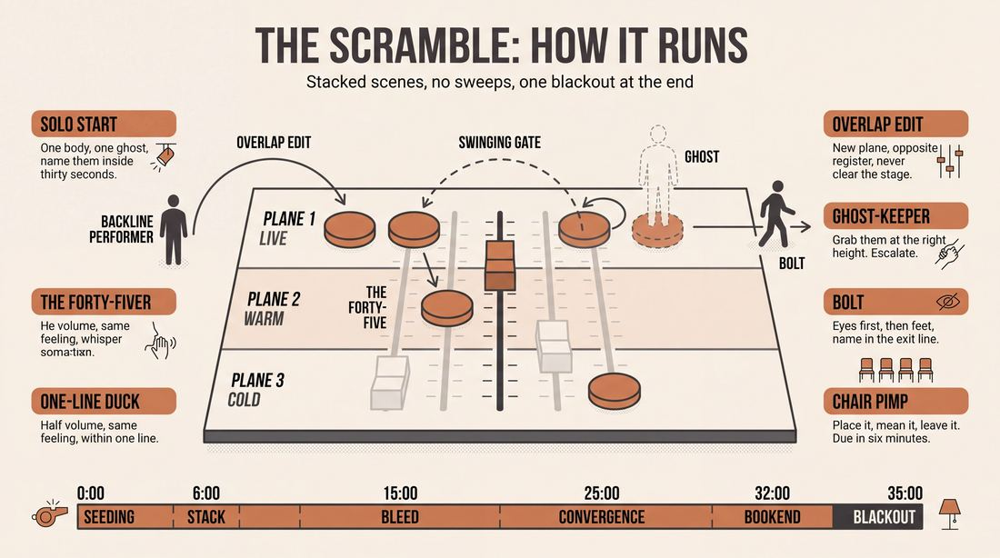
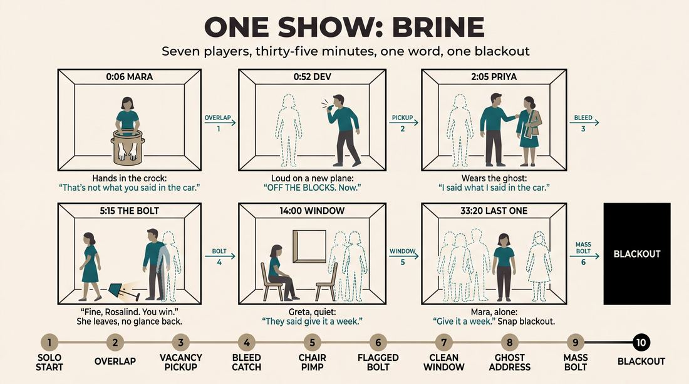
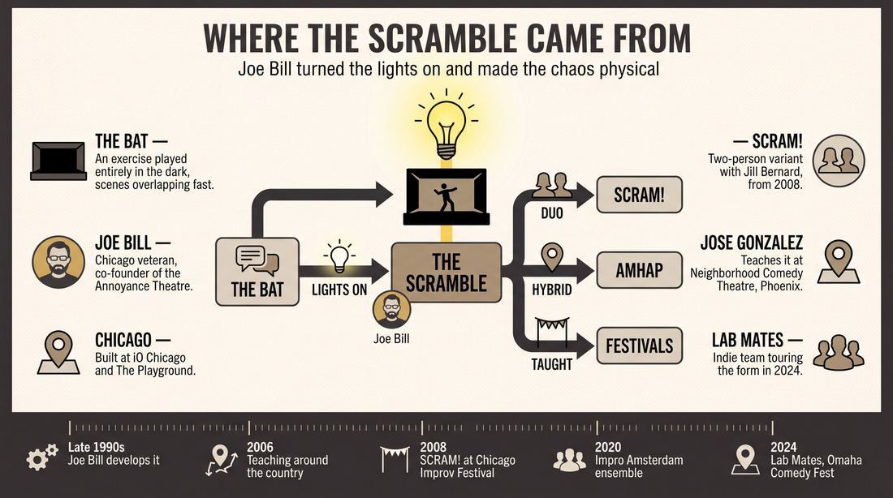
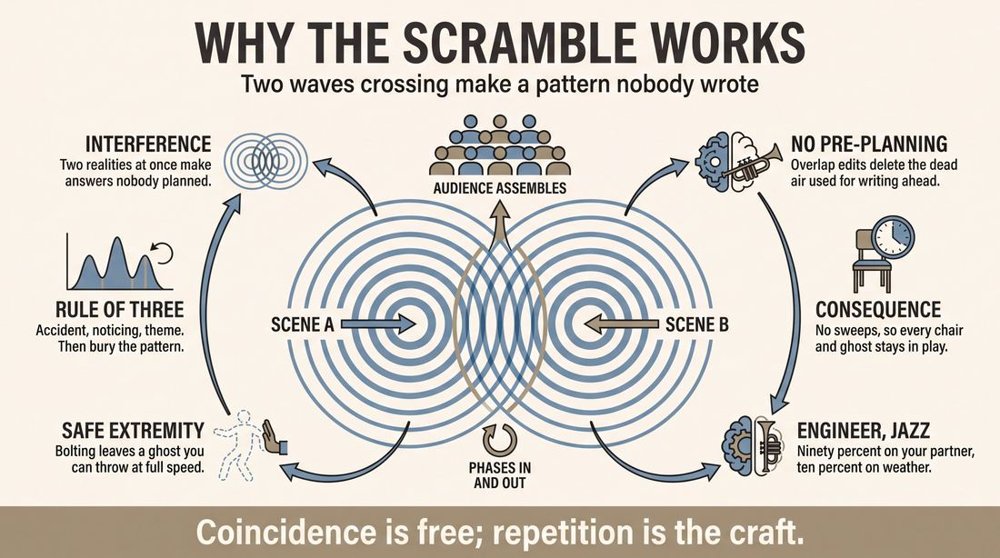
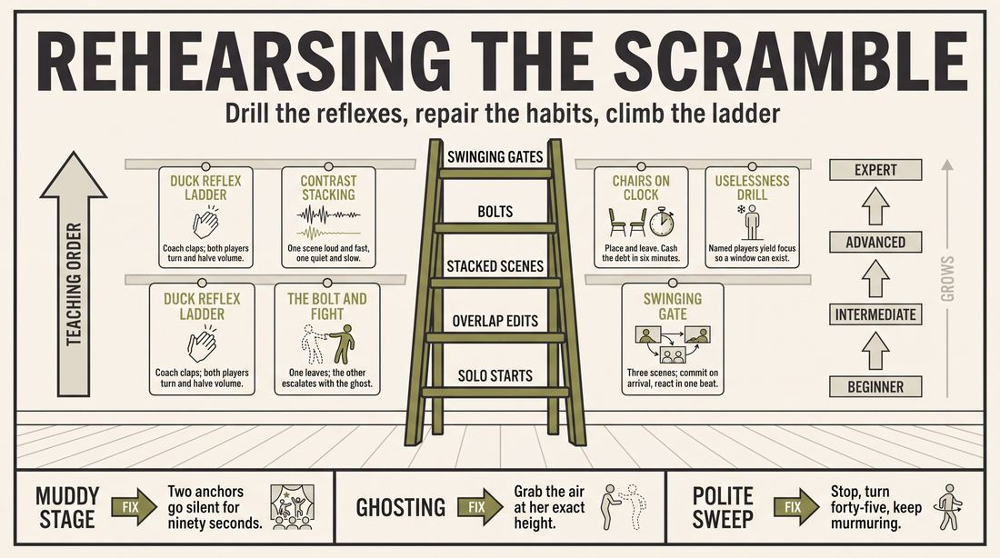

# Scramble

> **A complete study of the long-form improv format _Scramble_** - the original archived write-up, five infographics, grounded historical and pedagogical research, and a full mechanics-and-coaching manual.

| | |
|---|---|
| **Format** | Scramble |
| **Primary source** | [IRC Improv Wiki](https://wiki.improvresourcecenter.com/index.php?title=Scramble) |

---

## Contents

1. [Part I - The Original Write-Up](#part-i-the-original-write-up)
2. [Part II - The Infographics](#part-ii-the-infographics)
   - [1. Structure and Mechanics](#infographic-1-mechanics)
   - [2. A Show, Beat by Beat](#infographic-2-example)
   - [3. Origins and Lineage](#infographic-3-history)
   - [4. Why It Works](#infographic-4-theory)
   - [5. Rehearsal and Repair](#infographic-5-coaching)
3. [Part III - Research Dossier](#part-iii-research-dossier)
   - [Pass 1: History, Lineage, Literature and Scholarship](#research-history)
   - [Pass 2: Comparative Anatomy, Pedagogy and Production](#research-comparative)
4. [Part IV - Mechanics, Gameplay and Coaching Manual](#part-iv-mechanics-gameplay-and-coaching-manual)
   - [Pass 1: The Form, Its Mechanics and Its Gameplay](#manual-mechanics)
   - [Pass 2: Training, Coaching and Performance Companion](#manual-coaching)

---

## Part I - The Original Write-Up

*Verbatim archive of the source article, reproduced exactly as scraped. Everything after this section is generated elaboration built on top of it.*

### Scramble

The Scramble is a longform improvisational format that features overlapping scenes and chaos on stage. The Scramble is confusing and chaotic. Improvisers are encouraged to stir up disorder on stage. Improvisers are encouraged to embrace the confusion and understand that they cannot understand everything that is happening on stage. The Scramble is up for the audience to interpret and absorb.

The show may or may not start with an opening and typically begins with a solo start. From there, improvisers may use several techniques to create a world of overlapping scenes.

##### Techniques

There are at least six techniques used in the Scramble:

- Solo Starts: One player makes a big physical and emotional choice on stage. Interacting with an invisible character that is in the scene. Improvisers should leave some space for lines to land with that other character and to react to what that invisible character is saying in response.
- Overlap Edits: Someone initiates a solo start on top of the scene (or scenes) that are already inhabited and taking place on stage. Overlap Edits lead to stacked scenes.
- Stacked Scenes: Stacked scenes are when there is more than one scene taking place at the same time on stage aka multiple scenes on top of each other/using the same space on stage. Stacked scenes are a great way to playfully violate the location/object work reality of other scenes. It’s really helpful for each scene (while they’re stacked) has their own specific vibe, energy, tone, etc. so as to get contrasts in scenes going on (which will add some texture to what’s going on).
- Bolts: To bolt means to definitively leave a scene (by breaking eye contact and leaving with intent) as the performer, while understanding that the character that was inhabited by that performer, is still in that scene. This is a great way to leave a scene in the hands of the other performer(s) in the scene, especially if the emotion has gotten so high that (in the reality of that scene) it becomes helpful to bolt out of the scene so that the remaining performer can take things into a big physical interaction (fighting, sex, etc.) with the invisible character that remains.
- Swinging Gates: A swinging gate is when someone uses bolts to swing between one scene and another, eventually switching back. While this means switching amongst and being in multiple scenes, be in and fully commit to the scene that an improviser is currently in — instead of being in one scene while trying to keep track of what’s going on in any other scene. Improvisers trust that when they jump into a scene, they reaction to the next thing done or said by the other person in that scene will light their way in that scene.
- Chair Pimps: This is when someone places a chair (or two, or three, etc.) somewhere on stage. That means that at some point in the future, there will be a scene that incorporates that chair.

##### Links

- [Video of Lab Mates doing a Scramble at iO Chicago](https://www.youtube.com/watch?v=fjHj9D0rfDw)

---

*Archived from [https://wiki.improvresourcecenter.com/index.php?title=Scramble](https://wiki.improvresourcecenter.com/index.php?title=Scramble) (IRC Improv Wiki) on 2026-08-09 23:23 UTC.*

---

## Part II - The Infographics

*Five 16:9 posters, each teaching a different aspect of the format. Click any poster to enlarge.*

<a id="infographic-1-mechanics"></a>

### 1. Structure and Mechanics

*How the form is played: the shape of the piece, the opening, the roles, the edit vocabulary, the flow of information, and the clock.*

{ .diagram loading=lazy decoding=async width="1100" height="614" }


<a id="infographic-2-example"></a>

### 2. A Show, Beat by Beat

*A single worked performance from suggestion to blackout: what happens in each beat, with short real example lines and what the players are doing technically.*

{ .diagram loading=lazy decoding=async width="1100" height="614" }


<a id="infographic-3-history"></a>

### 3. Origins and Lineage

*Where the form came from: creators, dates, theatres, how it spread between schools and cities, and the key figures - a documented timeline and lineage map.*

{ .diagram loading=lazy decoding=async width="1100" height="614" }


<a id="infographic-4-theory"></a>

### 4. Why It Works

*The theory: the core principles of the form and the research and craft ideas that explain why the structure produces good improv, each tied to a specific mechanic.*

{ .diagram loading=lazy decoding=async width="1100" height="614" }


<a id="infographic-5-coaching"></a>

### 5. Rehearsal and Repair

*Training and fixing the form: the essential drills, the common failure modes with their symptom-and-fix pairs, and the markers of beginner through expert play.*

{ .diagram loading=lazy decoding=async width="1100" height="614" }


---

## Part III - Research Dossier

*Two research passes: the historical record, then the comparative and pedagogical record. Claims carry evidence tags - treat unverified items accordingly.*

<a id="research-history"></a>

### » Pass 1: History, Lineage, Literature and Scholarship

### Research Summary
*   **Documentation Status:** The Scramble is moderately documented. While academic literature on the format itself is non-existent, its mechanics, pedagogical philosophy, and history are well-preserved in practitioner interviews, class syllabi, and festival archives.
*   **Creator and Origin:** [DOCUMENTED] The format was created by Chicago improv veteran Joe Bill (co-founder of the Annoyance Theatre) in the late 1990s or early 2000s, evolving from an exercise performed entirely in the dark.
*   **Core Philosophy:** [DOCUMENTED] The Scramble is designed to intentionally induce chaos and cognitive overload, forcing improvisers to abandon pre-planned narratives and trust the emergent patterns of the ensemble.
*   **Key Mechanics:** [DOCUMENTED] The form relies on a specific vocabulary of edits and stage pictures: Solo Starts, Overlap Edits, Stacked Scenes, Bolts, Swinging Gates, and Chair Pimps. It explicitly rejects traditional "sweep edits."
*   **Neuroscientific Pedagogy:** [DOCUMENTED] Joe Bill teaches the format using a framework derived from cognitive neuroscience, specifically training performers to harmonize the "Engineer" (executive control) and the "Jazz Musician" (spontaneous generation) in their brains.
*   **Evolution:** [DOCUMENTED] The ensemble format spawned a highly successful two-person variant called *SCRAM!*, performed globally by Joe Bill and Jill Bernard.

### Provenance and History
The Scramble was created by Joe Bill, a foundational figure in the Chicago improv scene who co-founded the Annoyance Theatre and served as the Director of Corporate Training at iO Chicago. [DOCUMENTED] The format was born out of an experimental exercise Bill ran in the dark, where improvisers executed rapid, overlapping scenes. Bill realized that turning the lights on and forcing players to physically embody this chaos created a compelling, high-wire theatrical experience. 

The format was codified as a collection of Bill's "favorite devices," specifically designed to break improvisers of their reliance on linear narrative and traditional sweep edits. [INFERRED] By forcing multiple realities to share the same physical stage space simultaneously, the format solved the problem of improvisers "writing the script in their heads" (over-planning), demanding hyper-presence instead.

| Year | Event | Place / Company | Source |
| :--- | :--- | :--- | :--- |
| Late 1990s / Early 2000s | Joe Bill develops The Scramble from a lights-out exercise. | Chicago (iO / The Playground) | IRC Message Board Interview (2006) |
| 2006 | Joe Bill notes he is teaching The Scramble "around the country." | USA | IRC Message Board Interview |
| 2008 | Joe Bill and Jill Bernard perform the duo variant *SCRAM!* to critical acclaim. | Chicago Improv Festival | The Bastion Review |
| 2020 | Joe Bill directs an international ensemble in The Scramble. | Impro Amsterdam | Facebook / YouTube |
| 2024 | Indie team Lab Mates performs The Scramble on tour. | Omaha Comedy Fest | Benson Theatre |

### Lineage and Transmission
The Scramble is primarily transmitted through Joe Bill's extensive international touring as a master teacher. [DOCUMENTED] It is taught at major festivals across North America, Europe, and Australasia. Because it requires a high degree of trust and advanced editing vocabulary, it is rarely taught in beginner curricula. 

[DOCUMENTED] The format has been adopted by regional training centers, such as the Neighborhood Comedy Theatre (NCT) in Phoenix, where instructors like Jose Gonzalez teach it in advanced "Process Lab" workshops. [WIDELY PRACTICED, UNDOCUMENTED] The form's mechanics—particularly "Stacked Scenes" and "Overlap Edits"—have bled into the general long-form lexicon, often used by advanced indie teams to heighten the energy of a show even when they are not strictly performing a Scramble.

### Key Figures
| Person | Role in this form | Specific contribution | Source URL |
| :--- | :--- | :--- | :--- |
| Joe Bill | Creator and Master Teacher | Invented the format, codified its mechanics (Overlap Edits, Bolts, Swinging Gates), and integrated neuroscience into its pedagogy. | https://www.improvresourcecenter.com/mb/showthread.php?t=43771 |
| Jill Bernard | Co-creator of Duo Variant | Co-developed and toured *SCRAM!*, a two-person adaptation of the format's overlapping realities. | https://www.facebook.com/groups/10150123456789/ |
| Jose Gonzalez | Instructor | Teaches the format's mechanics (Solo Starts, Stacked Scenes) at the Neighborhood Comedy Theatre (NCT). | https://crowdwork.com/ |

### Canonical Shows, Companies and Recordings
*   **The Scramble at Impro Amsterdam (2020):** An international ensemble cast directed by Joe Bill. A recording of the final performance exists on YouTube and is frequently cited by practitioners as a masterclass in the form. (https://youtu.be/oPzStydmJs0)
*   **SCRAM! (2008–Present):** The touring duo variant performed by Joe Bill and Jill Bernard. 
*   **Lab Mates (2024):** A touring indie team that focuses on experimental forms, known for performing The Scramble and mashing it up with the Harold at festivals like the Omaha Comedy Fest. (https://bensontheatre.org/)

### Published Literature
| Work | Author | Year | What it says about this form | Where to find it |
| :--- | :--- | :--- | :--- | :--- |
| *IRC Improv Wiki: Scramble* | IRC Contributors | 2024 | Defines the six core techniques: Solo Starts, Overlap Edits, Stacked Scenes, Bolts, Swinging Gates, Chair Pimps. | https://wiki.improvresourcecenter.com/index.php?title=Scramble |
| *Joe Bill Interview* | Josh / IRC Message Board | 2006 | Details the origin of the form from an exercise done in the dark and the reliance on overlap edits rather than sweep edits. | https://www.improvresourcecenter.com/mb/showthread.php?t=43771 |
| *The Process Lab: Advanced Improv Syllabus* | Neighborhood Comedy Theatre | 2026 | Describes the format as stirring up chaos to allow patterns and parallels to phase in and out of existence rhythmically. | https://crowdwork.com/ |

### Verbatim Quotes

> "The Scramble came out of that. It was like 'ok, we've done this piece in the dark that moves around real fucking quick. Scenes happen on top of scenes and all that shit. Now what happens if you turn on the lights, and get people to embody this and play it.'"
> — Joe Bill
> https://www.improvresourcecenter.com/mb/showthread.php?t=43771

> "So, the Scramble is a bunch of my favorite devices. We generally will not do sweep edits in the Scramble. We'll do overlap edits. So the end of one scene will overlap with..."
> — Joe Bill
> https://www.improvresourcecenter.com/mb/showthread.php?t=43771

> "The Scramble stirs up chaos with multiple scenes and multiple realities taking place all at once. It allows patterns, parallels, and order to phase in and out of existence rhythmically, then trusts the intelligence of the audience to make sense of it."
> — Neighborhood Comedy Theatre Syllabus
> https://crowdwork.com/

> "While The Scramble uses advanced techniques, what it really does is empower you to eat your fear, trust your impulses, and be ruthlessly playful in your commitment to yourself, your fellow players, and the show."
> — Neighborhood Comedy Theatre Syllabus
> https://crowdwork.com/

> "I often use metaphor/analogy to serve what I know is a psychological or neuroscience point I might be making (i.e. bringing the engineer and jazz musician in your head into harmony)."
> — Joe Bill
> https://www.facebook.com/

> "Most 'stupid' comes from an ill-advised offer rooted in some bullshit circumstance that no one cares about in search of comedy."
> — Joe Bill
> https://www.birminghamimprovfestival.com/

> "Seeing the ensemble cast performing Joe Bill's The Scramble at Impro Amsterdam 2020 showed me that playfulness and connection is everything and should always come first. Forget about plot or style. It's the joy that matters!"
> — Workshop Participant
> https://www.facebook.com/

> "Composed of Chicago improv veteran Joe Bill and Minneapolis powerhouse Jill Bernard, SCRAM put on a stunning and emotional set. The duo began by setting up two separate scenes, independently of one another, at the same time. After establishing the essentials of their own scenes, the two switched, assuming other characters in the worlds established previously."
> — The Bastion (Review of SCRAM!)
> https://www.facebook.com/

> "While this means switching amongst and being in multiple scenes, be in and fully commit to the scene that an improviser is currently in — instead of being in one scene while trying to keep track of what's going on in any other scene."
> — IRC Improv Wiki
> https://wiki.improvresourcecenter.com/index.php?title=Scramble

### Anecdotes and Stories
**The Lights-Out Origin**
[DOCUMENTED] The Scramble was not born from a theoretical desire to create a new format, but from a sensory deprivation exercise. Joe Bill was running an exercise in the dark where improvisers were forced to rely entirely on auditory cues. Because they couldn't see each other, scenes began to move incredibly fast, overlapping and stacking on top of one another in a chaotic audio landscape. Bill realized the theatrical potential of this chaos and decided to "turn on the lights," challenging improvisers to physically embody the overlapping realities they had just created in the dark.

**The Amsterdam Revelation**
[DOCUMENTED] At the 2020 Impro Amsterdam festival, Joe Bill directed an international ensemble in The Scramble. A participant watching the show later wrote that the performance completely rewired their understanding of improv. Watching the cast navigate the intense chaos of the format without losing their emotional grounding proved that "playfulness and connection is everything," shifting the observer's focus away from the rigid "nuts and bolts" of improv rules and back to the pure joy of collaborative creation.

### Academic and Scientific Research
**Collaborative Emergence**
Keith Sawyer (2000, *Mind, Culture, and Activity*) posits that in improvisational ensembles, performance is a collective social process where the outcome is not scripted, leading to unpredictable, distributed creativity that cannot be reduced to individual cognitive construction.
*Relevance to this form:* The Scramble's "Stacked Scenes" and "Overlap Edits" intentionally overload an individual's ability to control the narrative. By forcing multiple realities to collide, players must abandon pre-planned ideas and rely entirely on collaborative emergence to find patterns within the chaos.

**Dual-Process Models of Creative Cognition**
fMRI studies of jazz musicians and freestyle artists (Beaty et al., 2015; Liu et al., 2015) show that improvisation requires rapid coupling between the Default Mode Network (DMN), responsible for spontaneous, undirected thought, and the Executive Control Network (ECN), responsible for goal-directed evaluation.
*Relevance to this form:* Joe Bill explicitly translates this neuroscience into the format's pedagogy, teaching players to harmonize the "Engineer" (ECN) and the "Jazz Musician" (DMN). This cognitive harmony is vital to manage the high executive load of tracking "Swinging Gates" and "Chair Pimps" without losing the spontaneous emotional connection required to play the scene.

**Motor Imagery and Sensorimotor Resonance**
Cognitive neuroscience demonstrates that imagining a movement or interacting with an imagined object recruits the same sensorimotor brain regions as actual execution (Calvo-Merino et al., 2005; Cross et al., 2006).
*Relevance to this form:* The "Bolts" mechanic requires a player to definitively leave a scene while their character remains invisible on stage. The remaining player must use intense sensorimotor resonance to physically interact with (e.g., fight or embrace) the invisible character, maintaining the physical reality for the audience.

### Documented Variants and Descendants
*   **SCRAM!:** [DOCUMENTED] A two-person variant created and performed by Joe Bill and Jill Bernard. Instead of an ensemble creating chaos, the duo establishes three different two-person scenes that happen simultaneously. The performers switch rapidly between the worlds, assuming different characters in each established reality.
*   **AMHAP (As Many Harolds As Possible):** [DOCUMENTED] An experimental mashup performed by the indie team Lab Mates, which combines the chaotic, overlapping mechanics of The Scramble with the structured beats of the Harold.

### Criticism, Debate and Known Failure Modes
*   **Cognitive Overload and "Tracking":** [DOCUMENTED] The format is inherently confusing. A known failure mode occurs when improvisers try to act as the "Engineer" rather than the "Jazz Musician"—attempting to logically track every detail of every stacked scene. The IRC Wiki explicitly warns against this: players must "fully commit to the scene that an improviser is currently in — instead of being in one scene while trying to keep track of what's going on in any other scene."
*   **Loss of Emotional Grounding:** [DOCUMENTED] Because the format is chaotic, improvisers often panic and reach for cheap laughs. Joe Bill warns that in these moments, players make "ill-advised offers rooted in some bullshit circumstance that no one cares about in search of comedy." The Scramble fails if the overlapping scenes become emotionally shallow.
*   **Audience Alienation:** [INFERRED] The format "trusts the intelligence of the audience to make sense of it." If the ensemble fails to rhythmically phase patterns and parallels into existence, the show devolves into pure noise, alienating crowds accustomed to the linear narrative of traditional long-form.

### Cultural Footprint
The Scramble's primary cultural footprint lies in its influence on improv pedagogy. [DOCUMENTED] Through teaching this format, Joe Bill popularized the integration of psychology and neuroscience into improv training—specifically the paradigm of the "Engineer and the Jazz Musician." The format's specific mechanics (like the "Overlap Edit" and the "Bolt") have been absorbed into the broader craft vocabulary, giving advanced improvisers tools to playfully violate the location and object-work reality of other scenes without breaking the reality of the show.

### Gaps in the Record
*   **Exact Origin Date:** The precise year Joe Bill first debuted The Scramble is undocumented in searchable text, though contextual clues place it in the late 1990s or early 2000s during his tenure at iO Chicago and The Playground.
*   **Original Cast:** The improvisers who participated in the original "lights-out" exercise and the first public performance of The Scramble are unnamed in the digital record.
*   **Archival Footage:** While the 2020 Impro Amsterdam performance is available, early recordings of the format from Chicago are either lost or not digitized.

### Source List
1. IRC Improv Wiki - IRC Contributors - 2024 - https://wiki.improvresourcecenter.com/index.php?title=Scramble - Seed article defining the six core techniques of the format.
2. Improv Resource Center Message Board - Josh / Joe Bill - 2006 - https://www.improvresourcecenter.com/mb/showthread.php?t=43771 - Primary source interview detailing the origin of the form and its reliance on overlap edits.
3. Crowdwork / Neighborhood Comedy Theatre - NCT - 2026 - https://crowdwork.com/ - Syllabus detailing the mechanics, philosophy, and pedagogical goals of The Scramble.
4. Facebook (Masters of Improv) - Lindsay / Joe Bill - 2020 - https://www.facebook.com/ - Biographical details on Joe Bill, Power Improv, and the duo variant SCRAM!.
5. Benson Theatre - Omaha Comedy Fest - 2024 - https://bensontheatre.org/ - Documentation of the indie team Lab Mates performing The Scramble and its variants.
6. ResearchGate (Mind, Culture, and Activity) - Keith Sawyer - 2000 - https://www.researchgate.net/ - Academic framework for collaborative emergence in improvisational ensembles.
7. NIH / Frontiers in Psychology - Beaty et al. - 2019 - https://www.ncbi.nlm.nih.gov/ - Neuroscience of the DMN and ECN in creative cognition and improvisation.
8. Birmingham Improv Festival - Joe Bill - 2020 - https://www.birminghamimprovfestival.com/ - Source for Joe Bill's quote on emotional grounding and avoiding "bullshit circumstances."

<a id="research-comparative"></a>

### » Pass 2: Comparative Anatomy, Pedagogy and Production

### Taxonomic Placement

```text
The Bat (Improv in the dark)
 └── The Throwdown
      └── It's Not Me, It's Me
           └── The Scramble
                 ├── AMHAP (As Many Harolds As Possible)
                 └── Fluid Masons (Sweep-free overlap style)
```

The Scramble sits in the organic, experimental branch of long-form improvisation. Created by Joe Bill at the Annoyance Theatre and iO Chicago, it evolved directly from "The Bat" (a format performed entirely in the dark where scenes overlap and move quickly via audio cross-fades). Bill designed the Scramble to see what would happen if the lights were turned on and players had to physically embody that same rapid, overlapping chaos. It explicitly rejects the clean sweeps and distinct beats of the Harold, prioritizing simultaneous realities and aggressive overlap edits.

### Head-to-Head Comparisons

#### Scramble vs. Harold
| Axis | The Scramble | The Harold | Consequence for the players |
| :--- | :--- | :--- | :--- |
| **Opening** | Optional, usually a Solo Start | Structured group game | Scramble players must immediately generate physical reality; Harold players generate thematic ideas. |
| **Structure** | Chaotic, overlapping, no set beats | 3 beats, group games, rigid structure | Scramble players rely on immediate impulse; Harold players rely on memory and pattern mapping. |
| **Edit logic** | Overlap edits, no sweeps | Clean sweeps, tag-outs | Scramble players must share physical space; Harold players clear the stage. |
| **Memory** | Low (commit to the immediate moment) | High (tracking A/B/C storylines) | Scramble players drop context easily; Harold players must recall specific details for beat 3. |
| **Cast size** | 6-10 | 6-8 | Similar size, but the Scramble feels significantly more crowded due to stacked scenes. |
| **Audience contract** | "We will confuse you, you interpret it" | "We will show you how these disparate ideas connect" | Scramble audiences lean forward to parse chaos; Harold audiences wait for the puzzle to solve. |
| **Failure mode** | Deer in headlights (trying to track everything) | The math problem (forcing connections that aren't there) | Scramble players freeze; Harold players get in their heads. |

#### Scramble vs. Monoscene
| Axis | The Scramble | The Monoscene | Consequence for the players |
| :--- | :--- | :--- | :--- |
| **Opening** | Solo start | Organic discovery of the single location | Scramble starts with high individual energy; Monoscene starts with group environmental discovery. |
| **Structure** | Multiple realities stacked in one space | One continuous reality in real-time | Scramble players playfully violate object work; Monoscene players must strictly respect object permanence. |
| **Edit logic** | Overlap edits, swinging gates | No edits | Scramble players jump between worlds; Monoscene players are trapped in one world. |
| **Memory** | Low | High (tracking every established object/relationship) | Scramble players can abandon a reality; Monoscene players must live with every choice for 45 minutes. |
| **Cast size** | 6-10 | 4-8 | Scramble uses the cast to create chaos; Monoscene uses the cast to populate a single ecosystem. |
| **Audience contract** | "Watch us juggle multiple dimensions" | "Watch a play written in real-time" | Scramble is a magic trick; Monoscene is theatrical realism. |
| **Failure mode** | Muddy stage (too much noise) | The hostage situation (stuck in a boring reality) | Scramble players must find contrast; Monoscene players must find depth. |

#### Scramble vs. Montage
| Axis | The Scramble | The Montage | Consequence for the players |
| :--- | :--- | :--- | :--- |
| **Opening** | Solo start | Varies (often a brief invocation) | Scramble sets an immediate chaotic tone. |
| **Structure** | Stacked scenes | Linear sequence of unrelated scenes | Scramble scenes happen simultaneously; Montage scenes happen sequentially. |
| **Edit logic** | Overlap edits | Sweeps | Scramble players never clear the stage; Montage players wipe the slate clean. |
| **Memory** | Low | Low | Both formats allow players to abandon scenes, but Scramble requires holding multiple active scenes at once. |
| **Cast size** | 6-10 | 4-8 | Scramble requires more bodies to stack scenes effectively. |
| **Audience contract** | "Interpret the chaos" | "Enjoy these rapid-fire sketches" | Scramble is an atmospheric experience; Montage is a comedy buffet. |
| **Failure mode** | Polite sweeps (reverting to Montage habits) | The endless run (failing to edit a dying scene) | Scramble players must fight the urge to leave; Montage players must fight the urge to stay. |

#### Scramble vs. The Bat
| Axis | The Scramble | The Bat | Consequence for the players |
| :--- | :--- | :--- | :--- |
| **Opening** | Solo start | Lights out, audio only | Scramble relies on physical embodiment; The Bat relies entirely on vocalization. |
| **Structure** | Stacked scenes in the light | Stacked scenes in the dark | Scramble players must manage physical space; The Bat players can stand anywhere. |
| **Edit logic** | Overlap edits, swinging gates | Audio cross-fades, overlapping voices | Scramble players use physical "bolts"; The Bat players use volume and silence. |
| **Memory** | Low | Low | Both require extreme presence in the current moment. |
| **Cast size** | 6-10 | 6-10 | Both use large casts to create a wall of sound/action. |
| **Audience contract** | "Watch the chaos" | "Listen to the chaos" | Scramble is visual and auditory; The Bat is purely auditory (theater of the mind). |
| **Failure mode** | Deer in headlights | Stepping on each other's lines | Scramble players get visually overwhelmed; The Bat players get auditorily overwhelmed. |

#### Scramble vs. La Ronde
| Axis | The Scramble | La Ronde | Consequence for the players |
| :--- | :--- | :--- | :--- |
| **Opening** | Solo start | Character monologues or direct entry | Scramble establishes action; La Ronde establishes character traits. |
| **Structure** | Simultaneous overlapping scenes | A-B, B-C, C-D, D-A character chain | Scramble is a web; La Ronde is a daisy chain. |
| **Edit logic** | Overlap edits, swinging gates | Tag-outs or sweeps leaving one character | Scramble players jump randomly; La Ronde players follow a strict mathematical progression. |
| **Memory** | Low | Medium (remembering your specific character's deal) | Scramble players can change characters; La Ronde players play one character the whole show. |
| **Cast size** | 6-10 | 4-6 | Scramble uses the whole cast at once; La Ronde uses exactly two players at a time. |
| **Audience contract** | "Interpret the chaos" | "Watch these characters interact in pairs" | Scramble is overwhelming; La Ronde is highly focused and intimate. |
| **Failure mode** | Muddy stage | Breaking the chain | Scramble players lose definition; La Ronde players ruin the structural gimmick. |

### What Makes It Uniquely Itself
1. **Stacked Scenes / Overlap Edits**: The absolute prohibition of sweep edits. Scenes exist simultaneously in the same physical space, playfully violating each other's object work. If you sweep the stage to start a new scene, you are playing a Montage, not a Scramble.
2. **Bolts and Invisible Characters**: Players can definitively leave a scene ("bolt") by breaking eye contact and walking away, but their character remains in the space as an invisible entity. The remaining player must continue to interact with this invisible character.
3. **Swinging Gates**: Players physically swing between multiple ongoing realities, committing fully to whichever one they are currently in without trying to logically track the whole stage.

### Structural Variants in Practice
- **The Classic Scramble**: The original format developed by Joe Bill at the Annoyance Theatre. Heavy use of solo starts, bolts, and swinging gates, prioritizing emotional truth within chaos.
- **AMHAP (As Many Harolds As Possible)**: Played by Lab Mates (Omaha Comedy Fest / iO Chicago). Applies the Scramble's overlap and stacking logic to the Harold, running multiple Harolds simultaneously in the same physical space.
- **Fluid Masons**: Played by Mouse Couch (Denver). A stripped-down variant focusing purely on the "no sweeps" overlap edit logic, building scenes "one brick at a time" seamlessly without the aggressive chaos of a full Scramble.
- **The Process Lab Scramble**: Taught by Jose Gonzalez (Monster Improv / NCT Phoenix). A pedagogical variant used specifically to train advanced improvisers to "eat their fear" and find patterns inside chaos, heavily emphasizing the "Contrast Stacking" technique.

### The Teaching Ladder
| Stage | Skill introduced | Why in this order | Typical exercise | Source or [CRAFT CONSENSUS] |
| :--- | :--- | :--- | :--- | :--- |
| 1 | Solo Starts | Establishes base reality and object work before chaos is introduced. | Solo Start with Invisible Partner | Joe Bill / IRC Wiki |
| 2 | Overlap Edits | Breaks the ingrained habit of the "polite sweep" and teaches players to initiate without clearing the stage. | Overlap Edit Drill | [CRAFT CONSENSUS] |
| 3 | Stacked Scenes | Forces players to hold their own reality while another happens in the same space. | Contrast Stacking | Jose Gonzalez / NCT Phoenix |
| 4 | Bolts | Teaches players to leave a scene while preserving the character's existence, allowing scenes to escalate physically. | The Bolt and Fight | IRC Wiki |
| 5 | Swinging Gates | The most cognitively demanding skill; requires dropping and picking up context instantly. | Swinging Gate Rotation | Joe Bill |

*Note: The full Scramble format is deliberately withheld from beginners. It requires advanced object work, emotional commitment, and the ability to let go of control. It is typically taught only after foundational levels (e.g., NCT Phoenix requires Level 4 completion).*

### Documented Drills and Exercises
| Drill | Origin / teacher | How to run it | What it fixes in this form | Source |
| :--- | :--- | :--- | :--- | :--- |
| **Solo Start with Invisible Partner** | Joe Bill | Player starts a scene alone, making big physical/emotional choices and leaving space for an invisible partner's lines. | Fixes weak object work and pacing. | IRC Wiki |
| **The Oil Slick** | Teen Science Cafe / General | Players in a circle doing a pattern; someone yells "oil slick," everyone scrambles and reorganizes. | Fixes rigidity and fear of physical chaos. | Teen Science Cafe |
| **Overlap Edit Drill** | [CRAFT CONSENSUS] | Two players in a scene. A third player walks downstage and starts a completely different solo scene. The original players must continue quietly or freeze. | Fixes the instinct to sweep when a new idea appears. | [CRAFT CONSENSUS] |
| **Contrast Stacking** | Jose Gonzalez | Two scenes happen simultaneously. The coach directs one to be high energy/loud and the other to be low energy/quiet. | Fixes muddy stage pictures and lack of texture. | NCT Phoenix |
| **The Bolt and Fight** | [CRAFT CONSENSUS] | Two players in a high-emotion scene. One player breaks eye contact and leaves. The remaining player escalates the scene into a physical fight with the invisible character. | Fixes hesitation to leave scenes and drops in energy. | IRC Wiki |
| **Swinging Gate Rotation** | Joe Bill | Three distinct scenes are set up. A player "bolts" from Scene A, enters Scene B, then bolts to Scene C, fully committing to the reality of each upon entry. | Fixes the "deer in headlights" look when switching contexts. | Joe Bill / IRC Wiki |
| **Chair Pimping** | [CRAFT CONSENSUS] | Players randomly place chairs on stage during a scene. Later players MUST incorporate those chairs into their scenes. | Fixes ignoring the physical environment. | IRC Wiki |
| **The First 30 Seconds** | Joe Bill | Players focus entirely on emotional truth and connection in the first 30 seconds of a scene, balancing the "inner engineer" and "inner jazz musician." | Fixes overly logical or slow scene starts. | Joe Bill Workshops |
| **Game Brain vs. Scene Brain** | Joe Bill | Alternating between playing a strict short-form game and a grounded open scene. | Fixes the inability to switch between structural rules and emotional truth. | Joe Bill Workshops |
| **Blind Scramble (The Bat)** | Joe Bill | Playing a Scramble entirely in the dark, relying only on audio cues and overlapping voices. | Fixes reliance on visual cues and improves listening. | Joe Bill / IRC Forum |

### Common Failure Modes and Diagnoses
| Failure mode | What it looks like from the audience | Root cause | Fix | Who names it |
| :--- | :--- | :--- | :--- | :--- |
| **The Deer in Headlights** | Player looks confused, trying to watch other scenes instead of playing their own. | Trying to logically track the whole stage. | "Be in and fully commit to the scene that an improviser is currently in." | Joe Bill / IRC Wiki |
| **Muddy Stage** | The audience can't tell which scene is which; everything sounds like yelling. | Lack of contrast in stacked scenes. | Give each scene a specific vibe, energy, and tone. | IRC Wiki |
| **Ghosting** | A player bolts, and the remaining player immediately drops the scene or acts like the character vanished. | Forgetting the invisible character remains. | Treat the invisible character as physically present; escalate the physical interaction. | [CRAFT CONSENSUS] |
| **The Polite Sweep** | A player tries to start a new scene, and the existing players immediately leave the stage. | Ingrained Harold/Montage habits. | Force overlap edits; ban sweeps entirely. | Joe Bill |
| **Orphaned Chairs** | Chairs are placed on stage (Chair Pimps) but never used. | Ignoring the physical offers of the ensemble. | Make it a rule that every placed object must become the focal point of a subsequent scene. | [CRAFT CONSENSUS] |

### Production and Logistics
- **Cast size**: 6-10. Needs enough people to stack scenes and swing gates, but not so many that the stage becomes physically dangerous.
- **Runtime**: 25-45 minutes. The chaos is exhausting for both players and audience; it cannot sustain a full two-act show.
- **Stage layout**: Wide open. Needs depth for stacked scenes (downstage vs. upstage).
- **Chairs and set**: 4-6 chairs on the wings, heavily used for "Chair Pimps."
- **Lighting and tech cues**: Lights up full. No blackouts for edits. Blackout only at the very end of the set.
- **Music and sound**: Pre-show high energy. No mid-show music, as the overlapping dialogue is already dense.
- **MC and host duties**: Host must warn the audience that the show will be chaotic and confusing, and that it is "up for the audience to interpret and absorb."
- **Suggestion**: A single suggestion at the top, often a single word or a "suggestion we can forget" (Joe Bill style).
- **Lineup placement**: Best as a high-energy closer or second-act opener.
- **Rehearsal cadence**: Requires intensive weekly rehearsal focusing on physical safety and dropping ego.
- **Producer prep**: Ensure the stage is clear of tripping hazards, as players will be bolting and scrambling blindly.

### Adaptations Beyond the Stage
- **Classroom and youth**: The physical chaos (bolting, fighting invisible characters) must be heavily moderated. "Fighting/sex" with invisible characters is replaced with "arguing/dancing."
- **Corporate and applied improv**: Used to teach "thriving in chaos" and "letting go of control." The focus shifts from comedy to managing overlapping responsibilities and rapid context-switching.
- **Online and remote**: Stacked scenes are done via Zoom breakout rooms or overlapping audio. "Bolting" is turning the camera off. "Chair pimps" become virtual background changes.
- **Community and therapeutic settings**: Can be overwhelming for neurodivergent participants or those with sensory processing issues. Requires strict consent check-ins.
- **Accessibility and inclusion**: The physical nature of "bolting" and "stacked scenes" requires adaptation for mobility-impaired players (e.g., vocal "bolts" instead of physical running).
- **Content-safety and consent**: Because scenes overlap and players playfully violate each other's physical space, a strong baseline of physical consent and boundaries is required. 
- **Ethics of using real stories**: The Scramble is too chaotic and distortive for true, vulnerable personal monologues; it should remain entirely fictional to avoid trivializing real trauma.

### Evidence Base for Those Adaptations
- Research on "collaborative emergence" (Sawyer, 2003) supports the idea that unstructured, overlapping group flow can produce complex narratives without top-down control, validating its use in team-building.
- Studies on organizational improvisation (Vera & Crossan, 2004) support the use of "stacked scenes" as a training tool for managing overlapping priorities and rapid context-switching in corporate environments.
- Cognitive load theory (Sweller, 1988) complicates the use of the Scramble in therapeutic settings, as the high sensory input and rapid context-switching can overwhelm participants without strong executive function.

### Scholarly Frames Worth Applying
- **Collaborative Emergence (Sawyer)**: Group creativity is not the sum of individual ideas, but an emergent property of unpredictable interactions where no single person is in control. Citation: Sawyer, R. K. (2003). *Group Creativity: Music, Theater, Collaboration*. Mapping: Maps directly to the Scramble's core philosophy that "improvisers cannot understand everything that is happening on stage" and must trust the emergent chaos.
- **Flow and Complexity (Csikszentmihalyi)**: Flow occurs when high skill meets high challenge, requiring clear immediate feedback and a loss of self-consciousness. Citation: Csikszentmihalyi, M. (1990). *Flow: The Psychology of Optimal Experience*. Mapping: Maps to "Swinging Gates," where players must drop their ego and instantly commit to the immediate reality of the new scene without overthinking.
- **Organizational Improvisation (Vera and Crossan)**: Organizations must improvise in turbulent environments by relying on minimal structures and high team trust. Citation: Vera, D., & Crossan, M. (2004). *Theatrical Improvisation: Lessons for Organizations*. Mapping: Maps to "Stacked Scenes," where multiple realities coexist and players must navigate overlapping priorities without shutting each other down.

### Where the Form Is Heading
- **Current practice**: Taught as an advanced "Process Lab" at theaters like NCT Phoenix to break improvisers out of rigid Harold habits.
- **Revivals**: Joe Bill continues to tour and teach the format globally, often branding it as a masterclass in "eating your fear."
- **Hybrids**: Teams like Lab Mates are combining it with structured forms (AMHAP - As Many Harolds As Possible).
- **Contemporary companies**: Used by experimental indie teams (e.g., Mouse Couch's "Fluid Masons" style) to create seamless, sweep-free shows that feel more like a single breathing organism than a series of sketches.

### Source List
1. IRC Improv Wiki - Improv Resource Center - 2024 - https://wiki.improvresourcecenter.com/index.php?title=Scramble - Supports the core mechanics (Solo Starts, Overlap Edits, Stacked Scenes, Bolts, Swinging Gates, Chair Pimps).
2. Joe Bill Interview - Improv Resource Center Forum - 2006 - http://www.improvresourcecenter.com/mb/showthread.php?t=43771 - Supports the origin of the form (evolving from The Bat) and Joe Bill's philosophy on overlap edits.
3. The Process Lab: Advanced Improv - Neighborhood Comedy Theatre (NCT Phoenix) / Crowdwork - 2026 - https://nctphoenix.com - Supports the teaching ladder, Jose Gonzalez's curriculum, and the focus on finding patterns inside chaos.
4. Omaha Comedy Fest Schedule - Benson Theatre - 2024 - https://bensontheatre.org - Supports the existence of hybrids like AMHAP by Lab Mates and the "Fluid Masons" sweep-free style by Mouse Couch.
5. Joe Bill Workshops - Facebook / Various Theaters - 2017-2024 - https://facebook.com - Supports Joe Bill's specific exercises like "The First 30 Seconds" and "Game Brain, Scene Brain."
6. Teen Science Cafe - 2024 - https://teensciencecafe.org - Supports the "Oil Slick" drill as a method for managing chaos and group mind.

---

## Part IV - Mechanics, Gameplay and Coaching Manual

*Synthesis over the original article and both research dossiers: first how the form works and how to play it, then how to train an ensemble to perform it.*

<a id="manual-mechanics"></a>

### » Pass 1: The Form, Its Mechanics and Its Gameplay

### At a Glance

| Field | Detail |
| :--- | :--- |
| **Also known as** | The Scramble; *SCRAM!* (two-person variant by Joe Bill and Jill Bernard); *Fluid Masons* (Mouse Couch's low-chaos, sweep-free cousin); *AMHAP* (Lab Mates' Harold hybrid) |
| **Family** | Organic / experimental long form. Direct descendant of **The Bat** (improv in total darkness). Anti-narrative, edit-vocabulary-driven. |
| **Cast size** | 6–10 (sweet spot 7–8). Playable at 4 with discipline; playable at 2 as *SCRAM!* |
| **Runtime** | 25–45 minutes, unbroken, no intermission, no blackouts until the end |
| **Opening** | Optional. Canonical start is a **Solo Start** — one player, one big physical/emotional choice, one invisible partner |
| **Suggestion taken** | One word, or Joe Bill's "a suggestion we can forget." Never a premise, never a relationship, never a monologue prompt |
| **Structural rigidity** | **2/5 on shape, 5/5 on vocabulary.** There are no beats, no required scene count, no return structure — but the permitted edits are a closed, strictly enforced list |
| **Difficulty** | 5/5 |
| **Prerequisites** | Solo object work; playing to an invisible partner; emotional commitment inside 30 seconds; volume/focus discipline; physical consent literacy; the ability to be interrupted without sulking |
| **Best for** | Ensembles ossified by Harold/montage habits; large casts; festival closers and second-act openers; teams with real physical trust |
| **Avoid when** | The stage is small or cluttered; the cast is a pickup team with no consent conversation; the room needs plot; the bill demands a "nice" show; the cast has been together under ~8 rehearsals |

---

### The Essence in One Paragraph

The Scramble is a long form in which the stage is never cleared. One player walks out and starts a scene alone, talking to a person who isn't there; before that scene ends, another player starts a different scene on top of it, in the same physical space, and both realities keep running — one loud, one ducked. Players **bolt** out of scenes (break eye contact, leave with intent) leaving their character behind as an invisible presence the remaining player must keep touching, fighting, and answering; they **swing** between two or three live worlds like a gate on a hinge, committing 100% to whichever reality their feet are currently in and refusing to track the others. Chairs get placed as unpaid promises. Locations violate each other. Over 25–45 minutes, the stage accumulates ghosts, furniture and half-heard lines until coincidences start rhyming, and the ensemble — noticing, never planning — repeats the rhymes until the audience feels a theme they cannot summarise. It is not a show you follow; it is a show you are slightly behind, deliberately, the way you are behind a piece of music you like. Joe Bill built it out of an exercise done in the dark and then turned the lights on: the whole form is the question *what happens if you make people physically embody the chaos they can produce when they can't see each other?*

---

### Why This Form Exists

Four specific diseases, four specific cures. None of these are generic improv virtues; each is a direct mechanical consequence of a Scramble rule.

**1. It makes pre-planning physically impossible.** In a montage or Harold, a player on the backline has thirty to ninety idle seconds to write a scene in their head, and most of them do. The Scramble deletes that room in two ways: the overlap edit means there is no dead air to plan in (a scene is always running, and your entrance lands *on top of* it), and the vacancy economy means you often don't get to choose your character — you enter and find that the role available to you is the invisible person someone else already characterised and abandoned. You can't pre-write a character you haven't met yet. This is Joe Bill's actual design intent: the format was codified to break improvisers of "writing the script in their heads."

**2. It kills the polite sweep, and with it the idea of the disposable scene.** In sweep-based forms, the slate wipes clean every ninety seconds. Players learn, invisibly, that nothing costs anything: a bad choice is erased by the next edit. In the Scramble nothing is erased. The chair you put down is still there in minute thirty. The character you abandoned is still standing in that spot. The show is a palimpsest, and players start behaving like people whose choices have consequences because they literally do.

**3. It buys *simultaneity*, which no serial form can produce.** A montage gives you juxtaposition across time: scene A, then scene B, and the audience compares them from memory. A Scramble gives you juxtaposition across space: A and B are in the room at the same instant, so a line from the pool scene lands in the kitchen scene's silence and *becomes an answer*. This interference pattern is the form's unique artistic product. It cannot be faked serially, and it is why "just do a fast montage" is not a substitute.

**4. It creates a consent-safe engine for full-body escalation.** This is the underrated one. The **bolt** exists so that a scene at maximum emotional pressure can go to a place two live bodies cannot safely go. When Priya bolts and leaves her character behind, Mara can throw that character across the room, straddle her, weep on her, punch a wall next to her head — at 100% commitment, at full speed, with zero contact risk. The invisible partner is not a limitation of the form; it is the safety mechanism that licenses the intensity.

What a plain montage buys you: variety, pace, a comedy buffet. What the Scramble buys you: **density, consequence, interference, and licensed physical extremity.** If your show doesn't need those four things, don't do this form.

---

### The Audience Contract

**The promise, stated plainly:** *You will not be able to follow all of this, and that is the ride. We will always give you one thing that is loudest. Things you half-heard will come back. Nobody on this stage will be abandoned emotionally, and nothing you see is a mistake.*

**How they know where they are.** The audience never orients by plot. They orient by four signals, all of which the ensemble controls consciously:

| Signal | What the audience reads from it |
| :--- | :--- |
| **Volume mix** | The loudest scene is the one they're allowed to watch right now. If two scenes are equally loud for more than about fifteen seconds, they stop choosing and start disengaging. |
| **Gaze** | Where a performer is *looking* tells the audience which reality that body belongs to. This is the only wall between worlds. |
| **Stage plane** | Downstage = live. Mid = warm/running. Upstage = cold/holding. Movement between planes reads as a change of state, not a change of location. |
| **Physical signature** | Because performers swap characters, the audience tracks the *character's tic* (the limp, the pitch, the name) rather than the person playing it. |

**The host's job.** Twenty seconds, before the suggestion, in plain language, no apology: *"This is called a Scramble. There will be more than one scene happening at a time. You're not supposed to catch everything — pick what you like and follow it. If somebody walks off, their character is still there."* That last sentence prevents about half of all audience confusion. Do not say "this is going to be weird." Weird is a warning; "you're not supposed to catch everything" is an invitation.

**What breaks the contract:**

- **Equal volume.** Two F1 scenes running at once for more than ~15 seconds. The audience is being asked to do the ensemble's job.
- **Ghosting.** A player bolts and the remaining player behaves as if the room emptied. This retroactively tells the audience that nothing on this stage is real, and they stop investing in the next twelve scenes.
- **Uniform temperature.** Four scenes, all loud arguments. Chaos without contrast is noise, and noise has no promises in it.
- **Rubbernecking.** A performer visibly watching another scene. It reads as "the actors don't believe in this either."
- **Orphaned chairs.** A chair placed and never used is a promise broken in front of witnesses. The audience notices this far more than improvisers believe.
- **Panic comedy.** Joe Bill's own diagnosis: *"Most 'stupid' comes from an ill-advised offer rooted in some bullshit circumstance that no one cares about in search of comedy."* In a Scramble the panic-gag rate spikes because players feel exposed. Every panic gag spends audience trust that the form specifically needs.
- **No clean window.** If the audience never gets a single quiet, uncontested duet, they conclude the ensemble can't do scenes, only stunts.

---

### Anatomy: The Full Structural Map

The Scramble has no beats. It has **movements**, defined by the density of live realities and the direction of travel. A director should think in terms of a density curve, not a scene list.

The five movements, for a 35-minute set:

1. **Seeding** — one reality, then two. Slow, actually. The most common failure in the whole form is rushing this.
2. **The Stack** — two to four live realities; gates open; first bolts; chairs planted.
3. **Bleed** — the interference movement. Cross-talk starts landing. Patterns get noticed and repeated. Chair pimps cash in. Density oscillates: stack, breathe, stack, breathe.
4. **Convergence** — realities begin merging; invisible characters get bodies; the space is crowded with the show's own history.
5. **The Bookend** — a mass bolt strips the stage to one live body standing among every ghost the show made. Final line. Blackout.

```
   0:00      3:00        8:00         15:00        22:00       28:00      35:00
    |         |           |             |            |           |          |
 ┌ SEEDING ─┐┌────── STACK ──────┐┌──── BLEED ────┐┌ CONVERGENCE ┐┌ BOOKEND ┐

 A ████████████░░░░░░░████░░░░░░░░░░░░(starved)
        ↘bolt(flagged "Rosalind")            ↖ ghost addressed 14 min later
   B      ▣▣      ████████░░░░████████████░░░░░░████████╗
              ↗ chair pimp                              ║ merge
   C            ░░░████████████░░░░░░░(evaporates)      ║
                     ↘bolt ↗swing ↘bolt                 ║
   D                        ████████████████████████████╝████████
                                   ↖ vacancy pickup
   E                                        ░░░░████████████
                                                        ↘ MASS BOLT
                                                          [1 BODY,
                                                           7 GHOSTS] ▮BLACKOUT

 KEY  ████ scene at F1 (loud, focus)      ░░░░ scene at F2/F3 (ducked/frozen)
      ↘ bolt out    ↗ swing back / entry   ▣ chair planted   ╗╝ merge
      ▮ the only blackout in the show
```

Stage geometry, which the cast must agree on before the show:

```
                       U P S T A G E
   ┌───────────────────────────────────────────────────┐
   │  PLANE 3 — COLD: silent loops, frozen tableaux,   │
   │             ghosts held in place                  │
   ├───────────────────────────────────────────────────┤
   │  PLANE 2 — WARM: audible murmur, ~35% volume,     │
   │             continuous small activity             │
   ├───────────────────────────────────────────────────┤
   │  PLANE 1 — LIVE: full volume, full body, the      │
   │             scene the audience is watching now    │
   └───────────────────────────────────────────────────┘
     ↑ crossing lane (SL)                ↑ crossing lane (SR)
                       A U D I E N C E
```

| Unit | Approx. clock | What happens | Who drives it | Success criterion | Common error |
| :--- | :--- | :--- | :--- | :--- | :--- |
| **Frame** | −0:30 | Host names the form, tells the audience one scene will be loudest and that bolted characters remain | Host | Nobody in the room is trying to "follow the story" by minute two | Apologising for the form; over-explaining the vocabulary |
| **Suggestion** | 0:00 | One word taken and immediately discarded as a literal subject | Host | The word is used as flavour within 60 seconds, never as premise | Taking a relationship or "a location you've never been" |
| **Solo Start** | 0:00–0:50 | One player, big physical/emotional choice, speaking to a specific invisible person; air gaps; ghost named | First mover | Audience can describe the invisible person's mood and rough age | Playing to the audience; talking to nobody in particular |
| **First Overlap** | 0:50–1:40 | Second player begins a wholly unrelated solo start on a different plane; Scene A ducks within one line | Overlapper + Scene A's ducking reflex | Two realities audible, only one loud, no eye contact between them | Overlapping at 0:08 because silence felt scary |
| **Second Overlap / Populate** | 1:40–4:00 | Third reality or a **vacancy pickup** (a player enters Scene A as the previously invisible character) | Backline | Three distinct temperatures on stage | Everyone starting a *new* scene; nobody filling vacancies |
| **First Bolt** | 3:00–6:00 | A player breaks eye contact, leaves with intent, flags the character's name; remaining player escalates physically with the ghost | Bolter, then Ghost-Keeper | The ghost is still visibly in the room 30 seconds later | Ghosting — remaining player treats the space as empty |
| **Chair Pimp** | anywhere 3:00–20:00 | A player silently places 1–3 chairs and leaves | Any backline player | Chairs are cashed in within ~6 minutes | Placing chairs and then *starting the scene yourself* immediately |
| **The Stack** | 6:00–15:00 | 2–4 live realities, gates swinging, temperature contrast maintained | Whole cast, negotiated by ear | Density spikes of 60–120s, each followed by a clean window | Permanent maximum density; a wall of noise |
| **Clean Window** | recurring, ~every 3 min | Everything ducks to F3; one duet plays at full, uncontested, for 60–90 seconds | Whoever is in the best scene; the rest yield | The audience physically relaxes; laughter changes quality | Never giving one; or giving one and immediately overlapping it out of fear |
| **Bleed / Pattern** | 12:00–25:00 | A line from one reality lands as an answer in another; someone repeats it; a third reality uses it | Any player who notices | One phrase/gesture appears in three unrelated worlds | Manufacturing the connection verbally ("just like in the pool!") |
| **Chair Cash-In** | 8:00–22:00 | The planted chairs become the focal object of a new reality | New initiator | The chairs are load-bearing, not decorative | Sitting in them without acknowledging their weirdness |
| **Convergence** | 25:00–32:00 | Membranes break: characters walk between realities and are accepted; ghosts get bodies; scenes merge | A senior player initiates; everyone reads it | The stage feels crowded with things the show made, not new inventions | Convergence by explanation ("we're all connected!") |
| **Mass Bolt** | 32:00–34:00 | On a shared instinct, everyone bolts within ~10 seconds, leaving their characters | Whole cast | The stage empties of bodies but not of presence | A polite line-up bow-off; or one straggler killing the image |
| **Last One Standing** | 34:00–35:00 | One player alone with the accumulated ghosts, one line or one physical action | Whoever the mass bolt left | The final image rhymes with the solo start | Explaining the show; a punchline; a joke button |
| **Blackout** | 35:00 | The only blackout of the night | Tech | Snap, not fade | Fading, which reads as an apology |

---

### The Opening

The wiki is explicit: the show *may or may not* start with an opening and *typically begins with a solo start*. Treat the openingless cold Solo Start as the default and everything else as a specific medicine for a specific cast problem.

#### The canonical Solo Start: step-by-step

1. **Host frames the form** (20 seconds, above). Take one word from the audience.
2. **The cast forms a loose backline** — not a straight military line; a scatter across upstage with visible gaps, because those gaps are the crossing lanes.
3. **Someone walks out within three seconds of the suggestion.** House rule: *first impulse owns it*. No glances of consultation. If two people move, the one further downstage stays, the other peels to the wing and immediately becomes the first Chair Pimp candidate.
4. **Make a full-body choice before any word.** Not a mime task — a *physical-emotional* posture. Weight on one hip. Jaw set. Hands wet. You are announcing a temperature before you announce a fact.
5. **Fix the invisible partner in space.** Choose a height, a distance and an eye line, and do not lose them. The single most common technical failure in the form is a solo starter whose invisible partner drifts twelve inches per line until they are addressing the ceiling.
6. **Speak one line to that specific person.** Emotional, not expositional.
7. **Leave the air gap: 2–4 seconds of actual silence,** during which you *visibly hear something*. Micro-reaction — a flinch, a laugh you swallow, a change of breath. The audience must watch you receive.
8. **Your second line responds to what you heard, not to what you said.** This is the whole trick. Line 1 and line 2 must not be the same thought continued.
9. **Name the ghost inside thirty seconds.** "Rosalind." A name is a *handle*: it is what makes the character portable, pick-up-able and callback-able for the next thirty-four minutes.
10. **Hold the solo for 20–60 seconds** before allowing the first overlap. The ensemble's job during this window is to *not* rescue.

Sample of steps 4–9 done correctly:

> **MARA** *(both hands deep in a crock, forearms wet, not looking up)*: I'm not putting the dill in until you say it out loud.
> *(three full seconds; she hears something; her shoulders drop an inch)*
> **MARA**: That's not what you said in the car, Rosalind.

Two lines. We have a relationship, a grievance, a name, an object reality and a temperature. That is a legal solo start.

#### Documented and practical opening variants

| Variant | Mechanics | Use it when | Cost |
| :--- | :--- | :--- | :--- |
| **Cold Solo Start** (canonical) | As above. No opening at all. | Default. Any cast that can commit in three seconds. | Nothing to call back to if the ensemble is pattern-shy. |
| **Double Solo Start** (*SCRAM!* logic) | Two players walk to opposite corners simultaneously and each begins an independent solo scene, ignoring each other. | Small casts; when you want the audience to understand "two worlds" in the first ten seconds. Documented in the *SCRAM!* review: the duo "began by setting up two separate scenes, independently of one another, at the same time." | The audience's ear splits early; needs immediate volume discipline. |
| **Chair Overture** | 20 seconds of silence in which three or four players walk on and place chairs deliberately, then withdraw. Then the solo start. | Casts that chronically orphan chairs. Front-loading the debt makes it visible. | Slightly ritualistic; can read as "art." |
| **Lights-Out Invocation** (Bat nod) | 45–60 seconds in blackout: overlapping voices, fragments, no scenes. Lights snap up and bodies scramble to *find* the voices they just made. | When you want to teach an audience the sound of the form before showing them the picture. Honours the form's actual origin. | Requires a tech operator you trust and a room that can go truly dark. |
| **Word-Reservoir Opening** | 90-second free-association or "I'm thinking of..." pass, no scenes. Words are then legal callback currency all night. | Casts that produce chaos but no patterns. It gives the show a shared vocabulary to rhyme against. | Pulls the form toward Harold; some purists will say you've diluted it. |
| **Monologue Opening** | A player tells a true personal story, then the Scramble runs off it. | **My recommendation: don't.** The form distorts, interrupts and violates everything inside it; that is fine for fiction and cruel to a real story. The pedagogy dossier reaches the same conclusion. | Trivialises the source and imports narrative expectations the form will then betray. |

---

### The Engine

This is the section to read twice. A Scramble is not "improvisers doing whatever." It is a system with conservation laws, transmission channels and a decay model. Everything that makes it work is downstream of these.

#### 1. The three currencies

**Bodies.** Finite. 6–10 of them. A body can be in exactly one reality at a time, defined by gaze.

**Vacancies.** Unbounded and *cumulative*. Every solo start creates at least one invisible character. Every bolt converts an embodied character into an invisible one. Nothing ever removes a vacancy. By minute twenty a seven-person Scramble typically has twelve to twenty named or characterised vacancies loose in the space. **This bank of vacancies is the form's primary fuel.** A player who does not know what to do never has to invent: they can walk into any dormant reality and take a role the show already wrote.

**Focus.** Scarce and conserved. There is only ever *one* F1. This is the law that separates a Scramble from a riot.

#### 2. The focus mix (the "physics of loudness")

Stacked scenes are **not** simultaneous full scenes. They are a live mix. Every scene at every instant is in one of four tiers, and the ensemble negotiates tier changes by ear, without eye contact, in real time.

| Tier | Name | Volume | Motion | Gaze | Plane | Duration |
| :--- | :--- | :--- | :--- | :--- | :--- | :--- |
| **F1** | Live | 100% | Full body, full travel | Locked in-scene | Plane 1 | 60–90s before you should consider ceding |
| **F2** | Warm | 30–40%, words indistinct but *rhythm* audible | Continuous small activity, no travel | Locked in-scene | Plane 2 | Indefinite |
| **F3** | Cold | Silent or one repeated sound | Slow loop, half-speed, or full freeze | Locked in-scene | Plane 3 | Indefinite |
| **F0** | Ghost | None — no bodies present | — | — | Occupies its old position | Forever |

**The one-line duck.** When a new scene initiates at F1, the current F1 scene drops to F2 *within one line*. Not gradually. Not after finishing the thought. One line. This reflex, drilled until it's autonomic, is the difference between a Scramble and a shouting match. It is executed physically as **the Forty-Five**: turn your torso 45° upstage, take a half-step back, and halve your volume without changing your emotional pitch. You keep playing. You are still in the scene. You are just no longer the thing the audience is allowed to watch.

**Spiking** is the reciprocal: a half-step downstage, torso squares out, volume up. You may only spike into an F2/F3 gap or *as* an overlap edit. Spiking against an existing F1 is the cardinal sin.

#### 3. The five transmission channels

Information does not travel in a Scramble the way it travels in a Harold. There is no shared premise being mined. There are five specific pipes, and knowing which one you're using is the mark of an intermediate player.

**(i) The Bleed.** The F1 scene's line lands in the F2 scene's silence and is received as an answer. This is *accidental* and must stay accidental — you do not plan it, you *catch* it.

> *Plane 1, loud:* **DEV**: You're not committing to the turn!
> *Plane 2, ducked, half a beat later, to her ghost:* **MARA**: …He's right, Rosalind. I'm not.

Mara did not step out of her reality. She heard a sentence in the air and let it be true in hers. The audience gets a shiver of connection the ensemble never designed.

**(ii) The Carrier.** A body bolts from Scene A into Scene B. **You carry the temperature, not the transcript.** You arrive in the new world with the *emotional state* you just left — trembling, elated, cold — and you let that state be explained by the new reality. You do not bring the facts. Bringing facts ("this is just like at my mother-in-law's!") collapses two worlds into one and destroys the interference pattern that is the entire point.

**(iii) The Vacancy Pickup.** A player enters and *becomes* a character the show already made. The facts travel because the *role* travels. This is how the show remembers without anyone remembering. The *SCRAM!* review describes exactly this mechanic in the duo: "the two switched, assuming other characters in the worlds established previously."

**(iv) The Object.** A chair. A coat. An imaginary jar that crosses a membrane and is accepted in the other world as a different thing. Objects are the only element that may legitimately migrate between realities without merging them, because objects can be re-interpreted. Rosalind's brine jar becomes the coach's chlorine bottle becomes the urn at the funeral.

**(v) The Pattern.** A phrase, a gesture, a posture recurring in three unrelated worlds. This is the only channel that *creates theme*, and it has its own law:

> **First occurrence = accident. Second occurrence = the ensemble noticing. Third occurrence = the show has a theme.**

The ensemble's aesthetic job in the middle third of a Scramble is to hunt for accidental firsts and grant them seconds and thirds. Never verbalise the connection. Enact it.

#### 4. Why it coheres: interference, not architecture

The NCT syllabus phrasing is the most accurate technical description anyone has written of this form: *"It allows patterns, parallels, and order to phase in and out of existence rhythmically, then trusts the intelligence of the audience to make sense of it."*

Unpack "phase in and out." Coherence in a Scramble is not a structure the ensemble builds and reveals. It is a standing wave. Two realities running close together generate accidental rhymes; the ensemble amplifies some and lets others die; the rhymes surface, disappear under new density, and surface again transformed. The audience's own pattern-recognition does the assembly. Your job is not to be understood. Your job is to be **repeatedly nearly understood.**

Practical consequence: **do not resolve a pattern.** The moment a pattern is nailed down and explained, it stops phasing and the show becomes a puzzle with a solution — and a solved puzzle is over.

#### 5. The rhythm law (the duty cycle)

Chaos must breathe or it flattens into noise. The single most reliable structural intervention a director can give:

> **Density spike of 60–120 seconds, followed by a clean window of 60–90 seconds. Never let the audience go more than three minutes without one quiet, uncontested duet.**

The clean window is where the *emotion* of the show is banked. The stack is where the *pattern* of the show is generated. A Scramble with no windows has no heart; a Scramble with no stacks isn't a Scramble.

#### 6. Load management: the Engineer and the Jazz Musician

Joe Bill teaches the form with an explicit cognitive frame — bringing "the engineer and jazz musician in your head into harmony." Here is the operational version, because the metaphor is useless without an allocation rule.

- **90% of your attention on the person (or ghost) in front of you.** Facts, breath, eyes, physical reality.
- **10% peripheral, and that 10% is for *weather only*.** Is the room getting louder or quieter? Is there a gap? Is someone about to enter? You are permitted to notice tempo and volume. You are **forbidden** to notice content.
- **The Engineer's entire job is the 10%.** It is not permitted to run scene logic, connect plot points, or plan your next entrance. The moment the Engineer starts doing content, you get the Deer in Headlights: the player standing in their own scene watching someone else's, visibly not present, and the audience sees it instantly.

The wiki says it plainly and it is the most important sentence in the source record: *"be in and fully commit to the scene that an improviser is currently in — instead of being in one scene while trying to keep track of what's going on in any other scene."*

> **Source conflict, resolved:** the comparative dossier scores Scramble's "memory" as *low* while the NCT syllabus emphasises patterns and parallels recurring. Both are right at different scales. **Per-player memory is deliberately near-zero; ensemble memory is high because it is stored externally** — in chairs on the floor, in ghosts standing in space, and in the audience's head. My judgement: teach it as "low individual memory, high room memory," and never ask a player to hold more than one remembered detail (see the One-Thing Tether, below).

#### 7. How scenes end when sweeps are banned

Joe Bill: *"We generally will not do sweep edits in the Scramble. We'll do overlap edits."* (The archived quote is truncated mid-sentence — "the end of one scene will overlap with…" — my reading, consistent with every other source, is *"…the beginning of the next."*) With no sweeps, scenes cannot be ended; they can only decay. There are five decay modes and a director should be able to name which one just happened:

| Decay mode | What it looks like | When to use it |
| :--- | :--- | :--- |
| **Starvation** | Scene ducks to F3, is never spiked again, and the bodies eventually drift into other realities | The default. Most scenes should die this way. |
| **Evaporation** | All bodies bolt within a few seconds; the reality persists as pure ghosts | When a scene has produced a great vacancy you want someone to pick up later |
| **Absorption / Merge** | A body crosses into another reality and is accepted; the two locations become one contaminated place | Late show only. Merging early costs you a whole thread. |
| **Migration** | Both players physically walk their scene to a different plane, taking the reality with them | To free downstage for a new F1 without ending the scene |
| **Ghost Town** | The stage holds *no live bodies at all* for 2–4 seconds — only accumulated ghosts | A stunning, rarely-used move. Reads as a held breath. Use once per show, maximum. |

#### 8. The ending is a physics consequence, not a decision

Because bodies deplete and vacancies accumulate, the show's natural terminal state is *one body among many ghosts*. That is why the canonical ending is the **Mass Bolt into the Last One Standing** — it isn't an aesthetic choice imposed on the form, it's the form's own arithmetic reaching its limit. Build to it, don't invent something else.

---

### Roles and Responsibilities

| Role | Owns | Must do | Must not do | Signal to the others |
| :--- | :--- | :--- | :--- | :--- |
| **Solo Starter** | The base reality; the first ghost | Full-body choice before speech; fix the ghost in space; air gaps; name the ghost inside 30s | Play to the audience; narrate; talk to "nobody" | Stillness and a locked eye line = "this is a real place, come build on it" |
| **Overlapper** | The decision to add a reality | Enter on a *different plane*; initiate in a *contrasting* register; start solo unless filling a vacancy | Look at the running scene; enter within 15s of the last overlap; comment on the other scene | Walking to a fresh plane and making a physical choice before speaking |
| **Ducker** (any player in a running scene) | The mix | Execute the Forty-Five within one line of a new F1; keep playing at F2 | Stop playing; freeze in a "waiting" posture; watch the new scene | The Forty-Five itself — a torso turn is legible from the back row |
| **Bolter** | The clean exit | Break eye contact first, *then* move; leave with intent; never look back; ideally flag the ghost's name aloud | Drift off; apologise with body language; glance back to check the scene survived | The flagged name: "Fine, **Rosalind**, you win" tells the whole cast a vacancy just opened |
| **Ghost-Keeper** (the one left behind) | The invisible character's continued existence | Hold the ghost's exact position and height; touch, push, hold, or flee from them; escalate physically | Let the ghost drift or vanish; turn the scene into a monologue | Reaching out and *meeting resistance* — the audience sees a body that isn't there |
| **Gate-Swinger** | Cross-reality travel | Commit 100% on arrival; react to the first thing said to you; carry temperature, not facts | Try to hold both realities in mind; arrive with a plan | Speed of travel and immediate physical adaptation on arrival |
| **Chair Pimp** | Physical debt | Place chairs silently, deliberately, in a configuration that *implies* something; then leave | Place chairs and immediately start the scene; place chairs randomly | The deliberateness of placement — two chairs facing each other is a different promise from a chair on its side |
| **Vacancy Filler** | Ensemble memory | Enter dormant realities as characters the show already made; wear the ghost's established signature | Invent a new character when a good vacancy is standing right there | Adopting a known name or tic the moment they enter |
| **Convergence Caller** (usually the most experienced player) | The last third | Initiate the first membrane cross around minute 25; read whether the cast follows | Announce it verbally; force it before the patterns have run three times | Physically walking a character from one reality into another and *being accepted* |
| **Tech / LD** | One cue | Lights up full at the top, hold, snap blackout at the end | Any mid-show blackout; any fade; any "helpful" lighting change | The snap |
| **Musician** (optional; default is none) | Ambient bed only | If present: sustained textures under stacks, silence under clean windows | Score individual scenes; punctuate jokes; play under dialogue-dense stacks | Dropping out entirely — the silence *is* the cue that a clean window has started |
| **Host / MC** | The contract | Twenty-second frame; take one word; leave | Explain the vocabulary; promise it'll be funny; apologise | Leaving the stage briskly |
| **Director** (rehearsal only) | The duty cycle and the safety culture | Call density and window ratios; enforce the sweep ban; run consent check-ins | Give notes on plot; assign scene ideas | — |

---

### The Rules That Actually Bind

#### Hard rules — break these and it is not a Scramble

| # | Rule | Why it is load-bearing |
| :--- | :--- | :--- |
| 1 | **No sweep edits. Ever.** | Documented as the form's founding negative rule. Sweeping restores the disposable-scene economy and turns the piece into a montage. |
| 2 | **The stage is never cleared until the final blackout.** | Accumulation *is* the form. A cleared stage has no ghosts and no debt. |
| 3 | **A bolted character remains real and present.** | If characters vanish when performers leave, bolts become exits and the entire vacancy economy collapses. |
| 4 | **Exactly one scene at F1 at a time.** | Focus is conserved. Two F1s = noise = broken contract. |
| 5 | **Play the scene you are in; do not track the others.** | The wiki's explicit instruction. Tracking produces the Deer in Headlights, which is visible from the back row. |
| 6 | **Every solo start is played to a specific invisible person, never to the audience.** | The invisible partner is the form's engine and its safety mechanism. Address the house and you are doing stand-up in a Scramble costume. |
| 7 | **Chairs placed must be used.** | The chair pimp is a promise made in front of the audience. |
| 8 | **No blackouts, no music stings, no tech-assisted edits mid-show.** | All transitions must be executed by bodies. Tech help is a sweep by other means. |
| 9 | **The suggestion is disposable.** | The form takes "a suggestion we can forget." A Scramble that services its suggestion has imported a montage's obligations. |
| 10 | **Location and object reality may be violated; a fellow performer's body may not.** | The playful violation is *between realities*. Physical contact between performers is governed by the ensemble's consent agreement, full stop. |

#### Soft conventions — vary house to house

| Convention | Common positions |
| :--- | :--- |
| Opening | Joe Bill lineage: usually none. Teaching contexts: often a chair overture or word reservoir. |
| Suggestion | Some houses take one word; some take none at all and just start. |
| Playing the same character twice | Most houses encourage it (it strengthens the vacancy bank); some ban it to force invention. |
| Chair count | 4–6 chairs is standard. Some houses add a coat rack or a single table. |
| Verbal cross-reality references | Purists forbid a character mentioning another scene's content; looser houses allow it during Convergence only. My recommendation: forbid before minute 25, permit after. |
| Tag-outs | Not native. Some hybrid houses allow them as a form of vacancy pickup; classic Scramble does not. |
| Ending | Mass Bolt / Last One Standing (recommended) vs. simply lights-out on a full stack (Joe Bill lineage also tolerates this). |
| Music | Dossier says none mid-show, because dialogue is already dense. Some houses run a low ambient bed under stacks only. |
| Runtime | 25 minutes (festival) to 45 (home stage). |

#### Myths

| Myth | Why it's wrong |
| :--- | :--- |
| "It's just everyone yelling at once." | The focus mix has four tiers and only one is loud. A Scramble that is all loud is a *failed* Scramble, diagnosed as the Muddy Stage. |
| "There's no listening in a Scramble." | There is *more* listening, and of two kinds simultaneously: content listening to your partner (90%) and weather listening to the room (10%). Serial forms require only the first. |
| "It's anarchy — no rules." | The shape is free; the vocabulary is closed. Six named techniques, one banned edit, one conservation law. It is arguably *more* rule-bound than a montage. |
| "The audience is supposed to be lost." | They're supposed to be **behind**, not lost. Lost means no promises are being kept. Behind means promises are being kept slightly faster than they can be catalogued. |
| "You have to remember everything to do the callbacks." | Callbacks arrive through bleed, vacancy and object — external storage. A player who tries to remember everything stops playing. |
| "Bolting means you've ended the scene." | Bolting *escalates* the scene. It hands the remaining player a partner who can be thrown, kissed or fought at full speed. |
| "Scene work doesn't matter, it's about the form." | The commonest cause of Scramble failure is exactly this belief. Joe Bill's own warning about "ill-advised offers rooted in some bullshit circumstance" is aimed at Scramble panic. Weak scenes stacked together are still weak scenes, only louder. |
| "You need at least six people." | *SCRAM!* is a two-hander built on the same physics. Cast size changes the density ceiling, not the form. |
| "Stacked scenes must both be talking." | An excellent stack is one talking scene at F1 and one silent scene at F3. Silent scenes are often the better half. |
| "It's a Chicago party trick with no craft ladder." | There is a documented five-stage teaching progression (solo start → overlap → stack → bolt → gate) and theatres gate it behind Level 4. |

---

### Edits and Transitions

| Edit | How to execute physically | When it's right | When it's wrong | What it costs |
| :--- | :--- | :--- | :--- | :--- |
| **Overlap Edit (solo)** | Walk to an unoccupied plane, make a full-body choice, speak at full volume to a new invisible partner. Never look at the running scene. | 20–60s into the current F1, when the reality is established enough to survive being ducked | Before the running scene has a temperature (<15s); or when the stage already has three live realities | The current scene loses its climb; a scene overlapped too early may never recover focus |
| **Overlap Edit (duo walk-on)** | Two players enter together onto a new plane, already mid-relationship | When you want to buy an instant second reality without spending a solo start | When the stage needs a vacancy filled more than it needs new people | Consumes two bodies at once; the bench thins fast |
| **The Bolt** | Break eye contact → one beat → cross out with intent, no glance back | When the emotion has peaked and the scene wants to go somewhere two live bodies can't safely go; or when a scene needs a body elsewhere | As an escape from a scene you find hard; when the remaining player is already alone | Leaves a Ghost-Keeper obligation. If they drop it, you've made a hole |
| **Flagged Bolt** | Same, but say the ghost's name in your exit line | Always, if you can manage it | If the name is already vividly established | Nothing. This is a free move; use it constantly |
| **Swinging Gate** | Bolt from A, arrive in B, play fully, bolt back to A | When two realities are both alive and you want to feel the tension between them | When you're using it to avoid committing to either | Each swing costs the audience ~2 seconds of re-orientation; three swings by the same body in 90s is disorienting rather than exciting |
| **Vacancy Pickup** | Enter a dormant reality, adopt the ghost's established name, posture or vocal signature within your first line | When the bank has a good role in it and the stage needs continuity | When it's used to avoid making a new choice for the tenth time | Slightly reduces novelty; almost always worth it |
| **The Duck (Forty-Five)** | Torso 45° upstage, half-step back, halve volume, keep playing | Within one line of any new F1 | Never wrong. The wrong version is *not* ducking | Nothing. This is a hygiene move |
| **The Spike** | Half-step downstage, square up, raise volume | Into a gap; when the F1 scene has been running >90s and is flagging | Against a live F1; to steal focus from a scene that's landing | Steals focus. If mistimed, both scenes lose |
| **The Freeze Duck** | Stop dead, hold the last physical shape, breathe visibly | When your scene's content would be distracting even at murmur (e.g. a fight) | For more than ~45s — a frozen scene starts to read as forgotten | Your scene goes cold; re-spiking from F3 takes an extra beat |
| **Migration** | Both players walk the scene, in character, to a new plane | To free downstage without ending a good scene | When the walk has no in-scene motivation and reads as blocking | Small realism cost; audiences accept it easily |
| **Merge / Absorption** | A character crosses the membrane and is *accepted* by the other reality without comment | Convergence only (last third) | Before minute ~20 | Permanently destroys two threads and makes one; irreversible |
| **Fission (The Split)** | Two players in one scene bolt *simultaneously* in opposite directions; each continues alone with a ghost of the other | When one scene is generating enough heat to fuel two | With three or more players; it just looks like everyone left | Doubles the ghost load instantly |
| **Echo Initiation** | Take the last audible word from the F1 scene and make it your first word in a new solo start | When you hear a word that would be strange in a different mouth | If you then *explain* the echo | Nothing. This is the seam Joe Bill describes when he says one scene's end overlaps the next's beginning |
| **Chair Pimp** | Silently place chairs; leave without playing | Any time; ideally 5–6 minutes before you want them used | When the stage is already dense with furniture | Creates a debt. Unpaid, it's a visible broken promise |
| **Chair Cash-In** | Begin a new reality *from* the chairs, letting their configuration dictate the world | Within ~6 minutes of the planting | If you sit in them without letting them mean anything | Nothing |
| **Object Handoff Across Realities** | Physically hand an imaginary object from a body in one reality to a body in another; the receiver renames it by use | Mid-to-late show, once the audience trusts the membranes | In the first ten minutes; it collapses the separation too early | One unit of "these are separate worlds" |
| **Ghost Address** | Walk to a long-dormant ghost's position and speak to them by name | 10+ minutes after they were abandoned | If nobody remembers who that was — check the room's temperature | Nothing. Enormous payoff for zero setup |
| **Ghost Town Hold** | Everyone bolts; the stage holds zero bodies for 2–4 seconds | Once per show, at a peak | Twice per show; or for longer than 4 seconds | The audience's breath; it's a very expensive silence, so make it buy something |
| **Mass Bolt** | On instinct, everyone bolts within a ~10-second window | Minute 32–34, after convergence | As a way of ending a show that hasn't converged | Ends the show. Get it right |
| **Last One Standing** | The unbolted body plays one final action or line among the ghosts | Immediately after the mass bolt | If they explain, summarise, or make a joke | Nothing, if silent |
| **Sweep Edit** | *(banned)* | Never | Always | Costs you the form. A single sweep re-teaches the audience that scenes end cleanly, and the next three overlap edits read as mistakes |

---

### Memory: Callbacks, Patterns and Heightening

#### Where the memory lives

In a Harold, memory lives in the players' heads. In a Scramble it lives in the room, deliberately, because the form's whole cognitive design is to prevent players from holding things. There are four external memory stores:

1. **The floor** — chairs, and any imaginary furniture the ensemble has consistently respected. Physical, undeniable, visible to everyone including the audience.
2. **The ghosts** — every vacancy is a memory of a scene, standing in the exact spot where it happened. A ghost is an index card pinned to the stage.
3. **The signatures** — a character's tic, name or vocal pitch, which any body can put on. Signatures make memory *transferable* rather than owned.
4. **The audience** — the syllabus's "trusts the intelligence of the audience to make sense of it." They are, mechanically, part of the storage system: they hold associations the ensemble is too busy to hold, and they reward the ensemble when a stored association is unexpectedly touched.

#### The One-Thing Tether *(my recommendation — this is craft reasoning, not documented practice)*

The cleanest way I know to get pattern work out of a Scramble without inducing Deer in Headlights: **each player holds exactly one detail from the whole show, and is licensed to reuse it anywhere.** Not two. One. When you use it, you may swap it for a new one.

With eight players that's eight live tracked items distributed across the ensemble, at a per-person cognitive cost of a single word. The Engineer stays under budget; the show acquires ensemble memory. In rehearsal, make players declare their one thing out loud after the run; you'll immediately see whether the cast is holding the show's actual spine or eight random nouns.

#### Heightening in a form with no repeated scenes

You cannot heighten a Scramble scene by revisiting it three times — the vacancy economy means the "same scene" rarely reassembles with the same bodies. So heightening happens on four other axes:

| Axis | Mechanic | Example |
| :--- | :--- | :--- |
| **Physics heightening** | The same emotional dynamic recurs in a *new* reality at a higher pitch | A woman withholding dill from her mother-in-law → a coach withholding approval → a widow withholding an urn |
| **Density heightening** | More concurrent realities, faster gates, shorter F1 tenures | Two realities in minute 5; four in minute 18 |
| **Contamination heightening** | The membranes get thinner as the show progresses | Minute 10: a bleed line is coincidence. Minute 28: a body walks through a wall and is served a drink |
| **Ghost heightening** | Ghosts accumulate until they physically constrain the living | By minute 30, players are walking *around* people who aren't there. This is the single most beautiful image the form produces |

#### The five callback species

| Species | Mechanism | Cost | Payoff size |
| :--- | :--- | :--- | :--- |
| **Verbal echo** | A phrase re-used in a new world | Free | Medium |
| **Physical echo** | A gesture re-used with new meaning | Free | Large; the audience feels clever |
| **Ghost callback** | Someone addresses an abandoned invisible character by name | Free | Very large |
| **Chair callback** | The chairs return as something else entirely | The chairs must survive | Medium |
| **Role callback** | A player picks up a character last seen fifteen minutes ago | Requires the signature to have been clear | Very large |

#### The phasing discipline

Do not lock a pattern down. The syllabus language is exact: patterns should "phase in and out of existence." Operationally: after a pattern's third appearance, **bury it** — let two or three minutes of unrelated material run over it — then let it surface one final time, changed, in the last five minutes. A pattern that appears in every scene from minute twelve onwards is no longer a pattern; it's a runner, and runners belong to other forms.

---

### Move-Level Technique Catalogue

| # | Move | Situation | How to do it | Example line | Failure mode |
| :--- | :--- | :--- | :--- | :--- | :--- |
| 1 | **The Three-Second Body** | Opening a solo start | Make a full postural-emotional choice before speaking; hold it for three seconds | *(Wet forearms, jaw set, weight on left hip — silence)* | Talking first and finding the body later; the audience sees a person "starting an improv scene" |
| 2 | **The Air Gap** | Any solo scene | Leave 2–4 seconds of real silence and visibly receive an answer | **MARA**: …That's not what you said in the car. *(3s)* …Fine. | Filling the gap; the ghost becomes a prop instead of a person |
| 3 | **Hearing It** | During the air gap | Physically react — flinch, swallow a laugh, change breath — before your next line | *(shoulders drop an inch)* | Neutral face during the gap; the audience concludes nobody's there |
| 4 | **Name the Ghost** | First 30 seconds of any solo | Say the invisible character's name aloud | **MARA**: You've never liked the dill, **Rosalind**. | Unnamed ghosts can't be picked up, addressed later, or flagged on a bolt |
| 5 | **The Forty-Five** | Someone has just initiated an overlap | Turn torso 45° upstage, half-step back, halve volume, keep playing | *(volume drops, mouth still moving)* | Freezing instead of ducking — reads as "waiting my turn" |
| 6 | **The One-Line Duck** | Same, timed | Complete the current line, then duck. Not two lines. One. | — | Finishing your thought; the audience gets ten seconds of two-headed noise |
| 7 | **The Downstage Half-Step** | Taking focus into a gap | Half-step downstage, square torso, lift volume | **DEV**: NOBODY GETS OUT OF THIS POOL. | Spiking against a live F1 |
| 8 | **The Murmur Loop** | You're ducked at F2 for a while | Keep an audible *rhythm* going without distinct words; loop a small activity | *(indistinct steady arguing, hands still working the crock)* | Going silent; the reality stops existing |
| 9 | **The Freeze Duck** | Your F2 content is too loud or too physical | Stop dead in the last shape, breathe visibly | *(mid-throw, held)* | Holding longer than ~45 seconds and going stale |
| 10 | **The Clean Bolt** | Emotional peak; time to hand off | Break eye contact FIRST, one beat, then cross out with intent; never look back | *(turns, goes)* | Drifting off apologetically, which reads as an actor leaving |
| 11 | **The Flagged Bolt** | Any bolt | Put the ghost's name in your exit line | **MARA**: Fine, **Rosalind**. You win. *(exits)* | Silent bolt; the vacancy goes unadvertised |
| 12 | **Ghost Resistance** | You're the Ghost-Keeper | Physically meet the ghost — push and be pushed back, hold their arms, be blocked by them | *(PRIYA grabs air at Mara's exact height and shakes it)* | Ghosting: playing the space as empty |
| 13 | **The Bolt-and-Escalate** | Post-bolt, high emotion | Immediately take the interaction somewhere two live bodies couldn't go | *(PRIYA throws the ghost into the counter, then collapses onto her)* | Going quiet and monologuing at the ghost |
| 14 | **The Swinging Gate** | Two live realities, both yours | Bolt A → full commit to B → bolt back to A; leave your torso open to both planes on the pivot | — | Half-committing in either; face still processing the other scene |
| 15 | **The Vacancy Pickup** | You're on the bench and the bank is full | Enter a dormant reality and adopt the ghost's name and signature in your first line | **PRIYA** *(entering, sharp, chin up)*: I said what I said in the car. | Inventing a brand-new character next to a perfectly good vacancy |
| 16 | **Contrast Initiation** | The F1 scene is loud | Initiate in the opposite register: whisper, stillness, slow | **GRETA** *(barely audible, hands folded)*: They said fifteen minutes. | Matching the existing energy; the stack turns to mud |
| 17 | **The Bleed Catch** | You're at F2 and hear a line from F1 | Let it be true in your world; answer it without stepping out of your reality | **MARA** *(under)*: …He's right. I'm not committing to the turn. | Turning to look at the other scene as you do it |
| 18 | **The Echo Initiation** | You're about to overlap | Steal the last audible word from F1 and make it your first word | **LUIS**: *Chlorine.* That's what this whole building smells of. | Explaining the echo afterwards |
| 19 | **Temperature Import** | You've just bolted into a new reality | Arrive with the emotional state, invent the facts on the spot | **MARA** *(arriving shaking, to DEV)*: I'm not getting in. | Importing the facts: "sorry, my mother-in-law—" |
| 20 | **The Chair Pimp** | You have nothing to add and the stage is busy | Walk on silently, place 1–3 chairs meaningfully, walk off | *(two chairs, facing each other, three feet apart, DSL)* | Placing chairs and then starting the scene yourself, which spends the promise instantly |
| 21 | **The Chair Cash-In** | 3–6 minutes after a pimp | Start a reality *from* the configuration; let the chairs dictate the world | **GRETA** *(sitting, knees together)*: You can sit closer if you want. | Sitting on them incidentally without letting them mean anything |
| 22 | **The Wrong-Reality Object** | Two realities share a plane | Use another scene's established imaginary furniture as something else | **DEV** *(leaning on Mara's kitchen counter)*: Off the blocks. Now. | Doing it as a wink to the audience |
| 23 | **The Membrane Cross** | Convergence only | Walk a character into another reality and let them be accepted with no comment | **LUIS** *(from the waiting room, into the pool)*: Is one of you Rosalind's son? | Doing it before minute ~20; you spend two threads to buy one |
| 24 | **Fission** | One two-hander is hotter than the stage can hold | Both players bolt simultaneously in opposite directions; each continues alone | *(both turn away at once; two ghosts left behind)* | Doing it with three-plus players — reads as an exodus |
| 25 | **The Migration Walk** | You need downstage but the scene is good | Walk the scene, in character, upstage or across | **PRIYA**: Come outside, I'm not doing this in the kitchen. | Moving without in-scene motivation |
| 26 | **The Ghost Address** | 10+ minutes after a character was abandoned | Go to their exact position and speak their name | **TOM** *(to the empty spot by the crock)*: Rosalind. You can come out now. | Doing it to a ghost nobody remembers |
| 27 | **The Handoff Gaze** | You want someone to enter your scene | Angle your body to leave a wide open lane; hold a beat of expectant silence | *(turns hip out, looks at the door)* | Looking at the backline directly — that's a bid, not an invitation |
| 28 | **The Clean Window Yield** | Two scenes running; one is landing | Duck all the way to F3 and *stay there* for 60+ seconds | *(freeze, upstage)* | Popping back up after fifteen seconds because you feel useless |
| 29 | **The Silent Second Scene** | The stage needs texture, not words | Play an entire reality at F3 with zero dialogue for 60–90 seconds | *(ANNIE folding and refolding one garment, weeping without sound)* | Adding a line "so people know what it is" |
| 30 | **The Two-Word Spine** | A phrase has appeared twice by accident | Grant it a third appearance in an unrelated world, then bury it | **GRETA**: They said give it a week. | Saying it in every scene thereafter |
| 31 | **The Convergence Call** | Minute ~25, patterns have run their threes | Walk a body across a membrane and hold; if two others follow, the collapse is on | — | Announcing it verbally |
| 32 | **The Mass Bolt** | Peak of convergence | Everyone bolts within ~10 seconds; last person to notice is the Last One Standing | — | A straggler who bolts eight seconds late and ruins the image |
| 33 | **The Last Action** | You're the one left | One line, or one physical action with a ghost, then stillness | **MARA** *(hands back in the crock, to nobody)*: Give it a week. *(Blackout.)* | Summarising the show; landing a joke |

---

### Principles

**1. Gaze is the set.**
There is no scenery and no lighting separation, so the only thing dividing two realities occupying the same square metre is where the performers are looking. Eye contact is literally scene membership; that is why Joe Bill defines the bolt as *breaking eye contact* and leaving with intent, rather than simply walking away.
*Followed:* two scenes six feet apart, and the audience never confuses them, because four eye lines are locked into two closed circuits.
*Violated:* a player glances at the other scene mid-line; the wall vanishes; the audience sees seven improvisers on a stage instead of three worlds.

**2. The stage is never cleared; it only gets more haunted.**
The sweep ban means nothing is retracted. Every chair, ghost and violated location remains in play for the full runtime, which is what makes minute thirty feel dense rather than arbitrary.
*Followed:* by the last movement, players are physically avoiding people who aren't there, and the audience knows exactly who they're avoiding.
*Violated:* players clean the stage between ideas, the show becomes a montage with worse edits, and nothing is worth remembering because nothing persists.

**3. Only one scene may be loud.**
Focus is a conserved quantity in a form with no lights and no sweeps. The one-line duck is the ensemble's most-used skill.
*Followed:* the audience always knows what they're permitted to watch, and the ducked scenes read as *depth*.
*Violated:* the Muddy Stage — everything at volume, the audience picks nothing, laughter dies within ninety seconds.

**4. You carry the temperature, not the transcript.**
When a body swings from one reality to another, the emotional state must travel and the facts must not. This is what keeps the interference pattern intact instead of collapsing three worlds into one story.
*Followed:* Mara arrives at the pool shaking with rage that the pool then explains in its own terms; the audience feels a connection with no plot behind it.
*Violated:* "This is just like when my mother-in-law—" and now there is one boring world where there were three interesting ones.

**5. Leave a handle on every character you abandon.**
Characters here are public property — anyone may pick one up. A ghost without a name, a tic or a distinct voice is unpickupable, and therefore genuinely dead rather than dormant.
*Followed:* the vacancy bank stays full; nobody on the bench is ever stuck for an entrance.
*Violated:* fifteen anonymous ghosts and a cast that keeps inventing new strangers because the old ones can't be worn.

**6. Coincidence is free; repetition is the craft.**
Stacked realities generate accidental rhymes constantly. The rhymes are not the achievement — noticing one and granting it a second and third life in unrelated worlds is.
*Followed:* the audience leaves saying "it was all about waiting" and cannot point to where that was stated.
*Violated:* either nobody catches anything (noise), or someone catches something and *says so out loud* (a puzzle that has been solved and is therefore over).

**7. Commit downward, not sideways.**
Attention goes deep into your own reality, never laterally across the stage. The wiki's central instruction. The 90/10 allocation is the practical form: content for your partner, weather for the room.
*Followed:* players look like people in situations.
*Violated:* the Deer in Headlights — a performer standing in their scene, eyes tracking someone else's, and every audience member can see it.

**8. A bolt is a gift, not an exit.**
Leaving hands your partner a ghost they can throw across the room. The invisible character exists so escalation can go past what two consenting bodies can do at speed.
*Followed:* the biggest physical moments of the show are perfectly safe and perfectly committed.
*Violated:* players bolt from scenes they find difficult, leaving partners alone with nothing; or partners drop the ghost and the whole mechanic stops being believed.

**9. Chaos must breathe.**
The syllabus's phrase — patterns phase "in and out of existence rhythmically." Density without release is noise; release without density is a montage. Target: 60–120s of stack, then 60–90s of clean window, never more than three minutes without one.
*Followed:* the audience's attention resets four or five times and stays alive for 35 minutes.
*Violated:* an unbroken twenty-minute stack; the audience stops leaning forward at minute eight and never comes back.

**10. Contrast is the only lighting instrument you have.**
With lights up full and no music, the only way to separate simultaneous realities is opposition of tone, tempo, volume, height and rhythm. This is Jose Gonzalez's "Contrast Stacking."
*Followed:* a screamed swim practice downstage over a whispered waiting room upstage; the picture reads instantly.
*Violated:* three arguments at once, indistinguishable, all fighting for the same acoustic band.

**11. The first thirty seconds are emotional, not informational.**
Joe Bill drills this as its own exercise. A Scramble scene will be ducked, invaded and possibly abandoned within a minute; if you spend that minute on who-what-where, you will have produced a fact sheet nobody can play.
*Followed:* every reality has a temperature before it has a plot, so any body arriving later can play instantly.
*Violated:* the panic-gag spiral — "ill-advised offers rooted in some bullshit circumstance that no one cares about in search of comedy."

**12. Every object you place is a promise with a due date.**
The chair pimp is a public IOU. The audience remembers furniture better than dialogue because furniture doesn't move.
*Followed:* two chairs planted at minute six become the emotional centre of the show at minute fourteen.
*Violated:* Orphaned Chairs — the stage looks like a badly struck set and the ensemble looks careless.

**13. Violate location freely; never violate a person.**
The joke is that your bar is my swimming pool. The joke is never someone's body. Because bodies bolt blind and cross at speed, this form needs more explicit consent and lane discipline than any other long form.
*Followed:* a cast that runs full tilt for 35 minutes and nobody is touched who didn't agree to be.
*Violated:* an injury, or worse, a performer who spends the rest of the show playing defensively — which, in this form, is indistinguishable from not playing.

**14. When in doubt, go alone and go specific.**
The temptation in chaos is to join something. Joining adds a body to a reality that already works and takes a body off the bench. A fresh solo start on a clean plane adds a *channel*, which the show almost always needs more.
*Followed:* the density curve keeps climbing without any single scene becoming crowded.
*Violated:* five people in one scene, an empty backline, and no capacity left to stack anything.

**15. End the way you started: one body, many ghosts.**
The vacancy economy's terminal state is a stage full of characters and one person left to hold them. Landing on that image is not a flourish; it is the arithmetic of the form completing itself.
*Followed:* an ending nobody planned that feels inevitable, rhyming with the very first image.
*Violated:* a lights-out on a wall of noise, which is legal but reads as "we ran out"; or worse, a summarising final speech.

---

### Worked Run-Through

*Cast of seven: MARA, DEV, PRIYA, TOM, GRETA, LUIS, ANNIE. Runtime target 35 minutes. Suggestion: "brine."*

**Beat 1 — 0:00.** Host: *"There'll be more than one scene at a time. You won't catch it all — that's fine. If someone walks off, their character's still there."* Suggestion: **brine**. Host exits. Three seconds of nothing.

>  **Mechanic:** The frame sets the audience contract in two sentences and pre-empts the single biggest source of confusion (bolted characters). The three seconds of silence is the cast obeying *first impulse owns it* rather than negotiating.

**Beat 2 — 0:06.** MARA walks downstage centre, plants her feet, sinks both forearms into an invisible crock at hip height. Three seconds. Doesn't look up.

**MARA:** I'm not putting the dill in until you say it out loud.
*(three seconds; her shoulders drop an inch)*
**MARA:** That's not what you said in the car, Rosalind.

>  **Mechanic:** Three-Second Body → Air Gap → Hearing It → Name the Ghost, in that order, in eleven seconds. The suggestion is metabolised as texture (brine) rather than serviced as a premise. Rosalind now exists at a fixed height and distance, and she has a handle.

**Beat 3 — 0:38.** MARA runs another 25 seconds — grievance, dill, a car journey, wet hands. Backline holds. Nobody rescues.

>  **Mechanic:** The Seeding movement is deliberately slow. The base reality has to be strong enough to survive being ducked; a scene overlapped at 0:15 usually never recovers.

**Beat 4 — 0:52.** DEV strides to downstage right, plane 1, and *cracks*:

**DEV:** OFF THE BLOCKS. Now. I don't care what your mother wrote.

MARA, without turning her head, does the Forty-Five: torso 45° upstage, half-step back, volume down to a murmur, hands still working the crock.

>  **Mechanic:** Overlap Edit (solo) into a contrasting register — sharp, loud, public against slow, quiet, domestic. The One-Line Duck lands within a single line. Two realities now share the floor; only one is F1.

**Beat 5 — 1:20.** DEV, alone, walks the pool deck, whistle at his lips, addressing an invisible swimmer he keeps at chest height, low, in the water. He leaves gaps. He hears refusals.

**DEV:** *(after a gap)* Then get out. Get out and go home and tell her you got out.

>  **Mechanic:** A second solo start with its own invisible partner. The stage now holds two bodies and two ghosts — a 1:1 ratio. The vacancy bank has opened.

**Beat 6 — 2:05.** PRIYA enters MARA's plane, chin up, and takes Rosalind's exact position.

**PRIYA:** I said what I said in the car.
**MARA:** *(head snapping up)* Oh, now you're here.

>  **Mechanic:** Vacancy Pickup. Priya didn't invent anyone — she wore a character the show had already made, adopting the name and the established sharpness. Ensemble memory expressed as a body. Mara's scene spikes to F1 on this; Dev drops to F2 and murmurs at his swimmer.

**Beat 7 — 3:10.** Dev, ducked, half-audible: *"You're not committing to the turn."* One beat later, in the kitchen, Mara says quietly, almost to herself, before answering Priya:

**MARA:** …I'm not committing to the turn.
**PRIYA:** What?
**MARA:** Nothing. Nothing.

>  **Mechanic:** The Bleed Catch. A line crossed the membrane as *sound*, not as plot, and Mara let it be true in her world without looking at Dev. The audience gets a connection the ensemble never designed. First occurrence of what will become the show's spine.

**Beat 8 — 4:00.** TOM walks on silently upstage left, places two chairs facing each other, three feet apart, and leaves without a word.

>  **Mechanic:** Chair Pimp. A public promissory note with a due date around minute ten. Note he doesn't play the scene — spending the promise instantly is the commonest error.

**Beat 9 — 5:15.** The kitchen escalates. Priya backs Mara against the counter.

**PRIYA:** Say it. Say the thing you say to your sister about me.
**MARA:** *(breaks eye contact, one beat)* Fine, Rosalind. You win.

Mara crosses out, hard, no glance back.

>  **Mechanic:** The Flagged Bolt. Eye contact broke *before* the feet moved, and the exit line advertised the vacancy by name. Rosalind's body is gone; Rosalind's character has just been converted back into a ghost — no. Correction of the audience's expectation: it is *Mara* who is now the ghost, standing where she stood.

**Beat 10 — 5:26.** Priya seizes the air at Mara's exact height, shakes it, then hurls it into the counter. She goes after the ghost with her whole body, drags her up by the collar, and then — suddenly — holds her, sobbing.

>  **Mechanic:** Ghost Resistance and Bolt-and-Escalate. The scene has gone somewhere two live bodies could not safely go at that speed. This is the form's consent engine doing its job: 100% physical commitment, zero contact risk. The audience believes there is a woman in Priya's arms.

**Beat 11 — 6:05.** Mara arrives on Dev's plane, shaking, wet-handed, and stops dead at the water's edge.

**MARA:** I'm not getting in.
**DEV:** *(spiking to F1)* You are absolutely getting in.
**MARA:** *(shaking)* I'm not getting in.

>  **Mechanic:** Temperature Import. She brought the rage and the tremor, not one fact about brine or Rosalind. The pool reality explains her state on its own terms. Priya's scene ducks to F3 — she freezes, holding the ghost.

**Beat 12 — 7:40.** GRETA and LUIS walk on and sit in the two chairs. Knees together. Almost inaudible.

**GRETA:** They said fifteen minutes.
**LUIS:** They said that at two.
**GRETA:** *(long pause)* They said give it a week.

>  **Mechanic:** Chair Cash-In within four minutes of the plant, plus Contrast Initiation — a whisper stack under a shouted pool. The picture separates instantly on volume, tempo, height and plane. "Give it a week" is planted with no weight on it.

**Beat 13 — 9:30.** Dev breaks eye contact with Mara and bolts across to the waiting room, arriving as a receptionist with a clipboard.

**DEV:** Are you both here for the same one?

Mara, left alone at the pool, turns to the *ghost of Dev* and, after a long beat, gets in the water — full-body, shocked breath.

>  **Mechanic:** Swinging Gate out of the pool + a second Ghost-Keeper obligation immediately honoured. Note the reversal: the bolt didn't end the pool scene, it *forced its climax*. Three realities live: waiting room F1, pool F2, kitchen F3.

**Beat 14 — 10:50.** Dev bolts back to the pool, mid-clipboard.

**DEV:** *(arriving, to Mara in the water)* Now you swim.
**MARA:** *(spluttering)* Give it a week.
**DEV:** You don't have a week.

>  **Mechanic:** The gate swings back — and the phrase from the waiting room crosses on Mara's mouth. Second occurrence of "give it a week." The ensemble is now *granting* the coincidence instead of merely producing it.

**Beat 15 — 12:20.** Density spike: ANNIE starts a silent fourth reality far upstage, folding and refolding one garment, weeping without sound. Four realities for ninety seconds; F1 rotates twice. Then everything ducks to F3 except the waiting room.

>  **Mechanic:** The Silent Second Scene adds texture without adding acoustic load, and the density spike is immediately paid off by a Clean Window Yield. This is the duty cycle: stack, then breathe.

**Beat 16 — 14:00.** The clean window. Greta and Luis, uncontested, sixty-five seconds, no other sound in the room.

**GRETA:** If it's the bad one, I don't want to be in the car with you when they tell us.
**LUIS:** Where do you want to be.
**GRETA:** *(long)* In the kitchen. Doing something with my hands.

>  **Mechanic:** The emotional bank of the show. Note that "in the kitchen, doing something with my hands" is a Physical Echo of Mara's opening image — sixty seconds of silence around it lets the audience make that connection themselves. Nobody says the word "brine."

**Beat 17 — 16:30 – 24:00.** The Bleed movement runs: three more overlap edits, two Fissions, one Echo Initiation ("*Chlorine.* That's what this whole building smells of"), a third occurrence of "give it a week" in a completely unrelated reality (Tom, as a man returning a lawnmower), then the phrase is buried for six minutes.

>  **Mechanic:** Rule of three completed across three unrelated worlds → the show now has a theme nobody stated. Immediately buried, per the phasing discipline, so it stays a pattern rather than becoming a runner.

**Beat 18 — 25:10.** TOM crosses to the exact spot in the kitchen where Rosalind stood twenty minutes ago and speaks to the empty air.

**TOM:** Rosalind. You can come out now. She's gone.

>  **Mechanic:** Ghost Address, twenty minutes cold, using the handle the Flagged Bolt provided. The biggest single laugh-and-gasp of the night, purchased for zero setup, purely from external memory: a name and a location on the floor.

**Beat 19 — 26:40.** Luis stands up from the waiting-room chair, walks straight through the pool, and asks Dev:

**LUIS:** Is one of you Rosalind's son?
**DEV:** *(without breaking stride, handing him a towel)* We all are.

>  **Mechanic:** Membrane Cross accepted without comment — Convergence has begun. Note this is the first cross of the night; every earlier connection was made by bleed, temperature or object. Doing this at minute eight would have collapsed the show.

**Beat 20 — 28:00 – 32:00.** The merge. The chairs are dragged centre. Priya carries her ghost across. Annie's folded garment becomes a shroud. Six live bodies, one location, and a stage-floor full of positions nobody walks through because there are people standing in them.

>  **Mechanic:** Ghost Heightening — the accumulated invisible cast now physically constrains the living, which is the single most powerful image the form produces. It required no invention, only consistency.

**Beat 21 — 32:50.** Priya sets the ghost down in a chair. Luis exhales and goes. Within eight seconds, everyone else bolts — no glances, no line-up. Mara is the last to notice.

>  **Mechanic:** The Mass Bolt, executed inside a ten-second window on shared instinct rather than a cue. The stage empties of bodies and stays full of people.

**Beat 22 — 33:20.** Mara walks slowly through the crowd of nobody, arrives back at her original downstage-centre spot, and sinks both forearms into the crock.

**MARA:** *(to the empty air at Rosalind's exact height)* Give it a week.

*Snap blackout.*

>  **Mechanic:** Last One Standing, bookending the opening image, retrieving the buried spine for its final phase, addressed to the very first ghost of the night at the exact height it was established. One body, many ghosts — the vacancy economy reaching its terminal state. No summary, no joke, no fade.

---

### A Bad Run, Diagnosed

*Same suggestion. Same cast size. Twenty-eight painful minutes.*

**0:04 — TOM** *(walks out, arms wide, to the audience)*: So! Brine! Anybody here ever pickle anything?

> **Went off:** solo start played to the house. **Repair:** address a specific invisible person at a specific height inside the first sentence. The audience is scenery in this form; the ghost is the partner. *("You said you'd help me with the jars, Nan.")*

**0:11 — GRETA** *(entering already*): I'll help you pickle!

> **Went off:** rescue at eleven seconds. The base reality never got a temperature, so nothing later can be ducked *from* anything. **Repair:** the backline's job in the first minute is to *not move*. Give the solo 20–60 seconds.

**0:40 — LUIS** *(entering downstage centre, loud)*: Alright, everybody OUT of the pool! — *(Tom and Greta immediately walk off.)*

> **Went off:** the Polite Sweep, disguised as courtesy. Two ingrained habits fired at once: Luis initiated *on top of* the existing scene (correct) and Tom and Greta cleared the stage (fatal). **Repair:** drill the Forty-Five until it's autonomic. Ducking is a *reflex*, not a decision. In-the-moment fix: whoever is still on stage must keep murmuring; the initiator can also physically block their exit lane.

**1:30 — LUIS and DEV and ANNIE and PRIYA**, four separate scenes, all at full volume, all arguments.

> **Went off:** Muddy Stage. Four F1s and one emotional colour. **Repair:** the focus economy is a conservation law. Only one F1. And *contrast* is the only instrument you have: if the loud thing is an argument, the next initiation must be a whisper, a stillness, or a silence.

**4:00 — PRIYA** *(bolting, silently, mid-scene)* — **DEV**, left alone, looks at the empty air, shrugs, and starts talking to the audience about how weird his aunt is.

> **Went off:** Ghosting, plus a slide into stand-up. Priya's bolt was unflagged (no name) so the vacancy is unadvertised, and Dev abandoned the ghost, which retroactively tells the audience nothing on this stage is real. **Repair:** Priya flags on the way out ("Fine, *Nan*, you win"). Dev grabs the air at Priya's exact height and escalates physically. Rehearsal drill: The Bolt and Fight.

**6:20 — ANNIE** *(placing four chairs in a row, then immediately sitting in one)*: Welcome aboard flight 402…

> **Went off:** the chair pimp spent in the same breath it was made. A pimp is a *promise to someone else*. **Repair:** place and leave. Let the debt sit for three to six minutes.

**9:00–19:00 — unbroken maximum density.** Never fewer than three loud scenes. No clean window at any point. The audience's laughter thins from minute eight and stops around minute twelve.

> **Went off:** the rhythm law ignored — no phasing in and out, only in. **Repair, in the moment:** the two most experienced players duck to F3 and *stay there* for ninety seconds, forcing a window. Somebody must be willing to be useless for a minute and a half. **Rehearsal fix:** run the show with a coach calling "WINDOW" every three minutes until the ensemble can feel it without the call.

**14:30 — TOM** *(shouting across from the pool to the kitchen)*: Hey, isn't this just like the brine thing?!

> **Went off:** the pattern explained instead of enacted, and a membrane broken at minute fourteen for a wink. A named coincidence is a dead coincidence. **Repair:** enact it — put the *gesture* of the kitchen into the pool without commentary, and let the third occurrence happen in a world neither player is in.

**18:00 — Four orphaned chairs** still sitting in a row, never used.

> **Went off:** visible broken promise. **Repair:** make it a house law — every placed object becomes the *focal point* of a subsequent reality, and if nobody has claimed it by the six-minute mark, the person who placed it may claim it themselves.

**21:00 — GRETA** *(standing centre, visibly watching the scene stage-left, mouth slightly open, not playing)*.

> **Went off:** Deer in Headlights. She's Engineering content instead of weather. **Repair:** 90/10. Peripheral attention is for volume and gaps only. In the moment, the cure is physical: pick up an object in your own reality and *use it*. Hands fix eyes.

**27:40 — Everyone gradually stops. Someone says "and… scene." Lights out on an empty, chair-strewn stage.**

> **Went off:** the show ran out rather than landed, and the final image is furniture. **Repair:** the Mass Bolt into Last One Standing. Rehearse the ending as its own five-minute drill — it is the one part of a Scramble that benefits from muscle memory, because it happens at the exact moment everybody is most tired.

---

### Troubleshooting

| Symptom | Root cause | In-the-moment fix | Rehearsal fix | Prevention |
| :--- | :--- | :--- | :--- | :--- |
| **Muddy Stage** — audience can't tell scenes apart | No contrast; multiple F1s | Two scenes execute the Forty-Five immediately; whoever is quietest gets the floor | Contrast Stacking (coach assigns opposite registers to concurrent scenes) | House law: initiate in the opposite register to whatever is loudest |
| **Deer in Headlights** — player visibly tracking the room | Engineer running content instead of weather | Pick up an object in your own reality and use it; hands fix eyes | Swinging Gate Rotation — three scenes, forced instant commits | Teach the 90/10 allocation explicitly, as a number, not a vibe |
| **Ghosting** — bolted characters vanish | The remaining player doesn't believe the ghost | Physically grab the air at the ghost's exact height and meet resistance | The Bolt and Fight | Always flag the ghost's name on the way out |
| **Polite Sweep** — stage clears on a new initiation | Montage/Harold muscle memory | The initiator physically stands in the exit lane; ducked players keep murmuring | Overlap Edit Drill, run until the duck is autonomic | Ban the word "sweep" in rehearsal; call the duck out loud for a whole run |
| **Orphaned Chairs** | Nobody claims the debt | Whoever placed them starts a scene from them | Chair Pimping drill with an enforced six-minute clock | House law: placed objects must become a scene's focal point |
| **No clean windows** — 20 minutes of noise | Fear of being the one who isn't playing | Two senior players go F3 and stay there for 90 seconds | Coach calls "WINDOW" on a three-minute timer | Rehearse *yielding* as an active skill with its own praise |
| **Panic gags** — cheap laughs, "bullshit circumstance" | Exposure anxiety in the first 30 seconds | Slow the body down; make one honest physical action; drop the volume | The First 30 Seconds drill (emotional truth only, no jokes permitted) | Cast agreement: the first thirty seconds of any initiation are a joke-free zone |
| **Vacancy bank ignored** — endless new strangers | Players default to invention | Next bench player must enter as an existing ghost | Run a whole 20-minute set where *no new characters* may be created after minute five | Flagged bolts; loud, memorable character handles |
| **Body famine** — everyone on stage, empty backline | Joining instead of initiating | Two players bolt simultaneously (Fission) | Cap live bodies at 60% of cast in drills | Principle 14: when in doubt, go alone |
| **Premature merge** — all worlds fuse at minute nine | Improvisers' urge to make it "make sense" | Someone immediately opens a fresh, wholly unrelated solo start on a clean plane | Forbid membrane crosses before the 20-minute mark in rehearsal runs | Teach that connection arrives via bleed and temperature, not via bodies, until Convergence |
| **Pattern stated aloud** | Player wants credit for noticing | Nobody acknowledges the statement; the pattern is enacted twice more without comment | Ban all cross-scene verbal references for a full run | "Enact, never announce" as a house phrase |
| **Show won't end** | No convergence trigger and no rehearsed ending | Most senior player initiates a membrane cross; if two follow, mass bolt within 90 seconds | Rehearse the last five minutes as a standalone drill, weekly | Assign (quietly) one player per show who is licensed to call convergence |
| **Injuries / near-misses on crosses** | No lane discipline; blind bolts | Slow all crossings to walking pace for the next two minutes | Mark two crossing lanes on the floor; drill "eyes up on cross" | Pre-show consent and lane check every performance, without exception |
| **Ghosts drift** — invisible characters migrate around the stage | No spatial discipline | Re-anchor: the next player to address the ghost picks one spot and everyone respects it | Solo Start with Invisible Partner, coach calling out drift | Teach height-and-distance fixing as part of the three-second body |
| **The audience checks out at minute eight** | No promises being kept — no chairs, no callbacks, no windows | Deliver a Ghost Address or a Chair Cash-In within the next 60 seconds | Track "promises made vs kept" as a rehearsal metric | Plant chairs early; flag every bolt |

---

### Variations and Dials

| Dial | Range | What turning it does |
| :--- | :--- | :--- |
| **Runtime** | 20 / 30 / 45 min | Under 25, there is no time for the third occurrence of a pattern, so the show reads as pure noise — do the short version only with a very experienced cast. Over 45, both cast and audience deplete; the density curve flattens and the last ten minutes become a montage by exhaustion. |
| **Cast size** | 2 / 4 / 7 / 12 | **2 (*SCRAM!*)**: no vacancy bank to speak of; the whole show is swinging gates between two or three established worlds, with each performer picking up characters the other left. Emotionally the most intense version. **4**: one live F1 plus one F3 at all times, no more; feels like a chamber piece. **7**: the design centre. **12**: density spikes are spectacular but the bench is bored and the stage becomes a safety problem. Above 10, split into two casts and alternate. |
| **Rigidity** | *Fluid Masons* ←→ Classic ←→ *AMHAP* | **Fluid Masons** (Mouse Couch's low-chaos version) keeps only the sweep ban and builds seamlessly "one brick at a time" — the result feels like a single breathing organism rather than a riot; good for audiences new to overlap logic, and good for casts who need to earn chaos. **Classic** is the full vocabulary. **AMHAP** (Lab Mates) imposes Harold structure on top: multiple Harolds run simultaneously in the same space. Assign one Harold per stage plane or it is unplayable. |
| **Tone** | Comic ←→ Brutal | The form has no comedic protection: no sweeps means no punchline-and-out. Pushed comic, it becomes a chase; pushed serious, it becomes genuinely harrowing and needs a hard landing. The Amsterdam-lineage note is worth honouring — the best versions read as *joyful*, not grim. |
| **Density ceiling** | 2 / 3 / 4+ realities | Set a hard cap in rehearsal. Two is the working default; three is the spike; four is a stunt with a 30-second fuse. Casts always want the cap higher than the audience does. |
| **Chair count** | 0 / 4 / 8 | Zero chairs removes the promise mechanic entirely and makes the show more abstract. Eight chairs turns the floor into an obstacle course, which is interesting for exactly one show. |
| **Music** | None (default) / ambient bed / full musician | The dialogue is already dense; the default is silence. If you use a musician, they play *only* under stacks and drop out completely under clean windows — the silence then becomes the ensemble's cue that a window has opened. Never score individual scenes. |
| **Darkness** | Lights up / Bat hybrid | Restoring the form's ancestry: 45 seconds of total blackout at the top, or a mid-show blackout in which the scenes continue as pure voices. Costs you the Chair Pimp mechanic during the blackout and requires a tech you trust absolutely. |
| **Tracking load** | Free ←→ One-Thing Tether | With a cast that produces chaos but no rhymes, assign the One-Thing Tether. With a cast that over-connects, remove it. |
| **Convergence** | Land it / dissolve it | Landing (mass bolt → last one standing) is safer and more satisfying. Dissolving (lights out on a full four-way stack) is more faithful to the form's anti-narrative purity and much harder to make feel intentional. |
| **Source material** | Suggestion / no suggestion / a single object / a poem read once | An object (a real coat, a real jar) is the strongest alternative: it becomes the show's most-violated prop. A monologue source is contraindicated (see The Opening). |
| **Youth and community settings** | Full ←→ Moderated | Physical escalation with ghosts becomes arguing/dancing rather than fighting/sex. Density cap of two. Runtime cap of fifteen minutes. Consent check-ins before and after, and an explicit opt-out from stacking for anyone with sensory processing needs — the form's cognitive load is not a neutral quantity. |

---

### Interfaces With Other Forms

#### What nests *inside* a Scramble

| Guest form | How to nest it | Rule |
| :--- | :--- | :--- |
| **Harold** | Give each Harold its own stage plane and run them concurrently (*AMHAP*). Beat 1s go into the seeding movement; beat 3s converge naturally into the collapse. | One Harold per plane, maximum three. Do not attempt to keep the beats synchronised. |
| **Monoscene** | Let the Convergence movement resolve into a single continuous location and play the last eight minutes as a monoscene populated by every ghost. | Once you enter monoscene, object permanence turns *on* — the violation licence is revoked. Announce this in rehearsal; it's a genuine gear change. |
| **La Ronde** | Swinging gates already produce a natural ronde. Formalise it by requiring that each bolt deposit you into the reality of the person you just left behind. | Requires clear character handles; otherwise the chain is invisible. |
| **Musical improv** | A sung scene at F2 under a spoken scene at F1 is one of the most beautiful pictures the form can make. | Sung scenes must duck too. Music is not exempt from focus conservation. |
| **Short-form games** | A running game (word-at-a-time, gibberish) played at F3 upstage as ambient texture. | Never let a game go F1; games resolve, and resolution is anti-Scramble. |
| **The Bat** | A blackout section mid-show where the stacking continues in sound only. | Have a plan for how the lights come back and who is where. |

#### What a Scramble nests *inside*

- **As a movement in a longer show.** Fifteen minutes of Scramble as the second act's opener, with a conventional form either side. This is the most common professional use and the safest way to introduce it to a general audience.
- **As a Harold's group game slot.** Replace the second group game with a four-minute Scramble drawn from the Harold's existing characters. Extraordinarily effective; the vacancy bank is pre-filled with people the audience already knows.
- **As a deconstruction engine.** Take a scene from an earlier form and let three Scramble realities grow out of its abandoned characters.

#### What fights it

Anything whose contract requires a story to be followed: Bookend, Movie, Documentary, most narrative long forms. The vacancy economy makes characters public property, which is fatal to a form where the audience must track *who is who*. **My recommendation:** don't hybridise Scramble with narrative forms. Hybridise it with *textural* forms — Bat, monoscene, musical, Harold — where the audience's job is impression rather than plot.

---

### The Mastery Ladder

| Level | Solo starts | Focus mix | Bolts and ghosts | Pattern and memory | Ending | Diagnostic tell |
| :--- | :--- | :--- | :--- | :--- | :--- | :--- |
| **Beginner** | Talks first, finds body later; ghost drifts around the stage; addresses the audience under pressure | Two or three F1s at once; ducking is a freeze, not a Forty-Five; sweeps still occasionally happen | Bolts as escape; exits are apologetic; ghosts are dropped within ten seconds | No patterns; or one pattern, stated aloud | The show stops rather than ends; chairs left orphaned | You can see them deciding. Long looks at the backline before every entrance |
| **Intermediate** | Reliable three-second body, air gaps, names the ghost; solo runs 30+ seconds unsupported | One-line duck is mostly autonomic; contrast is attempted but often binary (loud/quiet only) | Clean bolts with eye contact broken first; ghosts held but rarely escalated physically | Catches accidental coincidences and repeats them once; the second occurrence is often too explicit | Reaches convergence but by explanation; lands roughly | Density is good, rhythm is not — long stretches without a clean window |
| **Advanced** | Solo starts land a temperature and a relationship in under fifteen seconds; ghosts stay fixed in space for the whole show | Contrast across five parameters (volume, tempo, height, plane, rhythm); yields focus generously; creates windows on instinct | Flagged bolts as routine; bolt-and-escalate goes to full physical extremity safely; Fission used deliberately | Rule of three completed across unrelated realities without commentary; patterns are buried and resurfaced | Convergence via membrane cross; mass bolt inside a ten-second window; bookended final image | The stage picture is legible at all times even at four realities. You can photograph any moment and read it |
| **Expert** | Can begin a reality with no dialogue at all and have the audience know the relationship inside ten seconds | Runs the mix like a live sound engineer: F1 tenure varies with material; can hold a Ghost Town for exactly three seconds and get away with it | Vacancy bank is worked like an instrument — characters deposited on purpose, in useful places, for other people to find twenty minutes later | Ensemble memory is entirely external: ghosts, chairs and signatures do all the remembering; no player is holding more than one item | The arithmetic of the form lands the ending: one body, many ghosts, the show's buried spine returning changed, snap blackout | The chaos looks *composed*. Audiences describe it as "about something" and cannot say what, and the cast could not tell you either |

<a id="manual-coaching"></a>

### » Pass 2: Training, Coaching and Performance Companion

### Coaching Philosophy for This Form

You are not teaching a structure. The mechanics manual already gave the cast the vocabulary; nobody in a Scramble ever forgets *what a bolt is*. What they lose, under pressure, is the ability to do three things they can already do perfectly well in a quiet room. Your entire job as a director is to make those three things survive contact with noise.

**What you are actually building:**

1. **A reflex-level focus economy.** The Forty-Five, the one-line duck, the yield to a clean window — these must become autonomic, like a driver checking a mirror. If a player has to *decide* to duck, they are already too late and the audience is already hearing two-headed noise. Everything in weeks 1–3 of the curriculum is nervous-system training, not aesthetic training.
2. **A cast that believes in things that aren't there.** Ghost integrity is the load-bearing belief of the form. A cast that half-believes in ghosts produces a show the audience half-believes in. This is trained physically — resistance, weight, height — not conceptually.
3. **A group nervous system with a heartbeat.** Density spike, clean window, density spike. Chaos that doesn't breathe is a smoke alarm. The rhythm law cannot be delegated to one person; it has to live in the whole cast's ears.

**The three things to protect above all others:**

| Protect | Why it outranks everything | What it looks like when you're protecting it |
| :--- | :--- | :--- |
| **Emotional truth in the first thirty seconds** | Joe Bill's diagnosis of "ill-advised offers rooted in some bullshit circumstance that no one cares about in search of comedy" is a description of what a frightened improviser does inside a Scramble. Every panic gag is a withdrawal from a trust account the form is already overdrawn on. | You stop a run for a fake laugh and never for a slow scene. You praise a boring, honest opening thirty seconds louder than you praise a funny stack. |
| **Physical consent and lane discipline** | People bolt blind and cross at speed. One collision, and for the rest of the run that cast plays defensively — which in this form is indistinguishable from not playing. | The consent check happens every single rehearsal, including the eighth week, including when you're behind schedule. |
| **Playfulness over correctness** | The Amsterdam participant's takeaway — "playfulness and connection is everything… forget about plot or style" — is the correct artistic target. A cast that is *executing the vocabulary* is doing homework in front of paying strangers. | You give at most three notes after a run. You never note "you should have overlapped there." You note what stopped them from enjoying each other. |

**What you deliberately do not build:** narrative competence, tracking, cleverness, callback discipline of the Harold kind. If a note of yours would be equally at home in a Harold rehearsal, delete it. It will pull the cast back toward the habits this form exists to break.

**The coaching stance.** Loud, early, physical, and then quiet. Weeks 1–4 you side-coach constantly, mid-scene, over the top of them, like a swim coach on a pool deck — this is a form about working while other voices are in the air, so being coached over is itself training. Weeks 5–8 you go progressively silent, until in week 8 you say nothing for thirty-five minutes and give three notes at the end. If you are still calling "WINDOW" in week 8, the ensemble has not learned to hear it, and that is a curriculum failure, not theirs.

---

### Prerequisites and Readiness Check

The dossier notes theatres gate this behind roughly a Level 4 completion, and the mechanics manual puts difficulty at 5/5. That gate is real. Below is what "Level 4" actually has to mean for this specific form, and a two-hour test that tells you whether you can start the curriculum or need a remedial block first.

#### Individual prerequisites

| Prerequisite | Why this form specifically needs it | Minimum acceptable standard |
| :--- | :--- | :--- |
| Solo object work with weight and resistance | The whole invisible-partner engine is sensorimotor. Vague mime = invisible ghosts = broken form. | Can handle a heavy imaginary object for 60 seconds without it changing size, and the audience can name the object. |
| Playing to a person who isn't there | Half the show is duets with one visible participant. | Can hold an eye line at a fixed height and distance for 90 seconds without drift. |
| Emotional commitment inside 30 seconds | Scenes get ducked or invaded within a minute; there is no time for a slow build. | Can open a scene with a feeling rather than a fact, on demand, ten times in a row. |
| Volume control as an acting choice | The mix is the form. | Can play the same emotional intensity at 100%, 35% and silent, without dropping intensity when dropping volume. |
| Being interrupted without sulking | You will be ducked mid-best-line, repeatedly, all night. | Gets ducked and keeps playing, with no micro-expression of grievance visible from row three. |
| Physical consent literacy | Bodies cross at speed; escalation is extreme. | Can name their own limits out loud in a group, and can hear someone else's without negotiating. |
| Willingness to be useless for ninety seconds | The clean window requires volunteers for uselessness. | Can freeze upstage for 90 seconds and stay in character the whole time. |

#### Ensemble prerequisites

- **At least eight rehearsals together** before attempting a full Scramble in public (manual's own "avoid when"). Pickup casts do not get this form.
- **A stated consent agreement** covering contact, lifts, simulated violence, simulated intimacy, and the right to say "not that" mid-scene.
- **A stage they can run on.** Marked crossing lanes; no cables; nothing they can trip over while bolting without looking.
- **At least two players with 5+ years' experience** who can call convergence and can be the ones who go to F3 and stay there when the stage is muddy.

#### The Readiness Test (two hours, run it as a rehearsal)

Score each block 0 (fail), 1 (partial), 2 (pass). Threshold: **12/16 total, with no zeroes in blocks 2, 4 or 8.**

| # | Block | Duration | Task | Pass looks like |
| :--- | :--- | :--- | :--- | :--- |
| 1 | Consent round | 10 min | Every player states one thing they're up for and one thing they're not. | Nobody jokes through it. Nobody negotiates someone else's answer. |
| 2 | Solo start, cold | 20 min | Each player does one 60-second solo start with an invisible partner. No coaching. | Audience (the rest of the cast) can independently write down the ghost's mood, approximate age and relationship, and agree. |
| 3 | The ninety-second freeze | 5 min | Whole cast freezes in a physical shape for 90 seconds. | No collapses, no giggling, no shifting. |
| 4 | Duck reflex, cold | 15 min | Two-person scene running; coach claps; scene must halve volume and turn 45° upstage **within one line**. Ten reps. | 8/10 reps land inside one line, with the scene continuing. |
| 5 | Two-scene stack, no notes | 15 min | Two duets, same space, five minutes. | Cast watching can always name which scene is F1 at any moment you stop them. |
| 6 | Bolt and hold | 15 min | Emotional two-hander; one bolts on your call; the other has 60 seconds alone with the ghost. Everyone does both roles. | Nobody's ghost vanishes; nobody turns it into a monologue to the house. |
| 7 | Interrupted five times | 10 min | One duet is ducked and re-spiked five times in six minutes. | The duet's emotional temperature is the same or higher at the end. No visible resentment. |
| 8 | The uselessness test | 10 min | Coach names three players who may not speak or move for the next ten minutes of open play. | They stay in the room, in character, and are not sulking, phone-checking, or doing bits upstage. |

**If you score below 12:** don't start the eight weeks. Run four weeks of remedial work: two on solo object work and invisible partners, one on volume-as-acting, one on consent and physical play. Then retest. Starting the curriculum with a cast that can't hold a ghost is how you produce eight weeks of Muddy Stage.

---

### Eight-Week Rehearsal Curriculum

Assumes **one 3-hour rehearsal per week**, cast of 7–8, one director. Drill names in **bold** are defined in the Drill Library.

| Week | Focus | Warm-up | Drills | What to run | Notes to give | Homework |
| :--- | :--- | :--- | :--- | :--- | :--- | :--- |
| **1** | The ghost is a person. Solo starts, air gaps, fixed eye lines. | Consent & Lane Walk (10); Ghost Roll Call (10); Wet Hands (10) | **Three-Second Body** (20); **Solo Start with Invisible Partner** (35); **Air Gap Metronome** (20); **Ghost Anchor** (25) | Ten solo starts back to back, whole cast watching, no overlaps at all. Then five 3-minute solos. | "Body before words." "Name them inside thirty seconds." "You didn't hear anything — I watched your face and nothing arrived." "Emotion, not information." | Each player: three 60-second solo starts a day, phone-recorded, watched back once. Look only at whether the ghost drifts. |
| **2** | Killing the sweep. The duck as reflex. | Volume Ladder (10); Bolt Laps (8); Two-Room Hum (10) | **Duck Reflex Ladder** (30); **Overlap Edit Drill** (40); **The Mixing Desk** (30) | 12-minute open play, two realities maximum, sweeps forbidden and audibly called. | "Duck, don't stop." "One line. Not two." "Nobody leaves the stage tonight." "You froze — that's waiting, not ducking." | Watch any 10 minutes of a montage-style show and count how many times a stage clears. Bring the number. |
| **3** | Contrast is your only lighting instrument. | Two-Room Hum (10); Temperature Pass (10); Peripheral-Only (8) | **Contrast Stacking** (40); **The Mixing Desk** with 3 realities (25); **Silent Second Scene** (25) | 15-minute run, hard cap of three realities, one of which must be silent at all times. | "Opposite register." "If it's loud out there, whisper in here." "Give me one scene with no words in it for the next minute." "That's three arguments — that's mud." | Sit in a café and describe two overlapping conversations by *texture* only, no content. Write four lines about it. |
| **4** | Bolts, ghosts, licensed extremity, safety. | Consent & Lane Walk (10, full version); Bolt Laps (8); Wet Hands (8) | **The Bolt and Fight** (40); **Flag It On The Way Out** (20); **Ghost Resistance** (25); **Lane Discipline at Speed** (20) | 15-minute run in which every scene must contain at least one bolt. | "Eyes first, then feet." "Don't look back." "Grab her — she's *right there*, at that height." "That ghost just shrank six inches." "Slow the cross, keep the intensity." | Watch two minutes of any wrestling or dance-partnering footage. Note how the performers show *resistance* from an object with weight. |
| **5** | Gates, the vacancy bank, temperature not transcript. | Ghost Roll Call (8); Peripheral-Only (8); Oil Slick (10) | **Swinging Gate Rotation** (40); **Vacancy Bank Run** (35); **Temperature Import Relay** (25) | 20-minute run with a house rule: no new characters after minute six. | "Carry the feeling, leave the facts." "There's a perfectly good person standing there — wear them." "You arrived with a plan. I could see it." "Commit on arrival. React to the first thing said to you." | Each player invents nothing this week: in your other shows, enter as someone already mentioned, three times. |
| **6** | Rhythm. Windows. Chair debt. | Volume Ladder (8); Chair Placement Silence (8); Temperature Pass (8) | **Chair Pimping on the Clock** (30); **The Uselessness Drill** (25); **Duty Cycle Run with "WINDOW"** (45) | 25-minute run with coach calling "WINDOW" every three minutes. | "Somebody be useless." "Two of you, F3, ninety seconds, go." "Those chairs have been sitting there eight minutes. Somebody owes." "Bank the emotion here — this is the heart of the show." | Time three of your favourite pieces of music and mark where the density drops. Bring one example. |
| **7** | Bleed, patterns, convergence, the ending. | Two-Room Hum (10); Ghost Roll Call (8) | **Two Rooms One Wall (Bleed Catch)** (30); **Last Word First Word (Echo)** (20); **The Forbidden Wink** (25); **Mass Bolt & Last One Standing** (30) | Two 25-minute runs with full endings. | "Enact, never announce." "That's two. Somebody give it a third in a world neither of you is in." "Bury it now — six minutes of nothing." "Cross the membrane and don't explain it." | Each player brings one "One Thing" they held from last week's run and where they'd have used it. |
| **8** | Performance conditions. Silence from the coach. | Full pre-show ritual as written in the checklist | **One-Thing Tether Declaration** (15) before the first run only | Two full 35-minute runs, back to back, with host frame, tech cues, real suggestion, invited audience of 5–10 if possible. | Three notes maximum after each run. One structural, one ensemble, one individual — and the individual note is delivered privately. | Nothing. Rest. Do not think about the form for 48 hours before the show. |

#### What "good" looks like at the end of each week

**Week 1.** A cold solo start from any player in the room produces, inside twenty seconds, a fixed invisible person the watching cast can describe in the same words. Air gaps are genuinely silent — three full seconds — and the player's face changes during them. Ghosts are named. Nobody has yet stood on top of anybody, and that's fine: the base reality is the foundation everything else gets stacked on, and a cast that rushes past week 1 will spend weeks 4–7 stacking scenes made of nothing. The tell that you're ready to move: you can point at any player, say "go," and get a legal solo start in three seconds without a glance at the backline.

**Week 2.** The stage stops emptying. That's the whole win. When someone initiates on top of a scene, the existing players turn forty-five degrees and keep talking at a murmur, and they do it *within one line*, not after finishing their thought. You should be able to clap unexpectedly during open play and see six torsos rotate. The secondary win is emotional: getting ducked mid-line no longer produces a flicker of injury on anyone's face. If you still see one player who visibly "loses" every time they're overlapped, that's a private conversation this week, not a group note.

**Week 3.** Two or three realities coexist and a stranger walking in could tell you instantly which one they're allowed to watch. The cast has stopped defaulting to loud-versus-quiet as their only contrast: you should be seeing differences in tempo, height, rhythm and stillness. Someone will have made a silent scene that was better than the loud one — mark that moment out loud, because it's the single hardest thing to convince improvisers of. Muddy Stage should now be a rare event lasting under ten seconds before somebody self-corrects.

**Week 4.** Bolts are clean and flagged, and no ghost gets dropped. The physical escalation should genuinely startle you at least once, and it should be completely safe — that's the paradox the form exists to deliver. Watch for the tell of a good week 4: a player, left alone, reaches for the ghost and their hand *stops*, meeting resistance, at exactly the height where the other body was. If bolting has become an escape hatch for anyone (they bolt whenever a scene gets hard), name it now, gently, in private.

**Week 5.** The bench stops inventing strangers. Entrances become pickups: bodies walk into dormant realities wearing names and tics the show already made. Gates swing without any face-processing on arrival — a player lands in a new world and reacts to the first thing said to them within a beat. You'll see the vacancy economy start to feel like a resource rather than a rule. The tell: a player who doesn't know what to do stops standing on the backline looking anxious and instead walks into a dead scene and becomes someone.

**Week 6.** The show breathes. You should be able to graph it: sixty to a hundred and twenty seconds of stack, then a genuine clean window where one duet plays uncontested and the room relaxes. The audience-surrogates in the room will physically change posture at the window — watch for it. Chairs get placed and cashed within six minutes without you saying anything. By the end of week 6 you should be able to stop calling "WINDOW" for the last ten minutes of the run and have the cast make two windows on their own.

**Week 7.** Coincidences get grown into patterns without anybody saying the word "pattern." A phrase turns up in three unrelated worlds and then disappears for six minutes. Convergence is initiated physically by a body crossing a membrane, and two others follow within thirty seconds. The ending lands: a mass bolt inside a ten-second window and one body standing among ghosts. Run the ending twice more even if it works, because it happens when everyone is exhausted and it needs muscle memory.

**Week 8.** You are unnecessary and it is uncomfortable. The cast starts, runs thirty-five minutes, and lands without a word from you. What you're checking now is not competence but *joy* — whether they look like people enjoying each other or people executing a syllabus. If it's the latter, your last note before the show is not technical: it's "stop being good at this and go and like each other in front of strangers."

---

### Drill Library

Twenty drills. Attributions: where a drill is documented to a teacher or is general craft, I say so; where it's my own construction, I say that too.

---

#### 1. Three-Second Body
*(My construction, built from Joe Bill's solo-start teaching.)*

| Field | Detail |
| :--- | :--- |
| **Target skill** | Making a full physical-emotional choice before speaking; killing the "person starting an improv scene" look. |
| **Setup** | Cast in a horseshoe. One player at a time steps into the space. No chairs. |
| **Duration** | 20 minutes (~90 seconds per player, two rounds) |

**Steps**
1. Player walks in and immediately adopts a full-body posture: weight distribution, jaw, hands, breath. No mime task yet.
2. They hold it, silent, for a slow count of three, visible to everyone.
3. Only then do they begin an activity and speak one line.
4. The horseshoe calls out, in one word, what emotional state they saw *before* the line. If four different words come back, the body wasn't specific enough. Repeat.

**Side-coaching**
- "Body first. Nothing in your mouth yet."
- "Three seconds. I'm counting them. One… two… three."
- "Where's the tension living? Jaw or hips? Pick one."
- "That's a neutral improviser. Give me a person who's been having a day."
- "Don't act the emotion at me. Just stand in it."

**Common mistakes:** talking to buy time; mistaking a mime activity for a posture; adopting a "character walk" that reads as comedy rather than state; releasing the posture the moment they start speaking.

**Progress:** remove the count — they must self-time. Then require the posture to survive ninety seconds of scene. Then have the horseshoe assign a hostile posture ("sciatica and contempt") and make them justify it.
**Regress:** coach assigns the posture out loud and the player only has to hold and speak from it.

---

#### 2. Solo Start with Invisible Partner
*(Documented: Joe Bill / IRC Wiki.)*

| Field | Detail |
| :--- | :--- |
| **Target skill** | The base unit of the entire form: object work, fixed ghost, air gaps, emotional opening, naming. |
| **Setup** | Empty space. One player. Everyone else watching and silent — critically, **nobody may enter**. |
| **Duration** | 35 minutes (60–90 seconds per player, two rounds) |

**Steps**
1. Player enters, takes a Three-Second Body, and begins a physical activity with weight.
2. First line goes to a specific invisible person at a fixed height and distance. Emotional, not expositional.
3. **Air gap: 2–4 seconds of real silence.** They must visibly receive an answer — flinch, breath change, swallowed laugh.
4. Second line responds to what they *heard*, not to what they *said*.
5. They name the ghost aloud before thirty seconds.
6. Continue for 60–90 seconds. Coach calls time.
7. Debrief in one question only, asked to the watchers: "How old is the ghost, and what mood are they in?" Agreement = pass.

**Side-coaching**
- "Talk to them, not about them."
- "Where are their eyes? Show me with your eyes where their eyes are."
- "Gap. Gap. Wait — you didn't hear anything."
- "Name them. Now."
- "Your second line is your first line again. Answer what they said."
- "Their head just floated up to the ceiling. Put them back."

**Common mistakes:** playing to the house; the ghost drifting upward and outward over time; filling every silence; using the gap as a pause rather than as reception; making the ghost silent forever (i.e. never being contradicted).

**Progress:** the ghost must change the player's mind by the end; then, run it with a second, distant scene murmuring at F2 to force concentration.
**Regress:** put a real player in the ghost's spot, silent and still, as a physical anchor. Remove them after two rounds.

---

#### 3. The Air Gap Metronome
*(My construction.)*

| Field | Detail |
| :--- | :--- |
| **Target skill** | Tolerating real silence; showing reception. |
| **Setup** | One player solo. Coach with a phone timer or a hand. |
| **Duration** | 20 minutes |

**Steps**
1. Player runs a solo start.
2. Coach raises a hand after each of the player's lines. The player may not speak until the hand drops — three seconds later.
3. During the gap the coach watches the player's face and body. If nothing changed, coach says "nothing arrived" and the gap restarts.
4. After four gaps, remove the hand and see if they hold the rhythm alone.

**Side-coaching**
- "Nothing arrived. Again."
- "Let it land in your chest, not your eyebrows."
- "You're waiting. Receive instead."
- "Now answer *that*."

**Common mistakes:** performing "listening face"; filling with a hum or a small laugh; jumping the gap by half a second consistently.

**Progress:** extend to five-second gaps; then let the ghost interrupt them mid-line (coach claps, player must stop talking as if cut off).
**Regress:** coach speaks the ghost's line aloud so the player has real content to receive; fade to whispering it; then to nothing.

---

#### 4. Ghost Anchor
*(My construction; addresses the "ghosts drift" failure in the manual's troubleshooting table.)*

| Field | Detail |
| :--- | :--- |
| **Target skill** | Spatial permanence of invisible characters. |
| **Setup** | Tape a small X on the floor. A second player stands off to the side as a "spotter." |
| **Duration** | 25 minutes |

**Steps**
1. Player begins a solo scene with the ghost standing on the X. They declare the ghost's height once, physically, with a hand.
2. They play for two minutes, moving around the space freely.
3. The spotter says "drift" any time the eye line leaves the X or the height changes. No stopping — the player corrects mid-line.
4. Swap. Everyone spots at least once; spotting is where the learning is.
5. Second round: the ghost is allowed to *move*, but the player must show us the move — they track the ghost walking to a new spot, and the new spot becomes the new anchor.

**Side-coaching**
- "Drift. Bring them back down."
- "They've grown four inches."
- "If they moved, show me them moving."
- "You just talked through them."

**Common mistakes:** ghost height rising to the player's own eye level regardless of the established height; the ghost following the player around the stage like a satellite; walking through the ghost's position.

**Progress:** two ghosts at two anchors, and the player must speak to each in turn. Then run it in a stack, where another scene is happening between the player and the X.
**Regress:** put a chair on the X. Remove the chair once the anchor holds.

---

#### 5. Duck Reflex Ladder
*(My construction. This is the single highest-value drill in the book.)*

| Field | Detail |
| :--- | :--- |
| **Target skill** | The Forty-Five and the one-line duck, at reflex speed. |
| **Setup** | Two players in a scene. Coach anywhere. Everyone else waiting to rotate in. |
| **Duration** | 30 minutes |

**Steps**
1. **Rung 1 (5 min).** Duet plays. Coach claps. On the clap, both players execute the Forty-Five — torso 45° upstage, half-step back, halve volume — and keep the scene going. Coach claps again: they spike back. Ten reps.
2. **Rung 2 (8 min).** Same, but they must finish the current line first and duck on the *next* one. Not two lines. Coach counts aloud if they overrun: "That's two. That's three."
3. **Rung 3 (10 min).** Replace the clap with a real trigger: a third player walks out and starts a solo. The duet must duck unprompted within one line.
4. **Rung 4 (7 min).** Three realities. Coach points at whichever should be F1; everything else ducks. Move focus every 20–40 seconds.

**Side-coaching**
- "Duck. Duck. You froze — that's waiting, not ducking."
- "Keep playing! Words are still coming out of your mouth!"
- "Same emotion. Just quieter."
- "One line. That was two."
- "Give me the rhythm of talking, not the words."

**Common mistakes:** freezing instead of ducking; dropping emotional intensity along with volume; turning the head but not the torso (illegible from the back row); stopping to watch the new scene.

**Progress:** remove the coach entirely; the cast must self-mix. Then add the rule that the ducked scene must be *doing something new* when it re-spikes, not resuming the same line.
**Regress:** cast literally practices the Forty-Five as a physical move with no dialogue at all — ten reps, like a dance step.

---

#### 6. Overlap Edit Drill
*(Craft consensus; documented in the pedagogy dossier.)*

| Field | Detail |
| :--- | :--- |
| **Target skill** | Initiating on top of a live scene; extinguishing the polite sweep. |
| **Setup** | Two players in a scene. A queue of initiators. **House rule for the drill: leaving the stage is forbidden.** |
| **Duration** | 40 minutes |

**Steps**
1. Duet establishes for 45 seconds.
2. Third player walks to a *different plane*, makes a full-body choice, and initiates a wholly unrelated solo start at full volume.
3. Duet ducks within one line and keeps murmuring.
4. After 45 more seconds, a fourth player overlaps the new scene. And so on to a maximum of three live realities, then the coach calls "reset" and the oldest scene is starved out.
5. Any player who walks off stage does ten seconds of the Forty-Five as a forfeit, out loud, so everyone hears it. This is funnier and more effective than a lecture.

**Side-coaching**
- "Nobody's going anywhere."
- "Different plane. You're standing in their kitchen."
- "Don't look at them. They don't exist to you."
- "Opposite register — they're shouting, so you whisper."
- "You just swept. Forfeit."

**Common mistakes:** entering too soon (before the existing scene has a temperature); initiating in the same emotional register; sneaking a glance at the running scene; commenting on the other scene's content; the *ducked* players making a show of ducking (performative smallness).

**Progress:** shorten the interval between overlaps to 25 seconds; then require every third overlap to be a vacancy pickup rather than a new scene.
**Regress:** put physical tape lines on the floor marking three planes so the geography is unmissable.

---

#### 7. Contrast Stacking
*(Documented: Jose Gonzalez / NCT Phoenix.)*

| Field | Detail |
| :--- | :--- |
| **Target skill** | Texture. Making two simultaneous realities legible by opposition. |
| **Setup** | Two duets. Coach assigns each a register before they start. |
| **Duration** | 40 minutes |

**Steps**
1. Round 1 — coach assigns the crude axis: Scene A is loud and fast, Scene B is quiet and slow. Both run four minutes, ducking as focus shifts.
2. Round 2 — coach assigns a *non-volume* axis: Scene A is high (standing, upright, tall), Scene B is low (floor, crouched). Same volume.
3. Round 3 — tempo axis: A is frantic, B is glacial, both at murmur.
4. Round 4 — rhythm axis: A is overlapping, interrupting speech; B has long gaps.
5. Round 5 — cast chooses their own axis with no discussion. The watchers must name the axis afterwards. If they can't, it wasn't real.

**Side-coaching**
- "Opposite. Not different — opposite."
- "You've both become sad. One of you get bored instead."
- "Contrast in height. Somebody get on the floor."
- "Two arguments is mud. What's the other thing an argument can be next to?"

**Common mistakes:** using only the volume axis all night; matching energies unconsciously (the strongest gravitational pull in the form); one scene "winning" and the other giving up rather than contrasting.

**Progress:** three realities on three distinct axes at once. Then remove the coach's assignment and require the *second* initiator to choose contrast on instinct.
**Regress:** one scene is entirely silent (see drill 9).

---

#### 8. The Mixing Desk
*(My construction. Trains the ensemble to hear the room as a live mix.)*

| Field | Detail |
| :--- | :--- |
| **Target skill** | Conscious control of the focus economy; hearing weather, not content. |
| **Setup** | Two or three simultaneous scenes. Coach standing at the back of the room with an arm raised. |
| **Duration** | 30 minutes |

**Steps**
1. Scenes run. Coach's arm points at one scene = that scene is F1. Everything else finds F2 or F3 on its own.
2. Coach moves the arm every 20–60 seconds, sometimes mid-line, sometimes with no warning.
3. Second phase: the coach lowers the arm and the cast must maintain exactly one F1 with no external instruction, changing focus at least four times in four minutes.
4. Third phase: **the audience-surrogate test.** Two cast members sit out and, whenever the coach calls "who?", must both point at the current F1. If they point at different scenes, freeze and diagnose.

**Side-coaching**
- "Who's loudest? Nobody knows. Fix it."
- "Two F1s. Somebody yield."
- "Take it. You're the only one talking, act like it."
- "That's been F1 for two minutes. Give it away."

**Common mistakes:** the same two players hogging F1 all drill; players spiking against a live F1 rather than into a gap; F2 scenes going silent, which is F3 by accident.

**Progress:** four realities; then require that F1 be handed off *only* by yield, never by a grab.
**Regress:** two realities and a coach arm the whole time.

---

#### 9. Silent Second Scene
*(My construction, from the manual's move #29.)*

| Field | Detail |
| :--- | :--- |
| **Target skill** | Building an entire reality with no dialogue; adding texture without acoustic load. |
| **Setup** | One duet at F1. One or two players assigned the silent reality. |
| **Duration** | 25 minutes |

**Steps**
1. F1 duet plays a normal scene, uninterrupted, for four minutes.
2. Upstage, one or two players build a complete wordless reality: an activity with weight, a relationship shown physically, an emotional arc. Zero words. Zero sound effects.
3. Freeze at four minutes. Watchers describe the silent scene: who were they, what was happening, what was the feeling? Accuracy is the score.
4. Swap roles. Everyone does silence.

**Side-coaching**
- "No sound. None."
- "Slow it down by half."
- "One activity, repeated, changing slightly."
- "Let us see you decide something."
- "You're doing mime. Do a relationship."

**Common mistakes:** adding "just one line so people know what it is"; over-gesturing into charades; the silent players watching the loud scene; the silent scene being static rather than developing.

**Progress:** the silent scene must complete an emotional arc and end (starvation) without ever making a sound. Then: the silent scene must be *the better scene*.
**Regress:** allow one repeated non-verbal sound (a hum, a sniff, a repeated tap).

---

#### 10. The Bolt and Fight
*(Documented: IRC Wiki / craft consensus. Safety-critical — run only after a consent round.)*

| Field | Detail |
| :--- | :--- |
| **Target skill** | Leaving with intent; ghost integrity; licensed full-body escalation. |
| **Setup** | Pairs. Consent round first: each pair states what physical extremity is available to them today. |
| **Duration** | 40 minutes |

**Steps**
1. Pair plays a high-emotion two-hander for 90 seconds. No jokes.
2. On coach's call ("BOLT"), one player breaks eye contact, waits one beat, and crosses out with intent, never looking back.
3. The remaining player has 60 seconds alone with the ghost, and must escalate **physically**: grab, shake, hold, push, be pushed, flee, collapse onto. At the ghost's exact established height.
4. Coach calls "hold" and asks the watchers: "Where is she? Point." Every finger should point at the same volume of air.
5. Rotate. Everyone bolts and everyone keeps a ghost.
6. Second round: the bolter is not cued — they choose the moment, at the emotional peak.

**Side-coaching**
- "Eyes first. Then feet."
- "Don't look back. Ever."
- "She's *right there*. Grab her."
- "You went quiet — this is where the scene gets bigger, not smaller."
- "Meet resistance. She's got weight."
- "You just put her down and left her. Pick the scene back up."

**Common mistakes:** the bolter drifting off apologetically; ghosting (playing the space as empty); the ghost-keeper immediately monologuing to the audience; the ghost shrinking or floating; escalation that's all noise and no contact-with-air.

**Progress:** add a second ghost from an earlier bolt in the same space. Then run it inside a three-reality stack.
**Regress:** the bolter stands stock-still at the edge of the space as a visual anchor for one round before disappearing entirely.

---

#### 11. Flag It On The Way Out
*(My construction.)*

| Field | Detail |
| :--- | :--- |
| **Target skill** | The flagged bolt — advertising the vacancy. |
| **Setup** | Open play, three or four realities, whole cast. |
| **Duration** | 20 minutes |

**Steps**
1. Free play with one rule: **no bolt may be silent.** Every exit line must contain the ghost's name.
2. Coach keeps a visible tally on a whiteboard: flagged bolts vs. unflagged bolts.
3. Any unflagged bolt: the coach calls the name of the ghost from the sideline instead, loudly, so the cast hears what they missed.
4. Last five minutes: the bench must pick up at least three flagged ghosts.

**Side-coaching**
- "Name. Put the name in the line."
- "'Fine, *Rosalind*, you win.' That's all it takes."
- "You just left an anonymous person in the room. Nobody can wear them."
- "Bench — who's available? Go and be one of them."

**Common mistakes:** naming the ghost in a way that sounds like an announcement rather than a line; naming a ghost that has already been vividly named (redundant); flagging and then hovering to see if anyone picks it up.

**Progress:** flag with a *tic* instead of a name — leave behind an established gesture that another body can wear.
**Regress:** ghosts get names written on a card and handed to the bench.

---

#### 12. Ghost Resistance
*(My construction, from move #12.)*

| Field | Detail |
| :--- | :--- |
| **Target skill** | Making an invisible body have weight and push back. |
| **Setup** | Pairs. Player A is visible, Player B is the ghost — but B is *actually there* for round one. |
| **Duration** | 25 minutes |

**Steps**
1. Round 1 (real): A and B do slow, consensual physical resistance work — hands against hands, pushing, pulling, being held back. Slow. Eyes open. Two minutes.
2. Round 2 (fading): same, but B reduces contact to fingertip pressure only.
3. Round 3 (gone): B steps out of the space and stands aside. A repeats the same physical sequence with nobody there, at the same height, same tempo, same resistance.
4. B's job as an observer: call out any moment A's hands passed through where B would have been.
5. Round 4: A improvises a *new* physical interaction with the ghost, with escalation.

**Side-coaching**
- "Same weight. She hasn't got lighter."
- "Your hand went through her shoulder."
- "Let her push you. You're winning too easily."
- "Where's her head? Show me by looking at it."

**Common mistakes:** the invisible body becoming lighter and smaller as the exercise goes on; all pushing and no being-pushed; forgetting the ghost has a face.

**Progress:** two ghosts. Then a ghost that is holding an object.
**Regress:** stay in round 1 for the whole session. Some casts need a full rehearsal of real contact work before they can do air.

---

#### 13. Swinging Gate Rotation
*(Documented: Joe Bill / IRC Wiki.)*

| Field | Detail |
| :--- | :--- |
| **Target skill** | Instant context-drop and re-commit; curing the Deer in Headlights. |
| **Setup** | Three distinct scenes established on three planes, each with one player in it plus ghosts. One player is the Gate. |
| **Duration** | 40 minutes |

**Steps**
1. Establish three realities with clearly different temperatures, 60 seconds each.
2. The Gate enters Scene A, plays 30 seconds, bolts to Scene B, plays 30 seconds, bolts to Scene C, then back to A.
3. **Rule: on arrival, they must react to the first thing said or done to them, within one beat, at full commitment.** No planning during the cross.
4. Coach watches the crossing itself: is the face still processing the last world? Call it.
5. Shorten the intervals to 15 seconds. Then rotate the Gate.
6. Final round: two Gates simultaneously, moving independently.

**Side-coaching**
- "You arrived with a plan. I saw it on your face."
- "Drop it. It's gone. You're here now."
- "React first, think never."
- "Carry the feeling, not the story."
- "Your body's in the pool and your eyes are still in the kitchen."

**Common mistakes:** carrying facts across ("this is just like—"); a half-second of neutral face on arrival, which reads as an actor changing costume; treating the swing as an escape from a hard scene; three swings in ninety seconds, which just looks like fidgeting.

**Progress:** four realities; then require the Gate to enter each one as a *different existing ghost* rather than as themselves.
**Regress:** two realities, thirty-second intervals, and the coach physically walks with them across the lane.

---

#### 14. Temperature Import Relay
*(My construction, from Principle 4.)*

| Field | Detail |
| :--- | :--- |
| **Target skill** | Carrying emotional state without facts. |
| **Setup** | Two scenes running. A relay of players who will cross between them. |
| **Duration** | 25 minutes |

**Steps**
1. Scene A is set at a strong emotional pitch (rage, elation, dread).
2. A player in Scene A bolts and arrives in Scene B **still shaking with it**, and says a line that contains zero information from Scene A.
3. Scene B must *explain the state in its own terms* — they attribute the trembling to something in their world.
4. Coach penalises fact-import loudly: "Fact. Reset."
5. Rotate until every player has imported at least twice.

**Side-coaching**
- "Bring the shaking. Leave the story."
- "Fact! You just told them about the other scene. Reset."
- "Scene B — explain her. Why is she like that *here*?"
- "You've calmed down on the way over. Don't."

**Common mistakes:** the state evaporating during the four-step walk; importing facts; Scene B ignoring the arrival's state and carrying on as before.

**Progress:** the receiving scene must explain the state without asking a question. Then: the state must *change* the receiving scene's direction.
**Regress:** coach names the emotion aloud as the player crosses.

---

#### 15. Vacancy Bank Run
*(My construction, from the manual's vacancy economy.)*

| Field | Detail |
| :--- | :--- |
| **Target skill** | Using existing ghosts instead of inventing strangers; ensemble memory as external storage. |
| **Setup** | Whole cast, 20-minute open run. A whiteboard or big paper at the side. |
| **Duration** | 35 minutes including debrief |

**Steps**
1. Play a 20-minute Scramble with one law: **no new characters after minute six.** Every entrance after that must be a vacancy pickup.
2. A non-playing cast member (rotate weekly) writes every named ghost on the board as it's created. This is the visible bank.
3. Players may glance at the board on the bench. On stage, never.
4. Debrief: how many ghosts were created, how many were worn, which ones never got picked up and why.

**Side-coaching**
- "There's a perfectly good person standing over there. Wear them."
- "That's a new stranger. We're full."
- "Take the name in your first line."
- "You've got her chin but not her voice. Take both."

**Common mistakes:** picking up a ghost but not adopting the signature, so the audience doesn't recognise the character; picking up a ghost and then immediately contradicting everything established about them; the same two players doing all the pickups.

**Progress:** remove the board. Then remove the minute-six grace period entirely — every character after the first three solo starts must be a pickup.
**Regress:** the coach calls out available ghosts by name from the sideline during the run.

---

#### 16. Chair Pimping on the Clock
*(Documented mechanic; my clock rule.)*

| Field | Detail |
| :--- | :--- |
| **Target skill** | Making and honouring physical promises; killing Orphaned Chairs. |
| **Setup** | Six chairs in the wings. A visible countdown clock or the coach calling minutes. |
| **Duration** | 30 minutes |

**Steps**
1. Open run. Any player may place 1–3 chairs, silently, deliberately, and must then leave without playing.
2. The coach starts a **six-minute timer** on each placement and announces it: "Chairs at minute four. Due minute ten."
3. If the debt isn't cashed by the deadline, the placer must cash it themselves, immediately, in front of everybody.
4. Debrief: which configurations produced the best scenes? Two chairs facing each other implies something different from a chair on its side.

**Side-coaching**
- "Place it and leave. Don't spend it."
- "That's a random chair. Make it mean something."
- "Two minutes on that debt."
- "Start the scene *from* the chairs — let them decide the world."
- "You sat down without letting them matter."

**Common mistakes:** placing and immediately playing (spending the promise instantly); placing a chair with no implied configuration; sitting in cashed-in chairs incidentally; over-placing until the floor is an obstacle course.

**Progress:** the cash-in must be a *different* world from the one the placer imagined. Then: chairs may be re-cashed a second time as something else entirely.
**Regress:** the coach places the chairs and names the deadline.

---

#### 17. Two Rooms, One Wall (The Bleed Catch)
*(My construction, from move #17.)*

| Field | Detail |
| :--- | :--- |
| **Target skill** | Letting a line from another reality be true in yours, without breaking your reality. |
| **Setup** | Two duets, F1 and F2, with a hard rule: no looking, no acknowledging. |
| **Duration** | 30 minutes |

**Steps**
1. Scene A plays at F1. Scene B plays at F2 in the same space.
2. Scene B's job: listen for one sentence from Scene A that could be *true in their world*, and let it be — repeat it, answer it, be moved by it — as if the thought had arisen inside their own scene.
3. Absolute prohibition: no eye contact with Scene A, no reference to Scene A's content, no wink.
4. Swap the F1/F2 assignment at two minutes. Run five rounds.
5. Debrief: which catches gave the room a shiver, and which felt manufactured?

**Side-coaching**
- "Catch that. Let it be true here."
- "Don't look. Ever."
- "That's a comment. Make it a thought instead."
- "You caught it and then explained it. Just let it sit."

**Common mistakes:** turning the head towards the source; catching too often (once every two minutes is plenty); catching a line and then commenting on its strangeness; the F1 scene deliberately feeding lines over, which makes the coincidence fake.

**Progress:** three realities, any of which may catch from any other. Then: the caught line must go on to become the show's spine (see drill 20).
**Regress:** the coach identifies the catchable line by pointing.

---

#### 18. Last Word First Word (Echo Initiation)
*(My construction, from Joe Bill's "the end of one scene will overlap with…".)*

| Field | Detail |
| :--- | :--- |
| **Target skill** | Seamless overlap edits; making the seam between scenes musical. |
| **Setup** | A running scene and a queue of initiators. |
| **Duration** | 20 minutes |

**Steps**
1. Scene runs. An initiator waits on the backline.
2. The initiator must take the **last audible word** from the F1 scene and make it the **first word** of their new solo start, in an unrelated world.
3. Play 45 seconds. Next initiator does the same off the new scene.
4. Round 2: the echo may be a gesture rather than a word.
5. Round 3: the echo may be a rhythm or a vocal pitch.

**Side-coaching**
- "First word. Steal it."
- "Now make it mean something completely different."
- "Don't explain the echo. It's not a joke."
- "Same word, different mouth, different world."

**Common mistakes:** waiting for a "good" word (there are no good words, only fast ones); using the word in the same sense; grinning at the cleverness; explaining the connection.

**Progress:** the echo must arrive after a delay — steal a word from two scenes ago.
**Regress:** the coach shouts the word for them to use.

---

#### 19. The Uselessness Drill
*(My construction; the hardest drill in the book for good improvisers.)*

| Field | Detail |
| :--- | :--- |
| **Target skill** | Yielding focus; making clean windows possible; unlearning the compulsion to contribute. |
| **Setup** | Open run. Coach names two or three players as Useless at the start. |
| **Duration** | 25 minutes |

**Steps**
1. The named players may not initiate, speak above a murmur, or take focus for the entire first ten minutes. They must remain in character, on stage or on the bench, alive.
2. The rest run a normal Scramble.
3. At ten minutes, the Useless become the only ones permitted to speak for two minutes, and everyone else goes F3.
4. Rotate the Useless. Everybody does it twice.
5. Debrief question: "What did being useless feel like, and what did you notice about the show that you'd normally have missed?"

**Side-coaching**
- "Stay there. Stay useless. It's helping."
- "You're crawling back to F1. Get down."
- "Being still is a contribution."
- "Now — everyone else, F3. Ninety seconds. Give them the room."

**Common mistakes:** the Useless doing quiet bits upstage to stay relevant; the Useless going emotionally offline and becoming furniture; the active players failing to actually yield when the swap comes.

**Progress:** nobody is named — the ensemble must *volunteer* uselessness whenever the mix demands it.
**Regress:** the Useless sit in a chair on the side, in character, watching.

---

#### 20. Duty Cycle Run with "WINDOW"
*(My construction; the direct trainer for the rhythm law.)*

| Field | Detail |
| :--- | :--- |
| **Target skill** | Density oscillation; the 60–120s stack / 60–90s window cycle. |
| **Setup** | Full cast, 20–25 minute run. Coach with a stopwatch. |
| **Duration** | 45 minutes including debrief |

**Steps**
1. Run a Scramble. Every three minutes the coach calls "**WINDOW**."
2. On the call, everything but the single best current duet drops to F3 and stays there for a minimum of sixty seconds. The coach calls "back" to release.
3. Second run: the coach calls "WINDOW" only when the room has gone three minutes *without* one — so the calls become irregular, and the cast starts anticipating them.
4. Third run: the coach says nothing and instead marks the timeline on paper. Show the cast the graph afterwards.

**Side-coaching**
- "WINDOW. Everything else, F3."
- "Who's the best scene right now? That's the one. Everyone else, gone."
- "Sixty seconds. Nobody rescue them."
- "You popped back up at fifteen seconds because you felt useless. That's the note."
- "Stack now. Build it."

**Common mistakes:** the window duet getting nervous and rushing; someone re-spiking at twenty seconds; the "best scene" being chosen by whoever is loudest rather than whoever is landing; the cast learning to expect the call at exactly three minutes and coasting.

**Progress:** the ensemble must produce windows *and* spikes with no calls, and hit within thirty seconds of the ideal cycle across a full run.
**Regress:** two realities only, alternating F1 every ninety seconds.

---

#### 21. Blind Scramble (The Bat)
*(Documented: Joe Bill / the form's own origin.)*

| Field | Detail |
| :--- | :--- |
| **Target skill** | Listening as the primary sense; hearing the mix; returning to the form's ancestry. |
| **Setup** | Total darkness, or blindfolds if the room can't go dark. **Everyone stands still.** No walking in the dark, ever. |
| **Duration** | 20 minutes |

**Steps**
1. Cast spread out, standing, feet planted. Nobody moves for the duration. This is non-negotiable for safety.
2. Play a ten-minute Scramble in sound only: solo starts, overlaps, bolts (a bolt is now a vocal withdrawal — the voice goes silent and leaves the scene), ducks (volume drops).
3. Lights up. The cast must immediately physicalise whichever scene they were last in, *where they are standing*, and continue for three minutes.
4. Debrief: what was easier in the dark? (Answer, usually: contrast and listening. Note that these are exactly what they lose when they can see.)

**Side-coaching (spoken into the dark)**
- "Somebody's louder than everybody. Good."
- "Two voices are the same volume. One of you go down."
- "Leave a gap. Let the room breathe."
- "Lights in five… four… stay in your scene."

**Common mistakes:** everyone talking at once (the audio Muddy Stage); nervous laughter; people moving; the transition to light collapsing into "so what were we doing?"

**Progress:** run it as a mid-show blackout section within a full run, and rehearse the transition back to light.
**Regress:** dim rather than dark, and only four players at a time.

---

#### 22. The Forbidden Wink
*(My construction; cures the "pattern stated aloud" failure.)*

| Field | Detail |
| :--- | :--- |
| **Target skill** | Enacting patterns rather than announcing them. |
| **Setup** | Full-cast run, 15 minutes. Coach with a loud noisemaker or a hand bell. |
| **Duration** | 25 minutes |

**Steps**
1. Run open play. Any verbal cross-reality reference — "just like the pool!", "wait, didn't he say that?", a knowing grin at the audience — gets the bell instantly, and the offending player must immediately leave the scene without a bolt line and stay off for two minutes.
2. Meanwhile, the coach counts, on paper, every *enacted* echo: a repeated gesture, a repeated phrase used sincerely in a new world, a repeated rhythm.
3. Debrief with the two numbers side by side.

**Side-coaching**
- "Bell. Off you go."
- "Enact, never announce."
- "You noticed. Good. Now do something about it instead of saying it."
- "That's two occurrences. Somebody who isn't in either scene, give it a third."

**Common mistakes:** the cast becoming so scared of connection that they stop catching bleeds at all — watch for this and reassure; smug non-verbal winking, which is the same crime in a different costume.

**Progress:** allow verbal cross-reality reference only after minute twenty (the house convention I recommend in the manual), and see whether they can hold out.
**Regress:** remove the bell, and just tally.

---

#### 23. Mass Bolt & Last One Standing
*(My construction; drilled because it happens when everyone is exhausted.)*

| Field | Detail |
| :--- | :--- |
| **Target skill** | Landing the ending on shared instinct rather than a cue. |
| **Setup** | Set up an artificial "minute 30" — four live realities, several ghosts, chairs on the floor. |
| **Duration** | 30 minutes |

**Steps**
1. Build the artificial late-show state in five minutes.
2. Coach calls "CONVERGE." The most senior player walks a body across a membrane; others follow.
3. Somebody, unprompted, bolts. **Everyone else has ten seconds.** Coach counts down aloud the first three times, then stops.
4. The last body left plays one line or one action, then stillness. Coach calls "black."
5. Run the last two minutes six to eight times. Rotate who initiates the mass bolt.
6. Final reps: no coach calls at all. The cast must find it.

**Side-coaching**
- "Somebody go. Anybody."
- "Ten. Nine. Everybody's leaving. Don't be the straggler."
- "Last one — don't explain the show."
- "No joke. One thing, then stop."
- "Go back to where you started. Do the first thing again."

**Common mistakes:** a polite line-up that turns into a bow; one player bolting eight seconds late and killing the image; the last one standing summarising, joking, or looking at the audience; the mass bolt being "called" with a look, which everyone can see.

**Progress:** the last one standing must be whoever happens to be left — no volunteering, no arrangement.
**Regress:** the coach names the mass bolt initiator and the last one standing in advance.

---

#### 24. Lane Discipline at Speed
*(My construction. Safety drill; run in week 4 and again the week of any show.)*

| Field | Detail |
| :--- | :--- |
| **Target skill** | Crossing at pace without collisions; eyes-up bolts. |
| **Setup** | Two crossing lanes marked with tape (SL and SR). Chairs scattered as obstacles. |
| **Duration** | 20 minutes |

**Steps**
1. Whole cast walks the space at pace, no talking, three minutes. Rule: **eyes up, shoulders yield right.**
2. Add the bolt: on a call, four players simultaneously break an imaginary eye contact and cross to the opposite side, in lanes.
3. Add obstacles: chairs get moved between reps.
4. Add scenes: three live realities plus continuous bolting for five minutes. Any contact — even a brush — is a stop, and the pair says out loud what they'll do differently.
5. Finish with the ensemble's consent phrase and the "slow the cross" signal: everyone agrees a single gesture that means *we are going too fast, walk*.

**Side-coaching**
- "Eyes up. You can leave with intent and still see the room."
- "Lane. You're crossing through the middle of a scene."
- "Contact — stop. Talk."
- "Intent isn't speed. Intent is direction."

**Common mistakes:** conflating "leaving with intent" with sprinting; crossing through the F1 scene's playing area; looking at the floor.

**Progress:** add darkness (the Bat hybrid) — but only with all obstacles removed and everyone stationary.
**Regress:** all crossings at walking pace for the whole session.

---

### Warm-Ups Tuned to This Form

Each of these earns its slot because of something specific to the Scramble. Generic warm-ups (name games, zip-zap-zop) are not forbidden, but they train nothing this form needs.

| Warm-up | How to run it (2 min read) | Why it earns its place **in this form** |
| :--- | :--- | :--- |
| **Consent & Lane Walk** (10 min) | Circle. Each player states one physical thing they're up for today and one they're not. Then everyone walks the space with eyes up, yielding right, and practices the agreed "slow down" gesture. | This is the only long form where people leave scenes without looking where they're going; the safety brief *is* a warm-up, not an admin task. |
| **Ghost Roll Call** (8 min) | Everyone stands alone in the space, places an invisible person at a chosen height and distance, and speaks three lines to them with real gaps. Then, on a call, everyone points at their ghost. Then closes eyes, turns 360°, opens, and points again — same spot? | The invisible partner is the engine and the safety mechanism; you cannot warm up the body without warming up the ghost. |
| **Volume Ladder** (8 min) | Whole cast plays one shared murmuring crowd. Coach calls 100 / 35 / 0 / 100 / 0. Cast must change instantly, keeping the same emotional intensity at every level. | Trains the exact muscle the focus economy runs on: changing volume without changing commitment. |
| **Two-Room Hum** (10 min) | Split the cast into two halves standing in the same space. Half A produces a fast, high, clipped vocal texture; half B a slow, low, sustained one. Coach points to shift which is dominant. Then swap textures. Then each half adds words. | Contrast is the only lighting instrument the form has; this puts opposition into the ear before anyone tries it in a scene. |
| **Wet Hands** (8 min) | Everyone does one heavy, wet, resistant object task in silence — kneading, wringing, hauling — for two minutes without the object changing size. Coach walks around and lightly pushes at the object's imagined edge to test it. | Ghost integrity is downstream of object integrity: a cast whose imaginary bucket floats will have imaginary people who float. |
| **Bolt Laps** (8 min) | Pairs, three feet apart, locked eye contact. On a call, one breaks eye contact, holds one beat, crosses the room with intent, never looks back. Partner immediately reaches for where they were and meets resistance. Ten reps, swapping. | The two hardest micro-habits in the form — breaking eyes *before* moving, and not looking back — are pure muscle memory and decay in a week. |
| **Temperature Pass** (8 min) | Circle. Player 1 turns to Player 2 carrying a strong emotional state and one meaningless line ("the bins are out"). Player 2 receives the state, transforms it slightly, passes it on. No facts allowed, ever. | Directly rehearses the carrier channel: you transport temperature between realities, never transcript. |
| **Peripheral-Only** (6 min) | Everyone plays a simple solo activity. Coach walks behind them making changes to the room (moving chairs, changing lights, adding a sound). At the end: "What changed?" They should know the *weather* (louder, someone moved) and not the *content*. | Makes the 90/10 attention allocation a felt experience rather than a number in a manual — this is the direct antidote to Deer in Headlights. |
| **Chair Placement Silence** (6 min) | In total silence, one at a time, players place a chair somewhere meaningful and leave. Nobody speaks. Cast then reads the resulting configuration aloud: what does this arrangement promise? Reset. | Chair pimps are promises; this teaches the difference between placing furniture and making a promise. |
| **Oil Slick** (8 min, documented) | Cast in a circle doing a simple rhythmic pattern. Anyone may shout "oil slick," at which point everybody scatters and reforms in a new configuration and picks the pattern back up. | Rehearses recovery from sudden disorder — the emotional skill of "eating your fear" without the added load of scene work. |

**Sequencing rule of thumb:** always finish the warm-up block with something *quiet*. If a cast walks into a Scramble hot, they open at maximum volume and the show has nowhere to go. My standard order: Consent & Lane Walk → a loud one (Oil Slick or Two-Room Hum) → Volume Ladder → Ghost Roll Call. Quiet last, ghost last.

---

### Annotated Sample Transcripts

Cast in all three transcripts: **NOOR, BRAM, KIT, ODILE, SAM, JUNO, THEO.** Suggestion: **"ladder."**

---

#### Transcript A — Seeding into the first stack and the first flagged bolt (0:00–6:30)

**0:04.** *NOOR walks downstage centre. Plants. Both hands come up to shoulder height, gripping something vertical and cold. Weight back on her heels. Three full seconds. She is looking up at roughly fifteen feet.*

**NOOR:** I'm not coming down until you apologise to her.

*(Three seconds. Nothing happens on stage. Then Noor's grip shifts and her jaw tightens — she has heard something.)*

**NOOR:** Don't you *dare* say "at my age," Colm.

> **Mechanic:** Three-Second Body → object with weight and orientation → emotional first line → real air gap → visible reception → name inside twenty seconds. The suggestion has been metabolised as texture (she's up a ladder) rather than serviced as a subject.

>  **Alternative:** Noor could have opened with "Colm, I'm up the ladder and I'm not coming down." That buys clarity for the audience and costs the air gap — the ghost becomes an addressee rather than a participant, and the scene starts as information. My call: the version played is better, because the audience learns *from her body* that she is up something, and the second line proves that Colm talks back.

**0:22–0:58.** *Noor continues alone. She looks down twice, gets vertigo, recovers. She refuses a hand. She mentions "the thing you said at the christening." Backline does not move.*

> **Mechanic:** Seeding. Thirty-six seconds of unsupported solo. The backline's job here is inaction, which for most casts is harder than any entrance.

**1:02.** *BRAM strides to downstage right — a different plane, well clear of Noor's ladder — and drops onto one knee, hands flat on the floor. He speaks at half Noor's volume, fast and clipped.*

**BRAM:** Right. Show me again. Slower. No — *slower*.

*Noor, without turning her head, executes the Forty-Five: torso rotates 45° upstage, half-step back, volume to a murmur. Her hands stay on the ladder. She keeps arguing with Colm, indistinctly.*

> **Mechanic:** Overlap Edit into a contrasting register (low, close to the ground, fast, technical — against high, still, slow, domestic). One-line duck executed inside a single line. Two realities, one F1.

>  **Alternative:** Bram could have entered Noor's scene as Colm — a vacancy pickup at minute one. That buys an immediate two-hander and costs the entire second channel; at 1:02 the show has one reality and needs a second more than it needs a body. Pickups are for minute five onward, when the bank is full. My call: overlap was correct here.

**1:20–2:10.** *Bram runs solo, teaching an invisible child at floor level to do something with their hands. He leaves gaps. He is disappointed twice and delighted once.*

**BRAM:** *(after a gap)* No. That's your sister's way. That's not how *we* do it.

> **Mechanic:** Second invisible partner, established at a specific low height. Two bodies, two ghosts — the vacancy bank is open with two named or characterised roles in it.

**2:15.** *KIT walks to Noor's plane and stands at the foot of the ladder, looking up. Chin out, hands in pockets.*

**KIT:** At your age.

**NOOR:** *(head snapping down, spiking to F1)* There it is. There it *is*.

*Bram drops to F2 without pausing his lesson.*

> **Mechanic:** Vacancy Pickup — Kit didn't invent anyone, he wore Colm, and he took the exact phrase the show had already flagged as Colm's. Ensemble memory expressed as a body, at minute two. Bram's duck is unprompted.

>  **Alternative:** Kit could have started a third solo scene. That buys density earlier and costs the payoff of the pickup — the audience just got the pleasure of recognising an invisible person made flesh, which is one of the two or three biggest pleasures this form sells. My call: pickup, every time, when the ghost is this well-flagged.

**3:05.** *Bram, ducked, half-audible from the floor: "You'll fall and then where are we."*

*A beat later, up the ladder, Noor says quietly, mostly to herself, before answering Kit:*

**NOOR:** …and then where are we.
**KIT:** What?
**NOOR:** Nothing.

> **Mechanic:** The Bleed Catch. A sentence crossed the membrane as *sound*. Noor didn't look, didn't comment, and let it be true in her world. First occurrence of what will become the spine.

>  **Alternative:** Noor could have ignored it. That costs nothing immediately — most bleeds should be ignored, or the show becomes a sound-effect machine. But this one was thematically live, and she was at F1, which means the whole room heard it land. My call: catch roughly one bleed every two to three minutes. More than that and the coincidences stop feeling like coincidences.

**3:40.** *THEO walks on upstage left in silence, places two chairs side by side, facing the same direction, three feet apart — and leaves without a word.*

> **Mechanic:** Chair Pimp. Two chairs facing the same way implies waiting, transport, a viewing. It's a specific promise, due around minute nine or ten.

>  **Alternative:** Theo could have placed one chair on its side. That's a stronger, stranger promise and a harder one to cash. With a cast in week 8 I'd want the chair on its side; with a cast in week 6 the side-by-side is a promise somebody can definitely keep.

**4:30.** *The ladder scene escalates. Kit has both hands on the ladder's legs.*

**KIT:** Come down or I'll shake it.
**NOOR:** You wouldn't.
**KIT:** *(shakes it, hard)*
**NOOR:** *(screaming)* COLM —
**KIT:** *(breaks eye contact. One beat. Then crosses out, fast, no glance back)* Fine, Noor. Stay up there.

> **Mechanic:** Flagged Bolt. Eye contact broke *before* the feet moved; the exit line advertised the vacancy by name. Kit is gone; Colm is still standing at the foot of the ladder.

>  **Alternative:** Kit could have stayed and played the shaking as a two-hander. That buys a conventional, safe escalation — two live bodies can shake a ladder to a point. It costs the extremity: with Kit bolted, Noor can now be thrown off a ladder by nobody, at full speed, and land on the floor with total commitment and zero contact risk. This is precisely what the bolt exists for.

**4:41.** *Noor is alone up the ladder. She looks down at the exact spot where Kit's hands were. She reaches down and grabs at air at hip height — and her arm stops, meeting resistance. She hauls at it. Then the ladder "goes" and she comes down hard, rolling, and lies on the floor breathing.*

**NOOR:** *(to the air where Colm is, at standing height)* …Well. Now you can say it.

> **Mechanic:** Ghost Resistance and Bolt-and-Escalate. The audience believes a man is standing over her, because her eyes are at the right height and her hand stopped where his arm was. Her fall was safe, self-controlled, and looked like an accident.

>  **Alternative:** Noor could have stayed up the ladder and monologued at the ghost. That's the commonest post-bolt failure and it's not even wrong, exactly — it's just small. The bolt hands you permission to go bigger, not quieter. My call: whenever you're left with a ghost, ask "what can I now do to this person that I couldn't do to a body?" and do that.

**5:30.** *ODILE enters far upstage, sits on the floor in profile, and begins folding something. Silently. She will not speak for four minutes.*

> **Mechanic:** Silent Second Scene. Texture without acoustic load. Third reality, zero competition for the acoustic band.

**6:00–6:30.** *Bram's floor lesson spikes back to F1. Noor stays on the floor at F3, breathing, with Colm standing over her. Odile folds. Three realities: one loud, one prone and silent, one seated and silent.*

> **Mechanic:** The mix as a composed picture. If you photographed this moment you could read it: high energy low to the ground, a body on the floor with an invisible man over her, and a woman folding. Three planes, three temperatures, one F1.

---

#### Transcript B — Mid-show: chair cash-in, clean window, third occurrence, membrane cross (13:00–17:00 and 26:00–27:00)

**13:05.** *Density has been high for ninety seconds — three realities, F1 rotating twice. JUNO and SAM walk to the two chairs Theo planted at 3:40 and sit, side by side, facing front. Everything else, unprompted, drops to F3. Juno speaks at conversational volume, which after the stack sounds like a whisper.*

**JUNO:** They said it'd be about an hour.
**SAM:** They said that about the last one.
**JUNO:** *(long pause — eight seconds)* Are you going to ring your mother or am I.

> **Mechanic:** Chair Cash-In at 13:05 against a plant at 3:40 — nine and a half minutes, at the outer edge of the six-minute rule, and it only survives because the configuration was so legible. Simultaneously the Clean Window: the whole ensemble yielded without being asked. This is the show's emotional bank.

>  **Alternative:** They could have cashed the chairs as a car, a bus, a cinema. Waiting-room-adjacent is the most obvious reading of two chairs facing forward, and obvious is fine — the chairs' job is to be load-bearing, not surprising. Where the surprise should live is in what the people in them are *feeling*, not in what the furniture is. A cast that spends its invention on making the chairs into a hot-air balloon usually has nothing left for the scene.

**13:50.**

**SAM:** You ring her.
**JUNO:** She'll ask me things.
**SAM:** She'll ask me the same things.
**JUNO:** *(quietly)* And then where are we.

*Nobody in the room moves. Sixty-two seconds of one uncontested duet.*

> **Mechanic:** Second occurrence of the spine phrase, in a completely different world, spoken sincerely with no wink. First occurrence was Bram's throwaway at 3:05, caught by Noor. This is the ensemble *granting* the coincidence.

>  **Alternative:** Sam could have reacted to the phrase — a small look, a "what did you say?" That would be a wink, and the bell would ring in rehearsal. My call: the phrase must always be spoken as if it were newly invented by that character in that world. The audience does the connecting. That's the deal.

**14:52.** *THEO walks on downstage left, alone, and mimes handing something small over a counter.*

**THEO:** I'm returning it. No, it doesn't matter why. *(gap)* Because it's got three rungs missing and my mother's not a gymnast, that's why.

> **Mechanic:** New solo start; the ladder object migrates across realities as a *thing* rather than a fact. This is the Object channel — objects may cross membranes because they can be reinterpreted; facts may not.

**15:40 – 16:20.** *Density spikes again. Odile's silent folding scene acquires a body — Kit enters it wearing Colm's chin and Colm's flat voice, and Odile responds to him as if he has been there for years. Bram's floor lesson re-spikes. Four realities briefly, F1 rotating every twenty seconds.*

> **Mechanic:** Ghost migration — Colm's *signature* has now been worn by two different bodies in two different realities. The character has become public property, which is exactly what the vacancy economy is for.

**16:50.** *ODILE, in the folding scene, quietly, to Kit-as-Colm:*

**ODILE:** And then where are we, Colm.

> **Mechanic:** Third occurrence, in a world neither of the originating players is in, delivered by the quietest performer on stage. The show now has a theme nobody has stated and nobody could summarise. **Bury it immediately** — the phrase must not be heard again for at least six minutes.

>  **Alternative:** Someone could grant a fourth occurrence in the next ninety seconds. That converts a pattern into a runner and the show into a sketch with a catchphrase. The phasing discipline exists precisely to resist this, and it will feel wrong to resist it, because the third occurrence gets a laugh and improvisers chase laughs. My call: after the third, the director's note is always "bury it."

**26:10.** *SAM stands out of the waiting-room chair, walks directly through the space where Noor's ladder stood, and arrives at Bram's floor lesson.*

**SAM:** Is one of you her son?
**BRAM:** *(not breaking his lesson, not looking up)* We're all her son. Kneel down.

*Sam kneels.*

> **Mechanic:** The Membrane Cross, accepted without comment — Convergence is on. This is the *first* body-crossing of the night; everything before was bleed, temperature, object and signature. Note that Bram's acceptance is completely unremarkable, delivered as if Sam had always been there.

>  **Alternative:** Bram could have played the arrival as strange — "who are you?" That's the intuitive, "realistic" choice and it is fatal here: it re-erects the membrane exactly when the show is trying to dissolve it, and it tells the audience the crossing was a mistake. My call: during Convergence, the correct response to an impossible arrival is total acceptance and a task.

**26:40.** *Two other bodies cross within twenty seconds. Kit drags one of the waiting-room chairs into the middle. Odile brings her folded thing and puts it over the chair like a shroud. Six live bodies, one contaminated location, and a floor full of positions nobody walks through because there are people standing in them.*

> **Mechanic:** Ghost Heightening. The living are physically navigating around the invisible cast the show made. This required no invention — only consistency, sustained for twenty-six minutes.

---

#### Transcript C — A run that goes wrong, and its repair in real time

*Rehearsal, week 6. Coach side-coaching is in italics and square brackets. This is a real failure cascade: a rescue, a sweep, a mud event, a ghosting, and a panic gag, in ninety seconds.*

**0:03.**

**THEO:** *(walking out, arms open, to the house)* So — a LADDER. Who here's ever fallen off a ladder?

*[**COACH:** "Stop. Where are your eyes?"]*

*[**THEO:** "…On the audience."]*

*[**COACH:** "They're scenery. Find the person. Go again from the top of the sentence."]*

> **Went wrong:** solo start played to the house. **Repaired in three seconds** because it's a repair the player can execute mid-thought. In a show, nobody stops you — the self-repair is to pick a specific height and distance and finish the sentence *to that person*: "…who here's ever — Dad. Dad, have you ever fallen off a ladder, actually?"

>  **Alternative:** the coach could have let it run and noted it after. In week 6 I stop it. Playing to the house is the one failure that, if allowed to run for thirty seconds, resets the audience contract for the whole piece — and in rehearsal it teaches the cast that the house is an available partner. Stop it every time, immediately, for the first six weeks, and never again after that.

**0:12.**

**THEO:** *(re-set, hands on an invisible rung, looking up)* You've been up there forty minutes, Dad.

**JUNO:** *(entering at 0:19, already talking)* I'll hold it for you!

*[**COACH:** "Juno. Off. Twenty seconds is a rescue, not an entrance."]*

> **Went wrong:** the base reality got nineteen seconds. It has no temperature, which means later there's nothing to duck *from*. **In-show repair, since you can't undo an entrance:** Juno should have entered as the *ghost* — as Dad, from up the ladder, or should have accepted that she's now a second body in a scene with no floor under it and immediately given it a temperature herself: "I'll hold it for you. I've been holding it for you since 1998."

**0:35.**

**BRAM:** *(striding downstage, loud)* RIGHT. Nobody leaves this building.

*Theo and Juno immediately walk off.*

*[**COACH:** "STOP. What just happened?"]*
*[**JUNO:** "We got swept."]*
*[**COACH:** "Nobody swept you. You left. Back on. Bram, go again, and this time stand in their exit lane."]*

> **Went wrong:** the Polite Sweep, executed voluntarily. This is the deepest habit in the form and it comes back under stress even in week 6. **In-show repair:** the initiator physically occupies the exit lane, and the ducked players keep murmuring. A murmur is impossible to leave — the audience can hear the scene continuing, so walking off would be visibly abandoning it. My standing instruction: *if you find yourself walking off during a Scramble, stop where you are, turn 45°, and keep talking to whoever you were talking to.* Even from the wings. Even three feet off the stage.

**1:10.** *Restarted. Now four realities, all speaking, all at full volume, all arguments. Ninety seconds of undifferentiated noise.*

*[**COACH:** "Two of you go to F3. Now. Doesn't matter who."]*

*Nobody yields.*

*[**COACH:** "Odile and Sam. Freeze. Kit — whisper."]*

> **Went wrong:** Muddy Stage, with the compounding failure that when the coach asked for a volunteer, nobody volunteered — because in a noisy stage every player believes their own scene is the good one. **In-show repair, no coach available:** this is what the two senior players are for. The standing agreement is that when the room has been at maximum for more than fifteen seconds, **the two most experienced players go F3 and stay there for ninety seconds, without consultation.** They are pre-appointed. They do not need to agree in the moment. That is the entire mechanism, and it works.

>  **Alternative:** the ensemble could try to resolve mud by *adding* something quiet — a fresh whispered solo start on a clean plane. This sometimes works and buys a new channel, but it's a gamble: it adds a fourth or fifth body to an already overcrowded stage. My call: subtract first, add second. Get down to one F1, let it play for a minute, and *then* build back up.

**3:20.** *Kit and Noor in a good, hot two-hander. Noor bolts, silently, mid-line, and leaves. Kit looks at the empty space, shrugs, turns to the audience.*

**KIT:** *(to the house)* She does that. She's always been like that, ever since the —

*[**COACH:** "Kit. She's still there. What height?"]*
*[**KIT:** *(still in it, doesn't answer, but his eyes drop to chest height and his hand comes up)*]*
*[**COACH:** "Good. Now grab her."]*

**KIT:** *(seizing air at chest height, both hands, shaking it)* You do not get to walk out of a — you do NOT —

> **Went wrong:** two failures. Noor's bolt was unflagged, so the vacancy went unadvertised. Then Kit ghosted, and slid into stand-up. **The real-time repair is physical, not intellectual** — the coach didn't explain, he asked one question that forced Kit's eyes to a specific height, then gave him a physical instruction. Hands fix eyes. Always repair ghosting with a limb, never with a concept.

>  **Alternative:** Kit could have repaired it verbally — "…she's still standing there, actually. Aren't you." That works, but it's a *statement about* the ghost rather than an interaction with them, and it puts the audience one step further from the reality. My call: reach for them. If you're stranded and can't think, put your hand on the ghost's arm and say nothing for two seconds. The scene will restart itself.

**4:00.**

**NOOR:** *(from the wings, realising)* Fine, KIT. Stay in the ladder aisle.

*[**COACH:** "Too late but well done. Bench — that's a vacancy. Somebody wear him in five minutes."]*

> **Repair of the repair:** flagging late from off stage is a legal, slightly ugly save, and it's much better than an anonymous ghost. Note the coach's second move — turning the near-failure into a debt someone else has to pay, which is how you get a cast to metabolise mistakes as material rather than as shame.

**6:00.** *Chairs from minute two still sitting in a row, unused. Coach says nothing. At 9:00 they are still unused.*

*[**COACH:** "Theo, you placed those. You've got sixty seconds to owe up."]*

**THEO:** *(sitting in the end chair, alone, quietly, to the empty chair beside him)* I kept it for you. Every week I kept it for you.

> **Went wrong:** Orphaned Chairs at nine minutes. **Repair:** the placer cashes their own debt. It's not the best outcome — the chairs would have been more interesting cashed by someone with no idea what Theo meant by them — but a self-cashed chair is a promise kept and an orphaned chair is a promise broken in front of witnesses. Note the repair also generated the best line of the run, which is a pattern I have seen so often I now treat unpaid debts as a *resource* rather than an error.

---

### Feedback and Notes Rubric

Score after a full run. Use it privately to structure your three notes — do **not** read scores aloud to the cast. A cast that knows there are ten dimensions will start playing all ten.

| Dimension | A 1 looks like | A 3 looks like | A 5 looks like | Exact note language to use |
| :--- | :--- | :--- | :--- | :--- |
| **Solo start quality** | Talks before the body arrives; addresses the house; no name; no gaps | Body-then-words most times; names the ghost; gaps present but short | Temperature and relationship legible within fifteen seconds; ghost fixed for the whole show; the gap is the best part of the opening | *"Give me the body before the sentence. And leave the gap long enough that it scares you."* |
| **Ghost integrity** | Ghosts vanish or drift; players walk through them | Ghosts held for the scene they were made in | Ghosts are still in the exact spot at minute thirty; the living walk around them | *"Where is she? Point at her. Now play as if you know that."* |
| **Focus discipline (the mix)** | Multiple F1s routinely; ducking is freezing | One-line duck usually lands; occasional mud, self-corrected | The mix is audibly composed; focus is yielded, not grabbed; F1 tenure varies with material | *"Duck, don't stop — same feeling, half the volume."* |
| **Contrast** | Everything is an argument at the same pitch | Loud-versus-quiet, used consistently | Contrast across volume, tempo, height, plane and rhythm; silent scenes carry weight | *"They're loud, so you be still. Contrast is your only lighting instrument."* |
| **Rhythm / duty cycle** | One unbroken twenty-minute stack, or no stacks at all | Stacks and windows both present, but irregular; long gaps between windows | 60–120s spike, 60–90s window, never three minutes without breathing; the room's posture changes at each window | *"Where's the window? You went four and a half minutes. Somebody has to be willing to be useless."* |
| **Bolts and escalation** | Bolts are escapes; drifting exits; unflagged | Clean bolts, eyes-first, mostly flagged; escalation modest | Bolts at emotional peaks; flagged as routine; full physical extremity, perfectly safe | *"Eyes first, then feet, and put her name in the line on the way out."* |
| **Vacancy economy** | Endless new strangers; ghosts abandoned unnamed | Some pickups; signatures partially adopted | The bench never hesitates because the bank is always full; characters change bodies and the audience follows the tic | *"There's a perfectly good person standing right there. Wear her."* |
| **Pattern handling** | Nothing recurs, or a connection is stated aloud | A coincidence gets a second life, slightly too explicit | Rule of three across unrelated worlds, never verbalised, buried and resurfaced changed | *"That's two. Give it a third in a world neither of you is in — and then never again for six minutes."* |
| **Emotional truth under pressure** | Panic gags; "bullshit circumstance" openings; jokes at thirty seconds | Honest scenes with occasional defensive comedy | Every reality has a temperature before it has a plot; the funniest moments come from commitment, not from fear | *"That laugh cost you something. What did you actually feel there?"* |
| **Chair debt** | Chairs placed and orphaned; or chairs placed and instantly spent | Cashed, but incidentally — the chairs don't mean anything | Chairs planted with an implied configuration and cashed as the focal point of a whole reality | *"Place it and leave. It's a promise, and it's due in six minutes."* |
| **Safety and consent** | Near-misses; someone playing defensively afterwards | No incidents; consent round done as admin | Full-speed crossings all night, zero contact, and everybody's stated limits visibly respected | *"Eyes up on every cross. Intent is direction, not speed."* |
| **The ending** | The show stops; someone says "and scene"; last image is furniture | Convergence reached, mass bolt slightly ragged | Membrane cross, mass bolt inside ten seconds, one body among ghosts, bookended image, snap black | *"Don't explain the show. One thing, then stillness."* |

#### How to give notes on this form without flattening the players

The Scramble punishes self-consciousness more than any other long form, because the moment a player is monitoring themselves they are Engineering content and you get the Deer in Headlights. A technically correct note, delivered badly, will *produce the failure it describes* in the next run. Rules I hold myself to:

- **Three notes maximum after a run.** One for the ensemble's rhythm, one for the ensemble's texture, one for an individual — and the individual one is given privately, walking to the car, not in the circle.
- **Note the room, not the person, wherever a room-note is available.** "We went four minutes without a window" beats "Sam, you kept spiking." The second one produces a Sam who hesitates for the rest of the term.
- **Never note a scene's content.** No "you should have found the game," no "that scene was about X." Content notes are how you accidentally turn a Scramble into a Harold. Note behaviour, timing, volume, eye lines, bodies.
- **Lead with what you'd steal.** Open every debrief by naming two specific moments you'd put in a show — with the mechanic named, so the praise is teaching. "Odile's third 'and then where are we' — that's the whole show, and it worked because she never looked at anybody."
- **Give the fix as a physical instruction, not a concept.** "Grab her at chest height" not "you need to believe in the ghost." Bodies take instruction; beliefs don't.
- **Ask before you tell, once per debrief.** "What did the room feel like at minute twelve?" A cast that can diagnose its own mud will fix it live in a show, when you're not there. That is the actual goal.
- **Never note fear directly in front of the group.** "You looked scared" is unusable. The private version — "what were you protecting yourself from at minute nine?" — is one of the most useful conversations you'll ever have with an improviser, and it belongs in a one-to-one.
- **Set a joke-free debrief window.** Casts deflect notes on this form with humour, because the form is exposing. Ask for two straight minutes at the start of the debrief where nobody does a bit. Then let them.

---

### Individual Skill Development

| Player type | What they do brilliantly here | What breaks in this form | The work | Primary drill | Secondary drill | The one note |
| :--- | :--- | :--- | :--- | :--- | :--- | :--- |
| **The strong initiator** | Solo starts land instantly; they seed reality after reality; they save the show at minute nine | They initiate too often and too soon; they never duck because their scene is always "the good one"; they can end up in four realities while three teammates never enter one | Yielding as an active skill. Learning that a fresh channel is only valuable when the stage has room for it. Counting their own initiations. | **The Uselessness Drill** (they are always named Useless first) | **The Mixing Desk** with a rule that they may never take F1 by spiking, only by receiving it | *"Your best move tonight is the one you don't make. Count your initiations — I want under four."* |
| **The great support** | Ducks beautifully; fills vacancies; holds ghosts; makes everyone else look better | Never initiates; becomes invisible; the show has no channel that belongs to them; over five weeks this curdles into quiet resentment | Ownership. They must learn that in a form with no sweeps, *someone has to make the room*, and the audience needs to see them want something. | **Solo Start with Invisible Partner**, run to 90 seconds unsupported, twice as many reps as anyone else | **Chair Pimping on the Clock** — they place, and then they must be the one to cash | *"You have made everyone else's scene good for six weeks. Tonight, start three realities and let somebody else hold them."* |
| **The shy one** | Often has the best silent scene in the show; brings genuine stillness, which the form desperately needs | Never enters at all under stack conditions; the noise reads to them as "there's no room"; freezes on the bench | Reframing entrance as *low-risk*: the vacancy bank means they never have to invent, and the Silent Second Scene means they never have to be loud. Give them the two entrances that require no bravado. | **Silent Second Scene** — they own it, and the cast is told out loud how good it is | **Vacancy Bank Run** — their assignment is to make three pickups per run and nothing else | *"You never have to be loud in this show. Walk in, be somebody we already met, and do one thing with your hands."* |
| **The scene hog** | Enormous commitment; drives density; will never let a scene die | Cannot be at F2; treats a duck as a defeat; grabs focus by spiking against live F1s; drags bodies into their scene, causing body famine | Volume as an acting choice rather than a status. And a hard, specific quota. | **Duck Reflex Ladder**, rungs 3 and 4, until the Forty-Five is autonomic | **The Mixing Desk** where the coach deliberately never gives them F1 for four minutes | *"Play the same size at thirty-five percent. If you can only be interesting when you're the loudest, that's a range problem, not a form problem."* |
| **The analyst** | Sees patterns nobody else sees; brilliant at bleed-catching; excellent convergence caller | Runs the Engineer on content, not weather; visible tracking (Deer in Headlights); explains patterns aloud; arrives in new realities with a plan | The 90/10 allocation as an actual discipline, plus a physical anchor for their attention. They need something in their hands. | **Swinging Gate Rotation** at fifteen-second intervals — too fast to plan | **The Forbidden Wink** (they will get belled early and often, and it works) | *"Ninety percent on the person in front of you. Your ten percent is for volume and gaps only — it is not allowed to know what anybody is saying."* |
| **The panic comic** *(bonus type; every cast has one)* | Rescues dead air; genuinely funny; the audience likes them | Fires a gag at the twenty-second mark of every initiation; the "bullshit circumstance" opener; each gag spends trust the form needs | A hard joke-free zone at the top of every initiation, and the discovery that their commitment is funnier than their jokes. | **The First 30 Seconds** — emotional truth only, jokes forbidden, run ten reps | **The Bolt and Fight** — physical commitment gives them an outlet that isn't verbal | *"Thirty seconds of honesty, then be as funny as you like. I promise the laugh at forty seconds is bigger."* |
| **The technician** *(bonus; brilliant object work, cool emotionally)* | Ghost integrity is flawless; the audience always believes their world | Their scenes are impeccable and cold; no temperature to import; nobody wants to enter their realities | Emotional first lines. Making the ghost *someone who can hurt them*. | **Temperature Pass** and **Temperature Import Relay** | **Air Gap Metronome**, where the note is always "let it land in your chest" | *"Your kitchen is perfect and nobody lives in it. Give the ghost the power to ruin your day."* |
| **The newcomer with sweep habits** *(bonus)* | Strong two-person scene work; reliable | Walks off on every new initiation; apologises with their body; can't tolerate being ducked | Pure conditioning. Forfeits, physical repetition, no theory. | **Overlap Edit Drill** with the forfeit rule | **Bolt Laps** | *"You are never allowed to leave the stage. If you catch yourself walking, stop and turn forty-five degrees."* |

---

### Casting and Ensemble Design

#### The composition I'd build

For a cast of eight (the design centre is 7–8):

| Slot | How many | What they contribute | What happens if you're missing them |
| :--- | :--- | :--- | :--- |
| **Initiators** — reliably start realities cold | 2–3 | Seeding, channel creation, rescuing dead stages | Long dead air at the top, and mid-show the stage collapses to one over-populated reality |
| **Anchors** — senior, can hold an F1 duet for two minutes and can go F3 and stay there | 2 | Clean windows, convergence calling, the pre-appointed mud-fixers | No windows; nobody yields; the show is a twenty-minute stack |
| **Ghost-keepers** — high physical commitment, extreme sensorimotor believability | 2 | Bolts pay off; the biggest images of the show | Ghosting; bolts become exits; the vacancy economy dies |
| **Texture players** — silence, stillness, unglamorous seconds | 1–2 | Contrast, the silent scene, the F3 tableau, the folding shroud | Muddy Stage every time density goes above two |
| **A wildcard** — high-risk, occasionally brilliant, occasionally chaotic | 1 | Keeps the form dangerous | The show becomes technically correct and joyless |

Most players cover two of these. The two you must genuinely cast for, rather than hope for, are **Anchors** and **Texture players**, because both roles are unrewarding in the moment and improvisers self-select away from them.

**Balance rules I hold to:**

- Never more than three players whose default is "initiate loudly." Four is a guaranteed Muddy Stage regardless of skill.
- At least two players who are genuinely comfortable being silent for ninety seconds. Test this in the readiness check, block 8.
- Mixed physical scale is an asset: differences in height, build and movement quality make stacked realities legible from the back row far more than any volume difference.
- At least one player who will initiate at minute twenty-eight when everyone is tired. Ask yourself who that is. If you can't name them, you have an ending problem.

#### Sizes

| Cast size | Verdict | How to run it |
| :--- | :--- | :--- |
| **2** | Legitimate (*SCRAM!*) | Three established worlds, both performers swinging between them and picking up each other's abandoned characters. Almost no vacancy bank, so signatures must be extremely clear. Emotionally the most intense version, and the hardest. |
| **4** | Chamber Scramble | Hard cap of one F1 plus one F3. No four-reality spikes. Runtime 20–25 minutes. Works well and is the version I'd recommend a new team try first. |
| **5** | Awkward but fine | One reality live, one warm, one body free at all times. Use the free body as a dedicated Chair Pimp and vacancy filler. |
| **6** | The floor for a real Scramble | Two realities standard, three at spike, bench of two. |
| **7–8** | Design centre | As the mechanics manual describes. |
| **9–10** | Ceiling | Enforce the density cap ruthlessly and give two players explicit "you are the window" standing orders, or the bench turns into a queue of people waiting to add noise. |
| **11+** | Split | Two casts alternating shows, or two casts alternating fifteen-minute halves of the same set. Above ten it's a safety issue before it's an aesthetic one. |

#### What to do with an odd number

Odd numbers are actually *good* for this form, because the vacancy economy runs on asymmetry: a cast that pairs evenly tends to produce two-handers and a clean stage. Specifically:

- **The odd body is the Chair Pimp and Vacancy Filler by default.** Rotate the role invisibly — nobody is assigned it for the show, but everyone knows that when the number is odd, somebody's job is furniture and pickups.
- **Odd numbers make Fission cheap.** Two players bolting simultaneously from one scene leaves two ghosts and two free bodies, which reconciles the parity instantly.
- **Do not "pair people up" in rehearsal drills** and leave one out. Rotate the odd person through as a spotter, a mixer, or an audience-surrogate for the Mixing Desk test — all of which are real training roles, not consolation prizes.

#### Seeding a new team

A twelve-week plan for a team that has never worked together:

| Phase | Weeks | What you do |
| :--- | :--- | :--- |
| **Trust and bodies** | 1–2 | No Scramble at all. Consent work, physical contact work, Ghost Resistance round 1 (real contact), two-person scenes with real emotional stakes. You are finding out who can be touched and who can be honest. |
| **Diagnose** | 3 | Run the Readiness Test. Score it. Share the *group* results, never individual scores. |
| **Remediate or proceed** | 4 | Either the four-week remedial block, or straight into curriculum week 1. |
| **Curriculum** | 4–11 | The eight weeks above. |
| **First outing** | 12 | Fifteen minutes of Scramble as the middle piece of a three-form show, on a friendly night, with a host who frames it properly. Not a festival. Not a closer. Not thirty-five minutes. |

**Do not** seed a Scramble team by auditioning for skill alone. Audition for two things this form cannot survive without: *can this person be interrupted without curdling*, and *can this person be physically extreme and completely safe in the same second*. I would take a mid-skill improviser with both over a brilliant one with neither, every time.

---

### Rehearsal-to-Stage Checklist

#### Pre-show (T-minus 90 minutes)

| Time | Item | Who | Detail |
| :--- | :--- | :--- | :--- |
| T-90 | Stage sweep and hazard walk | Producer + one cast member | Walk the whole playing area. Cables taped or removed. Nothing on the floor. Check the wings for anything a bolting body can hit. Check the floor for slip. |
| T-85 | Chair count and placement | Producer | 4–6 chairs in the wings, matched, stable, no wheels, no splinters. Count them out; count them back in. |
| T-80 | Lane marking | Director | Two crossing lanes confirmed with the cast physically, by walking them. Even on a stage you know. |
| T-75 | Tech check | LD + director | Lights up full, one state. Confirm the operator has **one cue only**: snap blackout on the director's or stage manager's signal. Confirm the operator knows there is no mid-show cue no matter what it looks like. |
| T-60 | Cast arrives, phones away | All | The form is destroyed by residual planning; phones keep people in their heads. |
| T-55 | Consent round | Director or senior player | Every player states one thing they're up for and one they're not, today. Not "as usual." Today. Plus the "slow down" gesture confirmed. |
| T-45 | Warm-up block (25 min) | Director | Consent & Lane Walk → one loud (Oil Slick) → Volume Ladder → Ghost Roll Call. Quiet last. |
| T-20 | The three reminders | Director | Exactly three sentences. Mine are almost always: *"Nobody leaves the stage. Everything you leave behind is still there. Somebody make a window."* |
| T-15 | Host briefing confirm | Director + host | Twenty seconds, exact wording rehearsed, one word taken, exit briskly. |
| T-10 | Silence | All | Ten minutes of no talking. This form eats pre-planning; ten minutes of quiet is when the planning dies. |
| T-2 | Circle, breath, go | All | No pep talk with content in it. Breath, eye contact round, go. |

**Banned at any point in the last hour:** discussing character ideas, agreeing "let's make sure we do X," planning the ending, deciding who opens. All four are load-bearing violations of the form's design intent.

#### The opening ritual

1. Host on. Twenty seconds. The frame — the form's name, one scene will be loudest, you're not supposed to catch everything, and *if somebody walks off their character is still there*.
2. One word from the audience. Host repeats it once, clearly, and leaves briskly. No banter, no "ooh, good one."
3. Cast is already scattered upstage in a loose line with visible gaps. Nobody looks at anybody.
4. **Three seconds of nothing.** Rehearse this. The silence is the audience's first lesson that this show has different rules.
5. First impulse owns it. One body walks out. If two move, the one further downstage stays; the other peels to the wing and becomes the first Chair Pimp candidate. This is agreed in advance and never negotiated on stage.

#### In-show discipline

The standing agreements, which should be so familiar they don't need repeating on the night:

| Agreement | The rule |
| :--- | :--- |
| **The mud protocol** | If the stage has been at maximum for more than ~15 seconds, the two pre-appointed Anchors go F3 and stay for 90 seconds. No consultation, no eye contact, no negotiation. |
| **The window quota** | Nobody lets three minutes pass without a clean window. If you notice it's been three minutes, *you* are the person who noticed, and it's your job. |
| **The exit ban** | Nobody leaves the stage except by bolt. If you find yourself walking off, stop, turn 45°, keep murmuring. |
| **The flag rule** | Every bolt carries a name. Late flags from the wings are allowed and better than nothing. |
| **The six-minute clock** | If you placed chairs six minutes ago and nobody's cashed them, you cash them. |
| **The joke-free thirty** | The first thirty seconds of any initiation is a joke-free zone. |
| **No verbal cross-reality reference before minute 25.** | Enact, never announce. After 25, membranes are open. |
| **The convergence licence** | One named player per show is quietly licensed to call convergence with a membrane cross around minute 25–28. Nobody else announces it; anyone may follow. |
| **The mass bolt window** | Once somebody bolts at the peak of convergence, everybody has ten seconds. |
| **Safety overrides everything** | The agreed gesture means walk, immediately, whatever's happening. No exceptions, ever, including if it's funny. |

#### Post-show debrief

**On the night, in the room, within twenty minutes — and keep it to eight:**

1. **Two minutes of nothing but "what I'd steal."** Each player names one moment from someone else that they'd put in another show. No qualifiers, no "but."
2. **One structural question from the director,** asked of the group: *"Where was the show's longest stretch without a window?"* or *"Which promise didn't get paid?"* Let them answer. Don't correct.
3. **The One-Thing round.** Each player says the one detail they were holding, out loud. Thirty seconds. This tells you instantly whether the cast held the show's spine or eight unrelated nouns — and it takes no analysis to hear.
4. **Consent close.** *"Anything that happened tonight that you want to talk about?"* Ask it every single time, even after a great show, especially after a physically extreme one. Silence is a fine answer; the asking is the point.
5. **Director's three notes — deferred.** I do not give notes on show night. Notes on the night land as verdicts. Send them, or give them at the next rehearsal, in the structure of one room note, one texture note, one private note.

**Within 48 hours:** if you recorded it, watch it once with the sound *off*. You will see the mix, the planes, the ghosts and the orphaned chairs with brutal clarity, and none of the dialogue will distract you. Then watch five minutes with the sound on and your eyes closed, and listen for whether one thing was ever loudest.

---

### Show Design and Production

#### Placement in a lineup

| Slot | Verdict | Why |
| :--- | :--- | :--- |
| **Opening act of the night** | Avoid | The audience has no baseline. They will read the chaos as incompetence rather than as design, because they have nothing to compare it to. |
| **Second on a three-act bill** | Good | Audience is warm, act one taught them what "normal" looks like, and the Scramble reads as a deliberate escalation. |
| **Second-act opener** | Best | Documented as its preferred slot, and it's right: the audience returns from the bar re-set, and the form's density hits a fresh attention span. |
| **Closer** | Very good, conditionally | Only with a cast that can land the mass bolt reliably. A Scramble that ends by running out is a terrible way to end a night. |
| **Late-night festival slot** | Excellent | The audience is up for it and the form's joyful chaos suits the hour. |
| **Immediately after another chaotic form** | Avoid | Two high-density pieces in a row and the second one is inaudible, whatever its quality. |

#### Pairing with other forms

| Paired with | How it plays | Notes |
| :--- | :--- | :--- |
| **A tight two-person form** | Excellent contrast | The duo teaches the audience to watch closely; the Scramble then rewards it. Put the duo first. |
| **A narrative long form** | Good, if the narrative goes first | Never after. A story-following audience carried into a Scramble will spend ten minutes hunting a plot that doesn't exist. |
| **A monoscene** | Strong pairing, either order | Both are textural; the audience's job in both is impression rather than plot. |
| **Short-form set** | Poor | Games train an audience to expect resolution; the Scramble resolves nothing. |
| **Another Scramble** | Never on the same bill | Two casts doing the same trick; the second one is just louder. |
| **Musical improv** | Very good | The dialogue density of the Scramble makes the musical form feel spacious, and vice versa. |

#### House rules to publish to your ensemble

Post these inside the green room. They are the show's constitution:

1. No sweeps. Ever.
2. Nobody leaves the stage except by bolt.
3. One F1 at a time.
4. Every bolt carries a name.
5. Placed chairs must become a scene.
6. Joke-free first thirty seconds.
7. No verbal cross-reality reference before minute 25.
8. Somebody make a window every three minutes.
9. Play the scene you're in.
10. Violate locations, never bodies.

#### Tech and lighting

| Element | Specification | Rationale |
| :--- | :--- | :--- |
| **Lighting state** | One general wash, full, warm-neutral, up before the host speaks and unchanged for the entire piece | Any lighting change is a sweep by other means and re-teaches the audience that scenes end |
| **Cues** | Exactly one: **snap blackout at the end.** Snap, not fade. | A fade reads as an apology; a snap reads as an ending that was always going to happen |
| **Who calls it** | Pre-agreed: the director from the house, or a stage manager, or (my preference) the LD watching for the Last One Standing's stillness and calling it themselves after a two-second hold | The last image needs two full seconds of stillness before black — count it |
| **Coverage** | Check the wash reaches all three planes and both crossing lanes. Upstage F3 tableaux must be *visible*. | An unlit ghost-holder upstage is a wasted performance |
| **Hazards** | No booms, no floor cans, no cables in the crossing lanes | Bodies leave without looking |
| **House lights** | Slightly up, if your venue allows. | An audience that can half-see each other parses simultaneity better — my judgement, and I know it's contested |
| **Blackout variant** | If you're running the Bat-hybrid opening, rehearse it with the operator, agree a verbal safeword, and require that nobody moves their feet during the dark | Non-negotiable |

#### Music

Default is **none**. The dialogue is already dense and a musician has no way to know which of four scenes to serve. If you use one:

- They play **only under stacks**, never under a clean window. Their silence becomes the ensemble's cue that a window has opened, which makes the musician a rhythm instrument for the whole form.
- They play **texture**, never melody, never scene-specific colour, never stings. Sustained pads, drones, a repeated figure.
- They never punctuate a joke. One sting and the audience is waiting for the next one.
- Pre-show music: high energy, and cut it hard when the host walks on. Post-show: whatever you like, loud, immediately after the blackout — the audience needs somewhere to put the energy.

#### Briefing the host

The host is the single cheapest quality upgrade available to this form. Give them exact words and rehearse it:

> *"This next piece is called a Scramble. There'll be more than one scene happening at a time. You're not supposed to catch all of it — pick whatever you like and follow that. And if somebody walks off, their character is still there. One word, please — anything."*

Twenty seconds. Then take the word, repeat it once, and leave briskly.

**Forbidden host behaviours:** "this is going to be weird" (a warning, not an invitation); "these guys are so brave" (pre-apologising); explaining bolts, chair pimps or overlap edits (the audience doesn't need the vocabulary, only the contract); staying on to riff on the suggestion; asking for "a location you've never been."

#### Briefing a guest performer

Guests are common at festivals and workable — the form is more guest-tolerant than a Harold because there's no shared premise to be outside of. Fifteen minutes, before the warm-up:

1. **The three hard rules only.** Nobody leaves the stage; one scene loud at a time; a bolted character is still there.
2. **Physically demonstrate the Forty-Five.** Have them do it five times. This is the only thing they must be able to execute.
3. **Give them one job and only one.** My default guest assignment: *"Your job is vacancy pickups. Wait until you hear a name flagged, then go and be that person."* It's low-risk, it makes them useful immediately, and it's impossible to do badly.
4. **The consent round, in full, including the guest's own limits.** Do not skip this because they're a stranger; do it *because* they're a stranger.
5. **Assign them a buddy** — a cast member who will physically go with them on any cross and who will always accept whatever they bring.
6. **Tell them what will feel wrong.** "You are going to be ducked mid-line and it will feel rude. It isn't. Keep talking quietly and you're doing it perfectly."

#### On monologists

Don't use one. The form interrupts, distorts, violates and abandons everything inside it — which is exactly right for fiction and cruel to a true story. If a producer insists on a monologist for a festival slot, my compromise: the guest tells a **fictional** story, or reads a poem once, and the cast treats it purely as a word reservoir. Never a personal disclosure. This is a values position and I hold it firmly, but it is a judgement call, and it is mine.

---

### Common Ensemble-Level Problems

| Problem | Diagnosis | Six-week fix |
| :--- | :--- | :--- |
| **The whole show is loud** | Nobody has been rewarded for silence; the cast believes contribution equals volume; probably three or more default-initiators cast together | W1–2: Volume Ladder every warm-up, plus Contrast Stacking on non-volume axes only. W3–4: Silent Second Scene, with the whole cast watching and the coach publicly naming the silent scene as the best thing in the run. W5: Uselessness Drill, everyone twice. W6: full runs with a hard rule that one reality must be silent at all times. Metric: by W6, a stranger watching can always identify the F1 within two seconds. |
| **The stage keeps emptying** | Sweep muscle memory, plus a politeness reflex that reads staying as rudeness | W1: Overlap Edit Drill with the forfeit rule, forty minutes, every rehearsal. W2: ban the word "sweep"; the coach calls "duck" aloud through an entire twenty-minute run. W3: initiators physically stand in exit lanes. W4–5: runs where leaving the stage costs the whole cast a restart. W6: no calls. Metric: zero unforced exits in a full run. |
| **Ghosts don't survive** | The cast doesn't believe in the invisible partner because their object work has no resistance | W1–2: Wet Hands warm-ups and Ghost Resistance rounds 1–2 (real contact) — do not go to air until the real contact work is solid. W3: Ghost Anchor with spotters. W4: Bolt and Fight, with the "point at her" test after every rep. W5–6: full runs where the coach freezes the show at random and asks everyone to point at every ghost on stage. Metric: eight fingers pointing at the same air. |
| **No windows; twenty minutes of stack** | Nobody is willing to be visibly not-contributing; the ensemble has no shared sense of the duty cycle | W1: Uselessness Drill. W2–3: Duty Cycle Run with "WINDOW" called on a strict three-minute timer. W4: irregular calls. W5: appoint two Anchors formally and give them standing orders. W6: no calls, and graph the run afterwards and show the cast the graph. Metric: never more than 3:00 without a 60s+ window across a full run. |
| **Chaos with no rhymes — nothing ever recurs** | Everyone is fully present and nobody is holding anything; ensemble memory has no external storage | W1–2: Chair Pimping on the Clock, so the show has physical memory. W3: Flag It On The Way Out, so ghosts are pickup-able. W4: Vacancy Bank Run with the visible board. W5: One-Thing Tether declared before and after every run. W6: Two Rooms One Wall for bleed catching. Metric: at least one phrase, one gesture and one role recur across three unrelated realities in a run. |
| **Patterns get announced** | Somebody wants credit for noticing; the cast values cleverness over enactment | W1: The Forbidden Wink with the bell, every rehearsal. W2–3: total ban on cross-reality verbal reference for entire runs. W4: introduce the three-occurrence discipline explicitly, then the burial. W5: permit verbal reference after minute 25 only. W6: full runs. Metric: enacted echoes outnumber verbal references at least 6:1. |
| **The show never ends, it just stops** | The ending has never been rehearsed as its own thing, and it happens when everyone's tired | Every rehearsal for six weeks, last thirty minutes: build an artificial minute-30 and run **Mass Bolt & Last One Standing** four times. Rotate the initiator and the last body. W5–6: run the last eight minutes only, cold, with no build-up. Metric: mass bolt inside ten seconds, three runs in a row, with no arrangement. |
| **Two or three people do the whole show** | Casting imbalance plus a bench that has no low-risk entrance available | W1–2: hard initiation quotas — the top three players may initiate a maximum of three times per run. W3: the quiet players own the Silent Second Scene. W4: Vacancy Bank Run gives the bench a no-invention entrance. W5: run a whole set where the three strongest players may only enter as pickups. W6: normal rules. Metric: stage-time spread within 2:1 across the cast. |
| **Panic gags and defensive comedy** | Exposure anxiety; the form has no punchline-and-out escape, so fear comes out as jokes | W1: The First 30 Seconds, ten reps per player, jokes forbidden. W2–3: joke-free-thirty as a house rule in all runs, with the coach naming violations gently and immediately. W4: Bolt and Fight, which gives fear a physical outlet. W5: private one-to-ones with the two worst offenders — *"what were you protecting yourself from?"* W6: relax the rule and watch whether it holds. Metric: no initiation gets its first laugh from a joke told before the thirty-second mark. |
| **Near-misses and defensive playing** | No lane discipline; "intent" has been mistaken for speed | W1: Lane Discipline at Speed, full drill, plus taped lanes for six weeks. W2–6: consent round every single rehearsal, no exceptions; the "slow down" gesture drilled until it's used without embarrassment. W4: an explicit conversation about who is playing defensively and why. Metric: zero contacts across two consecutive full runs, at full speed. |
| **Technically excellent, joyless** | The cast is executing the manual; the coach has been giving too many notes | Stop coaching for two weeks. W1–2: play games, do the Oil Slick, run twelve-minute Scrambles with no notes at all and only "what I'd steal" debriefs. W3–4: reintroduce one drill per rehearsal, maximum. W5–6: full runs, three notes, and one of the three must be about pleasure. Metric: the cast laughs at each other during the run — audibly, in character, and it doesn't break the scene. |
| **The audience disengages around minute eight** | No promises are visibly being kept: no chairs cashed, no ghosts addressed, no windows | W1–2: track "promises made vs. kept" as a rehearsal number on the whiteboard. W3: chairs on a six-minute clock. W4: mandate one Ghost Address per run, minimum ten minutes cold. W5: mandate a window every three minutes. W6: run with an invited stranger audience and ask them at what minute they stopped trying. Metric: promises kept ≥ 80%, and a stranger reports leaning in, not out, at minute twelve. |

---

### Glossary

**Air gap** — Two to four seconds of real silence in a solo scene during which the player visibly receives the invisible partner's reply.

**AMHAP (As Many Harolds As Possible)** — A Lab Mates hybrid running multiple Harolds simultaneously in one space using Scramble stacking logic.

**Anchor** — My term for a pre-appointed senior player whose standing orders are to go F3 and hold when the stage turns muddy, and to make clean windows.

**Bat, The** — Improv performed in total darkness; the Scramble's documented ancestor.

**Bench** — Players not currently in a reality; in this form they are a reservoir of bodies for vacancy pickups, not an audience.

**Bleed** — A line from the F1 scene landing in another reality's silence and being received there as true, without acknowledgement of its source.

**Bleed Catch** — The act of receiving a bleed and letting it be true in your world without looking at the source.

**Bolt** — Definitively leaving a scene by breaking eye contact first and exiting with intent, while your character remains present as an invisible ghost.

**Bolt-and-Escalate** — Taking a post-bolt scene to a level of physical extremity two live bodies could not safely reach.

**Carrier** — The transmission channel in which a body crosses realities bringing emotional temperature but no facts.

**Chair Cash-In** — Beginning a new reality *from* a previously planted chair configuration.

**Chair Pimp** — Silently placing one to three chairs on stage and leaving without playing; a public promise with a roughly six-minute due date.

**Clean Window** — Sixty to ninety seconds in which one duet plays uncontested and everything else is at F3.

**Contrast Stacking** — Jose Gonzalez's technique of giving simultaneous realities deliberately opposite registers.

**Convergence** — The late-show movement in which membranes break, bodies cross between realities and are accepted, and worlds merge.

**Convergence Call** — The physical (never verbal) initiation of Convergence, licensed to one named player per show.

**Deer in Headlights** — The failure state of a player visibly tracking other scenes instead of playing their own.

**Density curve** — The show's oscillating count of live realities over time; the object a director actually shapes.

**Duck** — Dropping a scene from F1 to F2 within one line of a new initiation, executed as the Forty-Five.

**Duty cycle** — The rhythm law: 60–120 seconds of stack, then 60–90 seconds of clean window, never more than three minutes without one.

**Echo Initiation** — Starting a new solo scene using the last audible word from the previous F1 scene as your first word.

**Engineer / Jazz Musician** — Joe Bill's pedagogical frame for executive control versus spontaneous generation; operationalised here as the 90/10 attention allocation.

**Evaporation** — A decay mode in which all bodies bolt from a scene within a few seconds, leaving pure ghosts.

**F0 / F1 / F2 / F3** — The four focus tiers: ghosts only / live at full volume / warm murmur / cold, silent or frozen.

**Fission** — Two players in one scene bolting simultaneously in opposite directions, each continuing alone with the other's ghost.

**Flagged Bolt** — A bolt whose exit line contains the abandoned character's name, advertising the vacancy.

**Fluid Masons** — Mouse Couch's low-chaos variant, keeping only the sweep ban and building seamlessly.

**Forty-Five, The** — The physical execution of the duck: torso 45° upstage, half-step back, volume halved, emotional pitch unchanged.

**Ghost** — An invisible character who remains in the space after the performer bolts, or who was never embodied at all.

**Ghost Address** — Speaking by name to a long-dormant ghost at their exact original position.

**Ghost-Keeper** — The player left behind after a bolt, responsible for keeping the ghost physically real.

**Ghost Resistance** — Physically meeting the ghost's weight — being pushed back, blocked, held.

**Ghost Town Hold** — Two to four seconds with zero live bodies on stage; a once-per-show move.

**Ghosting** — The failure in which a bolted character is treated as having vanished.

**Handle** — A name, tic or vocal signature left on an abandoned character that makes them pickup-able.

**Joke-free thirty** — House rule that the first thirty seconds of any initiation contain no attempted jokes.

**Lane** — A marked crossing route (SL and SR) used for all bolts and crosses; the form's principal safety device.

**Last One Standing** — The final image: one body among all the show's accumulated ghosts.

**Mass Bolt** — Everyone bolting within a ten-second window at the peak of Convergence.

**Membrane** — The invisible wall between two realities occupying the same space; maintained entirely by gaze.

**Membrane Cross** — A body walking from one reality into another and being accepted without comment; Convergence only.

**Migration** — Walking a scene, in character, to a different plane without ending it.

**Mixing Desk** — My drill in which the coach assigns F1 by pointing, training the ensemble to hear the room as a live mix.

**Muddy Stage** — The failure state of multiple F1s and no contrast; the audience can't choose, so they disengage.

**Mud protocol** — Standing agreement that after ~15 seconds of maximum density, the two Anchors go F3 and hold for 90 seconds without consultation.

**One-Line Duck** — Ducking within a single line of a new initiation, not two.

**One-Thing Tether** — My load-management device: each player holds exactly one detail from the whole show and may reuse it anywhere.

**Orphaned Chairs** — Chairs placed and never used; a visible broken promise.

**Overlap Edit** — Initiating a new reality on top of a running one without clearing the stage; the form's founding positive rule.

**Panic gag** — A fear-driven cheap laugh; Joe Bill's "ill-advised offer rooted in some bullshit circumstance."

**Pattern** — A phrase, gesture or posture recurring across unrelated realities; the only channel that creates theme.

**Phasing** — Letting patterns surface, submerge and resurface changed, rather than locking them down.

**Plane** — One of three upstage-to-downstage bands (1 live, 2 warm, 3 cold) used to encode a scene's state.

**Polite Sweep** — Players voluntarily clearing the stage when someone initiates; the form's most persistent bad habit.

**Rule of three (Scramble version)** — First occurrence is accident, second is the ensemble noticing, third gives the show a theme; then bury it.

**SCRAM!** — The two-person variant performed by Joe Bill and Jill Bernard.

**Signature** — A character's transferable tic, name or vocal pitch, allowing any body to wear them.

**Silent Second Scene** — A complete reality played at F3 with no dialogue at all.

**Solo Start** — One player, a full-body emotional choice, and a scene played to a specific invisible partner; the form's default opening.

**Spike** — Taking focus: half-step downstage, torso squares, volume up. Legal only into a gap or as an overlap edit.

**Stacked Scenes** — Two or more realities running simultaneously in the same physical space.

**Starvation** — The default decay mode: a scene ducks to F3 and is never spiked again.

**Swinging Gate** — Bolting between two or three live realities, committing fully to whichever one your feet are in.

**Temperature Import** — Arriving in a new reality carrying an emotional state and no facts.

**Uselessness** — The active skill of yielding focus and remaining non-contributing on purpose so a window can exist.

**Vacancy** — An invisible role the show has created and abandoned; the form's primary fuel.

**Vacancy Bank** — The cumulative store of all unfilled roles; never depletes.

**Vacancy Pickup** — Entering a dormant reality as a character the show already made, adopting their signature.

**Weather** — The 10% peripheral awareness a player is permitted: volume, tempo and gaps only, never content.

**Window** — See Clean Window.

---

### Frequently Asked Questions

**1. We only have five people. Can we do it?**
Yes, as a Chamber Scramble: hard cap of one F1 plus one F3, no four-reality spikes, twenty to twenty-five minutes, and the fifth body is a dedicated Chair Pimp and vacancy filler. What you lose is spectacular density. What you gain is that the mix is much easier to keep clean, which is why I'd start a new team here.

**2. How long before we can perform this?**
Eight weeks of weekly rehearsal from a cast that passes the readiness test, and even then your first outing should be fifteen minutes in the middle of a bill, not thirty-five as a closer. A cast that has been together under eight rehearsals should not attempt it publicly at all.

**3. What if the audience just looks confused?**
Confused is the plan; *bored* is the problem. Distinguish them by posture: leaning forward and scanning is confusion working correctly; leaning back and glazing is disengagement. If you see the second, deliver a clean window and a kept promise (a chair cash-in or a ghost address) inside sixty seconds. Almost always they re-engage.

**4. Someone always ends up doing nothing all show. How do we fix it?**
Two causes, two fixes. If they're shy, give them the two entrances that require no bravado — the Silent Second Scene and the vacancy pickup — and say publicly that you value them. If they're being crowded out, cap the top three players' initiations at three per run for a month. It fixes itself faster than you'd expect.

**5. Can we plan anything at all beforehand?**
Three things, all structural, none content: who the two Anchors are, who holds the convergence licence, and who's opening if two people move at once. Nothing else. No characters, no first scenes, no themes, no ending plan.

**6. What do I do when I'm on the backline and I have absolutely nothing?**
Three options in priority order. Look at the floor: are there unpaid chairs? Cash them. Listen for names: is there a flagged ghost nobody has worn? Wear them. If neither, walk out to a clean plane, make a three-second body, and speak to somebody who isn't there. You never need an idea in this form; you need a body and a temperature.

**7. Is it ever okay to sweep?**
No. One sweep re-teaches the audience that scenes end cleanly, and the next three overlap edits read as mistakes. If you catch yourself walking off, stop where you are, turn forty-five degrees and keep murmuring. Even from three feet off stage.

**8. What if two people start solo scenes at exactly the same moment?**
Play it. Two independent solo starts is the documented *SCRAM!* opening and it's legal. The rule is that within about fifteen seconds one of them must duck. Whoever notices first ducks — that's the whole negotiation.

**9. My partner bolted and I've gone blank.**
Put your hand on the ghost. Physically. At the height they were. Say nothing for two seconds. The scene will restart itself, because your body will tell you something before your brain does. This is the single most useful emergency procedure in the form.

**10. How do we know when to converge?**
Not by clock. By count: when the show's central pattern has had its three occurrences in unrelated worlds and has been buried and resurfaced once. Practically, that lands somewhere around minute 25 of a 35-minute set. The licensed player crosses a membrane and holds; if two people follow within thirty seconds, it's on; if nobody follows, they retreat into the scene and try again in three minutes.

**11. What if the ending doesn't come together?**
Somebody bolts anyway. The mass bolt is a decision, not a discovery, and the ten-second rule means everyone else has an unmistakable cue. A slightly early mass bolt is a clean ending; a show that runs out of energy is not. Rehearse it weekly precisely because it happens when everyone's most tired.

**12. Can we use music?**
Default no. If you must, the musician plays sustained texture under stacks only and drops out completely under windows, so their silence becomes the ensemble's rhythm cue. No stings, no scene-specific colour, no punctuation of jokes.

**13. Should we take a suggestion?**
One word, and then forget it. Metabolise it as flavour within the first sixty seconds and never service it again. Never take a relationship, a premise, or "a location you've never been" — all three import obligations the form will then betray.

**14. Our shows are technically clean and emotionally dead. What's wrong?**
You've been coached too much and you're executing the vocabulary. Stop drilling for two weeks. Play games, run twelve-minute Scrambles with no notes, and do "what I'd steal" debriefs only. The Amsterdam participant's line is the target: playfulness and connection first, everything else downstream.

**15. Is it safe to do the fighting and the intimacy stuff with ghosts?**
It is *safer* than doing it with a partner, which is precisely why the bolt exists — full commitment, full speed, zero contact risk. But it is only safe if the consent round happens every rehearsal and every show, the lanes are marked, and the "slow down" gesture is used without embarrassment. The physical risk in this form is not in the escalation; it's in the crossings.

**16. Can we do it with a guest performer we've never met?**
Yes, with a fifteen-minute briefing: the three hard rules, five reps of the Forty-Five, one assigned job (vacancy pickups), a full consent round, and a buddy who crosses with them. This form is more guest-tolerant than a Harold, because there's no shared premise to be outside of.

**17. How do we handle a player with mobility needs?**
Bolts become vocal and gestural rather than locomotive — break eye contact, turn the torso away, and go silent; the character remains just as real. Realities get built around their position rather than requiring travel to them, and other players do the crossing. The ghost economy is entirely intact; only the transport method changes. Agree the adaptation with the player, in advance, in their words not yours.

**18. One of our players finds the noise genuinely overwhelming. Are they in the wrong form?**
Not necessarily, but be honest that the cognitive and sensory load of this form is not a neutral quantity. Available accommodations: a standing licence to work only at F3 and in silent scenes; an agreed exit signal that means "I'm stepping out for two minutes"; a lowered density cap for that cast. If those aren't enough, believe them, and cast them in something else without any implication of failure.

**19. How do we rehearse if we can't get the whole cast every week?**
Almost every drill in the library works with four to six people. Prioritise attendance for weeks 6, 7 and 8 — rhythm, patterns and endings are the only genuinely ensemble-wide skills. Weeks 1–5 are individual capacities you can build in small groups.

**20. We got a great laugh from a player shouting across between two scenes. Why is that banned?**
Because a named coincidence is a dead coincidence. That laugh cost you the interference pattern, which is the only thing this form makes that no other form can. You bought a five-second laugh with the show's central artistic product. Enact, never announce.

**21. Should we record our shows?**
Yes, and watch them with the sound off first. The mix, the planes, the ghosts and the orphaned chairs become brutally obvious with no dialogue to distract you. Then listen with your eyes shut and check that one thing was always loudest.

---

### Quick Reference Card

**THE SCRAMBLE — GREEN ROOM CARD**

**THE SHAPE** — 25–45 min, one unbroken piece, lights up full, one blackout at the very end.
`SEEDING (1 reality) → STACK (2–4) → BLEED (patterns) → CONVERGENCE (merge) → BOOKEND (mass bolt, last one standing)`

**THE MIX** — F1 loud & downstage · F2 murmur & mid · F3 silent/frozen & upstage · F0 ghosts only. **Only ever ONE F1.**

**THE ROLES**

| Role | One-line job |
| :--- | :--- |
| Solo Starter | Body, then ghost, then name, inside 30 seconds |
| Overlapper | New plane, opposite register, never look over |
| Ducker | Forty-Five within one line, keep playing |
| Bolter | Eyes first, then feet, name in the exit line, never look back |
| Ghost-Keeper | Grab them at the right height. Escalate |
| Gate-Swinger | Carry the temperature, leave the facts |
| Chair Pimp | Place it, mean it, leave it |
| Anchor | When it's mud, go F3 and hold 90 seconds |

**THE FIVE RULES**
1. No sweeps. Nobody leaves the stage except by bolt.
2. One scene loud at a time.
3. A bolted character is still standing there.
4. Play the scene you're in. Don't track the others.
5. Violate locations freely. Never violate a body.

**THE FIVE MOVES**
1. **Forty-Five** — torso upstage, half-step back, half volume, same feeling.
2. **Flagged Bolt** — "Fine, *Rosalind*, you win." Then go.
3. **Vacancy Pickup** — walk in as someone the show already made; take the name in your first line.
4. **Contrast Initiation** — if it's loud out there, whisper in here.
5. **Clean Window** — every three minutes, one duet, uncontested, sixty seconds. Somebody be useless.

**THE FIVE WARNINGS**
1. **Muddy Stage** — two F1s. Anchors, go F3 now.
2. **Deer in Headlights** — you're watching. Pick up an object. Hands fix eyes.
3. **Ghosting** — she's still there. Reach for her at her height.
4. **Panic gag** — joke-free first thirty seconds. Every time.
5. **Orphaned chairs** — placed at minute four, due at minute ten. Pay it.

**IF YOU HAVE NOTHING:** unpaid chairs → flagged ghost → clean plane, three-second body, talk to somebody who isn't there.

**THE ENDING:** membrane cross → two follow → somebody bolts → **everyone, ten seconds** → last body, one thing, stillness, two beats, **snap black.**

**BEFORE YOU GO ON:** *Nobody leaves the stage. Everything you leave behind is still there. Somebody make a window.*

---

<sub>Part I is an archived third-party article, reproduced as scraped. Parts III and IV are generated elaboration: the research passes are search-grounded but should be verified before citation, and the craft analysis is expert-style synthesis, not a primary source.</sub>

---

⬅️ [All long-form formats](index.md)
