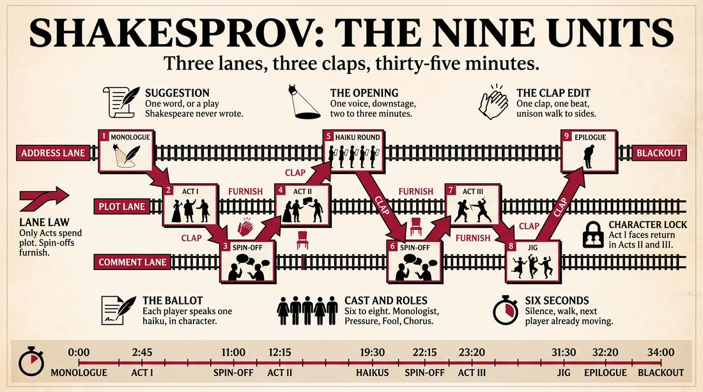
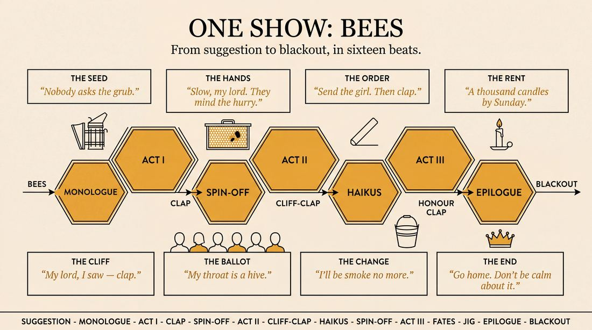
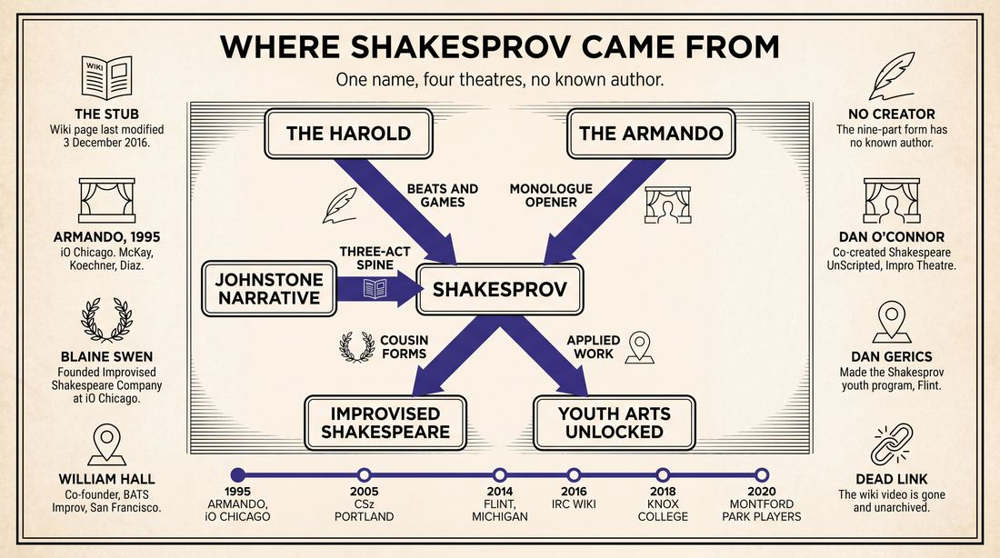
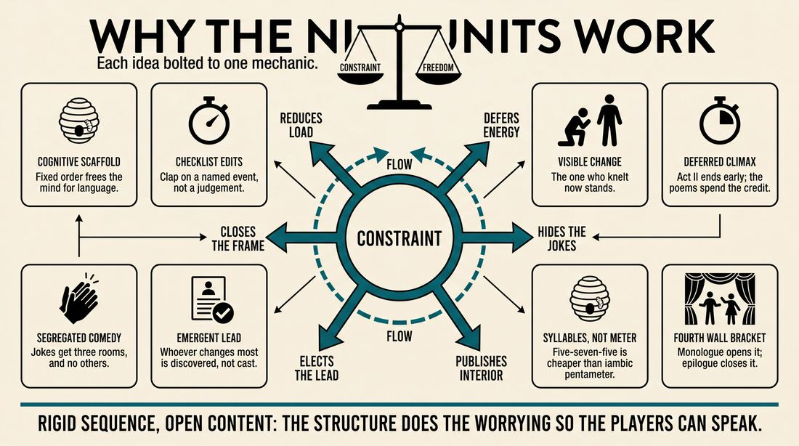
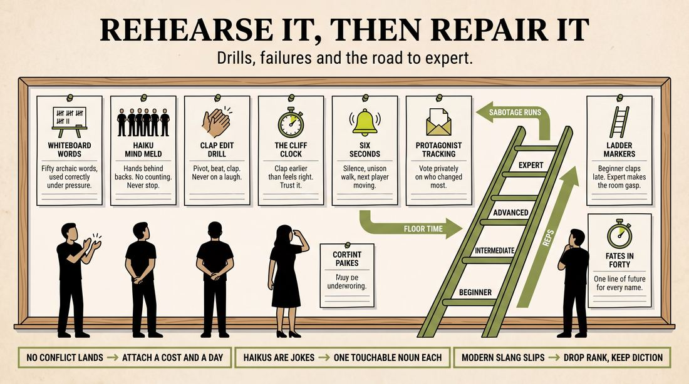

# Shakesprov

> **A complete study of the long-form improv format _Shakesprov_** - the original archived write-up, five infographics, grounded historical and pedagogical research, and a full mechanics-and-coaching manual.

| | |
|---|---|
| **Format** | Shakesprov |
| **Primary source** | [IRC Improv Wiki](https://wiki.improvresourcecenter.com/index.php?title=Shakesprov) |

---

## Contents

1. [Part I - The Original Write-Up](#part-i-the-original-write-up)
2. [Part II - The Infographics](#part-ii-the-infographics)
   - [1. Structure and Mechanics](#infographic-1-mechanics)
   - [2. A Show, Beat by Beat](#infographic-2-example)
   - [3. Origins and Lineage](#infographic-3-history)
   - [4. Why It Works](#infographic-4-theory)
   - [5. Rehearsal and Repair](#infographic-5-coaching)
3. [Part III - Research Dossier](#part-iii-research-dossier)
   - [Pass 1: History, Lineage, Literature and Scholarship](#research-history)
   - [Pass 2: Comparative Anatomy, Pedagogy and Production](#research-comparative)
4. [Part IV - Mechanics, Gameplay and Coaching Manual](#part-iv-mechanics-gameplay-and-coaching-manual)
   - [Pass 1: The Form, Its Mechanics and Its Gameplay](#manual-mechanics)
   - [Pass 2: Training, Coaching and Performance Companion](#manual-coaching)

---

## Part I - The Original Write-Up

*Verbatim archive of the source article, reproduced exactly as scraped. Everything after this section is generated elaboration built on top of it.*

### Shakesprov

**Structure**

- 1\. Opener, paint world: Monologue
	- a) Performer asks for suggestion
	- b) Audience gives suggestion
	- c) Performer does monologue about topic which sets up scene for the rest of the performance
	- d) Everyone goes to sides
- 2\. Act 1 (aka beat 1, long scene)
	- a) Someone with a good idea about monologue initiates a scene with someone else
	- b) Other performers continue scene
	- c) Conflict concerning topic presents itself to protagonist
	- d) Once that happens, act ends by someone clapping
- 3\. Spin\-off scene (reaction to beat)
	- a) Anyone with an idea for a spin\-off scene (pun/one\-liner, game, really short scene, etc. that relates to the world, character, or topic of the previous long scene but doesn’t necessarily advance plot)
	- b) Everyone goes to sides
- 4\. Act II (aka beat 2\)
	- a) One or more people continue plot from Act I
	- b) Rising action escalates conflict
	- c) Right before climax, scene ends by person clapping
- 5\. Poem – every character makes haiku
	- a) They should’ve been thinking of the haiku while performing Act I – Act II
	- b) Haikus should relate to world that has been established
- 6\. Spin\-off scene
	- a) See (3\)
- 7\. Act III (aka beat 3\)
	- a) One or more people continue plot from Act II
- b) Climax and dénouement happen
	- c) Protagonist experiences some change and makes proclamation
	- d) Once protagonist has made proclamation, scene ends by someone clapping
- 8\. Spin\-off scene
	- a) See (3\)
- 9\. The protagonist comes forth and makes a speech to the audience

**Rules**

- 1\.The characters established in the first beat (Act I, II, and III) must stay the same through the other two, but new characters may arise during spin\-off scenes and poem
- 2\. The protagonist is defined as whoever changes most from beginning to end
- 3\.Shakespeare was a good wordsmith, and you’re not. No excessive expletives.
- 4\. No attacking groups of people. Duh.

**A Note About Shakesprov**

Though it might not be readily apparent, this form of improv was inspired by the works of William Shakespeare. Specifically, the three beats – called Acts – mirror the plotlines of Shakespeare’s plays. The monologue at the beginning is something commonly found in his plays, as well, usually called a soliloquy. Though Shakespeare never wrote haikus (that we know of), he did write sonnets that became an important part of his literary legacy. The mandatory breaking of the fourth wall at the end of our show is something that occurs in many Shakespeare plays, such as Midsummer Night’s Dream and The Tempest.

An example of the form: [https://www.youtube.com/watch?v\=upU6Cg8TbVk](https://www.youtube.com/watch?v=upU6Cg8TbVk)

---

*Archived from [https://wiki.improvresourcecenter.com/index.php?title=Shakesprov](https://wiki.improvresourcecenter.com/index.php?title=Shakesprov) (IRC Improv Wiki) on 2026-08-09 23:23 UTC.*

---

## Part II - The Infographics

*Five 16:9 posters, each teaching a different aspect of the format. Click any poster to enlarge.*

<a id="infographic-1-mechanics"></a>

### 1. Structure and Mechanics

*How the form is played: the shape of the piece, the opening, the roles, the edit vocabulary, the flow of information, and the clock.*

{ .diagram loading=lazy decoding=async width="1100" height="614" }


<a id="infographic-2-example"></a>

### 2. A Show, Beat by Beat

*A single worked performance from suggestion to blackout: what happens in each beat, with short real example lines and what the players are doing technically.*

{ .diagram loading=lazy decoding=async width="1100" height="614" }


<a id="infographic-3-history"></a>

### 3. Origins and Lineage

*Where the form came from: creators, dates, theatres, how it spread between schools and cities, and the key figures - a documented timeline and lineage map.*

{ .diagram loading=lazy decoding=async width="1100" height="614" }


<a id="infographic-4-theory"></a>

### 4. Why It Works

*The theory: the core principles of the form and the research and craft ideas that explain why the structure produces good improv, each tied to a specific mechanic.*

{ .diagram loading=lazy decoding=async width="1100" height="614" }


<a id="infographic-5-coaching"></a>

### 5. Rehearsal and Repair

*Training and fixing the form: the essential drills, the common failure modes with their symptom-and-fix pairs, and the markers of beginner through expert play.*

{ .diagram loading=lazy decoding=async width="1100" height="614" }


---

## Part III - Research Dossier

*Two research passes: the historical record, then the comparative and pedagogical record. Claims carry evidence tags - treat unverified items accordingly.*

<a id="research-history"></a>

### » Pass 1: History, Lineage, Literature and Scholarship

### Research Summary

*   **Documentation Level:** Extremely thin. The specific 9-part long-form structure detailed in the source document exists exclusively as a single 2016 stub on the IRC Improv Wiki. There is no searchable performance footprint, syllabus, or video record of this exact format being performed under this name.
*   **Convergent Nomenclature:** The portmanteau "Shakesprov" is [DOCUMENTED] as being used independently by at least four disparate groups (ComedySportz Portland, Youth Arts Unlocked, Knox College, and the Texas Improv Challenge) to describe entirely different Shakespeare-themed improv shows, short-form games, and youth workshops. 
*   **Structural Lineage:** The 9-part wiki format is a highly structured hybrid. It grafts the tangential thematic exploration of *The Armando Diaz Experience* (monologue openers, spin-off scenes) onto a rigid narrative spine (a 3-Act play).
*   **Mechanical Adaptation:** The inclusion of a "haiku" segment in place of a Shakespearean sonnet is [INFERRED] to be a localized crutch for amateur improvisers, as counting 5-7-5 syllables is significantly easier than improvising iambic pentameter and rhyming couplets.
*   **Parent Forms:** Because this specific format is an obscure, likely collegiate or localized indie mutation, this dossier contextualises it by tracing the lineage of its mechanics and documenting the major professional parent forms of Improvised Shakespeare (e.g., The Improvised Shakespeare Company, Impro Theatre's *Shakespeare UnScripted*, and BATS Improv).

### Provenance and History

The exact creator and origin of the 9-part "Shakesprov" structure detailed in the IRC Wiki is [UNVERIFIED]. The wiki page was last modified on December 3, 2016, by an unknown user, and the YouTube example link provided (`upU6Cg8TbVk`) is dead and unarchived. 

However, the name "Shakesprov" has been used as a generic title for Shakespearean improv since at least 2005. It appears to be a case of convergent evolution, where multiple theatre companies independently coined the same portmanteau for their Shakespeare-themed formats.

| Year | Event / Format | Place / Company | Source |
| :--- | :--- | :--- | :--- |
| 2005 | "ShakesProv" after-hours long-form show | ComedySportz Portland (CSz Portland) | Groups.io casting call / Shore Thing Theater bios |
| 2014 | "Shakesprov" trauma-informed youth theatre program | Youth Arts Unlocked (Flint, MI) | Youth Arts Unlocked official site |
| 2016 | 9-part "Shakesprov" long-form structure codified | IRC Improv Wiki | IRC Improv Wiki |
| 2018 | "ShakesProv" hour-long improv-a-thon segment | Knox College Improv Club | Knox College news |
| 2020 | "Shakesprov 2.0" virtual interactive show | Montford Park Players | Montford Park Players site |
| Undated | "Shakesprov" 4-minute short-form game | Texas Improv Challenge | Scribd (Texas Improv Challenge manual) |

### Lineage and Transmission

Because the 9-part Shakesprov format is an isolated mutation, its transmission is untraceable. However, the lineage of its specific mechanics is highly [DOCUMENTED] within the broader improv craft:

*   **The Monologue Opener:** Traces directly to *The Armando Diaz Experience, Theatrical Movement and Hootenanny*, created at iO Chicago in 1995 by Adam McKay, Dave Koechner, and Armando Diaz. The practice of using a monologue to "paint the world" and inspire subsequent scenes is the foundational mechanic of the Armando.
*   **The 3-Act Narrative Spine:** Traces to Del Close's "The Movie" format and Keith Johnstone's narrative long-form structures (practiced heavily at BATS Improv). The wiki's strict definition of a protagonist ("whoever changes most from beginning to end") reflects classic Johnstone narrative theory.
*   **Spin-Off Scenes:** Traces to the "Group Games" or tangential beats of *The Harold*. In Shakesprov, these scenes act as pressure-release valves, allowing the ensemble to play comedic, thematic games without derailing the main 3-Act narrative [WIDELY PRACTICED, UNDOCUMENTED].
*   **The Epilogue / Breaking the Fourth Wall:** A direct theatrical lift from Shakespearean comedies (e.g., Puck in *A Midsummer Night's Dream* or Prospero in *The Tempest*), adapted as a narrative tool to tie up loose ends and signal the blackout.

### Key Figures

Because the specific 9-part form lacks a verifiable creator, this table highlights the key figures who pioneered the parent forms of Improvised Shakespeare and the mechanics that Shakesprov relies upon.

| Person | Role in Parent Forms | Specific Contribution | Source URL |
| :--- | :--- | :--- | :--- |
| **Blaine Swen** | Creator / Director | Founded *The Improvised Shakespeare Company* at iO Chicago, the most commercially successful iteration of the genre. | [Kennedy Center](https://www.kennedy-center.org/artists/s/su-sz/blaine-swen/) |
| **William Hall** | Co-Founder, BATS Improv | Pioneered narrative, genre-based long-form (including Shakespeare) on the West Coast. | [KALW](https://www.kalw.org/show/sights-sounds/2026-08-06/bats-improv-co-founder-william-hall-on-the-theater-turning-40-and-how-we-do-improv-in-our-daily-lives) |
| **Dan O'Connor** | Co-Director, Impro Theatre | Co-created *Shakespeare UnScripted*, focusing on the play-within-a-play structure and Italian romantic comedies. | [LA Times](https://www.latimes.com/archives/la-xpm-2009-jul-02-et-shakespeare2-story.html) |
| **Armando Diaz** | Monologist / Teacher | Namesake of the *Armando* format; codified the use of the opening monologue to generate thematic source material. | [Hoopla Impro](https://www.hooplaimpro.com/the-armando-true-stories) |
| **Dan Gerics** | Teaching Artist | Created the "Shakesprov" youth program in Flint, MI, using the Bard's themes for trauma-informed improv. | [Youth Arts Unlocked](https://www.youth-arts-unlocked.org/) |

### Canonical Shows, Companies and Recordings

While the 9-part Shakesprov format has no canonical recordings, the parent genre of Improvised Shakespeare is performed at the highest professional levels by the following companies:

*   **The Improvised Shakespeare Company (ISC):** Originally based at iO Chicago, now touring globally. They improvise a two-act play based on a suggested title of a play that has never been written.
*   **Shakespeare UnScripted:** Performed by Impro Theatre in Los Angeles. They use a play-within-a-play framing device (inspired by *The Taming of the Shrew*) and take suggestions of a natural element and an event to build a full-length comedy.
*   **Much Ado About Everything:** An improvised Shakespearean comedy performed by BATS Improv in San Francisco, focusing heavily on narrative fidelity and character arcs rather than just gag-driven parody.

### Published Literature

| Work | Author | Year | What it says about this form / parent forms | Where to find it |
| :--- | :--- | :--- | :--- | :--- |
| *The Playbook* | William Hall | 2015 | Details Shakespearean short-form mechanics, such as scattering real lines of Shakespeare on the floor for improvisers to justify in scenes. | [ImprovGames.com](https://improvgames.com/shakespeare-lines/) |
| *Truth in Comedy* | Charna Halpern, Del Close, Kim "Howard" Johnson | 1994 | Outlines the mechanics of the opening monologue and tangential scene generation (the DNA of Shakesprov's "spin-off scenes"). | Available in print |
| *Implementing a Gender-Based Arts Program for Juvenile Offenders* | Ann Spivack (co-author) | Undated | Details the methodology behind Youth Arts Unlocked, which runs the "Shakesprov" trauma-informed improv program. | [Youth Arts Unlocked](https://www.youth-arts-unlocked.org/) |

### Verbatim Quotes

> "Though it might not be readily apparent, this form of improv was inspired by the works of William Shakespeare. Specifically, the three beats – called Acts – mirror the plotlines of Shakespeare’s plays."
> <br>— *IRC Improv Wiki* (Source: https://wiki.improvresourcecenter.com/index.php?title=Shakesprov)

> "The protagonist is defined as whoever changes most from beginning to end."
> <br>— *IRC Improv Wiki* (Source: https://wiki.improvresourcecenter.com/index.php?title=Shakesprov)

> "Shakespeare was a good wordsmith, and you’re not. No excessive expletives."
> <br>— *IRC Improv Wiki* (Source: https://wiki.improvresourcecenter.com/index.php?title=Shakesprov)

> "In Shakesprov, our newest series of theatre workshops, popular works of William Shakespeare serve as catalysts from which the youth explore universal humanities themes. Using theatre exercises, Improv, and storytelling, this engaging format enables the boys to discover, discuss and relate to themes from Shakespeare's plays..."
> <br>— *Youth Arts Unlocked* (Source: https://www.youth-arts-unlocked.org/)

> "Based on one audience suggestion (a title of a show that has never been written), The Improvised Shakespeare Company® creates a brand new, fully improvised Shakespearean masterpiece right before your eyes. Nothing has been planned out, rehearsed, or written."
> <br>— *The Kennedy Center* (Source: https://www.kennedy-center.org/artists/s/su-sz/blaine-swen/)

> "A completely improvised play in the style of William Shakespeare, the Impro Theatre ensemble begins with an audience suggestion and builds original plays inspired by Shakespeare's poetry, colorful imagery and bawdy innuendo."
> <br>— *Impro Theatre* (Source: https://improtheatre.com/)

> "In general, you shouldn't seek to recreate or act out any part of the story or monolog that opens the show. Instead, find small pieces of information that strike you as interesting and use that as a place to start your scene."
> <br>— *IRC Forum User on the Armando mechanic* (Source: https://www.improvresourcecenter.com/)

> "Players place lines from real Shakespeare plays on small pieces of paper and scatter them on the stage. The players then play an open scene (no game) and occasionally pick up a piece of paper and read the line incorporating it into the scene."
> <br>— *William Hall, BATS Improv* (Source: https://improvgames.com/shakespeare-lines/)

### Anecdotes and Stories

**The Origin of the Armando Monologue**
The opening mechanic of the 9-part Shakesprov format is the monologue. This traces back to 1995 at iO Chicago, when Adam McKay and Dave Koechner wanted to create a flagship show for the new Del Close Theater. They gathered a rotating cast of 30 top improvisers, but needed a structural anchor. They hired Armando Diaz to be the full-time, dedicated monologist. Diaz would take a suggestion, tell a true, vulnerable story, and the cast would pull thematic elements from it to initiate scenes. The format became so iconic that the structural mechanic of "monologue into scenes" simply became known as "The Armando." (Source: [Hoopla Impro](https://www.hooplaimpro.com/the-armando-true-stories) / [Reddit Improv History](https://www.reddit.com/r/improv/))

**Improvising the Bard Without a Net**
When Impro Theatre first mounted *Shakespeare UnScripted* in Los Angeles, critics noted the sheer terror of the premise. As the *LA Times* reviewed in 2009: "Improvisational theater is high-risk. Those who practice it are the theatrical equivalent of circus aerialists... One can hardly imagine a more gut-wrenching endeavor than winging a Shakespearean play completely off the cuff." To survive, the cast relied on a play-within-a-play framing device, welcoming the audience into an Italian café before transforming the space into the stage, giving the improvisers a meta-theatrical safety net if the Shakespearean language faltered. (Source: [LA Times](https://www.latimes.com/archives/la-xpm-2009-jul-02-et-shakespeare2-story.html))

### Academic and Scientific Research

**Collaborative Emergence and Flow**
*Finding:* In *Group Genius*, Dr. R. Keith Sawyer outlines how highly structured constraints actually reduce cognitive load in group improvisation, allowing the ensemble to achieve a "flow state" and collaboratively generate emergent narratives.
*Relevance to this form:* The extreme rigidity of the 9-part Shakesprov structure (specifically the mandatory clapping to end acts, and the forced alternation between narrative Acts and tangential "spin-off scenes") acts as a cognitive scaffold. By removing the anxiety of *when* to edit a scene or *how* to structure the show, the improvisers can focus entirely on the difficult task of mimicking Elizabethan language and tropes.

**Cognitive Constraints in Spontaneous Generation**
*Finding:* Research into the neuroscience of freestyle rap and poetry (e.g., Charles Limb's fMRI studies) shows that improvising within strict rhythmic or rhyming constraints requires the deactivation of the brain's dorsolateral prefrontal cortex (the inner critic). 
*Relevance to this form:* The wiki format explicitly replaces the traditional Shakespearean sonnet with a Haiku (5-7-5 syllables). This is a brilliant, localized mechanical adaptation. Improvising iambic pentameter and rhyming couplets requires immense cognitive processing; counting syllables on one's fingers for a Haiku provides a much lower barrier to entry for amateur improvisers while still fulfilling the structural requirement of a "poetic interlude."

### Documented Variants and Descendants

Because "Shakesprov" is a convergent term, it has several entirely distinct variants that share nothing but the name:

*   **The Texas Improv Challenge "Shakesprov":** A 4-minute short-form game. The audience provides the title of a lost Shakespearean masterwork, and the team must improvise a prologue and all five acts in under four minutes. "Bonus points for gruesome deaths and clever puns."
*   **Youth Arts Unlocked "Shakesprov":** A trauma-informed applied improv program in Flint, Michigan. Rather than focusing on comedy, teaching artists use Shakespeare's universal themes (betrayal, family, power) as catalysts for juvenile offenders and at-risk youth to improvise scenes reflecting their own lived experiences.
*   **CSz Portland "Shakesprov":** An after-hours, long-form show performed by the ComedySportz Portland roster in the mid-2000s, leaning into the bawdy, unrated side of the Bard that didn't fit their family-friendly mainstage shows.

### Criticism, Debate and Known Failure Modes

*   **The Tension Between Narrative and Theme:** The 9-part wiki format attempts to merge a strict 3-Act narrative with tangential "spin-off scenes." Practitioners of narrative improv (like BATS) often warn that interrupting a protagonist's journey with unrelated, pun-based one-liners destroys the audience's emotional investment in the story [WIDELY PRACTICED, UNDOCUMENTED].
*   **The "Haiku" Cop-Out:** While the haiku is a clever crutch, purists of Improvised Shakespeare argue that abandoning the Western poetic tradition (sonnets, rhyming couplets) in a Shakespeare format defeats the purpose of the genre. 
*   **The "Good Wordsmith" Fallacy:** The wiki rules state: "Shakespeare was a good wordsmith, and you’re not. No excessive expletives." Teachers of Improvised Shakespeare (like Blaine Swen) actively train improvisers to *become* good wordsmiths by studying the rhythm of the text, rather than just accepting that they will be bad at it and relying on modern crutches.

### Cultural Footprint

While the 9-part Shakesprov format has no cultural footprint, the parent genre of Improvised Shakespeare is a massive pillar of the modern comedy ecosystem. *The Improvised Shakespeare Company* has served as a direct pipeline to television and film, boasting alumni like Thomas Middleditch (*Silicon Valley*), Zach Woods, and Joe Swanberg. The genre has proven that long-form improv can be successfully marketed to traditional theatre-going audiences (who might normally avoid comedy clubs), bridging the gap between high-brow classical theatre and low-brow spontaneous comedy.

### Gaps in the Record

*   **The Creator of the 9-Part Form:** It is entirely unknown which indie troupe, college group, or theatre created the specific 9-part structure uploaded to the IRC Wiki in 2016.
*   **The YouTube Artifact:** The video linked in the wiki (`https://www.youtube.com/watch?v=upU6Cg8TbVk`) is dead and not captured by the Wayback Machine. Identifying the upload account would likely solve the mystery of the format's origin.
*   **Performance History:** There is zero documented evidence of the 9-part format ever being performed in front of a paying audience under the name "Shakesprov."

### Source List

1. IRC Improv Wiki - Unknown - 2016 - https://wiki.improvresourcecenter.com/index.php?title=Shakesprov - Source document detailing the 9-part structure.
2. Youth Arts Unlocked - YAU - 2024 - https://www.youth-arts-unlocked.org/ - Documents the trauma-informed youth program variant of Shakesprov.
3. The Kennedy Center - Kennedy Center - 2023 - https://www.kennedy-center.org/artists/s/su-sz/blaine-swen/ - Documents Blaine Swen and the Improvised Shakespeare Company.
4. LA Times - F. Kathleen Foley - 2009 - https://www.latimes.com/archives/la-xpm-2009-jul-02-et-shakespeare2-story.html - Review and documentation of Impro Theatre's *Shakespeare UnScripted*.
5. ImprovGames.com - William Hall - 2015 - https://improvgames.com/shakespeare-lines/ - Documents BATS Improv's approach to Shakespearean mechanics.
6. Hoopla Impro - Hoopla - 2023 - https://www.hooplaimpro.com/the-armando-true-stories - Documents the history and mechanics of the Armando monologue opener.
7. Scribd - Texas Improv Challenge - Undated - https://www.scribd.com/document/32456789/Texas-Improv-Challenge-Games - Documents the 4-minute short-form variant of Shakesprov.
8. Groups.io / Portland Casting - Lori Lewis - 2005 - https://groups.io/g/portlandactors/topic/4172421 - Earliest documented use of the term "ShakesProv" by CSz Portland.

<a id="research-comparative"></a>

### » Pass 2: Comparative Anatomy, Pedagogy and Production

### Taxonomic Placement

```text
       The Harold                 The Armando
       (3 Beats, Games)           (Opening Monologue)
              \                      /
               \                    /
                \                  /
                 \                /
                  [ Shakesprov ]
                         |
            +------------+------------+
            |                         |
  Improvised Shakespeare     Youth Arts Unlocked
  (Continuous Narrative)     (Applied/Therapeutic)
```

Shakesprov sits at the intersection of the classic Harold and the Armando, heavily modified by genre-narrative constraints. It inherits the Armando’s opening mechanic (a single performer taking a suggestion and delivering a world-building monologue) but abandons the Armando’s loose montage structure. From the Harold, it borrows the three-beat structure separated by non-narrative interludes (the "spin-off scenes" functioning identically to Harold group games). However, it diverges from both parents by enforcing a single, continuous plotline centered on a single protagonist, rather than weaving three disparate storylines together. 

### Head-to-Head Comparisons

| Axis | Shakesprov | The Harold | Consequence for the players |
| :--- | :--- | :--- | :--- |
| **Opening** | Single performer monologue setting the world. | Full cast group game or pattern-making. | Shakesprov places immense world-building pressure on one player; the rest of the cast must actively listen from the sides rather than physically participating. |
| **Structure** | 3 Acts (single plot) separated by spin-offs and a Haiku round. | 3 Beats (three separate plots) separated by group games. | Players in Shakesprov only have to track one narrative arc, freeing up cognitive load to focus on heightened language and meter. |
| **Edit Logic** | In-scene player claps to end the scene right before the climax. | Sideline player sweeps the stage to transition. | Shakesprov requires the players *inside* the scene to possess high structural awareness of the rising action, rather than relying on the sidelines to save them. |
| **Memory** | Must track one protagonist's arc and maintain character consistency across Acts. | Must track three separate worlds, characters, and game mechanics. | Shakesprov demands deep emotional memory for one character's journey, whereas the Harold demands broad, horizontal memory. |
| **Cast Size** | 6–8 (Protagonist, supporting cast, spin-off players). | 8–10 (Enough to sustain three separate storylines). | Shakesprov allows for more sideline resting, which is necessary given the exhaustion of improvising in Early Modern English. |
| **Audience Contract** | We will tell one complete Shakespearean tragedy/comedy with silly interludes. | We will show you how disparate ideas connect by the end. | The audience expects a satisfying narrative resolution (climax and denouement) rather than a thematic tie-up. |
| **Failure Mode** | The plot becomes so convoluted that the language degrades into modern slang. | The third beat fails to connect the disparate storylines. | Shakesprov fails when players prioritize plot mechanics over poetic execution. |

| Axis | Shakesprov | The Armando | Consequence for the players |
| :--- | :--- | :--- | :--- |
| **Opening** | Monologue based on an audience suggestion. | Monologue based on an audience suggestion. | Identical initiation, but Shakesprov requires the monologue to explicitly set up the *scene* and *world*, whereas Armando monologues are often personal anecdotes. |
| **Structure** | Rigid 9-step narrative with specific interludes. | Fluid montage of scenes inspired by the monologue. | Shakesprov players cannot simply initiate a random scene if they get stuck; they must serve the specific structural step they are in (e.g., Act II rising action). |
| **Edit Logic** | Clapping at specific narrative milestones. | Sweeping when the comedic game of the scene peaks. | Shakesprov edits are driven by plot progression; Armando edits are driven by comedic timing. |

### What Makes It Uniquely Itself

1. **The Haiku Interlude (Step 5):** While many forms use group games to break up narrative beats, Shakesprov mandates a highly specific, rigid poetic constraint exactly at the midpoint (between Act II and Act III). Every character must deliver a 5-7-5 poem relating to the established world. If you remove this, you are simply playing a standard 3-beat narrative.
2. **The Clap Edit:** The form explicitly bans the traditional improv sweep. Scenes are ended by a player clapping, and the rules dictate *exactly* when this clap must occur (e.g., Act II must end "right before climax"). This bakes the pacing directly into the form's ruleset.
3. **The Retrospective Protagonist:** Rule 2 states that the protagonist is "whoever changes most from beginning to end." This means the protagonist is not necessarily the person who speaks first or has the highest status in Act I; the cast must collaboratively discover who the protagonist is by observing who is undergoing the most significant emotional shift, and then retroactively support that character's journey in Acts II and III.

### Structural Variants in Practice

| Variant | What it changes | Who plays it | Source |
| :--- | :--- | :--- | :--- |
| **The Classic 9-Step** | Adheres strictly to the Monologue -> Act 1 -> Spin-off -> Act 2 -> Haiku -> Spin-off -> Act 3 -> Spin-off -> Speech structure. | Indie teams, college groups (e.g., Knox College Improv Club). | IRC Improv Wiki / Knox College |
| **The Continuous Epic** | Abandons the spin-offs and haikus entirely. Plays as a seamless, two-act continuous narrative. Edits are achieved via rhyming couplets rather than claps. | Improvised Shakespeare Company (Chicago/LA). | Blaine Swen (Founder) |
| **Applied Shakesprov** | Removes the pressure of iambic pentameter and strict Early Modern English. Uses the themes of Shakespeare (ambition, betrayal) as a catalyst for youth to explore their own trauma and stories. | Youth Arts Unlocked (Flint, MI). | Sharlene Howe / Youth Arts Unlocked |
| **The Trope Intensive** | Focuses less on the 9-step structure and more on presentational acting, metaphor, and embodying classic Shakespearean archetypes (the fool, the lovers). | Stomping Ground Comedy (Dallas, TX). | Kelsey Eigsti & Milo Wilder |

### The Teaching Ladder

| Stage | Skill introduced | Why in this order | Typical exercise | Source or [CRAFT CONSENSUS] |
| :--- | :--- | :--- | :--- | :--- |
| **1. Vernacular Confidence** | Using archaic words ("perchance", "sirrah") without hesitation. | Players will freeze if they feel they don't have the vocabulary to speak in the world. | Whiteboard Vocabulary Drill | Brandon Baker (Facebook coaching notes) |
| **2. Presentational Acting** | Breaking the fourth wall, delivering soliloquies directly to the audience. | Shakesprov requires an opening monologue and a closing speech; players must be comfortable holding the stage alone. | The Soliloquy Confession | [CRAFT CONSENSUS] |
| **3. Meter and Rhyme** | Iambic pentameter, AABB/ABAB rhyme schemes. | Required for the Haiku section and elevating the language during climactic moments. | Co-Improvising Sonnets | Marc Majcher / Rebecca Northan |
| **4. Structural Milestones** | The 9-step form, the Clap Edit, identifying the protagonist. | The cognitive load of the structure is too high if players are still struggling with the language. | Form Walkthrough | [CRAFT CONSENSUS] |

### Documented Drills and Exercises

| Drill | Origin / teacher | How to run it | What it fixes in this form | Source |
| :--- | :--- | :--- | :--- | :--- |
| **Shakespearean Name Circle** | Ross Bryant (Improvised Shakespeare Co) | Cast stands in a circle and goes around 1-2 times rapidly listing Shakespearean names (real or invented). | Loosens up the cast, builds retention, and breaks the fear of "getting it wrong." | Folger Shakespeare Library Interview |
| **Whiteboard Vocabulary** | Brandon Baker | Write 50 archaic words and their meanings on a whiteboard. Players run scenes and must incorporate the words correctly. | Fixes modern slang bleeding into the scenes; builds vernacular confidence. | Facebook coaching notes |
| **Co-Improvising Sonnets** | Marc Majcher / Rebecca Northan | Two players alternate lines in iambic pentameter, aiming for an AABB or ABAB rhyme scheme. | Fixes meter panic; trains players to stay in the moment rather than projecting past the verse line. | Facebook coaching notes |
| **Trope Character Creation** | Kelsey Eigsti & Milo Wilder | Players are assigned classic archetypes (fool, tragic hero) and must initiate a scene embodying that trope's physical center. | Fixes flat, modern characterization; ensures high-stakes relationships from Act I. | Stomping Ground Comedy |
| **Truth in Comedy Translation** | Blaine Swen | Players run a scene attempting to be purely honest and supportive rather than "funny" or "poetic." | Fixes "gagging" and allows the comedy to emerge naturally from the dramatic stakes. | Folger Shakespeare Library Interview |
| **Swordfights Without Swords** | Thorn and Petal Stick | High-energy physical storytelling drill focusing on dramatic conflict and comedic theatricality without props. | Fixes "talking head" scenes; forces players to use their bodies during high-conflict moments. | Thorn and Petal Stick Workshops |
| **Haiku Mind Meld** | [CRAFT CONSENSUS] | Players stand in a line. A suggestion is given. Each player steps forward and delivers a 5-7-5 syllable poem without pausing to count on their fingers. | Fixes the Step 5 Haiku interlude; trains players to internalize syllable counts. | [CRAFT CONSENSUS] |
| **The Clap Edit Drill** | [CRAFT CONSENSUS] | Two players run a scene. The coach yells "Conflict!" A third player on the sideline must identify the exact moment before the climax and clap loudly to end it. | Fixes missed edits and scenes that drag past their narrative peak. | [CRAFT CONSENSUS] |
| **Spin-Off Pun Generator** | [CRAFT CONSENSUS] | After a heavy scene, the cast steps forward to deliver rapid-fire one-liners or puns based on a specific word used in the previous scene. | Fixes tonal bleed; trains players to execute Step 3, 6, and 8 quickly and get out. | [CRAFT CONSENSUS] |
| **Protagonist Tracking** | [CRAFT CONSENSUS] | Run a 3-beat scene. At the end, the cast votes on who the protagonist was based *only* on who changed the most. | Fixes protagonist drift; forces the cast to actively observe emotional shifts rather than default to the loudest player. | [CRAFT CONSENSUS] |

### Common Failure Modes and Diagnoses

| Failure mode | What it looks like from the audience | Root cause | Fix | Who names it |
| :--- | :--- | :--- | :--- | :--- |
| **Plotting over Poetry** | Players rush through dialogue, ignoring meter and emotion, just to explain the plot mechanics. | Fear of the language; trying to force a pre-planned narrative rather than letting it emerge. | Empty the brain, listen, and focus purely on making the scene partner look good. | Blaine Swen |
| **Rhyme Panic** | Players freeze, stutter, or break character trying to find the perfect rhyme for a couplet or haiku. | Projecting past the end of the verse line; trying to write the end of the sentence before speaking the beginning. | Lean into the moment; use AABB rhyming which is cognitively easier than ABAB. | Brandon Baker / Rebecca Northan |
| **Tonal Whiplash** | Spin-off scenes mock or destroy the base reality of the Acts, making the audience stop caring about the protagonist. | Misunderstanding the purpose of the spin-off; using it to critique the main scene rather than react to its themes. | Spin-offs must relate to the world/topic without undermining the protagonist's reality. | [CRAFT CONSENSUS] |
| **Protagonist Drift** | The main character disappears in Act II or III, and the climax feels unearned. | Players forget to carry the established characters through the beats, or fail to identify who changed the most in Act I. | Strict adherence to Rule 1 (characters in Acts I, II, III must stay the same). | [CRAFT CONSENSUS] |

### Production and Logistics

*   **Cast Size:** 6 to 8 players. This provides enough bodies to sustain a main plot (a protagonist, antagonists, and allies) while leaving enough players on the sides to initiate the rapid-fire spin-off scenes and populate the Haiku section without exhausting the core narrative players.
*   **Runtime:** 30 to 45 minutes. The 3-act structure requires time to breathe, but the high cognitive load of improvising in heightened language prevents it from running a full 90 minutes like a scripted play.
*   **Stage Layout:** Bare stage. Players stand on the sides ("Everyone goes to sides" per the form's rules) to maintain clean sightlines for the Clap Edits.
*   **Chairs and Set:** Minimal. 2 to 4 chairs, easily movable. The focus is on language and physical theatricality (e.g., "Swordfights without swords").
*   **Lighting and Tech Cues:** General wash. A spotlight may be used for the opening monologue, the Step 5 Haikus, and the Step 9 closing speech. No mid-scene lighting or sound cues are used for transitions, as the edits are strictly driven by player claps.
*   **Music and Sound:** Pre-show Elizabethan or lute music sets the tone. 
*   **MC and Host Duties:** The performer who delivers the opening monologue acts as the MC. They step forward, break the fourth wall, and ask for the suggestion.
*   **How the Suggestion is Taken:** Typically a single word, theme, or a made-up title of a play Shakespeare forgot to write.
*   **Where the Form Belongs in a Lineup:** Usually a second-act closer. The theatricality, the high stakes, and the definitive ending (the protagonist's final speech to the audience) make it difficult for another team to follow.
*   **Rehearsal Cadence:** Weekly, with a heavy emphasis on reading actual Shakespeare outside of rehearsal to internalize story flow and vocabulary.
*   **What a Producer Must Prepare:** Whiteboards for vocabulary drills in the green room, a clear stage space, and marketing that sets the expectation of a narrative play rather than a rapid-fire short-form show.

### Adaptations Beyond the Stage

*   **Classroom and Youth:** When used in youth programs (like Youth Arts Unlocked in Flint, MI), the pressure of perfect iambic pentameter is removed. The form is adapted to use Shakespearean themes (betrayal, ambition, love) as catalysts for youth to explore universal humanities themes and tell their own stories.
*   **Prisons and Justice Centers:** Troupes like ShakeItUp Theatre have adapted Shakespearean improv for inmates (e.g., at Pentonville Prison). The focus shifts from comedic performance to building teamwork, emotional expression, and confidence in hyper-masculine environments. 
*   **Online and Remote:** Zoom adaptations require modifying the "clap" edit, as a loud clap will cause audio ducking on video conferencing software. The edit is usually replaced by a visual cue, such as covering the camera lens.
*   **Accessibility and Inclusion:** The heavy reliance on Early Modern English can be exclusionary for players with cognitive or language processing disabilities. Adaptations focus heavily on the physical storytelling elements (clown, commedia dell'arte, and status play) rather than strict verbal meter.
*   **Content-Safety and Consent:** Rule 4 explicitly states "No attacking groups of people." In prison or youth settings, strict boundaries around physical touch during simulated combat ("swordfights") are required.
*   **Ethics of Using Real Stories:** In therapeutic or applied settings where the form is used to process trauma, facilitators must ensure psychological safety. The Shakespearean "mask" (playing a king or a tragic hero) provides necessary aesthetic distance, allowing participants to explore personal issues without forced disclosure.

### Evidence Base for Those Adaptations

The applied use of this structure in juvenile justice and correctional settings is supported by literature on trauma-informed arts programming. For example, the methodology used by Youth Arts Unlocked's "Shakesprov" program is grounded in frameworks detailed in *Implementing a Gender-Based Arts Program for Juvenile Offenders* (Spivack). Furthermore, the efficacy of improv in carceral settings—specifically its ability to foster risk-taking, teamwork, and emotional regulation—is documented in evaluations of California's prison arts programs and Arts Council England-funded initiatives (as noted by James Dart regarding ShakeItUp Theatre's work at Pentonville).

### Scholarly Frames Worth Applying

*   **Collaborative Emergence (Keith Sawyer):** Sawyer posits that in group creativity, the outcome cannot be predicted by analyzing the individuals, but emerges unpredictably from their moment-to-moment interactions. **Mapping:** In Act I, the identity of the protagonist is not pre-planned; it emerges collaboratively based on the rule that the protagonist is "whoever changes most," forcing the cast to retroactively build the narrative around that emergent reality.
*   **Status and Spontaneity (Keith Johnstone):** Johnstone argues that all theatrical interactions are driven by subtle shifts in dominance and submission (status). **Mapping:** The spin-off scenes (Steps 3, 6, 8) rely heavily on extreme status gaps (e.g., a high-status king interacting with a low-status fool) to generate quick, non-plot-advancing comedy that contrasts with the high-stakes status battles of the main Acts.
*   **Flow (Mihaly Csikszentmihalyi):** Flow is the state of optimal experience where skill level perfectly matches the challenge, resulting in effortless action. **Mapping:** Improvising in iambic pentameter or generating on-the-spot haikus requires a flow state; projecting past the end of the verse line breaks the flow, causing the cognitive load to overwhelm the player and the structure to collapse.

### Where the Form Is Heading

Current practice sees a divergence in how Shakespearean improv is performed. Highly polished, commercial iterations (such as the Improvised Shakespeare Company) have largely abandoned the rigid 9-step structure, the spin-offs, and the haikus in favor of seamless, two-act continuous narratives that feel indistinguishable from actual lost plays. Meanwhile, the specific structural interludes of Shakesprov (like the Haiku round) are being adopted by indie teams looking to break up heavy narrative forms with palate-cleansing constraints. In the applied sector, the form is being stripped of its comedic pressure entirely, using the thematic architecture of Shakespeare to help marginalized youth and incarcerated populations process trauma and build community.

### Source List

1. *Shakesprov* - IRC Improv Wiki - 2016 - https://wiki.improvresourcecenter.com/index.php?title=Shakesprov - Supports the core 9-step structure, rules, and historical inspiration.
2. *Improvised Shakespeare Company* - Folger Shakespeare Library (Interview with Blaine Swen and Ross Bryant) - 2026 - https://www.folger.edu - Supports drills (Name Circle), failure modes (Plotting over Poetry), and the philosophy of truth in comedy within the genre.
3. *Shakespearean Improv Intensive* - Stomping Ground Comedy (Kelsey Eigsti & Milo Wilder) - 2026 - https://www.eventbrite.com - Supports the teaching ladder (Trope Character Creation, presentational acting).
4. *Facebook Coaching Notes & Discussions* - Brandon Baker, Marc Majcher, Rebecca Northan - 2024 - https://www.facebook.com - Supports drills (Whiteboard Vocabulary, Co-Improvising Sonnets) and failure modes (Rhyme Panic).
5. *All the world's a stage: how Shakespeare improv is changing prisoners' lives* - The Stage (James Dart) - 2022 - https://www.thestage.co.uk - Supports adaptations beyond the stage (ShakeItUp Theatre in Pentonville Prison).
6. *Youth Arts Unlocked: Shakesprov* - Youth Arts Unlocked - 2023/2024 - https://www.youth-arts-unlocked.org - Supports applied adaptations, youth classroom use, and trauma-informed facilitation (Spivack).
7. *Thorn and Petal Stick Workshops* - Thorn and Petal Stick - 2026 - https://www.thornandpetalstick.com - Supports physical drills (Swordfights Without Swords) and language elevation.

---

## Part IV - Mechanics, Gameplay and Coaching Manual

*Synthesis over the original article and both research dossiers: first how the form works and how to play it, then how to train an ensemble to perform it.*

<a id="manual-mechanics"></a>

### » Pass 1: The Form, Its Mechanics and Its Gameplay

### At a Glance

| Field | Value |
|---|---|
| **Also known as** | The 9-Step Shakesprov; IRC Shakesprov; "the Bard Harold" (informal). Note: "Shakesprov" is a convergent name — at least four unrelated groups (CSz Portland, Youth Arts Unlocked Flint, Knox College, Texas Improv Challenge) use it for entirely different shows. This chapter documents **only** the 9-part structure codified on the IRC Improv Wiki in 2016. |
| **Family** | Genre narrative long form. Structurally an **Armando × Harold hybrid**: Armando's monologue opener, Harold's beat/group-game alternation, welded to a single-protagonist three-act spine (Johnstone/Close narrative lineage). |
| **Cast size** | 6–8 optimal. 5 is the hard floor (you need bodies for the haiku round and spin-offs); above 9 the character-lock rule (Rule 1) strands players. |
| **Runtime** | 30–45 minutes. 35 is the sweet spot. |
| **Opening** | Solo monologue by one performer, who also takes the suggestion and acts as MC. All other players stand at the sides throughout. |
| **Suggestion taken** | One word, theme, or the title of a play Shakespeare never wrote. One suggestion only. |
| **Structural rigidity (1–5)** | **5** for sequence — nine units in fixed order, with the edit points legislated ("right before climax"). **2** for scene content — what happens inside each unit is wide open. This split is the form's defining feature. |
| **Difficulty (1–5)** | **4**. Language pushes it to 5 for a team with no Early Modern English work; drops to 3 if you run the plain-speech dial. |
| **Prerequisites** | One player who can hold a stage alone for 2–3 minutes; whole-cast comfort with direct address; a working archaic vocabulary (~50 words); the ability to count 5-7-5 without visible finger-counting; a cast that can agree in silence who the protagonist is. |
| **Best for** | Mid-level teams whose montages have no consequence; theatre-literate audiences; college and indie ensembles; a second-act closer. |
| **Avoid when** | Cast under 5; zero rehearsal time on the language; a bar show where the audience talks; slot under 25 minutes (the epilogue gets amputated); an opening slot (the definitive ending kills the room's appetite for what follows). |

---

### The Essence in One Paragraph

Shakesprov is a nine-unit, single-plot Shakespearean play in which the *narrative* runs in three long Acts and everything else — the opening monologue, three "spin-off" scenes, a mid-show round of haiku, and a closing address to the audience — runs beside it, feeding it images and never touching the plot. One player takes a suggestion and delivers a world-painting monologue; the cast mines it and plays Act I until a conflict lands on somebody, at which point a player **inside the scene claps once** and everyone walks to the sides. A short comic spin-off scene reacts to the Act's world without advancing it. Act II escalates and is clapped off **one line before the climax** — deliberately, cruelly early. The cast then lines up and each player, in character, delivers a 5-7-5 haiku they have been quietly composing since Act I; this round is where the ensemble silently elects the protagonist, defined by the form's own rule as *whoever changes most*. Another spin-off holds the audience on the cliff a second time. Act III delivers climax, change, and a proclamation, then clap. A final spin-off exhales. Then the protagonist steps downstage alone, breaks the fourth wall, and speaks the play out. The form's whole engineering purpose is to make an amateur cast produce a genuine, earned dramatic arc — by legislating *when* to cut so that nobody has to be brave about it, and by parking a poetry round on top of the cliffhanger so that character interiority becomes a structural obligation rather than a good intention.

---

### Why This Form Exists

A plain Armando or montage answers the question "what does this suggestion make us think of?" It cannot answer "and then what happened?" — because a montage has no obligation to anyone. Shakesprov exists to bolt three specific missing pieces onto that chassis.

**Problem 1: Long-form scenes die of edit cowardice or edit greed.** In most forms the edit lives on the backline, which means the person with the least information about where a scene is (they can't feel the temperature onstage) is making the call, or nobody makes it and the scene grinds. Shakesprov moves the edit *inside the scene* and tells you exactly which narrative event triggers it: conflict lands (Act I), the moment before climax (Act II), proclamation delivered (Act III). You are not deciding whether the scene is "done." You are watching for one named event and clapping. That is a checklist, not a judgement call, and checklists are what let unconfident casts fly.

**Problem 2: Improvised narrative gets driven by whoever is loudest.** The form refuses to let you cast the hero. Rule 2 — *the protagonist is whoever changes most from beginning to end* — makes the lead an emergent property, discovered by observation, then retroactively served. This converts the cast from a set of competing initiators into a set of watchers looking for the one person whose ground is shifting. It solves the "everyone drives" problem structurally rather than by asking people to be generous.

**Problem 3: Comedy and narrative eat each other.** Teams with jokes destroy their own stakes; teams with stakes go grey. Shakesprov builds a physical container for the jokes — three spin-off units, 45–90 seconds each — and makes them illegal everywhere else. The Acts get to be serious because the comedy has a scheduled window. This is what the Harold's group games do for the Harold, but here the segregation is stricter: a Harold's group game can legitimately reroute a storyline; a Shakesprov spin-off may **furnish** the world with facts but may not **advance** the plot.

**What you buy that a montage cannot sell you:** a curtain call that means something. The audience leaves having watched one person change, having heard six interior confessions in verse, and having been addressed directly by the person who changed. A montage cannot end; it can only stop.

**What it costs:** flexibility. If Act I produces a dud conflict, the form gives you no exit — you are married to it for two more Acts (Rule 1). See *Troubleshooting*.

---

### The Audience Contract

**What is promised, in the first ninety seconds.** A single speaker, house-facing, taking a suggestion and then talking — not scene work — tells the audience: *this show has an author's voice and a topic.* The moment that speaker ends and five or six people in a line become a court in period-flavoured language, the promise upgrades: *this will be one story, in one world, told to the end.*

**How they know where they are.** Four unmistakable signals, and you must protect all four:

| Signal | What it tells the audience | Failure to protect |
|---|---|---|
| The single clap + synchronised walk to the sides | "Chapter break. Time has passed." | A ragged exit reads as a botched scene; a stray second clap reads as an applause cue |
| A player alone in a downstage pool of light | "This is not a scene. This is a confession or an address." | Playing the monologue or epilogue *in* the stage picture — it just looks like a scene where everyone forgot to talk |
| The full cast in a line, stepping forward one at a time | "Poetry round. The story is paused, not abandoned." | Breaking the line to interact — the audience thinks the play has restarted |
| Return of the same faces in the same voices in Acts II and III | "Nothing has been thrown away." | New characters in Act III — the audience concludes the team lost the plot, because it did |

**The specific promise of Act II's early clap.** When you cut one line before the climax, you are writing a cheque. The audience knows it — a held breath is audible. Everything between that clap and Act III (the haiku round, the second spin-off) is spent on credit. You have roughly four minutes of goodwill. Spend it on interiority and one good joke, then cash the cheque.

**What breaks the contract, in order of severity:**

1. **The protagonist does not change.** Rule 2 is the only content promise the form makes. Breaking it is not "a rough show," it is a different show.
2. **A spin-off mocks the base reality.** If your commoners point out that the Duke's plan is stupid, the audience stops believing in the Duke. Spin-offs stand *beside* the world, never above it.
3. **Ending on a spin-off, or the epilogue delivered by the wrong player.** The house has spent 35 minutes learning who this is about. Send someone else out and you have told them they were wrong to care.
4. **Modern slang under pressure.** The audience forgives clumsy verse instantly. They do not forgive "okay, so, basically" from a Duke, because it reveals that the world was never real to you either.
5. **A clap that lands after the moment instead of on it.** Late claps teach the audience that the structure is decorative.

---

### Anatomy: The Full Structural Map

Nine units. Three lanes. Only one lane may touch the plot.

- **Plot lane:** Acts I, II, III. Continuous story, locked cast, escalating stakes.
- **Commentary lane:** Spin-offs at steps 3, 6, 8. Comic, tangential, populated freely.
- **Address lane:** Monologue (step 1), Haiku round (step 5), Epilogue (step 9). Direct to house, no fourth wall.

The show alternates lanes so that no unit ever has to do two jobs, which is precisely why an inexperienced cast can survive it.

```
                            SUGGESTION (one word / theme / lost title)
                                        |
   ADDRESS LANE  ->  [1] MONOLOGUE  ~2-3'   one voice, downstage, house lights up on speaker
                     (deposits: WORLD + THEME + >=3 harvestable concrete details)
                                        |
   ============================== PLOT LANE OPENS ==============================
                     [2] ACT I  ~8'
                     establish 3-5 locked characters ... CONFLICT LANDS  --> *CLAP*
                                        |
   COMMENT LANE  ->  [3] SPIN-OFF  ~60-90"   no plot; FURNISHES one usable fact
                                        |
                     [4] ACT II  ~7'
                     escalate; widen the stakes ... ONE LINE BEFORE CLIMAX --> *CLAP*
                                        |                   ^^^ the cheque is written
   ADDRESS LANE  ->  [5] HAIKU ROUND  ~2-3'
                     full cast in line; each steps out, 5-7-5, in character
                     ^^^ THE PROTAGONIST BALLOT — the biggest interior delta wins
                                        |
   COMMENT LANE  ->  [6] SPIN-OFF  ~60"   second delay; tension held, not released
                                        |
                     [7] ACT III  ~8'
                     CLIMAX -> visible CHANGE -> PROCLAMATION -> fates dealt --> *CLAP*
                                        |
   COMMENT LANE  ->  [8] SPIN-OFF  ~45"   "the jig": comic exhale, collects earlier callbacks
                                        |
   ADDRESS LANE  ->  [9] EPILOGUE  ~60-90"
                     PROTAGONIST alone, to the house, bookends the monologue --> BLACKOUT


   TENSION (rough):
   high |                                   ____x____ (7)
        |                    ____(4)______/  \  \
        |          ___(2)___/       [5][6] held flat, ~4 mins of credit
        |   (1)___/                                    \___(8)__(9)_
   low  +---------------------------------------------------------------> time
```

| Unit | Approx. clock | What happens | Who drives it | Success criterion | Common error |
|---|---|---|---|---|---|
| **1. Monologue** | 0:00–2:45 | One player takes the suggestion, then speaks: paints a world, names a theme, hands the cast concrete images | The Monologist (also MC) | Cast can name three specific things they could build a scene from, and one moral question | Stand-up bit: jokes with no world, no nouns, no question |
| **2. Act I** | 2:45–11:00 | 3–5 characters established and **locked**; relationships and status set; a conflict lands on one of them | First initiator, then whoever holds the conflict | Every character has a name, a want, and a stake; conflict is specific and unsolved | Six entrances, no conflict; or conflict resolved inside Act I |
| **2b. Clap** | ~11:00 | Single clap from inside, on the beat after the conflict lands | Any onstage player (default: the one who just delivered or received the blow) | Silence, then a synchronised walk to the sides | Clapping on a laugh; clapping before the conflict has a target |
| **3. Spin-off** | 11:00–12:15 | Short comic unit reacting to Act I's world, characters or topic — pun run, commoners, institution, animal POV | Anyone with a clean idea; usually 2–3 players who were *not* central in Act I | Gets a laugh, adds one world-fact, and is over inside 90 seconds | Becomes a fourth scene; comments on the plot; runs three minutes |
| **4. Act II** | 12:15–19:30 | Plot resumes with the *same* characters; stakes widen from private to public; a decision is made that cannot be unmade | The presumptive protagonist and the pressure character | Audience can state what is now at risk that was not at risk before | Repeating Act I's argument at higher volume ("the treadmill") |
| **4b. Cliff-clap** | ~19:30 | Clap **one line before** the climactic event | Any onstage player | An audible intake of breath from the house | Playing the climax and then clapping — this bankrupts Act III |
| **5. Haiku round** | 19:30–22:15 | Cast forms a line; each steps out and delivers one 5-7-5 in character; steps back | The Poet Marshal (first out) sets the rotation | Every haiku contains one concrete noun from the world; one haiku is visibly a *turn* | Jokes, off-count lines, finger-counting, more than one haiku each |
| **6. Spin-off** | 22:15–23:20 | Second comic unit; ideally reacts to the haikus or to Act II | Players who did not speak much in Act II | Holds tension by *not* mentioning the cliff | Resolving or explaining the cliff; killing the tension |
| **7. Act III** | 23:20–31:30 | Climax fires; protagonist visibly changes; proclamation; fates dealt to every named character | Protagonist, with the cast steering the light onto them | The change is a physical and verbal event you could photograph | Plot-dump exposition; a climax with no one changed; characters left un-landed |
| **7b. Clap** | ~31:30 | Clap after the proclamation and after the fates are dealt | Ideally *not* the protagonist — someone else, to honour them | The proclamation is the last full sentence of the plot lane | Clapping on the proclamation itself, losing the dénouement |
| **8. Spin-off** | 31:30–32:20 | The jig: brief comic release, may collect callbacks from all three earlier tangents | Fool + one or two commoners | Under a minute; hands the stage cleanly to the protagonist | A new plot idea; going long; being sour about the ending |
| **9. Epilogue** | 32:20–34:00 | Protagonist alone, downstage, direct address; bookends the monologue's image | The protagonist only | Ends on an image the audience heard in minute two | Recapping the plot; the wrong player; a group bow before the light drops |

---

### The Opening

The monologue is the load-bearing wall. In an Armando, the monologue is a well the cast dips into for anything shiny; in Shakesprov, the monologue must produce **the world the whole play lives in**, because the plot lane has nowhere else to get one. The wiki is explicit: *"performer does monologue about topic which sets up scene for the rest of the performance."* That is a heavier brief than Armando's.

#### Procedure (default: the Hybrid Address)

1. **Pre-set.** Cast enters in a line at the sides during pre-show music (lute drone, or nothing). No fanfare. The Monologist stands one step downstage of the line.
2. **Take the suggestion.** Step to the lip. Ask once, in your own voice, for **one** thing: *"May we have a single word — or the title of a play Shakespeare forgot to write?"* Take the first clear offer. Repeat it aloud so the whole house and the whole cast have it. Do **not** collect three and pick your favourite; that reads as shopping and lowers your authority for the next two minutes.
3. **Speak, 2–3 minutes, no scene work.** Do not act it out. Do not do voices. Stand and tell.
4. **Deliver the four deposits** (see below).
5. **Land on a question, not a punchline.** The last sentence should leave a moral question open. *"They pick an ordinary grub and feed it until it's a queen. Nobody asks the grub."*
6. **Walk to the sides.** Do not gesture "and go." Just join the line. The first initiator walks out on your third step — that overlap is what makes the transition feel authored rather than negotiated.

#### The Four Deposits (the monologue's checklist)

| Deposit | What it is | Example from the worked run-through |
|---|---|---|
| **World** | A social order the cast can populate: who has power, who serves, what the economy is | Bees, hives, wax, smoke; a keeper, a hierarchy, a queen who can be replaced |
| **Theme as a question** | A moral problem, phrased so it has two defensible sides | "Is a calmed crowd a happy crowd?" |
| **Three harvestable details** | Concrete nouns/actions, not abstractions. A detail is harvestable if you could put it in someone's hands | The smoker; the twenty minutes it takes a hive to know its queen is dead; the ordinary grub fed into royalty |
| **One image for the epilogue** | A picture you will hand back at the end, inverted | "They don't sleep. They just stop arguing." |

My recommendation: say the sentence *"Nobody asks the grub"* out loud in rehearsal after every practice monologue. If the monologist cannot identify their own epilogue image, they have not finished the monologue.

#### Documented and viable variants

| Variant | Mechanics | Use when | Cost |
|---|---|---|---|
| **The True Story** (Armando-descended; the wiki's ancestor) | Performer tells a genuine personal anecdote on the suggestion, unstyled, no period language | Cast is strong at thematic harvesting; you want emotional truth under the pastiche | The world isn't given — the first initiator must invent Elizabethan setting *and* find the theme, which is two jobs at once. Highest-risk opening |
| **The Chorus Prologue** (in-world) | Performer enters as a Chorus figure, in period voice, and delivers a prologue that states the setting and hints the ending: *"In fair Vellham, where we lay our scene…"* | New casts; matinee/theatre audiences; when the suggestion is a title | You lose the human warmth of a true story; risks being all announcement, no images |
| **The Hybrid Address** (my default recommendation) | Begin as yourself, true and specific; at the two-thirds mark, transmute — take one image from the anecdote and let it become the world, ending in period register | Almost always. It gets the truth of Armando and the world-painting the plot lane requires | Requires a monologist who can feel the transmutation point |
| **The Two-Suggestion Open** (borrowed from Impro Theatre practice) | Take a natural element *and* an event; monologue braids them | Ensembles that go abstract on a single word | Slower open; you have burned 20 seconds on admin |
| **The Rotating Monologist** | Different player every show, drawn at random pre-show | Rehearsal and ensemble development | Show quality becomes a lottery |
| **The Silent Open** (advanced, undocumented — my invention) | No monologue; a 45-second wordless tableau of the world, then the Monologist speaks a 6-line prologue over it | Festival slots where you want an arresting first image | Halves your image bank; only run this with a cast that has done 20+ shows in the form |

**Cast behaviour during the monologue.** Everyone at the sides, still, watching the speaker — not the audience, not the floor. The wiki's "everyone goes to sides" is a staging rule, but it is also an attention rule: your visible listening is the first thing that tells the house this material matters. Each sideline player should silently pick **one** detail and hold it. My rule: if two players lunge for the same detail at the top of Act I, whoever gets there second must yield and never come back for it.

---

### The Engine

This is the section to read twice. Shakesprov coheres because of a conservation law, four information channels, and one election.

#### 1. The conservation law: one plot lane, three theme lanes

There are three currencies in the show. **Plot** (facts that change the protagonist's situation), **Theme** (the moral question and its images), and **Language** (elevation — verse, simile, archaism). The law:

> **Only Acts may spend plot. Every unit may spend theme and language. Non-Act units may deposit facts into the world but may never withdraw plot.**

The operative distinction, and the one you must drill until the cast can call it in the moment, is **furnish vs. advance**:

- **Furnish** = adding a fact about the world that the Acts *may* later use. *"There's not a beekeeper in the county will work the Duke's hives now."* The protagonist's situation is unchanged; a resource has appeared on the table.
- **Advance** = changing the protagonist's situation. *"So I told the Duke about the poison."* Now the plot has moved off-lane and Act III has been robbed.

Everything about the form's rhythm follows from this law. It is why spin-offs can be silly without being destructive, why the haiku round can be moving without being expository, and why the epilogue can be sincere without being a recap.

| Unit | Takes from | Gives to | Currency handled |
|---|---|---|---|
| Monologue | Suggestion | Act I; the epilogue (via its image) | Theme, world |
| Act I | Monologue | Act II; spin-off 1; all haikus | **Plot**, character |
| Spin-off 1 | Act I (most recent material only) | Act II (as furnishings), spin-off 3 | Theme, language, world-facts |
| Act II | Act I; spin-off 1's furnishings | Act III; the haiku round | **Plot**, escalation |
| Haiku round | All of Acts I–II | Act III (the ballot result); the epilogue | Theme, interiority, **protagonist election** |
| Spin-off 2 | Act II / the haikus | Act III (furnishings); spin-off 3 | Theme, tension-holding |
| Act III | Everything | The epilogue | **Plot**, change, resolution |
| Spin-off 3 (jig) | All three spin-offs | Nothing — it is terminal | Release |
| Epilogue | Monologue + Act III | The audience | Theme, closure |

#### 2. The four information channels, and the return leg

Material does not flow one way. Novices assume the show is a waterfall: monologue → Acts → done. It is a loop with a **return leg**.

- **Channel A — the image bank (monologue → everything).** Three to five concrete nouns from the monologue, available all night to anyone. These are free. Using one is never a mistake.
- **Channel B — the plot spine (Act → Act).** Facts with consequence. Only Acts may write here. Locked cast (Rule 1) means the spine cannot be re-cast, only escalated.
- **Channel C — the furnishing loop (Act → spin-off → Act).** A spin-off draws a kernel from the Act that just ended and returns a fact. **This is the return leg and it is the single most under-used mechanic in the form.** If spin-off 1's washerwomen establish that the Feast of Lights needs a thousand candles by Sunday, Act II now has a free ticking clock it did not have to invent. My rule: **every spin-off pays rent** — it leaves behind exactly one usable object, law, off-stage person, deadline, or piece of common knowledge.
- **Channel D — the interior channel (Act → haiku → Act III / epilogue).** The haikus publish what characters have not said. Act III can then act on knowledge it acquired from *poetry*. When Beatrix's Act III line is "My throat is a hive, and I will open it," the audience gets a callback to a private confession they were let in on and the other characters were not. That is dramatic irony, generated by structure rather than by planning.

#### 3. The Protagonist Election (three stages)

Rule 2 — *the protagonist is whoever changes most from beginning to end* — is not a definition, it is a **procedure**. It runs in three stages, and every player must know which stage the show is in.

| Stage | When | What happens | The tell |
|---|---|---|---|
| **Presumptive** | End of Act I | The conflict lands on someone. That person is provisionally the protagonist — *not because they are important, but because they now have a problem.* | The clap follows the moment the problem attaches to a body |
| **Elected** | Haiku round | Whichever haiku shows the largest gap between the character's public Act I posture and their private state is the ballot winner. The cast reads the room and agrees in silence. It may be a servant with four lines. | The haiku that makes the audience go quiet |
| **Ratified** | Act III, first 60 seconds | Somebody onstage hands them the scene: a question, an accusation, a summons, an object. From that point every player's job is to increase the pressure on that one person. | "Girl. Speak, or the smoke speaks for thee." |

**Why it must work this way.** If you cast the hero in Act I, you get the loudest player's show. If you never cast one, you get a montage with costumes. Electing at the midpoint means Act I can be genuinely exploratory, and it means the change is *observed rather than announced*. It also means the form is honest about improvised narrative: you find out what your play is about halfway through, like everyone always does.

**Handling a split ballot.** Two characters both look transformed. Do not compromise. In Act III's first thirty seconds, one player makes a **Retro-Ratification** move: give the other candidate a line that services the first. *"Master Corvin, you have kept your silence forty years. Let the girl keep hers no longer."* Corvin has just declined the crown. The room resolves instantly.

#### 4. The Deferred Climax (why Act II ends early and why *two* units intervene)

The form legislates that Act II ends "right before climax," then interposes the haiku round *and* a spin-off before Act III. Read cynically, that is two obstacles between the audience and the thing they want. Read correctly, it is the cleverest thing in the form.

- **A cliff-clap converts scene energy into audience energy.** The cast gets a breather at the exact moment an unstructured team would burn its climax out of nervousness.
- **The haiku round is only bearable *because* of the cliff.** Six consecutive solo poems in a show with no tension is a recital. Six poems while a sword is raised is a chorus. The cliff is what buys the poetry its stakes; the poetry is what stops the cliff being a cheap stall. They are load-bearing for each other. Remove either and the other collapses — this is why teams who "cut the haikus for time" always report that Act II now feels flat.
- **Spin-off 2 tests the tension.** If the audience laughs at spin-off 2 *and* leans back in when Act III starts, your cliff was real. If they laugh and relax, your Act II clap came too late — you had already resolved something.

The dossier infers the haiku replaced a sonnet as a difficulty crutch. Probably true, and I'd add a structural reason the anonymous author may have felt rather than reasoned: **a round of eight sonnets is eight minutes and kills the show; a round of eight haikus is 150 seconds.** The haiku is the right choice for reasons of *duration*, not just of syllable-counting.

#### 5. Language as the second engine (and as a pressure valve)

The reason this form's failure mode is "language degrades into modern slang" is that players treat language as decoration and plot as work. Invert that. **When the plot is thin, elevate the language; when the language fails, drop the character's rank.**

The elevation ladder, lowest to highest — teach these as gears:

1. **Prose, plain.** Commoners, comedy, spin-offs.
2. **Prose, figured.** Plain syntax plus one simile per speech. *"He's gone off like milk in a warm room."*
3. **Blank-ish verse.** Roughly ten beats per line, no rhyme. Don't count; *feel* the ten and let it be nine or eleven.
4. **Antithesis and doublet.** *"Not for love of me, but for lack of him."* / *"I am undone, undone and all unmade."*
5. **Extended simile / conceit.** Four to eight lines developing one image. The highest-yield generator in the whole genre: it buys you thinking time while sounding like mastery.
6. **Rhymed couplet.** Reserved for exits and the moment before a clap.

Grammar minimums to drill (these are cheap and transform the sound):

| Device | Rule | Use |
|---|---|---|
| thou / thee / thy / thine | *thou* subject, *thee* object, *thy* before consonant, *thine* before vowel | **Status weapon**: *thou* to intimates and inferiors, *you* to superiors. Switching mid-scene is a status attack |
| Verb inversion | "Comes he hither?" / "Thou hast not the wit" | Instant register lift |
| Interjections | O, Marry, Faith, Soft, Hark, Anon, Fie, Would that | Sentence-starters that buy half a second |
| Wh-words | wherefore = why; whither = to where; hither = to here; whence = from where | Removes the most common anachronism ("why are you going where?") |
| Concrete nouns | Trades, tools, animals, weather, body parts | Abstraction is the enemy: not "betrayal," but "a knife under the bread" |

**The prose/verse dial is your accessibility mechanism.** A player who freezes in verse can be handed a servant, a gravedigger, a nurse, a soldier — and speak plain. Shakespeare did exactly this. It is not a concession; it is the genre.

#### 6. Failure physics

Every characteristic failure of this form is a lane leak:

| Leak | Symptom |
|---|---|
| Plot leaks into a spin-off | Audience stops trusting spin-offs, stops laughing, and starts trying to track two stories |
| Comedy leaks into an Act | Stakes evaporate; the eventual proclamation is embarrassing |
| Theme leaks *out* of the haikus (i.e. jokes) | The protagonist election fails; Act III has no candidate |
| Plot leaks into the epilogue | Recap; the show ends on admin |
| New characters leak into Act II/III | Rule 1 breach; the audience's investment is spent on strangers |

---

### Roles and Responsibilities

Six to eight players, and the form gives most of them two jobs — one in the plot lane, one elsewhere. Cast the lanes deliberately in rehearsal; discover them in performance.

| Role | Owns | Must do | Must not do | Signal to the others |
|---|---|---|---|---|
| **Monologist / MC** | The suggestion, the world, the theme, the image bank | Take one suggestion; speak 2–3 min; deposit world + theme-question + 3 harvestable details + one epilogue image; end on a question; join the line | Act it out; do voices; take three suggestions; be funnier than they are clear | Walking upstage into the line: "the world is yours now" |
| **First Initiator** | The tone and register of the entire play | Walk out on the monologist's third step; establish place, rank and relationship inside three lines; use a monologue noun | Initiate with a question; establish a character they can't sustain for 25 minutes | Their first noun tells the cast which detail was harvested |
| **Presumptive Protagonist** | Act I's problem | Receive the conflict physically (take the letter, take the blow, take the order); stay reachable in Act II | Solve it; deflect it; disappear from the plot | Stillness after the conflict lands — hold, do not talk |
| **Elected Protagonist** | The arc, the proclamation, the epilogue | Change visibly (body first, then words); make one proclamation; deliver the epilogue alone | Narrate their own change ("I have changed"); share the epilogue | Stepping downstage after the final clap while everyone else clears |
| **The Pressure** (antagonist) | Escalation | Raise the cost in every Act; make the protagonist's silence expensive | Become a villain who explains himself; win in Act II | Advancing on the protagonist — the cast reads this as "we are escalating now" |
| **The Confidant** | Access to the protagonist's interior | Ask the one question nobody else will; witness the change | Give advice that solves the plot | Kneeling, or touching the protagonist |
| **The Fool** (licensed) | Theme spoken aloud; usually the jig | Say what the play means, sideways, once per Act; anchor spin-offs 1 and 3 | Comment on the improv, the audience, or the structure | Crossing the stage on a diagonal — fools move diagonally, nobles move straight |
| **Chorus / backline** | Spin-offs, haikus, functionary entrances | Watch with visible attention; carry the spin-off units; feed messenger entrances | Enter an Act to "help"; play a new plot-owner after Act I | Stepping one foot forward = "I have a spin-off" |
| **The Clapper** (a duty, not a person) | Structural milestones | Clap once, loud, chest height, on the beat *after* the pivot line; then walk | Clap on a laugh; clap twice; clap from the sides unless rescuing | The clap itself; the walk that follows sells it |
| **Poet Marshal** | The haiku round's shape and rotation | Step out first, set the rhythm, establish "step out / speak / step back"; hold protagonist for last | Step out last; explain the round | Their first step forward opens the round |
| **The Book-Holder** *(my addition; borrowed from the Elizabethan prompter)* | Names and facts | Keep a mental ledger of every proper noun; be ready to enter as a servant to repair a name error | Correct anyone out of character; whisper audibly | Entering as a servant with the correct name in a line of dialogue |
| **Tech (LX)** | Four states only | Wash for Acts and spin-offs; downstage special for monologue/haiku/epilogue; a slow fade on the final line; blackout | Cue mid-scene; light the claps; use sound stings for edits | Special comes up when a player crosses to the downstage lip |
| **Musician** *(optional)* | Atmosphere between units | A four-second sting under each walk-to-sides; a drone under the haiku round | Underscore dialogue; comedy stings on jokes | Sting starting = the transition is being covered |
| **Director / coach** *(rehearsal, and offstage in performance)* | The form itself | Note clap timing and lane leaks; run the ledger drill; call the protagonist ballot in notes | Side-coach during a show | — |

---

### The Rules That Actually Bind

#### Hard rules — break these and it is not Shakesprov

| # | Rule | Source | Why it is load-bearing |
|---|---|---|---|
| H1 | Nine units, in order: Monologue, Act I, Spin-off, Act II, Haiku round, Spin-off, Act III, Spin-off, Epilogue | Wiki | The alternation *is* the form; the Acts are only clean because the tangents have their own rooms |
| H2 | Characters established in Act I persist unchanged through Acts II and III | Wiki Rule 1 | Kills protagonist drift; forces escalation instead of replacement |
| H3 | New characters are permitted in spin-offs and the poem round | Wiki Rule 1 | Gives the ensemble somewhere to put invention that would otherwise contaminate the plot |
| H4 | The protagonist is whoever changes most, discovered — not cast | Wiki Rule 2 | The form's only content promise to the audience |
| H5 | Acts end on a **clap**, at a specified narrative event (conflict landed / one line before climax / after proclamation) | Wiki | Puts dramaturgy inside the scene; makes pacing a checklist item |
| H6 | Act II ends **before** the climax | Wiki | The whole midsection (haiku + spin-off 2) is financed by this |
| H7 | Every player delivers one haiku, in character, 5-7-5, relating to the established world | Wiki | The protagonist ballot; the interiority channel |
| H8 | Act III contains climax, dénouement, visible change, and a proclamation | Wiki | Without the proclamation there is no epilogue to earn |
| H9 | The show ends with the protagonist addressing the audience directly | Wiki | Fourth-wall bracket; without it the play just stops |
| H10 | No excessive expletives | Wiki Rule 3 | Not prudery — the genre's comedy comes from invention, and "fuck" is the cheapest available word. It is a *craft* constraint |
| H11 | No attacking groups of people | Wiki Rule 4 | Non-negotiable; period costume is not a licence |
| H12 | Spin-offs may **furnish** the world; they may not **advance** the plot | Inferred from the wiki's "doesn't necessarily advance plot"; hardened by me into a bright line | Without a bright line, spin-offs become a fourth act and the form loses its shape |

#### Soft conventions — house by house

| Convention | Common settings | Choose based on |
|---|---|---|
| Who may clap | (a) onstage only; (b) anyone | The comparative dossier asserts the clap comes from inside the scene; the wiki only says "someone." **My judgement: default onstage, sideline clap permitted as a rescue with a small authority cost.** |
| Number of spin-offs | 3 (wiki) / 2 / 0 (Continuous Epic variant) | Cast's comic strength; runtime |
| Poem form | Haiku (wiki) / rhymed couplet each / one shared sonnet | Cast's rhyme skill; see *Variations* |
| New characters in Acts II–III | Strict reading: forbidden. **My recommendation: permit "functionaries" — messengers, guards, servants — who carry information and exit, never plot-owners.** | Cast size; how many players Act I stranded |
| Haiku order | Left-to-right / ascending status / protagonist last | Protagonist last is strongest; it makes the ballot legible |
| Genre lock (comedy vs tragedy) | Declared in the monologue / discovered at the haikus / never declared | New casts should declare; experienced casts should let the haiku round decide |
| Register | Full Early Modern English / "heightened plain" / mixed by rank | Rehearsal hours available |
| Suggestion type | Single word / theme / lost title | Titles give the most plot, words the most imagery |
| Tech | Full wash + special / bare wash | Venue |

#### Myths — things people wrongly believe are rules

| Myth | Why people believe it | The truth |
|---|---|---|
| "You must speak in iambic pentameter" | The word "Shakespeare" | Nothing in the form requires meter. The poetry requirement is the haiku round, which is *syllabic*, not metrical. Verse is a dial, not a rule |
| "You can't sweep-edit" | The comparative dossier says the sweep is "banned" | The wiki bans nothing; it *prescribes* the clap. Sweeps aren't illegal, they are off-style — a sweep in a doublet reads like a stagehand wandered on. Don't. But don't tell your cast it's a rule |
| "The protagonist is whoever the monologist described" | Armando habit | The monologue paints the world, not the hero. The protagonist is elected at the midpoint, often from a servant role |
| "Spin-offs must be about the protagonist" | They come after Act beats | They may relate to *world, character, or topic*. World-level spin-offs (guilds, weather, trades) are usually the best because they furnish the most |
| "Act I should end at a cliffhanger" | Confusion with Act II | Act I ends when a **conflict lands** — that's earlier and lower-energy. Cliffhanging Act I leaves Act II with nothing to build |
| "The haikus have to be funny" | Everything else in improv | The haiku round is the emotional centre. Jokes there cost you the ballot and the Act III stakes. One funny one (the Fool's) is the maximum |
| "The protagonist should give the epilogue in character, in verse" | Prospero | Either works. The strongest version is *slightly* out of the world — the character's voice, the actor's honesty. That's what makes the bracket land |
| "New characters are banned everywhere after Act I" | Over-reading Rule 1 | Rule 1 explicitly permits new characters in spin-offs and the poem |
| "It's Improvised Shakespeare Company's form, simplified" | Both are Shakespeare improv | The ISC predates the wiki page and plays a continuous two-act narrative with no spin-offs and no haikus. The dossier's family tree showing ISC as a *descendant* of Shakesprov is backwards — they are cousins from the same genre, not parent and child |

---

### Edits and Transitions

| Edit | How to execute physically | When it is right | When it is wrong | What it costs |
|---|---|---|---|---|
| **The Act Clap** | Single hard clap at chest height, arms then drop to sides; hold one beat of stillness; walk *out to the sides*, not off | The named milestone has occurred and the line after it has landed | On a laugh (reads as shushing); before the milestone; twice | Nothing when clean. Its power depends entirely on scarcity — exactly three per show |
| **The Cliff-Clap** (Act II) | Same, but on the *inhale* before the climactic action — the sword raised, the letter half-opened | One line before the climax | After the climax has fired. This is the single most expensive error in the form | Buys the whole midsection; costs nothing if timed |
| **The Couplet-and-Clap** | Speak a rhymed couplet, step upstage on the second line, clap on the last word | When the language has been strong all Act and you can rhyme without stalling | When you have to stall to find the rhyme — a hunted rhyme kills the exit | Two seconds of risk for a very large payoff |
| **The Rescue Clap** (sideline) | Sideline player steps one foot on, claps, steps back | The onstage players have plainly missed the milestone and are looping | As a first resort; more than once a show | Costs the onstage players authority. Use it, then note it |
| **The Spin-off Step-Back** | No clap. Players deliver the last line, turn, walk to the line at the sides in unison | Ending spin-offs 1, 2 and 3 | On Acts — spin-offs and Acts must be punctuated differently or the audience loses the lane distinction | Nothing; it's free, which is why it should be the spin-off default |
| **The Spin-off Button Clap** | Clap on the last pun, only if the spin-off has ballooned | When a pun run has run long and needs surgery | When the spin-off ended cleanly on its own | Slightly muddies the clap's meaning; acceptable once |
| **The Clearing** (locale change *inside* an Act) | All players exit to the sides for two seconds; one or two re-enter from the opposite side; a line names the new place | Within an Act, when the plot needs a second location — the Elizabethan continuous-staging move | When used to escape a scene you don't like — it is not an edit, it is a scene change | Free, and hugely under-used. It stops Acts becoming one endless room |
| **The Split Focus** | Two players hold a frozen tableau upstage; two play downstage; swap by re-animating | Within an Act, for eavesdropping, letters, simultaneous councils | In spin-offs (too complex for 60 seconds) | Requires rehearsal; can confuse a cold audience |
| **The Messenger Entrance** | A backline player walks straight to the highest-status figure, kneels, delivers one fact, exits | Inside an Act, to inject time pressure or an off-stage event | To resolve a problem; to deliver more than one fact | Uses up a functionary; three per show maximum |
| **The Haiku Rotation** | Line at the back; each steps one pace downstage, speaks out, steps back; next begins the moment the previous foot lands | Step 5 only | Any overlap, any pause longer than a second, any interaction | The rhythm *is* the unit; hesitancy makes it look like a talent show |
| **The Epilogue Break** | After the final clap, cast clears completely; protagonist crosses to the downstage lip; light narrows | Step 9 only | Any cast member remaining onstage — even upstage in shadow | Nothing. Solitude is the whole effect |
| **The Blackout** | On the last word, or one beat after; never fade slowly through applause | End of epilogue | Fading before the last word; bowing before blackout | A slow fade on a good last line is worth more than a snap; a slow fade on a weak one is agony |

**The one thing to rehearse until it is boring:** the six seconds after a clap. Silence, unison walk, next initiator already moving. Teams lose more audience trust in those six seconds than anywhere else in the show.

---

### Memory: Callbacks, Patterns and Heightening

Shakesprov remembers itself in four channels, and each has a different half-life.

| Channel | Half-life | How it is recalled | Best detonation point |
|---|---|---|---|
| **Monologue image bank** | Whole show | Any player, at will, free | The epilogue (bookend) and Act III's proclamation |
| **Act facts** | Whole show, binding | Named characters, objects, oaths, deadlines | Act III climax |
| **Spin-off furnishings** | One Act | Somebody in the *next* Act picks it up as if it were always true | Act II and Act III, as free resources |
| **Haiku images** | Act III + epilogue | Spoken aloud by a *different* character than the one who wrote it — this is the highest-value callback in the form | Act III |

#### The three-touch rule

An image becomes a motif at three touches and a joke at five. Budget:

1. **Plant** in the monologue or Act I (unremarked).
2. **Echo** in a haiku or spin-off (someone notices it).
3. **Detonate** in Act III or the epilogue (it means something it didn't mean the first time).

*Touch 1:* "They pick an ordinary grub and feed it until it's a queen."
*Touch 2 (haiku):* "My throat is a hive."
*Touch 3 (epilogue):* "Nobody asks the grub. So I have asked her myself."

#### The escalation grammar (specific to a three-Act spine)

Escalation in Shakesprov is not "louder." It is **widening the circle of who is affected**, which is the Shakespearean move:

| Act | Circle | Test question |
|---|---|---|
| I | Private / domestic | Who is hurt if nothing changes? *One person.* |
| II | Household / faction | Who is hurt now? *A family, a guild, a court.* |
| III | Public / civic / cosmic | Who is hurt now? *The town, the state, the natural order — the bees leave, the candles gutter.* |

Test it by asking, at each Act clap, "who is watching now?" If the answer hasn't grown, you have run the treadmill.

#### The callback economy

In 35 minutes you can support roughly **six** recurring items and no more. Budget them explicitly in rehearsal:

1. One **phrase** (repeatable, four to seven words)
2. One **object** (a smoker, a ring, a ledger)
3. One **epithet** (a name bestowed onstage: "Bess Bell-Ringer," "the Smoke-Girl")
4. One **off-stage character** (mentioned, never seen — enormously efficient; the audience builds them for free)
5. One **place** you keep returning to
6. One **rule of the world** (established in a spin-off; enforced in an Act)

#### Pattern recognition specific to the spin-offs

Spin-offs 1, 2 and 3 should form a **series**, not three unrelated bits. Two patterns work reliably:

- **Same people, later** — the same two washerwomen each time, further along in the disaster. Their third appearance is the jig, and it is free comedy because the audience already loves them.
- **Same institution, escalating** — the candlemakers' guild, then the guild's emergency meeting, then the guild's funeral for its own trade.

The jig (spin-off 3) is the collector: it may reference all previous tangents. It is the only unit in the show permitted to be nakedly nostalgic.

#### Heightening the *language*, not the volume

The genre-specific escalation ladder: **plain prose → figured prose → verse → conceit → couplet.** A character rising in urgency should rise in register. A character breaking down should *fall* — the noble who drops from verse into flat prose in Act III has performed a devastating change with zero plot cost. My recommendation: give your protagonist a deliberate register arc (e.g. Act I plain prose → Act III verse for a servant who finds her voice; the reverse for a king who loses his).

---

### Move-Level Technique Catalogue

| # | Move | Situation | How to do it | Example line | Failure mode |
|---|---|---|---|---|---|
| 1 | **Harvest the Noun** | Top of Act I | Take one concrete noun from the monologue and put it physically in your hands as you enter | *(entering with an imagined smoker)* "Master Corvin — the third hive is silent." | Harvesting the *theme* instead ("This is a scene about silence") — abstraction has no body |
| 2 | **Rank in Three Lines** | First 20 seconds of Act I | Line 1 names place, line 2 names the other person's rank, line 3 names what you want from them | "My lord, the wax rooms are cold, and the Duke asks after his candles." | Playing "two people" — unranked scenes cannot escalate in this genre |
| 3 | **The Status Pronoun Flip** | Mid-Act, when power shifts | Switch from "you" to "thou" (or back) at the exact moment of the shift; don't remark on it | FENWICK: "You have my thanks, brother." *(later)* "Thou hast my pity." | Using thou/you at random; the flip only reads if you were consistent before |
| 4 | **The Extended Simile** | You need thinking time or elevation | State the comparison, then develop it for three clauses before returning | "Thou art like a candle in a butcher's shop: bright, and out of place, and burning down toward the meat." | Abandoning the image halfway; stacking three unrelated similes |
| 5 | **The Antithesis Button** | End of a speech | Balance two opposed clauses; put the weight on the second | "I do not fear the hive. I fear the hand that holds the smoke." | Making both halves the same length *and* the same idea — it sounds grand and says nothing |
| 6 | **The Oath Under Pressure** | Act I, when a stake needs fixing | Swear by something concrete from the world; the audience will hold you to it | CORVIN: "By the wax on these hands, the girl will never carry the smoke into that room." | Swearing by abstractions ("by all that is holy") — nothing to break later |
| 7 | **Take the Conflict Physically** | End of Act I | When the problem lands, receive it with the body: take the letter, kneel, accept the tool, go still | *(BEATRIX takes the smoker; says nothing)* | Talking through it. Stillness is what makes the clap legible |
| 8 | **The Pivot-Line Clap** | Act edits | Let the line that changes the situation land, allow one beat, then clap | OSRIC: "Then let the girl carry the smoke." *(beat)* **CLAP** | Clapping on your own laugh line, so the edit reads as "I've had enough of this scene" |
| 9 | **Furnish-Not-Advance** | Any spin-off | End the spin-off by asserting one fact about the world with no reference to the protagonist | WASHERWOMAN: "A thousand candles by Sunday or there's no Feast at all." | "…and that's why the Duke's brother is lying" — that's plot; you have robbed Act III |
| 10 | **The Peasant Gloss** | Spin-off 1 or 2 | Two low-status characters retell the Act's events wrongly, at a slant, with pride in their misinformation | "They say the bees have gone Protestant." | Retelling events *accurately* — that's a recap, and recaps are not funny |
| 11 | **The Pun Cascade with a Hard Out** | Spin-off, when you have no scene | Cast steps forward one at a time, each delivering one pun on a single word, then all step back on the third | "The hive is abuzz." / "A grave matter — the drones are mourning." / "I'd say more but I've been stung." *(all step back)* | No fourth pun exists. Attempting one is how spin-offs become three minutes long |
| 12 | **The Clearing** | Mid-Act location change | Everyone exits for two seconds; two players enter from the other side; first line names the new place | "The chapel is colder than the hive, brother." | Using it to escape a scene rather than to move the story |
| 13 | **The Messenger Entrance** | Act II, when energy sags | Walk straight to the highest-status figure, kneel, deliver one fact, exit before anyone can question you | "My lord — the eastern hives are empty. All of them. This morning." | Staying to be interrogated; delivering two facts; becoming a character |
| 14 | **The Overheard Half-Truth** | Act II | One player conceals; two others speak; the concealed player gets only half the information | *(BEATRIX behind the door)* FENWICK: "…and by Sunday the old man will be past minding." | Overhearing the *whole* truth — you have just resolved the plot |
| 15 | **The Prose Commoner** | You are drowning in the language | Reframe yourself down a rank; commoners speak plain in this genre and always did | "I'm not clever, sir, I just count the dead ones." | Apologising for it out loud, or staying noble and speaking modern |
| 16 | **The Cliff-Clap** | End of Act II | Clap on the raised hand, the half-drawn blade, the unopened letter | FENWICK: "Then thou hast chosen. Guards —" **CLAP** | Letting the guards arrive. Once they arrive, Act III has to start with an outcome instead of a question |
| 17 | **The Turn Haiku** | Haiku round | Compose a 5-7-5 that states, in image only, that your position has moved. This is your ballot paper | "I carry the smoke / so that other hands take gold / My throat is a hive." | Stating the change in plain language ("I think I might rebel") |
| 18 | **The Haiku Volley** | Haiku round, second half | Take the previous speaker's central image and answer it, without looking at them | AGNES: "…Soon I shall need walls." → PIP: "A crown is a hat / worn by a man who is cold / Bees do not wear hats." | Turning it into dialogue; making eye contact; letting the line become a scene |
| 19 | **The Fallback Haiku** | You have blanked in the round | Deliver a pure-image weather/land haiku with one world-noun in it. Always available, never wrong | "The frost took the thyme / and the hill is very quiet / I have seen worse springs." | Standing there counting on your fingers. Say something in five, seven, five and sit down |
| 20 | **Retro-Ratification** | First 60 seconds of Act III | Give a line that hands the story to the elected protagonist, out loud, in the fiction | OSRIC: "Master Corvin, thou hast kept thy silence forty years. Let the girl keep hers no longer." | Everyone continuing to fight for the lead; the climax then has two centres and no weight |
| 21 | **The Reversal Kneel** | Act III | Physically invert a status relationship established in Act I — the one who knelt stands, the one who stood kneels | *(BEATRIX stands; OSRIC sits)* | Doing it and then explaining it |
| 22 | **The Naming** | Any Act | Bestow an epithet on someone onstage. It becomes a callback with no further effort | "Then take thy title: Beatrix of the Smoke." | Naming three people; only one epithet can carry a show |
| 23 | **The Fool's Truth** | Once per Act | The licensed fool states the play's theme sideways and then undercuts himself | PIP: "A calm crowd's not a happy one, my lord. Ask the bees. Or don't — they're busy being calm." | The fool saying it *straight*; the fool commenting on the improv rather than the world |
| 24 | **The Proclamation** | Act III, after the change | Address the assembled cast, not the audience; make it a decision with a cost, in one sentence, then a couplet if you have one | "I'll be smoke no more. Let the hive wake and let it sting whom it will — I'll not be the calm that keeps you kings." | "I've learned something today." The proclamation is an *action*, not a report |
| 25 | **Deal the Fates** | Act III dénouement, 45 seconds | The highest-status figure gives each named character one line of future. Touch everyone | "Fenwick to the salt marsh. Agnes, the hives. Pip — say something true at my funeral." | Landing only the protagonist; the rest of the cast becomes furniture |
| 26 | **The Honour Clap** | Final Act edit | Someone *other* than the protagonist claps Act III off | *(PIP claps)* | The protagonist clapping their own triumph — it reads as self-congratulation |
| 27 | **The Jig Collector** | Spin-off 3 | Bring back the spin-off recurring characters one last time, past the disaster, and give them the last laugh | "Well. That's the Feast ruined." / "Wasn't the bees' fault." / "Never is." | Introducing anything new; sourness; going over 60 seconds |
| 28 | **The Bookend Line** | Epilogue | Quote the monologue's closing image and invert its meaning | "He told me a hive builds a queen out of any ordinary grub. And nobody asks the grub. Well. I am asking." | Quoting it unchanged — that's a callback, not a bookend |
| 29 | **The Register Drop** | Epilogue | Come down from verse to plain speech on the final two sentences; step half a pace closer to the house | *(plain)* "Go home. Don't be calm about it." | Escalating into more verse; the audience needs you to arrive |
| 30 | **The Silence Beat** | Anywhere in Acts, once | Hold a three-second look with no words in a form that never shuts up | *(BEATRIX and CORVIN look at each other; nothing)* | Doing it twice; doing it in a spin-off |

---

### Principles

**1. The monologue is a mine, not a museum.**
*Why here:* Unlike an Armando, the plot lane has no other source of world. Everything Act I needs — economy, hierarchy, weather, trade — comes out of those three minutes.
*Followed:* Act I opens with a physical object from the monologue in someone's hands.
*Violated:* Act I opens with "So, we're in like a castle?" and the show spends four minutes building a world the monologue already built.

**2. Only Acts may spend plot.**
*Why here:* The form's entire risk profile depends on the tangents being safe. If a spin-off can move the story, spin-offs become dangerous and the cast stops taking risks in them.
*Followed:* A spin-off ends by dropping one fact on the floor for the next Act to pick up.
*Violated:* The audience starts trying to track the washerwomen's storyline, and stops caring about anyone.

**3. Clap on the pivot, never on the laugh.**
*Why here:* You have exactly three claps. Their meaning is "a structural milestone has occurred." Spend one on a laugh and you have taught the audience the milestones are arbitrary.
*Followed:* The clap follows the line that changes the situation, with one beat of silence between.
*Violated:* Every clap feels like an escape hatch; the audience learns that scenes end when the players get uncomfortable.

**4. Act II ends one line early.**
*Why here:* The haiku round and the second spin-off are financed entirely by the unspent climax. This is arithmetic, not taste.
*Followed:* The house inhales at the clap; they laugh at spin-off 2 but lean forward when Act III begins.
*Violated:* Four minutes of poetry and puns with nothing pending; the audience checks their phones and Act III opens on a solved problem.

**5. The protagonist is elected, not cast.**
*Why here:* Rule 2 defines the lead as *whoever changes most*, which cannot be known in Act I. Deciding early makes the change decorative.
*Followed:* A servant with four lines in Act I owns Act III, and the room feels it as a discovery.
*Violated:* The highest-status, loudest player narrates their own arc while five people supply exposition.

**6. Everyone you meet in Act I, you are married to.**
*Why here:* Rule 1 locks the Act I characters. Every entrance in Act I is a 25-minute commitment for you and for the ensemble.
*Followed:* Three to five characters, each with a want and a stake; the backline stays out and saves itself for the tangents.
*Violated:* Seven characters in Act I, three of whom never speak again — the audience keeps waiting for a payoff the form has forbidden you to give.

**7. Language is the shock absorber; rank is the escape hatch.**
*Why here:* This is a Shakespeare form, so elevation is always an available move when the plot is thin — and dropping to a commoner is always an available move when the language is failing.
*Followed:* A stalling scene rescues itself with a four-line conceit; a drowning player becomes a gravedigger and speaks plain, and is funny.
*Violated:* Plot-panic — players race through exposition in modern English to get somewhere, and the genre disappears.

**8. Every spin-off pays rent.**
*Why here:* Three tangents in a 35-minute show is a lot of screen time to spend on nothing. The furnishing loop is what makes them structural rather than decorative.
*Followed:* Act II gets a deadline it didn't have to invent; Act III gets a law it can break.
*Violated:* Three amusing sketches; the show is 30% longer and no denser.

**9. The haiku is a confession, not a joke.**
*Why here:* The round is the protagonist ballot and the only interiority channel the form provides. Comedy there costs you a lead.
*Followed:* Six poems, five of them naked, one of them (the Fool's) funny; the room goes quiet on one of them and everyone onstage knows who Act III belongs to.
*Violated:* Six punchlines; Act III has no candidate and the cast improvises a climax around whoever speaks first.

**10. Change must be visible in the body.**
*Why here:* "Whoever changes most" is adjudicated by an audience, in a bare-stage form with no costumes and no time. Interior change they cannot see does not count.
*Followed:* The one who knelt in Act I stands in Act III, and the one who stood sits.
*Violated:* A character announces "I am not the girl I was," and the audience takes their word for it, which is to say they don't.

**11. Serve the epilogue from minute one.**
*Why here:* The show's last unit is a solo address that must feel inevitable. Inevitability is manufactured earlier, by planting the image you will return to.
*Followed:* The final line is a monologue image, inverted, delivered plain.
*Violated:* The protagonist walks downstage and recaps the plot to people who just watched it.

**12. Verse for rank, prose for relief.**
*Why here:* The genre supplies a legitimate register split. Using it manages both the audience's ear and your cast's varying skill.
*Followed:* Court scenes lift, commoner scenes land, and the contrast makes both funnier and sadder.
*Violated:* Uniform mid-register mush — everybody sounds like a Renaissance Faire employee.

**13. No modern word survives contact — trade slang for image.**
*Why here:* The audience's belief is held together by diction alone; there is no set and no costume doing the work.
*Followed:* "I'm stressed" becomes "I have not slept since the frost."
*Violated:* One "okay, so" from a Duke and the audience relaxes into watching improvisers, not characters — and never fully comes back.

**14. Only the Fool may say what the play means.**
*Why here:* The form has three tangent units and a poetry round; the temptation to state the theme is everywhere. Distributing that licence to one character keeps the Acts dramatic instead of essayistic.
*Followed:* One sideways truth per Act, undercut immediately.
*Violated:* Everyone is a commentator; nobody is in danger.

**15. Land the fates before the clap.**
*Why here:* Rule 1 forced you to keep every Act I character. That debt is settled in the dénouement — 45 seconds where each named character gets a future.
*Followed:* Five characters get one line each; the epilogue then belongs to one person and feels earned.
*Violated:* The protagonist triumphs and four people stand there like unclaimed luggage.

---

### Worked Run-Through

**Cast (6):** DEV (Monologist, then PIP the fool) · ALEX (DUKE OSRIC) · RUBY (LORD FENWICK) · SAM (MASTER CORVIN) · JO (BEATRIX) · NIA (DAME AGNES)
**Suggestion:** *"Bees."*

---

**BEAT 1 — Monologue (2:20).**

> DEV: Bees. My grandfather kept eight hives behind a chapel in Wexford. He gave me the smoker when I was six — this little tin bellows — and told me to walk in slow. And I said, does the smoke put them to sleep? And he said no. They don't sleep. *They just stop arguing.*
> When the queen dies, the whole hive knows in about twenty minutes. And they don't grieve. They pick an ordinary grub — nothing special about it, wrong end of the comb — and they feed it until it's a queen. That's it. That's the whole succession crisis, sorted before lunch.
> Nobody asks the grub.

> **Mechanic:** The Hybrid Address. Four deposits made: **world** (hives, wax, smoke, keeper), **theme-question** ("is a calmed crowd a happy crowd?"), **three harvestable details** (the smoker, twenty minutes, the ordinary grub), and **one epilogue image** ("nobody asks the grub"). Ends on a question, not a laugh. DEV joins the line; ALEX and SAM are already moving.

---

**BEAT 2 — Act I opens (0:20 in).**

> CORVIN *(entering with an imagined smoker, working the bellows)*: Slow, my lord. Slow. They mind the hurry more than the hand.
> OSRIC: I have twelve hundred candles owed to the Feast of Lights and three hives gone silent, Master Corvin. Tell me the hurry is unwarranted.
> CORVIN: The hurry is unwarranted, my lord. The silence is not.

> **Mechanic:** Harvest the Noun (the smoker, in hands) plus Rank in Three Lines — place (the hives), rank (my lord), want (candles by the Feast). Note that CORVIN's third line is an antithesis; the register is set for the whole play in ten seconds.

---

**BEAT 3.**

> *(BEATRIX enters behind CORVIN, carrying kindling. She does not speak. She stands where she is put.)*
> OSRIC: Who is the child?
> CORVIN: Beatrix. She carries the smoke. She does not speak in the rooms.
> OSRIC: A servant who does not speak. Fenwick, mark it — there's a virtue we could breed for.

> **Mechanic:** The presumptive protagonist is *not* being set up. BEATRIX is planted as furniture — one named body, one physical function (carrying the smoke), one visible constraint (silence). That is the whole investment. The form's Rule 2 makes this a legitimate long game: she is cheap now and available for election at the midpoint.

---

**BEAT 4.**

> FENWICK *(entering, unhurried)*: Brother. Three hives, is it? I make it five. I walked the eastern rows this morning.
> OSRIC: Five.
> FENWICK: Five. You have a wax problem, Osric, and a wax problem in this duchy is a *light* problem, and a light problem at the Feast is —
> AGNES *(entering, chalk in hand)*: — a question of who is fit to hold the office. I have counted the dead drones, my lords. Four hundred, and I have run out of wall.

> **Mechanic:** The Pressure arrives and widens the circle from *hives* to *office* in three lines. AGNES enters with an object (chalk) and a ritual (counting), which gives her a haiku for free later. Five characters onstage — the cast's ceiling. DEV stays on the sides; the ensemble is protecting bodies for the spin-offs.

---

**BEAT 5 — the conflict lands.**

> OSRIC: Then someone must go into the eastern hives and find what killed them.
> CORVIN: My lord, the eastern rows are Lord Fenwick's rows.
> FENWICK: Send the girl.
> *(Silence.)*
> OSRIC: Beatrix. Take the smoke into the eastern hives. Look at what is there. And when you come out — *(he waits)* — say nothing to anyone but me.
> *(BEATRIX takes the smoker. She looks at CORVIN. CORVIN looks away. She nods once.)*
> **CLAP.** *(SAM claps. Cast walks to the sides.)*

> **Mechanic:** Three moves stacked. **Take the Conflict Physically** — she receives the smoker and the order in her hands and body, not in dialogue. The conflict is specific (go, look, tell no one), attached to the least powerful person present, and *unsolved*. **Pivot-Line Clap**: one beat after "say nothing," clapped by SAM — who is onstage and who just performed the betrayal by looking away. Act I: 7 min 40.

---

**BEAT 6 — Spin-off 1 (65 seconds).**

> *(DEV and NIA step out as two washerwomen, scrubbing.)*
> WOMAN 1: They say the bees have gone Protestant.
> WOMAN 2: They've not gone Protestant, Nan, they've gone.
> WOMAN 1: Same thing. No singing.
> WOMAN 2: A thousand candles by Sunday or there's no Feast, and no Feast means no Feast money, and no Feast money means I'm eating the dog.
> WOMAN 1: You've eaten the dog.
> WOMAN 2: I've eaten *a* dog.
> *(Both step back to the line.)*

> **Mechanic:** A world-level spin-off, not a plot one. **Peasant Gloss** (they retell the crisis wrongly and proudly), a small **Pun Cascade**, and critically the **Furnish-Not-Advance** move: *a thousand candles by Sunday.* Act II now has a deadline it did not have to invent. Ends on the **Spin-off Step-Back**, not a clap — lane distinction preserved. Note DEV and NIA are the two players *least* central to Act I.

---

**BEAT 7 — Act II opens.**

> *(BEATRIX and CORVIN. She is holding something in a cloth.)*
> CORVIN: Put it back where thou found it.
> BEATRIX: It's a frame, Master. From our hives. In Lord Fenwick's rows. Our mark burnt in the corner.
> CORVIN: Put it *back*.
> BEATRIX: He's been moving them. One frame at a time. At night.
> CORVIN: *(long pause)* Forty years I have kept these hives, and I have kept them by keeping my mouth as tight as a comb cell. Thou wilt learn it or thou wilt not last the winter.

> **Mechanic:** Same characters (Rule 1), escalated circle — the crisis is now a crime, and the duchy's succession is behind it. CORVIN's speech is the **Oath Under Pressure** in negative — he names his own defining constraint, which makes it breakable in Act III. BEATRIX speaks in full sentences for the first time: her change has begun in the body of the language, not in a statement about herself.

---

**BEAT 8.**

> *(A **Clearing** — both exit; FENWICK and AGNES enter from the other side.)*
> FENWICK: Doctor. How many hives can a duchy lose before the man who holds it is thought unlucky?
> AGNES: Unlucky, or unfit. There's a chalk line between them and I have run out of wall.
> FENWICK: Then buy more chalk. And Agnes — when the girl brings the Duke a frame with a burnt mark on it, what is that?
> AGNES: A frame.
> FENWICK: *(smiling)* A frame. Good.

> **Mechanic:** The **Clearing** moves location inside an Act with no clap — Elizabethan continuous staging. This scene is pure pressure: the antagonist buys a witness. Note AGNES's "I have run out of wall" is now the show's recurring phrase (touch two of the three-touch rule).

---

**BEAT 9 — Act II cliff.**

> *(Court. OSRIC, FENWICK, CORVIN, BEATRIX with the cloth-wrapped frame. AGNES to one side.)*
> OSRIC: Well, girl. Thou wert sent. Thou art returned. What is in the cloth?
> *(BEATRIX looks at CORVIN.)*
> CORVIN: *(quietly)* Nothing, my lord. She found nothing.
> OSRIC: I did not ask thee, Master Corvin. *(to BEATRIX)* Open it.
> FENWICK: Brother, before the child embarrasses herself — Doctor Agnes was in the eastern rows this morning also. Agnes. What did you see?
> AGNES: *(a beat too long)* ... My lord, I saw —
> **CLAP.** *(RUBY claps.)*

> **Mechanic:** The **Cliff-Clap**, executed by the antagonist's player — the person best placed to feel the top of the wave. It lands on AGNES's inhale, before the perjury. The house audibly reacts. Everything for the next four minutes is on credit. Act II: 6 min 50.

---

**BEAT 10 — Haiku round (2:30).**

> *(All six form a line upstage. The special comes up downstage. NIA — Poet Marshal — steps out first.)*
>
> **AGNES:** I count the dead drones / and write their number in chalk / Soon I shall need walls.
> **FENWICK:** I have moved the hive / one frame at a time, at night / and no bee has wept.
> **OSRIC:** The hives are silent / I wear a crown of dead wax / and call it honey.
> **CORVIN:** My hands know the comb / better than they know my girl / I taught her silence.
> **PIP:** A crown is a hat / worn by a man who is cold / Bees do not wear hats.
> **BEATRIX:** I carry the smoke / so that other hands take gold / My throat is a hive.
>
> *(Line holds one beat. Lights back to wash.)*

> **Mechanic:** The **Protagonist Ballot**. Five haikus state a fixed position; BEATRIX's is the only **Turn Haiku** — a private image ("my throat is a hive") that contains latent action. Protagonist last, by convention. PIP's is the single permitted joke and it is also the **Fool's Truth** (it states the theme sideways). AGNES's is a **Haiku Volley** target — "I shall need walls" is now touch three of a phrase that started as a throwaway. Note nobody counted on their fingers and nobody paused between speakers.

---

**BEAT 11 — Spin-off 2 (55 seconds).**

> *(DEV, SAM and NIA step out as three drones in a meeting.)*
> DRONE 1: Right. Item one. The new queen.
> DRONE 2: Is she legitimate?
> DRONE 1: She's *fed*.
> DRONE 3: That's not the same thing.
> DRONE 1: It has never once not been the same thing.
> DRONE 2: Item two. Winter.
> DRONE 3: What about it?
> DRONE 1: We die.
> DRONE 2: Every year with this.
> *(Step back.)*

> **Mechanic:** Thematic mirror, zero plot. The spin-off is *about* the play's question — legitimacy vs. feeding, the ordinary grub made queen — without mentioning a single character. It **furnishes** one fact for Act III's imagery (drones die in winter, which is where FENWICK is going) and it does not touch the cliff, so the tension survives the laugh.

---

**BEAT 12 — Act III opens, ratification.**

> *(Court, exactly as we left it. AGNES's mouth is still open.)*
> AGNES: I saw — *(she looks at the chalk in her hand)* — I saw four hundred dead drones, my lord, and I have run out of wall.
> FENWICK: That is not what I asked thee.
> AGNES: No. It is not.
> OSRIC: Master Corvin. Thou hast kept thy silence forty years. Let the girl keep hers no longer. *(to BEATRIX)* Speak.

> **Mechanic:** **Retro-Ratification** in the first thirty seconds — OSRIC hands the play to BEATRIX out loud, in the fiction. AGNES's refusal to perjure is a *supporting* change that resolves the split ballot rather than competing with it, and it is expressed through the recurring phrase rather than a new speech.

---

**BEAT 13 — climax.**

> *(BEATRIX does not open the cloth. She looks at CORVIN.)*
> CORVIN: Girl. *(beat)* Girl, I have taught thee wrong.
> *(He takes the cloth from her and drops the frame on the floor. The burnt mark is visible to everyone.)*
> FENWICK: A frame.
> BEATRIX: Our frame. In your rows. And you did not carry it, my lord, because a lord does not carry — *(she lifts the smoker)* — so somebody carried it for you, in the dark, and somebody walked in slow, and *somebody kept her mouth shut,* and that is how the hive goes quiet. Not the sickness. Us.
> *(Silence.)*
> BEATRIX: I'll be smoke no more.

> **Mechanic:** The climax is CORVIN's break (the oath from Beat 7 shattering) — but the **Proclamation** is BEATRIX's, and it is a decision with a cost, not a report of feeling. The **Silence Beat** before it is the only one in the show. The image "walked in slow" is the monologue's, returned; "I'll be smoke no more" is the sentence the epilogue will bookend.

---

**BEAT 14 — dénouement.**

> OSRIC: Fenwick. The salt marsh, and thou mayst take thy winter with thee. *(FENWICK exits without a word.)* Doctor Agnes — the hives, and all the chalk in the duchy. Master Corvin — thou art old, and thou art forgiven, and thou art done. *(to BEATRIX)* And thee. What am I to do with a servant who talks?
> BEATRIX: Ask me.
> OSRIC: *(a long look; then, carefully)* Beatrix. What should I do?
> **CLAP.** *(DEV claps from onstage.)*

> **Mechanic:** **Deal the Fates** — four characters, one line each, forty seconds, everybody lands. Then the **Reversal Kneel** performed vertically: a Duke asking a smoke-girl for instruction is the Act I hierarchy inverted, and "ask me" is touch three on *nobody asks the grub*. The **Honour Clap** is executed by DEV, not by the protagonist. Act III: 7 min 10.

---

**BEAT 15 — Spin-off 3, the jig (40 seconds).**

> *(The two washerwomen, scrubbing.)*
> WOMAN 1: Twelve hundred candles by Sunday.
> WOMAN 2: There'll be no Feast.
> WOMAN 1: There'll be a Feast. Dark one.
> WOMAN 2: A dark Feast.
> WOMAN 1: We'll sing louder. *(beat)* And I'm not eating the dog.
> WOMAN 2: You've eaten the dog.
> *(Step back into the line; cast clears entirely.)*

> **Mechanic:** **Jig Collector** — the same two bodies, third appearance, past the disaster, reusing the show's own callbacks and introducing nothing. It exhales the room and clears the stage for one person, which is its only structural job.

---

**BEAT 16 — Epilogue (55 seconds).**

> *(BEATRIX alone, downstage lip. Special. She still has the smoker.)*
> BEATRIX: They put smoke into a hive so it will not argue. Not sleep. *Argue.* An hour after, they take the honey out, and the hive is calm, and the man with the bellows tells you that calm is the same as well.
> *(She sets the smoker down.)*
> BEATRIX: When a queen dies the hive knows in twenty minutes and picks an ordinary grub off the wrong end of the comb and feeds her until she's a queen, and everybody says isn't nature clever.
> *(Plain, half a step closer.)*
> BEATRIX: Nobody asks the grub. So I'm asking. Go home. Don't be calm about it.
> *(Blackout on "it.")*

> **Mechanic:** **The Bookend Line** — the monologue's closing image returned and inverted, with the theme-question answered. **Register Drop** on the last two sentences: verse-ish → plain, half a pace forward. The smoker is put down: a physical statement of change, the object from Beat 2 discharged. Blackout on the word, not after it. Total runtime: 34 minutes.

---

### A Bad Run, Diagnosed

Same team, same suggestion, a Thursday.

> DEV: Bees! Okay, so, bees. I hate bees. I once got stung on the — this is a true story — on the *eyelid*, at a barbecue, and my uncle said "don't panic" and I panicked, and I ran into a fence. Uh. Bees. They're basically tiny cops. Yeah. Go.

**Where it went off:** No world, no theme-question, one image (the fence) that nobody can build a duchy from, and "Go." The monologue produced a stand-up bit; the plot lane now has no source.
**Repair:** Even a joke anecdote can be transmuted in its last twenty seconds. Add: *"The weird thing is, the whole hive knew before I did. They just decided about me and passed it along."* That single sentence donates a world (collective judgement), a theme (who decides), and an image. **The monologist must never end on 'go'.**

---

> ALEX: Hark! I am the king of the bee kingdom!
> RUBY: And I am the bee wizard!
> SAM: I'm a bee.
> JO: I'm also a bee.
> NIA: Verily, I bring news of the honey.
> DEV: 'Tis I, the bee jester!

**Where it went off:** Six entrances in fifteen seconds, no rank differential that matters, no place, no want, and an unplayable premise (literal bees) that leaves no room for human stakes — and by Rule 1 all six of these characters are now locked for twenty-five minutes.
**Repair:** Two people start Act I. Everyone else counts to thirty before considering an entrance. The second entrant's job is to bring a *want*, not a job title. And whoever entered third should have entered as a servant to somebody already onstage rather than a new institution.

---

> ALEX: The honey supply is low.
> RUBY: Verily.
> ALEX: We must find more honey.
> RUBY: Verily, we must.
> NIA: I shall look in the flowers.
> ALEX: Excellent. Report back.
> *(Four more minutes of this. Then, on a laugh about a bee union:)* **CLAP.**

**Where it went off:** Two failures compounding. First, the scene has **agreement without conflict** — nobody wants anything from anybody, so no conflict can land on a body, so the clap has no legal trigger. Second, the clap lands **on a laugh**, which teaches the audience that the milestones are just "when we got bored."
**Repair:** In the moment: somebody must **attach the problem to a person**. *"Then it is thy fault, brother, and the court will hear it Sunday."* Now a body is holding the conflict and the clap has a target. Then clap one beat after — in silence, not on the laugh.

---

> *(Spin-off 1.)*
> DEV: *(as himself, to the audience)* So a lot of you are wondering, what's a bee wizard.
> SAM: *(entering, modern voice)* Yeah, honestly, this show's kind of gone off the rails.
> *(Big laugh. Three more minutes of meta riffing.)*

**Where it went off:** Three violations at once. The spin-off **comments on the improv** rather than the world; it **mocks the base reality**, which is the fastest way to make the audience stop investing in the protagonist; and it runs to three minutes, which makes it a fourth Act.
**Repair:** Spin-offs stand *beside* the world, never above it. Play two beekeepers arguing about whether bees have souls. Furnish one fact — *"and the guild says any hive that fails by Sunday is forfeit"* — and get out on the third laugh. The hard clock is 90 seconds.

---

> *(Act II.)*
> JO: *(new character)* Greetings, I am the Bee Queen's daughter, returned from abroad!
> NIA: *(new character)* And I am her tutor!

**Where it went off:** Rule 1 breach. New plot-owners in Act II. The audience's Act I investment has just been declared worthless, and the show now has to build stakes from scratch with two-thirds of the runtime gone.
**Repair:** Whatever JO wanted from a new character, she should have wanted from the character she locked in Act I. If a new body is genuinely needed, it enters as a **functionary** — a messenger who delivers one fact and leaves. Never a name with a want.

---

> *(Act II end — the king is stung, collapses, is pronounced dead, everyone mourns.)* **CLAP.**

**Where it went off:** The climax was played and *resolved* inside Act II. There is now nothing to defer, so the haiku round and spin-off 2 have no tension to hold, and Act III must invent a fresh crisis from nothing.
**Repair:** Clap on the raised stinger. Literally: **"Then let him come near the hive and see —" CLAP.** If you have already blown past it, the emergency fix is to open Act III on the *consequence nobody has faced yet* ("Who tells his brother?") rather than trying to top the climax.

---

> *(Haiku round.)*
> ALEX: Bees are... *(counting on fingers)* ...bees are very small / they have stingers on their... backs? / I don't like the bees.
> RUBY: Buzz buzz buzz buzz buzz / buzz buzz buzz buzz buzz buzz buzz / honey. *(Big laugh.)*
> SAM: I'll go. Um. Can I go again? *(pause, 8 seconds)*

**Where it went off:** Visible counting, jokes, dead air, and a request for a do-over. The round has become a talent show with failures visible. Structurally worse: **no ballot was cast.** Nobody's haiku showed change, so Act III has no protagonist and the cast will improvise a climax around whoever speaks loudest.
**Repair:** The **Fallback Haiku** exists precisely for ALEX's moment — a pure weather-and-land image with one world-noun, always available, never wrong: *"The frost took the thyme / and the hill is very quiet / I have seen worse springs."* Say five, seven, five, and step back. For SAM's dead air, the rule is **the round never stops**: the next player steps out at eight seconds regardless, and the stalled player takes the last slot. And someone — anyone — must deliver a Turn Haiku, or Act III is a coin flip.

---

> *(Act III: a long chase, three sword fights, a wedding, a poisoning, and a revelation that the bee wizard was the king's father. Then:)*
> ALEX: Well! I've certainly learned a lot about bees today.
> **CLAP.** *(Everyone bows. Applause. DEV steps out.)*
> DEV: And so, our tale is ended! Thanks, everybody!

**Where it went off:** Plot-dump instead of change; a "lesson learned" instead of a proclamation; no fates dealt; the bow before the epilogue, which tells the audience the show is over; and then the epilogue delivered by **the wrong player** — the monologist, not the protagonist. The audience's whole investment is retroactively voided.
**Repair:** Act III's job is one climax, one visible change, one proclamation, and forty seconds of dealing fates. Then a clap from someone who is *not* the protagonist. Then everyone clears — completely — and the person who changed most walks downstage alone and says the thing the monologue was always about. **Nobody bows until the blackout.**

---

### Troubleshooting

| Symptom | Root cause | In-the-moment fix | Rehearsal fix | Prevention |
|---|---|---|---|---|
| Act I has no conflict to clap on | Agreement without want; everyone is being pleasant in period costume | Attach a cost to a person and a deadline: *"Then it is thy fault, and the court hears it Sunday."* Clap one beat later | Run Act I openings only, ten in a row, timed: conflict must land on a body by 4:00 | The second person into Act I brings a *want*, not a job title |
| Six characters in Act I; three are stranded all show | Entrance panic; treating Act I like a montage scene | Nothing mid-show — you are married to them. Give the stranded ones one dénouement line each | Character-lock drill: run Act I, then have each player state what they are committed to for 25 more minutes | Cap at five bodies. Backline counts to thirty before entering |
| Claps land on laughs | Players are editing their own discomfort, not the structure | Note it silently; the next clapper waits for a *silent* beat | Clap Edit Drill: coach calls "conflict!"; a sideline player must clap on the pivot, not the joke | Say it as a mantra pre-show: "pivot, beat, clap" |
| Act II is Act I again, louder | No widening of the circle | Bring in a **Messenger Entrance** with one public fact — the crisis is now known outside the room | At each Act clap in rehearsal, the coach asks "who is watching now?" and the answer must have grown | Assign the escalation ladder in warm-up: private → faction → civic |
| Cliff-clap comes late; climax spent in Act II | Fear that Act III will be empty | Open Act III on the unfaced consequence, not the fight ("Who tells his mother?") | Run Act II endings only; coach yells "CLAP" a line before the players think it's time, until they trust it | Nominate a cliff-watcher for the Act; their only job is to clap early |
| Haikus come out as jokes | The cast is treating the round as a group game | Whoever is next delivers a genuinely naked one; the register self-corrects within two speakers | Haiku Mind Meld: rapid rounds with no finger-counting; ban punchlines for the first ten | Protagonist goes last; Fool is the only sanctioned joke |
| Haiku round has dead air | Players compose on their feet | The round never stops: next player steps out at eight seconds; the stalled player takes the final slot | Fallback bank: everyone memorises three generic 5-syllable openers and one full weather haiku | Instruct players to *draft* a haiku during Act I, per the wiki's own note |
| No protagonist by Act III | Nobody showed a Turn Haiku; ballot failed | First 30 seconds of Act III: someone executes **Retro-Ratification** and hands the show to a candidate out loud | Protagonist Tracking: run three beats, then the cast votes on who changed most, and compare with who *thought* they were the lead | The presumptive protagonist must physically receive the conflict at the Act I clap |
| Two competing protagonists | Split ballot | The weaker candidate's player gives a line that services the stronger one — decline the crown in the fiction | Drill "handing off the lead" as an explicit move, out loud | The haiku round is the deadline; disagreement after that is a discipline failure |
| Spin-offs advance the plot | The cast doesn't hold the furnish/advance line | A player in the next Act simply ignores the plot content and picks up only the world-fact | Spin-Off Pun Generator drill with a rule: end every spin-off by asserting one world-fact and nothing else | Post the definition on the green-room wall: *furnish, never advance* |
| Spin-offs run three minutes | No exit plan; the pun run is winning | Any onstage player buttons with a clap; everyone walks | Time them ruthlessly at 90 seconds with a bell | Spin-offs are initiated by *two* players max, with a pre-agreed structure (three heightens, out) |
| Tonal whiplash — spin-off kills the stakes | The tangent mocked the base reality instead of standing beside it | Act III's first line re-establishes cost and register immediately, low and slow | Run "spin-off then Act" pairs; note whether the audience re-invests within two lines | Spin-off characters must *believe* in the world more than the Act characters do, not less |
| Modern slang under pressure | Vocabulary not internalised; players think in plot, speak in panic | Immediate rank drop: whoever slipped becomes a commoner and speaks plain on purpose | Whiteboard Vocabulary drill; 50 words, incorporated correctly under scene pressure | Warm-up: five minutes of Shakespearean Name Circle plus one round of insults before every show |
| Rhyme panic / stalling in verse | Projecting past the end of the line | Abandon the rhyme; land the antithesis instead — the audience never knew you were aiming for a rhyme | Co-Improvising Sonnets, AABB only, deliberately terrible rhymes allowed | Only rhyme on exits and only when the rhyme has already arrived |
| Act III is a plot dump | The team is explaining what they think happened rather than doing it | Somebody makes a physical, irreversible act — drop the object, kneel, block the door | Run Act III openings only, forbidding all exposition for the first minute | Every Act III must begin with an action, not an explanation |
| Fates not dealt; cast is unclaimed luggage | Rush to the epilogue | Highest-status character gives one line of future to each named person before the clap | Practise the forty-second dénouement in isolation | Nominate a "fates" owner pre-show — usually whoever plays the ranking figure |
| Epilogue recaps the plot | No planted image; the protagonist is improvising a summary | Stop describing; name one object and one feeling and stop talking | Practise epilogues cold: coach gives a monologue image, player has ten seconds to build a 45-second address around it | The monologist announces their epilogue image to the cast *in the green room after the show* as a note, so everyone learns to spot them |
| Show runs 55 minutes | Acts sprawl; spin-offs balloon | Cliff-clap early; cut spin-off 3 to twenty seconds | Timed run-throughs with a visible clock offstage | Clock discipline is the clapper's job; give a sideline player a watch and permission to rescue-clap at hard limits |
| The audience applauds on the first clap | The clap read as an applause cue | Absorb it; the cast walks in silence and the next unit starts under the applause | Rehearse the synchronised walk until it is a single movement | Make the walk simultaneous and total — the visual is what disambiguates the sound |

---

### Variations and Dials

| Dial | Settings | What it does |
|---|---|---|
| **Runtime** | 20 / 35 / 50 min | 20 forces two Acts and one spin-off — legitimate as "Shakesprov Short," but you lose the deferred climax, which is most of the point. 35 is the designed length. 50 needs a subplot inside Acts II and III (a second couple, a second faction), which strains Rule 1 |
| **Cast** | 4 / 6–8 / 10+ | At 4, the haiku round is thin and spin-offs must be two-handers; run one spin-off only. At 10+, half the cast will never enter an Act — legitimate if you formally split the company into **Court** (plot lane) and **Chorus** (spin-offs, haikus, functionaries). I recommend making that split explicit rather than letting it happen by accident |
| **Rigidity** | Loose / As written / Legislated | "Legislated" adds a visible sideline clock and a coach with the authority to rescue-clap. Excellent for teaching; slightly deadening in performance |
| **Edit currency** | Clap / Couplet-then-clap / Couplet only | Couplet-only is the **Continuous Epic** setting used by professional Shakespeare companies: scenes end on a rhymed couplet and the stage clears with no clap at all. It looks better and is much harder; do not attempt until couplets arrive without hunting |
| **Poem form** | Haiku / One couplet each / Shared sonnet (14 players × 1 line) / Cast song | Haiku is the designed setting and is right for casts under a year in the form. Couplets sound more Shakespearean but invite rhyme panic in a unit with no scene partner to bail you out. The shared sonnet is spectacular and needs a cast of exactly 14 lines' worth of nerve |
| **Number of spin-offs** | 0 / 2 / 3 | 0 gives you a straight three-act narrative and loses the form's identity. 2 (dropping the jig) is a defensible tightening — but you then need the dénouement to do the exhaling, and most casts can't |
| **Register** | Full EME / Heightened plain / Split by rank | Split by rank is my default recommendation: nobles in figured verse, commoners in plain modern-adjacent prose. It is historically correct, it's funnier, and it triages your cast's skill automatically |
| **Genre lock** | Comedy / Tragedy / History / Undeclared | Declare it in the monologue for casts under ten shows — the tonal target does an enormous amount of work. Advanced setting: undeclared until the haiku round, then the tone of the ballot decides. Tragedy makes Act III easier (a death is a legible climax) and the epilogue harder |
| **Source material** | Word / Theme / Lost title / Element + event (Impro Theatre-style) / Real Shakespeare lines scattered on the floor (a BATS mechanic documented in *The Playbook*) | Titles hand you plot; words hand you imagery; scattered lines hand you language and are a superb *rehearsal* tool but a distraction in performance |
| **The suggestion's owner** | Monologist / Whole cast / Nobody (pre-set theme) | Pre-set theme (a "season" of shows all about inheritance, say) turns the form into a repertory project and improves the monologues dramatically |
| **Protagonist visibility** | Emergent (as written) / Pre-elected / Announced | Pre-electing in the wings before Act I is training wheels; it works and it costs you the form's best mechanic. Use it for exactly two rehearsals |
| **Applied / therapeutic** | Comedy pressure removed; Shakespearean themes as catalyst; participants' own stories | The documented Youth Arts Unlocked mode. The Shakespearean mask provides aesthetic distance — participants play a king, not themselves. Drop the haikus or keep them: in practice the 5-7-5 constraint is a very safe container for disclosure, because it *limits* how much can be said |
| **Remote / Zoom** | Clap → visual cue | A clap causes audio ducking; replace with a hand crossing the lens or a hard turn away from camera. The haiku round works unusually well remotely (gallery view is already a line-up) |
| **Music** | Silent / Lute drone under transitions / Full accompanist | A four-second sting under each walk-to-sides converts a scramble into a scene change. My strongest tech recommendation for this form |

---

### Interfaces With Other Forms

**What nests *inside* Shakesprov:**

- **A Harold group game as spin-off 2.** The spin-off slot is structurally identical to a Harold group game and will accept any of them (pattern game, organic build, La Ronde chain) provided the furnish-not-advance rule holds.
- **A short-form game as spin-off 3.** The jig will take a 45-second song, an alphabet game, or the Texas Improv Challenge's four-minute "whole play in miniature" compressed to sixty seconds. Short-form inside long-form is usually a mistake; here it has a designated room.
- **Two-hander scene work inside Acts.** Acts are just long scenes with a mandated exit condition; anything you teach about two-person scene work applies unchanged from the start of an Act until the clap.
- **Split scenes / tableau work inside Acts,** via the Clearing.

**What Shakesprov nests inside:**

- **A mixed long-form bill,** as the second-act closer. The dossier's production note is right and the reason is structural: the epilogue is a definitive fourth-wall ending. Following it with anything is like following a curtain call.
- **A genre season.** Shakesprov's nine steps are genre-agnostic scaffolding. Swap the trappings and the units still work: Greek (chorus odes replace haiku; the epilogue becomes a messenger's report), Chekhov (spin-offs become servants in the kitchen; the "proclamation" becomes a failure to speak), Noir (haiku round becomes six voice-overs; the epilogue is the detective at the window). **My recommendation: teach the form once in Shakespeare, then run it as "the Nine" in three other genres.** It is a much better general-purpose narrative scaffold than it is a Shakespeare pastiche engine.
- **A two-team format.** Team A plays Acts, Team B plays all spin-offs and haikus. Highly instructive; it makes the lane law physically undeniable.

**Hybrids worth building:**

| Hybrid | Recipe | Why it works |
|---|---|---|
| **The Shakesmando** | Monologist returns before Acts II and III with a second and third monologue on the same suggestion; the Acts harvest each | Keeps the Armando's generative pressure; fixes the "the monologue ran out of material" problem in long shows |
| **The Double Ballot** | Two Act I plots (two courts) run as parallel Acts; the haiku round elects one, and Act III belongs to that plot only | Brutal, thrilling, and only for expert casts — you are throwing away half of Act I in public |
| **Shakesprov / La Ronde** | Acts are constructed as chains of two-handers, each sharing one character with the last | Solves crowded Acts; enforces relationship focus; makes the Clearing the default move |
| **The Rehearsal Frame** | Following Impro Theatre's play-within-a-play device: the cast are a shabby touring company performing the play, and the spin-offs are backstage scenes | Gives spin-offs a permanent, safe home and a built-in second reality; the epilogue can be delivered by the *actor* rather than the character, which is very moving |

**What Shakesprov is bad at hybridising with:** anything that requires audience interaction mid-show (the clap grammar collides with audience noise), and anything with a narrator who edits (you already have three edit rules; a narrator makes four and they will conflict).

---

### The Mastery Ladder

| Marker | Beginner | Intermediate | Advanced | Expert |
|---|---|---|---|---|
| **Monologue** | Anecdote with jokes; ends on "go" | Paints a place; one usable image | Four deposits made; ends on a moral question | Transmutes mid-speech from true story to world; the epilogue image is planted and nobody notices it being planted |
| **Act I entry** | Six bodies, job titles | Three or four bodies with wants | Rank, place and want in three lines; object in hand | Enters second and *supports* — the strongest player in the room deliberately takes the servant |
| **Conflict landing** | Never lands; scene ends on a laugh | Lands but on the highest-status character | Lands on a body physically, in silence | Lands on the least powerful person present, and the cast recognises it as a gift |
| **Clap timing** | Late, on laughs, sometimes doubled | On the pivot, one beat after | Cliff-clap consistently one line early | Claps are so well-timed the audience gasps at them, and the clapper is never the same player twice |
| **Rule 1 discipline** | New characters appear in Act II | Characters persist but stop wanting things | All Act I characters escalate; functionaries used sparingly | The Act III cast list is identical to Act I's and every one of them has changed direction at least once |
| **Protagonist** | Cast by volume in Act I | Presumptive protagonist held through Act II | Elected at the haikus; ratified in Act III's first minute | Election is invisible; the audience believes it was always this person, and the cast knows it wasn't |
| **Spin-offs** | Meta, mocking, three minutes | Funny, on-world, 90 seconds | Furnish one usable fact each | Form a series with recurring bodies; the jig collects all three and the Acts have used every furnishing |
| **Haiku round** | Off-count, finger-counting, jokes | On count, in character, generic imagery | Every haiku carries a world-noun; one is a genuine Turn | Volleys between haikus; the round has its own arc; the room goes silent on one line and everyone onstage knows which |
| **Language** | Modern with "verily" on top | Consistent archaic vocabulary | Rank-differentiated register; simile and antithesis under pressure | Register *arcs* — the servant rises into verse and the king falls into prose, and neither is remarked upon |
| **Act III** | Plot dump and a lesson | Climax and a proclamation | Climax, visible bodily change, proclamation, fates dealt in forty seconds | The climax is somebody else's break and the proclamation is the protagonist's; the dénouement gives four people a future in four lines |
| **Epilogue** | Recap and thanks | Direct address in character | Bookends the monologue image, inverted | Register drops to plain, one object is set down, blackout on the last word, and nobody in the cast is visible |
| **Ensemble physics** | Everyone drives; lanes leak both ways | Lanes respected; occasional plot in a spin-off | Furnishings routinely picked up in the next Act | The whole company can name, after the show, which unit paid for which — and can point to the two moments they collectively decided the show was about silence |
| **Failure recovery** | Show stops; players apologise in character | Rescue clap from the sideline | The Book-Holder repairs a name error inside the fiction | Errors are absorbed and *used*: a forgotten name becomes a plot point about who is worth remembering |

<a id="manual-coaching"></a>

### » Pass 2: Training, Coaching and Performance Companion

### Coaching Philosophy for This Form

You are not directing a Shakespeare pastiche. You are building an ensemble that can **watch** rather than drive, and that trusts a checklist enough to stop negotiating in public. The mechanics manual describes what the form does; this document is about what the people have to become to do it.

Three things a director is actually building, in this order:

**1. A shared clock.** Shakesprov has nine units and three claps. Almost everything that goes wrong in performance is a timing failure disguised as a content failure ("the spin-off wasn't funny" is usually "the spin-off was 160 seconds"). Rehearsal time spent on transitions, clap placement and the six seconds after a clap returns more per hour than rehearsal time spent on scene work. My working ratio: **40% of floor time on transitions and structural milestones, 40% on language, 20% on scenes.** Most teams invert that and wonder why the show sags.

**2. A company of watchers.** The protagonist is elected, not cast. That single rule turns every player on the sideline from "waiting for my turn" into "reading the room for the person whose ground is shifting." A team that has internalised this behaves visibly differently at the sides — heads up, eyes on the speaker, weight forward. A team that has not is a team of six people each rehearsing their next entrance. The election is the form's best mechanic and the first thing an ambitious cast destroys.

**3. Diction as belief.** There is no set, no costume, no lighting change to carry the world. The audience's belief is held together by the words. That means language work is not polish, it is load-bearing structure, and it must be rehearsed like a fight call — cold, repeatedly, until it survives adrenaline.

**What to protect above all others, in priority order:**

| Protect | Because | What it looks like when protected |
|---|---|---|
| **The cliff-clap** (Act II ends one line early) | Everything between it and Act III is spent on credit. Nothing else in the show can be fixed if this is wrong. | The house inhales; the haikus land in silence rather than politeness |
| **The sincerity of the haiku round** | It is the protagonist ballot and the only interiority channel. Comedy here costs you the lead and the Act III stakes. | Five naked poems, one funny one, and a room that goes quiet on one line |
| **The lane law** (only Acts spend plot) | It is what makes the tangents safe, which is what makes the tangents brave | Spin-offs are wild and the plot is untouched |

**Three coaching stances I hold, owned as judgement, not law:**

- **Never coach funny.** In this form, comedy is a scheduled resource with three rooms of its own. Coach consequence, rank and diction; the laughs arrive from the collision of a serious world with licensed fools. A coach who says "find the game" during Act II is actively damaging the show.
- **Coach the quiet player hardest.** The best Shakesprov protagonists come from the player with four lines in Act I. That player usually needs permission, not technique. Spend the note.
- **Rehearse errors deliberately.** Run rehearsals where you *cause* the failure — a dud Act I conflict, a blanked haiku, a stranded character — so the repair moves become reflexes rather than theory. A team that has survived a bad Act I in rehearsal does not panic in front of an audience.

---

### Prerequisites and Readiness Check

This form will punish a team that is not already competent at ordinary two-person scene work. It is not a first long form. Nothing in the readiness check is about being good at Shakespeare; it is about the load-bearing capacities the nine units assume.

#### What the ensemble must already be able to do

| # | Capacity | Why this form needs it |
|---|---|---|
| P1 | Play a two-person scene with a clear rank difference and a want, for four minutes, without a game | Acts are just long scenes with a mandated exit condition |
| P2 | Hold a stage alone, speaking to the house, for two minutes | Monologue and epilogue are solo direct address |
| P3 | Take an edit without flinching or finishing the sentence | Three claps a show, all of them abrupt by design |
| P4 | Agree in silence | The protagonist election has no vote, no signal, no huddle |
| P5 | Use ~50 archaic words correctly under pressure | Diction is the only thing holding the world together |
| P6 | Produce 5-7-5 aloud without visible finger-counting | The round dies on hesitation |
| P7 | Stand still and watch for eight minutes | The sideline is 60% of every player's stage time |
| P8 | Remember six proper nouns for 35 minutes | Rule 1 locks the cast; name errors are the commonest world-break |
| P9 | Accept and observe content boundaries (no group-punching; expletive discipline) | Period setting is not a licence |

#### The Readiness Test (one 75-minute rehearsal, run cold)

Run these in order. Score honestly. Do not attempt a full form until you pass six of eight, including R2, R4 and R6.

| # | Task | Exact instruction to give | Pass mark | If it fails |
|---|---|---|---|---|
| R1 | **Rank scene** | "Two players. Master and servant. Four minutes. One of you wants something the other can withhold. No jokes required." | Rank readable within 20 seconds; the want survives to minute four | Two weeks of status work before anything else |
| R2 | **Solo two minutes** | "Suggestion: *rope*. Two minutes, to the house, standing still, no acting it out." | Every player gets through 2:00 without stopping, apologising or asking a question of the audience | Do the Two-Minute Hold drill three rehearsals running |
| R3 | **Edit tolerance** | "I will clap at random points in this scene. When I clap, stop mid-word and walk to the side." | Nobody finishes their sentence; nobody laughs at the edit; walks are within one second of each other | Six Seconds drill, every rehearsal, for a month |
| R4 | **Silent agreement** | "Six of you, in a line. Without speaking or gesturing, three of you step forward. Repeat until you get exactly three, five times running." | Five clean successes in under four minutes | This team is not ready to elect a protagonist. Do group-mind work |
| R5 | **Vocabulary under load** | 50 words on a whiteboard; run a three-minute scene; each player must use four, correctly, unremarked | No player misuses a word; no player pauses to look at the board mid-line | Whiteboard Vocabulary, three sessions |
| R6 | **Haiku on demand** | Line up, suggestion given, each player delivers a 5-7-5 in under six seconds of thinking time. Two full laps. | Twelve haikus, zero finger-counting, at most one off-count | Haiku Mind Meld, ten minutes every rehearsal |
| R7 | **Sideline attention** | Film the sidelines during an eight-minute scene, then watch it | Every player's eyes on the stage 90% of the time; no side conversations, no fidget loops | Statue Sideline drill; make it a house rule |
| R8 | **Name retention** | After a ten-minute improvised scene with five named characters, every player writes down all five names and one fact each | Six of six players get five of five names | Ledger Drill weekly until it is boring |

**Team-level prerequisites** (not skills, but conditions): at least six committed players with 80%+ attendance; one person who will run tech and rehearse the four lighting states; a rehearsal room with a wall you can put a whiteboard on; and a coach or captain with the authority to rescue-clap in performance and be forgiven for it.

---

### Eight-Week Rehearsal Curriculum

**Assumed rehearsal shape: 150 minutes, once a week, six to eight players.** Standard clock unless a week says otherwise:

| Minutes | Block |
|---|---|
| 0–15 | Warm-up (form-tuned; see the warm-up section) |
| 15–60 | Drills (two or three, hard stop each) |
| 60–70 | Break; whiteboard update |
| 70–125 | Run the unit(s) of the week, repeatedly |
| 125–145 | Notes |
| 145–150 | Homework and admin |

| Week | Focus | Warm-up | Drills | What to run | Notes to give | Homework |
|---|---|---|---|---|---|---|
| **1** | Diction, rank, and the world | Shakespearean Name Circle (5') + Insult Ladder (5') + Thou/You Tag (5') | Whiteboard Vocabulary (20'); Rank in Three Lines (15'); Register Ladder / Gear Shift (10') | Four-minute two-handers, no structure, court vs. commoner pairs. Eight of them. | Only two note types this week: (a) "that word was modern," named at the second it happened; (b) "I couldn't tell who outranked whom." Nothing about story. | Read one Shakespeare scene aloud, alone, at full voice. Bring five archaic words nobody else has |
| **2** | Direct address and the monologue | Two-Minute Hold (8') + Name Circle (4') + Breath and Lip (3') | The Four Deposits (25'); Bookend Cold (15'); Harvest the Noun (10') | Every player delivers one monologue, 2:30, on a suggestion from the room. Whole cast harvests aloud afterwards. | Note only the deposits, by checklist, out loud: "World yes. Question no. Details: two. Epilogue image: I heard 'the wooden rake.'" | Write nothing. Instead: tell a true two-minute story to a non-improviser and notice where they leaned in |
| **3** | Act I: landing a conflict, and the clap | Name Circle (4') + Attach the Cost (6') + Statue Sideline (5') | Ten Act I Openings (25'); The Clap Edit Drill (20'); Take It in the Body (10') | Monologue → Act I → clap, five times. Nothing after the clap. | "Who was holding the problem at the clap?" If nobody can answer in one word, the Act failed. Note clap latency in seconds. | Watch any filmed play; write down the exact line at which each act's conflict lands on a body |
| **4** | Lane law: spin-offs that pay rent | Pun Cascade Warm (5') + Name Circle (4') + Gear Shift (6') | Furnish or Advance (20'); Spin-Off Pun Generator with the 90-second bell (15'); Peasant Gloss (10') | Act I → spin-off → Act II opening. Ten pairs. The Act II opener must use the spin-off's furnishing in its first minute. | Name the furnishing out loud after every spin-off: "The rent you paid was: the guild forfeits any pan that fails by Sunday." If you can't name it, the spin-off was free-riding. | Bring three world-facts (a law, a deadline, an off-stage person) that would fit any pre-industrial town |
| **5** | Interiority: the haiku round and the election | Haiku Mind Meld (8') + Silent Line (4') + Name Circle (3') | Turn Haiku (20'); Fallback Bank (10'); Protagonist Tracking (20') | Act I → spin-off → Act II (any ending) → haiku round. Stop there. Then the cast writes down who they think Act III belongs to, and compares. | Note only: on-count, in-character, one world-noun, and whether any haiku moved. Never note a haiku's content quality. | Memorise your three fallback five-syllable openers and one complete weather haiku |
| **6** | The cliff, the change, the fates | Gear Shift (5') + Attach the Cost (5') + Swordfights Without Swords (5') | The Cliff Clock (20'); Fates in Forty (15'); Retro-Ratification Handoff (15') | Act II endings only, twelve of them. Then Act III openings only, ten of them, with all exposition banned for the first sixty seconds. | Two notes: "was that clap one line early or one line late?" and "did the change happen in the body before it happened in the mouth?" | Choose a character you have played and write, privately, the single physical act that would show them changing |
| **7** | Full runs and the six seconds | Full pre-show ritual as it will be run (12') | Six Seconds (10'); Ledger Drill (10') | Two full 35-minute shows, back to back, with tech, with a visible clock, with claps timed by a stopwatch. | Notes after run two only. Structure notes by lane, not by player. Read out the clap latencies. | Nothing. Rest the voice |
| **8** | Dress, contingency, and audience | Full ritual (12') | Sabotage Runs (35': see drill) | One full show for ten invited humans. Then one contingency run in which the coach deliberately breaks something. | Notes on the audience-facing signals only: the walk, the light, the line-up, the solitude of the epilogue. | Nothing. Sleep before the show |

#### What "good" looks like at the end of each week

**Week 1.** By the end of the session, nobody says "hey," "guys," "okay," "yeah, so," or "sorry" inside a scene, and nobody says "verily" more than once an hour. Two players in a scene can be ranked by an outsider watching with the sound down, from posture alone. Everyone owns at least ten archaic words they can produce under pressure and can drop from figured verse to plain commoner prose on a coach's word without stopping the scene. Good sounds slightly slower than your normal improv — that is correct, and you should tell them so.

**Week 2.** Every player has delivered one monologue that produced at least three usable nouns and one moral question, and the cast can name them without prompting. Nobody ends on "go." At least half the cast can identify their own epilogue image before they finish speaking. The tell for a good week 2: after a monologue, three players independently reach for *different* details, and none of them tries to re-enact the anecdote. If your team is still doing stand-up at the top, do not proceed to week 3 — repeat.

**Week 3.** Conflict lands on a body inside four minutes, reliably, in five out of five runs. The clap comes one beat after the pivot line and lands in silence, not on a laugh, at least four times out of five. The walk to the sides is synchronised enough to look authored. Players stop saying "I think the scene was ending anyway" — the clap has become a checklist item, not a judgement. A good sign: someone claps a scene *they* were winning.

**Week 4.** The words *furnish* and *advance* are in everyone's mouth as verbs. Every spin-off ends inside 90 seconds without a bell, and every one of them leaves an object, deadline, law or off-stage person behind. The Act II opener picks the furnishing up as if it were always true, without pointing at it. If the cast is still doing meta-commentary, that is not a skill problem, it is a nerve problem — name it as such and run the drill again with the coach standing where the audience will be.

**Week 5.** Twelve consecutive haikus, on count, in character, no visible counting, no dead air over eight seconds, and — the marker that matters — at least one haiku per round that makes the room stop. When the cast writes down who owns Act III, five of six agree, and the person they name is not the loudest player. If they disagree, they should now be able to talk about *why* in the form's own language ("her posture changed but her haiku didn't move").

**Week 6.** Cliff-claps land before the climactic action, not on it, in ten of twelve attempts, and the coach's stopwatch shows the clap arriving *earlier* than the players' instinct. Act III openings begin with an action, not an explanation. Fates are dealt to four named characters in under 45 seconds, with one line each, without anyone reaching for a summary. The change is visible with the sound off.

**Week 7.** Two 35-minute shows in a row, both landing between 32 and 38 minutes, with no lane leaks longer than one line, and no dead air over three seconds in any transition. Tech runs on four states with no verbal cue. The cast can, at notes, tell you which unit paid for which — "Act III used the carter's law from spin-off one" — without looking at their notes. This is the week you find out whether you have a show.

**Week 8.** In front of ten strangers, the four audience-facing signals survive: the clap-and-walk reads as a chapter break; the solo pools read as address, not scene; the line-up reads as a pause, not a stop; the same faces return in Act III. Something goes wrong and the ensemble absorbs it inside two lines. Nobody bows before blackout. If the contingency run collapses, you are not unready — you are correctly calibrated; run the sabotage battery once more in the week of the show.

---

### Drill Library

Each drill is written to be run by a coach with a stopwatch and no equipment beyond a whiteboard and a bell.

#### 1. Whiteboard Vocabulary

- **Target:** vernacular confidence; eliminating modern slang under pressure. (The pedagogy dossier credits this drill to Brandon Baker's coaching notes.)
- **Setup:** 50 archaic words and meanings on a whiteboard, visible from the playing area. Two chairs.
- **Steps:** (1) Read the list aloud as a company, once, fast. (2) Two players run a three-minute scene with a rank difference. (3) Each must use four listed words, correctly and unremarked. (4) Sidelines raise a hand silently for any modern word; the coach counts. (5) Rotate all pairs. (6) Second lap: turn the whiteboard around so it faces away.
- **Duration:** 20 minutes.
- **Side-coaching:** "Don't announce the word, spend it." / "Slower. You have more time than you think." / "That was a modern word — say the line again as a poorer person." / "Whose word was that? Give it to someone."
- **Common mistakes:** treating the list as a scavenger hunt; delivering a word with a wink; three players ending up in a vocabulary contest instead of a scene.
- **Progress:** turn the board away; then remove it entirely; then require one antithesis per speech. **Regress:** allow one word per player; allow the coach to feed a word aloud; drop to plain-prose commoners with only three target words.

#### 2. Shakespearean Name Circle

- **Target:** speed, invention, permission to be wrong. (Dossier attributes to Ross Bryant of the Improvised Shakespeare Company.)
- **Setup:** circle, standing.
- **Steps:** (1) Go round the circle, one name each, real or invented, one second per person. (2) Second lap: name plus rank ("Gremio, a merchant"). (3) Third lap: name, rank and one physical detail, still at speed. (4) Any hesitation over two seconds: the whole circle says "again" and that player goes immediately.
- **Duration:** 4–6 minutes.
- **Side-coaching:** "Wrong is fine. Slow is not." / "Say it like you've known him twenty years." / "Nobody in this room knows more Elizabethan names than you do."
- **Common mistakes:** perfectionism; celebrity names for a laugh; drifting into modern names by lap three.
- **Progress:** add "and what he owes someone." **Regress:** allow real names from plays only.

#### 3. Rank in Three Lines

- **Target:** Act I entries that establish place, rank and want immediately.
- **Setup:** two players, one chair, coach with a stopwatch.
- **Steps:** (1) Player A enters holding an imaginary object. (2) Line 1 must name the place. (3) Line 2 must name or imply the other's rank. (4) Line 3 must name what A wants from B. (5) Coach calls "cut" at the end of line three and asks the sidelines to say the place, the ranks and the want. (6) If the sidelines can't, run it again with new players. Ten to fifteen attempts.
- **Duration:** 15 minutes.
- **Side-coaching:** "Place first. Where are your feet?" / "Say his title, not his name." / "What do you want from him *today*?" / "Object in your hands before your mouth opens."
- **Common mistakes:** opening with a question; naming an emotion instead of a want; establishing a job title and mistaking it for a want.
- **Progress:** three lines becomes two; the object must come from a monologue delivered five minutes earlier. **Regress:** allow five lines; give the coach permission to whisper the place.

#### 4. The Four Deposits

- **Target:** monologues that furnish the plot lane.
- **Setup:** whole cast at the sides; one speaker; whiteboard divided into four columns — WORLD, QUESTION, DETAILS, EPILOGUE IMAGE.
- **Steps:** (1) Take a suggestion from the room. (2) Speaker talks 2:30, no acting-out. (3) Immediately after, the cast fills the four columns aloud; the coach writes. (4) Empty columns are named, not judged. (5) Speaker gets 60 seconds to deliver *only* a replacement ending that supplies whatever was missing. (6) Next speaker.
- **Duration:** 25 minutes (roughly five monologues).
- **Side-coaching:** "Give us a noun we can hold." / "Who has the power in that world?" / "Don't finish on a joke — finish on a thing you don't know the answer to." / "Say the last line again, and then stop talking."
- **Common mistakes:** stand-up; abstraction ("it's about grief"); listing five images and landing none; ending on "go."
- **Progress:** the monologist must be told the four deposits *by the cast* and get all four unprompted next time; add the Hybrid Address requirement (start true, transmute two-thirds through). **Regress:** run the Chorus Prologue variant instead — six sentences of in-world setup — until confidence returns.

#### 5. Harvest the Noun

- **Target:** Act I openings that build from the monologue instead of rebuilding the world.
- **Setup:** one monologue already delivered; whole cast at the sides.
- **Steps:** (1) Every sideline player silently picks one detail and holds up a number of fingers corresponding to nothing — just commits privately. (2) Coach counts down from three. (3) One player walks out and opens a scene with that noun physically in their hands. (4) Thirty seconds only. (5) Reset; a different player, a different noun. Run until every noun in the bank has been used at least once.
- **Duration:** 10 minutes.
- **Side-coaching:** "In your hands, not in your mouth." / "That's a theme, not a noun — try again with an object." / "Second person out, don't add a noun. Add a want."
- **Common mistakes:** harvesting the theme; re-enacting the anecdote; two players lunging for the same detail.
- **Progress:** ban the three most obvious nouns. **Regress:** the coach assigns the noun.

#### 6. Ten Act I Openings

- **Target:** landing a conflict on a body inside four minutes.
- **Setup:** stopwatch, bell, six players, sidelines live.
- **Steps:** (1) Monologue once at the top (or reuse the week's monologue). (2) Run Act I. (3) Coach calls the four-minute mark aloud: "Four." (4) The conflict must have attached to a named character by 4:00 or the run is void. (5) Clap; reset; new initiator; go again. Ten runs.
- **Duration:** 25 minutes.
- **Side-coaching:** "Attach it to a person." / "Who pays if nothing changes?" / "Give it a Sunday." (i.e. a deadline) / "Don't solve it — hand it to someone."
- **Common mistakes:** pleasant agreement in period costume; conflict aimed at an abstraction (the weather, the plague) with no human holder; conflict landing on the highest-status character by default.
- **Progress:** conflict must land on the *lowest*-status person onstage; cap at four bodies. **Regress:** the coach names the conflict-holder before the scene starts.

#### 7. Take It in the Body

- **Target:** the physical reception of the conflict; the stillness that makes the clap legible.
- **Setup:** pairs; one real object (a book, a scarf).
- **Steps:** (1) A gives B an order or an object that constitutes a problem. (2) B must receive it physically — take it, kneel, sit, go still — and then say **nothing** for three seconds. (3) A third player, on the sideline, claps one beat after the silence begins. (4) Discuss for ten seconds: was the problem legible? (5) Swap. Twelve to fifteen reps.
- **Duration:** 10 minutes.
- **Side-coaching:** "Don't answer. Let it land." / "Three seconds. Count them internally, not with your face." / "Clapper — after the silence starts, not before."
- **Common mistakes:** talking through the reception; nodding vigorously (reads as acceptance, kills the problem); the clapper anticipating.
- **Progress:** remove the physical object — the problem is a sentence only. **Regress:** coach counts the three seconds out loud.

#### 8. The Clap Edit Drill

- **Target:** clap timing; distinguishing pivot from laugh. (Craft-consensus drill named in the pedagogy dossier; the pivot/laugh distinction is mine.)
- **Setup:** two players in a scene; a nominated clapper on the sideline; the rest of the cast as a jury.
- **Steps:** (1) Scene runs. (2) At any point the coach calls "Conflict!" — from that moment the clapper is live. (3) Clapper must clap one beat after the next line that changes the situation. (4) The jury votes with thumbs: pivot or laugh. (5) Coach reports latency: "You clapped 2.5 seconds after; you want 1." (6) Rotate clapper every run. Twelve runs.
- **Duration:** 20 minutes.
- **Side-coaching:** "Was that a laugh or a change?" / "Pivot, beat, clap." / "You clapped because you were uncomfortable, not because something happened." / "Too late — the line after the pivot has already diluted it."
- **Common mistakes:** clapping on the biggest laugh; clapping twice; clapping and then walking last.
- **Progress:** move the clapper into the scene; then remove the coach's "Conflict!" call. **Regress:** coach claps and the cast just practises the walk.

#### 9. Six Seconds

- **Target:** the transition — the single highest-yield rehearsal item in the form.
- **Setup:** whole cast; a clock the cast can see.
- **Steps:** (1) A scene runs for thirty seconds only. (2) Clap. (3) The company has six seconds to: fall silent, walk to the sides in unison, and have the next initiator already moving out. (4) Coach counts down "six-five-four-three-two-one" aloud for the first three reps, then silently. (5) Twenty reps, no scene content required — the scenes are disposable.
- **Duration:** 10 minutes.
- **Side-coaching:** "Same speed, all of you." / "Don't look at each other — look where you're going." / "Next initiator, you move on my third step, not after everyone's arrived." / "That was nine seconds. The audience felt every one of them."
- **Common mistakes:** the clapper walking last; someone finishing their line; someone smiling out of character on the walk.
- **Progress:** alternate unit types (Act→spin-off→Act) so the punctuation differs correctly. **Regress:** walk it in slow motion with no scene at all.

#### 10. Furnish or Advance

- **Target:** the lane law, as reflex.
- **Setup:** cast in a line; coach reads sentences aloud, or players generate them.
- **Steps:** (1) Coach reads a sentence a spin-off character might say. (2) On the coach's snap, everyone points left for FURNISH, right for ADVANCE. (3) Disagreements get ten seconds of argument, then the coach rules. (4) Twenty sentences. (5) Phase two: play 60-second spin-offs; the sidelines shout "ADVANCE" the instant a line moves the plot, and the players must immediately undo it in the fiction.
- **Duration:** 20 minutes.
- **Side-coaching:** "That changed the Duke's situation — that's Act III's money." / "Say something true about the world that nobody onstage can use against anyone." / "Leave a fact on the floor and walk away from it."
- **Common mistakes:** confusing "mentions the protagonist" with "advances" (mentioning is fine; changing is not); paralysis, where players stop saying anything concrete at all.
- **Progress:** require the furnishing to be a *law* or a *deadline* rather than an object. **Regress:** allow ten seconds of discussion before each spin-off to pre-agree the fact they will leave.

#### 11. Spin-Off Pun Generator (with hard out)

- **Target:** short, disciplined comic units. (Craft-consensus drill in the pedagogy dossier; the three-and-out rule is mine.)
- **Setup:** cast in a line; a bell at 90 seconds; one word taken from the previous scene.
- **Steps:** (1) Word is called. (2) Players step forward one at a time, deliver one pun or one-liner, step back. (3) After the third, everyone steps back in unison — that is the out. (4) No fourth. (5) Immediately run again on a new word. Fifteen rounds.
- **Duration:** 15 minutes.
- **Side-coaching:** "Three and out." / "Step back on the laugh, not after it." / "Don't build a scene — you have one line." / "There is no fourth pun. There has never been a fourth pun."
- **Common mistakes:** the fourth pun; a player staying out to develop a character; commenting on how bad the puns are.
- **Progress:** the third line must furnish a world-fact as well as land a joke. **Regress:** coach calls "out" instead of unison step-back.

#### 12. Peasant Gloss

- **Target:** spin-offs that stand beside the world rather than above it.
- **Setup:** two players, low status, one repetitive physical task (scrubbing, hauling, counting).
- **Steps:** (1) Immediately after an Act, two players enter as commoners. (2) They must retell the Act's events **wrongly**, with total confidence, and never name the protagonist's dilemma correctly. (3) 60 seconds. (4) The last line must be a world-fact. (5) Step back in unison.
- **Duration:** 10 minutes.
- **Side-coaching:** "Wrong, and proud of it." / "Don't be cleverer than the nobles — be *surer*." / "You believe in this world more than they do, not less." / "Last line: a fact, then out."
- **Common mistakes:** accurate recap (never funny); mocking the main characters (kills investment); becoming plot-aware and knowing the secret.
- **Progress:** same two bodies across three spin-offs in a run, escalating. **Regress:** coach supplies the misunderstanding.

#### 13. Haiku Mind Meld

- **Target:** internalised 5-7-5; no finger-counting. (Craft-consensus drill in the pedagogy dossier.)
- **Setup:** cast in a line, hands behind backs — physically prevented from counting.
- **Steps:** (1) Suggestion given. (2) Each player steps out, delivers a haiku, steps back; the next begins the moment the previous foot lands. (3) Any pause over eight seconds: the next player goes and the stalled player takes the last slot. (4) Three full laps. (5) Lap four: the coach bans all abstract nouns.
- **Duration:** 8–10 minutes daily.
- **Side-coaching:** "Hands behind your back." / "It doesn't have to be good. It has to be five, seven, five." / "The round never stops." / "One thing you can touch in every haiku."
- **Common mistakes:** counting on fingers or lips; punchlines; restarting; long inhale before line three.
- **Progress:** in character, from a scene just played; then volleys (answer the previous image). **Regress:** the coach gives everyone the same first line.

#### 14. Turn Haiku

- **Target:** casting a ballot — a haiku that shows movement, in image only.
- **Setup:** run a five-minute scene first so characters exist; then the line-up.
- **Steps:** (1) Each player delivers a haiku that must contain (a) one world-noun and (b) an implied change of position. (2) The sidelines/coach mark each as STATIC or TURN. (3) Any player marked STATIC three times in a session gets a private note and a rewrite on the spot. (4) Then run a round where exactly one player is secretly assigned to turn — the rest vote afterwards on who it was.
- **Duration:** 20 minutes.
- **Side-coaching:** "Don't tell us you've changed. Show us the thing you're now holding differently." / "Image, not intention." / "That was a status report. Give me a threshold." / "Say the private thing."
- **Common mistakes:** plain-language declarations ("I think I will rebel"); jokes; describing the plot.
- **Progress:** everyone turns, and the ballot becomes genuinely contested; practise the retro-ratification that follows. **Regress:** allow one plain sentence before the haiku, then remove it.

#### 15. Fallback Bank

- **Target:** never freezing in the round.
- **Setup:** each player with a notebook, once only.
- **Steps:** (1) Each player writes three five-syllable openers about weather, land or the body ("The frost took the thyme"). (2) Each writes one complete generic haiku. (3) Memorise. (4) Coach tests cold at random points in later rehearsals: "Fallback — go." (5) In scene work, when a player blanks, they must deploy a fallback with one world-noun swapped in.
- **Duration:** 10 minutes once, then 60 seconds of testing per rehearsal thereafter.
- **Side-coaching:** "Fallback. Now. Don't think." / "Swap one noun for something from tonight's world." / "Better a plain haiku than a silence."
- **Common mistakes:** forgetting the bank exists at the exact moment it is needed; using the fallback when they had a real one.
- **Progress:** the fallback must also be a turn. **Regress:** allow the notebook onstage in rehearsal only.

#### 16. Protagonist Tracking

- **Target:** electing by observation, not volume. (Craft-consensus drill in the pedagogy dossier; the private-ballot version is mine.)
- **Setup:** run Acts I and II plus a haiku round.
- **Steps:** (1) Immediately after the round, everyone writes one name on paper, privately — "who changed most." (2) Reveal simultaneously. (3) Separately, each player writes whether they *thought they were* the lead. (4) Compare the two piles. (5) Discuss only the gaps.
- **Duration:** 20 minutes.
- **Side-coaching:** (during the run) "Watch the person who has stopped talking." / "Who has the most to lose in the next five minutes?" / (after) "Three of you voted for the person with the fewest lines. That is the form working."
- **Common mistakes:** voting for the funniest; voting for oneself; a coach who reveals a preference during the run.
- **Progress:** run Act III immediately from the ballot result, with the elected player forbidden to speak first. **Regress:** coach announces the presumptive protagonist after Act I.

#### 17. Retro-Ratification Handoff

- **Target:** resolving a split ballot in the fiction, fast.
- **Setup:** two players designated as competing candidates; four others in the scene.
- **Steps:** (1) Act III opens. (2) Within 30 seconds, the *weaker* candidate must deliver one line that hands the play to the other, in character, without stepping outside the fiction. (3) Coach times it. (4) Every player takes a turn as the one who declines. Ten reps.
- **Duration:** 15 minutes.
- **Side-coaching:** "Decline the crown out loud, in the world." / "Give her the room; don't announce that you're giving her the room." / "Name them and then be silent."
- **Common mistakes:** the handoff being a compliment rather than a structural move; both candidates deferring, leaving nobody; taking two minutes to do it.
- **Progress:** three candidates; two must decline in the same minute. **Regress:** the coach assigns who declines before the run.

#### 18. The Cliff Clock

- **Target:** clapping Act II one line early.
- **Setup:** an Act II already in progress; coach with a whistle or hand-clap of their own.
- **Steps:** (1) Play Act II. (2) The coach claps *earlier* than anyone expects — deliberately before the players feel ready — for the first four reps. (3) Then hand the clap to a nominated cliff-watcher on the sideline. (4) Then to a player inside the scene. (5) After each rep, ask the room: "What was the climax we didn't see?" If nobody can answer in one sentence, the clap was too early; if two people describe a *resolution*, it was too late.
- **Duration:** 20 minutes.
- **Side-coaching:** "Clap on the raised hand." / "Half-drawn, not drawn." / "Earlier. Trust it." / "You just let the guards arrive — you've spent Act III."
- **Common mistakes:** playing the climax then clapping; clapping on an anticlimax so nothing is pending; the cliff-watcher second-guessing themselves.
- **Progress:** run the haiku round straight after and see whether the tension holds through six poems. **Regress:** coach owns the clap for the whole session.

#### 19. Fates in Forty

- **Target:** the 45-second dénouement in which every locked character lands.
- **Setup:** five or six named characters from a run; a stopwatch on the floor, visible.
- **Steps:** (1) The highest-status character deals one line of future to each named person. (2) Forty-five second cap. (3) Coach counts down out loud from ten. (4) Any character who does not get a line: their player says their own name aloud afterwards, which is a deliberately awkward penalty. (5) Six reps, rotating who deals.
- **Duration:** 15 minutes.
- **Side-coaching:** "One line each. A place, a job, or a punishment." / "Touch everyone." / "Don't explain the fate. Give it." / "Ten seconds — you have two people left."
- **Common mistakes:** landing only the protagonist; giving speeches; forgetting the person who was silent in Act II.
- **Progress:** deal fates in verse; then deal them while the protagonist is silent. **Regress:** written list of the names on the floor.

#### 20. Bookend Cold

- **Target:** epilogues that invert an image instead of recapping.
- **Setup:** coach reads a single monologue image aloud; a player has ten seconds' thought.
- **Steps:** (1) Coach: "Your image is: *nothing salted ever changes again*." (2) Ten seconds. (3) Player delivers a 45-second direct address that uses the image, inverts it, and drops to plain speech in the last two sentences. (4) No plot exists — this is pure register work. (5) Every player, twice.
- **Duration:** 15 minutes.
- **Side-coaching:** "Set something down." / "Half a step closer to us on the last line." / "Now stop being poetic. Just say it." / "Don't tell us what happened. Tell us what you're going to do."
- **Common mistakes:** repeating the image unchanged; ending on a rhyme that arrives late; thanking the audience.
- **Progress:** the coach gives an image that has nothing to do with the run just played. **Regress:** give thirty seconds' thought and allow a written note.

#### 21. Ledger Drill

- **Target:** name and fact retention; the Book-Holder function.
- **Setup:** a ten-minute improvised sequence with five named characters, two places, one object, one off-stage person.
- **Steps:** (1) Run it. (2) Everyone writes down every proper noun and one fact about each. (3) Read aloud around the circle; the coach marks discrepancies. (4) Nominate a Book-Holder for the next run — their job is to enter as a functionary and repair the first name error inside the fiction. (5) Coach deliberately mis-names someone during the run to test the repair.
- **Duration:** 10 minutes.
- **Side-coaching:** "What was the sister called?" / "Book-Holder — repair it in a line, don't correct anyone." / "Use the right name three times in a row so it sticks for everyone."
- **Common mistakes:** correcting out of character; whispering audibly; two players "repairing" with two different names.
- **Progress:** ten names; a name that changes legitimately (an epithet bestowed onstage). **Regress:** five names, one place.

#### 22. Register Ladder / Gear Shift

- **Target:** conscious control of the elevation ladder — plain prose, figured prose, blank-ish verse, antithesis, conceit, couplet.
- **Setup:** two players; the six gears written on the whiteboard and numbered.
- **Steps:** (1) Scene starts at gear 1. (2) Coach calls a number; the speaking player must shift to that gear on their next line. (3) Random calls for two minutes. (4) Then: gears are tied to rank — nobles at 3+, commoners at 1–2 — and the coach calls *rank* instead. (5) Finally: a player must arc from gear 5 down to gear 1 across a two-minute scene without being told.
- **Duration:** 10–15 minutes.
- **Side-coaching:** "Four — give me two opposed clauses." / "Five — one image, three clauses, don't abandon it." / "Down to one. You're breaking; stop being eloquent." / "Don't hunt the rhyme. If it isn't there, land the antithesis."
- **Common mistakes:** treating verse as speed-reading; abandoning a conceit halfway; rhyming while stalling.
- **Progress:** whole-scene register arcs (servant rises, king falls). **Regress:** two gears only, prose and figured prose.

#### 23. Attach the Cost

- **Target:** turning pleasant agreement into a landed conflict, live.
- **Setup:** two players told explicitly to be agreeable and pleasant.
- **Steps:** (1) They play a friendly, conflict-free scene for 45 seconds. (2) Coach calls "Cost." (3) A third player enters and attaches a cost to a specific person with a deadline: "Then it is thy fault, and the court hears it Sunday." (4) Fifteen seconds later, clap. (5) Rotate. Twenty reps — this is a reflex drill, not a scene drill.
- **Duration:** 10 minutes.
- **Side-coaching:** "Name the person and name the day." / "Cost, not insult." / "Now the pleasant two: do not solve it."
- **Common mistakes:** generic doom ("we're all in danger"); attaching the cost to the person who just entered; solving it immediately out of politeness.
- **Progress:** the attaching line must come from a player already in the scene. **Regress:** the coach supplies the sentence.

#### 24. Statue Sideline

- **Target:** the visible listening that tells the house this material matters.
- **Setup:** a scene runs; the sidelines are filmed on a phone.
- **Steps:** (1) Eight-minute scene. (2) Sidelines must stand still, weight even, eyes on the speaker, no reactions bigger than a breath. (3) Watch the footage. (4) Second run: sidelines are additionally required to hold one detail each and be able to name it afterwards.
- **Duration:** 5 minutes plus footage review.
- **Side-coaching:** "Eyes up." / "You're not offstage, you're the court." / "No laughing at your own team — the audience is watching you decide whether this is funny." / "One detail. Hold it."
- **Common mistakes:** side conversations; anticipatory crouching; watching the audience instead of the stage.
- **Progress:** sidelines must also track who is holding the conflict at all times. **Regress:** sit them down out of the light until the habit forms.

#### 25. Swordfights Without Swords

- **Target:** physical storytelling at high-conflict moments; killing talking-head Acts. (Named in the pedagogy dossier as a Thorn and Petal Stick workshop drill.)
- **Setup:** open floor, no contact, agreed one-metre bubble.
- **Steps:** (1) Two players stage a duel with no props and no touching, narrating nothing. (2) The rest call out "who's winning?" every ten seconds; the answer must be obvious. (3) Add: the loser must end the fight by *speaking* a line, not by dying. (4) Then: run the same duel as a status argument in a council chamber, with the same footwork and no weapons at all.
- **Duration:** 10 minutes.
- **Side-coaching:** "No touching, ever." / "Who's winning? Show me with your feet." / "Advance on the line, not after it." / "Now do the same fight sitting down."
- **Common mistakes:** contact; sound effects; two people winning simultaneously.
- **Progress:** three-way; a fight where the loser wins the argument. **Regress:** slow motion at half speed with a caller.

#### 26. Sabotage Runs

- **Target:** failure absorption; making repair moves reflexive. (Mine.)
- **Setup:** a full or half run; the coach holds a list of sabotages and deploys one per run without warning.
- **Steps:** (1) Run the form. (2) The coach imposes one of: *a dud Act I conflict* (coach tells one player secretly to solve the problem immediately); *a blanked haiku* (one player is instructed to freeze for ten seconds); *a Rule 1 breach* (one player enters Act II as a new named character); *a late cliff-clap* (coach forbids the clap until after the climax); *a stranded character* (three players are told to ignore one specific character all show); *a mis-named protagonist* in Act III. (3) The company must repair inside the fiction. (4) Debrief on the repair only, never the sabotage.
- **Duration:** 35 minutes for three sabotage runs.
- **Side-coaching:** (kept to a minimum; the point is autonomy) "Don't stop." / "Repair it in the world." / "Somebody hand the play to someone."
- **Common mistakes:** stopping to laugh at the sabotage; over-repairing (three people fixing the same thing); repairing out of character.
- **Progress:** two sabotages per run. **Regress:** announce the sabotage in advance and rehearse the named repair.

---

### Warm-Ups Tuned to This Form

Fifteen minutes total, chosen from this list. Each earns its place for Shakesprov specifically.

| Warm-up | How | Why it earns its place here |
|---|---|---|
| **Shakespearean Name Circle** (4') | Circle, one invented Elizabethan name per person per second, three laps | Rule 1 locks names for 25 minutes; the show fails on forgotten and unconfident nouns more than on anything else |
| **Insult Ladder** (5') | Pairs trade insults, no expletives, escalating one gear of the register ladder per exchange | Hard-wires H10 (no cheap expletives) as a generative constraint rather than a prohibition, and warms the antithesis muscle |
| **Thou/You Tag** (5') | Walk the room; on eye contact, one line to the other using the correct pronoun for the status you have silently chosen; the other must guess who outranks whom | The pronoun flip is this form's cheapest status weapon and the most commonly botched grammar point |
| **Two-Minute Hold** (8') | Every player, in turn, holds the house for exactly two minutes on a random noun, no acting-out | Two of the nine units are solo direct address; nobody should discover in performance that they cannot stand still |
| **Haiku Mind Meld** (8') | Hands behind backs, one lap of the line, no counting, no pauses over eight seconds | The round is 150 seconds of the show and produces the protagonist; it must be a reflex, not an arithmetic task |
| **Statue Sideline** (5') | Two players improvise anything for four minutes; everyone else stands and watches, still, eyes up | 60% of each player's stage time in this form is spent standing at the sides being visible; that is a performance skill |
| **Six Seconds** (5') | Twenty disposable thirty-second scenes, each clapped, each transition timed | Teams lose more audience trust in the six seconds after a clap than anywhere else in the show |
| **Breath and Lip** (3') | Sustained hum, then over-articulated consonant runs, then one line of verse at full volume | Early Modern English lives or dies on consonants; a swallowed "wherefore" reads as an improviser hedging |
| **Gear Shift** (5') | Coach calls register numbers 1–6 mid-scene; players shift on the next line | Language is the shock absorber; the ability to elevate on command is what rescues a thin scene without plot panic |
| **Attach the Cost** (5') | Pleasant scene, coach calls "Cost," third player attaches a named cost with a deadline | The commonest Act I failure is agreement without conflict; this makes the fix muscular |
| **Fallback Test** (60") | Coach points at a player: "Fallback — go." They deliver a memorised haiku instantly | Guarantees no dead air in the round on the one night somebody blanks |

My recommended pre-show set (12 minutes, and only this): Name Circle 3' → Thou/You Tag 3' → Haiku Mind Meld one lap 3' → Fallback Test 1' → Six Seconds, five reps 2'. Nothing that generates content. **Never** brainstorm a world in the green room.

---

### Annotated Sample Transcripts

Cast of six throughout: **KIT** (monologist, then WICK the fool) · **MAUD** (ALYS ROWE) · **TOMÁS** (HOB) · **PRIYA** (CROWNER LEV) · **BEX** (NELL) · **JOOST** (chorus: carter, washerwoman, functionary). Suggestion: **"Salt."**

---

#### Transcript A — Monologue and Act I, done well

> **KIT:** Salt. My aunt worked in a curing house in Kilkeel for nineteen years, and she smelled of it, and I thought that was just what old people smelled like. She used to say the pans burn seven days and you rake them the whole seven, and if you sleep, you get grey salt, and grey salt is pig salt, and pig salt is nothing.
> She had a barrel of pork in her outhouse that was packed the year her husband died. It outlived him by twenty-two years. It was still, technically, food.
> And here's the thing I didn't understand until I was much older. Salt doesn't stop a thing rotting. Rotting is what things *do*. Salt just refuses to let a thing change into the next thing it was going to be.

**Annotation.** Hybrid Address: true anecdote for two-thirds, then transmutation into the world's governing idea. Four deposits made — **world** (curing house, pans, rakes, barrels, grades of salt), **theme-question** (is preservation a kindness or a refusal?), **three harvestable details** (the seven-day burn, grey salt/pig salt, the barrel that outlived the man), **epilogue image** ("refuses to let a thing change"). Note that the epilogue image is also a definition of the form's protagonist rule, which is a gift, not a coincidence — Kit has chosen an image *about change*.

> **Alternative:** Kit could have ended on the barrel — "twenty-two years, still technically food" — which is a stronger laugh and a worse image. It would have bought a warmer room in minute three and cost the epilogue its inversion. My call: on this form, always trade the laugh for the image. The audience does not need to like you at minute three; they need to be given a question.

> *(KIT walks upstage into the line. On his third step, TOMÁS is already moving, carrying an imaginary long-handled rake.)*
>
> **HOB:** *(raking)* Mistress. The east pan's crusting grey.
> **ALYS:** Then rake it, Hob.
> **HOB:** I have raked it since Tuesday, mistress, and it comes up grey as a bishop.

**Annotation.** Harvest the Noun (the rake, physically) plus Rank in Three Lines — place (the pans), rank ("mistress"), want (he wants her to look at the grey). Tomás's third line supplies a simile at gear 2 within ten seconds, which sets the register for the entire play. The team's ceiling for Act I is five bodies; two are in.

> **ALYS:** Grey is pig salt.
> **HOB:** Grey is pig salt.
> **ALYS:** And the Crowner comes Sunday to weigh what we call white.

**Annotation.** The deadline arrives in Act I from the monologue's own material. That is unusually efficient; ordinarily I would want the deadline to come from spin-off 1 as rent. Having it early is fine — but note the risk, which is that Act II now has nothing new to widen with.

> *(BEX enters, hauling a bucket. She says nothing. She sets it down and takes the rake from HOB without being asked.)*
> **ALYS:** Who's the girl on my pan?
> **HOB:** Nell. She rakes nights. She's not in the ledger yet.
> **ALYS:** Not in the ledger.
> **HOB:** Not yet, mistress. She's fourteen.

**Annotation.** The plant. One named body, one physical function, one *structural* attribute — her mark is not yet in the ledger — which is the mechanism by which the conflict will later attach to her. This is the cheapest and best kind of Act I investment: four lines, no interiority, and total availability for election at the midpoint. Bex says nothing for another ninety seconds, on purpose.

> **Alternative:** Bex could have entered with a line — "Mistress, the east pan's been grey a fortnight, not three days." That makes her interesting immediately and, in my judgement, costs her the show: an interesting servant in minute three becomes a supporting character, because the room has already decided what she is. Silence keeps her a possibility.

> *(PRIYA enters, walking slowly, in good boots.)*
> **LEV:** Mistress Rowe. I am early.
> **ALYS:** You are Thursday, sir, and you are expected Sunday.
> **LEV:** The Crown eats when it is hungry, not when it is invited. *(He picks up a handful of salt from a pan and lets it fall.)* What grade is this?
> **ALYS:** White.
> **LEV:** *(pleasantly)* Then I shall write "white," and we shall both be very sorry later.

**Annotation.** The Pressure arrives and widens the circle from a household problem to a Crown problem in five lines. Priya's third line is an antithesis at gear 4 with a threat inside it. Crucially she does *not* explain herself, does not gloat, and does not become a villain. Four bodies onstage; Kit and Joost are still at the sides, protecting themselves for the spin-offs.

> **Alternative:** Priya could have played Lev as corrupt and buyable, which would have opened a bribery plot. That is a legitimate Act I but a worse one for this ensemble, because a bribe is *solvable* — and Act I's job is to land a conflict that cannot be solved for two more Acts. Incorruptible pressure is structurally stronger than corrupt pressure in a three-Act spine.

> **HOB:** Mistress. If he weighs Thursday's salt as white, and Sunday's comes up grey, the ledger says we cut it.
> **ALYS:** Nobody cut it.
> **HOB:** The ledger will say somebody cut it. And the ledger's signed with a mark.
> *(Pause.)*
> **ALYS:** Whose mark is clean?
> *(HOB does not answer. He looks at NELL.)*
> **LEV:** I shall need a mark on the barrel by Sunday, mistress. Somebody's.
> **ALYS:** *(to NELL)* Girl. Come here.
> *(NELL comes. ALYS puts the branding iron into her hands.)*
> **ALYS:** You'll strike this on the barrel Sunday, and you'll say the salt is white, and you'll be in the ledger, and you'll be paid.
> *(NELL holds the iron. She looks at HOB. HOB looks at the pan.)*
> **CLAP.** *(TOMÁS claps. The company walks to the sides in unison.)*

**Annotation.** Textbook. **Take the Conflict Physically** — she receives the iron and the order in her hands and says nothing. The conflict is specific (strike the mark, lie, be paid), attached to the least powerful person present, and unsolved. **Pivot-Line Clap**: one beat after "and you'll be paid," clapped by Tomás — who is onstage and who has just performed the betrayal by looking away. Act I ran 7:20.

> **Alternative:** Bex could have spoken here — "I don't want to be in the ledger" — which would have felt brave and would have been a mistake. A protest converts the conflict into an argument, and an argument invites a resolution inside Act I. Silence keeps the problem intact across the clap. If Bex needed to do *something*, the right something is physical: tightening her grip, or setting the iron down and picking it up again.
>
> **Alternative:** Kit (as the fool) could have rescue-clapped from the sideline instead. It would have worked, and it would have cost the onstage four a little authority — the audience learns that the people in the scene don't know when their scene is over. Save the sideline clap for when the milestone has genuinely been missed.

---

#### Transcript B — Haiku round into Act III, done well

Context: Act II ended with Lev's hand on the barrel lid and Alys saying "Do not open that—" **CLAP**. The cliff is unopened. Spin-off 2 has not yet happened.

> *(All six form a line upstage. Downstage special comes up. JOOST — Poet Marshal — steps out first.)*
>
> **GRIST (carter):** I carry barrels / I never ask what's inside / The road does not ask.
> **HOB:** My hands are white stone / I have raked the same square yard / for forty winters.
> **ALYS:** I salt what I love / so it will keep till market / Nothing keeps for me.
> **LEV:** The Crown eats slowly / but the Crown has all the teeth / and I am its mouth.
> **WICK:** Salt on a wound stings / salt on a corpse says nothing / Choose your wound, my lord.
> **NELL:** They gave me the brand / because my mark is still clean / My hand is not clean.
>
> *(Line holds one beat. Lights to wash.)*

**Annotation.** Six poems, 2:10 elapsed, no pauses over two seconds, nobody counted. Joost opens as a *new* character (permitted, H3/H7) which also demonstrates to the audience that the round is not a plot unit. Four haikus are static statements of position — which is correct; a round of six turns would be chaos. Wick's is the single permitted joke and doubles as the Fool's Truth. **Nell's is the only Turn Haiku**, and it turns in image only: the gap between "my mark is clean" (her Act I structural attribute) and "my hand is not clean" is the entire ballot. The room went quiet. Every player onstage now knows Act III belongs to Bex.

> **Alternative:** Maud could have written a turn for Alys — "I have kept this house / by keeping the ledger dry / Let it get wet now." It is a good haiku and it would have split the ballot. The cost is a contested Act III requiring a Retro-Ratification in the first thirty seconds, and a climax with two centres if the handoff misfires. The buy is a genuinely uncertain second half, which an expert cast can make thrilling. My rule for a cast under twenty shows: **if the room has already gone quiet for somebody, do not turn.**

> *(Spin-off 2: KIT and JOOST as two salt-house cats. 45 seconds.)*
> **CAT 1:** They've put a lid on it.
> **CAT 2:** They've put a lid on a lot of things.
> **CAT 1:** I've been in that barrel.
> **CAT 2:** We've all been in that barrel.
> **CAT 1:** No — I mean recently.
> *(Both step back.)*

**Annotation.** Holds the tension by circling it and never opening it. Zero plot advanced. It furnishes nothing, which is the one flaw — my note afterwards was "the cats were funny and paid no rent; a third line about the cat that never comes back from the east pan would have given Act III a free image." Tension survived: the audience laughed and then leaned forward.

> **Alternative:** the cats could have said "there's a dead cat in that barrel," which is very funny and would have **advanced** — Act III's reveal would then belong to a cat. That is the exact failure the lane law exists to prevent, and the cost is Act III's climax.

> *(Act III. Court of the curing house, exactly as we left it. LEV's hand is on the lid.)*
>
> **LEV:** Mistress Rowe bids me not open it. *(He does not move his hand.)* Mistress Rowe has no standing to bid me anything. Master Hob. Whose mark is on this barrel?
> **HOB:** *(long pause)* Not mine.
> **LEV:** I did not ask whose it was not.
> **ALYS:** It is the girl's.
> **LEV:** *(to NELL)* Then come and read me thy own mark, child, for I cannot read a mark I have not seen struck.

**Annotation.** **Retro-Ratification** inside twenty seconds, executed by the antagonist rather than an ally — Priya hands Bex the play by summoning her. Note that the ratifying line is a *demand*, not a courtesy. That is the stronger version: the elected protagonist should be pulled into the centre by pressure, not invited by kindness.

> *(NELL crosses. She does not look at the barrel. She looks at HOB.)*
> **NELL:** Master Hob taught me to rake nights so the grey wouldn't show by morning.
> **HOB:** Nell —
> **NELL:** He taught me the seven days is six if nobody's counting. He taught me a clean mark is worth more than a good one. *(to LEV)* That's my mark on the barrel, sir. I struck it Thursday. I struck it on grey salt, and I knew it was grey, because I raked it.
> *(Silence.)*
> **HOB:** *(quietly)* I taught her wrong.
> *(HOB takes the lid off the barrel himself and turns it over. Grey salt spills.)*

**Annotation.** The climax is **Hob's break**, not Nell's — the forty-year oath from Act II shattering in a physical act. The protagonist's job at the climax is not to cause it; it is to be the reason it happens. Tomás performs the change with a movement, not a speech. The single **Silence Beat** of the show sits before it.

> **Alternative:** Bex could have taken the lid off herself. It looks like agency and it is weaker: it makes the play a story about a girl who confessed, rather than a story about what her confession did to the man who made her. Structurally, **give the climactic physical act to the character the protagonist changed.**

> **NELL:** *(to LEV)* Write "grey." *(to ALYS)* And put me in the ledger, mistress, in the grey column, where I've been all along.
> **ALYS:** You'll never be paid again in this town.
> **NELL:** Then I'll rot honest. I'd rather be a thing that goes off than a thing that's kept.

**Annotation.** The **Proclamation** — a decision with a cost, in one sentence, addressed to the assembled cast and not to the house. It contains the monologue's image, inverted, which is what makes the epilogue inevitable rather than tacked on.

> **LEV:** *(writing)* Grey. *(He closes the book.)* Mistress Rowe — the pans are forfeit to the Crown, and thou mayst rake them for wages, which will amuse thee. Master Hob — thou art too old to hang and too honest to keep; go and be somebody's grandfather. Carter — thou'lt haul for me now. *(beat)* And the fool has said nothing for an hour, which I take as a bad sign.
> **WICK:** I've been counting the days, sir. Seven.
> **LEV:** *(to NELL)* And thee. Thou hast cost this house everything, and thou art the only person in it I would buy salt from.
> **CLAP.** *(KIT claps.)*

**Annotation.** **Deal the Fates** — five named characters, one line each, 38 seconds, delivered by the highest-status figure. Wick's re-entry costs three seconds and pays the seven-day motif for the third time. **Honour Clap** by Kit, not by Bex. Act III ran 6:50.

> *(Full clear. BEX alone at the downstage lip, the branding iron still in her hand. Special narrows.)*
>
> **NELL:** They burn the pans seven days and you rake them the whole seven, and if you sleep the salt comes up grey, and grey is pig salt, and pig salt is nothing. That's what I was told. It's true, as well. That's the trouble with it.
> *(She sets the iron down.)*
> **NELL:** Salt doesn't stop a thing rotting. Rotting's what things do. Salt just refuses to let a thing turn into the next thing it was going to be. They put me in a barrel when I was eleven and they've been salting me ever since, and I was very well kept, and I was nothing.
> *(Plain, half a step closer.)*
> **NELL:** Go home. Go off a bit.
> *(Blackout on "bit.")*

**Annotation.** **Bookend Line** — the monologue's closing image returned and inverted; **Register Drop** on the last two sentences; the object from Act I set down; blackout on the word, not after it. Total runtime 34:40.

> **Alternative:** Bex could have kept the iron and walked off with it, which is a stronger image of defiance and a weaker image of change — the whole play is about refusing to be preserved, so putting the tool of marking down is the truer physical statement. This is the kind of thing to decide in notes, not in the moment.

---

#### Transcript C — An Act II that goes wrong, and the repair in real time

This is a rehearsal run, so coach interventions are shown in brackets. Everything the players do is legal in performance; the coach lines are what you say on the floor.

> *(Act II opens. NELL and HOB at the pans.)*
> **NELL:** So I have to strike the barrel.
> **HOB:** Aye.
> **NELL:** But the salt is grey.
> **HOB:** Aye, it's grey.
> **NELL:** So if I strike it, it's a lie.
> **HOB:** It is.
> **NELL:** And if I don't, we're all ruined.
> **HOB:** We are.

**Annotation — the treadmill.** This is Act I's argument at higher volume: the same two people, the same circle, no new information, no new person affected. Both players are being agreeable and are mistaking clarity for progress. Four exchanges in and the audience knows nothing they didn't know before the clap.

> **[COACH, from the side, low:] "Who's watching now?"**

**Annotation.** This is the single most useful side-coach in the form and it should be your default intervention in Act II. It does not tell them what to do; it tells them which axis to move on. Do not shout it; say it at the volume of a stage manager.

> **HOB:** *(picking it up)* And it's not just us, girl. The Crowner's clerk has been in the Anchor since Thursday, buying drinks, asking who rakes nights.
> **NELL:** Asking for me?
> **HOB:** Asking for a name.

**Annotation.** Good recovery: the circle widens from two people to the town, and an off-stage character (the clerk) is created for free. The scene is now *about* something that has changed.

> **Alternative:** Joost could have executed a **Messenger Entrance** instead — walk to the highest-status figure onstage, deliver one fact, leave. Both work; the messenger is faster and more reliable, and costs you a functionary (three per show). Hob's version is better because it keeps the two-hander intact, but it requires a player with the presence of mind to widen without being told, which is what you are rehearsing.

> **NELL:** Then we tell the Crowner the truth and be done.
> **HOB:** Aye, maybe we should.
> **NELL:** Right. Let's do that then.

**Annotation — the second failure, and the worse one.** They have started walking toward a resolution *inside Act II*. Twenty more seconds of this and there is nothing to defer, the haiku round has no tension to hold, and Act III must invent a fresh crisis from nothing.

> **[COACH:] "Don't solve it. Cost it."**

> **HOB:** *(reversing, hard)* And what does the truth get thee, Nell? It gets the mistress hanged, it gets me turned out at sixty-one, and it gets thee a name in the town as the girl who talks. *(beat)* Thou'lt be in a ledger either way. Choose which one.

**Annotation.** Excellent: the cost is attached, in specifics, to three named people, and it converts a choice between right and wrong into a choice between two harms — which is the only kind of choice that survives a three-Act spine. Tomás also drops the pronoun from "you" to "thou" at the moment he takes control, which the audience feels without noticing.

> *(A **Clearing**: both exit; ALYS and LEV enter from the other side.)*
> **ALYS:** Sir, you'll take your Thursday weight and your Sunday weight and we'll settle honest.
> **LEV:** Mistress. Do you know why the Crown sends a man and not a letter?
> **ALYS:** Because a letter can't drink.
> **LEV:** Because a letter can't *look*. *(He picks up a handful.)* Grey.
> **ALYS:** White by Sunday.
> **LEV:** By whose hand?
> **ALYS:** By a clean one.

**Annotation.** A clean piece of pressure. Note that neither player mentions Nell by name — the play is now discussing her without her, which is dramatic irony generated by staging rather than by planning.

> *(Spin-off — this is the run's third failure, and it happens in the wrong place: JOOST steps out mid-Act.)*
> **JOOST:** *(as himself, modern)* Honestly, if I were her I'd just leave town.
> *(Laugh from the room.)*

**Annotation — the lane breach.** A commentary-lane move inside the plot lane, in a modern register, mocking the base reality. In performance this is the most expensive error available after a late cliff-clap: it tells the audience that the people making the play don't believe in it either, and belief does not fully return.

> **[COACH: nothing. Say nothing. Let them repair it.]**

**Annotation.** Resist. If you side-coach here, you teach the cast that a lane breach is a coach's problem. The repair must come from the floor.

> **LEV:** *(without missing a beat, to JOOST, in world)* And who art thou?
> **JOOST:** *(catching it; drops into a carter's voice, cap off)* Grist, sir. I haul for the house. I've a cart outside and nobody's told me whether to load white or grey.
> **LEV:** Load nothing. Stand there.
> **JOOST:** *(standing there)* Right you are, sir.

**Annotation — the repair.** Priya absorbs the breach by treating it as an entrance and demanding a rank; Joost converts himself from a commentator into a **functionary**, hands over one fact (there is a cart waiting, therefore a deadline is physical), and is then neutralised by being told to stand still. The breach cost about four seconds of world-integrity and bought, accidentally, a usable image. This is what "errors are absorbed and used" looks like in practice.

> **Alternative:** Maud could have rescue-clapped the Act off there. It would have been legitimate and premature — the Act had not yet reached a cliff, so Act III would have opened on an unresolved *nothing*. **Do not clap to escape an embarrassment.** Absorb, then continue to the milestone.

> *(HOB and NELL re-enter; the four are now in the yard together.)*
> **LEV:** Mistress Rowe tells me a clean hand will strike the barrel Sunday. *(to NELL)* Art thou clean?
> **NELL:** *(silence)*
> **ALYS:** She's clean.
> **LEV:** I did not ask thee. *(He puts his hand on the barrel lid.)* Girl. I shall open this now, and thou shalt tell me what colour it is, and then thou shalt strike thy mark, and we shall all know exactly what kind of Sunday we are going to have.
> **ALYS:** Do not open that—
> **CLAP.** *(MAUD claps.)*

**Annotation — the cliff, recovered.** Despite a treadmilling opening and a lane breach, Act II lands correctly: clapped on the *inhale* before the lid moves, by the player best placed to feel the top of the wave. Nothing has been resolved, one thing is imminent, and the haiku round now has four minutes of credit to spend.

> **Alternative:** Maud could have let Lev open the lid and clapped on the reveal. It is a better *moment* and it bankrupts the second half of the show: the haikus would then be commentary on a known fact rather than suspense over an unknown one, and Act III would begin with an outcome instead of a question. If your team habitually does this, run The Cliff Clock until the early clap feels normal.

**Coach's note to the room after this run** (verbatim, as I would give it):
> "Three things. One — the first ninety seconds were the same conversation as Act I, and Tomás fixed it with the clerk in the Anchor. That's the move: when Act II starts looping, invent a person outside the room who now knows. Two — Joost, you stepped out modern, and Priya asked you your rank, and you took it. That repair is worth more to me than the mistake cost. Do it faster next time: name your own rank before anyone has to ask. Three — Maud, that clap was perfect and I want you to notice it felt too early. It wasn't. Same again tomorrow."

---

### Feedback and Notes Rubric

| Dimension | 1 | 3 | 5 | Exact note language |
|---|---|---|---|---|
| **Monologue deposits** | Stand-up bit; no world; ends on "go" | Paints a place; one or two usable nouns; question implied | All four deposits; ends on a moral question; the epilogue image is planted invisibly | "I heard world and two details. I didn't hear a question. Next time, last sentence is a thing you don't know." |
| **Act I conflict landing** | Never lands; scene ends on a laugh | Lands, but on the highest-status character, and verbally | Lands physically, in silence, on the least powerful person present | "At 5:10 the problem existed and nobody was holding it. Put it in someone's hands and stop talking." |
| **Clap timing** | Late, doubled, on laughs | On the pivot, one to two beats after | Cliff-clap consistently one line early; different clapper each time | "Clap two was four seconds late — the guards had already arrived. Clap on the raised hand." |
| **Lane discipline** | Spin-offs advance plot or mock the world | Spin-offs stay off-plot but pay no rent | Every spin-off leaves one usable law, object, deadline or off-stage person; the next Act picks it up | "Spin-off one paid no rent. What fact did you leave on the floor? Leave one, then get out." |
| **Character lock (Rule 1)** | New named plot-owners in Act II or III | Characters persist but stop wanting things | Identical Act III cast list; every character has changed direction at least once | "You entered Act II as someone new. Whatever you wanted from that person, want it from the character you locked." |
| **Haiku round** | Off-count, finger-counting, punchlines, dead air | On count, in character, generic imagery | Every haiku carries a world-noun; exactly one genuine turn; the room goes silent on one line | "Five of six were on count and in character. Nobody turned, so Act III was a coin flip. Somebody has to move." |
| **The election** | Cast by volume in Act I | Presumptive protagonist survives to Act III | Elected at the round from an unlikely body; ratified in Act III's first thirty seconds | "Three of us thought it was Nell and three thought it was Alys. Whoever's second must decline the crown out loud in the first minute." |
| **Language and register** | Modern with "verily" on top | Consistent archaic vocabulary, uniform register | Rank-differentiated register; conceit and antithesis under pressure; register arcs across Acts | "Two modern words: 'okay' at the Crowner's entrance, 'stuff' in the yard. Under pressure, drop your rank instead of your diction." |
| **Act III change and fates** | Plot dump and a lesson learned | Climax and a proclamation | Climax is somebody else's break; proclamation is a costed decision; four fates in forty seconds | "I could hear the change; I couldn't see it. Give me one thing your body does that Act I's version of you couldn't." |
| **Epilogue** | Recap and thanks; group bow first | Direct address in character | Bookends the image inverted, register drops, one object set down, blackout on the word | "You told us the plot. We watched the plot. Name one object and one thing you're going to do." |
| **Ensemble physics (sidelines and transitions)** | Chatting sidelines; nine-second transitions | Attentive sidelines; six-second transitions | Visible listening; unison walks; the company can name which unit paid for which | "Transitions averaged eight seconds. That's forty seconds of the show spent on people walking. Six." |

#### How to give notes on this form without flattening the players

**Note the structure, praise the person.** Structural notes are impersonal by nature — "clap two was late" is about a clap, not a human. Keep them dry and numerical. Then reserve your warmth for one specific, unrepeatable thing each player did: "Tomás, taking the lid off yourself instead of letting her do it — that's why the ending worked." Specific praise is the only reliable defence against the flattening effect of a checklist form.

**Use the cost/buy frame instead of right/wrong.** "That clap bought you a gasp and cost you nothing" / "That fourth pun cost you thirty seconds and the lane distinction." Players who hear costs make different choices next time; players who hear "wrong" make fewer choices next time. This form dies of fewer choices.

**Never note the content of a haiku.** Note count, character and turn. The moment a coach starts critiquing the quality of somebody's poem, the round becomes a performance evaluation and the sincerity — which is the whole mechanism — evaporates. If you must fix a haiku, fix it as a category: "we had six statements and no turn."

**Never note comedy.** Not "that spin-off wasn't funny." Say "that spin-off was 140 seconds and paid no rent." Length and rent are fixable; funniness is not, and telling an improviser they were unfunny reliably makes them try harder in the exact register that damages this form.

**One adjustment per player per rehearsal.** Write down the rest. A player carrying three notes into a run will play the notes rather than the scene; you will get a clean, dead show.

**Give ensemble notes by lane, not by player.** "Plot lane: Acts I and II were the same circle. Commentary lane: three spin-offs, one furnishing between them. Address lane: strong." This depersonalises the systemic failures, which are the ones that recur.

**Notes latency.** Never note in the six minutes after a run. Let them come down, put the chairs away, drink water. Then notes, seated, twenty minutes, hard stop. Notes given hot are heard as criticism; notes given at seven minutes are heard as direction.

**Say the number.** "Act I was 9:40" is worth more than "Act I felt long," because the second is arguable and the first is not.

---

### Individual Skill Development

| Player type | What they already give this form | The specific risk they pose here | What to work on | Their drill | Note language that lands |
|---|---|---|---|---|---|
| **The strong initiator** | Act I openings with rank, place and want; monologues with real deposits | They claim the protagonist by volume, breaking the election; they enter first every time and lock the loudest character | Entering *second*; playing servants; the deliberate silence after they've set something up | Ten Act I Openings, restricted: they may only enter second, and only as someone who serves whoever entered first | "You are the best initiator here, which is why I want you to be a footman for three weeks. If the room can only follow you, we only ever have one show." |
| **The great support** | Yields, escalates others, deals fates, remembers names | They yield the crown when the crown is rightfully theirs, leaving Act III with no candidate; they under-turn in the haiku round | Turning. Occupying. Delivering the epilogue without shrinking | Turn Haiku with a private assignment to turn every round, plus Bookend Cold twice per session | "You cast a ballot for everyone else and abstained for yourself. In the round, I want your poem to move. That's not stealing; that's voting." |
| **The shy one** | The best available protagonist — the audience finds their change enormous because their baseline is quiet | They disappear in Act II; they use silence as a hiding place rather than a hold; they blank in the round | Being reachable; the Fallback Bank; taking up the downstage lip | Two-Minute Hold every rehearsal, plus Take It in the Body as the receiver, plus Fallback Bank tested cold | "You don't need more lines. You need to be findable. In Act II, stand where the person with power can reach you, and let them." |
| **The scene hog** | Energy, fearlessness, will fill a silence, saves dying spin-offs | Six characters in Act I; three-minute spin-offs; commenting on the improv; claiming Act III | Hard outs, and the discipline of the third pun | Spin-Off Pun Generator with the unison step-back on three; plus a whole rehearsal where they may only play functionaries — one fact, then exit | "You are the reason spin-off two worked and the reason it was 140 seconds. Three lines. Step back on the laugh. I will time you and I will tell you the number." |
| **The analyst** | Tracks the ledger; spots lane breaches; the natural Book-Holder and cliff-watcher | Plays the structure instead of the character; narrates the theme; stalls mid-line calculating syllables; corrects people | Getting the analysis into the body: doing the structural job with an action instead of a comment | Haiku Mind Meld with hands behind back (removes calculation), plus a run where they own the Book-Holder function — repairs must be *inside* the fiction | "Your read of the show is the best in the room, and it belongs in your entrances, not in your dialogue. Repair it as a servant with the right name in a line." |
| **The monologist-by-default** | Reliable openings; audience warmth | Becomes the show's author and unconsciously casts the protagonist; over-delivers a fifth deposit that pre-writes the plot | Deposits without direction; ending on a question; letting Act I contradict them | The Four Deposits with a rule: the monologue may not contain a person with a name | "You gave us a world and you also gave us a plot. Take the plot out. Leave the pans and the barrel and the question, and let them find the girl." |
| **The verse-anxious player** | Often the most honest actor in the room | Freezes in Act II; slips modern under pressure; avoids the round | The rank escape hatch, used deliberately rather than as failure | Register Ladder / Gear Shift restricted to gears 1–2, plus a season of deliberately playing gravediggers, nurses, soldiers and carters | "Verse is a dial, not a rule. Play poor and speak plain and you'll be the funniest and truest person on that stage. That's not a compromise; it's the genre." |

---

### Casting and Ensemble Design

#### The ideal seven

Six to eight is the working range; **seven is my preferred number**, because it gives you five bodies for a full court, two clean spin-off players, and one spare for a functionary without anyone being stranded.

| Slot | Function in the show | The person you want | Notes |
|---|---|---|---|
| **1. The Voice** | Monologist / MC | Warm, unhurried, can be true in public, doesn't need laughs | Should also be capable of playing the Fool afterwards; the doubling is efficient |
| **2. The Pressure** | Antagonist across all three Acts | Can be relentless without becoming a villain; comfortable being disliked | This is the hardest sustained job in the show and is usually miscast |
| **3. The Rank** | The ruling figure who deals fates | Authority, economy, good at one-line judgements | Owns the 45-second dénouement; drill them on Fates in Forty specifically |
| **4. The Craft** | The keeper of the world's trade (the Hob role) | Slow, physical, can hold an oath for two Acts and break it once | This player usually supplies the Act III climax |
| **5. The Available One** | Plants low, elected often | Quiet, physically expressive, can be still under attention | Do not cast a *type*; cast a *tendency*. This slot rotates |
| **6–7. The Chorus** | Spin-offs, functionaries, haikus, messengers | Fast, funny, disciplined about outs, good at low status | These are not lesser players; they carry a third of the show and none of its safety net |

Every player must also be able to take one of the three duty roles, which are jobs, not characters: **Clapper** (rotates by Act), **Book-Holder** (fixed per show), **Poet Marshal** (fixed per show, opens the round).

#### Odd numbers and edge cases

| Cast | What to do |
|---|---|
| **4** | Not really this form. If you must: one spin-off only, two-hander spin-offs, four haikus, Acts capped at three bodies. Consider running a straight three-Act narrative instead and calling it that |
| **5** | The hard floor. Act I capped at four bodies; the monologist must double into the plot lane (which costs you a clean sideline); one spin-off is a two-hander and one is a pun cascade |
| **6** | Works well. Four in Act I, two protected for spin-offs, monologist doubles as Fool |
| **7** | Optimal. Five in Act I, two protected, one functionary available |
| **8** | Five in Act I, three chorus. Watch for a chorus player who never enters an Act all season — rotate deliberately |
| **9–12** | Formally split the company: **Court** (plot lane, five players, fixed for the show) and **Chorus** (everything else). Announce the split backstage, not onstage. Rotate the split every show. An informal split at this size always turns into a hierarchy |
| **Odd number generally** | Give the extra body to the Chorus, never to Act I. Act I bodies are 25-minute commitments; chorus bodies are free |

#### Seeding a new team

A six-week seeding sequence I'd run for a company forming around this form:

1. **Week 0 — the audition is a haiku round and a two-minute hold.** Not scenes. You are testing solo nerve and syllabic reflex, which are the two capacities you cannot coach quickly. Scene work you can fix.
2. **Weeks 1–2 — no form at all.** Language, rank, direct address. Anyone who says "when do we run the show" gets told: week five.
3. **Week 3 — units in isolation.** Never run the whole form to "see how it goes" with a new team. You will get one bad show and six people who now believe the form is hard.
4. **Week 4 — half-forms.** Monologue → Act I → spin-off → Act II → haiku. Stop before Act III. This teaches the cliff before it teaches the resolution, which is the correct order.
5. **Week 5 — first full run, no audience.** Then a second full run the same night. The second is always better and it is the one you note.
6. **Week 6 — ten friends in the room.** Then decide who the company is.

**Rotation policy.** Rotate the monologist every show for the first ten shows, then let the company settle on two or three. Do **not** rotate to be fair; rotate to find out. Keep a season ledger of who has been elected protagonist. If one player has been elected in seven of ten shows, that is not a talent signal, it is a symptom — either they are claiming, or the ensemble is deferring. Fix it with the strong-initiator drill above.

**Who not to cast.** The player who cannot be edited without finishing the sentence; the player who needs a laugh in the first thirty seconds; the player who cannot stand still. All three are coachable, and none of them should be coached inside a show.

---

### Rehearsal-to-Stage Checklist

#### Pre-show

| Time | Item | Owner |
|---|---|---|
| **T–90** | Cast call. Phones into a bag. Whiteboard of 50 words up in the green room (the producer's job per the production notes) | Captain |
| **T–80** | Tech walk: four states only — wash, downstage special, slow fade, blackout. Operator practises the special coming up when a player crosses to the lip, with no verbal cue | Tech + captain |
| **T–75** | Stage check: bare floor, two to four chairs placed and *agreed*, sightlines to both side positions clear, no cable in the walk path | Whole cast |
| **T–60** | House opens; pre-show lute or nothing; cast out of sight | Producer |
| **T–35** | Duty roles named aloud: Book-Holder, Poet Marshal, cliff-watcher, fates-owner, monologist. Say the names out loud; do not assume | Captain |
| **T–30** | Warm-up set, 12 minutes, exactly as rehearsed: Name Circle → Thou/You Tag → Haiku Mind Meld one lap → Fallback Test → Six Seconds ×5 | Captain |
| **T–15** | Content check: anything anyone does not want in the show tonight, said out loud, no explanation required, no discussion. Thirty seconds | Whole cast |
| **T–10** | Silence. No content generation. No "wouldn't it be funny if." No pre-agreed worlds | Everyone |
| **T–5** | Line up in the wings in performance order; the monologist one step downstage of the line | Everyone |

#### The opening ritual

Do this identically every show; the ritual is what converts nerves into a start.

1. Cast enters in a line to the sides during the pre-show music. **No fanfare, no waving, no jogging on.**
2. Music out. Two seconds of stillness. This is longer than feels comfortable and is the most valuable two seconds in the show.
3. Monologist steps to the lip and asks once, in their own voice: *"May we have a single word — or the title of a play Shakespeare forgot to write?"*
4. Take the first clear offer. Repeat it aloud. **Do not shop.**
5. Monologue, 2–3 minutes, standing still.
6. Monologist walks upstage into the line. The first initiator moves on their **third step**.

#### In-show discipline

- **The sidelines are the court.** Eyes on the speaker. No reactions bigger than a breath. Never laugh at your own team's joke louder than the audience does.
- **Every sideline player holds one detail** from the monologue, silently, and never speaks it aloud backstage.
- **Two lunge for the same detail: second one yields and never comes back for it.**
- **Three claps only.** If a fourth is needed it is a rescue and it costs you; do it anyway rather than let a scene loop.
- **Count to thirty before entering an Act.** Then count again.
- **Enter Acts II and III as somebody who already exists.** If you genuinely need a new body, be a functionary: walk to the highest-status figure, kneel, one fact, exit.
- **The round never stops.** Eight seconds and the next player goes.
- **Nobody bows until blackout.** Not a shuffle, not a half-turn, nothing.
- **No talking in the wings.** Ever. If you must communicate, do it onstage in the fiction.
- **If something breaks, repair it in the world.** The apology instinct is the enemy; the audience forgives everything except being told the show is going badly.

#### Post-show debrief

Twenty-five minutes, same night, seated, no notebooks for the first ten. Four questions, in this order, and only these:

1. **"What were the three clap times?"** Read them off the stopwatch (someone offstage times them). No opinion attached.
2. **"Which unit paid for which?"** Name the furnishings and where they were spent. If nobody can name a furnishing, that is tonight's ensemble note.
3. **"When did we decide who this was about, and who decided?"** The honest answer is often "Act I, and it was the loudest person." Say so.
4. **"What one thing does everyone do differently next time?"** One thing. Ensemble-wide. Write it on the whiteboard for the next rehearsal.

Then — and this is a house rule I insist on — **the monologist states their intended epilogue image aloud**, and the company says whether they heard it. Over a season this single ritual will do more for your monologues than any drill.

No individual notes on show night unless something unsafe or unkind happened, in which case address it immediately and privately.

---

### Show Design and Production

#### Placement in a lineup

| Slot | Verdict | Reasoning |
|---|---|---|
| **Opener** | Avoid | The epilogue is a definitive fourth-wall ending. It kills the room's appetite for what follows — you are asking the next team to follow a curtain call |
| **Middle of three** | Workable but wasteful | Works if the closer is a high-energy short-form set that resets the room. You lose the ending's weight |
| **Second-act closer** | **Correct** | 35 minutes of narrative rewards an audience that has already been warmed up, and the epilogue functions as the evening's own ending |
| **Solo bill (35 min + 15 min interval + 35 min)** | Advanced; excellent | Two different suggestions, two complete plays, one interval. Do not attempt until the company has twenty shows |
| **Festival slot under 25 minutes** | Refuse or redesign | At under 25, the epilogue gets amputated. Run "Shakesprov Short" — two Acts, one spin-off, four haikus — and bill it honestly |

#### Pairing with other forms

| Pair with | Position | Why |
|---|---|---|
| A short-form set or a fast montage | Before | Warms a cold house; makes the register shift into Shakesprov feel like an event |
| An Armando | Before | Same monologue grammar; the audience is already trained to listen for a world, and the contrast between loose montage and locked narrative is instructive to watch |
| A musical improv set | Before | Different pleasure, same theatricality. Works well |
| Another narrative long form | Either side | **Avoid.** Two 35-minute stories in one night is a long night, and the second one always feels like homework |
| A duo/two-prov | Before | Intimacy then scale is a good escalation |

#### House rules to post in the green room

1. Furnish, never advance.
2. Pivot, beat, clap.
3. Everyone you meet in Act I, you are married to.
4. Six seconds.
5. Three and out.
6. The round never stops.
7. Poor and plain beats noble and modern.
8. Nobody bows until blackout.

#### Tech and lighting

Four states, no operator judgement calls, no cues called verbally.

| State | Trigger | Notes |
|---|---|---|
| **Pre-show** | House open | Warm, low, practical. Lute or silence |
| **Wash** | Monologist finishes and joins the line | Full stage, even, warm-neutral. Holds for Acts and spin-offs. **Never cue mid-scene, never light the claps** |
| **Downstage special** | A player crosses to the downstage lip alone | Used exactly three times: monologue, haiku round, epilogue. Operator watches for the cross; no cue is called |
| **Narrow / slow fade** | The epilogue's register drop and half-step forward | The special tightens by perhaps 20% over the last twenty seconds. Subtle |
| **Blackout** | The last word of the epilogue | Snap, on the word, not after. Rehearse this ten times with the operator, using the actual final word if known, or a rehearsal word if not |

**If you have one lamp and no board:** run a wash the whole time and let the actor's physical crossing to the lip do the work. It is worse and it is fine. Do not fake tech you cannot execute; a mistimed blackout is far more damaging than no blackout.

#### Music

- **Pre-show:** lute, viol, early-music drone. Twenty minutes of it, low.
- **Transitions:** a four-second sting under each walk to the sides. This is my single strongest production recommendation for the form — it converts a scramble into a scene change and costs nothing.
- **Haiku round:** an optional sustained drone underneath, entering as the line forms and out as the wash returns.
- **Never:** comedy stings on jokes; underscore under dialogue; music over the epilogue's last two sentences. The epilogue must be dry.
- **If you have a live musician:** brief them to play *transitions only*, and to stop playing the instant anyone speaks. Give them a written cue sheet of the nine units.

#### Briefing a guest monologist

The form uses a monologist and often a guest one. Brief them privately, ten minutes, T–45, using exactly this:

> "You'll take one suggestion — a word, or the title of a play Shakespeare never wrote. Repeat it out loud so we all hear it, then talk for two to three minutes. Stand still and tell it; don't act it out and don't do voices. It can be completely true and completely modern — we'll do the Elizabethan part.
> Four things I need from you. **A world** — somewhere with a hierarchy, some work, some weather. **A question** you don't know the answer to, ideally moral, ideally with two defensible sides. **Three things we could hold in our hands** — objects, tools, animals, not ideas. And **one image at the very end** that we can give you back in thirty-five minutes.
> Three things I need you not to do. Don't name a character with a name — we'll invent the people. Don't tell us what the story should be. And don't end on 'go' or a punchline; end on the question.
> When you finish, walk upstage and join the line, and then you're just an audience member with a good seat. You won't be in the play unless you want to be."

If the guest is a non-improviser (an author, an academic, a local figure), add: "If you dry up before two minutes, just stop. The company will start. Stopping is always fine; filling is not."

---

### Common Ensemble-Level Problems

| Problem | Diagnosis | Six-week fix |
|---|---|---|
| **Every show is about the same two people** | Deference plus claiming: the loud initiate, the quiet yield, and the round ratifies a decision already made in Act I | W1–2: the two habitual leads may only enter Act I second and only as servants. W3–4: Protagonist Tracking with private ballots every rehearsal; publish the gap between "who I thought I was" and "who they voted for." W5: Turn Haiku with the two leads instructed never to turn. W6: run two full shows; check the ballot |
| **Spin-offs are the best part of the show and the Acts are dull** | The company is a comedy team wearing a narrative form. Comedy talent is fine; the Acts have no cost attached | W1–2: Attach the Cost, twenty reps a session. W3: Ten Act I Openings with the conflict required to land on the lowest-status body. W4: run Acts with spin-offs banned entirely — no relief valve, so the Acts must generate their own interest. W5: reinstate spin-offs with a 60-second cap. W6: full runs |
| **Language collapses in Act III every time** | Cognitive load: at the climax, plot processing crowds out diction. Diction is not yet automatic | W1–3: Whiteboard Vocabulary every rehearsal, board reversed by W3. W2 onward: Gear Shift under time pressure. W4: Act III openings only, with an instruction that any player who slips modern must immediately drop rank and continue as a commoner. W5–6: full runs with a sideline player silently tallying modern words and reading the number at notes |
| **Nobody claps; scenes run to eleven minutes** | Edit cowardice plus an unclear trigger. The company is still treating the clap as a judgement | W1: Six Seconds and the Clap Edit Drill, every rehearsal. W2: a nominated clapper per Act, named aloud pre-run. W3: coach claps for one session so they feel the timings. W4: The Cliff Clock. W5: clapper rotates mid-show and must be a different player each Act. W6: publish clap latencies at notes |
| **The haiku round is a talent show** | Players are performing their poems rather than confessing them; possibly a status contest over who writes the best one | W1–6: Haiku Mind Meld, hands behind backs, every rehearsal without exception. W2: ban all abstract nouns. W3: institute the Fallback Bank so failure has a floor. W4: Turn Haiku with only one assigned turn per round. W5: coach stops noting haiku quality entirely and notes only count/character/turn. W6: protagonist last, always |
| **Act III always feels unearned** | The cliff-clap is late, so Act II resolved the tension and Act III is a second climax with no fuel | W1–2: The Cliff Clock with the coach clapping deliberately early. W3: Act II endings only, twelve per session; after each, the room states in one sentence "the climax we didn't see." W4: run Act II → haiku round → spin-off → Act III openings, checking whether the audience-substitute (the coach) still cares. W5–6: full runs, cliff-watcher nominated aloud |
| **The show runs 50+ minutes** | Sprawl everywhere: long Acts, ballooning spin-offs, a dénouement that becomes a fourth Act | W1: put a visible clock offstage for every run, forever. W2: hard bells at 8:00 for Acts and 90" for spin-offs. W3: Fates in Forty. W4: Six Seconds until transitions are under six. W5: full run, target 35, report the unit-by-unit split. W6: full run, target 35, no bells |
| **Nobody remembers anybody's name** | No Book-Holder discipline; names invented in a rush and never repeated | W1–6: Ledger Drill weekly. W2: institute a rule that any new name must be said three times in its first two minutes. W3: fixed Book-Holder per run, rotating weekly. W4: coach deliberately mis-names someone mid-run to force the in-fiction repair. W5–6: names tested at debrief |
| **Sidelines look bored and the audience notices** | The company thinks of the sides as offstage | W1: Statue Sideline with phone footage; watch it together, which is more persuasive than any note. W2: every sideline player must name the detail they held. W3: sideline players are given duty jobs (cliff-watcher, Book-Holder, timekeeper) so watching has a task. W4–6: film the sidelines at every full run and show thirty seconds of it at notes |
| **Two good shows, then a catastrophic one** | Success has removed the ritual: the warm-up gets skipped, content gets generated backstage, duty roles are assumed rather than named | W1: written pre-show sequence taped inside the green-room door; no exceptions, ever, including for the best show of the year. W2–6: Sabotage Runs once a fortnight so that failure is familiar and unfrightening. Additionally, make the T–35 duty-role call-out a spoken ritual, not a text message |

---

### Glossary

- **Address lane** — The three units spoken directly to the house: monologue, haiku round, epilogue. No fourth wall.
- **Advance** — To change the protagonist's situation. Legal only inside Acts. The prohibited half of the lane law.
- **Ballot** — Informal name for the haiku round in its function as the protagonist election.
- **Blank-ish verse** — Roughly ten beats to the line, unrhymed, felt rather than counted. Gear 3 on the register ladder.
- **Book-Holder** — A duty role: the player who keeps a mental ledger of proper nouns and repairs name errors inside the fiction, usually by entering as a functionary.
- **Bookend Line** — The epilogue's return of the monologue's closing image, inverted in meaning.
- **Cliff-clap** — The Act II edit, placed one line before the climactic action. The form's most important single timing.
- **Cliff-watcher** — A duty role for one Act: the player whose only job is to clap Act II early.
- **Clap edit** — The form's only sanctioned Act transition: one hard clap at chest height, one beat of stillness, unison walk to the sides.
- **Clearing** — A location change inside an Act with no clap: everyone exits, one or two re-enter from the other side, the first line names the new place.
- **Commentary lane** — The three spin-off units. Comic, tangential, freely populated, plot-forbidden.
- **Conceit** — An extended simile developed over four to eight lines. Gear 5; the highest-yield thinking-time generator in the genre.
- **Court / Chorus split** — A formal division of a large cast into the plot-lane players (Court) and the tangent/haiku/functionary players (Chorus).
- **Cost/buy frame** — A notes convention: describe every choice by what it bought and what it cost, rather than as right or wrong.
- **Deal the Fates** — The 45-second dénouement in which the highest-status character gives each named character one line of future.
- **Deposits, the Four** — What a monologue must leave behind: world, theme-question, three harvestable details, one epilogue image.
- **Election** — The three-stage discovery of the protagonist: presumptive (end of Act I), elected (haiku round), ratified (Act III's first minute).
- **Fallback Haiku** — A pre-memorised generic 5-7-5 with a world-noun swapped in; deployed to prevent dead air in the round.
- **Fool** — The licensed character permitted to say what the play means, sideways, once per Act; usually anchors spin-offs 1 and 3.
- **Functionary** — A messenger, guard or servant who carries one fact and exits. The only legal new body in Acts II and III.
- **Furnish** — To add a world-fact an Act may later use, without changing anyone's situation. The permitted half of the lane law.
- **Gear Shift** — Drill and shorthand for moving deliberately up or down the register ladder.
- **Harvest** — To take a concrete noun from the monologue and open a scene with it physically in hand.
- **Honour Clap** — The Act III edit, executed deliberately by someone other than the protagonist.
- **Image bank** — The three to five concrete nouns deposited by the monologue, free for anyone to use all night.
- **Jig** — Spin-off 3: the comic exhale after Act III, collecting earlier callbacks, under a minute, terminal.
- **Lane law** — Only Acts may spend plot; every unit may spend theme and language; non-Act units may furnish but never advance.
- **Ledger Drill** — The retention drill for proper nouns and world-facts.
- **Messenger Entrance** — Walk to the highest-status figure, kneel, deliver one fact, exit before being questioned.
- **Peasant Gloss** — A spin-off in which low-status characters confidently retell the Act's events wrongly.
- **Pivot line** — The line that changes the situation; the clap comes one beat after it.
- **Plot lane** — Acts I, II and III. The only units permitted to advance the story.
- **Poet Marshal** — A duty role: the player who steps out first in the haiku round and sets its rhythm.
- **Pressure, the** — The antagonist function; the player who raises the cost in every Act.
- **Presumptive protagonist** — Whoever the Act I conflict physically lands on; provisional only.
- **Proclamation** — The protagonist's Act III decision, costed, in one sentence, addressed to the cast and not the house.
- **Register drop** — Falling from verse to plain speech, most powerfully at the epilogue's final sentences or at a character's breaking point.
- **Register ladder** — The six gears: plain prose, figured prose, blank-ish verse, antithesis/doublet, conceit, rhymed couplet.
- **Rent** — The one usable fact a spin-off leaves behind. "Every spin-off pays rent."
- **Rescue clap** — A sideline clap used when the onstage players have missed a milestone. Legal, costly, once a show at most.
- **Retro-Ratification** — An in-fiction line, in Act III's first minute, that hands the play to the elected protagonist and resolves a split ballot.
- **Return leg** — The Act → spin-off → Act cycle in which a tangent's furnishing is picked up by the next Act.
- **Sabotage Run** — A rehearsal run in which the coach secretly imposes a known failure so the company practises repair.
- **Six Seconds** — The transition standard: silence, unison walk and the next initiator moving, all inside six seconds.
- **Special** — The downstage lighting pool used only for monologue, haiku round and epilogue.
- **Spin-off** — A short comic unit (steps 3, 6, 8) reacting to the world, characters or topic without advancing plot.
- **Step-back** — How spin-offs end: last line, unison turn, walk to the line. No clap.
- **Three-touch rule** — Plant, echo, detonate: an image becomes a motif at three touches and a joke at five.
- **Treadmill** — Act II repeating Act I's argument at higher volume, without widening the circle of who is affected.
- **Turn Haiku** — A haiku that shows, in image only, that the speaker's position has moved. The ballot paper.
- **Wash** — The general stage lighting state used for Acts and spin-offs.
- **Widening the circle** — The form's escalation grammar: private → household/faction → public/civic.

---

### Frequently Asked Questions

**1. We only have five people. Can we still do this?**
Yes, at cost. Cap Act I at four bodies, make the monologist double into the plot lane, run one spin-off as a two-hander and one as a pun cascade, and accept five haikus. What you lose is the protected sideline, so your spin-off players will be tired. Do not go below five; the round becomes thin and Rule 1 strands whoever is left.

**2. Our monologist keeps accidentally writing the plot. How do we stop that?**
Ban named characters from the monologue. That single rule solves it, because a world with an economy and no people invites invention, while a world with a Duke named Osric invites obedience. Also make them end on a question rather than an event.

**3. What if the audience gives a suggestion that isn't a Shakespeare-y word — "TikTok," say?**
Take it and mine it for its human substrate. TikTok is: attention as currency, performance for strangers, being judged by a crowd you can't see, going out of favour overnight. All four are Elizabethan. The rule is never to translate the word — translate the *hunger* underneath it. And never ask for another suggestion; shopping costs you more authority than a hard word costs you material.

**4. Act I produced a rubbish conflict. Can we start over?**
No. The form gives you no exit and Rule 1 binds you. What you *can* do is reframe the same conflict at a wider circle in Act II — the trivial thing becomes evidence of something larger, or becomes public. A stupid conflict that becomes public is a good conflict. Note it afterwards; do not fix it live.

**5. Two people clapped at the same time. What now?**
Nothing. Walk. A double clap reads as emphasis, not error, provided the walk is unison. What ruins it is one clapper stopping and looking at the other. Rehearse the response: if you hear another clap, you have simply agreed.

**6. Somebody entered Act II as a brand-new named character. What do we do mid-show?**
Absorb them as a functionary: another player gives them a rank and a single job, then removes them ("Load nothing. Stand there."). Do not let them acquire a want. If they've already got one, the emergency fix is to make them the servant of an existing character so their want becomes that character's want.

**7. Nobody turned in the haiku round and we have no protagonist. Now what?**
Act III's first thirty seconds, someone executes a Retro-Ratification and simply hands the play to the best available candidate out loud, in the fiction. Choose the person who has lost the most, not the person who has spoken most. Anyone can do this; the person best placed is usually the antagonist, because a demand is a stronger handoff than an invitation.

**8. Can the monologist be the protagonist?**
Yes, if they earn it in the plot lane — but be careful. It concentrates a lot of the show in one person and it makes the bookend feel like an author's trick rather than a character's discovery. My preference: the monologist plays the Fool, and the epilogue lands on somebody who has said very little.

**9. Is it cheating to decide the protagonist in the wings?**
It works and it costs you the form's best mechanic. Use it for exactly two rehearsals, when you are teaching Act III's shape, and then stop. If you keep doing it, you are running a scripted three-act play with improvised dialogue.

**10. Our haikus are technically correct and completely boring. Fix?**
Ban abstract nouns for a month and require one thing you could touch in every haiku. Then require that the touchable thing be one the character owns or handles in the play. "I count the dead drones" beats "I contemplate mortality" every time, and it is the same thought.

**11. We keep going 50 minutes. Where's the fat?**
Almost always three places, in this order: transitions (eight or nine seconds instead of six, twelve times over — that is a minute), spin-offs (140 seconds instead of 90, three times — that is two and a half minutes), and the dénouement becoming a fourth Act (three minutes instead of 45 seconds). Fix transitions first; it is the cheapest minute you will ever buy.

**12. Can we do this in modern dress and modern English?**
Yes, and it is a good idea for a young or language-anxious company — run it as "the Nine" in a genre you're fluent in. You keep every mechanic: monologue, three Acts, clap edits, tangents, poetry round, election, epilogue. What you lose is the register ladder as a rescue mechanism, which is a real loss; replace it with something equivalent (formality of address, professional jargon, class markers).

**13. Someone dried completely in the haiku round.**
The round never stops: the next player steps out at eight seconds, and the stalled player takes the final slot. If they dry again, they deliver a Fallback Haiku, which is why the bank exists. Under no circumstances does anybody say "sorry" or "can I go again."

**14. Can a spin-off character come back in a later spin-off?**
Yes, and it is the strongest available pattern. Same two bodies, three appearances, further along the disaster each time, with the third one collecting the callbacks. It is free comedy by the third appearance because the audience already loves them.

**15. The audience applauded on our first clap and we froze.**
Absorb it. The company walks in silence and the next unit begins *under* the applause; the audience will follow you down. The reason it happened is that the sound arrived without the picture — make the walk simultaneous and total, and the clap stops reading as an applause cue.

**16. How do we handle a heckler or a drunk room?**
This form has no defences against a talkative house — the clap grammar collides with audience noise and the epilogue needs silence. That is a booking decision, not a performance one: don't play this in a bar show. If you're stuck in one, run the loudest possible register, cut spin-off 3, and shorten the epilogue to four sentences.

**17. Should we rhyme?**
Only on exits, and only when the rhyme has already arrived. A hunted rhyme kills an exit and takes the scene with it. If the rhyme isn't there, land an antithesis instead — the audience never knew you were aiming for a rhyme.

**18. Is it disrespectful to Shakespeare to do this badly?**
The disrespect isn't in doing it badly, it's in not doing the work — turning up with "verily" and a doublet and expecting the costume to do it. Read the plays aloud, learn fifty words, learn thou/thee/thy/thine, and then be as bad as you like. Also, ignore the wiki's "you're not a good wordsmith" framing as a fixed condition; treat it as a starting position. Teams get audibly better at this in eight weeks.

**19. What do we do with a player who is brilliant but keeps breaking the lane law for laughs?**
Give them the Fool. It is the only role licensed to say what the play means and the natural anchor for two of the three spin-offs, and it converts the exact impulse that was damaging the show into the show's best asset. If they break the lane law from inside the Fool, that's now a discipline conversation, not a casting one.

**20. How often should we perform this?**
Monthly at most, at first. It is a high-load form and a fortnightly schedule produces two rehearsals per show, which is not enough to keep the language automatic. Once the diction is genuinely reflexive — say, after fifteen shows — fortnightly is sustainable.

---

### Quick Reference Card

**THE SHAPE** — 9 units, ~35 minutes, 3 lanes

```
[1] MONOLOGUE 2-3'      ADDRESS   one voice, downstage, 4 deposits, end on a question
[2] ACT I     ~8'       PLOT      3-5 characters LOCKED; conflict lands on a body  -> CLAP
[3] SPIN-OFF  60-90"    COMMENT   furnish one fact; step back, no clap
[4] ACT II    ~7'       PLOT      widen the circle; ONE LINE BEFORE CLIMAX         -> CLAP
[5] HAIKUS    2-3'      ADDRESS   all in line; 5-7-5 in character; PROTAGONIST BALLOT
[6] SPIN-OFF  ~60"      COMMENT   hold the cliff; do not mention it
[7] ACT III   ~8'       PLOT      climax -> visible change -> proclamation -> fates -> CLAP
[8] JIG       ~45"      COMMENT   collect callbacks; clear the stage
[9] EPILOGUE  60-90"    ADDRESS   protagonist ALONE; bookend the image; BLACKOUT on the word
```

**THE ROLES** — Monologist/MC · The Pressure · The Rank (deals fates) · The Craft · The Available One · Chorus ×2
**DUTIES** (named aloud at T–35) — Clapper (rotates) · Book-Holder · Poet Marshal · Cliff-watcher · Fates-owner

**THE FIVE RULES**
1. Only Acts spend plot. Spin-offs **furnish, never advance**.
2. Everyone you meet in Act I, you are married to. New bodies after Act I are functionaries only.
3. The protagonist is **elected, not cast** — whoever changes most.
4. Act II ends **one line early**. Always.
5. No cheap expletives. No punching down. Nobody bows until blackout.

**THE FIVE MOVES**
1. **Harvest the Noun** — enter Act I with a monologue object in your hands.
2. **Attach the Cost** — name a person and name a day: *"Then it is thy fault, and the court hears it Sunday."*
3. **Take It in the Body** — receive the conflict physically, then say nothing for three seconds.
4. **Turn Haiku** — one world-noun, one implied threshold. Image, not intention.
5. **Retro-Ratification** — Act III, first 30 seconds: hand the play to one person, out loud, in the fiction.

**THE FIVE WARNINGS**
1. **Late cliff-clap.** If the guards arrive, Act III is bankrupt.
2. **Clapping on a laugh.** Teaches the house that the structure is decorative.
3. **A spin-off that mocks the world.** The audience stops investing in the protagonist and never fully returns.
4. **Jokes in the haiku round.** No ballot, no protagonist, a coin-flip Act III.
5. **Modern slang from a noble.** Drop your *rank*, never your *diction*.

**IF YOU ARE DROWNING** — become poorer and speak plain. **IF THE PLOT IS THIN** — elevate: one image, three clauses. **IF THE ROUND STALLS** — fallback haiku, five-seven-five, sit down. **IF SOMETHING BREAKS** — repair it in the world; never apologise onstage.

**THE NUMBERS** — 3 claps · 6 seconds per transition · 90 seconds per spin-off · 3 puns then out · 8 seconds max in the round · 45 seconds of fates · 35 minutes total.

---

<sub>Part I is an archived third-party article, reproduced as scraped. Parts III and IV are generated elaboration: the research passes are search-grounded but should be verified before citation, and the craft analysis is expert-style synthesis, not a primary source.</sub>

---

⬅️ [All long-form formats](index.md)
