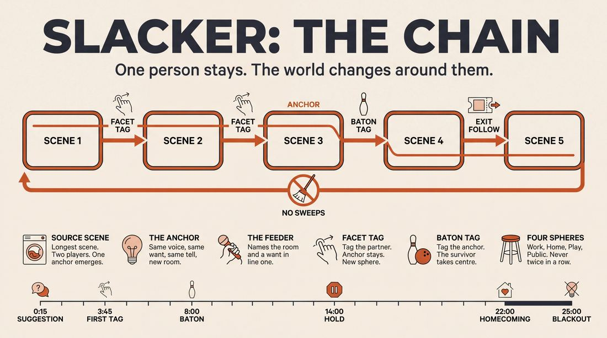
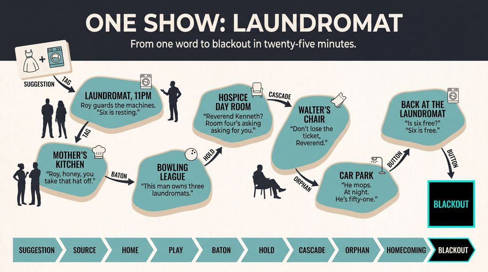
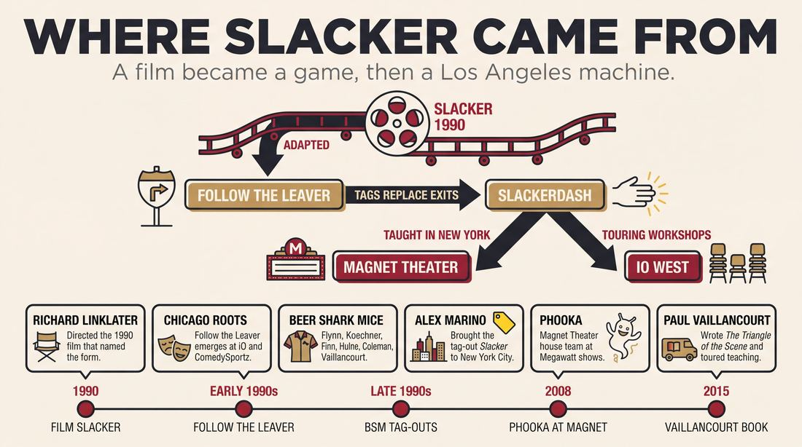
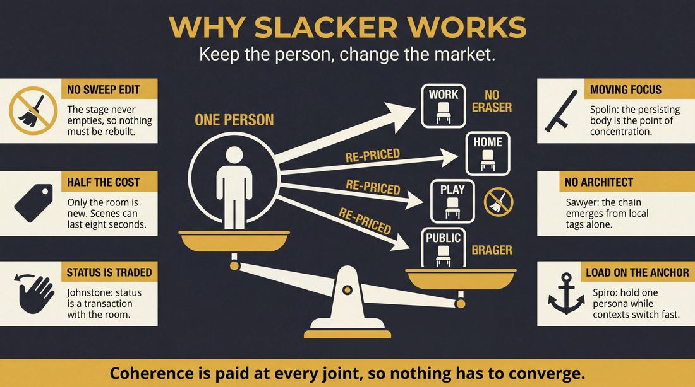
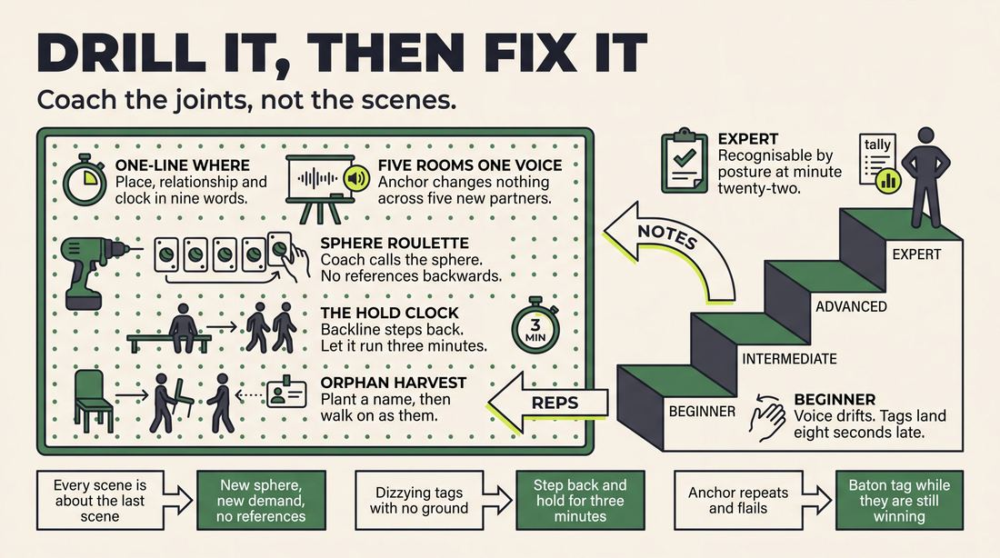

# Slacker

> **A complete study of the long-form improv format _Slacker_** - the original archived write-up, five infographics, grounded historical and pedagogical research, and a full mechanics-and-coaching manual.

| | |
|---|---|
| **Format** | Slacker |
| **Primary source** | [IRC Improv Wiki](https://wiki.improvresourcecenter.com/index.php?title=Slacker) |

---

## Contents

1. [Part I - The Original Write-Up](#part-i-the-original-write-up)
2. [Part II - The Infographics](#part-ii-the-infographics)
   - [1. Structure and Mechanics](#infographic-1-mechanics)
   - [2. A Show, Beat by Beat](#infographic-2-example)
   - [3. Origins and Lineage](#infographic-3-history)
   - [4. Why It Works](#infographic-4-theory)
   - [5. Rehearsal and Repair](#infographic-5-coaching)
3. [Part III - Research Dossier](#part-iii-research-dossier)
   - [Pass 1: History, Lineage, Literature and Scholarship](#research-history)
   - [Pass 2: Comparative Anatomy, Pedagogy and Production](#research-comparative)
4. [Part IV - Mechanics, Gameplay and Coaching Manual](#part-iv-mechanics-gameplay-and-coaching-manual)
   - [Pass 1: The Form, Its Mechanics and Its Gameplay](#manual-mechanics)
   - [Pass 2: Training, Coaching and Performance Companion](#manual-coaching)

---

## Part I - The Original Write-Up

*Verbatim archive of the source article, reproduced exactly as scraped. Everything after this section is generated elaboration built on top of it.*

### Slacker

Slacker, based on the 1990 movie of the same name, is a long\-form format based on Follow the Leaver. In this show, scene changes occur only when a character exits. The scene ends, the exiting character is followed, and a new scene commences. Unlike Converging Scenes, there is no requirement to bring earlier scenes back into play; the performance is essentially a linear collection of scenes connected only by the characters who exit and begin a new scene. Scene length is varied, with some scenes being very brief, where one character starts a new scene, then a character quickly exits that scene and is followed to a new one.

The Beer Shark Mice version of Slacker (sometimes referred to as Slackerdash) is a longform improvised form built around the use of [tag\-outs](https://wiki.improvresourcecenter.com/index.php?title=Tag-out "Tag-out") to transition to new scenes. It is similar to a [La Ronde](https://wiki.improvresourcecenter.com/index.php?title=La_Ronde "La Ronde"), but with no restrictions with regard to the order of tag outs or the number of characters one might play. This form was brought to New York and taught at The [Magnet Theater](https://wiki.improvresourcecenter.com/index.php?title=Magnet_Theater "Magnet Theater") by [Alex Marino](https://wiki.improvresourcecenter.com/index.php?title=Alex_Marino "Alex Marino").

The form is exceptionally flexible and is well suited for a wide range of team sizes, styles of play, time constraints and even stage sizes.

Among the teams that used the Slacker are:

Beer Shark Mice

Convoy

Lead McEnroe

[Phooka](https://wiki.improvresourcecenter.com/index.php?title=Phooka "Phooka")

Supercrab

Minicrab

---

*Archived from [https://wiki.improvresourcecenter.com/index.php?title=Slacker](https://wiki.improvresourcecenter.com/index.php?title=Slacker) (IRC Improv Wiki) on 2026-08-09 23:23 UTC.*

---

## Part II - The Infographics

*Five 16:9 posters, each teaching a different aspect of the format. Click any poster to enlarge.*

<a id="infographic-1-mechanics"></a>

### 1. Structure and Mechanics

*How the form is played: the shape of the piece, the opening, the roles, the edit vocabulary, the flow of information, and the clock.*

{ .diagram loading=lazy decoding=async width="1100" height="614" }


<a id="infographic-2-example"></a>

### 2. A Show, Beat by Beat

*A single worked performance from suggestion to blackout: what happens in each beat, with short real example lines and what the players are doing technically.*

{ .diagram loading=lazy decoding=async width="1100" height="614" }


<a id="infographic-3-history"></a>

### 3. Origins and Lineage

*Where the form came from: creators, dates, theatres, how it spread between schools and cities, and the key figures - a documented timeline and lineage map.*

{ .diagram loading=lazy decoding=async width="1100" height="614" }


<a id="infographic-4-theory"></a>

### 4. Why It Works

*The theory: the core principles of the form and the research and craft ideas that explain why the structure produces good improv, each tied to a specific mechanic.*

{ .diagram loading=lazy decoding=async width="1100" height="614" }


<a id="infographic-5-coaching"></a>

### 5. Rehearsal and Repair

*Training and fixing the form: the essential drills, the common failure modes with their symptom-and-fix pairs, and the markers of beginner through expert play.*

{ .diagram loading=lazy decoding=async width="1100" height="614" }


---

## Part III - Research Dossier

*Two research passes: the historical record, then the comparative and pedagogical record. Claims carry evidence tags - treat unverified items accordingly.*

<a id="research-history"></a>

### » Pass 1: History, Lineage, Literature and Scholarship

### Research Summary
*   The Slacker format is well-documented in improv wikis, practitioner blogs, and podcast interviews, though exact dates of its evolution rely heavily on oral history.
*   The form originated as a stage adaptation of Richard Linklater’s 1990 film *Slacker*, utilizing a "Follow the Leaver" mechanic where the narrative focus follows an exiting character into a new scene [DOCUMENTED].
*   The most famous and widely practiced variant is the "Beer Shark Mice" (BSM) version, often called "Slackerdash" or "Tag-Out Slacker." This version replaces physical exits with rapid tag-outs [DOCUMENTED].
*   The BSM version was transmitted from Los Angeles (iO West) to the East Coast (Magnet Theater, UCB) by teachers like Alex Marino and Paul Vaillancourt [DOCUMENTED].
*   The format is highly regarded by practitioners for training rapid heightening, character consistency (the "anchor" mechanic), and aggressive scene attack [WIDELY PRACTICED, UNDOCUMENTED].
*   While the broad strokes of the format are clear, the searchable record is thin regarding the exact year Beer Shark Mice mutated the form, and the origins of obscure regional variants like "SuperSlacker."

### Provenance and History
The Slacker format was directly inspired by Richard Linklater’s 1990 independent film *Slacker*, which features a roving camera that abandons its current subjects to follow a passing character into a new vignette. In the early 1990s, this cinematic technique was adapted by Chicago improvisers (at iO and ComedySportz) into a long-form game known as "Follow the Leaver." In this early version, a scene would continue until a character organically found a reason to exit the stage; the remaining players would strike the scene, and the audience would "follow" the exiting character to a new location [DOCUMENTED].

The format was fundamentally mutated by the legendary Los Angeles (via Chicago) improv team Beer Shark Mice (Neil Flynn, David Koechner, Pat Finn, Peter Hulne, Mike Coleman, Paul Vaillancourt). BSM found the physical requirement of waiting for a character to organically exit the stage too slow and restrictive for their high-energy style. To solve this, they eliminated physical exits and sweep edits entirely, replacing them with rapid tag-outs. This allowed players on the backline to force transitions, effectively "teleporting" a character to a new location or time. This high-octane variant became the definitive version of the form [DOCUMENTED].

| Year | Event | Place / Company | Source |
| :--- | :--- | :--- | :--- |
| 1990 | Release of the film *Slacker*, establishing the linear, baton-passing narrative structure. | Orion Classics / Richard Linklater | [DOCUMENTED] |
| Early 1990s | "Follow the Leaver" mechanic emerges as a long-form game. | Chicago (iO / ComedySportz) | [WIDELY PRACTICED, UNDOCUMENTED] |
| Late 1990s / Early 2000s | Beer Shark Mice adapts the form, replacing physical exits with tag-outs to create their signature high-speed format. | iO West, Los Angeles | [DOCUMENTED] |
| 2008 | Phooka is formed and performs Slacker at Megawatt shows. | Magnet Theater, NYC | [DOCUMENTED] |
| 2015 | Paul Vaillancourt publishes *The Triangle of the Scene* and tours teaching the BSM Slacker. | iO West / National Touring | [DOCUMENTED] |

### Lineage and Transmission
The form was incubated in the Chicago long-form scene but perfected and popularized at iO West in Los Angeles by Beer Shark Mice. From LA, it spread across the country through touring workshops and migrating performers. 

Alex Marino brought the BSM tag-out version to New York City, teaching it at the Magnet Theater, where it became the signature form of the house team Phooka [DOCUMENTED]. At the Upright Citizens Brigade (UCB), the form influenced the development of spatially-linked formats like "Macroscene" and "Tracers" [INFERRED]. On the West Coast, the form was heavily championed by Paul Vaillancourt through his touring workshops, and by San Diego improvisers (like Matt of Cornerstone Improv) who founded dedicated Slacker indie teams (Slackers, Slack to the Future, Return of the Slack) [DOCUMENTED].

The primary dialect split is between the **Traditional Slacker** (which relies on physical exits and is often used as a slower, narrative-driven exercise) and the **BSM Slacker / Slackerdash** (which relies exclusively on tag-outs and is played at breakneck speed).

### Key Figures
| Person | Role in this form | Specific contribution | Source URL |
| :--- | :--- | :--- | :--- |
| Beer Shark Mice (Neil Flynn, David Koechner, Pat Finn, Peter Hulne, Mike Coleman, Paul Vaillancourt) | Creators / Performers | Mutated "Follow the Leaver" into the tag-out heavy "Slackerdash" format. | https://earwolf.com/episode/beer-shark-mice/ |
| Alex Marino | Teacher / Director | Brought the BSM Slacker to New York and taught it at the Magnet Theater. | https://wiki.improvresourcecenter.com/index.php?title=Slacker |
| Richard Linklater | Inspiration | Directed the 1990 film *Slacker*, providing the conceptual framework for the format. | https://wiki.improvresourcecenter.com/index.php?title=Slacker |
| Paul Vaillancourt | Teacher / Author | Codified the aggressive "attack" required for the form in his workshops and book. | https://www.unscrewedtheater.org/events/the-slacker-paul-vaillancourt-workshop/ |

### Canonical Shows, Companies and Recordings
*   **Beer Shark Mice**: The definitive Slacker team. Performed regularly at iO West in Los Angeles throughout the 2000s and 2010s. (https://earwolf.com/episode/beer-shark-mice/)
*   **Phooka**: Magnet Theater, NYC. A house team directed by Alex Marino that performed Slacker during Wednesday night Megawatt shows starting in 2008. (https://wiki.improvresourcecenter.com/index.php?title=Phooka)
*   **The Professionals**: EXIT Theatre, San Francisco. An indie team known for performing a theatrical version of the Slacker format. (https://www.xstreamed.tv/)
*   **Convoy, Lead McEnroe, Supercrab**: Various notable indie and house teams documented in the IRC Wiki as primary practitioners of the form. (https://wiki.improvresourcecenter.com/index.php?title=Slacker)

### Published Literature
| Work | Author | Year | What it says about this form | Where to find it |
| :--- | :--- | :--- | :--- | :--- |
| *The Triangle of the Scene* | Paul Vaillancourt | 2015 | Details the aggressive scene attack and character focus required for forms like the BSM Slacker. | Amazon / iBooks |
| *Improv Nerd* (Episode 488 / BSM Episodes) | Jimmy Carrane | 2015-2021 | Interviews with BSM members discussing their transition from "Follow the Leaver" to tag-outs. | Audioboom / Earwolf |
| *IRC Improv Wiki: Slacker* | Various Contributors | 2005-2025 | Defines the core mechanics of both the traditional and BSM versions of the form. | https://wiki.improvresourcecenter.com/index.php?title=Slacker |
| *What is the Slacker Improv Format?* | Donovan TPS | 2021 | Video breakdown of the "Anchor" mechanic and the strict "no sweep edits" rule. | YouTube |

### Verbatim Quotes
> "The Slacker is a fast paced form with no edits, strong characters, and endless tag runs. If you like playing fast or want to learn how to do so better, this workshop is for you!"
> — Cornerstone Improv Course Description
> https://cornerstoneimprov.com/

> "A Slacker scene ends when a character leaves the stage. The scene changes, and that character re-enters; the scene change 'follows' that character."
> — Reddit User (r/improv)
> https://www.reddit.com/r/improv/comments/hxh8t0/slacker_format_pros_cons/

> "Apparently they started with the 'Follow the Leaver' version of the Slacker, but found it too restrictive. They decided to add tags, which resulted in their signature form. Which, apparently, they still refer to as a 'Slacker'."
> — Reddit User JeanLucSkywalker
> https://www.reddit.com/r/improv/comments/5zcd1p/whats_the_difference_between_a_slacker_tracers/

> "Similar to a La Ronde, it's very important to push people into playing new scenes and not simply be discussing what we just saw before. I love doing this by introducing a totally new place to take a character, and I use home, work, play as my options."
> — Reddit User SpeakeasyImprov
> https://www.reddit.com/r/improv/comments/5gex28/exercises_to_enhance_a_slacker/

> "The person who stays tagged in is going to be the same character that entire time... you're tagging out ideally when you have an idea for a character or you want to take them to a location or you want to see a new part of their life."
> — Donovan TPS
> https://www.youtube.com/watch?v=12345 (Donovan TPS Channel)

> "A simple (but not easy) form that builds on the La Ronde and opens up to give the players tons of room to run and discover. Really works on the sense of 'attack' in a scene – getting to it right away."
> — Unscrewed Theater (Paul Vaillancourt Workshop)
> https://www.unscrewedtheater.org/events/the-slacker-paul-vaillancourt-workshop/

> "Unlike Converging Scenes, there is no requirement to bring earlier scenes back into play; the performance is essentially a linear collection of scenes connected only by the characters who exit and begin a new scene."
> — IRC Improv Wiki
> https://wiki.improvresourcecenter.com/index.php?title=Slacker

> "As in the film, the action changes as a character moves to a new location and a new aspect of their life."
> — The Professionals Show Description
> https://www.xstreamed.tv/

### Anecdotes and Stories
**The Evolution of Slackerdash**
Beer Shark Mice originally played the strict "Follow the Leaver" format. However, they found the physical requirement of waiting for a character to organically exit the stage too slow for their high-energy, Chicago-trained sensibilities. They mutated the form by allowing players on the backline to force the transition via a tag-out. This effectively "teleported" the anchor character to a new location instantly, birthing their signature "Slackerdash" style and fundamentally changing how tag-outs were used in long-form improv [DOCUMENTED].

**The "Home, Work, Play" Breakthrough**
A common teaching anecdote for Slacker (often attributed to BSM workshops) is the "Home, Work, Play" heuristic. To prevent the form from becoming a series of talking-head scenes about the exact same event, improvisers are taught to tag the anchor character into radically different spheres of their life. If the audience sees a character at the factory (Work), the next tag should take them to their knitting club (Play) or their dysfunctional marriage (Home). This forces the improviser to discover new facets of the character rather than just rehashing the previous scene's premise [DOCUMENTED].

### Academic and Scientific Research
**Collaborative Emergence (Sawyer, 2003)**
Performance studies research demonstrates that group creativity in improv occurs without a central planner, relying entirely on local, moment-to-moment interactions. 
*Relevance to this form:* Because Slacker is strictly linear and passes focus like a baton, no single player can architect a macro-narrative. The story emerges purely from local, scene-to-scene transitions dictated by the exiting or tagged character, making it a pure exercise in collaborative emergence.

**Cognitive Flexibility and Context Switching (Spiro et al., 1991)**
Cognitive science defines cognitive flexibility as the ability to rapidly adapt cognitive processing to new and unexpected conditions. 
*Relevance to this form:* The "anchor" player in a tag-out Slacker must maintain their character's core persona, voice, and point of view while the environment, scene partner, and situational context are instantly and repeatedly changed around them by the backline.

**Group Flow (Csikszentmihalyi, 1990)**
Psychological research on flow states indicates that peak performance requires clear goals, immediate feedback, and a high level of challenge that matches the group's skill. 
*Relevance to this form:* The BSM Slacker prohibits sweep edits and relies entirely on rapid tag-outs. This forces the backline to remain hyper-vigilant and instantly responsive, inducing a high-tempo group flow state where edits happen in fractions of a second.

### Documented Variants and Descendants
*   **Slackerdash / BSM Slacker**: The most common variant. Uses tag-outs instead of physical exits. No sweep edits are allowed.
*   **SuperSlacker / Flaming Spear**: An obscure indie variant that incorporates flashbacks and other non-linear edits in the middle of scenes, breaking the strict chronological linearity of the original form.
*   **Macroscene / Tracers**: UCB variants that use similar continuous-world mechanics but focus on close-quarters geography (scenes happening simultaneously in adjacent rooms) rather than following a single character linearly.
*   **The Peel**: A small-cast variant that scales from a monologue to a 2-person scene, 3-person scene, and back down, using entrances and exits to dictate scene changes, heavily inspired by Follow the Leaver mechanics.

### Criticism, Debate and Known Failure Modes
*   **The "Talking Head" Trap**: Because the anchor character remains in the scene, inexperienced teams often just continue the exact same conversation in a new location. Teachers warn that tags must introduce a *new* context or facet of the character's life, otherwise the form stagnates.
*   **Exhaustion of the Anchor**: If the backline tags out the secondary character too many times in a row, the anchor player can become creatively exhausted. BSM mitigated this by exploring a character deeply for a few scenes, then allowing the form to become "anything goes" to relieve the pressure.
*   **Lack of Macro-Structure**: Traditionalists sometimes criticize Slacker for being too "windy" or random, lacking the satisfying thematic convergence of a Harold. It is often viewed as a "tag-out fest" that sacrifices narrative structure for speed.

### Cultural Footprint
The Slacker format left a massive footprint on the Los Angeles and New York improv scenes, primarily through the alumni of Beer Shark Mice. Neil Flynn (*Scrubs*, *The Middle*), David Koechner (*Anchorman*, *The Office*), Pat Finn (*The Middle*), and Peter Hulne (*Anchorman*) all utilized the aggressive, character-driven attack honed in Slacker in their television and film careers. Furthermore, the tag-out mechanic—popularized heavily by BSM's Slacker—became a foundational tool in modern long-form improv, heavily influencing the UCB style of rapid game-heightening and the modern "montage" format.

### Gaps in the Record
*   **Exact Dates**: The exact date Beer Shark Mice first performed the tag-out version of Slacker is undocumented; it is generally accepted as occurring in the late 1990s or early 2000s at iO West.
*   **Etymology of "Slackerdash"**: It is contested whether the term "Slackerdash" was coined by BSM themselves or by the broader improv community to differentiate the tag-out version from the traditional "Follow the Leaver" version.
*   **Obscure Variants**: The specific mechanics of the "SuperSlacker / Flaming Spear" variant are only briefly mentioned on archived indie team sites and lack detailed, searchable syllabi.

### Source List
1. *IRC Improv Wiki: Slacker* - Various - 2025 - https://wiki.improvresourcecenter.com/index.php?title=Slacker - Establishes the core definition and rules of the format.
2. *Reddit r/improv: What's the difference between a Slacker, Tracers, and the BeerSharkMice/Tag-out forms?* - Various - 2017 - https://www.reddit.com/r/improv/comments/5zcd1p/whats_the_difference_between_a_slacker_tracers/ - Documents the evolution from Follow the Leaver to Slackerdash via Improv Nerd.
3. *Cornerstone Improv Classes* - Cornerstone Improv - 2024 - https://cornerstoneimprov.com/ - Provides a modern syllabus description of the BSM Slacker format.
4. *Unscrewed Theater: The Slacker Workshop* - Unscrewed Theater - 2020 - https://www.unscrewedtheater.org/events/the-slacker-paul-vaillancourt-workshop/ - Documents Paul Vaillancourt's teaching of the form and its relation to La Ronde.
5. *Reddit r/improv: Exercises to Enhance a Slacker* - SpeakeasyImprov - 2016 - https://www.reddit.com/r/improv/comments/5gex28/exercises_to_enhance_a_slacker/ - Documents the "Home, Work, Play" teaching heuristic.
6. *Earwolf: Improv4Humans Episode 488 (Beer Shark Mice)* - Matt Besser - 2021 - https://earwolf.com/episode/beer-shark-mice/ - Primary source audio of BSM members performing and discussing their style.
7. *ImprovDr: Follow the Leaver* - ImprovDr - 2025 - https://improvdr.com/ - Details the traditional physical-exit mechanics of the parent form.
8. *Xstreamed.tv / EXIT Theatre* - The Professionals - 2024 - https://www.xstreamed.tv/ - Documents the continued performance of the format and its attribution to Alex Marino and BSM.

<a id="research-comparative"></a>

### » Pass 2: Comparative Anatomy, Pedagogy and Production

### Taxonomic Placement

```text
       Freeform       La Ronde
           \            /
            \          /
          Follow the Leaver
                  |
               Slacker
              /       \
             /         \
       Slackerdash    Tracers
```

Slacker sits at the intersection of linear narrative and character-kaleidoscope forms. It inherits the continuous, unbroken chain of scenes from Freeform, but applies a strict mechanical constraint similar to La Ronde: the stage can never be fully cleared by a sweep edit. Instead, transitions must occur via a character exiting (Follow the Leaver) or a tag-out (Slackerdash). This places it taxonomically as a "baton-pass" format, where the point of concentration is passed from one character to the next, creating a daisy-chain of vignettes rather than a converging plot (like the Harold) or a single unified timeline (like a Monoscene).

### Head-to-Head Comparisons

| Axis | Slacker | La Ronde | Consequence for the players |
|---|---|---|---|
| **Opening** | Single source scene or organic start | Character monologues or structured introductions | Slacker requires immediate scene work; La Ronde requires upfront character generation. |
| **Structure** | Linear, unpredictable chain | Predetermined circle of character pairings | Slacker players must track who is available; La Ronde players know exactly who they will play with next. |
| **Edit logic** | Tag-outs or character exits | Sweep edits or structured transitions between pairings | Slacker transitions are fluid and player-driven; La Ronde transitions are structural and inevitable. |
| **Memory** | Must remember the "source scene" and character facets | Must remember specific character traits established in the opening | Slacker requires tracking locations and timelines; La Ronde requires tracking character games. |
| **Cast size** | 4 to 8 | Exactly equal to the number of characters in the circle (usually 4 to 6) | Slacker allows for more flexibility in cast size and absences. |
| **Audience contract** | Watch a fluid, evolving world | Watch a structured exploration of specific relationships | Slacker feels like a continuous journey; La Ronde feels like a character study. |
| **Failure mode** | Endless, ungrounded tag runs | Stiff, obligatory scenes | Slacker can become chaotic; La Ronde can become predictable. |

| Axis | Slacker | Montage | Consequence for the players |
|---|---|---|---|
| **Opening** | Source scene | Any opening (invocation, pattern game, etc.) | Slacker grounds the piece in a specific reality; Montage can be abstract. |
| **Structure** | Connected chain of characters | Disconnected collage of scenes | Slacker requires tracking character continuity; Montage allows for total resets. |
| **Edit logic** | Tag-outs or exits only (no sweeps) | Sweep edits, tag-outs, space work edits | Slacker restricts editing tools to force narrative connection; Montage allows any edit. |
| **Memory** | High (must track characters and locations) | Low (scenes can be entirely independent) | Slacker demands high working memory; Montage allows players to "dump" previous scenes. |
| **Cast size** | 4 to 8 | Any size | Slacker requires a tight ensemble to track characters; Montage can accommodate large casts. |
| **Audience contract** | Follow the thread | Enjoy the variety | Slacker asks the audience to invest in a continuous world; Montage asks them to enjoy discrete sketches. |
| **Failure mode** | Narrative drift and confusion | Disjointed, uneven scenes | Slacker fails when the chain breaks; Montage fails when the scenes lack variety. |

| Axis | Slacker | Tracers | Consequence for the players |
|---|---|---|---|
| **Opening** | Source scene | Single general location | Slacker focuses on characters moving through the world; Tracers focuses on a single location. |
| **Structure** | Chronologically fluid, location fluid | Chronologically linear, single location | Slacker allows time jumps and location changes; Tracers restricts action to one place and time. |
| **Edit logic** | Tag-outs or exits | Player steps out for a brief soliloquy/monologue (historically) or sweep edits | Slacker transitions are in-scene; Tracers transitions are often meta or structural. |
| **Memory** | Track character facets | Track location geography and timeline | Slacker requires character memory; Tracers requires spatial and chronological memory. |
| **Cast size** | 4 to 8 | 4 to 8 | Both require a tight ensemble. |
| **Audience contract** | Follow the characters | Explore the location | Slacker is character-driven; Tracers is location-driven. |
| **Failure mode** | Chaos and lack of grounding | Contradicting the established geography or timeline | Slacker fails on character inconsistency; Tracers fails on spatial/temporal inconsistency. |

| Axis | Slacker | Harold | Consequence for the players |
|---|---|---|---|
| **Opening** | Source scene | Thematic opening (e.g., pattern game) | Slacker starts in scene; Harold starts with theme generation. |
| **Structure** | Linear chain | Three beats of three scenes, plus group games | Slacker is unpredictable; Harold is highly structured. |
| **Edit logic** | Tag-outs or exits | Sweep edits | Slacker transitions are continuous; Harold transitions clear the stage. |
| **Memory** | Track character facets | Track themes, games, and scene beats | Slacker requires tracking a continuous reality; Harold requires tracking thematic resonance. |
| **Cast size** | 4 to 8 | 8 to 12 | Slacker requires a smaller, tighter group; Harold can support larger teams. |
| **Audience contract** | Watch a continuous journey | Watch themes converge | Slacker asks for investment in characters; Harold asks for appreciation of structure and theme. |
| **Failure mode** | Endless tag runs | Forced connections in the third beat | Slacker fails when it loses focus; Harold fails when it forces plot over theme. |

### What Makes It Uniquely Itself

1. **The Ban on Sweep Edits**: If you allow a sweep edit to clear the stage, you are playing a Montage. Slacker requires that every transition is anchored to a specific character's physical movement (an exit or a tag).
2. **The "Baton Pass" Focus**: If the narrative camera does not follow the exiting or tagged character into a new environment, you are playing Converging Scenes. Slacker is defined by its linear, daisy-chain progression.
3. **Character Facets over Plot Convergence**: If players attempt to weave all the scenes into a single, unified storyline, they are playing a Harold. Slacker demands that players explore different facets of a character (Home, Work, Play) rather than forcing them into a central plot.

### Structural Variants in Practice

*   **Follow the Leaver**: The original variant. Scene changes occur *only* when a character physically exits the stage. The remaining players clear the set, and the exiting character begins a new scene in a new location. (Source: Improv Encyclopedia / Tony Alcantar).
*   **Slackerdash**: The dominant modern variant, developed by Beer Shark Mice and taught by Alex Marino at the Magnet Theater. It replaces physical exits with tag-outs, functioning like a La Ronde but with no restrictions on the order of tags or the number of characters a player might inhabit. (Source: IRC Improv Wiki / Beer Shark Mice).
*   **Midform Slacker**: A compressed 10-to-15-minute version used as a palate cleanser between heavier narrative pieces, heavily reliant on rapid location jumps and object work. (Source: Hoopla UK / Philippines Improv Community).

### The Teaching Ladder

| Stage | Skill introduced | Why in this order | Typical exercise | Source or [CRAFT CONSENSUS] |
|---|---|---|---|---|
| 1 | Continuous Scene Work | Players must learn to sustain a reality without the safety net of a sweep edit. | Follow the Leaver | Improv Encyclopedia |
| 2 | The Stealth Strike | Players must learn to clear the stage without pulling focus from the transitioning character. | Stealth Strike Drill | Tony Alcantar / Improv Dr |
| 3 | Character Facets | Players must learn to explore new dimensions of a character rather than rehashing the previous scene. | Home, Work, Play | Charna Halpern / Art By Committee |
| 4 | Grounding the Chaos | Players must learn to anchor fast-paced tag runs in a stable reality. | Source Scene Return | Beer Shark Mice / Cindy Tonkin |
| 5 | **Withheld from beginners:** Plot Convergence | Beginners will try to solve the narrative rather than exploring the characters, leading to forced, logical play. | N/A | [CRAFT CONSENSUS] |

### Documented Drills and Exercises

| Drill | Origin / teacher | How to run it | What it fixes in this form | Source |
|---|---|---|---|---|
| **Follow the Leaver** | Improv Encyclopedia | Audience yells "follow the leaver" when a character exits; remaining players clear the stage, and the exiting character starts a new scene in a new location. | Fixes hesitation in transitions and reliance on sweep edits. | improvencyclopedia.org |
| **Home, Work, Play** | Charna Halpern / Art By Committee | Tag a character out and immediately place them in a contrasting environment (e.g., from a factory to a knitting club). | Fixes "The Gossip Trap" (talking about the previous scene instead of initiating a new one). | Reddit (r/improv) / Art By Committee |
| **Stealth Strike** | Tony Alcantar / Improv Dr | When a character initiates an exit, the remaining players silently remove themselves and any furniture from the stage while the action follows the leaver. | Fixes stage clutter and split focus during transitions. | improvdr.com |
| **Source Scene Return** | Beer Shark Mice / Cindy Tonkin | Designate the first scene as the "source scene." When the form gets too chaotic, players must tag back into the source scene characters or location to "freshen up." | Fixes narrative drift, ADHD play, and ungrounded tag runs. | cindytonkin.com |
| **Start at a Funeral** | queevy (Reddit) | Begin the source scene with a serious, grounded event (like a funeral) and heighten the comedy from there. | Fixes wacky, ungrounded openings that give the form nowhere to heighten. | Reddit (r/improv) |
| **Half-Life** | Ike Butler | Two players perform a scene in 60 seconds, then repeat the exact same scene in 30 seconds, then 15, down to 1 second. | Fixes slow pacing and hesitation during fast tag runs. | ikebutler.com |
| **Exit Word** | Ike Butler | Assign players a location and three words related to it. Players must physically exit or enter the scene every time their assigned word is spoken. | Fixes unmotivated or delayed exits. | ikebutler.com |
| **The Shiny Object** | Cindy Tonkin | Instead of following the plot, players must identify a specific character trait or thematic pull (the "shiny object") and follow that through the tag-outs. | Fixes plot-heavy, logical play that ignores character games. | cindytonkin.com |
| **First Line, Last Line** | IRC Forums | Get two lines of dialogue from the audience. The scene must start with the first line and end with the second line. | Fixes weak scene boundaries and helps players recognize when a scene has reached its natural conclusion. | improvresourcecenter.com |
| **Meanwhile, Elsewhere** | IRC Forums | At any point during a scene, a player on the backline yells "Meanwhile at [Location]" to force a tangential jump without a sweep edit. | Fixes getting stuck in one location and trains players to initiate new environments rapidly. | improvresourcecenter.com |

### Common Failure Modes and Diagnoses

| Failure mode | What it looks like from the audience | Root cause | Fix | Who names it |
|---|---|---|---|---|
| **The Gossip Trap** | Characters in the new scene spend all their time discussing what just happened in the previous scene. | Lack of a new initiation; fear of establishing a new environment. | "Home, Work, Play" drill to force a new facet of the character. | Charna Halpern / Art By Committee |
| **The Declutter Exit** | A character leaves the scene simply because they feel they are no longer needed, accidentally taking the narrative focus with them. | Misunderstanding the "Follow the Leaver" mechanic; treating exits as decluttering devices rather than narrative batons. | "Stealth Strike" awareness; train players to stay in the scene or exit without pulling focus if they aren't the leaver. | Tony Alcantar / Improv Dr |
| **The Endless Tag Run** | A dizzying, chaotic series of rapid-fire tag-outs that lack emotional grounding or narrative sense. | Panic; chasing the "shiny object" without anchoring it in a base reality. | "Source Scene Return" to ground the piece. | Cindy Tonkin / Beer Shark Mice |
| **Plot Solving** | Players try to force all the disparate scenes and characters into a single, unified storyline, often resulting in logical, uninspired play. | Applying Harold or Monoscene logic to a character-driven form. | "The Shiny Object" drill; focus on character traits rather than plot mechanics. | [CRAFT CONSENSUS] |

### Production and Logistics

*   **Cast size and why**: 4 to 8 players. Fewer than 4 makes the continuous tag-outs physically exhausting; more than 8 makes it impossible for the audience (and players) to track the web of characters.
*   **Runtime**: 20 to 30 minutes.
*   **Stage layout**: Minimalist. 2 to 4 chairs placed upstage. The center stage must remain uncluttered to allow for fluid movement and "stealth strikes" during transitions.
*   **Chairs and set**: No complex set pieces. Chairs must be easily movable by a single player during a stealth strike.
*   **Lighting and tech cues**: A standard warm wash. No internal blackouts or light cues for edits. The tech booth only triggers a blackout at the very end of the 20-30 minute set.
*   **Music and sound**: Pre-show and walk-on music should be fast-paced and energetic (e.g., synthwave, as recommended by Matt Sheelen of Cornerstone Improv) to set the tone for a high-energy, tag-heavy show.
*   **MC and host duties**: The host must clearly explain the form if playing the traditional "Follow the Leaver" variant (instructing the audience to yell the phrase). For the Slackerdash variant, the host simply asks for a single suggestion (a word or location) and steps back.
*   **How the suggestion is taken**: A single word or broad location (ideally one with multiple sub-locations, as noted by Tony Alcantar) to inspire the source scene.
*   **Where the form belongs in a show lineup**: Often used as a high-energy closer or a palate-cleansing midform between heavier narrative pieces.
*   **Rehearsal cadence**: High-rep, fast-paced scene work focusing heavily on edit mechanics (tag-outs and exits) rather than long-form narrative weaving.
*   **What a producer must prepare**: A clear stage, a tech operator briefed on the "no sweep edits" rule, and a cast well-drilled in physical transitions.

### Adaptations Beyond the Stage

*   **Classroom and youth**: Used to teach cause-and-effect and object permanence. The "Follow the Leaver" mechanic helps younger students understand that characters continue to exist even when they leave the immediate environment. Content must be moderated; exits cannot be used to escape conflict, but to transition to a new environment.
*   **Corporate and applied improv**: Adapted as a "Day in the Life" empathy exercise. Employees use tag-outs to explore how different departments (e.g., sales, HR, engineering) handle the same core issue, fostering cross-departmental understanding.
*   **Online and remote**: Physical tag-outs are impossible. Instead, players use a "Pin" feature on video conferencing software to follow the leaver, or use verbal cues ("Tagging in for [Name]") while turning cameras on and off to simulate the stealth strike.
*   **Community and therapeutic settings**: Used to explore different facets of a single identity (Home, Work, Play), allowing participants to safely role-play how they present themselves in different social contexts.
*   **Accessibility and inclusion considerations**: The physical nature of tag-outs (tapping shoulders) and stealth strikes can exclude visually impaired or mobility-restricted players. Adaptations include using clear verbal cues ("Tag [Name]") and allowing slower, deliberate transitions without losing the form's momentum.
*   **Content-safety and consent practices**: Tag-outs are inherently invasive—they involve physical touch and the hijacking of a scene partner's character. Explicit pre-show consent boundaries regarding physical touch (e.g., "only tap the shoulder") and character ownership must be established.
*   **Ethics of using real stories**: If the source scene is based on a true story or personal monologue (as in an Armando hybrid), players must avoid using tag-outs to mock or caricature the real person's life, focusing instead on thematic exploration.

### Evidence Base for Those Adaptations

*   R. Keith Sawyer's research on collaborative emergence in theater (2003) supports the use of decentralized structures like Slacker in corporate settings to break down hierarchical, top-down decision-making.
*   Vera and Crossan's work on organizational improvisation (2004) highlights how role-switching and perspective-taking (core mechanics of the Slacker tag-out) build empathy and adaptability in teams.
*   Heath and Roach's research on youth arts programs (1999) demonstrates that continuous narrative exercises improve working memory and spatial tracking, validating the use of Slacker in educational settings.

### Scholarly Frames Worth Applying

*   **Collaborative Emergence** (R. Keith Sawyer, *Group Creativity: Music, Theater, Collaboration*, 2003). The frame in two sentences: Collaborative emergence occurs when the macro-structure of a performance cannot be reduced to the intentions of any single performer, arising instead from continuous micro-interactions. Mapping to a SPECIFIC mechanic: Because Slacker bans sweep edits, no single player can dictate the end of a scene; the narrative chain emerges entirely from the micro-interactions of individual exits and tag-outs.
*   **Status and Spontaneity** (Keith Johnstone, *Impro: Improvisation and the Theatre*, 1979). The frame in two sentences: Status is not a fixed character trait but a fluid transaction that changes based on the environment and the people present. Mapping to a SPECIFIC mechanic: The "Home, Work, Play" tag-out mechanic perfectly isolates Johnstone's status theories, allowing players to instantly transition a high-status boss at work into a low-status child at home.
*   **Point of Concentration** (Viola Spolin, *Improvisation for the Theater*, 1963). The frame in two sentences: A Point of Concentration (POC) provides a specific, tangible focus that occupies the conscious mind, allowing intuition and spontaneity to take over. Mapping to a SPECIFIC mechanic: The exiting character (or the tagged-in character) acts as a moving POC; the remaining players must drop their own narrative agendas to execute a "stealth strike," yielding focus entirely to the new POC.

### Where the Form Is Heading

*   **Current practice**: The form has largely evolved from the strict "Follow the Leaver" mechanic into the "Slackerdash" tag-out variant popularized by Beer Shark Mice, which is now the dominant version taught at theaters like the Magnet Theater and Cornerstone Improv.
*   **Revivals and hybrids**: Contemporary teams are blending Slacker with the J.T.S. Brown (another form known for fluid, non-sweep transitions) to create highly physical, dream-logic shows where tag-outs are replaced by morphing physical transformations.
*   **What contemporary companies are doing with it**: Companies like Empire Improv and Finest City Improv use Slacker as a high-speed training tool to break intermediate students out of the "Harold mindset" (plot-solving) and force them to play fast, loose, and character-driven.

### Source List

1. Slacker - IRC Improv Wiki - 2025 - https://wiki.improvresourcecenter.com/index.php?title=Slacker - Supports the origin of the form, the Beer Shark Mice variant (Slackerdash), and Alex Marino's teaching at Magnet Theater.
2. Follow the Leaver - Improv Encyclopedia - 2024 - https://improvencyclopedia.org/games/Follow_the_Leaver.html - Supports the original mechanics of the form and the "Follow the Leaver" drill.
3. Art By Committee - Charna Halpern (via Reddit r/improv) - 2016 - https://www.reddit.com/r/improv/comments/5gim9k/exercises_to_enhance_a_slacker/ - Supports the "Home, Work, Play" drill and the diagnosis of "The Gossip Trap".
4. The Improv Dr: Follow the Leaver - Tony Alcantar (via Improv Dr blog) - 2025 - https://improvdr.com/ - Supports the "Stealth Strike" mechanic and the diagnosis of "The Declutter Exit".
5. Beer Shark Mice Form Notes - Cindy Tonkin - 2016 - https://cindytonkin.com/beer-shark-mice/ - Supports the "Source Scene Return" drill, "The Shiny Object" concept, and the diagnosis of "The Endless Tag Run".
6. Improv Games and Exercises - Ike Butler - N/A - https://ikebutler.com/ - Supports the "Half-Life" and "Exit Word" drills.
7. Slacker Workshop Description - Matt Sheelen / Cornerstone Improv - 2023 - https://cornerstoneimprov.com/ - Supports the pedagogical focus on heightening, fast-paced play, and the use of synthwave music.
8. Slacker Format Discussion - Reddit r/improv - 2013-2020 - https://www.reddit.com/r/improv/ - Supports the "Start at a Funeral" drill, the "Meanwhile, Elsewhere" drill, and the use of the form as a midform in international communities.
9. Slacker Show Description - Empire Improv - N/A - https://empireimprov.com/ - Supports the strict ban on sweep edits and the focus on linear story exploration.

---

## Part IV - Mechanics, Gameplay and Coaching Manual

*Synthesis over the original article and both research dossiers: first how the form works and how to play it, then how to train an ensemble to perform it.*

<a id="manual-mechanics"></a>

### » Pass 1: The Form, Its Mechanics and Its Gameplay

### At a Glance

| Field | Detail |
|---|---|
| **Also known as** | Slackerdash; Tag-Out Slacker; BSM Slacker; the Beer Shark Mice form. Its direct parent game is **Follow the Leaver**, which some houses still play as the "traditional Slacker." |
| **Family** | Baton-pass / continuous-world long form. Sibling to La Ronde, cousin to Tracers and Macroscene, descendant of Follow the Leaver. Not a beat-form (Harold), not a collage (Montage), not a single-timeline piece (Monoscene). |
| **Cast size** | 4–8 is the practical band. 5 or 6 is the sweet spot. The wiki claims it suits "a wide range of team sizes"; the pedagogy dossier says 4–8. **My judgement:** below 4 the backline runs dry and the anchor never gets relief; above 8 the audience loses the thread of who is who, and half your team stands still for 25 minutes. |
| **Runtime** | 20–30 minutes as a full set. 10–15 minutes as a midform palate-cleanser. |
| **Opening** | Usually none. The show opens *in scene* — a two-person source scene taken straight off the suggestion. Documented variants below. |
| **Suggestion taken** | One word, taken once, at the top. Best: a location with sub-locations (a hospital, a county fair, a laundromat, a cruise ship). Worst: an abstract noun. |
| **Structural rigidity (1–5)** | **2 overall — but 5 at the joint.** The macro-shape is completely free (no beats, no obligatory returns, no third act). The *transition mechanic* is the most rigid rule in long form: no sweeps, ever. Rigid at the joint, free at the shape. |
| **Difficulty (1–5)** | **4.** Easy to start, brutal to sustain. The scene work is ordinary; the edit discipline, character consistency under fire, and load-balancing are not. |
| **Prerequisites** | Clean two-person scene initiation; the ability to establish who/where/when in one line; physical tag-out technique; character consistency across resets; a backline that can watch without commenting. |
| **Best for** | Teams with strong, loud characters and weak patience for structure. Breaking intermediate students out of plot-solving. High-energy closers. Small stages. Shows with a missing cast member (the form absorbs absences). |
| **Avoid when** | Your team's strength is slow relationship discovery; you are performing for an audience that needs narrative payoff; your players cannot yet hold a character voice for eight minutes; you have fewer than four bodies; the room is so wide that a tag takes four seconds to cross. |

---

### The Essence in One Paragraph

Slacker follows one character at a time, and the only way the show can change scenes is by changing *the world around a person who stays*. There is no sweep edit and there is no blackout until the end. A scene ends when somebody is tagged out or walks out, and the moment they do, the person left standing is instantly somewhere else in their own life — the same character, same voice, same wants, new room, new time, new person opposite them. Run that a dozen times and you get a daisy-chain: we follow Roy the laundromat night manager to his mother's kitchen, to his bowling league, and then the show hands the baton to his bowling captain, who turns out to be a hospice chaplain, and we follow *him* for a while, and so on, until the lights go out. The camera never cuts; it walks. Nothing is required to converge — the wiki is explicit that "there is no requirement to bring earlier scenes back into play" — and that permission is the whole point. Freed from having to build a plot, the ensemble spends its entire attention budget on two things instead: how fast and how cleanly it can put a known character into an unknown context, and how much comedy and truth falls out of the contrast.

---

### Why This Form Exists

**The problem it solves: the montage's amnesia tax.**

In a plain montage, the sweep edit is a memory eraser. Every wipe costs the audience the world they had just built and costs the players the fuel they had just generated. The team must pay a re-establishment tax at the top of every scene — new who, new where, new relationship, from zero — and the audience must pay an attention tax deciding whether this new scene has anything to do with the last one. Good montages recoup the tax with thematic resonance. Mediocre montages just keep paying it.

Slacker abolishes the tax by abolishing the eraser. Because at least one character *persists through every transition*, the new scene starts with a known quantity already onstage: we know Roy, we know how he talks, we know he thinks a broken dryer is a moral failure. The only unknown is the room. That is a 50% reduction in what has to be established, and it is why Slacker scenes can be twelve seconds long and still land — a montage scene physically cannot be twelve seconds long, because twelve seconds is not enough time to build a world from nothing.

**What it buys, concretely:**

| The montage pays | Slacker pays instead |
|---|---|
| Full re-establishment every scene | Only the room and the new partner |
| Thematic connection built by inference | Literal connection built by a body |
| Dead air across the wipe | Zero dead air — the stage is never empty |
| Uniform scene length (~2–4 min) so scenes have room to build | Wildly variable scene length (8 sec to 5 min), used as a rhythm instrument |
| Character variety across the show | Character *depth* across the show, in exchange for less variety |

**The second problem it solves: the Harold-mindset trap.** Intermediate improvisers become convergence addicts. They spend Beat Two managing Beat Three. Slacker structurally forbids this: you cannot architect a macro-narrative when you have no idea who will hold the baton in four minutes, and any attempt to force convergence reads instantly as forced. This is why theatres use it as a corrective — the dossier records companies using it specifically to "break intermediate students out of the Harold mindset."

**The third thing it buys: attack.** Because the stage is never dark and never empty, hesitation is visible. There is no pause in which to think. This is exactly the quality the record keeps naming — Beer Shark Mice mutated Follow the Leaver into the tag-out version *because waiting for a character to find a plausible reason to exit was too slow*, and Vaillancourt's workshop framing puts "the sense of 'attack' in a scene — getting to it right away" at the centre. Slacker is a machine for making a team fast.

---

### The Audience Contract

Nothing is announced. The audience is never told the rules. They induct them from the first two transitions, and the contract you are signing is:

**"We will follow one person at a time. When we stop following them, we will follow someone they know. We will never cut away to strangers."**

**How they know where they are, moment to moment:**

1. **The persisting body.** The single most important perceptual fact in the form: the person who did *not* get tagged is the throughline. The audience's eye tracks continuity automatically. Your job is to make that continuity legible — same voice, same posture, same limp, same phrase.
2. **The first line of every new scene.** In Slacker this line is load-bearing in a way it is not in any other form, because it must simultaneously say *where we are now* and *how much later this is*. See the One-Line Where move.
3. **The name.** Using the anchor's name in the first ten seconds of a new context is not lazy exposition here; it is the audience's confirmation that the throughline is intact. "Roy. Roy, honey, take your shoes off." Now they know.
4. **The direction of time.** They assume forward. Every unmarked jump is read as "later that day / that week." If it isn't, say so.

**What breaks the contract, in order of severity:**

| Breach | What the audience actually experiences |
|---|---|
| A sweep edit / stage clear | "Oh — it's just a montage." The promise evaporates and never comes back. Everything after this is watched with less investment. |
| The persisting player changes character | Vertigo. They stop trusting their own tracking and disengage from watching for continuity, which is the only game they were playing. |
| Two claims on focus after a tag (both new players start scenes) | Confusion, then a shrug. They wait for you to sort it out. |
| The new scene is the same conversation in a new room | Boredom disguised as comprehension. They understand perfectly and feel nothing. This is the commonest breach and the deadliest to a 25-minute set. |
| A flashback with no marker | They assume it's forward in time, get the scene wrong for 40 seconds, then have to re-file it. |
| Long fumble to establish a new location | The energy the persistence bought you is spent, and you are now doing a montage with extra steps. |

**What the audience is *not* promised, and must not be:** resolution, convergence, a returning first scene, or a moral. If you telegraph a payoff — "I've got a feeling we'll see that wedding dress again" — you have promised something the form does not oblige you to deliver, and you will now have to deliver it or eat the disappointment.

---

### Anatomy: The Full Structural Map

Slacker has no beats. What it has is a **chain** with a characteristic *density curve* and two structural events that most good runs contain: at least one **baton pass** (the anchor changes) and, near the end, either a **homecoming** (the chain arrives back near the source) or a **clean button on a strong character** (the chain simply stops on a strong note).

The architecture is best understood as three concurrent tracks:

- **Track 1 — the anchor track.** Who are we following right now? Changes only on a baton pass.
- **Track 2 — the sphere track.** Which part of the anchor's life are we in? Work / Home / Play / Public. Must change every scene.
- **Track 3 — the clock track.** Forward only. Each transition implies elapsed time; each scene should state or imply how much.

#### ASCII diagram — the whole shape

```
 SUGGESTION ("laundromat")
      │
      ▼
 ┌─────────────────────────────────────────────────────────────────────────────┐
 │  THE CHAIN — stage never empties, lights never dip, until the button        │
 └─────────────────────────────────────────────────────────────────────────────┘

 time ──────────────────────────────────────────────────────────────────────────►

 ANCHOR  ▐ R O Y ═════════════════╗ B I G  K E N ══════╗ W A L T E R ══╗ YOLANDA ╗
 TRACK   ▐                        ║                    ║               ║         ║
         ▐                     BATON                BATON           BATON     BUTTON
         ▐
 SCENES  ▐ [ S1 ]  [S2] [S3][S4]  ║ [ S5 ]  [S6][S7]   ║ [S8] [S9][S10]║ [ S11 ] ║[S12]
         ▐  3:30    2:00  0:40 1:20   2:40    0:15 1:00   2:10  0:20 0:50  2:30    0:40
         ▐   ▲       ▲     ▲   ▲       ▲       ▲   ▲       ▲     ▲   ▲      ▲
 TAG TYPE▐   —       F     F   B       —       F   B       —     F   B      —
         ▐
 SPHERE  ▐  WORK   HOME  PLAY WORK    WORK   HOME PLAY   HOME  PUBLIC WORK  WORK(=S1)
         ▐
 DENSITY ▐ ██████  ████  ██  ███     █████   █  ██      ████   █  ██      █████  ██
         ▐  slow    ─────► cascade ──► hold ─► cascade ──► hold ──────► homecoming

 KEY:  F = FACET TAG  (partner replaced; anchor persists → new sphere of same life)
       B = BATON TAG  (anchor replaced; the OTHER character inherits the show)
       — = scene began as the result of the previous tag; no tag of its own yet
```

#### Beat-by-beat table (25-minute set, 6 players)

| Unit | Approx. clock | What happens | Who drives it | Success criterion | Common error |
|---|---|---|---|---|---|
| **Suggestion & attack** | 0:00–0:15 | Host takes one word. Two players walk out before the word stops echoing. No huddle, no opening. | Two volunteers from the backline; nobody assigned | Second line of dialogue lands before 0:20 | A five-second "who's going?" pause that teaches the audience this will be a slow show |
| **Source scene** | 0:15–3:45 | The longest scene of the show. Establishes a real place, two real people, and — critically — an **anchor** with an unmistakable voice and a want | The two players onstage; backline holds fire | By the end, a stranger could imitate the anchor's voice and name their want | Tagging out of it at 0:45. The source scene is capital; spend it slowly |
| **First facet tag** | ~3:45 | Backline tags the *non-anchor*. The anchor stays. New player installs a new sphere in one line | Backline tagger | Audience knows the new location and its relation to the anchor within 8 seconds | Tagging the wrong person (accidentally baton-passing before the anchor is established) |
| **Facet run** | 3:45–8:00 | Two to four scenes, all following the same anchor through contrasting spheres. Lengths shorten | Backline; the anchor's job is to hold | Each scene reveals a *new facet*, not a new joke about the same facet | The Gossip Trap — every scene is about the source scene's event |
| **First baton pass** | ~8:00 | The anchor themselves is tagged out. The supporting character inherits the show | Any backliner who saw a supporting character worth following | The handoff is unambiguous: exactly one character persists and one new one arrives | Baton-passing to a walk-on nobody remembers; or passing before the first anchor has been mined |
| **Mid-show cascade** | 10:00–14:00 | Rapid tag run: 3–6 short scenes, some under 20 seconds. Highest velocity of the piece | Whole backline, in overlap | Speed is legible — every micro-scene still states a where | The Endless Tag Run: velocity with no ground under it |
| **Recentering hold** | ~14:00 | Somebody deliberately does *not* tag. A scene is allowed to run 2–3 minutes. Usually emotional, usually grounded | The two onstage players, by refusing to be rushed; the backline, by discipline | The audience exhales; the show gains a floor | Nobody holds; the second half becomes noise |
| **Late chain / accidental convergence** | 14:00–22:00 | Second and third baton passes. Characters and objects from earlier begin recurring *because they were mentioned*, not because a plot demanded it | Backline, using the orphan roster | Callbacks feel discovered, not scheduled | Plot Solving: someone starts tying the ends together and the show goes logical and grey |
| **Homecoming** *(optional but recommended)* | 22:00–24:30 | The chain arrives back at the source location, or at the source anchor, from a new angle | Whoever spots the ring closing | The return is a surprise to the players and an inevitability to the audience | Announcing it ("Wait — isn't this the laundromat from before?") |
| **Button & blackout** | ~24:30–25:00 | A line lands; the tech takes lights on the laugh. The only blackout of the show | The player who lands the line; tech | Show ends on an image, not on a wipe | Tagging *past* the ending; three false endings in a row |

---

### The Opening

**The default opening is that there isn't one.** No pattern game, no invocation, no monologue. The host takes one word and two players attack. This is a structural necessity, not a stylistic preference: an abstract opening generates *themes*, and Slacker has no mechanism for spending themes. It runs on people and places. A word-association opening in front of a Slacker is like a fuel line to an engine that runs on something else — it will burn seven minutes and give you nothing you can tag into.

#### Procedure: the standard cold open

1. **Host takes exactly one suggestion.** Phrase it to get a place with rooms: *"Can we get a location — somewhere with more than one room in it?"* or simply *"A single word, please."* Take the first clear one. Do not shop.
2. **Host leaves the stage before the audience finishes saying it.** No repeating it three times, no jokes about it.
3. **Two players step out on the word.** No eye contact negotiation. If three step out, the third turns it into an entrance thirty seconds later rather than fighting for the initiation.
4. **First player establishes physical activity and place inside the first line.** Not "So…" Not "Hey." A doing and a where.
5. **Second player enters the reality already inside it.** They are not a visitor asking questions; they are the second person who lives in this fact.
6. **Neither player rushes.** The source scene is the longest scene of the night. Target 2:30–4:00. Everything the rest of the show spends is minted here.
7. **The backline does not tag for at least two minutes.** Institute this as a rule in rehearsal until it is instinct.
8. **Somewhere in that scene, an anchor emerges.** Usually the character with the stronger point of view, the odder relationship to the place, or the more specific voice. Both players should be watching for which of them it is — and the moment it's clear, the *other* player starts feeding.

#### Documented and useful variants

| Variant | Mechanics | When to use it | Cost |
|---|---|---|---|
| **Cold two-person source scene** *(default)* | As above | Always, unless you have a reason | None |
| **Follow the Leaver, audience-instructed** | Host explains the rule and asks the audience to call "Follow the leaver!" when a character exits | Workshops, family shows, a very short set where the mechanic itself is the entertainment | Hands the edit to the audience, which makes them the director and makes your team reactive. **My recommendation:** rehearsal only, or a deliberately gimmicky ten-minute set |
| **Location with sub-locations** (attributed in the record to Tony Alcantar's framing of the parent game) | Take a suggestion that is itself a compound world — "county fair," "hospital," "cruise ship" — and open in one corner of it | Newer teams; short sets. The world hands you the next location for free | Can trap the whole show inside one campus. Force at least one scene *outside* the compound by minute eight |
| **Start at a Funeral** (recorded on r/improv as a drill) | Deliberately open on a serious, grounded, high-stakes real event | Teams that open wacky and then have nowhere to escalate | If the ensemble can't sustain gravity, you get a solemn scene followed by 22 minutes of goofing, which reads as failure |
| **Monologue-seeded (Armando/Slacker hybrid)** | A guest or player gives a 2-minute true monologue; the source scene is pulled from it; the chain runs from there | House shows with a guest monologist; a way to give the piece a spine of theme | It is a hybrid, not a Slacker. Note also the ethics flag from the record: do not use the tag-out to caricature the real person's life |
| **Silent-tableau open** | Whole cast makes one frozen image of the suggestion; all but two peel off; the two that remain start | When your team is cold and needs a physical wake-up | Costs 20 seconds and slightly pre-loads a "concept" tone |
| **Midform / palate-cleanser open** | Host announces nothing; the previous piece's last character walks straight into the Slacker | Second half of a two-form show | Blurs the boundary; only works with a confident tech and a strong performer |

**Contraindicated openings:** Pattern game. Word association. Invocation. Group mime that produces abstractions. Anything that produces a list of ideas rather than a place and a person.

---

### The Engine

This is the section to read twice.

#### 1. The conserved quantity is focus, and it is carried by a body

In most forms, focus is a matter of staging and volume. In Slacker it is a **physical object that exactly one character holds at a time**, and the entire rule set exists to govern its handover. Nothing else in the form is mandatory. Ask of any moment: *whose show is this right now, and how did they come to be holding it?* If a player cannot answer that in half a second, the engine has seized.

Focus can only change hands three ways:

- by **exit** (the leaver takes it with them — Follow the Leaver dialect);
- by **facet tag** (the non-anchor is removed; focus does not change hands at all, it stays with the anchor and the world moves);
- by **baton tag** (the anchor is removed; focus falls to the character left standing, who was previously supporting).

There is no fourth way. There is specifically **no way to hand focus to someone who was not just onstage.** That single restriction is what makes the piece a chain instead of a pile.

#### 2. The two tag types — the arithmetic

I use the terms **facet tag** and **baton tag** for clarity; the historical record doesn't name them, but every experienced Slacker player is doing this arithmetic unconsciously and naming it makes it teachable. **This naming is mine.**

| Pre-tag stage | Tag executed on | Post-tag stage | Focus | What the audience must infer | Typical use |
|---|---|---|---|---|---|
| Anchor A + Partner B | **B** (the partner) | A + New C | Stays with A | "Same person, new part of their life, some time later" | The workhorse. 60–75% of all tags |
| Anchor A + Partner B | **A** (the anchor) | B + New C | **Transfers to B** | "We're leaving A. Now we follow B, who we already met" | The structural event. 15–25% of tags |
| Anchor A + B + C (three-hander) | **C** | A + B + New D | Stays with A | "Same conversation, later / elsewhere" | Rare; risky, because two people persist and continuity doubles |
| Anchor A + B + C | **A** | B + C + New D | Ambiguous — **avoid** | Nothing clean | The single most confusing move in the form. Never baton out of a three-hander |
| Anchor A alone (mid-transition beat) | anyone entering | A + New B | Stays with A | Whatever the entrant establishes | Legal, powerful; a one-second solo beat is a breath |

**Operating rule that falls straight out of the table: get back to two people before you attempt a baton pass.** In rehearsal, teach three-handers as facet-tag-only territory.

#### 3. What travels between scenes — the three channels

The chain coheres because information physically survives the transition. There are exactly three carriers, and a good Slacker uses all three.

**Channel A — the body (always on).** The anchor's voice, posture, tempo, tics, and want cross every transition intact. This is not a nicety; it is the audience's only navigation instrument. A player who softens their character between scenes has cut the cable.

*What must be preserved, in priority order:* name → vocal placement → one physical signature (the way Roy wipes his hands on his thighs) → point of view → want. If you can only hold two things under pressure, hold voice and want.

**Channel B — the object (deliberate).** A physical or narrative object handed forward: a laundry ticket, a cast on the wrist, a bag of quarters, a black eye, a piece of news. Objects are the cheapest possible continuity and the highest-yield callback material, because they are *visible*. If the anchor exits Scene 3 holding something, and it is still in their hand in Scene 4, the audience registers elapsed time and continuity for free.

**Channel C — the word (deliberate, delayed).** Anything spoken becomes future scene material. Every offstage name mentioned is a **potential future anchor**; every offstage event is a potential future scene. Two crucial sub-behaviours:

- **The orphan roster.** The backline keeps a running mental list of characters who have been *mentioned but never seen*. "My brother Denny." "The lady from the co-op." These are the form's ammunition. When you need a baton pass with genuine surprise, tag in as an orphan.
- **The rumour relay.** An event in Scene 2 reaches Scene 7 as gossip — distorted, exaggerated, attributed to the wrong person. This is the form's native mode of callback, because information in a Slacker travels the way it travels in real life: sideways, through people, getting worse.

#### 4. The sphere rotation — the anti-entropy device

Left alone, the facet tag decays into the same conversation in a different room. The counter-measure in the record is **Home / Work / Play** (attribution is muddy — the dossier credits it variously to Charna Halpern via *Art By Committee*, to BSM workshops, and to an r/improv practitioner who says plainly "I use home, work, play as my options." **My judgement: the heuristic is genuine and universal; the attribution is unresolved and doesn't matter**).

The operational form of the rule:

> **No two consecutive scenes may occupy the same sphere of the anchor's life.**

I run four spheres, not three:

| Sphere | Contains | What it reveals |
|---|---|---|
| **Work** | Job, duty, competence, hierarchy | Status-under-authority; what they're good at |
| **Home** | Family, partner, kids, parents, the flat | Status-at-rest; who they can't fool |
| **Play** | Hobby, church, league, band, group chat | Chosen identity; who they *want* to be |
| **Public** | The queue, the DMV, the bus, a stranger | Behaviour with no history; the raw setting |

Johnstone's status frame maps directly onto this and is worth stating for players: **status is not a property of the character, it is a transaction with the room.** The whole comic engine of the facet tag is watching an unchanged person get re-priced by a new market. The bowling captain who is a god at the lanes is a supplicant at his daughter's parent-teacher meeting. You are not changing the character. You are changing the exchange rate.

#### 5. The clock

Time moves **forward only** in the base form. This is not arbitrary: because the audience's only navigational tool is the persisting body, an unmarked backwards jump reads as an error. Flashbacks belong to the SuperSlacker variant, and there they must be explicitly marked.

Each transition implies elapsed time, and the amount is a *choice* the incoming player makes and must communicate within the first line or two:

| Jump size | How to signal it | Effect |
|---|---|---|
| Continuous (minutes) | Same clothes, same object, "You're bleeding on my counter" | Reads almost like a continuous scene; good for building pressure |
| Same day | "You're back early." "It's nine at night, Roy." | Default. Costs nothing |
| Weeks | Reference the consequence: "So, did she call?" | Fastest way to skip boring middle |
| Years | State it flatly: "Thirty years I've watched you do that." | Powerful once per show. Twice is a gimmick |

#### 6. Density as an instrument

Scene length is the form's dynamics knob, and the wiki names it explicitly: *"Scene length is varied, with some scenes being very brief."* A Slacker with uniform 90-second scenes is a badly played Slacker regardless of the content. The shape you want is **long → shortening → cascade → hold → shortening → cascade → hold → land**. A cascade of three 15-second scenes generates an enormous amount of energy; the hold immediately afterwards converts that energy into meaning. Cascade without hold is the Endless Tag Run; hold without cascade is a slow montage that happens to use tags.

Practical target for a 25-minute set: **12–18 scenes**, with at least three under 25 seconds and at least two over 2:30.

#### 7. Load balancing — the anchor's fuel tank

The anchor does not get to reset. Everyone else gets a fresh character every entrance; the anchor is running a marathon while their environment is being changed around them by hostile forces. This is precisely the cognitive-flexibility load the research dossier flags, and it is real: an anchor's inventiveness degrades measurably after roughly four consecutive facet tags.

The record notes BSM's own mitigation: mine a character deeply for a stretch, then let the form go "anything goes" to relieve the pressure. Codified:

> **The Four-and-Out Rule (my formulation):** after four consecutive scenes on the same anchor, the *next* tag should be a baton pass. Not a hard rule — an exceptional anchor can carry six. But if the backline is uncertain, pass.

Corollary responsibility: **the anchor does not decide when they're done; the backline does.** An exhausted anchor will start trying to exit or to sabotage themselves. Backline: watch for the anchor's want going vague. That's the tell. Pass the baton within two scenes.

#### 8. Why it coheres

The audience is building one map, and every node on it is attached to the previous node by a person they have met. There is no leap of faith anywhere in the chain. That is the whole cohesion mechanism — not theme, not plot, not a returning premise. And it explains why the record insists there is *no requirement* to bring earlier scenes back: coherence has already been paid for, up front, at every joint. Convergence in a Slacker is a bonus, not a debt.

#### 9. Failure physics

Four ways the engine seizes, expressed as physics:

| Failure | Physical description | Immediate consequence |
|---|---|---|
| **Focus leak** | Two characters both claim the show after a tag | Audience splits attention, then withdraws it |
| **Continuity break** | The persisting player alters or abandons their character | The chain snaps; the show silently becomes a montage |
| **Empty stage** | A sweep, a wipe, or everyone drifting off simultaneously | The contract is void. Recoverable only by immediately restarting the chain and never doing it again |
| **Sphere stall** | Three scenes in a row about the same event | Not a break — a slow leak. The audience stays but stops leaning forward |

---

### Roles and Responsibilities

| Role | Owns | Must do | Must not do | Signal to the others |
|---|---|---|---|---|
| **The Anchor** (whoever currently holds focus) | Continuity of voice, name, want, physical signature | Absorb the environment change without comment; re-attack in the new room within one line; keep the want alive across contexts | Comment on the transition; soften the character; try to steer the show; try to get themselves tagged out | Holds the same body position through the tag; repeats a signature gesture so the backline can see the character is still hot |
| **The Feeder** (the non-anchor onstage) | Establishing the room and the relationship; giving the anchor a wall to hit | Name the location and the relationship early; play at full commitment despite short life expectancy; be *worth* baton-passing to | Ask questions to stall; treat the role as a walk-on; try to steal focus with a bigger character | Uses the anchor's name in the first 10 seconds |
| **The Backline / Taggers** | The edit. All of it. Pace, density, sphere rotation, load balancing | Watch the anchor, not the joke; enter with the new scene already loaded; tag *decisively* — commit from the moment you leave the backline | Tag to save themselves from boredom; tag two people at once; hover half-in; discuss with each other | Steps forward to the edge of the light one beat before moving — the universal "I've got this" tell |
| **The Striker** (Follow-the-Leaver dialect only) | Clearing bodies and furniture during the leaver's walk | Execute the stealth strike: move silently, on the leaver's line, exiting the opposite side; take chairs with you | Look at the audience; make the strike a bit; walk through the leaver's path | Begins moving the instant the leaver's back foot commits to the exit |
| **The Ground** (informal; the player who holds) | Preventing the Endless Tag Run | Once per act, deliberately refuse the impulse to tag and let a scene breathe for 2–3 minutes; also, be the one who plays the emotionally real scene | Hold every scene; become the show's brake | Physically sits down, or takes a long silent beat with an object — a visible signal to the backline: *not yet* |
| **The Roster-Keeper** (informal; often the most experienced player) | The orphan roster — every mentioned-but-unseen character | Track names and offstage events; deploy them as baton material in the last third | Turn the roster into homework; force every orphan onstage | Names an orphan out loud in scene, seeding them for someone else |
| **Tech / Lights** | Exactly two cues: up, and out | Warm general wash, up before the host speaks; hold it for the entire set; take the blackout on the button, hard and fast, no fade | Any internal blackout. Any light change on an edit. Fading up on a "nice moment" | Pre-show briefing sentence: *"There are no edits in this show. One blackout at the end, on my hand signal / on the laugh at time."* |
| **Host / MC** | The suggestion and the exit | Take one word; get offstage before the applause dies | Explain the form; ask for three suggestions; make a joke that establishes a comic tone the cast then has to match or ignore | Just leaves |
| **Musician** (optional) | Underscore density, not edits | Play *through* transitions, never *at* them. Change texture when the anchor changes, not when the scene changes | Sting the tags. A sting on a tag makes it an edit, and edits in this form are supposed to be invisible seams | Shifts key/instrument on a baton pass — a subliminal cue the audience feels but can't name |
| **Director** (rehearsal only) | Diagnosis | Count tag types, spheres, and scene lengths on paper during a run; give notes on the *distribution*, not the scenes | Give scene notes during a Slacker run-through; the form's problems are almost never scene problems | — |

---

### The Rules That Actually Bind

#### Hard rules — break these and it is not a Slacker

| # | Rule | Why it is constitutive |
|---|---|---|
| H1 | **No sweep edits. No wipes. No stage clears.** The stage is never empty and the lights never dip until the final blackout. | This is the form's defining negative. The comparative record states it flatly: allow a sweep and you are playing a Montage. |
| H2 | **Every transition is anchored to a body** — a tag-out or a character exit. | Transitions are motivated by people moving, not by an offstage will. |
| H3 | **Exactly one character persists through every transition, and it is the same character.** | This is the chain. In Slackerdash, the untagged player stays who they were. In Follow the Leaver, the *leaver* persists into the new scene. Either way, one thread survives. |
| H4 | **Focus follows the persister.** Nobody else may claim the show at a transition. | Two claims = no chain. |
| H5 | **You may only pass focus to someone who was onstage.** | Otherwise it's a montage with tags. |
| H6 | **Time moves forward.** | Base form only; the SuperSlacker variant lifts this deliberately and pays for it with explicit markers. |
| H7 | **No obligation to converge.** Earlier scenes need not return. | Wiki, verbatim: *"there is no requirement to bring earlier scenes back into play."* Convergence is permitted; requiring it changes the form's physics. |
| H8 | **One suggestion, at the top, never again.** | No re-asking the audience mid-show; that would be an offstage edit by another name. |

#### Soft conventions — house by house

| Convention | Common settings | How to choose |
|---|---|---|
| **Dialect** | Pure Follow the Leaver (exits only) / pure Slackerdash (tags only) / mixed | Mixed is most common in practice and is what I teach: tags for speed, exits for the occasional beautiful slow transition. Purists at either end will tell you it's wrong |
| **Source-scene return** | Mandatory / encouraged / forbidden | Encouraged. A homecoming in the last 3 minutes is the cheapest possible ending |
| **Sphere rotation strictness** | Strict Home/Work/Play cycle / just "must contrast" | Strict for beginners, contrast-only for advanced |
| **Anchor tenure** | 2–3 scenes / 4 / "until they're used up" | Four-and-Out for most teams |
| **Can a player replay a character?** | Yes / only as a tag-back / no | Yes — the wiki explicitly says no restriction on the number of characters a player might play, and by extension on returns. Watch for the trap: a returning character can look like a plot promise |
| **Cast size** | 4–8 | 5–6 |
| **Three-handers** | Encouraged / discouraged / banned | Allowed, briefly, facet-tag-only |
| **Chairs onstage** | 2 / 4 / none | 2–4 upstage, light enough for one person to strike |
| **Does the tag involve touch?** | Shoulder tap / hand signal / verbal | Establish this in rehearsal, not onstage. The record's consent note is correct: a tag-out is an invasive act. Agree the contact point |
| **Does the host explain the rules?** | Yes / no | No, except in the audience-participation Follow-the-Leaver variant |
| **Music** | Silent / underscore / stings | Silent or underscore. Never stings on the tag |
| **Ending** | Timed blackout / found button / homecoming | Found button, backed up by a timed blackout as insurance |

#### Myths

| Myth | Why people believe it | Why it's wrong |
|---|---|---|
| "Slacker means tagging every fifteen seconds." | The BSM legend and the "fast paced form with endless tag runs" workshop copy | Speed is the *available* register, not the mandatory one. The record explicitly says scene length is varied. A show of uniform sprints has no dynamics and exhausts the room by minute twelve |
| "You must play the same character all show." | Confusion with La Ronde-ish forms and with the anchor concept | The wiki is explicit for the BSM version: no restriction on the number of characters a player might play. Only *the persister across a given transition* must stay the same |
| "It all has to tie together at the end." | Harold training; the human urge for closure | H7. Convergence is optional. Chasing it produces Plot Solving, the form's most respectable failure mode |
| "It's just a long tag run." | Superficial resemblance | A UCB-style tag run heightens **a game** with new *examples*. A Slacker tag heightens **a person** with new *contexts*. Ask: after this tag, is the same joke bigger, or is the same human somewhere new? If it's the joke, you're not in a Slacker |
| "You can't do emotional scenes." | The form's reputation for velocity | The best Slackers have a two-and-a-half-minute gut-punch at minute fourteen. The contrast is available precisely *because* everything around it is fast |
| "Tags have to be funny." | Tag-run culture | A tag only has to be *clear*. The comedy is in the collision between the intact character and the new room; the tagger's job is to build the room, not to write the joke |
| "You need a big cast." | Confusion with Harold | Four is playable and eight is the ceiling |
| "No group scenes." | The two-person default | Additive entrances are legal and useful — a swarm of coworkers around the anchor is a great Work sphere. What's illegal is *clearing* to make one |
| "The anchor is the protagonist." | Narrative instinct | The anchor is the current holder of focus. They have no arc obligation and may be dropped forever mid-thought. That's a feature |
| "You should exit when you're not needed." | General scene hygiene taught everywhere else | **In this form an exit is a narrative baton, not a tidying tool.** This is the Declutter Exit failure. If you're not the leaver, stay in the scene or be struck — do not wander off |
| "The tech should light-shift on transitions to help the audience." | Helpfulness | It destroys the seamlessness that is the form's entire perceptual promise. One warm wash, one blackout |

---

### Edits and Transitions

Slacker has a *taxonomy* of transitions rather than a set of edits, because in the strict sense the form contains no edits at all: there is no moment where an outside will terminates a scene. There is only the world changing around a person.

| Transition | How to execute physically | When it is right | When it is wrong | What it costs |
|---|---|---|---|---|
| **Facet tag** | Walk from backline on an upstage diagonal; firm hand on the tagged player's upstage shoulder blade; they exit the way you came; you take **their exact stage position and plane**; your first line is already out of your mouth as you land | Any time you have a *place* to put the anchor. The default transition, 60–75% of the show | When you have a joke but no room; when it's the same sphere as the last scene; when the current scene hasn't yet paid out | Two seconds. Nothing else |
| **Baton tag** | Identical execution, but you tag the **anchor**. The remaining player must instantly re-plant their feet and take centre | After 3–4 scenes on one anchor; when a supporting character has revealed something you want to follow | Out of a three-hander; before the current anchor has been mined; onto a supporting character with no distinguishing feature | Resets the audience's tracking. Costs about 10 seconds of comprehension — worth it, but not free |
| **Exit-follow (Follow the Leaver)** | The character finds a real reason to leave and walks off. The **audience's eye goes with them.** They re-enter within 2–3 seconds from the opposite wing, already in the new place. Meanwhile the stayers execute a stealth strike | When a physical exit is genuinely motivated and gorgeous; when you want one slow, cinematic transition in an otherwise fast show; the entire time in the traditional dialect | When the exit is unmotivated; when the leaver has nowhere to go and stalls in the wing; whenever the room is too wide to make the walk in three seconds | 3–5 seconds, and it requires four people to behave perfectly at once |
| **Stealth strike** *(companion to the above)* | On the leaver's exit line, remaining players turn and walk off the **opposite** side, carrying any chair they used, eyes down, no acknowledgement | Always, in the FTL dialect | If it becomes a bit; if anyone looks at the leaver | Nothing if done right; the whole transition if done wrong |
| **Additive entrance (not an edit)** | Simply walk on and join the existing scene as a new character in the same place and time | To make a two-hander a three-hander; to bring the world into the room | When used as a stealth edit — walking on and changing the location | Momentarily muddies who the anchor is |
| **Micro-scene / flash tag** | Tag; land one exchange (2–4 lines); get tagged again immediately | In a cascade, mid-show, to generate velocity | As the *first* transition of the show; three in a row without a hold | Nothing individually; cumulatively, the ground |
| **Cascade** | Three or more taggers pre-loaded on the backline, each moving as the previous one lands | Minute 10–14 and minute 18–20; after a long grounded scene | Straight out of the source scene | Comprehension, if any micro-scene fails to state a where |
| **Time dash** | A facet tag whose first line explicitly moves the clock: *"Twenty-two years I've been coming here, Roy."* | Once or twice a show; to skip boring consequence | Repeatedly; it turns the show into a montage of a life, which is a different and worse form | Nothing. This is the most under-used move in the form |
| **Sphere flip** | A facet tag that lands the anchor in a contrasting sphere and states it in the first line | Every time the last two scenes shared a sphere | Never wrong; only ever done too late | Nothing |
| **Tag-back** | Tag in as a character *you already played* earlier, returning to a location we've seen | Late show; homecoming | Early; before the audience has enough history for it to register as a return | Slightly promises convergence. Be ready to pay |
| **Orphan reveal** | Tag in as a character who has only been *mentioned* — "Denny," "the lady from the co-op" | The last third; when you need a baton pass with surprise | If nobody remembers the mention. Ration to characters named twice | Nothing. Highest yield move in the form |
| **Mercy tag** | A fast facet tag executed purely to relieve a drowning player, with a fully-formed new room | When a scene is genuinely dying and the anchor is out of fuel | As a habit. If the backline mercy-tags every 40 seconds the team never learns to save a scene from inside | Teaches the ensemble that scenes will be rescued |
| **The hold (an anti-edit)** | Deliberately do nothing. Backline steps *back* from the light | Once per ten minutes minimum | If the scene onstage has genuinely finished and is now repeating | Requires the two onstage to be worth watching for three minutes |
| **The button-and-bail** | The anchor lands a big laugh; a tagger is already moving and lands the next scene *on the laugh* | Constantly. This is how a Slacker feels professional | If you bail on a laugh that was actually the show's ending | Nothing. Free energy |
| **Solo beat** | A tag removes the partner and *nobody* enters for 1–2 seconds. The anchor is alone | Once or twice a show, for a breath or a private moment | Any longer than two seconds — it reads as a hole | Two seconds of stage time; buys enormous intimacy |
| **Blackout** | Tech kills the lights, hard, on a line | Exactly once, at the end | Anywhere else. There are no internal blackouts | The show |
| **⛔ Sweep edit** | — | **Never.** | Always | The form |

**On the FTL/sweep contradiction:** the comparative dossier says Slacker bans stage-clears, yet in the Follow-the-Leaver dialect the remaining players *do* clear. These are not in conflict, and the distinction matters: a sweep edit takes focus *away from everyone*; a stealth strike removes non-focal bodies *while focus is already travelling with the leaver*. The test is where the audience's eye is at the moment of the clear. If it's on an exiting character, you're legal. If it's nowhere, you've swept.

---

### Memory: Callbacks, Patterns and Heightening

Slacker's memory is not thematic and not architectural. It is **biographical and social**, and it works in exactly three registers.

#### Register 1 — the character's own accumulating history (vertical memory)

The anchor carries their scenes with them. By the fourth scene, the audience knows more about Roy than any single character onstage does, and that asymmetry *is* the comedy.

**Mechanic: the informed audience gap.** Scene 2 establishes that Roy hasn't spoken to his brother in nine years. Scene 4 has a stranger say, cheerfully, "You should call your family more." The stranger has no idea. The audience does. You have generated a laugh out of nothing but chain continuity — impossible in a montage.

**How to build it deliberately:**

1. In the source scene, plant **one shame, one pride, one lie.**
2. Each subsequent facet tag, the incoming player may knowingly touch *one* of them.
3. By the fourth context, the lie should be under real pressure.

#### Register 2 — the rumour relay (horizontal memory)

Information travels along the chain the way it travels through a small town — sideways, through people, getting worse.

```
S2: Roy tells his mother he "sort of runs" the laundromat.
S4: Mother tells the bowling league Roy "owns three laundromats."
S7: A hospice patient says "there's a man who owns half the laundromats in this city."
S11: Roy, back at the counter, gets asked to invest in someone's business.
```

Notice what happened: **the callback arrived back at its origin without any player planning it**, because each link only had to distort the previous one by one notch. Teach this as a rule: *when you refer to something from an earlier scene, get it slightly wrong.*

#### Register 3 — the orphan roster (latent memory)

Everything mentioned and unseen is loaded ammunition. Keep the list short and shared:

| Roster entry type | Example | How it gets paid |
|---|---|---|
| Named unseen person | "my brother Denny" | Someone tags in *as* Denny; or a baton passes to Denny later in the chain |
| Named unseen place | "the co-op on Fifth" | A later facet tag simply lands there |
| Unseen event | "what happened at the wedding" | The rumour relay carries a distorted version into three separate scenes |
| Physical object left behind | "the ticket" | Reappears in a hand four scenes later |

#### Heightening: horizontal vs vertical

This is the distinction that separates competent Slackers from good ones.

| | Horizontal heightening | Vertical heightening |
|---|---|---|
| **What escalates** | The *number of contexts* in which the trait appears | The *stakes* attached to the trait |
| **Mechanism** | Facet tags into new spheres | Repeated pressure on the same want, in worse rooms |
| **Example** | Roy is precious about machines at work → at home → at the league | Roy is precious about machines → refuses to leave a broken dryer to attend his mother's surgery |
| **Feels like** | A widening portrait | A tightening screw |
| **Danger** | Becomes a list; the fourth instance is less funny than the second | Becomes plot; you start solving |
| **Ratio I recommend** | 3 horizontal : 1 vertical, and the vertical one should be the mid-show hold |

**The Shiny Object (from the record, credited to Cindy Tonkin's BSM notes):** instead of following the plot through the chain, identify one specific trait or thematic pull and follow *that*. This is the single best cure for Plot Solving. Say it to your team as: *"When you tag in, ask what you want to see more of about this person — never what should happen next."*

#### Pattern recognition for the backline

Three things the backline should be *watching for* rather than inventing:

1. **The tell.** The anchor's involuntary repeated gesture or phrase. Once you spot it, every subsequent scene should give it a new reason to appear.
2. **The unanswered question.** Something the anchor dodged. The next tag should put them in a room where they can't.
3. **The bright supporting character.** The moment a feeder is more interesting than the anchor, you have found your baton pass. Take it within one scene.

---

### Move-Level Technique Catalogue

| # | Move | Situation | How to do it | Example line | Failure mode |
|---|---|---|---|---|---|
| 1 | **One-Line Where** | Every single tag-in | Your first line names the place *and* your relationship to the anchor, without exposition-voice | *"Roy, if you're gonna eat at my table you take the hat off."* (Home; mother; he's arrived) | Coming in with "Hey!" and negotiating the where for four lines |
| 2 | **Name-Drop Anchor** | First 10 seconds of a new context | Use the anchor's name in your first or second line | *"Big Ken, that's your third mulligan."* | Everyone calls each other "man" and the audience loses the thread |
| 3 | **Facet Tag / Sphere Flip** | Two scenes have shared a sphere | Tag the feeder; land in a contrasting sphere; state it in line one | *"Roy, you're up. Frame nine."* | Landing in the same sphere with a different backdrop |
| 4 | **Baton Tag** | Anchor at 3–4 scenes, or a feeder outshines them | Tag the *anchor*; the survivor re-plants centre; you initiate with them | *"Reverend Ken? They're ready for you in four."* | Tagging the anchor while a three-hander is running |
| 5 | **Leaver's Walk** | You want one cinematic transition | Motivate the exit inside the scene; walk out slow; re-enter opposite in the new place within 3 seconds | *"I'm going to go stand outside for a minute."* | Loitering in the wings while the audience waits |
| 6 | **Stealth Strike** | Any Leaver's Walk | Move on the leaver's line; exit opposite side; take your chair; eyes down | — | Making the strike a comic bit |
| 7 | **The Tell** | Source scene | Give the anchor one involuntary physical repeat in the first minute and keep it forever | Roy wiping both palms down his thighs before he speaks | Inventing a new tic every scene |
| 8 | **Consequence Carry** | Anchor exits a scene with something | Keep the object, injury, or news physically present in the next scene | *(still holding the crumpled ticket)* *"Ma, do you have scissors?"* | The object appears once and evaporates |
| 9 | **Rumour Relay** | Third scene onward | Refer to an earlier event, wrong by one notch | *"I heard he owns three of them now."* | Getting it exactly right, which is just recap |
| 10 | **Orphan Reveal** | Late show, need a baton | Tag in as a character who was only ever *mentioned* | *"Roy. It's Denny. Ma called me."* | Reviving an orphan nobody remembers |
| 11 | **Time Dash** | The interesting part is after the boring part | Facet tag with an explicit clock jump in line one | *"Six weeks, Roy. Six weeks that dryer's been out."* | Doing it four times; the show becomes a biopic montage |
| 12 | **The Demotion** | Anchor was high status last scene | Put them in a room where their competence is worthless | *"Sir, you'll need to take a number like everyone else."* | Making the low-status room *about* their high-status room (Gossip Trap) |
| 13 | **The Promotion** | Anchor was humiliated last scene | Put them where they are the undisputed authority | *"Alright, everybody — Roy's here. Roy'll know."* | Same as above, inverted |
| 14 | **The Hold** | The show has been fast for 3+ minutes | Backline steps back from the light. Let the two onstage go 2–3 minutes | — | Holding a scene that has actually finished |
| 15 | **Button-and-Bail** | Anchor just got a big laugh | Tagger is already moving; land the new scene *on* the laugh | — | Bailing on the laugh that was the show's actual ending |
| 16 | **The Solo Beat** | You want intimacy | Tag the feeder out and let nobody enter for 1–2 seconds; anchor does one private thing | *(Roy alone, straightens one machine, exhales)* | Holding it four seconds; it reads as a mistake |
| 17 | **The Swarm** | Work sphere; want scale | Three backliners enter additively over 8 seconds; the anchor is now surrounded, not edited | *"Roy! Roy! Machine six is doing the thing again!"* | Using the swarm to clear and reset — that's a sweep in disguise |
| 18 | **Cul-de-Sac Rescue** | A scene has hit a wall but the anchor is still good | Facet tag out of it fast with a fully-built new room. Do not diagnose, just move | *"Doctor Roy Pellman?"* | Tagging in with only a joke and no place |
| 19 | **Mercy Tag** | The *anchor* is drowning | Baton tag, not facet tag. Take the show off them entirely | — | Facet-tagging a drowning anchor, which leaves them drowning in a new pool |
| 20 | **Anchor Retirement** | Anchor is at 4 scenes and still strong | Pass the baton *while they're winning*, not when they're spent | — | Waiting for visible exhaustion |
| 21 | **The Overheard Handoff** | You want a baton pass with cause | Have the feeder *hear* something private; baton to them so we see what they do with it | *"...Nothing. Nothing, Ken. Forget it."* → tag Roy out | Making the overheard thing the plot |
| 22 | **Source Scene Return** | Minute 20+, or the show has drifted | Tag in as a source-scene character, or land the anchor in the source location | *"We're closed. — Oh. It's you."* | Announcing the return |
| 23 | **The Ghost Reference** | Any scene, to load the roster | Mention an unseen person by name, once, with an attitude | *"That's what Denny would've said."* | Mentioning eleven names; the roster stops being memorable |
| 24 | **Half-Life Compression** (drill move, usable live) | Mid-show cascade | Play the same *kind* of scene three times, each half the length of the last | 45 sec → 20 sec → 8 sec | Compressing without a hold afterwards |
| 25 | **The Wrong-Room Entrance** | You want fast comedy from continuity alone | Tag in and treat the anchor as though this room's rules obviously apply, when they obviously don't to him | *"Shoes off, everybody's shoes are off, why are your shoes on."* | Playing the anchor's confusion instead of the room's confidence |
| 26 | **Physical Inheritance** | Every tag | Take the exact stage position, height, and plane of the person you tagged | — | Landing three feet away, which reads as a scene break |
| 27 | **The Un-Mined Question** | Backline watching | Note something the anchor dodged; the next tag lands in a room where they can't dodge it | *"Your mother told me about the money."* | Six tags in a row all about the same dodge |
| 28 | **Sub-Let** | Compound-location suggestion | Facet tag into a different room of the same institution | *"Roy, you can't be back here, this is staff."* | Never leaving the compound |

---

### Principles

**1. The stage is never empty, and that is the entire form.**
*Why here:* every other rule is a corollary of the ban on sweeps. Continuity of body is what buys you short scenes, cheap callbacks, and a coherent world without a plot.
*Followed:* the show looks like one unbroken 25-minute camera move.
*Violated:* one sweep and the audience reclassifies the piece as a montage. They are not wrong, and they will not reclassify back.

**2. Follow the person, not the plot.**
*Why here:* the form has no mechanism for delivering a plot, and the record is explicit that convergence is not required. Every minute spent managing story is a minute stolen from the only asset you have — a known character in an unknown room.
*Followed:* tags are chosen by asking *"what else is true about this guy?"*
*Violated:* Plot Solving. Scenes get logical, players get careful, the show goes grey and competent.

**3. Whoever stays, stays exactly the same.**
*Why here:* the persisting body is the audience's only navigation instrument. Alter the voice and you have cut the cable while pretending the ship is still steering.
*Followed:* a stranger walking in at minute 18 can tell which person is the throughline within four seconds.
*Violated:* the audience stops tracking, stops predicting, stops laughing at the informed-audience gap.

**4. A tag changes the world, never the subject.**
*Why here:* this is the precise line between a Slacker tag and a UCB tag-run tag. A tag-run tag says *"here's another example of the joke."* A Slacker tag says *"here's the same person, somewhere else in their life."*
*Followed:* every tag opens territory.
*Violated:* the Gossip Trap — three consecutive scenes about the wedding dress, in three different rooms.

**5. Contrast is content.**
*Why here:* the comedy is generated at the boundary between an unchanged person and a changed market. No contrast, no generation.
*Followed:* Work → Home → Play → Public, never twice in a row.
*Violated:* four Work scenes. Everyone plays fine. Nothing accumulates.

**6. The first line does three jobs.**
*Why here:* uniquely in this form, the incoming player owes the audience *where*, *when*, and *relationship* simultaneously, because there is no lights-up to signal a new scene and no re-establishment of the anchor.
*Followed:* eight-second scenes are legible.
*Violated:* every scene needs 25 seconds of runway and the form's speed advantage disappears.

**7. Every character you play is a candidate anchor.**
*Why here:* the baton can fall to any supporting character at any moment, with no warning, and you inherit whatever you built.
*Followed:* walk-ons have names, wants and voices; baton passes feel like promotions rather than accidents.
*Violated:* the show baton-passes onto a blank and stalls for ninety seconds while somebody invents a person live.

**8. Edit for appetite, not for rescue.**
*Why here:* because there is no sweep, a tag is an *addition* — it must bring a room with it. A tag motivated by "this is dying" arrives empty-handed and makes the next scene worse than the one it killed.
*Followed:* taggers move because they want to see something.
*Violated:* the Endless Tag Run — velocity as panic, each scene fleeing the last.

**9. Give the anchor a break before they need one.**
*Why here:* the anchor's cognitive load is structurally unique — they hold one persona while everything else is replaced around them, repeatedly. Nobody else in improv does this.
*Followed:* Four-and-Out. The baton passes while the anchor is still strong, which makes the pass feel like generosity.
*Violated:* the anchor's want goes vague, they start playing volume instead of point of view, and eventually they try to sabotage themselves into an exit.

**10. Information travels forward and gets worse.**
*Why here:* linearity plus a chain of people is literally the mechanics of gossip. Exploiting it gives you callbacks that no one planned.
*Followed:* by minute twenty the world has its own folklore about your anchor.
*Violated:* callbacks are exact quotations, which is recap, which is the sound of a team congratulating itself.

**11. Let scenes be radically unequal.**
*Why here:* scene length is this form's only dynamics control — there's no light, no music sting, no beat structure. Documented in the wiki: "some scenes being very brief."
*Followed:* 3:30, 2:00, 0:40, 1:20, 0:15 — a rhythm the audience can feel without naming.
*Violated:* uniform 90-second scenes. Technically correct, tonally flat, and by minute fifteen the room is politely waiting.

**12. Speed is a product of clarity, not a substitute for it.**
*Why here:* the fast-Slacker reputation makes teams chase tempo. But a Slacker is fast because *the room is established in one line*, not because people are hurrying.
*Followed:* twelve-second scenes that are fully comprehensible.
*Violated:* frantic tagging where nobody knows where they are, which reads to an audience as *slow*, because comprehension is what makes time pass quickly.

**13. An exit is a baton, never a tidy-up.**
*Why here:* in almost every other form, leaving a scene you're not needed in is good hygiene. Here it hijacks the show.
*Followed:* people either stay in the scene or are struck.
*Violated:* the Declutter Exit — a supporting player wanders off, the audience dutifully follows them, and the actual scene dies of neglect.

**14. Hold once every ten minutes or the show has no floor.**
*Why here:* the cascade generates energy; only the hold converts it into meaning. This is a physical necessity of a form with no other mechanism for weight.
*Followed:* one two-and-a-half-minute grounded scene at minute fourteen makes the whole preceding cascade retroactively about something.
*Violated:* twenty-five minutes of delightful weightlessness that the audience cannot remember an hour later.

**15. Land somewhere; do not merely stop.**
*Why here:* the form has no third act to arrive at, so the ending must be *found*. The two findable endings are the homecoming and the strong button.
*Followed:* the last image is either the source location seen new, or one character alone in a moment we now understand.
*Violated:* the tech takes lights at 25:00 in the middle of a facet tag and the show ends like a phone call dropping.

---

### Worked Run-Through

**Cast (6):** DEVON, NAOMI, PRIYA, MARCUS, ELLIE, TOM.
**Suggestion:** *"Laundromat."*
**Runtime target:** 25 minutes.

---

**BEAT 1 — Source scene. Laundromat, 11pm. (0:15 – 3:40)**

DEVON walks out, opens an imaginary lid, listens to a drum.

> **DEVON (ROY):** *(to the machine)* Okay. Okay, okay. You're fine. You're fine.
> **NAOMI (CHERYL):** *(entering with an armful of white fabric)* Is six free?
> **ROY:** Six is *resting*.
> **CHERYL:** It's eleven o'clock at night.
> **ROY:** *(wipes both palms down his thighs)* Six has been going since six. Take eleven. Eleven's got the good agitator.
> **CHERYL:** *(loading)* This is a wedding dress.
> **ROY:** Then don't put it in eleven.

> **Mechanic:** Anchor selection. Roy has the odd relationship to the location, a specific want (protect the machines) and a physical tell (palms on thighs) inside forty seconds. Cheryl is the feeder and immediately gives the room a stake — a wedding dress at 11pm — without asking a question.

> **CHERYL:** It's not mine. It's my sister's.
> **ROY:** Is she getting married or did she already.
> **CHERYL:** Both.
> **ROY:** *(long pause, then pulls a stool over for her)* …Yeah. Sit down. That's a two-cycle situation.

> **Mechanic:** The hold. Nobody tags. Three minutes of source scene. This is capital — the audience now owns Roy, and every future scene draws down on that account.

---

**BEAT 2 — Facet tag → HOME. Doris's kitchen. (3:40 – 5:35)**

PRIYA tags NAOMI's shoulder. NAOMI exits. PRIYA takes her exact position.

> **PRIYA (DORIS):** Roy. Roy, honey, you take that hat off at my table.
> **ROY:** *(hat off, palms on thighs)* It's a good hat.
> **DORIS:** It's got a *company name* on it.
> **ROY:** It's got *my* company name on it.
> **DORIS:** You don't own it, sweetheart. You work nights there.
> **ROY:** I *run* nights there.

> **Mechanic:** Facet tag + sphere flip (Work → Home) + Name-Drop Anchor in line one + Johnstone status re-pricing: the man who was sovereign over the machines is a child at his mother's table. Also, a lie is planted — "I run nights there" — which the rumour relay will now inflate for the rest of the show.

> **DORIS:** Your brother called.
> **ROY:** Denny can call the house all he wants.
> **DORIS:** It *is* the house, Roy.

> **Mechanic:** Ghost Reference. Denny goes onto the orphan roster. Nobody plans anything with it. It is simply loaded.

---

**BEAT 3 — Facet tag → PLAY. Bowling league. (5:35 – 8:05)**

MARCUS tags PRIYA.

> **MARCUS (BIG KEN):** Roy! Roy, frame nine, buddy, we need a *nine*.
> **ROY:** *(instantly transformed — shoulders back, big)* Nine's coming.
> **BIG KEN:** That's the guy. That's the guy right there. *(to the room)* This man owns three laundromats.
> **ROY:** *(not correcting him)* Well.
> **BIG KEN:** *Three.*
> **ROY:** It's a — it's a portfolio.

> **Mechanic:** Rumour relay, first distortion: "I run nights" (Beat 2) → "he owns three" (Beat 3), degraded by one notch, without any player deciding to build a plot. Also the Promotion: after being demoted at home, Roy is a god at the lanes. Contrast is content.

> **BIG KEN:** You know what I like about you? You show up. Half these guys, they got — *(waves hand)* — lives. Wives. You show up.
> **ROY:** I show up.
> **BIG KEN:** *(quieter)* I show up too.

> **Mechanic:** The bright feeder. Ken has just become more interesting than the current scene needs him to be. The backline should now be looking for the baton pass within one scene. Marcus has, in one line, made himself worth following.

---

**BEAT 4 — Baton tag. Hospice, day room. (8:05 – 10:40)**

ELLIE tags **DEVON** — the anchor. Devon exits. Marcus re-plants centre.

> **ELLIE (NURSE YOLANDA):** Reverend Kenneth? Room four's asking for you again.
> **BIG KEN:** *(the whole body changes — softer, slower, hands folded)* Is he lucid?
> **YOLANDA:** He's arguing about laundry.
> **BIG KEN:** Then he's lucid.

> **Mechanic:** The baton pass. Focus transfers cleanly because exactly one character persisted and the incoming line named him and re-priced him in nine words. The audience gets the form's best free laugh: the bowling captain is a hospice chaplain. Note that Marcus keeps Ken's *voice placement* and *tempo* — only the status changes. Continuity of body, change of market.

---

**BEAT 5 — Facet tag → WORK (deep). Room four. (10:40 – 13:20) — THE HOLD**

TOM tags ELLIE.

> **TOM (WALTER, 84, in a chair):** They took my shirt.
> **BIG KEN:** Nobody took your shirt, Walter.
> **WALTER:** They took it to be *laundered*. That's a word people use when they take a thing.
> **BIG KEN:** *(sitting, unhurried)* What colour was it.
> **WALTER:** Blue. With a — *(makes a small motion at his chest)* — a thing here. From the union.
> **BIG KEN:** How long were you in the union, Walter.
> **WALTER:** Forty-one years.
> **BIG KEN:** *(nods, doesn't fill it)*
> **WALTER:** I have the ticket. *(produces an imaginary slip)* You get it. You go get it.
> **BIG KEN:** *(takes it)* Okay.
> **WALTER:** Don't lose the ticket, Reverend.
> **BIG KEN:** I won't lose the ticket.

> **Mechanic:** **The hold.** Two minutes forty, no tags, backline visibly stepped back. This is the floor of the show; everything before it now retroactively has weight. It also plants the **Consequence Carry** — a physical ticket that is now in Ken's hand and can travel through the rest of the chain.

---

**BEAT 6–8 — Cascade. (13:20 – 14:35)**

NAOMI tags TOM.

> **NAOMI (KEN'S DAUGHTER, TESS):** Dad, you can't keep a stranger's laundry ticket in the car for a week.
> **BIG KEN:** It's not a stranger, it's Walter.
> **TESS:** Is Walter alive?
> **BIG KEN:** …Currently.

*(PRIYA tags NAOMI — 14 seconds)*

> **PRIYA (COUNTER CLERK):** Sir, this ticket's from 1997.
> **BIG KEN:** That can't be right.
> **CLERK:** It's got a *rotary phone number* on it, sir.

*(ELLIE tags PRIYA — 9 seconds)*

> **ELLIE (LEAGUE BOWLER):** KEN! Frame nine, we need a nine!
> **BIG KEN:** *(bowling-Ken instantly)* Nine's coming!

> **Mechanic:** Cascade — three scenes in 75 seconds, spheres rotating Home → Public → Play, each with a One-Line Where. Note the last one is a **Sub-Let/echo**: it repeats Beat 3's exact line with Ken now on the receiving end. That's pattern recognition paying out, generated by nothing but the chain.

---

**BEAT 9 — Facet tag → PUBLIC. The car park, after league. (14:35 – 16:10)**

DEVON tags ELLIE — but enters as a **new** character.

> **DEVON (DENNY):** Hey. You're the chaplain, right? Ken?
> **BIG KEN:** Depends who's asking at ten at night in a bowling alley car park.
> **DENNY:** Denny. My brother bowls here. Roy.
> **BIG KEN:** Roy! Roy's my nine!
> **DENNY:** *(flat)* Roy's my nine too.

> **Mechanic:** **Orphan reveal.** Denny existed only as a name in Beat 2, twelve minutes ago. He returns as a body, played by the *same actor who played Roy* — which is legal (no restriction on how many characters a player takes) and which the audience reads as a family resemblance rather than a mistake. This is the highest-yield move in the form and it required zero planning: only that somebody kept the roster.

> **DENNY:** Did he tell you he owns three laundromats?
> **BIG KEN:** …He said *portfolio.*
> **DENNY:** He mops. At night. He's fifty-one.

> **Mechanic:** Rumour relay, resolution phase. The lie planted at 4:30 gets punctured at 15:30 by a character who was one word in Beat 2. Nobody built a plot; the information simply travelled.

---

**BEAT 10 — Baton tag. Denny inherits. (16:10 – 18:40)**

MARCUS tags himself out — no: PRIYA tags **MARCUS** (the anchor). Ken exits. Devon (Denny) is now the anchor.

> **PRIYA (DENNY'S WIFE, JAN):** You went and talked to a *chaplain* about your brother.
> **DENNY:** I went bowling.
> **JAN:** You don't bowl.
> **DENNY:** I stood *near* bowling.

> **Mechanic:** Second baton pass, at minute sixteen. Ken had four scenes — Four-and-Out. Note the pass happens while Ken is still winning, which is why it feels like a hand-off rather than a rescue.

---

**BEAT 11–12 — Facet tags. (18:40 – 21:00)**

TOM tags PRIYA.

> **TOM (DENNY'S SON, 15):** Are you going to Grandma's?
> **DENNY:** Your grandmother has Uncle Roy.
> **SON:** Uncle Roy's a laundromat guy.
> **DENNY:** Uncle Roy is a guy *at* a laundromat.
> **SON:** That's what I said.

*(ELLIE tags TOM — 20 seconds)*

> **ELLIE (DORIS'S NEIGHBOUR, at a door):** Denny? Oh, Denny. It's your mother. She's had a fall.

> **Mechanic:** Vertical heightening. Up to now everything has been horizontal (more rooms). This 20-second scene raises the stakes on the one relationship the chain has been circling since minute four. It costs nothing and re-aims the last five minutes.

---

**BEAT 13 — Homecoming. The laundromat, 1am. (21:00 – 24:20)**

NAOMI tags ELLIE — and re-enters as **CHERYL**, from the source scene, still with the dress.

> **CHERYL:** *(to Denny, who has just walked in)* We're closed. He's — he's mopping the back.
> **DENNY:** You work here?
> **CHERYL:** I've been here since Tuesday.

> **Mechanic:** **Source Scene Return**, at minute 21, unannounced. The audience recognises the location, the dress and Cheryl simultaneously, and nobody onstage points at any of it. The wiki says returning is not required; this is why doing it *unforced* lands so hard.

> **DENNY:** *(calling)* ROY.
> **ROY:** *(off)* WE'RE CLOSED.
> **DENNY:** IT'S DENNY.
> *(pause)*
> **ROY:** *(entering, palms down thighs)* …Which machine.
> **DENNY:** What?
> **ROY:** You always want something. Which machine.
> **DENNY:** Ma fell.
> **ROY:** *(beat)* Is she—
> **DENNY:** She's fine. She's fine. She's asking for you.
> **ROY:** *(long)* Okay.
> **DENNY:** Okay?
> **ROY:** I gotta— *(gestures at the room)* —there's a load in six. Six is—
> **DENNY:** Roy.
> **ROY:** Six is *resting*.

> **Mechanic:** The tell returns (palms), the source scene's first joke returns as the character's tragedy, and the show's central lie ("I run nights there") is answered by the man simply refusing to leave. Three separate strands from three different anchors land in one exchange — and none of them were planned. They were carried.

---

**BEAT 14 — Button. (24:20 – 24:45)**

DENNY leaves. CHERYL is still there with the dress. ROY crosses, opens machine six, listens.

> **CHERYL:** Is six free?
> **ROY:** *(closing the lid gently)* …Six is free.

**BLACKOUT.**

> **Mechanic:** Found button + homecoming, landing on an image rather than a joke. Tech takes it hard on the line with no fade. Note there is no summary, no convergence of the hospice thread (Walter never returns — and doesn't need to; H7), and the chain simply arrives at a place it can stop.

---

### A Bad Run, Diagnosed

Same suggestion. Same six players. A version I have watched some form of about forty times.

---

> **DEVON (GUY):** So this is a laundromat.
> **NAOMI (OTHER GUY):** Yeah. Doing my washing.
> **GUY:** Me too, man.

**◀ DECISION POINT 1 — no anchor exists.** Two unnamed, unmotivated people with the same relationship to the room. There is no odd point of view for the chain to carry.
**Repair:** one of them takes an *unreasonable* position in the first line. "You can't use six." Anything that makes one person distinguishable. Rule of thumb: within thirty seconds, one character should be someone you could do an impression of.

---

> *(0:50 — PRIYA tags NAOMI)*
> **PRIYA:** So did you hear about the guy at the laundromat?
> **GUY:** Yeah, that was weird, right?

**◀ DECISION POINT 2 — the Gossip Trap, and a tag at fifty seconds.** Two errors compounding. The source scene was tagged out before it minted anything, and the new scene is *about the previous scene* rather than a new sphere. Also: we don't know where we are.
**Repair:** don't tag before 2:00. When you do, your first line names a room and a relationship: *"Roy, you take that hat off at my table."* Ban the phrase "did you hear about" in rehearsal for a month.

---

> **PRIYA:** Yeah, it was really strange.
> **GUY:** Especially with the dryer.
> **PRIYA:** *The dryer!*

**◀ DECISION POINT 3 — the scene has no engine, so it agrees with itself.** Both players are recapping, and mutual agreement about the past produces zero forward pressure.
**Repair:** the incoming player must want something *in this room*. Priya's line should be a demand: "Roy, you're going to look at my car."

---

> *(1:30 — MARCUS tags PRIYA)* **MARCUS:** Sir, welcome to the DMV.
> *(1:41 — ELLIE tags MARCUS)* **ELLIE:** Sir, welcome to the aquarium.
> *(1:49 — TOM tags ELLIE)* **TOM:** Sir, welcome to the — uh — the moon?

**◀ DECISION POINT 4 — the Endless Tag Run, arriving eleven minutes early.** The cascade is a mid-show instrument. Used at minute two, before any ground exists, it teaches the audience that nothing matters. Also note the third tag has no idea — "uh, the moon?" — which is the tell that the backline is tagging to escape rather than to add.
**Repair:** hold. No tags until 2:00, then facet tags at roughly 2:00–2:30 intervals until minute eight. The cascade earns its place *after* a floor exists. If you arrive at a tag with only a joke and no room, do not go.

---

> *(2:10)* **TOM:** Anyway I should get going. *(exits)*
> **GUY:** *(alone, briefly)* …
> *(NAOMI enters as a new character)* **NAOMI:** Hi, are you the moon guy?

**◀ DECISION POINT 5 — the Declutter Exit.** Tom left because he had nothing, not because his character had somewhere to be. In any other form that's tidy. Here he has just claimed the baton and thrown it in a bin — the audience's eye went with him, found nothing, and came back confused. Note also that the anchor was left alone for three seconds, which reads as a hole.
**Repair:** you cannot exit a Slacker to solve your own discomfort. Either stay and let the backline tag you, or *make the exit a real destination* and take the show with you into it.

---

> *(4:00)* **DEVON (GUY):** *(now, inexplicably, in a Southern accent)* Well I reckon that's the way of it.

**◀ DECISION POINT 6 — continuity break.** The anchor got bored and redecorated. This is the single most damaging error available to the player who holds focus, because it invalidates the audience's tracking method retroactively.
**Repair:** anchor discipline. In rehearsal, run a five-scene facet chain where the anchor is forbidden to change *anything* — one voice, one posture, one want, five rooms. Boring for the anchor, revelatory for the audience.

---

> *(7:30 — after a scene dies, all four players drift off. Empty stage for two seconds. Two new players walk on.)*
> **MARCUS:** So this is a *different* laundromat.

**◀ DECISION POINT 7 — the sweep.** The contract is now void. Everything after this is a montage. The players know it, and you can see them relax into montage habits within one scene.
**Repair:** there is a legal move for exactly this emergency and it is the **Mercy Baton Tag**: any backliner tags the anchor out, the surviving feeder re-plants, and the show continues. If the backline is frozen, the *onstage* players' job is to keep talking until somebody moves. Rehearse the phrase: *"If nobody's coming, you don't get to leave."*

---

> *(9:00 onward)* Players begin trying to connect the DMV, the aquarium and the moon into one conspiracy. A character announces: "It's all connected. It's all the same company."
> *(21:00)* Everyone returns to the laundromat to explain the conspiracy to each other.

**◀ DECISION POINT 8 — Plot Solving.** The team, having lost the character thread, reached for the only structure it knew. Notice the symptom: the scenes get *more logical and less funny simultaneously*. The last five minutes become a briefing.
**Repair:** The Shiny Object. When you tag in, ask *"what do I want to see more of about this person?"* — never *"what should happen next?"* And run the drill: a full Slacker in which players are forbidden to reference any earlier event. It feels like vandalism, and it cures the addiction in about two sessions.

---

> *(24:55)* Tech takes the lights mid-line at time.

**◀ DECISION POINT 9 — no landing.** No homecoming, no button. The show didn't end; it was switched off.
**Repair:** at minute 20, someone must start steering toward one of the two endings. In practice: the most experienced player takes the anchor into the source location, or the backline stops tagging and lets one character have a last private moment. Brief the tech: *"After twenty-three minutes, take us out on the first big laugh."*

---

### Troubleshooting

| Symptom | Root cause | In-the-moment fix | Rehearsal fix | Prevention |
|---|---|---|---|---|
| Every new scene is about the previous scene | The Gossip Trap — incoming player has a comment, not a room | The next tagger enters with a *demand* in a new sphere and never mentions the last scene | "Home, Work, Play": tag a character straight into a contrasting environment, ten reps, no dialogue about anything prior | Ban "did you hear," "so anyway," and "that was crazy" as first lines |
| Dizzying tags, no ground | Endless Tag Run; tagging as escape | Somebody visibly steps *back* from the light; the two onstage take a two-minute hold | "Source Scene Return" drill: whenever it gets chaotic, players must tag into a source-scene character or location | Institute one hold per ten minutes as a hard rehearsal rule |
| Audience looks confused after each transition | First lines aren't doing three jobs | Next tagger names the anchor, the place and the elapsed time in one sentence | Drill: tag-in, one line only, coach calls "WHERE? WHEN? WHO ARE YOU?" — if any is missing, tag them straight back out | Teach the One-Line Where before you teach speed |
| Anchor is flailing / repeating themselves | Fuel exhaustion after 4+ consecutive facet tags | **Baton tag**, not a facet tag. Take the show off them | Run chains with a mandatory pass at scene four | Four-and-Out |
| Two people start talking at once after a tag | Focus leak — both claim the show | The one who was *not* persisting shuts up and supports, instantly and visibly | Two-tag drill: after every tag, the persisting player speaks first, always | Physical Inheritance — the tagger takes the tagged player's exact position, which makes the geometry unambiguous |
| Somebody swept | Panic; montage habits | Restart the chain immediately with a strong two-person scene; do not acknowledge | Play a whole 20-minute set where sweeping is a forfeit (the sweeper sits out five minutes) | Brief the tech to hold the wash no matter what — a team with no light change has less to sweep *toward* |
| Show becomes a conspiracy plot | Plot Solving | Baton tag onto a character who has no idea any of it is happening | "The Shiny Object" drill; and a no-callbacks-allowed run | Say aloud in the pre-show huddle: "No one is solving anything tonight" |
| Anchor's voice drifts | Continuity break under load | The feeder uses the anchor's name and quotes something the anchor said earlier, verbatim, to remind them | The five-rooms-one-voice drill (anchor may change nothing) | Give every anchor one physical tell in the source scene |
| Uniform 90-second scenes; show feels flat | Nobody is using length as an instrument | Run a deliberate three-scene cascade of 15-second scenes immediately | "Half-Life": same scene at 60/30/15/1 seconds | Assign one player per show as the "density watch" in rehearsal |
| Backline frozen; scenes overrun | Everyone waiting for permission | Anyone with a place — not a joke — goes. Whoever moves first is right | Drill: coach calls "TAG" at random; whoever is nearest must land a full new scene in one line | Pre-load: backliners should always have one unused *room* in their pocket |
| Baton passes onto a blank character | Feeders playing walk-ons | Give the new anchor a want in your first line as their feeder: *"You promised you'd tell her tonight"* | Drill: every feeder must state a want within two lines | Principle 7 — every character is a candidate anchor |
| Two consecutive scenes in the same sphere | Nobody tracking the sphere track | Next tagger goes to the sphere neither of the last two scenes used | Run a chain aloud with a coach calling the sphere before each tag | Post the four spheres on the rehearsal wall |
| Show ends by stopping | No landing plan | At 20 minutes, steer to the source location or let one character have a solo beat | Rehearse endings only: run the last four minutes of ten different Slackers | Brief the tech: "Take us out on the first big laugh after 23 minutes" |
| Player keeps exiting scenes | Trained hygiene from other forms | Feeder physically blocks the door / gives them a reason to stay | "Exit Word" drill: exits only happen on a designated trigger word, never on impulse | Say it explicitly: "In this form, you don't get to leave" |
| Three-hander won't resolve | Two persisters, doubled continuity | Facet tag the *third* person out and return to a two-hander before anyone attempts a baton | Ban baton passes out of three-handers | Keep three-handers under 45 seconds |

---

### Variations and Dials

| Dial | Range | What turning it does |
|---|---|---|
| **Dialect** | Pure Follow the Leaver ← → Pure Slackerdash | FTL end: slower, more cinematic, more narrative, requires flawless stealth strikes, roughly halves your scene count. Slackerdash end: faster, funnier, more character-facet work, more chaotic. Mixed (my default): FTL for the two most beautiful transitions of the night, tags for everything else |
| **Runtime** | 10 / 20 / 25–30 / 45+ min | 10 min: one anchor, no baton pass, all facet tags. 25–30: 3–4 anchors, the shape described here. 45+: the anchor chain will start eating itself; add a hard rule that the last anchor must be someone from the first five minutes, or the audience will lose the thread |
| **Cast** | 4 / 5–6 / 7–8 | 4: everyone is always on or about to be; exhausting, extremely tight, no orphan roster to speak of. 5–6: optimum. 7–8: rich orphan roster and great swarms, but you must rotate deliberately or two players will never touch the stage |
| **Anchor tenure** | 2 scenes / 4 / open | Short tenure = a democracy of characters, closer to La Ronde, less depth. Long tenure = a portrait, closer to a fragmented one-person play, more risk of exhaustion |
| **Sphere strictness** | Mandatory rotation / must-contrast / free | Mandatory is a training wheel that makes intermediate shows immediately watchable. Free is only for teams that rotate instinctively |
| **Time rule** | Forward only / SuperSlacker (flashbacks and non-linear edits permitted mid-scene) | The record notes SuperSlacker/Flaming Spear as an obscure variant permitting non-linear jumps. It buys dramatic irony and costs comprehension. **My judgement:** if you use it, mark every backwards jump explicitly in the first line, and cap it at two per show |
| **Convergence** | Forbidden / permitted / required (homecoming mandated) | Forbidden is a purist reading of the wiki and produces beautiful, unsatisfying shows. Permitted is correct. Required tips you toward Harold instincts and Plot Solving |
| **Tone** | Farce / naturalist / heightened-real | Naturalism is this form's best register, because the comedy comes from the *contrast between rooms*, and contrast needs a believable baseline. Farce Slackers burn out by minute eight |
| **Source material** | Cold suggestion / monologue-seeded / genre-locked / true-story | Genre-lock (film noir Slacker, 1970s sitcom Slacker) is very effective: the genre gives every incoming player free room-building vocabulary. Monologue-seeded is the Armando hybrid |
| **Suggestion type** | Single word / compound location / relationship / object | Compound location ("hospital") is the safest. An *object* suggestion ("a set of keys") produces a natural Consequence Carry through the whole chain — an underrated setting |
| **Geography** | Free / campus-locked (all scenes inside one institution) | Campus-locking pushes it toward Tracers and buys strong spatial memory at the cost of Home/Work/Play contrast |
| **Density profile** | Even / cascade-and-hold / accelerating | Accelerating (each act faster than the last) is very satisfying for a closer and requires a disciplined tech to land the blackout |
| **Physical contact** | Shoulder tap / hand-in-view signal / verbal tag | Verbal tags ("Tag — Roy stays") are slower but accessible; the record correctly flags that touch-based tagging excludes some players and requires explicit consent |
| **Music** | Silent / underscore / genre stings | Underscore that changes on *baton passes only* is a beautiful, subliminal aid. Never on facet tags |

---

### Interfaces With Other Forms

**What nests *inside* a Slacker:**

| Nested element | How it attaches | Watch out for |
|---|---|---|
| **A monoscene** | The mid-show hold, extended to 5–6 minutes in one room with additive entrances only | If it runs past six minutes the audience forgets the chain rule; re-establish with a hard facet tag immediately after |
| **A tag run (UCB-style)** | A cascade where the *same* joke escalates across three rooms rather than the character being explored | Legal once. Twice and the audience switches to game-tracking, which is a different and shallower pleasure |
| **A group/swarm scene** | Additive entrances around the anchor | Must never clear afterwards; peel off one at a time or tag |
| **A two-person Armando beat** | A monologue-derived scene dropped in as the source scene | Once inside the chain it must obey Slacker physics |

**What a Slacker nests *inside*:**

| Container | How |
|---|---|
| **A Harold's second beat** | Instead of three separate second beats, run a 6-minute Slacker chain off Beat One's strongest character, then return to Harold structure. Gives a Harold an injection of continuity |
| **A two-form night** | Slacker second, as the high-energy closer after a narrative piece. This is the record's most common placement |
| **A Deconstruction** | The source scene is the given/opening scene; the deconstruction is executed as a Slacker chain rather than as sweeps. Radically changes the feel — less analytic, more biographical |
| **A movie/genre show** | Slacker as the transition grammar for a genre piece: every scene change is a tag. Produces something that looks remarkably like a Linklater film, which is the joke it started as |

**Hybrids that work:**

| Hybrid | Mechanics | Why it works |
|---|---|---|
| **Slacker × La Ronde** | Baton passes only (no facet tags), so focus moves character-to-character in a chain | Closer to the ancestor. Produces a rotating ensemble portrait. Loses the character-depth engine |
| **Slacker × Armando** | Monologue → source scene → chain → return to monologist for a second monologue at minute 12 → new chain | The monologue re-grounds the piece at exactly the point where the Endless Tag Run usually begins |
| **Slacker × Tracers/Macroscene** | Campus-locked Slacker: the chain never leaves one building, and adjacent rooms are geographically consistent | Adds spatial memory to biographical memory. Very hard; extremely impressive when landed |
| **Slacker × J.T.S. Brown** | Transitions by physical transformation rather than tag — a player morphs into the new environment | Recorded in the dossier as a current trend. Beautiful, dreamlike, and it quietly breaks H3 (nobody persists as themselves). Call it something else |
| **Slacker × musical improv** | Facet tags land the anchor mid-song in a new room; the song continues in the new context | The chorus becomes the continuity channel. Novel and, in my experience, extremely funny |

**What it is *not*, and why the taxonomy matters:**

The comparative dossier's diagram places **Tracers as a descendant of Slacker**, while the history dossier only says Slacker "influenced" UCB's spatially-linked formats, marked [INFERRED]. These conflict. **My judgement: Tracers is a cousin, not a child.** Its organising principle is *location continuity*, Slacker's is *person continuity*, and those produce opposite failure modes — Tracers fails on contradicting geography, Slacker fails on contradicting character. Do not teach them as a lineage.

---

### The Mastery Ladder

| Marker | Beginner | Intermediate | Advanced | Expert |
|---|---|---|---|---|
| **Transition latency** (tag lands → new reality legible) | 8–20 sec; often never | 4–6 sec | ~2 sec, consistently | Under 1 sec; the audience is oriented before the tagged player has left the stage |
| **First line** | "Hey!" / a question | Names the place | Names place, relationship and elapsed time in one natural sentence | Does all three *and* states a want, in nine words, sounding like a person |
| **Anchor consistency** | Voice drifts within two scenes | Voice holds; want gets vague | Voice, want and a physical tell hold across six scenes | The anchor is *recognisable from the back of the room by posture alone* at minute 22 |
| **Sphere rotation** | Three consecutive Work scenes | Rotates when reminded | Rotates instinctively; contrasts status as well as location | Uses sphere choice to answer a question the previous scene raised |
| **Tag motivation** | Tags when bored | Tags with a joke | Tags with a fully built room | Tags with a room that re-prices the anchor's last line |
| **Tag type balance** | All facet tags; no baton ever passes | One baton pass, late and clumsy | 3–4 baton passes, cleanly executed, timed to anchor fuel | Baton passes land *while the anchor is winning* and feel like generosity |
| **Density** | Uniform, or all-fast | Some variety | Deliberate cascade-and-hold architecture | Density is used as punctuation — a 9-second scene lands like a cut in a film |
| **Scene weight** | Everything is a joke | One attempted serious scene, held too long or bailed on | One genuine two-and-a-half-minute gut-punch that reframes the show | Comedy and weight in the same scene, with the tag landing on the laugh out of the sadness |
| **Memory use** | None | Direct callbacks (exact repetition) | Rumour relay (distorted callbacks) and object carries | Orphan reveals: a name mentioned once at minute 4 walks on at minute 16 and reframes everything |
| **Backline discipline** | Two people move at once; some scenes get no edit at all | Occasional collisions | Nobody collides; someone always has a room pocketed | The backline is visibly *watching the anchor*, and holds silently through a scene everyone else would have tagged |
| **Contract integrity** | At least one sweep | No sweeps, one Declutter Exit | No sweeps, no unmotivated exits | Executes a Follow-the-Leaver exit with a full stealth strike, mid-Slackerdash, and it looks like a camera move |
| **Ending** | Lights come up at time, mid-scene | A button that stops the show | A homecoming the audience recognises before the players point at it | The last image answers the source scene's first line, and nobody onstage knew it was going to until it happened |
| **What the show feels like** | A montage with clumsy edits | A fast, likeable tag-out show | A continuous, funny world with a person at the centre of it | Twenty-five minutes of a life, told sideways, that the audience talks about on the way to the car |

<a id="manual-coaching"></a>

### » Pass 2: Training, Coaching and Performance Companion

### Coaching Philosophy for This Form

You are not building a show. You are building a **reflex arc** — the two-second loop between "I see something true about that person" and "my body is already crossing the stage with a room in my hand." Everything in this companion exists to shorten that loop without making it stupid.

Three things to protect above all others. Protect them the way you protect a spine: everything else can bend.

**1. The persisting body.** The audience's only navigational instrument is the person who did not get tagged. If your team learns nothing else in eight weeks, they must learn that the anchor's voice, name, want and physical tell are *load-bearing structure*, not characterisation. Directors habitually give notes on scene content. In this form, a note about the content of scene six is almost always a waste of breath; a note about the anchor's vowels in scene six is the whole show. When you have to choose between a funnier chain and a legible one, choose legible. Funny is downstream of legible here — the informed-audience gap only pays out if the audience is sure who they're watching.

**2. The tagger's appetite.** The mechanics manual states the rule (edit for appetite, not for rescue). Coaching it is a different job. The failure is not intellectual — every team can recite "don't tag out of boredom." The failure is somatic: a bored backline gets restless legs, and restless legs make decisions. So you train appetite as a *physical* discipline. Backliners must be able to stand still and watch a scene they don't like for ninety seconds without their weight shifting. And they must be able to leave the backline on a **full tank** — a room, a relationship, a want — never a punchline. I run more drills on *not tagging* than on tagging, and I recommend you do too.

**3. The team's willingness to be irresponsible about story.** This is the hardest one and the one that decays fastest under audience pressure. Intermediate improvisers have been trained for years to be responsible: connect things, pay things off, make it mean something. Slacker asks them to be *biographers, not novelists*. If they get scared in front of a real crowd, they will reach for plot, because plot feels like adulthood. Your job in weeks six through eight is to make character-following feel safer than plot-solving, which you do by proving to them repeatedly, on the floor, that unplanned callbacks arrive on their own if they simply keep saying names out loud.

Two secondary commitments that shape how you run the room:

- **Coach the joints, not the scenes.** The unit of note in Slacker is the transition and the distribution of transitions across twenty-five minutes. Sit with a clipboard, count tag types and spheres and scene lengths, and give notes on the *shape*. A team that fixes its joints improves every scene it will ever play; a team given twelve scene notes improves those twelve scenes.
- **Protect the anchor from the ensemble and from themselves.** The anchor is doing a cognitively unusual job — one persona, repeatedly re-contextualised by hostile forces. They will burn out before they know they have. The backline owns the anchor's welfare. Make that an explicit ensemble value in week one, and you will never have to give the "you looked tired out there" note, which is a note nobody can act on.

What you are *not* building: a fast team. Speed is a by-product of one-line room-building. If you chase tempo directly you will get panic, and panic reads to an audience as slowness.

---

### Prerequisites and Readiness Check

Slacker is a difficulty-4 form (see the mechanics manual's At a Glance). It is forgiving at the level of individual scenes and merciless at the level of discipline. Do not attempt it with a team that cannot already do the following.

#### Hard prerequisites

| # | Capability | Why this form specifically needs it |
|---|---|---|
| P1 | **Two-person scene initiation from cold** — who, where, what-we're-doing inside two lines, with no questions | There is no opening to generate material and no lights-up to cover a fumble. Every scene in the show is a cold initiation with a handicap. |
| P2 | **Character voice sustained for eight-plus minutes across resets** | The anchor holds one persona through four to six environment changes. A team whose characters evaporate after ninety seconds cannot play this. |
| P3 | **Clean physical tag-out technique** — approach, contact, replace position | Sloppy tags read as scene breaks and cause focus leaks. This is muscle, not concept. |
| P4 | **A backline that can watch without commenting, narrating, or drifting** | The stage is never empty; the backline is always visible; any restlessness is in the audience's peripheral vision for twenty-five minutes. |
| P5 | **Yielding focus instantly** — the ability to shut up and support when you were about to speak | Focus leak is the second-commonest breach. It is a generosity skill, not a technique. |
| P6 | **Emotional availability for at least one real scene** | Without one grounded hold, the form is weightless. A team that jokes reflexively will produce twenty-five likeable minutes nobody remembers. |
| P7 | **An agreed physical-contact protocol the whole cast has consented to** | Tagging is invasive. Settle it before the first drill, not in front of an audience. |

#### Soft prerequisites (nice, not fatal)

- Someone with reliable memory for names mentioned in passing (your Roster-Keeper).
- At least two players who can hold a two-minute silence-tolerant scene.
- A tech operator who can be trusted to do nothing for twenty-five minutes.
- Basic status literacy — the ability to play the same person high and low.

#### The Readiness Test (45 minutes, run once, scored openly)

Run these four gates in order. Score each player and the ensemble. **Three or more red gates: do four weeks of scene fundamentals before starting the curriculum.** One or two reds: start the curriculum but repeat the relevant drill every week.

| Gate | Setup | Pass condition (green) | Amber | Red |
|---|---|---|---|---|
| **Gate 1 — Cold Attack** | Coach calls a one-word location. Two players step out. Repeat 10 times, rotating. | 9/10 initiations have a physical activity and a stated relationship by line two; no player pauses more than 1.5 seconds before stepping out | 6–8/10 | ≤5/10, or repeated "who's going?" hesitation |
| **Gate 2 — Voice Hold** | One player builds a character in a 60-second scene, then plays four consecutive 45-second scenes with new partners in new locations. Coach records the first line of each scene. | The character's vocal placement, name and want are identifiably identical in scene 5; an outside observer can name the want | Voice holds, want blurs | Voice drifts, or the player "upgrades" the character mid-run |
| **Gate 3 — The Still Backline** | Five players line up. Two play a deliberately mediocre four-minute scene. Backline may not tag. | Nobody shifts weight audibly, mouths dialogue, laughs to signal, or drifts upstage. Eyes on the scene throughout | One or two lapses | Someone tags anyway, comments, or checks out |
| **Gate 4 — Yield** | Run 12 tags. After each, whoever was *not* persisting must let the persister speak first. | 12/12 clean; no double-starts | 9–11/12 | ≤8, or someone argues about who had it |

Add an ensemble-level gate if you want the honest picture:

**Gate 5 — The Ten-Minute Ugly Run.** Play a ten-minute Slacker with no coaching. Count only three things: sweeps (target 0), scenes under 25 seconds (target ≥1), scenes over 2:00 (target ≥1). A team that scores 0/1/1 is ready to be coached. A team that sweeps twice is not ready and should spend two weeks in the parent game, Follow the Leaver, where the exit discipline is easier to see.

---

### Eight-Week Rehearsal Curriculum

Assumes **one rehearsal per week, 2.5 hours**, cast of 5–6, aiming at a 25-minute set in week nine. Compress to six weeks by merging W5 into W4 and W6 into W7; expand to twelve by giving W3, W5 and W6 two weeks each.

#### Master overview

| Week | Focus | Warm-up | Drills | What to run | Notes to give | Homework |
|---|---|---|---|---|---|---|
| **1** | The contract: no sweeps, one persister | Consent & Contact Round; Name-and-Tell | Follow the Leaver (traditional); Stealth Strike Ballet; Two-Claim Kill | 3 × 8-minute Follow-the-Leaver chains (exits only, no tags) | Only on transitions: who persisted, where did the eye go | Watch 20 min of any film with a roving-camera structure; note where your attention goes at each handoff |
| **2** | Attack and the first line | Where-Now-Who Volley; Cold Attack Ladder | One-Line Where Gauntlet; Pocket Room; Physical Inheritance/Statue Tag | 3 × 8-minute Slackerdash chains, facet tags only, 90-second minimum scenes | Transition latency in seconds, read aloud | Write ten first lines that state place + relationship + elapsed time in under twelve words |
| **3** | Sphere rotation and status re-pricing | Sphere Callout; Status Ladder | Sphere Roulette; Status Re-Pricing; The Demotion/Promotion Pair | 2 × 12-minute chains, single anchor, mandatory strict Work→Home→Play→Public rotation | Sphere sequence, read back as a list | Map three real people you know across all four spheres; note the one thing that never changes |
| **4** | Tag types, focus, load balancing | Silent Tag Choreography; Zip-Focus | Facet/Baton Sorter; Four-and-Out Chain; The Feeder's Want; Mercy Tag Practice | 2 × 15-minute chains with a mandated baton pass at scenes 4, 8, 12 | Tag-type tally (F/B), anchor fuel observations | Each player names two moments last week they should have baton-passed and didn't |
| **5** | Density as an instrument | Rhythm Ladder; Half-Life warm | Half-Life Cascade; The Hold Clock; Density Score (conducted) | 2 × 18-minute chains with a conducted density score, then one unconducted | Scene-length list read aloud, no commentary | Listen to a 20-minute set from any team; write the scene lengths down in seconds |
| **6** | Memory: rumour, objects, orphans | Gossip Ladder; Object Pass | Rumour Relay Line; Orphan Harvest; Consequence Carry Relay; No-Callback Slacker | 1 × 20-minute chain with a designated Roster-Keeper reading the roster aloud afterwards | Which callbacks were discovered vs scheduled | Everyone learns the four-sphere and orphan-roster vocabulary cold; no more notebooks |
| **7** | Whole runs, dialect mixing, landings | Full physical warm; Anchor Handover Ritual | Endings Only; Anchor Under Fire; Follow-the-Leaver Insert | 2 × 25-minute full runs, mixed dialect, real suggestion, no stops | Shape notes only: the density curve drawn on paper | Each player prepares one "beautiful exit" they could motivate anywhere |
| **8** | Performance conditions | Pre-show ritual as written; light warm only | Spot-fix drills chosen from weeks 1–7 based on week 7's data | 2 × 25-minute runs in performance conditions: lights, music, host, no coach voice | Post-show debrief format, rehearsed | Rest. Do not add anything new in the 48 hours before the show |

#### Week-by-week detail and what "good" looks like

---

**Week 1 — The Contract**

| Field | Content |
|---|---|
| Timing | 0:00 warm-ups (20) · 0:20 consent & contact protocol (10) · 0:30 Follow the Leaver drill (35) · 1:05 break (10) · 1:15 Stealth Strike Ballet (20) · 1:35 Two-Claim Kill (20) · 1:55 three 8-minute FTL chains (30) · 2:25 close |
| Why exits first | The traditional dialect makes the baton *visible*. You can literally see the focus walk offstage. Teams that learn tags first never quite believe the rule; teams that learn exits first feel it in their feet. |
| The one sentence to say | "There is exactly one rule tonight: at every single transition, one person carries the show and everyone else disappears." |

**Good by the end of week 1:** nobody sweeps. When a character exits, the other players are already moving off the *opposite* side, chairs in hand, eyes down, without being told. The leaver re-enters within three seconds and does not stand in the wings composing. The team can articulate the difference between a stealth strike and a sweep using the eye-line test (where is the audience looking at the moment of the clear?). Expect the scene work itself to be mediocre this week. Do not fix it. Say out loud: "The scenes were fine. The joints were the lesson."

---

**Week 2 — Attack and the First Line**

| Field | Content |
|---|---|
| Timing | 0:00 warm-ups (15) · 0:15 Cold Attack Ladder (20) · 0:35 One-Line Where Gauntlet (35) · 1:10 break (10) · 1:20 Pocket Room (20) · 1:40 Physical Inheritance (15) · 1:55 three 8-minute facet-only chains (30) · 2:25 close |
| Constraint to impose | Facet tags only. Nobody may tag the anchor. Minimum 90 seconds per scene. This isolates the first line as the only variable. |
| Measurement | Stopwatch. Call out transition latency (tag lands → new reality legible) after every scene. Just the number. |

**Good by the end of week 2:** average transition latency under five seconds, with at least a third of transitions under three. First lines contain a place, a relationship and — increasingly — a time marker, and they sound like people rather than like exposition. Players stop entering with "Hey" or a question. Critically: at least two players are now visibly *waiting with something* on the backline rather than watching for a gap. The tell is posture — they're weighted forward on one foot.

---

**Week 3 — Sphere Rotation and Status**

| Field | Content |
|---|---|
| Timing | 0:00 warm-ups (15) · 0:15 Sphere Callout (10) · 0:25 Sphere Roulette (30) · 0:55 Status Re-Pricing (25) · 1:20 break (10) · 1:30 Demotion/Promotion Pair (25) · 1:55 two 12-minute strict-rotation chains (30) |
| Constraint | Mandatory strict rotation: Work → Home → Play → Public → Work. The tagger must name the sphere silently to themselves before moving; the coach may ask "which sphere?" as they cross. |
| The teaching frame | Status is a transaction with the room, not a property of the person. You are not changing the character; you are changing the exchange rate. |

**Good by the end of week 3:** the Gossip Trap is dead. No scene begins with a reference to the previous scene. Contrast is now doing comedic work by itself — the team is getting laughs from the collision between an unchanged person and a re-pricing room, and they can feel that those laughs are cheaper and better than jokes. Players start choosing spheres that *answer* something from the previous scene rather than just differing from it (that's advanced; celebrate it loudly when it appears).

---

**Week 4 — Tag Types, Focus, Load Balancing**

| Field | Content |
|---|---|
| Timing | 0:00 warm-ups (15) · 0:15 Silent Tag Choreography (20) · 0:35 Facet/Baton Sorter (30) · 1:05 break (10) · 1:15 The Feeder's Want (20) · 1:35 Four-and-Out Chain (25) · 2:00 two 15-minute chains with mandated passes (25) |
| Constraint | Baton pass mandatory at scenes 4, 8 and 12, whether or not it feels right. Learning the *feel* of the pass matters more this week than choosing the right moment. |
| Coach's clipboard | Tally F and B for every tag. Read the string aloud afterwards: "F F F B F F B F F F F B." Let them see their own distribution. |

**Good by the end of week 4:** baton passes are clean — exactly one character persists, the survivor re-plants centre within a beat, and the audience's tracking transfers without a stutter. Feeders now arrive with names and wants, so batons land on people rather than on blanks. Nobody baton-passes out of a three-hander. At least one player has started passing the baton *while the anchor is still winning*, which is the mark of a real ensemble.

---

**Week 5 — Density**

| Field | Content |
|---|---|
| Timing | 0:00 warm-ups (15) · 0:15 Rhythm Ladder (10) · 0:25 Half-Life Cascade (30) · 0:55 The Hold Clock (25) · 1:20 break (10) · 1:30 Density Score, conducted (30) · 2:00 one unconducted 18-minute run (25) |
| Constraint | In the conducted run, the coach calls "CASCADE" and "HOLD" out loud. The team must obey instantly. This is the only week you conduct. |
| Warning to give | "Cascade without hold is the Endless Tag Run. Hold without cascade is a slow montage with tags. You need both or you have neither." |

**Good by the end of week 5:** the scene-length list for an eighteen-minute run reads something like 3:10 / 1:50 / 0:40 / 0:18 / 0:22 / 2:40 / 1:05 / 0:15 / 0:50 / 2:20 / 0:35. There is at least one two-and-a-half-minute grounded scene and at least three under twenty-five seconds, and — this is the real marker — the *hold happened without the coach calling it*, because someone visibly stepped back from the light. Name that person publicly. They just became your Ground.

---

**Week 6 — Memory**

| Field | Content |
|---|---|
| Timing | 0:00 warm-ups (15) · 0:15 Gossip Ladder (15) · 0:30 Rumour Relay Line (25) · 0:55 Consequence Carry Relay (20) · 1:15 break (10) · 1:25 Orphan Harvest (30) · 1:55 one 20-minute chain with a Roster-Keeper (30) |
| Constraint | Every player must plant at least one Ghost Reference (a named, unseen person, said once, with attitude) in the run. The Roster-Keeper reads the roster aloud afterwards; the team scores how many were paid. |
| Rule to teach hard | When you refer to something from an earlier scene, get it slightly wrong. Exact quotation is recap; distortion is comedy. |

**Good by the end of week 6:** the team is generating callbacks it did not plan. At least one orphan walked on. At least one object crossed three scenes. When the team recaps the run afterwards, they discover the through-lines the same way the audience did — with surprise. Watch for the failure signature of this week: over-seeding. Eleven names in a roster is no roster. Cap it: two or three names, said twice each.

---

**Week 7 — Whole Runs and Landings**

| Field | Content |
|---|---|
| Timing | 0:00 full physical warm (20) · 0:20 Anchor Handover Ritual (10) · 0:30 Endings Only (30) · 1:00 break (10) · 1:10 full 25-minute run, no stops (25) · 1:35 notes on shape only (15) · 1:50 second full run (25) · 2:15 close |
| Constraint | Mixed dialect: exactly one Follow-the-Leaver exit transition per run, chosen live, with a full stealth strike. Everything else is tags. |
| Notes discipline | No scene notes at all this week. Draw the density curve on paper, mark the baton passes, mark the spheres, hand it to them, and shut up for ninety seconds while they read it. |

**Good by the end of week 7:** the runs land. Not "stop" — land. Either a homecoming that nobody announced, or one character alone in a moment the show has earned. The team can execute a single FTL exit mid-Slackerdash and it looks like a camera move rather than a mistake. The runs feel like twenty-five minutes rather than like eleven minutes and a long fourteen.

---

**Week 8 — Performance Conditions**

| Field | Content |
|---|---|
| Timing | 0:00 light warm only (12) · 0:12 pre-show ritual rehearsed as written (8) · 0:20 full run under lights with host and music (25) · 0:45 debrief in the exact post-show format (15) · 1:00 break (10) · 1:10 spot-fix drills from week 7 data (35) · 1:45 second full run under conditions (25) · 2:10 debrief (15) |
| Constraint | No coach voice during runs. If it goes wrong, they repair it live. That is the skill being tested. |
| What not to do | Do not introduce a new dial (genre-lock, object suggestion, monologue seed) in week 8. Novelty in the last week reads as insecurity to the cast and shows up as caution onstage. |

**Good by the end of week 8:** the team runs the pre-show ritual without prompting, the tech operator can say the two cues back to you unprompted, and the debrief takes fifteen minutes and produces two actions, not nineteen observations. The run under lights is not better than week 7's — it is roughly the same, which is the goal. A team whose quality drops under lights needs another week of week 8, not more drills.

---

### Drill Library

Twenty-two drills. Each names its target, and each has a regression for when the room is drowning and a progression for when it is bored.

---

#### 1. Follow the Leaver (Traditional)

**Target skill:** understanding that focus is a physical object carried by a body; exit-as-baton.
**Setup:** Whole cast on backline. Two chairs upstage. Coach takes a location suggestion.
**Instructions:**
1. Two players start a scene in the location.
2. When a character finds a genuine reason to leave, they exit — slowly, visibly, front third of the stage.
3. Everyone else executes a stealth strike (see drill 12): silently off the opposite side, taking chairs, eyes down.
4. The leaver re-enters from the opposite wing within three seconds, already in a new place, and speaks the first line of a new scene.
5. A backliner joins them as the second character within five seconds.
6. Repeat for eight minutes.
**Duration:** 30–35 minutes including resets.
**Side-coaching:**
> "Who has the show? Point at them. — Yes. Everyone else, get out of the frame."
> "Don't compose in the wings. Walk on with the room already built."
> "That was a tidy-up, not a baton. Go back in and give us a reason to leave."
> "Strike on his line, not after it. Move while the audience is looking at him."
**Common mistakes:** exits that are stage hygiene rather than narrative ("I should get going" with no destination); the leaver pausing offstage; strikers watching the leaver; two people exiting simultaneously.
**Regress:** coach calls "FOLLOW" out loud to trigger the exit, and names the leaver. Take away the choice.
**Progress:** cap the transition at 2 seconds; add furniture that must travel; forbid the leaver from stating a destination in the exit line — they must simply be *somewhere else* on re-entry.

---

#### 2. Stealth Strike Ballet

**Target skill:** clearing bodies without stealing focus.
**Setup:** Four chairs, five players. One designated leaver, three strikers, one observer standing in the audience position.
**Instructions:**
1. Run a 30-second nothing-scene with four people and all four chairs in use.
2. Coach claps. The leaver invents a one-line exit and walks.
3. Strikers clear themselves and all four chairs off the *opposite* side before the leaver reaches the wing.
4. The observer reports one thing only: "My eye stayed on the leaver / my eye went to the chairs."
5. Rotate observers. Ten reps.
**Duration:** 20 minutes.
**Side-coaching:**
> "Eyes down. You are furniture with legs."
> "Two of you went to the same chair. Decide in the air, not on the ground."
> "That strike was a bit. If it's funny, it's a sweep."
**Common mistakes:** turning the strike into comedy; crossing the leaver's path; someone lingering to "finish" a bit of business.
**Regress:** two chairs, two strikers. Slow motion, half speed.
**Progress:** strike a six-person scene with six chairs in under two seconds, in silence, in the dark-ish (house lights half).

---

#### 3. Two-Claim Kill

**Target skill:** eliminating focus leak after a tag.
**Setup:** Pairs onstage, rest on backline. Coach with a whistle or clap.
**Instructions:**
1. Run a scene. Coach claps; a backliner tags one of the two.
2. **Rule: the persisting player must speak first, always, within one second.** The incoming player may not speak until the persister has.
3. If the incoming player speaks first, coach calls "LEAK," both reset, and the tag is replayed.
4. Twenty tags. Then invert the rule for ten tags (incoming speaks first) so the team feels the difference.
5. Debrief: which felt clearer from the audience seat?
**Duration:** 20 minutes.
**Side-coaching:**
> "Persister speaks. Persister always speaks."
> "You had a great line. Eat it. The show wasn't yours."
> "Leak. Reset. Again."
**Common mistakes:** incoming player arriving with a line so pre-loaded they can't hold it; persister freezing because they weren't ready to hold focus.
**Regress:** persister's first line can be a single word or a sound. It just has to be theirs.
**Progress:** remove the rule entirely and see whether the team self-organises. Target: twelve consecutive tags with no double-start. In performance, the real rule is softer — the persister usually speaks first, but a strong One-Line Where from the incoming player is legal *provided* the persister's response confirms continuity within two seconds.

---

#### 4. One-Line Where Gauntlet

**Target skill:** the first line doing three jobs — place, relationship, elapsed time.
**Setup:** One anchor stands centre, in character, established in a 60-second seed scene. Rest of cast in a queue offstage-left.
**Instructions:**
1. Anchor holds their character. Player 1 walks on, tags the empty air (or a seat-filling feeder), and delivers **one line only**.
2. Coach immediately calls: "WHERE? WHEN? WHO ARE YOU?" The anchor answers each in one word, out loud, from what they heard.
3. If the anchor can't answer all three, the player is tagged straight back out and goes to the back of the queue.
4. If all three land, the scene plays for fifteen seconds, then next in queue.
5. Run the whole queue three times. Then a fourth round where the coach only says "PASS" or "AGAIN."
**Duration:** 35 minutes.
**Side-coaching:**
> "Place, relationship, clock. Nine words. Go."
> "That was atmosphere. Give me a fact."
> "You told me where. You didn't tell me who you are to him."
> "Don't announce it. Nobody says 'Welcome to my kitchen.' Say 'Take your shoes off.'"
**Common mistakes:** exposition voice ("So, here we are at the hospital"); asking a question; giving place but no relationship; loading three clauses into a sentence that no human would say.
**Regress:** allow two lines. Drop the clock requirement.
**Progress:** cap at eight words. Then add a fourth job: the line must also state or imply a *want*. Then add a fifth: it must re-price the anchor's status.

---

#### 5. Pocket Room

**Target skill:** never leaving the backline empty-handed.
**Setup:** Whole cast on backline during a running chain. Coach circulates behind them.
**Instructions:**
1. A chain runs continuously.
2. At random intervals the coach taps a backliner on the back and whispers "Room?"
3. That player must whisper back, instantly, a complete room: location + who they'd be + one want. E.g. "Dentist's waiting room, I'm his ex-wife's new husband, I want him to leave."
4. Any hesitation over two seconds = that player must go tag in *immediately* with whatever they've got.
5. Run twelve minutes.
**Duration:** 20 minutes.
**Side-coaching:**
> "Room?" (that's the whole prompt)
> "That's a joke, not a room. Where is it?"
> "You have a room and you're still standing here. Why?"
**Common mistakes:** pocketing a *bit* rather than a place; pocketing something that requires the anchor to be a different person; hoarding a great room for twenty minutes.
**Regress:** give the backline a printed list of eight generic rooms to draw from.
**Progress:** the pocketed room must be in a different sphere from the current scene, and must be justified by something the anchor actually said in the last two minutes.

---

#### 6. Physical Inheritance (Statue Tag)

**Target skill:** the tag as a geometric substitution, not a scene break.
**Setup:** Two players in a frozen tableau, mid-gesture, specific stage positions.
**Instructions:**
1. Coach calls a name. That player crosses, taps, and takes the **exact position, height, plane and orientation** of the person they tagged.
2. Coach checks: "Is his hand where her hand was? Is his weight where her weight was?" Adjust physically if needed.
3. Ten reps of pure geometry, silent.
4. Then add speech: the same substitution, but the incoming player speaks a One-Line Where as they land.
5. Then run a live four-minute chain with a spotter calling "DRIFT" whenever a tagger lands more than half a metre off.
**Duration:** 15–20 minutes.
**Side-coaching:**
> "You landed three feet upstage. That's a scene change. Take her spot."
> "Same height. If she was sitting, you're sitting."
> "Land, then speak. Or speak as you land. Never speak, then land."
**Common mistakes:** landing in a "better" position; standing up out of a chair the tagged player was in; tagging and then crossing to a different part of the stage.
**Regress:** tape marks on the floor.
**Progress:** the incoming player must take the position *and* mirror the tagged player's last gesture once before transforming it into something the new character does.

---

#### 7. Sphere Roulette

**Target skill:** mandatory contrast; killing the Gossip Trap.
**Setup:** Four cards or four wall-signs: WORK, HOME, PLAY, PUBLIC. One anchor established.
**Instructions:**
1. Anchor plays a 60-second scene in a declared sphere.
2. Coach turns over a card at random (or points at a wall-sign). The next tagger *must* land the anchor in that sphere.
3. Scene runs 45 seconds. Repeat for eight scenes.
4. **Hard ban:** the incoming player may not reference the previous scene at all. Any reference = tagged straight out and the sphere is re-drawn.
5. Final round: no cards; the team must rotate on instinct while the coach silently writes the sequence down and reads it back.
**Duration:** 30 minutes.
**Side-coaching:**
> "PLAY. Not work-adjacent play. What does he do for fun?"
> "You just mentioned the dryer. Out. Again."
> "Public means strangers. Nobody in this room knows him."
> "Good — now what's his status *here*?"
**Common mistakes:** four flavours of Work (job, second job, the boss's house, the work party); Public scenes where the stranger conveniently knows the anchor; using the sphere as a backdrop rather than a market that re-prices the character.
**Regress:** coach names the specific location, not just the sphere.
**Progress:** remove the cards and require that each sphere choice *answers a question raised in the previous scene* — the anchor dodged something, so put him where he can't.

---

#### 8. Status Re-Pricing

**Target skill:** status as a transaction with the room; the Demotion and Promotion moves.
**Setup:** One anchor, established with a strong competence. Backline queued.
**Instructions:**
1. Anchor plays a 45-second scene where they are the undisputed authority.
2. Facet tag: the new room must make that exact competence *worthless*. 45 seconds.
3. Facet tag: the new room must make the anchor supreme again, for a completely different reason.
4. Facet tag: a room where nobody has any idea who they are.
5. Repeat with a new anchor. Debrief: what stayed the same in all four?
**Duration:** 25 minutes.
**Side-coaching:**
> "He's the king of the machines. Now put him somewhere his machines mean nothing."
> "Don't make him small. Make the *room* not care."
> "Same voice. Same want. Different exchange rate."
> "You made the new room about the old room. Try again — nobody here has heard of the laundromat."
**Common mistakes:** playing the character as diminished (changing the person rather than the market); making the demotion room a comment on the previous scene; the anchor apologising vocally, i.e. losing the voice under low status.
**Regress:** coach assigns the specific status relationship out loud before each scene.
**Progress:** the demotion and promotion must occur *inside the same scene*, triggered by the entrance of a third character.

---

#### 9. Facet / Baton Sorter

**Target skill:** choosing which shoulder to tag, on purpose.
**Setup:** Chain running. Coach holds two signs: **F** and **B**.
**Instructions:**
1. Run a chain. Before each tag, the coach raises F or B; the tagger must execute that type.
2. After twelve tags, remove the signs. Taggers now declare, silently, by *which shoulder they touch*: upstage shoulder = facet (partner goes), downstage shoulder = baton (anchor goes). Coach confirms out loud after each: "Facet." "Baton."
3. After each baton, the coach asks the new anchor: "What's your want, in four words?" — immediately, mid-scene if necessary.
4. Final round: free choice, coach tallies F/B and reads the string back.
**Duration:** 30 minutes.
**Side-coaching:**
> "Baton — the survivor re-plants centre. Now. Take the middle."
> "You tagged the anchor out of a three-hander. That's the muddiest move in the form. Reset."
> "That baton landed on a blank. Feeders — give me a want in your first two lines or you're not worth inheriting."
**Common mistakes:** never passing the baton at all; passing to a character with no distinguishing feature; the surviving player not physically re-centring, so the audience doesn't know the show moved.
**Regress:** all baton passes announced by the coach ("BATON — Marcus stays").
**Progress:** require that every baton pass be *set up* one scene in advance, by the feeder revealing something in the previous scene worth following.

---

#### 10. Four-and-Out Chain

**Target skill:** load balancing; retiring an anchor while they're winning.
**Setup:** Chain running, coach counting scenes per anchor on fingers, visibly.
**Instructions:**
1. Run a chain. Coach holds up fingers: 1, 2, 3, 4 for each consecutive scene on the same anchor.
2. At four, the *next* tag must be a baton. Non-negotiable.
3. Second half: coach stops counting. Instead, coach watches the anchor and calls "FUEL" the moment their want goes vague. Backline has two scenes to pass the baton.
4. Debrief: ask the anchors "at which scene did you start reaching?" Compare to the coach's call.
**Duration:** 25 minutes.
**Side-coaching:**
> "Four. Next tag is a baton, whoever goes."
> "His want just went vague — he's playing volume. Fuel. Pass it."
> "Pass it while he's winning. That's generosity, not rescue."
> "Anchor: you don't decide when you're done. Stop trying to get yourself tagged."
**Common mistakes:** anchors sabotaging themselves to force an exit; backline passing only when the anchor is visibly dying (too late); passing at scene two out of politeness, which prevents any depth.
**Regress:** hard-count only, no judgement calls.
**Progress:** raise the cap to six but require the backline to *justify* every extension aloud in debrief: "I let him keep it because his lie hadn't been tested yet."

---

#### 11. Five Rooms, One Voice (Anchor Under Fire)

**Target skill:** anchor consistency under cognitive load; the core physical discipline of the form.
**Setup:** One anchor. Five players queued. Timer.
**Instructions:**
1. Anchor builds a character in a 90-second seed scene: name, voice, one physical tell, one want.
2. Coach writes the voice/tell/want on a whiteboard, visible to everyone *except* the anchor.
3. Five consecutive 60-second scenes, each with a new player, new location, new sphere. Facet tags only.
4. The anchor may change **nothing**. Not the vowels, not the posture, not the want.
5. After scene 5, the coach reveals the whiteboard and the room votes on which of the three drifted.
**Duration:** 25 minutes per anchor; run two or three anchors per session.
**Side-coaching:**
> "Vowels. You've gone up a third since scene two."
> "Where's the tell? I haven't seen the hands in ninety seconds."
> "You want the same thing in this room that you wanted in the last one. Say what you want."
> "Don't upgrade him. He isn't allowed to get more interesting. The rooms do that."
**Common mistakes:** the anchor "developing" the character out of boredom; the anchor absorbing the new partner's energy and matching it; losing the want because the new room doesn't obviously accommodate it (the fix is to make the room accommodate it, not to drop it).
**Regress:** three rooms, 45 seconds each, and the coach names the tell aloud between scenes.
**Progress:** eight rooms; hostile partners who actively try to knock the character off (mocking the voice, contradicting the biography); and a final scene where the anchor must be *silent* for thirty seconds and remain recognisable.

---

#### 12. The Feeder's Want

**Target skill:** every supporting character is a candidate anchor.
**Setup:** Chain running, or standalone pairs.
**Instructions:**
1. Every player entering as a feeder must state or clearly imply a want within two lines. Coach calls "WANT?" if it isn't there by line three.
2. Every fourth scene, the coach calls "BATON" without warning and the feeder inherits the show immediately.
3. If they inherit and have nothing, the coach stops the drill and asks the room: "What did we know about her? Nothing. So the show stopped."
4. Twelve scenes.
**Duration:** 20 minutes.
**Side-coaching:**
> "Want? — Say it as a demand, not a feeling."
> "You're a walk-on. Walk-ons don't get inherited. Be worth following."
> "Great — that woman has a name, a job and a grudge in eleven seconds. That's a feeder."
**Common mistakes:** feeders playing "the room" rather than a person; feeders being deliberately small to serve the anchor (over-support); wants that are about the anchor only ("I want him to be happy") rather than about the feeder's own life.
**Regress:** coach assigns each feeder a want on a card before they enter.
**Progress:** the feeder's want must *conflict* with the anchor's want, and the scene must last only twenty seconds.

---

#### 13. Half-Life Cascade

**Target skill:** speed as a product of clarity; micro-scene technique.
**Setup:** Pairs, timer with an audible signal.
**Instructions:**
1. Two players improvise a complete scene in 60 seconds — beginning, middle, button.
2. Same two players, same content, in 30 seconds.
3. Same in 15.
4. Same in 5.
5. Same in 1 second.
6. Then apply it live: run a chain where the coach calls "CASCADE" and the next three scenes must be 20, 12 and 8 seconds, each in a different sphere, each with a One-Line Where.
**Duration:** 30 minutes.
**Side-coaching:**
> "Cut the greeting. Cut the goodbye. Start on the second line you were going to say."
> "In eight seconds you still owe me a where. Say it first."
> "That was fast and unclear, which reads as slow. Again — clearer, same speed."
> "Land the button and get off it."
**Common mistakes:** compressing by talking faster rather than by cutting runway; abandoning the where under time pressure; treating the cascade as chaos rather than as three complete miniature scenes.
**Regress:** 60 / 30 only. Stop there.
**Progress:** cascade of five, each in a distinct sphere, with the last one landing on a callback to the first.

---

#### 14. The Hold Clock

**Target skill:** the discipline of not tagging; building the show's floor.
**Setup:** Chain running. A visible clock or the coach counting aloud in 30-second increments.
**Instructions:**
1. Run a chain normally for six minutes.
2. Coach calls "HOLD." The scene currently onstage must run **three full minutes** with no tag.
3. Backline must physically step *back* from the light and stay there.
4. The two onstage may not use jokes to fill; the coach calls "TRUTH" if they escape into gags twice in a row.
5. Resume normal chain. Later, coach calls "HOLD" again with no warning.
6. Final round: no calls. Coach times how long until the team holds voluntarily.
**Duration:** 25 minutes.
**Side-coaching:**
> "Nobody's coming. You have two and a half minutes. Slow down."
> "Backline — step back. Visibly. Let them see you're not coming."
> "You just made a joke to get out of a feeling. Go back to the feeling."
> "Silence is allowed. Let him not answer."
**Common mistakes:** the onstage pair panicking and generating plot; the backline creeping forward; the players treating the hold as an endurance test rather than an opportunity.
**Regress:** 90-second holds. Give them an object to share.
**Progress:** the hold must contain a laugh *and* a gut-punch, and the tag out of it must land on the laugh that comes out of the sadness.

---

#### 15. Density Score (Conducted)

**Target skill:** hearing scene length as rhythm; architecting a set.
**Setup:** Coach with a written score, e.g. `LONG · MED · SHORT · SHORT · HOLD · MED · CASCADE×3 · HOLD · SHORT · LAND`.
**Instructions:**
1. Post the score on the wall. Explain it takes eighteen minutes.
2. Run the chain. Coach calls each unit aloud one beat before it's needed: "MEDIUM." "SHORT." "CASCADE — three."
3. Team obeys exactly. Coach records actual lengths in seconds next to the intended shape.
4. Debrief: compare intended vs actual. Where did the team inflate? (Almost always: shorts become mediums.)
5. Second run: score posted but not called. Team self-conducts.
**Duration:** 30 minutes.
**Side-coaching:**
> "That short was fifty seconds. A short is under twenty."
> "You're inflating. Every scene is drifting toward ninety seconds. Cut."
> "Cascade — three, and the third one is eight seconds."
> "LAND. Not another tag. Find the ending."
**Common mistakes:** length inflation; treating "short" as "rushed"; holding when a cascade is called because the scene is going well (a good scene at the wrong point in the score is a bad scene).
**Regress:** conduct only two dynamics — LONG and SHORT.
**Progress:** hand the score to a different player each run and let *them* conduct silently from the backline, using only body position (stepping forward = go, stepping back = hold).

---

#### 16. Rumour Relay Line

**Target skill:** distorted callbacks; the form's native memory.
**Setup:** Whole cast in a line. One fact written on a card.
**Instructions:**
1. Player 1 plays a ten-second scene with player 2 in which the fact is stated accurately.
2. Player 2 turns to player 3 and plays a ten-second scene in which the fact is stated **wrong by exactly one notch** — bigger, wronger, attributed to someone else.
3. Continue down the line. Each link degrades by one notch only.
4. At the end, read the original card aloud. Measure the drift.
5. Then run it live: a chain in which the coach requires every third scene to contain a distorted reference to something two or more scenes back.
**Duration:** 25 minutes.
**Side-coaching:**
> "One notch. Not five. It has to still be recognisable."
> "You said it exactly right — that's recap, and recap is the sound of a team congratulating itself. Get it wrong."
> "Who told you that? Give the rumour a source."
**Common mistakes:** exaggerating so hard the chain breaks; getting it exactly right; delivering the rumour as a callback (with a knowing look) rather than as information the character believes.
**Regress:** coach supplies the distortion.
**Progress:** the distorted fact must travel five links and then arrive back at the original character, who must react to it in scene without acknowledging that we've seen the origin.

---

#### 17. Orphan Harvest

**Target skill:** roster-keeping and the orphan reveal.
**Setup:** Chain running. One player designated Roster-Keeper with a notepad on the backline (rehearsal only — never onstage in performance).
**Instructions:**
1. Run a fifteen-minute chain. Every player must plant at least one Ghost Reference: a named, unseen person, mentioned once, with an attitude attached.
2. Roster-Keeper writes down every name.
3. At minute ten, the coach calls "ORPHAN." The next tagger must enter *as* a name from the roster.
4. Repeat twice more.
5. Debrief: read the roster aloud. Which names did the room remember without prompting? Those are the only ones that were ever real.
**Duration:** 30 minutes.
**Side-coaching:**
> "Name a person we'll never meet. One line. Give it an attitude."
> "Orphan — go. Be Denny."
> "Nobody remembered that name. You said it once, flatly, at minute three. Say names twice and say them with feeling."
**Common mistakes:** seeding too many names; seeding names without attitude ("my friend Steve"); reviving an orphan nobody remembers, which produces a confusing new character with the burden of an old one.
**Regress:** the coach nominates two names at the top and requires both to appear.
**Progress:** the orphan reveal must double as a baton pass and must recontextualise something the audience already believed.

---

#### 18. Consequence Carry Relay

**Target skill:** objects and injuries as continuity channels.
**Setup:** Chain running. One physical object established in scene one (imaginary, but specific).
**Instructions:**
1. Establish an object in the source scene — a ticket, a bag of quarters, a cast on a wrist.
2. The object (or its consequence) must be physically present in every subsequent scene for the next five scenes. It may change hands. It may be commented on or ignored, but it must be *there*.
3. Coach calls "OBJECT?" if it disappears; the offending player must reincorporate it in their next line.
4. Then run a version with three carried elements: an object, an injury, and a piece of news.
**Duration:** 20 minutes.
**Side-coaching:**
> "Where's the ticket? It was in his hand fifteen seconds ago."
> "You don't have to mention it. You have to still be holding it."
> "The injury got better. Injuries don't get better in eleven minutes."
**Common mistakes:** the object being mentioned and then evaporating; the object becoming the plot; players handling it inconsistently (size, weight, hand).
**Regress:** use a real physical prop.
**Progress:** the object must be *lost* mid-chain and rediscovered four scenes later in a different sphere by a different character.

---

#### 19. No-Callback Slacker

**Target skill:** curing Plot Solving; forcing the Shiny Object.
**Setup:** Full chain, fifteen minutes.
**Instructions:**
1. Rule: **no player may reference any earlier scene, event, object or offstage character.** Everything must be new information about the anchor, generated in the room they're in.
2. Any breach: the coach says "CALLBACK" and the scene resets from the tag.
3. Before each tag, the tagger must silently answer one question: *"What do I want to see more of about this person?"* — never *"what should happen next?"*
4. Run twice. Debrief on how it felt (it feels like vandalism the first time).
**Duration:** 30 minutes.
**Side-coaching:**
> "Callback. Reset."
> "What do you want to see more of? Not what happens next."
> "You are not allowed to solve anything tonight. Nothing is connected. Go find out something new about him."
**Common mistakes:** players going blank because they've been living on callbacks; the chain becoming a list of unrelated jokes (that's fine for the drill — the character is the connective tissue, and they'll discover that).
**Regress:** allow references to the anchor's biography but not to events.
**Progress:** run it for twenty-five minutes and then ask the team afterwards to *find* the through-lines that emerged anyway. They always do. That discovery is the lesson.

---

#### 20. Endings Only

**Target skill:** landing rather than stopping.
**Setup:** Coach seeds the last four minutes of a hypothetical show.
**Instructions:**
1. Coach describes a show in thirty seconds: "You've been following Roy the laundromat manager, then Big Ken the chaplain, then Denny the brother. Minute twenty-one. Go."
2. Team plays only the last four minutes, aiming for a homecoming or a strong button.
3. Coach calls "LIGHTS" at exactly four minutes, wherever they are.
4. Run ten different endings from ten different seeds.
5. Score each: did it land on an image? Did anyone announce the return?
**Duration:** 30 minutes.
**Side-coaching:**
> "Somebody steer. At minute twenty-one, someone has to want an ending."
> "Don't point at the callback. Let them notice."
> "Stop tagging. You just tagged past your ending."
> "Last image. Not last joke. What do we see?"
**Common mistakes:** announcing the homecoming ("Wait — isn't this the laundromat?"); three false endings in a row; the whole team steering at once, which produces a committee ending.
**Regress:** coach specifies which ending to aim for.
**Progress:** the ending must answer the source scene's *first line* without repeating it, and no player may plan it aloud.

---

#### 21. Silent Tag Choreography

**Target skill:** backline collision avoidance; decisive movement.
**Setup:** Whole backline, no scene. Pure traffic.
**Instructions:**
1. Two players hold a frozen tableau. Backline of four.
2. Coach claps at irregular intervals. On each clap, **exactly one** backliner must go. No talking, no eye contact, no pointing.
3. If two go, both sit out one rep. If none go, all sit out one rep.
4. Twenty claps. Then apply it to a live chain where the coach still claps but the scene continues.
5. Teach the tell explicitly: **step to the edge of the light one beat before moving.** That is the ensemble's "I've got this."
**Duration:** 20 minutes.
**Side-coaching:**
> "Two of you. Both out."
> "Nobody went. Somebody is always allowed to be wrong — being wrong is faster than being polite."
> "Edge of the light first. Let them see you claim it."
> "You hovered. Hovering is worse than colliding. Commit from the moment you move."
**Common mistakes:** the same one or two players going every time; hovering half-in; negotiating with eyebrows.
**Regress:** assign a rotation order for the first ten claps.
**Progress:** remove the clap. The team must produce tags at intervals of the coach's choosing, called only by a hand-height signal.

---

#### 22. Anchor Handover Ritual

**Target skill:** making baton passes feel like generosity; ensemble care.
**Setup:** Five minutes, everyone standing in a circle.
**Instructions:**
1. Each player says aloud: "When I'm anchoring, the sign that I'm running out is ___." (E.g. "I start repeating my catchphrase." "I get louder." "I start asking questions.")
2. The team repeats each person's tell back to them.
3. On the floor for the rest of the session, whenever a backliner spots someone's declared tell, they must baton-pass within two scenes.
**Duration:** 10 minutes as a warm-up, then live all session.
**Side-coaching:**
> "That's Priya's tell. Who's passing?"
> "You passed while she was still winning. That's the whole job."
**Common mistakes:** players declaring flattering tells rather than honest ones; the ensemble forgetting within ten minutes.
**Regress:** write them on the wall.
**Progress:** stop declaring them and require the backline to *diagnose* fuel state without prior information.

---

### Warm-Ups Tuned to This Form

Each earns its place by rehearsing a specific mechanism the form depends on. Fifteen to twenty minutes total; pick three.

| Warm-up | How it runs | Why it earns its place **here** |
|---|---|---|
| **Consent & Contact Round** (4 min) | Pairs, thirty seconds each: agree and physically practise the tag contact point (upstage shoulder blade, firm, once) and any opt-outs. Rotate through the whole cast so everyone has touched everyone. | A tag-out is an invasive physical act repeated fifty times a show; this is the only form where consent is a *mechanical* prerequisite, not just an ethical one. |
| **Name-and-Tell** (6 min) | Circle. Each player, in five seconds, produces a name, a voice and one involuntary physical repeat. Everyone copies the tell back. Second lap: same characters, new tells forbidden. | The anchor's tell is the audience's navigation instrument; this makes tell-generation a five-second reflex rather than a scene-two afterthought. |
| **Where-Now-Who Volley** (5 min) | Two lines facing. Player A steps forward with a One-Line Where; player B answers with the place, the clock and the relationship in three words; swap. Fast, no scenes. | Trains the only line in improv that must carry three payloads simultaneously, and does it before the ego of scene-playing gets involved. |
| **Voice Hold Walkabout** (6 min) | Everyone walks the space in a chosen character voice. Coach calls locations at ten-second intervals: "supermarket," "funeral," "job interview," "your mother's kitchen." Nobody changes voice; everyone changes behaviour. | This is Five Rooms, One Voice at whole-cast scale — it puts the core proprioceptive lesson (person constant, market variable) into everyone's body in six minutes. |
| **Focus Baton** (4 min) | Circle. One object. Whoever holds it speaks; everyone else must be visibly, physically supporting them. Object passes on eye contact only, never grabbed. | Makes focus a literal object, which is exactly what it is in this form, and rehearses instantaneous yielding — the antidote to focus leak. |
| **Gossip Ladder** (5 min) | Circle. Coach whispers a sentence to player 1. Each player passes it on, aloud, degraded by exactly one notch. Read the original at the end. | Rehearses the rumour relay, this form's native callback mechanism, and calibrates "one notch" so the chain distorts without snapping. |
| **Rhythm Ladder** (4 min) | Whole cast claps a pattern the coach conducts: long-long-short-short-short-LONG. Then the same pattern as gibberish micro-scenes at those lengths. | The only warm-up I know that trains *density* — the form's sole dynamics control — as a felt pulse rather than a stopwatch instruction. |
| **Pocket Round** (3 min) | Standing in a line, each player states, in five seconds, one complete room: location, who they'd be, one want. No repeats around the circle. | Fills every backliner's hands before the run starts, so the first cascade of the night has ammunition instead of panic. |
| **The Still Minute** (2 min) | Whole cast stands on the backline and watches nothing for sixty seconds. No talking, no shifting, eyes forward. | The backline is visible for twenty-five unbroken minutes in this form; stillness is a performance skill and it needs its own warm-up. |

---

### Annotated Sample Transcripts

Cast throughout: **DEVON, NAOMI, PRIYA, MARCUS, ELLIE, TOM.** Suggestion for all three: *"Hardware store."* Annotations in italics under each beat; alternatives in blockquote.

---

#### Transcript A — A clean facet run into a baton pass (rehearsal floor, week 5)

**SCENE 1 — Hardware store, aisle 4. (0:00 – 2:50)**

*ELLIE walks out, kneels, sorting something into bins by feel.*

> **ELLIE (MAUREEN):** Three-eighths. Three-eighths. That is not a three-eighths.
> **DEVON (KYLE):** *(entering, holding a fragment of something)* Excuse me. Do you work here?
> **MAUREEN:** *(not looking up)* Twenty-two years.
> **KYLE:** I need one of these.
> **MAUREEN:** *(takes it, one glance, hands it back)* No you don't.
> **KYLE:** I — it's broken.
> **MAUREEN:** It's *supposed* to be broken. That's a shear pin. It shears. That's the whole idea of it. If it hadn't broken your gearbox would be in your neighbour's garden.

*Anchor selection is already resolved at forty seconds. Maureen has the odd relationship to the room, an unreasonable position stated flatly, a competence, and — critically — a tell: she takes an object, glances at it once, and hands it back without looking at the person. Kyle is the feeder and he is doing his job: he brings a problem into the room instead of asking what's going on.*

> **KYLE:** So I need a new one.
> **MAUREEN:** You need *ten*. They shear. That's the — I've just said this.
> **KYLE:** Right.
> **MAUREEN:** *(finally looking at him)* Who told you to come here?
> **KYLE:** My wife's father.
> **MAUREEN:** *(pause)* Is it Roland.
> **KYLE:** …Yes.
> **MAUREEN:** *(returns to the bins)* Ten. Aisle nine. Don't let him near the gearbox.

*Ghost Reference planted: Roland. One name, said with an attitude, at 2:20. Nobody plans anything with it. It is loaded and it costs nothing.*

> **Alternative:** Ellie could have played Roland's name as a big reaction — a groan, a story, thirty seconds of history. It would have got a laugh and it would have *spent* the orphan immediately, converting latent ammunition into a small present-tense joke. Cost: no Denny-style reveal available later. Bought: a laugh now and a clearer relationship. On a rehearsal floor I'd take the flat version every time; on a Tuesday night in front of thirty people with a cold room, take the laugh.

---

**TAG 1 — PRIYA tags DEVON's upstage shoulder. Facet. (2:50)**

**SCENE 2 — Maureen's sister's living room. HOME. (2:50 – 4:15)**

*Priya lands in Devon's exact position, standing, same plane.*

> **PRIYA (JANICE):** Mo, you've been here forty minutes and you've fixed the toaster and the door and you have not asked me one question about the biopsy.
> **MAUREEN:** *(hands still working something invisible)* Is the toaster the one Roland gave you?
> **JANICE:** *Mo.*

*A textbook One-Line Where: place (a home, implicitly Janice's), relationship (sister, via "Mo"), clock (forty minutes into a visit, i.e. same week), and a want (be asked about the biopsy) — in one sentence a person would actually say. Sphere flip Work→Home. Status re-priced instantly: the sovereign of aisle four is a coward at her sister's table. And Priya has reincorporated the orphan without spending it.*

> **MAUREEN:** They said it was probably nothing.
> **JANICE:** They said it was *probably* nothing.
> **MAUREEN:** Well then.
> **JANICE:** You fixed my door, Mo. There was nothing wrong with my door.
> **MAUREEN:** There was a *rattle*.
> **JANICE:** There's always a rattle.

*This is the show's floor arriving early. Note what the backline does: nothing. Nobody moves. In rehearsal I said one word from the side — "hold" — and then shut up.*

> **Alternative:** A tagger could have cut this at 3:20, on the "Well then," which is a real laugh. Button-and-bail is free energy and the manual is right that it's how a Slacker feels professional. Cost: the show would have had no floor for another ten minutes, and this particular pair had found something true in ninety seconds — rare, and not reliably reproducible on demand. Bought: velocity and a laugh. **Judgement: when a scene finds truth inside two minutes, hold it. You can always cascade afterwards; you cannot manufacture that.**

---

**TAG 2 — MARCUS tags PRIYA. Facet. (4:15)**

**SCENE 3 — A church hall. PLAY. (4:15 – 4:33) — 18 seconds**

> **MARCUS (DEREK):** Maureen! Maureen, you're on refreshments, and I need you to *not* fix the urn.
> **MAUREEN:** The urn is—
> **DEREK:** The urn is fine, Maureen.
> **MAUREEN:** The urn is *whistling*, Derek.
> **DEREK:** Everything whistles to you.

*Eighteen seconds, complete: place, relationship, clock (implicitly a different day), a want, a laugh, and a distillation of the character into one line that isn't about either previous scene. This is the payoff of the whole form — an eighteen-second scene is impossible in a montage and trivially legible here, because we brought 90% of the information in with us on Maureen's body.*

---

**TAG 3 — TOM tags MARCUS. Facet. (4:33)**

**SCENE 4 — Council recycling centre queue. PUBLIC. (4:33 – 4:52) — 19 seconds**

> **TOM (ATTENDANT):** Madam, you can't take things *out*.
> **MAUREEN:** *(holding something)* This is a working strimmer.
> **ATTENDANT:** It's in the skip.
> **MAUREEN:** It's in the skip *incorrectly*.

*Cascade: two micro-scenes back to back, spheres Play then Public, each with a One-Line Where. Note that the attendant does not know Maureen, has no history with her, and does not need any — Public sphere is the cheapest possible re-pricing.*

> **Alternative:** Tom could have made this attendant somebody who knows her from the hardware store — a customer, a supplier. That's a warmer scene and a smaller one. Cost of the warmer version: the Public sphere is the only place we ever see a character with zero social credit, and it is the fastest laugh in the form. Bought: continuity and a possible future baton. Here, the colder choice is stronger because we've had two intimate scenes in a row.

---

**TAG 4 — NAOMI tags TOM. Facet. (4:52)**

**SCENE 5 — Back at the hardware store, staff room. WORK, new angle. (4:52 – 6:40)**

> **NAOMI (SHANNON, 19, in a lanyard):** Maureen, they've made me do the rota.
> **MAUREEN:** Good.
> **SHANNON:** They've made me do the rota *instead of you*.
> **MAUREEN:** *(one glance at the paper, hands it back without looking at Shannon)* You've got Tuesday twice.

*The tell fires. The audience registers continuity before the line lands. Also: vertical heightening arriving. Up to now everything has been horizontal — more rooms. This one applies pressure to the same competence in the same place, with worse stakes.*

> **SHANNON:** I know. I don't know how to— will you show me?
> **MAUREEN:** *(long)* Sit down.
> **SHANNON:** I've watched you do it a hundred times, I just—
> **MAUREEN:** I said sit down. *(beat)* Three-eighths.
> **SHANNON:** What?
> **MAUREEN:** Nothing. *(pulls a chair over)* Right. Weekends first.

*The bright feeder. Shannon is now more interesting than the scene requires: nineteen, promoted over a woman who's been there twenty-two years, and asking her for help anyway. This is the baton signal. The manual's rule — take it within one scene — applies.*

---

**TAG 5 — ELLIE tags NAOMI? No: ELLIE tags DEVON — wait, Devon isn't onstage. ELLIE tags MAUREEN. Baton. (6:40)**

*(Ellie has been offstage since scene 1; she re-enters as a new character and tags the anchor's downstage shoulder. Naomi/Shannon re-plants centre.)*

**SCENE 6 — Shannon's mum's car, outside the store. (6:40 – 8:10)**

> **ELLIE (SHANNON'S MUM):** Did you tell her?
> **SHANNON:** *(the whole body drops ten years younger)* Tell her what.
> **MUM:** That you asked for it.

*Clean baton. Exactly one character persisted; the incoming line named the relationship, the place and the clock (immediately after) in nine words; and it re-priced Shannon instantly, from workplace-authority to daughter-in-trouble. Notice Naomi keeps Shannon's vocal placement and tempo and changes only her status. Continuity of body, change of market — that's the whole trick of a baton pass.*

> **Alternative 1:** Ellie could have run this as a facet tag on Shannon instead, keeping Maureen as anchor for a fifth consecutive scene. Cost: Maureen was at four and her want had begun to generalise ("fix things") which is the fuel warning. Bought: more Maureen, whom the room liked. Four-and-Out exists precisely for this temptation. **Pass while they're winning.**
>
> **Alternative 2:** Ellie could have entered as **Roland** — the orphan planted at 2:20 — and baton-passed off Maureen that way. That's the higher-yield move and it would have created a family link between the two anchors. Cost: at minute six the audience has heard "Roland" once; the manual's ration is *named twice before revealing*. Reviving him now risks a reveal that lands on nothing. **Judgement: hold Roland until minute fourteen, and get somebody to say his name again at minute nine.** This is exactly the kind of decision the Roster-Keeper should be making silently on the backline.

---

#### Transcript B — The hold, the orphan and the landing (performance excerpt, minutes 13–22)

*Continuing the same world. Shannon has been the anchor for three scenes. Roland's name has been said twice more.*

**SCENE 11 — Hospital corridor. (13:00 – 15:40) — THE HOLD**

*MARCUS tags in on PRIYA. He lands as ROLAND — an orphan first named at 2:20, then twice since.*

> **MARCUS (ROLAND):** You're the girl from the shop.
> **SHANNON:** I'm — yeah. Sorry, do you—
> **ROLAND:** You sold me a shear pin.
> **SHANNON:** I sell a lot of—
> **ROLAND:** You sold me *ten*. You said they shear. That's the whole idea of them.

*The orphan reveal, and it does three jobs at once: it's a baton candidate, it carries Maureen's exact line from scene 1 as a quotation Roland has misattributed to Shannon, and it places both of them in a hospital corridor, which the audience will connect — silently — to Janice's biopsy from scene 2. Nobody says the word biopsy. Nobody needs to.*

> **SHANNON:** Are you here for someone?
> **ROLAND:** *(pause)* My daughter's mother-in-law's sister. *(beat)* It's complicated. She's not — I'm not family. I just drive people.
> **SHANNON:** That's nice.
> **ROLAND:** It's not nice. It's just what I do. *(sits)* You waiting for someone?
> **SHANNON:** Maureen.
> **ROLAND:** *(long pause)* Is that the woman with the bins.
> **SHANNON:** She's the woman with the bins.
> **ROLAND:** *(nods)* She hates me.
> **SHANNON:** She does hate you.
> **ROLAND:** *(satisfied)* Good.

*Two minutes forty. The backline visibly stepped back at 13:20 and did not move again. This is the show's floor. Everything in the previous cascade retroactively becomes about something. Note what the scene does not do: it does not explain, resolve or converge. It simply lets two people who barely know each other sit in a corridor.*

> **Alternative:** Somebody could have tagged at 14:10 on "It's not nice. It's just what I do" — a beautiful button and a genuine laugh-and-ache. Cost: the show had cascaded for four minutes prior and had no floor yet. Taking that button would have produced a set that was witty and weightless. Bought: pace. **In a 25-minute Slacker you get one or two moments where the room goes quiet on its own. Spend them on the hold, not on the exit.**

---

**TAG — TOM tags MARCUS. Facet on Shannon. (15:40)**

**SCENE 12 — The store, aisle 4, three weeks later. (15:40 – 16:05)**

> **TOM (CUSTOMER):** Excuse me. Do you work here?
> **SHANNON:** *(kneeling at the bins, not looking up)* Three weeks.
> **CUSTOMER:** I need one of these.
> **SHANNON:** *(takes it, one glance, hands it back without looking at him)* No you don't.

*The tell has been inherited. Nobody planned this; Naomi simply had Maureen's gesture in her body from scene 5 and used it. This is the highest-value accident the form produces, and the correct response from every player is to not comment on it. The audience made the connection at "three weeks" and confirmed it at the glance.*

> **Alternative:** Tom could have entered as Maureen's replacement — a new manager, say — which would have been a legitimate way to ask "what happened to Maureen?" Cost: it would have made the show's remaining seven minutes about a *question*, i.e. plot. Bought: forward pressure. The version played is better because it answers the question by implication and keeps the piece biographical.

---

**SCENES 13–15 — Cascade. (16:05 – 17:20)**

*PRIYA tags TOM (12 sec):*
> **PRIYA (JANICE):** Shannon? You're Maureen's girl from the shop. She talks about you.
> **SHANNON:** She's never said a word to me.
> **JANICE:** No. She talks about you *to me*.

*ELLIE tags PRIYA (9 sec):*
> **ELLIE (SHANNON'S MUM):** So you're staying.
> **SHANNON:** I'm staying.

*MARCUS tags ELLIE (22 sec):*
> **MARCUS (DEREK, church hall):** You're the new Maureen.
> **SHANNON:** I'm not the new anything.
> **DEREK:** Can you look at the urn.
> **SHANNON:** *(beat)* What's it doing.
> **DEREK:** It's whistling.
> **SHANNON:** *(pulling up a sleeve)* Yeah, it is.

*Cascade of three, spheres Home → Home → Play. That's a duplicated sphere and it is technically a fault; in performance it passed because both Home scenes were nine and twelve seconds long and functioned as one unit. Note the drill point for the debrief: at speed, two consecutive same-sphere micro-scenes read as a single scene, so the rotation rule bends below about fifteen seconds. That's a real dispensation, not an excuse — the moment either scene exceeds twenty seconds the rule reasserts.*

---

**SCENE 16 — Homecoming. Aisle 4, closing time. (17:20 – 21:00)**

*NAOMI is still onstage as Shannon. DEVON tags MARCUS — and enters as **MAUREEN**. Devon has not played Maureen; Ellie did, in scene 1. Devon plays her anyway, taking the voice and the glance.*

> **MAUREEN:** You've got Tuesday twice.
> **SHANNON:** *(not turning)* I know.
> **MAUREEN:** Then why's it there.
> **SHANNON:** Because you always did Tuesdays twice and I never knew why and I didn't want to be the one who stopped.

*A recast mid-show. This is legal — the record is explicit that there's no restriction on how many characters a player takes, and by extension a character can be picked up by anyone who has the voice. It is also risky, and it worked here only because Devon nailed the glance in the first two seconds. If Devon had entered as Maureen without the tell, the audience would have read it as a new character and the homecoming would have collapsed.*

> **Alternative:** Ellie, the original Maureen, was on the backline and could have taken this herself. Cost of Ellie doing it: nothing, and it's the safer move — **regress to this if your team's recast reliability is under 90%.** Bought by Devon doing it: Ellie was upstage-left with a clear angle and Devon was closest to the tag, and in this form the person who moves first is right. The ensemble rule I'd write on the wall: *recasting is allowed if you can produce the tell inside two seconds; otherwise, yield to the original.*

> **MAUREEN:** *(a long time)* Janice died on the Thursday.
> **SHANNON:** I know.
> **MAUREEN:** *(picks up something from the bin, glances at it, puts it back)* Three-eighths.
> **SHANNON:** That's not a three-eighths.
> **MAUREEN:** *(the smallest possible reaction)* No. It isn't.

*The source scene's first joke returns as the character's grief. Not planned, not steered — carried. Three separate strands (the bins, Janice's biopsy, Shannon's inheritance) land in one exchange and none of them were ever anybody's plan.*

---

**SCENE 17 — Button. (21:00 – 21:30)**

*Maureen walks off — a genuine exit, the show's only one, executed as a Follow-the-Leaver walk. Shannon does not follow. Nobody strikes; there's nothing to strike. TOM enters.*

> **TOM (CUSTOMER):** Excuse me. Do you work here?
> **SHANNON:** *(one glance up, then down at the bins)* Twenty-two years.

**BLACKOUT.**

*The last line is a lie the audience understands completely. Tech took it hard on the line, no fade. Note there is no convergence of the Roland thread, the recycling centre or Derek's urn — H7, and none of them are missed.*

> **Alternative:** The team could have run four more minutes and brought Roland back for a final scene. Cost: they'd have been past the found button and hunting for a better one, which produces false endings. Bought: nothing. **Land somewhere; do not merely stop — but equally, do not walk past the landing looking for a nicer one.**

---

#### Transcript C — A run that goes wrong, repaired in real time

*Same cast, week 4 of rehearsal. Suggestion: "hardware store." Coach side-coaching is marked **COACH:** — after the first repair, note that the coach stops talking and the team repairs itself. That transition is the point of the transcript.*

---

**SCENE 1 — (0:00 – 0:38)**

> **DEVON:** So this is a hardware store.
> **NAOMI:** Yeah. Looking for a hammer.
> **DEVON:** Cool, they've got loads of hammers.

*Nothing exists. Two people with the same relationship to the room, no names, no want, no unreasonable position. There is nothing here for a chain to carry.*

> **COACH:** "Freeze. Nobody's odd. One of you take an unreasonable position in your next line. Go from Naomi's line."

> **NAOMI:** Yeah. Looking for a hammer.
> **DEVON:** We don't sell hammers to people who say "a hammer."

*That's it. That's the whole repair. One line of unreasonableness generates an anchor.*

> **Alternative:** the coach could have reset the scene entirely and taken a new suggestion. Cost: teaches the team that a weak opening is unrecoverable, which is false and dangerous — in performance nobody will freeze it for them. Bought: a cleaner start. **On the floor, always repair forward from inside the scene. Reset only if the physical geography is broken.**

---

**TAG at 0:52 — PRIYA tags NAOMI.**

> **PRIYA:** So did you hear about the guy at the hardware store?
> **DEVON:** Yeah, that was mad, wasn't it.

*Two faults compounding: a tag at fifty-two seconds (the source scene has minted nothing) and the Gossip Trap (the new scene is about the old scene). Also nobody knows where we are.*

> **COACH:** "Out, Priya. Come back in with a room and a demand. And nobody tags before two minutes for the rest of tonight."
> **COACH:** "Devon — you stay. You're the anchor. Don't help her build the room; make her build it."

> **PRIYA:** *(re-entering)* Dad, you've had that shirt on since Sunday and it's Wednesday.
> **DEVON (now: DAD):** *(instantly: the voice from "we don't sell hammers to people who say a hammer")* It's a Wednesday shirt.

*Place, relationship, clock, want, in one line. Sphere flip Work→Home. Note the anchor did the second half of the repair by refusing to lose the voice.*

---

**TAG at 2:31 — MARCUS tags PRIYA.**

> **MARCUS:** Sir, welcome to the DMV.

**TAG at 2:39 — ELLIE tags MARCUS.**

> **ELLIE:** Sir, welcome to the aquarium.

**TAG at 2:46 — TOM tags ELLIE.**

> **TOM:** Sir, welcome to — uh — the moon?

*The Endless Tag Run, arriving nine minutes early, and the third tag has no room in it — "uh, the moon" is the audible sound of someone leaving the backline empty-handed to escape boredom. Note the structural giveaway: three identical first-line constructions. When your taggers are all using the same sentence shape, they are not building rooms; they are executing a format.*

> **COACH:** "Stop. Tom — did you have a room?"
> **TOM:** "No."
> **COACH:** "Then you weren't allowed to go. Everybody: if you arrive at the tag with only a joke, stay where you are. Ellie, you're back in on the aquarium. Devon, you're still the anchor and you still have the voice. Give me two minutes."

*The repair is not "tag less." It's "tag full."*

> **ELLIE (AQUARIUM STAFF):** Sir, you can't tap the glass.
> **DAD:** I'm not tapping, I'm *testing*.
> **STAFF:** Testing what?
> **DAD:** Whether it's the good glass or the cheap glass. *(taps)* That's the cheap glass.
> **STAFF:** Sir—
> **DAD:** I've sold that glass. I've sold *that exact glass*. That's a four-mil laminate and that's a three-metre tank and I want to speak to whoever bought it.

*Two minutes twenty. The character's competence has been imported into a Public-sphere room where it is unwelcome, and the scene generates itself. Nobody had to be funny; the contrast was.*

---

**At 6:15 — TOM, in a scene, says "Anyway, I'd better get going," and walks off. DEVON is left alone. NAOMI enters as someone new.**

*The Declutter Exit. Tom left because he had nothing, which in any other form is good hygiene. Here he has claimed the baton and dropped it: the audience's eye went with him, found nothing, came back confused, and the anchor was left standing alone for three seconds, which reads as a hole.*

**No coach voice. Naomi repairs it live:**

> **NAOMI:** *(entering fast, taking Tom's exact spot)* Dad. Dad, he's coming back, he's just gone to the car. He does this.

*Perfect field repair, and worth studying. Naomi (a) covered the hole by entering immediately, (b) retroactively motivated Tom's exit so it reads as a character behaviour rather than an error, (c) re-established the relationship, and (d) did all of it in twelve words without acknowledging the mistake.*

> **Alternative 1:** Naomi could have let Devon hold a solo beat and entered two seconds later. Cost: at three seconds it's already a hole, and it was Tom's exit — not a deliberate solo beat — so the audience reads uncertainty. Bought: nothing here. Solo beats work when the tag *removed* the partner; they don't work when the partner left of their own accord.
>
> **Alternative 2:** A backliner could have executed a **Mercy Baton Tag** — tag Devon out and let Tom's abandoned character inherit. Except Tom is offstage, so there's no survivor. **This is exactly why the manual's rule exists: you cannot exit a Slacker to solve your own discomfort.** With Tom gone, the only legal repair is an immediate entrance, which is what Naomi did.
>
> **Alternative 3:** Devon (the anchor) could have called after him — "OI. Where are you going." — and pulled him back into the scene. Legal, funny, and it teaches the ensemble a useful reflex: *the anchor is allowed to refuse an exit.* Cost: it acknowledges the wobble. Bought: a laugh and a house rule made visible. I'd take this in rehearsal and Naomi's version in performance.

---

**At 9:40 — a scene dies. All four players drift off. Empty stage, two seconds. MARCUS and ELLIE walk on.**

> **MARCUS:** So this is a *different* hardware store.

*The sweep. The contract is now void. Watch what happens next in any team that lets this stand: within one scene they relax into montage habits — longer establishing, no anchor, cheerful disconnection — because the form has quietly stopped being the form.*

> **COACH:** "Stop. What just happened?"
> **PRIYA:** "We swept."
> **COACH:** "You did. Nobody had a room, everybody had a reason to leave, and the stage went dark in the audience's head. Here's the rule and I want it said out loud: **if nobody's coming, you don't get to leave.** Say it."
> **CAST:** "If nobody's coming, you don't get to leave."
> **COACH:** "Devon, you're the anchor again, you're in aisle four, you're on your knees. Go. Backline — somebody has a room in twenty seconds or I'm picking."

*The in-performance version of this repair is different and worth rehearsing separately: **do not acknowledge it.** Restart the chain immediately with a strong two-person scene, get an anchor within thirty seconds, and play the next ten minutes with visibly tighter transitions. The audience will forgive one seam. What they will not forgive is a team that starts sweeping habitually because the first one was free.*

---

**At 14:00 — a character announces: "It's all connected. It's the same supplier."**

*Plot Solving. The symptom is diagnostic: the scenes get simultaneously more logical and less funny. The team, having lost the character thread earlier, reached for the only structure it knew.*

**No coach voice. ELLIE repairs it live with a baton tag:**

> **ELLIE:** *(tagging the anchor out; PRIYA's character survives and re-plants)* Are you Wendy? I'm sorry — I've got you down for a cake.
> **PRIYA (WENDY):** A cake.
> **ELLIE:** For the thing. On Saturday.
> **WENDY:** I don't know about a thing on Saturday.
> **ELLIE:** Well, you're down for a cake.

*The correct repair for Plot Solving: baton onto a character who has no idea any of it is happening. The conspiracy did not need to be refuted; it needed to be left behind. Within one scene the show is biographical again.*

> **Alternative:** somebody could have facet-tagged into a scene that *mocked* the conspiracy. Cost: that's a comment on the form from inside the form, and it costs the audience their belief in the world. Bought: a quick laugh from the improv-literate third of the room. Don't.

---

**At 22:50 — the team is still cascading. Three false endings in ninety seconds. Tech takes the lights at 25:00 mid-line.**

*No landing. The show wasn't ended; it was switched off.*

> **COACH (in debrief, not during):** "From minute twenty, somebody has to want an ending. Not the team — a person. Ellie, next run that's you: at twenty minutes you stop tagging and you start steering. Two options only: get the anchor into the source location, or let one character have a last private moment. And I'll tell tech: take us out on the first big laugh after twenty-three."

---

### Feedback and Notes Rubric

Score a run on these twelve dimensions. Score the *ensemble*, not individuals, except where noted. Give at most three notes after any run.

| Dimension | 1 | 3 | 5 | Exact note language |
|---|---|---|---|---|
| **Transition latency** | 8–20 seconds, or the new reality never becomes clear | 4–6 seconds, consistently | Under 2 seconds; audience is oriented before the tagged player has cleared the stage | "Average latency tonight was six seconds. I want four. The lever is your first line, not your walking speed." |
| **First line** | "Hey," a question, or atmosphere | Names the place | Place, relationship, clock and a want, in nine words, sounding like a person | "Priya's line at nine minutes did all four jobs in eleven words. That's the standard. Everyone steal it." |
| **Anchor consistency** | Voice drifts within two scenes; character 'upgrades' | Voice holds, want goes vague by scene four | Voice, want and tell hold across six scenes; recognisable from posture at minute twenty-two | "Your vowels went up a third between scene two and scene five. Nobody noticed but the show got quieter. Same mouth every room." |
| **Sphere rotation** | Three consecutive Work scenes | Rotates when it occurs to someone | Sphere choice *answers* a question the previous scene raised | "Your sphere string was W-W-H-W-W. Four Works. Everyone played fine and nothing accumulated." |
| **Tag motivation** | Tags out of boredom or with a joke and no room | Tags with a built room | Tags with a room that re-prices the anchor's last line | "Three of tonight's tags arrived empty-handed. If you get to the edge of the light with only a joke, stay there." |
| **Tag-type balance** | All facet; the baton never passes | One baton pass, late, clumsy | 3–4 clean passes, timed to fuel, landing while the anchor is winning | "F-F-F-F-F-F-F-B. One pass in twenty-two minutes. Devon carried the whole show and you could hear him running out at fourteen." |
| **Load balancing** | Anchor visibly exhausted; starts sabotaging to get out | Passed after visible fatigue | Passed one scene *before* fatigue, as a gift | "You passed at the right time to the right person for the wrong reason — you passed because he was dying. Pass earlier." |
| **Density architecture** | Uniform 90-second scenes, or all-fast | Some variety; one cascade or one hold | Deliberate cascade-and-hold; a 9-second scene lands like a film cut | "Your lengths were 80, 95, 85, 90, 75. Technically correct, tonally flat. I need three scenes under twenty-five seconds." |
| **The floor** | Everything is a joke | One attempted serious scene, bailed on or over-held | A genuine 2:30 gut-punch that reframes everything before it | "You found something real at minute nine and tagged out of it in eleven seconds. That was the show and you ran away from it." |
| **Memory use** | None, or exact-quotation recap | Direct callbacks | Rumour relay, object carries, an orphan reveal that reframes | "Every callback tonight was word-perfect. Word-perfect is recap. Get it wrong by one notch and it becomes comedy." |
| **Backline discipline** | Collisions; hovering; some scenes get no tag at all | Occasional collisions | Nobody collides; someone always has a room; the backline visibly holds through a scene others would tag | "Two collisions and one hover. Edge of the light first, then commit. Being wrong is faster than being polite." |
| **Contract integrity & landing** | A sweep; lights at time, mid-line | No sweeps, one declutter exit; a button that stops the show | No sweeps; a homecoming the audience recognises before anyone points at it | "One sweep at nine-forty. Everything after it was a montage and you could feel the room relax into it. Zero, always." |

#### How to give notes on this form without flattening the players

The specific hazard of Slacker notes is that almost every note is a note about *restraint* — hold, don't tag, don't drift, don't solve, don't leave, don't announce. A team given six restraint notes in a row will go onstage careful, and careful in this form looks like a montage with good manners. Counter-measures I use:

1. **Note the joints, praise the scenes.** Say explicitly, out loud, every single time: "The scenes were good. The notes are about the joints." It is almost always true, and it stops players hearing structural notes as performance criticism.
2. **Give every restraint note a positive verb.** Not "stop tagging at forty seconds" but "tag *full* — bring a room." Not "don't drift" but "keep the vowels." Not "don't solve the plot" but "ask what you want to see more of." Restraint framed as an action is actionable; restraint framed as prohibition just makes people quieter.
3. **Three notes, one number, one image.** Cap it. One quantitative fact (the sphere string; the latency average; the F/B tally), one image of what excellence looked like tonight (a specific line by a specific person), one thing to try next week. That's the whole debrief.
4. **Never give a scene note during a run.** The form's problems are almost never scene problems, and interrupting a chain to fix a scene teaches the team that the chain is interruptible, which is exactly the instinct you're trying to remove.
5. **Name the accidents.** When a team produces an unplanned callback — an inherited tell, a rumour arriving home — stop and name it in the debrief. "Nobody planned that. That's what the form does if you keep saying names out loud." This is how you replace their faith in plot with faith in the mechanism, and faith is the only thing that survives stage fright.
6. **Notes to the individual go in private, and only about consistency and load.** Anchor-drift notes are humiliating in a group because everybody else already noticed. Take the player aside: "Your Maureen was great and she got taller in scene five. Watch it." Thirty seconds, one thing.
7. **Rotate who gets the good note.** If the same player is your example of excellence four weeks running, the ensemble reorganises around them and the backline stops going. Find something to praise in your quietest player's work every single week; there always is one, and in this form it's usually a hold.

---

### Individual Skill Development

| Player type | What they do to this form | What they need to build | Primary drill | Note language that works on them |
|---|---|---|---|---|
| **The strong initiator** | Attacks fast, generates anchors, and then can't stop generating — starts three scenes' worth of premise inside one scene, and tags too early because the backline is quieter than their head | **Patience as an active skill**, and the discipline of the feeder. They must learn that the source scene is capital, and that their best contribution some nights is being tagged out of scene one and never anchoring | **The Feeder's Want** + **The Hold Clock**. Also: an entire rehearsal where they are forbidden to be the anchor. They may feed only. | "You're the fastest starter in the room, so you're the only one who can afford to wait. Give me two minutes before the first tag and the whole show gets better." |
| **The great support** | The reason the show coheres and the reason nobody can find the baton — they play beautiful, self-effacing walk-ons with no wants, so batons land on blanks | **Being worth inheriting.** Every character needs a name, a want and a status position by line two. Also: permission to be the anchor, which they will decline politely for eight weeks unless you make it structural | **The Feeder's Want** with the surprise-baton rule; then **Five Rooms, One Voice** where they must anchor for all five | "You made three scenes better tonight and none of them could have followed you. Give me one demand in your first two lines. Just one." |
| **The shy one** | Hovers. Goes last. Gets to the edge of the light and returns. The team quietly stops expecting them, then quietly resents it | **Pre-loading**, not courage. Shyness in this form is almost always the fear of arriving empty. Fill their pockets and the shyness mostly evaporates | **Pocket Room** (they get tapped twice as often), then **Silent Tag Choreography** with a mandated minimum of four tags per run. Give them a *quota*, not encouragement | "You don't need to be braver. You need a room in your pocket at all times. When I tap you, tell me the room — that's the whole job." |
| **The scene hog** | Anchors constantly, stays in the light, converts every feeder role into a bigger character, and starves the ensemble of batons | **Yielding as craft.** They must learn that the highest-status move available in this form is passing the baton while winning — and that they can hold status *from the backline* by being the one who always has the right room | **Two-Claim Kill** (they must yield first, every time) + **Four-and-Out Chain** with a hard cap of three scenes for them + **Anchor Handover Ritual** where they declare their own fuel tell publicly | "You're the best anchor here and that's the problem — nobody else is getting reps. Three scenes, then you hand it over, and you hand it over while you're winning. That's the version of you the team can't do without." |
| **The analyst** | Tracks everything, sees the structure, and thinks their way into being half a second late on every tag — and, worse, starts solving the plot because they can see the connections | **Trading analysis for appetite.** Their observation is a genuine asset (make them the Roster-Keeper) but it must be routed into *following the person*, not architecting the piece | **No-Callback Slacker** (surgical for this) + **Orphan Harvest** (which gives their tracking a legitimate job) + **The Shiny Object** prompt drilled until it's automatic: *"what do I want to see more of about this person?"* | "You saw the connection before anyone. Now don't use it. Your tracking is for orphans, not for plots. When you go, go for the person." |
| **The physical/clown player** *(bonus)* | Great tells, enormous commitment, and a tendency to keep inventing new physical business every scene, which breaks anchor continuity | **One tell, forever.** Their instinct is generative; the form needs it fixed | **Five Rooms, One Voice** with the whiteboard reveal; then **Physical Inheritance** to convert their body-awareness into clean tag geometry | "Your first tell was great. You've had four since. Pick the first one and keep it for twenty-five minutes; the rooms will do the varying." |
| **The talker** *(bonus)* | Establishes verbally at length; their first lines are three sentences and their scenes need runway | **Compression.** They can do all three jobs — they just take twenty words | **One-Line Where Gauntlet** at an eight-word cap, then **Half-Life Cascade** | "Everything you said was right and it took twenty-two words. Give me the same information in nine. Cut the greeting." |
| **The newest member** *(bonus)* | Doesn't know the vocabulary, so hesitates at the edge and follows others' choices | **Mechanism literacy first, then reps.** Teach the four spheres and the two tag types before anything else; those two concepts alone make them functional | **Sphere Roulette** (with cards) + a fixed rotation in **Silent Tag Choreography** for their first three weeks | "Two things and you're operational: which sphere are we going to, and which shoulder am I tapping. Everything else is scene work you already have." |

---

### Casting and Ensemble Design

#### Ideal composition

Five or six. The mechanics manual sets the practical band at 4–8; the *directorial* reason for 5–6 is that the form needs four functional jobs covered simultaneously, and five bodies covers them with one in reserve.

| Functional job | How many you need | What they actually are |
|---|---|---|
| **Anchor-capable** | At least 3 | Players who can hold a voice, a want and a tell across six scenes while being harassed. This is the scarce skill. Two is fragile; one is a solo show with helpers. |
| **Elite feeders** | At least 2 | Players whose first line reliably does three jobs and who make somebody else's character better in eleven seconds. Often your best listeners. |
| **The Ground** | 1 (informal) | The player who will refuse to tag, sit down, and play the two-and-a-half-minute scene. Usually not your funniest player. Identify them and tell them the job is theirs. |
| **The Roster-Keeper** | 1 (informal) | Best memory in the room. Tracks orphans and deploys them in the last third. Often your analyst. |
| **The Igniter** | 1 (informal) | The person who will always step out on the suggestion and always go first in a cascade. Prevents the dead five seconds at the top. |

One person can hold two informal jobs. The Ground and the Igniter should not be the same person.

**Composition heuristics I use when building a team from scratch:**

- **Two loud, two quiet, one weird.** Slacker eats loud characters and needs quiet rooms to put them in. An all-loud cast produces farce that burns out by minute eight.
- **Vocal distinguishability.** Because the audience navigates by voice, cast for *range of vocal placement* across the ensemble. Four players with similar pitch and pace will produce a show that is technically clean and perceptually mushy.
- **At least one player who is comfortable being still.** The backline is visible for twenty-five minutes.
- **At most one plot-brain.** Two analysts will find each other and start building a story, and they'll be so good at it that the rest of the team follows.

#### Odd numbers

Slacker is one of the few forms genuinely indifferent to parity — it never pairs the cast. Nothing structural changes at 5 or 7.

| Cast size | What actually happens | Directorial adjustment |
|---|---|---|
| **4** | Everyone is either onstage or about to be. Exhausting. No orphan roster worth the name; there aren't enough bodies to sustain unseen characters. Runs hot and tight and often very funny for fifteen minutes. | Cap the runtime at 15–18 minutes. Reduce to two anchors and one baton pass. Ban three-handers entirely. Mandate one hold at minute eight or the team will run itself into the ground. |
| **5** | The optimum for a young team. Three onstage-capable, two on the backline at any moment. Rotation happens naturally. | Nothing. This is the default. |
| **6** | The optimum for a mature team. Rich enough for swarms and a real roster; small enough that everyone plays. | Assign the informal roles explicitly. With six, someone can specialise. |
| **7** | Good orphan roster, great Work-sphere swarms, and a real risk that two players never touch the stage. | Institute a **touch rule**: every player must initiate at least one scene in the first ten minutes. Rehearse it as a hard rule; relax it in performance once the habit exists. |
| **8** | The ceiling. Audience tracking starts to fray; the backline becomes a crowd; timid players vanish. | Split the show: two 12-minute chains with different source scenes and different anchor pools, back to back, with the second chain's source character mentioned in the first. Or don't cast eight. |
| **Odd absences** | The form absorbs missing players better than almost anything else — there is no structure to reassign. | Say nothing to the audience. Adjust only the informal roles: reassign the Ground and the Igniter aloud in the huddle. |

#### Seeding a new team

A six-rehearsal seeding sequence before you start the eight-week curriculum. This is for a team that has never played together, not for one learning the form.

| Session | Purpose | Content |
|---|---|---|
| **S1** | Consent, contact, names | Contact protocol negotiated and practised. Everyone learns everyone's name and preferred tag point. Two-person scenes only, no form at all. |
| **S2** | Find the anchors | Everyone anchors a **Five Rooms, One Voice** in turn. Coach privately notes who can hold and who can't. This is your single most informative session. |
| **S3** | Find the Ground | Long-scene work only. Four-minute two-handers, no edits at all. Watch for who is comfortable in silence. |
| **S4** | Find the Igniter and the Roster-Keeper | Cold-attack ladders; then a memory game where everyone must recall names mentioned in the previous hour. |
| **S5** | Assign the informal roles out loud | Tell the team what you saw. "Ellie, you're the Ground. Marcus, you're the Igniter. Priya, you're keeping the roster." People rise to named jobs and flounder in unnamed ones. |
| **S6** | First chain | An 8-minute Follow the Leaver. Deliberately choose the slower dialect so the mechanism is visible. Then start Week 1. |

**A note on mixing experience levels.** Slacker is unusually good for mixed-experience teams because the feeder role is genuinely valuable and genuinely learnable — a newer player who can deliver a One-Line Where is contributing at the top of the form. Put your newest player in the feeder seat, tell them that's the job, and do not make them anchor until week four. What you cannot do is mix experience levels *in the anchor pool*: a chain that passes the baton onto a player who can't hold a character across resets will visibly deflate, and everyone in the room including that player will know.

---

### Rehearsal-to-Stage Checklist

#### Pre-show

| When | Who | What |
|---|---|---|
| **T–7 days** | Director | Confirm tech operator. Send the two-cue brief in writing. Confirm the house does not do internal blackouts between forms if you're second on. |
| **T–90 min** | Producer | Stage clear. Two to four light chairs upstage, all movable by one person. Nothing else. Sweep the deck — literal debris matters when people are crossing fast. |
| **T–75 min** | Tech | Warm general wash focused, checked from the back row. Confirm blackout is hard, no fade. Confirm no other cues are programmed. |
| **T–60 min** | Cast | Physical warm-up (whatever the team normally does). Not form-specific. |
| **T–35 min** | Cast | Form-specific warm-ups: Consent & Contact Round, Name-and-Tell, Where-Now-Who Volley. Fifteen minutes, no more. |
| **T–20 min** | Cast | Pocket Round: every player states one room out loud. Nobody starts the show empty-handed. |
| **T–15 min** | Director | Roles named aloud: Ground, Igniter, Roster-Keeper. Even if it's the same people every week. |
| **T–10 min** | Cast + tech | Walk the tag path. Physically cross the stage from each backline position and confirm nobody has more than three steps to reach centre. Adjust the backline position if the stage is wide. |
| **T–5 min** | Whole team | The opening ritual, below. |
| **T–2 min** | Director | Leave. Directors in the wings make backlines self-conscious. Sit in the house. |

#### The opening ritual (five minutes, unvarying)

Do it identically every time. Rituals work by being boring.

1. **Circle. Hands in. Silence for five seconds.** Not a joke, not a chant. Five seconds of nothing, which is also a rehearsal for the hold.
2. **The three sentences, said by three different people, out loud:**
   - "The stage is never empty."
   - "If nobody's coming, you don't get to leave."
   - "Nobody's solving anything tonight."
3. **Fuel declarations.** Each player says, in four words, their own exhaustion tell. "I get louder." "I ask questions." Fifteen seconds total. This is the Anchor Handover Ritual compressed.
4. **The Igniter says who's going out first.** Not what they'll do — just "I'm going." One person volunteering removes the dead five seconds at the top, which is the single most damaging thing that can happen in the first fifteen seconds of this form.
5. **The Ground says one word: "Minute fourteen."** Their commitment to hold once in the middle third.
6. **Break.** No countdown, no shout. Walk on.

#### In-show discipline

| Rule | Operational form |
|---|---|
| **Backline stillness** | Feet planted, weight even, eyes on the scene. If you need to move, move *once*, decisively, and it had better be a tag. |
| **Edge of the light** | Step to the edge of the light one beat before you cross. That is the claim. If two people claim, the one further downstage goes and the other steps back immediately, no negotiation, no eyebrows. |
| **Nobody laughs on the backline** | Smiling is fine. Audible laughter from the backline tells the audience which parts are supposed to be funny and makes the show smaller. |
| **No exits without a destination** | The declutter exit is banned outright. If you're not the leaver, stay in the scene. |
| **The persister speaks first** | Or, at minimum, confirms continuity within two seconds of the incoming line. |
| **Object discipline** | If the anchor is holding something, it is still in their hand in the next scene. Everyone else's job is to see it. |
| **The 20-minute steer** | At twenty minutes, the designated player stops tagging and starts steering toward one of the two endings. Everyone else keeps playing normally. |
| **Emergency protocol — sweep** | If the stage empties: nearest two players walk on and start a strong two-hander with a named anchor inside twenty seconds. Nobody acknowledges it. Nobody looks apologetic. |
| **Emergency protocol — frozen backline** | If a scene has overrun by ninety seconds and nobody is moving: the Igniter goes with whatever they have. Being wrong is faster than being polite. |
| **Emergency protocol — anchor lost** | If the anchor has lost the voice and knows it: they do not fix it aloud. The feeder's job is to use the anchor's name and quote something the anchor said verbatim. If it doesn't come back within a scene, the backline mercy-batons. |

#### Post-show debrief

**Rule one: not tonight.** Do the emotional debrief tonight (twenty minutes, in the bar, no notes, everybody says one thing they liked that someone else did). Do the craft debrief within seventy-two hours, sober, with the numbers.

The craft debrief, thirty minutes, in this order:

| Step | Duration | Content |
|---|---|---|
| **1. The numbers** | 3 min | Director reads out: total scenes; number under 25 seconds; number over 2:30; the sphere string; the F/B tag-type string; the number of baton passes; sweeps; average transition latency. Read them flatly with no commentary. Let them land. |
| **2. The one accident** | 3 min | Name the best unplanned thing the mechanism produced. Ask who noticed it in the moment. This is the faith-building step; do not skip it even after a bad show. |
| **3. Two questions to the room** | 10 min | "Where was the floor?" and "Where did we run away?" Everybody answers both. No cross-talk. |
| **4. Three notes** | 5 min | One number-based, one image-based, one to try next week. That's it. |
| **5. Individual notes** | 5 min | Privately, afterwards, one thing each, only about consistency or load. |
| **6. Next rehearsal's focus, named** | 2 min | One drill, chosen from the numbers in step 1. Announce it now, not by text on Thursday. |

If the show went badly: do steps 1, 2 and 6 only. A long debrief after a bad show teaches the team that failure is expensive, and a team that thinks failure is expensive will play safe, and safe in this form is indistinguishable from dead.

---

### Show Design and Production

#### Placement in a lineup

| Slot | Verdict | Why |
|---|---|---|
| **Closer** | **Best.** | The form accelerates, ends on a found button and a hard blackout, and leaves the room energised. The manual's record agrees; so does everything I've watched. |
| **Second of two** | Best specific case: a narrative or slow relationship piece first, Slacker second. | The contrast does half your work. The audience arrives at the Slacker already invested in watching people, and the velocity reads as release. |
| **Opener** | **Avoid** unless the team is very experienced. | A cold audience needs one scene to learn how to watch. Slacker's first transition happens before they've settled, and a confused first transition costs you the contract for the whole set. If you must open with it, make the source scene four minutes and the first tag unmissable. |
| **Middle of three** | Good as the 12-minute midform palate-cleanser. | Its native strength between two heavier pieces. Cut to 12 minutes, one anchor, one baton pass, no cascade beyond three. |
| **After another tag-heavy form** | **Avoid.** | The audience has already learned to watch for tags as jokes. They will read your facet tags as a tag run and wait for the game, and they will find your character work slow. |
| **After a Harold** | Risky but effective if you can survive it. | The audience has been trained for forty minutes to expect convergence. Your first non-converging fifteen minutes will feel loose to them. Compensate with an unusually strong homecoming. |

#### Pairing with other forms

| Pair with | Effect | Watch for |
|---|---|---|
| **A two-person relationship piece** | Ideal. Slow, warm, specific → fast, wide, specific. | Nothing. This is the best double bill for this form. |
| **A narrative/genre longform** | Excellent. Story then anti-story. | Don't let your Slacker inherit the genre by accident. |
| **A monoscene** | Very good contrast: one room forever, then every room. | Both forms ban the sweep. Audiences read this as a house style, which is a nice thing to have. |
| **A Harold** | Acceptable, Slacker second. | The convergence hangover described above. |
| **Another montage-family form** | Poor. Two collages of scenes in one night reads as one long uneven show. | If forced, put a musical or a game piece between them. |
| **A guest team** | Fine either way. If they're tag-heavy, go first. | Brief your host not to explain either form. |

#### House rules to write down and post

1. No sweeps. Ever. In rehearsal, a sweep costs the sweeper five minutes on the bench.
2. Contact point is the upstage shoulder blade, firm, once. Anyone may opt out of touch; verbal tags ("Tag — Maureen stays") are equally valid and must be honoured without comment.
3. If you're not the leaver, you don't leave.
4. Every character has a name, said aloud, within ten seconds.
5. Nobody solves anything.
6. The persister speaks first.
7. Three-handers stay under forty-five seconds, and no baton passes out of them.
8. If two people go, the downstage one goes; the other steps straight back.
9. One hold every ten minutes minimum.
10. The Ground and the Igniter are named before every show.

#### Tech and lighting

The tech brief is one paragraph and should be given in writing and verbally, because it is counter-intuitive to any operator trained on conventional improv.

> "This show has exactly two cues. Cue 1: warm general wash, up before the host speaks. Cue 2: hard blackout at the end, no fade, taken on a line. Between those two cues you do nothing, no matter what happens. There are no edits in this show. If the stage looks empty, don't help — hold the wash. If a scene feels like it's ending, don't help. If we look lost, don't help. The blackout goes on the first big laugh after twenty-three minutes; if there's no laugh, take it at twenty-six on my hand signal from the house."

| Cue | State | Trigger | Notes |
|---|---|---|---|
| **LX1** | Warm general wash, ~65–75%, even, no hot centre | Pre-set, up before host | Even coverage matters more than beauty. Players land anywhere. |
| **LX2** | Blackout | First big laugh after 23:00, or director's hand signal at 26:00 | Hard, no fade, no bump-back for a bow. Bows come up separately after two beats. |
| **Contingency** | Hold the wash | Anything | The tech's only skill in this show is nerve. |

A note on stage width: if the throw from backline to centre exceeds about three seconds of walking, the form breaks. On a wide stage, bring the backline downstage into the light's edge and play the whole show in a narrower band. It looks intentional and it saves the transitions.

#### Music

| Option | When | How |
|---|---|---|
| **Silence** | Default. Always correct. | Nothing. |
| **Pre-show and walk-on only** | Standard house practice. | Fast, energetic, modern. Cut it dead as the host takes the suggestion. |
| **Live underscore** | Only with a musician who understands the form. | Play *through* transitions, never *at* them. Change texture on **baton passes only**, never on facet tags. The audience will feel the anchor change without knowing why — it's the single most elegant support available to this form. |
| **Stings on tags** | Never. | A sting on a tag makes it an edit. Edits in this form are supposed to be invisible seams. If your musician stings once, they'll sting fifty times, and you'll have a montage with a soundtrack. |

Brief for a live musician, verbatim: *"Underscore if you want, but never punctuate. If you play at a transition you've turned it into an edit and broken the form. Change instrument or key when the person we're following changes — only then. If you're not sure whether the person changed, don't change."*

#### Host and suggestion

The host takes one word and leaves. Script: *"Can we get a location — somewhere with more than one room in it?"* Take the first clear one. Do not repeat it three times. Do not shop. Do not explain the form. Do not make a joke that sets a comic tone the cast then has to match or ignore.

The only exception is the audience-instructed Follow-the-Leaver variant, which needs a twenty-second explanation. I'd run that in a workshop or a ten-minute gimmick set and not in a real show, because it hands the edit to the audience and makes your team reactive for twenty-five minutes.

#### Briefing a guest or monologist (Slacker × Armando hybrid)

If you seed the chain from a true monologue, brief the guest properly. The ethics flag in the record is real and the failure is ugly.

**What to say to the monologist, in the green room, five minutes before:**

> "You'll speak for two to three minutes about [subject], true and specific — an actual thing that happened, with names and places in it. We'll then play for about ten minutes, and then I'll bring you back for a second, shorter one. Two things you should know. First: we're not going to re-enact your story. We take one person or one place out of it and follow them sideways into a completely invented life. If you see yourself onstage, you'll know within about ten seconds that it isn't you. Second: we are not going to make fun of anyone real. If we accidentally get close to a real person in a way that lands wrong, I'd like you to tell me afterwards and we won't do it again. Anything in the story that's off-limits, tell me now and I'll tell the cast."

**What to tell the cast:**

- Do not caricature the real person. Take a *behaviour*, not a portrait.
- Take a *minor* figure from the monologue as your source-scene anchor, not the monologist and not the monologue's protagonist. The uncle in the third sentence, the woman at the desk. Minor figures are free; central figures are borrowed.
- The second monologue at minute twelve is your re-grounding device — it lands exactly where the Endless Tag Run usually begins. Do not skip it because the chain is going well.
- After the second monologue, you may start a new chain or continue the old one. Decide beforehand; a team that dithers at that joint loses ninety seconds in front of the audience.

---

### Common Ensemble-Level Problems

| Problem | Diagnosis | Six-week fix |
|---|---|---|
| **Nobody ever passes the baton; one player anchors the whole show** | Anchor-capable pool of one, plus an ensemble that has (rationally) organised around them. Often accompanied by that player's genuine belief they're helping. | W1–2: Five Rooms, One Voice with every player anchoring in rotation; the strong anchor may not anchor at all. W3: Facet/Baton Sorter with mandated batons. W4: full runs with the strong anchor capped at three scenes. W5: full runs, cap removed, F/B tally read aloud. W6: full run with no cap and no tally — measure whether the habit stuck. |
| **The Gossip Trap: every scene is about the last scene** | Incoming players arrive with a comment, not a room. Almost always caused by tagging on impulse rather than on appetite. | W1: Sphere Roulette with the hard reference ban, thirty reps. W2: Pocket Room all session. W3: One-Line Where Gauntlet at a nine-word cap. W4: full runs where any backward reference in a first line = instant tag-out. W5–6: full runs, ban lifted, count the breaches. Target zero by W6. |
| **The Endless Tag Run: velocity as panic** | The backline is tagging to escape discomfort. Underneath it: nobody trusts the scenes to be interesting, usually because the source scenes are being killed at forty seconds. | W1: no tags before 2:00, all session. W2: The Hold Clock, conducted. W3: Density Score. W4: full runs with a designated Ground who must hold twice. W5: full runs, hold un-mandated — see if it happens. W6: reintroduce cascades deliberately, after the floor exists. |
| **Plot Solving: the show becomes a conspiracy** | Harold conditioning under stage-fright. The team reaches for the only structure it knows when the character thread thins. | W1–2: No-Callback Slacker, twice per session. W3: The Shiny Object prompt drilled to reflex. W4: Orphan Harvest, so their tracking instinct has a legitimate outlet. W5–6: full runs with the pre-show line "nobody's solving anything tonight" said aloud, and a debrief question: "which callback was discovered and which was scheduled?" |
| **Weightless: twenty-five funny minutes nobody remembers** | No hold; the ensemble is joke-reflexive and rescues itself out of every real moment. Often a very likeable team. | W1: four-minute two-handers with no edits at all, on serious given circumstances. W2: The Hold Clock with the "TRUTH" call. W3: Start-at-a-Funeral source scenes — open on a grounded, high-stakes real event, every run. W4: name a Ground. W5–6: full runs; success criterion is one 2:30 scene that makes the room go quiet. |
| **Backline paralysis: scenes overrun and nobody goes** | Fear of being wrong plus no pre-loading. The team has learned that the coach or the strongest player will eventually solve it. | W1–2: Pocket Round every warm-up; Pocket Room drill twice per session. W3: Silent Tag Choreography with sit-out penalties for *nobody going* as well as for collisions. W4: quotas — every player initiates minimum three scenes per run. W5–6: quotas removed; measure distribution. |
| **Backline collisions and hovering** | No shared claiming signal. | W1: teach and drill the edge-of-the-light claim explicitly. W2–3: Silent Tag Choreography. W4: the downstage-player-goes tiebreak, drilled at speed. W5–6: full runs; target zero collisions. Note: a collision is a much smaller sin than a hover, and you should say so. |
| **Habitual sweeping under pressure** | Montage muscle memory. Almost always appears at exactly the moment a scene dies. | W1: sweeping costs five minutes on the bench, no exceptions, including for the director's favourite. W2: rehearse the sweep-recovery protocol as its own drill — deliberately empty the stage, then recover in twenty seconds, ten times. W3–4: full runs, count sweeps. W5–6: target zero; if it recurs only in performance, the problem is nerves, not habit, and the fix is the pre-show ritual. |
| **Uniform 90-second scenes** | Nobody is using length as an instrument; every scene is being played to its "natural" length, which in improv is always about ninety seconds. | W1: Half-Life Cascade. W2: Density Score, conducted aloud. W3: runs with a mandated length pattern posted on the wall. W4: silent conducting from the backline. W5–6: unconducted runs; read the length list back each time. |
| **The show ends by stopping** | No one owns the ending, and the team has never rehearsed one. | W1–4: Endings Only, ten endings per session, every session. That's forty rehearsed landings, which is more than most teams do in a year. W5: full runs where only the last five minutes are noted. W6: full runs; success is a homecoming nobody announced. |
| **Two players never touch the stage** | Cast of seven or eight, plus a self-organising hierarchy. The quiet players are being polite and the loud ones are not noticing. | W1: touch rule (everyone initiates in the first ten minutes), enforced. W2–3: those two players get the Pocket Room tap twice as often and a minimum tag quota. W4: they are assigned the Ground and Roster-Keeper roles, which are jobs with authority. W5–6: quotas removed; if the distribution reverts, the honest answer is to cast smaller. |
| **Anchors keep drifting vocally** | Load, not carelessness. Under environmental change, players default to their own voice. | W1–3: Five Rooms, One Voice for every player, every week, with the whiteboard reveal. W2 onward: every anchor gets a physical tell in the source scene, non-negotiable. W4: feeders drilled on the recovery move — use the name, quote the anchor verbatim. W5–6: full runs; the test is whether an outside observer can identify the anchor by posture alone at minute twenty. |
| **Tag consent friction / someone getting hurt** | No agreed contact point, or an agreement that was made once and never revisited. | W1: renegotiate from scratch, in pairs, including opt-outs. Adopt verbal tags for anyone who prefers them, and drill them so they're as fast as physical ones. W2–6: the Consent & Contact Round runs at *every* warm-up, forever. It takes four minutes and it is not optional. |
| **The team is good in rehearsal and cautious onstage** | Nothing is wrong with their technique. They are performing restraint notes. | W1–2: no notes at all; just runs. W3–4: performance conditions — lights, host, music, an audience of two friends. W5: an actual low-stakes gig. W6: the pre-show ritual, drilled to the point of boredom. Rituals are the standard treatment for stage caution because they occupy the part of the mind that would otherwise be managing. |

---

### Glossary

**Additive entrance** — Walking on to join an existing scene as a new character in the same place and time. Not a transition; adds bodies without moving the chain.

**Anchor** — The character who currently holds focus and persists through transitions. The audience's navigational instrument.

**Anchor tenure** — How many consecutive scenes one anchor holds. Default cap: four (see Four-and-Out).

**Attack** — Beginning a scene at full commitment inside the first line, with no runway. The quality the form was mutated to produce.

**Backline** — The players not currently in the scene, standing visible upstage. Owns all editing.

**Baton pass / baton tag** — Tagging out the *anchor*, so focus transfers to the surviving supporting character. The form's structural event.

**Button** — The line or image the show ends on, taken with a hard blackout.

**Cascade** — Three or more very short scenes in rapid succession. The form's velocity instrument.

**Consequence Carry** — Keeping an object, injury or piece of news physically present across transitions.

**Contract** — The unstated promise the audience induces from the first two transitions: we follow one person; when we leave them, we follow someone they know.

**Declutter Exit** — Leaving a scene because you feel unnecessary, thereby accidentally claiming the baton. Banned.

**Density** — The distribution of scene lengths across a set; the form's only dynamics control.

**Dialect** — Which transition mechanism a team uses: Follow the Leaver (exits), Slackerdash (tags), or mixed.

**Facet tag** — Tagging out the *non-anchor*, so the anchor persists into a new sphere of their life. The workhorse transition, 60–75% of tags.

**Feeder** — The non-anchor player onstage. Builds the room, states a want, and must be worth inheriting.

**Focus leak** — Two characters both claiming the show after a transition.

**Follow the Leaver** — The parent game and the traditional dialect: transitions occur only when a character physically exits, and the show follows them.

**Four-and-Out** — The load-balancing convention: after four consecutive scenes on one anchor, the next tag should be a baton pass.

**Fuel** — The anchor's remaining inventive capacity. Runs out; the backline's job to monitor.

**Ghost Reference** — Naming an unseen character once, with attitude, to load the orphan roster.

**Gossip Trap** — Every new scene being about the previous scene rather than a new context. The commonest failure.

**Ground** — Informal role: the player who refuses to tag and plays the long grounded scene.

**Hold** — Deliberately not tagging, letting a scene run two to three minutes. Converts cascade energy into meaning.

**Homecoming** — Arriving back at the source location or source anchor near the end, unannounced.

**Horizontal heightening** — Escalating by adding contexts. Contrast with vertical.

**Igniter** — Informal role: the player who guarantees the show starts within a second of the suggestion.

**Informed audience gap** — Comedy generated when the audience knows something about the anchor that the current scene partner doesn't.

**Mercy tag** — A tag executed to relieve a drowning player. Should be a baton, not a facet.

**Micro-scene / flash tag** — A scene of two to four lines, under twenty-five seconds.

**No-Callback Slacker** — Drill in which all references to earlier scenes are forbidden. Cures Plot Solving.

**One-Line Where** — The discipline of stating place, relationship and elapsed time in the first line of every new scene.

**Orphan / orphan roster** — Characters who have been mentioned but never seen; the form's ammunition.

**Physical Inheritance** — The tagger taking the exact stage position, height and plane of the person they tagged.

**Plot Solving** — Trying to unify the chain into a single storyline. The form's most respectable failure.

**Pocket room** — A complete location + character + want held in reserve by a backliner, ready to deploy.

**Roster-Keeper** — Informal role: tracks mentioned-but-unseen characters and deploys them late.

**Rumour relay** — Information travelling along the chain and degrading by one notch at each link. The form's native callback mechanism.

**Shiny Object** — The trait or thematic pull followed through the chain instead of the plot. Operationally: *"what do I want to see more of about this person?"*

**Slackerdash** — The tag-out dialect developed by Beer Shark Mice; the dominant modern version.

**Solo beat** — One to two seconds of the anchor alone onstage after a tag. Any longer reads as a hole.

**Source scene** — The opening two-person scene. The longest of the night; the show's capital.

**Sphere** — Which part of the anchor's life a scene occupies: Work, Home, Play or Public. Must change every scene.

**Stealth strike** — Silently removing non-focal bodies and furniture while the audience's eye travels with an exiting character. Legal; a sweep is not.

**Sweep edit** — Clearing the stage to end a scene. Prohibited absolutely; the form's defining negative.

**Swarm** — Multiple additive entrances producing a crowd around the anchor, usually in the Work sphere.

**Tag-back** — Re-entering as a character you already played earlier.

**Tell** — The anchor's involuntary repeated physical gesture. The audience's fastest continuity confirmation.

**Time dash** — A facet tag whose first line explicitly jumps the clock.

**Transition latency** — Seconds between a tag landing and the new reality being legible to the audience. The form's key measurable.

**Vertical heightening** — Escalating by raising stakes on the same trait. Contrast with horizontal.

---

### Frequently Asked Questions

**1. We only have four people this week. Do we cancel?**
No — this form absorbs absences better than almost anything. Cut the runtime to fifteen or eighteen minutes, plan for two anchors and one baton pass, ban three-handers, and mandate a hold at minute eight. Do not tell the audience anyone is missing.

**2. How long should the source scene really be?**
Two-thirty to four minutes. If your team's instinct says ninety seconds, your team is wrong, and I say that with confidence because it is the single most common structural error I see. The source scene is the capital every later scene draws on; a short one produces an entire show of shallow rooms.

**3. What if the first scene doesn't produce a clear anchor?**
Then the first tag should be a *baton*, not a facet — take the more distinctive of the two and drop the other. It's a legal and underused emergency valve. In rehearsal, the fix is upstream: one of the two players must take an unreasonable position in their first three lines.

**4. Can two players persist through a transition?**
Only in the three-hander case, where you facet-tag the third person and two people remain. It doubles the continuity load and it's why the manual bans baton passes out of three-handers. Keep three-handers under forty-five seconds and get back to two before you attempt any structural move.

**5. Someone tagged the wrong person by accident. Now what?**
Play it. An accidental baton is a legitimate baton — the survivor re-plants centre and the show continues. The only fatal version is when *nobody* takes centre and both players hover. Rehearse the reflex: whoever wasn't tagged owns the show, full stop, no matter what anyone intended.

**6. Can the same actor play two characters who know each other?**
Yes, sequentially — the record is explicit that there's no restriction on how many characters a player takes. You cannot play both at once, obviously. When one actor plays an orphan of a character they already played (Roy and Denny, brothers), audiences read it as family resemblance and it plays beautifully.

**7. Can a *different* actor pick up a character somebody else established?**
Yes, and it's a powerful homecoming device — but only if they can produce the tell inside two seconds. Below about 90% reliability on the voice, yield to the original player. Write the rule down; ambiguity here produces a scene where the audience isn't sure who they're watching, which is the worst thing available in this form.

**8. What do we do if a scene is genuinely dying and nobody has a room?**
Somebody goes anyway, with the most obvious room available: Home. "Dad, dinner." "Mum, I'm home." Public works too: "Next in the queue." A generic room delivered decisively is enormously better than a brilliant room delivered eleven seconds late. Being wrong is faster than being polite.

**9. Is it okay to be serious in this form?**
Not just okay — mandatory. Without one two-and-a-half-minute grounded scene, twenty-five minutes of Slacker is delightful and forgettable. The contrast is available precisely *because* everything around it is fast. Assign the Ground role and make them commit to a minute before the show.

**10. How do we stop the audience expecting everything to tie together?**
You mostly can't, and you don't need to — the audience's expectation is unarticulated and their satisfaction comes from the *chain* being intact, not from convergence. What you must avoid is *telegraphing* a payoff: never have a character say "I've got a feeling we'll see that dress again." Promise nothing and unplanned callbacks read as delightful; promise something and they become a debt.

**11. Our tech keeps helping. How do we stop them?**
Give the brief in writing, verbally, and then ask them to say it back to you. The sentence that lands is: *"Your only skill in this show is nerve. If the stage looks empty, don't help."* Most operators help because silence feels like a mistake to them; naming that in advance fixes it.

**12. Should the host explain the form?**
No. The audience inducts the rules from the first two transitions, and explanation makes them watch the mechanism instead of the people. The only exception is the audience-participation Follow-the-Leaver variant, which I'd keep in workshops.

**13. How do we know when to pass the baton?**
Three signals, any one of which is sufficient: (a) the anchor's fourth consecutive scene has ended; (b) a feeder just became more interesting than the anchor; (c) the anchor's want has gone vague and they're playing volume. Signal (b) is the good one — take it within one scene. Signal (c) means you're already late.

**14. What if two people tag at the same time?**
The downstage player goes; the other steps straight back to the backline without expression. Drill it until it needs no thought. Both stopping is much worse than both going — if you both go, the second one simply becomes an additive entrance and the scene absorbs it.

**15. We keep running out of ideas for rooms. Help.**
You're generating rooms from imagination instead of from the anchor. Every location you need is already in what the anchor has said. Did they mention a mother? That's Home. A shift? That's Work. Anything they were embarrassed about? Put them in a room where it comes up. If you're genuinely blank, use the four spheres as a checklist and pick the one you haven't used.

**16. Is it a Slacker if we only use exits and no tags?**
Yes — that's the traditional dialect, Follow the Leaver, and some houses still call it Slacker. It's slower, more cinematic, roughly halves your scene count, and requires four people to execute a stealth strike perfectly at every joint. It's excellent training and a legitimate performance choice. Just decide which dialect you're playing before you walk on.

**17. Can we do this online?**
Badly, but yes. Physical tags become verbal tags ("Tag — Maureen stays"), and cameras go on and off to simulate the strike. What you lose is Physical Inheritance and transition latency, which are two of the form's three pleasures. If you must, shorten to twelve minutes and slow everything down; the online version is a Follow-the-Leaver, not a Slackerdash.

**18. How do we handle a player who doesn't want to be touched?**
Verbal tags, drilled to the same speed as physical ones, and everyone uses them for that player without comment or negotiation onstage. Settle it in the Consent & Contact Round at every warm-up, forever. This costs the show nothing; awkwardness about it costs the show plenty.

**19. Our show is twenty-five minutes and it feels like forty. Why?**
Almost certainly comprehension, not content. If the audience doesn't know where they are, time expands. Check your transition latency and your first lines before you check anything else. The second most likely cause is uniform scene length — a set with no dynamics feels longer than its clock.

**20. Can we plan anything beforehand?**
Two things, and only two: who is the Igniter (so the show starts instantly), and who is the Ground (so a hold happens). Everything else — anchors, characters, locations, spheres, order — must be discovered. Teams that pre-plan characters produce a chain that looks correct and feels dead, because the whole comic engine is a *known* character meeting an *unknown* room, and if the room is known too there's nothing left to combust.

**21. How many rehearsals before we can perform it?**
Eight, at the pace in this document, for a team that already passes the readiness test. Five if you must — merge weeks five and six into your full-run weeks. Below four rehearsals you'll get a montage with tags, which is a real thing that a friendly audience will enjoy and that will teach your team the wrong lessons.

**22. What's the single best fix if we only have one rehearsal to improve?**
The One-Line Where Gauntlet for an hour. It improves transition latency, sphere rotation, feeder wants and comprehension simultaneously, because all four failures are downstream of a weak first line.

---

### Quick Reference Card

```
==========================  S L A C K E R  ==========================
 THE SHAPE
  SUGGESTION → SOURCE SCENE (2:30-4:00) → facet run → BATON →
  cascade → HOLD (2:30) → cascade → BATON → HOMECOMING → BUTTON
  12-18 scenes / 25 min · 3+ under 25 sec · 2+ over 2:30
  Spheres rotate: WORK · HOME · PLAY · PUBLIC — never twice in a row
=====================================================================
 THE ROLES
  ANCHOR       one voice, one want, one tell, every room. Don't steer.
  FEEDER       name the room + a want in line one. Be worth inheriting.
  BACKLINE     own the edit. Watch the anchor, not the joke.
  GROUND       hold once per ten minutes. Sit down. Refuse.
  IGNITER      first out on the suggestion. Always.
  ROSTER-KEEPER  remember the names nobody has met yet.
  TECH         two cues: wash up, blackout. Otherwise, nerve.
=====================================================================
 THE FIVE RULES
  1. No sweeps. The stage is never empty; lights never dip till the end.
  2. Every transition rides a body — a tag or an exit.
  3. Exactly one character persists, and they don't change.
  4. Focus follows the persister. Nobody else claims it.
  5. Time moves forward. Nothing has to converge.
=====================================================================
 THE FIVE MOVES
  ONE-LINE WHERE   place + relationship + clock. Nine words. Line one.
  FACET TAG        tag the partner. Anchor stays. New sphere.  (~70%)
  BATON TAG        tag the anchor. Survivor re-plants centre.  (~25%)
  THE HOLD         step back from the light. Let it run 2:30.
  ORPHAN REVEAL    walk on as a name mentioned twice, never seen.
=====================================================================
 THE FIVE WARNINGS
  GOSSIP TRAP    "did you hear about..." — you brought a comment,
                 not a room. New sphere, new demand, no references.
  ENDLESS RUN    tagging to escape. If you have a joke and no room,
                 STAY WHERE YOU ARE.
  DRIFT          the anchor's vowels moved. Feeder: use the name,
                 quote them verbatim.
  DECLUTTER EXIT you don't get to leave. If nobody's coming, stay in.
  PLOT SOLVING   logical and less funny at the same time. Baton onto
                 someone who has no idea any of it is happening.
=====================================================================
 SAY IT BEFORE YOU GO ON
  "The stage is never empty."
  "If nobody's coming, you don't get to leave."
  "Nobody's solving anything tonight."
  Igniter: "I'm going."   Ground: "Minute fourteen."
=====================================================================
 IF IT ALL FALLS OVER
  Stage empties → two people on, strong two-hander, named anchor,
                  20 seconds. Do not acknowledge it.
  Nobody moves  → Igniter goes with Home or Public. Generic and
                  decisive beats brilliant and late.
  Anchor lost   → backline mercy-BATONS. Take the show off them.
  No ending     → at 20:00 one person steers: source location, or
                  one character alone. Tech: first big laugh after 23.
=====================================================================
```

---

<sub>Part I is an archived third-party article, reproduced as scraped. Parts III and IV are generated elaboration: the research passes are search-grounded but should be verified before citation, and the craft analysis is expert-style synthesis, not a primary source.</sub>

---

⬅️ [All long-form formats](index.md)
