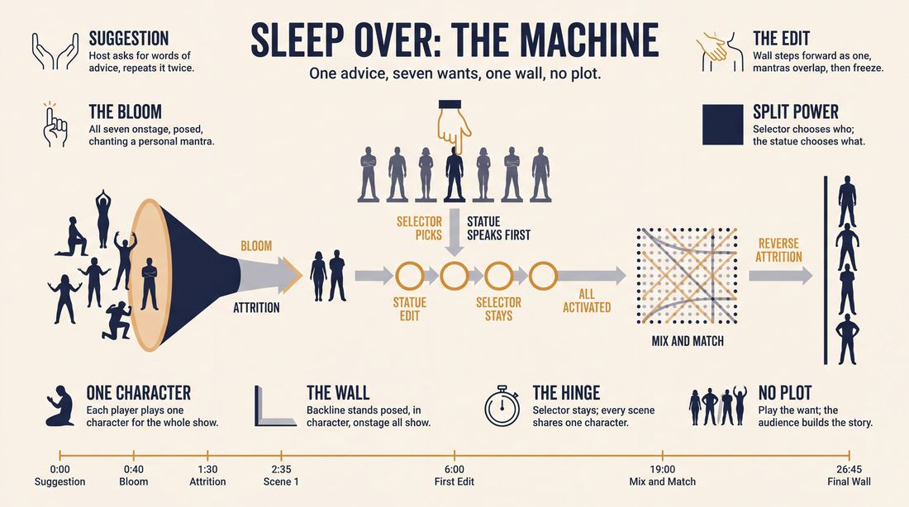
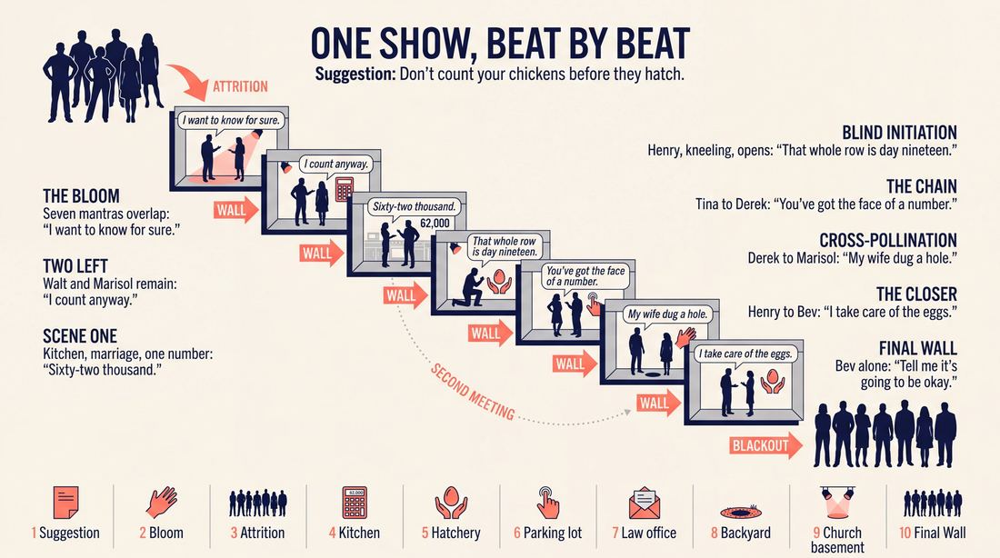
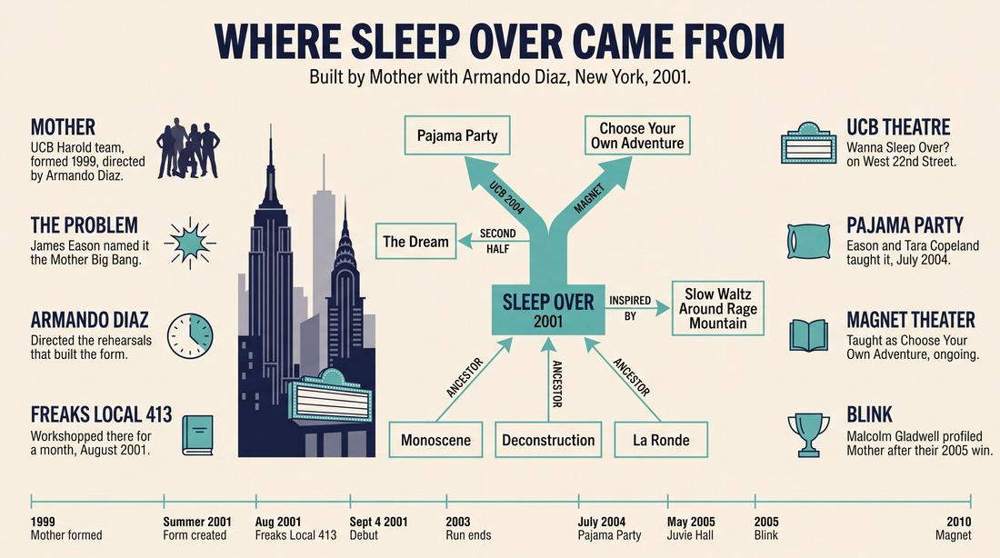
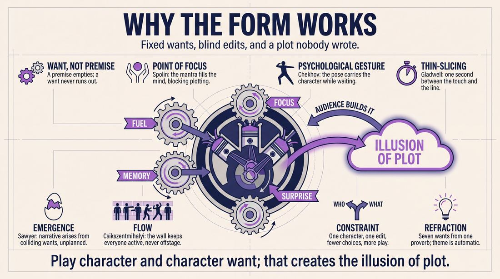
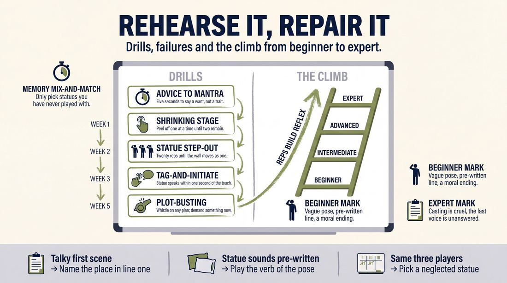

# Sleep Over

> **A complete study of the long-form improv format _Sleep Over_** - the original archived write-up, five infographics, grounded historical and pedagogical research, and a full mechanics-and-coaching manual.

| | |
|---|---|
| **Format** | Sleep Over |
| **Primary source** | [IRC Improv Wiki](https://wiki.improvresourcecenter.com/index.php?title=Sleep_Over) |

---

## Contents

1. [Part I - The Original Write-Up](#part-i-the-original-write-up)
2. [Part II - The Infographics](#part-ii-the-infographics)
   - [1. Structure and Mechanics](#infographic-1-mechanics)
   - [2. A Show, Beat by Beat](#infographic-2-example)
   - [3. Origins and Lineage](#infographic-3-history)
   - [4. Why It Works](#infographic-4-theory)
   - [5. Rehearsal and Repair](#infographic-5-coaching)
3. [Part III - Research Dossier](#part-iii-research-dossier)
   - [Pass 1: History, Lineage, Literature and Scholarship](#research-history)
   - [Pass 2: Comparative Anatomy, Pedagogy and Production](#research-comparative)
4. [Part IV - Mechanics, Gameplay and Coaching Manual](#part-iv-mechanics-gameplay-and-coaching-manual)
   - [Pass 1: The Form, Its Mechanics and Its Gameplay](#manual-mechanics)
   - [Pass 2: Training, Coaching and Performance Companion](#manual-coaching)

---

## Part I - The Original Write-Up

*Verbatim archive of the source article, reproduced exactly as scraped. Everything after this section is generated elaboration built on top of it.*

### Sleep Over

The Sleep Over was the name of the form performed by [Mother](https://wiki.improvresourcecenter.com/index.php?title=Mother "Mother") as part of their weekend show [Wanna Sleep Over?](https://wiki.improvresourcecenter.com/index.php?title=Wanna_Sleep_Over%3F "Wanna Sleep Over?") at the [UCBT](https://wiki.improvresourcecenter.com/index.php?title=UCBT "UCBT") from September 2001 through 2003\.

##### History

Inspired by the [Swarm](https://wiki.improvresourcecenter.com/index.php?title=Swarm "Swarm")'s launching of [Slow Waltz Around Rage Mountain](https://wiki.improvresourcecenter.com/index.php?title=Slow_Waltz_Around_Rage_Mountain "Slow Waltz Around Rage Mountain"), Mother started rehearsing twice a week to develop a show outside of [Harold Night](https://wiki.improvresourcecenter.com/index.php?title=Harold_Night "Harold Night"). Once a week they'd rehearse [Harold](https://wiki.improvresourcecenter.com/index.php?title=Harold "Harold") with [Andrew Secunda](https://wiki.improvresourcecenter.com/index.php?title=Andrew_Secunda "Andrew Secunda") and then they'd rehearse what eventually became The **Sleep Over** with [Armando Diaz](https://wiki.improvresourcecenter.com/index.php?title=Armando_Diaz "Armando Diaz"). After arriving at the form, they work\-shopped it for a month at [Freaks Local](https://wiki.improvresourcecenter.com/index.php?title=Freaks_Local&action=edit&redlink=1 "Freaks Local (page does not exist)") in August 2001\. Mother: Wanna Sleep Over? debuted at the UCB Theatre on W. 22nd St. on Sept. 4th, 2001\.

Mother originally developed the form in order to be more grounded. "We had a tendency to do what was later dubbed the Mother Big Bang \-\- we'd explode one idea to exhaustion. When it went well, we ended up with a fantastic Harold. When it didn't, we ran out of steam mid\-way through," said [James Eason](https://wiki.improvresourcecenter.com/index.php?title=James_Eason "James Eason").

##### Structure

Sleep Over is, at its essence, a mono\-character form. It has elements of [monoscene](https://wiki.improvresourcecenter.com/index.php?title=Monoscene "Monoscene"), [deconstruction](https://wiki.improvresourcecenter.com/index.php?title=Deconstruction "Deconstruction"), and [La Ronde](https://wiki.improvresourcecenter.com/index.php?title=La_Ronde "La Ronde") in it.

First, you get a suggestion of words of advice. That inspires some sort of inner truth or want that you repeat, mantra\-like, until everyone is onstage repeating their inner "thing". Each actor choose and then repeats their mantras. One by one, each actor retreats to the back wall until only two are left. Those two repeat their inner "thing" one last time before engaging in scenework.

The scene is edited by the entire back line stepping forward in a pose and repeating their original mantras. One of the two characters then selects one of these "statues" who then initiates the scene. (Very important. This way the statue can't pre\-plan an initiation).

This scene, and all subsequent scenes, are edited in the same way. The person selecting the statue can be anyone who's already been "activated" for a scene.

Once everyone has been introduced, characters mix and match with each other.

The trick is to NOT play plot, but instead play character and character want. That creates the illusion of plot.

##### Performance Class

In 2004, Mother's [James Eason](https://wiki.improvresourcecenter.com/index.php?title=James_Eason "James Eason") and [Tara Copeland](https://wiki.improvresourcecenter.com/index.php?title=Tara_Copeland "Tara Copeland") taught the Sleep Over as a performance class at the [Upright Citizens Brigade Theatre](https://wiki.improvresourcecenter.com/index.php?title=Upright_Citizens_Brigade_Theatre "Upright Citizens Brigade Theatre"). The show was called Pajama Party and ran for four Tuesdays in July. The cast consisted of [Kate Billingsley](https://wiki.improvresourcecenter.com/index.php?title=Kate_Billingsley&action=edit&redlink=1 "Kate Billingsley (page does not exist)"), [Gary Cohen](https://wiki.improvresourcecenter.com/index.php?title=Gary_Cohen&action=edit&redlink=1 "Gary Cohen (page does not exist)"), [Robert Connor](https://wiki.improvresourcecenter.com/index.php?title=Robert_Connor&action=edit&redlink=1 "Robert Connor (page does not exist)"), [Kevin Cragg](https://wiki.improvresourcecenter.com/index.php?title=Kevin_Cragg "Kevin Cragg"), [Dave Thunder](https://wiki.improvresourcecenter.com/index.php?title=Dave_Thunder&action=edit&redlink=1 "Dave Thunder (page does not exist)"), [Dominic Dierkes](https://wiki.improvresourcecenter.com/index.php?title=Dominic_Dierkes "Dominic Dierkes"), [Alana Harrison](https://wiki.improvresourcecenter.com/index.php?title=Alana_Harrison&action=edit&redlink=1 "Alana Harrison (page does not exist)"), [Jen MacNeil](https://wiki.improvresourcecenter.com/index.php?title=Jen_MacNeil&action=edit&redlink=1 "Jen MacNeil (page does not exist)"), [Stacy Mayer](https://wiki.improvresourcecenter.com/index.php?title=Stacy_Mayer&action=edit&redlink=1 "Stacy Mayer (page does not exist)"), [Dan McInerney](https://wiki.improvresourcecenter.com/index.php?title=Dan_McInerney&action=edit&redlink=1 "Dan McInerney (page does not exist)"), [Gil Ozeri](https://wiki.improvresourcecenter.com/index.php?title=Gil_Ozeri "Gil Ozeri"), [Stephen Ruddy](https://wiki.improvresourcecenter.com/index.php?title=Stephen_Ruddy&action=edit&redlink=1 "Stephen Ruddy (page does not exist)"), [Jeff Scherer](https://wiki.improvresourcecenter.com/index.php?title=Jeff_Scherer "Jeff Scherer"), [Keong Sim](https://wiki.improvresourcecenter.com/index.php?title=Keong_Sim&action=edit&redlink=1 "Keong Sim (page does not exist)"), [David Warth](https://wiki.improvresourcecenter.com/index.php?title=David_Warth&action=edit&redlink=1 "David Warth (page does not exist)") and [Erica Younkin](https://wiki.improvresourcecenter.com/index.php?title=Erica_Younkin&action=edit&redlink=1 "Erica Younkin (page does not exist)").

Several of the cast members revived the show for a run at [Juvie Hall](https://wiki.improvresourcecenter.com/index.php?title=Juvie_Hall&action=edit&redlink=1 "Juvie Hall (page does not exist)") in May 2005\.

It has since been taught continuously at The Magnet Theatre under the name Choose Your Own Adventure.

---

*Archived from [https://wiki.improvresourcecenter.com/index.php?title=Sleep_Over](https://wiki.improvresourcecenter.com/index.php?title=Sleep_Over) (IRC Improv Wiki) on 2026-08-09 23:23 UTC.*

---

## Part II - The Infographics

*Five 16:9 posters, each teaching a different aspect of the format. Click any poster to enlarge.*

<a id="infographic-1-mechanics"></a>

### 1. Structure and Mechanics

*How the form is played: the shape of the piece, the opening, the roles, the edit vocabulary, the flow of information, and the clock.*

{ .diagram loading=lazy decoding=async width="1100" height="614" }


<a id="infographic-2-example"></a>

### 2. A Show, Beat by Beat

*A single worked performance from suggestion to blackout: what happens in each beat, with short real example lines and what the players are doing technically.*

{ .diagram loading=lazy decoding=async width="1100" height="614" }


<a id="infographic-3-history"></a>

### 3. Origins and Lineage

*Where the form came from: creators, dates, theatres, how it spread between schools and cities, and the key figures - a documented timeline and lineage map.*

{ .diagram loading=lazy decoding=async width="1100" height="614" }


<a id="infographic-4-theory"></a>

### 4. Why It Works

*The theory: the core principles of the form and the research and craft ideas that explain why the structure produces good improv, each tied to a specific mechanic.*

{ .diagram loading=lazy decoding=async width="1100" height="614" }


<a id="infographic-5-coaching"></a>

### 5. Rehearsal and Repair

*Training and fixing the form: the essential drills, the common failure modes with their symptom-and-fix pairs, and the markers of beginner through expert play.*

{ .diagram loading=lazy decoding=async width="1100" height="614" }


---

## Part III - Research Dossier

*Two research passes: the historical record, then the comparative and pedagogical record. Claims carry evidence tags - treat unverified items accordingly.*

<a id="research-history"></a>

### » Pass 1: History, Lineage, Literature and Scholarship

### Research Summary
*   **Documentation Level:** Moderately documented. The structural mechanics and origin story are well-preserved on the IRC Improv Wiki and archived 2001 forum posts, while its modern pedagogical lineage is documented via Magnet Theater syllabi. However, video records of the original run are virtually non-existent online.
*   **Origin:** Created in the summer of 2001 by the Upright Citizens Brigade (UCB) Harold team "Mother" and director Armando Diaz.
*   **Purpose:** Engineered specifically to solve a failure mode known as the "Mother Big Bang," where the team would exhaust a single premise too quickly. The form forced a pivot toward grounded, character-driven play.
*   **Structure:** A mono-character format blending elements of the Monoscene, Deconstruction, and La Ronde. It relies on a "mantra" opening that locks players into an inner truth, followed by scenes edited by players assuming physical "statue" poses.
*   **Lineage:** Taught at UCB in 2004 as "Pajama Party" and continuously at the Magnet Theater as "Choose Your Own Adventure" or "The Sleep Over."
*   **Cultural Impact:** The form fundamentally shifted the early UCB New York aesthetic, proving that acting chops and emotional truth could rival purely premise-based "Game of the Scene" mechanics. It also helped Mother win the 2005 Chicago Improv Festival Super Cage Match, leading to their inclusion in Malcolm Gladwell's book *Blink*.

### Provenance and History
The Sleep Over was developed in the summer of 2001 by the UCB Harold team Mother (Scot Armstrong, Tara Copeland, Jon Daly, James Eason, Jesse Falcon, Jason Mantzoukas, Doug Moe, Jessica St. Clair, and Christine Walters) under the direction of Armando Diaz [DOCUMENTED]. 

The form was created to solve a specific mechanical problem. Mother had developed a reputation for wildly inconsistent Harolds. They suffered from what performer James Eason dubbed the "Mother Big Bang"—a tendency to explode a single comedic idea to total exhaustion within the first few beats, leaving the team devoid of momentum for the second half of the piece [DOCUMENTED]. To counter this, they began rehearsing twice a week: once with Andrew Secunda to drill the Harold, and once with Armando Diaz to develop a new, grounded, character-driven format [DOCUMENTED].

Inspired by The Swarm's format *Slow Waltz Around Rage Mountain*, Mother workshopped the new form at Freaks Local 413 in August 2001 [DOCUMENTED]. The form took its name from the weekend show it anchored: *Wanna Sleep Over?*, which debuted at the UCB Theatre on West 22nd Street on September 4, 2001 [DOCUMENTED]. 

**Timeline of the Form**

| Year | Event | Place / Company | Source |
| :--- | :--- | :--- | :--- |
| Summer 1999 | "Mother" is formed as one of the last Harold teams assembled by Armando Diaz. | UCB Theatre, NY | Fandom Improv Wiki |
| Summer 2001 | Sleep Over is created to force the team into character-driven play. | UCB Theatre, NY | IRC Improv Wiki |
| Aug 2001 | The form is workshopped for a month before its official debut. | Freaks Local 413, NY | IRC Forums |
| Sept 4, 2001 | *Mother: Wanna Sleep Over?* officially debuts. | UCB Theatre, NY | IRC Improv Wiki |
| July 2004 | James Eason and Tara Copeland teach the form as a performance class called *Pajama Party*. | UCB Theatre, NY | IRC Improv Wiki |
| 2005 | Mother wins the CIF Super Cage Match, drawing the attention of Malcolm Gladwell. | Chicago Improv Festival | *Blink* (Gladwell) |
| 2010–Present | Taught as *Choose Your Own Adventure* and *The Sleep Over*. | Magnet Theater, NY | Magnet Theater Syllabus |

### Lineage and Transmission
Because the form relies heavily on acting fundamentals rather than strict premise-mapping, its transmission has largely followed the teaching diaspora of Armando Diaz and the members of Mother. 

The form was first formally codified as a curriculum piece in July 2004, when Mother members James Eason and Tara Copeland taught it as a UCB performance class under the title *Pajama Party* [DOCUMENTED]. Several students from that run (including Gil Ozeri and Dominic Dierkes) revived it at Juvie Hall in May 2005 [DOCUMENTED].

When Armando Diaz opened the Magnet Theater, the form became a staple of its advanced curriculum. It is taught continuously as a Level 4 Senior Project under the name *Choose Your Own Adventure*, and occasionally as a masterclass simply titled *The Sleep Over* [DOCUMENTED]. The Magnet dialect of the form places a heavy emphasis on "Relationship" based improv, treating the UCB-style "Game" as just one piece of a larger narrative puzzle [INFERRED].

### Key Figures

| Person | Role in this form | Specific contribution | Source URL |
| :--- | :--- | :--- | :--- |
| **Armando Diaz** | Co-Creator / Director | Directed Mother; engineered the form to force the team away from premise-chasing and into emotional truth. | [Magnet Theater](https://magnettheater.com/class/the-sleep-over/) |
| **James Eason** | Co-Creator / Teacher | Identified the "Mother Big Bang" failure mode; codified the form into a teachable curriculum at UCB. | [IRC Wiki](https://wiki.improvresourcecenter.com/index.php?title=Sleep_Over) |
| **Tara Copeland** | Co-Creator / Teacher | Co-taught the first *Pajama Party* class; performed in the 2010 Magnet Theater revival *Sleep Over!*. | [Magnet Theater](https://magnettheater.com/show/36886/) |
| **Jason Mantzoukas** | Co-Creator / Performer | Used the mono-character mechanics developed in this form to launch the spin-off show *I Will Not Apologize*. | [IRC Wiki](https://wiki.improvresourcecenter.com/index.php?title=Sleep_Over) |
| **Jessica St. Clair** | Co-Creator / Performer | Partnered with Mantzoukas to spin Sleep Over characters into dedicated theatrical runs. | [IRC Wiki](https://wiki.improvresourcecenter.com/index.php?title=Sleep_Over) |

### Canonical Shows, Companies and Recordings
*Note: The searchable record for video of this era of UCB is incredibly thin. While audio and video recordings of Mother exist in private archives, no public links to a canonical Sleep Over performance are currently verified.*

| Show | Venue | Year | Link |
| :--- | :--- | :--- | :--- |
| *Wanna Sleep Over?* (Mother) | UCB Theatre (W. 22nd St) | 2001–2003 | [IRC Forums](https://improvresourcecenter.com/threads/nyc-wanna-sleep-over.3551/) |
| *Pajama Party* (Class Show) | UCB Theatre | 2004 | [IRC Wiki](https://wiki.improvresourcecenter.com/index.php?title=Sleep_Over) |
| *Sleep Over!* | Magnet Theater | 2010 | [Improv Is Good For You](https://improvisgoodforyou.com/2010/10/15/sleep-over-the-magnet-theater/) |
| *Choose Your Own Adventure* | Magnet Theater | Ongoing | [Magnet Syllabus](https://magnettheater.com/class/level-four-senior-project-choose-your-own-adventure-class-show/) |

### Published Literature

| Work | Author | Year | What it says about this form | Where to find it |
| :--- | :--- | :--- | :--- | :--- |
| *Blink: The Power of Thinking Without Thinking* | Malcolm Gladwell | 2005 | Profiles Mother's ability to make sophisticated, spontaneous decisions; highlights their character-driven action. | [Little, Brown](https://www.littlebrown.com/titles/malcolm-gladwell/blink/9780316010665/) |
| *Sleep Over* (Wiki Article) | Various Contributors | 2008 | Provides the only surviving step-by-step structural breakdown of the mantra opening and statue edits. | [IRC Wiki](https://wiki.improvresourcecenter.com/index.php?title=Sleep_Over) |
| *Level Four: Choose Your Own Adventure* | Magnet Theater | 2019 | Defines the modern pedagogical approach to the form as a "character-driven narrative long-form." | [Magnet Theater](https://magnettheater.com/class/level-four-senior-project-choose-your-own-adventure-class-show/) |

### Verbatim Quotes

> "We had a tendency to do what was later dubbed the Mother Big Bang -- we'd explode one idea to exhaustion. When it went well, we ended up with a fantastic Harold. When it didn't, we ran out of steam mid-way through."
> — **James Eason**  
> [IRC Improv Wiki](https://wiki.improvresourcecenter.com/index.php?title=Sleep_Over)

> "The trick is to NOT play plot, but instead play character and character want. That creates the illusion of plot."
> — **Anonymous Contributor**  
> [IRC Improv Wiki](https://wiki.improvresourcecenter.com/index.php?title=Sleep_Over)

> "The form was created to force Mother into new improv territory -- less like magpies chasing a bright shiny object or a 'Big Bang' of ideas and more focused on character and behavior."
> — **Fandom Improv Wiki**  
> [Improv Comedy Fandom](https://improvcomedy.fandom.com/wiki/Mother)

> "Thanks to this form, Mother became the biggest proponents at the UCBT of incorporating acting chops, emotional truth, and games based more on character and behavior rather than solely premise-based games into their improv work."
> — **Fandom Improv Wiki**  
> [Improv Comedy Fandom](https://improvcomedy.fandom.com/wiki/Mother)

> "Sleep Over is, at its essence, a mono-character form. It has elements of monoscene, deconstruction, and La Ronde in it."
> — **Anonymous Contributor**  
> [IRC Improv Wiki](https://wiki.improvresourcecenter.com/index.php?title=Sleep_Over)

> "Choose Your Own Adventure, the form of the Magnet show Sleep Over!, is a character-driven narrative long-form, in which the performers play one character throughout the entire show."
> — **Magnet Theater Syllabus**  
> [Magnet Theater](https://magnettheater.com/class/level-four-senior-project-choose-your-own-adventure-class-show/)

> "This form relies on strong character work and agile game playing to explore multiple narratives in a unified world."
> — **Armando Diaz (Class Description)**  
> [Magnet Theater](https://magnettheater.com/class/the-sleep-over/)

> "Good improvisors develop action."
> — **Unnamed Mother Performer (Quoted by Malcolm Gladwell)**  
> [Kristi Porter Blog](https://kristiporter.me/2012/07/12/love-does/)

### Anecdotes and Stories

**"Yesterday at Noon"**
In August 2001, Mother was secretly workshopping the Sleep Over at Freaks Local 413. An improviser known on the IRC forums as "Math Rules!" attended a show and was entirely blown away by the sudden, massive leap in the team's quality. Walking out of the theater, they bumped into James Eason—whom they affectionately referred to as "the John Coltrane of Improv"—and asked him exactly when Mother got so damn good. Eason deadpanned: "Yesterday at noon." [DOCUMENTED]

**The Gladwell Connection**
Mother's dedication to the Sleep Over format fundamentally rewired their brains as an ensemble. By 2005, their mastery of emotional truth and character behavior led them to win the Chicago Improv Festival Super Cage Match—the first New York team to ever do so. This specific victory caught the attention of author Malcolm Gladwell, who was researching rapid cognition. Gladwell attended their shows and interviewed the cast, eventually immortalizing Mother in his bestseller *Blink* as the ultimate example of "making sophisticated decisions spur of the moment." [DOCUMENTED]

### Academic and Scientific Research

**Collaborative Emergence**
*Source: R. Keith Sawyer, "Group Creativity: Music, Theater, Collaboration" (2003)*
*   **Relevance to this form:** Sawyer's theory of collaborative emergence dictates that group creativity peaks when narrative is not pre-planned, but arises organically from micro-interactions. The Sleep Over explicitly forbids "playing plot." By forcing improvisers to strictly play "character want" (established via the opening mantras), the ensemble generates the *illusion* of a complex plot through the unpredictable intersection of mono-characters.

**Rapid Cognition and Thin-Slicing**
*Source: Malcolm Gladwell, "Blink: The Power of Thinking Without Thinking" (2005)*
*   **Relevance to this form:** Gladwell specifically studied Mother's capacity for rapid, unconscious decision-making. In the Sleep Over, the edit mechanism requires an active player to tap a "statue" on the back wall. That statue must instantly initiate a scene based *solely* on the physical pose they were holding and their internal mantra. This is a pure, high-stakes exercise in thin-slicing and spontaneous agreement.

**Psychological Flow in Ensemble Performance**
*Source: Mihaly Csikszentmihalyi, "Flow: The Psychology of Optimal Experience" (1990)*
*   **Relevance to this form:** In standard tag-out formats, off-stage players often drop their concentration. The Sleep Over's staging requires the entire cast to remain on the back wall as "statues," holding a physical pose and repeating their mental mantra. This physical embodiment forces continuous psychological "flow," as performers cannot disengage; they must remain in a state of active readiness to be activated at any second.

### Documented Variants and Descendants

*   **Pajama Party:** The pedagogical variant taught by James Eason and Tara Copeland at UCB in 2004. Mechanically identical, but framed as a class performance vehicle [DOCUMENTED].
*   **Choose Your Own Adventure:** The Magnet Theater variant. While the mechanics remain the same, the branding emphasizes the narrative result of the mono-character interactions rather than the abstract "mantra" opening [DOCUMENTED].
*   **The Dream:** A second-half format Mother performed during the *Wanna Sleep Over?* run. The audience would select one character from the Sleep Over first half, and the ensemble would improvise that specific character's dream [DOCUMENTED].
*   **I Will Not Apologize:** A spin-off show created by Jason Mantzoukas and Jessica St. Clair, built entirely around specific characters they originally discovered and developed while performing the Sleep Over [DOCUMENTED].

### Criticism, Debate and Known Failure Modes

*   **Playing Plot vs. Playing Character:** The most documented failure mode of the Sleep Over is the temptation to invent a story. Because the form looks like a play to the audience, improvisers often panic and try to force a narrative arc. The form collapses if players abandon their "mantra" (character want) to service a plot [DOCUMENTED].
*   **The "Talky" First Scene:** Because the opening scene emerges from the final two players repeating their mantras in isolation, it can easily devolve into a philosophical, disconnected conversation. Like the opening scene of a Deconstruction, it risks veering into tangents rather than grounded action [WIDELY PRACTICED, UNDOCUMENTED].
*   **Statue Pre-planning:** The edit mechanism relies on the active player choosing a statue, and the statue initiating. A known trap is for the "statues" to pre-plan their initiations while waiting on the back wall. This destroys the spontaneity of the edit. The rule is strict: the statue initiates, but they cannot know *when* they will be picked, forcing them to initiate purely from their physical pose [DOCUMENTED].

### Cultural Footprint
The Sleep Over is arguably the format that bridged the gap between Chicago's acting-heavy style and New York's premise-heavy style in the early 2000s. It elevated Mother to one of the "Big Three" Harold teams at UCB (alongside The Swarm and Respecto Montalban) and shifted the theater's aesthetic to prove that emotional truth was just as viable as the "Game of the Scene." 

The form served as an incubator for some of the most successful character actors of the 2010s. Alumni Jason Mantzoukas (*The League*, *Brooklyn Nine-Nine*), Jessica St. Clair (*Playing House*), Jon Daly (*Kroll Show*), and Paul W. Downs (*Hacks*) all honed their ability to sustain deeply flawed, highly specific mono-characters through the grueling mechanics of the Sleep Over. Furthermore, its inclusion in Malcolm Gladwell's *Blink* brought the mechanics of long-form improvisation to a mainstream intellectual audience for the first time.

### Gaps in the Record
*   **Exact Dates:** The precise date in "Summer 2001" when Armando Diaz first introduced the mechanics to Mother is unverified.
*   **Video Archives:** No public video recordings of the original *Wanna Sleep Over?* run are currently verified or accessible online.
*   **The Mantras:** The specific "words of advice" and resulting mantras used in canonical, legendary performances of the show are lost to time. A researcher with access to UCB's private physical archives or the personal notes of James Eason/Armando Diaz should chase these to provide concrete examples of the opening mechanic.

### Source List
1. "Sleep Over" - IRC Improv Wiki - 2008 - https://wiki.improvresourcecenter.com/index.php?title=Sleep_Over - Supports the structural breakdown, edit mechanics, and history of the form.
2. "Mother" - Improv Comedy Fandom Wiki - 2016 - https://improvcomedy.fandom.com/wiki/Mother - Supports the history of Mother, their coaching by Armando Diaz, and their shift away from premise-based games.
3. "Level Four: Senior Project - Choose Your Own Adventure" - Magnet Theater - 2019 - https://magnettheater.com/class/level-four-senior-project-choose-your-own-adventure-class-show/ - Documents the modern teaching lineage and variant name of the form.
4. "The Sleep Over" Class Description - Magnet Theater - 2019 - https://magnettheater.com/class/the-sleep-over/ - Confirms Armando Diaz's continued teaching of the form and its focus on agile game playing.
5. "[NYC] Wanna Sleep Over?" Forum Thread - IRC Forums - 2001 - https://improvresourcecenter.com/threads/nyc-wanna-sleep-over.3551/ - Primary source for the debut dates, cast, the "Yesterday at noon" anecdote, and audience reception.
6. *Blink: The Power of Thinking Without Thinking* - Malcolm Gladwell - 2005 - https://www.littlebrown.com/titles/malcolm-gladwell/blink/9780316010665/ - Documents the cognitive psychology of Mother's improv style and their CIF win.
7. "Love Does" Blog Post - Kristi Porter - 2012 - https://kristiporter.me/2012/07/12/love-does/ - Provides the Gladwell quote regarding Mother and developing action.

<a id="research-comparative"></a>

### » Pass 2: Comparative Anatomy, Pedagogy and Production

### Taxonomic Placement

```text
      Monoscene       Deconstruction       La Ronde
           \                |                /
            \               |               /
             \              |              /
              +-------------+-------------+
                            |
                       Sleep Over
                            |
                 Choose Your Own Adventure
```

The Sleep Over sits at the intersection of the Monoscene (mono-character constraint), the Deconstruction (thematic generation from a single source code), and La Ronde (systematic mixing and matching of a closed ecosystem of characters). Developed in 2001 by the UCB team Mother and director Armando Diaz, it was engineered specifically as an antidote to the "Harold Big Bang"—a pathology where teams explode a premise so rapidly they run out of steam. By forcing players to lock into a single character driven by a core "want" (mantra) and relying on a rigid, externally triggered edit mechanic (the statue selection), the form structurally prevents premise-exhaustion and forces collaborative emergence.

### Head-to-Head Comparisons

#### Sleep Over vs. The Harold
| Axis | Sleep Over | The Harold | Consequence for the players |
| :--- | :--- | :--- | :--- |
| **Opening** | Attrition: All players repeat a mantra based on "words of advice" until only two remain. | Group mind exploration (pattern game, invocation, sound/motion) to generate multiple premises. | Sleep Over players lock into a character *before* the first scene; Harold players discover premises to apply *to* scenes. |
| **Structure** | Continuous mix-and-match of a single set of characters. | Three beats of three distinct worlds, separated by group games. | Sleep Over requires tracking one continuous psychological state; Harold requires tracking multiple discrete game mechanics. |
| **Edit Logic** | Backline steps forward as statues; an active player selects one to initiate. | Sweep edits driven by the backline recognizing the game has peaked. | Sleep Over removes the burden of "finding the edit point" from the backline, shifting it to the active players. |
| **Failure Mode** | Playing plot instead of character want. | Premise exhaustion ("The Big Bang"). | Sleep Over dies when players try to write a story; Harold dies when players run out of moves for a game. |

#### Sleep Over vs. Monoscene
| Axis | Sleep Over | Monoscene | Consequence for the players |
| :--- | :--- | :--- | :--- |
| **Cast Size** | 6–9 players, rotating in and out of focus. | Entire cast usually trapped in one location for the duration. | Sleep Over allows for breaks and resets; Monoscene requires continuous real-time presence and justification. |
| **Edit Logic** | Hard cuts via the "Statue Edit" mechanic. | No edits; real-time continuous action. | Sleep Over can jump time and space instantly; Monoscene is bound by real-time physics. |
| **Memory** | Players must remember their original mantra and apply it to new pairings. | Players must remember the spatial reality and unfolding real-time events. | Sleep Over is a test of psychological consistency; Monoscene is a test of spatial and temporal object permanence. |

#### Sleep Over vs. La Ronde
| Axis | Sleep Over | La Ronde | Consequence for the players |
| :--- | :--- | :--- | :--- |
| **Progression** | Non-linear mixing and matching after all characters are introduced. | Strict A-B, B-C, C-D, D-A daisy-chain structure. | Sleep Over allows organic pairings based on stage dynamics; La Ronde is mathematically predetermined. |
| **Initiation** | The selected "statue" must initiate the scene blindly. | The incoming player usually initiates based on the outgoing player's established deal. | Sleep Over forces spontaneous, unplannable initiations; La Ronde allows the incoming player to pre-plan their entrance. |
| **Audience Contract** | Watch a thematic universe collide. | Watch a chain of relationships complete a circle. | Sleep Over feels like an ensemble piece; La Ronde feels like a series of duets. |

#### Sleep Over vs. Deconstruction
| Axis | Sleep Over | Deconstruction | Consequence for the players |
| :--- | :--- | :--- | :--- |
| **Source Code** | "Words of advice" distilled into personal mantras. | A single, grounded source scene. | Sleep Over characters are born from abstract theme; Deconstruction characters are born from observed behavior. |
| **Character Constraint** | Mono-character (one character per player for the whole show). | Multi-character (players play different characters in thematic/tangential runs). | Sleep Over demands deep character stamina; Deconstruction demands rapid character generation. |
| **Edit Logic** | Statue selection by the active player. | Thematic runs, tangential pulls, and sweep edits. | Sleep Over edits are highly formalized and mechanical; Deconstruction edits are fluid and associative. |

### What Makes It Uniquely Itself

1. **The Attrition Opening**: The form cannot begin until every player is on stage simultaneously repeating their individual "want" (mantra) derived from the audience's advice. The physical retreat of players to the back wall, leaving only two to begin the show, is the defining visual and auditory signature of the form.
2. **The Statue Edit and Blind Initiation**: The edit is a two-step lock-and-key mechanism. The backline steps forward in a frozen pose, repeating their mantra. The edit is not complete until an *active* player from the current scene selects a statue. Crucially, the *statue* must then initiate the scene. This prevents the backline from pre-planning their initiations, forcing pure reaction.
3. **The Illusion of Plot**: The form explicitly forbids players from trying to weave a narrative. The operational rule is: "Play character and character want; the collision of wants creates the illusion of plot." If players are actively trying to resolve a storyline, they are no longer playing a Sleep Over.

### Structural Variants in Practice

| Variant Name | What It Changes | Who Plays It | Source |
| :--- | :--- | :--- | :--- |
| **Mother's Original Sleep Over** | The first half is the standard form. The second half is "The Dream," where the audience selects one character from the first half, and the cast improvises that character's surreal dream. | Mother (UCB Theatre, 2001–2003) | IRC Improv Wiki / Armando Diaz |
| **Choose Your Own Adventure** | Drops "The Dream" second half. Focuses entirely on the mono-character narrative and advanced character development over a longer runtime. | Magnet Theater (Senior Project / Level 4) | Magnet Theater Curriculum |
| **Swoon River (Musical CYOA)** | Adapts the mono-character and audience-selection mechanics into a fully improvised musical, using songs to explore the character's world. | Swoon River (Indie / Festival Circuit) | BroadwayWorld Festival Listings |

### The Teaching Ladder

| Stage | Skill Introduced | Why In This Order | Typical Exercise | Source |
| :--- | :--- | :--- | :--- | :--- |
| **1** | Distilling Advice into Want | Players must know how to translate abstract suggestions into playable psychological drives before stepping on stage. | *Advice to Mantra* | [CRAFT CONSENSUS] |
| **2** | The Attrition Opening | Establishes the physical and auditory baseline of the form. Teaches players to hold their ground until the organic moment to retreat. | *The Shrinking Stage* | Mother / IRC Wiki |
| **3** | The Statue Edit | The mechanical engine of the form. Must be drilled until the backline can step forward as a unified front without hesitation. | *Statue Step-Out* | [CRAFT CONSENSUS] |
| **4** | Blind Initiation | Teaches the backline to drop their pre-planned ideas and initiate solely based on their physical pose and the reality of being chosen. | *Tag-and-Initiate* | Armando Diaz / [CRAFT CONSENSUS] |
| **5** | Mixing and Matching | Teaches players how to justify bringing disparate characters together without forcing a narrative. | *Memory Mix-and-Match* | [CRAFT CONSENSUS] |
| **Withheld** | Plotting / Narrative Arc | Deliberately withheld. Beginners will naturally try to write a story. They are explicitly told *not* to play plot. | *Plot-Busting* | James Eason / Mother |

### Documented Drills and Exercises

| Drill | Origin / Teacher | How to Run It | What It Fixes in This Form | Source |
| :--- | :--- | :--- | :--- | :--- |
| **Advice to Mantra** | Armando Diaz / [CRAFT CONSENSUS] | Take a piece of advice (e.g., "Look before you leap"). Players have 5 seconds to state an "I want" or "I am" statement (e.g., "I want to be perfectly safe"). | Vague character motivations; playing the premise instead of the person. | [CRAFT CONSENSUS] |
| **Physicalizing the Mantra** | [CRAFT CONSENSUS] | Players walk the room repeating their mantra. The coach calls out body parts to lead with, until the mantra becomes a locked-in physical posture. | "Talking head" scenes; lack of physical distinction between mono-characters. | [CRAFT CONSENSUS] |
| **The Shrinking Stage** | Mother | Entire cast on stage, overlapping their mantras. Without speaking about it, players must organically decide when to step back to the wall, until exactly two are left. | Rushed openings; players not listening to the group dynamic. | IRC Improv Wiki |
| **Statue Step-Out** | [CRAFT CONSENSUS] | Two players do a scene. On the coach's clap, the entire backline must step forward simultaneously, strike their character pose, and say their mantra. | Sloppy, staggered, or hesitant edits. | [CRAFT CONSENSUS] |
| **Tag-and-Initiate** | Armando Diaz / [CRAFT CONSENSUS] | A player on stage tags a frozen statue. The statue must immediately speak the first line of the new scene based *only* on their physical pose. | Pre-planned initiations; statues "writing" scenes in their heads. | IRC Improv Wiki |
| **Want Collision** | [CRAFT CONSENSUS] | Two players with opposing mantras do a 3-minute scene. The only rule is neither player is allowed to compromise or change their core want. | Dropping the character game to accommodate the scene partner. | [CRAFT CONSENSUS] |
| **The Dream Sequence** | Mother | One player sits center stage. The rest of the cast initiates rapid-fire, surreal, tangential scenes that heighten the seated player's core fears/wants. | Second-half energy dips; lack of heightening. | IRC Improv Wiki |
| **Memory Mix-and-Match** | [CRAFT CONSENSUS] | Run the form, but players are only allowed to select statues of characters they have not yet interacted with in the show. | Gravitating to the same comfortable pairings; ignoring half the cast. | [CRAFT CONSENSUS] |
| **Plot-Busting** | James Eason / [CRAFT CONSENSUS] | Coach blows a whistle if players start talking about past/future events or trying to solve a problem, forcing them back to their immediate want. | Playing plot instead of character; "The Big Bang" exhaustion. | [CRAFT CONSENSUS] |
| **Echo Edit** | [CRAFT CONSENSUS] | The backline must match the emotional intensity of the scene they are editing when they step forward to deliver their mantras. | Disconnected edits; jarring energy shifts that kill momentum. | [CRAFT CONSENSUS] |

### Common Failure Modes and Diagnoses

| Failure Mode | What It Looks Like from the Audience | Root Cause | Fix | Who Names It |
| :--- | :--- | :--- | :--- | :--- |
| **The Big Bang** | A scene starts with massive energy, explores every facet of a premise in two minutes, and then the players have nothing left to do but stare at each other. | Playing the premise to exhaustion rather than grounding the scene in character behavior. | Anchor the scene in the character's core want. Let the premise be secondary to the relationship. | James Eason (Mother) |
| **Pre-Planned Initiations** | A statue is selected and immediately delivers a highly constructed, witty line that has nothing to do with the physical pose they were just holding. | The backline player was "writing" a scene in their head instead of staying present as their character. | Enforce the rule: the initiation must be a direct reaction to the physical pose the statue is currently holding. | Armando Diaz / Mother |
| **Plotting** | Characters sit around discussing how they are going to solve a problem, plan an event, or achieve a logistical goal. The show feels like a badly written play. | Players do not trust that character wants will naturally generate narrative. | Stop talking about the future. Fight for the character's mantra in the present moment. | [CRAFT CONSENSUS] |
| **Mantra Fade** | By the third scene, the characters act like normal, well-adjusted people. The original "advice" is completely forgotten. | Players drop their constraint to make the scenework "easier." | The Statue Edit mechanic naturally fixes this by forcing players to literally repeat their mantra before every scene. | [CRAFT CONSENSUS] |
| **Messy Edits** | One person steps forward, then another, then someone half-steps. The active players don't know if the scene is over. | Lack of backline group mind and eye contact. | The backline must breathe together and step forward as a single organism. | [CRAFT CONSENSUS] |

### Production and Logistics

*   **Cast Size**: 6 to 9 players. Mother originally performed this with 8–9 members. This size is necessary to provide enough distinct "statues" for the mix-and-match phase without exhausting the cast.
*   **Runtime**: 25 to 30 minutes. In its original incarnation, it served as the first half of a one-hour show (followed by "The Dream").
*   **Stage Layout**: An open stage with a clear, unobstructed back wall. The backline must be visible to the audience and easily accessible to the active players for the statue selection.
*   **Chairs and Set**: Minimal. Chairs should be kept to the sides so they do not obstruct the backline's step-forward edit mechanic.
*   **Lighting and Tech Cues**: Standard wash. No internal blackouts or sweep edits are required, as the form is entirely self-edited by the players' physical movements.
*   **Music and Sound**: None required for the core form, though musical variants (like Swoon River) integrate live accompaniment.
*   **How the Suggestion is Taken**: The host asks the audience specifically for "Words of advice" (e.g., "Don't count your chickens before they hatch," "Always wear sunscreen").
*   **Rehearsal Cadence**: Mother rehearsed twice a week—once for Harold, once specifically for Sleep Over, indicating the form requires dedicated, isolated practice to master its specific edit mechanics.

### Adaptations Beyond the Stage

*   **Classroom and Youth**: The form is highly effective for teaching character consistency. The "mantra" provides a concrete anchor for younger performers who might otherwise drift. The physical poses must be emphasized over complex psychological wants.
*   **Corporate and Applied Improv**: Used to explore diverse reactions to a single corporate directive or mission statement (the "advice"). The mix-and-match mechanic allows teams to safely roleplay how different departments or personality types collide under a shared constraint.
*   **Online and Remote**: The "Statue Edit" is adapted using camera toggles. The backline keeps cameras off. To edit, all non-active players turn their cameras on simultaneously, frozen in a pose. The active player calls out the name of the "statue" they want to activate.
*   **Accessibility and Inclusion**: The "step forward and pose" mechanic can be adapted for mobility-impaired performers by using vocal cues, facial expressions, or lighting shifts to indicate the transition from backline to active statue.
*   **Content-Safety and Consent**: Because mantras are derived from "inner truths," they can easily veer into dark, triggering, or overly intimate psychological territory. A clear tap-out mechanic or safety word must be established during the mix-and-match phase if a character collision becomes unsafe for the performers.

### Evidence Base for Those Adaptations

*   **Embodied Cognition**: Research in embodied cognition (e.g., Niedenthal, 2007) supports the form's reliance on physical poses to trigger psychological states. The physical act of holding the "statue" pose actively helps the improviser access the character's emotional reality before speaking.
*   **Constraint-Based Creativity**: Studies on creativity (e.g., Stokes, 2005) demonstrate that rigid constraints (like the mono-character rule and the strict statue edit) reduce cognitive load regarding *what* to do, allowing performers to focus entirely on *how* to do it, thereby increasing spontaneous output.

### Scholarly Frames Worth Applying

*   **Sawyer on Collaborative Emergence**: *The frame:* Group creativity produces outcomes that cannot be predicted by analyzing the individuals, emerging instead from the continuous interaction of the participants. *Citation:* Sawyer, R. K. (2003). *Group Creativity: Music, Theater, Collaboration*. *Mapping:* Maps directly to the form's core philosophy: "Do not play plot." The narrative (plot) is an emergent property of the rigid character wants colliding, rather than a top-down structure planned by the actors.
*   **Spolin on Point of Concentration (POC)**: *The frame:* A specific, singular focus that occupies the conscious mind, allowing the intuition to operate freely. *Citation:* Spolin, V. (1963). *Improvisation for the Theater*. *Mapping:* The "mantra" serves as the ultimate POC. By forcing the actor to continuously return to their mantra, they are prevented from getting in their heads about narrative structure.
*   **Chekhov on the Psychological Gesture**: *The frame:* A physical movement that encapsulates the entire psychology, objective, and essence of a character. *Citation:* Chekhov, M. (1953). *To the Actor*. *Mapping:* Maps perfectly to the "Statue Edit." The backline does not just stand there; they hold a physical pose that embodies their mantra, using the body to sustain the character's inner life while offstage.

### Where the Form Is Heading

The Sleep Over survives most prominently in the curriculum of the Magnet Theater in New York, where it is taught under the name "Choose Your Own Adventure" as a Level 4 Senior Project. This pedagogical placement highlights its value as an advanced character-stamina test. Contemporary indie teams and festival performers have hybridized the form, most notably integrating it into musical improv (e.g., *Swoon River*), where the "mantra" is easily translated into a musical motif or "I Want" song, and the mix-and-match structure allows for complex, multi-part harmonies and ensemble numbers.

### Source List

1. *Sleep Over* - IRC Improv Wiki - 2008 - https://wiki.improvresourcecenter.com/index.php?title=Sleep_Over - Supports the history, structural mechanics, opening attrition, statue edit logic, and James Eason's "Big Bang" quote.
2. *Mother* - Fandom / IRC Improv Wiki - 2016 - https://improvresourcecenter.com - Supports the history of the form's development with Armando Diaz, the cast size, and the team's rehearsal cadence.
3. *Level Four: Senior Project - Choose Your Own Adventure* - Magnet Theater - 2021 - https://magnettheater.com - Supports the modern pedagogical placement of the form, its alternate name, and its focus on advanced character development.
4. *Wanna Sleep Over? Forum Announcements* - IRC Improv Wiki Forums - 2001 - https://improvresourcecenter.com - Supports the debut timeline, audience reception, and the existence of the "Dream" second-half variant.

---

## Part IV - Mechanics, Gameplay and Coaching Manual

*Synthesis over the original article and both research dossiers: first how the form works and how to play it, then how to train an ensemble to perform it.*

<a id="manual-mechanics"></a>

### » Pass 1: The Form, Its Mechanics and Its Gameplay

### At a Glance

| Field | Detail |
|---|---|
| **Also known as** | *The Sleep Over*; *Pajama Party* (UCB class version, 2004); *Choose Your Own Adventure* / *CYOA* (Magnet Theater, ongoing); *Sleep Over!* (Magnet show title, 2010) |
| **Family** | Mono-character long form. A deliberate hybrid: **Monoscene** (persistent characters, no character-hopping), **Deconstruction** (everything grows out of one seed of source material), **La Ronde** (a closed ecosystem of characters recombined pair by pair) |
| **Cast size** | 6–9. Mother played it with 8–9. **My recommendation: 7** for a 30-minute slot (see the clock arithmetic under *Anatomy*) |
| **Runtime** | 25–30 minutes as originally played (first half of a one-hour show, followed by *The Dream*). Magnet's *Choose Your Own Adventure* stretches it to fill a full set, 40–50 minutes |
| **Opening** | The **Mantra Bloom and Attrition**: entire cast onstage speaking personal mantras simultaneously; players peel off to the back wall one at a time until two remain |
| **Suggestion taken** | A single piece of **words of advice** ("Don't count your chickens before they hatch," "Always wear sunscreen," "Never lend money to family") |
| **Structural rigidity (1–5)** | **4.** The opening, the edit mechanism, and the one-player-one-character law are non-negotiable and mechanical. Scene order and pairing are free after the introduction phase |
| **Difficulty (1–5)** | **4.** The mechanics are learnable in one rehearsal. The discipline — 30 minutes inside one psychology, no plot-solving, no tag-outs, no escape hatch — takes a season |
| **Prerequisites** | Solid two-person grounded scenework; ability to initiate cold with zero plan; ability to hold a character for half an hour without commenting on it; backline stamina; a team that can stop itself from writing a story |
| **Best for** | Teams that burn premises out in ninety seconds; teams with strong actors and weak structure discipline; ensembles who want a repertory company of characters they can reuse; character-driven houses |
| **Avoid when** | You have fewer than 5 or more than 9 players; you have under 20 minutes; the cast is heavy on tag-out-and-punch-line players who have never sustained a character; you are performing on a stage with no clean, visible back wall; the team is meeting for the first time (the form gives them nowhere to hide) |

---

### The Essence in One Paragraph

The Sleep Over takes one piece of audience advice, and every player in the cast converts it into a single private, non-negotiable want, stated as a repeated mantra with a locked physical pose. Every player then plays *only* that one character for the entire show. The cast stands against the back wall as living statues; when a scene should end, the whole wall steps forward in pose and speaks its mantras out loud, freezing the stage — and one of the active players reaches into that wall and picks a statue. **The selector chooses who; the chosen statue speaks the first line and therefore chooses what.** Neither person can plan a scene alone, so nobody arrives with a bit. The selector stays on, so every scene shares one character with the scene before it, and the show daisy-chains until everybody has been introduced, at which point any activated character may pick any other and the cast recombines freely. Because all seven or eight wants are refractions of the same piece of advice, the world coheres thematically without anyone constructing it; because the characters persist and re-meet, the audience assembles a plot out of collisions the improvisers never planned. The operative law, in the words of the wiki that preserves the form: *do not play plot — play character and character want; that creates the illusion of plot.*

---

### Why This Form Exists

The Sleep Over is not a general-purpose long form. It is a piece of corrective engineering built for one team's specific pathology, and it still works best on teams with that pathology.

In 2001 the UCB Harold team Mother had a diagnosed failure mode that James Eason named the **Mother Big Bang**: they would take one comic idea and detonate it — every angle, every heightening, every absurd extension — inside the first few beats of a Harold. When it landed, they had a legendary show. When it didn't, they had twenty minutes of stage time and an empty tank. Working twice a week — Harold with Andrew Secunda, and a new form with Armando Diaz — they built a structure whose mechanics make the Big Bang physically difficult to execute.

Look at what each mechanic forbids:

| Big Bang behaviour | Sleep Over mechanic that blocks it |
|---|---|
| "Let's find the funniest idea in the room and mine it" | The suggestion is **advice**, not a noun. It yields wants, not premises. There is no "idea" to mine, only seven people who each disagree with the advice differently |
| "I'll play a new character each time so I can chase whatever's hot" | **One player, one character, all show.** You cannot abandon a dying idea by becoming someone else |
| "I'll tag out and escalate the pattern" | **No tag-outs exist in this form.** The only edit requires the entire cast to step forward and reset |
| "Second beat: same premise, bigger" | Second beat is *the same person in a different room with a different person*. Escalation is applied to psychology, not to premise |
| "Let's get to the game and then run it" | Selection and initiation are split between two people, so no one can install a game unilaterally at the top of a scene |
| "The idea is exhausted, what now" | A want is inexhaustible in a way a premise is not. Wanting to be told everything will be okay does not run out after eight lines the way *dogs who run a hedge fund* does |

What it buys you that a plain montage does not:

1. **Free continuity.** In a montage, scene 7 owes nothing to scene 2. Here, scene 7 contains a character the audience has watched fail in three prior rooms. The audience does the narrative labour for free; you do not have to build a story, only to keep showing up as the same person.
2. **Guaranteed thematic unity without thematic talk.** In a montage, unity is earned by association and can be missed. Here every character is a refraction of one sentence of advice, so unity is *baked in at the source* and cannot be lost even in a scene that goes sideways.
3. **A fair-share machine.** The rule that the selector must pick a not-yet-activated statue during the introduction phase guarantees that by minute 18 every performer has led a scene. Montages routinely leave two people with three lines each.
4. **An anti-planning device.** The blind initiation makes pre-writing physically useless. Gladwell's interest in Mother — profiled in *Blink* around their rapid decision-making — attaches directly to this: the chosen statue has roughly one second between being touched and having to speak, with nothing to work from but the pose their own body is in.
5. **A stamina test that produces repertory.** Characters discovered in a Sleep Over survive the show. Mantzoukas and St. Clair spun Sleep Over characters into their own show, *I Will Not Apologize*. A montage does not leave you with assets.

*My judgement:* if your team's problem is that scenes die because nobody commits to a person, this form is the medicine. If your team's problem is that scenes die because nobody finds anything funny, this form is not the medicine and will produce a long, sincere, boring half hour.

---

### The Audience Contract

The Sleep Over makes an unusually literal promise, and it makes it out loud in the first ninety seconds.

**What the audience is promised**

1. **"You will meet these exact people and no one else."** Seven bodies, seven poses, seven sentences, delivered simultaneously and then peeled away. The audience receives the full cast list as a *menu* before the show starts. Nobody new will arrive; nobody will be replaced.
2. **"Each of them has one problem, and you already know what it is."** The mantra is not a mystery to be revealed. It is a declared parameter. The pleasure is not "who is this person" but "what happens when *this* person is put in a room with *that* person."
3. **"Everyone you saw will get their turn."** Because the wall visibly contains un-activated statues, the audience keeps a subconscious tally. An un-used statue at minute 20 reads as a broken promise even to a civilian.
4. **"Your suggestion is the source code, not a punchline."** The advice will not be name-checked as a joke; it will be visible in every person on stage.
5. **"The branch point is public."** This is the reason Magnet's name for it — *Choose Your Own Adventure* — is exactly right. Every twenty seconds the show stops, all options step forward and announce themselves, and a character on stage *chooses one in front of you*. The audience is invited to want a particular pairing. They lean in. Then they either get it or get something better.

**How they know where they are**

| Signal | What it tells the audience |
|---|---|
| All bodies on the wall, one pose each | "We are between scenes. The cast is a menu." |
| Wall steps forward as one, mantras overlapping | "This scene is over. Casting is happening." |
| Silence + freeze after the mantras | "The choice is being made right now." |
| One player touches one statue; the rest melt back | "That's the new pairing. The toucher is the carry-over." |
| The touched statue speaks first, from the pose | "New room, new relationship, same two souls." |
| A statue steps forward whose face we have seen twice | "This is a **second meeting** — remember what happened last time." |
| Full cast forward, mantras, lights down | "That's the show." |

**What breaks the contract**

- **A player playing a second character.** This is the single most contract-destroying error. The audience has been given a fixed cast; producing an eighth person out of a body they have already labelled tells them the labels were arbitrary.
- **A statue who is never picked.** Reads as favouritism or as an actor being punished. Fatal even if nobody in the audience could articulate it.
- **A mantra that quietly changes** in the third scene because the player forgot it. The audience will not consciously notice; they will simply stop trusting the wall.
- **A backline that goes slack** — visible boredom, watching the scene as a fan rather than holding the pose. The wall is *set*, not a green room. The moment a statue laughs at a joke, the world has a hole in it.
- **The show turning into a plot meeting.** The audience was promised collisions, not logistics. When four characters start planning Friday, the contract is void.
- **A grand thematic summation** at the end where someone announces what the advice means. The contract was "this advice made seven people," not "we will now explain the advice to you."

---

### Anatomy: The Full Structural Map

#### The architecture in prose

The Sleep Over is a **funnel, a chain, and then a matrix**, closed by a mirror of the funnel.

- **The funnel (the Bloom and Attrition).** Everyone on, everyone loud, everyone thinning out until two remain. Maximum information, minimum time. The audience receives all N characters at once and then watches the field narrow to a duet.
- **The chain (the Introduction Phase).** N−1 scenes, each sharing exactly one character with the previous scene, each introducing exactly one new character. This is the La Ronde inheritance: A→B, B→C, C→D. The hinge character is always the *selector*.
- **The matrix (the Mix-and-Match Phase).** Once everyone is activated, the chain rule relaxes: any activated character may step out of the wall, pick any statue, and be initiated at. Now second meetings become available, and the show's real subject — *what these particular wants do to each other* — takes over.
- **The mirror (the Final Wall).** The cast reassembles as a wall, mantras overlapping, and either holds for blackout or reverse-attritions down to one voice.

#### One ambiguity in the record, resolved

The wiki says both "**one of the two characters** then selects one of these statues" and "the person selecting the statue **can be anyone who's already been activated**." These conflict on their face. **My judgement:** they describe two consecutive phases, not two contradictory rules. During the Introduction Phase only the outgoing scene's players have been activated, so the selector is necessarily one of the two on stage; once everyone has been introduced, the pool of legal selectors is the whole cast. I teach it as one rule with a widening franchise, and every team I have run it with converges on that reading within ten minutes of playing it.

#### Beat-by-beat table (7 players, 28-minute target)

| Unit | Approx. clock | What happens | Who drives it | Success criterion | Common error |
|---|---|---|---|---|---|
| **Suggestion** | 0:00–0:40 | Host asks for "words of advice." Takes one. Repeats it clearly twice. Does not riff on it | Host | The whole cast heard the same sentence; nobody is guessing | Host takes a "sentence of advice" that is actually a premise ("never trust a clown"); host jokes and buries the words |
| **The Bloom** | 0:40–1:30 | All N walk on, find a pose, and begin speaking a personal mantra derived from the advice, overlapping, repeatedly | Whole cast | Every mantra is audible at least twice; every body has a distinct shape | Everyone lands the same mantra; mantras are abstract nouns ("truth… truth…") rather than wants |
| **The Attrition** | 1:30–2:20 | One at a time, players stop and retreat to the back wall, keeping their pose. Continues until exactly two remain | Whole cast (no leader) | The peel-off is staggered, unhurried, and the last two are a surprising pair | Everyone drops out at once; two friends conspicuously "win" the stay-on; last two are the two loudest people |
| **The Two Left** | 2:20–2:35 | The remaining two speak their mantras once more, alone, in alternation or overlap | The two | Audience hears both wants cleanly, back to back, in the silence | Rushing into dialogue before the second mantra lands |
| **Scene 1 (Foundation)** | 2:35–6:00 | The two build a real place and a real relationship and let their wants press on each other | The two | A specific location, a defined relationship, and one clear point of friction traceable to both mantras | The "talky first scene" — two philosophers discussing the advice in a void |
| **Statue Edit #1** | 6:00–6:20 | Wall steps forward as one, poses, mantras overlap 2–3×, silence; a scene player touches an un-activated statue; rest melt back | Backline + one selector | The step-out is simultaneous; the choice lands in silence; the touched statue holds pose | Staggered wall; the selector points vaguely; the statue starts talking before the wall has cleared |
| **Introduction Chain, scenes 2 – (N−1)** | 6:20–19:00 | Five scenes at ~2:30. Each pairs the selector (carry-over) with one brand-new character who initiates blind from their pose | Selector chooses; statue initiates | Every character introduced by minute ~19; every scene has a different location; every new character's want is legible within four lines | Introducing characters "efficiently" as a chore; identical two-hander geography; the selector overriding the initiator's premise |
| **Phase Pivot** | ~19:00 | The last un-activated statue has now played. The chain rule lifts. Usually unspoken; some houses mark it with a longer wall | Ensemble | The cast collectively realises the field is open and immediately reaches for an *unlikely* pair | Nobody notices; the chain continues by habit; the same three people keep selecting |
| **Mix-and-Match, 3–4 scenes** | 19:00–26:30 | Free recombination. Second meetings. Cross-pollination of information. Scenes get shorter and hotter | Any activated player | At least one second meeting; at least one pairing the audience has been silently hoping for; at least one they never considered | Comfortable re-pairings; three-handers to hide in; sudden plot-solving as the team senses the end |
| **The Closer** | 26:30–28:00 | Either the highest-pressure two-hander of the show, or a deliberately quiet one, and then the Final Wall | Ensemble instinct | Ends on a want, not a resolution. Somebody's mantra is the last thing said | Tying the bow; a character "learns their lesson"; an unearned group hug |
| **Final Wall / blackout** | last 20s | Whole cast forward, mantras overlapping; hold, or reverse-attrition to a single voice; lights out | Whole cast + tech | The last sound in the room is the advice, refracted | Applause-fishing pose; someone breaks character before the lights |
| *(optional)* **The Dream** | +25 min | Audience picks one character; ensemble improvises that character's dream | Ensemble | Surreal heightening of that character's exact fear | Doing a second Sleep Over with silly hats |

#### Clock arithmetic (read this before you cast the show)

The introduction phase costs you **N−1 scenes**. Every extra performer is roughly **2 minutes 50 seconds** of runtime (scene + edit) that you must spend before the mix-and-match — the part the form is actually *for* — can begin.

| Cast | Intro scenes | Time to complete introductions | Mix-and-match left in a 28-min set |
|---|---|---|---|
| 5 | 4 | ~13:30 | ~13 min (4–5 scenes) — luxurious, but a thin ecosystem |
| 6 | 5 | ~16:00 | ~10 min (4 scenes) |
| **7** | **6** | **~19:00** | **~8 min (3 scenes)** — my recommended balance |
| 8 | 7 | ~22:00 | ~5 min (2 scenes) — tight |
| 9 | 8 | ~25:00 | ~2 min (1 scene) — **you must extend the runtime to 40 min or the form never reaches its second half** |

**Directive:** if you are running 8 or 9, either buy 40 minutes of stage time or shorten the introduction scenes to 90 seconds and drill that specifically. Do not run 9 people through a 25-minute Sleep Over; you will perform an extended prologue and call it a show.

#### The shape

```
                    SUGGESTION: "words of advice"
                                 |
   =============================================================
   ||                     T H E   B L O O M                    ||
   ||   [A] [B] [C] [D] [E] [F] [G]   all onstage, all posed   ||
   ||   "I want..."  "I want..."  "I want..."   (overlapping)  ||
   =============================================================
                                 |
                        T H E   A T T R I T I O N
              G>wall   C>wall   E>wall   B>wall   F>wall
                                 |
                         only [A] and [D] remain
                                 |
   -------------------------------------------------------------
   BACK WALL:  [B][C][E][F][G]  (posed, silent, in character)
   STAGE:      [A]-------[D]        <-- SCENE 1  (Foundation)
   -------------------------------------------------------------
                                 |
             *** STATUE EDIT ***  wall steps FORWARD, mantras
                                 |
                 [A] reaches in and touches [E]
                 [D] returns to wall     [E] SPEAKS FIRST
                                 |
   -------------------------------------------------------------
   STAGE:      [A]-------[E]        <-- SCENE 2
   -------------------------------------------------------------

   INTRODUCTION CHAIN  (one hinge, one virgin, every time)

     A-D  -->  A-E  -->  E-C  -->  C-G  -->  G-B  -->  B-F
      |         |         |         |         |         |
     (D)       (E)       (C)       (G)       (B)       (F)
     new       new       new       new       new       new
                                                        |
                                         ALL SEVEN ACTIVATED
                                                        |
   =============================================================
   ||               M I X   A N D   M A T C H                  ||
   ||   any activated statue may step out and choose any other ||
   ||                                                          ||
   ||        D---F        A---B        E---A(2nd meeting)      ||
   ||         \            /               ^                  ||
   ||          `----------'                |                  ||
   ||        cross-pollinated information travels here         ||
   =============================================================
                                 |
   -------------------------------------------------------------
   ||                   T H E   F I N A L   W A L L            ||
   ||   [A][B][C][D][E][F][G]  mantras overlapping, then       ||
   ||   voices drop out one by one until ONE remains           ||
   -------------------------------------------------------------
                                 |
                             BLACKOUT
                                 |
                    (optional)  T H E   D R E A M
```

---

### The Opening

The opening is the form's operating system installation. It is not a warm-up and it is not a group game. Everything that happens in the next 25 minutes is executed out of the values that get loaded here. Run it badly and no amount of good scenework saves the show, because the material the scenework runs on is defective.

#### Step-by-step procedure (canonical version)

1. **Take the suggestion.** The host asks specifically: *"Can we get some words of advice? Something somebody told you — a saying, a rule, something your mother said."* Take one. If the audience shouts a noun, ask again and give an example. Repeat the chosen advice **twice, slowly**, and do not comment on it.
   *Why:* the whole cast must derive from an identical string. A misheard word produces a character out of key with the rest.

2. **Silence and walk-on.** The cast walks on together — not in a line, scattered across the stage at different depths. **Do not talk. Do not look at each other yet.** Three to five seconds of stillness while each player privately runs the advice.

3. **Find the want first, the pose second, the words third.** Internally, each player answers exactly one question: *what does this advice make me feel that I want?* Then let the body answer before the mouth does. The pose is a Chekhovian psychological gesture — one shape that contains the whole want.

4. **Begin the Bloom.** Players start speaking their mantras at will, overlapping, at conversational-to-slightly-raised volume, on repeat. **Not in unison. Not taking turns.** The sound should be a crowd of private prayers.
   - Length: 4–8 words. "I want to know for sure." "Nothing good is coming." "I already spent it."
   - Grammar: **"I want…" or "I am…" or a flat declarative.** Never a question, never abstract nouns.
   - Repetition: every player says theirs a minimum of four times.

5. **Vary and physicalise while chanting.** Move around the stage. Change level, change intensity, let the pose sharpen. The mantra should sound different the fifth time than the first. This is the part that turns a sentence into a person.

6. **The Attrition.** With no signal and no discussion, players begin to peel off. To retreat: **stop speaking mid-rhythm, walk backwards or diagonally to the wall, and take your pose there.** Once you are at the wall you are silent and still.
   - Target rhythm: roughly 4–8 seconds between departures.
   - The last three should have room to breathe. The last two must be *left*, not chosen.

7. **The Two Left.** When two remain, they say their mantras once more each — cleanly, into the silence, ideally in alternation and ideally to the audience rather than each other. Then they turn toward each other and the scene begins.

8. **First line of scene 1** comes from either of them. It should be a **location-and-relationship line**, not a thesis.

#### Timing and tolerances

| Element | Target | Fail-low | Fail-high |
|---|---|---|---|
| Bloom (everyone talking) | 35–50 s | Under 20 s: audience never learns the cast | Over 70 s: sounds like an exercise |
| Attrition (7→2) | 40–55 s | Under 25 s: a stampede; nobody's exit registers | Over 80 s: dead air; audience starts counting |
| Two-Left mantras | 8–12 s | Skipped entirely — the most common opening error | Turning into a duet chant |
| Total opening | **90 s–2 min** | — | — |

#### How to *stay* last (and how not to)

This is the only competitive moment in an otherwise cooperative form, and it needs an explicit ethic. **You do not stay to get the good scene. You stay because your want has not finished speaking.** Practically:

- If in the first ten seconds you already know exactly what your character wants and how to say it, **leave early**. You are done depositing; your information is safe.
- If your mantra is still finding itself out loud — still changing shape, still getting hotter — stay.
- **Do not stay for the third time in a row across rehearsals.** Track it. Directors: keep a tally of who is last-two, and call it out.
- If you and one other person are the only ones left and you both wanted it, that's fine. If you and one other person are the only ones left *and it's the same pair as last week*, one of you should have gone.

#### Documented and practical variants of the opening

| Variant | Mechanics | Documented? | When to use |
|---|---|---|---|
| **The Bloom and Attrition** (canonical) | As above: simultaneous overlap, staggered peel-off to two | Documented (IRC wiki; "The Shrinking Stage" drill attributed to Mother) | Default. Use this in performance unless you have a reason not to |
| **The Round Robin** (teaching version) | Each player steps forward, states mantra + pose *solo* in sequence, then all chant together, then attrition | Craft; standard pedagogy | Rehearsal, class shows, first three months. Guarantees the audience gets each mantra cleanly. Costs you 45 seconds and some magic |
| **The Cascade** | One player begins alone; others join one by one until all N are chanting; then attrition | Craft | Musical or high-ceremony rooms; gives the tech a beautiful build. Slightly more theatrical than the form usually wants |
| **The Walkabout** (Magnet-flavoured) | Players walk the space chanting, leading with a different body part until the pose "locks," then attrition | Craft (extension of the *Physicalizing the Mantra* drill) | Casts prone to talking-head scenes. Physically inoculates against neck-up characters |
| **The Advice Chorus** | Cast speaks the audience's advice in unison 3× first, *then* each mantra blooms out of it | Craft | Rooms where the suggestion needs to be legible; makes the source code explicit for the audience |
| **Written Advice** | Host collects 3 slips of advice from the audience pre-show; cast picks one at the top | Craft; used in class shows | Late-night rooms where shouted suggestions are unusable |
| **Source-Scene Sleep Over** | Replace the advice with a two-minute grounded Deconstruction-style opening scene; each backliner derives a mantra from an observed *behaviour* in that scene, then blooms | Craft — my recommendation for advanced casts only | Restores the Deconstruction half of the form's DNA. Produces richer, less proverb-shaped characters. Costs 3 minutes and requires that the two opening players also become mono-characters |

*Note on the Magnet dialect:* the research indicates Magnet's *Choose Your Own Adventure* de-emphasises the abstract mantra branding in favour of framing the same information as "character and relationship." **My judgement:** the branding differs, the mechanism does not. If you drop the spoken mantra you also drop the anti-fade device (see *The Engine*), so keep the spoken mantra at the edits even if you never call it a mantra out loud in class.

---

### The Engine

This is the section to read twice. Everything else in the chapter is downstream of it.

A long form "works" when the material generated in minute 3 is still doing work in minute 25 without anyone having to remember to make it do work. The Sleep Over achieves this with four coupled mechanisms. I'll take them in order of importance, then show how information physically moves.

#### 1. The mantra as a conserved quantity

In most forms, information decays. A detail established in scene 2 survives only if somebody consciously retrieves it. The Sleep Over solves decay with **forced periodic restatement**: at *every single edit*, every character says their want out loud again, in front of the audience.

Consequences, all of them structural rather than aspirational:

- **Mantra Fade is mechanically impossible** as long as the edit is executed properly. You cannot drift into playing a well-adjusted person, because forty seconds ago you announced, at volume, that nothing good is coming.
- **The audience gets ~10 rehearsals of the cast list.** By minute 12 a civilian audience member could tell you all seven wants. This is why second meetings hit so hard — the audience knows both parameters going in.
- **The mantra is a Point of Concentration in Spolin's sense.** The performer's conscious mind is fully occupied by one sentence, which frees the intuition to handle everything else. A player who is running "I already spent it" cannot simultaneously be running "how do we resolve the pool situation by Friday." *This is the actual anti-plot device.* The rule "don't play plot" is not enforced by willpower; it is enforced by the fact that your working memory is already full.
- **The mantra never gets solved.** A premise ("dogs who run a hedge fund") has a finite move set and empties. A want ("I want to be told it's going to be okay") is a bottomless generator, because every new person in the room is a new potential source of the thing you can't get.

**The distinction that decides the show: a mantra is a *want*, not a *trait*, not a *premise*, and not an *opinion about the advice*.**

| Advice | ✗ Trait (dies) | ✗ Premise (Big Bang) | ✗ Opinion (talky) | ✓ Want (engine) |
|---|---|---|---|---|
| "Don't count your chickens before they hatch" | "I'm an optimist" | "I run an unlicensed hatchery" | "I think that saying is stupid" | "I already spent it" |
| "Always wear sunscreen" | "I'm cautious" | "I'm a dermatologist to the stars" | "The sun is not the enemy" | "I want to keep you from getting hurt" |
| "Never lend money to family" | "I'm generous" | "I'm a loan shark at Thanksgiving" | "Family is everything" | "I want to be the one everybody needs" |

#### 2. The split of casting power and premise power

This is the most original piece of machinery in the form and the one most often executed wrong.

> **The selector chooses WHO. The chosen statue chooses WHAT.**

- The **selector** is an active player. They reach into the wall and pick a body. They are choosing an *opponent*, an *ally*, an *unfinished piece of business* — a relationship dynamic. They have no idea what room they're about to be in.
- The **statue** is holding a physical pose they've been in for two minutes, and they have roughly one second between the touch and the first line. They must build the world — location, relationship, activity — out of that pose. They have no idea who is going to pick them or when.

Three enormous consequences:

1. **Pre-planning is worthless and therefore stops happening.** If you spend the previous scene writing a killer opening line, you have (a) not been watching the scene, and (b) written a line for a partner you didn't get. The rule the record is strictest about: *the statue initiates, and cannot know when they will be picked, so they must initiate purely from their pose.* This is what Gladwell found interesting in Mother: it is a thin-slicing rig.
2. **No one person owns a scene's conception.** In a montage, whoever initiates decides everything. Here, the decision is split across two brains that cannot confer. The scene that results is genuinely emergent — the exact condition Sawyer describes as collaborative emergence.
3. **The selector must yield, instantly and completely.** You picked a person hoping for a confrontation about money; the statue opens with "Hold your hands like mine — don't squeeze." You are now doing that scene. **The selector's job after the touch is pure obedience plus their own unchanged want.** A selector who overrides the initiation ("Yeah, but listen, about the money—") has destroyed the split and turned the form into a montage with a weird opening.

#### 3. The hinge: one carried-over character per scene

Because the selector stays on, **every scene shares exactly one character with the previous scene**. This is the La Ronde inheritance and it does three jobs:

- **Attention continuity.** The audience never fully resets. They are always carrying one person's momentum into the new room. A montage asks the audience to reboot every ninety seconds; this asks them to reboot half-way.
- **Pressure accumulation.** The hinge character has just been through something. If Marisol just failed to get a straight answer out of Walt, she arrives at the hatchery *already* short-tempered about documentation. **The hinge should never arrive fresh.** This is where a huge amount of the "illusion of plot" comes from: it looks like consequence, but it is only emotional carry-over.
- **A natural rhythm of leading.** Nobody leads twice in a row unless they choose to; the hinge passes around the room like a baton.

**Craft note (mine):** the single biggest upgrade an intermediate team can make is to have the hinge character *bring the temperature of the last scene into the first ten seconds of the next one.* Not the facts — the temperature.

#### 4. Refraction: seven characters, one source

Because every mantra derives from the same advice, the characters are not seven random people. They are seven **positions on one proposition**. This means:

- Any two of them can be put in a room and the scene will be *about something* whether or not the improvisers intend it.
- Thematic runs happen for free (the Deconstruction inheritance). Two scenes in a row about premature confidence will resonate even if set in a hatchery and a law office.
- **Diversity of position is a casting problem to be solved during the Bloom.** Seven variations on "I want to be careful" is a dead show. Listen during the Bloom. If you hear your mantra already in the room, **change yours mid-chant.** You are allowed. It is one of the few moments of live editing in the form.

A useful spread to aim for, using "Don't count your chickens before they hatch":

| Position on the advice | Mantra | Why it's a distinct engine |
|---|---|---|
| Obeys it, terrified | "Nothing good is coming" | Refuses hope; kills other people's plans |
| Obeys it, forensically | "I want to know for sure" | Demands evidence; interrogator |
| Defies it, joyfully | "I already spent it" | Commits resources that don't exist |
| Defies it, compulsively | "I count anyway" | Tallies aloud; can't stop |
| Ignores it, tenderly | "I take care of the eggs" | Present-tense caretaker; no future at all |
| Ignores it, entitled | "I'm owed" | Believes the chickens are already hers |
| Cannot survive it | "Tell me it's going to be okay" | Needs a promise nobody can give |

Notice the shape: two who fear the future, two who spend it, one who is only in the present, one who thinks the future is a debt, and one who needs someone else to guarantee it. Put any two in a room; there is a scene.

#### How information physically travels

There are exactly five channels. Know them; a show that feels disconnected is a show using only channel 1.

| # | Channel | Mechanism | Example |
|---|---|---|---|
| 1 | **The mantra** | Broadcast at every edit to everyone | Everyone in the theatre, cast included, knows Bev needs reassurance |
| 2 | **The hinge** | The carried-over character transports emotional state and specific facts | Marisol arrives at the hatchery still furious about a missing document |
| 3 | **Second meetings** | Two characters who already met, meet again with history | Tina and Derek, third scene apart, both remember the retainer |
| 4 | **Cross-pollination** | A character mentions to B something they learned from C | Derek to Marisol: "My wife dug a hole in the yard" — which the audience has *seen* |
| 5 | **The pose** | The physical vocabulary of the wall; statues can echo, mirror, or drift each other's shapes | Bev, late in the show, holds Henry's cradle pose instead of her own reaching one |

**The physics of coherence, stated as a law:**

> A Sleep Over coheres because *the characters are the memory*. Nobody has to remember the story, because there isn't one; everybody only has to remember themselves. Seven people each remembering one sentence produces, at the level of the audience, an object indistinguishable from a plot.

This is what the wiki means by "the illusion of plot," and it is a real, load-bearing claim: **plot in this form is a perceptual artifact of persistent character under varied pressure.** The improvisers' job is to keep the pressure varied and the characters persistent. The audience's brain constructs causality out of that automatically and will credit you with a plot you did not write. The instant you *do* write one, you are spending working memory on it, your want goes quiet, and the artifact collapses.

#### What the mix-and-match phase is actually for

The introduction chain is prologue. It exists to load seven wants into the audience's head and establish six pairings. **The mix-and-match phase is the show**, and it runs on a simple combinatorial fact:

With 7 characters there are **21 possible pairs**. The introduction chain uses 6 of them. That leaves **15 unseen collisions** as live ammunition, plus the 6 seen ones available as second meetings.

Selection strategy in mix-and-match is therefore the highest-leverage decision in the form:

| Selection logic | What it produces | When to use it |
|---|---|---|
| **Maximum want-opposition** (pick the person whose mantra most directly cancels yours) | Immediate, hot conflict | Early mix-and-match; when energy sags |
| **Second meeting** (pick someone you already played) | Free depth; the audience does the work | Middle of mix-and-match; the biggest applause-getter in the form |
| **The unlikely pair** (two characters with no plausible reason to meet) | Delight; audience "how are they going to—" | Once per show, and let the statue solve it |
| **Unfinished business** (you lost the last scene to this person) | Escalation without a plot | Late |
| **The mercy pick** (pick someone who might actually give you what you want) | Devastating tenderness, or crushing denial | The last scene. Almost never earlier |
| **The neglected statue** (pick whoever's been quietest) | Coverage, fairness | Whenever you notice; a selfless move that always pays |

---

### Roles and Responsibilities

The Sleep Over has fewer specialist roles than most long forms and more *concurrent* roles: at any moment you are either a Selector, an Initiator, a Hinge, or a Statue, and you will be all four within ten minutes.

| Role | Owns | Must do | Must not do | Signal to the others |
|---|---|---|---|---|
| **The Statue** (everyone, most of the time) | The pose, the mantra, the readiness | Hold the character's physical shape at the wall; stay in the emotional state; watch the scene *as your character would*; step forward on the group breath | Watch as a fan; laugh; adjust hair; plan a scene; make eye contact with the audience; break the pose to stretch | Stillness. A statue that shifts weight is telling the room it has checked out |
| **The Wall** (the backline as one organism) | The edit itself | Step forward **simultaneously** on a shared breath; strike the pose; speak the mantra 2–3× overlapping; **fall silent and freeze**; melt back the instant a choice is made | Step out one at a time; step out to save a bad scene the second it gets awkward; keep talking after the freeze; step out during a moment that is clearly landing | The unison step-out is itself the signal: "This is over." Nothing else needs saying |
| **The Selector** (any activated character) | Casting | Choose in the silence, decisively, within ~3 seconds; make **physical contact** — hand on shoulder or forearm — or an unmistakable point plus eye contact; then plant yourself in the new scene and **wait to be initiated at** | Announce the choice verbally; choose your best friend for the third time; choose and then speak first; choose someone not yet activated during mix-and-match while a virgin statue remains | The touch. Everyone else releases on it |
| **The Initiator** (the chosen statue) | The world | Speak first. Build location, relationship and activity out of your pose in one or two lines. Address the selector as somebody specific | Deliver a pre-written joke; ask a question that makes the selector do the work ("So… where are we?"); abandon your pose's energy | Your first line. It is a hard offer and everyone treats it as canon |
| **The Hinge** (the selector, once the scene starts) | Continuity | Bring the previous scene's temperature in; accept the initiation completely and immediately; play your unchanged want inside the new frame | Re-explain the last scene; contradict the initiation; steer back to your own idea | Your unchanged want, applied to new circumstances |
| **The Host** (one cast member, pre-show) | The suggestion | Ask specifically for *words of advice*; hold out for a real one; repeat it twice; then join the Bloom as an ordinary player | Riff on the suggestion; take a noun; take three and pick a favourite mid-show; make the audience feel wrong | "Words of advice — thank you. *[repeats]* Thank you." Then silence |
| **Tech / Lights** (optional) | Top and tail only | Bring the wash up for the Bloom; hold it flat for the whole piece; take the blackout on the Final Wall — **and only there** | Cut lights on scenes; use lighting as an edit; add sound stings | Watch for the Final Wall shape: everyone forward, mantras overlapping, then thinning |
| **Musician** (variant only) | Underscore + the Bloom bed | Give the Bloom a low, unobtrusive bed; drop out entirely for scenes; support the Final Wall | Score the scenes; punctuate jokes; play a sting on the statue edit (it will make the edit read as comedy) | Silence is the default state |
| **Director / Coach** (rehearsal only) | The tally sheet | Track: who was last-two, who selected, who got selected, which pairs have played, whose mantra drifted, who is plotting | Give notes on story; suggest what the "plot" should be | Post-show, lead with the pair matrix, not with the funniest moment |

#### What does *not* exist in this form

There is no monologist, no narrator, no host who returns, no tag-out line, no sweeper, and no "backline" in the ordinary sense — because the backline is **on stage, visible, in character, for the entire show.** The Csikszentmihalyi point in the research dossier is worth taking literally: standard tag-out formats let off-stage players relax; this one physically forbids it. That is a load on your cast's stamina. Budget for it in rehearsal — thirty minutes of held pose and sustained internal mantra is genuinely tiring, and it is the thing most casts under-train.

---

### The Rules That Actually Bind

#### Hard rules — break these and it is not a Sleep Over

| # | Rule | Why it is load-bearing | What happens without it |
|---|---|---|---|
| H1 | **One player, one character, entire show.** | This is the form's definition — the record calls it "a mono-character form." | You have a montage with a chanting opening |
| H2 | **Every character's want derives from the single piece of advice.** | It is the only unifying source. There is no other coherence mechanism | Seven unrelated people; the theme evaporates |
| H3 | **The mantra is fixed and is spoken aloud at every edit by every player.** | The anti-fade device and the audience's map | Mantra Fade by scene three; the wall becomes decorative |
| H4 | **The edit is: the whole wall steps forward, poses, and speaks mantras. There is no other edit.** | Its uniformity is what makes it read as structure rather than chaos | Sweep edits creep in; the form becomes generic |
| H5 | **The selector chooses; the *chosen statue* speaks the first line.** | The split of casting from premise; the anti-planning device | Pre-written initiations; the form's central engine dies |
| H6 | **The selector remains in the new scene.** | The hinge; continuity; the La Ronde spine | Total cast turnover each scene = a montage |
| H7 | **During the Introduction Phase, the selector must choose an un-activated statue.** | Guarantees full coverage before recombination | Two people play nine scenes; four statues never speak |
| H8 | **Everyone is activated before anyone plays a third scene.** | The audience's promise | Broken contract; visible unfairness |
| H9 | **The backline stays on stage, posed, in character.** | Psychological flow; the visible menu; the reason the wall reads | The edit loses its ritual power; it becomes people wandering in |
| H10 | **No tag-outs, no walk-ons that create a new character, no doubling.** | Preserves the closed ecosystem | The audience stops trusting the cast list |
| H11 | **Do not play plot.** Scenes are about wants meeting, not problems being solved. | The Big Bang antidote; the whole reason the form was built | A badly written play performed by people who don't know the ending |
| H12 | **One suggestion, one show.** No second suggestion, ever. | The source code must stay singular | Two half-shows |

#### Soft conventions — vary by house, by director, by night

| Convention | Common options | My recommendation |
|---|---|---|
| **Mantra length and grammar** | 3 words / a full sentence / "I want…" mandated / free | Mandate "I want…" or "I am…" for the first six months, then relax |
| **How many times the wall repeats the mantra at an edit** | Once / 2–3× / until the choice is made | 2–3× then **freeze in silence** — the silence is where the choice lands, and it is dramatic |
| **Selection gesture** | Touch on the shoulder / point / step into their eyeline / say their character's name | Touch. It is unambiguous from the back row and it physically commits the selector |
| **Scene size** | Strict two-handers / three-handers allowed late / group scenes permitted | Two-handers only until the final third; then at most one three-hander |
| **World** | One shared world where anyone can plausibly know anyone / separate worlds that thematically rhyme | One shared world, elastic geography. Second meetings are worth far more than logical consistency |
| **May a character's want change?** | Never / may deepen / may break in the last scene | Tactics change freely; the *want* may finally cost the character something in the last third, but never gets granted |
| **Mantra mutation at the Final Wall** | Forbidden / encouraged (one word changes) | Encourage exactly one character's mantra to mutate. It is the closest the form gets to an ending |
| **Does the show end on a scene or on the Wall?** | Scene + blackout / Final Wall / reverse attrition to one voice | Reverse attrition to one voice. It mirrors the opening and needs no writing |
| **Second half** | *The Dream* / nothing / a second unrelated form | *The Dream* if you have the hour and the cast can handle surrealism; nothing otherwise |
| **Chain strictness after introductions** | Free-for-all / must alternate selectors / must pick someone new until all pairs exhausted | Free, with a director-side tally in rehearsal to break comfort-pairing habits |
| **Suggestion sourcing** | Shouted / written slips / a phrase from the host's own life | Shouted, but rehearse the ask so you get advice and not a location |

#### Myths — things people wrongly believe are rules

| Myth | Why people believe it | The truth |
|---|---|---|
| "It's basically a monoscene." | The record lists monoscene as an ancestor | It has *mono-characters*, not a mono-scene. It hard-cuts across time and space constantly. What is continuous is the psychology, not the room |
| "Your character can never change." | Over-application of "don't play plot" | Your **want** is fixed; your tactics, status, and desperation must escalate. A character who is identical in scene 9 and scene 1 is boring, not disciplined |
| "You must say your mantra verbatim inside scenes." | Confusion with the edit ritual | Inside a scene you *translate* the mantra into character behaviour. Saying it verbatim is a **button move**, deployed maybe twice a show, at peak pressure |
| "Statues must stay frozen the entire show." | The word 'statue' | You take the pose at the wall and hold the character; you strike a full, sharp pose *at the edit*. Being rigid for 28 minutes is an injury, not a technique |
| "The pairings are predetermined, like La Ronde." | The La Ronde ancestry | Only the introduction chain is chain-shaped, and even that has free choice of *who* is introduced next. After that it is a free graph |
| "Only the two people in the scene can call the edit." | The wiki's first sentence about it | Any *activated* character may select, once introductions are complete |
| "The pose must be literally justified in the scene." | Over-literal reading of blind initiation | The pose is a **seed of energy and impulse**, not a picture to explain. A cradling pose might yield a hatchery, or a man holding a grudge like an egg |
| "There's no game in this form." | The anti-premise rhetoric | There is enormous game — it is *character and behaviour game*, the thing the record credits Mother with popularising. What is banned is premise-game imported from outside the character |
| "One person should play multiple characters to fill out the world." | Habit from montages | Absolutely not. The closed cast is the contract |
| "The advice should be the moral of the show." | It's a proverb, so it feels like a moral | The advice is source code, not a thesis. Nobody should ever be proven right about it |
| "The first scene should establish the world for everyone." | Instinct to be helpful | The first scene establishes *two people*. The world assembles itself sideways |
| "If a scene is dying, someone should walk on and save it." | Standard improv reflex | The wall edits it. Walk-ons dilute the ecosystem and are the number-one vector for the form's decay into a montage |

---

### Edits and Transitions

The Sleep Over has essentially **one** edit, executed identically every time, plus a small number of legal specialisations. Its uniformity is a feature: because the transition is always the same ritual, the audience reads it as punctuation rather than as content, and the improvisers never have to negotiate.

| Edit | How to execute physically | When it is right | When it is wrong | What it costs |
|---|---|---|---|---|
| **The Full Wall (Statue Edit)** — the canonical edit | All non-active players inhale together, step forward **one large step in unison**, snap into their pose, and speak their mantras overlapping 2–3×. Then absolute silence and freeze. Active scene freezes or fades. A selector touches a statue. Un-chosen statues melt back to the wall in one quiet motion | When the two wants in the scene have collided and the audience has seen the result — not when the scene has "finished." Aim for the moment *just after* the temperature peaks | Cutting a scene mid-discovery; cutting to rescue awkwardness (the awkwardness is usually the scene); cutting before the newest character's want has been legible for ten seconds | ~15–20 seconds of clock each time. At ten edits that is over three minutes of your runtime. Budget it |
| **The Attrition** (opening only) | Players stop chanting one at a time and back to the wall, holding pose | Once per show, at the top | If it takes more than ~60 seconds, or if it happens all at once | The whole cast's introduction; it's an investment, not a cost |
| **The Selector Touch** (second half of the Full Wall) | Hand to shoulder or forearm; hold contact for a beat; then release and plant | Always. It is the second half of the edit and the edit is not complete without it | Pointing from six feet away in a dark room; saying "you"; choosing before the wall has frozen | Nothing, if decisive. Three seconds of dither costs the edit its authority |
| **The Echo Wall** | The wall matches the *emotional intensity* of the scene it is cutting: a whispered scene gets whispered mantras; a screaming scene gets shouted ones | Whenever the outgoing scene has a strong temperature | When it becomes mimicry or commentary on the scene | Nothing. This is a free upgrade and every team should drill it (the *Echo Edit* drill) |
| **The Pressure Wall / Volume Ladder** | The wall steps forward and *rises* in volume, cutting through a scene that has stalled | A scene has been circling for 90 seconds with no want-collision | As a first resort; as a punishment; more than twice a show | Reads as an intervention. The audience feels the team rescuing itself, which slightly dents the illusion |
| **The Self-Retreat** | An active player, inside the scene, simply walks to the wall and takes their pose; the rest of the wall immediately steps forward to complete the edit | When your character would genuinely leave, and the leaving is the ending | As an escape from a scene you don't like; when the other player was mid-thought | Gives the ending to one player unilaterally. Powerful once a show; corrosive if habitual |
| **The Reunion Pick** | Identical mechanics; the selector chooses an already-activated statue | Mix-and-match phase only. The best move in the form | During the Introduction Phase while virgin statues remain (violates H7) | Nothing. Costs only the opportunity cost of a fresh pair |
| **The Double Tap (three-hander)** | Selector touches two statues in quick succession; both initiate into the same space | Once, late, when you want a genuine escalation of pressure on the hinge | Anytime a scene needs "help"; more than once a show | Halves each character's oxygen; three mantras in one room can flatten into noise |
| **The Split** | In a three-hander, one player self-retreats mid-scene, leaving a two-hander that continues | To convert a group moment into intimacy | If the departure is unmotivated | Nothing; it's elegant |
| **The Re-Pose / Statue Drift** | On melting back, a player takes a *changed* pose reflecting what the show has done to them | Last third only | Early — you have no earned change to show yet | The audience must have banked your original pose; if they haven't, it reads as forgetting |
| **The Final Wall** | Whole cast (including the last two active players) steps forward, mantras overlapping. Either hold for blackout, or voices drop out one at a time until a single mantra remains, then blackout | The end. Nothing else ends this form as well | When the show hasn't peaked yet; you cannot un-ring it | Nothing. It is the free, correct ending |
| ~~Sweep edit~~ | — | **Never in this form** | Always | Destroys the ritual uniformity that makes the wall read as structure |
| ~~Tag-out~~ | — | **Never in this form** | Always | Directly violates one-player-one-character (H1 / H10) |
| ~~Lighting edit / blackout edit~~ | — | **Only for the final blackout** | Any internal use | Outsources the edit to tech, removing the *choice* the audience came to watch |

#### The edit as the audience's favourite moment

Worth naming explicitly for your cast, because it changes how they execute it: **in a well-played Sleep Over, the edit is more exciting than most of the scenes.** Seven people step out of the dark and re-announce their damage, then one person walks into that wall of need and picks. That is a genuinely theatrical image, and the audience will start applauding particular choices. Execute the edit as *performance*, not as stage management.

---

### Memory: Callbacks, Patterns and Heightening

The Sleep Over has an unusual memory architecture: it is **distributed and involuntary**. Nobody is responsible for remembering the show, because each performer only has to remember themselves, and the structure forces them to re-declare that memory aloud roughly ten times.

#### The five memory objects

| Object | Where it's stored | How it's recalled | Half-life |
|---|---|---|---|
| **The mantra** | In the performer; broadcast at every edit | Automatic — the edit *is* the recall mechanism | Infinite. Cannot decay if edits are executed |
| **The pose** | In the body; visible on the wall at all times | Visual; recalled by the audience every time the wall steps out | Very long. Poses are remembered even when lines aren't |
| **Pair history** | In the two players; in the audience | Second meetings | Long, if a pair had one clear collision. Short if their scene was diffuse |
| **Facts** (names, places, objects) | Nowhere systematic — the form's weak spot | Deliberate cross-pollination only | Short. **Assume facts decay unless somebody re-says them** |
| **The advice itself** | In the audience's ear from minute 0 | Recalled by pattern, not by quotation | Infinite for the audience, easily forgotten by the cast around minute 15 |

**The one thing you must consciously curate is facts.** Everything else is automatic. Therefore: *if you establish a name, a place, or an object you might want later, say it twice and say it early.*

#### Heightening in a form with no premise ladder

You cannot heighten a premise here, because there isn't one. There are four legal heightening axes, and mature teams climb all four simultaneously.

**Axis 1 — Pressure on the want (the primary axis).**

| Scene | State of Bev ("Tell me it's going to be okay") |
|---|---|
| Intro scene | Asks a sister for reassurance; is deflected |
| Second scene | Asks a stranger who answers with numbers |
| Third scene | Asks a man holding a dying egg |
| Final wall | Says the mantra alone in the dark and no one answers |

Notice: the *want never changes and is never granted*. What escalates is the cost of asking and the unsuitability of the person asked. **This is the form's core heightening move and most teams never articulate it.**

**Axis 2 — Tactic escalation.** Same want, worse methods: ask → bargain → guilt → threaten → beg. Cheap to execute, immediately legible, and it keeps a scene alive without touching plot.

**Axis 3 — Casting escalation.** Deliberately pair a want with the person least able to satisfy it, and do this *more aggressively as the show goes on.* Early: put Bev with someone kind. Late: put Bev with Derek, who exists to say nothing good is coming. **Selection is a heightening instrument.** Teach your cast to think of the wall as a dial of increasing cruelty.

**Axis 4 — Compression.** Late-show scenes should be shorter. A 3:30 foundation scene, 2:30 introductions, and 90-second mix-and-match scenes produce an accelerating pulse without anyone "playing faster."

#### The callback vocabulary specific to this form

| Callback type | Mechanism | Example |
|---|---|---|
| **Second Meeting** | Two characters meet again in a new context | Tina and Derek, who met as client and lawyer, meet at a wake |
| **Verbatim Mantra Drop** | A character says their exact mantra *inside a scene*, at peak | HENRY, quiet: "I take care of the eggs." *(first time he's said it in a scene, minute 24)* |
| **Cross-Pollination** | Character A reports to B something that happened in a scene with C — and the audience saw it | "My wife dug a hole in the backyard the size of a car." |
| **Pose Callback** | A statue assumes another character's pose | Bev holds Henry's cradling pose at the Final Wall |
| **Advice Echo** | A character quotes the original suggestion, unaware | "You know what my father used to say? Don't count your chickens." Use **at most once.** Twice is a wink |
| **Geographic Return** | A later scene returns to a location we've seen with different occupants | The hatchery, at night, with two entirely different characters |
| **Object Inheritance** | A physical object crosses scenes | The unsigned bonus letter appears in three different hands |
| **Mantra Mutation** | At the Final Wall, one word changes | WALT: "Sixty-two thousand." (was: "I count anyway") |

#### The pattern the audience is actually tracking

Not "what will happen." The audience of a Sleep Over is tracking a **matrix**: which of these seven have met, and what happened. Directors should literally draw this grid in notes:

```
        MAR  DER  PAU  HEN  TIN  WAL  BEV
 MAR     -    ✓         ✓         S1
 DER     ✓    -    ✓         ✓
 PAU          ✓    -                   ✓
 HEN     ✓         -    ✓              ✓
 TIN     ?    ✓         ✓    -
 WAL    S1              -              ✓
 BEV               ✓    ✓         ✓    -
```

**Craft note (mine):** the moment in a Sleep Over the audience most reliably applauds is the *second meeting of a pair whose first meeting ended badly*. That is your money. Structure the mix-and-match phase to produce at least two of them, and put the best one last.

---

### Move-Level Technique Catalogue

Twenty-six executable moves. Names in bold are teaching handles — the ones not drawn from the historical record are my own coinages, offered because a move you can name is a move a cast can call for in notes.

| # | Move | Situation | How to do it | Example line | Failure mode |
|---|---|---|---|---|---|
| 1 | **Advice Refusal** | Building your mantra during the Bloom | Take the advice and be the person who has already ignored it, with consequences | Advice: *don't count your chickens.* Mantra: "**I already spent it.**" | Refusing the advice as an *opinion* ("that saying is nonsense") instead of a lived condition |
| 2 | **The Casualty** | Building your mantra | Be the person the advice was too late for | "**I should have listened to my mother.**" | Self-pity with no want attached; nothing to fight for |
| 3 | **The Compliance Extremist** | Building your mantra | Obey the advice past all reason | "**I want to know for sure.**" | Becoming merely cautious, which is passive; make the compliance an aggressive demand |
| 4 | **Pose First, Words Second** | The first five seconds of the Bloom | Let your body find a shape before you speak. Speak *out of* the shape | *(kneeling, hands cupped)* "I take care of the eggs." | Choosing a clever sentence and then bolting a random pose onto it. The audience sees the seam |
| 5 | **Mantra Divergence** | Mid-Bloom, hearing a mantra identical to yours | Change yours *while chanting*. Move one position along the spectrum | Hearing "I want to be careful," you switch from "I want to be safe" to "**Nothing good is coming.**" | Refusing to move; two identical characters is a permanent tax on the ecosystem |
| 6 | **The Held Vowel** | Late attrition, deciding whether to stay | Stay only if your mantra is still *changing shape* on your tongue | — | Staying because you want the good scene. Track your last-two count |
| 7 | **The Early Deposit** | Early attrition | If your want is fully legible in ten seconds, leave first and leave clean | — | Hanging around diluting the room |
| 8 | **Location In Line One** | You are the chosen statue | Your first line must place us somewhere physical, out of your pose's energy | HENRY *(cradling)*: "Don't — don't step there. That whole row is day nineteen." | "So… what are we doing?" — handing the work to the selector, who has nothing |
| 9 | **Cast The Selector** | You are the chosen statue | Assign the selector a specific identity in your first two lines | "You're the inspector. I called at eight this morning." | Leaving the relationship open for four lines while both of you audition roles |
| 10 | **Pose Translation** | You are the chosen statue and your pose is abstract | Don't depict the pose — extract its *verb*. Reaching = needing. Tallying = auditing. Bracing = defending | Braced pose → "I'm gonna stop you before you say the number." | Literalising: the reaching pose becomes "I am a person who reaches for things," which is nothing |
| 11 | **The Yield** | You are the selector, and the initiation is nothing like what you hoped | Accept in full, immediately, in your very next line, then play your own want inside it | You wanted a money fight; you get a hatchery. "Fine. Then show me your log book." | "Yeah, listen, about the money—" This is the single most common way the form dies |
| 12 | **Hot Entry** | You are the hinge, entering a new scene | Import the *emotional temperature* of the previous scene, never its facts | Marisol arrives at the hatchery already clipped and forensic because Walt stonewalled her | Arriving neutral. You have thrown away free momentum |
| 13 | **Want Collision** | Two minutes into any scene | Identify the other person's want and put your want directly against it — no compromise, no meeting halfway | PAULA: "I already ordered the liner." DEREK: "Then cancel it." PAULA: "It's been delivered." | Compromising to be nice. This is a scene about two people who cannot both win |
| 14 | **The Squeeze** | A scene has established the collision | Same want, escalating tactic: ask → reason → bargain → guilt → threaten | BEV: "Just say it." → "Say it and I'll go." → "Say it or I'm not coming Sunday." | Escalating volume instead of tactic |
| 15 | **Translated Mantra** | Anywhere in a scene | Say your mantra in the character's own idiom, not verbatim | "I'm not asking you to lie to me. I'm asking you to be *sure*." | Saying it verbatim early, which spends the button on nothing |
| 16 | **Verbatim Mantra Drop** | Peak pressure, late show | Say the exact mantra, quietly, to another character's face | HENRY: "I take care of the eggs." | Using it more than twice a show. It's a nuke, not a tool |
| 17 | **Casting for Cruelty** | You are the selector in mix-and-match | Choose the statue whose mantra is most incompatible with your want | Bev, needing reassurance, reaches past everyone kind and touches Derek | Choosing the pleasant person; a scene where both wants are satisfied has nowhere to go |
| 18 | **The Reunion Pick** | Mix-and-match | Pick someone you have already played, and play scene two of that relationship | *(touches Tina)* — the audience audibly reacts | Reunion-picking in the introduction phase, starving un-activated statues |
| 19 | **The Neglected Statue** | You notice someone has had one scene at minute 22 | Pick them, and give them the best circumstances you can build | — | Picking them and then playing the scene at half-effort out of duty |
| 20 | **Cross-Pollination** | You have information from a scene the current partner wasn't in | Report it as ordinary conversation, never as exposition | DEREK: "My wife's dug a hole in the yard the size of a car." | Announcing it — "As you know, my wife dug a hole." Say it like it's boring |
| 21 | **Object Inheritance** | A prior scene produced a strong object | Bring it in physically and never explain it | Walt carries the same folded letter into three scenes | Explaining the object; the audience already knows |
| 22 | **The Off-Ramp** | Your character would genuinely leave | Walk to the wall in character; the wall completes the edit | HENRY: "Nineteen days." *(sets it down, walks)* | Using it to escape a scene you dislike |
| 23 | **Echo Wall** | Every edit | Match the outgoing scene's intensity with your mantra delivery | A whispered scene → seven whispered mantras | Always doing it at one volume. The wall becomes wallpaper |
| 24 | **Statue Drift** | Last third only | Alter your pose at the wall to show accumulated damage | Walt's counting finger, once pointed up, now hangs | Drifting early; drifting so far the audience loses your original shape |
| 25 | **Pose Borrow** | Final Wall, or a late scene | Assume another character's pose to show influence | Bev cradles her hands like Henry | Doing it before the audience has banked both poses |
| 26 | **Mantra Mutation** | Final Wall only | Change one word of your mantra, or replace it with a phrase you earned in the show | WALT: was "I count anyway" → "**Sixty-two thousand.**" | Mutating into resolution ("I don't need to count anymore"). Mutation shows a scar, not a cure |

---

### Principles

**1. Your mantra is the only thing you own; everything else you must be given.**
*Why in this form:* the split of casting power and premise power means you never control location, relationship, or partner. The one variable you carry through all ten scenes is your want. It is also, per Spolin, the Point of Concentration that keeps you out of your own head.
*Followed:* a performer walks into an unexpected hatchery scene and immediately knows what they're doing there, because they know what they want.
*Violated:* players arrive with plans, then fight the initiation to install them. Two people spend forty seconds negotiating what the scene is.

**2. The statue speaks first. Always. Without exception.**
*Why:* it is the only thing preventing pre-planning, and pre-planning is the disease the form was invented to cure. The statue has one second of preparation; that is the point.
*Followed:* first lines are surprising, physical, and slightly off-balance — and everybody plays honestly because nobody had time to be clever.
*Violated:* the selector opens with a crafted premise, the statue tries to graft their pose onto it, and the show becomes an ordinary montage with a chanting opening. The record specifically names this as the form's known trap.

**3. Cast the scene you fear.**
*Why:* selection is the only place a player exercises unilateral authorial power. Spending it on comfort wastes the form's single most efficient generator of conflict — two incompatible wants in one room.
*Followed:* the wall becomes a menu of increasingly bad ideas, and the audience starts gasping at choices.
*Violated:* the same three friends play each other five times; four statues develop a haunted look; the matrix has a hole in it the audience can feel.

**4. Never play plot; the audience will supply one for free.**
*Why:* the founding law of the form — *play character and character want; that creates the illusion of plot.* Plot consumes exactly the working memory the mantra needs. Also, plot invites the Big Bang: a problem has a solution, and once solved, you're empty.
*Followed:* nobody ever says "so here's what we do." Scenes end with wants unmet, and the audience walks out describing a story that was never written.
*Violated:* four characters stand around planning Friday. The show reads as a badly written play, because it is one, improvised.

**5. Your want is never granted and never abandoned.**
*Why:* the want is the fuel supply. Grant it and that character is inert for the remaining twenty minutes with no ability to become somebody else. Abandon it and you've broken the audience's map.
*Followed:* Bev asks four different people for reassurance and gets four different denials — and each denial is more interesting than the last.
*Violated:* by scene four everyone is a well-adjusted person having a pleasant conversation. Mantra Fade. The wall is now decorative.

**6. Tactics escalate; wants don't.**
*Why:* the corollary of Principle 5, and the answer to "isn't a fixed want repetitive?" The escalation axis is *how hard you're willing to fight for it and what it costs you*.
*Followed:* a character who politely asked in scene 2 is threatening someone by scene 9, and nothing about them has changed except desperation.
*Violated:* the character is identical in scene 9 and scene 2. The audience learns to skip them.

**7. Every scene is the same scene in a different room.**
*Why:* the seven wants are seven positions on one proposition. Thematic coherence is guaranteed at source, which frees you from ever having to be thematic on purpose.
*Followed:* a hatchery scene and a divorce lawyer scene rhyme without anybody mentioning chickens.
*Violated:* players try to *make* it cohere by referencing the advice, and the show turns into a series of nudges at the audience.

**8. Introduce before you indulge.**
*Why:* Hard rule H7/H8 exists because the un-activated statues are a visible, counting-down promise. The chain phase is a debt to be paid before the show can enjoy itself.
*Followed:* by minute 19 all seven have led a scene; the mix-and-match phase has twenty-one live pairings to draw on.
*Violated:* two players run away with the show; a statue speaks their first line at minute 22 and the audience feels the injustice without being able to name it.

**9. The wall is on stage.**
*Why:* the backline is *set, cast list, and menu simultaneously.* This is not a green room; it is scenery that breathes. The form's psychological demand — the reason it is exhausting — is that no one is ever off.
*Followed:* seven still bodies in seven distinct shapes make the stage look composed even during a mediocre scene, and every step-out lands like an event.
*Violated:* a statue laughs at a joke. The world develops a hole and the audience relocates to the green room with them.

**10. One hinge, always.**
*Why:* the carry-over player is the audience's continuity of attention and the mechanism by which pressure accumulates. Total turnover would reduce the form to a montage.
*Followed:* the hinge enters hot, and the audience reads the second scene as a *consequence* of the first.
*Violated:* both players leave, two new people arrive, and the show resets to zero every ninety seconds.

**11. Facts decay; wants don't. Say the fact twice.**
*Why:* the mantra is auto-recalled by the edit mechanism, but names, places and objects have no such support — this is the form's one genuine memory weakness.
*Followed:* "sixty-two thousand" and "the hole in the yard" both come back, because they were planted twice and early.
*Violated:* a beautiful callback dies because only one person remembered the name of the town.

**12. Edit on collision, not on completion.**
*Why:* scenes in this form have no resolution to reach — there's no plot to conclude. The correct end point is the beat *after* the two wants have visibly failed to reconcile.
*Followed:* scenes end at a heat spike; the audience leaves each one wanting the rest of it.
*Violated:* scenes drift for another ninety seconds after the point, and the mix-and-match phase gets eaten by the clock.

**13. Second meetings are the point of the whole machine.**
*Why:* the introduction chain builds the ammunition; second meetings fire it. Two characters with known wants and shared history generate depth the improvisers did not have to invent.
*Followed:* at least two reunions in the final third, with the best one last.
*Violated:* a show of nine first meetings — pleasant, structurally identical to a montage, and forgettable.

**14. The pose is a promise the body makes before the mouth arrives.**
*Why:* blind initiation gives you one second. Embodied cognition is not a nicety here; the pose is the only thing you have to think *with*. If the pose is generic, the initiation is generic.
*Followed:* a strange, committed shape yields a strange, committed world; the whole cast is physically distinct from the back row.
*Violated:* seven people standing with their arms slightly out; every initiation begins with a conversational line in a beige room.

**15. End on a want, not on a lesson.**
*Why:* the form is built to *deny* resolution — that denial is what made it the antidote to the Big Bang. A resolved Sleep Over retroactively converts itself into the plot it spent thirty minutes refusing to be.
*Followed:* the Final Wall; the voices drop away; one person is still asking for the thing nobody gave them; blackout.
*Violated:* someone learns the advice was right all along. The audience claps politely at a moral, and the seven people they actually cared about are gone.

---

### Worked Run-Through

**Suggestion:** *"Don't count your chickens before they hatch."*
**Cast:** 7. **Target runtime:** 28 minutes.

---

**BEAT 0 — The suggestion (0:00)**

> HOST: Can we get some words of advice? Something somebody told you.
> AUDIENCE: *(various)* … Don't count your chickens before they hatch!
> HOST: Don't count your chickens before they hatch. Don't count your chickens before they hatch. Thank you.

>  **Mechanic:** The host asked for *advice*, not a location or an occupation, and repeated the phrase twice with no riff. All seven performers now hold an identical source string. A shouted noun here would have produced seven characters with nothing to disagree about.

---

**BEAT 1 — The Bloom (0:40)**

All seven walk on, scatter, hold three seconds of stillness, then begin, overlapping:

| Player | Pose | Mantra |
|---|---|---|
| MARISOL | hands cupped in front of her face, peering into them | "I want to know for sure." |
| DEREK | arms crossed high, shoulders braced, chin down | "Nothing good is coming." |
| PAULA | arms wide as if carrying bags, grinning | "I already spent it." |
| HENRY | kneeling, hands cradling something invisible | "I take care of the eggs." |
| TINA | one palm out flat, chin lifted | "I'm owed." |
| WALT | index finger raised, ticking off the air | "I count anyway." |
| BEV | reaching toward an imaginary face | "Tell me it's going to be okay." |

>  **Mechanic:** Seven distinct *positions on one proposition* — two who fear the future, two who spend it, one who lives only in the present, one who thinks the future is a debt, one who needs it guaranteed. No two mantras are redundant, so no two characters will produce the same scene. Note also that every mantra is a want or a condition, never an opinion about chickens.

---

**BEAT 2 — The Attrition (1:30)**

TINA stops and backs to the wall. Six left. Eight seconds. HENRY goes. PAULA goes, still grinning. DEREK goes. BEV holds out, reaching, then goes. Two remain: WALT and MARISOL.

WALT: "I count anyway."
MARISOL: "I want to know for sure."

>  **Mechanic:** Staggered attrition over ~45 seconds; each departure registers separately, which is how the audience banks seven faces. The last two were *left*, not chosen — and they are a near-collision rather than a clean opposition, which is ideal for a foundation scene: two people who almost agree fight more usefully than two people who obviously don't.

---

**BEAT 3 — Scene 1: The Foundation (2:35)**

They turn to each other. MARISOL initiates with location and relationship.

> MARISOL: You've got the calculator out again.
> WALT: Sixty-two thousand. Before tax. I'm saying it in my own kitchen, Mar, I'm allowed.
> MARISOL: Has anybody signed anything.
> WALT: Roger looked at me a certain way in the hallway.
> MARISOL: A certain way.
> WALT: A *warm* way. Roger's not warm.
> MARISOL: I need a piece of paper with a number on it. Not a hallway.
> WALT: *(ticking)* Thirty-one for the debt. Eleven for the roof. Twelve for the boat—
> MARISOL: There's no boat.
> WALT: There's a *listing*.
> MARISOL: Walter. Show me one thing that is real.
> WALT: *(long pause, then, ticking again)* Sixty-two thousand.

>  **Mechanic:** A kitchen, a marriage, and one object of contention — established in three lines. Neither character solved anything; the scene is the collision of "I count anyway" against "I want to know for sure," and it ends on Walt refusing to stop counting. **No plot was set in motion.** Nobody said "we should call Roger." Note "sixty-two thousand" said three times — Principle 11, planting a fact for later recall.

---

**BEAT 4 — Statue Edit #1 (6:00)**

The wall inhales as one, steps forward, snaps into poses, and speaks over each other: *"Nothing good is coming — I already spent it — I take care of the eggs — I'm owed — Tell me it's going to be okay."* Twice. Then silence, frozen.

MARISOL walks into the line and puts her hand on HENRY's shoulder. The other four melt back.

>  **Mechanic:** A clean unison step-out; the mantras land as a wall of need; the *silence* is where the choice happens, and the audience watches Marisol shop. She chose Henry — a caretaker, someone who might know something for sure. Walt returns to the wall; Marisol is the hinge.

---

**BEAT 5 — Scene 2 (6:20)**

HENRY, still kneeling, cradling, speaks first.

> HENRY: Don't — don't step there. That whole row is day nineteen.
> MARISOL: *(instantly)* I'm not stepping anywhere. Where's your log book?
> HENRY: My what.
> MARISOL: County. Marisol Vega. Your log book, your temperature charts, your hatch rate for the last quarter.
> HENRY: I don't— I know them. I know all of them. That one's got a hairline on the fat end, she's fine, she'll be fine—
> MARISOL: Is she going to hatch?
> HENRY: *(gently)* I take care of them.
> MARISOL: That is not an answer to the question I asked.
> HENRY: It's the only one I've got, ma'am.

>  **Mechanic:** Textbook blind initiation. Henry's cradling pose produced a hatchery in one line, and it cast Marisol as an intruder before she had to invent anything. She executed **The Yield** — she wanted certainty and she got mud, and she immediately made *the mud* the scene. She also entered **hot**: her clipped, forensic tone is imported straight out of Walt's kitchen. That carry-over is what makes it feel like scene two of a story rather than an unrelated sketch.

---

**BEAT 6 — Scene 3 (9:00)**

Wall. HENRY selects TINA. Her flat palm becomes an accusation.

> TINA: You smell like a barn and you still owe me for Mom's stone.
> HENRY: Can we not do this in a parking lot.
> TINA: Four hundred and eighty dollars, Henry. Granite is not free.
> HENRY: I said I'd get it to you when the spring lot comes through—
> TINA: The spring lot. *(beat)* You know what I've got? I've got a *number*. Four eighty. Everybody in this family has a beautiful feeling and I have a number.
> HENRY: They're not feelings, Tina, they're birds.
> TINA: They're *invisible* birds.

>  **Mechanic:** Introduction #3, and the first genuine want-collision of the show — "I take care of the eggs" (present tense, no future) against "I'm owed" (future as a ledger). Note the accidental gift: "everybody in this family has a beautiful feeling and I have a number" is a line only available because the seven mantras are refractions of one proverb. Nobody wrote it; the source code did.

---

**BEAT 7 — Scene 4 (11:20)**

Wall. TINA selects DEREK. He unfolds from a brace.

> DEREK: I'm gonna stop you before you say the number.
> TINA: I haven't said a number.
> DEREK: You've got the face of a number.
> TINA: Four hundred and eighty dollars, and a brother who counts chickens.
> DEREK: Okay. Small claims. Filing fee is sixty. My retainer's three fifty. Best case, eight months, you get a judgment, which is a piece of paper that says he owes you, which he already does.
> TINA: So I'd be spending four ten to be told—
> DEREK: To be told nothing good is coming. Which I'll tell you now for free.
> TINA: Then why do you have an office?
> DEREK: *(genuinely)* People keep coming.

>  **Mechanic:** **Casting for cruelty**, executed in the introduction phase. Tina's ledger meets a man who assigns everything a negative value; the scene is arithmetic against dread. Derek's near-verbatim use of his mantra ("nothing good is coming") is a **Translated Mantra** — folded into the character's professional idiom rather than declaimed. Also note the fact-plant: "four hundred and eighty" said twice.

---

**BEAT 8 — Scene 5 (13:40)**

Wall. DEREK selects PAULA. She bursts forward, arms full.

> PAULA: Don't take your shoes off, come out back, I want you to see the hole.
> DEREK: What hole.
> PAULA: *For the pool.* They came at seven. Enormous man named Duane. Derek, it is *huge*, it is like a meteor hit us, in a good way—
> DEREK: We don't have the money for a pool.
> PAULA: We will in April.
> DEREK: We *might* in April.
> PAULA: I got the liner in the sunset pattern. It was the last one.
> DEREK: You bought a liner.
> PAULA: It was the *last one*, Derek. What was I supposed to do, wait and be sad?
> DEREK: *(sitting down on nothing)* There's a hole in the yard.
> PAULA: There's a *pool* in the yard. It's just early.

>  **Mechanic:** Introduction #5. "I already spent it" versus "nothing good is coming" is the show's cleanest opposition and the audience gets it instantly, because both mantras have been broadcast six times. The hole is deliberately **plantable** — a big physical object established in a domestic scene, available for cross-pollination later.

---

**BEAT 9 — Scene 6: last introduction (16:10)**

Wall. PAULA selects BEV, the final un-activated statue. Bev is reaching.

> BEV: Tell me it looks fine from the street.
> PAULA: It looks like an open grave with a sunset in it.
> BEV: Paula.
> PAULA: I'm *joking*. It's an investment. Are you crying?
> BEV: I just need one person to say a thing is going to be fine and mean it.
> PAULA: It's going to be *fantastic*.
> BEV: That's not the same. That's you *deciding*.
> PAULA: What's the difference?
> BEV: One of them is true.

>  **Mechanic:** All seven are now activated at 16:10, comfortably inside the 19:00 target — the chain phase is paid off and the matrix opens. Note the last exchange: two characters have located the exact philosophical seam of the audience's suggestion without either one mentioning chickens. That's Principle 7 doing its own work.

---

**BEAT 10 — Mix-and-match #1: the cruelty pick (18:30)**

Wall. BEV — reaching, needy — walks past HENRY and past PAULA and touches WALT.

> WALT: One, two, three, four, five, six — you're seven. Sign says twelve. We can't start till twelve.
> BEV: Is seven good? Is seven good for a Tuesday?
> WALT: Seven's below average. Average is nine point two.
> BEV: But is that— is that bad?
> WALT: It's below average.
> BEV: I need you to tell me the group's going to be okay.
> WALT: *(ticking)* If two more come we can start. Two more and we're at nine. Nine's basically average.
> BEV: Say it's going to be okay.
> WALT: *(long look, then)* Nine is basically average.

>  **Mechanic:** The mix-and-match phase opens with **Casting for Cruelty** — the woman who needs reassurance selects the man who can only produce numbers. Neither want is granted; neither is abandoned. Also, without any narrative planning, the show has acquired a *church basement support group* at minute 19, arising purely out of Walt's tallying pose. This is the illusion of plot manufacturing itself.

---

**BEAT 11 — Mix-and-match #2: cross-pollination (21:00)**

Wall. DEREK steps out of the line and touches MARISOL.

> MARISOL: County. I'm looking for a Mr. or Mrs.—
> DEREK: On a *Sunday.* Okay. Here it comes.
> MARISOL: There's an unpermitted excavation in your backyard.
> DEREK: There's a hole. My wife dug a hole. My wife dug a hole for a pool we can't afford with money we don't have yet.
> MARISOL: Is there a contract?
> DEREK: There's a man named Duane.
> MARISOL: I need paper, sir. I need a permit number, a contractor's licence, and a signature.
> DEREK: *(almost laughing)* You and me both.
> MARISOL: *(beat)* Excuse me?
> DEREK: You want a piece of paper that proves the thing is real. So does everybody in this town. There isn't any paper. There's just a hole and a *feeling.*
> MARISOL: *(quietly)* I don't accept that.
> DEREK: Nobody does. It's still true.

>  **Mechanic:** Two channels firing at once. **Cross-pollination** — the hole from Beat 8 arrives in a scene Paula isn't in, and the audience gets the connective tissue for free. And an accidental **want alliance**: Derek and Marisol both distrust the future, so the scene converts from conflict into recognition. That's legal and often the emotional high point, but it is only sustainable because both characters are still refusing to move. Nothing was solved; the hole is still there.

---

**BEAT 12 — Mix-and-match #3: the closer (24:00)**

Wall. BEV steps out — for the second time — and touches HENRY. He is kneeling, cradling.

> HENRY: Hold your hands like mine. Like this. Cup them. Don't squeeze.
> BEV: *(kneeling, cupping)* Is it warm?
> HENRY: That's her. That's the whole of her, that's everything she's got.
> BEV: Is she going to make it?
> HENRY: Twelve days.
> BEV: Is she going to make it, though.
> HENRY: *(not unkindly)* You can't ask an egg that.
> BEV: I'm asking *you*.
> HENRY: *(beat)* I take care of the eggs.
> BEV: *(long pause; she doesn't put it down)* Okay.
> HENRY: Okay.

>  **Mechanic:** The **Verbatim Mantra Drop** at minute 26, the only time in the show Henry says his mantra inside a scene, delivered as an apology. Bev's want is denied for the third and final time — and she stays anyway. **Pose Borrow** in action: she is now physically holding Henry's shape, which the audience has been looking at on the wall for twenty-five minutes. Nothing has been resolved, and the show has an ending.

---

**BEAT 13 — The Final Wall (26:45)**

The wall steps forward; Bev and Henry rise and join it. All seven, overlapping:

> *"Nothing good is coming — I already spent it — I'm owed — I want to know for sure — I take care of the eggs — Tell me it's going to be okay —"*
> WALT: **"Sixty-two thousand."**

Voices drop away one at a time. Derek. Paula. Tina. Marisol. Henry. Walt.

> BEV *(alone, reaching)*: "Tell me it's going to be okay."

Blackout.

>  **Mechanic:** Reverse attrition mirrors the opening exactly, so the ending needs no writing. **Mantra Mutation** — Walt's "I count anyway" has become the actual number, a scar rather than a cure. And the last voice in the room is the show's unanswered question, which is the correct final image for a form whose founding law is that wants are never granted.

---

*(If running the full hour, the host now returns: "You met seven people tonight. Which one do you want to dream?" The audience shouts a name and the ensemble improvises that character's dream — the documented Mother second half.)*

---

### A Bad Run, Diagnosed

Same suggestion, same seven mantras. Here is the version that happens on week three.

---

**FAILURE 1 — The talky first scene (documented failure mode)**

Attrition leaves DEREK and MARISOL.

> DEREK: Nothing good is coming.
> MARISOL: I want to know for sure.
> DEREK: You can't know anything for sure though. That's the thing about the future.
> MARISOL: I disagree. There's such a thing as evidence.
> DEREK: Evidence of the past.
> MARISOL: Evidence is all we have.
> DEREK: See, that's depressing to me.

**What went wrong:** neither player put a body in a place. This is the documented "talky first scene" — the form's opening leaves two people alone with two abstractions and it is very easy to debate them. It also picked two *aligned* pessimists.
**The decision point:** Marisol's second line. She responded to a philosophy with a philosophy.
**Repair:** the first line out of the Two-Left must be **location and relationship**, never a response to the mantra. *"You've got the calculator out again"* is the model. Marisol should have said: "Derek, you have been sitting in my car in my driveway for twenty minutes."
**Rehearsal fix:** run *Plot-Busting*'s cousin — the coach blows a whistle on any line in the first scene that could be said in a void.

---

**FAILURE 2 — The pre-planned initiation (documented failure mode)**

Wall. MARISOL touches PAULA, who has been holding an arms-wide grin for six minutes.

> PAULA: *(dropping the pose entirely, hands in pockets, breezy)* You know what they say about the DMV — it's the only place where the future has a queue number!

**What went wrong:** the line is constructed, has no relationship to Paula's pose, and Paula has clearly been building it for two minutes. That is precisely the failure the record names — a witty, highly constructed line with nothing to do with the body it came out of.
**The decision point:** minute 4, when Paula stopped watching the scene and started writing.
**Repair:** in the moment, Marisol must **Yield** anyway and rescue the pose by giving it back to Paula — *"Why are your arms like that?"* is a legitimate emergency move that reactivates the physical seed.
**Rehearsal fix:** the *Tag-and-Initiate* drill. Statue must speak within one second of the touch, and the coach rejects any first line the body is not currently doing.

---

**FAILURE 3 — Plotting (the form's cardinal sin)**

Scene 5. TINA, DEREK and HENRY (someone walked on).

> TINA: Okay. So the money comes in on the fifteenth.
> DEREK: If it comes in.
> TINA: If it comes in, we pay off the stone first, then we do the pool.
> HENRY: I can move the spring lot up a week.
> DEREK: Then we'd need Duane back by the twelfth.
> TINA: I'll call Duane.
> HENRY: I'll call Roger.
> DEREK: So we're saying the fifteenth.

**What went wrong:** everything. Three wants have been converted into a project plan; all three characters are *cooperating*; the scene is set in the future tense; and the walk-on made it possible by giving them a third planner. This is the badly-written-play failure, exactly as the record describes it.
**The decision point:** Tina's *first* line. "So the money comes in on the fifteenth" is a scheduling line. Her want is "I'm owed," which is a present-tense grievance, not a calendar entry.
**Repair:** Tina must want the four hundred and eighty dollars *from a person in this room, now.* "Derek. Look at me. You have a wallet in your left pocket."
**Rehearsal fix:** *Plot-Busting* — whistle on any sentence containing a future date, a plan, or the word "we should."

---

**FAILURE 4 — Mantra fade + comfort casting**

By minute 17: MARISOL has played five scenes. WALT and BEV have played zero. Marisol's last three scenes were with Derek, Derek, and Paula. In her fifth scene she says: *"Look, sometimes you just have to take a leap, you know?"*

**What went wrong:** two failures locked together. Hard rule H7 was ignored — Marisol reunion-picked during the introduction phase — and once she was carrying the whole show, her want eroded into pleasant reasonableness. "I want to know for sure" has become "sometimes you take a leap," which is her character's *opposite*.
**The decision point:** edit #3, where Marisol picked Derek for the second time while three statues had never spoken.
**Repair:** in the moment, any activated player who notices should step out at the next wall and take the neglected statue themselves — **The Neglected Statue** move. Coverage is everyone's job, not the director's.
**Rehearsal fix:** run *Memory Mix-and-Match* — players may only select statues they have not yet played. And keep the pair matrix on paper.

---

**FAILURE 5 — The messy wall**

Edit #6. Bev steps forward. Two beats later, Henry. Then Tina half-steps and stops. Paula never leaves the wall. The active players stand there unsure whether they've been cut, and one of them says "…anyway."

**What went wrong:** no shared breath. The wall stepped out as five individuals with five different opinions about whether the scene was over. The active players lost the ending they had.
**The decision point:** Bev stepped out alone on impulse rather than initiating a breath the others could join.
**Repair:** if you step early and nobody comes, **commit anyway and get loud** — a Pressure Wall drags the others out. A half-step is worse than a wrong step.
**Rehearsal fix:** *Statue Step-Out*, drilled to a clap, twenty reps, until unison is reflex. Then drill it to no clap, off group breath only.

---

**FAILURE 6 — The moral ending**

Final scene. DEREK and BEV.

> DEREK: You know what? Maybe some things do work out.
> BEV: I think they're going to be okay.
> DEREK: I think so too.
> BEV: I don't need to be told anymore.

**What went wrong:** both characters resolved. Two engines were switched off in the last ninety seconds, converting the whole show retroactively into a story with a lesson — the exact narrative shape the form was engineered to avoid.
**The decision point:** Derek's first line. His want is *nothing good is coming*; granting the show a happy ending is character suicide.
**Repair:** the last scene should apply the highest pressure of the night, not the least. Derek's correct move: give Bev the reassurance she wants **and mean it, and be wrong** — "It's going to be fine." *(beat)* "I've never said that before. I don't know how you people live." — a want *breaking under pressure* rather than being cured.
**Rehearsal fix:** *Want Collision* — three minutes, neither player permitted to compromise. Run it until compromising feels like the mistake it is.

---

### Troubleshooting

| Symptom | Root cause | In-the-moment fix | Rehearsal fix | Prevention |
|---|---|---|---|---|
| **First scene is two people debating the advice** | Mantras were opinions, not wants; nobody placed a body in a room | The next line names the location, the relationship, and a physical activity. Pick up an object | Run scene 1 twenty times with the rule that line one may not reference the advice | Mandate "I want…" / "I am…" grammar in the Bloom |
| **Statue delivers a crafted line unrelated to their pose** | Pre-planning at the wall | Selector asks about the body: "Why are you standing like that?" | *Tag-and-Initiate*, one-second limit, coach rejects lines the body isn't doing | Teach statues that watching the scene *as their character* is a full-time job |
| **Scenes become plans for the future** | Distrust that wants generate narrative | Any player asks for something **from the person in front of them, right now** | *Plot-Busting* with a whistle on future tense and "we should" | Post the rule on the rehearsal wall: play the want, in the present, at a person |
| **Characters have become well-adjusted by scene 4** | Mantra Fade — usually a symptom of sloppy edits where mantras were mumbled | Wall speaks the next round of mantras at full volume and full intensity | *Echo Edit* drill; enforce 2–3 audible repetitions every edit | The edit *is* the anti-fade device; never let it get perfunctory |
| **One player is still un-activated at minute 20** | Selectors reunion-picking during the introduction phase | Next selector takes them and gives them the best circumstances available | *Memory Mix-and-Match*; keep a pair matrix | Say H7 out loud in the pre-show huddle every single time |
| **Same two or three players in every scene** | Comfort casting | Any activated player may step out and take someone else — do it | Ban selecting anyone you've already played until all pairs are exhausted | Director tallies selections and reads them out post-show |
| **Wall steps out raggedly** | No shared breath, no peripheral awareness | If you're early, commit and get louder; drag them out | *Statue Step-Out*, twenty reps to a clap, then twenty off breath | Warm up every rehearsal with three unison step-outs before anything else |
| **All seven mantras are basically the same** | Nobody diverged during the Bloom | Too late this show; the pairings will feel repetitive. Lean hard on **Casting for Cruelty** to find the small differences | *Advice to Mantra* with a rule that no two players may occupy the same position on the advice | Teach **Mantra Divergence** — you may change yours mid-chant |
| **A scene is stalling with no collision** | Two aligned wants, or both players being accommodating | State your want as a demand and refuse the first "yes" | *Want Collision*, three minutes, no compromise permitted | Selectors should pick opposition, not company |
| **Mix-and-match phase never arrives** | Cast too large for the runtime, or scenes too long | Shorten intro scenes to 90 seconds; cut on first collision | Run intro-chain-only rehearsals against a stopwatch | Do the clock arithmetic before casting the show (see *Anatomy*) |
| **Three-handers everywhere** | Players hiding; walk-on reflex from montage training | Self-Retreat and turn it back into a two-hander | Ban walk-ons entirely for a month | Two-handers only until minute 20 |
| **Callbacks die because nobody remembers the details** | Facts were said once | Say the fact again, now, casually | Drill *Cross-Pollination*: every scene must import one concrete detail from an earlier scene | Principle 11 — plant it twice, plant it early |
| **The backline visibly checks out** | Stamina, and no assigned task | Statues re-run their mantra internally on a slow loop; re-set the pose | Hold poses for a full 30 minutes in rehearsal at least once so the cast knows the cost | Give statues a job: watch the scene as your character and decide who you want to be picked by |
| **Show ends on a moral** | The team sensed the end and reached for closure | The Final Wall. Just call it — step forward, mantras, thin out, blackout | Rehearse endings only: run ten Final Walls in a row | Teach that the ending is a *ritual*, not a decision, so nobody has to write one |
| **Selector overrides the initiation** | Attachment to the reason they picked | Drop your idea entirely; play your want inside *their* frame | *Tag-and-Initiate* where the selector may only respond, never propose, for the first four lines | Principle 2 and Move 11 as the two most-repeated notes in the room |
| **Audience can't tell characters apart** | Poses too similar; all mantras spoken at the same pitch | Exaggerate your pose at the next wall — change your level | *Physicalizing the Mantra*, leading with different body parts | During the Bloom, look around: if someone's shape is yours, change yours |
| **The advice never resurfaces** | Cast forgot it around minute 15 | Let one character quote it, once, unaware — the **Advice Echo** | Coach calls "source" mid-scene; players must justify their current behaviour from the advice | It only needs to be present in the wants, not in the dialogue |

---

### Variations and Dials

| Dial | Range | What turning it does |
|---|---|---|
| **Runtime** | 20 min → 50 min | Below 25 min with 7 people you get a prologue with no payoff. 40–50 min (the Magnet *CYOA* range) opens up third meetings and lets characters genuinely deteriorate. Above 55 min the mono-character constraint starts to feel like a prison to the performers and the audience begins to want new people |
| **Cast size** | 5 → 9 | 5: intimate, near-La Ronde, every pair achievable, but a thin ecosystem and heavy load per player. 7: the sweet spot. 9: rich menu, but the introduction phase eats the show unless you extend runtime and cut intro scenes to 90 seconds |
| **Rigidity of the chain** | Strict La Ronde → free graph | Strict (selector must always pick someone they've never played, all show) forces coverage and prevents comfort-pairing, at the cost of denying you second meetings — **which are the best thing the form does.** Use strict only as a rehearsal constraint |
| **Mantra abstraction** | Concrete want → abstract state | Concrete ("I already spent it") produces fast, playable scenes and slightly cartoonish people. Abstract ("I want to be forgiven") produces richer people and a much higher risk of the talky-scene failure. Beginners concrete; advanced casts may go abstract in the last third of a run |
| **Source material** | Proverb → personal advice → institutional directive → source scene | A proverb gives clean opposing positions. *"Something your mother actually told you"* gives more emotional heat and less symmetry. A corporate mission statement is the applied-improv version. A grounded **source scene** (Deconstruction style) gives the deepest characters and costs three minutes |
| **World coherence** | Everyone can plausibly know everyone → separate worlds that only rhyme | Shared world buys you cross-pollination and second-meeting logic (my default). Separate worlds buys you tonal freedom — a hatchery and a spaceship — at the cost of the free plot |
| **Tone** | Grounded naturalism → heightened comic → surreal | The form defaults to grounded, because that is what it was invented to force. Push comic by making mantras more absolute; push surreal only in *The Dream* half, where the form is built for it |
| **Scene size** | Two-handers only → three-handers permitted late → group scenes | Every increment above two dilutes want-collision and invites plotting. My recommendation: two-handers with a single permitted three-hander after minute 20 |
| **Second half** | Nothing → *The Dream* → a second, contrasting form | *The Dream* (audience picks a character; the ensemble improvises that character's dream) is the documented Mother second half and is the single best use of the material you just built, because it lets you heighten a character's fear surrealistically without breaking the first half's grounded rules |
| **Mantra visibility** | Spoken at every edit → spoken only at the opening and close | Dropping the mid-show mantras (some Magnet-flavoured framings de-emphasise the "mantra" vocabulary) makes the piece look more like a play — and removes the auto-recall mechanism. **If you turn this dial, you must replace it with something**, or you will get Mantra Fade by scene four |
| **Musical** | Off → underscore → fully sung | The mantra converts naturally into an "I Want" motif, and the wall converts into an ensemble number. The documented indie/festival descendant *Swoon River* runs this. Cost: songs are long, and the introduction phase will eat the clock — cast no more than 6 |
| **Statue drift** | Locked poses → permitted late → encouraged | Locked poses are cleanest for the audience's memory. Permitting drift in the last third is the form's only visual mechanism for showing accumulated damage. Encourage it only with a cast that can be subtle |
| **Ending** | Scene + blackout → Final Wall hold → reverse attrition | Reverse attrition (voices dropping to one) is the strongest and requires the least judgement, which is why I recommend it as a house standard |

---

### Interfaces With Other Forms

#### What nests inside a Sleep Over

| Insertion | How it works | Cost / risk |
|---|---|---|
| **A group "Wall Aria"** | Once, mid-show, instead of falling silent after the mantras, the wall keeps going and builds a rhythmic overlapping chorus for fifteen seconds before a selection is made | Beautiful, and dangerous: it is one step from a Harold group game, which imports pattern-play the form is trying to suppress. Once per show, maximum |
| **A monoscene finale** | Final five minutes: all seven characters converge in one location and stay there. (The obvious and irresistible version: an actual sleepover.) | Directly honours the monoscene ancestry, but seven wants in one room flattens unless you have real ensemble discipline. Advanced casts only |
| **A La Ronde run** | Declare a strict A-B-C-D chain for four consecutive scenes in the middle | Restores coverage discipline if the show has been comfort-pairing. Costs you free choice, which the audience enjoys watching |
| **A Deconstruction opening** | Replace the Bloom with a grounded two-person source scene; the backline derives mantras from *observed behaviour* rather than from the proverb | Produces markedly better characters. Costs three minutes and requires the two source-scene players to also become mono-characters |
| **A musical "I Want"** | The Two-Left moment becomes a duet of the two mantras | Gorgeous. Adds two minutes and requires an accompanist who will then shut up for the rest of the show |
| **Direct-address confessionals** | A statue steps out of the wall, speaks 20 seconds to the audience in character, returns | Adds documentary texture and lets a neglected character breathe. Risks becoming a monologue form; strict cap of two per show |

#### What a Sleep Over nests inside

| Container | Configuration |
|---|---|
| **The original hour** | Sleep Over (28 min) → short break or host beat → **The Dream** (audience picks a character; the ensemble improvises that character's dream). This is the documented Mother configuration and remains the best full-evening use of the form |
| **A two-form house show** | Sleep Over first (it builds a world), a fast montage or Harold second (it burns energy). Never the reverse — a Harold first leaves the cast in premise-mode and the Bloom will produce premises |
| **A class show / senior project** | The documented pedagogical home, at UCB as *Pajama Party* (2004) and continuously at the Magnet as *Choose Your Own Adventure*. Extend runtime; use the Round Robin opening so every student's mantra lands cleanly |
| **A repertory season** | Because characters survive the show, a team can run the *same seven characters* across multiple performances with a new piece of advice each night as the trigger. **My judgement:** this is the highest-value undocumented use of the form. It is precisely how Mantzoukas and St. Clair got a spin-off show out of it |

#### Hybrids to attempt and to avoid

- **Sleep Over + genre (noir, sci-fi, period).** Works. Take advice, then take a genre; the mantras stay psychological and the genre supplies the rooms. Do not let the genre supply the wants.
- **Sleep Over + Armando.** Works as a *feeder*: a single monologue replaces the audience suggestion, and each performer derives a mantra from a moment in the monologue. Rich, and closest to the Deconstruction ancestor.
- **Sleep Over + Bat (blackout / lights-out).** Avoid. The whole form is visual — the wall, the poses, the choice.
- **Sleep Over + heavy object-work forms (Close Quarters etc.).** Avoid. The statue edit needs an unobstructed back wall and a clear floor.
- **Sleep Over + Living Room / talk-show frames.** Avoid. Any format with a host or a fixed set fights the mono-character law and the wall.

---

### The Mastery Ladder

| Dimension | Beginner | Intermediate | Advanced | Expert |
|---|---|---|---|---|
| **Mantra construction** | An opinion or a trait ("I'm cautious"). Two players land the same one | A clean "I want…" sentence, distinct from others | Chosen in three seconds, distinct, and occupying an unclaimed position on the advice; diverges mid-Bloom when they hear a duplicate | The mantra is a want *and* a wound; it implies a history and a specific voice before a word of scenework |
| **Pose** | Vague — arms slightly out, weight even | One committed, readable shape held consistently | A psychological gesture: the pose contains the want and generates initiations by itself | The pose drifts visibly across the show to show accumulated cost, without ever losing its original silhouette |
| **Attrition** | Everyone dumps out at once, or two friends conspicuously stay | Staggered, roughly even; the two left are a reasonable pair | Departure timed to when the individual's want is fully deposited; the last two are a surprise | The whole attrition reads as choreography nobody choreographed; the two left are the pair the room didn't know it wanted |
| **Blind initiation** | A pre-written line unrelated to the pose | Location established in line one; some hesitation | Location, relationship and activity in one line, extracted from the pose's *verb*, within one second | The initiation is surprising to the initiator too, and hands the selector a role richer than the one they came looking for |
| **Yielding as selector** | Overrides the initiation to install their idea | Accepts after a beat of visible adjustment | Accepts in the very next line and plays their unchanged want inside the new frame | The yield is invisible: the audience believes the selector always intended this room |
| **The wall** | Ragged step-outs; visible boredom; laughing | Unison step-out; mantras audible | Echo Wall — intensity matched to the outgoing scene; the freeze and silence used for suspense | The wall is the best-directed image in the show; the audience anticipates edits and applauds choices |
| **Plot discipline** | Characters plan things; scenes have agendas | Occasional plot creep, caught late | No future tense; every scene is a present-tense demand at a person | Actively *refuses* offered resolution and converts it to pressure; the audience believes there's a plot that was never written |
| **Want persistence** | Fades to a normal person by scene 4 | Want survives; tactics repeat | Want fixed, tactics escalate across five scenes; cost of wanting rises visibly | The want finally breaks something in the last third — and is still never granted |
| **Selection strategy** | Picks friends; forgets un-activated statues | Covers everyone; picks plausible partners | Casts for maximum want-opposition; deliberately picks the neglected statue | Uses casting as the heightening instrument — each pick more precisely cruel than the last, culminating in a mercy pick that lands as tragedy |
| **Memory** | Facts vanish; no callbacks | One callback, signposted | Cross-pollination in most mix-and-match scenes; objects and names travel | The audience is tracking a matrix; second meetings arrive loaded; a pose borrowed at the Final Wall pays off twenty-five minutes of setup |
| **Coverage** | Someone speaks first at minute 22 | All activated by minute 20 | All activated by 18 with three distinct locations, plus two second meetings | Every performer has both led and served; the pair matrix is deliberately, visibly shaped toward the closing scene |
| **Ending** | A moral; a group hug; a fade | A Final Wall, competently executed | Reverse attrition to a single mantra; one mutation | The final voice is the show's unanswered question, the room is silent before it claps, and the audience leaves arguing about whether the advice was true |

<a id="manual-coaching"></a>

### » Pass 2: Training, Coaching and Performance Companion

### Coaching Philosophy for This Form

You are not directing a show. You are building **seven engines and one wall**, and then getting out of the way while they collide. The mechanics manual describes the machine; this document describes how to grow the people who can run it without you.

Three things about the coaching posture, before anything else:

**You are training actors, not writers.** Every other long form rewards a player who can see the shape of the piece and steer toward it. This one punishes that player. The thing you are building is a cast of people who can hold one psychological position under thirty minutes of varied pressure and never once reach for the steering wheel. That means your notes are almost never about the show. They are about the person: what they wanted, whether they got it, what it cost them to keep asking.

**You are building a wall before you build scenes.** Most directors spend week one on scenework. Don't. The backline in this form is scenery, cast list, edit mechanism and menu simultaneously, and it is on stage the entire time. A team with mediocre scenework and a magnificent wall looks like a company. A team with brilliant scenework and a ragged wall looks like an exercise. Spend the first two weeks almost entirely on the Bloom, the Attrition and the Statue Edit, and accept that the scenes in those weeks will be bad. They are supposed to be.

**You are teaching people to be handed things.** The split of casting power and premise power is the form's one genuinely original mechanism, and it fails in exactly one direction: someone plans. Half your total coaching effort across a season will go into two behaviours — the statue speaking within one second of the touch, and the selector yielding completely in their very next line. If those two behaviours are reflex, the form runs itself.

#### The three things to protect above all others

| Protect | Why it is load-bearing | The first sign it is eroding | Your intervention |
|---|---|---|---|
| **The want** (mantra as fixed, spoken, never granted) | It is the fuel, the anti-plot device and the audience's map, all at once | Someone's third scene sounds like a reasonable adult | Stop the run. "Say your mantra. Out loud. Now say the last line you said in that scene. Are those the same person?" |
| **The blind initiation** | It is the only structural bar to pre-planning, which is the disease the form was built to cure | A first line that is wittier than the pose is committed | Stop on the line. "What was your body doing one second ago? Say a line that body would say." Re-run the edit. |
| **The wall** (posed, in character, unison, on stage) | It is the set, the ritual and the audience's sense that this is composed rather than improvised | One statue laughs at a joke | Do not shame in the moment. Note it after: "You were the hole in the world for two seconds. The wall is scenery. Scenery doesn't get to enjoy the show." |

#### What you are explicitly *not* building

- Not a story. If your notes contain the phrase "and then we could have found out that—", delete them.
- Not a joke rate. A Sleep Over that is trying to be funny every eleven seconds becomes a montage with a chanting opening. The laughs in this form come from recognition of a want under pressure, and they arrive in clusters after minute twelve.
- Not consensus. There is no group decision in this form except the shared breath of the wall. Everything else is one person choosing and one person answering.

**My judgement, owned as mine:** the single highest-leverage thing a director of this form can do is keep a paper tally — who was last-two, who selected whom, who has never been selected, whose mantra drifted — and lead every debrief with that sheet rather than with the funniest moment. The tally is objective, it depersonalises the hardest notes, and it makes coverage an ensemble habit rather than a director's nag.

---

### Prerequisites and Readiness Check

#### What the ensemble must already be able to do

| Capability | Why this form specifically needs it | Roughly equivalent to |
|---|---|---|
| Two-person grounded scenework with a real place and a real relationship | Every scene in the form is a two-hander with no walk-on rescue available | Any intermediate-level scene study curriculum |
| Initiating cold with no plan, from a physical impulse | The blind initiation gives you one second | "Emotional/physical initiations" work |
| Sustaining one character for 25+ minutes without commenting on it | The mono-character law | Monoscene or character-study experience |
| Yielding to an offer that contradicts what you wanted | The selector's job after the touch is obedience | Basic agreement, but at speed and under disappointment |
| Playing a scene with no resolution and being okay with it | Wants are never granted | Rare. This is the one you will probably have to teach |
| Standing still, in character, silently, for long stretches | The wall is on stage the whole show | Rare. Also probably yours to teach |
| Group unison movement off a shared breath | The Statue Edit | Sound-and-motion / group mind work |

If four or more of these are missing, do not attempt an eight-week build to performance. Run a twelve-week build and treat weeks 1–4 as remedial scene study with mantras bolted on.

#### The Readiness Gate (90 minutes, run it once, score it honestly)

Run this as a rehearsal. Six stations. Score each 0 (fail), 1 (patchy), 2 (clean). You need **10 of 12** to start the eight-week curriculum, and you need a 2 on Stations 3 and 4 regardless of total.

| # | Station | Time | Setup | Pass condition (score 2) |
|---|---|---|---|---|
| 1 | **Mantra sprint** | 10 min | You call a piece of advice. Every player has five seconds to state an "I want…" or "I am…" sentence of 4–8 words. Three rounds, three different pieces of advice. | Every player produces a *want* (not a trait, premise or opinion) within five seconds on all three rounds, and no two players in a round land the same position |
| 2 | **Pose hold** | 12 min | Everyone takes a psychological pose and holds it, silent, in character, while two players run an unrelated scene. Coach times ten minutes. | Nobody laughs, nobody adjusts hair or clothing, nobody breaks eye-line to the audience, nobody stretches. Small breathing shifts are fine |
| 3 | **One-second initiation** | 15 min | Statues on the wall in pose. Coach touches one at random. They must speak the first line of a scene within one second, and the line must establish location and relationship out of the pose. Ten reps, everyone twice. | 8/10 reps land inside one second with location and relationship in the first two lines, and the coach can see the pose in the line |
| 4 | **The Yield** | 15 min | Player A is told privately what scene they want ("a fight with your brother about money"). Player A selects a statue. The statue initiates something else entirely. A must accept in their very next line and never return to the private brief. | 5/5 reps: A's next line accepts the offered world completely. Zero instances of "Yeah, but—" |
| 5 | **Unison step-out** | 10 min | Backline steps forward into pose and speaks mantras, off a shared breath, with no coach cue. Ten reps. | 8/10 reps look like one organism. Nobody half-steps. Nobody starts talking before the step lands |
| 6 | **Ten minutes, no plan** | 25 min | Run three linked two-handers with mantras and statue edits. No coaching, no stopping. | Zero future-tense planning sentences ("we should," "on Friday," "the plan is"). Zero walk-ons. Zero tag-outs. At least one scene where nobody's want is satisfied and everyone is fine with that |

**Score interpretation**

| Score | Verdict |
|---|---|
| 11–12 | Start Week 1. You will probably be stage-ready in six weeks; use weeks 7–8 for polish and repertory depth |
| 10 | Start Week 1 as written |
| 7–9 | Two extra weeks up front on the failing stations, then Week 1 |
| ≤6 | Not yet. Run a month of two-person grounded scenework and monoscene before returning |

---

### Eight-Week Rehearsal Curriculum

**Assumptions:** one 3-hour rehearsal per week, cast of 7, target 28-minute performance. If you can rehearse twice a week — as Mother did, one session on their Harold and one dedicated to this form — split each week into a 90-minute mechanics session and a 90-minute scenework session and you will arrive roughly two weeks earlier. Every rehearsal opens with the same fifteen-minute warm-up block (see *Warm-Ups*) and closes with fifteen minutes of tally-led debrief.

#### Week 1 — Mantras and the Bloom

| Field | Content |
|---|---|
| **Focus** | Converting advice into a *want*. Physicalising it. Learning that the mantra is the only thing you own |
| **Warm-up** | Breath Circle (5) → Advice Rain (5) → Two-Word Wants (5) |
| **Drills** | Advice to Mantra Sprint (20) → Pose Verb Extraction (20) → Physicalizing the Mantra / Walkabout (25) → Mantra Divergence Bloom (25) |
| **What to run** | Nothing but the opening. Take a new piece of advice, run the Bloom and Attrition to two, then **stop** at the Two-Left mantras. Ten reps. Do not run scene 1 at all this week |
| **Notes to give** | "That's a trait, not a want. Traits don't want anything." / "Your body arrived after your sentence. Try the shape first." / "Two of you are the same person. One of you move." / "Say it a fifth time and let it change." |
| **Homework** | Pick a piece of advice you actually received from a relative. Write ten candidate mantras for it. Bring the best three. Also: carry one mantra silently through one hour of your real week and notice what it makes you notice |

**What good looks like by the end of Week 1:** every player can produce a distinct, playable want in under five seconds from a cold suggestion. The Bloom sounds like a crowd of private prayers, not a chant and not a chaos. Nobody's mantra is a question, an abstract noun, or an opinion about the advice. Seven distinguishable body shapes are visible from the back row. The Attrition takes 40–55 seconds and the last two are occasionally a surprise. Nobody has yet done any scenework, and someone will complain about that; hold the line.

#### Week 2 — The Wall and the Edit

| Field | Content |
|---|---|
| **Focus** | The backline as one organism. Unison step-out. Silence as the place where the choice lands |
| **Warm-up** | Three Unison Step-Outs cold (3) → Breath Circle (5) → Gallery of Statues (7) |
| **Drills** | Statue Step-Out to a clap (20) → Statue Step-Out off breath, no cue (20) → Echo Edit (25) → Statue Stamina Hold, 20 minutes (25) |
| **What to run** | Opening + one scene + edit + one scene + edit. Stop. The scenes are throwaway; the edits are the assignment. Fifteen edits minimum this rehearsal |
| **Notes to give** | "Half a step is worse than a wrong step. Commit." / "Breathe in together, step on the out." / "Freeze. That silence is the best moment in the show. Don't fill it." / "You whispered a scene and the wall shouted. Match the temperature." |
| **Homework** | Learn every other player's mantra and pose by heart. You will be quizzed cold next week |

**What good looks like by the end of Week 2:** the wall steps forward as a single body with no cue, 8 times out of 10. Mantras overlap for two or three repetitions and then there is a hard, held silence. Nobody talks after the freeze. The selector's touch is unambiguous from the back row, and the unchosen statues melt back in one quiet motion rather than shuffling. A stranger walking into the room could tell you which moment was the edit.

#### Week 3 — Blind Initiation and the Yield

| Field | Content |
|---|---|
| **Focus** | The split of casting power and premise power. One second. Total obedience |
| **Warm-up** | One-Second Speak (5) → Pose Pass (5) → Whisper-to-Shout Ladder (5) |
| **Drills** | Tag-and-Initiate with the one-second rule (30) → Pose Verb Extraction, hard mode (15) → The Yield Ladder (35) → Location In Line One (15) |
| **What to run** | Opening + four scenes in chain. Coach stops the run *only* on a late initiation or a failed yield, resets the edit, and runs it again |
| **Notes to give** | "One second. You had four." / "What was your body doing? Say the line that body says." / "You picked her because you wanted a money fight. You got a hospital. You are now in a hospital." / "Your next line was 'yeah, but.' There is no 'but' in this form." |
| **Homework** | Watch any half hour of scripted drama with the sound off. Write down the first physical action of each scene and what it implies about what the person wants |

**What good looks like by the end of Week 3:** statues speak inside one second, and the first line contains a place and a relationship that the audience can see growing out of the pose. Selectors accept in their very next line, without the visible half-beat of adjustment. Nobody arrives with a bit. When you ask a player after a scene "what were you hoping for when you picked?", the answer should be a *person*, not a scene.

#### Week 4 — The Hinge and Scene Economy

| Field | Content |
|---|---|
| **Focus** | Emotional carry-over; editing on collision; getting the introduction chain in under nineteen minutes |
| **Warm-up** | Breath Circle (5) → Hot Entry Relay (10) |
| **Drills** | Hot Entry Relay, full version (25) → Edit-On-Collision (25) → Chain Sprint against the stopwatch (35) |
| **What to run** | Introduction chain only: opening + N−1 scenes, timed. Run it three times, targeting 19:00, then 17:30, then 19:00 again with quality restored |
| **Notes to give** | "You arrived neutral. You'd just been stonewalled. Bring the temperature, not the facts." / "That scene ended ninety seconds after it ended." / "Wall — you cut that on completion. Cut on collision." / "Every scene has been in a kitchen. Somebody put us outdoors." |
| **Homework** | Time yourself talking about one grievance for three minutes without proposing a solution. Notice what you do when you run out of new things to say — that's your tactic ladder, and it's shorter than you think |

**What good looks like by the end of Week 4:** all seven characters activated by minute 19, in at least five distinct locations. The hinge visibly imports temperature into the first ten seconds of the next scene. Scenes end at a heat spike, not a resting point. The team can feel the difference between "this scene is over" and "this scene has stopped being interesting," and edits on the former.

#### Week 5 — Plot Discipline and Escalation

| Field | Content |
|---|---|
| **Focus** | Killing the future tense. Tactics escalate; wants don't |
| **Warm-up** | Advice Rain (5) → Present-Tense Prison round (10) |
| **Drills** | Plot-Busting with a whistle (25) → Present-Tense Prison (20) → Want Collision, no compromise (25) → The Squeeze / tactic ladder (25) |
| **What to run** | Full 28-minute run, whistle live. Then a second run with no whistle and a tally of every plotting sentence, read out after |
| **Notes to give** | "'We should' — whistle. Ask her for it now." / "You solved it. Un-solve it." / "Same want, worse method. You've asked three times. Now bargain." / "You compromised to be nice. She can't give you that and you can't stop asking." |
| **Homework** | Write your character's tactic ladder: five ways of pursuing the same want, ordered from cheapest to most costly. Bring it on paper |

**What good looks like by the end of Week 5:** an entire 28-minute run with fewer than three future-tense planning sentences and zero solved problems. Characters who asked politely in scene two are threatening someone by scene eight, with the same want and no new information. Players stop being frightened of scenes where nobody gets anything.

#### Week 6 — Mix-and-Match, Casting and Memory

| Field | Content |
|---|---|
| **Focus** | Selection as a heightening instrument. Second meetings. Coverage. Facts that survive |
| **Warm-up** | Gallery of Statues with mantra quiz (7) → Breath Circle (5) |
| **Drills** | Memory Mix-and-Match (25) → Casting for Cruelty (25) → Second Meeting Lab (30) → Cross-Pollination Relay (20) |
| **What to run** | Full run, with the director's pair matrix projected or drawn on a whiteboard afterwards |
| **Notes to give** | "You reached past the person who would hurt you and picked your friend." / "That's the third time you two have played. Look at the wall — three people are still waiting." / "Say the number again. Say it twice, early, or it won't come back." / "That reunion got the biggest reaction of the night. Put the best one last." |
| **Homework** | From memory, draw the pair matrix of last week's run. Mark which pairs you most want to see and why |

**What good looks like by the end of Week 6:** the cast can name, unprompted, which pairs have not yet met. At least two second meetings per run, the strongest one late. Facts planted twice and early come back thirty minutes later without anybody straining. Selection choices start producing audible audience-style reactions from the players watching from the wall — the first reliable sign that the casting is getting cruel enough.

#### Week 7 — Stamina, Endings and Tech

| Field | Content |
|---|---|
| **Focus** | Thirty minutes of held presence. The Final Wall as ritual, not decision. Lights |
| **Warm-up** | Full warm-up block at performance pace (15) |
| **Drills** | Statue Stamina Hold, 30 minutes (30) → Final Wall Reps, ten in a row (25) → Mantra Mutation lab (15) |
| **What to run** | Two full runs, back to back, with a fifteen-minute break. The second one is the real one. Add lights if you can get the room |
| **Notes to give** | "Nobody has to decide the ending. Step forward and let it thin out." / "That mutation was a cure. Make it a scar." / "You dropped character on the applause. The lights weren't down." / "You held the pose for twenty-eight minutes. That's the show." |
| **Homework** | Rest your voice. Decide what your character's mantra would mutate into and never tell anyone |

**What good looks like by the end of Week 7:** two consecutive full runs where the wall never sags and nobody breaks before blackout. Ten Final Walls executed identically, so that on the night nobody has to make a decision. One mutation per run, and it reads as damage rather than growth. The tech operator knows there are exactly two cues.

#### Week 8 — Performance Conditions

| Field | Content |
|---|---|
| **Focus** | Doing it in front of people. Suggestion handling. Note triage |
| **Warm-up** | Performance warm-up block, exactly as it will be on the night (15) |
| **Drills** | Suggestion Handling reps — 15 bad suggestions, host must convert or re-ask (20) → Coverage Scramble (20) |
| **What to run** | Invited-audience run-through. Full pre-show ritual, full tech, full debrief protocol. If you can, run twice for two different small audiences on two different nights |
| **Notes to give** | Maximum three ensemble notes and one per player. Nothing new. Nothing structural. "Same show, louder mantras." |
| **Homework** | None. Sleep |

**What good looks like by the end of Week 8:** the team can absorb a bad suggestion, a cold room and a dropped fact without any of it showing. The host asks for advice and gets advice. The show hits its introduction deadline within ninety seconds either way. Post-show, the cast talks about characters and pairings, not about jokes.

---

### Drill Library

#### 1. Advice to Mantra Sprint

| Field | Content |
|---|---|
| **Target skill** | Converting an abstract suggestion into a playable want in under five seconds |
| **Setup** | Cast in a circle standing. Coach with a list of twenty pieces of advice |
| **Duration** | 15–20 min |

**Instructions:** Coach says a piece of advice. Going round the circle, each player has five seconds to say an "I want…" or "I am…" mantra of 4–8 words. Coach immediately labels each one out loud as **WANT / TRAIT / PREMISE / OPINION**. Anything not a WANT gets one instant retry. Three pieces of advice per round, four rounds, changing the starting player each time.

**Side-coaching:** "Want." · "Trait — try again, five seconds." · "That's a premise. You've written a sketch. What does the person in the sketch need?" · "Shorter. Four words." · "Don't be clever, be needy." · "You're arguing with the advice. Don't argue with it, be damaged by it."

**Common mistakes:** describing a job; describing a personality; writing an epigram; producing a want that is already satisfied ("I want to be tall" — nothing to fight for).

**Progress:** cut to three seconds; ban the word "want"; require that the mantra imply an unnamed other person. **Regress:** give the categories on a whiteboard and let players self-label before speaking; allow ten seconds.

#### 2. Mantra Divergence Bloom

| Field | Content |
|---|---|
| **Target skill** | Hearing the room mid-Bloom and moving to an unclaimed position on the advice |
| **Setup** | Whole cast on the floor, one piece of advice |
| **Duration** | 20–25 min |

**Instructions:** Run the Bloom for 45 seconds. Coach then freezes everyone and asks each player to say their mantra solo. Coach maps them on a whiteboard as positions on a spectrum (obeys / defies / ignores / was destroyed by it). Any duplicates or near-duplicates: those players re-run the Bloom together and must both change on the fly, out loud, while chanting. Repeat with new advice, four rounds.

**Side-coaching:** "Two of you are the same person. Move, both of you, while you're still talking." · "There's nobody in this room who *ignores* the advice. Somebody take that." · "You can change it mid-chant. That's legal. Do it now." · "Listen out, not in."

**Common mistakes:** listening only to your own voice; changing to a mantra that is a synonym rather than a different position; going silent while re-thinking.

**Progress:** run with nine players so the spectrum is crowded. **Regress:** assign positions before the Bloom (you obey, you defy, you ignore) and let players find the words only.

#### 3. Physicalizing the Mantra (Walkabout)

| Field | Content |
|---|---|
| **Target skill** | Making the pose contain the want; killing talking-head characters |
| **Setup** | Open floor, everyone walking, mantras spoken continuously |
| **Duration** | 20–25 min |

**Instructions:** Everyone walks the room saying their mantra aloud on a loop. Coach calls a body part to lead with — sternum, forehead, hips, hands, jaw, one shoulder. Sixty seconds each. Coach then calls "lock" — everyone freezes in whatever shape they're in and says the mantra three more times from there. Repeat cycling through parts. Final round: each player chooses their own lead and locks their performance pose.

**Side-coaching:** "Lead with the part that wants the thing." · "Your mouth is doing all the work. Give some to your spine." · "Say it from the pose, not to the pose." · "That's a gesture. I want a *shape*." · "Freeze — that one. Remember that one."

**Common mistakes:** miming the content of the mantra ("I keep a list" → mimes writing, forever); poses that can't be held; poses at the same height as everyone else's.

**Progress:** ban all poses above chest height for one round to force levels. **Regress:** coach physically sculpts one player as a demonstration.

#### 4. Pose Verb Extraction

| Field | Content |
|---|---|
| **Target skill** | Getting the *verb* out of a pose instead of literalising it |
| **Setup** | Two lines facing each other, or a circle |
| **Duration** | 15–20 min |

**Instructions:** Player A strikes an abstract pose. Coach counts one second. Player A must say a single verb that the pose is doing — not describing ("reaching," "auditing," "defending," "hiding," "offering"). Then Player A immediately speaks one line of dialogue in which that verb is happening in a real place. Rotate. Twelve reps each.

**Side-coaching:** "Verb, not noun." · "'Holding a cup' is a picture. 'Protecting' is a verb." · "Now put the verb somewhere with a floor and a door." · "Don't explain the pose. Use it."

**Common mistakes:** the verb and the line don't match; the line explains the pose out loud ("I am a person who reaches for things").

**Progress:** coach assigns the pose, so the player has never seen it before. **Regress:** allow three seconds and let the player say the verb silently first.

#### 5. The Shrinking Stage

| Field | Content |
|---|---|
| **Target skill** | Group-timed attrition; the ethic of when to leave |
| **Setup** | Full cast on stage, mantras established |
| **Duration** | 20 min (eight to twelve reps) |

**Instructions:** Full Bloom. No signal, no eye contact for arrangement. Players peel off one at a time to the wall until exactly two remain. Coach times departures and calls out the interval afterwards. Coach keeps a running tally of who is last-two, visible to the room.

**Side-coaching:** "Nobody's leaving. Somebody's information is done — go." · "That's a stampede. Reset." · "Four seconds, minimum, between exits." · "You've been last two, three reps running. Deposit and leave." · "Back off cleanly — you're not sneaking, you're placing yourself."

**Common mistakes:** the loudest two always remaining; a mass exit at ten seconds; players signalling to each other with looks; players who leave still fidgeting at the wall.

**Progress:** ban the previous rep's last-two from being last-two. **Regress:** coach calls names in a random order for the first three reps so the rhythm is felt physically before it is chosen.

#### 6. Two-Left Foundation Reps

| Field | Content |
|---|---|
| **Target skill** | Beating the documented "talky first scene" |
| **Setup** | Two players left after an attrition; wall watching |
| **Duration** | 25 min |

**Instructions:** Run only from the Two-Left mantras into the first ninety seconds of scene 1, then cut. **Hard constraint: the first line of dialogue must name a location, a relationship, and something physically present, and may not reference the advice or respond to the other person's mantra.** Coach cuts instantly on any violation and swaps in a new pair. Twenty reps.

**Side-coaching:** "That line could be said in a void. Again." · "Put us somewhere with weather." · "Touch something." · "Don't answer her philosophy. Tell her where you are." · "Good — now the want is under it instead of on top of it."

**Common mistakes:** debating the proverb; the two aligned mantras producing agreement; asking a question as the first line.

**Progress:** require an activity that has already started (mid-task initiation). **Regress:** coach hands the pair a location on a card.

#### 7. Statue Step-Out

| Field | Content |
|---|---|
| **Target skill** | Unison edit; the wall as one organism |
| **Setup** | Two players in a low-stakes scene; everyone else on the wall in pose |
| **Duration** | 20 min |

**Instructions:** Phase one: coach claps; the entire wall steps forward on the clap, snaps to pose, speaks mantras overlapping 2–3×, freezes silent. Twenty reps. Phase two: no clap. The wall must step out off a shared breath with no leader. Twenty reps. Phase three: add the selector touch and melt-back.

**Side-coaching:** "One step. Big. Together." · "Breathe in — and go." · "You half-stepped. Half a step tells the room you weren't sure. Commit." · "Freeze. Hold it. Longer. That silence is the show." · "Melt back in one move, not three."

**Common mistakes:** eye-contact negotiation before stepping; one leader everyone follows a beat late; talking after the freeze; melting back while the selector is still choosing.

**Progress:** wall must step out on a moment of its own choosing during a live scene, and be right. **Regress:** coach counts "three, two, one, step."

#### 8. Echo Edit

| Field | Content |
|---|---|
| **Target skill** | Matching the wall's intensity to the outgoing scene |
| **Setup** | As above, but coach dictates the scene's temperature |
| **Duration** | 20–25 min |

**Instructions:** Coach assigns each 45-second scene a temperature: whispered / brittle / shouted / tender / frantic. The wall must step out and deliver mantras at that temperature. Run through all five temperatures twice. Then: unassigned scenes, wall must read and match.

**Side-coaching:** "That scene was a whisper and you cut it with a football chant." · "Match, don't comment." · "Same volume every time makes the wall wallpaper." · "Take the temperature off the last line, not the whole scene."

**Common mistakes:** mimicry (copying the scene's rhythm or words); over-matching into parody; one player at a different temperature than the rest.

**Progress:** the wall must match and then *escalate* one notch. **Regress:** coach calls the temperature out loud as the wall steps.

#### 9. Tag-and-Initiate (One-Second Rule)

| Field | Content |
|---|---|
| **Target skill** | Blind initiation; killing pre-planning |
| **Setup** | Full wall in poses. One active player |
| **Duration** | 25–30 min |

**Instructions:** Active player walks the line and touches a statue. Coach counts one second aloud. The statue must have spoken by then. Coach immediately rejects any line the body is not currently doing, and the pair resets with a different statue. Everyone gets six reps as the statue.

**Side-coaching:** "One second. Go." · "That was four seconds and a joke." · "Your body was kneeling and your line was in an office. Where's the kneeling?" · "You'd written that. I can hear the punctuation." · "Now cast the person who picked you. Give them a job."

**Common mistakes:** the polished line; the question that hands the work back ("So, what are we doing here?"); dropping the pose entirely on the touch.

**Progress:** the coach touches the statue from behind so they don't see who selected. **Regress:** two seconds; permit "I'm the person who…" framing.

#### 10. The Yield Ladder

| Field | Content |
|---|---|
| **Target skill** | The selector's total, immediate obedience |
| **Setup** | Coach privately briefs the selector on a scene they badly want |
| **Duration** | 30–35 min |

**Instructions:** Rung 1 — selector may only ask questions for their first four lines. Rung 2 — selector must accept and add one physical detail to the offered world in their next line. Rung 3 — free, but coach stops on any attempt to steer back to the private brief. Six reps per rung. After each rep the coach asks the selector: "What did you want? What did you get? Did anyone see the difference?"

**Side-coaching:** "You got a hospital. You are in a hospital." · "'Yeah, but' — reset." · "Take the room she gave you and put your want inside it." · "You're grieving your idea. Let it go, out loud, in this line." · "That yield was invisible. Perfect."

**Common mistakes:** accepting the location but importing the briefed relationship; accepting verbally while playing resistance physically; abandoning their own want along with their plan (over-correction).

**Progress:** the statue deliberately initiates the least convenient possible world. **Regress:** no private brief; just practise accepting.

#### 11. Hot Entry Relay

| Field | Content |
|---|---|
| **Target skill** | The hinge importing emotional temperature, not facts |
| **Setup** | Chain of short scenes, 60 seconds each, hinge carried over |
| **Duration** | 25 min |

**Instructions:** Run a chain of six 60-second scenes. The hinge's *only* assignment is that their first ten seconds in the new scene must carry the emotional residue of the last one. **Banned: mentioning any fact from the previous scene for the first thirty seconds.** After each scene, coach asks the wall: "What temperature did she bring in?" and takes one-word answers.

**Side-coaching:** "You arrived clean. You'd just been humiliated." · "Temperature, not facts." · "Show me the last scene in your shoulders." · "Wall — what did he bring in? … He brought in nothing. Again."

**Common mistakes:** recapping the previous scene; arriving with generic "energy" rather than a specific residue; the initiator's world contradicting the residue and the hinge dropping it.

**Progress:** the hinge must carry residue through two consecutive scenes, decaying it realistically. **Regress:** coach names the residue out loud before the edit ("you're leaving humiliated").

#### 12. Want Collision

| Field | Content |
|---|---|
| **Target skill** | Refusing compromise; sustaining an unresolvable scene |
| **Setup** | Two players with deliberately opposed mantras |
| **Duration** | 25 min |

**Instructions:** Three-minute scenes. One rule: **neither player may compromise, concede, or change their want.** Coach cuts on the first compromise and restarts the same pair. Run every strongly-opposed pair in the cast at least once.

**Side-coaching:** "You just gave her half of what she wanted. She can't have half." · "Refuse it again, differently." · "You're allowed to love her and still say no." · "Three minutes and nobody won. That's the show."

**Common mistakes:** compromising to be nice; converting refusal into repetition of the same sentence; escalating volume as a substitute for tactic.

**Progress:** five minutes. **Regress:** ninety seconds, and coach calls "refuse" every twenty seconds.

#### 13. The Squeeze (Tactic Ladder)

| Field | Content |
|---|---|
| **Target skill** | Escalating tactics while the want stays fixed |
| **Setup** | Pairs, one designated pursuer |
| **Duration** | 25 min |

**Instructions:** The pursuer must move through five tactics in one scene, in order, on the coach's call: **ask → reason → bargain → guilt → threaten**. Coach calls the next rung every 25 seconds. The partner refuses every time. Then run it again with no calls; the pursuer self-paces.

**Side-coaching:** "Bargain. What have you got to give?" · "Guilt. Make it her fault." · "Threaten — quietly. Threats don't need volume." · "You skipped three rungs. Come back down." · "Same want. Worse person."

**Common mistakes:** changing the want when the tactic changes; jumping straight to threat; playing all five as anger.

**Progress:** run the ladder in reverse (start at threat, de-escalate to asking — devastating and useful for late scenes). **Regress:** two tactics only, ask and beg.

#### 14. Plot-Busting

| Field | Content |
|---|---|
| **Target skill** | Eliminating plot, planning and problem-solving |
| **Setup** | Whistle or bell. Full run or long scenes |
| **Duration** | 25 min |

**Instructions:** Coach blows the whistle on: any future tense referring to a plan, any "we should," any sentence about an event not in the room, any attempt to solve a stated problem. On a whistle, the offending player must immediately make a present-tense demand of the person in front of them. Do not stop the scene.

**Side-coaching:** *(whistle)* "Ask him for it now." · *(whistle)* "There is no Friday." · *(whistle)* "You're scheduling. Want something." · "Good — that's the same content as a demand instead of a plan."

**Common mistakes:** players freezing on the whistle; players avoiding the whistle by going silent; the whistle becoming a joke.

**Progress:** silent version — coach raises a hand; the ensemble must self-correct. **Regress:** whistle only on "we should," to build one habit at a time.

#### 15. Present-Tense Prison

| Field | Content |
|---|---|
| **Target skill** | Living in the room |
| **Setup** | Two-handers, 3 minutes |
| **Duration** | 20 min |

**Instructions:** No verb may be in the future tense, and no reference may be made to anything happening more than one hour from now. Past tense is permitted (history is fine; plans are not). Coach cuts the scene dead on a violation, no restart — next pair up. Losing is fast and slightly humiliating, which is the point.

**Side-coaching:** "Cut. Next pair." · "History is legal. Plans aren't." · "You can want the future. You can't schedule it."

**Common mistakes:** confusing backstory with plotting; strangled, unnatural dialogue as players avoid the rule — tell them the rule is a training wheel, not an aesthetic.

**Progress:** add "no questions." **Regress:** allow one violation per player.

#### 16. Memory Mix-and-Match

| Field | Content |
|---|---|
| **Target skill** | Coverage; breaking comfort-pairing |
| **Setup** | Full form, pair matrix drawn on a whiteboard |
| **Duration** | 25–35 min |

**Instructions:** Run the form with one added rule: **you may only select a statue you have not yet played with.** Continue until the matrix is exhausted or the clock runs out. Coach marks each pair on the board as it happens, visibly.

**Side-coaching:** "Look at the board before you choose." · "Three people in that line have never met you." · "You reached for your friend. Reach past him." · "Nice — that pair has been sitting there for twenty minutes."

**Common mistakes:** treating unfamiliar pairings as chores; players resenting the constraint. Name it as a rehearsal-only device that buys them second meetings later.

**Progress:** remove the board; players must track it in their heads. **Regress:** coach assigns the pairs outright for the first half.

#### 17. Second Meeting Lab

| Field | Content |
|---|---|
| **Target skill** | Mining history; the form's biggest applause moment |
| **Setup** | Pairs who have already played once today |
| **Duration** | 30 min |

**Instructions:** Each pair plays a first meeting (2 min). Then, after two intervening scenes, the same pair plays a second meeting in a *different location* with the coach's constraint: neither player may recap what happened, but both must behave as though it did. Then a third meeting, later still, where one of them wants something *because* of the first meeting.

**Side-coaching:** "Don't tell us. Behave like it." · "Enter already knowing what she thinks of you." · "The audience remembers. You don't have to remind them." · "First three seconds — show me the history in your body."

**Common mistakes:** recapping; treating the second meeting as reconciliation; identical location.

**Progress:** third and fourth meetings. **Regress:** allow one recap line.

#### 18. Cross-Pollination Relay

| Field | Content |
|---|---|
| **Target skill** | Fact durability; information travelling across the ecosystem |
| **Setup** | A chain of scenes; coach keeps a fact list |
| **Duration** | 20–25 min |

**Instructions:** Each scene must contain one concrete plantable detail (a number, a name, an object) said **twice**. Every subsequent scene must import exactly one detail from an earlier scene, mentioned as ordinary conversation, never as exposition. Coach maintains the list and reads it back at the end, marking which travelled.

**Side-coaching:** "Say the number again, casually." · "You announced it. Say it like it's boring." · "Import something. Anything. Now." · "That detail has now travelled through three scenes. That's the plot the audience thinks you wrote."

**Common mistakes:** announcing ("as you know, my wife dug a hole"); planting abstractions instead of concrete nouns; planting once.

**Progress:** ban importing from the immediately preceding scene. **Regress:** coach nominates the fact to be carried.

#### 19. Statue Stamina Hold

| Field | Content |
|---|---|
| **Target skill** | Backline presence and physical endurance |
| **Setup** | Full wall, full poses, a long run of scenes or even an unrelated exercise |
| **Duration** | 20 min in week 2, 30 min in week 7 |

**Instructions:** The wall holds pose and character for the full duration. Statues run their mantra internally on a slow loop and watch the scene **as their character**. Coach walks the line and quietly asks individual statues, without breaking the run: "Who do you want to be picked by?" — they answer in one word. Coach notes anyone who has to think about it.

**Side-coaching:** "Reset the pose. Don't abandon it, refresh it." · "You just watched that as yourself." · "Micro-adjust. Don't collapse." · "Your job right now is wanting."

**Common mistakes:** rigid locking that causes real strain (teach a soft, sustainable version of the pose at the wall and a sharp version for the step-out); laughing; scanning the audience.

**Progress:** add a genuinely funny scene in front of them. **Regress:** ten minutes with permission to reset the pose every ninety seconds.

#### 20. Casting for Cruelty

| Field | Content |
|---|---|
| **Target skill** | Selection as a heightening instrument |
| **Setup** | Full wall; coach names the selector each time |
| **Duration** | 25 min |

**Instructions:** Before each edit, the coach asks the selector aloud: "Who in that line is least able to give you what you want?" The selector answers, then must pick that person. Six reps. Then run six more where the selector chooses silently and the coach afterwards asks the wall to guess the logic.

**Side-coaching:** "Least able. Not most interesting — least able." · "You picked kindness. Kindness ends scenes." · "Make it worse than last time. The dial only goes one way." · "Save the mercy pick. That's the last scene."

**Common mistakes:** confusing cruelty with hostility (the cruellest pick is often the gentlest character); picking for a *scene idea* rather than a *person*; running out of cruelty by minute 20 and having nowhere to go — teach the ordering.

**Progress:** require that each pick across the run be crueller than the last. **Regress:** coach names the target and the player just executes the touch.

#### 21. Final Wall Reps

| Field | Content |
|---|---|
| **Target skill** | Ending by ritual, so nobody has to decide |
| **Duration** | 20–25 min |

**Instructions:** Two players run 45 seconds of a scene. On the coach's word "end," the wall steps forward, all mantras overlap, then voices drop out one at a time until one remains, then hold three seconds. Coach calls "lights." Ten consecutive reps, with a different final voice each time, chosen live and silently by the room.

**Side-coaching:** "Nobody's deciding who's last. Feel it." · "Three of you dropped out at once. One at a time." · "Hold the last one longer than is comfortable." · "Don't smile. The lights aren't down."

**Common mistakes:** everyone dropping at once; the last voice being the loudest personality rather than the show's unanswered question; breaking on the imagined applause.

**Progress:** add one mantra mutation per rep. **Regress:** coach points at who drops next.

#### 22. Coverage Scramble

| Field | Content |
|---|---|
| **Target skill** | Rescuing a neglected statue mid-show |
| **Duration** | 15 min |

**Instructions:** Coach secretly designates one player as "neglected" and tells the rest of the cast nothing. Run twelve minutes. The designated player may not select anyone. The ensemble must notice and pick them. Coach records the minute at which it happens.

**Side-coaching:** "Look at the wall. Who's cold?" · "Somebody's been standing there for nine minutes." · "You noticed and picked someone else anyway."

**Common mistakes:** noticing and picking them dutifully at half energy; four people all going for them at once at minute eleven.

**Progress:** two neglected players. **Regress:** coach gives a hand signal at minute six.

#### 23. The Dream Sequence

| Field | Content |
|---|---|
| **Target skill** | Surreal heightening of a single character's fear (for the documented Mother second half) |
| **Duration** | 25 min |

**Instructions:** One player sits centre stage in character. The rest of the cast initiates rapid, short, surreal scenes around and at them that heighten that character's exact fear or want. Ninety seconds each, no continuity required. The seated player may respond but may not steer. Rotate.

**Side-coaching:** "Heighten the fear, not the imagery." · "That's weird but it isn't *about* him." · "Make the dream give him the thing and make it wrong." · "Faster. Dreams cut."

**Common mistakes:** generic surrealism unattached to the character; the seated player narrating; scenes that last too long.

**Progress:** run 12 minutes continuous as a performance half. **Regress:** three pre-agreed dream images only.

---

### Warm-Ups Tuned to This Form

Fifteen minutes, every rehearsal, in this order. Each earns its place because of something this form does that others don't.

| # | Warm-up | How | Why it earns its place **here** |
|---|---|---|---|
| 1 | **Breath Circle** (3 min) | Cast in a circle, eyes soft, breathing together audibly; on a shared unspoken impulse, all step one pace forward. Repeat six times. | The Statue Edit is executed off a shared breath with no leader — this is literally the edit, rehearsed without the fiction |
| 2 | **Three Unison Step-Outs, cold** (2 min) | Before anything else, five people take random poses at a wall and step out in unison three times. | Makes the wall the first physical thing the body does that day, so on stage it is reflex rather than decision |
| 3 | **Advice Rain** (4 min) | Players walk the space calling out pieces of advice they've genuinely been given; after 90 seconds, coach calls "want," and each player converts the last piece of advice they heard into an "I want" in three seconds. | The suggestion is *advice*, uniquely, and the conversion from proverb to want is the one cognitive move the form cannot survive without |
| 4 | **Two-Word Wants** (3 min) | Everyone walks, repeating a two-word want ("hold me," "leave me," "prove it") with increasing physical commitment, changing want every 30 seconds. | Vocalises the mantra register — repeatable, personal, not conversational — before anyone has to sustain one for half an hour |
| 5 | **Gallery of Statues** (4 min) | Each player takes yesterday's pose. The others walk the gallery and name aloud each other's mantra from the pose alone. Then swap. | The audience will read seven poses for 28 minutes; if the *cast* can't read them, the audience certainly can't |
| 6 | **One-Second Speak** (3 min) | Two lines. Coach points; the pointed player must speak a full sentence establishing place and relationship inside one second. Twenty rapid reps. | The blind initiation is the form's central mechanism and it is purely a reaction-time skill |
| 7 | **Whisper-to-Shout Ladder** (3 min) | The cast speaks a single shared mantra at five volumes on the coach's count, then at five *emotional temperatures* at the same volume. | The Echo Wall requires the whole backline to match intensity on demand; most casts have only one wall volume |
| 8 | **Hold and Watch** (3 min) | Everyone poses at the wall while the coach tells a mildly funny anecdote. Nobody may react. | Trains the specific discipline of being on stage and unentertained, which is the hardest ask this form makes |
| 9 | **Name the Room** (2 min, optional) | Two players; A speaks one line; B must, in one line, state where they are, who they are to each other, and what is in their hands. | Directly inoculates against the documented "talky first scene" |

---

### Annotated Sample Transcripts

**Shared setup for all three transcripts.** Suggestion: *"Never go to bed angry."* Cast of six.

| Player | Pose | Mantra |
|---|---|---|
| REN | one hand raised, index finger up, mouth open mid-word | "I want the last word." |
| DIONNE | arms folded, jaw set, face turned away | "I'm not angry." |
| MARCUS | both hands out, palms up, leaning forward | "Tell me we're okay." |
| PRIYA | writing on her own palm | "I keep a list." |
| HAL | seated on the floor, back to the wall, knees up | "I want to be left alone." |
| JUNE | arms wide, holding an invisible door open | "Stay up with me." |

Scene 1 (foundation, not transcribed here) was REN and DIONNE in a car in a driveway at 1 a.m. Ren wanted to finish the sentence; Dionne insisted she was fine. Ren selected Priya.

---

#### Transcript A — Scene 2: a clean blind initiation (clock 6:20)

The wall has stepped forward, mantras overlapping twice, then frozen. REN walks the line and puts a hand on PRIYA's shoulder. The others melt back. PRIYA is still writing on her palm.

> **Annotation.** Ren, the hinge, has chosen a person, not a scene. When asked afterwards why, the honest answer should be something like "she looked like someone who'd let me finish." That is a *relationship* reason and it is the correct kind.
>
> **Alternative:** Ren could have picked HAL — the man who wants to be left alone is the cruellest possible partner for a woman who needs the last word. It would have bought a hotter scene immediately, and cost the show its escalation room: the Ren/Hal collision is the best card in the deck and it should not be spent at minute six. **My judgement: hold your cruellest pairing until the mix-and-match phase.**

> **PRIYA:** *(still writing on her palm, not looking up)* Spell it for me. The middle name too, I need the middle name.
> **REN:** *(one second of nothing; then, planting feet)* Josephine. With a J.
> **PRIYA:** Everything's with a J tonight. Sit down, you're bleeding on the sign-in sheet.

> **Annotation.** Textbook. Priya's line came out of the verb of the pose — *recording* — inside one second, and it built a place (an intake desk), a relationship (clerk/patient) and an activity (bleeding) in two lines. Note that she also cast Ren: he is now an injured person, which he did not choose.
>
> **Alternative:** Priya could have said "I've got a list of everything you've done to me." That's the same pose, same verb, but it makes the scene an argument between intimates rather than a bureaucratic encounter. It would have bought immediate heat and cost the show a location it doesn't have yet — the previous scene was a car, and two intimate two-handers in a row start to look like the same room. **The mechanics manual's note that every scene should have a different geography is doing real work here.**

> **REN:** It's not bleeding, it's — it's a scrape, it's from the door handle. Can I finish something? I was in the middle of a sentence when she got out of the car and I have been —
> **PRIYA:** Middle name.
> **REN:** — I have been carrying half a sentence around for forty minutes.
> **PRIYA:** *(writing)* Middle. Name.
> **REN:** *Ann.* Josephine Ann.
> **PRIYA:** Thank you. *(new line on the palm)* Reason for visit.

> **Annotation.** Ren has executed the **Yield** without appearing to: she came looking for someone who would let her finish, got a clerk who won't let her start, and immediately made *that* the scene rather than fighting for her original hope. Her want has not changed by a millimetre; only her circumstances have.
>
> **Alternative:** Ren could have overridden — "Forget the form, listen to me for one second." That's a legitimate character move for someone who wants the last word, and a strong actor could make it sing. The risk is that it reads to the *cast* as a selector installing their own scene, and the behaviour is contagious. **If a player does this, note it privately and ask whether they'd have done it if they hadn't picked her.**

> **REN:** Reason for visit is that my wife thinks a conversation is over when she stops talking.
> **PRIYA:** I'll put "hand."
> **REN:** Put both.
> **PRIYA:** There's one box.
> **REN:** *(leaning in over the desk)* Then put mine.
> **PRIYA:** *(finally looks up, holds it)* I've got four hundred of these in a drawer at home. Not work ones. Mine. Every one of them is somebody's last word. You know what happens to them?
> **REN:** What.
> **PRIYA:** Nothing. They sit in the drawer.

> **Annotation.** Priya's speech is a **Translated Mantra** — "I keep a list" spoken in her own idiom, with a concrete plantable object (*four hundred slips in a drawer*) that the ensemble can steal for the rest of the show. She said "drawer" once here and will need to say it once more before the scene ends for it to survive.
>
> **Alternative:** she could have said her mantra verbatim — "I keep a list." At minute eight, that would have spent the button on nothing. **The Verbatim Mantra Drop is a nuke; there should be at most two in a show and both should be after minute twenty.**

> **REN:** Then give me one. A blank one.
> **PRIYA:** They're numbered.
> **REN:** *(hand out, waiting)* I'll bring it back.

*The wall inhales and steps forward.*

> **Annotation.** Correct edit point: the two wants have collided and neither moved. Ren is still asking for the last word; Priya is still recording rather than answering. **Editing on collision rather than completion** — there is no resolution available and waiting for one would have cost ninety seconds.
>
> **Alternative:** the wall could have let it run to see whether Priya hands over the slip. That's a real temptation and occasionally right; the cost is that if she hands it over, the scene resolves, and a resolved scene in this form is a dead engine. **When in doubt, cut on the reach, not on the transaction.**

---

#### Transcript B — Scene 8: a second meeting (clock 21:40, mix-and-match)

All six are activated. The wall steps forward. DIONNE — who has spent the show insisting she isn't angry — walks past HAL and past JUNE and touches REN, whom she played in scene 1.

> **Annotation.** A **Reunion Pick**, made by the character who has the least stated reason to want it. The audience audibly reacts because they have both parameters in their heads: they have heard "I'm not angry" and "I want the last word" nine times each.
>
> **Alternative:** Dionne could have picked MARCUS ("Tell me we're okay") — a fresh, needy, easy partner. It would have bought a lovely tender two-hander and cost the show its best available collision. **The tender scene should still happen; it should just happen after this one, and to someone else.**

REN, chosen, is in her pose: finger raised, mouth open.

> **REN:** — and *that's* why I didn't call your sister.
> **DIONNE:** *(beat)* We're at a car wash.
> **REN:** I know where we are.
> **DIONNE:** We're in a car, in a car wash, and there are eleven seconds left on the wax.

> **Annotation.** Ren initiated from the pose by finishing a sentence that has no beginning, which is *exactly* what her want looks like as an initiation. Dionne then did the location work — legitimate, and generous, since Ren's line supplied only energy. Note the **eleven seconds**: an improvised clock, which turns the scene into a pressure cooker for free.
>
> **Alternative:** Dionne could have refused the frame ("Why are you shouting in a car wash?") which is a status move and a small denial. It would have got a laugh and cost the scene its ticking clock. **Note to the cast: when someone hands you a location, you may add a timer. It is the cheapest tension in improv.**

> **REN:** Nine.
> **DIONNE:** Don't count it.
> **REN:** Nine, eight —
> **DIONNE:** *I am not angry.*
> **REN:** Nobody said you were.
> **DIONNE:** *(arms folded, looking straight ahead)* Then why are you doing the voice.
> **REN:** Six. There's a woman at the urgent care with four hundred pieces of paper in a drawer at her house. Four hundred. Every one of them is a thing somebody didn't get to say.
> **DIONNE:** Why were you at urgent care.
> **REN:** *(showing her hand)* Door handle.
> **DIONNE:** *(long pause; the dryers stop)* That was my door.

> **Annotation.** **Cross-pollination**, done properly: Ren reports Priya's drawer as ordinary conversation, and the audience — who watched that scene fifteen minutes ago — supplies the connective tissue and credits the team with a plot. And "that was my door" is the pay-off of a fact from scene 1 that cost nothing to plant.
>
> **Alternative:** Ren could have narrated the urgent care scene as a story ("So I went to urgent care, and this woman said…"). Same information, half the value, because it becomes exposition rather than behaviour. **The rule for cross-pollination: mention it like it's boring.**

> **REN:** It's fine.
> **DIONNE:** I'm not — *(she stops; unfolds her arms; folds them again)* I'm not angry about the door.
> **REN:** I know.
> **DIONNE:** I'm going through it again.
> **REN:** The wash?
> **DIONNE:** *(reaching for the gearstick)* Yeah.
> **REN:** *(after a beat, quietly)* Okay. But I get to finish.
> **DIONNE:** *(pulling forward)* You get to start.

*Wall.*

> **Annotation.** Neither want was granted. Dionne is still not angry, out loud, while doing something visibly furious with a car. Ren still hasn't finished. The scene is emotionally enormous and structurally nothing has changed, which is what a mature scene in this form looks like.
>
> **Alternative:** Dionne could have broken — "Fine. I'm angry." That is a legitimate late-show move (**a want breaking under pressure**), but it is a card that can be played once per show by one character, and it should be played in the closer, not at minute 23. **Directorial note: decide in advance, in rehearsal, that only one character will crack, and never tell the cast which one — but coach the instinct that if someone else has already cracked tonight, you don't.**

---

#### Transcript C — a scene that goes wrong, and its repair in real time (clock 14:50)

MARCUS, the hinge, selects HAL — who is seated on the floor, knees up.

> **HAL:** *(not moving)* The tent's not big enough for two people and I'm not sorry.
> **MARCUS:** *(over him, fast)* Right, so — okay, so here's the thing, we need to figure out the memorial, because if Priya's doing the list then somebody's got to call the church, and if the church says no then we're back to the community centre —

> **Annotation.** Two failures in one line. Marcus has **overridden the initiation** (Hal built a tent; Marcus built a committee) and he has gone straight into **plotting**: future tense, logistics, a problem to be solved. Both are the documented cardinal errors. Note the root cause — Marcus's want is "tell me we're okay," and organising things is a very seductive disguise for reassurance-seeking.
>
> **Alternative:** if Marcus had yielded and simply sat down outside the tent, the scene would already be working. That's what the note will say later. But we are in the show, and the repair has to happen from inside.

> **HAL:** *(still not moving, still in the pose)* There's no church.
> **MARCUS:** Well there *would* be, if —
> **HAL:** There's a tent. You're standing on the guy rope.

> **Annotation. Repair move #1, executed by the initiator: hold the world.** Hal did not accept the committee, did not argue about it, and did not break his pose. He restated the physical reality twice and gave Marcus a concrete, present-tense thing to do wrong. This is the correct emergency behaviour when your initiation is being steamrolled: **do not negotiate — describe.**
>
> **Alternative:** Hal could have accepted Marcus's frame and abandoned the tent, on the theory that agreement is always right. It would have been polite and it would have cost the show a location, a pose pay-off, and the entire point of the blind initiation. **In this form, when the selector overrides, the initiator is allowed to be immovable. That is the one place where "yes, and" yields to the mechanics.**

> **MARCUS:** *(a beat; he looks down at his feet; he steps off the rope)* Sorry. Sorry. *(pause)* Can I come in?
> **HAL:** No.
> **MARCUS:** Are we okay?
> **HAL:** We're at a campsite, Marcus.
> **MARCUS:** That's not — I'm asking if we're okay.
> **HAL:** *(pulling his knees in tighter)* I came here so that nobody would ask me that.

> **Annotation. Repair move #2, executed by the selector: the late Yield.** Marcus dropped the committee entirely, took the world he was given, and put his unchanged want inside it. The whole recovery took four lines and no meta-commentary. Crucially, he did not apologise as a performer — he apologised as the character, about the guy rope, which made the yield invisible.
>
> **Alternative:** Marcus could have kept both — a memorial being organised at a campsite. Some casts will try to justify their way out of a collision like this. It occasionally works and it always costs clarity. **My judgement: when you have overridden, abandon your material entirely. Half-yields produce scenes about two topics.**

Then JUNE walks on, arms wide.

> **JUNE:** There you both are! I've got the marshmallows and I've got the whole night ahead of me —

> **Annotation. Third failure: an illegal walk-on.** There are no walk-ons in this form; the only way into a scene is to be selected. June has, with the best intentions, diluted a two-person collision into a three-hander and given Marcus a second person to organise. This is the number-one vector by which the form decays into a montage.

> **HAL:** *(flat, without looking up)* No.
> **JUNE:** *(one beat, then, in character, taking it)* …Okay. *(she lowers her arms and walks slowly to the wall, resuming her pose)*

> **Annotation. Repair move #3: the in-character eject.** Hal refused, and June absorbed the refusal *as her character* — a woman who wants company being told no is entirely consistent with June's want, so her exit reads as a beat rather than a mistake. She then re-posed at the wall, restoring the ecosystem. The audience saw a small, sad moment. They did not see an error.
>
> **Alternative:** June could have stayed and the scene could have absorbed her. It would have been survivable, and it would have taught the ensemble that walk-ons are negotiable. **The one thing that must not happen is a visible negotiation.** Whoever moves first — the walk-on retreating or the scene accepting — must do it inside one second and in character.
>
> **Alternative (wall-side):** the wall could have stepped forward the instant June moved, cutting the scene and converting a rule breach into an edit. That's the cleanest available save when the walk-on has already spoken a full line, and it costs only the rest of the scene. **Teach the wall to treat an illegal walk-on as an edit cue.**

> **MARCUS:** *(after June has gone; quiet)* I'm going to sit out here.
> **HAL:** I know.
> **MARCUS:** You don't have to say anything.
> **HAL:** *(pause)* Good.

*Wall.*

**What the coach says about this scene afterwards, verbatim:**

> "Three things went wrong and three people fixed them, and the audience saw one of them. That's a good ratio, and I want to say the fixes before the faults.
> Hal — you described instead of arguing. That's exactly right and I want everyone to steal it.
> June — you took the 'no' as your character. Nobody saw a mistake, they saw a woman get turned down. That's the save.
> Marcus, the note is yours and it's one note: you organise when you're frightened. Your want is 'tell me we're okay' and the fastest disguise for that want is a to-do list. Every time you feel the urge to schedule something, that's the moment to ask the person in front of you for reassurance instead. Same impulse, present tense, at a person.
> And June — no walk-ons. Not once. If you want in, wait for the wall and get picked. Someone will pick you, and if they don't, I'll tell them to."

---

### Feedback and Notes Rubric

| Dimension | 1 | 3 | 5 | Exact note language |
|---|---|---|---|---|
| **Mantra construction** | A trait or an opinion; duplicated with someone else's | A clean, distinct "I want…" | A want that is also a wound; implies a history and a voice before a word of scenework | 1: "That's who you are, not what you need. Give me the need." 5: "That mantra had a person inside it before you opened your mouth. Keep it." |
| **Pose** | Arms vaguely out, weight even, unreadable | One committed readable shape, held | A psychological gesture that generates initiations by itself, and drifts late to show cost | 1: "From row six you're a person standing. Give me a shape." 3: "Good shape. Now let it make a line for you." |
| **Bloom & Attrition** | Everyone drops at once; two friends stay | Staggered, roughly even | Reads as choreography nobody choreographed; the last two are a surprise | 1: "That was a stampede. Four seconds between exits." 5: "That attrition was the best-directed minute of the night." |
| **Blind initiation** | Pre-written; unrelated to the pose; four seconds late | Place and relationship inside two lines, slight hesitation | Place, relationship and activity in one line, extracted from the pose's verb, inside one second, and it casts the selector | 1: "I could hear the punctuation. You wrote that at the wall." 3: "One second. You had three." 5: "You handed her a better part than the one she came for." |
| **The Yield** | "Yeah, but—"; installs their own scene | Accepts after a visible beat | Accepts in the very next line; plays their unchanged want inside the new frame; the audience believes they intended this room | 1: "You picked her and then you overruled her. Pick or propose — you don't get both." 5: "Invisible yield. Nobody knew you wanted a different scene." |
| **Wall discipline** | Ragged steps, laughing, hair-adjusting | Unison step, audible mantras, held freeze | Echo Wall; the silence used for suspense; the audience anticipates edits | 1: "You laughed. You were a hole in the world." 3: "Unison's there. Now match the temperature." |
| **Plot discipline** | Characters plan; scenes have agendas | Occasional creep, caught late | No future tense; every scene is a present-tense demand at a person; offered resolutions actively refused | 1: "You scheduled a funeral. Ask him for something instead." 5: "She offered you a way out and you converted it into pressure. That's the whole form." |
| **Want persistence & escalation** | Well-adjusted by scene four | Want survives; tactics repeat | Want fixed; tactics escalate; cost of wanting visibly rises; may break, never granted | 1: "Say your mantra out loud. Now say your last line. Same person?" 3: "You asked the same way four times. Ask worse." |
| **Selection strategy** | Picks friends; forgets statues | Covers everyone; plausible partners | Casting is the heightening instrument; each pick more precisely cruel; a mercy pick last | 1: "That's your third scene with him and three people haven't spoken." 5: "That pick got a gasp. Do that at minute twenty-four next time." |
| **Coverage** | Someone speaks first at minute 22 | All activated by minute 20 | All activated by 18, three distinct locations, two second meetings, everyone has led and served | 1: "Look at the matrix. There's a hole and the audience felt it." |
| **Memory & callbacks** | Facts vanish | One signposted callback | Objects and numbers travel; second meetings arrive loaded; a borrowed pose pays off 25 minutes of setup | 3: "That callback had a bow on it. Say it like it's boring." 5: "You planted that twice at minute four. That's why it worked." |
| **Ending** | A moral; a hug; a fade | A competent Final Wall | Reverse attrition to one mantra; one mutation that is a scar; the room is silent before it claps | 1: "Somebody learned a lesson. Don't cure them — scar them." |
| **Stamina & presence** | Visible checking out after minute 15 | Holds through | Never off; the wall looks composed even during a mediocre scene | 3: "You held it. That's not nothing — that's the hardest thing this form asks." |

#### How to give notes on this form without flattening the players

- **Lead with the tally, not with taste.** Open every debrief with the pair matrix and the selection counts on paper. Objective data absorbs 80% of the hardest notes, and nobody has to be told they were selfish; they can see it.
- **One structural note to the room, one personal note to each player, and nothing else.** This form has ten places to be wrong and a cast that can absorb about three notes each per week. Overloading produces cautious players, and cautious players make Mantra Fade.
- **Never note the content of a scene.** "That hatchery scene should have been about the sister" is a writer's note and it teaches players to steer. Note the *mechanism*: what they wanted, how they yielded, when they cut.
- **Protect the ambitious failure loudly and in public.** If someone made a brutal, correct selection and the scene died, say so: "That was the right pick and the scene didn't work. Do it again next week." If you only praise scenes that worked, your cast will pick their friends forever.
- **Give the hard note as a next-time action, not a verdict.** Not "you plot"; instead "next run, every time you want to schedule something, ask her for it instead."
- **Never say 'be funnier.'** It is unactionable here and it will produce premise-chasing, which is the disease this form was built to cure. The actionable versions are: "want it more," "ask worse," "pick crueller," "cut sooner."
- **Note the wall as a unit, not as individuals**, unless someone laughed. Collective notes to the backline build the organism; individual ones make people self-conscious in a pose they must hold for half an hour.
- **End every debrief with one sentence naming what the ensemble now owns** that it didn't a week ago. This form's improvements are invisible from inside — nobody feels themselves getting better at standing still.

---

### Individual Skill Development

| Player type | What they do well | What this form exposes | Their assignment | Primary drill | Note language for them |
|---|---|---|---|---|---|
| **The strong initiator** | Walks on with a world, a relationship and a joke, instantly | They cannot stop proposing. As selector they override; as statue their initiations are pre-built and too clean | Learn to *receive*. Their power is now spent on **who**, not **what** | The Yield Ladder (rungs 1 and 2, repeatedly), plus Tag-and-Initiate with the coach touching from behind | "You're the best proposer in the room and this form only lets you propose every other scene. Spend it on the pick." |
| **The great support** | Makes everyone else look good; endless yes-and | Their want dissolves into the partner's. They are the fastest to compromise, which kills the collision | Learn to **refuse**. Their want must survive being loved | Want Collision, no-compromise, repeatedly and specifically with their kindest scene partner | "You gave her exactly what she asked for and the scene ended. You are allowed to love her and still say no." |
| **The shy one** | Precise, truthful, listens | Won't stay last-two; never selects; drifts into being decorative on the wall; ends the show with two scenes | Learn to **take**. Selection is a fair-share mechanism, not a grab | Coverage Scramble as the *selector*; Shrinking Stage with a rule that they must be last-two twice | "You don't have to be loud. You have to touch a shoulder. That's all selecting is." |
| **The scene hog** | Enormous engine; carries weak shows | Reunion-picks during the introduction phase; talks over blind initiations; hinges four scenes in a row | Learn **coverage as a craft skill**, not as manners | Memory Mix-and-Match; then the Neglected Statue move as a deliberate, high-effort assignment | "You picked well and often. Next run, every pick has to be someone with fewer scenes than you." |
| **The analyst** | Sees structure, tracks the matrix, calls the form accurately in notes | Plays plot. Steers. Their scenes are about the show rather than about their want | Learn that **their intelligence is now the audience's job**. Give them the tally sheet in rehearsal so their analysis has somewhere legal to go | Plot-Busting and Present-Tense Prison; then Statue Stamina Hold with the internal-mantra loop | "You are the best structural brain here and on stage it is a liability. Give me the analysis at the debrief and give me a want on the floor." |
| **The character machine** *(bonus type; common in this form)* | Vivid, funny, physical, unforgettable | Plays a caricature that cannot sustain 28 minutes; the want is a bit, not a need | Convert bit into need. Ask: "what does this person not have?" | Advice to Mantra Sprint with the constraint that the mantra must be sayable straight, with no funny voice | "The voice is great and it isn't a want. What does he need at 4 a.m.?" |
| **The plotter-in-denial** *(bonus type)* | Warm, competent, useful | Organises, schedules, plans, solves — usually as a disguise for anxiety | Notice their tell. The urge to schedule is the urge to be reassured | Plot-Busting with a personal count read out loud | "You organise when you're frightened. Ask her instead." |

**How to run individual development without making it a public autopsy:** give each player one *season-long* assignment in week one, privately, in one sentence. Refer to it obliquely all season ("that's your thing, and that was the good version of it"). Review it in week eight. Nobody should be receiving a new personal diagnosis every week.

---

### Casting and Ensemble Design

#### Ideal composition

Seven, for a 28-minute set. The clock arithmetic in the mechanics manual is the constraint; everything below is about *who* those seven are.

| Slot | What they contribute | How many |
|---|---|---|
| **Anchors** — grounded, patient, can hold a two-hander with no jokes for three minutes | The foundation scene and every scene that must be believed | 2–3 |
| **Engines** — high-appetite, will make a hard demand in line two | Collision energy; they keep the mix-and-match phase hot | 2 |
| **Wildcard** — physically inventive, initiates strangely, produces the unlikely rooms | The initiations nobody could have written | 1 |
| **Heart** — the one whose want will hurt the audience | The closer, almost always | 1 |
| **Wall-keeper** — usually also one of the above; a player with unusual stillness and stamina | Sets the standard for the backline by example | 1 (dual role) |

You also need **spread across positions on the advice**, and that is a live problem solved during the Bloom, not a casting decision. But if you know your cast tends to converge (e.g. four sincere, anxious players), assign positions in rehearsal for a month — "you obey it, you defy it, you ignore it, you were destroyed by it" — until divergence is reflex.

#### Cast size table (build on the manual's clock arithmetic)

| Size | Verdict | What to change |
|---|---|---|
| 5 | Playable, thin | Every pair is achievable; run 22 minutes; expect heavy individual load and lots of second and third meetings |
| 6 | Good | Standard 25–28 min. My preferred size for a *new* team, because the introduction phase is short enough that people feel the mix-and-match phase in their first show |
| **7** | **Best** | 28 min as written |
| 8 | Tight | Cut intro scenes to 2:00 and drill that, or buy 35 minutes |
| 9 | Only with 40+ minutes | 90-second intro scenes, drilled to a stopwatch, or the form never reaches its second half |
| 10+ | Don't | Split into two casts and alternate weeks |

#### What to do with an odd number

"Odd" here means *awkward*, not *not-even* — 7 is the target and it is odd. The real problems:

| Situation | Fix |
|---|---|
| **You have 10 and everyone wants to play** | Two casts, alternating. Or: 10 in the Bloom, but five players are pre-designated as **first-half only** and reverse-attrition out at minute 14 in a special wall. Ugly and it breaks the audience contract. My recommendation is alternating casts |
| **One player is sick on the night** | Play with N−1. Never cut a character mid-run; just take the smaller cast. Recalculate: with one fewer person you gain ~2:50 of mix-and-match, which is a *gift* |
| **A player arrives mid-Bloom (late)** | They join the Bloom if they can get there before the attrition starts. After that, they don't go on. A cast list that grows mid-show destroys the contract |
| **You have 4** | Not a Sleep Over. Run a La Ronde or a monoscene and keep the mantras as a rehearsal device |
| **You have a guest for one night** | Cast them into the 7 and drop one regular to host/tech, rather than playing 8 |
| **Someone must double as host** | Fine and standard. The host takes the suggestion, repeats it twice, and walks straight into the Bloom as an ordinary player. Rehearse that transition; it is where hosts break character before they've made one |

#### Seeding a new team

1. **Audition for stamina and yielding, not for funny.** Two stations: hold a pose in character for eight minutes while others do scenes; and a Yield Ladder rep. Charisma will show up on its own.
2. **Mix experience deliberately.** One or two players who have done the form before are worth more than four strong improvisers who haven't; the wall is learned by copying somebody who is already good at it.
3. **First three rehearsals contain no scenework.** Bloom, wall, edit. This sets the culture: in this room, the mechanics are the craft.
4. **Give everyone a "home position" for the first month.** Assign each player a standing position on the advice spectrum so that divergence is trained before it is improvised.
5. **Name the tally out loud from day one.** If the coverage ethic is introduced in week six it feels like a complaint. In week one it is simply how this team plays.
6. **Consider a repertory season.** Because characters survive the show, a team can keep the *same* seven characters across a run and take a new piece of advice each night as the trigger. **My judgement: this is the highest-value undocumented use of the form**, it accelerates a new team enormously, and it is close to how the original ensemble's characters escaped into spin-off shows.

---

### Rehearsal-to-Stage Checklist

#### Pre-show

| Time | Action | Who |
|---|---|---|
| **T−60** | Stage check: unobstructed back wall, floor swept, chairs moved to the wings, no set pieces in the melt-back path. Mark the wall line with tape if the stage is deep | Two cast members |
| **T−55** | Tech conversation, 90 seconds, and no longer: "House to wash on our walk-on. Wash stays flat, no changes, no matter what. Blackout on my signal — you'll see all seven of us step forward and the voices thin out to one. Blackout after the last voice, not during it. No music, no stings." | Director or designated cast lead |
| **T−45** | Physical warm-up, whatever the team normally does | All |
| **T−30** | **Form warm-up block** (the fifteen minutes in *Warm-Ups*), in order, no substitutions | All |
| **T−15** | Silence. Everyone finds their body. No chatting, no last-minute ideas, no "wouldn't it be funny if" | All |
| **T−8** | The huddle (below) | All |
| **T−3** | Wall positions checked; host takes the mic position | All |
| **T−0** | House lights down, wash up | Tech |

**Ban list for the green room, posted on the door:** no discussing what advice you hope for; no agreeing on characters; no "I'll be a doctor if you're a nurse"; no deciding who goes last in the attrition.

#### The opening ritual

Say this, or something like it, every single time. The value is in the repetition, not the wording.

> "Six things.
> One —

---

<sub>Part I is an archived third-party article, reproduced as scraped. Parts III and IV are generated elaboration: the research passes are search-grounded but should be verified before citation, and the craft analysis is expert-style synthesis, not a primary source.</sub>

---

⬅️ [All long-form formats](index.md)
