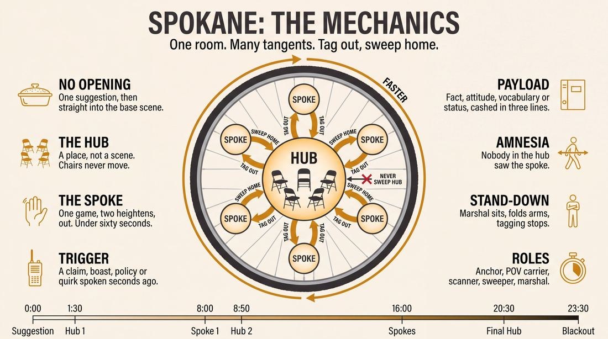
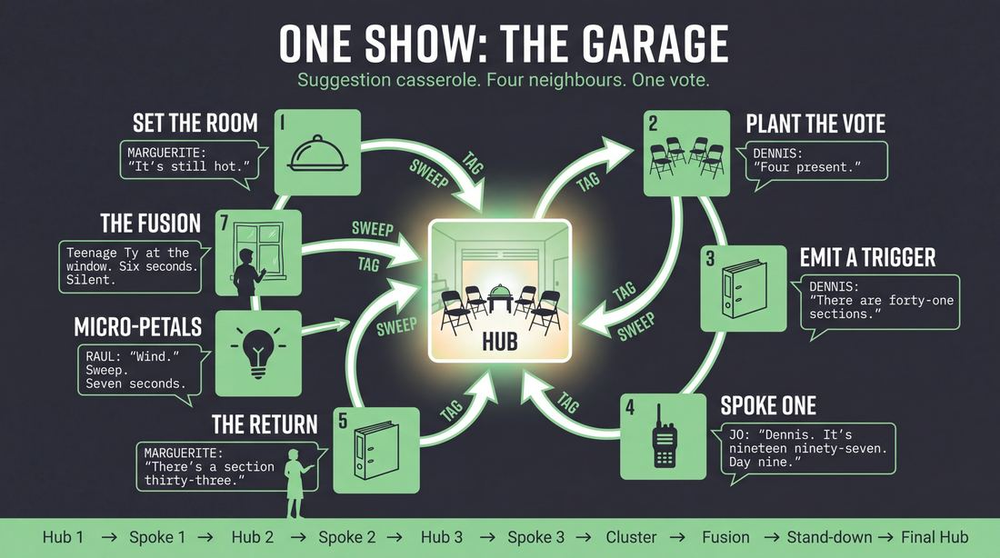
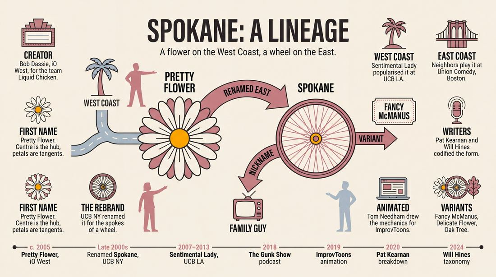
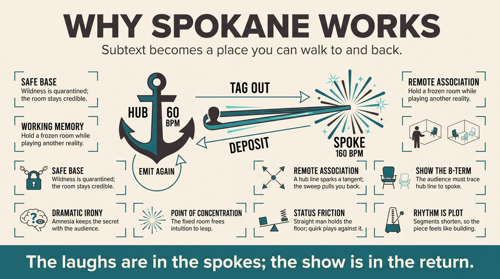
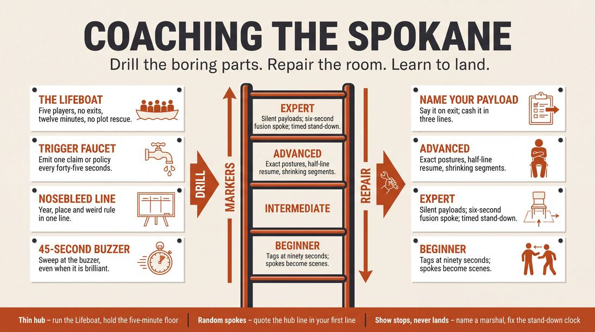

# Spokane

> **A complete study of the long-form improv format _Spokane_** - the original archived write-up, five infographics, grounded historical and pedagogical research, and a full mechanics-and-coaching manual.

| | |
|---|---|
| **Format** | Spokane |
| **Primary source** | [IRC Improv Wiki](https://wiki.improvresourcecenter.com/index.php?title=Spokane) |

---

## Contents

1. [Part I - The Original Write-Up](#part-i-the-original-write-up)
2. [Part II - The Infographics](#part-ii-the-infographics)
   - [1. Structure and Mechanics](#infographic-1-mechanics)
   - [2. A Show, Beat by Beat](#infographic-2-example)
   - [3. Origins and Lineage](#infographic-3-history)
   - [4. Why It Works](#infographic-4-theory)
   - [5. Rehearsal and Repair](#infographic-5-coaching)
3. [Part III - Research Dossier](#part-iii-research-dossier)
   - [Pass 1: History, Lineage, Literature and Scholarship](#research-history)
   - [Pass 2: Comparative Anatomy, Pedagogy and Production](#research-comparative)
4. [Part IV - Mechanics, Gameplay and Coaching Manual](#part-iv-mechanics-gameplay-and-coaching-manual)
   - [Pass 1: The Form, Its Mechanics and Its Gameplay](#manual-mechanics)
   - [Pass 2: Training, Coaching and Performance Companion](#manual-coaching)

---

## Part I - The Original Write-Up

*Verbatim archive of the source article, reproduced exactly as scraped. Everything after this section is generated elaboration built on top of it.*

### Spokane

The **Spokane** is a [longform](https://wiki.improvresourcecenter.com/index.php?title=Category:Improv_Forms "Category:Improv Forms"). It is sometimes referred to as the **Family Guy**, **Pretty Flower**, or the **Delicate Flower**.

##### Structure

The Spokane got its name because its structure resembles the spokes extending out from the hub of a wheel. It begins like a [Monoscene](https://wiki.improvresourcecenter.com/index.php?title=Monoscene "Monoscene"): a suggestion is solicited from the audience, and a scene then commences that cannot be [sweep\-edited](https://wiki.improvresourcecenter.com/index.php?title=Sweep_edit "Sweep edit"). Once this scene has been established, however, the use of [tag edits](https://wiki.improvresourcecenter.com/index.php?title=Tag_edit "Tag edit") is permitted to explore short tangential games or scenes. Each of these tangents is eventually swept edited, which returns the action to the source scene. These tangents can be thought of as the "spokes" extending out from the central hub of the source scene. In this way, the Spokane is a Monoscene in chapters, periodically broken up by short [Montages](https://wiki.improvresourcecenter.com/index.php?title=Montage "Montage").

  

The tangent sections often lend themselves to faster, goofier play a la tag runs or character games. The source scene is a counterbalance to this, as it is commonly taught as a more grounded, slow\-moving section of the show. This combination makes for a pretty interesting form.

##### History

[Sentimental Lady](https://wiki.improvresourcecenter.com/index.php?title=Sentimental_Lady&action=edit&redlink=1 "Sentimental Lady (page does not exist)") of [UCB LA](https://wiki.improvresourcecenter.com/index.php?title=UCB_Theater "UCB Theater") has used this form. [Fancy Man](https://wiki.improvresourcecenter.com/index.php?title=Fancy_Man&action=edit&redlink=1 "Fancy Man (page does not exist)") in New York City performs a modified version of the Spokane that they have properly entitled the "Fancy McManus." This replaces the source scene with a idea generator\-group scene hybrid in which the ensemble plays themselves.

##### See also

- [List of longforms](https://wiki.improvresourcecenter.com/index.php?title=List_of_longforms "List of longforms")

---

*Archived from [https://wiki.improvresourcecenter.com/index.php?title=Spokane](https://wiki.improvresourcecenter.com/index.php?title=Spokane) (IRC Improv Wiki) on 2026-08-09 23:23 UTC.*

---

## Part II - The Infographics

*Five 16:9 posters, each teaching a different aspect of the format. Click any poster to enlarge.*

<a id="infographic-1-mechanics"></a>

### 1. Structure and Mechanics

*How the form is played: the shape of the piece, the opening, the roles, the edit vocabulary, the flow of information, and the clock.*

{ .diagram loading=lazy decoding=async width="1100" height="614" }


<a id="infographic-2-example"></a>

### 2. A Show, Beat by Beat

*A single worked performance from suggestion to blackout: what happens in each beat, with short real example lines and what the players are doing technically.*

{ .diagram loading=lazy decoding=async width="1100" height="614" }


<a id="infographic-3-history"></a>

### 3. Origins and Lineage

*Where the form came from: creators, dates, theatres, how it spread between schools and cities, and the key figures - a documented timeline and lineage map.*

{ .diagram loading=lazy decoding=async width="1100" height="614" }


<a id="infographic-4-theory"></a>

### 4. Why It Works

*The theory: the core principles of the form and the research and craft ideas that explain why the structure produces good improv, each tied to a specific mechanic.*

{ .diagram loading=lazy decoding=async width="1100" height="614" }


<a id="infographic-5-coaching"></a>

### 5. Rehearsal and Repair

*Training and fixing the form: the essential drills, the common failure modes with their symptom-and-fix pairs, and the markers of beginner through expert play.*

{ .diagram loading=lazy decoding=async width="1100" height="614" }


---

## Part III - Research Dossier

*Two research passes: the historical record, then the comparative and pedagogical record. Claims carry evidence tags - treat unverified items accordingly.*

<a id="research-history"></a>

### » Pass 1: History, Lineage, Literature and Scholarship

### Research Summary
*   **Documentation Level:** Moderately documented. While the form is widely taught at major training centres (UCB, Union Comedy, Kickstand Comedy), primary written sources are limited to a few practitioner blogs (Pat Kearnan, Will Hines), podcast episodes, and oral history preserved on forums like Reddit and the IRC Wiki.
*   The form operates on a "hub-and-spoke" mechanic: a central, grounded monoscene (the hub) is repeatedly interrupted by fast-paced, tangential tag-out scenes (the spokes), before sweep-editing back to the exact moment the monoscene was paused.
*   The format was created by Bob Dassie on the West Coast around 2005 under the name "Pretty Flower."
*   The name "Spokane" is an East Coast rebranding, reportedly coined by UCB NY improvisers who disliked the original name and wanted to emphasize the "spoke" mechanic.
*   The form is also widely known as "The Family Guy" due to its structural similarity to the animated sitcom's cutaway gags.
*   The primary failure mode of the form is a weak or chaotic source scene; because the form continually returns to the hub, a lack of grounding in the base reality will tank the entire piece.

### Provenance and History
The form was created by veteran improviser and coach Bob Dassie around 2005 for the iO West house team Liquid Chicken [DOCUMENTED]. Dassie named the form "The Pretty Flower," conceptualizing the central monoscene as the centre of the flower and the tangential scenes as the petals. 

When the form migrated to the East Coast, improvisers at the Upright Citizens Brigade (UCB) in New York adopted it but rebranded it as "Spokane" [DOCUMENTED]. The new name was a structural pun, referring to the "spokes" extending from the "hub" of a wheel. The form gained significant traction in the late 2000s and early 2010s, heavily popularized by the UCB LA house team Sentimental Lady, which Dassie also worked with [DOCUMENTED]. 

| Year | Event | Place / Company | Source |
| :--- | :--- | :--- | :--- |
| c. 2005 | Bob Dassie develops "Pretty Flower" | iO West, Los Angeles (Liquid Chicken) | Bob Dassie Substack / Reddit Oral History |
| 2007–2013 | Form popularized on the West Coast | UCB LA (Sentimental Lady) | IRC Wiki / DCM Festival Archives |
| Late 2000s | Form adopted and renamed "Spokane" | UCB NY | Reddit Oral History / IRC Wiki |
| 2018 | *The Gunk Show* podcast dedicates an episode to the form | New York | CurtisRetherford.com |
| 2019 | Tom Needham animates the form's mechanics | Facebook (ImprovToons) | The Improv Boost |
| 2020 | Pat Kearnan publishes definitive mechanical breakdown | Union Comedy, Boston | PatKearnan.com |

### Lineage and Transmission
The form spread primarily through the UCB network, mutating in name and slight mechanical focus depending on the coast. 
*   **West Coast Dialect (Pretty Flower / Delicate Flower):** Taught at UCB LA, iO West, and Kickstand Comedy (Portland). Tends to emphasize character exploration and relationship history in the "petals."
*   **East Coast Dialect (Spokane):** Taught at UCB NY, Union Comedy (Boston), and the Brooklyn Comedy Collective. Tends to emphasize the mechanical "hub and spoke" geometry, often leaning into faster, game-driven tag runs.
*   **Pop-Culture Dialect (Family Guy):** Used universally as shorthand for indie teams. This dialect explicitly mimics the "cutaway gag" structure of the TV show, often using verbal triggers (e.g., "This is just like the time...") to initiate the tag-out [WIDELY PRACTICED, UNDOCUMENTED].

### Key Figures
| Person | Role in this form | Specific contribution | Source URL |
| :--- | :--- | :--- | :--- |
| Bob Dassie | Creator | Invented and named the "Pretty Flower" format for his iO West team Liquid Chicken. | [Bob Dassie Substack](https://bobdassie.substack.com/) |
| Pat Kearnan | Theorist / Teacher | Authored the most comprehensive written breakdown of Spokane's rhythm, pacing, and tag mechanics. | [PatKearnan.com](https://www.patkearnan.com/blog/2020/3/5/so-you-want-to-do-spokane) |
| Will Hines | Documentarian | Codified the form in his widely read taxonomy of long-form structures. | [Will Hines Substack](https://willhines.substack.com/p/what-forms-are-there) |
| Tom Needham | Animator | Created the "ImprovToons" animated guide, making the form's abstract geometry visually accessible. | [Facebook Video](https://www.facebook.com/theimprovboost/videos/improvtoons-the-pretty-flower/346853752882200/) |
| Alex Berg | Theorist | Advocated for the psychological momentum of the "tag edit," the core engine of the Spokane's tangents. | [PeterMcGraw.org](https://petermcgraw.org/alex-berg-on-improv-comedy/) |

### Canonical Shows, Companies and Recordings
*   **Sentimental Lady:** The UCB LA house team most closely associated with popularizing the Pretty Flower. They performed it regularly at the Del Close Marathon (e.g., DCM 15 in 2013). [Link](http://delclosemarathon.com)
*   **Neighbors:** The longest-running longform team in Boston, performing out of Union Comedy, known for utilizing the Spokane structure under the direction of Pat Kearnan. [Link](https://unioncomedy.com)
*   **Project JEricah:** An indie duo performing the Pretty Flower at festivals like ImprovCon, noted for their fast-paced, branching scene work. [Link](https://improvcon.com)
*   **Fancy Man:** A UCB NY team that created the "Fancy McManus" variant. [Link](https://wiki.improvresourcecenter.com/index.php?title=Spokane)

### Published Literature
| Work | Author | Year | What it says about this form | Where to find it |
| :--- | :--- | :--- | :--- | :--- |
| *So You Want To Do Spokane* | Pat Kearnan | 2020 | Details the accelerating rhythm of the form, noting that the source scene must be the longest segment, with spokes getting progressively shorter. | [PatKearnan.com](https://www.patkearnan.com/blog/2020/3/5/so-you-want-to-do-spokane) |
| *What Forms Are There?* | Will Hines | 2024 | Defines it cleanly: "Pretty Flower (or the Spokane) - one source scene, from which you can tag away from and back to." | [Substack](https://willhines.substack.com/p/what-forms-are-there) |
| *The Gunk Show (Ep 24)* | Curtis Retherford | 2018 | A full podcast panel discussing the mechanics, benefits, and pitfalls of "the form of many names." | [CurtisRetherford.com](http://curtisretherford.com) |
| *IMPROVTOONS - "The Pretty Flower"* | Tom Needham | 2019 | Animated breakdown explaining how tangents add subtext to the main scene before returning to the central axis. | [Facebook](https://www.facebook.com/theimprovboost/videos/improvtoons-the-pretty-flower/346853752882200/) |

### Verbatim Quotes
> "The Spokane got its name because its structure resembles the spokes extending out from the hub of a wheel. It begins like a Monoscene: a suggestion is solicited from the audience, and a scene then commences that cannot be sweep-edited."
> — IRC Improv Wiki
> [Source](https://wiki.improvresourcecenter.com/index.php?title=Spokane)

> "Bob Dassie created The Pretty Flower as a format for/with the improv house team he coached called 'Liquid Chicken.'"
> — Bob Dassie
> [Source](https://bobdassie.substack.com/)

> "One of my basic ideals for any improv form is that the rhythm of the show accelerates over time, and it does so as smoothly as possible. What this means for Spokane is that the first Source Scene segment is the longest of the show, and each successive segment is shorter than the last."
> — Pat Kearnan
> [Source](https://www.patkearnan.com/blog/2020/3/5/so-you-want-to-do-spokane)

> "The biggest risk of Spokane is that a thin, chaotic, and/or confusing Source Scene can more or less tank the whole show."
> — Pat Kearnan
> [Source](https://www.patkearnan.com/blog/2020/3/5/so-you-want-to-do-spokane)

> "It's a mononscene with cut aways that explore the history and tag runs of individual characters. These tangents then return to the monoscene sort of how the spokes of a wheel branch out from the central axis - that main scene!"
> — Tom Needham
> [Source](https://www.facebook.com/theimprovboost/videos/improvtoons-the-pretty-flower/346853752882200/)

> "With a tag edit, you're not giving them that chance. If you're doing it properly, it builds it. It keeps that momentum going. It means that you might not get that big, satisfying wipe edit laugh but you also won't get the wipe edit pity clap..."
> — Alex Berg
> [Source](https://petermcgraw.org/alex-berg-on-improv-comedy/)

> "Pretty Flower (or the Spokane) - one source scene, from which you can tag away from and back to."
> — Will Hines
> [Source](https://willhines.substack.com/p/what-forms-are-there)

> "Any time you go out on a petal or run from the core scene, it should be to explore/heighten something that you can then come back to later in that core scene."
> — Reddit User 'Silly_Rabbit'
> [Source](https://www.reddit.com/r/improv/comments/7pgt7f/pretty_flower_tips/)

### Anecdotes and Stories
**The Naming Dispute**
The form was originally named "Pretty Flower" by Bob Dassie around 2005 for his iO West team Liquid Chicken. When the form migrated to the East Coast, UCB NY improvisers reportedly disliked the delicate-sounding name "Pretty Flower." Seeking something that sounded more mechanical and grounded, they rebranded it "Spokane" to emphasize the "hub and spoke" nature of the edits. This created a lasting bi-coastal divide in the form's nomenclature [DOCUMENTED].

**The Family Guy Connection**
The form is frequently called "The Family Guy" because its core mechanic—a grounded base reality interrupted by sudden, bizarre tangential flashbacks—perfectly mirrors the cutaway gags popularized by Seth MacFarlane's animated sitcom. Improvisers often lean into this by using the exact verbal trigger from the show ("This is just like the time...") to initiate a tag-out, though teachers often warn against relying too heavily on this crutch [DOCUMENTED].

### Academic and Scientific Research
**Working Memory Capacity and Creativity**
Research by De Dreu et al. (2012) in the *Personality and Social Psychology Bulletin* demonstrated that high working memory capacity (WMC) allows improvisers to maintain task-focused attention and generate more creative, original ideas over time without losing the thread of the task.
*Relevance to this form:* The Spokane format places an immense cognitive load on working memory. Performers must hold the exact physical, spatial, and emotional state of the "hub" monoscene in their minds while executing fast-paced, chaotic "spoke" scenes, returning to the hub seamlessly without dropping the established reality.

**Associative Thinking and Divergent Cognition**
Cognitive psychology models (such as Mednick's associative theory of creativity) show that creative individuals form "remote associations" across conceptual fields, moving from a grounded concept to a bizarre tangent via semantic or symbolic links.
*Relevance to this form:* The tag-outs (spokes) in this format are pure associative thinking exercises. A single line of dialogue or character trait in the hub scene triggers a remote association, which is immediately explored in a tangent before the sweep edit forces the brain back into convergent, grounded reality.

### Documented Variants and Descendants
*   **Fancy McManus:** Created by the NYC team Fancy Man. This variant replaces the traditional fictional source scene with an "idea generator-group scene hybrid" in which the ensemble plays heightened versions of themselves as the hub [DOCUMENTED].
*   **Oak Tree:** A looser variant of the Pretty Flower. While the Pretty Flower returns to the base scene after every single "petal," the Oak Tree returns to the trunk more sporadically, allowing scenes to get "stranger the further you get from the trunk" before eventually grounding the show again [DOCUMENTED].

### Criticism, Debate and Known Failure Modes
*   **The Weak Hub:** The most universally cited failure mode. Because the form continually returns to the source scene, if that scene lacks a grounded base reality, clear relationships, or a strong "who/what/where," the entire show collapses. Pat Kearnan notes that a thin source scene will "tank the whole show."
*   **Premature Tagging:** Teachers warn against tagging out before the base reality is established. If the first tag happens before the audience knows who everyone in the source scene is, the performers have to back-fill contextual elements upon their return, killing momentum.
*   **A-to-C without B:** The form relies on logical associative leaps. Critics note that Spokane is not a form where completely random "A-to-C" moves pay off; the audience needs to see the logical thread ("B") that connects the hub to the spoke.
*   **Wipe Edit Pity Claps:** Alex Berg notes that traditional wipe edits often result in "pity claps" when a scene runs out of steam. The Spokane relies entirely on *tag edits* for its tangents, which forces momentum and prevents scenes from dying a slow death.

### Cultural Footprint
The form's alternative name, "Family Guy," highlights a fascinating convergence between live improv mechanics and mainstream television writing. The cutaway gag structure of the animated sitcom is essentially a televised Spokane. The form is a staple of indie improv festivals globally, favored by smaller teams and duos (like Project JEricah) because it allows a small cast to play a multitude of characters while maintaining a single anchor point.

### Gaps in the Record
*   UNVERIFIED - The exact date and venue where Bob Dassie first debuted the form with Liquid Chicken is undocumented in primary text, relying entirely on oral history and retrospective forum posts.
*   UNVERIFIED - The specific UCB NY team or teacher who officially coined the term "Spokane" remains unverified, attributed only generally to "UCB NY folks" in community lore.
*   The exact ruleset of the "Oak Tree" variant is poorly documented outside of passing mentions on Reddit regarding 420-themed improv shows.

### Source List
1. IRC Improv Wiki - Improv Resource Center - 2020 - https://wiki.improvresourcecenter.com/index.php?title=Spokane - Establishes the basic structure, alternate names, and the Fancy McManus variant.
2. Bob Dassie Substack - Bob Dassie - 2026 - https://bobdassie.substack.com/ - Primary source confirming Dassie's creation of the form with Liquid Chicken.
3. So You Want To Do Spokane - Pat Kearnan - 2020 - https://www.patkearnan.com/blog/2020/3/5/so-you-want-to-do-spokane - Provides the definitive mechanical breakdown of the form's rhythm and failure modes.
4. What Forms Are There? - Will Hines - 2024 - https://willhines.substack.com/p/what-forms-are-there - Codifies the form in the modern UCB-descended taxonomy.
5. IMPROVTOONS: The Pretty Flower - Tom Needham - 2019 - https://www.facebook.com/theimprovboost/videos/improvtoons-the-pretty-flower/346853752882200/ - Visual and mechanical explanation of the hub-and-spoke concept.
6. Alex Berg on Improv Comedy - Peter McGraw - 2020 - https://petermcgraw.org/alex-berg-on-improv-comedy/ - Explains the psychological momentum of the tag edit versus the wipe edit.
7. Working memory benefits creative insight... - De Dreu et al. (Personality and Social Psychology Bulletin) - 2012 - https://pubmed.ncbi.nlm.nih.gov/22301457/ - Provides the cognitive science basis for the working memory load required by the form.
8. Reddit Improv Forum (/r/improv) - Various - 2018-2025 - https://www.reddit.com/r/improv/ - Preserves the oral history of the naming dispute (Spokane vs Pretty Flower) and the Oak Tree variant.

<a id="research-comparative"></a>

### » Pass 2: Comparative Anatomy, Pedagogy and Production

### Taxonomic Placement

```text
      Monoscene                 Montage
          │                        │
          └──────────┬─────────────┘
                     │
                  Spokane (Pretty Flower / Family Guy)
                     │
          ┌──────────┴──────────┐
      Fancy McManus          Oak Tree
```

The Spokane (interchangeably taught as the Pretty Flower, Delicate Flower, or Family Guy) is a structural hybrid. It sits exactly between the continuous, real-time spatial commitment of a Monoscene and the fragmented, game-driven velocity of a Montage. Taxonomically, it is a "hub-and-spoke" architecture: a single, grounded base reality (the hub) is repeatedly interrupted by tangential scenes, flashbacks, or character games (the spokes/petals), before returning to the exact spatial and temporal reality of the hub. 

### Head-to-Head Comparisons

| Axis | Spokane / Pretty Flower | Monoscene | Consequence for the players |
| :--- | :--- | :--- | :--- |
| **Opening** | Suggestion directly informs the base scene. | Suggestion directly informs the base scene. | Both require immediate, grounded establishment of a shared environment. |
| **Structure** | Base scene interrupted by tangential tag-runs, returning to the base. | One continuous scene, real-time, no edits. | Spokane players get "relief" valves to explore absurdities; Monoscene players must endure and justify them in real-time. |
| **Edit Logic** | Tag edits to leave the base; sweep edits to return to the base. | No edits permitted. | Spokane requires aggressive editing from the backline to initiate tangents. |
| **Failure Mode** | "Losing the threads" (tangents become disconnected from the base). | "Sinking ship" (players run out of relationship dynamics). | Spokane fails if the backline is passive; Monoscene fails if the onstage players lack patience. |

| Axis | Spokane / Pretty Flower | Slacker | Consequence for the players |
| :--- | :--- | :--- | :--- |
| **Structure** | Hub-and-spoke (A -> B -> A -> C -> A). | Linear chain (A -> B -> C -> D). | Spokane requires memory of the core reality; Slacker requires memory only of the immediate previous scene. |
| **Cast Size** | 5-8 players (entire cast often in the base scene). | 4-6 players (usually 2-3 per scene). | Spokane requires managing a large group dynamic in the hub. |
| **Edit Logic** | Tags out of the hub; sweeps back to the hub. | Tags only; whoever is tagged stays, whoever tags in initiates. | Spokane has a definitive "reset" mechanism (the sweep back to base). |

| Axis | Spokane / Pretty Flower | The Harold | Consequence for the players |
| :--- | :--- | :--- | :--- |
| **Structure** | One core reality explored via infinite tangents. | Three distinct worlds explored across three beats. | Spokane is character/world-deep; Harold is theme-wide. |
| **Memory** | Must remember the exact physical and emotional state of the base scene. | Must remember the game/premise of scenes from 10 minutes prior. | Spokane players must physically "snap back" into their base scene postures. |
| **Audience Contract** | "We will show you the origin of this quirk." | "We will show you how these themes connect." | Spokane audiences expect character backstory; Harold audiences expect thematic convergence. |

### What Makes It Uniquely Itself

1. **The Rubber-Band Tension:** The form relies on a strict contrast in pacing. The base scene (hub) must be played slowly, grounded in relationship and physical environment. The tangents (spokes) must be played fast, driven by absurd games and high-energy tag runs. If both are played at the same speed, the form collapses into a standard Montage.
2. **The Inevitable Return:** Unlike a Slacker or a Deconstruction, the Spokane *must* return to the exact base reality it left. The sweep edit that ends a tangent is a promise to the audience that the core characters are still sitting in the exact same room, dealing with the exact same core issue, but now armed with the subtext revealed in the tangent.
3. **The "Show the Threads" Mechanic:** Every tangent must be explicitly inspired by a line of dialogue, a character trait, or a philosophy established in the base scene. If a tangent is entirely disconnected from the hub, it is no longer a Spokane.

### Structural Variants in Practice

| Variant Name | What It Changes | Who Plays It / Source |
| :--- | :--- | :--- |
| **Pretty Flower** | Often taught with a strict "one petal per character" rule, ensuring every character in the base scene gets a dedicated tangent exploring their specific emotional POV. | John Windmueller (Washington Improv Theater); Kickstand Comedy (Portland). |
| **Fancy McManus** | Replaces the fictional source scene with an idea-generator/group-scene hybrid where the ensemble plays themselves as the hub. | Fancy Man (New York City). |
| **Family Guy** | Uses explicit, heavy-handed verbal edits to initiate tangents (e.g., "That reminds me of the time..."). | Pop culture nomenclature; Tom Needham (ImprovToons). |
| **Oak Tree** | Returns to the base scene sporadically rather than after every single petal (e.g., Hub -> Petal -> Petal -> Hub). | Regional West Coast variant (noted in craft discussions). |

### The Teaching Ladder

| Stage | Skill introduced | Why in this order | Typical exercise | Source / Consensus |
| :--- | :--- | :--- | :--- | :--- |
| **1. The Hub** | Grounded, multi-person scene work without exits. | A weak base scene tanks the entire form. Players must learn to sustain a single reality. | *The Lifeboat* | John Windmueller (WIT) |
| **2. The POV** | Quirky Character / Straight Man dynamics. | Tangents require a clear, exploitable character game. | *Absurd Confessions* | [CRAFT CONSENSUS] |
| **3. The Petal** | Tagging out for a single, character-focused tangent. | Teaches the mechanical transition from slow hub to fast spoke. | *Endowment Tags* | John Windmueller (WIT) |
| **4. The Return** | Sweeping back to the hub with a time jump. | Prevents the base scene from feeling stagnant upon return. | *Five Minutes Later* | [CRAFT CONSENSUS] |
| **5. The Wave** | Advanced editing (eye contact, wave edits). | Replaces clunky physical tags or verbal "cut-tos" with seamless transitions. | *Distance Editing* | Pat Kearnan (Neighbors) |

### Documented Drills and Exercises

| Drill | Origin / Teacher | How to run it | What it fixes in this form | Source |
| :--- | :--- | :--- | :--- | :--- |
| **The Lifeboat** | John Windmueller | 5 players are on a sinking lifeboat. No one can exit, no one can die. They must sustain a 12-minute scene. | Fixes "sinking ship" base scenes by forcing players to share space and rely on relationships rather than plot. | Reddit / WIT DC coaching notes |
| **Endowment Initiations** | John Windmueller | In the Lifeboat, a player initiates a petal by explicitly stating: "You know Bob, you always struck me as..." and tagging out to that reality. | Fixes hesitant tagging by providing a rigid, fill-in-the-blank trigger for tangents. | Reddit / WIT DC coaching notes |
| **Reaction to Distance** | John Windmueller | Upon returning to the base scene, the coach calls out an object on the horizon. Every player must react using their established character POV. | Ensures players snap back into their specific character deals upon returning to the hub. | Reddit / WIT DC coaching notes |
| **Family Guy Cut-To** | Tom Needham | Players explicitly say "That reminds me of the time..." to trigger a sweep edit into a flashback. | A "training wheels" drill to help beginners understand the mechanical function of a tangent. | ImprovToons |
| **Show the Threads** | Pat Kearnan | The player initiating a tag must explicitly restate the premise they are pulling from the base scene in their first line of the tangent. | Fixes chaotic, disconnected tangents by forcing explicit justification. | Pat Kearnan |
| **The Nosebleed** | Nick Medina / YouTube Coaches | The player initiating the tangent must provide high-context initiations (e.g., "I know every time you lie you get a nosebleed... did you eat my ramen?"). | Fixes vague tangents where the tagged player doesn't know what game is being played. | YouTube Improv Coaching |
| **Alternate Reality Check** | Pat Kearnan | Players run a premise tag ("If I won the lottery...") and then return to the base scene. The coach stops the scene if the alternate reality bleeds into the base reality. | Fixes "bleeding realities" where hypothetical tangents permanently alter the grounded hub. | Pat Kearnan |
| **Wave Edits** | Pat Kearnan | Players practice initiating a tangent from the backline using only eye contact and a small hand wave, rather than running across stage to physically tag. | Fixes clunky, momentum-killing physical edits. | Pat Kearnan |
| **Time Jump Return** | [CRAFT CONSENSUS] | When sweeping back to the base scene, players must advance the timeline by a few minutes rather than picking up mid-syllable. | Fixes stagnant base scenes that fail to progress. | [CRAFT CONSENSUS] |
| **Level Playing Field** | John Windmueller | The base scene is cast with characters of equal status (e.g., 6 baseball players, 8 siblings) rather than complex hierarchies (boss/employee/customer). | Prevents the base scene from becoming bogged down in transactional status negotiations. | Reddit / WIT DC coaching notes |

### Common Failure Modes and Diagnoses

| Failure mode | What it looks like from the audience | Root cause | Fix | Who names it |
| :--- | :--- | :--- | :--- | :--- |
| **Thin Source Scene** | The base scene feels chaotic, players are talking over each other, and the audience doesn't know where they are. | Players are rushing to get to the "funny" tangents and neglecting the grounded relationship work of the hub. | *The Lifeboat* drill; enforce a strict 3-minute minimum before the first tag. | Pat Kearnan |
| **Hesitant Tags** | A character says something absurd in the base scene, but the backline waits 30 seconds to tag them out, killing the momentum. | Backline players are trying to plan the perfect tangent rather than taking a "leap of faith" on the first interesting idea. | *Endowment Initiations* drill. | John Windmueller |
| **Losing the Threads** | The tangents are hilarious, but the audience has no idea how they connect to the base scene. | A-to-C thinking. The backline is pulling a premise that is too far removed from the immediate dialogue. | *Show the Threads* drill. | Pat Kearnan |
| **Plot-Heavy Petals** | A tangent turns into a 4-minute narrative scene about a bank robbery. | Players are trying to tell a story rather than exploring a specific character game or emotional POV. | Restrict tangents to 45 seconds; enforce strict game-play. | [CRAFT CONSENSUS] |
| **Bleeding Realities** | A character dies in a hypothetical tangent, and the players act like they are dead when they return to the base scene. | Failure to compartmentalize the "what if" space of the tangent from the literal space of the hub. | *Alternate Reality Check* drill. | Pat Kearnan |

### Production and Logistics

*   **Cast Size:** 5 to 8 players. Fewer than 5 makes it difficult to populate both the base scene and the tangents; more than 8 makes the base scene unmanageable.
*   **Runtime:** Typically 20 to 25 minutes. The first base scene segment is the longest (6-10 minutes), with subsequent returns becoming progressively shorter as the rhythm accelerates.
*   **Stage Layout:** A cluster of chairs center-stage for the base scene. The downstage or flanking areas are kept clear for the tangents.
*   **Lighting and Tech Cues:** Standard wash. If tech allows, a distinct lighting state (e.g., a slight color shift or tighter pool) can be used for the tangents, but traditional sweep edits are the standard mechanism.
*   **Rehearsal Cadence:** Requires heavy reps on group mind and spatial awareness. Troupes must practice physically "snapping back" into the exact postures they held before the tangent.
*   **Where it Belongs in a Lineup:** Excellent as a high-energy closer or a festival set, as it combines the character depth of a Monoscene with the crowd-pleasing pace of a Montage.

### Adaptations Beyond the Stage

**Classroom and Youth Settings:**
The Spokane School of Improv and Blue Door Theatre utilize this format in youth camps (ages 8-18). The "training wheels" version of the Pretty Flower is highly effective for youth because it guarantees equitable stage time: the instructor can ensure that every student gets exactly one "petal" to showcase their unique character, before returning to the safety of the group ensemble in the base scene.

**Corporate and Applied Improv:**
In applied settings (e.g., leadership training), the base scene is framed as a familiar corporate environment (a board meeting, a project post-mortem). The tangents are used to explore "what if" scenarios, past experiences, or alternate reactions to workplace stress. It allows participants to safely explore absurd or exaggerated responses in the "petals" while maintaining a grounded, professional baseline in the "hub."

**Therapeutic Settings:**
Misfit Improv (Asheville, NC) utilizes the Pretty Flower in their "Improv for Therapists" curriculum. While not clinical therapy, the format allows mental health professionals to practice compartmentalization. The base scene represents the grounded reality of holding space, while the tangents allow participants to "shake it off" and explore exaggerated, joyful, or chaotic emotional states before returning to baseline.

**Accessibility and Inclusion:**
Because the base scene often involves 5-8 people sitting or standing in a static environment for long periods, it is highly adaptable for performers with mobility limitations. The backline players handling the fast-paced tag runs can be designated based on physical comfort, while the core characters remain anchored.

### Evidence Base for Those Adaptations

*   **Role-Play and Compartmentalization:** The hub-and-spoke structure mirrors psychological techniques of "safe base" exploration. Participants can venture into high-stress or high-absurdity scenarios (the petals) knowing there is a guaranteed, structured return to a grounded reality (the hub).
*   **Equitable Participation:** Educational research in applied theater emphasizes structures that mandate equal participation. The "one petal per character" rule enforces this, preventing dominant personalities from steamrolling the narrative.

### Scholarly Frames Worth Applying

*   **Sawyer on Collaborative Emergence:** *Frame:* Group creativity is unpredictable and cannot be reduced to the sum of individual contributions; the performance emerges from the moment-to-moment interactions. *Citation:* Sawyer, R. K. (2003). *Group Creativity: Music, Theater, Collaboration*. *Mapping:* The tangents in a Spokane cannot be pre-planned; they emerge entirely from the micro-offers generated in the base scene, creating a macro-structure that no single player authored.
*   **Spolin on Point of Concentration (POC):** *Frame:* A specific focus that occupies the conscious mind, allowing the intuition to function freely. *Citation:* Spolin, V. (1963). *Improvisation for the Theater*. *Mapping:* The physical and relational reality of the base scene serves as the POC. By anchoring themselves to this hub, players are freed to make wild, intuitive leaps in the tangents without losing the reality of the show.
*   **Johnstone on Status:** *Frame:* Every interaction involves a negotiation of dominance and submission, which drives narrative and comedy. *Citation:* Johnstone, K. (1979). *Improvisation and the Theatre*. *Mapping:* The "Quirky Character / Straight Man" dynamic required for successful petals is fundamentally a status game. The straight man maintains high status by enforcing reality, while the quirky character plays low or absurd status, generating the comedic friction of the tangent.

### Where the Form Is Heading

Contemporary practice is moving away from the heavy-handed, pop-culture-derived "Family Guy" edits ("That reminds me of the time...") in favor of subtle, seamless transitions. Coaches like Pat Kearnan advocate for "wave edits" and eye-contact initiations from the backline, allowing the form to feel less like a sketch show and more like a fluid, theatrical exploration of memory and subtext. Additionally, the form is increasingly used as a developmental tool (a "training wheels" format) to teach advanced improvisers how to balance patience (in the hub) with aggressive game-play (in the spokes).

### Source List

1. IRC Improv Wiki - "Spokane" - 2020 - https://wiki.improvresourcecenter.com/index.php?title=Spokane - Supports structural definition, alternate names (Family Guy, Pretty Flower), and the Fancy McManus variant.
2. Pat Kearnan - "Spokane" (Blog) - 2020 - https://patkearnan.com - Supports mechanics (Wave edits, Show the Threads, Alternate Reality Checks) and pacing theory.
3. John Windmueller / Reddit Improv Community - "The way I coach Pretty Flower" - 2016 - https://www.reddit.com/r/improv/ - Supports the Lifeboat drill, Endowment Initiations, and the "one petal per character" teaching ladder.
4. Tom Needham / The Improv Boost - "IMPROVTOONS - Pretty Flower" - 2019 - Facebook Video - Supports the "Family Guy cut-to" mechanic and visual hub-and-spoke explanation.
5. Spokane School of Improv - "Youth Classes & Camps / Applied Improv" - 2024/2026 - https://www.spokaneschoolofimprov.org - Supports youth adaptations, classroom use, and applied improv methodology.
6. Misfit Improv & Acting School - "Improv for Therapists 101" - 2026 - https://www.misfitimprov.com - Supports therapeutic and wellness adaptations of the format.
7. Nick Medina / Curious Comedy Theater - "Pretty Flower - Performance Improv Class" - 2026 - Crowdwork - Supports the "Nosebleed" high-context initiation drill and the tension between patience and chaos.

---

## Part IV - Mechanics, Gameplay and Coaching Manual

*Synthesis over the original article and both research dossiers: first how the form works and how to play it, then how to train an ensemble to perform it.*

<a id="manual-mechanics"></a>

### » Pass 1: The Form, Its Mechanics and Its Gameplay

### At a Glance

| Field | Detail |
| :--- | :--- |
| **Also known as** | Pretty Flower (original, West Coast); Delicate Flower; The Family Guy; Fancy McManus (variant); Oak Tree (loose variant) |
| **Family** | Hub-and-spoke hybrid — a Monoscene crossed with a Montage. Sits structurally between the two: continuous base reality (Monoscene) punctuated by fast tag-driven tangents (Montage). |
| **Cast size** | 4–8. Sweet spot 5–6: three to four bodies in the hub, two to three live on the backline at any moment. Duos and trios can play it, but it becomes a different animal (see *Variations*). |
| **Runtime** | 20–25 minutes standard. 15 minutes for a festival slot. Below 12 minutes the acceleration curve has nowhere to run. |
| **Opening** | None. There is no pattern game, no monologue, no group opening. The suggestion goes straight into the source scene. The absence of an opening is itself a structural choice. |
| **Suggestion taken** | One word or short phrase, taken once, at the top. It informs the **hub** only — the where, the who, the object on the table. Spokes are never generated from the suggestion; they are generated from the hub. |
| **Structural rigidity (1–5)** | **3** — Exactly one geometric law (all roads return to the hub, the hub is never swept). Everything above that law is free. Rigid skeleton, loose flesh. |
| **Difficulty (1–5)** | **4** — Easy to explain, hard to execute. Requires simultaneous patience (hub) and aggression (spokes) from the same players, plus high working-memory load: you must hold a frozen room in your head while playing a different reality. |
| **Prerequisites** | Confident tag-out editing; ability to sustain a 6–10 minute multi-person scene without exits; clean sweep edits; character POV work; the discipline to end a scene on a laugh instead of riding it. |
| **Best for** | Ensembles with strong grounded scene work who are bored of montage; teams with one or two big character players and two or three patient anchors; festival sets; closers; small casts who need to look bigger. |
| **Avoid when** | Your team cannot hold a slow scene; your team is all game-first players with no straight men; you have nine or more people (the hub becomes a mob); you are performing on a stage with no clear upstage/downstage separation; the team has not rehearsed the sweep-back at least once. |

---

### The Essence in One Paragraph

A Spokane is one long scene that keeps getting interrupted by its own subtext. You take a suggestion, start a grounded scene — several people, one room, no exits, real relationships — and you play it long enough that the audience knows exactly where they are and who wants what. That scene is the **hub**, and it has one privilege and one liability: it can never be sweep-edited off the stage, and therefore it can never die, but it also never gets a rest until the show ends. From then on, whenever a hub character says something that implies a history, a hypothetical, a rule, a boast, or an unexplained quirk, the backline **tags out** and the whole stage becomes that implication for thirty to sixty seconds — the **spoke** — played fast, played hard, played for game. Then somebody **sweeps** the spoke away and the hub resumes: same chairs, same postures, same argument, same half-eaten casserole, but the audience now knows something the characters cannot say out loud. The comedy of the form is not in the spokes, which are merely funny; it is in the *return*, where a line that was flat five minutes ago is now loaded. The show accelerates — the first hub segment is the longest thing in the piece and every segment after it is shorter — until the hub is being interrupted almost faster than it can speak, and then it gets the last word.

---

### Why This Form Exists

Long-form improv has a chronic pair of opposite diseases, and the Spokane is a machine built to cure both at once by making each the antidote for the other.

**Disease 1: the montage has no gravity.** In a plain montage, every scene is a fresh start. Nothing costs anything. A brilliant character appears at minute four and is gone at minute five, and the eleven minutes of scene work afterwards owe her nothing. Callbacks in a montage are decorative — a nice bonus, not a structural necessity. The audience learns to consume each scene disposably, and the show ends when the time is up rather than when something has completed.

**Disease 2: the monoscene runs out of air.** In a pure monoscene, five people are stuck in a room for twenty-five minutes with no edits. When the relationship dynamics are exhausted at minute fourteen, there is no relief valve. Players start inventing plot to survive — someone has a gun, someone is pregnant, someone's cousin arrives — and the beautiful patient thing becomes a bad one-act play. The dossier's comparison table names this the "sinking ship."

The Spokane solves both with a single structural asymmetry: **it gives the montage a permanent address, and it gives the monoscene an escape hatch that always leads home.**

What this buys the ensemble, concretely, that a plain montage does not:

| What you get | Mechanism that delivers it | Why a montage cannot deliver it |
| :--- | :--- | :--- |
| **Compounding information** | Every spoke is caused by a specific hub line and deposits a fact, attitude or phrase back into the hub. By minute eighteen the hub is dense with material the audience has watched be manufactured. | Montage scenes deposit information into nothing. There is no shared account to pay into. |
| **Guaranteed callback surface** | The hub is a fixed physical location that returns eight to twelve times. Any object, phrase or posture placed there in minute three is still available in minute twenty-two. | Montage callbacks require a player to re-summon a whole world. In Spokane, the world is already standing there. |
| **Absurdity without cost** | Spokes are quarantined. You can play a fifteen-foot man, a talking colon, God — and thirty seconds later the audience is back in a garage with four adults and a casserole. The base reality never has to justify the joke. | In a montage, a wild scene sets the register for the show. In a monoscene, you have to live in the consequences of the wild choice for the next ten minutes. |
| **Relief for the audience's attention** | The pace oscillates. Slow-fast-slow-fast, with the slow segments shrinking. The audience never sits in one tempo long enough to fatigue. | A montage is usually one tempo (fast). A monoscene is usually one tempo (slow). |
| **A small cast looking large** | Four hub characters plus every population of every spoke. A duo can produce twenty characters and one unbroken relationship. | A montage of the same size just looks like a small cast doing lots of scenes. |
| **A built-in ending** | The final hub segment is where all deposited material comes due. The form tells you what the last beat is about before you get there. | Montages typically end on a time cue or a lucky button. |

**The one-sentence justification:** the Spokane exists because *subtext is invisible*, and this form makes subtext into a place you can walk to, film, and walk back from.

---

### The Audience Contract

An audience watching a Spokane for the first time has never heard the word "Spokane." They learn the rules by watching them operate, usually within the first two returns. What they are implicitly promised:

**Promise 1 — "This room is real and it is where we live."**
The first six-to-ten minutes are an unbroken, unedited scene. That length is a signal: *pay attention to these people, this is not disposable.* The audience calibrates. They start tracking who wants what.

**Promise 2 — "Everything you're about to see out there was caused by something you just heard in here."**
The first tag must be visibly, almost embarrassingly, caused. If Marguerite says "we have a protocol for this" and the next thing you see is four people drafting a protocol, the audience learns the causal law in one move. From then on, every tag makes them lean forward and ask *what was the trigger?* — which is a form of active watching most improv never earns.

**Promise 3 — "We are coming back. Always. To exactly here."**
This is the load-bearing promise. The sweep back is a *relief* the audience learns to anticipate and enjoy. The frozen bodies in the chairs are a visible IOU. When you come back to a different room, a different configuration, or a different set of people, you have not surprised them — you have broken the contract and they stop tracking.

**Promise 4 — "What you learn out there will change what you see in here."**
By the second return the audience should experience the payoff: a hub line that they now hear differently. This converts them from watchers to accomplices. They know something the characters don't say.

**Promise 5 — "This will get faster."**
The audience feels acceleration even if they can't name it. Interruptions arriving at increasing frequency reads as a piece "building." Flat frequency reads as a piece "going on."

#### How they know where they are, moment to moment

| Cue | What it tells the audience |
| :--- | :--- |
| The chair cluster / centre-stage object arrangement | "That is the hub. It exists whether or not anyone is in it." |
| Hub players frozen in posture during a spoke | "That reality is paused, not cancelled." |
| Spokes played downstage, on the flanks, or standing while the hub sits | "This is a different space. It is temporary." |
| A body crossing the stage laterally (sweep) | "That one's over. We're going back." |
| The hub resuming mid-sentence or mid-gesture | "No time passed. We really are exactly where we were." |
| The hub's tempo dropping the instant it resumes | "Breathe. This is the real one." |

#### What breaks the contract

| Break | What the audience experiences |
| :--- | :--- |
| A spoke with no visible trigger (A-to-C with no B) | Confusion, then disengagement from tracking. They downgrade the show to "random sketches." |
| Returning to a hub that has moved location or lost a character | The hub is no longer trustworthy as a home. They stop caring about it. |
| A spoke longer than the hub segment that preceded it | The spoke becomes the show and the hub becomes the interruption. The polarity flips and the ending has nowhere to land. |
| A hypothetical spoke whose consequences persist in the hub ("bleeding realities") | The base reality is revealed as arbitrary. Nothing that happens in the hub matters. |
| Sweep-editing the hub itself | Total collapse. The form is now a montage and the previous twelve minutes of investment are refunded to nobody. |
| Ending the show on a spoke | The audience is left standing in a place they were promised was temporary. It reads as running out of time, not as an ending. |

---

### Anatomy: The Full Structural Map

#### The architecture in prose

A Spokane is a single timeline (the hub) with branches hanging off it, where each branch returns to the point it left. Three architectural facts define it:

1. **The hub is a place, not a scene.** Physically: a fixed centre-stage configuration — usually a cluster of chairs, sometimes a table, sometimes a standing arrangement. It is never struck. Players re-enter it; they do not rebuild it.
2. **The edit grammar is asymmetric.** You leave the hub by **tag**. You return to the hub by **sweep**. The hub is immune to sweeps; a spoke is immune to nothing. This asymmetry is the entire form expressed as a rule.
3. **Segment length is a controlled variable.** The first hub segment is the longest unit in the show. Every subsequent segment — hub or spoke — is shorter than the one before it. This is Kearnan's rhythm law and it is the single most under-taught aspect of the form.

#### Beat-by-beat table (25-minute show, 5–6 players, 4 in hub)

| Unit | Approx. clock | What happens | Who drives it | Success criterion | Common error |
| :--- | :--- | :--- | :--- | :--- | :--- |
| **Suggestion** | 0:00–0:20 | One word taken from the audience. Ask for something concrete (an object, a place, a household word), not a concept. | Host or whoever is nearest the audience | The word can be *put on the table* in the hub within ninety seconds | Asking for "a relationship" or "an emotion." Concepts produce vague hubs. |
| **Hub launch** | 0:20–1:30 | Chairs are set (or already set). Two to four players enter and initiate. Where, who-to-each-other, and what is at stake tonight are all established. | The two most patient players | An outsider walking in at 1:30 could name the location and one relationship | Starting with a joke premise. The hub is not where premises go. |
| **Hub Segment 1** | 1:30–8:00 | The longest continuous unit in the show. Relationships deepen, everyone gets a POV, at least one unresolved question is planted. Absolutely no edits. | Onstage players; backline holds fire | Four distinct, nameable characters; one live want or decision; three-plus untapped triggers audible | Tagging at 0:45 because someone said something funny. Nothing has been earned yet. |
| **Spoke 1** | 8:00–8:45 | First tag. Should be the most obviously caused tangent of the night — a flashback or literalisation of a line spoken in the previous fifteen seconds. Played fast, one game, out on the best line. | Backline tagger | The audience audibly gets the connection within the first line | Making the first spoke clever or oblique. Teach the law with the first one. |
| **Return 1** | 8:45–8:50 | Sweep. Hub unfreezes in identical posture, resumes mid-thought. | Any non-spoke backline player | The resumption line lands differently than it would have before | Restating what happened in the spoke. Nobody in the hub saw it. |
| **Hub Segment 2** | 8:50–12:30 | Shorter than Segment 1. The spoke's payload is *used*, not discussed. Stakes rise. New triggers emitted. | Onstage | A visible status shift caused by the spoke | Hub players playing "we know what you know." Amnesia is mandatory. |
| **Spoke 2** | 12:30–13:30 | Often a tag run: an initial tangent heightened by two or three further tags inside the spoke before the sweep. | Backline, in relay | Three escalating versions of one idea, then out | Turning it into a story. Spokes have games, not plots. |
| **Hub Segment 3** | 13:30–16:00 | The hub begins to feel pressure. A hub player may now *initiate* their own tag by feeding an obvious trigger. | Onstage, with backline scanning hot | Segment is measurably shorter than Segment 2 | The hub trying to be funny to compete with the spokes. |
| **Spokes 3 / 3b** | 16:00–17:15 | Spoke frequency increases. Two petals back-to-back are permitted here in most houses (a short montage burst) before the sweep home. | Backline | Second-visit spokes: returning to a world established in Spoke 1 | Inventing brand-new worlds this late. Late spokes should be deep cuts. |
| **Hub Segment 4** | 17:15–19:00 | Shortest hub yet. The unresolved question from Segment 1 becomes urgent. | Onstage | Every character's petal-material is now in play as subtext | Introducing new plot. |
| **Spoke Cluster 5** | 19:00–20:30 | The densest patch. Micro-petals — five to fifteen seconds each — fusing earlier spokes, hitting the tags of tags. | Whole backline | Audience laughing at the *speed* of the alternation, not just the content | Long spokes here. Late spokes must be shorter than early spokes. |
| **Final Hub** | 20:30–23:30 | The hub takes back the stage. Backline stands down — an explicit, visible decision to stop tagging. The decision at stake is made. Callbacks land as emotional weight, not as gags. | Onstage; backline enforces its own silence | The last laugh and the last feeling come from the same line | Sweeping in one more spoke because someone had an idea. |
| **Button / Blackout** | 23:30 | A hub line, a hub image, lights out. | Whoever holds the last line; tech | The audience knows it is over before the lights change | Ending on a spoke; ending on an explanation. |

#### ASCII diagram — the timeline view

```
SUGG
 |
 v
[============ HUB SEGMENT 1 (longest unit in the show) ============]
                                                         |
                                                  TAG OUT|
                                                         v
                                                    ( SPOKE 1 )
                                                         |
                                                    SWEEP|
                                                         v
                                        [====== HUB 2 ======]
                                                            |
                                                            v
                                                       ( SPOKE 2 )--tag--( 2b )
                                                            |
                                                            v
                                              [==== HUB 3 ====]
                                                              |
                                                              v
                                                         ( SPOKE 3 )
                                                              |
                                                              v
                                                    [== HUB 4 ==]
                                                                |
                                                                v
                                                        (S5a)(S5b)(S5c)
                                                                |
                                                                v
                                              [===== FINAL HUB =====] > BLACKOUT

  <----------------------- accelerating ------------------------>
```

#### ASCII diagram — the wheel view (why it's called what it's called)

```
                      spoke 3
                         |
                         |
        spoke 2 -------- HUB -------- spoke 4
                       /  |  \
                      /   |   \
                spoke 1  spoke 6  spoke 5

     Every line touches the hub at one end.
     No line touches another line.
     (Break that second rule and you are playing an Oak Tree.)
```

#### ASCII diagram — the stage floor

```
   +------------------------------------------------+
   |                                                | UPSTAGE
   |          [BACKLINE - scanners, taggers]        |
   |                                                |
   |               O   O                            |
   |                 X          <- HUB ZONE:        |
   |               O   O           chairs never move|
   |                                                |
   |   [ SPOKE ZONE - downstage & flanks, kept bare ]|
   |                                                | DOWNSTAGE
   +------------------------------------------------+
        ^ sweeps travel laterally across this line
```

---

### The Opening

There is no opening. That is not an omission — it is the form's first structural statement. A Harold opening exists to generate multiple unrelated worlds; a Spokane needs exactly one, and the opening would be spent generating material the form has no room for. In a Spokane, **the hub is the opening**: it is the idea generator, and every idea it generates is a spoke.

#### Procedure: the standard launch

1. **Set the hub before the suggestion.** Arrange your chairs, table, or bench during the pre-show or as the lights come up. The audience should see a *place* before they see a person. This is deliberate: you are pre-declaring the hub's permanence.
2. **Take one suggestion.** One word. Ask for something concrete: *"Can we get a household object?"* / *"An item you'd find in a garage?"* / *"A place you've been dragged to?"* Do not ask for an emotion, a relationship, a theme, or "anything at all."
   *Rationale:* the suggestion has exactly one job — put a physical, specific thing into the hub in the first ninety seconds so the hub's reality is instantly credible. Concepts don't do that.
3. **Do not comment on the suggestion.** No pattern game, no word association, no "*Casserole! Great!*" Take it and go.
4. **Two players walk in first, not four.** Two bodies establish a relationship faster than four. The other hub characters join within the first two minutes — arriving is a legitimate hub move; *leaving* is not.
5. **Establish in this order:** where (physically, with object work) → who-to-each-other → what is happening tonight that is different from other nights.
6. **Plant the unresolved question by minute four.** The hub must have one live problem the show can hold: a vote, a wait, a decision, a thing that must be divided, a person who hasn't arrived. Not a plot — a *pressure*.
7. **Backline holds fire for a minimum of three minutes.** Kearnan's guidance and near-universal teaching practice. My recommendation: **five minutes for a 25-minute show, three for a 15-minute show.** Set the number in rehearsal and hold it.
8. **First tag lands on the most obvious trigger available**, not the cleverest.

#### Choosing a hub premise — the four criteria

A hub premise is not a scene premise. It is a *container*. Test candidates against these:

| Criterion | Why | Good | Bad |
| :--- | :--- | :--- | :--- |
| **Static and enclosed** | Nobody may exit. If the location permits leaving, the scene will drift. | Rain delay dugout; hospital family room; garage meeting; broken-down van; overnight inventory | A street; a party; a shopping trip |
| **Level status** | Windmueller's "Level Playing Field": equal-status casts skip the transactional negotiation that eats monoscenes. | Four siblings; five bandmates; six jurors; a book club | Boss/employee/customer; teacher/student/parent |
| **Shared history** | Spokes need a past to flash back to. Strangers emit no history triggers. | People who have known each other twenty years | Strangers in an elevator |
| **A pending decision** | Supplies the pressure that spokes pressurise but cannot resolve. | "Do we disband?" "Who takes the dog?" "Do we tell her?" | "Let's hang out." |

#### Documented and practical variants of the opening

| Variant | Mechanics | When to use it |
| :--- | :--- | :--- |
| **Standard cold hub** (default) | Suggestion → straight into the fictional source scene. | Always, unless you have a specific reason not to. This is the form. |
| **Fancy McManus** (documented; created by the NYC team Fancy Man) | The hub is not fiction. The ensemble plays heightened versions of themselves in a group-scene/idea-generator hybrid; spokes tag out of the players' own stated opinions, memories and habits. | Teams with strong offstage chemistry and a real relationship the audience can read. Also useful for teams whose fiction is weak but whose banter is strong. **Warning:** it removes the hub's *character* work and replaces it with persona work — the spokes have to be much better. |
| **Monologue-fed hub** (craft extension — my construction, not in the record) | A single true-ish monologue from one player, then the hub is built from a detail in it. The monologist is a hub character. | When the audience needs a reason to care about the hub's premise before the scene starts. Costs you two minutes; buys you specificity. |
| **Pre-set hub** | Chairs and one large object are pre-set; the suggestion is taken and the object is named as the suggestion. | Small venues, festival slots, teams who want the hub's permanence signalled visually before word one. |
| **Ensemble-entry hub** | All hub players enter simultaneously mid-conversation. | Faster establishment of a group, but higher risk of the "thin source scene" failure — four people talking at once with no geography. Use only with a rehearsed ensemble. |
| **No-suggestion hub** | Start cold on a pre-agreed relationship archetype. | Corporate/applied settings, youth classes, or a house team with a signature hub. Not recommended for public shows: the audience's ownership of the hub is part of why they invest in returning to it. |

**On the "Family Guy" verbal opening.** Some houses teach the trigger phrase — *"This is just like the time…"* — as a mandatory verbal cue for every tag. The record is consistent that this is a training device that contemporary practice is moving away from. My judgement: use it as an explicit, spoken cue for the **first tag only**, in front of an audience that hasn't seen the form. It teaches the causal law in one line. After that, drop it — an entire show of "that reminds me of the time" reads as a sketch show with segues.

---

### The Engine

This is the section that matters. Everything above is architecture; this is the physics that makes the architecture stand up.

A Spokane generates material through a closed loop with four stages: **emission → capture → combustion → deposit.** The hub emits triggers. The backline captures one. The spoke combusts it into a game. The sweep deposits a payload back into the hub, which then emits new triggers *changed by the deposit*. Miss any stage and the form degrades: miss emission and you get hesitant tags; miss capture and you get a monoscene; miss combustion and you get slow, plotty petals; miss deposit and you get a montage with a recurring set.

#### Stage 1: Emission — the trigger surface

The hub is not "a scene." It is a **trigger generator**. Its job, while also being a good scene, is to continuously emit hooks the backline can hang a tangent on. Grounded scenes emit these naturally; players just have to know what they sound like.

| Trigger type | What it sounds like in the hub | The spoke it licenses | Canon status of the spoke |
| :--- | :--- | :--- | :--- |
| **The Claim** | "I've been doing this since '97." | Flashback: 1997, showing the claim as it actually was | **Canon** — it happened |
| **The Boast** | "I could get in and out of that house in ninety seconds." | Demonstration flashback, or the failed attempt | **Canon** |
| **The Policy** | "We have a protocol for this." | The drafting of the protocol; or the protocol's absurd Section 12 in action | **Canon** |
| **The Endowment** | "You've always been the dramatic one." | Flashback proving it, three escalating times | **Canon** |
| **The Never** | "I've never actually seen anything on patrol." | A run of nothing happening, heightened | **Canon** |
| **The Hypothetical** | "If we disband, this whole street goes feral." | The street going feral | **NON-canon** |
| **The Threat** | "Try me." | The world in which they were tried | Usually **non-canon** |
| **The Unexplained Quirk** | (Ty won't touch the folding chairs) | Origin story | **Canon** |
| **The Offstage Character** | "Ferraro would never." | Ferraro, elsewhere, doing exactly that | **Canon**, and geographically parallel |
| **The Metaphor** | "This club is a body without a head." | Literalised: the body without a head | **NON-canon** — it's imagery |
| **The Institution** | "Corporate would have something to say." | Corporate, three states away, saying it | **Canon** |
| **The Skill/Job** | "I'm a certified de-escalator." | The certification course | **Canon** |

**Drill implication:** the hub player's discipline is not "be funny" — it is **emit at least one trigger every 45 seconds**, in character, without knowing or caring what the backline does with it. This is the single most useful reframe for players who find the hub boring to play.

**The Rule of Three Untapped Triggers.** At any moment, there should be at least three live, unused triggers hanging in the air. If the backline can't find one, the hub is under-emitting: someone in the hub should immediately make a claim about the past. That is a legal, invisible repair.

#### Stage 2: Capture — the tag decision

| Parameter | Specification | Why |
| :--- | :--- | :--- |
| **Latency window** | Tag within **1–4 seconds** of the trigger line landing. | Beyond four seconds the audience has moved on and the causal link is invisible. Windmueller's "hesitant tags" failure lives here. |
| **Selection rule** | Take the **most recent** viable trigger, not the best one you've been saving. | Recency *is* clarity. A saved trigger from ninety seconds ago requires the audience to backtrack. |
| **Right of way** | The player who moves first owns it; everyone else freezes. No two-tagger collisions. | Collisions cost three seconds and read as an error. Rehearse yielding: the moment you see another body move, you sit. |
| **Who may tag** | Anyone on backline. Also, a hub player may tag if they are not needed in the frozen tableau — but this is advanced and should be rationed. | Hub players leaving reduces the frozen picture's density. |
| **Who goes into the spoke** | Default: **the trigger's owner goes with you.** If Dennis said "we have a protocol," Dennis is in the protocol flashback. | This is the visible thread. The audience follows the body. |

**The three tag geometries.** Be explicit about which one you're using; teams that mix them without a shared vocabulary produce muddy transitions.

| Geometry | Execution | Effect |
| :--- | :--- | :--- |
| **Transplant tag** (default, ~70% of tags) | Tagger enters the spoke zone downstage, addresses the trigger's owner, who *rises out of the hub chair* and joins them. Remaining hub players freeze. Same character, different reality. | Maximum thread visibility. The audience literally watches Dennis walk from the garage into 1997. |
| **Replacement tag** | Tagger touches a hub player's shoulder; that player steps back into the frozen tableau or to the backline; the tagger now plays a *different* character in the tangent. | Use for spokes where the hub character isn't present — the offstage character, the institution, corporate. |
| **Full clear** | Tagger and one other enter downstage and initiate an entirely new population. All hub players freeze untouched. | Cheapest to execute, thinnest thread. Requires the strongest first line. Use for parallel-world spokes ("meanwhile, at the Ferraro house"). |

#### Stage 3: Combustion — what a spoke must do

A spoke is **not a scene**. It is a **single joke, unpacked, heightened twice, and abandoned**. Its specification:

| Property | Spec | Enforcement |
| :--- | :--- | :--- |
| Length | 20–60 seconds early; 8–25 seconds late | Rehearse with a timer once; you will never need it again |
| Number of ideas | Exactly one | If a second idea appears, it's a *tag inside the spoke*, not a development |
| Structure | Establish the game in line 1; heighten in the middle; button and out | The first line must contain the thread |
| Plot | None | The "plot-heavy petals" failure. A spoke with a beginning, middle and end is a stolen scene |
| Resolution | Never resolves the hub's question | Spokes pressurise, they do not relieve |
| Emotional register | May be broad, absurd, cartoonish, impossible | The hub pays for this. Spend it. |

**The high-context initiation.** The spoke's first line must do three jobs simultaneously: name the reality, name the thread, and start the game. The dossier's "Nosebleed" drill is the right model.

> Weak: *"Hey Dennis."*
> Strong: **JO:** "Dennis, it's 1997, you've been in this garage for nine days, and the protocol is now four hundred pages long."

Everything is in there: when, where, who, what's absurd, and the exact hub line it came from.

**The B-term rule.** Spokane does not reward A-to-C. If the hub is A and the spoke is C, the audience must be able to reconstruct B in real time. Test: could an audience member, asked *"why are we watching this?"*, answer with a single sentence quoting the hub? If not, restate the thread in the spoke's second line.

#### Stage 4: Deposit — the payload and the return

This is the stage almost every developing team skips, and skipping it converts the Spokane into a montage with a recurring location.

**Every spoke deposits exactly one of four payload types back into the hub.** Decide which as you exit; cash it within three lines of the return.

| Payload | What it is | How it's cashed in the hub | Sample cash line |
| :--- | :--- | :--- | :--- |
| **Canon Fact** | A hard piece of world-information the characters now demonstrably share | Referenced *obliquely*, never explained | **SUE-ANN:** "Read us Section twelve, Dennis." |
| **Subtext / Attitude** | The audience now knows *why* a character behaves as they do; the characters do not | Character plays the same behaviour with no change; the *audience* hears it differently | **DENNIS** (same flat tone as before): "There is a protocol." |
| **Vocabulary** | A phrase, name, number or noise minted in the spoke | The word appears in the hub with new weight; nobody explains it | **TY:** "…Section twelve." (pause) |
| **Status Shift** | The spoke re-ranks two characters | Physicalised: someone sits differently, someone takes the binder | *Marguerite takes the binder out of Dennis's hands.* |

**The Return Protocol (numbered — rehearse this exactly):**

1. **Sweeper commits.** A player *not in the spoke* crosses laterally between the spoke and the audience, at pace. Full cross, all the way off the opposite side or to the backline. A half-cross reads as an entrance.
2. **Spoke players clear instantly.** No buttons after the sweep starts. The sweep is the button.
3. **Any transplanted hub character returns to their exact chair and exact posture.** If Dennis was leaning on his left elbow holding a pen, that is what he is doing when the lights of attention return.
4. **The frozen hub players unfreeze on the sweeper's exit line**, not before. Everyone unfreezes on the same beat.
5. **Tempo drops immediately.** The first hub line after a spoke should be delivered at least 30% slower than the last spoke line. This tempo drop is what tells the audience they're home.
6. **The first line resumes, it does not restart.** Preferred: the interrupted speaker completes the interrupted sentence. Second-best: the person who was being addressed answers.
7. **Cash the payload within three lines.** No later. The audience's memory of the spoke has a half-life of about fifteen seconds.
8. **Nobody in the hub acknowledges the spoke as an event.** The characters were never there.

**On the time question — a flagged contradiction.** The comparative dossier says the return goes to "the exact spatial and temporal reality" of the hub; the drill list contains a "Time Jump Return" that advances the clock by a few minutes to prevent stagnation. These conflict. **My ruling: space and configuration are inviolable; the clock is elastic within a narrow band.** You may return "a beat later" (default) or "a few minutes later" (permitted, used sparingly, and only signalled by something already in the hub — the casserole is half gone, the rain has stopped, the binder is now on the floor). You may never return to a different room, a different set of people, or a later day. The rule of thumb: **the clock may advance by at most the duration of the spoke.** Early returns should be seamless (teaches the law); later returns may slip time (prevents stagnation).

#### The physics laws, stated formally

| Law | Statement | Consequence if broken |
| :--- | :--- | :--- |
| **1. Conservation of Place** | The hub's geography, object placement and cast are invariant for the whole show. | The hub stops being a home; the audience stops investing. |
| **2. Edit Asymmetry** | Tag out, sweep back. The hub cannot be swept; a spoke cannot be tagged out of *into another spoke* except as intentional heightening within the same spoke's game. | Sweeping the hub ends the form. Chaining unrelated spokes turns it into an Oak Tree (legal, different show). |
| **3. Causal Visibility (the B-term)** | Every spoke is traceable to a specific hub line delivered within the last few seconds. | "Losing the threads." Audience downgrades to sketch show. |
| **4. Containment** | Non-canon spokes (hypotheticals, metaphors, threats) deposit *attitude* only. Canon spokes (flashbacks, elsewheres) may deposit *fact*. | "Bleeding realities." The base reality becomes arbitrary. |
| **5. Character Amnesia** | Hub characters have no knowledge of any spoke unless the spoke was a memory they themselves shared. | Characters "reacting to the joke." Kills the subtext advantage entirely. |
| **6. Acceleration** | Segment length is monotonically decreasing through the body of the show. First hub segment = longest unit. | Flat rhythm reads as "going on." |
| **7. Pressure Conservation** | Spokes never resolve the hub's central question. They may only raise it, complicate it, or reveal what's at stake in it. | The show ends at minute fourteen and then continues for eleven minutes. |
| **8. Payload Obligation** | No spoke may end without depositing something. If you can't name the payload as you exit, you have played a montage scene. | The hub becomes a set, not an engine. |

#### Where information travels — a flow map

```
   HUB emits TRIGGER  ─────────────┐
        ^                          │  (1-4 sec latency)
        │                          v
        │                    BACKLINE captures
        │                          │
        │                          v
        │                     SPOKE combusts
        │                    (one game, 2 heightens)
        │                          │
        │                    payload selected
        │                          │
        └──── SWEEP ───────────────┘
              deposits ONE of:
              [canon fact] [attitude] [vocabulary] [status shift]
                     │
                     v
              HUB emits CHANGED triggers
```

The crucial property: **the loop is not neutral.** Each pass changes the emitter. By the fifth loop the hub is emitting triggers that are themselves made of previous payloads — which is why late spokes should be deep cuts and fusions rather than fresh worlds. A team that keeps opening new worlds in minute nineteen has broken the loop and is running a montage in parallel with a monoscene.

---

### Roles and Responsibilities

| Role | Owns | Must do | Must not do | Signal to the others |
| :--- | :--- | :--- | :--- | :--- |
| **Hub Anchor** (1–2 players) | The reality of the base scene: geography, object work, emotional truth, the pending question | Hold tempo slow; re-ground after every return; maintain object permanence; keep the pending question alive without nagging it | Chase laughs; leave the hub; comment on spokes; solve the pending question before the final segment | Sits back down, picks up the object, drops volume — "we are home now" |
| **Hub POV Carrier** (2–3 players) | One specific, exploitable point of view each | Emit triggers: make claims, state policies, boast, deny, endow others; hold the *same* character across all returns | Change character between returns; play the quirk *bigger* after its origin spoke (the origin makes it smaller and truer) | Repeats a signature phrase or posture — flagging themselves as tag-ready |
| **Backline Scanner / Tagger** (2–3 rotating) | The causal law. Every tag's clarity | Watch the hub, not the floor; tag within four seconds; open with a high-context line naming the thread; decide the payload before exiting | Plan; hoard an idea; tag on the third-best trigger because it's yours; enter without a first line | Steps one pace downstage and makes eye contact with the trigger's owner — the "wave" pre-signal |
| **Sweeper** | The return | Cross laterally, at pace, all the way; time it to the spoke's best line, not thirty seconds after | Sweep from inside the spoke; half-cross; sweep the hub (ever) | Full commitment to the cross; the body is the punctuation |
| **Spoke Populator** | Density of the tangent worlds | Enter fast, take a strong physical, serve the tagger's game, leave on the sweep | Introduce a second game; add a plot; stay after the sweep | Enters at a run; leaves at a run |
| **Edit Marshal** (informal; one designated person per show) | Rhythm and clock | Silently track segment lengths; kill the tag impulse in the first five minutes; call the stand-down before the final hub | Announce anything; edit on their own preference alone | Sits down and folds arms on the backline = "no more tags, we're landing this" |
| **Tech / Lights** | The blackout, and optionally the spoke state | Hold a single wash; blackout crisp on the final hub button | Light-cue every tag; use a blackout as an edit mid-show | Nothing visible. If tech is shifting states for spokes, agree the exact shift in rehearsal |
| **Musician** (optional; see below) | Tonal separation between hub and spoke | If used: silence in the hub, a short sting or bed under spokes only | Underscore the hub; play through a return | Cuts out hard on the sweep |
| **Coach / Director** (rehearsal only) | The five-minute rule, the acceleration curve, containment | Time the segments; call out uncashed payloads; stop the run when a hypothetical bleeds | Assign spokes in advance | — |

**On musicians:** the record is silent. My craft judgement: a musician is optional and slightly dangerous here. Music under spokes and silence in the hub sharpens the rubber-band contrast beautifully; music under the hub destroys the form, because the hub's authority comes from its plainness. If your musician cannot commit to *total silence* for a six-minute opening segment, play without one.

**On the "backline is the engine" asymmetry:** unlike most forms, in Spokane the players who are *not onstage* are doing the harder job. The hub is doing scene work; the backline is doing analysis, in real time, under a four-second clock. My recommendation: rotate backline duty. Nobody should be on the backline for more than two consecutive spokes, and every player should have hub time. (In the four-in-hub configuration, this means hub players must be willing to be tagged *out* as transplants and to populate spokes.)

---

### The Rules That Actually Bind

#### Hard rules — break these and it is not this form

| # | Rule | Why it is load-bearing | What it becomes if broken |
| :--- | :--- | :--- | :--- |
| H1 | **The hub is never sweep-edited.** It ends only when the show ends. | The immunity of the hub is the definition of the form. | A montage. |
| H2 | **Every spoke returns to the hub.** Every single one. | The "inevitable return" is the audience's contract. | A Slacker (linear chain) or an Oak Tree if returns are sporadic. |
| H3 | **The hub's location, cast and geography never change.** | Conservation of Place. It's the anchor the whole cognitive load hangs on. | A monoscene with location edits — i.e. nothing. |
| H4 | **You leave the hub by tag; you return by sweep.** | Asymmetric grammar makes direction legible to the audience without any verbal signposting. | Directionless editing; the audience can't tell hub from spoke. |
| H5 | **Every spoke has a visible cause in the hub.** | Causal Visibility. Removes it and the spokes are just sketches. | A montage with a framing device. |
| H6 | **The first hub segment is unedited and is the longest unit in the show.** | Establishes the reality worth returning to; sets the acceleration baseline. | The "thin source scene" collapse — the universally cited failure. |
| H7 | **Non-canon spokes do not alter the hub's facts.** | Containment. | "Bleeding realities"; the base reality becomes worthless. |
| H8 | **Hub characters have no knowledge of the spokes** (except shared memories). | Preserves the audience's privileged-information advantage, which is the form's main comic engine. | Characters commenting on the joke; the subtext payoff evaporates. |
| H9 | **The show ends in the hub.** | The hub is the promise; the promise is kept last. | An ending that reads as a time-out. |

#### Soft conventions — house by house, coach by coach

| Convention | Common settings | Notes |
| :--- | :--- | :--- |
| Minimum time before the first tag | 3 min (Kearnan) / 5 min (my recommendation for 25-min shows) | Set a number and hold it. The number matters less than having one. |
| Spoke length cap | 45s / 60s / "one game and out" | Kickstand and youth settings cap hard; advanced teams govern by feel. |
| One petal per character | Strictly enforced (Windmueller/WIT, Kickstand) or ignored | Enforce it with newer teams and with youth. It guarantees equitable stage time and forces variety. Drop it with a mature ensemble. |
| Verbal trigger phrase ("That reminds me of the time…") | Mandatory (Family Guy dialect) / first tag only / banned | Contemporary practice trends toward banning. My rule: allowed once, at the top, to teach the audience. |
| Multi-petal bursts (Hub → Petal → Petal → Hub) | Permitted after the midpoint / banned / it's the whole point (Oak Tree) | The wiki explicitly describes the form as a monoscene "periodically broken up by short Montages," which licenses bursts. Teach single petals first. |
| Time slip on return | Never / late-show only / freely | See the flagged contradiction above. Late-show only. |
| Hub players may tag out | Freely / only if the tableau still reads / never | Depends on hub size. With four in the hub, allow it once the frozen picture can survive at three. |
| Cast in the hub | Whole cast / 3–4 with a live backline | Whole-cast hubs make richer base scenes and thinner spokes. My preference: 4 in hub, rest on backline, rotating. |
| Tech state change for spokes | Wash throughout (standard) / colour shift on spokes | If you have a competent operator and a rehearsal, the shift is lovely. If not, it will be late and it will kill the return. |
| Ending on a spoke button | Forbidden (most) / permitted as a stinger after the hub blackout | I forbid it. It costs the hub its last word. |
| Sweeper identity | Anyone / never someone in the spoke | Never someone in the spoke. The sweep should feel external. |

#### Myths — things people wrongly believe are rules

| Myth | Why people believe it | The truth |
| :--- | :--- | :--- |
| "Every spoke is a flashback." | The Family Guy nickname; cutaway gags are usually flashbacks. | Spokes can be flashbacks, hypotheticals, elsewheres, literalised metaphors, interior monologues, or the future. The only requirement is a visible cause. |
| "The hub has to be sad or serious." | Teachers say "grounded," students hear "sombre." | Grounded means *specific and consistent*, not humourless. A hub can be very funny — it just must be funny at 60 bpm rather than 160. |
| "You need someone to say the trigger phrase out loud." | The training-wheels drill got taught as the form. | The trigger phrase is a scaffold. Advanced play uses eye contact and a wave. |
| "The spokes are where the show is." | They get the biggest laughs. | The spokes are where the *laughs* are. The show is in the returns. A Spokane judged on spokes alone is a badly assembled montage. |
| "You can't have a two-person Spokane." | The stated 5–8 cast size. | Duos do it at festivals. It changes the character economy (you both play in both realities, so hub characters must be visually distinct from spoke characters) but the geometry holds. |
| "The hub must be a monoscene, so nobody can enter or leave." | The comparison to Monoscene. | Nobody may *leave permanently*. People arriving into the hub is fine and often useful; the location is what's fixed, not the roster ceiling. |
| "You should save your best spoke idea for later." | Standard scene-comedy instinct. | Recency is clarity. The most recent trigger is almost always the right one. Hoarding produces hesitant tags and dead thread-lines. |
| "The spokes have to escalate in weirdness." | Heightening habit. | They escalate in *frequency and brevity*, not necessarily absurdity. A late spoke can be the quietest thing in the show if it's the deepest cut. |
| "The hub needs a plot." | The pending question is mistaken for story. | The hub needs a *pressure*, not events. Plot in the hub competes with the spokes for the audience's tracking capacity and loses. |
| "This is a beginner form." | It's used as a teaching structure. | It's used as a teaching structure *for advanced players learning to balance patience and aggression*. Beginners typically produce the thin-source-scene collapse. |

---

### Edits and Transitions

| Edit | How to execute physically | When it is right | When it is wrong | What it costs |
| :--- | :--- | :--- | :--- | :--- |
| **Transplant Tag** (primary out-edit) | Step downstage into the spoke zone. Make eye contact with the trigger's owner. Speak the high-context first line. They rise out of the hub and cross to you. Others freeze. | The trigger belongs to a specific hub character and the audience should follow that body out. | The tangent doesn't need that character present. You'll strand them. | ~2 seconds. The frozen tableau loses one body. |
| **Replacement Tag** | Cross to the hub, touch the shoulder of a hub player, who steps upstage into the backline. You take the space and initiate the tangent as a new character. | The spoke is about a person who isn't in the hub, or a younger/other version of the character. | Overused — it depopulates the hub. | The hub tableau loses a body permanently for that spoke. Slightly muddier thread. |
| **Full Clear** | Two backline players enter downstage and initiate. No contact with the hub. Hub freezes untouched. | Parallel-world spokes: "meanwhile, at corporate." | The thread isn't obvious. Requires the strongest possible first line. | Nothing physically; costs clarity if the line is weak. |
| **Wave Edit** (Kearnan) | From the backline: catch a hub player's eye, small hand raise. They freeze mid-line. You speak the spoke's first line from where you are, then step in. | Late show, when speed matters and the team has rehearsed it. | Early show, or with an audience still learning the form. They won't read it. | Nothing when it works. Total confusion when the eye contact isn't caught. |
| **Eye-Contact Ping** (pre-edit, not an edit) | Backline player catches the hub player's peripheral gaze and gives a single nod one beat before the tag. | Always, if you can. It prevents collisions and lets the hub player land their line cleanly. | Never wrong. | A quarter-second of hub player's attention. |
| **Verbal Cut-To** ("That reminds me of the time…") | The hub player themselves says the phrase; the backline enters on it. | Once, on the first tag, to teach the law. Or as a deliberate style choice in the Family Guy dialect. | Repeated. It turns the form into a sketch show with segues and removes all subtlety. | Style. It flattens the return's subtext because the character has consciously invoked the memory. |
| **Heightening Tag** (inside a spoke) | Standard tag-out within the tangent: new player enters, taps, the same game restarts one notch higher. Two, maximum three, in a run. | The spoke has one clean game with obvious next rungs. | The tags introduce new ideas rather than heightening one. | Extends the spoke. Budget for it: a three-tag run is one spoke, not three. |
| **Sweep-Back** (primary in-edit) | A backline player crosses laterally, downstage of the spoke, at pace, all the way across. Spoke clears behind them. | Whenever the spoke has hit its best line. Sweep *on* the laugh, not after it. | While the spoke is still building. Or from inside the spoke. | Nothing. This is the form's default. |
| **Walk-Through Sweep** | Same, but the sweeper enters the *hub* on the far side and takes a hub role or joins the tableau. | When the hub needs a body back. | Confusing if the sweeper was a distinctive spoke character three seconds ago. | Risk of character bleed. |
| **The Held Freeze** | Hub players do not blink or shift for the whole spoke. | Always. It is the visible IOU. | Never wrong; frequently forgotten. | Physical discipline. Rehearse holding for 60 seconds. |
| **Time-Slip Return** | Sweep as normal, but on resuming, one hub player physicalises elapsed time — the casserole is half gone, they've changed chairs, the rain has stopped. | Mid-to-late show, when the hub segment needs to skip forward past dead argument. | Early show; or slipping more time than the spoke lasted. | Slight loss of "exactly here" purity. Buys momentum. |
| **Hub Stand-Down** (not an edit — an anti-edit) | The Edit Marshal sits, folds arms; the rest of the backline follows. Explicit visible signal that no more tags will come. | Two to three minutes before the end. | Too early — the show sags. | Nothing. It is the most valuable move in the last five minutes. |
| **The Blackout** | Tech kills lights on a hub line. | Only at the end, only from the hub. | Mid-show; or on a spoke. | Everything, if misused. |

#### Illegal edits (name them in rehearsal so nobody does them by accident)

| Illegal move | Why it's fatal |
| :--- | :--- |
| Sweeping the hub | Ends the form. H1. |
| Spoke → spoke sweep (no hub in between) | Breaks the wheel geometry. You are now playing Oak Tree without telling anybody. |
| Tag out of the hub into a *different hub* | Destroys Conservation of Place. |
| A spoke that "cuts back" to the hub as part of its own game (a spoke containing a hub scene) | Recursion the audience cannot parse. |
| Any player calling the edit verbally ("Scene!" / "Cut to:") | Reads as a workshop. The bodies do the punctuation in this form. |

---

### Memory: Callbacks, Patterns and Heightening

The Spokane is the most memory-intensive of the common long forms, and the reason is architectural: **you must hold two realities in working memory simultaneously and keep them from contaminating each other.** The cognitive-science framing in the dossier (working-memory capacity supporting sustained creative output) is apt but abstract; here is the operational version.

#### What each player is holding

| Memory register | Contents | Refresh point |
| :--- | :--- | :--- |
| **Hub state (physical)** | Your chair, your posture, what's in your hands, where the door is, where the casserole is | Every return. Physically resume it before you speak. |
| **Hub state (relational)** | Who you're currently in conflict with, your last unfinished sentence, your want | Every return. |
| **Hub ledger (facts)** | Every canon fact deposited so far, and by which spoke | Continuously. This is the callback bank. |
| **Trigger queue** | The three most recent unused triggers | Rolling; drop the oldest. |
| **Petal ledger** | Who has had a spoke and who hasn't | Only if you're enforcing one-petal-per-character. |
| **Vocabulary bank** | Phrases minted in spokes: "Section twelve," "the Ferraro protocol," a noise, a number | Continuously; this is the cheapest and highest-yield callback material. |

**Practical technique — the Posture Snapshot.** Before you speak your trigger line, take a slightly *distinctive* posture. If you're tagged, that posture is your bookmark, and the audience will register the exactness of the resumption. Teams that do this look surgical; teams that don't look like they're guessing.

#### Three heightening axes — and they are not the same axis

| Axis | What escalates | Example arc across a show |
| :--- | :--- | :--- |
| **Frequency** | How often tags occur | Tags at 8:00, 12:30, 16:00, 17:15, 19:00, 19:40, 20:05, 20:20 |
| **Brevity** | How short each unit is | 45s → 40s → 30s → 20s → 12s → 8s |
| **Depth** | How much prior material each spoke assumes | Spoke 1: needs no prior knowledge. Spoke 6: is only funny if you saw Spoke 1 and Spoke 3. |

**Critical distinction:** absurdity is *not* one of the axes. Teams that escalate absurdity across spokes end up in outer space by minute eighteen, and the return to a garage becomes tonally impossible. Escalate frequency, brevity and depth. Let absurdity be whatever the trigger honestly implies.

#### The three-visit character arc (the Pretty Flower's character discipline)

The West Coast dialect's emphasis on character exploration produces a repeatable pattern worth teaching explicitly:

| Visit | What the spoke does | Example (Ty, who won't touch the folding chairs) |
| :--- | :--- | :--- |
| **Petal 1 — the Behaviour** | Show the quirk operating in another context. Funny, no explanation. | Ty on patrol, radioing in "nothing, nothing, still nothing" for six hours. |
| **Petal 2 — the Origin** | Where it came from. This is the payoff of Petal 1. | 2011: Ty, age 15, is the only one who *did* see something, and nobody believed him. |
| **Petal 3 — the Consequence** | What it costs him now, or what it would cost to give it up. | The one time he stopped watching. Ten seconds. Silent. |

Each visit deposits a different payload type: Petal 1 deposits vocabulary, Petal 2 deposits subtext, Petal 3 deposits status shift. In the final hub, Ty's silence is the most powerful sound in the room, and the audience knows exactly why.

#### The Callback Economy — what to call back and when

| Material | Earliest legal callback | Best callback | Never |
| :--- | :--- | :--- | :--- |
| **A phrase minted in a spoke** | The very next hub line | Once mid-show, once in the final hub | More than three times; it becomes a catchphrase and loses subtext |
| **A canon fact** | Three lines after the return | When it re-ranks two characters | As exposition ("as we all know, Dennis wrote four hundred pages") |
| **A hypothetical's imagery** | Never as fact | As a character's private fear, visible in behaviour only | As anything a character *says* |
| **A spoke character (offstage person)** | Second half | As a second-visit spoke — return to their world, changed | As an entrance into the hub (breaks Conservation of Place) |
| **A physical object from a spoke** | Only if it also exists in the hub | If the hub object was the trigger | Bringing a spoke prop into the hub |

#### The Fusion Spoke — the form's highest callback move

In the final third, tag out on a trigger that requires **two previous spokes to understand**. This is the Spokane's equivalent of a Harold's third-beat convergence.

> **Hub:** Ty says, quietly, "I'd know if I saw something. I'd know."
> **Fusion spoke:** 1997, the garage, Dennis drafting Section 12 — and 15-year-old Ty is at the window. Neither of them sees the other.

That spoke is thirteen seconds long, it invents nothing, and it is the biggest moment of the show. It is only available because the loop has been running for eighteen minutes.

---

### Move-Level Technique Catalogue

| # | Move | Situation | How to do it | Example line | Failure mode |
| :--- | :--- | :--- | :--- | :--- | :--- |
| 1 | **The Claim Plant** | You're in the hub and the backline needs material | Assert something about your past in a throwaway tone | **DENNIS:** "I've had this binder since Clinton." | Making the claim already funny — leaves the spoke nothing to do |
| 2 | **The Policy Plant** | Hub, early, need a group-scale trigger | State a rule your group supposedly has | **DENNIS:** "We have a protocol for this." | Explaining the protocol. Say it exists; don't describe it |
| 3 | **The Never** | Hub has no conflict yet | Deny that a thing has ever happened | **TY:** "Nine months. I've never seen a single thing." | Saying it once and moving on; say it and then *sit in it* for a beat |
| 4 | **Endowment Tag** (Windmueller) | Backline, need a guaranteed tag trigger | From the hub, endow another character, then tag | **SUE-ANN:** "You've always struck me as a man who's never finished a sentence." | Endowing something too vague to play ("you're weird") |
| 5 | **The Nosebleed Initiation** | You're tagging in and must be instantly clear | First line contains: reality + thread + the game | **JO:** "Dennis, it's 1997, day nine, and Section twelve is now about geese." | Entering with "hey" and building. There is no time to build |
| 6 | **Thread-Restating Second Line** | Your first line was too fast for the audience | The spoke's second line quotes the hub line verbatim | **RAUL:** "'A protocol for this.' Right. Write that down." | Restating three times; once is enough |
| 7 | **The Transplant Pull** | The trigger's owner should be in the spoke | Address them by name from the spoke zone; they rise and cross | **JO:** "Dennis. Come here. It's 1997." | Tagging them without a reason for them to be there |
| 8 | **The Parallel Elsewhere** | Hub mentions an absent person | Full-clear tag; two backline players *are* that person's world, right now | **RAUL (as Ferraro):** "Nobody watches this street but me." | Making it a flashback when the power is in it being simultaneous |
| 9 | **The Literalised Metaphor** | Hub player uses a figure of speech | Play the figure of speech as literally true, for twenty seconds | **JO:** "Welcome to the body without a head. I'm the spleen." | Playing it for four minutes; metaphor spokes have the shortest fuse |
| 10 | **The Hypothetical Fork** | Hub is stuck on a decision | Tag into the world where they chose the other way. Flag it as non-canon by keeping the same bodies in the same clothes but a wilder register | **RAUL:** "Six months after they disbanded, the street has a king." | Letting the fork's events return as fact |
| 11 | **The Three-Tag Run** | The spoke has one clean escalating game | Establish the game; two heightening tags; sweep. Never four | **TY:** "Nothing." / **TY:** "Nothing." / **TY:** "…nothing." | A fourth tag that adds a new idea instead of a higher rung |
| 12 | **Button and Bail** | The spoke just hit its best line | Sweep *on* the laugh, not after | *(sweep)* | Riding the laugh for a second attempt |
| 13 | **The Wave Edit** (Kearnan) | Late show, speed matters | Catch the hub player's eye, small hand raise, speak from the backline, then step in | **JO** *(hand up)*: "It's 1997 again." | Not being seen. Have a physical fallback: two paces downstage |
| 14 | **The Posture Snapshot** | About to say a taggable line | Take a distinctive shape a half-second before speaking | *(leans forward on left elbow, pen aloft)* | Taking a shape you can't hold for sixty seconds |
| 15 | **The Half-Line Resume** | Standard return | Complete the exact sentence you were cut off in | **DENNIS:** "…a protocol for this." | Restarting the sentence from the top; it reads as a retake |
| 16 | **The Souvenir** | You've just returned from a spoke | Use a word minted in the spoke, in the hub, with no explanation | **SUE-ANN:** "Then read us section twelve." | Explaining where the word came from |
| 17 | **The Unspoken Payload** | The spoke revealed why a character is how they are | Return and play the *exact same* behaviour, no bigger, no smaller | **DENNIS** *(flat, as before)*: "There is a protocol." | Playing the behaviour bigger to "acknowledge" the reveal |
| 18 | **The Status Handover** | A spoke re-ranked two hub characters | Physicalise it in the first five seconds of the return — one object changes hands | *(Marguerite takes the binder)* | Announcing the shift verbally |
| 19 | **The Reaction Cascade** (Windmueller's "Reaction to Distance") | The return needs to re-establish four POVs fast | One stimulus in the hub; each character reacts once, in POV, in order | *(headlights sweep the garage)* — four distinct reactions | Everyone reacting the same way |
| 20 | **The Time Slip** | Hub returns are getting stagnant | Physicalise elapsed time with an existing object | **MARGUERITE:** *(scraping the dish)* "Well, that's the casserole." | Slipping to a different day |
| 21 | **The Trigger Refusal** | The backline sees a tag but the hub is finally landing something real | Deliberately do not tag. Let it breathe | *(backline sits back down)* | Refusing every trigger; the show stops accelerating |
| 22 | **The Deep Cut** | Second half, need depth not novelty | Return to a world established in an earlier spoke, later in its own timeline | **JO:** "Nineteen ninety-eight. Section twelve has a subsection." | Deep-cutting to a world the audience only saw for eight seconds |
| 23 | **The Fusion Spoke** | Final third | Tag into a single image that requires two earlier spokes to parse | *(1997 garage; teenage Ty is at the window)* | Fusing three or more; the audience can hold two |
| 24 | **The Micro-Petal** | Final acceleration burst | A five-to-twelve second spoke: one image, one line, sweep | **RAUL:** "Geese." *(sweep)* | Micro-petals that require setup |
| 25 | **The Group Petal** | Hub mentions an institution or crowd | Whole backline enters as one body: a committee, a jury, a family | **ALL:** "Denied." | Four people improvising four different ideas simultaneously |
| 26 | **The Silent Petal** | You need tonal variety after a run of loud spokes | A tableau or dumb show, ten seconds, no dialogue | *(Ty, 15, alone at a window, holding a walkie)* | Silence with no clear image; the audience needs one readable picture |
| 27 | **The Hub Escalation Beat** | The hub has become passive between tags | A hub player raises the pending question's stakes with no tag involved | **MARGUERITE:** "I'm moving to Tempe. That's why we're voting tonight." | Escalating with plot instead of pressure |
| 28 | **The Stand-Down** | Two to three minutes left | Edit Marshal sits and folds arms; backline follows visibly | *(no tags after this point)* | Standing down too late; or one player defecting and tagging anyway |
| 29 | **The Collection Beat** | Final hub | Let each character use one piece of deposited material, once, without explanation | **TY:** "Section twelve says the last one out takes the binder." | Cashing everything; cash three things, not eight |
| 30 | **The Hub Button** | The last line | An action, not an explanation. Preferably wordless or four words | *(Marguerite puts the casserole in Ty's hands.)* **MARGUERITE:** "Section twelve." | Buttoning with a joke that requires no prior knowledge |

---

### Principles

**1. The hub is a place, not a scene.**
*Why here:* Conservation of Place is the anchor for the entire memory load. Players and audience both use the physical arrangement as an index to everything deposited.
*Followed:* Chairs never move. Dennis is always in the folding chair on the left. Twenty minutes later the audience knows that room.
*Violated:* Returns land in vaguely-the-same-place. The audience stops recognising home and treats every unit as a new scene — you have made a montage with a recurring cast.

**2. Earn the first tag with five minutes of nothing funny.**
*Why here:* Every payload the form delivers is denominated in hub-currency. If the hub has no value, the payloads are worthless.
*Followed:* Minutes one through five contain object work, disagreement, and three claims about the past. The first tag detonates because it lands on established ground.
*Violated:* The universally cited "thin source scene." You tag at 0:40, and every subsequent return is spent back-filling who these people are. The show never accelerates because it never established a baseline tempo.

**3. Take the most recent trigger, not the best one.**
*Why here:* The audience's ability to see the B-term decays in seconds. Recency substitutes for explanation.
*Followed:* Marguerite says "protocol," and 1.5 seconds later you are in the protocol. The whole room does the arithmetic without effort.
*Violated:* You tag on a line from ninety seconds ago. The spoke is cleverer and gets a smaller laugh, and the audience quietly stops trying to trace threads.

**4. The spoke has a game; the hub has a pressure.**
*Why here:* The form's rubber-band contrast is a *structural* division of labour, not a stylistic preference. If both halves play game, the piece is a montage; if both play pressure, it's a slow monoscene.
*Followed:* The hub argues about whether to disband, at 60 bpm. The spoke is a man writing a four-hundred-page protocol about geese, at 160.
*Violated:* The hub starts doing bits to compete. Now nothing is grounded, the returns are not a relief, and the audience has no tonal home.

**5. Spokes pressurise; they never resolve.**
*Why here:* The hub's pending question is the only thing with a finish line. If a spoke settles it, the remaining twelve minutes are epilogue.
*Followed:* The spoke about Marguerite founding the watch in '98 makes the vote harder, not easier.
*Violated:* A hypothetical spoke shows them all happily disbanded and hugging. The show is over and there are eleven minutes left.

**6. Nobody in the hub saw the spoke.**
*Why here:* The comedy of the return is *dramatic irony*, and dramatic irony requires that the characters not know.
*Followed:* Dennis says "there is a protocol" in exactly the same flat voice as before, and gets the biggest laugh of the night because the audience has been to 1997.
*Violated:* Dennis returns and says "as you'll recall, I spent nine days on this." The audience's private knowledge is confiscated and handed to the characters. Nothing is funny; it's just been described.

**7. Every spoke must deposit, or it did not happen.**
*Why here:* Deposits are how the loop compounds. A non-depositing spoke is a montage scene that borrowed the stage.
*Followed:* You can name the payload as you exit — *"vocabulary: Section twelve"* — and it's on the hub's lips within three lines.
*Violated:* Great spoke, big laugh, and the hub resumes exactly as if nothing occurred. The hub becomes a set. By minute eighteen the audience is only waiting for the next tangent.

**8. Hypotheticals are quarantined; flashbacks are canon.**
*Why here:* Containment is what allows the spokes to be genuinely wild. Without it, wildness costs the base reality its credibility.
*Followed:* The "if we disband" apocalypse spoke leaves behind nothing but four people slightly more scared.
*Violated:* Someone died in the hypothetical and comes back "dead." Now the audience cannot tell what is true, and the pending question has no weight because nothing is at stake in a world with no rules.

**9. Return to the posture before you return to the words.**
*Why here:* Physical exactness is the audience's proof that the hub is a real, persisting place. It is the cheapest and most powerful bit of stagecraft in the form.
*Followed:* Four bodies snap back into identical shapes, including the one who left for the spoke. The audience gets a small, involuntary satisfaction every single time.
*Violated:* Everyone drifts back roughly. The return reads as "and now, another scene here," and the promise of exactness — the thing that makes the sweep feel like coming home — is quietly withdrawn.

**10. The rhythm must accelerate, monotonically, through the body of the show.**
*Why here:* Kearnan's law. The form has no plot to create rising action, so *rhythm is the rising action.*
*Followed:* Segments visibly shorten. By minute twenty the alternation itself is getting laughs.
*Violated:* Even segments throughout. The show has no shape; at minute nineteen it feels exactly like minute nine, and the ending is a stop rather than an arrival.

**11. Late spokes go deeper, not wider.**
*Why here:* The loop's compounding means the material available in minute nineteen is *previous material*. Opening a new world late spends setup time the acceleration curve cannot afford.
*Followed:* Minute nineteen holds an eight-second image from a world you established in minute nine, and it lands harder than anything new could.
*Violated:* A brand-new four-character world at minute twenty. The audience has to start from zero at the exact moment they should be collecting.

**12. Somebody must be responsible for stopping.**
*Why here:* The hub cannot be swept, so nothing external will ever tell the backline to stand down. The only thing that ends the interruptions is a decision.
*Followed:* The Edit Marshal sits at minute twenty-and-a-half. The hub gets three unbroken minutes to land, with all its deposits available.
*Violated:* The team tags until the tech gets nervous, and the final image is a spoke about geese. The audience is left in a place they were told was temporary.

**13. The straight man is the highest-value job in the room.**
*Why here:* Spokes work by contrast, and the contrast is manufactured by whoever refuses to be delighted. Johnstone's status frame maps directly: the enforcer of reality holds the hub's status, and every quirky character's absurdity is measured against that line.
*Followed:* Dennis says "no" to everything, calmly, and every character around him becomes funnier without doing more.
*Violated:* All four hub characters are quirky. There is no floor, so nothing reads as a departure, and the spokes have to be twice as absurd to register as tangents.

**14. Equal status in the hub; hierarchy in the spokes.**
*Why here:* Windmueller's "Level Playing Field." A hub with a boss and an employee spends its first six minutes negotiating a transaction; a hub of six equals spends them on relationship, which is the material spokes are made from.
*Followed:* Four neighbours with no authority over each other argue for six minutes and produce nine triggers.
*Violated:* The hub becomes a customer-service scene. Everyone waits for the manager to decide something, nobody makes a claim about their past, and the backline has nothing to grab.

**15. The last laugh and the last feeling should come from the same line.**
*Why here:* This form spends twenty minutes manufacturing shared secret knowledge between stage and audience. The button is where that account is closed.
*Followed:* "Section twelve" — four syllables, meaningless to a latecomer, and it lands as both the biggest laugh and the sad one.
*Violated:* You button on a joke that a stranger walking in could enjoy equally. It's fine. It's also a confession that the previous twenty minutes were optional.

---

### Worked Run-Through

**Team:** six players — DEE, MAL, KOFI, PRIYA, JO, RAUL.
**Suggestion asked for:** "an object you'd find in a garage." **Suggestion received:** "casserole" (audience being unhelpful; the team takes it anyway).
**Hub:** Dennis's garage. Monthly meeting of the Bellamy Court Neighbourhood Watch, membership down to four, voting tonight on whether to disband.
**Hub cast:** DEE as **DENNIS** (binder, folding chair, chairman); MAL as **MARGUERITE** (brought the casserole, founding member); KOFI as **TY** (26, joined for the radios); PRIYA as **SUE-ANN** (has a documented grievance regarding the Ferraro property).
**Backline:** JO and RAUL, rotating with whoever is transplanted.

---

**Beat 1 — 0:00.** Chairs are pre-set: four folding chairs in a loose horseshoe, one card table. DEE and MAL walk on. MAL sets down an invisible dish with both hands, carefully, and blows on her fingers.

**MARGUERITE:** It's still hot. Don't let anyone at it till it's not hot.
**DENNIS:** *(opening a binder)* Nobody's going to touch the casserole, Marguerite.
**MARGUERITE:** Ty touches it.

> **Mechanic:** Suggestion placed as a physical object inside the hub within twenty seconds. Two bodies, not four. Object work first, relationship second — the audience knows there's a *room* before they know there's a *scene*. "Ty touches it" pre-endows an absent character, which will be legal tag fuel in four minutes.

---

**Beat 2 — 0:50.** KOFI and PRIYA enter, sit. Nobody knocks; they belong here.

**SUE-ANN:** Is Bev coming?
**DENNIS:** Bev is not coming.
**SUE-ANN:** So it's four.
**DENNIS:** It's four. *(writes)* Four present.
**TY:** Do I get to bring the radios out or —
**DENNIS:** After the vote, Ty.

> **Mechanic:** Level Playing Field established — no one has authority over anyone else, only Dennis's self-appointed procedural role. The pending question ("the vote") is planted at 1:10 without being explained. The audience now has one thing to track.

---

**Beat 3 — 2:30.** Six minutes of hub follows. Excerpt from around 3:40:

**SUE-ANN:** I want the Ferraro thing in the minutes.
**DENNIS:** The Ferraro thing is in the minutes.
**SUE-ANN:** In *this* month's.
**DENNIS:** We have a protocol for this.
**MARGUERITE:** *(not looking up)* He wrote a protocol.
**DENNIS:** *I* didn't write it. The committee wrote it.
**MARGUERITE:** There was a committee.

> **Mechanic:** Three triggers emitted in eight seconds — a Policy ("we have a protocol"), a Claim ("the committee wrote it"), and Marguerite's flat contradiction, which frames the claim as suspect. The backline has a rich, recent, *contested* trigger. Note that nobody has yet tagged, at 3:40. The five-minute floor is being held.

---

**Beat 4 — 5:20.** The hub has run on. Ty has revealed he's never seen anything on patrol; Marguerite has scraped the dish twice; Sue-Ann has read a paragraph of the Ferraro complaint aloud. Then:

**DENNIS:** Section twelve covers escalation to the municipality.
**SUE-ANN:** There's a section twelve?
**DENNIS:** There are forty-one sections.

JO steps two paces downstage into the spoke zone, catches DEE's eye.

**JO:** Dennis. It's nineteen ninety-seven. Day nine.

DEE rises out of the folding chair, crosses down, and is instantly nine days into a fever.

> **Mechanic:** Transplant tag on the most recent trigger, 1.5 seconds after "forty-one sections." High-context initiation: when, who, and the absurd premise (nine days) in eleven words. MAL, KOFI and PRIYA freeze in exact posture — Marguerite mid-scrape, Sue-Ann leaning forward with a paper, Ty with his hands flat on his knees.

---

**Beat 5 — 5:35. SPOKE 1.**

**JO (as the committee, alone):** Dennis, it's the ninth day. We've been a committee of two since Tuesday, when Gary left.
**DENNIS:** *(not looking up)* Section thirty-one. Geese.
**JO:** Geese aren't a security concern.
**DENNIS:** Section thirty-two. Geese, at night.

RAUL tags JO out.

**RAUL:** *(as Gary, in a coat, in the doorway)* Dennis, I'm going. It's been nine days.
**DENNIS:** Section thirty-three. Men who leave.

> **Mechanic:** One game — Dennis converts every human event into a section — heightened exactly twice, with one internal heightening tag. Forty seconds. Payload chosen on exit: **vocabulary** ("section" as a unit of Dennis's pathology) plus **canon fact** (there was no committee).

---

**Beat 6 — 6:15.** JO sweeps laterally, downstage, full cross. DEE walks back to the folding chair and resumes the exact lean, pen aloft.

**DENNIS:** …There are forty-one sections.
**MARGUERITE:** *(scrape)* There's a section thirty-three.
**DENNIS:** There is.

Big laugh.

> **Mechanic:** The return in three moves. (a) Half-Line Resume: Dennis finishes the sentence he was cut off in, verbatim. (b) Souvenir: Marguerite says "thirty-three" with no explanation — she wasn't in the spoke and doesn't know what it means, but the audience does. (c) Unspoken Payload: Dennis's "There is" is delivered exactly as flatly as his pre-spoke lines. The character has not changed; only what the audience hears has changed. Tempo drops audibly on the return.

---

**Beat 7 — 6:20 to 9:40. HUB SEGMENT 2.**

**SUE-ANN:** I'd like to move to a vote.
**MARGUERITE:** Before you vote you should know I'm going to Tempe.
**TY:** Tempe?
**MARGUERITE:** My sister's in Tempe. February.
**DENNIS:** *(writing)* Marguerite… relocating.
**SUE-ANN:** So we're voting on a thing that's already happened.
**TY:** I've been on this street nine months and I've never seen one single thing. I radio in and I say "nothing," and Dennis writes down "nothing."
**DENNIS:** It goes in the log.

> **Mechanic:** Hub Escalation Beat — Marguerite raises the pressure with a fact, not a plot event. Then Ty emits a textbook **Never** ("never seen one single thing") and Dennis answers it with a detail ("it goes in the log") that makes it *taggable* — the log is a document, and documents can be flashed back to. The hub segment is 3:20: shorter than Segment 1's 5:20.

---

**Beat 8 — 9:40. SPOKE 2 (tag run).** RAUL waves from the backline; KOFI stays in his chair but turns his head, and the spoke is played standing beside the hub.

**RAUL (as the log, or as Dennis reading it, deadpan):** March fourteenth. Ty Delacroix. Nothing.
**TY:** *(from his chair, into a walkie)* Nothing.
**RAUL:** March fifteenth. Nothing.
**TY:** *(smaller)* Nothing.

JO tags RAUL.

**JO:** March sixteenth. Ty Delacroix radioed for eleven minutes about a bag.
**TY:** *(urgent)* It was moving! Dennis, it was moving —
**JO:** Wind.
**TY:** *(deflating)* Wind.

> **Mechanic:** A three-rung run inside a single spoke: nothing, nothing, the bag. Forty-five seconds. Kofi never leaves his chair — an economical variant of the transplant where the hub character participates from the hub while the tangent is built around him. Payload: **subtext** — the audience now knows Ty is starving for one event in his life. Nothing about Ty's behaviour will change; the audience's reading of it will.

---

**Beat 9 — 10:25.** PRIYA does not sweep. She's in the hub. RAUL sweeps. Hub resumes; MARGUERITE is scraping the empty dish.

**MARGUERITE:** Well. That's the casserole.
**SUE-ANN:** Are we voting or not?

> **Mechanic:** Time Slip Return, physicalised through an object that already existed in the hub. Ten to fifteen minutes have passed in the room; nothing else has changed. This is legal because the elapsed time is visible in the dish and does not exceed what the argument could plausibly have consumed.

---

**Beat 10 — 10:30 to 13:00. HUB SEGMENT 3.** The vote is called and stalls. Sue-Ann votes to disband. Dennis votes not to. Marguerite abstains. It comes down to Ty, who won't say.

**TY:** I don't want to be the one.
**SUE-ANN:** Somebody has to be the one.
**MARGUERITE:** I founded this. Nineteen ninety-eight, in this garage, with a card table and eleven people.
**DENNIS:** *Nineteen ninety-seven.*
**MARGUERITE:** Ninety-eight.

> **Mechanic:** Segment 3 is 2:30 — shorter than Segment 2's 3:20. A contested Claim ("I founded this") arrives at the peak of the pending question. Contested claims are the richest trigger type in the form, because the spoke can adjudicate.

---

**Beat 11 — 13:00. SPOKE 3.** JO full-clears downstage with RAUL.

**JO:** Nineteen ninety-eight. Card table. Eleven people.
**RAUL:** *(hand up)* Sorry — is this the Watch, or is this the thing where we split the cost of the trees?
**JO:** It's both. Marguerite said it's both.
**MAL** *(rising from the hub, crossing down, radiant)***:** It's both, and there's a casserole.
**RAUL:** There's always a casserole.
**MAL:** There's always a casserole.

> **Mechanic:** Marguerite transplants *into* the spoke mid-scene rather than at its start — a legal and elegant move that keeps the frozen tableau at three for the first half of the spoke and at two for the second. Payload: **canon fact** (she did found it, in '98, and the casserole is older than the Watch itself) plus a minted phrase ("there's always a casserole"). Thirty seconds.

---

**Beat 12 — 13:30.** RAUL sweeps. MAL returns to the exact chair, exact scrape-position, dish empty.

**MARGUERITE:** Ninety-eight.
**DENNIS:** *(long pause; writes)* Ninety-eight.

The binder changes hands: DENNIS holds it out; MARGUERITE takes it and puts it on the floor.

> **Mechanic:** Status Handover executed physically, within five seconds of the return, with no verbal acknowledgement. Dennis's entire twenty-minute authority — established in Spoke 1 as fictional — is conceded in one written word. The Half-Line Resume ("Ninety-eight") is the same line she was cut off on, which makes the concession land as a *continuation* of the argument, not a new beat.

---

**Beat 13 — 13:40 to 15:40. HUB SEGMENT 4.** 2:00. Ty still won't vote. Sue-Ann finally says what the Ferraro thing actually is: Mr Ferraro asked her, in front of people, why she cared so much.

**SUE-ANN:** He said, "Sue-Ann, what is it you think is going to happen out here."
**TY:** What did you say?
**SUE-ANN:** I said, "Something."

> **Mechanic:** The hub is now doing its most emotionally exposed work at its shortest length — the correct shape. Note the backline has not tagged for two minutes. **Trigger Refusal** in operation: JO and RAUL both saw taggable lines and let them go, because the hub finally landed something the whole show has been about. This is a decision, not a lapse; the Edit Marshal (JO) made a small "hold" gesture.

---

**Beat 14 — 15:40. SPOKE CLUSTER.** Then the acceleration burst. Four petals in seventy seconds.

**RAUL** *(full clear, two bodies)***:** *(as Ferraro, at his window, alone, watching the street)* "Something."
*(sweep, 8 seconds)*
**HUB — SUE-ANN:** …So it's in the minutes.
**JO** *(wave edit)***:** Nineteen ninety-seven. Section thirty-four. "Women who care too much."
**DENNIS:** *(from the hub chair)* Section thirty-four.
*(sweep, 9 seconds)*
**HUB — DENNIS:** *(writing)* It's in the minutes.
**RAUL:** *(entering, tagging KOFI)* Ty. It's March sixteenth. It's a bag.
**TY:** *(instantly, urgent)* IT WAS MOVING —
**RAUL:** Wind.
*(sweep, 7 seconds)*

> **Mechanic:** Micro-petals: eight, nine and seven seconds. Every one is a **Deep Cut** into a world already established (Ferraro's window, the sections, the bag). Nothing new is invented in the last eight minutes of this show. The comedy is now coming from the *alternation itself* — the audience laughs at the speed of the wheel, not just the content of the spokes.

---

**Beat 15 — 17:00. SPOKE 5 — THE FUSION.** JO steps down. Everything goes quiet.

**JO:** Nineteen ninety-seven. Day nine. Dennis is writing section thirty-three.

DEE rises and takes the writing posture, downstage. KOFI rises and stands at the far edge of the stage, hands flat at his sides — fifteen years old, holding nothing.

Neither speaks. Neither looks at the other. Six seconds. RAUL sweeps.

> **Mechanic:** The Fusion Spoke and the Silent Petal in one move. It invents no information, contains no dialogue, and is only legible because the audience has been to 1997 (Beat 5) and to Ty's radio log (Beat 8). It is the emotional apex of the show and it lasts six seconds. Note also: it does not resolve the vote. Pressure Conservation held to the last spoke.

---

**Beat 16 — 17:10. THE STAND-DOWN.** JO and RAUL sit on the backline and fold their arms, in the audience's sightline. No further tags will occur.

> **Mechanic:** The explicit, visible stop. Without it, someone would have tagged the silence.

---

**Beat 17 — 17:10 to 20:20. FINAL HUB.** 3:10 — longer than Segments 3 and 4.

**DENNIS:** Ty. We need a vote.
**TY:** *(long)* Can I say something first.
**SUE-ANN:** Say it.
**TY:** I don't want it to be nothing. Nine months of nothing. If we stop, then it was nothing.
**MARGUERITE:** It wasn't nothing. It was a casserole and eleven people and then it was a casserole and four.
**DENNIS:** *(picking the binder up off the floor; not opening it)* Section thirty-three.
**SUE-ANN:** What's thirty-three.
**DENNIS:** Men who leave.
*(beat)*
**MARGUERITE:** Is there a section for women who go to Tempe?
**DENNIS:** *(writing)* There is now.

Laugh. Then:

**TY:** I vote we keep it.
**SUE-ANN:** *(exhale)* …Fine.
**DENNIS:** Carried. *(closes the binder)* Meeting adjourned. Ty, get the radios.

TY goes to get the radios. MARGUERITE picks up the empty dish and, on her way out of frame — but not out of the hub — puts it in TY's hands instead.

**MARGUERITE:** February.
**TY:** February.

Blackout.

> **Mechanic:** The Collection Beat cashes exactly three deposits — "section thirty-three," "eleven people and a casserole," and the radios — and no more. Marguerite's "women who go to Tempe" is the show's only *new* joke in the final segment, and it works because it uses the deposited grammar. The button is an action (the dish changing hands) plus two words, meaningless to a stranger and complete to anyone who has been there twenty minutes. Note the deviation from strict monotonic acceleration: the final hub is longer than Segments 3 and 4. My recommendation is exactly this — accelerate through the body, then exhale into the landing.

---

### A Bad Run, Diagnosed

Same suggestion, same premise, a competent but untrained team. Times noted.

---

**0:15.** DEE and MAL enter. There is no set — chairs are in a random line upstage. KOFI and PRIYA enter simultaneously.

**DENNIS:** Alright, neighbourhood watch, let's do this.
**SUE-ANN:** I have a complaint about the Ferraros!
**TY:** I've got the radios!
**MARGUERITE:** I brought a casserole!

> **⚠️ Decision point 1 — 0:15.** Four bodies, four announcements, no geography, everyone at full volume. Nothing has been shown; everything has been declared.
> **Diagnosis:** Thin Source Scene, forming in real time. This hub has no *place* — the audience cannot tell where the door is, where the casserole is, whether anyone is sitting.
> **Repair:** Two players enter, not four. One physical action before any dialogue. My rule: *the first thing the audience should see is a pair of hands doing something.* Latecomers arrive at 0:50, having been established as expected.

---

**0:40.**
**MARGUERITE:** This casserole is my mother's recipe.
**JO** *(immediately tagging in)***:** It's 1963! Your mother is making the casserole!
**RAUL:** *(entering)* And she's a witch!
**JO:** She's a casserole witch!

> **⚠️ Decision point 2 — 0:40.** First tag at forty seconds.
> **Diagnosis:** Premature Tagging. Nothing has been earned. There is no hub yet to be a tangent *from*, so this isn't a spoke — it's just the second scene of a montage. Also: nobody knows who Marguerite is, so a flashback to her mother has no character to illuminate.
> **Repair:** Hold the tag. The five-minute floor exists precisely to make the first tag detonate. If the backline is twitching, the Edit Marshal makes a visible "hold" gesture. In rehearsal: run the hub for eight minutes with tagging *banned* until the team can feel the moment when the first tag becomes irresistible rather than merely available.

---

**1:20.** The witch spoke has run ninety seconds and become a story about the mother's rival at the county fair. It has two locations and a plot. RAUL sweeps.

**MARGUERITE:** Anyway, it's my mother's recipe. She was a witch.

> **⚠️ Decision point 3 — 1:20.** Two errors stacked.
> **Diagnosis (a):** Plot-Heavy Petal. Ninety seconds, two locations, a rival, a conflict — that's a scene, not a spoke. It is now longer than the hub segment that preceded it, which flips the polarity: the audience decides the tangents are the show.
> **Diagnosis (b):** Bleeding Reality. Marguerite returns and confirms the spoke's content as canon in the hub. Was the mother literally a witch? The audience now cannot tell what kind of world the hub is. Every stake in the base reality just became negotiable.
> **Repair (a):** Cap spokes at one game and two heightens. Rehearse with a stopwatch once — 45 seconds — so the body learns the length.
> **Repair (b):** Run the *Alternate Reality Check* drill: play a hypothetical spoke, return, and have the coach stop the scene the instant anything hypothetical is treated as fact. Then teach the four payload types explicitly: this spoke's legal payload was *attitude* (Marguerite is proprietorial about the dish), not *fact* (there are witches).

---

**3:00.**
**DENNIS:** We have a protocol for this.
*(nothing happens)*
**SUE-ANN:** …There's a protocol?
**DENNIS:** There's a protocol.
*(five seconds of silence; JO and RAUL are conferring at the back)*
**DENNIS:** Anyway.
**JO** *(finally stepping out at 3:20)***:** So — okay — this is like, um, the time you were at the DMV?

> **⚠️ Decision point 4 — 3:00.** A perfect, obvious, group-scale Policy trigger goes unclaimed for twenty seconds and is then answered with something unrelated.
> **Diagnosis:** Hesitant Tags plus A-to-C. The backline was planning instead of scanning. When they finally moved, they'd lost the trigger and substituted an association ("bureaucracy → DMV") with no B-term the audience can see.
> **Repair:** The *Endowment Initiations* drill — a fill-in-the-blank trigger that removes the decision from the equation. And the *Show the Threads* rule: your first line in the spoke restates the hub premise verbatim. "It's 1997 and you are writing a protocol" beats "this is like the DMV" every time, and takes less thought.

---

**6:00 to 14:00.** Six more spokes, each 60–90 seconds. The hub segments between them are 45–90 seconds. All spokes are funny; two get big laughs. Each hub return begins with a hub character asking a question that restarts the conversation from scratch.

> **⚠️ Decision point 5 — throughout.** The rhythm is *inverted*: spokes long, hub short, and both flat.
> **Diagnosis:** Acceleration failure plus payload failure. Nothing that happens in a spoke is used in the hub, so each return has to generate a new topic from nothing — which is why every return starts with a question. The hub has become a green room between sketches.
> **Repair:** Two rules, enforced in rehearsal. (1) *Name your payload as you exit the spoke* — say it out loud in rehearsal, silently in performance. (2) *No return may begin with a question.* Force the Half-Line Resume: the interrupted line completes. This alone rebuilds the sense of a continuous scene.

---

**16:30.**
**TY:** I guess I don't know why I'm even here.
**RAUL** *(tagging)***:** Ty! It's your first day at the Watch and you're SO excited!

Ninety seconds of a very funny scene about young Ty buying a tactical vest. Big laugh on the button. RAUL sweeps.

**HUB — DENNIS:** So, uh, should we vote?
**SUE-ANN:** I vote we disband.
**TY:** Me too.
**MARGUERITE:** Sure.
**DENNIS:** Okay.

Lights.

> **⚠️ Decision point 6 — 18:20.** The ending.
> **Diagnosis:** Three failures at once. (a) The pending question — should we disband? — has never been pressurised by any spoke, because no spoke had a payload, so the vote costs nothing and takes eleven seconds. (b) There is nothing to collect in the final hub; the deposits were never made. (c) The final hub is the shortest segment in the show and follows the longest spoke, which is the exact inverse of the correct shape.
> **Repair:** The Stand-Down at minute sixteen, followed by three protected minutes of hub. And, upstream: the show needed the vote to become *harder* with each spoke. In rehearsal, run the hub with a coach calling out after every return: *"Is the decision harder now than it was before that spoke? If not, the spoke was decoration."*

---

**The single sentence version of this diagnosis:** this team played six perfectly good montage scenes and one under-built monoscene at the same time, in alternation, and the alternation was the only thing connecting them. Everything above is an elaboration of that.

---

### Troubleshooting

| Symptom | Root cause | In-the-moment fix | Rehearsal fix | Prevention |
| :--- | :--- | :--- | :--- | :--- |
| Hub is chaotic; four people talking, audience doesn't know where they are | Everyone declaring, nobody showing; four entrances at once | One player does a large, slow, silent physical action (pouring, scraping, unfolding a chair) and lets it be the only thing happening for four seconds | *The Lifeboat*: five players, sinking boat, no exits, no deaths, twelve minutes | Two-person hub launch; latecomers arrive at 0:50 |
| Backline won't tag | Planning instead of scanning; fear of the wrong choice | Anyone: step out on the very next claim, using the endowment template ("You've always struck me as…") | *Endowment Initiations* — mandatory tag every 60 seconds regardless of quality | Assign a Scanner explicitly for the first three tags |
| Two people tag simultaneously | No right-of-way convention | The second person sits down instantly, without apology; the first proceeds | Practise yielding: two players deliberately go at once, ten times, until sitting down is reflexive | Eye-Contact Ping before every tag |
| Spokes are funny but feel random | A-to-C; the B-term is invisible | Second line of the spoke quotes the hub line verbatim | *Show the Threads*: first line must restate the premise pulled from the hub | Take the most recent trigger, never the best one |
| Spokes are turning into scenes | Players trying to tell a story in the tangent | Whoever is on backline sweeps at 45 seconds regardless of how well it's going | Timed spokes: 45 seconds, buzzer, no exceptions, twenty reps | Teach "one game, two heightens, out" as a physical rhythm |
| Hub feels stagnant on return | Returning to an argument that's already exhausted | Time Slip: physicalise elapsed time with an existing object | *Time Jump Return* drill | Hub must contain a pending decision, not a topic |
| Characters comment on the spoke after returning | Amnesia rule not internalised | Nothing — let it go and never do it again | Run returns where any reference to spoke content stops the scene | Say it out loud at the top of every rehearsal: "you weren't there" |
| Hypothetical spoke's events persist in the hub | Containment failure | Ignore it completely; play the pre-spoke reality with total confidence and the audience will follow you | *Alternate Reality Check* | Classify each spoke as canon or non-canon *as you exit it* |
| Returns look sloppy; nobody's in the same place | No posture discipline | The player who was speaking resumes their exact line; others match to them | Freeze drills: hold a posture for 60 seconds, resume mid-syllable | Posture Snapshot before taggable lines |
| The show is one tempo | Both halves being played the same way | Hub players drop volume 30% and slow down on the next return; spokes go louder and faster | Run hub and spoke with a metronome: 60 bpm vs 160 bpm, literally | Cast a straight man and protect them from having to be funny |
| Show doesn't build; minute 19 feels like minute 9 | No acceleration | The Edit Marshal starts tagging earlier and sweeping sooner; deliberately halve the next two segments | Run a show with segment lengths written on a whiteboard | Assign the Edit Marshal role every show |
| Late spokes need too much setup | Opening new worlds after the midpoint | Abandon it; sweep at 15 seconds and deep-cut to an existing world instead | "Second half, no new worlds" rule for a whole rehearsal | Keep a mental petal ledger of worlds already built |
| Ending arrives as a stop, not a landing | No stand-down | Someone visibly sits and folds their arms; hold it | Practise only the last four minutes, ten times | Designate the Edit Marshal's stand-down at a fixed clock time |
| One player gets all the spokes | No petal rationing | Backline deliberately tags on the quietest hub character's next line | One-petal-per-character rule for a month | Petal ledger; Windmueller's rule |
| Hub has no triggers to tag | Under-emission; hub is all reaction and no assertion | Any hub player immediately makes a claim about the past, a rule, or a boast | Drill: hub scene where every player must emit a trigger every 45 seconds | Teach the trigger taxonomy as a hub-player skill, not a backline skill |
| The team feels the hub is boring to play | Hub players think their job is "not being funny" | Reframe on the spot: the hub player's job is to *load the gun* | Have hub players count their own triggers out loud after a run | Rotate everyone through the hub |
| Audience laughs at spokes, silence on returns | Payloads never cashed | Next return, use a word from the spoke within three lines | Name the payload out loud on exit for a whole rehearsal | The Payload Obligation as a stated hard rule |
| The hub gets swept | Muscle memory from montage | The swept players walk straight back in and resume; treat it as a non-event | Run a whole rehearsal with sweeps physically banned except as returns | Say the asymmetry out loud in the huddle: "tag out, sweep home" |

---

### Variations and Dials

| Dial | Settings | Effect |
| :--- | :--- | :--- |
| **Runtime** | 12 / 15 / 20 / 25 / 40 min | Below 15 the acceleration curve compresses to two or three spokes and the form reads as a monoscene with interruptions. 25 is the sweet spot. Above 30 you need a second pending question in the hub or the base scene exhausts. |
| **Cast size** | 2 / 3–4 / 5–6 / 7–8 | **2:** both players occupy both realities; hub characters must be physically distinct from spoke characters; heavy on hypotheticals and two-handers. Works — Project JEricah plays it at festivals — but it is a different discipline. **3–4:** everyone is always working; spokes are thin but the hub is intimate. **5–6:** the default; four in hub, two live backline. **7–8:** rich spokes, unmanageable hub — you must cast a smaller hub and keep the rest permanently on backline. |
| **Hub population** | Whole cast / partial cast | Whole-cast hubs produce excellent base scenes and anaemic spokes (nobody left to populate them). Partial-cast hubs produce dense spokes and require the four hub players to carry all relationship work. My recommendation: partial, with rotation via transplant. |
| **First-tag floor** | 90 sec / 3 min / 5 min / 8 min | Directly sets how much the hub is worth. Longer floors produce bigger first laughs and higher-quality spokes. Shorter floors produce montages. |
| **Spoke length cap** | 20s / 45s / 60s / uncapped | Uncapped is how teams accidentally invert the form. Cap it until the rhythm is instinctive. |
| **Spoke count** | 4 / 8 / 12 / 20 | Four spokes = a monoscene with punctuation (tonally serious, very playable). Twelve-plus = a wheel spinning fast; requires micro-petals and deep cuts. |
| **Return timing** | Seamless mid-syllable always / seamless early, slipping late / freely slipping | Seamless-always is the purest and most impressive; freely slipping is the most forgiving and the least like the form. |
| **Canon policy** | All spokes canon / mixed / all hypothetical | All-canon makes the piece feel like a memory play (lovely, sadder). All-hypothetical makes it feel like an anxiety piece. Mixed is standard. |
| **Trigger explicitness** | Verbal cut-to always / first tag only / never verbal | Verbal-always = the Family Guy dialect: fast, broad, reads as sketch. Never-verbal = the contemporary trend: fluid, theatrical, requires an audience that has calibrated. |
| **Petal rationing** | One per character, enforced / loose / free-for-all | Enforced is the Pretty Flower teaching dialect (Windmueller, Kickstand). Guarantees equity and variety; costs spontaneity. Essential in youth and classroom settings. |
| **Return frequency** | Every spoke (Spokane) / sporadic (Oak Tree) | Oak Tree lets spokes chain — hub → petal → petal → petal → hub — and gets "stranger the further you get from the trunk." Higher ceiling, much higher risk; the audience's grip on the hub loosens with every un-returned petal. |
| **Hub fiction** | Fictional characters / ensemble as themselves (Fancy McManus) | Fancy McManus trades character depth for persona chemistry. Choose it if your team's real dynamic is more interesting than the characters they invent. |
| **Tone** | Broad / grounded-comic / dramatic | The hub sets the tone floor and the spokes set the ceiling. A dramatic hub with absurd spokes is the highest-value configuration and the hardest — it requires hub players who will not break. |
| **Source material** | Audience suggestion / monologue / a real object / a genre | Genre-Spokane (all spokes in one genre — noir flashbacks, nature documentary, courtroom) is a strong festival variant: it gives the spokes a unifying grammar and makes the returns funnier by contrast. |
| **Tech** | Single wash / state shift on spokes | A state shift makes spokes read faster and lets you cut spoke length by 20%. Requires a rehearsed operator; a late cue is worse than no cue. |
| **Music** | None / spokes only | Spokes-only music is a strong dial for teams whose hub-spoke tempo contrast is weak. Never underscore the hub. |
| **Number of hubs** | One (canonical) / two (advanced) | *Craft extension, not in the record:* a two-hub Spokane — two fixed locations alternating, each with its own spokes — is possible and I have seen the idea attempted. My judgement: it doubles the memory load and halves the payoff of each return. Do not attempt it below expert level, and probably not then. |

---

### Interfaces With Other Forms

#### What nests *inside* a Spokane

| Nested element | How it fits | Caution |
| :--- | :--- | :--- |
| **Tag runs** | The default spoke shape. A three-rung run *is* one spoke. | Cap at three rungs; a fifth tag becomes its own scene. |
| **Character games / quirk scenes** | Ideal spoke content. The Quirky/Straight dynamic is the spoke's native form. | The quirk must belong to a hub character, or the thread is invisible. |
| **Group games** | A spoke can be a whole-backline group game (the committee, the jury, the chorus of neighbours) for 20 seconds. | Group games want to run three minutes. Sweep them hard. |
| **La Ronde** | A cluster of spokes can be linked La Ronde-style — each new spoke keeps one player from the last — before sweeping home. | This is Oak Tree territory. Announce it as a choice, not a drift. |
| **Time Dash** | A spoke that jumps forward instead of back. Underused and excellent. | Future spokes are non-canon by default; don't let them determine the hub's ending. |
| **Monologue** | A ten-second spoke can be a direct-address monologue from a hub character's interior. | Only once per show. It's a big tonal spend. |
| **Genre parody** | A spoke played in a fixed genre register. | Consistent genre across all spokes is a variant (above); intermittent genre is just tonal noise. |

#### What a Spokane nests *inside*

| Container | How it works | Notes |
| :--- | :--- | :--- |
| **Harold** | Replace the second beats with a Spokane: run one of the three worlds as a hub with spokes drawn from the other two worlds' material. | This is a strong hybrid. It gives a Harold's middle section the density it usually lacks. Requires the opening to seed a location. |
| **Armando / monologue form** | The monologist's story becomes the hub's premise; subsequent monologues are replaced by spokes. | Effectively a monologue-fed Spokane. Clean and satisfying. |
| **A two-form set** | Spokane as the closer after a montage or a Harold. | Good ordering: the audience's appetite for structure is highest late. Kearnan-style acceleration reads better after a looser first piece. |
| **Movie / Deconstruction** | The deconstruction's opening scene becomes the hub, and the "deconstructed" explorations become spokes that must return. | Mechanically this converts a Deconstruction into a Spokane; the difference is that a Deconstruction never returns. Pick one. |
| **The Bat / darkness forms** | Runs surprisingly well in the dark, because the "return" is signalled purely by voice and tempo. | Only for experienced casts. Posture discipline becomes vocal discipline. |
| **Corporate / applied workshop** | The hub is a familiar workplace scenario; spokes are "what if" and "remember when" explorations. | Documented use. The containment rule becomes the pedagogical point: you can explore an extreme response safely and return to baseline. |

#### Nearest neighbours and how to tell them apart

| Form | Shares | Differs |
| :--- | :--- | :--- |
| **Monoscene** | One location, real-time commitment, patience, no exits | Monoscene has no edits at all and no relief valve; Spokane's whole architecture is the relief valve |
| **Montage** | Fast game scenes, tag edits, variety | Montage's scenes have no address; Spokane's every scene is deeded to the hub |
| **Slacker** | Tag-driven, chain of tangents | Slacker is linear (A→B→C→D); Spokane is radial (A→B→A→C→A). Slacker needs memory of the last scene; Spokane needs memory of *the* scene |
| **Harold** | Callbacks, third-beat convergence | Harold is theme-wide across three worlds; Spokane is one-world-deep. Harold converges; Spokane returns |
| **Deconstruction** | One source scene mined for material | Deconstruction abandons the source scene and never returns; Spokane's return is the entire point |
| **Oak Tree** | Hub, petals, tag-and-return grammar | Oak Tree returns sporadically and lets petals chain; Spokane returns after every petal |

---

### The Mastery Ladder

| Dimension | Beginner | Intermediate | Advanced | Expert |
| :--- | :--- | :--- | :--- | :--- |
| **First tag** | Under two minutes; on a joke | Around three minutes; on a claim | Five-plus minutes; on the most recent claim, 1.5 seconds after it lands | The audience *wants* the tag two seconds before it comes, and it comes |
| **Hub establishment** | Declarations; four people talking; no geography | Location clear, relationships stated | Location, relationships and a pending decision, all shown not stated, by minute four | An outsider entering at minute three could describe the room, the history, and what's at stake tonight |
| **Hub tempo** | Same as spokes | Slower than spokes | Visibly, deliberately 60 bpm against the spokes' 160 | Tempo drops audibly on the *first word* of every return; the audience exhales |
| **Thread visibility** | Random tangents | Threads present but explained verbally | Threads visible in the first line, no explanation | Threads visible in a *gesture*; the tag needs no words at all |
| **Spoke length** | 90+ seconds; becomes a scene | 45–60 seconds, consistent | Shrinking across the show: 45 → 30 → 15 | Micro-petals of six to ten seconds that land bigger than the sixty-second ones did |
| **Payload discipline** | No payloads; spokes are decoration | One or two spokes get cashed | Every spoke deposits, and the payload is cashed within three lines | Payloads are cashed *silently* — a posture, an object handover, a pause — and the audience does all the work |
| **Containment** | Hypotheticals bleed into the hub | Bleeding caught and ignored | Canon and non-canon spokes played with visibly different registers | Non-canon spokes leave the hub *changed emotionally and unchanged factually*, and the audience feels the difference without noticing it |
| **Amnesia** | Characters reference the spokes | Characters mostly don't | Characters never do; behaviour is identical pre- and post-spoke | The same line delivered identically at minute six and minute nineteen gets a laugh the second time and nothing the first — engineered on purpose |
| **Return craft** | Roughly the same positions; conversation restarts with a question | Same positions; conversation resumes | Exact postures; half-line resume mid-syllable | Exact postures, half-line resume, *and* one physical detail that shows elapsed time |
| **Acceleration** | Flat | Roughly increasing tag frequency | Monotonic decrease in segment length through the body | Deliberate rhythm design: a dense burst at minute nineteen, then a protected three-minute exhale |
| **Late-show material** | New worlds invented at minute twenty | Some callbacks | All late spokes are deep cuts into established worlds | A fusion spoke that requires two prior spokes and lasts six seconds |
| **Backline behaviour** | Passive, or over-eager | Tags reliably | Refuses tags deliberately when the hub is landing | The stand-down is a visible, collective, timed decision and nobody defects |
| **The ending** | Blackout on a spoke, or a vote taken in ten seconds | Lands in the hub; resolves the question | Collects three deposits, resolves the question, buttons on an action | The final line is meaningless to a stranger, complete to the audience, and is simultaneously the biggest laugh and the sad one |
| **Cognitive load, visible** | Players visibly thinking about the form | Players thinking about the form between beats | Form is invisible; players are thinking about the characters | Players appear to be doing one long scene that occasionally hallucinates, which is exactly what the form is |

<a id="manual-coaching"></a>

### » Pass 2: Training, Coaching and Performance Companion

### Coaching Philosophy for This Form

You are not directing a comedy show. You are building a **shared act of remembering** that happens to be very funny, and the funniness is a by-product of the ensemble's discipline about a single room.

Three things are actually being built in rehearsal, and only three:

1. **A team that can be boring on purpose for six minutes and trust each other while they do it.** Everything the Spokane pays out is denominated in hub-currency. If the ensemble cannot tolerate the first five minutes without reaching for a laugh, no amount of drilling on tags will save the piece. This is a *nerve* problem before it is a *skill* problem, and you coach nerve with repetition and public praise, not with notes.
2. **A backline that watches with intent.** In most forms the people offstage are resting. Here they are doing the analytically hardest job in the room — parsing a live scene for causal handles under a four-second clock. Your rehearsal must treat backline attention as a performed skill with its own reps, its own notes and its own applause.
3. **A collective muscle for the return.** The laughs are in the spokes; the *show* is in what happens in the three seconds after the sweep. Teams get good at spokes by accident. No team gets good at returns by accident.

#### The two or three things to protect above all others

| Protect | Why it comes first | The one behaviour that protects it |
| :--- | :--- | :--- |
| **The hub's credibility** | It is the collateral for every joke in the piece. A thin hub is the universally cited way this form dies (Kearnan names it plainly). | Nothing funny is required in the first five minutes. Object work is. |
| **The visible thread** | The audience's active watching is the form's rarest asset. Lose the B-term twice and they downgrade you to sketches and stop leaning in. | The spoke's first line names the hub line it came from. |
| **The return's exactness** | It is the cheapest stagecraft in improv and the highest-yield. Exact postures cost nothing and read as mastery. | Return to the posture before you return to the words. |

Below those, but worth guarding: **acceleration** (rhythm is your only rising action) and **the stand-down** (nothing external will ever stop the tagging; a person has to decide).

#### Directing stance

- **Coach the hub like a play; coach the spokes like a sketch room.** Different vocabularies, different tolerance for repetition, different notes. Say so out loud so players know which hat you're wearing.
- **Note the mechanism, praise the human.** "That tag was 1.2 seconds and I could see the thread" is a mechanism note. "You held that silence and it cost you something — thank you" is a human note. You need both, in that ratio: about two mechanism notes to one human note early in the process, inverting by week seven.
- **Own your judgement calls as judgement.** Where the record is silent or contradictory (the time-slip question, the first-tag floor, whether to let hub players tag out), tell the team it's your ruling for this team this season, not physics. They'll follow a ruling; they'll resent a fake law.
- **Rehearse the boring parts more than the fun parts.** The team will drill spokes for free, at the bar, forever. Your rehearsal time should be spent disproportionately on hub establishment, returns, payload discipline and endings.

---

### Prerequisites and Readiness Check

#### What the ensemble must already be able to do

| Prerequisite | Why the Spokane demands it | Minimum acceptable standard |
| :--- | :--- | :--- |
| **Sustain a multi-person scene without exits for 8+ minutes** | Hub Segment 1 is the longest unit in the show and cannot be edited | Four players, one location, eight minutes, no plot rescue (no guns, no pregnancies, no arrivals of strangers) |
| **Clean tag edits** | The only legal way out of the hub | Tag lands within 4 seconds of the trigger; the tagged player yields without hesitation |
| **Clean sweep edits** | The only legal way home | Full lateral cross at pace, downstage of the scene, all the way off |
| **Object work that persists** | Conservation of Place is enforced physically, not verbally | The team can name and locate five objects in a scene ten minutes after they were established |
| **Character POV that survives an interruption** | Same character across 8–12 returns | Player can be pulled out mid-scene, play a different character for 40 seconds, and resume identical voice and posture |
| **Straight-man play without resentment** | The contrast that makes spokes read | At least two players who will say "no" calmly for twenty minutes and not feel punished |
| **Ending a scene on a laugh rather than riding it** | Spokes must button and bail | Team can execute ten sweeps on the laugh in a row without one late sweep |
| **Basic ensemble hygiene** | The backline is the engine; it can't be chatting | No backline whispering, no watching the floor, no laughing at their own team's jokes above audience volume |

If the team fails **more than two** of these, do not run Spokane yet. Run four weeks of monoscene and four weeks of tag-run montage and come back. A Spokane attempted before the hub skill exists produces the thin-source-scene collapse and teaches the team that the form is bad.

#### The Readiness Test (90 minutes, run it once, score it publicly)

Run all five stations in order. Score each 0/1/2. **Pass mark: 14 of 20, with no zeros in Stations 1 or 5.**

| # | Station | Instruction to the team | 0 | 1 | 2 |
| :--- | :--- | :--- | :--- | :--- | :--- |
| 1 | **The Eight-Minute Room** | Four players. Suggestion: a household object. One location, no exits, no edits, 8 minutes. | Collapses or invents plot before 6:00 | Survives but goes vague; players start narrating | An outsider entering at minute three could name the room, two relationships and one thing at stake |
| 2 | **Trigger Count** | Same scene, replayed 4 minutes. Coach counts audible triggers (claims, boasts, policies, nevers, endowments, quirks). | Fewer than 3 in 4 minutes | 4–7 | 8+, unforced, in character |
| 3 | **Four-Second Tag** | Coach calls "TRIGGER" the instant a hook lands. Backline must be onstage speaking within four seconds, ten times. | Misses 4+ | Misses 1–3 | Hits 10/10, no collisions |
| 4 | **Freeze and Resume** | Hub of four holds a posture 60 seconds while a spoke runs, then resumes mid-syllable. Three reps. | Postures drift; conversation restarts with a question | Approximately right | Exact postures, half-line resume, tempo drops on resumption |
| 5 | **The Landing** | Give the team a pre-built hub with a pending question and 4 minutes. They must stand down and end it in the hub, on an action. | Ends on a joke, a spoke, or a fade | Ends in the hub but explains itself | Ends in the hub on an action; the last line would mean nothing to a latecomer |

Post the scores on the wall. Re-run the test in Week 4 and Week 8 and post those too. Teams improve what they can see measured.

#### Individual readiness (private, coach's eyes only)

Score each player 1–5 on: patience, tag latency, character consistency, generosity of yield, and willingness to be the straight man. You are looking for a **cast that averages 3+ on patience and contains at least two 4s on straight-man**. A team of five 5s on tag latency and no straight man cannot play this form; a team of five straight men can play it slowly and safely and will bore itself.

---

### Eight-Week Rehearsal Curriculum

Assumes **one 2.5-hour rehearsal per week**, 5–6 players, one coach. If you rehearse two hours, cut the "What to run" block, never the drills.

| Week | Focus | Warm-up | Drills | What to run | Notes to give | Homework |
| :--- | :--- | :--- | :--- | :--- | :--- | :--- |
| **1** | **The Hub as a place** — geography, level status, no exits, patience | W1 Room Build (10) · W2 Slow Hands (8) | D1 The Lifeboat (25) · D2 Level Playing Field Casting (20) · D3 Two Hands First (15) | Two 10-minute hubs, tagging banned. No spokes at all this week. | Geography before dialogue; two enter not four; nobody may leave; find the pending decision by minute four; "stop announcing, start touching" | Each player writes three hub premises passing the four criteria (static/enclosed, level status, shared history, pending decision) |
| **2** | **Emission** — the hub as a trigger generator | W1 Room Build (8) · W3 Claim Ladder (10) | D4 The Trigger Faucet (25) · D5 Trigger Taxonomy Call-Out (20) · D1 Lifeboat with trigger counter (20) | Two 8-minute hubs, still no tags; coach counts triggers aloud at the end. | "Your job in the hub is to load the gun, not fire it"; claims should be thrown away, not sold; a Never is worth three jokes | Listen to any sitcom scene and log every taggable trigger; bring the count |
| **3** | **Capture** — tag latency, right of way, high-context initiations | W4 Four-Second Reflex (10) · W5 Yield Practice (7) | D6 Endowment Initiations (20) · D7 The Nosebleed (20) · D8 Right of Way (10) · D9 Show the Threads (20) | Hub → single spoke → freeze. Reset. Twelve reps of just the *tag*. | Take the most recent trigger, not the best one; first line contains reality + thread + game; if two of you move, the second sits, no apology | Write ten Nosebleed first lines for last week's hubs |
| **4** | **Combustion** — spoke discipline, one game two heightens | W6 Metronome Switch (10) | D10 45-Second Buzzer (25) · D11 Three-Rung Run (20) · D12 Micro-Petal Sprint (15) | Hub (5 min) → three spokes with hard 45s cap → hub. Half a show, no ending. | A spoke is a joke unpacked, not a scene; button and bail; the sweep is the button; no plot, no second location | Watch one Family Guy cutaway and one of your own recorded spokes; time both |
| **5** | **Deposit** — payload, return craft, half-line resume | W2 Slow Hands (6) · W7 Statue Garden (10) | D13 Name Your Payload (25) · D14 Posture Snapshot & Resume (20) · D15 No Question Returns (15) | Two 12-minute half-shows with full loop discipline. | Cash the payload within three lines; return to the posture before the words; tempo drops 30% on the first hub line; nobody in the hub saw the spoke | Each player identifies, from the recording, one spoke that deposited nothing |
| **6** | **Containment and amnesia** — canon vs non-canon, keeping the hub clean | W8 Canon/Non-Canon Call (8) | D16 Alternate Reality Check (25) · D17 Amnesia Gauntlet (20) · D18 Reaction to Distance (15) | Full 18-minute run, one per session, notes after. | Classify each spoke as you exit it; hypotheticals deposit attitude only; play the behaviour the same size after the origin spoke, not bigger | Bring one example from film/TV of subtext being earned by a flashback |
| **7** | **Acceleration and the landing** — rhythm, deep cuts, fusion, stand-down | W6 Metronome Switch (8) · W9 Ledger Recall (8) | D19 Whiteboard Rhythm (25) · D20 Second Half, No New Worlds (20) · D21 The Last Four Minutes (25) | Two full 20-minute runs. | Segments must shorten; late spokes go deeper not wider; Edit Marshal sits at the agreed clock; collect three deposits, not eight | Each player memorises the team's stand-down cue and the fixed clock time |
| **8** | **Integration and performance conditions** | W1 (5) · W4 (5) · W10 Huddle Ritual (5) | D22 Cold Open Under Pressure (20) · D14 refresher (10) | Two full 22-minute runs, back to back, with tech, with an invited audience of 6–10 for the second. | Almost nothing during. Save it all for the debrief. One correction per player, maximum. | Rest. Do not rehearse in the 48 hours before the show. |

#### What "good" looks like at the end of each week

**Week 1.** By the end of Week 1 the team can put four people in one room for ten minutes and not need help. The signature of success is *silence that isn't panic*: at least two moments where nobody speaks for three seconds and nobody rescues it. You should be able to walk in at minute six of a run, having missed the start, and name the location and one relationship within thirty seconds. Players will complain that it isn't funny. Tell them: correct, and that is the week's achievement.

**Week 2.** Good looks like a hub that is quietly generous. Players are making claims about the past without knowing why — "I've had these since the divorce," "we don't do that any more," "you were always the one who cried at the airport" — and throwing them away rather than selling them. Your trigger count should rise from about four per four minutes in Week 1 to eight or more, and crucially the triggers should be *contested* at least twice ("There was no committee"). If the count is high but the scene feels like a listicle, the team is performing triggers rather than emitting them; slow them down and take the count off the board for one run.

**Week 3.** Good looks like tags that arrive before you have finished thinking "tag." Latency under two seconds on at least half of the reps, no collisions in the last twenty minutes of drilling, and — the real marker — a backline player who visibly *chooses not to* tag once, and is right. The high-context first lines should stop sounding like exercises and start sounding like scene starts. If a player is still opening with "Hey" and building, they are not ready for Week 4; give them ten extra Nosebleed reps at the top of next week.

**Week 4.** Good looks like a team that finds 45 seconds *generous*. Spokes end while the laugh is rising. You should hear the sweeper move on the laugh, not after it, at least three times in a session. The tell that Week 4 worked: someone says "that could have been another thirty seconds" and someone else says "no it couldn't." Failure mode to watch: spokes getting shorter but also thinner, i.e. the team is truncating rather than compressing. Compression means all three parts (establish, heighten, button) present in 45 seconds; truncation means the button is missing.

**Week 5.** Good looks like the first time your audience — you, in the chair — laughs at the *hub*. A word minted in a spoke lands three lines into a return with nobody explaining it, and the room goes up. This is the week the form's actual comedy engine turns over for the first time, and it is worth naming out loud when it happens: "That. That laugh right there is the show." Also: half-line resumes should be automatic, and no return should start with a question.

**Week 6.** Good looks like a team that can play a fifteen-foot man, a talking colon and God, and land back in a garage without a scratch on the base reality. The hub should feel *emotionally* changed by the hypotheticals and *factually* untouched. Watch for the amnesia slip — a hub character smirking at the memory of a spoke — and note it once, without heat. By end of week, players should be classifying spokes on exit reflexively; ask "canon?" at random and get an instant answer.

**Week 7.** Good looks like a show with a shape you could draw. Segment lengths on the whiteboard descend. The last four minutes are protected and calm, and the ending arrives as an arrival. Fusion spokes should appear at least once — a six-to-fifteen-second image requiring two prior spokes — and should be the quietest thing in the show. If your team's endings are still arriving as stops, spend the whole of Week 8's first hour on D21 and cut Cold Open.

**Week 8.** Good looks like invisibility. Nobody visibly thinks about the form. The team looks like it is doing one long scene that occasionally hallucinates. Your notes shrink to one per player because there is nothing structural left to say. If Week 8 still needs structural notes, do not open the show; run a fourth week of Week 5–7 material and open a fortnight later. A Spokane opened early does not "get better in front of an audience" — the audience punishes the exact skill that is missing.

---

### Drill Library

Attribution note: **D1, D2, D6, D18** derive from John Windmueller's coaching notes as preserved in the community record; **D9, D12 (wave-edit element), D16** derive from Pat Kearnan's written breakdown; **D7** comes from coaching lore around high-context initiations. The rest are my own construction for this curriculum and are labelled as such where relevant.

---

#### D1 — The Lifeboat *(Windmueller)*

| Field | Detail |
| :--- | :--- |
| **Target skill** | Sustaining a multi-person hub with no exits; relationship over plot |
| **Setup** | Five chairs in a tight cluster. No suggestion needed, or one object. |

**Instructions**
1. Five players are in a lifeboat. It is sinking, slowly. Nobody may exit. Nobody may die. No rescue may arrive.
2. Twelve minutes on the clock. No edits, no tags, no coach interruption for the first six.
3. From minute six, coach may side-coach but not stop.
4. At twelve minutes, freeze. Ask each player: "What does the person on your left want?" Anyone who cannot answer, the scene failed for them.

**Duration** 15 minutes including debrief.

**Side-coaching**
- "Nobody is coming. Talk to each other."
- "Do something with your hands."
- "You've known each other twenty years. Prove it in one line."
- "Stop solving the boat."
- "Who has the thing everyone else wants?"

**Common mistakes** Plot rescue (a shark, a flare, a hidden radio); status-negotiation (someone appoints themselves captain in minute one and the scene becomes transactional); everybody agreeing.

**Progress** Cut to four players; ban all reference to the boat's condition after minute three. **Regress** Give them a pending decision up front ("there is one flare, when do we use it") and shorten to eight minutes.

---

#### D2 — Level Playing Field Casting *(Windmueller)*

| Field | Detail |
| :--- | :--- |
| **Target skill** | Choosing hub premises that don't collapse into transactions |
| **Setup** | Whiteboard, marker. |

**Instructions**
1. Team calls out ten hub premises in two minutes. Write them all.
2. For each, the coach asks three questions: *Can anyone leave? Does anyone have authority over anyone? Have they known each other more than a year?*
3. Cross out every premise that fails. Usually seven of ten die.
4. Play the two survivors for four minutes each, cold.
5. Repeat weekly until the team's first ten suggestions contain six survivors.

**Duration** 20 minutes.

**Side-coaching**
- "Who's the manager in this? Then it's dead."
- "Where's the door? If there's a door, there's an exit."
- "Give me the version where they're all equals."

**Common mistakes** Confusing "interesting" with "playable" — a hostage negotiation is interesting and produces zero triggers. Choosing workplaces by reflex.

**Progress** Add the fourth criterion (a pending decision) and require it be *pressure*, not plot. **Regress** Give the team five pre-vetted premises and have them identify why each works.

---

#### D3 — Two Hands First *(mine)*

| Field | Detail |
| :--- | :--- |
| **Target skill** | Establishing place physically before verbally |
| **Setup** | Bare stage, two chairs. |

**Instructions**
1. Two players enter. **No dialogue for the first thirty seconds.** They must establish the location through object work alone.
2. At thirty seconds the coach says "speak." The first line may not be about the location.
3. Two more players enter at ninety seconds. They must use one object already established before they speak.
4. Run four minutes. Reset. Ten reps across the session, rotating pairs.

**Duration** 15 minutes.

**Side-coaching**
- "Slower. That's a heavy thing."
- "Put it down somewhere I'll remember."
- "Use something that's already here."
- "Don't tell me what room it is. Show me one more object."

**Common mistakes** Mimed activity with no weight or destination; entering players inventing new objects instead of inheriting existing ones; "narrating" the object work with sound effects.

**Progress** Extend silence to sixty seconds; require four objects placed at four distinct heights. **Regress** Give them the location and one object in advance.

---

#### D4 — The Trigger Faucet *(mine)*

| Field | Detail |
| :--- | :--- |
| **Target skill** | Emission — making hub scenes generate hooks continuously |
| **Setup** | Four in a hub scene, coach seated with a clicker or notepad. |

**Instructions**
1. Run a hub scene. Every player must emit **one trigger every 45 seconds**, in character.
2. Coach counts audibly: a single hand-clap on every trigger heard. This is the only feedback during.
3. At six minutes, stop. Each player states how many claps they think they earned. Coach gives the real number.
4. Second run: same scene, and the coach claps only for triggers that are *thrown away* — spoken in a throwaway tone rather than sold as a joke.

**Duration** 25 minutes for both runs plus debrief.

**Side-coaching**
- "Somebody make a claim about the past."
- "You have a policy about this. Say that you do. Don't explain it."
- "Deny that anything has ever happened here."
- "Endow him with something specific enough to play."
- "You just made that funny. Make the next one flat."

**Common mistakes** Triggers that are already complete jokes (leaves the spoke nothing to do); triggers about strangers rather than the people in the room; players emitting on a timer, which reads as a robot.

**Progress** Ban the two easiest trigger types for that team (usually the Claim and the Boast) and force Policies, Nevers and Endowments. **Regress** Post the trigger taxonomy on the wall and let players read it mid-scene.

---

#### D5 — Trigger Taxonomy Call-Out *(mine)*

| Field | Detail |
| :--- | :--- |
| **Target skill** | Backline recognition speed — naming what kind of hook just went past |
| **Setup** | Three players in a hub; two or three on backline with the taxonomy list. |

**Instructions**
1. Hub plays normally. Backline players call out the *type* of trigger, out loud, within one second of hearing it: "Claim." "Policy." "Never." "Quirk."
2. No tags. Just naming, for four minutes.
3. Swap the groups. Repeat.
4. Round three: backline names the type *and* the spoke it licenses, in five words. "Policy — drafting the protocol."

**Duration** 20 minutes.

**Side-coaching**
- "Name it, don't judge it."
- "You missed three. Loud, unfiltered, quick."
- "That's not a trigger, that's a reaction. Wait for an assertion."

**Common mistakes** Calling out only the funny lines. Silence while thinking of the perfect classification. Hub players playing to the callers.

**Progress** Cut the delay to half a second and require the payload type too. **Regress** Coach calls the type first; backline echoes.

---

#### D6 — Endowment Initiations *(Windmueller)*

| Field | Detail |
| :--- | :--- |
| **Target skill** | Removing hesitation from tagging by supplying a template |
| **Setup** | Hub of four, backline of two. |

**Instructions**
1. Hub scene runs. **A tag is mandatory every 60 seconds**, quality irrelevant.
2. The tag must use the template: the tagger steps out and says *"You know, [name], you've always struck me as a person who ______"* — then plays that world, twenty seconds, sweep.
3. Ten mandatory tags per run.
4. Debrief only on latency, never on quality.

**Duration** 20 minutes.

**Side-coaching**
- "Sixty seconds. Go now. It doesn't have to be good."
- "The template does the thinking. Use the template."
- "Too vague — 'you're weird' isn't playable. Give me a behaviour."

**Common mistakes** Waiting for a good idea (the whole point is to prove you don't need one); endowments that describe rather than dramatise.

**Progress** Drop the template, keep the 60-second clock. **Regress** Coach names the endowment; player just plays it.

---

#### D7 — The Nosebleed *(coaching lore)*

| Field | Detail |
| :--- | :--- |
| **Target skill** | High-context first lines that install reality, thread and game at once |
| **Setup** | Two players. One initiates, one receives. Repeat rapid-fire. |

**Instructions**
1. Player A initiates a scene with a single line that contains: **who we are to each other, where/when we are, and the absurd rule of this world**. The model line: *"I know that every time you lie you get a nosebleed — so, did you eat my ramen?"*
2. Player B plays exactly two lines in response, then freeze.
3. Rotate. Twenty initiations per session, minimum.
4. After each, ask the receiver: "Did you know what game to play from line one? Yes or no." Only yes/no answers permitted.

**Duration** 20 minutes.

**Side-coaching**
- "Reality, thread, game. All three. One breath."
- "You started with 'hey.' There's no time for 'hey.'"
- "Tell me the year."
- "Say the weird rule out loud. Don't protect it."

**Common mistakes** Front-loading the joke and forgetting the reality; three sentences instead of one; initiating with a question.

**Progress** Add the constraint that the line must quote a phrase from a hub scene the group just watched. **Regress** Give the initiator a written trigger and ten seconds to prepare.

---

#### D8 — Right of Way *(mine)*

| Field | Detail |
| :--- | :--- |
| **Target skill** | Yielding without hesitation or apology when two players tag at once |
| **Setup** | Hub of three, backline of three. |

**Instructions**
1. Instruct the backline: on every trigger, **at least two of you must move.** Deliberately manufacture collisions.
2. Whoever's *foot lands downstage first* owns it. Everyone else sits, immediately, no eye contact, no shrug, no smile.
3. Twenty collisions.
4. Round two: add the Eye-Contact Ping — a nod one beat before the move — and see how many collisions it prevents. Count them.

**Duration** 10 minutes.

**Side-coaching**
- "Sit. Faster. No apology."
- "You shrugged. The audience saw the mistake because you showed them."
- "Ping first. One nod. Now move."

**Common mistakes** The apologetic backpedal; two players both yielding and nobody tagging; the yielder muttering their idea to the person beside them.

**Progress** Run it live inside a full show; the coach only notes collisions handled badly. **Regress** Assign tag order by number for a run.

---

#### D9 — Show the Threads *(Kearnan)*

| Field | Detail |
| :--- | :--- |
| **Target skill** | Causal visibility — making the B-term audible |
| **Setup** | Hub of four, backline of two, coach with a bell or a hand-clap. |

**Instructions**
1. Normal hub. On every tag, the initiating line must **restate the hub premise being pulled**, near-verbatim.
2. Coach claps once the instant the thread is audible. If no clap comes by the end of the spoke's second line, the coach calls "Thread?" and the spoke players must insert it immediately.
3. Six spokes.
4. Round two: remove the verbatim requirement; the thread must be visible in the *first line* but paraphrased.
5. Round three: the thread must be visible in a **gesture or an object**, no words.

**Duration** 20 minutes.

**Side-coaching**
- "Quote it. Just quote the line."
- "Thread?"
- "I can see the joke. I can't see why we're here."
- "Now do it with your hands."

**Common mistakes** Restating three times ("once is enough"); restating the joke instead of the hub line; A-to-C leaps defended as "it's obviously connected" (if you have to defend it, it isn't).

**Progress** Round three (gestural threads). **Regress** Coach names the trigger aloud before the tag.

---

#### D10 — The 45-Second Buzzer *(mine)*

| Field | Detail |
| :--- | :--- |
| **Target skill** | Spoke length discipline; internalising the shape of one game |
| **Setup** | Phone timer with an audible alarm, set to 45 seconds. |

**Instructions**
1. Play a spoke. Start the timer on the first spoke line.
2. At the buzzer, the sweeper crosses regardless of what is happening. No exceptions, ever, including — especially — when it is going brilliantly.
3. Twenty reps.
4. Round two: 30 seconds. Round three: 20 seconds.
5. Final round: no timer. Coach silently records the lengths and reads them out. Target spread: 25–50 seconds with the team's own instinct doing the work.

**Duration** 25 minutes.

**Side-coaching**
- "Establish, heighten, heighten, out."
- "You're building a scene. Stop building."
- "The sweep is the button. Don't button first."
- "That was a great line at second forty-six. It doesn't exist."

**Common mistakes** Truncation instead of compression (no button); the sweeper hesitating "because it's going well"; players adding a second idea at second twenty-five.

**Progress** Shrink to 12 seconds — micro-petals. **Regress** 60 seconds and coach counts down aloud from ten.

---

#### D11 — The Three-Rung Run *(mine)*

| Field | Detail |
| :--- | :--- |
| **Target skill** | Heightening one idea inside a spoke rather than replacing it |
| **Setup** | One initiator, three taggers waiting. |

**Instructions**
1. Initiator establishes a spoke game in one line.
2. Tagger 1 enters and plays the **same game, one notch up**. Ten seconds.
3. Tagger 2: same game, higher. Ten seconds.
4. Sweep. Total spoke: 35–40 seconds.
5. Debrief with a single question: "Was rung three the same idea as rung one? Yes/no." Any "no" is a failed rep, however funny.
6. Fifteen reps.

**Duration** 20 minutes.

**Side-coaching**
- "Same idea, bigger."
- "That's a new joke. Go back to the first one."
- "Fewer words on rung three."
- "Rung three should be almost nothing."

**Common mistakes** Rung three being a punchline about a different subject; four rungs; each rung explaining the previous.

**Progress** Require rung three to be wordless. **Regress** Coach names the game aloud before rung one.

---

#### D12 — Micro-Petal Sprint *(mine; wave-edit element after Kearnan)*

| Field | Detail |
| :--- | :--- |
| **Target skill** | Late-show speed; five-to-twelve second spokes; wave edits |
| **Setup** | A pre-established hub (use one from earlier in the session, with all its deposits intact). |

**Instructions**
1. Resume the hub for one minute to re-warm it.
2. Then: **eight spokes in ninety seconds.** Nothing longer than twelve seconds. All must be deep cuts into worlds already established.
3. Wave edits only — no crossing the stage to tag. Eye contact, hand raise, speak from the backline, step in.
4. Sweeps at pace, by whoever is nearest.
5. Repeat three times.

**Duration** 15 minutes.

**Side-coaching**
- "One image. One line. Out."
- "No new worlds. Go back to the garage."
- "Catch her eye first."
- "Faster. The alternation is the joke now."

**Common mistakes** Inventing new worlds under time pressure (the brain reaches for novelty); wave edits that aren't seen, producing a dead three seconds; hub players not freezing because it's happening so fast.

**Progress** Interleave one micro-petal that lands as *sad*. **Regress** Twenty-second cap and physical tags allowed.

---

#### D13 — Name Your Payload *(mine)*

| Field | Detail |
| :--- | :--- |
| **Target skill** | Payload obligation — every spoke deposits something |
| **Setup** | Full team, live show conditions, plus one loud rule. |

**Instructions**
1. Run a half-show. As the sweeper crosses, the player who initiated the spoke **says the payload out loud**: "Vocabulary: Section twelve." "Attitude: she's scared of him." "Fact: there was no committee." "Status: Marguerite outranks him now."
2. The hub then has **three lines** to cash it. Coach counts the lines on their fingers where the team can see.
3. If the payload isn't cashed by line three, coach says "Uncashed" and the run continues.
4. Second half of the session: the naming becomes silent — the initiator makes a small hand signal for the payload type (one finger = fact, two = attitude, three = vocabulary, four = status).
5. Final run: no signals. Coach names any uncashed payloads in the debrief.

**Duration** 25 minutes.

**Side-coaching**
- "Name it."
- "Three… two… one. Uncashed."
- "You explained it. Don't explain it, use it."
- "Cash it with a posture, not a sentence."

**Common mistakes** Naming a payload that's really just "that was funny"; cashing by exposition ("as we all know, Dennis wrote four hundred pages"); the hub player who wasn't in the spoke refusing to use the vocabulary because "my character wouldn't know it" — they don't know its *origin*, they can still say the word.

**Progress** Require that no payload be cashed verbally for a whole run. **Regress** Coach assigns the payload type before the spoke begins.

---

#### D14 — Posture Snapshot & Resume *(mine)*

| Field | Detail |
| :--- | :--- |
| **Target skill** | Return exactness; the physical IOU |
| **Setup** | Four in a hub, a phone camera on a tripod. |

**Instructions**
1. Run a hub. Coach calls "FREEZE" at random.
2. Photograph the tableau.
3. Backline runs a 40-second spoke, transplanting one hub player out.
4. Sweep. Everyone resumes. Photograph again.
5. Show both photos side by side. Any player whose position differs measurably takes the note.
6. Six reps. Then: **the half-line rule** — the person who was mid-sentence at the freeze must complete that exact sentence as the first line back.

**Duration** 20 minutes.

**Side-coaching**
- "Hold it. Sixty seconds is nothing."
- "Take a shape you can keep."
- "Posture first. Then the words."
- "Finish the sentence. The exact one."

**Common mistakes** Postures too athletic to hold; the transplanted player forgetting where they were sitting; everyone unfreezing at different moments; restarting the sentence from the top.

**Progress** Two players transplanted out; both must return exactly. **Regress** Chalk-mark chair positions on the floor for a session.

---

#### D15 — No-Question Returns *(mine)*

| Field | Detail |
| :--- | :--- |
| **Target skill** | Killing the "so, where were we?" reflex |
| **Setup** | Hub and backline, coach with a buzzer/clap. |

**Instructions**
1. Run hub → spoke → return, twelve times.
2. **If the first line back is a question, the coach claps and the team re-runs the return immediately.** No discussion.
3. Legal first lines: the half-line resume; the person being addressed answering; a physical action with no line.
4. After twelve, run a full six-minute segment and count how many returns still open with a question.

**Duration** 15 minutes.

**Side-coaching**
- "Question. Again."
- "Answer him. He asked you something four seconds ago."
- "Come back with your body first."

**Common mistakes** Disguised questions ("So we're voting, right?"); recapping ("Okay so as we were saying"); the returning transplant speaking first when they shouldn't.

**Progress** Ban all verbal first lines — every return begins with an action. **Regress** Assign the resuming line in advance.

---

#### D16 — Alternate Reality Check *(Kearnan)*

| Field | Detail |
| :--- | :--- |
| **Target skill** | Containment — hypotheticals must not become facts |
| **Setup** | Hub with a live decision. Backline briefed to run hypothetical spokes only. |

**Instructions**
1. Hub establishes a pending decision.
2. Every spoke is a hypothetical: "if we do X…", "if she ever found out…", a literalised metaphor, a threat.
3. The spokes should be as extreme as the team can make them — deaths, apocalypses, transformations.
4. **The coach stops the run the instant any hypothetical content is treated as fact in the hub.** Name the violation, restart from three lines before.
5. Then run it again with one instruction: "the hypothetical may only change how you *feel* about the decision."

**Duration** 25 minutes.

**Side-coaching**
- "Stop. He died in a hypothetical. He's alive. Again."
- "You can be more scared. You can't be more informed."
- "Play it with total confidence and the audience will follow you."

**Common mistakes** Bleeding through nicknames and vocabulary invented in a hypothetical (this one is subtle: a *phrase* from a hypothetical is usually safe as attitude, a *fact* is not — rule for your team and be consistent); players over-correcting and letting hypotheticals change nothing at all.

**Progress** Alternate canon and non-canon spokes and require the register to differ visibly. **Regress** Coach announces "CANON" or "HYPOTHETICAL" before each spoke.

---

#### D17 — The Amnesia Gauntlet *(mine)*

| Field | Detail |
| :--- | :--- |
| **Target skill** | Hub characters not knowing what the audience knows |
| **Setup** | Hub of four. Backline instructed to run spokes that are maximally tempting to acknowledge. |

**Instructions**
1. Spokes reveal humiliating, tender or secret things about hub characters.
2. On the return, hub players must play **the identical behaviour, identical size**. Not smaller, not bigger, not knowing.
3. Coach watches for: the smirk, the "meaningful" pause, the softened tone, the eye contact between two hub players.
4. Any slip: coach says "You were there" and the run continues. Count slips.
5. Target: a full ten-minute run with zero slips.

**Duration** 20 minutes.

**Side-coaching**
- "You were there. Again."
- "Same size. You didn't learn anything."
- "The audience does the feeling. You do the behaviour."
- "Don't play the reveal. Play the man."

**Common mistakes** The "acknowledging" softening — playing the quirk more tenderly after its origin story, which is the most common and most seductive version of this error; two hub players sharing a look.

**Progress** Repeat one hub line verbatim at minute six and minute nineteen, delivered identically; check that the second gets a laugh and the first didn't. **Regress** Run spokes that reveal facts about *absent* people first.

---

#### D18 — Reaction to Distance *(Windmueller)*

| Field | Detail |
| :--- | :--- |
| **Target skill** | Re-establishing four distinct POVs fast on a return |
| **Setup** | Hub of four; coach calls stimuli. |

**Instructions**
1. Immediately after a return, coach names something at the edge of the world: "Headlights." "A siren, three streets away." "Someone's dog."
2. Each hub character reacts **once**, in character, in a fixed order — no dialogue longer than one sentence.
3. Repeat with a new stimulus.
4. Then remove the coach: a hub player supplies the stimulus themselves, and the cascade happens organically.

**Duration** 15 minutes.

**Side-coaching**
- "One reaction each. Different. Go."
- "That's the same reaction he gave. Find yours."
- "React with your body only."

**Common mistakes** All four reacting the same way; the reactions becoming a joke round rather than characterisation; the cascade taking thirty seconds when it should take eight.

**Progress** Do it silently — four physical reactions, no words. **Regress** Coach assigns each player one reaction word before the stimulus.

---

#### D19 — Whiteboard Rhythm *(mine)*

| Field | Detail |
| :--- | :--- |
| **Target skill** | Acceleration; making the shape of the show visible |
| **Setup** | Whiteboard, stopwatch, one non-playing timekeeper (rotate weekly). |

**Instructions**
1. Run a full 20-minute show. Timekeeper writes each segment's length on the board as it happens: `HUB1 6:20 / S1 0:44 / HUB2 3:10 / S2 0:52 …`
2. At the end, everyone looks at the board before anyone speaks.
3. Circle every segment longer than the one before it in the show's body.
4. Re-run only the section containing the first violation.
5. Second run of the night: target a monotonic descent through the body, then a deliberate exhale in the final hub (longer than segments 3 and 4 — this is my recommendation, not a law; say so).

**Duration** 25 minutes for the analysis; the run itself is the "what to run."

**Side-coaching** (during the run, sparingly)
- "Sooner."
- "Shorter."
- "That segment is longer than the last one."

**Common mistakes** The team treating the board as a score and playing to it; timekeeper missing segments; a long final hub read as failure (it isn't).

**Progress** Hide the board from the team; reveal only after. **Regress** Coach calls the target length before each segment.

---

#### D20 — Second Half, No New Worlds *(mine)*

| Field | Detail |
| :--- | :--- |
| **Target skill** | Deep cuts and fusion spokes; late-show discipline |
| **Setup** | A hub with six spokes already banked (run the first half in the previous exercise, or pick up a recorded one). |

**Instructions**
1. Write the established spoke-worlds on the board: "1997 garage / the log / the '98 founding / Ferraro's window."
2. Play ten minutes of show. **Every spoke must be a return to a listed world, later in its own timeline, or a fusion of two.**
3. Any new world: coach says "New" and sweeps it immediately.
4. Final rep: one fusion spoke, under fifteen seconds, silent if possible.

**Duration** 20 minutes.

**Side-coaching**
- "New. Sweep."
- "Go back to 1997. Later."
- "Fuse two. Don't explain the fusion."
- "That's fifteen seconds and it's the biggest thing tonight."

**Common mistakes** Deep-cutting to a world the audience only saw for eight seconds; fusing three worlds (audiences hold two); explaining the fusion in dialogue.

**Progress** Require the fusion spoke to contain no dialogue. **Regress** Coach nominates which world to revisit.

---

#### D21 — The Last Four Minutes *(mine)*

| Field | Detail |
| :--- | :--- |
| **Target skill** | The stand-down and the landing |
| **Setup** | A pre-built hub with three named deposits written on the board and a live pending decision. |

**Instructions**
1. Coach says "You are at minute nineteen." Backline is live and must want to tag.
2. On a fixed cue — the Edit Marshal sits and folds arms — **all tagging stops.**
3. The hub has four minutes: collect exactly three deposits, resolve the pending decision, button on an action.
4. Run it ten times with different pre-built hubs and different marshals. This is the single most under-rehearsed part of the form; it is worth a full session.
5. Cruelty variant: instruct one backline player, secretly, to defect and tag at minute twenty-one. See whether the hub can absorb it. Debrief the marshal on how to prevent it.

**Duration** 25 minutes.

**Side-coaching**
- "Sit down. All of you. Visible."
- "Three deposits. Not eight."
- "Don't explain the callback."
- "End on an action. Hands, not words."
- "You've resolved it. Now stop talking."

**Common mistakes** Cashing everything (a Collection Beat that runs eight items reads as a curtain call); resolving the decision at second five and then having 3:55 of nothing; buttoning on a joke a latecomer could enjoy.

**Progress** Reduce to three minutes and require the button to be wordless. **Regress** Coach calls "collect" three times and "button" once.

---

#### D22 — Cold Open Under Pressure *(mine)*

| Field | Detail |
| :--- | :--- |
| **Target skill** | Performance conditions: hostile suggestions, weak suggestions, silence |
| **Setup** | Coach plays the audience. |

**Instructions**
1. Coach shouts a suggestion. Cycle through: a good concrete noun; a useless abstraction ("love"); a hostile joke suggestion ("dildo"); a proper noun nobody knows; silence for eight seconds.
2. Team must be in a credible hub within ninety seconds every time.
3. Rules: never comment on the suggestion, never repeat it back with a "great!", never use it as a premise — use it as an *object or a place feature*.
4. Ten reps of the first ninety seconds only. Do not play past ninety seconds.

**Duration** 20 minutes.

**Side-coaching**
- "Don't thank them. Just go."
- "Put it in the room. It's a thing on a shelf."
- "Nobody heard that. Take the next one and move."
- "Ninety seconds. Where are we?"

**Common mistakes** Treating an abstract suggestion as a theme (produces vague hubs); punishing a hostile suggestion by playing it dirty; a host who riffs.

**Progress** Add a hostile heckle at second forty. **Regress** Coach supplies the location and the team supplies everything else.

---

### Warm-Ups Tuned to This Form

| # | Warm-up | How it runs | Why it earns its place *for the Spokane specifically* |
| :--- | :--- | :--- | :--- |
| **W1** | **Room Build** (8–10 min) — the team silently builds one location together with object work; everyone must use at least two objects someone else established, then the coach asks each player to point at four objects and name them. | Because Conservation of Place is the law the whole memory load hangs on, and a team that can't agree where the sink is cannot return to a hub twelve times. |
| **W2** | **Slow Hands** (6–8 min) — everyone performs one continuous domestic action at half speed, in silence, for three minutes; then repeats it at normal speed with a partner watching for discrepancies. | The hub's authority comes from weight and patience in the hands. This installs 60 bpm in the body before anyone speaks. |
| **W3** | **Claim Ladder** (8–10 min) — circle; each player makes a throwaway claim about their (fictional) past; the next player must make a *smaller, flatter* one. | Trains emission, and specifically trains the throwaway tone — the most common Week 2 failure is triggers that are already jokes. |
| **W4** | **Four-Second Reflex** (8–10 min) — coach reads lines from a script or a novel; on any line containing a claim/boast/policy, the nearest player must be standing and speaking a Nosebleed line within four seconds. | The tag latency window is the hardest physiological thing in the form. It is a reflex, and reflexes are warmed up, not thought about. |
| **W5** | **Yield Practice** (5–7 min) — pairs deliberately move at the same time; the loser sits instantly, twenty times each, no apology. | Collisions cost three seconds and read as an error, and the Spokane manufactures more collision opportunities per minute than any other form. |
| **W6** | **Metronome Switch** (8–10 min) — a metronome (phone app) at 60; the group holds a conversation at that tempo; coach flips to 160 and they continue the *same* conversation; flip back and forth eight times. | The rubber-band contrast is literally a tempo skill. Teams that "know" about it and never rehearse it play the whole show at one speed. |
| **W7** | **Statue Garden** (8–10 min) — everyone takes a distinctive posture and holds it for 60 seconds while one player walks among them describing what they see; then all resume motion mid-gesture. | The Held Freeze is the visible IOU to the audience and it is physically harder than anyone expects. Also teaches players to choose holdable shapes. |
| **W8** | **Canon / Non-Canon Call** (6–8 min) — coach reads out a mixed list of hypothetical statements and past-tense statements; the group calls "canon" or "hypothetical" in unison, fast. | Containment is a classification skill. Making it a group chant means the answer arrives before the thought does, which is when you need it — on the way out of a spoke. |
| **W9** | **Ledger Recall** (6–8 min) — from the previous rehearsal's run, the team collectively reconstructs, out loud, every world established and every phrase minted. Coach corrects. | Late spokes must be deep cuts, and deep cuts require an accurate shared ledger. This is memory training disguised as reminiscing. |
| **W10** | **The Huddle Ritual** (3–5 min) — the exact pre-show ritual (see checklist) rehearsed as a warm-up: hub premise off the table, first-tag floor said aloud, Edit Marshal named, stand-down clock agreed, hands in. | Rituals only work under pressure if the body has done them thirty times. Rehearse the ritual, not just the show. |
| **W11** | **Straight-Man Roulette** (6 min) — one player is nominated to say "no" calmly to everything for two minutes while the others escalate; rotate through the whole cast. | The straight man is the highest-value job in the room and the least volunteered-for. Rotating it stops it becoming one person's permanent sentence. |

---

### Annotated Sample Transcripts

#### Transcript A — a clean run (excerpted continuously, 20-minute show)

**Team:** six — BEA, COLE, NAV, TESS on the floor; WREN and OZ on the backline, rotating.
**Suggestion asked for:** "something you'd find in a garage or a basement." **Received:** "padlock."
**Hub:** a rented storage unit, 11:20 pm. The unit's lease ends at midnight. Four adult cousins are clearing out their late Uncle Ray's things.
**Hub cast:** BEA as **DOT** (has the clipboard, drove four hours); COLE as **ROLAND** (Ray's favourite, hasn't touched anything); NAV as **JUNE** (wants the boat); TESS as **MARCUS** (has been quietly filling one box).
**Pending question:** the unit must be empty by midnight and nobody will say who takes the ashes.

---

**0:00.** Chairs are pre-set: two folding chairs, one milk crate, a rolled carpet on the floor. BEA and COLE walk on. BEA is carrying an invisible bolt-cutter with both hands, and it is heavy.

**DOT:** *(setting it down, breathing)* Twenty-two years and he never gave anybody a key.
**ROLAND:** He gave me a key.
**DOT:** You lost the key.
**ROLAND:** I gave the key to Aunt Frances.
**DOT:** *(kneeling at the door)* Padlock's rusted through anyway. Hold this.

> **Mechanic:** Suggestion inside the hub in eleven seconds, as a *physical object with weight*, not as a topic. Two bodies, not four. A contested Claim ("He gave me a key") lands before anyone has stated a relationship — the audience infers family from the tone. Note nobody says "we're cousins."

> **Alternative:** COLE could have opened with a joke — *"Ray died the way he lived: behind a padlock."* It would have got a laugh at second nine and cost the team the room. The audience would have calibrated the piece as a comedy sketch rather than a place, and the first tag at minute six would have had nothing under it. **Bought:** an early laugh. **Cost:** the hub's collateral.

---

**0:55.** NAV and TESS enter. Nobody knocks.

**JUNE:** Is the boat in here or is the boat in Sherry's yard.
**DOT:** The boat is in here.
**JUNE:** *(going straight to a corner, touching something)* Oh, he *painted* it.
**MARCUS:** *(already crouched, packing)* Don't move the boat till we've done the shelves.
**JUNE:** Who put you in charge of the shelves.
**MARCUS:** Nobody's in charge of anything.

> **Mechanic:** Level Playing Field stated out loud and then *demonstrated* — "nobody's in charge of anything" is both an assertion about the family and a licence for the hub to run on relationship rather than hierarchy. JUNE inherits the geography rather than inventing it (the corner, the boat). MARCUS is established as an actor, not a talker: he's already packing.

---

**2:40.** *(Excerpt from the middle of Hub Segment 1.)*

**MARCUS:** Ray had a system. This is all one system.
**DOT:** It's not a system, Marcus, it's a unit full of coffee cans.
**MARCUS:** The cans are labelled.
**DOT:** With numbers.
**MARCUS:** With *numbers*, Dot.
**ROLAND:** *(not helping, sitting on the crate)* He explained it to me once.
**JUNE:** No he didn't.
**ROLAND:** He explained it to me at the lake.
**JUNE:** *(flat)* He didn't explain it to you at the lake.

> **Mechanic:** Four triggers in twenty seconds: a Policy ("Ray had a system"), a Quirk (numbered coffee cans), a Claim ("he explained it to me once") and — the richest kind — a *contested* Claim, which the spoke can adjudicate. The backline now has more material than it can use. Nobody has tagged. We are at 2:40 against a five-minute floor.

> **Alternative:** WREN could tag here on "he explained it to me at the lake." It's a strong trigger and it would work. But at 2:40 the audience does not yet know what MARCUS wants or why DOT drove four hours, and the flashback would be about people we can't yet care about. **Bought:** a laugh at 2:45. **Cost:** every subsequent return would be doing establishment work.

---

**5:10.** The pending question surfaces.

**DOT:** Somebody has to take the ashes home tonight.
*(silence — four seconds)*
**ROLAND:** They can go in the boat.
**JUNE:** They're not going in the boat.
**MARCUS:** Can number forty-one is the ashes.
**DOT:** …I'm sorry?
**MARCUS:** He labelled it. It's in the system.

WREN steps two paces downstage into the spoke zone and catches TESS's eye.

**WREN:** Marcus. It's four years ago. Ray's showing you the system, and you're the only one who came.

TESS rises off her knees, crosses down, and is instantly a person being shown something precious.

> **Mechanic:** Transplant tag at 1.4 seconds on the most recent, most loaded trigger. High-context initiation: when, who, the emotional premise, and the thread — all in nineteen words, and the phrase "the only one who came" is doing the work of an entire relationship. The other three freeze: DOT kneeling with the clipboard, ROLAND on the crate, JUNE with a hand on the boat.

> **Alternative:** OZ could have full-cleared into "Ray, alone, labelling cans at 3am" — no hub character present. Funnier, probably; more absurd; a cleaner comic engine. **Bought:** a stronger joke. **Cost:** MARCUS's silence in the hub stays unexplained, and the show loses the character it most needs the audience to invest in. My ruling: on the *first* spoke, always take the transplant. Teach the law with a body.

---

**5:25. SPOKE 1.** (42 seconds.)

**WREN (as RAY):** Can one is receipts. Can two is receipts I disagree with.
**MARCUS:** What's can three?
**WREN (RAY):** Can three is your father's watch and I don't want to discuss it.
**MARCUS:** Okay.
**WREN (RAY):** Can four is receipts.

OZ tags WREN out and becomes RAY, older, slower.

**OZ (RAY):** Can thirty-nine is a photograph of a boat.
**MARCUS:** Is that the boat?
**OZ (RAY):** No.
*(beat)*
**OZ (RAY):** Can forty is a photograph of the boat.

> **Mechanic:** One game — Ray's system is exhaustive, arbitrary and emotionally evasive — heightened exactly twice with a single internal tag. Forty-two seconds. Note that the game is funny *and* deposits pathos; the "I don't want to discuss it" is the payload seed. Payload chosen on exit: **vocabulary** ("can [number]") plus **attitude** (Marcus was the only one there, and he knows what's in the cans).

---

**6:07.** OZ sweeps: full lateral cross, downstage, all the way off. TESS returns to her knees in the exact packing position.

**MARCUS:** …He labelled it. It's in the system.
**DOT:** *(pause)* What's in can three.
**MARCUS:** Nothing.

Laugh — big, slightly delayed, from the half of the audience who tracked it.

> **Mechanic:** The Return Protocol in full. Half-line resume, verbatim. Then DOT — who was not in the spoke and does not know what a can is — uses the vocabulary within three lines. And MARCUS's "Nothing" is the Unspoken Payload: identical flatness to his pre-spoke delivery, and it is now a lie the audience can see. This is the moment the audience learns they are accomplices.

> **Alternative:** MARCUS could have said "Nothing. Just some old stuff of Dad's." Warmer, sadder, more explicit. **Bought:** clarity for anyone who missed the spoke. **Cost:** the audience's private knowledge is handed back to them as information. "Nothing" is better because it trusts them.

---

**6:15 – 9:30. HUB SEGMENT 2** (3:15, shorter than Segment 1's 5:25). JUNE tries to claim the boat. ROLAND finally touches something and puts it down again. DOT reveals she took the day off unpaid.

**JUNE:** I'm the only one who ever went out on it with him.
**ROLAND:** I went out on it.
**JUNE:** You threw up.
**ROLAND:** I went out on it.
**DOT:** Can we not do the lake.
**JUNE:** We're always doing the lake.

**OZ** *(stepping down, catching NAV's eye)***:** June. It's the lake. Roland's about to throw up.

> **Mechanic:** Second tag, 1.2 seconds, on the most recent contested claim. This is a **Deep Cut in embryo** — the lake was mentioned at 2:40 and is now being cashed as a world. Note the tag pulls JUNE, not ROLAND: the tagger takes the person whose *point of view* the spoke will serve.

---

**9:30. SPOKE 2** (38 seconds, three-rung run.)

**OZ (as RAY, at the tiller):** Roland, look at the horizon.
**COLE (ROLAND, offstage-ish, retching):** I'm looking at it.
**OZ (RAY):** June, you take the tiller.
**JUNE:** *(radiant)* I'm taking the tiller.

WREN tags OZ.

**WREN (RAY, one year later):** June, you take the tiller.
**JUNE:** I'm taking the tiller.
**COLE (ROLAND, still retching):** I'm looking at the horizon.

WREN tags herself out and back in as RAY, older.

**WREN (RAY):** June.
**JUNE:** I'm taking the tiller.
**COLE (ROLAND):** *(quietly, defeated)* Horizon.

BEA sweeps.

> **Mechanic:** Three rungs, same idea, each shorter than the last, third rung nearly wordless. ROLAND is in the spoke without being transplanted — COLE plays from the edge of the hub, which keeps the frozen tableau at three. Payload: **status** (June has always been Ray's mate on the water) and **vocabulary** ("horizon").

> **Alternative:** The run could have gone to a fourth rung — Ray on his deathbed saying "June, take the tiller." Tempting, available, and it would have got the biggest laugh of the run. It would also have *resolved* something: it would have settled who Ray loved. Pressure Conservation says no. **Bought:** a big laugh. **Cost:** the ashes question becomes easy.

---

**10:08.** Hub resumes. JUNE returns to her exact hand-on-the-boat position.

**JUNE:** We're always doing the lake.
**ROLAND:** *(to nobody)* Horizon.
**DOT:** *(not looking up from the clipboard)* Forty minutes.

> **Mechanic:** Half-line resume by JUNE (she finishes her own interrupted line), Souvenir by ROLAND (the word, no explanation, and it is now the saddest thing he has said), and a Time Slip physicalised through information already in the hub — DOT's clipboard and the midnight deadline. The clock advanced by roughly the duration of the spoke. Legal.

---

**10:15 – 12:50. HUB SEGMENT 3** (2:35.) The argument about the boat becomes an argument about who visited. ROLAND admits he hadn't seen Ray in three years. MARCUS keeps packing. DOT names the actual problem.

**DOT:** Nobody's said what we're doing with him.
**MARCUS:** Can forty-one.
**DOT:** Stop saying can.
**MARCUS:** It's what it says on the can.
**ROLAND:** I'll take him.
*(everyone stops)*
**JUNE:** You won't.
**ROLAND:** I'll take him.
**JUNE:** Roland, you *won't*.

> **Mechanic:** Segment 3 shorter than Segment 2, and it is now doing the show's most exposed work. Note the backline has not tagged for 2:35. This is **Trigger Refusal** — WREN saw "I hadn't seen him in three years" go past and let it go, because the hub was landing. She made a small palm-down gesture to OZ, who was already moving. This is a *decision*, and it should look like one.

---

**12:50. SPOKE 3 — the hypothetical.** WREN full-clears with OZ.

**WREN:** Six months from now. Roland's apartment.
**OZ (as a woman at the door):** What's that on the mantelpiece?
**COLE (ROLAND, transplanting down mid-scene):** That's my uncle.
**OZ:** Which one's your uncle, the vase or the plant?
**COLE (ROLAND):** *(long pause)* The plant.

Sweep at 26 seconds.

> **Mechanic:** A non-canon Hypothetical Fork, flagged by the future tense in the first line. It deposits **attitude only** — Roland cannot be trusted with this — and no facts. Twenty-six seconds; shorter than Spoke 2's thirty-eight. Acceleration holding. COLE transplanting mid-spoke rather than at its start keeps the frozen tableau denser for longer, which I recommend as default once a team can execute it.

> **Alternative:** They could have played the same joke as canon — a flashback to Roland losing something of Ray's. Funnier and more damning, and it would have *settled* the ashes question factually. Hypothetical was the right call precisely because the hub must remain undecided. **Bought:** nothing. **Cost:** would have cost the ending.

---

**13:16 – 15:10. HUB SEGMENT 4** (1:54.) ROLAND says nothing for a full forty seconds while the others argue, which is the loudest thing in the show. MARCUS finally stops packing.

**MARCUS:** I'll take him. I've got the shelf.
**JUNE:** What shelf.
**MARCUS:** I built a shelf.

---

**15:10 – 16:30. SPOKE CLUSTER.** Five petals in eighty seconds, all deep cuts, all wave-edited.

**OZ** *(hand up, from the backline)***:** *(as RAY)* Can forty-two: a shelf, unbuilt. *(sweep — 7 sec)*
**HUB — DOT:** Thirty minutes.
**WREN** *(hand up)***:** *(as RAY, on the boat)* June, take the tiller. *(silence; NAV, in the hub, does not move) (sweep — 6 sec)*
**HUB — JUNE:** *(quietly)* I'll take the boat.
**OZ:** *(as the woman at Roland's door)* Is the plant new? *(sweep — 5 sec)*
**HUB — ROLAND:** I'd have taken him.
**WREN:** *(as RAY, labelling)* Can three. Not discussing it. *(sweep — 5 sec)*
**HUB — MARCUS:** Can three is Dad's watch.
**DOT:** …Whose dad.
**MARCUS:** Mine.

> **Mechanic:** Micro-petals at 7, 6, 5 and 5 seconds. Nothing new is invented. The second petal is a **Silent Petal** — the joke is that JUNE, in the hub, doesn't move, and the audience supplies the meaning. The alternation itself is now generating laughs, and the last one generates the show's biggest piece of information — delivered *in the hub*, not in a spoke.

---

**16:30. THE FUSION SPOKE.** WREN steps down. Everything stops.

**WREN:** Four years ago. Ray is showing Marcus the system.

TESS rises and takes the being-shown posture. COLE rises and stands at the far edge of the stage, facing away, hands in pockets — Roland, in the car park, not coming in.

Nobody speaks. Five seconds. OZ sweeps.

> **Mechanic:** The Fusion Spoke: requires Spoke 1 (the system, "the only one who came") and Hub Segment 3 (Roland hadn't visited in three years). Invents nothing, contains no dialogue, lasts five seconds, and is the emotional apex. It does not resolve the ashes.

> **Alternative:** WREN could have had Ray *see* Roland through the door. It would have been more affecting and it would also have made the show's ending about forgiveness, which no hub line had earned. The colder version — neither man knows the other is there — leaves the pressure intact. **Bought:** an easier tear. **Cost:** the hub's authority over its own ending.

---

**16:40. STAND-DOWN.** WREN and OZ sit on the backline and fold their arms, clearly visible.

---

**16:40 – 19:50. FINAL HUB** (3:10.)

**DOT:** Twelve minutes.
**ROLAND:** I'd have taken him.
**JUNE:** I know.
**MARCUS:** *(holding out an invisible can)* Roland.
**ROLAND:** What is it.
**MARCUS:** Three.
*(ROLAND takes it. He doesn't open it.)*
**DOT:** *(writing)* Roland — can three.
**JUNE:** Boat's mine.
**DOT:** Boat's June's.
**MARCUS:** Forty-one's mine. I've got the shelf.
**DOT:** *(long pause; not writing)* And what've I got.
*(nobody answers)*
**ROLAND:** You've got the bolt-cutters.
**DOT:** *(picking them up, both hands, heavy)* I've got the bolt-cutters.

She walks to the door and works the padlock off the *inside* — the unit is empty, they are leaving, the lock comes off last. She hands it to MARCUS.

**DOT:** Can forty-three.
**MARCUS:** *(taking it)* Can forty-three.

Blackout.

> **Mechanic:** The Collection Beat cashes exactly three deposits — can three, the boat, the shelf — then stops. DOT's "what've I got" is a new, un-deposited line and it's the only one in the segment; it works because it is *pressure*, not a joke. The button is an action (the padlock, the suggestion, returned) plus four words that would mean nothing to a latecomer and everything to the audience. Final hub is longer than Segments 3 and 4: accelerate through the body, exhale into the landing.

> **Alternative:** They could have buttoned on ROLAND opening can three. It's the obvious payoff and would get a bigger reaction. It also answers a question the show was better for not answering, and it takes the last word away from the show's actual protagonist. **Bought:** applause. **Cost:** the sad half of the last laugh.

---

#### Transcript B — a coached rehearsal fragment (Week 3, first tags)

Setting: rehearsal room, Week 3. The team has good hubs and no tags. Coach is standing at the edge of the light.

**Hub:** four members of a church handbell choir, in the vestry, after the last rehearsal before Easter.

**PLAYER 1 (WENDY):** These gloves are older than you.
**PLAYER 2 (GAV):** They're cotton, Wendy, they're not archaeological.
**PLAYER 3 (SIMI):** We've never once done the descant right.

*(three seconds of nothing; the backline shifts)*

**COACH:** *(cutting through, not stopping the scene)* "That's a Never. Four seconds. Go."

**PLAYER 5 (backline, stepping out at 5.5 seconds):** Uh — Simi — this is like every year, right?

> **Diagnosis:** Late by 1.5 seconds and vague by an entire line. "This is like every year, right?" contains no reality, no game, and asks the tagged player to build it.

> **Coach, stopping the run:** "Stop. Reset three lines. Player 5, when you step out, I want a year, a place, and the thing that's wrong. Don't check with her. Tell her."

*(reset)*

**SIMI:** We've never once done the descant right.
**PLAYER 5** *(at 1.3 seconds)***:** Easter 2011. You're eleven bars in and Gavin drops a bell.
**GAV** *(rising out of the hub, instantly)***:** I didn't drop it, it *left*.

**COACH:** "Yes. Same game twice more and out."

**PLAYER 6** *(tagging)***:** Easter 2014. Bar eleven.
**GAV:** It left.
**PLAYER 5:** Easter 2019. Bar eleven.
**GAV:** *(nothing; he just opens his hand)*

**COACH:** "Sweep."

*(Player 6 sweeps. Hub resumes. Gav returns to his chair and does not resume his posture — he sits differently, one leg crossed.)*

**COACH:** "Freeze. Gav, where were your hands?"

**GAV:** …On the table.
**COACH:** "They were flat on the table with the gloves under your left palm. Go back. Everyone else, don't move, you were perfect. Gav, get in and then we go."

*(Gav resets. Run resumes.)*

**SIMI:** …never once done the descant right.
**WENDY:** Bar eleven's the hard one.
**GAV:** *(flat, hands flat)* Bar eleven's fine.

*(the rehearsal room laughs)*

**COACH:** "That. Everybody hear that? Wendy didn't know what bar eleven was and she said it anyway. Gav didn't know we'd been to 2011 and he said 'fine' in exactly the same voice. That's the whole form and it took nine seconds. Again from the top of the hub."

> **Mechanic:** Three separate teaching moves in ninety seconds — latency, high-context initiation, posture discipline — each corrected *inside* the run rather than in a note session afterwards. Note the coach corrects Gav's posture without commentary on why, then names the payoff loudly when it arrives. Correction quiet, praise loud.

> **Alternative:** The coach could have let the whole run finish and given all three notes at the end. **Bought:** flow, and a team that doesn't feel micromanaged. **Cost:** in Week 3 the body learns nothing from a note about a thing it did nine minutes ago. My rule: stop-and-fix in Weeks 1–5; notes-at-the-end in Weeks 6–8. Tell the team which mode you're in at the top of the session so the stopping doesn't read as displeasure.

---

#### Transcript C — a run that goes wrong, and the repair, in real time

**Show conditions.** Team of five, in front of a real audience. **Suggestion:** "hallway." **Hub:** three siblings and an in-law, waiting outside an operating theatre. Backline: two.

**0:15.** All four enter at once, talking.

**ARLO:** Right, so who's called Mum?
**PET:** I called Mum.
**DEZ:** Nobody's called Mum.
**SHAY:** Should I go and get coffees?

> **⚠️ What just broke — 0:15.** Four bodies, four topics, no geography, and an offer to *leave* in the fourth line. There is no room yet, and the hub's no-exit law has been challenged before it was established.

> **Repair executed onstage:** ARLO, without answering, sits down heavily on an invisible bench, puts his elbows on his knees, and stares at the floor for four seconds. Nobody speaks. PET sits beside him. The room appears.
> **Why it works:** one player performing a large, slow, silent physical action is the fastest available repair for a chaotic hub. It doesn't require anyone's agreement.

> **Alternative:** SHAY could have been answered — "Nobody's going anywhere" — which closes the exit verbally. **Bought:** the rule stated. **Cost:** it's an instruction, and instructions in the first minute make the hub feel governed. The bench is better because it's an offer.

---

**0:55.**
**DEZ:** Mum's not coming. Mum hasn't left the house since the thing with the dog.

**BACKLINE (JAX)** *(tagging at 0:57)***:** THE THING WITH THE DOG!

Forty seconds of a very funny scene: Mum, a dog, a hedge, a policeman. Then it acquires a second location, a neighbour with a grievance, and a plot about a court summons. At 2:10 the other backline player sweeps.

**DEZ:** *(returning)* So yeah, that's why she's got the ankle tag.

> **⚠️ What just broke — three things, stacked.**
> **(a) Premature tag at 57 seconds.** No hub exists to be a tangent from. This is now the second scene of a montage.
> **(b) Plot-heavy petal, 73 seconds long** — longer than the hub segment that preceded it. The polarity has flipped: the audience has decided the tangents are the show.
> **(c) Bleeding reality.** The ankle tag was invented in the spoke and is now being asserted as fact in the hub. The audience cannot tell what kind of world this is.

> **Repair executed onstage — and this is the important part, because you cannot un-tag:**
> **PET** *(flatly, not looking up)***:** She hasn't got an ankle tag.
> **DEZ:** *(beat)* …No. She hasn't.
> **PET:** She just doesn't come out.
> *(silence, five seconds. ARLO is still staring at the floor.)*
> **ARLO:** They said forty minutes an hour ago.
>
> **Why it works:** PET performs a **containment correction** in four words, with total confidence, and DEZ yields instantly instead of defending. The audience follows whoever is most certain. The five seconds of silence afterwards resets the tempo to hub-speed, and ARLO's line re-plants the pending pressure (the wait) that the show had abandoned. The team has spent about eleven seconds buying back the base reality. That is cheap.

> **Alternative:** DEZ could have justified it — "well, metaphorically an ankle tag." Never. Justifying a bleed doubles it. The only move is flat denial by someone who wasn't in the spoke, and then *changing the subject with an action*. **Bought by justifying:** the joke survives. **Cost:** every fact in the hub becomes negotiable for the remaining eighteen minutes.

---

**2:30 – 6:00.** The team, rattled, over-corrects. No tags at all for three and a half minutes. The hub is careful and slightly dead: lots of agreement, nobody asserting anything, three questions in a row.

**SHAY:** Do you want me to text Auntie Ro?
**PET:** Do you think she'd want to know?
**ARLO:** Would she come though?

> **⚠️ What just broke — 5:20.** Under-emission. The hub has become all reaction and no assertion, so the backline genuinely has nothing to grab, and the silence from the backline makes the hub players more careful, which reduces emission further. This is the death spiral and it is invisible from inside.

> **Repair executed onstage:** **PET** *(cutting the question chain)***:** "Ro won't come. Ro hasn't been in a hospital since she trained here."
> **Why it works:** an assertion with a past attached — a Claim and a Never in one line, delivered flat. It is a legal, invisible repair available to any hub player at any moment: *when the backline goes quiet, make a claim about the past.* The trigger surface is restored in one sentence.

> **Alternative:** ARLO could have escalated the pressure instead — "If she dies while we're texting people I'll never forgive any of us." **Bought:** stakes. **Cost:** it's a plot-and-emotion move that raises the ceiling without giving the backline a handle. Both are legitimate; the Claim is the better *repair* because it solves the specific problem, which is a starved backline.

---

**5:35.** **BACKLINE (MO)** *(at 1.1 seconds)***:** "Ro. Nineteen eighty-nine. First week on this ward."

Twenty-eight seconds. Ro, twenty-two, is spectacularly bad at hospitals. Two rungs. Sweep on the laugh.

**PET:** *(exact posture)* …since she trained here.
**SHAY:** How long did she train for?
**PET:** Eight days.

Big laugh.

> **Mechanic:** The form has restarted. Latency good, thread visible, length capped, half-line resume, payload cashed in three lines by a player who wasn't in the spoke. From 5:35 the show is a Spokane. Everything before it was a montage with a hospital in it.

---

**19:00. The ending, which also goes wrong.**

The surgeon has not appeared; the team has been given no way to end. At 19:00 a backline player tags in for one more spoke about Auntie Ro. It's fine. It's 35 seconds long. Sweep at 19:35.

**ARLO:** So, uh — anyone want a coffee?
**PET:** Yeah.
**SHAY:** I'll come.

Blackout.

> **⚠️ What just broke — 19:00.** No stand-down: the last unit before the ending is a spoke, so the final hub gets 25 seconds. And then three people leave the hallway, which breaks the hub's no-exit law in the last four seconds of the show.

> **Repair — what should have happened, and what the team can do in the moment.** The Edit Marshal must sit at a *fixed clock time* agreed pre-show. Absent that, the repair available to the hub is verbal and immediate: any hub player can trigger a stand-down by starting a beat the backline visibly cannot interrupt — a long silence, a direct address between two characters, an object being handed over. In this show, ARLO already had it: at 19:35 he could have said, quietly, "Sit down, Shay," and taken the bench again. The backline's instinct to tag dies against a hub that has gone still and personal.
>
> **In the post-show debrief the coach names three things and no more:** the ankle tag (containment), the question chain at 5:20 (emission), and the last four minutes (stand-down). Not the 57-second tag — the team already knows, and it was repaired. Naming it again is punishment, not coaching.

> **Alternative debrief:** the coach could open with the 5:35 recovery — "PET made a claim and rebuilt the show in one line; everybody see that" — and give the three corrections after. **Bought:** the team leaves knowing what to *do*, not just what to avoid. **Cost:** about ninety seconds. Always spend it.

---

### Feedback and Notes Rubric

| Dimension | 1 | 3 | 5 | Exact note language to use |
| :--- | :--- | :--- | :--- | :--- |
| **Hub establishment** | Four entrances at once; declarations; no geography; audience can't locate the door | Location and relationships clear by minute three, mostly stated | By minute four an outsider could describe the room, one relationship and what's at stake tonight — all shown | 1: "Two people in, not four. First thing I see should be a pair of hands doing something." 3: "You told me you're brothers. Show me one thing only brothers do." 5: "I knew where the sink was at minute two and I never stopped knowing. Keep that." |
| **Trigger emission** | Under three triggers in four minutes; all reaction, no assertion | Steady triggers, mostly Claims and Boasts, some sold as jokes | Eight-plus per four minutes, thrown away, varied types, at least one contested | 1: "When the backline's starving, make a claim about the past. That's always available." 3: "You're selling them. Say it like it bores you." 5: "That contested claim — 'there was no committee' — is the best gift you gave anyone tonight." |
| **Tag latency and thread** | 5+ seconds; A-to-C; audience can't see why we're here | 2–4 seconds; thread present but explained in the second or third line | Under 2 seconds; the thread is in the first line or in a gesture; no explanation ever needed | 1: "Most recent, not best. Recency is clarity." 3: "You had it in line two. Put it in line one and you'll save yourself a laugh." 5: "You threaded that with your hands. I want that in the show." |
| **Spoke discipline** | 90 seconds, two locations, a plot | 45–60 seconds, one game, occasionally a second idea | Establish–heighten–heighten–out; length shrinking across the show; buttons land on the sweep | 1: "That was a scene. You stole it from a montage." 3: "Second idea at second thirty. Cut it and the first one gets bigger." 5: "You left twenty seconds of good stuff on the floor. That's why it worked." |
| **Return craft** | Approximate positions; conversation restarts with a question | Same positions; conversation resumes; tempo roughly drops | Exact postures, half-line resume mid-syllable, audible 30% tempo drop, plus one detail of elapsed time | 1: "No returns on a question. Ever. Finish the sentence you were cut off in." 3: "Your body got back before your voice did — good. Now do it in one move." 5: "The room exhaled when you came back. That's the audience feeling safe." |
| **Payload and callback** | Spokes deposit nothing; hub is a set | One or two payloads cashed, usually verbally and a bit late | Every spoke deposits; cashed within three lines; often cashed by a player who wasn't in the spoke; often silent | 1: "Name your payload as you leave. Out loud, in rehearsal." 3: "You cashed it by explaining it. Use the word, don't teach the word." 5: "You cashed that with an object handover and said nothing. That's the top of the form." |
| **Containment and amnesia** | Hypotheticals become facts; characters smirk at spoke content | Occasional bleed, caught and ignored; behaviour mostly consistent | Non-canon spokes leave the hub emotionally changed and factually untouched; identical line at minute six and minute nineteen | 1: "You weren't there. Nobody in that room saw any of that." 3: "You played the quirk more tenderly after we saw where it came from. Same size." 5: "You said the exact same sentence twice and it meant two different things. That's engineering." |
| **Acceleration** | Flat, or inverted (long spokes, short hubs) | Tag frequency roughly increases | Monotonic descent through the body, then a protected exhale into the landing | 1: "Minute nineteen felt like minute nine. Halve everything after the midpoint." 3: "Segment four was longer than three. Sooner and shorter next time." 5: "The alternation itself was getting laughs by minute eighteen. Don't touch it." |
| **Late-show material** | New four-character worlds at minute twenty | Some callbacks, some new worlds | All late spokes are deep cuts or fusions; nothing new invented in the last third | 1: "Second half, no new worlds. That's a rule for the next month." 3: "That new world was good and it cost you thirty seconds you needed." 5: "Five seconds, no dialogue, needed two earlier spokes to read. Biggest thing tonight." |
| **The ending** | Ends on a spoke, or a decision made in ten seconds, or a fade | Lands in the hub, resolves the question, explains a bit | Stand-down visible and timed; three deposits collected; buttons on an action; the last line means nothing to a stranger | 1: "Somebody has to decide to stop. Name the marshal, fix the clock." 3: "You collected eight things. Collect three and let the rest live." 5: "The last laugh and the last feeling were the same line. That's the job." |
| **Backline behaviour** | Passive or over-eager; chatting; watching the floor | Reliable tagging; occasional collision | Watches the hub with intent; refuses a tag deliberately and is right; stand-down is collective and nobody defects | 1: "You're resting. The backline is the engine in this form." 3: "Two of you moved. Whoever's second sits, no shrug." 5: "You let that land instead of tagging it. That was the best decision anyone made." |

#### How to give notes on this form without flattening the players

The Spokane is unusually easy to over-note, because it has a lot of machinery and the machinery is checkable. A coach who notes every mechanical deviation produces a team that plays the form correctly and joylessly — technically excellent hubs full of people watching their own postures. Guard against it:

- **Cap the notes.** Three notes to the team, one note per player. Write down twelve, deliver four. The other eight go on your sheet for next week, where at least half of them will have solved themselves.
- **Note the system, not the person, whenever you can.** "The show didn't accelerate" is a team note. "You tagged late" is a person note. Nine times in ten the team note produces the same behaviour change with none of the shame, because everyone adjusts.
- **Never note a spoke for being unfunny.** The spoke's job is to be caused, short and depositing. If it hit all three and nobody laughed, it was a good spoke. Say that out loud, repeatedly, or your team will start optimising for laughs in the tangents and you will lose the hub within a month.
- **Praise refusals specifically.** The two rarest, hardest, least visible acts in this form are *not tagging* and *not buttoning*. If someone does either well, name them and say why. If you never praise restraint, you will only get aggression.
- **Separate the two roles.** Give hub notes to hub players and backline notes to the backline, in two blocks. Mixed notes make everyone feel implicated in everything.
- **Ask before you tell, once per session.** "What did you feel happening at minute twelve?" Players usually diagnose their own show accurately; when they do, your note becomes a confirmation and lands twice as hard.
- **Say what to do, not what to stop.** "Come back on the half-line" beats "stop starting with questions." The brain executes positive instructions under pressure and ignores negative ones.
- **Keep one thing sacred per player.** Identify, for each performer, the thing they do that you would never note away — Nav's stillness, Bea's object work, Tess's willingness to be plain. Say it once every three weeks. Players tolerate a great deal of correction from someone who has demonstrably noticed what they're good at.

---

### Individual Skill Development

| Player type | How they show up in Spokane | What they must build | Their drill | The note that actually lands |
| :--- | :--- | :--- | :--- | :--- |
| **The strong initiator** | Tags fast and well; also tags *first*, always, and tends to open every spoke; may unconsciously starve the hub by leaving it | **Emission and restraint.** Learn that a claim planted in the hub is worth more than a spoke initiated. Learn Trigger Refusal. | **D4 Trigger Faucet** with a personal constraint: they may not tag at all for the first half of every run, and must instead emit at least six triggers. Then **D8 Right of Way**, where they are instructed to lose every collision for a session. | "You're the best tagger here, which is why I'm taking tagging off you for twenty minutes. I want to see what the room does when you feed it instead." |
| **The great support** | Populates every spoke beautifully; sweeps on time; never has a petal of their own; is invisible in the notes because nothing they do is wrong | **Assertion.** They need to become taggable — to own a quirk, a policy, a claim the show can flash back to. | **D6 Endowment Initiations** reversed: for a session, they must be the *subject* of every endowment, and then must play the endowment bigger than is comfortable. Plus a one-petal-per-character rule enforced with them going first. | "Nobody's tagged you all season because you never say anything they can catch. Give me one lie about your past every two minutes and watch what happens." |
| **The shy one** | Comfortable in the hub, silent on the backline; tags late or not at all; their spokes are apologetic | **Latency, not confidence.** The problem is almost never courage; it is decision-time. Remove the decision. | **D6 Endowment Initiations** with the mandatory-60-second clock and the fill-in-the-blank template, run until the template is automatic. Then **D7 Nosebleed**, twenty reps, with the coach explicitly not judging content. | "The template does the thinking. You don't have to have an idea, you have to have a sentence. Here's the sentence." And afterwards, publicly: "That tag was 1.4 seconds. Everyone else, that's the number." |
| **The scene hog** | Ends up in every spoke, transplanted or not; extends spokes past the button; adds a second idea at second thirty | **Length discipline and yielding.** Also: they usually genuinely can't feel the length. Make it external. | **D10 45-Second Buzzer**, then **D11 Three-Rung Run** with the rule that they must play rung one and then leave. Also, cast them as the **Sweeper** for a whole rehearsal — the job is to end other people's fun on time, which recalibrates the internal clock fast. | "You're going to sweep everything tonight. Your job is to take away the last laugh from everyone, including yourself. Tell me at the end which one was hardest." |
| **The analyst** | Sees every thread, names the form accurately in notes, tags at second six with something perfect; visibly thinking onstage | **Reflex over judgement.** They are correct and late, which in this form is the same as wrong. | **W4 Four-Second Reflex** daily, plus **D10** at the 20-second setting, plus a session where they are *forbidden from tagging on the best trigger* and must take the most recent one, always, ten times. | "You had a better idea than the one the room needed. It cost you two seconds and the audience the thread. Most recent, not best — say it back to me." |
| **The anchor / straight man** *(add if you have one)* | Holds the reality; may quietly feel they are the show's punishment | **Status and value.** They must understand and believe that theirs is the highest-value job. | **W11 Straight-Man Roulette** across the whole cast so it stops being one person's sentence; plus D18 Reaction to Distance where their reaction is always last and always smallest. | "Everything Nav did tonight was funny because you refused to be delighted by it. That's not support. That's the floor everything else is measured from." |
| **The newest member** | Doesn't know the ledger; invents new worlds late; unsure whether to tag | **The ledger and the geography.** | **W9 Ledger Recall** with them leading the reconstruction; plus a run where their only job is to be the hub's second anchor and never tag. | "For three weeks your job is the room. Learn where everything is. The tagging will be there when you want it." |

**Coach's practice for individual work:** give each player **one season-long project**, written down, reviewed at Week 4 and Week 8. Not a note — a project. "Bea: become the person who plants the contested claim." "Cole: become the sweeper the team trusts." Projects survive bad shows; notes don't.

---

### Casting and Ensemble Design

#### Ideal composition (my recommendation, for a 5–6 person team)

| Slot | How many | What they must be able to do | Warning sign |
| :--- | :--- | :--- | :--- |
| **Anchors** (hub, patient, straight) | 2 | Sustain a room; refuse to be delighted; re-ground after every return; hold a posture for 90 seconds | If you only have one, they will burn out by minute fifteen and the hub will tilt |
| **POV carriers** (hub, exploitable) | 2 | Own one clear, playable deal; emit triggers constantly; play the same size before and after their origin spoke | If you have four, there is no floor and the spokes have to be twice as absurd to register |
| **Engine** (backline, fast, clear) | 1–2 | Sub-two-second latency; high-context first lines; naming payloads by reflex | If you have three and only two hub-capable players, you'll get a montage |
| **Utility / populator** | 1 | Enter fast, take a strong physical, serve someone else's game, leave on the sweep | A team with no populator produces thin spokes with two people standing still |

You do not need one person per slot. A six-person team typically has three players who can cover two slots each. **What you must not have is a team with no anchors, or a team with no engine.** Diagnose this before you cast a show, not after.

#### Cast size guidance

| Size | Configuration | Verdict |
| :--- | :--- | :--- |
| **2** | Both in hub, both in every spoke; hub characters must be physically unmistakable from spoke characters; heavy on hypotheticals | Works at festivals; it is a different discipline. Rehearse it as its own form, not as a small Spokane. |
| **3** | Three in hub, backline of zero — tags happen *from inside the hub*, transplant-style | Intimate and hard. Frozen tableau of two is thin. Use a fixed rule: the tagger is always the person who wasn't spoken to. |
| **4** | 3 hub + 1 live backline, rotating | Very playable. Everyone works constantly. Spokes are two-handers. |
| **5** | 3–4 hub + 1–2 backline | My preferred minimum for a public show. |
| **6** | 4 hub + 2 backline, rotating via transplant | The sweet spot. |
| **7–8** | 4 hub + 3–4 permanent backline | Rich spokes, and a real risk of a backline that goes cold. Rotate aggressively and give the surplus players sweeping duty by name. |
| **9+** | Don't | Cast a smaller show and let people sit out. Two Spokanes of five beats one of ten. |

#### What to do with an odd number

- **Five or seven:** ideal, actually. The odd body becomes the **Edit Marshal** by default and gets the stand-down responsibility. Rotate the role show to show so it doesn't become a demotion.
- **Nine:** split into a five and a four and run two shorter Spokanes, or run one Spokane with four permanently on backline and give the backline four *named* jobs (scanner, sweeper, populator, marshal) so nobody is loitering.
- **Odd number in rehearsal:** the spare player is the **timekeeper** for D19 Whiteboard Rhythm, or holds the payload sheet in D13. Never let the spare "just watch" — the observer role must have a task or it becomes an audience, and a laughing audience of one wrecks a hub.
- **A player is late or absent:** the hub roster is fixed *within a show*, not across shows. Recast the hub cold; do not hold a chair for someone. An empty chair in the hub is a promise the show can't keep.

#### Seeding a new team

Six weeks before you start the eight-week curriculum:

1. **Cast for patience first, funny second.** You can teach a patient player to tag. You cannot teach a fast player to sit still without them experiencing it as punishment.
2. **Run the Readiness Test on the candidate pool** as a workshop, not an audition. Watch Station 1 and Station 5 only. Everything else is trainable.
3. **Fix the anchor pair early and tell them.** "You two are the floor of this team." It changes how they play immediately and it stops them competing for the funny.
4. **Do not name the form for the first two rehearsals.** Run Lifeboats and call them Lifeboats. Teams told "we're doing the Family Guy one" will chase cutaways from minute one.
5. **Establish house vocabulary in week one** and use it relentlessly: hub, spoke, trigger, payload, cash, thread, stand-down, marshal. Shared words are what make four-second decisions possible.
6. **Build one signature hub premise** the team knows it can always fall back on in a disaster (a family clearing a house; a rain-delay dugout; an overnight stocktake). Never use it in a show unless you have to. Its existence lowers everyone's blood pressure.
7. **Decide your dialect and write it on the wall.** Are you playing Spokane (mechanical, fast, tag-run-heavy) or Pretty Flower (character-deep, one-petal-per-person)? Both are legitimate; drifting between them mid-season is not.

---

### Rehearsal-to-Stage Checklist

#### Pre-show (the hour before)

| Time | Item | Who | Detail |
| :--- | :--- | :--- | :--- |
| **T–60** | Stage check | Whole team | Walk the space. Identify the hub zone and the spoke zone physically. Agree where a sweep travels and whether there's room to cross fully. |
| **T–55** | Set the hub furniture | One named person | Chairs/table/crate placed *before the audience arrives*. Photograph the arrangement on a phone; it is the reference if anything moves. |
| **T–50** | Sightlines | Whole team | Sit in the back row. Can you see a frozen tableau from there? If the hub is upstage of a pillar, move it. |
| **T–45** | Tech conversation | Marshal + operator | One wash. Blackout on the final hub button. Agree the *verbal* cue phrase pattern (see Show Design). Confirm no mid-show blackouts, ever. |
| **T–40** | Physical warm-up | Whole team | W2 Slow Hands, W7 Statue Garden. Body before brain. |
| **T–25** | Form warm-up | Whole team | W4 Four-Second Reflex, W6 Metronome Switch, W5 Yield Practice. Ten minutes, sharp. |
| **T–12** | Ledger clear | Whole team | Say out loud: "Nothing from last show exists tonight." Teams carry old vocabulary in and it confuses everyone including them. |
| **T–8** | The Huddle Ritual | Marshal leads | See below. |
| **T–3** | Silence | Whole team | Two minutes of nobody talking. This form's opening requires calm and nobody arrives calm from a green room. |

#### The opening ritual (say these words, in this order, every time)

The marshal says each line; the team answers where indicated. Ninety seconds.

1. **"Tonight's marshal is ______."** *(name)*
2. **"First-tag floor is ______ minutes."** — team answers: **"______ minutes."** (Set it by runtime: 5 for a 25-minute show, 3 for 15.)
3. **"Stand-down is at ______."** *(a clock time or a runtime, e.g. "minute twenty")* — team answers with the number.
4. **"Tag out —"** team: **"— sweep home."**
5. **"You weren't there."** team: **"We weren't there."**
6. **"Who's opening?"** — the two hub-launch players raise a hand.
7. **"What are we asking for?"** — the person taking the suggestion says the exact phrasing they will use, out loud. ("An object you'd find in a garage.")
8. Hands in. Whatever your team's word is.

Do not improvise this ritual. Its value is that it is identical every time, which means it takes no attention and therefore *carries* attention — the numbers stick because everything around them is automatic.

#### In-show discipline

**Hub players**
- Two in first. Object work before dialogue. Nobody leaves, ever.
- Emit a trigger every 45 seconds whether or not anyone is tagging.
- On every return: **posture, then tempo, then words.** In that order, every time.
- Never acknowledge a spoke. Never soften after a reveal.
- If the backline goes quiet for ninety seconds, make a claim about the past. It is the standing repair.

**Backline**
- Watch the hub. Not the floor, not each other, not the audience.
- Eye-contact ping before every move. Second mover sits, instantly, no apology.
- Most recent trigger, not the best one.
- Name your payload silently as you exit.
- Never sweep a spoke you are in.
- Never speak on the backline. Not one word, not once.

**Everyone**
- No breaking. In this form, a break in the hub is expensive in a way it isn't elsewhere — the hub's authority is its plainness.
- No verbal edit calls. Bodies punctuate.
- If something goes wrong, the person with the most certainty wins. Play the correct reality with total confidence and the audience will follow you.

**Marshal**
- Track segment lengths roughly. If two consecutive segments grow, tag earlier and sweep sooner.
- Hold the "hold" gesture (palm down at waist height) when the hub is landing something real.
- At the agreed clock time: **sit, fold arms, hold it, look at the hub.** Do not look at the other backline players; they will see you in their peripheral vision and follow.

#### Post-show debrief

Run it **the next day, not that night** — my standing rule. Post-show adrenaline produces either euphoria or self-flagellation and neither is information. That night, the only permitted debrief is thirty seconds:

> **Marshal:** "Anyone need anything said out loud right now?" *(Answer or don't.)* "Good. Next rehearsal, Tuesday."

**Next rehearsal, first twenty minutes:**

| Step | Time | Content |
| :--- | :--- | :--- |
| 1 | 3 min | **Ledger reconstruction** (W9). What worlds did we build, what phrases did we mint? Do it before anyone offers an opinion; it re-anchors the memory in fact. |
| 2 | 4 min | **The numbers.** Coach reads out segment lengths and the first-tag time. Numbers only, no judgement. Let the team react. |
| 3 | 4 min | **One thing each, positive, about someone else.** Mandatory, specific, mechanical ("your sweep on the horizon run was on the laugh"). |
| 4 | 5 min | **Coach's three team notes and one note per player.** No more. |
| 5 | 3 min | **The single question:** "Was the decision harder at minute fifteen than it was at minute eight?" If no, the whole show's spokes were decoration and that is the season's work. |
| 6 | 1 min | Name the next show's marshal. Move on. |

Record every show. Audio is enough for everything except return exactness; video once a month for that.

---

### Show Design and Production

#### Placement in a lineup

| Slot | Verdict | Reasoning |
| :--- | :--- | :--- |
| **Opener** | Avoid | The first six minutes ask a cold audience to invest in a slow scene before they trust the room. You can do it with a warmed house; you can't do it with an empty-feeling one. |
| **Second of three** | Good | Audience is warm, attention is high, and you've got a lighter act after you to release the pressure. |
| **Closer** | Best | The acceleration curve is designed to end an evening. The audience's appetite for structure and for a sad-funny last line peaks late. |
| **Festival single set (15 min)** | Excellent | Compress: 3-minute floor, 5–6 spokes, stand-down at minute twelve. Do not attempt below 12 minutes. |
| **Second Spokane in one night** | Never | Two hub-and-spoke pieces in an evening read as one long piece with an interval, and the second's returns land at half strength. |

#### Pairing with other forms

| Precede with | Effect |
| :--- | :--- |
| **A short-form set or a fast montage** | Ideal. The contrast makes your slow hub read as deliberate rather than nervous. Ask the preceding act to end big; you want the room loud when your two players walk on and go quiet. |
| **A monoscene** | Bad. Two patient forms back to back and the audience is exhausted before your first tag. |
| **A musical or an audience-participation piece** | Good, with one caution: if the previous act took audience suggestions loudly, brief your host to take yours flatly and quickly. |
| **Another team's Harold** | Fine. Ask them not to end on a slow, emotional third beat if you can; you want to be the piece that does that. |

#### House rules to publish to your own team

Print these. Tape them inside the green room. They are the team's constitution and they end arguments.

1. First tag not before minute **five** (25-min show) / **three** (15-min).
2. Spokes: one game, two heightens, out. Nothing over 60 seconds, ever, and nothing over 30 after the midpoint.
3. Tag out, sweep home. The hub is never swept.
4. Second half: no new worlds.
5. Nobody in the hub saw the spoke.
6. Hypotheticals deposit attitude, never fact.
7. No return begins with a question.
8. The marshal's stand-down is absolute. No defections, no "one more."
9. The show ends in the hub, on an action.
10. Nobody speaks on the backline.

#### Tech and lighting

| Element | Standard | Notes |
| :--- | :--- | :--- |
| **General state** | One warm wash covering hub and spoke zones equally | This is the default and it is right for 90% of rooms. Do not let an enthusiastic operator improve it. |
| **Spoke state** | Optional: a 10–15% intensity drop plus a slight cool shift, cued on the tag, restored on the sweep | Only with a rehearsed operator who has watched a full run. **A late cue is worse than no cue**, because it lands mid-return and tells the audience the wrong thing. If in doubt, wash throughout. |
| **Blackout** | Once, on the final hub button | Never mid-show. Never as an edit. Brief the operator explicitly: "There is one blackout tonight and I will tell you what the line is." |
| **Cue phrase** | Give the operator a *type* of ending, not a line: "the show ends with two people and an object, quietly, and one of them will stop moving. Take it three seconds after that." | Improvised endings can't have scripted cues. Describe the shape. |
| **House lights** | Down fully. Half-up house lights kill the hub's intimacy and make the frozen tableau read as people waiting. | |
| **Pre-set** | Hub furniture visible as the audience enters, under a low state | This pre-declares the hub's permanence before word one. Cheap, effective, my recommendation for every show. |

#### Music

Optional and slightly dangerous. My position, stated as judgement:

- **Silence in the hub. Always. Non-negotiable.** The hub's authority comes from its plainness; underscore turns it into a film scene and the return stops feeling like coming home.
- **If you use a musician: spokes only.** A short sting on the tag, a thin bed under the spoke, a hard cut on the sweep. The cut is the important part — the musician must stop *on the sweep*, not after it.
- **Brief them with one sentence:** "You play only when nobody is sitting in those chairs."
- **If your musician cannot sit through six minutes of nothing, play without one.** That is not a slight on the musician; the discipline is genuinely unusual.
- **Recorded music:** only as pre-show and post-show. No transitions.

#### Briefing a guest or monologist

The canonical form uses neither. Two situations arise anyway.

**A guest performer (a drop-in, a festival exchange, a returning alum).**
Brief them in four minutes, in this order:

1. **"You're on the backline. You're not in the hub."** Guests in the hub are the single most common cause of a broken Conservation of Place, because they don't know the geography.
2. **"Here's the geography."** Walk them through the pre-set: this is the door, this is the table, this is where the boat lives.
3. **"Tag out, sweep home. You never sweep the room with the chairs in it."**
4. **"Your first line in a tangent should name the year, the place and the weird thing. Don't check with anyone."**
5. **"When the guy in the grey shirt sits down and folds his arms, you stop tagging."**
Nothing else. Do not explain payloads or acceleration to a guest; they'll play cautiously and you'll get nothing.

**A monologist (the monologue-fed hub variant).**
This is my extension of the form rather than a documented feature, and it costs two minutes of runtime to buy specificity. Brief:

1. **"Tell one true story, ninety seconds to two minutes, about a place with several people in it and something unresolved."** Not a joke, not a list, not a rant.
2. **"When you finish, sit down in that chair. You are now a character in the scene we build from your story."** (Or: they leave, and the team builds without them — decide in advance, don't leave it to the night.)
3. **"We will steal one detail, not the whole story."**
4. **"You will not be asked to speak again."**
Then: the team builds the hub from a *place detail* in the monologue, never from the anecdote's punchline. Anecdote punchlines make premise scenes; place details make containers.

---

### Common Ensemble-Level Problems

| Problem | Diagnosis | Six-week fix |
| :--- | :--- | :--- |
| **The team is afraid of the hub** — everyone reaches for a joke inside ninety seconds | The ensemble's shared belief is that silence equals failure. It's a nerve problem masquerading as a craft problem. | W1–2: Lifeboat only, no tags at all, twice per session. W3: 12-minute hubs with the coach calling "hold" whenever a joke is reached for. W4: reintroduce tags with an 8-minute floor (deliberately longer than performance). W5: floor to 5 minutes. W6: full runs; coach counts the first-tag time and posts it. Success criterion by W6: three consecutive runs with a first tag past 4:30 and no visible flinching. |
| **Backline goes cold** — long silences, hesitant tags, planning huddles | Two causes, and you must diagnose which: under-emission by the hub (backline genuinely has nothing) or decision paralysis (they have too much). Count triggers for one run; if it's under five per four minutes, it's the hub's fault. | If emission: W1–3 on D4 Trigger Faucet with audible counting, D5 taxonomy call-outs, and a standing hub instruction to make a claim every 45 seconds. If paralysis: W1–3 on D6 mandatory-60-second Endowment Initiations and W4 Four-Second Reflex every warm-up. W4–6 both cases: full runs with the coach clapping every trigger the backline lets go past. Criterion: zero gaps over 20 seconds between a trigger and a tag. |
| **One player owns all the spokes** | Petal rationing has never been enforced and the rest of the team has quietly conceded the territory. Usually accompanied by the owner privately believing they're saving the show. | W1: introduce the petal ledger; enforce one-petal-per-character strictly for six weeks. W2: the owner may not tag at all, and must emit only. W3–4: the owner plays sweeper for two full sessions. W5: rationing loosened to "no two consecutive spokes by the same initiator." W6: free play with the ledger still tracked and posted. Criterion: spoke initiations distributed within ±1 across the cast in a full run. |
| **The show is one tempo** | The rubber-band contrast is understood intellectually and never rehearsed physically. Almost always the hub is too fast, not the spokes too slow. | W1–2: W6 Metronome Switch in every warm-up, literal 60 vs 160. W2–3: hub runs where the coach interrupts any line delivered above walking pace. W3–4: D10 buzzer work on spokes so the spokes get faster too. W5: full runs; coach names any return where the tempo didn't drop. W6: remove the metronome. Criterion: an outside observer can identify hub vs spoke from an audio recording alone. |
| **Great spokes, dead returns** | Payload obligation has never been made a rule, so the hub has become a set. Diagnostically: every return begins with a question. | W1–2: D13 Name Your Payload, out loud, every spoke, no exceptions. W3: D15 No-Question Returns, twelve reps per session. W4: payload naming goes silent (hand signals). W5–6: full runs; coach's only in-run word is "uncashed." Criterion: in a full run, every spoke's payload is identifiable by an audience member in the debrief, and at least three are cashed non-verbally. |
| **The team can't end** — every show stops rather than lands | No stand-down, no marshal, and probably no pending question in the hub either. Endings are a structural problem 90% of the time, not a nerve problem. | W1: fix the marshal role and the clock time; rehearse only the last four minutes, ten times (D21). W2: same, with a secret defector to test the marshal's authority. W3: add the Collection Beat constraint — three deposits, no more. W4: hub premises re-vetted for a genuine pending decision (D2). W5–6: full runs ending on an action. Criterion: three consecutive runs where the final hub is longer than segments 3 and 4 and ends on a wordless or near-wordless button. |
| **Bleeding realities every show** | The team has never explicitly classified spokes and treats all tangents as one category. | W1: teach the four payload types and the canon/non-canon split explicitly; W8 warm-up chant daily. W2–3: D16 Alternate Reality Check with all-hypothetical spokes and hard stops on every bleed. W4: alternating canon/non-canon runs with the two registers played visibly differently. W5–6: full runs; count bleeds. Criterion: two consecutive full runs with zero bleeds. |
| **New members can't get in** | The ledger and the geography are held tacitly by the founders, so a newcomer's every offer contradicts something they weren't told. | W1–2: newcomer is hub-only, never backline; they learn the room. W3: newcomer leads W9 Ledger Recall each session (forces the team to make the tacit explicit). W4: newcomer joins the backline with the endowment template. W5: newcomer initiates a spoke each run. W6: full integration and a show. Criterion: newcomer initiates two spokes in a show that both deep-cut into worlds someone else built. |
| **Rehearsals are great, shows are flat** | Almost always the first-tag floor collapses under audience pressure — the team gets nervous and tags at ninety seconds. Check the recording; it's usually that. | W1: state it as the diagnosis and make everyone look at the show recording's timestamp. W2–4: rehearse under performance stress — invite six people, use the pre-show ritual, run the real thing (D22 for the opening). W5: two invited-audience runs in one session, back to back. W6: perform. Criterion: first-tag time in performance within 30 seconds of first-tag time in rehearsal. |
| **The team plays for each other** | Backline laughing, in-jokes, references to previous shows. Audience is spectating a private club. | W1: ban all backline sound. Literally: any audible backline noise stops the run. W2: run with the team facing away from the backline. W3–4: run for an invited stranger each week and debrief with them present. W5: reintroduce backline visibility with the silence rule intact. W6: show. Criterion: a full run with zero audible backline reactions, confirmed on the recording. |
| **Hubs are always the same four people** | Casting has ossified; the other players have become permanent staff. Two costs: the staff never develop hub skills, and the hub players never develop backline reflexes. | W1–6: fixed rotation — every player must play at least one full hub run per session and one full backline run per session, non-negotiable, tracked on a grid on the wall. Coach resists the "but they're better at it" argument out loud, once, and then stops discussing it. Criterion: every player has anchored a hub in a run the coach would have been happy to show an audience. |
| **Spokes are getting weirder and weirder and the returns are getting harder** | The team is escalating on the wrong axis — absurdity instead of frequency, brevity and depth. By minute eighteen the hub is tonally impossible. | W1: teach the three axes explicitly and ban absurdity escalation for six weeks. W2–3: D19 Whiteboard Rhythm — escalate on the clock only. W4–5: D20 Second Half, No New Worlds. W6: free play with the coach flagging any spoke wilder than the one before it. Criterion: a full run in which the wildest spoke is spoke two and the biggest laugh is spoke seven. |

---

### Glossary

**A-to-C.** An associative leap that skips the visible middle term. Legal in some forms; in Spokane it destroys the thread.

**Acceleration.** The rule that each segment is shorter than the one before through the body of the show. Rhythm is this form's rising action.

**Amnesia (character amnesia).** Hub characters do not know anything revealed in a spoke unless it was a memory they themselves shared aloud.

**Anchor.** A hub player whose job is reality: geography, object permanence, tempo, refusal to be delighted.

**Backline.** The players not currently in the hub or a spoke. In this form, the engine.

**B-term.** The visible logical middle between the hub line and the spoke. Its absence is "losing the threads."

**Bleeding reality.** When content from a non-canon spoke is treated as fact in the hub. A containment failure.

**Button.** The final line or action of a unit. In spokes, the sweep is usually the button.

**Canon spoke.** A tangent that actually happened in the world (flashback, elsewhere, origin). May deposit fact.

**Cash (a payload).** To use deposited material in the hub, ideally within three lines and without explanation.

**Collection Beat.** The final hub passage in which about three deposits are used once each, unexplained.

**Containment.** The discipline of keeping non-canon spokes from altering hub facts.

**Deep cut.** A late spoke that returns to a world already established, later in its own timeline.

**Deposit.** What a spoke leaves behind in the hub: a fact, an attitude, a vocabulary item, or a status shift.

**Edit Marshal.** The nominated player responsible for rhythm and for calling the stand-down. Not a rank; a job.

**Emission.** The hub's production of triggers. A hub player skill, not a backline one.

**Eye-Contact Ping.** A nod from the backline to a hub player one beat before a tag, preventing collisions.

**First-tag floor.** The minimum elapsed time before the first tag. My recommendation: five minutes at 25 minutes' runtime.

**Full clear.** A tag in which backline players initiate an entirely new population downstage without touching the hub.

**Fusion spoke.** A late, very short spoke that requires two previously established worlds to be legible.

**Half-line resume.** Returning by completing the exact sentence that was interrupted.

**Held Freeze.** Hub players holding exact posture, unmoving, for the duration of a spoke.

**Hub.** The fixed base reality — a place, not a scene. Never swept, never relocated, never depopulated.

**Hub zone / spoke zone.** The centre-stage area belonging to the hub, and the downstage/flanking area used for tangents.

**Latency.** Time between a trigger landing and a tag beginning. Target: under two seconds.

**Level Playing Field.** Casting the hub with equal-status characters to avoid transactional scenes.

**Micro-petal.** A spoke of roughly five to fifteen seconds, used in late-show bursts.

**Non-canon spoke.** A hypothetical, metaphor, threat or possible future. Deposits attitude only.

**Oak Tree.** The looser variant in which petals may chain and returns are sporadic. A different show; announce it if you play it.

**Payload.** See Deposit. One of four types: canon fact, attitude/subtext, vocabulary, status shift.

**Petal.** The West Coast (Pretty Flower) term for a spoke.

**Petal ledger.** The running record of who has had a spoke and which worlds exist.

**Posture Snapshot.** Taking a distinctive, holdable shape just before saying a taggable line, so the return can be exact.

**Pressure.** The hub's live, unresolved question. Not plot. Spokes raise it; only the final hub settles it.

**Pressure Conservation.** The rule that spokes never resolve the hub's question.

**Right of way.** The convention that the first player to move owns the tag; everyone else sits instantly.

**Souvenir.** A word or phrase minted in a spoke, used in the hub with no explanation.

**Spoke.** A tangent: one game, two heightens, out. Caused by a specific hub line.

**Stand-down.** The visible collective decision to stop tagging, usually two to three minutes before the end.

**Straight man.** The player who enforces reality and refuses to be delighted. The highest-value job in the room.

**Sweep.** A full lateral cross, at pace, downstage of the spoke, ending it and returning the show to the hub.

**Tag.** The edit out of the hub into a spoke. The only legal exit.

**Time slip.** Advancing the hub's clock slightly on a return, signalled by an existing object. Late-show only, and never more than the spoke's duration.

**Transplant tag.** The default tag: the trigger's owner rises out of the hub and joins the tangent.

**Trigger.** A hub line implying a history, rule, boast, denial, quirk or elsewhere — the handle a spoke hangs on.

**Trigger Refusal.** Deliberately declining to tag a viable trigger because the hub is landing something.

**Wave edit.** Initiating a spoke from the backline via eye contact and a small hand raise rather than crossing.

---

### Frequently Asked Questions

**1. Our first tag keeps happening at ninety seconds even though we agreed on five minutes. How do we actually stop it?**
Give someone the job. The marshal makes a visible palm-down "hold" gesture from the backline for the entire floor period, and the backline is instructed that moving before the hand drops is a fireable offence for that show. In rehearsal, ban tagging entirely for two full weeks. The floor collapses because it is nobody's responsibility; make it one person's.

**2. What if the hub genuinely runs out of material during the first five minutes?**
It hasn't; it's under-emitting. Any hub player can make a claim about the past, state a policy, deny that anything has ever happened, or endow someone else. That is always available and it always works. If you find yourselves reaching for a plot event — someone's phone rings, a stranger enters — you have chosen a hub premise without a pending decision. Fix it upstream.

**3. Can a hub player tag out into a spoke?**
Yes, with rationing. My rule: allowed once the frozen tableau can survive at three bodies, and never twice in a row. With a four-person hub that means it's available; with a three-person hub it isn't.

**4. Two of us tagged at once and it looked terrible. What do we do next time?**
Whoever's foot lands downstage first owns it; the other sits instantly with no shrug, no apology, no mouthing "sorry." Ninety percent of the ugliness is in the apology, not the collision. Also install the Eye-Contact Ping — one nod before you move — and collisions drop by about two-thirds.

**5. The audience isn't laughing at our returns. Why?**
Almost certainly your spokes aren't depositing. Run a show naming payloads out loud on exit; you'll find that half your spokes were funny and empty. Second possibility: you're cashing by explanation. Using a souvenir word costs zero; teaching the audience where it came from costs the whole laugh.

**6. Can a spoke last longer than 45 seconds if it's going really well?**
Not while you're learning the form, no. The cost is invisible and delayed: the polarity flips, the audience decides the tangents are the show, and your ending has nowhere to land. Once your team's segment lengths descend reliably across a full run, you've earned the right to govern by feel.

**7. What do we do if someone sweeps the hub by mistake?**
The swept players walk straight back in and resume, and everyone treats it as a non-event. Do not acknowledge it, do not smirk, do not "justify" it. Confidence is what the audience follows. Then never do it again.

**8. Our suggestion was terrible. Can we ask for another?**
No. Take it and put it in the room as an object. "Love" becomes a paperback with a heart on the cover on a shelf. "Spokane" becomes a postcard. The suggestion has one job — to be a concrete thing in the hub in the first ninety seconds — and almost anything can be made into a thing. Asking again reads as a team that needs help.

**9. Can we do a Spokane with three people?**
Yes, and it's hard. Three in the hub with no backline means tags come from inside — use a fixed rule (the person who was not being spoken to is the tagger) so it doesn't become a negotiation. The frozen tableau of two is thin, so lean on transplant tags and keep spokes very short.

**10. Should we use the "that reminds me of the time" trigger phrase?**
Once, on the first tag, in front of an audience that has never seen the form. It teaches the causal law in a single line. After that, drop it. A whole show of verbal cut-tos reads as a sketch show with segues, and it also destroys the amnesia rule, because a character who consciously invokes a memory knows what's in it.

**11. How do we know when to stand down?**
Set a clock time before the show and say it out loud in the huddle. Two to three minutes before your target end. Do not decide it in the moment; in the moment, everyone always wants one more.

**12. One of our players is brilliant in spokes and lifeless in the hub. Do we just let them live on the backline?**
No, and this is a common trap. A player who never anchors never learns what a trigger feels like from the inside, and their tags stay generic. Rotate them through the hub every rehearsal with a specific, small job: own the object, own the tempo, emit six triggers. Their tagging will improve within a month.

**13. Can the ending be sad?**
It should be, slightly. The form spends twenty minutes manufacturing shared secret knowledge between the stage and the audience; the button is where that account closes. Aim for a last line that a latecomer would find meaningless and the audience finds both funny and heavy. If your team can only land jokes, work on D21 for a month.

**14. What's the difference between this and just doing a monoscene with flashbacks?**
The edit grammar and the acceleration. A monoscene with flashbacks tends to have flashbacks of scene-length, arriving at even intervals, depositing nothing. A Spokane tags out in under two seconds on a specific line, plays 20–60 seconds of one game, sweeps home to an exact posture, and cashes a payload within three lines — faster, and faster still, until it stops. If you took the flashbacks out of your show and the hub would be unchanged, you were doing the former.

**15. Can two spokes run back to back without returning to the hub?**
That's an Oak Tree, and it's a legitimate show. But choose it: announce it in rehearsal, play it consistently, and understand you're trading the audience's grip on the hub for range. Drifting into it by accident mid-show is the most common way teams lose the room in the final third.

**16. Our hub keeps turning into an argument about logistics.**
You picked a hub with a *task* instead of a *pressure*. Tasks generate procedure; pressures generate claims. "We have to get this van fixed" is a task. "One of us has to tell her" is a pressure. Re-vet your premises with D2.

**17. How much should the coach talk during a run?**
Weeks 1–5: freely, in short imperatives, and stop-and-fix when a mechanic is being learned. Weeks 6–8: almost never. Tell the team which mode you're in at the top of the session, or the stopping will read as displeasure rather than teaching.

**18. Someone in the hub keeps commenting on the spokes. They know it's wrong and they keep doing it.**
It's a reflex, not a belief. Run D17 Amnesia Gauntlet with spokes deliberately designed to be irresistible, and stop the run on every slip. Ten stops and the reflex dies. Do not note it in a debrief — debrief notes don't touch reflexes.

**19. Can we bring a prop from a spoke into the hub?**
No. Conservation of Place. Objects flow one way: the hub's objects can appear in spokes (they have a history), but nothing crosses back. The exception that isn't an exception: a *word* from a spoke can enter the hub freely, and that's your best callback material anyway.

**20. Our show was twenty-two minutes and felt like forty. What happened?**
Flat rhythm. Look at your segment lengths; I'd bet they're all within thirty seconds of each other. The audience experiences an unaccelerating Spokane as "going on," regardless of quality. Run D19 for a month.

---

### Quick Reference Card

**SPOKANE — GREEN ROOM CARD**

```
   THE SHAPE
   SUGG > [==== HUB 1 (longest) ====] > (spoke) > [== HUB 2 ==] > (spoke)(spoke)
        > [= HUB 3 =] > (s)(s)(s) > STAND-DOWN > [=== FINAL HUB ===] > BLACKOUT
        <---------------- shorter, sooner, deeper ---------------->
   Tag OUT.  Sweep HOME.  The hub is never swept.  The show ends in the hub.
```

| The roles | The job in one line |
| :--- | :--- |
| **Anchor** | Hold the room. Refuse to be delighted. Posture, tempo, words — in that order. |
| **POV carrier** | Own one deal. Emit a trigger every 45 seconds. Same size after the reveal. |
| **Scanner / tagger** | Watch the hub. Most recent trigger. Under two seconds. Name your payload. |
| **Sweeper** | Full cross, at pace, on the laugh. Never from inside the spoke. |
| **Edit Marshal** | Hold the floor. Watch the clock. Sit and fold arms at the agreed minute. |

| The five rules | |
| :--- | :--- |
| 1 | **Five minutes before the first tag.** Nothing funny is required. |
| 2 | **Every spoke has a visible cause** in a line spoken seconds ago. |
| 3 | **One game, two heightens, out.** The sweep is the button. |
| 4 | **Every spoke deposits.** Cash it within three lines, without explaining it. |
| 5 | **Nobody in the hub saw the spoke.** Play it exactly the same size. |

| The five moves | |
| :--- | :--- |
| **Claim Plant** | "I've had this since the divorce." Throw it away. |
| **Nosebleed Initiation** | Year + place + the weird rule, in one line, no "hey." |
| **Half-Line Resume** | Finish the exact sentence you were cut off in. |
| **Souvenir** | Say the spoke's word in the hub. Explain nothing. |
| **Stand-Down** | Sit. Fold arms. Hold. Nobody defects. |

| The five warnings | |
| :--- | :--- |
| ⚠ | **Thin hub** — you tagged at 0:40 and spend the rest of the show back-filling. |
| ⚠ | **Long spokes** — spoke longer than the hub segment before it flips the polarity. |
| ⚠ | **Bleeding reality** — a hypothetical becomes a fact and nothing matters again. |
| ⚠ | **New worlds late** — minute nineteen is for deep cuts, not for setup. |
| ⚠ | **No landing** — no marshal, no stand-down, and the show stops instead of ending. |

**Huddle, every time:** *Marshal is ___. Floor is ___ minutes. Stand-down at ___. "Tag out —" "— sweep home." "You weren't there." Hands in.*

---

<sub>Part I is an archived third-party article, reproduced as scraped. Parts III and IV are generated elaboration: the research passes are search-grounded but should be verified before citation, and the craft analysis is expert-style synthesis, not a primary source.</sub>

---

⬅️ [All long-form formats](index.md)
