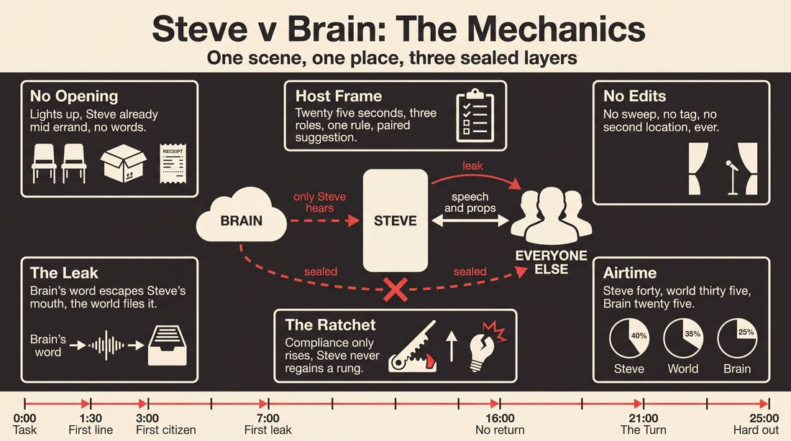
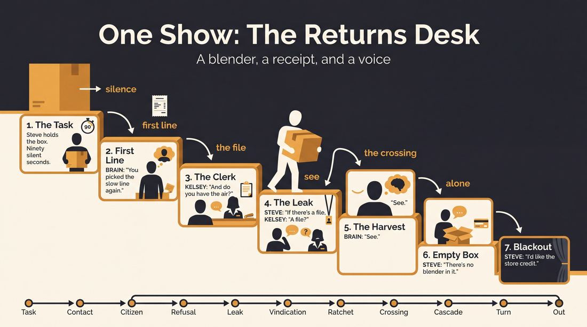
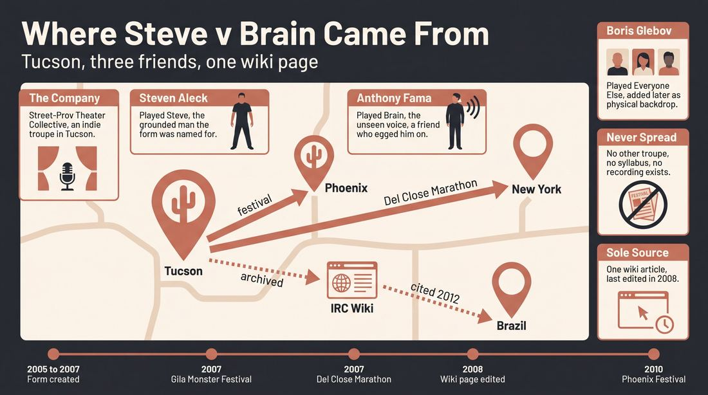
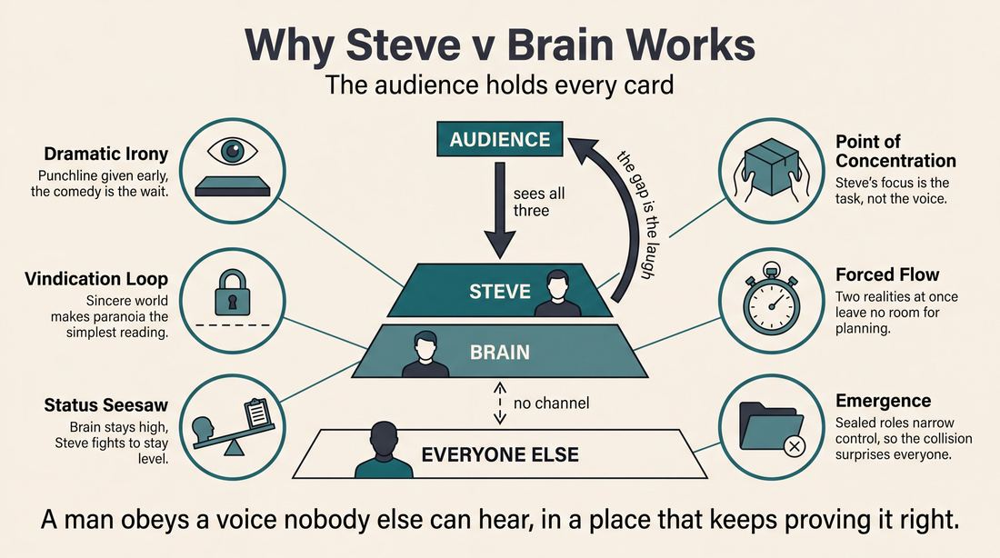
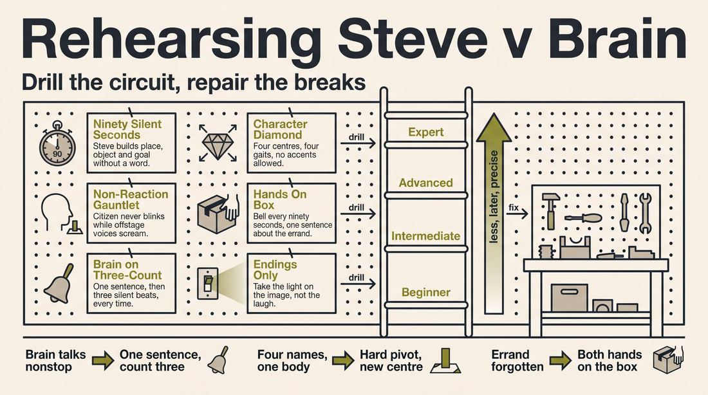

# Steve v Brain

> **A complete study of the long-form improv format _Steve v Brain_** - the original archived write-up, five infographics, grounded historical and pedagogical research, and a full mechanics-and-coaching manual.

| | |
|---|---|
| **Format** | Steve v Brain |
| **Primary source** | [IRC Improv Wiki](https://wiki.improvresourcecenter.com/index.php?title=Steve_v_Brain) |

---

## Contents

1. [Part I - The Original Write-Up](#part-i-the-original-write-up)
2. [Part II - The Infographics](#part-ii-the-infographics)
   - [1. Structure and Mechanics](#infographic-1-mechanics)
   - [2. A Show, Beat by Beat](#infographic-2-example)
   - [3. Origins and Lineage](#infographic-3-history)
   - [4. Why It Works](#infographic-4-theory)
   - [5. Rehearsal and Repair](#infographic-5-coaching)
3. [Part III - Research Dossier](#part-iii-research-dossier)
   - [Pass 1: History, Lineage, Literature and Scholarship](#research-history)
   - [Pass 2: Comparative Anatomy, Pedagogy and Production](#research-comparative)
4. [Part IV - Mechanics, Gameplay and Coaching Manual](#part-iv-mechanics-gameplay-and-coaching-manual)
   - [Pass 1: The Form, Its Mechanics and Its Gameplay](#manual-mechanics)
   - [Pass 2: Training, Coaching and Performance Companion](#manual-coaching)

---

## Part I - The Original Write-Up

*Verbatim archive of the source article, reproduced exactly as scraped. Everything after this section is generated elaboration built on top of it.*

### Steve v Brain

This form was created in Tucson, AZ by Street\-Prov Theater Collective while exploring alternative formats for its show. It is named after Steven Aleck, a member of SPTC around whom the form officially revolved. Originally, the form held a strict cast of three people, with each person performing the same role in every show. Steven Aleck played Steve, Anthony Fama played Brain, and Boris Glebov played Everyone Else.

The idea came about from the fact that in real life, Anthony frequently encouraged Steve to do outrageous and uncivil things. This dynamic was preserved in the show. Boris joined the format to provide a more physical backdrop of other characters. It was thought that having a full cast in support would drown out the relationship between Steve and his Brain.

Steve v. Brain relied on fast action that was bordering on frenetic and surreal. 

##### Structure

Steve v. Brain has been referred to as "a one\-person show with three people in it." This is because Steve is the only character that was ground and real.

The form basically consists of a single scene in one location. There are three characters:

Steve \- he is a reasonable and grounded person around whom all the action revolves.

Brain \- Steve's brain. Brain was never physically present in scenes, existing only as a voiceover. In contrast to Steve's own rationality, Brain was outlandish, unhinged, and paranoid. It goes through extreme emotional swings, and constantly pushes and bullies Steve into doing things he normally wouldn't do. Brain can only be heard by Steve \- Everyone Else is completely unaware of it.

Everyone Else \- multiple characters played by one person. Everyone Else usually represented all that is absurd and ridiculous in the society that Steve has to deal with, frequently justifying Brain's paranoia.

---

*Archived from [https://wiki.improvresourcecenter.com/index.php?title=Steve_v_Brain](https://wiki.improvresourcecenter.com/index.php?title=Steve_v_Brain) (IRC Improv Wiki) on 2026-08-09 23:23 UTC.*

---

## Part II - The Infographics

*Five 16:9 posters, each teaching a different aspect of the format. Click any poster to enlarge.*

<a id="infographic-1-mechanics"></a>

### 1. Structure and Mechanics

*How the form is played: the shape of the piece, the opening, the roles, the edit vocabulary, the flow of information, and the clock.*

{ .diagram loading=lazy decoding=async width="1100" height="614" }


<a id="infographic-2-example"></a>

### 2. A Show, Beat by Beat

*A single worked performance from suggestion to blackout: what happens in each beat, with short real example lines and what the players are doing technically.*

{ .diagram loading=lazy decoding=async width="1100" height="614" }


<a id="infographic-3-history"></a>

### 3. Origins and Lineage

*Where the form came from: creators, dates, theatres, how it spread between schools and cities, and the key figures - a documented timeline and lineage map.*

{ .diagram loading=lazy decoding=async width="1100" height="614" }


<a id="infographic-4-theory"></a>

### 4. Why It Works

*The theory: the core principles of the form and the research and craft ideas that explain why the structure produces good improv, each tied to a specific mechanic.*

{ .diagram loading=lazy decoding=async width="1100" height="614" }


<a id="infographic-5-coaching"></a>

### 5. Rehearsal and Repair

*Training and fixing the form: the essential drills, the common failure modes with their symptom-and-fix pairs, and the markers of beginner through expert play.*

{ .diagram loading=lazy decoding=async width="1100" height="614" }


---

## Part III - Research Dossier

*Two research passes: the historical record, then the comparative and pedagogical record. Claims carry evidence tags - treat unverified items accordingly.*

<a id="research-history"></a>

### » Pass 1: History, Lineage, Literature and Scholarship

### Research Summary

The searchable record for "Steve v Brain" is exceptionally thin. It is a hyper-local, defunct format documented almost exclusively by a single 2008 entry on the IRC Improv Wiki. Because the primary record is a stub, this dossier explicitly contextualizes the form by analyzing its traceable mechanical lineage: the psychodramatic "Double," the short-form "Conscience" game, and protagonist-driven long-form.

*   [DOCUMENTED] The form was created in Tucson, Arizona, by the indie troupe Street-Prov Theater Collective (SPTC).
*   [DOCUMENTED] It was designed for and performed by a strict three-person cast: Steven Aleck, Anthony Fama, and Boris Glebov.
*   [DOCUMENTED] The structure is a single-scene, single-location format defined as "a one-person show with three people in it."
*   [DOCUMENTED] The mechanics rely on a grounded protagonist (Steve), an unheard, unhinged voiceover (Brain), and a multi-character environment track (Everyone Else).
*   [DOCUMENTED] SPTC was active in the mid-2000s, appearing at the Gila Monster Improv Festival, the Phoenix Improv Festival, and the Del Close Marathon.
*   [INFERRED] The form never transmitted beyond its original creators, and its inclusion in the IRC Wiki is likely an act of self-archiving by cast member Boris Glebov.
*   [WIDELY PRACTICED, UNDOCUMENTED] While the form itself is obscure, its mechanics—externalizing inner monologue and utilizing a single improviser to play an entire society—are foundational to advanced two-prov and three-prov.

### Provenance and History

"Steve v Brain" was created in Tucson, Arizona, by the Street-Prov Theater Collective (SPTC) in the mid-2000s. [DOCUMENTED] The form was developed while the troupe was exploring alternative formats for their shows. It was named after Steven Aleck, the SPTC member who served as the grounded protagonist for every performance. [DOCUMENTED] 

The format was built specifically around the real-life dynamic between Aleck and his castmate Anthony Fama, who frequently encouraged Aleck to do "outrageous and uncivil things." [DOCUMENTED] To translate this to the stage, Fama played "Brain," a voiceover-only character that only Steve could hear. Boris Glebov was later added to the format to play "Everyone Else," providing a physical environment and societal backdrop without drowning out the core Steve/Brain relationship. [DOCUMENTED]

| Year | Event | Place / Company | Source |
| :--- | :--- | :--- | :--- |
| c. 2005–2007 | Creation of Steve v Brain | Tucson, AZ / SPTC | IRC Improv Wiki |
| 2007 | SPTC performs at Gila Monster Improv Festival | Tucson, AZ | Arizona Daily Star (tucson.com) |
| 2007 | SPTC performs at Del Close Marathon | New York, NY | IRC Message Boards |
| 2008 | Wiki article for Steve v Brain last modified | IRC Improv Wiki | IRC Improv Wiki |
| 2010 | SPTC listed at Phoenix Improv Festival | Phoenix, AZ | IRC Message Boards |

### Lineage and Transmission

[DOCUMENTED] The form did not transmit beyond its original cast. There is no record of it being taught in syllabi or adopted by other troupes. 

However, the mechanics of the form belong to a highly traceable lineage:
1.  **The Externalized Conscience:** The "Brain" mechanic is a direct long-form adaptation of short-form games like "Conscience" or "Inner Monologue," where off-stage players voice the internal thoughts of on-stage characters. [DOCUMENTED] 
2.  **The Protagonist-Driven Scene:** The concept of a "one-person show with three people in it" mirrors the Annoyance Theatre's philosophy of protagonist-driven improvisation, where the ensemble exists entirely to serve, heighten, or antagonize the reality of a single central character. [WIDELY PRACTICED, UNDOCUMENTED]
3.  **The Multi-Character Track:** The "Everyone Else" role is a staple of fast-paced two-prov and three-prov (seen in the work of *TJ & Dave* or *Dumb John*), where a single improviser populates a world through rapid tag-outs, sweep edits, and distinct physicalities. [WIDELY PRACTICED, UNDOCUMENTED]

### Key Figures

| Person | Role in this form | Specific contribution | Source URL |
| :--- | :--- | :--- | :--- |
| Steven Aleck | Co-creator, original "Steve" | The grounded protagonist around whom the form revolved. | https://wiki.improvresourcecenter.com/index.php?title=Steve_v_Brain |
| Anthony Fama | Co-creator, original "Brain" | Provided the voiceover for Steve's unhinged, paranoid brain. | https://wiki.improvresourcecenter.com/index.php?title=Steve_v_Brain |
| Boris Glebov | Co-creator, original "Everyone Else" | Played all other characters in the society Steve interacted with; likely the archivist of the form. | https://wiki.improvresourcecenter.com/index.php?title=Steve_v_Brain |

### Canonical Shows, Companies and Recordings

*   **Street-Prov Theater Collective (Tucson, AZ):** The only company known to have performed this form. [DOCUMENTED]
*   UNVERIFIED - No video or audio recordings of "Steve v Brain" are known to exist.
*   **Where to watch this form performed well today:** Nowhere, as the form is defunct. However, audiences seeking protagonist-driven, multi-character formats can look to the Annoyance Theatre in Chicago, or to narrative three-prov ensembles globally.

### Published Literature

| Work | Author | Year | What it says about this form | Where to find it |
| :--- | :--- | :--- | :--- | :--- |
| *Steve v Brain* (Wiki Article) | Anonymous (likely Boris Glebov) | 2008 | The sole primary source detailing the form's structure, cast, and origin. | https://wiki.improvresourcecenter.com/index.php?title=Steve_v_Brain |
| *O Jogo da Improvisação...* (Thesis) | Brazilian Academic | 2012 | Cites the IRC Wiki definition of Steve v Brain as "a one-person show with three people in it." | https://repositorio.ufu.br/ |
| *The Playbook: Improv Games for Performers* | William Hall | 2014 | Documents "Inner Song-a-logue" and "Inner Monologue" mechanics, the short-form ancestors of the "Brain" mechanic. | Published Book |
| *Improvise: Scene from the Inside Out* | Mick Napier | 2004 | Details the Annoyance Theatre philosophy of protagonist-driven scenes, the closest parent philosophy to this form's structure. | Published Book |

### Verbatim Quotes

> "This form was created in Tucson, AZ by Street-Prov Theater Collective while exploring alternative formats for its show."
> — IRC Improv Wiki (https://wiki.improvresourcecenter.com/index.php?title=Steve_v_Brain)

> "Steve v. Brain has been referred to as 'a one-person show with three people in it.'"
> — IRC Improv Wiki (https://wiki.improvresourcecenter.com/index.php?title=Steve_v_Brain)

> "Brain was never physically present in scenes, existing only as a voiceover."
> — IRC Improv Wiki (https://wiki.improvresourcecenter.com/index.php?title=Steve_v_Brain)

> "Everyone Else usually represented all that is absurd and ridiculous in the society that Steve has to deal with, frequently justifying Brain's paranoia."
> — IRC Improv Wiki (https://wiki.improvresourcecenter.com/index.php?title=Steve_v_Brain)

> "um espetáculo de uma pessoa com três pessoas dentro"
> — Brazilian thesis translating the wiki definition of the form (https://repositorio.ufu.br/)

> "If you had seen us - Street-Prov Theater Collective - at DCM, you had you a pretty good example of what this style look like. It's fairly chaotic."
> — IRC Message Boards, 2007 (https://www.improvresourcecenter.com)

> "Whenever it fits in the further course of the scene, two other players speak now the conscience of the respective players... It becomes interesting when the conscience is in contradiction to the actions or statements of the player."
> — Improwiki on the parent "Conscience" game mechanic (https://improwiki.com/en/wiki/improv/the_conscience)

> "The player can, but does not have to, enter into dialogue with his or her conscience."
> — Improwiki on the parent "Conscience" game mechanic (https://improwiki.com/en/wiki/improv/the_conscience)

### Anecdotes and Stories

**The Origin of the Dynamic**
The form was born directly from the real-life friendship between Steven Aleck and Anthony Fama. According to the wiki, "in real life, Anthony frequently encouraged Steve to do outrageous and uncivil things." Rather than burying this dynamic in standard scene work, SPTC built an entire theatrical architecture to isolate and weaponize it. [DOCUMENTED]

**The Addition of "Everyone Else"**
Initially, the form was just Steve and his Brain. When the troupe realized they needed a physical environment for Steve to interact with, they faced a structural problem: if they used a full ensemble cast, the core relationship between Steve and his Brain would be drowned out by the noise of multiple improvisers. Boris Glebov was added as a single, multi-character track to provide a "physical backdrop" while keeping the stage picture stark and focused. [DOCUMENTED]

**The DCM Performance**
SPTC performed at the Del Close Marathon in New York around 2007. In a forum discussion about chaotic improv styles, a user (likely a member of SPTC) pointed to their DCM set as a prime example, noting: "If you had seen us... you had you a pretty good example of what this style look like. It's fairly chaotic." This aligns with the wiki's description of the form relying on "fast action that was bordering on frenetic and surreal." [DOCUMENTED]

### Academic and Scientific Research

**Psychodrama and The Double (Moreno, 1946)**
In drama therapy, the "double" is an auxiliary ego who stands behind the protagonist and speaks their unspoken thoughts, fears, or suppressed desires. 
*Relevance to this form:* "Steve v Brain" is essentially a comedic, long-form application of the psychodramatic double. However, rather than aiming for therapeutic integration, the "Brain" acts as an antagonistic double, weaponizing the protagonist's cognitive dissonance for surreal comedy.

**Collaborative Emergence (Sawyer, 2003)**
Performance studies research on group creativity emphasizes how unscripted narratives emerge from distributed control. 
*Relevance to this form:* "Steve v Brain" artificially restricts distributed control. By locking players into strict functional silos (Protagonist, Inner Voice, Environment), the form creates a highly constrained framework for emergence. The "Everyone Else" track must constantly adapt to the unpredictable physical actions of Steve, which are being secretly dictated by the "Brain" track that Everyone Else cannot hear.

### Documented Variants and Descendants

UNVERIFIED - No direct descendants of "Steve v Brain" are documented. However, its mechanics are present in several established formats:
*   **The "Conscience" Short-Form Game:** A scene where off-stage players voice the inner thoughts of the on-stage characters. [DOCUMENTED]
*   **"Inner Monologue" / "Inner Monosong":** A caller freezes the scene and a character speaks or sings their internal thoughts to the audience. [DOCUMENTED]
*   **"Shoulder Angel / Devil":** A classic theatrical and improv trope where two players physically flank a protagonist to represent their moral conflict. [DOCUMENTED]

### Criticism, Debate and Known Failure Modes

*   **The "Drowning Out" Problem:** The creators themselves noted the fragility of the form's focus. If too many characters are introduced, or if the "Everyone Else" track takes up too much space, the central conceit (the relationship between Steve and his Brain) is entirely lost. [DOCUMENTED]
*   **The Burden on "Everyone Else":** In a multi-character track, a single improviser must instantly establish and differentiate multiple societal archetypes. If they fail to provide distinct physicalities and clear points of view, the world becomes muddy, leaving the protagonist with nothing concrete to react against. [INFERRED]
*   **The "Crazy Town" Failure Mode:** Because the Brain is explicitly "unhinged and paranoid" and Everyone Else represents all that is "absurd and ridiculous," the form risks devolving into chaos. Without a fiercely grounded "Steve" to anchor the reality, the scene loses its stakes and becomes a wash of surreal noise. [WIDELY PRACTICED, UNDOCUMENTED]

### Cultural Footprint

The form itself has zero cultural footprint outside of the Tucson indie improv scene of the mid-2000s. [DOCUMENTED] 

However, its alumni remained active in the arts. Steven Aleck went on to become a Nuu Chah Nulth visual artist and set designer in Canada. [DOCUMENTED] Boris Glebov remained active in the improv and blues dance scenes, and is documented as having brought the Chicago form "Detours" to the Tucson scene. [DOCUMENTED] 

The form's most notable cultural footprint is a testament to the strange, outsized reach of early internet wikis: because "Steve v Brain" was codified on the IRC Improv Wiki, it was cited in a 2012 Brazilian academic thesis (*O Jogo da Improvisação*) as an example of experimental improv structures, granting a hyper-local college-town format permanent international academic documentation. [DOCUMENTED]

### Gaps in the Record

*   The exact dates of the first and last performances of "Steve v Brain" are unknown.
*   It is UNVERIFIED whether the form was ever taught to other improvisers or performed by a cast other than the original trio.
*   There is no surviving video or audio of the form.
*   The exact lifespan of the Street-Prov Theater Collective is unclear, though festival records place them as active between 2002 and 2010.

### Source List

1.  IRC Improv Wiki - Anonymous - 2008 - https://wiki.improvresourcecenter.com/index.php?title=Steve_v_Brain - Primary source for the form's structure and history.
2.  IRC Message Boards - Various - 2007-2010 - https://www.improvresourcecenter.com - Documents SPTC's performances at DCM and the Phoenix Improv Festival.
3.  "O Jogo da Improvisação..." - Universidade Federal de Uberlândia - 2012 - https://repositorio.ufu.br/ - Brazilian thesis citing the form.
4.  Improwiki - Anonymous - 2017 - https://improwiki.com/en/wiki/improv/the_conscience - Documents the "Conscience" short-form mechanic.
5.  ImprovDr - Anonymous - 2021 - https://improvdr.com/ - Documents the "Inner Monologue" and "Inner Monosong" mechanics.
6.  Arizona Daily Star - 2007 - https://tucson.com/ - Documents SPTC performing at the Gila Monster Improv Festival.

<a id="research-comparative"></a>

### » Pass 2: Comparative Anatomy, Pedagogy and Production

### Taxonomic Placement

```text
      Monoscene (Single Location/Time)       Sybil (Single Player/Multi-Character)
                     \                                     /
                      \                                   /
                       +---------------------------------+
                       |
                 Steve v Brain
                       |
                       +---------------------------------+
                      /                                   \
        Twitch "Chat-as-Brain" Improv              Audio-Only/Podcast Improv
```

Steve v Brain sits at the intersection of the Monoscene (a single continuous scene in one location with no edits) and the Sybil or One-Person Show (where a single improviser populates an entire world of characters). It is a highly specialized, asymmetrical trio form. Unlike traditional trios where all players share the same physical reality, this form fractures the reality into three distinct operational layers: the grounded protagonist (Steve), the invisible internal driver (Brain), and the external absurd world (Everyone Else). It is a direct descendant of single-protagonist journey forms (like Johnnie) but removes the ensemble support, replacing it with a high-pressure, split-focus mechanic.

### Head-to-Head Comparisons

#### Steve v Brain vs. Monoscene
| Axis | Steve v Brain | Monoscene | Consequence for the players |
| :--- | :--- | :--- | :--- |
| **Opening** | None; starts directly in the physical action. | Often preceded by a group game or monologue to generate themes. | Steve must establish the base reality immediately without thematic runway. |
| **Structure** | Single scene, one location, strict character roles. | Single scene, one location, ensemble cast playing one character each. | Steve v Brain relies on internal psychological escalation rather than ensemble entrances/exits. |
| **Edit Logic** | No edits; ends on a climax of Steve's mental break or resolution. | No edits; ends on a natural thematic conclusion or blackout. | The tech booth must watch Steve's physical breaking point to trigger the lights. |
| **Memory** | Brain must track Steve's physical actions; Steve tracks Brain's audio. | Ensemble tracks physical environment and character relationships. | Asymmetrical memory load: Brain remembers emotional triggers, Everyone Else remembers physical space. |
| **Cast Size** | Exactly 3. | Usually 6 to 8. | No ability to hide or rest; all three players are working at 100% capacity for the duration. |
| **Audience Contract** | Audience accepts that Brain is audible only to Steve. | Audience accepts real-time, real-space constraints. | The MC must explicitly state the rules of the form before the set begins. |
| **Failure Mode** | "Schizophrenic Washout" (Steve ignores the physical world). | "The Talking Head Void" (Players stand in a circle and debate). | Steve must physically interact with Everyone Else to ground Brain's audio offers. |

#### Steve v Brain vs. Sybil (One-Person Show)
| Axis | Steve v Brain | Sybil | Consequence for the players |
| :--- | :--- | :--- | :--- |
| **Opening** | Direct to scene. | Direct to scene or character monologue. | Everyone Else must immediately establish a strong physical foil to Steve. |
| **Structure** | One player plays the world, one plays the protagonist, one plays the mind. | One player plays all characters, including the protagonist. | The cognitive load of character-switching is isolated to the "Everyone Else" player. |
| **Edit Logic** | Continuous single scene. | Player uses physical pivots or sweeps to change scenes/characters. | Everyone Else must morph characters within the same continuous timeline and location. |
| **Memory** | Everyone Else tracks their own roster of characters against Steve. | Solo player tracks all spatial relationships and voices. | Everyone Else can rely on Steve's physical position as a fixed anchor point. |
| **Cast Size** | 3. | 1. | Steve acts as the fulcrum, allowing Everyone Else to push harder without losing the scene's center. |
| **Audience Contract** | The world is absurd, Steve is grounded. | The solo player is a virtuoso creating a whole world. | The audience roots for Steve's survival rather than marveling at a solo player's technical skill. |
| **Failure Mode** | "The Sybil Blur" (Everyone Else's characters sound/look identical). | "Spatial Collapse" (Player forgets where characters are standing). | Everyone Else must use hard physical choices (posture, gait) to differentiate characters instantly. |

#### Steve v Brain vs. The Movie
| Axis | Steve v Brain | The Movie | Consequence for the players |
| :--- | :--- | :--- | :--- |
| **Opening** | Direct to scene. | Director introduces the "film" and sets the genre. | Steve v Brain lacks a meta-narrative framing device; the absurdity must speak for itself. |
| **Structure** | Brain acts as an internal, unhinged voiceover. | Director acts as an external, controlling voiceover. | Brain pushes emotional/behavioral extremes; Director pushes camera angles and plot. |
| **Edit Logic** | Continuous time. | Director calls "Cut," "Pan," "Zoom," or jumps time. | Brain cannot edit the scene; they can only make Steve's current moment more difficult. |
| **Memory** | Brain tracks Steve's internal state. | Director tracks the overarching plot and genre tropes. | Brain's offers are psychological; Director's offers are structural. |
| **Cast Size** | 3. | Full ensemble (6-10). | Brain has a 1-to-1 relationship with Steve, whereas the Director manages a whole cast. |
| **Audience Contract** | Brain is a character (the Id). | Director is a narrator/editor. | Brain must have an emotional arc and point of view, not just give stage directions. |
| **Failure Mode** | "Brain Domination" (Brain talks too much, freezing the scene). | "Director Dictatorship" (Director micromanages every line). | Brain must leave audio gaps for Steve to interact with Everyone Else. |

### What Makes It Uniquely Itself

1. **The Asymmetry of Reality**: The form collapses if Everyone Else can hear Brain. The core engine is Steve's requirement to process a high-status, unhinged audio input (Brain) while simultaneously maintaining a grounded, low-status physical interaction with an absurd world (Everyone Else). If Everyone Else reacts to Brain, it becomes a standard scene; if Steve ignores Brain, it becomes a standard Sybil scene.
2. **The Disembodied Antagonist**: Brain is never physically present. If Brain enters the stage, the form breaks. Brain's power comes entirely from voiceover, forcing Steve to physicalize the internal struggle. Brain cannot pick up a prop or block a punch; they can only command Steve to do so.
3. **The Fixed Protagonist Anchor**: Steve is the only character who does not change, morph, or leave. If Steve breaks his grounded reality or matches the absurdity of Brain/Everyone Else, the contrast is lost, and the form devolves into a frenetic montage of crazy characters.

### Structural Variants in Practice

Because the original form was highly localized to the Street-Prov Theater Collective, modern applications of this mechanic appear as named variants in specific training centers:

*   **The Conscience (Various / [CRAFT CONSENSUS])**: Brain is split into two offstage microphones (Angel and Devil). Played by four people. Changes the dynamic from "Paranoia vs Grounded" to a direct moral tug-of-war.
*   **Rotating Steve ([CRAFT CONSENSUS])**: A 30-minute piece where a physical trigger (e.g., Steve clapping his hands over his ears) causes the players to rotate roles. Brain becomes Everyone Else, Everyone Else becomes Steve, Steve becomes Brain. Used to prevent player burnout.
*   **The Chat-Driven Brain (Twitch/Online Improv)**: Steve and Everyone Else are on camera; Brain is played by a single improviser reading and synthesizing live audience chat into Steve's earpiece.

### The Teaching Ladder

| Stage | Skill introduced | Why in this order | Typical exercise | Source or [CRAFT CONSENSUS] |
| :--- | :--- | :--- | :--- | :--- |
| **1. Grounding** | Maintaining a mundane physical task while under verbal pressure. | Steve must be an unbreakable anchor before introducing the absurd elements. | *What's Beyond?* (Object work focus) | Spolin (1963) |
| **2. The Split Psyche** | Processing internal monologue vs external dialogue simultaneously. | Prepares the Steve player to hear two different realities without freezing. | *Inner Monologue* | Spolin (1963) |
| **3. Rapid Morphing** | Instantly switching physical and vocal archetypes. | The Everyone Else player must populate the world without relying on costume or edits. | *Sybil Switch* | Besser et al. (2013) |
| **4. Asymmetrical Listening** | Reacting to an audio cue that the scene partner ignores. | The core mechanic of the form; requires Steve to flinch/react to Brain while talking to Everyone Else. | *Blind Offers* | Johnstone (1979) |
| **5. Status Bullying** | Brain driving Steve into uncomfortable actions using high-status commands. | Establishes the specific "unhinged/paranoid" dynamic of the original form. | *Status Seesaw* | Johnstone (1979) |

### Documented Drills and Exercises

| Drill | Origin / teacher | How to run it | What it fixes in this form | Source |
| :--- | :--- | :--- | :--- | :--- |
| **Shoulder Angel/Devil** | Traditional | Two players stand behind a seated player, whispering conflicting advice while the seated player talks to a fourth player. | Trains Steve to maintain a physical conversation while processing intense audio input. | `[CRAFT CONSENSUS]` |
| **Sybil Switch** | UCB | One player does a monologue, switching characters every time they pivot their body 90 degrees. | Fixes Everyone Else's need for distinct, instant character differentiation. | Besser et al. (2013) |
| **Blind Offers** | Keith Johnstone | Player A makes statements about Player B's physical state; Player B must instantly justify and embody them. | Fixes Steve's responsiveness to Brain's unhinged VO commands. | Johnstone (1979) |
| **What's Beyond?** | Viola Spolin | Players establish a detailed physical environment and interact with invisible objects before speaking. | Fixes Steve's grounding; prevents the scene from becoming a talking-head void. | Spolin (1963) |
| **Status Seesaw** | Keith Johnstone | Players actively try to raise their own status while lowering the other's. | Fixes the bullying dynamic between Brain (high status) and Steve (low status). | Johnstone (1979) |
| **Inner Monologue** | Viola Spolin | A player speaks their internal thoughts aloud while executing a mundane task, contrasting with external dialogue. | Fixes the cognitive split required for Steve to process two realities. | Spolin (1963) |
| **The Annoyance Single Scene** | Mick Napier | Players hold onto their initial character choice for 10+ minutes without editing, escalating internally. | Fixes the tendency to bail on the single-scene structure when it gets difficult. | Napier (2004) |
| **Split Focus** | Viola Spolin | Two separate conversations happen simultaneously; audience focus is directed by volume and movement. | Fixes the audio mixing between Brain's VO and Everyone Else's dialogue. | Spolin (1963) |
| **Voiceover Dubbing** | Traditional | Player A moves their mouth and body while Player B provides the voice from offstage. | Trains Brain to sync their emotional swings with Steve's physical reactions. | `[CRAFT CONSENSUS]` |
| **Character Diamond** | David Razowsky / iO | Player maps out four distinct physical/vocal traits and rotates through them strictly. | Fixes Everyone Else blurring into a single generic antagonist. | `[CRAFT CONSENSUS]` |

### Common Failure Modes and Diagnoses

| Failure mode | What it looks like from the audience | Root cause | Fix | Who names it |
| :--- | :--- | :--- | :--- | :--- |
| **Schizophrenic Washout** | Steve looks erratic, staring into space and ignoring the physical scene to listen to Brain. | Steve is prioritizing Brain's audio over Everyone Else's physical presence. | Steve must anchor his eyes on Everyone Else; Brain must time offers for the gaps in physical dialogue. | `[CRAFT CONSENSUS]` |
| **Brain Domination** | Brain talks continuously, turning Steve into a puppet and freezing the physical scene. | Brain misunderstands their role as a narrator rather than an internal pressure. | Brain must limit offers to one sentence per physical interaction. | `[CRAFT CONSENSUS]` |
| **The Sybil Blur** | Everyone Else's characters bleed together, confusing Steve and the audience. | Lack of distinct physical/vocal anchors for the multiple characters. | Everyone Else must use hard physical pivots (e.g., turning 180 degrees) to mark character shifts. | `[CRAFT CONSENSUS]` |
| **Agreement Collapse** | Steve immediately agrees with Brain's unhinged suggestions, removing the tension. | Steve forgets his role as the "reasonable, grounded" protagonist. | Steve must actively resist Brain's first three offers before succumbing to the paranoia. | `[CRAFT CONSENSUS]` |

### Production and Logistics

*   **Cast Size**: Exactly 3. Adding more players dilutes the pressure on Steve and removes the virtuosity required of Everyone Else.
*   **Runtime**: 20–30 minutes. The frenetic pace and cognitive load make it unsustainable for a full hour.
*   **Stage Layout**: Steve remains center stage. Everyone Else utilizes the wings for entrances/exits or morphs on stage. Brain is positioned entirely offstage or in the tech booth.
*   **Chairs and Set**: Two chairs maximum. The environment must be built through object work so Everyone Else has room to physically morph.
*   **Lighting and Tech Cues**: Standard wash for the physical scene. Brain requires a live, high-quality microphone. A slight reverb or EQ adjustment on Brain's mic is highly recommended to establish the "internal voice" aesthetic and separate it from Everyone Else's acoustic voices.
*   **Music and Sound**: Pre-show music should be chaotic or fast-paced. No underscoring during the scene, as it will muddy the audio mix between Brain and Everyone Else.
*   **MC and Host Duties**: The MC *must* explicitly explain the mechanic to the audience. Example: "You are about to see one continuous scene. [Player A] is Steve. [Player B] is everyone Steve meets. [Player C] is Steve's brain, and only Steve can hear them."
*   **How the Suggestion is Taken**: Ask for "A mundane location where Steve is trying to accomplish a simple, everyday task." (e.g., the DMV, a grocery store, a laundromat).
*   **Where the Form Belongs**: Best placed as the high-energy closer of a two-act show, or as a tight festival set.
*   **Rehearsal Cadence**: Requires intense, specific drilling of the 3-person dynamic. A producer must ensure the tech booth is available for rehearsals so Brain can practice mic technique and timing.

### Adaptations Beyond the Stage

*   **Classroom and Youth**: Brain is reframed from "unhinged and paranoid" to "The Coach" or "The Conscience." The focus shifts to positive self-talk versus negative self-talk, removing the surreal/frenetic edge.
*   **Corporate and Applied Improv**: Used in leadership workshops to model "Decision Fatigue" or the "Inner Critic." Brain represents imposter syndrome, risk aversion, or intrusive corporate anxieties. Steve must practice maintaining professional composure (Everyone Else) while managing internal stress.
*   **Therapeutic Settings**: Highly applicable to Narrative Therapy techniques (externalizing the problem). Brain represents the client's anxiety, depression, or intrusive thoughts. Steve is the client. Everyone Else represents the triggering environment.
*   **Accessibility and Inclusion**: The Brain player does not need to be physically mobile, making this an excellent role for improvisers with physical disabilities. Steve and Everyone Else require high physical stamina.
*   **Content-Safety and Consent**: The form inherently mimics auditory hallucinations. To avoid ableism and the harmful caricaturing of schizophrenia or psychosis, the form must be strictly framed as an *exaggerated internal monologue* (the Id) rather than a mental illness. Brain must attack Steve's *choices*, not his *sanity*.

### Evidence Base for Those Adaptations

*   **Externalizing the Problem**: White and Epston's foundational work in Narrative Therapy (1990) supports the therapeutic adaptation of this form. By physically separating the "problem" (Brain) from the "person" (Steve), the client can objectively interact with their internal critic without identifying as the problem itself.
*   **Role-Play in CBT**: Cognitive Behavioral Therapy utilizes role-play to test automatic negative thoughts. Brain acts as the generator of these automatic thoughts, allowing the Steve player to practice real-time cognitive reframing while under simulated environmental stress (Beck, 2011).

### Scholarly Frames Worth Applying

*   **Collaborative Emergence (Sawyer)**: The theory that the outcome of an improvised performance cannot be predicted by analyzing the individuals, but only by observing their real-time interaction. *Mapping*: Steve cannot plan his reactions; his path is entirely dictated by the unpredictable collision of Brain's audio offers and Everyone Else's physical offers. (Sawyer, 2003)
*   **Status and Spontaneity (Johnstone)**: The concept that all human interaction involves a seesaw of dominance and submission. *Mapping*: Brain maintains relentless high status over Steve, forcing Steve into low-status compliance, while Steve desperately attempts to maintain equal status with Everyone Else. (Johnstone, 1979)
*   **Point of Concentration (Spolin)**: The specific, agreed-upon focus that frees the player from self-consciousness. *Mapping*: Steve's Point of Concentration must be the physical environment and the task at hand; if he loses this POC, he gets sucked into the audio void of Brain. (Spolin, 1963)
*   **Flow (Csikszentmihalyi)**: The state of optimal experience when a person's skill level perfectly matches the challenge at hand. *Mapping*: The frenetic, high-speed processing required by Steve to balance two conflicting realities induces a forced flow state, preventing the player from getting in their own head (ironically, by putting someone else in it). (Csikszentmihalyi, 1990)

### Where the Form Is Heading

While the specific "Steve v Brain" title remains an artifact of 2008 Tucson, the *mechanic* is seeing a massive revival in digital and hybrid spaces. 
*   **Twitch and Livestreaming**: The "Brain" role is increasingly outsourced to the live chat or a producer reading donations/prompts directly into the protagonist's earpiece, forcing the improviser to justify internet absurdity in a grounded physical scene.
*   **Audio-Only / Podcast Improv**: The form translates perfectly to audio fiction, where stereo panning is used to separate Brain (hard panned left/right with reverb) from Everyone Else (center channel, dry EQ). 
*   **VR Improv**: Virtual reality platforms allow the Brain player to exist as an invisible entity in the digital space, whispering spatialized audio directly into the Steve avatar's ear while Everyone Else populates the visual field.

### Source List

1. Besser, M., Roberts, I., & Walsh, M. (2013). *The Upright Citizens Brigade Comedy Improvisation Manual*. Comedy Council of Nicea LLC. (Supports the "Sybil Switch" and multi-character physical pivots).
2. Johnstone, K. (1979). *Impro: Improvisation and the Theatre*. Routledge. (Supports Status Seesaw, Blind Offers, and the mechanics of dominance/submission).
3. Spolin, V. (1963). *Improvisation for the Theater*. Northwestern University Press. (Supports What's Beyond, Inner Monologue, Split Focus, and Point of Concentration).
4. Napier, M. (2004). *Improvise: Scene from the Inside Out*. Heinemann Drama. (Supports the Annoyance Single Scene drill and holding onto initial character choices).
5. Sawyer, R. K. (2003). *Group Creativity: Music, Theater, Collaboration*. Lawrence Erlbaum Associates. (Supports the framework of Collaborative Emergence).
6. Csikszentmihalyi, M. (1990). *Flow: The Psychology of Optimal Experience*. Harper & Row. (Supports the psychological framework of the flow state under high cognitive load).
7. White, M., & Epston, D. (1990). *Narrative Means to Therapeutic Ends*. W. W. Norton & Company. (Supports the therapeutic adaptation of externalizing the internal critic).
8. Beck, J. S. (2011). *Cognitive Behavior Therapy: Basics and Beyond*. Guilford Press. (Supports the use of role-play for automatic negative thoughts in applied settings).

---

## Part IV - Mechanics, Gameplay and Coaching Manual

*Synthesis over the original article and both research dossiers: first how the form works and how to play it, then how to train an ensemble to perform it.*

<a id="manual-mechanics"></a>

### » Pass 1: The Form, Its Mechanics and Its Gameplay

### At a Glance

| Field | Entry |
|---|---|
| **Also known as** | *Steve v. Brain*; "a one‑person show with three people in it" (the creators' own phrase); informally, "the Brain track," "the Conscience monoscene" |
| **Family** | Asymmetric trio monoscene. Sits at the crossing of the **Monoscene** (one place, one continuous time, no edits) and the **Sybil / one‑person show** (a single player populates a whole society), with a **protagonist‑driven** Annoyance-style centre of gravity |
| **Cast size** | **Exactly three**, in fixed, non‑interchangeable functional roles: Steve, Brain, Everyone Else. (Original company assigned the roles permanently to the same three humans, show after show.) |
| **Runtime** | 20–30 minutes. The original show's exact running time is undocumented; 25 minutes is my recommended default — the cognitive load on Steve is not survivable at an hour |
| **Opening** | **None in the documented original** — lights up, Steve is already mid‑errand. The only "opening" is the host's rule‑statement before the lights come up (see *The Opening*) |
| **Suggestion taken** | Not documented for the original. My standard: **a mundane public location plus a simple errand** ("a place where you have to wait, and the thing you're trying to get done there") |
| **Structural rigidity (1–5)** | **5 for role architecture, 2 for content.** Who may speak to whom is welded shut; what happens is wide open. This split is the whole design |
| **Difficulty (1–5)** | **5 for Steve, 4 for Everyone Else, 4 for Brain.** No player can hide, rest, or be carried; the show is 25 minutes of continuous work for all three |
| **Prerequisites** | Sustained object work; monoscene stamina; instant multi‑character morphing without edits; the ability to *react to an audio cue your scene partner is contractually ignoring*; status play (Johnstone seesaw); a Steve who can be funny while being sane |
| **Best for** | Tight trios who already know each other's rhythms; festival slots; the closer of a two‑act bill; ensembles with one natural straight man and one natural agent‑of‑chaos; anywhere you want dramatic irony as the engine instead of surprise |
| **Avoid when** | You have four or more players who all want to play; your Steve treats "grounded" as "neutral"; your venue has bad sightlines to the wings or an unusable offstage voice position; the bill already contains a monoscene; you want narrative sprawl or multiple locations; you have no one willing to spend 25 minutes losing |

---

### The Essence in One Paragraph

Steve v Brain is a single unbroken scene, in one mundane location, in continuous time, played by three people occupying three sealed layers of one reality. **Steve** is a reasonable, grounded person trying to complete an ordinary errand; he is the only fully real, fully embodied person onstage and he never leaves. **Brain** is Steve's own mind, played by an improviser who is never seen — a voice only, from offstage or the booth, unhinged, paranoid, wildly emotional, and audible to Steve alone. **Everyone Else** is a third improviser playing every other human being in that location, one after another, morphing on the spot, and representing everything absurd and unaccountable about the society Steve has to deal with — and, crucially, doing so in a way that keeps accidentally proving Brain right. The form's entire mechanism is an information asymmetry: Brain can reach the world only by pushing Steve into behaviour, and the world can reach Brain only by being so genuinely ridiculous that paranoia looks like clear thinking. The audience is the only party who sees all three layers at once, which is why the form is a dramatic‑irony machine rather than a surprise machine. The show has no edits and no plot beats to hit; its arc is measured in one currency only — **how much of what Brain says Steve is now willing to do** — and it ends the moment that number hits its ceiling and Steve either breaks, complies catastrophically, or is vindicated.

---

### Why This Form Exists

The documented origin is not a theory, it is a friendship: Anthony Fama, in real life, kept egging Steven Aleck into "outrageous and uncivil things," and Street‑Prov Theater Collective built a theatrical architecture whose only purpose was to isolate that dynamic and run it at full power for the length of a set. Everything structural in the form follows from that single design decision.

**The problem it solves — in order of importance:**

1. **A montage dilutes a dyad; this form concentrates it.** The wiki records the creators' own reasoning for capping the cast: "It was thought that having a full cast in support would drown out the relationship between Steve and his Brain." That is a load statement, not a taste statement. Every additional embodied player is another relationship the audience has to track, and the Steve/Brain relationship is not a loud one — it is a private, second‑person, unheard relationship. It survives only if nothing competes with it. Three is not a small cast; three is the largest cast that does not destroy the premise.
2. **It makes internal life externally playable for 25 straight minutes.** Improv is chronically bad at interiority: we can only show what a character says and does, so "what he's actually thinking" is usually gestured at with a look. Short form solved this in 90‑second doses (Conscience, Inner Monologue). Steve v Brain is the long‑form version of that hack: it puts a permanent, escalating, characterised interior track on one person and lets it run. What a montage would have to *state*, this form can *dramatise* continuously.
3. **It converts "surprise" comedy into "dread" comedy.** In a plain montage, a joke lands when the audience learns something. Here the audience is issued the punchline in advance — they hear Brain give Steve the terrible instruction — and then they watch Steve carry a live grenade through a conversation with a woman who wants to see his receipt. The comedy is the wait. That is a resource a montage structurally cannot access, because a montage keeps editing away from the wait.
4. **It buys unlimited world without unlimited players.** One improviser as Everyone Else means Steve can meet a clerk, a manager, a child, a security guard and a PA announcement inside 25 minutes with no edits, no blackouts and no re‑establishing. The world can be as populous as the show needs while the *stage picture* stays stark: one anchored man and one shape‑shifter.
5. **It forces the ensemble to be right about status.** Brain is permanently high‑status over Steve and can never be contradicted, punished, or removed. Steve is permanently trying to hold level status with a world that keeps outranking him. There is nowhere in the piece where anyone can play "we're all equals having a nice scene," which is where undirected trio work usually goes to die.

**Note on the record:** the two dossiers describe the form as fast, "frenetic and surreal" (wiki) *and* as a monoscene (comparative dossier), which are in tension — monoscene training usually preaches patience and naturalism. My judgement: it is a monoscene in *space and time* and a farce in *tempo*. Treat the walls as rigid and the clock inside them as accelerating.

---

### The Audience Contract

The audience is promised five things. Four of them are promised in the first ninety seconds, without anyone saying so.

| The promise | How the audience learns it | Typical time to land |
|---|---|---|
| **"This is one place and one unbroken hour of that man's life."** | Nobody edits. The clerk who leaves goes out the same door she came in. The paperwork on the counter stays on the counter. | 0:00–2:00 |
| **"That disembodied voice is inside his head."** | Brain's first line is *about Steve, in the second person*, and Steve reacts to it with his body while his mouth carries on with the clerk. | The first Brain line + the first Steve flinch |
| **"Nobody in the world can hear it."** | The first time Brain screams something obscene and the clerk keeps asking about the receipt. | Usually the second or third Brain line |
| **"He is us; they are not."** | Steve alone speaks and moves at human scale. Everyone Else is one degree too specific, too procedural, too content. | 3:00–5:00 |
| **"He will lose."** | Established by structure, not statement: he can't leave, can't be rescued, can't turn the voice off. | By 10:00, the audience is watching a resistance budget deplete |

**Where the audience sits in the information hierarchy.** This is the most important thing to understand about running the form. There are four knowledge sets, and the audience holds the largest:

```
                 knows the errand   hears Brain   knows Brain is unreal   sees the whole room
Everyone Else          partly            no               n/a                    yes
Brain                  yes               yes              no (Brain thinks it's right)
Steve                  yes               yes              yes                    yes
AUDIENCE               yes               yes              yes            yes  <-- god view
```

The audience is the only party who can hold Brain's instruction and the clerk's obliviousness in the same thought. Every laugh in this form is generated in that gap. **Anything that closes the gap kills a laugh.** That is why the seal (Everyone Else never hears Brain) is not a rule about realism — it is a rule about where the money comes from.

**What breaks the contract**

| Breach | Why it's fatal |
|---|---|
| Everyone Else reacts to a Brain line | Collapses four knowledge sets into two. The show is now a normal scene with a loud offstage guy |
| Brain walks onstage or is touched | Brain becomes a person; Steve becomes sane by comparison instead of by choice; the dramatic irony evaporates |
| An edit — sweep, tag, time jump, second location | Voids the "one unbroken hour" promise; the audience stops believing Steve is trapped, which is the only source of stakes |
| Steve matches the world's absurdity | The audience has no one to stand behind; the "one‑person show" loses its one person |
| Brain narrates the room ("Steve walks slowly to the counter…") | Brain becomes a Movie‑form director. The audience reclassifies the voice as a storyteller and stops treating it as pressure |
| Steve openly argues with Brain in front of a citizen with no consequence | The world must *notice* a man talking to himself. If it doesn't, the seal is fake and everything after is weightless |

---

### Anatomy: The Full Structural Map

There is no documented beat sheet for this form — the wiki gives structure only as "a single scene in one location" with three fixed roles. What follows is a working architecture I have built from the documented mechanics and from what a 25‑minute uneditable protagonist scene actually needs to survive. Treat the *unit names* as mine and the *role physics* as the record's.

#### The whole shape

```
 PRE-SHOW        THE UNBROKEN SCENE  (one location, continuous time, no edits)          OUT
 ┌───────┐  ┌────────────────────────────────────────────────────────────────────┐  ┌──────┐
 │ HOST  │  │  1      2       3        4      5      6     7,8,9      10    11   │  │ HARD │
 │ FRAME │→ │ TASK  BRAIN  CITIZEN  REFUSAL  LEAK  VINDIC  RATCHET   P.N.R  CASC │→ │ OUT  │
 │ +SUGG │  │                                        ↺ x3                        │  │      │
 └───────┘  └────────────────────────────────────────────────────────────────────┘  └──────┘
   0:45      0:00  1:30    3:00     5:00   7:00   9:00   11:00-16:00  16:00 18:00     25:00

 COMPLIANCE (Steve's ceiling)                                              ┌──── break
   0% ─────┐                                                        ┌─────┘
           └──┐        ┌──┐        ┌────┐        ┌──────┐    ┌──────┘
              └────────┘  └────────┘    └────────┘      └────┘
   resistance budget spends DOWN. It never goes back up. This line IS the plot.

 SIGNAL FLOW (the sealed circuit)
                     ┌───────────────────────┐
      BRAIN ────────►│         STEVE         │◄────────► EVERYONE ELSE
      (voice only,   │  the only body that   │  (speech, props, bodies,
       2nd person,   │  can carry a signal   │   entrances, the whole world)
       inaudible to  │       LEAK ─────────────────────────► ▲
       the world)    └───────────▲───────────┘               │
                                 │                           │
                                 └───────────────────────────┘
                    Brain HEARS the world only through Steve's senses.
                    The world NEVER hears Brain — except as leaked out of Steve's mouth.
```

#### Beat-by-beat

| Unit | Approx. clock | What happens | Who drives it | Success criterion | Common error |
|---|---|---|---|---|---|
| **0. Host Frame** | −0:45 | Host names the three roles and the one rule ("only Steve can hear him"), takes the suggestion, clears the stage | Host | Audience is oriented in under 25 seconds and never has to be told again | Explaining the *theme*; apologising for the form; taking a wacky suggestion |
| **1. The Task** | 0:00–1:30 | Steve alone. Object work, no dialogue, **Brain silent.** The errand and the friction of the place get built physically | Steve | Audience could describe the room and the goal without hearing a word | Starting with talk; starting with Brain; a location with no procedure to fight against |
| **2. First Contact** | 1:30–3:00 | Brain's first line. Small, ordinary, and *correct* | Brain | Steve's body reacts, his hands don't stop; the audience works out the rule unaided | Brain opening at 10; Brain opening with an instruction instead of an observation |
| **3. First Citizen** | 3:00–5:00 | Everyone Else enters as the gatekeeper of the errand. Sincere, specific, one degree off normal | Everyone Else | Steve has a concrete obstacle with a name, a body, and a policy | Entering "wacky"; entering as another version of Brain; entering without a job |
| **4. The First Refusal** | 5:00–7:00 | Brain asks for something antisocial; Steve refuses — internally, at cost. He does the *legal* version instead | Steve | The audience sees him decline and sees it hurt | Steve complying at once (Agreement Collapse); Steve smugly ignoring Brain |
| **5. The First Leak** | 7:00–9:00 | A word of Brain's escapes Steve's mouth into the world. The citizen notices | Steve, caught by Everyone Else | The world has now *received* information from inside Steve's head. It cannot be un‑received | The leak being ignored; the leak being a full sentence too early |
| **6. Vindication I** | 9:00–11:00 | The world does something so procedurally insane that Brain's paranoid reading of it becomes the *simplest* reading | Everyone Else, harvested by Brain | Brain gets to say "see" and be *earned* | The world doing something merely random; Brain claiming vindication without evidence |
| **7–9. The Ratchet** | 11:00–16:00 | Three cycles of ask → partial compliance → world reaction → new evidence. Each cycle's compliance is higher and its resistance shorter | All three, in circuit | Cycle 3's compliance would have been unthinkable in cycle 1 | Repeating at the same level; introducing a new plot instead of escalating the old one |
| **10. Point of No Return** | 16:00–18:00 | Steve does the outrageous thing. Fully, publicly, on purpose | Steve | It is a *decision*, taken with eye contact, not a slip | Doing it accidentally; doing it while blaming Brain out loud |
| **11. Consequence Cascade** | 18:00–21:00 | The world converges: manager, security, other customers, PA. Everyone Else works hardest here | Everyone Else | The room feels populated by four people played by one | The Sybil Blur; the world forgiving Steve too fast |
| **12. The Turn** | 21:00–23:00 | Brain's status flips: panics, disowns Steve, or goes silent | Brain | Steve is alone in the consequences he was talked into | Brain staying at the same volume and register to the end |
| **13. Threshold & Out** | 23:00–25:00 | Steve crosses a line — break, capitulation, vindication, or ejection — and the lights go | Steve, called by tech | One clean image; no epilogue | Playing past the button; a joke ending after an emotional one |

---

### The Opening

**The documented position:** there isn't one. The comparative dossier states flatly that the form has no opening and begins directly in the physical action, while simultaneously asserting the MC "must" explain the mechanic first. Those aren't in conflict once you see it correctly: **the host's rule‑statement *is* the opening.** It is the only pre‑show device the form has, and it does the work a group opening does in other long forms — it installs the contract.

#### Procedure: the standard cold open (my default)

1. **Set the stage before the audience arrives.** Two chairs maximum. Nothing else. Everyone Else needs floor to morph in; a table would anchor the wrong player.
2. **Position Brain.** Offstage in a wing with clear sightlines to Steve, or in the booth on a live mic. Brain must be able to *see* Steve at all times (see the Engine section: Brain perceives only through Steve, but the *player* must watch Steve's body to time offers).
3. **Host takes the stage and states the architecture, once, in under 25 seconds:**
   > "One scene. One place. It doesn't stop. **This** is Steve — that's all he is, all night. **This** is everyone Steve meets — all of them. And **that voice** is Steve's brain. Only Steve can hear it. Can I get a boring place where you have to wait in line, and the thing you're trying to get done there?"
4. **Take a *paired* suggestion: place + errand.** If the audience gives only a place, ask for the errand: "and what's he trying to get done?" The errand is the spine of the whole 25 minutes; you cannot leave it to chance.
5. **Filter the suggestion.** Accept "returns desk / returning a blender," "DMV / renewing a licence," "pharmacy / collecting a prescription," "passport office," "laundromat." Reject a *situation* ("a hostage negotiation") — the form needs low stakes outside and high stakes inside. If the audience shouts something wild, take the second suggestion, thank them, and move.
6. **Host clears. Lights up on Steve already in it** — mid‑queue, mid‑form‑filling, already slightly late. Never enter from the wings on the light; the promise is that this errand started before we got here.
7. **Ninety seconds of Brain silence.** Non‑negotiable in my rehearsal room. The audience must meet the sane man first, or they have no baseline against which to measure the voice.
8. **Brain's first line is an observation, not an order** (see *The Reasonable First Note*, below).

#### Documented and constructed variants

| Variant | Mechanics | Use when | Cost |
|---|---|---|---|
| **Silent Cold Open** (my default; closest to the documented "starts directly in the physical action") | Steps 1–8 above | Always, unless you have a specific reason not to | Requires a Steve with genuine solo object‑work presence for 90 seconds |
| **The Host Frame Only** (from the comparative dossier's "MC must explain the mechanic") | Same, but the host names the players by their real names and the character names | House shows where the audience is new to the form; festivals | Slightly demystifies; you spend a beat of the audience's trust on admin |
| **No Frame At All** | Lights up cold. The audience decodes the seal from Steve's first flinch | Rooms of improvisers; late slots; when your Steve's reaction game is airtight | If the first three Brain lines are ambiguous, the audience spends five minutes confused and never fully recovers |
| **Brain Prologue** (construction) | Thirty seconds of Brain alone in blackout — the internal weather report — then lights up on Steve mid‑errand | When your Brain is the strongest player and you want the voice pre‑installed | Front‑loads the wrong relationship; the audience meets the mind before the man and may root for the mind |
| **The True Errand** (construction) | Before the show, the Steve player privately tells the other two a real errand he genuinely dreaded this week. That's the suggestion | Rehearsal, house teams, run of shows | Zero audience input; only works if your Steve is comfortable being slightly exposed |
| **Interview Opening** (construction) | Host spends two minutes asking an audience member about the worst customer‑service experience of their life; the location and the errand are lifted from it | Festival sets where you want the room bonded before the seal is installed | Adds 3 minutes to a form with no slack; risks the audience expecting *their* story to be re‑enacted |

**My recommendation:** Host Frame + Silent Cold Open. The frame costs 25 seconds and saves five minutes of decoding; the silent 90 seconds is the cheapest grounding device in improv and this form dies without grounding.

---

### The Engine

This is the section to read twice. Everything else in the chapter is downstream of it.

#### 1. Three sealed layers and one bus

The form runs on a deliberately crippled communication graph. Under normal improv physics, every player can hear and affect every other player — control is distributed, and material emerges from anyone to anyone. Steve v Brain amputates most of those edges:

| Channel | Open? | Consequence |
|---|---|---|
| Brain → Steve | **Open, unlimited** | Brain has total access to the protagonist and none to anything else |
| Steve → Brain | **Open, but internal** | Steve can argue back; the world will see a man muttering |
| Steve → Everyone Else | **Open, normal speech and action** | The only public channel |
| Everyone Else → Steve | **Open, normal** | The world's pressure arrives here |
| **Brain → Everyone Else** | **CLOSED** | Brain cannot touch the world directly. Ever |
| **Everyone Else → Brain** | **CLOSED (direct)** | The world cannot address, correct, or refute the voice |

**Steve is the only bus.** Every piece of information that crosses between the inner layer and the outer layer must be carried by Steve's body — by a flinch, a hesitation, a wrong word, a decision. That is the form's central constraint and its central pleasure. Brain wants the world to change; Brain's only actuator is a man who does not want to do what Brain says.

#### 2. Brain's perceptual limit (my ruling, and the most useful rule I can give you)

The record says Brain is "outlandish, unhinged, and paranoid" but says nothing about what Brain *knows*. Left unspecified, every Brain player drifts into omniscience — narrating the room, describing what a character is doing behind Steve's back, editorialising like a Movie‑form director. That is the single most common way this form rots.

> **Ruling: Brain has Steve's senses and none of Steve's judgement. Brain knows exactly what Steve has seen and heard — no more — and is catastrophically wrong about what it means.**

Consequences you can enforce in rehearsal:

- Brain cannot say "she's writing something about you on that clipboard" unless Steve has *looked at the clipboard*.
- Brain can say "she wrote something on that clipboard. Twice. Both times after you spoke."
- Brain may not describe Steve's action ("Steve walks toward the door"). Brain may command it ("Walk to the door. Now. Don't turn around.").
- Brain may not know anyone's name until Steve hears it. When Steve hears "Kelsey," Brain gets to have opinions about people named Kelsey — instantly, and at length.

This one rule keeps Brain a *character* rather than a *narrator*, which the dossier correctly identifies as the difference between this form and The Movie: "Brain cannot edit the scene; they can only make Steve's current moment more difficult."

#### 3. The Leak: the only coupling between inner and outer

Since Brain can't reach the world, the form needs a valve, and the valve is Steve's imperfect containment. A **leak** is any moment when material that exists only inside Steve becomes public.

Leak types, in ascending order of cost:

| Leak | Public evidence | Cost to Steve |
|---|---|---|
| **Somatic** | A flinch, a swallow, hands stopping | The citizen asks "are you okay?" |
| **Paralinguistic** | A wrong laugh, a "no" said to nobody, a sharp exhale | The citizen pauses, then continues, warier |
| **Lexical** | One of Brain's words appears in Steve's sentence: "…and the *contamination* — the *condition* of the box, sorry, the condition" | The citizen repeats the word back |
| **Sentential** | Steve says a whole Brain sentence aloud | The citizen becomes a witness |
| **Behavioural** | Steve does what Brain said | Irreversible; this is the Point of No Return |

**Leaks are the plot.** There are no edits and no subplots here; the sequence of leaks is the story, and each leak must be *received* — Everyone Else's non‑negotiable job is to notice and to file it. If a leak evaporates, the show has no memory and no forward motion.

#### 4. The Vindication Loop (the documented core)

The wiki's most load‑bearing sentence is about Everyone Else: they "usually represented all that is absurd and ridiculous in the society that Steve has to deal with, **frequently justifying Brain's paranoia**."

That is not colour. That is the engine cycle. Read it as a loop:

```
   BRAIN makes a paranoid claim  ──►  STEVE dismisses it as insane  ──►
   THE WORLD does something so procedurally deranged that the claim
   becomes the simplest available explanation  ──►  BRAIN harvests it
   ("SEE.")  ──►  STEVE's confidence in his own sanity drops one notch  ──►
   BRAIN's next claim is bigger, and Steve's resistance to it is smaller  ──►  (repeat)
```

Two hard craft requirements make this loop work:

- **The world must be sincere.** A clerk who *knows* she is being absurd is a comedian, and comedians cannot vindicate paranoia — they invite Steve to join the joke. Everyone Else's absurdity must be delivered as policy, as normality, as the obvious way things are done. Sincerity is what converts absurdity into evidence.
- **The world must not be aiming at Steve.** The moment Everyone Else deliberately persecutes Steve, Brain is simply *right* and the tension dies. The world is indifferent, procedural, and awful — which is far worse, and far more vindicating, than malice.

**The Vindication Tally.** In rehearsal I have teams count out loud afterwards: how many times did Brain get a genuinely earned "see"? Under three in 25 minutes and the paranoia is decorative. Over six and the world is conspiring, which is a different (and duller) show.

#### 5. The Compliance Ratchet: the form's only measure of escalation

A monoscene without a plot needs a scalar to escalate along. This one has exactly one: **the level of Brain instruction Steve will now execute.** Volume, weirdness and speed are not escalation — they are noise. Compliance is escalation.

A usable ladder, calibrated for a 25‑minute set:

| Rung | Clock | Brain asks for | Steve's response | Public evidence |
|---|---|---|---|---|
| 0 | 1:30 | Nothing — an observation | Ignores it, keeps working | A flinch |
| 1 | 4:00 | A tiny rudeness ("Don't say thank you.") | Refuses; over‑thanks the clerk | Nothing yet |
| 2 | 6:00 | A small lie ("Tell her you're a lawyer.") | Refuses out loud, to nobody | Lexical leak |
| 3 | 9:00 | Look at the clipboard while she's turned away | **Complies, partially** — glances | Clerk half‑catches him |
| 4 | 12:00 | Take the clipboard | Refuses, then touches it | Clerk moves it |
| 5 | 15:00 | Say the lie for real | **Complies** | Whole room hears it |
| 6 | 17:00 | The outrageous, uncivil act | **Complies, deliberately** | Point of No Return |
| 7 | 21:00 | The act that cannot be walked back | Complies or refuses at last — either is a legitimate ending | Cascade / Turn |

Notice the shape: **resistance is a depleting budget, not a switch.** Steve never regains a rung. He can hesitate longer at rung 4 than rung 3, but he cannot go back to rung 2. The dossier's craft note — "Steve must actively resist Brain's first three offers before succumbing" — is a crude version of the same rule; the ladder is better because it tells you what to do at minute nineteen as well as minute four.

#### 6. Two clocks

- **The world clock is bureaucratic real time.** The queue moves at the speed of queues. The manager takes four minutes to come. This slowness is the pressure vessel.
- **The brain clock accelerates.** Brain's sentences get shorter, its intervals get shorter, its subject matter gets larger.

The comedy of the second act is the divergence: Steve's inner life is at 200 bpm while a woman calmly asks him to initial box 14. **Never let the two clocks synchronise.** If the world starts panicking at the same speed as Brain, the contrast that carries the whole form is gone.

#### 7. The Grapevine: how the form remembers without edits

Other long forms move information between scenes via callbacks across edits. This form has no edits, so information must move **laterally between the characters of Everyone Else, offstage, in the fiction.** The clerk goes into the back room; the manager comes out already knowing. That is the substitute for a callback, and it is enormously powerful — a leak at minute seven can return at minute nineteen in someone else's mouth, which reads to Steve (and to Brain) exactly like a conspiracy.

> **Craft rule:** every leak enters the Grapevine. Everyone Else should keep a mental ledger — *what does the building now know about this man?* — and let the next character carry one item from it. This is how a form with no structure achieves the sensation of a tightening plot.

#### 8. Airtime physics

Three voices, one of which is disembodied, will mud up instantly if you don't budget them.

| Track | Target share of spoken time | Rule of thumb |
|---|---|---|
| Steve (aloud, to the world) | ~40% | Steve's mouth is the main channel; if it stops, the errand stalls |
| Everyone Else | ~35% | Enough to make the procedure real, never enough to become the protagonist |
| Brain | ~25% | Brain plays the *rests*: the gap after a citizen's line and before Steve's answer |

**Only one voice at a time, with one deliberate exception.** The exception is the **Crush** — a late‑show moment where Brain talks over the citizen and the audience genuinely can't parse both, dramatising Steve's overload. Use it once. Twice is a sound problem, not a choice.

#### 9. Why the seal is the show

Strip the form to a sentence: *a man is receiving instructions that nobody else can hear, in a place that keeps behaving as though the instructions were reasonable.* If the world hears Brain, that sentence is gone and no amount of skill replaces it. If Steve stops hearing Brain, that sentence is gone. If Brain steps into the light, that sentence is gone. Everything I have written above is in service of keeping one sentence true for 25 minutes.

---

### Roles and Responsibilities

| Role | Owns | Must do | Must not do | Signal to the others |
|---|---|---|---|---|
| **Steve** | The errand, the room's reality, the compliance ladder, the ending | Keep hands busy with the task at all times; react to Brain with body before mouth; refuse before complying; hold eye contact with citizens while being talked at; escalate compliance monotonically; take the final decision consciously | Leave the location; go wacky; ignore Brain; argue with Brain unpunished; explain Brain to a citizen; be neutral instead of grounded | **To Brain:** a flinch means *received*, a still hand means *give me a gap*, a direct look into Brain's wing means *hit me now*. **To Everyone Else:** naming the citizen's job/name means *I need this character to persist* |
| **Brain** | Steve's interior, the paranoid thesis, the pressure curve, the Turn | Speak only in second person to Steve; open small and correct; leave gaps; escalate from observation → interpretation → instruction → ultimatum; harvest the world's absurdity as evidence; flip status in the last quarter | Appear onstage; narrate action; address the audience; address other characters; know things Steve hasn't perceived; talk continuously; attack Steve's sanity as a diagnosis | **To Steve:** a drop to a whisper means *this one is important*, a countdown means *comply now*, silence for 20+ seconds means *I'm setting you up*. **To Everyone Else:** none, ever — Brain and Everyone Else must never coordinate audibly |
| **Everyone Else** | Every other human, the physical world, the procedure, the Grapevine | Enter with a job and a policy; play absurdity sincerely; differentiate by body first; notice and file every leak; return characters; converge in the Cascade | Hear Brain; react to Brain's timing; wink at the absurdity; become a second protagonist; play more than ~5 recurring characters; change the location | **To Steve:** a hard 180° pivot means *new character incoming*; standing in a previously used spot means *this is a returning character*. **To Brain:** planting a strong sincere absurdity and then *pausing* means *harvest this* |
| **Tech / Lights** | The out; the mic | Watch Steve's body in the last five minutes; take the light on the crossing, not on the laugh; keep Brain's mic level under the acoustic voices, never over | Underscore; add sound effects to Brain's claims (that makes the paranoia real); fade slowly on an aggressive ending | Standby cue is agreed in advance: e.g., "when Steve puts both hands flat on the counter and stops talking" |
| **Host / MC** | The contract | State the three roles and the one rule in ≤25 seconds; take a paired suggestion (place + errand); leave | Explain the theme; recap after; apologise for the form's strangeness | Clears fully offstage — no host presence during the piece |
| **Director (rehearsal only)** | The ratchet and the seal | Time Brain's silence in the first 90 seconds; count the Vindication Tally; note the rung at which Steve first complied | Side‑coach content; give Brain jokes | — |

**On Brain's amplification.** The comparative dossier recommends a live mic in the booth with reverb or EQ. Nothing in the primary record says the original used amplification, and for a mid‑2000s indie Tucson show an unamplified voice from the wings is at least as likely. My judgement: **the mic is a dial, not a requirement.**

- *Live mic + slight reverb/EQ:* clean separation from Everyone Else's acoustic voice, works in a big room, supports whisper technique (which is the best Brain tool there is). Costs you intimacy and adds a failure point.
- *Unamplified from the wings:* Brain's voice lives in the same acoustic space as Steve's, which makes the *seal* funnier — the audience hears a man shouting in the room that nobody turns to look at. Costs you whispers and forces Brain to work loud, which pushes towards Brain Domination.

Rule of thumb: under 80 seats, no mic. Over 80, mic with a light plate reverb and a slight low‑mid cut so Brain doesn't fight the citizens' frequencies.

---

### The Rules That Actually Bind

#### Hard rules — break these and it is not this form

| # | Rule | Source | Why |
|---|---|---|---|
| H1 | **Brain is never physically present. Voice only.** | Documented (wiki) | The moment Brain has a body, the layers collapse and Steve is in a two‑hander with a weirdo |
| H2 | **Only Steve can hear Brain. Everyone Else is completely unaware of it.** | Documented (wiki) | This is the seal; it is where every laugh comes from |
| H3 | **Steve is grounded and reasonable, and stays so.** | Documented (wiki) | He is the "one person" in the one‑person show; without him there is nothing to measure the absurdity against |
| H4 | **One location, one continuous scene, no edits.** | Documented (wiki: "a single scene in one location") | Steve cannot be rescued by a sweep. Entrapment is the pressure |
| H5 | **One player plays every other character.** | Documented (wiki) | Three is the largest cast that does not "drown out" the Steve/Brain relationship — the creators' own stated reason |
| H6 | **Brain speaks to Steve, in the second person.** | My ruling, extending the record | Blocks the slide into Movie‑form narration; keeps Brain a pressure, not a storyteller |
| H7 | **Brain never edits, freezes, or restages the scene.** | Documented by contrast in the comparative dossier | Brain's only power is making the current moment harder |
| H8 | **Brain knows only what Steve has perceived.** | My ruling | Prevents omniscience; forces Brain to *listen* to the world through Steve, which is what makes vindication earned |
| H9 | **Everyone Else's characters do not become confidants about Brain.** Steve may leak; the world may witness; nobody gets told "there's a voice in my head" and helps | My ruling | Explaining the premise inside the fiction converts subtext to text and ends the show |
| H10 | **The errand persists to the end.** The blender is still un‑returned when the lights go, or is returned as the final image | My ruling | The mundane spine is what stops the piece dissolving into surreal soup — the failure the dossier calls "Crazy Town" |

#### Soft conventions — vary by house

| Convention | Common settings | My preference |
|---|---|---|
| Brain's position | Booth / stage-left wing / behind the audience | Wing with sightline to Steve — Brain must watch the body |
| Amplification | Live mic + reverb / unamplified | Room‑size dependent (above) |
| Protagonist's name | Literally "Steve" / the player's real name / a new name each show | The player's real first name. It sharpens the "one‑person show" reading and it makes Brain's abuse land harder |
| May Steve reply to Brain aloud when alone? | Yes freely / only in whispers / never | Yes, when genuinely alone — and the world must catch him at it at least once |
| **Brain Time** (world micro‑freezes for one Brain line) | Allowed / banned | Allowed at most three times, and never after the Point of No Return, when real‑time pressure is the point |
| Number of Everyone Else characters | 3 / 5 / unlimited | Cap at five embodied + one offstage voice (PA, phone). Above five you get the Sybil Blur |
| Is Brain ever literally right? | Never / once / often | **Once, decisively, late.** See the Principles |
| Suggestion | None / word / place+errand | Place + errand |
| Runtime | 20 / 25 / 30 | 25 with a hard out |
| Ending | Break / capitulation / vindication / ejection | Choose in rehearsal per show; do not decide in the moment |
| Chairs | 0 / 1 / 2 | 2 — one is the queue, one is the manager's office |

#### Myths

| Myth | Why people believe it | Why it's wrong |
|---|---|---|
| "Brain is the devil on the shoulder." | The Shoulder Angel/Devil trope is a real ancestor | Brain is not a moral position; it is a *paranoid interpreter*. It thinks it is protecting Steve. That's why it's funny and why it can be right |
| "Brain has to be evil / cruel / obscene." | The wiki word "bullies" | The record says unhinged, paranoid, and prone to extreme emotional swings. Cruelty is one of the swings; anxious devotion is another, and the swing between them is the character |
| "Everyone Else has to be wacky." | "All that is absurd and ridiculous in society" | The *situations* are absurd; the *performances* must be sincere. A clerk who thinks the policy is normal is absurd. A clerk doing a funny voice is a sketch |
| "Steve is a straight man with no personality." | Confusing grounded with neutral | Grounded means his reactions are proportionate to reality. He can be petty, vain, conflict‑avoidant, a man who really wants his $34 back. Neutral Steve is the leading cause of dead versions of this form |
| "It's a scene about schizophrenia." | Voices only one person hears | The dossier itself names its own failure mode "Schizophrenic Washout" while elsewhere warning against exactly this framing — a straight contradiction in the source, and the safety note is the one to keep. Play Brain as the exaggerated Id — an inner monologue with the volume broken. Brain attacks Steve's *choices*, never his *sanity* |
| "Brain drives the scene, so Brain should talk most." | Brain is the antagonist | Brain is at ~25% of airtime. Brain drives by *placement*, not volume. Continuous Brain freezes the physical scene — the documented Brain Domination failure |
| "You need a mic and reverb." | The comparative dossier's tech note | Undocumented for the original and unnecessary in a small room |
| "You can add a fourth player if you have one spare." | Generosity | The creators explicitly rejected a full cast because it drowns the central relationship. A fourth player changes the form into something else — a legitimate something else (see *Variations*), but not this |
| "The audience has to be told the rule or they won't get it." | Nervousness | A well‑placed first Brain line plus one Steve flinch teaches the rule in about eight seconds. The host frame is insurance, not necessity |
| "No edits means no time can pass." | Monoscene orthodoxy | Time can compress *if the world announces it*: "Now serving eighty‑four." The prohibition is on *player‑called* edits, not on elastic clock |
| "Brain can't be silent — dead air." | Fear | Brain's silence is its most powerful weapon. Twenty seconds of Brain silence at minute nineteen is the loudest sound in the show |

---

### Edits and Transitions

This form has no scene edits — that's the point. What it has instead is a taxonomy of **transitions within continuous time**, and knowing them is exactly as important as knowing edits in a Harold. Executing an actual sweep, tag‑out or time‑dash in this form is a rule break, not a move.

| Transition | How to execute physically | When it is right | When it is wrong | What it costs |
|---|---|---|---|---|
| **The Pivot** (character change on the spot) | Everyone Else turns a hard 180° or 90°, changes centre (chest‑led → hip‑led), changes vocal placement, and speaks within one second | The world needs a new person and the old one plausibly left | While Steve is mid‑sentence to the old character; more than once a minute | Nothing if clean. If muddy, it costs the audience the previous character permanently |
| **The Exit‑and‑Return** | Everyone Else walks out of the "door" as character A, waits two beats out of sight, re‑enters as B from the same door | You want the world to feel like a building with rooms | When Steve has nothing to do in the gap — dead stage | Two beats of stage time; buys enormous clarity |
| **The Offstage Voice** | Everyone Else speaks from the wing as a PA, a phone, a shout from the back room — *acoustically distinct from Brain* (different wing, different register, and the world reacts to it) | Populating a crowd; compressing time ("Now serving eighty‑four") | If it's confusable with Brain — instant contract damage | Risk of muddying the seal; mitigate by having Steve *look toward* the offstage voice, which he never does for Brain |
| **The Brain Gap** (focus handoff to the world) | Brain stops talking mid‑thought and lets a citizen's line land | After every Brain instruction — Steve needs airspace to be tortured in | If Brain leaves so many gaps the pressure drops | Nothing. This is the single most underused move in the form |
| **The Brain Crush** (focus seizure) | Brain talks over the citizen so both are partly unintelligible | Exactly once, late, to dramatise overload | Any other time | Costs a citizen's line. Only worth it if Steve visibly can't process either |
| **Brain Time** (micro‑freeze) | Everyone Else holds absolutely still for 2–4 seconds; Brain speaks; the world resumes exactly where it was | House convention; useful for a long Brain aria without stopping the errand | After the Point of No Return, when real‑time consequence is the whole engine | Costs realism; each use makes the world feel less independently alive |
| **The Procedural Jump** (elastic time) | A citizen announces the passage of time — "Okay, that's forty minutes on hold" / "Now serving eighty‑four" | Once or twice, to keep a 25‑minute show from being 25 minutes of one queue | To skip past a problem Steve created | The audience forgives one or two; three and the "unbroken hour" promise dissolves |
| **The Anchor Return** (Steve's transition) | Steve puts both hands back on the task object after a Brain assault | Every 60–90 seconds; it's the metronome of the piece | Never wrong; only under‑used | Free |
| **The Handoff Look** | Steve breaks eye contact with a citizen, looks at nothing, comes back | Marks a Brain line as landed without stopping the dialogue | If held longer than ~1.5s — that's the Listening Statue failure | Cheap. The workhorse of Steve's technique |
| **The Terminal Edit (the Out)** | Hard blackout on the crossing image, or a two‑count snap fade | When Steve crosses the threshold — break, compliance, vindication, ejection | On a laugh that isn't the threshold; after a line of dialogue that explains the ending | An early out costs the payoff; a late out costs the whole last five minutes |
| **The Illegal Edits** — sweep, tag‑out, time dash, second location, walk‑on by Brain | — | Never | Always | The form |

---

### Memory: Callbacks, Patterns and Heightening

A montage remembers by returning to a scene. This form can't. It remembers on **three separate ledgers**, held by three different people, that periodically collide. Rehearsing the ledgers is the highest‑yield thing you can do with this form.

#### The three ledgers

| Ledger | Held by | Contents | How it's cashed |
|---|---|---|---|
| **The Thesis** | Brain | One paranoid proposition, stated early, never abandoned — e.g. *"They are keeping a file on you."* Plus a running tally of "evidence" | Every time the world does something procedural and inexplicable, Brain files it. Late in the show, Brain recites the file |
| **The Grapevine** | Everyone Else | What the *building* now knows about Steve: every leak, every rudeness, every glance at the clipboard | A new character enters already knowing one item. "You're the blender gentleman." |
| **The Body** | Steve | Physical tics installed by Brain — the way he stopped saying thank you, the way his hand goes to his back pocket when Brain mentions the receipt | Reactivated involuntarily under pressure. The audience sees Brain's edits to Steve's body accumulate |

#### The four heightening axes (use them in this order)

1. **Compliance** (primary). See the ratchet. The only true measure of escalation.
2. **Evidence density.** Early: Brain claims, world is neutral. Mid: world coincidentally confirms. Late: world confirms *specifically and by name*. Each confirmation must be more precise than the last.
3. **Personnel.** The Cascade escalates by *number of citizens aware of Steve*: clerk → clerk + manager → clerk + manager + a stranger in the queue → the PA system saying his name.
4. **Intimacy of address.** Brain moves: "these people" → "that woman" → "you" → "we." **The switch to "we" is the single most reliable escalation beat in the form.** When Brain starts saying "we," Steve has lost the argument that they are separate.

#### Callback mechanics unique to this form

- **The Prophecy.** Brain says something absurd at minute five ("She's going to make you fill out the same form twice"). The world does it at minute sixteen. Brain doesn't need to comment; Steve's look at the wing is the whole joke. **Requires Everyone Else to be listening to Brain as a *player* while their *character* cannot hear it** — the highest skill in the form and the one to drill.
- **The Ledger Recitation.** Around the Turn, Brain lists the evidence in one unbroken run — five items, all of which the audience watched happen. Because every item is true, the paranoid conclusion feels inevitable. This is the form's aria and it only works if the world genuinely supplied all five.
- **The Returning Citizen.** Everyone Else brings back character #1 in the Cascade, changed by what happened in between. The audience gets the pleasure of a callback with no edit having occurred.
- **The Word Virus.** A word Brain used at minute four ("*contamination*") leaks out of Steve at minute nine, gets repeated by the clerk at minute eleven, appears on the manager's script at minute eighteen. The audience watches Brain's vocabulary colonise the real world through one man's mouth. This is the closest thing the form has to a group‑game callback and it is devastating when it lands.
- **The Object with a History.** The pen chained to the counter; the box the blender came in; the receipt. Because there are no edits, an object touched at minute two is still there at minute twenty‑four, carrying every interaction it's had. Use one object as the show's spine and let the final image involve it.

#### What *not* to call back

Do not call back jokes. Do not have Brain reference a laugh. Do not have a citizen quote a line for its own sake. Callbacks in this form are **evidentiary** — they exist to tighten the case Brain is building. A callback that doesn't serve the Thesis is a wink, and a wink tells the audience the world knows it's a comedy, which unseals the whole thing.

---

### Move-Level Technique Catalogue

Thirty‑two named moves. Names are mine unless marked as coming from the record; the mechanics are the point.

#### Brain's moves

| Move | Situation | How to do it | Example line | Failure mode |
|---|---|---|---|---|
| **The Reasonable First Note** | Brain's very first line, ~90s in | Observe something *true and mild* about the room, in second person | *"You picked the slow line again."* | Opening at maximum. If your first line is a scream, the audience files you as noise and you can never escalate |
| **The Thesis Statement** | 3–5 minutes | State the paranoid proposition once, plainly, and never restate it in full again — only its consequences | *"She's not looking up the item. She's looking up **you**."* | Restating the thesis every two minutes; the audience stops hearing it |
| **The Diagnosis** | A new citizen appears | Assign the citizen a hidden identity based only on what Steve can see | *"Lanyard's on backwards. He's not staff. He's watching staff."* | Diagnosing something Steve hasn't looked at — breaks the perceptual limit |
| **The Nudge** | Rungs 1–2 | Ask for something almost free | *"Don't say thank you. Just once. See what happens."* | Skipping straight to the big ask |
| **The Order** | Rungs 4–6 | Drop the reasoning entirely; imperative only, present tense | *"Pick it up."* | Explaining the order. The reasoning was for the nudges |
| **The Countdown** | Steve is stalling at a rung | Number it. Numbers are the fastest status weapon Brain has | *"Three. Two. Steve. **Two.**"* | Counting to a thing Steve then doesn't do, with no consequence — Brain's threats must have a cost, usually escalation |
| **The Downgrade** | Steve has flatly refused | Accept the refusal and immediately ask for a smaller version — *which he'll take* | *"Fine. Fine. Don't take it. Just — read the top line. That's all. Read one line."* | Sulking instead of downgrading. This move is how the ratchet actually turns |
| **The Harvest** ("SEE.") | Immediately after the world does something absurd | Two words maximum. Do not elaborate | *"…**See.**"* | Explaining the vindication. The audience already made the connection; your job is to confirm it in under a second |
| **The Body Report** | Any time Steve is under public pressure | Narrate Steve's own physiology back at him, hostilely | *"Your hands are wet. He's seen your hands."* | Doing this so often it becomes a tic |
| **The Third‑Party Fiction** | A citizen leaves the stage | Invent what they're doing offstage — Brain's only access to the unseen is invention, and the audience knows it | *"She's on the phone. She's on the phone about you."* | Being right about it in a way only omniscience could deliver — unless the world chooses to confirm it, which is a gift Everyone Else may grant |
| **The Reward** | Steve complies | Immediate, warm, sickening praise; Brain's affection is the drug | *"There he is. There's my boy. That was **perfect**."* | Never rewarding. Pure abuse is monotonous; the swings are the character |
| **The Betrayal** | Late, after a costly compliance | Deny authorship. Flip the blame | *"Why did you do that? Steve. **Why did you do that.**"* | Doing it too early — it's a Turn move, and it only lands once |
| **The Time Bomb** | Mid‑show | Plant an instruction with a delayed trigger | *"When he says 'policy' again — and he will — you turn around and you walk out."* | Never detonating it. If you plant it, the world must eventually say the word |
| **The Whisper Drop** | The most important ask in the show | Halve the volume. Get close to the mic (or, unamplified, drop to the edge of audibility so the room leans in) | *(barely audible)* *"Steve. Take the pen."* | Whispering constantly, which is just a quiet Brain |
| **The Silence Weapon** | The Turn, or just before the Point of No Return | Say nothing for 20–40 seconds while Steve is in maximum trouble | — | Filling the silence. Brain's absence is terrifying *only* if Brain has been relentless up to then |
| **The Pronoun Shift** | The final quarter | Move from "you" to "we" and never go back | *"We're not leaving without the money."* | Using "we" early, which makes Steve and Brain allies before he's earned the fall |

#### Steve's moves

| Move | Situation | How to do it | Example line | Failure mode |
|---|---|---|---|---|
| **The Swallow** | Brain lands a line mid‑conversation | Absorb it with the body only — a swallow, a blink, a half‑second freeze of the hands — and finish your sentence to the citizen on the original tone | *"—no, I completely understand, it's just that the box was— (beat) —the box was fine."* | Turning to the wing. Steve almost never looks at Brain; that's a spend, not a default |
| **The Anchor** | Any time the scene threatens to become talking heads | Return both hands to the task object; re‑engage the paperwork, the box, the queue tape | — | Abandoning the object work at minute ten, at which point the location stops existing |
| **The Public Refusal** | Rung 2–3 | Say "no" out loud to nobody, in front of a citizen, and then have to deal with the fact that you said it | KELSEY: "Sorry?" / STEVE: "Nothing. Sorry. I was — nothing." | Refusing silently every time. Silent refusals give the world no evidence, and evidence is what the Grapevine runs on |
| **The Repair** | After any leak | Cover with the flimsiest plausible lie and *commit to that lie for the rest of the show* | *"I have a thing. With my ear. It's a — it's fine, it's an ear thing."* | Repairing and then dropping it. The ear thing must come back at minute twenty‑two |
| **The Deal** | Mid‑show, when alone for two seconds | Negotiate with Brain out loud, quickly, like a man bargaining with a hostage taker | *"One. One thing and then you're quiet, yeah? Yeah."* | Making a deal Brain then honours. Brain never honours the deal |
| **The Down Payment** | Brain has asked for something too big | Do the smallest possible physical fragment of it, and let Brain treat it as full compliance | *(glances at the clipboard for a quarter‑second and immediately looks away)* | Doing nothing. The ratchet advances on fragments |
| **The Micro‑Argument** | You need to fight back without breaking the seal in public | Turn 30° away, speak at conversational volume but with the head down, four words max, then snap back to the citizen | *"Not now. Not now."* | Full arguments in public with no consequence |
| **The Over‑Correction** | Brain has just told you to be rude | Do the opposite so hard it's suspicious, which the world then finds weird | *"Thank you. Thank you so much. Thank you. You've been — thank you."* | Playing the over‑correction as a joke rather than as a man visibly overcompensating |
| **The Held Politeness** | Cascade, when the world is closing in | Maintain absolutely correct customer‑service manners while doing something indefensible | *(climbing onto the counter)* "I'm going to — sorry — I'm going to need to speak to someone about the policy." | Dropping the manners. The manners are the last thing to go, and the funniest |
| **The Conscious Crossing** | Point of No Return | Stop. Look at the wing where Brain lives. Look back at the citizen. **Then** do it | *"…Okay."* | Doing the outrageous thing accidentally or in a flurry. The audience must see him choose |
| **The Ear Thing** *(any Repair that persists)* | Whole show | Whatever lie you told at minute nine, build it | *"It's the ear. It's been the ear the whole time."* | — |
| **The Last Refusal** | The final beat, if you're playing a refusal ending | Complete stillness. Say one sentence to Brain aloud, in front of everyone, at normal volume | *"No."* | Making it a speech. One word beats twelve |

#### Everyone Else's moves

| Move | Situation | How to do it | Example line | Failure mode |
|---|---|---|---|---|
| **The Sincere Bureaucrat** | First citizen | Absurd policy, zero irony, warm customer‑service tone, total confidence | *"I can absolutely refund that, I just need the original air."* | Playing it knowingly. Irony kills vindication |
| **The Hard Pivot** | Character change | 180° turn + change of centre + change of vocal placement + speak within one second | *(turns, drops chest, adds a wheeze)* "Kelsey, is this the blender fella?" | Pivoting with voice only. Bodies distinguish characters; voices merely label them |
| **The Job Entry** | Any new character | Enter *doing* something specific to their function before speaking | *(re‑stacking a display, not looking up)* "Line starts back there." | Entering to have a conversation. Nobody in a shop is available |
| **The Unwitting Confirmation** | Right after a Brain claim | Say, sincerely and for your own reasons, the thing Brain just said | BRAIN: "They have a file." / KELSEY: *(pulling out a folder)* "Okay, I've got your file here." | Aiming it. Look at the folder, not at Steve |
| **The Escalating Requirement** | Every time Steve solves a step | Add a new, smaller, more insane requirement | *"Great. And I'll just need the original air — the air that was in the box."* | Escalating into fantasy. Stay inside the logic of the institution |
| **The Witness** | After a sentential leak | Do not confront. Simply *keep referencing it*, mildly, forever | *"…and you're not going to say the word again, are we agreed?"* | Forgetting the leak. Every leak must be filed |
| **The Grapevine Entry** | Second and later characters | Enter already knowing one item about Steve, sourced offstage | *"You must be the gentleman with the ear."* | Knowing too much, which makes it a conspiracy rather than a bureaucracy |
| **The Offstage Populate** | Need for crowd | A voice from the *opposite* wing to Brain, which Steve turns toward | *(from off)* "Ron! Ron, the blender guy's on the counter!" | Using Brain's wing — an unrecoverable audio confusion |
| **The Returning Citizen** | Cascade | Bring back character #1, changed by everything since | *"I was rooting for you, you know that? I was actually rooting for you."* | Bringing back a character whose physicality you can't reproduce |
| **The Indifference Wall** | Whenever Steve appeals to reason | Refuse to engage with the reasonable argument; restate the policy in the same warm tone | *"I hear you. Original air."* | Winning the argument on the merits — the world must be immovable, not correct |
| **The Convergence** | 18:00+ | Cycle three characters within 45 seconds, each entering from a different position, all about the same incident | — | Blurring. In the Cascade, slow down the pivots and widen the physical differences |
| **The Gift Confirmation** | Brain has just invented something offstage | Choose to make it true — but with a mundane explanation | BRAIN: "She's on the phone about you." / *(entering)* "Sorry, I was on the phone. Unrelated. Different thing." | Making it true *and* sinister, which turns the world into the antagonist |

#### Tech's moves

| Move | Situation | How to do it | Example line | Failure mode |
|---|---|---|---|---|
| **The Hard Out** | Steve crosses the threshold | Snap blackout on the image, not on the line after it | — | Waiting for a laugh. Take the light on the *decision* |
| **The Two‑Count Fade** | Endings where Brain has gone silent and Steve is simply standing there | Two‑second fade, no music | — | Fading on an aggressive ending, which reads as apologetic |

---

### Principles

**1. Brain is a character with a point of view, not a narrator with a microphone.**
*Why here:* The comparative record's cleanest distinction from The Movie is that the Director controls structure while Brain can only make the present moment harder. If Brain narrates, the audience reclassifies the voice as authorial, and authorial voices are trusted rather than feared.
*Followed:* Brain speaks in the second person, wants something, and gets angrier when denied.
*Violated:* "Steve approaches the counter, nervous…" — the show becomes a radio play with a live illustration.

**2. The seal is the show: the world never hears Brain, and never nearly hears Brain.**
*Why here:* Documented as the form's defining rule; mechanically, it is where the dramatic irony lives.
*Followed:* Brain screams an obscenity and the clerk asks if Steve wants the receipt emailed.
*Violated:* A citizen glances toward the wing "for a laugh" and the audience spends the rest of the show unsure of the rules, which means they stop being ahead of Steve, which means they stop laughing.

**3. Steve is grounded, not neutral.**
*Why here:* He is the "one person" in the one‑person show. The audience's entire relationship to the piece is a wager on his sanity.
*Followed:* Steve has petty, specific, human wants — he wants the $34 and he wants the clerk to like him.
*Violated:* Blank reactive Steve. The world and the voice both go up in volume trying to get a rise, and the show becomes two people yelling around a hole.

**4. Escalate compliance, not volume.**
*Why here:* With no edits, no locations and no plot beats, compliance is the only scalar available. Volume is the fake version and it caps out by minute eight.
*Followed:* At minute five Steve won't skip the queue; at minute seventeen he's behind the counter.
*Violated:* Everyone is at 10 by minute nine and the last fifteen minutes are flat, loud, and identical.

**5. The world must be sincere or the paranoia cannot be vindicated.**
*Why here:* The wiki says Everyone Else "frequently justif[ies] Brain's paranoia." Justification requires evidence, and evidence requires a witness who isn't in on the joke.
*Followed:* The clerk needs "the original air from the box" and genuinely does not understand why Steve is upset.
*Violated:* The clerk plays it knowing and Brain's "SEE" becomes a comment on a joke rather than a reading of reality.

**6. Brain must be right at least once, decisively, and late.**
*Why here:* This is what separates the form from a man being harassed by a jerk. If Brain is always wrong, it's noise; if always right, it's a thriller. One earned correctness re‑opens the whole question of who the antagonist is.
*Followed:* At minute twenty, the file Brain has claimed exists for fifteen minutes is put on the counter.
*Violated:* Brain is comprehensively wrong all night; the audience stops listening to Brain's content and only tracks its volume.

**7. Brain plays the rests.**
*Why here:* Documented failure mode: Brain Domination freezes the physical scene, because Steve cannot both listen and transact. Brain's power is placement — the half‑second after a citizen's line and before Steve's answer.
*Followed:* ~25% airtime, with the biggest ask delivered into the largest available silence.
*Violated:* Steve becomes a puppet, Everyone Else becomes furniture, and the errand stops moving.

**8. Every leak must be received.**
*Why here:* Leaks are the only channel from the inner layer to the outer layer; an unreceived leak is a signal sent into a void, and the form loses its only forward mechanism.
*Followed:* Steve says "contamination" by accident; three minutes later the manager says "he used the word contamination."
*Violated:* Steve's mistakes have no consequences, so his self‑control has no value, so his gradual loss of it isn't a story.

**9. The errand is the spine; the errand survives to the end.**
*Why here:* Documented "Crazy Town" risk — a paranoid voice plus an absurd society, with no mundane task holding the floor, dissolves into surreal wash.
*Followed:* Every escalation is *about* the blender. Even at maximum chaos, the box is in shot.
*Violated:* At minute fourteen everyone forgets the refund and the piece becomes a montage of odd behaviour in a shop.

**10. Attack the choice, never the diagnosis.**
*Why here:* The form structurally resembles auditory hallucination; the comparative dossier is explicit about the ableism risk (and internally inconsistent about it, naming a failure mode "Schizophrenic Washout" — ignore that name, keep the ethic).
*Followed:* Brain says "you're being a coward," "she's laughing at you," "take it."
*Violated:* Brain says "you're crazy, you're hearing things," and the show becomes an impression of a mental illness rather than an exaggeration of self‑talk. It's also less funny, because the Id is funnier than a symptom.

**11. Steve's resistance is a budget that only depletes.**
*Why here:* The audience is tracking a single number all night. If it goes back up, the clock resets and the last ten minutes were free.
*Followed:* He hesitates longer at rung five than at rung three, but he never re‑refuses something he has already done.
*Violated:* Steve complies, then goes back to being a sane man who won't do anything; the piece becomes a loop rather than a fall.

**12. One player at 100% must never exceed the trio at 100%.**
*Why here:* The creators' own founding constraint — a full support cast would "drown out" the Steve/Brain relationship. The same logic applies inside a trio: a virtuoso Everyone Else who takes 60% of airtime drowns it just as effectively as three extra players.
*Followed:* Everyone Else's most impressive work is *differentiation*, not material.
*Violated:* The show becomes a solo showcase with a heckler and a man holding a box.

**13. Time may compress only if the world announces it.**
*Why here:* No player has editing power in this form — that's H4 and H7. But 25 minutes of one queue is punishing, so the elasticity has to come from inside the fiction.
*Followed:* "Now serving eighty‑four" jumps twenty minutes and the audience doesn't blink.
*Violated:* A lighting flicker or a player‑called time dash — and the audience stops believing Steve is trapped.

**14. Brain's status must flip before the end.**
*Why here:* Brain has been at maximum status for twenty minutes; that's a monotone unless it breaks. And structurally, Steve must be alone in the consequences he was talked into — otherwise the ending has a co‑defendant.
*Followed:* At minute twenty‑two Brain says, quietly, "Why did you do that," and then nothing at all.
*Violated:* Brain screams all the way to blackout; the ending has no shape, only a volume level.

**15. The ending is a threshold crossing, not a punchline.**
*Why here:* There's no edit to bail you out and no scene to cut to; the light going out *is* the last dramatic act. Endings in this form are: **break** (Steve's reality gives), **capitulation** (Steve does the thing and means it), **vindication** (the world reveals Brain was right), **ejection** (Steve is removed, errand unfinished).
*Followed:* The tech has one agreed physical cue and takes the light on it.
*Violated:* Three false endings, a joke tag, and a fade that arrives forty seconds after the audience decided it was over.

---

### Worked Run-Through

**Cast:** Steve (protagonist). Brain (stage‑left wing, unamplified). Everyone Else (all citizens).
**Host frame:** *"One scene. One place. It doesn't stop. This is Steve. This is everybody Steve meets tonight. And that voice — that's Steve's brain, and only Steve can hear it. Can I get somewhere boring where you have to wait, and the thing he's trying to get done there?"*
**Suggestion:** "The returns desk. He's returning a blender."

---

**Beat 1 — The Task (0:00–1:30).** Lights up. Steve is standing in a queue holding a large box, badly. He shifts it to his hip. He checks a receipt, folds it, puts it in his shirt pocket, then immediately takes it out and checks it again. He looks at the front of the queue. He puts the box down. He picks it back up. No dialogue.

> **Mechanic:** Ninety seconds of Brain silence establishes the sane baseline. The receipt‑pocket‑receipt loop installs the show's Object with a History and tells the audience what Steve wants before a word is spoken. The box being awkward gives Steve permanent physical business — he will never be a talking head.

---

**Beat 2 — First Contact (1:32).**

**BRAIN:** *You picked the slow line again.*

Steve does not react with his face. He shifts the box to the other hip.

**BRAIN:** *Every time. Every single time, and you'll do it next week as well.*

Steve exhales through his nose and looks at the other queue.

> **Mechanic:** *The Reasonable First Note.* The first Brain line is true, mild, and second‑person, so the audience decodes the rule instantly and files Brain as an irritant rather than a monster — which leaves eleven rungs of escalation available. Steve's *Swallow* (body only, no head‑turn) teaches the audience that Brain is inside, not offstage.

---

**Beat 3 — First Citizen (3:00).** Everyone Else enters at a hard angle, chest lifted, already stapling something, and does not look up.

**KELSEY:** Next guest. Guest, next.
**STEVE:** Hi — hi. So this is a blender, it doesn't work, I've got the receipt—
**KELSEY:** *(taking the receipt, reading it with great care, then setting it aside without comment)* And do you have the air?
**STEVE:** Sorry?
**KELSEY:** The original air. From the box. *(warm, helpful)* It's a sealed‑unit product.

> **Mechanic:** *The Sincere Bureaucrat* + *Job Entry*. Kelsey enters mid‑task and never treats the policy as strange — she's *helping*. Absurdity delivered sincerely is the raw material Brain will later refine into evidence. Note the world has already made its first unanswerable demand, at three minutes: the errand now has an obstacle with a body and a name.

---

**Beat 4 — The Thesis (4:10).**

**BRAIN:** *She set your receipt aside.*
**STEVE:** *(to Kelsey)* I don't— I don't think air is a thing that comes with—
**BRAIN:** *She didn't read it. She looked at it and she set it aside. She's not looking up the blender, Steve. She's looking up **you**.*
**STEVE:** *(a half‑beat too long)* …It's a blender.
**KELSEY:** It is. Absolutely. Let me just pull your history.
*(She turns to an unseen screen.)*

> **Mechanic:** *The Thesis Statement*, immediately followed by an *Unwitting Confirmation*. Kelsey says "pull your history" for her own retail reasons, three seconds after Brain claims Steve is being looked up. Everyone Else was listening as a player and chose the word — but Kelsey aims it at the screen, not at Steve. This is the Vindication Loop's first turn, and it cost nobody a joke.

---

**Beat 5 — The First Refusal (5:40).**

**BRAIN:** *Ask to see the screen.*
**STEVE:** *(pleasantly)* No rush.
**BRAIN:** *Ask to see the screen.*
**STEVE:** *(to Kelsey)* Take your time, honestly.
**BRAIN:** *Don't say thank you when she comes back. Just once. Don't do it. See what she does.*
**KELSEY:** *(turning back)* Okay! So you've been in four times this year.
**STEVE:** Thank you— *(catches himself)* —that's, that's not right, though, four?

> **Mechanic:** Rung 1 refusal, and note what refusing *costs*: Steve says "thank you" reflexively and then has to abandon the word mid‑air, which produces his first *Somatic/Paralinguistic Leak*. Brain's ask was tiny by design — the *Nudge* — so that a refusal is still credible from a reasonable man. The compliance budget is untouched but the audience has now seen the first crack.

---

**Beat 6 — The First Leak (7:20).**

**KELSEY:** Four times. Toaster, kettle, a different blender, and a bath mat.
**STEVE:** The bath mat was— that was a colour thing—
**BRAIN:** *She's building a **file**. Say file. Say it.*
**STEVE:** —and I don't want to be difficult, I just, if there's a file, then—
**KELSEY:** *(pleasant, absolutely level)* A file?
**STEVE:** *(too fast)* Nothing. A folder. Of purchases. Which is normal, obviously.
**KELSEY:** *(writing something)* Okay.

> **Mechanic:** *Lexical Leak* + *The Repair*. Brain's word — "file" — crosses into public speech through Steve's mouth, the only bus. Kelsey does not confront; she *files it* (**The Witness**), and, critically, she writes something down, which is a physical action Brain can now perceive. The Grapevine has its first entry.

---

**Beat 7 — Vindication I (8:50).**

**KELSEY:** I'm going to flag this to Ron.
**STEVE:** Who's Ron?
**KELSEY:** Ron's who I flag things to.
*(She exits.)*
**BRAIN:** *…See.*

> **Mechanic:** *The Harvest*, in one word. Brain does not explain, because the audience made the connection two seconds earlier. Note the world's absurdity here is purely procedural — nobody is persecuting Steve; a person left to speak to another person. That indifference is what makes the paranoid reading feel like the *simplest* available reading.

---

**Beat 8 — Ratchet Cycle 1 (9:30).** Steve alone, holding the box.

**BRAIN:** *Read the clipboard.*
**STEVE:** *(quietly, out loud)* No.
**BRAIN:** *She left it there. She left it there on purpose to see if you'd read it. Read the clipboard.*
**STEVE:** *(out loud)* Not now. Not now.
**BRAIN:** *Fine. Fine, don't read it. Just — turn it. Turn it forty‑five degrees so you can see whether it's a form or a list.*
*(Steve, without appearing to move, nudges the clipboard with one finger. He looks away immediately.)*
**BRAIN:** *There he is. There's my boy.*

> **Mechanic:** *The Micro‑Argument*, then *The Downgrade*, then *The Down Payment*, then *The Reward*. This four‑move chain is the ratchet turning: Brain accepts a refusal in order to bank a fragment. Rung 3 is now spent. Also note Steve talking to himself out loud while alone — which will be paid off in nine minutes.

---

**Beat 9 — The Grapevine (11:10).** Everyone Else pivots 180°, drops the chest, widens the stance, and enters at half Kelsey's speed with a lanyard he keeps straightening.

**RON:** So you're the gentleman with the file.
**STEVE:** I— she used the word first.
**RON:** She said you used it.
**BRAIN:** *They've spoken. In under ninety seconds, they have spoken, and they have compared **accounts**.*
**RON:** *(warmly)* It's not a file. It's a record of concern.

> **Mechanic:** *Hard Pivot* + *Grapevine Entry*. Ron arrives already carrying exactly one item from the ledger (the word "file"), which is how this form does callbacks with no edits. And "a record of concern" is a *Gift Confirmation*: the world hands Brain a better piece of evidence than Brain could have invented, delivered by a man who thinks he's being reassuring.

---

**Beat 10 — Ratchet Cycle 2 (13:00).**

**RON:** I can do a store credit.
**STEVE:** I'd like the money.
**RON:** I can do a store credit.
**STEVE:** I understand, I'd just — the money.
**RON:** *(same warm tone, no movement)* I can do a store credit.
**BRAIN:** *Take the pen out of his hand.*
**STEVE:** *(to Ron)* Is there someone above you?
**BRAIN:** *Take the pen out of his hand, Steve, three, two—*
**STEVE:** *(loud, to nobody)* I'm not going to do that.
*(Silence. Ron and Steve look at each other.)*
**RON:** …Sorry, are you not going to do the store credit?
**STEVE:** *(a long beat)* I've got a thing with my ear.

> **Mechanic:** *The Indifference Wall* (Ron repeats the policy verbatim three times — the world does not argue, it simply doesn't move), then a **Sentential Leak** produced by *The Countdown*. Steve's refusal is now public and audible. His cover story — **The Ear Thing** — is deployed under panic and, per the Repair rule, is now permanent.

---

**Beat 11 — Vindication II and the Time Bomb (15:00).**

**RON:** *(into a radio)* Marlon, can you come to returns.
**BRAIN:** *He called security. You said no to a store credit and he called **security**. Nothing I have told you all day has been wrong.*
**STEVE:** *(quiet)* No. No, it hasn't.
**BRAIN:** *When he says "policy" — and he will say "policy" — you put the box on the counter and you open it.*

> **Mechanic:** The Vindication Tally is now at three and Steve concedes it aloud, which is the audible sound of the resistance budget draining. Brain immediately plants a *Time Bomb* — a delayed instruction with a trigger word — which converts the audience's attention into dread: every line Ron speaks from here is a potential detonator.

---

**Beat 12 — Point of No Return (16:40).** Everyone Else pivots again — lower centre, arms out from the body, a different rhythm entirely.

**MARLON:** Sir, I'm going to ask you to step to the side.
**STEVE:** I've been in the queue for—
**MARLON:** I understand. It's policy.

*(Everything stops. Steve looks at the stage‑left wing. He looks back at Marlon. He puts the box on the counter. He opens it.)*

**STEVE:** *(politely)* There's no blender in it.

> **Mechanic:** *The Conscious Crossing.* Steve looks at the wing — the one time all night he acknowledges Brain's location — which is why it reads as a decision rather than a compulsion. And the world's own trigger word set it off, so the crossing was co‑authored by Brain and the institution, exactly as the form intends. The empty box is a genuine emergent turn: Everyone Else did not plan it, Steve did not plan it, but the object with a history has been unopened in his hands since 0:00, and the audience has been able to see it the whole time.

---

**Beat 13 — Consequence Cascade (18:00).**

**MARLON:** There's no blender in it.
**STEVE:** I know.
**BRAIN:** *You never had a blender.*
**KELSEY:** *(entering, at a different angle, back to Kelsey's centre)* Ron, he's opened the— oh.
**RON:** *(entering)* Is this the ear gentleman?
**KELSEY:** He said "file" before I did.
**MARLON:** He's opened an empty box on my counter.
**STEVE:** *(to all three, with immaculate manners)* Can I just say — I did buy a blender.
**PA VOICE (off, opposite wing):** *Returns to customer service. Returns to customer service.*

> **Mechanic:** *The Convergence.* Everyone Else cycles three distinct bodies plus an *Offstage Populate* from the opposite wing to Brain, and every entrance carries a Grapevine item — "the ear gentleman," "he said file before I did." Steve plays *Held Politeness*, which is the last thing to go. Note that Brain's line here is only five words: airtime discipline in the busiest passage of the show.

---

**Beat 14 — The Turn (21:00).** The three characters exit in sequence. Steve is alone with an empty box.

**BRAIN:** *…Why did you do that.*
**STEVE:** You told me to.
**BRAIN:** *Why would you **do** that, Steve.*
**STEVE:** *(out loud, to the wing)* You told me to open the box.
*(Kelsey has re‑entered behind him. She has been there for four seconds.)*
**KELSEY:** Who are you talking to?
*(Brain says nothing. Twenty seconds of nothing.)*

> **Mechanic:** *The Betrayal*, then *The Silence Weapon*, then the collision of the two: Steve argues with Brain aloud for the first time in front of a witness, and Brain — for the first time in twenty minutes — is not there to help. This is the payoff of Beat 8's private muttering and of the rule that the world must eventually catch him. The twenty seconds of silence is the loudest passage in the show precisely because Brain has been relentless.

---

**Beat 15 — Threshold and Out (23:30).**

**KELSEY:** *(gently)* Sir?
**STEVE:** *(a long time)* I'd like the store credit.
**KELSEY:** Of course.
*(She takes the empty box. She hands him a small card. He looks at it.)*
**BRAIN:** *(quietly, warmly)* *There he is.*
*(Steve closes his eyes.)*
**BLACKOUT.**

> **Mechanic:** *Capitulation ending* — Steve accepts the terms he refused at minute thirteen, which is the resistance budget hitting zero, expressed as the smallest possible line. Brain's last line is *The Reward*, the same phrase used at Beat 8, now horrifying rather than funny — the form's closing callback is evidentiary, not comic. Tech takes the *Hard Out* on the pre‑agreed physical cue (Steve's eyes closing), not on the laugh.

---

### A Bad Run, Diagnosed

Same suggestion. Same three players. Everything goes wrong in the first four minutes and is never recovered.

---

**(0:00) Lights up. Steve walks on from the wings holding nothing.**

**STEVE:** Well, here I am at the returns desk!

> ❌ **Decision point 1.** Two failures in one line: he *entered*, breaking the "this errand started before we arrived" promise, and he has no object, so there's nothing for the world to be procedural about and nothing for his hands to do for 25 minutes.
> **Repair:** Lights up on him already in the queue, holding the box. Ninety seconds, no words. If you cannot bear ninety silent seconds, you cannot play Steve.

---

**(0:08)**

**BRAIN:** *(screaming)* KILL EVERYONE IN THIS BUILDING. BURN IT. BURN IT TO THE GROUND, STEVE!

> ❌ **Decision point 2.** Brain opened at rung 11 at eight seconds. There is now nowhere to escalate to, and the audience has classified the voice as random noise rather than a person with a case to make. It also violates Principle 10 — the ask is untethered from any choice Steve is actually facing.
> **Repair:** *The Reasonable First Note*, no earlier than 1:30. "You picked the slow line again." Brain's first job is to be *right about something small*.

---

**(0:30)**

**STEVE:** *(clutching his head)* AAAAGH! Get out of my head! Get out of my HEAD!

> ❌ **Decision point 3.** *Agreement Collapse's* twin: total surrender to the voice before the world has even appeared. Steve has matched the absurdity, so there is no longer a grounded man onstage and the "one‑person show" has no person. Also — nobody's watching, so the leak costs him nothing.
> **Repair:** *The Swallow.* Body only. The correct response to Brain's first ten lines is to keep doing paperwork slightly worse than before.

---

**(1:00) Everyone Else bursts on.**

**CLERK:** *(cartoon voice)* Welcome to Bloopy Mart, I'm a crazy clerk!

> ❌ **Decision point 4.** The world announced its own absurdity, which makes it a comedian rather than an institution. Brain can no longer harvest anything from it — a self‑aware world produces jokes, not evidence, so the Vindication Loop is dead before its first turn.
> **Repair:** *The Sincere Bureaucrat.* Enter stapling. Don't look up. "Next guest. Guest, next." The absurdity goes in the *policy*, not the performance.

---

**(2:00)**

**BRAIN:** She's going to the back room now, and behind the door there's a whole team of them watching you on eleven monitors.
**CLERK:** *(who has not left)* Oh, is he talking to his brain again? *(laughs)*

> ❌ **Decision point 5, and the fatal one.** Two hard rules broken in two lines. Brain described a space Steve has never perceived (H8) and slipped into third‑person narration (H6). Then the world *heard Brain*, which collapses the four knowledge sets into two and voids the audience contract permanently. Everything after this is a normal three‑hander with an odd staging convention.
> **Repair:** Brain restricted to what Steve has seen — "She left the clipboard. She left it on purpose." The clerk never acknowledges the voice, ever, under any circumstance, including when it would get a laugh. **Especially** then.

---

**(4:00–14:00) The middle.** Brain talks essentially without pause. Steve stands still, head down, listening, occasionally saying "no" to nobody. The clerk pivots between four characters, all of whom are loud, all of whom face front, all of whom have roughly the same posture. Nobody mentions the blender after minute six.

> ❌ **Decision point 6 — Brain Domination.** The documented failure: Brain becomes a continuous narrator, Steve becomes a puppet, and the physical scene freezes. Airtime is roughly Brain 70 / Steve 20 / World 10.
> **Repair:** Brain caps at one to two sentences per physical interaction and delivers them into the gap *after* the citizen's line. Rehearse this with a stopwatch: Brain speaks, then must count three silently before speaking again.

> ❌ **Decision point 7 — the Listening Statue.** (I'm renaming the dossier's "Schizophrenic Washout," which contradicts its own safety guidance and is a bad name for a real problem.) Steve has anchored his attention on the audio and abandoned the world, so there is no split focus left to enjoy — the audience is watching a man listen to a radio play.
> **Repair:** Steve's Point of Concentration is the task and the citizen's face. Brain arrives *through* the body. If your Steve keeps drifting, give him a physical rule for a week: both hands must be on the box or the paperwork at all times.

> ❌ **Decision point 8 — the Sybil Blur.** Four characters with the same body and the same volume are one character with four names.
> **Repair:** Hard 180° pivots, and a different *centre* for each — chest‑led clerk, hip‑led manager, chin‑led security guard. Drill with Sybil Switch and the Character Diamond. Never introduce character #4 until #1, #2 and #3 have physically distinct entrances the audience can predict.

> ❌ **Decision point 9 — the errand died at minute six.** No blender, no receipt, no refund. The piece is now free‑floating weirdness, which is the documented "Crazy Town" collapse.
> **Repair:** Every ninety seconds, Steve returns both hands to the object and says one sentence about the refund. That single discipline saves more bad runs of this form than any other note I give.

---

**(20:00) The ending.**

**STEVE:** And that's why you should always check your receipts!
**BLACKOUT.**

> ❌ **Decision point 10.** A punchline, not a threshold. Nothing crossed, nothing spent, no status flip from Brain, and a joke tag that tells the audience the last twenty minutes were a bit.
> **Repair:** Pick one of the four endings before the show, agree a physical cue with tech, and take the light on the crossing. If in doubt: Steve does the thing, Brain says "Why did you do that," Steve is alone, out.

---

### Troubleshooting

| Symptom | Root cause | In‑the‑moment fix | Rehearsal fix | Prevention |
|---|---|---|---|---|
| Brain talks continuously; scene frozen (**Brain Domination**, documented) | Brain has understood the role as narrator, not pressure | Brain shuts up for 30 seconds; Steve completes one full transaction with a citizen | Run the scene with Brain limited to *one sentence per citizen line*, counting three beats of silence between | Cap Brain's airtime at 25%; rehearse Brain's job as "play the rests" |
| Steve stares into space, world ignored (**the Listening Statue**) | Steve's Point of Concentration has migrated to the audio | Steve puts both hands on the object and asks the citizen a direct question | *What's Beyond?* — 10 minutes of pure object work with Brain talking over it and Steve forbidden to react with his face | Physical rule: Steve's eyes live on the citizen; Brain arrives as flinch |
| Everyone Else's characters blur (**Sybil Blur**, documented) | Vocal differentiation only, no bodies | Hard 180° pivot, and have the next character *name* the previous one ("Kelsey said—") | Character Diamond: four fixed centres and gaits, drilled to instant recall; Sybil Switch | Cap at five embodied characters; assign each a fixed entrance position |
| Steve does everything Brain says immediately (**Agreement Collapse**, documented) | Steve is playing "yes, and" to the voice as if it were a scene partner | Steve refuses the next two asks out loud, at cost | Run the ratchet as an exercise with an explicit rung ladder written on the wall | Agree the ladder pre‑show: what rung at minute 5, 10, 15, 20 |
| A citizen reacts to Brain | Everyone Else laughing at a good Brain line and justifying it as "an offer" | Nothing can fix it in the moment; the citizen must *never* refer to it again, and Steve must not acknowledge that it happened | Run 15 minutes where Brain is deliberately outrageous and the Everyone Else player is forbidden to react by so much as a blink | Hang H2 on the greenroom wall. It is the one rule with no exceptions |
| Show is loud from minute six and flat thereafter | Escalating volume instead of compliance | Drop everything to a whisper; Steve returns to the paperwork; restart the ratchet one rung up from the last real compliance | Play the whole 25 minutes with a volume ceiling — nobody above conversational | Rehearse the compliance ladder as the *only* escalation axis |
| Brain is never vindicated; the paranoia is decorative | Everyone Else is playing absurdity that doesn't intersect Brain's thesis | Everyone Else drops a *Gift Confirmation* within the next 60 seconds using Brain's exact noun | After each run, count the Vindication Tally aloud. Under three, run it again | Brain states the Thesis in one clean sentence by minute five so Everyone Else knows what to confirm |
| The errand disappears | Everyone chasing the funniest available thread | Steve says one sentence about the refund and puts his hands back on the box | 90‑second rule drill: a bell rings every 90 seconds and Steve must reference the errand within one line | Choose a location with hard procedure — returns desk, DMV, pharmacy — not an open one like a park |
| The world seems to be persecuting Steve | Everyone Else has become an antagonist rather than an institution | Next citizen enters actively trying to *help*, and is worse | Note pass: every citizen must want to solve Steve's problem and be structurally unable to | Cast Everyone Else notes as "warm, procedural, immovable" |
| Audience confused about who can hear what | The first three Brain lines were ambiguous, or an offstage citizen voice came from Brain's wing | Steve does one enormous unmissable non‑reaction: Brain screams, Steve calmly says "and can I get that in cash?" | Rehearse the first two minutes twenty times. That's where the contract is installed | Brain owns one wing exclusively; all offstage citizen voices come from the other |
| Nothing to escalate at minute eighteen | The ratchet was spent too early | Change axis: escalate *personnel* — bring the whole building into the room | Run the middle ten minutes only, with a rule that no rung may advance more than one step per two minutes | Plan the rung ladder against the clock in advance |
| Steve is grounded but boring | Grounded misread as neutral | Give Steve one strong petty want and let him pursue it rudely | *Annoyance Single Scene:* hold one strong character choice for 10 minutes without editing | Cast Steve as a specific human with a specific pettiness, not "a normal guy" |
| Ending arrives three times | No agreed threshold or cue | The next player to speak must escalate, not resolve; tech holds | Rehearse endings separately — ten runs of the last two minutes only | One agreed physical cue for tech, decided pre‑show |
| It plays as mockery of mental illness | Brain attacking Steve's sanity; the world treating him as a patient | Brain immediately re‑targets to a *choice* ("you're being a coward"), not a state | Note pass on Brain's verbs: urge, accuse, demand, flatter — never diagnose | Frame Brain in rehearsal as the Id at maximum volume; ban clinical vocabulary |
| Brain has nothing to say | Brain isn't watching Steve's body, only listening to dialogue | Brain reports Steve's physiology back at him ("your hands are wet") — always available, always true | Voiceover Dubbing drill: Brain must speak only about what Steve's body is doing | Brain's sightline to Steve is a staging requirement, not a preference |

---

### Variations and Dials

| Dial | Settings | Effect |
|---|---|---|
| **Length** | 15 / 25 / 40 min | 15 forces the ratchet to advance a rung every 90 seconds — punchy, less dread, good for festivals. **25 is correct.** 40 requires either a second location (which breaks H4) or a Rotating Steve; otherwise Steve's cognitive stamina fails around minute thirty and the world thins out |
| **Cast size** | 2 / **3** / 4 | **2** (Steve + Brain, no world): a pure two‑hander of interiority; loses the Vindication Loop entirely and becomes an endurance monologue. **3:** the form. **4** — the *Conscience* variant, Brain split into two offstage voices (a paranoid and a placid): documented in the comparative dossier as a craft‑consensus variant, not as anything the original company did. It converts paranoia‑vs‑grounded into a moral tug‑of‑war, which is a fundamentally different and more familiar show. Use it as a teaching step, not a performance form |
| **Rotating Steve** | Off / trigger‑based | A physical trigger (the dossier suggests Steve clapping his hands over his ears) rotates all three roles. Also craft‑consensus, not documented. It solves stamina and lets a company run 45 minutes, but it costs the form its deepest asset — a single unbroken protagonist arc. My judgement: excellent rehearsal device, dangerous in performance |
| **Rigidity: Brain Time** | Banned / 3 uses / free | Banned = maximum realism and maximum pressure on Brain's timing. Free = Brain can deliver arias; the world starts to feel like a diorama |
| **Rigidity: elastic clock** | Strict real time / 1–2 announced jumps | Strict is more oppressive and harder to sustain past 20 minutes. Announced jumps buy runtime at a small cost to the "trapped" feeling |
| **Tone: Brain's register** | Paranoid Id (original) / The Coach / The Inner Critic | Paranoid Id is the documented form. **The Coach** (relentlessly positive, equally destructive) is the youth/classroom adaptation and is genuinely funny — a Brain that only ever says "you've got this, tell her you're a lawyer" is arguably crueller. **The Inner Critic** is the corporate/applied version: risk aversion and imposter syndrome instead of conspiracy |
| **Tone: the world's absurdity** | 1 degree off / 3 degrees / surreal | 1 degree ("we need the original air") is the sweet spot — vindicating without breaking the institution. Surreal worlds cannot vindicate anything because nothing in them is evidence |
| **Source material** | Audience suggestion / the True Errand / an interview | The True Errand (Steve's real dreaded errand, told to the others pre‑show) produces the most specific object work and the most uncomfortable, best shows |
| **Location class** | Procedural (DMV, returns, pharmacy) / social (party, funeral) / intimate (a date, a therapist) | Procedural is the default and the safest — the institution supplies the Indifference Wall for free. **Social** works but you must invent the wall (etiquette instead of policy). **Intimate** — a first date with Brain in his ear — is the highest‑upside variant I know: the seal is tighter, the stakes are personal, and the Grapevine becomes a single other person's shifting opinion. Costs you Everyone Else's multi‑character virtuosity |
| **Brain's correctness** | Never / once late / recurrently | Never = comedy of pure delusion, tires by minute fifteen. **Once late** = the form's best setting. Recurrently = a thriller in which Steve is the fool for resisting; interesting, but no longer this form |
| **Amplification** | Unamplified wing / live mic / mic + reverb / earpiece | Earpiece (Brain in the booth, audience hears Brain on the house PA) gives the cleanest separation and the eeriest effect; it also removes any acoustic reason for the world to hear him, which some audiences find *less* funny than the absurdity of a man shouting in the room |
| **Medium** | Stage / audio‑podcast / stream / VR | Audio: hard‑pan Brain with reverb, world dry and centre — the form translates almost perfectly, and the loss of Steve's body is partly offset by breath work. Stream: the **Chat‑Driven Brain** (a player synthesising live chat into Steve's earpiece) is genuinely the form's most active contemporary descendant; it swaps a characterised Brain for an incoherent hive, which weakens the Thesis and strengthens the chaos |
| **Ending choice** | Break / capitulation / vindication / ejection | Pick pre‑show. Capitulation is the most reliable; vindication is the most satisfying but requires the world to have planted something real by minute ten; break is the riskiest ethically and should be a loss of composure, not of sanity; ejection is the funniest and lightest |

---

### Interfaces With Other Forms

#### What this nests inside

- **A mixed bill / house show.** Best as the closer of a two‑act night. Do not place it after another monoscene or after anything else set in a queue; the audience will read it as more of the same.
- **A festival slot.** Twenty‑five minutes, three people, two chairs, no tech dependencies beyond a light cue: it travels better than almost any long form.
- **A duo/trio company's repertoire.** It sits naturally alongside Sybil sets and two‑prov; the same skills (multi‑character morphing, monoscene stamina) are being trained.

#### What nests inside it

Almost nothing, and that's a feature. The form has no edits, so it cannot host scenes. What it *can* host:

- **A monologue** — but only as a leak. Steve's rant at minute nineteen is structurally a monologue and can run 90 seconds if the world is standing there receiving it.
- **A song** — only via Brain, and only once. A Brain that starts singing at minute twenty‑one is an available (and Annoyance‑flavoured) escalation of the emotional swing. Everyone Else must not sing, ever; the world stays procedural.
- **An offstage crowd sequence** — Everyone Else populating five voices in ten seconds from the wings during the Cascade.

#### Hybrids worth building

| Hybrid | How | What you gain | What you lose |
|---|---|---|---|
| **Armando + Brain** | A monologist tells a true story; the scenes it inspires are all played as Steve v Brain, with a fourth player as Brain | Thematic depth; the monologue supplies the Thesis | Continuity — the moment you edit between scenes, the entrapment engine is gone. Now it's a *device*, not this form |
| **The Movie + Brain** | Director calls the shots, Brain lives inside the lead character | A striking two‑layer voiceover: one external and structural, one internal and emotional | Audio congestion. Two disembodied voices is one too many unless they are sonically very distinct |
| **Monoscene + Brain track** | A standard six‑person monoscene, but one character has a Brain | Cheapest way to teach the mechanic to a big cast | The five other embodied players "drown out" the dyad — exactly the problem the creators solved by capping at three. Expect the Brain to become decoration by minute eight |
| **Two‑hander + Brain each** | Both characters in a two‑person scene have their own Brain (four players total) | The most concentrated dramatic irony available in improv — the audience hears both interiors of one conversation | Symmetry kills the protagonist principle; nobody is *the* one person. Also, four voices in a two‑person scene is genuinely hard to mix |
| **Sybil + Brain** | The solo Sybil player also plays Steve, with an offstage Brain | Virtuosic; extremely hard | Nothing anchors the room while the soloist morphs. I'd only stage this with a very experienced pair |
| **Deconstruction seeded by a Steve v Brain scene** | Play eight minutes of the form, then deconstruct it as a first beat | Lets a big cast harvest the paranoid thesis as thematic material | You get the *flavour* only; the form's engine needs the uninterrupted 25 |

#### Nearest neighbours, and how to tell them apart

| If the offstage voice… | …you are playing |
|---|---|
| commands Steve in the second person, is inaudible to the world, and cannot edit | **Steve v Brain** |
| calls "cut," "pan," "flashback," and narrates | **The Movie** |
| gives one thought per freeze, then stops | **Inner Monologue** (short form) |
| is two voices arguing morality, both audible to the protagonist | **Conscience** / Shoulder Angel |
| is heard by everyone onstage | a **Narrator** form — different contract entirely |

---

### The Mastery Ladder

| Marker | Beginner | Intermediate | Advanced | Expert |
|---|---|---|---|---|
| **The seal (H2)** | Broken at least once, usually for a laugh | Held, but visibly effortful — you can see Everyone Else *not* reacting | Held invisibly; the world's obliviousness reads as genuine indifference | The world is so busy with its own business that the seal is never even under strain |
| **Brain's opening** | Starts at maximum; nowhere to go | Starts small but jumps two rungs by minute five | *Reasonable First Note*, one clean Thesis by minute five, never restated | Brain's first three lines are all true, all mild, and all retroactively prophetic |
| **Brain's airtime** | 60–70% | ~40%, better placed | ~25%, placed in the gaps, one‑sentence asks | Brain's most powerful moments are silences; the audience braces during them |
| **Brain's knowledge** | Omniscient; narrates offstage rooms | Mostly obeys the perceptual limit | Strictly limited to Steve's senses, and mines that limit for paranoia | Brain's inventions about the unseen are so plausible that the audience can't tell what's confirmed |
| **Steve's grounding** | Neutral, or matches the chaos | Grounded but generic; reacts correctly, wants nothing | Grounded *and* specific — a petty, particular human with a real want | Steve's ordinary want is so vivid that his eventual crossing feels tragic |
| **Steve's split focus** | Head‑turns to the wing; goes statue | Uses the Swallow; occasionally drifts | Reacts to Brain purely somatically while completing a transaction | The audience can read which Brain line landed from Steve's hands alone |
| **The ratchet** | Complies instantly or never | Escalates in jumps; occasionally regresses | Monotonic, roughly one rung per two minutes, with visible hesitation cost | The rung ladder is invisible as a mechanism and unmistakable as a feeling |
| **Leaks** | Unreceived, or none | Leaks happen; the world half‑notices | Every leak is received, filed, and returns | Leaks propagate: a word crosses from Brain to Steve to a clerk to a manager to a PA announcement |
| **Everyone Else's differentiation** | Three characters, one body | Distinct voices, similar bodies | Distinct centres, gaits and entrance positions; instant pivots | You could identify each character from behind, with the sound off |
| **The world's tone** | Wacky, self‑aware | Absurd but occasionally winking | Sincere, warm, procedural, immovable | The world is *trying to help* and is therefore unbearable |
| **Vindication** | Zero, or the world is openly conspiring | One or two, mostly coincidental | Three to five earned confirmations, all sincerely motivated | Confirmations are set up by Everyone Else *before* Brain claims them — the world is ahead of the paranoia |
| **Memory** | No callbacks | A repeated joke or two | Grapevine functioning; objects carry history; Brain recites a real ledger | The Word Virus: Brain's vocabulary visibly colonises the institution |
| **The Turn** | Doesn't happen; Brain screams to the end | Brain gets quieter at the end | Brain's status flips — betrayal, panic or silence — and lands | The Turn re‑frames the whole preceding twenty minutes; the audience revises who they thought was in charge |
| **The ending** | Punchline or fizzle | Reaches a threshold, then plays past it | Clean crossing, agreed cue, hard out | The last image is the errand object, and the final line is a callback that is no longer funny |
| **Whole‑show shape** | Loud and flat | Rises and plateaus | A single depleting resistance budget, audible in the room | The audience realises around minute eighteen that they have been watching one number fall since minute two |

<a id="manual-coaching"></a>

### » Pass 2: Training, Coaching and Performance Companion

### Coaching Philosophy for This Form

You are not directing a scene. You are building and maintaining a **sealed circuit** — three players wired into a communication graph that has been deliberately damaged, and a 25-minute continuous act of endurance run through it. Almost every note you will give for eight weeks is a note about the circuit, not about content.

Three things get protected above all others. Everything else is negotiable, and you should say so out loud in the first rehearsal so the ensemble knows where the walls are.

| Protect | Why it comes first | What you sacrifice for it, without hesitation |
|---|---|---|
| **The seal** (H2: the world never hears Brain) | It is the source of every laugh. Break it once and the audience spends the rest of the set unsure of the rules, which means they are no longer ahead of Steve, which means the dramatic-irony engine is off | Any individual laugh, any clever reaction, any "great offer" from Everyone Else that involves acknowledging the voice |
| **Steve's grounding** (H3) | He is the "one person" in the one-person show. He is the audience's proxy and their wager. If he goes weird, nobody is left in the room | Brain's best material, the world's most surreal invention, and — frequently — pace |
| **The monotonic ratchet** (compliance only goes up) | It is the piece's only plot. The audience is tracking one number all night. Reset it and the previous fifteen minutes were free | Symmetry, "fairness" between players, and the comfort of a Steve who gets to win an argument |

Three secondary commitments that make the primary three achievable:

- **Function over personality.** These are not characters, they are *positions in a machine*. Coach the position. "Brain, you're at 55% airtime" is a fixable note; "Brain, you're being annoying" is a personality note and will make a good player defensive and quiet.
- **The world is warm.** The single most common under-coached element is Everyone Else's sincerity. A world that knows it is absurd cannot vindicate paranoia, and a form whose engine is vindication then has no engine. Spend more rehearsal minutes on this than feels proportionate.
- **Someone has to be willing to lose for twenty-five minutes.** The Steve player's job is to be steadily humiliated in public and never get a win that lands. That is a real ask of a real human, and your job as director is to make it *safe and prestigious* rather than something the player gradually resents. Praise Steve for the size of his losses. Never let the debrief become a list of things Steve should have done better while Brain and Everyone Else are congratulated for being funny.

A last philosophical point, owned as my judgement: **this form is trained backwards from most long form.** Normally you teach players to give each other more. Here you spend eight weeks teaching them to give each other *less, later, and more precisely*. Brain learns to shut up. Everyone Else learns not to react. Steve learns not to turn his head. The ensemble's instinct to support is the main obstacle to the form working, and you must reframe support as **discipline** early or you will fight it for two months.

---

### Prerequisites and Readiness Check

#### What an ensemble must already be able to do

| Prerequisite | Minimum standard | Why the form dies without it |
|---|---|---|
| **Sustained object work** | Any player can hold a specific, consistent imaginary object and use it for three unbroken minutes without narration | Steve's hands are the metronome; the errand is the spine |
| **Monoscene stamina** | The team has played at least one continuous 15-minute single-location scene without editing or reaching for a game | There is no edit to bail anyone out for 25 minutes |
| **Instant multi-character morphing** | One player can produce four distinguishable characters in 90 seconds with no costume, no edit, and no announcement | Everyone Else is a whole society in one body |
| **Non-reaction discipline** | A player can be heckled, insulted and screamed at from offstage and not blink, for five minutes | This is the seal, and it is the hardest thing in the form |
| **Status play** | Players can hold high or low status deliberately and sustain it, not just play the joke of status | Brain is permanently high; Steve is permanently trying to hold level with an institution |
| **Sincerity under absurdity** | A player can deliver a nonsensical rule in a warm, helpful customer-service tone and mean it | Sincerity is what converts absurdity into evidence |
| **Emotional range in the voice alone** | One player can move between anxious devotion, contempt, panic and warmth using voice only, no face, no body | Brain has no body and no face |
| **Tolerance of silence** | The group can hold a five-second stage silence without someone filling it | The Brain Gap and the Silence Weapon are the form's best moves |
| **Consent and content basics** | The team can name what is off-limits for them personally and does so without embarrassment | Brain is a bully by design; the target must be *choices*, never *sanity*, and never a real vulnerability of the Steve player |

If more than three of these are missing, **do not attempt this form yet.** Run a two-month monoscene and Sybil block first, then come back. The form punishes gaps at 25-minute length in ways it would not punish at five.

#### The Readiness Gate: a 45-minute checkable test

Run this at the top of Week 1, or as an audition for a new trio. Score each item pass/fail out loud, in the room. Everyone sees everyone else's score.

| # | Test | Setup | Pass condition | Fail signal |
|---|---|---|---|---|
| 1 | **Silent Errand** | One player, 90 seconds, no words, doing a mundane errand of their choice in a public place | An observer who arrived at second 45 can name the place, the object, and the goal | Vague miming; narration by mouth-shape; the object changes size |
| 2 | **The Non-Reaction Gauntlet** | Player A does object work. Two players offstage shout increasingly personal absurdity for 3 minutes. A never reacts | Zero acknowledgement — not a flicker, not a smile, not a "cheat" glance | Any smile. A smile is a fail; there is no partial credit on the seal |
| 3 | **Four Bodies** | One player, 90 seconds, four characters, triggered by a coach clap | An observer with eyes closed for the first pass and open for the second can match voice to body four times out of four | Voices differ, bodies identical — the Sybil Blur in miniature |
| 4 | **Sincere Policy** | Player states an absurd institutional rule and defends it warmly against a reasonable objection for 2 minutes | Never winks, never raises voice, never wins the argument on merit, never budges | Irony; playing it "knowingly"; conceding the point |
| 5 | **Split Transaction** | Player A buys something from Player B while Player C feeds Player A hostile second-person lines from offstage. 3 minutes | The transaction *completes*. A reacts somatically at least five times and turns their head to C zero times | The purchase never happens; A goes statue; A looks at C |
| 6 | **Second Person Only** | Brain candidate speaks for 2 minutes as an internal voice, only about what the other player has visibly perceived, only in the second person | Zero third-person narration, zero omniscience, zero audience address | "Steve walks towards the counter…"; describing an offstage room |
| 7 | **The Ten-Minute Hold** | The trio plays one location, no edits, no game-hunting, for 10 minutes | Nobody edits, nobody leaves, the initial task is still alive at minute 10 | Someone sweeps; the task is forgotten by minute 4 |

**Scoring.** 7/7: start the curriculum at Week 1 and expect to be stage-ready in eight weeks. 5–6/7: start at Week 1 and add a remedial 30 minutes at the top of each rehearsal on the failed items. 4 or fewer: you have a training block to do first, not this form. Tests 2 and 5 are non-negotiable gates — if either fails, the failed skill becomes the entire content of the next two rehearsals.

---

### Eight-Week Rehearsal Curriculum

**Assumptions:** one 3-hour ensemble rehearsal per week, plus one 60–90 minute paired session (Steve + Brain in weeks 2, 4, 6; Steve + Everyone Else in weeks 3, 5, 7). One director present. Tech booth available from Week 6. Adjust the calendar, not the order.

| Week | Focus | Warm-up | Drills | What to run | Notes to give | Homework |
|---|---|---|---|---|---|---|
| **1** | The circuit: three sealed layers. Grounding | Hands Before Words (10 min); Non-Reaction Gauntlet (10) | Ninety Seconds of Nothing; The Seal Test; Hands On The Box | Three 8-minute runs, Brain capped at ten total lines | "Your hands never stopped — that's the show." "The world heard him. From now on it never does, not even for a laugh." | Each player writes three mundane errands they have genuinely dreaded. Bring them |
| **2** | Brain: grammar, placement, perceptual limit | Second-Person Round (8); Count-Three (5) | Reasonable First Notes; Brain on a Three-Count; Perceptual Limit Poker; Voiceover Dubbing | Two 12-minute runs, Brain airtime timed on a stopwatch | "One sentence, then count three." "You knew something Steve hadn't looked at. Reset to observation." | Brain writes twenty opening lines that are true, mild and second-person |
| **3** | Everyone Else: differentiation and sincerity | Centres Walk (10); Policy Round (8) | Character Diamond; Sybil Switch; The Doorway Grid; The Indifference Wall | Two 12-minute runs, max four citizens, Brain deliberately quiet | "Enter doing a job, not having a conversation." "You won that argument. Lose it and don't move." | Everyone Else builds a fixed four-centre roster and rehearses entrances |
| **4** | Steve: split focus, the Swallow, leaks | Whisper/Shout Dial (8); Hands Before Words (6) | The Flinch Ladder; Two Conversations One Face; Leak Chain; Blind Offers / Body Report | Two 15-minute runs with the director calling "LEAK" three times | "Body first, mouth carries on." "That leak evaporated. Everyone Else — receive everything." | Steve practises a 3-minute daily object-work errand; Brain records five hostile voice notes for Steve to work over |
| **5** | The Vindication Loop and the Grapevine | Policy Round (8); Name-and-Job (6) | Harvest Drill; Gift Confirmation Round; The Grapevine Ledger; Word Virus | Two 15-minute runs. Count the Vindication Tally aloud after each | "You claimed it before the world gave it to you. Wait for evidence." "That word came back — that's the whole form." | Everyone Else keeps a written Grapevine ledger for one week of real life: what does a building know about you? |
| **6** | The Compliance Ratchet across full length | Breath and Stamina (10); Second-Person Round (5) | The Rung Ladder Run; Status Seesaw with a Wall; The Mute Run | One full 25-minute run with the rung ladder on the wall; tech in the room | "Rung 4 at minute nine — you're two ahead of the clock. Slow the fall." "That was volume, not compliance." | Whole team memorises the rung ladder against the clock |
| **7** | The Turn, endings, tech integration | Count-Three (5); Centres Walk (6) | The Betrayal / Turn Lab; Endings Only; The Convergence Drill | Two full 25-minute runs with lights and mic, host frame included | "You played past the button by forty seconds." "Brain, your status never flipped — the ending had a co-defendant." | Each player writes the ending they would take if the show gave them nothing |
| **8** | Consolidation, pressure, contingency | Full pre-show ritual as it will be on the night | Repair Roulette; Seal Test under stress | Two full dress runs in front of five invited humans; one deliberate-sabotage run | Notes reduced to three per player, delivered as function notes only | Rest the voice. Nothing new is learned in week 8 |

#### What "good" looks like at the end of each week

**Week 1.** By the end of the first rehearsal you want one specific sight: a player doing an errand with their hands while someone offstage says something outrageous, and the only visible result is that the player's hands slow down for half a second. Nobody has yet made anything funny on purpose and that is correct. The measurable outcomes are that the Non-Reaction Gauntlet is passed by all three players, that Steve can hold 90 silent seconds without apologising with his face, and that the ensemble can articulate the communication graph from memory — who can hear whom, and who is the only bus. If at the end of Week 1 someone still thinks Brain is "a character offstage" rather than "the inside of Steve," run Week 1 again.

**Week 2.** Good is a Brain player who is *boring on purpose for the first ninety seconds of every run*. The opening lines are true, small, second-person and slightly cruel about nothing much. Airtime measured on a stopwatch comes in under 35% (25% is the target; 35% by Week 2 is a pass). The perceptual limit is holding — the coach's call of "Didn't see it" should drop from about eight times per run to one or two. The best sign is that Brain has started to *watch Steve's body* rather than listen to the dialogue, and has begun using the Body Report ("your hands are wet") when they have nothing else.

**Week 3.** Good is that an observer standing behind the stage, unable to see faces, can tell you how many characters just spoke and which one has come back. Four fixed centres, four fixed entrance positions, four gaits. The other half of good is tonal: nobody wins an argument, nobody winks, and every citizen enters *already doing something*. The moment to celebrate loudly is the first time Everyone Else says something insane in a warm, helpful voice and the room goes quiet rather than laughing — that quiet is dread, and dread is the form's currency.

**Week 4.** Good is a Steve who is transacting and flinching simultaneously, and whose flinches are legible. Test it: video one run, mute it, and ask an observer to raise a hand each time they think Brain spoke. If they hit 70%+ from Steve's body alone, Steve is ready. Second marker: every leak in the run gets received by the world within two lines and returns at least once. Third marker: Steve is *specific* — he wants something petty and particular, not just "his money back."

**Week 5.** Good is a Vindication Tally of three to five per 15-minute run, and — this is the real marker — at least one confirmation where **Everyone Else planted the evidence before Brain claimed it**, so Brain got to harvest something the world had already committed to. By now the Grapevine is functioning: character two enters knowing exactly one item about Steve, and it is an item the audience watched him leak. If the tally is under two, Brain's Thesis is being stated too late or too vaguely for the world to aim at.

**Week 6.** Good is a full 25-minute run in which the escalation is entirely compliance and the volume ceiling was never breached. The run should feel, to you, slightly *slow* in the middle. That is correct — the world clock is bureaucratic while the brain clock accelerates, and directors consistently over-correct towards pace. Check: is Steve at roughly rung 3 at minute nine, rung 5 at minute fifteen, rung 6 at minute seventeen? Did he ever regain a rung? A single regained rung is the note of the week.

**Week 7.** Good is that the last four minutes are the strongest four minutes. Brain's status flips and it lands. Tech takes the light on a pre-agreed physical cue and not on a laugh. The ensemble can now name, before the show starts, which of the four endings they are aiming at, and can also abandon it gracefully if the run produces a better one. Nobody plays past the button.

**Week 8.** Good is boring competence under pressure. Two dress runs in front of strangers where the seal never strains, the errand survives to the final image, and the notes you have left are all of the "two seconds earlier" variety. In the sabotage run — where you instruct one player privately to commit a specific error — the other two should repair it inside four lines without stopping. If they can do that, they are stage-ready.

---

### Drill Library

#### 1. Ninety Seconds of Nothing

| Field | Detail |
|---|---|
| **Target skill** | Steve's solo grounding; the silent cold open |
| **Setup** | One player, empty floor, two chairs. Timer visible to the coach only |

**Instructions.** (1) Player names nothing; they simply begin an errand already in progress. (2) Ninety seconds, no dialogue, no sound effects, no mugging to the room. (3) At 90 seconds, the coach says "Report." (4) Observers write down: the place, the object, the goal, and one thing the player wants emotionally. (5) Read the answers aloud and compare with what the player intended.

**Duration.** 20 minutes for three players, two rounds each.

**Side-coaching.** "Already late." — "You've been here eleven minutes." — "Do the boring version of that." — "Now do it again, slightly worse." — "What's in your pockets?" — "Don't show us. Just do it."

**Common mistakes.** Entering from the wings (the errand must predate the lights). Playing "waiting" as a mood rather than as a set of small physical failures. Performing the object work outward at the audience. Inventing a second location.

**Progress / regress.** *Regress:* let the player speak one sentence at 45 seconds. *Progress:* add a second object with a different weight; then add a low-grade physical discomfort (a bad shoe, a full bladder) that must never be commented on; then run it at 150 seconds.

#### 2. The Non-Reaction Gauntlet (the Seal Test)

| Field | Detail |
|---|---|
| **Target skill** | Everyone Else's absolute obliviousness to Brain — H2 |
| **Setup** | Player A does object work centre. Two players offstage in one wing. Everyone Else stands in the scene as a citizen |

**Instructions.** (1) A citizen and Steve conduct a mundane transaction. (2) The offstage players escalate: absurd, obscene, personal, loud. (3) The citizen must not blink, pause, glance, or micro-smile. (4) Coach calls "TICK" every time the citizen registers anything at all. (5) Run three minutes. Target: zero ticks.

**Duration.** 15 minutes, rotating who plays the citizen.

**Side-coaching.** "Tick." — "You heard that." — "Your eyes went. Reset." — "Be busier. You've got a job." — "Nothing in this room is unusual to you."

**Common mistakes.** The citizen "not reacting" in a way that is visibly effortful — a held stillness reads as hearing. Laughing and covering with a cough. Justifying a reaction as "an offer."

**Progress / regress.** *Regress:* the citizen faces upstage. *Progress:* the offstage voice says the citizen's name; then says something genuinely funny; then says something true about the *player* rather than the character. Passing that last stage is the real standard.

#### 3. Hands On The Box

| Field | Detail |
|---|---|
| **Target skill** | The errand spine; the Anchor Return; preventing Crazy Town |
| **Setup** | A trio scene. Coach with a bell or hand-clap. |

**Instructions.** (1) Run a normal 10-minute scene. (2) Every 90 seconds the coach strikes the bell. (3) Within one line of the bell, Steve must put both hands on the errand object and say one sentence about the errand. (4) The world must respond to that sentence procedurally. (5) After the run, count the bells missed.

**Duration.** 12 minutes plus 3 minutes of counting.

**Side-coaching.** "Bell." — "Hands." — "One sentence about the money." — "That's a sentence about your feelings. Give me one about the refund."

**Common mistakes.** Steve referencing the errand verbally while wandering. The world receiving the errand line emotionally instead of procedurally. Brain talking over the anchor.

**Progress / regress.** *Regress:* bell every 60 seconds. *Progress:* bell every 3 minutes; then remove the bell and count how long the errand survives unaided. Stage-ready means the errand never goes more than two minutes unmentioned without a bell.

#### 4. Brain on a Three-Count

| Field | Detail |
|---|---|
| **Target skill** | Brain's airtime discipline; playing the rests |
| **Setup** | Full trio scene. Brain offstage with a sightline |

**Instructions.** (1) Brain may speak a maximum of one sentence at a time. (2) After every Brain sentence, Brain must count three silent beats before speaking again — and may only speak on the fourth if a citizen line or Steve action has occurred in between. (3) Coach counts violations aloud with a single word: "Two." (4) Run ten minutes. (5) Immediately re-run five minutes with the rule removed and see whether Brain has internalised it.

**Duration.** 20 minutes.

**Side-coaching.** "Two." — "Let the clerk land." — "That gap was yours to leave." — "Shorter. Say the last four words only." — "Now don't speak until he touches something."

**Common mistakes.** Brain compressing three sentences into one long one with commas. Brain filling every gap with a grunt or a laugh (still airtime). Brain speaking *over* the citizen out of nerves.

**Progress / regress.** *Regress:* Brain may only speak when the coach points. *Progress:* Brain must not speak more than twelve times in ten minutes; then Brain must produce one 30-second silence in the middle of the run and make it feel like a threat.

#### 5. Perceptual Limit Poker

| Field | Detail |
|---|---|
| **Target skill** | H8 — Brain knows only what Steve has perceived |
| **Setup** | Trio scene. Coach acts as referee with one call: "Didn't see it." |

**Instructions.** (1) Play a normal scene. (2) Whenever Brain refers to anything Steve has not visibly looked at or heard, the coach calls "Didn't see it." (3) Brain must immediately re-say the line, downgraded to what Steve *has* perceived. (4) Log the number of calls. (5) Optional stake: three calls and Brain must be silent for two full minutes.

**Duration.** 15 minutes.

**Side-coaching.** "Didn't see it." — "Say the version you're allowed." — "He heard her say a name. Use only the name." — "Invent it instead of knowing it — 'she's on the phone about you' is legal because it's a guess."

**Common mistakes.** Brain narrating offstage rooms. Brain knowing a character's job title before it's stated. Brain describing Steve's own action ("Steve walks to the door") instead of commanding it.

**Progress / regress.** *Regress:* Brain may only report Steve's body and the words Steve has heard in the last ten seconds. *Progress:* Brain may invent about the unseen, but every invention must be *plausible enough that the audience can't tell whether it was confirmed* — and Everyone Else may choose to confirm it mundanely.

#### 6. Reasonable First Notes

| Field | Detail |
|---|---|
| **Target skill** | Brain's opening; escalation headroom |
| **Setup** | Ten micro-runs. Steve does 90 seconds of silent object work; Brain gives exactly two lines; stop |

**Instructions.** (1) Coach names a location and errand. (2) Steve plays 90 silent seconds. (3) Brain delivers one observational line, then one more after Steve's response. (4) Coach stops it. (5) Rate each opening 1–5 on: true, mild, second person, about something Steve actually did. (6) Repeat ten times without discussion between runs.

**Duration.** 25 minutes.

**Side-coaching.** "True and small." — "That's an order. Give me an observation." — "You're right about something trivial." — "Now be right about it again, more meanly."

**Common mistakes.** Opening at rung 10. Opening with an instruction. Opening with a joke that has no follow-up. Addressing the audience.

**Progress / regress.** *Regress:* Brain's line must literally describe something Steve did in the last five seconds. *Progress:* Brain's first three lines must all be true, mild, *and* retroactively prophetic — they must set up something the world will later confirm.

#### 7. Voiceover Dubbing

| Field | Detail |
|---|---|
| **Target skill** | Brain syncing emotional swings to Steve's body (documented lineage: traditional dubbing exercise) |
| **Setup** | Steve does an errand in silence. Brain offstage provides all sound Steve's interior makes |

**Instructions.** (1) Steve plays silently, deliberately including small physical events — a dropped pen, a sniff, a shift of weight. (2) Brain must speak *only about the body*, in second person, and must land the line on the physical beat. (3) After four minutes, swap: Brain leads with a line and Steve must produce a body event that justifies it within two seconds. (4) Discuss the difference in feel.

**Duration.** 15 minutes.

**Side-coaching.** "Land it on the movement." — "Your hands are wet — always available." — "You're late. Say it on the sniff, not after it." — "Now let three movements pass without comment."

**Common mistakes.** Brain commenting on the situation instead of the body. Steve making big movements to give Brain material — the body events must stay mundane.

**Progress / regress.** *Regress:* Steve performs one movement every five seconds on a metronome. *Progress:* add a citizen; Brain must still land on the body while the mouth is busy.

#### 8. The Flinch Ladder

| Field | Detail |
|---|---|
| **Target skill** | Steve's somatic reaction vocabulary; the Swallow |
| **Setup** | Steve does object work. Brain fires lines at graded intensity called by the coach: "One" through "Five" |

**Instructions.** (1) Coach calls a number; Brain delivers a line at that intensity. (2) Steve must respond with a *body only* reaction at the matching intensity: 1 = a blink; 2 = hands slow; 3 = a swallow; 4 = a half-second freeze plus a breath; 5 = a full stop, then resume. (3) Steve's face must not editorialise. (4) Cycle through the ladder out of order twenty times. (5) Then add a citizen and repeat.

**Duration.** 15 minutes.

**Side-coaching.** "Three." — "Too big — that was a four." — "Nothing in the face." — "Now finish your sentence to her in the same tone you started it." — "Don't look at the wing. That's a spend."

**Common mistakes.** Turning the head toward Brain. Reacting with the eyebrows. Escalating every reaction to a 5. Freezing longer than 1.5 seconds (the Listening Statue).

**Progress / regress.** *Regress:* remove object work; Steve just stands and flinches. *Progress:* Steve must complete a specific transaction (getting a form stamped) while the ladder runs; failure to complete it is a fail regardless of how good the flinches were.

#### 9. Two Conversations, One Face

| Field | Detail |
|---|---|
| **Target skill** | Split focus (Spolin lineage); the core cognitive load of the form |
| **Setup** | Steve centre. Citizen with a genuine procedural need. Brain offstage |

**Instructions.** (1) The citizen must obtain four specific pieces of information from Steve (write them on a card the citizen holds). (2) Brain works continuously against this. (3) The scene ends when the citizen has all four items or at six minutes. (4) Score: items obtained, plus number of Steve head-turns (each costs one item).

**Duration.** 20 minutes, three rounds.

**Side-coaching.** "Finish the sentence." — "Eyes on her." — "You lost item three — go back and get it." — "Answer her, then flinch. In that order."

**Common mistakes.** Steve abandoning the transaction to deal with Brain. The citizen going easy on Steve. Brain treating this as a competition to break Steve rather than to pressure him.

**Progress / regress.** *Regress:* Brain speaks only in the gaps the coach points at. *Progress:* six items; the citizen is also mildly absurd; Brain uses the Whisper Drop, which is harder to ignore than a shout.

#### 10. Leak Chain

| Field | Detail |
|---|---|
| **Target skill** | The five leak types; and Everyone Else receiving every one |
| **Setup** | Trio scene. The five leak types written on the wall in order |

**Instructions.** (1) The scene must produce, in order, one somatic leak, one paralinguistic, one lexical, one sentential, one behavioural. (2) The coach calls the leak type as a cue: "Lexical." (3) Steve must produce it within two lines. (4) Everyone Else must *receive* it within two lines and *file* it — reference it once more later. (5) After the run, list every leak and every reception; unreceived leaks are the note.

**Duration.** 20 minutes.

**Side-coaching.** "Lexical — use his word, then cover." — "Received?" — "She let that go. Get it back." — "Now file it — say it again in three minutes." — "Don't confront him. Just notice."

**Common mistakes.** Skipping to sentential too early. Everyone Else confronting the leak head-on (which ends it) instead of witnessing it (which compounds it). Steve repairing and then dropping the repair.

**Progress / regress.** *Regress:* run only the first three leak types. *Progress:* the received leak must migrate to a *second* character's mouth, then a third — see Word Virus.

#### 11. The Word Virus

| Field | Detail |
|---|---|
| **Target skill** | Memory without edits; the form's signature callback |
| **Setup** | Brain is given one word on a card that nobody else sees |

**Instructions.** (1) Brain must use the word three times in the first five minutes. (2) Steve must leak it once, accidentally, by minute eight. (3) Everyone Else must repeat it back once by minute ten, put it in a second character's mouth by minute fourteen, and have it appear in an institutional context (a form, a policy, a PA announcement) by minute eighteen. (4) At the end, the observers guess the word. If they can't, it failed.

**Duration.** 20 minutes.

**Side-coaching.** "Plant it again." — "That's the leak — cover it badly." — "Say it back to him, flatly." — "It's on the form now."

**Common mistakes.** Choosing an ordinary word (choose something slightly clinical: *contamination, escalation, incident, custody, verified*). Everyone Else using the word knowingly rather than institutionally. Brain commenting on the virus's success.

**Progress / regress.** *Regress:* give the word to everyone. *Progress:* two words, one of which must *fail* to propagate — teaching the ensemble that not everything gets picked up.

#### 12. Character Diamond

| Field | Detail |
|---|---|
| **Target skill** | Everyone Else's differentiation (craft-consensus exercise, associated in the record with Razowsky/iO practice) |
| **Setup** | Four corners of the room marked. Four centres assigned: chest-led, hip-led, chin-led, knee-led |

**Instructions.** (1) Player walks to a corner and takes on that centre. (2) They speak thirty seconds as a person that body produces — job, tempo, vocal placement. (3) Coach calls corners at random; player switches within one second. (4) Twenty switches. (5) Then remove the corners and keep only the centres.

**Duration.** 15 minutes.

**Side-coaching.** "Body first, voice second." — "That's the same person with a different accent." — "Slower gait for hip. Much slower." — "Where does the voice sit? Nose? Chest? Throat?"

**Common mistakes.** Four accents, one body. Four attitudes, one tempo. Characters that are all fast.

**Progress / regress.** *Regress:* two centres only, held for two minutes each. *Progress:* add a fixed entrance position for each; then have an observer identify characters with their back to the stage.

#### 13. The Doorway Grid

| Field | Detail |
|---|---|
| **Target skill** | Spatial clarity for the multi-character track; returning characters |
| **Setup** | Tape four positions on the floor: door, back room, queue, counter-side |

**Instructions.** (1) Everyone Else assigns each of four characters one fixed position they always enter from and one they always stand in. (2) Run an eight-minute scene using all four, each appearing at least twice. (3) An observer sits with their back turned and calls out who they think has entered, based on footsteps, breath and voice. (4) Score accuracy.

**Duration.** 15 minutes.

**Side-coaching.** "Wrong door — that's Kelsey's." — "Come back to Ron's spot." — "Two beats out of sight before you re-enter." — "He's returning — let us see the same body."

**Common mistakes.** Characters that drift positions. Re-entering in under one beat, which reads as a costume change. Introducing a fifth character.

**Progress / regress.** *Regress:* two characters and two positions. *Progress:* five characters plus one offstage voice from the wing opposite Brain.

#### 14. The Indifference Wall

| Field | Detail |
|---|---|
| **Target skill** | World sincerity; the immovable institution |
| **Setup** | Two players. One has a reasonable request. The other has one policy sentence written on a card |

**Instructions.** (1) The citizen may say only the policy sentence, warm variations of it, and procedural questions. (2) Steve argues, escalates, appeals to reason, appeals to humanity. (3) The citizen never concedes, never gets angry, never acknowledges absurdity. (4) Four minutes. (5) Swap.

**Duration.** 15 minutes.

**Side-coaching.** "Same tone." — "You just conceded. Back to the sentence." — "You're trying to help him. Try harder and change nothing." — "Don't defend it. It doesn't need defending."

**Common mistakes.** The citizen enjoying their power (that's persecution, not bureaucracy). The citizen explaining the policy's logic. The citizen getting flustered.

**Progress / regress.** *Regress:* Steve makes only one request, repeatedly. *Progress:* add the Escalating Requirement — each time Steve satisfies a condition, one smaller, more insane condition appears.

#### 15. Harvest Drill

| Field | Detail |
|---|---|
| **Target skill** | Timing of the Vindication Loop; Brain's one-word confirmation |
| **Setup** | Everyone Else and Brain only. Steve stands in as a silent placeholder |

**Instructions.** (1) Brain states a paranoid thesis in one sentence. (2) Everyone Else improvises a procedural moment that, sincerely and for its own reasons, appears to confirm the thesis — and then *pauses* for one beat. (3) Brain says one or two words maximum: "See." (4) Coach scores whether the confirmation was earned or asserted. (5) Twenty repetitions with different theses.

**Duration.** 15 minutes.

**Side-coaching.** "Pause — give him the beat." — "Two words." — "That was you explaining. Cut it to one." — "The world wasn't aiming. Look at the folder, not at him."

**Common mistakes.** Brain elaborating the vindication (the audience already made the connection). Everyone Else aiming the confirmation at Steve. Confirmations that are merely random rather than procedurally deranged.

**Progress / regress.** *Regress:* the coach supplies the thesis and the confirmation; the players only time it. *Progress:* Everyone Else must plant the evidence *before* Brain states the thesis, so Brain harvests something already on the table.

#### 16. Gift Confirmation Round

| Field | Detail |
|---|---|
| **Target skill** | Everyone Else choosing to make Brain's invention true, mundanely |
| **Setup** | Circle. One player is Brain, one is the world, rotating |

**Instructions.** (1) Brain invents something about the unseen offstage: "She's on the phone about you." (2) The world player enters and makes it true — with a boring explanation that removes all menace. (3) Repeat around the circle twenty times. (4) Then run twenty where the world *declines* to confirm, and notice how the scene needs a different move.

**Duration.** 12 minutes.

**Side-coaching.** "True, but boring." — "Don't make it sinister — sinister is the audience's job." — "Unrelated. Different thing." — "Now decline it, and give him something else instead."

**Common mistakes.** Confirming with a wink. Confirming everything (then the world is a conspiracy). Confirming with something more paranoid than Brain invented.

**Progress / regress.** *Regress:* pre-write five Brain inventions. *Progress:* the confirmation must also advance the errand.

#### 17. The Grapevine Ledger

| Field | Detail |
|---|---|
| **Target skill** | Memory without edits; the world as a building |
| **Setup** | Everyone Else holds a notepad offstage and writes one line each time Steve does something notable |

**Instructions.** (1) Run twelve minutes. (2) Everyone Else physically writes each leak, rudeness or oddity between entrances. (3) Each new character must enter carrying exactly one item from the ledger, sourced offstage. (4) No character may know more than one item. (5) After the run, read the ledger aloud and identify which items got used.

**Duration.** 18 minutes.

**Side-coaching.** "One item. Just one." — "Where did you learn that? Say it." — "That's two items — you're a conspiracy now." — "You must be the gentleman with the—"

**Common mistakes.** The next character knowing everything (conspiracy). Knowing nothing (no memory). Steve being confronted with the item instead of it being mentioned in passing.

**Progress / regress.** *Regress:* the coach hands Everyone Else a written item before each entrance. *Progress:* drop the notepad; hold the ledger mentally across a full 25-minute run.

#### 18. The Rung Ladder Run

| Field | Detail |
|---|---|
| **Target skill** | Monotonic compliance escalation against the clock |
| **Setup** | The seven-rung ladder written large on the wall with clock times. A visible timer |

**Instructions.** (1) Run the full form. (2) The coach calls the rung number aloud when Steve complies at that rung. (3) If Steve regains a rung, the coach says "Regained" and the run continues — but it is logged. (4) At the end, plot the compliance line on a whiteboard: when did each rung fall? (5) Compare to the target curve.

**Duration.** 25 minutes plus 10 of analysis.

**Side-coaching.** "Rung three." — "Regained." — "That was volume, not compliance." — "Downgrade — ask for the smaller version." — "You're two rungs ahead of the clock. Stall."

**Common mistakes.** Brain skipping the Downgrade after a refusal, which stalls the ratchet. Steve refusing everything until minute eighteen and then doing everything at once. Confusing "did something weird" with "complied."

**Progress / regress.** *Regress:* 12-minute version with four rungs. *Progress:* remove the wall chart; run blind and see whether the curve reproduces itself.

#### 19. Status Seesaw with a Wall

| Field | Detail |
|---|---|
| **Target skill** | The form's specific status geometry (Johnstone lineage) |
| **Setup** | Three players in role. Coach calls status numbers 1–10 |

**Instructions.** (1) Brain must play at status 9 throughout and may not be contradicted successfully. (2) Steve must attempt to hold status 5 with the citizen at all times. (3) The citizen plays status 6 and never varies — the wall. (4) Coach calls out drift: "Steve, you're at 3 with her — get back to 5." (5) Eight minutes; then run it with Steve deliberately at 7 to see how badly the form breaks.

**Duration.** 15 minutes.

**Side-coaching.** "Level with her, not below." — "Brain, you don't argue — you assert." — "The wall doesn't move up. It doesn't need to." — "That was a status win for Steve. Take it back off him."

**Common mistakes.** Brain playing high status as volume. The citizen playing high status as rudeness (must be warmth). Steve going low status with the world too early, leaving nowhere to fall.

**Progress / regress.** *Regress:* two-player Brain/Steve only. *Progress:* Brain must lose status in the final two minutes without losing intensity.

#### 20. The Betrayal / Turn Lab

| Field | Detail |
|---|---|
| **Target skill** | Brain's status flip; the ending shape |
| **Setup** | Start at the Point of No Return. The coach describes the situation in one sentence; the players begin there |

**Instructions.** (1) Coach sets the crime: "You have just opened an empty box on a security guard's counter." (2) Play the last three minutes only. (3) Brain must flip: betrayal, panic or silence — a different one each round. (4) The world must converge. (5) The scene ends on a threshold, called by the coach's snap. (6) Ten repetitions.

**Duration.** 25 minutes.

**Side-coaching.** "Disown him." — "Now nothing. Twenty seconds of nothing." — "Don't rescue him — he has to be alone in it." — "One word. Not a speech." — "Snap."

**Common mistakes.** Brain screaming to blackout. Steve explaining what happened. A joke tag after an emotional ending. Everyone Else forgiving Steve too fast.

**Progress / regress.** *Regress:* Brain is given the exact flip line. *Progress:* the ensemble must produce all four ending types (break, capitulation, vindication, ejection) from the same starting crime.

#### 21. Endings Only

| Field | Detail |
|---|---|
| **Target skill** | Threshold crossings, tech cueing, not playing past the button |
| **Setup** | Tech in the booth with a hand on the light. Pre-agreed physical cue |

**Instructions.** (1) Players start at minute 23 of an imaginary show. (2) Ninety seconds to a threshold. (3) Tech takes the light on the agreed physical cue — not on a laugh, not on a line. (4) Ten runs, changing the cue each time. (5) Debrief only on timing: early, late, correct.

**Duration.** 20 minutes.

**Side-coaching.** "That's the cue — take it." — "You played past it by four lines." — "Hands flat on the counter. Go." — "No epilogue."

**Common mistakes.** Three false endings. Tech waiting for a laugh. A player adding a line after the image is complete.

**Progress / regress.** *Regress:* the coach calls "Out" and tech responds. *Progress:* tech works without a verbal cue for a whole run, reading only the body.

#### 22. Repair Roulette

| Field | Detail |
|---|---|
| **Target skill** | In-show recovery; ensemble resilience (my own drill) |
| **Setup** | Before the run, the coach privately hands one player a card with a specific error to commit at an unspecified moment |

**Instructions.** (1) Errors on the cards: *react to Brain once*; *narrate an offstage room*; *forget the errand for three minutes*; *comply instantly at rung 6*; *play a fifth undifferentiated character*. (2) Run fifteen minutes. (3) The other two players must repair without stopping and without commenting. (4) Debrief: who noticed, how fast, what was the repair?

**Duration.** 25 minutes.

**Side-coaching.** (Deliberately minimal.) "Keep going." — "Don't stop." — "Repair, don't discuss."

**Common mistakes.** The other players stopping to look at the coach. Over-repairing — a huge corrective gesture is worse than the error. Punishing the saboteur in the debrief.

**Progress / regress.** *Regress:* announce the error type in advance. *Progress:* two saboteurs, unknown to each other.

#### 23. The Mute Run

| Field | Detail |
|---|---|
| **Target skill** | Testing whether the world and errand can hold alone (my own diagnostic) |
| **Setup** | Full trio, but Brain is silent for the entire run |

**Instructions.** (1) Play fifteen minutes with no Brain at all. (2) Steve and Everyone Else must produce a watchable scene. (3) Afterwards ask: was it watchable? (4) Then run the same suggestion with Brain, and notice what Brain adds rather than what Brain covers.

**Duration.** 20 minutes.

**Side-coaching.** "No voice tonight — you're just a man in a queue." — "Make the policy worse." — "That's the scene you've been hiding behind Brain."

**Common mistakes.** Treating this as a punishment. Steve inventing an internal monologue aloud.

**Progress / regress.** *Regress:* ten minutes. *Progress:* the No-World Run — Steve and Brain only, fifteen minutes, which exposes whether Steve can generate grounding from nothing.

---

### Warm-Ups Tuned to This Form

| Warm-up | How it runs | Why it earns its place *here* |
|---|---|---|
| **Hands Before Words** (8 min) | Circle. Everyone does a specific two-handed task in silence for three minutes, then passes their task to the left and continues it exactly | Steve's hands are the show's metronome and the errand's only proof; this puts the ensemble in their hands before their mouths |
| **Centres Walk** (8 min) | Walk the room led by chest, then hip, then chin, then knee; on a clap, speak one line from that centre | Everyone Else differentiates characters by centre, not by accent; this is the direct physical rehearsal of the Hard Pivot |
| **Second-Person Round** (6 min) | Every player may only speak in the second person, present tense, about what they can see the person opposite doing. Two minutes each way | It installs Brain's grammar in everyone, so that when Brain drifts into narration, all three players hear it immediately |
| **The Non-Reaction Pass** (6 min) | Pairs. One tells a boring true story; the other whispers absurdities from behind. The storyteller must finish the story unbroken | The seal is a muscle, and it atrophies in a week; this keeps it warm every single rehearsal and every show night |
| **Whisper / Shout Dial** (6 min) | Brain player counts to twenty, moving from inaudible to full shout and back, while the others stand at the back of the room and mark the exact count at which each word becomes intelligible | Brain's best weapon is the Whisper Drop; it only works if the player knows the room's true audibility floor, which changes with every venue |
| **Policy Round** (8 min) | Each player invents one institutional rule and defends it warmly for 60 seconds against a colleague's reasonable objection, never conceding, never winking | The Vindication Loop cannot run on a knowing world; sincerity is the hardest tonal note in the form and needs daily calibration |
| **Name-and-Job** (5 min) | Pass around the circle: each player enters a doorway *doing* a task and states a name and a function in one line, then leaves | Everyone Else must never enter "available for a conversation"; this trains the Job Entry until it is reflex |
| **The Count-Three** (4 min) | Standing circle. Someone says a sentence. Nobody may speak until three full seconds have passed. Ten rounds. Anyone who fills is out | Brain plays the rests, and the whole ensemble must be able to sit in silence without panicking — the Silence Weapon is worthless in a group that flinches at a gap |
| **Breath and Stamina** (8 min, Weeks 6–8 and show nights) | Three minutes of continuous speech at conversational volume without pause, then three minutes of continuous physical task work, then both simultaneously | 25 minutes at full load with no rest and no hiding is an athletic event; treat the voice and the wind as equipment |

---

### Annotated Sample Transcripts

#### Transcript A — "The Pharmacy" (a good run, compressed to its decision points)

*Cast: STEVE (protagonist). BRAIN (stage-left wing, unamplified). EE (Everyone Else). Suggestion: "A pharmacy. He's picking up a prescription."*

---

**(0:00–1:30) Lights up.** Steve is at a counter with a phone in one hand and a folded piece of paper in the other. He unfolds the paper, reads it, refolds it along the same crease. He checks the phone. He looks at a shelf of something to his left, picks up a box, reads the back, puts it down not quite where it was, then moves it back to exactly where it was. No dialogue.

*Annotation: the Object with a History is established twice over — the prescription slip and the moved box. The corrected box placement tells us everything about Steve's character in four seconds without a word. This is grounded-and-specific, not neutral.*

> **Alternative:** Steve could have opened with the phone alone — scrolling. It would have bought a modern, recognisable image and cost him both hands, the errand object, and the fidgety specificity. A player who is nervous about ninety silent seconds reaches for the phone; resist it.

---

**(1:34)**

**BRAIN:** *You've read it four times.*

*(Steve's hands stop for a quarter-second. He puts the slip in his shirt pocket.)*

**BRAIN:** *And now you've put it away, which means you'll take it out again in ten seconds.*

*(Steve does not take it out. He puts both hands on the counter.)*

*Annotation: the Reasonable First Note — true, mild, second person, about something we all just watched. Steve's counter-move is excellent: he resists a prediction rather than an order, which is free resistance and buys him credibility as a reasonable man.*

> **Alternative:** Brain could have opened with "This place is filthy." That's still mild and observational, but it points at the world rather than at Steve, which trains the audience to expect commentary rather than pressure. Pointing the first line *at Steve* costs nothing and sets the second-person contract in one line.

---

**(3:05)** EE enters at a hard angle, head down, counting blister packs into a tray, and speaks without looking up.

**PRIYA:** Surname.
**STEVE:** Hollis. H-O—
**PRIYA:** *(still counting)* And is this for you.
**STEVE:** It is, yeah.
**PRIYA:** *(finishing the count, filing the tray, and only now looking up, warmly)* Lovely. And who's collecting?
**STEVE:** …Me.
**PRIYA:** *(a beat, kindly)* And are you on the list of people who can collect for you?

*Annotation: Job Entry plus Sincere Bureaucrat plus the first Escalating Requirement, all inside forty seconds. Note that Priya is warm and helpful throughout — she is trying to solve his problem and is structurally unable to. That warmth is what will make Brain's later reading of her feel like clear thinking.*

> **Alternative:** EE could have entered as a harried, snappish pharmacist. It's a faster laugh and it would poison the whole show: a hostile world makes Brain simply correct, and correct paranoia is a thriller, not this. The Indifference Wall must be built out of kindness.

---

**(4:20)**

**BRAIN:** *She's checking whether you're allowed to be you.*
**STEVE:** *(to Priya)* I mean — I'd be on my own list, presumably.
**PRIYA:** You'd think.
**BRAIN:** *"You'd think." She's not looking up the medication, Steve. She's looking up **you**.*
**STEVE:** *(fractionally too long a pause)* …Is there a wait?
**PRIYA:** There's a wait, yeah. I'm going to pull your record.

*Annotation: the Thesis Statement, stated once, plainly, followed three seconds later by an Unwitting Confirmation — Priya says "pull your record" for entirely pharmaceutical reasons. EE was listening as a player while Priya heard nothing. This is the highest skill in the form and it cost nobody a joke.*

> **Alternative:** EE could have confirmed harder — "I'm going to pull your *file*." Using Brain's exact noun is a stronger harvest but a riskier one; do it once, late, when the audience has learned the pattern. At 4:20 the near-synonym is better because it lets the audience make the connection themselves.

---

**(6:10)**

**BRAIN:** *Ask her what's on the record.*
**STEVE:** *(pleasantly, to Priya's back)* No rush at all.
**BRAIN:** *Ask her.*
**STEVE:** Genuinely, take your time.
**BRAIN:** *Fine. Fine. Don't ask. Just — when she turns the screen, look at it. That's all. Look at a screen.*

*(Priya turns. The monitor swings a few degrees. Steve's eyes go to it for perhaps a third of a second and away.)*

**BRAIN:** *There he is.*

*Annotation: Nudge → refusal → Downgrade → Down Payment → Reward. That four-move chain is the ratchet physically turning, and it is the single most important sequence for a Brain player to learn. Rung 3, spent at six minutes, roughly on schedule.*

> **Alternative:** Brain could have sulked after the refusal — "Fine. Fine, then. Enjoy your wait." It's characterful and it stalls the machine. The Downgrade is what converts a refusal into progress; a Brain who cannot downgrade will find that the ratchet only advances by shouting.

---

**(8:40)**

**PRIYA:** Mr Hollis, when did you last collect?
**STEVE:** …Six weeks?
**PRIYA:** It says four.
**STEVE:** Then four.
**PRIYA:** *(warmly, writing)* It's fine. I just have to note the discrepancy.
**BRAIN:** *Discrepancy.*
**STEVE:** *(to Priya)* Sorry — is a discrepancy a—
**PRIYA:** It's not a thing. It's just a note.
**STEVE:** Right, but if it's noted, then it's a—
**PRIYA:** It's noted. It's not a thing.
**BRAIN:** *…See.*

*Annotation: the Word Virus is planted (*discrepancy*), a Lexical Leak occurs immediately as Steve adopts the word, the Witness receives it by repeating it back flatly, and Brain harvests in one word. Four mechanics in twenty seconds and the errand has not moved an inch.*

> **Alternative:** Brain could have said "See — I told you there's a record, I told you they're building something, I told you—". Every word after "See" is a word explaining a joke the audience made themselves two seconds earlier. One word is the correct spend.

---

**(11:00)** EE exits behind the counter. Two beats. Re-enters from the same gap with a completely different centre — hips forward, slow, glasses pushed up, a lanyard he keeps touching.

**DEREK:** Mr Hollis. I'm the responsible pharmacist.
**STEVE:** Is there — has something—
**DEREK:** Nothing at all. Priya mentioned the discrepancy.
**BRAIN:** *Ninety seconds. They compared accounts in ninety seconds.*
**DEREK:** *(reassuringly)* It's not a discrepancy as such. It's a variance.

*Annotation: Hard Pivot, Exit-and-Return, Grapevine Entry carrying exactly one item, and a Gift Confirmation dressed as reassurance. "It's not a discrepancy as such, it's a variance" is the world handing Brain better material than Brain could have written, delivered by a man who believes he is calming Steve down.*

> **Alternative:** Derek could have entered knowing three things — the discrepancy, the surname spelling, the collection list. That reads as a conspiracy and ends the form's ambiguity. One item per character, always.

---

**(13:30)**

**DEREK:** I can offer you a seven-day emergency supply.
**STEVE:** I'd like the actual prescription.
**DEREK:** I can offer you a seven-day emergency supply.
**STEVE:** I understand, I'd just—
**DEREK:** *(exact same warmth, exact same words)* I can offer you a seven-day emergency supply.
**BRAIN:** *Go behind the counter.*
**STEVE:** *(to Derek)* Is there someone—
**BRAIN:** *Three. Two.*
**STEVE:** *(loudly, to nobody)* I'm not doing that.

*(Silence. Derek looks at him. Priya's voice from the back: "Derek?")*

**DEREK:** Sorry — you're not doing the emergency supply?
**STEVE:** *(a long beat)* I've got a — I get a ringing. In my ear.

*Annotation: Indifference Wall (verbatim repetition, three times, no movement), Countdown, Sentential Leak, and a Repair invented under panic. Per the rule, the ringing ear is now permanent and must return before the lights go.*

> **Alternative:** Steve could have swallowed the refusal and said nothing aloud. That protects his dignity and starves the Grapevine. Public refusals are expensive and they are what the world runs on — a Steve who never leaks gives the second half nothing to be made of.

---

**(16:20)**

**DEREK:** *(into a phone)* Can I get someone to the front, please.
**BRAIN:** *You said no to seven days of tablets and he made a phone call. Nothing I have said to you today has been wrong.*
**STEVE:** *(very quietly)* No. It hasn't.
**BRAIN:** *When he says "variance" again — and he will — you go round the counter and you find the bag with your name on it.*

*Annotation: the Vindication Tally is at three and Steve concedes it aloud, which is the audible sound of the resistance budget draining. Brain immediately plants a Time Bomb, converting every subsequent line of Derek's into a potential detonator. From here the audience is not watching a scene, they are waiting for a word.*

> **Alternative:** Brain could have escalated straight to the order without the trigger. Faster, and it throws away the best two minutes of dread available in the whole form. Time Bombs are cheap to plant and expensive to waste.

---

**(18:05)** EE pivots again — lower, wider, calmer, a security lanyard.

**BRENDAN:** Sir, can I ask you to stand this side of the line.
**STEVE:** There's a line?
**BRENDAN:** There's a line.
**DEREK:** *(offstage, from the opposite wing to Brain)* Brendan, it's just a variance.

*(Everything stops. Steve looks at the stage-left wing. He looks back at Brendan. He steps over the line and walks behind the counter.)*

**STEVE:** *(with immaculate courtesy)* I'm just going to have a very quick look for a paper bag.

*Annotation: the Conscious Crossing. The trigger word was delivered by the institution itself, so the crossing is co-authored by Brain and the world — exactly the design. Note that the trigger came from an Offstage Populate in the wing opposite Brain, which is a staging requirement, not a preference.*

> **Alternative:** Steve could have crossed without looking at the wing. It would read as compulsion. The single glance is what makes it a decision, and the difference between compulsion and decision is the difference between a man who is ill and a man who is losing an argument.

---

**(20:00–23:00) Cascade.** Priya, Derek and Brendan cycle in forty-five seconds, each from their fixed position, each carrying one item — "he's the ringing-ear gentleman," "he used the word variance before I did," "he's behind the counter, Derek." A PA voice from the opposite wing. Steve maintains Held Politeness throughout, apologising while holding a stranger's paper bag.

**(23:10)** The three exit in sequence. Steve alone, holding a bag that is not his.

**BRAIN:** *…Why have you got that.*
**STEVE:** You said—
**BRAIN:** *Why have you **got** that, Steve.*
**STEVE:** *(aloud, to the wing)* You told me to find the bag.

*(Priya has been standing behind him for four seconds.)*

**PRIYA:** Who are you talking to?

*(Nothing from Brain. Eighteen seconds of nothing.)*

**STEVE:** *(putting the bag down, carefully squaring it to the counter edge)* I'll take the seven days.
**PRIYA:** Of course.
**BRAIN:** *(warm, quiet)* *There he is.*

*(Steve squares the bag one more millimetre.)*
**BLACKOUT.**

*Annotation: Betrayal → Silence Weapon → capitulation to the exact offer refused at 13:30 → the Reward, reused from 6:10 and now sickening rather than funny. Tech takes the hard out on the pre-agreed cue (the second adjustment of the bag), not on the laugh after Priya's "Of course."*

> **Alternative:** A vindication ending was available — Priya could have produced a physical file and set it on the counter, proving Brain right. It's a bigger applause moment and it lets Steve off the hook morally. Capitulation is smaller, meaner, and truer to a form whose only plot is a resistance budget hitting zero. Pick before the show; do not decide in the moment.

---

#### Transcript B — "The First Date" (the intimate variant, showing the dial)

*Two chairs. EE plays one primary character plus two peripherals (a waiter, a woman at the next table). Suggestion: "A restaurant. He's on a second date and he wants a third."*

---

**(0:00–1:20)** Steve alone at a two-top, early. He straightens the cutlery. He drinks water. He takes his phone out, turns it face-down, then face-up, then puts it in his jacket pocket, then takes it out and puts it face-down on the table.

*Annotation: same grammar as the pharmacy, different stakes. In the intimate variant the "errand" is social rather than procedural and the Indifference Wall must be built out of etiquette instead of policy.*

**(1:25)**

**BRAIN:** *You're eleven minutes early, which is a thing you did on purpose so you could be sitting down.*

*(Steve drinks water.)*

**BRAIN:** *Now you're going to drink all that water and there'll be nothing to do with your hands.*

*(Steve puts the glass down, half full.)*

> **Alternative:** In this variant Brain can be tempted to open romantically — "she's not coming." That's a rung-6 emotional ask at ninety seconds. The physical observation is better: it teaches the audience the rule using a body they can see.

---

**(3:00)** EE enters, sits, and is *lovely*.

**NAOMI:** Sorry — sorry, sorry. Parking.
**STEVE:** No, I only just—
**NAOMI:** You've been here eleven minutes, your water's gone.
**STEVE:** *(a beat)* I was thirsty.
**BRAIN:** *She counted.*

*Annotation: the Unwitting Confirmation arrives on Naomi's second line, from pure social observation. In the intimate variant, the world's "absurdity" is not institutional lunacy but ordinary human perceptiveness reframed as surveillance. That's a different dial setting and it is significantly harder for EE — there is no policy to hide behind.*

> **Alternative:** EE could have made Naomi late and flustered and not perceptive. It's kinder and it starves Brain. In this variant, the world's kindness must be *specific* — specificity is what a paranoid mind can eat.

---

**(6:40)**

**BRAIN:** *Tell her about the flat.*
**STEVE:** *(to Naomi)* How was your week?
**BRAIN:** *Tell her you're buying a flat.*
**STEVE:** Busy? You said busy.
**BRAIN:** *One sentence. "I'm buying a flat." It's not a lie, it's a plan.*
**STEVE:** *(to Naomi)* I might be — I'm sort of looking at flats.
**NAOMI:** *(delighted)* Where?

*Annotation: Rung 4 at under seven minutes, which is fast — permissible in the intimate variant because the social clock runs quicker than the bureaucratic one. Note that Steve complied with a hedge ("sort of looking") — that's a Down Payment, and Brain will treat it as full compliance and build on it.*

> **Alternative:** Brain could have asked for a full lie ("Tell her you own three"). Steve refuses, and Brain must Downgrade anyway. The hedge-sized ask gets there in one move instead of three; in a shorter, faster variant, that's the right economy.

---

**(11:00)** The lie has grown. Steve now owns a flat, in a specific area, with a specific problem with the boiler. Naomi's friend lives in that area.

**NAOMI:** Which road?
**BRAIN:** *Say a road.*
**STEVE:** *(a pause of exactly the wrong length)* …Fenwick.
**NAOMI:** There's a Fenwick Road?
**STEVE:** There's a Fenwick something.
**BRAIN:** *She's going to text her.*
**NAOMI:** *(picking up her phone, entirely innocently)* I'm going to text Ellie, she'll know it.

*Annotation: a Prophecy — Brain predicted it two seconds before the world did it, and Everyone Else chose to make it true for an ordinary reason. The audience's laugh here is not at a joke; it is at the gap closing. That is the form's characteristic sound.*

> **Alternative:** EE could have declined to confirm — "I never know road names." That's a legitimate and sometimes necessary refusal, because a world that confirms everything becomes a conspiracy. Rehearse declining as a move, not as a failure.

---

**(19:00)** Point of No Return: Steve, alone at the table while Naomi is away, takes her phone and deletes the message thread. He does it after looking at the wing. He puts the phone back at exactly the angle it was.

**(21:00)** Turn.

**BRAIN:** *Why did you touch her phone.*
**STEVE:** *(aloud)* You said—
**NAOMI:** *(returning)* Sorry?
**STEVE:** Nothing.
**NAOMI:** *(sitting, warm, picking up her phone, not looking at it)* Ellie says there's no Fenwick Road but there's a Fenwick Close.

*(Silence from the wing. Steve looks at the water glass.)*

**STEVE:** That's the one.
**BRAIN:** *(very quietly)* *There he is.*
**BLACKOUT.**

> **Alternative:** A break ending was available — Steve confesses everything in one rush. It's a bigger emotional moment and it releases the audience from the dread. The capitulation ending keeps them holding it after the lights go, which for a 20-minute intimate variant is the better bargain.

---

#### Transcript C — A run that goes wrong, and its repair in real time

*Suggestion: "The passport office. He's renewing a passport." The first eight minutes are clean. We join at 11:00, where three problems arrive at once.*

---

**(11:00)**

**BRAIN:** *She's checked your photo four times and she hasn't checked anyone else's photo four times, and the reason for that is the ears, and I have told you about the ears, and the ears are on file now, and once the ears are on file—*
**STEVE:** *(standing still, head down, hands empty, listening)*
**BRAIN:** *—once the ears are on file, that's a biometric, and a biometric is a—*

❌ **Problem 1: Brain Domination.** Twenty-two seconds of continuous voice. Steve has stopped transacting.
❌ **Problem 2: the Listening Statue.** Steve's hands have left the form and his eyes are on the floor.

**(11:25)** EE enters as a fourth character.

**CLERK 4:** *(same tempo as clerk 2, same posture, facing front)* Yeah, you'll want window six for that.

❌ **Problem 3: the Sybil Blur.** Fourth character, indistinct body, no fixed entrance position.

---

**The repair, executed live by the players in eleven lines.**

**(11:32)** Steve does not wait for Brain to finish. He puts both hands flat on the counter, picks up the form, and speaks over Brain's line to the clerk.

**STEVE:** Sorry — before window six. Is the photograph the problem or is the form the problem?

*Repair 1: the Anchor Return, used as an interruption. Steve does not signal to Brain that anything is wrong; he simply reclaims the channel by starting a transaction. This is the correct in-show fix and it is always available. Brain must let the line die mid-sentence.*

**(11:38)** Brain — hearing the anchor — cuts the sentence dead and says nothing for nine seconds.

*Repair 2: the Brain Gap, deployed as an apology. A Brain player who has over-talked should not "wind down"; they should stop mid-clause. The audience reads the abrupt stop as intent.*

**(11:40)** EE hears the blur and repairs by pivoting the *current* character rather than adding another. He turns a hard 180°, drops his centre to the hips, slows by half, and re-enters from the position established at minute four.

**CLERK 2 (returning):** Window six is me. I'm also window four.
**STEVE:** You're—
**CLERK 2:** We rotate.

*Repair 3: the Returning Citizen, used to delete a mistake. Rather than fight to differentiate a fourth vague character, EE collapses him into an existing, well-defined one and justifies it institutionally. The audience experiences this as a joke about bureaucracy, not as a correction. This move is worth drilling on its own: **when you have made a character you cannot hold, give their function to a character you can.***

**(11:50)** Steve now needs to restart the ratchet, which has been frozen for ninety seconds. He does not jump a rung. He returns to the last real compliance.

**STEVE:** *(to Clerk 2, holding the form up)* Can I ask — is there a note on this?
**CLERK 2:** *(warmly, taking it)* There's a note on everything.
**BRAIN:** *(five words, into the gap after her line)* *There's a note on everything.*

*Repair 4: Brain re-enters at 25% airtime by simply repeating the world's own sentence back at Steve. Repeating the world is the cheapest re-entry Brain has and it always sounds sinister, because the world has just said it sincerely. Note the reduced word count — Brain has bought back credibility by getting small.*

**(12:05)**

**STEVE:** *(putting the form down, squaring it, exactly as at minute two)* Right. Yes. Thank you.

*Repair 5: the Body ledger reactivates. Steve reproduces a physical tic from early in the show, which silently tells the audience "we are back on the rails, the man you were watching is still here."*

---

**Coach's note on this repair, delivered after the run, in this order:**

1. To Everyone Else, first and warmly: *"Collapsing window four into window two was the best move in the run. You deleted a mistake by making it a policy. Do that again."*
2. To Steve: *"You reclaimed the channel with your hands, not with your face. That's the fix, permanently. When Brain won't stop, don't wait — start a transaction."*
3. To Brain, last and specifically: *"That was a twenty-two-second aria at minute eleven, which is exactly where the ratchet was supposed to advance a rung and instead it froze. The content was good. The placement cost us ninety seconds. Cut mid-clause when you hear his hands go down — you did, and it was excellent. Next run: nothing over eight words until minute fifteen."*

*Note the sequencing: praise the repair before diagnosing the error, name the fixable mechanic rather than the temperament, and give Brain a number rather than an adjective.*

---

### Feedback and Notes Rubric

| Dimension | 1 looks like | 3 looks like | 5 looks like | Exact note language |
|---|---|---|---|---|
| **The seal (H2)** | The world reacted to Brain at least once, usually for a laugh | Held, but visibly effortful — you can see EE *not* reacting | The world is so busy with its own business that the seal is never under strain | 1: "She heard him at minute nine. That's the one rule with no exceptions — from tonight, never, including when it would kill." 3: "You're holding it, but I can see you holding it. Give the clerk more to do so she has a reason not to notice." 5: "Nothing to say. It never even strained." |
| **Steve's grounding** | Neutral, or matched the chaos | Grounded but generic — correct reactions, no wants | Petty, specific, particular; a real human with a real small want | 1: "You went weird at fourteen. When you go weird there's nobody left in the room for us to stand behind." 3: "You reacted correctly to everything and wanted nothing. Give me one petty want by minute two — the thirty-four pounds, and you want her to like you." 5: "The want was so clear that the crossing hurt." |
| **Steve's split focus** | Head-turns to the wing; goes statue | Uses the Swallow, drifts occasionally | Reads purely somatically while completing transactions | 1: "You looked at the wing five times. Once a show, at the crossing." 3: "Two drifts, both after a big Brain line. Answer her first, flinch second." 5: "I could tell which line landed from your hands." |
| **Brain's placement** | 50%+ airtime; continuous | ~40%, better placed | ~25%, in the gaps, one-sentence asks, one great silence | 1: "You were at fifty-five percent and the errand stopped. One sentence, count three." 3: "Airtime's fine, placement's early — you're stepping on her last three words." 5: "The eighteen-second silence was the loudest thing in the show." |
| **Brain's perceptual discipline** | Omniscient; narrates offstage rooms | Mostly within the limit | Strictly within Steve's senses, and mines the limit for paranoia | 1: "You knew what was behind the door. You get his eyes and nothing else." 3: "Three slips, all small. Convert them to guesses: 'she's on the phone about you' is legal." 5: "I genuinely couldn't tell which of your inventions the world had confirmed." |
| **The ratchet** | Instant compliance or none; regains rungs | Escalates in jumps, one regain | Monotonic, ~one rung per two minutes, visible hesitation cost | 1: "You did the first thing he asked. There's no show after that." 3: "Rung five at minute nine — two ahead. Stall harder at four." 5: "One number fell for twenty-five minutes and I could feel it." |
| **EE differentiation** | Three characters, one body | Distinct voices, similar bodies | Distinct centres, gaits, fixed entrances; instant pivots | 1: "Four names, one body. I couldn't tell who was speaking." 3: "The voices are there; the bodies aren't. Chest for Kelsey, hips for Ron." 5: "I could identify each one from behind." |
| **World sincerity** | Wacky, self-aware, winking | Absurd with occasional winks | Warm, procedural, immovable, actively trying to help | 1: "The clerk knew she was funny. A comedian can't vindicate paranoia." 3: "You winked twice. Both times you got a laugh and cost a harvest." 5: "She was trying to help and it was unbearable." |
| **Vindication** | Zero, or an open conspiracy | Two or three, mostly coincidental | Three to five earned, all sincerely motivated, at least one planted before the claim | 1: "Brain's thesis never touched the world. State it by five so she knows what to confirm." 3: "Three, all after the fact. Try planting one first." 5: "The world was ahead of the paranoia twice." |
| **Memory / Grapevine** | No callbacks | A repeated joke | Grapevine live; objects carry history; ledger recited | 1: "Nothing from minute four existed at minute twenty." 3: "Ron knew one thing — good. Now let Marlon know a different one thing." 5: "The word crossed four mouths and ended up on a form." |
| **The Turn** | Brain screams to blackout | Brain gets quieter | Status flips — betrayal, panic or silence — and lands | 1: "Brain was at the same volume for twenty-five minutes. There was no shape, only a level." 3: "You got quieter. Get *different* — disown him." 5: "The Turn made me revise who I thought was in charge." |
| **The ending** | Punchline or fizzle; three false endings | Reaches a threshold, plays past it | Clean crossing, agreed cue, hard out, last image is the errand object | 1: "That was a joke tag. It told us the last twenty minutes were a bit." 3: "You had it at 23:40 and played on for four lines." 5: "Light on the decision. Perfect." |
| **Two clocks** | World and Brain both frantic | World steady, Brain uneven | World bureaucratic, Brain accelerating, never synchronised | 1: "Everyone was at speed nine. There was no contrast to enjoy." 3: "The clerk sped up when Brain did — hold her tempo." 5: "She asked him to initial box fourteen while his head was on fire." |
| **Errand spine** | Forgotten by minute eight | Referenced occasionally | Alive in every escalation; present in the final image | 1: "The blender died at six. After that it was weirdness in a shop." 3: "You mention it; you don't fight for it. Every escalation should be *about* the money." 5: "Even at maximum chaos, the box was in shot." |
| **Care and safety** | Brain attacked Steve's sanity or a real vulnerability | Occasional clinical vocabulary | Attacks choices only; the Id at volume, never a diagnosis | 1: "'You're hearing things' — cut it. Attack what he's doing, not what he is." 3: "Two clinical words slipped in. Verbs only: urge, accuse, demand, flatter." 5: "Relentless and never once about his mind." |

#### How to give notes on this form without flattening the players

- **Note the position, not the person.** "Brain was at fifty-five percent" is a fact about a role in a machine. "You were dominating" is a fact about a human being's character, and the human being will hear it for a fortnight. Every note in this form has a functional version; find it before you open your mouth.
- **Give Brain a number, give Steve a body part, give Everyone Else a centre.** Brain's notes are quantitative (airtime, word count, seconds of silence). Steve's are physical (hands, eyes, breath). Everyone Else's are spatial (centre, gait, entrance). Notes phrased in the currency of the role are actionable; notes phrased in adjectives ("be more grounded," "be scarier," "differentiate more") are not.
- **Praise the loss.** The Steve player has just spent 25 minutes being humiliated with no laugh line of their own. If your first note is a correction, you are teaching them that this role is a punishment. Open with the size of the loss: "The moment you took the store credit, the room went quiet. That was the whole show and you paid for it."
- **Note the seal as an ensemble failure, never an individual one.** If a citizen reacted to Brain, the note is "we broke the seal at nine" and the fix is shared: Brain was too funny at the wrong moment, Everyone Else had nothing to be busy with, Steve gave no cover. Making it one player's crime will make that player timid, and a timid Everyone Else produces the Sybil Blur.
- **One axis per run.** This form has twelve simultaneous demands. A note pass covering all twelve produces paralysis. Pick one axis per run and say so before the run: "This one is only about the ratchet. I don't care what else happens."
- **Let good runs be short.** After a genuinely good run, three sentences and go home. Directors damage strong ensembles by treating every run as material for a lecture.
- **Never give Brain jokes.** The fastest way to destroy this form is a director who feeds Brain lines. Brain's authorship is the engine of Brain's investment. Give Brain constraints and timing; never content.
- **Say the word "cost" a lot.** "That got a big laugh and it cost us a harvest." Framing errors as trades rather than sins keeps players brave. Players who fear being wrong stop offering, and this form dies of caution faster than of excess.

---

### Individual Skill Development

| Player type | What they do naturally | What this form asks that they resist | The growth edge | Primary drill | Best cast as |
|---|---|---|---|---|---|
| **The strong initiator** | Walks on with a character, a want and a first line; drives scenes | Steve does not drive — Steve is driven. Initiators tend to solve the errand, out-status the clerk, or take charge of the room | Learning to *lose slowly and on purpose*; converting drive into want rather than action | **The Indifference Wall** (they must fail to move it for four minutes, twenty times) and **Status Seesaw with a Wall** | Steve — if they can tolerate losing. Otherwise Everyone Else, where their initiation becomes entrances |
| **The great support** | Listens, yields, makes others look good, follows | This form has no yielding position. Everyone Else must be the whole world with total confidence; Brain must bully | Occupying space without permission; sustaining high status without apology | **Character Diamond** then **Reasonable First Notes** with a rule that no line may be a question | Everyone Else, moving toward Brain over a season |
| **The shy one** | Small, precise, real; withers under attention | Every role is exposed for 25 minutes with no hiding | Volume and duration, not boldness. Shy players are often the best Brains because Brain has no body to be self-conscious about | **Whisper / Shout Dial**, then **Voiceover Dubbing**, then **Brain on a Three-Count** | **Brain.** This is the great secret of casting this form: the offstage voice role liberates physically self-conscious players entirely |
| **The scene hog** | Generates constantly; fills every gap; gets laughs | Airtime discipline in all three roles; the Brain Gap; the Silence Weapon | Discovering that withholding is a stronger move than producing. Give them the *measurement*, not the moral | **The Count-Three**, then Brain with a hard cap of twelve lines in ten minutes, then a run where their only job is to produce one 30-second silence that lands | Brain, *only* under a stopwatch for the first month. Never Everyone Else early — they will become a second protagonist |
| **The analyst** | Understands the form better than anyone; talks about structure; hesitates in play | This form is 40% cognitive load and 60% instinct; the analyst freezes at the moment of choice | Converting knowledge into a body reflex. Give them physical rules, not concepts | **The Flinch Ladder** (pure reflex, no thinking) and **Two Conversations, One Face** (the transaction must complete — a measurable, non-interpretive goal) | Everyone Else, where the Grapevine ledger rewards their tracking, or the director's chair |
| **The physical comedian** | Big, funny bodies; commits to bits | Sincerity. Their instinct is to play the clerk as a character; the form needs her played as an employee | Finding absurdity in policy rather than in performance | **Policy Round** and **The Indifference Wall** with a ban on any vocal or physical distortion | Everyone Else, with "warm, procedural, immovable" written on their hand |
| **The mimic / voice player** | Endless voices; instant accents | Voices are labels; bodies are characters. Voice-first players produce the Sybil Blur | Leading with centre and gait, adding voice last | **Character Diamond** with a rule of *no accents at all* for three weeks | Everyone Else, after the accent fast |

**A note on the Steve player specifically.** Steve is the hardest role to develop because its skills are subtractive: don't turn your head, don't match the energy, don't win, don't get the laugh, don't stop working with your hands. Develop Steve by giving them *one additive thing per week* to hold onto — this week, a petty want; next week, a physical tic that Brain can install; the week after, a repair lie that must persist. Additive assignments keep the role from feeling like a list of prohibitions, which is how you lose Steve players.

---

### Casting and Ensemble Design

#### Ideal cast composition

| Role | Cast for | Do not cast for | Warning sign in audition |
|---|---|---|---|
| **Steve** | Specificity in stillness; a real petty streak; genuine object-work discipline; stamina; willingness to be the only person in the room not getting laughs | Charisma, quickness, status-winning instinct, "the funniest player" | They fix the problem. They get the refund. They win the argument with the clerk and look pleased |
| **Brain** | Vocal range and control; emotional swings (contempt *and* anxious devotion); patience; a bully's timing; comfort being unseen | Volume, catchphrases, love of the microphone | They are still talking at second forty of their first turn |
| **Everyone Else** | Physical differentiation; sincerity under absurdity; spatial memory; the discipline to notice everything and react to nothing | Voice work, wackiness, "big character" energy | They enter available for a conversation instead of doing a job |

The strongest trios I have seen built for this form pair a **naturally low-status, detail-obsessed Steve** with a **charming Brain** — a voice you'd want to obey — and a **physically inventive but tonally flat Everyone Else**. Charm in Brain is worth more than menace, because charm explains why Steve keeps listening. Menace only explains why he'd stop.

**Fixed or rotating?** The original company assigned the three roles permanently, show after show, and there is a strong argument for copying them: the form rewards a Steve whose specific pettiness the audience learns over a run, and a Brain who knows that particular Steve's body. My recommendation: **fixed roles in performance, rotating roles in rehearsal.** Every player should have played Brain at least six times before opening night, because a Steve who has never been Brain does not understand why the gaps matter, and an Everyone Else who has never been Steve does not understand what an unreceived leak costs.

#### What to do with an odd number

| Bodies in the room | Configuration | Notes |
|---|---|---|
| **2** | Steve + Brain only. Run it as a two-hander training exercise, not a show | Loses the Vindication Loop entirely. Useful for one rehearsal to expose whether Steve can generate grounding unaided |
| **4** | One trio plus a **dedicated fourth** who is not onstage: director, timekeeper, Vindication Tally counter, and tech operator | This is the *best* configuration for rehearsal. The fourth person is not spare; they are the instrument panel |
| **5** | Two overlapping trios sharing one player, usually the Everyone Else (hardest role to double). Alternate by show | Never put five onstage. The creators capped at three for a documented reason and it is a load reason, not a taste reason |
| **6** | Two complete trios. Run them as A and B casts with a shared director; they watch each other's runs and give each other notes on one axis only | Two 25-minute Steve v Brain sets in one night is too much — split them across two shows or a two-act bill with something very different between |
| **7+** | Three does the show; the rest run the *Conscience* four-hander variant as a training ladder, or take tech/host/note-taking roles | Do not build a Steve v Brain "ensemble" of eight and rotate. You will get eight mediocre Brains and no Steve |

#### How to seed a new team

1. **Week 0: run the Readiness Gate on everyone**, publicly. Do not cast from opinion; cast from the seven tests. In my experience the results surprise the room at least twice — the quiet one passes the Non-Reaction Gauntlet cold, and the strongest improviser fails Split Transaction because they cannot stop solving.
2. **Assign provisional roles for two weeks only**, and say "provisional" out loud. Nobody's identity gets attached yet.
3. **Rotate everyone through Brain in Week 2** regardless of provisional casting. Brain is the fastest way to teach the whole ensemble the form's physics.
4. **Confirm casting at the end of Week 3**, after the Everyone Else block, because differentiation ability is the single hardest thing to predict from audition.
5. **Give the uncast players a job on the show**, immediately and specifically: host, tech, tally counter, front of house. This form's small cast will breed resentment in a larger ensemble unless the surrounding roles are treated as craft roles, which they are — the tech operator in this form makes a genuine artistic decision every night.
6. **Run the pair sessions.** Steve + Brain need private hours; the relationship the form depends on cannot be built in a group rehearsal where both are self-conscious. The same is true of Steve + Everyone Else, for different reasons — they must learn each other's tempo.
7. **Do not perform before Week 6.** A half-built version of this form teaches an audience the wrong contract and teaches the players that the seal is optional.

---

### Rehearsal-to-Stage Checklist

#### Pre-show

| Time | Action | Owner | Pass condition |
|---|---|---|---|
| **T−90** | Stage set: two chairs, nothing else. Sweep the floor — object work on a cluttered stage is a lie | Everyone Else | Two chairs, clear wings, no set dressing |
| **T−85** | Wing assignment confirmed: Brain owns one wing exclusively; all offstage citizen voices come from the other | Director | Both players can state which wing is theirs |
| **T−80** | Mic check if amplified: Brain speaks at whisper, at conversational, at shout, from their actual position. Level set *under* the acoustic voices | Brain + tech | A person in the back row can hear the whisper; the shout does not distort |
| **T−75** | Sightline check: Brain stands in position and confirms they can see Steve's hands from every point Steve will occupy | Brain | Hands visible from all four floor positions |
| **T−60** | Warm-up block: Hands Before Words, Centres Walk, Non-Reaction Pass, Whisper/Shout Dial, Count-Three | All | 30 minutes, no notes, no run-throughs |
| **T−30** | **The three-question huddle** (see below) | Director or Steve | All three answers spoken aloud |
| **T−25** | Tech cue agreed: the exact physical image that takes the light, plus the fallback if the show goes somewhere else | Steve + tech | Tech can describe the cue in their own words |
| **T−20** | Ending intention chosen: break, capitulation, vindication or ejection | All three | One word, agreed, and explicitly *abandonable* |
| **T−15** | Host briefed: the 25-second frame, the paired suggestion, the filter list | Host | Host can say the frame from memory |
| **T−10** | Vocal and physical: Steve does two minutes of silent object work in the actual space; Brain does two minutes of whisper work; Everyone Else runs four entrances from their four positions | All | Everyone has touched the actual floor |
| **T−5** | Silence. No chat, no notes, no jokes | All | The room is quiet |

**The three-question huddle.** Every show, out loud, thirty minutes before:

1. **"What rung are we at, at minute fifteen?"** (Agree a number. It calibrates the ratchet before the adrenaline hits.)
2. **"What's Brain's thesis family tonight?"** (Not the thesis itself — the *family*: surveillance, contamination, replacement, exposure. Everyone Else needs to know what kind of evidence to look for.)
3. **"What are we not doing tonight?"** (One thing each. "I'm not going to look at the wing until the crossing." "I'm not going to add a fifth character." "I'm not going over eight words before minute ten.")

#### The opening ritual

Keep it identical every show. The ritual's job is to remove the last decisions before the lights.

1. **Hands touch.** All three, in the wing, thirty seconds, no words. (Yes, it's sentimental. It also physically reunites a cast that is about to be split into three sealed layers for 25 minutes.)
2. **Brain goes to their wing first**, alone, and stays there. Brain does not watch the host frame from the other side; the geography must be established before the audience sees anything.
3. **Everyone Else touches their four entrance positions** in the dark.
4. **Steve is placed onstage in the dark, already mid-errand** — object in hand, weight already shifted, standing in the queue. Never enter on the light.
5. **Host frame: 25 seconds, memorised.** *"One scene. One place. It doesn't stop. This is Steve. This is everybody Steve meets tonight. And that voice is Steve's brain — only Steve can hear it. Can I get somewhere boring where you have to wait, and the thing he's trying to get done there?"*
6. **Paired suggestion taken and filtered.** If they give a place only, ask for the errand. If they give a situation, take the second suggestion, thank the room, and move.
7. **Host clears fully. Lights up. Ninety seconds of silence.** The ninety seconds is part of the ritual, not part of the show. It is non-negotiable; it is where the audience meets the sane man.

#### In-show discipline

| Rule | Detail |
|---|---|
| **Brain watches the hands, not the dialogue** | If Steve's hands go still, Brain is talking too much. Treat it as a light on a dashboard |
| **The gap belongs to Steve** | After every Brain sentence, Brain owes Steve a citizen's line before speaking again |
| **The 90-second errand rule** | Steve returns both hands to the object and says one sentence about the errand at least every 90 seconds. This one discipline rescues more shows than any other |
| **No fifth character** | Everyone Else's fifth character is always the one that blurs. If a fifth function is needed, give it to an existing character and justify it as institutional ("we rotate") |
| **No reaction to Brain, ever, especially when it would kill** | The biggest laugh available to Everyone Else all night is the one that destroys the show |
| **One Crush maximum** | Brain talks over a citizen once, late. Twice is a sound problem |
| **Brain Time, three uses maximum, none after the crossing** | Real-time consequence is the whole engine of the last seven minutes |
| **Announced time jumps only, one or two maximum** | "Now serving eighty-four." Never a player-called dash |
| **Steve never looks at the wing except at the crossing** | One spend, one show |
| **The last four minutes belong to the Turn** | If Brain is still at the same status at minute 22, Brain has missed it and should go silent immediately — silence is a valid Turn |
| **Tech takes the light on the image, not the laugh** | If the agreed cue doesn't come by 26:00, tech takes the next complete image, hard |

#### Post-show debrief

Do it the same night, standing up, no more than twelve minutes, before anyone gets a drink. Long-form ensembles that debrief for an hour on show night stop enjoying the form by week five.

| Order | Question | Who answers | What you're listening for |
|---|---|---|---|
| 1 | **"What was the Vindication Tally?"** | All three, guessing independently, then compare | Three wildly different numbers means the world and Brain were not connected |
| 2 | **"What rung did we hit, and when?"** | Steve first | Regained rungs; rungs hit too early |
| 3 | **"Did the seal hold?"** | Everyone Else, honestly | Any hesitation is a yes-it-broke |
| 4 | **"Name the leaks and where each one went."** | Everyone Else, from the ledger | Unreceived leaks |
| 5 | **"Was the errand in the final image?"** | Anyone | The Crazy Town check |
| 6 | **"One thing to keep."** | Each player, about someone else | Ends on function, not personality |
| 7 | **"One axis for next week."** | Director | One. Not four |

Then stop. Detailed notes come at the next rehearsal, from video if you have it, on one axis.

---

### Show Design and Production

#### Placement in a lineup

| Slot | Verdict | Reasoning |
|---|---|---|
| **Closer of a two-act bill** | **Best** | The form leaves an audience holding dread; you don't want to follow that with anything, and 25 minutes of escalating single-scene tension is the natural top of a night |
| **Second half opener** | Good | Audience is warm and settled; the 90 silent seconds land better after an interval than after a loud opener |
| **Opener** | Poor | A cold audience will not sit through 90 silent seconds, and the host frame competes with the house settling |
| **Middle of a short-form set** | Bad | The tonal gear change is too violent in both directions |
| **Festival stand-alone (25 min)** | **Excellent** | Three people, two chairs, one light cue. It travels better than almost any long form |

**Do not programme it** after another monoscene, after any other form that uses an offstage voice or narrator, after anything set in a queue or a shop, or after a form that ends on a big group song — the tonal recovery costs you the first five minutes.

#### Pairing with other forms

| Pair with | Why it works |
|---|---|
| A fast, joyful, ensemble-heavy montage or short-form set in act one | Maximum contrast: many bodies then three; many places then one; surprise comedy then dread comedy |
| A duo two-prov set | Shares the audience's attention muscles; the contrast is in the mechanic, not the size |
| A musical set | Different pleasure centre entirely; the form's total absence of underscoring reads as austere and deliberate after a musical half |
| A guest team from out of town | Their set is the variety; yours is the signature dish |

**Avoid pairing with:** another protagonist-driven form, anything with a narrator, anything using audience members onstage (the audience must stay in god-view, never in the fiction).

#### House rules to publish to your company

1. Exactly three people onstage. No exceptions, no guests "sitting in."
2. Brain never enters, never is touched, never is looked at except once.
3. The world never hears Brain. Not once, not for a laugh, not on a closing night.
4. One location. No edits, no tags, no sweeps, no time-dashes not spoken by a citizen.
5. Brain speaks in the second person to Steve, about what Steve has perceived.
6. Compliance only goes up.
7. The errand survives to the final image.
8. Brain attacks choices, never sanity. No clinical vocabulary. Ever.
9. Maximum five embodied citizens plus one offstage voice.
10. Tech takes the light on the agreed physical cue.

#### Tech and lighting

| Cue | Trigger | Setting | Notes |
|---|---|---|---|
| **Pre-set** | House open | House lights, pre-show music | Music chaotic or fast-paced; kill it dead, not faded, when the host walks on |
| **Q1 — Host** | Host enters | Half wash or house | Nothing clever |
| **Q2 — Up** | Host clears, Steve already in position | Full neutral wash, warm, flat, no specials | Flat is correct. Any pool or special implies a director's eye and this form has none |
| **Standing state** | Entire show | No changes whatsoever for 25 minutes | A lighting change is an edit. There are no edits |
| **Q3 — Hard out** | The agreed physical image | Snap blackout | Take it on the decision, not on the line after it |
| **Q3a — Two-count fade (alternative)** | Endings where Brain has gone silent and Steve is standing still | 2-second fade, no music | Only for still endings; never fade on an aggressive one — it reads as apologetic |
| **Q4 — Bows** | 3 seconds after blackout | House up | Short bow. Do not bring the players back for a second one; the residue is the product |
| **Emergency** | Nothing has ended by 27:00 | Take the next complete image, hard | Agree this in advance so nobody feels ambushed |

**Sound.** Pre-show music: chaotic, fast, slightly too loud. **No underscoring during the piece under any circumstances** — it muddies the audio mix between Brain and the citizens, and it tells the audience how to feel, which converts dread into atmosphere. No sound effects for anything Brain claims; a sound effect confirms the paranoia externally and steals the world's job.

**Amplification.** Under 80 seats, unamplified from the wing. Over 80, a live mic with a light plate reverb and a slight low-mid cut so Brain does not fight the citizens' vocal frequencies. Set the level *under* the acoustic voices — Brain should be intimate and clear, never loud. Test the whisper from the back row, not the front.

**Staging.** Brain owns one wing exclusively and stands with an unbroken sightline to Steve's hands. All offstage citizen voices come from the opposite wing, and Steve must *turn toward* them, which he never does for Brain. This one piece of geography does more to protect the contract than any verbal explanation.

#### Briefing a guest

The form uses a **host**, and can — carefully — absorb a **guest player** or a **monologist** in specific configurations.

| Guest role | Difficulty | How to brief them | What to give them in advance |
|---|---|---|---|
| **Host / MC** | Easy | Memorise 25 seconds. Name the three roles, state the one rule, take a paired suggestion, leave. Do not explain the theme, do not apologise for the form, do not recap afterwards | The exact script, written down, plus the filter list of acceptable and unacceptable suggestions |
| **Guest Brain** | Moderate — the most castable guest role | 45-minute pre-show session covering: second person only; you know only what Steve has seen; one sentence then count three; open with something true and mild at 90 seconds; never narrate; never appear | The rung ladder on paper; five sample first lines; the Vindication Loop diagram; a stopwatch during the session |
| **Guest Everyone Else** | Hard — avoid unless they are a known Sybil player | Give them four fixed entrance positions taped to the floor, four assigned centres, and the single tonal note "warm, procedural, immovable." Cap them at four characters | The Doorway Grid, drilled physically, before the house opens |
| **Guest Steve** | Hardest — do not do this | 25 minutes of losing, with two players' rhythms they don't know, is not a favour to a guest | — |
| **Monologist** | Only in the hybrid | If you run the Armando hybrid, brief the monologist to tell one true story about a *dreaded errand or a social obligation they couldn't get out of*, and to name the physical details. Tell them the piece will not re-enact their story; it will take the errand and the anxiety | The distinction between "give us the story" and "give us the errand" |

**A production note on the True Errand.** The single best source material for this form is the Steve player's own genuinely dreaded errand, told to the other two before the show and used instead of an audience suggestion. It produces the most specific object work and the most uncomfortable, best shows. If you use it, tell the audience nothing — the host simply says "tonight, the returns desk," and the room never knows. Get the Steve player's explicit consent each time; the exposure is real and it is theirs to grant.

---

### Common Ensemble-Level Problems

| Problem | Diagnosis | Six-week fix |
|---|---|---|
| **The seal keeps breaking, always for a laugh** | Everyone Else is under-occupied and is treating Brain's lines as offers. The ensemble values laughs above contract | **W1–2:** Non-Reaction Gauntlet at the top of every rehearsal, escalating to personal material; zero tolerance, restart on any flicker. **W3:** every citizen must enter with a physical job that takes both hands. **W4:** run 15 minutes with Brain instructed to be as funny as possible and EE forbidden to blink; video it and watch EE's face in slow motion. **W5:** Repair Roulette with "react to Brain" as a saboteur card, so the ensemble practises absorbing a break. **W6:** full run; if the seal holds twice, the problem is fixed and stays fixed |
| **Brain Domination — Brain at 50%+, the scene frozen** | Brain has understood the role as narrator, and the ensemble has let it happen because the material is good | **W1:** Brain on a Three-Count with a stopwatch and a violation count read aloud. **W2:** Brain capped at twelve lines per ten minutes. **W3:** Voiceover Dubbing — Brain may speak only about Steve's body. **W4:** the Mute Run, so Brain sees what the show is without them and what they're actually adding. **W5:** Brain must produce one 30-second silence per run and make it land. **W6:** run with airtime measured; pass is under 30% |
| **The Sybil Blur — four names, one body** | Everyone Else is differentiating by voice, and has no fixed spatial vocabulary | **W1–2:** Character Diamond daily, with a total ban on accents. **W3:** The Doorway Grid with the back-turned identification test; pass is 8/10. **W4:** cap at three characters for the whole week, played very well. **W5:** add the fourth; add the Returning Citizen. **W6:** five characters plus one offstage voice, with an observer scoring identification from behind |
| **Steve is grounded but boring** | Grounded misread as neutral. The player is playing "a normal guy," which is nobody | **W1:** each rehearsal, Steve is assigned one petty, specific want before the run and must pursue it rudely. **W2:** the Annoyance-style single-scene hold — one strong character choice, ten minutes, no editing, no bailing. **W3:** Steve builds a physical tic that Brain can later install and reactivate. **W4:** the True Errand — use Steve's own real dread. **W5:** run with a rule that Steve must be *unlikeable* once. **W6:** normal run; the note should now be "too much" rather than "nothing" |
| **No vindication — the paranoia is decorative** | Brain's thesis is arriving late or vague, so Everyone Else has nothing to aim at; or EE's absurdity is randomly generated rather than thesis-adjacent | **W1:** Brain must state one clean thesis sentence by minute three, every run. **W2:** Harvest Drill, twenty reps, timing only. **W3:** Gift Confirmation Round, including practising declining. **W4:** run with EE required to plant one confirmation *before* Brain claims it. **W5:** tally counted aloud after every run; target 3–5. **W6:** the Word Virus across a full 25 |
| **The show is loud from minute six and flat thereafter** | The ensemble is escalating volume because nobody has internalised the ratchet as the escalation axis | **W1:** volume ceiling — nobody above conversational for a whole 25-minute run. It will feel terrible and it will teach more than anything else you do. **W2:** the Rung Ladder Run with the chart on the wall. **W3–4:** plot the compliance curve after each run and compare to target. **W5:** run with Brain forbidden to raise their voice at all. **W6:** ceiling lifted; the shape should survive |
| **The errand dies at minute eight** | Everyone is chasing the funniest available thread; no one owns the spine | **W1–2:** Hands On The Box with a 90-second bell, every run. **W3:** the location is always procedural (returns desk, DMV, pharmacy) — no parks, no parties. **W4:** the world must reference the errand in every second citizen line. **W5:** bell removed; count how long the errand survives unaided. **W6:** the errand object must appear in the final image or the run is failed |
| **Endings are a mess — three false endings, a joke tag, a fade** | No agreed threshold, no tech cue, and a company culture of tagging out on a laugh | **W1:** Endings Only, ten runs of 90 seconds. **W2:** the Turn Lab, ten runs, all four ending types from one crime. **W3:** tech in the room, cueing off physical images only. **W4:** the ending intention is chosen pre-run and named. **W5:** a run where the ensemble must abandon the chosen ending and take a better one that emerges. **W6:** full runs; pass is a clean crossing with no line after the image |
| **The two clocks synchronise — everyone frantic** | The world has caught Brain's tempo, usually because Everyone Else is anxious | **W1:** the Indifference Wall daily; the citizen may not change tempo under any pressure. **W2:** run with a metronome audible only to EE, set slow. **W3:** the world must complete one genuinely tedious procedure (filling a form, counting stock) during the Cascade. **W4:** run the last seven minutes with Brain at maximum and EE at minimum. **W5–6:** full runs; the diagnostic is whether the audience laughs at the *contrast* rather than at the noise |
| **Players are burning out; someone wants to stop playing Steve** | 25 minutes of unrelieved loss with no laughs of their own is a genuine cost, and the ensemble has not been paying it back | **W1:** debriefs open with the Steve player's biggest loss, praised. **W2:** rotate roles in rehearsal so everyone plays Steve twice. **W3:** introduce Rotating Steve as a *rehearsal* device for stamina. **W4:** shorten rehearsal runs to 15 minutes; quality over duration. **W5:** cast a second Steve for alternate shows if the bench allows. **W6:** review honestly — if the player still doesn't want it, recast without treating it as a failure. Some excellent improvisers should never play this role |
| **It reads as mockery of mental illness** | Brain is attacking Steve's state rather than his choices; the world is treating him as a patient | **W1:** note pass on Brain's verbs — urge, accuse, demand, flatter, seduce; ban diagnose, ban all clinical vocabulary, ban "voices," "crazy," "hearing things." **W2:** every Brain line must be about something Steve is *doing* or *about to do*. **W3:** the world responds to Steve's oddness as *rudeness*, never as *illness* — no one offers help, no one says "are you okay, mate," no one calls a doctor. **W4:** run with Brain reframed explicitly as the Id at maximum volume. **W5:** invite an outside eye who has not seen the form and ask them directly what they thought they were watching. **W6:** re-run the check |
| **The audience is confused about who can hear what** | The first three Brain lines were ambiguous, or offstage citizen voices came from Brain's wing | **W1:** rehearse the first two minutes twenty times. That is where the contract is installed and nowhere else. **W2:** Brain's first line must be second person and about something visible. **W3:** wing geography enforced; all citizen voices from the opposite side; Steve turns toward them. **W4:** run for observers who have never seen the form and ask them at minute three to state the rule. **W5–6:** pass is 100% of naive observers stating the rule correctly by minute three |

---

### Glossary

**Agreement Collapse** — Steve complying with Brain's first significant ask, removing the tension the ratchet exists to build.

**Anchor / Anchor Return** — Steve putting both hands back on the errand object; the form's metronome and its most reliable in-show repair.

**Behavioural leak** — Steve doing what Brain said; the most expensive leak type and the substance of the Point of No Return.

**Brain** — The offstage, never-seen voice of Steve's interior; unhinged, paranoid, high status, audible only to Steve.

**Brain clock** — The accelerating internal tempo, which must never synchronise with the world clock.

**Brain Domination** — Documented failure mode: Brain talks continuously, Steve becomes a puppet, the physical scene freezes.

**Brain Gap** — Brain deliberately stopping so a citizen's line can land; the form's most underused move.

**Brain Time** — Optional convention where the world micro-freezes for 2–4 seconds while Brain speaks; three uses maximum, none after the crossing.

**Bus** — Steve; the only channel by which information can cross between the inner layer (Brain) and outer layer (the world).

**Capitulation** — Ending type: Steve does the thing and means it, or accepts terms he earlier refused.

**Cascade / Consequence Cascade** — The late passage where the world converges on Steve; Everyone Else's hardest work.

**Centre** — The part of the body that leads a character's movement (chest, hip, chin, knee); the primary tool of differentiation.

**Character Diamond** — Craft-consensus drill in which a player rotates strictly through four fixed physical and vocal archetypes.

**Compliance Ratchet** — The form's only escalation axis: the level of Brain instruction Steve will now execute, which only ever rises.

**Conscious Crossing** — Steve pausing, looking at Brain's wing, looking back, and then committing to the outrageous act; makes it a decision, not a compulsion.

**Countdown** — Brain numbering an ultimatum ("Three. Two.") as a status weapon.

**Crazy Town** — Failure mode where the errand dies and the piece dissolves into unanchored surreal noise.

**Crush** — Brain deliberately talking over a citizen so neither is fully intelligible; once per show, late.

**Down Payment** — Steve doing the smallest physical fragment of Brain's ask, which Brain treats as full compliance.

**Downgrade** — Brain accepting a refusal and immediately asking for a smaller version; the move that actually turns the ratchet.

**Doorway Grid** — Drill assigning each of Everyone Else's characters a fixed entrance and standing position.

**Ejection** — Ending type: Steve is removed from the location, errand unfinished.

**Errand** — The mundane task Steve is trying to complete; the spine that must survive to the final image.

**Everyone Else** — The third player, who plays every other human in the location and everything absurd about the society.

**Gift Confirmation** — Everyone Else choosing to make one of Brain's inventions true, with a boring, non-sinister explanation.

**Grapevine** — Lateral offstage transfer of information between Everyone Else's characters; the form's substitute for callbacks across edits.

**Grounded, not neutral** — Steve's required register: proportionate reactions plus specific, petty, human wants.

**Hard Out** — Snap blackout on the threshold image, taken on the decision rather than the following laugh.

**Hard Pivot** — Everyone Else's 180° turn plus change of centre and vocal placement to mark a new character.

**Harvest** — Brain's one- or two-word confirmation ("See.") immediately after the world vindicates the thesis.

**Held Politeness** — Steve maintaining immaculate manners while doing something indefensible; the last thing to go.

**Indifference Wall** — The world restating policy in the same warm tone without moving; immovable rather than correct.

**Job Entry** — Everyone Else entering already *doing* something functional rather than available for conversation.

**Leak** — Any moment when material that exists only inside Steve becomes public; the form's only forward mechanism.

**Lexical leak** — One of Brain's words appearing in Steve's public speech.

**Listening Statue** — Failure mode where Steve abandons the physical world to listen to Brain, becoming a man attending a radio play. (My renaming of the dossier's contradictory term.)

**Mute Run** — Diagnostic run with Brain entirely silent, exposing whether the world and errand can carry a scene alone.

**Non-Reaction Gauntlet** — Drill in which a player must not react at all to escalating offstage provocation; the seal's training.

**Object with a History** — An object touched at minute two that is still onstage at minute twenty-four, carrying every interaction.

**Offstage Populate** — Everyone Else voicing a crowd or a PA from the wing *opposite* Brain, toward which Steve turns.

**Paralinguistic leak** — A wrong laugh, a "no" to nobody, a sharp exhale; a leak with no words in it.

**Perceptual limit** — The ruling that Brain knows only what Steve has seen and heard, and nothing else.

**Point of No Return** — The moment Steve performs the outrageous act fully, publicly and deliberately.

**Policy Round** — Warm-up in which players invent and warmly defend absurd institutional rules.

**Prophecy** — Brain predicting something absurd that the world later does for its own sincere reasons.

**Reasonable First Note** — Brain's first line: true, mild, second person, about something Steve just did.

**Repair (the Ear Thing)** — Steve's flimsy cover story after a leak, which must persist for the rest of the show.

**Repair Roulette** — Drill in which one player is secretly assigned an error and the others must fix it live without stopping.

**Resistance budget** — Steve's finite capacity to refuse; it depletes and never replenishes.

**Returning Citizen** — Everyone Else bringing back an earlier character, changed by intervening events; also a repair for a blurred character.

**Reward** — Brain's warm, sickening praise immediately after Steve complies.

**Rung** — A step on the compliance ladder, from an ignored observation to an irreversible act.

**Seal** — The rule that the world never hears Brain; the form's defining constraint and the source of its dramatic irony.

**Sentential leak** — Steve saying a whole Brain sentence aloud in public.

**Silence Weapon** — Brain saying nothing for 20–40 seconds while Steve is in maximum trouble.

**Sincere Bureaucrat** — Everyone Else's baseline register: absurd policy, warm tone, zero irony, total confidence.

**Somatic leak** — A flinch, swallow or stilled hand that the world notices.

**Steve** — The grounded protagonist; the only fully real, fully embodied person onstage, who never leaves.

**Swallow** — Steve absorbing a Brain line with the body only while finishing his sentence to a citizen in the original tone.

**Sybil Blur** — Failure mode where Everyone Else's characters become indistinguishable.

**Sybil Switch** — Drill (UCB manual lineage) in which a player changes character on each physical pivot.

**Thesis** — Brain's single paranoid proposition, stated plainly once by minute five and never abandoned.

**Threshold** — The crossing on which the show ends: break, capitulation, vindication or ejection.

**Time Bomb** — Brain planting an instruction with a delayed verbal trigger, which the world must eventually say.

**Turn** — Brain's late status flip: betrayal, panic or silence, leaving Steve alone in the consequences.

**Two clocks** — The bureaucratic world clock and the accelerating brain clock; their divergence is the second act's comedy.

**Unwitting Confirmation** — Everyone Else sincerely saying, for their own reasons, the thing Brain has just claimed.

**Vindication Loop** — The engine cycle: Brain claims, Steve dismisses, the world proves it accidentally, Brain harvests, resistance drops.

**Vindication Tally** — The count of genuinely earned confirmations per set; target three to five in 25 minutes.

**Witness** — Everyone Else's practice of noticing a leak without confronting it, and referencing it mildly forever after.

**Word Virus** — A word of Brain's that leaks into Steve's speech, then into the world's, then into institutional language.

**World clock** — The slow, procedural real-time pace of the institution; the pressure vessel.

---

### Frequently Asked Questions

**1. Can we add a fourth player if someone is spare?**
No, not to this form. Three is the largest cast that does not drown the Steve/Brain relationship, and that reasoning came from the creators. Give the fourth player tech, host, timekeeper or Vindication Tally counter — all of which are real craft jobs here. If you genuinely want a four-hander, play the Conscience variant (Brain split into two offstage voices), but call it something else and know you are playing a moral tug-of-war, not this.

**2. Our Brain is our funniest player. Shouldn't they get more airtime?**
No, and the reason is arithmetic rather than taste. Brain has no body, so every Brain line freezes Steve's transaction while it lands. Above about 30% airtime, the errand stops moving and the world becomes furniture. Your funniest player's best contribution in this form is a perfectly placed eight-word sentence and one thirty-second silence.

**3. How do we handle it when the audience laughs at a Brain line and Everyone Else genuinely can't hold it?**
Everyone Else's character must have something two-handed and specific to do at all times. You cannot suppress a laugh reliably; you can be genuinely absorbed in counting blister packs. If a break happens anyway, the citizen must never refer to it, and Steve must not acknowledge it — the show recovers if nobody confirms it happened.

**4. What if the audience gives a terrible suggestion?**
Take the second suggestion. The host filter is: procedural place plus simple errand. Reject situations ("a hostage negotiation") and reject fantasy locations. If the room shouts something wild, the host says "and something boring," and moves briskly. Nobody has ever complained about a host taking the second suggestion.

**5. Can Steve ever get a win?**
Small, temporary, procedural wins — yes, and they are useful because they make the fall visible. He gets to the front of the queue. The form gets him the counter. What he can never do is win an argument with the world on the merits or regain a compliance rung.

**6. Is it okay for Steve to talk to Brain out loud?**
Yes, when genuinely alone, and the world must catch him doing it at least once. Public out-loud arguments with no consequence are the fastest way to make the seal look fake.

**7. What do we do if the errand is resolved by accident at minute ten?**
The world creates a new condition on the same errand, immediately, and Everyone Else owns this. A refund becomes a store credit that needs a form; a passport is approved but needs collecting from a different window. Never invent a *new* errand; escalate the requirements of the existing one.

**8. Can Everyone Else play an animal, an object, or a supernatural being?**
Only if the institution employs it. A shop cat is fine if the clerk treats it as staff. Anything unexplainable removes the world's sincerity, and a world that cannot be believed cannot supply evidence.

**9. How do we know when to end if the compliance ladder hasn't topped out at minute 24?**
Take the next threshold available. A capitulation to a small offer is always available and always lands — Steve accepting terms he refused earlier is a complete ending at any point. Agree with tech in advance that at 26:00 they take the next complete image, hard.

**10. Should Brain be miked?**
Under 80 seats, no. Over 80, yes, with a light reverb, a low-mid cut, and a level set under the acoustic voices. Test the whisper from the back row. An unmiked Brain in a big room will shout, and a shouting Brain drifts into Brain Domination within ten minutes.

**11. Our Everyone Else keeps adding a fifth and sixth character. How do we stop it?**
Give them a physical constraint rather than a rule: four taped entrance positions, and no character may enter from anywhere else. When a fifth function is needed, they collapse it into an existing character and justify it institutionally — "window six is me, I'm also window four, we rotate." That gets a bigger laugh than the fifth character would have.

**12. What if Brain and Everyone Else accidentally cover the same idea?**
That's a gift, not a collision — it reads as vindication. Brain should harvest it in one word and move on. The only genuine problem is if Everyone Else *appears* to have heard Brain; the fix is that the citizen's version must be motivated by something visible in the world, not by Brain's line.

**13. Can this form be played by two women and a man, or any other configuration?**
Yes, entirely. Nothing in the mechanics is gendered. The protagonist can be called anything; my preference is the player's real first name, because it sharpens the one-person-show reading and makes Brain's abuse land harder. The role names Steve, Brain and Everyone Else are function labels, and you may rename them for your company without touching the form.

**14. How do we avoid this reading as a portrayal of mental illness?**
Three enforceable rules. Brain attacks choices, never states — "you're being a coward," never "you're hearing things." No clinical vocabulary from anyone. And the world responds to Steve's oddness as *rudeness* or *irregularity*, never as illness — nobody offers help, nobody says "are you okay," nobody calls anyone. If your outside eye watches a run and describes it as "a man having an episode" rather than "a man losing an argument with himself," you have work to do.

**15. Can we perform it twice in one night?**
No. It is 25 minutes of unrelieved cognitive load for all three players, and the second set will be louder and less precise — the players will reach for volume because their attention is degraded. If you must double up, use two casts.

**16. How long before a new team can perform this?**
Six weeks minimum with weekly rehearsals plus pair sessions; eight is the honest number. The failure mode of performing early is not a bad show — it is teaching an audience the wrong contract and teaching your players that the seal is negotiable.

**17. What do we do if Brain runs completely dry?**
Report Steve's body back at him, hostilely. "Your hands are wet." "You've said sorry four times." It is always available, always true, always within the perceptual limit, and it re-establishes Brain's grip in one line. A dry Brain is nearly always a Brain who stopped watching Steve and started listening to the dialogue.

**18. Is a happy ending possible?**
Yes, but rarely and only as vindication: the world reveals Brain was right, and Steve's compliance was therefore reasonable. It is the most satisfying ending and the hardest, because it requires Everyone Else to have planted something genuinely real by minute ten. Never improvise your way toward it; if it isn't planted, take capitulation.

**19. Can we tour it with no tech?**
Yes — that's one of the form's great virtues. Two chairs, one wing, one person willing to switch a light off. If there is no lighting control at all, agree a physical out: all three players hold the final image for three seconds, then Steve walks off. Less good, entirely survivable.

**20. Our audiences don't understand the rule until minute five. What are we doing wrong?**
Almost certainly the first Brain line. It must be second person, mild, and about something the audience just watched Steve do with his body, and Steve's reaction must be visible and physical. If your first line points at the world rather than at Steve, the audience will classify Brain as a narrator and take four minutes to reclassify.

**21. How do we rehearse the ending without spoiling it?**
Rehearse endings in isolation, ten times in twenty minutes, starting from a coach-described crime. You are not rehearsing *the* ending; you are rehearsing the ensemble's ability to recognise a threshold and take a light on it. That skill transfers; a memorised ending does not.

---

### Quick Reference Card

> **STEVE v BRAIN — GREEN ROOM CARD**
> *One scene. One place. It doesn't stop. 25 minutes. Two chairs.*

**THE SHAPE**

| | | |
|---|---|---|
| 0:00 | Task — Steve alone, silent, hands busy | Brain silent 90s |
| 1:30 | First Contact — Brain's first line: true, mild, "you" | |
| 3:00 | First Citizen — enters doing a job, warm, immovable | |
| 5:00 | First Refusal — Steve says no, and it costs | |
| 7:00 | First Leak — the world receives it | |
| 9:00 | Vindication I — "See." | |
| 11–16 | The Ratchet — ask → refuse → downgrade → fragment → reward, ×3 | |
| 16–18 | Point of No Return — look at the wing, then do it | |
| 18–21 | Cascade — the building converges | |
| 21–23 | The Turn — Brain betrays, panics, or goes silent | |
| 23–25 | Threshold — break / capitulation / vindication / ejection. Hard out | |

**THE ROLES**

| Steve | Brain | Everyone Else |
|---|---|---|
| Grounded, petty, specific | Voice only, second person, high status | Every other human, warm and immovable |
| Hands on the object | 25% airtime, plays the rests | Body first, voice second |
| Never leaves, never wins | Knows only what Steve perceived | Never hears Brain |

**THE FIVE RULES**
1. The world never hears Brain. Never. Especially when it would kill.
2. Brain has no body, no edits, and no knowledge Steve doesn't have.
3. One place, one continuous time, no edits.
4. Compliance only goes up. Never regain a rung.
5. The errand survives to the final image.

**THE FIVE MOVES**
1. **The Swallow** — body reacts, mouth carries on.
2. **The Downgrade** — refused? ask for the small version. That's the ratchet.
3. **The Sincere Bureaucrat** — absurd policy, warm tone, no wink.
4. **The Harvest** — after the world proves it: "See." Two words maximum.
5. **The Conscious Crossing** — stop, look at the wing, look back, then do it.

**THE FIVE WARNINGS**
1. **Brain Domination** — over 30% airtime and the errand stops moving.
2. **The Listening Statue** — Steve's eyes leave the citizen; the scene becomes a radio play.
3. **The Sybil Blur** — four names, one body. No fifth character.
4. **Crazy Town** — errand forgotten. Hands on the object every 90 seconds.
5. **Volume ≠ escalation** — if you're loud at minute eight, you have seventeen flat minutes ahead.

**BEFORE THE LIGHTS:** What rung at fifteen? What's the thesis family? What am I not doing tonight?
**TECH:** Flat wash, no changes, no music, no sound effects. Take the light on the decision, not the laugh.

---

<sub>Part I is an archived third-party article, reproduced as scraped. Parts III and IV are generated elaboration: the research passes are search-grounded but should be verified before citation, and the craft analysis is expert-style synthesis, not a primary source.</sub>

---

⬅️ [All long-form formats](index.md)
