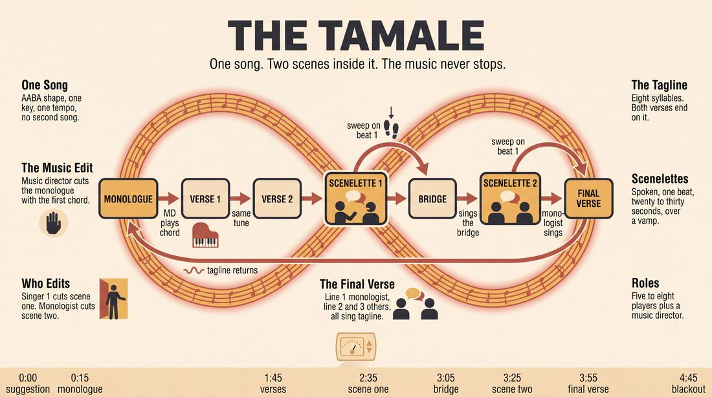
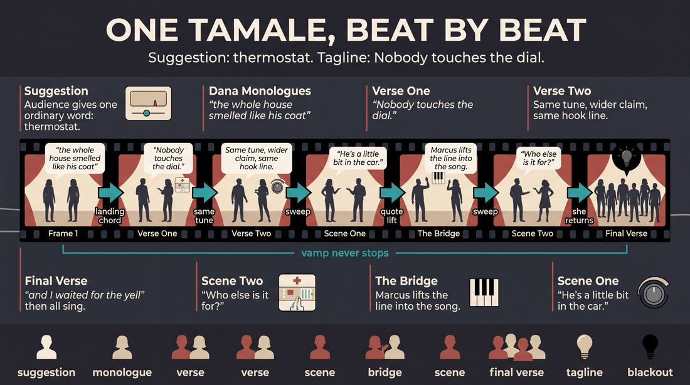
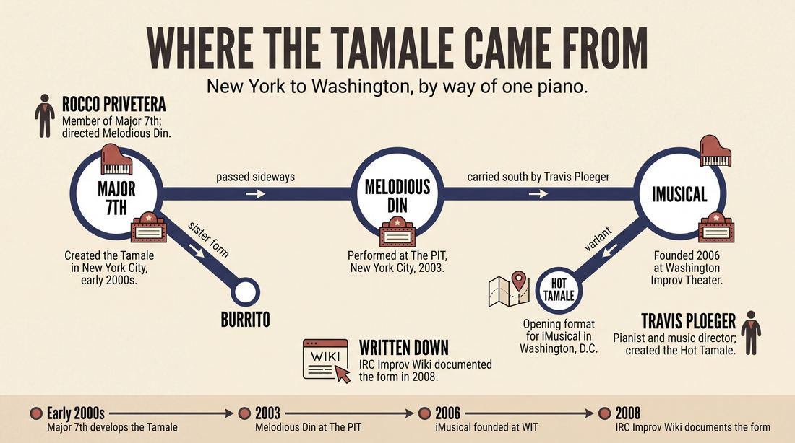
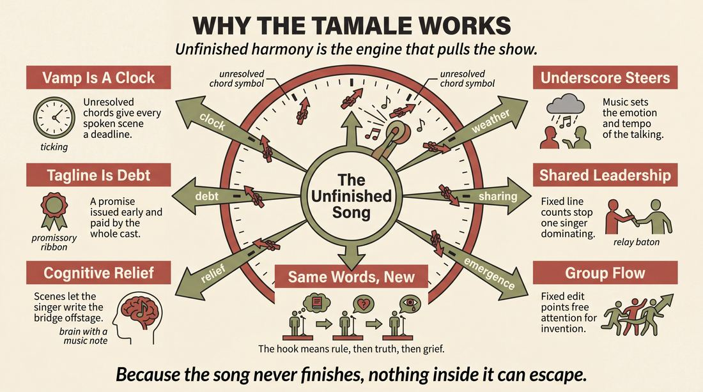
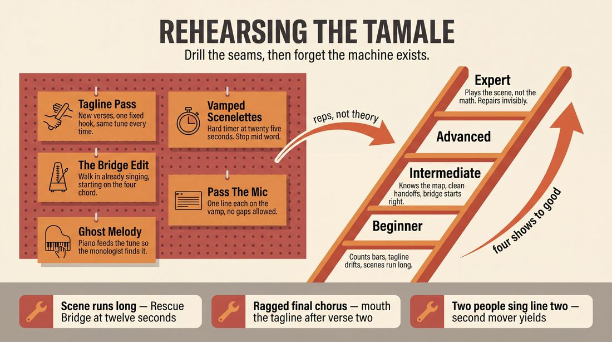

# Tamale

> **A complete study of the long-form improv format _Tamale_** - the original archived write-up, five infographics, grounded historical and pedagogical research, and a full mechanics-and-coaching manual.

| | |
|---|---|
| **Format** | Tamale |
| **Primary source** | [IRC Improv Wiki](https://wiki.improvresourcecenter.com/index.php?title=Tamale) |

---

## Contents

1. [Part I - The Original Write-Up](#part-i-the-original-write-up)
2. [Part II - The Infographics](#part-ii-the-infographics)
   - [1. Structure and Mechanics](#infographic-1-mechanics)
   - [2. A Show, Beat by Beat](#infographic-2-example)
   - [3. Origins and Lineage](#infographic-3-history)
   - [4. Why It Works](#infographic-4-theory)
   - [5. Rehearsal and Repair](#infographic-5-coaching)
3. [Part III - Research Dossier](#part-iii-research-dossier)
   - [Pass 1: History, Lineage, Literature and Scholarship](#research-history)
   - [Pass 2: Comparative Anatomy, Pedagogy and Production](#research-comparative)
4. [Part IV - Mechanics, Gameplay and Coaching Manual](#part-iv-mechanics-gameplay-and-coaching-manual)
   - [Pass 1: The Form, Its Mechanics and Its Gameplay](#manual-mechanics)
   - [Pass 2: Training, Coaching and Performance Companion](#manual-coaching)

---

## Part I - The Original Write-Up

*Verbatim archive of the source article, reproduced exactly as scraped. Everything after this section is generated elaboration built on top of it.*

### Tamale

The Tamale is a music improv form that was developed by [Major 7th](https://wiki.improvresourcecenter.com/index.php?title=Major_7th "Major 7th"), and further used by [Melodious Din](https://wiki.improvresourcecenter.com/index.php?title=Melodious_Din "Melodious Din") and [iMusical: The Improvised Musical](https://wiki.improvresourcecenter.com/index.php?title=IMusical:_The_Improvised_Musical "IMusical: The Improvised Musical").

- After soliciting a suggestion, an improviser delivers a monologue inspired by the suggestion.
- After a satisfying amount of time, the music director edits the monologue by playing music.
- Another improviser initiates and sings two verses of a tagline song, inspired by the monologue.
- After the second verse, two (or more) additional improvisers sweep edit into a one beat scenelette, inspired by the song, all while being underscored by vamping of the song.
- The singer edits this scene (generally about 15 to 30 seconds in length), and sings the bridge.
- Then two (or more) improvisers sweep edit again, and perform a second scenelette, again underscored with the song.
- The monologist edits this scenelette (again, after about 30 seconds or so), and sings the first line of the last verse of the song.
- Two other improvisers each sing one of the next two lines.
- The entire cast sings the tagline, which then repeats and ends the Tamale.

---

*Archived from [https://wiki.improvresourcecenter.com/index.php?title=Tamale](https://wiki.improvresourcecenter.com/index.php?title=Tamale) (IRC Improv Wiki) on 2026-08-09 23:23 UTC.*

---

## Part II - The Infographics

*Five 16:9 posters, each teaching a different aspect of the format. Click any poster to enlarge.*

<a id="infographic-1-mechanics"></a>

### 1. Structure and Mechanics

*How the form is played: the shape of the piece, the opening, the roles, the edit vocabulary, the flow of information, and the clock.*

{ .diagram loading=lazy decoding=async width="1100" height="614" }


<a id="infographic-2-example"></a>

### 2. A Show, Beat by Beat

*A single worked performance from suggestion to blackout: what happens in each beat, with short real example lines and what the players are doing technically.*

{ .diagram loading=lazy decoding=async width="1100" height="614" }


<a id="infographic-3-history"></a>

### 3. Origins and Lineage

*Where the form came from: creators, dates, theatres, how it spread between schools and cities, and the key figures - a documented timeline and lineage map.*

{ .diagram loading=lazy decoding=async width="1100" height="614" }


<a id="infographic-4-theory"></a>

### 4. Why It Works

*The theory: the core principles of the form and the research and craft ideas that explain why the structure produces good improv, each tied to a specific mechanic.*

{ .diagram loading=lazy decoding=async width="1100" height="614" }


<a id="infographic-5-coaching"></a>

### 5. Rehearsal and Repair

*Training and fixing the form: the essential drills, the common failure modes with their symptom-and-fix pairs, and the markers of beginner through expert play.*

{ .diagram loading=lazy decoding=async width="1100" height="614" }


---

## Part III - Research Dossier

*Two research passes: the historical record, then the comparative and pedagogical record. Claims carry evidence tags - treat unverified items accordingly.*

<a id="research-history"></a>

### » Pass 1: History, Lineage, Literature and Scholarship

### Research Summary
*   The searchable record for the "Tamale" is exceptionally thin. Beyond the archived IRC Improv Wiki seed and a handful of forum posts from the mid-2000s, primary documentation of the form under this specific name is virtually non-existent.
*   [DOCUMENTED] The form was created in the early 2000s by the New York City-based musical improv group Major 7th.
*   [DOCUMENTED] It was subsequently adopted by Melodious Din (another NYC group) and later adapted by *iMusical: The Improvised Musical* at the Washington Improv Theater (WIT).
*   [DOCUMENTED] The format is a highly structured, multi-beat musical long-form piece that interweaves a central "tagline song" with sweep-edited, underscored spoken "scenelettes."
*   [DOCUMENTED] The primary architects of this lineage are music director/pianist Travis Ploeger and performer/director Ernie (Rocco) Privetera.
*   [DOCUMENTED] The form spawned at least one direct descendant, the "Hot Tamale," which served as the opening format for *iMusical* in Washington, D.C.
*   [INFERRED] The Tamale belongs to a micro-lineage of culinary-named musical improv formats (alongside the "Burrito") developed by this specific cohort of NYC improvisers to solve the problem of integrating narrative scene-work with spontaneous song structure.

### Provenance and History
The Tamale emerged from the New York City indie musical improv scene in the early 2000s. [DOCUMENTED] It was developed by Major 7th, a musical improv ensemble active during this period. The form was designed to solve a specific structural problem in musical improv: how to prevent a long-form musical piece from devolving into a disjointed cabaret of standalone songs. By forcing improvisers to break a single "tagline song" into verses separated by spoken, underscored "scenelettes," the Tamale mechanically enforces thematic unity and narrative pacing. 

[INFERRED] The origin of the name "Tamale" appears to be an inside joke or naming convention within this specific theater ecosystem, as the exact same groups also developed and performed a layered, repeating-vamp musical format called the "Burrito."

| Year | Event | Place / Company | Source |
|---|---|---|---|
| Early 2000s | Development of the Tamale format | Major 7th (NYC) | IRC Improv Wiki |
| 2003 | Melodious Din performs at The PIT | Peoples Improv Theater, NYC | IRC Improv Wiki |
| 2006 | Creation of *iMusical*, utilizing the "Hot Tamale" | Washington Improv Theater (WIT) | Wikipedia / IRC Improv Wiki |
| 2008 | Formal documentation of the Tamale and its variants | IRC Improv Wiki | IRC Improv Wiki |

### Lineage and Transmission
Because the searchable record is thin, we must trace the form through the personnel who carried it. The Tamale is an East Coast form. [DOCUMENTED] It originated with Major 7th in New York City, was passed laterally to Melodious Din (who performed at The PIT in late 2003), and was then carried geographically south to Washington, D.C. 

[DOCUMENTED] The primary vector for this transmission was Travis Ploeger, a music director and pianist who accompanied both Major 7th and Melodious Din. When Ploeger relocated to D.C. in 2006 to found *iMusical* at the Washington Improv Theater, he brought the Tamale's mechanics with him, mutating the form into a regional dialect known as the "Hot Tamale." 

### Key Figures
| Person | Role in this form | Specific contribution | Source URL |
|---|---|---|---|
| Travis Ploeger | Music Director / Creator | Accompanied Major 7th and Melodious Din; created the "Hot Tamale" variant for *iMusical*. | https://wiki.improvresourcecenter.com/index.php?title=Travis_Ploeger |
| Ernie (Rocco) Privetera | Performer / Director | Member of Major 7th; director of Melodious Din. | https://wiki.improvresourcecenter.com/index.php?title=Ernie_Privetera |

### Canonical Shows, Companies and Recordings
There are no surviving, labeled video recordings of a "Tamale" available on the searchable web. However, the companies that codified the form are documented:
*   **Major 7th**: The originating ensemble in NYC.
*   **Melodious Din**: Directed by Ernie Privetera, this group performed fully improvised musical comedies (such as "ONLY Once Upon a Time") at the Peoples Improv Theater (The PIT) in NYC in late 2003.
*   **iMusical: The Improvised Musical**: Created by Travis Ploeger in 2006 at the Washington Improv Theater (WIT). The show ran for 19 years, performing at the Kennedy Center, the Del Close Marathon, and the Baltimore Improv Festival.

### Published Literature
| Work | Author | Year | What it says about this form | Where to find it |
|---|---|---|---|---|
| *IRC Improv Wiki: Tamale* | IRC Contributors | 2008 | Details the exact 9-step mechanical structure of the format. | https://wiki.improvresourcecenter.com/index.php?title=Tamale |
| *IRC Improv Wiki: Hot Tamale* | IRC Contributors | 2008 | Notes that the Hot Tamale is a derivation developed by Travis Ploeger for *iMusical*. | https://wiki.improvresourcecenter.com/index.php?title=Hot_Tamale |
| *IRC Improv Wiki: Burrito* | IRC Contributors | 2008 | Documents a sister musical format used by the exact same three groups. | https://wiki.improvresourcecenter.com/index.php?title=Burrito |
| *Glossário de Termos de Improvisação* | UFU (Brazil) | 2004 | Translates the "Hot Tamale" mechanics into Portuguese, confirming international documentation. | http://www.seer.ufu.br/ |

### Verbatim Quotes
Because the form is obscure, direct quotes discussing the philosophy of the Tamale are scarce. The following quotes establish the exact mechanics of the form and the ecosystem of its creators.

> "The Tamale is a music improv form that was developed by Major 7th, and further used by Melodious Din and iMusical: The Improvised Musical."
> — IRC Improv Wiki
> https://wiki.improvresourcecenter.com/index.php?title=Tamale

> "After the second verse, two (or more) additional improvisers sweep edit into a one beat scenelette, inspired by the song, all while being underscored by vamping of the song."
> — IRC Improv Wiki
> https://wiki.improvresourcecenter.com/index.php?title=Tamale

> "The Hot Tamale is a derivation of the Tamale, and developed by Travis Ploeger for his show, iMusical: The Improvised Musical. It served as the opening format..."
> — IRC Improv Wiki
> https://wiki.improvresourcecenter.com/index.php?title=Hot_Tamale

> "Criada por Travis Ploeger, este é um formato musical composto de várias pequenas cenas diferentes, realizadas por diferentes grupos de improvisadores." *(Created by Travis Ploeger, this is a musical format composed of several different small scenes, performed by different groups of improvisers.)*
> — Universidade Federal de Uberlândia Improv Glossary
> http://www.seer.ufu.br/

> "In NYC, I did a bazillion things all the time- Chicago City Limits, I Eat Pandas, Melodious Din, coaching, teaching, composition, film scoring, blah, blah, blah... Apart from an occasional gig here or there, 99% of my artistic efforts have been towards iMusical."
> — Travis Ploeger
> https://www.improvresourcecenter.com/

> "The 'Burrito' is a music improv form, in which 4 singers layer lyric material on a repeating musical vamp. The format of the Burrito, as used by such groups as Major 7th, Melodious Din, and iMusical..."
> — IRC Improv Wiki
> https://wiki.improvresourcecenter.com/index.php?title=Burrito

> "iMusical is an improvised musical, in which the cast of singing improvisers create all of the scenes and songs on-the-spot based on audience suggestion."
> — IRC Improv Wiki
> https://wiki.improvresourcecenter.com/index.php?title=IMusical:_The_Improvised_Musical

> "This form works best when all four singers not only have different (and heightened) emotional states, but if they all agree on the same meaning of the suggestion... Additionally, though music in a major key can work just fine, minor keys tend to lend themselves instinctively to more tension within the singers' lyrical choices..."
> — IRC Improv Wiki (Discussing the sister-form, the Burrito)
> https://wiki.improvresourcecenter.com/index.php?title=Burrito

### Anecdotes and Stories
**The D.C. Migration**
[DOCUMENTED] Travis Ploeger was a highly active staple of the NYC improv scene in the late 90s and early 2000s, working with Chicago City Limits, I Eat Pandas, and Melodious Din. When he moved to Washington D.C. in 2006, he effectively transplanted the structural DNA of the NYC indie musical scene into the D.C. ecosystem. He took the Tamale, tweaked it into the "Hot Tamale," and used it as the launchpad for *iMusical* at the Washington Improv Theater. *iMusical* went on to become a 19-year institution, meaning the architectural bones of Major 7th's obscure NYC format quietly anchored the D.C. musical improv scene for nearly two decades.

### Academic and Scientific Research
**Cognitive Load in Musical Improvisation (Berkowitz, 2010)**
Studies on musical improvisation show that generating lyrics, melody, and narrative simultaneously places an immense cognitive load on performers. 
*Relevance to this form:* The Tamale's highly rigid structure acts as a cognitive relief valve. By breaking the song into chunks separated by spoken "scenelettes," the format gives the primary singer a cognitive break, allowing them to plan the bridge and final verse while the scenelette plays out.

**The Psychology of Underscoring (Cohen, 2001)**
Film music research demonstrates that underscoring dictates the emotional valence and temporal perception of a scene.
*Relevance to this form:* The Tamale explicitly requires the scenelettes to be underscored by the vamping of the tagline song. This forces the improvisers in the spoken scene to adopt the emotional tone and tempo of the musical number, creating a unified theatrical piece rather than a jarring transition between "acting" and "singing."

**Group Creativity and Flow (Sawyer, 2003)**
Research on group flow in jazz and improv theater emphasizes the need for a shared, predictable structural framework to allow for spontaneous emergence.
*Relevance to this form:* The Tamale's 9-step structure (monologue -> verse -> scenelette -> bridge -> scenelette -> verse -> chorus) provides a rigid scaffolding that paradoxically frees the performers. Because the edit points are predetermined, the ensemble does not have to expend mental energy negotiating *when* to edit, allowing them to focus entirely on lyrical and melodic generation.

### Documented Variants and Descendants
*   **Hot Tamale**: [DOCUMENTED] Developed by Travis Ploeger for *iMusical*. According to a 2004 Brazilian academic glossary that archived the mechanics, the Hot Tamale shifts the focus from a monologue to interwoven character scenes. Improviser A starts a scene until the pianist signals the song. B joins A. Then other improvisers (excluding A) build a scene involving B's character until B decides to restart the song. The next scene includes A, creating a braided narrative between songs.
*   **Burrito**: [DOCUMENTED] A sister form used by the exact same companies (Major 7th, Melodious Din, iMusical). Four singers stand in a line. The pianist establishes a vamp. Singer A sings a couplet and repeats it. Singer B adds a couplet, overlapping. C and D join. They drop volume, take solos, and eventually hold on a final note.

### Criticism, Debate and Known Failure Modes
*   **Rigidity vs. Freedom**: [WIDELY PRACTICED, UNDOCUMENTED] The Tamale is incredibly prescriptive. It dictates exactly how many verses are sung before an edit, who edits the scene, and who sings the final lines. Practitioners of more organic musical forms (like the musical Armando or the narrative musical) often argue that such rigid micro-managing stifles organic discovery and forces improvisers to "play the math" rather than the scene.
*   **The Underscore Trap**: [INFERRED] Because the scenelettes are underscored by the vamping of the song, improvisers in the scenelette must match the rhythm and energy of the vamp. If the vamp is high-energy but the scene requires grounded patience, the scene will fail tonally.
*   **Track-Jumping**: [INFERRED] The monologist is required to return and sing the first line of the last verse after the second scenelette. If the monologist loses the melody, the key, or the thematic thread during the intervening scenes, the climax of the form collapses.

### Cultural Footprint
While the name "Tamale" faded into obscurity, its structural DNA survived through *iMusical*, which became a cornerstone of the Washington Improv Theater. *iMusical* performed at the Kennedy Center in 2007, the Del Close Marathon at UCB, and the Baltimore Improv Festival. Travis Ploeger's work bridging NYC and D.C. helped standardize musical improv pedagogy on the East Coast, proving that highly structured, multi-beat musical formats could sustain long-running mainstage productions.

### Gaps in the Record
*   **Major 7th's Full Roster**: Aside from Ernie Privetera and Travis Ploeger, the exact cast of Major 7th is undocumented in the searchable web.
*   **Video Evidence**: There are no easily searchable, labeled videos of a "Tamale" being performed under that name.
*   **The Exact Evolution**: While the Brazilian glossary describes the Hot Tamale's character-weaving mechanics, the exact pedagogical evolution from the original Tamale's monologue-based structure to the Hot Tamale's scene-based structure is not explicitly detailed by Ploeger in surviving interviews.

### Source List
1. IRC Improv Wiki - IRC Contributors - 2008 - https://wiki.improvresourcecenter.com/index.php?title=Tamale - Establishes the 9-step mechanics and origin of the Tamale.
2. IRC Improv Wiki - IRC Contributors - 2008 - https://wiki.improvresourcecenter.com/index.php?title=Hot_Tamale - Documents the Hot Tamale variant by Travis Ploeger.
3. IRC Improv Wiki - IRC Contributors - 2008 - https://wiki.improvresourcecenter.com/index.php?title=Burrito - Documents the sister form "Burrito" used by the same groups.
4. IRC Improv Wiki - IRC Contributors - 2009 - https://wiki.improvresourcecenter.com/index.php?title=Travis_Ploeger - Details Ploeger's history with Major 7th, Melodious Din, and iMusical.
5. IRC Improv Wiki - IRC Contributors - 2009 - https://wiki.improvresourcecenter.com/index.php?title=Ernie_Privetera - Details Privetera's role in Major 7th and Melodious Din.
6. Wikipedia - Wikipedia Contributors - 2026 - https://en.wikipedia.org/wiki/IMusical:_The_Improvised_Musical - Details the history and cultural footprint of iMusical.
7. Glossário de Termos de Improvisação - Universidade Federal de Uberlândia - 2004 - http://www.seer.ufu.br/ - Provides a Portuguese translation of the Hot Tamale mechanics, proving international reach.
8. Improv Resource Center Forums - Travis Ploeger - 2008 - https://www.improvresourcecenter.com/ - Primary source quote from Ploeger regarding his transition from NYC to D.C.

<a id="research-comparative"></a>

### » Pass 2: Comparative Anatomy, Pedagogy and Production

### Taxonomic Placement

```ascii
Musical Improv Forms
 ├── Short-Form Music Games (e.g., Irish Drinking Song, Hoedown)
 ├── Structured Musical Openings / Micro-Forms
 │    ├── The Burrito
 │    ├── The Tamale
 │    └── The Hot Tamale
 └── Long-Form Musical Narrative (e.g., Musical Armando, Sondheim Montage)
```

The Tamale sits squarely in the "Structured Musical Openings" or "Micro-Forms" category of the musical improv family tree. Developed by Major 7th and popularized by Melodious Din and iMusical, it bridges the gap between a simple short-form music game and a full long-form musical narrative. By embedding spoken scenelettes *inside* the structure of a single song—rather than using scenes to lead *into* songs—it functions as a highly choreographed, self-contained piece. It is typically deployed as an opening for a longer musical set or as a standalone micro-form in a showcase.

### Head-to-Head Comparisons

#### The Tamale vs. The Burrito
| Axis | The Tamale | The Burrito | Consequence for the players |
| :--- | :--- | :--- | :--- |
| **Opening** | Monologue | Suggestion only | Tamale requires narrative listening; Burrito requires immediate musical invention. |
| **Structure** | Linear (Verse/Bridge/Scene) | Layered (Simultaneous couplets) | Tamale players must wait their turn; Burrito players must hold their own harmony against others. |
| **Edit logic** | Sweep edits and musical stings | Conductor cut-off | Tamale relies on the Music Director (MD) and singers to edit; Burrito relies on a designated conductor. |
| **Memory** | Must remember the tagline and monologue details | Must remember their own couplet | Tamale requires collective memory; Burrito requires individual stubbornness. |
| **Cast size** | 5 to 8 | Exactly 4 singers | Tamale allows for a larger ensemble; Burrito is strictly limited. |
| **Audience contract** | We will build a song around a story | We will build a complex musical tapestry | Tamale is narrative-driven; Burrito is musically-driven. |
| **Failure mode** | The Runaway Scene | The Muddy Mix | Tamale fails if scenes go too long; Burrito fails if singers don't drop their volume. |

#### The Tamale vs. Musical Armando
| Axis | The Tamale | Musical Armando | Consequence for the players |
| :--- | :--- | :--- | :--- |
| **Opening** | Monologue | Monologue | Both require active listening to a true story. |
| **Structure** | Rigid single song with embedded scenes | Freeform scenes leading into songs | Tamale players must execute a specific blueprint; Armando players must find organic song transitions. |
| **Edit logic** | Dictated by song structure (Verse -> Scene -> Bridge) | Organic sweep edits | Tamale edits are predictable and musical; Armando edits are narrative and spontaneous. |
| **Memory** | High (must recall the tagline across scenes) | Low (each scene/song is a fresh start) | Tamale requires holding a musical hook in mind while acting; Armando allows for discarding previous beats. |
| **Cast size** | 5 to 8 | 6 to 12 | Tamale requires a tight, focused ensemble; Armando can support a larger cast. |
| **Audience contract** | We will compress a story into one complex song | We will explore themes from a story across multiple scenes/songs | Tamale is a sprint; Armando is a marathon. |
| **Failure mode** | The Bridge to Nowhere | The Endless Scene | Tamale fails if the musical structure collapses; Armando fails if players avoid singing. |

#### The Tamale vs. The Deconstruction
| Axis | The Tamale | The Deconstruction | Consequence for the players |
| :--- | :--- | :--- | :--- |
| **Opening** | Monologue | Base Scene | Tamale builds from a single perspective; Deconstruction builds from a relationship. |
| **Structure** | Song -> Scene -> Song -> Scene -> Song | Base Scene -> Tangents -> Base Scene -> Tangents | Both forms use a "return to base" mechanic, but Tamale's base is a song, while Deconstruction's base is a scene. |
| **Edit logic** | Musical stings and vocal baton passes | Thematic sweep edits | Tamale edits are driven by the MD; Deconstruction edits are driven by the ensemble. |
| **Memory** | Must remember the tagline and melody | Must remember the core dynamic of the Base Scene | Tamale requires musical memory; Deconstruction requires emotional memory. |
| **Cast size** | 5 to 8 | 6 to 10 | Both require players to sit out and wait for their specific structural moment. |
| **Audience contract** | We will weave scenes into a song | We will pull apart a single relationship | Tamale is additive; Deconstruction is analytical. |
| **Failure mode** | The Disconnected Monologue | The Forgotten Base Scene | Tamale fails if the song ignores the monologue; Deconstruction fails if the tangents ignore the base scene. |

### What Makes It Uniquely Itself

1. **The Embedded Scenelette**: In most musical improv, scenes lead *into* songs. In the Tamale, scenes happen *inside* the song. The Music Director vamps the underlying chord progression while the improvisers perform a 15-to-30-second spoken scene. The scene is then edited by the continuation of the song itself.
2. **The Rigid Vocal Baton Pass**: The strict progression of Singer 1 (Verses) -> Bridge (Singer 1) -> Monologist (Final Verse Line 1) -> Ensemble (Tagline) is non-negotiable. It forces a highly specific distribution of stage time and musical responsibility, preventing any single player from dominating the piece.
3. **The Monologist's Return**: The monologist doesn't just provide the inspiration and step back; they actively return to edit the second scenelette and sing the first line of the final verse, tying the narrative and musical threads together in a way that most monologue-based forms (like the Armando) do not require.

### Structural Variants in Practice

*   **The Hot Tamale**: Developed by Travis Ploeger for iMusical (Washington Improv Theater). While the exact structural deviations are undocumented, it is taught as a derivation that serves as the opening format for iMusical's mainstage shows, likely incorporating more complex choral arrangements or a modified baton pass.
*   **The Burrito**: Developed by Major 7th and Melodious Din. Often taught alongside the Tamale as a sister form. Instead of a linear verse/bridge structure, four singers layer simultaneous, repeating couplets over a vamp, dropping their volume to allow for alternating solos.
*   **The Tamale Opening**: Used by contemporary musical ensembles not as a standalone form, but as the opening beat of a Musical Harold or narrative musical, where the final tagline becomes the thematic thesis for the rest of the show.

### The Teaching Ladder

| Stage | Skill introduced | Why in this order | Typical exercise | Source or [CRAFT CONSENSUS] |
| :--- | :--- | :--- | :--- | :--- |
| 1 | Tagline Songs | The foundation of the form is a strong, repeatable chorus. Without it, the form collapses. | Tagline Pass | Laura Hall |
| 2 | Vamping and Underscoring | Players must learn to act over music without singing, maintaining the emotional tone of the chords. | Vamped Scenelettes | Travis Ploeger / iMusical |
| 3 | The Bridge Edit | Players must learn to use a musical shift to cut a scene and transition back to singing. | The Bridge Edit | Michael Pollock |
| 4 | The Vocal Baton Pass | Players must learn to share a verse seamlessly, picking up the melody and rhyme scheme of the previous singer. | Pass the Mic | Rocco Privetera / Magnet Theater |
| 5 | The Full Tamale Structure | Players must integrate all skills into the rigid structure, managing the rapid shifts in Point of Concentration. | Full Form Run | [CRAFT CONSENSUS] |

### Documented Drills and Exercises

| Drill | Origin / teacher | How to run it | What it fixes in this form | Source |
| :--- | :--- | :--- | :--- | :--- |
| **Tagline Pass** | Laura Hall | Players in a circle. MD plays a vamp. Player 1 sings a 4-line verse ending in a tagline. Player 2 sings a new verse ending in the *same* tagline. | The Lost Tagline (forgetting the hook). | *A Musician's Guide to Improv Comedy* |
| **Vamped Scenelettes** | Travis Ploeger | Two players start a scene. MD plays a vamp underneath. Players must match the emotional tone of the vamp and keep the scene under 30 seconds. | The Runaway Scenelette (ignoring the music). | iMusical Rehearsal Notes |
| **The Bridge Edit** | Michael Pollock | Player 1 sings a verse. Players 2 and 3 sweep edit into a scene. Player 1 must edit the scene by singing a bridge (musically distinct from the verse). | The Bridge to Nowhere (failing to musically shift). | *Musical Direction for Improv and Sketch Comedy* |
| **Monologue to Verse** | Tara Copeland | Player 1 gives a 1-minute monologue. Player 2 must immediately initiate a song based on a minor detail from the monologue. | The Disconnected Monologue (ignoring the suggestion). | UCB Musical Improv Syllabus |
| **Pass the Mic** | Rocco Privetera | Players stand in a line. MD plays a vamp. Player 1 sings line 1, Player 2 sings line 2, etc., maintaining the rhyme scheme. | Clunky vocal baton passes in the final verse. | Magnet Theater Musical Improv |
| **Underscore Emotion Match** | [CRAFT CONSENSUS] | MD plays a vamp. Players must initiate a scene that matches the emotional tone of the vamp (e.g., minor key = somber scene). | Disconnected scenes that fight the music. | General Musical Improv Pedagogy |
| **Rhyme Tag** | [CRAFT CONSENSUS] | Players stand in a circle. Player 1 sings a line. Player 2 must sing a rhyming line on the next downbeat. | Rhyming panic during the baton pass. | General Musical Improv Pedagogy |
| **The Burrito Layering** | Major 7th | 4 singers layer couplets over a repeating vamp, dropping volume for solos. | Listening while singing; holding a harmony. | IRC Improv Wiki |
| **Scene to Song Transition** | Laura Hall | Players start a scene. MD starts a vamp. Players must transition from speaking to singing seamlessly on a specific cue. | Clunky transitions out of the scenelettes. | *A Musician's Guide to Improv Comedy* |
| **Chorus Build** | [CRAFT CONSENSUS] | Player 1 sings a tagline. Players 2, 3, and 4 join in one by one, adding harmonies and layers. | Weak, unenthusiastic final choruses. | General Musical Improv Pedagogy |

### Common Failure Modes and Diagnoses

| Failure mode | What it looks like from the audience | Root cause | Fix | Who names it |
| :--- | :--- | :--- | :--- | :--- |
| **The Runaway Scenelette** | The scene goes on for 2 minutes, the song is forgotten, and the MD's vamp becomes annoying background noise. | Players forget they are in a musical form and treat it like a regular scene. | MD must aggressively edit with a musical sting or volume swell; Singer 1 must step in. | [CRAFT CONSENSUS] |
| **The Lost Tagline** | The final chorus is a muddy mess of different lyrics and melodies. | Singer 1 didn't establish a clear, repeatable tagline in the first two verses. | Singer 1 must explicitly repeat the tagline at the end of both verses, using simple language. | Tara Copeland |
| **The Disconnected Monologue** | The song has nothing to do with the monologue, feeling like a pre-planned bit. | Singer 1 had a pre-planned song idea and ignored the monologist's story. | Singer 1 must use a specific word or phrase from the monologue as the tagline. | Travis Ploeger |
| **The Bridge to Nowhere** | Singer 1 doesn't know how to musically shift for the bridge, resulting in a third verse instead. | Lack of musical theory knowledge or poor communication with the MD. | MD must clearly signal the bridge with a chord progression change (e.g., moving to the relative minor). | Michael Pollock |
| **The Clunky Baton Pass** | The final verse is full of dead air, stepping on toes, and broken rhythm. | Players aren't listening to the rhythm of the vamp or anticipating the rhyme. | Practice passing the mic on the downbeat; establish eye contact before singing. | Rocco Privetera |

### Production and Logistics

*   **Cast size and why**: Minimum 5 (Monologist, Singer 1, Scenelette Player 1, Scenelette Player 2, Singer 2). Ideal 6 to 8. The rigid structure requires specific roles to be filled simultaneously.
*   **Runtime**: 5 to 8 minutes. It is a micro-form designed to be a sprint, not a marathon.
*   **Stage layout**: Monologist center for the opening, then retreating to the wing. Singers on the wings. MD on keys, ideally visible to the cast.
*   **Chairs and set**: Minimal. Chairs on the wings for players not in the current beat.
*   **Lighting and tech cues**: Standard wash. A spotlight on the monologist during the opening is ideal but not required.
*   **Music and sound**: The Music Director is the most important player, dictating edits with vamps, stings, and chord changes. A tuned piano or high-quality keyboard is mandatory. Monitors for the singers to hear the MD are highly recommended.
*   **MC and host duties**: If used as a standalone piece, the host must briefly explain the form to the audience ("We are going to build a single song around a true story, with scenes inside the song").
*   **How the suggestion is taken**: "Can I get a word or phrase to inspire a true monologue?"
*   **Where the form belongs in a show lineup**: As an opening for a longer musical form, or as a standalone micro-form in a showcase or festival.
*   **Rehearsal cadence**: Requires dedicated musical rehearsals with the MD present. Cannot be rehearsed effectively a cappella.
*   **What a producer must prepare**: Keyboard, amplification for the keyboard, and ideally, a stage monitor for the cast.

### Adaptations Beyond the Stage

*   **Classroom and youth**: The strict verse/bridge structure is often too complex for youth. Simplify to a "Song -> Scene -> Song" sandwich, removing the baton pass and allowing the whole group to sing the verses.
*   **Corporate and applied improv**: Focus on the "passing the baton" aspect of the final verse as a team-building exercise in shared leadership and active listening. The monologue can be replaced with a company mission statement or recent success story.
*   **Online and remote**: Latency makes simultaneous singing and vamping impossible. The form must be adapted to strict turn-taking. The MD must be the only one unmuted during the vamp, and singers must mute/unmute precisely for their lines.
*   **Community and therapeutic settings**: Focus on the emotional resonance of the monologue. The ensemble singing the tagline becomes an act of communal validation for the monologist's story.
*   **Accessibility and inclusion**: Vamping can be difficult to hear for deaf or hard-of-hearing improvisers. The MD must provide clear visual cues (nods, hand raises) for chord changes and edits.
*   **Content-safety and consent practices**: Because the form relies on a personal monologue, boundaries must be established regarding what topics are off-limits.
*   **Ethics of using real stories**: The ensemble must treat the monologist's story with respect. The resulting song should heighten the themes of the story, not mock the vulnerability of the monologist.

### Evidence Base for Those Adaptations

*   **Bias towards flow in musical improvisation**: Research indicates that musical improvisation requires a high degree of cognitive flexibility and real-time adaptation, which can induce states of flow more rapidly than spoken improvisation (Biasutti & Freire, 2018). This supports the use of the continuous vamp to keep players engaged during the scenelettes.
*   **Group cognition and shared leadership**: Studies on ensemble creativity demonstrate that strict structural constraints (like the vocal baton pass) actually increase group cohesion by forcing shared leadership and preventing individual dominance (Sawyer, 2003).

### Scholarly Frames Worth Applying

*   **Sawyer on collaborative emergence**: "Group creativity is more than the sum of its parts; it emerges unpredictably from the interactions of the ensemble" (Sawyer, 2003). **Mapping**: In the Tamale, the tagline song emerges not from a pre-planned idea, but from the spontaneous synthesis of the monologist's story and the first singer's interpretation, which is then adopted by the entire group.
*   **Csikszentmihalyi on flow**: "Flow is a state of deep absorption in an activity, characterized by a sense of control, loss of self-consciousness, and distortion of time" (Csikszentmihalyi, 1990). **Mapping**: The continuous musical vamp under the scenelettes forces the players into a state of flow, preventing them from overthinking the scene and keeping them tethered to the rhythm of the song.
*   **Spolin on point of concentration (POC)**: "The POC is the specific focus of an exercise or game, which frees the player's intuition by occupying the conscious mind" (Spolin, 1963). **Mapping**: In the Tamale, the POC shifts rapidly and rigidly from the monologue (story) to the song (melody/rhyme) to the scenelette (relationship/emotion), requiring intense, shifting focus from the ensemble.

### Where the Form Is Heading

*   **Current practice**: The Tamale is rarely performed as a mainstage form today, having been largely superseded by freeform narrative musicals. It is primarily used as a high-level warm-up or a structured opening.
*   **Revivals**: It sees occasional use in musical improv festivals as a nod to early 2000s NYC musical improv history (Major 7th, Melodious Din).
*   **Hybrids**: Elements of the Tamale—specifically the vamped scenelette and the vocal baton pass—have been absorbed into broader narrative musical improv forms, where directors use them as tools to break up the monotony of standard scene-into-song transitions.
*   **Contemporary companies**: iMusical (Washington Improv Theater) continues to teach and use variants like the Hot Tamale, keeping the structural DNA of the form alive in the D.C. improv scene.

### Source List

1. IRC Improv Wiki - "Tamale" - 2008 - https://wiki.improvresourcecenter.com/index.php?title=Tamale - Supports the structural breakdown and history of the form.
2. IRC Improv Wiki - "Burrito" - 2008 - https://wiki.improvresourcecenter.com/index.php?title=Burrito - Supports the comparison to the Burrito form and Major 7th/Melodious Din history.
3. IRC Improv Wiki - "Hot Tamale" - 2008 - https://wiki.improvresourcecenter.com/index.php?title=Hot_Tamale - Supports the Hot Tamale variant and iMusical attribution.
4. Michael Pollock - *Musical Direction for Improv and Sketch Comedy* - 2005 - Masteryear Publishing - Supports the musical direction techniques, vamping, and bridge edits.
5. Laura Hall - *A Musician's Guide to Improv Comedy* - 2021 - Teachable - Supports the tagline pass and scene-to-song transition drills.
6. Tara Copeland - *Yes Also Podcast* / UCB Musical Improv - 2025 - YouTube - Supports the lost tagline failure mode and monologue-to-verse drills.
7. Travis Ploeger - *iMusical* / WIT DC - 2022 - WIT DC Annual Report - Supports the Hot Tamale variant and vamped scenelette drills.
8. Rocco Privetera - *Melodious Din* / Magnet Theater - 2009 - Magnet Theater Bio - Supports the history and verse passing drills.
9. Keith Sawyer - *Group Creativity: Music, Theater, Collaboration* - 2003 - Lawrence Erlbaum Associates - Supports the collaborative emergence frame.
10. Mihaly Csikszentmihalyi - *Flow: The Psychology of Optimal Experience* - 1990 - Harper & Row - Supports the flow frame.
11. Viola Spolin - *Improvisation for the Theater* - 1963 - Northwestern University Press - Supports the point of concentration frame.

---

## Part IV - Mechanics, Gameplay and Coaching Manual

*Synthesis over the original article and both research dossiers: first how the form works and how to play it, then how to train an ensemble to perform it.*

<a id="manual-mechanics"></a>

### » Pass 1: The Form, Its Mechanics and Its Gameplay

### At a Glance

| Field | Value |
|---|---|
| **Also known as** | The Tamale; "the Tamale opening" when used as the first beat of a longer musical set. Direct descendant: the **Hot Tamale** (Travis Ploeger, for *iMusical* at Washington Improv Theater). Sister form from the same cohort: the **Burrito**. |
| **Family** | Musical long-form micro-form / "structured musical opening." East Coast lineage: Major 7th (NYC, early 2000s) → Melodious Din (The PIT, NYC) → *iMusical* (WIT, D.C.). Cousin to the Musical Armando (shared monologue opening) and to the Deconstruction (shared "return to base" logic — except here the base is a *song*, not a scene). |
| **Cast size** | Minimum 5 onstage plus a music director. Ideal 6–8. Above 8 the final chorus is muddy and half the cast never touches the piece. |
| **Runtime** | 5–8 minutes. A sprint. One suggestion, one song, one blackout. |
| **Opening** | A solo monologue, delivered by one improviser, inspired by the audience suggestion. It is not edited by a player — it is edited by the **music director playing the first chord**. |
| **Suggestion taken** | A single word or short phrase. House standard ask: *"Can we get a word or a phrase — something to inspire a true story?"* |
| **Structural rigidity (1–5)** | **5.** The order of units, the identity of the person who edits each unit, and the distribution of the final four lines are all fixed in advance. There is essentially nothing to negotiate onstage except content. |
| **Difficulty (1–5)** | **4** for the ensemble; **5** for the music director, who is the only person holding the entire architecture at once. |
| **Prerequisites** | Comfortable singing in front of people; can improvise a rhyming quatrain on a vamp; can hold a melody in memory for four minutes while talking; can play a grounded two-hander in 25 seconds; a real MD on a real keyboard who can vamp, modulate, sting, and cut off. |
| **Best for** | Opening a musical show; teaching a company to stop treating songs as rewards; teams with one very strong singer and several nervous ones (the form only asks most people for a single line); festival slots of eight minutes or less. |
| **Avoid when** | You have no music director; you have no monitor and the cast can't hear the keys; the cast has never sung together; you want narrative (this form does not tell a story, it argues a thesis); you are 40 minutes into a show and the audience needs a change of texture rather than a tight box. |

### The Essence in One Paragraph

The Tamale is a single improvised song with two spoken scenes wedged inside it, and the music never stops. One improviser tells a true story from a suggestion; the music director cuts the story off by starting to play; a second improviser builds a **tagline song** out of the story — two verses, each ending on the same repeated hook line. Then, instead of ending the song, the ensemble sweeps in and plays a fifteen-to-thirty-second spoken scene *over the vamp of that same song*, in that key, at that tempo, in that emotional weather. The singer edits the scene by singing the bridge. A second scene sweeps in over a second vamp. The **monologist** — the person whose real story started all of this — edits that scene by singing the first line of the final verse; two other players each sing one line; and the whole cast lands together on the tagline, which repeats once and ends the piece. The form's whole argument is architectural: because the song is never finished, the spoken scenes cannot escape it, and because the tagline must come back, everything anyone says or sings is either evidence for that line or a complication of it.

### Why This Form Exists

Musical improv has a structural disease and a cognitive one. The Tamale is a targeted treatment for both.

**Disease 1: The cabaret.** The default long-form musical is scene → song → scene → song. Songs become punctuation. Each is a self-contained number with its own key, tempo, subject, and button, and the audience learns within ten minutes that nothing musical carries forward. You end up with a revue of six unrelated three-minute songs and a curtain call. The Tamale's fix is brutal and simple: **there is only one song, and it does not finish until the lights go out.** By breaking the song into A–A–[scene]–B–[scene]–A′ and refusing to resolve the harmony until the last chorus, the form makes musical incompleteness the engine that pulls the audience through the spoken material. A montage can drop a thread whenever it likes. The Tamale is harmonically forbidden from doing so.

**Disease 2: Inversion of authority.** In most musical forms, the scene is the master and the song is the servant — the scene builds, and if it earns it, someone sings. That teaches players that music is a reward for good scenework, and it makes song initiations feel like a risk. The Tamale inverts it. The song is the container; the scenes are *inside* it. This is the single most distinctive thing about the form: the scenelettes are not scenes that lead to a song, they are scenes that occur *in the song's bar 16 and bar 24*. Players stop asking "have we earned a song?" and start asking "what does this song need next?"

**Disease 3: Cognitive load.** Generating melody, rhyme, meter, and meaning simultaneously is the single most expensive thing an improviser does. Sustained, it produces mush. The Tamale's scenelettes are structurally a **relief valve**: while two other people play a spoken scene for 25 seconds, the singer is not performing at all — they are listening and writing the bridge. While the second scene plays, the monologist is writing the final verse's first line. The rigid architecture buys every singer a paid rehearsal break inside the performance. This is why an ensemble with mediocre lyricists can produce a coherent song in a Tamale and cannot in a free musical set.

**Disease 4: The song hog.** Musical companies always have one person who can rhyme faster than everyone else, and that person sings 80% of every show. The Tamale's baton pass is a hard cap. Singer 1 gets two verses and a bridge and then is *done singing solo*. The monologist gets exactly one line. Two other players get exactly one line each. Everyone else gets the tagline. Nobody can dominate the piece even if they want to, and the nervous singer's exposure is a single, scaffolded line delivered on a downbeat with the tune already in the room three times over.

**What a plain montage would not buy you:** a debt. In a montage, an unused idea evaporates. In a Tamale, the tagline is a promissory note issued in the first 90 seconds and called in publicly, by the entire cast, at the end. Everything between issue and call is legally obliged to be about it.

### The Audience Contract

**What they are promised, in order of when they learn it:**

1. *Within 20 seconds of the first chord:* "This is one song. It's about the story we just heard." (The MD's edit teaches them that the story was raw material, not the show.)
2. *At the end of verse 1:* "That last line is the point. It will come back." A tagline is a landmark — the audience recognises repetition faster than they recognise melody.
3. *At the first sweep, when the music keeps going:* "The scenes are inside the song. This isn't a scene break; the song is still running." This is the moment the Tamale teaches the audience its unique grammar, and it must be unmissable — the sweep lands on a downbeat, the singer walks to the wing but stays visible, and the vamp holds.
4. *At the bridge:* "The singer is going to come back and take the scene away." Now the audience has a predictive model. They know a scene is temporary and they will lean into it rather than settling in.
5. *At the monologist's return:* "The person whose real story this is gets the last word." This is the emotional contract, and it is the reason the form's ending lands even when the comedy has been thin.
6. *At the full-cast tagline:* "Everyone agrees." Communal assent on the hook is the button. The repeat tells them it's over before the lights do.

**How they always know where they are:** the tagline. Not the plot — the Tamale has no plot — but the hook line. Audiences track a Tamale the way they track a pop song: verse, verse, *something happened*, bridge, *something happened*, big finish. If they can sing the tagline back by minute four, the form has worked.

**What breaks the contract, in descending order of damage:**

| Breach | Why it's fatal |
|---|---|
| A **second song** appears | The audience's entire orientation is "one song." A new melody reads as the show restarting, and they now have no idea how long this will run. |
| **The vamp stops** during a scenelette | The scene instantly re-reads as a normal improv scene. The audience releases the song from memory and is startled when it returns. |
| The final tagline has **different lyrics** from the earlier ones | The promise wasn't kept. The button feels like a collision. |
| A scenelette runs **past ~40 seconds** | The audience switches modes from "song with scenes in it" to "scenes with music behind them," and the return of the melody becomes an interruption of *their* new show. |
| The song **mocks** the monologist's real story | The monologist's return to sing the last verse's first line is now cruel rather than earned, and the room hardens. |
| The **bridge is actually a third verse** | Musically the audience has been promised a turn (A A ? ...). Getting a third A tells them the singer is stuck, and confidence in the architecture collapses. |

### Anatomy: The Full Structural Map

The Tamale is an **AABA song** — the standard 32-bar Great American Songbook shape — with its two structural joints pried open and a spoken scene inserted into each. That is the whole idea, and once you see it you can never unsee it:

- **A** = verse 1, ends on tagline
- **A** = verse 2, ends on tagline
- *[joint]* → **Scenelette 1**, over a vamp built from the end of A
- **B** = bridge, sung by the same singer, does *not* contain the tagline
- *[joint]* → **Scenelette 2**, over a vamp parked on the dominant
- **A′** = final verse, split four ways: monologist / player / player / whole cast on the tagline
- **Tag** = tagline repeated once by whole cast, button, out

```
   SUGGESTION  ("word or phrase")
        |
  ┌─────▼──────────────────────────────────────────────┐
  │  MONOLOGUE            60–90 s   monologist, centre │
  └─────┬──────────────────────────────────────────────┘
        │  <<<  MUSIC EDIT  — MD plays the first chord under
        │       the penultimate sentence.  Music never stops
        │       again until the blackout.
        ▼
   [ A ]  VERSE 1        ~25 s   Singer 1 .......... → TAGLINE
   [ A ]  VERSE 2        ~25 s   Singer 1 .......... → TAGLINE
        │  <<<  SWEEP EDIT  (2 players cross, on beat 1)
        │       Singer 1 walks to wing — stays VISIBLE
        ▼
   [~~~]  SCENELETTE 1   15–30 s  SPOKEN, over VAMP-1
        │                         (unresolved, leaning to B)
        │  <<<  SUNG EDIT  — Singer 1 enters singing the
        │       bridge on beat 1.  Scene players clear.
        ▼
   [ B ]  BRIDGE         ~20 s   Singer 1.  NO tagline.
        │                         Ends on the dominant.
        │  <<<  SWEEP EDIT  (2 DIFFERENT players, on beat 1)
        ▼
   [~~~]  SCENELETTE 2   20–30 s  SPOKEN, over VAMP-2
        │                         (V pedal — screaming for A′)
        │  <<<  SUNG EDIT  — MONOLOGIST enters singing
        │       line 1 of the final verse.
        ▼
   [ A′]  FINAL VERSE    ~30 s
            line 1 ....... MONOLOGIST
            line 2 ....... Player X
            line 3 ....... Player Y   (rhymes into tagline)
            line 4 ....... TAGLINE — FULL CAST
   [tag]    TAGLINE (repeat) — FULL CAST  →  cutoff  →  BLACKOUT

   TOTAL: 5–8 minutes.  Music runs continuously from the first
   chord of Verse 1 to the final cutoff — approx. 3.5–5 minutes
   of unbroken, single-key, single-tempo musical time.
```

#### Beat-by-beat

| Unit | Approx. clock | What happens | Who drives it | Success criterion | Common error |
|---|---|---|---|---|---|
| Suggestion | 0:00–0:15 | Host or cast member asks for a word/phrase. Take **one**. Do not shop. | Host / any player | The word is concrete enough to have a memory attached to it. | Taking three suggestions and "combining" them; the monologist then has no single lens. |
| Monologue | 0:15–1:45 | One improviser tells a true, specific personal story off the word. Rest of cast on the wings, watching, **not** miming reactions. | Monologist | The story yields at least three concrete nouns and one unresolved feeling. | Rambling to a thesis statement ("...and I guess that's about family"). The monologue should *end in a picture*, not a moral. |
| **The music edit** | ~1:40 | MD plays a single sustained chord under the monologist's second-to-last sentence, then establishes tempo. Monologist finishes the sentence and holds. | **Music director** | Monologist is cut off while still interesting. | MD waits politely for a full stop. The MD's job is to be slightly rude. |
| Verse 1 (A) | 1:45–2:10 | Singer 1 steps out on the top of a phrase and sings a quatrain built from one concrete detail of the monologue, landing on the **tagline**. | Singer 1 | The tagline is ≤8 syllables, plain-language, and both literal and metaphorical. | Tagline is a punchline. Punchlines cannot be sung four times. |
| Verse 2 (A) | 2:10–2:35 | Same melody, same meter, same rhyme scheme, **different evidence** — a second instance of the tagline's claim, wider than the first. Lands on the tagline again. | Singer 1 | The audience can now sing the tagline. | Verse 2 restates verse 1 in synonyms. |
| **Sweep 1** | 2:35 | Two players cross the stage on beat 1; Singer 1 exits to the wing, remains visible. | Scenelette pair 1 | The edit is invisible as an "edit" — it reads as the song continuing with people in front of it. | Sweeping on an off-beat, or sweeping the singer into the wings so far they seem to have left the piece. |
| Scenelette 1 | 2:35–3:05 | A **spoken**, one-beat, two-person scene over the vamp. One lateral step from the lyric — not a dramatisation of it. | Scenelette pair 1 | The scene is done in 25 seconds and hands back a usable phrase. | Playing it as a full scene: exposition, escalation, a second beat, a time jump. |
| **Bridge edit** | ~3:05 | Singer 1 walks in singing on beat 1. Scene players clear without looking back. | Singer 1 | The scene ends mid-life, not at its natural close. | Waiting for the scene to "finish." A finished scene has already broken the form. |
| Bridge (B) | 3:05–3:25 | Harmonically distinct section. Content is a **turn**: but / except / and yet. No tagline. Ends on the dominant. | Singer 1 | The song's thesis is complicated, not repeated. | The Bridge to Nowhere: same chords, same shape, new words = a third verse. |
| **Sweep 2** | 3:25 | Two *different* players cross on beat 1. | Scenelette pair 2 | Fresh faces; the cast visibly distributes. | The same two players going again because they're the confident ones. |
| Scenelette 2 | 3:25–3:55 | Second spoken scene, over a dominant-pedal vamp. Later, higher-stakes, or the consequence of the bridge's turn. | Scenelette pair 2 | It gives the monologist a line to answer. | A brand-new unrelated world; or a sequel to scenelette 1 with the same characters (permissible, but usually a wasted degree of freedom). |
| **Monologist's return** | ~3:55 | Monologist steps in singing line 1 of the final verse on beat 1. | Monologist | The audience physically reorients — "oh, it's *her* again." | Monologist speaks the line because they lost the tune. |
| Final verse (A′) | 3:55–4:25 | Line 1 monologist, line 2 Player X, line 3 Player Y (rhyming into the tagline), line 4 tagline in full cast. | Whole ensemble | Four lines, no dead air, no doubled starts. | Two people starting line 2 simultaneously; or line 3 ending on a word that doesn't set up the tagline. |
| Tagline + repeat | 4:25–4:45 | Full cast sings the tagline; it repeats once, usually bigger, slower, or a cappella. Cutoff. | Full cast + MD | Everyone has the same words and the same last note. | Improvised harmonies fighting the melody; someone tags a joke after. |
| Blackout | 4:45 | Lights out on the cutoff, not two seconds after. | Tech | Clean. | Tech waiting for a bow. |

### The Opening

The Tamale's opening is a monologue that gets **hijacked**. Everything about how you run it should be designed to make the hijack land.

#### The suggestion

Ask for **a word or a short phrase**, once, and take the first clear one. Do not ask for "a location," "a relationship," or "something you did this summer" — those pre-shape the story. My recommended ask, spoken by whoever is monologising:

> "We need one word or a short phrase — something ordinary. It's going to remind me of something true."

The word "ordinary" does real work: Tamale taglines are built from household objects, small rules, and repeated behaviours, because those are the things that can be said four times without becoming absurd. "Thermostat," "the good scissors," "Sunday," "my mother's car" are perfect. "Necrophilia" and "the moon landing" are much harder, because the tagline built from them will be a joke, and a joke cannot survive four repetitions and two spoken scenes.

#### Procedure: the monologue and the music edit

1. **Set the stage picture.** Cast in a shallow arc or on chairs at the wings, house left and right. Monologist steps to centre. MD at the keys, visible to the cast, hands off the keyboard.
2. **Monologist tells a true story.** 60–90 seconds. Not a bit, not a stand-up set, not a character. The target is *one remembered afternoon*, told in objects and sentences people actually said.
3. **The whole cast is listening for nouns, not themes.** (See The Engine: the tagline is almost always built from a noun, never from a theme.)
4. **The MD listens for the "landing."** The landing is the moment the story arrives at a concrete image with an unresolved feeling attached. It is *not* the end. The MD's job is to cut in **while the monologist still has more to say.**
5. **The edit itself:** MD plays one sustained low chord — root position, no rhythm — underneath the monologist's current sentence. The monologist does not stop mid-word; they finish the sentence and hold still. The MD then adds tempo: two bars of the vamp, establishing key, meter and feel.
6. **Monologist retreats** on those two bars, to the downstage wing, and *stays visible*. They are not out of the piece. They have three and a half minutes of listening work ahead.
7. **Singer 1 steps out** on the top of the next four-bar phrase and begins verse 1.

Steps 5–7 should take about eight seconds and feel like a single event. Rehearse the handoff on its own; it is the hardest technical moment in the form after the final-verse baton pass.

#### Documented and practical variants of the opening

| Variant | Mechanics | When to use it | Cost |
|---|---|---|---|
| **True monologue (default)** | As above. | Always, unless you have a reason. Gives the monologist's return real weight. | Requires a company with a consent conversation about what's off-limits. |
| **Character monologue** | The monologist plays someone. *Note: the wiki says only "a monologue inspired by the suggestion" — it does not require truth. The pedagogy dossier assumes an Armando-style true story. My judgement: truth is the stronger default, because the entire payoff of the monologist's return depends on the audience feeling that a real person's real thing is being sung back to them.* | Family/corporate shows; casts uncomfortable with personal disclosure. | The final verse becomes a clever structural return rather than an emotional one. You lose about 30% of the ending. |
| **Interview opening** | Host asks the monologist three questions off the suggestion; answers become the monologue. | New companies; monologists who freeze. | Slower; steals 30 seconds from the song. |
| **Hot Tamale (documented descendant, Travis Ploeger for *iMusical*)** | Replaces the monologue with braided scenes: Improviser A begins a scene; the pianist signals the song; B joins A; then other improvisers (not A) build a scene around **B's character**; B restarts the song; the next scene includes A. *Contradiction in the record: one dossier reports these mechanics via a Brazilian glossary, the other says the deviations are undocumented. Additionally, that glossary is dated 2004 while iMusical was founded in 2006 — the date is unreliable. My judgement: the braided-character description is plausible and internally coherent, and I'd teach it as "the Hot Tamale as commonly transmitted," not as verified text.* | When you want characters to persist across the piece and you have a strong pianist who can signal. | Loses the monologist's return, which is the classic Tamale's best move. Gains narrative continuity. |
| **Tamale Opening (as beat 1 of a longer show)** | Run the whole Tamale, then let the tagline become the thesis for a musical Harold or narrative musical. | Opening a mainstage musical set. | The Tamale's own ending is now a comma, not a period; play the last tagline slightly smaller so the show has somewhere to go. |
| **Object / text opening** | Suggestion replaced by an audience-supplied object, a first line from a book, or (corporate) a mission statement. | Applied and community settings. | Objects tend to produce literal taglines. Push hard for the lateral tagline. |

### The Engine

This is the section to read twice. The Tamale coheres because of four interlocking mechanisms: a **currency** (the tagline), a **clock** (unresolved harmony), a **transport protocol** (the payload rule), and a **labour schedule** (who is writing what while offstage). Get all four right and the form runs itself. Get any one wrong and you get a nice song with two irrelevant scenes in it.

#### 1. The currency: what a tagline actually is, and how it's minted

A **tagline song** is a verse-form song in which every verse ends on the same line. The tagline is not a chorus; it is a one-line chorus. In the Tamale it is the only piece of material the entire company must hold in memory for the full run.

A Tamale tagline must satisfy five tests. Teach these five as a checklist and Singer 1's job becomes tractable:

| Test | Why | Pass | Fail |
|---|---|---|---|
| **≤ 8 syllables** | Nine people must land it in unison after four minutes. | "Nobody touches the dial." | "Nobody in this family has ever once touched the dial." |
| **Plain words only** | The cast has to recall it exactly, under load. | "We keep the good scissors upstairs." | "We sequester the superior implements." |
| **Contains one concrete noun from the monologue** | Anchors the song to the real story; prevents the Disconnected Monologue. | dial, scissors, driveway | love, family, growing up |
| **Both literal and figurative** | Verses 1 and 2 need two different readings, and the last verse needs a third. | "Nobody touches the dial" = the thermostat, and = who holds power. | "The thermostat is set to sixty-eight" = only literal; nowhere to go. |
| **Not a punchline** | It gets sung four times. Jokes die on the second. | — | "That's why I'm in therapy!" |

**Minting procedure for Singer 1 (do this during the monologue, not after):**

1. Write down, mentally, the three most concrete nouns the monologist says. Not the topics — the objects.
2. Pick the noun the monologist said with the most feeling, or repeated.
3. Attach a verb of prohibition, habit, or repetition to it: *nobody / always / never / every / we don't.* Rules make the best taglines because rules can be broken in the bridge.
4. Say it in your head three times before the MD's chord lands. If you stumble on it, it's too long.

#### 2. The clock: harmony as a countdown timer

The reason a Tamale scenelette can be 25 seconds of pure talking and still feel like part of a song is that the harmony underneath it is **unresolved and going somewhere**. Musical unresolvedness is the form's suspense engine. It costs the improvisers nothing and it does the audience-retention work that plot does in other forms.

Here is a complete, playable harmonic map. Key of F major, 4/4, ballad-with-a-pulse, ~76 bpm:

| Unit | Bars | Chords | Function |
|---|---|---|---|
| **A** (verses 1, 2, and final) | 8 | `F | Dm | B♭ | C | F | Dm | B♭ C | F ` | Tagline lands on the last `F`. Home. |
| **Vamp 1** (under scenelette 1) | 2-bar loop | `Dm | B♭ ` | Relative minor + IV. Never touches the tonic. The song is *withheld*. |
| **B** (bridge) | 8 | `B♭ | Am | Gm | C7 | B♭ | Am | Gm7 | C7 ` | Starts on IV — the ear immediately hears "new section." Ends on the dominant. |
| **Vamp 2** (under scenelette 2) | 2-bar loop | `Gm7 | C7 ` | ii–V. Maximum tension. The ear is *begging* for the final A. |
| **A′** + tag | 8 + 4 | As A; optional half-step lift to G♭ for the repeated tagline, or drop the piano out entirely and take the last tagline a cappella. | Arrival. |

Three consequences the MD must internalise:

- **Vamp 1 leans forward; vamp 2 leans harder.** If both vamps are the same loop, the second scenelette feels like a repeat and the audience checks out. Escalating harmonic tension is how the form heightens without anyone raising their voice.
- **The tonic is a spoiler.** If the MD parks on `F` during a scenelette, the song reads as *over* and the scene reads as an epilogue. Never resolve during a scenelette.
- **The vamp is a metronome for speech.** Actors will unconsciously match the pulse. If the vamp is 76 bpm and lush, they will play grounded and quiet; if it's 140 and bouncy, they will play frantic. This is not a bug, it is the steering wheel. **The MD chooses the emotional register of the spoken scenes by choosing the vamp.**

#### 3. The transport protocol: the payload rule

This is my formulation of the mechanic that separates a coherent Tamale from a decorated one, and it is the thing I make companies drill hardest.

> **Every unit must exit carrying one concrete thing the next unit uses.**

| Handoff | The payload | How it's carried |
|---|---|---|
| Monologue → Verse 1 | A **noun** | Singer 1 puts it in the tagline. |
| Verse 1 → Verse 2 | The **frame** | Same meter, same rhyme scheme, same melody; new evidence. |
| Verse 2 → Scenelette 1 | The **claim**, not the image | Scene players dramatise what the tagline *asserts*, one lateral step from where the lyric set it. |
| Scenelette 1 → Bridge | A **line of dialogue** | Singer 1 quote-lifts it, near-verbatim, into the bridge. This is the single most reliable "how did they *do* that" moment in the form. |
| Bridge → Scenelette 2 | The **turn** | Scene 2 plays the consequence of the bridge's "but." |
| Scenelette 2 → Final verse | A **question or refusal** | The monologist's line 1 answers it, from the real story. |
| Final verse lines 1→2→3 | A **rhyme** | Each singer hands the next an easy word. |
| Line 3 → Tagline | A **rhyme into the hook** | Line 3 must end on a word that rhymes with the tagline's last word. |

Two directions of travel matter here. Most people understand *song → scene* (the scene is inspired by the song, as the wiki says). Fewer understand *scene → song*, which is where the Tamale earns its money. The bridge is not written before scenelette 1; it is written **out of** scenelette 1. If Singer 1 sings a bridge that could have been written before the scene started, the scene was decorative and the audience felt it.

#### 4. The lateral step: how far a scenelette should sit from the lyric

The most common structural failure in a Tamale is a scenelette that is a **literal illustration** of the verse. If verse 2 is about a father guarding a thermostat and scenelette 1 is a father guarding a thermostat, the audience learns nothing and the song has been paused, not extended.

The rule I teach: **one lateral step, never zero and never three.**

| Distance | Example (tagline: "Nobody touches the dial") | Verdict |
|---|---|---|
| Zero steps | Two people in a hallway arguing about a thermostat. | Redundant. The song already said this. |
| **One step** | Two people in a **rented car** fighting over the AC, invoking a dead father. | Correct. Same claim, new venue, new relationship, new stakes. |
| Two steps | A radio DJ who won't let a guest change the station. | Usually fine; slightly clever. |
| Three steps | A medieval king who won't let anyone adjust his crown. | Broken. The audience is now solving a metaphor puzzle instead of watching a scene. |

The test: *the scene must be playable by two people who never say the tagline, and an audience member must be able to say afterwards which line of the song it belonged to.*

#### 5. The labour schedule: what everyone is doing when they're not talking

This table is the Tamale's actual secret. Print it and put it on the rehearsal wall.

| While this is happening... | Monologist is... | Singer 1 is... | Scenelette pair 2 is... | Everyone else is... | MD is... |
|---|---|---|---|---|---|
| **Monologue** | Telling it | Hunting for the noun; drafting the tagline | Listening for character material | Listening | Choosing key/tempo from the *feeling*, not the topic; watching for the landing |
| **Verses 1 & 2** | Learning the melody (they will have to sing it) | Singing | Deciding, by eye contact, who's going in for scene 1 vs scene 2 | Learning the tagline **word for word** | Playing the A section clean; supporting, not competing |
| **Scenelette 1** | Learning the melody, still | **Writing the bridge**; watching for the payload line | Watching for what scene 2 must not repeat | Watching | Holding vamp 1; counting; ready to sting if the scene runs long |
| **Bridge** | Beginning to draft final line 1 | Singing | Setting up the sweep on the next downbeat | Learning the bridge's turn | Playing B; landing on the dominant |
| **Scenelette 2** | **Writing final verse line 1**, in the melody, with a rhymable last word | Deciding whether to take line 2 or 3, or cede | Playing | Two of them silently claiming lines 2 and 3 by eye contact | Holding vamp 2; feeding the A melody quietly in the right hand so the monologist can find it |
| **Final verse** | Singing line 1 | Singing or not | Possibly singing lines 2/3 | Stepping in for the tagline | Following, not driving; leaving space for the baton passes |
| **Tagline ×2** | Singing | Singing | Singing | Singing | Building, then cutting off with a visible gesture |

Notice how much of this is *cognitive work performed in public silence*. A Tamale rehearsal that only rehearses the singing will fail; you must rehearse the offstage assignments.

#### 6. The rhyme contract

Because the final verse is split between three people who have not conferred, the rhyme scheme has to be a public, inherited agreement. Whatever Singer 1 does in verse 1, they must do identically in verse 2 — that is how the ensemble learns it.

My recommended default scheme, because it makes the baton pass survivable:

```
Line 1  ......... A
Line 2  ......... A     (rhymes with line 1)
Line 3  ......... T     (rhymes with the LAST WORD of the tagline)
Line 4  ......... TAGLINE
```

This produces a clean set of obligations for the final verse:

- **Monologist (line 1):** end on a common, easily-rhymed word. *Never* end line 1 on "orange," "silver," "months," or a proper noun.
- **Player X (line 2):** you only have to solve one rhyme, and you heard the word three seconds ago.
- **Player Y (line 3):** you have known your rhyme since minute two — it's the tagline's last word. You have had three minutes to prepare. **Line 3 is the easiest job in the Tamale and should be given to the least confident singer.**
- **Everyone:** the tagline. No rhyme required.

### Roles and Responsibilities

| Role | Owns | Must do | Must not do | Signal to the others |
|---|---|---|---|---|
| **Monologist** | The raw material and the emotional ending | Tell a true, object-heavy story; retreat but stay visible; learn the melody by ear; write final line 1 during scenelette 2; step in singing on beat 1 | Comment on their own story from the wings; try to be in a scenelette; speak line 1 when they should sing it | Steps to the downstage wing after the music edit and stands still. Steps in on a downbeat when it's time. |
| **Singer 1 (the Songleader)** | The song's architecture | Mint the tagline from the monologue; sing two identical-shaped verses; watch scenelette 1 for the payload; edit it with the bridge on a downbeat; then **stop singing solo** | Sing the tagline in the bridge; sing a third verse; let the scenelette run because it's funny; take a line in the final verse if two others want it | Stands at the wing, visible, facing the stage — a standing singer means "the song isn't over." |
| **Scenelette pair 1** | The song's first test case | Sweep on beat 1; establish who/where/what's-wrong in two lines; play one beat; hand back a quotable phrase; clear instantly when the bridge starts | Play a second beat; do a time jump; sing; make a joke about the song; wait for a laugh | Eye contact with each other at the end of verse 2, then a decisive cross. |
| **Scenelette pair 2** | The consequence | Sweep on beat 1 with fresh faces; raise the stakes or move later in time; leave the monologist a question to answer | Repeat scene 1's relationship without adding anything; resolve their scene | Same. Also: they usually silently claim final-verse lines 2 and 3. |
| **Final verse Voices 2 & 3** | The relay | Know the melody; know the rhyme obligation; step forward on the beat before your line; sing one line and stop | Both start at once; sing two lines; add a fifth line | A half-step forward on the bar before you sing. That step is the claim. |
| **Backline / ensemble** | The tagline | Learn the tagline verbatim by the end of verse 2; step into a line on the last two bars of the final verse; sing in unison unless you can genuinely harmonise | Improvise harmony you can't hold; sway; mouth along during verses; enter the tagline late | Physically forming a line together during line 3 of the final verse. |
| **Music director** | The clock, the key, the edits, and the veto | Edit the monologue with the first chord; choose the vamps; keep the tonic away during scenelettes; sting or swell to kill a runaway scene; feed the melody under vamp 2; cut off the final tagline | Wait politely for the monologue to end; resolve during a scenelette; change tempo without cause; play under a scenelette so loud the words vanish | A visible nod on the bar before a section change; a raised hand for the final cutoff. |
| **Host / MC (if standalone)** | Audience orientation | One sentence, before the suggestion: *"We're going to build a single song out of a true story — with scenes happening inside the song."* Then get off. | Explain AABA; apologise; promise it will be funny | — |
| **Tech / lights** | The button | Standard wash. Optional special on the monologist. Blackout **on the MD's cutoff**, not after. | Bump lights at the sweeps (this contradicts "the song never stops") | Watches the MD's hand. |

### The Rules That Actually Bind

#### Hard rules — break these and you are not playing a Tamale

| # | Rule | Why it is load-bearing |
|---|---|---|
| 1 | **One song. One key. One tempo family.** | The audience's entire orientation. A second song is a different form. |
| 2 | **The music does not stop between the first chord and the final cutoff.** | The scenelettes are *inside* the song only because the vamp says so. |
| 3 | **The monologue is edited by the music director, not by a player.** | Establishes on beat one that music has authority in this piece. |
| 4 | **Verses 1 and 2 both end on the identical tagline.** | Two hearings is the minimum for the ensemble to learn it and the audience to recognise it. |
| 5 | **Scenelettes are spoken, not sung.** | The abstinence is the point. If they sing, the "scene inside a song" grammar dissolves. |
| 6 | **Scenelettes are one beat.** No time jumps, no second beats, no third character. | 15–30 seconds cannot support a beat change; attempting one is what produces the Runaway Scenelette. |
| 7 | **Singer 1 — and nobody else — edits scenelette 1, by singing the bridge.** | The bridge is the song reasserting ownership. If a third party edits, the song hasn't done it. |
| 8 | **The bridge does not contain the tagline.** | The tagline's absence is what makes the final verse's arrival feel like a return. |
| 9 | **The monologist — and nobody else — edits scenelette 2 and sings line 1 of the final verse.** | This is the form's signature and its emotional payoff. |
| 10 | **Lines 2 and 3 of the final verse are sung by two other improvisers, one line each.** | The distribution cap. Prevents the song hog. |
| 11 | **The whole cast sings line 4 (the tagline), and it repeats once to end.** | Communal assent; the audience's cue that it's over. |
| 12 | **Every edit lands on beat 1 of a bar.** | Because the music never stops, an off-beat edit is audible as a mistake even to non-musicians. |
| 13 | **Exactly two scenelettes.** | Three breaks AABA into AAB?A and the audience loses the map. |

#### Soft conventions — vary by house, decide in rehearsal, then be consistent

| Convention | Common settings | My recommendation |
|---|---|---|
| Monologue truth | True personal / true-ish / character | True. |
| Monologue length | 45 s to 2 min | 60–90 s. Under 45 there aren't enough nouns; over two minutes the song feels late. |
| Scenelette length | Wiki gives "15 to 30 seconds" for the first and "about 30 seconds or so" for the second | Honour the asymmetry: scene 1 ≈ 20 s, scene 2 ≈ 28 s. Scene 2 is the higher-stakes one and the monologist needs the extra bars to write. |
| Players per scenelette | Two, or more | Two. "Or more" is permitted by the source but costs you clarity in 25 seconds. |
| Who sings final lines 2 & 3 | (a) the scenelette-2 pair; (b) two players who haven't performed | (a) keeps the payload hot; (b) is fairer. Pick one and drill it. |
| Whether Singer 1 sings again | Some houses let them take line 2 | No. Their instrument is spent; the surprise of new voices is worth more. |
| Tonality | Major or minor | Minor and modal keys make the scenelettes play better (players unconsciously ground themselves). Major keys make the final chorus lift more. Choose which end of the piece you want to win. |
| The final repeat | Full band / a cappella / half-step lift | A cappella on the repeat is the cheapest, most reliable goosebump in the form. |
| Singer 1's position during scenes | Wing, visible / fully off | Visible. It's a standing reminder the song is unfinished. |
| Host explanation | Yes / no | Yes if standalone; no if it's the opening beat of a musical show. |

#### Myths

| Myth | Why people believe it | Why it's wrong |
|---|---|---|
| "The scenelettes should dramatise the lyric." | The wiki says "inspired by the song." | Inspired ≠ illustrated. Zero-step scenes are the most common way a Tamale becomes boring. One lateral step. |
| "The monologist has to be a strong singer." | They sing the climactic entrance. | They sing **one line** on a melody they've heard three times, on a downbeat, with the piano feeding it. Cast your best storyteller, not your best singer. |
| "You need clean, perfect rhymes." | Musical improv anxiety. | Only two rhymes in the whole final verse are load-bearing (line 2→1 and line 3→tagline). Everything else can be slant, assonant, or unrhymed. The tagline never rhymes with anything except line 3. |
| "The MD should let the monologue finish." | Politeness. | The MD's edit is a hard rule. A monologue that ends by itself has usually already delivered its moral, which is the worst possible material for a tagline. |
| "If the second scenelette is going great, extend it." | Instinct from montage work. | The vamp under scene 2 is a ii–V. It cannot be sustained. Extending it turns tension into nagging. |
| "The bridge needs a totally new subject." | Confusing 'contrast' with 'unrelated.' | The bridge is a *turn on the same subject*: but, except, and yet. New subject = the song has changed its mind about what it's about. |
| "You can add a third scenelette if you have a big cast." | Wanting to give everyone stage time. | Stage time in a Tamale is distributed through the **final verse and the tagline**, not through extra scenes. |
| "The tagline should be the suggestion." | Tidiness. | The suggestion is a *stimulus for the monologue*. If the tagline is just the suggestion, you've skipped the monologue's contribution and you'll get the Disconnected Monologue. |
| "It's basically a Harold opening." | It's short and it's first. | A Harold opening generates *many* threads for later use. A Tamale generates **one** and then spends it completely. It is a closed piece, not a seedbed — unless you're deliberately running the Tamale Opening variant. |
| "If a scenelette player has a great song idea, they should sing it." | Generosity. | The abstinence rule is what makes the form work. If you have a great lyric, hand it to Singer 1 as spoken dialogue and let them quote-lift it. |

### Edits and Transitions

Every edit in this form happens over live music. That single fact changes the physics of all of them.

| Edit | How to execute physically | When it is right | When it is wrong | What it costs |
|---|---|---|---|---|
| **The Music Edit** (monologue → song) | MD lays in one sustained low chord under the monologist's current sentence, then adds two bars of tempo. Monologist finishes the sentence, holds, retreats on the tempo. | Once, always, at ~60–90 s, on a concrete image with an unresolved feeling. | Under an abstract summary sentence; or after a full stop and a beat of silence (that's not an edit, that's a lull). | Roughly 20 seconds of monologue the audience will never miss. |
| **The Song Initiation** | Singer 1 steps from the wing to centre on the top of a four-bar phrase and sings. No preamble, no "well..." | Immediately after the two establishing bars. | Waiting eight bars while nobody moves. Dead vamp is the most expensive silence in this form. | Nothing, if fast. Credibility, if slow. |
| **The Sweep-Under** (into a scenelette) | Two players cross the stage laterally on beat 1, from opposite wings or the same one, passing in front of Singer 1 as Singer 1 walks out on the same beat. Music continues. | Immediately after the last note of verse 2 / after the last note of the bridge. | Anywhere else. Never sweep mid-verse. | Nothing — but it must land on the downbeat or it reads as a stumble. |
| **The Sung Edit / Bridge Edit** | Singer 1 walks in from the wing already singing, entering on beat 1 of the bridge. Scene players walk out — *upstage and away*, not backing off apologetically. | At 15–30 s of scenelette 1, or earlier if the scene is drifting. | After the scene reaches its own conclusion. A scenelette should be cut with life left in it. | Whatever the scene was about to become. Pay it gladly. |
| **The Monologist's Return** | Monologist steps in from the wing singing line 1 on beat 1. This should read as an entrance, not a sweep — the audience must clock *who* it is. | At 20–30 s of scenelette 2. | Late (dominant vamp goes stale) or early (scene 2 hasn't posed its question). | Nothing. This is the form's best moment. |
| **The Choral Convergence** | Cast steps into a shallow line during line 3, so they are set before the tagline. | Every time. | Straggling in during the tagline itself. | Nothing if drilled; everything if not. |
| **The Tag Repeat / Button** | Full cast sings the tagline a second time. MD either lifts a half step or drops out entirely. Cutoff on a visible gesture. | Always. It's a hard rule. | Adding a third repeat because it felt good. Three is a bow. | — |
| *MD-side:* **The Sting** | A sharp accent chord, or a sudden two-bar crescendo, over a scenelette. | The scene is running past 35 s and Singer 1 hasn't moved. | As a punctuation for a joke — it turns the form into short-form. | A little of the fourth-wall illusion. Cheaper than the alternative. |
| *MD-side:* **The Swell** | Gradual volume/density increase over four bars. | Warning Singer 1 that the bridge is due. | Under an emotionally quiet scene beat you actually want. | Nothing; it's the polite version of the sting. |
| *MD-side:* **The Dominant Hold** | Park entirely on the V chord under scenelette 2. | Always, for scene 2. | Under scene 1 (too much tension too early). | Nothing. |
| *MD-side:* **The Cutoff** | Hand up, then down. Cast watches. | Final tagline only. | Any earlier — it stops the piece's clock. | — |
| *Emergency:* **The Rescue Bridge** | Singer 1 enters singing the bridge at 12 seconds. | Scenelette 1 has died on entry (no relationship, no location, players stalling). | As a habit. If you're rescuing every show, your scene-entry work is the problem. | The audience feels a slight lurch; better than 40 seconds of nothing. |
| *Emergency:* **The Substitute Return** | If the monologist visibly freezes on the sung edit, Singer 1 enters on the *next* bar and sings line 1; monologist takes line 2. | Only if the monologist has missed two downbeats. | Pre-emptively. Give them their beat. | The form's signature moment. Real cost — drill the return so you never need this. |
| *Emergency:* **The Spoken Line 1** | Monologist *speaks* line 1 in rhythm, on the beat, and the cast sings from line 2. | Only if the monologist genuinely cannot find the pitch. | As a stylistic choice. | Less than freezing; more than singing it badly. Sing it badly. |

### Memory: Callbacks, Patterns and Heightening

The Tamale is short enough to hold in working memory but structured so that memory is the whole test. Four mechanisms do the remembering.

**1. The tagline as mnemonic anchor.** The tagline is heard at 2:10, 2:35, and 4:25 — three times before the ensemble must produce it in unison, and a fourth on the repeat. The spacing is not accidental: the two verses are back-to-back so the cast *learns* it, and then it disappears for ninety seconds so the audience *misses* it. My rehearsal rule: at the end of verse 2, every player at the wings should silently mouth the tagline once. That single habit eliminates most Lost Tagline failures.

**2. Melody transmission by exposure, not instruction.** The final verse asks three people to sing a melody nobody taught them. They know it because they've heard the A section twice, and because — this is the technique — **the MD plays the A melody, quietly, in the right hand, underneath vamp 2**. The monologist is drafting a line at that moment; giving them the tune in the room is the difference between an entrance and a car crash. If your MD can only do one advanced thing, make it this.

**3. Heightening across the three A sections.** The Tamale heightens by *changing the tagline's meaning while keeping its words identical.* Nothing else. Track it as a three-position arc:

| Section | Tagline's meaning should be... | Example (tagline: "Nobody touches the dial") |
|---|---|---|
| Verse 1 | **Literal.** A rule, described. | It's a house rule about the thermostat. |
| Verse 2 | **General.** The rule as a fact about people. | Everyone guards some small territory. |
| Final verse | **Inverted or transfigured.** Same words, opposite feeling. | The rule is now self-imposed grief — obeying a man who isn't there. |

If your final tagline means the same thing it meant in verse 1, you have performed the form and not the piece. The audience will applaud politely and forget it in an hour.

**4. The scenelette pattern of two.** Two scenes is the minimum number that establishes a pattern, and the Tamale gives you exactly two on purpose. Their relationship should be one of the following, chosen consciously:

| Relationship | Scene 1 → Scene 2 | Effect |
|---|---|---|
| **Escalation** | Same claim, higher stakes | The most reliable. Audience reads it as the song being *proved*. |
| **Consequence** | Scene 2 is what happens after the bridge's "but" | The most narratively satisfying. |
| **Inversion** | Scene 2 is scene 1 from the other side of the power dynamic | The cleverest; risky if unclear. |
| **Time jump on the same world** | Same characters, twenty years later | Powerful, but spends your only degree of freedom. Use once a season. |
| *Anti-pattern:* **Unrelated** | Two different claims | The song now has two theses and the last verse cannot resolve both. |

**Callback taxonomy specific to this form:**

- **The Quote Lift** — Singer 1 puts a scenelette line into the bridge, near-verbatim. Highest-value callback in the form; the audience sees information travel *upward* from scene to song.
- **The Prose Tagline** — a scenelette player *speaks* the tagline's words as ordinary dialogue, unsung. Devastating when done once. Cheap when done twice.
- **The Monologue Return** — the monologist's line 1 uses a detail from their own true story that has not yet been sung. This is why the monologist must hold back one good object during the monologue: never spend everything.
- **The Object Migration** — the noun in the tagline appears physically (mimed) in both scenelettes in different forms: a thermostat, then a car's AC knob, then a hospital wall unit.

### Move-Level Technique Catalogue

| # | Move | Situation | How to do it | Example line | Failure mode |
|---|---|---|---|---|---|
| 1 | **The Landing Chord** | MD, ~60–90 s into the monologue | Sustain one low root-position chord under the monologist's current sentence; add tempo two bars later. | *(chord under: "...and the whole house smelled like his coat.")* | Waiting for a full stop; you get a moral instead of an image. |
| 2 | **Steal-a-Noun** | Singer 1, during the monologue | Log the three most concrete objects; pick the one said with the most feeling. | monologue says "the dial" four times → tagline uses "dial" | Stealing a theme ("control") instead of a noun; the tagline goes abstract and unsingable. |
| 3 | **The Rule Verb** | Singer 1, minting the tagline | Attach *nobody / always / never / we don't* to the stolen noun. | "Nobody touches the dial." | Attaching a feeling verb ("I miss the dial") — nothing left to break in the bridge. |
| 4 | **The Two-Verse Contract** | Verse 2 | Copy verse 1's meter, rhyme scheme and melody exactly. Change only the evidence. | V1: a house. V2: "Every man's got a kingdom the size of a hand." | Improvising a new melodic shape for V2; the ensemble now can't learn the tune. |
| 5 | **The Widening Shot** | Verse 2 | Move from the specific instance to the general law. | "...and he'll die on that hill with a hospitable smile." | Restating V1 in synonyms. Audience registers a stall. |
| 6 | **The Lateral Step** | Scenelette entry | Keep the tagline's *claim*; change the venue, relationship and stakes. | Song = father/thermostat. Scene = couple/rental car AC. | Zero step (same venue) or three steps (metaphor puzzle). |
| 7 | **The Vamp Read** | Scenelette players, on the sweep | Listen to two bars before you speak. Match the vamp's tempo and mode in your first line's delivery. | *(minor, slow vamp)* GREG: "Don't. Don't you touch that." | Entering at your own energy; the scene and the music argue and the audience picks the music. |
| 8 | **Speak on the Downbeat** | First line of a scenelette | Time your first syllable to beat 1. | — | Speaking on an off-beat; the whole scene sits behind the pulse and sounds anxious. |
| 9 | **The Two-Line Frame** | First 6 seconds of a scenelette | Line 1 establishes relationship + problem. Line 2 establishes location. Then play. | LENA: "It's ninety degrees, Greg." / GREG: "It's a rental." | Three lines of "hey" / "hey" / "what's up." You have 25 seconds. |
| 10 | **The Handback** | Last 5 seconds of a scenelette | End on a concrete, quotable phrase, then stop talking. | GREG: "He's a little bit in the car." | Ending on a joke. Jokes can't be quote-lifted into a bridge without deflating. |
| 11 | **The Quote Lift** | Bridge, first two lines | Sing a scenelette line near-verbatim inside the bridge. | "…but he's still a little bit in the car." | Paraphrasing it into a general statement; the callback evaporates. |
| 12 | **The Bridge Turn** | Bridge, content | Begin with *but / except / and yet.* Complicate the tagline; don't restate it. | "But a rule is just a man standing next to a machine—" | Writing a bridge that agrees with the verses. |
| 13 | **The Fourth-Chord Start** | Bridge, harmony | Start the bridge on IV (or the relative minor). Tell the MD in rehearsal that this is your default. | — | Starting on I: the ear hears verse 3 and the Bridge to Nowhere begins. |
| 14 | **The Sung Sweep** | Bridge edit | Walk in *already singing*; don't arrive and then start. | — | Arriving, planting, breathing, then singing. Four dead beats. |
| 15 | **The Dominant Hold** | MD, scenelette 2 | Loop `ii–V` with no resolution for the whole scene. | — | Resolving to I; the song reads as over and the monologist's entrance sounds like an encore. |
| 16 | **The Ghost Melody** | MD, scenelette 2 | Play the A melody quietly in the right hand under the vamp. | — | Playing it loudly; it fights the dialogue. |
| 17 | **The Consequence Frame** | Scenelette 2 | Set it later in time, or with more at stake, than scene 1. | Scene 1: a rental car. Scene 2: an assisted-living room. | A parallel scene at the same stakes; the pattern flatlines. |
| 18 | **The Open Question Exit** | End of scenelette 2 | End on a line the monologist can answer. | HOLLIS: "I want to know who else it's for." | Resolving your own scene; the monologist has nothing to reply to. |
| 19 | **The Rhyme Gift** | Monologist, final verse line 1 | End line 1 on a short, common, heavily-rhymed word: *yell, day, home, cold, name, night.* | "...and I waited for the yell." | Ending on "thermostat." You have just handed a colleague an unsolvable problem in public. |
| 20 | **The Half-Step Claim** | Voices 2 & 3, during line 1 | Step forward one half-step on the bar before your line. That step is your claim; the other person yields. | — | Both people stepping simultaneously → doubled line 2, dead line 3. |
| 21 | **The Setup Line** | Voice 3, final verse | End line 3 on a rhyme for the tagline's last word — a word you've known for three minutes. | "...and I sat there a while—" (→ *dial*) | Ending line 3 on the tagline itself; the full cast now has nothing to land on. |
| 22 | **The Meaning Flip** | Final tagline | Deliver the identical words with an inverted intent: what was a complaint is now an elegy (or vice versa). | "Nobody touches the dial." (sung as grief, not rule) | Delivering it as a punch-up ending; the piece stays flat. |
| 23 | **The Prose Tagline** | Any scenelette, once per show | A scene player says the tagline's words as flat dialogue, unsung. | AIDE: "It's your room. You can touch the dial." | Doing it in both scenes; it becomes a gimmick. |
| 24 | **The Wing Hold** | Singer 1, during scenelettes | Stand at the visible edge of the stage, facing in, still. | — | Sitting down or leaving. The audience concludes the song is finished. |
| 25 | **The Unison Line** | Cast, during final verse line 3 | Form a shallow line, shoulder to shoulder, *before* the tagline arrives. | — | Drifting in during the tagline itself; the picture and the sound both arrive late. |
| 26 | **The A Cappella Repeat** | Final tagline, second time | MD drops out entirely; cast sings unaccompanied, slower. | — | Attempting harmony you haven't rehearsed. Unison, loud and true, beats a bad chord every time. |
| 27 | **The Rescue Bridge** | Scenelette 1 is dying at 12 s | Singer 1 enters singing on the next downbeat, no apology. | — | Waiting out of politeness; the audience now watches two people fail for 25 more seconds. |
| 28 | **The Object Migration** | Both scenelettes | Mime the tagline's noun in a different physical form in each scene. | A wall thermostat → a car AC knob → a hospital wall unit | Miming the *same* object; that's a zero-step scene. |

### Principles

**1. The song is the room; the scenes are furniture in it.**
*Why here:* the vamp runs continuously beneath both scenelettes, so a scenelette is not a scene that occurs after a song — it occurs *at bar 16 of the song*. **Followed:** a scenelette player enters, reads the vamp for two bars, and plays inside its emotional weather. **Violated:** the scene plays at its own energy, the audience mentally mutes the piano, and the bridge's arrival feels like an interruption.

**2. The vamp is a clock, not a carpet.**
*Why here:* vamp 1 is unresolved and vamp 2 is a dominant pedal. Both are literally counting down to a resolution the audience can feel coming. **Followed:** scenes end at 20–30 seconds because everyone can hear the tension needing release. **Violated:** the MD loops a comfortable tonic groove, the scene has no deadline, and you get the Runaway Scenelette — the form's number one killer.

**3. The tagline is a promise with a due date.**
*Why here:* it is issued twice in the first ninety seconds and called in by the whole cast at the end; nothing else in the piece carries forward. **Followed:** by the final chorus, the audience mouths it. **Violated:** the last verse ends on a new line and the applause is puzzled rather than warm.

**4. Same words, new meaning — heighten the context, not the wording.**
*Why here:* the Tamale's only repeated element is a fixed lyric, so its only route to escalation is semantic. **Followed:** "Nobody touches the dial" means *rule*, then *human nature*, then *grief*. **Violated:** the last chorus means what the first one meant, and a technically correct Tamale evaporates on contact with memory.

**5. Nobody owns the song; everybody owes it a line.**
*Why here:* the vocal distribution is legislated — two verses and a bridge for Singer 1, then one line each for the monologist and two others, then everyone. **Followed:** four distinct voices appear in the last forty seconds and the ending sounds like a company. **Violated:** Singer 1 takes line 2 "to help," the relay collapses into a solo, and you've performed a Musical Armando song with two interruptions.

**6. One lateral step from the lyric — never zero, never three.**
*Why here:* the scenelettes are the only place the song's claim gets tested against reality, and 25 seconds cannot support a metaphor puzzle or a redundancy. **Followed:** an audience member can name which line of the song the scene belonged to, and is still surprised by where it happened. **Violated (zero):** the scene is a re-enactment; the piece stalls. **Violated (three):** the audience does homework instead of watching.

**7. The bridge is an argument, not a third verse.**
*Why here:* AABA. The ear has heard two identical A's and is *expecting* new harmony; failing to deliver it is the most audible mistake available. **Followed:** the bridge starts on a new chord and starts with "but." **Violated:** the Bridge to Nowhere — the audience hears a third verse and concludes the singer is out of ideas, which they usually are.

**8. Every unit exits carrying a payload.**
*Why here:* the form has no plot to carry continuity, so continuity must be carried by literal transferred material. **Followed:** a line from scenelette 1 turns up in the bridge, and the piece looks psychic. **Violated:** four beautiful units that happen to share a suggestion.

**9. The monologist must be spent, then recalled.**
*Why here:* they are structurally required to leave for three minutes and structurally required to come back singing. That absence is what makes their entrance land. **Followed:** they retreat to the wing, hold one unspent detail from their story, and spend it in line 1. **Violated:** they hover, react from the wings, or try to get into a scenelette — and their return is just another person walking on.

**10. Write your next unit while you are offstage.**
*Why here:* the scenelettes are cognitive relief valves designed into the architecture. Singer 1's bridge and the monologist's line 1 are supposed to be *composed during the scene before them.* **Followed:** the bridge arrives on the downbeat, fully formed, quoting the scene. **Violated:** the singer watches the scene as entertainment, enters on time with nothing, and buys four bars with "oh, oh, oh."

**11. The music director is a cast member with a veto.**
*Why here:* the MD edits the monologue, sets the emotional register of both spoken scenes via vamp choice, can kill a runaway scene with a sting, and cuts off the show. No other improv form gives the accompanist that many binding decisions. **Followed:** the MD is downstage-visible, the cast checks in with them, and rehearsals happen with the keyboard present. **Violated:** the MD is treated as tech; the scenelettes drift; nothing ends on time.

**12. Abstinence makes the singing matter: nobody sings in a scenelette.**
*Why here:* the form's entire novelty is that spoken scenes live *inside* a song. If scene players sing, there is no inside and outside, and the Tamale becomes an ordinary musical montage. **Followed:** 50 seconds of the piece contain zero singing while the music never stops — and the return of a human voice on the bridge is thrilling. **Violated:** a scenelette player breaks into song, the architecture flattens, and Singer 1's bridge edit now competes rather than reclaims.

**13. Rhyme is a relay handoff — pass an easy baton.**
*Why here:* the final verse is four lines split between three unrehearsed singers. **Followed:** the monologist ends line 1 on "yell"; Player X has fifty options. **Violated:** line 1 ends on "thermostat," Player X sings something that rhymes with nothing, Player Y panics, and the tagline arrives on a broken bar.

**14. End on the tagline, never on a joke.**
*Why here:* the ending is legislated — full cast, tagline, repeat, out. There is no room for a button after it, and the audience already knows the words. **Followed:** the last sound in the room is nine people singing one line the audience learned three minutes ago. **Violated:** someone tags "...and I'm still cold!" after the final chord, and a piece that was about something becomes a bit that was about nothing.

**15. Play the scene, not the math.**
*Why here:* the Tamale is rigid *so that you don't have to think about it* — the edit points are predetermined precisely to free attention for content. The rigidity is a service, not a test. **Followed:** players who know the blueprint cold spend all their attention on the other person in the scene. **Violated:** performers visibly counting bars, glancing at the MD, and delivering competent structure with nobody home inside it. This is the criticism most often levelled at the Tamale by practitioners of freer musical forms, and it is fair whenever the ensemble is under-rehearsed.

### Worked Run-Through

**Cast:** DANA (monologist), MARCUS (Singer 1), GREG & LENA (scenelette 1), PRIYA & BEN (scenelette 2), plus TASH and OMAR on the wings. **MD:** at the keys, downstage right, visible.

---

**HOST:** One word or a short phrase — something ordinary. It's going to remind one of us of something true.
**AUDIENCE MEMBER:** Thermostat.

> **Mechanic:** A domestic object with a rule attached to it. This is the ideal Tamale suggestion class — it will yield a *rule-shaped* tagline, and rules can be broken in the bridge.

---

**DANA:** *(centre)* My dad kept the house at sixty-eight degrees. Not sixty-seven. Not sixty-nine. There's a little plastic box in the front hall — beige, with a slider — and I don't think I touched it until I was thirty-one years old. When I was a kid I used to hold my hands over the toaster. In February. My sister once put a sweater on the *dog* rather than ask. And then in March we moved him into a place near the hospital, and I was in the house alone, packing, and I stood in the hall and I looked at that box, and I put it up to seventy-four, and I stood there, and the heat came on, and the whole house smelled like his coat—

*(MD lays in a low D minor. DANA finishes the sentence, holds.)*

> **Mechanic:** **The Landing Chord.** The MD cuts in on a concrete image with an unresolved feeling — the smell of the coat — not on a summary. Dana had more story left, which is exactly right: the material now goes into the song instead of into a conclusion. Note also that Dana has spent four concrete nouns (box, slider, toaster, sweater) and is holding one back.

*(Two bars of tempo: D minor, 4/4, ~74 bpm, a slow eighth-note pulse. DANA retreats to the downstage-left wing and stands still. MARCUS steps out on the top of the next phrase.)*

---

**MARCUS:** *(Verse 1 — A)*
> There's a box on the wall in my father's front hall,
> and a number that he swears is the law.
> You can shiver, you can beg, you can cry for a while—
> **Nobody touches the dial.**

> **Mechanic:** **Steal-a-Noun** plus **The Rule Verb.** "Dial" is Dana's object, "nobody touches" is the prohibition frame. Six syllables. Both literal (a thermostat) and figurative (who holds power in a family). The rhyme contract is now public: L1/L2 rhyme (hall/law, slant), L3 rhymes into the tagline (while/dial), L4 is the hook.

---

**MARCUS:** *(Verse 2 — A, same melody, same shape)*
> Every man's got a kingdom the size of a hand:
> a remote, or a mug, or a plan,
> and he'll die on that hill with a hospitable smile—
> **Nobody touches the dial.**

> **Mechanic:** **The Widening Shot** and **The Two-Verse Contract.** Identical melody, identical rhyme scheme, entirely new evidence: the claim has moved from one father to all people. The tagline has now been heard twice and its meaning has already shifted once (rule → human nature). Everyone on the wings silently mouths it.

*(On the final beat of the tagline: GREG and gLENA sweep across on beat 1; MARCUS walks to the upstage-right wing and stands facing in. MD drops to the 2-bar vamp: `Dm | B♭`.)*

> **Mechanic:** **The Sweep-Under** and **The Wing Hold.** The edit lands on a downbeat, the tonic is withheld, and the singer remains visible. The audience learns the form's grammar in one second: *the song has not ended; people are now standing in it.*

---

**SCENELETTE 1** *(spoken, over the vamp, 22 seconds)*

**GREG:** Don't. Don't you touch that.
**LENA:** Greg, it is ninety-four degrees in this car.
**GREG:** It's a *rental*. You break the climate control, we buy the climate control.
**LENA:** I'm putting it on seventy-two.
**GREG:** *(quiet)* My dad would've made you get out of the car.
**LENA:** Greg. Your dad's not in the car.
**GREG:** ...He's a little bit in the car.

> **Mechanic:** **The Lateral Step** — one step from the lyric: same claim (a man guarding a dial), new venue, new relationship, new stakes. **The Two-Line Frame** — relationship and location are set inside six seconds. **The Vamp Read** — both players are quiet and on the pulse, because the vamp is slow and minor. And critically, **The Handback**: the scene's last line is a concrete, quotable phrase rather than a joke. Greg has just handed Marcus his bridge.

*(MARCUS walks in from the wing already singing, on beat 1. GREG and LENA clear upstage without looking back. MD moves to the bridge: `B♭ | Am | Gm | C7 ...`)*

---

**MARCUS:** *(Bridge — B)*
> But a rule is just a man
> standing next to a machine,
> and you can take him out of the hallway,
> you can empty out the chair—
> **but he's still a little bit in the car,**
> he's a little bit everywhere.

*(MD lands hard on `C7` and begins the vamp: `Gm7 | C7`.)*

> **Mechanic:** Three moves at once. **The Fourth-Chord Start** (B♭ = IV; the ear instantly registers "new section," so no Bridge to Nowhere). **The Bridge Turn** ("But..."). **The Quote Lift** — Greg's spoken line arrives verbatim inside the song. This is the moment the audience makes an audible noise, because they have watched information travel *upward* from the scene into the music. Note that the bridge does **not** contain the tagline; its absence is being banked.

*(PRIYA and BEN sweep on beat 1. MARCUS returns to the wing. MD holds `Gm7 | C7` and begins playing the A melody, very quietly, in the right hand.)*

> **Mechanic:** **The Dominant Hold** and **The Ghost Melody.** Vamp 2 is more unresolved than vamp 1 — the tension has escalated without anyone raising their voice — and the tune is now in the room for Dana, who is composing.

---

**SCENELETTE 2** *(spoken, over the vamp, 27 seconds)*

**PRIYA:** *(setting a tray down)* Mr. Hollis. You know you can set that however you like. It's your room.
**BEN:** What's it on?
**PRIYA:** Seventy-one.
**BEN:** That's a hotel temperature.
**PRIYA:** You want me to move it?
**BEN:** *(long beat)* ...Who else is it for?
**PRIYA:** Nobody. Just you.
**BEN:** *(doesn't move)* Then leave it.

> **Mechanic:** **The Consequence Frame** — later in time, higher stakes, and it is the direct consequence of the bridge's turn ("take the man out of the hallway"). **The Object Migration** — the dial is now a wall unit in an institution. **The Open Question Exit** — "Who else is it for?" is a question Dana can answer from her own true story. Note that Ben and Priya never sing and never say the tagline; the abstinence is doing the work.

*(DANA steps in from the wing, singing, on beat 1. PRIYA and BEN clear. MD returns to the A section.)*

---

**DANA:** *(Final verse, line 1)*
> I turned it up to seventy-four, and I waited for the yell—

**PRIYA:** *(half-step forward on the bar before; line 2)*
> for the footsteps in the hallway and the voice I know so well.

**BEN:** *(line 3)*
> Then I set it back to sixty-eight, and I sat there a while—

**ALL SEVEN:** *(line 4, stepping into a line)*
> **Nobody touches the dial.**

*(MD drops out entirely.)*

**ALL SEVEN:** *(a cappella, slower)*
> **Nobody touches the dial.**

*(MD's hand up, then down. Cutoff. Blackout.)*

> **Mechanic:** Everything the form was built for, in twenty-five seconds. **The Rhyme Gift** — Dana ends line 1 on "yell," a word with a hundred rhymes, and she spends the detail she held back from the monologue (she never told us she was waiting for him to shout). **The Half-Step Claim** — Priya's step forward is how Ben knows not to take line 2. **The Setup Line** — Ben ends on "while," the rhyme he has known since minute two; the least confident singer in the cast has the easiest job. **The Meaning Flip** — the tagline's words are identical to verse 1, but it now means *I am obeying a man who is not there*, which is grief, not a rule. **The A Cappella Repeat** — unison, unaccompanied, and the last sound in the room is a line the audience learned three minutes ago and can now sing themselves.

### A Bad Run, Diagnosed

Same suggestion. Same cast. Different choices.

---

**DANA:** My dad kept the house at sixty-eight degrees... *(60 seconds of good material)* ...and I put it up to seventy-four and the heat came on and the whole house smelled like his coat. *(pause)* And I think what that taught me is that you can't really control other people, you can only control yourself. *(pause)* Yeah.

> **❌ Decision point 1 (MD, at "smelled like his coat"):** the MD waited. Dana, unedited, did what all monologists do with an open runway — she summarised. The song now has to be built from a self-help sentence rather than from a beige plastic box.
> **Repair:** the Landing Chord goes in *under* "the whole house smelled like his coat." It is the MD's job to be slightly rude.

---

**MARCUS:** *(V1)*
> Sixty-eight degrees is the temperature he likes,
> sixty-eight degrees, better bring a coat—
> and if you want it warmer you can go and take a hike!
> **Sixty-eight degrees or die!**

> **❌ Decision point 2 (Singer 1, minting):** the tagline is a punchline, it's about a *number* rather than an *object*, it is purely literal, and it has no figurative reading. There is nowhere for it to go in the last verse. It also has eight syllables of shouting, which is unsingable in unison at low volume.
> **Repair:** run the five-test checklist. Concrete noun from the monologue ("dial," "hall," "coat"), a rule verb, ≤8 syllables, plain, and — the test this fails hardest — *both literal and figurative*.

---

**MARCUS:** *(V2, different melody, three bars longer)*
> He'd wear a parka in the kitchen and he'd never turn it up,
> he'd put on gloves to eat his cereal, he'd wear a hat to drink his coffee—
> and honestly it was pretty funny but also kind of sad, I guess—
> **Sixty-eight degrees or die!**

> **❌ Decision point 3:** verse 2 restated verse 1 with more jokes and abandoned the melodic and metrical shape. Nobody in the cast can now learn the tune, which will detonate in the final verse.
> **Repair:** the Two-Verse Contract. Same melody, same meter, same rhyme scheme; only the evidence changes, and it should *widen*.

---

*(Sweep. GREG and LENA enter — off the beat, mid-bar.)*

**GREG:** Honey, why is the house so cold?
**LENA:** Your father set the thermostat again.
**GREG:** He always sets the thermostat!
**LENA:** He does. He always sets it.
**GREG:** Should we... move it?
**LENA:** We could move it.
*(pause)*
**GREG:** Remember when we first moved into this house?
**LENA:** *(as a new, younger character)* Nineteen eighty-six!

> **❌ Decision point 4 (scene entry):** off-beat sweep — audible as a mistake. **❌ Decision point 5:** zero lateral step — the scene is a re-enactment of the lyric in the same venue. **❌ Decision point 6:** at 30 seconds they do a **time jump into a second beat**, which the form forbids: it announces "this is now a real scene, please settle in."
> **Repair:** sweep on beat 1. Change the venue and the relationship while keeping the claim. And structurally: one beat, 25 seconds, then hand back a phrase.

---

*(The scene runs to 1:15. MARCUS is enjoying it. The MD loops the vamp, then stings. Nobody moves. At 1:40, MARCUS enters.)*

**MARCUS:** *(same melody as V1, same chords)*
> Well I guess it's kind of funny how a family gets its rules,
> and everybody's got a thing that makes them all seem kind of foolish—
> **Sixty-eight degrees or die!**

> **❌ Decision point 7 (the Runaway Scenelette):** the number-one failure. The audience has spent 75 seconds in a normal improv scene with piano behind it and has stopped tracking the song entirely. **❌ Decision point 8 (the Bridge to Nowhere):** Marcus sings a third A section on the same chords and puts the tagline in it — so the song's only remaining surprise, the *return* of the tagline, has been spent early.
> **Repair for 7:** Singer 1 owns the clock. The Rescue Bridge at 25 seconds costs less than the scene's best joke. Also: the MD's sting is an instruction, not a suggestion. **Repair for 8:** start the bridge on IV, open with "but," and keep the tagline out.

---

*(Sweep. GREG and TASH enter — Greg again, because he's confident.)*

**GREG:** So this is the moon base.
**TASH:** Yes. As you can see, it's very warm up here.

> **❌ Decision point 9:** three lateral steps, an unrelated world, and a repeat player. The pattern of two is now "a thermostat scene" and "a space comedy," which share no claim. The final verse cannot resolve two theses.
> **Repair:** scenelette 2 is the *consequence* of the bridge's turn, played by two players who have not yet been on. Escalate the stakes, don't change the subject.

---

*(DANA enters. The melody has changed twice and she has heard it once, four minutes ago.)*

**DANA:** *(speaking, off-rhythm)* I guess... I guess I just wish I'd said something.

**MARCUS AND PRIYA:** *(simultaneously)* "And now the house is—" / "But it's warm now and—"
*(they collide; both stop; two bars of silence)*
**BEN:** *(rescuing, on the wrong chord)* ...and everybody's cold inside!
**CAST:** *(various)* "Sixty-eight degrees!" / "Sixty-eight or die!" / "...degrees or die!"
*(MD resolves. Ragged applause.)*

> **❌ Decision point 10:** Dana spoke because she never learned the tune, because verse 2 changed it and the MD never fed the melody under vamp 2. **❌ Decision point 11:** no Half-Step Claim, so two people took line 2. **❌ Decision point 12:** the tagline was never fixed in the cast's memory — Marcus sang it three different ways — so the unison line came out as three different lyrics.
> **Repairs:** (a) Two-Verse Contract, so the melody is learnable; (b) the MD plays the Ghost Melody under vamp 2; (c) Half-Step Claim drilled until it's automatic; (d) every player silently mouths the tagline at the end of verse 2; (e) Singer 1 sings the tagline *identically* both times, including the melody's final interval.

---

**The through-line of the diagnosis:** not one of these twelve failures is a failure of talent or wit. Every single one is a failure to obey a mechanic the form provides for free. That is characteristic of the Tamale — when it fails, it fails structurally, and the notes are almost always the same six notes.

### Troubleshooting

| Symptom | Root cause | In-the-moment fix | Rehearsal fix | Prevention |
|---|---|---|---|---|
| **Runaway scenelette** (scene passes 40 s; song forgotten) | Singer 1 is watching instead of writing; MD's vamp resolves and creates no deadline | Singer 1 enters singing the bridge on the next downbeat, mid-line if necessary. MD stings at 30 s if they don't. | *Vamped Scenelettes* drill: two players, hard 25-second cap, MD ends it every time regardless of quality | Rehearse Singer 1's bridge-composition as a task, not as watching |
| **Lost tagline** (final chorus is three different lyrics) | Singer 1 varied the tagline's words or melody between verses | Whoever is loudest commits and the rest follow within a bar | *Tagline Pass* drill (Laura Hall): circle, everyone writes new verses ending on the *same* tagline | Every player silently mouths the tagline at the end of verse 2 |
| **Disconnected monologue** (song has nothing to do with the story) | Singer 1 had a pre-planned idea, or stole a theme instead of a noun | Nothing mid-show — the bridge can partially rescue by quoting the monologue directly | *Monologue to Verse* drill (Tara Copeland): 1-minute monologue, immediate song off a *minor* detail | Mandate: the tagline must contain a noun the monologist actually said |
| **Bridge to Nowhere** (bridge is a third verse) | Singer 1 doesn't know how to signal a section change; no MD agreement | MD forces it: on the bridge downbeat, move to IV or the relative minor whether the singer does or not | *The Bridge Edit* drill (Michael Pollock): verse → scene → singer must edit with a *harmonically distinct* section | Standing agreement with the MD: bridges start on IV. Say the word "but" first. |
| **Clunky baton pass** (dead air / doubled lines) | No claiming signal; no rhyme discipline | Whoever moved first wins; the other yields and takes line 3 | *Pass the Mic* (Rocco Privetera) + *Rhyme Tag* | Half-Step Claim on the bar before your line; drill it dry, with no melody |
| **Monologist freezes on the return** | Never learned the melody; scenelette 2 gave them nothing to answer | MD plays the melody louder; give them one full bar; if two downbeats pass, Singer 1 takes line 1 | Run the return in isolation twenty times: verse, verse, scene, bridge, scene, *just the monologist's line* | Ghost Melody under vamp 2, every time. Non-negotiable for the MD. |
| **Scenelettes fight the music** (frantic scene over a ballad) | Players entered without reading the vamp | Nothing; play the next one better | *Underscore Emotion Match*: MD plays four bars, players must initiate matching it | Two-bar listen before the first line, drilled until unconscious |
| **Zero-step scenelettes** (scene re-enacts the lyric) | Players "supporting" the song by illustrating it | Second scenelette pair deliberately changes venue and relationship | Run the same tagline five times; scene pairs must find five different venues | Teach the Lateral Step table explicitly; it is not obvious to good scene players |
| **Nobody sweeps** (dead vamp after verse 2) | No pre-assignment; everyone waiting to be generous | MD loops calmly; two people go. Whoever moves is right. | Assign scene pairs in the wings *before* the show for the first ten rehearsals; wean off later | Eye-contact protocol during verse 2: pairs claim scene 1 and scene 2 silently |
| **The audience doesn't clap at the end** | The tagline repeat was ragged, or someone buttoned after it | MD holds a big final chord and cuts off hard | Drill only the last twelve bars, ten times | Unison Line: cast physically sets before the tagline arrives |
| **Everything is 30% too fast** | Nerves; MD picked a tempo from the topic instead of the feeling | MD pulls the tempo down at the bridge | Run the whole form at 60 bpm once. Everyone hates it. It fixes them. | MD chooses tempo from the monologue's emotional weather, not its subject |
| **Second scenelette repeats the first** | Pair 2 didn't decide their relationship to scene 1 | Pair 2 jumps forward in time on their first line ("Twenty years and he still…") | Drill the four scene-relationships (escalation / consequence / inversion / time jump) as named choices | Pair 2 watches scene 1 asking one question: "what does this *not* cover?" |
| **The piece is funny but weightless** | The tagline's meaning never moved | Monologist's line 1 must contain the true, unspent detail | Practise the Meaning Flip in isolation: same tagline, sung three ways | Insist the monologue is true and the monologist holds one detail back |
| **The MD can't be heard / the cast can't hear the MD** | No monitor | Cast moves upstage toward the keys | — | A producer requirement: keyboard amplification and a cast monitor. The form cannot be rehearsed or performed a cappella. |

### Variations and Dials

| Dial | Settings | What it does |
|---|---|---|
| **Monologue length** | 45 s / **75 s** / 2 min | Shorter = a leaner, more musical piece with a thinner tagline. Longer = richer nouns but the song feels late and the whole piece pushes past 8 minutes. |
| **Verse length** | 4 lines / 6 lines / 8 bars vs 16 bars | Longer verses let Singer 1 build a real argument but eat the scenelettes' oxygen and make the melody harder for the cast to learn. **Four lines is the right answer for a company under a year old.** |
| **Number of scenelettes** | **2** / 1 / 3 | Two is a hard rule. One turns it into a Musical Armando song with an interlude. Three destroys AABA — if you truly want more scene material, run two Tamales on two suggestions instead. |
| **Players per scenelette** | **2** / 3 / 4 | Three players in 25 seconds means somebody has no function. Use 3 only for a deliberately chaotic tonal register (a family dinner, a boardroom). |
| **Cast size** | 5 / **6–8** / 9+ | At 5, every player has a named job and nobody is decorative. At 9+, the tagline gets loud and imprecise and four people never speak. If you must run 10, split into two Tamales. |
| **Rigidity of the baton** | Fully assigned pre-show / **claimed by eye contact** / free-for-all | Assigning lines pre-show is the right training wheel and it costs surprisingly little. Free-for-all produces the doubled-line failure ~40% of the time in my experience. |
| **Tonality** | Major / **minor or modal** / shifting | Minor makes the scenelettes ground themselves automatically (the actors follow the harmony without being told) and makes the final chorus feel like an elegy. Major makes the final chorus lift. Pick which end of the piece you want to win. |
| **Tempo** | 60–80 bpm / 90–110 / 120+ | Under 80, scenelettes play as drama. Over 120, they play as farce and the words start to disappear under the vamp. There is no neutral setting; the tempo is a directorial choice about genre. |
| **Final repeat treatment** | A cappella / half-step lift / full band | A cappella is the most reliable and the cheapest. The half-step lift is showy and requires an MD the cast trusts. |
| **Source of the monologue** | True personal / character / interview / object / (corporate) mission statement or a recent success story | True personal is the default and gives you the strongest ending. Non-personal sources cost you the emotional weight of the monologist's return; compensate by making the Meaning Flip sharper. |
| **Deployment** | Standalone micro-form / opening beat of a musical Harold or narrative musical / festival showcase / high-level warm-up | As an opening beat, play the final tagline *smaller* — you need somewhere to go. As a standalone, play it as big as the cast can hold. |
| **Genre lock** *(my own directorial variant, not documented)* | MD announces a genre with the first two bars — gospel, bossa, country waltz | Gives the scene players an instant register and produces surprisingly different Tamales from the same suggestion. Excellent rehearsal tool; use sparingly in performance because genre pastiche competes with the monologue's truth. |
| **Spoken Tamale** *(my own adaptation for MD-less companies)* | Replace the song with a chanted refrain over a stomp-clap pattern the ensemble maintains; the "verses" are rhythmic spoken-word quatrains ending on the refrain. | Preserves the architecture — continuous pulse, embedded scenes, refrain debt, baton pass — for teams with no musician. Loses harmonic tension, which is the form's best clock; compensate with a hard 25-second scene timer. |
| **Youth simplification** *(documented pedagogy)* | Song → scene → song sandwich; whole group sings all verses; no baton pass | Keeps the "scenes inside a song" idea, which is the transferable insight, and drops the two hardest mechanics (bridge edit and relay). |

### Interfaces With Other Forms

**What the Tamale nests inside:**

- **The musical Harold / narrative musical (as opening beat).** Run the full Tamale, then let the tagline serve as the show's thesis. Two disciplines make this work: (1) play the final tagline slightly under, so it reads as a comma; (2) the scenelette characters are now *live* — the show may return to Greg and Lena. Documented as a real practice, and it is the descendant use most contemporary companies would recognise.
- ***iMusical* mainstage (as the Hot Tamale).** The documented D.C. deployment: the form as opening format for a full improvised musical, with the monologue swapped for braided character scenes so the opening seeds characters rather than a thesis.
- **A festival showcase or a mixed bill.** At 5–8 minutes, a Tamale is a perfect middle slot: it changes texture, it is complete, and it ends on a cue the audience can hear coming.
- **A musical Armando's first movement.** Take one monologue, run a Tamale off it, then take a second monologue from the same monologist and go free. The Tamale front-loads the audience's musical literacy for the rest of the set.

**What nests inside the Tamale:** almost nothing, and that is a feature. The two scenelettes are one-beat, 25-second, two-hander boxes. The only things that legitimately fit are:

- A **two-person game-of-the-scene fragment** — establish the pattern in three lines, heighten once, get cut by the bridge. (The bridge edit is a mercy: you never have to find a third beat.)
- A **Deconstruction-style opening image**, if you're running the Tamale Opening variant and intend to unpack the scenelette later.

**Hybrids worth trying:**

| Hybrid | How | Why it works |
|---|---|---|
| **Tamale → Burrito ending** | Replace the final verse's baton pass with the sister form: four singers layer overlapping couplets on the last A's vamp, dropping volume for solos, ending on a held note. | Both forms come from the same three companies, so they share a musical vocabulary. Trades the relay's clarity for a bigger, denser finish. Only for casts who can hold parts. |
| **Tamale + La Ronde** | The two scenelette pairs share a character: someone from scene 1 appears in scene 2. | Cheap continuity for one dollar. Careful: it spends your only "time jump" freedom. |
| **Tamale + Deconstruction** | Run the Tamale, then deconstruct the *scenelettes* in the second half of the show. | The scenelettes are deliberately unfinished, which makes them unusually good deconstruction fuel. |
| **Double Tamale** | Two Tamales, two suggestions, two monologists, back to back — second one in the relative key. | A tight 15-minute set with an obvious internal rhyme. Recommended over adding a third scenelette. |
| **Tamale as an act-one closer** | Inside a narrative improvised musical, use the Tamale architecture for the eleven-o'clock number: one song, two spoken scenes inside it, whole cast on the tagline. | This is the Tamale's most defensible modern use — the vamped scenelette and the vocal baton pass have already been absorbed into wider narrative musical practice as tools for breaking up scene-into-song monotony. |

### The Mastery Ladder

| Marker | Beginner | Intermediate | Advanced | Expert |
|---|---|---|---|---|
| **Monologue** | Tells a bit; arrives at a moral | Tells a true story with two or three concrete objects | Ends on an image with an unresolved feeling; holds one detail back on purpose | Shapes the story in real time toward whatever the MD's chord tells them is coming; can be edited mid-sentence without a flicker |
| **MD's edit** | MD waits for silence | MD cuts on a full stop | MD cuts on a concrete image mid-story | MD's key, tempo and mode already encode the emotional argument of the piece before a word is sung |
| **Tagline** | A punchline, or a theme word | ≤8 syllables, plain, from a real noun | Both literal and figurative; a rule that can be broken | Also *rhyme-friendly*, and its last word is chosen so that the eventual line 3 has options |
| **Verse 2** | New melody, restates verse 1 | Same melody, new evidence | Widens the claim from one person to all people | Widens *and* plants the concrete image that scene 1 will pick up |
| **Scenelette entry** | Off the beat; three lines of hello | On the beat; relationship and location in two lines | Reads the vamp for two bars and matches its weather; one lateral step from the lyric | The first line simultaneously establishes relationship, location and the song's claim under test |
| **Scenelette exit** | Runs long; ends on a joke or is cut awkwardly | Runs 25 s; ends when cut | Ends on a quotable, concrete handback phrase | Ends on a phrase so good the bridge writes itself, and does it two beats before it's cut |
| **Bridge** | Third verse, same chords, contains the tagline | Starts on IV; contains a turn | Quote-lifts a line from scenelette 1 | Quote-lift *plus* a genuine counter-argument that makes the tagline's third meaning inevitable |
| **Vamp discipline (MD)** | One loop for both scenes; sometimes resolves | Two distinct loops; never resolves | Vamp 2 is a dominant pedal; volume ducks under dialogue | Ghost Melody under vamp 2; sting timing calibrated to the specific singer's habits |
| **Baton pass** | Doubled lines, dead air, broken rhyme | Clean handoffs, occasional forced rhyme | Half-Step Claim automatic; line 1 hands an easy rhyme; line 3 sets up the tagline | The three lines read as one continuous thought written by one person — and the least confident singer has been quietly handed line 3 |
| **Monologist's return** | Speaks the line; off pitch | Sings on the beat, generic content | Uses an unspent true detail from their own story | The line answers scenelette 2's question *and* completes the bridge's argument *and* rhymes clean |
| **Ending** | Ragged unison, three different lyrics, someone tags a joke | Unison tagline, clean cutoff | A cappella repeat, cast set in a line before it arrives | The identical words now mean something they did not mean four minutes ago, and the room is silent for a beat before it applauds |
| **Overall bearing** | Counting bars; watching the MD | Knows the blueprint; still slightly ahead of themselves | Blueprint is unconscious; full attention on the other person in the scene | Plays the scene, not the math — and would be able to repair any of the twelve hard rules being broken by someone else without the audience noticing |

<a id="manual-coaching"></a>

### » Pass 2: Training, Coaching and Performance Companion

### Coaching Philosophy for This Form

You are not directing a musical. You are building a **machine with people inside it**, and then teaching those people to forget the machine exists.

Everything in the mechanics manual describes a blueprint. This document is about the twelve to twenty rehearsals it takes to get a blueprint into the body. The Tamale is unusual among improv forms in that almost nothing about it is a matter of taste. There are thirteen hard rules, four interlocking engine mechanisms, and a labour schedule. A director's job is therefore not to develop the ensemble's aesthetic — it is to **automate the architecture** so completely that on show night there is nothing left in anyone's head except the other person in the scene and the sound of the piano.

That produces a specific coaching posture, and it is not the posture most improv directors default to. You will spend more rehearsal time on **eight-second technical transitions** than on scene content. You will run the last twelve bars fifty times in eight weeks. You will be, at moments, closer to a band leader or a fight choreographer than to a scene coach. Resist the urge to apologise for that. The freedom in this form is on the far side of the drilling.

**The three things to protect above all others:**

**1. The continuous music.** If the music stops — literally, or perceptually because a scene ran so long the audience forgot it was there — the form ceases to exist and becomes a montage with piano. Every rehearsal decision should be tested against: *does this make the vamp more or less audible as a living clock?* This means you protect the MD's authority to be rude, you protect the 25-second scene cap ruthlessly and unpopularly, and you never, ever let the ensemble run the form without the keyboard in the room "just to work on the scenes."

**2. The monologist's return.** This is the form's soul and it is the first thing to erode under pressure. Every time a monologist speaks their line instead of singing it, or freezes, or gets substituted, the piece becomes an exercise. Protect it by making the monologist's melody acquisition a **rehearsed task with drills of its own**, by making the MD's Ghost Melody non-negotiable, and by casting monologists for storytelling and then giving them a private ten minutes on pitch. Never solve a shaky monologist by reassigning the line. Solve it by rehearsing it.

**3. The players' nerve.** This form asks nervous singers to sing alone, in public, on a downbeat, on a melody nobody wrote down. That is a genuinely frightening thing and the ensemble's willingness to keep doing it is your scarcest resource. Spend it carefully. The single most destructive thing a director can do to a Tamale company is note a lyric. Note the *mechanic*; never note the *poetry*. "Your line three didn't set up the rhyme" is a note. "That was a clunky lyric" spends a week of somebody's courage and buys nothing.

A fourth thing, slightly below those three: **protect against the form's own criticism.** Practitioners of freer musical forms will tell you the Tamale makes people play the math instead of the scene, and they are right about under-rehearsed companies. Your only defence is rehearsal volume. A company that has run the form forty times plays it like a pop song they all know. A company that has run it six times plays it like a driving test.

---

### Prerequisites and Readiness Check

The Tamale is a **stage-4 difficulty form for the ensemble and a stage-5 for the music director**. It is not a beginner's musical form and it is not the form to teach someone to sing. It is, however, unusually kind to nervous singers *once they can produce a pitch at all*, because most of the cast is asked for one line.

#### What must already be true

| # | Capability | Who needs it | Why the form dies without it |
|---|---|---|---|
| 1 | Can produce a sung pitch, alone, in front of the group, without dying | Everyone | Four cast members sing solo lines. There is no hiding place. |
| 2 | Can improvise a four-line rhyming quatrain over a vamp, at any quality | Two people minimum | Singer 1 and a credible understudy. If only one person can do this, you have a single point of failure. |
| 3 | Can hold a melody in memory for four minutes while talking and listening | Everyone who might monologise | The monologist's return is the form's payoff and it depends entirely on this. |
| 4 | Can play a two-hander that establishes relationship, location and trouble in two lines | Everyone | 25 seconds. There is no runway. |
| 5 | Can end a scene when told to, mid-thought, without visible resentment | Everyone | The bridge edit cuts scenes with life left in them, always. |
| 6 | Can tell a true personal story for 75 seconds in objects, not themes | At least three players | Monologist rotation. One monologist is a fragile company. |
| 7 | A real MD on a real keyboard who can vamp, modulate to a bridge, sting, duck under dialogue, and cut off | One person | Hard requirement. No MD, no Tamale. (See the Spoken Tamale dial if you genuinely have none.) |
| 8 | A shared consent conversation about monologue content | Whole company | The form runs on real disclosure. Do this before week 1, not after an incident. |
| 9 | Audibility: keyboard amplification and a cast monitor or an acoustically small room | Producer | The cast physically cannot execute the form if they cannot hear the chord changes. |

#### The Readiness Test

Run this as a single 40-minute block. Score honestly. **You need 4 of 5 stations passed to begin the curriculum; you need station 5 passed absolutely.**

| Station | Task | Time | Pass condition | If it fails |
|---|---|---|---|---|
| **1. The Pitch Round** | Every player, one at a time, sings a single improvised line of at least eight words on a chord the MD gives them. No talking through it. | 5 min | 100% of the cast produces a sung line. Quality irrelevant. Tone-deaf is fine; *refusing* is not. | Anyone who cannot: three weeks of one-line-a-day homework with the MD before the curriculum starts. Do not carry a non-singer into week 1 hoping they'll thaw. |
| **2. The Quatrain** | Every player gets one shot: MD vamps eight bars, player sings four lines ending on a given tagline ("We never talk about the boat"). | 8 min | At least **two** players land four lines, in meter, ending on the tagline, without stopping. | If only one passes, you have a Singer 1 and no backup. Spend weeks 1–2 entirely on Tagline Pass before proceeding. |
| **3. The 25-Second Scene** | Pairs. Buzzer at 25 seconds, hard. Two-hander from a one-word prompt. | 8 min | 80% of pairs have established relationship + location + trouble by second 8, and stop instantly on the buzzer. | If pairs keep talking through the buzzer: you have an edit-obedience problem, not a musical problem. Fix that first; it will poison every scenelette. |
| **4. The Memory Hold** | MD plays an eight-bar tune twice with lyrics. Cast then does a completely unrelated five-minute talking exercise. Then, cold, three random players each sing line 1 of the tune. | 10 min | At least 2 of 3 find the pitch and shape within two beats. | If 0 of 3: the monologist's return will fail. Begin Ghost Melody Trust Fall in week 1 and run it weekly forever. |
| **5. The MD Audit** | Director asks the MD to, in sequence, without preparation: establish a vamp in a minor key; move to a bridge starting on IV; return to the A section; park on ii–V for 30 seconds while two people talk; play the A melody quietly under that ii–V; cut off on a gesture. | 9 min | All six, cleanly. | **Stop.** Do not begin the curriculum. Either the MD needs six weeks of private work on these six moves, or you need a different MD. This is the one station with no workaround. |

#### Readiness scorecard

| Score | Verdict |
|---|---|
| 5/5 | Begin week 1. You can compress to six weeks if you must. |
| 4/5 (not station 5) | Begin week 1. Add the failing station's remedial drill as a standing warm-up. |
| 3/5 | Run a four-week pre-curriculum: Tagline Pass, Vamped Scenelettes, Pass the Mic, Ghost Melody Trust Fall. Retest. |
| Station 5 failed | Not ready at any score. Fix the MD or fix the room. |

---

### Eight-Week Rehearsal Curriculum

Assumes **one 2.5-hour rehearsal per week with the MD present at all of them**, plus homework. Cast of 6–8. If you can only get the MD for half the rehearsals, the curriculum is nine or ten weeks, not eight, and the MD attends weeks 1, 3, 4, 6, 7, 8 at minimum.

#### Week 1 — Singing in public; the tagline as an object

| Field | Content |
|---|---|
| **Focus** | Removing the fear tax. Establishing that a tagline is a *manufactured object* with specifications, not an inspiration. |
| **Warm-up** | Hum the Room (8 min) → Eight Syllables or Less (7 min) |
| **Drills** | Steal-a-Noun (20 min) · Tagline Court (25 min) · Tagline Pass (30 min) |
| **What to run** | Nothing full. Run **A–A only**: monologue (director tells it, so nobody is exposed on day one), music edit, verse 1, verse 2, stop. Six times, rotating Singer 1 through everyone. |
| **Notes to give** | Only two notes exist this week: "Was the tagline eight syllables or fewer?" and "Was there a noun from the story in it?" Nothing about quality. Nothing about melody. |
| **Homework** | Each player writes five taglines from five real objects in their home. Bring them written down. They must pass all five tests. |

**What "good" looks like by the end of week 1:** every single person in the room has sung alone in front of the others and nobody died. The company can look at a tagline and say, within three seconds, whether it passes the five tests — and they say it about *each other's* taglines without cruelty, because you've framed it as a spec sheet, not a critique. Singer 1 is not yet a fixed role; you should have discovered two or three people who can mint reliably and one surprise. Nobody has attempted a scenelette yet and that is correct.

#### Week 2 — The two-verse contract and melodic transmission

| Field | Content |
|---|---|
| **Focus** | Verse 2 as a *copy* of verse 1 with new evidence. Getting the melody into eight heads by exposure. |
| **Warm-up** | Hum the Room (5) → Object Inventory (10) → Rhyme Ladder (8) |
| **Drills** | Xerox Verse (25) · The Widening Shot (20) · Ghost Melody Trust Fall (20) · Tagline Pass with the melody locked (20) |
| **What to run** | A–A again, but now with a real monologist (start with your most confident storyteller). Immediately after each run, the director points at a random cast member: "sing line 1 of verse 1." Every time. |
| **Notes to give** | "Verse 2 changed the tune — the cast can't learn it now." · "Verse 2 said the same thing again; widen it." · "Great — same melody, new evidence." |
| **Homework** | Every player learns one real tagline song from the pop or theatre canon and can sing its hook. This is an ear-training assignment, not a performance one. |

**What "good" looks like by the end of week 2:** when the director points at anyone after a run, they can sing the verse melody back within a beat, off-pitch or not. Singer 1 candidates stop improvising a new melodic contour for verse 2 — you'll see them physically settle, sometimes closing their eyes, to re-find the shape. The Widening Shot is the harder half; expect verse 2 to still be a restatement in maybe half of runs, and note it dryly every time without solving it for them.

#### Week 3 — The vamp, the underscore, and the 25-second cap

| Field | Content |
|---|---|
| **Focus** | Spoken scenes inside music. The vamp as clock and as weather. The hardest cultural shift in the form: **letting a good scene be killed.** |
| **Warm-up** | Beat One (10) → Mirror Vamp Weather (10) |
| **Drills** | Underscore Emotion Match (20) · Vamped Scenelettes with hard buzzer (30) · Two-Line Frame (15) · The Handback (20) |
| **What to run** | A–A–Scenelette, then **stop**. No bridge yet. Twelve times minimum. Rotate every pair through. |
| **Notes to give** | "You entered at your own energy. Read two bars first." · "Relationship and location by line two." · "You ended on a joke. Give me a phrase I can steal." · "That scene was good and it's dead. Good." |
| **Homework** | Each player watches ten minutes of any film with the sound of the score consciously in their attention, and writes one sentence on what the music was telling the actors to do. |

**What "good" looks like by the end of week 3:** scenes start on beat 1 without anyone counting visibly. When the buzzer or sting lands at 25 seconds, the players clear upstage without a flicker of resentment — this is the specific behaviour to watch for and praise loudly. At least half the scenelettes now end on a concrete, quotable phrase rather than a laugh. You will also see the first accidental proof of the mechanism: a pair playing quietly and grounded because the vamp is slow and minor, without you having told them to. Name it when it happens.

#### Week 4 — The bridge and the sung edit

| Field | Content |
|---|---|
| **Focus** | The single most audible musical mistake in the form. Singer 1 learns to cut a scene by singing, starting on IV, quoting the scene. |
| **Warm-up** | Beat One (5) → Bridge or Verse? ear-training (12) |
| **Drills** | Fourth-Chord Start (15) · The Bridge Edit (30) · Quote Lift Relay (30) · Sung Sweep, dry (10) |
| **What to run** | A–A–Scenelette–Bridge, then stop. Every Singer 1 candidate gets three goes. Then run **bridge-only sprints**: MD plays vamp 1, two players talk for 20 seconds, Singer 1 must enter singing a bridge on the downbeat. Twenty repetitions, no discussion between them. |
| **Notes to give** | "That was verse three. Start on the four chord." · "You arrived and then sang. Walk in already singing." · "You paraphrased the line. Steal it word for word." · "Say 'but' out loud in your head before you open your mouth." |
| **Homework** | Singer 1 candidates: write three bridges to three of your own week-1 taglines. Each must begin with *but*, *except* or *and yet*, and must not contain the tagline. |

**What "good" looks like by the end of week 4:** the bridge edit lands on a downbeat, in a harmonically distinct section, with a lifted quote, in at least 60% of attempts. The MD has developed the reflex of moving to IV on the bridge downbeat regardless of what the singer does, which is your insurance policy. Crucially: you should hear the first "ohhh" from watching cast members when a quote lift lands. That sound is your evidence the form is starting to work.

#### Week 5 — The relay, the ending, and the unison

| Field | Content |
|---|---|
| **Focus** | The last twelve bars. Four voices, no collisions, one lyric. |
| **Warm-up** | Rhyme Ladder (8) → The Wing Statue (5) → Chorus Build (10) |
| **Drills** | Pass the Mic (25) · The Half-Step Claim, dry and silent (15) · Poison Word (15) · Rhyme Gift (15) · The Unison Line (20) |
| **What to run** | **Only the last twelve bars.** Nothing else. MD plays vamp 2 for 20 seconds, monologist enters singing line 1, X takes 2, Y takes 3, cast takes the tagline twice. Thirty repetitions. Change who plays each role every time. |
| **Notes to give** | "Line one ended on a word with no rhymes. Say a short word." · "Two of you moved. Whoever moved second takes line three." · "You drifted into the tagline. Be in the line before it arrives." · "The a cappella repeat was three different lyrics. Say the words out loud together right now." |
| **Homework** | Everyone memorises the actual half-step claim as a physical action and practises it in a mirror or a queue. Sounds absurd. Works. |

**What "good" looks like by the end of week 5:** thirty relays with fewer than three collisions. The company has an unconscious protocol: eye contact during the bridge, silent claim during scenelette 2, half-step forward on the bar before. The final unison is one lyric and one final note — and someone in the room, unprompted, says "we should always do the last one a cappella." Let them think it was their idea.

#### Week 6 — The monologue, the return, and the first full runs

| Field | Content |
|---|---|
| **Focus** | Assembly. The whole thing, end to end, for the first time. |
| **Warm-up** | One Breath True Story (12) → Hum the Room (5) |
| **Drills** | The Landing Chord Hunt (25) · Monologue to Verse (20) · Ghost Melody Trust Fall (15) |
| **What to run** | **Three full Tamales.** Stopwatch running, visible. Rotate monologist each time. After each: five minutes of notes maximum, then run again. |
| **Notes to give** | Structural only. Use the rubric. One note per player per run. "The MD waited for a full stop — cut on the image." · "You held nothing back from the monologue; line one had nothing left to spend." |
| **Homework** | Every player prepares **three true stories** they are willing to tell in public, each with at least four concrete objects and one detail they will hold back. Written as bullet points, not scripts. |

**What "good" looks like by the end of week 6:** the company completes three full Tamales without stopping. They will not be good. That is not the target. The target is that the architecture holds: two verses, two scenelettes, a bridge, a relay, a unison tagline, all in 5–8 minutes with continuous music. If one run of the three has a monologist who *sang* their line, you're on schedule. If none did, add ten minutes of Ghost Melody Trust Fall to every remaining rehearsal.

#### Week 7 — Pressure, repair, and the dials

| Field | Content |
|---|---|
| **Focus** | Breaking it on purpose. Making repair automatic. Discovering the company's genre range. |
| **Warm-up** | Mirror Vamp Weather (10) → Beat One at 130bpm (8) |
| **Drills** | Sting Obedience (15) · Sabotage Runs (35) · Cold Open Roulette (25) · Meaning Flip (20) |
| **What to run** | Four full Tamales. Two of them sabotaged by the director in secret (see Sabotage Runs). One at 130 bpm in a major key. One at 62 bpm in a minor key. |
| **Notes to give** | Focus entirely on **repair behaviour**: "You saw it dying and you waited. Rescue Bridge at twelve seconds." · "The MD stung and nobody moved. The sting is an instruction." · "That major-key one was funny and weightless — the tagline meant the same thing at the end as at the start." |
| **Homework** | Each player writes down, from memory, the twelve hard rules and the labour schedule column that applies to them. Bring it. This is the only written test in the curriculum and it takes six minutes. |

**What "good" looks like by the end of week 7:** the company repairs errors without the audience-analogue (the watching half of the room) noticing. A dying scenelette gets rescued at twelve seconds by reflex. A doubled line 2 resolves inside one bar. The company can articulate the difference in feel between their 62 bpm minor Tamale and their 130 bpm major one, and has an opinion about which one they are as a group. That opinion is your show's identity.

#### Week 8 — Tech, ritual, and the mock show

| Field | Content |
|---|---|
| **Focus** | Making it a show, not an exercise. Tech, audience management, the opening ritual, the button. |
| **Warm-up** | The full pre-show ritual, as written, timed (12) |
| **Drills** | The Unison Line in the real space (10) · Sung Sweep in the real space (10) · Cutoff-to-blackout with the tech operator (15) |
| **What to run** | **Two full Tamales in front of six invited strangers.** House lights, real suggestion, real host line, real blackout. Then a third with no audience and full notes. |
| **Notes to give** | Almost none during; a full debrief after. Note the *seams*: entrances, exits, sightlines, whether the cast is audible over the keys, whether the blackout landed on the cutoff. |
| **Homework** | Nothing. Rest the voice. |

**What "good" looks like by the end of week 8:** two Tamales that a stranger would call a show. The suggestion is taken in one clean ask. The monologue is true and lands on an image. The audience mouths the tagline by minute four — watch for this specifically, it is your single best readiness signal. The blackout hits on the cutoff. And in the debrief, the notes the company gives themselves are structural and unsentimental, which means they have internalised the coaching frame and no longer need you in the room for it to work.

---

### Drill Library

#### 1. Hum the Room

| Field | Content |
|---|---|
| **Target skill** | Unison pitch. The final tagline requires eight people on one note. |
| **Setup** | Circle. MD at keys. No chairs. |
| **Duration** | 5–8 min |

**Steps:** (1) MD plays and holds a single note. Everyone hums it in their own octave. (2) MD moves the note by step; the room follows without breaking the hum. (3) MD plays a triad; director assigns thirds of the room to each note. Hold twelve seconds. (4) MD drops out. The room holds the chord unaccompanied for eight seconds. (5) Repeat once in a different key.

**Side-coaching:** "Quieter than you think." · "Find the person next to you, not the piano." · "Don't correct — slide." · "Now without me. Don't panic, don't push."

**Common mistakes:** Singing loudly to prove commitment (destroys the blend); listening only to the keyboard rather than to each other; the strong singers adding octaves and pulling the room apart.

**Progress:** Take away the piano earlier. Have the room find a pitch cold with no reference. **Regress:** Everyone hums the same octave-neutral note; forget chords entirely.

---

#### 2. Eight Syllables or Less

| Field | Content |
|---|---|
| **Target skill** | Tagline compression. |
| **Setup** | Standing circle. Director holds a list of household objects. |
| **Duration** | 6–10 min |

**Steps:** (1) Director names an object ("the freezer"). (2) First player must *speak* a rule-shaped line about it in eight syllables or fewer, counting on their fingers if needed. (3) The room says "pass" or "fail" in unison. (4) Next player, next object. Two laps.

**Side-coaching:** "Count it on your hand, I don't care that we can see." · "Cut an adjective." · "That's a sentence, I want a rule." · "Nobody, always, never, we don't."

**Common mistakes:** Cleverness (the room will reward jokes; don't let them — jokes fail the five tests); abstractions ("the freezer holds our secrets"); nine-syllable lines nobody counts.

**Progress:** Six syllables. Then require the line to be both literal and figurative and let the room adjudicate. **Regress:** Give the players the rule-verb ("Start with 'nobody'") so they only have to solve the noun.

---

#### 3. Steal-a-Noun

| Field | Content |
|---|---|
| **Target skill** | Extracting usable material from a monologue in real time; killing the Disconnected Monologue. |
| **Setup** | One storyteller centre. Everyone else with a pen and paper. |
| **Duration** | 20 min |

**Steps:** (1) One player tells a true 75-second story. (2) Everyone else writes down every **concrete noun** they hear — objects only, no abstractions. (3) At the end, go round: each listener reads their top three. (4) The storyteller says which of those three they said with the most feeling. (5) Each listener now speaks — not sings — a tagline built from that noun. (6) Repeat with a new storyteller.

**Side-coaching:** "Objects. If you can't photograph it, don't write it." · "Which one did she repeat?" · "'Family' is not a noun in this room."

**Common mistakes:** Writing themes ("control," "grief," "distance"). Choosing the most dramatic noun rather than the most loaded one. Listeners going into planning mode and missing the second half of the story.

**Progress:** Cut the paper — noun-hunting from memory only. Then compress: the tagline must be spoken within three seconds of the story stopping. **Regress:** Storyteller deliberately front-loads five obvious objects.

---

#### 4. Tagline Court

| Field | Content |
|---|---|
| **Target skill** | Internalising the five tests as a checkable spec. |
| **Setup** | Two rows of chairs facing each other. Director as judge. Prepared list of twenty taglines — half good, half deliberately broken. |
| **Duration** | 20–25 min |

**Steps:** (1) Director reads a tagline. (2) Row A has ten seconds to argue it passes; Row B argues it fails. (3) Both must cite which of the five tests (syllables / plain words / concrete noun / literal+figurative / not a punchline). (4) Director rules. (5) For every failed tagline, the room must repair it in one attempt. (6) Second half: use taglines from the company's own homework.

**Side-coaching:** "Which test? Name the test." · "It's not that it's bad, it's that it's a punchline. Different problem, different fix." · "Repair it. One go."

**Common mistakes:** Arguing about taste. Shut this down instantly — the drill exists to move judgement from taste to spec. Also: forgetting the figurative test, which is the one people skip and the one that kills the ending.

**Progress:** Use real taglines from last week's runs, with the writer in the room. Only do this after four weeks of trust. **Regress:** Director names the failing test and the room only repairs.

---

#### 5. Tagline Pass

| Field | Content |
|---|---|
| **Target skill** | Building multiple verses to a single fixed hook. Directly fixes the Lost Tagline. *(Documented in the pedagogy record as Laura Hall's drill; the fixed-melody variant below is my addition.)* |
| **Setup** | Circle. MD vamping an eight-bar A section. |
| **Duration** | 25–30 min |

**Steps:** (1) Director gives the room a fixed tagline. (2) Player 1 sings a four-line verse ending on it. (3) Player 2 sings a *different* four-line verse ending on the *same* tagline, same melody. (4) Round the circle. (5) Second lap: each verse must widen the claim from the one before it. (6) Third lap (advanced): the tagline's meaning must shift each time while the words stay identical.

**Side-coaching:** "Same tune. Don't be creative with the tune." · "Same words on the tagline. Exactly the same words." · "Wider. Take it off your one person." · "You restated. Give me new evidence."

**Common mistakes:** New melody every verse (the drill's whole point is the fixed frame); slowing down to think, which breaks the vamp; the tagline drifting by a word or two, which is precisely the failure this drill exists to prevent.

**Progress:** Two-line verses at speed, going round fast. Then require each singer to lift a word from the previous singer's verse. **Regress:** Director provides lines 1 and 2; player only sings 3 and the tagline.

---

#### 6. Xerox Verse

| Field | Content |
|---|---|
| **Target skill** | The Two-Verse Contract — identical melody, meter and rhyme scheme, new evidence. |
| **Setup** | Pairs. MD vamping. |
| **Duration** | 20–25 min |

**Steps:** (1) Player A sings verse 1 to a given tagline. (2) Player B must sing verse 2 as a **structural photocopy** — same number of syllables per line to within one, same rhyme scheme, same melodic contour, different content. (3) The room votes with thumbs: same shape or not. (4) Swap. (5) Then: the same player does both verses, which is the real performance condition.

**Side-coaching:** "Count her syllables on your hand while she sings." · "Same landing note. Listen to where she ends line three." · "Photocopy, not a sequel."

**Common mistakes:** Player B writing a better verse and destroying the frame doing it. Say out loud: "In this drill, better is worse." Also: rhyme scheme drift, especially the line-3-rhymes-with-tagline obligation being dropped.

**Progress:** Player B sings verse 2 without having heard verse 1 twice — only once. **Regress:** Player B speaks verse 2 in rhythm rather than singing it.

---

#### 7. Vamped Scenelettes

| Field | Content |
|---|---|
| **Target skill** | Spoken scenes inside continuous music; obedience to the 25-second cap. *(Documented in the pedagogy record as a Ploeger/iMusical drill.)* |
| **Setup** | Two chairs' worth of space. MD vamping. Director with a loud, unpleasant timer. |
| **Duration** | 25–30 min |

**Steps:** (1) MD establishes a vamp. Two players sweep on beat 1. (2) They play a spoken two-hander. (3) At exactly 25 seconds, the timer sounds. They stop mid-word and clear. (4) Immediately, next pair sweeps in on the next downbeat, new scene, same vamp. (5) Run twelve pairs without stopping. (6) Notes only at the end.

**Side-coaching:** "On the beat." · "Two bars. Listen before you talk." · "Relationship and where. Now." · "Stop. Clear. Next." · "That was excellent and it's gone. Next."

**Common mistakes:** Finishing the sentence after the buzzer (the single most common act of quiet rebellion in this form — call it out by name every time); playing at an energy that ignores the vamp; three lines of greeting.

**Progress:** Drop the cap to 18 seconds. Then remove the timer and let the MD sting instead, so players learn to obey a musical instruction rather than a mechanical one. **Regress:** 40-second cap and the director calls "five seconds" as a warning.

---

#### 8. Underscore Emotion Match

| Field | Content |
|---|---|
| **Target skill** | Reading the vamp's weather and playing inside it. |
| **Setup** | MD, whole cast on the wings. |
| **Duration** | 15–20 min |

**Steps:** (1) MD plays four bars of a vamp with a strong emotional character — funereal, jittery, sleazy, hymn-like, cheerful-with-something-wrong. (2) Two players enter and begin a scene whose *first line's delivery* matches the vamp. (3) 20 seconds. (4) MD changes vamp mid-scene; players must follow within two lines without commenting on it. (5) Repeat with new pairs and new weathers.

**Side-coaching:** "What's the piano telling you about these people?" · "It changed. Follow it. Don't mention it." · "You're playing your own mood over her music."

**Common mistakes:** Announcing the mood ("Gosh, everything is so sad today"); describing the music in the scene; ignoring the change because they'd committed to a plan.

**Progress:** MD changes the weather twice inside 25 seconds. **Regress:** MD names the weather out loud before playing.

---

#### 9. The Two-Line Frame

| Field | Content |
|---|---|
| **Target skill** | Establishing relationship, location and trouble in six seconds. |
| **Setup** | Pairs, in a line. No music needed, but better with it. |
| **Duration** | 12–15 min |

**Steps:** (1) Pair enters. (2) Line one must establish **relationship + what's wrong**. (3) Line two must establish **location**. (4) Director calls "cut" immediately after line two. (5) Next pair. (6) Second lap: after line two, they get 15 more seconds to play, then cut.

**Side-coaching:** "One line. Who are you to each other and what's the trouble." · "Where. Say where." · "Too clever, too slow — say the obvious thing."

**Common mistakes:** Burying the relationship in an implication; establishing location by mime alone (in 25 seconds the audience cannot decode mime fast enough); asking a question instead of making a statement.

**Progress:** One line must do all three. **Regress:** Three lines allowed, and the director calls out which element is still missing.

---

#### 10. The Handback

| Field | Content |
|---|---|
| **Target skill** | Ending a scenelette on a concrete, quotable phrase rather than a joke. |
| **Setup** | Pairs. MD vamping. A flipchart. |
| **Duration** | 20 min |

**Steps:** (1) Pair plays a 20-second scenelette. (2) At the buzzer, the *watching* players call out the last concrete phrase they heard. (3) Director writes it on the flipchart. (4) Singer 1 candidate must immediately sing two lines of a bridge containing that phrase near-verbatim. (5) The room judges: was it liftable? (6) Next pair.

**Side-coaching:** "Land on a thing, not a laugh." · "Say it flat. The flatter you say it, the better it sings." · "That was a punchline. Punchlines don't lift."

**Common mistakes:** Trying to write the singer's bridge for them by saying something poetic (poetic phrases are *harder* to lift than plain ones); ending on a question that has no content; the last line being a reaction sound rather than words.

**Progress:** The pair must land the handback phrase deliberately two beats before the buzzer. **Regress:** Director calls "land it" five seconds before the cut.

---

#### 11. Quote Lift Relay

| Field | Content |
|---|---|
| **Target skill** | Moving material *upward* from scene into song. The highest-value callback the form owns. |
| **Setup** | Line of players. MD vamping. |
| **Duration** | 25–30 min |

**Steps:** (1) Two players play a 15-second spoken scene. (2) Player 3 sings two lines containing a verbatim phrase from it. (3) Players 4 and 5 immediately play a new 15-second scene *inspired by player 3's sung lines*. (4) Player 6 sings, lifting from that scene. (5) Continue down the line, alternating spoken and sung, for as long as the vamp holds.

**Side-coaching:** "Verbatim. Don't improve it." · "Say their words in your mouth." · "You paraphrased — the audience just lost the trick."

**Common mistakes:** Generalising the quote into a theme; lifting a whole sentence when a phrase is stronger; the scene players speaking so fast the singer has nothing clean to grab.

**Progress:** The lifted phrase must land on the *last* line of the sung pair rather than the first. **Regress:** The scene pair deliberately says one plain, quotable sentence and stops.

---

#### 12. The Bridge Edit

| Field | Content |
|---|---|
| **Target skill** | Cutting a scene by singing, in a harmonically distinct section, on beat 1. *(Documented in the pedagogy record as a Michael Pollock drill.)* |
| **Setup** | Singer 1 at a wing, visible. Two scene players. MD. |
| **Duration** | 25–30 min |

**Steps:** (1) Singer 1 sings a verse to a tagline. (2) Two players sweep and play. (3) At any point between 15 and 25 seconds, Singer 1 must **walk in already singing** the bridge, on beat 1. (4) MD moves to IV on that downbeat regardless. (5) Scene players clear upstage without looking back. (6) Repeat twenty times, rotating Singer 1.

**Side-coaching:** "Already singing when your foot lands." · "The four chord. Hear it." · "Say 'but' first, silently." · "You waited for the laugh. Cut on the laugh, not after it."

**Common mistakes:** Arriving, planting, breathing, singing — four dead beats. Editing at the scene's natural end. Putting the tagline in the bridge. Starting on I.

**Progress:** Singer 1 must lift a line from the scene into the bridge's first two lines. Then: cut at a random point chosen by the director's silent hand signal. **Regress:** MD plays a two-bar turnaround into the bridge as a runway; Singer 1 sings on the downbeat after it.

---

#### 13. Bridge or Verse? (ear training)

| Field | Content |
|---|---|
| **Target skill** | Hearing the difference between a new section and a third verse — for the *whole cast*, not just the singer. |
| **Setup** | Everyone seated, eyes closed. MD at keys. |
| **Duration** | 10–12 min |

**Steps:** (1) MD plays eight bars of an A section. (2) MD then plays eight bars that are either a genuine bridge (starting on IV or vi, ending on V) or a disguised third verse. (3) Room calls out "bridge" or "verse" on the last chord. (4) Twelve rounds, progressively subtler. (5) Then reverse: a player sings eight bars and the room judges whether they *sang* a bridge or a verse, regardless of the chords.

**Side-coaching:** "First chord. Did the floor move?" · "Where did it end? Home or hanging?" · "That was a verse with different words."

**Common mistakes:** Judging on lyrics rather than harmony; the room deferring to whoever is most musically trained (make everyone call simultaneously).

**Progress:** MD plays modal and ambiguous options. **Regress:** MD plays exaggerated examples with a clear IV start and a clear V ending.

---

#### 14. Pass the Mic

| Field | Content |
|---|---|
| **Target skill** | Seamless line-by-line handoff with an inherited rhyme scheme. *(Documented in the pedagogy record as a Privetera/Magnet drill.)* |
| **Setup** | Line of five to eight, shoulder to shoulder. MD vamping an A section. |
| **Duration** | 20–25 min |

**Steps:** (1) MD vamps. (2) Player 1 sings line 1. Player 2 sings line 2 on the next phrase, rhyming. Continue down the line. (3) No gaps allowed — the vamp does not wait. (4) Second lap: fixed tagline every fourth line, whole line sings it. (5) Third lap: players stand in a scattered clump rather than a line, so the order must be negotiated by eye contact.

**Side-coaching:** "The vamp doesn't care that you're not ready." · "Sing anything on the beat. Anything on the beat beats nothing." · "Eye contact before you open your mouth." · "Give her an easy word."

**Common mistakes:** Freezing and letting a bar go by (teach them: sing a bad line on time, always); ending on an unrhymable word; two people starting.

**Progress:** Lap three (unordered) is the real performance condition; live there. Then: any player may pass by making eye contact and *not* singing, forcing another to take it. **Regress:** Fixed order, half-tempo, and the rhyme requirement dropped for lap one.

---

#### 15. The Half-Step Claim

| Field | Content |
|---|---|
| **Target skill** | Silently claiming a line so two people never start at once. |
| **Setup** | Whole cast, dry, no music, no singing. |
| **Duration** | 12–15 min |

**Steps:** (1) Cast in a loose arc. (2) Director claps a slow four. (3) On any bar, exactly one person must step a half-step forward and *speak* a single sentence on the next downbeat. (4) If two step, both must stop; the one who stepped second speaks on the following bar. (5) Run sixty repetitions in silence apart from the sentences. (6) Then add the melody back.

**Side-coaching:** "Step first, think second." · "You both moved. Second mover yields — automatically, no discussion." · "Don't apologise with your body."

**Common mistakes:** Stepping and speaking simultaneously (the step must precede by a bar); generous players never stepping so the whole thing stalls; the step being so small nobody sees it.

**Progress:** Do it in low light. Do it with the cast facing partly away from each other. **Regress:** Assign the order out loud beforehand and drill only the physical action.

---

#### 16. Poison Word

| Field | Content |
|---|---|
| **Target skill** | The Rhyme Gift — ending line 1 on a rhymable word. |
| **Setup** | Pairs. MD vamping. |
| **Duration** | 12–15 min |

**Steps:** (1) Player A sings a single line, deliberately ending on a *hostile* word: orange, thermostat, silver, Wednesday, hospital. (2) Player B must sing a rhyming line anyway. Slant rhymes permitted, but B must land it. (3) Twelve rounds of pain. (4) Then flip: Player A must sing a line ending on the most rhymable word they can find; B responds. (5) Discuss the felt difference.

**Side-coaching:** "Slant it. Assonance counts. Land something." · "Now give her a gift instead." · "Yell, day, home, cold, name, night, hand, gone."

**Common mistakes:** Player B stopping. There is no stopping — a bad rhyme on time is a pass. Also, players enjoying the poison round so much they carry the habit into runs; make the second half longer than the first.

**Progress:** Three-player chains on poison words. **Regress:** Player A gives a rhymable word and the room shouts options.

---

#### 17. Ghost Melody Trust Fall

| Field | Content |
|---|---|
| **Target skill** | The monologist's return. Melody retention under cognitive load. |
| **Setup** | One player designated monologist. MD. Two scene players. |
| **Duration** | 15–20 min |

**Steps:** (1) MD plays an eight-bar A melody twice with lyrics sung by someone else. (2) The monologist then does something cognitively expensive for 90 seconds: tells a story, does mental arithmetic aloud, plays a scene. (3) Two players play a 25-second scenelette over a ii–V vamp. (4) MD plays the A melody quietly in the right hand under it. (5) On beat 1, the monologist enters *singing* line 1 of a new final verse, on the melody, ending on a rhymable word. (6) Rotate. Every player does this at least twice per session.

**Side-coaching:** "It's under the vamp. It's right there in his right hand. Listen for it." · "Don't hunt for the note — start on the note he's playing." · "One bar. You have one bar. Go."

**Common mistakes:** MD forgetting the ghost melody (this is a drill for the MD as much as the players — note them for it); the monologist speaking; the monologist starting a half-bar late and never catching up.

**Progress:** MD stops playing the ghost melody halfway through the vamp. Then: the monologist must also answer the scene's closing question. **Regress:** MD plays the melody at full volume; the monologist may hum the first note before singing.

---

#### 18. Meaning Flip

| Field | Content |
|---|---|
| **Target skill** | Heightening semantically — same words, new meaning across three A sections. |
| **Setup** | Whole cast. MD. |
| **Duration** | 15–20 min |

**Steps:** (1) Director gives a tagline. (2) Player 1 sings a two-line setup + tagline where the tagline means a **rule**. (3) Player 2: same tagline, but now it means a **general truth about people**. (4) Player 3: same tagline, now meaning something **painful or inverted**. (5) The room names, out loud, what changed. (6) New tagline, new trio.

**Side-coaching:** "Same words. Don't change the words, change what happened before them." · "Now make it hurt." · "That's a new line, not a new meaning. Back up."

**Common mistakes:** Changing the tagline's wording to force the new meaning (the whole point is that the words are locked); playing "sad voice" instead of building a context that makes the line mean something else.

**Progress:** Do it with the delivery held constant too, so only the setup lines carry the shift. **Regress:** Director supplies the three contexts and players only sing the setups.

---

#### 19. The Unison Line

| Field | Content |
|---|---|
| **Target skill** | The last twelve bars: choral convergence, single lyric, a cappella repeat, cutoff. |
| **Setup** | Full cast, real stage if possible. MD. |
| **Duration** | 20 min |

**Steps:** (1) Director gives a tagline; the room says it aloud in unison three times so the words are fixed. (2) MD plays vamp 2 for 15 seconds while three players "play a scene" (they may just talk nonsense — this drill isn't about the scene). (3) Monologist-role enters singing line 1; X takes 2, Y takes 3. (4) On line 3, the whole cast forms a shallow line — **shoulders set before the tagline arrives**. (5) Full cast tagline; MD drops out; full cast repeats a cappella, slower. (6) MD's hand up, then down. (7) Twenty reps.

**Side-coaching:** "Say the words together right now, out loud, before we start." · "Set before it arrives. Don't walk and sing." · "Unison. Nobody harmonise. Loud and true beats a bad chord." · "Watch his hand. Watch the hand."

**Common mistakes:** Drifting into position during the tagline; someone adding an unrehearsed third; a player tagging a joke after the cutoff (institute an immediate, cheerful, zero-tolerance penalty for this in rehearsal — a press-up, a coffee round, anything ritual).

**Progress:** Add one rehearsed harmony part for two named singers only. **Regress:** Everyone stands in the line the whole time; only drill the sound.

---

#### 20. The Landing Chord Hunt

| Field | Content |
|---|---|
| **Target skill** | The MD's monologue edit — cutting on an image, not a full stop. |
| **Setup** | MD at keys. Rotating monologists. Cast watching with hands raised. |
| **Duration** | 20–25 min |

**Steps:** (1) A player tells a true story. (2) Every cast member raises a hand the instant they hear "a concrete image with an unresolved feeling attached." (3) The MD may play the landing chord at any point but must justify it afterward. (4) When the MD plays, the monologist finishes the sentence and holds. (5) Debrief for 30 seconds: was it early, late, or right? Did it land on an image or a summary? (6) Next storyteller.

**Side-coaching (to the MD):** "Be rude." · "You waited for the full stop — you just bought a moral." · "She's about to summarise. Go now." · "Under the sentence, not between sentences."

**Common mistakes:** MD politeness — this is the entire disease. Also: monologists stopping dead mid-word instead of finishing the sentence and holding.

**Progress:** MD must edit within a 20-second window announced in advance. **Regress:** The director raises a hand to cue the MD for the first several runs.

---

#### 21. Sting Obedience

| Field | Content |
|---|---|
| **Target skill** | Treating the MD's musical instructions as commands. |
| **Setup** | Pairs playing scenelettes. MD. |
| **Duration** | 12–15 min |

**Steps:** (1) Pair plays over a vamp. (2) At a random point the MD plays either a **swell** (warning: bridge is coming, wrap up) or a **sting** (hard: this ends now). (3) On a swell, the pair must land a handback phrase within two lines. On a sting, Singer 1 must enter singing on the next downbeat. (4) Ten rounds. (5) Then: MD stings and *nobody* is allowed to move for four bars, so the room experiences how bad it feels. Discuss.

**Side-coaching:** "That was a swell. Land it." · "That was a sting. Sing." · "Nobody moved. Feel that? That's the show dying."

**Common mistakes:** Players not distinguishing swell from sting (drill the two sounds in isolation first); Singer 1 treating the sting as a suggestion.

**Progress:** MD uses subtler cues — a volume duck, a single accented chord. **Regress:** MD says "bridge" out loud.

---

#### 22. Beat One

| Field | Content |
|---|---|
| **Target skill** | Every sweep, entrance and first spoken syllable landing on the downbeat. |
| **Setup** | Whole cast walking the space. MD or a metronome. |
| **Duration** | 8–12 min |

**Steps:** (1) Cast walks; MD plays a four-feel. (2) On the director's call, one player must cross the stage arriving on beat 1. (3) Then: a player must *speak* their first syllable on beat 1. (4) Then pairs sweep together, arriving on the same beat 1 from opposite wings. (5) Then: sweep in on beat 1 while another player simultaneously exits on the same beat 1.

**Side-coaching:** "Leave early, arrive on time." · "Your foot and the chord." · "Say the word ON it, not after it."

**Common mistakes:** Watching feet; starting to move on beat 1 rather than arriving on it; the exit and entrance being on different beats, which is what makes a sweep look like a stumble.

**Progress:** Do it at 62 bpm (much harder) and at 140 bpm. **Regress:** MD accents beat 1 heavily.

---

#### 23. The Lateral Step Ladder

| Field | Content |
|---|---|
| **Target skill** | Placing a scenelette exactly one step from the lyric. |
| **Setup** | Whole cast. One fixed tagline for the session. |
| **Duration** | 20–25 min |

**Steps:** (1) Director fixes a tagline and a verse. (2) A pair plays a **zero-step** scene — a literal re-enactment. 20 seconds. (3) A new pair plays a **one-step** scene: same claim, new venue, relationship and stakes. (4) A third pair plays a **three-step** scene: a metaphor puzzle. (5) The room discusses which one they'd want to watch and, crucially, whether they could name which line of the song each belonged to. (6) Then run five consecutive one-step scenes on the same tagline, each in a different venue. No repeats allowed.

**Side-coaching:** "Same claim, different world." · "That's the song again. Move it." · "That's a riddle. Come back one." · "New venue. New relationship. Same argument."

**Common mistakes:** Good scene players defaulting to zero-step because they think illustrating is supporting. Say explicitly: "Illustration is not support."

**Progress:** Five one-step scenes in five different genres. **Regress:** Director names the new venue.

---

#### 24. Sabotage Runs

| Field | Content |
|---|---|
| **Target skill** | Real-time repair without the audience noticing. |
| **Setup** | Full form run. Director secretly briefs one or two people beforehand. |
| **Duration** | 30–40 min for three runs |

**Steps:** (1) Before a full run, the director privately briefs a saboteur. Sabotage menu: *scenelette 1 dies on entry (both players stall)* · *Singer 1 changes the melody in verse 2* · *the monologist "loses" the tune and must be rescued* · *two people claim line 2* · *a scene player says the tagline as dialogue* · *the MD resolves to the tonic during a scenelette*. (2) Run the form. (3) Nobody stops. (4) Debrief: who noticed, who repaired, how long did the repair take?

**Side-coaching (mid-run, sparingly):** "Keep going." · "Repair it, don't restart it."

**Common mistakes:** The ensemble stopping to discuss; the saboteur over-sabotaging into farce; the director revealing the sabotage before the debrief.

**Progress:** Two simultaneous sabotages. Sabotage the MD. **Regress:** Announce the category of sabotage in advance ("something will go wrong in the last twelve bars").

---

#### 25. Cold Open Roulette

| Field | Content |
|---|---|
| **Target skill** | Role flexibility; removing the fixed-casting crutch. |
| **Setup** | Slips of paper in a hat: Monologist, Singer 1, Scene 1 A, Scene 1 B, Scene 2 A, Scene 2 B, Voice 2, Voice 3, Backline. |
| **Duration** | 25 min |

**Steps:** (1) Everyone draws a slip 60 seconds before the run. (2) Take a suggestion. (3) Run the full form. (4) No swapping, no negotiating, no "I can't monologise today." (5) Two runs per session.

**Side-coaching:** "You drew it, you play it." · "Nobody's rescuing you and nobody needs to."

**Common mistakes:** The company quietly re-drawing to avoid a weak monologist. Don't allow it. This drill exists to reveal exactly where the company is thin.

**Progress:** Draw the slips at the moment the suggestion is taken. **Regress:** Keep Singer 1 and MD fixed; randomise everything else.

---

#### 26. Silent Wing Work

| Field | Content |
|---|---|
| **Target skill** | The labour schedule — what everyone is *doing* while not talking. |
| **Setup** | Full run. Every non-active player holds an index card and a pen. |
| **Duration** | One full run + 10 min debrief |

**Steps:** (1) Run the form. (2) Whenever a player is offstage, they must be writing their assigned cognitive task on the card: Singer 1 writes bridge fragments during scenelette 1; the monologist writes line 1 during scenelette 2; the backline writes the tagline verbatim at the end of verse 2; scene pair 2 writes "what scene 1 did not cover." (3) After the run, collect all cards and read them aloud. (4) Compare what was written to what was performed.

**Side-coaching:** "Write, don't watch." · "You're not the audience yet."

**Common mistakes:** Players enjoying the show instead of working. This drill's diagnostic value is enormous — blank cards are your problem list.

**Progress:** Remove the cards; the tasks continue mentally and the director spot-checks by asking, immediately after a run, "What did you write during scenelette one?" **Regress:** Print the labour schedule on the cards as a prompt.

---

#### 27. The Twelve-Bar Sprint

| Field | Content |
|---|---|
| **Target skill** | Ending density. The last twelve bars run to exhaustion. |
| **Setup** | Full cast. MD. Stopwatch. |
| **Duration** | 15 min, ideally as a standing feature of every rehearsal |

**Steps:** (1) MD plays vamp 2. (2) Cast plays the last twelve bars only: return, line 1, line 2, line 3, tagline, a cappella tagline, cutoff. (3) Reset in five seconds. (4) New tagline every third rep. (5) Target: **fifteen reps in fifteen minutes.**

**Side-coaching:** "Reset. Go." · "Faster reset." · "Nobody talks between reps."

**Common mistakes:** Discussion between reps. Ban it. The value is in volume, not analysis.

**Progress:** Randomise who returns. **Regress:** Ten reps with the same tagline.

---

### Warm-Ups Tuned to This Form

| # | Warm-up | How it runs (short) | Why it earns its place in a **Tamale** rehearsal |
|---|---|---|---|
| 1 | **Hum the Room** | Circle; match a held pitch, build a triad, hold it a cappella. 5–8 min. | The form ends with eight people on one note with no piano — this is the only warm-up that rehearses the actual final sound of the show. |
| 2 | **Object Inventory** | Each player names, in ten seconds, five objects visible from where they slept last night. Round the circle twice. | Trains the noun-hunting reflex the tagline depends on, and warms the *specific* memory register a true monologue needs. |
| 3 | **One Breath True Story** | Each player tells a true story in one breath, ending on an image. No morals allowed. | Rehearses the exact monologue muscle — objects and images, no thesis statement — and lets the director spot the day's best monologist in four minutes. |
| 4 | **Beat One** | Cast walks the space and crosses, arriving and speaking on the downbeat. | Every edit in this form must land on beat 1 over live music; nothing else in improv training builds this and it is instantly audible when missing. |
| 5 | **Rhyme Ladder** | Player says a word; next player rhymes on the clap; miss and you're out. Fast. | The final verse asks three unrehearsed people to rhyme under pressure; this converts panic into reflex, which is the only thing that survives stage fright. |
| 6 | **Mirror Vamp Weather** | MD plays 20 seconds of a vamp; the whole cast moves and breathes as that music, then freezes and speaks one line in its register. | The scenelettes are steered entirely by the vamp; this teaches the body to obey harmony before the brain has an opinion about the scene. |
| 7 | **The Wing Statue** | Everyone stands at the edge of the space, facing in, absolutely still, for 90 seconds, watching two people talk. | Singer 1 and the monologist spend three minutes of every show doing exactly this; twitching, sitting, or reacting from the wings kills the audience's belief that the song is unfinished. |
| 8 | **Eight Syllables or Less** | Compress a rule about a named object into eight syllables, spoken, round the circle. | The tagline is the only thing the whole cast must remember verbatim; this warms compression and kills the instinct toward the elaborate. |
| 9 | **Chorus Build** | One player sings a hook; others join one at a time, unison only, getting louder. 6 min. | Rehearses joining a line already in progress — the specific skill of the ensemble entering on the tagline together and not late. |

**Recommended stacks:**

| Rehearsal type | Stack | Total |
|---|---|---|
| Early curriculum (weeks 1–3) | Hum the Room → Eight Syllables or Less → Object Inventory | 20 min |
| Technical (weeks 4–5) | Beat One → Rhyme Ladder → Chorus Build | 22 min |
| Full-run day (weeks 6–7) | One Breath True Story → Hum the Room → Mirror Vamp Weather | 25 min |
| Show night | Hum the Room (4) → The Wing Statue (2) → Chorus Build on last show's tagline (3) | **9 min, hard stop** |

---

### Annotated Sample Transcripts

#### Transcript A — A clean run

**Cast:** RUTH (monologist) · OMAR (Singer 1) · DEV & TASH (scenelette 1) · MAYA & JOEL (scenelette 2) · NILS (backline) · **MD** at keys, downstage right.
**Setting:** rehearsal, week 7. **Suggestion taken:** *the good scissors.*

---

**RUTH:** *(centre)* We had two pairs of scissors. There was a pair in the kitchen drawer with the takeaway menus and a bit of a bent blade, and those were the ones you were allowed to touch. And then there was a pair upstairs, in the cupboard on the landing, in a sandwich bag. My mother did the wrapping paper up there. On the landing. Sitting on the carpet with her legs out straight like a kid. And one Christmas Eve I went up to ask her something and she'd fallen asleep next to about nine presents and the scissors were still open on her lap and I remember thinking — very clearly, at eight years old — *don't wake her, she'll want to finish.* And I went back downstairs and I sat in the cold with the bent ones and I cut my own name out of a magazine—

*(MD lays in a low B minor under the sentence. RUTH finishes it and holds.)*

> **Mechanic:** Landing Chord, on an image with an unresolved feeling. Ruth has spent four objects (drawer, sandwich bag, wrapping paper, magazine) and — crucially — is holding one back. Note also what the MD chose: B minor, slow, because of the *feeling* of a kid in a cold room, not because of the topic "scissors."
>
> **Alternative:** the MD could have cut two sentences earlier, under "the scissors were still open on her lap." That is a stronger single image. **What it buys:** a more visual song. **What it costs:** the magazine detail never gets spoken, which removes the *cutting-your-own-name* material from the room; the monologist would then need to spend it in the final verse instead, which is riskier but potentially better. Legitimate either way. My preference: the later cut, because Ruth's held-back detail should be something we *haven't* heard.

*(Two bars: B minor, 4/4, ~72 bpm. RUTH retreats to the downstage-left wing, stands still. OMAR steps out on the top of the phrase.)*

**OMAR:** *(Verse 1 — A)*
> There's a drawer by the sink where the dull ones go,
> and a pair that you'll never know,
> and she cut the Christmas paper on the top of the stairs —
> **We keep the good scissors upstairs.**

> **Mechanic:** Steal-a-Noun plus the Rule Verb, though softened to "we keep" rather than "nobody touches." Eight syllables. Concrete noun from the story. Literal (there is a real pair upstairs) and figurative (the good things are kept where you can't reach them). The rhyme contract is now public: L1/L2 rhyme, L3 rhymes into the tagline's last word.
>
> **Alternative:** Omar could have minted "Don't wake her, she'll want to finish" — a verbatim lift of the story's best line. **What it buys:** enormous emotional specificity and a devastating final flip. **What it costs:** nine syllables, no concrete noun, no figurative second reading, and it is a whole sentence for eight people to land in unison. It fails three of the five tests. This is the most seductive wrong choice in the form — the beautiful line that cannot be a tagline. Correct move: *save it for the bridge as a quote lift.*

**OMAR:** *(Verse 2 — A, identical shape)*
> Everybody's got a thing they won't lend out,
> a something they can live without,
> but they'd cut your hand off if you took it unawares —
> **We keep the good scissors upstairs.**

> **Mechanic:** The Widening Shot inside the Two-Verse Contract. One family → all people. Same melody, same meter, same rhyme scheme. On the last note, every player at the wings silently mouths the tagline. Watch for it; if you can't see it happening, note it after the run.

*(DEV and TASH sweep on beat 1 from opposite wings. OMAR walks to the upstage-right wing and stands facing in. MD drops to the two-bar vamp.)*

---

**SCENELETTE 1** *(spoken, over vamp 1, 21 seconds)*

**DEV:** That's the good towel.
**TASH:** It's a towel, Dev.
**DEV:** It's the good towel. That's for when Sarah's parents come.
**TASH:** Sarah's parents came in March.
**DEV:** And it was *ready*.
**TASH:** You've got a towel on standby.
**DEV:** I've got a towel with a job.

> **Mechanic:** One lateral step — same claim (the good version is withheld from use), completely new venue, relationship and stakes. Two-Line Frame: relationship and trouble in line one, location implied and confirmed by line three. Vamp Read: both play quiet and dry because the vamp is slow and minor. And the Handback: "a towel with a job" is concrete, plain, and liftable. Not a punchline — it *gets* a laugh, but it is a phrase, not a gag.
>
> **Alternative:** Dev could have ended on "You're not the one who has to replace it," which is more emotionally loaded. **What it buys:** more heat. **What it costs:** it's a sentence, not an object-phrase; a bridge that lifts it has to lift eight words instead of five, and the *thing-ness* of "a towel with a job" is what makes the lift land as a trick. Prefer the noun-phrase handback almost always.
>
> **Alternative:** the pair could have played a zero-step scene — two siblings in the same house arguing about the same scissors. **What it costs:** everything. The audience learns nothing and the song has been paused rather than tested.

*(OMAR walks in already singing, on beat 1. DEV and TASH clear upstage without looking back. MD moves to the bridge, starting on IV.)*

**OMAR:** *(Bridge — B)*
> But everything up there has a job
> and nothing up there gets used,
> and the good stuff goes soft in a cupboard
> while the cheap stuff takes the bruise —
> **a towel with a job,** a knife with a name,
> and a woman on the landing, and a house full of the same.

*(MD lands hard on the dominant and begins vamp 2: ii–V, with the A melody ghosting in the right hand.)*

> **Mechanic:** Fourth-Chord Start (the ear registers "new section" instantly, so no Bridge to Nowhere). Bridge Turn — it opens with "but" and argues *against* the tagline rather than repeating it. Quote Lift, verbatim. No tagline anywhere in the bridge. Ends on V.
>
> **Alternative:** Omar could have made the bridge purely about Ruth's mother, which is where the emotion is. **What it buys:** a direct hit on the monologue. **What it costs:** the quote lift, which is the audience's "how did they do that" moment, and the generalisation that makes scenelette 2 possible. Note that Omar had it both ways — he lifted the quote *and* got the woman on the landing into the last line. That's the advanced move: quote plus counter-argument in six lines.

*(MAYA and JOEL sweep on beat 1. OMAR returns to the wing.)*

---

**SCENELETTE 2** *(spoken, over vamp 2, 26 seconds)*

**MAYA:** *(clipboard)* Everything in this box is unopened.
**JOEL:** Yeah. That's the good stuff.
**MAYA:** It's a fondue set from 1994.
**JOEL:** She was saving it.
**MAYA:** For what?
**JOEL:** *(beat)* ...Company.
**MAYA:** Were you not company?

> **Mechanic:** Consequence Frame — later in time, higher stakes, and a direct consequence of the bridge's turn ("the good stuff goes soft in a cupboard"). Object Migration: the withheld good thing is now an entire boxed household. Open Question Exit — "Were you not company?" is a question Ruth can answer from her own true story. Neither player sings; neither says the tagline.
>
> **Alternative:** Joel could have answered the question — "I lived four hours away." **What it buys:** a completed, satisfying little scene. **What it costs:** the monologist's line 1 now has nothing to reply to and becomes a general observation instead of an answer. Resolving your own scenelette is the most polite way to sabotage the ending.
>
> **Alternative:** the pair could have brought back Dev and Tash twenty years later. **What it buys:** narrative continuity and a real "oh!" **What it costs:** your only time-jump degree of freedom, and it makes scene 2 about *those* characters rather than about the song's claim. Use once a season.

*(RUTH steps in from the wing, singing, on beat 1. MAYA and JOEL clear. MD returns to the A section.)*

---

**RUTH:** *(Final verse, line 1)*
> I went up on the landing when the house was finally sold —

**MAYA:** *(half-step forward on the bar before; line 2)*
> and the bag was in the cupboard and the blades had all gone cold,

**JOEL:** *(line 3)*
> so I cut my own name out of the paper on the stairs —

**ALL SEVEN:** *(line 4, in a shallow line, set two bars early)*
> **We keep the good scissors upstairs.**

*(MD drops out entirely.)*

**ALL SEVEN:** *(a cappella, slower)*
> **We keep the good scissors upstairs.**

*(MD's hand up, then down. Cutoff. Blackout.)*

> **Mechanic:** Everything at once. Rhyme Gift — "sold" is short and heavily rhymed. The Held Detail — Ruth spends the magazine-and-her-own-name image she'd banked in the monologue, but transposed: she cut her name out as a child in the cold, and does it again as an adult on the landing. That is the single strongest thing in this run and it exists only because the monologue held something back. Half-Step Claim: Maya moved, Joel yielded and took line 3. Setup Line: Joel lands on "stairs," the rhyme he has known since minute two. Meaning Flip: the identical eight syllables now mean *she never let herself have the good thing and neither will I*, which is grief, not a household rule.
>
> **Alternative:** Ruth could have taken lines 1 *and* 2 to complete the thought herself. **What it buys:** a cleaner sentence and no collision risk. **What it costs:** the distribution cap, the sound of a company, and the entire reason this form exists rather than a Musical Armando song. Never worth it. If the relay scares you, drill it; don't route around it.
>
> **Alternative:** MD could have taken the repeat up a half step with full band instead of dropping out. **What it buys:** lift, size, a bigger applause point. **What it costs:** intimacy and the reliability of unison. For this piece — a minor-key elegy about a woman on a landing — a cappella is the correct call. For the parking-lot Tamale below, the half-step lift is correct. Choose based on which end of the piece you want to win.

---

#### Transcript B — A run that goes wrong, and its repair in real time

**Cast:** NILS (monologist) · PRIYA (Singer 1) · JOEL & DEV (scenelette 1) · MAYA & TASH (scenelette 2) · OMAR, RUTH (backline). **Suggestion:** *Sunday.*

---

**NILS:** Our tap dripped for eleven years. My father was a plumber. Not a hobby plumber — a plumber, he did it for money, other people's taps. And Sunday was his day, and Sunday he'd sit in the chair with the paper folded into quarters, and the tap would go, and my mother would say "Frank," and he'd say "Sunday," and that was the whole conversation, every week, for eleven years. And when I was fifteen I fixed it myself with a washer off the internet and he came in and looked at it for a long time and he said—

*(MD lays in the chord. NILS finishes, holds. Two bars of tempo: G minor, ~80 bpm.)*

> **Mechanic:** Textbook Landing Chord. And note: the MD cut *before* we hear what the father said. That withheld line is now the monologist's ammunition for the final verse and the whole room can feel there's something owed. Excellent instinct.

**PRIYA:** *(Verse 1)*
> There's a chair and a paper folded into four,
> and a sound coming out of the kitchen door,
> and a man who could fix it in about half a day —
> **Nothing gets fixed on a Sunday.**

**PRIYA:** *(Verse 2)*
> Every family's got a thing that everybody hears,
> a drip that goes on for eleven years,
> and we walk right past it and we've nothing much to say —
> **Nothing gets fixed on a Sunday.**

> **Mechanic:** Clean two-verse contract, real widening. The tagline is eight syllables, plain, with a concrete-enough anchor and a strong figurative reading. One risk the director should clock silently: the last word is *Sunday*, which is rhyme-hostile. Line 3 in the final verse will have to solve it. Priya has modelled the solution twice already — "half a day," "much to say" — so the ensemble has heard the answer. This is why the Two-Verse Contract matters beyond melody: **it teaches the room how to rhyme into a difficult hook.**

*(JOEL and DEV sweep — half a beat late. Vamp 1 begins.)*

---

**SCENELETTE 1** *(spoken, over vamp 1)*

**JOEL:** So this is the flat.
**DEV:** Yeah.
**JOEL:** It's nice.
**DEV:** Thanks.
**JOEL:** Is that — is that a smell?
**DEV:** *(0:14)* Probably.
*(pause of about two seconds)*
**JOEL:** *(0:17)* Right.

> **❌ What went wrong:** the sweep was late, so the scene sits behind the pulse and reads as anxious. Worse, there is no relationship, no trouble, and by fourteen seconds the pair are asking each other questions. This scene is dying. The room can hear it. Priya, at the wing, is watching it as entertainment rather than working.
>
> **What the MD does, at 0:18:** a four-bar swell.

*(At 0:22, PRIYA walks in already singing, on beat 1.)*

**PRIYA:** *(Bridge — starting on IV)*
> But a smell is just a thing you stop smelling,
> and a drip is just a clock —

> **✅ Repair #1: the Rescue Bridge.** Priya cut a dying scene at 22 seconds instead of waiting the full 30, and — this is the skilled part — she built the bridge out of the *only* usable material the scene produced, which was the word "smell." She didn't punish the scene; she monetised its one asset.
>
> **Alternative:** Priya could have cut at twelve seconds, the moment "It's nice / Thanks" happened. **What it buys:** ten fewer seconds of the audience watching two people flounder. **What it costs:** she'd have had nothing at all to lift, and the bridge would have been a pure restatement. Twenty-two was, in my judgement, correct — she waited exactly long enough for one liftable noun to appear and then went. That is what "playing the scene, not the math" looks like at the intermediate level.
>
> **Alternative:** the MD could have stung instead of swelled at 0:18. **What it buys:** an unambiguous instruction; Priya would have gone at 0:19. **What it costs:** a little of the fourth-wall illusion. With a company this experienced, the swell was the right first move — but the MD must be prepared to escalate within four bars, and did not need to here.

**PRIYA:** *(bridge continues)*
> — and you get so used to the noise of a house
> that you stop hearing it knock,
> and the man in the chair is not lazy,
> he's just tired in a way you can't see—

*(MD lands on the dominant, begins vamp 2 with the ghost melody.)*

> **Mechanic:** The bridge is now doing double duty — it repairs the scene *and* complicates the tagline ("he's not lazy, he's tired"). Note it out loud in the debrief as a model repair.

*(MAYA and TASH sweep on beat 1.)*

---

**SCENELETTE 2** *(spoken, over vamp 2, 24 seconds)*

**MAYA:** I've booked someone for Tuesday.
**TASH:** I said I'd do it.
**MAYA:** You've said that.
**TASH:** I've got the part in the van.
**MAYA:** How long's it been in the van, Tash?
**TASH:** *(beat)* ...Since Dad died.
**MAYA:** Right.
**TASH:** I'm going to do it.
**MAYA:** I know you are.

> **Mechanic:** Consequence Frame, higher stakes, and it hands the monologist something to answer. Good work — but notice **MAYA's last line resolves the tension.** "I know you are" closes the door. There is no open question for Nils to reply to.
>
> **Alternative:** Maya's last line could have been "Then why is it in the van?" **What it buys:** an open question the monologist can answer directly. **What it costs:** a slightly less warm scene. In this form, warmth in the last line of scenelette 2 is a tax on the ending; take the question.

*(Beat 1 arrives. NILS does not enter. The MD holds, pushes the ghost melody louder, and gives the vamp another two bars. Beat 1 again. NILS steps in — half a beat late — and starts on a wrong note, then corrects on the second syllable.)*

**NILS:** *(Final verse, line 1)*
> He stood there and he looked at it for longer than he should—

> **✅ Repair #2: the MD's one extra bar plus the Ghost Melody.** The MD gave Nils exactly one extra bar and raised the melody in the right hand rather than jumping to the Substitute Return. Nils entered on the second downbeat, cracked the first note, and self-corrected. From the house, this reads as a nervous man singing about his father, which is *free* — nobody in the audience knows it was a mistake.
>
> **Alternative:** Priya could have taken line 1 on the missed downbeat (the Substitute Return). **What it buys:** perfect musical execution. **What it costs:** the entire signature moment of the form. Rule of thumb I'd give any company: **give the monologist two downbeats.** One is impatient. Three is a car crash.
>
> **Alternative:** Nils could have spoken the line in rhythm. **What it buys:** safety. **What it costs:** more than a cracked note does. Sing it badly.
>
> Note also: Nils ended line 1 on "should" — short, common, easy. Even rattled, he executed the Rhyme Gift. That is drilling paying rent.

**TASH and OMAR:** *(both step forward; both open their mouths on the downbeat)*
**TASH:** *(sings)* "and he said—"
**OMAR:** *(sings)* "and he never—"

*(Both stop. Half a bar of nothing.)*

**OMAR:** *(yields visibly, steps back a half-step)*
**TASH:** *(catching the second half of the phrase, line 2)*
> — and he said the only thing he ever said he would.

> **✅ Repair #3: yield-and-catch.** Two people claimed line 2. Half a bar died. Then Omar yielded physically — a visible half-step back, which is the *reverse* of the Half-Step Claim and functions as an apology in the ensemble's private language — and Tash picked the line up on the second half of the phrase rather than trying to restart it from the top. That's the crucial detail. **Do not restart the line. Catch the phrase where it is.** The bar is lost; the melody isn't.
>
> **Alternative:** both could have sung the rest of the line together in unison. **What it buys:** it papers over the collision instantly and can sound intentional. **What it costs:** line 3's singer now doesn't know whether they're next, and you risk a second collision. Acceptable emergency move but riskier than the yield.

**OMAR:** *(line 3, having recovered his job — he is now Voice 3)*
> And I fixed it with a washer and I never let him pay—

**ALL:** *(line 4, in a set line)*
> **Nothing gets fixed on a Sunday.**

*(MD drops out.)*

**ALL:** *(a cappella)*
> **Nothing gets fixed on a Sunday.**

*(Cutoff. Blackout.)*

> **Mechanic:** Omar solved "Sunday" with "pay" — the exact slant-rhyme family Priya modelled twice in the verses. He also, without discussion, absorbed the role he'd just been bumped out of, one line later. The Meaning Flip landed: the tagline began as a father's excuse and ends as a son's admission that he never let his father be the one to fix it.
>
> **Director's debrief priority order for this run:** (1) praise the three repairs, by name, in front of everyone; (2) note the late sweep into scenelette 1 as the root cause of the whole first-half wobble; (3) note Maya's closed-door final line; (4) *do not* note Nils's cracked note. He knows. Noting it costs you his willingness to monologise next week and buys nothing the Ghost Melody drill won't fix.

---

#### Transcript C — Comic register, major key, compressed

**Cast:** DEV (monologist) · RUTH (Singer 1) · NILS & MAYA (scene 1) · OMAR & TASH (scene 2) · JOEL, PRIYA (backline). **Suggestion:** *parking.* MD: F major, 104 bpm, gospel-soul feel with a hand-clap.

---

**DEV:** *(90 seconds, abridged)* ...and there is no sign. There has never been a sign. But there is a cone. And the cone belongs to a man called Barry, and Barry has never spoken to me, and every morning at ten past eight Barry puts out the cone, and every evening at six Barry takes in the cone, and I have lived on that street for six years and the only relationship I have with Barry is the cone. And in March somebody parked in it, and I stood at my window with a cup of tea for forty minutes waiting—

*(Landing chord. F major, but with a pulse. Two bars.)*

> **Mechanic:** The MD chose major and bright *against* a story about petty rage, because the comic register is what this monologue wants. This is a real directorial decision made at the keyboard in two seconds. **Alternative:** minor and slow would have made this a piece about loneliness on a suburban street, which is also in the material. **What it buys:** depth. **What it costs:** the room's laugh, and Dev's story was told for laughs. Match the monologist's own register unless you have a reason.

**RUTH:** *(V1)*
> There's a cone at the end of the road and it's orange and it's low,
> and there's nothing on the ground that says so,
> and there's no law in the country and there's nothing on the plot —
> **That's my spot.**

**RUTH:** *(V2)*
> Every man's got a kingdom and he draws it with his hands,
> a chair, or a mug, or a patch of other people's land,
> and he'll go to the grave with the deeds that he ain't got —
> **That's my spot.**

> **Mechanic:** Three syllables. Rhyme-friendly last word (*not, got, forgot, a lot, hot, taught*), which makes the relay almost frictionless. Short taglines are strong; do not let a company believe long ones are richer.

*(Sweep. NILS & MAYA, 19 seconds.)*

**NILS:** That's my chair.
**MAYA:** There's forty chairs.
**NILS:** That's my chair, that's the one by the window, I've had that chair since Deborah left.
**MAYA:** I'm new.
**NILS:** You're new. You're in the chair.
**MAYA:** Should I move?
**NILS:** *(long)* No. No, you sit in it. You sit right in it.

> **Mechanic:** One lateral step. Handback: "you sit right in it" is quotable and hostile.
>
> **Alternative:** a scene about a parking space at a hospital. **What it costs:** zero-step. Same claim, same object, same world.

*(RUTH in, singing, on IV.)*

**RUTH:** *(Bridge)*
> But **you sit right in it,** go on, sit right in it,
> take the chair and the cone and the view,
> 'cause a man with a kingdom the size of a chair
> is a man with a kingdom of two—
> and the only one who knows where the border is—

*(Dominant. Vamp 2, ghost melody, hand-claps drop out.)*

*(Sweep. OMAR & TASH, 25 seconds.)*

**OMAR:** *(quiet)* Barry. Barry, it's been three weeks.
**TASH:** *(not turning)* I know how long it's been.
**OMAR:** You can bring the cone in.
**TASH:** She used to move it for me.
**OMAR:** I know.
**TASH:** Who's it for now?

> **Mechanic:** In a *comic* Tamale, scenelette 2 is where you buy the ending. The register shift — the claps dropping out, the volume dropping — is the MD and the players agreeing without words that the piece is going to mean something. Open Question Exit, clean.
>
> **Alternative:** keep it comic — a traffic warden and Barry escalating to violence. **What it buys:** consistency and a bigger laugh. **What it costs:** the piece is funny and weightless; the last tagline means exactly what the first one meant. If your company keeps producing weightless Tamales, this is the exact decision point to note.

**DEV:** *(final verse, line 1)*
> I stood there with my tea and I was waiting for a fight—

**OMAR:** *(line 2)*
> and he came out in his slippers and he stood there in the light,

**TASH:** *(line 3)*
> and he looked up at my window and he nodded, and I thought—

**ALL:** **That's my spot.**
*(MD lifts a half step, full band, claps back in.)*
**ALL:** **That's my spot.**

*(Cutoff. Blackout.)*

> **Mechanic:** Half-step lift with full band, because this piece needed to *win* at the end rather than ache. Meaning Flip: "That's my spot" moves from a petty territorial claim to a recognition between two lonely men. Same three syllables.
>
> **Alternative:** a cappella. **What it costs:** here, the joy. The a cappella repeat is the reliable default, not the universal one. Teach the company both and let the MD choose in the moment based on what the last verse's *content* did.

---

### Feedback and Notes Rubric

| Dimension | A **1** looks like | A **3** looks like | A **5** looks like | Exact note language to use |
|---|---|---|---|---|
| **Monologue material** | A bit, a stand-up set, or a story that arrives at a moral. No objects. | True story, two or three concrete objects, ends near an image. | Ends *on* an image with an unresolved feeling; four-plus objects; one good detail deliberately held back. | *"Give me one more object and one fewer conclusion."* · *"What did you not tell us? Keep that one for the last verse."* |
| **MD's monologue edit** | Waits for silence; edits after a moral. | Cuts on a full stop near a good image. | Cuts *under* a sentence containing a concrete image, while the story still has runway. | *"You were polite. Go in under the sentence."* · *"You bought a moral. Buy a picture next time."* |
| **Tagline mint** | Punchline, theme word, or over nine syllables. | Eight or fewer, plain, contains a real noun. | Also carries a second, figurative reading, and its last word gives line 3 rhyme options. | *"Run the five tests out loud: syllables, plain, noun, both readings, not a joke."* · *"Which test did that one fail?"* |
| **Two-Verse Contract** | New melody, new meter, restates verse 1. | Same melody; new evidence; roughly same shape. | Photocopy of the frame; evidence widens from one person to a law about people; plants an image scene 1 can pick up. | *"Same tune. The cast has to learn it from you."* · *"Verse two said verse one again. Widen it — off your one person."* |
| **Scenelette entry** | Off the beat; three lines of hello; energy fights the vamp. | On the beat; relationship and location by line two. | Reads two bars, matches the vamp's weather, and line one already puts the song's claim under test. | *"Beat one."* · *"Who are you two and what's wrong — line one."* · *"You entered at your energy, not the piano's."* |
| **Lateral step** | Zero step (re-enacts the lyric) or three steps (metaphor puzzle). | One or two steps; recognisable but new. | Exactly one: same claim, new venue, new relationship, new stakes — and afterwards you can name which line of the song it belonged to. | *"That's the song again. Move the venue and keep the argument."* · *"That's a riddle. Come back one step."* |
| **Scenelette exit** | Runs past 35s; ends on a joke or gets cut awkwardly. | 20–28s; ends when cut. | Lands a concrete, liftable handback phrase two beats before it's cut, and clears without looking back. | *"Land on a thing, not a laugh."* · *"That was a great scene and it's dead. Well done."* |
| **The bridge** | Third verse; same chords; contains the tagline. | Starts on IV or vi; contains a turn; no tagline. | Quote-lifts near-verbatim *and* mounts a genuine counter-argument that makes the third meaning inevitable. | *"That was verse three. Four chord, and say 'but' first."* · *"You paraphrased his line. Steal it in his words."* |
| **Scenelette 2 relationship** | Unrelated world, or a flat repeat of scene 1. | Escalation or consequence, clearly. | Consequence of the *bridge's* turn, later or higher-staked, ending on a question the monologist can answer. | *"What did scene one not cover? Play that."* · *"You closed your own door. Leave her a question."* |
| **Monologist's return** | Speaks the line; misses two downbeats; generic content. | Sings on the beat with a serviceable line. | Sings on beat 1, spends the held-back true detail, answers scene 2's question, ends on a rhyme gift. | *"Two downbeats is yours. Take the second one."* · *"Line one ended on a word with no rhymes — short and common next time."* |
| **The baton pass** | Doubled lines, dead air, broken rhyme. | Clean handoffs, one forced rhyme. | Half-Step Claim automatic; three lines read as one thought; line 3 sets the tagline up cleanly. | *"Two of you moved. Second mover yields, every time, no discussion."* · *"Don't restart the line — catch the phrase."* |
| **The ending** | Ragged unison, three lyrics, somebody tags a joke. | Unison tagline, clean cutoff. | Cast set before the tagline arrives; a cappella or lift chosen deliberately; the same words mean something new; a beat of silence before applause. | *"Say the words out loud together before we go again."* · *"You walked and sang. Set, then sing."* |
| **Offstage labour** | Watching the show; nothing written or planned. | Roughly on task; bridge half-formed. | Bridge and line 1 composed during the preceding scene; scene pair 2 knows what scene 1 didn't cover. | *"What did you write during scenelette one?"* (Ask it cold. The pause is the note.) |
| **MD vamp discipline** | One loop for both scenes; resolves to the tonic; too loud. | Two distinct loops, never resolving. | Vamp 2 is a dominant pedal, volume ducked under dialogue, ghost melody present, sting timed to the singer. | *"You went home during the scene. Never go home."* · *"Where was the ghost melody?"* |
| **Bearing** | Visibly counting; glancing at the MD; structurally correct and empty. | Knows the map; slightly ahead of themselves. | Blueprint unconscious; full attention on the other person; would repair someone else's error invisibly. | *"You played the math. It was right and nobody was home."* · *"Trust the blueprint — it's doing its job so you don't have to."* |

#### How to give notes on this form without flattening the players

The Tamale is a rules-heavy form and a rules-heavy form makes directors sound like inspectors. Six disciplines keep the notes useful and the people intact.

**1. Never note a lyric.** Not "that was a clunky line," not "that rhyme was a stretch," not even "nice lyric." Lyric quality in this form is a *downstream symptom* of a structural cause. If the lyric was bad, the cause is that verse 2 abandoned the frame, or line 1 handed a poison word, or the singer had no bridge because they watched the scene instead of working. Note the cause. This single rule protects more courage than everything else in this section combined.

**2. Name the mechanic, not the person.** "The bridge started on the one chord" rather than "you didn't know what a bridge is." The form provides named parts; use them. A company with shared vocabulary can be noted hard without anyone feeling personally arraigned, because the note lands on a component rather than a character.

**3. One note per player per run, maximum.** In a form with thirteen hard rules the temptation is to deliver thirteen notes. Don't. Pick each player's single highest-leverage note and let the rest go; most of the others are consequences of that one anyway.

**4. Give the structural notes to the room, the personal notes in private.** "Scene one ran long" is a room note even if two named people did it. Anything about a monologist's voice, a player's fear, or someone's tendency to dominate is a two-minute private conversation at the end, not a public one.

**5. Praise repairs louder than successes.** A clean run teaches the company nothing they can use in a bad show. A rescued run teaches them everything. When someone rescues a bridge at twelve seconds or yields a doubled line inside a bar, say so, by name, in front of everyone, immediately. This is how you make repair behaviour high-status, and high-status repair behaviour is what a show actually runs on.

**6. Note the MD out loud, in front of the cast.** Every time. If the MD is noted privately while the cast is noted publicly, the company will unconsciously classify the MD as tech rather than as a player with a veto — and then they will stop obeying stings. Sit the MD in the note circle.

**One additional discipline, specific to the monologue:** never note the *content* of someone's true story. You may note how it was *told* — objects, length, whether it ended on an image. You may not note what it was about, whether it was interesting, or whether it was sad enough. The moment a company believes their real lives are being graded, they will start inventing, and an invented monologue removes the only thing that makes the monologist's return land.

---

### Individual Skill Development

| Player type | What they naturally give the Tamale | What the Tamale exposes in them | Their single development goal | Primary drill | Secondary drill | The note that unlocks them |
|---|---|---|---|---|---|---|
| **The strong initiator** | Sweeps decisively; scenes start fast; will always take line 2. | Takes both scenelettes and both spare final-verse lines; makes the cast passive; often becomes a de facto second Singer 1. | **Initiate once per show and then serve.** Learn to be the person who *sets up* others rather than the one who arrives. | Cold Open Roulette — repeatedly draw Backline and play it fully | The Half-Step Claim, run with an instruction to yield every third opportunity | *"You are allowed one entrance tonight. Choose it. Everything else is you making room."* |
| **The great support** | Perfect Voice 3; excellent handbacks; makes every scene partner look good. | Invisible. Will never claim line 2, will never volunteer to monologise, will never mint a tagline — and the company will let them not. | **Take the initiating jobs on purpose.** Specifically: monologue and Singer 1, in rehearsal, repeatedly, until it stops being remarkable. | Tagline Pass with them going first every lap | The Landing Chord Hunt as monologist | *"Support is your ceiling now, not your gift. Sing the first verse and let someone support you."* |
| **The shy one** | Honest, unshowy scenework; often the best listener in the room. | Freezes on solo lines; goes quiet under the vamp; will physically hide at the wings. | **Reliability on one line.** Not range, not confidence — the ability to deliver a single sung line on a downbeat, every time, at any quality. | The Twelve-Bar Sprint, always in the Voice 3 chair (the easiest job in the form — the rhyme has been known for three minutes) | Ghost Melody Trust Fall, with the MD playing the melody loud | *"Line three is the easiest job in this form and it's yours. You've known your rhyme since minute two."* |
| **The scene hog** | Energy; the audience likes them; scenes never die. | Runs the 25-second cap to 50; plays second beats; treats the sting as a suggestion; makes the form fail in its single most damaging way. | **Obedience to the clock, converted from a constraint into a craft.** They must learn that the cut is a *gift* — they never have to find a third beat. | Vamped Scenelettes with an 18-second cap, ten reps in a row | Sting Obedience, with them as the only scene player | *"You've got twenty-five seconds and you never have to solve the ending. That's a licence, not a cage."* |
| **The analyst** | Knows the blueprint cold; spots structural errors; brilliant in debriefs. | Visibly counting bars; glances at the MD; delivers technically perfect, emotionally absent work; slows the room down with mid-rehearsal theory. | **Move the blueprint from the front brain to the back brain.** Volume of reps, not more understanding. | Cold Open Roulette with slips drawn at the moment the suggestion is taken (removes planning time entirely) | The Twelve-Bar Sprint with a banned-discussion rule | *"You already know it. Stop checking. Look at the person you're talking to and let the form take care of the form."* |
| **The strong singer / song hog** | Can mint a tagline in eight seconds; carries any run. | Sings in scenelettes; adds unrehearsed harmony to the unison; takes line 2 "to help." | **Spend the instrument and then stop.** Two verses and a bridge, then silence until the tagline. | Silent Wing Work with an index card during every beat they're not in | Chorus Build, unison-only, with a rule that they must sing quieter than the person next to them | *"Your instrument is spent at the bridge. Everything after that belongs to someone else."* |
| **The reluctant monologist** | Has genuinely good stories; the company knows it. | Tells them as bits; arrives at morals; will not hold anything back; often over-runs. | **Ending on an image, and banking one detail.** | One Breath True Story, five in a row, all ending on images | The Landing Chord Hunt, being cut mid-sentence twenty times until it stops being rude | *"Don't tell me what it meant. Tell me what was in the room. And keep one thing for the last verse."* |
| **The MD** | The only person holding the whole architecture. | Politeness (won't cut the monologue), comfort (resolves during scenelettes), invisibility (won't sting), and forgetting the ghost melody. | **Behaving like a cast member with a veto.** | The Landing Chord Hunt | Ghost Melody Trust Fall, run explicitly as an MD drill | *"You have a veto in this piece and you're not using it. Be slightly rude twice a show."* |

**On the shy one, a note of craft judgement:** the Tamale is, in my experience, the most efficient form in improv for turning a non-singer into a singer, and it is worth choosing it for that reason alone. The reason is that the ask is asymmetric — one line, on a melody heard three times, on a downbeat, with the piano feeding it, with seven people about to sing straight after. Almost nobody fails at that. And having done it in front of an audience, a player's private definition of themselves as "not a singer" tends not to survive the week. Do not shortcut this by giving them the backline forever out of kindness. That is the kindness that keeps them where they are.

---

### Casting and Ensemble Design

#### Ideal composition

| Cast size | Verdict | Composition |
|---|---|---|
| 4 + MD | Not a Tamale. | Run a Burrito instead, or a two-hander Tamale variant where the same pair plays both scenelettes (loses the distribution principle). |
| **5 + MD** | Minimum viable. Every role is named, nobody is decorative. Tight and exposed. | 1 monologist · 1 Singer 1 · 2 in scenelette 1 · 2 in scenelette 2 — with overlap: the monologist plays in scenelette 1, and Singer 1 does not play in scenelettes at all. |
| **6–8 + MD** | **The target.** | 1 monologist · 1 Singer 1 · 2 + 2 in scenelettes · 0–2 pure backline. Final verse: monologist, plus two of the scenelette-2 pair or two players who haven't performed. |
| 9–10 + MD | Workable but the unison gets imprecise and three people never speak. | Split the tagline into two rehearsed unison groups so the ensemble sound has shape. Or don't run it with ten. |
| 11+ | Don't. | Run **two Tamales** on two suggestions with two casts, back to back, second in the relative key. Better show, and everyone works. |

#### Role-fit map

| Role | Cast for | Do **not** cast for |
|---|---|---|
| **Monologist** | The best storyteller in the room. Specificity, object-recall, willingness to be true. | Singing ability. This is the form's most persistent casting myth. They sing one line. |
| **Singer 1** | Fast rhyming, melodic consistency, and — most importantly — the discipline to cut a funny scene. | The best voice. The best voice is often the worst editor. |
| **Scenelette pair 1** | Speed of establishment. Two people who can make a relationship in one line. | Depth. There is no depth available in 21 seconds. |
| **Scenelette pair 2** | Weight. Two people who can raise stakes and leave a question open. | Comedy chops specifically — scene 2 is usually where the piece buys its ending. |
| **Voice 3** | Your least confident singer. Always. | Your strongest. Wasting your strongest voice on the easiest job is a real cost. |
| **Backline** | Reliable unison and the willingness to be set before the tagline arrives. | Anyone who cannot resist adding an invented harmony. |

#### Odd numbers

| Situation | Solution | Cost |
|---|---|---|
| **5 (odd, minimum)** | Monologist doubles into scenelette 1. Singer 1 stays clean. Final verse: monologist / scene-2 player / scene-2 player / all. | Slight erosion of the monologist's absence-then-return arc. Mitigate by having them play the *quieter* of the two roles in scene 1. |
| **7** | Ideal odd number, honestly. One pure backline player who owns the Unison Line and cues the choral convergence. | None. Give the backline player an explicit job: they are the "line leader" who steps first on line 3. |
| **9** | Two pure backline. Have them enter the line from opposite sides on line 3 so the picture closes symmetrically. | Muddy unison unless drilled. |
| **Any odd number** | Never solve an odd number by putting three players in a scenelette. Twenty-five seconds cannot support three people. Solve it in the backline. | — |
| **A player who cannot sing at all today (illness)** | They monologise, or they take backline and mouth the tagline. Do not cut them; do not give them a solo line. | None if handled quietly pre-show. |

#### Seeding a new team

A twelve-step sequence for building a Tamale company from scratch, assuming you have an MD and eight interested improvisers.

| Step | Action | Why |
|---|---|---|
| 1 | Recruit the **MD first**, and let them veto the schedule. | The form is unrehearsable without them. Building a cast around an unavailable MD is the most common way a Tamale company dies before week 3. |
| 2 | Run the Readiness Test on twelve people to cast eight. | You want headroom on the quatrain station. |
| 3 | Have the consent conversation about monologue content **before** rehearsal 1. | Written list of off-limits topics, per person, revisable at any time, no explanation required. |
| 4 | Identify **three** monologists, not one. | Rotation is what keeps the true-story well from drying up and stops one person's life becoming the company's subject matter. |
| 5 | Identify **two** Singer 1s, and make the second one rehearse it as often as the first. | Single point of failure otherwise. |
| 6 | Give the least confident singer Voice 3 in every rehearsal for four weeks, then rotate them out. | Builds the reflex before you build the pressure. |
| 7 | Fix scenelette pairs for the first ten rehearsals; wean off in week 6. | The eye-contact protocol is an advanced skill; assigning pairs is a legitimate training wheel and costs surprisingly little. |
| 8 | Establish house settings on the soft conventions in week 2 and write them on the wall. | Truth or character? Who takes lines 2 and 3? A cappella repeat or lift? Decide once; a company that re-decides weekly never automates anything. |
| 9 | Build a "tagline graveyard" — a shared document of every tagline the company has ever minted, with the five-test verdict. | Turns tagline-writing into a visible, improvable craft rather than a mystery. |
| 10 | Never rehearse without the keyboard. | Not once. The temptation to "just work the scenes" produces a company that is good at scenes inside no music. |
| 11 | Get in front of six strangers by week 8, not week 12. | The form's timings only calibrate against real laughs. Rehearsal-room silence makes every scenelette feel longer than it is. |
| 12 | Book the second show before you play the first. | The Tamale's learning curve is steep and the fourth show is dramatically better than the first. Companies that book one show quit after it. |

---

### Rehearsal-to-Stage Checklist

#### Pre-show (T-60 to curtain)

| Time | Item | Owner | Pass condition |
|---|---|---|---|
| T-60 | Keyboard in position, powered, amplified, **tuned or in a good patch** | MD / producer | MD is downstage and visible to the whole stage from every position |
| T-55 | Cast monitor or wedge on and level-checked with two players standing at each wing | Producer | A player at the furthest wing can hear the chord change clearly |
| T-50 | Sightline check: can the cast see the MD's hand from both wings? | Director | Yes, without leaning |
| T-45 | Tech walk: standard wash, optional monologist special, **blackout on the MD's downward hand** | Director / tech | Tech operator has watched the cutoff gesture three times |
| T-40 | Consent check: anyone whose off-limits list has changed says so now | Whole cast | Verbal confirmation, 30 seconds |
| T-35 | Monologist rotation confirmed. Who monologises tonight. | Director | One name. Not "we'll see." |
| T-30 | Singer 1 confirmed, plus the backup if Singer 1 gets stuck | Director | Two names |
| T-25 | Scenelette pairs: assigned or eye-contact protocol confirmed | Director | Whichever house rule you use, everyone knows which |
| T-20 | **Warm-up:** Hum the Room (4) → The Wing Statue (2) → Chorus Build on last show's tagline (3) | Director | Nine minutes, hard stop |
| T-8 | MD and Singer 1 agree the night's default: key family, tempo range, major or minor lean | MD + Singer 1 | Thirty-second conversation, out loud, in front of everyone |
| T-5 | The opening ritual (below) | Whole company | — |
| T-2 | Phones off, water placed at both wings, chairs set | Whole cast | — |

#### The opening ritual

Ninety seconds. Same every time. Rituals in this form are functional, not superstitious — each element rehearses something that will be needed in five minutes.

1. **The circle, shoulders touching.** Ten seconds of silence.
2. **The tagline of the last show, sung once in unison, a cappella.** This is the ritual's core. It rehearses the exact sound of tonight's ending and it reminds everyone that the tagline is the thing that survives.
3. **The MD plays one chord.** Everyone hums it. Held for eight seconds. Released together on the MD's hand.
4. **Each player says one concrete object out loud, round the circle, fast.** No explanation. This warms the noun-hunting reflex thirty seconds before it's needed.
5. **The monologist says, out loud, "I'm holding one back."** Nobody responds. It is a promise to the company that the last verse has ammunition.
6. **One sentence from the director, always the same sentence.** Mine is: *"One song, two scenes, everybody sings the last line."* Choose yours and never change it.
7. **Hands in, out, on.**

#### In-show discipline

| Rule | Enforcement |
|---|---|
| Nobody sings in a scenelette. Ever. | Absolute. If it happens, Singer 1 takes the bridge early. |
| The sting is an instruction. | Singer 1 enters on the next downbeat. No exceptions, including if the scene is getting the biggest laugh of the night. |
| The wing hold is a performance. | Singer 1 and the monologist stand, still, visible, facing in. No sitting, no reacting, no drinking water. |
| Two downbeats for the monologist. | Singer 1 counts them silently and enters on the third. Not the second. |
| Second mover yields. | Any doubled line: whoever moved second steps back and takes the next available line. |
| Nobody adds a tag after the final tagline. | Nobody. Ever. The blackout is the button. |
| The MD may cut anything. | Including a monologue that is going somewhere unsafe. This is a stated power, agreed in advance, and it is the company's live consent mechanism. |
| No notes in the wings. | Not a word, not a face, not a thumbs-up. It reads to the audience. |

#### Post-show debrief

Run it **the same night**, twelve minutes, standing, before anyone drinks.

| Minute | Item | Format |
|---|---|---|
| 0–1 | **The tagline, said aloud, by the whole company.** | Whoever has it right wins; note if there were two versions in the room. Log it in the tagline graveyard. |
| 1–3 | **Three facts.** Each person states one factual observation with no evaluation. "Scene one was about forty seconds." "The blackout was late." | No opinions. Facts only. This prevents the debrief becoming a feelings audit. |
| 3–6 | **The MD speaks first, uninterrupted.** They saw the whole architecture. | Everyone listens. Nobody defends. |
| 6–9 | **One structural note from the director to the room.** One. | Named mechanic, not named person, unless it's praise. |
| 9–11 | **Repairs of the night, celebrated by name.** | Loud. Specific. This is the most important two minutes in the debrief. |
| 11–12 | **The next-show intention.** One sentence the company agrees on. "Next time, scene two ends on a question." | Written down. Read out at the next opening ritual. |

Anything that needs to be said to one person is said to one person, later, in under two minutes, and never on the night of a bad show unless it is about safety.

---

### Show Design and Production

#### Placement in a lineup

| Slot | Fit | Why |
|---|---|---|
| **Opener of a musical set** | ★★★★★ | Its native use. It teaches the audience in five minutes that this company sings, that songs carry, and that music has authority. Play the final tagline slightly under so the show has somewhere to go. |
| **Opening beat of a musical Harold / narrative musical** | ★★★★★ | The tagline becomes the show's thesis; scenelette characters are now live and returnable. Documented descendant use. |
| **Middle slot of a mixed festival bill** | ★★★★☆ | Five to eight minutes, complete, texture-changing, and it ends on a cue the audience can hear coming — which makes it a producer's dream in a bill with ambiguous endings. |
| **Closer of a mixed bill** | ★★★☆☆ | Works if your unison is genuinely strong and you take the half-step lift. Risky if your company's register is elegiac; a room wants to leave up. |
| **Second half opener after an interval** | ★★★☆☆ | The monologue re-establishes intimacy well, but a cold audience makes the first scenelette feel long. Take a shorter monologue. |
| **Forty minutes into a long musical show** | ★☆☆☆☆ | Explicitly wrong. By then the audience wants a change of texture, not a tighter box. |
| **Act-one closer of a narrative improvised musical** | ★★★★☆ | The Tamale architecture as an eleven-o'clock number is, in my judgement, its most defensible modern use. |

#### Pairing with other forms

| Pair | Order | Why it works | Watch out for |
|---|---|---|---|
| **Tamale → Burrito** | Tamale first | Same lineage, same musical vocabulary. The Burrito's layered density reads as an explosion after the Tamale's discipline. | Two abstract musical pieces back to back with no scenework can feel airless. Put something spoken between them if the bill allows. |
| **Tamale → Musical Armando** | Tamale first | The Tamale front-loads the audience's musical literacy; they'll accept song initiations in the Armando that they'd have resisted cold. | Same monologist for both is too much of one person's life. Use two. |
| **Tamale → Deconstruction of the scenelettes** | Tamale first | The scenelettes are deliberately unfinished, which makes them unusually good deconstruction fuel. | The company must have actually *noticed* the scenelettes; brief them that this is coming. |
| **Double Tamale** | Back to back, two suggestions, two monologists, second in the relative key | A tight 15-minute set with an obvious internal rhyme. Strongly preferred over adding a third scenelette. | Two elegies is a funeral. Vary the register deliberately: one comic, one weighted. |
| **Spoken long-form → Tamale** | Tamale second | A great palate-changer. The audience has been in scenes for twenty minutes and the arrival of continuous music is a genuine event. | The cast's voices are cold. Insist on a backstage Hum the Room. |
| **Tamale + two-prov / duo forms** | Either | The Tamale's ensemble sound is a fine contrast to a two-hander bill. | — |

#### House rules to declare and stick to

Write these on the green-room wall. They are the decisions the mechanics manual leaves open; make them once.

| Decision | Our house rule (fill in) | Recommended default |
|---|---|---|
| Monologue: true or character? | | True. |
| Monologue length target | | 75 seconds. |
| Who takes final-verse lines 2 and 3? | | The scenelette-2 pair. Keeps the payload hot. |
| Does Singer 1 sing again after the bridge? | | No. |
| Final repeat treatment | | A cappella by default; MD may call a half-step lift if the last verse landed comic. |
| Scenelette pairs: assigned or claimed? | | Claimed by eye contact, once the company is past week 6. |
| Host explanation? | | Yes if standalone; no if it's beat one of a musical show. |
| Who takes the suggestion? | | The monologist. It makes the hijack land harder. |
| What happens if a monologue goes somewhere unsafe? | | The MD plays the landing chord immediately. No discussion, no post-mortem on stage. |
| Tagging after the final tagline | | Never. |

#### Tech and lighting

| Cue | State | Trigger |
|---|---|---|
| Pre-set | House half, stage warm wash | — |
| Suggestion | Full wash | Host or monologist steps forward |
| Monologue | Optional: wash dims 20%, soft special centre | Monologist reaches centre and settles |
| **Music edit** | Special out, wash restores over 3 seconds | The MD's first chord — **not** the monologist stopping |
| Verses / scenelettes / bridge | **No change whatsoever** | — |
| Final verse | Optional: a slow, almost imperceptible 10% build over the last twelve bars | Monologist's entrance |
| Button | **Blackout** | The MD's hand coming down |
| Bows | Restore | Applause |

The one non-negotiable: **do not bump the lights at the sweeps.** A lighting change at a scenelette contradicts the form's central claim that the song has not stopped. If your tech operator's instinct is to mark the scene changes, brief them explicitly, and show them the reason: the audience is being taught that scenes are *inside* the music, and light is a much louder signal than they realise.

The second: **the blackout goes on the cutoff, not after a beat.** A held moment of light after the last a cappella note reads as waiting for applause, which is precisely what a well-made button does not do.

#### Music and sound requirements

| Item | Requirement | Why |
|---|---|---|
| Instrument | Tuned acoustic piano, or a weighted-key digital with a good piano patch | The MD has to duck under speech and swell without changing patch. Cheap keyboards can't do dynamics. |
| Amplification | Keyboard amp or house PA feed | Mandatory. |
| **Cast monitor** | A wedge or a second small amp facing upstage | The form is unperformable if the cast can't hear the chord changes. This is a producer's requirement, not a nice-to-have. |
| Level discipline | The MD's speaking-scene level must be roughly 40% of their singing-accompaniment level | The most common technical failure at festivals: the vamp is at song volume and the scenelette dialogue is inaudible. |
| Mics | Not required for a room under 100. If used, the *whole cast* is miked or none of them are. | Half-miked ensembles produce a lopsided unison. |
| MD position | Downstage right or left, side-on, visible from both wings and to the house | The MD's cutoff gesture must be seeable by eight people simultaneously. |
| Click / metronome | Never | The vamp *is* the clock. |

#### Briefing a guest monologist

The Tamale is an excellent guest-monologist vehicle *if* you brief properly. Five minutes, before the show, in private. The script:

> "Here's how it works. Someone will give us a word. You're going to tell us something true off it — about a minute, minute and a half. Two rules and a warning.
>
> **Rule one: tell it in objects.** What was in the room, what people actually said, what things looked like. Don't tell us what it meant. We'll do that part.
>
> **Rule two: keep one thing back.** One detail — a line, an image, something small — that you *don't* tell us in the story. You'll need it later.
>
> **The warning:** the piano is going to interrupt you. It will happen in the middle of a sentence and it is supposed to. Finish the sentence you're on, then stop and stand still over there, at the edge, facing in. Don't leave, don't sit down, don't react to anything.
>
> Then we'll sing for a few minutes. Listen to the tune — it'll come round twice at the start and again at the end. About four minutes from now, the piano will be sitting on a chord that sounds unfinished, and there'll be two people talking. When they stop, you're going to walk in and **sing one line.** Just one. On that tune. Say the thing you kept back. End on an easy word — something that rhymes with lots of stuff. Then two people sing a line each, then all of us sing the same line we've been singing all night, and it's over.
>
> If you miss the moment, wait — the piano will go round again and you'll get another go. If you can't find the note, sing it badly and loudly. That's better than speaking it and *much* better than nothing. You cannot ruin this. Any questions?"

For a **non-improviser** guest (a comedian, a subject-matter guest, a corporate client), add: assign one cast member as their shepherd, who stands at the same wing, gives them a physical nudge on the bar before their entrance, and sings the first two words of line 1 quietly under their breath as a pitch reference. And privately instruct the MD: if the guest misses three downbeats, Singer 1 takes line 1 and the guest takes the tagline with everyone. Do not let a guest stand in silence.

---

### Common Ensemble-Level Problems

| Problem | Diagnosis | Six-week fix |
|---|---|---|
| **Every scenelette runs 45+ seconds** | Cultural, not technical. The company believes cutting a good scene is rude. Singer 1 is watching instead of writing; the MD is being polite. | **W1–2:** Vamped Scenelettes with an 18-second cap, twelve pairs per session, no exceptions. **W3:** Sting Obedience — establish that the sting is a command. **W4:** Silent Wing Work; read Singer 1's blank index cards aloud. **W5:** Sabotage Runs where scenelette 1 is deliberately good so cutting it hurts. **W6:** Full runs with the stopwatch visible to the audience-analogue and a public scene-length log. |
| **The final chorus is three different lyrics** | Singer 1 varies the tagline's words or melody between verses; nobody mouths it at the end of verse 2; the company has never once said the tagline out loud together. | **W1:** Tagline Pass with the tagline written on a flipchart, whole room says it in unison before every lap. **W2:** Xerox Verse focusing on identical tagline melody, including the final interval. **W3–4:** Institute the silent-mouthing habit at the end of verse 2 and check it visually every run. **W5:** The Unison Line, fifteen reps. **W6:** Add the tagline to the opening ritual permanently. |
| **The songs have nothing to do with the monologues** | Singer 1 arrives with a preferred song idea, or steals a theme instead of a noun. Often accompanied by monologues that end in morals. | **W1:** Steal-a-Noun with written noun lists, twice. **W2:** Monologue-to-Verse where the tagline *must* contain a noun the monologist said, verified out loud by the monologist. **W3:** The Landing Chord Hunt so monologues stop producing morals. **W4:** Tagline Court on the company's own recent taglines. **W5–6:** Full runs; after each, the monologist states whether the tagline's noun was theirs. Binary, public, unarguable. |
| **The bridge is always a third verse** | No MD agreement; Singer 1 can't hear the section change; nobody in the company can tell the difference by ear. | **W1:** Bridge or Verse? ear training, whole cast, twice. **W2:** Fourth-Chord Start with the MD forcing IV on the downbeat regardless of the singer. **W3:** The Bridge Edit, twenty reps. **W4:** Add the "say *but* silently first" rule and drill bridges as arguments, not sections. **W5:** Quote Lift Relay so the bridge has *content* to make it distinct. **W6:** Full runs; MD notes each bridge as B or A′ in front of everyone. |
| **The relay collapses every show** | No claiming protocol; Singer 1 helping; poison words in line 1; nobody has drilled the physical action. | **W1–6:** The Twelve-Bar Sprint every single rehearsal, fifteen reps, non-negotiable. Layer in: **W1** Half-Step Claim dry, **W2** Pass the Mic unordered, **W3** Poison Word, **W4** Rhyme Gift, **W5** yield-and-catch drilled as an explicit recovery, **W6** the whole thing under performance lighting. |
| **The monologist can never find the tune** | The MD isn't playing the ghost melody; verse 2 changed the melody; the monologist has never practised melody retention under load. | **W1:** Make the ghost melody an MD-side hard rule and note its absence publicly. **W2:** Xerox Verse to stabilise the melody. **W3–6:** Ghost Melody Trust Fall every rehearsal, every player twice, with the load task escalating from storytelling to full scenework. |
| **The pieces are funny but weightless** | The tagline's meaning never moves. Monologues are bits. Scenelette 2 is played for the same laugh as scenelette 1. Company reflexively defends comedy over weight. | **W1:** Meaning Flip, whole session. **W2:** Monologues must be true and end on images; ban morals and bits for the whole month. **W3:** Consequence Frame drilling — scenelette 2 must be later, higher, or costlier. **W4:** The company watches a run and names, out loud, what the tagline meant at each of its four appearances. **W5:** Deliberate minor-key runs at 66 bpm. **W6:** One comic and one weighted Tamale back to back, and the company votes on which they'd rather have made. |
| **Nobody sweeps; there's dead vamp after verse 2** | Politeness deadlock. Every player is being generous and nobody is being useful. Often worst in the most collaborative companies. | **W1–3:** Assign scenelette pairs pre-show, every run. **W4:** Introduce the eye-contact claim protocol during verse 2, with the pairs still assigned as a safety net. **W5:** Remove the assignment; institute the rule "whoever moves is right, and the other person supports." **W6:** Sabotage Runs with a deliberate deadlock so the company experiences and repairs it. |
| **The MD is being treated as tech** | The MD sits in silence during notes, doesn't sting, and waits politely for monologues. The cast never looks at them. | **W1:** MD sits in the note circle and speaks first at every debrief, permanently. **W2:** The Landing Chord Hunt, where the MD is the drill's subject. **W3:** Sting Obedience — the cast physically obeys the MD ten times. **W4:** MD gets to call a full-run stop once per rehearsal for any reason. **W5:** MD chooses the key, tempo and mode of every run without consulting anyone. **W6:** MD gives two of the run notes. |
| **Every Tamale sounds the same** | The MD has one default tempo and mode; the company has one house register; nobody is choosing. | **W1–2:** Every run at a director-assigned bpm and mode, from a list: 62 minor, 76 minor, 92 major, 104 gospel, 132 major. **W3:** Genre Lock — MD announces genre with the first two bars. **W4:** Same suggestion, three completely different musical treatments, back to back. **W5:** The MD chooses register from the monologue's emotional weather and justifies it aloud afterward. **W6:** Free choice, but the company names the register after each run. |
| **The company is technically correct and emotionally absent** | Over-rehearsed on math, under-rehearsed on volume. Players are visibly counting. Classic mid-curriculum plateau. | **W1–6:** Reduce all analysis and multiply reps. Cold Open Roulette with slips drawn at the suggestion. Twelve-Bar Sprint with banned discussion. Ban the words "structure," "beat," and "form" in rehearsal for four weeks. Run one full Tamale a session where the only note afterwards is "who was your partner looking at?" |
| **The company won't tell true stories any more** | Somebody's story got laughed at wrong, or noted, or referenced later. Trust has quietly gone. | **W1:** Re-run the consent conversation from scratch, with written, private off-limits lists. **W2:** Director monologises first, with something genuinely costly. **W3:** Institute the rule that the *content* of a monologue is never noted, ever, and say why. **W4:** One Breath True Story with no song attached — stories for their own sake. **W5:** Monologue-only sessions with three storytellers and no music. **W6:** Return to full runs. If it hasn't recovered by week 6, switch to the character-monologue variant for a season and accept the 30% ending cost; forcing disclosure is worse than losing it. |

---

### Glossary

**A section** — The eight-bar verse unit of the AABA song. In this form it appears three times: verse 1, verse 2, and the final verse (A′).

**A′ (A-prime)** — The final verse: same melody as A, split between the monologist, two other players, and the whole cast on the tagline.

**AABA** — The 32-bar song shape the Tamale is built on. Two verses, a bridge, a final verse — with a spoken scene wedged into each of the two structural joints.

**Backline** — Cast members not in the current beat, standing at the wings. Their job is the tagline, verbatim, and the choral convergence.

**Beat One** — The downbeat of a bar. Every edit, sweep and entrance in the form lands here. Also the name of a warm-up.

**Bridge (B section)** — The harmonically distinct middle section, sung by Singer 1, containing the turn, not containing the tagline, ending on the dominant.

**Bridge Edit** — Singer 1 cutting scenelette 1 by walking in already singing the bridge on beat 1. Also a drill.

**Bridge to Nowhere** — Failure mode: the bridge is a third verse in disguise — same chords, same shape, sometimes containing the tagline.

**Burrito** — Sister form from the same NYC cohort: four singers layer repeating couplets over a vamp. Occasionally used as an alternative Tamale ending.

**Choral Convergence** — The cast forming a shallow line during line 3 of the final verse, set before the tagline arrives.

**Cold Open Roulette** — Drill: roles drawn from a hat immediately before a full run.

**Consequence Frame** — Scenelette 2 played as the direct consequence of the bridge's turn: later in time, higher in stakes, or costlier.

**Cutoff** — The MD's hand-up-then-down gesture ending the final tagline; the blackout's trigger.

**Disconnected Monologue** — Failure mode: the song bears no relation to the story, usually because Singer 1 stole a theme instead of a noun.

**Dominant Hold** — Parking vamp 2 entirely on the V chord. Maximum unresolvedness under scenelette 2.

**Ghost Melody** — The MD playing the A melody quietly in the right hand under vamp 2, so the monologist can find their entrance. Effectively mandatory.

**Ghost Melody Trust Fall** — Drill for the monologist's return under cognitive load.

**Half-Step Claim** — Stepping a half-step forward on the bar before your line, to claim it silently. Second mover yields.

**Handback** — The concrete, quotable phrase a scenelette lands on so the bridge can lift it.

**Hot Tamale** — Documented descendant developed by Travis Ploeger for *iMusical*, replacing the monologue with braided character scenes.

**Landing Chord** — The single sustained chord the MD plays under the monologist's sentence to edit the monologue.

**Lateral Step** — The distance a scenelette sits from the lyric. One step: same claim, new venue, relationship and stakes. Zero and three both break the piece.

**Lost Tagline** — Failure mode: the final chorus is several different lyrics because the tagline drifted.

**Meaning Flip** — Delivering the identical tagline with an inverted intent at the end of the piece. Also a drill.

**MD (Music Director)** — The pianist. In this form, a cast member with a veto: they edit the monologue, choose both vamps, sting, and cut off.

**Monologist** — The player who tells the true story, disappears for three minutes, and returns singing line 1 of the final verse.

**Monologist's Return** — The form's signature move and emotional payoff.

**Music Edit** — The MD's interruption of the monologue with the first chord.

**Object Migration** — The tagline's noun appearing physically, in a different form, in each scenelette.

**Open Question Exit** — Ending scenelette 2 on a question the monologist can answer.

**Payload Rule** — Every unit must exit carrying one concrete thing the next unit uses.

**Poison Word** — A rhyme-hostile word (orange, thermostat, Wednesday). Never end final-verse line 1 on one. Also a drill.

**Prose Tagline** — A scenelette player speaking the tagline's words as flat, unsung dialogue. Devastating once; a gimmick twice.

**Quote Lift** — Singing a scenelette line near-verbatim inside the bridge. The highest-value callback in the form.

**Rescue Bridge** — Singer 1 entering with the bridge early — around twelve seconds — because scenelette 1 has died on entry.

**Rhyme Contract** — The publicly inherited rhyme scheme established by verse 1 and confirmed by verse 2: lines 1 and 2 rhyme; line 3 rhymes into the tagline's last word.

**Rhyme Gift** — Ending final-verse line 1 on a short, common, heavily-rhymed word.

**Rule Verb** — *Nobody / always / never / every / we don't.* Attached to the stolen noun to mint a tagline.

**Runaway Scenelette** — Failure mode number one: the scene passes 40 seconds and the audience stops tracking the song.

**Sabotage Runs** — Drill: the director secretly briefs a player to break something so the company practises live repair.

**Scenelette** — A 15–30 second spoken two-hander played inside the song, over a vamp.

**Setup Line** — Final-verse line 3, which must rhyme into the tagline. The easiest job in the form; give it to the least confident singer.

**Silent Wing Work** — Drill making the offstage cognitive labour visible, using index cards.

**Singer 1 / the Songleader** — The player who mints the tagline, sings two verses and the bridge, and then stops singing solo.

**Steal-a-Noun** — Extracting the most feeling-laden concrete object from the monologue. Also a drill.

**Sting** — A sharp accented chord from the MD ending a runaway scenelette. An instruction, not a suggestion.

**Substitute Return** — Emergency: Singer 1 takes final-verse line 1 because the monologist has missed two downbeats. Costs the form's best moment.

**Swell** — A four-bar crescendo from the MD warning that the bridge is due. The polite version of the sting.

**Sweep (Sweep-Under)** — Two players crossing the stage on beat 1 to begin a scenelette while the music continues.

**Sung Sweep** — Walking in already singing rather than arriving and then starting.

**Tagline** — The one-line chorus every verse ends on. The form's currency. Eight syllables or fewer, plain, containing a concrete noun, literal and figurative, never a punchline.

**Tagline Court** — Drill for adjudicating taglines against the five tests.

**Tagline Graveyard** — A company's running written log of every tagline it has minted, with verdicts.

**Tagline Pass** — Drill: multiple singers write successive verses to one fixed tagline.

**Tamale Opening** — Variant in which the whole form runs as beat one of a longer musical show and its tagline becomes the show's thesis.

**Twelve-Bar Sprint** — Drill: the last twelve bars, run to exhaustion, fifteen reps in fifteen minutes.

**Two-Line Frame** — Establishing relationship and trouble in line one, location in line two.

**Two-Verse Contract** — Verse 2 must copy verse 1's melody, meter and rhyme scheme exactly, changing only the evidence.

**Unison Line** — The final tagline sung by the whole cast in unison, usually a cappella on the repeat. Also a drill.

**Vamp** — The repeating chord loop the MD plays under a scenelette. Never resolves to the tonic.

**Vamp 1 / Vamp 2** — The first (unresolved, leaning toward the bridge) and second (dominant pedal, maximum tension) loops.

**Vamp Read** — Listening to two bars before speaking, so the scene matches the music's weather.

**Voice 2 / Voice 3** — The two players who sing lines 2 and 3 of the final verse.

**Widening Shot** — Verse 2 moving from the specific instance to a general law about people.

**Wing Hold** — Singer 1 and the monologist standing still and visible at the stage edge, signalling that the song is unfinished.

**Xerox Verse** — Drill for the Two-Verse Contract.

**Zero-Step Scenelette** — A scene that literally re-enacts the lyric. The most common way a Tamale becomes boring.

---

### Frequently Asked Questions

**1. We don't have a music director. Can we still do this?**
Not really, and I'd rather say so plainly than sell you a workaround. The MD edits the monologue, sets both vamps, controls the emotional register of the spoken scenes, kills runaway scenes and ends the show. Remove them and you have removed the form's clock, its authority and four of its edits. If you have absolutely no musician, run the Spoken Tamale variant — a chanted refrain over an ensemble-maintained stomp-clap, rhythmic spoken quatrains, hard 25-second scene timer. It preserves the architecture and loses the harmonic tension, which is the best thing about the original. Treat it as a training tool, not a substitute.

**2. Our MD can play but has never done improv. How long to get them ready?**
Six weeks of focused work on the six moves in Readiness Station 5, plus attendance at every ensemble rehearsal. The technical demands are modest for a competent pianist; the *behavioural* demand — being rude, having a veto, cutting people off — is the hard part and it takes longer. Trained accompanists are conditioned to follow. This form needs them to lead about six times per piece.

**3. What if nobody in our company can improvise a rhyming quatrain?**
Then you're not ready and no amount of structural drilling will help. Spend a month on Tagline Pass and Pass the Mic until two people can do it. You need two, not one — a single Singer 1 is a company with a single point of failure.

**4. Our monologist keeps summarising and ending on a moral. How do we stop it?**
Two fixes, both mechanical. First, the MD must edit earlier — a monologue that reaches a full stop has usually already delivered its moral. Second, drill One Breath True Story with an explicit ban on the sentence "and I guess what that taught me is." Say the ban out loud. Some habits only die when they're named.

**5. Can the same person be both monologist and Singer 1?**
No. It destroys the labour schedule — the monologist must be learning the melody while Singer 1 is generating it, and the two jobs occupy the same brain at the same time. It also removes the return's surprise. This is one of the few things I'd call an absolute.

**6. What if the audience's suggestion is a joke word, or something ugly?**
Take it, and let the monologist decide whether it reminds them of something true. Nine times out of ten there's a real story adjacent to even a gag suggestion. If it's genuinely hostile or unsafe, the host takes a second suggestion with no comment and no lecture — "Let's take one more" — and moves on. Do not argue with the room.

**7. Our scenelettes keep being funnier than our songs. Is that a problem?**
Only if it means the songs are being ignored. The scenelettes are *supposed* to be where the human comedy lives; the song is the argument. The real question is whether the bridge is lifting from them. If the scenes are funny and the bridge doesn't quote them, you have decoration. If they're funny and the bridge lifts them, you have the form working correctly.

**8. How do we know when to cut scenelette 1 if the timing is meant to be intuitive?**
It isn't intuitive; it's countable. Vamp 1 is a two-bar loop. At 76 bpm that's about six seconds per loop. Cut on the downbeat of the fourth or fifth loop. Teach Singer 1 to count loops rather than seconds — it's more accurate and it keeps them inside the music rather than outside it looking at a clock.

**9. Two people always claim line 2 and it's always the same two people. What do we do?**
Publicly assign the yielding rule and then drill it dry, silently, sixty times. The Half-Step Claim is not a subtle art; it's a physical protocol. Also examine whether the two people in question are your two most confident singers, in which case the deeper fix is giving line 3 to someone else entirely and letting them sit in the backline for a month.

**10. Can the scenelettes bring back the same characters?**
They can, and it's a legitimate move — a time jump on the same world. But it spends your only real degree of freedom and it makes the piece about those characters rather than about the song's claim. My guidance: once a season, and only when the bridge's turn genuinely demands it.

**11. What if the monologist's real story is very sad and the audience won't laugh?**
Then don't make them. A Tamale on a genuinely sad story, played in a minor key at 66 bpm with two grounded scenelettes and an a cappella ending, is one of the most moving things a five-person improv company can produce in eight minutes. The failure mode isn't sadness — it's *mockery*, or a company that panics and jokes its way out. Brief them: if the story is heavy, the scenelettes get more human, not more absurd.

**12. Our final tagline is always ragged. We've drilled it. Why?**
Almost certainly because Singer 1 sings the tagline's *melody* slightly differently on its two appearances — most often the final interval. The cast then learns two versions. Have the MD play the tagline's melody alone, three times, at the start of every rehearsal, and note Singer 1 on melodic consistency rather than on the words. The words are usually fine; it's the last two notes that diverge.

**13. Should we tell the audience what the form is?**
Yes if it's standalone; no if it's beat one of a musical show. One sentence, before the suggestion: *"We're going to build a single song out of a true story — with scenes happening inside the song."* Do not explain AABA. Do not use the word "Tamale" unless you enjoy explaining it.

**14. Is it acceptable for the MD to change key or tempo mid-piece?**
Key: only for the half-step lift on the final repeat, and only with a cast who trusts it. Tempo: small, expressive rubato is fine; a genuine tempo change is not, because the cast is using the pulse as their edit clock. If a piece badly needs a tempo change, the MD chose wrong at the start, and the lesson is for next time.

**15. Can we run a Tamale in a workshop with people who've never met?**
Yes, with two modifications. Use the character-monologue variant (no personal disclosure among strangers), and pre-assign every role including final-verse lines. You'll get a technically clean, emotionally light Tamale, which is the correct outcome for a two-hour workshop. Save the true-story version for a company that has a consent conversation behind it.

**16. Our shows are all seven and a half minutes. Should we worry?**
Only if the monologue is over 100 seconds or the scenelettes are over 30. Check both with a stopwatch before you touch anything else. Seven and a half is within range; the danger is that it's a symptom of a slow monologue and a slow first scene, which means the song feels late and the ending feels rushed.

**17. What do we do if the MD makes a mistake — resolves during a scenelette, or misses the bridge?**
Nothing, on stage. If the MD resolves to the tonic during a scenelette, Singer 1 should treat it as a sting and enter with the bridge on the next downbeat. If the MD stays on the A section when the bridge is due, Singer 1 sings the bridge *melodically* anyway and the MD will follow within a bar. The general principle: the ensemble follows the MD, except when the MD is wrong, in which case whoever moves first is right.

**18. Can this form work with a cast where several people genuinely cannot carry a tune?**
Yes, better than most musical forms. Put the non-singers on Voice 3 (the rhyme is pre-known and the melody has been heard three times) and in the backline unison, where being slightly off is inaudible. Never put a non-singer on Singer 1 or on the bridge. What you cannot accommodate is someone who refuses to make a sound; that's a different problem and it should be solved before casting.

**19. How many shows before it's actually good?**
Four, in my experience, for a company that's done the eight-week curriculum. The first show is a driving test, the second is nervous, the third is competent, and the fourth is the first one where the players stop thinking about the map. Plan the run accordingly and don't judge the form on your opening night.

**20. Is the Tamale worth doing at all, given it's a dead format?**
As a repertoire piece: sometimes — it's a clean eight-minute festival item with a reliable ending. As a *teaching* form: absolutely, and this is the honest answer. Eight weeks in a Tamale gives a company continuous-music discipline, tagline craft, vamped scenework, quote-lifting, and a shared-leadership relay — all of which they will carry into every freer musical form they ever do. Its structural DNA outlived its name for exactly this reason. Run it for what it builds, and if the shows are good too, that's profit.

---

### Quick Reference Card

> **THE TAMALE — GREEN ROOM CARD**
> *One song. Two scenes inside it. The music never stops.*

**THE SHAPE**

```
SUGGESTION → MONOLOGUE (75s, true, ends on an image)
   ‖ MD PLAYS THE FIRST CHORD ‖   ← music starts, never stops
A  VERSE 1  (Singer 1) ............... → TAGLINE
A  VERSE 2  (Singer 1, same tune) .... → TAGLINE
   >> sweep on BEAT 1 >>
~  SCENELETTE 1  (spoken, 20s, vamp 1)
   >> Singer 1 walks in SINGING >>
B  BRIDGE  (Singer 1 — starts on IV, says "but", NO tagline, ends on V)
   >> sweep on BEAT 1, two NEW players >>
~  SCENELETTE 2  (spoken, 28s, vamp 2 = ii–V, ghost melody)
   >> MONOLOGIST walks in SINGING >>
A′ FINAL VERSE  L1 monologist · L2 player X · L3 player Y · L4 TAGLINE, ALL
   TAGLINE AGAIN (a cappella) → cutoff → BLACKOUT        [5–8 min]
```

**THE ROLES**

| Who | Job | Then |
|---|---|---|
| Monologist | True story, hold one detail back | Wing, still, learn the tune, sing L1 |
| Singer 1 | Mint tagline, 2 verses, bridge | Stop singing solo. Forever. |
| Scene pair 1 | 20s, one beat, land a quotable phrase | Clear upstage, don't look back |
| Scene pair 2 | 28s, higher stakes, end on a question | Usually take L2 and L3 |
| Backline | Tagline, verbatim, in the line before it arrives | — |
| MD | Edit the monologue · two vamps, never resolve · sting · ghost melody · cutoff | Cast member with a veto |

**THE FIVE RULES**
1. One song, one key, and the music **never stops**.
2. Both verses end on the **identical** tagline. Nobody sings inside a scenelette.
3. Every edit lands on **beat 1**. Scenelettes are one beat, under 30 seconds.
4. **Singer 1 edits scene 1 with the bridge. The monologist edits scene 2 and sings line 1.**
5. Whole cast sings the tagline. It repeats once. Out.

**THE FIVE MOVES**
1. **Steal-a-Noun** — the tagline holds an object the monologist actually said.
2. **Lateral Step** — same claim, new venue, new relationship. Never a re-enactment.
3. **Quote Lift** — put a spoken line, verbatim, into the bridge.
4. **Rhyme Gift** — end line 1 on a short, easy word. *Yell, day, home, cold, name.*
5. **Half-Step Claim** — step forward on the bar before your line. Second mover yields.

**THE FIVE WARNINGS**
1. **Runaway scenelette.** Cut it with life left in it. The sting is an order.
2. **Bridge to Nowhere.** Start on IV. Say "but". Keep the tagline out.
3. **Lost tagline.** Mouth it silently at the end of verse 2. Every single person.
4. **Doubled line 2.** Don't restart the line — catch the phrase where it is.
5. **The joke after the button.** Never. The tagline is the last sound.

**IF IT GOES WRONG**
Scene dying → **Rescue Bridge at 12s.** · Monologist frozen → **two downbeats, then Singer 1 takes L1.** · MD resolved by accident → **treat it as a sting.** · Someone sang in a scenelette → **bridge, immediately.** · Ragged unison → **loudest person commits, everyone follows within a bar.**

**BEFORE YOU GO ON:** the tagline of the last show, sung once, a cappella, in a circle.
**ONE SENTENCE:** *One song, two scenes, everybody sings the last line.*

---

<sub>Part I is an archived third-party article, reproduced as scraped. Parts III and IV are generated elaboration: the research passes are search-grounded but should be verified before citation, and the craft analysis is expert-style synthesis, not a primary source.</sub>

---

⬅️ [All long-form formats](index.md)
