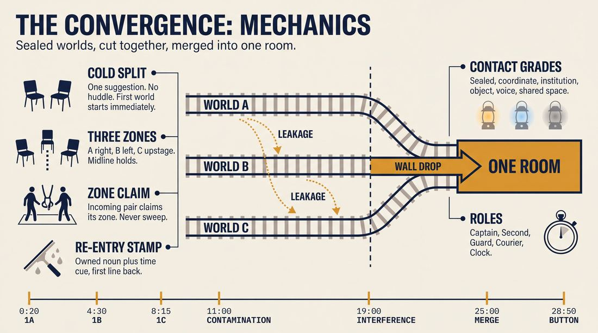
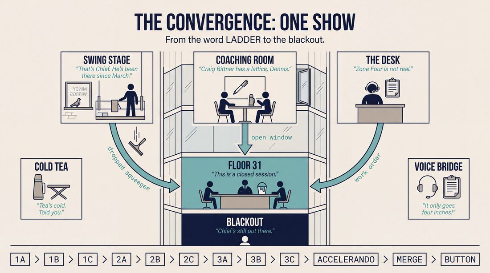
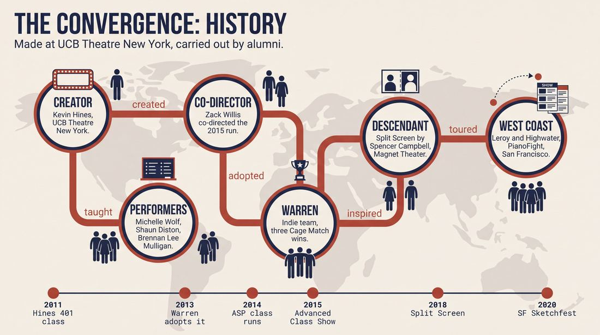
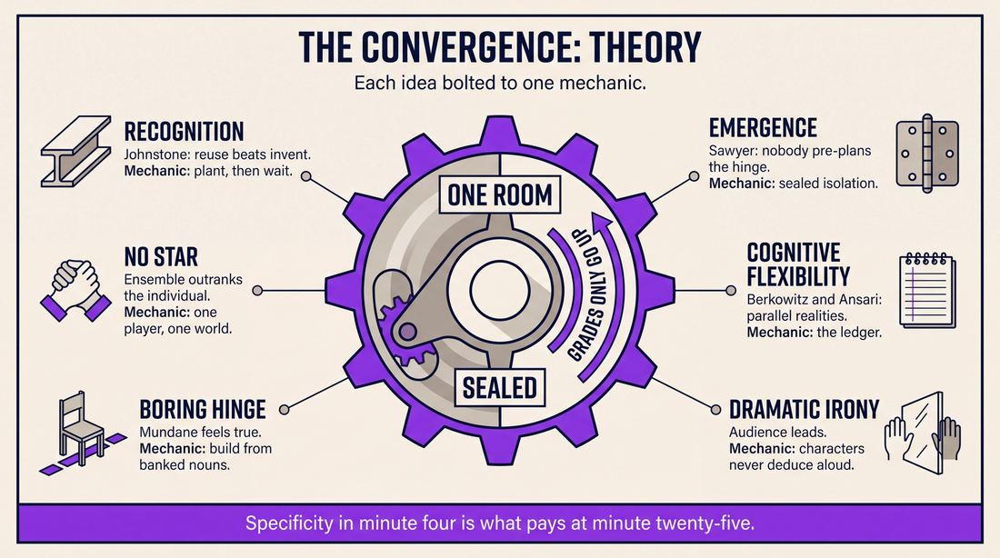
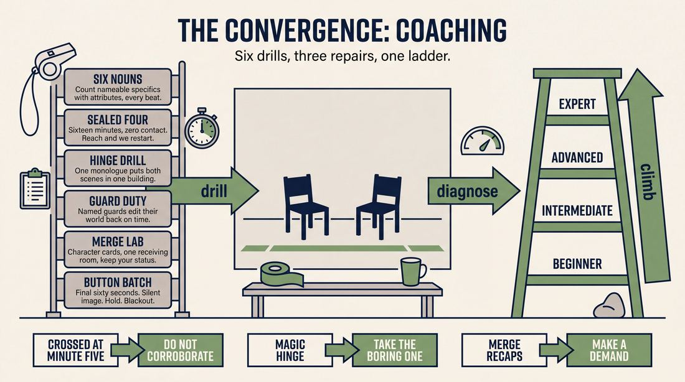

# The Convergence

> **A complete study of the long-form improv format _The Convergence_** - the original archived write-up, five infographics, grounded historical and pedagogical research, and a full mechanics-and-coaching manual.

| | |
|---|---|
| **Format** | The Convergence |
| **Primary source** | [IRC Improv Wiki](https://wiki.improvresourcecenter.com/index.php?title=The_Convergence) |

---

## Contents

1. [Part I - The Original Write-Up](#part-i-the-original-write-up)
2. [Part II - The Infographics](#part-ii-the-infographics)
   - [1. Structure and Mechanics](#infographic-1-mechanics)
   - [2. A Show, Beat by Beat](#infographic-2-example)
   - [3. Origins and Lineage](#infographic-3-history)
   - [4. Why It Works](#infographic-4-theory)
   - [5. Rehearsal and Repair](#infographic-5-coaching)
3. [Part III - Research Dossier](#part-iii-research-dossier)
   - [Pass 1: History, Lineage, Literature and Scholarship](#research-history)
   - [Pass 2: Comparative Anatomy, Pedagogy and Production](#research-comparative)
4. [Part IV - Mechanics, Gameplay and Coaching Manual](#part-iv-mechanics-gameplay-and-coaching-manual)
   - [Pass 1: The Form, Its Mechanics and Its Gameplay](#manual-mechanics)
   - [Pass 2: Training, Coaching and Performance Companion](#manual-coaching)

---

## Part I - The Original Write-Up

*Verbatim archive of the source article, reproduced exactly as scraped. Everything after this section is generated elaboration built on top of it.*

### The Convergence

The Convergence was a [UCBTNY](https://wiki.improvresourcecenter.com/index.php?title=UCBTNY "UCBTNY") Advanced Study Performance class taught by [Kevin Hines](https://wiki.improvresourcecenter.com/index.php?title=Kevin_Hines "Kevin Hines"). It ran on November 16, November 23, November 30, and December 7\.

  

##### Description

The Convergence is about connections. The show is made up of long scenes \-\- each featuring a small cast \-\- that seem to have nothing in common. These scenes weave around each other building to a climax, feeding into each other more and more until finally their hidden secrets and layers will show how they are all connected. But mostly you will laugh. 

  

##### Cast

[J.D. Amato](https://wiki.improvresourcecenter.com/index.php?title=J.D._Amato&action=edit&redlink=1 "J.D. Amato (page does not exist)"), [Adam Bozarth](https://wiki.improvresourcecenter.com/index.php?title=Adam_Bozarth "Adam Bozarth"), [Caitlin Brodnick](https://wiki.improvresourcecenter.com/index.php?title=Caitlin_Brodnick&action=edit&redlink=1 "Caitlin Brodnick (page does not exist)"), [Alex Clothier](https://wiki.improvresourcecenter.com/index.php?title=Alex_Clothier&action=edit&redlink=1 "Alex Clothier (page does not exist)"), [Steve Cronin](https://wiki.improvresourcecenter.com/index.php?title=Steve_Cronin&action=edit&redlink=1 "Steve Cronin (page does not exist)"), [Katie East](https://wiki.improvresourcecenter.com/index.php?title=Katie_East&action=edit&redlink=1 "Katie East (page does not exist)"), [TJ Del Reno](https://wiki.improvresourcecenter.com/index.php?title=TJ_Del_Reno&action=edit&redlink=1 "TJ Del Reno (page does not exist)"), [Shaun Diston](https://wiki.improvresourcecenter.com/index.php?title=Shaun_Diston "Shaun Diston"), [Shalyah Evans](https://wiki.improvresourcecenter.com/index.php?title=Shalyah_Evans&action=edit&redlink=1 "Shalyah Evans (page does not exist)"), [Bridget Fitzgerald](https://wiki.improvresourcecenter.com/index.php?title=Bridget_Fitzgerald "Bridget Fitzgerald"), [Jesse Glasgow](https://wiki.improvresourcecenter.com/index.php?title=Jesse_Glasgow&action=edit&redlink=1 "Jesse Glasgow (page does not exist)"), [Phil Jackson](https://wiki.improvresourcecenter.com/index.php?title=Phil_Jackson&action=edit&redlink=1 "Phil Jackson (page does not exist)"), [Lisa Kleinman](https://wiki.improvresourcecenter.com/index.php?title=Lisa_Kleinman&action=edit&redlink=1 "Lisa Kleinman (page does not exist)"), [Alexis Pereira](https://wiki.improvresourcecenter.com/index.php?title=Alexis_Pereira "Alexis Pereira"), [Steve Theiss](https://wiki.improvresourcecenter.com/index.php?title=Steve_Theiss&action=edit&redlink=1 "Steve Theiss (page does not exist)"), [Zach Willis](https://wiki.improvresourcecenter.com/index.php?title=Zach_Willis&action=edit&redlink=1 "Zach Willis (page does not exist)") \& [Michelle Wolf](https://wiki.improvresourcecenter.com/index.php?title=Michelle_Wolf "Michelle Wolf")

---

*Archived from [https://wiki.improvresourcecenter.com/index.php?title=The_Convergence](https://wiki.improvresourcecenter.com/index.php?title=The_Convergence) (IRC Improv Wiki) on 2026-08-09 23:23 UTC.*

---

## Part II - The Infographics

*Five 16:9 posters, each teaching a different aspect of the format. Click any poster to enlarge.*

<a id="infographic-1-mechanics"></a>

### 1. Structure and Mechanics

*How the form is played: the shape of the piece, the opening, the roles, the edit vocabulary, the flow of information, and the clock.*

{ .diagram loading=lazy decoding=async width="1100" height="614" }


<a id="infographic-2-example"></a>

### 2. A Show, Beat by Beat

*A single worked performance from suggestion to blackout: what happens in each beat, with short real example lines and what the players are doing technically.*

{ .diagram loading=lazy decoding=async width="1100" height="614" }


<a id="infographic-3-history"></a>

### 3. Origins and Lineage

*Where the form came from: creators, dates, theatres, how it spread between schools and cities, and the key figures - a documented timeline and lineage map.*

{ .diagram loading=lazy decoding=async width="1100" height="614" }


<a id="infographic-4-theory"></a>

### 4. Why It Works

*The theory: the core principles of the form and the research and craft ideas that explain why the structure produces good improv, each tied to a specific mechanic.*

{ .diagram loading=lazy decoding=async width="1100" height="614" }


<a id="infographic-5-coaching"></a>

### 5. Rehearsal and Repair

*Training and fixing the form: the essential drills, the common failure modes with their symptom-and-fix pairs, and the markers of beginner through expert play.*

{ .diagram loading=lazy decoding=async width="1100" height="614" }


---

## Part III - Research Dossier

*Two research passes: the historical record, then the comparative and pedagogical record. Claims carry evidence tags - treat unverified items accordingly.*

<a id="research-history"></a>

### » Pass 1: History, Lineage, Literature and Scholarship

### Research Summary
*   **Documentation Level**: The form is moderately documented but highly specific to the Upright Citizens Brigade (UCB) ecosystem and its alumni. It is not a universally taught format like the Harold or the Armando.
*   **Origin**: Created by Kevin Hines at the Upright Citizens Brigade Theatre New York (UCBTNY).
*   **First Appearances**: Taught in Advanced Study Performance (ASP) classes around 2013–2015. The indie team "Warren" began performing it in late 2013 after forming out of a Kevin Hines 401 class.
*   **Mechanics**: The form involves two or three seemingly unrelated monoscenes (or macro-scenes) with small casts that cut back and forth. Over the course of the performance, the realities, characters, or themes blend together until they converge into a single physical location or narrative climax.
*   **Lineage**: It is a descendant of the monoscene and macroscene formats, emphasizing thematic resonance and narrative convergence. It directly inspired later forms like "Split Screen" at the Magnet Theater.
*   **Evidence Strength**: Primary sources are strong but niche, including UCB show listings, performer resumes, indie team wikis, and director interviews. 

### Provenance and History
Created by UCB teacher and performer Kevin Hines in the early 2010s, The Convergence was designed to solve a specific narrative problem: how to push improvisers to find thematic resonance and narrative overlap without relying on standard Harold group games or sweeping edits. The name refers to the climax of the piece, where disparate scenes, characters, and worlds literally converge into one shared reality or location. 

| Year | Event | Place / Company | Source |
|---|---|---|---|
| 2011 | Kevin Hines teaches a 401 class that forms the team "Warren" | UCBTNY | Fandom Improv Wiki |
| 2013 | Indie team "Warren" begins performing The Convergence | UCBTNY / UCB East | Fandom Improv Wiki |
| 2014 | The Convergence ASP class runs (Nov 16 - Dec 7) | UCBTNY | IRC Improv Wiki |
| 2015 | Advanced Class Show: THE CONVERGENCE directed by Kevin Hines & Zack Willis | UCBTNY | doNYC.com |
| 2018 | "Split Screen" debuts, heavily inspired by The Convergence | Magnet Theater | Magnet Theater Blog |
| 2020 | "The Convergence" performed by Leroy and Highwater | PianoFight, SF (SF Sketchfest) | Sched.com |

### Lineage and Transmission
The Convergence was primarily transmitted through UCB's Advanced Study Performance (ASP) program, taught by Kevin Hines and Zack Willis. It spread outward as UCB alumni formed indie teams (like Warren) and took the form to Cage Match competitions and festivals. 

Because it requires immense patience and narrative tracking, it did not mutate into a widespread regional dialect, remaining mostly a New York/UCB specific form. However, it has traveled to Los Angeles and San Francisco via UCB transplants, and its mechanics were adapted by other New York theatres (notably the Magnet Theater) to create new structural experiments.

### Key Figures
| Person | Role in this form | Specific contribution | Source URL |
|---|---|---|---|
| Kevin Hines | Creator / Director | Developed the form and taught it in UCB ASP classes. | [IRC Improv Wiki](https://wiki.improvresourcecenter.com/index.php?title=The_Convergence) |
| Zack Willis | Co-Director / Teacher | Co-directed the 2015 UCB ASP run of the form. | [doNYC](https://donyc.com/events/2015/3/31/advanced-class-show-the-convergence) |
| Spencer Campbell | Director / Innovator | Created the descendant form "Split Screen" at the Magnet Theater. | [Magnet Theater](https://magnettheater.com/blog/director-series-split-screen-spencer-campbell/) |
| Brennan Lee Mulligan | Performer | Early adopter as a member of the indie team "Warren". | [Fandom](https://improv.fandom.com/wiki/Warren) |
| Shaun Diston | Performer | Cast member in the original documented ASP run. | [IRC Improv Wiki](https://wiki.improvresourcecenter.com/index.php?title=The_Convergence) |
| Michelle Wolf | Performer | Cast member in the original documented ASP run. | [IRC Improv Wiki](https://wiki.improvresourcecenter.com/index.php?title=The_Convergence) |

### Canonical Shows, Companies and Recordings
*   **Warren (2013–2014)**: Indie Cage Match champions at UCB East and UCB Chelsea. Cast included Michael Greene, Dan LoPreto, Brennan Lee Mulligan, Liz Noth, Brady O'Callahan, and Joey Price. [Link](https://improv.fandom.com/wiki/Warren)
*   **Advanced Class Show: THE CONVERGENCE (March 31, 2015)**: UCB Theatre NY. Directed by Kevin Hines and Zack Willis. [Link](https://donyc.com/events/2015/3/31/advanced-class-show-the-convergence)
*   **Leroy and Highwater (Jan 25, 2020)**: SF Sketchfest at PianoFight Mainstage. Two teams (Leroy from LA, Highwater from NYC) performing the form together. [Link](https://sched.co/Xw1M)

*(Note: No public video recordings of a pure Convergence set could be verified in the current search record.)*

### Published Literature
| Work | Author | Year | What it says about this form | Where to find it |
|---|---|---|---|---|
| *Magnet Theater Blog: Director Series Q&A* | Spencer Campbell | 2018 | Describes The Convergence as cutting back and forth between two monoscenes that tumble together in the end. | [Magnet Theater](https://magnettheater.com/blog/director-series-split-screen-spencer-campbell/) |
| *Ike Butler's Improv Notes* | Ike Butler | N/A | Defines Convergence as three scenes (1A/1B/1C) that start differently but overlap and converge by the end. | [Ike Butler](http://www.ikebutler.com/improv-forms) |
| *IRC Improv Wiki: The Convergence* | IRC Contributors | 2024 | Defines the form as long scenes with small casts that weave around each other until hidden secrets show how they are connected. | [IRC Wiki](https://wiki.improvresourcecenter.com/index.php?title=The_Convergence) |
| *doNYC Event Listing* | doNYC | 2015 | "Two scenes begin. Slowly their realities begin to blend together until one can no longer exist without the other." | [doNYC](https://donyc.com/events/2015/3/31/advanced-class-show-the-convergence) |

### Verbatim Quotes
> "The Convergence is about connections. The show is made up of long scenes -- each featuring a small cast -- that seem to have nothing in common. These scenes weave around each other building to a climax, feeding into each other more and more until finally their hidden secrets and layers will show how they are all connected."
> — IRC Improv Wiki
> https://wiki.improvresourcecenter.com/index.php?title=The_Convergence

> "Two scenes begin. Slowly their realities begin to blend together until one can no longer exist without the other. Worlds collide in: THE CONVERGENCE."
> — UCB Theatre Show Description (via doNYC)
> https://donyc.com/events/2015/3/31/advanced-class-show-the-convergence

> "Warning: attending this show might lead to the performers discovering their true parents, encountering an ancient culture living under their farm, or realizing that they have been the star of a reality show all along."
> — UCB Theatre Show Description (via doNYC)
> https://donyc.com/events/2015/3/31/advanced-class-show-the-convergence

> "The show is similar in some ways to The Convergence, a form created by Kevin Hines, which cuts back and forth between two monoscenes that tumble together in the end."
> — Spencer Campbell
> https://magnettheater.com/blog/director-series-split-screen-spencer-campbell/

> "What fascinates me about The Convergence is the idea of taking unrelated sets and gradually discovering the hinge the connects them."
> — Spencer Campbell
> https://magnettheater.com/blog/director-series-split-screen-spencer-campbell/

> "Convergence: Three scenes, 1A/1B/1C take place, each taking the suggestion in a completely different way. They should all exist in the same world, though, and over the course of the set, the characters start to overlap and converge so that by the end we see how they all connect."
> — Ike Butler
> http://www.ikebutler.com/improv-forms

> "Make the first few lines pretty far apart from each other (in material and where people stand) so the convergence is more fun. Then focus on tying the story together."
> — Ike Butler
> http://www.ikebutler.com/improv-forms

> "In late 2013, Warren began performing the Convergence. The group hit the ground running when Amey gave them a slot in Indie Cage Match UCB East... Warren went on to win 3 ICM's in a row, making them and Indie Cage Match champion."
> — Warren Team Wiki
> https://improv.fandom.com/wiki/Warren

### Anecdotes and Stories
**The Rise of Warren**
The indie team "Warren" (featuring future *Dimension 20* star Brennan Lee Mulligan) met in a Kevin Hines 401 class in 2011. In late 2013, they adopted The Convergence as their signature form. They used it to dominate the UCB East Indie Cage Match, winning three in a row and earning a slot at the highly competitive UCB Chelsea Cage Match. Their run culminated in a legendary match against the powerhouse team Airwolf on April 19, 2012 (though the timeline of 2012 vs 2013 on the wiki is slightly contradictory, it remains a core piece of the form's lore). [DOCUMENTED]

**The SF Sketchfest Crossover**
In 2020, the form was used as a bridge between coasts. The UCB LA team "Leroy" and the NYC team "Highwater" performed The Convergence together at PianoFight in San Francisco. The form's mechanic of colliding worlds perfectly mirrored the real-life collision of the two coastal improv teams sharing a stage. [DOCUMENTED]

### Academic and Scientific Research
**Cognitive Flexibility and Spontaneous Generation**
Berkowitz and Ansari (2008) define improvisation as the "spontaneous generation, selection, and execution of novel auditory-motor sequences." In theatrical terms, this requires high cognitive flexibility to shift attention between disparate concepts.
*Relevance to this form:* The Convergence demands extreme cognitive flexibility, as performers must hold two or three entirely separate narrative realities in their working memory and spontaneously generate the "hinge" that connects them without pre-planning.

**Collaborative Emergence**
R. Keith Sawyer's concept of "collaborative emergence" (2003) posits that the outcome of an improvisation cannot be predicted by analyzing the individuals; it emerges from the interaction itself.
*Relevance to this form:* Because the scenes in The Convergence start completely unrelated, the final climax (the convergence) is a pure product of collaborative emergence. No single improviser can force the connection; it must emerge organically from the cross-pollination of the separate scenes.

**Psychological Safety and Ensemble Thinking**
Research by Vera & Crossan (2004) and applied improvisation studies show that ensemble thinking requires letting go of the need to be the "star" and trusting the group mind.
*Relevance to this form:* The Convergence structurally prevents spotlighting. Because the cast is divided into separate, isolated scenes that must eventually share a reality, performers are forced to prioritize the macro-structure and the ensemble's collective discovery over individual scene-stealing.

### Documented Variants and Descendants
*   **Split Screen**: Created by Spencer Campbell at the Magnet Theater in 2018. *What it changes:* Instead of cutting back and forth between the monoscenes, both scenes occur simultaneously on stage without cuts or edits. The cast must share focus and eavesdrop on the other scene, eventually meeting in the same physical location in the final minutes.
*   **Three-Scene Convergence (1A/1B/1C)**: Documented by Ike Butler. *What it changes:* Expands the form from two colliding worlds to three distinct scenes that all take the suggestion differently but eventually overlap and converge.

### Criticism, Debate and Known Failure Modes
*   **Forced Connections [INFERRED]**: A known failure mode of any narrative-weaving form is the "shoehorned" connection, where improvisers panic and force a logical link (e.g., "We are actually in a reality show!") rather than letting the thematic resonance build naturally. The UCB show description playfully warns of this by joking about "discovering their true parents" or "encountering an ancient culture living under their farm."
*   **Cognitive Overload [DOCUMENTED]**: As noted by Spencer Campbell regarding the descendant form *Split Screen*, managing multiple continuous macro-worlds requires performers to "keep so many balls in the air at once." They must be fully present in their own scene while tracking the details of the other to steer toward a satisfying conclusion.
*   **Pacing and Patience [WIDELY PRACTICED, UNDOCUMENTED]**: Because the form relies on long scenes and small casts, improvisers who are used to the fast-paced, edit-heavy style of a standard Harold can struggle with the patience required to let the monoscenes breathe before the convergence happens.

### Cultural Footprint
*   **Notable Alumni**: The form was an early training ground for several highly successful comedians. The documented casts include Michelle Wolf (White House Correspondents' Dinner, Netflix), Brennan Lee Mulligan (Dropout, *Dimension 20*), Shaun Diston (*Comedy Bang! Bang!*, *Wrecked*), and J.D. Amato (*The Chris Gethard Show*).
*   **Festival Presence**: Featured prominently at SF Sketchfest (2020) and the Chicago Improv Festival (via the team Warren).
*   **Influence**: It represents a specific era of UCB's Advanced Study program (circa 2013–2015) where teachers like Kevin Hines were pushing students away from rigid Harold structures and toward patient, thematic, macro-scene work.

### Gaps in the Record
*   **Exact Origin Date**: The exact year Kevin Hines first taught or performed The Convergence is unverified. The wiki stub lists November 16 to December 7, which aligns with the 2014 calendar, but the team Warren was performing it in late 2013.
*   **Performance Footage**: No public video recordings of a pure Convergence set could be verified or located in the current search record.
*   **Wider Adoption**: It is unclear if the form is still actively taught at UCB post-pandemic or if it remains a historical artifact of the mid-2010s ASP curriculum.

### Source List
1. IRC Improv Wiki - IRC Contributors - 2024 - https://wiki.improvresourcecenter.com/index.php?title=The_Convergence - Supports the original cast list, dates, and core description of the form.
2. doNYC - doNYC - 2015 - https://donyc.com/events/2015/3/31/advanced-class-show-the-convergence - Supports the 2015 UCB ASP show directed by Kevin Hines and Zack Willis, and provides the comedic show description.
3. Magnet Theater Blog - Magnet Theater - 2018 - https://magnettheater.com/blog/director-series-split-screen-spencer-campbell/ - Supports the mechanics of the form, Kevin Hines's authorship, and the descendant form "Split Screen".
4. Fandom Improv Wiki (Warren) - Fandom Contributors - N/A - https://improv.fandom.com/wiki/Warren - Supports the history of the indie team Warren, their use of the form, and Brennan Lee Mulligan's involvement.
5. Ike Butler's Improv Notes - Ike Butler - N/A - http://www.ikebutler.com/improv-forms - Supports the 3-scene variant and the mechanical definition of the form.
6. Sched.com (SF Sketchfest) - SF Sketchfest - 2020 - https://sched.co/Xw1M - Supports the form's performance at SF Sketchfest by Leroy and Highwater.
7. Generation of novel motor sequences: the neural correlates of musical improvisation - Berkowitz & Ansari - 2008 - https://pubmed.ncbi.nlm.nih.gov/18353686/ - Supports the cognitive science definition of spontaneous generation.
8. Group Creativity: Music, Theater, Collaboration - R. Keith Sawyer - 2003 - https://dokumen.pub/group-creativity-music-theater-collaboration-0805844359-9780805844351.html - Supports the academic concept of collaborative emergence.

<a id="research-comparative"></a>

### » Pass 2: Comparative Anatomy, Pedagogy and Production

### Taxonomic Placement

```text
       The Harold (Multi-thread thematic)    The Monoscene (Continuous time/space)
                        \                        /
                         \                      /
                          \                    /
                           \                  /
                            The Convergence
                                  |
                                  |
                            Split Screen (Magnet Theater variant)
```

The Convergence sits exactly halfway between the multi-thread thematic exploration of the Harold and the grounded, real-time patience of the Monoscene. It borrows the Harold's cross-cutting of 1A/1B/1C beats but discards the group games and thematic abstraction in favour of the Monoscene's commitment to continuous, grounded reality. Rather than heightening a comedic game across isolated timelines, The Convergence forces disparate, sustained realities to physically and narratively collide into a single unified world.

### Head-to-Head Comparisons

#### The Convergence vs. The Harold
| Axis | The Convergence | The Harold | Consequence for the players |
| :--- | :--- | :--- | :--- |
| **Opening** | None, or a single suggestion. | Formal opening (invocation, pattern game, etc.). | Convergence players must generate their own thematic momentum purely through scene work rather than an abstract opening. |
| **Structure** | 2-3 long scenes that cut back and forth and eventually merge. | 3 beats of 3 scenes, separated by group games. | Convergence requires sustaining continuous narrative threads; Harold requires heightening isolated comedic games. |
| **Edit logic** | "Meanwhile" cuts, returning to the exact same continuous reality. | Sweep edits, time jumps, heightening the game. | Convergence players must track real-time continuity; Harold players track comedic patterns. |
| **Memory** | High cognitive load: tracking specific plot points, names, and geography. | High cognitive load: tracking thematic connections and game moves. | Convergence rewards narrative memory; Harold rewards thematic memory. |
| **Cast size** | Small (6-8), often 2-3 per scene. | Medium (8-10). | Convergence requires more stage time per player and deeper character investment. |
| **Audience contract** | "Watch these unrelated worlds slowly collide." | "Watch us explore this theme through varied comedic lenses." | Convergence audiences expect a satisfying narrative puzzle to be solved. |
| **Failure mode** | The Forced Hinge (illogical collision). | The Math Problem (playing structure over comedy). | Convergence fails if the connection is unearned; Harold fails if it is unfunny. |

#### The Convergence vs. The Monoscene
| Axis | The Convergence | The Monoscene | Consequence for the players |
| :--- | :--- | :--- | :--- |
| **Opening** | Single suggestion. | Single suggestion. | Both rely on immediate, grounded scene work without preamble. |
| **Structure** | Multiple distinct locations/worlds. | Single continuous location and time. | Convergence players get breaks off-stage; Monoscene players are trapped on stage. |
| **Edit logic** | Cutting between parallel worlds. | No edits. | Convergence allows for pacing shifts via edits; Monoscene requires internal pacing adjustments. |
| **Memory** | Tracking multiple external realities. | Tracking a single, dense internal reality. | Convergence is a juggling act; Monoscene is a deep dive. |
| **Cast size** | 6-8. | 6-8. | Similar cast sizes, but deployed differently across space. |
| **Audience contract** | "We will weave these threads together." | "We will stay in this room no matter what." | Convergence promises dynamic movement; Monoscene promises claustrophobic intensity. |
| **Failure mode** | Orphaned Worlds (forgetting a thread). | The Sinking Ship (running out of momentum with no escape). | Convergence requires structural vigilance; Monoscene requires emotional endurance. |

#### The Convergence vs. La Ronde
| Axis | The Convergence | La Ronde | Consequence for the players |
| :--- | :--- | :--- | :--- |
| **Opening** | Single suggestion. | Single suggestion. | Both start with grounded, character-driven scenes. |
| **Structure** | Parallel worlds that eventually merge into a group climax. | A chain of 2-person scenes linked by a shared character. | Convergence builds to a massive group climax; La Ronde remains a series of intimate duos. |
| **Edit logic** | Cutting back and forth between established worlds. | Tagging out one character to introduce a new one. | Convergence requires returning to previous scenes; La Ronde moves strictly forward. |
| **Memory** | Tracking all worlds simultaneously. | Tracking only the immediate past scene. | Convergence has a higher cognitive load for the whole ensemble. |
| **Cast size** | 6-8. | 4-8. | La Ronde guarantees equal stage time; Convergence requires self-regulation. |
| **Audience contract** | "These separate worlds will become one." | "We will explore a network of relationships one link at a time." | Convergence is a puzzle; La Ronde is a character study. |
| **Failure mode** | Premature Convergence. | The Weak Link (a flat character breaking the chain). | Convergence fails on structure; La Ronde fails on character generation. |

#### The Convergence vs. Split Screen
| Axis | The Convergence | Split Screen | Consequence for the players |
| :--- | :--- | :--- | :--- |
| **Opening** | Single suggestion. | Single suggestion. | Both start simply to allow for complex world-building. |
| **Structure** | 2-3 worlds, cutting back and forth sequentially. | 2 worlds, played *simultaneously* on stage. | Convergence allows players to rest off-stage; Split Screen requires constant on-stage presence and split focus. |
| **Edit logic** | Sweep or tag edits to switch focus. | No edits; focus shifts via volume and physical staging. | Convergence relies on traditional editing; Split Screen relies on theatrical focus-pulling. |
| **Memory** | High. | Extreme. | Split Screen requires listening to another scene *while* performing your own. |
| **Cast size** | 6-8. | 6-8. | Similar cast sizes. |
| **Audience contract** | "We will cut between these worlds until they meet." | "You will watch both worlds at once until they meet." | Convergence is cinematic editing; Split Screen is theatrical staging. |
| **Failure mode** | The Forced Hinge. | Audio Mud (both scenes talking at once, unintelligible). | Convergence fails on narrative logic; Split Screen fails on technical execution. |

### What Makes It Uniquely Itself

1. **Simultaneous Incubation:** The strict requirement to build two to three distinct, unrelated worlds *before* any cross-pollination occurs. If players immediately start connecting the scenes in the first beat, the form devolves into a standard narrative montage. The tension comes from the isolation of the early scenes.
2. **The Inevitability of Collision:** The explicit structural promise that these disparate realities will physically or narratively merge into a single climax. Unlike a Slacker (where scenes drift) or a Montage (where scenes are disposable), every thread in The Convergence must eventually occupy the same space or narrative focal point.
3. **The Discovery of the Hinge:** The reliance on finding a logical, grounded pivot point (the "hinge") that justifies the shared universe. The form demands that the connection is discovered through the specific details generated in the isolated scenes, rather than relying on a thematic abstraction or a *deus ex machina*.

### Structural Variants in Practice

*   **The Classic Hines (UCBTNY):** Created by Kevin Hines for an Advanced Study Performance class. Three distinct scenes (1A, 1B, 1C) take place, each taking the suggestion in a completely different way. They cut back and forth, characters start to overlap, and by the end, they all connect. Played heavily by UCB indie teams like Warren (coached by Amey Goerlich). Source: IRC Improv Wiki / Ike Butler.
*   **Split Screen (Magnet Theater):** Directed by Chris Scott. Two continuous macro-world sets take place side-by-side onstage *without* cuts or edits. The cast must steer their set to a satisfying conclusion that connects it to the other set, merging in the same physical location in the last few minutes. Source: Magnet Theater Blog.
*   **The Exploding Dinosaur Pillow Fight (IRC Improv Wiki):** A complex variant where the "Run" (the exploding dinosaur phase) generates disparate material from two suggestions. The form ends with a "Convergent Scene" (the pillow fight phase) which acts as a button to tie the disparate threads and original suggestions back together. Source: IRC Improv Wiki.

### The Teaching Ladder

| Stage | Skill introduced | Why in this order | Typical exercise | Source or [CRAFT CONSENSUS] |
| :--- | :--- | :--- | :--- | :--- |
| **1. Sustaining Isolated Worlds** | Building a reality without relying on edits to save the scene. | Players must be comfortable sitting in a slow-burn scene before they can be trusted to weave it into another. | Simultaneous Monoscene | [CRAFT CONSENSUS] |
| **2. Parallel Tracking** | Retaining specific information (names, locations, objects) from scenes you are not in. | You cannot converge worlds if you do not remember the details of the world you are merging into. | Split Screen Eavesdropping | Magnet Theater Blog |
| **3. Soft Cross-Pollination** | Introducing shared elements (objects, off-stage characters) without breaking the isolated realities. | Lays the subconscious groundwork for the audience before the literal physical merge happens. | Object Migration | [CRAFT CONSENSUS] |
| **4. Hard Convergence** | Executing the physical and narrative merge of the disparate worlds. | The climax of the form; requires the previous three skills to execute without feeling forced. | The Hinge Drill | [CRAFT CONSENSUS] |

### Documented Drills and Exercises

| Drill | Origin / teacher | How to run it | What it fixes in this form | Source |
| :--- | :--- | :--- | :--- | :--- |
| **Convergence (Warm-up)** | Degrees of Error | Players stand in a circle, count to three, and try to say the same word simultaneously based on previous associative words. | Tunes the group's collective associative logic and mind-meld before a complex tracking show. | The Phoenix Remix |
| **Three Things** | Degrees of Error | To a beat, player 1 asks for "Three [category]", player 2 lists them without hesitation. | Oils the spontaneity gear for rapid, confident world-building in the early, isolated scenes. | The Phoenix Remix |
| **Split Screen Eavesdropping** | Chris Scott / Magnet Theater | Two scenes happen simultaneously on stage. Players must incorporate a line of dialogue spoken in the *other* scene into their own scene seamlessly. | Fixes tunnel vision; trains players to track parallel worlds while actively performing. | Magnet Theater Blog |
| **The Hinge Drill** | [CRAFT CONSENSUS] | Two completely unrelated 2-person scenes are played back-to-back. A 5th player must step out and deliver a single monologue that logically explains how both scenes exist in the same building. | Fixes the "Forced Hinge" failure mode by training logical justification over absurd coincidence. | [CRAFT CONSENSUS] |
| **Object Migration** | [CRAFT CONSENSUS] | Scene A establishes a specific physical object. Scene B (unrelated) must organically discover and use that exact same object. | Trains soft cross-pollination before hard character convergence is allowed. | [CRAFT CONSENSUS] |
| **The "Meanwhile" Edit** | [CRAFT CONSENSUS] | Instead of a sweep edit, players edit by saying "Meanwhile, across town..." and initiating a scene with a contrasting energy/tempo. | Prevents scenes from bleeding into each other too early; maintains distinct worlds. | [CRAFT CONSENSUS] |
| **Character Bleed** | [CRAFT CONSENSUS] | A player from Scene A enters Scene B, but must maintain their exact Scene A character, status, and point of view. | Fixes inconsistent character behaviour during the final convergence climax. | [CRAFT CONSENSUS] |
| **Pacing the Merge** | [CRAFT CONSENSUS] | Coach calls out "10%", "50%", "90%" during a set. Players must adjust the level of overlap/convergence to match the percentage. | Fixes premature convergence; teaches patience and structural pacing. | [CRAFT CONSENSUS] |
| **Blind Tracking** | [CRAFT CONSENSUS] | Half the team is blindfolded and listens to Scene A. They must then initiate Scene B based *only* on the audio cues of Scene A. | Enhances auditory tracking of parallel information for players waiting on the backline. | [CRAFT CONSENSUS] |
| **The Extinction Button** | IRC Improv Wiki | After the convergence climax, the team must execute a single, 30-second silent physical scene that visually summarizes the merged world. | Provides a definitive, satisfying button to a chaotic multi-thread form. | IRC Improv Wiki |

### Common Failure Modes and Diagnoses

| Failure mode | What it looks like from the audience | Root cause | Fix | Who names it |
| :--- | :--- | :--- | :--- | :--- |
| **Premature Convergence** | Characters from Scene A walk into Scene B during the first 5 minutes of the show. | Discomfort with sustaining disconnected narratives; panic editing. | Enforce a strict "no crossing streams until the third beat" rule in rehearsal. | [CRAFT CONSENSUS] |
| **The Thematic Cop-Out** | The scenes never physically connect, but end with a monologue explaining how they all share the theme of "love." | Failure to find a literal, physical "hinge" between the worlds. | Run "The Hinge Drill" to practice literal geographic/narrative connections. | [CRAFT CONSENSUS] |
| **The Forced Hinge** | An alien spaceship suddenly abducts the characters from all three scenes to force them into the same room. | Waiting too long to lay the groundwork for the merge, resulting in a *deus ex machina*. | Plant mundane shared details (a specific corporation, a shared off-stage character) early in beat 2. | [CRAFT CONSENSUS] |
| **Orphaned Worlds** | Scene C is introduced in the first 10 minutes and never seen again. | Cognitive overload; the cast simply forgot the third thread. | Assign specific backline players to "guard" specific threads and ensure they are edited back in. | [CRAFT CONSENSUS] |
| **Audio Mud** | (In Split Screen variants) Both scenes are talking at the exact same time, making it impossible to hear either. | Lack of spatial awareness and volume control. | Practice focus-pulling exercises; if they speak, you wash dishes in silence. | Magnet Theater Blog |

### Production and Logistics

*   **Cast Size:** 6 to 8 players. This provides enough bodies to populate 2-3 distinct worlds (usually 2-3 players per world) without overcrowding the stage during the final, massive converged climax.
*   **Runtime:** 25 to 30 minutes. The form requires a slow burn to establish the isolated worlds properly before the pacing accelerates into the merge.
*   **Stage Layout:** A standard bare stage for the classic form. For the Split Screen variant, the stage is strictly divided (e.g., Stage Left is the submarine, Stage Right is the kitchen).
*   **Chairs and Set:** 4 to 6 chairs. Crucial for defining the distinct environments. A chair placed downstage right in Scene A must remain in the exact same spatial reality when Scene A returns.
*   **Lighting and Tech Cues:** Standard wash. If tech allows, distinct lighting states (e.g., warm gels for Scene A, cool gels for Scene B) heavily aid audience comprehension. The tech booth must be prepared for rapid "Meanwhile" cuts in the second half.
*   **Music and Sound:** Pre-show music only. The "Convergence" mind-meld game is often played in the dressing room as the audience files in.
*   **MC and Host Duties:** Standard introduction. The host asks for a single suggestion (often a location, an event, or a single word) to inspire the disparate worlds.
*   **Lineup Placement:** Belongs in a second-act or headliner slot. Its narrative complexity and satisfying puzzle-box nature make it a strong closer; it is too heavy to open a comedy variety show.
*   **Rehearsal Cadence:** Requires intensive, ongoing drilling on memory, tracking, and spatial object work. It cannot be thrown together casually by a pickup team.
*   **Producer Preparation:** Ensure the cast has a quiet space for their pre-show mind-meld warm-ups, as the form relies entirely on group mind and collective tracking.

### Adaptations Beyond the Stage

*   **Classroom and Youth:** Adapted to teach active listening and memory retention. The focus shifts away from comedic generation and entirely onto the mechanics of tracking what peers have built.
*   **Corporate and Applied Improv:** Used heavily in organizational training to teach systems thinking and cross-functional collaboration. Teams learn to develop their own "departments" (the isolated scenes) while keeping an eye on the overarching company goal (the convergence). It physically models breaking down silos.
*   **Online and Remote:** Adapted for Zoom by utilizing Breakout Rooms. Two separate scenes occur in breakout rooms, and the "merge" happens when the host pulls all participants back into the main room, forcing them to justify why their disparate conversations are now happening in the same virtual space.
*   **Accessibility and Inclusion:** For visually impaired audiences or performers, the "hinge" must be established through explicit verbal confirmation rather than purely physical object work (e.g., verbally acknowledging the shared prop rather than just miming it).
*   **Content-Safety and Consent:** Because the climax forces all players into the same narrative space, players must be highly attuned to boundaries. If Scene A explores heavy, grounded trauma and Scene B is a cartoonish farce, forcing them to converge can trivialize the trauma. The team must calibrate the tone of all worlds early on.
*   **Ethics of Real Stories:** If the initial suggestion is drawn from an audience member's real life, the convergence must not twist their lived experience into a punchline via a forced, absurd collision.

### Evidence Base for Those Adaptations

*   **Organizational Improvisation:** Vera and Crossan (2004) demonstrate that teams must balance established structures with emergent opportunities. The Convergence models this perfectly for corporate settings: teams must adhere to the established rules of their "isolated world" while remaining flexible enough to merge with an emergent, external reality.
*   **Cognitive Load in Collaboration:** Research into shared mental models in team performance supports the necessity of the "Parallel Tracking" drills. Teams that cannot maintain a shared mental model of the unstated, off-stage realities will fail to execute the complex coordination required for the final merge.

### Scholarly Frames Worth Applying

*   **Collaborative Emergence (R. Keith Sawyer):** Sawyer argues that in true improvisation, the final product cannot be predicted by any single actor's initial choices. *Mapping:* The final converged scene in this form is the ultimate example of collaborative emergence; no single player can pre-plan the "hinge" because it relies entirely on the unpredictable, compounding details generated in the parallel scenes. (Sawyer, R.K., 2003. *Group Creativity: Music, Theater, Collaboration*).
*   **Reincorporation (Keith Johnstone):** Johnstone posits that narrative satisfaction comes not from inventing new information, but from reincorporating what has already been established. *Mapping:* The entire second half of The Convergence is an exercise in macro-reincorporation. The climax is achieved by reincorporating the disparate realities of the first 20 minutes into a single space. (Johnstone, K., 1979. *Impro: Improvisation and the Theatre*).
*   **Point of Concentration (Viola Spolin):** Spolin's exercises rely on giving the player a specific, solvable problem to focus on, freeing them from the pressure to "be funny." *Mapping:* The Point of Concentration (POC) shifts dynamically in this form. In the first half, the POC is "sustain the isolated reality." In the second half, the POC becomes "discover the logical intersection of realities." (Spolin, V., 1963. *Improvisation for the Theater*).

### Where the Form Is Heading

Contemporary practice is pushing The Convergence away from traditional sweep edits and toward theatrical staging. The "Split Screen" variant pioneered at the Magnet Theater—where both worlds exist on stage simultaneously and focus is pulled via volume and movement—represents the current evolution of the form. Additionally, the form's structure is being heavily utilized in narrative, improvised audio fiction (podcasts), where sound design is used to establish the isolated worlds before audio cues slowly bleed them together into a single soundscape.

### Source List

1. IRC Improv Wiki - "The Convergence" - 2024 - https://wiki.improvresourcecenter.com/index.php?title=The_Convergence - Supports the origin of the form (Kevin Hines, UCBTNY), cast list, and core definition of weaving unrelated scenes into a connected climax.
2. Ike Butler - "Improv Forms" - n.d. - ikebutler.com - Supports the 1A/1B/1C structural breakdown and the specific mechanic of characters overlapping and converging over the course of the set.
3. Magnet Theater Blog - "Split Screen" - 2018 - magnettheater.com - Supports the "Split Screen" simultaneous variant, the concept of the "hinge," and the specific challenges of tracking parallel sets and avoiding audio mud.
4. The Phoenix Remix - "Degrees of Error Interview" - 2025 - thephoenixremix.com - Supports the "Convergence" mind-meld warm-up game and the "Three Things" spontaneity drill used by touring narrative companies.
5. IRC Improv Wiki - "Warren" - 2026 - https://wiki.improvresourcecenter.com/index.php?title=Warren - Supports the history of the form in practice by UCB indie teams and the coaching lineage (Amey Goerlich).
6. IRC Improv Wiki - "The exploding dinosaur pillow fight" - 2024 - https://wiki.improvresourcecenter.com/index.php?title=The_exploding_dinosaur_pillow_fight - Supports the "Convergent Scene" button mechanic and structural variants of converging disparate suggestions.

---

## Part IV - Mechanics, Gameplay and Coaching Manual

*Synthesis over the original article and both research dossiers: first how the form works and how to play it, then how to train an ensemble to perform it.*

<a id="manual-mechanics"></a>

### » Pass 1: The Form, Its Mechanics and Its Gameplay

### At a Glance

| Field | Value |
|---|---|
| **Also known as** | The Convergence; "Hines Convergence"; 1A/1B/1C Convergence; (descendant, not synonym) Split Screen |
| **Family** | Macro-scene / parallel-narrative long form. Sits between the Harold's cross-cutting and the Monoscene's continuous grounded reality; a narrative-weaving cousin of the Deconstruction and La Ronde. |
| **Cast size** | 6–8 (functional minimum 4; practical maximum 9). Deployed as 2–3 players per world, plus 0–2 floaters. |
| **Runtime** | 25–35 minutes. Below 22 the isolation phase cannot breathe; above 38 the audience stops holding the threads. |
| **Opening** | None. A single suggestion, then the first world initiates. No pattern game, no invocation, no group opening. (Documented: the Convergence has no formal opening; the mind-meld warm-up called "Convergence" is a *backstage* game, not an onstage opening.) |
| **Suggestion taken** | One word, object, location or event. Each world must take it in an *unrelated* direction. |
| **Structural rigidity (1–5)** | **4.** The number of worlds, the sealed first beat, and the mandatory physical merge are non-negotiable; everything inside a world is free. |
| **Difficulty (1–5)** | **5.** Highest cognitive load of any common long form: you sustain a monoscene while tracking two others you are not in. |
| **Prerequisites** | Solid two-person grounded scene work of 4+ minutes without an edit; object work that survives a 6-minute absence; disciplined listening from the backline; a team that has played together long enough to have shared reference memory. |
| **Best for** | Standing ensembles; closer/headliner slots; teams that want narrative payoff without abandoning comedy; cage-match sets where a puzzle-box structure differentiates you. |
| **Avoid when** | Pickup/jam casts; casts under 4; slots under 20 minutes; teams whose instinct is to edit every 90 seconds; shows where you follow three montage teams and the audience is tired; any night with no lighting control and a very wide stage (geography becomes unreadable). |

---

### The Essence in One Paragraph

The Convergence is a long form in which two or three small-cast macro-scenes — each taking the same suggestion in a completely unrelated direction, each running in continuous time and place — are cross-cut against each other, and then made, over the course of the set, to physically collide into one room. The engine is not theme and it is not game. It is **leakage**: each time you cut back to a world, that world has picked up one more concrete specific that belongs to another world — a time, an employer, an offstage name, an object, a voice through a window — until the worlds can no longer be told apart, and the last four or five minutes are played by the whole cast in a single shared space. The pleasure the audience buys is dramatic irony at scale: they figure out that the window washers and the executive-coaching client are on opposite sides of the same pane of glass a full eight minutes before any character does, and they spend those eight minutes leaning forward. The failure the form punishes hardest is the *forced hinge* — connecting the worlds with an invention (a simulation, an alien, a long-lost twin) rather than with a mundane detail somebody already said out loud.

---

### Why This Form Exists

A montage is disposable by design. You play a scene, you edit it, and the next scene owes it nothing but a thematic wink. The Harold solves this with pattern: three beats of three scenes, held together by group games and abstract resonance. Both are excellent, and both let an ensemble off a specific hook — **neither one requires you to remember a proper noun.**

The Convergence was built by Kevin Hines at UCB Theatre New York, and taught through the Advanced Study Performance programme in the mid-2010s (the wiki-documented class ran November 16 – December 7; the indie team Warren was performing it as its signature form from late 2013). The documented design intent, per the research record, was to push improvisers toward thematic resonance and narrative overlap **without** the crutch of Harold group games and sweep edits. What that means operationally:

1. **It makes concrete detail load-bearing.** In a Harold, "my boss Craig Bittner" is colour. In a Convergence, "Craig Bittner" is a girder: if he is mentioned in World B at minute six and turns out to be the man who hasn't paid the window-washing invoice in World A at minute eighteen, the audience gets a payoff that no amount of heightening could manufacture. The form converts *listening* into *comedy*, which is a rare exchange rate.
2. **It forces sustained scene work on people who would rather edit.** Small casts, long beats, no group game to hide inside. A player is on stage for four minutes with one scene partner and must build a world dense enough to be worth returning to three times.
3. **It gives narrative payoff without narrative dictatorship.** Most narrative forms require someone to steer the plot. Here nobody can steer, because nobody knows what the other world contains until they hear it. The climax is genuinely emergent — this is what Sawyer calls collaborative emergence, and the Convergence is close to a laboratory case of it: no single improviser can pre-plan the hinge, because the hinge is made of details that don't exist yet.
4. **It structurally suppresses the star.** You cannot spotlight-hog a world you are not standing in, and the merged climax requires six people to share one room with legible status. The macro-structure outranks any individual's best idea.

What a plain montage will not buy you: **the second half.** In a montage, minute 20 is exactly as valuable as minute 4. In a Convergence, minute 20 is worth more than minute 4 *because* of minute 4 — the show compounds. That compounding is the whole reason to run this rather than a good montage.

> **Contradiction in the record, flagged:** the sources disagree on whether the form is two worlds or three. The Magnet Theater blog describes it as "two monoscenes"; Ike Butler's notes specify three (1A/1B/1C). My judgement: **both are canonical; two is the tighter, safer show and three is the classic Hines teaching shape.** Treat the world-count as the first dial a director turns (see *Variations and Dials*).

---

### The Audience Contract

The audience is never told the rules. They infer them in the first ninety seconds and hold you to them for thirty minutes.

**What is promised, implicitly:**

| Promise | When it is made | How it is kept |
|---|---|---|
| "These worlds are real places, not sketches." | The first 40 seconds of 1A — grounded behaviour, real object work, no premise announcement. | Continuity: the chair stays where it was; the mug is still half full when you return. |
| "There will be more than one of these." | The moment 1A is edited and a *visibly different* world claims different floor space. | Zone discipline: World B never plays where World A played. |
| "You will not lose track of where you are." | Every cut. | The first line of every re-entry re-establishes world + time (see the **Re-Entry Stamp**). |
| "These will connect, and the connection will be fair." | Around minute 8–12, at the first shared specific. | The hinge is built from something already said aloud, on stage, in front of them. |
| "They will end up in the same room." | Reinforced every time the worlds touch. | The literal, physical merge in the last 4–6 minutes. The show description at UCB was blunt about it: *"Two scenes begin. Slowly their realities begin to blend together until one can no longer exist without the other."* |
| "You will be ahead of the characters." | The first Grade-2 contact. | Characters do not solve the puzzle; they are caught by it. |

**How the audience knows where they are** — four redundant signals, and you want at least three live at all times:

1. **Zone.** World A is stage right, World B is stage left, World C is upstage centre. This never changes until the merge.
2. **Furniture.** Two chairs facing out (swing stage) vs. two chairs facing each other across a table (conference room) vs. one chair and a standing partner (dispatch desk). Distinct silhouettes.
3. **Body and tempo.** World A crouches and grips; World B stands and gestures; World C slouches. Tempo differences are as legible as costume.
4. **The Re-Entry Stamp.** The first line back into a world contains a proper noun the audience already owns.

**What breaks the contract, in order of severity:**

- **Physical never happens.** The worlds are declared connected by a speech but the bodies never share a room. This is the *Thematic Cop-Out*, and the audience feels cheated in a way they can articulate on the sidewalk afterwards.
- **The connection is invented, not discovered.** A device drops in (aliens, a simulation, "we were dead the whole time") that could have connected *any* two scenes. The audience realises the first twenty minutes were not load-bearing.
- **Geography drifts.** World B plays in World A's zone; the audience spends two minutes doing map maintenance instead of laughing.
- **A world is orphaned.** World C appears once and never returns. The audience keeps waiting for it and stops trusting the shape.
- **Premature merge.** Someone crosses at minute five. The promise of the puzzle collapses into an ordinary montage with recurring characters, and nothing after that can restore the tension.
- **Tone mismatch at the merge.** A grounded grief scene and a cartoon collide, and the cartoon wins. The audience feels the earlier scene was wasted or, worse, mocked.

---

### Anatomy: The Full Structural Map

The form has four phases, not three beats. Phase boundaries are defined by **contact grade** (how intimately the worlds have touched), not by the clock — but the clock is a good proxy and you should rehearse to it.

**Phase 1 — ISOLATION (sealed).** Each world plays one long beat. Zero contact. Every world must become independently watchable, with its own comic game and a dense deposit of specifics.

**Phase 2 — CONTAMINATION (leakage).** Second beats. Each world picks up exactly one element that belongs to another world, and does not notice. The audience notices.

**Phase 3 — INTERFERENCE (pressure).** Third beats, shorter. The worlds now affect each other causally: an action in A changes B. Characters begin to sense something without naming it. Cuts accelerate.

**Phase 4 — CONVERGENCE (merge) + BUTTON.** All worlds occupy one space. One continuous scene with the full cast. Then a short, hard button.

#### Beat-by-beat table (three-world, 30-minute build)

| Unit | Approx. clock | What happens | Who drives it | Success criterion | Common error |
|---|---|---|---|---|---|
| Suggestion & split | 0:00–0:20 | Host takes one word. Cast holds. World A's pair steps out. | Host + World A pair | Audience hears one word and immediately sees a specific place. | Cast huddles or "processes" the word. Never process. |
| **1A** Isolation | 0:20–4:30 | World A monoscene. Establish place, relationship, game, and 6–8 nameable specifics. | World A pair | A stranger walking in would watch this scene happily on its own. | Premise-explaining; no proper nouns; playing "a scene about ladders." |
| **1B** Isolation | 4:30–8:15 | World B monoscene, maximally far from A in setting, tempo, class, register. | World B pair (they execute the edit) | The audience visibly resets — different posture, different rhythm. | Same energy as A; same interpretation of the suggestion; same stage zone. |
| **1C** Isolation | 8:15–11:00 | World C, shorter. Often the "watcher" world (a desk, a service, an authority). | World C pair | A third distinct silhouette. Audience now knows the shape of the show. | Introducing C too late; making C a comment on A and B rather than a place. |
| **2A** Contamination | 11:00–14:00 | Return to A. Re-Entry Stamp. One Grade-1/2 element enters (shared time, shared institution, shared offstage name). | World A pair; backline guard for continuity | One audience "oh" without any character reacting. | Two or three new links at once; a character noticing out loud. |
| **2B** Contamination | 14:00–16:45 | Return to B. B picks up something from A (not the same thing it gave). | World B pair | Direction of transfer alternates; the link is *used*, not announced. | Reciprocal announcing ("Weird, my guy is also named Craig!"). |
| **2C** Contamination | 16:45–19:00 | Return to C. C is now touching both A and B. C usually becomes the audience's map. | World C pair | Audience can now draw the triangle. | C explaining the triangle in dialogue. |
| **3A/3B/3C** Interference | 19:00–23:15 | Short beats, 1:15–2:00 each. Causality crosses: an act in one world produces a consequence in another. Voice contact (phone, window, radio, PA) permitted. | Whoever's world is affected drives the beat | The show speeds up without anyone rushing lines. | Cutting for speed rather than for cause; skipping a world in the rotation. |
| Accelerando | 23:15–25:00 | 3–5 very short cuts (15–35 sec), rotating. Contact grade 4. | Backline callers/lights | The audience is leaning forward and laughing at the cuts themselves. | Cuts so short no information lands; "montage" mush. |
| **THE MERGE** | 25:00–29:00 | All players in one space, one continuous scene, with its own new game. | Whoever owns the physical space; all | Everyone keeps their exact status and point of view from their home world. | A reveal-fest: characters explaining the plot to each other. |
| **Button** | 29:00–29:30 | A single move, line or silent tableau that closes the merged world. Lights. | One player, decisively | Blackout lands on a laugh or a held image, not on dialogue. | Playing three minutes past the ending looking for a better one. |

#### ASCII: the whole shape

```
 CLOCK  0        4        8       12       16       20       24      28   30
        |--------|--------|--------|--------|--------|--------|-------|----|

 A     [====1A====]           [===2A===]        [3A]     [a] \
                                                               \
 B                [===1B===]           [==2B==]      [3B]  [b] ==>[ MERGE ]=[B]
                                                               /
 C                          [==1C==]        [=2C=]     [3C][c]/

 PHASE  |--- ISOLATION -----|--- CONTAMINATION ---|-INTERFERENCE-|acc.|-CONVERGE-|

 CONTACT
 GRADE   0 . . . . . . . . 0 | 1 . . . 2 . . . . 2 | 3 . . . 4 . . 4 | 5 . . . 5
        sealed              coord.  institution   object   voice     shared space

 AUDIENCE
 KNOWS   nothing            "hm"      "oh!"        "they don't know!"  payoff
```

#### ASCII: stage geography (three-world)

```
   ┌──────────────── BACK WALL ─────────────────┐
   │  o   o        BACKLINE (guards, walk-ons)  │
   │                                            │
   │            ZONE C  [chair] [desk]          │   <- upstage centre, "watcher"
   │                                            │
   │  ZONE A                        ZONE B      │
   │  [chair][chair]              [chair][chair]│
   │  (facing out)                (facing each) │
   │                                            │
   │  ---------- THE MIDLINE (never crossed     │
   │             until Phase 4) ----------      │
   └──────────────── AUDIENCE ──────────────────┘
```

The midline is not a rule you announce; it is a rule your bodies obey. The first time a chair crosses it, the audience feels the show change. **Do not spend that moment cheaply.**

---

### The Opening

The Convergence has no opening in the Harold sense, and this is a structural choice, not an omission. A pattern-game opening would pre-supply thematic connective tissue, which is precisely the thing the form wants the ensemble to *earn* in the second half. If you open with a word association, the audience receives a shared theme for free and the convergence becomes redundant.

#### Standard procedure — "The Cold Split" (default; use this until you have run the form ten times)

1. **Host takes one suggestion.** One word is best: an object ("ladder"), a location ("basement"), or an event ("a resignation"). Do not take an emotion or an abstract noun; abstractions invite all three worlds to take the suggestion the *same* way, which kills the form in the first minute.
2. **Nobody reacts to the word.** No repetition, no "great," no huddle. The cast stands still for a beat. The word is not a prompt to be solved; it is a seed to be taken in three directions.
3. **World A's pair walks out within 4 seconds** into Zone A and begins with physical activity, not dialogue. Two to five seconds of silent, specific action before the first line. This tells the audience: this is a place, not a premise.
4. **World A plays 3:30–4:30.** They deposit specifics (see *The Engine*). They do not mention the suggestion word more than once, and ideally not at all after the first thirty seconds.
5. **World B's pair executes the edit themselves.** They walk from the backline into Zone B and speak. Nobody sweeps. (Rationale below.)
6. **World B takes the suggestion in an unrelated register.** If A was literal, B is metaphorical. If A was blue-collar and outdoors, B is white-collar and indoors. Ike Butler's note on this is the most practical line in the whole record: *"Make the first few lines pretty far apart from each other (in material and where people stand) so the convergence is more fun."*
7. **If three worlds: World C enters at ~8:15**, shorter beat, and should ideally be a *service* or *observation* world (a dispatch desk, a call centre, a night watchman, a diner across the street) because such worlds converge with anything without straining.
8. **Rotation is now fixed:** A → B → C → A → B → C. Do not re-order in Phase 1 or 2. You may re-order in Phase 3 for causal reasons.

**Why the incoming pair edits, rather than a sweeper:** in a Convergence the edit is not a punctuation mark, it is a *camera move between two places that both continue to exist*. A sweeping third party implies the previous scene has ended. Two people walking on to claim a zone implies the previous scene has merely gone off-camera. This is the single most under-taught mechanic in the form and it changes the audience's understanding of continuity immediately.

#### Documented and craft variants of the opening

| Variant | Mechanics | When to use | Cost |
|---|---|---|---|
| **Cold Split** (default; documented as "no opening / single suggestion") | As above. | Always, at first. Cage matches. Any show where you need the audience oriented in 20 seconds. | None. This is the baseline. |
| **Three Doors / Declared Split** [CRAFT] | Before 1A, the three pairs step forward one at a time and each says one sentence that establishes only place and relationship: "Marisol, hand me the eight-inch." / "Dennis, take a seat, we've got forty-five minutes." / "Zone Four is not a real zone, Terrence." Then everyone clears and 1A begins. | Teaching rehearsals; big rooms; when the cast is new to the form and needs to hear the worlds separated out loud. | Costs surprise; the audience knows the shape too early and may stop watching Phase 1 for its own sake. |
| **Two Suggestions** (lineage: the *Exploding Dinosaur Pillow Fight* pattern of tying two suggestions back together in a convergent scene) | Take two words. World A owns word one, World B owns word two. The convergence must honour both. | Two-world versions; shows where you want the "how on earth" tension maximised. | Halves the accidental resonance the single word provides. The hinge gets harder. |
| **Monologue Seed** (Armando graft) [CRAFT] | A guest or cast member tells a two-minute true story. Each world mines a *different, non-obvious detail* — not the theme. World A takes the brand of car, World B takes the aunt's job, World C takes the weather. | Long slots (35+ min); teams with a strong monologist; shows where you want thematic depth without abstraction. | Risks the Thematic Cop-Out: the monologue supplies a ready-made theme, and the cast converges on theme instead of geography. Ban thematic mining explicitly in rehearsal. |
| **Silent Tableau** [CRAFT] | Lights up on all three zones frozen mid-activity for five seconds. Lights isolate Zone A. Play. | Rooms with real lighting control. Establishes zone geography instantly and makes the final wash mean something. | Requires tech; feels precious in a scrappy room. |
| **Backstage mind-meld** (documented as a warm-up called "Convergence": players count to three and try to say the same word) | Played in the dressing room while the house fills. Never onstage. | Every show. Tunes the associative group mind before a heavy tracking set. | None, if you keep it offstage. Onstage it becomes an opening and violates the form. |

**What must never be the opening:** a pattern game, an invocation, a group monologue, a "here are our three worlds" narration, or a montage of quick scenes. Any of these pre-loads the connective tissue.

---

### The Engine

This is the section to read twice. Everything else in the form is scaffolding around this.

#### 1. What generates material: the Specific, not the Game

In a Harold, the generative unit is the **game**: an unusual thing, heightened. In a Convergence, the generative unit is the **specific**: a concrete, nameable, transferable piece of information. Games still exist inside each world — you still need laughs at minute three — but the *structural* material is specifics, and a scene that is hilarious and specific-poor is a structural failure that the team will pay for at minute twenty-two.

Specifics come in three classes, and you need all three:

| Class | Definition | Examples | Transfer value |
|---|---|---|---|
| **Nouns** | Named entities: people (offstage), companies, objects, brands, buildings, documents. | "Craig Bittner." "Halberd Logistics." "The Kessler Building." "A twenty-four-foot Werner." | Highest. A proper noun is a handle; the other world can pick it up without asking permission. |
| **Coordinates** | Time, date, floor, zone, weather, distance. | "It's 4:15." "Thirty-first floor." "Zone Four." "Wind's up." | Medium. Cheap to plant, cheap to match, and the audience registers them subconsciously. |
| **Vectors** | Things that move *between* places: deliveries, phone calls, invoices, radio traffic, rumours, weather fronts, a dropped object. | "Ruben's on the radio." "The non-emergency line." "I dropped the squeegee." | Highest for Phase 3. Vectors are how causality crosses the midline before bodies do. |

**Deposit rate.** My recommendation, drilled: **six to eight nameable specifics per world in its first beat.** That is roughly one every thirty seconds, which is not a lot if you are actually talking about your life. If a world's first beat contains fewer than four, that world will be structurally poor and the ensemble will end up inventing a hinge instead of finding one.

**The Ledger.** Every player carries a mental ledger of the other worlds' specifics. In rehearsal, make it literal: after every beat, the coach asks a backline player to list five specifics from the scene they just watched. Do this until the team stops failing it. In performance, this is silent work and it is the actual job of the backline.

#### 2. How information travels: transport physics

These are the "laws" that make the piece cohere. Break them and you get either mush or a forced hinge.

**Law 1 — Conservation of Specificity.** *Nothing crosses the midline that was not named out loud first.* If World B is going to turn out to be inside the Kessler Building, "the Kessler Building" must have been said in World A, unprompted, minutes earlier. The audience's pleasure is retrospective recognition; you cannot recognise something you have never heard.

**Law 2 — Plant Before You Pay, with lag.** Minimum lag between plant and payoff: **one full rotation** (i.e., the other worlds each get a beat in between). Anything shorter and the audience reads it as a set-up rather than a discovery.

**Law 3 — One Direction Per Cut.** In any given beat, a world either *gives* or *receives* — not both. Alternate. Two-way announcement in the same beat ("Craig! I know a Craig!") is the most common amateur error and it burns the connection instantly.

**Law 4 — Monotonic Escalation.** Contact grade never decreases. Once World A and World B have touched at Grade 3, they cannot go back to being unrelated. This is what gives the piece its ratchet feel.

**Law 5 — Audience Lead.** *The audience must always know more than the characters.* The characters may suspect; they may not conclude. The moment a character says "wait — are we in the same building?", the tension is spent. Hold that line until Phase 4, and then let it be *action*, not deduction, that reveals it.

**Law 6 — Continuity is Absolute Within a World.** Each world is a monoscene: continuous time, continuous place, continuous object reality. When you return, time has advanced by roughly the real time you were away, in that world's proportion. If Marisol was making tea when you left, the tea is made. This is what distinguishes the Convergence from a montage with recurring characters.

#### 3. The Contact Grade Ladder

The single most useful operational tool I know for this form. Rehearse by grade, call notes by grade.

| Grade | Name | What crosses | Example | Typical clock (30-min build) | Danger if used too early |
|---|---|---|---|---|---|
| **0** | Sealed | Nothing. Only accidental thematic rhyme the players did not plan. | Both worlds happen to be about ambition. | 0–11 min | — |
| **1** | Coordinate | Time, weather, date, an ambient event. | Both worlds note it's 4:15. Both mention the wind. | 11–14 | Trivial; safe. |
| **2** | Institution / Offstage Name | A company, a landlord, a person neither world can see. | "Halberd Logistics never tips at Christmas." | 14–19 | Reads as coincidence-mongering if before minute 10. |
| **3** | Object | The same physical thing exists in both worlds, or one world's object arrives in the other. | The dry-erase message on the glass; the dropped squeegee. | 19–22 | Premature convergence begins here. |
| **4** | Voice / Causality | The worlds affect each other and can hear but not touch: a phone call, a window gap, a radio, a knock. | Dennis and Dutch talking through four inches of open window. | 22–25 | This is the last stop before merge; do not linger past three minutes. |
| **5** | Shared Space | Bodies in one room. | Everyone on floor 31. | 25–29 | This *is* the ending. Anything after it is denouement. |

**Rate law:** advance no more than one grade per rotation in Phases 1–2, and no more than one grade per beat in Phase 3. If you jump 0→3, you have written a coincidence, not a structure.

#### 4. The Hinge

The hinge is the single grounded fact that makes the shared universe *necessary*. Spencer Campbell, describing what drew him to the form, put the target precisely: the fascination is "taking unrelated sets and gradually discovering the hinge that connects them."

The hinge is not the theme. The hinge is not the twist. The hinge is usually boring. Boring is the point: a boring hinge feels *true*, and truth is what makes an audience laugh with relief.

| Hinge type | Mechanism | Example | Reliability | Notes |
|---|---|---|---|---|
| **Geographic** | The worlds are physically adjacent or nested. | Both scenes are in the Kessler Building; one outside the glass, one inside. | ★★★★★ | The safest and most satisfying. Merge is trivially staged. Default to this. |
| **Institutional** | Same employer, insurer, landlord, school district, union, franchise. | Everybody's paycheque comes from Corvair Property Group. | ★★★★☆ | Excellent for satire. Merge needs an event (a meeting, an audit, an incident). |
| **Custodial** | One character's job is to service both worlds. | Ruben the building engineer; a courier; a locksmith; a dispatcher. | ★★★★★ | The custodial character is the best "courier" in the form. Plant them offstage in beat 1. |
| **Causal** | An action in one world produces an effect in the other. | The dropped squeegee smashes the deli awning; the deli calls dispatch. | ★★★★☆ | Best for Phase 3 rather than as the whole hinge; pairs well with geographic. |
| **Documentary** | A shared record: a form, a list, an invoice, a manifest, a rota. | The same work order appears in three worlds. | ★★★☆☆ | Intellectually pleasing but hard to *stage* physically. Needs a geographic assist. |
| **Temporal** | Same place, different times, converging at a moment. | 1971 / 1998 / now, in the same lobby. | ★★★☆☆ | Beautiful when it works; the merge must be non-literal (memory, renovation, ghost logic) which risks the cop-out. Advanced only. |
| **Personnel / Genealogical** | Characters are related, or one appears in both. | "You're Marisol's son." | ★★☆☆☆ | Cheap unless heavily planted. UCB's own show copy mocked this: the joke about "discovering their true parents." Use once per career. |
| **Metaphysical** | Simulation, dream, afterlife, aliens, time loop. | "None of this is real." | ★☆☆☆☆ | Almost always the *Forced Hinge*. Only legitimate if established as a world's premise in Phase 1, in which case it isn't metaphysical, it's institutional. |

**How the hinge is actually found (the mechanism nobody writes down):** it is found by the *backline*, not the players on stage. The two people in Zone A are busy being Marisol and Dutch. The four people watching are running the ledger, and one of them notices that "the tenant tapes things to the window" (A) and "write your goal where you'll see it every day" (B) can be the same event. That player then walks out and initiates the beat that makes it true. **The hinge is an edit decision, not a line of dialogue.**

#### 5. The Contamination Curve

Plot the fraction of a beat that is "about" other worlds:

```
 %CROSS
  100 |                                                    ┌───────
      |                                              ┌─────┘
   75 |                                        ┌─────┘
      |                                  ┌─────┘
   50 |                            ┌─────┘
      |                     ┌──────┘
   25 |             ┌───────┘
      |     ┌───────┘
    0 |─────┘
      +-----|-----|-----|-----|-----|-----|-----|-----|
      0     4     8    12    16    20    24    28   30 min
       ISOLATION   |  CONTAMINATION  | INTERF. | MERGE
```

The curve must be **monotonic and concave upward**. A flat curve is a montage. A step function is a forced hinge. A curve that goes *down* (a world resets to being unrelated) tells the audience the ensemble lost the thread, and they will disengage within a minute.

#### 6. Why the piece coheres

Coherence in the Convergence does not come from theme, plot or game. It comes from **a single shared physical universe that is revealed rather than declared.** Johnstone's reincorporation principle operates here at macro scale: the audience's satisfaction is generated almost entirely by re-encountering material they already own, in a context that reframes it. That is why specificity density in Phase 1 predicts audience response in Phase 4 better than any other variable. In practice, teams find that a show which is *funnier* in the first ten minutes but *vaguer* will lose to a show that is merely pleasant in the first ten minutes but concrete.

---

### Roles and Responsibilities

| Role | Owns | Must do | Must not do | Signal to the others |
|---|---|---|---|---|
| **World Captain** (one per world; usually the player who initiated it) | That world's continuity: place, time-of-day, object reality, offstage population. | Re-establish geography in the first line of every re-entry; keep the ledger of their own world's specifics; ensure their world deposits ≥6 specifics in beat 1. | Leave their world to appear in another before Phase 4. Rescue another world. | On re-entry, they step to the exact spot they left and resume the exact activity. |
| **World Second** | Being the other half of a 4-minute two-hander. Emotional reality and the world's comic game. | Give their partner something to react to every 20 seconds; hold the game while the captain holds the geography. | Introduce a new location or a new character into their world. | Physical mirroring of the previous beat's blocking. |
| **Backline Guard** (assign one per world before the show, out loud, in the green room) | Making sure "their" world is not orphaned. | Count rotations. If their world has been off for more than one full rotation, they initiate its return themselves. Track its specifics; be ready to feed one as a walk-on. | Enter their guarded world as a character (that muddies ownership) unless as a one-line service walk-on. | Stepping half a pace forward on the backline = "I am taking the next edit." |
| **The Courier / Ferry** (optional; one only) | The character who legitimately exists in two worlds — usually custodial (engineer, delivery, dispatcher, nurse, security). | Be *named offstage* in Phase 1 before ever appearing. Enter World A in Phase 2, World B in Phase 3. Keep identical status, vocabulary and physicality in both. | Comment on the coincidence. Ever. | Their prop or their walk (a clipboard, a limp) is unmistakable across worlds. |
| **Edit-caller** | Nothing formally — but functionally, whoever steps out first. | Edit by *entering their zone*, not by sweeping. Give the outgoing scene a half-beat to land its last line. | Edit for boredom. Edit into a world out of rotation during Phases 1–2. | Two players stepping out together = a world edit. One player stepping out = a walk-on. |
| **The Hinge-Spotter** (a rotating informal role; in rehearsal, name it) | Noticing the connection first. | When they see it, take the next available edit and *play* the hinge as a fact — not announce it. | Say the hinge out loud in a character's mouth. Pitch it on the backline. | They initiate a beat with an unusually specific re-entry line. |
| **Tech / Lighting op** | The audience's map. | Hold three distinct states (warm right / cool left / dim upstage), execute cuts *on the incoming player's first step*, and save the full wash for the merge. Follow rhythm in the accelerando. | Cross-fade slowly. Blackout between beats. Light both zones at once before Phase 4. | Ask the team in advance for a physical merge cue — usually furniture crossing the midline. |
| **Musician** (optional, and I recommend against for first attempts) | Tonal separation. | Assign each world a distinct instrumental colour; play *under*, never over; go silent in Phase 3 so causality is audible; play once, big, at the merge. | Underscore continuously. Sting the connections — that does the audience's noticing for them. | Silence for eight seconds = "the merge is happening." |
| **Host / MC** | Framing. | Ask for one suggestion, take it fast, get off. | Explain the form. Take three suggestions. Editorialise ("ooh, that's a good one"). | Clears the stage in under five seconds. |
| **Director / Coach (rehearsal only)** | The contamination curve. | Call grades out loud in rehearsal ("that's a Grade 2 — bank it and get out"). Run the Pacing the Merge drill. | Assign the hinge in advance. Ever. | — |

---

### The Rules That Actually Bind

#### Hard rules — break these and it is not this form

| # | Rule | Why it is constitutive | What it looks like when broken |
|---|---|---|---|
| H1 | **Two or three worlds, declared by the end of the first rotation, never added to.** | The audience's puzzle has to have a fixed number of pieces. | A fourth world at minute 18. The audience stops tracking and starts waiting. |
| H2 | **Phase 1 is sealed. Zero contact until every world has had a full beat.** | Isolation *is* the tension. Documented as the form's defining feature: "simultaneous incubation." | The show becomes a narrative montage; nothing is discovered, only extended. |
| H3 | **Each world is a continuous macro-scene: same place, same characters, forward time.** | Inherited from the monoscene half of the lineage. Without it, "return to World A" means nothing. | World A is a diner, then a car, then a wedding. There is no world to converge. |
| H4 | **The worlds must physically merge before the end.** | The name of the form is the promise. Documented: "one can no longer exist without the other." | A closing monologue about how we're all connected. The Thematic Cop-Out. |
| H5 | **The hinge must be constructed from information already stated on stage.** | Fairness. Retrospective recognition is the entire payoff mechanism. | Deus ex machina. The first twenty minutes retroactively become filler. |
| H6 | **No group games, no group openings, no thematic pattern beats.** | The form was designed to reach resonance *without* Harold machinery. | It becomes a scrappy Harold with long scenes. |
| H7 | **One player belongs to one world until Phase 4 (single Courier exception).** | Character bleed is the currency of Phase 3–4; spend it early and you have nothing left. | Everyone is in everything; the worlds stop being distinguishable by cast. |
| H8 | **Zone discipline: each world owns fixed stage real estate until the merge.** | The audience's orientation depends on it; the merge's impact depends on the violation being *new*. | Two minutes of "wait, which scene is this?" |
| H9 | **Characters do not deduce the connection; they are caught in it.** | Law 5 (Audience Lead). Deduction spends the irony. | "Hang on... are you in the Kessler Building too?" at minute 17. Show over. |
| H10 | **One suggestion (or two in the documented two-suggestion variant), taken differently by each world.** | Same-direction interpretation collapses the worlds before they exist. | Three scenes about firefighters. |

#### Soft conventions — house by house, dial freely

| Convention | Common settings | Which houses / lineages | My default |
|---|---|---|---|
| Number of worlds | 2 (Magnet-adjacent description) vs 3 (Ike Butler / classic Hines 1A/1B/1C) | UCB teaching favoured 3; descendants favoured 2 | 3 for ensembles of 6–8; 2 for casts of 4–5 or under 25 minutes |
| Edit vocabulary | Silent zone-claim edit; verbal "Meanwhile, across town…" cut; light cut | The verbal *Meanwhile* is a documented craft-consensus teaching tool | Silent zone-claim in performance; verbal *Meanwhile* in rehearsal to train the reflex |
| Walk-ons | Forbidden / allowed as one-line service characters / freely allowed | Varies | Allowed, one-line, must exit, never in Phase 1 |
| Courier | None / exactly one / any number in Phase 3 | Varies | Exactly one, custodial, planted offstage in Phase 1 |
| Tag-outs | Banned (monoscene logic) / allowed for flashback | Most houses ban them | Banned. A tag-out breaks H3 |
| Lighting | Single wash / three states / states plus merge wash | Depends on venue | Three states plus merge wash if you have them; otherwise zone discipline is your lighting |
| The button | Line button / silent tableau ("Extinction Button" — a documented drill in the record: a short silent physical scene that visually summarises the merged world) | Variant lineage | Silent tableau, 5–10 seconds, no dialogue. It is the most reliable ending in the form |
| Where in the lineup | Closer / second act | Documented practice: headliner slot | Closer. It is too heavy to open |
| Suggestion type | Word / object / location / audience monologue | Varies | Concrete object |

#### Myths — things people wrongly believe are rules

| Myth | Why people believe it | Why it is wrong | What to do instead |
|---|---|---|---|
| "The worlds must share a theme." | The wiki says the form is "about connections." | Theme is a *byproduct* of a shared universe. Chasing theme produces the Thematic Cop-Out — the single most-diagnosed failure in the record. | Chase a shared *address*. Theme will show up uninvited and be better for it. |
| "There has to be a twist." | The UCB blurb joked about true parents and ancient civilisations. | That copy was mocking the cliché, not prescribing it. A twist reframes; a hinge *locates*. | Aim for "of course" not "no way." |
| "It's a Harold with long scenes." | Both cross-cut 1A/1B/1C. | Harold beats jump in time and place and are joined by pattern; Convergence beats are continuous and joined by geography. Different memory systems entirely. | Track nouns, not patterns. |
| "You have to know the connection before you start." | The ending is so tidy it looks planned. | If anyone knows it in advance, Phase 1 stops generating and starts steering, and the audience can smell it. | Ban pre-show pitching. It is the one thing that will ruin the form outright. |
| "Every world needs equal stage time." | Fairness instinct. | Worlds have different metabolic rates. A watcher world can carry a full function in 90-second beats. | Equal *presence*, unequal minutes. No world off for more than one rotation. |
| "The final scene has to explain everything." | Puzzle-box instinct. | Explanation is not payoff; recognition is. Half your audience will assemble the last piece in the car. | Play the merged scene as a *scene* with a fresh game, not a debrief. |
| "The suggestion must be visible in every world." | Suggestion-honouring habit. | The suggestion is a launcher. Once three distinct worlds exist, it has done its job. | Use it once each, differently, then forget it. |
| "You can't be silly in this form." | Its reputation for patience and tracking. | The wiki description ends on exactly the right note: *"But mostly you will laugh."* | Each world needs its own comic game by minute two. |
| "Split Screen is a Convergence." | They share a hinge concept. | Split Screen plays both worlds *simultaneously with no edits*. Different technical problem (focus-pulling, audio mud) and different audience contract. | Learn them separately. Split Screen is a legitimate descendant, not a variant you can slide into mid-show. |
| "The third world is optional decoration." | It usually gets fewer minutes. | In three-world versions the third world is normally the *mechanism* of the merge — it's the world with the authority, vehicle or information to bring the others together. | Cast your third world as a service or watcher world on purpose. |

---

### Edits and Transitions

The Convergence has an unusually rich edit vocabulary because the edit is doing narrative work, not just punctuation. Learn all of these; use four or five per show.

| Edit | How to execute physically | When it is right | When it is wrong | What it costs |
|---|---|---|---|---|
| **Zone Claim** (default) | The incoming pair walks from the backline directly into their zone, takes their established positions, and one speaks. No sweep, no eye contact with the outgoing scene. | Every routine cut in Phases 1–2. | Never wrong; just becomes monotonous after twelve uses. | Nothing. Costs one second of dead air, which reads as a film cut. |
| **Meanwhile Cut** (verbal) | A player steps to the edge of the stage and says "Meanwhile, thirty-one floors down…" then enters the new zone. | Rehearsal always; performance sparingly, and only if it lands as a comic voice rather than narration. | In Phase 3 — narration deflates causality. | Costs realism. Reminds the audience there's an author. |
| **Sweep / Wipe** | One or two players cross the front of the stage laterally, clearing the outgoing scene. | Almost never in this form. Acceptable once, at the very top of the accelerando, to signal "the rules are changing." | In Phase 1–2. A sweep implies the swept scene has *ended*, which contradicts H3. | Costs continuity credibility. Use once or not at all. |
| **Match Cut** | The outgoing line and the incoming line share a word, gesture or object shape. Marisol: "Hold it steady." — cut — Yvonne: "Hold it steady, Dennis, all the way up." | Phase 2, to plant a Grade 1 or 2 link without a character noticing. | If used more than twice per show it becomes a tic and the audience starts predicting cuts. | Costs subtlety; it is a slightly authorial move. |
| **Object Handoff** | Outgoing player sets an object down at the midline; incoming player picks it up in the new world. | Phase 3 only, for Grade 3 contact. | Phase 1–2. It is a physical merge before you have earned one. | Spends a whole contact grade in three seconds. Make it count. |
| **Slow Pan** | The incoming player walks the *whole width* of the stage, through the outgoing scene's space, without acknowledging it, and lands in their zone. | Once, at the transition from Phase 2 to Phase 3. It shows the audience the two worlds are geographically near. | Early — it looks like a mistake. | Costs the illusion of separation, on purpose. |
| **Light Cut** | Tech kills Zone A and raises Zone B on the incoming player's first step. | Every cut, if you have the states. Fastest, cleanest orientation. | If the op is slow; a laggy light cut is worse than no light cut. | Requires a rehearsed op. |
| **Overlap / Bleed Edit** | The incoming scene begins speaking while the outgoing scene finishes its line — two to three seconds of deliberate overlap. | Phase 3 only. The most efficient way to *feel* interference. | Phase 1–2 (confusing) or in a big/dead room (audio mud, the documented Split Screen failure). | Costs intelligibility. Assign who wins the overlap in rehearsal. |
| **Voice Bridge** | A phone, radio or PA line spoken in World A is *answered* in World B. Marisol: "Dispatch, this is thirty-one." — cut — Gwen picks up: "Non-emergency, go ahead." | The single best Phase 3 edit. Grade 4 in one move. | Before Grade 2 has been established. | Costs the possibility of any further gentle escalation; you are now three minutes from the merge. |
| **Guard Edit** | The assigned backline guard for an off-rotation world enters alone and begins that world by re-establishing its geography solo (talking to an offstage person, working). Their partner joins two lines later. | When a world has been off for more than one rotation. Emergency structural repair. | As a habitual entry — solo starts are less rich than pair starts. | Costs 15 seconds of scene quality to save the show's shape. |
| **Accelerando Chain** | 3–5 cuts of 15–35 seconds, rotating strictly A→B→C, each landing exactly one beat of new information, executed by whoever is *not* in the outgoing scene. | The 90 seconds immediately before the merge. | Any earlier — it burns the show's top gear. | Costs all remaining scenic patience. You must merge immediately after. |
| **Wall Drop (the merge edit)** | A chair, table or body crosses the midline for the first time. Everyone else walks on and re-establishes into the *receiving* world's geography. Tech goes to full wash. | Exactly once, at minute 24–26. | If it happens by accident, or if two players do it before the ensemble is ready. | This is the show's one-way door. There is no edit after it. |
| **Freeze-and-Absorb** | The outgoing world freezes in place, in view, while the new world plays around them, then unfreezes into the merged scene. | An alternative Wall Drop for stylised teams. | In a naturalistic show — it snaps the reality. | Costs grounding; buys spectacle. |
| **Button Cut** | The final image holds; one player breaks the frame or completes one physical action; lights out. | Once. | If dialogue is still happening. | Nothing, if you take it. Everything, if you don't. |

**Rule of thumb on editing rhythm:** the *length* of your beats should shorten by roughly one third at each phase boundary. 4:00 → 3:00 → 1:45 → 0:25. If your Phase 3 beats are as long as your Phase 1 beats, the show will feel like it stopped building even if the content is escalating.

---

### Memory: Callbacks, Patterns and Heightening

The Convergence remembers itself differently from every other long form, and if you import Harold memory habits you will play it badly.

**What is remembered:** proper nouns, physical geography, object states, offstage populations, and *the time of day*. Not tropes, not "the game of the scene," not thematic abstractions.

**Three distinct memory systems running at once:**

1. **Intra-world memory (continuity).** Your own world's facts, in sequence. The mug, the wind, the argument you had at minute two that has not been resolved. This is monoscene memory. Test: could you describe your world's last sixty seconds in order?
2. **Inter-world memory (the ledger).** The other worlds' specifics, unordered, available for pickup. Test: name five nouns from a scene you were not in.
3. **Structural memory (the shape).** Which world is due, what grade you are at, how much clock remains. Owned by the backline guards. Test: "Whose beat is next and what grade are we?"

**Heightening in this form is not intensification — it is escalation of intimacy between worlds.** In a Harold you heighten by making the unusual thing more unusual. Here, you heighten by moving up the Contact Grade Ladder while the *scenes themselves stay the same size*. Marisol does not become a wilder character; she simply, at minute nineteen, reads aloud a sentence written by a man in another scene. That is the heightening.

**The four legitimate recall mechanics:**

| Mechanic | What it does | Example | Constraint |
|---|---|---|---|
| **The Re-Entry Stamp** | Re-orients the audience *and* re-banks a specific in one line. | Dutch: "Thirty-one's done. Pigeon's still there." | Must contain at least one previously-established noun and one time/place cue. Every re-entry. No exceptions. |
| **Reverse Plant** | A thing named as offstage in World A turns out, later, to *be* World B or C. | 1A: "Ruben's down in the basement." 2C: the dispatch desk *is* in the basement, and Ruben walks in. | The plant must be casual and load-free at the time it is planted. |
| **The Misquote** | World B repeats World A's phrase slightly wrong, having heard it through the wall / on a voicemail / from a third party. | Yvonne: "Somebody wrote 'you are a snake, not a ladder' on my window." (Dennis wrote it the other way round.) | The error must be motivated by a real transmission path. |
| **Deferred Payoff** | A specific planted in beat 1 is not used until the merged scene. | The dead pigeon named Chief is finally noticed by everyone on floor 31. | Save exactly one of these. It buys your button. |

**Pattern recognition:** the ensemble should be looking, from minute nine onwards, for *collisions of category* rather than repetition. Not "we both said 'ladder'" but "one of us has an object the other one needs," "one of us is complaining about a person the other one works for," "one of us is causing a problem the other one is paid to solve." That last category — **complaint and remedy** — is the most reliable hinge generator in the form, and if you teach only one heuristic, teach that one.

**A note on the anti-callback.** In most forms, an explicit callback ("Remember Craig Bittner?") is a win. Here it is usually a loss, because it puts the connection into a character's mouth and violates Law 5. The Convergence's callbacks should be *silent*: an audience recognition, unremarked by anyone on stage. The laugh belongs to the room, not to the character.

---

### Move-Level Technique Catalogue

| # | Move | Situation | How to do it | Example line | Failure mode |
|---|---|---|---|---|---|
| 1 | **Far Throw** | Initiating 1B or 1C. | Identify the class, register, tempo and interiority of the previous world and invert at least three of the four. | *(After a windswept outdoor two-hander)* Yvonne: "Dennis. Sit. Forty-five minutes, no phone." | Inverting only the setting; two worlds that feel identical in rhythm still read as one world. |
| 2 | **Zone Claim** | Any world initiation. | Walk to your fixed zone; place or adjust one piece of furniture; begin activity before dialogue. | *(silent: dragging a chair three feet, testing a harness clip)* | Starting mid-stage. The zone becomes negotiable and geography dies. |
| 3 | **Proper Noun Deposit** | Anywhere in Phase 1. | Replace a generic with a name. "My boss" → "Craig Bittner." One per thirty seconds. | Dennis: "Craig Bittner has a *lattice*, Yvonne. Not a ladder. A lattice." | Depositing names with no attributes. "Craig" alone isn't a handle; "Craig who reheats fish" is. |
| 4 | **Coordinate Drop** | Phase 1, twice per beat. | State the time, floor, weather or zone as an aside. | Marisol: "Four-fifteen. Wind's coming up off the river." | Making a production of it. It should sound like housekeeping. |
| 5 | **Offstage Population** | Phase 1. | Name two to four people who exist but never appear. One should have a job that could plausibly touch another world. | Marisol: "Radio Ruben, he's in the basement till six." | Naming only intimates (mothers, exes). Custodial and institutional names travel; personal ones don't. |
| 6 | **The Guarded Complaint** | Phase 1, late. | Have your character complain about a problem that some *other* kind of person would be paid to fix. | Dutch: "Somebody keeps taping stuff to the inside of the glass. Drives me nuts." | Complaining about something abstract ("people these days") — nothing to hinge on. |
| 7 | **Re-Entry Stamp** | First line of every beat after the first. | One sentence containing one owned noun and one time/place cue. | Gwen: "Zone Four's yours till the four-thirty, Terrence." | Re-entering with an emotional line. The audience spends fifteen seconds relocating. |
| 8 | **Ledger Line** | Re-entry, Phase 2. | Reference one of your *own* world's beat-1 specifics before adding anything new. Proves continuity. | Marisol: "Tea's cold. Told you." | Skipping it and adding new information immediately; the world feels rebuilt rather than resumed. |
| 9 | **Reverse Plant** | Phase 1 (plant), Phase 2 (pay). | Name an offstage place/person casually; later, initiate a world that *is* that place/person. | 1A: "…he's in the basement." → 2C: dispatch desk, basement, Ruben walks through. | Planting with emphasis. Signposted plants are not discoveries. |
| 10 | **Institutional Import** | Phase 2, Grade 2. | Have your world mention the other world's named employer/landlord as a routine irritation. | Marisol: "Halberd Logistics. Thirty-one. Never tipped once, not at Christmas, not ever." | Two worlds importing each other in the same rotation. Violates Law 3. |
| 11 | **Object Migration** | Phase 3, Grade 3. | An object established in World A appears, or is observed, in World B. | Dutch: "There's writing on the glass. Backwards. 'YOU ARE A LADDER NOT A SNAKE.'" | Migrating an object nobody described precisely. If the object had no adjectives, it can't be recognised. |
| 12 | **Dramatic Irony Handoff** | Phase 2–3. | Deliver, to the audience, a fact that the *other* world's characters urgently need and cannot get. | Terrence: "Whoever's on that swing stage, their radio's out. Nobody's told them." | Having a character then act on it too soon. Withhold. |
| 13 | **The Withhold** | Phase 3, when a character could deduce. | Let the character get to the edge of the realisation and be interrupted by their own world's problem. | Dennis: "It's like somebody out there is—" *(the harness alarm chirps)* "—never mind, where were we?" | Withholding twice in a row; it becomes a tease and the audience gets annoyed. |
| 14 | **Voice Bridge** | Phase 3, Grade 4. | Establish a transmission channel (radio, phone, window gap, vent, PA), then play a two-world conversation across the midline without either party crossing it. | Dutch *(to the glass)*: "MATE. CAN YOU OPEN THAT." / Dennis: "It only goes four inches!" | Bridging before Grade 3. You skip a rung and the audience feels the jump. |
| 15 | **Causal Vector** | Phase 3. | Perform an action in World A that visibly changes World B's circumstances in the next beat. | Dutch: "I dropped the squeegee." *(cut)* Gwen: "Deli on Kessler. Something came through the awning." | Untracked causality. If World B doesn't register the effect, the vector was wasted. |
| 16 | **The Custodial Courier** | Phase 2 into 3. | Send the offstage-named service character physically into two worlds, identical status and props. | Ruben *(clipboard, in both)*: "Work order says thirty-one. Everything says thirty-one today." | Having the courier comment on it. Couriers are oblivious by design. |
| 17 | **Status Import** | The merge. | On entering the merged space, keep the exact status you held in your home world; do not renegotiate. | Marisol *(to a room of executives)*: "Nobody touch that harness." | Everyone becoming polite strangers. Six characters with no status is six characters with no scene. |
| 18 | **Off-Ramp** | End of your world's Phase 3 beat. | Resolve or park your world's internal problem so your characters have a *reason* to physically leave. | Gwen: "Fine. I'll go myself. Grab the vest." | Leaving a hot conflict unresolved and then abandoning it. The audience will hold it against you. |
| 19 | **Wall Drop** | Minute 24–26, once. | Move a chair or a body across the midline. All players enter the receiving world's geography and adjust to *its* physics. | *(Dutch swings a leg over the window frame into the office.)* | Two people doing it simultaneously in different directions. Pick a receiving world in rehearsal, not in the moment. |
| 20 | **Receiving-World Physics** | Immediately after the Wall Drop. | Whoever's zone is receiving controls the reality: their furniture, their sightlines, their rules. Incomers adapt. | Yvonne: "You cannot be in here. This is a *closed session*." | Both worlds insisting on their own object reality. The merged scene becomes spatially incoherent. |
| 21 | **Merged Game** | The merge scene. | Find one fresh comic engine that only works because these people are together — usually competing frames for the same event. | Yvonne: "This is your breakthrough." / Gwen: "This is my call of the day." / Marisol: "This is a workers' comp claim." | Playing the merge as an explanation scene. No game, no laughs, and the last four minutes sag. |
| 22 | **Silent Recognition** | The merge. | Let two characters simply *see* each other's established object without commentary. | *(Dennis looks at the squeegee in Marisol's hand. Marisol looks at the marker in his.)* | Underlining it. One beat of held eye contact is worth three lines of dialogue. |
| 23 | **Deferred Payoff** | The button. | Cash one specific from beat 1 that nobody has touched since. | Dutch: "Chief's still out there." *(All six turn to look at the pigeon.)* | Forgetting to save one. Every specific spent by minute 20 leaves nothing for the door. |
| 24 | **Extinction Button** (documented variant) | Final 10 seconds. | Kill dialogue. One collective physical image that summarises the merged world. Hold. Lights. | *(All six on the boardroom table; Dutch squeegeeing the inside of the glass; Dennis holding the ladder.)* | Talking over the tableau. If anyone speaks, it isn't a tableau. |
| 25 | **Guard Rescue** | Any time a world has missed a rotation. | The assigned guard enters that world alone and re-establishes with a solo Re-Entry Stamp. | Terrence *(alone, to an offstage room)*: "Gwen! Zone Four's lighting up!" | Guards waiting for permission. Guarding is a duty, not a suggestion. |
| 26 | **Tone Calibration Check** | End of Phase 1, on the backline. | Silently note the tonal register of each world; if one is markedly heavier, the *lighter* worlds must ground themselves before the merge, never the reverse. | *(no line — a backline decision)* | Letting the cartoon world win the merge and trivialising the grounded one. |
| 27 | **The Load-Bearing Boring Choice** | Whenever the ensemble is choosing a hinge. | Between the exotic connection and the mundane one, always take the mundane one. | "Same building" beats "same dream." | Chasing the impressive connection. Impressive connections do not feel true. |

---

### Principles

**1. Start further apart than is comfortable, and stay there.**
Because the form's only engine is the *distance travelled*, and distance is set in the first eight minutes. Ike Butler's practical version: make the first few lines far apart in material and in where people stand. *Followed:* an audience genuinely cannot see how a swing-stage two-hander and an executive coaching session could ever meet. *Violated:* both worlds are offices; the "convergence" is two people finding out they use the same coffee supplier, and nobody cares.

**2. The hinge must be mundane and load-bearing.**
Because the payoff mechanism is recognition, and you can only recognise the ordinary. *Followed:* "They're on opposite sides of the same window" — the audience laughs at their own belated arithmetic. *Violated:* the Forced Hinge. Aliens, simulations, secret twins. The audience's retrospective feeling is that the first twenty minutes were arbitrary.

**3. Plant before you pay, with at least one full rotation of lag.**
Because a plant recognised immediately reads as authorship, not discovery. *Followed:* "Ruben's in the basement" at minute two; the basement is a world at minute nine; Ruben walks in at minute twenty-one. *Violated:* the noun is dropped and cashed within ninety seconds; the audience sees the seams and stops trusting that anything is being discovered.

**4. Specificity is the currency; a funny, vague scene is a structural debt.**
Because nothing crosses the midline that was not named. *Followed:* by minute eleven the ensemble has twenty-plus transferable nouns to build with. *Violated:* minute eighteen arrives, three people are on the backline scanning their memory for anything concrete, and the only available link is "they're both about ambition."

**5. Geography is the audience's only map — protect the midline until you spend it.**
Because there is no narrator, no title card and no group game to re-orient anyone. *Followed:* every cut costs the audience zero cognitive effort and they laugh at line one of a re-entry. *Violated:* worlds drift into each other's real estate; the merge, when it comes, has no impact because the wall was already gone.

**6. Every world must be worth watching if the other worlds did not exist.**
Because a world with no game is a world the audience is relieved to leave, and you have to go back to it three more times. *Followed:* each world has its own comic engine by minute two — Marisol's domesticity at four hundred feet, Yvonne's literalised metaphors, the dispatchers' competitive apathy. *Violated:* one world is "the plot world" and coasts on structural importance; the audience checks their phone every time it returns.

**7. Cross-pollinate in one direction per cut.**
Because reciprocal contamination in the same rotation reads as coincidence-mongering and collapses two grades into one. *Followed:* A gives to B in this rotation; B gives to C in the next. The show ratchets. *Violated:* "You know a Craig? *I* know a Craig!" — the connection is announced, spent and dead inside ten seconds.

**8. Let the characters be the last to know.**
Because dramatic irony is the entire second act. *Followed:* the audience knows at minute fourteen; Marisol finds out at minute twenty-six by climbing through a window. *Violated:* a character deduces the connection aloud in Phase 2, and the remaining twelve minutes are logistics.

**9. Convergence is physical, not thematic.**
Because the promise made by the form's name and by the show copy — "one can no longer exist without the other" — is a promise about bodies in a room. *Followed:* six people in one location for the last four minutes, all still recognisably themselves. *Violated:* the Thematic Cop-Out — a closing speech about connection while everyone stands in their own zone.

**10. Escalation is monotonic; you never go back down a grade.**
Because a world that returns to being unrelated tells the audience the ensemble lost the thread. *Followed:* each beat is at least as entangled as the last, so the show has a felt direction even in its quiet moments. *Violated:* beat 3B ignores everything 2B established; the show flatlines and the merge feels like it starts from zero.

**11. Guard the world you are not in.**
Because in a form with three continuous realities and no group game, the only defence against an orphaned world is somebody on the backline whose job it is. *Followed:* World C returns on schedule even when it is the least interesting thread, and pays off enormously as the mechanism of the merge. *Violated:* Orphaned Worlds. The audience keeps a slot open for the dispatchers for eighteen minutes and then feels the shape break.

**12. Calibrate tone across all worlds by the end of Phase 1.**
Because the merge forces them into one room and one of them will win. *Followed:* the grounded world's weight survives the merge; the comic world grounds itself in Phase 3 to meet it. *Violated:* a scene about a dying parent collides with a farce about competitive hot-dog eating; the farce wins, and the earlier honesty is retroactively made cheap.

**13. Beats get shorter; scenes do not get faster.**
Because acceleration in this form is *structural*, not verbal. *Followed:* Phase 3 beats run ninety seconds but the characters still breathe, and the audience's pulse rises without any actor pushing. *Violated:* players start talking quickly to signal urgency; the specificity density drops just when the audience most needs it.

**14. The merged scene needs a new game, not a debrief.**
Because "explaining what we all now know" is not a scene, and the audience's puzzle is already solved by the time bodies share a room. *Followed:* six characters compete to file the same event under six different bureaucratic categories, which is funnier than any of the three home worlds. *Violated:* four minutes of "wait, so you're the one who—" and a show that ends on information rather than laughter.

**15. Save one specific for the door.**
Because the button must feel inevitable and free. *Followed:* the dead pigeon named Chief, planted at minute one, is the last image of the show and lands a laugh on the blackout. *Violated:* every specific has been cashed by minute twenty-two; the team plays three minutes past the ending, hunting.

---

### Worked Run-Through

**Cast (6):** Marisol & Dutch (World A), Yvonne & Dennis (World B), Gwen & Terrence (World C). Ruben is the courier, played by Terrence's actor in Phase 3.
**Suggestion:** "LADDER."
**Zones:** A = stage right (two chairs side by side, facing out). B = stage left (two chairs facing each other). C = upstage centre (one chair, one standing).

---

**0:00 — Host takes the suggestion.** "Can I get a single suggestion of an object?" — *"Ladder!"* — "Ladder. Thank you." Host clears.

> **Mechanic:** One word, concrete object, taken in under five seconds. No cast reaction, no huddle. The audience is given nothing to expect, which means the first world lands as a place rather than as an answer.

---

**0:20 — 1A: THE SWING STAGE.** *Marisol and Dutch step into Zone A. Four seconds of silence: Marisol clips a harness; Dutch grips both armrests and does not move.*

**MARISOL:** Thirty-one. Do the corners first, the corners are where they look.
**DUTCH:** I'm doing corners.
**MARISOL:** You're holding the chair.
**DUTCH:** I'm holding *and* doing corners. It's a two-track situation. *(He does not move.)*
**MARISOL:** *(producing a thermos, then a small folding tray)* You want tea? I've got the good one, the one with the cinnamon.
**DUTCH:** We're four hundred feet up.
**MARISOL:** And? *(She sets up the tray. It's clearly a routine.)* Wind's coming off the river about four-fifteen, so we do the glass before, we do the frames after.
**DUTCH:** Is that a pigeon?
**MARISOL:** That's Chief. He's been on that ledge since March. He's not going anywhere and neither are you.
**DUTCH:** *(radio)* Base, this is thirty-one, we're on station—
**MARISOL:** Ruben's in the basement till six, he won't answer. He never answers.
**DUTCH:** Somebody keeps taping stuff to the inside of the glass. Look. There's — is that a Post-it?
**MARISOL:** Thirty-one's Halberd. Logistics people. They tape things. They've also never tipped us. Not once. Not at Christmas.

> **Mechanic:** Eight specifics deposited in four minutes of playing (Kessler is added later in the beat; here: floor 31, Chief the pigeon, Ruben in the basement, 4:15 wind, Halberd Logistics, the tape-things-to-glass habit, the thermos, the radio). Two of them — *Ruben in the basement* and *Halberd on 31* — are **Reverse Plants** dropped without emphasis. The world's comic game (Marisol's domesticity at altitude vs. Dutch's paralysed competence) is running by line four, so this world is watchable on its own. Critically, "ladder" is never mentioned; the suggestion has already done its job by producing a high-up job.

---

**4:30 — 1B: THE COACHING ROOM.** *Yvonne and Dennis walk to Zone B. She turns a chair; he sits badly.*

**YVONNE:** Phone face down. Forty-five minutes. Dennis, when I say the word "ladder," what do you feel?
**DENNIS:** Tired.
**YVONNE:** Good. That's honest. Craig Bittner doesn't feel tired.
**DENNIS:** Craig Bittner doesn't have a *ladder*, Yvonne. He has a *lattice*. He said it in the all-hands. "I don't climb, I *spread*."
**YVONNE:** And how did the room receive that?
**DENNIS:** They applauded. Alice from procurement stood up.
**YVONNE:** *(standing on her chair)* Get up here.
**DENNIS:** On the—
**YVONNE:** The ladder is not a metaphor, Dennis, that's your whole problem, you've been treating it as a metaphor for nineteen years. *(She steps from the chair onto the conference table.)* Rung one. Say your name.
**DENNIS:** *(climbing, appalled)* Dennis Prue.
**YVONNE:** Louder, and take the marker.
**DENNIS:** Why do I have the marker?
**YVONNE:** Because this week's bold action is that you are going to write what you want *where you cannot avoid seeing it*, and then you are going to live under it.

> **Mechanic:** **Far Throw** — indoors, white collar, vertical furniture, high verbal density, opposite class register, opposite tempo. Zero contact with World A (Grade 0). New specifics: Craig Bittner, the lattice line, Alice from procurement, the dry-erase marker, "bold action," Dennis Prue's full name. The window is not mentioned yet; the marker is planted with no destination, which is exactly right — a plant with an obvious destination is a signpost.

---

**8:15 — 1C: THE DESK.** *Gwen sits; Terrence leans. Fluorescent slouch.*

**TERRENCE:** Ottoline again.
**GWEN:** What's her ladder doing now.
**TERRENCE:** Still in the hedge. Still not an emergency. Still my second-best call of the day.
**GWEN:** What's your best.
**TERRENCE:** Man in a Prius who wanted to report the *concept* of scaffolding.
**GWEN:** That's Zone Four, that's not even ours.
**TERRENCE:** Gwen. Zone Four is not real. Zone Four is a thing they tell new hires so we'll stop asking about the boundary.
**GWEN:** *(not looking up)* Four-thirty I'm off and Zone Four becomes extremely real and extremely yours.

> **Mechanic:** The third world is a **watcher/service world** by deliberate casting: a desk that receives information from anywhere. That makes it the cheapest possible mechanism for the eventual merge and it never has to strain. Specifics: Mrs. Ottoline's ladder in the hedge, Zone Four, "call of the day," 4:30 shift change. The 4:30 coordinate quietly rhymes with Marisol's 4:15 — a **Grade 0** resonance that no character notices. Comic game: competitive apathy.

---

**11:00 — 2A.** *Marisol and Dutch resume. She has a mug. He has moved one inch.*

**DUTCH:** Tea's cold.
**MARISOL:** Told you. Four-fifteen. Feel that? *(the stage shifts)*
**DUTCH:** Do not do that.
**MARISOL:** I didn't do that, that's the *building*. *(beat)* There's a woman standing on the table in there.
**DUTCH:** *(looking, then away)* Nope.
**MARISOL:** There's a woman *standing on the conference table* on the thirty-first floor of the Kessler Building and she's got a man up there with her and he's holding a pen.
**DUTCH:** Halberd.
**MARISOL:** Halberd. *(sipping)* They tape things.

> **Mechanic:** **Re-Entry Stamp** ("Tea's cold" — Ledger Line proving continuity; "four-fifteen" — coordinate) and then a single move up the ladder: **Grade 1 → 2**. The Kessler Building is named for the first time, and World A *observes* World B without knowing it. No character on either side registers the connection. The audience has just arrived four minutes ahead of everyone on stage — Law 5 in action. Note that this beat only *receives*; it gives nothing back this rotation (Law 3).

---

**14:00 — 2B.** *Dennis is on the table. Yvonne is below.*

**YVONNE:** Write it.
**DENNIS:** On the *window*?
**YVONNE:** On the only surface in this building you cannot put a coat over.
**DENNIS:** *(writing, backwards, badly)* "YOU ARE A LADDER…"
**YVONNE:** Keep going.
**DENNIS:** "…NOT A SNAKE." *(beat)* It's back-to-front from out there.
**YVONNE:** Nobody's out there, Dennis. We're on thirty-one.
**DENNIS:** There's a — something keeps banging. All morning. It's like there's a *man* out there.
**YVONNE:** That's the building. Buildings settle.
**DENNIS:** It settles rhythmically?
**YVONNE:** *(writing in her notebook)* "Externalises. Hears men in the walls." Good, Dennis. Real progress today.

> **Mechanic:** **Object Migration** set up (Grade 3 charged but not yet fired — the writing exists, but World A hasn't read it). **The Withhold**: Dennis gets to the edge of a deduction and is talked out of it by his own scene's game (Yvonne pathologises everything). Direction of transfer has flipped: this beat *gives*. Also note the second Reverse Plant maturing — "thirty-one" now belongs to both worlds and the audience holds it.

---

**16:45 — 2C.**

**GWEN:** Non-emergency, go ahead. … Sir, the — sir. Slow down. … You're on the thirty-first floor of *where*? … And there are two people *outside* your window.
**TERRENCE:** *(not moving)* Kessler.
**GWEN:** *(hand over receiver)* How did you know that.
**TERRENCE:** Because it's Kessler. It's always Kessler. Ruben's the engineer, he calls in, like, hourly, he has a *voice*. *(to the room)* And that, Gwendolyn, is Zone Four.
**GWEN:** That is not Zone Four.
**TERRENCE:** Sir? Are you in Zone Four? … He doesn't know either. Nobody knows.

> **Mechanic:** The triangle closes. World C now touches A (two people outside a window) and B (the caller from 31) *and* re-cashes World A's Ruben. This is why the watcher world exists. The audience can now draw the complete map, roughly eleven minutes before any character can. Note nobody on stage says "these are connected" — Gwen and Terrence are still just doing their job badly, which is their game.

---

**19:00 — 3A** *(short — 1:45).*

**DUTCH:** There's writing on it now.
**MARISOL:** Ignore it.
**DUTCH:** It's *backwards*. *(squinting)* "You are a ladder…"
**MARISOL:** Dutch.
**DUTCH:** "…not a snake." *(long pause)* Marisol, who is a snake?
**MARISOL:** *(without looking)* Everybody on thirty-one is a snake, that's why they don't tip. Corners.
**DUTCH:** *(reaching to wipe it, overbalancing)* — *(the squeegee goes)*
**MARISOL:** DUTCH.
**DUTCH:** It's gone. It's — that's four hundred feet of squeegee.

> **Mechanic:** **Object Migration fired** (Grade 3) and immediately converted into a **Causal Vector** (Grade 4 pending): a physical object now leaves World A's airspace and enters the city, which is World C's jurisdiction. Beat length has dropped from four minutes to under two — structural acceleration, not verbal.

---

**20:45 — 3B** *(1:15).*

**YVONNE:** Something just went past the window.
**DENNIS:** *(triumphant)* A MAN. I said a man.
**YVONNE:** It was not a man, it was — it was a *tool*.
**DENNIS:** *(at the glass, hands flat)* Hello?? *(a knock answers)* Yvonne. YVONNE. It knocked back.
**YVONNE:** *(a long professional pause)* … And what does the knock want from you, Dennis?
**DENNIS:** *(cracking the window four inches)* Hello?!
**DUTCH:** *(from Zone A, across the midline, not moving)* MATE. OPEN THAT PROPERLY.
**DENNIS:** IT ONLY GOES FOUR INCHES, IT'S A SAFETY THING—

> **Mechanic:** **Voice Bridge** — Grade 4. Two worlds converse across the midline with no body crossing it. This is the last rung, and the team spends less than a minute on it. Yvonne's line keeps the *scene's own game* alive even inside the structural event, which is what prevents the show from becoming pure plot.

---

**22:15 — 3C** *(1:00).*

**GWEN:** Deli at the base of Kessler. Something came through their awning.
**TERRENCE:** Squeegee.
**GWEN:** How do you—
**TERRENCE:** *(standing for the first time in the show)* Because it's Kessler.
*(Ruben enters, clipboard, exhausted.)*
**RUBEN:** Work order says thirty-one. Everything today says thirty-one.
**GWEN:** *(grabbing a vest)* Fine. I'll go myself.
**TERRENCE:** It's four-thirty. It's Zone Four.
**GWEN:** *(already moving)* Then congratulations, Terrence, Zone Four is real.

> **Mechanic:** **Custodial Courier** (Ruben, planted offstage at minute two, appears on schedule and remains oblivious) plus **Off-Ramp** — World C resolves its internal argument in a way that *physically ejects* its characters toward the other worlds. Every world now has a reason to be in the same place.

---

**23:15 — ACCELERANDO.** Four cuts, 20 seconds each: Dutch trying to get a leg over the window frame / Yvonne billing the incident as a breakthrough / Gwen and Ruben in a lift / Marisol refusing to abandon the thermos.

> **Mechanic:** Beat length collapses to 20 seconds; rotation stays strict A→B→C→A so the audience never loses the map even at speed. Each cut lands exactly one new fact. This is the show's top gear and it is used for ninety seconds only.

---

**25:00 — THE MERGE: FLOOR 31.** *Dutch swings a leg through the window frame — the first body across the midline. Marisol follows with the thermos. Full lighting wash. Gwen and Ruben enter from upstage. All six in Zone B's geography.*

**YVONNE:** This is a closed session.
**MARISOL:** *(setting the thermos on the conference table)* This is a *workers' compensation event*.
**DENNIS:** *(radiant)* This is my bold action.
**YVONNE:** *(writing)* It is, actually. It is. Dennis opened a window.
**GWEN:** Is anybody hurt? Because if nobody's hurt this is my call of the day and I need it in writing.
**RUBEN:** Work order says thirty-one.
**MARISOL:** *(to Ruben, flat)* You never answer the radio.
**RUBEN:** I'm in the basement. There's no signal in the basement, Marisol.
**DUTCH:** *(to Dennis, holding out a hand, deeply sincere)* You're not a snake.
**DENNIS:** *(taking it)* … Thank you.
**DUTCH:** You're not a ladder either, mate. You're a man in a room.
**YVONNE:** *(writing furiously)* Who *are* you.
**TERRENCE:** *(arriving last, entirely unbothered)* And *this*, everyone, is Zone Four.

> **Mechanic:** **Wall Drop → Receiving-World Physics** (everyone adopts World B's conference-room geography). **Status Import**: Marisol is still the senior tradesperson, Yvonne is still billing, Terrence is still apathetic — nobody becomes a polite stranger. And the **Merged Game** is new: six characters competing to file one event under six incompatible bureaucratic categories. Note that no one explains the plot; the connections are cashed as *behaviour* (Marisol scolding Ruben) rather than as exposition.

---

**28:50 — BUTTON.**

**DUTCH:** *(at the glass, quietly)* Chief's still out there.
*(All six turn to the window. Nobody speaks. Dutch, without thinking, takes out a cloth and starts cleaning the inside of the glass. Dennis holds the chair steady for him. Blackout.)*

> **Mechanic:** **Deferred Payoff** — the pigeon from minute one, untouched since, cashed at the door. Then the **Extinction Button**: dialogue stops, one silent physical image summarises the merged world (the window-washer now working from the inside, the executive now literally holding the ladder). The last laugh belongs to a specific planted before the audience knew there was a puzzle.

---

### A Bad Run, Diagnosed

Same suggestion, same six players, a Thursday rehearsal where nobody was tracking.

---

**1A (0:20).**
**PLAYER 1:** So this is the big meeting, huh.
**PLAYER 2:** Yeah. Corporate ladder time.
**PLAYER 1:** You ready to climb?

> **Went wrong:** No place, no activity, no proper nouns, and the suggestion is being *discussed* rather than used. There is nothing here that can travel. **Repair:** start with 3–5 seconds of physical activity and one named entity in the first two lines. "Corporate" is not a company; "Halberd Logistics" is.

---

**1B (3:00).**
**PLAYER 3:** Careful on that ladder, Dad.
**PLAYER 4:** I've been up this ladder forty years.

> **Went wrong:** the **Far Throw** failed. Both worlds took "ladder" as a *vertical-ambition* idea (one metaphorical, one literal, but the same emotional register: a younger person worrying about an older person's ascent). Two worlds with the same shape converge with no travel, so there is nothing to discover. **Repair:** the second world should invert class, tempo, interiority and stakes. Not "another ladder" — a *place* that has nothing to do with climbing. Rehearsal fix: run the Far Throw as a standalone drill until 1B initiations stop rhyming with 1A.

---

**2A (5:40) — four minutes into the show.**
**PLAYER 1:** Wait — is your dad's name Gerald? My *boss* is a Gerald.
**PLAYER 4:** *(from offstage)* That's so weird!

> **Went wrong:** three separate violations in one exchange. **H2** (Phase 1 is sealed — this is minute five, before World C has even existed). **Law 3** (two-way transfer). **H9/Law 5** (a character deduced the connection out loud, spending the show's entire irony budget in eight seconds). **Repair:** the coach should have called a hard stop. In performance the recovery is: do *not* confirm. The other world simply doesn't hear it, the scene continues, and the ensemble treats the coincidence as unremarkable — you cannot un-say it, but you can refuse to make it canon. Rehearsal fix: the "no crossing streams until the third beat" rule, run with a stopwatch, plus **Pacing the Merge** (coach calls "10%… 50%… 90%").

---

**1C (7:30).** *Two players introduce a third world: an airport gate.* One beat, 90 seconds, four generic lines, then never seen again.

> **Went wrong:** **Orphaned World.** No guard was assigned, the world contained no specifics worth returning for, and it wasn't cast as a watcher/service world so nobody could see how it would ever merge. **Repair:** assign backline guards *by name, out loud, in the green room*. Any world that has been off for a full rotation gets a **Guard Edit**, even if the guard has to start it solo. And cast your third world as a service world — a desk, a shift, a vehicle — that can plausibly touch anything.

---

**2B (10:00).** *Nothing crosses. The father-and-son scene plays a lovely, entirely self-contained four minutes about grief.*

> **Went wrong:** the **contamination curve went flat** at the exact point it should have started rising, and worse, the tonal calibration is now broken: a grief monoscene and an office farce have to share a room in fifteen minutes. **Repair:** the beat needed one Grade-2 element — an institution, an offstage name — planted in passing. And the backline needed a **Tone Calibration Check** at the end of Phase 1: whichever world is heaviest sets the floor, and the lighter worlds must ground themselves *before* the merge, never the reverse.

---

**3A (16:00).**
**PLAYER 2:** *(breaking form)* Okay, and then — what if it turns out this whole office is a *simulation*?
**PLAYER 1:** Yes! And the ladder is the exit!

> **Went wrong:** the **Forced Hinge**. With no shared specifics banked, the ensemble reached for a device that could have connected literally any two scenes. Everything before this is retroactively worthless, which the audience registers as a slight drop in energy they can't quite name. **Repair (in the moment):** ignore the offer and go looking in the *ledger* instead. Ask silently: which of these characters could plausibly be paid to solve the other's complaint? Even here, there is a hinge available — the father's forty-year ladder, the office's building maintenance. Boring, load-bearing, free. **Rehearsal fix:** the Hinge Drill — two unrelated two-person scenes, then a fifth player must deliver a single monologue that explains, *logically*, how both scenes are happening in the same building. No magic permitted.

---

**Ending (22:00).** *All six players stand in a line, in their own zones, and take turns saying one line about ladders. Last line: "Maybe we're all just… climbing."* Blackout.

> **Went wrong:** the **Thematic Cop-Out**, which is the Convergence's signature failure. The bodies never shared a room, so the form's central promise — *"one can no longer exist without the other"* — was never kept, and the closing line replaced a merge with a mood. **Repair:** at minute 22 the correct move is brutally simple. Pick a receiving world. Move one chair across the midline. Everybody walk into that space and keep their status. The scene does not have to be brilliant; it has to *happen*. An imperfect merge beats a perfect summary every single time.

---

### Troubleshooting

| Symptom | Root cause | In-the-moment fix | Rehearsal fix | Prevention |
|---|---|---|---|---|
| Worlds feel like the same scene twice | Far Throw failed; 1B echoed 1A's register | 1C makes a violent inversion (different class, tempo, interiority) and becomes the show's contrast | Drill 1B initiations only: run twelve 1A/1B pairs, coach calls "too close" and resets | Before the show, agree the *axes* of difference (indoor/outdoor, verbal/physical, high/low status) without agreeing content |
| A world disappears | No guard assigned; that world had no specifics | Guard Edit — enter alone, solo Re-Entry Stamp, partner joins two lines later | Rotation drill with a visible clock; a world may not be off for more than 4:30 | Name guards out loud, by world, in the green room |
| Somebody crosses at minute 5 | Panic; discomfort with sealed scenes | Do not confirm. The receiving world plays it as coincidence and moves on | "No crossing until the third beat," stopwatch enforced; Pacing the Merge (10/50/90%) | Longer isolation beats in rehearsal than you'll ever need in performance |
| The connection is announced by a character | Law 5 misunderstood; players think naming = payoff | The other world does not corroborate. Deny the connection oxygen for one full rotation | Run beats where noticing is banned outright; players may only *act* on the link | Teach "the audience laughs, not the character" as a slogan |
| Nothing connects by minute 18 | Specificity starvation in Phase 1 | Take the most boring available link — same building, same landlord, same weather — and commit. Boring beats absent | Ledger drill: after each beat, a backline player must name five specifics from it | Six-to-eight nouns per world per first beat, drilled to reflex |
| Deus ex machina appears | Forced Hinge; the ensemble reached instead of remembered | The next beat treats it as a character's *delusion*, not as fact, and finds a mundane link underneath it | The Hinge Drill (logical justification only, no magic) | Ban the words "simulation," "dream," "alien," "long-lost" in rehearsal for a month |
| Audience looks confused about location | Zone drift; missing Re-Entry Stamps | Next three beats begin with an explicit stamp: one owned noun plus one time/place cue | Play a whole set where every beat must open with a stamp; coach buzzes failures | Fixed zones, fixed furniture, lighting states if available |
| The merged scene turns into exposition | No merged game; players "solving" the show | One player makes a *demand* rather than an explanation — status conflict generates scene instantly | Rehearse merges in isolation: give players three unrelated character briefs and thirty seconds to find one shared-room game | Assign the merged scene's mode in advance (a negotiation, a complaint, a ceremony), not its content |
| Everybody is polite in the merge | Status collapse on entering an unfamiliar zone | Each player restates their home-world objective as a physical action within five seconds | Character Bleed drill: enter another world holding exact status, POV and physicality | Establish clear status *inside* each world in Phase 1 |
| Show sags at minute 20 | Beat lengths never shortened | Cut the next beat at 60 seconds regardless of where it is | Metronome runs: 4:00 / 3:00 / 1:45 / 0:25 phase discipline | Have one backline player quietly own the clock |
| Two worlds try to merge into each other simultaneously | No receiving world chosen | The world with the most furniture wins; the other adapts, immediately and visibly | Practise Wall Drops until the choice is instinctive: whoever's zone contains the *event* receives | Decide in the green room only this: "if in doubt, we merge into whichever world has the door" |
| A grounded world is trivialised by a farcical one | No tone calibration | The farcical characters ground themselves on entry — drop volume, adopt the room's rules | Play the merge with tone briefs deliberately mismatched, then repair | Backline tone check at the end of Phase 1; heaviest world sets the floor |
| Two scenes are audible at once and unintelligible | Overlap edits used carelessly (the Split Screen failure mode: audio mud) | Whoever is *not* the focus goes silent and continues physically | Focus-pulling drill: if they speak, you do dishes | Reserve overlap edits for Phase 3, and rehearse who wins each overlap |
| The button never lands; the show trails off | Every specific spent early | Take the nearest unspent detail and make one silent physical image out of it | Practise buttons alone: play the last 60 seconds of five different merges | Explicitly nominate one beat-1 specific as "the door key" and forbid anyone from touching it |
| Nobody is laughing but the structure is perfect | Worlds have no internal games — the Math Problem, imported from Harold | Each world finds one unusual behaviour and does it again within thirty seconds | Play the form with the merge banned: three monoscenes that must each be independently funny | "Every world must survive alone" as a casting standard for initiations |

---

### Variations and Dials

| Dial | Settings | Effect on the piece |
|---|---|---|
| **World count** | **2** — tighter, higher-contrast, easier hinge, more stage time per player; the shape most descriptions of the form emphasise. **3** — the classic Hines 1A/1B/1C; richer triangle, allows a watcher world, much higher failure risk. **4** — do not. | Two worlds make a duet; three make a system. With three, the third world should almost always be the *mechanism* of the merge, not a peer. |
| **Runtime** | 20 min (2 worlds, 3-min beats) / 30 min (3 worlds, standard) / 45 min (3 worlds, four rotations, an extended merge) | Under 20 the isolation phase can't establish; over 38 the audience's ledger overflows and the payoff stops landing. In long versions, add rotations, never worlds. |
| **Simultaneity** | Cut (classic) → Overlapping (edits with 2–3s bleed) → **Split Screen** (both worlds onstage continuously, no edits, focus pulled by volume and staging) | Each step increases the audience's work and the players' load. Split Screen is a separate discipline with its own failure mode (audio mud); treat it as a different show, not a setting. |
| **Rigidity of the hinge** | **Discovered** (default — nobody knows) / **Declared** (the director privately tells one player the hinge type, e.g. "geographic," but not the content) / **Assigned** (the whole hinge is set pre-show) | Discovered is the form. Declared is an excellent training wheel for a team's first five shows. Assigned is not improvisation and the audience will feel the pre-planning inside four minutes. |
| **Contact grade cap** | Cap the show at Grade 4 (voice contact, no merge) | This is a legitimate *exercise* and an illegitimate *show*. Use it in rehearsal to build patience; never perform it — it breaks the audience contract. |
| **Tone spread** | Matched (all three worlds in one register) / Split (one grounded, two comic) / Wide (drama vs. farce) | Matched is safest and slightly flat. Split is the sweet spot. Wide is only for advanced ensembles with rigorous tone calibration, and creates real content-safety obligations if one world holds trauma. |
| **Source material** | One word / one object / **two suggestions** (one per world, in the *Exploding Dinosaur Pillow Fight* pattern of tying disparate suggestions together in a convergent scene) / an audience monologue / a news headline / a real object handed to the cast | Two suggestions maximise apparent distance and make the hinge harder — best for teams that have got too good at converging. Audience-sourced material carries an ethical obligation: never make a real person's story the punchline of an absurd collision. |
| **Cast size** | 4 (two worlds, two each — brutal, brilliant) / 6 (three worlds, two each) / 8 (three worlds, plus two floaters for walk-ons and the courier) | Above 8 the merge becomes a crowd and status legibility collapses. Below 4 you cannot sustain two continuous worlds. |
| **Temporal offset** | All worlds in the same present (default) / worlds set in different eras of the same place | The offset version makes a beautiful geographic hinge but forces a non-literal merge (memory, renovation, ghost logic), which flirts with the Thematic Cop-Out. Advanced only, and pre-decide how bodies will share space. |
| **Merge mode** | **Migration** (one world travels to another) / **Collision** (all worlds go to a neutral third space) / **Revelation** (the wall was always there — one location is revealed as adjacent) / **Absorption** (one world's institution swallows the others: an inquiry, a funeral, a shift handover) | Revelation is the most satisfying and the hardest to earn. Absorption is the most reliable for three worlds — a ceremony or hearing gives six characters a reason to be in a room and a built-in game. |
| **Tech** | Single wash / three states + merge wash / states plus a musician | Lighting states roughly halve the audience's orientation cost and let you run shorter beats safely. A musician is a net negative for teams under ten shows in — underscoring makes worlds resemble each other. |
| **Button style** | Line button / Extinction Button (silent tableau) / hard blackout mid-action | The silent tableau is the most reliable ending the form has. Rehearse it as a distinct skill. |

---

### Interfaces With Other Forms

**What nests inside a Convergence (each world can be a different form):**

| Nested form | How it works as a world | Watch out for |
|---|---|---|
| **Monoscene** | The default. Each world simply *is* a monoscene, played in instalments. | Nothing — this is native. |
| **La Ronde chain** | One world is a rolling chain of two-handers linked by a shared character, all in one location (a hotel corridor, a party). | It breaks the "fixed small cast" convention; use only for the world you intend to be the *receiving* world at the merge. |
| **Two-person macro-scene with time jumps** | One world advances in months while others advance in minutes. | Very hard to track; only viable if the jumping world is signposted (a calendar, a season, an ageing prop). |
| **Documentary / talking heads** | One world is an interview about the events of the other worlds. | Enormously tempting and almost always a cheat — it lets characters explain the connection. Ban unless the interviewer is oblivious. |
| **A silent world** | One world plays entirely without dialogue (a night-shift cleaner, a lookout). | Gorgeous contrast; deposits few specifics, so give it a strong object and a strong coordinate. |

**What a Convergence nests inside:**

- **A cage match or double-bill set.** It is a differentiator: three montage teams and then a puzzle box reads as ambitious. Documented practice bears this out — the indie team Warren used it to win three Indie Cage Matches in a row at UCB East (the record contains a date wobble between 2012 and 2013 for their famous match; my judgement is that the *late-2013 adoption of the form* is the reliable fact and the 2012 date is a wiki error).
- **A two-team crossover show.** The form's mechanic maps onto the real situation: each team owns a world, and the merge is the two casts sharing a stage. This is exactly what happened when Leroy (LA) and Highwater (NYC) performed it together at SF Sketchfest in 2020.
- **A festival closer.** It needs the audience's full attention and their patience, both of which are highest in a headline slot.

**Hybrids worth building:**

| Hybrid | Recipe | Why it works |
|---|---|---|
| **Convergence + Armando** | Monologist opens; each world mines a *different concrete detail* (never the theme); monologist returns once, between rotation 2 and 3, with a second story that the audience can now read as belonging to one of the worlds. | The mid-show monologue re-supplies specifics exactly when the ledger is running dry — and it does so without any character deducing anything. |
| **Convergence → Split Screen final act** | Play Phases 1–2 as classic cut Convergence; from Phase 3, both worlds stay lit and onstage simultaneously until they merge. | The visual transition from cutting to simultaneity *is* the escalation. My recommendation for teams who have mastered both. Requires strict focus-pulling to avoid audio mud. |
| **Convergence + Deconstruction** | Take an opening two-person scene; deconstruct it into two or three worlds implied by its details; then converge them back into the original scene's location. | Guarantees a fair hinge (everything came from the same source scene) at the cost of some of the "unrelated" thrill. Excellent teaching hybrid. |
| **Convergence inside a Harold** | Do not. | The Harold's group games supply free thematic connection, which removes the Convergence's reason to exist. If you want both, alternate them across a season instead. |

**Descendants and near-neighbours (with a flag):**

- **Split Screen (Magnet Theater, 2018)** — the documented descendant: two macro-worlds onstage simultaneously, no edits, merging physically in the last few minutes. *Contradiction in the record, flagged:* one dossier attributes Split Screen to Spencer Campbell and another names Chris Scott as director; the Magnet blog quotations in the record are Campbell's. My judgement: treat **Campbell as the originating voice** on the record and treat the Scott attribution as unverified.
- Similarly, the record spells the 2015 co-director both **Zack** and **Zach Willis**; the IRC cast list uses "Zach" and the doNYC listing "Zack." I have no basis to resolve it and would cite it as "Z. Willis" in print.

---

### The Mastery Ladder

| Marker | Beginner | Intermediate | Advanced | Expert |
|---|---|---|---|---|
| **Isolation discipline** | Crosses the streams by minute 6, usually verbally | Holds Phase 1 sealed but visibly *waits* for permission to connect | Holds Phase 1 sealed and uses it to build density, not to kill time | Uses Phase 1 to plant three viable hinges, only one of which will be used |
| **Specificity density** | 1–2 nameable specifics per world per beat | 4–5, mostly people's first names | 6–8, spread across nouns, coordinates and vectors | 8–12, with attributes attached, and at least two deliberately custodial/institutional |
| **Re-entry** | Restarts the world as a new scene | Remembers the location, forgets the object state | Every re-entry lands a Ledger Line plus a stamp inside two sentences | Re-entries are funny *because* of continuity — the joke is the cold tea |
| **Contact grades** | Jumps 0 → 3, or never leaves 0 | Climbs unevenly, sometimes reverses | Monotonic climb, one grade per rotation | Climbs so smoothly the audience cannot name when they knew |
| **Who knows what** | Characters announce connections | Characters suspect and get talked down | Characters act on connections without understanding them | Characters remain plausibly oblivious to the final second, and the *audience's* knowledge is choreographed |
| **The hinge** | Metaphysical or genealogical | A shared theme, dressed as a fact | Mundane and geographic, built from Phase 1 material | Mundane, geographic *and* used as the engine of the merged scene's game |
| **Editing** | Sweeps; edits out of boredom | Zone claims, correct rotation | Match cuts, voice bridges, causal vectors, all rotation-legal | Chooses edit *type* to control grade — the edit does the escalation |
| **Beat rhythm** | Uniform beat lengths throughout | Speeds up somewhere in the last third | Clean 4:00 / 3:00 / 1:45 / 0:25 contraction | Contracts beat length while *increasing* information per second |
| **Guardianship** | Loses a world | Recovers a lost world late | Never loses a world; guards edit on schedule | The least "interesting" world is deliberately protected because the team knows it will carry the merge |
| **The merge** | Explanation scene, or never happens physically | Physical merge that becomes a crowd | All statuses imported, one receiving geography, a fresh game | The merged scene is the funniest four minutes of the show and no one recaps anything |
| **Tone** | One world eats the others | Tones survive separately, clash at the merge | Calibrated at the end of Phase 1; lighter worlds ground themselves | Tonal contrast is itself the merged scene's engine |
| **Button** | Trails off; someone says something summarising | A decent line | A saved specific, cashed | A silent image made of two worlds' objects, held, blackout |
| **What the audience says afterwards** | "I didn't really follow it" | "That was clever" | "How did they *do* that?" | "Wait — the pigeon" — and then they explain the show to each other in the lobby |

<a id="manual-coaching"></a>

### » Pass 2: Training, Coaching and Performance Companion

### Coaching Philosophy for This Form

You are not building a show. You are building a **shared memory system with legs**, and then teaching six people to trust it under pressure. Everything in the mechanics manual — the contact grades, the six transport laws, the four phases — is downstream of one coaching problem: improvisers will always trade a future payoff for a present laugh, and this form only pays if they don't.

What a director is actually building, in order of construction:

1. **Deposit habits.** Players who name things without being asked. This is a *reflex*, not a decision, and reflexes take six weeks of repetition, not one good note.
2. **A backline that works.** In most forms the backline is a waiting room. Here it is the engine room: the ledger, the guards, the hinge-spotting, the rotation clock. Half your rehearsal minutes should be spent coaching people who are not talking.
3. **Patience with teeth.** Not "sitting still politely" — *productive* patience, where the sealed phase is used to plant three viable hinges rather than to kill time.

Three things to protect above all others, and you protect them by refusing to negotiate:

| Protect | Why it's first | What you will be tempted to trade it for |
|---|---|---|
| **The sealed Phase 1** | Isolation *is* the tension. Every other virtue of the form is purchased with it. | An early connection that gets a big laugh in rehearsal. |
| **Concrete, transferable detail** | Nothing crosses the midline that was not said out loud. A funny vague scene is a debt the ensemble pays at minute twenty. | A great two-hander with zero proper nouns, played by your two best scene partners. |
| **The physical merge** | The name of the form is a promise about bodies in a room. | A gorgeous closing line that summarises instead of colliding. |

Two further stances I hold and own as judgement rather than law:

- **Never assign the hinge, not even privately, after week five.** Declared-hinge runs are a legitimate training wheel (see W4–W5); beyond that they teach steering, and steering is audible to an audience within four minutes.
- **Coach structure loudly, coach scenes quietly.** Structural notes ("that's a Grade 3, bank it and get out") can be shouted from the side during a run and cost nothing. Scene-craft notes ("more emotional reality") given mid-run make players self-conscious in precisely the phase where they need to be relaxed and chatty. Save those for the note-out.

The failure you should fear most as a coach is not a bad show. It is a **team that learns the shape and stops listening** — a team that hits its marks at 11:00, 19:00 and 25:00 and manufactures a link because the clock says so. That team looks competent and is dead. Your job is to keep the clock as a servant and the ledger as the master.

---

### Prerequisites and Readiness Check

This is a difficulty-5 form. Attempting it with a team that cannot do the following will not "stretch" them; it will teach them to fake the form's surface.

#### Hard prerequisites

| Prerequisite | Standard | Why this form needs it |
|---|---|---|
| **Sustained two-person scene** | Any two players can hold a grounded scene for 5 minutes with no edit, no walk-on, no premise announcement. | Phase 1 beats run 3:30–4:30 with no rescue available. |
| **Object work with memory** | A player can leave an object mid-use, be off stage 6 minutes, return and resume it in the same physical state. | Continuity is the entire difference between this and a montage with recurring characters. |
| **Naming reflex** | A player produces a proper noun with an attribute within their first three lines, unprompted. | Deposit rate of 6–8 specifics per world per beat. |
| **Backline listening** | A player who has been off stage for a full beat can name five specifics from it. | The ledger is the form. |
| **Edit discipline** | Nobody edits out of boredom. Nobody sweeps. The team can execute a two-person zone claim cleanly. | The edit does narrative work here. |
| **Shared history** | The team has played together at least ten times, or rehearsed together at least six. | Convergence needs shared reference memory and non-verbal trust. |
| **Status range** | Every player can hold high, low and shifting status legibly enough to be read from the back row. | The merge dies if six people become polite strangers. |

#### Soft prerequisites (fixable during the eight weeks, but note them)

- Comfort with silence on stage of 4–5 seconds.
- Willingness to be the least interesting world for eleven minutes.
- No one who *needs* to be funny in every beat they are in.

#### The Readiness Test — 45 minutes, run it before Week 1

Score each item pass/fail. **You need 6 of 8 to start the curriculum. Anything below 4, spend a month on monoscene and two-person work first.**

| # | Test | Setup | Pass standard |
|---|---|---|---|
| 1 | **The Five-Minute Hold** | Two random players, one suggestion, no edit permitted. | 5:00 elapsed, no premise announcement, no third character, no walk-on, no "so anyway". |
| 2 | **Six Nouns Cold** | Same scene as above, coach counts. | At least 6 nameable specifics (named people/companies/objects/places) with attributes attached. "Craig" doesn't count; "Craig who reheats fish" does. |
| 3 | **The Ledger** | Immediately after, ask three backline players separately to list five specifics from that scene. | All three get 5. Not four. Five. |
| 4 | **Cold Tea** | Same pair returns to the scene after five minutes off. | First 20 seconds contain: exact resumed position, one object in an advanced state, one previously-named noun. |
| 5 | **Far Throw** | Coach gives one word. Pair A initiates. Pair B initiates a second world. | Coach and the rest of the room agree the two worlds differ on at least three of: class, tempo, indoor/outdoor, verbal density, interiority. |
| 6 | **Zone Hold** | Run four cuts between two worlds. | Zero geography drift: no world ever plays in the other's floor space; furniture unmoved. |
| 7 | **Boring Hinge** | Play two unrelated 90-second scenes. Give the team 30 seconds of silence. Ask one player to say aloud, in one sentence, a *mundane* fact that puts both scenes in the same building. | The answer contains no simulation, dream, alien, twin, time loop or coincidence of names. |
| 8 | **The Withhold** | Play a scene where one character has strong evidence of something and may not conclude it aloud. | The player finds a way to be interrupted by their own scene's business rather than by an obvious dodge. |

Say this out loud to the team before you test: *"This isn't an audition. It's a map. Whatever we fail today is what we spend Week One on."*

---

### Eight-Week Rehearsal Curriculum

Assumes **one 150-minute rehearsal per week**, 6–8 players, one coach. If you have 120 minutes, cut the second drill each week and keep the run.

#### Week 1 — Sealed Worlds and the Deposit Habit

| Field | Content |
|---|---|
| **Focus** | Phase 1 only. Isolation endurance and specificity density. Nobody merges anything for seven days. |
| **Warm-up** | Convergence Mind-Meld (8 min) → Name-and-Attribute Circle (7 min) |
| **Drills** | Six Nouns (25 min) · Sealed Four (30 min) · Ledger Test after every beat (folded in) |
| **What to run** | Two-world Phase 1 only, three times: 1A / 1B, then stop. 8–9 minutes per run, full note-out between. |
| **Notes to give** | "You said 'my boss'. Give me his name and one disgusting fact about him." · "Nothing in that scene can travel. Nothing. Run it again and make three things portable." · "You're allowed to be boring for four minutes. Boring and specific beats funny and vague — for now." |
| **Homework** | Write down, from memory, five specifics from each of the other worlds you weren't in tonight. Email them to the coach within 24 hours. Separately: sit somewhere public for 20 minutes and write down 15 proper nouns you overhear. |

**What "good" looks like by end of Week 1:** every player can start a scene with 3–5 seconds of silent physical activity and get a named entity out inside three lines without it sounding like an exercise. Deposit rate hits 5+ per beat for most pairs. The team has stopped asking "when do we connect them?" — or at least has stopped asking out loud. You should still be seeing weak second worlds; that's Week 2's problem.

#### Week 2 — Distance, Geography, and Re-Entry

| Field | Content |
|---|---|
| **Focus** | Far Throw (making worlds genuinely unlike each other) and zone/continuity discipline. |
| **Warm-up** | Two-Tempo Mirror (6 min) → Zone Walk (6 min) |
| **Drills** | Far Throw Ladder (30 min) · Zone Lock (20 min) · Re-Entry Stamp Gauntlet (25 min) |
| **What to run** | Two-world, two rotations: 1A/1B/2A/2B, contact capped at Grade 0. 16 minutes. Twice. |
| **Notes to give** | "Same class, same tempo, same volume. That's one world with two sets of chairs." · "Your re-entry was an emotion. Give me a noun and a clock." · "The mug was full when you left. It's fifteen minutes later. Where's the mug?" |
| **Homework** | Pick a real building you know well. Write two unrelated scenes that could occur in it simultaneously at 4pm on a Tuesday. Bring both one-liners. |

**What "good" looks like by end of Week 2:** an outside observer walking in mid-run can tell within eight seconds which world they're watching, from body and floor position alone, with the sound off. Re-entries land a Ledger Line and a stamp inside two sentences, and at least once per run the continuity itself gets a laugh (the cold tea joke). Worlds are far apart on three axes without anyone discussing content beforehand.

#### Week 3 — Parallel Tracking and Guardianship

| Field | Content |
|---|---|
| **Focus** | The backline as an active organ. Rotation, guards, the ledger under load. Introduce the third world. |
| **Warm-up** | Five-Back Recall (8 min) → Whose Beat Is Next (5 min) |
| **Drills** | Guard Duty (30 min) · Blind Tracking (25 min) · Ledger Test, scored (15 min) |
| **What to run** | Three-world, full Phase 1 plus one contamination-free rotation: 1A/1B/1C/2A/2B/2C. 19 minutes. Once, then repeat with a new suggestion. |
| **Notes to give** | "World C was off for eight minutes. Whose job was that? Say your name." · "You guarded it beautifully and you entered as a *character*. Enter and re-establish, don't colonise." · "Third world: you are a desk, a shift, or a vehicle. Something that can plausibly touch anything." |
| **Homework** | Listen to one podcast episode with two storylines. Write the specifics each storyline deposits and name the earliest moment a hinge became possible. |

**What "good" looks like by end of Week 3:** no world goes off for more than one rotation without a guard editing it back in — *without the coach saying anything*. Backline players can answer "whose beat is next and what grade are we?" instantly. You'll notice the third world is the weakest; that is normal and correct at this stage. Fix its casting (make it a watcher world), not its energy.

#### Week 4 — Leakage: Grades 1 and 2

| Field | Content |
|---|---|
| **Focus** | Contamination. One direction per cut. Plant-to-payoff lag. Nothing above Grade 2 all week. |
| **Warm-up** | Convergence Mind-Meld (6 min) → Three Things (6 min) |
| **Drills** | Grade Calls / Pacing the Merge (30 min) · One-Way Valve (25 min) · The Withhold (20 min) |
| **What to run** | Three-world, Phases 1–2, hard-capped at Grade 2, 19 minutes. Then stop and hold a 10-minute "what were the available hinges?" discussion with no run attached. |
| **Notes to give** | "Both of you announced it. That's two grades spent in one exchange for one laugh." · "You received last rotation. This rotation you give. Alternate." · "You planted and cashed in ninety seconds. The audience heard an author. Wait one full rotation." |
| **Homework** | Rewatch nothing. Instead: in your next three conversations, notice which institution names come up unprompted. Bring three of them. |

**What "good" looks like by end of Week 4:** you will hear the first genuine audience-lead moment — a link lands, nobody on stage reacts, and the observers in the room make a small noise. When it happens, stop the run and say *"That. That noise. That's the show."* Transfer alternates. The team can describe the difference between coordinate contact and institutional contact without notes.

#### Week 5 — The Hinge

| Field | Content |
|---|---|
| **Focus** | Finding mundane, load-bearing connections from banked material. Hinge-spotting as a backline job. |
| **Warm-up** | Complaint Circle (7 min) → Boring Hinge Auction (8 min) |
| **Drills** | The Hinge Drill (30 min) · Complaint & Remedy (25 min) · Reverse Plant Practice (20 min) |
| **What to run** | Full form to Grade 4, merge banned (stop at 24:00). Once, 24 minutes. Then a Merge Lab on the same material (see Week 7 drill) to see what would have happened. |
| **Notes to give** | "You had three usable hinges banked and you invented a fourth. Why?" · "Between the exotic connection and the boring one, take the boring one every time. 'Same landlord' beats 'same dream'." · "Who's paid to fix the thing the other world is complaining about? That's your hinge. It's always that." |
| **Homework** | Write one paragraph: the mundane hinge you *didn't* use last night, and how you would have played it as an action rather than a line. |

**What "good" looks like by end of Week 5:** somebody on the backline takes an edit specifically *because* they spotted a hinge, and plays it as a fact rather than announcing it. The team stops reaching for metaphysics — you can tell because the words "simulation" and "dream" have vanished from the room. Complaint-and-remedy becomes the default hinge generator.

#### Week 6 — Interference: Grades 3 and 4, and Acceleration

| Field | Content |
|---|---|
| **Focus** | Objects crossing, causality crossing, voice contact, and beat-length contraction. |
| **Warm-up** | Object Handoff in Silence (6 min) → Metronome Beats (6 min) |
| **Drills** | Object Migration (25 min) · Voice Bridge Lab (25 min) · Accelerando Chain (20 min) |
| **What to run** | Full form to the top of the accelerando (stop at 25:00). Twice if time. |
| **Notes to give** | "You migrated an object nobody described. Give it an adjective in Phase 1 or it can't be recognised in Phase 3." · "You got faster by talking faster. Talk the same speed; make the *beats* shorter." · "Voice bridge is your last rung. You've got three minutes after it, not eight." |
| **Homework** | Time yourself: read a page of a novel aloud at normal pace, then at "urgent" pace. Notice how much detail you lose. That's what Phase 3 rushing costs. |

**What "good" looks like by end of Week 6:** the contamination curve is monotonic and concave upward, and you can draw it on the whiteboard from memory after the run and the team agrees with your drawing. Phase 3 beats are 60–110 seconds and the players are still breathing. Causality is tracked — an action in one world visibly changes the next beat of another.

#### Week 7 — The Merge and the Button

| Field | Content |
|---|---|
| **Focus** | Wall Drop, receiving-world physics, status import, merged game, Extinction Button. Tone calibration. |
| **Warm-up** | Status Shake (7 min) → Tone Dial (8 min) |
| **Drills** | Merge Lab (35 min) · Status Import / Character Bleed (20 min) · Button Batch (25 min) |
| **What to run** | Two complete 28-minute shows, back to back, with a 15-minute note-out between. This is the first time they run the whole thing. |
| **Notes to give** | "You explained the show to each other for four minutes. Nobody in the room needed it — they solved it at minute fourteen." · "You walked into that room and became a polite stranger. Keep your status. Make a demand in the first five seconds." · "Somebody talked over the tableau. If anyone speaks, it isn't a tableau." |
| **Homework** | Nominate, in writing, one specific from tonight's Phase 1 that should have been saved for the door and wasn't. |

**What "good" looks like by end of Week 7:** the merged scene is funnier than at least one of the home worlds and contains no recap. Every player enters the merge with their home-world status intact and a physical objective. The button is silent, held, and lands on a laugh or a held image rather than on dialogue. Tone was checked at the end of Phase 1 by somebody other than you.

#### Week 8 — Runs, Tech, Stamina, Show Shape

| Field | Content |
|---|---|
| **Focus** | Repetition under performance conditions. Tech integration. Pre-show ritual. Failure recovery. |
| **Warm-up** | Full pre-show ritual as written in the checklist (12 min), run exactly as it will be run on the night |
| **Drills** | Sabotage Runs (30 min) · Guard Rescue under pressure (15 min) |
| **What to run** | Three full shows in one rehearsal, ideally one with a small invited audience. Notes only between, never during the third. |
| **Notes to give** | "Nothing tonight. Play it. We'll talk after." (before run 3) · Between runs, exactly three notes to the group and one private note per player. Not more. |
| **Homework** | Nothing. Rest the ledger. |

**What "good" looks like by end of Week 8:** the team can complete a 28-minute show with no coach intervention, no orphaned world, a mundane hinge, a physical merge and a silent button — twice out of three attempts. The third attempt will be worse, because they'll be tired; tell them in advance that this is data, not a verdict. They are ready to perform when the *median* run is competent, not when the best run is brilliant.

---

### Drill Library

#### 1. Six Nouns

| Field | Detail |
|---|---|
| **Target** | Deposit rate; the naming reflex. |
| **Setup** | Two players, one suggestion, bare stage. Coach visible with fingers up, counting. Rest of team watching and counting silently. |
| **Duration** | 4 minutes per pair; 25 minutes total for a team of six. |

**Steps:** (1) Pair initiates with 3–5 seconds of silent activity. (2) Play a grounded scene for exactly 4 minutes. (3) Coach raises a finger for every *nameable, transferable specific with an attribute*. (4) At the buzzer, the watching team calls out every specific they can recall; coach writes them on a board. (5) Compare board count to coach's count — the gap is what was said but not landed.

**Side-coaching:** "Name it." · "Who?" · "What company?" · "That's a generic. Convert it." · "One more before you leave the scene." · "That's five. Get me one more that could work in somebody else's job."

**Common mistakes:** Naming only intimates (mums, exes) — those don't travel. Rattling off a list, which sounds like an exercise. Depositing names with no attributes.

**Progress:** Require two of the six to be institutional or custodial. Then require one to be a *vector* (a delivery, a call, an invoice). Then remove the coach's count and require the watchers to hit five each.
**Regress:** Drop to four nouns in five minutes. Or give the pair a location that's naturally noun-rich (a workplace, not a bedroom).

---

#### 2. The Ledger Test

| Field | Detail |
|---|---|
| **Target** | Inter-world memory; backline attention. |
| **Setup** | Any scene running. Backline seated where they'd stand in a show. |
| **Duration** | 90 seconds per test; fold into every other drill all season. |

**Steps:** (1) Run any beat. (2) The moment it ends, point at one backline player, no warning. (3) "Five specifics. Go." (4) They have 15 seconds. (5) Repeat with a second player and forbid repeats of the first player's five.

**Side-coaching:** "Five. Fifteen seconds." · "Not themes. Nouns." · "You just gave me an adjective. Nouns." · "Now the second person: five *different* ones."

**Common mistakes:** Recalling plot ("they were arguing") instead of nouns. Watching the funny player instead of the scene.

**Progress:** Ask for five from *two beats ago*. Then ask, "Which of those five could a plumber, a courier or a landlord touch?" Then run it at the end of the whole show — twelve specifics from all three worlds.
**Regress:** Three specifics. Or allow the backline to watch with the explicit brief "you are a note-taker" for two weeks before removing the brief.

---

#### 3. Far Throw Ladder

| Field | Detail |
|---|---|
| **Target** | Making World B genuinely unlike World A. |
| **Setup** | Whole team in two lines. Coach holds a suggestion. Four axes written on a whiteboard: **class · tempo · indoor/outdoor · verbal density**. |
| **Duration** | 30 minutes. |

**Steps:** (1) Pair one initiates a world; play 60 seconds only; freeze. (2) Coach: "Name the four axes." Team calls them. (3) Pair two initiates a second world and must invert at least three. (4) Play 60 seconds. (5) Team votes: too close / far enough. (6) If too close, pair two resets immediately with a different initiation. (7) Rotate. Twelve pairs in a session.

**Side-coaching:** "Too close — reset, go again, right now." · "You inverted the setting and nothing else. That's one axis." · "What's the opposite of the *rhythm* you just heard?" · "Different room, same people. Try again."

**Common mistakes:** Inverting content but not register (a farm and a boardroom that both talk at the same speed about the same emotional stakes). Taking the suggestion the same way (both literal, both metaphorical).

**Progress:** Add a fifth axis, *interiority* (how much characters say about their feelings). Then run three worlds and require each to invert three axes relative to *both* others.
**Regress:** Coach names the axis to invert before pair two starts: "Invert tempo."

---

#### 4. Zone Lock

| Field | Detail |
|---|---|
| **Target** | Stage geography; the midline. |
| **Setup** | Tape two or three zones on the floor. Chairs pre-placed. Coach standing at the midline. |
| **Duration** | 20 minutes. |

**Steps:** (1) Establish two worlds, 90 seconds each. (2) Run six cuts. (3) Any time a player's foot crosses into another world's zone, coach claps once and the player resets to their zone mid-line without stopping the scene. (4) Halfway, remove the tape and run six more cuts — the zones must survive without markings.

**Side-coaching:** *(clap)* "Back." · "Your chair moved eight inches. Put it back." · "You drifted centre because you got nervous. Nerves go to the middle. Stay in your world." · "Sound off — can I tell where you are? No."

**Common mistakes:** Drifting downstage centre when a scene gets emotionally hot. Moving furniture to make a gesture work and never restoring it.

**Progress:** Blindfold one observer; they must call out which world is playing based on audio alone, and be right on tempo and register. Then remove chairs entirely and hold zones with body only.
**Regress:** Keep tape down permanently; give each world a physical marker object.

---

#### 5. Re-Entry Stamp Gauntlet

| Field | Detail |
|---|---|
| **Target** | The Re-Entry Stamp and the Ledger Line. |
| **Setup** | Two worlds established. Coach with a buzzer/clicker. |
| **Duration** | 25 minutes. |

**Steps:** (1) Establish 1A and 1B, two minutes each. (2) Now run eight rapid re-entries, alternating worlds, 40 seconds each. (3) Every re-entry's **first sentence** must contain one previously-established noun *and* one time/place cue. (4) Coach buzzes a failure; the pair backs up and re-enters. (5) Second half: add the requirement that the *second* line proves object continuity (a Ledger Line).

**Side-coaching:** "Buzz — that was an emotion. Noun and a clock." · "Good. Now prove the time passed." · "Where's the tea?" · "You rebuilt the world instead of resuming it."

**Common mistakes:** Re-entering with a feeling. Re-entering with new information before proving old information. Using the same stamp noun every time.

**Progress:** Ban repeating a stamp noun across the eight re-entries. Then require the stamp to be funny *because* of continuity.
**Regress:** Let them plan the stamp on the backline for five seconds before entering.

---

#### 6. Sealed Four

| Field | Detail |
|---|---|
| **Target** | Isolation endurance; patience. |
| **Setup** | Two worlds. Visible clock. |
| **Duration** | 30 minutes (two runs). |

**Steps:** (1) Suggestion. (2) 1A plays four minutes — no edit permitted, coach enforces. (3) 1B plays four minutes. (4) 2A four minutes, 2B four minutes. (5) **Contact grade must remain 0 throughout.** Any contact and the coach stops the run, no discussion, restart from the top with a new suggestion. (6) Debrief: "What did you have to invent because you weren't allowed to connect?"

**Side-coaching:** "Sixteen minutes in this room. Get comfortable." · "You reached. Grade zero." · "You've got nothing to do. Good. Do the dishes." · "Talk about your life, not about the situation."

**Common mistakes:** Filling silence with plot. Inventing a new location to escape. Panic-editing.

**Progress:** Three worlds, four beats each, 24 minutes sealed. Brutal, and the single most useful rehearsal a mature team can do.
**Regress:** Three-minute beats. Or allow one walk-on per world as a pressure valve.

---

#### 7. Grade Calls (Pacing the Merge)

| Field | Detail |
|---|---|
| **Target** | Contact-grade control; monotonic escalation. |
| **Setup** | Full form running. Coach at the side with the grade ladder written large where players can see it. |
| **Duration** | 30 minutes. |

**Steps:** (1) Run the form. (2) Coach calls the current grade aloud after every beat: "That was a two." (3) Coach also calls the *target*: "Next rotation, get me to a three." (4) Later in the session, invert it: players must call their own grade aloud from the backline after each beat, and the coach corrects. (5) Optional overlay: coach calls "ten percent… fifty percent… ninety percent" to set the merge distance.

**Side-coaching:** "That was a three and you're eleven minutes in. Too early — the next beat pretends it didn't happen." · "You've gone backwards. That's a one after a two. Never go down." · "Bank it and get out." · "You're at fifty percent. Stay there for one more rotation."

**Common mistakes:** Jumping 1→3 for a laugh. Losing a grade by playing a beat that ignores everything established.

**Progress:** Coach calls a target grade *before* the beat and the players must land it exactly, no higher. Then remove all calls and grade the run afterwards from memory as a group.
**Regress:** Only two grades in play (0 and 2) for the whole run.

---

#### 8. One-Way Valve

| Field | Detail |
|---|---|
| **Target** | Law 3 — a world gives or receives, never both. |
| **Setup** | Two or three worlds. Coach holds a physical token (a beanbag). |
| **Duration** | 25 minutes. |

**Steps:** (1) Establish worlds. (2) Coach hands the token to the world that must **give** this rotation. (3) That world plants something transferable; the other world may only **receive** it next beat. (4) Token passes each rotation. (5) If a receiving world tries to give back in the same beat, coach calls "valve" and the line is retracted.

**Side-coaching:** "Valve." · "You're receiving. Take it and use it. Don't hand anything back." · "Don't announce that you received it. *Use* it." · "Give something they can carry, not something they can only admire."

**Common mistakes:** The "you know a Craig? I know a Craig!" exchange. Receiving by commenting rather than by using.

**Progress:** Remove the token; players must self-regulate and the coach only notes violations afterwards.
**Regress:** Coach names the specific to be transferred.

---

#### 9. Complaint & Remedy

| Field | Detail |
|---|---|
| **Target** | The most reliable hinge generator in the form. |
| **Setup** | Two pairs, unrelated worlds. Whiteboard split into COMPLAINTS / REMEDIES. |
| **Duration** | 25 minutes. |

**Steps:** (1) Each world plays two minutes with one instruction: *complain about a concrete problem someone else would be paid to fix.* (2) Coach writes every complaint on the board. (3) Coach writes, for each, who fixes it (a trade, a department, an authority). (4) Team looks for overlaps between the remedies of World A and the complaints of World B. (5) Play a third beat in which one world *unknowingly causes or worsens* the other's complaint.

**Side-coaching:** "That complaint's abstract. Nobody's paid to fix 'people these days'." · "Who fixes that? Say the job title." · "Now which of you two is the one causing it?" · "Complain about a *thing*, not a feeling."

**Common mistakes:** Complaining about relationships or the human condition. Both worlds complaining about the same category (both about bosses).

**Progress:** Ban complaints about employers; force environmental, mechanical or bureaucratic complaints. Then require the remedy character to be *named offstage* in the same beat.
**Regress:** Coach assigns a complaint category to each world (World A: something broken; World B: something late).

---

#### 10. The Hinge Drill

| Field | Detail |
|---|---|
| **Target** | Logical justification over coincidence; killing the Forced Hinge. |
| **Setup** | Two pairs, one extra player standing by. |
| **Duration** | 30 minutes; six rounds. |

**Steps:** (1) Two completely unrelated two-person scenes, 90 seconds each, back to back, zero contact. (2) The fifth player steps out and delivers a **60-second monologue as a character** that explains, logically, how both scenes are happening in the same building at the same time. (3) No magic, no relatives, no coincidence of names, no simulation. (4) The room votes: does the building exist? (5) Rotate the fifth player.

**Side-coaching:** "No magic." · "Who *are* you in this building?" · "Use the details they gave you, not new ones." · "Boring is fine. Boring is the point." · "You just invented a corporation nobody mentioned. Use theirs."

**Common mistakes:** Explaining from outside the world (narrator voice) rather than as a person who works there. Introducing a new institution instead of using a banked one.

**Progress:** Two minutes of scene each instead of 90 seconds (more material, harder to hold). Then drop the monologue: the fifth player must instead *initiate a third scene* that makes the shared building true without saying so.
**Regress:** Allow the two scenes to be given deliberately compatible locations.

---

#### 11. Object Migration

| Field | Detail |
|---|---|
| **Target** | Grade 3 contact; precise object work. |
| **Setup** | Two worlds. |
| **Duration** | 25 minutes. |

**Steps:** (1) World A plays two minutes and must establish one object with **three adjectives** and a use. (2) World B plays two minutes, unrelated. (3) Third beat: World B must organically discover, observe or receive that exact object — same three adjectives — without anyone commenting on the coincidence. (4) Fourth beat: World A must register that the object is gone or changed.

**Side-coaching:** "Give it three adjectives or it can't be recognised." · "Don't comment. Just use it." · "Nobody notices. You're just annoyed it's wet." · "World A — where did it go? React to the absence."

**Common mistakes:** Migrating a generic object (a pen, a cup). Migrating it as a joke rather than as a problem.

**Progress:** Migrate a *vector* instead of an object — a phone call, a rumour, an invoice — which requires a transmission path.
**Regress:** Coach nominates the object.

---

#### 12. Voice Bridge Lab

| Field | Detail |
|---|---|
| **Target** | Grade 4 contact without bodies crossing. |
| **Setup** | Two zones, midline taped. A chair on each side. |
| **Duration** | 25 minutes. |

**Steps:** (1) Each pair establishes a plausible transmission channel in the first 30 seconds (radio, phone, window gap, vent, PA, intercom, thin wall). (2) Run a two-minute beat in which a line spoken in World A is *answered* in World B across the midline. (3) No body crosses. (4) Both worlds must keep their own comic game alive during the bridge. (5) Repeat with a different channel each round.

**Side-coaching:** "Neither of you moves. Voices only." · "Keep your scene's game running *inside* the structural event." · "You're shouting through four inches of window, not on a conference call. Behave like it." · "You've got three minutes of show left after this. Feel that."

**Common mistakes:** Both worlds abandoning their internal games and becoming pure plot. Bridging before any lower grade was established.

**Progress:** The bridge must carry misinformation — World B mishears and repeats it wrong (the Misquote).
**Regress:** Coach establishes the channel and calls when the bridge opens.

---

#### 13. Merge Lab

| Field | Detail |
|---|---|
| **Target** | The last four minutes: Wall Drop, receiving-world physics, status import, merged game. |
| **Setup** | Coach hands each player a card: **name, job, status, one physical objective, one object in hand.** Cards deliberately come from three unrelated worlds. |
| **Duration** | 35 minutes; six to eight merges. |

**Steps:** (1) Players read cards, 20 seconds. (2) Coach names the receiving location and who owns it. (3) All players enter within ten seconds and adapt to the receiving geography. (4) Play four minutes. (5) Requirement: no character explains how they got there; every character keeps their card status; a fresh game must emerge within 90 seconds. (6) Coach calls "button" at 3:45; team must land a silent tableau.

**Side-coaching:** "Make a demand, not an explanation." · "You've gone polite. Where's your status?" · "That's a recap. Somebody want something." · "Whose room is this? Then it's their rules — you adapt." · "Button. No talking."

**Common mistakes:** Explanation scenes. Status collapse. Two players trying to own the room.

**Progress:** No location given — the team must choose a receiving world in the first ten seconds without discussion. Then run merges directly out of a live 24-minute set.
**Regress:** Four players instead of six. Give the merged game's *mode* in advance ("this is a negotiation" / "this is a ceremony").

---

#### 14. Status Import (Character Bleed)

| Field | Detail |
|---|---|
| **Target** | Keeping your home-world self in a foreign room. |
| **Setup** | Two established worlds from an earlier run. |
| **Duration** | 20 minutes. |

**Steps:** (1) Play 90 seconds of World A. (2) Coach taps one player: they walk into World B mid-scene. (3) They must keep exact status, vocabulary, physicality and objective — and must *not* mention the other world. (4) World B does not stop to accommodate them; they treat the intruder as an ordinary problem. (5) Play 90 seconds. (6) Rotate the tapped player.

**Side-coaching:** "Same walk. Same voice. Same problem." · "Don't apologise for being there." · "World B — you don't stop your scene for a stranger. Absorb them." · "You got smaller when you crossed. Get big again."

**Common mistakes:** Softening on entry. Explaining. World B pausing to be polite.

**Progress:** Two intruders from two different worlds simultaneously. Then run it as a genuine Wall Drop with all six.
**Regress:** The intruder is a one-line service walk-on who exits.

---

#### 15. Button Batch

| Field | Detail |
|---|---|
| **Target** | Endings; the Extinction Button; the Deferred Payoff. |
| **Setup** | Coach has a list of five "banked specifics" from earlier runs written on cards. |
| **Duration** | 25 minutes. |

**Steps:** (1) Coach describes a merged situation in ten seconds and hands the team one card. (2) Team plays the last 60 seconds only. (3) The final 8–10 seconds must be **silent** — one collective physical image incorporating the card's specific. (4) Hold three seconds. Coach says "lights". (5) Repeat five times with different cards.

**Side-coaching:** "Stop talking. Make a picture." · "Everyone look at the same thing." · "Hold it. Hold it. Lights." · "You said one word over the tableau and it cost you the ending."

**Common mistakes:** Talking over the image. A button that summarises verbally. Ending on dialogue rather than action.

**Progress:** Team must nominate the deferred specific *at the start of the full run* and protect it from being spent.
**Regress:** Allow a one-line button; work up to silence over two weeks.

---

#### 16. Guard Duty

| Field | Detail |
|---|---|
| **Target** | Preventing orphaned worlds; rotation discipline. |
| **Setup** | Three worlds. Guards assigned out loud by name before the run. A visible clock. |
| **Duration** | 30 minutes. |

**Steps:** (1) Name guards: "Priya guards World C." (2) Run a three-world set. (3) Coach *deliberately* lets the rotation break — encourages the fun worlds to keep taking edits. (4) The guard whose world has been off for more than one rotation must execute a **Guard Edit**: enter alone, solo Re-Entry Stamp, partner joins two lines later. (5) Score: how many seconds was the world orphaned?

**Side-coaching:** "Priya. Clock." · "Don't ask permission. Guarding is a duty." · "Enter alone and talk to someone offstage." · "Your world's been off five minutes. That's a fail whatever happens next."

**Common mistakes:** Guards waiting for a natural gap. Guards entering as a *new* character rather than re-establishing.

**Progress:** Remove the clock; guards must feel the rotation. Then guard two worlds each with only four players available.
**Regress:** Coach calls "World C" out loud when it's due.

---

#### 17. Blind Tracking

| Field | Detail |
|---|---|
| **Target** | Auditory ledger; backline attention without visual cues. |
| **Setup** | Half the team seated with eyes closed or backs turned. |
| **Duration** | 25 minutes. |

**Steps:** (1) Two players run a three-minute scene. (2) The listening half cannot see it. (3) At the end, listeners must (a) name five specifics and (b) initiate a second, unrelated world that *could* logically share a building with what they heard — without saying how. (4) Swap groups.

**Side-coaching:** "You can't see them. What did you hear?" · "Name the job, not the vibe." · "Build a world next door, don't build a comment on theirs." · "Don't tell me the connection. Play a place."

**Common mistakes:** Listeners tracking tone and losing nouns. The new world being a thematic echo.

**Progress:** Listeners track two simultaneous scenes played at low volume in different corners.
**Regress:** Listeners may take written notes.

---

#### 18. Cold Tea

| Field | Detail |
|---|---|
| **Target** | Continuity and elapsed time. |
| **Setup** | Two players, one world, one object with a state that changes over time (tea, ice, paint, a charging phone, a queue). |
| **Duration** | 15 minutes. |

**Steps:** (1) Play 90 seconds; establish the object and its state. (2) Leave the stage for exactly four minutes while another world plays. (3) Return. First 20 seconds must show: exact resumed position, the object's *advanced* state, and one previously-named noun. (4) Repeat three times; the object must advance each time.

**Side-coaching:** "How long were you gone? Then the tea's cold." · "You resumed standing. You left sitting." · "Advance the world, don't restart it." · "Make the continuity funny. The cold tea is a joke if you let it be."

**Common mistakes:** Freezing the world in amber. Advancing it too far (the whole job is finished).

**Progress:** Three returns with a compounding object state; the object's final state must be usable at the merge.
**Regress:** Coach announces the elapsed time on re-entry.

---

#### 19. Boring Hinge Auction

| Field | Detail |
|---|---|
| **Target** | Choosing mundane, load-bearing connections. |
| **Setup** | Two 90-second scenes have just played. Whole team standing in a line. |
| **Duration** | 10–15 minutes. |

**Steps:** (1) Each player, in turn, offers one possible hinge in one sentence. (2) The room scores each 1–5 on **mundanity** and 1–5 on **stageability** (can six bodies get in one room using it?). (3) The highest combined score wins. (4) Play a 90-second beat that makes the winning hinge *true* without stating it.

**Side-coaching:** "Score it. Mundane and stageable." · "That one's clever and unstageable. Two out of ten." · "Same building beats same dream." · "Now play it. Don't say it."

**Common mistakes:** Rewarding cleverness. Offering hinges that require dialogue to exist.

**Progress:** Ban any hinge that scores below 4 for mundanity; force the team to find three.
**Regress:** Coach offers three options and the team picks.

---

#### 20. Sabotage Runs

| Field | Detail |
|---|---|
| **Target** | Failure recovery under performance conditions. |
| **Setup** | Full-length run. Coach has three sabotage cards and deploys them without warning. |
| **Duration** | 30 minutes plus. |

**Steps:** (1) Start a full run. (2) At random, coach deploys one of: **"Orphan"** (a guard is silently told not to edit their world back in for two rotations), **"Announce"** (one player is told to have their character deduce the connection aloud at minute 14), **"Cartoon"** (one player is told to escalate their world into pure farce at minute 12). (3) The rest of the team does not know. (4) The team must repair in real time. (5) Debrief the repair, not the sabotage.

**Side-coaching:** *(during)* Nothing. Silence. Let them fail. *(after)* "Who noticed first?" · "What did you do in the next ninety seconds?" · "Who could have refused to corroborate and didn't?"

**Common mistakes:** The team stopping. The team blaming. The team over-correcting for three beats.

**Progress:** Two sabotages in one run. Then invite an audience to a sabotage run.
**Regress:** Announce which sabotage is coming, but not when.

---

### Warm-Ups Tuned to This Form

| Warm-up | How, in brief | Why it earns its place *here* |
|---|---|---|
| **Convergence Mind-Meld** | Circle. Two players say a word simultaneously; the next pair tries to converge on a word suggested by both; repeat until the group lands on one word together. | It is the documented backstage game for this form, and it tunes associative group mind — the same faculty the backline uses to spot a hinge. Keep it offstage; onstage it becomes an opening and violates the form. |
| **Name-and-Attribute Circle** | Round the circle: each player invents a person's full name plus one disgusting or specific attribute. No repeats. Two laps, fast. | Trains the exact unit of currency: the proper noun with a handle. "Craig" is useless; "Craig Bittner who reheats fish" travels. |
| **Five-Back Recall** | One player free-associates aloud for 30 seconds. Coach stops them; the group must recall the last five *nouns* in order. | Directly rehearses the ledger under time pressure, which is the backline's whole job. |
| **Two-Tempo Mirror** | Pairs mirror each other, one at half speed, one at double, then swap without stopping. | Tempo is one of the four Far Throw axes and the one improvisers most often fail to invert; the body learns it faster than the head. |
| **Zone Walk** | Silently walk the stage; on a clap, everyone occupies a named zone; on the next clap, hold and adopt a posture that belongs to that zone's world. | Puts the show's geography into the feet before the first line, so nobody drifts to centre when they get nervous. |
| **Object Handoff in Silence** | Team passes a mimed object with three fixed adjectives around the circle; the object must arrive back identical. | Object precision is the prerequisite for Grade 3 migration; a fuzzy object cannot be recognised across the midline. |
| **Status Shake** | Everyone mingles and greets, holding a secret status number 1–10; then re-greet holding the same number in a totally different room (a funeral, a fire drill). | The merge dies of politeness. This rehearses carrying a status *across* a change of context. |
| **Three Things** | To a clap beat: "Three things you'd find in a plant room!" — the answerer lists three instantly, no hesitation. | Oils confident, fast world-building for the sealed phase, where hesitation costs specifics. |
| **Whose Beat Is Next** | Coach describes an imaginary set-so-far in 20 seconds; players must answer instantly: which world is due, what grade, how long left. | Structural memory is a separate faculty from scene memory, and it atrophies unless drilled dry, away from any actual scene. |
| **Complaint Circle** | Round the circle: one concrete complaint each, and the next person names the job title of who fixes it. | Loads the ensemble's most reliable hinge generator into the front of everyone's mind before a run. |

---

### Annotated Sample Transcripts

Suggestion throughout: **"BUCKET."** Cast of six. Zones: **A** stage right (pool deck, two chairs = a bench and a chemical crate); **B** stage left (function hall, two chairs facing, one standing as a mic stand); **C** upstage centre (one chair, one standing — a plumbing answering service).

---

#### Transcript 1 — 1A: Isolation Done Right

*Nev and Ash step into Zone A. Five seconds of silence: Nev crouches at the poolside and dips a test strip; Ash stands holding a bucket at arm's length.*

**NEV:** Don't hold it like that. It's not radioactive, it's Tuesday.
**ASH:** It smells like a swimming pool having a breakdown.
**NEV:** That's the chlorine doing its job. *(reads strip, squints)* Five past six. Rhona opens the doors at seven and lane four's got a lake in it.

*Annotation: two coordinates in one line (6:05, doors at seven) and one offstage name (Rhona) with a function. This is housekeeping, not exposition — it sounds like a man complaining about his morning.*

**ASH:** Where's the lake coming from?
**NEV:** Ceiling. Same place it always comes from. Directly above lane four is Hall Two, and directly above Hall Two is nothing, which is why it makes no sense.

*Annotation: **Reverse Plant.** "Hall Two" is dropped as a geographic irritation with no emphasis and no destination. It is currently worth nothing. In eleven minutes it will be worth the entire show.*

> **Alternative:** Nev could have said "the room upstairs." That plays identically in the moment and costs the team the hinge — you cannot recognise "the room upstairs" when you meet it. **Buys:** nothing. **Costs:** the show. The note to give is always the same: *name the room.*

**ASH:** Should I bucket it?
**NEV:** You should bucket it.
**ASH:** With this bucket.
**NEV:** With that bucket, yes, that's why it's a bucket.

*Annotation: the world's comic engine is up by line eight — Nev's flat institutional fatalism against Ash's need for permission. That engine has to exist independently of the structure, because the audience will be sent back here three more times.*

**ASH:** *(bailing)* There's a wasp in it.
**NEV:** In the water?
**ASH:** In the bucket. Dead. Do I—
**NEV:** They come off the nest above the fire door. Cudmore's been saying they'd send someone since March.

*Annotation: two more specifics, one of them **custodial** — "Cudmore" is a firm that services buildings, which makes it a courier candidate and a candidate world. The wasp nest is nominated, silently, as the door key: nobody will touch it again until the button.*

> **Alternative:** Nev could have said "pest control." Generic. **Buys:** a slightly cleaner line. **Costs:** the third world, which is about to *be* Cudmore's answering service. A named firm can become a place; a category cannot.

**ASH:** March?
**NEV:** March. I've got the number written on the plant room door in marker. Ring it if you want. Nobody picks up before half six.
**ASH:** *(still bailing)* What happens at half six?
**NEV:** Lorna comes on.

*Annotation: **Reverse Plant** number two. "Lorna" and "nobody picks up before half six" will be World C's opening premise at 8:15, which means World C arrives already owing something to World A. This is the cheapest possible way to make a third world feel inevitable rather than added.*

**NEV:** *(standing, wiping hands)* Right. Before seven I need that lake gone, the strip's reading like a lagoon, and there's a wedding band in upstairs at six-thirty doing God knows what to my ceiling.

> **Alternative — the big one.** Nev could stop here. Or he could add one more line: *"Sound-checking at six-thirty. Above lane four."* That second version hands the audience the hinge at minute three. **Buys:** an early, warm, delighted "oh". **Costs:** the whole second act. The audience now watches Phase 1 knowing the answer, which is exactly the state the form is designed to withhold from them for eighteen minutes. My call: cut it. Say "a wedding band upstairs" once, casually, and let it sit as an irritation rather than an address.

**ASH:** Loud?
**NEV:** Everything's loud from underneath. *(beat, at the water)* Look at that. That's not ceiling water. That's got a colour.
**ASH:** What colour is ceiling water meant to be?
**NEV:** Not that one. *(hands him the strip)* Go on. Do the test. I'll get the other bucket.

*Annotation at beat close (4:20): specifics banked — 6:05, doors at 7, Rhona, Hall Two, lane four, the wasp nest above the fire door, Cudmore, the number in marker on the plant room door, Lorna, half six, the wedding band at 6:30, the coloured water. Twelve, in four minutes, with attributes. The suggestion "bucket" has been used physically, never discussed. Contact grade: **0**.*

> **Alternative on the edit:** the team could sweep here. **Costs:** a sweep tells the audience this scene has *ended*, which contradicts the continuous-reality contract and makes the return at 11:00 feel like a restart. The correct move is the incoming pair simply claiming Zone B while Nev and Ash walk off still talking inaudibly — the camera moved; the pool did not stop existing.

---

#### Transcript 2 — The Merge (minute 25:10)

*Established by now: World B is a wedding band audition in Hall Two, run by Dee (mother of the bride, ferocious) and Kip (band leader, wounded). World C is Cudmore Plumbing's out-of-hours answering service, Lorna and Marv. Grade 4 was reached at 22:40 via Kip's amp buzzing every time Nev knocked a pipe. At 24:15 Ash dropped the second bucket into the plant room and the ceiling over lane four gave way.*

*Nev crosses the midline for the first time in the show — up an imagined service stair, through Hall Two's fire door, still holding a wet cloth. Full lighting wash. Ash follows with the bucket. Lorna and Marv enter upstage in hi-vis.*

**NEV:** Who's in charge of this room.
**DEE:** *(without turning)* I am, and we're mid-song.
**KIP:** We're not mid-song, we haven't started, the amp keeps—
**NEV:** The amp keeps buzzing because your amp is standing in six inches of my swimming pool.

*Annotation: **Receiving-World Physics.** Hall Two is the receiving world; Nev adapts to its geography — the fire door, the parquet, the mic stand — rather than importing pool logic. **Status Import**: Nev walks in as the senior tradesman he has been for twenty-five minutes and does not shrink.*

> **Alternative:** the team could have merged into World A (everyone comes *down* to the pool deck). **Buys:** a funnier image — a bride's mother on a wet tiled floor in heels. **Costs:** staging clarity; six people plus a pool edge plus a hole in the ceiling is spatially incoherent on a bare stage. Rule of thumb I'd give any team: **merge into whichever world has the door.** Hall Two has a door. The pool has an edge.

**DEE:** Is this a person who works here or a person who has *wandered in*.
**KIP:** He's got a cloth, Dee.
**DEE:** Kip, a cloth is not a credential.

*Annotation: **Merged Game** forming — six people applying incompatible institutional frames to one event. Dee's frame: an audition being sabotaged. Nev's frame: a maintenance incident. It took under thirty seconds and nobody explained anything.*

**LORNA:** *(clipboard)* Cudmore. Someone rang about a wasp nest.
**NEV:** In March.
**LORNA:** We've been extremely busy since March.
**MARV:** *(to Lorna, delighted)* This is the one. This is the ceiling one. I *said* it'd be a ceiling one.

*Annotation: the courier world arrives oblivious. Marv comments on his *own* call log, never on the coincidence. That distinction is the whole discipline of Phase 4: cash connections as behaviour, not as recognition.*

> **Alternative:** Marv could say, "Wait — you're the pool, and you're the hall, and we've had both of you on the phone." That is one line, it is true, and it is fatal. **Buys:** a small clarity laugh from anyone who wasn't following. **Costs:** it hands the audience's discovery back to them as information, four minutes after they already had it. The audience does not need the map redrawn; they drew it at minute sixteen and have been enjoying being ahead ever since.

**ASH:** *(holding out the bucket to Dee, sincerely)* Sorry. Do you want the bucket.
**DEE:** Why would I want the bucket.
**ASH:** It's under the worst bit.

*(Dee looks up. Everyone looks up. A drip.)*

*(Dee takes the bucket and holds it out at arm's length, exactly as Ash held it at minute nought.)*

*Annotation: **Silent Recognition** plus a physical rhyme with the first image of the show. No line points at it. If a player says "you're holding it like it's radioactive," the moment is annotated to death.*

**KIP:** *(quietly, to Nev)* Does this happen a lot?
**NEV:** It happens every Tuesday and nobody's ever come up here to look at it.
**KIP:** *(a beat, then, plugging back in)* Right. Well. We've got a room, we've got a bucket. *(to Dee)* Do you want to hear the first dance or not?
**DEE:** *(still holding the bucket, not lowering it)* Play it.

*Annotation: **Off-Ramp inverted** — the merged scene finds a reason to *proceed* rather than to disperse. Notice nobody has resolved anything. Merged scenes should end mid-life, not tidy.*

**28:40 — BUTTON.**

*(Kip counts in. One chord. The chord buzzes. Everyone winces. Nev, without a word, crosses to the fire door, looks up at the wasp nest, and stops. One by one, all six look up at the same point above the door. Ash raises the bucket, uselessly, towards the ceiling. Hold three seconds. Blackout.)*

*Annotation: **Deferred Payoff** — the wasp nest, planted at minute two and untouched for twenty-six minutes, is cashed at the door. **Extinction Button**: no dialogue, one collective image, and it summarises the merged world in a single picture (the pool's bucket, the hall's fire door, everyone's problem).*

> **Alternative:** button on a line — Marv: "Right, I'll book that in for March." **Buys:** a reliable, clean laugh, and it's a genuinely good line. **Costs:** the image. My judgement: for a team in its first ten shows, take the line — a landed verbal button beats a fumbled tableau. For a team past that, take the silence; it's the strongest ending this form has, and the audience leaves describing a picture rather than quoting a joke.

---

#### Transcript 3 — A Rehearsal Beat That Goes Wrong, and the Repair in Real Time

*Week 5. Suggestion: **"BATTERY."** Coach is side-coaching, audible.*

**1A (0:20).** *Two players, a driveway.*

**JO:** It's not turning over.
**SAM:** Give it a minute and try again.
**JO:** I've given it four minutes.

*Coach note-to-self: no place beyond "a car", no proper nouns in three lines, and the scene is about the suggestion rather than using it. Coach lets it run 40 more seconds to see if it deposits.*

**COACH:** *(low, from the side)* "Name something."
**SAM:** Ring Deepak. Deepak's got the jump leads.
**JO:** Deepak's in Portugal until the ninth.

*Annotation: side-coaching worked — two specifics arrived immediately (Deepak, the ninth). This is why structural side-coaching should be loud and scene notes should not: "name something" costs the players nothing and produces material inside four seconds.*

**1B (3:40).** *Two new players.*

**PRIYA:** *(miming a torch)* Right, so the battery in the smoke alarm—
**COACH:** *(immediately, cutting in)* "Stop. Reset."

*(Players stop. Coach steps in.)*

**COACH:** Priya, Tom — what were the four axes of the scene you just watched?
**TOM:** Outdoors. Slow. Low verbal. Domestic.
**COACH:** And you've started outdoors-adjacent, slow, low verbal, domestic, and *about a battery that won't work.* That's the same world with a different roof. Invert three. Go again, right now, no discussion.

*Annotation: the Far Throw failed, and the correct coaching response is an immediate reset with no debate. Discussion at this moment produces planned content. A ten-second reset produces a reflex.*

**1B, take two (4:10).** *Priya sits bolt upright; Tom stands behind her with a lint roller.*

**PRIYA:** Twenty-two minutes on air. Twenty-two. And you want me to open on the *poultry*.
**TOM:** The poultry item tested extremely well.

*Coach: "Yes. Different class, different tempo, indoors, high verbal. Keep going."*

**2A (7:30).** *Jo and Sam return to the driveway.*

**JO:** Still nothing. *(beat)* Here — that woman off the telly lives round here, doesn't she. The one with the—
**SAM:** Yeah, the morning one. Priya something.
**JO:** *(brightly)* Maybe *she's* got jump leads!

*Coach note-to-self: this is a **premature Grade 3** at minute seven — and worse, it's an announced link. It also isn't even a hinge; it's a coincidence being pointed at. The show has just spent its irony budget for a small laugh.*

**COACH:** *(does not stop the run)* "Don't corroborate."

**2B (9:00).** *Studio. Tom and Priya.*

*Annotation: this is the live repair, and it belongs to the receiving world. The temptation is enormous — Priya could walk on with jump leads and get a huge rehearsal-room laugh. Instead:*

**PRIYA:** Do you know what I did this morning? I walked. From the car. All the way in. In these.
**TOM:** Why?
**PRIYA:** Because the car is a *dead animal* on my drive and Motorline don't open till eight.

*Annotation: what just happened is the correct real-time repair, executed by a player, in character. She has (a) **refused to confirm** the announced link — she doesn't mention neighbours, jump leads, or the pair from 1A; (b) **retroactively downgraded** the contact to a Grade 1/2 by making the connection *ambient* (two dead batteries on the same cold morning, plus one new institution, "Motorline"); and (c) given the ensemble a fresh, mundane hinge candidate. The bad move cannot be un-said, but it can be denied oxygen and quietly replaced with a better one.*

> **Alternative:** Priya walks on to the driveway in World A with jump leads at minute nine. **Buys:** the biggest laugh of the rehearsal, and a genuinely charming image. **Costs:** everything after minute nine. With bodies already crossed at Grade 5 at minute nine, there is no ratchet left; the remaining twenty minutes become an ordinary montage with recurring characters, and the merge — when it comes — is a repeat, not an arrival.

> **Alternative:** the coach stops the run at 2A and resets. **Buys:** clarity, and it's the right call in Week 2. **Costs:** in Week 5, it robs the team of the rep they most need — *repairing live*. My judgement: after Week 4, let the mistake stand and coach the recovery. Teams that have only ever been stopped panic in performance, because in performance nobody stops them.

**COACH:** *(after 2B ends)* "Freeze. Jo — what did Priya just do?"
**JO:** She didn't take it.
**COACH:** She didn't take it. And now you've got a garage called Motorline that could plausibly serve both of you, which is a hinge you can actually stage. Go to 2C. And Jo — the woman off the telly does not exist in your world any more. She never did.

*Annotation: the note is short, structural, and hands the player a next action rather than a verdict. "The woman off the telly does not exist any more" is a legitimate ensemble decision — an un-corroborated offer is not canon, and saying so out loud in rehearsal teaches players they are allowed to let each other's mistakes evaporate.*

**Post-run note-out (three notes only):**
1. *"Jo, the instinct that made you reach at minute seven is a good instinct in a montage and a fatal one here. You felt the show wasn't connected and you tried to help. The help *is* the specifics. Put a garage name in and sit down."*
2. *"Priya, that refusal was the best move anyone made tonight and nobody laughed at it. That's the job."*
3. *"Everyone: we got to a hinge by accident, from a repair. Next week we get there on purpose."*

---

### Feedback and Notes Rubric

| Dimension | 1 | 3 | 5 | Exact note language |
|---|---|---|---|---|
| **Isolation discipline** | Streams crossed before all worlds have had a beat. | Phase 1 held, but visibly waiting — players look like they're counting. | Phase 1 used to plant three viable hinges; the wait is productive. | 1: *"You connected at minute five. Next run, nothing crosses until World C has had a full beat — I'll be holding a stopwatch."* 5: *"You planted three hinges and only spent one. That's the level."* |
| **Specificity density** | 1–2 nameable specifics per beat; mostly generics. | 4–5, mostly first names of people. | 8–12, with attributes, including institutional and custodial nouns. | 1: *"Nothing in that scene can travel. Give me three portable nouns next time."* 3: *"Good names, wrong kind. I need an employer and a trade, not a mate."* |
| **Re-entry and continuity** | World restarts as a new scene. | Location remembered, object states forgotten. | Every re-entry lands a stamp and a Ledger Line in two sentences, and the continuity itself is funny. | 1: *"You rebuilt it. Resume it. Where were you standing and what was in your hand?"* 5: *"The cold tea got the laugh. That's continuity paying rent."* |
| **Contact grade control** | Jumps 0→3, or never leaves 0. | Climbs unevenly; occasionally reverses. | Monotonic, one grade per rotation, edit type chosen to control the grade. | 3: *"You went from a two back to a one — beat 3B ignored everything 2B built. Never go down."* |
| **Audience lead** | Characters announce connections. | Characters suspect; get talked down inconsistently. | Characters act on connections without understanding them, to the last second. | 1: *"The laugh belongs to the room, not to the character. Take the line out of his mouth and put it in her hands."* |
| **Hinge quality** | Metaphysical, genealogical, or absent. | A theme dressed as a fact ("we're all searching"). | Mundane, geographic, built from Phase 1 material, and it powers the merged scene's game. | 1: *"That connection would work between any two scenes on earth. Find one that only works between these two."* |
| **Guardianship / rotation** | A world is orphaned for 5+ minutes. | A world is recovered, late, by whoever remembers. | No world is off for more than one rotation; guards edit on schedule without prompting. | 1: *"Who guards World C? Say your name. Say it again next week before we start."* |
| **Merge execution** | Never physical, or an explanation scene. | Physical, but a crowd; some statuses collapse. | One receiving geography, all statuses imported, a fresh game inside ninety seconds. | 3: *"Everybody got in the room and then apologised for being there. Walk in and want something."* |
| **Comic engine per world** | One or more worlds coast on structural importance. | Two worlds are funny; one is "the plot world". | Each world is independently watchable and each has a different kind of funny. | 1: *"If I deleted the other two worlds, would anyone watch this one? Find the unusual behaviour and do it twice."* |
| **Tone calibration** | One world eats the others; something grounded gets trivialised. | Tones survive separately, clash at the merge. | Calibrated at the end of Phase 1; lighter worlds ground themselves to meet the heaviest. | 1: *"The farce won and it made the hospital scene look silly. Heaviest world sets the floor. Ground yourselves before you go in."* |
| **Beat rhythm** | Uniform beat lengths throughout. | Speeds up somewhere in the last third. | Clean contraction with information density rising, not falling. | 3: *"You got faster by talking faster. Same speed, shorter beats."* |
| **Button** | Trails off; someone summarises. | A decent line. | A saved specific, cashed silently, held, blackout. | 3: *"Good line. Now find the picture. What object from minute one is still unspent?"* |

#### How to give notes on this form without flattening the players

The specific danger here is that **every note is structural, and structural notes make people play the shape instead of the scene.** A team over-noted on this form becomes accurate and dead. Countermeasures I use:

- **Three-and-one.** Three group notes maximum after a run, plus one private note per player. Write down the other fifteen and throw them away. If a note isn't in your top three, it will be fixed by a better run.
- **Note the moment, not the person.** "At minute fourteen the receiving world corroborated" is workable. "Jo keeps forcing connections" is a character assassination that will make Jo quieter for a month, and quiet players are useless on a backline.
- **Always pair a structural note with a permission.** *"Hold Phase 1 sealed — and that means you're allowed to talk about absolutely nothing for four minutes. Talk about your knees."* The prohibition alone reads as "don't be interesting."
- **Praise the invisible work loudest.** Refusals to corroborate, guard edits, withholds, and unspent plants get no laugh in the room. If you don't name them, nobody will do them. Say the player's name when you praise these.
- **Never note the hinge's content.** You may note whether the hinge was mundane and stageable. The moment you say "you should have used the garage," you have taught the team to look at you during the show.
- **Ban the words "should have" in your own mouth for a whole rehearsal.** Replace with "next time, try". You will notice how often you were about to be a critic instead of a coach.
- **Separate laughter notes from structure notes in time.** Do structure notes first, briskly, then five minutes on what was funny and why. If they're mixed, players hear "be funnier and also obey twelve rules simultaneously," which produces paralysis in exactly the phase where relaxation generates specifics.

---

### Individual Skill Development

| Player type | What they do well here | What breaks the form | What they must build | Primary drill | Note to give them, privately |
|---|---|---|---|---|---|
| **The strong initiator** | Starts worlds fast and cleanly; never leaves a beat empty. | Initiates *everything*, including worlds that aren't theirs; ends up in two or three worlds and dissolves the cast boundaries (breaks H7). | Restraint plus deposit quality: one world, owned deeply, with 8+ specifics. Also: initiating the *unglamorous* world on purpose. | **Six Nouns**, then **Guard Duty** with them assigned to the least interesting world. | *"You're going to own the desk this week. It's the boring one. It'll also be the thing that merges the show, and only you can make it worth watching."* |
| **The great support** | Perfect object work, perfect continuity, makes everyone else look good. | Never deposits — waits to be given something to react to, so their world is specific-poor even though it plays beautifully. | Generating nouns unprompted; making a demand once per beat. | **Complaint & Remedy** (forces them to state a problem) and **Status Import**. | *"You gave your partner eleven great reactions and no material. One name, one complaint, per beat. That's your homework and it's the whole thing."* |
| **The shy one** | Excellent ledger; often the first to spot a hinge; never over-talks. | Won't take the edit. Spots the hinge and waits for someone else to play it, so the show finds it two rotations late. | The Guard Edit — walking out alone with no partner and no invitation. | **Guard Duty**, run until they've entered solo six times, plus **Blind Tracking** (which validates their strength and makes them visible). | *"You saw it before anyone. Next time, don't tell me — walk out and make it true. If it's wrong, we'll survive. If it's right and you wait, we lose it."* |
| **The scene hog** | Energy, confidence, will rescue a dying beat. | Talks their partner out of the scene; announces connections for laughs; crosses the midline early because waiting is unbearable. | Silence tolerance and audience lead. Making the *other* person's specifics pay. | **Sealed Four** (nothing to do but survive) and **The Withhold** run six times in a row. | *"You have the strongest instinct in the room for what's funny right now, and this form pays for what's funny in nine minutes. Your job this month is to be the person who *doesn't* say it."* |
| **The analyst** | Tracks the shape flawlessly; will never orphan a world; understands grades. | Plays the structure out loud — has characters observe the architecture; pitches on the backline; steers. | Playing a person, not a system. Converting structural knowledge into *edits* rather than dialogue. | **Merge Lab** (character cards force them to be a person with a status) and the **Hinge Drill** as the fifth-player monologue *in character*. | *"You are our best structural brain, and every time it comes out of a character's mouth it costs us. Same information, delivered as an edit: you spot it, you walk out, you play it as already true."* |
| **The emotional player** *(bonus)* | Gives the show its floor; makes the merge matter. | Escalates their world's weight without checking the others, creating a tone mismatch that the merge cannot repair. | Tone Calibration Check as a backline habit. | **Tone Dial** — play the same beat at three emotional weights and identify which one can survive a room with a farce in it. | *"Your world is the most alive thing we've got. Check it against the other two at the end of Phase One — if you're two shades heavier, hold there and let them come up to you."* |
| **The technician / physical player** *(bonus)* | Immaculate object work; can carry an Extinction Button single-handed. | Objects with no adjectives — invisible to the ledger, so they can't migrate. | Verbalising the object. Three adjectives, out loud, in Phase 1. | **Object Handoff in Silence** followed immediately by **Object Migration**. | *"That was the best-handled thing on stage tonight and not one person could name it. Say what it is, once, and then it can travel."* |

---

### Casting and Ensemble Design

#### Ideal composition

**Six is the reference cast. Eight is the ceiling.** Deploy as 2 + 2 + 2 with the understanding that the backline is never empty.

| Slot | Number | Casting brief |
|---|---|---|
| **World A pair** | 2 | The densest depositors. World A sets the deposit rate the whole show will imitate. Put your best noun-generator here. |
| **World B pair** | 2 | The strongest Far Throw instincts. This pair's job is to be *unlike* the pair before them, which is a distinct talent from being good. |
| **World C pair** | 2 | Patience plus service-world temperament. Cast a watcher world (a desk, a shift, a vehicle, a phone) and cast the two players most comfortable with 90-second beats and low-status apathy. Do not put your two funniest people here; put your two most reliable. |
| **Floaters** (in an 8) | 2 | One plays the Courier (custodial, planted offstage in Phase 1). One is a dedicated backline guard/hinge-spotter and takes walk-ons. Rotate these slots show to show — floating is a skill and it shouldn't calcify. |

**Balance you actually need, regardless of who plays what:**

- At least two players with reliable **status range** (someone has to own the receiving room at the merge).
- At least one **absolute continuity nerd** who will notice the mug.
- At least one player who is genuinely happy to be the least funny thing in the show for eleven minutes.
- Not more than two players with a strong initiating instinct, or Phase 1 becomes a race.

#### Odd numbers and awkward sizes

| Cast | Configuration | Notes |
|---|---|---|
| **4** | Two worlds, 2+2, 20–24 minutes, two rotations. | Brutal and excellent. Nobody guards, so the players themselves must clock rotation. Cut the third world entirely — do not attempt a 1+1+2. |
| **5** | Two worlds of 2, plus one floater as Courier + guard for both. | The strongest odd-number configuration. Give the floater the Courier role explicitly and name them offstage in both worlds in Phase 1. |
| **6** | Three worlds, 2+2+2. | Reference. |
| **7** | Three worlds, 2+2+2, plus one floater (Courier + hinge-spotter + walk-ons). | Second-strongest configuration in the whole form; the floater absorbs all the jobs that get dropped under load. |
| **8** | Three worlds, 2+2+2, plus two floaters. | Fine, but discipline the floaters: one walk-on each per phase, maximum, and neither enters Phase 1. |
| **9** | Three worlds of 3, or 2+2+2 with three floaters. | Avoid three-handed worlds if you can; a third body in a monoscene makes it much harder to sustain and much harder to merge legibly. If you must, make the third body a near-silent presence (a trainee, a patient, a dog). |
| **10+** | Split into two teams and run two shows. | Above eight, status legibility at the merge collapses. This is the one size problem you should solve by producing, not by staging. |

#### Seeding a new team

1. **Recruit for listening, not for punchlines.** The audition should be the Readiness Test items 3 and 4 (the Ledger and Cold Tea), not a montage. You can teach jokes to a tracker; you cannot teach tracking to someone who doesn't find it interesting.
2. **Mix experience deliberately.** A team of six all at the same level plateaus. Aim for two experienced anchors (one for World A's deposit rate, one for the merge's status), three mid, one newer player who will be given World C's second chair and coached hard.
3. **Fix world assignments for the first four weeks, then rotate.** Early consistency builds the habits; later rotation prevents anyone from becoming "the desk person" for life.
4. **Assign guards by name in week one and never stop doing it.** This is the single ritual that most distinguishes teams who can run the form from teams who can't.
5. **Ban pre-show pitching from day one, in writing.** Put it in the team's group chat as a rule. It is the one habit that will destroy the form outright, and it starts as something innocent ("wouldn't it be funny if…") in the green room.
6. **Run one show every three weeks from Week 5 onwards, even if it's rough.** This form only becomes legible to players when an audience is in the room being ahead of the characters. Rehearsal rooms don't make that noise.

---

### Rehearsal-to-Stage Checklist

#### Pre-show (T-60 to T-0)

| Time | Action | Owner |
|---|---|---|
| T-60 | Chairs counted and placed; zones walked physically on the actual stage; midline agreed and pointed at out loud. | World Captains |
| T-55 | Tech meeting: three states + merge wash; agree the physical merge cue ("furniture or a body crosses the midline"); agree there are no blackouts between beats. | One nominated player + LX op |
| T-45 | Confirm running time with the producer and agree the *hard* out. Agree who owns the clock on the backline. | Coach/captain |
| T-35 | Physical warm-up, whatever the team normally does. | All |
| T-25 | Form-specific warm-ups: Zone Walk, Name-and-Attribute Circle, Five-Back Recall. | All |
| T-15 | **Convergence mind-meld**, in the dressing room, until the group lands one word together. Then stop. | All |
| T-10 | **The Green Room Contract** (below), spoken aloud. | Captain |
| T-5 | Silence. No chat, no pitching, no "wouldn't it be funny if". | All |
| T-0 | Host takes one suggestion in under five seconds and clears. | Host |

#### The opening ritual (say these out loud, every show, in this order)

1. **World assignments.** "Nev and Ash, World A, stage right. Dee and Kip, World B, stage left. Lorna and Marv, World C, upstage."
2. **Guards, by name.** "Priya guards A. Tom guards B. Sam guards C." Every world gets a guard even if the guard is in another world.
3. **The clock.** "Sam owns the clock. Merge at twenty-five."
4. **The receiving world default.** "If we're in doubt at the merge, we go to whichever world has a door."
5. **The three prohibitions.** "Nothing crosses until C has had a beat. Nobody notices out loud. Nobody pitches anything in this room."
6. **One breath together.** Then out.

Total: ninety seconds. Do not extend it. A long ritual becomes a planning session.

#### In-show discipline

- **Backline stance:** feet still, eyes on the scene, half a pace forward means "I'm taking the next edit."
- **Never two people stepping out for different worlds.** If it happens, the one who moved second stops dead and returns. Practise this; it will happen.
- **No one crosses the midline before the Wall Drop.** Including on the way to the backline. Walk behind, not through.
- **Refuse to corroborate mistakes.** If someone announces a connection early, the other world does not hear it. This is a team promise, not a judgement.
- **Guards edit on schedule.** Not when it feels right. When the world is due.
- **The clock-owner's only job:** if the show hits 24:00 and there is no merge in sight, they take the next edit and execute a Wall Drop themselves. An imperfect merge beats a perfect summary.
- **Nobody speaks over the button.** If a tableau starts forming, everyone joins it and shuts up.
- **If the tech misses a cue, ignore it completely.** Zone discipline is the lighting.

#### Post-show debrief

**Do not debrief on the night.** Ten minutes maximum, and only these three questions, standing up, in a circle:

1. "What's one thing that worked that nobody will remember tomorrow?" (This is where the invisible work gets named.)
2. "Was there a hinge we had and didn't use?" (Answer only, no analysis.)
3. "Anything anyone needs to say before we go?" (Content, boundaries, discomfort. Ask it every time so that the one time it matters, it's a routine question.)

Then go. Full notes come at the next rehearsal, from the recording if you have one, capped at three group notes and one per player. If the show was bad, say so in one sentence on the night — *"That got away from us and we'll fix it Tuesday"* — and then genuinely drop it. Post-show autopsies in bars produce pre-show planning at the next gig.

---

### Show Design and Production

#### Placement in a lineup

| Slot | Verdict | Reasoning |
|---|---|---|
| **Opener** | No. | The audience isn't warm enough to give you eleven sealed minutes, and you're spending your patience budget before they've laughed. |
| **Second of three** | Acceptable. | Works if the opener was short-form or a fast montage. |
| **Closer / headliner** | **Default.** | The form compounds — minute 20 is worth more than minute 4 — and a closing slot means the audience's attention and goodwill peak exactly where the form pays. |
| **Only act (30–45 min)** | Excellent for indie runs and festivals. | Use the 45-minute dial (three worlds, four rotations, extended merge). Never add a fourth world. |
| **Cage match / competition** | Strong. | A puzzle box after three montages is a differentiator; the documented practice of indie teams winning repeated cage matches with it bears that out. Warn your team the vote often rewards big laughs, not architecture — play the funny inside each world hard. |

#### Pairing with other forms

| Preceding act | Verdict |
|---|---|
| Short-form or games | **Best pairing.** Loud, fast, disposable, then a slow burn. Maximum contrast. |
| A montage team | Good. The audience will feel your continuity as ambition. |
| Another narrative long form | **Avoid.** Two puzzle boxes in a row exhausts the tracking faculty and your payoff lands flat. |
| A monoscene | Risky but interesting — the audience is already trained to patience, but may read your cuts as a downgrade. Only if you're closing. |
| An Armando/monologue form | Fine, unless you're using the Monologue Seed variant, in which case you're repeating a device. |

#### House rules to publish to your team (and enforce)

1. No pre-show discussion of content, worlds, characters or connections. Ever.
2. Guards are named out loud before every show.
3. One suggestion. The host does not editorialise, and does not take a second one if the first is abstract — the *cast* takes an abstract word in three concrete directions, which is their problem to solve, not the host's.
4. No walk-ons in Phase 1.
5. Exactly one Courier, or none.
6. Nobody says the connection out loud before the merge.
7. The merge happens by minute 26 regardless of readiness.
8. The button is silent unless the team has agreed otherwise in the green room.

#### Tech and lighting

| Cue | State | Trigger | Notes for the op |
|---|---|---|---|
| **Pre-set** | House music, half wash. | — | Standard. |
| **Q1** | Full stage wash. | Host walks on. | Host takes suggestion and clears. |
| **Q2** | Zone A state (warm, stage right). | **The incoming player's first step**, not their first line. | Snap, never a fade. A fade tells the audience the previous scene ended. |
| **Q3–Qn** | Zone B (cool, stage left) / Zone C (dim, upstage). | Each incoming pair's first step. | These will fire 12–20 times. Rehearse the op's reaction time; a laggy cut is worse than no cut. |
| **Accelerando** | Same three states, faster. | Rhythm-follow. | Warn the op: 3–5 cuts of 15–35 seconds, strict A→B→C rotation. Tell them the rotation order so they can anticipate. |
| **Q-Merge** | **Full wash, snap.** | A body or a piece of furniture crosses the midline. | Brief this precisely: *"Whenever anything crosses that line for the first time, you go to full."* This is the only cue that must never be missed. |
| **Q-Button** | Blackout, snap. | An agreed physical signal — usually the last player joining the tableau, or a nominated player's hand dropping. | Count two full seconds after the image completes, then kill it. Ops kill tableaux too early; tell them to be late rather than early. |

If you have no lighting control, say so in the green room and add one instruction: *"Zone discipline is the lighting tonight. Nobody moves an inch."* A single wash with rigorous geography beats bad lighting comfortably.

#### Music

- **Pre-show music only** is the default and my recommendation for any team under ten performances.
- If you use a musician: assign each world one instrumental colour, play *under* only, go **completely silent in Phase 3** so causality is audible, and play once, big, at the merge. Never sting a connection — a sting does the audience's noticing for them and destroys the audience-lead pleasure the form exists to produce.
- Never underscore continuously. Continuous underscore makes worlds resemble each other, which is precisely the opposite of the Far Throw.

#### Briefing a guest or monologist (Monologue Seed variant only)

Give this brief verbatim, ninety seconds, before the show:

> "You'll tell one true story, about two minutes, from your own life. Ordinary is perfect — a job, a journey, a room you spent time in. Please pack it with names and places: streets, brands, colleagues, the make of the car. We're going to mine *details*, not the point of the story. Nobody's going to make fun of you or the people in it, and nothing you say will become the punchline of the show. We may come back to you once in the middle for a second, shorter story. If at any point something's off-limits, just say 'not that one' and we'll move on."

Rules for the cast around a guest:

- **Ban thematic mining explicitly.** Each world takes a different *concrete* detail — one takes the car, one takes the aunt's job, one takes the weather. No world takes "the theme."
- The guest's real people are never characters. Their *job titles* may be.
- If you return to the monologist mid-show, do it once, between rotation two and three, when the ledger is running dry. It re-supplies specifics without any character deducing anything.
- Debrief the guest afterwards, briefly and warmly, and ask if anything landed badly. Ask before they've had a chance to be polite about it.

---

### Common Ensemble-Level Problems

| Problem | Diagnosis | Six-week fix |
|---|---|---|
| **Every show connects at minute six** | Panic. The ensemble does not believe an unconnected scene is watchable, usually because their worlds are specific-poor and therefore genuinely boring. | W1–2: Six Nouns and Sealed Four, twice a week, with contact banned entirely. W3: Sealed Four at three worlds. W4: reintroduce contact but cap at Grade 2. W5: Grade Calls with the coach calling grades aloud. W6: full runs with a stopwatch; any contact before World C's first beat ends the run instantly. Do not discuss "patience" — fix the density and the patience arrives free. |
| **The hinge is always magic** | The team reaches instead of remembering, which means the ledger isn't working. It is a *memory* failure presenting as an *imagination* failure. | W1–2: Ledger Test after every single beat, scored, publicly. W3: Blind Tracking. W4: Complaint & Remedy with the whiteboard. W5: Hinge Drill, six rounds, and ban the words simulation/dream/alien/twin for the whole six weeks. W6: Boring Hinge Auction inside live runs. |
| **The merge is always an explanation scene** | Nobody has a want when they arrive; they've been playing the structure so hard that entering the room *is* the objective. | W1: Status Shake weekly. W2–3: Status Import drill. W4–5: Merge Lab with character cards, six merges a week. W6: live runs where the coach's only note is "make a demand in your first line." Also, secretly: fix Phase 1 status. Merges go polite when the home worlds had no status to import. |
| **One world is always dead** | Casting, not effort. The weak world was cast as "the plot world" or given to the two players with the least generative instinct. | W1: identify the dead world's *function* — if it's the third world, recast it as a watcher/service world (desk, shift, vehicle). W2–3: put the strongest depositor in it. W4: run beats of that world *alone*, four minutes, and demand it survive without the others. W5–6: reassign — rotate the whole team through the watcher world so nobody owns the boring job permanently. |
| **Beats never shorten; the show sags at 20** | No one owns the clock, and the team confuses acceleration with urgency. | W1–2: Metronome Beats warm-up (4:00 / 3:00 / 1:45 / 0:25 with a visible timer). W3: nominate a clock-owner by name every run. W4–5: Accelerando Chain drill. W6: full runs where the clock-owner is allowed to physically cut a beat at 60 seconds regardless of content, and the team practises being cut. |
| **Worlds keep resembling each other** | Far Throw failure, almost always caused by the team unconsciously agreeing on a register in the warm-up. | W1: Far Throw Ladder, twelve pairs a session. W2: add the four axes to the wall and make the team call them aloud after every 1A. W3: three-world Far Throw (each world must differ from *both* others on three axes). W4–6: change the warm-up — replace anything collaborative and tonal with Two-Tempo Mirror and Status Shake, which prime difference rather than agreement. |
| **Nobody laughs, but the structure is immaculate** | Imported Harold anxiety — the team is solving a maths problem. Usually a sign the coach has over-noted structure. | W1–2: run the form *with the merge banned* — three monoscenes that must each be independently funny; note only comedy. W3: each world must find one unusual behaviour and repeat it within thirty seconds. W4: reintroduce structure but the coach gives only comedy notes. W5–6: alternate — one run noted for structure, one run noted for laughs, never both. |
| **The team pitches in the green room** | Anxiety about the hinge. They think planning reduces risk; it converts the show from discovery to execution and the audience smells it by minute four. | W1: name it as a rule and explain the cost, once. W2–6: institute the ninety-second opening ritual and enforce five minutes of silence before every run. Fill the anxiety with a *task*: guards named, clock assigned, receiving-world default agreed. Teams pitch because they have nothing else to do with their nerves. |
| **Tone collisions keep trivialising the serious world** | No calibration habit, plus no shared language for saying "my world is heavy." | W1–2: Tone Dial warm-up weekly. W3: institute the backline Tone Calibration Check at the end of Phase 1, done silently and confirmed with a hand signal. W4–5: deliberately mismatched Merge Labs, then repair them. W6: add a green-room line to the ritual: "heaviest world sets the floor." Also address consent: agree the team's content boundaries out loud, in week one, not week six. |
| **The show has no ending; it trails off** | Every specific is spent by minute twenty-two and nobody protects a door key. | W1–4: Button Batch, weekly, five buttons a session. W3 onwards: at the end of Phase 1 of every run, the backline silently nominates one specific as "the door key" and it becomes untouchable. W5–6: full runs where the coach's only post-run question is "what was the door key and who nearly spent it?" |

---

### Glossary

**Accelerando** — The 60–90 seconds before the merge: three to five very short rotating cuts, each landing one new fact.
**Audience Lead** — The principle that the audience always knows more than the characters; the form's central pleasure.
**Backline Guard** — A named player responsible for ensuring a specific world is not orphaned; edits it back in when it is due.
**Boring Hinge** — A mundane, unglamorous connection (same building, same landlord). Preferred over any clever one.
**Button** — The final move, line or held image that closes the merged world.
**Character Bleed** — A player entering another world while keeping their home-world status, voice and objective intact.
**Cold Split** — The default opening: one suggestion, no cast reaction, first world initiates within four seconds.
**Contact Grade** — The 0–5 ladder measuring how intimately the worlds have touched (sealed, coordinate, institution, object, voice, shared space).
**Contamination** — Phase 2: worlds picking up elements belonging to other worlds without noticing.
**Contamination Curve** — The rising, monotonic, concave-upward plot of how much of each beat is "about" other worlds.
**Courier** — The single character who legitimately exists in two worlds, usually custodial; oblivious by design.
**Deferred Payoff** — A Phase 1 specific deliberately left unspent until the button. Also called the door key.
**Deposit Rate** — Specifics banked per world per beat; target 6–8 in the first beat.
**Door Key** — The nominated, protected specific reserved for the button.
**Extinction Button** — A silent collective physical image that summarises the merged world; held, then blackout.
**Far Throw** — Initiating a new world by inverting at least three of four axes (class, tempo, indoor/outdoor, verbal density) from the previous world.
**Forced Hinge** — Connecting the worlds by invention (simulation, aliens, long-lost twin) rather than by banked detail. The form's signature failure.
**Grade Calls** — Coaching practice of naming the current contact grade aloud after each beat.
**Guard Edit** — A guard entering an orphaned world alone and re-establishing it solo before their partner joins.
**Hinge** — The single grounded fact that makes the shared universe necessary.
**Hinge-Spotter** — Whoever notices the connection first and takes the next edit to play it as already true.
**Interference** — Phase 3: worlds affecting each other causally; voice contact permitted.
**Isolation** — Phase 1: sealed, zero contact, every world independently watchable.
**Ledger** — Each player's running mental inventory of the other worlds' specifics.
**Ledger Line** — A re-entry line referencing one of your own world's earlier specifics, proving continuity.
**Leakage** — The general term for material crossing between worlds.
**Match Cut** — An edit where outgoing and incoming lines share a word, gesture or object shape.
**Meanwhile Cut** — A verbal edit ("Meanwhile, thirty-one floors down…"); a rehearsal tool more than a performance one.
**Merge** — Phase 4: all bodies in one shared space for a single continuous scene.
**Midline** — The invisible boundary between world zones, never crossed until the Wall Drop.
**Misquote** — A world repeating another world's phrase slightly wrong, via a real transmission path.
**Monotonic Escalation** — Contact grade never decreases across the show.
**Object Migration** — A precisely described object from one world appearing in another (Grade 3).
**One-Way Valve** — Law 3 in practice: a world gives or receives in a beat, never both.
**Orphaned World** — A world introduced and then forgotten. A structural, and very visible, failure.
**Premature Convergence** — Contact above the appropriate grade too early, most often a body crossing in Phase 1.
**Receiving World** — The world whose geography and physics govern the merged scene.
**Re-Entry Stamp** — The first line back into a world; must contain one owned noun and one time/place cue.
**Reverse Plant** — An offstage place or person named casually in one world that later turns out to *be* another world.
**Rotation** — One full cycle through all worlds (A→B→C).
**Sealed** — Grade 0; no contact of any kind.
**Specific** — A concrete, nameable, transferable piece of information: a noun, a coordinate or a vector.
**Split Screen** — The Magnet Theater descendant in which both worlds play simultaneously with no edits. A separate discipline, not a setting.
**Status Import** — Entering the merge holding the exact status you held in your home world.
**Thematic Cop-Out** — Ending with a speech about connection instead of a physical merge.
**Tone Calibration** — Checking, at the end of Phase 1, that the worlds can share a room; heaviest world sets the floor.
**Vector** — A specific that moves between places: a delivery, a call, an invoice, a rumour.
**Voice Bridge** — Two worlds conversing across the midline via radio, phone, window or wall (Grade 4).
**Wall Drop** — The single moment a body or piece of furniture first crosses the midline; the show's one-way door.
**Watcher World** — A service or observation world (desk, dispatch, vehicle, shift) that can plausibly touch anything; usually the mechanism of the merge.
**Withhold** — Letting a character reach the edge of a realisation and be interrupted by their own scene's business.
**World Captain** — The player who owns a world's continuity, geography and re-entry.
**Zone** — The fixed stage real estate belonging to one world until the merge.
**Zone Claim** — The default edit: the incoming pair walks into their zone and begins; no sweep.

---

### Frequently Asked Questions

**1. How many rehearsals before we can perform this?**
Eight, if you pass the readiness test first and rehearse weekly. Six if your team already has strong monoscene chops and a genuinely attentive backline. Do not perform it after two rehearsals to "see how it goes" — the failure modes are structural, not scenic, so a bad first attempt teaches the team the wrong lessons and makes them frightened of the sealed phase.

**2. We only have five people. Can we still do it?**
Yes, and it's a good size. Two worlds of two, one floater who plays the Courier and guards both worlds. Run 22–25 minutes with two rotations. Do not attempt three worlds with five people; someone will be alone on stage in Phase 1 and the beat will die.

**3. Can we decide the hinge in the green room if we promise to make it look organic?**
No. This is the one prohibition I'd call absolute. Pre-planning changes what happens in Phase 1: instead of generating, the players start steering, and steering is audible. The audience won't identify what's wrong, but the room's energy drops around minute four and never fully recovers. If you need training wheels, use the *declared* dial — the coach privately tells one player the hinge *type* ("geographic") and never the content.

**4. What if the audience gives us an abstract suggestion like "loneliness"?**
Take it and immediately make it concrete on stage. The host should not ask for another. World A opens with a place and an activity, and "loneliness" is expressed by a man eating in a stairwell — not discussed. The danger with abstractions is that all three worlds interpret them the same way; the counter-measure is the Far Throw, called silently by pairs B and C as they watch A.

**5. A world died in performance — nobody could make it interesting. What now?**
Two options mid-show. Either the guard enters and gives that world a *problem* (an incident, an arrival, a deadline) that gives it something to do, or you accelerate it: give it 45-second beats and cast it as pure connective tissue, taking it to Grade 3 early so it becomes the show's map. What you must not do is quietly stop returning to it — the audience holds the slot open and feels the shape break.

**6. Do we need lighting states?**
No, but they roughly halve the audience's orientation cost and let you run shorter beats safely. Without them, zone discipline becomes non-negotiable and you should add one extra Re-Entry Stamp beat to every world's return. In a very wide room with no light control, consider dropping to two worlds.

**7. Can one player be in two worlds?**
One, and only as the Courier: a custodial character named offstage in Phase 1, appearing in World A in Phase 2 and World B in Phase 3, with identical status, vocabulary and physicality — and completely oblivious to the coincidence. Any more than one and the cast boundaries dissolve, which means the merge has nothing left to reveal.

**8. How do we know when to merge if there's no clock on stage?**
Someone owns the clock. Name them out loud pre-show. Their standing instruction: if you hit 24:00 with no merge in progress, take the next edit yourself and cross the midline. The merge does not have to be brilliant; it has to happen.

**9. We merged by accident at minute nine. Is the show over?**
No, but the shape is. Three moves: (a) the receiving world refuses to corroborate — treat the crossing as an ordinary interruption and let the intruder leave; (b) if a body genuinely stayed, escalate the *remaining* pair of worlds and treat the merged pair as a single world from now on — you're now running a two-world Convergence and you have twenty minutes to do it; (c) do not spend the rest of the show apologising with quick cuts. Commit to whatever shape you now have.

**10. Can we do it in twenty minutes?**
Two worlds, three-minute beats, two rotations, a six-minute Phase 3, merge at 16:00. Yes. Below twenty minutes the isolation phase cannot establish and you're doing a fast montage with a twist. Never compress by cutting the merge — compress by cutting a world.

**11. Our rehearsals feel dead without an audience. How do we fake the energy?**
You don't fake it; you replace it. Give the watching half of the room a *job*: they call the contact grade aloud, they run the Ledger Test, they vote on whether the Far Throw landed. Improvisers watching with a task are a better rehearsal audience than improvisers watching for laughs, and the tasks build precisely the faculty the form needs.

**12. Should we record shows?**
Yes, audio at minimum. This form is uniquely rewarding on playback because you can hear exactly when a specific was planted and whether it was recognisable. Do not watch it as a team on the night. Watch it before the next rehearsal and bring three timestamps.

**13. Should we have a musician?**
Not for your first ten shows. Continuous underscore makes worlds resemble each other, which fights the Far Throw, and stings on connections do the audience's noticing for them, which destroys the audience-lead pleasure. If you use one later: distinct instrumental colour per world, silence throughout Phase 3, one big cue at the merge.

**14. Is it okay if the third world only gets ninety-second beats?**
Yes. Equal *presence*, not equal minutes. A watcher world can carry its full function in short beats. The only rule is that it never goes off for more than one rotation. In fact the third world often gets the fewest minutes and does the most structural work — it's usually the mechanism of the merge.

**15. Our analyst keeps steering. How do we stop it without killing his contribution?**
Convert his knowledge into edits. Tell him explicitly: *"You may not say the structure. You may play it."* When he spots the hinge, he walks out and initiates a beat in which the hinge is already true. Give him the Merge Lab drill with character cards so he practises being a person with a status rather than a system with a mouth. And praise the invisible moves publicly, because he is doing them and nobody is laughing at them.

**16. Two people started merging into different worlds at the same time. What do we do?**
Whoever moved second stops dead and returns. Agree the tiebreak pre-show: *"the world with the door receives"* or *"the world with the most furniture receives."* Practise Wall Drops until the choice is instinctive; this is a rehearsal problem masquerading as a performance problem.

**17. One of our worlds is genuinely heavy — grief, illness. How do we protect it?**
Three things. First, the Tone Calibration Check at the end of Phase 1: the heaviest world sets the floor and the lighter worlds ground themselves *before* the merge, never the reverse. Second, the heavy world should be the receiving world if at all possible — that way the room's rules are its rules. Third, agree the team's content boundaries out loud in week one, and keep question three in the post-show debrief ("anything anyone needs to say?") as a standing item so it costs nobody anything to use it.

**18. Can we use it in a cage match or competition?**
Yes, and historically it's been a strong competitive form because a puzzle box after three montages reads as ambition. Two warnings: audience votes reward big laughs, so play each world's comic engine hard and don't let the structure sedate you; and if your slot is under 20 minutes, drop to two worlds rather than compressing three.

**19. What do we do if the coach isn't there?**
Everything in the opening ritual is coach-free by design: assignments, guards, clock, receiving-world default, the three prohibitions. Add one thing for coachless rehearsals: rotate a player into the "grade caller" chair each run — they sit out, call grades aloud, and run the Ledger Test. The form is unusually well-suited to peer coaching *if* someone is always outside the run.

**20. Can we do this online?**
Adapted, yes: worlds live in breakout rooms and the merge happens when the host pulls everyone into the main room, forcing justification of why these conversations are now in one place. You lose zone discipline entirely, so you must over-invest in Re-Entry Stamps and in vocal/tempo differentiation between worlds. Treat it as a training variant, not the form.

**21. How do we stop the audience getting confused about where we are?**
Four redundant signals; keep three live at all times. Zone (fixed floor space), furniture silhouette (distinct configurations), body and tempo, and the Re-Entry Stamp. If an audience looks lost, the failing one is almost always the stamp — the next three beats should open with an owned noun plus a time/place cue, and confusion evaporates in about ninety seconds.

**22. Everything's technically right and nobody's laughing. What's the fastest fix?**
Run the form with the merge banned for one whole rehearsal: three monoscenes that must each be independently funny, noted only on comedy. Structural discipline is much easier to reinstate than a lost comic instinct, and a team that has been over-noted on architecture will usually be funny again within one session of permission.

---

### Quick Reference Card

**THE CONVERGENCE — 6 players · 3 worlds · ~28 min · closer slot**

```
 0:00  suggestion (one word, taken 3 different ways, no huddle)
 0:20  1A ───┐          4:30  1B ───┐        8:15  1C ───┐   PHASE 1  SEALED  (grade 0)
11:00  2A ───┤         14:00  2B ───┤       16:45  2C ───┤   PHASE 2  LEAK    (grades 1-2)
19:00  3A ───┤         20:45  3B ───┤       22:15  3C ───┤   PHASE 3  PRESSURE(grades 3-4)
23:15  ACCELERANDO  (3-5 cuts, 15-35 sec, strict A>B>C)
25:00  WALL DROP  >>>  MERGE (one room, all six, new game)
28:50  BUTTON — silent image, hold 3, blackout
```

**ZONES:** A = SR · B = SL · C = USC · **MIDLINE NEVER CROSSED UNTIL 25:00**
**BEAT LENGTHS:** 4:00 → 3:00 → 1:45 → 0:25

| ROLES |  |
|---|---|
| World Captain | geography, continuity, re-entry stamps |
| World Second | the game, the emotional reality |
| Backline Guard | *named out loud pre-show* — your world never goes off two rotations |
| Courier | one only, custodial, named offstage in Phase 1, oblivious forever |
| Clock-owner | if 24:00 and no merge, YOU cross the midline |

**THE FIVE RULES**
1. Nothing crosses until every world has had a beat.
2. Nothing crosses that was not said out loud first.
3. One direction per cut — give **or** receive, never both.
4. Grades only go **up**. Never back down.
5. The characters are the last to know. The laugh belongs to the room.

**THE FIVE MOVES**
1. **Far Throw** — invert 3 of 4 axes: class · tempo · in/out · verbal density.
2. **Proper Noun Deposit** — 6–8 per world in beat one, each with an attribute.
3. **Re-Entry Stamp** — every return: one owned noun + one time/place cue. Then prove the object state.
4. **Guarded Complaint** — complain about a concrete thing someone else is paid to fix. *That's your hinge.*
5. **Wall Drop → Receiving-World Physics** — one body crosses; everyone adopts that room's rules and keeps their own status.

**THE FIVE WARNINGS**
1. **Forced Hinge** — no simulations, dreams, aliens, twins. Boring and mundane wins.
2. **Thematic Cop-Out** — no closing speech about connection. Bodies in a room or it didn't happen.
3. **Orphaned World** — guards, say your names before the show.
4. **Premature Convergence** — if someone announces a link early: **do not corroborate.**
5. **Recap Merge** — the merged scene needs a *new game*, not an explanation. Make a demand in your first line.

**GREEN ROOM, 90 SECONDS:** assignments → guards by name → clock-owner → "if in doubt we merge into the world with the door" → *nothing crosses until C has had a beat / nobody notices out loud / nobody pitches anything in this room* → one breath.

**SAVE ONE SPECIFIC FROM MINUTE ONE FOR THE DOOR.**

---

<sub>Part I is an archived third-party article, reproduced as scraped. Parts III and IV are generated elaboration: the research passes are search-grounded but should be verified before citation, and the craft analysis is expert-style synthesis, not a primary source.</sub>

---

⬅️ [All long-form formats](index.md)
