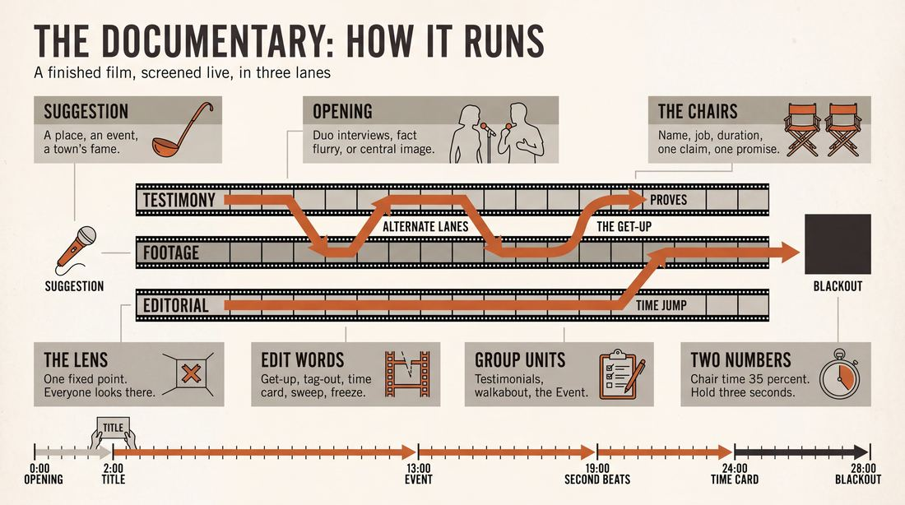
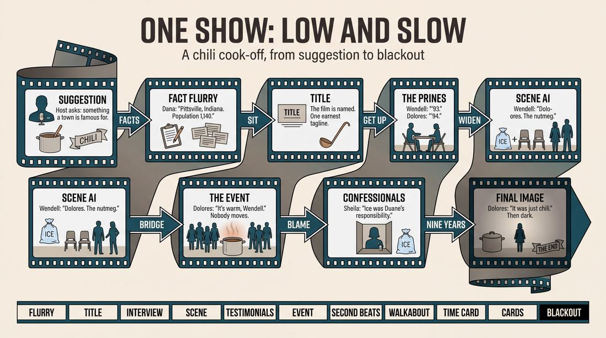
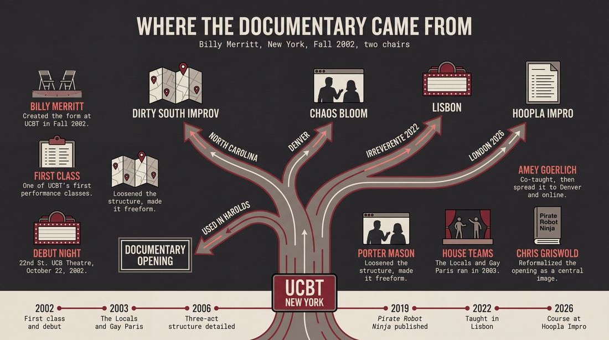
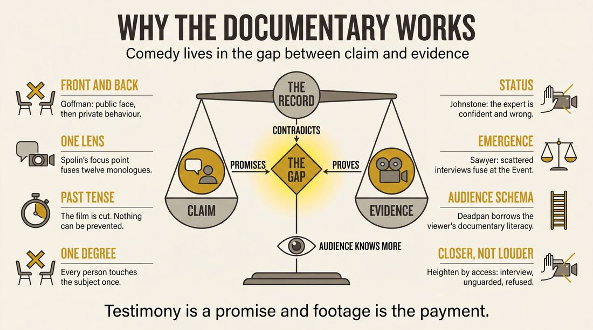
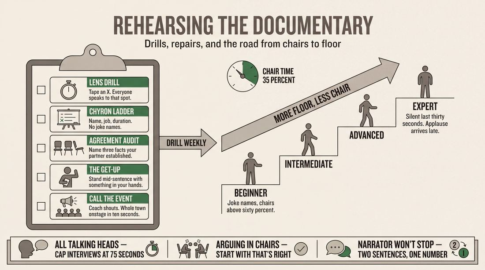

# The Documentary

> **A complete study of the long-form improv format _The Documentary_** - the original archived write-up, five infographics, grounded historical and pedagogical research, and a full mechanics-and-coaching manual.

| | |
|---|---|
| **Format** | The Documentary |
| **Primary source** | [IRC Improv Wiki](https://wiki.improvresourcecenter.com/index.php?title=The_Documentary) |

---

## Contents

1. [Part I - The Original Write-Up](#part-i-the-original-write-up)
2. [Part II - The Infographics](#part-ii-the-infographics)
   - [1. Structure and Mechanics](#infographic-1-mechanics)
   - [2. A Show, Beat by Beat](#infographic-2-example)
   - [3. Origins and Lineage](#infographic-3-history)
   - [4. Why It Works](#infographic-4-theory)
   - [5. Rehearsal and Repair](#infographic-5-coaching)
3. [Part III - Research Dossier](#part-iii-research-dossier)
   - [Pass 1: History, Lineage, Literature and Scholarship](#research-history)
   - [Pass 2: Comparative Anatomy, Pedagogy and Production](#research-comparative)
4. [Part IV - Mechanics, Gameplay and Coaching Manual](#part-iv-mechanics-gameplay-and-coaching-manual)
   - [Pass 1: The Form, Its Mechanics and Its Gameplay](#manual-mechanics)
   - [Pass 2: Training, Coaching and Performance Companion](#manual-coaching)

---

## Part I - The Original Write-Up

*Verbatim archive of the source article, reproduced exactly as scraped. Everything after this section is generated elaboration built on top of it.*

### The Documentary

**The Documentary** is an improv form created by [Billy Merritt](https://wiki.improvresourcecenter.com/index.php?title=Billy_Merritt "Billy Merritt") at the [Upright Citizens Brigade Theatre](https://wiki.improvresourcecenter.com/index.php?title=Upright_Citizens_Brigade_Theatre "Upright Citizens Brigade Theatre") in Fall 2002\. One of the first and most successful of the UCBT's performance classes, The Documentary has been offered as a class at the UCBT at least five times, allowing Merritt and others who worked closely with him (notably [Porter Mason](https://wiki.improvresourcecenter.com/index.php?title=Porter_Mason "Porter Mason"), [Jane Borden](https://wiki.improvresourcecenter.com/index.php?title=Jane_Borden&action=edit&redlink=1 "Jane Borden (page does not exist)") and [Amey Goerlich](https://wiki.improvresourcecenter.com/index.php?title=Amey_Goerlich "Amey Goerlich")) ample opportunity to experiment with the form.

The Documentary has also spread to other theaters in other parts of the country, such as [Dirty South Improv](https://wiki.improvresourcecenter.com/index.php?title=Dirty_South_Improv "Dirty South Improv") in North Carolina.

##### The Form

Initially, the form that came out of the first class was much like a Harold. There was an opening, several scenes involving two people interacting, followed by a group scene, second beats of the initial three scenes, etc. There were notable differences, though, including the use of narration at the beginning and throughout the Documentary, as well as interviews to an invisible camera, used to introduce characters for the first time.

Thus:

- Suggestion: of a place or an event.
- [Opening](https://wiki.improvresourcecenter.com/index.php?title=Opening "Opening"): A sort of [pattern game](https://wiki.improvresourcecenter.com/index.php?title=Pattern_game "Pattern game"), where the cast members come up with fake factoids and character declarations inspired by the [suggestion](https://wiki.improvresourcecenter.com/index.php?title=Suggestion "Suggestion"). The opening ends with a tagline and title for the Documentary. The fake factoids evolved into a run of true or made up facts, called the fact flurry (it usually follows the interview).
- [First beats](https://wiki.improvresourcecenter.com/index.php?title=Beat "Beat"): A short two\-person interview to an invisible camera, followed by a scene between those two characters.
- [Group scene](https://wiki.improvresourcecenter.com/index.php?title=Group_Game "Group Game"): More of the community, introducing peripheral characters. Recently, it has evolved to a series of monologues by characters that are part of the world examined by the documentary, called Enviromental testimonials.
- Second beats. These are standard scenes, focused in the original pairs that were interviewed. They may also offer a confessional type of monologue, breaking the fourth wall.
- Group scene 2\. This can also be a documentarian walkabout, which is a scene where we see panel or man\-on\-the\-street\-type interviews.
- The event/climax of the documentary, in which the characters interact
- Wrap\-up: possibly including the narrator and further two\-person interviews

Over time, as performers got more comfortable with the form, the structure got much looser. 

Gradually, the pattern game/factoid opening was dropped in favor of starting with a series of two\-person interviews. (The improvisors particularly loved this part of the show, and Merritt had to remind them repeatedly to "get out of the chairs.") This opening was also a favorite of Monkeydick, who used it to open Harolds.

Something that has been introduced lately is a more active role of the documentarian, who may intervene in every single part of the piece if they wish to do so.

##### The First Three Classes

Merritt's first Documentary class was in Fall 2002, with a debut performance at the 22nd St. UCB Theatre on Tuesday, October 22\. The cast was Porter Mason, Jane Borden, Sarah Burns, Maggie Kemper, Dave Martin, Benj Hewitt, Federico Garduño, Camille, Sara, Brendan McLoughlin, John Snyder, Helaine Cira and Jason Scott Quinn.

A second class followed immediately after, consisting of Mark De La Barre, Jeff Scherer, Brett Christensen, Kate Spencer, Matt Demblowski, Andy Rocco, Amey Goerlich, Dan Kois, Liz Black, and BJ Gallagher.

Shortly afterwards, two teams were formed out of improvisers who wished to continue with the form in a run at the theater: The Locals and Gay Paris (pronounced "pair\-iss," not "par\-ee"). The Documentary ran at the UCBT for several months in 2003 and 2004\.

\[this is still being written]

---

*Archived from [https://wiki.improvresourcecenter.com/index.php?title=The_Documentary](https://wiki.improvresourcecenter.com/index.php?title=The_Documentary) (IRC Improv Wiki) on 2026-08-09 23:23 UTC.*

---

## Part II - The Infographics

*Five 16:9 posters, each teaching a different aspect of the format. Click any poster to enlarge.*

<a id="infographic-1-mechanics"></a>

### 1. Structure and Mechanics

*How the form is played: the shape of the piece, the opening, the roles, the edit vocabulary, the flow of information, and the clock.*

{ .diagram loading=lazy decoding=async width="1100" height="614" }


<a id="infographic-2-example"></a>

### 2. A Show, Beat by Beat

*A single worked performance from suggestion to blackout: what happens in each beat, with short real example lines and what the players are doing technically.*

{ .diagram loading=lazy decoding=async width="1100" height="614" }


<a id="infographic-3-history"></a>

### 3. Origins and Lineage

*Where the form came from: creators, dates, theatres, how it spread between schools and cities, and the key figures - a documented timeline and lineage map.*

{ .diagram loading=lazy decoding=async width="1100" height="614" }


<a id="infographic-4-theory"></a>

### 4. Why It Works

*The theory: the core principles of the form and the research and craft ideas that explain why the structure produces good improv, each tied to a specific mechanic.*

{ .diagram loading=lazy decoding=async width="1100" height="614" }


<a id="infographic-5-coaching"></a>

### 5. Rehearsal and Repair

*Training and fixing the form: the essential drills, the common failure modes with their symptom-and-fix pairs, and the markers of beginner through expert play.*

{ .diagram loading=lazy decoding=async width="1100" height="614" }


---

## Part III - Research Dossier

*Two research passes: the historical record, then the comparative and pedagogical record. Claims carry evidence tags - treat unverified items accordingly.*

<a id="research-history"></a>

### » Pass 1: History, Lineage, Literature and Scholarship

### Research Summary
*   **Documentation Level:** Moderately documented. The structural mechanics are preserved in wiki archives and practitioner forums (IRC), while its pedagogical lineage is traceable through theater class listings and instructor biographies. Academic literature on the form itself is non-existent, though performance-studies research on the mockumentary genre provides a robust theoretical framework.
*   **Origin:** Created by Billy Merritt at the Upright Citizens Brigade Theatre (UCBT) in New York in Fall 2002.
*   **Core Mechanic:** The form parodies cinéma-vérité and mockumentary filmmaking, utilizing direct-to-camera interviews, voiceover narration, and "environmental testimonials" to generate characters and establish a grounded, non-linear world.
*   **Evolution:** Originally structured similarly to a Harold with a "fact flurry" pattern game opening, it quickly evolved to prioritize two-person interviews. 
*   **Fragmentation:** The opening mechanic ("The Documentary Opening") detached from the main form and became a ubiquitous, standalone opening for standard Harolds across the United States.
*   **Digital Adaptation:** The form experienced a significant resurgence during the COVID-19 pandemic, as the "invisible camera" conceit translated perfectly to the literal cameras of Zoom-based improv.

### Provenance and History
The Documentary was developed by Billy Merritt at the Upright Citizens Brigade Theatre in Fall 2002 [DOCUMENTED]. Merritt, a founding member of The Swarm and The Stepfathers, was actively experimenting with new long-form structures to push improvisers beyond the rigid confines of the Harold [INFERRED]. The form was designed to solve a specific craft problem: how to rapidly generate deep character backstories and establish a cohesive ensemble world without relying on heavy in-scene exposition [WIDELY PRACTICED, UNDOCUMENTED]. 

By borrowing the visual and narrative language of documentary film—specifically the "talking head" interview—performers could state their perspectives directly to the audience, allowing the subsequent scenes to focus purely on relationship and action. The name is a direct, literal reference to the non-fiction film format it emulates. The debut performance took place on October 22, 2002, at the 22nd St. UCB Theatre, featuring a cast that included Porter Mason and Jane Borden [DOCUMENTED].

| Year | Event | Place / Company | Source |
| :--- | :--- | :--- | :--- |
| 2002 | First Documentary class and debut performance (Oct 22) | UCBT New York | [IRC Improv Wiki](https://wiki.improvresourcecenter.com/index.php?title=The_Documentary) |
| 2003 | The Locals and Gay Paris begin theater runs | UCBT New York | [IRC Improv Wiki](https://wiki.improvresourcecenter.com/index.php?title=The_Documentary) |
| 2005 | Improvisers discuss the form's unique sense of "control" | IRC Forums | [Improv Resource Center](https://www.improvresourcecenter.com) |
| 2006 | Three-act structure of the form detailed by practitioners | IRC Forums | [Improv Resource Center](https://www.improvresourcecenter.com) |
| 2019 | Publication of *Pirate Robot Ninja: An Improv Fable* | Amazon / UCB Comedy | [Improv In Action](https://improvinaction.com) |
| 2022 | Form reformalized and taught at Irreverente Festival | Lisbon, Portugal | [Facebook - Chris Griswold](https://www.facebook.com) |
| 2026 | "Improvised Documentary" 8-week course offered | Hoopla Impro, London | [Hoopla Impro](https://www.hooplaimpro.com) |

### Lineage and Transmission
The form spread outward from UCBT New York through Merritt's co-teachers and students. Amey Goerlich, who was in the second Documentary class and co-taught the form with Merritt, became a primary vector for its transmission, teaching it at the Improv Training Hub, Chaos Bloom Theater in Denver, and extensively online [DOCUMENTED]. Porter Mason is credited with taking Merritt's original rigid structure and making it more freeform [DOCUMENTED]. 

The form migrated to regional theaters, notably Dirty South Improv (DSI) in North Carolina, and eventually internationally. Chris Griswold taught a reformalized version of the form at the Irreverente Festival in Lisbon, Portugal, and Chris Mead integrated it into the curriculum at Hoopla Impro in London [DOCUMENTED]. 

A major pedagogical mutation occurred when the form's opening—two improvisers sitting in chairs speaking to an unseen interviewer—was extracted and taught as a standalone opening for Harolds. This "Documentary Opening" became a distinct regional dialect, heavily influenced by the two-person mockumentary style pioneered by Stephnie Weir and Bob Dassie in their duo show *Weirdass* [DOCUMENTED].

### Key Figures

| Person | Role in this form | Specific contribution | Source URL |
| :--- | :--- | :--- | :--- |
| Billy Merritt | Creator | Invented the form at UCBT in 2002; authored *Pirate Robot Ninja*. | [Bit Comedy Network](https://bitcomedynetwork.com) |
| Amey Goerlich | Co-developer / Teacher | Co-taught with Merritt; spread the form to Denver and online platforms. | [Chaos Bloom](https://chaosbloom.com) |
| Porter Mason | Co-developer | Loosened the original structure to make the form more freeform. | [Facebook](https://www.facebook.com) |
| Stephnie Weir | Influencer | Co-created *Weirdass*, pioneering the two-person interview mechanic that influenced the opening. | [Reddit](https://www.reddit.com/r/improv) |
| Chris Griswold | Teacher | Reformalized the opening to use a central image with interviews laid over top. | [Facebook](https://www.facebook.com) |

### Canonical Shows, Companies and Recordings
*   **The Locals** and **Gay Paris**: The first two house teams formed specifically to perform The Documentary at UCBT in 2003 and 2004 [DOCUMENTED].
*   **Blind Crazy** and **Not Hillary**: Early independent documentary teams noted for utilizing a strict three-act structure (before the event, emotional reaction to the event, passage of time) [DOCUMENTED].
*   **Documentary Live!**: A recorded graduation show directed by Chris Griswold for Thunderbolt Comedy, demonstrating the reformalized central-image opening. [YouTube / Facebook](https://www.facebook.com).
*   **Improv Hub Graduating Class**: A December 2022 Zoom performance demonstrating the form's seamless adaptation to digital/webcam environments. [YouTube](https://www.youtube.com).

### Published Literature

| Work | Author | Year | What it says about this form | Where to find it |
| :--- | :--- | :--- | :--- | :--- |
| *IRC Improv Wiki: The Documentary* | Various | 2024 | Details the original UCBT structure, the "fact flurry," and the evolution of the opening. | [IRC Wiki](https://wiki.improvresourcecenter.com/index.php?title=The_Documentary) |
| *Pirate Robot Ninja: An Improv Fable* | Will Hines & Billy Merritt | 2019 | Contextualizes Merritt's pedagogical approach to form creation and character generation. | [Amazon](https://www.amazon.com) |
| *Visual Characteristics of the Mockumentary Format* | Connor McGarry | 2019 | Academic thesis detailing how mockumentary blends narrative structure with non-fiction presentation. | [PDX Scholar](https://pdxscholar.pdx.edu) |

### Verbatim Quotes

> "I feel like I'm in much more control in The Documentary. It might be a fake feeling of confidence, but it's one form that makes so much sense to me."
> — Jenmac, Improviser [IRC Forums](https://www.improvresourcecenter.com)

> "Billy Merritt created the form, I learned it from Porter Mason who made it more freeform, and then I reformalized the opening because it worked best for the shows we did in that class. But I teach it very differently from a lot a of other people because I don't want forms to be too restrictive."
> — Chris Griswold, Thunderbolt Comedy [Facebook](https://www.facebook.com)

> "The Documentary Opening is different from a Documentary style/mockumentary. The Documentary opening goes like this: Get a suggestion. Two people sit down and, like the couples interviews in When Harry Met Sally, speak in character to an unseen camera and interviewer."
> — SpeakeasyImprov [Reddit](https://www.reddit.com/r/improv)

> "Throughout the piece there are interviews, where the characters sit down and speak candidly to the audience, as though they are being interviewed for a documentary. Also, little explanatory vignettes can be played out, like a tiny clip of a newsreel."
> — EthanK, Improviser [IRC Forums](https://www.improvresourcecenter.com)

> "We started out with unrelated interviews but found that it was easier to treat it like a 'closed quarters' documentary. We would ask for 'something that a town is famous for' and then interview the people who lived in that town."
> — Tha_23rd_Buchan [Reddit](https://www.reddit.com/r/improv)

> "Online rocks for the documentary because it's actually on camera! lol...."
> — Lindsay Drummond, Improv Teacher [Facebook](https://www.facebook.com)

> "Most documentary forms use what people call the 'documentary open' featuring duo interviews, but I prefer a central image with interviews laid over top."
> — Chris Griswold, Thunderbolt Comedy [Facebook](https://www.facebook.com)

> "Gradually, the pattern game/factoid opening was dropped in favor of starting with a series of two-person interviews. (The improvisors particularly loved this part of the show, and Merritt had to remind them repeatedly to 'get out of the chairs.')"
> — IRC Improv Wiki [IRC Wiki](https://wiki.improvresourcecenter.com/index.php?title=The_Documentary)

### Anecdotes and Stories
**Getting Out of the Chairs**
When Billy Merritt first introduced the two-person interview mechanic, the improvisers became infatuated with it. The safety of sitting in a chair and delivering pure, unbothered character exposition was so intoxicating that the performers resisted transitioning into actual scenes. Merritt had to repeatedly yell at his casts to "get out of the chairs!" to force them to put their newly generated characters into active, physical scenework [DOCUMENTED].

**The Zoom Renaissance**
During the COVID-19 pandemic, when theaters shuttered and improv moved to Zoom, many traditional formats suffered. However, The Documentary thrived. Because performers were literally staring into webcams, the "invisible camera" mechanic of the mockumentary format became a literal camera. Teachers like Amey Goerlich and Lindsay Drummond noted that the format felt native to the digital space, allowing for highly effective direct-address and intimate character work that didn't require a physical stage [DOCUMENTED].

### Academic and Scientific Research
**Performance Studies and Cinéma-Vérité**
In *Visual Characteristics of the Mockumentary Format* (2019), Connor McGarry notes that mockumentaries use the audience's familiarity with cinéma-vérité (handheld cameras, direct address, awkward pauses) to emulate reality and fool audiences into accepting absurd premises. 
*Relevance to this form:* The "invisible camera" and "environmental testimonials" mechanics rely entirely on the audience's cognitive schema of documentary tropes. By adopting the physical posture of an interviewee, the improviser establishes instant groundedness, allowing them to play highly absurd characters with absolute deadpan realism without breaking the reality of the scene.

**Psychology of Improvisation: Relinquishing Control**
Dr. Matthew Goodman's psychological research on "Zen-prov" explores how improvisation reveals our reliance on control and trains the mind to let go of predetermined outcomes. 
*Relevance to this form:* The "fact flurry" and rapid-fire interview tags force performers to relinquish narrative control. Because the back line can tag out an interview at any second, the improviser cannot plan a monologue; they must rely on collaborative emergence, trusting that the fragmented talking heads will eventually coalesce into a unified macroscene.

**Cognitive Science: Rapid Pattern Recognition**
*Relevance to this form:* The "documentarian walkabout" (Group Scene 2) requires the ensemble to engage in high-speed pattern recognition. The performers must cognitively synthesize the disparate thematic patterns established in the isolated first-beat interviews and weave them together in a rapid, man-on-the-street montage, demanding intense working memory and group mind [INFERRED].

### Documented Variants and Descendants
*   **The Documentary Opening:** Detached entirely from the main form, this is used as an opening for standard Harolds. Two chairs are placed downstage. Rotating pairs of improvisers give interviews based on a suggestion, tagged out by the back line. The scenes that follow may or may not use the characters generated [DOCUMENTED].
*   **The Central Image Open:** Developed by Chris Griswold, this variant replaces the duo interviews with a central physical image created by the ensemble, with individual interviews laid over the top of the stage picture [DOCUMENTED].
*   **Closed Quarters Documentary:** A variant where the suggestion is specifically "something a town is famous for." All subsequent interviews and scenes are restricted to the residents of that specific town, creating a tighter, more cohesive macroscene [DOCUMENTED].
*   **The Three-Act Doc:** A highly structured variant utilized by early indie teams like *Blind Crazy*, divided strictly into: 1) Normal lives before a major event, 2) Emotional reactions to the event, and 3) Reactions after a passage of time [DOCUMENTED].

### Criticism, Debate and Known Failure Modes
*   **The "Talking Head" Trap:** The most widely documented failure mode is performers getting too comfortable in the interview chairs. Because direct address is easy and safe, improvisers often fail to initiate active scenes, resulting in a show that is entirely exposition and devoid of relationship dynamics [DOCUMENTED].
*   **Lack of Scenic Action:** Teachers warn that because the form relies heavily on verbal backstory, the second beats often become purely informational rather than active. The characters talk *about* what they do rather than *doing* it [WIDELY PRACTICED, UNDOCUMENTED].
*   **Nomenclature Confusion:** There is ongoing debate among practitioners regarding the terminology. Many improvisers confuse "The Documentary Opening" (a specific 3-minute mechanic) with performing a full "Mockumentary" form (a 25-minute narrative structure). Purists argue the two require entirely different skill sets [DOCUMENTED].

### Cultural Footprint
The Documentary format served as a vital training ground for a generation of UCBT comedians who would go on to define the comedic voice of the 2010s. The form's mechanics became ubiquitous in indie improv across the US. Furthermore, as the mockumentary style exploded in mainstream television comedy (*The Office*, *Parks and Recreation*, *Modern Family*), audiences became highly literate in the form's tropes. This mainstream cultural footprint created a symbiotic loop: audiences understood the "rules" of the improv format immediately, which in turn made The Documentary one of the most accessible and reliably successful long-forms for indie teams to perform [INFERRED].

### Gaps in the Record
*   **The Death of the Fact Flurry:** The exact date and pedagogical reasoning for dropping the original "pattern game/factoid" opening in favor of the interview opening is undocumented.
*   **Co-Developer Contributions:** While Porter Mason, Jane Borden, and Amey Goerlich are universally cited as co-developers who experimented with the form in its infancy, their specific structural contributions (aside from Mason making it "more freeform") lack primary source documentation.
*   **UNVERIFIED - The Weirdass Connection:** It is widely accepted that Stephnie Weir and Bob Dassie pioneered the two-person interview opening. However, it is unverified whether Billy Merritt was directly inspired by their work when adapting the Documentary opening, or if the two mechanics evolved in parallel on opposite coasts.

### Source List
1. *IRC Improv Wiki: The Documentary* - Improv Resource Center - 2024 - https://wiki.improvresourcecenter.com/index.php?title=The_Documentary - Supports the foundational structure, history, and original UCBT casts.
2. *Billy Merritt Biography* - Bit Comedy Network - 2024 - https://bitcomedynetwork.com - Supports Merritt's creation of the form and his professional lineage.
3. *Amey Goerlich Biography* - Chaos Bloom Theater - 2021 - https://chaosbloom.com - Supports Goerlich's role as a co-teacher and the form's transmission to Denver and online.
4. *Improv Resource Center Forums (Thread: Prestige format)* - Various Authors - 2005/2006 - https://www.improvresourcecenter.com - Supports practitioner quotes, the "control" feeling, and the Three-Act variant.
5. *Reddit r/improv (Thread: Entertaining Openers)* - Various Authors - 2012 - https://www.reddit.com/r/improv - Supports the evolution of the Documentary Opening and the "Closed Quarters" variant.
6. *Facebook Improv Groups (Thread: The Documentary)* - Chris Griswold & Lindsay Drummond - 2022 - https://www.facebook.com - Supports the Zoom adaptation, Griswold's reformalization, and Porter Mason's contributions.
7. *Visual Characteristics of the Mockumentary Format* - Connor McGarry (Portland State University) - 2019 - https://pdxscholar.pdx.edu - Supports the academic framework of cinéma-vérité and audience perception.
8. *Zen-prov! Podcast Interview* - Dr. Matthew Goodman - 2026 - https://zen-improv.com - Supports the psychological research on improv, control, and mindfulness.
9. *Hoopla Impro Course Listings* - Chris Mead - 2026 - https://www.hooplaimpro.com - Supports the international transmission of the form to London.
10. *Reddit r/improv (Thread: Documentary Opening)* - SpeakeasyImprov - 2020 - https://www.reddit.com/r/improv - Supports the distinction between the opening and the form, and the Weirdass influence.

<a id="research-comparative"></a>

### » Pass 2: Comparative Anatomy, Pedagogy and Production

### Taxonomic Placement

```text
      The Committee (Thematic Exploration)
             |
        The Harold (Multi-beat structure)
             |
      +------+------+
      |             |
   Armando     The Documentary
 (Monologue)   (Interviews/Mockumentary)
                    |
             +------+------+
             |             |
      The Office     Zoom/Online Doc
    (Sitcom hybrid)  (Remote adaptation)
```

The Documentary sits squarely in the thematic long-form family, directly descending from the Harold's multi-beat, multi-character structure. However, it replaces the Harold's abstract opening and group games with direct-to-camera interviews, voiceovers, and environmental testimonials. It borrows the reality-grounding function of the Armando's monologues but fictionalizes them, creating a mockumentary framework that allows for rapid shifts in time and perspective while maintaining a cohesive thematic universe rather than a single protagonist's journey.

### Head-to-Head Comparisons

#### The Documentary vs. The Harold
| Axis | THIS FORM (The Documentary) | THE OTHER FORM (The Harold) | Consequence for the players |
| :--- | :--- | :--- | :--- |
| **Opening** | In-character interviews to an unseen camera. | Abstract pattern game or invocation. | Players must immediately establish character POV and relationships rather than pure thematic ideas. |
| **Structure** | Thematic scrapbook, narrator-driven, fluid timelines. | Rigid 3x3 beats separated by group games. | The Documentary allows for non-linear time jumps and direct narrator intervention to bridge scenes. |
| **Edit logic** | Voiceovers, cutaways, camera tags, and narrator interruptions. | Sweep edits and tag-outs. | Edits in The Documentary can be diegetic (the "director" cutting the film or fast-forwarding). |
| **Memory** | High (tracking multiple timelines and "historical" facts). | High (tracking three distinct worlds). | Players must remember specific "facts" established in the Fact Flurry or interviews to pay off in scenes. |
| **Cast size** | 6 to 8 players. | 6 to 8 players. | Everyone gets a chance to be an expert, a subject, or a peripheral community member. |
| **Audience contract** | We are watching a finished broadcast or film being assembled. | We are watching a theatrical exploration of a theme. | The audience accepts direct address and fourth-wall breaks as native to the form. |
| **Failure mode** | Staying in the chairs (talking heads). | Getting lost in the weeds of the structure. | Documentary players must actively force themselves to transition from static interviews into physical scenes. |

#### The Documentary vs. The Armando (Monologue Deconstruction)
| Axis | THIS FORM (The Documentary) | THE OTHER FORM (The Armando) | Consequence for the players |
| :--- | :--- | :--- | :--- |
| **Opening** | Fictional interviews based on the suggestion. | A true, personal monologue based on the suggestion. | Documentary players invent the lore; Armando players mine their actual lives. |
| **Structure** | Interviews intercut with scenes of those same characters. | Monologues intercut with scenes inspired by the monologue. | Documentary scenes often feature the *same* characters from the interviews; Armando scenes rarely feature the monologist. |
| **Edit logic** | The documentarian or narrator controls the pacing. | Sweep edits back to the monologist. | The Documentary feels like a curated media artifact; the Armando feels like a storytelling circle. |
| **Memory** | Tracking character hypocrisies (interview vs. reality). | Tracking thematic premises from the monologue. | Players must actively contrast what a character *says* to the camera with what they *do* in the scene. |
| **Cast size** | 6 to 8 players. | 6 to 8 players plus a dedicated monologist. | The Documentary distributes the "speaking to the audience" role across the whole cast. |
| **Audience contract** | The speakers are fictional characters. | The speaker is a real person telling the truth. | The audience laughs at the absurdity of the Documentary characters, rather than connecting with the vulnerability of the Armando monologist. |
| **Failure mode** | Lack of agreement in the opening interviews. | Scenes that just re-enact the monologue verbatim. | Documentary players must strictly say "yes" to the fictional reality their interview partner establishes. |

#### The Documentary vs. The Movie
| Axis | THIS FORM (The Documentary) | THE OTHER FORM (The Movie) | Consequence for the players |
| :--- | :--- | :--- | :--- |
| **Opening** | Fact Flurry or two-person interviews. | Trailer, opening credits, or establishing shot. | The Documentary establishes a theme or community; The Movie establishes a protagonist and a genre. |
| **Structure** | Scrapbook approach exploring a subject from multiple angles. | Linear narrative following a hero's journey. | Players in The Documentary do not need to solve a plot; they only need to explore the subject. |
| **Edit logic** | Archival footage, talking heads, voiceovers. | Cross-fades, slow motion, panning shots. | The Documentary uses journalistic tropes; The Movie uses cinematic tropes. |
| **Memory** | Tracking community reactions to an event. | Tracking the protagonist's goal and obstacles. | Documentary players focus on world-building; Movie players focus on narrative momentum. |
| **Cast size** | 6 to 8 players. | 6 to 8 players. | The Documentary is an ensemble piece; The Movie often defaults to a main character and supporting cast. |
| **Audience contract** | We are learning about a phenomenon. | We are watching a story unfold. | The audience expects thematic resolution in The Doc, but plot resolution in The Movie. |
| **Failure mode** | Forcing a linear plot. | Losing the narrative thread. | Documentary players must resist the urge to turn the form into a single, continuous story. |

#### The Documentary vs. Montage
| Axis | THIS FORM (The Documentary) | THE OTHER FORM (Montage) | Consequence for the players |
| :--- | :--- | :--- | :--- |
| **Opening** | Highly structured interviews or Fact Flurry. | Often none, or a brief suggestion pull. | The Documentary requires immediate, heavy verbal world-building. |
| **Structure** | Interconnected scenes bound by a narrator or theme. | Disconnected scenes bound only by sweep edits. | The Documentary requires players to actively weave disparate elements together. |
| **Edit logic** | Diegetic cuts (interviews, walkabouts). | Standard sweep edits or tag-outs. | Edits in The Documentary carry narrative weight and establish the POV of the "filmmaker." |
| **Memory** | High (building a cohesive world). | Low to Medium (scenes can be entirely disposable). | Documentary players cannot abandon a timeline; they must return to the interview subjects. |
| **Cast size** | 6 to 8 players. | Any size. | The Documentary requires a cast large enough to populate a "community." |
| **Audience contract** | Everything is connected to the central subject. | Scenes may or may not be connected. | The audience expects a payoff or climax where the documentary subjects interact. |
| **Failure mode** | The omnipresent steamroller (narrator talks too much). | Scenes bleeding together with no variety. | The narrator must learn to step back and let the scenes breathe. |

### What Makes It Uniquely Itself

1. **The Diegetic Fourth-Wall Break (The Interview/Confessional):** Characters speak directly to an unseen camera or documentarian. This creates a "front stage" where characters present their idealized selves, which is then immediately undercut by their "back stage" behavior in the scenes. If removed, the form is just a thematic montage.
2. **The Omnipresent Editorial Voice:** Whether through a narrator, a "Fact Flurry," or a documentarian walkabout, there is an external framing device that contextualizes the scenes. This allows for massive leaps in time and space (e.g., cutting to "archival footage" from 100 years ago). If removed, the scrapbook feel is lost.
3. **The "Big Event" Gravity:** Unlike a Harold which explores a theme abstractly, The Documentary usually orbits a specific, concrete phenomenon (a local festival, an alien abduction, the invention of indoor plumbing). The scenes do not drive a plot forward; they act as a 360-degree examination of how that single event impacts a community.

### Structural Variants in Practice

| Variant Name | What It Changes | Who Plays It | Source |
| :--- | :--- | :--- | :--- |
| **The Original UCBT Structure** | Starts with a pattern game/fake factoids, moves to 1st beats (interview + scene), group scene, 2nd beats, climax, wrap-up. | Billy Merritt's original 2002 UCB classes (Porter Mason, Jane Borden, Amey Goerlich). | IRC Improv Wiki |
| **The Looser Modern Variant** | Drops the pattern game entirely in favor of a series of two-person interviews. The documentarian takes a highly active role, intervening at will. | Monkeydick, Weirdass (Stephnie Weir and Bob Dassie), modern UCB teams. | IRC Improv Wiki / Reddit |
| **The "Big Event" Three-Act** | Act 1: Interviews/scenes establishing normal life. Act 2: Emotional reactions to a "Big Event". Act 3: Retrospective interviews years later. | EthanK / Blind Crazy / Not Hillary. | IRC Message Boards |
| **The Short-Form Hybrid** | Uses the documentary frame to house short-form handles like "Expert Double Figures" or "Archival Footage" recreations. | ImprovDr / Short-form troupes. | ImprovDr |
| **The Zoom/Online Adaptation** | Uses video conferencing features (pinning, spotlighting) to simulate camera cuts and talking-head interviews. | The Nursery Theatre / Unscripted Players (UK). | GitHub Pages (Unscripted Players) |

### The Teaching Ladder

| Stage | Skill introduced | Why in this order | Typical exercise | Source or [CRAFT CONSENSUS] |
| :--- | :--- | :--- | :--- | :--- |
| 1 | Direct Address & POV | Players must learn to speak to an unseen camera and establish a character before interacting with each other. | Two-Person Interview | Billy Merritt / UCB |
| 2 | Radical Agreement | Interviews fail if players argue; they must build a shared history instantly without the benefit of physical object work. | The Andy Secunda Agreement Check | Andy Secunda / Will Hines |
| 3 | Transitioning to Action | Players naturally get stuck talking; they must learn to physicalize the world they just described. | "Get Out of the Chairs" | Billy Merritt / IRC Wiki |
| 4 | Editorial Framing | The form requires a narrator or documentarian to stitch disparate scenes together and control pacing. | Archival Footage / Scene Painting | ImprovDr |
| 5 | Thematic Weaving | Connecting peripheral characters to the main subjects to build a cohesive world for the climax. | Environmental Testimonials | IRC Wiki |

### Documented Drills and Exercises

| Drill | Origin / teacher | How to run it | What it fixes in this form | Source |
| :--- | :--- | :--- | :--- | :--- |
| **Two-Person Interview** | Billy Merritt | Two chairs downstage. Two players sit and are interviewed by an unseen camera based on a suggestion. Backline tags them out to rotate pairs. | Establishes character POV and shared history quickly; serves as the modern opening. | Reddit / Will Hines |
| **The Andy Secunda Agreement Check** | Andy Secunda | Run the Two-Person Interview. The coach stops the scene halfway to strictly audit if players are saying "yes" to the reality established by their partner. | Fixes arguing, denial, or conflict-for-comedy in the opening interviews. | Will Hines (Substack) |
| **"Get Out of the Chairs"** | Billy Merritt | Players start in an interview. On a specific cue (or their own volition), they must immediately stand up and establish the physical environment of the scene they were just discussing. | Fixes the "talking heads" pathology where players refuse to do active scene work. | IRC Wiki |
| **Fact Flurry** | Billy Merritt / UCB | Players step forward in rapid succession to deliver true or made-up facts about the suggestion. | Generates a high volume of premises and establishes the authoritative documentary tone. | IRC Wiki |
| **Archival Footage** | ImprovDr | A narrator describes a historical photo or video; teammates assume physical poses to recreate the image described. | Trains players to support the narrator physically and provides visual variety. | ImprovDr |
| **Reenactments** | ImprovDr | Narrator introduces a past event; players perform it as a traditional scene but can be paused, fast-forwarded, or narrated over by the documentarian. | Integrates traditional scene work with the editorial control of the documentarian. | ImprovDr |
| **Confessional Monologue** | [CRAFT CONSENSUS] | During an active scene, a player turns directly to the audience/camera to deliver a private thought, breaking the fourth wall, then returns to the scene. | Highlights the contrast between a character's internal truth and external behavior. | IRC Wiki |
| **Documentarian Walkabout** | [CRAFT CONSENSUS] | One player acts as the on-screen interviewer, walking around the stage interviewing a panel or "man on the street" characters. | Introduces peripheral characters and expands the world of the documentary. | IRC Wiki |
| **Environmental Testimonials** | [CRAFT CONSENSUS] | A series of rapid, back-to-back monologues by peripheral characters who inhabit the world examined by the documentary. | Replaces traditional group games with thematic, character-driven world-building. | IRC Wiki |
| **The "Big Event" Time Jump** | EthanK | Players establish a baseline reality in scenes. The coach calls "The Event." Players must instantly jump forward in time to react to the event. | Prevents the form from becoming a static exploration by forcing a massive status/world shift. | IRC Message Boards |

### Common Failure Modes and Diagnoses

| Failure mode | What it looks like from the audience | Root cause | Fix | Who names it |
| :--- | :--- | :--- | :--- | :--- |
| **Staying in the Chairs** | The entire show is just people talking to the camera; it looks like a radio play. | Comfort of the interview format; fear of physicalizing the space. | Coach repeatedly yells "Get out of the chairs!" and enforces immediate scene transitions. | Billy Merritt |
| **Lack of Agreement** | Interview subjects argue with each other or deny the premise of the documentary. | Trying to generate conflict for cheap laughs instead of building a shared reality. | The Andy Secunda Agreement Check (stop and audit agreement). | Andy Secunda |
| **Plotting / Forcing a Narrative** | The show turns into a linear movie about one protagonist rather than a thematic exploration. | Treating the form like "The Movie" or a narrative long-form. | Focus on base reality and relationships before introducing any "Big Event." | EthanK |
| **The Omnipresent Steamroller** | The narrator talks constantly, narrating over scenes and leaving no room for character dialogue. | Overzealous documentarian who doesn't trust the players to act out the scenes. | Limit the narrator to transitions, intros, and specific interventions. | [CRAFT CONSENSUS] |

### Production and Logistics

*   **Cast size and why:** 6 to 8 players. This allows for 3-4 distinct interview pairings in the opening, plus enough bodies to populate "archival footage" and peripheral community roles without exhausting the core subjects.
*   **Runtime:** 25 to 30 minutes (standard long-form slot).
*   **Stage layout:** Two chairs placed downstage center for the interviews. The rest of the stage remains open for active scene work and reenactments.
*   **Lighting and tech cues:** A tight spotlight or special on the downstage chairs for interviews; a full stage wash for scenes. Blackouts are used for major time jumps or to end the piece.
*   **Music and sound:** Pre-show and transition music should mimic documentary scores (e.g., Philip Glass, Errol Morris soundtracks, or generic public broadcasting synth music).
*   **MC and host duties:** The host asks the audience for a suggestion of a place, an event, or a historical phenomenon (e.g., "a local festival," "the invention of indoor plumbing").
*   **Where the form belongs in a lineup:** Excellent as a prestige anchor format in the second half of a show, or the "Documentary Opening" can be used as the first 5 minutes of a Harold.
*   **Rehearsal cadence:** Requires heavy drilling on the physical transition between direct address (sitting) and active scene work (standing/object work).
*   **What a producer must prepare:** Ensure chairs are easily movable and that the lighting improviser understands the distinct "interview" vs. "scene" looks.

### Adaptations Beyond the Stage

*   **Classroom and youth:** Excellent for educational settings where students can create a documentary about a historical event they are studying. Requires clear boundaries on historical accuracy vs. comedic invention.
*   **Corporate and applied improv:** Used for organizational storytelling (e.g., a mockumentary about a product launch or company history). Must ensure the "mocking" doesn't undermine company values or target specific employees maliciously.
*   **Online and remote:** Highly adaptable to Zoom (pioneered during the pandemic by theaters like The Nursery). Requires mastery of pinning, spotlighting, and virtual backgrounds to simulate camera cuts and archival footage.
*   **Community and therapeutic settings:** The interview format allows players to explore personal or community issues with the protective distance of a "character" and a "camera."
*   **Accessibility and inclusion:** The interview format allows players with limited mobility to shine in high-status, world-building roles without needing to engage in heavy physical scene work.
*   **Content-safety and consent:** If the suggestion is a real historical event or involves a marginalized group, players must avoid punching down.
*   **Ethics of using real stories:** The documentary should heighten the *absurdity of the documentarian or the experts*, not the trauma of real victims. [CRAFT CONSENSUS] dictates that if a real tragedy is suggested, the team should pivot to a fictionalized, parallel event.

### Evidence Base for Those Adaptations

*   **Organizational Storytelling:** Research by Tint & Froese (2014) on applied improvisation demonstrates that role-playing and narrative framing (such as the mockumentary format) allow teams to safely explore workplace dynamics and communication breakdowns by externalizing them into fictionalized "expert" roles.
*   **Digital Theatrical Adaptation:** Post-2020 performance studies highlight that direct-to-camera formats (like The Documentary) translated significantly better to video conferencing platforms than traditional proscenium formats, as they natively utilize the "talking head" framing inherent to Zoom.
*   **Therapeutic Distance:** Felsman et al. (2020) note that improvisational role-play provides psychological safety; the "unseen camera" in The Documentary acts as a buffering mechanism, allowing participants to express vulnerability through the proxy of an interview subject.

### Scholarly Frames Worth Applying

*   **Collaborative Emergence (R. Keith Sawyer):** *The frame in two sentences:* Sawyer argues that improv is a complex system where the final narrative emerges unpredictably from the micro-interactions of the players, rather than from a pre-planned script. *Citation:* Sawyer, R. K. (2003). *Improvised Dialogues: Emergence and Creativity in Conversation*. *Mapping to this form:* The disconnected interviews in the opening eventually weave into a unified thematic climax without any player knowing how the "Big Event" will connect them beforehand.
*   **Front Stage vs. Back Stage (Erving Goffman):** *The frame in two sentences:* Goffman posits that individuals perform idealized versions of themselves in public ("front stage") and drop these facades in private ("back stage"). *Citation:* Goffman, E. (1959). *The Presentation of Self in Everyday Life*. *Mapping to this form:* Maps perfectly to the contrast between what characters say to the camera in their interviews (front stage) and how they actually behave in the subsequent scenes (back stage).
*   **Status (Keith Johnstone):** *The frame in two sentences:* Johnstone argues that all theatrical interaction is a negotiation of status, with characters constantly trying to raise or lower themselves relative to others. *Citation:* Johnstone, K. (1979). *Impro: Improvisation and the Theatre*. *Mapping to this form:* Maps to the "Expert" interviews, where players must assume unearned high status regarding absurd or mundane topics, and the documentarian who holds ultimate high status by controlling the edit.
*   **Point of Concentration (Viola Spolin):** *The frame in two sentences:* Spolin teaches that players must focus on a specific, agreed-upon problem or object to bypass self-consciousness and achieve spontaneity. *Citation:* Spolin, V. (1963). *Improvisation for the Theater*. *Mapping to this form:* The "unseen camera" serves as the Point of Concentration, grounding the players' physical orientation and vocal projection during interviews.

### Where the Form Is Heading

*   **Current practice:** The "Documentary Opening" (pioneered by Weirdass and Monkeydick) has been heavily extracted from the full form and is now widely used as a standalone opening for Harolds to generate premises quickly.
*   **Revivals:** Post-pandemic return to live theater has seen a hybrid approach where Zoom-learned direct-to-camera skills (staring directly down the barrel of the lens) are brought back to the physical stage, resulting in more intense, intimate confessionals.
*   **Hybrids:** Blending with short-form (as seen in ImprovDr's work) to create highly structured, fast-paced shows that use the documentary frame to house discrete improv games.
*   **Contemporary companies:** Chaos Bloom Theater (under Amey Goerlich) and The Nursery Theatre (UK) continue to teach and evolve the form, pushing the boundaries of the active documentarian role and exploring non-linear editing techniques live on stage.

### Source List

1. IRC Improv Wiki - "The Documentary" - 2024 - https://wiki.improvresourcecenter.com/index.php?title=The_Documentary - Supports structural variants, history, and basic form mechanics.
2. ImprovDr - "The Documentary" - 2023 - https://improvdr.com/2023/11/10/the-documentary/ - Supports short-form integration, archival footage, and reenactment drills.
3. Reddit (r/improv) - "Entertaining Openers" - 2012 - https://www.reddit.com/r/improv/comments/q1z9z/entertaining_openers/ - Supports the Documentary Opening as a Harold variant and tag-out mechanics.
4. Substack (Will Hines / Improv Nonsense) - "The Documentary Fixed My Team" - 2025 - https://improvnonsense.substack.com/ - Supports the Andy Secunda agreement drill and opening mechanics.
5. IRC Message Board - "Prestige format" (EthanK) - 2006 - https://www.improvresourcecenter.com/ - Supports the three-act "Big Event" structure and failure modes (plotting vs exploring).
6. The Nursery Theatre / GitHub Pages - "The Documentary" - 2021 - https://unscriptedplayers.github.io/ - Supports online/Zoom adaptations and UK spread.
7. Reddit (r/improv) - "Documentary Opening" - 2023 - https://www.reddit.com/r/improv/ - Supports Weirdass attribution and modern coaching by Amey Goerlich at Chaos Bloom.

---

## Part IV - Mechanics, Gameplay and Coaching Manual

*Synthesis over the original article and both research dossiers: first how the form works and how to play it, then how to train an ensemble to perform it.*

<a id="manual-mechanics"></a>

### » Pass 1: The Form, Its Mechanics and Its Gameplay

### At a Glance

| Field | Entry |
|---|---|
| **Also known as** | The Doc; Improvised Documentary; Mockumentary (loosely and often wrongly — see Myths); "the Documentary Opening" refers only to its first three minutes |
| **Family** | Thematic long form, Harold-descended; sub-family: *mediated-frame* forms (the show pretends to be a piece of media being assembled) |
| **Cast size** | 6–8 ideal. 5 is thin (not enough peripheral bodies); 9+ needs a strict recurrence rule or half the cast never comes back |
| **Runtime** | 25–30 minutes standard. 12–15 minutes for a festival slot; 45–60 for an anchor show with three full acts |
| **Opening** | One of three documented options: (a) **Fact Flurry** — rapid true/false factoids about the subject; (b) **Duo Interviews** — rotating pairs in two downstage chairs talking to an unseen camera (the modern default); (c) **Central Image** — an ensemble tableau of the place with interviews laid over it (Chris Griswold's reformalisation) |
| **Suggestion taken** | A **place**, an **event**, or a **phenomenon**. The single most reliable ask, from practitioner report: *"something a town is famous for."* |
| **Structural rigidity (1–5)** | **3.** Merritt's 2002 original was a 4 (Harold-shaped, fixed beat order); Porter Mason loosened it; most modern houses run a 2–3 with a hard spine (opening → interviews-and-scenes → event → aftermath) and free tissue in between |
| **Difficulty (1–5)** | **3 to stand up, 4 to master.** The opening is the easiest thing in improv; the transition out of the chairs is one of the hardest disciplines in long form |
| **Prerequisites** | Direct address without winking or commenting; character POV stated in one sentence; radical agreement under interrogation; willingness to abandon a laughing bit to go do a scene; basic scene painting; a tech operator who can hold two looks |
| **Best for** | Ensembles with strong character work and weak scene-initiation confidence; casts of mixed experience (the chairs give everyone a guaranteed high-status moment); teams that keep making "two funny people in a void" and need a world; Zoom and camera-based performance, where the conceit becomes literal |
| **Avoid when** | Your cast can't leave a laugh (you will get 25 minutes of talking heads); you have fewer than five players; the suggestion is a live atrocity with real victims; you are performing a slot where the audience can't hear a quiet, low-status confessional; the team's only mode is high-energy absurdism (the form dies without deadpan) |

### The Essence in One Paragraph

The Documentary is a long form in which the ensemble performs not a story but **a finished non-fiction film about a subject, being screened for the audience right now**. A suggestion establishes the subject — a town, an event, a phenomenon — and from then on the stage is a piece of edited media: characters sit in two downstage chairs and testify to an invisible camera about what happened; the film then cuts to the footage of what *actually* happened; a narrator, title cards, archival photographs, man-on-the-street interviews and confessional asides stitch the fragments together. The comic engine is not conflict and not premise-heightening in the usual sense; it is **the gap between testimony and evidence** — what a person says to camera versus what we then watch them do — and the second engine is **retrospective tense**, because everyone speaks about the subject in the past, which means the film has already happened, the disaster has already occurred, and every interview line is an unpaid promise of a scene we are owed. The ensemble's job is to keep opening that gap and paying those promises, to keep the whole world within one degree of the subject, and above all to *get out of the chairs* — because the chairs are so safe and so funny that the form's signature failure is a beautiful, dead 25 minutes of people describing scenes nobody ever plays.

### Why This Form Exists

Billy Merritt built this at UCB New York in Fall 2002 as one of the theatre's first *performance* classes — a class whose output was a show, not a technique. The craft problem it attacks is specific and old:

**Problem 1: Exposition poisons scenes.** In a standard two-person scene, everything the audience needs to know about who these people are, how long they've known each other, what the stakes are, and what the town is like must be smuggled into dialogue that is also supposed to be a relationship playing in real time. Improvisers either dump it ("As you know, Brenda, we've run this hardware store for thirty years") or starve the scene of context. The Documentary **removes exposition from the scene entirely** and gives it its own dedicated container: the interview chair. You state your name, your job, your grievance and your version of history in forty seconds to a lens, and now the scene that follows can be pure behaviour. A plain montage cannot do this; it has no legal channel for backstory except the scene itself.

**Problem 2: Ensembles don't share a world.** A montage's scenes are, by design, disposable and unconnected. A Harold connects them thematically but abstractly — three worlds that rhyme. The Documentary connects them *materially*: everyone is in the same town, filmed by the same crew, in the same week. When Player 4 introduces "the Kiwanis pancake breakfast," that is now a fact of the world available to every other player for the rest of the show, the way a prop is. The form manufactures a shared object.

**Problem 3: Time is expensive.** Long forms that want to show cause and consequence normally have to burn scenes on transitions. Because the Documentary is a *finished film*, the editor can do anything: "Three months later." "This is the last photograph taken of Wendell Prine." Archival footage from 1911. A narrator collapses six months of decline into eleven words. A montage has no such organ; a Harold has to imply time passing via beats. The Documentary can just cut.

**Problem 4: Nobody knows what to do with the whole cast.** The Harold's answer is the group game, which many casts play badly (a shapeless wash of tag-outs). The Documentary offers three concrete group units instead — **Environmental Testimonials** (a run of peripheral characters each monologuing to camera, with a job title), the **Documentarian Walkabout** (an on-camera interviewer moving down a line of townspeople), and the **Event** (the whole community in one room on the day it happened). Each of these has a shape a beginner can execute on their first night.

What it buys, in one line: **a montage gives you scenes; the Documentary gives you a place, a chronology, and a point of view.**

### The Audience Contract

The audience is not promised a story. They are promised **an artifact**. Specifically:

1. **"This is a film that already exists."** Everything you see was shot, then cut together by someone with an agenda. Nothing is happening live. This is why time jumps, freeze frames and narration are legal, and why the audience does not need a "and then what happened" plot to be satisfied.
2. **"Everything you see is about the subject."** If the suggestion is a lighthouse, the audience will accept a scene about a divorce, a scene about a shipping-lane regulation and a scene about a lonely fifteen-year-old — as long as each is within one degree of the lighthouse. Two degrees and the contract snaps: they stop watching a documentary and start watching a montage with hats on.
3. **"The people are real and the camera is not."** The subjects don't know they're funny, don't play to laughs, and treat the lens as a serious opportunity to set the record straight. The audience's pleasure comes from knowing more than the interviewee.
4. **"Somebody is going to be proved wrong."** Because the audience has television literacy — *The Office*, *Parks and Recreation*, *Modern Family*, *Behind the Music*, true crime — they arrive pre-loaded with the schema. They expect that a talking head making a claim is a setup, and that the film will show them otherwise. Not paying that off is the deepest breach available.
5. **"We will be told where we are."** Chairs = testimony. Wash = footage. Narrator = the film's voice. Title card = a section break. The audience orients by *format cue*, not by dialogue.

**How they know where they are, mechanically:**

| Cue | Meaning to the audience |
|---|---|
| Two chairs, players seated, eye-line to a fixed offstage point | Interview. Past tense. Nothing is happening; it is being reported. |
| Player stands out of chair, chair struck or ignored, stage wash | Footage. Present tense of the past. Behaviour, not report. |
| Disembodied voice, no body onstage, or a player at the edge in neutral | Narration. The film's authorial voice. Absolute authority. |
| One player crossing the stage with a clipboard, holding a mic, speaking to another | Walkabout. On-camera correspondent. Peripheral world. |
| Frozen ensemble tableau while a voice describes it | Archival photograph. |
| Player in a scene stops, turns to the lens, speaks; other players hold or continue | Confessional. Other characters cannot hear it. |

**What breaks the contract:**

- Playing the camera as a joke ("Oh, is that thing on?" — once is a move, thrice is a genre).
- Characters knowing things they could not know, or narrating their own scene omnisciently.
- A subject who never appears in footage (all claim, no evidence).
- A scene that would be identical if you deleted the documentary frame.
- Wackiness in the chairs. A talking head who is *performing comedy* rather than sincerely testifying is the single fastest way to tell the audience "this is not a documentary, this is a sketch."
- Full narrative resolution of a plot. The audience contracted for an *examination*, not a hero's journey. Solving a plot is oddly deflating here.

### Anatomy: The Full Structural Map

The form has a **spine** (non-negotiable order) and **tissue** (freely arranged). The spine is: *establish the subject → establish subjects and their claims → show the world working → the Event → the reaction → the retrospective → the final image.* The tissue is everything you choose to put between those.

```text
                     SUGGESTION: a place / an event / a phenomenon
                                       |
 ┌──────────────────── ACT I : THE WORLD BEFORE ────────────────────┐
 │                                                                  │
 │   OPENING  [ Fact Flurry | Duo Interviews | Central Image ]      │  0:00
 │                              │                                   │
 │                     TITLE CARD + TAGLINE                         │  ~2:00
 │                              │                                   │
 │   INT A  (chairs) ──get up──►  SCENE A1   ── core pair 1         │
 │   INT B  (chairs) ──get up──►  SCENE B1   ── core pair 2         │
 │        [ FACT FLURRY / narrator footnote inserted here ]         │
 │   ENVIRONMENTAL TESTIMONIALS  (peripherals, 3–5 rapid monos)     │  group unit
 │   INT C  (chairs) ──get up──►  SCENE C1   ── core pair 3         │
 │                                                                  │  ~13:00
 └──────────────────────────────────────────────────────────────────┘
                                       |
 ┌──────────────────── ACT II : THE EVENT ──────────────────────────┐
 │        NARRATOR BRIDGE  ("Nobody was watching the ice.")         │
 │                              ▼                                   │
 │        ***  T H E   E V E N T  ***   (group scene, real time,    │
 │              everyone present, no narration over it)             │
 │                              │                                   │
 │        REACTION CONFESSIONALS (rapid-fire talking heads, 8–15s)  │
 │        SECOND BEATS   A2   B2   C2   (fallout; pairs re-mixed)   │
 │        WALKABOUT / VOX POP  (the blame montage)                  │  ~22:00
 └──────────────────────────────────────────────────────────────────┘
                                       |
 ┌──────────────────── ACT III : AFTER ─────────────────────────────┐
 │        TIME CARD  ("Nine years later.")                          │
 │        RETROSPECTIVE INTERVIEWS (same chairs, changed people)    │
 │        WHERE-ARE-THEY-NOW cards / narrator coda                  │
 │        FINAL IMAGE  ──►  BLACKOUT                                │  ~28:00
 └──────────────────────────────────────────────────────────────────┘

 LANES:   [ TESTIMONY ]  chairs, direct address, past tense, claim
          [ FOOTAGE   ]  wash, scene, present tense, evidence
          [ EDITORIAL ]  narrator, cards, archive, walkabout, facts
 The show alternates lanes. Two consecutive units in the same lane = drag.
```

**Beat-by-beat table** (clock assumes a 28-minute show):

| Unit | Approx. clock | What happens | Who drives it | Success criterion | Common error |
|---|---|---|---|---|---|
| Suggestion | 0:00 | Host asks for a place / event / "something a town is famous for." Take one word or one phrase; do not shop. | Host | The suggestion names a *thing with a community around it*, not an abstraction. | Taking "jealousy." Abstractions have no townspeople. |
| Opening (choose one of three) | 0:00–2:00 | Fact Flurry, Duo Interviews, or Central Image. Establishes the subject's public record and tone. | Whole ensemble; first mover sets tone | By 2:00 the audience can name the place, the era, and whether this is grim or silly. | Jokes about the *suggestion word* rather than facts about the *world*. |
| Title & tagline | ~2:00 | One player states the film's title and, optionally, a trailer-voice tagline. Others may pose a poster image. | One volunteer | Title contains a proper noun from the opening. | Titles that are punchlines. The title should be sincere and slightly too earnest. |
| Interview A | 2:00–3:15 | Core pair 1 in the chairs, direct address, establishing name, relation, stake, and a **claim about the past**. | The two seated players | The pair *corroborates* a shared history and plants at least one line we will see contradicted. | Arguing in the chairs; two strangers with no relation; forgetting to say names. |
| Scene A1 | 3:15–5:30 | Those exact characters, in the world, doing an activity, filmed. | Same two, plus one walk-on if needed | The scene shows behaviour that complicates, contradicts or deepens the interview claim. | A scene that just repeats the interview in dialogue form. |
| Interview B → Scene B1 | 5:30–8:30 | As above, core pair 2, in a different sector of the town (authority, commerce, youth). | Pair 2 | Pair 2's world touches pair 1's by exactly one concrete link (a name, a location, an object). | Building a parallel world with no contact points. |
| Fact Flurry / footnote | anywhere | 20–45 seconds of stepped-forward facts, or a single narrator correction of a subject's lie. | Backline | Facts are *usable* — numbers, dates, ordinances, rankings. | "Fun facts" that are just jokes and cannot be built on. |
| Environmental Testimonials | 8:30–10:30 | 3–5 peripheral characters each deliver a 15–25s monologue to camera, each with a stated job/relation to the subject. | Backline volunteers, in a queue | Each peripheral is *one degree* from the subject and gives one new hard detail. | A parade of random weirdos; no relation to the subject; monologues over 40 seconds. |
| Interview C → Scene C1 | 10:30–13:00 | Core pair 3, ideally the pair holding the fuse (the inspector, the outsider, the one with a secret). | Pair 3 | We can now see how the Event is possible. | Introducing the third pair so late they never recur. |
| Narrator bridge | 13:00–13:30 | One or two sentences that turn the corner and put us on the day. | Narrator | Bridge contains a *time stamp* and a *dread*. | Narrating the Event instead of letting us watch it. |
| **The Event** | 13:30–17:30 | The whole community in one place in real time. No narration over it. Everyone we've met is present and behaves according to their established claim. | Everyone; edited by whoever is *not* in the physical middle | The audience sees the thing the whole film has been about. Something irreversible occurs onstage. | Talking *about* the event in interviews instead of playing it; or playing it before we care. |
| Reaction confessionals | 17:30–19:00 | Fast talking heads, 8–15 seconds each, shot "that night." Emotional, contradictory, self-exculpating. | Whole cast, in rapid rotation | Each head blames someone else specifically, by name. | Long, sad monologues. This unit must be *fast*. |
| Second beats A2 / B2 / C2 | 19:00–23:00 | Consequence scenes. Pairs are deliberately re-mixed: A meets C, B is alone. | Original characters | Relationships change state; at least one alliance from Act I breaks. | Second beats that are informational ("So what do we do now?") rather than active. |
| Walkabout / vox pop | 23:00–24:00 | On-camera correspondent works a line of townspeople; the blame montage. | The documentarian character | Each vox pop is under ten seconds and escalates the town's misreading of events. | Correspondent hogging; interviewees delivering monologues. |
| Time card | 24:00 | "Nine years later." A card, a card-holder, a narrator line, or a lighting shift. | Narrator / tech | Instant, unambiguous. | Hedging: "Some time passed, maybe a while." |
| Retrospective interviews | 24:00–27:00 | Same chairs, same characters, older. What they now claim about what we saw. | Core pairs | At least one character has revised history in a way we know is false. | Everybody has grown and learned. Nobody learns anything in a documentary. |
| Coda / final image | 27:00–28:00 | Where-are-they-now cards, a last narrator line, and a final held image. Blackout. | Narrator + ensemble | Ends on an image, not a punchline. | Trying to top the show with a last joke. |

### The Opening

Three documented openings. All three do the same job: **install the subject as a public object with a record, a geography and a tone, before any character wants anything.**

Note on a source conflict: the history dossier says the Fact Flurry was *dropped* in favour of interviews; the wiki says the factoid opening *evolved into* the fact flurry, which "usually follows the interview." These are not incompatible — the flurry lost its slot at the top and survived as punctuation later in the piece. **My judgement: run duo interviews as the opening and keep a 30-second flurry in your pocket as a mid-show reset. It is too useful a tool to discard, and it is terrible as an opener because it gives the audience jokes before it gives them people.**

#### Variant 1 — The Duo Interview Open (modern default)

**Procedure:**

1. Set two chairs downstage centre, angled 15° toward each other, both bodies open to a single fixed point — **the lens**. Agree in advance where the lens is: a specific spot at the back of the house, slightly above eye level, one metre stage-left of centre. *Everyone uses the same spot all night.* This is the form's Point of Concentration.
2. Host takes the suggestion. Two players sit immediately. Do not confer.
3. Player 1 speaks first and does three things in two sentences: **name, relation to the other person, relation to the subject.**
4. Player 2's first job is **corroboration**, not addition: agree with the version of history Player 1 just gave, then extend it by one specific.
5. Both play as if answering a question nobody heard. Never mime a microphone. Never say "so, you're asking me about—" unless you are deliberately using the Re-Ask move.
6. Between 40 and 75 seconds in, a backline player **tags one or both seated players out** by touching their shoulder and sitting. New pair, new relation, same subject.
7. Run **three to four pairs**. Total: 2–3 minutes.
8. Close with the **title and tagline**: a player steps forward, or a narrator voice states, *"This is the story of ____."* Optionally the ensemble forms the poster image behind it.
9. **The last pair to sit is usually your first scene.** Someone edits by standing them up — that is the transition into Act I proper.

**Sample:**

> **DOLORES:** I'm Dolores Prine, and this is my husband Wendell, and we have been doing the cook-off since '94.
> **WENDELL:** '93.
> **DOLORES:** '94. He always says '93 because that's the year his brother died and he likes the round number.
> **WENDELL:** It's not a round number, Dolores.
> **DOLORES:** *(to lens)* We have a wonderful marriage.

Note what happened: they disagreed about a *fact* but agreed about the *world*. That is the only permitted argument in the chairs.

**Use when:** default. Fastest route to characters you actually want to see in scenes.

#### Variant 2 — The Fact Flurry

**Procedure:**

1. Line up across the back. No chairs.
2. One at a time, step downstage and deliver one fact about the subject. True facts, plausible facts and invented facts are all legal and should be mixed so the audience cannot tell which is which. Step back.
3. **Grammar of a good factoid:** a number, a date, a proper noun, or a superlative. *"Pittsville has one stoplight, and it has been yellow since 2001."* Not: *"Pittsville sure is weird."*
4. Escalate from geography → history → economy → the strange thing.
5. Aim for 10–16 facts in 45–90 seconds. Overlap is fine; speed is the point.
6. End with the fact that is really a hook: *"In 2013, the cook-off was cancelled. It has never been held again."*
7. Title and tagline. Move into interviews.

**Use when:** the cast is cold; the suggestion is a *thing* rather than a *place* and you need to build a community around it; you are performing for an audience that needs the premise laid out fast; or you want a public record for the narrator to later contradict.

**Craft note (mine):** the flurry's real product is not laughs but **the ledger** — the list of facts the show can spend later. Assign one non-performing backline player, or the tech, to remember the flurry. In rehearsal, literally write them down after and count how many got used. Under three is a failing show.

#### Variant 3 — The Central Image Open (Griswold reformalisation)

Chris Griswold, who learned the form from Porter Mason, states plainly that most doc forms use the duo-interview open but that he prefers "a central image with interviews laid over top."

**Procedure:**

1. Take the suggestion. The ensemble silently builds a single physical tableau of the place: the fairground, the factory floor, the lighthouse, the ward. Everyone in it, everyone doing an activity, frozen or in slow loop.
2. One at a time, a player steps *out of the image*, downstage, delivers a 15–25 second direct-address interview as their character in the image, then steps back in and resumes.
3. Between three and six players do this. The image never disperses.
4. The last speaker's line becomes the title, or a narrator supplies it, and the image breaks into the first scene.

**Use when:** the suggestion is a *location* with visual identity; the cast is strong at physical group work and weak at conversational openings; you want the audience to see the world before hearing about it; or you have a cast of nine-plus and need everyone visibly onstage at once.

**Trade-off:** you get atmosphere and a beautiful stage picture, but weaker *relationships*, because nobody has been forced to corroborate a shared history with a partner. Compensate with an early duo interview in Act I.

#### The Closed-Quarters Variant of the Suggestion

Practitioner-reported and, in my view, the single highest-leverage adjustment available: instead of a free-form suggestion, ask for **"something a town is famous for."** All interviews and scenes are then restricted to residents of that town. This eliminates the commonest Act I failure (three unrelated worlds) at the level of the suggestion rather than at the level of player discipline. **My recommendation: use this for any cast performing the form for the first six months.**

### The Engine

This is the section to read twice. Everything else is scaffolding around what follows.

#### The three reservoirs

The form runs on three separate stores of information which are never the same store, and the entire craft is moving material between them.

| Reservoir | Lane | Tense | Reliability | Produced by |
|---|---|---|---|---|
| **The Record** | Editorial | Timeless | Authoritative — the audience believes it | Fact Flurry, narrator, title cards, archival footage, chyrons |
| **The Testimony** | Chairs | Past | *Unreliable by design* | Interviews, confessionals, testimonials, vox pops |
| **The Footage** | Wash | Present-of-the-past | Absolute — seeing is proof | Scenes, the Event, reenactments |

The audience's comedy comes almost entirely from **inconsistencies between reservoirs.** Not from jokes in any one of them.

```text
        THE RECORD  ───────────────────────────────┐
        (narrator, facts)                          │  contradicts
             │ contextualises                      ▼
             ▼                              ┌─────────────┐
        THE TESTIMONY  ── promises ───────► │  THE GAP    │ ◄── the audience
        (chairs)                            │  = comedy   │     sits here
             ▲                              └─────────────┘
             │ revises                             ▲
        THE FOOTAGE  ─────── proves ───────────────┘
        (scenes)
```

#### The four transfer channels

Material moves between reservoirs by exactly four routes. Teach these as four separate drills.

**Channel 1 — Claim → Contradiction (front stage / back stage).**
A character makes a self-serving claim to the lens. The next scene shows the truth. This is Goffman's front-stage/back-stage distinction operationalised as an edit. The rule of execution: *the contradiction must be visible in behaviour, not stated in dialogue.*

> **CHAIR:** *(Mayor Kip)* I make it a point to know every single person in this town by name.
> *(cut)*
> **KIP:** *(in scene, to a man he has known thirty years)* Heyyy. Buddy. Chief. Big guy.
> **DUANE:** Duane.
> **KIP:** I know it.

**Channel 2 — Retrospective tense → Scene obligation.**
Every interview is in the past tense, which means every interview implicitly refers to events the audience has not yet been shown. Any sentence beginning *"That was the last time…," "Nobody thought…," "If I'd known…," "We don't talk about…"* is a **structural IOU**. The film must cash it. This is how a Documentary generates its plot without anyone plotting: the plot is the accumulated set of unpaid IOUs.

Teach players to hear the IOU as it leaves their mouth and *tell the backline* by leaving a beat of silence after it.

**Channel 3 — Proper noun → Casting call.**
Any person named in testimony becomes a character someone must play. This is the world-population mechanism and it costs nothing. When Dolores says *"You'd have to ask Sheila Ogg about the ice,"* an audience immediately wants Sheila Ogg. The backline's obligation: within four minutes, someone is Sheila Ogg.

Corollary: **do not name people you do not want to meet.** In the Documentary, naming is casting.

**Channel 4 — Fact → Ledger → Callback.**
Facts from the flurry and the narrator sit in a public ledger. Later scenes should *step on* them: the ordinance that turns out to matter, the yellow stoplight that causes the crash, the "second largest in the state" that is quietly revealed as fourth largest. Callback here is not a joke repetition; it is **evidence retrieval**.

**Channel 5 (the sleeper) — Refusal → Access.**
Documentary's most efficient device. A character declines to discuss something on camera. That refusal is a promise that the film will eventually get it. The climax of many strong docs is the moment the refused subject is finally shown. Use once, maybe twice per show; it is potent and it is a debt.

> **DUANE:** I'm not gonna get into the ice thing.
> *(19 minutes later)*
> **NARRATOR:** Duane Lisk agreed to speak with us one more time.

#### The physics

Five laws. Break them and the piece stops behaving like a documentary.

1. **Camera conservation.** There is one lens and it lives in one place. Every direct address in the show goes to the same point. This is not fussiness: a consistent eye-line is what makes twelve unrelated monologues read as *one film*. When the eye-line wanders, the audience unconsciously reads the addresses as theatrical asides, and the frame dissolves.
2. **Past-tense determinism.** The film is already cut. The ending exists. Nobody onstage can prevent anything. This licenses: time jumps, foreshadowing, dramatic irony, and the audience's willingness to watch a scene whose outcome they already know. It forbids: suspense-as-plot, characters "deciding" the story's direction, and last-minute rescues.
3. **Gravity of the subject.** Every unit must be within **one degree** of the subject. Test: can you complete the sentence *"This scene is in the film because ___"* with a phrase containing the subject? If it takes two clauses, you are two degrees out and drifting into montage.
4. **Asymmetric information.** By design, the audience always knows more than any character. The form manufactures dramatic irony structurally rather than through writing. Consequence for players: **never let your character get wise.** A subject who realises they are being contradicted has stepped out of the machine.
5. **Coverage escalation.** Heightening in this form is not louder, weirder or more. It is **more access.** The film gets closer: from vox pop → interview → home footage → the argument they didn't want filmed → the crew being asked to leave → the camera left running. Map your escalation on that ladder and the show builds without anyone playing "bigger."

| Escalation ladder (use in order) | Example |
|---|---|
| 1. Public record | "The cook-off draws 2,000 people annually." |
| 2. Official statement | Mayor in a suit, at a lectern, to camera. |
| 3. Sit-down interview | The Prines on their sofa. |
| 4. Observational footage | The Prines cooking, forgetting the camera. |
| 5. Overheard / unguarded | An argument in the parking lot. |
| 6. Refused access | "Turn it off. Turn it OFF." |
| 7. Filmed anyway | The camera keeps rolling from a car. |
| 8. Archive / aftermath | The empty fairground, nine years later. |

#### The economy: the two ratios that decide whether the show works

**The chair-to-floor ratio.** Direct address should occupy **no more than 35–40% of runtime**. In a 28-minute show that is 10–11 minutes of chairs, testimonials, narration and vox pops combined, and 17–18 minutes of footage. Time it in rehearsal with a stopwatch. Teams consistently guess low and run at 60%.

**The recurrence rule.** Every core interview pair must appear in **at least three units** (interview, scene, and one of: Event / second beat / retrospective). Peripheral characters need to appear **twice or never** — a testimonial character who never returns is a joke, not a citizen. With 7 players you can support 3 core pairs (6 slots, one player doubling) and roughly 5 peripherals.

#### A worked trace of one piece of information

Watch a single fact travel all four channels. This is the whole engine in miniature.

| Time | Lane | Event | Channel |
|---|---|---|---|
| 0:40 | Record | Flurry: *"The cook-off has a rule: all chili must be held at 140 degrees."* | — |
| 2:30 | Testimony | Sheila, to lens: *"Ice is not a line item. Ice has never been a line item."* | 4 (fact touched) |
| 4:00 | Footage | Committee scene: Sheila crosses "ice" off the budget and says *"nobody's died yet."* | 1 (contradiction) |
| 6:10 | Testimony | Duane: *"You'd have to ask Sheila about the ice."* | 3 (casting) + 5 (refusal) |
| 9:00 | Record | Narrator: *"The temperature that Sunday was 94 degrees."* | 4 (ledger) |
| 14:00 | Footage | The Event. Nobody checks a thermometer. | 2 (IOU paid) |
| 18:00 | Testimony | Sheila, that night: *"Ice was Duane's responsibility."* | 1 (contradiction) |
| 25:00 | Testimony | Sheila, nine years later: *"I insisted on ice."* | 1 + 4 (revision) |

Nobody planned that. Each player only had to obey one channel at a time.

### Roles and Responsibilities

| Role | Owns | Must do | Must not do | Signal to the others |
|---|---|---|---|---|
| **Interview subject (core)** | One character, one claim, one stake in the subject | Give name, relation and claim in the first two sentences; corroborate your partner; leave one IOU; *get out of the chair* | Play for laughs in the chair; deny your partner; describe a scene you then refuse to play | A beat of silence after an IOU line = "come edit me into that scene" |
| **Interview partner** | Corroboration and specificity | Say yes to your partner's version of history, then add one detail only you would know | Introduce a competing version of the past; out-funny your partner | Physical lean toward partner = "keep going"; hands to knees = "I'm ready to stand" |
| **Narrator / voiceover** | The film's thesis, chronology, and all time jumps | Speak in complete, written-sounding sentences; use numbers and dates; bridge, contextualise, and turn corners; be *wrong* occasionally | Narrate over live scenes for more than one sentence; explain a joke; describe what we can already see | Steps to the edge of the stage in neutral posture and stillness = "narration incoming, clear the lane" |
| **Documentarian / on-camera correspondent** (optional, modern) | Access. The film's intrusiveness | Ask short questions and shut up; physically move the film to new people; escalate access | Become a comic character with a bigger arc than the subjects; answer their own questions | Holds an imagined boom or clipboard; enters a scene from the wings = "we are now on camera *in* the world" |
| **Backline / camera crew** | Edits, casting calls, peripheral bodies, the ledger | Track named-but-unseen people and play them; tag interviews out on time; enter as walk-ons to keep scenes physical | Watch admiringly; let an interview run past 90 seconds; let two chair units run back to back | Stepping to the downstage lip = "I'm editing"; touching a seated player's shoulder = tag |
| **Tech / lighting** | Where the audience is | Hold exactly two states — **interview special** (tight, downstage, cooler) and **scene wash** — and switch cleanly; provide blackouts for act breaks | Improvise a third and fourth look mid-show; snap on a laugh | The special coming up while players are still standing = "go sit, we're doing an interview" |
| **Musician / sound** | Tone and era | Underscore narration and montage sparingly; use one recurring theme for the subject; supply the *documentary score* register (sparse piano, drone, public-broadcasting synth) | Score the comedy; play under dialogue in scenes | A single held note under a talking head = "this is the emotional one; slow down" |
| **Host / MC** | The suggestion | Ask for a place, event, or "something a town is famous for"; take one, do not shop | Ask for an abstract noun; take a suggestion that is a real atrocity | — |

**On the narrator specifically:** the biggest structural decision your team makes is whether the narrator is (a) a rotating offstage voice available to anyone, (b) one fixed player for the whole show, or (c) absent, with narration duty handled by title cards and facts. My recommendation for a new cast: **(a) rotating, with a hard limit of two sentences per intervention.** The documented failure — "the omnipresent steamroller" — is nearly always a fixed narrator who has fallen in love with the sound of their own gravitas.

### The Rules That Actually Bind

#### Hard rules — break these and it is not this form

| # | Rule | Why |
|---|---|---|
| H1 | **There is a camera, and it is always in the same place.** All direct address goes to one agreed offstage point. | Consistent eye-line is what fuses separate monologues into one film. Without it you have asides. |
| H2 | **The film already exists.** Every interview is retrospective; the events being discussed have happened. | Licenses all time manipulation and produces the dramatic irony the comedy runs on. |
| H3 | **Everything is within one degree of the subject.** | This is the only thing separating the form from a montage. |
| H4 | **Interviews corroborate; scenes conflict.** No denial of a partner's stated history in the chairs. | Two witnesses contradicting each other in the first minute destroys the audience's ability to build a world. Disagreement is legal *about detail*, illegal *about reality*. |
| H5 | **Every core interviewee must appear in footage.** Get out of the chairs. | The form's defining failure mode, named by its creator, is people who won't. |
| H6 | **Confessionals are private.** When a character turns to the lens mid-scene, other characters neither hear nor react. | The whole front-stage/back-stage engine collapses if characters can hear each other's asides. |
| H7 | **Characters do not know the film's shape.** Nobody onstage may reference the structure, the theme, or what "this documentary is really about." | The subjects are not the authors. Only the editorial lane has authorial knowledge. |
| H8 | **The Event is shown, not reported.** | If you only interview people about the thing, you have made a radio play. |

#### Soft conventions — vary by house, choose deliberately

| Convention | Common options | Effect of each |
|---|---|---|
| Chair count | Two chairs (standard) / one chair / a sofa / no furniture, standing | Two chairs force pairs and shared history; one chair produces isolated confessional docs (grimmer, more *Errol Morris*) |
| Narrator embodiment | Offstage voice / a visible neutral player / an on-camera host character | Offstage = classic; visible host = comedic, higher intervention, riskier |
| Fact Flurry placement | Opening / after the first interview / mid-show reset / not at all | Wiki reports it "usually follows the interview." As punctuation it is excellent; as an opener it front-loads jokes |
| Interviewer audibility | Silent / audible offstage voice asking questions / on-camera interviewer | Audible questions are a powerful lever for control and a crutch if overused |
| Act structure | Free / strict three-act (before, reaction, years later) | Three-act (used by early indie teams *Blind Crazy* and *Not Hillary*) makes the show almost impossible to lose; costs spontaneity |
| Title card | Spoken / physically posed / omitted | A posed poster image is a big early laugh and sets tone in one second |
| Camera crew | Fully invisible / occasionally acknowledged / a character | Acknowledging the crew is a whole tonal choice. Pick before the show, not during |
| Era | Contemporary / period archive / mixed | Mixed era unlocks archival footage and "the 1911 fire" and dramatically widens the cast's options |
| Ending | Where-are-they-now cards / final image / narrator thesis | Cards are the most reliable button in the form |

#### Myths — things people wrongly believe are rules

| Myth | Why it's wrong |
|---|---|
| "The Documentary and the Documentary Opening are the same thing." | The Opening is a three-minute mechanic (two chairs, rotating pairs) that detached from the form and became a standard Harold opening across the US. The form is a 25-minute structure with an editorial lane, an Event and an aftermath. Practitioners have argued about this for years; they are different skill sets. |
| "You need a narrator." | You need an **editorial lane**. Title cards, a fact flurry and archival footage can do the whole job. Some of the best versions have almost no voiceover. |
| "Everyone must be a colourful weirdo." | The form's power is deadpan sincerity — mockumentary works, per the film scholarship, precisely because the audience's cinéma-vérité schema makes absurd content readable as real. Wackiness in the chairs deletes the schema. One eccentric per show; the rest should be recognisably human. |
| "You can't have conflict." | You can't have *denial in the chairs*. Scenes should be full of conflict. Two subjects can loathe each other so long as they agree on what happened. |
| "It must be a comedy about small-town idiots." | The subject can be a nature doc, a sports doc, a corporate history, a true-crime series, a music retrospective, a war archive. The mechanics are indifferent; only the tone changes. Punching down at "hicks" is a choice, not a requirement, and usually a lazy one. |
| "Interviews have to be pairs." | Duos are the default because they force corroboration. Solo interviews, three-shots (a family on a couch) and walkabout vox pops are all legal. |
| "The show needs a plot resolution." | The audience contracted for an examination of a subject, not a hero's journey. Practitioners specifically name "forcing a narrative" as a failure mode. Resolve the *thesis*, not the *plot*. |
| "The narrator controls the show." | The narrator controls *chronology*. Ensemble edits, tag-outs and casting calls do at least as much steering. |
| "You must announce the title." | Convention, not rule. Its real function is to declare tone. If your opening already did that, skip it. |
| "Facts have to be funny." | Facts have to be *spendable*. A boring fact about ice temperature can carry an entire show. |

### Edits and Transitions

The Documentary has the richest edit vocabulary of any common long form, because every edit is **diegetic** — it is a cut made by the film's editor, not a stage convention. Naming them in rehearsal pays off enormously; a cast that can call "archival" and "vox pop sweep" out loud will execute them cleanly in show.

| Edit | How to execute physically | When it is right | When it is wrong | What it costs |
|---|---|---|---|---|
| **Cut to interview** | A player walks straight to a chair, sits, and begins direct address. Onstage players clear on the line. | To answer a question the footage just raised; to give the audience a reaction to what they saw | Immediately after another chair unit; to escape a scene that is merely difficult | Kills momentum if overused. Each one spends chair budget |
| **The Get-Up (chair dissolve)** | Seated player stands mid-sentence, walks upstage into space, begins doing an activity. Chairs stay or are struck by backline | The interview has described something we now want to watch | Before the interview has planted a claim | Nothing — this is the best edit in the form. Use it constantly |
| **Interview tag-out** | Backline touches a seated player's shoulder; the seated player rises and exits; the tagger takes the chair | In the opening run of pairs; to keep any interview under 75 seconds | After the pair has already begun a genuine emotional beat | Can feel arbitrary if it interrupts a paid-off moment |
| **Voiceover bridge** | Player steps to the stage edge, stillness, narrator register. Onstage players may freeze or continue silently underneath | Turning a corner; compressing time; introducing a section | Over the top of live dialogue; to explain a joke | Two sentences of audience attention. Spend sparingly |
| **Title / time card** | A player states it flatly ("Three months later.") or two players hold an imagined card | Any jump longer than a scene change | As a substitute for a scene you didn't want to play | Free, and the highest-value edit per word in the form |
| **Archival freeze (photograph)** | Ensemble assembles a still image and holds it; narrator describes it. Hold for at least three seconds of silence after the line | To introduce history, dead characters, or "before" states | When the image is hard to read; when it's a pose gag | Requires ensemble discipline; a sloppy image reads as chaos |
| **Reenactment cut** | Narrator sets it up ("What happened next is disputed."), players play the past, narrator can pause / rewind / correct | For contested events; for anything from before living memory | For the main Event, which should be played straight | Reenactment always slightly distances the audience — never use it for your emotional peak |
| **B-roll cross** | One or two players silently cross the stage doing an activity while narration runs | Under a narration bridge; to show the town while telling us about it | With dialogue in it — b-roll is silent | Almost nothing. Underused |
| **Walkabout / vox pop sweep** | Correspondent enters with imagined mic; backline forms a loose line; correspondent hits three or four people for 6–10 seconds each, then walks off | Introducing the periphery; the blame montage after the Event | As a stalling device; when nobody has anything specific to say | Very high energy, and hard to follow with a quiet scene |
| **Confessional turn** | Player in a scene steps one pace downstage, pivots to the lens, speaks, pivots back. The other players hold their positions | To reveal the private truth under a public behaviour | Every ninety seconds; to deliver a punchline the scene didn't earn | Each one interrupts scene momentum. Two per scene maximum |
| **Camera-noticed edit** | A character clocks the crew and changes behaviour mid-sentence | Once per show, to show self-presentation | Repeatedly, which turns the film into a show about filming | Very expensive. It draws attention to the frame |
| **The Re-Ask** | An offstage voice: *"Sorry — can you say that again, starting with 'the fire'?"* Subject restarts | To restart a fumbling interview; to reveal the film's manipulation | When the interview is going fine | Reveals the filmmaker's hand — which may be a feature |
| **Hard cut on a matched line** | Backline sweeps precisely on a line, and the incoming scene's first line answers or contradicts it | The single best contradiction delivery in the form | When mistimed by a beat, which reads as an accident | Requires a listening backline |
| **Sweep / wipe** | Standard cross-stage sweep, but sold as a camera whip-pan: move fast, low, and don't look at the players | Ordinary scene-to-scene | When something more specific was available | It's the generic edit. Every use is a missed opportunity for a documentary edit |
| **Reel change / act break** | Blackout, or full lights, or a hard musical sting | Between the three acts only | Mid-act; more than twice | An act break resets audience attention — which is a cost as well as a benefit |
| **Split screen (Zoom / video)** | Two subjects pinned side by side, both addressing camera, unaware of each other | Digital performance; comparing two accounts of the same moment | On a physical stage, where it just reads as two people talking | Platform-dependent |
| **The Slow Push-In** | The player takes two slow steps toward the lens mid-testimony; tech dips the wash; everyone else stops moving | Once per show, on the emotional truth | Any other time | It is the form's biggest gun. It only fires once |
| **Where-are-they-now card** | Players line up, hold still; a narrator or each player states their own fate in third person, flat | Only at the very end | Anywhere else | Ends the show. There is nothing after it |

### Memory: Callbacks, Patterns and Heightening

The Documentary remembers itself in a way no other long form does, because **it has a public record**. In a Harold, a callback is a rhyme; here, a callback is a citation.

#### The four memory stores

1. **The Ledger** — the facts. Numbers, dates, ordinances, rankings. The narrator is the ledger's keeper. A ledger fact returning is not a joke recurrence; it is *evidence*. Best late-show move in the form: the narrator repeats a flurry fact verbatim in a new context and it now means something terrible.
2. **The Roster** — the names. Every proper noun uttered is a casting slot. Track them. In rehearsal, have a coach write names on a whiteboard during a run and afterwards ask: who never appeared? Each unappeared name is unpaid.
3. **The Claim Book** — what each character asserted about themselves. The show's heightening is largely the systematic demolition of the claim book. Assign each core character exactly one claim in Act I and plan (silently, individually) to have footage disprove it by Act III.
4. **The Image Bank** — physical tableaux: the archival photo, the poster, the trophy shelf, the empty fairground. Returning to a physical image is the most efficient possible ending.

#### Heightening in this form is *access*, not size

Restated because it is the thing most casts get wrong. In a Harold, beat two is the same game, bigger. Here, beat two is **the same person, filmed closer**. The scale is:

| Beat | What the film has | Sample |
|---|---|---|
| 1 | The public face | Mayor at a ribbon-cutting, smiling at the lens |
| 2 | The private admission | Mayor in his kitchen, admitting nobody attends anymore |
| 3 | The unguarded moment | Mayor screaming at his brother in the parking lot, unaware of the mic |
| 4 | The moment he tries to stop the film | "Turn it off." |

#### Pattern recognition and the shape of the second half

The documented cognitive demand of this form is that Act II requires the cast to **synthesise disparate first-beat material at speed**. In practice, that job is performed almost entirely at two moments:

- **The Narrator Bridge before the Event.** Whoever narrates here does a genuine act of synthesis, naming in one sentence the thing that all three first beats had in common. *"In Pittsville, nobody wants to be the one who says no."* That line is the film's thesis, and it should be discovered, not planned.
- **The Reaction Confessional run.** Fast talking heads immediately after the Event, in which each character blames a *named other character*. This is where the three parallel worlds of Act I fuse: A blames C, C blames B, B blames the weather. Run it fast — eight to fifteen seconds each — and the audience does the synthesising for you.

#### Callback taxonomy specific to the Documentary

| Callback type | Mechanic | Example |
|---|---|---|
| **Citation** | Narrator repeats a ledger fact at a new moment | "The rule requires 140 degrees." *(after the Event)* |
| **Perjury** | A character states in Act III the opposite of what we watched | "I insisted on ice." |
| **The Named Ghost** | A person referenced repeatedly and finally shown | "Wendell's brother." Appears in the archival photo at 26:00 |
| **Format callback** | A repeated *unit type*, not a line — the same vox-pop line-up, revisited nine years later, half of them gone | — |
| **Image callback** | A physical tableau restaged with a change | The poster image at 2:00; the same image at 27:30 with one person missing |
| **Prop of record** | A single object recurring as evidence | The ladle. The trophy. The stained banner |

**Craft judgement:** the *image callback* is the highest-value ending available in this form and is nearly always skipped by inexperienced casts, who instead reach for a final joke. Restaging the opening image, changed, is a documentary's natural last shot.

### Move-Level Technique Catalogue

| # | Move | Situation | How to do it | Example line | Failure mode |
|---|---|---|---|---|---|
| 1 | **The Chyron** | First seconds in the chair | State name and an over-specific title in one breath, flatly | "Sheila Ogg. Chairwoman, Pittsville Chili Cook-Off Committee. Interim." | Titles that are jokes ("Chief Chili Boy") — burns the deadpan |
| 2 | **Corroborated History** | Interview, second speaker | Agree with your partner's version, then add one detail only you would know | "That's right. And I was the one holding the ladder." | Adding a competing fact instead of a supporting one |
| 3 | **The Split Detail** | Interview, need texture | Disagree about one trivial fact while agreeing about reality | "'94." / "'93." / "'94." | Escalating the disagreement into an argument about what happened |
| 4 | **The Retrospective Tease** | End of any interview beat | Say one past-tense sentence implying an unseen disaster, then stop talking | "That was the last good year we had." | Explaining what you mean, which spends the IOU immediately |
| 5 | **The Hard Fact** | Fact flurry, narration | Deliver one number, date or superlative, flatly, then step back | "Pittsville has one stoplight. It has been yellow since 2001." | Adjective facts ("It's a real weird town") that can't be spent |
| 6 | **The Casting Call** | Any testimony | Name a person you are not playing, with a relationship | "You'd have to ask Sheila Ogg about the ice." | Naming five people at once, none of whom get played |
| 7 | **The Get-Up** | 45–75 seconds into an interview | Stand mid-sentence and walk into the space you were describing; keep talking as the words become in-scene dialogue | "…and every year we'd start the pot at four in the morning—" *(stands, stirs)* "Dolores, the burner." | Waiting to be edited. The chair does not release you; you release yourself |
| 8 | **The Confessional Turn** | Mid-scene, a private truth | One step downstage, pivot to lens, five to twelve words, pivot back. Scene partners hold | *(scene: they're smiling)* "She put nutmeg in it. I've known for eleven years." | Long confessional monologues; partners reacting to it |
| 9 | **The Reaction Hold** | After a big claim | Cut to a talking head who says nothing for three seconds and then exhales | *(silence)* "…Mm." | Filling the silence. The pause *is* the joke |
| 10 | **The Re-Ask** | Interview is fumbling or too safe | An offstage voice supplies the question, with an agenda | *(offstage)* "Can you say that again, but this time say his name?" | Using it as a rescue for every weak interview |
| 11 | **The Refusal** | Something too raw for camera | Decline flatly and specifically; do not explain | "I'm not gonna talk about the ice." | Refusing something nobody was curious about |
| 12 | **The Access Escalation** | Second beat with a subject | Film them in a more compromising context than last time | *(kitchen at 2am, in a robe)* "You're still here?" | Repeating the same setting, which reads as no heightening |
| 13 | **The B-Roll Cross** | Under narration | Cross the stage silently doing one activity, in profile, unhurried | *(no line — a man walking a fence line)* | Talking during b-roll |
| 14 | **The Archival Freeze** | History, the dead, the "before" | Ensemble assembles one still image, holds it, narrator describes it, hold three seconds after | "This is the only known photograph of the 1978 committee." | Mugging in the photo. Photographs are stiff and sincere |
| 15 | **The Reenactment** | A disputed or unfilmable past event | Play it as a scene; narrator may interrupt, correct or rewind | "Accounts differ on what happened next." / *(scene resets and replays differently)* | Reenacting the main Event, which should be shot live |
| 16 | **The Vox Pop** | Walkabout | Answer the correspondent's question in under eight seconds, with an opinion and no context | "Whoever did it should be in prison. That's all I'll say." | Trying to build a character. Vox pops are one thought each |
| 17 | **The Environmental Testimonial** | Group unit | Step out, state a job and a relation to the subject, give one hard detail, step back. 15–25 seconds | "I do the ice for the Piggly Wiggly. They stopped calling me in '11." | Running past 40 seconds; being a random weirdo with no relation to the subject |
| 18 | **The Outside Expert** | Any point; best mid-show | An academic or industry figure who has never visited the town explains it, wrongly and with total confidence | "Competitive regional cuisine is, structurally, a grief ritual." | Being right. The expert is funniest at maximum confidence and minimum contact |
| 19 | **The Antagonist Interview** | After the Event | Give the "villain" a sympathetic sit-down; let them be reasonable | "Everybody needs a Duane. Until they don't." | Playing the villain as a villain |
| 20 | **The Perjury** | Act III retrospective | State the opposite of what the audience watched, sincerely | "I insisted on ice. Ask anyone." | Winking. Perjury is only funny when sincere |
| 21 | **The Time Card** | Any jump | Two flat words, or a held card | "Nine years later." | Softening it ("some time passed…") |
| 22 | **The Ledger Callback** | Late show, narration | Repeat an earlier fact verbatim, in a new context, no comment | "Pittsville has one stoplight." *(over the empty fairground)* | Adding a joke to it |
| 23 | **The Thesis Line** | Narrator bridge before the Event | One sentence naming what all three first beats had in common | "In Pittsville, nobody wants to be the one who says no." | Delivering a moral instead of an observation |
| 24 | **The Prop of Record** | Anywhere; establish early | Give the film one physical object and return to it three times | *(a stained ladle)* | Establishing five objects and returning to none |
| 25 | **The Crew Acknowledgement** | Once per show, maximum | A character speaks to the operator, not the lens; or offers them a drink | "You boys eaten? There's a plate." | Repeating it — the film becomes about the filmmakers |
| 26 | **The Camera Ejection** | The peak of the access ladder | A character orders the crew out mid-scene; the crew keeps rolling for two seconds too long | "Turn it off. TURN IT—" | Doing it early, before we care |
| 27 | **The Slow Push-In** | Once, on the emotional truth | Two slow steps toward the lens; everyone else stops; tech dips | *(quietly)* "It was just chili." | Using it twice. It stops working |
| 28 | **The Where-Are-They-Now** | Final 45 seconds | Line up, hold still, each states their own fate in third person, flat | "Duane Lisk moved to Elkhart. He no longer eats at restaurants." | Punchline cards. These land hardest played straight |
| 29 | **The Poster Restage** | Final image | Reassemble the title-card tableau with one deliberate change | *(the same photo, one chair empty)* | Restaging it identically, which reads as a mistake |
| 30 | **The Match-Cut Contradiction** | Any time | Backline sweeps precisely on a claim; the new scene's first line disproves it | "We have never once cut a corner." / *(cut)* "Just use last year's." | Being a half-second late, which reads as an ordinary edit |

### Principles

**1. The camera is a character with a fixed address, and everybody talks to the same one.**
*Why here:* twelve people addressing twelve different spots reads as twelve theatre monologues; twelve people addressing one spot reads as one film. It is the cheapest possible unifier and it costs nothing but discipline.
*Followed:* every direct address goes to the same point above the back-left of the house; the audience never consciously notices, but the piece feels *shot*.
*Violated:* the show feels like a stand-up showcase with chairs. Nothing coheres, and no amount of thematic callback fixes it.

**2. Get out of the chairs.**
*Why here:* the chair gives you total control — no partner can derail you, every line lands, and the audience laughs at pure exposition. It is documented that Merritt's own casts had to be yelled at about this. The comfort is the danger.
*Followed:* interviews cap at 75 seconds; players stand *themselves* up mid-sentence into scenes; the chair-to-floor ratio stays under 40%.
*Violated:* a beautifully written radio play. Big laughs at minute six, dead room at minute twenty, and the audience cannot tell you a single thing anyone *did*.

**3. Testimony is a promise; footage is the payment.**
*Why here:* the past tense of the interview is structurally load-bearing. Every "that was the last time" is a receipt the audience is holding.
*Followed:* the backline hears an IOU and edits into the scene that pays it within three units.
*Violated:* an accumulating debt the show never settles. The audience feels vaguely cheated and can't say why.

**4. Agree in the chairs; fight on the floor.**
*Why here:* two interviewees are two witnesses to one reality. If they contradict each other about *what happened*, the audience cannot build the world, and there is no baseline for the footage to violate.
*Followed:* interviews are warm even between enemies; the venom appears in scenes.
*Violated:* the documented "lack of agreement" failure — an opening where nobody knows what town they're in and the first three minutes produce zero usable facts.

**5. The subject is the protagonist. People are witnesses.**
*Why here:* the form is a 360° examination of a phenomenon, not a hero's journey. Practitioners name "forcing a narrative" as a named failure.
*Followed:* six characters of roughly equal weight; the through-line is the town, not a person.
*Violated:* the show becomes The Movie with talking heads bolted on. Four players go quiet for eleven minutes.

**6. Everything is within one degree of the subject.**
*Why here:* it is the *only* line separating this from a montage.
*Followed:* every new character can be introduced with the phrase "who does the ___ for the ___."
*Violated:* by minute fifteen there are two documentaries running, and the Event can only involve half the cast.

**7. Nobody in a documentary knows they are funny.**
*Why here:* the audience's mockumentary literacy does the comic work *for* you — deadpan sincerity plus absurd content equals laugh. Add performed comedy and the schema collapses.
*Followed:* interviewees are earnest, slightly defensive, and mildly grateful to be asked.
*Violated:* sketch with chairs. The laughs get smaller as the show goes on, because the audience has stopped believing anyone.

**8. Heighten by getting closer, not louder.**
*Why here:* the access ladder is the form's native escalation because the film's power *is* its access. Volume has nowhere to go; access has eight rungs.
*Followed:* beat two of each pair is a more compromising context than beat one; by Act III someone tries to stop the camera.
*Violated:* a flat show where second beats are the same conversation again, and the cast compensates with shouting.

**9. Name people you are willing to meet.**
*Why here:* naming is casting. It is the form's free world-population mechanism, and it is also a debt.
*Followed:* every named person appears within four minutes, and the backline treats naming as an assignment board.
*Violated:* a town full of ghosts. The audience hears about a Sheila Ogg six times and never sees her, and the eventual Event feels underpopulated.

**10. The editorial lane has authority; the characters have none.**
*Why here:* the narrator, cards and facts are the *film*, which knows how it ends. Subjects don't. If a subject starts narrating the meaning of events, the epistemology of the piece collapses and dramatic irony dies.
*Followed:* narrator says the true thing; subjects say the self-serving thing.
*Violated:* everybody is wise, nobody is contradicted, and the show has no comic gap at all.

**11. The narrator speaks twice as rarely as they want to.**
*Why here:* the "omnipresent steamroller" is the documented narrator pathology. Narration is the one lane with no partner to check it.
*Followed:* two sentences per intervention; never over live dialogue; reserved for bridges, corners and thesis lines.
*Violated:* the scenes become illustrations of a lecture. Players stop initiating because they know they'll be talked over.

**12. Show the Event.**
*Why here:* the form's gravity comes from a concrete occurrence, and an occurrence discussed is not an occurrence witnessed. The three-act variant exists precisely to force this.
*Followed:* four minutes at the show's centre where every character is in one space and something irreversible happens, with zero narration.
*Violated:* the ending has nothing to be *after*. The retrospective interviews in Act III have no shared referent and turn into a second round of Act I.

**13. Peripheral characters get two appearances or none.**
*Why here:* testimonials introduce many people fast; the audience only files someone as a citizen of this world if they see them twice.
*Followed:* the ice guy from the testimonial run reappears in the Event and in the closing cards.
*Violated:* a show full of one-shot cameos that reads as an ensemble showing off rather than a town existing.

**14. Confessionals are unheard.**
*Why here:* the front-stage/back-stage engine requires the private register to be genuinely private. If the scene partner reacts, it's an aside, and the character has now told the truth *to another person*, which removes the contradiction.
*Followed:* partners hold, look away, or continue the activity in silence.
*Violated:* the mechanism becomes a "and I'm secretly evil" device, and every character's inner life is public knowledge by minute nine.

**15. End on an image, not a joke.**
*Why here:* the audience contracted for an artifact. Artifacts end with a last shot. The where-are-they-now card and the restaged poster are the form's two native endings, and both are quiet.
*Followed:* the room goes still, then dark, and the applause has a slight delay in it. That delay is the sound of the form working.
*Violated:* the show tops out on a laugh at minute 26 and then flails for 90 seconds looking for a bigger one.

### Worked Run-Through

**Cast (7):** Marcus, Nell, Theo, Priya, Wes, Ben, Dana.
**Host:** "Can I get something a town is famous for?"
**Suggestion:** *"A chili cook-off."*

---

**0:00 — Fact Flurry (30 seconds only, then straight to chairs)**

> **DANA:** Pittsville, Indiana. Population 1,140.
> **WES:** The Pittsville Chili Cook-Off has been held every September since 1962.
> **PRIYA:** There is one stoplight in Pittsville. It has been yellow since 2001.
> **THEO:** Cook-off rules require all chili to be held at 140 degrees Fahrenheit.
> **NELL:** The trophy is a bronzed ladle.
> **BEN:** In 2013, the cook-off was cancelled.
> **MARCUS:** It has not been held since.

>  **Mechanic:** A short, spendable flurry establishing the Record. Note that every fact is a number, a date, a rule or an object — nothing is an adjective. The last two facts are the hook: the audience now knows something bad happens, which installs past-tense determinism before a single character appears.

---

**0:40 — Title**

> **DANA:** *(narrator register)* Low and Slow. The story of one town, one pot, and forty-one minutes at ninety-four degrees.

>  **Mechanic:** Title plus tagline. The tagline smuggles in two more ledger items — 94 degrees and 41 minutes — either of which the show can spend later.

---

**1:00 — Interview A: The Prines**

*(Marcus and Nell sit. Eye-line: the fixed point.)*

> **WENDELL:** Wendell Prine. Four-time champion, Pittsville Chili Cook-Off.
> **DOLORES:** Dolores Prine. I do the timing.
> **WENDELL:** She does the timing.
> **DOLORES:** We've been entering since '94.
> **WENDELL:** '93.
> **DOLORES:** '94. He says '93 because that's the year his brother passed and he likes it tidy.
> **WENDELL:** *(pause)* It's a good marriage.
> **DOLORES:** It's a wonderful marriage.
> **WENDELL:** People say — and I don't like to get into it — people say we've got a secret ingredient.
> **DOLORES:** There's no secret ingredient.
> **WENDELL:** There's no ingredient.
> **DOLORES:** *(to lens, after a beat)* That was the last year we entered.

>  **Mechanic:** Chyron, Corroborated History, Split Detail ('93/'94), a Named Ghost (the brother), a Claim ("no secret ingredient") and a Retrospective Tease ("the last year we entered"). Five channels opened in 55 seconds and Dolores stopped talking after the tease — the signal to the backline that she's ready to be edited.

---

**2:00 — Scene A1: The Get-Up**

*(Wendell stands mid-sentence and moves upstage; Nell follows; the chairs are struck by Ben.)*

> **WENDELL:** *(stirring an enormous imagined pot)* Dolores. The nutmeg.
> **DOLORES:** Don't say it out loud.
> **WENDELL:** There's nobody here.
> **DOLORES:** *(handing him a tin, glancing at the lens, then away)* Four in the morning and you're saying nutmeg out loud in my kitchen.
> **WENDELL:** Four-eighteen.
> **DOLORES:** You're late.
> **WENDELL:** I know I'm late. I was at the cemetery.
> **DOLORES:** *(a beat, softer)* Did you tell him?
> **WENDELL:** I told him.
> *(Wendell steps downstage, turns to the lens.)*
> **WENDELL:** She's never once said his name. Not once in twenty years.
> *(He turns back and stirs.)*

>  **Mechanic:** The Get-Up straight into a physical activity — the scene is *doing*, not describing. The interview's central claim ("no secret ingredient") is contradicted by behaviour within eleven seconds. Dolores's glance-at-the-lens is a one-second Camera Acknowledgement, used once. The Confessional Turn is nine words, and Dolores does not react to it.

---

**3:40 — Interview B: The Committee**

*(Priya and Theo drop into chairs; Wes strikes the pot.)*

> **KIP:** Kip Tarrant. Mayor. Second term.
> **SHEILA:** Sheila Ogg. Chairwoman, Cook-Off Committee. Interim.
> **KIP:** She's been interim eleven years.
> **SHEILA:** There's no process to make it permanent.
> **KIP:** There's a process.
> **SHEILA:** *(smiling at the lens)* There's no process.
> **KIP:** I'll say this about the '13 committee: we ran the tightest budget in the history of that event.
> **SHEILA:** We did.
> **KIP:** And I'd say that under oath.
> **SHEILA:** He did say it under oath.

>  **Mechanic:** Corroboration plus one Split Detail. Kip's claim ("tightest budget") is a Retrospective Tease *and* a Claim Book entry. Sheila's last line — "he did say it under oath" — is a free gift to the show: it establishes that there was litigation, which means the Event is legally serious, which raises stakes without anyone raising their voice.

---

**4:35 — Scene B1**

*(Both stand into a folding-chair committee meeting; Ben and Dana join as silent committee members.)*

> **SHEILA:** Line eleven. Ice.
> **KIP:** What's ice come to?
> **SHEILA:** Four hundred and ten.
> **KIP:** For ice.
> **SHEILA:** For ice.
> **KIP:** Sheila, we've never had a problem.
> **SHEILA:** We have never had a problem.
> **KIP:** So.
> *(Sheila draws a line through it. Ben, a committee member, raises his hand slightly and lowers it again.)*
> **SHEILA:** Line twelve. Banner.

>  **Mechanic:** Match to the ledger — the 140-degree rule from the flurry is now load-bearing. Nobody says "this will be a disaster." The Ben hand-raise is a silent walk-on that makes the room feel populated and plants a character we can use later. Note that the scene is fifty seconds and does exactly one thing.

---

**5:30 — Environmental Testimonials**

*(Backline steps out one at a time, downstage, to the lens.)*

> **BEN:** Corey Lisk. I ladle. That's — I'm on the ladle. There's a ladle station and I'm on it.
> **WES:** I supply the ice to the Piggly Wiggly and I supplied the ice to the cook-off for nine years. In '13, nobody called me. I sat by the phone like an idiot.
> **PRIYA:** I'm Marlene, I run the bounce house. I've never eaten the chili. Not once. That's not a statement.
> **DANA:** I'm Pastor Rick. I blessed the pot every year. Every year. *(beat)* I'd like that on the record.

>  **Mechanic:** Four testimonials, each 8–15 seconds, each with a job and a one-degree relation to the subject. Every one delivers a hard detail. Wes's ice supplier is a direct payoff of the budget scene forty seconds earlier — the group unit is *citing* the previous scene rather than starting fresh. Pastor Rick's "I'd like that on the record" is defensive, which tells the audience he is about to be blamed.

---

**6:40 — Interview C: The Lisks**

> **DUANE:** Duane Lisk. County health inspector, District 4.
> **COREY:** Corey Lisk. His nephew. I'm on the ladle.
> **DUANE:** He's on the ladle.
> **COREY:** I got that through him.
> **DUANE:** He did not get that through me.
> **COREY:** *(pause)* I got that through him.
> **DUANE:** *(to lens)* I'm not gonna get into the ice thing.

>  **Mechanic:** The Refusal, delivered flatly, with no explanation. The audience now wants one thing more than anything else in the show, and the film owes it to them. Note also the corroboration failure played *correctly*: they disagree about a detail (nepotism) while fully agreeing about the world.

---

**7:30 — Scene C1**

> **DUANE:** *(clipboard, walking the imaginary line of tables)* Temp.
> **COREY:** One forty.
> **DUANE:** You checked it.
> **COREY:** I'm checking it now.
> **DUANE:** With what?
> **COREY:** *(holds up nothing)* With — I'll get one.
> **DUANE:** *(writes, doesn't look up)* One forty.
> **COREY:** You want me to actually—
> **DUANE:** I wrote one forty, Corey. Go be with the ladle.

>  **Mechanic:** The fuse is now visibly lit and nobody in the scene said the word "danger." Duane's refusal from ten seconds ago has been partially paid in footage while remaining unpaid in testimony — the audience knows, and Duane doesn't know they know. Maximum asymmetric information.

---

**8:30 — Fact Flurry reset (15 seconds)**

> **DANA:** September 14th, 2013.
> **WES:** Ninety-four degrees.
> **PRIYA:** Two thousand one hundred attendees. The largest turnout in the event's history.
> **THEO:** Forty-one minutes between the opening ceremony and the first ambulance.

>  **Mechanic:** Mid-show flurry as punctuation, exactly as the wiki describes it following the interviews. It pays off the tagline's "94 degrees" and "41 minutes," compresses time, and turns the corner into Act II without a single interpretive word from the narrator.

---

**9:10 — The Event (four minutes, no narration)**

*(Full wash. Everyone onstage. Priya on a megaphone, Marcus and Nell at their pot, Ben ladling, Wes at the edge, Dana as Pastor Rick.)*

> **KIP:** *(on the mic)* On behalf of the town of Pittsville — and I want to recognise Sheila, who is interim—
> **SHEILA:** Just start it.
> **KIP:** —let's eat some chili!
> **PASTOR RICK:** *(raising both arms over the pot)* Bless this pot, bless this town, bless the hands—
> **COREY:** *(ladling fast)* Move up, move up, move up.
> **DOLORES:** Wendell. Wendell. It's warm.
> **WENDELL:** It's supposed to be warm.
> **DOLORES:** It's *warm*, Wendell.
> **MARLENE:** *(passing)* I'm not eating it. I've never eaten it.
> **COREY:** Move up—
> *(Ben freezes. He looks at the imagined pot.)*
> **COREY:** Uncle Duane?
> **DUANE:** *(off, not moving)* What.
> **COREY:** Come look at this.
> **DUANE:** *(long pause, doesn't move)* It's one forty.
> **KIP:** *(on the mic)* Second helpings are three dollars!
> *(Wes, at the edge, quietly sits down on the ground. Then Priya sits. Then Dana. The sound of the fair keeps going. Wendell keeps stirring.)*
> **DOLORES:** Wendell.
> **WENDELL:** I know.

>  **Mechanic:** The Event is shown, not reported, and lasts long enough to matter. There is no narration over it. Every character behaves *exactly* according to their Act I claim: Kip promotes, Sheila is impatient, Duane refuses to look, Corey defers, Marlene abstains, Wendell keeps stirring. The catastrophe is staged as people quietly sitting down — the deadpan register from the chairs holds even at the peak, which is what keeps it a documentary rather than a farce.

---

**13:10 — Reaction Confessionals (fast: 10 seconds each, shot that night)**

> **SHEILA:** *(chairs, hair wrecked)* Ice was Duane's responsibility.
> **DUANE:** Ice was a line item. Ask Sheila.
> **KIP:** I ate three bowls. Three. Nobody's asking me how I'm doing.
> **COREY:** I was on the ladle. That's — I was just on the ladle.
> **PASTOR RICK:** I want it noted that I blessed it.
> **MARLENE:** I said I never eat it. I said that at the *beginning*.
> **DOLORES:** *(alone in the chair; the second chair is empty)* He wouldn't come in.

>  **Mechanic:** The fusion unit. Every Act I world collides here, and each head blames a *named* other. Marlene's line converts a throwaway testimonial into a payoff. The last card is the tone-shift: Dolores alone with an empty chair is a visual statement the audience reads instantly, and it buys the show permission to get quiet.

---

**14:20 — Second beats, re-mixed pairs**

*A2 — Wendell and Duane, in a parking lot. These two have never shared a scene.*

> **DUANE:** *(clipboard, not writing)* They're gonna want your recipe.
> **WENDELL:** There's no recipe.
> **DUANE:** Wendell.
> **WENDELL:** There's no *recipe*, Duane. It's in my head, and my brother's head, and he's in Sector C.
> **DUANE:** They're gonna say it was you.
> **WENDELL:** *(long pause)* Was it me?
> **DUANE:** *(pause)* It was one forty.
> **WENDELL:** Was it me, Duane.
> **DUANE:** *(turns and walks)* I gotta go see about the ice.

>  **Mechanic:** Deliberate re-mixing across Act I pairs, which is how the second half proves the town is one organism. The Named Ghost returns ("Sector C"). Duane's exit line converts his Refusal into an action, and the audience gets the pleasure of hearing him say the word he swore he wouldn't.

*B2 — Kip alone with a camera crew.*

> **KIP:** *(to the lens, then off to the operator)* Can I — is it just you two? Okay. *(back to lens)* I want to be really clear that I have loved this town my whole life. *(off to operator)* Was that good? Do you need it shorter?

>  **Mechanic:** The Crew Acknowledgement, used exactly once in the show, at the exact moment a politician would use it. It escalates the access ladder from "sit-down interview" to "we're watching him manage us."

---

**19:00 — Documentarian Walkabout**

*(Theo becomes the on-camera correspondent, an imagined mic in hand, walking a line of townspeople.)*

> **CORRESPONDENT:** Who's to blame?
> **WOMAN 1:** Sheila.
> **CORRESPONDENT:** Who's to blame?
> **MAN 1:** The Prines. Always been something off about that chili.
> **CORRESPONDENT:** Who's to blame?
> **MARLENE:** I don't eat it.
> **CORRESPONDENT:** That's not what I asked.
> **MARLENE:** I don't eat it.
> **CORRESPONDENT:** *(to lens, walking)* Nobody in Pittsville blames the heat.

>  **Mechanic:** Vox pops at 5–8 seconds each; the correspondent's only job is to keep moving. The closing line is a Thesis Line disguised as a sign-off — the film has an argument now, and it's an argument the townspeople would reject.

---

**21:00 — Time card**

> **DANA:** Nine years later.

>  **Mechanic:** Two words. No hedging. Act III begins.

---

**21:10 — Retrospective interviews**

> **SHEILA:** *(chairs, alone)* I insisted on ice. I insisted on it, and I was overruled, and it's on the minutes.
> *(cut)*
> **KIP:** *(chairs, in a golf shirt, on a different porch)* I live in Elkhart now. I still consider myself Pittsville's mayor emotionally.
> *(cut)*
> **COREY:** I still got the ladle. They let me keep it. *(holds it up)* It's not the bronze one. It's just a ladle.
> *(cut)*
> **DOLORES:** *(alone. Long pause.)* He stirred it for another hour. After everybody was gone. Just stood there stirring it.
> *(She takes two slow steps toward the lens. The wash dips.)*
> **DOLORES:** It was just chili.

>  **Mechanic:** Perjury (Sheila, sincerely, in direct contradiction of footage the audience watched at 4:35). Access escalation (Kip is now filmed somewhere else entirely — geography as heightening). Prop of Record (the ladle, downgraded). And the Slow Push-In, used exactly once, on the show's only line of unguarded truth.

---

**24:30 — Where-are-they-now / final image**

*(Ensemble assembles the poster tableau from 0:40 — the committee behind a long table — but Wendell's place is empty. They hold.)*

> **DANA:** *(narrator)* Sheila Ogg is still the interim chairwoman of the Pittsville Chili Cook-Off Committee. The committee has not met since 2013.
> **DANA:** Duane Lisk was reassigned to District 6. He no longer eats at restaurants.
> **DANA:** Corey Lisk works at the Piggly Wiggly. He is on ice.
> **DANA:** Pittsville has one stoplight. It has been yellow since 2001.
> *(Hold three seconds. Blackout.)*

>  **Mechanic:** Poster Restage with one deliberate change (the empty chair), Where-Are-They-Now cards played flat, a small joke buried in the middle ("he is on ice") so the ending isn't airless, and a verbatim Ledger Callback from the very first minute as the final line. The show ends on an image and a citation, not a punchline.

### A Bad Run, Diagnosed

Same suggestion: *"A chili cook-off."* Same seven players. Twenty-two minutes, and it dies.

---

> **PLAYER 1:** Fun fact: chili was invented by *(thinks)* a guy.
> **PLAYER 2:** Fun fact: I love chili!
> **PLAYER 3:** Fun fact: my grandma's chili was disgusting!
> **PLAYER 4:** Chili's kind of like life, when you think about it.

**Decision point 1 (0:15).** The flurry has produced zero spendable facts. "A guy," "I love chili," "kind of like life" — none of these can be cited, contradicted or built on. Player 2 has also broken the frame by speaking in first person as themselves.
**Repair:** every flurry line contains a number, a date, a proper noun or a rule. "The Pittsville Chili Cook-Off has been held every September since 1962." Coach's drill: run a flurry where any line without a number gets a buzzer.

---

> **CHET:** I'm Chet Chiliman and I make the BEST chili in the world!
> **BRAD:** No you don't! I do!
> **CHET:** You put BEANS in it!
> **BRAD:** BEANS ARE LEGAL!
> **CHET:** *(to camera, big)* Can you believe this guy?!

**Decision point 2 (1:10).** Three violations in nine seconds. (a) Joke name — "Chet Chiliman" tells the audience this is a sketch, deleting the cinéma-vérité schema that makes the whole form work. (b) Denial in the chairs — they are fighting about reality, so no shared world exists and nothing has been established except that both are loud. (c) "Can you believe this guy?" is playing the camera for laughs, which turns the lens into a sitcom device and burns the deadpan permanently.
**Repair:** Andy Secunda's agreement audit. Stop the run, ask each player to state the three things they know about their partner's world. If they can't, restart the interview with a single instruction: *your first job is to agree with the last thing your partner said and add one detail.* And: real names. "Wendell Prine," not "Chet Chiliman."

---

> **CHET:** So then last year I entered and I won, and the year before that I entered and I won, and honestly the year before THAT—
> **BRAD:** Tell them about the thing with the ladle!
> **CHET:** Oh, the LADLE. So the ladle is bronzed, right, and—
> *(Backline: nobody moves. 3 minutes 40 seconds elapse.)*

**Decision point 3 (2:00–5:00).** The interview has run past four minutes because it is getting laughs and nobody wants to end a laughing bit. This is the documented central pathology: staying in the chairs. Note the specific mechanism — *Brad prompts Chet to describe another story rather than getting up to play it.*
**Repair:** two-part. Players: any sentence beginning "tell them about" is a self-issued Get-Up cue — stand and play it. Backline: hard cap of 75 seconds; tag or edit on the clock even mid-laugh. In rehearsal, run interviews with an audible timer.

---

> **NARRATOR:** And so, as the sun rose over the chili cook-off, the townspeople gathered, unaware of the tragedy that was about to unfold, and little did Chet know that his rivalry with Brad would soon come to a head in a way that no one could have predicted, as the—
> **CHET:** *(trying to start a scene)* Brad, I—
> **NARRATOR:** —as the beans, symbolic of division, simmered—

**Decision point 4 (6:00).** The omnipresent steamroller. The narrator is (a) longer than two sentences, (b) talking over live dialogue, (c) explaining the theme ("symbolic of division"), and (d) *announcing* the Event instead of letting it be shown.
**Repair:** hard rule in rehearsal — narration is two sentences, ends on a full stop, and contains at least one number. If a player has begun speaking, the narrator loses the lane. And the narrator never states the meaning; the narrator states facts, and lets the audience assemble the meaning.

---

> **RANDOM 1:** I'm a chili wizard from the year 3000!
> **RANDOM 2:** I'm a talking bean!
> **RANDOM 3:** I'm the ghost of chili past!

**Decision point 5 (9:00).** The testimonial run has left the world. None of these characters is one degree from a chili cook-off in a real town; they are premise-jokes wearing the form's clothes. The audience's schema breaks, and worse, none of them can appear in the Event, because a talking bean cannot sit down on the fairground and quietly get sick.
**Repair:** every testimonial begins with a job and a relation. "I supply the ice to the Piggly Wiggly." Craft test before you step out: *could this person plausibly be in the room when the bad thing happens?* If not, don't play them.

---

> **CHET:** *(interview)* And that was the year everything changed.
> *(cut to)*
> **BRAD:** *(interview)* We were never the same after that.
> *(cut to)*
> **MAYOR:** *(interview)* People still talk about that day.
> *(cut to)*
> **NARRATOR:** And that's the story of the Pittsville chili cook-off.
> *(Blackout, 21:40.)*

**Decision point 6 (18:00–21:40).** Three consecutive units in the same lane (chairs, chairs, chairs), each of which issues a *new* IOU rather than paying an old one, followed by an ending that pays none of them. The Event was never shown. The audience has spent twenty-two minutes being told about a day they never saw. They will describe the show afterwards as "clever" and "a bit long," which is what audiences say when a contract has been breached politely.
**Repair:** two structural fixes. (1) Alternate lanes: never run two chair units back to back after the opening; the sequence should be chair → floor → chair → floor. (2) Put the Event on a clock. In rehearsal, the coach calls "THE EVENT" at the fifty-percent mark whether the cast is ready or not; players must instantly assemble the whole community in one place and play it. Casts hate this drill for two weeks and then their shows work.

**The overall diagnosis in one line:** every single failure above is a variant of choosing the safe lane — the chair, the joke name, the narration, the description — over the exposed lane, which is two people doing something in a room while a camera watches.

### Troubleshooting

| Symptom | Root cause | In-the-moment fix | Rehearsal fix | Prevention |
|---|---|---|---|---|
| Show is all talking heads; it feels like a radio play | Chair comfort; nobody self-edits out of a laugh | Any player: stand up mid-sentence into the described scene and start doing the activity. Backline: sweep on the next laugh | Run interviews with a 60-second timer; on the buzzer players must be standing and doing object work within three seconds | Hard cap of 75 seconds per interview; alternate lanes; announce the chair-to-floor ratio target to the cast before the show |
| Nothing connects; it feels like a montage with hats | Suggestion too abstract, or players building parallel worlds | Next player introduces a character explicitly linked to two existing ones ("I do the ice for Sheila's committee") | Closed-quarters drill: run a whole show where every character must be a resident of one named town | Take the suggestion as "something a town is famous for" and name the town in the first thirty seconds |
| Interviews are arguments; no world gets established | Players generating conflict for cheap laughs in the wrong lane | Second speaker says "That's right," repeats their partner's fact, and adds one detail | Andy Secunda agreement audit: stop halfway through an interview and require each player to list three facts their partner established | Teach agreement-in-chairs / conflict-on-floor as a single sentence in every warm-up |
| The narrator won't shut up | No lane discipline; narrator distrusts the players | Narrator: end the sentence, walk off. Any player: start a scene immediately, out loud, over the narrator | Cap narration at two sentences and one number; run a whole show with no narrator at all, using only cards and facts | Rotate the narrator role; never let one player own it for a whole show |
| Second beats are just people summarising | Players treating scene two as an information delivery | Give the second beat a physical task before a word is spoken (packing a car, cleaning a pot) | Drill: play second beats with a two-line dialogue limit — everything else must be action | Assign every second beat a location that isn't the location of beat one |
| The Event lands with no impact | The audience hasn't met enough of the community, or the Event was described before it was shown | Play it anyway, and give every character one behaviour consistent with their Act I claim | The "call the Event" drill: coach shouts "THE EVENT" at a random point; ensemble must assemble the whole community in under ten seconds | Do not let anyone describe the Event in testimony before Act II |
| Show turns into a movie about one hero | Instinct toward narrative; a strong player dominating | Cut hard to a peripheral testimonial from someone with no connection to the hero's plot | Play a version with a rule that no character may appear in more than three units | Explicitly nominate the *subject*, not a person, as protagonist in the pre-show huddle |
| Named characters never appear | Backline isn't treating naming as an assignment | Next backline player enters as the most-named unseen person, no set-up needed | Whiteboard drill: coach writes every name spoken; after the run, count unplayed names | Say out loud in warm-up: "if you name them, someone plays them within four minutes" |
| Peripheral characters are wacky and unusable | Testimonials treated as a joke round | Correspondent or narrator immediately re-grounds: "Marlene has run the bounce house for nineteen years" | Testimonial drill: every monologue must begin with a job title and a duration | Set the rule: could this person be present at the Event? If not, don't play them |
| Nobody is contradicted; the show has no comic gap | Players playing honest characters | Backline edits into a scene showing the opposite of the last thing someone claimed | Contradiction drill: player makes a claim to camera; a different pair must immediately play footage disproving it | Instruct every core character to enter with one self-serving claim they will be caught out on |
| Audience isn't sure where they are | Inconsistent eye-line and no tech distinction | Everyone recommits to the fixed point; tech pulls the interview special up on the next chair unit | Blindfold-free eye-line drill: coach stands at the lens position and calls out anyone who drifts | Physically mark the lens spot with tape at the back of the house during tech |
| Energy is high but the show feels weightless | Everyone playing comedy; no deadpan register | Play the next talking head completely straight, slowly, with a three-second pause in it | Sincerity drill: run testimonials where laughing is banned and the goal is to be believed | Cast tone before the show: name a reference film (Errol Morris vs Christopher Guest) in the huddle |
| Act III repeats Act I | The Event didn't change anyone's situation | Retrospective interviews must be shot in a *new place* — different porch, different town | Drill Act III alone: each player states where they live now, what they lost, and what they now claim | Require one status reversal, one departure and one perjury in Act III |
| The show can't find an ending | Reaching for a topper | Narrator: where-are-they-now cards, immediately. Four cards, flat, then blackout | Practise endings in isolation: run eight different endings for the same imaginary show | Decide in the huddle which of the two native endings (cards / poster restage) you'll use |

### Variations and Dials

| Dial | Settings | Effect |
|---|---|---|
| **Runtime** | 12–15 min | Two core pairs, no Act III, no walkabout. Structure: interviews → two scenes → testimonials → Event → three confessionals → cards. Very reliable at festivals |
| | 25–30 min | The standard. Three core pairs, full three acts |
| | 45–60 min | Add a second Event or a "part two" title card; add an outside expert thread and an investigative sub-thread. Requires a strict act-break discipline or it sags at minute 32 |
| **Cast size** | 4–5 | Two pairs, heavy doubling, narrator must be onstage. Skip testimonials; use walkabout instead (fewer bodies needed) |
| | 6–8 | Optimal. Three pairs plus peripherals |
| | 9–14 | Central Image opening becomes mandatory; enforce a "two appearances or none" rule brutally, or half the cast becomes furniture |
| **Rigidity** | Free-form (Porter Mason / Griswold) | Interviews and scenes in any order, documentarian intervenes at will. Fast, alive, easy to lose |
| | Merritt original | Opening → 1st beats → group scene → 2nd beats → group scene 2 → Event → wrap-up. Harold-shaped. Excellent for teaching |
| | Three-act "Big Event" (early indie teams *Blind Crazy*, *Not Hillary*) | Act 1 normal life, Act 2 emotional reaction, Act 3 years later. Nearly impossible to lose; costs surprise. **My recommendation for any team's first six shows** |
| **Tone** | Errol Morris / true crime | Slow, quiet, one chair, sparse score, long silences, a genuine mystery withheld until Act III. The most impressive version; hardest to sustain |
| | Christopher Guest / *Best in Show* | Ensemble of eccentrics, warm, competitive event, fast cutting. The default and the most forgiving |
| | Ken Burns / historical | Archival freezes, letters read aloud, era shifts, a dead protagonist. Unlocks the whole archive vocabulary; needs a strong narrator |
| | *The Office* single-cam sitcom | Ongoing workplace, no big Event, confessionals every ninety seconds. Warning: this is a *sitcom* with doc grammar; it drifts toward Living Room and loses the editorial lane |
| | Nature documentary | Narrator is an authority describing human beings as fauna; subjects don't know they're being narrated. Enormously funny; the entire show can rest on one narrator, which is also its risk |
| | VH1 / *Behind the Music* | Rise-fall-comeback built in; three acts free of charge; unlocks a musician |
| **Source material** | Free suggestion | Highest variance |
| | "Something a town is famous for" | Closed quarters; solves cohesion at the suggestion level |
| | An institution (a school, a ferry, a fire department) | Guarantees hierarchy and job titles — great for status-driven casts |
| | A crime | Guarantees a withheld answer and an Act III revelation. Manage carefully: pivot to a fictional parallel if the audience names a real atrocity |
| | A period / historical suggestion | Unlocks archival footage and dead characters; costs contemporary immediacy |
| **Camera presence** | Fully invisible | Classic. Purest front-stage/back-stage engine |
| | Occasionally acknowledged | One or two moments; my recommendation |
| | The crew as characters | A whole other show — the film becomes about the filmmakers. Legitimate and rich, but you have now spent your Act III on the documentarian's ethics rather than the town's |
| **Narrator** | Absent | Cards and facts carry the editorial lane. Forces the scenes to be strong |
| | Rotating voice | Recommended default |
| | Fixed, embodied host character | High comic ceiling, high steamroller risk |
| **Event** | Present, mid-show | Standard |
| | Present, at the very top ("the day everything changed") with the whole show as aftermath | Elegant, very hard; requires the cast to invent backstory backwards |
| | Absent (pure portrait doc) | Legal and quietly beautiful; only attempt with an expert cast, because without the Event the piece needs a thesis strong enough to end on |
| **Medium** | Physical stage | Two chairs, two lighting states |
| | Zoom / video | The form's native environment — the invisible camera becomes literal. Use spotlight/pin as the cut; virtual backgrounds as location; gallery view as the group scene; a shared "archival photo" as a screen-share. Documented as one of the few forms that *improved* online |
| | Recorded / filmed doc | If you actually shoot it, run the whole show twice and cut for real — but note the improv is now raw material rather than performance, which changes what the cast should optimise for |

### Interfaces With Other Forms

**What nests inside the Documentary:**

- **Any two-person scene form.** Every "footage" slot is a normal scene. If your team plays a particular scenic style (Annoyance-style relationship, UCB game-first, iO organic), the Documentary happily hosts it — it just tops and tails each scene with testimony.
- **Monoscene.** The Event *is* a monoscene: one location, real time, whole cast, no edits. Casts strong at monoscene should extend the Event to eight minutes and shorten Act I.
- **Short-form games,** presented diegetically. "Expert double figures" becomes an interview with a subject who has two heads' worth of expertise; "party quirks" becomes a committee meeting; a "sound-effects" game becomes a reconstruction. Practitioner-documented, and genuinely useful for youth and corporate settings where discrete games are easier to teach.
- **The Deconstruction.** Take one 90-second interview and deconstruct *it* — playing scenes from the past it references — before returning to the chairs.
- **Musical numbers,** if your musician is game: the doc's subject gets a song, presented as archival concert footage or a local jingle. Diegetically watertight.

**What the Documentary nests inside:**

- **The Harold.** Its opening detached and became a standard Harold opening across the US. Two chairs, rotating pairs, three minutes, then throw the characters away and play Harold beats — or don't throw them away, which is a nice hybrid.
- **A mixed bill.** Excellent as the anchor after a shorter, faster form, because it needs an audience that has settled and will accept quiet.
- **A two-person show.** The duo interview is the seed of two-hander mockumentary shows; the whole 25-minute form can be played by two people if they accept heavy doubling and use vox pops instead of testimonials.

**Hybrids worth building:**

| Hybrid | How to build it | Why it works | The risk |
|---|---|---|---|
| **Doc + Armando** | A real monologist tells a true story about a place; the ensemble then makes the documentary *about that place*, with the monologist appearing as the film's researcher | You get true, specific, unimprovisable detail as your ledger | The monologist's truth and the film's fiction can fight; agree in advance which one wins |
| **Doc + Movie** | Act I and II are documentary; Act III abandons the frame and plays out as a straight narrative climax | Enormously satisfying when it lands | Once you break the frame you cannot go back. Only break it at the very end |
| **Doc + La Ronde** | Each scene shares one character with the last; interviews bridge them | Guarantees connectivity without a narrator | Can feel mechanical |
| **Doc + Close Quarters / Living Room** | The doc examines one household over one week | Extremely intimate, very *Office* | Loses the Event's scale |
| **Doc + genre form (true crime)** | The documentarian withholds an answer; Act III reveals it | Builds real suspense inside a form that normally has none | Suspense violates past-tense determinism a little; play it as *the film* withholding, not *events* being unresolved |
| **Doc + Zoom** | Native. Pin = cut; gallery = group scene; screen-share = archive | Documented as the form's best digital fit | Latency kills fast vox-pop runs; slow the walkabout down |

**What it does *not* combine well with:** anything requiring the audience to believe events are happening *now* with uncertain outcomes — pure narrative long forms and high-stakes genre thrillers. The Documentary's grammar constantly reminds the audience that it's all already over. That is a feature, and it is incompatible with suspense-as-plot.

### The Mastery Ladder

| Level | Interviews | Scenes | Editorial lane | Structure | The Event | Observable tell |
|---|---|---|---|---|---|---|
| **Beginner** | Joke names, invented on the spot; players describe their character rather than being them; run 2–3 minutes; players sit back down when they don't know what else to do | Scenes restate the interview in dialogue; no object work; the doc frame is decorative and could be deleted | Narrator explains what we just saw and states themes out loud | Chair time above 60%; two or three chair units back to back | Described, never shown; or shown but only involving two people | Somebody says "can you believe this guy?" to the camera |
| **Intermediate** | Real names, job titles, corroboration holds; interviews under 90 seconds; players plant claims | Scenes are active and physical; contradiction of the interview happens, but is often *stated* rather than shown | Narrator bridges cleanly, two sentences, uses numbers; facts get called back once or twice | Chair time around 45%; lanes mostly alternate; three core pairs all recur | The Event happens on the clock with most of the cast present; energy peaks correctly | Named characters get played; the town has a name and everyone uses it |
| **Advanced** | Interviews cap at 60 seconds and end on a Retrospective Tease with a deliberate silence; players self-edit out of laughs by standing up mid-sentence | Scenes contradict testimony purely through behaviour; confessionals are short and unheard; second beats are re-mixed pairs in new locations | Narrator has a thesis and states it once; ledger facts return as evidence, not jokes; one Re-Ask or one Crew Acknowledgement, used precisely | Chair time 35%; escalation follows the access ladder; Act III interviews are shot in new places | The Event runs 3–5 minutes with zero narration; every character behaves consistently with their Act I claim | The cast can name, out loud in notes, which channel each of their moves used |
| **Expert** | Interview content is designed to be perjured in Act III; refusals are planted and paid; a subject tries to stop the camera at exactly the right moment | Footage carries the entire emotional load; the biggest laugh and the biggest quiet moment both come from behaviour, not lines; the Slow Push-In fires once | The film has a point of view that is *wrong*, and the audience notices; the narrator is occasionally contradicted by the footage | The show discovers its thesis at the pre-Event bridge rather than deciding it in the huddle; the ending was set up in the first ninety seconds | The Event is staged as ordinary people behaving ordinarily while something irreversible occurs quietly at the edge of frame | The room is completely silent for the last thirty seconds, the blackout lands on an image, and the applause starts a half-beat late |

<a id="manual-coaching"></a>

### » Pass 2: Training, Coaching and Performance Companion

### Coaching Philosophy for This Form

You are not building a cast that can *do* interviews. Every cast can do interviews on night one; the chairs are the easiest thing in improv and they will fool you into thinking the ensemble is ready. What you are actually building is a group of people who can **generate material in one lane and spend it in another, on a clock, without being asked.**

The mechanics manual describes three lanes (Testimony, Footage, Editorial) and three reservoirs (Record, Testimony, Footage). Coaching this form is almost entirely traffic management: getting the ensemble to move information across lanes fast enough that the audience never watches two units of the same kind in a row, and getting individuals to release a laugh they are currently getting in order to go pay a debt they created ninety seconds ago.

**The three things to protect above all others:**

| Priority | What it is | Why it outranks everything else | What you sacrifice to keep it |
|---|---|---|---|
| **1. The exit from the chair** | Players standing themselves up mid-sentence into the scene they were describing | This is the documented central failure of the form, named by its creator. A cast that will not leave the chair will produce a competent-sounding show that is dead by minute eighteen, every single time. It is a *habit*, not a skill, and habits are built by repetition against resistance | Jokes. Applause breaks. Whole bits you loved. You will kill good material in rehearsal, on purpose, to build the reflex |
| **2. Deadpan sincerity in direct address** | Subjects who do not know they are funny, do not play the lens for laughs, and treat the interview as a chance to set the record straight | The audience's television literacy does the comedy for you — *if* you supply the schema. One "can you believe this guy?" to camera and the frame becomes sketch, permanently, for the whole show | Big early laughs. The cast will feel, in week two, that the show is less funny. It is; it is also becoming a documentary |
| **3. One degree from the subject** | Every character, scene and fact within a single relational step of the thing named in the suggestion | It is the only structural difference between this form and a montage with hats. Lose it in Act I and the Event is unplayable in Act II because half the cast has nobody to be | Variety. Individual players' favourite characters. Some genuinely funny inventions that simply do not live in this town |

**What kind of director this form needs.** Loud in weeks 1–4, nearly silent in weeks 6–8. The early habits (eye-line, chyron, corroboration, the Get-Up) are motor skills and are best installed by interruption: stop the run, name the miss, reset ten seconds earlier, go again. Once installed, this form punishes over-coaching, because the show's pleasure is patience and quiet, and a director who keeps intervening trains a cast to wait for permission. By week six your notes should almost all be given *after* the run, in the language of the lanes and channels, so the cast diagnoses itself.

**The thing coaches get wrong.** They coach the interviews, because the interviews are where the visible technique is. Interviews are a week-one skill. The hard, coachable, career-lengthening material in this form is: the quality of *behaviour* in the footage; the two-sentence discipline of the editorial lane; and the ensemble's willingness to assemble a whole community in one room and play four minutes of ordinary people doing ordinary things while something irreversible happens at the edge of frame. Spend your rehearsal hours there.

**One philosophical commitment, owned as my own judgement:** run the closed-quarters suggestion ("something a town is famous for") and the three-act spine for a team's entire first six months. You lose surprise. You gain a form that is nearly impossible for a beginner cast to lose, and — more importantly — you get to coach craft instead of spending every rehearsal rescuing structure.

---

### Prerequisites and Readiness Check

This form is a 3 to stand up and a 4 to master. It is *forgiving of weak scene initiation* and *unforgiving of weak listening*. A cast that cannot remember what was just said cannot play it at all, because the entire comic engine is cross-referencing.

#### Prerequisite skills

| # | Skill | Why this form needs it specifically | Minimum acceptable level |
|---|---|---|---|
| P1 | **Direct address without commentary** | The lens is the Point of Concentration. A player who winks, apologises, or plays "I'm talking to the audience, isn't this fun" deletes the documentary schema | Can speak 45 seconds to a fixed point, in character, without acknowledging the room |
| P2 | **A character POV stated in one sentence** | The chyron. There is no time to discover who you are; you must arrive knowing | Can say name + job + grievance in under 10 seconds, ten times running, without repeating a character |
| P3 | **Radical agreement under pressure** | Two interviewees are two witnesses to one reality. Denial in the chairs destroys the world before it exists | Can take a partner's version of the past and extend it, even when they'd rather not |
| P4 | **Object work that reads from row six** | Footage must be *doing*. Scenes here are short and behavioural; if the audience can't see the activity, the scene is just another talking head standing up | Can sustain a two-minute activity (stirring, filing, hosing, sorting) while talking about something else |
| P5 | **Editing without ego** | Somebody must end a laughing bit. Backline that watches admiringly is the disease | Will sweep on a laugh when the clock says to |
| P6 | **Listening for specifics and holding them** | Names, numbers, dates, ordinances. Callback here is citation, not rhyme | Can recall six proper nouns from a five-minute run, unprompted |
| P7 | **Tolerance for quiet** | The best moments are a three-second silence and an exhale. Casts addicted to pace cannot play Act III | Can hold three seconds of stage silence without filling it |
| P8 | **Abandoning a bit** | The whole form is a series of small voluntary sacrifices | Has visibly given up a good line to serve a structure at least once, on purpose |

#### The readiness test (45 minutes, run it as a rehearsal)

Score each item 0 (no) / 1 (partial) / 2 (yes). Run the whole thing before week one and again at the end of week four.

| # | Test | Instruction | Pass condition |
|---|---|---|---|
| T1 | **Lens hold** | Tape a spot at the back of the house. Each player delivers a 45-second in-character testimony to it | Eye-line never leaves the spot; no comment on the camera; no laughing at own line |
| T2 | **Chyron sprint** | Whole cast, round-robin, 10 characters each: "Name. Job. Duration." Two seconds apart | No joke names, no repeats, no hesitations longer than two seconds |
| T3 | **Corroboration under interrogation** | Two players interview, 60 seconds. Coach then asks each, separately: "Name three facts your partner established" | Both can name three. Neither contradicted the other about *what happened* |
| T4 | **The Get-Up** | Two players interview. At a random point, coach says "up." They must be standing, in the described location, doing an activity, within three seconds | Both standing, both doing something physical, dialogue continues without an explanatory line |
| T5 | **Spendable facts** | Fact flurry, 12 facts, 60 seconds. Coach buzzes any line without a number, date, proper noun, rule or superlative | At least 9 of 12 survive |
| T6 | **Assembly** | Coach shouts "THE EVENT." Whole cast must be onstage, in one shared location, doing distinct activities | Under 10 seconds, everyone present, nobody narrating |
| T7 | **Two-sentence narrator** | Each player narrates a bridge. Coach cuts them off at sentence three | At least 5 of 7 players stop on their own at two |
| T8 | **Silence** | A player delivers a talking head, then holds three seconds of silence before their last line | Nobody in the backline fills it; the player does not smile |
| T9 | **Recall** | After a 6-minute unstructured interview run, coach asks the cast to list every proper noun spoken | Cast collectively recovers 80%+ |
| T10 | **Sacrifice** | During a laughing interview, coach says "edit." Backline must sweep within two seconds | Someone does it. Nobody groans |

**Scoring:**

| Total (out of 20) | Verdict |
|---|---|
| 16–20 | Ready. Start the eight weeks at week one and expect to run full shows from week five |
| 11–15 | Ready with a remedial fortnight. Spend two extra weeks on T3, T4 and T10 before starting |
| 6–10 | Not ready. Play montages and two-person scene work for a month; specifically drill object work and editing. The chairs will hide these gaps and then the show will fail publicly |
| 0–5 | Wrong form for now. This cast needs base scenework, not a mediated frame |

**Hard blockers regardless of score:** fewer than five players; no tech operator who can hold two looks (or no willingness to run one flat wash and use bodies for the distinction); a cast in which no one will edit.

---

### Eight-Week Rehearsal Curriculum

Assumes one 2.5-hour rehearsal per week, 6–8 players, a coach, and access to two chairs. Times inside each cell are approximate and total roughly 150 minutes with a 10-minute break.

| Week | Focus | Warm-up (15 min) | Drills | What to run | Notes to give | Homework |
|---|---|---|---|---|---|---|
| **1** | The lens, the chyron, corroboration | W1 Lens Check, W2 Job Title Round | D1 Fixed Lens Calibration (15), D2 Chyron Ladder (15), D3 Corroboration Chain (20), D4 Split Detail Only (15) | Duo Interview Opens only: six suggestions, three pairs each, 2 min per opening. No scenes at all | Eye-line; real names; "your first job is to agree with the last thing your partner said"; kill joke titles instantly | Write ten chyrons for people in a town famous for one thing. Bring them written |
| **2** | Getting out of the chairs | W1 Lens Check, W6 Stand-On-The-Line | D5 Sixty-Second Buzzer (15), D6 The Get-Up (25), D7 Activity First (15) | Interview → Scene units, eight of them, 4 min each. Nothing else | "Stand up on your own sentence"; "what are your hands doing?"; "the chair does not release you, you release yourself" | Watch 20 minutes of any observational documentary. Log every cut from interview to footage and how long each interview ran |
| **3** | The gap: claim and contradiction | W3 Past Tense Only, W7 Deadpan Passing | D8 Claim → Footage Relay (25), D9 Confessional Turn (15), D10 Behaviour Not Statement (20) | Interview → Scene units again, but every interview must plant one claim and every scene must disprove it *without saying so* | "Show me, don't tell me he's a liar"; "the partner does not hear the confessional"; "five to twelve words" | Write one claim and one contradicting behaviour for three characters you already played |
| **4** | The editorial lane | W5 Numbers Only, W8 Tableau Builds | D11 Spendable Facts (15), D12 Two-Sentence Narrator (20), D13 Archival Freeze & B-Roll (20) | Act I only: opening → three interview/scene pairs → one flurry → one narrator bridge. 14 min, run twice | "Two sentences and a number"; "narrator states facts, audience assembles meaning"; "hold the photo three seconds after the line" | Write six facts about your team's home city, all spendable. No adjectives |
| **5** | Populating the world | W2 Job Title Round, W4 One Degree | D14 Environmental Testimonial Line (20), D15 Walkabout Sprint (15), D16 Naming Is Casting (20) | Act I + group units, 18 min. Coach keeps a whiteboard roster | "Job and a duration"; "could this person be in the room when the bad thing happens?"; "you named her — someone be her in four minutes" | Count, in a documentary you watch, how many people appear exactly once. Notice whether you remember them |
| **6** | The Event | W6 Stand-On-The-Line, W9 Whisper-to-Full | D17 Call The Event (25), D18 Reaction Confessional Relay (15), D19 Consistency Under Pressure (20) | Acts I + II, 22 min, run twice. Coach calls the Event at the 50% mark regardless of readiness | "Everyone in the room"; "no narration over this"; "behave like your claim"; "blame someone by name" | Write the one sentence your character would say to camera the night the disaster happened |
| **7** | Act III and endings | W3 Past Tense Only, W7 Deadpan Passing | D20 Perjury Round (20), D21 Eight Endings (25), D22 The Refusal and Its Payment (15) | Full 26-minute runs ×2, with a hard stopwatch on chair-to-floor ratio | "Nobody learns anything in a documentary"; "end on an image"; "new porch, new town, older" | Decide personally which of your character's Act I claims you would perjure |
| **8** | Integration, tech, audience | Full pre-show ritual as written in the checklist | D23 Lane Chips (15) only | Three full runs: one clean, one with tech, one for an invited audience of six | Post-run notes only; give three notes maximum, one of them ensemble-level | Rest. Do not rehearse the day before the show |

#### What "good" looks like at the end of each week

**Week 1.** Every player addresses the same taped spot without being reminded. Nobody has a joke name. The second speaker in every pair reflexively starts with agreement — "That's right, and I was the one holding the ladder" — before adding anything. You will hear the cast complain that the interviews aren't as funny as they were on the first night. That complaint is the sound of the deadpan schema installing. Good week one means you could put the opening three minutes onstage tonight and an audience would believe these people exist.

**Week 2.** Players stand themselves up. Not on your cue — on their own sentence, mid-clause, walking into the space they were describing. The test is whether anybody in the room still says "so anyway, we'd go down to the pump room and—" and then stays seated. Good week two: eight interview-to-scene units, and in at least six of them the player exited the chair before the buzzer, with an activity already in their hands. The scenes will be weak. That is fine and expected; you traded scene quality for exit reflex this week and you will buy the scene quality back in week three.

**Week 3.** The room can now produce the gap on demand. A coach can say "claim" and get a self-serving line to camera; say "footage" and get a scene where the behaviour disproves it *without anyone mentioning the interview*. Confessionals are under twelve words and scene partners hold like statues. Good week three: at least one moment where the audience-of-coach laughs at something nobody said — the laugh is at a piece of behaviour contradicting an earlier line. That laugh is the form working.

**Week 4.** The editorial lane has stopped being a personality. Any player can step to the edge, drop into a flat register, deliver two sentences containing a number, and get off. Fact flurries produce ledger entries you can count on a page. Nobody is explaining the theme aloud. Good week four: you can play a 14-minute Act I and afterwards write down eleven facts, six names and three claims from memory, and the cast can too.

**Week 5.** The town exists. Peripheral characters have jobs and durations, appear twice, and could plausibly stand in the same room as the core pairs. The roster whiteboard should show fewer than two unplayed names after an 18-minute run. Good week five: someone in the cast introduces a character by explicitly linking two existing ones — "I do the ice for Sheila's committee" — without being told to. That is the ensemble taking over the cohesion job from you.

**Week 6.** The Event stops being a scramble. Ten seconds from the call, seven people are in one location doing seven distinguishable things, and nothing is narrated. Crucially, each character behaves *exactly* as their Act I claim predicted: the promoter promotes, the refuser refuses to look, the abstainer abstains. Good week six: the Event runs three to four minutes and the biggest moment in it is quiet — someone sitting down, someone not moving — rather than shouted.

**Week 7.** Act III has a different texture from Act I: new locations, older bodies, revised histories. At least one perjury lands sincerely enough that a first-time watcher would believe it if they hadn't seen the footage. The cast can end the show four different ways on request, and defaults to an image rather than a joke. Good week seven: the room goes completely quiet for the final thirty seconds of both runs, and neither run ends with someone reaching for a topper.

**Week 8.** The show is boring to rehearse and good to watch. Chair-to-floor ratio measures 35–42%. Tech holds two clean looks. The cast gives itself better notes than you do. Good week eight: in the invited-audience run, the applause starts a half-beat late. Stop rehearsing.

---

### Drill Library

Every drill assumes a taped lens spot at the back of the house, two chairs downstage centre, and a coach who will interrupt.

---

#### D1 — Fixed Lens Calibration

| | |
|---|---|
| **Target skill** | Camera conservation (H1). Consistent eye-line across the whole cast |
| **Setup** | Tape an X at the back of the house, above audience eye level, one metre stage-left of centre. Coach stands *at* the X |
| **Duration** | 12–15 minutes |

**Steps**
1. Coach stands on the X. Each player in turn sits in a chair and delivers 30 seconds of testimony as any character.
2. Coach says the player's name out loud the instant the eye-line drifts — to the floor, to a scene partner, to the middle of the audience.
3. Round two: two players at once. The temptation to look at each other is the point.
4. Round three: coach moves off the X. Players must keep hitting it from memory.
5. Round four: players enter, sit, and hit the X within one second of sitting.

**Side-coaching**
- "Find the X."
- "You looked at me. I'm not the camera today, the X is."
- "You can glance at your partner — one second, then back."
- "Nobody looks at the floor when they're being filmed. They look up and to the right and they lie."

**Common mistakes**
- Drifting to the middle of the house because it feels like "the audience."
- Two seated players playing the scene to each other; this is a conversation, not testimony.
- Looking at the X so hard it becomes a stare-off. It should be the eye-line of a person answering a question.

**Progress / regress**

| Direction | Change |
|---|---|
| Harder | Move the X to an awkward position (high stage-right). Add a walk-in: player must enter, cross, sit and hit the X while already talking |
| Harder | Three-shot: a family on a sofa, all three hitting the same X |
| Easier | Coach physically stands on the X for the whole drill and makes eye contact back |
| Easier | Put a chair or a hat on the X as a visible object |

---

#### D2 — Chyron Ladder

| | |
|---|---|
| **Target skill** | Instant character POV; over-specific job titles; killing joke names |
| **Setup** | Whole cast in a line. One suggestion (a place) held for the whole drill |
| **Duration** | 12–15 minutes |

**Steps**
1. Round 1 — **Name only.** Each player steps forward and states a plausible full name. Two-second gaps. Coach buzzes any joke name.
2. Round 2 — **Name + job.** "Arlene Kessler. Aquatics director."
3. Round 3 — **Name + job + duration.** "Arlene Kessler. Aquatics director. Thirty-one years."
4. Round 4 — **Name + job + duration + a qualifier that is slightly too much information.** "Arlene Kessler. Aquatics director, Bickford Municipal Pool. Thirty-one years. Interim for the first four."
5. Round 5 — same, but each player must be a person one degree from the *previous* player's character.

**Side-coaching**
- "Real name. A name from a phone book."
- "Title, not a joke."
- "How long. Always how long."
- "'Interim' is the funniest word in this form. Use it once."
- "That's a sketch character. Give me a person."

**Common mistakes**
- Character names that announce the premise ("Chet Chiliman").
- Titles that are punchlines; the title should be sincere and slightly too proud.
- Hesitating. The chyron must arrive instantly or the player is inventing rather than knowing.

**Progress / regress:** Harder — do it walking, no line, tagging each other, under four seconds each. Harder still — every chyron must contain a number *and* a proper noun that is not the town. Easier — coach supplies the job, player supplies the name and duration.

---

#### D3 — Corroboration Chain (the agreement audit)

| | |
|---|---|
| **Target skill** | H4: agree in the chairs. This is the Andy Secunda agreement check, run as a build |
| **Setup** | Two chairs, pairs rotate through |
| **Duration** | 20 minutes |

**Steps**
1. Pair sits. Suggestion given. Player 1 delivers two sentences: name, relation to partner, relation to the subject.
2. Player 2 **must** begin with an agreement token — "That's right," "That's true," "Exactly" — then repeat one specific from Player 1, then add one detail only they would know.
3. Continue, alternating, each turn following the same three-part structure: agree → repeat a specific → add one new detail.
4. At 60 seconds, coach freezes them and separates them. Ask each, privately, out loud: "Name three facts your partner established."
5. If either fails, restart the same pair with the same characters. Do not let them off.
6. Round two: drop the mandatory agreement token; keep the discipline.

**Side-coaching**
- "Say 'that's right' first. Every time. I don't care if it's clunky."
- "You just built a different world. Go back to hers."
- "One new detail. One. You gave me four and none of them landed."
- "Disagreeing about the year is fine. Disagreeing about what happened is not."

**Common mistakes**
- "Yes, but…" — a denial in a party dress.
- Adding a competing version of the past to be funnier.
- Both players describing themselves and never touching.

**Progress / regress:** Harder — coach whispers a secret contradictory instruction to one player ("you think he stole from you") and they must *still* corroborate the public facts. Harder — three-shot corroboration. Easier — coach interviews them aloud with explicit questions; the questions supply the shared frame.

---

#### D4 — Split Detail Only

| | |
|---|---|
| **Target skill** | The permitted argument: disagree about trivia, agree about reality |
| **Setup** | Two chairs |
| **Duration** | 12–15 minutes |

**Steps**
1. Pair sits. They must have exactly one running disagreement, and it must be about a number, a date, a spelling or a name.
2. Everything else is corroborated.
3. The disagreement recurs three times in 60 seconds and is never resolved.
4. Coach buzzes if the disagreement escalates into a conflict about events or character.

**Side-coaching**
- "It's '93. It's always been '93."
- "Don't win. Nobody wins this."
- "Third time — smaller, not bigger."
- "Now agree about the huge thing while still fighting about the small thing."

**Common mistakes:** escalating into a fight; resolving it; making the trivia obviously symbolic.

**Progress / regress:** Harder — the trivial disagreement must, by the third repetition, quietly reveal something devastating (as in the '93/'94 example where the year is the year a brother died). Easier — coach assigns the disputed fact.

---

#### D5 — Sixty-Second Buzzer

| | |
|---|---|
| **Target skill** | Interview length discipline; the backline's willingness to edit a laugh |
| **Setup** | A visible timer or a phone with a loud alarm. Backline standing, not sitting |
| **Duration** | 15 minutes |

**Steps**
1. Interview begins. Timer set to 60 seconds, audible.
2. Backline's job: tag or sweep **before** the buzzer. If the buzzer sounds, the whole backline owes ten push-ups, or a lap of the room, or any agreed trivial forfeit. Make it collective, never individual.
3. Run eight interviews back to back.
4. Second pass: set the timer to 45 seconds and don't tell the cast.

**Side-coaching**
- "Clock."
- "Big laugh — that's exactly when you edit."
- "Backline, you are not an audience."
- "Don't wait for a good moment. There is no good moment. There is the clock."

**Common mistakes**
- Backline enjoying the interview. This is the pathology in its purest form.
- Editing only when the interview dies (which trains the cast to edit *failure*, meaning success always overruns).
- The tagger apologising physically — a hesitant approach reads as an accident.

**Progress / regress:** Harder — remove the audible buzzer; backline must feel 60 seconds and coach calls out the actual elapsed time afterwards. Easier — coach calls "edit" out loud and backline simply obeys.

---

#### D6 — The Get-Up

| | |
|---|---|
| **Target skill** | The form's single most important habit. Self-editing out of the chair mid-sentence into physical action |
| **Setup** | Two chairs. Open floor upstage |
| **Duration** | 25 minutes |

**Steps**
1. **Phase 1 (coach-cued, 8 min).** Pair interviews. At a random moment the coach says "up." Within three seconds both players must be standing, in the location they were describing, doing a physical activity, and the dialogue must continue as in-scene dialogue — no explanatory line, no reset.
2. **Phase 2 (self-cued, 10 min).** No coach cue. Each interview must contain a sentence beginning with a *place or an activity* ("and every morning we'd open the gates at five-thirty—"), and the speaker must stand on that clause.
3. **Phase 3 (partner-cued, 7 min).** One player stands; the other must follow within two seconds and be doing a *different* activity in the same location.

**Side-coaching**
- "Up. Now. Mid-word."
- "What's in your hands?"
- "Don't finish the sentence sitting down. Finish it standing."
- "You described a room. Be in the room."
- "Nobody says 'so anyway.' You're already there."

**Common mistakes**
- Standing but staying downstage in a neutral posture — a talking head with better posture.
- Restarting the dialogue as a new scene, losing the momentum of the sentence.
- Doing an activity with no object — hands miming vaguely. Give the hands a specific job.
- Waiting for the partner. Both should be able to initiate.

**Progress / regress**

| Direction | Change |
|---|---|
| Harder | The activity must be one that requires both players to cooperate physically (carrying, lifting, hosing) |
| Harder | Ban all dialogue for the first eight seconds after standing. Pure behaviour |
| Easier | Coach names the location out loud on the cue: "Up — the pump room" |
| Easier | Pre-place a real chair or table upstage as an anchor object |

---

#### D7 — Activity First

| | |
|---|---|
| **Target skill** | Footage quality. Scenes that are behaviour, not more talking |
| **Setup** | Open floor. No chairs |
| **Duration** | 15 minutes |

**Steps**
1. Two players enter and establish a shared physical task in silence. Thirty seconds, no words.
2. Coach says "sound." They may now speak, but the task continues and must remain the primary focus.
3. Rule: no line may describe the task. Talk about anything else.
4. Coach may say "faster" or "heavier" to complicate the task, which the dialogue must absorb.

**Side-coaching**
- "The task doesn't stop because you started talking."
- "Don't narrate what you're doing."
- "Heavier."
- "Where's the weight? I saw it in your left hand and now it's gone."

**Common mistakes:** abandoning the object work the moment dialogue starts; both players doing the *same* task rather than complementary ones; talking about the task ("gosh, this pipe sure is rusty").

**Progress / regress:** Harder — one player must deliver a Confessional Turn to the lens without stopping the task. Easier — coach assigns the task and the topic.

---

#### D8 — Claim → Footage Relay

| | |
|---|---|
| **Target skill** | Channel 1: front stage / back stage. Contradiction shown, not stated |
| **Setup** | Cast split into a "chairs" queue and a "floor" queue |
| **Duration** | 25 minutes |

**Steps**
1. Player from the chairs queue sits and delivers a 15-second testimony containing **exactly one self-serving claim**. ("I know every person in this town by name.")
2. They stand and leave.
3. Immediately, two players from the floor queue play a 45-second scene in which the claim is disproved **by behaviour only**. No character may reference the claim, the interview, or the camera.
4. Rotate. Twelve rounds minimum.
5. After every four rounds, coach asks the watching cast: "What was the claim, and what disproved it?" If they can't answer, the contradiction was too subtle or was stated rather than shown.

**Side-coaching**
- "Claim first. One sentence, and make it flattering."
- "Now show me the opposite. Don't say the opposite."
- "You just said 'you don't know anyone's name.' Delete that. Show me him getting it wrong."
- "The contradiction should be in the first ten seconds. Don't save it."

**Common mistakes**
- Scene players *announcing* the contradiction, which is the intermediate-level plateau.
- Claims that are too outlandish to be contradicted interestingly ("I am the greatest man alive").
- Scenes that contradict something *other* than the claim.

**Progress / regress:** Harder — the contradiction must be a single physical detail with no dialogue support. Harder — chain it: the scene must plant a *new* claim for the next talking head to contradict. Easier — coach supplies the claim from a list.

---

#### D9 — Confessional Turn

| | |
|---|---|
| **Target skill** | The private register; H6 (confessionals are unheard); brevity |
| **Setup** | Two players in an established scene with an activity |
| **Duration** | 15 minutes |

**Steps**
1. Run a scene with an activity. On the coach's snap, the nearest player takes one step downstage, pivots to the lens, and speaks.
2. Hard cap: twelve words. Coach counts aloud if needed.
3. The other player **freezes or continues the activity in silence** and must show zero awareness.
4. Pivot back. Scene resumes at exactly the emotional temperature it was.
5. Two confessionals per scene maximum. Coach snaps a third time to test discipline; the cast should *refuse* it.

**Side-coaching**
- "Twelve words."
- "Partner — you did not hear that."
- "Don't sell it. It's a fact you've lived with for years."
- "Back in. Same temperature."
- "That was a punchline the scene hadn't earned. Give me the boring true version."

**Common mistakes:** long confessional monologues; the partner reacting or smirking; using the confessional to deliver information the scene should carry; using it to escape a difficult moment.

**Progress / regress:** Harder — confessional must contain no new information, only a reframing of what we just watched. Easier — allow twenty words and coach snaps the pivot back.

---

#### D10 — Behaviour Not Statement

| | |
|---|---|
| **Target skill** | Killing the intermediate habit of saying the subtext out loud |
| **Setup** | Any two-person scene |
| **Duration** | 20 minutes |

**Steps**
1. Coach assigns each player a private one-word secret on a slip of paper (jealous / broke / leaving / lying / in love / afraid).
2. Play a two-minute scene with a shared task. The secret may never be named or paraphrased.
3. After the scene, the watching cast guesses each secret. Score: correct guesses = success.
4. Round two: the secret must be readable within thirty seconds.

**Side-coaching**
- "Don't say it. Do it."
- "What would a person with that secret do with their hands?"
- "You just explained yourself. That's a confession, not behaviour."
- "Smaller. Much smaller. We're on camera; the lens catches everything."

**Common mistakes:** playing the secret so hard it becomes the plot; using a "hint" line; abandoning the task to emote.

**Progress / regress:** Harder — the secret must be readable *and* the character must be actively trying to hide it. Easier — the watching cast is told the six possible secrets in advance.

---

#### D11 — Spendable Facts

| | |
|---|---|
| **Target skill** | The Record. Facts that can be cited later, not jokes |
| **Setup** | Whole cast in a line. A scribe (coach or a non-playing player) with a pad |
| **Duration** | 15 minutes |

**Steps**
1. Suggestion given. Cast delivers a Fact Flurry: 14 facts in 60 seconds, one per step-forward.
2. **The buzzer rule:** the coach buzzes any fact without a number, date, proper noun, rule or superlative. Buzzed facts are struck.
3. Scribe writes down every surviving fact.
4. Immediately after: coach reads the surviving facts aloud. Cast has three minutes to play three short scenes, each of which *spends* one fact.
5. Second flurry, same suggestion, escalating from geography → history → economy → the strange thing.

**Side-coaching**
- "Number."
- "That's an adjective. Struck."
- "How many? Since when? Who owns it?"
- "Now give me the fact that's really a hook."
- "Boring is fine. Boring facts are the most spendable."

**Common mistakes:** "fun facts" that are jokes; first-person breaks ("I love chili!"); facts about the concept rather than the place; the flurry running long because each fact wants a laugh.

**Progress / regress:** Harder — all 14 facts must be mutually consistent and one must contradict another *plausibly*. Easier — coach calls the category before each fact ("geography… population… a rule…").

---

#### D12 — Two-Sentence Narrator

| | |
|---|---|
| **Target skill** | Editorial lane discipline. Cures the omnipresent steamroller |
| **Setup** | Cast in a semicircle; a scene running upstage |
| **Duration** | 20 minutes |

**Steps**
1. Round 1 (solo): each player in turn steps to the stage edge, drops into narrator register and delivers a bridge: exactly two sentences, at least one number, ending on a full stop. Coach cuts off sentence three by clapping.
2. Round 2 (over a scene): two players play a scene. A narrator steps out; the scene freezes; two sentences; the scene resumes. Narrator may not describe what we can see.
3. Round 3 (the lane rule): the scene players are instructed to keep talking. If a scene player has begun a line, the narrator **loses the lane** and must sit down without speaking.
4. Round 4 (thesis): after a 6-minute run of unrelated scenes, one player delivers a single sentence naming what all of them had in common. Not a moral. An observation.

**Side-coaching**
- "Two sentences. Full stop. Off."
- "Where's the number?"
- "You're explaining the joke. State the fact and leave."
- "They started talking. You lost the lane. Sit down."
- "That's a moral. Give me an observation."

**Common mistakes:** poetic narration; narrating over dialogue; stating themes ("symbolic of division"); announcing the Event instead of letting it be shown; falling in love with the register.

**Progress / regress:** Harder — the narrator must be *wrong* about something the audience has seen. Harder — one sentence only. Easier — coach supplies the first three words ("On the morning of…").

---

#### D13 — Archival Freeze and B-Roll

| | |
|---|---|
| **Target skill** | Silent ensemble support; visual variety; the Image Bank |
| **Setup** | Whole cast; open floor |
| **Duration** | 20 minutes |

**Steps**
1. **Freeze half.** Narrator says "This is the only known photograph of…" and the ensemble has three seconds to assemble a still image. Narrator describes it in two sentences. Everyone holds three full seconds of silence after the last word. Repeat eight times.
2. Coach photographs (or just names) the two best images; these enter the team's vocabulary.
3. **B-roll half.** Narrator delivers a 20-second bridge. One or two players cross the stage in profile, silently, doing one unhurried activity. No dialogue, no eye contact with the lens.
4. Round two: the b-roll cross must silently contradict the narration.

**Side-coaching**
- "Don't mug. Photographs are stiff and sincere."
- "Somebody is looking the wrong way in every real photograph. Be that person."
- "Hold. Three seconds after the line. Don't break."
- "B-roll — slower. You're walking a fence line, not crossing a stage."
- "No talking in b-roll. Ever."

**Common mistakes:** posed comedy in the photo; breaking early; b-roll players talking; b-roll that's too busy to read under the narration.

**Progress / regress:** Harder — restage the same photograph later with one deliberate change. Easier — coach counts the freeze in ("three, two, one, hold").

---

#### D14 — Environmental Testimonial Line

| | |
|---|---|
| **Target skill** | Peripheral world-building; the one-degree test; brevity |
| **Setup** | Cast in a queue upstage right; a single spot downstage |
| **Duration** | 20 minutes |

**Steps**
1. One at a time, step to the spot and deliver a testimonial: **job, duration, one hard detail, out.** 15–25 seconds. Coach times.
2. Before stepping out, each player must silently answer: *could this person plausibly be in the room when the bad thing happens?* If not, they don't go.
3. Coach buzzes any testimonial over 30 seconds or lacking a job.
4. Run 12. Then run 12 more where each testimonial must *cite* something from an earlier one.
5. Final pass: the queue must produce five testimonials that between them describe the full economy of the town (someone supplies, someone maintains, someone regulates, someone profits, someone abstains).

**Side-coaching**
- "Job. Duration. One thing."
- "That's a weirdo, not a citizen."
- "Cite somebody."
- "Out. You had it at fifteen seconds."
- "Defensive is good. Why are you defending yourself before we asked?"

**Common mistakes:** wacky premise characters (a talking bean); monologues over 40 seconds; no relation to the subject; performing a whole arc.

**Progress / regress:** Harder — every testimonial must be under 12 seconds. Harder — each must plant an IOU. Easier — coach assigns each player a job before the drill.

---

#### D15 — Walkabout Sprint

| | |
|---|---|
| **Target skill** | Vox pop brevity; correspondent restraint; the blame montage |
| **Setup** | One correspondent with an imagined mic; five players in a loose line |
| **Duration** | 15 minutes |

**Steps**
1. Correspondent asks one question, identically, down the line. ("Who's to blame?")
2. Each answer: under eight seconds, one opinion, no context, no character arc.
3. Correspondent may say only the question and, at most, one four-word follow-up.
4. Correspondent exits with a single line to the lens that reframes what we just heard.
5. Rotate correspondents. Run six.

**Side-coaching**
- "Shorter. One thought."
- "Correspondent — you're not funny. You're a conduit. Move."
- "Don't build a character. You're a person on a street."
- "Same question. Don't improve the question."
- "Sign-off line — an observation, not a joke."

**Common mistakes:** the correspondent becoming the star; vox pops turning into testimonials; the question changing so the montage loses its rhythm; nobody having a specific opinion.

**Progress / regress:** Harder — every vox pop must name a different specific person as the culprit. Harder — half the line must answer a different question than the one asked. Easier — coach plays the correspondent.

---

#### D16 — Naming Is Casting

| | |
|---|---|
| **Target skill** | Channel 3. The Roster. Turning proper nouns into bodies |
| **Setup** | A whiteboard or large pad visible to the backline. One scribe |
| **Duration** | 20 minutes |

**Steps**
1. Run a 10-minute Act I. The scribe writes **every proper noun spoken** on the board, in a column.
2. Rule for the backline: within four minutes of a name going up, someone must enter as that person, unprompted. The scribe ticks it.
3. After the run, count unticked names. Read them aloud. This is the debt.
4. Round two: run again with a hard cap — no player may name more than two unseen people in the whole run.

**Side-coaching**
- "Sheila Ogg. Somebody be Sheila Ogg."
- "You named four people in one sentence. Which one is real?"
- "The board is your assignment sheet, not decoration."
- "Don't set it up. Walk in as her and start doing something."

**Common mistakes:** naming for colour with no intention; the backline treating names as flavour; players "saving" a named character for later and never getting there.

**Progress / regress:** Harder — the person who enters as the named character must contradict the description given. Easier — the coach reads the board aloud every two minutes during the run.

---

#### D17 — Call The Event

| | |
|---|---|
| **Target skill** | Instant community assembly; H8 (the Event is shown); nerve |
| **Setup** | Whole cast; open floor; the coach with a loud voice |
| **Duration** | 25 minutes |

**Steps**
1. Cast plays Act I material for six or seven minutes: interviews, scenes, testimonials, whatever emerges.
2. At an arbitrary point — deliberately before they feel ready — the coach shouts **"THE EVENT."**
3. Within ten seconds, every player must be onstage, in one shared location, doing a distinct activity, as the character they have already established. No narration.
4. Play it for three minutes. Coach says nothing except, if needed, "no narration" and "keep behaving."
5. Debrief for two minutes: who was missing, who narrated, who invented a new character to hide.
6. Repeat three times in the session. Each time, call it earlier.

**Side-coaching**
- "Everybody in. Ten. Nine."
- "You are a character we've met. Don't invent a new one now."
- "No narration. Nobody explains this."
- "Behave like your claim."
- "Somebody at the edge — you don't have to do anything big. Just be present and wrong."

**Common mistakes**
- Players inventing brand-new characters because their established one "wouldn't be there" (this is avoidance; make them find a reason).
- Somebody narrating out of anxiety.
- The Event becoming a shouting match. Coach: "quieter and more inevitable."
- The Event being *decided* rather than played — a huddle, a plan, a whispered agreement.

**Progress / regress:** Harder — call it at the four-minute mark. Harder — ban dialogue for the first fifteen seconds. Easier — coach names the location of the Event when calling it ("THE EVENT — the fairground, opening ceremony").

*Casts hate this drill for two weeks. Then their shows work.*

---

#### D18 — Reaction Confessional Relay

| | |
|---|---|
| **Target skill** | The fusion unit. Fast blame, by name, in the chairs |
| **Setup** | One chair. A queue |
| **Duration** | 15 minutes |

**Steps**
1. Establish, in ten seconds, a fictional disaster the whole cast knows about ("the parade float went into the canal").
2. Players cycle through the single chair. Each gets 8–15 seconds. Each must **name another character** as responsible.
3. No repetition of blame targets until everyone has been blamed once.
4. Coach counts aloud any confessional running past 15 seconds.
5. Final pass: the last person in the chair blames nobody and says one true thing quietly. Then blackout.

**Side-coaching**
- "Ten seconds. Blame someone by name."
- "Faster. This is a montage, not a eulogy."
- "Self-exculpating. You did nothing wrong and you'd like that noted."
- "Last one — quiet. Don't blame anybody."

**Common mistakes:** long sad monologues; vague blame ("the system"); everybody being reasonable; the run losing tempo because players wait for laughs.

**Progress / regress:** Harder — each confessional must also revise a fact we saw. Easier — coach calls the name each player must blame.

---

#### D19 — Consistency Under Pressure

| | |
|---|---|
| **Target skill** | Characters behaving according to their Act I claim during chaos |
| **Setup** | Each player writes their claim on a card and hands it to the coach |
| **Duration** | 20 minutes |

**Steps**
1. Each player states one claim to camera. ("I've never missed a season." "I always follow the rulebook." "I don't get involved.")
2. Coach collects the claims in writing.
3. Run a chaotic group scene — the Event, a town meeting, a fire drill.
4. Afterwards, coach reads each claim aloud and asks the ensemble: "Did they behave like this? Where?"
5. Any player who failed the test replays sixty seconds of the scene with the claim in mind.

**Side-coaching**
- "You said you never get involved. You're in the middle of it."
- "Your claim is your instruction. Follow it into the disaster."
- "You don't have to be *right*. You have to be *consistent*."

**Common mistakes:** players abandoning character under group-scene pressure; playing "everyone panics"; the claim being too vague to test.

**Progress / regress:** Harder — one player's claim must be secretly true and the audience should suspect it's false. Easier — players hold their claim card visibly during the scene.

---

#### D20 — Perjury Round

| | |
|---|---|
| **Target skill** | Act III revision. Sincere contradiction of witnessed footage |
| **Setup** | The cast has just played a scene. Two chairs |
| **Duration** | 20 minutes |

**Steps**
1. Play a 90-second scene with a clear, visible action (someone crosses out a budget line; someone eats the last one; someone locks a door).
2. Time card: "Nine years later."
3. The players who were in the scene sit and testify about it — **stating the opposite of what happened, sincerely, with a supporting detail.**
4. No winking, no smiling, no "well, some people say."
5. Round two: one of the two perjurers must be *almost* honest, which makes the other's perjury worse.

**Side-coaching**
- "You believe it. You've told yourself this for nine years."
- "Don't wink. Perjury is only funny sincere."
- "Add a detail that supports the lie. Say where you were standing."
- "Nobody in a documentary learns anything."

**Common mistakes:** playing the lie as a lie; hedging; the perjury being about something the audience doesn't remember; both players growing and reconciling.

**Progress / regress:** Harder — perjure a fact from the Fact Flurry rather than a scene. Easier — coach names the fact to be reversed.

---

#### D21 — Eight Endings

| | |
|---|---|
| **Target skill** | Ending on an image; killing the topper reflex |
| **Setup** | The cast agrees in 60 seconds on an imaginary show's contents (subject, four characters, the Event) |
| **Duration** | 25 minutes |

**Steps**
1. Play eight different final ninety seconds for the same imaginary show, back to back, with a 30-second reset between each.
2. Mandated types, one each: (a) where-are-they-now cards; (b) poster restage with one change; (c) verbatim ledger callback over an empty stage; (d) a single retrospective interview ending in silence; (e) b-roll under a two-sentence narration; (f) the prop of record, alone, held; (g) a vox pop line-up revisited with two people missing; (h) free choice.
3. After all eight, the cast votes on the best two and names why.

**Side-coaching**
- "Flatter. Read the card like a card."
- "That was a joke. Try it with no joke."
- "Hold the image. Three seconds. Now dark."
- "Nobody says anything after that. Nobody."

**Common mistakes:** reaching for a topper; explaining the ending; ending on the funniest character rather than the saddest image; the blackout arriving too early.

**Progress / regress:** Harder — end the show four different ways from the *same* final scene without resetting. Easier — coach dictates the exact final line.

---

#### D22 — The Refusal and Its Payment

| | |
|---|---|
| **Target skill** | Channel 5. Planting a withheld thing and paying it |
| **Setup** | Two chairs, plus an open floor. A visible clock |
| **Duration** | 15 minutes |

**Steps**
1. A player in the chairs refuses, flatly and specifically, to discuss one named thing. No explanation. ("I'm not gonna get into the ice thing.")
2. Coach starts a timer.
3. The ensemble now plays whatever it likes — but within eight minutes, the film must obtain access to the refused thing: through footage, through another witness, through the narrator, or through the subject relenting.
4. Coach calls out the time remaining every two minutes, out loud, in front of everyone.
5. Debrief: was the payment worth the debt?

**Side-coaching**
- "Don't explain the refusal. Refuse and stop."
- "Six minutes. Somebody is going to have to get that on camera."
- "Another witness can pay it. He doesn't have to."
- "That paid it too cheaply. Make us work."

**Common mistakes:** refusing something nobody was curious about; explaining while refusing; paying it in the next thirty seconds; never paying it at all.

**Progress / regress:** Harder — two refusals live at once. Easier — coach nominates who will pay it and how.

---

#### D23 — Lane Chips

| | |
|---|---|
| **Target skill** | The economy. Chair-to-floor ratio; lane alternation |
| **Setup** | Two piles of physical tokens (poker chips, coins) at the side of the stage: **T-chips** (testimony/editorial) and **F-chips** (footage) |
| **Duration** | 15 minutes to teach; then applied to full runs |
| **Steps** |
1. Before the run, count out chips: for a 26-minute show, 10 T-chips and 16 F-chips (roughly one chip per minute of that lane).
2. Any player who initiates a chair unit, a testimonial, a narration or a vox pop run takes one T-chip when it ends and puts it in a visible bowl.
3. Any player who initiates a scene takes an F-chip.
4. **Rule:** you may not take two T-chips in a row. If the last chip taken was a T, the next unit must be footage.
5. Run the show. Afterwards, look at the bowl. The ratio is now a physical object on the table.

**Side-coaching**
- "Last chip was a T."
- "You can't chair that. Go play it."
- "Six F-chips left and eleven minutes."

**Common mistakes:** forgetting the chips mid-run (assign a non-playing chip-keeper for the first two sessions); treating it as a game to win rather than a mirror.

**Progress / regress:** Harder — add a third pile, E-chips for editorial, capped at 6. Easier — the coach simply calls "chair" or "floor" as a running commentary and tallies afterwards.

---

#### D24 — The Access Ladder Climb

| | |
|---|---|
| **Target skill** | Heightening as access, not volume |
| **Setup** | One character, played by one player, for the whole drill. Everyone else supports |
| **Duration** | 20 minutes |

**Steps**
1. Nominate one character. Play eight consecutive short units on that character, one per rung of the access ladder from the mechanics manual: public record → official statement → sit-down interview → observational footage → overheard/unguarded → refused access → filmed anyway → archive/aftermath.
2. Each unit 45–90 seconds. Coach announces the rung before each.
3. No unit may be louder than the last. The only thing that increases is intimacy and compromise.
4. Round two: no announcements — the cast must climb the ladder by instinct while the coach tracks which rungs they skipped.

**Side-coaching**
- "Rung four. Now they've forgotten the camera."
- "Not louder. Closer."
- "Where are we now? What room would he not want us in?"
- "You jumped from two to seven. Go back."

**Common mistakes:** skipping to the refusal too early; escalating volume instead of intimacy; changing location without changing exposure.

**Progress / regress:** Harder — climb the ladder with three characters interleaved. Easier — coach names both the rung and the location.

---

#### D25 — Deadpan Church

| | |
|---|---|
| **Target skill** | Sincerity. The schema. Killing the wink |
| **Setup** | Whole cast seated in a semicircle; one chair facing the lens |
| **Duration** | 15 minutes |

**Steps**
1. Each player in turn takes the chair and delivers a 30-second testimony about something *absurd*, played with total sincerity.
2. **Laughing is banned — for the speaker.** If the speaker laughs, smiles knowingly, or comments, the coach says "again" and they restart.
3. The watching cast is *encouraged* to laugh. The speaker must survive it.
4. Round two: the speaker must include one three-second silence and one small self-correction ("—well. It was Tuesday. It was Wednesday.").

**Side-coaching**
- "You know it's funny. He doesn't."
- "Again."
- "Slower. He's being careful because it matters."
- "Let them laugh. Wait for them. Don't join them."

**Common mistakes:** the ironic eyebrow; commenting on one's own absurdity; speeding up under laughter; playing "quirky."

**Progress / regress:** Harder — the content becomes more absurd each round while the delivery gets flatter. Easier — allow the speaker to smile once, at the end.

---

#### D26 — One Degree Chain

| | |
|---|---|
| **Target skill** | H3 world cohesion; the closed-quarters instinct |
| **Setup** | Whole cast standing in a circle. One suggestion of a subject |
| **Duration** | 12 minutes |

**Steps**
1. Player 1 states a character: "I run the pool."
2. Player 2 must state a character whose relationship to the subject is *through* Player 1's character: "I supply the chlorine to her."
3. Continue round the circle. Each new character must be one degree from the subject and must connect explicitly to at least one existing character.
4. Anyone who cannot connect in three seconds sits out.
5. Second lap: each remaining player must state the *one degree* explicitly with the phrase "I do the ___ for the ___."

**Side-coaching**
- "How do you touch the pool?"
- "That's two degrees. Bring it in."
- "Name whose chlorine it is."

**Common mistakes:** characters who are merely thematically related; connecting to the town rather than to the subject; abstract roles with no task.

**Progress / regress:** Harder — no repeating a relationship type (supplier, regulator, customer, rival, family). Easier — coach supplies the relationship type.

---

### Warm-Ups Tuned to This Form

Fifteen minutes total, chosen two or three at a time. Each earns its place for this form specifically.

| # | Warm-up | How it runs (60 seconds to explain) | Why it earns its place **here** |
|---|---|---|---|
| **W1** | **Lens Check** | Cast scattered. Coach claps; everyone turns and delivers one sentence of testimony to the taped X, then resumes milling. Twenty reps | Camera conservation is the cheapest possible unifier and it decays overnight. This re-installs the shared eye-line in ninety seconds |
| **W2** | **Job Title Round** | Circle. Each player, in rhythm, gives "Name. Job. Duration." No repeats, no gaps. Three laps | The chyron must be reflexive; if a player has to *invent* who they are while sitting down, the interview starts three seconds late and never recovers |
| **W3** | **Past Tense Only** | Pairs converse for 90 seconds about anything; every sentence must be in the past tense. A slip means swap partners | Past-tense determinism is the form's physics. Speaking retrospectively is a grammatical habit, and habits need reps |
| **W4** | **One Degree** | Circle, one subject. Round-robin: "I do the ___ for the ___." Fast, no thinking | Cohesion is decided in the first minute of the show. This warms up the specific muscle that stops the show becoming a montage |
| **W5** | **Numbers Only** | Round-robin invented facts about the room, the building, or the day. Every fact must contain a number. Coach buzzes adjectives | Trains the ledger reflex. A cast warmed up on numbers produces spendable facts under pressure instead of "fun facts" |
| **W6** | **Stand-On-The-Line** | Everyone sits. Coach reads out interview-style sentences. On any sentence containing a place or an activity, everyone must stand instantly and mime that activity | Pure conditioning for the Get-Up. It makes standing up a physical reflex attached to a *grammatical* trigger |
| **W7** | **Deadpan Passing** | Circle. Player says an absurd sentence with total sincerity to the person on their left, who must receive it without smiling and pass a new one on. Anyone who breaks steps out | The schema is fragile and the green room is full of laughing. This resets the register five minutes before curtain |
| **W8** | **Tableau Builds** | Coach calls a title ("the 1978 committee," "the last day"). Cast has three seconds to build a still image and hold five | The archival freeze is the form's most-skipped tool. Warming it up means it's available in show without a conference |
| **W9** | **Whisper-to-Full** | Cast delivers the same testimony line at five volumes, ending at "back row of the house without shouting" | The best confessionals are quiet, and quiet material dies in an un-warmed room. This calibrates intimate projection |
| **W10** | **Name Bank** | Circle, 60 seconds: each player says a plausible full name, nobody repeats, coach writes them all down and reads them back | The show will need thirty names. Having a warm bank prevents the two failure modes: hesitation, and joke names |
| **W11** | **Three-Second Silence** | Pairs. One speaks a sentence, holds exactly three seconds of eye contact with the lens, then speaks one more. Partner may not fill | Casts fill silence. This form pays for silence. Rehearse the discomfort before the audience creates it |
| **W12** | **Roster Recall** | Immediately after any warm-up in which names were used, coach asks the cast to list them all | The whole comic engine is cross-referencing. This proves to the cast, weekly, how much they are dropping |

---

### Annotated Sample Transcripts

Suggestion throughout: **"something a town is famous for" → "the oldest public swimming pool in the state."** Town: Bickford. Cast of seven.

---

#### Transcript 1 — Act I: Interview A into Scene A1

*(Two chairs. Arlene and Ray sit. Eye-line: the X.)*

> **ARLENE:** Arlene Kessler. Aquatics director, Bickford Municipal Pool. Thirty-one years.
> **RAY:** Ray Dombrowski. Treasurer, Pool Board. I've known Arlene since she was a guard.
> **ARLENE:** He was on the board when I was a guard.
> **RAY:** I was on the board when she was a guard.

> **Note.** Chyron, chyron, corroboration, corroboration. Ray's second line is the whole of Drill D3 in five words: he repeats her specific rather than adding a competing one. The audience now believes two people with a shared past, which is the only thing Act I actually has to accomplish in its first fifteen seconds.

>  **Alternative:** Ray could have opened with his own unrelated claim — "Ray Dombrowski. I've been trying to close that pool since 1991." That would buy an instant conflict and a clear antagonist, and cost the corroborated baseline: with two competing versions in the first ten seconds, the audience has nothing to measure later footage against. My judgement: take the conflict in the *scene*, not the chairs. Ray can be the pool's assassin and still agree about what happened.

> **ARLENE:** That pool opened in 1911. It has never been closed a single day of the season. Not one.
> **RAY:** Not one.
> **ARLENE:** Not for weather, not for the incident in '96—
> **RAY:** Not for the incident.
> **ARLENE:** —not for anything.

> **Note.** The Claim ("never closed a single day") is now on the board and will be demolished by Act III. Note also the Named Ghost dropped in passing — "the incident in '96" — which the audience files and the film now owes. Ray's function in this exchange is entirely rhythmic: he is a corroborating drumbeat, which is a genuinely valuable job and one that support players should be praised for by name in notes.

> **RAY:** Now — the deep end.
> **ARLENE:** We don't need to do the deep end.
> **RAY:** They're gonna ask about the deep end.
> **ARLENE:** *(to lens)* The deep end is nine feet. It has always been nine feet.

> **Note.** A Refusal (Channel 5) executed at partner level rather than solo — Arlene refuses *to Ray*, on camera, which is more damning than refusing to the interviewer. The film now owes us the deep end. This debt should be paid before minute twenty.

>  **Alternative:** Arlene could have simply refused flatly and stopped: *"I'm not going to talk about the deep end."* Cleaner, colder, more Errol Morris. What she'd lose is the small tell — "It has always been nine feet" is the sound of a person volunteering an unrequested measurement, which is funnier and more incriminating than silence. Cost of the flat refusal: less texture. Benefit: a bigger, more owed debt. Either is right; choose based on your team's tone.

> **RAY:** Every morning she's there at five-fifteen, she does the chemicals herself—
> **ARLENE:** *(standing, mid-sentence, walking upstage)* —five-fifteen, and the first thing is you test the free chlorine before the sun's on the water—

> **Note.** **The Get-Up**, executed correctly: she stands on someone *else's* clause, keeps talking, and the words become in-scene dialogue with no explanatory line and no reset. This is the single behaviour that separates a working Documentary cast from a talking-heads cast, and it should be the thing you praise most loudly in weeks two and three.

>  **Alternative:** The backline could have edited here instead — a sweep, then a scene. That costs the seam. The Get-Up is free, it's the best edit in the form, and it makes the transition feel like a film cut rather than a stage convention. The only time to prefer a backline edit is when *neither* seated player has an activity to walk into.

*(Ray follows. Backline strikes the chairs. Full wash. Arlene is kneeling at the pool edge with a test kit; Ray stands over her with a clipboard.)*

> **ARLENE:** *(holding a vial up to the light)* Point four.
> **RAY:** Is that good?
> **ARLENE:** It's point four, Ray.
> **RAY:** *(making a note)* Point four.
> **ARLENE:** Don't write it.
> **RAY:** I have to write it.
> **ARLENE:** Write point eight.

> **Note.** Channel 1 in action. Sixteen seconds ago she told the lens she does the chemicals herself, every morning, meticulously. The footage does not say "Arlene falsifies the log." It shows her telling a man to write a different number. That is the difference between a 3 and a 5 on the Contradiction dimension of the rubric.

>  **Alternative:** Ray could refuse — "I'm not writing point eight, Arlene" — which converts the scene into a conflict about honesty. That is a legitimate and probably bigger scene. What it costs: the *quiet* corruption, which is more documentary-shaped, and Ray's later ability to claim ignorance in his Act II confessional. When in doubt in this form, take the smaller, more compromising version; it climbs the access ladder better.

> **RAY:** *(writing)* Point eight.
> **ARLENE:** The sun isn't on it yet. By ten it's point eight.
> **RAY:** By ten it's point eight.
> **ARLENE:** It's not a lie if you write it early.

*(Ray steps one pace downstage and pivots to the lens. Arlene continues testing, unaware.)*

> **RAY:** I've written point eight since 2004.

*(He pivots back.)*

> **Note.** Confessional Turn: seven words, one step, partner does not react, activity continues. Compare to the intermediate version — "I've written point eight since 2004 and honestly I've always felt guilty about it because Arlene is like a mother to me" — which is thirty words, explains itself, and tells the audience what to feel. Twelve-word cap, enforced ruthlessly in D9, is what produces the short version under pressure.

>  **Alternative:** No confessional at all. The scene would still work, and the show would bank the confessional budget for later. Two per scene is a maximum, not a target, and a cast that reaches for the lens every ninety seconds has turned the mechanism into a punchline delivery system. Cost of omitting: we lose the duration ("since 2004"), which is a ledger item that pays off if the Event turns out to be chemical. Judgement call: keep it here, and now *don't* use one in the next two scenes.

> **ARLENE:** Ray. The rope.
> **RAY:** What about the rope.
> **ARLENE:** The rope's in the shed and the centennial's in nine days.
> **RAY:** *(pause)* I'll get the rope.
> **ARLENE:** Get the rope.

*(Backline sweeps on "get the rope.")*

> **Note.** Two things land in that exit. The **Prop of Record** is established (the rope with the buoys — return to it three times and it will end the show), and a **time stamp** enters the world without a narrator: the centennial is in nine days. Scene length: about seventy seconds. That is correct. Act I scenes in this form should do exactly one thing and get out; the interviews have already done the exposition, which is the whole reason the form exists.

---

#### Transcript 2 — Act II: the aftermath run

*Context: The Event has been played — during the centennial swim, in front of the whole town, the deep end cracked and drained in ninety seconds while a photographer was setting up the group photo. Nobody was hurt. The pool is gone.*

*(Single chair. Fast cuts. Each of these is 8–14 seconds. Shot that night.)*

> **ARLENE:** *(wet hair, towel)* Nine feet. It was nine feet in 1911 and it was nine feet this morning.
> *(cut)*
> **RAY:** Arlene does the chemicals. I'm treasury. I'm a numbers guy. That's a — that's a structural question.
> *(cut)*
> **DENISE (concessions, 22 years):** I lost four hundred dollars of hot dogs. Nobody has said one word to me about the hot dogs.
> *(cut)*
> **PASTOR HALVERSON:** I blessed the water. I'd like that noted. I blessed it at eleven and it went at eleven-forty.
> *(cut)*
> **CHUCKIE VANCE (lifeguard, 17):** I was on the stand. I'm not supposed to leave the stand. I didn't leave the stand.
> *(cut)*
> **RAY:** You'd have to ask Arlene about the point four.

> **Note.** The Reaction Confessional run, doing its structural job: fusing three separate Act I worlds by having each character blame a *named* other. Ray's last card is the payoff — he has just handed the audience the scene from minute four as evidence, and he does it in the passive-aggressive register of a man protecting himself. Denise's hot dogs is a peripheral character's second appearance, which is what converts her from a joke into a citizen. The run is under seventy seconds total.

>  **Alternative:** This run could have been played slow and sad — each character given thirty seconds to process the loss. It would be moving and it would kill the show. The reaction unit must be *fast*; the audience does the synthesis at speed and the emotional weight is banked for Act III. If you want one slow card, put it last and make it the only one.

*(Wash up. A parking lot. Ray, alone, loading a folding table into a car. Arlene enters. These two have shared a scene before; the re-mix here is not the pair but the power.)*

> **ARLENE:** You told them about the point four.
> **RAY:** I told them to ask you.
> **ARLENE:** Same thing.
> **RAY:** It isn't.

*(He keeps loading. She does not help.)*

> **ARLENE:** Thirty-one years I never closed that pool.
> **RAY:** I know it.
> **ARLENE:** Not for weather. Not for the incident.
> **RAY:** *(stops)* Arlene. Say the thing about the deep end.
> **ARLENE:** It's nine feet.
> **RAY:** It's seven-six. It's been seven-six since they resurfaced it in '89 and everybody knows it and nobody says it, and the sign says nine and the sign has always said nine.
> **ARLENE:** *(long pause)* The sign says nine.

> **Note.** The Refusal from minute two is paid here, at minute twenty, by a *different character* — Ray says the thing Arlene wouldn't. This is the highest-value way to pay a refusal debt: the film obtains the information without the subject relenting, which preserves the subject's integrity and shows us the crew's persistence. Note also that the payment recontextualises the entire Act I claim: "never closed a single day" is now revealed as one item in a thirty-year habit of maintaining an official story.

>  **Alternative:** Arlene could have broken and confessed — "It's seven-six. It's been seven-six since '89." That is more cathartic and considerably worse, because it makes her wise. Principle 4 of the mechanics manual: never let your character get wise. Her holding to "the sign says nine" is what makes the Act III perjury inevitable and free.

>  **Alternative:** The film could have paid the deep-end debt through the *editorial* lane instead — a narrator line over b-roll: *"The pool was resurfaced in 1989. The depth marker was not repainted."* Cheaper, faster, and it costs you this scene. Use the editorial payment when you're short on time, the scenic payment when you have four minutes and two players who can hold a silence.

> **RAY:** *(closes the boot)* I'll do the letter to the county.
> **ARLENE:** I'll do the letter.
> **RAY:** Arlene.
> **ARLENE:** I'll do the letter, Ray.

*(He gets in the car. She stands in the empty lot. She steps one pace downstage, to the lens.)*

> **ARLENE:** The rope's still in the shed.

*(Blackout on her, or a hard sweep.)*

> **Note.** Prop of Record, second appearance, functioning as an emotional statement without a single emotional word. This is the moment where a cast realises the form's real power: the audience is now moved by a rope. Nobody planned the rope. Arlene mentioned it at minute five to get Ray out of a scene.

---

#### Transcript 3 — A rehearsal that goes wrong, and the repair on the floor

*Week five. Suggestion: "a town famous for its hot air balloon festival." Coach is standing at the edge of the playing space with a stopwatch. This transcript includes the coach's actual interventions.*

> **PLAYER A:** *(sits)* I'm Skip Windbag and I've been ballooning since before you were born, buddy!
> **PLAYER B:** *(sits)* Well I'm Chad Thermalman and I've got the biggest basket in the county!
> **PLAYER A:** In your DREAMS, Chad!
> **PLAYER B:** *(to camera, wide-eyed)* Are you getting this?

> **COACH:** Stop. Everybody stay where you are.

> **Diagnosis, delivered on the floor in fifteen seconds.** Three failures stacked: (1) joke names — "Skip Windbag" tells the audience within two seconds that this is a sketch, and the cinéma-vérité schema that does all the comic work for us is now gone; (2) denial in the chairs — they are fighting about reality, so after twenty seconds we have no town, no relationship and no facts; (3) "Are you getting this?" plays the lens for laughs, which is the fastest available way to burn the deadpan for the whole show.

> **COACH:** A and B, stay seated. Three instructions. One: real names, off a mailbox. Two: B, your first sentence starts with "That's right." Three: nobody looks at the camera like it's their friend. From the top.

> **PLAYER A:** Warren Kessel. I've flown at the Bickford Balloon Classic every year since 1988.
> **PLAYER B:** That's right. Dale Ostrander. I crew for him. I've crewed for him thirty-four years.
> **PLAYER A:** He crews for me.
> **PLAYER B:** That's what I said.

> **Coach note, quiet, without stopping:** "Good. Keep going. Give me a claim."

> **PLAYER A:** We have never — not once — launched in unsafe conditions.
> **PLAYER B:** Never.
> **PLAYER A:** People will tell you different.
> **PLAYER B:** People will tell you different.

> **Note.** Twenty-two seconds of work produced: two names, a durations pair, an event name, a year, a claim, and an IOU ("people will tell you different"). The identical dialogue *content* as the first attempt, minus the jokes, has produced roughly six usable pieces of material where the first attempt produced zero.

*(Two minutes pass. The interview is still going. It is getting laughs — Dale has begun a long story about a propane tank.)*

> **PLAYER B:** —and so Warren says, tell 'em about the Dunwoody launch, and I say I'm not telling 'em about the Dunwoody launch, and he says—
> **PLAYER A:** Tell 'em about Dunwoody.

> **COACH:** *(loud)* UP.

*(Nobody moves for two seconds. Then Player A stands.)*

> **COACH:** Both of you. You are at Dunwoody. What's in your hands?

> **PLAYER A:** *(miming, unclear)* I've got the… the thing.
> **COACH:** What thing? Name it.
> **PLAYER A:** The burner.
> **COACH:** Then hold a burner. Two hands, above your head, hot. Dale, you're on the crown line. Lean back. Now play it.

> **Note.** This is what side-coaching in this form actually sounds like: not "make a stronger choice," but *what is in your hands and where is your weight.* The Get-Up fails ninety percent of the time not from unwillingness but because the player stands up holding nothing and immediately feels naked, and standing while naked is worse than sitting, so they sit back down. Give them an object before they can retreat.

> **DALE:** *(leaning back, straining)* It's pulling.
> **WARREN:** It's supposed to pull.
> **DALE:** Warren, it's *pulling*.
> **WARREN:** *(looking up, not at Dale)* Give it another minute.

> **Note.** Sixteen seconds of footage that contradicts the claim ("never launched in unsafe conditions") through pure behaviour. Nobody said "this is unsafe."

*(The scene ends. A player steps to the edge in narrator register.)*

> **NARRATOR:** And so, as the sun rose over Bickford, the townspeople gathered for what would become the most infamous day in the history of the Balloon Classic, a day that would test the bonds of friendship and reveal the true character of a community that had, for so long, prided itself on—

> **COACH:** Stop. Two sentences, one number, and you're not allowed to say what it means.

> **NARRATOR:** The 1998 Balloon Classic drew eleven thousand people. The wind that morning was recorded at twenty-two miles an hour.

> **COACH:** That's the show. Go.

> **Note.** The steamroller repair is always the same and always instant: **two sentences, one number, no interpretation.** Note what the second version bought: two ledger facts the ensemble can now spend, and an atmosphere of dread produced entirely by the audience's own arithmetic. The first version produced nothing except the information that the narrator has read a lot of book jackets.

*(Testimonial run begins.)*

> **PLAYER C:** I'm the spirit of the wind!
> **PLAYER D:** I'm a balloon!

> **COACH:** No. Both of you — job, and how long.

> **PLAYER C:** I do the porta-johns. Nineteen years. They put me by the launch field and I have asked, every year, to be moved.
> **PLAYER D:** I own the field. My family's owned that field since 1911. They pay me four hundred dollars and a ham.

> **Note.** The test the cast must internalise, and the exact sentence to give them: *could this person be standing in the room when the bad thing happens?* A balloon cannot. A man who owns the launch field can, and will, and now has a grievance and a number attached to him. Two seconds of coaching converted two dead premises into two citizens with stakes.

*(Coach calls it.)*

> **COACH:** THE EVENT. Ten seconds. Everybody in. The launch field, morning of.

*(Seven players assemble. Six of them start talking at once, loudly, about the wind.)*

> **COACH:** Quieter. Nobody in this town thinks anything is about to go wrong. Do your jobs.

> **Note.** The commonest Event failure is not chaos but *anticipation* — the whole cast playing the disaster before it happens, which spends the tension and makes the town look stupid rather than human. One sentence fixes it: **nobody knows.** Add the second sentence — **do your jobs** — and you get seven people doing seven ordinary tasks, which is what makes the irreversible thing land when it arrives at the edge of frame.

*(They reset. The field. Denise sells coffee. The porta-john man complains about his placement. Warren checks a burner. Dale watches a flag. The mayor tests a microphone.)*

> **DALE:** Warren.
> **WARREN:** Give it a minute.
> **DALE:** *(still watching the flag)* Warren.
> **MAYOR:** *(on mic)* Bickford — let's fly!

> **COACH:** *(after the scene)* That's it. That's the show. Everything before that was you being funny; that was you being filmed.

---

### Feedback and Notes Rubric

Score each dimension 1–5 after a full run. Give the score privately in your book; give the *language* out loud.

| Dimension | What a 1 looks like | What a 3 looks like | What a 5 looks like | Exact note language to use |
|---|---|---|---|---|
| **Lens discipline** | Eye-lines everywhere; players talk to the audience, the floor, each other; some address the camera as a joke | Most direct address hits roughly the same area; occasional drift under pressure | Every address in 28 minutes hits the same point; nobody comments on the camera; one deliberate crew acknowledgement, precisely placed | "Find the X and keep it. It's the cheapest thing we own and it's the reason twelve monologues read as one film." |
| **Chyron and character arrival** | Joke names, premise names, "I'm a guy who…" | Real names and jobs; occasional hesitation; durations sometimes missing | Name, job, duration and one too-specific qualifier, instantly, every time; "interim" used once | "Name, job, how long. Arrive knowing. If you're inventing yourself while you sit down, you've lost the first ten seconds." |
| **Corroboration in the chairs** | Interviewees argue about what happened; no shared world exists after two minutes | Agreement holds; second speakers sometimes add competing detail instead of supporting detail | Reflexive agreement plus one detail only that character would know; one split detail about trivia, unresolved | "Agree in the chairs, fight on the floor. Your first job is to say yes to her version of the past." |
| **Getting out of the chairs** | Players sit until edited; interviews run past two minutes; scenes described, never played | Get-ups happen when cued; some self-initiated; interviews around 75–90 seconds | Players stand mid-clause into an activity; interviews cap at 60 seconds; the chair never holds anyone | "You described a room. Be in the room. The chair doesn't release you — you release yourself." |
| **Footage quality (behaviour)** | Scenes are two people standing and talking; the doc frame could be deleted with no loss | Activity present but abandoned when the dialogue gets interesting | Physical task sustained throughout; contradiction visible in behaviour; the best laugh comes from something nobody said | "What's in your hands? Keep it in your hands when the talking gets good." |
| **The gap (claim vs evidence)** | Nobody claims anything; or claims are never contradicted; everyone is honest | Contradictions occur but are stated aloud in dialogue | Every core character's claim is demolished by behaviour, and no character ever notices | "Show me the lie. Don't let anyone say the word 'lie.'" |
| **Editorial lane** | Narrator monologues, explains themes, talks over scenes; or no editorial lane at all | Two-sentence bridges with numbers; occasional overreach | Editorial voice is rotating, flat, factual, sometimes wrong; one thesis line, discovered not planned; facts return as evidence | "Two sentences and a number. State the fact; let them assemble the meaning." |
| **World cohesion (one degree)** | Two or three unrelated worlds; the town has no name | One town, most characters connected; a couple of drifters | Every character introducible as "who does the ___ for the ___"; new characters explicitly link two existing ones | "Two degrees out. How does this person touch the pool?" |
| **Population and recurrence** | Named people never appear; peripherals are one-shot cameos | Most names get played; some peripherals return | Zero unplayed names; every peripheral appears twice; every core pair appears in three units | "You named her. Somebody be her inside four minutes. Naming is casting." |
| **Tone / deadpan** | Wacky, loud, everyone knows they're funny; sketch with chairs | Mostly sincere with occasional winking | Total sincerity at every volume; the absurd content lands because the delivery never acknowledges it | "You know it's funny. He doesn't. Play the man, not the joke." |
| **Lane economy** | Chair time over 55%; multiple chair units back to back | Around 45%; lanes mostly alternate | 35–40%; never two same-lane units consecutively after the opening | "Two chairs in a row. That's the drag. Chair, floor, chair, floor." |
| **The Event** | Never shown, or shown with three people, or narrated over | Happens on time, most of the cast present, energy correct | 3–5 minutes, full community, zero narration, everyone behaving per their Act I claim, something irreversible occurring quietly | "Everyone in the room, nobody knows anything, do your jobs. Let it happen at the edge." |
| **Act III / ending** | Show peters out; a topper is attempted; everyone has grown and learned | Time card, retrospective interviews, cards at the end | New locations, older bodies, one sincere perjury, one push-in, an image callback, half-beat-late applause | "Nobody learns anything in a documentary. End on an image, not a joke." |
| **Payoff discipline** | IOUs accumulate and none are paid; facts vanish | Two or three payoffs; some debts abandoned | Every refusal paid, every claim demolished, at least one verbatim ledger callback in the last minute | "You made three promises in the chairs and cashed none. Hear the promise and go pay it." |

#### How to give notes on this form without flattening the players

The Documentary is unusually easy to over-coach, because almost every note is a *restriction*: shorter, quieter, flatter, less funny, get up, stop narrating. A cast given ten of those notes in a row will arrive at the next rehearsal careful, small and dead — technically compliant and no longer inventing. Four working rules:

**1. Note the lane, not the person.** "That unit was chairs and the one before it was chairs" is a structural observation the whole room can act on. "You talk too much in interviews" is a character assessment that makes one person self-conscious for a month. Almost every individual failure in this form has a structural description available; use it.

**2. Give restriction notes with a permission attached.** Never say "shorter" alone. Say "shorter in the chair, and you can be as long as you like in the parking lot." The form's discipline is asymmetric — it constrains testimony brutally and lets footage breathe. If players only hear the constraint, they conclude the form dislikes them.

**3. Praise by mechanism, and by name.** "Ray, your only job in that interview was to say 'that's right' four times and you did it perfectly, and that's why the world existed" is a note a support player will remember for a year. This form is full of invisible good work — corroboration, silent b-roll, walk-ons, holding a photograph — and if you only praise the funny, you train the cast to compete for the funny lane.

**4. Three notes, maximum, after any full run, and one of them ensemble-level.** Write down twelve; deliver three. Rank them by *how many other problems they solve*: chair-to-floor ratio and one-degree cohesion each fix six downstream symptoms; "your character name was a bit broad" fixes one. Save the rest for individual conversations at the bar, phrased as questions.

**One further craft judgement, mine:** never give a note that requires a player to be funnier. The form does not run on individual funniness and a player told to be funnier will start playing the camera. If a show was flat, the correct note is almost always *access* — we never got closer to anyone — or *stakes* — nothing irreversible happened. Both are structural, both are fixable, and neither makes anyone feel unfunny.

---

### Individual Skill Development

| Player type | What they naturally give this form | What they cost it | The one thing to work on | Their drill | The sentence to say to them |
|---|---|---|---|---|---|
| **The strong initiator** | Chairs that arrive fully formed; scenes that start with an activity; the courage to call the Event | They fill every silence, take every chyron, and their claim becomes the show's plot, dragging the form toward The Movie | **Yielding the lane.** Specifically: initiating and then becoming the corroborator | D3 Corroboration Chain, in the *second* seat, ten times running. Then D14 with a hard 12-second cap | "You're going to start half as many units and be in twice as many. The town is the protagonist. You're a witness with good hair." |
| **The great support** | Corroboration, walk-ons, silent b-roll, holding the photograph, the ninth character nobody else would play | They never take a chyron; their characters have no claims to demolish; they end up in three units and are invisible in Act III | **Claiming.** Making one self-serving statement they can be caught out on | D8 Claim → Footage Relay, always in the chair seat. Then D20 Perjury Round | "Support is a verb, not a status. I need one lie from you in Act I, and I'm going to spend the whole show proving it." |
| **The shy one** | Deadpan. Genuinely. The quiet, careful, slightly defensive testimony is the form's best register and shy players own it | They avoid the Event, don't edit, don't narrate, and never enter a scene uninvited | **Entry, not volume.** Walking on as a named character with a task | D16 Naming Is Casting — assign them, explicitly, to be the first person to play any name that goes on the board. Then D13 b-roll crosses, which require presence without speech | "You don't have to be loud. You have to be *there*. Walk in with a clipboard and start counting something; that's a full contribution." |
| **The scene hog** | Energy, willingness, no fear of the Event | They appear in every unit, are in every interview pair, and their character knows everything, which kills asymmetric information | **Absence as a tool.** Learning that a character gains power by being talked about and not shown | Run D22 with them as the *refused subject* — they must be absent for eight minutes while the show discusses them. Then a full run with a hard rule: no player may appear in more than four units | "I'm going to make you the most important person in the show by keeping you off stage. Every minute you're not on, you get bigger." |
| **The analyst** | Tracks the ledger, the roster, the unpaid IOUs; makes brilliant thesis lines; the best narrator in the room | Narrates from anxiety; explains the theme; commentates rather than plays; can freeze in the Event because there's no correct answer | **Playing without solving.** Being a person with a job and no overview | D7 Activity First (no analysis available when your hands are busy), then D19 Consistency Under Pressure where their only instruction is to obey a one-line claim | "You are the best ledger-keeper we have and I want you to do that job in the *chairs*, not from the edge. Your character does not know what the film is about." |

**Bonus types you will meet**

| Type | Problem | Fix |
|---|---|---|
| **The narrator-lover** | Falls in love with the register; two sentences become nine | Ban them from narration for three consecutive rehearsals. Give them the correspondent role instead, where the discipline is asking short questions and moving |
| **The wacky one** | Talking beans, ghosts, wizards; breaks the schema on entry | Restrict them to the D14 formula — job, duration, one hard detail — for a month. Their absurdity is fine; it must be *inside* a job title. "I do the porta-johns" is funnier than "I'm the spirit of the wind" and they will discover this themselves in about three weeks |
| **The genre expert** | Knows every documentary trope and plays the tropes rather than the people | Give them one job: the access ladder. They become the team's escalation conscience, whose note in debrief is always "which rung did we skip?" |
| **The reluctant editor** | Never sweeps, never tags, watches admiringly | D5 with the collective forfeit, every rehearsal, for six weeks. Also: publicly thank the first person to edit a laugh, every single time, until it's a status move |

---

### Casting and Ensemble Design

#### Ideal composition (seven players)

| Slot | What they must be able to do | How many |
|---|---|---|
| **Core subject** | Hold a chyron, plant a claim, sustain a character across five units, be demolished without getting wise | 4 |
| **Editorial** | Flat narrator register, two sentences, numbers; can also play the correspondent | 2 (rotating, not fixed) |
| **Populator** | Enters unbidden as named characters; strong walk-ons; carries the testimonial run | 2 |
| **Physicaliser** | Object work that reads; builds tableaux; silent b-roll | 1–2 |
| **Ledger-keeper** | Remembers facts and names; produces the thesis line; makes the citation callback | 1 |

These overlap — seven bodies fill twelve slots. What you are checking is that **no slot is empty**. The two most commonly empty are Physicaliser (result: all scenes are two people standing) and Ledger-keeper (result: nothing pays off, and the show feels random even though it was cohesive).

#### Cast sizes

| Size | Verdict | Adjustments |
|---|---|---|
| **4** | Possible, not recommended | Two core pairs, heavy doubling, no testimonial run (use walkabout — fewer bodies), narrator must be onstage. Shorten to 15 minutes |
| **5** | Thin but workable | Two core pairs plus one utility player who is the film's editorial voice and every peripheral. Skip Act III retrospective for a second Event beat |
| **6** | Good | Three core pairs, no dedicated narrator, rotating editorial. Peripheral count drops to three; enforce "twice or never" strictly |
| **7** | **Optimal** | Three core pairs plus a floater who is narrator, correspondent, and the most-named peripheral. The floater is the best job in the form; rotate it show to show |
| **8** | Optimal for large stages | Three core pairs plus two floaters, or four core pairs with a tighter recurrence rule |
| **9–12** | Needs governance | Central Image opening becomes mandatory. Written rule: two appearances or none. Assign two players as designated peripherals for the whole show and tell them so — it's a real job, not a demotion |
| **13+** | Split the cast | Run two documentaries in one show, or run the doc with a visible "crew" of five who never speak |

#### What to do with an odd number

An odd cast is a **feature**, not a problem, because this form has a natural solo job. The odd player becomes **the Floater**: the film's editorial voice, the on-camera correspondent, the walk-on for the most-named unseen character, and the person who assembles the archival photograph. Rules for the Floater:

1. They never occupy a chair in the opening run. They are the film, not a subject.
2. They own the time cards and the where-are-they-now cards.
3. They have a hard budget: no more than five interventions in a 26-minute show.
4. **Rotate the role every show.** A permanent Floater becomes the omnipresent steamroller within four performances; I have never seen it not happen.

If your odd number is large (nine, eleven), make it two Floaters and give one of them the strict job of *never speaking* — they are the crew, they carry the boom, they are visible in one shot, and they are the reason the world feels filmed.

#### Seeding a new team

**Week 0 decisions, made by the director, not by consensus:**

| Decision | Recommendation for a brand-new team | Why |
|---|---|---|
| Suggestion type | "Something a town is famous for," locked for six months | Solves cohesion at the level of the ask rather than the level of player discipline |
| Structure | Strict three-act (before / reaction / years later) | Nearly impossible to lose. Costs surprise, which a new team cannot spend anyway |
| Opening | Duo interviews | Fastest route to characters you want to see in scenes |
| Narrator | Rotating, two-sentence cap | Prevents the steamroller before it exists |
| Tone reference | Name one film in the huddle, every show | A cast that has agreed on Christopher Guest vs Errol Morris has solved half its tone notes in advance |
| Runtime | 20 minutes for the first three shows | Short shows fail cleanly. Long shows fail slowly and demoralise |

**Composition when recruiting from scratch.** Prioritise, in this order: (1) people who will edit; (2) people who can hold a straight face; (3) people with strong object work; (4) people with big characters. Big characters are the most abundant resource in improv and the least useful in this form. If you have to choose between a hilarious player who plays every character at volume nine and a quiet player who can do believable object work while lying, take the quiet one — the form will make them funny.

**Mixed-experience casts are a genuine strength here** and worth building deliberately. The chairs give a newer player a guaranteed high-status moment with no partner risk, and the corroboration rule means an experienced partner can carry the world while the newer player supplies one detail. My preferred seed: two experienced players, three mid, two new, one Floater who is experienced.

---

### Rehearsal-to-Stage Checklist

#### Pre-show (T-minus 60 minutes)

| Time | Item | Who | Detail |
|---|---|---|---|
| T-60 | Tape the lens | Director or stage manager | An X at the back of the house, above eye level, one metre stage-left of centre. Every player physically walks out and looks at it |
| T-55 | Chairs placed and tested | Stage manager | Two chairs, downstage centre, angled 15°. Both must be liftable one-handed and silent on the floor. Felt pads if the deck is loud |
| T-50 | Tech run of the two looks | Tech + one player | Interview special (tight, cooler, downstage) and scene wash. Practise the switch in both directions three times. Practise the blackout |
| T-45 | Sound check | Musician | One recurring theme for the subject, chosen and played once. Test the volume under a whisper-level confessional |
| T-30 | Physical warm-up | Whole cast | Whatever the team normally does. Not form-specific |
| T-20 | Form warm-ups | Whole cast | Three from the warm-up list. Always W1 Lens Check. Usually W7 Deadpan Passing last |
| T-10 | The huddle (see below) | Director or captain | Four decisions, ninety seconds |
| T-5 | Silence | Whole cast | Two minutes of no talking. This form opens quiet and a cast that runs onstage laughing will play the first interview at the wrong temperature |

#### The opening ritual (the huddle — ninety seconds, spoken aloud, same every time)

Say these four things out loud. Not discuss — *state*.

1. **"The lens is the X. Everyone."**
2. **"Tone tonight is ____."** One reference: *Best in Show* / Errol Morris / Ken Burns / true crime / nature doc. One word is enough.
3. **"Our ending is ____."** Cards, or poster restage. Decide now; you will not have time later.
4. **"Agree in the chairs. Fight on the floor. Get out of the chairs."**

Then the group's own ritual — a breath, a word, a hand-stack. Do not add a fifth instruction. Four is the maximum a cast retains under lights.

#### In-show discipline

| Rule | Enforcement mechanic |
|---|---|
| No two chair units in a row after the opening | Whoever is standing furthest downstage-left owns the floor edit; if the last unit was chairs, they must initiate footage |
| 75-second interview cap | Backline counts silently; the person who has been offstage longest is the designated tagger for that unit |
| Every named person played within four minutes | Backline treats names as assignments; whoever hears it first, plays it |
| Narrator: two sentences, one number, and you lose the lane if a player speaks | Self-policed. If someone overruns, the nearest player begins a scene out loud, over them. Agree this in advance so it isn't read as hostility |
| The Event happens at the 50% mark | The Floater owns the clock. If it hasn't started by then, the Floater delivers the bridge and walks into the location |
| No huddling, whispering or planning onstage | Absolute. Whispered plans read to the audience as the film breaking |
| One crew acknowledgement, one push-in, one camera ejection per show | Whoever uses it announces it in the debrief so the team can audit |

**Silent signals to agree in advance:**

| Signal | Meaning |
|---|---|
| Player steps to the downstage lip | "I'm editing." Everyone onstage clears on their next line |
| Touch to a seated player's shoulder | Tag out of the chair |
| Player stands in neutral at the stage edge, still | Narration incoming. Clear the lane |
| Palm held flat, low, to the backline | "Don't edit yet — I'm two lines from an IOU" |
| Two players lock eyes and both take one step upstage | Get-up initiated by both |

#### Post-show debrief (12 minutes, same night, standing up, no drinks yet)

Run it in this order. Time each section; the temptation is to spend all twelve minutes on section one.

| Minutes | Section | Prompt |
|---|---|---|
| 0–2 | **The joy** | "Name one thing someone else did that you'll steal." Everyone speaks. No self-praise, no analysis |
| 2–4 | **The ledger audit** | Director reads out the facts and names captured during the show. "Which of these never got spent? Which of these named people never appeared?" No blame — just the list |
| 4–6 | **The ratio** | Announce the measured chair-to-floor split. One number. Let it sit |
| 6–9 | **Three notes** | The director's three notes, one ensemble-level. Nobody responds to them tonight |
| 9–11 | **The debts** | "What did we promise the audience and not pay?" Cast answers, not director |
| 11–12 | **Next thing** | One drill named for next rehearsal, chosen from the failures above. Written down |

**Who keeps the ledger during the show.** Somebody must. Options, in order of preference: a non-playing team member in the booth with a pad; the tech operator; the director; a phone voice memo transcribed afterwards. A team that does not capture its own facts and names will spend a year believing its shows are more connected than they are.

---

### Show Design and Production

#### Placement in a lineup

| Slot | Verdict | Why |
|---|---|---|
| **Opening act** | Poor | The form needs a settled audience willing to accept quiet and deadpan. A cold room reads sincerity as low energy |
| **Second of three** | Good | Warm room, still fresh. Best slot for a 20-minute version |
| **Anchor / closer** | **Best** | The form is a prestige piece; it ends on an image and a half-beat-late applause, which is a superb way to end a night. Requires the audience to have been warmed by something faster |
| **After an intermission** | Excellent | Fresh attention, and you get to set the tone from zero |
| **Directly after another slow, character-driven form** | Avoid | Two quiet forms in a row and the audience's attention degrades regardless of quality |

#### Pairing with other forms

| Pair it with | Effect | Watch out for |
|---|---|---|
| A short-form set or a fast montage | Ideal. Fast → slow → dark is a classic evening shape | Don't let the fast team leave the room at fever pitch; a bridging host beat helps |
| A musical improv set | Good contrast, and your musician is already warm | Tempt your team into songs. Resist unless diegetic (a local jingle, archival concert footage) |
| A Harold | Good, but be aware many Harolds now open with the Documentary Opening. If theirs does, ask them to use a different opening or the audience will feel repetition | Programme order: put the Harold first |
| A two-person show | Excellent | Nothing to watch out for |
| Another Documentary | Never | The second one is unwatchable regardless of quality; the audience has learned the grammar and now sees only mechanics |

#### House rules (agree once, print them, tape them up)

1. The lens lives at the X. All night. Every form.
2. Interviews cap at 75 seconds. The backline owns the cap.
3. Naming is casting. Four minutes.
4. Two sentences of narration, one number, and you lose the lane if a player speaks.
5. No two chair units in a row after the opening.
6. The Event is shown, at the halfway mark, with everyone present, unnarrated.
7. One crew acknowledgement, one push-in, one camera ejection. Per show, total.
8. We end on an image. The ending is chosen in the huddle.
9. If the audience suggests a real atrocity, the host pivots: "Let's take a second suggestion" or the team plays a fictional parallel event. Nobody debates this onstage.
10. Nobody in a documentary learns anything.

#### Tech and lighting

Two looks. Two. A third look invented mid-show will be used badly.

| Cue | Look | Trigger | Notes |
|---|---|---|---|
| **Q1 — Preset** | House, warm | Pre-show | Documentary score playing |
| **Q2 — Interview special** | Tight, downstage centre, one or two degrees cooler than the wash, slightly lower intensity | Any player sits in a chair | Fade in over 1 second, not a snap. A snap reads as a sketch blackout |
| **Q3 — Scene wash** | Full stage, warm, even | Any player stands out of a chair, or a scene begins | Fade over 1 second. **Never snap on a laugh** |
| **Q4 — Narrator dip** | Wash at 60% | Player takes the neutral narrator stance at the stage edge | Optional; some houses skip it. If you use it, use it every time |
| **Q5 — Push-in** | Wash dips to 40% over three seconds, special holds | Once per show, on the emotional truth. Tech must be briefed which character is likely to get it | If the tech has to guess, they will guess wrong. In the huddle, name who is most likely to receive the push-in |
| **Q6 — Act break** | Blackout, 2 seconds | Between the three acts only, maximum twice | |
| **Q7 — Archival** | If you have it: a single cool special or a cross-fade to a static state | Ensemble tableau | Optional luxury. Bodies and stillness do the job unaided |
| **Q8 — Final** | Hold the image three seconds after the last word, then blackout | Ending | The three seconds are not optional. This is the form's signature |

**Instruction to give the operator in one sentence:** *"Chairs mean cooler and tighter; standing means wash; you'll never need anything else; and when the last card is read, count three before you kill it."*

#### Music

| Moment | Register | Duration |
|---|---|---|
| Pre-show | Sparse piano, drone, public-broadcasting synth | Continuous |
| Title / tagline | A single motif — **the subject's theme**. Establish it here and use it exactly three more times | 8 seconds |
| Under narration bridges | Held note or a slow arpeggio, very low | Under two sentences only |
| Under b-roll | The subject's theme, second appearance | 15–20 seconds |
| The Event | **Nothing.** Silence, or the diegetic sound of the place (a PA, a crowd) | — |
| Reaction confessionals | Nothing. The rhythm is the music | — |
| Act III / time card | The subject's theme, third appearance, slower and thinner | 10 seconds |
| Final image | The theme, fourth and last appearance, dying under the blackout | To black |

**Two absolute rules for the musician:** never score the comedy, and never play under dialogue in a scene. In this form the musician's power is *withholding*; four appearances of one motif will do more than forty minutes of underscore.

#### Briefing a guest, a monologist, or an outside expert

The core form does not require a guest. Three situations where you'll have one:

**A guest improviser dropping in.** Give them a 90-second briefing card, verbatim:

> *"Two chairs, downstage. The camera is the X at the back — everyone looks at the same spot. When you sit, you give a real name, a job, and how long you've done it. Your first job is to agree with whatever your partner says happened. Get out of the chair inside a minute — stand up mid-sentence into whatever you were describing and start doing it with your hands. Nobody in this show knows they're funny. If somebody says a name, one of us plays that person within four minutes, and that includes you."*

Then give them one concrete assignment so they aren't hunting: *"You're the outside expert. Come in once, around the middle, and be confidently wrong about this town from a great distance."*

**A monologist (Doc + Armando hybrid).** The monologist tells one true story about a real place they know. Brief them:

- Two to three minutes, one story, heavy on proper nouns, numbers and jobs. Not a bit.
- Tell them the ensemble will mine their story for *facts*, not for a plot.
- Tell them they may be cast: they will appear in the film as its researcher or as a subject. Get consent for this in advance, specifically.
- **Agree who wins on contradiction.** If the ensemble invents something that contradicts the monologist's truth, the film wins and the monologist should not correct it onstage. Say this out loud before the show.
- Their second monologue, if any, should come *after* the Event and should be about aftermath.

**A subject-matter guest in corporate or educational settings.** Brief them that the film heightens the absurdity of the *experts and the documentarian*, never the people in the room. Give them a veto word to use offstage if a direction is unwelcome, and honour it without discussion.

---

### Common Ensemble-Level Problems

| Problem | Diagnosis | Six-week fix |
|---|---|---|
| **The show is 60% talking heads** | Chair comfort plus a backline that won't edit a laugh. Nobody has ever been rewarded for leaving a bit | **W1–2:** D5 Sixty-Second Buzzer with a collective forfeit, every rehearsal. **W3–4:** D6 The Get-Up, all three phases, 25 min a week. **W5:** run shows with D23 Lane Chips visible on the table. **W6:** measure the ratio publicly after each run and post the number in the group chat |
| **Nothing connects; it's a montage in hats** | Suggestion too abstract, or players building parallel worlds because it's safer than touching someone else's material | **W1:** lock the suggestion to "something a town is famous for" and name the town in the first 30 seconds, every run. **W2–3:** D26 One Degree Chain each warm-up. **W4:** every new character must be introduced with "I do the ___ for the ___." **W5–6:** D16 Naming Is Casting with a visible whiteboard; target zero unplayed names |
| **Interviews are arguments** | Cast generating conflict in the wrong lane because conflict is where they've been trained to find comedy | **W1–2:** D3 Corroboration Chain with the mandatory "That's right" token, 20 min weekly, plus the separation audit. **W3:** D4 Split Detail Only. **W4–6:** drop the token, keep the audit. Say "agree in the chairs, fight on the floor" in every warm-up until it's a joke |
| **The narrator won't shut up** | One player owns the role and has confused authority with airtime | **W1:** ban that player from narrating for three weeks; make them the correspondent instead. **W2–4:** D12 Two-Sentence Narrator with the lane-loss rule, whole cast. **W5:** run a complete show with **no narrator at all** — cards and facts only. **W6:** reintroduce rotating narration with a five-intervention budget |
| **Second beats are just people summarising** | Players treating the second appearance as an information update rather than a new rung on the access ladder | **W1–2:** D24 Access Ladder Climb, announced rungs. **W3:** rule — every second beat happens in a location that isn't the location of beat one. **W4:** two-line dialogue limit for second beats; everything else is action. **W5–6:** unannounced ladder climbs; coach names the skipped rungs afterwards |
| **The Event lands with no impact** | Either the community wasn't populated, or the cast played anticipation instead of ordinariness | **W1–2:** D14 Environmental Testimonial Line to build population habits. **W3–4:** D17 Call The Event three times per rehearsal, called earlier each time. **W5:** D19 Consistency Under Pressure with written claim cards. **W6:** run Events with the instruction "nobody knows anything, do your jobs" and no other coaching |
| **Everyone is wacky; there's no schema** | The cast's identity is high-energy absurdism and they don't yet believe deadpan will get laughs | **W1–2:** D25 Deadpan Church every rehearsal, with restarts. **W3:** absurd content, flat delivery, explicitly — prove to them the laugh gets *bigger*. **W4:** D14 formula (job, duration, one hard detail) as the only legal way to enter. **W5–6:** name a tone film in every huddle and hold the cast to it |
| **Nothing pays off; shows feel random** | No ledger-keeping and no one hearing IOUs | **W1:** appoint a rotating ledger-keeper with an actual pad. **W2:** D11 Spendable Facts with the buzzer. **W3:** D22 The Refusal and Its Payment with a visible timer. **W4–5:** post-run audits — read the facts aloud, count the unspent. **W6:** target one verbatim ledger callback in the final minute of every run |
| **One player is the show** | A strong initiator plus a passive ensemble; the form has drifted toward The Movie with talking heads | **W1:** cap — no player in more than four units per run. **W2–3:** that player plays the refused subject (D22), absent for eight minutes. **W4:** they run only second seats in D3. **W5–6:** state in every huddle that the *subject* is the protagonist, and audit afterwards: how many minutes did each player have? |
| **Act III repeats Act I** | The Event didn't change anyone's material circumstances, so there's nothing new to testify about | **W1–2:** rule — one status reversal, one departure and one perjury are mandatory in Act III. **W3:** D20 Perjury Round, 20 min weekly. **W4:** retrospective interviews must be shot in a new location, stated aloud. **W5–6:** rehearse Act III in isolation: each player states where they live now, what they lost, what they now claim |
| **The show can't find an ending** | Topper reflex; no agreed native ending; nobody wants to be the one who stops it | **W1–4:** D21 Eight Endings, 25 min weekly. **W2 onward:** choose the ending in the huddle before every run. **W5:** rehearse the final ninety seconds five times in a row from the same penultimate scene. **W6:** the ending is now a decision, not a discovery |
| **Audience never knows where they are** | Inconsistent eye-line, no tech distinction, chairs used for non-interview scenes | **W1:** tape the X; D1 every rehearsal for two weeks. **W2:** rule — chairs are *only* for testimony; any other seating uses different furniture or the floor. **W3–4:** rehearse with tech present, two looks only. **W5–6:** invite one outsider to watch and ask them, afterwards, to describe the format cues they noticed |
| **The cast is bored of the form** | Six months of the same closed-quarters, three-act structure with no dials turned | **W1:** switch tone — run a nature documentary, or Ken Burns. **W2:** switch opening — Central Image. **W3:** switch the Event's position — put it at the top and play the whole show as aftermath. **W4:** run it with no narrator. **W5:** run it as a portrait doc with no Event at all. **W6:** return to the default; it will feel new |

---

### Glossary

**Access ladder** — The form's native escalation, from public record through interview, unguarded footage, refused access, up to the camera being ejected. Heightening here means getting closer, not louder.

**Act break** — A blackout, full-lights moment or musical sting separating the three acts. Two per show maximum.

**Agreement audit** — Stopping an interview and requiring each player to name three facts their partner established. Fails if either can't.

**Archival freeze** — An ensemble tableau held still while a narrator describes it as a photograph. Held three seconds after the last word.

**B-roll cross** — One or two players crossing the stage silently doing an unhurried activity under narration. No dialogue, ever.

**Backline** — Players not currently in a unit; owners of edits, tag-outs, walk-ons and the roster.

**Chair-to-floor ratio** — Percentage of runtime spent in testimony and editorial versus footage. Target 35–40% chairs.

**Chyron** — A subject's opening self-identification: name, job title, duration, and one over-specific qualifier, delivered flatly.

**Claim** — A self-serving statement made to camera which the show will demolish through behaviour.

**Claim Book** — The team's mental register of what each character asserted about themselves in Act I.

**Closed quarters** — The suggestion variant "something a town is famous for," restricting all characters to residents of one town.

**Confessional turn** — A player in a scene stepping downstage, pivoting to the lens, delivering under twelve words, and returning. Unheard by scene partners.

**Corroboration** — The second interviewee's obligation to agree with the first's version of the past and extend it by one specific.

**Deadpan** — Total sincerity in delivery regardless of content. The precondition of the form's comic schema.

**Diegetic** — Existing inside the world of the film. All edits in this form are diegetic: cuts made by the film's editor, not stage conventions.

**Documentarian / correspondent** — An on-camera interviewer who moves through the world obtaining access. Optional; budget-limited.

**Duo interview open** — The modern default opening: rotating pairs in two downstage chairs, 2–3 minutes total.

**Editorial lane** — Narration, cards, facts, archival material. The only lane with authorial knowledge.

**Environmental testimonial** — A 15–25 second monologue by a peripheral character stating a job, a duration and one hard detail.

**The Event** — The concrete, irreversible occurrence at the show's midpoint, played in real time with the whole community present and no narration.

**Fact flurry** — A rapid run of true and invented facts about the subject. Best used as mid-show punctuation, not as an opening.

**Floater** — The odd player in an odd-numbered cast: narrator, correspondent, most-named peripheral, card-holder. Rotates show to show.

**Footage lane** — Scenes. Present tense of the past. Evidence.

**Front stage / back stage** — Goffman's distinction, operationalised here as the gap between what a character says to camera and how they behave when filmed.

**The Get-Up** — Standing out of the chair mid-sentence into the described location and activity. The form's most important habit.

**Image bank** — The team's store of physical tableaux available for restaging.

**IOU** — A past-tense line implying an unseen event ("that was the last good year"), creating a structural debt the film must pay.

**Ledger** — The public record of facts, numbers, dates and rules; the material for later citation callbacks.

**Lens** — The single fixed offstage point all direct address is delivered to. Marked with tape.

**Match-cut contradiction** — A backline sweep timed precisely on a claim, with the incoming scene's first line disproving it.

**One degree** — The cohesion rule: every character, fact and scene is one relational step from the subject.

**Past-tense determinism** — The physics of the form: the film is already cut, so nothing onstage can be prevented.

**Perjury** — An Act III testimony that sincerely contradicts footage the audience watched.

**Poster restage** — Reassembling the title-card tableau at the end with one deliberate change.

**Prop of record** — A single physical object recurring three times across the show as evidence.

**Push-in (slow push-in)** — Two slow steps toward the lens on the show's one line of unguarded truth, with the wash dipping. Once per show.

**Re-Ask** — An offstage voice requesting a restart of an answer, revealing the filmmaker's hand.

**Reaction confessional** — Fast talking heads shot immediately after the Event, 8–15 seconds each, each blaming a named other.

**Recurrence rule** — Core pairs appear in at least three units; peripherals appear twice or never.

**Record (the)** — The authoritative reservoir: facts, narration, cards. The audience believes it.

**Refusal** — A flat, specific declination to discuss something on camera, creating a debt the film must eventually pay.

**Retrospective tease** — A past-tense sentence implying disaster, followed by silence, signalling the backline to edit.

**Roster** — The running list of every proper noun spoken; each entry is a casting assignment.

**Spendable fact** — A fact containing a number, date, proper noun, rule or superlative — one that can be cited later. Adjective facts are not spendable.

**Split detail** — Two interviewees disagreeing about a trivial fact while fully agreeing about reality.

**Steamroller** — The documented narrator pathology: talking constantly, over scenes, explaining themes.

**Talking head** — A subject speaking to camera. Also the name of the form's central failure mode when used exclusively.

**Testimony lane** — Chairs, direct address, past tense, unreliable by design.

**Thesis line** — One sentence, usually in the pre-Event bridge, naming what the first beats had in common. An observation, not a moral.

**Time card** — A flat statement of elapsed time ("Nine years later"). No hedging.

**Vox pop** — A sub-eight-second street opinion delivered to a correspondent. One thought, no context.

**Walkabout** — A correspondent moving down a line of townspeople collecting vox pops; the blame montage.

**Where-are-they-now card** — Final-minute statements of each character's fate, delivered flat in third person.

---

### Frequently Asked Questions

**1. Our interviews are the funniest part of every rehearsal and our scenes are terrible. Is that normal?**
Universal, and it is the diagnostic sign of a week-two team. The chairs give you total control: no partner can derail you, every line lands, and the audience laughs at pure exposition. Scenes are exposed. Do not fix this by making the interviews worse; fix it by making them *shorter* (D5) and by making the exit reflexive (D6). Your scenes will improve because they'll receive better-prepared characters, not because you practised scenes.

**2. How long should an interview actually run?**
Sixty seconds in rehearsal, seventy-five as a hard cap in show. The opening's rotating pairs should be 40–75 seconds each. Anything over ninety is the failure mode with better vocabulary.

**3. What if the audience gives us an abstract suggestion like "regret"?**
The host asks again, immediately and without apology: "Great — and something a town is famous for?" Abstractions have no townspeople. If you're stuck with it, the first mover's job is to instantly attach it to a place and a phenomenon: "The town of Bickford has the highest per-capita return rate of unopened wedding gifts in the state." You have now converted an abstraction into a subject.

**4. Someone shouts a real atrocity as a suggestion. What do we do?**
The host says "Let's take another one" and takes another one. No lecture, no comedy about the refusal. If it's ambiguous and you're already in, pivot to a fictional parallel event in a fictional place. The form heightens the absurdity of the *documentarian and the experts*, never the trauma of real victims. Decide your house policy before the show so nobody has to improvise ethics under lights.

**5. Do we need a narrator?**
No. You need an editorial lane. Title cards, a fact flurry and archival freezes can do the entire job, and some of the strongest versions of this form have almost no voiceover. If you have a narrator problem, running a whole show without one is the fastest cure.

**6. Who decides what the Event is?**
Nobody, ideally, and everybody, in practice. It should be the disaster your Act I material has been quietly promising — the fuse you can already see lit. If it isn't obvious by the midpoint, the Floater calls a bridge with a time stamp and a dread, walks into the location, and the cast follows. An imperfect Event played fully is enormously better than a perfect Event discussed.

**7. Can nobody die? Can the Event be small?**
The Event must be *irreversible*, not large. A pool draining, a banner falling, a recipe being disclosed, a founder walking out of a room — all sufficient. Scale is not the currency; consequence is. And avoid deaths in comedy documentaries unless the whole cast is aligned on tone; a death mid-show conscripts everyone into a register they may not have agreed to.

**8. How do we stop the same three people being in all the interviews?**
Two mechanisms. A rule ("no player may occupy a chair twice before everyone has occupied one") for the opening only. And casting the Floater role deliberately for the strongest initiator, which removes them from the chairs entirely while giving them the most powerful job in the show.

**9. What if we forget a character's name mid-show?**
Someone else supplies it. The backline's ledger job includes names, and a player entering can say "Arlene" as their first word to rescue a colleague. If nobody can recover it, a character can dodge once — "that woman from the board" — but treat a lost name as a note-worthy failure, because in this form names are the load-bearing structure.

**10. Two of our players keep contradicting each other in the chairs and say it's funny.**
It is funny for eleven seconds and then the show has no world. Run D3 with the separation audit until both can name three of their partner's facts. Then tell them the truth: they can loathe each other completely, as long as they agree about what happened. The venom belongs on the floor and will be twice as good there.

**11. Should the interviewer be audible?**
Optional, and a powerful lever. An audible offstage question can restart a fumbling interview, aim a subject at material, or reveal the filmmaker's agenda ("Can you say that again, but this time say his name?"). It is also a crutch that lets weak interviews be rescued rather than improved. My judgement: allow it, budget it at two uses per show, and never use it in the first five minutes.

**12. How do we handle a nine-person team where half the cast disappears?**
Switch to the Central Image opening so everyone is visibly onstage in the first minute, and enforce "two appearances or none" as a written rule. Then assign two players, explicitly and in advance, to be the show's designated peripheral corps. Told properly, this is a great job: they own the testimonial run, the walkabout line and the Event's crowd, and they will be the reason the town feels real.

**13. Can we do this with four people?**
You can do a fifteen-minute version. Two core pairs, heavy doubling, no testimonial run (use a walkabout instead, which needs fewer bodies), and the narrator must be onstage. What you lose is the sense of a *community*, which is a lot. If you're a four-person team looking for a permanent form, consider a two-hander mockumentary structure instead, which leans into the doubling rather than fighting it.

**14. How is this different from just doing *The Office*?**
*The Office* is a sitcom with documentary grammar: an ongoing workplace, no Event, confessionals every ninety seconds, and no editorial lane with authority. It is a legitimate dial setting for this form, and it drifts toward a Living Room monoscene, which is a different show with different pleasures. If you want the Documentary, you need the Event, the editorial lane, and the retrospective tense.

**15. Our show is technically correct and emotionally flat. What's missing?**
Almost always **access**. Check whether you ever climbed past rung four of the ladder. A show where every unit is a sit-down interview and an observational scene is a show where the film never got anywhere it wasn't invited. Add one unguarded moment, one refused access, and one push-in, and the same material will feel twice as good.

**16. How do we keep the deadpan without the show becoming grim?**
Sincerity is not sadness. The characters should be *proud, defensive and mildly grateful to be asked*, which is a warm register. Grimness comes from playing the *subject* as sad rather than the *people* as earnest. If a show is going grey, the fix is usually one character who is delighted by something trivial and completely unashamed about it.

**17. Can we plan anything before the show?**
Four things and no more: the tone reference, the ending type, who's on the clock for the Event, and who holds the ledger. Anything beyond that — a premise, a character, a planned twist — will make the first five minutes stiff and the cast will spend the show waiting for the plan rather than listening.

**18. Should we ever break the frame?**
Once, at the very end, if you have a strong reason. Once you break it you cannot go back. The Doc + Movie hybrid, where Act III abandons the documentary frame and plays as a straight narrative climax, is genuinely thrilling when it lands. Attempt it after fifty shows, not before.

**19. How do we rehearse when only four of us turn up?**
Perfectly well. Almost every drill in the library runs at four: D1, D2, D3, D4, D5, D6, D7, D8, D9, D10, D11, D12, D20, D22, D25, D26 all work. The only casualties are D14, D15, D17 and D19, which need bodies. A low-attendance rehearsal is a mechanics rehearsal; don't try to run a show with four and then be disappointed.

**20. When do we know we're ready for an audience?**
When three consecutive rehearsal runs show: chair-to-floor under 45%, the Event played with everyone present and unnarrated, zero unplayed names, and an ending chosen and executed without a topper. Not when the runs are funny. The funniest rehearsal runs are usually the ones with 65% chair time.

**21. The show got big laughs but felt like a failure to us. Who's right?**
You probably are, and this is the form's peculiar hazard: talking heads get laughs right up until the audience quietly disengages around minute eighteen. Check the ratio and check whether the audience could name one thing anyone *did*. If the answer is "no, but they laughed," you had a good sketch show. Fix it in rehearsal; don't let a laughing audience talk you out of the notes.

**22. We've done thirty shows and it's stale. Now what?**
Turn one dial per month, not four at once: tone (nature doc, Ken Burns, true crime), opening (Central Image), Event position (top of show, everything is aftermath), narrator (remove entirely), or Event presence (portrait doc with none). And revisit D24 — most plateaued teams have stopped climbing the access ladder and are running every show on rungs three and four.

---

### Quick Reference Card

*Tape inside the green-room door.*

#### THE SHAPE

```text
SUGGESTION ("something a town is famous for")
   │
ACT I — THE WORLD BEFORE                       0:00 – 13:00
   Opening: duo interviews (3–4 pairs, 40–75s each)
   Title + tagline
   INT A → get up → SCENE A1
   INT B → get up → SCENE B1
   Environmental testimonials (3–5 × 20s)
   INT C → get up → SCENE C1
   │
ACT II — THE EVENT                             13:00 – 23:00
   Narrator bridge (time stamp + dread)
   ***THE EVENT*** — everyone, real time, NO NARRATION
   Reaction confessionals (8–15s each, blame by name)
   Second beats, pairs re-mixed, new locations
   Walkabout / vox pop
   │
ACT III — AFTER                                23:00 – 28:00
   TIME CARD ("Nine years later.")
   Retrospective interviews (new places, one perjury)
   Where-are-they-now cards / poster restage
   HOLD 3 SECONDS → BLACKOUT
```

#### THE ROLES

| Role | One-line job |
|---|---|
| **Core subject** | Name, job, duration, one claim, one IOU — then get up |
| **Interview partner** | Say "that's right," add one detail only you'd know |
| **Narrator** | Two sentences. One number. No meaning |
| **Correspondent** | Ask short. Shut up. Keep moving |
| **Backline** | Edit at 60s. Play every name inside 4 minutes. Populate |
| **Floater (odd player)** | Narration, cards, correspondent, the most-named ghost. Five interventions, max |
| **Tech** | Two looks. Chairs = tight and cool. Standing = wash. Count three before black |

#### THE FIVE RULES

1. **One lens, one X.** Every address, all night, same spot.
2. **Get out of the chairs.** 75 seconds maximum. Stand mid-sentence.
3. **Agree in the chairs, fight on the floor.** Denial in testimony kills the world.
4. **One degree from the subject.** "I do the ___ for the ___."
5. **Show the Event.** Halfway. Everyone. No narration.

#### THE FIVE MOVES

| Move | Do it like this |
|---|---|
| **Chyron** | "Arlene Kessler. Aquatics director. Thirty-one years." |
| **Get-Up** | Stand on your own clause, walk into the room, put something in your hands |
| **Claim → Contradiction** | Say the flattering thing to camera; show the opposite with behaviour, never words |
| **Retrospective tease** | "That was the last good year." Then **stop talking** — that's the edit signal |
| **Naming is casting** | Say a name, and somebody plays them inside four minutes |

#### THE FIVE WARNINGS

| Warning | The tell |
|---|---|
| **Talking heads** | Two chair units in a row. If the last one was chairs, the next one is a scene |
| **Playing the camera** | "Can you believe this guy?" — schema gone, show is now a sketch |
| **The steamroller** | Sentence three. Narrator, sit down |
| **Wacky peripherals** | Could this person be in the room when the bad thing happens? No? Don't play them |
| **The topper ending** | End on an image. Nobody learns anything in a documentary |

#### THE HUDDLE (say all four out loud)

1. **"The lens is the X."**
2. **"Tone tonight is ____."**
3. **"Our ending is ____."** (cards / poster restage)
4. **"Agree in the chairs. Fight on the floor. Get out of the chairs."**

#### THE TWO NUMBERS

**35–40%** chair time. **3 seconds** of held image before the blackout.

---

<sub>Part I is an archived third-party article, reproduced as scraped. Parts III and IV are generated elaboration: the research passes are search-grounded but should be verified before citation, and the craft analysis is expert-style synthesis, not a primary source.</sub>

---

⬅️ [All long-form formats](index.md)
