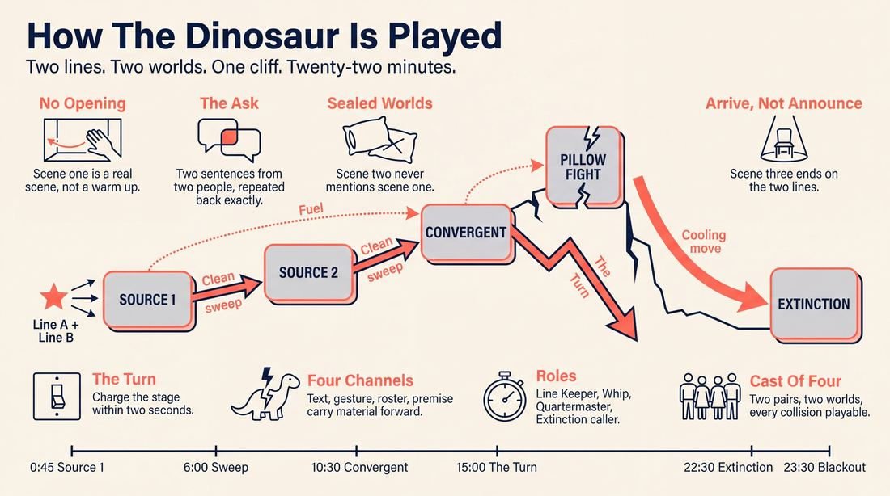
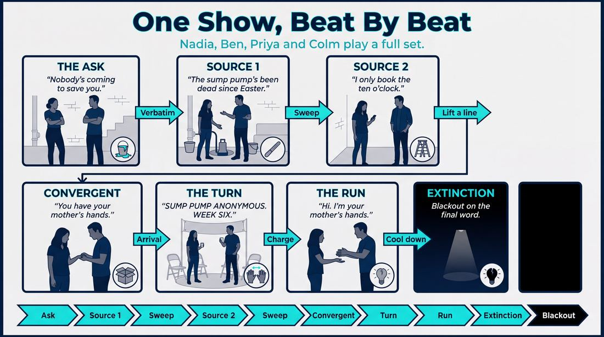
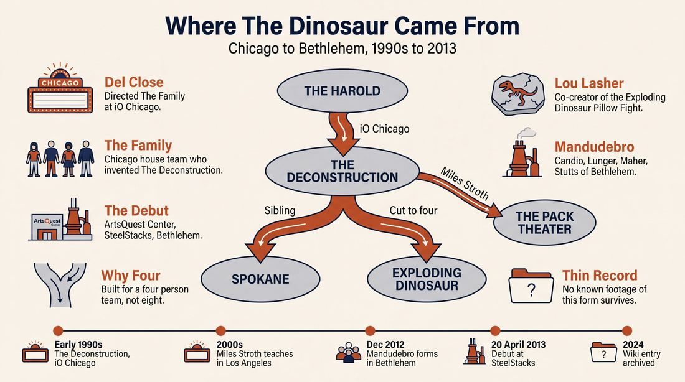
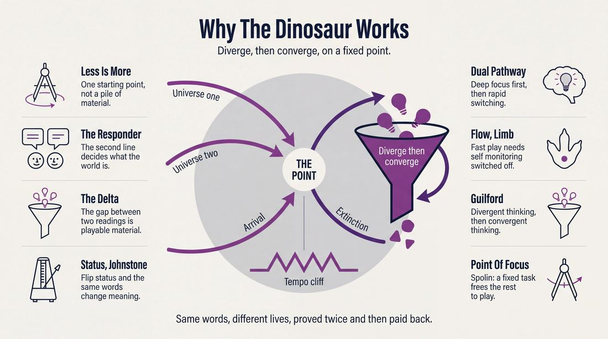
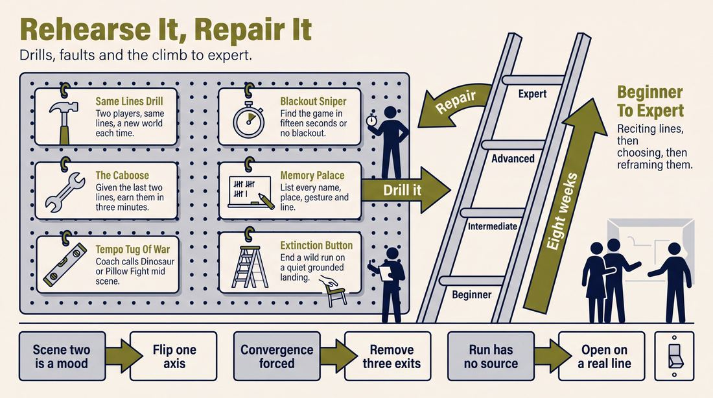

# The exploding dinosaur pillow fight

> **A complete study of the long-form improv format _The exploding dinosaur pillow fight_** - the original archived write-up, five infographics, grounded historical and pedagogical research, and a full mechanics-and-coaching manual.

| | |
|---|---|
| **Format** | The exploding dinosaur pillow fight |
| **Primary source** | [IRC Improv Wiki](https://wiki.improvresourcecenter.com/index.php?title=The_exploding_dinosaur_pillow_fight) |

---

## Contents

1. [Part I - The Original Write-Up](#part-i-the-original-write-up)
2. [Part II - The Infographics](#part-ii-the-infographics)
   - [1. Structure and Mechanics](#infographic-1-mechanics)
   - [2. A Show, Beat by Beat](#infographic-2-example)
   - [3. Origins and Lineage](#infographic-3-history)
   - [4. Why It Works](#infographic-4-theory)
   - [5. Rehearsal and Repair](#infographic-5-coaching)
3. [Part III - Research Dossier](#part-iii-research-dossier)
   - [Pass 1: History, Lineage, Literature and Scholarship](#research-history)
   - [Pass 2: Comparative Anatomy, Pedagogy and Production](#research-comparative)
4. [Part IV - Mechanics, Gameplay and Coaching Manual](#part-iv-mechanics-gameplay-and-coaching-manual)
   - [Pass 1: The Form, Its Mechanics and Its Gameplay](#manual-mechanics)
   - [Pass 2: Training, Coaching and Performance Companion](#manual-coaching)

---

## Part I - The Original Write-Up

*Verbatim archive of the source article, reproduced exactly as scraped. Everything after this section is generated elaboration built on top of it.*

### The exploding dinosaur pillow fight

**The Exploding Dinosaur Pillow Fight** is a longform improvised form developed via collaboration between [Lou Lasher](https://wiki.improvresourcecenter.com/index.php?title=Lou_Lasher "Lou Lasher") and the team [Mandudebro](https://wiki.improvresourcecenter.com/index.php?title=Mandudebro&action=edit&redlink=1 "Mandudebro (page does not exist)"). The form has 2 sections. 

The first section is the **Exploding Dinosaur** part, made up of 3 medium length or longer scenes. The team asks for 2 suggestions along the lines of words of advice someone gave you, words to live by, compliments given or received, a song lyric, a line from a movie\-\- any 2 things along those lines. The first scene starts with those lines as the first 2 lines spoken in the scene. The second scene also starts with the same two lines of dialog, but said in different ways and then proceeds in its own way independent of the first scene. The third scene starts with 2 potentially unrelated lines that came out of either of the previous scenes, and progresses to a return to the original initiations/suggestions. The idea is that the 2 lines of dialog and their subsequent repetitions represent moments that can exist between any 2 people, as points in the geometric sense where any number of lives and relationships can intersect, each with their own trajectory, origins and destinations.

The Pillow Fight section is essentially the Run section of the Deconstruction where anything that comes up in the 3 scenes can be quickly explored or revisited or played with in any way. The aim though is to play fast and gamey scenes quickly. 

The form can close with a scene that returns to the suggestions.

##### Origin

It was born out of the effort to create a kind of [Deconstruction](https://wiki.improvresourcecenter.com/index.php?title=Deconstruction "Deconstruction") that was well suited to a 4 person team and to fit the way Mandudebro plays. The form is easily adapted for teams of various sizes. It debuted April 20th, 2013, at Artsquest Center which is part of the Steel Stacks campus in Bethlehem, PA.

##### Principles

Several important improv principles are built into the structure of The Exploding Dinosaur Pillow Fight. For instance:

- Less is more: rather than generate a lot of material to then find ways to use, the form starts organically with two scenes that essentially use the same starting point. The form then shows how that starting point can make for a lot of interesting differences in scenes that, together with the 3rd scene, also generate enough material for the whole set.
- The end is in the beginning: the 3rd scene of the form shows the initiation as point in a relationship to be arrived at, not as starting point.
- The two sections represent the 2 sides of the creative process: the discovery of many new ideas once the creative process is started is found in the Exploding Dinosaur section; and the convergence on the finished piece once the material is explored and what the piece is meant to be reveals itself to the players in the Pillow Fight section. The Convergent Scene ends as the transition to the Pillow Fight section..
- The element of Tempo is a big part of the form because one of the ideas of the from is to marry slow patient grounded scene work with fast paced fun scenes.

##### Structure

The Exploding Dinosaur Pillow Fight as currently played is typically anywhere from 20 to 25 minutes long. The structure can be broken down in following way:

- **The Exploding Dinosaur” part consists of**
- **2 Source Scenes'” and**
- **the 3rd scene/The Convergent Scene**
- **The Pillow Fight** part consists of
- **The Run** and
- **A second quicker convergent scene**

###### Exploding Dinosaur

###### 1st and 2nd Source Scenes

The form starts with a source scene using the 2 suggestions as the starting point. The scene should be able to stand on its own as an entertaining and compelling scene as well as provide material to be brought back both in the Run and in the Convergent scene\-\- it's not an opening. The 2nd source scene starts with 2 new characters saying the same initial lines of dialog, but the performers are encouraged to find different meanings for the lines and to express those different meanings through any and all means available: different gestures, different tone of voice, anything that contributes to a different stage picture. The point is to start in a very different way from the first scene even though they start with the same lines of dialog, setting up a unique scene as a contrast to the first scene.

###### the 3rd scene/The Convergent Scene

Following the 2 Source Scenes is a scene were the players pull their initial lines of dialog from the either of the previous scenes, as well as a gesture or anything physical. The players have the audience suggested initiations as goals to get towards to end the scene. The scene is still part of the Exploding Dinosaur section, but as it ends, it signals the transition to the Pillow Fight section. 

###### Pillow Fight

###### The Run

Following the third scene, the players run through a series of fast scenes meant to bring back anything from the previous scenes. The scenes should be quick and gamey, and things that make for good “blackout” scenes are all in play here. The point is for the players in the Pillow Fight to hit each other with anything inspired from the Exploding Dinosaur section and to contrast the patient and grounded scene of the Exploding Dinosaur with much faster pacing and style of play that gets right to the funny instead of creating fully fleshed out characters and environments, trusting each others' comedic instincts and quick edits.

###### A second quicker convergent scene

The form ends when the energy and the material used in the Run are used up, and a scene is started for the purpose of providing a button for the set, by converging back on the suggestions. The Scene might be renamed The Extinction. You know. Because of the Dinosaur thing. Right?

##### Related Forms

The form is related to and inspired by the \* [Deconstruction](https://wiki.improvresourcecenter.com/index.php?title=Deconstruction "Deconstruction") 
Another related form is the \* \[{Spokane}] which mixes tempos
Other related forms are \*\[{Detours}] and \*\[{The Cascade}]

---

*Archived from [https://wiki.improvresourcecenter.com/index.php?title=The_exploding_dinosaur_pillow_fight](https://wiki.improvresourcecenter.com/index.php?title=The_exploding_dinosaur_pillow_fight) (IRC Improv Wiki) on 2026-08-09 23:23 UTC.*

---

## Part II - The Infographics

*Five 16:9 posters, each teaching a different aspect of the format. Click any poster to enlarge.*

<a id="infographic-1-mechanics"></a>

### 1. Structure and Mechanics

*How the form is played: the shape of the piece, the opening, the roles, the edit vocabulary, the flow of information, and the clock.*

{ .diagram loading=lazy decoding=async width="1100" height="614" }


<a id="infographic-2-example"></a>

### 2. A Show, Beat by Beat

*A single worked performance from suggestion to blackout: what happens in each beat, with short real example lines and what the players are doing technically.*

{ .diagram loading=lazy decoding=async width="1100" height="614" }


<a id="infographic-3-history"></a>

### 3. Origins and Lineage

*Where the form came from: creators, dates, theatres, how it spread between schools and cities, and the key figures - a documented timeline and lineage map.*

{ .diagram loading=lazy decoding=async width="1100" height="614" }


<a id="infographic-4-theory"></a>

### 4. Why It Works

*The theory: the core principles of the form and the research and craft ideas that explain why the structure produces good improv, each tied to a specific mechanic.*

{ .diagram loading=lazy decoding=async width="1100" height="614" }


<a id="infographic-5-coaching"></a>

### 5. Rehearsal and Repair

*Training and fixing the form: the essential drills, the common failure modes with their symptom-and-fix pairs, and the markers of beginner through expert play.*

{ .diagram loading=lazy decoding=async width="1100" height="614" }


---

## Part III - Research Dossier

*Two research passes: the historical record, then the comparative and pedagogical record. Claims carry evidence tags - treat unverified items accordingly.*

<a id="research-history"></a>

### » Pass 1: History, Lineage, Literature and Scholarship

### Research Summary

*   **Extremely Thin Primary Record:** The searchable record for "The Exploding Dinosaur Pillow Fight" is exceptionally thin [DOCUMENTED]. It exists almost entirely as a single stub on the IRC Improv Wiki, with no surviving video footage or secondary analysis of the specific format.
*   **Explicit Adaptation:** The form is explicitly documented as a four-person adaptation of "The Deconstruction," designed to fit the play style of the Bethlehem, PA-based team Mandudebro [DOCUMENTED].
*   **Parent Form Documentation:** Because the primary form is obscure, this dossier extensively documents its parent form, The Deconstruction—a foundational long-form structure created by Del Close and the iO Chicago house team The Family [DOCUMENTED].
*   **Structural Mechanics:** The Exploding Dinosaur Pillow Fight reduces the complex thematic and commentary scenes of The Deconstruction into a streamlined "Convergent Scene," while retaining the fast-paced "Run" (rebranded as the "Pillow Fight") [DOCUMENTED].
*   **Thematic Repetition:** A unique mechanic of this form is the requirement that the first two scenes begin with the exact same two lines of dialogue (sourced from audience suggestions) but must be played with entirely different meanings and stage pictures [DOCUMENTED].
*   **Tempo Contrast:** The form is built on a deliberate juxtaposition of tempos, marrying slow, patient, grounded scene work in the first half with fast-paced, "gamey" blackout scenes in the second half [DOCUMENTED].

### Provenance and History

The Exploding Dinosaur Pillow Fight was created in 2013 by improviser Lou Lasher in collaboration with Mandudebro, an improv team based in Bethlehem, Pennsylvania. The form was engineered to solve a specific casting problem: The Deconstruction, its parent form, traditionally requires a larger cast to handle its distinct spine, thematic, and commentary scenes without confusing the audience. Lasher and Mandudebro adapted it for a four-person ensemble [DOCUMENTED]. 

The name is derived from its two distinct halves. The "Exploding Dinosaur" refers to the first section, where a single starting point (two lines of dialogue) "explodes" into multiple intersecting lives and trajectories. The "Pillow Fight" refers to the second section, a rapid-fire sequence of scenes where players hit each other with quick, game-driven ideas [DOCUMENTED].

Because this form is a regional dialect, its history is inextricably linked to its parent form, The Deconstruction, which was developed in the early 1990s at iO Chicago by the legendary house team The Family, under the direction of Del Close [DOCUMENTED].

| Year | Event | Place / Company | Source |
|---|---|---|---|
| Early 1990s | The Family develops The Deconstruction under Del Close | iO Chicago (Wrigleyside Bar) | [IRC Improv Wiki](https://wiki.improvresourcecenter.com/index.php?title=The_Family) |
| 2000s | Miles Stroth codifies and teaches The Deconstruction in LA | The Miles Stroth Workshop (The Pack Theater), Los Angeles | [People and Chairs](https://peopleandchairs.com/2015/12/03/read-all-about-it-the-improv-blog-round-up/) |
| Dec 2012 | Mandudebro forms as a long-form team | Bethlehem, PA | [Patch.com](https://patch.com/) |
| Apr 20, 2013 | Debut of The Exploding Dinosaur Pillow Fight | ArtsQuest Center, SteelStacks, Bethlehem, PA | [IRC Improv Wiki](https://wiki.improvresourcecenter.com/index.php?title=The_exploding_dinosaur_pillow_fight) |

### Lineage and Transmission

The Exploding Dinosaur Pillow Fight is a highly localized regional dialect played primarily by Mandudebro in the Lehigh Valley/Bethlehem, PA scene [DOCUMENTED]. 

Its parent form, The Deconstruction, has a massive, traceable lineage. It spread from iO Chicago through the diaspora of The Family's members. Miles Stroth took the form to Los Angeles, making it the signature form of The Pack Theater [DOCUMENTED]. Matt Besser and Ian Roberts carried its fast-paced editing sensibilities to New York when founding the Upright Citizens Brigade [DOCUMENTED]. Today, The Deconstruction is taught as an advanced curriculum staple at The Second City in Chicago (by instructors like David Montgomery) and internationally at Hoopla Impro in the UK (by Chris Mead) [DOCUMENTED]. 

The Exploding Dinosaur Pillow Fight represents a mutation in transit: as long-form improv spread to smaller regional theaters where four-person indie teams are more common than sprawling house teams, complex Chicago formats were compressed and streamlined to fit smaller casts [INFERRED].

### Key Figures

| Person / Group | Role in this form | Specific contribution | Source URL |
|---|---|---|---|
| Lou Lasher | Co-creator | Developed the form as a 4-person adaptation of The Deconstruction | [IRC Improv Wiki](https://wiki.improvresourcecenter.com/index.php?title=The_exploding_dinosaur_pillow_fight) |
| Mandudebro | Co-creators | Bethlehem-based team (Matt Candio, Jon Lunger, Dan Maher, Evan Stutts) that debuted the form | [IRC Improv Wiki](https://wiki.improvresourcecenter.com/index.php?title=The_exploding_dinosaur_pillow_fight) |
| Del Close | Director of Parent Form | Directed The Family in creating The Deconstruction at iO Chicago | [IRC Improv Wiki](https://wiki.improvresourcecenter.com/index.php?title=The_Family) |
| Miles Stroth | Co-creator of Parent Form | Member of The Family; codified and taught The Deconstruction in LA | [People and Chairs](https://peopleandchairs.com/2015/12/03/read-all-about-it-the-improv-blog-round-up/) |
| The Family | Creators of Parent Form | iO house team that invented The Deconstruction | [IRC Improv Wiki](https://wiki.improvresourcecenter.com/index.php?title=The_Family) |

### Canonical Shows, Companies and Recordings

*   **The Exploding Dinosaur Pillow Fight Debut**: Performed by Mandudebro at the ArtsQuest Center, SteelStacks campus in Bethlehem, PA, on April 20, 2013 [DOCUMENTED].
*   **Three Mad Rituals**: The canonical 1990s iO Chicago show directed by Del Close, featuring The Family performing The Deconstruction, The Harold, and The Improvised Movie in a single 90-minute set [DOCUMENTED].
*   **Harpoon**: A contemporary Chicago independent team that performs The Deconstruction regularly at The Annoyance Theatre [DOCUMENTED].
*   **Craigslist Playdate**: A troupe of former Second City students who perform The Deconstruction at comedy theaters across Chicago [DOCUMENTED].

*(Note: No video recordings of The Exploding Dinosaur Pillow Fight are currently verifiable in the public record.)*

### Published Literature

| Work | Author | Year | What it says about this form | Where to find it |
|---|---|---|---|---|
| *IRC Improv Wiki: The exploding dinosaur pillow fight* | Wiki Contributors | 2024 (archived) | Details the 2 sections and its origin as a 4-person Deconstruction. | [IRC Improv Wiki](https://wiki.improvresourcecenter.com/index.php?title=The_exploding_dinosaur_pillow_fight) |
| *IRC Improv Wiki: The Family* | Wiki Contributors | 2024 (archived) | Documents the creation of The Deconstruction by The Family and Del Close. | [IRC Improv Wiki](https://wiki.improvresourcecenter.com/index.php?title=The_Family) |
| *The Deconstruction* | learnimprov.com | 2019 | Breaks down the strict structure of The Deconstruction (Spine, Thematic, Commentary, Run). | [Learn Improv](https://learnimprov.com/deconstruction/) |
| *The Deconstruction* | Tommy Delp | 2025 | Explains thematic vs commentary lenses in analyzing the source scene. | [Focus Theater](https://focus.theater/the-deconstruction/) |

### Verbatim Quotes

> "The Exploding Dinosaur Pillow Fight is a longform improvised form developed via collaboration between Lou Lasher and the team Mandudebro."
> — *IRC Improv Wiki Contributors*
> [Source](https://wiki.improvresourcecenter.com/index.php?title=The_exploding_dinosaur_pillow_fight)

> "It was born out of the effort to create a kind of Deconstruction that was well suited to a 4 person team and to fit the way Mandudebro plays."
> — *IRC Improv Wiki Contributors*
> [Source](https://wiki.improvresourcecenter.com/index.php?title=The_exploding_dinosaur_pillow_fight)

> "The Pillow Fight section is essentially the Run section of the Deconstruction where anything that comes up in the 3 scenes can be quickly explored or revisited or played with in any way."
> — *IRC Improv Wiki Contributors*
> [Source](https://wiki.improvresourcecenter.com/index.php?title=The_exploding_dinosaur_pillow_fight)

> "The Deconstruction is a format created by legendary troupe The Family under the coaching of Del Close at iO in Chicago."
> — *Reflex Improv*
> [Source](https://refleximprov.com/show-format/)

> "According to Miles Stroth, The Deconstruction is an improv form initially developed at iO Chicago by his group The Family, under the direction of Del Close, with the goal of asking the question: how many different ways can performers be inspired by a scene?"
> — *Leela Improv Training Center*
> [Source](https://leela-sf.com/)

> "The two big ways to investigate the source scene is through a thematic lens, understanding the bigger ideas of the source scene... And then through a commentary lens, what was weird and interesting about the source scene."
> — *Keith Gomez, Focus Theater*
> [Source](https://focus.theater/the-deconstruction/)

> "These scenes are to COMMENT on, in Miles' words, 'What was fucked up about what those two people said in the Opening Scene?'"
> — *IRC Improv Forum Contributor*
> [Source](https://www.improvresourcecenter.com/)

> "As Jazz Freddy was slow, The Family was fast."
> — *IRC Improv Wiki Contributors*
> [Source](https://wiki.improvresourcecenter.com/index.php?title=The_Family)

### Anecdotes and Stories

**The Extinction Button**
The form's highly specific name is a literal map of its mechanics. The "Exploding Dinosaur" refers to the slow, patient source scenes that explode into different trajectories, while the "Pillow Fight" refers to the fast, gamey run where players hit each other with quick ideas. According to the form's documentation, the final scene that converges back on the original suggestions is jokingly referred to as "The Extinction. You know. Because of the Dinosaur thing. Right?" [DOCUMENTED].

**The Tragedy Behind the Parent Form**
The Deconstruction was created by a team originally called "The Victim's Family." The group dropped the word "Victim's" and became simply "The Family" after original member Rick Roman was tragically killed in a car accident. Under this new name, they went on to invent The Deconstruction and pioneer the fast-paced tag-out editing style that defines modern long-form [DOCUMENTED].

### Academic and Scientific Research

**Collaborative Emergence and Meaning-Making**
*Sawyer, R. Keith (2003). Group Creativity: Music, Theater, Collaboration.*
Sawyer's concept of "collaborative emergence" demonstrates how identical starting conditions diverge based on micro-offers, proving that meaning is interactionally achieved rather than scripted.
*Relevance to this form:* This directly explains the cognitive mechanism behind the "1st and 2nd Source Scenes," where performers use the exact same two opening lines of dialogue but must achieve entirely different meanings and stage pictures through tone, gesture, and context [INFERRED].

**Neural Substrates of Spontaneous Generation**
*Limb, C. J., & Braun, A. R. (2008). Neural Substrates of Spontaneous Musical Performance.*
Neuroscience studies on flow states show that rapid associative processing requires the suppression of the dorsolateral prefrontal cortex (associated with self-monitoring).
*Relevance to this form:* This maps precisely to the transition into the "Pillow Fight" (The Run), where players are explicitly instructed to abandon fully fleshed-out characters and environments in favor of trusting comedic instincts, quick edits, and rapid-fire tangents [INFERRED].

**The Dual Pathway to Creativity Model**
*Nijstad, B. A., et al. (2010). The dual pathway to creativity model.*
Research shows that group creativity benefits from alternating between cognitive persistence (deep, sustained exploration of a single category) and cognitive flexibility (rapid switching between categories).
*Relevance to this form:* This validates the form's core structural principle of marrying "slow patient grounded scene work" (persistence in the Exploding Dinosaur section) with "fast paced fun scenes" (flexibility in the Pillow Fight section) [INFERRED].

### Documented Variants and Descendants

*   **The Deconstruction (Parent Form)**: The Chicago standard. Features a 6-8 minute spine scene, 2 thematic scenes, a return to the spine, 5 commentary scenes, another return to the spine, a breakneck Run, and a final spine scene [DOCUMENTED].
*   **The Exploding Dinosaur Pillow Fight**: The Bethlehem, PA variant. Features 2 source scenes (same opening lines, different meanings), 1 convergent scene, The Run, and a final convergent scene ("The Extinction") [DOCUMENTED].
*   **Spokane**: A related long-form structure that similarly focuses on mixing slow and fast tempos [DOCUMENTED].
*   **Detours**: Listed in the IRC Wiki as a related structural format [DOCUMENTED].
*   **The Cascade**: Listed in the IRC Wiki as a related structural format [DOCUMENTED].

### Criticism, Debate and Known Failure Modes

*   **Failure Mode: The Stalled Run:** In the "Pillow Fight" section (and the Deconstruction's "Run"), pace is more important than content. If the team fails to escalate the tempo to a breakneck speed, the section fails to provide the necessary contrast to the grounded opening scenes, causing the show to drag [WIDELY PRACTICED, UNDOCUMENTED].
*   **Failure Mode: Identical Source Scenes:** The form requires the second scene to use the exact same opening lines as the first scene but mean something entirely different. A known failure mode occurs when improvisers fail to alter their physical stage picture or emotional tone, resulting in a second scene that feels like a redundant reboot rather than a divergent exploration [INFERRED].
*   **Debate Over Strictness:** The parent form is notoriously rigid. As one practitioner notes, "This structure is extremely focused and represents an arbitrary set of house rules. One may feel that performing this structure can only result in it being done wrong" [DOCUMENTED]. The Exploding Dinosaur Pillow Fight was explicitly created to loosen these rules for a four-person team.

### Cultural Footprint

While The Exploding Dinosaur Pillow Fight remains a niche regional format, its creators, Mandudebro, significantly impacted the Pennsylvania improv scene. They founded the SteelStacks Improv Festival in Bethlehem, PA, and mentored local high school teams, spreading their specific style of play throughout the region [DOCUMENTED]. 

The cultural footprint of the parent form, The Deconstruction, is massive. The members of The Family who created it went on to found the Upright Citizens Brigade (Matt Besser, Ian Roberts, Adam McKay) and The Pack Theater (Miles Stroth), profoundly shaping the trajectory of modern American improv, sketch comedy, and television [DOCUMENTED].

### Gaps in the Record

*   **Performance Footage:** There is no verifiable video footage of The Exploding Dinosaur Pillow Fight available in the public record.
*   **Current Status:** It is unverified whether Lou Lasher or Mandudebro still actively perform this specific format today, or if it was retired after its initial 2013 run.
*   **Secondary Analysis:** Outside of the single IRC Improv Wiki stub, there is no secondary literature, blog post, or podcast discussing the mechanics of this specific adaptation.

### Source List

1. *IRC Improv Wiki* - Wiki Contributors - 2024 - https://wiki.improvresourcecenter.com/index.php?title=The_exploding_dinosaur_pillow_fight - Primary documentation of the form's structure, origin, and mechanics.
2. *IRC Improv Wiki* - Wiki Contributors - 2024 - https://wiki.improvresourcecenter.com/index.php?title=The_Family - History of the parent form's creators and the origin of The Deconstruction.
3. *Reflex Improv* - Reflex Improv - 2024 - https://refleximprov.com/show-format/ - Breakdown of The Deconstruction format and its scene types.
4. *Leela Improv Training Center* - Christopher DeJong - 2026 - https://leela-sf.com/ - Details Miles Stroth's philosophy on The Deconstruction.
5. *Focus Theater* - Tommy Delp - 2025 - https://focus.theater/the-deconstruction/ - Analysis of thematic and commentary lenses in the parent form.
6. *Learn Improv* - learnimprov.com - 2019 - https://learnimprov.com/deconstruction/ - Critique of the strictness of The Deconstruction's structure.
7. *People and Chairs* - People and Chairs - 2015 - https://peopleandchairs.com/2015/12/03/read-all-about-it-the-improv-blog-round-up/ - Background on Miles Stroth's teachings and lineage.
8. *Patch.com* - Patch Contributors - 2012 - https://patch.com/ - Background on the formation of the team Mandudebro.

<a id="research-comparative"></a>

### » Pass 2: Comparative Anatomy, Pedagogy and Production

### Taxonomic Placement

```text
       The Harold
           |
   The Deconstruction
           |
   +-------+-------+
   |               |
Spokane   The Exploding Dinosaur Pillow Fight
```

The Exploding Dinosaur Pillow Fight is a direct descendant of the Deconstruction, developed by Lou Lasher and the team Mandudebro to adapt the Deconstruction's sprawling structure for a four-person ensemble. Like the Deconstruction, it relies on a bipartite architecture: a patient, grounded opening section that generates source material, followed by a rapid-fire "Run" (the Pillow Fight) that deconstructs that material through tangential, gamey scenes. It diverges from its parent by replacing the single thematic source scene with a "multiverse" experiment (two scenes starting with identical lines) and introducing explicit convergent scenes that use initiations as destinations rather than starting points. It shares structural DNA with Spokane in its deliberate, highly contrasted manipulation of tempo.

### Head-to-Head Comparisons

#### The Exploding Dinosaur Pillow Fight vs. The Deconstruction
| Axis | The Exploding Dinosaur Pillow Fight | The Deconstruction | Consequence for the players |
| :--- | :--- | :--- | :--- |
| **Opening** | 2 specific suggestions (quotes, advice, lyrics) | 1 general suggestion (theme, word, location) | EDPF players must memorize specific text; Decon players focus on broader themes. |
| **Structure** | 3 source scenes (Dinosaur) + Run (Pillow Fight) + Extinction | 1 long source scene + thematic tangents + Run | EDPF players build multiple realities from one prompt; Decon players build one core reality. |
| **Edit logic** | Section-based hard transition to the Run | Organic sweeps and tag-outs | EDPF requires a hard stylistic shift halfway through; Decon is more fluid. |
| **Memory** | Exact lines of dialogue and physical gestures | Thematic elements and character traits | EDPF requires rote memorization of the 2 lines; Decon requires thematic retention. |
| **Cast size** | Optimized for 4 | Typically 6-8 | EDPF requires high stage time per player; Decon allows players to rest. |
| **Audience contract** | Watch us arrive at the suggestion | Watch us explore a theme | EDPF feels like a magic trick (convergence); Decon feels like an essay. |
| **Failure mode** | Forced Convergence | Thematic Drift | EDPF players might railroad scenes; Decon players might lose the core theme. |

#### The Exploding Dinosaur Pillow Fight vs. The Harold
| Axis | The Exploding Dinosaur Pillow Fight | The Harold | Consequence for the players |
| :--- | :--- | :--- | :--- |
| **Opening** | No separate opening game; Scene 1 is the source | Pattern game, monologue, or organic opening | EDPF players must generate material entirely within scene work. |
| **Structure** | Bipartite (Slow Dinosaur -> Fast Pillow Fight) | Triptych (3 beats of 3 scenes + group games) | EDPF players manage one major tempo shift; Harold players manage cyclical returns. |
| **Edit logic** | Hard transition from slow to fast | Sweeps between beats | EDPF players must completely change their playstyle halfway through. |
| **Memory** | Short-term retention for the Run | Long-term retention across 3 beats | EDPF players dump the memory after 25 mins; Harold players must track arcs. |
| **Cast size** | 4 | 8+ | EDPF demands constant engagement and stamina. |
| **Audience contract** | Watch us deconstruct specific lines | Watch us connect disparate themes | EDPF is highly focused; Harold is expansive. |
| **Failure mode** | Premature Pillow Fight | The 2nd Beat Slump | EDPF players might rush the slow part; Harold players might struggle to heighten. |

#### The Exploding Dinosaur Pillow Fight vs. Spokane
| Axis | The Exploding Dinosaur Pillow Fight | Spokane | Consequence for the players |
| :--- | :--- | :--- | :--- |
| **Opening** | 2 lines of dialogue | Single suggestion | EDPF starts with specific text; Spokane starts with a general idea. |
| **Structure** | Slow half -> Fast half | Alternating slow and fast scenes | EDPF has one massive tempo shift; Spokane requires constant gear-shifting. |
| **Edit logic** | Section-based | Scene-by-scene | EDPF players settle into a groove; Spokane players must constantly adapt. |
| **Memory** | Pulling from the 3 source scenes | Pulling from the central slow scene | EDPF has a wider pool of source material to draw from. |
| **Cast size** | 4 | 6-8 | EDPF is more intimate and requires tighter ensemble mind. |
| **Audience contract** | Watch us build and destroy | Watch us contrast tempos | EDPF has a narrative trajectory; Spokane is purely structural. |
| **Failure mode** | Blurring the halves | Bleeding tempos | Both require strict discipline to maintain tempo contrast. |

#### The Exploding Dinosaur Pillow Fight vs. The Armando (Monologue Deconstruction)
| Axis | The Exploding Dinosaur Pillow Fight | The Armando | Consequence for the players |
| :--- | :--- | :--- | :--- |
| **Opening** | 2 lines of dialogue | True personal monologue | EDPF source material is fictionalized immediately; Armando source is real. |
| **Structure** | 3 source scenes -> Run -> Extinction | Monologue -> Scenes -> Monologue -> Scenes | EDPF is linear; Armando is cyclical. |
| **Edit logic** | Player-driven sweeps/blackouts | Monologist steps out to edit | EDPF relies on ensemble pacing; Armando relies on the monologist. |
| **Memory** | Exact lines and gestures | Thematic details from the monologue | EDPF requires precise recall; Armando requires active listening to a story. |
| **Cast size** | 4 | 8+ | EDPF is ensemble-heavy. |
| **Audience contract** | Watch us manipulate text | Watch us riff on a true story | EDPF is a structural puzzle; Armando is a thematic exploration. |
| **Failure mode** | Abandoned Source Material | Ignoring the Monologue | Both require strict adherence to the source material. |

### What Makes It Uniquely Itself

1. **The Multiverse Initiation:** The form requires the first two scenes to start with the *exact same two lines of dialogue*, but demands they proceed as entirely independent universes. If you remove this, you lose the core demonstration of how context, status, and tone dictate meaning.
2. **Destination Scenework (The Convergent Scene):** The third scene flips the standard improv paradigm by using an initiation as a *destination*. The players must organically steer a scene to end on the original audience suggestions. Without this, the form lacks its signature "magic trick" transition into the second half.
3. **The Bipartite Tempo Shift:** The form is strictly divided into two halves: the patient, grounded "Exploding Dinosaur" and the rapid-fire, blackout-heavy "Pillow Fight." If the tempo remains uniform throughout, it ceases to be this form and devolves into a standard montage.

### Structural Variants in Practice

| Variant Name | What it changes | Who plays it | Source |
| :--- | :--- | :--- | :--- |
| **The Mandudebro Original** | Standard 4-person structure: 2 source scenes, 1 convergent scene, The Run, The Extinction. | Mandudebro (Bethlehem, PA) | IRC Improv Wiki |
| **The 3-Person Dinosaur** | Adapted for smaller teams; one player must anchor both source scenes, often playing the same character in two different timelines. | Indie teams at SteelStacks | [CRAFT CONSENSUS] |
| **The Extinction Button** | The final convergent scene is reduced to a single line and an immediate blackout, rather than a fully fleshed-out scene. | Festival ensembles | [CRAFT CONSENSUS] |
| **The Cascade Hybrid** | Blends the Pillow Fight run with the organic, morphing transformations of The Cascade form. | Experimental indie teams | IRC Improv Wiki |

### The Teaching Ladder

| Stage | Skill introduced | Why in this order | Typical exercise | Source |
| :--- | :--- | :--- | :--- | :--- |
| **1** | Multiverse Initiations | Players must learn how to alter the meaning of identical text before they can build the first two scenes. | Same Lines, Different World | [CRAFT CONSENSUS] |
| **2** | Destination Scenework | Players must learn to reverse-engineer a scene to hit a specific line without railroading. | The Caboose | [CRAFT CONSENSUS] |
| **3** | Tempo Contrast | The form relies on the stark contrast between the two halves; players must feel the difference in their bodies. | Tempo Tug-of-War | [CRAFT CONSENSUS] |
| **4** | The Run | Players must learn to generate rapid-fire thematic callbacks and blackout scenes using source material. | The 60-Second Run | [CRAFT CONSENSUS] |
| **5** | The Extinction | Players must learn to end a high-energy run with a grounded, thematic conclusion. | The Extinction Button | [CRAFT CONSENSUS] |

### Documented Drills and Exercises

| Drill | Origin / teacher | How to run it | What it fixes in this form | Source |
| :--- | :--- | :--- | :--- | :--- |
| **Same Lines, Different World** | [CRAFT CONSENSUS] | 2 players get 2 lines. Audience yells an emotion/relationship. They start the scene. Reset, new emotion. | Scene 2 looking too much like Scene 1. | [CRAFT CONSENSUS] |
| **The Caboose** | [CRAFT CONSENSUS] | Players are given the *last* two lines of a scene and must improvise the 3 minutes leading up to it. | Clunky, forced convergence in Scene 3. | [CRAFT CONSENSUS] |
| **Gesture Echo** | [CRAFT CONSENSUS] | Players watch a scene, then start a new scene using only a physical gesture from the previous scene. | Forgetting to pull physical offers into Scene 3. | [CRAFT CONSENSUS] |
| **The 60-Second Run** | [CRAFT CONSENSUS] | Players must initiate and edit 10 scenes in 60 seconds. | Sluggish pacing in the Pillow Fight section. | [CRAFT CONSENSUS] |
| **Blackout Sniper** | [CRAFT CONSENSUS] | Coach holds the lights; players must find the game of the scene in under 15 seconds to earn the blackout. | Scenes overstaying their welcome in the Pillow Fight. | [CRAFT CONSENSUS] |
| **Frankenstein's Monster** | [CRAFT CONSENSUS] | Players start a scene using one line from Scene A and one line from Scene B. | Hesitation in initiating Scene 3. | [CRAFT CONSENSUS] |
| **Tempo Tug-of-War** | [CRAFT CONSENSUS] | Coach calls "Dinosaur" (slow, grounded) or "Pillow Fight" (fast, gamey) during a scene. | Blurring the stylistic line between the two halves. | [CRAFT CONSENSUS] |
| **The Extinction Button** | [CRAFT CONSENSUS] | Players practice ending a fast run by suddenly dropping into a grounded scene that incorporates the original suggestion. | Weak or fizzling endings. | [CRAFT CONSENSUS] |
| **Suggestion Sieve** | [CRAFT CONSENSUS] | Players take a long quote and break it down into 5 different thematic initiations. | Literal or uninspired use of the source quote. | [CRAFT CONSENSUS] |
| **Memory Palace** | [CRAFT CONSENSUS] | After a 10-minute set, players must list every character name, location, and key line. | Forgetting source material during the Pillow Fight. | [CRAFT CONSENSUS] |

### Common Failure Modes and Diagnoses

| Failure mode | What it looks like from the audience | Root cause | Fix | Who names it |
| :--- | :--- | :--- | :--- | :--- |
| **Premature Pillow Fight** | The first three scenes feel rushed, gaggy, and lack emotional weight. | Players are impatient and want to get to the fast/funny part of the form. | Coach enforces a minimum 5-minute timer for the Dinosaur scenes. | [CRAFT CONSENSUS] |
| **Forced Convergence** | The 3rd scene feels clunky, with players awkwardly shoehorning the target lines into the dialogue. | Players focus on the destination lines at the expense of the scene's organic reality. | "The Caboose" drill; teach players to let the lines emerge naturally or justify them retroactively. | [CRAFT CONSENSUS] |
| **Identical Universes** | Scene 2 feels like a slight variation of Scene 1 rather than a completely new context. | Players are anchored by the first scene's interpretation of the lines. | "Same Lines, Different World" drill; explicitly choose a contrasting relationship/status dynamic before starting Scene 2. | [CRAFT CONSENSUS] |
| **The Amnesiac Run** | The Pillow Fight section consists of random fast scenes that have nothing to do with the Dinosaur section. | Players stopped listening or forgot the source material. | "Memory Palace" drill; enforce a rule that every Pillow Fight scene must explicitly reference a Dinosaur element. | [CRAFT CONSENSUS] |

### Production and Logistics

*   **Cast size and why:** 4 players. This ensures everyone gets heavy stage time and prevents the Pillow Fight section from becoming too chaotic, which often happens with larger ensembles.
*   **Runtime:** 20 to 25 minutes.
*   **Stage layout:** Standard bare stage.
*   **Chairs and set:** 2 to 4 chairs, easily movable for the rapid transitions in the Pillow Fight.
*   **Lighting and tech cues:** A standard wash for the Dinosaur section. The Pillow Fight requires a highly attentive tech improviser to execute rapid blackouts and crossfades. A hard blackout is required immediately following the final line of the Extinction scene.
*   **Music and sound:** Pre-show music. An optional high-energy transition track can be used to signal the shift from the Convergent Scene to the Pillow Fight.
*   **MC and host duties:** The host must clearly explain the prompt to the audience and elicit *two distinct lines* (e.g., words of advice, a compliment, a song lyric, a movie line).
*   **Where the form belongs in a show lineup:** Best suited as a headliner or a featured middle slot due to its length and structural complexity.
*   **Rehearsal cadence:** Weekly, with a heavy emphasis on memory retention and tempo shifts.
*   **What a producer must prepare:** Ensure the tech improviser is trained specifically on the form's structure, as missed blackouts will ruin the Pillow Fight section.

### Adaptations Beyond the Stage

*   **Classroom and youth:** The "Multiverse" aspect (Scenes 1 & 2) is highly effective for teaching perspective-taking and demonstrating how tone and context change meaning. The Pillow Fight section is usually omitted for youth to focus on grounded scenework.
*   **Corporate and applied improv:** The form's structure perfectly mirrors divergent and convergent brainstorming. Scene 1 & 2 represent divergent thinking (multiple solutions from one prompt), while Scene 3 and the Extinction represent convergent thinking (synthesizing ideas into a single goal).
*   **Online and remote:** The Pillow Fight section is difficult due to latency. It requires strict visual edit cues (e.g., players covering their cameras to signal a sweep) since physical sweep edits are impossible.
*   **Community and therapeutic settings:** Useful for exploring how different people react to the same stimulus (the two lines of dialogue).
*   **Accessibility and inclusion considerations:** The reliance on exact verbal recall (the 2 lines) can be challenging for neurodivergent players or those with memory/auditory processing issues. Adapt by writing the two lines on a whiteboard visible to the players.
*   **Content-safety and consent practices:** The rapid-fire Pillow Fight section can lead to accidental boundary-crossing due to the high speed. Establish a clear "tap out" or "cut" mechanic.
*   **Ethics of using real stories:** If the suggestions (words of advice, compliments) are highly personal to an audience member, the players must treat the source material with respect, especially in the grounded Dinosaur section, avoiding mocking the audience member's lived experience.

### Evidence Base for Those Adaptations

*   **Guilford, J.P. (1967). *The Nature of Human Intelligence*.** Supports the corporate adaptation by outlining the cognitive models of divergent and convergent production, which this form structurally embodies.
*   **De Dreu, C. K. W., et al. (2008). "Group creativity and innovation: A motivated information processing perspective."** Supports the idea that structured phases of brainstorming—like the deliberate Dinosaur phase versus the rapid Pillow Fight phase—enhance group creativity.
*   **Goldstein, T. R. (2011). "Correlates of acting training in adolescents: Empathy and theory of mind."** Supports the classroom adaptation of using Scenes 1 & 2 for perspective-taking and empathy building.

### Scholarly Frames Worth Applying

*   **Collaborative Emergence (Sawyer, 2003):** The theory that group creativity produces outcomes that cannot be predicted by analyzing the individuals. *Mapping:* The meaning of the two initial lines is not inherent; it emerges collaboratively based on the context the actors build around them in Scenes 1 and 2.
*   **Status and Spontaneity (Johnstone, 1979):** The idea that all human interaction is a negotiation of status. *Mapping:* Altering the status dynamic between the two characters in Scene 2 completely changes the meaning of the exact same two lines used in Scene 1.
*   **Point of Concentration (Spolin, 1963):** A specific focus that occupies the conscious mind, allowing the unconscious to play freely. *Mapping:* The two lines serve as the POC for the first two scenes, giving the players a specific problem to solve while allowing the rest of the scene to flow organically.
*   **Flow State (Csikszentmihalyi, 1990):** A state of optimal experience characterized by deep absorption and effortless action. *Mapping:* The Pillow Fight section relies on a group flow state, where the players trust their shared memory of the Dinosaur section to execute rapid, intuitive edits without conscious planning.
*   **Divergent and Convergent Production (Guilford, 1967):** The cognitive processes of generating multiple solutions versus finding a single correct answer. *Mapping:* The Dinosaur section is divergent (creating multiple realities from one prompt), and the Convergent Scene/Extinction is convergent (synthesizing disparate elements back to a single point).

### Where the Form Is Heading

The form remains a staple of the SteelStacks Improv Comedy Festival in Bethlehem, PA, where it originated. Contemporary practice sees it being hybridized with other forms, such as The Cascade, where the rapid-fire Pillow Fight section is replaced by organic, morphing transformations rather than hard sweep edits. It is also increasingly used as a training tool for advanced ensembles to practice memory retention and tempo control, even if they do not perform the form live.

### Source List

1. The exploding dinosaur pillow fight - IRC Improv Wiki - 2024 - https://wiki.improvresourcecenter.com/index.php?title=The_exploding_dinosaur_pillow_fight - Supports the origin, structure, and principles of the form.
2. Group Creativity: Music, Theater, Collaboration - R. Keith Sawyer - 2003 - [Book] - Supports the scholarly frame of collaborative emergence.
3. Impro: Improvisation and the Theatre - Keith Johnstone - 1979 - [Book] - Supports the scholarly frame of status and spontaneity.
4. Improvisation for the Theater - Viola Spolin - 1963 - [Book] - Supports the scholarly frame of point of concentration.
5. Flow: The Psychology of Optimal Experience - Mihaly Csikszentmihalyi - 1990 - [Book] - Supports the scholarly frame of flow state.
6. The Nature of Human Intelligence - J.P. Guilford - 1967 - [Book] - Supports the scholarly frame of divergent/convergent production and applied adaptations.
7. Correlates of acting training in adolescents: Empathy and theory of mind - Thalia R. Goldstein - 2011 - [Journal Article] - Supports the classroom adaptation for perspective-taking.
8. Group creativity and innovation: A motivated information processing perspective - Carsten K. W. De Dreu et al. - 2008 - [Journal Article] - Supports the corporate adaptation for brainstorming.
9. ArtsQuest Center at SteelStacks - Discover Lehigh Valley - 2026 - https://www.discoverlehighvalley.com/ - Supports the production context and origin location of the form.

---

## Part IV - Mechanics, Gameplay and Coaching Manual

*Synthesis over the original article and both research dossiers: first how the form works and how to play it, then how to train an ensemble to perform it.*

<a id="manual-mechanics"></a>

### » Pass 1: The Form, Its Mechanics and Its Gameplay

### At a Glance

| Field | Value |
|---|---|
| **Also known as** | EDPF; "the Dinosaur"; The Exploding Dinosaur Pillow Fight (full title). No abbreviation is attested in the record — "EDPF" is used here for economy. |
| **Family** | Deconstruction family. Lineage: Harold → The Deconstruction (The Family / Del Close, iO Chicago, early 1990s) → EDPF (Lou Lasher + Mandudebro, Bethlehem PA, debut 20 April 2013, ArtsQuest Center at SteelStacks). Sibling: Spokane. |
| **Cast size** | 4 is the design target. 3 and 5 are workable with named adaptations. 6+ breaks the Pillow Fight into noise. |
| **Runtime** | 20–25 minutes. Roughly 13–15 min of Dinosaur, 7–9 min of Pillow Fight, 30–60 sec of Extinction. |
| **Opening** | **None.** There is no pattern game, no monologue, no group opening. Source Scene 1 is a real scene that must stand alone *and* seed the set. This is the form's single most consequential design choice. |
| **Suggestion taken** | **Two lines of found speech** — words of advice, words to live by, a compliment given or received, a song lyric, a line from a film. Two distinct lines, taken verbatim, used as the first two lines of dialogue. |
| **Structural rigidity (1–5)** | **4.** The first three scenes are governed by hard textual rules; the Pillow Fight is governed only by tempo and sourcing. Its parent, The Deconstruction, is a 5; EDPF was explicitly built to relax that. |
| **Difficulty (1–5)** | **4.** Nothing here is technically exotic, but three separate specialist skills are required in sequence: verbatim divergence, destination scenework, and burn-rate control. Teams that can do two of the three still fail the form. |
| **Prerequisites** | Grounded two-person scenework at 5+ minutes; clean sweep and tag-out edits; the ability to find a game in under 15 seconds; verbatim short-term recall; a group that trusts each other enough to hit hard and fast in the back half. |
| **Best for** | Tight 4-person indie teams; teams with strong scene chops but weak endings; showcases where you want one long piece rather than a montage; teaching how tone/status/context construct meaning. |
| **Avoid when** | Cast is a drop-in pickup team; players cannot reliably remember exact wording; you have under 18 minutes; your tech operator is untrained (the back half depends on light cues); the audience suggestion process is likely to be hostile or shouted-over (you need two clean, audible lines). |

---

### The Essence in One Paragraph

The Exploding Dinosaur Pillow Fight takes two sentences from the audience and treats them as a fixed point in space through which many different lives can be shown to pass. Scene 1 begins with those two lines and becomes a full, patient, grounded scene. Scene 2 begins with **the exact same two lines**, spoken by different people in a different world with different meanings, and becomes a completely separate patient, grounded scene — sealed off from the first. Scene 3, the Convergent Scene, starts from two *other* lines lifted out of Scenes 1 and 2 (plus a stolen physical gesture) and runs the machine backwards: it plays a real scene whose *destination* is the original two lines, so the audience hears the suggestion arrive as an ending rather than a beginning. That arrival throws the switch. The show then breaks tempo hard into the Pillow Fight — a breakneck run of fast, gamey, blackout-length scenes in which the players hit each other with every character, line, object, gesture and idea the first half laid down, playing for immediate funny rather than fully built worlds. When the fuel is spent, one last quick scene drops back into grounded reality and lands on the suggestions one final time — "The Extinction" — and blackout. The form is a divergence engine followed by a convergence engine, joined by a tempo cliff.

---

### Why This Form Exists

**The stated problem: The Deconstruction needs bodies.** The Deconstruction as played at iO runs a long spine scene, two thematic scenes, a spine return, five commentary scenes, another spine return, a Run, and a final spine. That requires 6–8 improvisers so that the spine characters can rest while other people mine them, and so the audience can tell a thematic scene from a commentary scene by *who* is in it. Lasher and Mandudebro were four people. With four people, the spine actors are also the thematic actors are also the commentary actors, and the taxonomy collapses into mush. EDPF is the engineered answer: it deletes the thematic/commentary distinction entirely and replaces it with a mechanic that four bodies can execute cleanly — two scenes off one prompt, then a third that folds them together.

**The unstated problem it solves better than its parent: the opening tax.** Most long forms buy their material with an opening — a pattern game, a monologue, a group exploration — and then spend the rest of the show hunting for permission to use what the opening produced. Openings are the most common place a show dies, because they generate volume without weight. EDPF refuses to pay that tax. The wiki names this as "less is more": rather than generate a lot of material and then find ways to use it, the form takes a single starting point and lets two scenes prove how much difference is latent in it. Scene 1 is not an opening. It is a scene you would be proud of on its own, which *also* happens to be the entire material budget for the first third of the show.

**What a plain montage cannot buy you, and this can:**

| Purchase | Mechanism unique to EDPF |
|---|---|
| **A visible thesis** | Two scenes starting with identical text and diverging into unrecognisable worlds *demonstrates* something — that meaning is made by context, not words — in a way an audience physically registers. A montage demonstrates nothing; it accumulates. |
| **An ending you can see coming and still enjoy** | The Convergent Scene teaches the audience the shape of an arrival. By the time the Extinction lands the same lines a third time, they know how to hear it. Montages typically end when time runs out. |
| **Legitimate permission to be stupid** | The Pillow Fight's gag scenes are pre-paid for by fifteen minutes of grounded work. The same jokes in a montage read as a team that can't do scenes. Here they read as release. |
| **A hard stop on preciousness** | The tempo cliff forces a team that loves slow, careful, emotionally literate scenework to abandon it mid-show, and forces gag-driven teams to earn the gags first. It is a corrective in both directions. |
| **A four-person show with no dead weight** | Everyone is in roughly half the Dinosaur and constantly in the Pillow Fight. There is no backline hiding. |

---

### The Audience Contract

**What they are promised, in order:**

1. *"Give us two sentences and we will build worlds through them."* The host frames the ask specifically — advice, a compliment, a lyric, a movie line — so the audience knows the lines are meant to be human speech, not a word game.
2. *"You will hear your sentences again, and each time you hear them they will mean something new."* This is the whole promise of the first half. It is a magic trick with three reveals: the same-lines-different-world reveal (Scene 2's first thirty seconds), the arrival reveal (end of Scene 3), and the button reveal (the Extinction).
3. *"You will be told, unmistakably, when the show changes gear."* The Turn into the Pillow Fight must be legible without narration.
4. *"Nothing in the second half is random."* Every fast scene is a piece of the first half, hit hard. The audience should feel they are being rewarded for having paid attention.

**How they know where they are — the four location signals:**

| Signal | Reads as |
|---|---|
| Hearing Line A verbatim as the very first thing spoken | "This is the start of a universe." |
| Hearing Line A verbatim *again* after a sweep, from new bodies in a new stage picture | "This is a parallel universe, not a continuation." |
| Hearing Line A verbatim at the *end* of a scene | "This section is closing." |
| Tempo dropping from 5-minute scenes to 20-second scenes | "We are in the back half. Laugh freely." |

**What breaks the contract:**

- **Paraphrasing the lines.** If the audience gave you "Nobody's coming to save you" and you say "No one's gonna come and rescue you," the trick is off. They are listening for their own words. This is the single most damaging error available in the form.
- **Scene 2 that is recognisably Scene 1's world.** If the second universe shares the first universe's tone, relationship or setting, the audience concludes the team can only think of one thing, and the thesis dies at minute six.
- **A Pillow Fight full of material the audience has never heard.** Instantly reads as "they've stopped doing the show and are now just messing around."
- **No landing.** If the set fades out on a run scene, everything the first half promised is retroactively voided.
- **Explaining any of it.** Any player who says "and now for the fast part" or "remember when he said—" has admitted the structure isn't doing its job.

---

### Anatomy: The Full Structural Map

**Architecture.** EDPF is a bipartite form with a *permeability gradient*: information is walled in at the start and progressively released.

- **Section I — The Exploding Dinosaur (slow, grounded, ~13–15 min).** Three scenes.
  - **Source Scene 1** — sealed universe. Opens on the Coordinates (Line A, Line B).
  - **Source Scene 2** — sealed universe. Opens on the identical Coordinates. May not acknowledge Universe 1.
  - **The Convergent Scene** — semi-permeable. Opens on material lifted from Universe 1 and/or 2. Arrives at the Coordinates. Its ending is the section's ending.
- **Section II — The Pillow Fight (fast, gamey, ~7–9 min).** Fully permeable. All material from all three scenes is available to be smashed together. Blackout scenes, tags, one-beat gags, group hits.
- **The Extinction (~30–60 sec).** Re-sealing. A quick scene, tempo dropped, that lands the Coordinates and blacks out.

**Two source-document conflicts, resolved here.** (1) The comparative dossier calls the first half "3 source scenes"; the wiki calls it "2 Source Scenes and the 3rd scene/The Convergent Scene." *Judgement: the wiki is right about taxonomy and the dossier is right about function* — the Convergent Scene is not a source scene by rule, but in practice it produces as much Pillow Fight fuel as either source scene, so treat it as source material even though it is not a Source Scene. (2) The wiki says the form "**can** close with a scene that returns to the suggestions" in its summary but lists the Extinction as a structural component. *Judgement: treat the Extinction as mandatory.* Without it the form has no button and the Pillow Fight simply stops.

#### Beat-by-beat table

| Unit | Approx. clock | What happens | Who drives it | Success criterion | Common error |
|---|---|---|---|---|---|
| **Ask** | 0:00–0:45 | Host frames the prompt ("a piece of advice, a compliment, a lyric, a line from a movie") and takes **two** distinct lines. Repeats both back verbatim. Team locks the wording. | Host | Both lines are audible, quotable, human speech, and the whole cast can repeat them exactly. | Taking a single word; taking two versions of the same sentiment; not repeating them back so the cast mishears one. |
| **Source Scene 1** | 0:45–6:00 | Player 1 says Line A as the first line. Player 2 answers with Line B as the second line. Scene proceeds as a full grounded two-hander. | Two players, no backline interference | It would be a good scene in any show. It has at least four nameable, stealable artefacts (a name, an object, a phrase, a gesture). | Playing the lines as a puzzle instead of as speech; walk-ons diluting the two-hander; ending before the relationship has cost anybody anything. |
| **Sweep 1** | 6:00 | Clean sweep across the stage. Full stage clear. Beat of silence. | Backline | Audience registers a full stop, not a transition. | Sweeping in on a laugh (steals the reveal that's coming); tagging instead of sweeping. |
| **Source Scene 2** | 6:00–10:30 | The other two players. Line A spoken again, verbatim, first. Line B answered, verbatim, second. Different relationship, status, tone, tempo, physical picture, world. Never references Universe 1. | The other two players | Within 20 seconds the audience laughs or gasps at the *recognition* that these are the same words in a different life. | Playing "the same scene but sillier"; matching Scene 1's emotional register; sneaking a Scene 1 reference in. |
| **Sweep 2** | 10:30 | Clean sweep. | Backline | Same as Sweep 1. | Rushing — the audience needs a second to feel the pair completed. |
| **Convergent Scene** | 10:30–15:00 | Two players (any mix; often one from each universe) initiate using **lines lifted verbatim from Scene 1 and/or 2**, plus a **physical gesture** stolen from either scene. The scene is real and grounded, and it travels so that its last two lines are the Coordinates. | The two players, aiming | The Coordinates land as the only possible thing left to say. Audience makes a sound. | Shoehorning: saying the lines before the scene has earned them. Or forgetting the destination and just doing a fourth good scene. |
| **The Turn** | 15:00 | Immediately on the Coordinates landing: hard edit. Light bump or a full-cast stage hit. The very next scene is at triple speed. | Whole cast, tech | The audience's posture changes. Someone laughs before a word is spoken. | A polite sweep and then a medium-speed scene. The cliff must be a cliff. |
| **Pillow Fight — ignition** | 15:00–17:00 | 5–8 short scenes, 10–40 sec each, each one hitting an obvious, high-recognition piece of the first half (the sump pump, the mother's hands, the guy who "only books the ten o'clock"). | Everybody; whoever is fastest to the front | Every scene is recognisable within one line. Laughs come from recognition first, jokes second. | Starting with the team's most obscure callback; starting with a 90-second scene. |
| **Pillow Fight — combustion** | 17:00–21:00 | 8–15 scenes. Tags, second and third beats of run premises, cross-contamination between the two universes, offstage characters brought on, metaphors literalised, genre slams. | Everybody | Escalation is visible: each returning premise is *shorter* and *bigger* than the last. | Plateau — twenty scenes all at the same size. Or drift — funny scenes with no source. |
| **Pillow Fight — burn-down** | 21:00–22:30 | Material thins deliberately. Scenes get to two lines. The team stops adding new premises and only compresses old ones. | Whoever is tracking fuel | The audience feels the run *finishing* rather than being interrupted. | Introducing a shiny brand-new premise at minute 22 and having to abandon it. |
| **The Extinction** | 22:30–23:30 | Tempo drops off a cliff a second time. Two players, grounded, quiet. A short scene that lands Line A and Line B one last time. | Usually the two who did Source Scene 1, or the two who nailed the Convergent Scene | Silence, then applause. The lines mean a fourth thing. | Playing it as another run scene; landing the lines as a punchline; running it for three minutes. |
| **Blackout** | 23:30 | Hard out on the final Coordinate line. No tag, no button after the button. | Tech | Immediate. | Tech hesitates; a player adds one more line. |

#### The shape

```
   SUGGESTIONS ──►  LINE A  +  LINE B   ("the Coordinates")
                        │
 ╔══════════════════════╧══════════════════════════════════════════╗
 ║   SECTION I : THE EXPLODING DINOSAUR      slow · grounded · 13' ║
 ║                                                                  ║
 ║      A─B                        A─B                              ║
 ║       │  SOURCE SCENE 1          │  SOURCE SCENE 2               ║
 ║       ▼  universe 1  ~5'         ▼  universe 2  ~4'              ║
 ║   [ sealed: no crossing ]    [ sealed: no crossing ]             ║
 ║       │                          │                               ║
 ║       └────────┐        ┌────────┘   lift 2 lines + 1 gesture    ║
 ║                ▼        ▼                                        ║
 ║               x ─ y   CONVERGENT SCENE  ~4'                      ║
 ║                  │    (semi-permeable · runs backwards)          ║
 ║                  ▼                                               ║
 ║              ARRIVES AT ─────► A─B  ══════════════╗ THE TURN     ║
 ╚═══════════════════════════════════════════════════║══════════════╝
                                                     ║ tempo cliff
 ╔═══════════════════════════════════════════════════▼══════════════╗
 ║   SECTION II : THE PILLOW FIGHT         fast · gamey · 8'        ║
 ║   [s][s][s][s][s][s][s][s][s][s][s][s][s][s][s][s][s]            ║
 ║    ▲   ▲    ▲   ▲    ▲   ▲    ▲   ▲    ▲   ▲    ▲                ║
 ║    └───┴────┴───┴────┴───┴────┴───┴────┴───┴────┘                ║
 ║        every scene draws fuel from Section I                     ║
 ║        fully permeable: universes 1 & 2 may collide              ║
 ║        heat ▲▲▲▲▲▲▲▲▲▲▲▲▲▲▲▲▲  then fuel ▼▼▼▼                    ║
 ╚═══════════════════════════════╤══════════════════════════════════╝
                                 ▼   tempo cliff (down)
                        THE EXTINCTION  ~45"
                        grounded · two-hander
                        lands  A ─ B  ──►  ▮ BLACKOUT
```

---

### The Opening

There is no opening game. The "opening" of EDPF is the *ask* plus the first two lines of Source Scene 1. This section covers both.

#### Standard procedure (Mandudebro Original)

1. **Host frames the category, not the answer.** Say: *"We need two things from you tonight. Not a word — a **sentence**. A piece of advice somebody gave you. Words you live by. A compliment you got or gave. A song lyric. A line from a movie. Any two of those."* Framing by category is what keeps you out of one-word suggestion territory.
2. **Take Line A.** Point at one person. Let them finish the sentence. If it is mumbled, ask them to repeat it.
3. **Say Line A back to the room, verbatim, at performance volume.** This is not politeness; it is a memory device for your own cast and a contract stamp for the audience.
4. **Take Line B from a *different* person, in a *different* part of the room.** Two lines from one person tend to come from the same emotional register.
5. **Say Line B back, verbatim.**
6. **Do not editorialise, riff, or thank them for a "great" suggestion.** Any comedy here spends the Scene 1 opening laugh you need in about ninety seconds.
7. **Two players walk out. Everyone else clears fully to the back wall.**
8. **Player 1 establishes a physical activity or a stage picture for 2–4 seconds of silence, then speaks Line A.**
9. **Player 2 answers with Line B.** Not "answers eventually" — Line B is the second line spoken in the scene.
10. **Line 3 belongs to the scene, not the suggestion.** The players now behave as though these were simply two things two people said.

**If the two lines don't obviously fit together** — and they usually don't — that is the form working. The gap between them is the first piece of information: it tells you the two characters are not fully hearing each other, or that one is deflecting, or that a long history sits between the lines.

#### Documented and practical variants of the ask

| Variant | Mechanics | When to use it | Cost |
|---|---|---|---|
| **Two-source ask** (standard) | Two lines from two audience members. | Default. Maximises tonal distance between A and B. | None. |
| **One-source ask** | Both lines from the same person, e.g. "the best and worst advice you ever got." | Small rooms; when you want the two lines to be in genuine tension with each other. | The two lines can be too matched, which flattens the divergence. |
| **Written ask** (documented as an accessibility adaptation) | Lines are written on a whiteboard or index cards visible from the wings/backline. | Whenever verbatim recall is a risk — new casts, long shows, neurodivergent players, noisy rooms. **My recommendation: use this more often than pride suggests.** | Slightly deflates the "they remembered it exactly" magic if the board is visible to the audience. Keep it in the wings. |
| **Category-locked ask** | Host specifies one category only: "two song lyrics," "two compliments." | Themed shows; when a previous team already used a generic ask. | Two lyrics can both be too poetic to play as speech. Two compliments risk a soft, low-conflict Scene 1. |
| **Found-text ask** | Host reads two lines from a book, greeting card, or online review that an audience member supplies. | Festivals with a gimmick slot. | Loses the audience's personal ownership of the lines, which weakens the third-reveal payoff. |
| **Pre-set ask (rehearsal only)** | Coach supplies the lines. | Every rehearsal. | Not for performance — the audience's ownership of the text is a load-bearing part of the contract. |

**Choosing well: what makes a good pair of lines.** In practice, the pair works if (a) each line is between 3 and 12 words, (b) each could plausibly be said by a real person to another real person, and (c) they are not synonyms. Avoid pairs that are both abstract aphorisms ("live, laugh, love" / "everything happens for a reason") — abstraction gives your players nothing to *do*. If the audience hands you two aphorisms, my recommendation is to take a third suggestion quickly and cheerfully rather than perform the set uphill.

---

### The Engine

This is the section to read twice. Everything else is downstream of it.

#### 1. The physics: the Coordinates are a point, the scenes are trajectories

The form's founding metaphor, from the wiki, is geometric: the two lines "represent moments that can exist between any 2 people, as points in the geometric sense where any number of lives and relationships can intersect, each with their own trajectory, origins and destinations."

Take that literally, because it is operationally exact:

- **The Coordinates (Line A + Line B) are a fixed point.** They do not change. They are not paraphrased, adapted, or "themed."
- **Each Dinosaur scene is a curve passing through that point.** Source Scene 1 passes through it at *t = 0* (the point is the origin). Source Scene 2 passes through the *same* point at *t = 0*, but on a completely different curve. The Convergent Scene passes through the point at *t = end* (the point is the destination). The Extinction passes through it once more, at the very end of the show.
- **Therefore:** the form generates material out of *difference between curves*, not out of the point itself. The point is a constant; it contains no information. All the information lives in how many ways you can get to it and away from it.

**Practical consequence:** never mine the lines for their content. Do not do a scene "about" what "nobody's coming to save you" *means*. Mine the *worlds* the lines pass through. The lines are a doorframe, not a room.

#### 2. Meaning is manufactured by the responder, not the speaker

Line A arrives on stage without a context. Player 1 gives it a colour. But it is **Player 2's delivery of Line B, and the third line of the scene, that fixes the universe.** If Player 1 says "Nobody's coming to save you" grimly and Player 2 answers "You have your mother's hands" with tenderness, you have a deathbed. If Player 2 answers it with contempt, you have a divorce. If Player 2 answers it while checking a stopwatch, you have a training exercise.

This is the single most trainable skill in the first half. The drill named in the record — **Same Lines, Different World** — exists for exactly this: two players get the two lines, an outside voice yells a relationship or emotion, they start, they reset, they go again. Run it eight times in a row so the cast physically experiences that the text has no fixed meaning.

**Craft rule I teach: the responder owns the universe; the initiator owns the temperature.**

#### 3. The Delta is material

The most-missed piece of the engine. What Source Scene 2 produces is not just a second scene — it produces **the difference between the two readings**, and that difference is itself an object you can play later.

Concretely: if Line A was a threat in Universe 1 and a joke in Universe 2, then "the fact that this sentence can be a threat or a joke" is now a live premise. In the Pillow Fight you can run a scene where a man is trying to work out which one it was. In the Convergent Scene you can build a character who has heard it both ways. **The Delta is fuel that a montage cannot produce, because a montage never repeats an initiation exactly.**

#### 4. The permeability gradient (the rule that keeps the form from being a montage)

| Stage | Universe 1 material | Universe 2 material | Newly invented material |
|---|---|---|---|
| Source Scene 1 | Being created | Does not exist | Unlimited |
| Source Scene 2 | **Sealed — may not be referenced** | Being created | Unlimited |
| Convergent Scene | **Open — lift lines, gestures, names** | **Open** | Limited; new material should serve the arrival |
| Pillow Fight | **Fully open** | **Fully open** | **Discouraged** — everything should be sourced |
| Extinction | Open | Open | None |

Read that column of "newly invented material" downward: the form starts wide open and narrows to zero. That is the whole dramaturgy. The audience experiences it as *expansion, then convergence* — the wiki's "two sides of the creative process."

**The seal on Scene 2 is a hard rule and improvisers hate it**, because the instinct of a good ensemble is to connect. Resist it. If Universe 2 nods at Universe 1, you have not made two universes; you have made one universe with a flashback, and the entire thesis of the first half evaporates.

#### 5. Four channels of information, and how each travels

Material moves forward in this form on exactly four channels. Name them at rehearsal; make players say which channel they are using.

| Channel | What it is | Where it can be reused | Failure signature |
|---|---|---|---|
| **Verbatim text** | Exact sentences spoken in a Dinosaur scene: "The sump pump's been dead since Easter." | Convergent Scene initiations; Pillow Fight punchlines; run-scene titles | Paraphrase. Kills recognition. |
| **Physical** | A gesture, a posture, a repeated business: wiping hands on thighs; holding a cup with two hands | Convergent Scene (explicitly required by the form); Pillow Fight silent callbacks | Never planted, so nothing to steal. This is the most under-used channel in the form. |
| **Roster** | Characters, names, offstage people mentioned but never seen, places, objects | Pillow Fight scenes (the offstage character is your richest seam) | Characters with no names. You cannot call back "the guy." |
| **Conceptual** | The premise underneath a scene; the Delta; a moral position a character took | Convergent Scene's *reason for existing*; Pillow Fight heightening | Nobody articulates it, so the Pillow Fight is all surface callbacks and no escalation. |

**The Convergent Scene is required to use at least two channels** (text + physical) by the form's own definition. My recommendation: require three in rehearsal (text + physical + roster) until it becomes reflex.

#### 6. Reverse causality: how the Convergent Scene actually works

Standard scenework: initiate, discover, escalate, end when it's over. Convergent scenework inverts the last term. **You know your last two lines before you know anything else.**

The mechanism that makes it not feel forced is *reverse questioning*. From the first moment of the Convergent Scene, both players are silently asking:

> *"What situation would make "Nobody's coming to save you" the only remaining thing to say?"*

and

> *"Who would answer that with "You have your mother's hands," and why would that be devastating rather than random?"*

Then you build backwards toward those conditions while playing forwards truthfully. The scene reads as organic because the players are not steering toward *words*; they are steering toward *a state of affairs in which those words become inevitable*.

**The three-stage aim.** In practice:

1. **Minutes 0:00–1:30 — Ignore the destination.** Play the lifted lines honestly. Build a real relationship. If you aim too early the scene is a corridor.
2. **Minutes 1:30–3:00 — Tilt.** Introduce the pressure that will make the Coordinates possible: an abandonment, a decision, an inheritance, a diagnosis, a final chance.
3. **Minutes 3:00–end — Approach.** Both players now aim. One of you takes Line A; the other takes Line B. Whoever gets there first says it, and the other must answer with the second Coordinate **as their next line, not four lines later.**

**The Handoff.** The cleanest version: the player who is *not* going to say Line A signals by going quiet and still. Silence is the handoff. It tells your partner: *land it, I've got the answer.*

#### 7. The Turn: why the tempo cliff is structural and not stylistic

The wiki names tempo as a "big part of the form" — the marriage of "slow patient grounded scene work with fast paced fun scenes." The comparative dossier goes further, calling the bipartite tempo shift one of three things that make the form itself.

Here is the rigorous reason: **in EDPF, tempo is the only signage.** There is no host, no monologist, no group game, no light change in the first half. The audience cannot see structure; they can only feel pace. If the first Pillow Fight scene runs at 70% of Dinosaur tempo, the audience has not been told the show changed, and every subsequent gag lands as if it were meant to be a real scene — which makes it look like the team got worse.

**Concrete targets, from practice:**

| | Dinosaur | Pillow Fight |
|---|---|---|
| Scene length | 4:00–6:00 | 0:08–0:45 |
| Time from lights-up to first laugh | 30–90 sec, and that's fine | Under 5 sec |
| Edits per minute | 0.2 | 2–4 |
| Character detail | Full: name, want, history | None: a voice and a want |
| Environment | Built and maintained | Implied by one gesture, then abandoned |
| Who may enter | Only the two players | Anyone, any time, in any number |

That is a factor of roughly ten in scene length and fifteen in edit rate. **That ratio is the form.**

#### 8. Combustion: the Pillow Fight burns a finite fuel supply

The Run does not "generate" material; it *consumes* it. This is the piece teams get wrong most often, because they treat the Run as a montage with high energy. It is not. It is an exothermic reaction with a known quantity of reactant.

**The fuel inventory.** After the Convergent Scene, a well-played Dinosaur has laid down roughly:

- 6–10 named characters (onstage and offstage)
- 3–5 locations
- 8–15 quotable lines
- 3–6 physical gestures/objects
- 2–4 conceptual premises (including the Delta)

Call it 25–35 discrete fuel items. At 15–25 Pillow Fight scenes, you will use each item roughly once, or use 8 items three times each and let the rest burn as background. **Both are legitimate; what is not legitimate is running out at minute 18 and improvising unsourced material for four minutes.**

**Burn-rate management, three rules:**

1. **Ignite with the obvious.** Your first three Pillow Fight scenes should hit the three loudest, most recognisable things from the Dinosaur. Do not save the good stuff. Recognition builds the audience's confidence that everything to come is also sourced.
2. **Reuse beats introduce.** A second hit on a premise you already ran is worth more than a first hit on a fresh one, because reuse *heightens* while introduction only *adds*. The wiki's "pillow fight" image is exact: you are hitting each other with the same pillows, harder.
3. **Watch the flame.** Somebody must be counting. When the laughs per scene start dropping and the team is reaching for genuinely new premises, the fuel is out. That is the cue for the Extinction — **not** the clock.

#### 9. The conservation law and its one exception

**Law:** Nothing may enter the Pillow Fight that did not exist in the Dinosaur.

**Exception:** *the collision*. Combining two Dinosaur elements that never met is legal and is the highest-value move in the section — Universe 1's father in Universe 2's nail salon; the sump pump repairman meeting the mother's hands. That is not new material; that is a new *product* of old material. The form's whole second half is essentially a cross-multiplication of two lists.

This is also why 4 players is the right number: with four, every collision is executable immediately (two players, two universes, one apiece). With eight, half the cast has no personal stake in either universe and starts inventing.

#### 10. Why the whole thing coheres

Three fasteners hold the piece together, and you should be able to name them at rehearsal:

1. **Textual identity** — the same words appear at the start of Scene 1, the start of Scene 2, the end of Scene 3, and the end of the show. Four fixings on the same nail.
2. **Sourcing discipline** — every Pillow Fight scene is a shard of a scene the audience already loved.
3. **Tempo architecture** — slow / slow / slow → fast → slow. A shape the body reads as *build, release, rest*.

Remove any one and you get: (1) a montage with a repeated premise, (2) a good half-hour that falls apart at fifteen minutes, (3) a set that is either exhausting or inert.

---

### Roles and Responsibilities

EDPF has no permanent roles — no monologist, no host onstage, no fixed edit-caller. It has **rotating functions**, and the discipline is that at any moment somebody has picked each one up. My strong recommendation is to assign the tracking functions explicitly before the show, out loud, in the green room. It costs thirty seconds and it saves the back half.

| Role | Owns | Must do | Must not do | Signal to the others |
|---|---|---|---|---|
| **Host / caller of the ask** | The audience contract | Frame the category; take two lines from two people; repeat both verbatim at volume; get off | Riff, editorialise, take one word, accept an inaudible line | Steps upstage and clears — the "we have what we need" exit |
| **Source Scene 1 pair** | The material budget for the whole show | Play a full grounded scene; plant at least one nameable character, one object, one repeatable gesture; speak Lines A and B exactly | Wink at the structure; play the lines as a puzzle; rush | Settling into a physical activity before speaking = "we are in Universe 1" |
| **Source Scene 2 pair** | The Delta | Establish a visibly different stage picture before speaking; deliver identical text with a different meaning; keep the seal | Reference Universe 1; match Universe 1's tone; explain the difference | Taking a *different* stage position from Scene 1's pair as they walk out |
| **Line Keeper** (assign one player) | Verbatim fidelity of the Coordinates and of 3–4 lifted lines | Silently repeat the Coordinates to themselves during Scene 1; be the one who can supply the exact line if a partner blanks | Mouth the lines visibly; correct a partner onstage | Nods once when a Coordinate lands correctly |
| **Convergent pair** | The arrival | Initiate on lifted text + a stolen gesture; aim in the last third; hand off cleanly | Say the Coordinates before the scene earns them; abandon the destination | Going still and quiet = "you take Line A, I'll answer" |
| **The Whip** (Pillow Fight pace-setter) | Tempo of the back half | Initiate the first run scene *hard* within one second of the Turn; edit fast; kill any scene passing 45 seconds | Hog initiations; edit purely to be seen | Steps to the front edge of the stage with weight forward |
| **The Quartermaster** (fuel tracker) | The unused-material list | Notice which Dinosaur items haven't been hit; initiate on them; notice when fuel is running out | Announce inventory; force an item that has died | Initiates a scene whose first line is a *verbatim* unused Dinosaur line |
| **Backline (everyone, always)** | Edits and collisions | Sweep clean in the Dinosaur; charge in the Pillow Fight; tag with intent | Enter a Dinosaur two-hander uninvited; laugh audibly at your own team | Weight shift forward = "I'm coming in" |
| **Extinction pair** | The button | Drop the tempo instantly; play truthfully for 30–45 seconds; land Coordinate B and stop | Play it as a gag; extend past a minute; add a line after the button | One player walks out *slowly* into a stopped stage. Slowness is the signal. |
| **Tech / lights** | The two cliffs and the blackout | Hold a flat wash through the Dinosaur; bump or shift on the Turn; be ready for blackouts on any Pillow Fight scene; hard out on the final Coordinate line | Light-cue the Dinosaur; be late on the final blackout | Watch for the Coordinate landing at the end of Scene 3 — that is the Turn cue |
| **Musician (optional)** | The Turn's energy | Silence through the Dinosaur; a short, loud sting or bed at the Turn; punctuation under the run; silence for the Extinction | Underscore the Dinosaur scenes; play through the Extinction | Cut-off on the Extinction's first line = "we're landing" |

**On tech.** The dossier is right to flag this: the Pillow Fight depends on a trained operator. If you do not have one, my recommendation is to run the back half with a flat wash and use **player-executed blackout equivalents** — a full-cast sweep, or a group freeze-and-clear — rather than let a hesitant operator introduce half-second delays that kill every button.

---

### The Rules That Actually Bind

#### Hard rules — break these and it is not this form

| # | Rule | Why it is load-bearing |
|---|---|---|
| H1 | **Two lines, from the audience, taken as complete sentences of human speech.** | One line gives you no Delta; a word gives you a montage. |
| H2 | **Line A is the first line of Source Scene 1. Line B is the second.** | The audience must hear the point of origin unmistakably. |
| H3 | **Source Scene 2 opens with the same two lines, verbatim, in the same order.** | This is the experiment. Change the words and there is no experiment. |
| H4 | **Source Scene 2 is a different universe: different characters, relationship, tone, stage picture — and it does not acknowledge Scene 1.** | The seal is what proves divergence rather than continuity. |
| H5 | **Both source scenes are full, grounded, medium-or-longer scenes that could stand alone.** | The wiki is explicit: "it's not an opening." Material quality caps everything downstream. |
| H6 | **The Convergent Scene initiates on material lifted from the source scenes — at minimum, lines; ideally, lines plus a physical.** | This is the first legal crossing between universes and it must be audible as such. |
| H7 | **The Convergent Scene arrives at the Coordinates as its ending.** | Initiation-as-destination is the form's signature. |
| H8 | **The Turn is a hard tempo break — not a gradient.** | Tempo is the only signage the audience has. |
| H9 | **Pillow Fight scenes are sourced from the Dinosaur.** | Otherwise the back half retroactively voids the front half. |
| H10 | **The set ends on the Coordinates and blacks out.** | The Extinction is the fourth fixing of the nail. |

#### Soft conventions — house by house, coach's call

| Convention | Common positions | My recommendation |
|---|---|---|
| Whether Scene 3's two lifted lines must come from *different* source scenes | The wiki permits "either of the previous scenes"; the comparative dossier's Frankenstein drill implies one from each. **This is a genuine conflict in the record; the wiki is primary and more permissive.** | Permit either; strongly prefer one from each, because a cross-universe initiation is the first thing the audience registers as convergence. |
| Whether Line B may come before Line A in Scene 2 | Some houses allow a swap to force divergence | Don't. The swap makes recognition harder and does the work that acting should do. |
| Number of players in Source Scene 1 | Two-hander standard; some houses allow a walk-on | Two-hander. Four players, two scenes, everyone works. |
| Whether Universes 1 and 2 may collide in the Pillow Fight | Universally allowed and encouraged | Encourage — it is the highest-value move in the section. |
| Extinction as full scene vs single line + blackout | Documented as "The Extinction Button" variant | Full 30–45 sec scene for a home crowd; single line for festival slots and for teams whose endings sag. |
| Pillow Fight scene count | 10–25 | 15–20 for a 4-person team in 8 minutes. |
| Musical accompaniment | Present in some houses | Silence in the Dinosaur, one sting at the Turn. |
| Who calls the Extinction | Any player / a designated player | Designate. Undesignated endings fizzle. |
| Length of the whole set | 20–25 documented | 22 is the sweet spot; below 18 the Dinosaur can't breathe. |

#### Myths — things people wrongly believe are rules

| Myth | Why people believe it | Why it's false |
|---|---|---|
| "Scene 2 is the same characters in a different timeline." | It's the obvious sci-fi reading of "multiverse." | The form asks for *new characters* in a *new world*. The point is that the words are universal, not that these two people are. (The exception is the deliberate 3-person variant, where one player anchors both scenes.) |
| "The scenes must be *about* the meaning of the suggestion." | Improvisers are trained to justify. | The lines are a doorframe. Scenes that discuss the lines' meaning are essays, and they are boring. |
| "The Pillow Fight is where you finally get to do whatever you want." | It's the fast, silly half. | It is the *most constrained* section in sourcing terms. Freedom of style, zero freedom of source. |
| "Every Pillow Fight callback must be verbatim." | The front half rewarded verbatim. | Verbatim is one of four channels. A silent gesture callback often lands harder. |
| "The Convergent Scene must end with both Coordinates back to back." | It usually does. | It must *arrive* at them. Landing Line A as the penultimate beat and letting Line B button it after a pause is stronger than machine-gunning both. Skipping one entirely, though, is a real loss. |
| "It's a Harold with two beats." | Both descend from the same tree. | A Harold cycles and connects disparate threads; EDPF diverges from a single point and then converges. There is no second beat of Scene 1 in the Dinosaur, ever. |
| "The first scene is an opening and can be scrappy." | It's first, and it takes the suggestion. | The wiki explicitly denies this. Scrappy Scene 1 = no fuel = amnesiac run. |
| "You need a big cast to do a Deconstruction-family show." | The parent form does. | The entire reason this form exists is to disprove that. |
| "The Extinction has to be funny." | It's the last thing. | It has to *land*. The best Extinctions get a sound that is not quite a laugh. |
| "Somebody has to remember everything." | The Run rewards recall. | Four people each remembering their own scenes properly beats one person trying to hold thirty items. Distribute the memory. |

---

### Edits and Transitions

| Edit | How to execute physically | When it is right | When it is wrong | What it costs |
|---|---|---|---|---|
| **The Clean Sweep** | Walk briskly across the front of the stage, upstage-to-downstage eyeline, full body between audience and players; players clear immediately; you exit the opposite side and the stage is empty for a full beat | Ending Source Scene 1 and Source Scene 2. The only edit that reads as "a universe has closed" | Anywhere in the Pillow Fight (too slow); mid-Convergent-Scene | About 2 seconds of silence. Worth it. |
| **The Re-Take Entry** (form-specific) | The new pair walks out and *deliberately occupies different stage geography and different body shapes* from the previous pair before anyone speaks; 2–4 seconds of new picture; then Line A | Starting Source Scene 2. It is the visual half of the divergence | If you rush it — the audience needs to see the new picture *before* hearing the old words, or the contrast doesn't register | Nothing. This is free contrast and teams skip it constantly. |
| **The Lift Initiation** (form-specific) | Two players walk on; one immediately performs a stolen gesture and speaks a lifted line verbatim; the other answers with a second lifted line | Starting the Convergent Scene | If the lifted lines are paraphrased; if only one channel (text) is used | You spend two of your best lines. They must be re-earned inside the new scene. |
| **The Arrival Stop** (form-specific) | On the final Coordinate line: the pair holds absolutely still for one beat. Nobody moves. | Ending the Convergent Scene | If you hold for three beats — it becomes reverent and kills the Turn's ignition | One beat of stillness, immediately repaid by the Turn. |
| **The Turn** (form-specific) | Immediately after the Arrival Stop: either (a) all four players charge the stage and two of them are already talking, or (b) a light bump/sting with a single player already mid-line | The single transition from Dinosaur to Pillow Fight | Any time you feel like "raising the energy" earlier — the Turn is a one-time-use edit | It is irreversible. You cannot go back to grounded scenework after it, except in the Extinction. |
| **Tag-out** | Slap the shoulder of the player you're replacing; they exit; you keep the remaining player and change the context | Pillow Fight heightening — third and fourth beats of a run premise | In the Dinosaur (destroys the sealed two-hander) | Keeps one player locked in a character; watch that they don't get stranded. |
| **Blackout button** | Player lands the joke and freezes; tech kills the lights within 0.5 sec; lights up on the next scene already begun | The Pillow Fight's default punctuation | If the operator is unreliable — a late blackout is worse than none | Requires a trained op and a rehearsed cue vocabulary. |
| **The Charge Edit** | Two or three players run onto the stage at speed and start talking over the outgoing scene | Mid-Pillow-Fight when a scene has found its laugh and is coasting | If it lands on a scene that hasn't hit yet — you'll kill the biggest laugh of the run | Slight chaos. Acceptable; this is a pillow fight. |
| **The Line Edit** (form-specific) | A player walks straight through the scene saying Line A or Line B, in a new character voice; the scene clears; that player is now in a new scene | Late Pillow Fight. The Coordinates used as a weapon | Overuse. Twice in the run is a delight; five times is a tic | Spends Coordinate juice you need for the Extinction. Cap it at two. |
| **The Gesture Wipe** (form-specific) | Cross the stage performing the source gesture silently; the scene clears; you begin a new scene from that gesture | Pillow Fight; when you want a callback with no words | If the gesture wasn't planted clearly enough in the Dinosaur | Nothing — this is the cheapest, most elegant edit in the form and it is chronically underused. |
| **Split-screen / swinging door** | Two pairs occupy left and right; whoever is speaking is lit by attention; players freeze on the off-side | Late Pillow Fight, to collide Universe 1 and Universe 2 explicitly | In the Dinosaur (breaks the seal); with a cast of three | Cognitively expensive for the audience at speed. Use once. |
| **The Group Hit** | All four players onstage as a crowd, chorus, or environment for 8–15 seconds | Pillow Fight peak, roughly two-thirds through the run | As an opener to the run (you have nowhere to go) or as a way to hide | Burns a lot of fuel fast. |
| **Time Dash** | "Thirty years later" said by an entering player; the same characters, aged | Pillow Fight; heightening a Dinosaur relationship to absurdity | In the Convergent Scene, where it flattens the approach | Cheap and effective; don't use twice. |
| **The Cooling Edit** (form-specific) | A player enters the run *slowly* and quietly; everyone else clears without a sweep; the stage picture goes still | The last 20 seconds of the Pillow Fight, as the doorway to the Extinction | Any earlier — it will read as the show ending prematurely | The run's momentum. That's the point. |
| **Hard Blackout Out** | Tech kills lights on the final Coordinate word | End of the Extinction only | Late by even a second | Nothing, if hit. Everything, if missed. |
| **Whoosh / verbal edit** (remote adaptation) | Any player says "whoosh" or covers their camera; the next initiator unmutes and speaks | Online performance only, where sweeps are impossible | Live | Kills a little of the physical joy; unavoidable online. |

---

### Memory: Callbacks, Patterns and Heightening

#### The three-tier memory model

EDPF asks for three different kinds of recall, and treating them as one thing is why teams blank in the run.

| Tier | What must be remembered | For how long | Whose job | How to secure it |
|---|---|---|---|---|
| **Tier 1 — Verbatim** | Line A and Line B, word-for-word | The full 25 minutes | Everyone; the Line Keeper is the backstop | Repeat both silently during the host's ask. Say them once, together, in the wings if you can. Write them down if the house allows. |
| **Tier 2 — Quotable** | 6–10 striking lines from the Dinosaur | ~15 minutes | Whoever heard it (usually the backline, who have the clearest ears) | The backline's real job during the Dinosaur is *listening for the extractable sentence*, not planning entrances. |
| **Tier 3 — Structural** | Characters, names, locations, objects, gestures, premises | ~15 minutes | Distributed: each player owns the scene they were in | After each Dinosaur scene, the two players who just left carry their own inventory forward. |

The drill in the record — **Memory Palace** (after a set, list every character name, location and key line) — is the right rehearsal instrument. Run it after every rehearsal set for a month.

#### Why this form's memory problem is unusual

Most long forms require *thematic* retention: what was the show about? EDPF requires **lexical and physical** retention: what were the exact words, and what did his hands do? The comparative dossier is right that this is the sharpest difference from the parent form. Practical consequences:

- **Name your characters out loud in the Dinosaur.** "Walt." "Dana." A named character can be called back in one word. "The dad" cannot.
- **Say things twice in the Dinosaur.** If you want a line in the run, use it twice in the source scene. Repetition inside a grounded scene reads as characterisation; it is also a highlighter pen.
- **Plant one big physical per scene.** A specific, repeatable, silly-when-isolated gesture. Wiping hands on thighs. Two-handed cup grip. Checking a phone that isn't there. This is the cheapest fuel in the form and the least used.

#### Pattern recognition: what the audience is tracking

The audience in EDPF is tracking three patterns at once. Know which one you are feeding.

1. **The Coordinate pattern.** Every occurrence of Line A or Line B, in any mouth, in any context. Four canonical occurrences (S1 open, S2 open, S3 close, Extinction) plus optional Line Edits in the run. **This pattern must stay clean**; muddy repetitions dilute the Extinction.
2. **The universe pattern.** Which world are we in? By the run, the audience can distinguish "Universe 1 people" from "Universe 2 people" and finds it delightful when they meet.
3. **The escalation pattern.** Within the run: does the same premise come back bigger and shorter?

#### The heightening mechanics specific to the Pillow Fight

The parent form's Run heightens by tangent. EDPF's Pillow Fight heightens by **compression against a fixed source.** Three named curves:

- **The Compression Curve.** A run premise is played three times. Beat 1: 30 seconds, with setup. Beat 2: 15 seconds, straight to the move. Beat 3: 5 seconds, the move alone, no setup. The comedy of beat 3 is entirely made of the audience's memory of beats 1 and 2. *This is the primary heightening engine of the section.*
- **The Absurdity Ladder off a real detail.** Take one grounded detail from the Dinosaur — the dead sump pump — and run it up: a repairman, a support group for flooded basements, a sump pump at a funeral, God explaining He is technically a sump pump. Each rung must be recognisably the same object.
- **The Delta Gag.** Run a scene whose entire premise is that Line A can mean two opposite things. A character who says it lovingly and is punched. A translator who mistranslates it. A radio DJ dedicating it. This gag is only available in this form, because only this form makes the audience hold two readings simultaneously.

#### Callback hygiene

| Do | Don't |
|---|---|
| Call back the *specific* — "the ten o'clock," "Easter" | Call back the general — "family," "regret" |
| Let a callback be the *first* line of a run scene | Bury a callback in line four; at this speed nobody hears it |
| Repeat a gesture with no dialogue at all | Say "remember when—" |
| Collide two universes' items | Reference a callback that only the cast noticed |
| Save exactly one strong unused item for minute 21 | Save your best material for the run and let the Dinosaur go thin |

---

### Move-Level Technique Catalogue

| # | Move | Situation | How to do it | Example line | Failure mode |
|---|---|---|---|---|---|
| 1 | **The Flat Read** | Opening Source Scene 1 | Say Line A with almost no colour, mid-activity, as if it were the fifteenth thing said today. Let your partner decide the world. | *(bailing water, not looking up)* "Nobody's coming to save you." | Read so flat it reads as denial-of-offer; keep a physical activity going so the flatness is characterful. |
| 2 | **The Load-Bearing Answer** | Second line of Source Scene 1 or 2 | Deliver Line B in a way that *fixes* the relationship. Choose tenderness, contempt, boredom, awe — commit before you speak. | *(taking her hand, examining it)* "You have your mother's hands." | Answering neutrally. Two neutral lines and the scene has no engine. |
| 3 | **The Universe Flip** | Before Source Scene 2 | In the two seconds while walking out, silently pick the polar opposite of Scene 1 on one axis: status, age gap, formality, stakes, or public/private. Then commit hard. | *(bright, retail voice)* "Nobody's coming to save you!" | Flipping tone but keeping the same relationship — a mean dad instead of a sad dad is not a new universe. |
| 4 | **The Re-Take Picture** | First 3 seconds of Source Scene 2 | Establish a stage picture that is geometrically unlike Scene 1's: if they sat side by side, you stand facing off; if they were close, be twelve feet apart. | *(no line — two chairs turned outward, both players facing away)* | Walking to the same spot the last pair used. Muscle memory does this to you. |
| 5 | **The Sealed Door** | Throughout Source Scene 2 | Ban yourself from Scene 1's vocabulary: its job, its family words, its objects. If it was a basement, do not mention water. | — | Half-sealing: "not to bring up basements, but…" |
| 6 | **The Delayed Landing** | Source Scene 1 or 2, minutes 2–4 | Let a Coordinate's true meaning arrive late. Play the first five minutes as though the line was throwaway, then let the scene reveal it was the whole point. | REESE: "…I say that to everybody. I didn't mean *you*." | Nudging the audience toward the reveal. It has to be discovered, not delivered. |
| 7 | **The Naming Tax** | Anywhere in the Dinosaur | Pay two seconds to give a character, place or object a proper name. Every name is a run scene later. | "Because Aunt Denise took the good ladder." | Naming everything. Three names per scene is plenty; more and none of them stick. |
| 8 | **Gesture Planting** | Dinosaur scenes | Choose one repeatable physical and perform it three times in the scene: at ease, under stress, and as a final beat. | *(wipes both palms down the front of his thighs)* | A gesture too small to see from row six. Make it bigger than feels natural. |
| 9 | **The Twice-Said Line** | Dinosaur scenes | If you say something you'd like back later, say it again 90 seconds later in a different emotional key. | "The sump pump's been dead since Easter." … "Since *Easter*, Dana." | Saying it three times — now it's the game of the scene and it stops being fuel. |
| 10 | **Line Harvest** | Backline, during Dinosaur | Pick and silently memorise exactly two lines per scene. Not the funniest — the most *portable*. | *(mental note)* "I only book the ten o'clock." | Trying to remember everything and retaining nothing. |
| 11 | **The Frankenstein Initiation** | Opening the Convergent Scene | Initiate with a line from Universe 1; your partner answers with a line from Universe 2. Neither of you is playing those characters. | MARCO: "The sump pump's been dead since Easter." / GRETA: "I only book the ten o'clock." | Initiating with two lines from the same scene — legal, but the crossing doesn't register. |
| 12 | **The Stolen Body** | Convergent Scene, first 20 seconds | Enter performing a gesture stolen from a source scene, attached to a completely different character. | *(wipes palms on thighs — but she's in a bridal shop)* | Doing the gesture once, faintly, and never again. |
| 13 | **The Caboose Aim** | Convergent Scene, silently | Before you walk out, decide privately: *I will say Line A. My partner will answer with Line B.* Do not tell them. Let the handoff be physical. | — | Both players aiming for Line A. Somebody must be the responder. |
| 14 | **Reverse Questioning** | Convergent Scene, middle third | Ask yourself continuously: what would make Line A the *only* thing left to say? Then build that condition. | *(after the will is read)* "So that's it. That's the whole house." | Building a condition that makes the line *possible* rather than *necessary*. |
| 15 | **The Slow Squeeze** | Convergent Scene, final third | Remove options one at a time — the money's gone, the flight's cancelled, the brother won't come — until the Coordinate is the last exit. | "I called him. He's not coming. Nobody is." | Squeezing too fast and hitting the line at 2:00 with two minutes still to fill. |
| 16 | **The Handoff Silence** | Convergent Scene, approach | When you're the responder, stop talking. Go still. Your partner will feel the runway open. | *(silence, four seconds)* | Filling the silence out of nerves and stealing your own setup. |
| 17 | **The Arrival Hold** | End of Convergent Scene | On the second Coordinate, freeze completely for one beat. Do not look at your partner. Let it sit. | — | Holding for four beats and going sentimental. |
| 18 | **The Turn Stampede** | The instant the Arrival Hold ends | All available players charge the stage; the two fastest are already in a scene before their feet stop. | GRETA: *(shouting)* "SUMP PUMP ANONYMOUS, WEEK SIX—" | A polite sweep and a considered initiation. You have one Turn; hit it. |
| 19 | **The One-Beat Scene** | Pillow Fight | Walk on, establish who/where in the first clause, hit the joke in the second, freeze for the blackout. Total: 6–10 seconds. | "Ma'am, we don't *do* the ten o'clock anymore. Not since Easter." | Explaining the premise. If it needs explaining, it isn't sourced clearly enough. |
| 20 | **The Tag Run** | Pillow Fight, mid-section | Tag the same player three times, each time raising the absurdity of the same source item and shortening the scene. | *(tag)* "Sump pump." *(tag)* "SUMP PUMP." *(tag, whispered)* "…sump pump." | Tagging out the wrong player — always tag the *variable*, keep the *constant*. |
| 21 | **The Collision** | Pillow Fight, any time after the first three scenes | Put a Universe 1 character in a Universe 2 situation. Play it entirely straight. | WALT: *(in the nail salon)* "Do you take the ten o'clock?" | Announcing the collision. Just do it; the audience does the work. |
| 22 | **The Offstage Promotion** | Pillow Fight | Play a character who was only *mentioned* in the Dinosaur and never appeared. | "Aunt Denise. I have the good ladder. Let's talk." | Promoting a character nobody remembers being mentioned. |
| 23 | **The Literalise** | Pillow Fight | Take a Dinosaur metaphor and stage it as fact. | "Hi. I'm your mother's hands. I've been reassigned." | Literalising something that was already literal — no lift. |
| 24 | **The Delta Gag** | Pillow Fight, mid-to-late | Build a scene whose premise is that Line A means two opposite things. | TRANSLATOR: "He says: nobody is coming to save you. Which in his culture is a *compliment*." | Explaining the joke by saying "in the other scene it meant—". |
| 25 | **The Line Edit** | Pillow Fight, twice maximum | Walk through a live scene delivering a Coordinate as a new character; the scene clears into yours. | *(as a sportscaster, striding through)* "Nobody's coming to save you!" | Using it four times; the Coordinates go rubbery before the Extinction. |
| 26 | **The Gesture Callback** | Pillow Fight, once or twice | Silent scene. Walk on, do the planted gesture, hold, blackout. | *(wipes palms on thighs. Looks at hands. Blackout.)* | Doing it before the gesture is established as a pattern. |
| 27 | **The Compression Callback** | Late Pillow Fight | Replay an entire earlier scene in four seconds, using its two most recognisable lines back to back. | "Nobody's— " / "—mother's hands." *(blackout)* | Compressing a scene the audience wasn't attached to. |
| 28 | **The Fuel Flare** | Late Pillow Fight, when the Quartermaster notices an unused item | Initiate a scene whose very first words are an untouched verbatim Dinosaur line. | "You brought the *bad* ladder." | Flaring for something the audience genuinely didn't clock — check it's an item with a laugh attached. |
| 29 | **The Cooling Move** | Final 15 seconds of the Pillow Fight | Enter alone, slowly, quietly. Let everyone clear. Change your breathing on stage. | *(sets a single chair. Sits.)* | Cooling from a scene that's still climbing. Cool from a *plateau*. |
| 30 | **The Extinction Drop** | The last 45 seconds | Two players, grounded, the smallest possible situation, ending on the Coordinates delivered with a fourth new meaning. | DANA: "Nobody's coming to save you." / WALT: *(quietly)* "You have your mother's hands." | Playing the Extinction for a laugh. The room should exhale, not bark. |

---

### Principles

**1. The two lines are a doorframe, not a subject.**
*Why here:* the Coordinates are a fixed point that many trajectories pass through; they contain no content of their own, only intersection. *Followed:* four scenes that are about a flooded basement, a bridal manicure, a house clearance and a hospital corridor, none of which are "about" advice. *Violated:* four scenes in which characters discuss whether anybody is, in fact, coming to save them. The audience gets bored at minute nine and can't say why.

**2. Scene 1 pays for the whole show; spend accordingly.**
*Why here:* there is no opening. The wiki says it outright — it's not an opening. The entire fuel supply for the Pillow Fight is laid down in the first fifteen minutes. *Followed:* Scene 1 has a named father, a named daughter, a dead sump pump, an absent aunt, a repeated gesture, and a real loss. *Violated:* a pleasant, unspecific scene between two people, after which the run has nothing to hit with.

**3. The responder makes the world.**
*Why here:* Line A arrives contextless by rule; the meaning of the pair is manufactured entirely in the answer. *Followed:* the second speaker's first choice — tender, brutal, distracted — is visible from the back row. *Violated:* two players politely waiting for the other to define the scene; the universe stays undefined until minute two and never recovers.

**4. Universe 2 must be a different life, not a different mood.**
*Why here:* the divergence *is* the thesis. Same words, same emotional register, and you've shown nothing. *Followed:* the audience's laugh of recognition arrives on Line A's second appearance. *Violated:* "Identical Universes" — Scene 2 reads as a slightly sillier remake and the show's central promise is broken at minute six.

**5. Seal the universes until the Convergent Scene.**
*Why here:* the permeability gradient is what makes the crossing feel like an event. *Followed:* the first cross-universe line in Scene 3 gets an audible reaction. *Violated:* a wink at Scene 1 during Scene 2 flattens the whole architecture into one continuous montage; the Convergent Scene then has nothing to converge.

**6. The initiation is a destination.**
*Why here:* the third scene inverts the form's own opening logic — the wiki's "the end is in the beginning." *Followed:* the Coordinates land as inevitable and the room makes a noise. *Violated:* the lines are said early, as a checkbox, and the scene continues past them; the audience never learns that arrival is a thing this show does, so the Extinction is meaningless.

**7. Earn the arrival by removing exits, not by steering dialogue.**
*Why here:* forced convergence is the form's named failure mode. You cannot talk your way to a line; you can only build a situation that requires it. *Followed:* three minutes of a scene closing down options, then one line. *Violated:* two players circling the target phrase, dropping half of it, retreating, trying again — the audience watches the mechanism instead of the scene.

**8. The Turn is a cliff, not a ramp.**
*Why here:* tempo is the only structural signage the audience has. *Followed:* the first Pillow Fight scene starts before the applause for the Convergent Scene has finished. *Violated:* a medium-speed scene after the Turn, and the audience spends four minutes unsure whether they're allowed to find this silly.

**9. In the Pillow Fight, nothing new comes in.**
*Why here:* the conservation law is what distinguishes the Run from a montage and what makes the audience feel rewarded. *Followed:* every single run scene has a first line the audience recognises. *Violated:* "The Amnesiac Run" — funny, fast, unmoored, and the front half retroactively looks like it didn't matter.

**10. Collide rather than invent.**
*Why here:* with two sealed universes, every cross-product is legal and free. *Followed:* Walt from the basement standing in the nail salon; the biggest laugh of the run. *Violated:* players reaching for fresh premises while an untouched matrix of combinations sits unused.

**11. Reuse beats introduce.**
*Why here:* the Pillow Fight heightens by compression against a known source, not by tangent. *Followed:* a premise returns three times, each shorter, each bigger. *Violated:* twenty-two distinct one-off scenes at identical size — a plateau the audience experiences as noise.

**12. Somebody is counting the fuel.**
*Why here:* the run consumes a finite inventory laid down in the first half; nothing replenishes it. *Followed:* the team ends the run one scene before the tank empties, and the Extinction feels chosen. *Violated:* the run runs dry and continues anyway; four minutes of tired unsourced gags, then a mumbled ending.

**13. Cool before you land.**
*Why here:* the Extinction is a second tempo cliff and the body can't take a hard stop at full speed. *Followed:* one Cooling Move, then a quiet two-hander, then blackout. *Violated:* the Extinction played at run tempo — the Coordinates land as a punchline and the fourth reveal, the one the whole form is built for, evaporates.

**14. Say the words exactly, every single time.**
*Why here:* the audience's own sentences are the thread; a paraphrase snaps it invisibly. *Followed:* four clean occurrences, each meaning something new. *Violated:* "Nobody's gonna save you" at the end, and the room feels vaguely unsatisfied without knowing why. Assign the Line Keeper.

**15. Play the front half as if there were no back half.**
*Why here:* "Premature Pillow Fight" is the most common failure in this form, because players know something fun is coming. *Followed:* Scene 1 has genuine weight because nobody in it is thinking about jokes. *Violated:* three gaggy medium scenes, then a fast section that isn't faster than what preceded it, and a form with no shape at all.

---

### Worked Run-Through

**Cast (4):** Nadia, Ben, Priya, Colm.
**Suggestions taken:** *Line A —* **"Nobody's coming to save you."** (words of advice) *Line B —* **"You have your mother's hands."** (a compliment).

---

**Beat 1 — The Ask.**
HOST (Colm): "Two things tonight. Not a word — a sentence. Advice someone gave you, a compliment, a lyric, a line from a movie. You, sir?"
AUDIENCE: "Nobody's coming to save you."
HOST: "**Nobody's coming to save you.** Thank you. Someone else, back there — a compliment?"
AUDIENCE: "You have your mother's hands."
HOST: "**You have your mother's hands.** Thank you both."

> **Mechanic:** Category framing produced two lines in genuinely different registers — one hard, one soft — guaranteeing a Delta. Repeating each verbatim at volume double-locks the wording for the cast and stamps the contract for the room.

---

**Beat 2 — Source Scene 1 opens.**
*(Nadia and Ben. Nadia is bailing water with a bucket, methodically. Ben stands watching, hands loose. Four seconds of silence.)*
NADIA: "Nobody's coming to save you."
BEN: *(after a moment, gently)* "You have your mother's hands."
NADIA: "Don't."
BEN: "You do."
NADIA: "The sump pump's been dead since Easter, Dad."

> **Mechanic:** The Flat Read plus the Load-Bearing Answer. Nadia gives Line A no colour and lets the activity carry it; Ben's tenderness fixes the universe as father/daughter under strain rather than threat. Line 3 belongs to the scene, not the suggestion — and it's already the Twice-Said Line waiting to happen.

---

**Beat 3 — Source Scene 1 develops.**
BEN: *(wipes both palms down the front of his thighs)* "I called Denise."
NADIA: "You did not call Denise."
BEN: "She's got the good ladder."
NADIA: "She's got the good ladder and she's got your mother's china and she's not coming, Dad. Since *Easter*. I asked you every week."
BEN: *(wipes palms on thighs again)* "It's a house. Houses take water."
NADIA: "It's not the house I'm bailing out."

> **Mechanic:** Gesture Planting (palms on thighs, twice, once at ease and once under pressure), the Naming Tax (Denise, the good ladder, Easter), and the Twice-Said Line ("since Easter"). In four exchanges the scene has deposited five portable fuel items while remaining a real scene about a man who will not be helped.

---

**Beat 4 — Sweep 1.**
*(Priya sweeps clean across the front. Empty stage. One full beat.)*

> **Mechanic:** The Clean Sweep, not a tag. The empty stage tells the audience a universe has *closed*, which is what makes the next thirty seconds land.

---

**Beat 5 — Source Scene 2 opens.**
*(Priya and Colm. Priya sits bolt upright in a chair, hands extended forward, palms down. Colm crouches in front of her with an emery board, chirpy. Three seconds.)*
PRIYA: *(bright, delighted, gossipy)* "Nobody's coming to save you!"
COLM: *(examining her hand, mock-appalled)* "You have your mother's hands."
PRIYA: "I KNOW."
COLM: "I'm not saying it's bad. I'm saying I've seen these hands before, Tamsin, and last time they were attached to a woman who tipped in coupons."

> **Mechanic:** The Universe Flip (status, formality, stakes, volume — all inverted) and the Re-Take Picture (a chair, forward palms, a crouch — geometrically nothing like Scene 1's standing/bailing picture). The audience laughs at Line A's *second* appearance, which is the divergence reveal doing its job on schedule.

---

**Beat 6 — Source Scene 2 develops.**
PRIYA: "Reese. The wedding is at two."
COLM: "And I only book the ten o'clock. I *only* book the ten o'clock. Do you know why?"
PRIYA: "Because you have a lunch thing."
COLM: "Because at ten o'clock a woman still believes it's going to be fine."
PRIYA: "And at two?"
COLM: *(quietly, for the first time)* "At two, nobody's coming."

> **Mechanic:** The Delayed Landing. Colm re-touches Line A's *idea* without repeating the text, so its meaning shifts inside its own universe — cruelty revealed under the comedy. Also the Naming Tax (Reese, Tamsin) and a Twice-Said Line ("I only book the ten o'clock"). The seal holds: nothing in this universe knows a basement exists.

---

**Beat 7 — Sweep 2.**
*(Ben sweeps. Empty stage. Beat.)*

> **Mechanic:** Second identical sweep. Repetition of the edit itself teaches the audience the section's grammar, which is what allows the coming break to register as a break.

---

**Beat 8 — Convergent Scene opens.**
*(Nadia and Colm walk out. Nadia carries an imaginary box. Colm stands with his palms flat on his thighs, then wipes them down.)*
COLM: "The sump pump's been dead since Easter."
NADIA: "I only book the ten o'clock."
COLM: "…That's what it says. On her calendar. Every Tuesday for eleven years. *I only book the ten o'clock.*"
NADIA: "Put the box down, Marco."

> **Mechanic:** The Frankenstein Initiation — one line lifted verbatim from each universe — plus the Stolen Body (Colm now wearing Ben's palms-on-thighs gesture as a different character entirely). The two lines have been *re-justified* inside a third world: a house clearance after a death. Neither line means what it meant before.

---

**Beat 9 — Convergent Scene, middle.**
NADIA: "It's a handwriting thing. She had a manicurist. It's not a code."
COLM: "There's forty of these. Forty Tuesdays a year for eleven years and she never once told us."
NADIA: "She told us she was at the doctor."
COLM: "She was at the *doctor*, Nadia — " *(stops)* " — and then she went and got her hands done. That's the bit. She got her hands done after."
NADIA: "Because they were going to be in the photographs."

> **Mechanic:** Reverse Questioning in action. Neither player is steering toward the Coordinates; both are building the *condition* under which the Coordinates become the only remaining speech — a discovery about a dead mother's hands. The Delta from Universe 2 (hands as vanity, hands as inheritance) is being spent as material.

---

**Beat 10 — Convergent Scene, approach.**
COLM: "I'm going to call Denise."
NADIA: "Denise isn't coming."
COLM: "She might."
NADIA: "She didn't come at Easter. She didn't come at the funeral." *(silence — four seconds)*
COLM: *(wipes palms on thighs)* "So what do I do."
NADIA: "Nobody's coming to save you."
COLM: *(looks down at his own hands. Then at hers.)* "You have your mother's hands."
*(Both freeze. One beat.)*

> **Mechanic:** The Slow Squeeze removes exits one at a time (Denise, Easter, the funeral), the Handoff Silence hands Nadia the runway, and the Arrival Hold seals it. The Coordinates arrive as destination, not initiation, and the Naming Tax pays off — "Denise" is now a load-bearing absence in two universes.

---

**Beat 11 — The Turn.**
*(All four charge the stage. Priya is already shouting.)*
PRIYA: "SUMP PUMP ANONYMOUS. WEEK SIX. Ben, you want to start?"
BEN: "I let a little water in."
PRIYA: "WE ALL LET A LITTLE WATER IN."
*(Blackout.)*

> **Mechanic:** The Turn Stampede plus a One-Beat Scene. Elapsed time from the Arrival Hold to the first laugh: about three seconds. The tempo cliff is established with the loudest, most obvious piece of fuel on the pile — recognition first, joke second.

---

**Beat 12 — Pillow Fight, ignition continues.**
*(Lights up. Colm, alone, straight to the audience.)*
COLM: "Hi. I'm your mother's hands. I've been reassigned."
*(Blackout.)*
*(Lights up. Nadia and Ben, side by side, looking up.)*
NADIA: "That's the good ladder?"
BEN: "That's the good ladder."
NADIA: "Denise has been holding out on us."
*(Blackout.)*

> **Mechanic:** The Literalise (hands as a bureaucratic entity) and the Offstage Promotion (the good ladder, referenced twice in Scene 1, finally seen). Two scenes in eighteen seconds. Both first lines are recognisable, which keeps the audience's confidence that the run is sourced.

---

**Beat 13 — Pillow Fight, combustion: the Collision.**
*(Priya in the manicure chair. Ben enters as Walt, standing, hands loose.)*
PRIYA: "Do you have an appointment?"
BEN: "I don't want a manicure. I want to know why my wife came here every Tuesday for eleven years."
PRIYA: *(instantly bright)* "Nobody's coming to save you!"
BEN: "That's what she used to—"
*(Blackout.)*

> **Mechanic:** The Collision — Universe 1's father physically entering Universe 2's salon — plus a Line Edit's cousin: Line A deployed *inside* the run, as a punchline, in its Universe 2 meaning against a Universe 1 character. Cutting Ben off mid-sentence is the crucial choice: the scene dies at the top of its laugh.

---

**Beat 14 — Pillow Fight, the Tag Run.**
*(Colm, quiet, sitting.)* "The sump pump's been dead since Easter."
*(Priya tags in.)* "SIR. IT'S BEEN DEAD SINCE THE CRUCIFIXION."
*(Nadia tags in, whispered, on her knees.)* "…it was never alive."
*(Blackout.)*

> **Mechanic:** The Compression Curve executed inside a single Tag Run — twelve seconds, eight seconds, four seconds; each beat shorter and larger. The constant (the sump pump) stays; the variable (the speaker's register) escalates. This is the heightening engine of the section in its purest form.

---

**Beat 15 — Pillow Fight, the Delta Gag.**
*(Ben as a translator, standing beside Colm who mouths silently.)*
BEN: "He says: nobody is coming to save you." *(beat)* "In his culture, this is the highest compliment available."
COLM: *(mouths)*
BEN: "He also says you have your mother's hands. This is a threat."
*(Blackout.)*

> **Mechanic:** The Delta Gag — a scene that exists only because the audience has been holding two contradictory readings of both Coordinates for eighteen minutes. Unavailable in any other form.

---

**Beat 16 — Pillow Fight, the Gesture Callback and burn-down.**
*(Priya walks on alone. Stops. Wipes both palms down the front of her thighs. Looks at her hands. Blackout.)*
*(Lights up. Nadia and Colm, back to back, both shouting.)*
NADIA: "TEN O'CLOCK!"
COLM: "TEN O'CLOCK!"
*(Blackout.)*

> **Mechanic:** A silent Gesture Callback — no dialogue, five seconds, the biggest laugh in the run — followed by a Compression Callback stripped to two words. The team is now spending items rather than developing them; that is the audible signal that fuel is thinning.

---

**Beat 17 — The Cooling Move.**
*(Ben walks on slowly, alone. Sets one chair. Everyone else clears without a sweep. He sits. Four seconds of silence.)*

> **Mechanic:** The Cooling Move. Tempo drops off the second cliff. The audience's laughter tails off on its own, which is the correct way to enter the Extinction — you do not stop the run, you let it stop.

---

**Beat 18 — The Extinction.**
*(Nadia walks on with the imaginary box. She sets it down beside him.)*
NADIA: "It's just the two of us, then."
BEN: *(wipes palms on thighs)* "Nobody's coming to save you."
NADIA: *(sits. Takes his hand. Looks at it.)* "You have your mother's hands."
*(Beat. Blackout.)*

> **Mechanic:** The Extinction Drop. The Coordinates land for the fourth and final time, in their fourth meaning — this time as mutual, exhausted comfort, with the roles reversed from Scene 1 (Ben now says Line A; Nadia says Line B). The planted gesture pays one last time. The blackout hits on the final word.

---

### A Bad Run, Diagnosed

Same suggestions. Same four players. A version that gets a 6/10 and nobody can say why.

---

**Bad Beat 1 — Source Scene 1.**
NADIA: "Nobody's coming to save you."
BEN: "You have your mother's hands. *(beat)* Is that supposed to be a compliment or an insult, though? Because I always thought—"
NADIA: "Right? Like when someone says you have your father's nose."
*(They discuss it, amiably, for four minutes.)*

> **Where it went off:** Line 3. Ben turned the Coordinates into the *subject* of the scene rather than speech inside a situation. **Repair:** Line 3 must be about the world, not the words. Ben's next line should have been something with an object and a stake in it — "I called Denise" — and the discussion of what the compliment means should have been *dramatised* through behaviour, not analysed.

---

**Bad Beat 2 — Source Scene 1 ends.**
*(No names. No location beyond "here." No gesture. No object. Scene ends on a mutual shrug, edited by Priya.)*

> **Where it went off:** the scene banked zero portable fuel. Everything in it was abstract. **Repair:** the Naming Tax and Gesture Planting are not decorations; in this form they are the *entire budget*. My rehearsal rule: **no Dinosaur scene may end until two proper nouns and one repeatable physical exist.**

---

**Bad Beat 3 — Source Scene 2.**
*(Priya and Colm walk to roughly the same spot Nadia and Ben occupied. Both standing, facing each other.)*
PRIYA: *(a bit harder, a bit louder)* "Nobody's coming to save you."
COLM: *(a bit colder)* "You have your mother's hands."
PRIYA: "So this is a divorce, then."

> **Where it went off:** three failures in eight seconds. Same stage geometry (no Re-Take Picture); same relationship register, only meaner (a mood flip, not a Universe Flip); and Priya named the relationship in line 3 rather than letting behaviour reveal it. The audience registers a *variation*, not a *divergence*, and the form's thesis is dead at minute seven. **Repair:** decide the flip axis before walking out — my recommendation is to flip *stakes*: if Universe 1 is life-and-death, make Universe 2 trivial, and vice versa. Then find a physical picture that could not appear in Universe 1.

---

**Bad Beat 4 — Source Scene 2, minute two.**
COLM: "It's like that thing with the basement all over again."

> **Where it went off:** the seal broke. One clause and the two universes have become one continuous story with a time-jump. Everything the Convergent Scene was supposed to accomplish — the *first* crossing — has been pre-spent. **Repair:** ban Universe 1's nouns from your mouth in Universe 2. If you feel the urge to connect, that urge is correct but early: save it for Scene 3, where it is worth ten times more.

---

**Bad Beat 5 — Convergent Scene opens.**
NADIA: "So here we are again."
COLM: "Yep."

> **Where it went off:** no Lift Initiation. The scene began on generic text instead of on verbatim material from the source scenes, so the audience has no way to hear that convergence has begun. Also: because Scenes 1 and 2 banked no quotable lines (see Bad Beat 2), there was nothing to lift. **Repair:** the Line Harvest is the backline's job during the Dinosaur. If your team genuinely has no quotable lines by minute ten, take the two most *specific* nouns spoken and initiate on those instead.

---

**Bad Beat 6 — Convergent Scene, minute one.**
NADIA: "You know what they say. Nobody's coming to save you."
COLM: "Ha. Well. You have your mother's hands, at least."
*(The scene continues for three more minutes.)*

> **Where it went off:** forced convergence at the top, which is the exact inversion of the form. The Coordinates were used as a *decoration* at minute one rather than as a destination at minute four, and now the scene has three minutes to fill with nowhere to go. Worse: the team will feel obliged to say them again at the end, and the second saying will be limp. **Repair:** the Caboose Aim. Decide silently that you will not say either Coordinate until you have removed three exits from the scene. If you catch yourself reaching for them early, say the *opposite* instead and dig.

---

**Bad Beat 7 — The Turn.**
*(The Convergent Scene ends on a shrug. Priya sweeps politely. Two-second pause. Ben and Colm walk on at normal speed.)*
BEN: "So, uh — this is a hospital, right?"

> **Where it went off:** no cliff. The Pillow Fight has been entered at Dinosaur tempo and with a *question*, and it has begun by establishing a new location that nobody has heard of. The audience has not been told the show changed. **Repair:** the Turn Stampede. Whoever is closest hits the stage before the applause finishes, shouting, on a first line that is verbatim source material.

---

**Bad Beat 8 — Pillow Fight, minute two.**
COLM: "Doctor, the patient's hands are — well, they're his mother's."
BEN: "Get me a hand specialist!"
*(90 seconds of hospital farce.)*

> **Where it went off:** two errors. First, length — 90 seconds is a Dinosaur scene played fast, not a Pillow Fight scene. Second, the scene invented a hospital, a doctor and a specialist, none of which existed in the Dinosaur; only the word "hands" is sourced, and thinly. **Repair:** the Blackout Sniper discipline — find the move in under 15 seconds and get out. And run the Collision instead: put an *existing* character in an *existing* place.

---

**Bad Beat 9 — Pillow Fight, minutes four to eight.**
*(Eleven scenes. All roughly 40 seconds. All about hands. Three of them are the same joke about a handshake.)*

> **Where it went off:** a plateau. No compression, no escalation, one seam mined to exhaustion because it was the only seam the Dinosaur left. Repetition without heightening reads to an audience as being stuck. **Repair:** the Compression Curve — each return to a premise must be *shorter and bigger*. And the Quartermaster should have flared an unused item by minute five.

---

**Bad Beat 10 — the ending.**
*(A run scene gets a modest laugh. Ben calls "and scene." All four bow.)*

> **Where it went off:** no Extinction, no fourth Coordinate landing, no button. Everything the front half promised is voided in the last four seconds. **Repair:** designate the Extinction caller before the show. The instant the run plateaus, that player executes a Cooling Move and a two-hander that lands the Coordinates. Even a bad show is rescued by 15% by a clean Extinction — of all the repairs on this list, this is the highest return per unit of effort.

---

### Troubleshooting

| Symptom | Root cause | In-the-moment fix | Rehearsal fix | Prevention |
|---|---|---|---|---|
| Scene 2 feels like Scene 1 with a hat on ("Identical Universes") | Anchoring: players heard Universe 1's reading and can't unhear it | Change the *physical* immediately — sit if they stood, get twelve feet apart, add a third activity | **Same Lines, Different World** run 8× in a row with a called relationship each time | Before Scene 2, silently pick one axis to invert: status, stakes, formality, age gap, or public/private |
| Source scenes bank no usable material ("no fuel") | Abstract scenework; no proper nouns; no objects | Name something. Immediately. "Denise." Then have a feeling about Denise | **Memory Palace** after every set; also the "two nouns and a gesture" gate | Make Gesture Planting a pre-show reminder, not a note |
| Convergent Scene feels shoehorned ("Forced Convergence") | Aiming from second one; playing toward *words* rather than *conditions* | Stop aiming. Play the next 60 seconds as if the Coordinates don't exist. Then squeeze | **The Caboose** — give players the last two lines and three minutes to earn them | Rule: no Coordinate before the third exit has been removed |
| Convergent Scene never arrives | Players forgot the destination, or nobody claimed Line A | The player with more emotional leverage takes Line A on their next breath; the other goes still | **The Caboose** with a hard 3-minute timer | The Caboose Aim: decide privately who says which line before walking out |
| Everything is at one speed; the show reads as a montage | The Turn was a ramp | Next edit: charge the stage, shout, and blackout in under 12 seconds. Do it twice in a row | **Tempo Tug-of-War** — coach calls "Dinosaur"/"Pillow Fight" mid-scene | Rehearse the Turn as a discrete cue with tech, ten times, out of context |
| Pillow Fight scenes drag to 60–90 seconds | Players are still building environments and characters | Blackout on the first laugh, whether or not the scene is "finished" | **Blackout Sniper** — coach holds the lights; game in 15 sec or no blackout | Say the ratio out loud before the show: "ten to one" |
| Pillow Fight is fast but unrecognisable ("Amnesiac Run") | Players stopped listening in the Dinosaur; no Line Harvest | Every player's next initiation must be a *verbatim* Dinosaur line as the first thing spoken | **Memory Palace**; enforce "every run scene names a Dinosaur element" | Assign the Quartermaster explicitly before the show |
| The run plateaus — twenty scenes, one size | Introducing instead of reusing | Immediately re-hit the last premise that got a big laugh, at half length | **The 60-Second Run** — 10 scenes in 60 seconds forces compression | Teach the Compression Curve as a named move, not a feeling |
| Team runs out of material at minute 18 with five minutes left | Fuel burned unmanaged; Dinosaur was thin | Cooling Move and Extinction now. Ending early is not a failure | **Memory Palace**; also extend Dinosaur scenes in rehearsal | The Quartermaster reserves exactly one unused item for minute 21 |
| The ending fizzles | No designated Extinction caller | Any player: walk on slowly, alone, set a chair, sit. Someone will join | **The Extinction Button** drill — end fast runs on a grounded landing, 15× | Designate the caller in the green room |
| A player paraphrases a Coordinate | Nerves; the line was never locked | The Line Keeper's next line delivers the Coordinate *correctly*, in character; the audience forgives one | Say both lines aloud together in the wings; write them on a card | Use the written-ask adaptation. Pride is not a memory system. |
| Backline crowds the Dinosaur with walk-ons | Habit from montage forms | Backline steps to the wall and puts hands behind backs | Rehearse Dinosaur scenes with the backline physically offstage | State the seal as a hard rule at every rehearsal |
| The audience laughs at Line A's second appearance and then goes quiet for four minutes | Scene 2 spent its whole engine on the reveal and then had no scene underneath | Play a want. Any want. Make Universe 2 have a problem within 30 seconds | Run Scene 2 in isolation as a standalone scene with the lines given | Treat the divergence as a *by-product* of a good scene, not the goal of it |
| Universes collide in the run but nobody laughs | The collision was announced or explained | Play the next one dead straight; let the character behave normally in the wrong world | Drill collisions cold: "Character X, Location Y, go" | Ban the phrase "wait, aren't you—" |
| Tech blackouts land half a second late, killing every button | Untrained operator | Switch to player-executed clears: all four charge, stage resets, no light cue | Tech attends two rehearsals; cue on the *freeze*, not the word | Give tech a written cue sheet: two cliffs, one hard out |

---

### Variations and Dials

| Dial | Setting | Effect on the piece | When to turn it |
|---|---|---|---|
| **Runtime** | 15 min | Dinosaur compresses to 3+3+3; the Pillow Fight becomes a 4-minute sprint. The divergence still reads; the Convergent Scene suffers most | Festival slots. Cut Scene 2's length before you cut Scene 1's. |
| | 20–25 min (standard) | Everything breathes | Default |
| | 35 min | Requires a *third* source universe or a mid-run return to grounded scenework, or the run outlives its fuel | Only with an experienced cast; add the universe, don't stretch the run |
| **Cast** | **3 — "The 3-Person Dinosaur"** (documented variant) | One player anchors both source scenes, often as the same character in two timelines. This deliberately breaks Myth #1 — but note it *weakens* the divergence thesis and strengthens a dramatic through-line instead. Pillow Fight collisions are limited | Small indie teams; teams that want more pathos and less structural dazzle |
| | 4 (standard) | Two clean pairs, full permeability, manageable run | Default |
| | 5 | One player floats: Line Keeper and Quartermaster, plus the first Turn charge. Surprisingly strong | When you have a natural editor/tracker on the team |
| | 6+ | Run becomes crowded; players who weren't in either universe start inventing. Conservation law degrades | Avoid, or split into two sealed pairs plus a two-person "run squad" |
| **Rigidity** | Tight | Coordinates verbatim, seal absolute, Convergent Scene must land both lines | Teaching; first ten performances |
| | Loose | Coordinates may be delivered as fragments in the run; the Convergent Scene may land only Line A | Experienced casts; keeps the arrival from feeling mechanical |
| **Tone** | Dark Dinosaur / silly Pillow Fight | Standard and the strongest version. Maximum contrast; the run reads as release | Default |
| | Silly Dinosaur / dark Pillow Fight | Inverted contrast. Rare, unnerving, memorable when it works | Late-night slots; experienced casts only |
| | Uniform tone | The form dies. This is the one setting that is simply wrong | Never |
| **Source material** | Advice / compliments | Warm, human, relational. Easiest to play | Default |
| | Song lyrics | More poetic, harder to speak naturally; produces surreal universes | When the room has energy and the cast is confident |
| | Movie lines | Audiences pre-load the original context, so divergence is *easier* to demonstrate but the first universe risks parody | Good for newer teams |
| | Two lines from a single overheard argument | Highest-tension version; the two lines are already in conflict | Advanced |
| **Extinction size** | Full 45-sec scene | Emotional landing; best in a home room | Default |
| | **"The Extinction Button"** (documented): one line + blackout | Sharp, punchy, no risk of sag | Festivals; teams whose endings historically fizzle |
| | Silent Extinction (gesture only, no Coordinates) | Elegant but breaks Hard Rule 10; the audience feels the missing words | Not recommended |
| **Universe count** | 2 (standard) | Divergence is a clean binary the audience can hold | Default |
| | 3 | The third universe is only 90 seconds; establishes "this could go on forever," which is thematically stronger but eats Convergent Scene time | 30-minute versions; casts of 5–6 |
| **Convergent Scene count** | 1 | Standard | Default |
| | 2 (one before the Turn, one mid-run) | A mid-run grounded arrival is a striking move — it makes the run feel like it has weather. Costs momentum | Advanced; only when the run has genuine surplus fuel |
| **Music** | None | Purest tempo contrast; the cliff is entirely performed | Default |
| | Sting at the Turn only | Makes the cliff undeniable; slightly cheapens it | Big rooms, unreliable acoustics |
| | Full underscore | Muddies the Dinosaur's silences and flattens the tempo contrast | Avoid |

---

### Interfaces With Other Forms

**What EDPF nests inside.**
- **A three-act indie show.** It works best as the headliner or the featured middle slot; its 22-minute length and the fact that it *ends* decisively make it a poor opener. Do not follow it with a short-form set — the Extinction's stillness deserves an interval.
- **A Deconstruction night.** A double bill of EDPF and a full Deconstruction is a genuinely instructive show for an improv-literate audience: the same engine at two scales.
- **A Harold slot.** EDPF fits a Harold-length slot exactly and can be substituted for one without changing the running order.

**What nests inside EDPF.**
- **Anything, inside the Pillow Fight.** The run is architecturally hospitable: a 40-second short-form game, a musical sting, a documentary-style talking head, a two-line sketch. The only constraint is sourcing. **My recommendation: one and only one imported game per run**, placed around two-thirds through, as the peak.
- **A monologue, inside the Dinosaur — with caution.** A 45-second personal monologue delivered by a fifth player *between* the two source scenes gives the audience a rest and the team more fuel. It also weakens the seal, because monologists connect things. Use only if you want a warmer, more Armando-flavoured show.
- **A group game as the Turn.** Instead of the Stampede, a 20-second full-cast group game (a chant, a chorus, a montage of everyone saying Line A) can execute the tempo cliff. Clean, loud, and it burns the Coordinates a little — trade-off.

**Documented and plausible hybrids.**

| Hybrid | What changes | Why you'd do it |
|---|---|---|
| **The Cascade Hybrid** (documented) | The Pillow Fight's hard sweeps and blackouts are replaced by organic, morphing transformations — one scene melts into the next without stopping | Produces a dreamlike back half rather than a percussive one. Costs you the blackout button, which is the run's main comic engine. Best for teams with strong transformation chops and weak joke-writing. |
| **EDPF / Spokane** | Instead of one tempo cliff, alternate: Source 1 (slow), a 90-second fast burst, Source 2 (slow), another burst, Convergent (slow), full Pillow Fight | Trains gear-shifting. **My judgement: this is a rehearsal exercise, not a show.** The one-cliff architecture is what makes the form legible; alternating tempos turns the signage back into noise. |
| **EDPF / Armando** | The two Coordinates are pulled from a true personal monologue rather than the audience | You lose audience ownership of the lines (a real cost) and gain thematic depth. Works well if the monologist stays onstage as the Extinction's second player. |
| **EDPF / Deconstruction (full)** | After the Convergent Scene, insert two thematic scenes and two commentary scenes before the run | This is just re-inflating the parent form. Only worth it with 6+ players — at which point, play the Deconstruction. |
| **Two-team EDPF** | Team A plays Source Scene 1; Team B plays Source Scene 2, having heard only the two lines; both teams share the Convergent Scene and the Pillow Fight | A festival stunt that makes the seal literal and produces genuinely alien divergence. Requires a shared pre-agreed edit vocabulary. High risk, high delight. |

**What EDPF teaches that transfers out.** Even if a team never performs it, three of its skills export cleanly: verbatim divergence (better initiations everywhere), destination scenework (the single most reliable cure for shows that can't end), and burn-rate awareness (knowing when a run is done). The comparative dossier notes the form is increasingly used precisely this way — as a training instrument for memory and tempo control.

---

### The Mastery Ladder

| | **Beginner** | **Intermediate** | **Advanced** | **Expert** |
|---|---|---|---|---|
| **The Coordinates** | Says them correctly but stiffly, as if reciting | Says them naturally as speech | Delivers them with a specific, chosen colour that fixes the universe | Delivers them so that the audience forgets they were a suggestion until the second universe reminds them |
| **Source Scene 1** | A pleasant scene; two people talking | A real scene with a want | A real scene that also happens to deposit five named, portable items | A scene the audience would have paid for on its own, whose every detail turns out to be load-bearing |
| **Source Scene 2 divergence** | Same relationship, different mood | Different relationship, same emotional register | Different world, different stakes, different stage geometry; the divergence lands as a laugh within 20 seconds | The divergence is *invisible as technique* — it simply appears that these words belong equally to both lives |
| **The seal** | Leaks (references Scene 1) | Holds by effort | Holds effortlessly; the urge to connect is banked for Scene 3 | The seal is used dramatically — Universe 2 pointedly *almost* touches Universe 1 and doesn't |
| **Convergent initiation** | Generic opening; no lift | Lifts one line, verbatim | Lifts one line from each universe plus a stolen gesture | Lifts text, gesture and an offstage character, and re-justifies all three inside a wholly new situation in 20 seconds |
| **Arrival** | Says the lines early to be safe | Arrives, but visibly steers the last minute | Removes exits until the lines are inevitable; hands off cleanly | The arrival is felt as tragedy or grace; the audience makes a sound that isn't a laugh |
| **The Turn** | A polite sweep and a medium scene | A fast scene, three seconds after the sweep | Stampede; first laugh within four seconds of the Arrival Hold | The Turn is *funny in itself* — the violence of the gear change is the joke |
| **Pillow Fight tempo** | 45–90-second scenes | 20–40-second scenes | 8–25-second scenes with blackouts on the laugh | Scene lengths vary deliberately as rhythm — a four-second scene placed against a 30-second one |
| **Sourcing** | Some scenes are unsourced | All scenes sourced, mostly by verbatim line | All four channels used, including silent gesture callbacks | Collisions and cross-products dominate; almost nothing is a plain callback |
| **Heightening** | Repetition without escalation | Escalation by absurdity | Compression Curve — each return shorter and bigger | The Delta Gag and other moves only possible because two readings coexist in the audience's head |
| **Fuel management** | Runs dry and keeps going | Notices the tank emptying too late | Ends the run one scene before empty; one item held in reserve | Shapes the run's arc so the emptying itself feels like a decision |
| **The Extinction** | Doesn't happen | A quick scene that mentions the lines | A grounded 45-second two-hander landing both Coordinates in a new meaning | A fourth meaning that reframes all three previous ones; blackout on the word |
| **Ensemble** | Everyone waits their turn | Roles are covered ad hoc | Line Keeper, Quartermaster, Whip and Extinction caller are all live and unspoken | Roles migrate mid-show without a glance; the team behaves like a single organism metabolising a finite fuel supply |
| **Observable overall** | "That was two similar scenes and then some jokes" | "Oh — same lines, different worlds. Nice." | "How did they get back to that line?" | The audience quotes the suggestion to each other on the way out, and can't remember which meaning came first |

<a id="manual-coaching"></a>

### » Pass 2: Training, Coaching and Performance Companion

### Coaching Philosophy for This Form

You are not directing a show. You are building an ensemble that can execute three unrelated specialist skills in sequence, under time pressure, without a safety net — and then can throw all three away and be stupid together for eight minutes. Most teams can do one of those things. Your job over eight weeks is to install the other two and to weld the seams.

**What you are actually building:**

| You are building | Not | Because |
|---|---|---|
| A team that treats the audience's exact words as sacred and their own words as disposable | A team that "does callbacks" | The Coordinates are the only thread; everything else is fuel to be burned |
| Two players who can make a scene *arrive* at a line | Two players who can "hit a target" | Arrival is built by removing exits, not by steering dialogue |
| A group nervous system with two gears and a cliff between them | A group that can play fast | Anyone can play fast. The form needs a *change* in speed the audience can feel in their spine |
| Four people who each own a quarter of the show's memory | One person who remembers everything | Distributed recall survives adrenaline; centralised recall does not |

**The three things to protect above all others.** Protect these when you have to sacrifice something else, and protect them in this order.

1. **The weight of the front half.** The Dinosaur is where the show is paid for. Everything a team wants to do — the gags, the collisions, the button — is bought with fifteen minutes of patient, specific, named, gestured, grounded scenework. The instant your team starts treating Scenes 1 and 2 as a delivery mechanism for the Pillow Fight, the form is dead and it will take you six weeks to get it back. **Protect the slow half from your own team's impatience, and from your own.**
2. **Verbatim fidelity.** Nine words in the right order. Every paraphrase is a small, invisible theft from the audience. A team that is casual about the Coordinates will be casual about the Delta, the lifted lines, the collisions — the whole discipline of exactness that makes this form feel like a machine rather than a mood. **This is the cheapest thing to enforce and the most expensive thing to lose.**
3. **The tempo cliff.** Tempo is the only signage. If you protect nothing else in the back half, protect the first four seconds of the Turn.

**What to hold loosely.** Scene quality in the first two rehearsals. Whether the Convergent Scene lands both lines or one. Whether the run has eighteen scenes or eleven. Whether the ending is funny. All of these fix themselves once the three protected items are secure; none of them can be fixed while those three are leaking.

**A director's temperament note, owned as judgement:** this form punishes the *cheerful* coach. It is very easy to run a fun rehearsal in which everyone laughs, everyone plays fast, and nobody ever builds a five-minute scene with a proper noun in it. The default gravity of a room is toward the Pillow Fight. You are the only force pulling the other way. Plan to be, some weeks, mildly unpopular.

---

### Prerequisites and Readiness Check

The mechanics manual lists prerequisites at a high level. Here they are as testable capacities, with a pass bar.

| # | Capacity | Why this form needs it | Pass bar |
|---|---|---|---|
| P1 | Grounded two-person scenework at 5+ minutes | Source scenes must stand alone; 4-minute scenes leave no fuel | Two players sustain a scene for 5:00 without a walk-on, a gag reset, or a location change |
| P2 | Clean sweep edits | The sweep is the form's punctuation for "a universe closed" | Every player can sweep with full body cover, exit opposite, and leave one beat of empty stage |
| P3 | Game in under 15 seconds | Pillow Fight scenes are 8–25 seconds | 8 of 10 fast initiations produce a clear repeatable move within 15 seconds |
| P4 | Verbatim short-term recall | The Coordinates and lifted lines | All players repeat two 6–9-word lines exactly, 20 minutes after hearing them once |
| P5 | Tolerance for being hit | The run is fast, loud and interruptive | Nobody sulks when a scene is charged over at the top of its laugh |
| P6 | Naming reflex | Callbacks need proper nouns | In a 5-minute scene, three proper nouns are spoken without prompting |
| P7 | Physical specificity | Gesture is a whole information channel | Each player can perform one repeatable, visible-from-row-six physical for a whole scene |
| P8 | Emotional availability under no-joke conditions | Scene 1 must cost somebody something | A player can play a scene where they lose and don't get a laugh, without flinching |

#### The Readiness Test (run it in 55 minutes, score it live)

Run this as a single block. Score each item pass/fail on the spot and say the score out loud. You are testing the ensemble, not individuals.

| Order | Test | Instruction to the room | Duration | Pass condition |
|---|---|---|---|---|
| 1 | **Verbatim Lock** | Coach says two lines once. "Don't write them down." Then run something unrelated. | 1 min + 20 min gap | All four repeat both lines exactly at the 20-minute mark |
| 2 | **The Five-Minute Hold** | Two players, no suggestion, timer visible. "No walk-ons. No jokes required." | 5 min ×2 pairs | Both scenes reach 5:00 with a relationship that changed |
| 3 | **Fuel Count** | Immediately after each scene: "Backline, list everything portable." | 2 min | Observers name ≥5 items each scene (names, objects, gestures, lines) |
| 4 | **Same Lines Twice** | Give one pair two lines; they play 90 seconds. Reset. Second pair, same lines, 90 seconds. | 5 min | Second scene shares no relationship, no location, no emotional register with the first |
| 5 | **Sweep Grammar** | Four sweeps in a row on called cue. | 2 min | Full cover, empty stage, one beat, every time |
| 6 | **Ten in Sixty** | "Ten scenes. Sixty seconds. Go." | 3 min with resets | Ten distinct initiations, ten edits, nobody freezes |
| 7 | **The Landing** | Give a pair a target line. "Three minutes. It must be your last line and it must be inevitable." | 4 min ×2 pairs | At least one of the two pairs lands it without shoehorning |
| 8 | **The Cold Extinction** | After a chaotic 60-second run, one player must cool the room and land a given line inside 45 seconds. | 3 min | Room goes quiet before the line lands |

**Scoring:**

| Result | Verdict | What to do |
|---|---|---|
| 8/8 | Ready. Start Week 1 and expect to compress to six weeks. | Add difficulty early: three-universe variant in Week 7 |
| 6–7/8, with 1 and 2 passed | Ready with a named weakness. | Run the full eight weeks; double the drills in the failed area |
| Fails Test 2 (the Five-Minute Hold) | **Not ready.** | Spend 4 weeks on two-person scenework before touching this form. There is no version of this form that works on a team that cannot hold a scene |
| Fails Test 1 (Verbatim Lock) | Ready, with an accommodation. | Adopt the written-ask adaptation permanently. This is not a deficiency; it is a production decision |
| Fails Tests 4 and 7 | Ready. | Those are exactly what the curriculum installs |
| Fails Test 6 alone | Ready. | Tempo is the easiest thing on this list to teach |

---

### Eight-Week Rehearsal Curriculum

Assumes one 2.5-hour rehearsal per week, four players plus coach, plus a tech operator joining in Weeks 6 and 8. Timings inside each rehearsal are given in the drill library; the columns below are the plan.

| Week | Focus | Warm-up | Drills | What to run | Notes to give | Homework |
|---|---|---|---|---|---|---|
| **1** | The Coordinates and the responder's power | Coordinate Lock; Name Ball | Colour Swap; Same Lines, Different World (×8); Suggestion Sieve | Pairs of 90-second openings only. No full scenes. Fifteen pairs of openings across the night | "The responder owns the universe." "Choose before you speak." "That was a mood, not a world." | Bring two overheard real sentences to next rehearsal. Memorise both |
| **2** | Source Scene 1 as the material budget | Palms and Objects; Two Nouns Ball | Naming Tax Gate; Gesture Planting Ladder; Line Harvest Relay; Memory Palace | Four full Source Scene 1s at 5:00 each, timer visible. Backline harvests | "That scene was lovely and cost you nothing." "Name it or lose it." "Do the gesture bigger than feels honest." | Watch any drama; write down five gestures a character repeats |
| **3** | Divergence and the seal | Silent Delta; Re-Take Sculpt | Universe Flip Wheel; Re-Take Picture Sculpt; The Sealed Room; Same Lines, Different World (long form: 4-minute versions) | Full Scene 1 + Scene 2 pairs, ×3. Stop at Sweep 2 | "Different life, not different mood." "You leaked. Bank it for Scene 3." "Flip the stakes, not the volume." | Take one sentence and write six worlds where it could be said |
| **4** | Destination scenework | Last Line First; Coordinate Lock | The Caboose; Reverse Questioning Out Loud; Exit Removal; Handoff Silence; Frankenstein Cold Starts | Scene 1 + Scene 2 + Convergent Scene. Stop at the Arrival Hold. ×2 | "Stop steering. Build the condition." "Three exits gone before you touch the line." "Who is the responder? Decide with your body." | Reverse-engineer a scene from a film: what had to be true for that last line to be inevitable? |
| **5** | The Turn and Pillow Fight tempo | Gear Box; Two-Word Blackouts | Tempo Tug-of-War; The Turn Stampede Rep; The 60-Second Run; Blackout Sniper | Full Dinosaur, then a 4-minute Pillow Fight. Twice. Sourcing not yet policed | "Cliff, not ramp." "Blackout on the laugh, not after it." "You explained it. Don't." | Time three of your favourite comedy sketches' first laughs |
| **6** | Sourcing, collision, heightening | Gesture Echo; Coordinate Lock | Collision Matrix; Compression Curve Triples; Offstage Promotion Draft; Delta Gag Lab; Fuel Board | Two full sets, Dinosaur through Pillow Fight, no Extinction. Tech observes | "Reuse beats introduce." "Where did that come from? Nowhere. Cut it." "Shorter and bigger." | Each player lists the ten strongest fuel items from last week's set from memory |
| **7** | Fuel management and the Extinction | Coordinate Lock; The Cool-Down Walk | Quartermaster's Count; The Extinction Button (×15); Cooling Move Reps; Paraphrase Police | Three full sets, all the way to blackout. Rotate the Extinction caller | "The tank is at a third. Start spending, stop building." "Cool from a plateau, not a climb." "That landed as a punchline. Land it as a fact." | Each player prepares one 30-second Extinction they could play with anyone |
| **8** | Performance conditions | Full pre-show ritual; Coordinate Lock in the wings | Tech cue reps; Hostile-Room Sim; One repair drill of the team's choosing | Two full sets with tech, lights, real timings, an invited audience of three for the second | Notes only between sets, never during | Sleep. Learn nothing new this week |

**Week 1 — what good looks like.** By the end of Week 1 the team no longer believes the two lines mean anything. That is the whole win. You should be able to hand them a sentence and get eight readings in eight minutes, each one attached to a visibly different pair of bodies. The tell that it has landed: a player says "wait, let me try it as the *boss*" without being prompted. The tell that it has not: every reading is either "sad" or "sarcastic." Do not proceed to Week 2 until you have seen at least one reading that made the room say "oh."

**Week 2 — what good looks like.** Five-minute scenes that a bystander would describe as good scenes, which also deposit at minimum two proper nouns, one physical object, one repeatable gesture and one line worth stealing — and the backline can list all of them within twenty seconds of the sweep. The failure you are watching for is the *pleasant* scene: two competent players, warm rapport, four minutes of agreeable nothing. Name it every time. My rule from the manual is a gate, not a suggestion: **no Dinosaur scene ends until two proper nouns and one repeatable physical exist.** Enforce it by refusing the sweep.

**Week 3 — what good looks like.** The audience-laugh on Line A's second appearance, reliably, in three out of three attempts, from a rehearsal room with no audience — you will hear it as the other two players making a noise. And the seal holds without visible strain. The advanced tell: a player in Universe 2 gets an obvious connective idea, you see it cross their face, and they *don't take it*. Praise that out loud when it happens; it is the hardest bit of self-denial in the form.

**Week 4 — what good looks like.** A Convergent Scene where you, the coach, could not have told at minute two that they were aiming. The Coordinates land in the final fifteen seconds and the room goes quiet rather than laughing. Also: the handoff is invisible — one player has gone still and the other has taken the line, and nobody discussed it. Expect this week to be the ugliest of the eight. Destination scenework is the skill that takes longest to stop looking like effort.

**Week 5 — what good looks like.** From the Arrival Hold to the first laugh: under four seconds, three times out of three. Pillow Fight scenes averaging under 25 seconds with no scene over 45. Do not yet expect the run to be *good* — expect it to be *fast*. The characteristic Week 5 failure is fast-but-shapeless, and that is fine; Week 6 is where shape arrives. What is not fine is a run at 70% tempo, because that means the cliff hasn't been installed.

**Week 6 — what good looks like.** Every run scene's first line is recognisable. At least three collisions. At least one premise played three times, each shorter and larger. At least one silent gesture callback. The Fuel Board at the end of rehearsal should show fewer than five unused items out of thirty. If the board shows twenty unused items, your team is inventing rather than metabolising, and the note is "you have thirty pillows and you keep going outside to find a rock."

**Week 7 — what good looks like.** The run *finishes* rather than being interrupted, and the Extinction is chosen rather than defaulted to. You should be able to see the Quartermaster's decision — a change in initiation behaviour around minute nineteen where the team stops opening new premises. And the Extinction should produce silence and then applause, not a laugh. If the room barks, the Extinction was played for a gag; run it again immediately, same lines, slower.

**Week 8 — what good looks like.** Nothing new. Two clean sets, tech hitting both cliffs and the final blackout, and the team executing role assignments without discussion. Your notes this week should be almost entirely encouragement plus one specific mechanical reminder per player. If you find yourself wanting to teach something in Week 8, write it down for the post-show cycle instead.

---

### Drill Library

Twenty-two drills. Run times assume four players. Where the record names a drill (Same Lines Different World, The Caboose, Gesture Echo, The 60-Second Run, Blackout Sniper, Frankenstein's Monster, Tempo Tug-of-War, The Extinction Button, Suggestion Sieve, Memory Palace), the version below is that drill specified for the rehearsal floor.

---

#### 1. Coordinate Lock

- **Target skill:** verbatim retention of Line A and Line B under pressure.
- **Setup:** circle. Coach supplies two lines once, spoken at performance volume.
- **Steps:** (1) Round the circle: each player says Line A in a different colour. (2) Round again with Line B. (3) Coach interrupts with a distraction round (30 seconds of a physical warm-up). (4) Point at a random player: "Line B." They must produce it exactly. (5) Repeat until four consecutive correct.
- **Duration:** 5 minutes.
- **Side-coaching:** "Exactly. Not nearly." · "Say it like it's the fifteenth thing you've said today." · "You added 'just'. Again." · "That's a different sentence. The audience owns the sentence, not you."
- **Common mistakes:** smoothing grammar; adding a name to the front; converting "nobody" to "no one"; dropping contractions.
- **Progress:** insert a full 5-minute scene as the distraction. **Regress:** write the lines on a board, remove it after two rounds.

---

#### 2. Colour Swap (the Flat Read / Load-Bearing Answer pair drill)

- **Target skill:** the responder manufactures the universe; the initiator sets temperature only.
- **Setup:** two chairs, two players, one pair of lines.
- **Steps:** (1) Player 1 delivers Line A completely flat, mid-activity. (2) Coach names an emotion privately to Player 2 by holding up a card. (3) Player 2 delivers Line B in that colour. (4) Play three more lines only. (5) Coach asks the observers: "What is the relationship?" (6) Reset with a new card. Eight rounds.
- **Duration:** 10 minutes.
- **Side-coaching:** "Choose before you open your mouth." · "You hedged. Pick a lane." · "Observers — who has the power?" · "Line one is temperature. Line two is the world."
- **Common mistakes:** Player 1 acting the meaning and stealing the responder's job; Player 2 answering neutrally; both waiting.
- **Progress:** remove the card; Player 2 must choose unprompted and observers must guess the choice. **Regress:** coach gives both players their colours.

---

#### 3. Same Lines, Different World

- **Target skill:** divergence; killing the Identical Universes failure.
- **Setup:** two lines on a board. Two players at a time. Coach with a stopwatch.
- **Steps:** (1) Pair plays 90 seconds from the lines. (2) Sweep. (3) New pair, same lines, 90 seconds — coach shouts one constraint as they walk out ("public", "twelve feet apart", "one of you is being paid", "nobody wants to be here"). (4) Continue until eight worlds exist. (5) Round the room: name each world in three words.
- **Duration:** 20 minutes.
- **Side-coaching:** "Different life, not different mood." · "You are in world one's living room. Get out of it." · "Flip the stakes: they were dying, so make yours trivial." · "New picture before old words."
- **Common mistakes:** all eight worlds are family scenes; volume used as the only variable; second pair copying the first pair's geography.
- **Progress:** ban the axes already used — "nobody may flip status tonight." **Regress:** coach assigns the relationship out loud before each round.

---

#### 4. Universe Flip Wheel

- **Target skill:** conscious axis selection in the two seconds before Scene 2.
- **Setup:** six axes written on a wall: status · stakes · formality · age gap · public/private · who wants something.
- **Steps:** (1) Run a 3-minute Scene 1. (2) Freeze. Ask the Scene 2 pair, out loud: "Which axis, and which direction?" They answer in six words or fewer. (3) They play Scene 2 for 3 minutes. (4) Observers vote: did the flip land?
- **Duration:** 15 minutes for two rounds.
- **Side-coaching:** "Name the axis. Now commit to it for four minutes." · "You flipped tone. Tone is not an axis." · "You said 'stakes down' and then somebody's mother died."
- **Common mistakes:** choosing two axes and half-playing both; choosing an axis and abandoning it at minute two.
- **Progress:** make the choice silent — observers must guess the axis afterwards. **Regress:** coach picks the axis.

---

#### 5. Re-Take Picture Sculpt

- **Target skill:** geometric contrast before a word is spoken.
- **Setup:** empty stage, chairs available.
- **Steps:** (1) Pair A creates a still picture and holds it. Photograph it mentally; describe it aloud in geometry terms ("both standing, three feet apart, side by side, both facing out"). (2) Pair B must create a picture with no shared property: different levels, different distance, different facing, different number of contact points. (3) Coach counts them: "Name four differences." (4) Only then may Pair B speak Line A.
- **Duration:** 10 minutes.
- **Side-coaching:** "Walk to the place you were not going to walk to." · "One of you get low." · "Twelve feet. Actually twelve." · "Hold the picture for three seconds. Let them see it before they hear it."
- **Common mistakes:** walking to the previous pair's marks; both pairs standing.
- **Progress:** three universes, each geometrically distinct from the other two. **Regress:** coach physically places the bodies.

---

#### 6. The Sealed Room

- **Target skill:** seal discipline; banking the urge to connect.
- **Setup:** Scene 1 has been played. Coach writes Universe 1's five key nouns on a board in red.
- **Steps:** (1) Scene 2 pair plays 4 minutes. (2) Any red word spoken — coach claps once and the scene restarts from the top with the same lines. (3) After the scene, coach asks each player: "What did you want to connect, and when?" (4) Those wants are written on a second board as "Scene 3 ammunition."
- **Duration:** 15 minutes.
- **Side-coaching:** "Red word. From the top." · "I saw the idea arrive. Good. Put it in the bank." · "You are not in the same story. You have never heard of these people."
- **Common mistakes:** near-misses that are worse than hits ("not to bring up basements, but—"); thematic leakage (Universe 1 was about abandonment, so Universe 2 is about abandonment).
- **Progress:** add thematic red words, not just nouns. **Regress:** Scene 2 pair leaves the room during Scene 1 and is told only the two lines. (This is also the Two-Team variant in miniature and is a superb one-off.)

---

#### 7. Naming Tax Gate

- **Target skill:** depositing portable fuel.
- **Setup:** a 5-minute scene, coach at the side with a raised hand.
- **Steps:** (1) Scene begins. (2) Coach's hand stays up until two proper nouns and one repeated physical exist. (3) The scene may not be swept while the hand is up. (4) When the gate is met, the hand drops — players must keep playing truthfully for at least another 90 seconds so the naming doesn't read as a chore.
- **Duration:** 12 minutes for two scenes.
- **Side-coaching:** "Hand's still up." · "You said 'my brother'. He has a name. Pay the two seconds." · "That's one noun. Where's the object?" · "Now forget the gate and play the scene."
- **Common mistakes:** dumping five names in one line; naming and then never using the name again.
- **Progress:** require the nouns to be *used* twice each. **Regress:** coach calls "name it" out loud.

---

#### 8. Gesture Planting Ladder

- **Target skill:** the physical channel — plant, stress, punctuate.
- **Setup:** each player privately chooses one repeatable physical.
- **Steps:** (1) Two players play a 4-minute scene. (2) Each must perform their physical three times: once at ease in the first minute, once under pressure in the third minute, once as the final beat of the scene. (3) Observers must be able to imitate both gestures immediately after the sweep. (4) Then: observers each start a 15-second scene using *only* the other person's gesture, no dialogue.
- **Duration:** 15 minutes.
- **Side-coaching:** "Bigger than honest." · "Row six can't see that." · "You did it once. Once is an accident; three times is a signal." · "Do it while you're losing the argument."
- **Common mistakes:** fidgets rather than gestures; a gesture that only works sitting; changing it halfway through.
- **Progress:** the gesture must survive a character change (Stolen Body). **Regress:** coach assigns the gesture.

---

#### 9. Line Harvest Relay

- **Target skill:** the backline's real job during the Dinosaur.
- **Setup:** two players onstage, two on the backline, both backline players holding an index card and a pen (rehearsal only).
- **Steps:** (1) 5-minute scene. (2) Each backline player writes exactly two lines — not the funniest, the most *portable*. (3) Sweep. (4) Backline reads their four lines aloud. (5) Coach asks: "Which two of these could open a scene in a new world?" (6) Those two go on the board.
- **Duration:** 12 minutes.
- **Side-coaching:** "Portable, not funny." · "Would that line survive in a nail salon?" · "You wrote the punchline. Punchlines don't travel; premises do."
- **Common mistakes:** writing the joke; writing a whole exchange; writing nothing because the scene was engrossing.
- **Progress:** no pens — memory only. **Regress:** four lines each; coach helps choose.

---

#### 10. Memory Palace

- **Target skill:** distributed structural recall.
- **Setup:** after any set of 10+ minutes. Whiteboard divided into four columns: Names · Places · Objects/Gestures · Lines.
- **Steps:** (1) No conferring. Each player writes their own list on paper, 90 seconds. (2) Compile onto the board, one player at a time, adding only what's missing. (3) Count the total. (4) Identify the "orphans" — items only one player remembered. (5) Rule: orphans are that player's responsibility in the run.
- **Duration:** 10 minutes.
- **Side-coaching:** "Don't look at the board yet." · "That's an orphan — it's yours now." · "Thirty-one items. That's your tank."
- **Common mistakes:** remembering only your own scenes' items and calling it a memory problem; recalling themes instead of nouns.
- **Progress:** run it 20 minutes after the set, after a break. **Regress:** run it after each scene rather than after the set.

---

#### 11. The Caboose

- **Target skill:** destination scenework.
- **Setup:** coach hands a pair the *last two lines* of a scene on a card, face down. Timer set to 3:00.
- **Steps:** (1) Pair reads the card, hides it, and decides silently who says which line. No discussion. (2) They initiate a scene with nothing to do with the card. (3) They must land both lines in order as the final two lines, at or before 3:00. (4) Coach calls the time at 2:00 and 2:30. (5) After: observers say when they first sensed the aim. Anything before 2:00 is a fail.
- **Duration:** 20 minutes for four rounds.
- **Side-coaching:** "Too early. Turn away from it." · "Stop steering the words. Build the situation." · "Take an exit away." · "Now. Say it."
- **Common mistakes:** both players aiming for the same line; using the line as a segue; playing a corridor of a scene with no life in it.
- **Progress:** the target lines are given only to *one* player; the other must recognise the handoff and improvise the answer to match a line they haven't seen. **Regress:** 4 minutes and only one target line.

---

#### 12. Reverse Questioning Out Loud

- **Target skill:** building conditions rather than steering dialogue.
- **Setup:** whole group, no scene. A target line on the board.
- **Steps:** (1) Coach asks: "What would make this the only thing left to say?" (2) Round the room, one answer each, ten seconds each, no repeats. (3) Keep going for four rounds — the fourth round is where the good ones live. (4) Then two players take the best condition and play a 2-minute scene that begins *inside* that condition and ends on the line.
- **Duration:** 12 minutes.
- **Side-coaching:** "Possible isn't enough. I want *necessary*." · "That's a situation where it could be said. Give me one where nothing else could." · "Fourth round. Now you're cooking."
- **Common mistakes:** proposing genres instead of conditions; the first three answers are always a hospital, a break-up and a war.
- **Progress:** do it silently and only reveal the condition after the scene. **Regress:** coach supplies two example conditions to prime the pump.

---

#### 13. Exit Removal (the Slow Squeeze)

- **Target skill:** the final third of the Convergent Scene.
- **Setup:** a pair mid-scene, coach with three fingers raised.
- **Steps:** (1) Pair plays a scene at any point in its middle. (2) Coach lowers one finger each time an *exit* is genuinely removed — a person who won't come, money that's gone, a door that's locked, a decision that can't be unmade. (3) The pair may not say the target line while any finger is raised. (4) When the last finger drops, they must land the line within 45 seconds.
- **Duration:** 12 minutes.
- **Side-coaching:** "That's a complaint, not an exit." · "Who else could fix this? Kill them." · "One finger left." · "Now there's nowhere to go. Speak."
- **Common mistakes:** removing exits by narration ("well, we've got no options"); removing three exits in one breath.
- **Progress:** five fingers, five exits, same three minutes. **Regress:** coach names the three exits in advance.

---

#### 14. Handoff Silence

- **Target skill:** wordless allocation of Line A vs Line B.
- **Setup:** pairs. Both know the two Coordinates. Neither may speak about who takes which.
- **Steps:** (1) 2-minute scene. (2) At some point one player must go completely still and stop speaking for at least four seconds. (3) The other must read the silence and land Line A. (4) The still player answers with Line B as their very next line. (5) Swap roles and repeat.
- **Duration:** 10 minutes.
- **Side-coaching:** "Stillness is a sentence. Say it." · "You filled the silence. That was your partner's runway." · "Four seconds. Count them. Don't blink at each other."
- **Common mistakes:** eye contact that turns the handoff into a visible negotiation; the responder answering four lines later.
- **Progress:** do it inside a full 4-minute Convergent Scene. **Regress:** coach calls "handoff" out loud.

---

#### 15. Frankenstein Cold Starts

- **Target skill:** the Lift Initiation; no hesitation at the top of Scene 3.
- **Setup:** board with eight lines from previous scenes, four from each universe, plus four gestures listed.
- **Steps:** (1) Coach calls two line numbers and one gesture number. (2) Two players walk out immediately — no pause — one performs the gesture and speaks line one; the other answers with line two. (3) They play 45 seconds establishing a *third* world in which both lines are natural. (4) Sweep. Repeat ten times.
- **Duration:** 15 minutes.
- **Side-coaching:** "Verbatim. You paraphrased." · "Neither of you is the person who originally said that." · "Justify it as speech, not as a reference." · "New world in one sentence. Go."
- **Common mistakes:** playing the original characters; treating the lifted line as a quotation ("as she used to say…"); pausing to think before walking out.
- **Progress:** three channels required — line, gesture and an offstage character's name. **Regress:** one lifted line, players' choice.

---

#### 16. Gesture Echo

- **Target skill:** the physical channel as a scene-starter.
- **Setup:** players watch a 3-minute scene with no notes.
- **Steps:** (1) After the sweep, a new pair walks out. (2) One begins performing a gesture taken from the scene just watched — nothing else. (3) They may not speak for 15 seconds. (4) The partner joins the physical world and only then does dialogue begin. (5) The new scene must be in an unrelated location.
- **Duration:** 12 minutes.
- **Side-coaching:** "No words yet." · "Let the gesture tell you who you are." · "Whose body is that? Not hers. Yours." · "Now speak — and don't explain the gesture."
- **Common mistakes:** explaining the gesture within two lines; shrinking the gesture; talking during the silent 15 seconds.
- **Progress:** the whole scene stays silent for 30 seconds. **Regress:** 5 seconds of silence, coach names the gesture.

---

#### 17. Tempo Tug-of-War

- **Target skill:** felt difference between the two gears.
- **Setup:** two players in a scene. Coach with two words.
- **Steps:** (1) Scene begins in "Dinosaur." (2) Coach calls "Pillow Fight!" at random — players must instantly shift: shorter lines, higher energy, aim at a joke, drop environment. (3) Coach calls "Dinosaur!" — players must instantly re-ground: slow breath, restore environment, find the cost. (4) Six switches in four minutes. (5) Debrief: "What changed in your body first?"
- **Duration:** 15 minutes.
- **Side-coaching:** "Pillow Fight — I can still see you building a kitchen. Drop it." · "Dinosaur — breathe out. Put the chair back." · "Your feet changed. Good. Now your voice." · "That was 70%. I want 300%."
- **Common mistakes:** treating Pillow Fight as "louder"; treating Dinosaur as "sadder"; taking three lines to shift.
- **Progress:** the shifts must be initiated by the *players*, not the coach, and observers call whether the shift was legible. **Regress:** two switches only, with a five-second reset between.

---

#### 18. The Turn Stampede Rep

- **Target skill:** the four seconds that carry the whole architecture.
- **Setup:** all four players. Two onstage frozen in an Arrival Hold. Two offstage. Tech present if available.
- **Steps:** (1) Coach: "Hold." (2) On coach's finger-snap, the offstage two charge the stage; one must be *already mid-sentence* on landing, and the first words must be verbatim source material. (3) Time from snap to first laugh (or observers' reaction) is called out loud. (4) Reset. Twenty reps. Rotate all four through both roles. (5) Log the times.
- **Duration:** 15 minutes.
- **Side-coaching:** "Four seconds. That was seven." · "Start talking before you arrive." · "You asked a question. Never a question." · "Loudest, most obvious thing on the pile. Don't be clever."
- **Common mistakes:** waiting for the frozen pair to clear; opening with a new location; opening with a setup line rather than a source line.
- **Progress:** the frozen pair must also join, making it a four-person group hit in under six seconds. **Regress:** coach calls the source line to be used.

---

#### 19. The 60-Second Run

- **Target skill:** compression and edit reflex.
- **Setup:** four players, stopwatch, whiteboard listing ten source items.
- **Steps:** (1) "Ten scenes. Sixty seconds. Every scene's first line names an item on that board." (2) Go. Coach counts scenes aloud. (3) At 60 seconds, stop wherever you are. (4) Immediately run again, targeting twelve.
- **Duration:** 10 minutes for four rounds.
- **Side-coaching:** "Edit! Edit!" · "You had it at three seconds and you kept going." · "Don't set it up, land it." · "Somebody go. Anybody."
- **Common mistakes:** politeness gaps of two seconds between scenes; one player driving all ten; the last three scenes being noise.
- **Progress:** fifteen scenes in sixty seconds, and each must be recognisably sourced. **Regress:** six scenes in ninety seconds.

---

#### 20. Blackout Sniper

- **Target skill:** finding the move fast and getting out on the laugh.
- **Setup:** coach at the light switch (or with a hand-clap standing in for the blackout).
- **Steps:** (1) A pair initiates. (2) Coach blacks out the moment a clear repeatable move appears — even mid-word. (3) If 15 seconds pass with no move, coach says "no blackout" and the pair must leave with nothing. (4) Twelve rounds, keeping a hit/miss tally on the board.
- **Duration:** 15 minutes.
- **Side-coaching:** "No blackout." · "There it is — out." · "You're building a room. Nobody wants the room." · "The second line should be the joke."
- **Common mistakes:** performers continuing past the blackout; players negotiating who initiates.
- **Progress:** the coach only blacks out on the *biggest* laugh, so players must escalate to earn the exit. **Regress:** 25-second window.

---

#### 21. Collision Matrix

- **Target skill:** cross-products instead of invention.
- **Setup:** two columns on a board: Universe 1 characters/places, Universe 2 characters/places. Numbered.
- **Steps:** (1) Coach calls a coordinate pair: "One-three." (2) Two players immediately play a 20-second scene putting U1 character 1 into U2 location 3. (3) Played completely straight — the character behaves normally in the wrong world. (4) Forbidden phrases: "wait, aren't you—", "what are *you* doing here". (5) Run twelve coordinates.
- **Duration:** 12 minutes.
- **Side-coaching:** "Straight. No wink." · "He doesn't know he's in the wrong show." · "You announced it. Again, and this time just behave." · "Give him what he came for."
- **Common mistakes:** playing the surprise instead of the situation; making the collision the joke rather than the frame for a joke.
- **Progress:** three-element collisions — character, location, and a lifted line. **Regress:** coach describes the collision in a sentence before they walk out.

---

#### 22. Compression Curve Triples

- **Target skill:** heightening by shortening.
- **Setup:** a premise chosen from the source material. Stopwatch visible.
- **Steps:** (1) Beat one: 30 seconds, with setup. (2) Coach says "beat two" — the same premise in 15 seconds, straight to the move, no setup. (3) "Beat three" — 5 seconds, the move alone. (4) Debrief: which beat got the biggest reaction? (5) Repeat with three different premises.
- **Duration:** 15 minutes.
- **Side-coaching:** "Cut the who and where. They know." · "Five seconds. That was eleven." · "Bigger *and* shorter. Both." · "Beat three is made of their memory, not your words."
- **Common mistakes:** beat two re-establishing the premise; beat three being a different joke; escalating volume instead of scale.
- **Progress:** four beats — 30/15/5/2 seconds. **Regress:** 40/25/12.

---

#### Additional drills, briefly specified

| Drill | Target | Core instruction | Duration | Key side-coach |
|---|---|---|---|---|
| **Suggestion Sieve** | Non-literal use of the prompt | Take one line; generate five *worlds* it could be spoken in and five *objects* it implies. Never generate a theme | 8 min | "That's a theme. Themes are boring. Give me a room." |
| **Offstage Promotion Draft** | Mining the richest seam | List every character mentioned but never seen. Each player drafts one and plays them for 20 seconds | 10 min | "He's been offstage for eleven minutes. He's furious." |
| **Delta Gag Lab** | Exploiting double meaning | Given two readings of Line A from the two universes, build three scenes whose entire premise is the ambiguity | 12 min | "Don't explain that it means two things. Suffer from it." |
| **Quartermaster's Count** | Fuel awareness | One player watches a run holding the fuel list and calls "flare" when an unused item should be initiated; the next initiator must use it | 12 min | "Flare. Verbatim, first words out." |
| **The Extinction Button** | Endings | After a chaotic 60-second run, one player executes a Cooling Move and a 30-second grounded two-hander landing both Coordinates. Fifteen reps, rotating the caller | 20 min | "Cool from the plateau." · "That was a punchline. Make it a fact." |
| **Paraphrase Police** | Verbatim discipline | Any player may say "line" the instant a Coordinate is misquoted in rehearsal; the scene rewinds three lines | Continuous | "Line." (say nothing else) |
| **Hostile-Room Sim** | Ask discipline | Coach plays a drunk, mumbling or joke-shouting audience during the ask; the host must extract two clean audible lines | 10 min | "You accepted a word. Go back and get a sentence." |

---

### Warm-Ups Tuned to This Form

Six to eight minutes each. Pick three per rehearsal; always include the Coordinate Lock once the team is running full sets.

| Warm-up | How it runs | Why it earns its place in **this** form |
|---|---|---|
| **Coordinate Lock** | (Drill 1) Circle, two lines, colours, distraction, spot-checks | Verbatim fidelity is Hard Rule H1–H3 and the single most damaging error available; warm the memory, not just the voice |
| **Name Ball** | Toss an imaginary object; the thrower must invent and speak a proper noun ("Denise", "the Prescott job") before releasing it | The Naming Tax is the form's entire callback economy, and naming under pressure has to be reflexive by minute two of Scene 1 |
| **Palms and Objects** | Everyone walks; on a clap, each person invents a repeatable gesture and performs it three times: at ease, stressed, final | The physical channel is the most under-used in the form and the only one that produces silent callbacks |
| **Gear Box** | Walk the room at speeds 1–5; coach calls numbers; at 1 you must also *breathe* like a 1; at 5 you must speak in fragments | The tempo cliff is the only signage; players must locate both gears in their body before they need them onstage |
| **Silent Delta** | Two players make the same gesture simultaneously; each must play it as a different meaning; observers name both | Trains the Delta as a *thing you can play*, not a thing that merely happens between two scenes |
| **Two-Word Blackouts** | Pairs, twenty scenes in ninety seconds; every scene is exactly two lines and everyone claps the blackout | Installs the Pillow Fight's punctuation in the body: land, freeze, out |
| **Last Line First** | Circle; coach gives a line; each player in turn improvises a single sentence that would make it inevitable | Micro-dose of destination thinking; cheap and it primes Week 4's hardest skill |
| **The Sweep Round** | Four sweeps in a row on cue, then four charge edits, then alternate on call | The two edits have opposite jobs and teams blur them under adrenaline; separate them physically before the set |

---

### Annotated Sample Transcripts

Throughout: **Coordinates for all three transcripts** — Line A: **"Always take the stairs."** (advice) · Line B: **"You're the only one who ever listens."** (compliment). Cast of four: **Ro, Tomas, Ade, Beck.**

---

#### Transcript 1 — Source Scene 1 into Source Scene 2 (the divergence pair)

*(Ro and Tomas walk out. Ro is behind an imaginary desk, sorting small cards into a drawer. Tomas stands with a rolled-up something under his arm. Four seconds of nothing but the sorting.)*

**RO:** Always take the stairs.

> *Note:* Flat Read. No colour, hands busy, eyeline down. Ro has set temperature — mundane, procedural, 3am — and handed the universe to Tomas.

**TOMAS:** *(warm, slightly too warm)* You're the only one who ever listens.

> *Note:* Load-Bearing Answer. Tomas has chosen *gratitude with something underneath it*, which instantly makes Ro a person others don't listen to, and makes Tomas someone who has been trying to be heard. The universe is fixed in eight words: a workplace, unequal, night.
>
> **Alternative:** Tomas answers with flat sarcasm — "You're the only one who ever listens" as an insult. That buys a sharper, funnier first minute and a clear conflict; it costs the *asymmetry* that makes this scene able to run five minutes. Sarcasm resolves in ninety seconds. Warmth-with-something-underneath takes four minutes to unpack. In Source Scene 1, always buy the longer fuse.

**RO:** The lift stops between three and four. It's been doing it since the summer.
**TOMAS:** I'm not worried about the lift.
**RO:** *(taps the desk bell with the heel of her hand — once, unnecessary)* Mr Rennick in four-twelve is worried about the lift.

> *Note:* Naming Tax paid at 0:35 — "Mr Rennick", "four-twelve" — plus Gesture Planting, first pass, at ease. The bell tap is the physical: visible from row six, absurd when isolated, repeatable.
>
> **Alternative:** Ro could have kept the scene abstract for another minute and let the relationship deepen first. It would have been a better *scene* at minute two and a poorer *show* at minute nineteen. In EDPF, name early; you can be soulful afterwards.

**TOMAS:** He complains to me too. He complains to me about *you*.
**RO:** I know.
**TOMAS:** Doesn't that— *(stops)* You know?
**RO:** He writes it down. He puts it under the door in the morning. Little folded ones.
**TOMAS:** And you read them.
**RO:** Every one.

> *Note:* the offstage character has just become the third person in the scene. Rennick is now the richest single seam in the show — he exists, he has behaviour, he has an object (the folded notes), and nobody has seen him.

**TOMAS:** *(unrolling what he's carrying — a rota)* They've given you the Sundays again.
**RO:** They have.
**TOMAS:** Ro. That's four Sundays.
**RO:** *(taps the bell, heel of hand, harder)* Always take the stairs, Tomas.

> *Note:* the Twice-Said Line — but note it's the *Coordinate*, said a second time inside its own universe. This is legal and powerful; it is not a paraphrase, and it re-colours the line from "procedure" to "protect yourself, nobody is coming to fix the lift or the rota." Second pass of the gesture, under stress.
>
> **Alternative:** Ro says a *new* line here — "It's four Sundays and then it's Christmas." That protects the Coordinate's freshness for later occurrences and adds a new quotable. Cost: the audience doesn't get the mid-scene re-colour, which is one of the few ways to demonstrate that meaning is mobile *within* one universe. My judgement: re-colour once per set, in Scene 1 only. Twice and the Coordinates go rubbery before the Extinction.

**TOMAS:** I asked them to give the Sundays to me.
**RO:** I know that too.
**TOMAS:** How.
**RO:** *(opens the card drawer)* Because he wrote it down.

*(Beat. Tomas puts the rota on the desk. Ro doesn't touch it. Beck sweeps clean. Empty stage. One full beat.)*

> *Note:* Sweep 1, executed as a full stop, with the stage empty long enough that the audience has to sit in it. Fuel banked from Scene 1: Rennick, four-twelve, the folded notes, the lift between three and four, the Sundays, the card drawer, the bell tap, "he writes it down."

---

*(Ade and Beck. Ade is on the floor, on one knee, doing something to Beck's shoe. Beck stands, arms out, being fussed at, holding a phone. Loud. Bright. Three seconds of the wrong kind of energy.)*

**ADE:** Always take the stairs.

> *Note:* Re-Take Picture done properly — different levels, different distance, different facing, different number of contact points. The audience sees the geometry before they hear the words. Universe Flip axis chosen: **public/private** and **stakes up**, from a private 3am to a public high-consequence backstage.

**BECK:** *(not looking up from the phone)* You're the only one who ever listens.

> *Note:* the same eight words as Universe 1, now meaning *"you are staff and I am tolerating you."* Beck's non-look does all the work. This is where the audience makes a noise. Timed: eleven seconds into Scene 2.
>
> **Alternative:** Beck could have played it as genuine desperate confession — a candidate who really does only trust this one person. That's the warmer show and it produces a better Convergent Scene. But it re-uses Universe 1's emotional register (asymmetric intimacy), which is exactly the Identical Universes trap in disguise. Different *life*, not different *mood*.

**ADE:** Lifts are cameras, Delia. Lifts are eleven seconds where you can't leave and somebody's uncle has a phone.
**BECK:** Nobody films a lift.
**ADE:** Somebody filmed a lift in Harrisburg.

> *Note:* Naming Tax at 0:20 — Delia, Harrisburg. Faster than Scene 1 because the tempo of this universe is faster; the *section* stays slow but the world inside it has its own pace.

**BECK:** Is the dog bit in?
**ADE:** The dog bit is in.
**BECK:** Is it in *early*?
**ADE:** *(straightens Beck's lapel with two fingers, precise, proprietary)* It's in at four minutes. It's in after the thing about your father and before the number.
**BECK:** Move it.

> *Note:* the Universe 2 gesture: two-finger lapel straighten. Geometrically and emotionally opposite to the bell tap. Planted at 0:35, first pass.

**ADE:** If I move it, the father thing has nothing to sit on.
**BECK:** The father thing can stand up by itself.
**ADE:** The father thing has never once stood up by itself.
**BECK:** *(finally looks at Ade)* Say that again.
**ADE:** *(beat — recalculating, then, smaller)* It's a strong section.

> *Note:* the status snap. Ade has been the competent one for ninety seconds and is now the employee. The Delta is now live: in Universe 1 "you're the only one who ever listens" was said *up* the hierarchy; in Universe 2 it was said *down* it. That difference is itself an object the team can spend later.

**BECK:** Where's the dog now.
**ADE:** Sixteen years dead, Delia.
**BECK:** Where's the dog in the *speech*.
**ADE:** Four minutes.
**BECK:** *(straightens her own lapel, copying him, badly)* Always take the stairs. That's you, isn't it. That's your little thing.
**ADE:** It's not a little thing.
**BECK:** It's adorable.

> *Note:* the Coordinate re-touched in Universe 2, and Beck steals Ade's gesture — a gesture theft *inside* the Dinosaur, which is legal, free, and will pay enormously in the run. Also: the seal has held. No hotel, no Rennick, no lift-between-three-and-four. Ade's lift line is generic enough to belong to this world alone.
>
> **Alternative:** Ade could have snapped back and won the exchange. Cost: it closes the status question, and the scene has to find a new engine in its last ninety seconds. Losing keeps the fuse burning.

*(Tomas sweeps. Empty stage. One beat.)*

---

#### Transcript 2 — The Convergent Scene, the Turn, the run's ignition, the Extinction

*(Ro and Ade walk out. Ro is carrying nothing and looks up at a ceiling. Ade sets a single chair, sits, then taps its arm with the heel of his hand.)*

**ADE:** Mr Rennick in four-twelve.

> *Note:* Lift Initiation, channel one — verbatim text from Universe 1, spoken by a player who was not in Universe 1, attached to a new character. Channel two — the bell-tap gesture, stolen from Ro's character and worn by Ade's.

**RO:** The dog bit is in.

> *Note:* Frankenstein complete — one line from each universe. First cross-universe crossing of the show, at 15:40. The audience registers "the halves are touching" before they know what the scene is.
>
> **Alternative:** both lifted lines from Universe 1. Legal by the wiki's wording, and it produces a cleaner, more coherent third scene. It costs the crossing signal — the audience hears a continuation rather than a convergence. My standing recommendation stands: one from each.

**ADE:** It's the only bit anyone will remember. It's the only bit *he'd* have remembered.
**RO:** Then it's in.
**ADE:** It's in at four minutes.

> *Note:* twenty seconds in, both lifted lines have been re-justified inside a third world: a eulogy being assembled. Nobody has said "funeral". The audience does that work.

**RO:** Are you going to sit down for it, or stand.
**ADE:** There's a lectern.
**RO:** There's a lectern and there's four steps up to the lectern and there's you.
**ADE:** I can do four steps.
**RO:** You can do four steps on a Tuesday.

> *Note:* the destination is already structurally available — a broken lift, stairs, a man who can't manage them — but neither player has touched it. Minutes 0:00–1:30 of a Convergent Scene: **ignore the destination.** Ro and Ade are playing a real negotiation between, we now infer, a funeral director and a bereaved brother.

**ADE:** Did he write anything down? For himself?
**RO:** He wrote a lot of things down.
**ADE:** For the service, I mean.
**RO:** *(taps the chair arm, heel of hand)* Not for the service.

> *Note:* the offstage character from Universe 1 has become the dead man of Universe 3. This is the highest-value kind of lift: not a quotation, an *inheritance*. Second pass of the stolen gesture.

**ADE:** What did he write.
**RO:** They're folded. They're under the door in the morning.
**ADE:** You've read them.
**RO:** It's a small building.

> *Note:* verbatim-adjacent re-use of Universe 1's imagery, now in a mouth that never said it. The audience is being paid for having paid attention twelve minutes ago.

**ADE:** Was I in them.
**RO:** *(nothing)*
**ADE:** Was I in them, or was it four Sundays and the lift and the *rota*—
**RO:** You were in them.
**ADE:** Every one?
**RO:** *(beat)* Not every one.

> *Note:* the Tilt. The middle third's job — introduce the pressure that will make the Coordinates necessary. It has arrived at 2:40 as a fact that cannot be unlearned.
>
> **Alternative:** Ro answers "Every one." Kinder, and the scene becomes about grace rather than about deficit. It is a genuinely legitimate choice and it produces a warmer show. Cost: the exits stay open. "Every one" gives Ade somewhere comfortable to stand, and the Coordinates then have to be *walked to* rather than *arrived at*. Choose it only if the Extinction is going to be the bleak one.

**ADE:** *(stands. Sits again.)* The lift's not working, is it.
**RO:** The lift's not working.
**ADE:** Of course it isn't.
**RO:** I can put the lectern on the floor. I can put it at the front on the floor and nobody will—
**ADE:** No.
**RO:** Ade—
**ADE:** He'd have hated that. He'd have written it down.

> *Note:* the Slow Squeeze. Exits removed in sequence: the lift (gone), the floor-level lectern (refused), the possibility of doing it privately (never available). Coach's count: three exits down.

**RO:** Then you've got four steps and no rail.
**ADE:** *(long silence — five seconds — Ade goes completely still)*

> *Note:* Handoff Silence, and Ade is the one who has gone still, so **Ro takes Line A.** No glance, no negotiation.

**RO:** Always take the stairs.
**ADE:** *(looks at her. Taps the chair arm with the heel of his hand.)* You're the only one who ever listens.

*(Both freeze. One beat. Absolutely still.)*

> *Note:* the Arrival Hold. The Coordinates have landed as a destination, in a third meaning — Line A now means "there is no lift, there is only doing the hard thing", and Line B, which was gratitude in U1 and condescension in U2, is now a man thanking the stranger who has read his brother's private notes. The stolen gesture pays on the final syllable.
>
> **Alternative:** hold for three beats and let the room settle. It is more beautiful and it kills the Turn. The Turn needs to steal the energy of the arrival while it is still hot. One beat.

---

*(All four charge. Beck is already shouting before her feet stop.)*

**BECK:** FOUR-TWELVE. FOUR-TWELVE. HE'S DONE IT AGAIN.
**TOMAS:** *(sprinting on with a mimed handful of paper)* THERE'S NINE OF THEM UNDER THE DOOR.
**BECK:** READ THEM.
**TOMAS:** "The lift." "The lift." "The lift." "Delia." "The lift."
*(Blackout.)*

> *Note:* the Turn Stampede. Elapsed from the Arrival Hold to the first laugh: about three seconds. First run scene hits the loudest, most obvious fuel on the pile — Rennick's notes — and smuggles in a collision ("Delia") in its fifth word. Nine seconds long.
>
> **Alternative:** a light bump and a single player mid-line. Cleaner, works better in a big room with good tech, and costs the physical violence of four bodies arriving at once. In a room under 100 seats, choose the bodies.

*(Lights up. Ade alone, straight out.)*
**ADE:** Hi. I'm the lift between three and four. I've been between three and four since the summer. I have seen things.
*(Blackout.)*

> *Note:* the Literalise. Six seconds.

*(Lights up. Ro behind the desk. Beck strides in as Delia.)*
**BECK:** I need a room, I need it on the ground floor, and I need nobody to film me getting to it.
**RO:** *(taps the bell, heel of hand)* Always take the stairs.
**BECK:** *(instantly, to an imaginary aide)* Cut the dog bit.
*(Blackout.)*

> *Note:* the Collision, played entirely straight — Universe 2's candidate walks into Universe 1's hotel and both characters behave exactly as themselves. Nobody says "wait, aren't you—". Eleven seconds. This is the highest-value move available in the section and it required no invention whatsoever.

*(Lights up. Tomas kneeling, straightening Ade's lapel with two fingers. Ade is sitting on the floor.)*
**TOMAS:** It's in at four minutes.
**ADE:** I'm three years old.
**TOMAS:** It's a strong section.
*(Blackout.)*

> *Note:* Time Dash plus a gesture callback, four lines, eight seconds. Use once.

*(Lights up. Beck alone, on one knee, straightening a lapel that isn't there. Holds. Blackout.)*

> *Note:* silent Gesture Callback. Five seconds, no dialogue, and in performance this is usually the biggest laugh in the run. Chronically underused in this form.

*(Lights up. Ro and Tomas, back to back, both shouting.)*
**RO:** STAIRS!
**TOMAS:** STAIRS!
*(Blackout.)*
*(Lights up. Ade on his knees, whispering.)*
**ADE:** …stairs.
*(Blackout.)*

> *Note:* Compression Curve as its own two-scene unit — five seconds, then three. The team is now spending, not building. The Quartermaster's cue.

*(Ade walks on alone, slowly. Sets one chair. Everyone else clears without a sweep. He sits. Four seconds of silence. Laughter tails off by itself.)*

> *Note:* the Cooling Move. Do not stop the run; let it stop.

*(Ro walks on with nothing. Stands beside the chair.)*
**RO:** They've fixed it. The lift.
**ADE:** When.
**RO:** Tuesday.
**ADE:** *(beat)* Right.
**RO:** *(taps the chair arm, heel of hand — once)* Always take the stairs.
**ADE:** *(quietly)* You're the only one who ever listens.
*(Beat. Hard blackout on the last word.)*

> *Note:* the Extinction. Fourth occurrence, fourth meaning — the lift has been fixed and the advice is now purely a shared joke and a small tenderness between two people who did a hard thing together. Roles reversed from the Convergent Scene? No — deliberately *kept*, so the audience hears the same two mouths saying the same two lines with the pressure gone. Thirty-one seconds.
>
> **Alternative:** the Extinction Button — Ro alone, "Always take the stairs", blackout, no Line B. Sharper, no risk of sag, and correct for a festival slot or a team whose endings historically fizzle. Cost: Line B never gets its fourth reading, and the audience feels the missing half without being able to name it.

---

#### Transcript 3 — A Convergent Scene that goes wrong, repaired in real time

Same Coordinates. This is the version where the third scene forces the convergence at fifty seconds. Nobody stops the show; the repair happens onstage.

*(Tomas and Beck. Tomas mimes carrying a heavy box. Beck taps a doorframe with the heel of her hand.)*

**BECK:** Mr Rennick in four-twelve.
**TOMAS:** The dog bit is in.

> *Note:* a good Lift Initiation. The problem is coming from somewhere else.

**BECK:** Where do you want the box.
**TOMAS:** Anywhere. There isn't anywhere.
**BECK:** There's the landing.
**TOMAS:** There's the landing and there's the stairs and — *(hearing an opportunity)* — you know what he always used to say. Always take the stairs.

> ⚠ **The error, at 0:47.** Tomas has said Coordinate A as decoration, at the top of the scene, quoted rather than lived. If Beck answers with Line B, the form's signature move is dead: the Coordinates will have been *used* rather than *arrived at*, and the remaining three minutes have nowhere to go. The wrong instinct here — the generous, agreeable, well-trained improviser's instinct — is to say Line B and complete the pattern.

**BECK:** *(flatly, not treating it as a Coordinate)* He said a lot of things.

> **The repair, move one: refuse the completion.** Beck does not answer with Line B. She treats Line A as ordinary speech from a man quoting his dead brother — which, in this scene's reality, is exactly what it was. The Coordinate is now spent as *content* but not as *arrival*, and Line B is still loaded. The pattern is bent, not broken.
>
> **Alternative:** Beck answers with Line B and the pair simply keeps playing, then lands both lines again at 3:30. This is legitimate and audiences forgive it — but the second landing is always limp, because the audience has already heard the pair completed. My judgement: refusing the completion is worth the small awkwardness of Beck's flat line. It preserves the only reveal the scene has.

**TOMAS:** He said a lot of things and I wrote down none of them.
**BECK:** You've got the box.
**TOMAS:** The box is tins.

> **Repair, move two: get concrete fast.** Both players drop the elegiac register and reach for objects. The scene needs to re-earn its own reality before it can build a condition, and objects are the fastest way back to reality.

**BECK:** Show me a tin.
**TOMAS:** *(lifts one out)* Peaches. *(another)* Peaches. *(another)* Peaches.
**BECK:** How many.
**TOMAS:** Forty-one.

> *Note:* the scene has just generated new fuel at 1:20, which is legal in a Convergent Scene ("limited; new material should serve the arrival") and here it is doing double duty as a rescue. Forty-one tins of peaches is a fact with a feeling under it.

**BECK:** Why peaches.
**TOMAS:** Because you buy what you know. Because if you buy what you know, nobody has to come with you.

> **Repair, move three: name the condition.** Tomas has, without narrating, defined the exact state of affairs under which Line A becomes necessary — a man who arranged his life so nobody would ever have to help him. The scene has recovered its destination by discovering *why* the line matters, rather than by re-saying it.

**BECK:** And the stairs?
**TOMAS:** He wouldn't use the lift. Nineteen years in that building and he wouldn't use the lift.
**BECK:** Because of the cameras?
**TOMAS:** Because of the eleven seconds.

> *Note:* an unforced cross-universe lift (Ade's "eleven seconds where you can't leave") arriving in Tomas's mouth as an explanation for a completely different man's fear. The scene is now stronger than the version that didn't break.

**BECK:** Are you going to do the four steps? At the thing?
**TOMAS:** I'm going to do the four steps.
**BECK:** With the tins?
**TOMAS:** *(almost a laugh, then not)* Don't.
**BECK:** *(goes still. Five seconds.)*

> **Repair, move four: the handoff, late but clean.** Beck's stillness at 3:10 hands Tomas the runway. He now has to say Line A *again* — the line he burned at 0:47 — which is uncomfortable, and which is the point.

**TOMAS:** *(to himself, not as a quotation)* Always take the stairs.
**BECK:** *(taps the doorframe, heel of hand)* You're the only one who ever listens.
*(Freeze. One beat.)*

> **What the repair bought:** the second saying of Line A is not limp, because the meaning has moved — at 0:47 it was a quotation of a dead man's habit; at 3:15 it is the speaker taking the instruction himself. The premature use has been retroactively converted into a *setup*. The audience experiences a rhyme rather than a stumble.
>
> **What it cost:** about forty seconds of visible flailing at 0:50–1:20, and the loss of a clean first-crossing thrill. Also Line A has now occurred five times in the show instead of four, which means the Extinction should use the **Extinction Button** variant — Line B only, or a very short landing — to avoid the Coordinates going rubbery.
>
> **The note afterwards, verbatim:** *"Tomas, at forty-seven seconds you heard a way to say Line A and you took it. That instinct is right and the timing was three minutes early. Beck, refusing to complete the pair was the save of the night — say what you were thinking." Then: "Run the last ninety seconds again. Same scene, same everything, don't fix the first minute — I want the muscle for the recovery, not for the perfect version."*

---

### Feedback and Notes Rubric

Score after every full run. Give the number and then the note. Never give the number without a specific behavioural example.

| Dimension | 1 | 3 | 5 | Exact note language |
|---|---|---|---|---|
| **Coordinate fidelity** | Paraphrased at least once; nobody noticed | All four occurrences correct but delivered stiffly | Four exact occurrences, each with a chosen colour, none of which sounds like a suggestion | "You said 'no one' at minute twenty-two. It was 'nobody'. Say it back to me now." / "Third one was clean and warm. That's the standard." |
| **Source Scene 1 fuel** | No proper nouns, no object, no gesture | Two nouns, one object, one gesture, deposited dutifully | Five-plus portable items, all of them emerging from a scene that would stand alone | "Beautiful scene. It cost the show nothing. Give me one name in the first ninety seconds next time." / "Rennick is why the run worked. That was one second of choice." |
| **Divergence (Universe 2)** | Same relationship, meaner | Different relationship, same emotional register | New life, new geometry, new stakes; the recognition lands inside twenty seconds | "That was a mood flip. Which axis did you pick?" / "You went low and public against high and private. That's the flip. Do that." |
| **Seal discipline** | Explicit reference to Universe 1 | Holds, with one visible near-miss | Holds effortlessly; the connective urge is visibly banked and spent in Scene 3 | "'It's like that thing with the basement.' One clause and both universes became one story." / "I watched you decide not to. That's the note I'd give if you'd done it wrong." |
| **Convergent initiation** | Generic opening ("so here we are") | One lifted line, verbatim | Line from each universe plus a stolen gesture, all re-justified in twenty seconds | "You started on nothing. What did you have to lift?" / "Text, gesture, and Rennick. Three channels in fifteen seconds." |
| **Arrival** | Coordinates said early, or not at all | Arrives, but the last minute is visibly steered | Exits removed until the line is the only exit; handoff invisible | "You aimed from second five and the scene became a corridor." / "Three exits gone before you touched it. That's why the room went quiet." |
| **The Turn** | Polite sweep, medium scene | Fast scene, three seconds after the hold | Charge inside two seconds, first words verbatim source, laugh by four seconds | "You gave them a ramp. They needed a cliff." / "Beck was talking before she landed. Everyone copy that." |
| **Pillow Fight tempo** | Scenes 45–90 sec | 20–40 sec, consistent | 8–25 sec with deliberate variation as rhythm | "That was a Dinosaur scene played loudly." / "Out on the laugh, not after it." |
| **Sourcing** | Multiple unsourced scenes | All sourced, mostly by verbatim line | All four channels, collisions dominant, almost nothing is a plain callback | "Where did the hospital come from? Nowhere. That's four seconds of the audience thinking you'd stopped doing the show." / "The lapel with no lapel — nothing but memory. Best five seconds of the night." |
| **Heightening** | Repetition at one size | Escalation by absurdity | Compression Curve: each return shorter and bigger | "Same joke three times at the same size is not a run, it's a stutter." / "Thirty, twelve, four. Perfect." |
| **Fuel management** | Ran dry and continued | Noticed too late | Ended one scene before empty; one item held in reserve | "Minute nineteen you started inventing. The board had eleven unused items on it." / "You flared the peaches at exactly the right moment." |
| **The Extinction** | Didn't happen, or was played for a laugh | Grounded scene that mentions the lines | Fourth meaning that reframes the other three; blackout on the word | "You barked. I wanted an exhale." / "That last silence was the show." |
| **Role coverage** | Nobody edited; two people did everything | Roles covered ad hoc, with gaps | Line Keeper, Quartermaster, Whip and Extinction caller all live and unspoken | "Who was Quartermaster tonight?" (if nobody answers, that's the note) |

#### Giving notes on this form without flattening the players

**The specific danger here.** EDPF has more nameable rules than most forms, and a coach with a rubric can very easily turn four improvisers into four rule-compliance officers. The symptom is a team that plays a technically flawless Dinosaur that nobody enjoys: two nouns and a gesture deposited on schedule, a flip axis executed like a checklist, a Convergent Scene that arrives on time with nothing at stake. That show scores 4s across the board and is worse than a messy show with one real moment in it.

**Six working rules:**

1. **Note the *decision*, not the outcome.** "You hedged before you answered Line B" is workable. "Scene 2 didn't land" is not.
2. **Give structural notes before the set and craft notes after it.** Mechanics are a pre-flight matter. If you give a mechanical note in the debrief, players carry it as guilt for a week. Say it, then give them a rep of it that night.
3. **One note per player per set. Two if one of them is praise.** Four players, one set, five notes maximum in the room.
4. **Always name the thing that worked first, and name it specifically enough to be repeatable.** "You were great" is a compliment. "You went still for five seconds and it opened the runway" is a note.
5. **Never diagnose a player from a section they weren't driving.** The amnesiac run is usually a Scene 1 failure. Give that note to the Scene 1 pair, not to whoever was flailing at minute nineteen.
6. **Protect the person who took the biggest swing, especially when it failed.** In this form the biggest swings are: a genuinely strange Universe 2, a Convergent Scene that refuses to aim until 2:30, and a bleak Extinction. All three fail visibly and often. Say out loud: "That was the right risk. Take it again."

**The debrief sentence I use to close every note session:** *"What's the one thing you want to try next time that you didn't get to try tonight?"* It puts the last word in the player's mouth and it converts a rubric into an intention.

---

### Individual Skill Development

| Player type | What they bring to EDPF | Where they break it | What to work on | Their drill | Note language that works on them |
|---|---|---|---|---|---|
| **The strong initiator** | Scene 1 gets going; the Turn gets charged | Initiates Universe 2 with the same instinct that built Universe 1; hogs the run; takes both Coordinates in the Convergent Scene | Being the **responder**. The responder makes the world; the initiator only sets temperature | **Colour Swap**, always in the Player 2 seat, twenty rounds. Then **Handoff Silence** where they are only ever the still one | "You're the best starter on this team. I want you second tonight, in all three scenes." |
| **The great support** | Load-Bearing Answers, gestures, the seal, the harvest | Never claims Line A; disappears in the run; deposits nobody's name including their own character's | Claiming. Specifically: initiating the Convergent Scene and calling the Extinction | **Frankenstein Cold Starts** where they must always speak first; **The Extinction Button** with them as designated caller every rep | "Nobody on this team listens like you. Tonight you say Line A. Not if it comes up — you say it." |
| **The shy one** | Often the best listener and the most accurate memory in the room | Waits out the Pillow Fight; edits nothing; their Universe is under-lit | Volume and occupancy, not confidence. Physical entrances, not funny lines | **The 60-Second Run** with a personal quota called aloud ("Sam, three of these ten are yours"); **Gesture Echo**, which lets them initiate with no words at all | "You don't have to be funny in the run. Walk on, do the bell tap, freeze. That's a scene and it's yours." |
| **The scene hog** | Energy, pace, willingness to be stupid | Enters sealed two-handers; drives 60% of run scenes; explains collisions | Editing *for* others and playing the silent half of things | **Blackout Sniper** where they may only *black out*, never initiate, for a full round; **Collision Matrix** where they must play the character who doesn't know what's happening | "You have four initiations tonight. Spend them. When they're gone you're a sweeper." |
| **The analyst** | Structural clarity, fuel tracking, will always know where the show is | Plays the *form* instead of the scene; narrates connections; kills Universe 2 by explaining the flip; the Convergent Scene becomes an essay | Playing with a body, at a want, at speed, with no meta-commentary | **Exit Removal** (converts analysis into action) and **Two-Word Blackouts** (removes the time to think). Also: make them the official **Quartermaster** — give the analysis a legitimate job so it stops leaking into scenes | "You are Quartermaster tonight. All your thinking has a home. Inside scenes you're allowed one thought: what does he want." |
| **The gag machine** (bonus type) | Owns the Pillow Fight; the run is theirs | Premature Pillow Fight — jokes in Scene 1, which starves the run they love | Understanding, viscerally, that the front half buys the back half | Play them a run built on a *thin* Dinosaur and a run built on a *rich* one, back to back, same night. Then: **Naming Tax Gate**, with them onstage, gate raised | "Every joke you didn't make in Scene 1 is two jokes you get in the run. That's the actual exchange rate." |
| **The emotional player** (bonus type) | Extinctions; arrivals; the sound the room makes that isn't a laugh | Plays the Pillow Fight sincerely; treats the tempo cliff as a betrayal of the character work | Permission. The run is not a rejection of the first half — it is what the first half was *for* | **Tempo Tug-of-War** with more switches than anyone else; then give them the Extinction as a standing role so they know the sincerity is coming back | "Your job is to spend fifteen minutes making something we can smash for eight, and then to put it back together in forty seconds. Nobody else can do the third part." |

---

### Casting and Ensemble Design

**The design target is four.** Not for aesthetic reasons — for arithmetic. Four gives you two clean sealed pairs, and every collision in the run is executable immediately because each player personally owns half of one universe.

#### Ideal composition

| Slot | What you need in the body | Not a fixed role |
|---|---|---|
| **A** | An anchor who can hold a five-minute scene and lose in it | Usually your best listener |
| **B** | A responder who makes bold, immediate colour choices | Usually your best actor |
| **C** | A pace-setter with no fear of charging the stage | Your Whip |
| **D** | A tracker with accurate lexical memory | Your Line Keeper and often your Quartermaster |

You do not cast these as parts; you cast for the presence of all four *capacities* somewhere in the room, and then you assign the tracking roles to whoever holds them most naturally. A team of four anchors will play a beautiful Dinosaur and a dead run. A team of four pace-setters will never get to minute five.

**Pairing rule for the Dinosaur.** Do not fix pairings permanently, but do fix them per show, in the green room, before the ask. Undecided pairings produce a two-second hesitation before Scene 1 that the audience reads as uncertainty. My preference: **pair by contrast** (anchor with pace-setter) for Scene 1, and pair the remaining two for Scene 2 — then mix across the pairs for the Convergent Scene, because a cross-pair Convergent Scene visually pre-figures the crossing.

**Rotation across a run of shows.** Over six shows, ensure every player has: opened Scene 1 twice, opened Scene 2 twice, played the Convergent Scene twice, and called the Extinction at least once. Track it on a grid. Teams left to their own devices will produce a permanent Scene 1 pair within three shows, and the other two will atrophy.

#### Odd and awkward numbers

| Cast | What to do | Cost | Coaching emphasis |
|---|---|---|---|
| **3** | The documented **3-Person Dinosaur**: one player anchors both source scenes. My preferred version: they play a *different character* in each, not the same one in two timelines — the timeline version weakens the divergence thesis to buy pathos. Convergent Scene uses the two players who have played least. Run is thinner; go to 6 minutes, not 8 | Fewer collisions; the anchor gets no rest; the Pillow Fight loses its crowd-scenes | Give the anchor a **Universe Flip Wheel** rep before every set. They are the one most at risk of Identical Universes because they cannot un-hear themselves |
| **4** | Standard | — | — |
| **5** | Fifth player floats: Line Keeper + Quartermaster + first charge on the Turn, and does not appear in either source scene. This is stronger than it sounds — an outside pair of ears through the whole Dinosaur is a real asset | The fifth can feel benched for thirteen minutes; give them the Extinction's second seat as compensation | Brief the floater explicitly: "You are not resting. You are harvesting." |
| **6** | Split into two sealed pairs plus a two-person **run squad** who watch the whole Dinosaur and drive the first half of the Pillow Fight. Do **not** put six people in the run unmanaged | Conservation law degrades; the audience loses track of who belongs to which universe | Run **Collision Matrix** relentlessly; the six-person run's failure is invention, and collisions are the antidote |
| **7+** | Play the Deconstruction instead. This form was built to escape that cast size | — | — |
| **Odd person out at rehearsal** | They are the coach's second pair of eyes: run the Fuel Board, hold the stopwatch, call Blackout Sniper | — | Rotate this seat; it is the single most instructive place in the room |

#### Seeding a new team

1. **Weeks −4 to 0: don't mention the form.** Build the prerequisite: four weeks of two-person scenework at five minutes, no games, no forms. If the team cannot pass Readiness Test 2, nothing else matters.
2. **Reveal the form in one sentence, not one lecture.** "Two people say two lines. Then two other people say the same two lines in a completely different life. Then we build a scene that ends on them. Then we go mad for eight minutes and then we land it." Then run Same Lines, Different World for twenty minutes. They will understand the form from the inside in one exercise.
3. **Do not show them the structural diagram until Week 3.** Given the map early, a new team plays the map.
4. **First public performance at Week 8, not before.** Specifically: not at Week 5, when the Turn first works and everyone gets excited. A team that performs at Week 5 will discover that the run is fun and the Dinosaur is hard, and you will spend Weeks 6–10 undoing that.
5. **Seed with one experienced player if you can, and put them in the Line Keeper role, not the driver's seat.** Experience in this form is worth more as accuracy than as leadership.

---

### Rehearsal-to-Stage Checklist

#### Pre-show

| When | Who | Item |
|---|---|---|
| **T−60** | Producer | Chairs on stage (2–4, movable). Stage swept. Wings clear enough to charge from both sides |
| **T−55** | Coach/captain + tech | Walk the tech cue sheet on the actual board. Rehearse: the Turn cue, three blackouts, the final hard out. Five reps of the final blackout specifically |
| **T−45** | Team | Physical warm-up: Gear Box, Palms and Objects, the Sweep Round |
| **T−30** | Team | Coordinate Lock with dummy lines — the *mechanism* of memorising, not the actual lines |
| **T−25** | Captain | **Role assignment, out loud, by name:** Host · Scene 1 pair · Scene 2 pair · Line Keeper · Quartermaster · Whip · Extinction caller. Thirty seconds. Non-negotiable |
| **T−20** | Team | Two-Word Blackouts, ninety seconds. Then stop being funny |
| **T−15** | Team | One quiet 3-minute grounded two-hander with no suggestion, played for real. This is the most important warm-up item in the list: it sets the *bottom* gear, which is the gear the team will be tempted to skip |
| **T−10** | Host | Rehearse the ask out loud, including the fallback line for a bad suggestion |
| **T−5** | Team | Silence. Circle. Nobody talks about the show |
| **T−2** | Line Keeper | Index card and pen in the wings, if using the written-ask adaptation. Check it is invisible from row one |

**The fallback line for a bad suggestion, memorised by the host:** *"That's one. Give me a second one from over here — a compliment, or something someone said to you."* If the second is also unusable: *"Beautiful. One more and then we're going."* Take three and use the best two. Never negotiate with the room about what makes a good suggestion.

#### The opening ritual

Thirty seconds, backstage, every show, identical:

1. All four hands in, no words.
2. Captain says both dummy Coordinates from the warm-up — this is a memory *primer*, not a superstition.
3. Captain says one sentence and only one: **"Slow, slow, arrive, cliff, land."**
4. Everyone says the Whip's name and the Extinction caller's name aloud. Two words each.
5. Walk out.

Do not add anything to this ritual over time. Rituals that grow become anxiety management, and anxiety management before this form makes the first scene careful.

#### In-show discipline

| Section | The discipline | The tell that it's slipping |
|---|---|---|
| **The ask** | Host repeats both lines verbatim at volume. Nobody else speaks | The host riffs and gets a laugh — that laugh is stolen from Scene 1 |
| **Scene 1** | Backline against the wall, hands behind backs, no reactions, listening for portable lines | A backline player laughs audibly at their own team |
| **Sweep 1** | Full cover, empty stage, one beat, count it | The sweep lands on a laugh and steals the pause |
| **Scene 2** | The Sealed Door. Universe 1's nouns are banned from your mouth | A near-miss reference, which is worse than a hit |
| **Convergent Scene** | No Coordinate before three exits are gone. Handoff by stillness | Either player glances at the other before the line |
| **The Turn** | Charge inside two seconds. First words verbatim source | Anyone asks a question in the first run scene |
| **Pillow Fight** | Every first line is recognisable. Blackout on the laugh. Reuse over introduce | A scene passes 45 seconds and nobody kills it |
| **Burn-down** | Stop introducing. Start compressing | Somebody opens a brand-new premise at minute 21 |
| **Extinction** | The designated caller executes the Cooling Move without consultation | Two people walk on slowly at the same time — agree in the green room who moves first |
| **Blackout** | Nobody speaks after the final Coordinate. Nobody. Not a tag, not a laugh, not a bow gesture | A player adds one more line "to be safe" |

#### Post-show debrief

Not in the bar. Not that night, if the show was bad. **Twenty minutes, next rehearsal, in this order:**

1. **Five minutes: Memory Palace.** Before anybody has an opinion, reconstruct the fuel board from memory. This is data, and it settles half the arguments before they start.
2. **Three minutes: the audience's experience only.** Coach reports where the room laughed, where it went quiet, where it went *uncertain*. Uncertainty is the diagnostic gold; note the timestamps.
3. **Five minutes: score the rubric out loud.** Numbers only, no discussion.
4. **Five minutes: one note per player.** Coach speaks; players do not defend.
5. **Two minutes: the closing question.** "What do you want to try next time?" Each player answers in one sentence. Write them down; they become next week's drill selection.

**Never debrief the Pillow Fight first.** It is the most memorable section and the least diagnostic; nearly every problem in it was created before minute fifteen.

---

### Show Design and Production

#### Placement in a lineup

| Slot | Verdict | Why |
|---|---|---|
| **Opener** | Avoid | The form's first five minutes are quiet, slow and unfunny by design. A cold room reads that as a team dying |
| **Second of three** | **Best default** | A short, fast opener warms the room and buys the Dinosaur the patience it needs |
| **Headliner** | Good, with a caveat | Strong finish, but the Extinction's stillness needs an immediate house-lights-and-music cover or it dissipates into shuffling |
| **After an interval** | Very good | The audience is re-seated and attentive, which is exactly what minute one requires |
| **Last of four or more** | Risky | By 10pm a room wants speed. If you must, cut the Dinosaur to 3+3+3 and run the 15-minute dial |

#### Pairing with other forms

| Pair with | Effect | Watch out for |
|---|---|---|
| A short-form or game-based opener | Perfect warmth-then-depth curve | Don't let the opener take a "line of dialogue" suggestion — you need the room fresh for that ask |
| A montage team | Good contrast; the audience feels EDPF's architecture more sharply | If the montage runs long, your Dinosaur gets clipped |
| A full Deconstruction (double bill) | Genuinely instructive for an improv-literate crowd — the same engine at two scales | Only works with an audience that has seen ten shows. General audiences find it repetitive |
| Another EDPF (two teams, same suggestions) | Thrilling; makes the divergence thesis explicit at show level | The second team is heavily disadvantaged. Coin toss in front of the audience |
| A musical form | Fine | Ban the musician from underscoring your Dinosaur |
| **Do not** follow EDPF with short-form | The Extinction's stillness deserves an interval or an ending | — |

#### House rules to publish to your ensemble

1. Two lines, from two audience members, taken verbatim, repeated back at volume.
2. Nobody except the host speaks to the audience at any point.
3. Backline does not enter a Dinosaur scene. Ever.
4. Universe 2 does not know Universe 1 exists.
5. No Coordinate is spoken in the Convergent Scene until three exits have been removed.
6. The Turn happens within two seconds of the Arrival Hold.
7. Every Pillow Fight scene's first line is sourced.
8. Maximum two Line Edits in the run.
9. The designated Extinction caller has unilateral authority to end the run.
10. Nothing is said after the final Coordinate.

#### Tech and lighting cue sheet

Give your operator this table on paper. It is the whole job.

| Cue | Trigger (visual, not verbal) | Action | Notes |
|---|---|---|---|
| **Q1** | Team walks out for the ask | Full wash up | Warm, flat |
| **Q2** | — | **No cues at all for 15 minutes** | The most important instruction on this sheet. Do not light the Dinosaur |
| **Q3** | Two players freeze completely after a line, and the other two start moving from the wings | **The Turn.** Bump the wash 15–20% brighter and 200K cooler, on a 0-count | If you have no colour, just bump intensity. Something must change |
| **Q4–Q25** | A player lands a line and **freezes** | Hard blackout within 0.5 sec | **Cue on the freeze, not on the word.** Words are unreliable at speed; a freeze is unmistakable |
| **Q26** | Any player walks on **alone and slowly** and everyone else clears without a sweep | **The Cooling Move.** Bring the wash back to Q1 state over 3 seconds | This is the operator's second-hardest cue. Watch for the walking speed |
| **Q27** | Second player joins; two-hander begins, quiet | Hold | No changes |
| **Q28** | The second Coordinate lands and both players stop | **Hard out.** Zero count | Late by one second and the show has no button. Practise this cue five times pre-show |
| **Q29** | Two seconds of black | House up + music | Do not rush Q29. The two seconds are part of the piece |

**If you have no trained operator:** run a flat wash for the entire show and convert every blackout into a player-executed clear (all four charge, stage resets, next scene already speaking). Announce this to the cast in the green room. A hesitant operator is worse than no operator — half-second delays kill every button in the run and there are twenty of them.

#### Music

| Where | What | Why |
|---|---|---|
| Pre-show | Anything on-brand, fading fully before the ask | — |
| The Dinosaur | **Silence.** No underscore, no stings, nothing | Silence is where the tempo contrast is stored. Underscoring the front half flattens the cliff you spend eight weeks building |
| The Turn | Optional: one short, loud sting, 2–3 seconds, then out | Makes the cliff undeniable in a big or acoustically poor room. Slightly cheapens it in an intimate one. My default: no sting under 120 seats, sting over 120 |
| The Pillow Fight | Optional punctuation stabs on blackouts, at most every third scene | Constant stabs turn the run into a sketch revue |
| The Cooling Move | **Cut everything.** Instantly | The silence *is* the second cliff |
| The Extinction | Silence | — |
| Blackout | Two seconds of nothing, then the outro | — |

#### Briefing a host, a guest, or a monologist

**The host** (whether a cast member or a house MC) needs sixty seconds of briefing and gets it wrong constantly:

> "You need two *sentences*, not words. Frame it by category: a piece of advice, words you live by, a compliment you gave or got, a song lyric, a line from a film. Take the first from one person, the second from a different person in a different part of the room. Say each one back to the whole room, exactly as they said it, loudly — that's for us, not for them. Don't riff, don't thank them for a great suggestion, don't be funny. If it's inaudible, ask again. If both are vague aphorisms, cheerfully take a third and use the best two. Then get off."

**A guest performer joining as a fifth:** put them in the floater role. They do not appear in either source scene. Their brief:

> "You're not in the first two scenes. Your job for the first eleven minutes is to listen and remember — two portable lines per scene, one gesture per scene, every proper noun. You may take the Convergent Scene if it feels right. You are the first person onto the stage at the Turn, and you should be shouting a line you heard in scene one. In the run you're free. You're not calling the ending."

This is the safest possible placement for a guest and it usually produces the sharpest run scenes in the show, because a fresh listener hears the fuel more clearly than the people who made it.

**A monologist (the Armando hybrid):** only if you want a warmer, more thematic show, and only with a monologist who understands that they are being mined for *sentences*, not stories.

> "Talk for two minutes about something true. Speak in complete sentences, not summaries — we're going to take two of your actual sentences and use them as the opening lines of two different scenes, and then again at the very end. You'll hear your own words four times tonight. Don't explain yourself, don't wrap it up, and don't try to be funny. When we're done, you're playing the second person in the last scene of the show."

Cost of this variant, said plainly: you lose the audience's ownership of the lines, which is load-bearing. Gain: thematic depth and a monologist in the Extinction, which can be extraordinary.

---

### Common Ensemble-Level Problems

| Problem | Diagnosis | Six-week fix |
|---|---|---|
| **Every show's Dinosaur is thin; the run has nothing to hit** | The team is a comedy team that tolerates scenework rather than a scene team that also does comedy. Naming and gesture are being treated as decoration | W1–2: nothing but 5-minute two-handers with the Naming Tax Gate, hand up, no sweeps allowed until the gate is met. W3: Memory Palace after every scene, not every set. W4: Line Harvest Relay with written cards. W5: run the Dinosaur only — three scenes, no Pillow Fight, twice a night. W6: first full set. **Rule for the whole six weeks: the team does not run a Pillow Fight until Week 6** |
| **Universe 2 is always Universe 1 with a different hat** | Anchoring, plus a group aesthetic that is narrower than anyone realises (usually: everything is a family) | W1: Same Lines, Different World, eight rounds a night, coach naming the axis. W2: Universe Flip Wheel with the axis declared out loud. W3: banned-axis rounds — "nobody flips status tonight". W4: the Sealed Room with red-word restarts. W5: Two-Team Sealed variant — Scene 2 pair leaves the room during Scene 1. W6: full sets with the axis chosen silently and observers guessing |
| **Convergent Scenes are always shoehorned** | The team steers dialogue instead of building conditions, because it is faster and feels safer | W1–2: The Caboose, four rounds a night, hard 3-minute timer, coach calling "too early." W3: Reverse Questioning Out Loud, four rounds deep. W4: Exit Removal with the three-finger count. W5: Handoff Silence inside full Convergent Scenes. W6: full sets; observers timestamp the first moment they sensed the aim, and anything before 2:00 is a fail |
| **The Turn is a ramp** | Nobody has been given permission to be violent, or the team is over-polite with each other's scenes | W1: Gear Box in every warm-up. W2–3: Tempo Tug-of-War, six switches. W4: Turn Stampede Rep, twenty reps, times called aloud. W5: reps with the actual tech cue. W6: full sets, and the coach calls the elapsed seconds from Arrival Hold to first laugh out loud, in front of everyone, every time |
| **Amnesiac Run** | The backline plans entrances during the Dinosaur instead of harvesting | W1–2: Line Harvest Relay every scene, cards read aloud. W3: Memory Palace at 20-minute delay. W4: runs where every scene must begin with a verbatim board line. W5: Fuel Board with the Quartermaster calling flares. W6: full sets; unsourced scenes get a single word from the coach — "nowhere" |
| **Run plateaus: twenty scenes, one size** | The team is introducing rather than reusing, because introducing feels generous and reusing feels lazy | W1–2: Compression Curve Triples, three premises a night. W3: 60-Second Run at ten, then twelve, then fifteen. W4: Collision Matrix — invention banned entirely for a full run. W5: runs with a hard cap of six premises for eighteen scenes. W6: full sets; count premises and count reuses on the board |
| **Endings fizzle every time** | No designated caller, plus a team-wide belief that endings should be funny | W1: the Extinction Button drill, fifteen reps a night, rotating caller. W2: same, but the run before it is genuinely chaotic. W3: Cooling Move reps in isolation — walk on slowly, everyone clears, sit. W4: run full sets ending only in the Extinction Button variant (one line, blackout). W5: full 40-second Extinctions. W6: caller designated in the green room, every show, by name |
| **One player is doing 50% of everything** | Usually a competence spiral: they're good, so they go; others hesitate, so they go more | W1: initiation quotas called aloud in every fast drill. W2: the driver may only *edit*, never initiate, for a full night. W3: the driver takes the Line Keeper role — a job with no stage time. W4: pairings fixed so the driver plays with the quietest player exclusively. W5: full sets with a tally on the board. W6: normal play, tally continues, no comment |
| **The team can't hold silence** | Anxiety, usually about the room rather than the material | W1–2: every scene must contain one deliberate four-second silence, coach counting. W3: Handoff Silence. W4: sweeps with a mandatory full beat of empty stage, coach counting aloud. W5: the Cooling Move with four seconds of nothing. W6: full sets; coach notes only where silence was filled |
| **The form is technically correct and joyless** | Over-coaching. The rubric has become the show | Stop drilling for two weeks. W1–2: play other things entirely — montages, Harolds, nothing with rules. W3: run EDPF with all rules suspended except two — same lines twice, and land it at the end. W4: add back the seal only. W5: add back sourcing only. W6: full form. **The lesson: reintroduce constraints one at a time and notice which one killed the joy last time** |
| **Suggestions keep being unusable** | Host framing, not audience quality | W1: Hostile-Room Sim every rehearsal, ten minutes. W2–3: the host role rotates so everyone can do it. W4: script and memorise the fallback lines. W5: practise taking three and choosing two, live. W6: normal shows; log every ask and its outcome |
| **The team performs well in rehearsal and badly in shows** | The pre-show routine is missing or improvised; adrenaline is defaulting everyone to speed | W1–6: run the full pre-show checklist at every rehearsal, including the T−15 quiet two-hander, even though it is rehearsal. Additionally, at every rehearsal, run one set *cold* with no warm-up at all — teams that can play cold can play scared |

---

### Glossary

**Absurdity Ladder** — Heightening a single grounded detail from the Dinosaur through escalating scales while keeping the object recognisably the same.

**Amnesiac Run** — Failure mode: a fast, funny Pillow Fight made of material the audience has never heard.

**Arrival Hold** — The one-beat total freeze on the final Coordinate at the end of the Convergent Scene.

**Blackout Sniper** — Drill in which the coach controls the lights and only blacks out when a clear repeatable move appears within fifteen seconds.

**Burn-down** — The final phase of the Pillow Fight, in which the team stops introducing premises and only compresses old ones.

**Caboose, The** — Drill in which players are given the last two lines of a scene and must earn them across three minutes.

**Caboose Aim** — Deciding privately, before walking out, which Coordinate you will say and which your partner will answer.

**Charge Edit** — Two or three players running onto stage at speed and talking over the outgoing scene; the Pillow Fight's default entrance.

**Clean Sweep** — Full-body cross of the stage that empties it completely; the only edit that reads as "a universe has closed."

**Collision** — Putting a character or object from one universe into the other universe's situation, played entirely straight. The highest-value move in the Pillow Fight.

**Collision Matrix** — Drill using two numbered columns of universe elements; the coach calls coordinates and players immediately play the cross-product.

**Combustion** — The middle phase of the Pillow Fight, where premises return shorter and larger.

**Compression Callback** — Replaying an entire earlier scene in a few seconds using only its two most recognisable lines.

**Compression Curve** — Heightening by shortening: a premise played at 30 seconds, then 15, then 5, each larger.

**Convergent Scene** — The third Dinosaur scene; initiates on lifted material and *arrives* at the Coordinates as its ending.

**Cooling Move** — Entering the run alone and slowly so the stage empties and the tempo drops; the doorway to the Extinction.

**Coordinates** — Line A and Line B, the two audience-given sentences, treated as a fixed point through which all four occurrences pass.

**Delta** — The difference in meaning between Universe 1's and Universe 2's reading of the same lines; itself playable material.

**Delta Gag** — A Pillow Fight scene whose entire premise is that a Coordinate means two opposite things.

**Dinosaur, The** — Section I: the slow, grounded first half comprising Source Scenes 1 and 2 and the Convergent Scene.

**EDPF** — Abbreviation of the form's title, used for economy; not attested in the primary record.

**Exit Removal** — Building the necessity of an arrival by eliminating alternatives one at a time. See Slow Squeeze.

**Extinction, The** — The final 30–60-second grounded two-hander that lands the Coordinates a fourth time and blacks out.

**Extinction Button** — Variant in which the Extinction is a single line and an immediate blackout.

**Flare** — See Fuel Flare.

**Flat Read** — Delivering Line A with almost no colour, mid-activity, leaving the world to the responder.

**Frankenstein Initiation** — Opening the Convergent Scene with one lifted line from each universe.

**Fuel** — Any portable item deposited in the Dinosaur: names, places, objects, gestures, quotable lines, premises.

**Fuel Board** — Rehearsal whiteboard listing all fuel items; used to track what the run has and hasn't spent.

**Fuel Flare** — Initiating a late run scene whose very first words are an untouched verbatim Dinosaur line.

**Gear Box** — Warm-up in which the room walks at five graded tempos on call.

**Gesture Callback** — A silent Pillow Fight scene consisting only of a planted gesture, a hold and a blackout.

**Gesture Echo** — Drill in which a new scene is started using only a physical gesture taken from the previous scene.

**Gesture Planting** — Performing a chosen repeatable physical three times in a Dinosaur scene: at ease, under stress, and as a final beat.

**Handoff Silence** — Going still and stopping speaking to signal that your partner should land the first Coordinate.

**Identical Universes** — Failure mode: Scene 2 reads as a variation on Scene 1 rather than a divergence.

**Ignition** — The first two minutes of the Pillow Fight, which must hit the loudest and most obvious fuel.

**Lift Initiation** — Beginning the Convergent Scene by performing a stolen gesture and speaking a verbatim lifted line.

**Line A / Line B** — The first and second audience-supplied sentences, in fixed order.

**Line Edit** — Walking through a live run scene delivering a Coordinate as a new character, clearing the stage into your scene. Cap at two per show.

**Line Harvest** — The backline's job during the Dinosaur: silently memorising two portable lines per scene.

**Line Keeper** — Assigned player responsible for verbatim fidelity of the Coordinates and lifted lines.

**Literalise** — Staging a Dinosaur metaphor as literal fact in the Pillow Fight.

**Load-Bearing Answer** — Delivering Line B with a committed colour that fixes the relationship and therefore the universe.

**Memory Palace** — Post-set drill in which each player independently lists every name, place, object, gesture and key line.

**Naming Tax** — Spending two seconds to give a character, place or object a proper name so it can be called back.

**Offstage Promotion** — Playing, in the Pillow Fight, a character who was only mentioned in the Dinosaur.

**One-Beat Scene** — A 6–10-second run scene: who/where in the first clause, joke in the second, freeze.

**Permeability Gradient** — The rule that information flow between scenes opens progressively: sealed, then semi-open, then fully open.

**Pillow Fight** — Section II: the fast, gamey, blackout-heavy run built entirely from Dinosaur material.

**Premature Pillow Fight** — Failure mode: playing the first three scenes fast and gaggy because the fun part is coming.

**Quartermaster** — Assigned player who tracks unused fuel, calls flares, and knows when the tank is empty.

**Re-Take Picture** — Establishing a stage picture geometrically unlike the previous scene's before speaking in Source Scene 2.

**Reverse Questioning** — Continuously asking, inside the Convergent Scene, what would make the Coordinate the only remaining thing to say.

**Run, The** — The parent form's name for the Pillow Fight section; used interchangeably.

**Seal, The** — The prohibition on Universe 2 referencing Universe 1 in any way.

**Slow Squeeze** — Removing options one at a time in the Convergent Scene's final third until the Coordinate is the last exit.

**Source Scene 1 / 2** — The two sealed, grounded opening scenes, each beginning with Line A and Line B verbatim.

**Stolen Body** — Wearing a gesture lifted from a source scene while playing a completely different character.

**Suggestion Sieve** — Drill turning one quoted line into multiple worlds and objects rather than themes.

**Tag Run** — Tagging the same player repeatedly, escalating and shortening each beat around a constant source item.

**Tempo Cliff** — The instantaneous change of pace at the Turn (and again into the Extinction); the form's only structural signage.

**Tempo Tug-of-War** — Drill in which the coach calls "Dinosaur" or "Pillow Fight" mid-scene, forcing instant gear changes.

**Turn, The** — The single hard transition from the Dinosaur to the Pillow Fight, executed within two seconds of the Arrival Hold.

**Turn Stampede** — Executing the Turn by all available players charging the stage with someone already mid-sentence.

**Twice-Said Line** — Deliberately repeating a line inside a Dinosaur scene, in a different emotional key, to mark it as fuel.

**Universe 1 / Universe 2** — The sealed worlds of Source Scenes 1 and 2.

**Universe Flip** — Choosing one axis (status, stakes, formality, age gap, public/private, wanting) and inverting it for Scene 2.

**Verbatim** — Word-for-word, including contractions and word order. The standard for all Coordinate deliveries.

**Whip, The** — Assigned player who sets and enforces the Pillow Fight's pace.

---

### Frequently Asked Questions

**1. Our audience never gives us two good lines. What do we do?**
This is a hosting problem 90% of the time. Frame by category, take from two different parts of the room, and repeat back at volume. If both lines are vague aphorisms, take a third cheerfully and use the best two. In the remaining 10% of cases — a genuinely hostile or drunk room — take whatever you get and lean on the fact that a *bad* line is often better material than a poetic one, because a bad line has to be justified, and justification is where universes come from.

**2. Can Line B come before Line A in Scene 2?**
No. The swap makes recognition harder and does with structure the work that acting should do. If you need more divergence, flip an axis, not the word order.

**3. What if a player paraphrases a Coordinate onstage?**
Nothing dramatic. The Line Keeper delivers the Coordinate correctly, in character, within their next two lines. The audience forgives one. Do not stop, do not glance, do not fix it verbally. Note it afterwards.

**4. How do we remember the exact lines under adrenaline?**
Three redundant systems: the host repeats both at volume, all four players silently repeat them during the ask, and a card sits in the wings. The card is not cheating. My position: use the written adaptation more often than pride suggests — pride is not a memory system.

**5. Scene 1 is going badly. Do we cut it short?**
No. A short Scene 1 guarantees a bad show; a mediocre five-minute Scene 1 with three names and a gesture in it is survivable. Stay in it and pay the Naming Tax. The one thing you may do is have the backline sweep at 4:30 rather than 6:00 — but only after the gate is met.

**6. We got a big laugh in Scene 2 on Line A's second appearance and then the scene died. Why?**
The scene spent its whole engine on the reveal. Universe 2 is not a joke about Universe 1; it is a scene that happens to start with the same words. Give Universe 2 a want inside thirty seconds.

**7. Can Universe 2 be the same characters at a different time?**
It's the obvious sci-fi reading and it's not the form. New characters, new world. The single documented exception is the 3-Person Dinosaur, where an anchor spans both scenes — and even there I'd play different characters and buy the pathos elsewhere.

**8. Our Convergent Scene always feels like homework. Help.**
You are steering words. Stop. Play ninety seconds as if the Coordinates don't exist, then remove three exits, then let the handoff happen. If you catch yourself reaching for a Coordinate early, say the *opposite* and dig.

**9. What if the Convergent Scene only lands one of the two lines?**
Acceptable, and often stronger than machine-gunning both. Land Line A as the penultimate beat and let Line B button it after a pause. Skipping one entirely is a real loss but not a disaster — you have the Extinction to recover it.

**10. Who decides when to end the run?**
The designated Extinction caller, named out loud in the green room. Unilateral authority. If nobody was designated, the first person to notice the plateau walks on slowly and alone — and everyone else must clear without argument, even if they were about to do something brilliant.

**11. How long should the Pillow Fight actually be?**
Between 7 and 9 minutes for a 22-minute set, but the honest answer is: as long as the fuel lasts, minus one scene. Ending at six minutes because the tank is dry is a *good* show. Grinding to nine on unsourced gags is not.

**12. Is it cheating to plan a Pillow Fight scene in your head during the Convergent Scene?**
Half-cheating. Planning a *target* — "I'm going to flare the peaches" — is fine and is what the Quartermaster does. Planning *dialogue* is not, because you'll stop listening and you'll be behind the room by three seconds when you get there.

**13. Can we do this with five people every week?**
Yes, and it's underrated. The floater harvests through the whole Dinosaur and charges the Turn. Brief them explicitly that they are working, not resting, and give them the second seat in the Extinction.

**14. Our tech operator is a volunteer who has never seen the form. What's the minimum brief?**
One page, three cues: nothing happens for fifteen minutes; when two people freeze and two people run on, bump the lights; when someone walks on alone and slowly at the end, bring the wash back down and then kill it hard on the last line. Everything else — the run's blackouts — can be dropped if necessary. Cue on freezes, never on words.

**15. Should we use music?**
Silence in the Dinosaur, always. One optional sting at the Turn if the room is over 120 seats. Silence in the Extinction. Underscoring the front half flattens the cliff you spent eight weeks building.

**16. Can we play this as a two-person team?**
Not as this form. With two players you cannot seal the universes, because the same two bodies appear in both, and the divergence thesis collapses into "two people doing accents." Play something else.

**17. What if the two lines the audience gives us are almost the same sentiment?**
Take a third suggestion. If you've already committed, force the Delta in the delivery: play Line A as sincere and Line B as sincere in Universe 1, then play both as transactional in Universe 2. The lines being close makes the *reading* difference do all the work, which is harder but not impossible.

**18. The run keeps drifting into a sketch we all find funny that isn't sourced. Is that so bad?**
Yes, and here's the honest cost: it isn't bad in the moment — the audience laughs. It's bad four minutes later, because the audience quietly reclassifies the whole show as "some scenes, then some jokes," and the Extinction then lands on nothing. The damage is retroactive and invisible, which is exactly why teams keep doing it.

**19. Can we perform this after only four weeks?**
You can perform *something* after four weeks. It will have two source scenes, a fast section and no arrival, and it will be a decent montage with a gimmick. That's fine as a low-stakes gig; just don't conclude from it that you know the form. The Convergent Scene is the piece that takes eight weeks.

**20. How do we handle a suggestion that's genuinely personal or painful?**
Play it with respect in the Dinosaur — no mockery of the person who gave it, no scenes at their expense. The Pillow Fight can be as stupid as you like *about the material you generated*, but the Coordinates themselves should never be the butt of a joke if they were offered as something real. Practically: in the ask, if a line arrives with visible emotion attached, the host says the line back plainly and moves on fast, and the team plays the first universe warm.

**21. Should the Extinction be the same two players as Source Scene 1?**
Usually, and it's a strong choice — the audience hears the same mouths saying the same words with everything changed. But the better rule is: whichever pair has the most credibility with the room at minute twenty-two. If the Convergent Scene pair devastated everyone, use them.

**22. We're an experienced team and the form feels mechanical. What do we loosen?**
In this order: (1) allow Coordinate fragments in the run; (2) allow the Convergent Scene to land only Line A; (3) add a third 90-second universe. Do **not** loosen the seal, the Turn, or the sourcing law — those three are the form. And if it still feels mechanical, the problem probably isn't the rules; it's that your Dinosaur has stopped costing anybody anything.

**23. What's the single highest-return thing we can fix tonight?**
Designate an Extinction caller and land the Coordinates cleanly at the end. It rescues about 15% of any show, and it takes thirty seconds in the green room.

---

### Quick Reference Card

```
════════════════ THE EXPLODING DINOSAUR PILLOW FIGHT ════════════════
 4 players · 20–25 min · 2 audience sentences ("the Coordinates")

 SHAPE
   ASK ──► A + B, verbatim, from two people, repeated back at volume
   ┌── SECTION I : THE DINOSAUR ── slow · grounded · ~14 min ──┐
   │  SOURCE 1  (5–6')   opens A→B   sealed universe           │
   │     ▼ CLEAN SWEEP · empty stage · one beat                │
   │  SOURCE 2  (4–5')   opens A→B   sealed · new life         │
   │     ▼ CLEAN SWEEP                                         │
   │  CONVERGENT (4')    opens on LIFTED line+line+gesture     │
   │                     ARRIVES at A→B as its ending          │
   └──────────── ARRIVAL HOLD · one beat ══► THE TURN ─────────┘
   ┌── SECTION II : THE PILLOW FIGHT ── fast · 7–9 min ────────┐
   │  15–20 scenes, 8–25 sec each. Everything sourced.         │
   │  ignite obvious → collide → compress → burn down          │
   └────────── COOLING MOVE (slow, alone) ─────────────────────┘
      THE EXTINCTION (30–45") ──► lands A→B ──► HARD BLACKOUT
```

**ROLES — assign by name in the green room, 30 seconds**

| Role | One-line job |
|---|---|
| Host | Two sentences, two people, repeat verbatim, get off |
| Line Keeper | Owns the exact words. Backstop if anyone blanks |
| Whip | First onto the stage at the Turn. Kills any run scene over 45 sec |
| Quartermaster | Tracks unused fuel. Calls flares. Knows when the tank is empty |
| Extinction caller | Unilateral authority to end the run. Walks on alone, slowly |

**THE FIVE RULES**

1. Say the words **exactly** — four times, every time.
2. **Seal Universe 2.** It has never heard of Universe 1.
3. **Arrive, don't announce.** No Coordinate in Scene 3 until three exits are gone.
4. **Cliff, not ramp.** Charge within two seconds of the Arrival Hold.
5. **Nothing new in the run.** Collide instead of invent.

**THE FIVE MOVES**

1. **Load-Bearing Answer** — the responder's colour makes the universe.
2. **Naming Tax + Gesture Planting** — two proper nouns and one big repeatable physical per Dinosaur scene. That's the budget.
3. **Slow Squeeze + Handoff Silence** — remove exits; go still; let your partner land it.
4. **Collision** — Universe 1's person in Universe 2's room, played dead straight.
5. **Compression Curve** — 30 sec, then 15, then 5. Shorter and bigger.

**THE FIVE WARNINGS**

1. **Premature Pillow Fight** — jokes in Scene 1 starve the run you love.
2. **Identical Universes** — a meaner version is a mood, not a world. Flip an axis.
3. **Forced Convergence** — saying the line early spends it and leaves you three minutes of nowhere.
4. **Amnesiac Run** — if the first line isn't recognisable, you've stopped doing the show.
5. **No landing** — end on a run scene and the whole front half is retroactively voided.

**PRE-SHOW, LAST 60 SECONDS**
Hands in · say both dummy lines · *"Slow, slow, arrive, cliff, land."* · say the Whip's name and the Extinction caller's name · walk out.

---

<sub>Part I is an archived third-party article, reproduced as scraped. Parts III and IV are generated elaboration: the research passes are search-grounded but should be verified before citation, and the craft analysis is expert-style synthesis, not a primary source.</sub>

---

⬅️ [All long-form formats](index.md)
