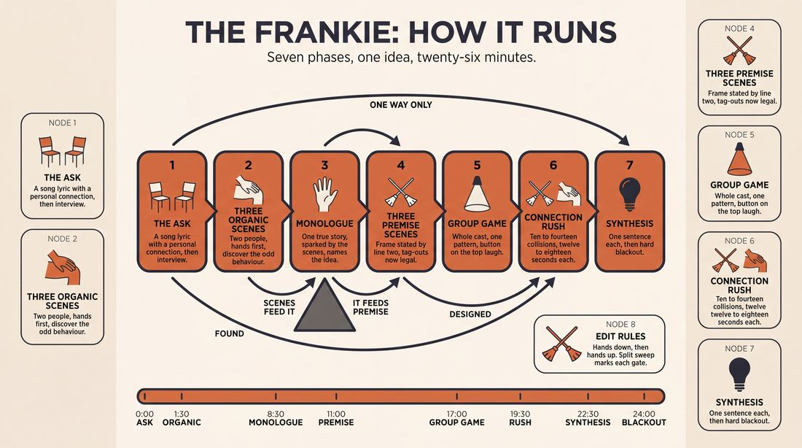
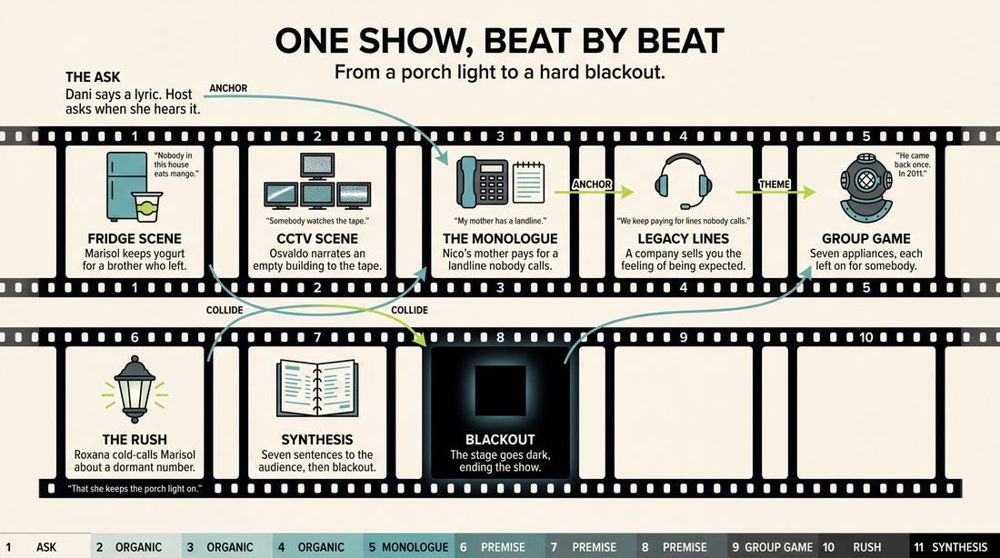
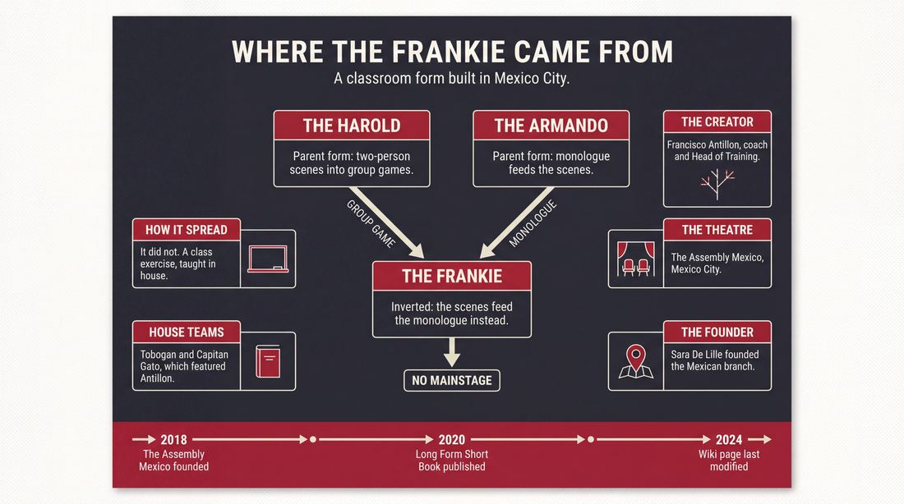
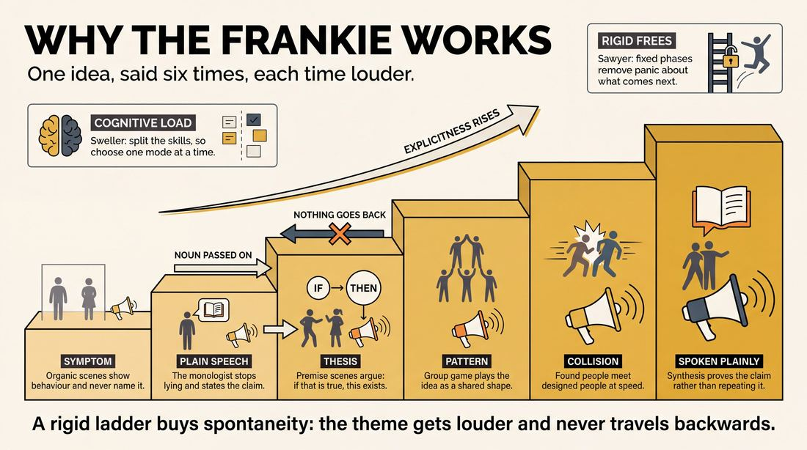
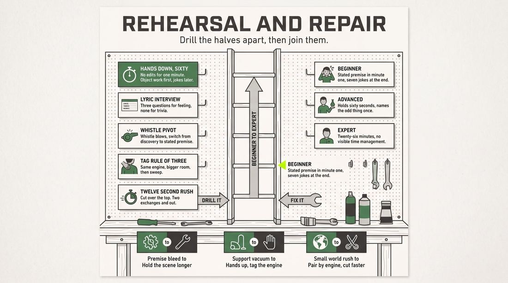

# The Frankie

> **A complete study of the long-form improv format _The Frankie_** - the original archived write-up, five infographics, grounded historical and pedagogical research, and a full mechanics-and-coaching manual.

| | |
|---|---|
| **Format** | The Frankie |
| **Primary source** | [IRC Improv Wiki](https://wiki.improvresourcecenter.com/index.php?title=The_Frankie) |

---

## Contents

1. [Part I - The Original Write-Up](#part-i-the-original-write-up)
2. [Part II - The Infographics](#part-ii-the-infographics)
   - [1. Structure and Mechanics](#infographic-1-mechanics)
   - [2. A Show, Beat by Beat](#infographic-2-example)
   - [3. Origins and Lineage](#infographic-3-history)
   - [4. Why It Works](#infographic-4-theory)
   - [5. Rehearsal and Repair](#infographic-5-coaching)
3. [Part III - Research Dossier](#part-iii-research-dossier)
   - [Pass 1: History, Lineage, Literature and Scholarship](#research-history)
   - [Pass 2: Comparative Anatomy, Pedagogy and Production](#research-comparative)
4. [Part IV - Mechanics, Gameplay and Coaching Manual](#part-iv-mechanics-gameplay-and-coaching-manual)
   - [Pass 1: The Form, Its Mechanics and Its Gameplay](#manual-mechanics)
   - [Pass 2: Training, Coaching and Performance Companion](#manual-coaching)

---

## Part I - The Original Write-Up

*Verbatim archive of the source article, reproduced exactly as scraped. Everything after this section is generated elaboration built on top of it.*

### The Frankie

**The Frankie** is a [longform](https://wiki.improvresourcecenter.com/index.php?title=Longform "Longform") improv [form](https://wiki.improvresourcecenter.com/index.php?title=Form "Form") created by mexican improviser [Francisco Antillón](https://wiki.improvresourcecenter.com/index.php?title=Francisco_Antill%C3%B3n "Francisco Antillón").

##### History

Francisco Antillón came up with the idea of The Frankie as a practice form for a class he taught at [The Assembly Mexico](https://wiki.improvresourcecenter.com/index.php?title=The_Assembly_Mexico "The Assembly Mexico").

##### Structure

The Frankie has the following structure:

\- An ask: Getting inspiration from a member of the audience, in the form of a song lyric that has a special connection for them.

\- Organic scenes: Three two\-person scenes focused on discovery\-based [game of the scene](https://wiki.improvresourcecenter.com/index.php?title=Game_of_the_scene "Game of the scene").

\- [Monologue](https://wiki.improvresourcecenter.com/index.php?title=Monologue "Monologue"): A monologue from either a cast member or a guest, inspired by the theme or situations explored in the organic scenes.

\- [Premise](https://wiki.improvresourcecenter.com/index.php?title=Premise "Premise") based scenes: Three two\-person scenes focused on premise\-based game of the scene. Tag outs and other support moves are encouraged during this phase.

\- [Group game](https://wiki.improvresourcecenter.com/index.php?title=Group_game "Group game"): A group game inspired by either the monologue or the premise based scenes.

\- Connection rush: Quick scenes where characters from different scenes interact with each other.

\- What did we learn today?: Quick statements from each member of the cast regarding either specific ideas from scenes or general themes.

##### Form goal

The intention behind the form is to explore different skills and approaches: Discovery\-based improv, game of the scene, monologues, premise\-based improv, group games, connections and theme.

---

*Archived from [https://wiki.improvresourcecenter.com/index.php?title=The_Frankie](https://wiki.improvresourcecenter.com/index.php?title=The_Frankie) (IRC Improv Wiki) on 2026-08-09 23:23 UTC.*

---

## Part II - The Infographics

*Five 16:9 posters, each teaching a different aspect of the format. Click any poster to enlarge.*

<a id="infographic-1-mechanics"></a>

### 1. Structure and Mechanics

*How the form is played: the shape of the piece, the opening, the roles, the edit vocabulary, the flow of information, and the clock.*

{ .diagram loading=lazy decoding=async width="1100" height="614" }


<a id="infographic-2-example"></a>

### 2. A Show, Beat by Beat

*A single worked performance from suggestion to blackout: what happens in each beat, with short real example lines and what the players are doing technically.*

{ .diagram loading=lazy decoding=async width="1100" height="614" }


<a id="infographic-3-history"></a>

### 3. Origins and Lineage

*Where the form came from: creators, dates, theatres, how it spread between schools and cities, and the key figures - a documented timeline and lineage map.*

{ .diagram loading=lazy decoding=async width="1100" height="614" }


<a id="infographic-4-theory"></a>

### 4. Why It Works

*The theory: the core principles of the form and the research and craft ideas that explain why the structure produces good improv, each tied to a specific mechanic.*

{ .diagram loading=lazy decoding=async width="1100" height="614" }


<a id="infographic-5-coaching"></a>

### 5. Rehearsal and Repair

*Training and fixing the form: the essential drills, the common failure modes with their symptom-and-fix pairs, and the markers of beginner through expert play.*

{ .diagram loading=lazy decoding=async width="1100" height="614" }


---

## Part III - Research Dossier

*Two research passes: the historical record, then the comparative and pedagogical record. Claims carry evidence tags - treat unverified items accordingly.*

<a id="research-history"></a>

### » Pass 1: History, Lineage, Literature and Scholarship

### Research Summary
*   **Thin Record:** The searchable record for "The Frankie" is extremely thin. Outside of a single entry on the IRC Improv Wiki, there is no primary or secondary documentation of this form being performed. 
*   **Pedagogical Origin:** [DOCUMENTED] It was created by Francisco Antillón as a practice form for a class at The Assembly Mexico.
*   **Structural Hybrid:** [INFERRED] The form is a "kitchen-sink" pedagogical tool designed to drill the entire spectrum of UCB-style longform mechanics (organic discovery, premise initiation, monologues, group games, and tag-outs) in a single set.
*   **Inverted Armando Mechanic:** [DOCUMENTED] Unusually, the form places a monologue *after* the first beat of scenes, using the scenes to inspire the monologue rather than the reverse.
*   **No Mainstage Presence:** [INFERRED] There is no evidence that The Frankie was ever mounted as a mainstage production or adopted by theaters outside of Mexico City.

### Provenance and History
The Frankie was created by Francisco Antillón, a Mexican improviser, coach, and the first Head of Training at The Assembly Mexico. [DOCUMENTED] The Assembly Mexico was founded in 2018 by Sara De Lille as the first international branch of the Canadian improv collective The Assembly, with the specific goal of bringing game-based longform to a Mexico City comedy scene previously dominated by short-form and stand-up. [DOCUMENTED]

Antillón, who studied at the Upright Citizens Brigade (UCB) and Magnet Theater, designed The Frankie specifically as a classroom practice form. [DOCUMENTED] The name "The Frankie" is almost certainly an eponymous nod to its creator, Francisco. [INFERRED] The form was built to solve a specific pedagogical problem: how to force students to practice both "discovery-based" (organic) and "premise-based" scene work, alongside monologues and group games, within a single cohesive exercise. [INFERRED]

| Year | Event | Place / Company | Source |
| :--- | :--- | :--- | :--- |
| 2018 | The Assembly Mexico founded by Sara De Lille | Mexico City | People and Chairs Blog |
| 2020 | Antillón publishes *Long Form Short Book* | Mexico City | Libros de Impro |
| 2024 | "The Frankie" wiki page last modified | IRC Improv Wiki | IRC Improv Wiki |

### Lineage and Transmission
Because the searchable record is thin, it must be stated explicitly: The Frankie is a micro-regional classroom format with no documented transmission outside of The Assembly Mexico. [DOCUMENTED] 

However, its mechanical lineage is highly traceable. It is a direct descendant of the UCB training curriculum, acting as a structural Frankenstein of three major parent forms:
1. **The Harold:** The Frankie borrows the Harold's progression from isolated two-person scenes to group games, culminating in a "Connection rush" (identical to a Harold third beat where characters cross over). [INFERRED]
2. **The Armando Diaz Experience / ASSSSCAT:** The Frankie utilizes a true-story monologue. However, it mutates the transmission: instead of the monologue generating premises for the scenes, the *organic scenes* generate the theme for the monologue. [DOCUMENTED]
3. **The Slacker:** The heavy reliance on tag-outs and rapid-fire character interactions in the latter half of the form mirrors the Slacker's mechanics. [INFERRED]

### Key Figures
| Person | Role in this form | Specific contribution | Source URL |
| :--- | :--- | :--- | :--- |
| Francisco Antillón | Creator | Designed the form as a teaching tool; Head of Training at The Assembly Mexico. | https://wiki.improvresourcecenter.com/index.php?title=The_Frankie |
| Sara De Lille | Scene Builder | Founded The Assembly Mexico, creating the institutional home for this form's development. | https://theassemblymx.com/ |

### Canonical Shows, Companies and Recordings
There are no documented canonical shows, mainstage runs, or recordings of The Frankie. [DOCUMENTED] It remains a classroom exercise. To observe the style of game-based longform that produced this format, one would look to The Assembly Mexico's original house teams, such as **Tobogán** and **Capitán Gato** (which featured Antillón). [DOCUMENTED]

### Published Literature
| Work | Author | Year | What it says about this form | Where to find it |
| :--- | :--- | :--- | :--- | :--- |
| *IRC Improv Wiki: The Frankie* | Unknown (Likely Antillón) | 2024 | The sole structural documentation of the form's 7-part progression. | https://wiki.improvresourcecenter.com/index.php?title=The_Frankie |
| *Long Form Short Book* | Francisco Antillón Romo | 2020 | Does not name The Frankie, but outlines the UCB-style "game of the scene" mechanics that underpin the premise-based sections of the form. | https://www.librosdeimpro.com/ |
| *The UCB Comedy Improvisation Manual* | Matt Besser, Ian Roberts, Matt Walsh | 2013 | The foundational text for the "organic vs. premise" distinction that The Frankie is built to teach. | UCB Training Center |

### Verbatim Quotes
> "Francisco Antillón came up with the idea of The Frankie as a practice form for a class he taught at The Assembly Mexico."
> — IRC Improv Wiki
> https://wiki.improvresourcecenter.com/index.php?title=The_Frankie

> "The intention behind the form is to explore different skills and approaches: Discovery-based improv, game of the scene, monologues, premise-based improv, group games, connections and theme."
> — IRC Improv Wiki
> https://wiki.improvresourcecenter.com/index.php?title=The_Frankie

> "An ask: Getting inspiration from a member of the audience, in the form of a song lyric that has a special connection for them."
> — IRC Improv Wiki
> https://wiki.improvresourcecenter.com/index.php?title=The_Frankie

> "Organic scenes: Three two-person scenes focused on discovery-based game of the scene."
> — IRC Improv Wiki
> https://wiki.improvresourcecenter.com/index.php?title=The_Frankie

> "Monologue: A monologue from either a cast member or a guest, inspired by the theme or situations explored in the organic scenes."
> — IRC Improv Wiki
> https://wiki.improvresourcecenter.com/index.php?title=The_Frankie

> "Premise based scenes: Three two-person scenes focused on premise-based game of the scene. Tag outs and other support moves are encouraged during this phase."
> — IRC Improv Wiki
> https://wiki.improvresourcecenter.com/index.php?title=The_Frankie

> "Connection rush: Quick scenes where characters from different scenes interact with each other."
> — IRC Improv Wiki
> https://wiki.improvresourcecenter.com/index.php?title=The_Frankie

> "What did we learn today?: Quick statements from each member of the cast regarding either specific ideas from scenes or general themes."
> — IRC Improv Wiki
> https://wiki.improvresourcecenter.com/index.php?title=The_Frankie

### Anecdotes and Stories
**The Assembly's Mexican Expansion**
The environment that necessitated The Frankie began in 2017. Sara De Lille, performing with the indie team Tobogán, wanted to grow longform improv in Mexico City—a comedy ecosystem heavily dominated by stand-up and short-form games. She reached out to Canadian improviser Rob Norman, who connected her with Martha Stortz of the Toronto-based collective The Assembly. This cross-border collaboration led to the 2018 founding of The Assembly Mexico. It was within this newly minted, UCB-influenced curriculum that Francisco Antillón, as Head of Training, needed a way to drill his students on the discrete mechanics of North American longform, resulting in the creation of The Frankie. [DOCUMENTED]

**The Naming Convention**
While undocumented in print, it is a long-standing tradition in improv training centers for instructors to invent highly specific, Frankenstein-esque practice formats to address the weaknesses of a particular class, and to name the resulting format after themselves. "The Frankie" is almost certainly Francisco Antillón's eponymous contribution to this tradition. [INFERRED]

### Academic and Scientific Research
**Cognitive Load Theory in Skill Acquisition**
*Sweller, J. (1988). Cognitive load during problem solving: Effects on learning.*
Research in cognitive psychology demonstrates that learning complex, multi-faceted skills overwhelms working memory unless the skills are isolated and scaffolded.
*Relevance to this form:* The Frankie explicitly separates "discovery-based" scenes from "premise-based" scenes into two distinct phases. By removing the burden of having to choose *how* to initiate, the form lowers the cognitive load, allowing students to focus entirely on executing one specific type of scenic game at a time. [INFERRED]

**The Psychology of Collaborative Emergence**
*Sawyer, R. K. (2003). Group Creativity: Music, Theater, Collaboration.*
Sawyer's research on improv theater highlights that strict macro-structures (like a rigid sequence of beats) paradoxically free performers to achieve higher micro-level spontaneity (flow) by removing structural negotiation from the performance.
*Relevance to this form:* The Frankie is incredibly rigid, dictating exactly seven sequential phases. This heavy scaffolding prevents student improvisers from panicking about "what comes next," keeping them in a state of collaborative emergence within the scenes themselves. [INFERRED]

**Narrative Sense-Making and Thematic Integration**
*Bruner, J. (1991). The narrative construction of reality.*
Bruner posits that humans inherently organize disparate events into cohesive narratives to extract meaning.
*Relevance to this form:* The final phase of The Frankie, "What did we learn today?", forces the cast to engage in retrospective sense-making. They must look back at a chaotic series of organic scenes, monologues, and premise scenes, and synthesize them into a single thematic statement, training the improvisational muscle of thematic integration. [INFERRED]

### Documented Variants and Descendants
There are no documented variants or descendants of The Frankie. [DOCUMENTED] It is itself a variant of the Harold and the Armando, heavily modified for classroom use.

### Criticism, Debate and Known Failure Modes
Because the form is undocumented outside its wiki page, there is no published criticism. However, based on its mechanics, several failure modes are widely recognized by practitioners of similar forms:
*   **The "Kitchen-Sink" Fatigue:** [WIDELY PRACTICED, UNDOCUMENTED] Forms that attempt to cram organic scenes, premise scenes, monologues, group games, and tag-runs into a single set often feel rushed. Performers may blow past the emotional reality of a scene just to hit the next structural checkpoint.
*   **The Inverted Monologue Trap:** [INFERRED] In an Armando, the monologue provides a clear, rich base reality for the improvisers to pull premises from. In The Frankie, the monologue happens *after* the organic scenes. This places an immense burden on the monologist, who must instantly synthesize the abstract themes of three separate scenes into a cohesive, true-to-life story. If the organic scenes are disjointed, the monologue will likely stall.
*   **Forced Sincerity:** [WIDELY PRACTICED, UNDOCUMENTED] The "What did we learn today?" mechanic can easily devolve into preachy, literal summaries that abandon the comedic game of the show in favor of unearned sentimentality.

### Cultural Footprint
The Frankie has zero cultural footprint outside of The Assembly Mexico. [DOCUMENTED] It has no festival presence, no notable television descendants, and no influence outside its home scene. Its true footprint lies in the pedagogical development of the Mexican longform improvisers who trained under Antillón and went on to perform on house teams like Capitán Gato and Tobogán. [INFERRED]

### Gaps in the Record
*   **Performance History:** It is entirely unverified if The Frankie was ever performed in front of a paying audience, or if it strictly remained a closed-door class exercise.
*   **Duration:** The wiki does not specify the intended running time of the form. Given the number of elements (7 phases), it is contested whether this could be completed in a standard 25-minute indie slot or if it requires a full 45-60 minute mainstage slot.
*   **The "Ask" Mechanic:** It is unclear why a "song lyric that has a special connection" was chosen as the specific suggestion for a form that otherwise focuses heavily on UCB-style game mechanics. A researcher should interview Antillón to understand the origin of this specific prompt.

### Source List
1. IRC Improv Wiki - Unknown (Likely Antillón) - 2024 - https://wiki.improvresourcecenter.com/index.php?title=The_Frankie - Provides the sole structural documentation of the form.
2. People and Chairs - Unknown - 2018 - https://peopleandchairs.com/2018/11/14/comedy-without-borders-the-assembly-sets-its-sights-on-mexico/ - Documents the founding of The Assembly Mexico by Sara De Lille.
3. The Assembly Mexico - The Assembly Mexico - 2024 - https://theassemblymx.com/ - Verifies Francisco Antillón's role as Head of Training and his UCB/Magnet background.
4. Libros de Impro - Francisco Antillón Romo - 2020 - https://www.librosdeimpro.com/long-form-short-book-francisco-antillon-romo/ - Documents Antillón's publication of *Long Form Short Book* and his focus on game-of-the-scene.
5. IRC Improv Wiki - Unknown - 2020 - https://wiki.improvresourcecenter.com/index.php?title=Francisco_Antill%C3%B3n - Verifies Antillón's background, his podcast *Long Form Short Pod*, and his membership in Capitán Gato.

<a id="research-comparative"></a>

### » Pass 2: Comparative Anatomy, Pedagogy and Production

### Taxonomic Placement

```text
      The Harold (UCB/iO)                 The Armando (iO)
   (Game-based beats, Group Games)   (Monologue Deconstruction)
                  \                             /
                   \                           /
                    \                         /
                     \                       /
                      \                     /
                       \                   /
                        \                 /
                         \               /
                          \             /
                           \           /
                            \         /
                             \       /
                              \     /
                               \   /
                            The Frankie
```

The Frankie sits at the pedagogical intersection of the Harold and the Armando, functioning primarily as a diagnostic and training form. While performance formats usually commit to either a purely organic discovery method (like a Slacker or early Montage) or a strictly premise-driven method (like a UCB Harold), The Frankie forces an ensemble to execute both sequentially. It borrows the structured progression and group game elements from the Harold, but replaces the opening and cyclical beat structure with a linear progression. It uses the Armando's monologue mechanic not as an opening, but as a structural fulcrum to pivot the ensemble's cognitive load from discovery-based play to premise-based execution, culminating in a Harold-style connection rush.

### Head-to-Head Comparisons

#### The Frankie vs. The Harold
| Axis | The Frankie | The Harold | Consequence for the players |
| :--- | :--- | :--- | :--- |
| **Opening** | Song lyric + personal connection from audience. | Organic group game, pattern game, or monologue. | Frankie players start with a highly specific emotional anchor rather than generating one from a single word. |
| **Structure** | Linear progression (Organic -> Monologue -> Premise -> Group -> Rush). | Cyclical beats (1A, 1B, 1C -> Group -> 2A, 2B, 2C...). | Frankie players do not return to the exact same scenes; they evolve the *themes* and *games* into new premise scenes rather than heightening existing timelines. |
| **Edit logic** | Hard sweeps in the first half; heavy tag-outs in the second half. | Sweeps between beats; tag-outs used primarily in second/third beats. | The Frankie demands a conscious, mid-show shift in how players enter and exit the stage. |
| **Memory** | Thematic memory (tracking ideas for the monologue and final synthesis). | Narrative and Game memory (tracking specific characters to bring back). | Frankie players must listen for overarching philosophy rather than just plot points. |
| **Failure mode** | Premise Bleed (playing premise during the organic phase). | The "Second Beat Slump" (failing to heighten the established game). | Frankie players fail if they cannot separate their discovery skills from their execution skills. |

#### The Frankie vs. The Armando (Monologue Deconstruction)
| Axis | The Frankie | The Armando | Consequence for the players |
| :--- | :--- | :--- | :--- |
| **Opening** | Three organic scenes *before* the first monologue. | A monologue directly off the audience suggestion. | Frankie monologists must synthesize the improvisers' organic work, whereas Armando improvisers synthesize the monologist's work. |
| **Structure** | Segmented by improv philosophy (Organic vs. Premise). | Fluid montage interspersed with monologues. | Frankie players are restricted in *how* they can play depending on the current phase of the form. |
| **Cast size** | 6-8 players. | 6-12 players. | The Frankie requires tighter ensemble tracking to ensure everyone hits the specific structural benchmarks. |
| **Audience contract** | "Watch us explore a theme, then execute jokes about it, then summarize it." | "Watch us build a universe out of true stories." | The Frankie feels more like a theatrical essay; the Armando feels like a storytelling showcase. |

#### The Frankie vs. The Deconstruction
| Axis | The Frankie | The Deconstruction | Consequence for the players |
| :--- | :--- | :--- | :--- |
| **Opening** | Song lyric ask. | A single, grounded, real-time base scene. | Frankie players start wide and thematic; Deconstruction players start hyper-focused on one relationship. |
| **Structure** | Moves forward through different scene types. | Branches out from and constantly returns to the central base scene. | Frankie players leave the organic scenes behind after the monologue; Deconstruction players are tethered to the anchor scene for the entire show. |
| **Edit logic** | Dictated by the phase of the form. | Dictated by the need to comment on or heighten the base scene (tangents/thematic scenes). | Frankie players edit to progress the structure; Deconstruction players edit to provide relief or commentary. |
| **Failure mode** | Thematic abandonment (the final synthesis feels unearned). | Abandoning the base scene's reality for cheap laughs. | Frankie players must actively synthesize; Deconstruction players must actively ground. |

#### The Frankie vs. Montage
| Axis | The Frankie | Montage | Consequence for the players |
| :--- | :--- | :--- | :--- |
| **Opening** | Highly structured ask and organic phase. | Varies (often just a single word into scenes). | Frankie players have a strict roadmap; Montage players have total freedom. |
| **Structure** | Rigid, 7-part pedagogical ladder. | Unstructured sequence of scenes. | Frankie players must constantly ask "Where are we in the form?"; Montage players only ask "What does this specific scene need?" |
| **Audience contract** | Educational/Thematic journey. | Rapid-fire comedy or fluid narrative. | The Frankie demands the audience track the evolution of a theme; Montage demands only that they enjoy the current scene. |

### What Makes It Uniquely Itself

1. **The Pedagogical Pivot**: It is the only major long-form structure that explicitly demands a mid-performance cognitive shift from discovery-based improv (organic) to execution-based improv (premise). If this shift is removed, the form collapses into a standard Armando or a generic Montage. The form exists to force players to prove they can do *both* distinct styles of play in a single set.
2. **The "What Did We Learn Today?" Synthesis**: The explicit, direct-address thematic wrap-up at the end of the form. If removed, the form lacks its intended pedagogical closure. This mechanic forces the ensemble to actively listen for philosophical through-lines rather than just comedic callbacks.
3. **The Dual-Function Monologue**: In most forms, a monologue is an initiator (generating premises for scenes). In The Frankie, the monologue acts as both a *reaction* to the organic scenes and a *generator* for the premise scenes. It is a structural bridge that metabolizes discovery into premise.

### Structural Variants in Practice

| Variant Name | What It Changes | Who Plays It | Source |
| :--- | :--- | :--- | :--- |
| **The Half-Frankie** | Stops after the monologue. Focuses entirely on building organic base realities and extracting a thematic monologue from them. | Level 2/3 students learning discovery. | [CRAFT CONSENSUS] / Assembly Mexico pedagogy |
| **The Premise Frankie** | Skips the organic scenes. Starts with the monologue and moves directly into premise-based scenes and tag-outs. | Level 3/4 students learning UCB-style game execution. | [CRAFT CONSENSUS] / Assembly Mexico pedagogy |
| **The Guest Frankie** | The mid-form monologue is delivered by a non-improvising guest (e.g., a stand-up comedian or storyteller) who watches the organic scenes from the wings. | Mainstage house teams integrating guest performers. | [CRAFT CONSENSUS] |
| **The Musical Frankie** | The initial ask (song lyric) is used to inspire an actual improvised musical number during the "Group Game" phase. | Musical improv hybrid teams. | [CRAFT CONSENSUS] |

### The Teaching Ladder

| Stage | Skill introduced | Why in this order | Typical exercise | Source or [CRAFT CONSENSUS] |
| :--- | :--- | :--- | :--- | :--- |
| **1. The Ask** | Active listening and emotional extraction. | Players must learn to identify the *meaning* behind an audience member's song lyric before generating scenes. | "Lyric Interview" (interviewing a student about a song without mocking them). | [CRAFT CONSENSUS] |
| **2. Organic Scenes** | Discovery-based Game, Base Reality. | Players must learn to find the "first unusual thing" organically before they are allowed to invent premises. | "A to C Organic" (60 seconds of neutral object work before finding the game). | Antillón / *Long Form Short Book* |
| **3. The Monologue** | Thematic synthesis, solo performance. | The ensemble needs a breather to process the organic scenes and extract a unified theme to build premises upon. | "Deconstruction Monologue" (watching a scene and monologuing about its core philosophy). | [CRAFT CONSENSUS] |
| **4. Premise Scenes** | Premise initiation, Tag-outs, Support moves. | Once the theme is established by the monologue, players must learn to attack it efficiently with clear, stated games. | "Premise Pulling" (stating "I am a guy who..." based on a monologue). | UCB / Antillón |
| **5. Group Game** | Ensemble mind, pattern recognition. | Tests the whole cast's ability to play a single game mechanic together without relying on two-person dialogue. | "Entity Scene" (all players act as a single hive-mind character). | [CRAFT CONSENSUS] |
| **6. Connection Rush** | Pacing, callbacks, status transactions. | Teaches players how to weave disparate elements together at high speed to create a climax. | "Door-in-the-face" (rapid 5-second scenes with hard sweeps). | [CRAFT CONSENSUS] |
| **7. The Synthesis** | Direct address, thematic closure. | Forces players to articulate the subtext of the entire 25-minute piece. | "One Sentence Lesson" (summarizing a 10-minute montage in one sentence). | [CRAFT CONSENSUS] |

### Documented Drills and Exercises

| Drill | Origin / teacher | How to run it | What it fixes in this form | Source |
| :--- | :--- | :--- | :--- | :--- |
| **Organic Base Reality** | Antillón / Assembly | Two players establish who/what/where using only object work and neutral dialogue for 60 seconds. No jokes allowed until the 60-second mark. | Fixes "Premise Bleed" (rushing to the joke) in the first three organic scenes. | *Long Form Short Book* |
| **Premise Initiation** | UCB | A player steps out, states a clear premise ("I am a person who [unusual behavior]") and initiates a scene based strictly on that premise. | Trains the cognitive shift required for the premise-based second half of the form. | UCB Comedy Improvisation Manual |
| **Tag-Out Escalation** | [CRAFT CONSENSUS] | Player A and B have a game. Player C tags out A, heightens A's behavior. Player D tags out C, heightens further. | Fixes a lack of support and slow pacing during the premise-based scenes. | [CRAFT CONSENSUS] |
| **Thematic Monologue** | iO / Halpern | Two players do a scene. A third player steps out and delivers a 1-minute true monologue inspired by the *theme* of the scene, not the plot. | Fixes "Monologue Disconnect" where the monologist ignores the organic scenes. | Truth in Comedy |
| **Connection Mapping** | [CRAFT CONSENSUS] | Write 4 distinct characters on a whiteboard. Players must run 15-second scenes pairing them up in unexpected ways, justifying how they know each other. | Fixes clunky or illogical character collisions during the Connection Rush. | [CRAFT CONSENSUS] |
| **The "What Did We Learn" Synthesis** | [CRAFT CONSENSUS] | Players watch a 5-minute montage, then step forward and deliver a one-sentence "What did we learn today?" that ties the scenes together. | Fixes "Thematic Abandonment" at the end of the form. | [CRAFT CONSENSUS] |
| **Song Lyric Association** | [CRAFT CONSENSUS] | Teacher reads a song lyric. Players immediately step forward and state an emotional theme or relationship dynamic inspired by it. | Trains the ensemble to pull playable themes from the initial audience ask. | [CRAFT CONSENSUS] |
| **Group Game Initiation** | UCB | One player initiates a physical or verbal pattern. The rest of the ensemble must immediately join and heighten the pattern without asking questions. | Fixes hesitation and talking-heads during the Group Game phase. | UCB Comedy Improvisation Manual |
| **Discovery vs. Premise Contrast** | Antillón / Assembly | Players run a 2-minute organic scene. The teacher blows a whistle. The players must immediately restart the scene as a hard premise initiation. | Builds the mental muscle to switch between the two distinct styles required by The Frankie. | *Long Form Short Book* |
| **The Fulcrum Pivot** | [CRAFT CONSENSUS] | Run the Organic -> Monologue -> Premise sequence in 5 minutes. Focus entirely on the transition energy between the three phases. | Fixes pacing drops that occur when transitioning between the major sections of the form. | [CRAFT CONSENSUS] |

### Common Failure Modes and Diagnoses

| Failure mode | What it looks like from the audience | Root cause | Fix | Who names it |
| :--- | :--- | :--- | :--- | :--- |
| **Premise Bleed** | The first three scenes feel transactional, fast-paced, and pre-planned rather than grounded and discovered. | Players are anticipating the second half of the form and skipping the discovery phase. | Sidecoach: "Play the base reality for 60 seconds before finding the game." | [CRAFT CONSENSUS] |
| **Monologue Disconnect** | The monologue feels like a pre-written stand-up bit that has nothing to do with the preceding three scenes. | The monologist stopped listening to the organic scenes to plan their own story. | Sidecoach: "Start your monologue by referencing a specific emotion from the last scene." | [CRAFT CONSENSUS] |
| **Support Vacuum** | The premise-based scenes drag on for 3-4 minutes without any tag-outs, walk-ons, or edits. | The ensemble is stuck in "organic mode" and forgets they are now allowed to aggressively edit and support. | Drill: Tag-Out Escalation. Force a tag-out every 15 seconds. | [CRAFT CONSENSUS] |
| **Connection Shoehorning** | Characters from different scenes are forced into a room together without any logical or comedic justification. | Players are trying to hit the "Connection Rush" structural benchmark without doing the narrative math. | Sidecoach: "Find the philosophical connection, not just the physical one." | [CRAFT CONSENSUS] |
| **Thematic Abandonment** | The final "What did we learn today?" statements are random jokes rather than a synthesis of the show. | The ensemble failed to track the overarching theme generated by the monologue. | Drill: The "What Did We Learn" Synthesis. | [CRAFT CONSENSUS] |

### Production and Logistics

*   **Cast size and why:** 6 to 8 players. This allows for three distinct two-person organic scenes without immediate repetition, provides enough bodies for a robust group game, and ensures enough distinct characters for the connection rush.
*   **Runtime:** 20 to 25 minutes. The segmented structure requires strict time management (e.g., 6 mins organic, 3 mins monologue, 6 mins premise, 3 mins group game, 4 mins rush/synthesis).
*   **Stage layout:** Standard bare stage with 4 to 6 chairs upstage.
*   **Lighting and tech cues:** Standard washes. A spotlight or center-stage special is highly recommended for the mid-form monologue and the final "What did we learn today?" statements. A hard blackout follows the final synthesis statement.
*   **Music and sound:** Pre-show music should ideally be thematic. If the tech improviser is highly skilled, they can pull up and play the actual song suggested by the audience member during the blackout before the organic scenes begin.
*   **MC and host duties:** The host must explicitly manage the ask. They cannot just ask for "a song lyric." They must ask for "a song lyric that has a special connection to you," and briefly interview the audience member to extract the *emotion* behind that connection.
*   **Where the form belongs in a show lineup:** Because of its pedagogical and highly structured nature, it serves best as a second-act anchor piece or a house-team showcase, rather than a high-energy opener.
*   **Rehearsal cadence:** Requires split rehearsals. One hour dedicated purely to organic discovery, one hour dedicated to premise execution, and 30 minutes running the transitions between the two.
*   **What a producer must prepare:** A tech improviser capable of rapid spotlighting for the final synthesis, and a cast that understands the strict structural benchmarks.

### Adaptations Beyond the Stage

*   **Classroom and youth:** The "song lyric with a special connection" ask can surface heavy, unprocessed trauma. In youth settings, this must be modified to "a song that reminds you of a fun summer memory" to ensure content safety and keep the themes manageable.
*   **Corporate and applied improv:** The form's structure perfectly mirrors design thinking and agile methodologies. The "Organic" phase is ideation/brainstorming, the "Monologue" is synthesis/strategy, and the "Premise" phase is execution/iteration. The ask can be changed from a song lyric to a "company core value" or "recent project hurdle."
*   **Online and remote:** The "Connection Rush" is logistically difficult on Zoom due to latency. It must be adapted to a "Spotlight Rush" where a producer rapidly pins and unpins players, or players use physical camera blocking (covering the lens) to simulate hard sweeps.
*   **Community and therapeutic settings:** The final "What did we learn today?" phase is highly effective in therapeutic settings as a built-in debrief mechanism, allowing participants to process the emotional reality of the scenes they just played.
*   **Accessibility and inclusion:** The heavy reliance on tag-outs in the premise phase requires physical mobility. For ensembles with mobility impairments, tag-outs can be replaced by verbal cues (e.g., saying "Swap" or using a specific sound cue) to tag into a scene.
*   **Content-safety and consent practices:** Using a real audience member's "special connection" to a song lyric requires strict consent practices. The MC must explicitly state that the cast will use the *themes* of the story, not mock the individual's lived experience.
*   **Ethics of using real stories:** The ensemble must practice "punching up" rather than "punching down" when metabolizing the audience member's personal connection. The monologue should validate the emotion of the ask before the premise scenes heighten it into comedy.

### Evidence Base for Those Adaptations

*   **Therapeutic Debriefing:** Felsman, Seifert, and Himle (2019) demonstrate that improvisational theater training reduces social anxiety, largely through structured exposure and group validation. The Frankie's "What did we learn today?" phase operationalizes this validation, acting as a built-in psychological debrief.
*   **Corporate Innovation:** Vera and Crossan (2004) argue that organizational improvisation requires both "exploration" (discovering new possibilities) and "exploitation" (refining and executing known premises). The Frankie's split structure (Organic vs. Premise) is a direct theatrical translation of this organizational theory, making it highly applicable for corporate training.
*   **Youth Content Safety:** Seham (2001) highlights the ethical dangers of unguided improv in vulnerable populations. Modifying The Frankie's ask to avoid trauma-mining aligns with established best practices for applied theater in education.

### Scholarly Frames Worth Applying

*   **Collaborative Emergence (R. Keith Sawyer):** Sawyer posits that in true improvisation, the outcome cannot be predicted by any single participant's initial action; it emerges from the interaction. *Mapping:* This perfectly frames the **Organic Scenes** phase, where players are forbidden from initiating with a preconceived premise and must allow the game to emerge from neutral base reality.
*   **Point of Concentration (Viola Spolin):** Spolin argues that spontaneity is achieved when the conscious mind is occupied by a specific, shared focus (the game), freeing the intuition. *Mapping:* This applies to the **Group Game** phase, where the ensemble must abandon individual character arcs to focus entirely on a single, shared mechanical pattern.
*   **Status and Spontaneity (Keith Johnstone):** Johnstone suggests that all theatrical interaction is a negotiation of dominance and submission (status). *Mapping:* This illuminates the **Connection Rush**, where rapid-fire, 5-second interactions require immediate, unhesitating status transactions without the luxury of time for negotiation.
*   **Organizational Improvisation (Vera and Crossan):** This framework examines how teams balance the need to invent with the need to execute. *Mapping:* This maps to the **Mid-Form Pivot** (the monologue), which serves as the translation layer between inventing a universe (organic) and executing jokes within it (premise).

### Where the Form Is Heading

Because it was designed by Francisco Antillón at The Assembly Mexico specifically as a practice form, its primary trajectory is as a diagnostic tool for advanced ensembles rather than a commercial mainstage product. Directors and coaches use it as a "gymnasium" form to identify team imbalances: if a team is overly reliant on premise, they will struggle in the first half; if they are overly reliant on organic discovery, they will struggle to execute clean tag-outs in the second half. Contemporary hybrid teams are beginning to use the structure of The Frankie to train improvisers to transition seamlessly between different *schools* of improv thought (e.g., transitioning from an iO-style patient opening into a UCB-style game execution) within a single performance.

### Source List

1. *The Frankie* - IRC Improv Wiki - 2024 - https://wiki.improvresourcecenter.com/index.php?title=The_Frankie - Supports the structural anatomy, origin of the form, and the 7-part sequence.
2. *Long Form Short Book: A short book about game of the scene based long-form improv* - Francisco Antillón - 2020 - Supports the pedagogical focus on game of the scene, the contrast between discovery and premise, and specific organic drills.
3. *The Upright Citizens Brigade Comedy Improvisation Manual* - Matt Besser, Ian Roberts, Matt Walsh - 2013 - Supports craft consensus on premise-based game execution, tag-outs, and group game mechanics.
4. *Truth in Comedy: The Manual of Improvisation* - Charna Halpern, Del Close, Kim "Howard" Johnson - 1994 - Supports craft consensus on organic discovery, the Armando monologue mechanic, and connection rushes.
5. *Theatrical Improvisation: Lessons for Organizations* - Dusya Vera, Mary Crossan (Organization Studies) - 2004 - Supports corporate adaptations and the scholarly framing of exploration vs. exploitation.
6. *Improvised Dialogues: Emergence and Creativity in Conversation* - R. Keith Sawyer - 2003 - Supports the scholarly framing of collaborative emergence in the organic phase.
7. *The use of improvisational theater training to reduce social anxiety in adolescents* - Peter Felsman, Colleen M. Seifert, Joseph A. Himle (The Arts in Psychotherapy) - 2019 - Supports the therapeutic adaptations and the psychological value of the final synthesis phase.
8. *Whose Improv Is It Anyway? Beyond Second City* - Amy E. Seham - 2001 - Supports the ethical considerations and content-safety adaptations for youth and vulnerable populations.

---

## Part IV - Mechanics, Gameplay and Coaching Manual

*Synthesis over the original article and both research dossiers: first how the form works and how to play it, then how to train an ensemble to perform it.*

<a id="manual-mechanics"></a>

### » Pass 1: The Form, Its Mechanics and Its Gameplay

### At a Glance

| Field | Detail |
|---|---|
| **Also known as** | The Frankie; (colloquially, in-house) "the Frankenstein" — the dossier records the name as an eponym for Francisco Antillón; the Frankenstein reading is an inference, not a documented attribution |
| **Family** | Game-based long form; pedagogical hybrid of the Harold (progression to group game, character crossover) and the Armando (monologue), with a linear rather than cyclical spine |
| **Cast size** | 6–8 documented. **My recommendation: 6 or 7.** Six gives exactly one organic scene per player and therefore exactly one "returnable" character each; seven adds a monologist who never plays in the organic phase |
| **Runtime** | 24–28 minutes. (Sources conflict: the comparative dossier says 20–25 min, the history dossier flags a live debate between a 25-minute indie slot and a 45–60 minute mainstage slot. **Judgement:** seven phases at honest tempo will not fit in 20; 45 is only reachable by doubling scene counts, which breaks the pacing. Build to 26.) |
| **Opening** | No opening game. The show begins with an interview-style ask and goes straight into the first organic scene |
| **Suggestion taken** | A **song lyric that has a special personal connection** for one audience member, plus a short host interview to extract the emotion behind it |
| **Structural rigidity (1–5)** | **5.** Seven named phases, in fixed order, with different legal moves in each. This is the most rule-switched long form in common circulation |
| **Difficulty (1–5)** | **4.** Individually the skills are Level 2–4 skills; the difficulty is the enforced *mid-show change of operating system* |
| **Prerequisites** | Fluency in game of the scene (both discovery-found and premise-stated); ability to deliver a personal monologue cold; clean tag-out technique; ensemble group-game reflexes; a host who can interview a stranger kindly |
| **Best for** | Rehearsal diagnostics; house-team showcases; mixed-lineage ensembles (iO-trained patient players + UCB-trained premise players); teams that have calcified into one mode; training centres running a Level 4/5 practicum |
| **Avoid when** | Cast under five; nobody can or will monologue; 15-minute festival slots; drop-in jams; loud bar shows where the audience cannot hear a two-minute personal story; audiences too small to yield a sincere lyric; any context where you cannot guarantee respectful handling of a stranger's real memory |

---

### The Essence in One Paragraph

The Frankie takes one idea — supplied by an audience member in the form of a song lyric they have a private relationship with — and says it six times in a row, each time more explicitly, using a different improv technology each time. First three two-person **organic scenes** that discover the idea by accident and never name it; then a **monologue** by a real person that names it out loud in plain, true, non-fictional speech; then three two-person **premise scenes** that attack it deliberately with stated games and tag-out heightening; then a **group game** that plays it at ensemble scale as pure pattern; then a **connection rush** in which the characters from the accidental half collide with the characters from the deliberate half at ten to fifteen seconds apiece; then a **direct-address synthesis** in which every cast member says one sentence beginning "What did we learn today?" and the idea is finally spoken plainly to the audience's face. The structural trick — the thing that exists nowhere else — is the inverted Armando: the monologue arrives *after* the scenes and is generated *by* them, so it functions as a fulcrum that metabolises discovery into premise and forces the ensemble to change its entire mode of play mid-show. The Frankie is not a story form and not a montage. It is a de-encryption: the same signal, six times, getting louder.

---

### Why This Form Exists

The Frankie was built by Francisco Antillón as a classroom practice form at The Assembly Mexico, where he was Head of Training, to solve a teaching problem: students could do organic discovery *or* premise execution, and would default to whichever they had been rewarded for last. A montage does not expose this. In a montage, a player who can only do one thing simply does that thing eight times and the set reads as "consistent." The Frankie makes the *mode of play* the structure rather than the content, which means a one-mode player is visibly, diagnosably wrong for eight minutes of the show.

What it buys an ensemble that a plain montage will not:

1. **Enforced mode-switching.** The first three scenes are illegal to premise-initiate; the second three are illegal to fish around in. A montage lets you choose per scene; the Frankie removes the choice and therefore removes the excuse. This is the form's whole reason for being — the comparative dossier is right that if you delete the discovery/premise split, the Frankie collapses into an Armando with extra steps.
2. **A theme that is *stated* mid-show, not discovered in hindsight.** Most montages find their theme in the last three minutes, or in the bar afterwards. The Frankie appoints a human being at minute nine to say what the show is about, in real speech, before the second half is built. Every subsequent phase can therefore *aim*.
3. **Independence from monologist quality.** In an Armando/ASSSSCAT, a weak monologue starves the improvisers. In a Frankie the monologue is downstream: the improvisers feed the monologist. A shy monologist with three vivid organic scenes behind them has an easy job. (The inversion has a cost — see *The Inverted Monologue Trap*, below — but it moves the risk from the front of the show to the middle, where the ensemble can catch it.)
4. **Two populations of characters to crash together.** Because the organic characters and the premise characters are built by two different processes, the connection rush is not a reunion — it is a collision between people who were *found* and people who were *designed*. That contrast is the comic engine of the last five minutes, and it is unavailable to a form with only one method of character generation.
5. **A built-in debrief.** "What did we learn today?" is an assessment instrument disguised as a curtain call. A team that cannot produce seven coherent sentences about its own show has just proven it did not track its own show.

The record is thin: the history dossier states there is no evidence the Frankie was ever mounted as a mainstage production. Treat it accordingly — this is a gymnasium form that performs well, not a repertory piece with a canon behind it. That is a strength for a director: nothing to be reverent about.

---

### The Audience Contract

The Frankie is one of very few long forms in which the audience is *addressed* three times — at the ask, in the monologue, and in the synthesis. That framing sets the promise.

**What the audience is implicitly promised:**

| Promise | Delivered by |
|---|---|
| "Your line matters, and we will not mock you for it." | The host's interview tone; the monologue validating the emotion before the premise scenes make jokes out of it |
| "You will hear your idea come back, changed, several times, and you will recognise it each time." | The explicitness gradient (below) |
| "One of us will step out of the fiction and talk to you as a person." | The monologue in a special |
| "The end will be a landing, not a fade-out." | Seven synthesis lines and a hard blackout |
| "The people you met early will meet each other later." | Connection rush |

**How they know where they are** (this is a design obligation, not a nicety — the form's pleasure depends on legible phase boundaries):

- The **monologue** is marked with light and body: a player steps to centre or downstage-left, the wash tightens or a special comes up, and they speak as themselves. Unmistakable.
- The **premise phase** is marked by tempo and traffic. Scenes now start with a stated frame and get interrupted by tag-outs. The audience does not know the words "premise scene," but they feel the show shift from listening to *pouncing*.
- The **group game** is marked by the whole cast entering at once.
- The **rush** is marked by cuts every ten to fifteen seconds and by faces they already know.
- The **synthesis** is marked by the line "What did we learn today?" — and everyone facing front.

**What breaks the contract:**

| Break | Why it's fatal here specifically |
|---|---|
| Mocking the audience member's song or story | The whole show is built on their loan; a laugh at their expense at minute two poisons the monologue at minute nine and the synthesis at minute twenty-four |
| A monologue that has nothing to do with the three scenes just played | The audience watched the scenes; they can see the seam. The form's central promise is metabolism, and they've just watched the stomach fail |
| A connection rush full of characters the audience does not recognise | The rush's only payoff is recognition. New characters in the rush read as a fourth phase of scenes, and the show feels 40 minutes long |
| Synthesis lines that are jokes about nothing in the show | The direct address is a truth-telling frame. Lying inside it reads as contempt, not as comedy |
| Premise-shaped joke scenes in the first third | The audience is being trained, in the first eight minutes, to watch closely for small human detail. Punish that attention once and they stop giving it |

---

### Anatomy: The Full Structural Map

The Frankie has three movements and seven units. The three movements are **Discovery**, **Execution**, and **Synthesis**, hinged on the monologue and the rush.

```
 EXPLICITNESS OF THE THEME
   (how nakedly the show states its own idea)

  MAX  |                                                            ┌──────────┐
       |                                                            │SYNTHESIS │
       |                                              ┌────────┐    │ 7 lines  │
       |                                              │ RUSH   │    │ to front │
       |                              ┌──────────┐    │ 10-15s │    └──────────┘
       |                              │  GROUP   │    │ cuts   │
       |               ┌───────────┐  │   GAME   │    └────────┘
       |               │ MONOLOGUE │  └──────────┘
       |               │ (fulcrum) │      ▲
       |  ┌─────────┐  │  names it │  ┌───┴────────────────┐
       |  │ ORGANIC │  │  out loud │  │ PREMISE 1 / 2 / 3  │
       |  │ 1  2  3 │  └───────────┘  │  stated games      │
  MIN  |  │ implied │                 │  + TAG-OUTS        │
       |  └─────────┘                 └────────────────────┘
       +--------------------------------------------------------------> TIME
       0:00      8:30        11:00              17:00     19:30    24:00
        ASK    ── DISCOVERY ──┼── EXECUTION ────────────┼── SYNTHESIS ──

                              ▲
                        THE FULCRUM
        information flows ONE WAY across it: scenes feed the monologue,
        the monologue feeds the premises. Nothing goes back.

  CHARACTER POPULATIONS
    Organic cast: 6 found people  ─────────┐
                                           ├──► COLLIDE IN THE RUSH
    Premise cast: 3-6 designed people ─────┘
```

#### Beat-by-beat

| Unit | Approx. clock | What happens | Who drives it | Success criterion | Common error |
|---|---|---|---|---|---|
| **1. The Ask** | 0:00–1:30 | Host asks for a song lyric with a personal connection; interviews the volunteer for 30–45 sec to extract the *emotion*, not the trivia | Host (+ tech optionally playing four bars of the song) | The room now holds two assets: a **phrase** and a **feeling**, and the volunteer feels respected | Host takes the lyric and stops; or "interviews" for facts ("what album?") instead of feeling |
| **2. Organic Scene 1** | 1:30–4:00 | Two players, neutral start, object work, base reality. First unusual thing is *discovered*, named once, played lightly | The two onstage; backline hands down | An audience member could describe what the two people are to each other, and one odd human behaviour has surfaced | Premise Bleed: opening with a stated frame or a joke |
| **3. Organic Scene 2** | 4:00–6:15 | New pair, new world. Different emotional register from Scene 1; no reference to Scene 1 | The two onstage | The scene converges on the theme by accident, not by cross-reference | Copying Scene 1's game with a new coat of paint |
| **4. Organic Scene 3** | 6:15–8:30 | Third pair. By now the theme is triangulated for anyone listening | The two onstage; the designated monologist watches from the wing | Three scenes, three unrelated worlds, one shared human ache | Playing "the theme" on the nose because they've spotted it |
| **5. The Monologue** | 8:30–11:00 | One player (or guest) steps into the light and tells a true personal story provoked by what they just watched. Names the theme in plain speech, deposits concrete real-world nouns | Monologist alone; tech supports | The story starts from something specific in the scenes and ends with a sentence the ensemble can build on | Pre-packaged bit; or a plot recap of the scenes |
| **6. Premise Scene 1** | 11:00–13:00 | Hard premise initiation off the monologue's theme. Game is stated by line two. Tag-outs legal from here | Initiator + backline supporting | The premise is a *thesis about the theme*, not a reference to the monologue's plot | Recreating the monologue's literal story onstage |
| **7. Premise Scene 2** | 13:00–15:00 | Second thesis, different angle. Tag runs heighten | Initiator; two to four tags | At least one tag-out that heightens rather than merely varies | Support Vacuum: a four-minute two-hander with no traffic |
| **8. Premise Scene 3** | 15:00–17:00 | Third thesis, usually the most absurd. This is where the group game is seeded | Initiator; whole backline leaning in | The scene throws up an image or pattern the whole cast can hold | Three premise scenes that are the same joke |
| **9. Group Game** | 17:00–19:30 | Whole cast, one shared pattern derived from monologue or premise scenes; theme at ensemble scale | Whoever initiates the pattern; everyone joins within 8 sec | It is a *pattern*, not a fourth scene with six people in it. It buttons on the top laugh | Talking-heads town hall; or a group scene with a protagonist |
| **10. Connection Rush** | 19:30–22:30 | 8–14 collisions of 10–20 sec each. Organic characters meet premise characters. Hard cuts | Backline; edit-callers are as important as scene players | Every collision is justified by *theme*, and the audience recognises both people in it | Shoehorning: "Hey — it's you, from the fridge!" |
| **11. What Did We Learn Today?** | 22:30–24:00 | Cast lines up or steps forward one at a time; each gives one sentence to the audience; hard blackout on the last | Whole cast, pre-agreed order or popcorn with discipline | Seven different sentences, each pointing at a different part of the show, cumulatively naming the theme | Preachy summary; or seven unrelated jokes |

---

### The Opening

The Frankie has no opening *game*. Its opening is a transaction with one human being, and the quality of that transaction determines the quality of the monologue fifteen minutes later. Treat it as a piece of staging, not admin.

#### Procedure

1. **Host takes the stage alone.** Cast is on the backline, visible, still. The host does not do a warm-up bit; the tone of the ask is the tone of the contract.
2. **Ask the exact question.** Not "a song." Not "a lyric." The documented ask is *a song lyric that has a special connection for you*. Script:
   > **HOST:** We need one line. Not a song title — a *line*, a lyric, from a song that means something specific to you. Something you've actually got a story attached to. Who's got one?
3. **Take a hand, not a shout.** A shouted lyric from the back is a joke; a raised hand is a person. Point at one volunteer and ask their first name.
4. **Have them say the line out loud.** Ask them to say it twice if the room didn't catch it. Repeat it back to the room yourself, clearly, so the cast has the exact wording.
5. **Interview for 30–45 seconds, for feeling only.** Three questions maximum. The good ones:
   - "When do you hear that line?" (context — car, funeral, kitchen)
   - "Who else is in the room when that song is on?"
   - "What does it make you do?" (behaviour, not adjective)
   The banned ones: "What album?", "Who sings it?", "What year?" — trivia is inert. You want a *scene* in their answer.
6. **Close the loop with consent.** One sentence, non-precious:
   > **HOST:** Thank you, Dani. We're going to use the *feeling* of that, not you. You get to just watch.
   This is not liability theatre; it is the promise the whole audience is judging you against.
7. **Hand off.** Host names the line one last time and clears. Optional: tech plays four to eight bars of the actual song into a lights-down.
8. **First organic pair walks out into silence** and starts with object work. **No one says the lyric.** (See *Hard Rules*.)

#### Documented and practical variants of the ask

| Variant | Mechanics | When to use |
|---|---|---|
| **Straight ask** (documented) | Lyric + interview, as above | Default. Public shows with a warm room |
| **Song played** (dossier: production notes) | Tech pulls the actual track and plays 8–15 seconds under a lights-down before Organic 1 | When you have a skilled tech improviser and a house sound system. Powerful, and it gives the cast a rhythm and a genre as free texture |
| **Written ask** | Slips of paper collected at the door; host reads one and asks "whose is this?" then interviews | Big houses, shy rooms, or when you want to avoid the loudest person in the audience winning the ask |
| **Guest ask** | The guest monologist (see *Guest Frankie*) supplies the lyric and does the mid-show monologue about that same song | Strong option for a one-off with a storyteller or stand-up. Note: it removes the *inversion*, since the monologist now knows their story in advance — call it a hybrid, not a Frankie |
| **Youth/safe ask** (dossier, adaptations) | "A lyric from a song that reminds you of a good summer" | Any under-18 or school setting. The open version of the ask reliably surfaces grief and should not be run with minors |
| **Corporate ask** | Replace the lyric with a company value, a line from an all-hands email, or "a sentence you hear a lot at work" | Applied settings. Keeps the two-payload structure (a phrase + a feeling) intact |
| **No-interview ask** | Take the lyric only, cold | **Not recommended.** The interview is the ore. Without it, the monologist at minute nine has nothing but the improvisers' scenes to work from — survivable, but you have thrown away half the fuel |

#### If the ask goes wrong

- **They give a joke lyric** ("Baby shark"). Play it straight: "Great — when do you hear that?" Almost always there is a real answer underneath (a niece, a car ride). If there genuinely isn't, thank them and take a second lyric from someone else. Two asks is fine; do not fight for the first one.
- **They give something devastating** (a funeral, a death). Do **not** flinch and do not fish for more. One follow-up, maximum, and it should be warm: "That's a good one. Thank you." Then instruct your cast, with your eyes or by pre-arranged convention, that the monologue must *validate before it heightens*. The premise scenes may absolutely be funny; the monologue may not be cheap.
- **They talk for ninety seconds.** Let them. Then take one image out of it and repeat it back as the handoff: "Okay — a porch light. Here we go." You have just done half the monologist's job.

---

### The Engine

This is the section to read twice. Everything else in the Frankie is downstream of understanding how information moves.

#### The two payloads

The ask produces **two separable assets**, and the form's economy depends on spending them in different places:

| Payload | What it is | Where it is spent | Where it must NOT be spent |
|---|---|---|---|
| **The words** | The literal lyric: its imagery, nouns, verbs, register | Organic phase, as *texture* — a light, a road, a door, a name, a time of night | Never quoted as dialogue in Organic 1. That is the single most common amateur error |
| **The feeling** | The volunteer's story and emotion, extracted in the interview | The monologue, primarily; and as the target the premise scenes aim at | Do not dramatise the volunteer's actual anecdote onstage. You are using the emotion, not the biography |

**My recommendation — the Two-Pocket Split:** before the first scene, everyone silently agrees the words go in the left pocket (organic texture) and the feeling goes in the right pocket (monologue and premise target). Teams that mix the pockets produce a first scene that is a literal enactment of the audience member's life, which kills the monologue (nothing left to say) and kills the rush (no second population of characters).

#### The Explicitness Gradient — the form's central physics

The Frankie plays one idea six times at increasing levels of explicitness. This is the law that makes it cohere and the law that tells any player, at any moment, what they are allowed to do.

| Phase | How the theme appears | Who in the room knows the theme | Legal to name it? |
|---|---|---|---|
| Organic 1–3 | As *behaviour*. A person does an odd thing that happens to be a symptom of the theme | Nobody, including the players. They are finding, not aiming | **No.** Naming it here removes the monologist's job |
| Monologue | As *plain speech from a real person* | Everyone, now, all at once | **Yes, exactly once**, late in the monologue |
| Premise 1–3 | As *thesis*. "If the theme is true, then this ridiculous thing exists" | Everyone; the players are now aiming | Implicitly — the premise IS the naming |
| Group game | As *pattern*. The theme performed by six bodies with no plot | Everyone; it is now a shape, not an argument | Only as the pattern's rule |
| Rush | As *collision*. Two populations who share the theme meet and recognise it in each other | Everyone; it's now inevitable | In fragments, at speed |
| Synthesis | As *direct address*. Seven sentences to the audience's face | Everyone; the show hands over its own reading | **Yes** — this is the only phase where the naming is the point |

If a phase is more explicit than the phase after it, the show deflates. This is the diagnostic to run in the notes session: *did explicitness go up monotonically?*

#### The five laws

**Law 1 — One-way traffic.** Information crosses the fulcrum in one direction only. Organic scenes feed the monologue; the monologue feeds the premise scenes. You never return to an organic scene *as a scene* before the rush, and the monologist never gets a second monologue that reacts to the premise scenes. (A "Bookend Frankie" that adds a second monologue is a variant — see *Dials* — and it does change the physics.)

**Law 2 — Conservation of specificity.** Every phase must inherit at least one *concrete noun* from the phase before it, not just a mood. Mood transfers are invisible to the audience. Nouns are visible.

```
ORGANIC          MONOLOGUE            PREMISE            GROUP GAME        RUSH             SYNTHESIS
mango yogurt ──► "my mom's landline" ─► "Legacy Lines" ─► "things left on" ─► the diver     ─► "189 pesos"
CCTV tape                189 pesos       the copper wire     the porch light    answers the      "somebody
the porch light          the notepad     the diver           the 2016 lights    landline          watches the tape"
```
This chain is the show's spine. Rehearse it explicitly: after a run, ask each player to say out loud what noun their phase inherited and what noun it passed on. If anyone can't, that's your leak.

**Law 3 — The fulcrum converts fiction to fact and back.** The monologue is the only moment in a Frankie where a person onstage is not lying. That change of ontological status is what makes the theme land: the audience has watched three fictions and now hears the real thing behind them. This is why the monologue **must** be personal and **should** be true — and why "just make something up" quietly destroys the form even though nobody in the audience can prove it.

**Law 4 — Two character populations, one collision.** Organic characters are *found* (they have interiority, habits, ambivalence, and no thesis). Premise characters are *designed* (they have a stated engine and no interiority). The rush works because these are different species. Therefore: **premise scenes must introduce new characters.** If you reuse Marisol from Organic 1 as your premise-scene protagonist, you have collapsed the two populations, and the rush has nothing to crash together.

**Law 5 — Heightening happens across phases, not just inside them.** In a Harold, beat 2 heightens beat 1 of the same scene. In a Frankie, Premise Scene 1 heightens the *human behaviour discovered in Organic Scene 1* by turning it into an institution, an industry, a profession, or a law of physics. That's the conversion rule:

| Organic discovery (a person does X) | Premise conversion (someone SELLS / REGULATES / TEACHES / INDUSTRIALISES X) |
|---|---|
| Marisol keeps buying yogurt for the brother who left | A telecom that maintains lines nobody calls, and sells you the feeling of being expected |
| Osvaldo narrates the empty building to the CCTV | A man discovers being missing is the most attention he's ever had |
| Héctor keeps failing the student so the student keeps coming back | A company that rents you someone who will never arrive |

Give your players that one table on a sheet of paper and the second half of the Frankie stops being frightening.

#### Where material comes from, by phase

| Phase | Primary source | Secondary source | Forbidden source |
|---|---|---|---|
| Organic 1 | Object work + the *words* of the lyric as texture | Nothing | Premises; the volunteer's story |
| Organic 2 | The emotional opposite of Organic 1 | Words of the lyric | Cross-referencing Organic 1 |
| Organic 3 | Whatever human ache the first two have implied | Words of the lyric | Naming the theme |
| Monologue | What the monologist literally just watched | The volunteer's interview | Pre-planned material |
| Premise 1–3 | The monologue's **theme** (never its plot) | The organic scenes' discovered behaviours | Re-staging the monologue |
| Group game | An image or pattern from the monologue or Premise 3 | The lyric's imagery | Continuing a two-person scene with more people |
| Rush | The character docket (both populations) | The theme | New characters |
| Synthesis | Everything | The lyric | Anything outside the show |

#### The inverted monologue trap, and how to defuse it

The history dossier's sharpest observation: in an Armando the monologue supplies a rich base reality; in a Frankie the monologist must synthesise three abstract scenes on the spot, and if the organic scenes were disjointed the monologue stalls. This is real, and it is the form's single highest-variance moment. Three defusals, in order of preference:

1. **The Wing Watch.** Designate the monologist *before the show*. They do not play in any of the three organic scenes. They stand in the wing or at the far edge of the backline and watch as an audience member, hunting for one image. A monologist who has also been performing has been listening at 40%.
2. **The First-Sentence Anchor.** The monologue's first sentence must contain a concrete thing from a scene. Not "that made me think about family" — *"My mother has a landline."* Anchor first, story second, theme last.
3. **The Rescue Tag.** House convention, agreed in advance: if the monologist grinds to a halt for more than four seconds, one nominated player walks out, says "Can I —" and takes over with their own story off the same anchor. Not an emergency; a relay. Rehearse it three times so it stops feeling like failure.

---

### Roles and Responsibilities

| Role | Owns | Must do | Must not do | Signal to the others |
|---|---|---|---|---|
| **Host / MC** | The ask and the contract | Ask for a lyric *with a personal connection*; interview 30–45 sec for feeling; state the consent line; repeat the lyric clearly for the cast | Riff on the volunteer; take a shouted lyric; ask trivia; keep talking after the handoff | Clears stage on the lyric's last word; that word is the cast's cue |
| **Organic pair (×3)** | Base reality, discovery, the first unusual thing | Start with object work and a relationship; hold 45–60 sec before hunting game; name the unusual thing once, mildly; plant one concrete noun | Initiate with a premise; make jokes about the lyric; reference another organic scene | Slow settling into stillness = "we've found it, come get us" |
| **Designated monologist** | The fulcrum | Watch all three organic scenes without playing; anchor on a specific image; tell a true personal story; name the theme once, late | Prepare material; recap the scenes; moralise; run over 2:30 | Walks to centre / into the special. That walk IS the edit |
| **Premise initiator** | The thesis | State the game by line two; play the straight person or the game-player deliberately; leave room for tags | Fish; hedge; discover slowly; re-stage the monologue's plot | A hard, upright walk-out on the sweep — different body language from the organic phase |
| **Backline / edit-callers** | Traffic control and phase legibility | Keep hands down in the organic phase; tag aggressively in the premise phase; mark phase boundaries with a split sweep; call the rush cuts | Edit an organic scene before its discovery; enter the premise phase timidly | Stepping to the lip of the stage = "I'm coming in on the next beat" |
| **The Archivist** *(craft recommendation — a named backline job)* | The character docket | Silently hold the list of every named character and their engine; feed the rush by initiating the first two collisions; ensure no player is left without a rush appearance | Play in the group game if it means losing the list | Initiates collision #1 in the rush; that sets the tempo for everyone |
| **Group-game initiator** | The pattern | Establish a rule the whole cast can execute within eight seconds; hand the pattern to others; call or provoke the button | Start a six-person *scene*; hold the focus for more than two beats | The pattern's first line is delivered front-facing and rhythmically — that's the "join me" cue |
| **Tech / lights** | Phase legibility | Bring a special or tighten the wash on the monologue walk; restore full wash on the monologue's last line; hold a clean wash through the rush; blackout hard on synthesis line #7 | Fade slowly out of the monologue; use blackouts as scene edits during the rush | Light change is a hard, non-negotiable edit; the cast reads it as law |
| **Musician** *(optional)* | The lyric's genre | Play 8–15 sec of the actual song at the top if used; underscore the monologue *sparingly*; sting the group-game button | Underscore the organic scenes (it adds emotional colour the discovery phase must earn) | A single sustained chord under the monologue = "you have 30 seconds" |
| **Director / coach** *(rehearsal only)* | The gradient | Sidecoach only at phase boundaries; note whether explicitness rose monotonically; run the noun chain aloud after each run | Sidecoach inside an organic scene (it converts discovery into instruction) | — |
| **Guest monologist** *(variant)* | One story | Watch from the wings; tell it once; leave | Try to play in the premise phase unless briefed | Handled by the host |

---

### The Rules That Actually Bind

#### Hard rules — break these and it is not a Frankie

| # | Rule | Why it is load-bearing |
|---|---|---|
| H1 | **The ask is a song lyric with a stated personal connection.** | It is the only suggestion in common use that arrives with two payloads (words + a real feeling). Swap it for a one-word suggestion and the monologist loses their safety net |
| H2 | **Seven phases, in this order: Ask → 3 organic → monologue → 3 premise → group game → connection rush → synthesis.** | Documented structure. Reordering the monologue is the difference between a Frankie and an Armando |
| H3 | **The first three scenes are two-person and discovery-based.** No stated premises, no tag-outs, no walk-ons. | This is the half the form exists to protect. It is the half every team cheats |
| H4 | **The monologue is delivered by one person, after the organic scenes, and derives from them.** | The inversion is the form's signature |
| H5 | **The second three scenes are two-person initiations with stated games, and tag-outs are actively used.** | Documented. Premise scenes without support traffic are just slower organic scenes |
| H6 | **Premise scenes introduce new characters.** *(Judgement, but structurally forced.)* | Without two populations there is no collision, and the rush becomes a montage of returns |
| H7 | **The group game involves the whole cast and derives from the monologue or the premise scenes.** | Documented. A group game sourced from nothing is a sketch break, not a phase |
| H8 | **The connection rush pairs characters from *different* earlier scenes** — and the good ones cross the fulcrum (organic × premise). | Documented that they cross scenes; the cross-phase preference is my judgement, and it is where the laughs are |
| H9 | **Every cast member delivers exactly one synthesis statement.** Then blackout. | Documented ("quick statements from each member"). "Each" is the assessment; it is also what makes the ending feel like a company bow rather than a fade |
| H10 | **Nobody speaks the lyric verbatim in the organic phase.** *(Judgement.)* | Quoting it early converts a resonance into a reference and spends the lyric fifteen minutes too soon |

#### Soft conventions — house by house

| Convention | Common settings | Notes |
|---|---|---|
| Monologue is *true* | Assembly/Armando lineage: yes, strongly. Some houses accept "true-feeling" | I'd hold the line on true. Law 3 |
| Monologist plays afterwards | Both. Common: they sit out the premise scenes and rejoin for the group game | Letting them sit out one premise scene protects their credibility |
| Number of scenes per phase | 3 and 3 documented. Houses run 2 and 3, or 3 and 4 for a longer slot | Keep the *asymmetry* if you cut: cut an organic scene before you cut a premise scene, because the premise phase is where the tags live |
| Phase boundaries announced | Some classroom runs announce ("Premise scenes!"). Performance runs never do | Announce in rehearsal for a month, then stop |
| Rush length | 6–15 collisions | Set a number before the show. Undeclared rushes run long |
| Synthesis order | Fixed order (stage left to right), or popcorn | Fixed order for casts under 12 months old |
| Lyric played by tech | Yes if you have the tech | Lovely; not required |
| Who calls the phase gate | Director-designated player, or whoever sweeps second | Designate |
| Chairs onstage | 4–6 upstage | Two is enough. Chairs invite talking heads in the organic phase |

#### Myths — things people wrongly believe are rules

| Myth | Why it's wrong |
|---|---|
| "It's a Harold, so the second beats bring back the first scenes." | The Frankie is **linear**, not cyclical. You never return to an organic scene as a scene. You evolve its *behaviour* into a new premise character. Returning is the amateur move |
| "The connection rush is just a Harold third beat." | The history dossier calls them "identical." **I disagree, and it matters:** a Harold third beat is 60–120 second scenes that resolve; a Frankie rush is 10–20 second collisions that don't. Play a rush like a third beat and you'll run four minutes long and kill the synthesis |
| "The organic scenes can't be funny." | They are frequently the funniest thing in the show. They can't be *jokey*. Discovery-based game is still game; the laugh comes from recognition, not from a stated engine |
| "The premise scenes must be about the monologue's story." | They must be about the monologue's **theme**. Re-staging the monologist's mother's kitchen is the most common way to waste the second half |
| "The monologue has to be sad." | It has to be *true and specific*. A funny true story is better than a sad one, because the premise scenes then have somewhere to escalate to |
| "'What did we learn today?' means we do sincerity now." | It means we do *accuracy* now. The best synthesis lines are jokes that happen to be the thesis. Unearned sentimentality is the documented failure mode ("Forced Sincerity") |
| "You must quote the lyric at the end." | Optional and often better implied. One player landing near it is plenty. All seven referencing it is a jingle |
| "You need eight people." | Six works and is arguably cleaner: one organic scene each, one character each in the docket |
| "Tag-outs are banned in the first half." *(This one is nearly true.)* | It is a hard rule in my staging and in the dossier's logic ("tag-outs *encouraged during this phase*" implies not before). But it's an inference from the wiki, not a quotation. Enforce it anyway — the ban is what makes the second-half traffic land |
| "The theme has to come from the lyric." | The lyric *starts* the theme; the organic scenes *choose* it; the monologue *names* it. If the scenes went somewhere better than the lyric, follow the scenes |
| "It needs 45 minutes." | Only if you double the scene counts. At the documented counts it is a 24–28 minute piece and starts to sag past 30 |

---

### Edits and Transitions

The Frankie's distinguishing feature is that **the legal edits change at the fulcrum**. Print this matrix and put it on the rehearsal wall.

#### Edit legality by phase

| Edit | Organic 1–3 | Monologue | Premise 1–3 | Group game | Rush | Synthesis |
|---|---|---|---|---|---|---|
| Cross-sweep | ✔ (once per scene, at the end) | — | ✔ | ✔ (to end it) | ✔ (constantly) | — |
| Split sweep (phase gate) | ✔ (after Organic 3) | — | ✔ (after Premise 3) | ✔ | — | — |
| Tag-out | ✘ | ✘ | ✔ | ✘ | ✔ (rare) | ✘ |
| Walk-on | ✘ | ✘ | ✔ | n/a | ✘ | ✘ |
| Whole-cast wipe | ✘ | ✘ | ✘ | ✔ (to start it) | ✘ | ✔ (to start it) |
| Light shift as edit | ✘ | ✔ (in and out) | ✘ | ✘ | ✘ | ✔ (blackout) |
| Blackout | ✘ | ✘ | ✘ | ✘ | ✘ | ✔ (once, final) |
| Sound sting | ✘ | ✔ (under, sparing) | ✘ | ✔ (button) | ✘ | ✘ |

#### Taxonomy

| Edit | How to execute physically | When it is right | When it is wrong | What it costs |
|---|---|---|---|---|
| **Cross-sweep** | One player walks briskly across the front of the stage, eyes on the far wing, clearing the space; next pair enters behind them | Ending each organic scene once the unusual thing has been seen twice; ending premise scenes | Before an organic scene has discovered anything (you have just deleted the fuel for the monologue) | Nothing, if timed. If early, it costs the monologist an anchor |
| **The refused edit (the Hold)** | Backline visibly keeps hands down and weight back for the first 45–60 sec of each organic scene | Every organic scene, always | Never in the organic phase; always after 3 minutes | Costs pace, buys base reality. This is the trade the form is built on |
| **Split sweep (phase gate)** *(craft recommendation)* | **Two** players sweep simultaneously from opposite wings, meeting centre, then clearing to opposite sides | Exactly twice: after Organic 3 (into the monologue) and after Premise 3 (into the group game) | Anywhere else — it loses its meaning as a punctuation mark | One extra body's attention; buys the audience an unmistakable "chapter" signal |
| **The monologue walk** | The designated monologist steps out from the wing *into* the closing sweep and stops at centre; tech tightens | The one and only entry to the fulcrum | If they arrive late, or arrive from the backline mid-conversation | Nothing. It is the most reliable edit in the form |
| **Light restore** | Tech snaps wash back up on the monologue's final word; the monologist walks off *upstage*, not off the front | Ending the monologue | A slow fade — it makes the monologue feel like an ending and drops the show's floor | Nothing; a slow fade costs you thirty seconds of energy |
| **Premise initiation edit** | The initiator walks out fast and upright as the previous scene clears, already in the character's posture, and speaks the frame within two seconds | Starting each premise scene | With a slow, exploratory walk (that reads "organic" and confuses the audience about which half of the show we're in) | Nothing; the wrong walk costs the phase's legibility |
| **Tag-out** | Run in, hand firmly on the tagged player's shoulder or back, they exit *immediately*; you take their position and re-initiate at a new time/place | Premise phase, heightening the same character's engine in a new context | To change the subject; to rescue a scene you dislike; ever in the organic phase | Costs the tagged player their scene; you owe them a heighten, not a variation |
| **Tag run (rule of three)** | Three consecutive tags, each escalating: A → A-in-a-bigger-arena → A-at-civilisational-scale, then sweep | Once per premise phase, ideally in Premise 2 | Four or more tags on a thin engine; the fourth tag is where teams die | Costs 40 seconds; buys the show's biggest laugh if the ladder is clean |
| **Walk-on** | Enter as a new character with a clear function (authority, customer, spouse), speak one line that pressures the game, then either stay or leave | Premise scenes needing a witness or a consequence | In the organic phase — a third body ends discovery | Costs the two-hander's intimacy |
| **Whole-cast wipe** | The entire backline steps forward simultaneously and takes formation (line, semicircle, or scatter) | Starting the group game; starting the synthesis | Any other time; it is the form's loudest gesture | Nothing. Use it exactly twice |
| **Group-game button-and-bail** | On the top laugh, one player delivers the capping line front-facing; everyone freezes for one beat; a single sweeper clears | Ending the group game | Playing three more rounds after the top laugh (universal, and universally fatal) | Costs nothing to leave early; costs the rush's energy to leave late |
| **Collision cut (the rush edit)** | A backline player claps once and walks in, or simply walks in and starts talking as the previous two clear without ceremony. No sweep needed after the first two | Rush only. Every 10–20 seconds | If you let one collision run 45 sec, the rush becomes a montage and the form loses its climax | Costs politeness; buys the ending |
| **The two-line cut** | Enter a rush collision already mid-argument, second line first: "— because it's not *your* light, Osvaldo." | Rush collisions after #3, once the audience has the format | In the first two collisions, before the audience knows the game | Nothing; it is free speed |
| **The rescue tag (monologue)** | Nominated player walks out, says "Can I —", monologist yields and exits | Monologist stalls >4 sec | If the monologist has merely paused for effect | Costs the monologist face; agree in advance that it doesn't |
| **Step-forward (synthesis)** | From a line at the back, each player takes one step downstage, speaks one sentence to the audience, steps back | The final phase only | Wandering, or turning to each other (it makes it a scene again) | Nothing |
| **Hard blackout** | Tech kills on the last word of synthesis line #7 | Once, at the end | Anywhere else in the form | Nothing. A Frankie that fades out has no punctuation |

---

### Memory: Callbacks, Patterns and Heightening

The Frankie remembers itself in four distinct ways, and they are not interchangeable.

**1. The noun chain (Conservation of Specificity).** The show's continuity is carried by concrete objects, not by story. Each phase must physically hand an object, phrase, or number forward. Deliberate practice: after every run, sit the cast in a circle and have each phase's players state their inherited noun and their bequeathed noun aloud. Any break in the chain is exactly where the audience stopped believing the show was one thing.

**2. The theme, stated exactly twice.** Once by the monologist, mid-show, in true speech; once by the ensemble, at the end, in seven fragments. **These two statements must be the same theme said differently.** If the monologist says "we keep paying for lines nobody calls" and the synthesis says "family is complicated," the show has forgotten itself. If the synthesis merely repeats the monologist's sentence, the show has learned nothing in fifteen minutes. The target is *the same claim, now proved*.

**3. Cross-phase heightening (Law 5).** In a Harold you heighten a game by returning to its scene. In a Frankie you heighten a game by *changing its ontological register*: a person's odd habit (organic) becomes an industry (premise) becomes a physical law of the world (group game) becomes an inescapable social fact (rush).

```
   Marisol buys yogurt for a brother who left          [organic: a habit]
        ↓  monologue names it: "we keep paying for lines nobody calls"
   Legacy Lines Inc. sells you the feeling of being expected   [premise: an industry]
        ↓
   Every appliance in every house is on for somebody   [group game: a law of the world]
        ↓
   Marisol hires the man who never arrives             [rush: the habit, now purchasable]
        ↓
   "The light isn't for them. The light is so you can look at it."  [synthesis: named]
```

**4. The character docket (the Archivist's job).** By the end of Premise 3 there are between six and twelve named characters. The docket is a mental table:

| Character | Population | Engine in one clause | Object |
|---|---|---|---|
| Marisol | Organic | stocks the house for people who left | mango yogurt |
| Pilar | Organic | throws things out | bin bag |
| Osvaldo | Organic | narrates the empty building to the tape | CCTV |
| Héctor | Organic | fails the student to keep him | wing mirror |
| Roxana | Premise | sells "being expected" | headset |
| Tito | Premise | stays missing for the attention | payphone |
| Sr. Ortega | Premise | takes deposits and never arrives | receipt book |

The rush is then a *selection problem*, not an invention problem: which two engines, from different columns, produce friction? Marisol (buys for the absent) × Roxana (sells absence) is a transaction. Héctor (won't graduate you) × Tito (won't be found) is a stalemate. Pilar (throws things out) × the porch light is a murder. **Pick by engine collision, never by "they'd plausibly be in the same room."**

**Callback discipline specific to this form:** the lyric itself is a bell you may ring at most three times — the ask, once obliquely inside the rush, and once at the very end. Ringing it in Organic 1 spends it; ringing it seven times in the synthesis turns the show into an advertisement for itself.

---

### Move-Level Technique Catalogue

| # | Move | Situation | How to do it | Example line | Failure mode |
|---|---|---|---|---|---|
| 1 | **The Lyric Interview** | The ask | Three questions, all about behaviour and context, none about trivia. Repeat the best image back to the room | *"When do you hear that line?" — "In my grandma's car." — "Okay. Grandma's car."* | Interviewing for facts; the cast gets an album title and no feeling |
| 2 | **The Two-Pocket Split** | Between ask and Organic 1 | Silently assign: words → organic texture, feeling → monologue/premise | (silent) | Mixing pockets: Organic 1 dramatises the volunteer's actual grandmother |
| 3 | **Cold Neutral Open** | First line of any organic scene | Enter doing something specific with your hands, and speak about the thing, not about your life | **PILAR:** "This one's from before. This one's from before too." | Opening with a feeling statement; that's a premise in a cardigan |
| 4 | **The 60-Second Hold** | Organic phase, backline | Weight back, hands down, no editing until a human oddity has surfaced twice | (silent) | Sweeping at 40 seconds because the scene "isn't going anywhere." It was going somewhere at 65 |
| 5 | **First Unusual Thing, Named Once** | Organic, ~60–90 sec | When your partner does the odd thing, notice it in-character, in one plain sentence, and then let it be | **PILAR:** "Nobody in this house eats mango." | Naming it four times; that's premise-lecturing inside an organic scene |
| 6 | **The Emotional Opposite** | Starting Organic 2 or 3 | Deliberately open at the opposite temperature to the previous scene (warm→cold, loud→still) | (initiation choice) | Three scenes at the same emotional temperature; the monologist has one note to work with |
| 7 | **Convergence Refusal** | Organic 2 and 3 | Do NOT reference the previous scene. Trust that three honest scenes will converge thematically on their own | (restraint) | Cross-referencing early; you've done the monologist's job badly and early |
| 8 | **The Detail Deposit** | Once per organic scene | Plant one concrete, repeatable noun or number in the last thirty seconds | **HÉCTOR:** "Eleven times, Kevin." | Planting six; nobody can carry six |
| 9 | **The Wing Watch** | Whole organic phase, monologist | Stand out of the light, watch as an audience member, hunt for *one image* that pricks you personally | (silent) | Playing in a scene and half-listening to the other two |
| 10 | **First-Sentence Anchor** | Monologue, opening line | Begin with a concrete object from a scene, then move to your own life | **NICO:** "My mother has a landline." | "That made me think about family." Abstract openings never recover |
| 11 | **The Fact Dump** | Monologue, middle | Deliberately supply nameable nouns and numbers the premise players can steal | **NICO:** "One hundred and eighty-nine pesos a month. There's a notepad next to it." | A beautiful, unstealable story — all mood, no handles |
| 12 | **The Named Theme** | Monologue, penultimate line | Once, plainly, no poetry, no lesson: state the claim | **NICO:** "We keep paying for lines nobody calls." | Naming it in the first sentence, or never |
| 13 | **The Premise Announcement** | First two lines of a premise scene | State the frame so clearly the audience could summarise it: who, and what unusual thing is true | **ROXANA:** "Welcome to Legacy Lines. You're calling to cancel a number that hasn't rung since 2009." | Hedging: three lines of "hi, how are you" in a phase that has no time for it |
| 14 | **The If-That's-True Ladder** | Inside a premise scene | Each exchange asks "if that's true, what else is true?" and answers within the same world | **ROXANA:** "Most of our customers are dead. That's not a problem for us. That's our best cohort." | Widening instead of deepening: new jokes instead of consequences |
| 15 | **The Tag Rule of Three** | Premise phase, once | Tag 1: same engine, bigger room. Tag 2: same engine, absurd arena. Tag 3: same engine, cosmic. Then sweep | **DIEGO (tag 3, as a diver):** "I've been at the bottom of the Gulf for nine years holding two ends of a copper wire together." | A fourth tag; or tags that change the subject rather than escalate the engine |
| 16 | **Same-Character Tag** | Premise phase | Tag out the *game-player*, take over the same character in a later, worse moment of their life | **FITO:** "Six months later. Roxana is still on this call." | Tagging out the straight person, which removes the scene's floor |
| 17 | **The Pressure Walk-On** | Premise scene stalling | Enter as the one person who can make the engine cost something (a regulator, a spouse, a child) | **ELENA:** "Mrs. Ortega? Your husband's still not here. Do you want to sign again?" | Walking on as another version of the game-player; two engines, no friction |
| 18 | **The Split Sweep** | Phase boundaries only | Two players sweep from opposite wings, meet centre, exit opposite | (physical) | Using it more than twice; it stops meaning "chapter" |
| 19 | **The Group Game Pull** | End of Premise 3 | Take the most *visual* image of the premise phase and convert it into a thing each player can be | **BRUNO (stepping out):** "I'm the porch light. I've been on since Tuesday." | Pulling a *concept* instead of an image; the cast can't embody a concept |
| 20 | **The Eight-Second Join** | Group game, everyone else | Within eight seconds of the pattern's first line, be in it with a same-shaped contribution | **ALMA:** "I'm the TV. I'm on for someone who fell asleep in 2019." | Watching the initiator do it alone for twenty seconds |
| 21 | **The Pattern Break-Up** | Group game, ~60 sec in | Change one variable of the pattern (scale, tense, or who it's for) so it can heighten instead of repeat | **CARO:** "I'm the Christmas lights. I'm on for a version of this family that dissolved in 2016." | Repeating the pattern at the same size until the room cools |
| 22 | **Button and Bail** | Group game top laugh | Deliver the capping line front-facing, freeze one beat, sweep | **FITO (as porch light):** "He came back once. In 2011. He needed a charger." | Three more rounds after the top laugh |
| 23 | **The Docket Call** | Start of the rush | The Archivist initiates collision #1 with the two most opposed engines, at speed, setting the tempo | **ROXANA:** "Marisol? I'm calling about a number in your name." | Starting the rush with a soft, warm, 45-second scene |
| 24 | **Collision by Engine, Not Geography** | Every rush collision | Choose the pairing whose *engines* contradict; justify location in half a sentence or not at all | **HÉCTOR:** "Tito. You're missing. That's an automatic fail." | "Hey — small world!" Geography-based justification is the rush's cause of death |
| 25 | **The Twelve-Second Cap** | Rush | Aim for two exchanges and out. Let the incoming player cut you | (discipline) | Resolving a collision; resolution is what the synthesis is for |
| 26 | **The Reverse Collision** | Mid-rush, once | Let an *organic* character defeat a *premise* character — the found human beats the designed machine | **PILAR (to Ortega):** "I'm not paying a deposit for someone not to arrive. I've got a brother who does that for free." | Never doing it: a rush where the premise characters always win reads mechanical |
| 27 | **The Lyric Graze** | Once, late in the rush | Let a character say something adjacent to the lyric without quoting it | **OSVALDO (watching a monitor):** "Somebody left the porch light on again." | Quoting the lyric outright, which pre-empts the ending |
| 28 | **The One-Line Rule** | Synthesis | One sentence. Not two. Not a sentence plus a tag | **ALMA:** "That mango yogurt has a nine-day shelf life and grief does not." | Doing a mini-monologue; every subsequent player then has to match length |
| 29 | **Specific-Before-General Ordering** | Synthesis order | The first four lines cite specific things from the show; the last two or three widen to the theme | (ordering) | Opening the synthesis with the biggest general statement; the rest is anticlimax |
| 30 | **The Landing Line** | Synthesis, final speaker | The last line is the one closest to the audience member's original feeling. Deliver it to them, not to the room | **CARO:** "That she keeps the porch light on because it's not that far." | Giving the last line to the funniest available joke |
| 31 | **The Rescue Tag** | Monologue stalls | Walk out, "Can I —", take over with your own story off the same anchor | **ELENA:** "Can I — my dad had one of those notepads." | Letting a stall run nine seconds because everyone is being polite |
| 32 | **Premise Salvage** | A premise scene has gone organic | Tag out and re-initiate the same world with the frame stated | **BRUNO (tagging):** "Okay — so this is the department that maintains lines for the dead." | Letting it wander; you now have four organic scenes and no second half |

---

### Principles

**1. The show is one idea said six times, each time more explicitly.**
Why here: the Frankie has no plot and no returning scenes; the only thing that repeats is the *claim*, at rising volume. Followed: the audience feels a tightening, not a wandering; each phase feels inevitable. Violated: teams who name the theme in Organic 2 leave the monologist with nothing and the synthesis with a shrug — the show peaks at minute five and spends nineteen minutes going flat.

**2. Nothing travels backwards across the fulcrum.**
Why here: the monologue is a one-way valve; the organic scenes exist to be metabolised, not revisited. Followed: the premise half feels like a new world built from a known truth. Violated: teams "return to beat one" out of Harold reflex, the two character populations merge, and there is nothing to collide in the rush.

**3. In the first half the game is a symptom; in the second half the game is a thesis.**
Why here: the two halves use different epistemologies, and the audience can hear the difference. Followed: Organic Héctor *can't* let a student pass, and nobody says why; premise Sr. Ortega *sells* not arriving, and says so in his first line. Violated: symptoms in the second half (mush) or theses in the first half (Premise Bleed — the documented signature failure).

**4. The monologist is the only person onstage who is not lying, and that is the whole trick.**
Why here: the fulcrum converts fiction into fact so the second half can convert fact back into bigger fiction. Followed: the room's temperature drops for ninety seconds and then the comedy comes back twice as hard. Violated: a made-up or pre-planned "monologue" and the audience feels, without being able to name it, that the show has no floor.

**5. Every phase inherits a noun, not a mood.**
Why here: with no plot, concrete objects are the only visible continuity. Followed: 189 pesos shows up in the premise scene and again in the synthesis, and the audience feels the show is one object. Violated: everyone agrees the show was "about loneliness," which is another way of saying nobody could point at anything.

**6. You are not allowed to be clever until minute nine.**
Why here: the first eight minutes are the raw material the rest of the show eats. Followed: three scenes of specific human behaviour, small laughs, high attention. Violated: Premise Bleed — the first three scenes are transactional and fast, the monologist has abstractions to work with, and the second half has no new altitude to reach because the team started at the top.

**7. Cast the rush while you are still in scene one.**
Why here: the docket is filled during the show, and characters that were never named can't be brought back. Followed: everyone gets a name and one repeatable object by their second minute. Violated: the rush is populated by "the guy from the thing," the audience doesn't recognise them, and the climax feels like a fourth phase of new scenes.

**8. The audience's lyric is a loan, not a punchline.**
Why here: this is the only long form that opens by asking a stranger for a private feeling in public. Followed: the monologue validates the emotion before the premise phase escalates it, and the volunteer laughs at minute twenty. Violated: an early joke at the song's expense, and the entire room withholds — you can feel it in the monologue's silence, which stops being attentive and becomes cold.

**9. Tag-outs are a phase, not a habit.**
Why here: the form deliberately withholds them for eight minutes so that their arrival is a *structural signal*. Followed: the first tag-out of the show lands like a gear change and the audience sits up. Violated: tags in the organic phase (discovery dies), or no tags in the premise phase (Support Vacuum — the second half is just slower first half).

**10. The group game must be the theme at ensemble scale, not a fourth premise scene with more people.**
Why here: after three two-handers about a claim, the audience needs the claim as a *shape*. Followed: six players as six things left on in a dark house — no protagonist, no plot, pure pattern. Violated: a town-hall meeting where five people wait to talk, which is the most reliable way to lose a Frankie's momentum three minutes before the rush.

**11. Collisions are justified by theme, never by geography.**
Why here: the rush's two populations come from unconnected worlds, so "how do you two know each other" is unanswerable and irrelevant. Followed: Roxana cold-calls Marisol and neither of them needs to explain the coincidence, because their engines explain it. Violated: Connection Shoehorning — twenty seconds of "wait, you're the yogurt lady?" per collision, and the rush runs four minutes and lands nothing.

**12. The last line belongs to the show, not the improviser.**
Why here: the synthesis is the form's assessment instrument; it is the only phase where the ensemble speaks as itself. Followed: seven sentences, one each, ascending from specific to thematic, blackout on the truest one. Violated: Thematic Abandonment — seven unrelated jokes, and the audience leaves entertained but with no idea they just watched a structure.

**13. Silence in the first third buys speed in the last third.**
Why here: the Frankie's tempo curve is unusually steep — 2½-minute organic scenes at the top, 12-second collisions at the bottom. That contrast is a designed effect. Followed: the rush feels like acceleration. Violated: a fast first half makes the rush feel like *more of the same*, and the show has one gear.

**14. Phase boundaries must be visible from the back row.**
Why here: the audience is being asked to track a change in method, which is invisible unless you stage it. Followed: split sweeps, a light change on the monologue, a whole-cast wipe into the group game — the show has punctuation. Violated: a competently played Frankie that reads to the audience as "a montage that got faster," which forfeits the form's whole selling point.

**15. Play your weak half honestly; the form is a diagnostic and it is telling you something.**
Why here: the Frankie was built as a classroom instrument. A team that leans premise will grind through minutes one to eight; a team that leans organic will strand itself in the second half without tags. Followed: the notes session writes itself — you can name your ensemble's imbalance from the timecodes alone. Violated: the team quietly cheats the half it's bad at (jokes in the organic phase; wandering in the premise phase) and learns nothing while still getting laughs.

---

### Worked Run-Through

*Cast of seven: ALMA, BRUNO, CARO, DIEGO, ELENA, FITO, NICO (designated monologist). Host: SOFÍA. The lyric below is invented for this book; in performance you will get a real one.*

---

**BEAT 0 — THE ASK (0:00–1:25)**

> **SOFÍA:** One line. Not a song title — a lyric, from a song you've actually got a story attached to. … Yes, you.
> **AUDIENCE (Dani):** "Keep the porch light on, I'm not that far."
> **SOFÍA:** Say it once more for the back? … Beautiful. Dani — when do you hear that line?
> **DANI:** My grandma used to play it. She left the porch light on until I got home. She still leaves it on. She doesn't really know who's coming any more.
> **SOFÍA:** Thank you. We're going to use the *feeling* of that, not you — you get to just watch. "Keep the porch light on, I'm not that far."

> **Mechanic:** The two-payload ask, executed. *Words* = porch light, distance, permission to be late. *Feeling* = someone maintaining a signal for a person who may not come. The host asked for behaviour ("when do you hear it"), not trivia, and closed with the consent line. Nobody in the cast may now speak the lyric until the rush.

---

**BEAT 1 — ORGANIC SCENE 1 (1:30–4:00)** — ALMA and CARO

> *(ALMA is on her knees at an imaginary fridge. CARO holds a bin bag open.)*
> **MARISOL:** This one's from before. This one's from before too.
> **PILAR:** Just throw them.
> **MARISOL:** It's unopened.
> **PILAR:** It's mango. Nobody in this house eats mango.
> **MARISOL:** *(placing it back on the door shelf)* They have it at the Soriana now. They didn't used to. Four for twenty.
> **PILAR:** Four for twenty of a thing nobody eats.
> **MARISOL:** *(re-aligning the labels so they all face out)* Well, when they do.
> **PILAR:** Mari.
> **MARISOL:** I don't want him standing in the kitchen with nothing.

> **Mechanic:** Cold Neutral Open (object work first, forty seconds of pure fridge), then the First Unusual Thing named exactly once — *"nobody in this house eats mango"* — and never lectured. No premise was stated; nobody said the word "waiting." The Detail Deposit is planted in the last thirty seconds: mango yogurt, four for twenty. Backline held hands down throughout.

*Cross-sweep.*

---

**BEAT 2 — ORGANIC SCENE 2 (4:05–6:15)** — DIEGO and ELENA

> *(DIEGO stands at a bank of monitors. ELENA mops.)*
> **OSVALDO:** Nine forty-two. Third floor, all clear. The plant on reception's doing better.
> **LUPE:** Who are you telling?
> **OSVALDO:** The tape.
> **LUPE:** Nobody watches the tape.
> **OSVALDO:** *(small wave at the camera, then back to the monitors)* Somebody watches the tape.
> **LUPE:** They wipe it every thirty days.
> **OSVALDO:** *(beat)* Then somebody's got thirty days.

> **Mechanic:** The Emotional Opposite — Scene 1 was warm and cluttered, this is cold and empty. Convergence Refusal: no reference to Marisol's kitchen. The scenes converge on the theme by accident, which is exactly what leaves the monologist something to notice. Detail Deposit: the CCTV wave, "thirty days."

*Cross-sweep.*

---

**BEAT 3 — ORGANIC SCENE 3 (6:20–8:30)** — BRUNO and FITO

> *(Two chairs, side by side. Driving position.)*
> **KEVIN:** That was a perfect parallel park.
> **HÉCTOR:** It was good.
> **KEVIN:** So I pass.
> **HÉCTOR:** You didn't say the mirror out loud.
> **KEVIN:** I *looked* at the mirror.
> **HÉCTOR:** Out loud, Kevin.
> **KEVIN:** *(long pause)* Eleven times, Héctor.
> **HÉCTOR:** *(adjusting the mirror towards himself)* You take it with two sugars now. You didn't used to.

> **Mechanic:** Third human oddity, third register (comic-melancholy, static, two chairs). The theme is now triangulated — *stocking for the absent / signalling to the absent / preventing departure* — and nobody has named it. NICO has watched all three from the wing without playing (Wing Watch). Detail Deposit: "eleven times," "two sugars."

*Split sweep — ELENA and CARO from opposite wings, meeting centre. NICO steps out of the sweep into a tightening wash.*

---

**BEAT 4 — THE MONOLOGUE (8:35–10:55)** — NICO

> **NICO:** My mother has a landline.
> Nobody calls it. It costs a hundred and eighty-nine pesos a month and I've offered — many times — to just take it off the account, and she says no, because my uncle Beto in Tijuana only knows that number. He hasn't called since 2011. He's not dead, he's just — Beto.
> There's a little notepad next to it. It's got a pen tied to it with kitchen string, because that's the kind of preparedness we're dealing with. There's nothing written on it. There has been nothing written on it for thirteen years.
> And on Sundays at eight, she sits near it. Not *at* it. Near it. With the TV low. And I used to think, that's sad, that's so sad, that's my whole family in one object.
> And then last year I got her a mobile phone and she was fine, she loved it, and she still sat near the landline on Sunday at eight. And I realised the phone was never the point.
> I think we keep paying for lines nobody calls. And I think that's the only reason my mother still knows what day it is.

> **Mechanic:** First-Sentence Anchor — a concrete object ("landline") pulled by association from Osvaldo's tape and Marisol's shelf, not a mood statement. Fact Dump in the middle: *189 pesos, the notepad, kitchen string, Sunday at eight, uncle Beto* — five stealable handles. The Named Theme arrives once, in the penultimate breath: *"we keep paying for lines nobody calls."* Runtime 2:20. Light restores on the last word; NICO exits upstage.

---

**BEAT 5 — PREMISE SCENE 1 (11:00–12:55)** — CARO initiating, then tags

> **ROXANA:** *(headset)* Legacy Lines, this is Roxana. You're calling about a number that hasn't rung since 2009.
> **CUSTOMER (ALMA):** I want to cancel it.
> **ROXANA:** Of course. Can I ask — who's the line for?
> **CUSTOMER:** Nobody. That's the point.
> **ROXANA:** Sir, ninety-one percent of our customers are dead. That's not a problem for us. That is our best-performing cohort.

> *(DIEGO tags ALMA out. He is in a diving suit, hands cupped.)*
> **DIVER:** Roxana. I'm at the bottom of the Gulf. I have been holding two ends of a copper wire together for nine years.
> **ROXANA:** How's the connection?
> **DIVER:** Perfect. Nobody has ever used it.
> **ROXANA:** *(writing)* Perfect. Nobody has ever used it. That's going on the brochure.

> *(FITO tags DIEGO. He is an actuary with a clipboard.)*
> **ACTUARY:** We've modelled it. The average Mexican household maintains four active channels for people who are never coming. We're calling it Expectancy. It's the third largest utility in the country.

> **Mechanic:** Premise Announcement in line one — the frame is stated before the audience has to guess. The If-That's-True Ladder runs *inside* the world rather than sideways into new jokes. Then a clean Tag Rule of Three: same engine, three scales (call centre → ocean floor → national statistics), then sweep. Note that the premise scene *did not restage Nico's mother's kitchen* — it took the theme, not the plot, and it converted an organic habit into an industry (Law 5).

*Cross-sweep.*

---

**BEAT 6 — PREMISE SCENE 2 (13:00–14:50)** — BRUNO initiating

> **TITO:** *(payphone)* Hi, is this the search coordinator? … It's Tito. The missing one. … No, don't — don't tell them. I want to give you some notes.
> **ISABEL (ELENA):** Notes.
> **TITO:** The grid search is going west. I'm east. Also your mum-crying-on-TV segment ran two minutes and forty. That's short.
> **ISABEL:** Tito, come home.
> **TITO:** Isabel, I have been looked for, continuously, for nine days. Do you know what my life was like on day negative one?

> *(CARO walks on as a REPORTER, pressuring the game.)*
> **REPORTER:** Coordinator — the family says they'll keep the porch —
> **ISABEL:** *(sharp)* Don't say it on air. He'll never come back.

> **Mechanic:** A second thesis on the same theme from the opposite side: if being waited for is love, someone will make a career of being absent. The Pressure Walk-On raises the cost rather than adding a second game-player. Note the Lyric Graze is *set up* here and deliberately cut off — the words are almost said, and withheld.

*Cross-sweep.*

---

**BEAT 7 — PREMISE SCENE 3 (14:55–16:50)** — FITO initiating

> **SR. ORTEGA:** *(receipt book)* Señora. The deposit is two thousand. For that, I will not arrive on the fourteenth of every month, indefinitely.
> **CLIENT (ALMA):** And if I want more?
> **SR. ORTEGA:** The premium package is: I *almost* arrive. You will hear a car.
> **CLIENT:** Whose car?
> **SR. ORTEGA:** *(writing)* A car.
> **CLIENT:** My son used to have a —
> **SR. ORTEGA:** *(still writing, gently)* A car, señora. Don't help me. It ruins it.

> **Mechanic:** The most absurd thesis, played with total sincerity, and — crucially — it produces a *visual*: a house at night, waiting for a sound. That is the Group Game Pull. The straight-person client is played warm, which keeps the phase from turning into pure mechanics.

*Split sweep. Whole-cast wipe: all seven step forward and scatter, each finding a fixed position and a small repetitive motion.*

---

**BEAT 8 — GROUP GAME (16:55–19:20)** — "The House at Night"

> **BRUNO:** I'm the porch light. I've been on since Tuesday.
> **ALMA:** I'm the TV. I'm on for a man who fell asleep in 2019.
> **DIEGO:** I'm the phone charger. I am plugged into nothing. I am *ready*.
> **ELENA:** I'm the Christmas lights. I'm on for a version of this family that dissolved in 2016.
> **CARO:** I'm the pilot light. I have never gone out. I am the only one here who is load-bearing.
> **NICO:** I'm the landline.
> **ALL:** *(without turning)* Hello, landline.
> **NICO:** Nothing. As you were.
> **FITO:** I'm the smoke alarm. I have one job and I will do it at 3 a.m. for no reason, because that is *also* a way of saying somebody's home.
> **BRUNO:** *(porch light, quieter, the button)* He came back once. In 2011. He needed a charger.
> *(Freeze. Beat.)*

> **Mechanic:** A pattern, not a scene: no protagonist, no plot, one rule (*name the appliance, name who you're on for, name how long*). The Eight-Second Join meant it was populated by four players inside twelve seconds. The Pattern Break-Up came at "load-bearing," which changed the variable from *who* to *why*, giving the pattern one more rung. Then Button and Bail on the top laugh — which is also, quietly, the theme at ensemble scale. No fourth round.

*Single sweeper clears. Rush begins immediately — no pause.*

---

**BEAT 9 — CONNECTION RUSH (19:25–22:20)** — 10 collisions, 12–18 seconds each

> **1.** **ROXANA:** *(headset)* Señora Marisol? I'm calling about a dormant number in your name.
> **MARISOL:** *(fridge door open)* Does he still have that number?
> **ROXANA:** *(beat, softening, then hardening)* He can have any number you'd like to pay for.
> *— cut —*
> **2.** **HÉCTOR:** *(clipboard, driving seat)* Tito. You're currently missing. That's an automatic fail.
> **TITO:** That's — I'm the best driver you've had.
> **HÉCTOR:** *(adjusting the mirror toward himself)* Then come back and prove it. Tuesdays. Two sugars.
> *— cut —*
> **3.** **OSVALDO:** *(monitors)* Ten-oh-four. Camera nine. Sr. Ortega has not arrived at the Reyes house for the eleventh consecutive month. *(small wave)* He's doing great.
> *— cut —*
> **4.** *(A landline rings. FITO answers wearing the diving helmet.)*
> **DIVER:** ¿Bueno?
> **NICO'S MOTHER (ELENA):** *(from across the stage, not looking)* Beto?
> **DIVER:** *(long pause)* … Sí.
> *— cut —*
> **5.** **PILAR:** *(bin bag, reaching up)* This light's been on since Tuesday.
> **BRUNO (porch light):** Don't.
> **PILAR:** It's *daytime*.
> **BRUNO:** Don't.
> *— cut —*
> **6.** **ISABEL:** Have you seen this man? *(holds up nothing)*
> **LUPE:** *(mopping, not looking up)* It's on the tape. Nobody watches the tape.
> **ISABEL:** *I* watch the tape.
> **LUPE:** *(stops mopping)* Osvaldo. Osvaldo, come here.
> *— cut —*
> **7.** **MARISOL:** *(counting cash)* Two thousand. And you won't come on the fourteenth.
> **SR. ORTEGA:** I will not come on the fourteenth.
> **MARISOL:** Can you not come on Sundays at eight?
> **SR. ORTEGA:** *(writing, moved)* That's the premium package, señora.
> *— cut —*
> **8.** **KEVIN:** *(elsewhere, joyous)* I passed! In Monterrey! I passed in *Monterrey*!
> **HÉCTOR:** *(alone in the car, to the mirror)* Ten-oh-nine. All clear.
> *— cut —*
> **9.** **ROXANA:** *(headset, calling out)* Legacy Lines, this is Roxana, I'd like to cancel my account. … Yes, I'll hold.
> *(She holds. Nothing happens. She keeps holding.)*
> *— cut —*
> **10.** **MARISOL:** *(reaching up, clicking a switch)*
> **OSVALDO:** *(monitors)* Ten-eleven. Third floor. Somebody's home.

> **Mechanic:** Every collision paired **one organic character with one premise character** (Law 4) and was justified by *engine contradiction*, never by geography — nobody said "wait, you're the yogurt lady." The Reverse Collision at #5 lets the found human (Pilar, who throws things away) lose to the designed one, and #7 lets Marisol *buy* what she'd been doing for free, which is the show's thesis in a single transaction. #4 is the Lyric Graze's cousin: the noun chain (landline, ¿Bueno?, Beto) paying back exactly as deposited. Two exchanges each; the incoming player cut every time.

*Cast forms a loose line upstage. Wash widens.*

---

**BEAT 10 — WHAT DID WE LEARN TODAY? (22:25–23:50)**

> **ALMA:** *(step forward)* What did we learn today? That mango yogurt has a nine-day shelf life and grief does not. *(step back)*
> **DIEGO:** That somebody watches the tape.
> **FITO:** That the third largest utility in this country is Expectancy, and it is unregulated.
> **BRUNO:** That failing somebody is a way of keeping them.
> **NICO:** That a hundred and eighty-nine pesos a month is cheaper than saying it out loud.
> **ELENA:** That being missed is a viable career if you're willing to relocate.
> **CARO:** *(to Dani, not to the room)* That she keeps the porch light on because it's not that far.
> *(Hard blackout.)*

> **Mechanic:** One line each — the One-Line Rule held, so nobody had to compete on length. Ordering was Specific-Before-General: yogurt, tape, utility, Héctor, the landline, then two widening lines. The Landing Line is the only place in twenty-four minutes anybody has come near the lyric, and it is delivered to the person who gave it. The theme has now been stated exactly twice — by Nico at minute ten, and by the ensemble at minute twenty-three — and the second statement *proved* the first rather than repeating it.

---

### A Bad Run, Diagnosed

*Same lyric. Same cast. A run that gets laughs and fails the form.*

---

> **SOFÍA:** Can I get a song lyric? Anything.
> **AUDIENCE:** *(shouted from the back)* "Keep the porch light on, I'm not that far"!
> **SOFÍA:** Love it. Here we go.

**❌ Decision point 1 — the ask was truncated.** The host took a shouted lyric and skipped the interview. The show now has *words* and no *feeling*, which means the monologist at minute nine has one third of the fuel and the volunteer has no stake.
**Repair:** find the shouter, get their name, ask two behavioural questions, and say the consent line. Fifty seconds. Non-optional.

---

> **ALMA:** *(entering)* Mom, I've told you, you can't keep leaving the porch light on for Rafa. He's not coming back!
> **CARO:** I'll leave it on as long as I want, mija!

**❌ Decision point 2 — Premise Bleed, immediately, in the worst form.** This is a stated premise (*"I'm a mother who won't stop waiting"*) delivered as line one, and it dramatises the audience member's actual biography. Both pockets spent in eleven seconds. The show's whole idea has now been said out loud at maximum explicitness at minute two, which means every subsequent phase can only be *less* interesting than the opening (Principle 1 inverted).
**Repair:** open on your hands. Two people, one activity, no thesis. If the impulse is "porch light," play *a light switch that keeps tripping the breaker* and let the meaning arrive at ninety seconds.

---

> *(Organic 2. ELENA and DIEGO. Two people waiting for a bus.)*
> **ELENA:** He's late.
> **DIEGO:** He's always late.
> **ELENA:** Some people just don't show up, you know?
> *(Backline sweeps at 0:35.)*

**❌ Decision point 3 — the same scene again, then edited before discovery.** Scene 2 copied Scene 1's *statement* rather than finding its own symptom, and the backline killed it at thirty-five seconds, presumably out of mercy. Two scenes in, the ensemble has generated zero concrete nouns.
**Repair:** the Emotional Opposite (go warm, loud, comic) and the 60-Second Hold. Also: a scene about *waiting* is not the only scene available; the theme is a gravity well, not a subject.

---

> *(Organic 3. BRUNO and FITO — a hospital waiting room. Ends at 1:10 on a joke about vending machines.)*
> *(NICO steps out.)*
> **NICO:** So, waiting, right? *(laugh)* When I was nineteen I went to Vietnam and I met a guy in a hostel who —*

**❌ Decision point 4 — Monologue Disconnect.** No First-Sentence Anchor; the monologue opens with the abstract noun ("waiting") and then deploys a pre-packaged travel anecdote that has clearly been told at parties. The audience can hear the seam. Worse, the *theme is never named* — the monologue ends on a punchline about the hostel's shower.
**Repair:** anchor on a physical object from the scene you just watched — the vending machine, the plastic chairs — and reach for your own life from there. Then, before you finish, say the claim plainly, once. If you cannot find a story, use the Rescue Tag rather than filling with an unrelated one.

---

> *(Premise 1. CARO and ALMA. A mother and daughter at a hospital, still arguing about the porch light. Runs 3:40. No tag-outs. Backline stands still.)*

**❌ Decision point 5 — Support Vacuum plus population collapse.** Two failures at once: (a) the "premise" scene has no stated premise — it is a fourth organic scene in a new location; (b) it reuses the organic characters, so the show now has only *one* population and the rush has nothing to crash. Meanwhile the backline is still in first-half posture, hands down, four minutes after the fulcrum.
**Repair:** Premise Salvage. Someone tags in and states the frame — *"Okay: this is the department of the hospital that keeps rooms warm for patients who were discharged in 2004."* Then Tag Rule of Three. And a director's note for rehearsal: after the split sweep, the backline's **hands come up**. Physically. Change your body when the phase changes.

---

> *(Group game. Whole cast enters as a town hall meeting about street lighting. Five players wait for turns. ALMA gets three lines; FITO gets none. Runs 3:10, ends on a sweep after the energy has already died.)*

**❌ Decision point 6 — a six-person scene, not a group game.** A town hall is the default group-game failure because it converts an ensemble pattern into a queue for the microphone. It also produced no image and no rung of heightening.
**Repair:** Group Game Pull off a *visual*, and a rule any player can execute in one line. Then Button and Bail: the top laugh here arrived at 1:20 and the game ran another 110 seconds past it.

---

> *(Rush.)*
> **ALMA:** Hey! Aren't you the woman from the bus stop?
> **ELENA:** Oh my god, yes! Small world! Are you here for the town hall?
> **ALMA:** I am! Isn't the lighting terrible?
> *(45 seconds. Then two more collisions, both similar. Rush runs 4:30.)*

**❌ Decision point 7 — Connection Shoehorning and no cuts.** Every collision is justified by geography ("small world"), which forces twenty seconds of admin before any content, and nobody is cutting, so the rush is three medium scenes rather than twelve fast ones. There is no acceleration, so there is no climax.
**Repair:** Collision by Engine, Not Geography — pair the woman who throws things out with the porch light, not with someone she could plausibly meet. And appoint an Archivist to call collision #1 fast, setting a twelve-second tempo the rest of the cast copies.

---

> **DIEGO:** What did we learn today? Uh — that you should always check the vending machine for a second bag of chips! *(laugh)*
> **CARO:** What did we learn today? That my mother was right about everything. *(pause)* And that we should all call our moms. *(scattered "aww")*
> *(Lights fade slowly.)*

**❌ Decision point 8 — Thematic Abandonment *and* Forced Sincerity in consecutive lines.** The first is a joke about nothing in particular; the second is unearned sentiment that the show never dramatised. Neither cites anything specific. The slow fade removes the punctuation.
**Repair:** Specific-Before-General. The first four lines must contain a noun the audience heard tonight. And rehearse the blackout: hard, on the last word.

**Overall diagnosis:** this run had laughs and no form. The single upstream error is Decision Point 2 — a stated premise in the first eleven seconds. Everything downstream (nothing for the monologist, no second population, no traffic, no rush) is a consequence. **If you fix only one thing in a bad Frankie, fix the first sixty seconds of Organic 1.**

---

### Troubleshooting

| Symptom | Root cause | In-the-moment fix | Rehearsal fix | Prevention |
|---|---|---|---|---|
| First three scenes feel fast, transactional, joke-forward | **Premise Bleed** — players anticipating the second half | Backline refuses to edit; let the scene sit past the discomfort | *Organic Base Reality*: 60 sec of object work and neutral dialogue, jokes forbidden until the buzzer | Designate an "organic captain" who is allowed to say "hands down" pre-show |
| Three organic scenes that are all the same scene | Everyone chasing the theme they think they heard in the lyric | Scene 3 opens at the opposite temperature, in a different genre of location | *Emotional Opposite drill*: run three scenes off one word where each must be a different temperature | Assign scene 2 and 3 pairs a *register* (warm / cold / comic) before the show, not a topic |
| Monologue is unrelated to the scenes | **Monologue Disconnect** — the monologist was playing or planning | Monologist forces a First-Sentence Anchor: name an object they just saw | *Thematic Monologue* drill: watch a scene, monologue on its theme not its plot | Designate the monologist pre-show; they play in zero organic scenes |
| Monologue stalls at 20 seconds | Nothing anchored; performance anxiety | **Rescue Tag** — nominated player walks out with "Can I —" | Run rescue tags three times so they stop being humiliating | Give the monologist two permitted openings to fall back on: an object, or a person the object belongs to |
| Monologue is beautiful but unusable | All mood, no nouns | Nothing — you're past it; premise players must mine the *theme* instead | Fact Dump drill: monologue with a requirement of five proper nouns and one number | Coach the monologist that their job is 50% storyteller, 50% supplier |
| Premise scenes drag 3–4 min with no traffic | **Support Vacuum** — backline still in first-half posture | Any player: tag out at the next laugh, heighten the same engine | Tag-Out Escalation: forced tag every 15 seconds for a full round | Physical cue: after the split sweep, everyone's hands come up off their thighs |
| Premise scenes re-stage the monologue's story | Confusing plot with theme | Sweep and re-initiate with an institution: "if that's true, someone sells it" | *Premise Pulling*: from one monologue, generate ten premises, none of which use the monologue's setting | Give the cast the organic→premise conversion table (*person does X → someone industrialises X*) |
| Second-half characters are the same people as first-half | Harold reflex ("second beats") | Tag out and rename; give the character a job title | Run the premise half cold, without the organic half, so new characters are the only option | Hard rule H6, stated at every rehearsal |
| Group game becomes a six-person scene | No pattern rule; someone protagonised | Anyone: state the rule out loud in-character and repeat the pattern's shape | *Group Game Initiation*: initiator gives a pattern, everyone joins within 8 sec, no questions | Pull the group game off a **visual image**, not a concept |
| Group game runs 90 seconds past its laugh | Nobody has permission to end it | Button front-facing, freeze, sweep | Practise buttons only: run six group games and end each one on cue | Name a "button-caller" per show |
| Rush is slow and full of "small world" | **Connection Shoehorning** | Archivist calls the next collision over the top of the current one | *Connection Mapping*: four characters on a whiteboard, 15-second pairings, thematic justification only | Keep a docket; pair by engine contradiction, decided in the wings during the group game |
| Rush contains characters the audience doesn't know | Characters were never named or given an object | Cut to a known pairing immediately | Note session: list every character and their object; anyone unnamed is a note for that player | Every character gets a name and one repeatable object in their first 90 seconds |
| Synthesis is seven jokes | **Thematic Abandonment** | First speaker cites a specific noun; that sets the register for everyone else | *One Sentence Lesson*: summarise a 10-minute montage in one sentence, ten times in a row | Fixed order; brief that lines 1–4 must contain something the audience heard |
| Synthesis is preachy and mawkish | **Forced Sincerity** | Let a mid-order player undercut with a specific, funny, true line | Ban the words "love," "family," and "connection" from synthesis lines for a month | Coach that the target is *accuracy*, not sentiment |
| Show runs 34 minutes | Organic scenes at 4 min, rush at 5 | Cut Premise 3; go straight to group game | Stopwatch runs; call out timecodes at each phase gate | Publish the clock (2:30 / 2:15 / 2:15 / 2:20 / 2:00 ×3 / 2:30 / 3:00 / 1:30) and rehearse to it |
| Audience volunteer looks uncomfortable | The show mined their biography or mocked the song | Monologue must validate before anything else; find the dignity in the behaviour | Run the ask with a real volunteer from another class, then debrief them out loud | Host's consent line, every single time |
| One player never appeared in the rush | Docket blindness | Archivist calls a collision featuring them next | Assign each player one "must appear" character before the run | With cast of six, one organic scene each guarantees a docket entry per player |
| The whole show felt like a montage that got faster | Invisible phase boundaries | Nothing mid-show; note it | Stage the split sweeps and light cues as choreography, not improvisation | Principle 14: the boundaries are directed, not improvised |

---

### Variations and Dials

| Dial | Settings | What it does to the piece |
|---|---|---|
| **Length** | **Mini-Frankie (12–14 min):** 2 organic, monologue, 2 premise, group game, 6-collision rush, synthesis. **Standard (24–28):** as documented. **Long (38–45):** 4 organic, monologue, 4 premise, two group games, 15-collision rush | Shortening compresses the discovery phase, which is the phase that most needs air — so cut *organic count*, never organic *duration*. Lengthening past 30 min flattens the explicitness gradient; if you must go long, add a second monologue (see Bookend) rather than more scenes |
| **Cast size** | **4:** one organic scene each pair, doubled; monologist plays. **6:** one organic scene per player — cleanest docket. **8:** two spare bodies for tags and group game. **10+:** don't | At six the form is a precision instrument; at ten the rush becomes unmanageable and half the cast has no character to bring |
| **Rigidity** | **Announced phases** (classroom: the coach calls "Premise scenes!") → **staged phases** (split sweeps and lights) → **invisible phases** (nothing marked) | Announced is a rehearsal setting only. Invisible is a trap — it looks sophisticated and produces the "montage that got faster" failure |
| **Monologue source** | Cast member (default) / rotating monologist (a different player each show) / **Guest Frankie** (a stand-up or storyteller watches from the wings) | The rotating setting is the best *training* setting — it forces every player to develop the Wing Watch. Guest is the best *audience* setting and the worst training setting |
| **Monologue count** | One (default) / **Bookend Frankie:** a second, 45-second monologue between the group game and the rush, reacting to the second half | The bookend re-legitimises the theme right before the climax and helps a cast that always loses the thread by minute twenty. Cost: it breaks Law 1's one-way traffic, and the rush loses momentum |
| **Tone** | Comic default / **Grave setting:** slow the organic scenes to 3:30, take the group game as a still tableau | The form survives gravity better than most game forms, because the monologue and synthesis are honest frames. It does *not* survive whimsy — a silly Frankie has no fulcrum |
| **Source material** | Song lyric (canonical) / poem line / a text message you never sent / a company value (corporate) / "a song from a good summer" (youth) | The requirement is always **two payloads**: a phrase you can play with and a feeling somebody actually has. Any suggestion missing one of those breaks the form |
| **Song playback** | Off / 8 seconds at the top / underscore under the monologue | Playback at the top gives the cast a genre for free. Underscore under the monologue is dangerous: it makes a true story feel staged |
| **Phase rebalancing** | **Half-Frankie:** ask → 3 organic → monologue, stop. **Premise Frankie:** ask → monologue → 3 premise → group game → rush → synthesis | Both are documented pedagogical variants. Half-Frankie is a Level 2/3 discovery lab; Premise Frankie is a Level 3/4 execution lab. Neither is the form; both are the form's two halves in a jar |
| **Group game type** | Pattern game (default) / entity scene / **Musical Frankie:** the group game becomes an improvised song built off the original lyric | The musical setting is the most audience-pleasing dial on the board and the most likely to swallow the rush. Cap the song at 90 seconds |
| **Rush density** | 6 collisions at 20 sec / 12 at 12 sec / 18 at 8 sec | Above 15 collisions the audience stops recognising anybody and it becomes a blur, which is a different (legitimate) effect — but you then need the synthesis to do all the landing work |
| **Synthesis format** | One line each, fixed order / popcorn / **paired lines** (two players complete one sentence) / delivered while walking off one at a time | Fixed order for young casts. The walk-off setting is beautiful and costs you the group bow |
| **Who edits** | Anyone / a designated edit-caller per phase | Designated callers per phase are my strong recommendation for the first three months: it makes the change of edit vocabulary a person's *job*, not a vibe |

---

### Interfaces With Other Forms

**What nests inside the Frankie:**

- **A Deconstruction inside the premise phase.** Replace Premise 1–3 with one grounded base scene and its tangents. This works because both structures are downstream of a named theme. It costs you the tag-out drilling — take this option only when you want the theme explored rather than industrialised.
- **A La Ronde inside the connection rush.** Chain the collisions: each 12-second collision keeps one character and swaps the other, so A×B, B×C, C×D. Adds elegance and reduces docket load; costs you the freedom to pick the best engine contradictions.
- **A musical number inside the group game** (the documented Musical Frankie). The lyric's genre is already established; the number is easy to justify.
- **A monoscene inside Premise 3.** If Premise 3 finds an unusually rich room, let it run four minutes as a mini-monoscene and cut the group game. This is an in-performance judgement call; brief the cast that it is legal.

**What the Frankie nests inside:**

- **A two-form evening.** Frankie in the first half (structured, thematic, warm), a fast montage or a Slacker in the second half using the same lyric's world for free callbacks. Do not run two Frankies; two monologues from the same cast in one night flattens both.
- **A house-team showcase.** It is a poor opener (starts slow and quiet) and an excellent second-act anchor, which matches the production dossier's recommendation.
- **A workshop practicum.** The natural end-of-term piece for a Level 4 game class, because it is auditable: you can grade the discovery half, the execution half, and the synthesis separately.

**Hybridising outward:**

| Hybrid | How | What you gain / lose |
|---|---|---|
| **Frankie → Harold** | Run the Frankie through the group game, then instead of the rush, play three Harold-style second beats returning to the premise scenes, then the synthesis | Gain: deeper premise heightening. Lose: the two-population collision, which is the Frankie's best five minutes |
| **Armando ↔ Frankie** | First half: an Armando off the monologist's story. Second half: the same monologist gives a *second* monologue provoked by the improvisers, then a Frankie premise phase | An elegant "monologue in both directions" evening; requires a strong storyteller who can go twice |
| **Frankie for corporate** | Ask = a company value or a recurring phrase from work. Organic = "how it actually feels on a Tuesday." Monologue = a real employee's story. Premise = "if that value were true, this company would exist." Synthesis = the debrief | Maps cleanly onto explore/exploit; the synthesis is the deliverable the client remembers |
| **Frankie for online/remote** | The rush is the problem (latency). Replace collision cuts with a producer rapid-pinning two players at a time, or with a lens-cover blackout convention | Everything else survives Zoom well; the monologue in particular plays *better* in close-up |
| **Frankie without mobility** | Replace tag-outs with a verbal cue ("swap") or a sound cue from tech; the tagged player freezes and speaks the exit line from their chair | Preserves the phase-signal function of the tag (the audience still hears the gear change) |
| **Frankie in a therapeutic/community setting** | Keep all seven phases; extend the synthesis to a genuine round-robin; skip the premise phase's cruelty escalations | The "What did we learn today?" phase is already a structured debrief; it is the form's most transferable component |

**What the Frankie should *not* be hybridised with:** narrative forms with a protagonist (Deconstruction of a story, a Living Room, a two-act play form). The Frankie's characters are deliberately shallow in the second half and deliberately un-returnable in the first; give it a hero and it will not know what to do with them.

---

### The Mastery Ladder

| Marker | Beginner | Intermediate | Advanced | Expert |
|---|---|---|---|---|
| **The ask** | Takes a shouted lyric, no interview | Interviews, but for facts | Interviews for behaviour; repeats the best image back | Extracts a feeling in three questions and hands the cast a usable noun; the volunteer feels honoured, not exposed |
| **Organic scene 1** | Opens with a stated premise or a joke | Opens neutral but starts hunting game at 0:20 | Holds 60 seconds; names the unusual thing once | Holds, finds a behaviour nobody could have planned, and deposits a noun that pays off twice more |
| **Organic 2 & 3** | Same scene three times | Different locations, same temperature | Deliberate emotional opposites; no cross-referencing | Three scenes that converge thematically while appearing entirely unrelated — the monologist's gift |
| **Wing discipline** | Monologist plays in an organic scene | Monologist watches but scans for jokes | Watches for one image | Watches for the one image that connects to a story they didn't know they had |
| **Monologue** | Pre-packaged bit; theme never named | Related to the scenes; rambles; no handles | Anchored, true, 2:00, names the theme once, supplies nouns | Anchored, true, funny, structurally generous — leaves the premise phase four obvious doors and one unexpected one |
| **Phase pivot** | No visible change; second half is more organic scenes | The pivot is announced or clumsy | Split sweep, body language changes, hands come up | The audience *feels* a gear change they could not name, and the room's laugh rate visibly climbs |
| **Premise initiation** | Fishing; frame never stated | Frame stated by line four | Frame stated by line two; game is a thesis about the theme | Frame stated by line one, and the premise makes an argument about the monologue that the monologist hadn't seen |
| **Tag-outs** | None, or tags that change the subject | Tags that vary rather than heighten | Clean rule of three; same engine, rising scale | Tags that heighten *and* deposit rush-ready characters; the third tag lands the phase's biggest laugh |
| **Group game** | Six-person town hall | A pattern with three participants and no rungs | Pattern joined in 8 sec, one variable break, buttoned on the top laugh | A pattern that is unmistakably the theme at ensemble scale, and that produces the image the rush pays off |
| **Connection rush** | "Small world!"; three medium scenes | 6–8 collisions, some geographic justification | 10–14 collisions at 12–18 sec, paired by engine, cross-population | Includes at least one reverse collision, one silent one, and one that quietly answers a question raised in Organic 1 |
| **Docket** | Characters unnamed | Most characters named | Every character has a name and an object | The Archivist has silently ensured every player and every engine appears exactly once, and the order builds |
| **Synthesis** | Seven jokes, or seven sermons | Related to the show; uneven lengths | One line each; specific before general; hard blackout | Seven lines that are individually funny, cumulatively a thesis, and land the last one on the person who gave the lyric |
| **Explicitness gradient** | Peaks at minute two | Rises and dips | Rises monotonically | Rises monotonically *and* the final statement proves the monologue's claim rather than repeating it |
| **Clock** | 34+ min or 16 min | 28–31 min | 25–28 min | 26 min, hit without anyone visibly managing time |
| **Diagnostic honesty** | Cheats the weak half and still gets laughs | Notices the weak half afterwards | Names the weak half in notes with timecodes | Uses the Frankie deliberately as an instrument: chooses it in rehearsal *because* it will expose the thing the team is avoiding |

<a id="manual-coaching"></a>

### » Pass 2: Training, Coaching and Performance Companion

### Coaching Philosophy for This Form

You are not building a show. You are building a **team that can change its operating system in the middle of a show and let the audience see it happen**. Every rehearsal decision follows from that.

The mechanics manual describes what the Frankie *is*. This document is about getting an ensemble from "we read the map" to "we can drive it in the dark." Three things to protect above everything else:

**1. Protect the first eight minutes.** The organic phase is the only part of the form that produces raw material rather than consuming it. Everything downstream — the monologue, the premise theses, the docket, the rush, the synthesis — eats what those three scenes deposit. It is also the phase your team will cheat, because it is quiet, because it gets fewer laughs, and because most improvisers have been rewarded for being clever early. If you protect nothing else in rehearsal, protect the right of an organic scene to be boring at second forty. My working rule as a director: **I will let a team lose a laugh in minute three to gain a structure in minute twenty, every single time, and I will say so out loud so they know it was a choice and not an accident.**

**2. Protect the monologist's honesty.** The fulcrum only works because one person stops lying (manual, Law 3). That person is exposed in a way nobody else in the form is exposed. A coach who notes a monologue the way they note a scene — "that could've been funnier," "I didn't buy the ending" — will destroy the form inside two rehearsals, because the next monologist will pre-write. You note the monologue's **architecture** (did it anchor, did it deposit nouns, did it name the claim once) and you never, ever note its content, its family, or its feelings. Say this to the room in week one and mean it.

**3. Protect the visibility of the seams.** The Frankie's selling point is that the audience can feel the method change. Seams are directed, not improvised. Split sweeps, the monologue walk, hands coming up off thighs, the whole-cast wipe — these are choreography and you rehearse them like choreography. A team that plays every phase beautifully and marks no boundaries has performed a montage that got faster, which is the most common way a competent Frankie fails.

A fourth thing, held slightly lower but still load-bearing: **use the form's diagnostic honesty on yourself.** The Frankie tells you what your team is bad at within twenty-six minutes. Do not fix that by casting around it. Fix it by drilling it. If you find yourself always assigning the same three people to the organic scenes because "they're the grounded ones," you have converted a training instrument into a display case.

---

### Prerequisites and Readiness Check

The Frankie is a Level 4-ish practicum. Individually its skills are Level 2–4; the difficulty is the switch. Do not attempt it with a team that cannot already do the following **separately**.

| # | Prerequisite | Why the Frankie specifically needs it |
|---|---|---|
| P1 | Two-person scenes that can survive 90 seconds without a joke | The 60-Second Hold is unenforceable on players who panic at silence |
| P2 | Object work that reads from the back row | The organic phase opens on hands, not on premises |
| P3 | Discovery-based game: noticing an unusual behaviour and playing it lightly | Half the form |
| P4 | Premise-based game: stating a frame in line one and building consequences | The other half |
| P5 | Clean tag-out technique (firm contact, immediate exit, re-initiate at a new time) | The premise phase is unrunnable without it |
| P6 | Willingness to speak about your own life for 90 seconds, unrehearsed, to strangers | Non-negotiable for at least three cast members |
| P7 | Group-game reflex: joining a pattern within eight seconds without asking what it is | The group game is 2:30 of the show and dies in silence |
| P8 | Someone who can interview a stranger kindly, on mic, for 45 seconds | The ask is the fuel supply |
| P9 | Ensemble edit discipline: everyone can sweep, and everyone can *not* sweep | Edit legality changes mid-show |
| P10 | Basic emotional literacy about consent and content — the team understands why mining a volunteer's biography is off-limits | The form opens by borrowing a stranger's private feeling |

#### The Readiness Test (75 minutes, run it once, score it honestly)

Run these six stations in order. Score each 0 (can't), 1 (patchy), 2 (reliable). The test is diagnostic, not pass/fail theatre — but I would not start the eight-week curriculum below **26/36**, and I would not attempt a public Frankie under **30/36**.

| Station | Task | 2 points looks like | Max |
|---|---|---|---|
| **A. The Quiet Ninety** | Three pairs, in turn: 90-second scene, hands-first, no editing allowed | All three pairs still have something to do at 0:75 and a relationship an observer can name | 6 |
| **B. Symptom Hunt** | Same pairs, extend to 2:15. Find one unusual human behaviour, name it once | The odd thing is *behaviour*, not opinion, and nobody lectures it | 6 |
| **C. Cold Truth** | Every cast member, in a circle: 60 seconds of true personal story starting from an object in the room | Nobody bails, nobody fictionalises, at least four are specific enough to steal from | 6 |
| **D. Premise in One Line** | Each player steps out, states a premise in one sentence, plays 60 seconds with a partner | Frame stated by line two; the second minute is consequences, not new jokes | 6 |
| **E. Tag Ladder** | Three tag runs of three tags each, off a given engine | Each tag heightens the *same* engine at a bigger scale; nobody changes the subject | 6 |
| **F. Pattern in Eight** | Coach gives an image ("things left in a drawer"). Ensemble builds a pattern game | Four players in within eight seconds; one variable break; buttoned within 90 sec | 6 |

**Score interpretation**

| Total | Verdict | What to do |
|---|---|---|
| 0–19 | Not ready | Six weeks of two-person scene work and pattern games first. Do not mention the Frankie |
| 20–25 | Half-ready | Run **Half-Frankies only** (ask → 3 organic → monologue) for a month, then retest |
| 26–29 | Ready to train | Start the eight-week curriculum; expect weeks 4–5 to hurt |
| 30–33 | Ready to perform in eight weeks | Curriculum as written |
| 34–36 | Ready to perform in four | Compress: weeks 1+2, 3, 4+5, 6, 7+8 |

**Two hard gates regardless of score:**
- If fewer than three people can complete Station C, you do not have a Frankie. You have an Armando problem. Fix it with the monologue drills below before anything else.
- If your host cannot do the Lyric Interview Lab (Drill 2) cleanly by week three, hire or borrow a host. The ask is not a warm-up task; it is a role.

---

### Eight-Week Rehearsal Curriculum

**Assumptions:** one 2.5-hour rehearsal per week, cast of six or seven, one coach in the house. Session block structure, used every week unless stated: 15 min warm-up · 55 min drills · 10 min break · 50 min running · 20 min notes/homework.

The dossier's advice on split rehearsals is right and I'd sharpen it: **never drill organic and premise in the same 55-minute block until week five.** Mixing them early is what produces players who do a blurred middle thing that is neither.

| Week | Focus | Warm-up | Drills | What to run | Notes to give | Homework |
|---|---|---|---|---|---|---|
| **1** | The ask; base reality; the right to be boring | Hands Only (W1); Name-and-Object (W2) | D1 Hands Down, Sixty · D2 Lyric Interview Lab · D4 Symptom Not Thesis | Ask + **one** organic scene, ×6 pairs, 2:30 each, no editing | Only on: did you start on your hands? Did the odd thing get named once? | Everyone brings one real song lyric with a personal connection and a 60-sec story about it |
| **2** | Register spread; noun deposits; introducing the Wing Watch | Temperature Ladder (W3); Sweep Traffic (W6) | D5 Temperature Wheel · D6 Noun Relay · D3 Two-Pocket Sort | Ask + 3 organic scenes back-to-back (8 min block), ×2 blocks | Register of each scene; the three nouns deposited; who swept early and why | Watch one recorded organic scene and write the one image you'd anchor a monologue on |
| **3** | The fulcrum. Monologue as architecture | Hands Only; True Thing Round (W4) | D7 Wing Watch/One Image · D8 First-Sentence Anchor Gauntlet · D9 Fact Dump · D10 Rescue Tag Rehearsal | **Half-Frankie** ×3 (ask → 3 organic → monologue), rotating monologist | Anchor / nouns / named claim. Nothing about content. Call out any pre-packaged bit gently and privately | Each player drafts three "anchors I could reach for" — objects in their own life, not stories |
| **4** | Premise execution, cold | Tag Sprint (W5); Pattern Fire (W7) | D12 Premise Pulling: Ten Doors · D13 Conversion Table · D14 If-That's-True Ladder · D15 Tag Rule of Three | **Premise Frankie** front half (given monologue from the coach → 3 premise scenes) ×2 | Frame by line two; tags heighten not vary; new characters only | Bring three premises off a supplied theme, written, none using the same setting |
| **5** | The pivot itself | Hands Up / Hands Down (W8) | D11 Whistle Pivot · D16 Split Sweep Choreography · D20 The Fulcrum Pivot (5-min compression) | Organic ×3 → monologue → premise ×3, phases **announced** by coach, ×2 | Was the pivot visible from the back row? Did anybody's body change? | Each player writes their own one-sentence description of the difference between a symptom and a thesis |
| **6** | Group game and rush; the docket | Pattern Fire; Docket Round (W9) | D17 Eight-Second Join · D18 Button Practice · D19 Connection Mapping · D21 Twelve-Second Rush · D22 Reverse Collision | Back half only: premise ×3 → group game → rush, ×3 | Pattern vs scene; who buttoned; collisions justified by engine or by geography | Everyone memorises the docket from the last run and can recite each engine in one clause |
| **7** | Synthesis, clock, full runs | True Thing Round; One-Sentence Lessons (W10) | D23 One Sentence Lesson · D24 Specific-Before-General · D25 The Clock Run | **Two full Frankies**, timed, phases unannounced | Explicitness gradient monotonic? Clock at each gate? Did the synthesis prove the monologue or repeat it? | Everyone learns the published clock by heart |
| **8** | Performance conditions | Full company warm-up sequence, as it will run on show night | Contingency drills only: D10 Rescue Tag, D26 Premise Salvage, plus one Ask-Goes-Wrong round | Dress run with tech, host, lights, real volunteer borrowed from another class; then notes; then a second run | Nothing new. Only reinforcement of things already noted | Rest. No thinking about it |

#### What "good" looks like, week by week

**Week 1.** By the end of the session, six pairs have each played one organic scene that opened on object work and did not state a premise. The measurable win is that at least four of six scenes were still alive at ninety seconds and produced one nameable human oddity. Failure signature this week is *speed*: scenes ending at forty seconds because someone got frightened. If you see it, remove editing entirely — the coach calls the sweep, nobody else. Also good: the room has stopped saying "the theme" out loud, because you have banned the phrase for the first three weeks.

**Week 2.** Three consecutive organic scenes now come out at three distinct temperatures without anyone negotiating it in the wings, and each scene has left one concrete noun on the table that a third party could repeat. The tell that you've got it: run the Noun Relay after the block and every player can state their scene's deposited noun without hesitation. If two of three scenes are the same temperature, assign registers pre-scene (warm / cold / comic) for a fortnight; it's a training wheel, and taking it off later is easy.

**Week 3.** Every cast member has stood in the light and told one true thing. The architectural markers are hit: first sentence contains an object from a scene; at least five stealable nouns; the claim is stated once, late. The real win is cultural, not technical — the room now treats the monologue as *supply work* rather than a solo spot, and someone has said out loud, unprompted, "I gave you the notepad, why didn't anyone take it?" The Rescue Tag has been fired three times and nobody flinched.

**Week 4.** The team can produce a stated frame in line one and hold a two-minute scene that only asks "if that's true, what else is true?" Tag runs escalate the same engine three rungs and stop. Crucially: **the premise characters are new people.** If anyone reaches for an organic character this week, that's the note of the night, and it's a structural note, not a taste note. Expect this week to be ugly for iO-lineage players and joyful for UCB-lineage ones. Say that out loud; it normalises the discomfort.

**Week 5.** The pivot is visible. When the coach watches from the back of the room with their eyes half-closed, they can see the moment the show changes: two bodies sweeping from opposite wings, one body walking into a light, and then six sets of hands coming up off six thighs. Good also sounds like a change in walking speed. If you filmed the run and muted it, a stranger should be able to point at the fulcrum.

**Week 6.** Group games are patterns, not queues; someone buttons on the top laugh without being asked; and the rush runs at ten to fourteen collisions in under three minutes with nobody saying "small world." The docket is real: the Archivist can name every character and their engine, and every player appears at least once. The best sign is that a collision made the *coach* laugh at a pairing they wouldn't have chosen.

**Week 7.** Two full runs, both landing between 25 and 28 minutes without visible time-management. The synthesis is seven distinct sentences with the first four containing specific nouns from the show, and the last line goes to whoever's line is closest to the volunteer's feeling. Explicitness rises monotonically — you can chart it on a whiteboard from memory. If either run peaked at minute five, you have a week 1 problem, not a week 7 problem: go back to D1 in the warm-up slot.

**Week 8.** Nothing new happens, which is the point. The dress run is boring to direct and that is the best possible sign. Tech knows the three light cues cold. The host says the consent line without reading it. Contingencies have been fired once each and treated as ordinary. The team can answer, in one sentence each, "what is this form for?" — and their answers rhyme.

---

### Drill Library

Every drill below is written for a rehearsal floor with no props, six to eight players, one coach who is allowed to talk during the exercise.

---

#### D1 — Hands Down, Sixty

- **Target skill:** the refused edit; base reality; tolerance of silence.
- **Setup:** two players onstage, rest of the cast on the backline with hands physically resting on their thighs. A visible clock or a coach with a phone.
- **Steps:** (1) Coach gives a *location only* — "a stockroom," "a car at a service station." (2) Players enter and begin object work in silence for 15 seconds. (3) Talking allowed from 0:15, but only about the activity. (4) No sweeps permitted before 1:00 — the backline's hands do not leave their thighs. (5) At 1:00 the coach says "open," and the scene may find its unusual thing and run to 2:15. (6) Coach sweeps.
- **Duration:** 25 minutes for six pairs.
- **Side-coaching:** "Hands stay down." · "Talk about the thing in your hands." · "You don't need a subject yet." · "That was a joke — put it back." · "You're at fifty seconds. It's fine." · "Now — what has your partner done twice?"
- **Common mistakes:** narrating the object work instead of doing it ("I'm folding these towels"); inventing an emotional crisis at 0:20 to fill the silence; the backline leaning forward, which reads as pressure and makes the pair rush.
- **Progress:** extend the no-edit window to 1:30; forbid the coach's "open" cue so players must judge it; run it with the backline turned away so the pair gets no reactions at all. **Regress:** shorten the silent window to 8 seconds; give the pair a shared physical task with a clear end (packing a box) so there's structure under the quiet.

---

#### D2 — Lyric Interview Lab

- **Target skill:** the ask; extracting feeling, not trivia; consent tone.
- **Setup:** one player as host with a real or imaginary mic; another player sits as "audience member" and uses a **genuine** lyric of their own. Rest of the cast watches and takes notes on two columns: WORDS / FEELING.
- **Steps:** (1) Host does the full ask script (see manual, *The Opening*). (2) Volunteer offers the lyric. (3) Host has three questions and 45 seconds. (4) Host repeats the best image back and says the consent line. (5) Watchers read out what went in the WORDS column and what went in the FEELING column. (6) If the FEELING column is empty, the host runs it again with a different volunteer.
- **Duration:** 20 minutes; four to five rounds.
- **Side-coaching:** "That's trivia — ask again." · "Ask when, not why." · "Who else is in the room when that song's on?" · "Repeat the image back. Out loud. Now." · "Don't be moved at them. Just take it." · "Say the consent line like it's a fact, not an apology."
- **Common mistakes:** the host doing comedy at the volunteer; asking "why does it mean so much to you?" (produces adjectives, not scenes); interviewing for 90 seconds and burying the cast in material; forgetting to repeat the lyric so the cast never hears the exact wording.
- **Progress:** the "volunteer" plays difficult — one-word answers, or a joke lyric, or something devastating; host must land it in three questions anyway. **Regress:** give the host the three permitted questions written on a card and let them read them.

---

#### D3 — The Two-Pocket Sort

- **Target skill:** separating the lyric's words from the volunteer's feeling; preventing biography enactment.
- **Setup:** whiteboard split into LEFT POCKET (words → organic texture) and RIGHT POCKET (feeling → monologue/premise target).
- **Steps:** (1) Coach reads a lyric plus a 40-second invented volunteer story. (2) Cast has 90 seconds to fill both columns aloud; coach writes. (3) Coach then reads six proposed scene initiations, one at a time; cast calls "LEFT," "RIGHT," or "ILLEGAL." Anything that dramatises the volunteer's actual biography is ILLEGAL. (4) Each player then pitches one legal LEFT-pocket initiation in a sentence.
- **Duration:** 15 minutes.
- **Side-coaching:** "That's her actual grandmother — illegal." · "Good: you took the object, not the story." · "'Loneliness' isn't a pocket. What's the noun?" · "Right pocket is spent at minute nine, not minute two."
- **Common mistakes:** treating the feeling as a topic to play scenes about (this produces three scenes about waiting, which is the documented "same scene three times" failure); putting abstractions in the left pocket.
- **Progress:** do it silently and individually in 60 seconds, then compare — you want convergence without discussion. **Regress:** coach fills the pockets and the cast only sorts initiations.

---

#### D4 — Symptom Not Thesis

- **Target skill:** discovery-based game; naming the unusual thing once.
- **Setup:** pairs. Coach holds a bell/clap.
- **Steps:** (1) Two-minute scene from a location. (2) The moment either player states an *opinion about the world* rather than doing a behaviour, coach claps once and says "thesis — back it up." Players rewind ten seconds and replace the line with an action. (3) When a genuine oddity surfaces, coach says "name it." The other player names it once, plainly, in character. (4) Coach then says "leave it" — the players must continue the scene without referring to the oddity again for 30 seconds. (5) Then sweep.
- **Duration:** 20 minutes, four pairs.
- **Side-coaching:** "Thesis — back it up." · "Name it once. One sentence. Don't sell it." · "Leave it alone now." · "You've said it four times; that's a lecture." · "What does she do with her hands when she's lying?"
- **Common mistakes:** naming the oddity as a diagnosis ("You have a real problem with letting go") rather than a plain observation ("Nobody in this house eats mango"); playing the oddity as the *point* of the scene from second thirty.
- **Progress:** ban the naming entirely — the oddity must be visible without commentary. **Regress:** coach names the oddity for them and they simply play on.

---

#### D5 — Temperature Wheel (Emotional Opposite)

- **Target skill:** register spread across the three organic scenes.
- **Setup:** three cards face down: WARM/CLUTTERED, COLD/EMPTY, COMIC/STATIC. Three pairs.
- **Steps:** (1) One suggestion for the whole round. (2) Pair one draws a card and plays 2:00 in that register. (3) Pair two must play a *different* card, chosen live. (4) Pair three takes the last one. (5) After the round, the watchers vote: did all three registers actually land, or did the third scene drift back to the first? (6) Re-run only the scene that drifted.
- **Duration:** 20 minutes.
- **Side-coaching:** "Colder. Fewer words." · "You're warm again — you were supposed to be static." · "Slow your hands down." · "Comic doesn't mean fast. Comic means the situation is absurd and you're both sincere."
- **Common mistakes:** confusing register with genre (playing "cold" as sci-fi); confusing register with subject.
- **Progress:** remove the cards — the second and third pairs must read the register of what came before and choose the gap. **Regress:** coach calls the register out loud at the top of each scene.

---

#### D6 — Noun Relay

- **Target skill:** Conservation of Specificity; the noun chain across phases.
- **Setup:** cast in a circle, one whiteboard.
- **Steps:** (1) Run any three organic scenes (or use a recording). (2) Each pair states aloud: "We deposited ___." Coach writes it. (3) A monologist is nominated and must inherit **one** noun into a 60-second true story, then deposit two new nouns. (4) A premise initiator must inherit one of the monologue's nouns into their frame. (5) A group-game initiator inherits one from the premise. (6) A synthesis speaker inherits one from anywhere and lands it. (7) Read the chain aloud, left to right. Any gap is circled in red.
- **Duration:** 25 minutes.
- **Side-coaching:** "What did you inherit?" · "That's a mood, not a noun. Give me a thing." · "Take the number. Numbers are free specificity." · "Don't take the whole story — take one object out of it."
- **Common mistakes:** inheriting the *situation* rather than an object; taking three nouns and dropping all of them.
- **Progress:** run it live inside a full Half-Frankie with no pauses; the coach reads the chain back afterwards from memory. **Regress:** do it purely as a verbal game with no scenes — a word chain where each link must be a physical object.

---

#### D7 — Wing Watch / One Image

- **Target skill:** monologist attention; hunting an anchor.
- **Setup:** one player stands at the edge of the room, out of the playing area, with a pen and a single index card. Two scenes run.
- **Steps:** (1) The watcher may write **three words maximum** on the card, total, across both scenes. (2) After the second scene, they read their card aloud. (3) The cast says whether those three words are objects/actions (good) or abstractions (bad). (4) The watcher then speaks for 45 seconds starting from the first word on the card. (5) Rotate.
- **Duration:** 25 minutes, whole cast.
- **Side-coaching:** "Don't watch for the joke. Watch for the thing that pricked you." · "Three words. You're at seven." · "Is that a thing or a feeling?" · "Start on the object. Not on 'that reminded me.'"
- **Common mistakes:** watching as a critic (mentally noting what's not working); writing a *theme* on the card; standing on the backline where they can be pulled into a scene.
- **Progress:** no card — the watcher must hold the image in their head. **Regress:** the coach hands them the image after the scenes and they simply practise the launch.

---

#### D8 — First-Sentence Anchor Gauntlet

- **Target skill:** the monologue's opening move.
- **Setup:** whole cast in a line facing the coach.
- **Steps:** (1) Coach names an object from a scene ("a garment bag," "a toll booth," "a bin bag"). (2) The first player has two seconds to deliver *only* the first sentence of a true monologue, containing that object and a real person in their life. (3) Coach immediately says "next" and gives a new object. (4) Ten in a row down the line, twice around. (5) Second pass: the sentence must also contain a number.
- **Duration:** 12 minutes.
- **Side-coaching:** "Object first, feeling never." · "'That made me think about' — cut it, start again." · "Who owns it? Name them." · "Faster. Don't audition the sentence."
- **Common mistakes:** starting with "So..." or "This is random, but..."; opening with a thesis; inventing a fictional object because their real life feels insufficient.
- **Progress:** the sentence must contain object, person, and place, in eight words or fewer. **Regress:** allow ten seconds of thinking time and permit any object from their own life.

---

#### D9 — Fact Dump Monologue

- **Target skill:** monologue as supply chain; stealable handles.
- **Setup:** one monologist, rest of the cast holding up fingers to count nouns.
- **Steps:** (1) 90-second true monologue off any anchor. (2) Requirement: five proper nouns and one number, minimum. The cast counts on fingers, visibly. (3) At the end, each listener must state one thing they could *build a premise on*. (4) If fewer than four listeners can, the monologue was mood-only — re-run with the same story, deliberately naming everything.
- **Duration:** 20 minutes, four monologists.
- **Side-coaching:** "Name the street." · "How much did it cost?" · "What brand?" · "That's beautiful and I can't steal any of it." · "Give me one more thing I could put in a shop window."
- **Common mistakes:** naming things but naming them *late*, after the listeners have already drifted; supplying nouns and forgetting to name the claim at the end.
- **Progress:** listeners must convert a supplied noun into a stated premise within five seconds of the monologue ending. **Regress:** drop the number requirement; three nouns is fine for a first pass.

---

#### D10 — Rescue Tag Rehearsal

- **Target skill:** the stall relay; de-shaming failure.
- **Setup:** a nominated rescuer per round, standing at the wing.
- **Steps:** (1) A monologist begins a true story. (2) On the coach's silent signal (a raised hand the monologist cannot see), the monologist must **deliberately stall** — go silent and look lost. (3) At four seconds, the rescuer walks out, says "Can I —", the monologist yields and exits upstage, and the rescuer continues **from the same anchor** with their own story. (4) Do it three times per rehearsal for one month. (5) Once per month thereafter, forever.
- **Duration:** 12 minutes.
- **Side-coaching:** "Four seconds. Go." · "Don't apologise on the way out — just go." · "Same anchor. Don't reset the object." · "That was a relay, not a rescue. Say it that way."
- **Common mistakes:** rescuers arriving at two seconds (which reads as a lack of faith); rescuers changing the anchor, which wastes the setup; the whole company laughing sympathetically, which is exactly what makes it shameful next time.
- **Progress:** the coach doesn't signal — the rescuer must judge a genuine stall in a live run. **Regress:** the stall is announced in advance so the mechanics can be walked slowly.

---

#### D11 — Whistle Pivot

- **Target skill:** the cognitive switch between discovery and premise. (This is the documented Antillón/Assembly contrast drill; here's my staging of it.)
- **Setup:** one pair, coach with a whistle or a sharp clap.
- **Steps:** (1) Pair plays a fully organic scene, hands first, no premise. (2) At an unpredictable moment between 1:00 and 2:00, the coach whistles. (3) The pair **immediately** clears, resets, and re-initiates the same *world* as a hard premise scene: frame stated in line one, upright walk-in, different characters. (4) Play 60 seconds. (5) Whistle again — back to organic, new pair.
- **Duration:** 25 minutes.
- **Side-coaching:** "Whistle — change your walk." · "Frame it. Now. First line." · "That's still discovery. State the unusual thing as a fact." · "Back to organic — put your hands back on something."
- **Common mistakes:** carrying the organic characters into the premise re-initiation (the population collapse, manual H6); the premise version being the same scene at a faster tempo rather than a stated thesis.
- **Progress:** whistle every 30 seconds, four pivots in a row. **Regress:** announce the pivot ten seconds ahead ("pivot coming").

---

#### D12 — Premise Pulling: Ten Doors

- **Target skill:** generating theses from a theme without re-staging the monologue.
- **Setup:** cast in a semicircle. Coach supplies one recorded or live monologue.
- **Steps:** (1) Coach states the monologue's claim in one sentence and writes it up. (2) Going round the circle, each player states a premise in the form "There's a [place/job/institution] where ___." (3) **Rule: no premise may use the monologue's setting.** If it does, the player is out for one round. (4) Ten premises, then the cast votes on the two most *arguable* (not the two funniest). (5) Play both for 90 seconds each.
- **Duration:** 20 minutes.
- **Side-coaching:** "That's the monologue with a hat on. Next." · "Who sells this? Who regulates it?" · "Make it an argument about the claim, not a reference to the story." · "Good — that one disagrees with the monologue. Play that one."
- **Common mistakes:** premises that are just jokes about the theme's subject matter; ten premises that are all the same institution.
- **Progress:** require that at least three of the ten *contradict* the monologue's claim. **Regress:** allow the conversion table (Drill 13) as a visible crutch.

---

#### D13 — The Conversion Table Drill

- **Target skill:** Law 5 — turning an organic habit into an institution.
- **Setup:** whiteboard with two columns: A PERSON DOES X / SOMEONE SELLS, REGULATES, TEACHES OR INDUSTRIALISES X.
- **Steps:** (1) Cast calls out five human oddities from real life or from recent scenes; coach writes them in column A. (2) Round-robin: each player must fill in column B for one row, in one sentence, in under five seconds. (3) Second pass: same rows, but the conversion must now be a *government* function. (4) Third pass: a *physical law of the universe*. (5) Note that pass 2 is your premise phase and pass 3 is your group game.
- **Duration:** 15 minutes.
- **Side-coaching:** "Faster — who profits?" · "That's a bigger version of the person. I want the industry." · "Now make it a ministry." · "Now make it weather."
- **Common mistakes:** converting to a *person who does the same thing more* rather than a system; getting precious and slow.
- **Progress:** do it without the whiteboard, in a fast circle, one second each. **Regress:** coach supplies the column A entries and the players only convert.

---

#### D14 — If-That's-True Ladder

- **Target skill:** deepening inside a premise instead of widening.
- **Setup:** pairs. Coach counts exchanges on fingers, held visibly high.
- **Steps:** (1) Player A states a premise in one line. (2) Every subsequent exchange must answer "if that's true, what else is true *in this same world*?" (3) The coach holds up fingers 1–6. (4) At any line that introduces a **new** joke rather than a consequence, the coach says "sideways" and the player must replace it. (5) At six, sweep.
- **Duration:** 20 minutes.
- **Side-coaching:** "Sideways — go down instead." · "What's the paperwork for that?" · "Who complains about this?" · "What's the worst-case version of the thing you just said?" · "Don't leave the building."
- **Common mistakes:** treating each new line as a fresh pitch; escalating volume instead of logic.
- **Progress:** ten exchanges; the last three must involve consequences for a third party never seen onstage. **Regress:** the coach supplies the "if that's true..." question aloud each time.

---

#### D15 — Tag Rule of Three

- **Target skill:** tag-out escalation of a single engine.
- **Setup:** one straight player (fixed, never tagged), one game-player, three taggers queued in a line at the wing.
- **Steps:** (1) Establish the engine in 30 seconds. (2) Tag 1: same engine, bigger room. (3) Tag 2: same engine, absurd arena. (4) Tag 3: same engine, cosmic/civilisational scale. (5) Sweep immediately after tag 3 — **no fourth tag**. (6) Rotate the straight player and repeat.
- **Duration:** 25 minutes.
- **Side-coaching:** "Same engine, bigger room." · "You changed the subject — that's a new scene, come out." · "Don't tag the straight person; they're the floor." · "Cosmic. Take it off the planet." · "Sweep. Don't be greedy."
- **Common mistakes:** tagging out the straight person, which removes the scene's reality; tags that are variations ("here's a different person doing a similar thing") rather than heightenings; a fourth tag on a thin engine.
- **Progress:** the taggers must also each deposit a name and one object, so their character becomes rush-eligible. **Regress:** two tags only; coach announces which rung each tagger is on.

---

#### D16 — Split Sweep Choreography

- **Target skill:** phase legibility; making the seam visible from the back row.
- **Setup:** whole cast, empty stage, coach standing at the *back* of the room.
- **Steps:** (1) Walk the sequence dry: two players from opposite wings, brisk, meeting centre, clearing to opposite sides, while the monologist steps out of the crossing and stops at centre. (2) Run it ten times until it's clean. (3) Add the tech cue: wash tightens on the monologist's stop. (4) Add the hands: every backline player's hands come **up** off their thighs the moment the monologue's light restores. (5) Coach walks to the very back and says "again" until they can see it with their eyes half-closed.
- **Duration:** 15 minutes; repeat 5 minutes in every subsequent rehearsal.
- **Side-coaching:** "Brisker. This is punctuation, not a scene." · "Eyes on the far wing." · "Don't look at the monologist." · "Hands up. All of you. I want to see six pairs of hands." · "From the back, I can't tell anything changed. Again."
- **Common mistakes:** sweepers ambling; the monologist entering after the sweep instead of *out of* it; hands staying down for four minutes into the premise phase.
- **Progress:** do it with lights and sound at performance speed, then do it once with one sweeper deliberately late so the cast learns to absorb error. **Regress:** walk it at half speed with the coach counting.

---

#### D17 — Eight-Second Join

- **Target skill:** group-game reflex.
- **Setup:** whole cast scattered; coach with a stopwatch called aloud.
- **Steps:** (1) One player steps out and states a pattern line in a front-facing, rhythmic delivery. (2) Coach counts aloud: "one... two... three..." (3) Every player must contribute a same-shaped line before "eight." (4) Anyone who hasn't is out for the round and watches. (5) Play three rounds; the third round has no counting and the cast must self-police.
- **Duration:** 15 minutes.
- **Side-coaching:** "Same shape. Don't be original, be *in*." · "Four... five... I need three more of you." · "Don't ask what it is. Do the shape." · "Front-facing. You're not talking to each other."
- **Common mistakes:** waiting for the pattern to become clear before committing; joining with a *comment* on the pattern rather than an instance of it; turning to face another player, which converts it into a scene.
- **Progress:** the initiator's line is deliberately ambiguous; the cast must fix the rule by consensus in action. **Regress:** the coach states the rule explicitly before the round.

---

#### D18 — Button Practice

- **Target skill:** ending a group game on the top laugh.
- **Setup:** six short group games in a row; a nominated "button-caller" each round.
- **Steps:** (1) Run a pattern for 45–90 seconds. (2) The button-caller must deliver a front-facing capping line on the biggest laugh, then freeze; one sweeper clears. (3) Watchers rate: early / on / late. (4) Six rounds, six different button-callers. (5) Deliberately run one round *past* the top laugh so everyone feels the room cool. Name that feeling out loud.
- **Duration:** 20 minutes.
- **Side-coaching:** "That was the top. Button it." · "Front-facing." · "Freeze — hold it — sweep." · "You're two rounds past. Feel the room drop? That's the cost." · "Better early than late."
- **Common mistakes:** the button being a new joke rather than a cap; the button-caller waiting for a *bigger* laugh that never comes; the sweeper coming in before the freeze registers.
- **Progress:** no nominated caller — whoever's line is the top must recognise it themselves. **Regress:** coach calls "button" out loud and the nominated player simply executes.

---

#### D19 — Connection Mapping (Docket Board)

- **Target skill:** pairing by engine contradiction, not geography.
- **Setup:** whiteboard with a four-column table: CHARACTER / POPULATION / ENGINE IN ONE CLAUSE / OBJECT. Fill it from a real run.
- **Steps:** (1) With eight characters on the board, the coach points at two at random. (2) Two players have five seconds to start a collision, and must justify it by **engine**, never by location. (3) Fifteen seconds, then cut. (4) After eight collisions, the cast picks the three best pairings and states *why* the engines contradict. (5) Then find the one pairing nobody chose and play it anyway.
- **Duration:** 25 minutes.
- **Side-coaching:** "Don't explain how you know each other." · "Engine against engine — what does she want that he refuses to supply?" · "You just said 'small world.' Out." · "Start on the second line of the argument."
- **Common mistakes:** collisions that are reunions ("it's you!"); collisions where both characters have the same engine, so there's no friction; spending the first eight seconds on justification.
- **Progress:** the coach names only *engines*, not characters, and players must supply who that is. **Regress:** the coach names the pairing *and* the conflict.

---

#### D20 — The Fulcrum Pivot (Five-Minute Compression)

- **Target skill:** transition energy across the three major phases.
- **Setup:** whole cast, stopwatch, one designated monologist.
- **Steps:** (1) One organic scene, 90 seconds. (2) Split sweep. (3) Monologue, 60 seconds. (4) Light restore, hands up. (5) One premise scene, 90 seconds, with one tag. (6) Stop. (7) Notes are **only** about the two joins — not the scenes. (8) Run it four times with different casting.
- **Duration:** 30 minutes.
- **Side-coaching:** "I'm only watching the joins." · "The energy dropped in the gap — fill it with your walk." · "That premise walk-out looked organic. Upright. Fast." · "Don't let the monologue's silence leak into the next scene."
- **Common mistakes:** a three-second dead patch after the monologue; the premise initiator entering apologetically.
- **Progress:** run it with no coach cues and unpredictable monologist assignment. **Regress:** run it with phases announced aloud.

---

#### D21 — Twelve-Second Rush

- **Target skill:** rush pacing and cutting discipline.
- **Setup:** cast in two wings; coach with a phone timer beeping at 12 seconds.
- **Steps:** (1) Establish (or borrow) a docket of eight characters. (2) On "go," two players start a collision. (3) At the beep, whoever is next simply **walks in and starts talking**; the previous pair clears without ceremony. (4) Twelve collisions, no pauses. (5) Second pass: no beep — the cast must self-time. (6) Third pass: require that at least four collisions begin on their *second* line ("— because it's not your unit, Denise").
- **Duration:** 20 minutes.
- **Side-coaching:** "Beep — go, go, don't wait for a button." · "Two exchanges and out." · "You're resolving it. Don't. That's the synthesis's job." · "Cut over the top of them." · "Second line first."
- **Common mistakes:** everyone politely waiting for a laugh before cutting; the rush becoming three medium scenes; new characters appearing.
- **Progress:** eight-second collisions, eighteen of them. **Regress:** twenty-second collisions with the coach calling each pairing.

---

#### D22 — Reverse Collision

- **Target skill:** letting a found human beat a designed machine.
- **Setup:** pairs, one organic character (from an earlier run), one premise character.
- **Steps:** (1) Fifteen-second collision where the *premise* character wins. (2) Immediately replay the same pairing where the *organic* character wins, in the same fifteen seconds. (3) Cast votes which was funnier and why. (4) Repeat with three pairings. (5) Establish the house target: at least one reverse collision per rush.
- **Duration:** 15 minutes.
- **Side-coaching:** "Now let the human win." · "Don't argue with the system — just refuse it." · "She doesn't need a speech. She needs one flat sentence." · "That's it — the machine has no answer."
- **Common mistakes:** the organic character "winning" by becoming clever, which turns them into a premise character; the win becoming a moral victory speech.
- **Progress:** the organic character wins **silently**, with an action only. **Regress:** coach supplies the winning line.

---

#### D23 — One Sentence Lesson

- **Target skill:** synthesis; thematic integration.
- **Setup:** cast watches a 6–10 minute montage or a recording of their own last run.
- **Steps:** (1) Everyone writes nothing. (2) Coach says "What did we learn today?" and points at players in a fixed order. (3) One sentence each, no preamble, no second sentence. (4) Coach immediately runs it again with the same footage, and **no sentence may be repeated**. (5) Third pass: sentences must each cite a different specific noun from the show.
- **Duration:** 20 minutes.
- **Side-coaching:** "One sentence. That was two." · "Ban list: love, family, connection." · "Cite something we heard tonight." · "You're being wise. Be accurate instead." · "Funnier and truer. Both."
- **Common mistakes:** sentimentality; jokes about nothing in the show; the second-longest speech competition.
- **Progress:** the last speaker must land closest to the volunteer's original feeling, chosen live. **Regress:** allow written prep of 30 seconds.

---

#### D24 — Specific-Before-General Ladder

- **Target skill:** synthesis ordering.
- **Setup:** seven index cards numbered 1–7; the cast's seven synthesis lines from the last run written on them.
- **Steps:** (1) Lay the cards out in the order they were spoken. (2) Cast reorders them so the first four are specific and the last three widen. (3) Read the new order aloud. (4) Discuss which line should be the **Landing Line** — the one closest to the volunteer's feeling. (5) Re-run the synthesis in the new order, standing.
- **Duration:** 12 minutes.
- **Side-coaching:** "That's your biggest statement and it's first. Move it." · "Which of these is aimed at Priya?" · "The specific ones earn the general ones." · "Don't put two jokes about the same thing next to each other."
- **Common mistakes:** treating the order as a status question (who gets the last line); saving the funniest for last instead of the truest.
- **Progress:** the cast must set the order live, in the wings during the rush, with three hand signals. **Regress:** coach assigns the order.

---

#### D25 — The Clock Run

- **Target skill:** internalising the published clock without visible time-management.
- **Setup:** full run. Coach at the back with a stopwatch, calling timecodes **aloud** at each phase gate only.
- **Steps:** (1) Publish the clock on the wall (2:30 / 2:15 / 2:15 / 2:20 / 2:00 ×3 / 2:30 / 3:00 / 1:30). (2) Run the full form. (3) At each gate the coach calls the elapsed time, loudly, once. (4) After the run, the cast writes down what they *thought* the times were before seeing the real ones. (5) Second run: no calls; cast estimates afterwards. Accuracy within 20 seconds per gate is the target.
- **Duration:** 60 minutes for two runs plus comparison.
- **Side-coaching:** "Gate one — eight forty. You're ten seconds heavy." · "Rush is at two-fifty. You have ten seconds." · "Don't rush to catch up. Cut a premise scene instead."
- **Common mistakes:** players speeding up scenes to hit the clock, which destroys the organic phase; nobody being responsible so everybody watches.
- **Progress:** remove all calls and all clocks; the designated edit-callers own the gates. **Regress:** a visible clock on the back wall.

---

#### D26 — Premise Salvage

- **Target skill:** rescuing a premise scene that has gone organic.
- **Setup:** pairs deliberately instructed to start a premise scene and then let it wander.
- **Steps:** (1) The pair wanders for 45 seconds. (2) A third player must tag in and **re-state the frame** in one line, converting the wander into an institution. (3) The scene continues for 45 seconds under the new frame. (4) Repeat, rotating the salvager. (5) Third pass: the salvage must be delivered by the *straight* player from inside the scene, without a tag.
- **Duration:** 15 minutes.
- **Side-coaching:** "It's gone soft. Salvage it." · "Name the department." · "You're rescuing the world, not the players — no apology in the line." · "Now do it from inside without leaving the stage."
- **Common mistakes:** salvaging by starting a brand-new scene; salvaging with an apology tone that tells the audience something went wrong.
- **Progress:** salvages must also preserve one noun from the wander. **Regress:** coach calls "salvage" and names the frame.

---

#### D27 — Ask-Goes-Wrong Round

- **Target skill:** host resilience; company response to a joke lyric or a devastating one.
- **Setup:** host onstage; coach plays four difficult volunteers in sequence.
- **Steps:** (1) Volunteer A gives a joke lyric. Host must find the real answer underneath in two questions or gracefully take a second lyric. (2) Volunteer B gives a bereavement story. Host must take one warm follow-up and stop. (3) Volunteer C talks for 90 seconds. Host must extract one image and hand off. (4) Volunteer D gives nothing — one-word answers. Host must build from a single noun. (5) After each, the cast states aloud what the two pockets now contain.
- **Duration:** 20 minutes.
- **Side-coaching:** "Don't fight for the first one." · "Warm, then stop. Don't fish." · "Take the porch, take the car, take *one* thing, and go." · "You've got nothing but a noun — that's enough. Hand it over."
- **Common mistakes:** the host visibly panicking, which teaches the audience the show is fragile; the host performing sympathy.
- **Progress:** run it in front of a real outside audience of one. **Regress:** coach plays only the easy volunteer and the host practises the script.

---

### Warm-Ups Tuned to This Form

Fifteen minutes total on a rehearsal night; twenty on a show night. Pick four.

| # | Warm-up | How it runs | Why it earns its place in **this** form |
|---|---|---|---|
| **W1** | **Hands Only** | Two minutes, everyone at once, silent, each person doing a detailed real-time task from their own morning | Because the Frankie opens on object work and no premise, and this is the only warm-up that puts the ensemble's attention into their fingers before minute one |
| **W2** | **Name-and-Object** | Circle: "I'm Denise and I have a garment bag." Next person repeats all previous names and objects | Because the connection rush is a *selection* problem and unnamed, objectless characters cannot be selected |
| **W3** | **Temperature Ladder** | Cast crosses the room four times: warm, cold, comic, grave — in body and voice only, no words | Because the three organic scenes must land in three different registers and most casts default to one |
| **W4** | **True Thing Round** | One true 20-second thing each, starting from an object visible in the room | Because someone will have to stop lying at minute nine, and it should not be the first time that night they've spoken as themselves |
| **W5** | **Tag Sprint** | Two players in a nonsense scene; the rest tag every eight seconds for two minutes, focusing purely on physical technique | Because tag-outs are withheld for eight minutes in performance and the first one of the night must land like a gear change, not a stumble |
| **W6** | **Sweep Traffic** | No scenes — just edits. Players practise cross-sweeps and split sweeps in patterns called by the coach | Because the Frankie's edit vocabulary changes mid-show and the seams are choreography |
| **W7** | **Pattern Fire** | Coach gives an image; cast builds a pattern game in eight seconds; coach kills it at 30 seconds and gives a new image. Six in a row | Because the group game arrives at minute seventeen with no runway and dies if anyone hesitates |
| **W8** | **Hands Up / Hands Down** | Cast on the backline; coach calls "organic" (hands to thighs, weight back) and "premise" (hands up, weight forward), randomly, twenty times | Because the physical posture *is* the phase discipline, and making it a reflex is cheaper than making it a decision |
| **W9** | **Docket Round** | Cast recites the character docket from the previous run — name, population, engine, object — from memory | Because the Archivist's job is an ensemble habit, not one person's burden |
| **W10** | **One-Sentence Lessons** | Each player gives a "what did we learn today?" about the actual day they've had — one sentence, specific, no sentiment | Because the synthesis is the form's assessment instrument and the register (accurate, not wise) has to be pre-loaded |
| **W11** | **Lyric Association Circle** | Coach reads a lyric; each player steps in and states one relationship dynamic or emotional situation it implies — no jokes | Because the ask is the fuel supply and teams need to be able to metabolise a phrase into playable human situations in under five seconds |

---

### Annotated Sample Transcripts

All three transcripts come from the same imagined show so the material interlocks. **Ask:** *"I'll be the one still dancing when they turn the lights up."* Volunteer **Priya**, whose father is always the last person off the dance floor at weddings; her mother waits in the car with her shoes off. **Two pockets:** WORDS = lights coming up, being the last one, dancing. FEELING = a person who cannot let a thing be over, and the people who wait for him.

Cast of seven: **AVA, BEN, CHIDI, DEV, EMI, FRAN, GUS** (Gus is the designated monologist). Host: **NADIA**.

---

#### Transcript 1 — Organic Scene 1 (a good one)

*AVA and CHIDI. Cold open, no premise, hands first. Timecode 1:35.*

**AVA:** *(unzipping a long garment bag, checking the shoulders)* There's a mark here.

**CHIDI:** *(holding a receipt at arm's length)* It's four hundred and ten with the late fee.

**AVA:** No, look, on the shoulder. That's not from us.

> **Annotation.** Forty seconds of pure object work preceded this in performance; the first two lines are about the thing in the hands and nothing else. Cold Neutral Open executed. Note that neither player has said what the event was, who wore it, or how they feel.

**CHIDI:** They don't check the shoulders. They check the pockets and the hem.

**AVA:** *(going into a pocket)* There's a — hang on.

**CHIDI:** Ava.

**AVA:** *(producing a cloakroom ticket, examining it)* Two hundred and six.

> **Annotation.** The Detail Deposit, early and light: a number that means nothing yet. A number is the cheapest possible gift to a monologist and to the synthesis.

>  **Alternative:** Ava could have found something *loaded* in the pocket — an order of service, a hospital wristband. It buys an instant emotional charge and costs the entire scene: the pair would then be obliged to play the meaning of the object rather than discover a behaviour, and the monologist at minute nine would have nothing to synthesise because the show would already have declared its subject at 1:15.

**CHIDI:** Just give it to me and I'll take it in.

**AVA:** *(not handing it over; re-hanging the bag on her own arm)* I'll do it Thursday.

**CHIDI:** You said Thursday last Thursday.

**AVA:** They're closed at lunch on Thursdays now. It's a whole thing.

**CHIDI:** *(reading the receipt)* Eight months, Ava.

> **Annotation.** Here is the First Unusual Thing, surfacing as *behaviour*: she has been paying late fees for eight months rather than return a rented suit. Chidi has just named it once — with a number, not a diagnosis.

>  **Alternative:** Chidi could have named it as a thesis: "You don't want to give it back because giving it back means the wedding's actually over." That line is true, it would get a warm "ooh," and it would be a disaster. It converts the symptom into a thesis at minute two, spends the theme, and leaves Gus at the fulcrum with nothing to name. The mechanics manual's Principle 6 in action: nobody is allowed to be clever until minute nine.

**AVA:** *(smoothing the lapel with the flat of her hand, twice)* It's a nice suit.

**CHIDI:** It's not our suit.

**AVA:** *(beat)* It's a nice suit though.

> **Annotation.** She does the odd thing once more, physically, and does not defend it verbally. The audience now has a human being rather than an argument. This is where a good backline sweeps.

>  **Alternative:** Ava could have escalated — "I've made my peace with the four hundred and ten pounds, actually, I've budgeted for it." That's funny and it's a legitimate discovery-based heighten. Cost: it starts to feel like a stated engine, which pulls the scene toward premise. My judgement is that in Organic 1 you take the smaller, stranger version, because the *scene's* job is to be raw material and the *premise phase's* job is to be an argument.

*Cross-sweep. FRAN, brisk, eyes on the far wing.*

> **Annotation.** The whole scene ran 2:20. Deposits: a garment bag, £410, cloakroom ticket 206, eight months, "it's a nice suit." Five handles. Nobody said the word "over," "ending," "letting go," or the lyric.

---

#### Transcript 2 — Premise Scene 1 with a tag run (a good one)

*Gus's monologue has just landed. Anchor: the cloakroom ticket. Story: his father rents a storage unit in Coventry, £58 a month, unit 118, containing a sofa from a house they sold in 2004 and a bike Gus outgrew at twelve. Named claim, penultimate line: **"We'd rather pay rent on a thing than say it's finished."** Light restores. Six sets of hands come up off six thighs. DEV walks out fast and upright, already in posture. Timecode 11:05.*

**DEV:** *(clipboard, standing)* Mrs Okafor. Welcome to Unit 118. Now — you're currently on our Standard tier, which is simple storage. Have you thought about Grief?

**EMI:** I'm sorry?

**DEV:** Grief tier. Same unit, same sofa, but we send you a letter twice a year confirming that nothing has been thrown away.

> **Annotation.** Premise Announcement inside two lines. The frame is stated so plainly the audience could summarise it. Note the theft: **£58, unit 118, the sofa** — the noun chain crossing the fulcrum intact (Law 2). Note also what was *not* stolen: Gus's father, Coventry, and the bike. The premise scene took the theme, not the plot.

>  **Alternative:** Dev could have opened with "Dad, why do you still have the storage unit?" — re-staging the monologue literally. It's the single most common way to waste the second half. It buys a cheap wave of recognition from the audience and costs the show a second character population, an institution to heighten, and any chance of a rush that isn't a reunion.

**EMI:** Does the letter cost extra?

**DEV:** The letter *is* the extra. Storage is nine pounds. Confirmation is forty-nine.

> **Annotation.** The If-That's-True Ladder going *down* rather than sideways — the price split is a consequence of the premise, not a new joke.

**EMI:** And if I stop paying?

**DEV:** Then we'd have to write to you and say it's finished. *(beat)* Nobody's ever taken that option. It's on the form. It's option C.

> **Annotation.** Consequence, not escalation of volume. "Option C" is a fresh deposit — one noun, cheap, rush-eligible.

>  **Alternative:** Emi could have played the straight person as a sceptic — "This is a scam, this is obviously a scam." Legitimate, and it makes the scene an argument about the institution's legitimacy. Cost: it puts the audience *outside* the premise, and the premise phase of a Frankie works better when the client is warm and the system is sincere, because that's what makes the ladder climbable rather than defensible.

*BEN tags DEV out. He is behind a desk, a senior manager.*

**BEN:** Regional. I've got your numbers, Dev's numbers, and I want to talk about churn. We have four thousand units in the Midlands and eleven of them contain anything anybody wants.

> **Annotation.** Tag 1: same engine, bigger room. Call centre → regional management. The engine has not changed — people paying not to conclude — only the scale.

*CHIDI tags BEN. Standing, hands behind back, formal.*

**CHIDI:** Minister. The National Deferral Estate now covers an area the size of Rutland. Our position is that we are not storing objects. We are storing *decisions*.

> **Annotation.** Tag 2: absurd arena. Same engine, now a ministry — exactly the second pass of the Conversion Table drill.

*AVA tags CHIDI. She is elsewhere, small, holding something.*

**AVA:** *(quiet, front-facing)* Unit 118. Interior. It's been dark since 2004 and the sofa has been having the best time.

> **Annotation.** Tag 3: cosmic — the engine given to an object, which is also the **Group Game Pull**. This tag hands the whole cast an image they can each be: *a thing that has been kept, describing what it's been doing.*

>  **Alternative:** A fourth tag was available and someone was standing up to do it. Not taking it is the discipline. A fourth tag on this engine would have flattened the ladder and, worse, it would have consumed the image before the group game could have it. Cost of the fourth tag: about ninety seconds and the show's best two minutes.

*Cross-sweep.*

> **Annotation.** Scene ran 1:55 with three tags. Docket gained: Mrs Okafor (premise, buys confirmation, letter), Dev's clerk (premise, sells confirmation, clipboard), the Minister (premise, stores decisions), and the *voice of Unit 118*, which is not a character but an image and belongs to the group game.

---

#### Transcript 3 — A scene that goes wrong, repaired in real time

*Rehearsal floor, week five. Organic Scene 3. FRAN and GUS — except Gus is the designated monologist and should be in the wing. Coach is in the house and audible. Timecode 6:20.*

**FRAN:** *(entering, no object work)* Well, that's it then. That's the last box.

**GUS:** *(entering, matching her energy)* Some people just can't let things go, can they.

> **❌ Failure 1 — Premise Bleed, and a thesis in line two.** Fran's line is a stated situation with no hands in it; Gus's is an *opinion about the theme*, which is exactly what the monologue is for. Also, Gus should not be onstage at all.

**COACH:** *(from the house, flat, not unkind)* Stop. Gus, you're the monologist — off. Emi, in. Fran, restart, and start on your hands.

> **Annotation on the coaching move.** Two things worth copying: the coach stopped it inside eleven seconds rather than letting a doomed scene run for two minutes "so they can learn," and the coach fixed the *casting error* first because it's structural, not artistic. Notice there is no explanation yet. Explanations go in notes; the floor gets instructions.

*Reset. EMI and FRAN.*

**FRAN:** *(now stacking chairs, one at a time, deliberately)* Six, seven.

**EMI:** *(mopping)* You can leave them.

**FRAN:** Eight.

**EMI:** They'll be out again at nine tomorrow.

**FRAN:** *(continuing)* Nine, ten.

> **Annotation.** Hands first, activity-only dialogue, no premise. Two lines in, the register has changed from Organic 1 (warm, cluttered) and Organic 2 (which, in this imagined run, was comic and static) to something cold and repetitive. Temperature spread achieved by choice, not luck.

**EMI:** You did the same thing at the old place.

**FRAN:** They pay me till eleven.

**EMI:** It's twenty past.

> **Annotation.** The unusual thing is arriving as behaviour — she works past her paid hours, stacking chairs that will be unstacked. Good.

**FRAN:** It's the same as the wedding place, this. Same chairs. *(beat)* You know that woman with the suit? She's still got it.

> **❌ Failure 2 — cross-referencing Organic 1.** Fran has reached across to Ava's scene. It feels generous and it is destructive: it does the monologist's convergence job, badly and early, and collapses three separate worlds into one continuity, which then makes the rush a set of reunions rather than collisions.

**COACH:** *(quietly, over the scene, not stopping it)* "Fran — that world doesn't exist here. Come back to the chairs."

> **Annotation on the coaching move.** This is side-coaching *inside* an organic scene, which the mechanics manual warns against — and it's the right exception. My rule: I will not side-coach discovery, but I will side-coach a **structural violation**, because letting it stand teaches the violation. Say it low, say it in six words, and keep the scene alive.

**FRAN:** *(absorbing it, back to the chairs, without acknowledging the note)* Eleven. *(beat)* Twelve.

**EMI:** Fran.

**FRAN:** If I do them now they're done.

**EMI:** They're never done.

**FRAN:** *(stacking)* No. But they're done *now*.

> **Annotation.** Full recovery inside twenty seconds. The repair worked because Fran did not apologise, did not restart, and returned to the object. That is a trainable skill — **absorb the note in character** — and it is worth a drill of its own if a cast can't do it.

>  **Alternative:** the coach could have swept and reset the scene. Cost: two minutes, and it teaches the cast that a structural slip is fatal, which makes them tight. Benefit: a clean scene for the recording. In week five I take the live repair; in week eight, at dress, I'd sweep and reset, because by then a slip means something is genuinely not learned and I want the cast to feel the cost of it in front of tech.

*Split sweep. GUS steps out of it into a tightening wash. Timecode 8:45.*

**GUS:** My dad has a storage unit.

*(Pause.)*

**GUS:** It's — it's in Coventry, and it's —

*(Pause. Five seconds. He looks at the floor.)*

> **❌ Failure 3 — the stall.** Anchor was fine; the story hasn't loaded. Note that the anchor sentence itself was correct — object, person, no abstraction. The failure is downstream of the anchor, which is common and survivable.

**BEN:** *(walking out, no ceremony, at the four-second mark)* Can I —

*(GUS yields immediately, exits upstage.)*

**BEN:** My mum's got a chest freezer in the garage and it's full of my nan's food. My nan died in 2019. There's a shepherd's pie in there with her handwriting on the lid. *(beat)* And every so often my mum says she's going to sort it out, and then she buys a padlock.

> **Annotation.** The Rescue Tag executed as a relay: same anchor category (a paid-for container full of an unfinished past), instant, no apology. Ben did not reset to a new object; he took Gus's object and produced his own version of it.

**COACH:** *(after)* "Ben, good. Gus — you had it and it left. That happens. Same anchor, sixty seconds, now, in front of everyone."

*(GUS delivers it, standing, cold, no lights. It works. £58, unit 118, the sofa, the bike, "we'd rather pay rent on a thing than say it's finished.")*

> **Annotation on the coaching move.** This is the most important thirty seconds of the rehearsal. If a stalled monologist leaves the floor without immediately succeeding at the same task, they will not volunteer again, and you will have a company with one monologist. **Make them do it again straight away, in a low-stakes frame, and then move on without a speech about it.** Do not praise the recovery extravagantly either; that also marks it as a crisis.

**Overall diagnosis of this run:** three failures, one upstream cause. The casting error (monologist onstage) at 6:20 is what produced everything else — Gus had been playing rather than doing the Wing Watch, so he arrived at the fulcrum with no image and stalled at 8:45. Fran's cross-reference was a symptom of a cast that had lost track of which phase it was in. **Note to the room: one line. "Gus was in a scene, so Gus had nothing at the fulcrum. Casting is a structural decision, not a favour."**

---

### Feedback and Notes Rubric

Score each dimension after every full run. Publish the scores. Notes should be verbatim-usable; adapt names, not structure.

| Dimension | 1 looks like | 3 looks like | 5 looks like | Exact note language |
|---|---|---|---|---|
| **The Ask** | Shouted lyric taken, no interview, no consent line | Interview happens but chases facts; volunteer is polite, not invested | Three behavioural questions, best image repeated back, consent line said as a fact; volunteer leans forward | *"Nadia — you got the album. I need the car, the kitchen, the person. Two questions, both starting with 'when' or 'who.'"* |
| **Organic base reality** | Premise stated in line one; jokes before 0:30 | Hands first, then hunting game at 0:25 | 60 seconds held, oddity found and named once, mildly | *"Ava, your first thirty seconds were perfect and then you got frightened at forty. Nothing was wrong at forty. Stay in the bag."* |
| **Register spread** | Three scenes, one temperature | Different locations, similar temperature | Warm / cold / comic, chosen live without negotiation | *"All three were tender. Whoever's in scene three: go loud and stupid, and trust that it still converges."* |
| **Detail deposits** | No repeatable nouns; nothing nameable | One noun per phase, sometimes | Each organic scene leaves one concrete, repeatable noun or number in its last thirty seconds | *"Chidi, give me a number in your last minute. Any number. It costs you nothing and it pays Gus."* |
| **Wing Watch** | Monologist plays in a scene | Watches but scanning for jokes | Out of the light, hunting one image, arrives loaded | *"Gus, you were on the backline reacting. I need you invisible and watching. Stand in the wing."* |
| **Monologue architecture** | No anchor, no claim, pre-packaged | Anchored, related, rambles, no handles | Anchor in sentence one, five nouns, claim once and late, 2:00–2:20 | *"Structure only: your anchor was great, your claim never arrived. Say the sentence out loud next time — one sentence, second-to-last."* |
| **Fulcrum legibility** | Nothing changes; second half is more organic scenes | The pivot happens but is soft | Split sweep, light change, hands up, walking speed changes | *"From row eight I could not tell the show had changed. Sweepers brisker; everyone's hands come off your thighs on the light restore."* |
| **Premise initiation** | Fishing; frame never stated | Frame by line four | Frame by line one or two; the premise is a thesis about the theme | *"Dev, I didn't know what the scene was until line five. Put the sign above the door in your first sentence."* |
| **Support traffic** | No tags; four-minute two-handers | Tags that vary rather than heighten | Clean rule of three; same engine, rising scale; one pressure walk-on | *"Ben, your tag changed the subject. Same engine, bigger room. You owe him a heighten, not a new idea."* |
| **New-character discipline** | Premise scenes reuse organic characters | One reuse | Every premise character is new and named | *"Fran, you brought Ava's chair-stacker back. Kill her. We need two species to crash."* |
| **Group game** | Six-person town hall, queue for the mic | A pattern with three participants | Pattern joined in 8 sec by everyone, one variable break, buttoned on the top laugh | *"That was a meeting. Give me a rule I can do in one line without asking a question."* |
| **Connection rush** | "Small world"; three medium scenes | 6–8 collisions, some geographic | 10–14 collisions at 12–18 sec, paired by engine, cross-population, one reverse | *"Nobody explain how you know each other. Start on the second line of the argument."* |
| **Docket coverage** | Characters unnamed; someone never appears | Most appear | Every player and every engine appears once; order builds | *"Emi didn't exist after minute six. Archivist — that's yours to fix in the wings."* |
| **Synthesis** | Seven jokes or seven sermons | Related, uneven lengths | One line each, specific before general, landing line to the volunteer, hard blackout | *"Line one had no noun in it, so nobody after you had a register. First four: cite something we heard tonight."* |
| **Explicitness gradient** | Peaks in minute two | Rises and dips | Rises monotonically; the synthesis proves the monologue rather than repeating it | *"You said the whole show out loud at 1:40. Everything after that was downhill. Nothing gets named before the light."* |
| **Clock** | 34+ or under 18 | 28–31 | 25–28 with no visible time-management | *"Gate one at 9:40. That's a minute heavy. Cut an organic scene next time, never an organic minute."* |

#### How to give notes on this form without flattening the players

The Frankie is a diagnostic, which makes it uniquely easy to give notes that are technically correct and emotionally corrosive. Seven working rules I hold myself to.

**Note the phase, not the person, wherever the grammar allows.** "The organic phase never got to sixty seconds" is a note the whole room can act on. "Ava rushes" is a character assessment, and Ava will now rush harder because she is thinking about rushing. Reserve named notes for structural jobs — casting, edits, the docket — where ownership is the point.

**One note per player per run, maximum, plus one note to the room.** A Frankie generates twenty legitimate notes. Giving twenty produces a team that plays defensively, which is fatal in a form whose first eight minutes require ease. Write all twenty in your book, deliver four.

**Never note the content of a monologue.** Not the story, not the family, not the emotion, not the ending. Only: anchor, nouns, claim, length. Say this policy out loud in week one and then be seen honouring it when someone tells you something raw. If you break it once, you will get pre-written monologues forever and the fulcrum will quietly die.

**Order notes upstream-first.** In the bad run above, the correct note is the casting error at 6:20, not the seven downstream symptoms. Find the earliest decision that caused the most damage and note that one. Then explicitly say: *"Everything else tonight came from that, so I'm not noting it."* This is enormously relieving for a cast and it teaches causal thinking.

**Use timecodes.** "At 13:40 the premise scene had no tags for ninety seconds" is a fact. "The premise scenes dragged" is an opinion, and the room will spend the next rehearsal arguing about whether it's true. Keep a phone stopwatch running and write times next to notes. This single habit changes note sessions more than anything else I do.

**Separate diagnostic notes from craft notes, and label them.** "This is a diagnostic note, not a criticism: this team leans premise, which is why minutes one to eight are hard. That's information." A team that knows its imbalance is a team that can train it. A team that thinks its imbalance is a failing will cheat the half it's bad at, which is the form's documented endgame failure.

**End with the thing they now own.** Not praise — ownership. "Three weeks ago nobody could hold sixty seconds. Tonight all three scenes did. That is a permanent gain and you don't have to think about it again." This is what stops a diagnostic form from feeling like a monthly performance review.

---

### Individual Skill Development

| Player type | What they do brilliantly in a Frankie | What breaks in their hands | What they must work on | Primary drill | Coach's one-line brief |
|---|---|---|---|---|---|
| **The strong initiator** | Premise phase: frames stated in line one, ladders climbed, tag runs kicked off | Organic phase — they arrive with a thesis and spend the theme at 0:15. Also they tend to *win* the rush by talking | Withholding. The ability to enter a scene with nothing but a task | **D1 Hands Down, Sixty**, then **D4 Symptom Not Thesis** | *"You are the second half of this show. In the first half, your only job is to be the person who doesn't say the interesting thing."* |
| **The great support** | The Hold; walk-ons that raise cost; the Archivist role; making other people's premises work | They never initiate a premise, so they own no character in the docket and vanish from the rush. They also over-sweep out of helpfulness | Owning one premise scene per show. Initiating a *thesis* rather than serving one | **D12 Premise Pulling: Ten Doors**, with a rule that they must play two of their own | *"You're going to initiate Premise 2 every run for a month. Not because you need it — because the rush needs a character with your name on it."* |
| **The shy one** | Organic scenes; the small true monologue that lands harder than the confident one; genuine object work | The rush (cut over by louder players); the group game (never joins inside eight seconds); volunteers for nothing | Speed of entry, not volume. Entering *before* deciding | **D17 Eight-Second Join** and **D21 Twelve-Second Rush** with a personal quota: three collisions minimum | *"You don't need to be louder. You need to be earlier. Walk in at four seconds with a bad idea; I'll take that trade all day."* |
| **The scene hog** | Energy at the fulcrum; keeps a flat premise scene alive; will always fill silence | Tag-runs become their solo showcase; group game becomes a scene with them as protagonist; synthesis becomes a mini-monologue | Ending things. Buttons, twelve-second caps, one-sentence discipline | **D18 Button Practice** as button-caller every round, plus **D23 One Sentence Lesson** with a hard word cap | *"Your notes this month are all about exits. Three tags, then sweep. Two exchanges, then out. One sentence, then step back."* |
| **The analyst** | Sees the theme first; excellent Archivist; writes the best synthesis lines | Names the theme out loud in Organic 2; plays *about* the form instead of inside it; delivers notes to teammates mid-show with their eyebrows | Trusting that the structure will do the work without them narrating it | **D6 Noun Relay** (channels the analysis into objects) and **D7 Wing Watch** with the three-word card limit | *"You're right about the theme, and being right about it at minute four costs us the whole middle of the show. Write it on the card. Say nothing."* |
| **The natural monologist** *(bonus type)* | Loads fast, tells true stories, saves runs | Becomes the only monologist; starts recycling three reliable stories; the cast stops developing the Wing Watch | Rotation, and the discipline of anchoring on an object they have *never* used | Rotating monologist assignment; **D8 Anchor Gauntlet** with a rule banning any story they've told before | *"You're not allowed to be good at this on your own. You monologue once a month; the rest of the time you're in the wing coaching whoever is."* |
| **The tech improviser** *(bonus type)* | Makes phase boundaries visible; can lift the monologue with one cue | Fades slowly out of the monologue; uses blackouts as scene edits in the rush | Hard, decisive cues; treating the light change as law | Attend **D16 Split Sweep Choreography** every week, with the cast, not separately | *"Your snap is the loudest edit in the show. Make it snap. Never fade in this form except at the very end, and even then, don't."* |

Two cross-cutting individual assignments I give everyone, regardless of type:

- **The personal anchor list.** Ten objects from your own life — not stories, objects — written down and reviewed monthly. When the fulcrum arrives and you're the monologist, you are not searching for a story; you are matching the scene's image against a list you already own. This is the single highest-yield piece of homework in this curriculum.
- **One engine, one clause.** After every run, each player writes their own characters' engines in one clause each. If you can't, the character wasn't playable and won't survive the rush.

---

### Casting and Ensemble Design

#### Ideal composition

Six or seven, and I'd take six for a training year. Six gives exactly one organic scene per player, therefore exactly one docket entry each, therefore no docket blindness. Seven adds a monologist who plays in zero organic scenes, which is the cleanest way to guarantee the Wing Watch.

| Cast size | Organic scenes | Monologist | Premise scenes | Verdict |
|---|---|---|---|---|
| **4** | 2 scenes, everyone plays both halves | One of the four; plays in an organic scene, so brief the Wing Watch harder | 2 scenes | Runnable as a Mini-Frankie. The rush is thin. Fine for a workshop, weak for a show |
| **5** | 2 scenes (4 players) + 1 player free as designated monologist | Dedicated | 3 scenes | Surprisingly good. My pick if six isn't available |
| **6** | 3 scenes, one per player | Rotates among the six; the monologist plays in one organic scene | 3 scenes | The precision setting. Best for training |
| **7** | 3 scenes (6 players) + dedicated monologist | Dedicated, no organic scene | 3 scenes | The performance setting. Best for shows |
| **8** | 3 scenes + monologist + one floater | Dedicated | 3 scenes with a spare tagger | Good if the eighth is disciplined support. Risky if they're an initiator with nothing to initiate |
| **9+** | — | — | — | Don't. The rush becomes a blur and three people will never appear |

#### Role assignment per show

Assign these **before every run and every show**, in writing, on a whiteboard. They are jobs, not honours.

| Job | Who suits it | Rotation policy |
|---|---|---|
| **Host** | Whoever is warmest with strangers; can be an outside MC | Rotate slowly — every four shows. Host quality is the fuel supply and it improves with reps |
| **Designated monologist** | Whoever is loaded that week; not the same person twice in a row | Rotate every show. Publish the rota a month ahead so people can stop dreading it |
| **Organic captain** | The most patient player; entitled to say "hands down" pre-show and to refuse edits | Rotate monthly |
| **Premise gate-caller** | Whoever sweeps second at the fulcrum; owns the split sweep and the hands-up cue | Rotate monthly |
| **Archivist** | The analyst type, almost always | Semi-permanent, with a trained deputy |
| **Button-caller** | The scene hog, deliberately | Rotate weekly; it's a corrective assignment |
| **Rescue tagger** | Whoever has a story loaded and is not the monologist | Assign per show, name them out loud in the huddle |

#### Odd numbers

An odd cast is not a problem in this form — it's an advantage, because the odd player becomes the dedicated monologist and gets a real job. The failure is treating the odd player as "sitting out." Concretely:

- **Odd cast, one spare:** that player is the monologist and the Archivist. Both jobs are watching jobs. They enter for the group game, the rush, and the synthesis.
- **Odd cast, three spares (e.g. nine):** don't run nine. Split into two Frankies across two weeks, or run a six with three players in the house taking notes and running the rubric. Watching a Frankie with a scoring sheet is genuinely good training, and I'd rather have three sharp observers than nine bodies.
- **Even cast where someone must also host:** the host does the ask, then joins the backline and plays in the premise phase only. Do not let the host play in Organic 1 — the transition from "person who talked to the audience" to "fictional character" inside twenty seconds is a needless burden.

#### Seeding a new team

A twelve-week path from strangers to a first Frankie.

| Phase | Weeks | What happens | Selection criterion |
|---|---|---|---|
| **Open floor** | 1–2 | 12–16 players, all two-person scene work, no form named | Who can hold ninety seconds without a joke? |
| **Split test** | 3–4 | Two sessions: one pure organic, one pure premise. Score each player 1–5 on both | You are looking for **complementary imbalance**, not uniform strength |
| **The truth gate** | 5 | Everyone does Station C (cold true monologue) | Anyone who cannot or will not is not excluded from the team, but is excluded from the monologist rota. Be explicit and unembarrassed about this |
| **Provisional six** | 6 | Announce a cast, with two named alternates who attend everything | Balance: aim for 2 initiators, 2 supports, 1 analyst, 1 wildcard |
| **Curriculum** | 7–12 | The eight-week curriculum, compressed or extended | — |

**On complementary imbalance:** my strong recommendation is to deliberately seed a Frankie team with roughly equal numbers of discovery-lineage and premise-lineage players. A team of six premise players will produce a Frankie with a brilliant second half and a hollow first, and — worse — they will all agree that the first half is the boring bit. Mixed lineages argue about that in rehearsal, which is exactly the argument the form was built to host.

---

### Rehearsal-to-Stage Checklist

#### Pre-show (T-minus)

| Time | Item | Owner | Done when |
|---|---|---|---|
| T-60 | Stage swept, four chairs set upstage (not six — chairs invite talking heads) | Stage manager | Chairs in a line, no gaps |
| T-55 | Tech walk: monologue special up/down, wash restore, hard blackout. Fire each cue three times | Tech + director | Tech can hit the special on a walk, not on a line |
| T-45 | Role whiteboard filled in: host, monologist, organic captain, gate-caller, Archivist, button-caller, rescue tagger | Director | Every job has a name; no blanks |
| T-40 | Company physical warm-up: W1, W3, W5 | Whoever leads | Everyone sweating slightly |
| T-25 | W4 True Thing Round — every cast member speaks as themselves once | Monologist leads it | Nobody has skipped |
| T-20 | W7 Pattern Fire ×4 | Group-game initiator leads | Four patterns, four eight-second joins |
| T-15 | Host runs the ask script aloud, in the room, including the consent line | Host | Said without reading |
| T-10 | Clock read-out: the published phase clock said aloud by the gate-caller | Gate-caller | Everyone can recite gate one and gate two |
| T-5 | The huddle (see ritual below) | Director or captain | 90 seconds, not five minutes |
| T-2 | Silence. Phones away. Everyone on the backline, visible, still, before the house lights change | All | Stillness |

#### The opening ritual (90 seconds, unchanging)

Same words, every show. Ritual is not sentiment; it's a checklist that survives adrenaline.

1. **Circle. Hands in.**
2. **The gate-caller says:** *"Gate one at eight-thirty. Gate two at seventeen. Rush at nineteen-thirty."*
3. **The organic captain says:** *"Hands down for eight minutes."*
4. **The monologist says one sentence:** *"I'm watching from stage left, and [name] is my rescue."*
5. **The Archivist says:** *"Everyone gets a name and an object."*
6. **The director or captain says the contract line, unchanged:** *"Somebody is going to lend us a private feeling in about four minutes. We're using the feeling, not the person."*
7. **Everybody says the lyric-slot placeholder together:** *"Two pockets."*
8. **Break.**

That's it. No pep talk. My judgement: pep talks before a Frankie raise energy at precisely the moment you need the cast calm, because the first thing they do is stand in a kitchen and fold things.

#### In-show discipline

| Rule | Enforcement |
|---|---|
| Hands stay on thighs until the light restores after the monologue | Organic captain's eyeline; nobody edits before 60 seconds without the captain's move |
| The monologist does not exist during the organic phase | They stand in the wing, out of the light, and do not react to laughs |
| Nobody speaks the lyric before the rush | If someone does, the Lyric Graze is cancelled and the Landing Line goes elsewhere. Agreed in advance |
| The gate-caller owns both split sweeps | If the gate-caller misses gate one by 45 seconds, whoever is nearest a wing calls it. Silence is not a plan |
| Rush cuts belong to whoever is standing | If two people enter at once, the one already speaking wins; the other clears instantly and takes the next slot |
| One line each in the synthesis, fixed order | Order is set in the wings during the group game by the Archivist, using fingers |
| Blackout is the tech's, on the last word | The last speaker holds still until dark |
| Nobody breaks to acknowledge a mistake | Absorb it in character (see Transcript 3) |

#### Post-show debrief (a 20-minute protocol, same night, before drinks)

Do it standing, in the room, not in the bar. Longer debriefs get sentimental; this one is a data collection.

| Minutes | Step | Rule |
|---|---|---|
| 0–2 | **The clock.** Gate-caller reads the actual timecodes for each phase | No commentary |
| 2–5 | **The noun chain.** Each phase's players state, in order, what noun they inherited and what they bequeathed | Any gap gets named and written down. No blame |
| 5–8 | **The docket.** Archivist reads every character, engine, object, and whether they appeared in the rush | Anyone who never appeared is a note for the Archivist, not for that player |
| 8–11 | **The gradient.** Director states, in one sentence, whether explicitness rose monotonically, and if not, where it dipped | One sentence only |
| 11–15 | **Four notes.** Director gives one note to the room and three named structural notes | No craft opinions tonight |
| 15–17 | **The volunteer.** Someone reports how the volunteer looked at minute nine and at the blackout | If the answer is "uncomfortable," that becomes the whole of next rehearsal |
| 17–19 | **The keep.** Each player names one thing the team now owns permanently | One sentence each |
| 19–20 | **Homework, stated aloud, then stop talking about the show** | Genuinely stop |

Record every show if you can, and rewatch **only the first three minutes and the fulcrum** at the next rehearsal. Watching whole recordings is a well-intentioned time sink; watching the two highest-leverage minutes twice is worth more than watching everything once.

---

### Show Design and Production

#### Placement in a lineup

The Frankie starts slow, quiet and specific. It is a poor opener and an excellent second-act anchor.

| Slot | Verdict | Reasoning |
|---|---|---|
| Opener | ✘ | Eight minutes of quiet discovery to a room that hasn't settled is a fight you will lose |
| Second of three | ✔✔ | Best slot. Audience is warm, attentive, not yet tired; the rush and synthesis hand a clean, high-energy ending to whoever follows |
| Closer | ✔ | Works if the preceding acts were fast and loud, because the Frankie's tempo curve then reads as a deliberate shape for the evening. Risky in a long bill — a tired audience will not give you minute three |
| Only act | ✔ | 26 minutes is short for a full ticket price; pair it with a 20-minute second form using the same lyric world (see below) |
| Festival 15-min slot | ✘ | Do not. Run a Mini-Frankie only if you genuinely have 14 minutes and a warm room; otherwise run something else |

#### Pairing with other forms

| Pairing | Order | Why it works | Watch out for |
|---|---|---|---|
| Frankie + fast montage or Slacker | Frankie second, montage third | The montage can raid the Frankie's world for free callbacks; the tempo contrast flatters both | Do not let the montage re-explain the theme |
| Frankie + short-form set | Short-form first | Warms a cold or non-longform crowd so your organic phase has attention to spend | The tonal drop into minute one is real; brief the host to change register audibly |
| Frankie + a musical form | Frankie second | The lyric ask has already put a song in the room | If you're going to sing, consider the Musical Frankie dial instead and don't do both |
| Frankie + another monologue form (Armando, ASSSSCAT) | **Avoid** | Two true-story monologue frames in one night flattens both and exhausts the audience's sincerity budget | If you must, put four other acts between them |
| Two Frankies | **Never** | — | — |

#### House rules to publish (put them on the rehearsal wall and in the team's group chat)

1. Nobody speaks the lyric verbatim before the rush.
2. Hands down until the monologue's light restores.
3. Premise scenes introduce new characters. Always.
4. Every character gets a name and one object inside their first ninety seconds.
5. Three tags then sweep.
6. Group game: button on the top laugh, not after it.
7. Rush collisions: two exchanges, then let yourself be cut.
8. Synthesis: one sentence, fixed order, hard blackout.
9. We use the feeling, not the biography.
10. If the monologue stalls at four seconds, the named rescue goes. That's a relay, not a failure.

#### Tech and lighting

| Cue | Trigger | Action | Notes |
|---|---|---|---|
| **Q1** | House to show | House out, general wash up | Cast already visible on backline |
| **Q2 (optional)** | Host clears after the ask | 8–15 sec of the actual song, lights to half, then wash up as the first pair enters | Only if you have the tech and the track. Never fade the music out slowly — cut it |
| **Q3** | The monologist's **walk**, not their first line | Wash tightens / special up, in a snap | The cue is a movement cue. Rehearse it on the walk in D16 |
| **Q4** | The monologue's **last word** | Full wash restores, snap | Never a fade. A fade tells the audience the show is ending at minute eleven |
| **Q5** | Whole-cast wipe into the group game | Nothing, or a barely perceptible warm-up of the wash | Resist the urge to do anything. The bodies are the cue |
| **Q6** | Group-game button | Optional single sting on the freeze | Only with a musician who can be trusted to be one beat and no more |
| **Q7** | Rush | Nothing. Hold the wash absolutely still for three minutes | Blackouts as rush edits will kill the form. Say this to tech twice |
| **Q8** | Cast forms the synthesis line | Wash widens slightly | Optional |
| **Q9** | Final synthesis word | **Hard blackout** | The single most important cue in the show. Rehearse it five times |

**Stage layout:** bare stage, four chairs in a line upstage. No table. A monologue mark taped centre or slightly downstage-left so the special and the monologist agree where the light is.

#### Music

- **Pre-show:** thematically loose is fine; nothing so distinctive it competes with the ask.
- **In-show:** the only defensible underscore is a single sustained note or chord under the monologue's last thirty seconds, and I'd advise against even that for the first six months. A true story with a score sounds staged, which is the one thing the fulcrum cannot afford.
- **Post-blackout:** the actual song from the ask, loud, immediately, as the cast bows. This is free and it works every time — it hands the volunteer their own object back, transformed.

#### Briefing a guest or monologist

For a **guest monologist** (a stand-up, storyteller, or visiting improviser). Brief them in person, in the room, at least an hour before. Script:

> "Here's the shape. Our host asks the audience for a song lyric that means something to them and interviews them for about forty-five seconds. Then three two-person scenes, about eight minutes total. Your only job during those eight minutes is to stand in the wing and watch for **one image** — an object, a gesture, a number, anything concrete that pricks you personally. Don't watch for jokes and don't plan.
>
> When the third scene ends, two of our players will sweep from opposite sides. You walk out of that sweep and stop on the tape mark. The light will tighten on you.
>
> Then you tell us something true from your own life, about two minutes. Start your first sentence with the object you saw — literally, 'my mother has a landline,' that kind of thing — and get to yourself from there. Somewhere near the end, say what it's about in one plain sentence. No poetry, no lesson. Just say the thing.
>
> Two practical asks. One: name things. Streets, brands, numbers, people's names. Our second half is built entirely out of nouns you give us, so a beautiful story with nothing nameable in it starves us. Two: if you dry up for more than about four seconds, [name] will walk out and say 'Can I —' and take over. That's a planned relay, not a rescue, and it happens in about one show in eight. Just hand it to them and walk off upstage.
>
> After that, you're done. You can sit down or stay on the backline — but please don't come into the scenes unless we've agreed it. The second half is a different kind of improv and it moves fast.
>
> Last thing: someone in the audience has just lent us something private. We're going to use the feeling, not their life. Please don't refer to them or their story directly."

For an **outside host**, the brief is shorter and stricter: the exact wording of the ask, the three permitted questions, the banned questions, the consent line, and the instruction to *repeat the lyric clearly for the cast* before leaving the stage.

---

### Common Ensemble-Level Problems

| Problem | Diagnosis | Six-week fix |
|---|---|---|
| **The whole team plays premise; minutes 1–8 are dead** | Premise-lineage cast with no discovery vocabulary; also probably a coach who laughs at jokes and not at behaviour | Wk1–2: D1 Hands Down, Sixty, every rehearsal, twenty minutes. Wk2–3: D4 Symptom Not Thesis with the coach clapping every thesis. Wk3–4: Half-Frankies only — no premise phase exists for a fortnight. Wk5: D11 Whistle Pivot. Wk6: full runs, and the coach publicly names one *behaviour* they loved per organic scene |
| **The whole team plays organic; the second half wanders** | Discovery-lineage cast that finds stated premises vulgar | Wk1: D13 Conversion Table, fast and silly, until "who sells this" is reflexive. Wk2: D12 Ten Doors. Wk3–4: Premise Frankies only. Wk5: D15 Tag Rule of Three plus D26 Premise Salvage. Wk6: full runs with a rule that the coach stops any premise scene that hasn't stated a frame by line three |
| **Nobody will monologue** | Fear, plus a coach who once noted a monologue's content | Wk1: policy stated aloud — content is never noted. Wk1–6: W4 True Thing Round every single warm-up, no exceptions. Wk2: D8 Anchor Gauntlet. Wk3: D10 Rescue Tag Rehearsal ×3 so failure is pre-lived. Wk4: personal anchor lists due. Wk5: everyone monologues in a Half-Frankie. Wk6: rota published for the next three months |
| **One person monologues every show** | Convenience calcifying into role | Wk1: publish a rota that excludes them for six weeks. Wk1–6: they stand in the wing next to each week's monologist as a silent coach. Wk3: they run D7 Wing Watch. Wk6: they return to the rota, one show in six |
| **No tags in the premise phase** | Backline never physically changes posture at the fulcrum | Wk1: W8 Hands Up / Hands Down in every warm-up. Wk2: D15 with forced tags every 15 seconds. Wk3: D16 Split Sweep Choreography, including the hands cue, until it's involuntary. Wk4–5: full runs where the gate-caller says "hands" audibly at the light restore. Wk6: drop the audible cue |
| **Rush is three medium scenes and a lot of "small world"** | No docket, and no permission to cut | Wk1: D19 Connection Mapping on a whiteboard. Wk2: appoint and train an Archivist and a deputy. Wk3: D21 Twelve-Second Rush with a beeping timer. Wk4: same, no timer. Wk5: add D22 Reverse Collision, one per rush, mandatory. Wk6: full runs; the coach counts collisions aloud afterwards |
| **The group game is always a town hall** | The cast pulls concepts, not images | Wk1–6: W7 Pattern Fire in every warm-up, six patterns a night. Wk2: rule — the group game must be pulled from something *visible* in Premise 3. Wk3: D17 Eight-Second Join with elimination. Wk4: D18 Button Practice, six a night. Wk5–6: full runs; the coach names the image they'd have pulled, after the fact, every time |
| **Synthesis is seven jokes / seven sermons** | The team doesn't know the target is accuracy | Wk1: ban "love," "family," "connection," "journey," "at the end of the day." Wk1–6: W10 One-Sentence Lessons in every warm-up. Wk2: D23 with the no-repeat rule. Wk3: D24 ordering with index cards. Wk4: rule — first four lines must contain a noun heard that night. Wk5–6: full runs with the Landing Line assigned in the wings |
| **Shows run 33+ minutes** | Organic scenes at 4:00 and a rush at 5:00; nobody owns the gates | Wk1: publish the clock on the wall; everyone memorises gates one and two. Wk2: D25 Clock Run with audible calls. Wk3: same, silent, with estimation afterwards. Wk4: appoint gate-callers with authority to cut Premise 3. Wk5: run a deliberate Mini-Frankie (14 min) to prove compression is possible. Wk6: full runs, target 26 |
| **The show reads to the audience as "a montage that got faster"** | Invisible seams | Wk1–6: D16 every rehearsal, five minutes, no exceptions. Wk2: tech joins rehearsals — not tech week, *rehearsals*. Wk3: film a run and watch it muted; if you can't spot the fulcrum, run it again. Wk4: exaggerate all seams to the point of absurdity for one full run. Wk5: dial back 30%. Wk6: performance level |
| **The volunteer looked uncomfortable** | Someone mined the biography, or the monologue heightened before it validated | Immediately: the whole of next rehearsal is D3 Two-Pocket Sort and D27 Ask-Goes-Wrong. Wk2: run the ask with a real outsider and debrief *them* out loud. Wk3: rule — the monologue validates the emotion before anything gets funny. Wk4: host's consent line becomes non-optional and is scored in the rubric. Wk5–6: normal runs, with the volunteer's comfort as an explicit debrief item every time |
| **Team is technically clean and emotionally flat** | The form has become a compliance exercise; everyone's playing the checklist | Wk1: no full runs for two weeks. Wk2: pure two-person scene work with no Frankie vocabulary spoken at all. Wk3: Half-Frankies with the *only* note being "was anything true?" Wk4: change the ask source (a text you never sent) to break the pattern. Wk5: cast the monologue rota with the two people who never do it. Wk6: full run, and the coach gives no structural notes whatsoever |
| **Two factions: "the funny half" and "the real half"** | Complementary imbalance curdled into identity | Wk1: name it out loud, neutrally, as a strength. Wk2–3: swap — organic-lineage players initiate all premise scenes, premise players play all organic scenes. Wk4: mixed pairs only. Wk5: each player must give one note to their opposite number, phrased as a request. Wk6: full run, cast deliberately cross-paired |

---

### Glossary

- **Anchor** — the concrete object or image from an organic scene that opens the monologue's first sentence.
- **Archivist** — a named backline job: silently holds the character docket and initiates the first rush collisions.
- **Ask** — the opening transaction: a song lyric with a personal connection, plus a 30–45 second host interview.
- **Backline** — the players standing upstage, not in the current scene, who edit and support.
- **Base reality** — the who/what/where of a scene, established before any game is hunted.
- **Bookend Frankie** — variant adding a second short monologue between group game and rush.
- **Button** — the front-facing capping line that ends a group game on its top laugh.
- **Character docket** — the running list of every named character, their population, engine, and object.
- **Clock** — the published per-phase timing the ensemble rehearses to (2:30 / 2:15 / 2:15 / 2:20 / 2:00 ×3 / 2:30 / 3:00 / 1:30).
- **Collision** — a 10–20 second rush encounter between two established characters.
- **Connection rush** — the penultimate phase: 8–14 rapid collisions between characters from different scenes.
- **Consent line** — the host's one-sentence promise that the show will use the volunteer's feeling, not their person.
- **Conversion table** — the organic-to-premise translation: a person does X → someone sells, regulates, teaches or industrialises X.
- **Cross-sweep** — a single player walking across the front of the stage to end a scene.
- **Detail deposit** — one concrete noun or number planted in the last thirty seconds of an organic scene.
- **Discovery-based game** — a game found by noticing behaviour, rather than stated in advance.
- **Eight-second join** — the standard for entering a group-game pattern after its first line.
- **Engine** — a character's game expressed in one clause ("sells confirmation that nothing is finished").
- **Explicitness gradient** — the form's central physics: the theme is stated more nakedly in each successive phase.
- **Fact dump** — deliberately supplying nameable nouns and numbers inside a monologue so the second half can steal them.
- **First-Sentence Anchor** — the rule that a monologue's opening line contains a concrete object from a scene.
- **Fulcrum** — the monologue; the one-way valve between the discovery half and the execution half.
- **Gate / phase gate** — a marked boundary between phases, staged with a split sweep.
- **Gate-caller** — the player responsible for calling the split sweeps on time.
- **Group game** — the whole-cast pattern phase, derived from the monologue or the premise scenes.
- **Half-Frankie** — training variant: ask → three organic scenes → monologue, then stop.
- **Hands down / hands up** — the physical posture code for the organic (no editing) and premise (aggressive support) phases.
- **Heightening** — raising a game's stakes or scale while keeping its engine identical.
- **If-that's-true ladder** — building a premise by asking what else must be true inside the same world.
- **Landing Line** — the final synthesis sentence, aimed at the volunteer's original feeling.
- **Lyric graze** — coming near the lyric's language once, late in the rush, without quoting it.
- **Mini-Frankie** — 12–14 minute compression: two organic, monologue, two premise, group game, short rush, synthesis.
- **Monologue disconnect** — failure mode where the monologue ignores the organic scenes.
- **Noun chain** — the sequence of concrete objects handed from phase to phase; the show's only visible continuity.
- **Object work** — mimed physical activity with real specificity; the mandatory opening of organic scenes.
- **One-line rule** — each synthesis statement is exactly one sentence.
- **Organic scene** — a two-person discovery-based scene in the form's first phase; no premises, no tags, no walk-ons.
- **Population** — the two species of character: *found* (organic) and *designed* (premise).
- **Premise** — a stated frame declaring an unusual thing to be true, delivered in the first line or two.
- **Premise bleed** — the signature failure: playing premise-style in the organic phase.
- **Premise Frankie** — training variant: monologue → three premise scenes → group game → rush → synthesis.
- **Premise salvage** — tagging in to re-state a frame when a premise scene has drifted organic.
- **Pressure walk-on** — entering a premise scene as the person who makes the game cost something.
- **Rescue tag** — the agreed relay when a monologist stalls for four seconds: "Can I —" and take over from the same anchor.
- **Reverse collision** — a rush moment where a found human defeats a designed machine.
- **Rubric** — the sixteen-dimension scoring sheet used in note sessions.
- **Rush cut** — the ceremony-free edit that starts the next collision over the top of the last.
- **Side-coaching** — the coach speaking during an exercise; in this form, permitted at phase boundaries and for structural violations, not inside organic discovery.
- **Split sweep** — two players sweeping from opposite wings to mark a phase gate; used exactly twice per show.
- **Support vacuum** — failure mode where the premise phase has no tags, walk-ons or edits.
- **Sweep** — an edit performed by walking across the stage.
- **Symptom vs thesis** — the epistemological difference between the halves: organic games are symptoms of the theme, premise games are arguments about it.
- **Synthesis** — the final phase; one direct-address sentence per cast member, then blackout.
- **Tag-out** — replacing a player mid-scene by physical contact, re-initiating at a new time or place.
- **Tag run (rule of three)** — three consecutive tags escalating the same engine, then a sweep.
- **Thematic abandonment** — failure mode where the synthesis has no relationship to the show.
- **Two-pocket split** — keeping the lyric's *words* (organic texture) separate from the volunteer's *feeling* (monologue and premise target).
- **Whistle pivot** — the drill forcing an immediate switch from organic play to premise play.
- **Wing Watch** — the designated monologist standing out of the light during the organic phase, hunting one image.

---

### Frequently Asked Questions

**1. We only have five people. Can we still do it?**
Yes, and it's a good size. Two organic scenes (four players), a dedicated monologist who watches both, three premise scenes, group game, a six-to-eight collision rush, five synthesis lines. Total around 21 minutes. The only real loss is docket depth in the rush.

**2. Our monologist wants to write their story in advance. What's the harm?**
The harm is invisible to the audience and fatal to the form. A pre-written story cannot anchor on an object it hasn't seen, cannot deposit nouns the improvisers just planted, and cannot name the theme the scenes actually found. You will get a competent two minutes that the second half can't use, and the show will silently become an Armando in the wrong order. Also, the room can feel it. They can't name it, but they stop leaning in.

**3. What if the monologue's theme is completely different from what the scenes were about?**
Then the theme is now what the monologue says it is. The monologist is the appointed namer; the scenes were the raw material and the monologist metabolised them. Premise players should follow the monologue, not their own reading. If this happens repeatedly with the same monologist, that's a Wing Watch note, not a rule change.

**4. Can the monologist play in the second half?**
Yes — group game, rush, synthesis, definitely. I'd have them sit out at least one premise scene. Going straight from "here is my real mother" into "welcome to Legacy Lines" inside ninety seconds is a hard gear change for the performer and slightly cheapens the monologue for the audience.

**5. What if the volunteer's lyric is in a language most of the room doesn't speak?**
Excellent, usually. Have them say it, then say what it means, then answer the interview questions in whichever language they're most comfortable in. The cast works from the translation and the feeling. Do not ask them to perform the song.

**6. Somebody gave a joke lyric. Do we have to use it?**
No. Try two questions to find the real thing underneath — most joke suggestions have a niece or a car journey behind them. If there genuinely isn't one, thank them warmly and take a second lyric. Two asks is fine. Fighting for the first one for ninety seconds is not.

**7. What do we do if the volunteer's story is about a recent bereavement?**
Take it, do not fish, and give exactly one warm follow-up. Then the monologue's job changes: it must **validate before anything gets funny**. The premise scenes can be as absurd as you like — that's the release the room needs — but nothing before the fulcrum may treat the loss as material. Your synthesis Landing Line goes to the volunteer, gently, and you find them afterwards.

**8. How do we stop the first three scenes from all being about the same thing?**
Assign registers, not topics, before the show: warm/cluttered, cold/empty, comic/static. Register spread produces topic spread automatically, because a comic static scene will not naturally land on the same subject as a warm cluttered one. Also ban the phrase "the theme" from your rehearsal vocabulary for a month.

**9. Can we bring back an organic character in a premise scene?**
No. This is the one inference in the manual I'd defend hardest: with only one population of characters, the rush becomes a set of reunions, and reunions have no friction. If you love the organic character, save them — they will be far funnier arriving in the rush against a designed machine.

**10. What if a premise scene is genuinely brilliant and wants to keep going?**
Legal, in performance, if the whole cast knows it's legal. Let Premise 3 run four minutes as a mini-monoscene and cut the group game. Do not cut the rush or the synthesis; those are the ending. Brief this as a permitted in-show judgement so nobody hesitates.

**11. Our rush always runs long. What's the actual fix?**
Declare the number before the show — "twelve collisions" — and have the Archivist count them. Undeclared rushes always run long because nobody knows when they're allowed to stop. Second fix: whoever is standing at the wing cuts *over* the current collision rather than waiting for a laugh.

**12. Should we tell the audience what the form is before we start?**
No. The host asks for the lyric and gets off. The phases must be legible through staging, not explanation. Announcing phases is a rehearsal setting, and it's a good one for the first month, but explaining the architecture to an audience turns a show into a lecture and gives them a checklist to mark you against.

**13. We don't have lighting control. Can we still mark the fulcrum?**
Yes. Use bodies. Split sweep from opposite wings, monologist steps *out of the crossing* to a fixed mark, entire cast turns to face them and freezes, and the monologist waits one full second of silence before speaking. Then on the last word, the cast releases and the premise initiator is already walking. It reads almost as clearly as a light and it's free.

**14. Half our team trained iO-style and half UCB-style and they keep arguing.**
Good. That is the argument the Frankie was invented to host, and you should say so. Then make it practical: for six weeks, the iO players initiate every premise scene and the UCB players play every organic scene. Nothing dissolves a lineage argument faster than each faction discovering the other half is genuinely difficult.

**15. How long before a new team can perform this publicly?**
Eight weeks of weekly rehearsal from a readiness score of 30+, and I'd want two full runs in front of an invited audience of a dozen people before selling tickets. From a score of 26, budget twelve weeks. From below 26, don't set a date.

**16. Can the host be one of the improvisers?**
Yes, and it's common. Just don't let them play in Organic 1. Give them the ask, then a place on the backline, then their first appearance in Organic 2 or the premise phase.

**17. What do we do if nobody offers a lyric?**
Have a fallback ready and never look flustered. Best fallback: "Anyone's phone got a song on it from the last week that they've played twice?" Second: the written-slips version — collect them at the door, read one, ask whose it is. Third, and only as a last resort: a cast member offers their own lyric and gets interviewed by the host. That's a slightly weaker show but a perfectly good one.

**18. Are we allowed to make the audience member laugh at their own story?**
Absolutely — that's the goal. The distinction is between laughing *with* the feeling (someone's dad is always the last one dancing; the whole room recognises that) and laughing *at* the person (the song's naff, the story's silly). If the volunteer is laughing at minute twenty, you've done it right.

**19. Our group game keeps stealing energy from the rush. What's wrong?**
You're buttoning late, almost certainly by two rounds. Run D18 Button Practice as a warm-up for a month and deliberately run one game long each week so the whole cast feels the room cool. Also: go straight from the group-game sweep into the first collision with no pause at all. The rush should feel like it interrupts.

**20. Can we run a Frankie in a workshop with sixteen students?**
Yes — split into two casts of eight and have each watch the other with the rubric in hand. Watching a Frankie against a scoring sheet is close to as valuable as playing one, and the note session writes itself when sixteen people have independently scored the same run.

**21. What's the single most common cause of a bad Frankie?**
A stated premise in the first sixty seconds of Organic 1. Everything downstream — no fuel for the monologue, one population instead of two, no traffic, no climax — is a consequence. If you fix one thing, fix that.

---

### Quick Reference Card

*Tape inside the green-room door.*

**THE SHAPE — 26 minutes**

| # | Phase | Clock | Gate |
|---|---|---|---|
| 1 | **Ask** — lyric + 45 sec interview + consent line | 0:00–1:30 | Host clears |
| 2 | **Organic ×3** — two-person, hands first, discovery only | 1:30–8:30 | **SPLIT SWEEP** |
| 3 | **Monologue** — true, anchored, names the claim once | 8:30–11:00 | Light restore → **HANDS UP** |
| 4 | **Premise ×3** — stated frames, tags legal, new characters | 11:00–17:00 | **SPLIT SWEEP** |
| 5 | **Group game** — pattern, everyone, button on the top laugh | 17:00–19:30 | Single sweep, no pause |
| 6 | **Rush** — 10–14 collisions, 12–18 sec, organic × premise | 19:30–22:30 | Cast lines up |
| 7 | **Synthesis** — one sentence each, then **HARD BLACKOUT** | 22:30–24:00 | — |

**THE ROLES**

| Job | Owns |
|---|---|
| Host | The ask, the feeling, the consent line |
| Organic captain | "Hands down for eight minutes" |
| Monologist | Wing Watch → anchor → nouns → claim |
| Gate-caller | Both split sweeps, on the clock |
| Archivist | The docket; calls collision #1 |
| Button-caller | Ends the group game |
| Rescue tagger | "Can I —" at four seconds |

**THE FIVE RULES**
1. Hands down until the monologue's light restores.
2. Nobody names the theme before the light. Nobody says the lyric before the rush.
3. Premise scenes introduce **new** characters.
4. Three tags, then sweep. Two exchanges, then let yourself be cut. One sentence, then step back.
5. We use the feeling, not the person.

**THE FIVE MOVES**
1. **Cold Neutral Open** — enter doing something with your hands; talk about the thing.
2. **First Unusual Thing, Named Once** — plain sentence, then leave it alone.
3. **First-Sentence Anchor** — "My dad has a storage unit." Object, then you, then the claim.
4. **Conversion** — a person does X → *someone sells, regulates or industrialises X*.
5. **Collision by Engine** — never "small world." Start on the second line of the argument.

**THE FIVE WARNINGS**
1. **Premise Bleed** — a stated frame in minute one kills the whole show. Everything else tonight came from this.
2. **Support Vacuum** — hands still on thighs four minutes after the fulcrum.
3. **Population Collapse** — organic characters reused in premise scenes; nothing left to crash.
4. **Town Hall** — six people queueing to talk is not a group game. Pull an image, not a concept.
5. **Thematic Abandonment / Forced Sincerity** — seven jokes about nothing, or seven sermons. The target is **accuracy**, not wisdom.

**IF IT'S GOING WRONG, IN ORDER:** hold the scene longer · anchor on an object · state the frame · tag the engine, not the subject · cut faster · cite a noun · blackout on the word.

---

<sub>Part I is an archived third-party article, reproduced as scraped. Parts III and IV are generated elaboration: the research passes are search-grounded but should be verified before citation, and the craft analysis is expert-style synthesis, not a primary source.</sub>

---

⬅️ [All long-form formats](index.md)
