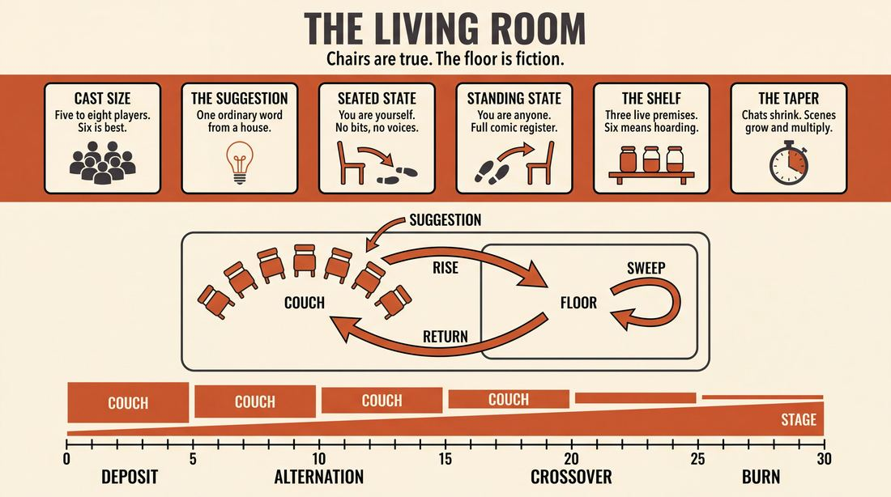
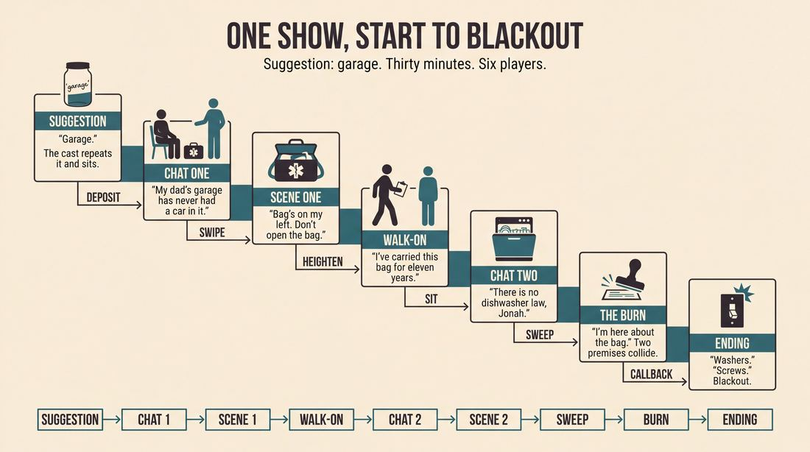
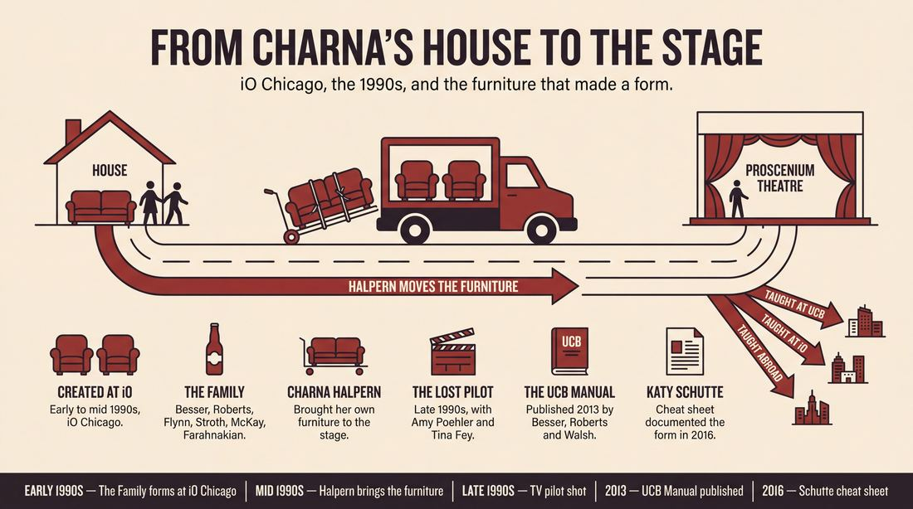
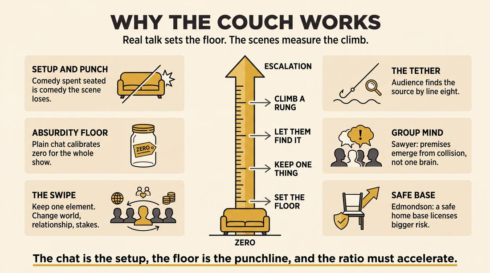
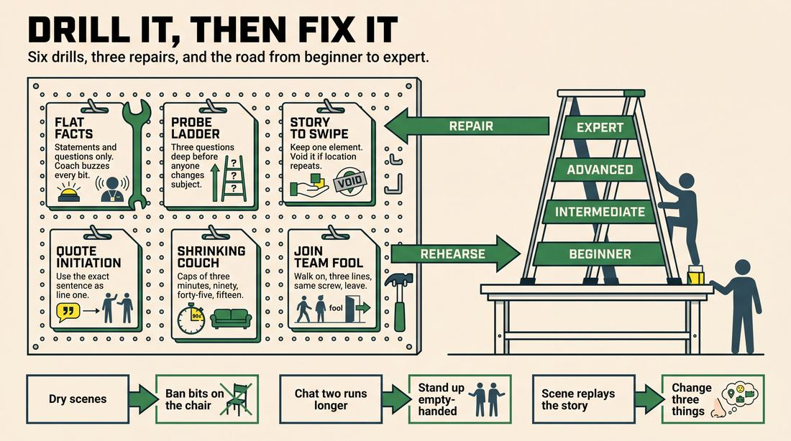

# The living room

> **A complete study of the long-form improv format _The living room_** - the original archived write-up, five infographics, grounded historical and pedagogical research, and a full mechanics-and-coaching manual.

| | |
|---|---|
| **Format** | The living room |
| **Primary source** | [IRC Improv Wiki](https://wiki.improvresourcecenter.com/index.php?title=The_living_room) |

---

## Contents

1. [Part I - The Original Write-Up](#part-i-the-original-write-up)
2. [Part II - The Infographics](#part-ii-the-infographics)
   - [1. Structure and Mechanics](#infographic-1-mechanics)
   - [2. A Show, Beat by Beat](#infographic-2-example)
   - [3. Origins and Lineage](#infographic-3-history)
   - [4. Why It Works](#infographic-4-theory)
   - [5. Rehearsal and Repair](#infographic-5-coaching)
3. [Part III - Research Dossier](#part-iii-research-dossier)
   - [Pass 1: History, Lineage, Literature and Scholarship](#research-history)
   - [Pass 2: Comparative Anatomy, Pedagogy and Production](#research-comparative)
4. [Part IV - Mechanics, Gameplay and Coaching Manual](#part-iv-mechanics-gameplay-and-coaching-manual)
   - [Pass 1: The Form, Its Mechanics and Its Gameplay](#manual-mechanics)
   - [Pass 2: Training, Coaching and Performance Companion](#manual-coaching)

---

## Part I - The Original Write-Up

*Verbatim archive of the source article, reproduced exactly as scraped. Everything after this section is generated elaboration built on top of it.*

### The living room

The Living Room is a form revolving around performers sitting in chairs (in a horseshoe) having a discussion. The discussions are based on the audience suggestion. Eventually someone breaks into the center of the horseshoe and initiates a scene. Anywhere from just one to many scenes could evolve. When a topic is played out, someone that is still in the chairs initiates the conversation again by verbally taking the focus. Organically a new strain of a topic emerges and then more scenes. This goes back and forth between conversation and scene work. One important thing to note is that conversations get less frequent and scenes get more frequent.

##### Show

The Living Room was created at IO

---

*Archived from [https://wiki.improvresourcecenter.com/index.php?title=The_living_room](https://wiki.improvresourcecenter.com/index.php?title=The_living_room) (IRC Improv Wiki) on 2026-08-09 23:23 UTC.*

---

## Part II - The Infographics

*Five 16:9 posters, each teaching a different aspect of the format. Click any poster to enlarge.*

<a id="infographic-1-mechanics"></a>

### 1. Structure and Mechanics

*How the form is played: the shape of the piece, the opening, the roles, the edit vocabulary, the flow of information, and the clock.*

{ .diagram loading=lazy decoding=async width="1100" height="614" }


<a id="infographic-2-example"></a>

### 2. A Show, Beat by Beat

*A single worked performance from suggestion to blackout: what happens in each beat, with short real example lines and what the players are doing technically.*

{ .diagram loading=lazy decoding=async width="1100" height="614" }


<a id="infographic-3-history"></a>

### 3. Origins and Lineage

*Where the form came from: creators, dates, theatres, how it spread between schools and cities, and the key figures - a documented timeline and lineage map.*

{ .diagram loading=lazy decoding=async width="1100" height="614" }


<a id="infographic-4-theory"></a>

### 4. Why It Works

*The theory: the core principles of the form and the research and craft ideas that explain why the structure produces good improv, each tied to a specific mechanic.*

{ .diagram loading=lazy decoding=async width="1100" height="614" }


<a id="infographic-5-coaching"></a>

### 5. Rehearsal and Repair

*Training and fixing the form: the essential drills, the common failure modes with their symptom-and-fix pairs, and the markers of beginner through expert play.*

{ .diagram loading=lazy decoding=async width="1100" height="614" }


---

## Part III - Research Dossier

*Two research passes: the historical record, then the comparative and pedagogical record. Claims carry evidence tags - treat unverified items accordingly.*

<a id="research-history"></a>

### » Pass 1: History, Lineage, Literature and Scholarship

### Research Summary
*   **Documentation Level:** Highly documented in practitioner blogs, theater syllabi, and forum archives, though largely absent from peer-reviewed academic literature.
*   **Origin:** Created in the early-to-mid 1990s at iO (ImprovOlympic) in Chicago by the legendary house team "The Family" (Matt Besser, Ian Roberts, Neil Flynn, Miles Stroth, Adam McKay, Ali Farahnakian).
*   **Core Mechanic:** The cast sits in a horseshoe or on a couch, engaging in a truthful, unscripted conversation based on an audience suggestion. Performers step out of the conversation to initiate premise-based scenes inspired by the chat, then return to the couch.
*   **Pacing Rule:** As the show progresses, the conversational segments must get shorter and less frequent, while the scene work gets longer and more frequent.
*   **Historical Significance:** The format was adapted into an un-aired television pilot produced by Charna Halpern, featuring early-career performances by Amy Poehler and Tina Fey.
*   **Pedagogical Value:** It is widely taught as an advanced form (at UCB, iO, and internationally) because it trains improvisers to pull comedic premises from grounded, real-world dialogue rather than inventing them in a void.

### Provenance and History
The Living Room was developed in the early-to-mid 1990s at iO Chicago by the house team "The Family." At the time, The Family was known for their blistering speed and aggressive tag-outs ("As Jazz Freddy was slow, The Family was fast") [DOCUMENTED]. The Living Room provided a necessary counterweight: a grounded, relaxed baseline that allowed them to generate premises organically from real conversation before launching into their signature high-speed scene work.

The format's name and staging are entirely literal. According to iO co-founder Charna Halpern, members of The Family would frequently hang out and chat in her actual living room. Because they were improvisers, they would spontaneously jump up and initiate scenes based on their conversations. Halpern loved the dynamic so much that she transported her own living room furniture to the iO stage and asked the team to perform exactly as they did in her home, complete with drinking beer on stage [DOCUMENTED]. 

| Year | Event | Place / Company | Source |
|---|---|---|---|
| Early 1990s | "The Family" forms and begins experimenting with long-form structures. | iO Chicago | IRC Improv Wiki |
| Mid 1990s | Charna Halpern brings her furniture to the theater; the form is codified. | iO Chicago | Katy Schutte Blog |
| Late 1990s | A TV pilot for "The Living Room" is shot featuring Amy Poehler and Tina Fey. | Chicago / Hollywood | CNN Transcripts (2014) |
| 2013 | *The Upright Citizens Brigade Comedy Improvisation Manual* is published, citing the form. | UCB | UCB Comedy Improvisation Manual |

### Lineage and Transmission
The form moved from Chicago to New York and Los Angeles as members of The Family founded the Upright Citizens Brigade (UCB) and The Miles Stroth Workshop (now The Pack Theater). It is currently taught as an advanced long-form class at UCB, iO, Montreal Improv, and Hoopla Impro in London [DOCUMENTED]. 

Because the format relies heavily on the "Game of the Scene" (pulling a specific comedic premise from a grounded base reality), it became a foundational pedagogical tool for UCB-trained improvisers. 

**Regional Dialects:**
*   **The Dinner Party:** Played by groups like the Barcelona Improv Group, this variant changes the staging from a couch to a dinner table, though the mechanics of alternating between truthful conversation and premise-based scenes remain identical [DOCUMENTED].
*   **The Improv Lounge:** Played by the Wellington Improvisation Troupe (WIT) in New Zealand, this dialect directly traces its lineage to Halpern's iO format but is adapted for their local community theatre style [DOCUMENTED].

### Key Figures
| Person | Role in this form | Specific contribution | Source URL |
|---|---|---|---|
| Charna Halpern | iO Co-founder | Recognized the format's potential during off-stage hangouts, brought her own furniture to the stage to formalize it, and produced the TV pilot. | http://www.katyschutte.co.uk/blog/the-living-room |
| The Family | iO House Team | Created and debuted the format, establishing the rhythm of alternating casual chat with fast-paced scenes. | https://wiki.improvresourcecenter.com/index.php?title=The_living_room |
| Matt Besser | Performer / Teacher | Co-authored the UCB Manual which canonized the form; developed the "Premise Keepers" variant. | https://www.reddit.com/r/improv/comments/2c1z9b/favorite_long_form_formats/ |
| Katy Schutte | Teacher / Performer | Documented the form's mechanics and rules in a widely shared cheat sheet for Hoopla Impro. | http://www.katyschutte.co.uk/blog/the-living-room |
| Amy Poehler & Tina Fey | Performers | Starred in the un-aired television pilot of "The Living Room", proving the format's commercial viability. | http://transcripts.cnn.com/TRANSCRIPTS/1401/19/se.01.html |

### Canonical Shows, Companies and Recordings
*   **The Family at iO Chicago (1990s):** The original run that defined the format.
*   **"The Living Room" TV Pilot:** An un-aired pilot shot in the late 90s featuring Amy Poehler, Tina Fey, and Neil Flynn. Clips occasionally surface on iO Theater's social media archives, serving as an early time capsule of the UCB founders' raw speed.
*   **UCB Training Center:** Regularly hosts "The Living Room" as an advanced class performance in New York and Los Angeles, which are frequently livestreamed.
*   **Switch Committee:** An iO Chicago team (David Schwartzbaum, Ryan Nallen, Alan Linic, Dave Karasik, Collin Dahlgren) that performed a venerated open run of the form in 2013.
*   **Butterr Improv:** A contemporary troupe in Baton Rouge, LA, that uses the format as their signature show.

### Published Literature
| Work | Author | Year | What it says about this form | Where to find it |
|---|---|---|---|---|
| *The Upright Citizens Brigade Comedy Improvisation Manual* | Matt Besser, Ian Roberts, Matt Walsh | 2013 | Mentions The Living Room as a key format inspired by the Harold, focusing on premise generation. | UCB Store |
| *Long Format: The Living Room* | Cameron and Sally | 2013 | Details the "dinner party" deconstruction mechanics and the inverse relationship between chat time and scene time. | https://peopleandchairs.com/2013/09/10/long-format-the-living-room/ |
| *The Living Room (Cheat Sheet)* | Katy Schutte | 2016 | Provides a structural breakdown, history from Charna Halpern, and rules for not "using up the funny" on the couch. | http://www.katyschutte.co.uk/blog/the-living-room |
| *IRC Improv Wiki: The living room* | IRC Contributors | 2024 | The foundational stub defining the horseshoe staging and the back-and-forth scene initiation. | https://wiki.improvresourcecenter.com/index.php?title=The_living_room |

### Verbatim Quotes
> "The Living Room is a form revolving around performers sitting in chairs (in a horseshoe) having a discussion. The discussions are based on the audience suggestion. Eventually someone breaks into the center of the horseshoe and initiates a scene."
> — IRC Improv Wiki
> https://wiki.improvresourcecenter.com/index.php?title=The_living_room

> "Charna tells me that the form comes from long form group The Family. They would chat in Charna's living room and because they are improvisers, they would jump up and do scenes during their conversations. Charna loved watching them, so she took her living room furniture to IO and asked The Family to improvise on stage exactly like they did in her home, beer-drinking included."
> — Katy Schutte
> http://www.katyschutte.co.uk/blog/the-living-room

> "One important thing to note is that conversations get less frequent and scenes get more frequent."
> — IRC Improv Wiki
> https://wiki.improvresourcecenter.com/index.php?title=The_living_room

> "None of the chat part of the show has to be funny. The scenes generate the comedy. In fact, if you use up the funny on the sofa, it's sometimes harder to get ideas to bring into scenes."
> — Katy Schutte
> http://www.katyschutte.co.uk/blog/the-living-room

> "The more the conversation is REAL...I mean you are REALLY a bunch of friends talking and genuinely engaging each other (not just pretending to give a crap about the stories) the more the audience will be won over. And the better your material for the scenes will be."
> — IRC Forum User "Hawkins"
> https://www.improvresourcecenter.com/threads/the-living-room.10705/

> "Use your scenes to HEIGHTEN the conversation topics, not just mearly replay the story you just told in scene format."
> — IRC Forum User "Hawkins"
> https://www.improvresourcecenter.com/threads/the-living-room.10705/

> "I had created a show calls 'The Living Room,' which I shot a pilot for with them."
> — Charna Halpern (referring to Tina Fey and Amy Poehler)
> http://transcripts.cnn.com/TRANSCRIPTS/1401/19/se.01.html

> "Essentially, it's an Armando but with the entire group acting as the monologist."
> — Reddit User "HapDrastic"
> https://www.reddit.com/r/improv/comments/2c1z9b/favorite_long_form_formats/

### Anecdotes and Stories
**The Furniture Move**
The format literally got its name and staging because Charna Halpern was so charmed by The Family hanging out in her living room. She transported her own personal living room furniture to the iO stage to recreate the vibe. To maintain the casual, low-stakes atmosphere of the original hangouts, performers were encouraged to actually drink beer and eat snacks on stage during the conversation segments [DOCUMENTED].

**The Lost Pilot**
In the late 1990s, Charna Halpern produced a television pilot based on the format. It featured a powerhouse cast including Amy Poehler, Tina Fey, and Neil Flynn. While it never aired as a series, clips of Poehler and Flynn doing scenes based on couch conversations still circulate in iO's archives. In one surviving clip, Poehler and Flynn aggressively heighten a bit about a man named "Cash" demanding a $20 "booty touch," demonstrating how the UCB founders used the relaxed chat to launch into absurd, high-stakes premises [DOCUMENTED].

### Academic and Scientific Research
*   **Collaborative Emergence and Group Mind (Sawyer, 2003):** Research on how unscripted groups generate collective flow states.
    *Relevance to this form:* The conversational "couch" segments act as a real-time, visible mechanism for establishing a shared mental model. By sharing true stories, the ensemble synchronizes their associative networks before the high-stakes scene work begins.
*   **Spontaneous Autobiographical Memory Retrieval (Berntsen, 1996):** Cognitive science shows that memories are often triggered involuntarily by environmental cues and social conversation.
    *Relevance to this form:* The format relies on this exact cognitive mechanism. The audience suggestion triggers an initial memory, which is shared on the couch, which in turn triggers associative memories in the other performers, providing a rich, grounded database of premises for the subsequent scenes.
*   **Psychological Safety in Teams (Edmondson, 1999):** Studies show that teams perform better creatively when they feel safe to take interpersonal risks.
    *Relevance to this form:* The literal staging of sitting on a couch, drinking a beverage, and speaking as oneself lowers the affective filter. It creates a psychologically safe "home base" that performers can retreat to when scenes fail, reducing the anxiety of continuous invention.

### Documented Variants and Descendants
*   **Premise Keepers:** Developed by Matt Besser. The team uses the living room opening strictly to hunt for a premise. The moment a funny idea is found, they immediately cut to a scene. This is done for the first three scenes of a beat, after which the living room is abandoned entirely for a sweep edit and organic group games [DOCUMENTED].
*   **The Dinner Party:** A staging variant where the couch is replaced by a dinner table. The mechanics of alternating between truthful conversation and premise-based scenes remain the same [DOCUMENTED].
*   **The Armando (Group Variant):** While the Armando relies on a single monologist, The Living Room is widely considered by practitioners to be a structural descendant where the *entire ensemble* acts as a collective monologist [WIDELY PRACTICED, UNDOCUMENTED].

### Criticism, Debate and Known Failure Modes
*   **Using up the funny:** A major trap is performers trying to be comedians during the conversation phase. Teachers warn that if the chat becomes a bit or a bit-heavy riff session, it robs the subsequent scenes of their comedic potential. The chat must remain grounded and truthful [DOCUMENTED].
*   **Replaying instead of heightening:** Novice teams often make the mistake of simply acting out the story that was just told on the couch. Practitioners argue that the scene must *heighten* the premise or explore a specific point of view from the story, not just reenact it [DOCUMENTED].
*   **Pacing failures:** The structural rule of the form is that conversations must get shorter and scenes must get longer/faster as the show progresses. If a team returns to a long, meandering couch chat in the 40th minute of a show, the energy dies [DOCUMENTED].
*   **Energy drain:** Some performers complain that sitting down repeatedly drains their physical energy, making it difficult to launch into high-energy scenes [DOCUMENTED].

### Cultural Footprint
*   **Notable Alumni:** The format was the crucible for some of the most influential comedic voices of the 21st century, including Matt Besser, Ian Roberts, Adam McKay, Neil Flynn, Amy Poehler, and Tina Fey.
*   **Influence on UCB Pedagogy:** The Living Room's emphasis on finding a specific premise from a grounded conversation directly influenced the UCB's "Game of the Scene" pedagogy, particularly how they teach premise-pulling [INFERRED].
*   **Television:** The format's DNA—cutting between casual, real-world conversation and heightened, absurd cutaway scenes—can be seen in the structure of sketch shows like *Human Giant* and the podcast-to-animation pipeline of *The Ricky Gervais Show* [INFERRED].

### Gaps in the Record
*   **The Pilot's Fate:** While it is documented that a TV pilot was shot, the exact year of production, the network it was pitched to, and why it wasn't picked up remain unverified in the searchable public record.
*   **First Performance Date:** The exact date The Family first performed The Living Room on stage at iO is undocumented; it is broadly attributed to the early-to-mid 1990s.
*   **Del Close's Direct Involvement:** While Del Close directed The Family in shows like *Three Mad Rituals*, it is unclear if he had any hand in shaping The Living Room, or if it was entirely Charna Halpern's initiative. Given Halpern's claim to the furniture and the staging, it seems to be primarily her and the team's creation, but Close's influence on the team's scene work is undeniable.

### Source List
1. IRC Improv Wiki - IRC Contributors - 2024 - https://wiki.improvresourcecenter.com/index.php?title=The_living_room - Supports the foundational definition and staging of the form.
2. Katy Schutte Blog - Katy Schutte - 2016 - http://www.katyschutte.co.uk/blog/the-living-room - Supports the history of Charna Halpern's furniture, the rules of the form, and the warning against "using up the funny."
3. CNN Transcripts - CNN - 2014 - http://transcripts.cnn.com/TRANSCRIPTS/1401/19/se.01.html - Supports Charna Halpern's quote about creating the TV pilot with Amy Poehler and Tina Fey.
4. People and Chairs - Cameron and Sally - 2013 - https://peopleandchairs.com/2013/09/10/long-format-the-living-room/ - Supports the "dinner party" deconstruction mechanics and pacing rules.
5. Reddit (r/improv) - HapDrastic - 2014 - https://www.reddit.com/r/improv/comments/2c1z9b/favorite_long_form_formats/ - Supports the comparison to the Armando and the "Premise Keepers" variant by Matt Besser.
6. IRC Forums - Hawkins - 2002 - https://www.improvresourcecenter.com/threads/the-living-room.10705/ - Supports the failure modes of replaying scenes instead of heightening, and the use of real beer/snacks.
7. Impropedia (UCB Manual Excerpts) - Matt Besser, Ian Roberts, Matt Walsh - 2013 - https://impropedia.ru/ - Supports the lineage of the form within the UCB pedagogy.
8. Eventfinda (WIT Improv Lounge) - Wellington Improvisation Troupe - 2026 - https://www.eventfinda.co.nz/2026/the-improv-lounge/wellington - Supports the international transmission of the form to New Zealand.

<a id="research-comparative"></a>

### » Pass 2: Comparative Anatomy, Pedagogy and Production

### Taxonomic Placement

```text
                       [Premise-Based Long-Form]
                                  |
          +-----------------------+-----------------------+
          |                       |                       |
   [The Armando]          [The Living Room]       [The Deconstruction]
(Single Monologist)    (Group Chat as Source)    (Thematic Spin-offs)
          |                       |                       |
     [Asssscat]                   |                   [The Movie]
(Guest Monologist)                |
                                  +-----------------------+
                                  |                       |
                      [Living Room Opening]      [Chaptered Living Room]
                      (Used only for 3 mins)     (Segmented for large casts)
```

The Living Room sits in the "source-material-driven" branch of the long-form family tree, running parallel to The Armando. While The Harold generates its thematic material through an abstract opening and explores it via a rigid, predetermined structure, The Living Room uses a grounded, continuous "base reality" (the performers playing themselves, hanging out) to generate comedic premises on the fly. It is a direct descendant of early iO Chicago experimentation by the team "The Family," designed by Charna Halpern and Del Close to capture the natural, rapid-fire backstage banter of improvisers and put it directly on stage.

### Head-to-Head Comparisons

#### The Living Room vs. The Armando (Monologue Deconstruction)
| Axis | The Living Room | The Armando | Consequence for the players |
| :--- | :--- | :--- | :--- |
| **Opening** | Group conversation based on a suggestion. | Single monologist tells a story based on a suggestion. | Living Room requires active ensemble listening and conversational give-and-take; Armando requires passive listening until the monologue ends. |
| **Structure** | Alternates between the couch (chat) and the stage (scenes). | Alternates between the monologist (downstage) and scenes. | Living Room players must constantly shift gears between "playing themselves" and "playing characters." |
| **Edit logic** | Anyone can step out of the chat to initiate a scene; anyone can edit a scene by returning to the couch. | Scenes are edited by sweeps; monologist steps forward to edit a run of scenes. | Living Room edits are often softer and driven by the exhaustion of a premise, returning to the safety of the couch. |
| **Memory** | Source material is distributed across the whole cast's anecdotes. | Source material is centralized in one person's story. | Living Room players must remember passing comments from multiple people, requiring wider attention. |
| **Cast size** | 5 to 8 (too many crowds the conversation). | 8 to 12+ (only 2-3 are in a scene at a time). | Living Room demands higher individual participation in the source-generation phase. |
| **Audience contract** | "We are friends hanging out, and you are eavesdropping." | "We are presenting a storytelling show with comedic sketches." | Living Room feels more intimate and vulnerable; the audience judges the chemistry of the cast as much as the comedy. |
| **Failure mode** | The chat becomes too quiet, inside-jokey, or low-energy. | The monologist rambles or the improvisers do 1:1 reenactments. | Living Room casts must artificially project "casualness" without actually dropping their stage presence. |

#### The Living Room vs. The Deconstruction
| Axis | The Living Room | The Deconstruction | Consequence for the players |
| :--- | :--- | :--- | :--- |
| **Opening** | Casual, truthful conversation as themselves. | A single, grounded, real-time two-person scene (the "Base Scene"). | Living Room generates multiple disparate premises; Deconstruction generates one dense thematic core. |
| **Structure** | Chat -> Scene -> Chat -> Scene (accelerating). | Base Scene -> Thematic Tangents -> Return to Base Scene. | Living Room scenes rarely interact with each other; Deconstruction scenes explicitly comment on the Base Scene. |
| **Edit logic** | Stepping into the center / returning to the couch. | Sweeps, tag-outs, and strict structural transitions. | Living Room feels organic and messy; Deconstruction feels highly architectural and directed. |
| **Memory** | Pulling premises from the most recent chat. | Tracking the emotional subtext of the original Base Scene. | Living Room requires short-term premise retention; Deconstruction requires long-term emotional tracking. |
| **Cast size** | 5 to 8. | 6 to 8. | Both require tight ensembles, but Living Room relies on personal chemistry, while Deconstruction relies on theatrical discipline. |
| **Audience contract** | "Watch us turn our real lives into comedy." | "Watch us dissect a single relationship from every angle." | Living Room is inherently lighter and more anecdotal. |
| **Failure mode** | Using up all the jokes on the couch. | The Base Scene lacks enough emotional weight to support the tangents. | Living Room players must resist the urge to do bits during the chat phase. |

#### The Living Room vs. Montage
| Axis | The Living Room | Montage | Consequence for the players |
| :--- | :--- | :--- | :--- |
| **Opening** | 3-5 minutes of personal storytelling. | Brief invocation, pattern game, or straight into scenes. | Living Room provides a massive reservoir of specific, grounded details to pull from. |
| **Structure** | Punctuated by returns to the base reality (the couch). | Continuous, rapid-fire scenes with no base reality. | Living Room has a built-in "reset button" if scenes start to flounder. |
| **Edit logic** | Returning to the conversation. | Hard sweeps, tag-outs, space-work edits. | Living Room pacing is dictated by the conversation; Montage pacing is dictated by the energy of the edits. |
| **Memory** | Scenes are tethered to the chat. | Scenes are largely untethered, though callbacks occur. | Living Room players must actively justify their initiations based on the source material. |
| **Cast size** | 5 to 8. | 4 to 12. | Living Room requires a specific physical set-up that limits cast size. |
| **Audience contract** | "We will show you the math of how we get our ideas." | "We will hit you with a barrage of unrelated comedy." | Living Room audiences enjoy the "Aha!" moment of recognizing where a premise came from. |
| **Failure mode** | The ratio fails to shift (too much chatting, not enough scenes). | Scenes bleed together into a chaotic, unanchored mess. | Living Room players must actively monitor the clock to ensure scenes take over the show. |

#### The Living Room vs. The Documentary
| Axis | The Living Room | The Documentary | Consequence for the players |
| :--- | :--- | :--- | :--- |
| **Opening** | Performers as themselves, chatting. | Performers as characters, giving talking-head interviews. | Living Room requires actual vulnerability; Documentary requires immediate character generation. |
| **Structure** | Chat -> Scene -> Chat -> Scene. | Interview -> B-Roll/Scene -> Interview -> B-Roll/Scene. | Both use a "hub and spoke" model, but Living Room's hub is non-fictional. |
| **Edit logic** | Stepping out of the horseshoe. | Cutting back to the interviewer/camera. | Living Room edits are driven by the improvisers; Documentary edits are often driven by a designated "Director" or interviewer. |
| **Memory** | Tracking real anecdotes. | Tracking fictional lore and character histories. | Living Room is grounded in reality; Documentary can escalate into absurdity much faster. |
| **Cast size** | 5 to 8. | 4 to 8. | Similar cast sizes, but Documentary requires stronger distinct character voices. |
| **Audience contract** | "We are sharing our real lives." | "We are satirizing a specific non-fiction medium." | Living Room relies on charm and authenticity; Documentary relies on genre emulation. |
| **Failure mode** | 1:1 reenactment of the stories. | The interviews become more interesting than the scenes. | Living Room players must abstract the premise rather than just playing themselves in the scene. |

### What Makes It Uniquely Itself

1. **The Shifting Ratio**: The defining structural mechanic of The Living Room is acceleration. As noted in the IRC Improv Wiki, "conversations get less frequent and scenes get more frequent." A 45-minute set might start with 5 minutes of chatting and a 2-minute scene, but by minute 35, it is 10 seconds of chatting followed by rapid-fire 3-minute scenes. If the ratio remains static, it is not a Living Room; it is just an Armando with a seated cast.
2. **The Dual Reality Anchor**: The performers exist in two distinct states: as themselves on the couch (the base reality) and as characters in the center of the stage. The couch acts as a continuous, safe "spine" that the cast can retreat to whenever a scene exhausts its premise. 
3. **Premise-Pulling over Reenactment**: The form dies if improvisers simply act out the story that was just told. The Living Room requires players to extract a specific *Game*, *Emotion*, *Point of View*, or *Quote* from the truthful conversation and transpose it into a completely new, fictional context.

### Structural Variants in Practice

| Variant Name | What It Changes | Who Plays It / Source |
| :--- | :--- | :--- |
| **The Classic iO (The Family)** | Uses actual living room furniture (sofas, armchairs) and performers often drink real beer on stage. The flow is highly organic, with scenes erupting mid-sentence and melting back into conversation. | Charna Halpern / iO Chicago / Katy Schutte |
| **The Living Room Opening** | The form is truncated. The cast chats for 3-4 minutes to generate a pool of premises, then abandons the couch entirely to perform a standard Montage or Harold. | Reflex Improv |
| **The Chaptered Living Room** | The show is broken into 2-3 distinct "chapters." The cast is split, and the "guests" on the couch are swapped out between chapters to accommodate larger class sizes without crowding the conversation. | Hoopla Impro / Katy Schutte |
| **The Spine / Anchor** | The conversation is not strictly alternated 1:1 with scenes. Instead, the chat is treated as a "spine" that the cast only returns to "as needed" when the current run of scenes runs out of steam. | Christopher Griswold-Jenkins (Facebook Improv Discussion) |
| **Premise-Based Hangout** | Heavily emphasizes "Game of the Scene" mechanics. The chat is explicitly mined for unusual behaviors or statements, which are then immediately framed and heightened in the ensuing scene. | Montreal Improv / Dale Bernier |

### The Teaching Ladder

| Stage | Skill introduced | Why in this order | Typical exercise | Source or [CRAFT CONSENSUS] |
| :--- | :--- | :--- | :--- | :--- |
| **1. Truthful Vulnerability** | Speaking as oneself without trying to be funny or invent bits. | If the chat is full of jokes, there is no comedic contrast for the scenes, and the source material becomes too absurd to ground. | *Tell Me Why You Do This* (explaining real weird behaviors truthfully). | Improv Nonsense (Kevin Hines) / Katy Schutte |
| **2. Premise Pulling** | Identifying the "unusual thing," strong emotion, or specific POV in a casual anecdote. | Players must learn to listen as writers, extracting the structural engine of a story rather than its surface details. | *Story to Premise Swipe* (listening to a monologue and initiating an analogous scene). | Reddit (r/improv) / [CRAFT CONSENSUS] |
| **3. Premise Initiation** | Stepping out of the horseshoe and delivering a clear, actionable first line based on the pulled premise. | The transition from couch to stage must be decisive to signal to the audience that a scene has begun. | *Quote Initiation* (starting a scene using a direct quote from the chat). | Katy Schutte |
| **4. The Edit / Return** | Recognizing when a scene has hit its comedic peak and physically returning to the couch to edit. | Without strong edits, scenes drag on and the shifting ratio of the form is destroyed. | *The Shrinking Couch* (running the form with a timer where chat segments must halve in time). | [CRAFT CONSENSUS] |
| **5. Heightening via Walk-ons** | Supporting the established premise of a scene from the sidelines without derailing it. | Because the cast is seated right next to the action, walk-ons are highly visible and must be precise. | *Join Team Fool* (entering a scene specifically to heighten the unusual thing). | Improv Nonsense (Kevin Hines) |
| **[WITHHELD]** | *Thematic weaving / Callbacks across scenes.* | Beginners will try to connect Scene A to Scene B, ignoring the couch. They must first master the 1:1 correlation between the chat and the immediate scene. | N/A | [CRAFT CONSENSUS] |

### Documented Drills and Exercises

| Drill | Origin / Teacher | How to run it | What it fixes in this form | Source |
| :--- | :--- | :--- | :--- | :--- |
| **Story to Premise Swipe** | Reddit (r/improv) | One improviser tells a true anecdote. Another listens for the "game" (the unusual thing), then initiates a scene with that same game but in a completely different scenario. | Prevents 1:1 reenactments of the stories told on the couch. | Reddit (Nov 19, 2022) |
| **Quote Initiation** | Katy Schutte | Players chat. When someone hears a line they like, they step out and use that exact quote as the first line of a scene, treating it as super important. | Trains decisive initiations and active listening during the chat phase. | Katy Schutte Cheat Sheet |
| **Emotion / POV Initiation** | Katy Schutte | Players identify the overwhelming emotion or Point of View of a story told on the couch, then initiate a scene putting that emotion into the best/worst possible scenario. | Helps players abstract the premise rather than copying the plot of the anecdote. | Katy Schutte Cheat Sheet |
| **Questioning the Chat** | Katy Schutte | If a player states an incorrect fact or something unrelatable during the chat, another player steps out and initiates a scene in a world where that incorrect fact is the norm. | Turns mistakes or weird opinions on the couch into immediate comedic games. | Katy Schutte Cheat Sheet |
| **Tell Me Why You Do This** | Kevin Hines | Two players. One asks the other to explain a weird behavior (e.g., "Why do you eat your lunch so fast?"). The other must justify it truthfully. | Trains players to explore and justify unusual behaviors, mimicking the probing questions asked on the couch. | Improv Nonsense Substack |
| **Join Team Fool** | Kevin Hines | Two players establish a clear "where" and find an unusual thing. The rest of the cast practices walking on *only* to heighten that specific unusual thing, then leaving. | Fixes messy walk-ons; trains the seated cast to support the scene's game without hijacking it. | Improv Nonsense Substack |
| **Wham! Line** | Reddit (r/improv) | Two players in a scene. After a banal line, the teacher yells "Wham line!" The other player must react as if what was just said is life-or-death. | Fixes low-stakes scenes; trains players to artificially inject importance into casual couch dialogue. | Reddit (Nov 19, 2022) |
| **Energy Level Scenes** | Reddit (r/improv) | Teacher calls out numbers 1-10 for players, representing their energy level. Players must instantly adjust and justify that energy. | Breaks players out of the low-energy, casual "couch voice" when transitioning into a scene. | Reddit (Nov 19, 2022) |
| **Silent Object Work Match** | Reflex Improv | One player steps out silently, doing object work with a strong emotion. A second player joins, matching or complementing the activity and emotion silently for 10 seconds. | Fixes "talking head" scenes; forces physical initiations to contrast the heavy dialogue of the couch. | Reflex Improv Syllabus |
| **The Shrinking Couch** | [CRAFT CONSENSUS] | The form is run with a coach holding a stopwatch. The first chat is capped at 3 minutes, the next at 90 seconds, the next at 45 seconds, forcing rapid premise generation. | Fixes the failure mode where the cast never leaves the living room and the ratio fails to shift. | [CRAFT CONSENSUS] |

### Common Failure Modes and Diagnoses

| Failure mode | What it looks like from the audience | Root cause | Fix | Who names it |
| :--- | :--- | :--- | :--- | :--- |
| **Tanking the Energy** | The chat portion is too quiet, intimate, or filled with inside jokes. The audience feels excluded, as if watching a private rehearsal. | Improvisers forget that the "casual hangout" is still a theatrical performance requiring projection and stage presence. | Remind players to "cheat out" physically while seated and project their voices. The intimacy must be simulated, not literal. | Stacey Hallal (Facebook Improv Discussion) |
| **Using Up the Funny** | The scenes are dry and struggle to find a game, because the cast spent the entire chat portion doing bits, doing voices, and trying to be hilarious. | Players are uncomfortable with earnest vulnerability and use jokes as a defense mechanism on the couch. | Enforce a strict "play it straight" rule for the couch. The chat is the setup; the scene is the punchline. | Katy Schutte |
| **1:1 Reenactment** | A player tells a story about a bad date at a sushi restaurant. The ensuing scene is two people on a bad date at a sushi restaurant. | Lack of premise-pulling skills. Players are listening to the *plot* of the story rather than the *game* or *behavior*. | Drill "Swipe" scenes. Force players to transpose the core behavior into a completely different location and relationship. | Cameron and Sally (People and Chairs) |
| **The Endless Hangout** | The cast chats for 8 minutes, does a 1-minute scene, then chats for another 8 minutes. The show feels like a podcast rather than an improv set. | Players feel safer on the couch than on the stage, leading to hesitation in initiating scenes. | Implement "The Shrinking Couch" drill. Set a hard rule: once a premise is spoken, the next person to speak *must* be initiating a scene. | [CRAFT CONSENSUS] |

### Production and Logistics

**Cast Size and Why:** The ideal cast size is 5 to 8 performers. Fewer than 5, and the conversation stalls out quickly because there isn't enough diverse life experience to draw from. More than 8, and the horseshoe becomes physically crowded, leading to players being excluded from the chat or scenes. If a cast is larger, producers often use the "Chaptered" variant, rotating the seated cast.

**Runtime:** Typically 15 to 60 minutes. A 15-minute set will only feature 2-3 returns to the couch, while a 60-minute set requires masterful pacing, evolving stories, and the return of characters from earlier scenes to sustain momentum.

**Stage Layout, Chairs, and Set:** The classic layout features a sofa or a horseshoe of chairs on one side of the stage (or upstage center), leaving a wide, open playing space downstage for the scenes. In the original iO Chicago version, Charna Halpern brought actual living room furniture onto the stage. Today, standard theater chairs arranged in a semi-circle are the norm.

**Lighting and Tech Cues:** Lighting should ideally support the dual reality. A warm, slightly dimmer wash can be used for the "Living Room" chat, snapping to a brighter, standard stage wash when a player steps out to initiate a scene. If dynamic lighting isn't available, a static, bright wash is used.

**Music and Sound:** Pre-show music should be casual, upbeat, and conversational (e.g., lo-fi hip hop, indie folk) to set a "hangout" vibe before the cast even speaks. 

**MC and Host Duties:** A designated host from the cast steps forward, introduces the troupe, and asks the audience for a single word or topic. Once obtained, the cast often repeats the word together, sits down, and the 3-4 minute initial conversation begins based on that word.

**Show Lineup Placement:** Because of its grounded, conversational opening, The Living Room works excellently as the opening act of a two-team bill, warming the audience up to the personalities of the performers before a more chaotic or abstract form (like a Montage or Harold) takes the second slot.

**Rehearsal Cadence and Producer Prep:** Rehearsals must balance scene-work with actual ensemble bonding. Because the form relies on true life stories, casts must spend time off-stage genuinely hanging out to build the psychological safety required to share vulnerable anecdotes on stage. Producers must ensure the stage is wide enough to accommodate both the seating arrangement and the playing space without players tripping over each other during rapid edits.

### Adaptations Beyond the Stage

**Classroom and Youth:** When taught to teens or in schools, strict boundaries must be placed on the "chat" portion. Instructors must pre-emptively ban topics involving trauma, illegal activities, or highly sensitive personal gossip to prevent oversharing. The prompt for the chat is often narrowed to benign topics (e.g., "Tell a story about a frustrating mundane task").

**Corporate and Applied Improv:** In corporate settings, The Living Room is used as a powerful tool for breaking down silos and hierarchical barriers. Having a VP and an entry-level employee share personal anecdotes on equal footing builds empathy. However, the facilitator must heavily moderate the chat to ensure psychological safety and prevent workplace grievances from airing under the guise of "improv."

**Online and Remote:** Taught extensively during the pandemic (e.g., by Queen City Comedy's Cale Evans), the online variant uses Zoom's "Gallery View" as the couch. When a scene is initiated, the two active players are "Spotlighted" or "Pinned," and the rest of the cast turns their cameras off to simulate stepping out of the living room.

**Accessibility and Inclusion:** The physical mechanic of "jumping up from the couch into the center" can exclude performers with mobility impairments. The form is easily adapted by using verbal edits (e.g., a player simply says "Scene:" followed by their initiation) or lighting cues to transition, allowing players to remain seated if necessary.

**Content-Safety, Consent, and Ethics:** Because The Living Room relies on "things that actually happened to them in real life" (Reflex Improv), consent is paramount. A player may share a story that is deeply personal. If another improviser immediately deconstructs that story into a grotesque comedy scene, it can cause real emotional harm. Casts must establish an "off-the-record" or veto mechanic—if a player touches their nose or uses a safe word after a story, it signals to the cast: *Do not pull a premise from this; let it just be a story.*

### Evidence Base for Those Adaptations

The applied use of The Living Room's conversational opening is heavily supported by **Social Penetration Theory** (Altman & Taylor, 1973), which posits that relationships develop deeper intimacy through reciprocal self-disclosure. By forcing an ensemble to share truthful, escalating personal anecdotes, the form rapidly accelerates group cohesion. Furthermore, research in *The Applied Improvisation Mindset* (Dudeck & McClure, 2021) demonstrates that sharing personal narratives in a structured, supportive environment (like the "couch" phase) builds the psychological safety necessary for high-stakes collaborative risk-taking (the "scene" phase).

### Scholarly Frames Worth Applying

**Front Stage and Back Stage Behavior (Erving Goffman)**
*The frame:* In *The Presentation of Self in Everyday Life* (1959), Goffman argues that individuals perform highly curated versions of themselves in "front stage" areas, while dropping the act and relaxing in "back stage" areas. 
*The mapping:* The Living Room explicitly theatricalizes this sociological concept. The couch simulates a "back stage" environment where performers present a relaxed, authentic self, which sharply contrasts with the highly performative, character-driven "front stage" of the improv scenes in the center.

**Collaborative Emergence (R. Keith Sawyer)**
*The frame:* In *Group Creativity* (2003), Sawyer defines collaborative emergence as a process where a group creates a complex output that cannot be attributed to any single individual's intention.
*The mapping:* Unlike an Armando where one person authors the source material, The Living Room's chat phase is a perfect model of collaborative emergence. A comedic premise is organically spawned through the collision of three or four different players' passing comments, making the "Game" a truly collective invention.

**Point of Concentration (Viola Spolin)**
*The frame:* In *Improvisation for the Theater* (1963), Spolin emphasizes giving players a specific "Point of Concentration" (POC) to focus their energy and prevent them from retreating into their intellect or inventing random conflict.
*The mapping:* The specific quote, emotion, or unusual behavior pulled from the living room chat serves as the strict POC for the ensuing scene. Players are not tasked with "inventing a funny scene"; they are tasked solely with heightening that specific pulled element.

### Where the Form Is Heading

**Current Practice:** In many modern training centers (like Reflex Improv), the full structure of The Living Room has been abandoned in favor of the "Living Room Opening." Troupes will use the conversational horseshoe for 3-4 minutes to generate a massive web of premises, but once the first scene begins, they never return to the couch, transitioning into a standard Montage or Harold.

**Revivals:** There is a strong nostalgic movement to preserve the original pacing of the form. iO Chicago's recent "Best of iO Improv" shows explicitly remount The Living Room alongside other legacy formats like Weirdass and Shotgun, treating it as a classic piece of theatrical repertoire rather than just a training exercise.

**Hybrids:** Contemporary companies are blending The Living Room with The Armando, creating formats where a guest monologist sits on the couch with the cast. Instead of delivering a standalone monologue, the guest engages in a guided, conversational interview with the improvisers, which then bleeds organically into scene work.

### Source List

1. *The living room* - IRC Improv Wiki - 2024 - https://wiki.improvresourcecenter.com/index.php?title=The_living_room - Supports the definition, the horseshoe layout, and the shifting ratio of conversation to scenes.
2. *The Living Room Format: Cheat Sheet* - Katy Schutte - 2016 - https://www.katyschutte.co.uk/improvblog/the-living-room-format-cheat-sheet - Supports the history (Charna Halpern, The Family), stage layout, chaptered variants, and specific initiation drills (Quote, Emotion, POV).
3. *Intro to Improv Syllabus* - Reflex Improv - 2024 - https://refleximprov.com/ - Supports the "Living Room Opening" variant, the MC/Host duties, and drills like Silent Object Work Match.
4. *Exercises for game of the scene* - Kevin Hines (Improv Nonsense) - 2025 - https://improvnonsense.substack.com/ - Supports the "Tell Me Why You Do This" and "Join Team Fool" drills.
5. *Improv Exercises* - Reddit (r/improv) - 2022 - https://www.reddit.com/r/improv/ - Supports drills like Story to Premise Swipe, Wham! Line, and Energy Level Scenes.
6. *What is the living room format in improv?* - Facebook Improv Discussion Group - 2024 - https://www.facebook.com/ - Supports Stacey Hallal's diagnosis of "Tanking the Energy" and the "Spine" structural variant.
7. *The Living Room Class Description* - Montreal Improv - 2024 - https://montrealimprov.com/ - Supports the pedagogical focus on group dynamics, premise-based improv, and the "hanging out" base reality.
8. *Advanced Improv Classes* - Happier Valley Comedy - 2024 - https://happiervalley.com/ - Supports the focus on ensemble building and truthful onstage conversation.
9. *Best of iO Improv* - iO Theater / Hot Tix - 2024 - https://hottix.org/ - Supports the modern revival of the form at iO Chicago.
10. *Long Format: The Living Room* - Cameron and Sally (People and Chairs) - 2013 - https://peopleandchairs.com/ - Supports the failure mode of 1:1 reenactment ("Improvisers shouldn't act out the stories").

---

## Part IV - Mechanics, Gameplay and Coaching Manual

*Synthesis over the original article and both research dossiers: first how the form works and how to play it, then how to train an ensemble to perform it.*

<a id="manual-mechanics"></a>

### » Pass 1: The Form, Its Mechanics and Its Gameplay

### At a Glance

| Field | Detail |
|---|---|
| **Also known as** | The Living Room; Living Room Format; "the couch form"; *The Dinner Party* (table staging, Barcelona Improv Group); *The Improv Lounge* (Wellington Improvisation Troupe); loosely, "a group Armando" |
| **Family** | Premise-based / source-material-driven long form. Sibling of The Armando; cousin of The Deconstruction. iO Chicago lineage (created early-to-mid 1990s by the house team The Family; staging formalised by Charna Halpern) |
| **Cast size** | 5–8 on the couch. 6 is the sweet spot. Below 5 the conversation stalls; above 8 the horseshoe silences somebody |
| **Runtime** | 15–60 min. 25–35 min is the reliable version. 45+ requires returning characters and cross-scene braiding to survive |
| **Opening** | There is no separate opening. **The conversation *is* the opening — and it recurs, shrinking, all night** |
| **Suggestion taken** | One word or a single mundane topic ("garage", "neighbours", "money"). Taken by a host from the cast, before anyone sits |
| **Structural rigidity (1–5)** | **2** — only one law is truly binding (the accelerating ratio); everything else is organic. Low rigidity, high discipline |
| **Difficulty (1–5)** | **4** — the scene work is ordinary; the *state-switching* (self → character → self) and the refusal to be funny while seated are advanced skills |
| **Prerequisites** | Reliable premise-pulling ("game" literacy); decisive initiations; edit courage; a cast that genuinely knows and likes each other; the ability to project while appearing relaxed |
| **Best for** | Established teams with shared history; opening slot of a two-team bill; intimate rooms (under ~120 seats); classes learning to write from life |
| **Avoid when** | Pick-up/festival jam casts; a cast with unresolved friction; loud, drunk, or very large rooms; teen or corporate groups without pre-set topic guardrails; any night where the cast is exhausted (the couch will eat them) |

---

### The Essence in One Paragraph

The Living Room is a long form in which five to eight improvisers sit in a horseshoe of chairs (classically, actual living-room furniture) and have a genuine, unperformed conversation with each other about an audience suggestion — real stories, real opinions, real disagreements, no bits — and then, when something in that conversation cracks open a comic idea, one of them stands up, walks into the open playing space in front of the horseshoe, and starts a scene built from it. The seated area is the base reality: sitting there, you are yourself. The empty floor is fiction: standing there, you are anyone. Scenes end when a player walks back to their chair and the conversation resumes, and here is the single law that makes the form a form rather than a hangout: **the conversation must get shorter and rarer as the show goes on, while the scenes get longer and more frequent.** A set begins with four minutes of talk and one two-minute scene; forty minutes later it is one sentence of talk followed by a three-scene run with tag-outs and second beats. The audience is watching two things at once — a group of real people they come to like, and the comedy those real people's brains manufacture out of their own lives in real time — and the pleasure of the form is the visible arithmetic between the two: *that story about your dad's jars of screws became this paramedic who'd let a man die rather than have his kit re-sorted.*

---

### Why This Form Exists

**The problem:** every premise-based long form runs on source material, and source material is expensive. A montage asks a cast to invent a premise from a blank stage every ninety seconds, which is the improv equivalent of writing without notes. The Harold buys source material with an abstract opening, but pays for it in obliquity — the material arrives pre-metaphorised and the cast has to reverse-engineer meaning. The Armando buys source material cheaply and richly from a monologist, but it centralises authorship in one skull: one person's associative network, one person's childhood, one person's vocabulary, and seven people sitting in the dark waiting to be given something.

The Living Room solves this by making the source material **collective, continuous, and renewable**. Instead of one monologue at the top, it installs a *permanent generator* on stage — a conversation between the actual humans in the cast, which can be restarted at any point in the show, and which produces material by collision rather than by recall. In an Armando, a premise is one person remembering something. In a Living Room, a premise is Marcus's story about his dad's garage *plus* Dee's disagreement about it *plus* the specific wrong word Jonah used while trying to describe it — a three-brain compound none of them would have produced alone.

What that buys the ensemble, concretely, over a plain montage:

| What a montage lacks | What the couch supplies |
|---|---|
| A shared database of specifics | Four minutes of real proper nouns, real grievances, real family members — all of it now legal to use, all of it already witnessed by the audience |
| A reset | A physical place to go when a scene dies. A montage that loses its footing has nowhere to fall but into another scene. A Living Room falls into a chair |
| Legible derivation | The audience saw the raw material go in. Every scene arrives with a free second laugh: the laugh of recognition |
| A stable base reality | The cast is *known*. When Priya plays a character with her mother's stubbornness, the audience has met her mother |
| A calibrated absurdity floor | The chat sets the realism baseline. Everything on the floor is measured against it, which is what makes escalation *feel* like escalation |
| Ensemble warmth as a resource | The audience buys the people before it buys the comedy. A montage has to earn goodwill scene by scene |

There is also a historical reason, which is worth knowing because it tells you what the form is *for*: The Family at iO were known for blistering speed and aggressive tag-outs. The Living Room was their ballast — a grounded, relaxed baseline from which to launch that speed, rather than starting at full sprint from nothing. Halpern, charmed by watching them hang out and spontaneously leap into scenes in her actual living room, moved her furniture to the theatre and asked them to do exactly that. The form is, literally, backstage behaviour staged.

> *Conflict in the record:* the comparative dossier says the form was "designed by Charna Halpern and Del Close"; the history dossier says Close's involvement is undocumented and probably nil. **My judgement: attribute the form to The Family plus Halpern's staging.** Close shaped how those players did scenes; there is no evidence he shaped this container.

---

### The Audience Contract

**What is promised, in order of when they figure it out:**

1. **"These are the actual people, and they are not performing for you yet."** Within thirty seconds of the cast sitting down, the audience decides whether the conversation is real. They are extremely good at this. Every subsequent laugh is priced off that decision.
2. **"You are eavesdropping, not being addressed."** The chat is played to each other, not out. (Physically cheated out and projected — but *aimed* inward. See "The Cheat-Out" in the move catalogue.)
3. **"When someone stands up, we are lying now."** The geography *is* the punctuation. Chair = true. Floor = fiction. No announcement is needed, ever.
4. **"You will be shown the working."** This is the contract unique to this form. The audience is promised the *derivation* — they will see raw life go in one end and comedy come out the other, and they will be able to trace the line. The Living Room's signature laugh is not the joke; it is the *recognition of the transposition*.
5. **"It will speed up."** Nobody articulates this, but everybody feels it. The audience relaxes into the first long chat only because they trust it is a runway. If minute 35 looks like minute 3, they feel cheated of an ending.
6. **"Nothing said in the chair will be used to hurt the person who said it."** Implicit, and the audience polices it fiercely. A scene that mocks the teller rather than transposing the story reads as bullying, and the room goes cold.

**How they know where they are:**

| Cue | Meaning |
|---|---|
| Seated in the horseshoe, own name, own voice | Base reality (true) |
| Standing in the downstage playing space | Fiction |
| Walking from chair to floor | Scene beginning — *watch this person* |
| Walking from floor to chair | Scene over |
| Lighting shift (warm/dim → bright wash), where available | Reinforces the above; never replaces it |
| A seated player speaking during a scene | Either a walk-on about to happen or a mistake |

**What breaks the contract:**

- **Bits in the chair.** The moment the cast does voices, runs a riff, or performs at the audience while seated, the base reality collapses. There is now no "true", so there is nothing for the fiction to be measured against, and the form flattens into a montage with furniture.
- **Inside jokes.** "Remember Tuesday?" — and eighty people are outside the window looking in. Real is not the same as private. Everything referenced must be *rebuilt for strangers in one sentence*.
- **Reenactment.** If the chat says "bad date at a sushi place" and the scene is a bad date at a sushi place, the derivation is a straight line and there is no "aha", only "yes."
- **Returning to the chair in character.** Sitting down while still being the paramedic pollutes the base reality permanently.
- **Meta-commentary from the couch.** "That scene was fun." Now the show is a podcast about an improv show.
- **Ratio failure.** Eight minutes of chat at minute 30. The audience experiences this as the cast being scared of the stage.
- **Visible extraction.** A player who watches a story like a hawk, then leaps up on the word — pen-and-notebook energy. The chat must look like listening, not harvesting.

---

### Anatomy: The Full Structural Map

The Living Room is not built from acts. It is built from a **taper**. There is exactly one architectural idea: two interleaved streams, one shrinking and one growing, crossing over somewhere in the middle third.

**The four phases (my naming; the form itself has no canonical names for these):**

1. **The Deposit** (0:00 – ~5:00). Long chat. Cast fills the shared shelf with specifics. Usually one scene comes out of it, sometimes two. Comedy is *low* on purpose.
2. **The Alternation** (~5:00 – ~15:00). Recognisable Chat → Scene(s) → Chat rhythm. Chat halves each time. Scenes start acquiring second players, walk-ons, tags.
3. **The Crossover** (~15:00 – ~25:00). Scene time exceeds chat time. Returns to the couch become one-liners: a hand-off, a flag, a single new detail. Scenes begin sourcing *each other* as well as the couch.
4. **The Burn** (~25:00 – end). The couch is nearly abandoned. Runs of scenes, second beats, tag-outs, cross-pollinated premises, a possible group-rise. Ending is either a scene button with a callback to minute 3, or one last sentence from a chair.

**Beat-by-beat map (30-minute reference set, six players):**

| Unit | Approx. clock | What happens | Who drives it | Success criterion | Common error |
|---|---|---|---|---|---|
| Host & suggestion | 0:00–0:30 | One cast member greets, names the team, asks for a single word or mundane topic; cast repeats it and sits | Designated host | Under 30 seconds; suggestion is concrete and domestic; nobody explains the format | Explaining the form ("we'll chat, then do scenes"); taking a "wacky" suggestion; the host being funnier than the show |
| **Chat 1 (The Deposit)** | 0:30–4:30 | Genuine conversation on the topic. 3–5 stories/opinions, cross-questioning, disagreement | Whoever has the true story; the group probes | At least three *unusual specifics* are now shared property; nobody has told a joke; every player has spoken once | Round-robin storytelling with no interaction; the funniest player monopolising; a bit forming |
| **Scene 1** | 4:30–7:00 | One player rises, initiates from a pulled premise in a *new* container | The initiator; second player joins fast | Audience can trace the source within 20 seconds; a game is found and heightened three times | 1:1 reenactment; two people negotiating what the scene is; the storyteller playing themselves |
| Tag / walk-on | 7:00–7:40 | Optional one heightening beat from a seated player | Any seated player | Adds one turn of the same screw, then leaves | A second, unrelated idea entering |
| Edit: Return | 7:40 | A scene player walks to their chair | Whoever is losing the scene, or the strongest player | Clean, unhurried, no eye contact with audience | Sitting *before* the button; hovering |
| **Chat 2** | 7:40–9:00 | ~75 seconds. Conversation resumes on the *human* thread, not the scene | A seated player who never left | New topic strain emerges organically; one fresh specific deposited | Reviewing the scene; restarting the whole topic from scratch |
| **Scenes 2–3** | 9:00–14:00 | Two scenes, possibly linked by a sweep rather than a couch return | Initiators | Second scene starts within 5 seconds of first ending | Every scene routed through the couch — the form drags |
| **Chat 3** | 14:00–14:40 | ~35 seconds. Often a single exchange or a disagreement | One or two players | Yields one premise immediately | Someone launching a fresh four-minute story |
| **Scene run** | 14:40–21:00 | Three scenes with walk-ons; first callback/second beat appears | Whole cast | The room's energy is now *above* where it was at minute 5 | Energy plateau; every scene the same shape |
| **Chat 4 (residue)** | 21:00–21:15 | 10–15 seconds. One line, one confirmation, one hand-off | Anyone | It reads as a breath, not a stop | Trying to generate a *new* topic this late |
| **The Burn** | 21:15–29:00 | Fast run: second beats of the best premises, braids of two premises, tags, possibly a group rise | Everyone; the strongest editor governs pace | Two or more earlier premises collide; minute-3 material returns | Inventing brand-new premises in the last five minutes |
| **Ending** | 29:00–30:00 | Either (a) a scene button that lands a callback to Chat 1, or (b) the cast sits and one true sentence closes it | Pre-agreed in rehearsal, chosen in the moment | The audience feels the circle close | Trailing off; a "we're done" shrug; three attempts at an ending |

**The shape:**

```
      SUGGESTION
          |
          v
 CLOCK 0        5        10        15        20        25        30
       |--------|---------|---------|---------|---------|---------|

COUCH  ##########       ####      ##       #        .        .
       (4:00)          (1:15)   (0:35)  (0:15)   (0:08)

STAGE            ******** ***  ************ ****************************
                 S1  tag  S2   S3   S4   S5  S6  S6b  S7  S4b  BRAID

                 |<-- ALTERNATION -->|<-- CROSSOVER -->|<-- BURN -->|
                                          ^
                                    scene time overtakes
                                        chat time


 STAGE GEOGRAPHY (audience is at the bottom)

     +---------------------------------------------------+
     |        [ch] [ch] [ch] [ch] [ch] [ch]              |   <- horseshoe / sofa
     |          \                       /                |      = BASE REALITY
     |           \                     /                 |        (you are you)
     |            \                   /                  |
     |             \    PLAYING      /                   |
     |              \    SPACE      /                    |   <- FICTION
     |               ==============                      |      (you are anyone)
     +---------------------------------------------------+
                        AUDIENCE
```

The horseshoe opens *toward* the playing space, so the seated cast is a live audience-in-the-round for its own scenes — which is exactly why walk-ons are so easy and so dangerous here.

---

### The Opening

The Living Room has no abstract opening, no pattern game, no invocation. **The opening is the first conversation, and it is the same mechanic that will recur, in miniature, for the rest of the show.** Get it wrong and there is no show, because there is no material.

**Standard procedure (numbered, do it exactly like this at Thursday's rehearsal):**

1. **Set the furniture before the audience arrives.** Six chairs in a shallow horseshoe, upstage or stage-right, angled 30–40° toward the audience so seated players are already three-quarters open. The open playing space must be at least 10 feet wide and *downstage of* the chairs, so a rising player moves toward the audience, not across them.
2. **Sit in a rehearsed order? No — but rehearse the ends.** The two chairs at the horns of the horseshoe are the hardest to hear from and the easiest to leave from. Put your quietest player in the middle and your fastest initiator on a horn.
3. **Host steps out, alone, downstage.** Twenty seconds: team name, thank you, "can we get a single word — something ordinary, something from a house?" Take the *second or third* offer if the first is a shout-y joke. Do **not** explain the structure.
4. **The cast repeats the word once, together, at normal volume.** This is the only ritual in the form. It marks the start and gives the cast a shared inhale.
5. **Everyone sits.** Not a slump — sit forward. If you use drinks/props, pick them up now, not later.
6. **Someone starts with a *true, specific, small* thing.** Not "so, garages." A fact: *"My dad's garage has never had a car in it."* The first line of a Living Room should be a sentence you could say to a friend at a bar.
7. **The group interrogates it before adding to it.** Two or three follow-up questions before anyone changes subject. This is the highest-yield thirty seconds in the whole form — *probing* generates unusual behaviour, *topic-hopping* generates only headlines.
8. **Second player relates, disagrees, or corrects.** "See, that's not weird to me" is more useful than "same, my dad too."
9. **Deposit at least three unusual specifics.** A behaviour, a phrase, an opinion nobody else shares. Say them plainly. Do not point at them.
10. **The first rise happens between 3:00 and 5:00.** Somebody stands. Not because the chat is dead — *because it is good*. Cut on strength.

**Variants and when to use each:**

| Variant | Mechanics | Use it when | Cost |
|---|---|---|---|
| **Classic iO / The Family** | Real sofa and armchairs; real drinks and snacks; conversation genuinely casual; scenes erupt mid-sentence and melt back | You have a small room, a tight cast, and a get-in long enough to move furniture | Sightlines; deep sofas make rising slow and drain energy (a documented complaint about the form) |
| **Chairs horseshoe (modern default)** | Six theatre chairs, semicircle | Almost always | Slightly less charming; you must supply the warmth vocally |
| **The Dinner Party** | Dinner table with plates; conversation has a built-in activity | The cast is nervous — the table gives hands something to do; also better for large-cast visibility | Table blocks bodies; harder to rise fast; the table becomes a wall between cast and audience |
| **The Living Room Opening** | Chat 3–4 minutes, generate a pool of premises, then leave the furniture *forever* and play a montage or Harold | 20-minute slots; mixed bills; classes where edit discipline is weak | You lose the taper, the reset, and the second-half callbacks. It is a *warm-up*, not the form |
| **Chaptered** | 2–3 chapters; couch cast is swapped between chapters | Class shows and casts of 10–14 | The audience must re-bond with each new couch; chapter 2's chat must be shorter than chapter 1's or the taper breaks |
| **Guest-monologist hybrid** | A guest sits *in* the horseshoe and is conversationally interviewed rather than delivering a monologue | Guest-star nights; Asssscat crowds | The cast can slide into interviewer mode and stop being people |
| **No-suggestion / topic card** | Topic pre-drawn from a jar or supplied by the venue | Corporate, youth, or any context needing content guardrails | Loses the "we didn't plan this" proof; compensate by taking a suggestion for scene one instead |

**On the suggestion itself:** ask for domestic, mundane, universal. "Garage", "keys", "the dentist", "a wedding", "money", "neighbours". Do **not** take "dragon" or "colonoscopy" — a Living Room suggestion is not a scene prompt, it is a *memory trigger*. Its only job is to make six people remember six true things. Abstract or fantastical suggestions produce speculation ("imagine if...") instead of recall, and speculation on the couch is just early bit-making.

---

### The Engine

This is the section that matters. Everything else is furniture.

#### 1. The two states, and why the geography enforces them

A Living Room performer is always in exactly one of two states:

| | **BASE** | **FIELD** |
|---|---|---|
| Where | Seated in the horseshoe | Standing in the playing space |
| Who you are | Yourself, legal name, actual opinions | A character |
| Truth status | True (or at least honest) | Fiction |
| Comic register | Low. Wry at most | Full |
| Volume | Conversational-projected | Stage |
| Function | Generate and store material | Spend material |

The chairs are not scenery; they are a **state machine**. Because the transition is physical and irreversible-looking (you stood up; you walked; you are elsewhere), the form needs no verbal signposting at all. This is why sitting down in character is such a serious error: it corrupts the only mechanism the audience has for knowing what is real.

```
        +------------------------------------------------+
        |                                                |
   [ BASE / COUCH ] --rise + first line--> [ FIELD / SCENE ]
        ^                                        |
        |                                        | walk-on, tag-out
        +---------- return to chair -------------+  (stay in FIELD)
                                                 |
                                       sweep --> [ NEXT SCENE ]
```

#### 2. Where material actually comes from: the six extractable layers

Every anecdote told on the couch has six layers. They are **not** equally valuable. Novices take layer 1; the form runs on layers 2–6.

| # | Layer | Example (from "my dad's garage has jars of screws with the wrong labels") | Yield |
|---|---|---|---|
| 1 | **Plot / facts** | A garage. A dad. Jars. | **Lowest.** Taking this layer produces reenactment |
| 2 | **Unusual behaviour** | He maintains a system only he can read, and would rather do the job himself than have it disturbed | **Highest.** This is a game with no location attached |
| 3 | **Point of view** | "A system that only works for one person isn't a system, it's a hostage situation" (Dee's line) | High. A POV can be given to a character in any world |
| 4 | **Emotion of the teller** | Marcus is *fond* and *furious* at once | High. Transplant the emotion into a scenario that maximises it |
| 5 | **Verbatim language** | "He'd narrate you using his own tools" | High and cheap. Use the exact words as line one of a scene |
| 6 | **The conversational event itself** | Jonah confidently states a wrong fact; two players talk over each other; someone is visibly bored | High and underused. The *behaviour in the room* is source material, not just the content |

**The Swipe** is the operator that converts a layer into a scene. Formally:

> Keep **exactly one** element. Change **everything else** — relationship, location, era, stakes, profession, genre.

Marcus's dad → keep "system only I can read, and I'd rather you die than touch it" → change container to **paramedics at a cardiac arrest**. Same engine, new chassis. The audience gets the recognition laugh *and* a scene they have not already heard.

The reliability test I give teams: **if you can name the source story in your scene's first line, you have not swiped hard enough.** If the audience can name it by line four, you have swiped exactly right.

#### 3. The shelf: how information is stored and retrieved

The couch functions as a **capacitor**. It charges with specifics during chat and discharges them into scenes. The cast collectively maintains what I call the **shelf** — the set of live, unspent premises everybody has heard.

Working rules for the shelf (craft judgement, but it's the difference between a Living Room that runs 40 minutes and one that dies at 18):

- **Three live premises is healthy. One is an emergency. Six is hoarding.** If you have six unspent premises, you have been talking too long.
- **A premise is "live" when it has been spoken aloud in words a stranger could repeat.** A feeling in your head is not on the shelf.
- **Spending a premise does not empty it.** It moves it to the *callback bin*, from which second beats and braids are drawn in the Burn.
- **The shelf refills from two sources**: early on, only from the couch; after the crossover, scenes refill it too (a great character or a great line from Scene 4 becomes source material for Scene 7 without ever touching the couch).
- **Deposits should be made deliberately.** "Shelf-stocking" — dropping one weird, true, specific detail into the chat without milking it — is a senior move (see catalogue).

#### 4. The physics: five laws that make the piece cohere

**Law 1 — Conservation of Funny.** *Comedy spent on the couch is not available on the floor.* This is the form's most quoted rule and the most literally true one: Katy Schutte's warning that if you "use up the funny on the sofa, it's sometimes harder to get ideas to bring into scenes." Mechanically: a bit performed while seated resolves the tension it created. A *plain* true statement leaves the tension unresolved, and the scene is where it resolves. The couch is the setup; the floor is the punchline. Two setups in a row is fine. A setup-punchline on the couch is theft from your own scene.

**Law 2 — The Absurdity Floor.** *The chat calibrates zero.* Because the audience has just heard six real people speak plainly, they hold a very precise sense of "normal" for this show. Every degree of exaggeration in a scene is therefore measurable. If the couch is already heightened, zero moves up and everything on the floor has to shout to register. This is why Living Room scenes can be *wilder* than montage scenes and still land: they are being read against a documented baseline.

**Law 3 — The Tether (20 seconds).** *Every scene must let the audience find its origin within roughly twenty seconds.* Not by announcing it — by carrying one recognisable element: the behaviour, the phrase, the emotion, the wrong fact. A scene with no tether is not wrong, it is just *not this form* — it is a montage scene that happened during a Living Room, and it costs the audience the derivation pleasure they were promised.

**Law 4 — The Ratchet.** *Each return to the couch must be at a higher temperature than the last, and each departure must be faster.* This is the acceleration law in its executable form. It is not merely that chats get shorter; it is that the *cast's* energy at the moment of sitting must exceed the energy at which they last sat. Practically: sit down still slightly hot, and let the chat be quick and overlapping rather than fond and slow. A team that sits down and *relaxes* at minute 22 has broken the form.

**Law 5 — Source Migration.** *In the first third, scenes come from the couch. In the last third, scenes come from scenes.* This is what allows the couch to disappear without the show starving. If a cast never learns to source from its own fiction, it will keep needing to sit down, and the taper will fail.

#### 5. How information travels: the full circuit

```
   AUDIENCE SUGGESTION
          |
          v
   +--------------+     probes, disagreements, wrong facts
   |  CHAT (BASE) |<---------------------------------+
   +--------------+                                  |
          | extract layer 2-6                        |
          v                                          |
   +--------------+                                  |
   |  THE SHELF   |  (3 live premises, spoken aloud) |
   +--------------+                                  |
          | swipe: keep one, change all              |
          v                                          |
   +--------------+   walk-ons / tags                |
   |    SCENE     |------------------+               |
   +--------------+                  |               |
          |                          v               |
          | return to chair    +-----------+         |
          +------------------->|  CALLBACK |         |
          |                    |    BIN    |         |
          |                    +-----------+         |
          |                          |               |
          |                          | 2nd beats,    |
          |                          | braids        |
          |                          v               |
          |                    +-----------+         |
          +------------------->| LATE-SHOW |         |
             (source migration)|   SCENES  |         |
                               +-----------+         |
                                     |               |
                                     +---------------+
                                (a residue line, 8 seconds)
```

**One deliberate asymmetry:** information flows *couch → scene* freely, but *scene → couch* only as a whisper. When players sit down, the conversation resumes as a **human conversation**, not a review. The fiction is invisible to the base reality. The permitted exception is the **Harvest** (see catalogue): a seated player picks up the human thread in a way that has clearly been *inflected* by what the scene just uncovered — "…and that's the thing, my dad would rather it be wrong than be someone else's" — without ever saying "in that scene."

> This is a genuine house-by-house disagreement, and the dossiers don't settle it. **My recommendation: forbid explicit scene-review from the chair.** It converts your cast from characters into commentators, and commentators do not generate premises — they generate opinions about premises.

#### 6. Why the ratio must shift (the mechanism, not the rule)

Three independent clocks force the taper:

1. **The novelty clock.** Audience tolerance for watching strangers chat is high at minute 1 and near zero at minute 30. They have now met you. The charm is banked.
2. **The saturation clock.** After ~6 minutes of total chat, the shelf holds more premises than the show can spend. Additional chat is not deposit, it is inventory.
3. **The appetite clock.** Every good scene increases the audience's appetite for the next scene. Chat, after minute 15, reads as *delay*.

Which means: **the taper is not a stylistic preference; it is the only pacing curve that matches how the audience's three appetites move.** A team that keeps the ratio flat is fighting all three.

#### 7. The renewable-resource problem, and the honest answer

A 45-minute Living Room cannot be fed by four minutes of chat, and the taper forbids you from chatting more. So where does minute 38 come from? Three legitimate wells, in order of quality:

1. **Second beats** of the strongest premises, relocated (the paramedic's system-obsession, at home, during his own heart attack).
2. **Braids** — two unrelated premises forced into one scene (the dishwasher-loading legislator inspects the paramedic's kit bag).
3. **Deep-cut deposits** — details deposited in Chat 1 and never spent, retrieved late. This is why shelf-stocking matters: minute 3's throwaway ("he labels them but the labels are wrong") is the most valuable currency in the room at minute 40, because the audience remembers the *real* origin and gets both laughs at once.

---

### Roles and Responsibilities

| Role | Owns | Must do | Must not do | Signal to the others |
|---|---|---|---|---|
| **Host** (one cast member) | The first 30 seconds and the audience's first impression | Greet, name the team, get one mundane word, sit down fast | Explain the form; do a warm-up bit; take a "wacky" suggestion | Sits down first — that's the cue to start |
| **Every seated player** (the couch is a role) | The base reality; the shelf | Speak as themselves; ask real follow-ups; project while looking inward; keep a running mental list of unspent premises | Do voices, tell prepared anecdotes, perform at the audience, check out while others talk | Leaning forward = I have something. Leaning back with a nod = go ahead |
| **The Storyteller** (temporary, whoever's talking) | The current deposit | Tell it small, specific and true; answer probes honestly; stop when the group has the behaviour | Build to a punchline; recount at length; tell a story that requires knowing them | Ends on a flat fact, not a laugh line |
| **The Initiator** (temporary) | The rise, and the first 20 seconds of the scene | Stand decisively, cross downstage, be *somewhere doing something* by line one, carry one tethered element | Stand and negotiate; explain the premise; play "themselves in the story" | Standing is the signal. Everyone else shuts up instantly |
| **Second-in** | The scene's viability | Enter within ~5 seconds; take the offered role; make the initiator's premise right | Enter with a competing idea; ask "what are you doing?" for real | Rises the moment the initiator's first line lands |
| **Walk-on support** (any seated player) | Heightening the *established* game | Enter, turn the same screw one more time, exit | Bring a second idea; stay; comment on the premise | Rise on the seated cast's shared "oh, there it is" laugh |
| **The Editor** (unassigned, rotating) | The taper | Return to a chair on the peak; call sweeps in the back half; sacrifice their own scene to protect the clock | Edit to save themselves from a scene they're losing at minute 4 (that's cowardice, not editing) | The walk to the chair. Full commitment, no hovering |
| **The Timekeeper** (informal, usually the most experienced) | The ratio | Silently police chat length; be the first to rise if chat 3 exceeds ~40 seconds; escalate the back half | Announce the time; hurry a good story | Rises early. The rise *is* the note |
| **Tech / LX** | The dual reality | Warm, slightly lower state for chat; bright wash on the first step into the playing space; snap back on the sit | Improvise blackouts as edits (steals the cast's editing) | Follows bodies, not lines |
| **Musician (optional)** | Under-scoring scenes only | Play under scenes, silence under chat — the contrast is a free state-marker | Score the conversation (it makes real talk feel staged) | Plays out on the rise |
| **The Steward** (rotating rehearsal role; my recommendation) | Consent | Know the cast's no-go zones; hold the veto signal; check in after shows where someone shared something raw | Police content mid-show verbally | The pre-agreed veto gesture (e.g. touching the nose) = *do not pull a premise from that* |
| **Coach / director (rehearsal only)** | The taper and the truth of the chat | Hold a stopwatch; call "chat's over"; note every bit performed while seated | Give scene notes before ratio notes — ratio failures cause most scene failures | — |

---

### The Rules That Actually Bind

#### Hard rules — break these and it is not The Living Room

| Rule | Why it is load-bearing | What it looks like when broken |
|---|---|---|
| **The seated cast plays themselves.** Own name, own life, own opinions | Removes the base reality's truth-status and the whole form collapses into a montage with chairs | A cast "playing characters at a party" — clever, but there is no derivation to watch |
| **The conversation is the sole source of the show's first scenes.** They are pulled from the chat, not invented in a void | This is the form's entire reason to exist | A first scene the audience cannot trace; the chat becomes decoration |
| **Scenes are initiated by physically leaving the seating for the playing space.** (Accessibility exception below) | The geography is the punctuation and the only state-marker the audience has | Scenes that start from the chair; the audience never knows what's real |
| **Returning to a chair means base reality resumes.** No sitting in character | Same reason | The fiction leaks; the audience stops trusting anything |
| **The couch stays out of the joke business.** No bits, no voices, no runs, no performing at the audience | Conservation of Funny; the Absurdity Floor | Dry, gameless scenes after a hilarious chat — the classic "used up the funny" show |
| **The ratio accelerates.** Chats get shorter and rarer; scenes get longer and more frequent | The wiki's one explicit structural note; the only pacing curve that matches audience appetite | A show that ends the way it started; energy death in the final third |
| **Scenes heighten, they do not reenact.** The story is transposed, never replayed | Without transposition there is no "aha", only "yes" | "That's exactly the story he just told, but with acting" |
| **The chat is public, not private.** Anything referenced is rebuilt in a sentence for strangers | The audience is eavesdropping, not excluded | Inside jokes; laughter on stage, silence in the house |

#### Soft conventions — house by house

| Convention | Common variants | Notes |
|---|---|---|
| Furniture | Real sofa/armchairs (iO original) vs. theatre chairs in a horseshoe (modern default) vs. dinner table (Dinner Party) | Deep sofas cost you rise-speed; chairs cost you charm |
| Beverages/snacks | Real beer at classic iO; water or nothing at most modern houses | Props are a genuine pacing tool (see "The Beer Beat"); also a genuine liability |
| Lighting | Two-state (warm chat / bright scene) vs. single wash | Two-state is lovely and dispensable |
| Music | Silence throughout vs. under-scored scenes only | Never score the chat |
| Suggestion | Single word vs. short question vs. audience-written card vs. none | All work; the topic must be domestic |
| Alternation discipline | Strict Chat→Scene→Chat vs. **The Spine** (return to the couch only when a run of scenes runs dry) | The Spine is the more advanced and, in my view, the better late-show model |
| Whether one chat may spawn multiple scenes | Common and good after the crossover | Routing every scene through the couch is what makes 40-minute Living Rooms drag |
| Scene-to-scene sweeps | Allowed at most houses in the back half | Essential for the Burn |
| Cast referencing scenes from the chair | Forbidden / permitted-as-inflection / freely permitted | See my recommendation above: inflection only |
| Ending | Final scene button vs. final sit-and-one-line vs. group rise | Choose in rehearsal, not on stage |
| Cast rotation | Fixed couch vs. Chaptered swaps | Chaptered only for casts of 9+ |

#### Myths — things people wrongly believe are rules

| Myth | Why it's wrong |
|---|---|
| "Everything said on the couch must be literally, verifiably true." | The requirement is *honesty of register*, not fact-checking. You can be wrong, you can misremember, you can compress. What you cannot do is *invent a story to set up a joke*. The audience detects the intention, not the falsehood |
| "The chat must never be funny." | It will be funny — real people are funny. The ban is on *manufactured* funny: bits, voices, runs, punchlines. The distinction is whether the laugh is a by-product or the goal |
| "The person who told the story must play themselves in the scene." | The opposite is usually better. Have someone *else* play the behaviour; the teller can play the antagonist, or stay seated and enjoy it. Playing your own anecdote is the fastest route to reenactment |
| "You can't do second beats — that's Harold." | Second beats are how a 45-minute Living Room survives. The callback bin is a core mechanism |
| "Every scene must be traceable to a specific line in the chat." | It must be traceable to the *chat*, which includes emotions, disagreements, and things nobody said out loud. A scene sourced from "Priya was clearly annoyed by that whole conversation" is fully legitimate |
| "It has to be a couch." | Halpern's furniture is charming history, not the mechanism. The mechanism is *a designated seated area that means 'true'* |
| "Strict 1:1 alternation: one chat, one scene." | Only in the first third, and even then loosely. The ratio *must* break down in your favour — that's the form |
| "It's just an Armando with a group monologue." | Structurally similar, functionally different: material is generated by collision rather than recall, the source is renewable mid-show, and there is a base reality to return to. The Armando comparison is a useful shorthand and a bad blueprint |
| "You need to sit down to end a scene." | In the back half, sweeps and tag-outs are correct. Routing everything through the chairs is a beginner's tic |
| "Grounded chat means grounded scenes." | The reverse: the grounded chat *licenses* absurd scenes by setting a measurable floor. Poehler and Flynn taking a couch chat into a man demanding a $20 "booty touch" is the form working, not failing |

---

### Edits and Transitions

| Edit | How to execute physically | When it is right | When it is wrong | What it costs |
|---|---|---|---|---|
| **The Rise** (chat → scene) | Stand on your own line or on a beat of silence; cross to the downstage playing space in three steps; arrive already doing an activity; speak on arrival | When a premise is on the shelf and the chat has peaked — cut *on strength* | When you're bored; when you're mid-probe on someone's story; when two people rise at once | Nothing, if decisive. Everything, if you rise and then think |
| **The Return / Sit-Down Edit** (scene → chat) | The player nearest their chair walks out of the light, sits, and *is themselves before their back touches the chair* | On the scene's peak or immediately after the third heightening beat | Bailing at 40 seconds because you're lost; sitting during someone else's line | Costs the scene's remaining potential; also costs the *other* player a graceful exit — they now have to follow you |
| **The Double Return** | Both scene players walk back together, no eye contact, letting a seated player speak over the move | When the scene ends on a clean button and the chat has something waiting | When it leaves dead air — someone must be ready to talk | Slight loss of momentum; the pause is audible |
| **The Vocal Edit / Verbal Return** | A seated player simply speaks over the scene's last line — "See, my mum's the opposite —" — and the scene players walk off under it | Late show; also the standard accessible edit for a player who cannot rise | If used early, it teaches the audience that the chat interrupts scenes | Overlap can bury a good button. Use it *after* the laugh, not on it |
| **The Sweep** (scene → scene, no couch) | A seated player walks briskly across the playing space; scene players exit behind them; sweeper continues into the new initiation or peels to their chair | After the crossover, when the shelf is full and returning to the couch would kill pace | Before minute 10 — it skips the form's own generator | Loses the base-reality breath; if overused, the show becomes a montage |
| **The Tag-Out** | Seated player rises, taps the shoulder of the player being replaced, takes their position with a new first line; same character, new context | Heightening a specific behaviour rapidly in the Burn | On a scene that hasn't yet found its game; tagging out the *reactor* instead of the *game player* | Tag runs eat premises fast. You will need something else in ninety seconds |
| **The Walk-On** (not an edit) | Enter from your chair, deliver 1–3 lines that turn the same screw, exit the way you came | The game is established and a new voice can heighten it | Before the game is clear; when you want to be in the scene; when you bring a different idea | If wrong: hijacks the scene and the initiator has to fight you |
| **The Cross-Rise / Wipe** | A seated player rises and begins a new scene *while* the previous scene's players are still walking off | Burn phase; overlapping momentum | Any time the previous scene's button hasn't landed | Occasionally steamrolls a great ending |
| **The Callback Rise** (second beat) | Rise; re-establish the earlier character *with body first* — same physical tic, new location — before naming anything | When a premise has an obvious next rung and the room has had time to miss it | Reviving a premise the room never loved; reviving one two minutes after its first beat | Uses up your best callback. Spend it in the last third |
| **The Braid** | Rise and initiate a scene containing the *behaviour* from Premise A inside the *world* of Premise B | Late show, when both premises are established and the audience will recognise the collision | When either premise is under-established — the audience just sees a muddle | High risk. Worth it: the biggest laughs in the form live here |
| **The Group Rise** | The entire couch stands and forms a group scene / organic group game in the playing space | Once, near the end, as a deliberate structural event: the base reality is *abandoned* | Any time you can't think of anything (it will look like a stall) | You cannot return to the couch afterwards without deflating; treat it as one-way |
| **The Recliner (split edit)** | One of two scene players sits; the other stays in the light; a new player enters to them | Keeping a strong character alive while changing their world | When the staying player has nothing to do while waiting | The waiting beat is visible; make it two seconds, not five |
| **Lights / Blackout** | LX kills the wash on a button | The very end of the show; occasionally on a perfect line late | As a routine edit — it removes the geography that defines the form | Every blackout is a mini-ending; using them mid-show flattens the taper |
| **The Chapter Swap** | Between chapters, seated cast exits and a new group takes the chairs (Chaptered variant) | Casts of 9+ | Mid-momentum | The audience must re-bond. Make chapter 2's chat *half* chapter 1's length |

**Editing hierarchy for the Burn:** tag-out > sweep > cross-rise > return-to-couch. In the last ten minutes, *going back to the chairs should be the last option you consider*, not the first.

---

### Memory: Callbacks, Patterns and Heightening

The Living Room remembers itself through a mechanism no other form has: **a portion of the show's memory is factual.** When Marcus's dad's jars come back at minute 38, the audience is not recalling a fictional detail invented at minute 8 — they are recalling *a real man's real jars* that a real person told them about at minute 3, and every fictional escalation in between has been hanging off that real hook. The callback lands harder because reality is a stickier substrate than invention.

**Three memory horizons:**

| Horizon | Span | What is remembered | Mechanism |
|---|---|---|---|
| **Within-chat** | seconds | Exact phrasings, wrong facts, tone of voice | Live listening; Quote Steal; Flag |
| **Chat → scene** | 1–5 min | The behaviour/POV/emotion just deposited | The shelf; the tether |
| **Scene → scene** | 5–45 min | Characters, escalation ladders, unspent Chat 1 details | The callback bin; second beats; braids; deep cuts |

**Heightening ladders in this form.** Because the source is a *real* behaviour, the ladder has a natural bottom rung already installed — the true version. You do not need to establish "a man who over-organises"; the audience met him in a garage. So Living Room heightening starts at rung 2 and can climb faster:

| Rung | Content | Example |
|---|---|---|
| 0 (real, unplayed) | Dad won't let you touch his tools | *Told on the couch* |
| 1 | Paramedic won't let his partner into his kit bag | Scene 1 open |
| 2 | He'd rather narrate the procedure than hand over the scissors | Scene 1, beat 2 |
| 3 | The patient is coding; he is still explaining the drawer logic | Scene 1, beat 3 |
| 4 | Walk-on: a junior who has been "in training" for eleven years and still isn't cleared to touch it | Walk-on |
| 5 (second beat) | His own heart attack; he coaches his wife through CPR badly, correcting her hand placement | Scene 5 |
| 6 (braid) | The dishwasher-loading inspector arrives to audit his kit bag | The Burn |

**The four callback assets, ranked by value:**

1. **An unspent Chat 1 specific** (highest — free recognition + surprise).
2. **A character's physical tic** (portable across worlds; re-establishes in one second, no dialogue needed).
3. **A verbatim phrase** from the couch used as a fictional character's line (the audience hears both people at once).
4. **A premise's world** revisited (lowest — cheapest to re-enter, least surprising).

**Pattern recognition specific to this structure.** In a Harold, patterns are thematic and abstract. Here, patterns are almost always **behavioural** and they emerge from the *couch demographic*: six people talking about garages will, unbidden, produce a theme (control, inheritance, men and objects, the fear of being useless). Do not name that theme aloud on the couch — that is a bit, and it is also a spoiler. Instead, **let the theme show up as a family resemblance between scenes.** The ending's job is to let the audience notice it. My recommendation: the last two minutes should make the theme visible *once*, cleanly, and stop.

**The Closing Braid.** The single most satisfying Living Room ending, in my experience: a final scene that contains (a) a character from the first half, (b) a premise from the second half, and (c) one verbatim line from Chat 1 — delivered without emphasis, and buttoned instantly.

---

### Move-Level Technique Catalogue

| Move | Situation | How to do it | Example line | Failure mode |
|---|---|---|---|---|
| **The Small True Open** | First line of Chat 1 | Give one concrete fact from your actual life. No frame, no "so I have this weird thing" | Marcus: "My dad's garage has never had a car in it. Not once." | Opening with a *headline* ("I have a crazy garage story") — now you owe the room a payoff on the couch |
| **The Probe** | Someone deposited something thin | Ask one specific, non-comic follow-up. Ask *how*, not *what* | Dee: "Wait — how do *you* find anything in there?" | Interviewing (four questions in a row); or a joke-question, which is a bit in a trenchcoat |
| **The Flag** | Someone says a great phrase and moves on | Repeat their exact words back, flat, as a genuine "say that again" | Elle: "Sorry — 'he'd narrate you using his own tools'?" | Flagging with a laugh and a point — it tells the audience "we're about to do that" and kills the surprise |
| **The Contradiction** | A story is being agreed with too smoothly | Genuinely disagree with the teller's framing | Jonah: "See, that's not weird, that's just having a system." | Fake devil's advocacy. The audience hears the difference instantly |
| **Shelf-Stocking** | Chat is healthy but premise-thin | Drop one weird, true, specific detail and *do not sell it* | Priya: "There's a chest freezer in mine that's been unplugged since 2019. Still full." | Selling it. If you look at it, you've spent it |
| **The Me-Too Double** | A behaviour is emerging | Confirm the behaviour from a *different* life so it becomes a pattern, not an anecdote | Tomás: "My mum does that with the dishwasher. There's a right way and it's her way." | Retelling your own version at equal length. Confirm in one sentence |
| **The Deflation** | Someone's edging into a bit | Refuse it, mildly and honestly. Bring the register back down | Dee: "No, but honestly though — do you actually think that?" | Doing it sharply; you've now corrected a colleague in front of 90 people |
| **The Cheat-Out** | Always, while seated | Angle knees and torso 30–40° downstage, project to the back row while *looking* at your castmates | *(physical)* | Playing the chat out to the audience — the eavesdropping contract breaks |
| **The Quote Steal** | Someone said a perfect sentence | Rise and use their **exact words** as your scene's first line, delivered as if life-or-death | Jonah *(rising, to Elle)*: "I'd rather narrate you using my own tools." | Approximating the quote. The exactness is the whole move |
| **The Swipe** | You have a behaviour, not a plot | Keep one element, change relationship + location + stakes | Jonah *(kneeling over an imagined body)*: "Don't open the bag. I'll tell you what's in the bag." | Changing only the location. Same relationship = still reenactment |
| **The POV Initiation** | Someone voiced a strong opinion | Build a character whose entire life is organised around that opinion | Dee: "A system only *you* can read isn't a system, Craig, it's a hostage situation." | Playing the opinion *as* the opinion — a debate scene, not a comedy scene |
| **The Emotion Transplant** | The teller's feeling is bigger than their story | Take the emotion, put it in the best/worst possible container | Priya *(brightly, to a stranger)*: "Would you mind just telling me I did it right? I'll pay you." | Playing the emotion at the same intensity as the couch — it needs a *scenario* that justifies raising it |
| **The Wrong-Fact World** | Someone confidently states something false or unrelatable | Build a world where the false thing is unquestioned law | Elle: "You can't put wooden spoons in a dishwasher. It's the *law*." → scene in a deposition about wooden spoons | Correcting them on the couch first. Let the error stand and *use it* |
| **The Ghost Rise** | The chat is talky and the show needs bodies | Rise and start silent, specific object work with a clear emotion. Say nothing for 5–8 seconds | *(sorting invisible objects into invisible drawers, furious)* | Vague mime. If the audience can't name the object, you've stalled the show |
| **The Two-Up** | Two players clearly saw the same premise | The second riser goes to the *opposite* side of the space and lets the first speak first | *(no line — the choreography is the move)* | Both talking at once; both initiating different scenes |
| **The Named Entrance** | You need a partner immediately | Rise and name the character you want as you enter, so the second-in knows exactly who they are | Marcus *(entering)*: "Dr. Vance, step *away* from the drawer." | Naming a role nobody can play ("Ah, the Cardinal!") |
| **The Tether Line** | First 20 seconds of any scene | Carry one recognisable element from the chat — a phrase, a behaviour, an emotion — without pointing at it | *(paramedic, calmly, mid-CPR)* "Everything's labelled. The labels are just… for me." | Making the tether the joke: "Just like my dad's garage!" |
| **The Wham Response** | Your partner gave you a banal line | Treat it as life-or-death; supply the stakes the couch couldn't | Elle: "You loaded the bottom rack." Tomás: "…Elle. Look at me. Who *told* you to do that." | Escalating volume instead of stakes |
| **Join Team Fool** | A game exists; you're seated | Walk on for 1–3 lines that heighten *the same* unusual thing, then leave | *(entering)* "I've been his trainee for eleven years. I'm allowed to hold the bag. Not open it." | Bringing a second idea; staying; commenting on the game rather than playing it |
| **The Sit-Down Edit** | A scene has peaked | Walk to your chair. Be yourself before you land | *(no line)* | Hovering half-out of the light "in case there's more" |
| **The Anchor Return** | You've just sat down | Resume the *human* thread, not the fictional one — same conversation, one degree further along | Dee: "— and that's my whole thing about inheritance, honestly." | "That was a fun scene." Podcast. Instant death |
| **The Harvest** | Post-scene, the fiction revealed something true | Say the true thing the scene uncovered, as yourself, without referencing the scene | Marcus: "He'd rather it be wrong than be someone else's. That's genuinely it." | Explaining your own scene. Say the *feeling*, not the analysis |
| **The Hand-Off** | You know a castmate has a better story | Name them and hand it over in one clause | Priya: "Tomás — tell them about your mum and the drawer." | Handing off to someone who has nothing. Only do this for stories you've *actually* heard |
| **The Cold Second Beat** | Burn phase | Re-enter a former character with the *tic first*, in a new world, no re-introduction | *(same rigid hand posture, now in a kitchen)* "Don't. Just — put it back where it was." | Explaining who you are. Trust the tic |
| **The Escalation Rise** | A scene just ended strong | Rise immediately (do not sit) and start the *next rung* of the same premise elsewhere | Elle *(new space, new world)*: "Sir, this is a checkpoint. Do you have wooden utensils?" | Repeating the rung instead of climbing it |
| **The Braid** | Two premises are both established | Put A's character into B's world | Tomás *(clipboard)*: "I'm here to audit your kit bag." | Braiding too early; braiding three things |
| **The Temperature Check** | Chat has gone soft in the back half | Raise your own energy on the chair — faster, louder, overlapping — and force the room up | Dee *(fast, cutting in)*: "No no no — say that again, say the thing about the freezer —" | Faking energy with volume alone; the cast can hear it |
| **The Beer Beat** | Classic staging with real drinks | Use the drink as punctuation: pick up = I'm listening; put down = I'm about to speak or rise | *(physical)* | Drinking during your own story; fiddling constantly; genuinely getting drunk |
| **The Nose-Touch (Veto)** | You just shared something rawer than intended | Use the cast's pre-agreed signal. It means: *no premise from that* | *(physical, pre-agreed)* | Not having agreed a signal before the show |
| **The Last Word** | Ending option (b) | After the final scene, everyone sits; one player says one true, small sentence; lights out | Marcus: "He's still got the jars." | Three people trying to have the last word |

---

### Principles

**1. The couch is the setup; the floor is the punchline.**
*Why here:* Conservation of Funny. In a form where a real conversation immediately precedes fiction, any laugh harvested while seated is a laugh subtracted from the scene it was meant to fund. This is the form's most-repeated teaching point and it is mechanically literal.
*Followed:* Chat gets warm chuckles of recognition; scenes get roars.
*Violated:* A hilarious ten-minute chat followed by four gameless scenes and a cast who cannot understand why the second half died.

**2. Cut on strength, not on exhaustion.**
*Why here:* The rise is voluntary and unforced — no structure obliges you to leave the chair. That freedom means most casts leave late, when the chat is emptying out. But a premise is most vivid ten seconds after it is spoken.
*Followed:* Someone stands up mid-laugh. The room lurches forward.
*Violated:* Three seconds of silence, a look around the horseshoe, someone reluctantly stands. Every scene begins from a dead battery.

**3. Keep one thing; change everything else.**
*Why here:* This is the swipe, and it is the difference between derivation and reenactment. It only makes sense in a form where the audience *heard the original*.
*Followed:* The audience laughs twice — once at the scene, once at recognising where it came from.
*Violated:* "That's the story he just told, but standing up."

**4. Never announce the tether.**
*Why here:* The audience's pleasure is *finding* the derivation. Say "just like your dad's garage!" and you have done their work for them and cashed the laugh yourself.
*Followed:* A ten-second delay, then a spreading ripple as the room clocks it.
*Violated:* Polite nodding. The recognition laugh never arrives because it was pre-spent.

**5. The chat is public.**
*Why here:* The contract is *eavesdropping*, not *exclusion*. A real conversation between friends is full of shorthand; a staged real conversation must rebuild every reference in one clause.
*Followed:* Strangers feel like the seventh person on the couch.
*Violated:* Cast laughing, house silent — the loneliest sound in improv.

**6. Sit down slightly hot.**
*Why here:* The Ratchet. Every other form's base reality is a rest; this one's is a *staging area*. Because you have to leave it again, faster, the temperature at which you sit sets the ceiling for the next launch.
*Followed:* Chat 3 is overlapping, quick, and 30 seconds long.
*Violated:* The cast visibly relaxes at minute 22 and the show never gets up again.

**7. Play someone else's story.**
*Why here:* The teller is contaminated by the facts. They know what really happened, so they play the plot. Someone who only heard the *behaviour* will play the behaviour — which is the premise.
*Followed:* Marcus tells the garage story; Jonah plays the man; Marcus enjoys it from the chair and later plays the *son*.
*Violated:* Marcus stands up and does an affectionate impression of his own father for two minutes. Warm. Not comedy.

**8. Three live premises, no more.**
*Why here:* The shelf is finite in a way the audience can feel. Unspent premises are not credit, they are inventory — and inventory means the chat is running long.
*Followed:* Every chat segment ends in a rise within a minute of its best deposit.
*Violated:* Six brilliant unused ideas and a show that ran out of time.

**9. Late in the show, source scenes from scenes.**
*Why here:* Source Migration. The taper forbids you from refilling at the couch, so the fiction must become self-fuelling or the last third starves.
*Followed:* Minute 30 has second beats, braids, tag runs — none of which needed a sit-down.
*Violated:* The cast keeps returning to the chairs because it is the only generator they know, and the taper inverts.

**10. The rise must be decided before you stand.**
*Why here:* The horseshoe is fully visible. A hesitant riser is a person *thinking* in front of a hundred people, and it visibly costs the audience their confidence in the whole apparatus.
*Followed:* Stand, cross, arrive doing something, speak. Four seconds.
*Violated:* Standing, drifting to centre, saying "So…" — the scene now has to climb out of a hole.

**11. Do not review the fiction from the chair.**
*Why here:* The couch's job is to *generate*, and commentators do not generate. Also, the base reality's authority depends on it being a real conversation, and real friends do not critique each other's scene work.
*Followed:* The conversation continues, subtly inflected by what was just discovered.
*Violated:* The show becomes a podcast about itself; every scene is now framed by its own DVD commentary.

**12. Weird beats funny on the couch.**
*Why here:* You are prospecting for *unusual behaviour*, not for anecdotes with good endings. A weird, unresolved, slightly embarrassing habit is worth ten well-told stories, because it is a game with no location attached.
*Followed:* "I still count stairs. I've done it since I was nine." — three scenes come out of that.
*Violated:* Six polished dinner-party anecdotes and nothing to play.

**13. Project the intimacy; do not perform the casualness.**
*Why here:* The unique physical problem of this form is that *relaxed bodies are quiet bodies*. Sitting, drinking, laughing gently — every instinct of real hanging out reduces stage presence. You must simulate ease at full theatrical volume.
*Followed:* The chat reads as private and is audible in row Q.
*Violated:* The diagnosed failure mode of "tanking the energy" — the audience senses a private rehearsal they're not part of.

**14. Protect the teller.**
*Why here:* Unlike every other long form, the source material is somebody's actual life, sitting three feet away, watching you use it. The form runs on continued disclosure; punish one disclosure and the well is dry for the rest of the run.
*Followed:* Scenes swipe the *behaviour* and never impersonate the teller; the veto signal is honoured without discussion.
*Violated:* One player's divorce becomes a running bit. That player never tells a true story on stage again.

**15. The ending is a circle, not a stop.**
*Why here:* The audience has been holding an unspoken bet since minute 3 — that the real thing they heard first will come back. The taper leaves them in the fastest, most abstract part of the show; the ending's job is to put one foot back on the ground.
*Followed:* The last minute reaches back and touches Chat 1, then buttons.
*Violated:* The Burn simply stops. Applause is polite, not warm.

---

### Worked Run-Through

**Show:** 30-minute Living Room. Cast of six: **Marcus, Priya, Dee, Jonah, Tomás, Elle.** Six chairs in a shallow horseshoe, stage right; open playing space downstage left.

---

**BEAT 0 — Host & suggestion (0:00–0:25)**

> **DEE:** Hi, we're Housefire, thanks for coming out. Can we get one ordinary word — something from a house?
> **AUDIENCE MEMBER:** Garage!
> **CAST (together):** Garage.

*(They sit.)*

>  **Mechanic:** Domestic, memory-triggering suggestion. No explanation of the format — the geography will teach the audience within four minutes. The unison repeat is the only ritual, and it gives six people a shared inhale.

---

**BEAT 1 — Chat 1, The Deposit (0:25–4:30)**

> **MARCUS:** My dad's garage has never had a car in it. Not once, in thirty years.
> **ELLE:** What's in it?
> **MARCUS:** Jars. Baby food jars, screwed to the underside of the shelf by the lid, so you unscrew the jar out of it. Hundreds.
> **DEE:** That's — okay, that's actually a great system.
> **MARCUS:** It would be, except the labels are wrong. Like, actively wrong. "Washers" is screws. "Screws" is those little plastic things.
> **JONAH:** Does he know?
> **MARCUS:** He knows. That's the thing. He knows, and it's fine, because he knows.
> **PRIYA:** Oh, so it's not a system, it's a — it's like a language only he speaks.
> **MARCUS:** He'd rather do the job himself than tell you which jar. He'd stand there and narrate you using his own tools.
> **TOMÁS:** *(laughing)* Say that again?
> **MARCUS:** He'd narrate you using his own tools.
> **DEE:** See, a system only *you* can read isn't a system. It's a hostage situation.
> **PRIYA:** Mine's just — there's a chest freezer in mine, unplugged since 2019. Still full.
> **ELLE:** Full of *what*?
> **PRIYA:** I'm not opening it. That's a whole — no.
> **ELLE:** My mum's the same but with the dishwasher. There's a right way and it's her way, and if you do it wrong she doesn't say anything, she just re-does it while you're standing there.
> **JONAH:** Well, no, but you *can't* put wooden spoons in a dishwasher. That's — that's basically the law.
> **DEE:** That is *not* the law, Jonah.
> **JONAH:** It's something.

>  **Mechanic:** Four moves stacked: the **Small True Open** (a fact, not a headline); the **Probe** ("what's in it?" — a *how*, not a *what*); the **Flag** (Tomás repeating "narrate you using his own tools" verbatim — that phrase is now a token on the shelf); the **POV Initiation** seed (Dee's hostage-situation line); **Shelf-Stocking** (Priya's freezer, deposited and *not sold*); the **Me-Too Double** (Elle's mum turns one man into a pattern); and, critically, the **Wrong-Fact World** seed (Jonah's confidently false dishwasher law). Nobody has told a joke. The shelf now holds four live premises. Total elapsed: four minutes — the longest chat of the night, and every subsequent one must be shorter.

---

**BEAT 2 — Scene 1 (4:30–7:10)**

*(Jonah stands, crosses downstage, kneels over an imaginary body, hands already moving with precision.)*

> **JONAH:** Bag's on my left. Don't open the bag.
> *(Tomás rises fast, kneels opposite.)*
> **TOMÁS:** I need the fourteen-gauge.
> **JONAH:** I'll tell you what's in the bag. Second pouch, the one marked "gloves."
> **TOMÁS:** Marked gloves.
> **JONAH:** It's not gloves.
> **TOMÁS:** *(reaching)* What is it —
> **JONAH:** *(sharp)* Don't — *(calm again)* it's fine. It's fine. Left hand, you're going to feel a strap. Ignore the strap.
> **TOMÁS:** He's *coding*, Ray.
> **JONAH:** He is. And I'm going to talk you through it. *(beat)* Behind the strap, there's a zip that doesn't zip. Past that.
> **TOMÁS:** Ray, can you just hand me the bag.
> **JONAH:** *(genuinely wounded)* No.

>  **Mechanic:** A textbook **Swipe** — Jonah kept exactly one element (a system only its owner can read, defended above the task) and changed relationship, location and stakes to paramedics at a cardiac arrest. Note there is no garage, no dad, no jars: the **Tether** is carried entirely by behaviour and by the mislabelling ("marked gloves — it's not gloves"). And note the **Wham Response** built into the swipe: the couch could not supply stakes, so the fiction supplies a dying man. Third heightening beat lands on "No" — the moment the system beats the patient.

---

**BEAT 3 — Walk-on (7:10–7:45)**

*(Elle rises, walks on holding an imaginary bag at arm's length.)*

> **ELLE:** Ray. Ray. I've carried this bag for eleven years.
> **JONAH:** And you've been *excellent*.
> **ELLE:** I'd like to open it.
> **JONAH:** When you're ready.
> **ELLE:** I'm forty-three.
> **JONAH:** *(warm)* You're getting there.
> *(Elle exits to her chair.)*

>  **Mechanic:** **Join Team Fool** — three lines, one screw-turn (the system is not just unshared, it is a *priesthood with no ordination*), then out. She does not bring a second idea and she does not stay.

---

**BEAT 4 — Edit: the Return (7:45)**

*(Tomás walks to his chair. Jonah follows. Both are themselves before they sit.)*

>  **Mechanic:** **Double Return** on the peak, taken by the players rather than by a sweep — early-show edits should route through the couch, because the couch is still the generator.

---

**BEAT 5 — Chat 2 (7:45–9:00)**

> **DEE:** — and honestly the maddening bit is it *works*. For him. He gets more done than anyone.
> **MARCUS:** He does. He absolutely does.
> **ELLE:** My mum's not even efficient. That's what I can't — she's not faster. There's just a *right way*.
> **PRIYA:** Right, it's not about outcomes at all, it's about —
> **ELLE:** It's about the *rack*.
> **JONAH:** Because the wooden spoons —
> **DEE:** Jonah, there is no dishwasher law.
> **JONAH:** There's *guidance*.

>  **Mechanic:** 75 seconds — under a third of Chat 1. **Anchor Return**: Dee resumes the *human* thread, not the fictional one; nobody says "great scene." One fresh deposit (efficiency is irrelevant; correctness is the point) and Jonah's wrong fact is re-flagged, this time doubling down. The wrong-fact premise has now been established twice, which is exactly the licence a player needs to build a world on it.

---

**BEAT 6 — Scene 2 (9:00–11:30)**

*(Elle stands, sits back down in a *different* chair pulled two feet forward — a witness box. Priya rises opposite, holding a clipboard.)*

> **PRIYA:** State for the record where you placed the ladle.
> **ELLE:** Bottom rack.
> *(Long pause. Priya writes.)*
> **PRIYA:** Bottom rack.
> **ELLE:** It's a big ladle.
> **PRIYA:** Mrs. Ferrand, do you understand what the bottom rack is *for*.
> **ELLE:** Plates.
> **PRIYA:** Plates. And bowls at the discretion of the household. Not ladles.
> **ELLE:** It didn't fit up top.
> **PRIYA:** *(very gently)* Then it doesn't go in the dishwasher. That's not cruelty, that's just — that's the guidance.

>  **Mechanic:** **Wrong-Fact World** — Jonah's "guidance" is now unquestioned law, and the scene never explains it. Also a **Quote Steal**: "that's the guidance" is Jonah's exact word, transplanted. The staging trick (a chair dragged forward becomes a witness box) keeps the horseshoe as the couch while borrowing one unit of it — cheap, legible, and it does not disturb the base reality.

---

**BEAT 7 — Scene 3, sweep-linked (11:30–13:40)**

*(Marcus sweeps briskly across. Elle and Priya peel off to their chairs behind him. Marcus arrives at a border desk, stamping.)*

> **MARCUS:** Anything to declare. Wood?
> **DEE:** *(entering, hands up)* No wood.
> **MARCUS:** Utensils?
> **DEE:** No wood utensils.
> **MARCUS:** *(reaching into her bag)* What's this.
> **DEE:** That's a spatula.
> **MARCUS:** *(holding it up like contraband)* This is a *porous* item.
> **DEE:** It's for pancakes.
> **MARCUS:** It's for *harbouring*.

>  **Mechanic:** First **Sweep** of the night, at minute 11 — the crossover has begun; a scene now generates a scene without a sit-down. The premise ladder climbs one rung (household guidance → *state* enforcement), which is **Escalation** rather than repetition.

---

**BEAT 8 — Chat 3 (13:40–14:15)**

> **PRIYA:** *(overlapping, fast)* — see, I'd love that. I'd genuinely love someone to just come round and tell me I'd done it right.
> **TOMÁS:** You'd hate it.
> **PRIYA:** I would *not*. Once. Just once. Someone official.
> **DEE:** Priya wants a certificate.
> **PRIYA:** I want a *certificate*.

>  **Mechanic:** 35 seconds. **Temperature Check** — Priya cuts in overlapping and fast, keeping the room's energy up while seated. And the deposit is not a story, it is a **naked emotion + POV**, which is the highest-yield deposit type in the back half because it needs no plot and can go into any container.

---

**BEAT 9 — Scene 4 (14:15–16:30)**

*(Tomás rises, knocks on an imaginary door. Priya opens it, breathless, wearing an apron.)*

> **PRIYA:** You're the inspector?
> **TOMÁS:** I'm the inspector.
> **PRIYA:** *(near tears)* I've hoovered. I've hoovered under things.
> **TOMÁS:** *(clipboard, kind)* Let's start with the bins.
> **PRIYA:** *(desperate)* Are they — is it —
> **TOMÁS:** They're good bins, Priya.
> **PRIYA:** *(collapsing with relief)* Oh thank God. Oh thank *God*. Can you say it into the phone? My sister's on the phone.

>  **Mechanic:** **Emotion Transplant.** Priya's real, small want ("tell me I did it right") is placed in the container that maximises it — a man who has legal authority to grade your housework. Note the character keeps Priya's first name: this is legitimate in this form and it deepens the derivation, *provided* she is playing a heightened stranger and not narrating her actual life.

---

**BEAT 10 — Scene 5, Callback Rise (16:30–19:00)**

*(Jonah rises. Before he speaks, his hands are back in the exact rigid, sorting posture from Scene 1. He is on the floor of a kitchen. Elle drops to her knees beside him.)*

> **ELLE:** RAY. Ray, stay with me —
> **JONAH:** *(gasping)* Hands — hands are too high.
> **ELLE:** I'm doing compressions!
> **JONAH:** You're on the — that's sternum-adjacent. *(gasp)* Heel of the hand.
> **ELLE:** Ray, I am *saving your life* —
> **JONAH:** I'll talk you through it.
> **ELLE:** *(screaming)* PHONE! Where's your phone!
> **JONAH:** *(peaceful)* It's in the drawer marked "batteries."

>  **Mechanic:** **Cold Second Beat**, executed **tic-first** — the audience recognises Ray from posture before a word. And the top rung of the ladder: the system now outranks his *own* survival. The button ("the drawer marked batteries") is a **Callback** to Chat 1's mislabelled jars, unannounced.

---

**BEAT 11 — Chat 4, residue (19:00–19:12)**

> **MARCUS:** He would, though.
> **DEE:** He absolutely would.
> **MARCUS:** He'd rather it be wrong than be someone else's.

>  **Mechanic:** Twelve seconds. This is the **Harvest** — Marcus says the true thing the fiction just uncovered, as himself, without ever referencing the scene. The couch has stopped being a generator and become a *punctuation mark*. The taper is now visibly complete.

---

**BEAT 12 — The Burn (19:12–27:30)**

*(Fast run. Tomás cross-rises before Marcus's line has finished landing.)*

> **TOMÁS:** *(clipboard, at a door)* I'm here about the bag.
> **JONAH:** *(Ray, instantly)* Absolutely not.
> **TOMÁS:** I'm going to open the bag and I'm going to tell you if it's right.
> **JONAH:** *(a long pause; something breaks)* …And if it's right?
> **TOMÁS:** Then I'll say so. Out loud.
> **JONAH:** *(very quietly)* Out loud.

*(Elle sweeps. New scene: Dee and Priya at the border desk.)*

> **DEE:** I'd like to declare something.
> **PRIYA:** Wood?
> **DEE:** A freezer.
> **PRIYA:** Is it plugged in?
> **DEE:** …No.
> **PRIYA:** *(standing slowly)* Ma'am, is it *full*?

*(Marcus sweeps into the final scene.)*

>  **Mechanic:** Three things at once. **The Braid** — Tomás's inspector (from Priya's want) walks into Ray's world (from Marcus's dad), and the collision produces the show's only genuine emotional beat: the man who cannot be graded meets the profession of grading. Then a **Deep Cut** — Priya's unplugged chest freezer, deposited at minute 2 and never touched, is spent at minute 24 into the customs premise. Note nobody sat down for eight minutes.

---

**BEAT 13 — Ending (27:30–29:20)**

*(Marcus stands in an empty garage. Jonah enters, holding one imaginary jar.)*

> **JONAH:** So that's the — that's all of it. That's the shelf.
> **MARCUS:** Dad, I'm not going to be able to —
> **JONAH:** You will.
> **MARCUS:** *(taking the jar, reading)* "Washers."
> **JONAH:** Screws.
> **MARCUS:** *(long beat)* Screws.
> **JONAH:** *(pleased)* There you go.

*(Blackout.)*

>  **Mechanic:** **The Closing Braid**: a character from the first half (Ray's rigidity, now transposed into Marcus's actual father), the show's central real detail (the mislabelled jar), and one verbatim callback to Chat 1 ("washers is screws"), buttoned in four words. The circle closes on the real thing the audience heard at minute 1. Ratio check: chat totalled roughly 6 minutes of 29; the last ten minutes contained no chat at all.

---

### A Bad Run, Diagnosed

Same suggestion. Same cast. A version I have watched, in various costumes, at least fifty times.

---

> **DEE:** Can we get an ordinary word? Something from a house?
> **AUDIENCE:** Garage!
> **DEE:** Garage! Great. So the way this works is, we're going to chat for a bit, like we're just hanging out, and then when something strikes us we'll jump up and do scenes. Cool? Cool.

**❌ Decision point 1.** The host explained the form. Now the audience is *watching for* the mechanism instead of being taught it by geography, and the chat has been pre-labelled as functional — which means the audience will experience it as a delay rather than as a conversation.
**Repair:** cut everything after "Garage!" Sit down. The first rise teaches them in one second, for free.

---

> **MARCUS:** My dad's garage has never had a car in it.
> **JONAH:** *(instantly, in a gravelly old-man voice)* "Not in MY garage, son. This is where the MAGIC happens."
> *(Big laugh from the cast and the room.)*
> **TOMÁS:** *(joining, same voice)* "Don't touch the WD-40, that's a 1987."
> **DEE:** *(also in character)* "That's a vintage."
> *(Bigger laugh.)*

**❌ Decision point 2.** Twenty seconds in, three players are doing voices. This is the "using up the funny" failure in its purest form, and note what it *cost*: Marcus never got to say the thing about the jars. The bit consumed the source. The Absurdity Floor has also moved — the couch is now at the same comic register as a scene, so nothing that happens on the floor can register as an escalation.
**Repair:** Jonah's instinct ("that's funny, do a voice") is right about the *material* and wrong about the *venue*. The correct move is the **Rise**: stand up and be that old man in a scene. If nobody is ready to rise, the correct couch move is the **Probe** — "What's actually in there?" — and take the voice with you when you eventually stand.

---

> **PRIYA:** Okay, but has anyone else got, like, a *dark* garage story? *(laughs)* Sorry. Is that weird?
> **ELLE:** I've got nothing. My family doesn't have a garage.
> **DEE:** *(pause)* Garages, though. Right?
> *(Silence. Nine seconds.)*

**❌ Decision point 3.** Two failures. Priya asked for a *category of story* rather than probing the story on the table — topic-hopping instead of digging, which produces headlines, not behaviours. And Elle's "I've got nothing" is a genuine offer refused: not having a garage is *itself* a point of view worth a minute of talk.
**Repair:** Priya should have flagged Marcus's phrase instead ("wait, say the jars thing again"). Elle should have played the **Contradiction**: "I don't get it — why does anyone keep a room they don't use?" That single line is a POV, and a POV is a scene.

---

> **TOMÁS:** *(standing, wandering to centre)* So… okay. Okay, so. *(to Marcus, who has not risen)* Come on then.
> **MARCUS:** *(rising)* Uh — hey. Dad.
> **TOMÁS:** Hey, son. Welcome to my garage!
> **MARCUS:** It's… full of jars.
> **TOMÁS:** Yeah, they're all labelled wrong! *Just like Marcus was saying!*
> *(A small laugh, of the wrong kind.)*

**❌ Decision point 4.** Three compounding errors. (a) **Undecided rise** — Tomás stood without a first line and then recruited a partner from the floor, which the audience read as panic. (b) **1:1 reenactment** — a dad, a garage, jars: nothing has been transposed, so there is no "aha", only "yes, that's what he said." (c) **Announced tether** — "just like Marcus was saying" cashes the recognition laugh on the cast's behalf, and the recognition laugh was the only laugh this scene had.
**Repair, in order:** Decide before standing. Then **Swipe** — keep only "would rather do it himself than let you use his system", and change relationship + location + stakes: an operating theatre, a mission control desk, a wedding caterer. Then **never name the source**; carry it in one behaviour ("Don't open the bag").

---

> *(Scene wanders another 90 seconds. Nobody edits. Eventually Tomás says "well, anyway" and both sit.)*
> **DEE:** So how about garages, though.
> **ELLE:** My grandad had a shed?
> *(Chat continues. Six minutes.)*

**❌ Decision point 5.** The **Endless Hangout**. Chat 2 is *longer* than Chat 1 and starts from zero rather than resuming a thread — a sure sign that the previous chat's material was never stored on the shelf. The taper has inverted: the couch is now the refuge from a bad scene, which teaches the cast to prefer it.
**Repair:** two hard rules for a team in this state. (1) Chat 2 is capped at half of Chat 1 — set a coach's stopwatch in rehearsal (*The Shrinking Couch*). (2) Once a premise has been spoken aloud, **the next person to speak must be initiating a scene.** Brutal, and it fixes this within two rehearsals.

---

> *(Minute 22. Chat again. Marcus tells a genuinely long, sad story about his father's health. The room goes quiet in a way it hasn't before. Jonah stands.)*
> **JONAH:** *(as a doctor, briskly)* Well, Mr. Ellis, the good news is your jars are fine!

**❌ Decision point 6.** The consent failure. Marcus made a raw disclosure with no veto signal available, and Jonah — reaching for a tether — swiped the *person* rather than the *behaviour*. The room's silence is not confusion; it is protectiveness. Note also that this is a *structural* symptom: at minute 22 the cast should not be prospecting for new material at all, and prospecting late is what pushed Marcus into the deep end.
**Repair (three layers):** (1) Agree a veto gesture before every show; honour it silently. (2) Late in a show, source from scenes, not from the couch — the Burn should not need new disclosures. (3) If a raw story does land, the legitimate pull is the *feeling in the room*, transposed far away: a scene about someone being unable to accept help, set in a car park, with nobody ill in it.

---

> *(Minute 28. A scene about a shed. Unrelated to anything. It ends. The cast looks at each other.)*
> **DEE:** Thanks so much, we've been Housefire!

**❌ Decision point 7.** No circle. Nothing from Chat 1 returned; the show simply ran out of clock. The audience's implicit bet — *the real thing will come back* — was never paid.
**Repair:** in the final five minutes, one player takes explicit responsibility for the **Closing Braid**: pick the single strongest *real* detail from Chat 1 and engineer a last scene that touches it. It does not have to be clever. "He's still got the jars," said from a chair, would have saved this show.

---

### Troubleshooting

| Symptom | Root cause | In-the-moment fix | Rehearsal fix | Prevention |
|---|---|---|---|---|
| Scenes are dry and gameless despite a hilarious chat | Conservation of Funny violated — the funny was spent seated | Next chat: everyone answers in flat declaratives only. Rise within 40 seconds | Run the form with a rule: any laugh line delivered while seated costs the team a restart | Cast the couch as *reporters*, not comedians. Say it out loud at call |
| Chat 2 is longer than Chat 1 | Cast prefers the couch; scenes are scary | The most experienced player rises mid-sentence, whether or not they have a premise (a Ghost Rise will do) | *The Shrinking Couch*: stopwatch, 3:00 / 1:30 / 0:45 / 0:15, no exceptions | Assign an informal Timekeeper each show |
| Every scene is a reenactment | Players are listening to plot, not behaviour | Whisper-rule from the chair: *change the location before you stand* | *Story to Premise Swipe* drill: teller tells; puller must initiate in a different decade, job and relationship | Teach the six layers explicitly; ban layer 1 for a month |
| Audience laughing at the chat, not at the scenes | The couch has become the show | Do three scenes back-to-back with no return, and make them loud | Run 15-minute sets where the chat is capped at 90 seconds total | Remind the cast the chat is *the setup* |
| Cast laughs, audience silent | Inside jokes; unrebuilt references | Any player: "Who's Kev?" — force the rebuild out loud, as a real question | Ban all first names of non-cast members unless a one-clause introduction follows | Pre-show note: "everything must be legible to a stranger" |
| Energy dies every time they sit | Physical drain of repeated sitting (a documented complaint) | Sit forward, on the front third of the chair; overlap dialogue; take chat standing behind the chairs if necessary | *Energy Level Scenes* drill (1–10 calls) to break the "couch voice" | Shallow, hard chairs. Never deep sofas for a 45-minute set |
| Two people rise at once, repeatedly | No shared read on when a premise is cooked | Loser of the race goes *into* the winner's scene as second-in, immediately | Practise the **Two-Up**: second riser always crosses to the far side and lets the first speak | Establish a look-first convention: glance around the horseshoe before you commit weight |
| Scenes start slow — "So…" | Undecided rises | Nearest seated player does a fast walk-on to give the scene a who and a where | Drill *Silent Object Work Match*: 10 seconds of committed object work before any line | Rule: you may not stand until you can say your first line in your head |
| The show has no ending | No callback discipline; premises spent and abandoned | Anyone: revive the strongest first-half character in the final scene and button on a Chat 1 phrase | Run *endings only*: play the last four minutes of an imagined show, ten times in a row | Name a player each show who owns the Closing Braid |
| The chat won't start / dead air at minute 1 | The opening line was a headline, or the suggestion was abstract | Ask the person next to you a direct question about their actual house | *Tell Me Why You Do This* — pairs, truthful justification of real weird habits | Take domestic suggestions only. Rehearse the **Small True Open** |
| Someone overshares and the room chills | No veto mechanic; late-show prospecting | Someone gives the story two seconds of genuine human response, then hard-changes subject. Do **not** pull a premise | Agree the veto gesture; run a post-show check-in ritual | Pre-set no-go topics; do not prospect for new source after the crossover |
| Scenes never involve more than two people | The horseshoe has become an audience | Coach's rule for the next set: every scene gets exactly one walk-on | *Join Team Fool* | Sit forward on the front third of the chair — posture predicts participation |
| Everything is one long premise; the show is monotonous | The first premise was so strong the cast stopped listening for others | Rise on a *different* Chat 1 deposit — the unspent one | Shelf discipline: after each chat, players silently write down three premises and compare | Deliberate Shelf-Stocking from at least two different players per chat |
| The lights/tech keep cutting scenes | Tech is editing for the cast | Board op: hold the wash; follow bodies only | Tech rehearsal with the cast improvising the transitions | Written cue sheet: *lights follow feet, never lines* |
| A 45-minute set dies at minute 30 | No source migration — the cast can only generate from the couch | Force a second beat of the best character *right now* | Rehearse "no-couch" halves: after minute 20, the chairs are physically removed | Practise braids as a standalone drill |

---

### Variations and Dials

| Dial | Range | What turning it does |
|---|---|---|
| **Runtime** | 15 / 25–35 / 45–60 min | 15 min: one chat, two or three scenes, no callbacks — essentially a *Living Room Opening* with a button. 25–35: the full taper, two or three chats, one or two second beats. **45–60: requires source migration, returning characters and braids; do not attempt without them.** Every ten minutes past 35 costs you one more recurring character |
| **Cast size** | 4 / 5–8 / 9+ | 4: the conversation stalls — not enough divergent life experience; compensate by taking a *question* rather than a word. 5–8: correct. 9+: use **Chaptered** or accept that two people will not speak all night |
| **Rigidity** | Strict alternation ↔ **The Spine** | Strict Chat→Scene→Chat is the training-wheels version and correct for the first third. The Spine (return to the couch only when a run of scenes runs dry) is the advanced setting and the right one after the crossover. Turning this dial too far toward Spine early makes the show a montage with a prologue |
| **Truth level** | Documentary ↔ Loosely honest | Full documentary (only literally true statements) makes the chat slow but the scenes fearless. Loose honesty is more playable. Below that — inventing stories to set up jokes — is a different form entirely |
| **Comic register of the chat** | Silent-straight ↔ Wry ↔ Riffy | Turn *down* for casts who bit; turn *up* slightly for casts who mumble. Never past wry |
| **Source material** | Suggestion word / question / audience-written cards / a guest on the couch / no suggestion (agreed topic) | A *question* ("what's the thing you can't throw away?") generates more behaviour and less plot than a *word*, and is my recommendation for casts of four or five. A guest on the couch converts the form into a Living Room/Armando hybrid |
| **Staging** | Real furniture / theatre chairs / dinner table / bar stools / a kitchen counter | Furniture buys charm and costs speed. The table (Dinner Party) gives nervous hands something to do and costs you bodies. Bar stools are the compromise: seated, visibly relaxed, one second to standing |
| **Props** | Beer & snacks (classic iO) ↔ nothing | Real drinks buy authenticity and pacing punctuation; they also produce fiddling, upstaging, and, over a long run, actual drunkenness. My recommendation: a single prop each, picked up once |
| **Lighting** | Two-state warm/bright ↔ single wash | Two-state makes the dual reality unmissable and lets late-show edits get faster; it also makes tech an editor, which must be rehearsed. Single wash is safer and loses almost nothing |
| **Music** | None / under scenes only / throughout | Under-scoring scenes only is the best setting: silence becomes a state-marker for truth |
| **Scene density per chat** | 1 / 2–3 / run until dry | Raising this is the primary way to fix a dragging show, and the easiest dial to turn mid-performance |
| **Callback aggression** | None / one second beat / full braid economy | Turn up as runtime goes up. Below 20 minutes, callbacks crowd the show; above 40, they *are* the show |
| **Ending mode** | Scene button / sit-and-last-word / group rise | Choose in rehearsal. Sit-and-last-word is the most reliably moving and the hardest to fumble |
| **Content guardrails** | Open / pre-set no-go list / narrowed prompt | Youth and corporate contexts require narrowed prompts ("a frustrating mundane task") and a pre-set ban list. This dial costs richness and buys safety; turn it as far as the room requires and no further |

---

### Interfaces With Other Forms

**What the Living Room nests inside**

| Container | How it fits | Notes |
|---|---|---|
| **A two-team bill** | First slot | Its grounded opening warms a cold room and buys the audience's affection for the *people*, which a Harold or a chaos-montage in the second slot then inherits |
| **A single team's double feature** | Act 1 Living Room, Act 2 a form using the same discoveries | The rarest and best use I know: play a 25-minute Living Room, take an interval, then play a 25-minute Harold using only characters and premises from Act 1. The audience gets the derivation twice |
| **A guest-star night (Asssscat-style)** | The guest sits *in* the horseshoe | Instead of a monologue, a conversational interview that bleeds into scene work. Reduces guest-monologist anxiety enormously |
| **Applied / corporate workshops** | The chat phase alone | Used as a hierarchy-flattening device; the facilitator must moderate hard or you are running a grievance session with a stage |

**What nests inside the Living Room**

| Nested unit | How | Constraint |
|---|---|---|
| **Harold beats** | Treat one premise as a Harold thread: first beat, second beat, third beat, spread across the Burn | Do not run three threads in parallel — the couch already provides the connective tissue a Harold needs its structure for |
| **A mini-Deconstruction** | Take one couch premise and spin four scenes off it in a row without returning to the chairs | Best deployed once, in the crossover, as a change of texture |
| **Organic group games** | Via the **Group Rise** | One-way door. Use it as the penultimate unit |
| **Tag-run / La Ronde** | In the Burn, as an accelerant | Eats premises fast; have your ending already chosen |
| **Genre scenes** | Any premise can be transposed into a genre container as its swipe | The genre must be the *chassis*, not the premise — a horror scene about nothing is still nothing |
| **A monologue** | A single player's story told *standing*, downstage | Powerful and dangerous: it converts the form to Armando for two minutes. Use once, late, only if it is the best material in the room |

**Documented hybrids and descendants**

- **The Living Room Opening** (e.g. Reflex Improv): 3–4 minutes of chat to fill the shelf, then abandon the couch permanently for a montage or Harold. Now the dominant practice in many training centres. Honest assessment: this is a *premise-generation technique*, not the form — it discards the taper, the reset and the callback economy, which is most of what makes the Living Room worth doing.
- **Premise Keepers** (Matt Besser): the couch is used strictly to hunt premises; the moment a funny idea is found, cut immediately to scene, for the first three scenes of a beat; then the living room is abandoned for sweep edits and organic group games. Effectively a formalised, aggressive version of the taper with a hard exit point.
- **The Dinner Party** (Barcelona Improv Group): table staging, mechanics identical.
- **The Improv Lounge** (Wellington Improvisation Troupe, NZ): community-theatre adaptation, lineage traced directly to Halpern's iO version.
- **The Chaptered Living Room** (Hoopla, London): 2–3 chapters, couch cast swapped between them, for large class shows.
- **Online**: gallery view as the couch, spotlight/pin for the scene, non-scene cameras off. Surprisingly faithful — the "off camera" move is a clean state-change, and the dual reality survives.

**Accessibility interface.** The physical rise is a state-marker, not a sacred act. For players with mobility impairments, substitute a **verbal edit** ("Scene:" plus the initiation), a lighting cue, or a designated forward-facing seated position that means "I am in the fiction now." The only requirement the form actually imposes is that the state change be *unambiguous and instant*. Rehearse whichever substitute you choose so it reads as decisive rather than tentative.

---

### The Mastery Ladder

| Dimension | Beginner | Intermediate | Advanced | Expert |
|---|---|---|---|---|
| **Chat truthfulness** | Tells stories with punchlines; slips into voices | Stays truthful but tells *anecdotes* — polished, closed, already-funny | Offers unresolved, slightly unflattering, specific behaviour; answers probes honestly | Deposits weird true details deliberately, without selling them; can be interesting while being boring on purpose |
| **Listening** | Waits for a turn to speak | Hears content | Hears the *layer* — behaviour, POV, emotion, verbatim phrase | Hears the *conversational event* too: who's bored, who's wrong, who's not saying something |
| **Premise pulling** | Takes the plot | Takes the plot and changes the location | Keeps one element and changes relationship, world and stakes | Pulls from things nobody said aloud, and the audience still finds the tether |
| **Initiation** | Stands, then thinks; "So…" | Clear first line, static | Arrives doing something, with a who and a stake by line two | Initiates in silence with object work and a strong emotion, and the room leans in |
| **Tether** | Announces the source | Forgets the source entirely | Carries the source in one behaviour without naming it | The audience finds the source at line four and laughs before the joke |
| **Ratio / taper** | Chat 2 is longer than Chat 1 | Roughly halves each chat, mechanically | Feels the crossover; lets scenes run into each other | Never thinks about it; the show simply accelerates because everyone is impatient in the right direction |
| **Edits** | Waits for someone else; edits to escape | Sit-down edits, roughly on the peak | Sweeps and tag-outs in the back half; sacrifices own scene to protect pace | Cross-rises and recliner splits; the edit is itself a joke or an escalation |
| **Walk-ons** | Doesn't. Or hijacks | Enters with a good idea (which is the wrong idea) | Three lines that turn the same screw, then out | Enters as a *character the scene already implied* and heightens the game with body alone |
| **Second beats** | None | One, too soon | Reopens a premise late, tic-first, one rung higher | Cold-opens a returning character in a new world with no exposition, and the room applauds the recognition |
| **Late-show sourcing** | Keeps returning to the couch | Manages one deep cut | Scenes source scenes; unspent Chat 1 details are retrieved | Braids two premises into a single scene that also advances the show's unspoken theme |
| **Energy** | Genuinely relaxes on the couch; the show sags | Maintains volume | Sits *hot*; chat overlaps and cuts in | Uses the couch to *raise* the room's temperature — a 15-second chat that is faster than the scene before it |
| **Protection of the teller** | Impersonates the teller for a laugh | Avoids the sensitive material clumsily | Swipes behaviour, never person; honours the veto silently | Transposes raw material so far from its source that it is unrecognisable to everyone but the teller, who feels seen rather than exposed |
| **Endings** | Runs out of clock | A decent last scene | A callback in the final minute | A closing braid: first-half character + second-half premise + a Chat 1 phrase, buttoned in four words |
| **What the audience says afterwards** | "They seemed nice" | "Some funny scenes" | "How did they get from *that* to *that*?" | "I forgot they were making it up — and I can still remember the bit about the jars" |

<a id="manual-coaching"></a>

### » Pass 2: Training, Coaching and Performance Companion

### Coaching Philosophy for This Form

You are not building a show. You are building **two separate competences and one reflex that connects them**, and then getting out of the way.

The two competences: (1) a group of people who can have a genuinely interesting conversation in front of strangers without trying to be funny, and (2) a group of people who can do fast, game-driven scene work. Most rooms already half-have the second. Almost nobody has the first, because every instinct improv training installs — yes-and, heighten, justify, get the laugh — is *wrong* on the chair. The connecting reflex is the **Swipe**: the ability to hear a behaviour, keep it, and throw the rest of the story away in the second and a half it takes to stand up.

Directing this form is therefore mostly **subtraction**. You are asking skilled comedians to stop doing the thing they are best at for four minutes at a time. Expect resistance. Expect the resistance to be unconscious and to present as "the chat was going so well."

Three things to protect above all others, in strict priority order:

| Priority | What you protect | Why it outranks the others | What you sacrifice for it |
|---|---|---|---|
| **1** | **The truth of the chair** | Everything else in the form is measured against it. If the base reality is fake, there is no absurdity floor, no derivation, no recognition laugh, and the show is a montage with props. You cannot fix a bad chat with good scenes. | Laughs in the first five minutes. Any bit, however good. A player's favourite anecdote. |
| **2** | **The teller** | The source material is somebody's actual life. Punish one disclosure and the well is dry for the rest of the season — not the rest of the show, the *season*. Ensembles that burn a teller never fully recover the depth of their chats. | A funny scene. A callback. Occasionally an entire premise. |
| **3** | **The taper** | It is the only law the form has. Without it the piece has no shape, no ending, and no reason to be forty minutes rather than ten. | Good conversations that were still going. Fair distribution of chat time. Comfort. |

Everything else — game literacy, walk-on precision, tag runs, endings — is coachable in the normal way and negotiable in the short term. These three are not.

**The director's posture.** In this form you are less a scene doctor than a **ratio enforcer and a truth detector**. Your two most-used interventions are a stopwatch and the sentence "That wasn't true, that was a bit." Your third is "Change more." Everything else can wait until week five.

**One more thing to hold, quietly.** The Living Room makes an ensemble's actual relationships visible. If two people on the team don't like each other, the audience will see it in the chat within ninety seconds — not as conflict, but as *politeness*. Careful, non-overlapping, generous-to-a-fault conversation is the sound of unresolved friction. That is a director problem, not a note. Deal with it off the floor.

---

### Prerequisites and Readiness Check

**Non-negotiable individual prerequisites**

| Prerequisite | Why the form demands it | Minimum acceptable level |
|---|---|---|
| Game literacy | Scenes must find and heighten one unusual thing fast; there is no time to "explore." | Can name the game of a scene they just watched, in one sentence, correctly, 7 times out of 10 |
| Decisive initiation | The horseshoe makes hesitation fully visible. | Can stand and deliver a first line with a who/where/activity inside 4 seconds |
| Edit courage | Nobody is obliged to leave the chair; without volunteers the form drags. | Has edited a scene they were enjoying, on purpose, in the last month |
| Projection while relaxed | Sitting bodies are quiet bodies. | Can be heard in the back row while apparently muttering to a friend three feet away |
| Willingness to be plainly, unflatteringly truthful | The source material is their life. | Can name one weird true thing about themselves that does not make them look good |
| Basic object work | Ghost Rises and silent initiations are the fastest way out of a talky chat. | Can make an object legible without naming it |

**Non-negotiable ensemble prerequisites**

- The cast has been in a room together, socially, without an agenda, at least three times.
- No unaddressed interpersonal grievance between any two members.
- A shared, spoken understanding that nobody has to disclose anything.
- Enough divergent life experience that six people asked about "money" will not tell the same story. (Six 24-year-olds from the same university programme is a real casting problem for this form. See *Casting*.)

**The readiness test — run it as a 45-minute rehearsal block**

Score honestly. This is a gate, not a warm-up.

| # | Test | How to run it | Pass condition |
|---|---|---|---|
| **1** | **The Boring Four** | Take a domestic suggestion. Cast chats for 4 minutes. Rule: no laugh may be *aimed for*. | At the end, you (the coach) can write down **five unusual specifics** and **at least three players** contributed one. Fail if fewer than three players spoke substantively. |
| **2** | **The Bit Count** | During test 1, tally every voice, every riff, every punchline-shaped sentence. | **Two or fewer** in four minutes. Five or more = not ready; go do Week 1 for a month. |
| **3** | **The Layer Call** | Immediately after, go round the horseshoe. Each player names one premise they could play, in the form: *"Behaviour: X. New container: Y."* | **Four of six** can do it without repeating the story's original location, job, or relationship. |
| **4** | **The Four-Second Rise** | Coach says "go." Each player in turn stands and initiates a scene from test 1's material. Coach counts aloud from the moment they stand. | Every player speaks a full, active first line **by four**. Nobody says "So…", "Okay so…", or "Hey."  |
| **5** | **The Tether Read** | Three volunteers (or a non-cast observer) watch two scenes and privately write the moment they identified the source. | Both scenes identified between **line 3 and line 8**. Earlier = announced tether. Later/never = untethered. |
| **6** | **The Taper Test** | Run a 12-minute set. Coach times chat segments only. | Chat 2 is shorter than Chat 1; chat 3 is shorter than chat 2. No exceptions accepted, including "it was a great story." |
| **7** | **The Sit-Down** | Watch the moment two players leave a scene. | Both are visibly themselves before their backs touch the chair. No hovering, no laughing at the scene they just left. |
| **8** | **The Cold Room Check** | Ask: "Was anything said in that hour that a stranger would not have understood?" | Cast can identify their own inside references unprompted. |

**Scoring.** Six or more passes: begin the eight-week curriculum at Week 1 and expect to be stage-ready. Four or five: run the curriculum but add a month of Week 1–2 material first. Three or fewer: this ensemble should play a montage or an Armando for a season. Say that out loud and without apology; the Living Room punishes teams that arrive early, because a failed Living Room is *personally* embarrassing in a way a failed montage is not.

---

### Eight-Week Rehearsal Curriculum

Assumes **one 150-minute rehearsal per week**, cast of six, one coach. Adjust proportionally for 120 minutes by cutting the second drill each week, never the run.

| Week | Focus | Warm-up (15 min) | Drills (60–70 min) | What to run (40–50 min) | Notes to give | Homework |
|---|---|---|---|---|---|---|
| **1** | **The truth of the chair.** No scenes at all. | Two Truths and a Boring Detail; Cheat-Out Circle | Flat Facts (20); The Probe Ladder (25); Legibility Police (15) | Three separate 6-minute chats on three domestic suggestions. **No rises permitted.** After each, coach reads back the specifics they heard. | Only two note types this week: "that was a bit" and "I couldn't hear you." Nothing about content. | Each player brings **three true, unresolved, slightly unflattering habits** of their own, written down. Not stories — habits. |
| **2** | **Hearing in layers; premise pulling without scenes.** | Weird Habit Confession; Say It Again | Tell Me Why You Do This (20); Six Layers Callout (25); Shelf Audit (15) | Two 8-minute chats. After each, the **Freeze-and-Pitch**: coach freezes, each player pitches one premise as "Behaviour + new container." Best three get played as scenes at the end of the night, cold. | "You took the plot." "Name the behaviour without the garage." "That's a location change, not a swipe." | Listen to one podcast/overheard conversation and write down **five behaviours** (layer 2) with no plot attached. |
| **3** | **The rise. Decisive, tethered initiation.** | Sit–Stand–Sit Relay; Object Work Speed Round | Four-Second Rise (20); Quote Initiation (20); Silent Object Work Match (20) | Chat 4 min → **every player rises once**, in a pre-set order, on their own premise. Scenes capped at 90 seconds by coach clap. Repeat with a new suggestion. | "Decide before you stand." "You arrived empty." "Beautiful — you were doing something before you spoke." | Rehearse standing up. Genuinely. Ten reps at home: sit, choose a line silently, stand, cross, speak. It sounds absurd; it works. |
| **4** | **The Swipe. Killing reenactment.** | Two Truths and a Boring Detail; Overlap Chorus | Story to Premise Swipe (25); Change Three Things (20); Tether Hunt (20) | Two 12-minute mini-sets, full form, coach with stopwatch but silent. Then a **swipe post-mortem**: for each scene, name what was kept and what was changed. | "You kept two things. Kill one." "The audience knew at line one. Too close." "That's the same relationship in a different hat." | Take one story a friend tells you this week and privately design three different swipes of it. |
| **5** | **The taper, edits, and the Anchor Return.** | The Ratchet Count; Cheat-Out Circle | The Shrinking Couch (30); Sit Down Hot (15); Anchor Return / Harvest drill (20) | Two 15-minute sets with **hard chat caps announced in advance**: 3:00 / 1:30 / 0:40 / 0:15. Coach calls "chat's over" out loud. | "You reviewed the scene." "That sit was a rest — sit hot." "Chat three was fifty seconds. It was allowed forty." | Watch any long-form set and time only the transitions. Notice how long dead air actually feels. |
| **6** | **Support: walk-ons, second-ins, tags.** | Join-the-Body; Energy Level Scenes | Join Team Fool (25); One Walk-On Each (20); Wham Line (15) | Two 15-minute sets, rule: **every scene receives exactly one walk-on**, no more, no fewer. Then one set with the rule removed to see what they've kept. | "You brought a second idea." "You stayed." "That walk-on was the same rung, not the next one." | Each player identifies one castmate whose scenes they habitually *don't* support, and why. Bring the answer. |
| **7** | **Source migration, second beats, braids, endings.** | Weird Habit Confession; Ratchet Count | Cold Second Beat (20); Braid Lab (25); Endings Only (25) | One 25-minute set with **the No-Couch Half**: after minute 12, chairs are physically removed from the space. Then one full 25-minute set with chairs restored. | "You went back to the chairs because it's the only generator you know." "That braid needed both premises hotter." "The ending was a stop, not a circle." | Each player writes the strongest **real detail** from every rehearsal chat this season on one card. Bring the deck. |
| **8** | **Runs, stamina, tech, and the pre-show ritual.** | Full pre-show ritual as written (see checklist) | Note Triage (10); Veto Drill (15) | Two full-length runs (whatever your show length is) with lighting, music, and a real host intro. Ten-minute reset between. Notes only after the second. | Notes in the order: ratio → truth → tether → scene craft. Never the reverse. | Sleep. Do not "prepare stories." |

**Week 1 — what "good" looks like by Friday.** The cast can hold a six-minute conversation in which nobody makes a joke and nobody dies of discomfort. There will be at least one long silence and they will survive it. You should be able to leave the room, come back, and *not be able to tell from the sound* whether they're on stage or in the green room — except that you can hear every word from the back. The dominant feeling in the room is mild, restless disappointment ("that felt like nothing"). That feeling is correct. Tell them so.

**Week 2 — what good looks like.** Players stop pitching *scenarios* and start pitching *engines*. The tell is grammatical: they say "someone who would rather X than Y" instead of "a scene at a dentist's." At least four of six can hear a story and immediately discard its location. You will still get plot-takers; note them by name, kindly, every single time. By the end of Week 2 the phrase "layer one" should be usable in the room as shorthand.

**Week 3 — what good looks like.** Nobody says "So…". Rises are boring to watch in the best way: stand, three steps, arrive, speak. The average time from "premise identified" to "scene underway" drops below five seconds. Scenes are probably bad — that's fine, they're capped at ninety seconds and you're not coaching scenes yet. What you want is that **the launch never costs the room energy**.

**Week 4 — what good looks like.** The first shows-shaped thing appears. The Tether Hunt should now land in the line 3–8 window most of the time, and the room should get its first genuine *recognition ripple* — a delayed, spreading laugh that arrives after the joke rather than on it. When it happens, stop the rehearsal and name it: "That. That sound. That's the form working." Casts need to be told what the target sound is or they will chase the wrong one.

**Week 5 — what good looks like.** The taper stops being an imposition and becomes an appetite. The tell: someone rises during a chat *because the chat was good*, not because it was over. Sit-downs stop being rests. You'll notice the chat's texture change in the back half — overlapping, clipped, cutting in — which is the Ratchet working. If they're still having lovely leisurely chats at minute 12, you've got a Week 5 problem and you should stay here another week rather than move on.

**Week 6 — what good looks like.** Scenes acquire third and fourth bodies without becoming crowded. Walk-ons last three lines. Critically: the seated cast now *watches like players* rather than like an audience — leaning forward, hands on knees, half-committed to standing. The horseshoe should look like a substitutes' bench, not a sofa. Also expect a dip in chat quality this week because attention has moved to the floor; that's normal, and it comes back.

**Week 7 — what good looks like.** The back half runs without the couch. In the No-Couch Half, the cast should manage eight to ten minutes of continuous scene work sourced from earlier scenes, with at least one true second beat (tic-first, no exposition) and one braid attempt. Braids will mostly fail this week. Failing braids are a good sign — it means they're reaching. Endings should now consistently touch something real from Chat 1, even clumsily.

**Week 8 — what good looks like.** Two full runs, and the second is worse than the first, and that's fine and normal — note the first, run the second, note nothing. The cast should be able to state, out loud, before the run: who hosts, who owns the Closing Braid, what the veto gesture is, what the topic ban list is, and roughly when the crossover should happen. If any of those five gets a shrug, you are not ready to open, regardless of how the scenes look.

---

### Drill Library

Twenty-two drills. Run times assume a cast of six.

---

#### 1. Flat Facts

| | |
|---|---|
| **Target skill** | Truthful register on the chair; killing the joke reflex |
| **Setup** | Full horseshoe. Coach with a bell, buzzer, or just a loud "BIT." |
| **Duration** | 15–20 minutes |

**Steps**
1. Take a domestic suggestion.
2. The cast converses. The only rule: **every sentence must be a statement of fact or a genuine question.** No comparisons, no similes, no "it's like when…", no voices, no callbacks.
3. Coach buzzes on every violation. The violating player must immediately restate the same content flatly.
4. Run five minutes. Then five more with the restriction loosened to "no voices, no punchlines."

**Side-coaching**
- "Flatter."
- "That was a simile. Say the thing itself."
- "Don't sell it. Put it down and walk away."
- "You just did a Ross Geller voice. Why."
- "Good — that was boring and I want to know more."

**Common mistakes**
- Players go *quiet* instead of *plain*. Plainness is not lowered volume. Buzz the volume drop too.
- The room turns the restriction itself into a bit (deadpan competition).
- Coach buzzing so often the chat can't build. Buzz the first three, then only the egregious.

**Progress / regress**
- *Regress:* one player at a time answers coach's direct questions flatly, others silent.
- *Progress:* remove the buzzer and have the cast self-police with a raised finger. Then remove the signal entirely and count violations privately, revealing the tally after.

---

#### 2. The Probe Ladder

| | |
|---|---|
| **Target skill** | Digging instead of topic-hopping; generating layer-2 behaviour |
| **Setup** | Pairs, then full group |
| **Duration** | 20–25 minutes |

**Steps**
1. In pairs: A states one true small fact about their home. B must ask **three questions in a row about that same fact**, each one going deeper. B may not change subject, may not tell their own version, may not make a joke.
2. Question 1 asks *what*. Question 2 asks *how*. Question 3 asks *why do you do it that way*.
3. Swap. Four rounds.
4. Bring to the horseshoe: full-group chat where **nobody may introduce a new topic until three probes have been asked** on the current one.

**Side-coaching**
- "Ask *how*, not *what*."
- "That question was a joke wearing a question mark."
- "Three deep. You're at one."
- "You changed the subject because you got uncomfortable. Go back."
- "That answer is the premise. Everyone note it."

**Common mistakes**
- Probes that are actually me-too statements in disguise ("Do you do the thing where…?").
- Interrogation register — four rapid questions with no human response between.
- Everyone probing the extrovert and nobody probing the quiet one.

**Progress / regress**
- *Regress:* coach supplies the three questions.
- *Progress:* the third probe must be a **Contradiction** — a genuine disagreement with the teller's framing — rather than a question.

---

#### 3. Tell Me Why You Do This

| | |
|---|---|
| **Target skill** | Justifying unusual behaviour truthfully; producing playable engines |
| **Setup** | Pairs, two chairs, rest watching |
| **Duration** | 20 minutes |

**Steps**
1. A names a real, observed weird behaviour of B's, or B volunteers one from their homework list.
2. A asks: "Why do you do that?"
3. B must justify it **truthfully and completely**, without irony, until the internal logic is fully exposed. A keeps asking until the logic runs out or turns out to be airtight.
4. Watchers write down the moment the behaviour became a *system* rather than a quirk.

**Side-coaching**
- "Keep going. There's a reason under that reason."
- "Don't apologise for it. Defend it."
- "That's the sentence — say it again."
- "You just found a religion. Everyone hear that?"

**Common mistakes**
- B undercutting with "I know, it's stupid." Ban that sentence.
- A treating it as a takedown. This drill is close to the bone; keep it warm.

**Progress / regress**
- *Regress:* use invented-but-plausible habits instead of real ones (loses most of the value; use only for teens or corporate).
- *Progress:* immediately after the justification, a third player rises and plays a **character who holds that logic in a different life**, without discussion.

---

#### 4. Six Layers Callout

| | |
|---|---|
| **Target skill** | Hearing which extractable layer is in play; analytical fluency at speed |
| **Setup** | One storyteller downstage-ish, cast seated with paper |
| **Duration** | 25 minutes |

**Steps**
1. One player tells a true two-minute story.
2. Everyone else writes down, in this exact order: **plot / behaviour / POV / emotion / verbatim phrase / conversational event.** One entry each.
3. Coach goes round: each player reads their **behaviour** entry only. Compare — they should differ.
4. Coach picks the three most distinct and asks the writer to name a container for each.
5. Repeat with a new teller. Four rounds total.

**Side-coaching**
- "That's plot. Try again."
- "You wrote the emotion of the *story*. I want the emotion of the *teller*."
- "Nobody wrote down that Bea was bored during that. That's a premise too."
- "Same behaviour, wildly different container. Good."

**Common mistakes**
- Behaviour entries that still contain nouns from the story ("his jar system"). Force the abstraction: "a system whose only user defends it above the task."
- Ignoring layer six entirely. Prompt it every round.

**Progress / regress**
- *Regress:* coach names the layer to hunt before the story starts.
- *Progress:* no writing. Verbal, round-robin, three seconds each, no repeats.

---

#### 5. Story to Premise Swipe

| | |
|---|---|
| **Target skill** | Transposition; the core anti-reenactment drill |
| **Setup** | Horseshoe, open playing space |
| **Duration** | 25 minutes |

**Steps**
1. One player tells a true anecdote (90 seconds max).
2. A different player rises within five seconds and initiates a two-person scene carrying **exactly one element** of that anecdote.
3. Coach stops the scene at 60 seconds and asks the room: "What did they keep? What did they change?"
4. If the answer includes location *or* relationship *or* profession being the same as the anecdote, the scene is voided and someone else goes.
5. Six rounds, different teller each time.

**Side-coaching**
- "Keep one. Change everything."
- "Different decade."
- "You kept the family. Kill the family."
- "Right behaviour, wrong distance — go further away and come back to it."
- "Now — could anyone name the source at line one? Then it's too close."

**Common mistakes**
- The teller rising to play their own story. Ban it outright in this drill.
- Changing the surface and keeping the *shape* (an argument becomes an argument).
- Swiping so far that no tether survives. Rare, but note it when it happens: "That was a nice scene from a different show."

**Progress / regress**
- *Regress:* coach names the element to keep before the riser stands.
- *Progress:* the riser must swipe **layer 4 or 6** (teller's emotion, or the conversational event) rather than the behaviour.

---

#### 6. Change Three Things

| | |
|---|---|
| **Target skill** | Mechanical swipe discipline for players who keep landing too close |
| **Setup** | Whiteboard or paper; then scenes |
| **Duration** | 20 minutes |

**Steps**
1. Write six axes on the board: **relationship, location, era, profession, stakes, genre.**
2. Tell a story. Player names the behaviour, then rolls or picks **three axes** and states the new value for each aloud.
3. Then plays the scene with those choices locked.
4. Repeat, with players choosing rather than rolling, once the mechanism is understood.

**Side-coaching**
- "Say the three before you stand."
- "Stakes isn't 'they care more.' Stakes is what is lost."
- "You changed era but kept 1950s dad. That's a costume, not a change."

**Common mistakes**
- Treating genre as the premise ("it's a noir!") rather than the chassis.
- Choosing three trivial axes and calling it done.

**Progress / regress**
- *Regress:* two axes.
- *Progress:* four axes, chosen by the *rest of the cast*, called out as the player stands.

---

#### 7. Quote Initiation

| | |
|---|---|
| **Target skill** | Verbatim listening; decisive launches |
| **Setup** | Horseshoe |
| **Duration** | 20 minutes |

**Steps**
1. Normal chat, 3 minutes.
2. Any player who hears a sentence they like says nothing, stands, and uses **that exact sentence, word for word**, as the first line of a scene — delivered as though it is the most important thing in the world.
3. The scene builds a world in which that sentence makes total sense.
4. Coach's job: verify the exactness. If a word changed, restart the scene.

**Side-coaching**
- "Exact words. The exactness *is* the move."
- "Say it like it costs money."
- "Don't explain the line. Live in it."
- "Second-in — make that line *right*."

**Common mistakes**
- Paraphrasing (kills it).
- Delivering it with a nudge to the audience.
- Choosing the funniest line rather than the strangest. Coach toward strange.

**Progress / regress**
- *Regress:* coach writes the quote on a card and hands it to the riser.
- *Progress:* the quote must be delivered **at line three**, not line one, with the first two lines building a world that makes it inevitable.

---

#### 8. Emotion / POV Initiation

| | |
|---|---|
| **Target skill** | Extracting layers 3 and 4; abstracting away from plot entirely |
| **Setup** | Horseshoe |
| **Duration** | 20 minutes |

**Steps**
1. Chat 3 minutes.
2. Coach freezes and says one player's name: "Ollie — what was Bea *feeling* just then?" Ollie answers in one word.
3. Coach: "Best possible container for that feeling? Worst?" Ollie picks one and immediately rises.
4. Scene: the emotion at full size in the new container. **No content from the story may appear.**
5. Rotate. Then run it without freezes.

**Side-coaching**
- "Emotion first, plot never."
- "That's the emotion of the story. I want the emotion of the person telling it."
- "Bigger container. That feeling deserves a courtroom."
- "You're playing the opinion as an opinion. Give it a *life*."

**Common mistakes**
- Debate scenes: two people arguing the POV. Note it as "that's a panel show."
- Emotion played at couch intensity. It needs a scenario that justifies raising it.

**Progress / regress**
- *Regress:* coach supplies the emotion word.
- *Progress:* the emotion must be played by a character whose *job* is incompatible with it.

---

#### 9. Wrong-Fact World (Questioning the Chat)

| | |
|---|---|
| **Target skill** | Mining errors, confident nonsense, and unrelatable opinions |
| **Setup** | Horseshoe |
| **Duration** | 15 minutes |

**Steps**
1. Chat on a suggestion with a deliberate instruction: **nobody may correct anybody.**
2. Whenever a player says something factually wrong, weirdly specific, or unshared by the rest of the group, a listener silently marks it.
3. On the coach's clap, a marker rises and plays a scene set in a world where the wrong thing is **unquestioned civil law**. It is never explained, never justified, never doubted.
4. Three rounds.

**Side-coaching**
- "Nobody in this world thinks that's strange."
- "Don't defend it. Enforce it."
- "You just explained the law. Never explain the law."
- "Higher institution — take it to government."

**Common mistakes**
- Correcting on the couch first, which spends it.
- A character in the scene who doubts the rule. One doubter is fine as the straight person; two makes it a debate.

**Progress / regress**
- *Regress:* coach plants the wrong fact.
- *Progress:* two wrong facts from two different players, coexisting in one world.

---

#### 10. The Four-Second Rise

| | |
|---|---|
| **Target skill** | Decisive initiation; eliminating "So…" |
| **Setup** | Horseshoe, open space, coach counting aloud |
| **Duration** | 20 minutes |

**Steps**
1. Chat 2 minutes to fill a shelf.
2. Coach points at a player. They must stand, cross, arrive **doing something**, and speak a full active line before the coach reaches four.
3. The line must contain a who and a want, or an activity and an emotion.
4. Scene runs 30 seconds, coach claps, next player.
5. Two full rotations.

**Side-coaching**
- "One… two… three… four."
- "You arrived empty."
- "Hands were doing something before your mouth opened. Yes."
- "Do not stand until you can hear the line in your head."
- "That was a question. Questions are for people who haven't decided."

**Common mistakes**
- Walking slowly to buy thinking time. Ban the slow cross; three steps, brisk.
- Loading the line with exposition to sound decisive ("Well, Doctor, as head of the transplant unit since 1994…").

**Progress / regress**
- *Regress:* six seconds; line may be a single sentence with no activity.
- *Progress:* silent initiation only — arrive, do object work with a clear emotion, and the coach counts to eight before you may speak.

---

#### 11. Silent Object Work Match

| | |
|---|---|
| **Target skill** | Physical initiation; breaking the talking-head default the couch induces |
| **Setup** | Open space |
| **Duration** | 20 minutes |

**Steps**
1. One player enters silently and performs specific object work with one strong, clear emotion.
2. A second joins within five seconds and either **matches** the activity or **complements** it (does the other half of the job).
3. Ten seconds of silence minimum before anyone speaks.
4. First line must be about the activity, not about the relationship.

**Side-coaching**
- "Weight. Show me weight."
- "I can't name that object. Make me name it."
- "Don't mirror — join the job."
- "Hold the silence. It's working."

**Common mistakes**
- Vague waving. If the watchers can't name the object, stop and restart.
- The second player entering as a commentator on the activity.

**Progress / regress**
- *Regress:* coach names the object and the emotion.
- *Progress:* the object work must carry a **tether** from the previous chat.

---

#### 12. Tether Hunt

| | |
|---|---|
| **Target skill** | Calibrating swipe distance to the 20-second window |
| **Setup** | Cast splits: four play, two sit out as "audience" with pen and paper |
| **Duration** | 20 minutes |

**Steps**
1. Chat 3 minutes with everyone present.
2. Two observers move to the front row and become the audience.
3. Scenes run. Observers write the **line number** at which they identified the source.
4. After each scene, observers reveal. Target zone: **lines 3–8.**
5. Rotate observers.

**Side-coaching**
- "Observers — don't be generous. When did you actually know?"
- "Line one is too soon. That's an announcement."
- "Nobody found it. That's a fine scene from another show."

**Common mistakes**
- Observers being kind. Insist on honesty; it's data, not judgement.
- Players playing to the observers.

**Progress / regress**
- *Regress:* observers get a list of the chat's premises in advance.
- *Progress:* observers must also write **which layer** was swiped.

---

#### 13. The Shrinking Couch

| | |
|---|---|
| **Target skill** | The taper; ratio discipline; cutting on strength |
| **Setup** | Full form, coach with a stopwatch and a loud voice |
| **Duration** | 30 minutes (two 15-minute sets) |

**Steps**
1. Announce the caps before starting: **Chat 1 = 3:00. Chat 2 = 1:30. Chat 3 = 0:45. Chat 4 = 0:15. Chat 5 = 0:00 (there is no chat 5).**
2. Run the form. Coach calls "chat's over" at the cap, mid-sentence if necessary. Somebody must be standing within three seconds.
3. If nobody stands, coach says a name. That player rises with nothing and does a Ghost Rise.
4. Second set: same caps, but the cast must hit them **without** the coach calling.

**Side-coaching**
- "Chat's over. Someone's up."
- "You had it at forty seconds and you kept talking."
- "Cut on strength — that was your moment, ten seconds ago."
- "Nobody stood. Ines, go, empty-handed."
- "Good. That chat was thirty-eight seconds and it did more work than the three-minute one."

**Common mistakes**
- The cast treating the cap as a target rather than a ceiling.
- Panic rises that abandon a live premise for a random one. Note it, but prefer a bad rise to a long chat this week.

**Progress / regress**
- *Regress:* generous caps (4:00 / 2:30 / 1:30) and a warning at ten seconds.
- *Progress:* no announced caps; coach records actuals and reveals at the end. Then: **the Spine** — no scheduled chats at all, the couch is returned to only when a run of scenes dries up.

---

#### 14. Sit Down Hot

| | |
|---|---|
| **Target skill** | The Ratchet; preventing energy collapse on the return |
| **Setup** | Horseshoe |
| **Duration** | 15 minutes |

**Steps**
1. Two players do a 45-second high-energy scene.
2. On the edit they return to chairs and the seated cast must resume conversation **at or above the scene's energy**, overlapping, interrupting, fast — for exactly 20 seconds.
3. Coach rates the temperature drop 0–5. Anything above 2 is a fail; run it again.
4. Six rounds, different pairs.

**Side-coaching**
- "Front third of the chair."
- "Cut in. Don't wait for a gap."
- "That was a sigh. Sighs are for the bar afterwards."
- "Volume is not energy — give me *pace*."
- "Talk over Kwame. Now."

**Common mistakes**
- Faking heat with shouting. The cast can hear the difference and so can the room.
- The returning players staying "in the glow" of their scene for three seconds before speaking.

**Progress / regress**
- *Regress:* the seated cast is given a topic in advance.
- *Progress:* the 20-second hot chat must also deposit one new usable specific.

---

#### 15. Anchor Return / Harvest

| | |
|---|---|
| **Target skill** | Resuming the human thread; banning scene-review |
| **Setup** | Horseshoe |
| **Duration** | 20 minutes |

**Steps**
1. Chat 2 minutes, then a scene.
2. On the edit, the **first person to speak must be someone who never left the chair**, and their line must continue the *human* conversation from before the scene — one degree further along.
3. Second variation: the first line must be a **Harvest** — the true thing the fiction just uncovered, said as themselves, with no reference to the scene.
4. Coach buzzes any reference to the fiction: "that was fun," "so like in that scene," laughing at the scene.

**Side-coaching**
- "Human thread. What were we actually talking about?"
- "Say the feeling, not the analysis."
- "You just reviewed your colleagues. Podcast. Again."
- "One degree further, not a new topic."

**Common mistakes**
- Restarting the topic from scratch, which reveals that nobody stored anything on the shelf.
- Harvests that are secretly compliments ("that's so true about my dad, that scene got it").

**Progress / regress**
- *Regress:* coach supplies the pre-scene thread verbally before the edit.
- *Progress:* the anchor line must also stock the shelf with one new detail.

---

#### 16. Join Team Fool

| | |
|---|---|
| **Target skill** | Walk-ons that heighten the established game and leave |
| **Setup** | Two players in a scene; rest seated |
| **Duration** | 25 minutes |

**Steps**
1. Two players establish a where and find one unusual thing. Coach calls "game" the moment it's clear.
2. From then on, seated players may enter — one at a time — for **no more than three lines**, each turning the same screw one further rung, then exit the way they came.
3. Every seated player must go at least once.
4. After each walk-on, coach asks the room: "same screw or new screw?"

**Side-coaching**
- "Same screw."
- "That's a new idea. Sit down."
- "You've had three lines. Leave."
- "Enter as someone the world already implies."
- "You heightened by *existing*. Perfect — nothing else needed."

**Common mistakes**
- Entering before the game is clear.
- Staying. Physically walk them out if necessary.
- Commenting on the game instead of playing inside it ("You're obsessed with that bag!").

**Progress / regress**
- *Regress:* coach names the walk-on character and the rung.
- *Progress:* silent walk-ons — heighten with body and one prop-less object only.

---

#### 17. One Walk-On Each

| | |
|---|---|
| **Target skill** | Distributing support; curing the horseshoe-as-audience problem |
| **Setup** | Full form run |
| **Duration** | 20 minutes |

**Steps**
1. Run a 15-minute set with one iron rule: **every scene receives exactly one walk-on. Not zero, not two.**
2. The seated cast must silently negotiate who goes — no gestures, no whispering.
3. Coach notes scenes that got none (someone was asleep) and scenes that got two (someone couldn't resist).

**Side-coaching**
- "That scene got nobody. Who was watching?"
- "Two people stood. Second one — you go into the *next* scene."
- "Front third of the chair. Posture predicts participation."

**Common mistakes**
- The same two extroverts taking every walk-on. Assign a rotation for one run if necessary, then remove it.
- Walk-ons performed dutifully, with no idea. A dutiful walk-on is worse than none; note it.

**Progress / regress**
- *Regress:* pre-assign the walk-on order.
- *Progress:* remove the rule and count naturally-occurring walk-ons. Target: at least one per scene in the back half.

---

#### 18. Wham Line

| | |
|---|---|
| **Target skill** | Supplying the stakes the couch cannot |
| **Setup** | Two players, coach watching |
| **Duration** | 15 minutes |

**Steps**
1. Two players start a deliberately banal scene (loading a car, choosing a sandwich).
2. At any moment the coach shouts **"Wham!"** The player who did *not* just speak must treat the previous line as life-or-death and respond accordingly — without volume, with *stakes*.
3. The scene continues at the new stakes; it may not retreat.
4. Five rounds.

**Side-coaching**
- "Wham!"
- "Not louder. *More is at risk.*"
- "What does this cost you if it's true?"
- "Now build on those stakes, don't reset them."

**Common mistakes**
- Escalating into shouting or melodrama.
- Justifying the stakes with a paragraph of backstory instead of behaviour.

**Progress / regress**
- *Regress:* coach names what's at stake.
- *Progress:* the wham must be delivered by the *quieter* of the two, and must be an emotional stake rather than a physical one.

---

#### 19. Energy Level Scenes

| | |
|---|---|
| **Target skill** | Breaking "couch voice"; instant state-switching |
| **Setup** | Open space |
| **Duration** | 15 minutes |

**Steps**
1. Two players in a scene. Coach calls a number 1–10 at a player; they instantly adjust their energy to that level and **justify it within the scene** — no comment on the change.
2. Include ugly jumps: 2 → 9, 8 → 3.
3. Final round: the scene must be initiated **straight out of a seated chat**, and the initiator must be at 8 within two seconds of standing.

**Side-coaching**
- "Seven. Now."
- "Justify it — don't apologise for it."
- "That's a 4 pretending to be a 9."
- "You brought the chair with you. Leave the chair."

**Common mistakes**
- Energy read as speed only.
- Low numbers played as "sad." Low can be dangerous, focused, dead calm.

**Progress / regress**
- *Regress:* three levels only (low/mid/high).
- *Progress:* coach calls levels for both players simultaneously and they must find the scene inside the mismatch.

---

#### 20. Cold Second Beat

| | |
|---|---|
| **Target skill** | Reviving characters tic-first, without exposition |
| **Setup** | Whole cast; a set of characters established earlier in the rehearsal |
| **Duration** | 20 minutes |

**Steps**
1. Earlier in the session, run three scenes and note the strongest character in each.
2. Later, coach names a character. That player has five seconds to enter **in a completely new world**, re-establishing with **body only** — the tic, the posture, the rhythm — for a full five seconds before speaking.
3. A partner joins and does not know who this is; the scene establishes the new world around the old behaviour.
4. Watchers signal (hand up) the moment they recognise the character. Target: under three seconds.

**Side-coaching**
- "Tic first. Don't say a word."
- "You explained who you were. Delete that."
- "Same person, new problem, one rung up."
- "Hands up — who's got it? Two seconds. Good."

**Common mistakes**
- Re-establishing with the original scene's *situation* rather than the character's behaviour.
- Repeating the previous beat's rung instead of climbing.

**Progress / regress**
- *Regress:* the player may say the character's name.
- *Progress:* the second beat must be initiated by a **different player** playing the same character, matched from memory.

---

#### 21. Braid Lab

| | |
|---|---|
| **Target skill** | Colliding two established premises late in a show |
| **Setup** | Whiteboard with two premise columns |
| **Duration** | 25 minutes |

**Steps**
1. Establish two unrelated premises by playing two full scenes.
2. Write on the board: **Premise A = [behaviour] in [world]. Premise B = [behaviour] in [world].**
3. Round 1: play **A's character inside B's world.** Round 2: **B's character inside A's world.** Round 3: a new scene in which the two behaviours are **in conflict with each other**.
4. Discuss which of the three landed and why.

**Side-coaching**
- "Don't explain the crossover. Just let them meet."
- "One behaviour is the visitor; the other owns the room. Pick."
- "Both premises need to be hot. Is B hot enough? No. Play B once more first."
- "Two things. Never three."

**Common mistakes**
- Braiding a premise the room never loved.
- Three-way braids — always a muddle.
- Turning the braid into an explanation of the connection.

**Progress / regress**
- *Regress:* coach chooses which character visits which world.
- *Progress:* the braid must also land a verbatim callback to Chat 1 and button within eight lines.

---

#### 22. Endings Only

| | |
|---|---|
| **Target skill** | Closing braids; ending as a circle |
| **Setup** | Cast invents (or recalls) a fake show's Chat 1 material; coach writes six real details on cards |
| **Duration** | 25 minutes |

**Steps**
1. Coach reads the six Chat 1 details aloud, then places the cards face up on the floor at the front.
2. Cast plays **only the last three minutes of an imaginary show** — starting mid-Burn at high energy.
3. Requirement: the final scene must touch at least one card, plus one character from "earlier," and must button within four words.
4. Run it ten times. Yes, ten. Different card each time.
5. Alternate the two ending modes: scene button, and sit-and-last-word.

**Side-coaching**
- "You're at minute twenty-seven. Come in hot."
- "Which card? Choose now."
- "Button it. Four words."
- "That was a stop. I want a circle."
- "Sit. One true sentence. Lights."

**Common mistakes**
- Starting the fake ending at low energy, as if it were minute 3.
- Over-cleverness: three callbacks stacked. One is enough.
- Someone trying to add a coda after the button.

**Progress / regress**
- *Regress:* coach nominates the card and the character.
- *Progress:* run it live at the end of every full run for a month, unannounced, with the owner of the Closing Braid rotating.

---

#### 23. Shelf Audit

| | |
|---|---|
| **Target skill** | Shared awareness of live premises; preventing hoarding and starvation |
| **Setup** | Pens and paper on the chairs |
| **Duration** | 15 minutes |

**Steps**
1. Chat 3 minutes.
2. Coach freezes. Everyone silently writes **three live premises** in behaviour-plus-container form.
3. Read out. Count distinct premises across the cast.
4. Diagnose: fewer than three distinct = the chat was thin or nobody listened. More than six = the chat ran long.
5. Play the **least-mentioned** premise as the next scene.

**Side-coaching**
- "Three. Behaviour, then container."
- "Five people wrote the same one. That means four people weren't listening — they were agreeing."
- "Nobody wrote the freezer. That's the deep cut. Sit on it until minute twenty."

**Common mistakes**
- Writing the funniest thing rather than the most playable.
- Treating the audit as a scoring exercise.

**Progress / regress**
- *Regress:* one premise each.
- *Progress:* no writing; each player must name a premise *nobody else has named yet*, going round the horseshoe until someone fails.

---

#### 24. No-Couch Half

| | |
|---|---|
| **Target skill** | Source migration; scenes feeding scenes |
| **Setup** | Full run; chairs physically removed at a set time |
| **Duration** | 25 minutes |

**Steps**
1. Run a set normally for 12 minutes.
2. Coach and a helper physically carry the chairs off. No warning, no discussion.
3. The cast must continue for 12 more minutes with no base reality: standing at the back wall, edits by sweep/tag/cross-rise only.
4. Debrief: where did each late scene's material come from?

**Side-coaching**
- "Chairs are gone. Where does the next scene come from?"
- "Second beat. Go."
- "You just tried to sit down on nothing."
- "That premise came from scene four. That's the skill. Name it."

**Common mistakes**
- Panic-inventing brand-new premises from a void, which is the montage habit the form is meant to replace.
- Standing in a huddle at the back and negotiating.

**Progress / regress**
- *Regress:* remove chairs but allow a 15-second "residue" chat standing up.
- *Progress:* remove the chairs at minute 8.

---

#### 25. Legibility Police

| | |
|---|---|
| **Target skill** | Public chat; killing inside jokes |
| **Setup** | One outsider — a friend, another team's member, anyone who does not know the cast — sits in and watches |
| **Duration** | 15 minutes |

**Steps**
1. Run a chat with the outsider in the room, armed with one instruction: **say "who?" or "what?" out loud, immediately, every time you don't understand something.**
2. The cast must rebuild the reference in one clause and continue without breaking.
3. Count the interruptions. Target for a stage-ready team: zero to two in four minutes.

**Side-coaching**
- "Rebuild it. One clause, keep going."
- "You just said 'that thing at Kwame's'. Nobody knows."
- "Good — you brought a stranger in without stopping."

**Common mistakes**
- Long explanations that kill momentum. One clause, then move.
- Cast getting defensive about the interruptions.

**Progress / regress**
- *Regress:* the coach plays the outsider.
- *Progress:* no interruptions — the outsider writes down every opaque reference and reads the list afterwards.

---

#### 26. The Veto Drill

| | |
|---|---|
| **Target skill** | Consent mechanics under pressure; protecting the teller |
| **Setup** | Horseshoe, pre-agreed veto gesture |
| **Duration** | 15 minutes |

**Steps**
1. Agree the gesture as a group (nose touch, hand flat on chest — whatever, but agree it).
2. Chat. **Coach secretly instructs two players in advance** to use the veto at some point in the next five minutes, on any story, real or otherwise.
3. When the veto happens, the cast must: give two seconds of genuine human response, then change subject cleanly, and **never pull a premise from that material for the rest of the exercise.**
4. Debrief: did anyone flinch? Did the conversation die? Practise until the veto costs nothing.

**Side-coaching**
- "Veto. Two seconds of human, then move."
- "Don't acknowledge the gesture. Just obey it."
- "You paused three beats too long. It shouldn't be visible to an audience."

**Common mistakes**
- Treating the veto as a dramatic event.
- Someone "carefully" referencing it later.

**Progress / regress**
- *Regress:* verbal veto ("skip that").
- *Progress:* run it inside a full 20-minute set with the veto placed unpredictably by the coach.

---

### Warm-Ups Tuned to This Form

| # | Warm-up | How | Why it earns its place *here* |
|---|---|---|---|
| **1** | **Two Truths and a Boring Detail** | Circle. Each player states two true facts about their week and one true detail so mundane it embarrasses them. No reactions permitted beyond a nod. Two laps. | Trains the exact register the chair demands: true, specific, unsold — and proves that boring detail is the raw ore of the form. |
| **2** | **Cheat-Out Circle** | Sit in the horseshoe. Have a real conversation with the person beside you while a castmate stands at the back wall and raises a hand every time they can't hear. Bodies stay angled 30–40° downstage. | The form's unique physical paradox — intimacy played at theatrical volume — is a *muscle*, and it must be warm before the show. |
| **3** | **Sit–Stand–Sit Relay** | Round the horseshoe: stand, three brisk steps to centre, speak one committed active line, return, sit. No thinking time. Two laps, then random order. | Rehearses the only piece of choreography in the whole form, and stops the audience ever watching a person think while standing. |
| **4** | **Overlap Chorus** | Six people, one topic, sixty seconds, everyone must speak at least eight times and interrupting is mandatory. Then repeat at half volume, still overlapping. | Builds the fast, cutting-in chat texture the back half requires — the Ratchet is easier to obey if the mouth already knows how. |
| **5** | **Weird Habit Confession** | Circle. Each player names one real, current, unresolved habit of their own in one sentence. No stories, no justifications, no laughs from the group. | Stocks the shelf before you even have a suggestion, and warms the vulnerability the form runs on, in a safe container with a hard word limit. |
| **6** | **The Ratchet Count** | Cast passes a nonsense sound round the circle, each pass one increment hotter, from 1 to 10 and then **back down to 6 — but 6 must feel hotter than the earlier 6.** | Teaches the physical sensation of "sitting down hot," which is the single most-missed note in the back half of this form. |
| **7** | **Say It Again** | Pairs. A talks for 30 seconds. B interrupts twice with "sorry — say that bit again," repeating A's exact words back flat. | The Flag is the highest-yield couch move and the hardest to do without a wink; this warms the flat, genuine version. |
| **8** | **Object Work Speed Round** | Coach calls an object; every player uses it for five seconds; coach calls the next. Twenty objects. | Ghost Rises and silent initiations are the emergency exit from a talky chat, and object work goes cold fastest of all skills. |
| **9** | **Join-the-Body** | One player takes a strong physical posture and holds it. Others enter one at a time, take a *complementary* physical shape, hold three seconds, leave. Silent throughout. | Trains walk-ons as physical events rather than verbal ones, which is what a horseshoe of visible bodies needs. |
| **10** | **The Deck** | Pre-show only. Someone reads out five real details from previous rehearsal chats. Nobody responds. | Reminds the cast that real detail is the currency, and quietly primes associative memory before the suggestion arrives. |
| **11** | **Veto Check** | Thirty seconds, in the circle: state the veto gesture, and anyone with an off-limits topic tonight says so. Silence is a valid answer. | The consent mechanic only works if it is spoken aloud immediately before the risk is taken. |

---

### Annotated Sample Transcripts

Cast throughout: **Nadia, Kwame, Bea, Ollie, Sam, Ines.** Team name: *The Long Way Round*.

---

#### Transcript A — A rehearsal chat and first scene, going right

*Week 5 rehearsal. Suggestion: "keys". Coach seated in the front row with a stopwatch.*

> **NADIA:** I've got a key on my ring that I know doesn't open anything.
> **OLLIE:** How do you know?
> **NADIA:** Because I've tried it on everything. It's been on there since university.

**Annotation.** Textbook Small True Open: a fact, not a headline, and it contains a behaviour already (irrational retention). Ollie's probe is a *how*, which is the right shape.

> **Alternative:** Ollie could have said "Same, I've got about four." That's a Me-Too Double, and it's a legitimate move — it converts one person's quirk into a pattern, which is more playable. What it costs: Nadia's specific never gets excavated, and the group ends up with "people keep old keys," which is a headline, not an engine. Me-Too *after* the probe, not instead of it.

> **BEA:** So why's it on there?
> **NADIA:** Because what if it does.
> **KWAME:** *(genuine)* What if it does *what*, though? What's the scenario where you find the door?
> **NADIA:** I don't know. That's the — I think I think I'll be somewhere and it'll fit.

**Annotation.** Kwame's probe pushes past the joke-shaped answer ("because what if it does") into the actual irrational logic. This is the *Tell Me Why You Do This* mechanic occurring live, and it produces the show's engine: **a person maintaining readiness for an event they cannot describe.**

> **SAM:** I throw everything away.
> **BEA:** Everything?
> **SAM:** I threw away my passport once because it was expired. Like, before the new one came.

**Annotation.** A Contradiction plus a deposit. Sam's opposite temperament creates a second, distinct premise (**pre-emptive disposal**), which is what stops a show becoming monotonous. This is shelf-stocking done properly — stated plainly and not sold.

> **INES:** You can't do that.
> **SAM:** You can. There's no law.
> **INES:** There's absolutely a law.
> **SAM:** There is not a law about your own passport.

**Annotation.** Layer six in real time: the *conversational event*. Two people confidently asserting contradictory legal facts is a Wrong-Fact World waiting to happen — and note neither of them resolved it, which is correct. An unresolved disagreement is a live premise; a resolved one is a fact.

> **Alternative:** Bea could have adjudicated ("it's actually a criminal offence to destroy a passport, I looked it up once"). Legitimate — it's true and it's a real conversation. Cost: the tension collapses and the premise is spent on the couch for a small laugh. Conservation of Funny says leave it hanging.

> **OLLIE:** Nadia, does it look like a house key or a—
> **NADIA:** It's a small one. It's like a padlock key. Or a locker.
> **BEA:** Oh, it's a *locker*.
> **NADIA:** It might be a locker.
> **KWAME:** So there's a locker somewhere with your stuff in it.
> **NADIA:** *(pause)* Yeah.

*Coach: 2:50 on the watch. Bea stands.*

**Annotation.** The rise happens *on strength*, six seconds after the best line in the chat, and the best line is a silence. This is the crossover-quality instinct you're trying to build in Week 5: Bea did not wait for the chat to finish.

> **Alternative:** Bea could have waited to let Nadia's "Yeah" breathe and taken one more probe. Cost: about eight seconds of decay, and probably the loss of the "locker" image to a new topic. Occasionally worth it. Not here — the room had already leaned in, and a lean-in is the cue.

*Bea crosses downstage. She is already miming a heavy ring of keys, sorting them with her thumb, standing at a door.*

> **BEA:** *(calling behind her)* Don't come up yet. I've got it narrowed to nine.
> **OLLIE:** *(entering, out of breath, carrying something imaginary and heavy)* Bea — the tide.
> **BEA:** I know about the tide.
> **OLLIE:** It's *at the step*.
> **BEA:** *(still sorting, calm)* Then it'll be at the step. Nine keys.

**Annotation.** The Swipe: kept **one** element — maintained readiness whose object is unspecified — and changed relationship (friends/colleagues in an emergency), location (a flooding building), stakes (drowning), profession, era-adjacent tone. There is no university, no key ring, no story. The tether is carried entirely by the behaviour and by the number "nine." Ollie's entry is a perfect second-in: within four seconds, takes the offered role, supplies the stakes the couch could not, and makes Bea's premise **right** rather than questioning it.

> **Alternative:** Ollie could have entered as another key-sorter — "I've got eleven" — a Me-Too inside the scene. That's a heightening choice and it can work, but with a game this early it usually produces two people agreeing, which is not a scene. Taking the opposing-need role (get out now) is the safer and stronger move at line two. Save the second sorter for a walk-on.

> **OLLIE:** Give me the ring. I'll try them all at once—
> **BEA:** You can't try them all at once, Ollie, that's not — *(showing him)* look. This one's a padlock. This one's a locker. This one I *know* doesn't open anything but I need it to be on the ring for the others to make sense.
> **OLLIE:** For the others to make sense.
> **BEA:** For the *order*.

**Annotation.** Third heightening beat, and the game is now fully named without being explained: **the useless key is load-bearing.** Note that "this one I know doesn't open anything" is very nearly a Quote Steal from Nadia — verbatim enough for the recognition, transposed enough to be new. Ollie's flat repetition of the phrase is a Flag deployed *inside* a scene, which is a legitimate and underused move; it lets the audience hear the absurdity twice.

*Ines rises and walks on, holding an imaginary clipboard, wading.*

> **INES:** Are you the keyholder?
> **BEA:** I'm the keyholder.
> **INES:** I'm going to need you to hand over the ring.
> **BEA:** You can have the ring when we're through the door.
> **INES:** *(beat)* Ma'am, the building is going to be under water in four minutes and you are the only person who has ever seen this ring in order.
> **BEA:** Yes.
> *(Ines exits.)*

**Annotation.** Join Team Fool at its cleanest: three lines and out, one screw-turn — the system is not just private, it is **institutionally load-bearing**. She brings no second idea and does not stay.

> **Alternative:** Ines could have entered as a second keyholder with her own ring — funny, and it heightens by proliferation. Cost: a competing system introduces a comparison scene, Bea's specific logic gets diluted, and Ines will find it hard to leave in three lines because she's now a character with a stake. Note that the *tempting* walk-on is usually the one that stays.

> **OLLIE:** Just — Bea. Just try one.
> **BEA:** *(long pause; she is genuinely considering abandoning the order; then, quietly)* No.

*Kwame walks to his chair. Bea and Ollie follow. All three are themselves before they sit.*

**Annotation.** Edit on the peak — "No" is the same button shape as the paramedic's "No" in the manual's worked run, and for the same reason: the peak of this game is always the moment the system beats survival. Note the editor is **Kwame, who was never in the scene**; taking the edit off the scene players is generous and keeps the pace out of the hands of the people least able to see it.

> **Alternative:** Kwame could have swept straight into a new scene rather than sitting. At Week 5, minute 4 of a set, that's premature — the couch is still the generator and there are two unspent premises (Sam's disposal, the passport-law disagreement) that a chat will surface faster than invention will. Post-crossover, the sweep would be the better move.

> **SAM:** *(before anyone has fully sat)* — see this is my problem with all of you. None of you throw anything away and then you build a *system* around not throwing it away.
> **NADIA:** It's not a system, it's one key.
> **SAM:** It's never one key.

*Coach's watch: chat two runs 41 seconds before Ines rises.*

**Annotation.** Anchor Return, executed by the person who never left. Sam picks up the *human* thread — not the scene — and does so at a temperature *above* where the chat sat before. Nobody says "great scene." The chat has halved and then some.

---

#### Transcript B — A show, minute 21: the Burn, second beat and braid

*Same cast, live. Two established premises: **Ray-the-keyholder** (from Transcript A's material, now a recurring rigid-system character played by Bea) and **the Pre-emptive Disposer** (Sam's premise: a person who throws things away before they expire, played by Kwame in an earlier scene as a man who resigned from a job he liked because he would "have left eventually"). No one has sat down for four minutes.*

*A scene ends on a button. Kwame cross-rises before the laugh finishes, arriving in a new space, hands already folded, standing very still.*

> **KWAME:** *(to Ollie)* I've ended it.
> **OLLIE:** Ended what?
> **KWAME:** Us. Just now, in my head. It's done.
> **OLLIE:** We've been here eleven minutes.
> **KWAME:** And it was lovely.

**Annotation.** Cold Second Beat, executed tic-first — the stillness and folded hands re-establish the Disposer before a word, and the room's recognition laugh lands on "I've ended it." No exposition, no name, no reference to the previous beat. The rung has climbed: last time he disposed of a job, now he's disposing of a relationship *pre-emptively and internally*, which is one turn further out.

> **Alternative:** Kwame could have re-entered the *same world* — another workplace resignation. Cheaper and safer; the audience re-enters a known world at no cost. What it buys: a reliable medium laugh. What it costs: the escalation. Second beats that revisit the world rather than climb the behaviour are the most common way a Burn plateaus. My rule for teams: **new world, higher rung, or don't bother.**

> **OLLIE:** This is a first date.
> **KWAME:** And it was *beautiful*. *(standing)* I'm going to go before it gets—
> **OLLIE:** Sit down.
> **KWAME:** *(sitting)* This is now a memory I'll cherish.

**Annotation.** Ollie is doing the hardest and least-praised job in the form: he is the **grounded partner who makes the absurdity measurable.** Note he does not match Kwame's logic and does not argue with it philosophically; he reports reality flatly ("This is a first date") and issues a physical instruction ("Sit down"). Coach note to give later: praise Ollie by name for this before praising Kwame.

*Bea rises and walks on. She is not in the restaurant. She stands at the edge of the light, holding an imaginary ring of keys, sorting with her thumb.*

> **BEA:** Sorry — are you leaving?
> **KWAME:** I'm leaving.
> **BEA:** I'll need to let you out.
> **KWAME:** It's a restaurant.
> **BEA:** *(sorting)* It's nine keys.

**Annotation.** The Braid, and it arrives as a *walk-on* rather than as a new scene — which is the elegant version, because it costs no setup time. Premise A's character (the keyholder) enters Premise B's world (the disposer's pre-emptive exit) and the collision is exactly right: **the man who leaves early meets the woman who cannot let anyone out.** Neither premise is explained. The audience does both pieces of arithmetic themselves.

> **Alternative:** Bea could have started a *fresh scene* braiding the two — the disposer arrives at the flooding building. That's the more conventional braid and it buys a full scene of collision. Cost: 20–30 seconds of establishment at minute 21, when the Burn's whole value is that nothing needs establishing. The walk-on braid is cheaper and lands harder. Reserve the full-scene braid for when both premises need more room than three lines.

> **KWAME:** How long?
> **BEA:** I know it's one of these.
> **KWAME:** *(sitting back down, to Ollie, at peace)* Then this is going to have to be a whole relationship.
> **OLLIE:** *(beat)* Okay.
> **KWAME:** *(taking Ollie's hand)* I want you to know I've already grieved it.

*Sam sweeps. Bea, Kwame and Ollie clear behind her.*

**Annotation.** Two things. First, the button is *emotional*, not verbal — the braid forced the Disposer into the one thing he cannot do, which is stay, and the show accidentally has a heart. That's what braids buy that second beats don't. Second, the edit is a sweep by an uninvolved player, immediately, on the laugh, with no return to the chairs. At minute 21 that is the correct edit hierarchy: sweep over sit-down, every time.

> **Alternative:** Somebody could have sat down here and taken a ten-second residue chat — a Harvest line about actually leaving things early. Legitimate, and if the show needs one more real breath before the ending, this is the right place for it: after the emotional beat, before the last run. Cost: momentum. My judgement: take the residue chat *only* if the ending is going to be a sit-and-last-word, because it re-establishes the chairs as a live space before you use them. If the ending is a scene button, don't sit again.

---

#### Transcript C — A scene that goes wrong, and its repair in real time

*Live show, minute 9. Suggestion earlier was "the loft." Chat 2 has just ended.*

**Part 1 — the chat curdles.**

> **INES:** My mum's loft has all of my school stuff in it. Every exercise book.
> **NADIA:** Every one?
> **INES:** Every one. Since I was five.
> **OLLIE:** *(in a strangled posh voice)* "And this, this is where we keep the *disappointment*."
> *(Cast laughs. Small laugh from the house.)*
> **SAM:** *(same voice)* "Mind the beams, this is a listed disappointment."
> *(Bigger cast laugh.)*

**❌ What went wrong.** Two players are doing voices at minute 9. Ines's premise — *a parent archiving a child's entire documented existence* — was thirty seconds from being excavated and has now been converted into a riff. The Absurdity Floor just moved up: the couch is now operating at scene register, so nothing on the floor can read as escalation. This is Conservation of Funny being violated in front of paying customers.

**Repair, in real time.** Bea, who has been quiet, does not tell anyone off. She plays the **Deflation** — mild, honest, and aimed at the material, not the colleagues:

> **BEA:** No, but hang on. Ines — does she *read* them?
> **INES:** *(beat, dropping back to real)* …She's read them more recently than I have.
> **BEA:** What does that mean?
> **INES:** She quotes them. She'll quote a thing I wrote when I was seven, in an argument, as evidence.

**Annotation.** That is the repair, and it took eleven seconds. Bea did three things: she refused the bit by not acknowledging it, she probed the original deposit with a *how/does* question, and she used the teller's name to hand the floor back. The register drops without a correction being visible to the audience. The premise that emerges — **childhood writing admissible as evidence** — is far better than anything the riff would have produced.

> **Alternative:** Bea could have taken the riff seriously and *risen with it* — stood up and played the posh loft-curator for real, in a scene. That is also a legitimate repair: it moves the funny off the couch and into the fiction where it belongs, and it rewards Ollie's instinct rather than dampening it. Cost: Ines's premise still dies, and you've spent a scene on the weaker of the two ideas. Use the rise-repair when the bit is genuinely the best thing in the room; use the deflation-repair when something better is being buried, as here.

> **Alternative:** Bea could have said, on the couch, "guys, no voices." Never do this. It corrects a colleague in front of ninety people, tells the audience there are rules they didn't know about, and makes the next four minutes cautious.

---

**Part 2 — the scene reenacts, and gets rescued.**

*Ollie rises. He crosses to centre and mimes pulling down a loft ladder.*

> **OLLIE:** Mum? Mum, is my stuff still up here?
> **INES:** *(rising, following him in)* It's all up there, love. All your books.
> **OLLIE:** Every one?
> **INES:** Every one, since you were five.

**❌ What went wrong.** 1:1 reenactment. Same relationship (parent/child), same location (a loft), same objects (school books), same facts, and Ines's own story is being handed back to her verbatim by a man playing her mother. There is nothing here for the audience to *find*. The house is quiet in the specific way that means "we already heard this."

**Repair, in real time, by the second player.** Ines, on stage, is the only person who can fix it without an edit — and she does, by **re-swiping her own scene from inside it.** She changes who she is:

> **INES:** *(shifting posture, becoming brisk and official; she picks up an imaginary tablet)* And how long has the claimant lived at this address?
> **OLLIE:** *(a beat of visible confusion; then he takes it)* …Since — since birth?
> **INES:** Mr Hale, I'm going to read you something you wrote on the fourteenth of March, year three.
> **OLLIE:** Okay.
> **INES:** *"When I grow up I want to be a bin man because you can keep things."* Do you stand by that.
> **OLLIE:** *(carefully)* …I don't not stand by it.
> **INES:** Because your application says *architect*.

**Annotation of the repair.** Ines did the only correct thing: she kept the tether (childhood writing used as evidence against you), and changed **relationship** (mother → official), **stakes** (nostalgia → a live application being denied), and **profession**. The location is left deliberately ambiguous for two lines and then resolves as an interview. Ollie's "…Since — since birth?" is a visible half-second of catching up, and that is fine; the audience reads it as the character being wrong-footed, which he is. **The best rescue of a reenactment is almost always a unilateral re-frame by the second player, not an edit.**

> **Alternative:** Someone could have swept the scene at line four and started fresh. Cost: you've taught the room that scenes here can be abandoned, and Ollie — whose rise it was — takes a small public loss he'll carry for ten minutes. Sweeping a reenactment is right only if it has run past about forty seconds with no second player available to re-frame.

> **Alternative:** A walk-on could have re-framed it from outside: Kwame enters as a solicitor. That's a good move and slightly safer than Ines's, because it doesn't ask the person mid-scene to abandon a character. Cost: three bodies in a scene that hasn't found its game yet, which sometimes just adds noise. Rank the options: **(1) second player re-frames, (2) walk-on re-frames, (3) sweep.**

*Kwame rises, walks on with a cardboard box (mimed), sets it down heavily, opens it.*

> **KWAME:** These are the rest.
> **INES:** Thank you.
> **KWAME:** *(leaving)* There's a poem.

*Ines and Ollie hold. Bea sweeps.*

**Annotation.** Perfect three-line walk-on, and note the last line does the work of ten: it establishes that the archive is inexhaustible and that something worse is coming, without playing it. The edit lands on the anticipation rather than on a punchline — a slightly advanced choice, and the right one.

**What the coach says about all of this, afterwards, in this order:**

1. *(Ratio)* "Chat 2 ran two-ten; it was allowed ninety. Everything downstream of that was a symptom."
2. *(Truth)* "Ollie, Sam — the posh voice. That's the best instinct in the room in the wrong venue. Take the voice with you when you stand."
3. *(Repair, praised by name)* "Bea, the 'does she read them' question saved the show and cost nothing. Ines, re-swiping from inside the scene is the hardest move on the list and you did it under fire. Everybody watch what she changed and what she kept."
4. *(Tether)* "The re-swiped version was findable at line five. That's the window."
5. *(Craft)* "Kwame, 'there's a poem.' Nothing else needed."

Note that the reenactment itself — the actual error — gets no separate note. It was repaired live; noting it again teaches the cast that repairs don't count.

---

### Feedback and Notes Rubric

| Dimension | 1 | 3 | 5 | Exact note language |
|---|---|---|---|---|
| **Chat truthfulness** | Voices, riffs, prepared anecdotes; the couch is a comedy set | Truthful but polished — closed anecdotes with endings | Unresolved, specific, slightly unflattering material offered plainly and not sold | 1: "That was a bit. Great bit. Wrong venue — take it with you when you stand." 3: "That story had an ending. I want the ones that don't." 5: "The freezer line. You put it down and walked away. That's the standard." |
| **Probing** | Topic-hopping; nobody digs | Two questions then a subject change | Three deep, *how* and *why*, plus a genuine contradiction | 1: "You asked for a new topic instead of going into that one." 3: "You got to *what*. Go to *how*." 5: "Your third question was the premise. Do that again." |
| **Premise pulling** | Takes the plot | Takes the behaviour, changes only the location | Keeps exactly one element; relationship, world and stakes all change | 1: "You played the story. Name the behaviour without any of its nouns." 3: "That's a location change wearing a swipe's coat. Change the relationship too." 5: "You kept the *logic* and threw away everything else. That's the whole form." |
| **Tether legibility** | Announced ("just like your dad!") or absent | Findable but late, or carried by a proper noun | Findable at line 3–8 via behaviour, phrase or emotion; never named | 1: "You cashed the recognition laugh on the audience's behalf. Let them find it." 3: "I found it at line twelve. Bring the behaviour in earlier — the first thing you *do*, not the first thing you say." 5: "Line four, and the room laughed before the joke. That's the sound." |
| **Initiation** | Stands, then thinks; "So…" | Clear first line, static, talking-head | Arrives doing something with a who and a stake by line two; sometimes silent | 1: "Don't stand until you can hear the line." 3: "You were correct and standing still. Give your hands a job." 5: "Eight seconds of object work and the room leaned in. Keep that in the toolkit." |
| **Second-in / support** | Enters late, or with a competing idea, or asks what's happening | Takes the role, plays along, adds little | Makes the initiator's premise *right*, supplies stakes, stays grounded | 1: "You negotiated the scene on stage. Take the role you were given." 3: "You were fine. Now be the reason it works — what does this cost you?" 5: "You reported reality flatly and made the absurd measurable. Best job in the show." |
| **Walk-ons** | None, or hijacks, or stays | Enters with a good but different idea | Three lines, same screw, one rung, exits | 1: "Front third of the chair. Nobody supported scene four." 3: "That was a good idea. Good ideas are the wrong ideas in a walk-on." 5: "You entered as someone the world already implied. Nothing else needed." |
| **Edits / taper** | Chat 2 longer than Chat 1; edits made to escape | Chats roughly halve; sit-down edits near the peak | Cuts on strength; sweeps and tags in the back half; sacrifices own scene for pace | 1: "Chat two was longer than chat one. That's the whole note tonight." 3: "You edited two beats after the peak. Cut while it's still good." 5: "You gave away your own scene to protect the clock. Say thank you to Kwame, everyone." |
| **Energy on the chair** | Genuinely relaxes; volume drops; show sags | Maintains volume, polite turn-taking | Sits hot, overlaps, cuts in; the chat *raises* the room | 1: "I lost three sentences in row F, and the show lost a gear." 3: "Nobody interrupted anybody for four minutes. Real friends interrupt." 5: "Fifteen seconds, faster than the scene before it. That's the ratchet." |
| **Late-show sourcing** | Keeps returning to the chairs | One deep cut, one second beat | Scenes source scenes; braids; unspent Chat 1 details retrieved late | 1: "You went back to the chairs because it's the only generator you know." 3: "One second beat. Where were the other three characters?" 5: "Minute twenty-four and that came from minute two. That's the deep cut." |
| **Teller protection** | Impersonates the teller; mines raw disclosure for a laugh | Avoids sensitive material visibly and awkwardly | Swipes behaviour never person; honours veto invisibly; teller feels seen | 1: *(Privately, never in group notes.)* "That scene was about Ines rather than about the idea. We don't do that." 3: "You went quiet around that story. You can play the *feeling* far away from it — you don't have to avoid the whole area." 5: "She laughed hardest at her own premise. That's the test." |
| **Endings** | Runs out of clock | A decent final scene | Closing braid: earlier character + later premise + a Chat 1 phrase, buttoned short | 1: "That was a stop. The audience had a bet running since minute three and you didn't pay it." 3: "Good scene, no circle. Which real thing were you going to touch?" 5: "Four words and the room exhaled. Don't add anything to that ever." |

**How to give notes on this form without flattening the players**

The Living Room is the only long form where a note can accidentally be a note about someone's *life*. That changes how you speak.

1. **Never note the content of a disclosure.** Not "that story was great," not "that story went on." Note the *move*, not the material: "the probe was the right length," "you told it as a closed anecdote." If a story genuinely ran long, note the group: "nobody rose during that. Whose job was that?"
2. **Order your notes: ratio → truth → tether → scene craft.** Ratio failures cause most scene failures in this form, and if you lead with scene craft you will spend forty minutes fixing symptoms. Say the order out loud so the cast learns to self-diagnose in it.
3. **One structural note for the group; one craft note per player; nothing else.** Casts that get eleven notes each stop taking risks on the couch within two weeks, and a cautious couch is a dead show.
4. **Praise the deposit, not the joke.** The most under-rewarded act in this form is dropping a weird true detail and not selling it. If you only ever praise the big scene, you will train a team of scene-takers with an empty shelf. Name shelf-stockers by name, every session.
5. **Name the support louder than the initiation.** The initiator gets the laugh; the second-in makes it possible. Reverse the natural applause economy in your notes or your best support players will start initiating to get noticed, which costs you both skills at once.
6. **Give the "that was a bit" note flatly, immediately, and without a smile.** No shaming, no jokes about it, no "you did the thing again!" Just: "Bit." Then move on. If you make it funny, it becomes a running joke, and the team's relationship to its own biggest failure mode becomes affectionate.
7. **Distinguish "wrong" from "expensive."** Many Living Room errors are legitimate choices that cost too much. Say so: "That walk-on wasn't wrong, it was expensive — it bought a laugh and cost the scene's game." Players accept economics more gracefully than verdicts.
8. **Never note vulnerability upward.** Do not tell a player to "share more" or "go deeper." It reads as a demand for disclosure from an authority figure and it is the fastest way to make somebody share something they'll regret. Instead, change the *prompt* — narrow the suggestion, use the Weird Habit warm-up, run Tell Me Why You Do This. Depth is a design outcome, not an instruction.
9. **Note the person who wasn't there.** In this form, silence is a structural fault, not a personality. "You didn't speak in chat two" is a note the group owns: "Whose job was it to bring Ines in? Somebody hand off next time."
10. **End every notes session with the sound you're chasing.** Describe the delayed recognition ripple. Casts orient to a target sound faster than to a list of rules.

---

### Individual Skill Development

| Player type | What they give this form | What they cost it | The work | Their drill |
|---|---|---|---|---|
| **The strong initiator** | Rises first, decisively; the show never stalls | Takes premises off the shelf before anyone else has heard them; rises on their own material; monopolises Chat 1 | Learn to **rise second**, and to rise on *someone else's* premise. Learn the Hand-Off. | **Story to Premise Swipe** with a rule: they may only initiate on stories told by players to their immediate left. Plus **One Walk-On Each** — put them in a run of shows where their only job is support. |
| **The great support** | Makes every premise right; grounds absurdity; the most valuable player in the form and the least visible | Never initiates; the shelf fills with premises only they heard; can spend a whole show reacting | Learn that **being second is a habit, not a role.** They usually have the best premise-pull in the cast because they listen hardest. | **The Four-Second Rise**, forced rotation — coach points at them first, every round. Then **Quote Initiation**, which gives them a line so they don't have to author one. |
| **The shy one** | Often the best deposits; their weird true details are unmined and specific | Silent chats; the horseshoe develops a hole; the group learns to route around them | Two separate skills, and don't confuse them: **volume** and **entry**. Fix volume first (mechanical, easy); entry second (social, slow). Give them structural permission — the Hand-Off from a teammate is worth ten "speak more" notes. | **Cheat-Out Circle** for volume; **The Probe Ladder** where they are always the *asker* first (asking is easier than telling and gets them into the conversation's rhythm); then **Weird Habit Confession** with a one-sentence cap so there's no performance burden. |
| **The scene hog** | Energy, courage, output; often carries weak shows | Walk-ons that stay; tags the wrong player; four scenes in a row; talks through others' stories | This is usually anxiety, not ego. They fill space because silence feels like failure. Give them a **job that requires stillness**: make them the Timekeeper, or the owner of the Closing Braid, which forces them to conserve. | **Join Team Fool** with a hard three-line count spoken aloud by the coach; **Shelf Audit**, where they must name a premise nobody else named — this converts their appetite from *doing* to *hearing*. |
| **The analyst** | Best premise-pulling in the room; sees the layers; excellent at braids and endings | Watches the chat like a hawk (visible extraction); rises late because they're still choosing; occasionally explains the tether in the scene | Move their thinking **earlier and lower**. They should be deciding at the *moment of the deposit*, not at the end of the chat. Also: teach them that their body gives them away. | **Six Layers Callout** at speed with no writing (three seconds per answer, kills deliberation); **Silent Object Work Match** to get them initiating from body rather than concept; **Tether Hunt** as an observer, so they learn how early the audience actually finds it. |
| **The charmer / natural host** | Audience love them; can open a cold room in twenty seconds | Performs the chat out at the house; turns the couch into a talk show; their laugh cues everyone | Re-aim, don't reduce. They must **look inward and project outward** — the Cheat-Out is their whole note. Also: they should host, but almost never take Chat 1's first line. | **Cheat-Out Circle**; **Flat Facts** with an added rule: no eye contact with the front row for the whole exercise. |
| **The one who overshares** | Fearless; generates enormous material; makes the couch feel safe for others | Occasionally puts the cast in an impossible position mid-show; the room goes protective and cold | Not a discipline problem — a **pacing and consent** problem. Teach them the veto gesture as a tool for *themselves*, and teach them "the compressed version": one sentence, the behaviour, none of the pain. | **The Veto Drill**, with them designated as the vetoer half the time; then **Flat Facts**, which forces the compressed register. |
| **The one who cannot be boring** | Reliable laughs; great in the Burn | The single biggest threat to the base reality; every deposit gets a topper | Frame it as a **deferred payment**, not a prohibition: everything they suppress on the couch is capital they get to spend on the floor. Then make sure they actually get the floor — if you mute them on the chair and don't give them scenes, they'll stop cooperating. | **Flat Facts** with the buzzer; then immediately **The Four-Second Rise**, so the suppression and the release are experienced back to back in the same drill block. |

---

### Casting and Ensemble Design

**Ideal composition — six players**

| Slot | What they must be able to do | How many you need |
|---|---|---|
| **Deposit engines** | Reliably produce unusual, unresolved, true specifics on any domestic topic; comfortable being uninteresting | 2 minimum |
| **Premise pullers** | Hear layers 2–6 and convert to a container in under five seconds | 2 minimum (may overlap with the above) |
| **Grounders** | Play the reality-reporting second-in that makes absurdity measurable | 2 minimum |
| **Editors** | Willing to end their own good scene; comfortable sweeping | 2 minimum |
| **A ratchet** | Someone whose default temperature is high and who will not let the chat go soft at minute 20 | 1 |
| **A host** | Can take a suggestion and sit down in twenty seconds without being funnier than the show | 1 |
| **A steward** | Holds the consent frame; checks on people afterwards; usually not the loudest person | 1 |

These are **functions, not people**; a six-person cast will double up on almost all of them. What you cannot double up is the deposit engines — if you have only one, that person becomes the show's monologist and you have accidentally built an Armando.

**The composition variable nobody accounts for: life-experience spread.** Casting for skill parity and ignoring this is the most common reason a technically strong team plays a boring Living Room. Six people of the same age, same city, same job, same relationship status, asked about "money," will produce six versions of one story. Deliberately cast across:

| Axis | Why it matters here specifically |
|---|---|
| Age / life stage | Determines what "a house" even means; a 22-year-old and a 48-year-old on "the loft" is instantly a scene |
| Family structure | Parents, siblings, only children, chosen family — the richest domestic vein there is |
| Class and geography of upbringing | Produces genuine disagreement about what is normal, which is layer 6 gold |
| Temperament | You need at least one keeper and one thrower, one describer and one dismisser |
| Relationship to disclosure | A cast of six extremely open people has no floor; a cast of six private people has no material |

**Odd numbers**

| Size | Verdict | What to do |
|---|---|---|
| **4** | Playable but thin | Take a **question** rather than a word ("what's the thing in your house you can't throw away?") — questions generate behaviour where words generate topics. Shorter runtime: 20 minutes maximum. Expect two-handers and few walk-ons; make walk-ons mandatory to compensate. |
| **5** | Good. Slightly under-supported | Assign a standing rule: **every scene gets one walk-on** permanently, not just as a drill. With five, someone is always free. |
| **6** | Optimal | — |
| **7** | Good but the chat needs discipline | Physically shorten the horseshoe (tighter arc) so nobody is at a horn out of earshot. Enforce hand-offs: nobody may tell two stories in Chat 1 until everyone has spoken. |
| **8** | Upper limit | Chat 1 will silence one person. Pre-assign a "first speaker" rotation across shows so it isn't always the same three openers. Consider two hosts alternating shows. |
| **9+** | Not this form as written | **Chaptered** variant, or split the group into two casts who alternate nights. Do not try to seat nine. |

**How to seed a new team**

An eight-step process. It takes about six weeks before the first rehearsal is even useful.

1. **Feed them before you rehearse them.** Three social occasions with no improv content, no phones-out, at a table. This is not a nicety; the form's source material is shared history and you cannot rehearse it into existence. I call it the *dinner rule*: a Living Room team should have eaten together more times than it has performed.
2. **Audition the chat, not the scenes.** Sit six candidates in a horseshoe with a domestic suggestion for six minutes and watch. You are looking for: who probes, who deposits, who tops, who disappears. Then do scenes, briefly, to check floor competence. Most people's scene work is legible in ninety seconds; their conversational instincts are not.
3. **Explicitly reject "the funniest room."** Given a choice between the six funniest and six who are interesting to each other, take the second. This is the single highest-leverage casting decision in the form and it is counterintuitive enough that you should say your reasoning out loud to the cast, so they don't spend a season wondering.
4. **Set the topic ban list in week one**, in writing, as a group. Things nobody's life will be mined for. Everyone gets to add without justification. Revisit termly.
5. **Agree the veto gesture in week one and drill it in week two.** Not "when it comes up." Before.
6. **Run four weeks of Living Room with no audience whatsoever** — not even other teams. The truth register cannot be learned in front of strangers.
7. **First public outing should be 15–20 minutes, opening slot, friendly room.** A 45-minute debut is how new teams learn to hate this form.
8. **Name the roles that persist**: who owns the ban list, who owns the veto, who owns the Closing Braid, who hosts. Rotate hosting; do not rotate the steward.

**Warning signs during seeding**

- Two players who only ever address each other → the horseshoe has a private channel; separate their chairs.
- Nobody laughs at anything for four minutes → the group is being *polite*, not truthful. Usually indicates unspoken hierarchy (a teacher, a producer, a much more experienced player in the cast).
- Everyone's stories are about the same person → someone is being cast as the team's character. Kill it early.

---

### Rehearsal-to-Stage Checklist

#### Pre-show — T-minus 60 to curtain

| Time | Item | Owner | Detail |
|---|---|---|---|
| **T-60** | Call. Everyone in the building. | All | Nobody arriving hot at T-15; this form is unforgiving of the un-landed. |
| **T-55** | **Furniture set** | Producer/stage | Chairs in a shallow arc, angled 30–40° downstage. Playing space at least 10 feet wide, **downstage** of the chairs. Sit in each chair and check you can hear the far horn. |
| **T-50** | **Sightline check** | Any two players | One player sits at each horn; another walks the extreme house seats. If either horn is hidden, tighten the arc. |
| **T-45** | **Tech talk** | Host + board op | Confirm the two states, confirm *lights follow feet, never lines*, confirm no improvised blackouts, confirm the ending cue and who calls it. |
| **T-40** | **Chair test with the seat you'll use** | All | Hard, shallow chairs. Front third is the playing position. If the chairs are deep, remove the cushions. |
| **T-35** | Physical warm-up | Whoever leads | Get off the floor and off the chairs. Ten minutes of moving. Sitting bodies need to have been standing bodies recently. |
| **T-25** | **Form warm-ups** | Coach or captain | Cheat-Out Circle → Sit–Stand–Sit Relay → Overlap Chorus → Weird Habit Confession. In that order: voice, body, pace, material. |
| **T-15** | **The five questions** | Captain, out loud, everyone answers | (1) Who hosts? (2) What's the veto gesture? (3) Is anything off the table tonight? (4) Who owns the Closing Braid? (5) How long are we? |
| **T-10** | **The Deck** | Anyone | Read out five real details from recent chats. No responses. Then silence. |
| **T-5** | **The one-line note** | Coach | One sentence for the night. Not five. Examples: "The couch is the setup." "Sit hot." "Somebody stand at three minutes." |
| **T-2** | Drinks/props placed | Whoever uses them | One prop each, picked up once. Bottles opened *now*, not on stage. |
| **T-0** | Phones off, in a bag, off stage | All | A visible phone in the horseshoe destroys the base reality faster than a bad scene. |

#### The opening ritual (on stage, 30 seconds, unvarying)

1. Cast walks on and stands **loosely in front of** the chairs. Not behind them, not already seated. Standing first makes the sit an event.
2. Host steps out, alone, one step downstage. Twenty seconds max: greeting, team name, thank you.
3. The ask, worded the same way every show. Use one of: *"Can we get one ordinary word — something you'd find in a house?"* / *"One thing that's in your kitchen right now."* / *"What's the most boring room in your home?"*
4. Take the **second or third** offer if the first is a shout-y joke. Do not editorialise about the rejected one.
5. **Cast repeats the word once, together, at speaking volume.** Not a cheer. This is the shared inhale and the only ritual in the piece.
6. Everyone sits, forward, on the front third. Props picked up now.
7. **Two seconds of silence.** Then the Small True Open. Rehearse this pause; casts rush it, and the pause is what tells the audience nothing has been prepared.

Never, under any circumstances, explain the format from the stage.

#### In-show discipline

| Moment | Discipline |
|---|---|
| Chat 1 | Everyone speaks once inside the first two minutes. If someone hasn't, somebody hands off to them by name. |
| Every chat | Three probes before a subject change. Rebuild every reference for strangers in one clause. |
| The rise | Decide, then stand. If two stand, the second crosses to the far side and lets the first speak. |
| During scenes | Seated cast sits **forward**, watches like players, does not laugh audibly at their own team, does not whisper. |
| Walk-ons | Three lines, one screw, exit the way you came. |
| The edit | Cut on strength. Whoever is nearest their chair goes first. Be yourself before your back touches the chair. |
| Chat length | Halve it. Every time. If it feels too short it's about right. |
| The crossover | Somebody must notice it. By minute 15 the default edit is a sweep, not a sit. |
| Minute 20 onward | **Do not prospect for new source material.** Everything comes from scenes now. This is a safety rule as much as a structural one. |
| The veto | Honour instantly, invisibly, without discussion, forever. |
| Final five | The Closing Braid owner starts steering. One callback, not three. |
| Ending | Button and stop. No coda. No second ending. |

#### Post-show debrief

Do it the same night, standing, **fifteen minutes maximum**, before anyone drinks anything. Then leave it.

| Step | Duration | Content |
|---|---|---|
| **1. Human first** | 2 min | "Anyone need anything?" Specifically directed at whoever disclosed the most. This is the steward's job and it happens before any craft talk. |
| **2. The ratio number** | 1 min | Read the actual chat times aloud. Just the numbers. No commentary. The numbers do the teaching. |
| **3. One thing that worked, named by player** | 3 min | Each player names something **somebody else** did. Not themselves. |
| **4. The structural note** | 3 min | Coach or captain: one note about the show's shape. Not scenes. |
| **5. The unspent shelf** | 3 min | "What was on the shelf at the end that we never played?" Write it down; deep cuts from tonight are legal material for next week's rehearsal. |
| **6. Anything to add to the ban list** | 1 min | No justification required, no discussion. |
| **7. Stop** | — | No scene-by-scene autopsy on show night. It is the least accurate and most demoralising analysis available, because everybody's memory is adrenalised. Full notes at the next rehearsal, from a recording if you have one. |

---

### Show Design and Production

**Placement in a lineup**

| Slot | Verdict | Why |
|---|---|---|
| **Opener on a two-team bill** | **Best.** | The grounded chat warms a cold room without demanding anything from it, and the audience banks affection for real people, which the second team inherits. |
| **Closer** | Risky | A room hot from a chaotic form will not sit still for four minutes of quiet truth. If you must close, cut Chat 1 to two minutes and take a scene inside ninety seconds. |
| **Middle of three** | Good | Works as a texture change between two high-energy forms. |
| **Only act (full evening)** | Only for established teams at 35–45 minutes with a strong callback economy | Requires source migration, returning characters, braids. Do not attempt without Week 7 in the legs. |
| **After an interval** | Poor | The audience has re-fragmented and the chat has to rebuild the room from zero. If unavoidable, host the ask *before* the interval ends, as people are still sitting down. |
| **Festival / jam slot** | Avoid | Pick-up casts have no shared history and no ban list. Play a montage. |

**Pairing with other forms**

| Pair with | Effect | Note |
|---|---|---|
| A **Harold** in slot two | Excellent contrast: derivation-visible vs. derivation-abstract | The Harold looks smarter afterwards; the Living Room looks warmer. Everyone wins. |
| A **chaos montage / tag-run team** | Excellent | Your grounded floor makes their speed feel like release. |
| **Another Living Room** | Never | Two casts of people-being-themselves in one night reads as one long hangout, and the second team is unfavourably compared on likeability rather than craft. |
| An **Armando** | Poor | Same engine, visibly. The audience notices they've watched two shows about where ideas come from. |
| A **musical or genre form** | Very good | Maximum contrast in register and staging. |
| **Own double feature**: Act 1 Living Room, Act 2 a Harold using only Act 1's characters and premises | The best use of this form I know | Requires a cast who can hold material across an interval. Brief the audience with a single sentence at the top of Act 2. |

**House rules to publish to the cast (post them in the green room)**

1. The couch is the setup. The floor is the punchline.
2. Nothing said in the chair is used to hurt the person who said it.
3. The veto is silent, instant, and permanent.
4. No first names of non-cast people without a one-clause rebuild.
5. No phones, no visible watches, no bags in the horseshoe.
6. One prop each, picked up once.
7. No explanation of the format from the stage, ever.
8. If two people stand, the second goes to the far side and shuts up.
9. After minute twenty we stop mining the couch.
10. The show ends once.

**Tech and lighting**

| Cue | Trigger | State | Notes |
|---|---|---|---|
| **LX1 — Preset** | House to half | Warm, dim wash on the horseshoe only; playing space at 20% | The audience should see the chairs before the cast |
| **LX2 — Host** | Host steps downstage | Add a soft downstage special or bring playing space to 50% | Optional; a single wash works |
| **LX3 — Chat state** | Cast sits | Warm wash on chairs, playing space at 40–50% | Never black out the playing space; a riser must not walk into darkness |
| **LX4 — Scene state** | **First foot into the playing space** | Snap (0.5s) to bright neutral wash, chairs down to 40% | *Lights follow feet, never lines.* Written at the top of the cue sheet, underlined |
| **LX5 — Return** | Second scene player's back reaches their chair | Cross (1s) back to chat state | Slower than the snap out. Going out is a punch; coming back is a breath |
| **LX6 — Burn** | Around minute 20, or on a pre-agreed signal | Hold the scene state permanently; stop honouring returns | The chairs stop mattering; chasing them late makes tech look confused |
| **LX7 — Ending, mode A** | Final scene button | Snap to black | Board op must know the ending is short. Brief the *shape* of the button, not the content |
| **LX8 — Ending, mode B** | Cast sits, last line spoken | Slow 3s fade from chat state | The only slow fade in the show |

**Hard tech rules:** no improvised blackouts as edits; no follow-spots; no colour change to signal fiction (it reads as a genre cue); if the board op is inexperienced, run a **single bright wash all night** and lose nothing important. The geography is the state marker. Lighting only ever agrees with it.

**Music**

- **Pre-show:** conversational, warm, low-stakes — lo-fi, indie folk, soul. Something that sounds like a room people are already in. Keep it playing until the host speaks; do not fade it early.
- **During the chat: silence. Always.** Underscoring a real conversation makes it instantly theatrical and destroys the base reality. This is the single most important music note in the form.
- **Under scenes:** optional. If you have a musician, they play **only** on the rise and out on the sit — that contrast becomes a free state-marker. A musician who noodles under the chat should be given a note, then a night off.
- **Between the last scene and blackout:** nothing.
- **Post-show:** back up fast, same playlist, so the room re-becomes a room.

**Briefing a guest on the couch (hybrid variant)**

If you use the Living Room/Armando hybrid, the guest sits *in* the horseshoe. Brief them for four minutes, in person, before doors, in these words:

1. *"You're not doing a monologue. We're going to have a conversation and you're in it. Talk like you would at a table."*
2. *"You don't have to be funny. Genuinely — if you're funny, it makes our job harder. The true version is more useful to us than the polished version."*
3. *"We'll ask you questions. Answer them honestly and specifically. Details are the currency: names of objects, exact phrases, how much things cost."*
4. *"When one of us stands up and walks out there, stop talking. Just watch. Don't narrate, don't react out loud, don't comment when we sit back down."*
5. *"We might use something you said. We will never do an impression of you or make you the butt of it. If you'd rather we didn't use something, do this"* — teach them the gesture — *"and we'll drop it. No explanation needed, we won't mention it."*
6. *"Anything off limits tonight?"* Wait for a real answer.
7. *"You'll speak less as the show goes on. That's the design, not a snub."*
8. Assign one cast member as the guest's **anchor** — sits next to them, brings them in, notices if they've gone quiet, checks in afterwards.

Do not give the guest a chair at a horn. Do not seat them centre either, where the whole show becomes an interview. Second seat in from a horn is right.

---

### Common Ensemble-Level Problems

| Problem | Diagnosis | Six-week fix |
|---|---|---|
| **The chat is a comedy set; the scenes are dry** | Conservation of Funny violated. Usually a cast with strong stand-up or sketch instincts and no trust that the scenes will deliver. | Wks 1–2: **Flat Facts** every rehearsal with a buzzer; chat only, no scenes at all, for two full sessions. Wk 3: reintroduce scenes but the chat is capped at 90 seconds total per set — they cannot afford a bit. Wks 4–5: **Six Layers Callout** so they see how much a suppressed bit was actually worth. Wk 6: full sets, coach counts bits privately and reveals the number afterwards. The number, not the lecture, does the work. |
| **The endless hangout: chat 2 longer than chat 1** | The floor is scarier than the chair. Almost always caused by a run of embarrassing scenes; the couch has become a refuge. | Wk 1: **The Shrinking Couch** with the coach calling caps out loud. Wk 2: same, plus the rule *once a premise is spoken aloud, the next person to speak must be initiating*. Wks 3–4: **Four-Second Rise** every session; the aim is to make rising boring rather than brave. Wk 5: **No-Couch Half**. Wk 6: run without a coach and record the times; the cast reads their own numbers. |
| **Every scene is a reenactment** | The team listens to plot. Frequently a group with strong narrative instincts and weak game literacy. | Wks 1–2: **Six Layers Callout** and ban layer 1 outright — any scene containing the story's location, relationship or profession is voided. Wks 3–4: **Change Three Things**, mechanically, with the axes named aloud before standing. Wk 5: **Tether Hunt** with honest observers to calibrate distance. Wk 6: full sets; success metric is observer-identification at lines 3–8. |
| **Cast laughs, audience silent** | Private references, unrebuilt shorthand, and a horseshoe that has become a closed circle. Often a very close, long-standing team — the friendliness *is* the problem. | Wks 1–3: **Legibility Police** every rehearsal with a different outsider each week. Wk 2 onward: ban all non-cast first names without a one-clause rebuild. Wk 4: **Cheat-Out Circle** — the physical fix and the social fix are the same fix. Wks 5–6: invite four strangers to every rehearsal run and have them mark every moment they felt outside. |
| **Energy dies every time they sit** | Physical, not attitudinal. Deep chairs, back-of-seat posture, and no ratchet habit. | Wk 1: replace the furniture. Hard, shallow chairs; front-third rule announced every session. Wks 2–3: **Sit Down Hot** and **The Ratchet Count**, both, every rehearsal. Wk 4: **Overlap Chorus** to build the fast chat texture. Wks 5–6: full sets where the coach rates every sit-down 0–5 for temperature drop and calls the number aloud in the moment. |
| **The horseshoe is an audience — two-handers only, no walk-ons** | Nobody has permission and nobody has posture. | Wks 1–2: **One Walk-On Each**, mandatory, all sets. Wk 3: **Join Team Fool** with hard three-line counting. Wk 4: **Join-the-Body** to build silent, physical walk-ons. Wks 5–6: remove the mandate and count. Target: one per scene in the back half, distributed across at least four players. |
| **One player is the show's monologist** | Casting or hierarchy. One deposit engine, five listeners. | Wk 1: that player is **banned from speaking first** in any chat, all season. Wks 2–3: **Weird Habit Confession** and **Tell Me Why You Do This** with everyone else as tellers. Wk 4: rehearse the **Hand-Off** explicitly — the dominant player's new job is to name other people and pass. Wks 5–6: chat with a hard rule that nobody may speak twice until everyone has spoken once. Also: examine whether the cast is too demographically narrow to have other stories. |
| **The show has no ending** | No callback discipline; premises spent and abandoned; nobody owns the last five minutes. | Wk 1: name a **Closing Braid owner** for every run, rotating. Wks 2–3: **Endings Only**, ten reps a session. Wk 4: **Cold Second Beat** so there are characters worth calling back. Wk 5: **Braid Lab**. Wk 6: full sets where the only note given is on the last three minutes. |
| **A 40-minute set dies at minute 28** | No source migration. The couch is the only generator they know, and it's legally unavailable by then. | Wks 1–2: **No-Couch Half** with chairs removed at minute 12. Wk 3: chairs removed at minute 8. Wk 4: **Cold Second Beat** and **Braid Lab** on the same night, back to back. Wk 5: run 40 minutes with only two permitted chats after minute 10, each capped at 15 seconds. Wk 6: full runs; measure how many late scenes were sourced from scenes rather than chat. Target above 70%. |
| **Someone gets hurt by a scene** | No consent architecture, or one that exists on paper and has never been used. | Immediately: apologise properly, off-stage, without defending the intent. Wk 1: build the ban list as a group, in writing. Wk 2: **The Veto Drill**, and keep running it monthly forever so the gesture stays warm. Wk 3: rehearse the *far transposition* — take deliberately heavy material and practise pulling only the feeling, placed somewhere unrecognisable. Wk 4: institute the post-show human check as step one of every debrief. Wks 5–6: reinstate normal work, but the affected player chooses their own re-entry pace and nobody manages it for them. |
| **The team is polite** | Unresolved friction, or a hierarchy in the room (a teacher, a producer, a much stronger player). Presents as smooth, non-overlapping, generous conversation with no disagreement. | This is not fixed with drills. Wk 1: a facilitated conversation off the floor, no improv content. Wk 2: **The Probe Ladder** with the mandatory Contradiction on question three — manufactured disagreement, safely. Wks 3–4: deliberately seat the polite pair apart and pair them in scenes constantly. Wk 5: **Overlap Chorus** to make interruption physically normal again. Wk 6: reassess. If the politeness persists, the ensemble has a membership problem, not a training problem, and you should say so. |
| **Great chats, weak scenes** | The team has mastered the hard half and neglected the easy one. Common in older, warmer casts. | Wks 1–3: stop rehearsing the Living Room entirely. Run pure two-person game work — no couch, no chat, no source. Wks 4–5: **Wham Line**, **Energy Level Scenes**, **Silent Object Work Match** to raise stakes, energy and physicality. Wk 6: reintroduce the form with the chat capped at two minutes total, so the scenes carry the show and the cast feels it. |
| **Nobody edits** | Diffusion of responsibility in a horseshoe where everyone can see everyone waiting. | Wk 1: assign a named editor per scene, in advance, out loud. Wks 2–3: keep the assignment but make the editor someone *in* the scene, so they must sacrifice. Wk 4: **Endings Only** to build comfort with cutting. Wk 5: remove assignments; coach notes every late edit by seconds ("that was four seconds past the peak"). Wk 6: introduce a standing rule for the back half — the *edit hierarchy* posted in the green room: tag > sweep > cross-rise > sit. |

---

### Glossary

**Absurdity Floor** — The realism baseline set by the chat, against which every exaggeration in the scenes is measured. Raise it with bits and nothing on the floor reads as escalation.

**Anchor Return** — Resuming the human conversation after a scene at one degree further along, rather than restarting a topic or reviewing the fiction.

**Ban List** — The written, group-agreed set of topics that will not be mined from anyone's life. Revisited termly; additions require no justification.

**Base (Base Reality)** — The seated state: you are yourself, your name, your actual opinions. The truth-status of everything else depends on it.

**Bit** — Any manufactured comic unit performed while seated: a voice, a riff, a run, a punchline. The form's primary failure mode.

**Braid** — A late-show scene that collides two established premises: one premise's character inside the other's world.

**Burn** — The final phase, in which the couch is essentially abandoned and the show runs on second beats, braids, tags and sweeps.

**Callback Bin** — The pool of already-spent premises, characters and phrases available for revival in the back half.

**Chaptered Living Room** — A variant for casts of nine or more; the show is split into two or three chapters with the seated cast swapped between them.

**Cheat-Out** — Sitting angled 30–40° downstage and projecting to the back row while *looking* at your castmates. Intimacy simulated, not literal.

**Closing Braid** — The strongest ending: a first-half character, a second-half premise, and one verbatim phrase from Chat 1, buttoned in a few words.

**Cold Second Beat** — Reviving a character in a new world, re-established by physical tic before any dialogue, with no exposition.

**Conservation of Funny** — The principle that comedy spent on the chair is subtracted from the scene it was meant to fund.

**Contradiction** — Genuinely disagreeing with a teller's framing on the couch. More generative than agreement.

**Crossover** — The point, usually minutes 15–25, where scene time overtakes chat time.

**Deck, The** — A pre-show ritual: reading aloud five real details from previous chats, unresponded to, to prime associative memory.

**Deep Cut** — A specific deposited early and never spent, retrieved late in the show. The highest-value callback asset.

**Deposit** — (1) A weird true specific placed into the conversation; (2) the first, longest chat of the show.

**Dinner Rule** — My guideline for seeding a team: a Living Room cast should have eaten together more times than it has performed.

**Dinner Party** — A staging variant replacing the couch with a table; mechanics unchanged.

**Editor** — Unassigned rotating role: whoever ends a scene on its peak and protects the taper.

**Field** — The standing state, in the playing space: you are a character, and everything is fiction.

**Flag** — Repeating someone's exact phrase back to them, flat and genuinely, to hold it on the shelf.

**Four-Second Rise** — The standard: from standing to a full active first line inside four seconds.

**Ghost Rise** — Rising with no premise and starting silent, specific object work with a strong emotion. The emergency exit from a talky chat.

**Group Rise** — The whole cast standing to form one group scene. A one-way door; use once, near the end.

**Harvest** — Saying, as yourself from the chair, the true thing the fiction just uncovered — without referencing the scene.

**Hand-Off** — Naming a castmate and giving them the floor for a story you know they have.

**Horseshoe** — The seating arc, opening toward the playing space.

**Host** — The cast member who greets, names the team, takes the suggestion, and sits down inside thirty seconds.

**Join Team Fool** — A walk-on that heightens the established unusual thing for three lines and leaves.

**Layers (Six)** — The extractable strata of an anecdote: plot, unusual behaviour, POV, teller's emotion, verbatim language, and the conversational event itself. Layer 1 is the trap; 2–6 are the yield.

**Legibility** — The requirement that every reference in the chat be rebuildable for strangers in one clause.

**Living Room Opening** — A truncated variant: chat for 3–4 minutes to generate premises, then abandon the couch permanently. A premise-generation technique, not the form.

**Me-Too Double** — Confirming an emerging behaviour from a different life in one sentence, converting an anecdote into a pattern.

**No-Couch Half** — A rehearsal condition in which the chairs are physically removed part-way through a run, forcing source migration.

**Note Triage** — Giving notes in the order ratio → truth → tether → scene craft.

**Probe** — A single specific, non-comic follow-up question. *How*, not *what*.

**Ratchet** — The law that each return to the chair must be hotter and shorter than the last.

**Recognition Ripple** — The delayed, spreading laugh that arrives when the audience locates a scene's source. The form's target sound.

**Rise** — Standing from the chair and crossing into the playing space to initiate.

**Second-in** — The player who joins an initiation within about five seconds, takes the offered role, and makes the premise right.

**Shelf** — The set of live, unspent premises the whole cast has heard. Three is healthy; one is an emergency; six means the chat ran long.

**Shelf-Stocking** — Depositing one weird true specific and deliberately not selling it.

**Shrinking Couch** — The core taper drill: hard, halving caps on each chat segment, enforced by stopwatch.

**Small True Open** — The first line of Chat 1: one concrete fact from your actual life, with no frame and no headline.

**Source Migration** — The back-half shift from sourcing scenes from the couch to sourcing scenes from earlier scenes.

**Spine** — The advanced pacing model: return to the couch only when a run of scenes dries up, rather than on a schedule.

**Steward** — The rotating role responsible for consent: the ban list, the veto, and post-show check-ins.

**Sweep** — A scene-to-scene edit performed by walking briskly across the playing space; no return to the chairs.

**Swipe** — The core operator: keep exactly one element of a story, change everything else.

**Tag-Out** — Replacing a player in a scene by tapping them out and continuing the same character in a new context.

**Taper** — The form's single law: chats shrink and rarefy while scenes lengthen and multiply.

**Temperature Check** — Deliberately raising your own energy on the chair to lift the room in the back half.

**Tether** — The one recognisable element a scene carries so the audience can locate its origin within about twenty seconds, ideally at lines 3–8.

**Tether Hunt** — The drill that calibrates swipe distance using observers who record when they identified the source.

**Timekeeper** — Informal role: silently polices chat length and rises first when a chat overruns.

**Two-Up** — The convention when two players rise simultaneously: the second crosses to the far side and lets the first speak.

**Veto (Nose-Touch)** — The pre-agreed silent gesture meaning *do not pull a premise from that*. Honoured instantly, invisibly, permanently.

**Walk-On** — A brief entrance into an existing scene to heighten its established game, then exit. Not an edit.

**Wham Response** — Treating a banal line as life-or-death, supplying stakes the couch could not.

**Wrong-Fact World** — Building a scene in which someone's confidently false or unrelatable couch statement is unquestioned law.

---

### Frequently Asked Questions

**1. What if nobody has a story about the suggestion?**
Then somebody says that, truthfully, and that becomes the conversation. "I've genuinely never thought about garages" is a point of view, and the correct response is a probe, not a subject change. The failure isn't having no story; it's pretending to have one. If the room is genuinely dry after forty seconds, ask the person next to you a direct question about their actual house — that always works, because everyone lives somewhere.

**2. How true does "true" have to be?**
Honest in *register*, not verified in *fact*. Misremember, compress, get details wrong — all fine. What is forbidden is inventing a story in order to set up a joke. The audience detects the intention, not the falsehood. A useful self-test: if the story got shorter as you told it, it's probably true; if it got better, it's probably a bit.

**3. Can I tell a story about someone else in the cast?**
Only if they're in the room, only if they can contradict you, and only if it isn't unflattering in a way they haven't already made public themselves. When in doubt, hand off instead: "Kwame — tell them about the drawer."

**4. What if I've got nothing to add to the chat all night?**
Your job is not to talk; it's to *listen and rise*. A player who says four sentences in a show and initiates three excellent scenes has had a great night. That said, if you say nothing in three consecutive shows, the horseshoe has a hole in it and somebody needs to hand off to you — raise that at the next rehearsal.

**5. Who decides when to stand?**
Nobody, and that's the point. The rule is: rise on strength, not on emptiness, and rise when you can already hear your first line. If nobody has risen and the chat has passed its cap, the most experienced player rises with nothing and does a Ghost Rise. A weak scene beats a long chat every time.

**6. Two of us stood at once. What now?**
The Two-Up: whoever stood a fraction later crosses to the *far* side of the space and stays silent. Let the first speak. If their scene turns out to be the same premise you had, you're now the second-in and you already know exactly what the scene is. This is a gift, not a loss.

**7. Can I play a character based on someone in the cast?**
You can play their *behaviour*. You cannot play *them*. The line is impersonation: no vocal likeness, no name, no signature phrase they actually use. If the teller laughs, you swiped well; if the audience looks at the teller instead of the stage, you swiped their person rather than their idea.

**8. Should I take notes during the chat?**
Never. Not on paper, not visibly in your head. Pen-and-notebook energy destroys the eavesdropping contract — the chat must look like listening, not harvesting. If you cannot remember a premise thirty seconds later, it was probably not a strong enough premise.

**9. What do we do if a scene dies at forty seconds?**
Preference order: (1) the second player unilaterally re-frames who they are and re-swipes; (2) a walk-on enters and gives it a game; (3) someone sweeps. Do **not** run back to the chairs — that teaches the cast the couch is a bomb shelter, and by minute 20 the shelter has been demolished.

**10. Is it acceptable to return to the couch after a group rise?**
No. Treat the group rise as a one-way door and place it as the penultimate unit. Sitting back down afterwards deflates it, and the audience reads the return as an anticlimax.

**11. How do we handle a heckler or a very loud audience?**
Badly, is the honest answer — this form has the least defence of any long form against noise, because its opening asset is quiet truth. Practically: the host takes the suggestion faster, Chat 1 is cut to two minutes, and you take a scene early to establish that this is a show and not an open mic. If the room is genuinely raucous, play something else. Booking a Living Room into a bar on a Saturday at 11pm is a producer error, not a cast failure.

**12. Can we do this with four people?**
For twenty minutes, yes. Take a *question* rather than a word — questions generate behaviour, words generate topics. Make walk-ons compulsory. Accept that you will have few three-handers and no chapter structure. Below four, don't.

**13. What if a scene is going brilliantly and we're due a chat?**
Then don't chat. The taper is a law about the *trend*, not a timetable. Skipping a scheduled chat always makes the taper better; adding one always makes it worse. The Spine model — return only when a run of scenes runs dry — is the correct back-half setting anyway.

**14. Someone shared something genuinely painful. What do we do right now?**
Two seconds of authentic human response — no joke, no fixing — then a clean subject change by somebody who is not the teller. Nobody pulls a premise from it. Afterwards, the steward checks in privately. And note the structural cause: this almost always happens because the cast was still prospecting for new material late in a show, when they should have been sourcing from scenes.

**15. Can I use a story I've told on stage before?**
Once more, and only if a new player is probing it toward something you haven't said before. A twice-told story has become an anecdote and it *sounds* like one — the cast can hear the polish and so can the audience. The good news: the same underlying behaviour can be re-excavated from a new angle indefinitely. Tell the *unexcavated* part.

**16. How long should the whole show be for a team that's just come through this curriculum?**
Twenty-five minutes. Not thirty-five, and certainly not forty-five. A twenty-five-minute set demands a real taper and one or two callbacks — which is exactly what you've trained — and it does not demand braids and returning characters at volume. Add ten minutes only when your rehearsals routinely fill thirty-five without sagging.

**17. Are drinks and snacks on stage a good idea?**
They buy authenticity and give nervous hands a job; they cost you focus, sightlines and, over a run, sobriety. My recommendation: one prop each, picked up once, put down when you rise. Never a fresh drink mid-show. Never actual alcohol for a cast that hasn't done fifty shows together.

**18. What if the audience laughs a lot at the chat?**
Fine, as long as you weren't trying. Real people are funny; the ban is on manufactured funny. The tell is what happens next: if the laugh makes someone *top* it, you've slipped into bit territory and the next person should quietly probe instead. Warm chuckles of recognition on the couch, roars on the floor — that's the target distribution.

**19. Can a player who uses a wheelchair or has limited mobility perform this form?**
Yes, without compromise. The rise is a state-marker, not a sacred act. Substitute a rehearsed verbal edit ("Scene —" plus the initiation), a designated forward position, or a lighting cue. The only requirement the form actually imposes is that the state change be **unambiguous and instant**. Rehearse whichever substitute you use so it reads as decisive rather than tentative — a hesitant verbal edit fails for exactly the same reason a hesitant rise does.

**20. Our coach isn't at the show. Who enforces the taper?**
Name a Timekeeper before every show, out loud, in the five questions. Their remit is silent: they rise first if a chat overruns, and they escalate the back half. They never announce the time and never hurry a good story — the rise *is* the note.

**21. How do we know when the crossover has happened?**
Two tells. First: somebody sweeps instead of sitting, and nobody is surprised. Second: a scene is sourced from an earlier scene rather than from the couch. If neither has happened by minute 18 of a 30-minute set, the next edit should be a sweep, on purpose, by whoever notices.

**22. We've got a brand-new player joining an established team. How do we integrate them?**
Feed them first (the dinner rule), then give them structural protection for three shows: seat them next to their strongest supporter, assign that person to hand off to them by name in Chat 1, and tell them their only job for show one is to *probe* — not to deposit, not to initiate. Probing is the easiest way into a conversation and it teaches them the team's material fast. Let them initiate from show two.

---

### Quick Reference Card

> **THE LIVING ROOM — GREEN ROOM CARD**

**THE SHAPE**

```
0        5        10       15       20       25       30
|--------|--------|--------|--------|--------|--------|
COUCH ########    ####    ##     #      .      .
STAGE       ***** ***  ********** ***********************
      DEPOSIT | ALTERNATION | CROSSOVER |    BURN
```
Chairs = TRUE. Floor = FICTION. Chats shrink. Scenes grow. The show ends in a circle.

**THE ROLES (name them out loud pre-show)**

| Host | Timekeeper | Steward (veto) | Closing Braid owner | Everyone: seated player |
|---|---|---|---|---|

**THE FIVE RULES**

1. **On the chair you are you.** No voices, no bits, no punchlines.
2. **The couch is the setup; the floor is the punchline.**
3. **Keep one thing. Change everything else.**
4. **Chats halve. Every time. Cut on strength.**
5. **Nothing said in the chair is used to hurt the person who said it.**

**THE FIVE MOVES**

| Move | Do this |
|---|---|
| **Probe** | One specific question. *How*, not *what*. Three deep before you change subject. |
| **Flag** | Repeat their exact words back, flat: "Sorry — say that again?" |
| **Swipe** | Keep the behaviour. Change relationship + location + stakes. Decide, *then* stand. |
| **Join Team Fool** | Walk on. Three lines. Same screw, one rung. Leave. |
| **Anchor Return** | Sit hot. Resume the *human* thread, one degree on. Never review the scene. |

**THE FIVE WARNINGS**

1. **Bit on the couch** → the scenes go dry. Take the voice with you when you stand.
2. **Reenactment** → if they can name the source at line one, you didn't swipe. Change more.
3. **Announced tether** → "just like your dad!" cashes their laugh. Never name the source.
4. **Chat 2 longer than Chat 1** → you're hiding. Somebody stand, even empty-handed.
5. **Prospecting after minute 20** → source from scenes, not from people. This is a safety rule too.

**FIVE-SECOND CHECKS**

- Front third of the chair. Cheat out 30–40°. Audible in the back row.
- Rise: decide → stand → three steps → arrive doing something → speak. Four seconds.
- Two people stood? Second one goes to the far side and shuts up.
- Back half edit order: **tag > sweep > cross-rise > sit.**
- Ending: one callback, four words, stop. The show ends **once**.

**THE SOUND WE'RE CHASING**
Not the laugh on the joke. The delayed ripple ten seconds later, when they work out where it came from.

---

<sub>Part I is an archived third-party article, reproduced as scraped. Parts III and IV are generated elaboration: the research passes are search-grounded but should be verified before citation, and the craft analysis is expert-style synthesis, not a primary source.</sub>

---

⬅️ [All long-form formats](index.md)
