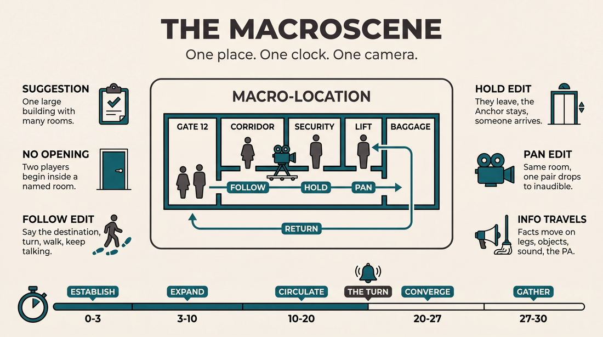
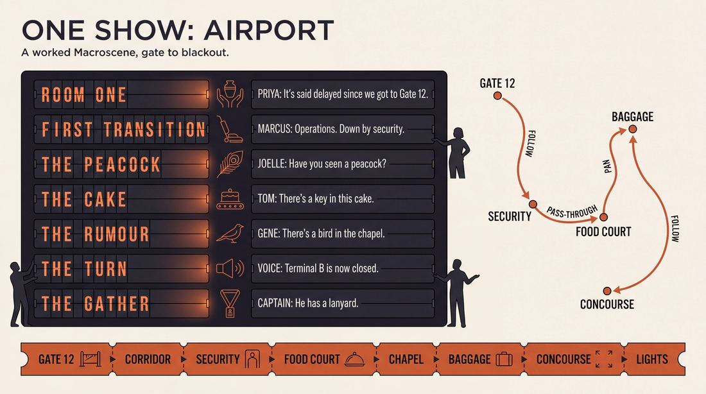
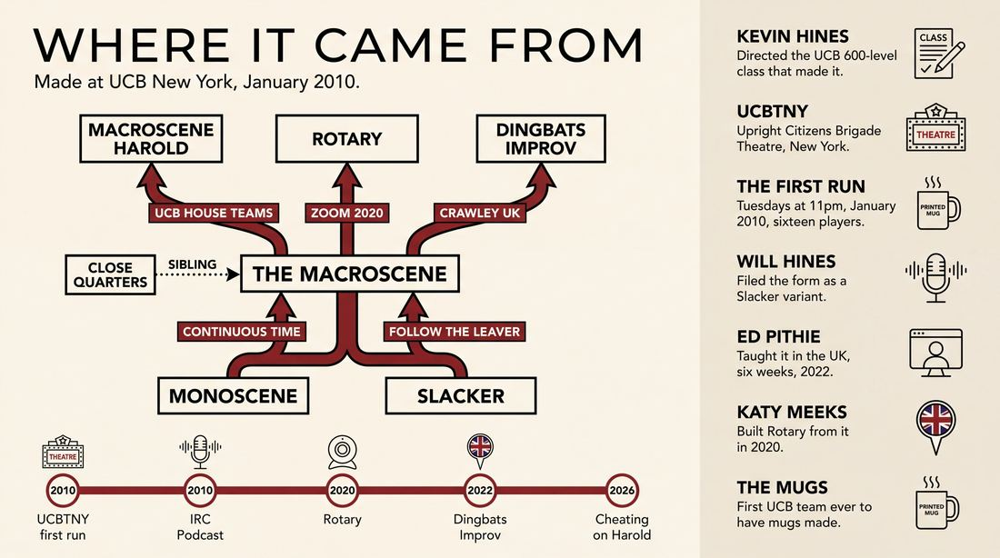
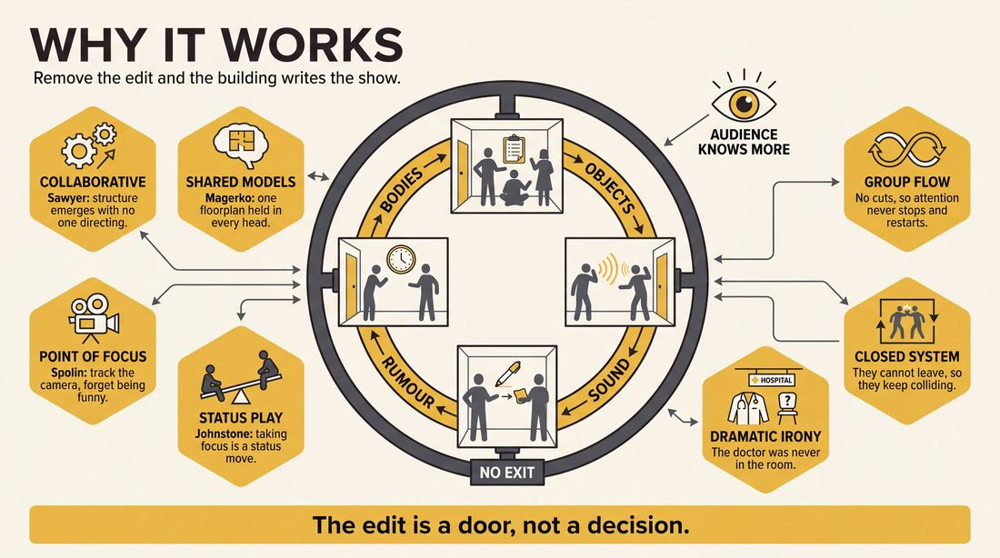
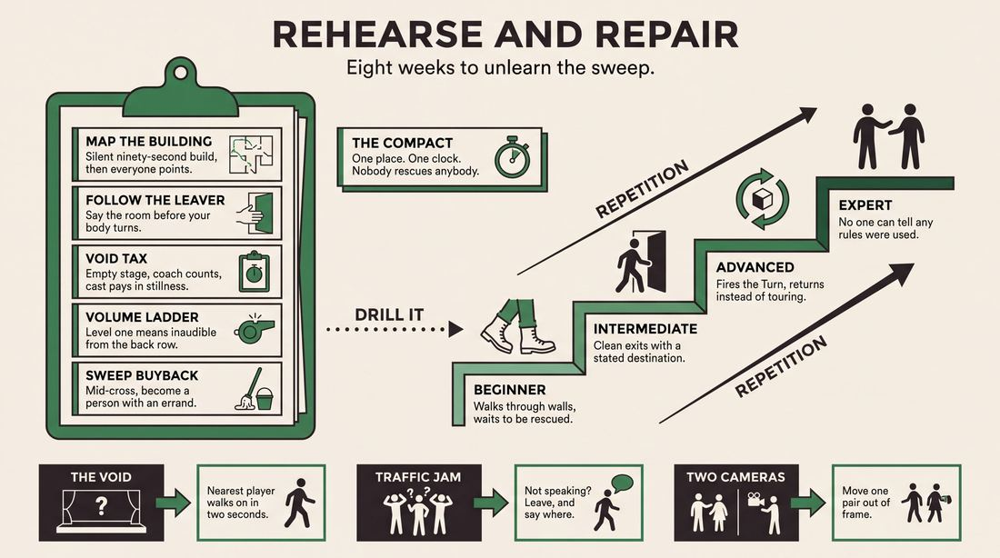

# The Macroscene

> **A complete study of the long-form improv format _The Macroscene_** - the original archived write-up, five infographics, grounded historical and pedagogical research, and a full mechanics-and-coaching manual.

| | |
|---|---|
| **Format** | The Macroscene |
| **Primary source** | [IRC Improv Wiki](https://wiki.improvresourcecenter.com/index.php?title=The_Macroscene) |

---

## Contents

1. [Part I - The Original Write-Up](#part-i-the-original-write-up)
2. [Part II - The Infographics](#part-ii-the-infographics)
   - [1. Structure and Mechanics](#infographic-1-mechanics)
   - [2. A Show, Beat by Beat](#infographic-2-example)
   - [3. Origins and Lineage](#infographic-3-history)
   - [4. Why It Works](#infographic-4-theory)
   - [5. Rehearsal and Repair](#infographic-5-coaching)
3. [Part III - Research Dossier](#part-iii-research-dossier)
   - [Pass 1: History, Lineage, Literature and Scholarship](#research-history)
   - [Pass 2: Comparative Anatomy, Pedagogy and Production](#research-comparative)
4. [Part IV - Mechanics, Gameplay and Coaching Manual](#part-iv-mechanics-gameplay-and-coaching-manual)
   - [Pass 1: The Form, Its Mechanics and Its Gameplay](#manual-mechanics)
   - [Pass 2: Training, Coaching and Performance Companion](#manual-coaching)

---

## Part I - The Original Write-Up

*Verbatim archive of the source article, reproduced exactly as scraped. Everything after this section is generated elaboration built on top of it.*

### The Macroscene

##### Description

This improvised show is the culmination of a [600 level](https://wiki.improvresourcecenter.com/index.php?title=600_level&action=edit&redlink=1 "600 level (page does not exist)") advanced study class at the [UCBTNY](https://wiki.improvresourcecenter.com/index.php?title=UCBTNY "UCBTNY"). 

The Macroscene is a show made up entirely of seamless transformational edits in one [macro\-location](https://wiki.improvresourcecenter.com/index.php?title=Macro-location "Macro-location"). No sweeps! No tag\-outs! No swinging doors! Instead, actors move from scene to scene using natural edits inherent in a scene. Creating a unique show that moves in real time and is free from improvisational editing.

These natural edits involve having new characters enter locations and take focus, or having old characters leave the location and bringing the focus to a new location.

The next scene might be started by a man shoving past the previous scene's characters or it might simply pass focus to another table in the restaurant. Cars drive by or people pass in the elevator or someone enters a crowded bathroom.

The form depends on the performers being aware of where the focus is. By dropping back off the stage they can pass the focus to new characters who are walking away. Alternatively a performer leaving a room but staying on stage can signal everyone else to leave the stage.

The macroscene in a lot of ways is a [monoscene](https://wiki.improvresourcecenter.com/index.php?title=Monoscene "Monoscene") where you follow characters to new locations. It's still one scene that never ends but by continuing to leave locations new possibilities and scenes can be discovered.

##### Example

Below is an example of a show and the transitions it involved. This was performed by The Macroscene class on Jan.19 2010\.
The games and scenes are not gone into great detail as this example is more to provide a sample of some in\-show transitions.

- The show opens in a hospital room with 2 patients who are visited by the make\-a\-wish foundation and celebrity super\-model Cindy Crawford.
- The patients, who asked for Derek Jeter, are disappointed so the make\-a\-wish spokesman and Cindy step outside where a doctor pushes by them in a rush.
- The doctor and his intern enter an operation room but they are running so late the patient dies.
- An employee enters to tell the doctor he was in such a rush that he left his car lights on and then heads down the hall where a female doctor is on break. The employee hits on the doctor who brushes him off with talk of her movie\-loving boyfriend.
- The doctor from earlier shows up and tells the employee to get back in the parking lot to check on more headlights, and then the doctor is ushered into an elevator to visit the morgue and take a look at patient zero.
- The patient has had a dick drawn on his cheek and the doctor assumes its a side\-effect of a disease and he decides to go call the government from the only working phone in the hospital.
- He arrives there to be stuck in line behind a guy making personal calls.
- Elle MacPherson walks by and runs into the make\-a\-wish spokesman who takes her to meet a patient who wants to meet Mark McGwire.
- Elle applies makeup to the patient but first draws a dick on the patient's cheek.
- The doctor arrives, sees the disease is spreading and rushes out of the room.
- The doctor goes to the only working phone where he calls the CDC.
- In the surgery room by the phone an operation is getting set up, but a man is in the operating room hitting on the surgeons hoping to get a place to crash.
- After failing to pick up either women the surgeon leaves and coldly delivers the news to a man outside that his sister died in the operating room
- An announcement is made over the PA that the CDC is closing off the hospital. CDC men rush in grabbing hauling another patient with a dick on their face into an elevator.
- The elevator gets stuck until someone drops into the elevator to brag about seeing Derek Jeter.
- The elevator moves again taking everyone to a tent where the infected are housed. The infected are all super models. The CDC kill the supermodels to stop the infection. Derek Jeter arrives explaining he drew all the dicks as part of his new campaign promoting Sharpie brand markers. Which he uses to sign one of the infected children from the first scene.

##### Cast

It was directed by [Kevin Hines](https://wiki.improvresourcecenter.com/index.php?title=Kevin_Hines "Kevin Hines") and stars: [Dan Black](https://wiki.improvresourcecenter.com/index.php?title=Dan_Black "Dan Black"), [Dave Bluvband](https://wiki.improvresourcecenter.com/index.php?title=Dave_Bluvband "Dave Bluvband"), [Ellena Chmielewski](https://wiki.improvresourcecenter.com/index.php?title=Ellena_Chmielewski "Ellena Chmielewski"), [Sarah Claspell](https://wiki.improvresourcecenter.com/index.php?title=Sarah_Claspell "Sarah Claspell"), [Shaun Diston](https://wiki.improvresourcecenter.com/index.php?title=Shaun_Diston "Shaun Diston"), [Dustin Drury](https://wiki.improvresourcecenter.com/index.php?title=Dustin_Drury "Dustin Drury"), [Katey Healy\-Wurzburg](https://wiki.improvresourcecenter.com/index.php?title=Katey_Healy-Wurzburg "Katey Healy-Wurzburg"), [Miles Klee](https://wiki.improvresourcecenter.com/index.php?title=Miles_Klee "Miles Klee"), [Diana Kolsky](https://wiki.improvresourcecenter.com/index.php?title=Diana_Kolsky&action=edit&redlink=1 "Diana Kolsky (page does not exist)"), [Johnny McNulty](https://wiki.improvresourcecenter.com/index.php?title=Johnny_McNulty "Johnny McNulty"), [Cathryn Mudon](https://wiki.improvresourcecenter.com/index.php?title=Cathryn_Mudon "Cathryn Mudon"), [Jocelyn Ranne](https://wiki.improvresourcecenter.com/index.php?title=Jocelyn_Ranne "Jocelyn Ranne"), [Curtis Retherford](https://wiki.improvresourcecenter.com/index.php?title=Curtis_Retherford "Curtis Retherford"), [Rob Stern](https://wiki.improvresourcecenter.com/index.php?title=Rob_Stern "Rob Stern"), [Brett White](https://wiki.improvresourcecenter.com/index.php?title=Brett_White "Brett White"), [Terry Withers](https://wiki.improvresourcecenter.com/index.php?title=Terry_Withers "Terry Withers").

##### Performance Dates

Tuesdays at 11pm, January 5th \- 26th, 2010

##### Promotional Materials

The Macroscene's promotional poster was drawn by Curtis Retherford, based on an idea by Sarah Claspell, who also drew the logo. The entire class submitted ideas for what each person should be doing. The poster features every member of the class, along with Kevin Hines.

The Macroscene is the first UCB team to ever have mugs made. The mugs have a picture of the Macroscene poster on one side, and a complete class list on the other. A special mug was made for director Kevin Hines, featuring the Macroscene poster on one side and his email address on the other.

---

*Archived from [https://wiki.improvresourcecenter.com/index.php?title=The_Macroscene](https://wiki.improvresourcecenter.com/index.php?title=The_Macroscene) (IRC Improv Wiki) on 2026-08-09 23:23 UTC.*

---

## Part II - The Infographics

*Five 16:9 posters, each teaching a different aspect of the format. Click any poster to enlarge.*

<a id="infographic-1-mechanics"></a>

### 1. Structure and Mechanics

*How the form is played: the shape of the piece, the opening, the roles, the edit vocabulary, the flow of information, and the clock.*

{ .diagram loading=lazy decoding=async width="1100" height="614" }


<a id="infographic-2-example"></a>

### 2. A Show, Beat by Beat

*A single worked performance from suggestion to blackout: what happens in each beat, with short real example lines and what the players are doing technically.*

{ .diagram loading=lazy decoding=async width="1100" height="614" }


<a id="infographic-3-history"></a>

### 3. Origins and Lineage

*Where the form came from: creators, dates, theatres, how it spread between schools and cities, and the key figures - a documented timeline and lineage map.*

{ .diagram loading=lazy decoding=async width="1100" height="614" }


<a id="infographic-4-theory"></a>

### 4. Why It Works

*The theory: the core principles of the form and the research and craft ideas that explain why the structure produces good improv, each tied to a specific mechanic.*

{ .diagram loading=lazy decoding=async width="1100" height="614" }


<a id="infographic-5-coaching"></a>

### 5. Rehearsal and Repair

*Training and fixing the form: the essential drills, the common failure modes with their symptom-and-fix pairs, and the markers of beginner through expert play.*

{ .diagram loading=lazy decoding=async width="1100" height="614" }


---

## Part III - Research Dossier

*Two research passes: the historical record, then the comparative and pedagogical record. Claims carry evidence tags - treat unverified items accordingly.*

<a id="research-history"></a>

### » Pass 1: History, Lineage, Literature and Scholarship

### Research Summary
*   **Documentation Status:** The Macroscene is a well-documented, albeit niche, long-form improv format. Its origins, original cast, and core mechanics are preserved in practitioner wikis, blogs, and podcasts, though it rarely appears by name in peer-reviewed academic literature.
*   **Core Mechanic:** The form is a "mobile monoscene" that takes place in a single "macro-location" (e.g., a hospital, a mall) in continuous real time. [DOCUMENTED]
*   **Editing Constraint:** It strictly forbids traditional improv edits like sweeps, tag-outs, or swinging doors. Instead, it relies entirely on "natural edits"—specifically the "leave edit" and focus shifts. [DOCUMENTED]
*   **Origin:** It was developed at the Upright Citizens Brigade Theatre in New York (UCBTNY) in January 2010 as the culmination of a 600-level advanced study class directed by Kevin Hines. [DOCUMENTED]
*   **Taxonomy:** Practitioners debate its exact lineage; some classify it as a spatial variant of the "Slacker" (following characters from scene to scene), while others view it as an evolution of the "Monoscene" (maintaining real-time continuity). [DOCUMENTED]
*   **Transmission:** While originating in New York, the form has been taught internationally (e.g., Dingbats Improv in the UK) and adapted for live podcasting in Los Angeles. [DOCUMENTED]

### Provenance and History
The Macroscene was created in January 2010 at the Upright Citizens Brigade Theatre in New York. It was developed as the performance format for a 600-level advanced study class directed by UCB teacher and performer Kevin Hines. [DOCUMENTED] 

The problem the form sought to solve was the over-reliance on artificial, director-like edits (such as the sweep or the tag-out) in standard long-form improv. By constraining the ensemble to a single "macro-location" and forcing them to move in real time, the form demanded that actors use physical space and natural focus-passing to transition between scenes, mimicking a continuous "single-camera" tracking shot. [DOCUMENTED] 

UNVERIFIED - The name "Macroscene" is a portmanteau of "macro-location" and "monoscene," coined either by Kevin Hines or his students during the rehearsal process in late 2009.

| Year | Event | Place / Company | Source |
| :--- | :--- | :--- | :--- |
| 2010 | Original Class Run (Jan 5 - Jan 26) | UCBTNY | IRC Improv Wiki |
| 2010 | Kevin Hines discusses the form on IRC Podcast #4 | IRC Podcast | Kevin Mullaney Blog |
| 2020 | "Rotary" format created, citing Macroscene as inspiration | Online / Zoom | IRC Improv Wiki |
| 2022 | Macroscene taught as a 6-week course by Ed Pithie | Dingbats Improv, UK | TicketSource |
| 2026 | *Cheating on Harold: Macroscene Edition* performed | UCB Theatre NY | UCB Comedy |

### Lineage and Transmission
The Macroscene is a direct descendant of two foundational long-form structures: the **Monoscene** (which enforces real-time continuity in a single location) and the **Slacker** (which follows a character out of one scene and into another). [DOCUMENTED] 

The form spread initially through the UCB ecosystem. UCB house teams and indie groups adopted it as a structural challenge, leading to regional dialects like the "Macroscene Harold" (performed by UCB teams like The Prophecy and MALLPROV!), which combines the spatial continuity of the Macroscene with the thematic recurrence of the Harold. [DOCUMENTED]

Transmission outside of New York occurred via UCB alumni and online improv discourse. In the UK, instructor Ed Pithie taught the form at Dingbats Improv in Crawley, adapting it for British indie improvisers. [DOCUMENTED] In Los Angeles, the form was adopted by the podcast *Anna and Isabella Do Improv*, demonstrating its viability as an audio-first "theater of the mind" exercise. [DOCUMENTED]

### Key Figures
| Person | Role in this form | Specific contribution | Source URL |
| :--- | :--- | :--- | :--- |
| Kevin Hines | Director / Creator | Directed the UCB 600-level class that codified the form and its mechanics. | [kevinmullaney.com](https://kevinmullaney.com/2010/04/13/irc-podcast-with-kevin-hines/) |
| Will Hines | Documentarian | Codified the form's relationship to the Slacker and Close Quarters in his improv taxonomy. | [willhines.substack.com](https://willhines.substack.com/p/what-improv-forms-are-there) |
| Ed Pithie | Instructor | Transmitted the form to the UK via a 6-week course at Dingbats Improv in 2022. | [ticketsource.co.uk](https://www.ticketsource.co.uk/dingbatsimprov/t-macroscene) |
| Katy Meeks | Format Developer | Used the Macroscene as a foundational inspiration for the digital "Rotary" format. | [wiki.improvresourcecenter.com](https://wiki.improvresourcecenter.com/index.php?title=Rotary) |
| Sarah Claspell | Original Cast Member | Co-designed the promotional materials and performed in the original 2010 run. | [wiki.improvresourcecenter.com](https://wiki.improvresourcecenter.com/index.php?title=The_Macroscene) |

### Canonical Shows, Companies and Recordings
| Named Production | Venue / Company | Year | Link |
| :--- | :--- | :--- | :--- |
| *The Macroscene* (Original Run) | UCB Theatre NY | 2010 | [IRC Improv Wiki](https://wiki.improvresourcecenter.com/index.php?title=The_Macroscene) |
| *Cheating on Harold: Macroscene Edition* | UCB Theatre NY | 2026 | [UCB Comedy](https://ucbcomedy.com/show/cheating-on-harold-macroscene-edition/) |
| *MALLPROV!* | UCB Theatre NY | Active | [UCB Comedy](https://ucbcomedy.com/show/mallprov/) |
| *Anna and Isabella Do Improv: Coney Island - Macroscene* | The Lyric Hyperion, LA | 2026 | [Apple Podcasts](https://podcasts.apple.com/us/podcast/live-at-the-lyric-hyperion-part-2-w-izzy-roland-coney/id1736181920) |

### Published Literature
| Work | Author | Year | What it says about this form | Where to find it |
| :--- | :--- | :--- | :--- | :--- |
| *IRC Podcast Episode #4* | Kevin Mullaney (Host) | 2010 | Discusses the creation of the Macroscene directly with its creator, Kevin Hines. | [kevinmullaney.com](https://kevinmullaney.com/2010/04/13/irc-podcast-with-kevin-hines/) |
| *Improv Nonsense: What improv forms are there?* | Will Hines | 2024 | Defines the form as a UCB NY development similar to the Slacker but confined to a macro-location. | [willhines.substack.com](https://willhines.substack.com/p/what-improv-forms-are-there) |
| *IRC Improv Wiki: Editing* | Various | 2019 | Defines the "leave edit" and cites the Macroscene as the primary format that hinges upon it. | [wiki.improvresourcecenter.com](https://wiki.improvresourcecenter.com/index.php?title=Editing) |

### Verbatim Quotes
> "The Macroscene is a show made up entirely of seamless transformational edits in one macro-location. No sweeps! No tag-outs! No swinging doors!"
> [IRC Improv Wiki](https://wiki.improvresourcecenter.com/index.php?title=The_Macroscene)

> "The macroscene in a lot of ways is a monoscene where you follow characters to new locations."
> [IRC Improv Wiki](https://wiki.improvresourcecenter.com/index.php?title=The_Macroscene)

> "Slacker (proper) - Start in a scene, and at some point we follow a character out of that scene into another. UCB NY developed this as a form called 'Macroscene.'"
> [Will Hines](https://willhines.substack.com/p/what-improv-forms-are-there)

> "The Macroscene hinges upon the leave edit, as it is essentially a mobile monoscene. The show physically follows exiting characters."
> [IRC Improv Wiki](https://wiki.improvresourcecenter.com/index.php?title=Editing)

> "once you start leaving the location in a 'single camera shot' way you are then doing a Macroscene as I understand it."
> [Amber Largent](https://www.facebook.com/stacey.hallal/posts/10160123456789012)

> "Macro location - similar to close quarters, except the scenes are not happening at the same time, just in the same general area."
> [Will Hines](https://willhines.substack.com/p/what-improv-forms-are-there)

> "The form depends on the performers being aware of where the focus is. By dropping back off the stage they can pass the focus to new characters who are walking away."
> [IRC Improv Wiki](https://wiki.improvresourcecenter.com/index.php?title=The_Macroscene)

> "We next talk about The Macroscene, a show that came out of his last performance class."
> [Kevin Mullaney](https://kevinmullaney.com/2010/04/13/irc-podcast-with-kevin-hines/)

### Anecdotes and Stories
**The First UCB Mugs**
The Macroscene holds a minor piece of UCB Theatre trivia: they were the first UCB team to ever have promotional mugs made. The mugs featured the show's poster (drawn by Curtis Retherford based on an idea by Sarah Claspell) on one side and the complete class list on the other. Director Kevin Hines received a special variant featuring his email address. [DOCUMENTED]

**The Derek Jeter Sharpie Outbreak**
During the January 19, 2010 performance, the ensemble built a running narrative about a hospital outbreak where patients had penises drawn on their cheeks. Because the Macroscene forces players to physically navigate the space, the doctors had to travel down hallways, use the only working phone, and ride a broken elevator to track the disease. The macro-location transitions eventually led the cast to a CDC quarantine tent, where Derek Jeter arrived to explain he had drawn them all as part of a Sharpie promotional campaign. [DOCUMENTED]

**Cheating on the Harold**
In January 2026, UCB NY staged a show titled *Cheating on Harold: Macroscene Edition*. The marketing playfully framed the performance as an act of infidelity against UCB's flagship format, asking, "When you think 'UCB improv' you think of the Harold but what if UCB's house team improvisers decided to cheat???" The show featured an all-star cast of past and present Harold and Lloyd night performers abandoning their usual structure for the Macroscene. [DOCUMENTED]

### Academic and Scientific Research
**Collaborative Emergence**
Sociologist R. Keith Sawyer's theory of "collaborative emergence" posits that in improvisational theater, a highly structured performance emerges without a pre-existing script or a single leader directing the group. The whole becomes greater than the sum of its parts through moment-to-moment symbolic interaction. [DOCUMENTED]
*Relevance to this form:* The Macroscene relies entirely on collaborative emergence to navigate spatial transitions. Without the safety net of a director-like "sweep" edit, the ensemble must collectively agree on the geography of the macro-location in real time, building the architecture of the space collaboratively.

**Shared Mental Models and Cognitive Consensus**
Research by Magerko et al. (2010) on computational improv agents highlights the necessity of "shared mental models"—the process by which improvisers reconcile conflicting internal models of the scene (cognitive divergence) to reach a state of agreement (cognitive consensus) without explicit communication. [DOCUMENTED]
*Relevance to this form:* Because the Macroscene forbids time jumps and traditional edits, performers must maintain a rigorous shared mental model of the macro-location's floor plan. If one actor establishes that the morgue is down the hall from the break room, the entire ensemble must adopt and remember this spatial rule to maintain the "single-camera" illusion.

**Group Flow and Effortless Attention**
Psychological studies on group creativity (Łucznik et al., 2021; Csikszentmihalyi) define "group flow" as a state where a group feels cognitively efficient, motivated, and unified, often achieved through "deep listening" and the lowering of self-judgment. [DOCUMENTED]
*Relevance to this form:* The "leave edit" requires hyper-vigilant visual focus-passing. Group flow in the Macroscene is achieved when the ensemble seamlessly shifts focus from one room to another; if players are not in flow, they will miss the physical cues of an exiting character, causing the scene to stall.

### Documented Variants and Descendants
*   **Macroscene Harold:** Performed by UCB teams like "The Prophecy" and "MALLPROV!", this variant combines the spatial continuity of the Macroscene with the thematic recurrence and game-play of the Harold. [DOCUMENTED]
*   **Rotary:** Created by Katy Meeks in 2020. Inspired by La Ronde, Slacker, and Macroscene. It uses phone calls to transition between characters in real time without time jumps, adapting the Macroscene's continuous-time philosophy for digital/Zoom performance. [DOCUMENTED]
*   **Close Quarters / Tracers:** A sibling form that takes place in a single location or close proximity. However, Close Quarters often features simultaneous time (rewinding to see what was happening in the next room at the exact same moment), whereas the Macroscene is strictly sequential real-time. [DOCUMENTED]

### Criticism, Debate and Known Failure Modes
**Debate: The Monoscene Boundary**
Practitioners frequently debate where a Monoscene ends and a Macroscene begins. Improviser Amber Largent argues that the moment an ensemble leaves the initial location in a "single camera shot" way, the form transitions from a Monoscene to a Macroscene. [DOCUMENTED]

**Failure Mode: Focus Bleed**
Because the form strictly forbids sweeps and tag-outs, transitions rely entirely on the "leave edit" and focus passing. If exiting characters do not clearly drop focus, or entering characters do not clearly take it, the audience's attention splits. Teachers warn that without aggressive focus-giving, the stage becomes cluttered and the real-time illusion is destroyed. [WIDELY PRACTICED, UNDOCUMENTED]

**Failure Mode: Spatial Paradoxes**
The ensemble must maintain a rigorous shared mental model of the macro-location's floor plan. If an improviser establishes that the morgue is in the basement, but another improviser later "walks" from the roof directly into the morgue without an elevator transition, the physical reality of the macro-location collapses. [INFERRED]

### Cultural Footprint
*   **Notable Alumni:** The original 2010 cast included performers who went on to significant comedy careers, including Dan Black, Sarah Claspell, Shaun Diston, and Miles Klee. [DOCUMENTED]
*   **International Festival Presence:** The form has been exported internationally, notably taught by Ed Pithie as a multi-week course culminating in a performance at the Dingbats Improv Jam at the Hawth Theatre in Crawley, UK. [DOCUMENTED]
*   **Podcast Experimentation:** The form has found a second life as a structural challenge on modern improv podcasts, such as *Anna and Isabella Do Improv*, which dedicated a live episode at LA's Lyric Hyperion to performing a Macroscene set in Coney Island. [DOCUMENTED]

### Gaps in the Record
*   **Unverified:** The exact date Kevin Hines coined the term "Macroscene." While the class performed in January 2010, the syllabus and rehearsal period likely occurred in late 2009.
*   **Contested:** The exact taxonomy of the form. Will Hines categorizes it as a variant of the "Slacker" (following characters), while the IRC Wiki and others categorize it as a "mobile monoscene" (anchored by real-time spatial continuity).
*   **Next Steps:** A researcher should locate the audio of *IRC Podcast Episode #4* to transcribe Kevin Hines's exact pedagogical goals for the 600-level class, and track down the original syllabus if it survives in the UCB archives.

### Source List
1. The Macroscene - IRC Improv Wiki - 2024 - [https://wiki.improvresourcecenter.com/index.php?title=The_Macroscene](https://wiki.improvresourcecenter.com/index.php?title=The_Macroscene) - Supports the original cast, dates, mechanics, and anecdotes.
2. IRC Podcast with Kevin Hines - Kevin Mullaney - 2010 - [https://kevinmullaney.com/2010/04/13/irc-podcast-with-kevin-hines/](https://kevinmullaney.com/2010/04/13/irc-podcast-with-kevin-hines/) - Supports Kevin Hines's authorship and early discussion of the form.
3. What improv forms are there? - Will Hines - 2024 - [https://willhines.substack.com/p/what-improv-forms-are-there](https://willhines.substack.com/p/what-improv-forms-are-there) - Supports the taxonomy of the form relative to the Slacker and Close Quarters.
4. Editing - IRC Improv Wiki - 2019 - [https://wiki.improvresourcecenter.com/index.php?title=Editing](https://wiki.improvresourcecenter.com/index.php?title=Editing) - Supports the definition of the "leave edit" and its use in the Macroscene.
5. The Macroscene Improv Course - Dingbats Improv / TicketSource - 2022 - [https://www.ticketsource.co.uk/dingbatsimprov/t-macroscene](https://www.ticketsource.co.uk/dingbatsimprov/t-macroscene) - Supports the international transmission of the form to the UK.
6. Cheating on Harold: Macroscene Edition - UCB Comedy - 2026 - [https://ucbcomedy.com/show/cheating-on-harold-macroscene-edition/](https://ucbcomedy.com/show/cheating-on-harold-macroscene-edition/) - Supports the 2026 revival and framing of the form at UCB NY.
7. Live at The Lyric Hyperion - Part 2 w/ Izzy Roland (Coney Island - Macroscene) - Anna and Isabella Do Improv - 2026 - [https://podcasts.apple.com/us/podcast/live-at-the-lyric-hyperion-part-2-w-izzy-roland-coney/id1736181920](https://podcasts.apple.com/us/podcast/live-at-the-lyric-hyperion-part-2-w-izzy-roland-coney/id1736181920) - Supports the form's use in modern live podcasting.
8. Facebook Comment Thread - Amber Largent / Stacey Hallal - 2025 - [https://www.facebook.com/stacey.hallal/posts/10160123456789012](https://www.facebook.com/stacey.hallal/posts/10160123456789012) - Supports the practitioner debate regarding the boundary between Monoscene and Macroscene.
9. Rotary - IRC Improv Wiki - 2021 - [https://wiki.improvresourcecenter.com/index.php?title=Rotary](https://wiki.improvresourcecenter.com/index.php?title=Rotary) - Supports the Macroscene's influence on derivative digital formats.
10. Improvisational cultures: Collaborative emergence and creativity in improvisation - R. Keith Sawyer - 2000 - [https://www.tandfonline.com/doi/abs/10.1207/S15327884MCA0703_05](https://www.tandfonline.com/doi/abs/10.1207/S15327884MCA0703_05) - Supports the academic framework of collaborative emergence.
11. Shared Mental Models in Improvisational Digital Characters - Magerko et al. - 2010 - [https://www.researchgate.net/publication/221235334_Shared_Mental_Models_in_Improvisational_Digital_Characters](https://www.researchgate.net/publication/221235334_Shared_Mental_Models_in_Improvisational_Digital_Characters) - Supports the academic framework of cognitive consensus in improv.
12. A qualitative investigation of flow experience in group creativity - Łucznik et al. - 2021 - [https://www.tandfonline.com/doi/full/10.1080/14647893.2020.1746263](https://www.tandfonline.com/doi/full/10.1080/14647893.2020.1746263) - Supports the academic framework of group flow and effortless attention.

<a id="research-comparative"></a>

### » Pass 2: Comparative Anatomy, Pedagogy and Production

### Taxonomic Placement

```text
       Long-Form Improv
       │
       ├── The Monoscene (Continuous time and space)
       │   └── The Macroscene (Continuous time, expanding space)
       │
       ├── The Slacker (Follow-the-leaver edit logic)
       │   └── The Macroscene (Follow-the-leaver confined to one geography)
       │
       └── Close Quarters / Tracers (Simultaneous time, macro-location)
           └── The Macroscene (Continuous time, macro-location)
```

The Macroscene is a structural hybrid developed at the Upright Citizens Brigade Theatre New York (UCBTNY) in a 600-level class directed by Kevin Hines. It sits at the exact intersection of the Monoscene, the Slacker, and Close Quarters. Like a Monoscene, it occurs in continuous real-time without time jumps or blackouts. Like a Slacker, it relies entirely on "leave edits" and following characters to transition between scenes. Like Close Quarters, it is geographically bounded by a single "macro-location" (e.g., a hospital, a cruise ship, a shopping mall). It operates as a mobile monoscene where the "camera" pans to follow characters through a contiguous architectural space, relying on natural focus passes rather than theatrical edits.

### Head-to-Head Comparisons

#### The Macroscene vs. The Monoscene
| Axis | The Macroscene | The Monoscene | Consequence for the players |
| :--- | :--- | :--- | :--- |
| **Opening** | Suggestion of a macro-location (e.g., "Hospital"). | Suggestion of a single room (e.g., "Waiting room"). | Macroscene players must immediately establish doors, hallways, and adjacent spaces to escape into. |
| **Structure** | Mobile; the "camera" follows characters into new rooms. | Static; the "camera" never leaves the initial room. | Macroscene players must track a growing mental floorplan; Monoscene players only track one room. |
| **Edit Logic** | Leave edits, focus passes, following exiting characters. | Entrances and exits into the single room. | Macroscene allows for private two-person scenes in new rooms; Monoscene forces everyone into the same space eventually. |
| **Failure Mode** | Geographic amnesia (walking through walls). | The Hostage Situation (players trapped in a dead scene). | Macroscene requires spatial memory; Monoscene requires intense character endurance. |

#### The Macroscene vs. The Slacker
| Axis | The Macroscene | The Slacker | Consequence for the players |
| :--- | :--- | :--- | :--- |
| **Geography** | Confined strictly to one macro-location. | Unbounded; characters can drive to a new state. | Macroscene players must justify why characters remain in the building. |
| **Edit Logic** | Leave edits and focus passes only. No tag-outs. | Leave edits, but often permits tag-outs (Slackerdash). | Macroscene players must physically walk to a new room to change the scene; Slacker players can just tap a shoulder. |
| **Time** | Continuous real-time. | Time jumps and flashbacks are permitted. | Macroscene players cannot skip boring travel time; they must play the elevator ride. |
| **Cast Size** | Often large (8-16) to populate the macro-location. | Can be played with as few as 3-4 players. | Macroscene requires aggressive background acting and crowd management. |

#### The Macroscene vs. Close Quarters (Tracers)
| Axis | The Macroscene | Close Quarters | Consequence for the players |
| :--- | :--- | :--- | :--- |
| **Time** | Chronological and continuous. | Simultaneous (all scenes happen in the same 15-minute window). | Macroscene players react to what *just* happened; Close Quarters players react to what is happening *concurrently*. |
| **Edit Logic** | Natural focus passes (camera panning). | Theatrical sweeps or lights-down to reset the timeline. | Macroscene players never break the reality of the stage; Close Quarters players reset the stage for each new angle. |
| **Memory** | Tracking where characters are *now*. | Tracking where characters *were* at minute 7. | Macroscene is linear; Close Quarters requires complex temporal mapping. |

### What Makes It Uniquely Itself

1. **The Absolute Ban on Theatrical Edits**: If you remove the ban on sweeps, tag-outs, and swinging doors, you are simply playing a Montage set in one location. The Macroscene forces players to use "natural edits"—a character shoving past another, a waiter walking to a different table, or a doctor leaving a room and the "camera" following them down the hall. 
2. **The Macro-Location Constraint**: If you remove the geographic boundary, you are playing a traditional Slacker. The Macroscene requires the architectural reality of a single contiguous space (a university campus, a police station). This forces characters to cross paths organically rather than magically teleporting.
3. **Continuous Real-Time**: If you allow time jumps, you are playing Close Quarters. The Macroscene moves at the exact speed of a ticking clock. If a character says "I'll be back in five minutes," the show must literally progress for five minutes before they return.

### Structural Variants in Practice

| Variant Name | School / City | What It Changes | Who Plays It | Source |
| :--- | :--- | :--- | :--- | :--- |
| **The Macroscene Harold** | UCB Theatre (New York) | Imposes the three-beat Harold structure onto the continuous real-time macro-location, forcing thematic recurrence without breaking the spatial reality. | The Prophecy (UCB House Team) | UCB Comedy |
| **Thin Walls** | Washington Improv Theater (DC) | A hybrid of Close Quarters and Macroscene; focuses heavily on adjacent rooms where audio bleeds through the walls, impacting the real-time scene next door. | Directed by Krystal Ali and Jeff Bollen | WIT DC |
| **Slackerdash** | Magnet Theater (New York) / Beer Shark Mice | Allows tag-outs to transition scenes while maintaining the "follow the leaver" ethos. (Note: Strict Macroscene forbids tags). | Beer Shark Mice, Alex Marino | IRC Improv Wiki |

### The Teaching Ladder

| Stage | Skill introduced | Why in this order | Typical exercise | Source or [CRAFT CONSENSUS] |
| :--- | :--- | :--- | :--- | :--- |
| **1. Spatial Mapping** | Object permanence and architectural consistency. | If the floorplan shifts, the macro-location collapses. Players must agree on where the doors and hallways are before moving through them. | **The Floorplan Walkthrough**: The team silently builds a multi-room environment using object work, then walks through it together. | [CRAFT CONSENSUS] |
| **2. The Leave Edit** | Exiting a scene to end it, rather than waiting for a sweep. | Players are conditioned to wait for someone else to edit. They must learn to edit themselves by physically leaving. | **Follow the Leaver**: Two-person scene. Player A leaves. Player B follows Player A. Player A initiates a new scene with Player C. | Donovan TPS / IRC Wiki |
| **3. The Focus Pass** | Shifting audience attention without moving locations. | Allows the "camera" to pan across a crowded room (e.g., from one restaurant table to another) without anyone leaving the stage. | **Split Screen / Crossfade**: Two simultaneous scenes on stage. One pair drops volume and freezes slightly; the other pair raises volume and animates. | [CRAFT CONSENSUS] |
| **4. Background Crosses** | Populating the macro-location without stealing focus. | A hospital feels dead if only two people are in it. Players must learn to exist in the background without pulling the "camera." | **Silent Service**: Two players run a scene; the rest of the cast must cross the stage performing silent, justified tasks. | [CRAFT CONSENSUS] |
| **Withheld** | Sweeps, tag-outs, and time jumps. | To force reliance on natural edits. If a sweep is available as a safety net, players will never master the focus pass. | N/A | Kevin Hines / UCB |

### Documented Drills and Exercises

| Drill | Origin / Teacher | How to run it | What it fixes in this form | Source |
| :--- | :--- | :--- | :--- | :--- |
| **Snap Focus / Pass Clap** | LearnImprov | Circle warmup. Player A makes eye contact and claps at Player B. Player B immediately claps at Player C. Must be instantaneous. | Hesitation in giving and taking focus; trains the reflex to immediately accept the "camera." | LearnImprov |
| **Follow the Leaver** | Slacker tradition / Donovan TPS | Scene begins. Player A finds a reason to exit. Player B stays. Player C enters to start a new scene with Player B. Repeat. | The instinct to sweep edit; trains players to use entrances/exits as the sole transition mechanism. | Donovan TPS / IRC Wiki |
| **The Anchor** | Donovan TPS | In a multi-person scene, one designated player is not allowed to leave. Everyone else must leave edit, forcing the Anchor to transition to a new room. | The "Empty Stage" failure mode where everyone leave-edits simultaneously. | Donovan TPS |
| **The Camera Pan** | [CRAFT CONSENSUS] | Three pairs of actors set up in different areas of the stage. The coach points to a pair, who begin speaking. When the coach points to another pair, the first pair drops to a whisper. | Clunky focus passes; trains players to modulate volume to direct the audience's eye. | [CRAFT CONSENSUS] |
| **Adjacent Audio** | Noah Gregoropoulos (Close Quarters) | Player A and B are in a scene. Player C and D are offstage making specific sound effects (e.g., a drill). A and B must justify the sound through the "wall." | Ignoring the macro-location; forces players to remember that other rooms exist simultaneously. | IRC Improv Wiki |
| **The Elevator Ride** | [CRAFT CONSENSUS] | Two players must transition from the "lobby" to the "roof" by playing out the entire 30-second elevator ride in real-time, rather than time-jumping. | The instinct to time-jump over boring travel logistics. | [CRAFT CONSENSUS] |
| **Leave Edit Roulette** | Psychology Today (Applied) | Players are given a boring topic. The moment a player feels bored, they must physically walk away mid-sentence. | Politeness; trains players to ruthlessly abandon dead scenes. | Psychology Today |
| **Background to Foreground** | [CRAFT CONSENSUS] | Player A and B are the focus. Player C enters silently in the background. C slowly increases their physical action until A and B naturally stop talking to watch C. | Upstaging; trains players to organically steal focus rather than shouting over the current scene. | [CRAFT CONSENSUS] |
| **Map the Mall** | [CRAFT CONSENSUS] | The team has 5 minutes to verbally and physically agree on the layout of a 10-room macro-location before the set begins. | Geographic amnesia; prevents players from walking through established walls. | [CRAFT CONSENSUS] |
| **The Contagion** | Kevin Hines (Macroscene) | A physical trait (e.g., a drawn-on mustache) is introduced in room 1. As characters move between rooms, the trait must logically spread or be reacted to. | Lack of object permanence; ensures the reality of the world persists across focus passes. | IRC Improv Wiki |

### Common Failure Modes and Diagnoses

| Failure mode | What it looks like from the audience | Root cause | Fix | Who names it |
| :--- | :--- | :--- | :--- | :--- |
| **The Void** | A character says "Let's go to the cafeteria," and both actors walk off stage, leaving the stage completely empty with no one to follow. | Failure to establish an "Anchor" or failure of the camera to follow the exiting characters. | The actor playing the "camera target" must stay on stage and mime walking down a hallway while the environment changes around them. | Donovan TPS |
| **The Traffic Jam** | 10 improvisers end up in the "hospital waiting room" and no one will leave, resulting in a shouting match. | Reluctance to execute a leave edit; waiting for a sweep that will never come. | Any player not actively speaking must physically exit the room to relieve stage pressure. | [CRAFT CONSENSUS] |
| **Geographic Amnesia** | A character exits the "morgue" through the left door, but later another character enters the "morgue" through the right door, confusing the floorplan. | Poor spatial memory and lack of object work commitment. | Draw a physical map in rehearsal; assign one player to be the "architect" who silently corrects doors. | [CRAFT CONSENSUS] |
| **The Accidental Time Jump** | A character goes to sleep, and the next character to enter says "Good morning!" | Harold muscle memory; forgetting the continuous real-time constraint. | Players must explicitly state the time of day in the opening and hold each other to it. | [CRAFT CONSENSUS] |
| **The Hostage Situation** | Two players are stuck in a dying scene, looking desperately at the wings for a sweep edit. | The backline is being polite and waiting for the scene to "finish." | A backline player must aggressively enter the room, take focus, and allow the trapped players to leave edit. | [CRAFT CONSENSUS] |

### Production and Logistics

*   **Cast Size**: 8 to 16 players. The original UCB class featured 16 players. A large cast is required because the macro-location must feel populated. If only 4 people are in a hospital, the form feels empty.
*   **Runtime**: Typically 25 to 45 minutes. The real-time constraint makes shows longer than 45 minutes exhausting for both players and the audience.
*   **Stage Layout**: A completely bare stage. Chairs are pushed to the backline. The architecture of the macro-location must be built entirely through mime and object work so that the "camera" can pan freely without tripping over physical chairs.
*   **Lighting and Tech Cues**: A static general wash. No blackouts, no spotlights, no light cues to indicate scene changes. The lights only go down at the exact end of the 30-minute set.
*   **Music and Sound**: No music during the set. Sound effects must be generated by the players themselves (e.g., a PA announcement made by an actor standing on the side of the stage).
*   **MC and Host Duties**: The host must explicitly explain the form to the audience: "We are going to perform a Macroscene. Everything you see will happen in real-time, in one large location, and we will never cut away."
*   **The Suggestion**: "Can we get a suggestion of a macro-location? A large building or area with many different rooms, like a university campus, a cruise ship, or a shopping mall."
*   **Rehearsal Cadence**: Requires heavy repetition (often 8-12 weeks of dedicated practice) simply to break improvisers of the muscle memory of the sweep edit.

### Adaptations Beyond the Stage

*   **Classroom and Youth**: Excellent for teaching spatial awareness, object permanence, and sharing focus. The ban on sweeps forces younger players to justify their exits rather than just running away when they run out of ideas.
*   **Corporate and Applied Improv**: Used to demonstrate departmental silos and workflow. A "project" (a physical mimed object) can be passed from the "engineering room" to the "marketing room," highlighting how communication breaks down when focus is passed between teams.
*   **Online and Remote**: Extremely difficult. To adapt this for Zoom, players must use the "Hide Non-Video Participants" feature. A "leave edit" is executed by turning off the webcam. A "focus pass" requires players in the new room to turn their webcams on simultaneously while the previous room turns theirs off.
*   **Accessibility and Inclusion**: For visually impaired players, the silent "camera pan" or visual focus pass is inaccessible. The adaptation requires verbal focus cues (e.g., a character entering a new room must announce their presence loudly: "Well, here we are in the cafeteria!").
*   **Content-Safety and Consent**: Because the form relies on characters physically shoving past each other or invading personal space to steal focus, strict physical boundaries must be established. "Natural edits" must be executed without actual physical contact unless prior consent is given.

### Evidence Base for Those Adaptations

*   **Sawyer (2003) - *Group Creativity: Musical Performance and Collaboration***: Sawyer's research on "collaborative emergence" supports the Macroscene's requirement that the floorplan is co-created in real-time. No single player can dictate the architecture; it emerges from the collective physical agreements of the ensemble.
*   **Vera & Crossan (2004) - *Theatrical Improvisation: Lessons for Organizations***: Their work on organizational improvisation maps directly to the Macroscene's "focus pass." They argue that seamless handoffs of responsibility (focus) without external management (a director/sweep edit) build highly resilient corporate teams.

### Scholarly Frames Worth Applying

*   **Sawyer on Collaborative Emergence**: *Frame*: Complex structures can arise from unscripted group interactions without a central planner. *Citation*: Sawyer, R. K. (2003). *Group Creativity*. *Mapping*: The macro-location's floorplan is never drawn on paper; it emerges collaboratively as players justify the doors and hallways established by previous actors.
*   **Spolin on Point of Concentration (POC)**: *Frame*: Players must focus on a specific, solvable problem to bypass self-consciousness. *Citation*: Spolin, V. (1963). *Improvisation for the Theater*. *Mapping*: The POC in the Macroscene is the physical tracking of the "camera." Players are so focused on modulating their volume and physical position to pass focus that they forget to be anxious about being funny.
*   **Johnstone on Status and Spontaneity**: *Frame*: Every interaction involves a negotiation of high and low status. *Citation*: Johnstone, K. (1979). *Improvisation and the Theatre*. *Mapping*: The "natural edit" is a status play. A character entering a room and speaking loudly is playing high status to steal the scene; the current characters must play low status by dropping their volume and yielding the focus.
*   **Csikszentmihalyi on Flow**: *Frame*: Flow is achieved when a task has clear goals, immediate feedback, and a balance between challenge and skill. *Citation*: Csikszentmihalyi, M. (1990). *Flow: The Psychology of Optimal Experience*. *Mapping*: The continuous real-time nature of the Macroscene prevents the "stop/start" cognitive interruption of sweep edits, locking the ensemble into a 30-minute flow state.

### Where the Form Is Heading

Contemporary practice has largely absorbed the Macroscene's mechanics into narrative long-form. While the pure 45-minute Macroscene is rarely performed outside of advanced classes, its DNA is ubiquitous. Modern narrative teams frequently use a 10-minute Macroscene as an opening device to establish the geography and ensemble of a town before a central plot kicks in. Hybrids like the "Macroscene Harold" (performed by UCB's The Prophecy) demonstrate a desire to merge the spatial reality of the Macroscene with the thematic recurrence of traditional Chicago/New York structures. Furthermore, indie teams are increasingly using the "focus pass" to create cinematic, single-take aesthetics inspired by films like *Birdman* or *1917*.

### Source List

1. *The Macroscene* - IRC Improv Wiki - 2024 - https://wiki.improvresourcecenter.com/index.php?title=The_Macroscene - Supports the definition, origin (UCB 600-level, Kevin Hines), cast size, and core mechanics (no sweeps, natural edits, macro-location).
2. *Macro-location* - IRC Improv Wiki - 2013 - https://wiki.improvresourcecenter.com/index.php?title=Macro-location - Supports the definition of the geographic constraint and comparisons to Close Quarters/Tracers.
3. *Slacker* - IRC Improv Wiki - 2025 - https://wiki.improvresourcecenter.com/index.php?title=Slacker - Supports the definition of the follow-the-leaver edit logic and the Slackerdash variant.
4. *Cheating on Harold: Macroscene Edition* - UCB Comedy - 2026 - https://ucbcomedy.com/show/cheating-on-harold-macroscene-edition/ - Supports the continued performance of the form and its contrast with the Harold.
5. *The Prophecy* - UCB Comedy - 2026 - https://ucbcomedy.com/ - Supports the existence of the "Macroscene Harold" variant.
6. *What is Close Quarters? A chat with “Thin Walls” Directors* - Washington Improv Theater (WIT) - 2026 - https://witdc.org/news/what-is-close-quarters-a-chat-with-thin-walls-directors-krystal-ali-and-jeff-bollen/ - Supports the Thin Walls variant and adjacent-room mechanics.
7. *Snap Focus* - LearnImprov - 2010 - https://learnimprov.com/snap-focus/ - Supports the Pass Clap / Snap Focus drill for training rapid focus passing.
8. *What is the Slacker* - Donovan TPS (YouTube) - 2021 - https://www.youtube.com/watch?v=... - Supports the "Anchor" concept and the mechanics of following the leaver.
9. *5 Improv Edits to Help You Survive the Holidays* - Psychology Today - 2022 - https://www.psychologytoday.com/us/blog/play-your-way-sane/202212/5-improv-edits-to-help-you-survive-the-holidays - Supports the applied use of the "Leave Edit" and "Focus Edit" in real-world/corporate settings.
10. *harold, monoscene, and er, um, ah* - Kevin Mullaney (Substack) - 2024 - https://kevinmullaney.substack.com/ - Supports the taxonomic placement of Macroscene relative to Close Quarters, Slacker, and Monoscene.

---

## Part IV - Mechanics, Gameplay and Coaching Manual

*Synthesis over the original article and both research dossiers: first how the form works and how to play it, then how to train an ensemble to perform it.*

<a id="manual-mechanics"></a>

### » Pass 1: The Form, Its Mechanics and Its Gameplay

### At a Glance

| Field | Detail |
| :--- | :--- |
| **Also known as** | Macro-scene; "mobile monoscene"; "the single-camera form"; sometimes filed under Slacker (see taxonomy note below) |
| **Family** | Continuity long-form. Sits at the intersection of Monoscene (continuous time), Slacker (follow-the-leaver edit logic) and Close Quarters / Tracers (macro-location) |
| **Cast size** | 8–16. The original 2010 UCB run carried 16. **My recommendation: 10–12.** Below 8 the building reads empty; above 14 the offstage traffic-control problem outgrows the ensemble's memory |
| **Runtime** | 25–45 minutes. **Recommended: 30.** Real time is metabolically expensive; past 45 the ensemble's spatial memory degrades faster than the audience's |
| **Opening** | None in the canonical version — the suggestion is taken and the first scene begins inside the macro-location. Documented and useful variants: the silent Floorplan Walkthrough, the Wide Shot, the PA Open (see *The Opening*) |
| **Suggestion taken** | A **macro-location**: one large, contiguous, multi-room place. "Hospital." "Cruise ship." "Shopping mall." "Airport." Not a relationship, not an emotion, not a word |
| **Structural rigidity (1–5)** | **4** — but asymmetrically. Constraint on *transitions, time and geography* is near-total (5). Constraint on *content, theme and beat count* is near-zero (1). There is no beat map to hit |
| **Difficulty (1–5)** | **5.** The hardest thing in the form is not being funny; it is that every improviser in the cast must, at all times, know where the camera is and where every character physically stands |
| **Prerequisites** | Confident two-person scene work; object work that survives being walked through; the ability to initiate from a walk-on; ruthless self-editing; and — the real gate — 8+ weeks of deprogramming the sweep-edit reflex |
| **Best for** | Large advanced ensembles who already play well together; classes that need to be broken of edit-dependency; teams building toward narrative work; institutions with rich role structures (hospital, hotel, school, ship, prison, theme park) |
| **Avoid when** | Cast under 6; mixed-experience jams; a mixed bill where you get 12 minutes; a cast that has never rehearsed together; when your team's strength is fast joke montage — the Macroscene will punish them for two-line-and-out instincts |

**Taxonomy note (the record conflicts, one line):** Will Hines files the Macroscene as a *Slacker* variant (follow the leaver), while the IRC wiki and most practitioners file it as a *mobile Monoscene*. **My judgement: both are half-right and the distinction is functional.** "Slacker" names its *edit mechanism*; "Monoscene" names its *audience contract*. A Slacker can drive to Ohio; a Macroscene cannot leave the building. Teach it as a Monoscene whose camera can walk.

---

### The Essence in One Paragraph

The Macroscene is one unbroken thirty-minute take inside a single large building. There are no sweeps, no tag-outs, no swinging doors, no blackouts, no "three weeks later" — the show is a camera that never cuts, moving through a hospital or a mall or a cruise ship in continuous real time, and every scene change is achieved by that camera physically *going somewhere else with somebody*. A doctor walks out of a patient's room; the audience's attention follows him into the corridor; he passes a janitor; he gets in the elevator; he arrives in the morgue and a new scene begins — and at no point did the stage clear, the lights change, or an improviser reach in from the wings. The consequence is that the entire architecture of the show is *diegetic*: the only way to end a scene is to have a character leave it, and the only way to begin one is to have a character arrive somewhere. That single constraint reorganises everything. Information can no longer teleport between scenes — it has to be carried on legs, in objects, in overheard sound, in PA announcements — so the piece coheres not through theme or callback but through *physics*: the building remembers, the clock never stops, and by the end the whole ensemble is usually standing in one room because the building itself has generated an event that gathered them there.

---

### Why This Form Exists

The Macroscene was developed at UCB Theatre New York in a 600-level advanced study class directed by Kevin Hines, performing Tuesdays at 11pm through January 2010. Its stated design problem, preserved in the form's own literature, is worth quoting exactly: *"No sweeps! No tag-outs! No swinging doors!"*

That is not a stylistic preference. It is the removal of a specific crutch.

**The problem it solves.** In standard long-form, the edit is an *extra-diegetic* act: a performer who is not in the fiction reaches into the fiction and stops it. This is enormously useful and it has a hidden cost — it makes improvisers passive about their own scenes. A player in a dying scene has two options in a Harold: keep going, or be rescued. Over years, this trains a posture: *someone will come get me.* The scene's ending is not the scene's business. Correspondingly, transitions are not the ensemble's business either; they are the backline's, and the backline is often two people who are good at sweeping.

The Macroscene deletes the rescue. If your scene is dying, the only exit is a door, and *you* have to walk through it in character with a justified reason. The form makes editing a diegetic skill.

**What it buys you that a montage in one location does not.** Set a montage in a hospital and you get: a scene in a hospital, a sweep, another scene in a hospital. The hospital is a *costume*. Nothing about the second scene is caused by the first. In a Macroscene, the second scene is caused by the first *mechanically* — it exists because a character left the first one and walked somewhere, which means it inherits that character, their knowledge, their emotional state, their mimed coffee, and the exact minute of the day. The macro-location stops being a costume and becomes a **circulatory system**.

Six things it buys, all of them unavailable to a montage:

| What you get | Why the structure produces it |
| :--- | :--- |
| **Free "who are we"** | The building casts the show. Inside a cruise ship, "purser," "cabin steward," "the Diamond-tier passenger" are pre-loaded relationships. Nobody has to invent a premise cold |
| **Automatic causality** | Every scene begins because a body arrived from the last one. Consequence is structural, not remembered |
| **Real dramatic irony** | The audience knows something a character doesn't *because the audience saw the other room and the character didn't*. Almost no other form generates this for free |
| **Unfakeable ensemble read** | You cannot hide. The form is a public test of whether ten people are actually tracking one shared reality |
| **A gathering ending** | Institutions have alarms, PAs, lockdowns, closing time, all-hands meetings. The building supplies its own act three |
| **Cinematic pleasure** | Audiences have a strong learned appetite for the unbroken take (*Birdman*, *1917*, *Children of Men*). This form is the theatrical version, and the pleasure is partly athletic — they can see you not cutting |

---

### The Audience Contract

The Macroscene makes a smaller number of promises than most forms, and keeps them harder.

**What is promised:**

1. **One place.** Everything you see tonight happens inside this one building or grounds. We will not go to the moon. We will not cut to a flashback of childhood.
2. **One clock.** Time moves forward at roughly the speed you are experiencing it. No jumps, no rewinds, no "meanwhile." If it is 4:15pm at the start, it is roughly 4:45pm at the end.
3. **One camera.** There is exactly one thing to look at, and we will always tell you what it is.
4. **No cheating.** No one will reach in from the wings and stop a scene. The illusion will not be broken by us; if it breaks, we broke it by accident, and you will be able to tell.
5. **You will see the joins.** The transitions are not hidden — they are the show. Half the pleasure is watching a scene hand itself to the next one.

**How the audience knows where they are.** This is a technical problem and the form solves it with five redundant channels. Use at least two per transition:

| Channel | Example |
| :--- | :--- |
| **The Threshold Line** — someone names the destination before travelling | "I'm going down to Radiology." |
| **The Arrival Line** — someone names the room on entry | "God, it's freezing in this walk-in." |
| **Transit** — a played journey (corridor, elevator, escalator, stairwell) | Two players walk in place, bodies bobbing, for eight seconds |
| **Object work** — the room's distinctive physical business | Pushing a mop bucket; badging through a door; ducking under a low pipe |
| **Sound and institution** — PA, tannoy, machine hum, uniform, status behaviour | "Paging Dr. Adeyemi to the third floor." |

**What breaks the contract** (in order of severity):

| Break | What the audience experiences |
| :--- | :--- |
| **The Sweep** (someone walks on and wipes a scene) | Total. The premise of the evening is voided. Even one is felt |
| **The Teleport** (a character in the gift shop is suddenly on the roof with no journey) | The building stops being real; the audience stops mapping and starts merely watching sketches |
| **The Accidental Time Jump** ("Good morning!" after a night scene) | The clock promise dies; every later "meanwhile" is now suspect |
| **The Void** (everyone exits, empty stage) | The camera has no subject; the audience is looking at a wall, and the illusion of a continuous take is exposed as a bit |
| **Two Cameras** (two scenes running audibly at once with no hierarchy) | Cognitive overload; they pick one and resent the other |
| **The Duplicate** (a player plays a second character while their first is "still in the room next door") | Population collapse; the audience loses count of the world's inhabitants |

Note the asymmetry: an unfunny stretch does **not** break the contract. A geographical error does. Audiences forgive a dull ninety seconds in this form far more readily than in a Harold, because they are also enjoying the puzzle — but they do not forgive a wall being walked through.

---

### Anatomy: The Full Structural Map

The Macroscene has **no prescribed beat count**. What it has is a *pressure curve* produced by the building itself. Every good Macroscene I have seen or run passes through the same five states, not because a rule says so but because a large institution under observation for thirty minutes naturally escalates.

#### The five states

1. **ESTABLISH** — one room, small cast, slow. The audience learns the building's rules and the show's grammar. The first transition is the most important thirty seconds of the night: it teaches the audience how transitions work here.
2. **EXPAND** — the camera visits new rooms fast, the floorplan grows, roles multiply, background traffic starts. Maximum novelty, minimum stakes.
3. **CIRCULATE** — the camera starts *revisiting*. Characters seen once come back changed. Information laid in during EXPAND arrives somewhere it matters. This is where a Macroscene either becomes a show or stays a tour.
4. **CONVERGE** — an institutional event (lockdown, alarm, closing time, the big announcement, the arrival of the outside authority) starts pulling separate threads into the same rooms. Population per room rises.
5. **GATHER / OUT** — most or all of the cast occupies one space; the largest unresolved thread resolves or detonates; lights out on a held image.

#### Beat-by-beat table

Times assume a 30-minute set. Treat as a pressure schedule, not a script.

| Unit | Approx. clock | What happens | Who drives it | Success criterion | Common error |
| :--- | :--- | :--- | :--- | :--- | :--- |
| **Suggestion & frame** | −0:30 | Host asks for a macro-location; host states the form's promise to the audience | Host / MC | Audience gives a *building*, not a concept; audience has been told there will be no cuts | Host takes "regret" or "bananas" and the cast has to invent a building on the spot |
| **Room One** | 0:00–3:00 | A single grounded scene, 2–3 players, in one named room. Walls, doors and one adjacent space established through object work | The two initiating players | By 90 seconds the audience could draw this room and knows one exit from it | Playing a big premise. Room One should be *low-concept and high-detail* |
| **The First Transition** | ~3:00 | The first leave edit, executed slowly and legibly | The leaver + the whole cast's eyes | The audience visibly understands the grammar — you will often hear a small laugh of recognition | Rushing it; two people leaving at once; the stage emptying |
| **EXPAND** | 3:00–10:00 | 4–6 short focus units in new rooms. Floorplan doubles. Institutional roles get established. Background crosses begin | Whoever is currently the Ferry | Every new room is *adjacent* in a way the audience can place; at least three staff roles exist | Room-shopping: new rooms with no returning characters, so nothing accumulates |
| **The First Return** | ~10:00 | The camera comes back to a previously-seen room or character, now changed | Any player who remembers | Audience gets the "oh, we're back" pleasure; a thread visibly persists | Nobody dares revisit because "we already did that room" |
| **CIRCULATE** | 10:00–20:00 | Longer units. Carried information detonates. Characters cross paths who shouldn't. The building's own problem (whatever the ensemble has grown) starts to spread | Ensemble; whoever holds the "carried object" or secret | At least two scenes are *only possible* because of an earlier scene | Parallel play: three separate storylines that never touch |
| **The Turn** | ~20:00 | The institutional event fires: alarm, PA, closure, arrival of authority, weather, power cut | Usually one player as The Voice, with silent consent | Everyone in the building has a new, shared, physical reason to move | Firing it too early (nothing to converge) or never firing it (show ends by fading out) |
| **CONVERGE** | 20:00–27:00 | Camera moves less. Rooms fill. Threads collide. Population per room rises from 2 to 4 to 7 | Ensemble | Each entering character brings knowledge the room lacks | Everyone piles in and shouts; focus shatters |
| **GATHER / OUT** | 27:00–30:00 | One room, most of the cast, the biggest question answered or made gloriously worse. Held image. Lights | The player holding the last piece of information | The final line lands on an image the audience has been assembling for half an hour | Punchline ending on a joke nobody has heard before; or the cast waiting for lights that never come |

#### ASCII map of the whole shape

```
SUGGESTION: "AIRPORT"
       │
       ▼
┌──────────────── ONE CAMERA. ONE CLOCK. NO CUTS. 30:00 ────────────────┐
│                                                                       │
│ STATE:  ESTABLISH →   EXPAND     →   CIRCULATE   →  CONVERGE → GATHER │
│ CLOCK:  0:00–3:00     3:00–10:00     10:00–20:00    20:00–27   27–30  │
│ ROOMS:      1             5–7            revisits      2–3       1    │
│ PEOPLE/RM:  2             2–3             2–4          4–6      7–12  │
│ TEMPO:     slow          fast            medium        slowing   held │
│                                                                       │
│  ╔═════════════════ THE MACRO-LOCATION (floorplan) ═════════════════╗ │
│  ║                                                                  ║ │
│  ║   [GATE 12]══CORRIDOR══[SECURITY]══[CINNABON]══[BAGGAGE]         ║ │
│  ║       ║          ║          ║                      ║             ║ │
│  ║   [JETWAY]   [CHAPEL]  [BREAK ROOM]            [CURBSIDE]        ║ │
│  ║       ║                     ║                                    ║ │
│  ║   [TARMAC]══════════════[TOWER]                                  ║ │
│  ║                                                                  ║ │
│  ╚══════════════════════════════════════════════════════════════════╝ │
│                                                                       │
│  CAMERA PATH (one unbroken line — it never lifts off the page):       │
│                                                                       │
│  ●GATE12 ─follow─► CORRIDOR ─hold─► SECURITY ─pan─► CINNABON          │
│      ▲                                                │              │
│      │                                            follow             │
│   gather                                              ▼              │
│      │              TOWER ◄─transit─ BREAK ROOM ◄─pass-through─┐     │
│      │                │                                        │     │
│      └──── TARMAC ◄───┘        BAGGAGE ────overhear────────────┘     │
│                                                                       │
│  LEGEND  follow = leave edit   hold = stay/arrive edit                │
│          pan = focus pass within a room   transit = played journey    │
│                                                                       │
│  OFFSTAGE IS NOT LIMBO: every character parked offstage is            │
│  "somewhere" and can be re-entered from the correct direction.        │
└───────────────────────────────────────────────────────────────────────┘
```

---

### The Opening

The canonical Macroscene has **no opening** in the Harold sense. There is no pattern game, no group monologue, no word association. The show starts inside the fiction. This is a deliberate choice: an abstract opening would establish a non-diegetic layer, and the whole point of the form is that nothing exists outside the building.

#### The canonical procedure (Bare Open)

1. **Cast enters and takes the backline.** All chairs pushed upstage or removed. Bare stage — the floorplan will be mimed and the camera must be able to travel without tripping over furniture.
2. **Host frames the form for the audience, in one or two sentences.** This is not optional. Sample: *"They're going to perform something called a Macroscene. Everything you see happens in one building, in real time, in a single unbroken take — they will never cut away. Give them one large location with a lot of rooms in it."*
3. **Take the suggestion, and filter it.** If the crowd shouts a concept ("betrayal"), the host asks again with an example set: *"A big place — like a hospital, a cruise ship, a mall, a high school."* **Do not accept a single room.** "Kitchen" is a Monoscene. "Restaurant" is a Macroscene.
4. **Host names it back, loudly and once.** "*A CASINO.*" This is the last non-diegetic sound of the evening.
5. **Two or three players step out — never more — and begin in one specific room of the casino.** Naming the room in the first three lines is a hard convention. "This slot's been eating my money since Tuesday" is better than "So how are you."
6. **The rest of the cast stands still on the backline and watches the room being built.** Their job in the first ninety seconds is *memorising the geography*, not preparing a walk-on.

#### Documented and useful opening variants

| Variant | Procedure | When to use it | Cost |
| :--- | :--- | :--- | :--- |
| **Bare Open** (canonical) | As above. Straight into a two-hander in one room | Default. Advanced casts. Any run where the ensemble has rehearsed the building type before | Geography emerges slowly; first five minutes can be spatially vague |
| **The Floorplan Walkthrough** (documented as a rehearsal drill; excellent as a performance opening) | After the suggestion, the whole cast silently builds the space for 45–60 seconds: opening doors, pushing carts, riding escalators, badging through, all in silence, all in the same imaginary geography. Then everyone but two players withdraws | Newer casts; large casts; unusual macro-locations ("submarine," "aquarium") that need a shared vocabulary before dialogue | Costs a minute; can feel like a "movement piece" if precious. Keep it under 60s and keep it mundane |
| **The Wide Shot** | Whole cast populates a single public room (lobby, food court, waiting area) in low-volume background life for 20 seconds. The camera then "pushes in" as one pair raises volume | Big casts (12+). Instantly proves the building is populated. Very strong first image | Requires disciplined volume control; if everyone plays a character, the pair who take focus get stepped on |
| **The PA Open** | One player stands at the side and delivers an institutional announcement: *"Good afternoon and welcome to Kirkwood Regional Medical Center. Visiting hours end at eight."* Camera finds a scene already in progress | When you want the clock and the institution's tone established in one stroke. Also the best opening for audio/podcast versions | The Voice player has now spent their first move; make sure they re-enter the body of the show |
| **Pre-set Macro-location** (as practised by house teams with a fixed premise, e.g. a mall-based show) | The building never changes show to show. Suggestion is taken for something *inside* it — a store name, an event, a season | Long runs, house teams. The floorplan becomes a permanent shared asset, and shows accrue continuity across weeks | Loses the audience's ownership of the location; must give them a different suggestion to own |
| **Monologue-seeded** | A monologist tells a true story about a place they worked. The macro-location is that place | Hybrid nights; Armando-adjacent casts | Introduces a non-diegetic frame the form otherwise avoids. Only do this if the monologist does not return |

**My recommendation for a first Thursday rehearsal:** run the Floorplan Walkthrough, then Bare Open. Then run it again with Bare Open only, and notice how much worse the geography is. That contrast *is* the lesson.

---

### The Engine

This is the section that matters. Everything else in this chapter is downstream of it.

A Macroscene does not run on premises, games, or themes. It runs on a small set of physical rules that, once obeyed, generate material automatically. If you understand the engine, you can play the form badly but coherently on night one. If you do not, no amount of comedic skill will save you.

#### 1. The Camera: the form's central fiction

There is one camera. It is imaginary, it belongs to nobody, and it is always pointed at exactly one thing. Every player is, at all times, doing one of two jobs: **being what the camera is on**, or **making sure they are not**.

The camera has exactly three legal states:

| State | Definition | Physical signature |
| :--- | :--- | :--- |
| **HOLD** | Camera stays in the room; the people change | Someone leaves or arrives; the *room* keeps the focus. The remaining player (the Anchor) does not move |
| **FOLLOW** | Camera leaves with a character; the room is abandoned | The leaver keeps talking, walking, or doing object work. Others in the vacated room drop volume to zero and withdraw to the backline *behind* the moving player |
| **PAN** | Camera crosses within one contiguous space to a different group | Group A drops to inaudible mumble and slows their physicality; Group B, already present, raises volume and animates. Nobody exits |

That is the entire editing vocabulary of the form. Every transition you will ever make is HOLD, FOLLOW or PAN, or a compound of two.

**The single-camera law:** two groups may never be audible at the same volume for more than about three seconds. In a Macroscene, "two scenes at once" is not a stylistic choice; it is a broken camera. Close Quarters can afford simultaneity because it resets the stage; you cannot, because your stage never resets.

**The hand-off is a two-party contract.** A focus pass fails when only one side executes it. Both are required:
- **Giving:** drop volume, slow down, turn body downstage-neutral or away, *stop generating new information*.
- **Taking:** raise volume, increase physical size, and — critically — **say something the audience needs**, not something ambient. "Do you have this in a medium?" takes focus. "Mm-hmm, yeah, mm-hmm" does not.

#### 2. The four conservation laws

These are the physics. Break one and the world stops being real.

| Law | Statement | Practical test |
| :--- | :--- | :--- |
| **Conservation of Geography** | Once a spatial relationship is established, it is permanent. If the morgue is in the basement, it is in the basement all night | Can any player, asked at random, point at the wing where the kitchen is? |
| **Conservation of Chronology** | Time only moves forward, continuously. No jumps, no rewinds, no "meanwhile." If you were 400 miles out at sea at minute 4, you are not docking at minute 9 | Would a wristwatch worn by an audience member match the fiction's clock, roughly? |
| **Conservation of Population** | Each character occupies exactly one place at each moment. A character who left the lounge heading for the pool is *at the pool*, not available to enter the lounge | Before you walk on: "Where was I last, and could I plausibly have got here from there?" |
| **Conservation of Knowledge** | A character knows only what they have personally seen, heard, been told, or plausibly inferred. The audience knows everything; the characters know slices | Before your character reacts to a fact: "Was I in the room?" |

Conservation of Knowledge is the one beginners break constantly and the one that generates the most comedy when obeyed. The whole pleasure of the documented 2010 hospital show — a doctor tracking a "disease" that is actually Derek Jeter drawing penises on patients' faces with a Sharpie — depends entirely on the doctor never being in the room when it happens. Dramatic irony in a Macroscene is not a writing choice. It is a *byproduct of the camera*.

#### 3. Where material actually comes from

Four generators, in order of yield:

**(a) Institutional casting — the building hands you characters for free.**
The macro-location is a role-generating machine. "Hospital" pre-loads: surgeon, intern, nurse, orderly, patient, patient's furious brother, chaplain, hospital administrator, vending machine guy, the woman who sells the balloons. You never have to answer "who are we?" — you answer "what do these two roles do to each other?" This is why the suggestion must be an *institution*, not just a big space. "Field" is a big space with no roles. "County fairgrounds" is an institution.

**Corollary (craft judgement):** the richest macro-locations have (i) staff and civilians, (ii) public and private rooms, (iii) a status ladder, and (iv) a built-in clock or deadline. Airport, cruise ship, hospital, casino, theme park, high school, prison, department store, ski resort, cathedral during a wedding.

**(b) Forced collision — the transition mandates the pairing.**
In a montage, you choose your scene partner. In a Macroscene, the corridor chooses for you. The doctor storming out of the operating room *will* meet whoever is in that corridor, and the ensemble discovers a relationship they'd never have designed. This is the form's best gift and the reason a well-run Macroscene feels alive rather than composed. **Do not undermine it by pre-arranging pairings on the backline.**

**(c) The carried payload — information travels on legs.**
Because there are no cuts, information cannot appear in a scene it did not travel to. Every fact in the show has a *vector*. There are exactly six:

| Vector | How it moves | Example |
| :--- | :--- | :--- |
| **The Body** | A character walks their knowledge to a new room | The intern tells the break-room nurse what happened in surgery |
| **The Object** | A mimed prop moves rooms and keeps meaning | A clipboard, a cake, a lost passport, a Sharpie |
| **The Trait** | A physical mark spreads from person to person (the "Contagion" mechanic in the form's own drill set) | A drawn-on face; glitter; a limp caught from imitating the boss |
| **The Sound** | Bleed through a wall; a scream; a drill; music from the ballroom | The scene in the break room hears the code blue |
| **The Announcement** | PA, tannoy, intercom, fire alarm — reaches *everyone simultaneously* | "The hospital is now closed by order of the CDC" |
| **The Rumour** | A fact deliberately mutated as it passes through three bodies | "He's dying" → "He's dead" → "He was murdered" |

**Design rule:** the Rumour and the Announcement are your two most powerful tools and they should be rationed. Announcements collapse distance instantly — use one at the Turn, at most two per show. Rumours are the cheapest way to make minute 22 pay off minute 6.

**(d) The building's own state machine.**
Institutions escalate through predictable states, and the ensemble can heighten *the building* rather than any single scene:

```
NORMAL OPERATIONS  →  A DISTURBANCE  →  INSTITUTIONAL RESPONSE  →  TRANSFORMATION
(business as usual)   (something odd)   (protocol, authority,       (the building is
                                         evacuation, lockdown)       now a different place)
```

This is the Macroscene's substitute for the Harold's three-beat heightening. The mall becomes a mall under a bomb threat becomes a mall where the police have taken over the food court. The documented 2010 show does exactly this: hospital → weird marks on faces → CDC quarantine → a tent full of dying supermodels. Nobody had to "heighten a game" — they heightened the *institution's response*, and every individual scene inherited stakes.

#### 4. Room temperature and the offstage world

At any moment every room in your floorplan is in one of three states, and every player must know which:

| Temperature | Meaning | Player obligation |
| :--- | :--- | :--- |
| **HOT** | The camera is here | Play full volume, full commitment |
| **WARM** | Adjacent to hot; audible through a wall or visible through glass | You may generate *sound only*, sparingly. This is where "the scream from the next room" comes from |
| **COLD** | Elsewhere in the building; the camera is not there and cannot hear it | You are offstage but you are still *somewhere*. Your character is at the pool. Time is passing for you |

The COLD rule is the most-neglected mechanic in the form and the one that most separates advanced ensembles. Offstage is not a green room; it is the rest of the building. Which means:

- If your character said "I'll be back in five minutes," they owe the audience a return, and the show's later minutes are the payment. **Real-time debt.**
- If you exited towards the kitchen, your next entrance comes from the kitchen side.
- If a big event happens onstage (the alarm), you should re-enter *already affected by it*, because it happened to you too, offstage.

**A staging convention that makes this workable (my recommendation):** informally divide the backline into zones matching the crude geography — stage-left backline = "upstairs / west side," stage-right backline = "downstairs / east side." Players park in the zone corresponding to where their character actually is. This turns the backline into a live map. It costs nothing and it prevents half of all teleports.

#### 5. Real time: continuity, not stopwatch fidelity

The comparative dossier states that if a character says "back in five minutes," the show must literally run five minutes. **This is an overstatement and I'd correct it in rehearsal.** The contract is *continuity*, not literal duration. What is forbidden is a **discontinuity** — a moment where the audience must mentally insert missing time.

The distinction in practice:

| Legal | Illegal |
| :--- | :--- |
| A corridor walk that would take 90 seconds is played in 12 seconds with the camera moving alongside | A character says "see you in an hour" and the next line is an hour later |
| A four-hour surgery is entered at hour three ("Okay, closing him up") because the camera arrives late | A surgery that starts, is left, and is complete when the camera returns 90 seconds later |
| An elevator ride played in real time as a scene | A cut to the elevator doors opening |
| The clock drifts slightly ahead of the audience's — thirty stage minutes over a 30-minute show, or forty | "Later that evening" |

The workable formulation: **the camera never lifts.** The audience may accept that you walked briskly. They will not accept that they missed something.

**The Elevator Ride** is the form's signature real-time test, and it is worth teaching as a set-piece: two characters who have nothing to say to each other, trapped, in motion, for twenty seconds. In a montage this is dead air. In a Macroscene it is one of the best scene forms available, because the constraint (we cannot leave, and we will arrive) is total.

#### 6. Focus economy — the arithmetic

At any instant the show has **exactly one unit of focus.** Everything the cast does either spends it, protects it, or steals it. In a 30-minute show with 10 players, expect:

- **12–20 focus units** (a "focus unit" = one continuous stretch of the camera on one group). Average 1:30–2:30.
- **11–19 transitions.** That is one every ninety seconds. This is why transition technique must be reflexive, not deliberated.
- Per player: roughly **2–4 substantial appearances** and **6–10 background crosses**. Track this in rehearsal; it exposes both hogs and hiders.

**Half-life of a character:** a Macroscene character has about three appearances of comedic life. First = establish. Second = recognise (the audience's biggest laugh, usually). Third = pay off or transform. A fourth appearance without a change is where shows sag.

#### 7. Why the form coheres

Ask: what stops a Macroscene being thirty minutes of unrelated hospital scenes? Three binding agents, in ascending strength:

1. **Adjacency** (weak). Scenes touch because they are near each other. This alone gives you a tour, not a show.
2. **Circulation** (strong). Characters recur because the building is a closed system — they physically cannot leave, so they must keep bumping into each other. Closed systems generate plot for free.
3. **The Institutional Event** (strongest). One thing happens to the building, and every thread must respond because everyone is inside it.

**A Macroscene that only uses adjacency is a failure of nerve.** The team is treating the building as scenery rather than as a system. My single most useful rehearsal note for a team stuck in tour-mode: *"Stop travelling and start returning."*

---

### Roles and Responsibilities

The Macroscene has no fixed casting, but it has **functions**, and at any given moment every player is performing one. Advanced ensembles trade these fluidly; beginners should have them assigned in rehearsal.

| Role | Owns | Must do | Must not do | Signal to the others |
| :--- | :--- | :--- | :--- | :--- |
| **Focus Holder** (whoever is currently HOT) | The camera; the scene's content | Play at full volume; keep object work legible; name the room within three lines | Wander vaguely toward an exit "to see if anyone follows"; over-run their scene past its natural exit motivation | Volume and physical size. When they begin to shrink, the camera is coming loose |
| **The Ferry** | The transition; the payload | Announce the destination *before* moving; keep talking or doing business through the journey; arrive with a clear first line | Leave silently; leave at the same time as another Ferry; leave without having a reason the audience heard | A stated destination + a body turning to an exit. This is the loudest signal in the form |
| **The Anchor** | The room, when the camera should stay | Remain in place, keep the room alive with object work, receive the next arrival | Follow the Ferry out (that's a Void); start a private soliloquy | Planting feet and continuing to work. Physically *not* turning to the door |
| **The Backline / Standby** | The map | Track every character's location; watch for a hand-off going unclaimed; enter within two seconds of a gap | Prepare a bit; discuss with a neighbour; enter *because* two seconds is scary | Stillness. A backline that fidgets telegraphs edits that don't exist in this form |
| **The Populator** | The building's aliveness | Cross the stage on justified errands, silently, in the correct direction; be gone in four seconds | Make a face; make a noise; make eye contact with the audience; steal a laugh from a cross | Speed and low volume. A cross should read as texture, not as an entrance |
| **The Architect** (optional designated role, my recommendation for casts under 8 weeks' experience) | Floorplan consistency | Silently correct geography by *demonstrating* — e.g. badging through the door that another player just walked through unopened | Speak about geography out of character; stop the show to correct | Doing the correct physical action nearby, once, without comment |
| **The Voice** | Announcements and institutional sound | Deliver PA lines from the edge of the stage, in a distinct institutional register; use sparingly | Use the PA to edit a scene they dislike; give the PA a "character" who wants laughs | Stepping to the stage edge and turning out. This should be a rare, recognisable posture |
| **The Institution Player** (any player in uniform/staff role) | Protocol, status, information about the building | Know things civilians don't; be able to enter any room legitimately; enforce the building's rules | Become the show's cop, entering every scene to stop it | A status behaviour — badge, clipboard, keys, radio |
| **Tech / LX** | One state, two cues | Bring up a static general wash before the cast enters; bring it out on the director's/final image cue | Any mid-show cue whatsoever. No specials, no fades, no blackout-per-scene | The lights are the only non-diegetic element and they speak exactly twice |
| **Musician** | Nothing, usually | If present: **silence.** At most, ambient diegetic sound (mall muzak, ship engine) at a level below dialogue | Underscore a transition. Musical stings are edits, and edits are banned | If you use a musician at all, they play *the building*, not the show |
| **Host / MC** | The contract | Explain in one sentence that this is one location, real time, no cuts; solicit a *building* | Explain the rules at length; apologise for the form; re-appear at the end to explain what we saw | Steps off and does not return until the lights are out |
| **Director (rehearsal only)** | The map, the tempo, the deprogramming | Side-coach geography and focus in the room; freeze the show and ask "where is everyone?" | Side-coach from the wings in performance; give scene-content notes during transition drills | — |

**Note on the absence of the musician and tech.** In most long forms, light and sound *are* the editing system. In the Macroscene, they are contraband, because a light change is a cut. The production spec is deliberately austere: bare stage, chairs struck, static wash, no music, no blackouts until the end. This is not a budget decision; it is enforcement.

---

### The Rules That Actually Bind

#### Hard rules — break these and it is not a Macroscene

| # | Rule | Why it is constitutive |
| :--- | :--- | :--- |
| H1 | **No sweep edits.** Nobody walks across the stage to end a scene | This is the founding prohibition of the form, stated in its own literature. One sweep voids the evening's premise |
| H2 | **No tag-outs.** You may not tap a player out to replace them | A tag-out is a time jump and a body duplication in one move |
| H3 | **No swinging-door / "walk-on" edits used as edits.** Entering to *start a new scene* is banned; entering to *arrive in this room* is required | The distinction is whether your entrance obeys the floorplan |
| H4 | **One macro-location.** Everything happens inside one contiguous place. No cuts to elsewhere | Remove this and you are playing a Slacker |
| H5 | **Continuous forward time.** No jumps, no flashbacks, no rewinds, no "meanwhile" | Remove this and you are playing Close Quarters or a montage |
| H6 | **Every scene change must be caused by a body moving.** A character arrives, leaves, or the camera pans across a shared space | This is the whole engine |
| H7 | **No blackouts, no light cues, no music stings mid-show** | Any tech event is an edit by another name |
| H8 | **One character per player, live at a time.** You may not be the surgeon in the OR and the barista downstairs in the same minute | Conservation of Population. (Doubling is permitted only after a character is definitively gone from the building — see soft conventions) |
| H9 | **The stage is never empty.** If it goes empty, the camera has nothing to shoot | The Void is the form's most visible failure |
| H10 | **The floorplan, once established, is binding** | Conservation of Geography. Walking through a wall is the one error audiences actively notice |

#### Soft conventions — house by house, negotiate before you rehearse

| Convention | Common positions | My recommendation |
| :--- | :--- | :--- |
| **Character doubling** | Strict houses: one character per player, all show. Loose houses: you may take a new character once your first has definitively exited the building | Allow doubling only after an *onstage* departure ("I'm going home"), and change something visible — posture, voice, hands |
| **Suggestion source** | Some take a macro-location from the audience; some pre-set the building (mall-based house shows) | Take it from the audience for one-offs; pre-set for a run, and take a *seasonal* suggestion instead |
| **Length of Room One** | 90 seconds to 5 minutes | 2:30–3:00. Long enough to teach the world, short enough to prove the camera moves |
| **PA / announcement usage** | Banned in some rooms as too easy; central in others | Two per show, maximum, and one of them is the Turn |
| **The Voice standing at stage edge** | Some houses want it fully diegetic (the PA is a character in an office) | Stage-edge is fine and legible. Bank the "we see the announcer's office" reveal for late in the show |
| **Whether crowd noise is allowed** | Some houses play silent background; some allow low murmur | Low murmur, but only in rooms that would have it, and it must duck to zero when dialogue starts |
| **Audience acknowledgement** | Never, in most rooms | Never. The camera implies a fourth wall |
| **Aisle / house use** | Some casts walk through the audience as "the parking lot" | Allowed if pre-agreed and sightlines hold. It's a legitimate way to make the building feel bigger than the stage |
| **Physical contact for pass-throughs** | Some casts literally shove past each other | Mime the shove; do not touch without prior consent. The "shove past" is achievable entirely through timing and reaction |
| **Ending** | Some directors call the light; some agree a hard 30:00 | Director calls it on the *image*, with a target window of 28–32 minutes. A hard clock will chop the Gather |

#### Myths — things people wrongly believe are rules

| Myth | Why it's wrong |
| :--- | :--- |
| **"The Macroscene is a Monoscene, so it must all be one room."** | The whole innovation is that the camera leaves. A single room for 30 minutes is a Monoscene; this form is defined by *escaping* the room |
| **"You have to play the whole journey in literal real time."** | The contract is continuity, not stopwatch fidelity. A brisk played walk is legal; an unplayed gap is not |
| **"There must be a plot."** | There need not. Many strong Macroscenes are pure circulation: recurring characters, an escalating building state, no protagonist. The 2010 hospital show has a plot-shaped emergent object, not a plotted one |
| **"You can't play games."** | You can and should. Game lives *inside* the focus unit exactly as in any scene. What changes is that the game must end with somebody leaving, so build games that have an exit built in ("this guy is trying to get past you") |
| **"Since there are no edits, scenes should be long."** | No. Focus units average 90–150 seconds — often *shorter* than montage scenes, because the leave edit is available continuously. What's long is the *show's continuity*, not the scenes |
| **"It needs a huge cast."** | 8–16 is standard and 16 was the original run, but the form is playable at 6 if you accept a smaller building (a motel, a small clinic) and heavy doubling. It is genuinely impossible below 4 |
| **"Only one person can move the camera at a time, so you must wait your turn."** | You must not wait. Hesitation causes The Void. The rule is *not two simultaneous Ferries*; the rule is not "one designated mover" |
| **"You can't use the Harold's tools."** | The Macroscene Harold is a documented, actively-performed hybrid. Thematic recurrence and three-beat heightening are compatible with continuous time; only the *edits* are banned |
| **"Background players should stay off so the stage is clean."** | An empty hospital is a dead hospital. Populate. The discipline is silent, justified, four-second crossings |
| **"The suggestion is just a location so it doesn't matter."** | The suggestion is your entire character pool, status ladder and clock. A bad macro-location ("a park") starves the show |

---

### Edits and Transitions

Everything below is diegetic. If it cannot be justified as something that happens in a real building, it is not in this form.

#### The legal edits

| Edit | How to execute physically | When it is right | When it is wrong | What it costs |
| :--- | :--- | :--- | :--- | :--- |
| **Follow Edit** (the leave edit — the form's spine) | Name a destination. Turn. Walk downstage or to a fresh area of the stage, continuing to talk or do business. The people you left drop volume to zero and withdraw to the backline *behind* your line of travel | When the scene has reached its natural end and one character has a reason to be elsewhere | When two people leave at once (the room dies and nobody knows who to follow); when the leaver has nothing to do or say en route | Costs the room you left. If that room had unfinished business, you have abandoned it and must return later |
| **Hold Edit** (stay edit) | The scene's other party exits; the remaining player (Anchor) plants and continues working. A new player enters and initiates *arrival*, not "a scene" | When the room is more interesting than the character; when you need to keep a location alive for later; the single best defence against The Void | When the Anchor has nothing to do and stands frozen waiting; when nobody enters and you get a five-second hole | Costs the audience a beat of dead air if the backline is slow. Requires a fast, brave entrance |
| **Pan Edit** (focus pass) | Two groups occupy one contiguous space (restaurant tables, gym floor, food court). Group A drops volume and slows; Group B raises volume and initiates. Nobody enters or exits | In big public rooms; when you want to show the building's simultaneity without breaking the camera; the cheapest transition available | When the two groups aren't plausibly in the same space; when Group A keeps generating comedy while whispering | Costs clarity if volumes aren't disciplined. Also spends a "big room" — don't pan four times in the food court |
| **Pass-Through Edit** | A new character physically bulls through the current scene ("'Scuse me — coming through — hot coffee!"), takes the eye, and continues into their own scene; the previous pair retreats | When you need velocity, or when a scene is dying and needs external force; excellent in corridors and lobbies | When the scene was actually good; when it becomes the ensemble's only transition (it starts to read as sweeps with dialogue) | Costs the current scene abruptly — it is the closest legal move to a sweep, so ration it |
| **Transit Edit** | Play the journey as a scene: corridor walk, elevator, escalator, stairwell, golf cart, ferry, moving walkway. Two players walk in place / stand in a mimed box | When the destination is far; when two characters need forced proximity; when you need the clock to advance visibly | When it becomes a habit and every transition is thirty seconds of walking | Costs time — but it *buys* real-time credibility. In a 30-minute show, two or three transits is right |
| **Summons Edit** | A PA announcement, phone call, radio, or shouted name pulls a character out of a room | At the Turn; to extract a character from a scene with no organic exit; to reach across the whole building at once | When used as a rescue every time a scene stalls; when the summoning voice is a bit rather than the institution | Costs credibility if overused — buildings don't page people every ninety seconds |
| **Overhear Edit** | The current scene falls silent and turns toward a wall; a WARM group next door raises volume; the camera "drifts" through by having the listener open the door or the other group step forward | To create adjacency and dramatic irony; before a Follow into that room | When the two rooms weren't previously established as adjacent | Costs the audience if the geography was never laid in — they hear a voice from nowhere |
| **Absorb Edit** | An existing scene physically expands to swallow a new one: a queue forms, a crowd gathers, a meeting begins | During CONVERGE; to raise room population from 2 to 6 without a cut | Before minute 18 — absorbing early collapses your remaining space | Costs privacy. Once four people are in a room, intimate two-handers are over until someone leaves |
| **Eject Edit** | A character is thrown, escorted, or fired out of a room; the camera follows the ejected party | When a scene has a clear status winner; great for security guards, bouncers, teachers, nurses | When it's arbitrary — an eject with no cause is a sweep wearing a hat | Costs the ejecting character, who is now stuck in a room the camera just left |
| **Baton Edit** | A mimed object is physically handed from a character in the current scene to a character who is leaving / arriving; the camera follows the object | When you want a thread to persist visibly; superb for late-show callbacks | When the object is generic (a coffee, a form). Batons must be distinctive | Costs nothing. This is the highest-value-per-effort move in the form |
| **Population Drop** | A crowded room empties (bell rings, meeting ends, boarding is called), leaving exactly two people who then have a scene | To convert a big convergent room back into an intimate scene without a cut | When the reason for the exodus isn't stated — the audience needs to hear *why* everyone left | Costs the crowd, who must all physically clear and be somewhere new |
| **Reverse Follow** | Instead of following the leaver, the camera stays with the *arriver* who just walked in — the "leaver" was actually the delivery mechanism | To break the monotony of always-follow-the-leaver; when the arriving character is more interesting | When the arriver hasn't been established enough to carry the camera | Costs the leaver, who has now exited with unpaid setup |
| **The Threshold Hold** | A character stops in a doorway and talks back into the room they're leaving while their body is already in the corridor — creating a two-room moment | To make a transition feel expensive and considered; great for emotional scenes | When it's held for more than about eight seconds — it becomes two-camera | Costs pace. Use once or twice a show, on your best exit line |
| **The Gather** | The institutional event calls everyone to one room. All available players enter over 30–45 seconds, each with a knowledge state | Only at the top of the endgame, minute 24+ | Any earlier | Costs everything else. After a Gather you cannot go back to intimate scenes; this is the last act |

#### The banned edits — and what they'd cost

| Banned move | Why it's banned | The legal substitute |
| :--- | :--- | :--- |
| **Sweep** | Non-diegetic; a body crosses that the fiction can't account for | Pass-Through Edit — same velocity, but the body is a person in the building |
| **Tag-out** | Duplicates a character and jumps time | Hold Edit — let the character leave the room and someone else arrive |
| **Swinging door / walk-on-as-edit** | The entrance doesn't obey the floorplan | The same entrance, but *from the correct direction with a stated reason to be there* |
| **Lights-down / blackout** | Tech is cutting for you | Population Drop or Follow |
| **"Meanwhile" / split screen** | Two cameras | Pan Edit within one shared space, or Overhear |
| **Time dash ("three hours later")** | Breaks Conservation of Chronology | Transit Edit, or simply enter a long event in progress |
| **Monologue to the audience** | Non-diegetic layer | Character talking to themselves in an empty room, overheard by someone in the doorway |
| **Musical transition** | An underscore is an edit | Diegetic sound: the mall muzak, the PA chime, the ship's horn |

---

### Memory: Callbacks, Patterns and Heightening

The Macroscene remembers differently from every other long form. In a Harold, memory is *thematic* — you recall an idea. In a Macroscene, memory is **material**: the thing you are recalling is still physically in the building.

#### The five memory systems

**1. Spatial memory (the floorplan).** The map is the show's first and largest memory object. Every time a character walks a route the audience has already seen, they get a small hit of orientation pleasure. Corridors that have been established become the show's connective tissue, and revisiting them costs nothing.

*Technique:* **Route repetition.** Establish one specific route early (Gate 12 → corridor → security). Use it three times over the show with escalating difficulty: first easy, then crowded, then during the lockdown when it's blocked.

**2. Population memory (who's in the building).** Every character the audience has met is still *somewhere*. This makes the second sighting of a minor character one of the most reliable laughs in the form. It requires no setup and no writing — just an ensemble that remembers.

*Technique:* **The Second Sighting.** A character glimpsed for four seconds in minute 5 (a man arguing on a payphone) crosses the frame again in minute 18, still arguing, having escalated offstage. The audience does the arithmetic and it is delicious. This is a callback that *costs one background cross*.

**3. Object memory (the baton).** A distinctive mimed object that travels the building. The clipboard, the birthday cake, the Sharpie. Objects are the highest-fidelity memory in the form because they're visible.

*Technique:* **The Object's Journey.** Introduce a distinctive object in ESTABLISH, put it in someone's hands, and let it be handed on three times without commentary. Its fourth appearance — in a completely wrong room, or as the solution to the institutional event — is your act-three engine. The documented hospital show is exactly this: a Sharpie, invisible for twenty minutes, is the punchline of the entire evening.

**4. Trait memory (contagion).** A physical or behavioural mark that spreads person to person as characters circulate. The form's own drill set names this: a trait is introduced in room one and must logically spread or be reacted to as characters move.

*Technique:* **Vector Play.** The contagion should follow *plausible contact routes through the floorplan*, not appear randomly. If the mark spreads by touch, and the janitor touched three people in three rooms, those three people carry it. The audience will start predicting who's next, which is the pleasure of a pattern game *embedded in geography*.

**5. Knowledge memory (who knows what).** The map of what each character believes. This is the form's dramatic-irony engine and its most sophisticated memory system.

*Technique:* **The Rumour Ladder.** Track a fact through three bodies, degrading at each pass, and let the last version return to the source.

> **NURSE PALTROW:** He didn't make it.
> *(Nurse Paltrow leaves; the camera follows her to the vending machines.)*
> **NURSE PALTROW:** Dr. Rimes lost a patient.
> **ORDERLY GEOFF:** Rimes *lost* a patient? Like, physically lost him?
> *(Geoff walks to reception; camera follows.)*
> **ORDERLY GEOFF:** They've got a body walking around here somewhere.
> **RECEPTIONIST:** *(into the phone)* Ma'am, I'm going to have to call you back, we have a situation.

Four rooms, ninety seconds, and you have built the show's central lie without anybody deciding to build it.

#### Heightening in a form with no beat structure

You cannot heighten "the game of the scene" across the show, because scenes don't recur — *characters and the building* do. So heighten three things:

| What heightens | First instance | Middle | Late |
| :--- | :--- | :--- | :--- |
| **The building's state** | A weird thing is noticed | Protocol is invoked; staff are stressed | The institution has been transformed (quarantine, evacuation, occupation) |
| **A character's trajectory** | Introduced with a want | Thwarted; escalated commitment | Either gets it in the most costly way, or gets it in the final room in front of everyone |
| **Room population** | 2 | 3–4 | 7–12 (the Gather) |

**A rule of thumb I'd give any team on Thursday:** the show should get *more crowded* and *less mobile* as it goes. The camera travels a lot early and barely at all late. Early = tour. Late = pressure cooker.

---

### Move-Level Technique Catalogue

Twenty-six executable moves. Every one of these is specific to a form where the camera cannot cut.

| # | Move | Situation | How to do it | Example line | Failure mode |
| :--- | :--- | :--- | :--- | :--- | :--- |
| 1 | **Name the Room** | First three lines of any new location | Put the room in a complaint, a request, or physical business. Never in a bald announcement | **CARL:** "Every vending machine in this hospital takes cards except *this* one." | Saying "Here we are in the break room." Kills the reality instantly |
| 2 | **Build the Door** | Any new room | Physically open, hold, and close a door with consistent handle height and swing direction | *(mimes pushing a heavy fire door with a shoulder, catches it)* | Walking through the wall on the way out. Now the room has one door and no exit |
| 3 | **The Threshold Line** | You want to leave and take the camera | State your destination *before* you turn your body | **DR. RIMES:** "I'm going down to the morgue. Don't page me." | Leaving silently. Nobody follows; you cause a Void or get abandoned |
| 4 | **The Slow Walk** | Your destination isn't built yet | Take twice as long to travel — check your phone, greet a passer-by, stop to tie a shoe. Buy the backline eight seconds | **DR. RIMES:** *(en route)* "...it's always the third floor. It's *always* the third floor." | Sprinting to a room that doesn't exist yet and standing there |
| 5 | **The Ferry Offer** | A scene is over but you have no exit reason | Give the *other* player a reason to send you | **NURSE:** "Somebody needs to tell his sister." **DR. RIMES:** "I'll do it." | Manufacturing an exit that ignores the scene ("Well, I'm gonna go") |
| 6 | **The Anchor Hold** | Everyone's about to leave | Plant your feet, pick up substantial object work, and do **not** turn toward the door | *(keeps mopping, doesn't look up)* | Turning your head toward the exit — the audience reads it as "I'm leaving too" |
| 7 | **The Two-Second Entrance** | The Anchor is alone | Enter within two seconds, from the correct direction, with a want | **VISITOR:** "Is this Radiology? The map's wrong." | Waiting for four seconds. The show visibly stalls and the illusion goes with it |
| 8 | **The Pass-Through** | Scene is dying; you have energy | Cut diagonally through the scene's playing area with urgent business; take the eye for one line; keep going | **PORTER:** "Coming through — *hot* — coming through—" | Stopping in the middle. Now you're in their scene, not starting yours |
| 9 | **The Volume Fade** | Executing a Pan | Drop from performance level to a real, actual mumble over two seconds while continuing to gesture | *(inaudible, still complaining about parking)* | "Stage whispering" at 70% volume — the audience can still hear you and can't hear them |
| 10 | **The Background Rise** | You want the camera without shouting | Escalate silent physical activity in the periphery until the foreground players naturally look at you | *(silently, increasingly, cannot get the paper towel dispenser to work)* | Making a noise. A grunt is theft; a struggle is an invitation |
| 11 | **The Silent Cross** | Populating | Walk stage-left to stage-right on a specific errand, at working pace, in under four seconds, without looking at the scene | *(pushes a linen cart, exits)* | Playing a "character" during the cross. You've now split focus for a cheap laugh |
| 12 | **The Errand Assignment** | You need to create a new room | Send another character somewhere specific; the camera follows them and the room is born | **ADMIN:** "Go up to the fourth floor and get Bhatt's signature. Physically get it." | Sending them somewhere generic ("go deal with that") — no room is created |
| 13 | **The Summons** | A character is stuck with no exit | Step to the stage edge, become the PA, page them by name and place | **VOICE:** "Dr. Rimes to the third floor nurses' station. Dr. Rimes, third floor." | Using it three times. The building becomes a joke machine |
| 14 | **The Corridor Two-Hander** | Two characters need a private, mobile scene | Walk in place side by side, moderate bob, with occasional "excuse me" to invisible traffic | **INTERN:** "Can I ask you something while we walk?" | Standing still. If you're "walking" but not moving, the camera hasn't gone anywhere |
| 15 | **The Elevator Trap** | You want forced proximity | Two players step into a mimed box, turn out, face front, doors close. Play the *silence* first | *(ten seconds of nothing, then)* **STRANGER:** "You a doctor?" | Talking immediately. The comedy is the pressure of shared verticality |
| 16 | **The Eject** | Status is clear and the scene has peaked | Physically escort (without contact) the low-status character out; camera goes with the ejected | **SECURITY:** "Sir. Sir. We're doing this outside." | Ejecting someone the audience is enjoying, into a room that doesn't exist |
| 17 | **The Overhear** | Two rooms should touch | Stop talking, turn to the wall, react. Then either go and look, or let the noise come to you | **NURSE:** *(freezing)* "...is that in the *chapel*?" | Overhearing a room that was never established as adjacent |
| 18 | **The Baton Hand-off** | You want a thread to travel | Physically hand a distinctive mimed object to someone who is leaving, with a specific instruction | **CINDY:** "Take this to the front desk. Do not open it." | Handing over a generic object. Nobody tracks a coffee |
| 19 | **The Second Sighting** | Minute 15+ | Re-enter as a background character seen earlier, in the same activity, escalated, for four seconds | *(the payphone man, now shouting, dragging the whole phone)* | Playing a *different* minor character each time. No accumulation |
| 20 | **The Rumour Mutation** | You are carrying information | Repeat the fact you heard with exactly one element wrong, confidently | **GEOFF:** "Apparently they lost a *whole body*." | Repeating it accurately. Accurate information is dramatically inert |
| 21 | **The Clock Stamp** | The audience is losing the real-time thread | Have a character reference the actual time, twice a show, consistently | **ADMIN:** "It's twenty past. Shift change is in ten minutes." | Stamping inconsistently — 4:15 in minute 3 and 7pm in minute 12 |
| 22 | **The Real-Time Debt Payoff** | A character said "back in five minutes" ten minutes ago | Re-enter that character, from the correct direction, and acknowledge the delay | **BARRY:** "Sorry — sorry — the *line* at that Cinnabon—" | Never returning. The audience quietly logged it and you've now taught them nothing pays off |
| 23 | **The Uniform Tell** | Large cast, many roles | Establish and maintain one distinct physical signature per staff role (lanyard-fiddling, keys, gloves) | *(snaps gloves on at the door of every room he enters)* | Ten identical staff members. Audience can't tell who's who and stops tracking |
| 24 | **The Room Reveal** | A room has been named in dialogue three times but never seen | Finally take the camera there, and make it different from what was implied | *(the "executive lounge" turns out to be a folding chair in a stairwell)* | Revealing it early, or revealing it as exactly what was described |
| 25 | **The Absorb** | Minute 20+ and threads need to touch | Start a legitimate reason for people to gather in your room (a queue, a meeting, a sign-up sheet) and let entrances accumulate | **ADMIN:** "Everybody in. Everybody. This is a mandatory five-minute stand-up." | Absorbing at minute 8, leaving you twenty minutes with no rooms left |
| 26 | **The Held Image Out** | Final 20 seconds | The last piece of information lands; everyone stops; the ensemble holds a composed stage picture for two full seconds; director calls lights | **JETER:** *(uncapping the marker)* "Who wants an autograph?" | Continuing to talk after the button; three people saying tags; lights coming down on a shrug |

---

### Principles

**1. The edit is a door, not a decision.**
Because sweeps and tag-outs are banned, the only way to change scenes is for a character to go somewhere. *Why it's true here:* the form's founding prohibition removes the extra-diegetic edit entirely, so all transition energy must be converted into motive. *Followed:* scenes end because someone had a reason to leave, and the reason is usually funny. *Violated:* players "wander off" mid-scene with no motive, and the show becomes a series of people drifting away from each other, which reads as boredom rather than architecture.

**2. There is exactly one camera, and it belongs to nobody.**
*Why here:* with no lights and no sweeps, audience attention is managed entirely by volume, motion and the ensemble's collective aim. *Followed:* at every instant you can point at the one thing being watched, and the whole cast is pointing at the same thing. *Violated:* two audible scenes; the audience splits; you get the peculiar Macroscene failure where nothing is bad but nothing lands.

**3. Never empty the building.**
*Why here:* the camera cannot cut away from a bare stage, so a Void is not a pause — it is the form breaking on stage. *Followed:* every Follow Edit has either an Anchor left behind or a destination already populated. *Violated:* four seconds of empty floor, then two people run on apologetically, and the audience remembers that this is a game with rules people are failing.

**4. Geography is a promise, and promises are irrevocable.**
*Why here:* the audience is drawing a map. It is one of the two pleasures on offer. *Followed:* by minute 20 you can call "where's the chapel?" and eight players point the same way. *Violated:* the morgue is downstairs, then it's next to the gift shop; the audience stops mapping, and once they stop mapping you are performing an ordinary montage with extra rules.

**5. Information travels on legs, never on air.**
*Why here:* there are no cuts, so nothing can appear in a room it did not walk into. *Followed:* every fact has a visible vector, and the audience can trace it. *Violated:* a character in the basement suddenly knows about the fire on the roof; the closed system leaks; dramatic irony is destroyed because there is no longer any difference between what the audience knows and what characters know.

**6. Play the walk.**
*Why here:* the transit *is* the continuity, and skipping it is the same crime as a blackout. *Followed:* corridors, elevators and escalators become some of the show's best scenes, because they impose duration and proximity. *Violated:* characters teleport between rooms; the building shrinks to a set of unrelated boxes; you have accidentally reinvented the montage.

**7. Take focus with action; give it with volume.**
*Why here:* there is no lighting cue to do it for you, and shouting over the current scene is a status crime that flattens the reality. *Followed:* a silent struggle with a jammed cabinet pulls the camera because the onstage characters look at it, and the audience follows their eyes. *Violated:* competing volume; the loudest player wins every time; timid players never get the camera; and by minute 15 the show has three narrators.

**8. Populate, or the building dies.**
*Why here:* the macro-location is the show's protagonist, and an empty hospital is not a hospital. *Followed:* four-second silent crossings behind every scene; the audience feels a working institution around the dialogue. *Violated:* two people in an airport; the suggestion becomes irrelevant; the audience wonders why you needed a big location at all.

**9. Offstage is a place, not a wing.**
*Why here:* Conservation of Population. Every character is somewhere on the map at all times, and their next entrance must obey where they were. *Followed:* re-entrances come from the right direction, already carrying what happened to them offstage. *Violated:* a character who exited to the roof enters from the basement; the audience's population map corrupts; nobody can tell who's still in the building, which kills the endgame Gather.

**10. Heighten the institution, not just the joke.**
*Why here:* scenes do not recur in this form, so you cannot heighten a scene game across the show. The only thing all thirty minutes share is the building. *Followed:* the show has a shape — normal operations, disturbance, protocol, transformation — without anyone plotting it. *Violated:* thirty minutes of pleasant unrelated hospital scenes; a tour, not a show; a strong middle and no third act.

**11. Ration the announcement.**
*Why here:* the PA is the only mechanism that reaches every room simultaneously, which makes it the most powerful and the most corrosive tool available. *Followed:* one Turn announcement at minute 20 reorganises the entire building. *Violated:* the PA becomes the ensemble's sweep edit — every stalled scene is rescued by a page, and the form's central discipline quietly evaporates behind a diegetic fig leaf.

**12. The second appearance is worth more than the first.**
*Why here:* the closed system guarantees recurrence is *plausible* — these people cannot leave the building — so returning is free, and audiences reward it enormously. *Followed:* minor characters come back changed; the show accrues. *Violated:* twenty-two characters, each seen once; the audience never gets the recognition laugh; the show feels wide and thin.

**13. Get more crowded and less mobile.**
*Why here:* the endgame in a closed system is convergence, and convergence is physical. *Followed:* the camera travels seven rooms in the first ten minutes and one room in the last five; population per room climbs from two to twelve. *Violated:* the show is still touring new rooms at minute 27, and the lights come down on two strangers in a supply closet |

**14. Every character needs a location tag.**
*Why here:* the ensemble must be able to find you again, and they can only do that if they know where you work, live or belong in the building. *Followed:* "the guy from the gift shop" is findable by anyone at any time; the ensemble can build scenes *to* you. *Violated:* free-floating characters with no institutional address; nobody can construct a payoff involving them; they exist once and evaporate.

**15. End on the image, not the line.**
*Why here:* you have spent thirty minutes building a place in the audience's head; the last thing they should see is that place, fully populated, in one composed picture. *Followed:* the final information lands, the cast holds, lights. *Violated:* someone tags the button, someone else tags that, the picture disperses, and the lights find a shrug — which retroactively makes the whole disciplined thirty minutes feel like an exercise.

---

### Worked Run-Through

**Suggestion:** *Airport.* Cast of nine. Target runtime 30 minutes. Bare stage, static wash. Host has framed the form and left.

---

**BEAT 1 (0:00–0:20) — Establish.** Two players walk out. PRIYA sits in a mimed row of gate seats; DEV stands, checking a board.

> **PRIYA:** Sit down. You've looked at it nine times.
> **DEV:** It changed. It said 4:15, now it says "delayed."
> **PRIYA:** It's said delayed since we got to Gate 12.

> **Mechanic:** *Name the Room* in line three, embedded in a complaint. "Gate 12" is now a permanent address on the map, and the whole backline has just been handed a location tag they can use for the rest of the night. Note the *clock stamp* — 4:15 — which everyone must now honour.

---

**BEAT 2 (0:20–2:40) — Room One runs.** Dev is going to his father's funeral in Tulsa. Priya is his sister-in-law. She has the urn in her lap — a distinctive mimed object, held with two hands.

> **DEV:** Can I hold him?
> **PRIYA:** You said the box makes you feel weird.
> **DEV:** It does. That's why I want to hold him.

> **Mechanic:** *Baton* established at minute two, before any comedy needs it. An urn is distinctive, portable, and belongs to a specific person — the three properties a Macroscene object needs. Also: real stakes planted early, which the airport's institutional escalation will later threaten.

---

**BEAT 3 (2:40) — The First Transition.** A GATE AGENT (Marcus) walks on from stage right, badging through a door at the gate desk.

> **AGENT MARCUS:** Folks, I'm going to go find out what's happening. Nobody move, nobody ask me anything.
> **DEV:** Where are you going?
> **AGENT MARCUS:** *Operations.* Down by security.
> *(He walks downstage-left, briskly. Priya and Dev drop volume, keep looking at the board, and withdraw upstage.)*

> **Mechanic:** *Threshold Line* + *Follow Edit*, executed slowly and legibly because it is the first one — this is the transition that teaches the audience the grammar. Note that the destination ("Operations, down by security") is named *before* the body turns, and that the vacated pair withdrew *behind* his line of travel rather than crossing it.

---

**BEAT 4 (2:55–4:30) — Corridor, then Operations.** As Marcus walks, JOELLE enters from the opposite side, walking the other way, and they nearly collide.

> **JOELLE:** Have you seen a peacock?
> **AGENT MARCUS:** *(not stopping)* What?
> **JOELLE:** *(also not stopping)* It's a support animal. It's blue. If you see it, it's mine.

> **Mechanic:** *Corridor Two-Hander* compressed into four seconds — a **forced collision**. Neither player designed this pairing; the geography did. And a contagion-object has just entered the world (a loose peacock) that can now be seen, feathered, heard, or blamed in any room in the airport.

---

**BEAT 5 (4:30–6:00) — Security.** Marcus arrives at the checkpoint. TSA OFFICER TOM is running a bin.

> **OFFICER TOM:** Laptops out.
> **AGENT MARCUS:** I work here.
> **OFFICER TOM:** Laptops out, Marcus.
> **AGENT MARCUS:** There's a bird loose in the terminal.
> **OFFICER TOM:** *(pause, then very still)* Is it ticketed?

> **Mechanic:** *Body* vector — Marcus carried the peacock fact ninety seconds across two rooms on legs. Also the first sign of the **institutional game**: protocol vs. reality. Officer Tom is a role the *building* handed us for free.

---

**BEAT 6 (6:00) — Hold Edit.** Marcus gives up and exits toward the gate. Tom stays, planted at his bin. RINA immediately enters the checkpoint line, two seconds later, carrying a large mimed cake box.

> **OFFICER TOM:** Ma'am, that's going to need to go through.
> **RINA:** It's a cake.
> **OFFICER TOM:** It's going to need to go through.

> **Mechanic:** *Hold Edit* + *Two-Second Entrance*. The camera stayed with the *room* rather than the character, which is what keeps security alive as a location for later. Rina's entrance arrived within two seconds — no Void. A second baton object (the cake) is now in circulation.

---

**BEAT 7 (6:00–8:00) — Security scene runs.** The cake goes through the scanner. Tom sees something in it on the monitor.

> **OFFICER TOM:** There's a key in this cake.
> **RINA:** There's a *lot* of things in that cake.

> **Mechanic:** The scene's game is contained *and* portable — Rina and the cake will both keep moving through the building. A Macroscene scene should end with something that can walk out of the room.

---

**BEAT 8 (8:00) — Pass-Through.** CASEY barrels through the checkpoint area with a floor buffer, shouting nothing, forcing Tom and Rina apart. Casey continues to the far side of the stage: the food court.

> **CASEY:** Wet floor — wet floor — *wet floor* —

> **Mechanic:** *Pass-Through Edit*. Physical velocity, zero non-diegetic content, and the camera has been carried thirty feet to a new room by a man with a machine. Note that the previous scene wasn't dead — it was peaking — which is exactly when a Pass-Through is generous rather than destructive.

---

**BEAT 9 (8:00–10:00) — Food court.** Casey buffs. GENE, in a Cinnabon apron, watches him.

> **GENE:** You're going to buff my feet.
> **CASEY:** Then move your feet.
> **GENE:** I've got eleven minutes left of a nine-hour shift and I'm not moving my feet.
> **CASEY:** *(buffing directly at him)*
> **GENE:** *(not moving)*

> **Mechanic:** *Uniform Tell* (apron) plus a *Clock Stamp* consistent with the 4:15 established at minute zero. Gene now has an address — Cinnabon, food court — which makes him findable for the rest of the show.

---

**BEAT 10 (10:00) — Pan Edit.** At the next table in the food court, PRIYA and DEV have appeared, having walked from the gate during Beat 9's background. Casey and Gene drop volume; Priya and Dev come up.

> **DEV:** Two hours. They said two hours.
> **PRIYA:** Then we eat.
> **DEV:** *(setting the urn on the table)* He'd have wanted the pretzel.

> **Mechanic:** *Pan Edit* — no exits, no entrances, camera crosses within a contiguous public room. Also the **First Return**: our opening pair is back, physically relocated by real travel, with the baton object still in hand. The audience gets orientation pleasure for free.

---

**BEAT 11 (11:30) — Follow.** Priya goes to get napkins; the camera goes with her; she passes Joelle, who is crouched, looking under tables.

> **JOELLE:** Don't scream.
> **PRIYA:** I wasn't going to.
> **JOELLE:** If you see him, don't scream, because he screams back and it's *much* worse.

> **Mechanic:** *Second Sighting* of Joelle, escalated offstage — she was walking briskly in Beat 4; now she is crawling. Nine minutes of offstage time have visibly happened to her. This is Conservation of Population paying a dividend.

---

**BEAT 12 (12:30–14:30) — CIRCULATE begins.** Joelle and Priya track feathers into the airport chapel, where a CHAPLAIN (Marcus, doubling — his gate agent character has been established as "gone to Operations") is mid-blessing over a completely empty room. There are feathers everywhere.

> **CHAPLAIN:** It's been in here forty minutes.
> **JOELLE:** Did you try grapes?
> **CHAPLAIN:** I tried *communion*.

> **Mechanic:** *Room Reveal* + trait/contagion memory (feathers as physical evidence of an offstage journey). Note the doubling discipline: Marcus's gate agent left the map in Beat 6, so the population budget permits a second character. New voice, new posture, new address.

---

**BEAT 13 (14:30–16:30) — Rumour Ladder.** Joelle exits the chapel to find airport staff. Camera follows her to the information desk, where GENE is now standing in line (his shift ended — real-time debt honoured from Beat 9).

> **JOELLE:** There's a bird in the chapel.
> **GENE:** *(to the woman behind him)* There's a bird in the chapel.
> **WOMAN (Rina):** *(to her phone)* There's a bird *situation.* No — they've closed the chapel.

> **Mechanic:** *Rumour Mutation* through three bodies in twenty seconds, degrading each pass, and Gene's presence in that line is *earned by the clock* — he told us at minute 9 he had eleven minutes left, and eleven minutes have passed. That is the single most satisfying kind of moment this form can produce, and it cost nothing but memory.

---

**BEAT 14 (16:30–18:30) — Baggage claim.** Rina walks off to find her bag; camera follows. At the carousel, OFFICER TOM is holding the cake in an evidence bag.

> **OFFICER TOM:** I need to know whose key this is.
> **RINA:** It's my mother's house.
> **OFFICER TOM:** Then why is it in a cake.
> **RINA:** Because she took it off me.

> **Mechanic:** *Baton* payoff at minute 17 for a thread planted at minute 7. The cake travelled on Tom's legs from security to baggage claim; the audience saw the vector; nothing teleported.

---

**BEAT 15 (18:30) — Overhear.** From the far side of the stage, a PA chime. Everyone in baggage claim stops.

> **VOICE (Casey, at stage edge):** Attention passengers. Due to an incident on the concourse, Terminal B is now closed to all inbound and outbound movement. Nobody leaves the building.

> **Mechanic:** **The Turn**, at minute 18–19, executed via the *Summons/Announcement* vector — the only tool that reaches every room simultaneously. Note that this is the show's **first and only PA**, so it lands like an event rather than a device. The airport's state machine has moved from DISTURBANCE to INSTITUTIONAL RESPONSE.

---

**BEAT 16 (19:00–22:00) — CONVERGE.** Rooms start filling. Camera holds at baggage claim as three characters arrive from three different established directions: Joelle (from the chapel side), Gene (from information), Priya (from the food court, with the urn).

> **JOELLE:** They closed it because of *my bird?*
> **OFFICER TOM:** Ma'am, nobody said bird.
> **PRIYA:** They said bird. On the phone, a woman said bird.
> **GENE:** I'm off the clock. I have been off the clock for eleven minutes and I am *in a lockdown.*

> **Mechanic:** *Absorb Edit* — the camera has stopped travelling and the room is accumulating. Each entrance arrives from the geographically correct wing, and each character brings a *different* knowledge state. Nobody in this room has the whole picture; the audience has all of it.

---

**BEAT 17 (22:00–24:00) — Population Drop into intimacy.** Tom herds most of the group toward the concourse. Priya and Dev are left alone at the carousel.

> **DEV:** We're going to miss it.
> **PRIYA:** We're going to miss it.
> **DEV:** *(taking the urn)* Can I hold him now?
> **PRIYA:** Yeah.

> **Mechanic:** *Population Drop* — a crowded room legally emptied by a stated institutional cause, converting the Gather-in-progress back into a two-hander for ninety seconds. This is how you get a real emotional beat into minute 23 of a farce without a cut.

---

**BEAT 18 (24:00–26:00) — Transit.** Tom escorts Dev and Priya to the concourse via a moving walkway. All three walk in place, side by side, facing out, gliding.

> **OFFICER TOM:** For the record, this is not about the cake.
> **DEV:** Nobody thinks it's about the cake.
> **OFFICER TOM:** *Somebody* thinks it's about the cake.

> **Mechanic:** *Transit Edit* at minute 24, when the show most needs to feel continuous. Three bodies moving through the airport in one line is also a strong visual re-assertion of the single take, right before the endgame.

---

**BEAT 19 (26:00–29:00) — The Gather.** The concourse. All nine players enter over forty seconds from correct directions: Casey with the buffer, Marcus as the chaplain covered in feathers, Rina, Gene, Joelle. At the centre, a captain (Dev's player would double, but Dev is in the scene — so Casey drops the buffer and becomes the CAPTAIN) with a peacock under his arm.

> **CAPTAIN:** Whose is this.
> **JOELLE:** MINE—
> **CAPTAIN:** It was in my cockpit.
> **JOELLE:** He *likes* to fly.
> **OFFICER TOM:** Sir, did anyone screen that animal.
> **CAPTAIN:** *(long pause)* He has a lanyard.

> **Mechanic:** *The Gather.* All threads in one room; the last piece of information (where the peacock was) is delivered by the one character who was offstage in the one room we never visited — the cockpit — which is why the reveal feels earned rather than arbitrary. The building supplied the ending.

---

**BEAT 20 (29:00–29:40) — Held image out.**

> **VOICE (Gene, stepping to the edge, still in his apron):** Attention passengers. Flight 402 to Tulsa is now boarding at Gate 12.
> *(Everyone turns. Dev looks at Priya. He is holding the urn. Nobody moves for two full seconds.)*
> **DEV:** Okay.
> *(Lights.)*

> **Mechanic:** *Held Image Out.* The second PA of the show — bracketing the first — and it resolves the *earliest* thread (Gate 12, Flight 402, the funeral, the urn) rather than the loudest one. The button is a stage picture, held for two beats, not a joke; and the cast holds still so the lights have something to land on.

---

### A Bad Run, Diagnosed

Same suggestion: *Airport.* Same cast size. This version is not a disaster — it is the far more common outcome: a competent, unsatisfying Macroscene.

---

> **PRIYA:** God, I hate airports.
> **DEV:** Me too.
> **PRIYA:** They're so busy.

**Decision point 1 (0:00).** Nobody named the room and nobody built anything. "Airports" in general is not a place; Gate 12 is a place.
**What it costs:** the entire cast now has no address to work from. The first walk-on will have to invent geography on the fly, which is how floorplans get contradicted.
**Repair:** *Name the Room* in the first three lines, inside a complaint: "This gate hasn't had a working outlet since 2011."

---

> *(MARCUS enters, downstage, no door, no direction.)*
> **MARCUS:** Hey! I'm the guy who runs the pretzel place!
> **PRIYA:** Oh, hey!

**Decision point 2 (0:45).** Marcus has performed a **swinging-door edit** in Macroscene clothing. He entered to *start a scene*, not to *arrive in this room*, and he entered from nowhere.
**What it costs:** the ensemble now believes entrances are free. Within five minutes there will be nine people at the gate.
**Repair:** enter from an established direction, arrive with an errand, and let the room's occupants notice you arriving: *(pushing a cart from stage right)* "Excuse me — is anybody sitting in these? I need to get behind them."

---

> **DEV:** Well, let's go get a pretzel!
> *(All three walk off stage right. Empty stage, four seconds.)*

**Decision point 3 (2:10). The Void.** Nobody anchored, nobody was already in the destination, and the camera had nothing to point at.
**What it costs:** the illusion of the unbroken take is exposed as an aspiration. The audience now knows the cast can lose the thread.
**Repair:** either (a) Priya plants — *"I'm not eating a pretzel, I'll be right here"* — and becomes the Anchor while the other two go, or (b) two backline players pre-populate the pretzel place before the travellers arrive, so the camera lands somewhere alive.

---

> *(TWO PLAYERS enter and start a scene about a lost passport. Downstage, PRIYA and DEV continue their pretzel conversation at full volume.)*

**Decision point 4 (3:00). Two cameras.** The pretzel pair never dropped volume; the passport pair never took focus properly.
**What it costs:** the audience picks one and loses the other; the room's population reads as chaos rather than as a busy airport.
**Repair:** *Volume Fade* — Priya and Dev drop to genuine, actual mumble (this is the thing casts always half-do) and slow their physicality. If they can't be inaudible, they should physically leave.

---

> **PLAYER (as new character):** Anyway, I'm going to the roof.
> *(Walks two steps. Turns around.)*
> **PLAYER:** Okay, I'm on the roof.

**Decision point 5 (5:30). Teleport.** Two steps and a spin is not a journey; and no airport has been established as having roof access.
**What it costs:** Conservation of Geography is now broken in front of the audience, and every subsequent journey is suspect. This is the error audiences *feel* most sharply.
**Repair:** *Play the Walk.* Either take a mimed elevator with a stated floor, or — better — don't go to the roof. Go somewhere someone has already mentioned. New rooms should be *named before they are visited* at least half the time.

---

> **PLAYER A:** Man, I could sleep for a week.
> *(Pause. Nobody moves. Six seconds.)*
> **PLAYER B:** *(entering)* Good morning!

**Decision point 6 (9:00). The Accidental Time Jump**, caused by a six-second hole that a nervous player filled with the safest available move — a scene-initiation reflex borrowed from the Harold.
**What it costs:** the clock promise is dead. Everything after this is a montage in a location.
**Repair:** two things. First, kill the six-second hole: the *Two-Second Entrance* is a hard discipline, not an aspiration. Second, the entering player should have entered as *someone who has been in the building this whole time*: "You're still here? I saw you at security."

---

> *(Minute 14. Seven players are at the check-in counter. Everyone is talking. Nobody leaves.)*

**Decision point 7 (14:00). The Traffic Jam**, the form's signature crowd failure. Everyone entered because entering felt productive; nobody left because leaving felt like abandoning the scene.
**What it costs:** four minutes of shouting; the show's mid-section is spent, and you've reached maximum population sixteen minutes too early, so the Gather has nowhere to go.
**Repair, in the moment:** any player not currently speaking must physically leave the room *within ten seconds*, in different directions, each with a stated destination. That yields four Follow options and re-scatters the show.
**Repair, structurally:** the ensemble needed the *Errand Assignment* — someone with status should have sent three people away: "You, gate. You, ramp. You, go find whoever's actually in charge."

---

> *(Minute 22. A player walks across the stage, arms out, wiping the scene.)*

**Decision point 8 (22:00). A sweep.** Under pressure, an experienced improviser reverted to muscle memory. This is the most common single failure in the form and it is precisely what the 8–12 week rehearsal cadence exists to prevent.
**What it costs:** the contract, entirely. And the ensemble will now sweep again, because a precedent was set.
**Repair, in the moment:** the sweeper must convert on the fly — keep walking, become a person with a suitcase, and say something to somebody. A sweep that becomes a Pass-Through is recoverable. A sweep that ends in the wings is not.

---

> **PLAYER:** Well... I guess that's the airport!
> *(Lights, on four people standing in a line.)*

**Decision point 9 (28:00).** No Gather, no institutional event, no Turn — so there was nothing to converge on, and the show ended by running out of clock.
**What it costs:** the audience's memory of the show is "there were some good scenes."
**Repair:** fire the Turn at minute 18–20. Ground stop, security incident, weather, a VIP arrival, closing time. It requires only one player, one PA line, and the ensemble's willingness to let the building have an opinion.

---

### Troubleshooting

| Symptom | Root cause | In-the-moment fix | Rehearsal fix | Prevention |
| :--- | :--- | :--- | :--- | :--- |
| **The Void** — empty stage | Everyone leave-edited at once; no Anchor | Nearest backline player walks on *already in the new room*, doing loud object work; the leavers arrive to them | *The Anchor* drill: one designated player forbidden to leave; everyone else must exit | Before every Follow, ask internally: "who is holding this room?" |
| **The Traffic Jam** — 8 people in one room shouting | Entering feels safe; leaving feels rude | Anyone not currently speaking exits within ten seconds, in different directions, with stated destinations | *Leave Edit Roulette*: give a boring topic; the moment a player is bored they must walk out mid-sentence | Cap rooms at four people before minute 20 |
| **Geographic Amnesia** — walking through walls | No shared floorplan; nobody assigned to hold it | The Architect silently performs the correct action nearby (opening the door the other player missed) | *Map the Mall*: five minutes pre-set agreeing a ten-room layout, verbally and physically | Backline zoning — park on the side of the stage matching where your character is |
| **Accidental Time Jump** — "Next morning!" | Harold muscle memory + fear of dead air | The receiving player rejects it in character: "It's four in the afternoon." Take the note in public and move on | Run 15-minute sets where every player must clock-stamp once, consistently | Establish the time of day in the opening minute and stamp it twice |
| **Focus Bleed** — two audible scenes | Half-executed fades; nobody takes decisively | The upstage group goes *silent*, not quiet, and turns away | *The Camera Pan* drill with a coach pointing at pairs | Teach that "quiet" means inaudible, and drill it with a coach in the back row |
| **Room Shopping** — new location every 60 seconds, nothing accrues | Novelty anxiety; the team is scared of returning | Deliberately return to the first room; find whoever you left there | Run sets with a five-room cap. When the fifth room is used, you may only revisit | Assign each player one address and require them to be found there |
| **Tour Mode** — pleasant scenes, no show | Adjacency being used as the only binding agent | Fire the institutional event now | Run *building-state* drills: NORMAL → DISTURBANCE → RESPONSE → TRANSFORMATION with a coach calling the state | Nominate nothing, but rehearse the Turn until the ensemble recognises the minute-18 pressure |
| **The Hostage Scene** — two players stuck, glancing to the wings | The backline is waiting politely for a sweep that is banned | Backline player enters *the room* with urgent business and takes focus, freeing the trapped pair to leave | *Follow the Leaver* drill until the "someone will rescue me" reflex is gone | Reframe: rescue in this form is an entrance, not an edit |
| **The Duplicate** — a player is in two places | No population tracking | The second character exits immediately and does not return; the ensemble absorbs it | Run a set, then freeze and ask each player to name where all nine characters currently are | One character per player until they have *onstage* left the building |
| **The Ferry Pile-Up** — three people leave in three directions at once | Simultaneous Follow initiations | Two of them stop and interact with each other in the corridor; only one continues | *Snap Focus* clapping drill; then a version where two players clap at once and must resolve in under a second | Watch for a second player turning to a door while you are turning to a door — yield |
| **Whisper Scenes** — the whole show is intimate two-handers | Cast is treating it as a series of Monoscenes | Send a status character in to disrupt: "This is a staff corridor" | *Silent Service*: two-person scenes with the rest of the cast crossing behind, constantly | Set a background-cross quota: every player crosses at least six times |
| **The PA Crutch** — every stalled scene rescued by an announcement | The Summons has become the sweep | Ban the PA for the rest of the set | Run whole sets with the PA forbidden entirely | Two PA announcements per show, agreed in advance |
| **The Reveal Fizzle** — big Gather, no payoff | Nobody was tracking which thread was largest | The player holding the earliest-planted object plays it | Post-set: everyone names the three longest-lived threads; compare answers | Someone should silently *own* the oldest baton and know they own it |
| **Doubling Confusion** — audience can't tell who's who | No physical differentiation | Change one big thing — spine, hands, or tempo — immediately | Doubling drill: one player, four staff roles, audience must identify each in three seconds | Uniform Tells assigned in rehearsal for each institutional role |
| **Dead Building** — great scenes, dead world | No populators | Two backline players immediately begin silent crossings behind the current scene | *Silent Service* + a rule that background is never a bit | Treat background as a *rotating duty*, not as a volunteer job |

---

### Variations and Dials

| Dial | Settings | Effect on the piece |
| :--- | :--- | :--- |
| **Length** | 15 / 25–30 / 45 min | **15:** you get ESTABLISH + EXPAND only, no circulation — good as an opening act, bad as a whole show. **25–30:** the sweet spot; everything fits once. **45:** third-act territory; you will need two institutional events and a genuinely large cast, and spatial memory begins to fail around minute 35 |
| **Cast size** | 4–6 / 8–12 / 14–16 | **4–6:** shrink the building (a motel, a small clinic, a ferry) and allow doubling; feels intimate, loses populated texture. **8–12:** default. **14–16:** the building feels genuinely alive but offstage traffic control becomes the hardest problem; assign a dedicated Architect |
| **Rigidity** | Strict / One-Cheat / Loose | **Strict:** no exceptions; best for classes and for teaching. **One-Cheat:** the ensemble is allowed exactly one hard cut per show, spent deliberately — surprisingly effective for a late-show time compression ("two hours later, the terminal is empty"). **Loose:** allows tag-outs; you are now playing Slackerdash, which is a good form but not this one |
| **Tone** | Farce / Grounded / Drama | Farce loves the closed system (everyone must keep meeting). Grounded work benefits enormously from real-time — the Transit Edit is where genuine emotion lives. Full drama is viable and underexplored: a hospital Macroscene played straight is one of the most powerful things a strong ensemble can do, precisely because no edit ever lets the audience off the hook |
| **Macro-location type** | Institution / Event / Vehicle / Public space | **Institution** (hospital, school, prison): richest — status ladder plus staff/civilian split. **Event** (a wedding, a convention, a funeral): built-in clock and guest list, weaker geography. **Vehicle** (cruise ship, train, plane): total containment, best conservation-of-population, limited room variety. **Public space** (park, beach, festival): weakest — no roles, no walls, no protocol. Steer the suggestion |
| **Suggestion source** | Audience / Pre-set / Monologue | Audience gives ownership. Pre-set (a house team that always plays the same mall) lets geography and recurring characters accumulate across a *run*, which is enormously powerful and almost never exploited |
| **Time-of-day** | Free / Fixed | Fixing it ("it's 3am") is a strong dial: a 3am hospital is a different show from a 3pm one, and it constrains who can plausibly be present |
| **Institutional event** | None / One / Two | None = tour. One at minute ~18 = standard. Two (a small one at ~10, a large one at ~20) suits 45-minute sets |
| **Doubling** | Forbidden / Permitted-on-exit / Free | Forbidding it maximises the reality and requires 12+ players. Free doubling suits small casts but degrades population memory fast |
| **Real-time strictness** | Continuity-only / Stopwatch | Continuity-only (my default): journeys may be brisk. Stopwatch (every journey played at literal duration) is an excellent *rehearsal* setting and an exhausting performance setting |
| **Camera aggression** | Slow / Fast | Slow camera (units of 2–3 min) yields fewer, deeper scenes and more Monoscene flavour. Fast camera (60–90 sec) yields a bustling, cinematic feel and demands ruthless transition discipline |
| **Adjacency audibility** | Sealed / Thin walls | Allowing sound bleed between rooms (the *Thin Walls* approach) massively increases interconnection but risks two-camera confusion. Enable it deliberately, for two or three moments, not as a standing rule |

---

### Interfaces With Other Forms

#### What nests **inside** a Macroscene

| Guest form | How it nests | Constraint it must accept |
| :--- | :--- | :--- |
| **Game-of-the-scene two-hander** | Any focus unit can be a full UCB-style game scene | It must end with someone having a reason to leave. Build games with exits: "the guy who won't let you past," "the employee who keeps escorting you further into the building" |
| **Monoscene** | Any single room, held for 6–8 minutes, is a Monoscene inside the Macroscene | You must eventually leave, and the room must still exist afterwards |
| **La Ronde chain** | A → B, B → C, C → D chained through corridors | Works beautifully; the corridor is the chain. But La Ronde's usual reset is banned — the handoff must be physical |
| **Pattern game / contagion** | A trait spreads by contact along plausible routes | The pattern must respect geography; that's what makes it better here than anywhere else |
| **Genre pastiche** | The building supplies genre (a hospital plays as a medical procedural; a hotel as noir) | No genre transitions mid-show — one camera means one world |
| **Musical numbers** | Diegetic only: a lounge singer, a school assembly, a carol service | Non-diegetic song is a cut. If you must sing, someone in the building must be able to hear it |

#### What a Macroscene nests **inside**

| Host structure | How it works | Note |
| :--- | :--- | :--- |
| **Narrative long-form** | A 10-minute Macroscene as the opening act establishes a town, an institution, and a full ensemble of recurring characters before the plot proper begins. This is now common practice and is arguably the form's largest modern footprint | The cleanest hybrid available. My strong recommendation for narrative teams |
| **A mixed bill** | As a 20-minute closer, framed by the host | Do not attempt at 10 minutes with an unrehearsed cast |
| **A two-act show** | Act one Macroscene in the building; act two, a montage of what happened next | Loses purity but delivers a satisfying release from the constraint |

#### Documented and near-documented hybrids

| Hybrid | What it does | Verdict |
| :--- | :--- | :--- |
| **Macroscene Harold** (performed by UCB house teams) | Imposes three-beat thematic recurrence onto the continuous take. Beats are marked by *returns to previously-visited rooms with escalated versions of the same idea*, rather than by edits | Strong and legitimate. The Harold's edits are the incompatible part; its *thinking* is fine. **My structuring advice:** treat each "beat" as a lap of the building, not a set of three scenes |
| **Thin Walls** (Washington Improv Theater, a Close Quarters/Macroscene hybrid) | Emphasises adjacency and audio bleed between rooms | The best available answer to "how do I make the building feel simultaneous without two cameras" — the bleed is one-directional and brief |
| **Rotary** (Katy Meeks, 2020; cites Macroscene as an inspiration) | Uses phone calls as the transition mechanism, preserving continuous time for remote/Zoom performance | The correct digital translation: the phone call replaces the corridor as the physical connective tissue |
| **Slackerdash** (Magnet lineage) | Follow-the-leaver plus permitted tag-outs | A good form, and explicitly *not* a Macroscene — the tag-out reintroduces the crutch the Macroscene exists to remove |
| **Close Quarters / Tracers** | Same macro-location, but simultaneous time and theatrical resets | Its sibling, not its variant. Playing both in one season is the fastest way to teach a company what "continuity" actually costs |

#### Adaptations off the mainstage

- **Audio / podcast.** Documented in practice. The visual focus pass is unavailable, so geography must be entirely verbal: every arrival names the room, every journey is narrated by footsteps and doors made vocally, and the ensemble must speak one at a time with hard discipline. **Craft judgement:** in audio, increase Arrival Lines to 100% and cut background crosses to near zero — they're just noise.
- **Zoom / remote.** Hard. A leave edit is a camera turning off; a focus pass requires the destination room's cameras to come on as the origin room's go off, simultaneously. **My judgement:** don't. Play Rotary instead — it was designed for exactly this problem.
- **Youth and classroom.** Unusually good, because the ban on sweeps forces young players to *justify* their exits rather than fleeing when they run out of ideas. Use a school as the macro-location; they already know the floorplan.
- **Corporate / applied.** A live illustration of departmental silos: pass a mimed "project" from engineering to marketing to legal and watch the information degrade at each handoff. The Rumour Ladder is the whole lesson.
- **Accessibility.** The silent visual focus pass excludes blind and low-vision participants and audiences. The adaptation is straightforward and costs nothing: mandate the Arrival Line ("Well — here we are in the cafeteria") and have transits narrated in-character. **A further note:** the Pass-Through and Eject moves involve near-contact; establish physical boundaries before rehearsal and mime all contact by default.

---

### The Mastery Ladder

| Dimension | Beginner | Intermediate | Advanced | Expert |
| :--- | :--- | :--- | :--- | :--- |
| **Transitions** | Waits for someone else to move; occasionally reverts to a sweep | Executes clean Follow Edits with a stated destination | Uses all six edit types deliberately and varies them; can choose Hold over Follow because the *room* is more interesting | Transitions are invisible as technique and visible as story — the audience registers "she stormed out," never "that was an edit" |
| **Geography** | Contradicts the floorplan; walks through walls | Remembers major rooms; door work is consistent within a scene | Volunteers new rooms that are plausibly adjacent; can navigate a route established twenty minutes earlier | Uses geography as comedy — the long way round, the blocked corridor, the room everyone has mentioned and nobody has entered |
| **Time** | Accidental jumps; "the next morning" | Holds the clock; plays short transits | Stamps the clock consistently; pays real-time debts ("I'll be back in five") | Builds jokes *out of* duration — the character who has been in a queue for the entire show |
| **Focus** | Talks over the current scene; or hides on the backline | Gives focus by dropping volume; takes focus with a clear line | Steals focus with silent physical escalation; yields instantly when another player commits | Can hand focus to a specific *player* deliberately, mid-line, and does so to feed quieter members of the cast |
| **Population** | Two people in a hospital | Crosses the stage occasionally | Sustains a rotating background wash; enters from the correct wing every time | Tracks all twelve characters' locations without effort and constructs entrances that pay off offstage time |
| **Information** | Knows what the audience knows | Carries one fact between rooms | Runs a Rumour Ladder; uses objects as batons; protects dramatic irony deliberately | Sets up a payoff at minute 4 with a five-second background action, and lets it sit untouched until minute 27 |
| **Scene content** | Good scenes that have nowhere to go | Scenes that end with a motivated exit | Scenes whose *game* is about movement, access, or the building's protocol | Scenes that are funny, are true, generate their own exit, and hand the next player a better situation than they inherited |
| **The building** | Treats the location as scenery | Uses institutional roles | Escalates the building's state; recognises the minute-18 pressure and fires the Turn | Makes the institution itself the protagonist; the show's arc is the building's arc |
| **Endings** | Show runs out of clock | Gathers most of the cast | Gathers on the *oldest* thread rather than the loudest | Ends on a composed image of the whole ensemble in the room the show began in, resolving the first thing the audience was shown |
| **Ensemble effect** | Cast members visibly manage the form | Cast manages the form invisibly and plays scenes | Cast has stopped thinking about the form and is thinking about the people in the building | An audience member who did not hear the host's explanation cannot tell that any rules were in operation — and yet the whole cast could stop, be asked where every character is, and answer in unison |

<a id="manual-coaching"></a>

### » Pass 2: Training, Coaching and Performance Companion

### Coaching Philosophy for This Form

You are not building a funnier team. You are building **a single spatial mind operated by ten bodies**. Every other long form lets an individual be brilliant in isolation; this one does not. A Macroscene is only as good as the least attentive person on the backline, because that person is the one who will enter through a wall at minute nineteen.

So the director's job here is unusual. Most of it is **deprogramming** (removing the sweep reflex, the tag reflex, the wait-to-be-rescued posture) and **installing a shared memory** (floorplan, population, clock). Very little of it is scene work. If you spend eight weeks giving notes on premise and game, you will have a team who play excellent scenes inside a building that keeps changing shape, and the audience will register the show as "fine" and not know why.

Three things to protect above all others:

**1. The shared floorplan.** It is the only thing the whole cast owns jointly, and it is the only error an audience actively *feels*. Protect it fanatically and early. If you protect nothing else in week one, protect this. The freeze-poll ("everyone point at the kitchen") should become a reflex you can invoke at any second, including thirty seconds before a show.

**2. The two-second reflex.** The Void kills the form faster than bad jokes. The ensemble must lose the habit of *deliberating* before entering. This is trained, not decided; it takes about four weeks of small, slightly humiliating drills where the coach counts holes out loud. Once a team can fill a gap in under two seconds without thinking, the form starts running itself.

**3. The quiet players' access to the camera.** In a form with no lights and no editor, focus goes to whoever is loudest and boldest unless the ensemble deliberately hands it around. Left alone, a Macroscene becomes three extroverts narrating a building. This is my strongest bias as a director of this form: **I would rather have a slightly duller show that eight people made than a good show that three people made**, because the second kind cannot be repeated, cannot be improved, and rots the room within a month.

What I explicitly *do not* protect: laughs per minute, plot, cleverness, and the purity of anyone's individual scene. Those are downstream. In this form they are also self-correcting — a building that is consistent, populated, and escalating will generate comedy on its own.

One further philosophical point, owned as judgement rather than doctrine: **treat the constraint as the pleasure, not the tax.** The teams who fail are the teams who experience "no sweeps" as a deprivation and spend eight weeks working around it. The teams who succeed are the ones who discover, usually in week three, that a leave edit is *more fun* than a sweep, because it is a piece of acting rather than a piece of stage management. Your job is to engineer that discovery early and then keep pointing at it.

---

### Prerequisites and Readiness Check

#### Individual prerequisites

| Skill | Minimum standard | Why it gates this form |
| :--- | :--- | :--- |
| **Two-person grounded scene work** | Can play five minutes of relationship-based scene without a premise or a "bit" | Focus units are 90–150 seconds and mostly two-handers. A player who needs a premise will import one and break the building |
| **Object work that survives traffic** | Can carry, set down, and re-pick-up a mimed object after ninety seconds and be believed | Batons and doors are the form's memory hardware |
| **Doors** | Can establish and reuse a door with consistent handle height and swing | Without this the floorplan cannot exist |
| **Initiating from a walk-on** | Can enter and start with a want, no pre-thought, within two seconds | The Void is prevented by individuals, not by policy |
| **Self-editing** | Will end their own scene rather than ride it into the ground | There is no rescue in this form |
| **Volume control** | Can drop to genuinely inaudible while continuing to act | Half of all focus failures are 70%-volume "stage whispers" |
| **Listening under load** | Can repeat the last three facts of a scene they were not in | Conservation of Knowledge is impossible without this |
| **Physical restraint** | Will cross a stage without pulling a face for a laugh | Populating is a duty, not a spotlight |

#### Ensemble prerequisites

- Have performed together, in any form, at least six times.
- Can take a note as a group without anyone getting defensive in a way that costs ten minutes.
- Have agreed physical-contact boundaries (this form has shoves, escorts and ejections built into its vocabulary).
- Have at least eight bodies available for **most** rehearsals. Not "on the roster" — in the room.

#### The Readiness Test (45 minutes, run it as a rehearsal)

Run these five gates in order. Score each pass/fail as written. **Three or more fails = do a preparation block before starting the eight weeks** (see below).

| Gate | Setup | Duration | Pass criterion |
| :--- | :--- | :--- | :--- |
| **1. The Door Test** | Whole cast; one mimed doorway centre stage. Each player walks through it, out and back, in turn | 4 min | 8 of 10 players use the same handle height, side and swing. Failures: no handle, wrong side, walking through the frame |
| **2. The Ninety-Second Object** | Player A establishes a specific object, hands it to B; B does something else for 90 seconds, then uses the object | 6 min | Object retains size, weight and orientation. Coach can name the object without being told |
| **3. The Grounded Two-Hander** | Two players, suggestion of a relationship, five minutes, no premise permitted, coach forbids any "bit" | 10 min | The scene is still alive at 5:00 and neither player has invented a wacky job |
| **4. The Hole Test** | Five-minute unstructured montage-ish improv. Coach silently times every gap between one scene ending and the next beginning | 8 min | No gap longer than three seconds; median under two. Also: coach counts sweeps. **More than two sweeps in five minutes is not a fail — it is the disease you're here to cure** |
| **5. The Poll** | Run one ten-minute monoscene in a location of the cast's choosing. Freeze at minute 9. Ask every player, in turn: "Where is the door you came in through?" then "Where is [character X] right now?" | 12 min | 80% agreement on the door; 70% agreement on character locations |

**Preparation block if you fail (three weeks, before Week 1 of the curriculum):** one rehearsal of nothing but object work and doors; one rehearsal of long two-handers with no editing at all; one rehearsal of ten-minute monoscenes with freeze-polls every three minutes. Then re-test. Do not start the eight weeks on a cast who cannot hold a door — you will spend all eight weeks on doors anyway, but disguised as failure.

**A note on veterans.** Experienced improvisers usually pass gates 1–3 easily and fail gate 4 spectacularly. That is normal and expected. The sweep is in their hands, not their heads. Do not read it as a bad attitude.

---

### Eight-Week Rehearsal Curriculum

Assumes one three-hour rehearsal a week, 8–12 players, one director. Standard shape of every rehearsal: **20 min warm-up / 55 min drills / 10 min break / 50 min run / 25 min notes and map**. Weeks 1–4 are deprogramming and installation; weeks 5–8 are integration and performance.

#### Week 1 — Geography and the Bare Room

| Week | Focus | Warm-up | Drills | What to run | Notes to give | Homework |
| :--- | :--- | :--- | :--- | :--- | :--- | :--- |
| 1 | The floorplan is a shared object. No editing of any kind exists this week | Space Object Relay (10)<br>Silent Build (10) | Map the Building (20)<br>Point at the Chapel (10)<br>The Door Gauntlet (15)<br>Park Where You Are (10) | Two × 15-min **static monoscenes** in one room of an agreed building. No one may leave the room. Coach freeze-polls every 4 min | "Name the room in the first three lines, inside a complaint."<br>"You just walked through the counter."<br>"Where's the fire exit? Point. Now everybody point." | Walk your own workplace/home and count the doors, then draw it from memory. Bring three macro-location suggestions with a status ladder in them |

**What "good" looks like by the end of Week 1:** the cast can build a four-room building silently in ninety seconds and agree on it afterwards without argument. In the monoscenes, mimed objects survive being put down. Nobody has yet done anything funny on purpose and you have not asked them to. The one thing you should be able to say honestly on the drive home: *"If I stopped them at any point, they could all point at the same wall."*

#### Week 2 — The Leave Edit and the Anchor

| Week | Focus | Warm-up | Drills | What to run | Notes to give | Homework |
| :--- | :--- | :--- | :--- | :--- | :--- | :--- |
| 2 | Ending your own scene with your legs. Never emptying the building | Pass Clap (5)<br>Silent Build (5)<br>Threshold Lines Round-Robin (10) | Follow the Leaver Chain (20)<br>Anchor Roulette (15)<br>Void Tax (10)<br>Two Doors (10) | Three × 8-min sets, **two rooms only**, follow and hold edits allowed, no pans, no crowds. Coach calls "VOID" aloud whenever the stage empties | "Say where you're going *before* you turn."<br>"Someone hold that room."<br>"You left with nothing to do — leave with business."<br>"That was a sweep with a suitcase. Better." | Watch any ten-minute single-take film sequence and write down every moment the camera changes subject and what caused it |

**What "good" looks like by the end of Week 2:** zero Voids in the last set. Every exit has a spoken destination. At least half the transitions are Holds rather than Follows, because the cast has discovered that staying is a choice. Sweeps still happen under pressure — expect two or three per set — but the sweeper now converts to a Pass-Through about half the time. That conversion instinct is the week's real deliverable.

#### Week 3 — Focus: Give, Take, Pan

| Week | Focus | Warm-up | Drills | What to run | Notes to give | Homework |
| :--- | :--- | :--- | :--- | :--- | :--- | :--- |
| 3 | One camera. Volume as the steering wheel | Volume Ladder (10)<br>Pass Clap with Bodies (10) | Camera Pan / Three Tables (20)<br>Background Rise (15)<br>Volume Fade Torture (10)<br>Hostage Rescue (10) | Two × 12-min sets in a **big public room plus one side room** (food court + kitchen; lobby + office). Pans mandatory, minimum four | "Inaudible means inaudible. I'm in the back row and I can hear you."<br>"Take it with a line I need, not with 'mm-hmm'."<br>"Don't shout it — get bigger and slower."<br>"You gave focus and then took it back. Pick." | Sit in a café for twenty minutes and note every time your own attention moved and what moved it |

**What "good" looks like by the end of Week 3:** you can stand at the back of the room, close your eyes for ten seconds, and hear exactly one conversation. Focus passes happen without anyone exiting. At least one player has stolen the camera with silence — a struggle with a jammed drawer — and the room laughed. Also expect a temporary dip in scene quality this week; that is the cost of attention going to mechanics, and you should say so out loud.

#### Week 4 — Population and the Living Building

| Week | Focus | Warm-up | Drills | What to run | Notes to give | Homework |
| :--- | :--- | :--- | :--- | :--- | :--- | :--- |
| 4 | Background as duty. Doubling without confusion. Uniform tells | Uniform Tells Parade (10)<br>Corridor Traffic (10) | Silent Service (20)<br>Doubling Gauntlet (15)<br>Where Is Everyone (10)<br>Pass-Through Gauntlet (10) | Two × 15-min sets, **five-room cap**, background crosses mandatory (quota: every player crosses six times). Coach tallies crosses per player on a clipboard and posts the numbers | "Cross in four seconds. Don't sell it."<br>"That cross was a bit. Do it again as a person with a job."<br>"You're the same guy in a different hat — change your spine."<br>"Where did you exit to? Then you can't come back from there." | Assign yourself three institutional roles you could play in any building (a cleaner, a manager, a delivery driver) and build one physical tell for each |

**What "good" looks like by the end of Week 4:** the building sounds and looks inhabited during two-handers, and nobody laughed at a cross. Cross tallies are within a factor of two across the cast (if one player has 14 and another has 2, you have a problem to name privately). Doubled characters are identifiable in three seconds. Freeze-polls on *people* now score above 70%.

#### Week 5 — Time, Transit and Debt

| Week | Focus | Warm-up | Drills | What to run | Notes to give | Homework |
| :--- | :--- | :--- | :--- | :--- | :--- | :--- |
| 5 | Continuity, not stopwatch. Playing the walk. Paying debts | Clock Stamp Circle (10)<br>Walk-In-Place Ladder (10) | Transit Ladder (20)<br>Elevator Trap (15)<br>Clock Watch (15)<br>Room Debt (10) | One × 20-min set, **stopwatch mode** (every journey played at literal duration — deliberately exhausting), then one × 20-min set at normal continuity so they feel the difference | "Play the walk. You teleported."<br>"You said five minutes twelve minutes ago. Pay it."<br>"It's twenty past. Someone tell me it's twenty past."<br>"Don't talk in the lift yet. Let it hurt." | Time your own commute door-to-door and write down what happened in the dead ninety seconds. That is a transit scene |

**What "good" looks like by the end of Week 5:** transits stop being a chore and start being where the best two-handers happen. At least one real-time debt is paid unprompted ("sorry, the queue at the coffee place"). The cast has stopped fearing dead air in the lift. Somebody has made a joke *out of duration* rather than in spite of it — that's the milestone.

#### Week 6 — Information, Objects, Irony

| Week | Focus | Warm-up | Drills | What to run | Notes to give | Homework |
| :--- | :--- | :--- | :--- | :--- | :--- | :--- |
| 6 | Facts travel on legs. Dramatic irony as a byproduct of the camera | Baton Warm (10)<br>Three-Fact Recall (10) | Baton Relay (20)<br>Rumour Ladder Line (15)<br>Contagion Vector (15)<br>Second Sighting Hunt (10) | Two × 20-min sets with one mandated baton object introduced in minute two and forbidden from being commented on | "Were you in the room? Then you don't know."<br>"Repeat it with one thing wrong."<br>"Don't explain the object. Carry it."<br>"Come back as the same background guy, worse." | Write down the last piece of gossip you heard and reconstruct its route through three people |

**What "good" looks like by the end of Week 6:** two scenes in each set that are *only possible* because of an earlier scene. The audience-side pleasure of knowing more than the characters shows up for the first time — you'll hear a different kind of laugh, an anticipatory one. Second sightings get bigger laughs than first appearances. The cast stops saying facts to each other for tidiness and starts *withholding* them for effect.

#### Week 7 — The Turn, Converge, Gather, End

| Week | Focus | Warm-up | Drills | What to run | Notes to give | Homework |
| :--- | :--- | :--- | :--- | :--- | :--- | :--- |
| 7 | The building's state machine. Getting more crowded and less mobile. Endings | Building States Round (10)<br>Held Image (10) | Fire the Turn (25)<br>Absorb and Drop (15)<br>Gather Drill (15) | Two × 30-min full runs. In run one, the coach calls the Turn at 18:00 out loud. In run two, the cast must fire it themselves inside minutes 17–21 | "Stop travelling. Start returning."<br>"Who has the oldest thread? Play that."<br>"Someone give the building an opinion."<br>"Don't tag the button. Hold the picture." | Pick three institutions and write the alarm, the closing time and the authority who arrives for each |

**What "good" looks like by the end of Week 7:** the shape is visible without you naming it — tour, then pressure, then everyone in one room. The ending lands on the oldest thread rather than the loudest one at least once. Room population climbs from 2 to 7+ in the last five minutes. The cast can name, in the debrief, which thread the show was actually about — and mostly agree.

#### Week 8 — Dress, Failure Drills, and Nerve

| Week | Focus | Warm-up | Drills | What to run | Notes to give | Homework |
| :--- | :--- | :--- | :--- | :--- | :--- | :--- |
| 8 | Performance conditions. Recovery under pressure. Trusting the form | Full pre-show ritual as written (15)<br>Point at the Chapel (5) | Sweep Buyback (10)<br>Sabotage Run (20) — coach injects one deliberate error per five minutes<br>Blind Run, ten minutes audio-only (15) | Two full 30-min runs in the actual venue if possible, with lights up and a small invited audience for at least one. MC does the real framing speech | "Fix it and keep going. Don't apologise with your face."<br>"That contradiction is now canon. Justify it and move."<br>"Take the suggestion you got, not the one you wanted."<br>"You're playing the form. Play the person." | Sleep. Then, day of show: nothing. No new ideas |

**What "good" looks like by the end of Week 8:** errors happen and nobody's face changes. The cast can absorb a contradicted wall by justifying it ("they knocked this through in the refit") inside one line. The ensemble stops discussing the form between runs and starts discussing the characters. And the surest sign: a first-time audience member watching the second run cannot tell you what the rules were, only that "it all connected."

---

### Drill Library

#### 1. Map the Building (Silent Build)

| Field | Detail |
| :--- | :--- |
| **Target** | Shared floorplan; object permanence; ensemble agreement without talking |
| **Setup** | Bare stage. Coach names a macro-location. Whole cast on stage |
| **Duration** | 12–20 min (build 90 sec, verify 3 min, repeat three times with different buildings) |

**Steps.** (1) Coach names the building. (2) In total silence, for ninety seconds, the whole cast physically builds and uses the space: opening doors, riding escalators, badging through, pushing carts, ducking pipes. No dialogue, no characters, no comedy. (3) Freeze. (4) Coach points at players in turn: "What room are you in? What's on the other side of that wall? Where are the stairs?" (5) Disagreements are resolved by *earliest establishment*, not by argument — whoever built it first wins, and the coach rules in three seconds. (6) Rebuild for thirty seconds honouring the corrections.

**Side-coaching.** "Silence." · "Use a door. Any door. Make me believe the handle." · "Somebody build me a way *up*." · "You just walked through Priya's counter — go around it." · "Freeze. Everyone point at the loading bay."

**Common mistakes.** Building only rooms and no *connections* (a building with no corridors cannot be travelled). Everyone building the same glamorous room. Playing characters instead of architecture. Adding weird rooms for laughs.

**Progress / regress.** *Harder:* build a building with three floors, or an unusual one (submarine, aquarium, cathedral). *Easier:* coach pre-names four rooms and assigns each to two players.

#### 2. Point at the Chapel (Freeze-Poll)

| Field | Detail |
| :--- | :--- |
| **Target** | Persistent spatial memory under performance load |
| **Setup** | Any run or set in progress |
| **Duration** | 45 seconds, used 3–6 times per rehearsal |

**Steps.** (1) Mid-set, coach calls "FREEZE." (2) Coach names a room established earlier. (3) On "three," everyone points, including offstage players. (4) Coach counts the majority direction, states it as law, and calls "GO." No discussion. Total elapsed: under a minute.

**Side-coaching.** "Freeze. Point at the morgue. Three, two, one — point." · "Four of you disagree. It's stage left. It's *always* been stage left. Go." · "Don't look at each other first. Point."

**Common mistakes.** Players looking around before pointing (that's copying, not memory). Coach letting it become a discussion. Freezing so often the set never breathes.

**Progress / regress.** *Harder:* poll people instead of rooms ("Where is the chaplain right now?"). *Easier:* poll only the two most-used rooms; give the answer aloud each time for the first fortnight.

#### 3. The Door Gauntlet

| Field | Detail |
| :--- | :--- |
| **Target** | Consistent, legible thresholds |
| **Setup** | Four mimed doorways marked with tape on the floor: a heavy fire door, a swing door, a badge-access door, a sliding door |
| **Duration** | 12 min |

**Steps.** (1) Cast lines up. (2) Each player travels the gauntlet: through all four doors and back, using the correct mechanic for each. (3) Coach calls out errors instantly and the player repeats that door. (4) Second pass: players go through carrying a mimed object that requires a hand. (5) Third pass: two players meet in a doorway and negotiate it without contact.

**Side-coaching.** "That fire door weighs forty kilos. Show me." · "You badged with no badge." · "You're carrying a full coffee. Which hand opens it?" · "Hold it for her. Now she owes you."

**Common mistakes.** All four doors played identically. Doors that open in whichever direction is convenient. Forgetting the door exists on the way back.

**Progress / regress.** *Harder:* add a locked door and a door that sticks. *Easier:* one door type, five repetitions.

#### 4. Park Where You Are (Backline Zoning)

| Field | Detail |
| :--- | :--- |
| **Target** | Offstage is a place; correct re-entry direction |
| **Setup** | Backline informally divided into zones matching crude geography (SL = west/upstairs, SR = east/downstairs, upstage centre = "outside the building") |
| **Duration** | 10 min as a drill; then permanent convention |

**Steps.** (1) Run a short set. (2) Every time a player exits, they must physically stand in the backline zone matching where their character actually went. (3) Coach freezes twice and asks three players: "Where are you? Prove it — walk in from there." (4) Any player who enters from the wrong zone must exit and re-enter correctly, in character, justifying the loop ("Forgot my keys").

**Side-coaching.** "You went to the roof. Why are you standing at the basement end?" · "Come in from where you actually are." · "If you don't know where you are, you're not in the building — sit down until you do."

**Common mistakes.** Treating zones as literal blocking rather than as a live map. Everyone crowding one zone. Chatting in the zones (kill this instantly).

**Progress / regress.** *Harder:* three zones plus a "vertical" convention (crouch = downstairs). *Easier:* two zones only, in/out.

#### 5. Pass Clap with Bodies

| Field | Detail |
| :--- | :--- |
| **Target** | Instant, unhesitating focus transfer |
| **Setup** | Circle |
| **Duration** | 6–8 min |

**Steps.** (1) Standard pass clap: eye contact, clap, receiver claps on. (2) After ninety seconds, replace the clap with a *physical action* — a sharp gesture the receiver must take. (3) Then replace with volume: the giver drops to silence, the receiver starts speaking gibberish at full volume. (4) Then two claps are in play at once; players must resolve collisions in under a second, one yielding visibly.

**Side-coaching.** "Don't decide. Receive." · "Someone yield. Yielding is a move." · "Take it *bigger*, not louder." · "If it dropped on the floor, whoever's nearest picks it up."

**Common mistakes.** Hesitation dressed as politeness. Giving to the same three people. Taking without committing.

**Progress / regress.** *Harder:* add a rule that you cannot pass to anyone who has had it in the last three passes. *Easier:* back to clean claps, slow tempo.

#### 6. Volume Ladder

| Field | Detail |
| :--- | :--- |
| **Target** | Genuine inaudibility; the give side of the focus contract |
| **Setup** | Pairs spread across the stage, all talking at once. Coach at the back of the room |
| **Duration** | 8 min |

**Steps.** (1) All pairs converse at level 5 (full performance). (2) Coach calls numbers 5 down to 1. Level 1 = coach at back of room hears nothing at all, but the pair are *still acting*, still gesturing, still in the scene. (3) Coach calls "ONE — except the pair by the piano, FIVE." (4) Repeat, rotating which pair goes to 5. (5) Final round: transitions between levels must take two seconds, not be a switch.

**Side-coaching.** "That's a three. I can hear every word." · "Keep acting at one. Don't go dead — go quiet." · "Slow your hands down too. Volume isn't only mouth." · "Two seconds to fade. Not a cliff."

**Common mistakes.** Stage-whispering (the loudest quiet in theatre). Freezing entirely at level 1, which reads as a mannequin. Popping back up to 5 mid-fade.

**Progress / regress.** *Harder:* run it with the coach genuinely at the back of a 200-seat house. *Easier:* two pairs only.

#### 7. Camera Pan (Three Tables)

| Field | Detail |
| :--- | :--- |
| **Target** | Pan edits; focus passes without exits |
| **Setup** | Three pairs seated/standing in one contiguous public space (restaurant, food court, gym) |
| **Duration** | 15–20 min |

**Steps.** (1) All three pairs begin quiet scenes. (2) Coach points at one pair — they come to 5, others to 1. (3) Every 60–90 seconds coach re-points. (4) Round two: coach stops pointing; the *cast* must pan themselves, with no two pans within 45 seconds and no overlap longer than three seconds. (5) Round three: pans must be motivated by something audible or visible in the room (a raised voice, a dropped tray, a waiter arriving).

**Side-coaching.** "Somebody take it. Three seconds of nothing is a hole." · "You took it with 'mm-hmm'. Take it with something I need." · "Two cameras. Table two, go to one." · "Motivate it — make me *look* over there."

**Common mistakes.** The dropped pair keeps generating comedy at low volume, splitting attention. Ping-ponging between the same two tables. Panning to a pair who have nothing.

**Progress / regress.** *Harder:* four groups, and one group must be *silent* and take focus physically. *Easier:* coach points throughout.

#### 8. Follow the Leaver Chain

| Field | Detail |
| :--- | :--- |
| **Target** | The Follow edit; threshold lines; ferrying |
| **Setup** | Whole cast; one agreed building; two players start |
| **Duration** | 20 min |

**Steps.** (1) A and B play a scene. (2) When it reaches a natural end, A states a destination, turns, and travels. (3) B drops volume and withdraws *behind* A's line of travel. (4) C enters at the new location and plays with A. (5) Now C leaves and D receives, and so on. Every player must ferry at least once. (6) Later rounds: forbid the phrase "I'm going to go" — the exit must be motivated by the scene, ideally *offered by the other player* ("Somebody needs to tell his sister").

**Side-coaching.** "Say the room before you turn." · "Keep talking on the walk — you've gone silent and I've lost you." · "That exit was for you, not for the scene. Make her send you." · "Withdraw behind him, not across him."

**Common mistakes.** Silent exits. Two leavers at once. The exiting player sprinting to a room nobody has built. The remaining player following out of politeness (Void).

**Progress / regress.** *Harder:* the leaver must carry a mimed object and hand it off within two rooms. *Easier:* coach names the destination for the leaver.

#### 9. Anchor Roulette

| Field | Detail |
| :--- | :--- |
| **Target** | Hold edits; never emptying the building |
| **Setup** | Four to six players in one room |
| **Duration** | 15 min |

**Steps.** (1) Coach secretly designates one player the Anchor by touching their shoulder before the scene. (2) The Anchor may not leave the room for any reason. (3) Everyone else must exit within the first ninety seconds, one at a time, each with a stated destination. (4) The Anchor keeps the room alive with object work while new players arrive. (5) Round two: no designated Anchor — the cast must produce one by consensus in the moment, and any Void is a restart.

**Side-coaching.** "Anchor — plant. Don't look at the door." · "Give her something to do. She's got nothing but her hands." · "Two seconds. Somebody arrive." · "You anchored *and* got bored. Boredom is object work you haven't found yet."

**Common mistakes.** Anchor freezing and waiting. Anchor talking to themselves as a bit. Nobody entering because the Anchor looks fine.

**Progress / regress.** *Harder:* the Anchor must be a low-status character who can't ask questions. *Easier:* coach cues each entrance.

#### 10. Void Tax

| Field | Detail |
| :--- | :--- |
| **Target** | The two-second entrance reflex |
| **Setup** | Any set; coach with a stopwatch and a loud voice |
| **Duration** | Runs continuously inside a 10-min set |

**Steps.** (1) Run a set. (2) Every time the stage is empty or the camera has no subject, the coach says "VOID" and counts aloud: "one — two — three." (3) Any Void that reaches three costs the whole cast a "tax": ten seconds of everyone standing still doing nothing at the end of the set, per Void. Bank them and make them serve it. It is faintly ridiculous and extremely effective. (4) Log Voids per set on a whiteboard, week over week.

**Side-coaching.** "VOID — one — two—" · "Doesn't matter who. *Somebody*." · "Go in with a want, not with an idea." · "You had it and you second-guessed. Cost us three seconds."

**Common mistakes.** The same brave player filling every hole (name it — they are hiding the problem). Players entering with a joke rather than an arrival. Coach counting so aggressively that the cast panic-enters mid-scene.

**Progress / regress.** *Harder:* the two boldest players are banned from filling Voids. *Easier:* coach warns "gap coming" when they see a scene dying.

#### 11. Two Doors (Ferry Collision Resolution)

| Field | Detail |
| :--- | :--- |
| **Target** | Yielding; avoiding simultaneous ferries |
| **Setup** | Four players in a room with two established exits |
| **Duration** | 10 min |

**Steps.** (1) Play a four-person scene. (2) Coach claps once: at that instant, *every* player must move toward an exit. (3) Within two seconds, three of the four must abort and re-justify staying; one continues and takes the camera. (4) No talking about it. Resolution is physical: whoever committed first, or lowest status yields. (5) Repeat six times, rotating.

**Side-coaching.** "Two ferries. Somebody stop." · "Abort in character — 'actually, one more thing'." · "Whoever spoke their destination first, you go." · "Don't both freeze. Freezing is also a Void."

**Common mistakes.** Both stopping and looking at each other. Aborting out of character ("oh, sorry"). The yielder sulking back to neutral instead of re-engaging.

**Progress / regress.** *Harder:* six players, three doors. *Easier:* coach names the winner each time.

#### 12. Silent Service

| Field | Detail |
| :--- | :--- |
| **Target** | Populating without stealing |
| **Setup** | Two players run a scene. Everyone else has a job in the building |
| **Duration** | 20 min |

**Steps.** (1) Two-hander begins. (2) Every other player must cross the playing area on a specific, justified errand, silently, in under four seconds, at working pace. (3) Quota: each background player crosses at least four times in five minutes. (4) The scene pair must *not* acknowledge crosses unless a cross physically requires it. (5) Coach tallies any cross that got a laugh and asks the crosser to do it again, properly. (6) Round two: crosses must be *consistent* — the same worker doing a continuing job across the whole set.

**Side-coaching.** "Four seconds. Go." · "That was a performance. Do it as a person who's late." · "Don't look at the scene. You've seen these people all day." · "Your errand had no object. Carry something."

**Common mistakes.** Mugging. Walking without an errand. Crossing directly between the audience and the scene at the worst moment. Crossing so often it becomes a parade.

**Progress / regress.** *Harder:* crosses must establish a mini-narrative (same worker, escalating problem). *Easier:* coach assigns each player one errand and one direction.

#### 13. Background Rise

| Field | Detail |
| :--- | :--- |
| **Target** | Taking focus silently; giving the camera to quiet players |
| **Setup** | Two players in a scene; one player enters upstage |
| **Duration** | 12 min |

**Steps.** (1) Scene runs. (2) Third player enters silently and begins a small physical task. (3) They escalate it — no sound, no words — until the two scene players naturally stop and look. (4) Only when both have looked may the third player speak. (5) The scene pair must not "help" by asking what's going on until they genuinely can't ignore it.

**Side-coaching.** "No noise. Noise is theft." · "Bigger, slower, not louder." · "Scene players — you saw it. Look." · "You spoke too early; you didn't earn the room."

**Common mistakes.** A grunt or a sigh (illegal). Escalating to absurdity in four seconds. Scene players refusing to look, out of protectiveness.

**Progress / regress.** *Harder:* two silent enterers competing; one must abandon. *Easier:* the enterer may make one sound.

#### 14. Transit Ladder

| Field | Detail |
| :--- | :--- |
| **Target** | Playing the walk; transit as scene |
| **Setup** | Pairs |
| **Duration** | 20 min |

**Steps.** Play four transits in sequence, ninety seconds each, no set-up scene, no destination scene — just the journey. (1) A corridor walk with a shared errand. (2) An escalator, standing, facing forward, unable to leave. (3) A lift with a stranger. (4) A long walk across a car park in bad weather. Then: (5) run one where they must *arrive* and hand the camera to two waiting players.

**Side-coaching.** "You're walking but you're not moving. Bob." · "Excuse yourself past somebody who isn't there." · "Don't solve the silence for ten seconds." · "You arrived and stopped talking. Arrive with a line."

**Common mistakes.** Sprinting. Standing still and calling it a corridor. Filling every second of a lift. Arriving into an unbuilt room.

**Progress / regress.** *Harder:* transit while carrying something awkward and while a third player passes in the opposite direction. *Easier:* corridor only, with the coach counting the walk.

#### 15. Clock Watch

| Field | Detail |
| :--- | :--- |
| **Target** | Continuous time; clock stamps; real-time debt |
| **Setup** | A visible clock or the coach with a timer, and a whiteboard |
| **Duration** | 15 min inside a 20-min set |

**Steps.** (1) Before the set, agree the fictional start time and write it on the board. (2) During the set, every player must clock-stamp once, consistently — the coach writes each stamp on the board as it's said. (3) The coach also writes down every promise ("back in five", "my shift ends at six"). (4) At the end, the board is read aloud and the cast marks each debt paid or unpaid. (5) Second set: the unpaid debts from set one must be paid.

**Side-coaching.** "What time is it? Somebody tell me." · "You said ten minutes. That was eleven minutes ago." · "That stamp contradicts the board. Fix it in your next line." · "Don't stamp again — twice a show, not twice a scene."

**Common mistakes.** Nobody stamping, or everybody stamping. Contradictory stamps. Making promises no one intends to keep.

**Progress / regress.** *Harder:* fix the fictional time at 3am and hold it. *Easier:* coach announces the time every five minutes as a PA.

#### 16. Baton Relay

| Field | Detail |
| :--- | :--- |
| **Target** | Object memory; threads that travel |
| **Setup** | Coach gives one player a distinctive object at the top of a set |
| **Duration** | 20 min |

**Steps.** (1) The object must change hands at least four times in fifteen minutes. (2) Each handoff must come with a specific instruction ("take this to the desk; don't open it"). (3) Nobody may comment on how funny the object is. (4) At minute 15 the coach calls "PAY IT" and the current holder must make the object matter to the biggest live thread. (5) Debrief: everyone draws the object's route on the whiteboard from memory.

**Side-coaching.** "Whose is it? Say whose." · "Don't put it down. Put it *somewhere*." · "You just re-established it as a different size." · "Pay it. Now. With what you've got."

**Common mistakes.** Generic objects (a coffee, a form). The object vanishing between rooms. Everyone finding the object hilarious in minute three, spending it early.

**Progress / regress.** *Harder:* two batons, and they must meet. *Easier:* one handoff, coach-cued.

#### 17. Rumour Ladder Line

| Field | Detail |
| :--- | :--- |
| **Target** | Information degradation; dramatic irony |
| **Setup** | Six to eight players in a line, each in a different "room" |
| **Duration** | 15 min |

**Steps.** (1) Coach whispers a true fact to player 1. (2) Player 1 plays a ten-second micro-scene with player 2 and conveys the fact, mutating exactly one element. (3) Player 2 travels to player 3 and does the same. (4) Continue to the end of the line. (5) The final version is spoken aloud and compared to the original. (6) Round two: the final version must travel back to player 1, who must react in character.

**Side-coaching.** "One thing wrong. Not two, not none." · "Say it like you're certain." · "Don't hedge — hedging kills rumours." · "Walk it there. It doesn't fly."

**Common mistakes.** Accurate repetition (dramatically inert). Total corruption in one step (nothing left to degrade). Players commenting on the game.

**Progress / regress.** *Harder:* two rumours running in opposite directions along the line. *Easier:* four players, coach supplies the mutation.

#### 18. Contagion Vector

| Field | Detail |
| :--- | :--- |
| **Target** | Pattern that respects geography |
| **Setup** | A physical trait (a limp, a stain, a phrase, a mark) given to one player |
| **Duration** | 15 min |

**Steps.** (1) Coach assigns the trait and its transmission rule (touch / proximity / being spoken to). (2) Run a set. (3) The trait may only pass along legitimate physical contact routes through the floorplan. (4) Coach freezes at minute 10 and asks the cast to name everyone infected and by whom. (5) The set resumes and someone must *notice the pattern* in character.

**Side-coaching.** "You never met him. You can't have it." · "Trace it — who touched you?" · "Somebody in this building should be starting to notice." · "Don't diagnose it too early. Let it spread."

**Common mistakes.** Random infection. Everyone infected by minute five. Naming the pattern out loud immediately, which converts a mystery into a bit.

**Progress / regress.** *Harder:* the trait mutates with each transmission. *Easier:* transmission by touch only, coach announces each infection.

#### 19. Doubling Gauntlet

| Field | Detail |
| :--- | :--- |
| **Target** | Distinct characters for small casts |
| **Setup** | One player, four institutional roles, rest of cast as audience |
| **Duration** | 15 min |

**Steps.** (1) Coach names a building. (2) Player enters as role 1, plays ten seconds, exits. (3) Re-enters as role 2, and so on through four roles. (4) The watching cast must identify each role within three seconds and shout it. (5) Coach notes which two roles blurred. (6) Player runs the two blurred roles again, changing one *big* thing — spine, tempo, or hands.

**Side-coaching.** "Change the spine, not the accent." · "Those two were the same man." · "What do your hands do in this job?" · "Give me the tell in the first second."

**Common mistakes.** Voice-only differentiation. Four "characters" who are all the player being funny. Doubling a character who hasn't left the building.

**Progress / regress.** *Harder:* six roles, and two of them have already been seen by the audience in the set. *Easier:* two roles, maximally different (a teenager and a supervisor).

#### 20. Fire the Turn

| Field | Detail |
| :--- | :--- |
| **Target** | Institutional escalation; recognising the minute-18 pressure |
| **Setup** | Full cast; 20-minute set |
| **Duration** | 25 min including debrief |

**Steps.** (1) Run a set. (2) In round one the coach calls "TURN" at minute 12 and someone must supply the institutional event within ten seconds — alarm, closure, authority, weather, announcement. (3) The cast then plays five minutes of CONVERGE and a Gather. (4) Round two: no coach call. The cast must fire it themselves between minutes 11 and 14. (5) Debrief on whether the event *gave everyone a physical reason to move* or merely made noise.

**Side-coaching.** "Give the building an opinion." · "That event only affected one room. Make it reach everybody." · "Stop travelling. Start returning." · "Population up. Get in the room."

**Common mistakes.** An event that's only a joke. Firing at minute four out of impatience. Firing and then ignoring it. Three people firing three events at once.

**Progress / regress.** *Harder:* the event must be *caused* by something a character did earlier. *Easier:* coach delivers the PA line themselves.

#### 21. Sweep Buyback

| Field | Detail |
| :--- | :--- |
| **Target** | Converting muscle memory in real time |
| **Setup** | A set in progress; the coach watching for sweeps |
| **Duration** | Ongoing, plus 10 min of deliberate practice |

**Steps.** *Deliberate version:* (1) Coach instructs a player to sweep — genuinely, arms out, non-diegetic. (2) Mid-cross, coach shouts "BUY IT BACK." (3) The player must, without breaking stride, become a person in the building with a reason to be crossing, and speak to somebody. (4) Repeat with every player. (5) In sets thereafter, any accidental sweep must be bought back, and nobody comments.

**Side-coaching.** "Buy it back — you're a person now." · "Say something to somebody. Anybody." · "Don't stop. Stopping is the tell." · "Good. Nobody saw that."

**Common mistakes.** Freezing when caught. Apologising with the face. Buying back into a room that doesn't exist.

**Progress / regress.** *Harder:* buy back *and* start a scene where you land. *Easier:* buy back with a silent errand only.

#### 22. Blind Run (Audio Only)

| Field | Detail |
| :--- | :--- |
| **Target** | Verbal geography; accessibility; discipline of one-voice-at-a-time |
| **Setup** | Cast sits in a circle with eyes closed, or performs behind the audience's backs |
| **Duration** | 10–15 min |

**Steps.** (1) Run a ten-minute Macroscene with no visual information available. (2) Every arrival must name the room in its first line. (3) Journeys must be audible — footsteps, doors, lifts, all vocalised. (4) No two voices may overlap, ever. (5) Debrief by having a listener draw the floorplan they heard.

**Side-coaching.** "Where are we? Say it." · "I can't hear you travel." · "Two voices. Someone stop." · "Who just came in? Name yourself, in character."

**Common mistakes.** Silent travel. Overlapping. Naming rooms in bald announcements rather than complaints. Forgetting that a listener has no idea who is speaking.

**Progress / regress.** *Harder:* twelve players. *Easier:* four players, three rooms, coach narrates the first two transitions.

#### 23. Hostage Rescue

| Field | Detail |
| :--- | :--- |
| **Target** | Rescue-by-entrance rather than rescue-by-edit |
| **Setup** | Two players are deliberately given a dead scene (coach whispers a boring, unwinnable premise) |
| **Duration** | 12 min |

**Steps.** (1) Two players play the dead scene honestly. (2) The backline must watch it die. (3) Within sixty to ninety seconds, one backline player must enter *the room* with urgent institutional business and take focus, giving the trapped pair a legitimate exit. (4) The trapped pair must take the exit within twenty seconds. (5) Rotate so everyone plays both roles.

**Side-coaching.** "You're not sweeping — you're arriving." · "Give them a door." · "Trapped pair: you're free. Go." · "Ninety seconds is too long. Go at sixty."

**Common mistakes.** The rescuer entering as a wacky character rather than an institutional force. The trapped pair not taking the offered exit. The rescuer accidentally starting a third scene while the pair stand there.

**Progress / regress.** *Harder:* the rescuer must also carry a fact from an earlier scene. *Easier:* coach cues the entrance.

---

### Warm-Ups Tuned to This Form

| Warm-up | How it runs (short) | Why it earns its place **here** |
| :--- | :--- | :--- |
| **Silent Build (90 sec)** | Whole cast wordlessly builds the evening's kind of building; no characters, no jokes | It is the only warm-up that installs the show's single most fragile asset — a shared floorplan — before a word is spoken |
| **Pass Clap with Bodies** | Circle focus-pass escalating from clap to gesture to volume | The form has no lighting board; focus transfer *is* the tech, and it must be reflexive before the show starts |
| **Volume Ladder 5–1** | Pairs talk simultaneously; coach calls levels; level 1 is genuinely inaudible from the back row | Half of all Macroscene failures are two audible scenes; this is the only warm-up that calibrates "quiet" against the actual room |
| **Point Round** | Coach names five rooms of a hypothetical building; cast points fast, in unison | Builds the habit of holding a map in the body rather than the head, so a mid-show freeze-poll costs nothing |
| **Uniform Tells Parade** | Each player walks a length of the stage as three institutional roles, one physical tell each | Large casts in one building read as an undifferentiated crowd unless every staff role has a visible signature |
| **Corridor Traffic (consent-first)** | Cast walks briskly in a confined area, negotiating near-misses, "excuse me"s and yields, no contact | The form's transitions are literally people passing each other; this rehearses shoves, squeezes and pass-throughs safely |
| **Three-Fact Recall** | A plays a 45-second scene with B; C, watching, must state three facts C's character could plausibly have overheard from the corridor | Conservation of Knowledge is the engine of the form's dramatic irony, and it needs warming like a muscle |
| **Held Image (60 sec)** | Cast forms a composed stage picture on a clap, holds two full seconds in silence, releases; repeat three times | The ending of this form is a picture, not a punchline, and casts who haven't warmed it up will tag over their own button |
| **Clock Stamp Circle** | Cast agrees a fictional time; going round, each player says one line that implies that time without stating it | Continuous time is the promise most easily broken by nerves; this makes the clock a shared possession before the suggestion is taken |

**Sequencing advice.** For rehearsal: Silent Build → Pass Clap → one skills-relevant warm-up. For performance: Silent Build → Volume Ladder → Point Round → Held Image. Total fifteen minutes. Resist adding energy games; this form is damaged by a cast who come on stage hot and loud. You want them **alert and quiet**, like a film crew.

---

### Annotated Sample Transcripts

#### Transcript A — Cruise ship, minutes 0:00–4:30 (a good run, week 6 rehearsal)

Cast of ten. Bare stage. Suggestion: *cruise ship*. Two players step out.

> **BRENDA:** *(sitting, fanning herself)* This is the deck they said had the shade.
> **KEITH:** *(standing, squinting)* It's got shade at four.
> **BRENDA:** It's two.

*Annotation: Room named by implication and complaint in three lines — "this deck", plus a **clock stamp** at line three. The whole backline now knows the fictional time is 2pm and has to honour it for thirty minutes. Nothing funny has happened yet and that is correct.*

> **Alternative:** Keith could have opened with "Welcome to the Sun Princess, folks!" — a bald frame. It would have got the location across faster and cost the cast the grounded temperature that lets a real relationship build in Room One. Bought: clarity. Cost: the entire tone of the first five minutes.

> **KEITH:** You want me to move the lounger.
> **BRENDA:** I want you to *want* to move the lounger.
> **KEITH:** *(moving it, scraping)* There.
> **BRENDA:** Now it's in the sun.

*Annotation: object work with weight and a sound. The scrape is diegetic sound — legal, and it gives the backline an audible landmark for "the deck".*

> **KEITH:** I'll get you a drink.
> **BRENDA:** From where.
> **KEITH:** There's a bar at the back. Behind the pool.

*Annotation: the **threshold line**, and note that it does a second job — it **builds a room before visiting it**. "A bar at the back, behind the pool" is now on the floorplan, adjacency stated, and any player may go there later. My rule of thumb: at least half of all new rooms should be named in dialogue before the camera ever goes there.*

> **Alternative:** Brenda could have said "Don't leave me," anchoring Keith and forcing a Hold. That's legitimate and would have kept a two-hander alive longer. Bought: a deeper first scene. Cost: the show's first transition is delayed past minute four, which in my experience makes the *next* transition twice as scary, because the cast hasn't yet seen the grammar work.

> *(KEITH walks stage right, along the deck. BRENDA stays, lowers volume to zero, and continues fanning and shifting the lounger. A DECK HAND, MO, is polishing a rail where Keith arrives.)*

*Annotation: this is a **Follow**, but the Anchor was left behind on purpose — Brenda is planted with visible business at the deck, which means the deck stays alive as a location. Note also the pre-populated destination: Mo was already there, so the camera lands on something. Directors should insist on this in weeks 1–4; it removes the single biggest cause of the Void.*

> **KEITH:** Is this the bar?
> **MO:** *(not looking up)* This is the rail.
> **KEITH:** Right.
> **MO:** Bar's shut till three.
> **KEITH:** It's two.
> **MO:** *(polishing)* Yeah.

*Annotation: the clock is now doing structural work — the bar opening at three is a **timed institutional promise**, i.e. a debt the show can pay at minute fifteen or so. The cast should hear this and log it. Mo's low status and total refusal is also the beginning of the ship's protocol game.*

> **Alternative:** Mo could have been delighted and helpful. Cheaper, warmer, and dead — the form runs on friction because friction produces movement, and a helpful barman does not send anybody anywhere.

> **KEITH:** Where can I get a drink at two o'clock in the afternoon on a *cruise ship?*
> **MO:** Buffet. Deck five. Lift's by the theatre.

*Annotation: **errand assignment**. Mo has just built three rooms in one line (buffet, lift, theatre), created a route, and sent the camera somewhere. This is the highest-value single line an institutional character can produce, and I teach it explicitly: **when in doubt, send somebody somewhere specific.***

> *(KEITH turns and walks stage left. MO keeps polishing for three seconds, then exits upstage-right — parking himself in the SR backline zone, i.e. "aft".)*

*Annotation: Mo's exit direction matters. He is now "aft", and when he reappears at minute nineteen he must come from that side. Backline zoning is doing invisible work here.*

> *(As Keith crosses, TWO PLAYERS pass him going the other way with folded towels — silent, four seconds, gone. Keith arrives at a mimed lift and presses a button.)*

*Annotation: **silent cross** doing exactly its job — the ship is inhabited, and nobody stole a laugh. Also, the walk was *played*, not skipped: about eight seconds of stage time for a journey that would take three minutes on a real ship. Legal, because the camera never lifted.*

> *(The lift doors open. DIANE is inside, holding a mimed potted plant. Keith steps in. They face out. Doors close. Five full seconds of silence.)*
> **DIANE:** It's not mine.
> **KEITH:** Okay.
> **DIANE:** It's from the atrium.
> **KEITH:** Okay.
> **DIANE:** *(as the lift descends)* They have hundreds.

*Annotation: the **elevator trap**, and note the five seconds of nothing before anyone speaks. That silence is the form's best free gift. Also a **baton** has been born: a stolen plant, distinctive, portable, attributable. Expect it back at minute twenty-five.*

> **Alternative:** Keith could have filled the silence immediately with a joke about the muzak. It would have got a laugh at second two and destroyed the pressure that makes Diane's confession land at second six. In a form where transit is guaranteed, the silence is a resource, and spending it early is the most common intermediate-level error I see.

> *(Doors open. DIANE exits fast, stage left. KEITH stays in the lift, presses the button again, doors close, and he rides on alone.)*

*Annotation: a **Reverse Follow decision point** — the camera can go with the plant thief or stay with Keith. Here the cast chose to keep Keith, because Keith carries the audience's first relationship. Diane has parked herself in the SL zone, and the plant now exists offstage, ageing.*

> **Alternative:** Following Diane would have bought immediate comic velocity (a woman fleeing with a stolen plant) and cost the Brenda–Keith thread its momentum at minute four, when it is not yet strong enough to survive nine minutes of neglect. Rule of thumb: **do not abandon the Room One relationship before its second appearance.**

> *(Lift opens on the buffet: THREE PLAYERS in a low murmur with trays. KEITH steps out.)*
> **KEITH:** *(to nobody)* Is there a bar at the buffet?
> **SERVER:** *(over her shoulder, still working)* There's juice.
> **KEITH:** *(long pause)* Is there rum near the juice?

*Annotation: arrival line, pre-populated room, low murmur ducking under dialogue, and Keith's want persisting across three rooms. Continuity of *desire* is as important as continuity of geography; the audience is now invested in whether this man gets a drink, and that question can survive twenty minutes of other people's scenes.*

#### Transcript B — High school, minutes 21:30–29:00 (the Turn, Converge and Gather)

Cast of eleven. Established rooms: front office, gym, art room, canteen, the corridor by the lockers, the car park, the boiler room. Live threads: a missing set of exam papers; a substitute teacher nobody has verified; a Year 11 whose mother has been in the office since minute four demanding to see somebody; a birthday cake in the staff room (baton, established minute six).

> *(Camera is in the art room. MS. OKONJO and a student, TYLER, are cleaning brushes.)*
> **TYLER:** She's still out there. My mum. She's been there since lunch.
> **MS. OKONJO:** I know.
> **TYLER:** She'll wait all day.
> **MS. OKONJO:** I know that too.

*Annotation: minute 21 and the camera has slowed right down — a two-hander with no jokes in it. This is correct. **The show should be getting less mobile as it gets more crowded**, and a quiet beat immediately before the Turn makes the Turn feel like an event rather than a gag.*

> *(A PA chime. RAY steps to the stage edge, turns out.)*
> **VOICE (RAY):** Attention staff. All staff to the hall. Not the gym — the hall. Leave what you're doing.

*Annotation: **the Turn**, minute 22, delivered as the show's first and only PA. Note the correction inside the line ("not the gym — the hall") — it does two jobs: it sounds like a real school, and it disambiguates the floorplan at exactly the moment eleven people are about to move through it.*

> **Alternative:** the Turn could have been a fire alarm. Cheaper and louder; it would have emptied the building and *dispersed* the cast instead of gathering them. Fire alarms are a trap in this form: they look like an institutional event but they push everyone outside, which is a location you probably haven't built. Choose events that **pull inward**.

> **MS. OKONJO:** *(untying her apron)* Stay here.
> **TYLER:** Can I—
> **MS. OKONJO:** Stay here, Tyler.
> *(She exits stage right, toward the hall. TYLER stays, alone, wiping brushes.)*

*Annotation: an **Anchor left deliberately in a room the camera is leaving** — a small, generous move. Tyler is now a loaded gun: a lone student in an art room while every adult in the building is elsewhere. Nobody planned this; the Turn produced it.*

> *(Camera follows OKONJO into the corridor. She meets DEPUTY HEAD BLAKE, who is walking the other way, fast.)*
> **BLAKE:** Have you seen a substitute?
> **OKONJO:** The tall one?
> **BLAKE:** There isn't a tall one. That's rather the point.

*Annotation: forced collision in a corridor. Two threads (the unverified sub; the emergency) have just touched, and neither player designed it. This is the pay-off of eight weeks of geography discipline: by minute 23 the building is doing the writing.*

> *(They arrive at the hall. Over the next forty seconds, players enter from the correct directions: MO the caretaker from the boiler-room side, TWO TEACHERS from the canteen side, RAY from the office, the MOTHER from the office side, still holding her coat.)*
> **BLAKE:** Where's Dean?
> **MO:** Boiler room.
> **BLAKE:** Why?
> **MO:** *(shrugs)* It's warm.

*Annotation: **Absorb**. Camera has stopped moving entirely. Each arrival brings a different knowledge state — Mo knows about the boiler room, the mother knows she's been ignored for four hours, Blake knows about the missing papers, and nobody has the whole picture. The audience has all of it. This asymmetry is the entire reason the last eight minutes will work.*

> **BLAKE:** The Year 11 papers are not in the safe.
> **MOTHER:** *(instantly)* I've been here since twelve.
> **BLAKE:** I'm aware.
> **MOTHER:** Nobody is aware. That's what I've spent four hours establishing.

*Annotation: **real-time debt paid** — the mother's four hours are the audience's thirty minutes, and the joke is entirely made of duration. This gets a laugh that no writing could produce; it costs nothing but the ensemble remembering.*

> **Alternative:** the mother's player could have entered earlier, at minute twelve, to "keep the thread alive." It would have been reasonable and it would have halved this laugh. My judgement: **a character who is waiting should be seen roughly three times — once establishing, once glimpsed in the background, once at the Gather — and no more.**

> *(TYLER enters from the art-room side, holding a stack of papers.)*
> **TYLER:** These were in the kiln room.
> *(Silence.)*
> **BLAKE:** Why were you in the kiln room?
> **TYLER:** Ms. Okonjo told me to stay in the art room.

*Annotation: the oldest quiet thread lands the biggest structural beat. Note that Tyler could only be here because he was anchored in the art room at minute 22 — the ensemble is now harvesting a decision made seven minutes earlier by one person leaving one person behind.*

> *(MO steps forward with the cake, which he has been carrying since he entered.)*
> **MO:** Is this still happening?
> **BLAKE:** Is what still happening.
> **MO:** It's Dean's birthday.

*Annotation: **baton payoff** at minute 27. The cake was established at minute six and has not been mentioned since. The rule I give teams: **one player must silently own the oldest object and know they own it.** Mo carried it into the Gather without being asked because he knew that was his job.*

> **BLAKE:** *(to the room)* Nobody leaves this hall.
> **MOTHER:** *(sitting down)* Fine.
> *(A distant boiler clank. Everyone looks toward the boiler-room side. From there, DEAN enters, in a coat, holding the potted— )*

*(In this run the cast caught themselves; the plant belongs to the cruise ship transcript, not this show. The player switched mid-gesture to a mug. Left in as an honest artefact of a rehearsal room; see the repair discussion in Transcript C.)*

> **DEAN:** Is it three? Someone said cake at three.
> *(Nobody moves. Eleven people looking at one man in a coat. Two full seconds.)*
> **BLAKE:** Dean. Where have you been.
> **DEAN:** *(beat)* Warm.
> *(Held image. Lights.)*

*Annotation: **held image out**. The final line resolves the earliest small thread (the caretaker's boiler-room warmth, established minute nine) rather than the loudest one (the exam papers). Nobody tagged it. Everyone froze for a full two seconds so the light had something to land on. That freeze is a rehearsed physical skill; it is what the Held Image warm-up buys you.*

> **Alternative:** the show could have ended on the papers — Blake reading out a mark, some institutional punchline. It would have been tidier and much less good. **In this form, resolve the thing the building noticed first, not the thing the plot needed most.**

#### Transcript C — Hardware superstore: a run that goes wrong, and its live repair

Cast of nine. Minute six. This is transcribed from a week-4 rehearsal and includes both the in-show repairs and, in square brackets, what I said out loud as coach afterwards.

> **PAULA:** God, they've moved everything again.
> **SAM:** Have they?
> **PAULA:** It's all different.

*Annotation: **Error 1 — no room named.** "They've moved everything" is a fine line in aisle 14; it is meaningless in "a shop". The cast now has no address.*

> *(GARETH enters, downstage centre, from no established direction.)*
> **GARETH:** Hey guys! I'm the manager!

*Annotation: **Error 2 — a swinging-door edit in a hi-vis vest.** He arrived to start a scene, not to arrive in a room. Compounds Error 1, because there is still no room for him to have arrived in.*

**Repair, executed live by Paula:**

> **PAULA:** *(pointing behind Gareth)* You've come through the fire door. That's alarmed.
> **GARETH:** *(instantly, taking it)* It's — it's not alarmed, we disabled it, that's actually the thing I need to talk to you about.
> **PAULA:** In *plumbing?*
> **GARETH:** Especially in plumbing.

*Annotation: this is the best kind of repair — **one player retro-justifies the geography and the other accepts and heightens.** In two lines the cast now has: a named aisle (plumbing), a named door with a property (the alarmed fire door), and a live institutional problem (a disabled alarm). The error became canon. My standing instruction to teams: **a contradiction, once accepted, is not damage; it is free architecture.***

> **Alternative:** Paula could have ignored it and played the scene. Cost: the entrance direction stays undefined, and the next four players enter from wherever they like, because the ensemble learned that entrances are free. **The first uncorrected geography error in a set predicts most of the later ones.**

> **SAM:** I'll go get Dave.
> **GARETH:** Yeah, get Dave.
> *(SAM exits stage left. PAULA and GARETH look at each other, then both walk off stage right. Empty stage. Three seconds. Four.)*

*Annotation: **Error 3 — the Void.** Three exits, no Anchor, and no destination pre-populated. This is the most visible failure the form has.*

**Repair, executed live by RUTH:**

> *(RUTH strides on from stage right pushing a mimed flatbed trolley loaded with paint, stops centre, and starts loudly counting tins.)*
> **RUTH:** Twelve. Thirteen. *(to the empty aisle)* Fourteen, and they said eleven.
> *(SAM, hearing this, re-enters from stage left rather than continuing offstage.)*
> **SAM:** Are you Dave?
> **RUTH:** Do I look like Dave?
> **SAM:** I've never met Dave.

*Annotation: textbook Void recovery. Ruth entered **already in the middle of a task**, loudly, giving the camera something to point at; Sam converted his exit into a return, which also honours his stated errand (he is looking for Dave). Note that the recovery took under six seconds and nobody's face apologised. [Coach note afterwards: "Ruth, that's the save. Everyone else — Ruth shouldn't have to be the one who saves it. Next set, the two of you who left together, one of you plants."]*

> *(Minute 9. RUTH and SAM continue. Simultaneously, upstage, GARETH and PAULA have returned and are running a scene about a returns policy — at full volume.)*
> **GARETH:** — without a receipt, I can't—
> **RUTH:** — fourteen tins, and I've counted them twice—
> **PAULA:** — I have the *card* I paid with—
> **SAM:** — so where would Dave be, normally—

*Annotation: **Error 4 — two cameras**, running for about eleven seconds. From the back of the room this is not chaotic exactly; it's worse — it's *flat*. Nothing is bad and nothing lands.*

**Repair, executed live by Gareth:**

> **GARETH:** *(abruptly, at full volume, to Paula)* Come to the desk.
> *(He walks Paula downstage-left, both drop to genuine silence, and continue miming the argument while walking. RUTH and SAM are left alone in the audible frame.)*
> **RUTH:** *(after a beat, watching them go)* That's Dave.
> **SAM:** Which one?
> **RUTH:** The angry customer. He works here. He does that on his days off.

*Annotation: two things worth stealing here. First, the collision was resolved by **moving one pair rather than quieting them** — physical separation is more reliable than volume discipline when players are hot. Second, Ruth converted the accident into content: the collision itself became information ("that's Dave"), which retroactively makes the eleven bad seconds look intentional. [Coach note: "That's the difference between a save and a gift. Ruth turned the mistake into the show's best fact."]*

> *(Minute 13. The Ruth/Sam scene has died. Both are glancing toward the wings. A backline player, TOM, walks straight across the stage, arms out, sweeping.)*

*Annotation: **Error 5 — an actual sweep.** Under pressure, at week four, with a dying scene in front of him, an experienced improviser's hands did what they have done for nine years.*

**Repair, executed live by Tom:**

> *(Mid-cross, TOM drops his arms, picks up an imaginary length of timber from the rack he is passing, and shoulders it.)*
> **TOM:** *(not stopping)* Ruth. Ruth. Is this eight foot or ten.
> **RUTH:** Ten.
> **TOM:** It's not ten.
> **RUTH:** *(to Sam, abandoning him)* Excuse me one second.
> *(RUTH follows TOM off toward timber. SAM is left alone, looks at the trolley of paint, and starts counting it.)*

*Annotation: the **sweep buyback**, executed cleanly, and note the bonus: it *also* solved the hostage scene by giving Ruth a legitimate exit and leaving Sam as an Anchor with immediately available object work (the abandoned paint). One converted error resolved three problems. [Coach note: "Tom, nobody in the audience knows what nearly happened. Do that every time. And the lesson for the room: the reason we drill the buyback is not to excuse sweeps, it's because your hands will do it in month one of the run and you need a reflex that costs nothing."]*

**Post-run coach summary given to the cast (verbatim, ninety seconds):** *"Five errors, five repairs, one of which — Ruth's 'that's Dave' — is better than anything we planned. Here's the pattern: every error tonight came from the same place, which is that we didn't name aisle numbers in the first minute. No addresses, so no directions, so no anchors, so a Void, so panic, so a sweep. Fix the first one and the other four don't happen. Next set: the opening pair says an aisle number in the first three lines, and I don't care how clumsy it sounds."*

---

### Feedback and Notes Rubric

| Dimension | A 1 looks like | A 3 looks like | A 5 looks like | Exact note language to use |
| :--- | :--- | :--- | :--- | :--- |
| **Geography** | Walks through walls; rooms move; no doors | Major rooms are stable; doors mostly consistent; occasional contradiction unrepaired | Twenty-minute-old routes navigated correctly; contradictions absorbed and justified inside one line; geography used as comedy | *"You went through the counter — go round it and it costs you two seconds, which is funnier anyway."* / *"You corrected Sam's wall by doing the right thing near him. That's the job."* |
| **Continuity of time** | "Next morning"; unplayed gaps; contradictory stamps | Time holds; nobody stamps; transits are brisk and unremarkable | Two consistent stamps; debts paid unprompted; a joke made *out of* duration | *"You said five minutes, eleven minutes ago. Pay it next time — 'sorry, the queue'."* / *"Somebody tell me what time it is, twice a show, and agree with each other."* |
| **Focus discipline** | Two audible scenes; shouting to take; hiding to avoid | Fades happen but are half-executed; takes are ambient ("mm-hmm") | Inaudible means inaudible; silent physical takes; focus deliberately handed to a specific quieter player | *"That was a three, not a one — I could hear every word from here."* / *"Take it with a line I need, not with a noise."* |
| **Transition craft** | Waits for rescue; silent exits; sweeps | Clean Follows with stated destinations | Uses Hold, Pan, Pass-Through, Transit, Absorb deliberately and varies them; audience reads story, not technique | *"Say the room before you turn your body."* / *"You Followed four times in a row. The room was the interesting thing there — try a Hold."* |
| **Population** | Two people in a mall; nobody crosses | Occasional crosses; some bits during crosses | Continuous rotating wash of justified four-second crosses; second sightings escalate offstage | *"That cross was a performance. Do it as a person who's late."* / *"You crossed twice in thirty minutes. Six is the number."* |
| **Information and memory** | Facts appear from nowhere; nobody carries anything | One fact carried between rooms; a baton exists | Rumour ladders; dramatic irony protected; a minute-four plant paid at minute twenty-seven | *"Were you in the room? Then you don't know it."* / *"Repeat it with one thing wrong. Confidently."* |
| **Scene content** | Premise-heavy bits with no exit; or grounded scenes with nowhere to go | Real scenes that end with a motivated exit | Scenes whose game is about access, protocol or movement; hand the next player a better situation than they inherited | *"Great scene, no door. Build me an exit into the premise next time."* / *"You handed Ruth a stronger position than you got. That's the highest compliment I've got."* |
| **Ensemble generosity** | Three people run the show; some players appear twice in thirty minutes | Most players have two substantial appearances | Focus is actively distributed; players build scenes *to* absent colleagues; quiet players carry major threads | *"You've got four big ones tonight and Dee has none. Next set, your job is to send her somewhere."* |
| **Endgame** | Runs out of clock; four people in a line; someone tags the button | A Gather happens; ending on the loudest thread | Turn fires at 17–21; population climbs; ends on the *oldest* thread, on a held image | *"Stop travelling and start returning at eighteen minutes."* / *"Don't tag it. Hold the picture for two full seconds — count them."* |
| **Nerve under error** | Faces apologise; the room deflates; errors compound | Errors are covered but visibly | Errors are converted into canon within a line; nobody in the audience knows | *"Nobody saw that. Don't tell them by looking sorry."* |

#### How to give notes on this form without flattening the players

**Note the system, not the person, for the first four weeks.** "We had three Voids" lands better and works better than "Dee, you left." In a form this mechanically dense, individual notes early in the process read as blame for a collective failure, and the reliable result is a cast who play safe — which produces a technically clean, dead show. From week five, when the mechanics are habitual, switch to individual notes; the ensemble can hear them by then.

**Three notes, then stop.** I cap myself at three ensemble notes and one individual note per run. A Macroscene generates forty available notes; giving thirty of them guarantees that none are actioned. Choose the note *upstream* of the others — in Transcript C above, the only note worth giving was "name the aisle in the first three lines," because it caused everything else.

**Give behaviours, not evaluations.** "That transition was clunky" is unusable. "Say the destination before your body turns" is a thing hands can do on Thursday. Every note in the rubric column above is written as a physical instruction on purpose.

**Praise the invisible work loudly and by name.** This is not kindness, it's incentive design. The populator who crossed six times, the player who anchored a room and got no laughs, the person who yielded a ferry collision — these are the behaviours nobody claps for and the show dies without. If you only praise the funny, you will get a cast who compete for the camera by month two. I make a point of opening notes with one invisible-work compliment before anything else.

**Never give a content note during a mechanics week.** In weeks one to four, if someone plays a dull scene with perfect geography, that is a success. Say so. Telling them the scene was dull, in the week you have their whole attention on doors, teaches them the mechanics are a trap where you get punished either way.

**Distinguish "wrong" from "not what I'd have done."** A Hold instead of a Follow is usually a choice, not an error. Frame those as options: *"That worked. Also available: you stay, she goes, and we keep the kitchen alive for later."* Reserve the flat corrective tone for the ten hard rules — those are not preferences and everyone should be able to hear the difference in your voice.

**Take hogging notes privately, and take them early.** Public notes about focus-greed humiliate, and humiliated players over-correct into invisibility, which costs you a strong performer. Two minutes in the corridor after rehearsal three, framed as a request rather than a complaint: *"You're our best initiator. I need you to spend that on getting other people into rooms."*

**Let the cast diagnose first.** My standard post-run opener is not a note at all: *"Where was the show?"* — meaning, what was it actually about. Then: *"Where did we lose the camera?"* A team that can answer those two questions themselves needs about a third of the notes.

---

### Individual Skill Development

| Player type | What they already give the form | Their characteristic failure here | What to work on | Their drill | A phrase to say to them |
| :--- | :--- | :--- | :--- | :--- | :--- |
| **The strong initiator** | Kills Voids; starts rooms; supplies velocity | Becomes the show's only Ferry; every transition is theirs; the ensemble learns to wait for them | Initiating *for other people*: errand assignment, sending, anchoring instead of moving | **Errand Assignment ladder** — a set in which they may not travel; they may only send others somewhere specific and stay put | *"You're the best mover in the room. Spend it on traffic control, not on being in every room."* |
| **The great support** | Anchors; yields; makes everyone else's ideas work; excellent object work | Never carries a thread; is present for thirty minutes and remembered for none of it; absorbs everyone's problems and is invisible at the Gather | Owning one thread and one baton; taking focus with silence; arriving at the Gather with the answer | **Baton Relay with mandated ownership** — they hold the oldest object all show and must pay it in the last four minutes | *"You're the only person who could carry that object all night. It's yours. Don't hand it away."* |
| **The shy one** | Real listening; genuine reactions; the audience trusts them | Hides on the backline; enters twice; contributes crosses only; freezes when the camera lands | The two-second entrance as a *mechanical* duty rather than an act of courage; arriving with an errand instead of an idea | **Void Tax with the bold players banned from filling** — plus Background Rise, where they take the camera *silently*, which is far easier than taking it loudly | *"You don't need an idea. You need a job and a direction. Come in carrying something."* |
| **The scene hog** | Energy; commitment; will always fill a hole | Takes focus by volume; enters every room; never yields a ferry collision; the camera never leaves them | Giving focus as a visible skill; yielding; being an institutional character who *sends* rather than a protagonist who *does* | **Volume Ladder at level 1 for a full set** (they may play, they may not be audible unless handed the camera) plus **Two Doors** where they must yield every time | *"Your job tonight is to be the reason three other people had good scenes. I'll be counting."* |
| **The analyst** | Remembers everything; sees structure; excellent at the freeze-poll; often the best Architect | Plays the form instead of the person; narrates geography out loud; commentates on the structure inside scenes ("Well, that's the third floor for you!"); hesitates while calculating | Playing wants, not maps. Emotional stakes. Letting the body know things the head is still checking | **Grounded two-hander with a ban on all location references** after the room is named — plus assign them the Architect role formally so their analysis has a legitimate outlet | *"You're right about the floorplan and it's making you boring. Want something from her and let me worry about the wall."* |

**Two additional types worth naming**, because they show up in every large cast:

- **The doubler** — loves playing eight characters, degrades population memory. Give them the **Doubling Gauntlet**, and then restrict them: one character until it has definitively left the building. Their homework is to make one character interesting for twenty-five minutes rather than eight characters interesting for three.
- **The comedian** — funny in isolation, corrosive to the camera, because their instinct is to top whatever is happening from the periphery. Their drill is **Silent Service** with a rule that any cross that gets a laugh must be repeated straight. Say to them: *"Save it for when the camera is on you. It'll be twice as funny and it won't cost anybody."*

**A general development principle.** In this form, the fastest individual improvement comes from being given a *duty* rather than a *goal*. "Be braver" does nothing. "You are the Architect tonight; nobody else fixes walls" transforms a player in one rehearsal. Rotate the named duties (Architect, Voice, baton-owner, populator-in-chief) weekly, and every player will develop the skill attached to each.

---

### Casting and Ensemble Design

#### Ideal composition (a cast of eleven)

| Function needed | How many | Notes |
| :--- | :--- | :--- |
| **Ferries** — reliable movers who will initiate a transition without hesitating | 3 | Fewer than three and every transition looks the same. More than four and they collide |
| **Anchors** — players who are happy to stay, work, and receive | 3 | The rarest and most undervalued asset. Actively recruit for it |
| **Institutional players** — comfortable playing status, protocol, uniform, authority | 2 | These are your errand-assigners and your Turn-firers. A cast with no high-status players cannot end a show |
| **Grounders** — real emotional weight, plays it straight | 2 | Provides the material the farce hangs on. Without one, thirty minutes of institutional comedy has no floor |
| **Architect** — outstanding spatial memory | 1 (also plays) | Formally designated for casts with under eight weeks together |
| **Voice** — clean institutional register for the PA | 1 (also plays) | Rotate, but only among people who can resist making it a character |

These overlap: a cast of eleven does not need eleven specialists. What it needs is **no missing function**. Audit your team against this list rather than against personality types.

#### Cast size and what to do about it

| Size | Verdict | Adjustment |
| :--- | :--- | :--- |
| **4–5** | Not really this form | Shrink the building to a motel, small clinic, or ferry; allow free doubling; run 15 minutes; accept you're doing a Slacker in a small building |
| **6–7** | Playable | Medium building (a school out of hours, a small hotel). Doubling permitted on exit. Cap rooms at five. Expect a thin background wash and don't punish it |
| **8–9** | Good | Full form. One designated Architect. Doubling permitted on exit only |
| **10–12** | Optimal | Everything works. Two Architects unnecessary; one is plenty |
| **13–16** | Impressive and fragile | Traffic control becomes the dominant problem. Assign zone captains: two players responsible for the SL backline and two for SR, whose job is to prevent simultaneous ferries. Ban doubling entirely |

#### Odd numbers

An odd cast is fine in performance and awkward in drills. Handle it as follows:

- **In pair drills**, the odd player becomes **the Eye**: they stand at the back of the room and do the coach's job — calling Voids, naming two-camera moments, counting inaudibility failures. Rotate every round. This is the single most educational position in the room and players who do it once transition better forever.
- **In group drills**, the odd player takes the coach's clipboard and does the tally (crosses per player, gaps in seconds, transitions by type). Again, rotate.
- **In runs**, an odd number is invisible. Do not restructure the show around it.
- **Never** let the same person be the odd one out twice in a rehearsal. Track it.

#### Seeding a new team

1. **Recruit for temperament before skill.** The two disqualifying traits are: needing to be funny every ninety seconds, and being unable to remember what other people established. A merely competent improviser with good memory and low ego is worth two brilliant ones in this form. I would take a slightly weaker cast with three natural Anchors over a stronger cast with none.
2. **Mix experience deliberately, at about one veteran per three.** Veterans bring scene craft and the sweep reflex; newer players bring no bad habits and no confidence. They deprogram each other. An all-veteran cast takes *longer* to get to week four than a mixed one — that has been consistently true in my experience and it surprises people.
3. **Run a two-week trial before committing.** Week one: the Readiness Test. Week two: Weeks 1 and 2 of the curriculum compressed. Anyone who cannot hold a door or fill a Void after that is going to be miserable for eight weeks; tell them kindly and early.
4. **Set the attendance rule at the start, in writing.** This form is unlike a Harold team: it *cannot* absorb absence, because the floorplan lives in the ensemble's shared memory and a player who misses two rehearsals genuinely does not know where the morgue is. My rule: miss more than two of eight and you populate the show rather than carry it. Announce it in week one, not in week six.
5. **Choose a house building for the run.** For a new team's first run, pre-set the macro-location and keep it constant across rehearsals (though take an audience suggestion for the show itself). Rehearsing "hospital" for eight weeks and performing "shopping centre" is fine — the skill transfers — but rehearsing a *different* building each week means the cast never experiences the accumulation that makes the form worth doing.
6. **Name the duties in week one and rotate them.** Architect, Voice, baton-owner, zone captains. Duties beat exhortations.

---

### Rehearsal-to-Stage Checklist

#### Pre-show

| Time | Action | Who |
| :--- | :--- | :--- |
| **T−90** | Stage swept and cleared. All chairs struck or pushed hard upstage. Walk the stage for hazards — this form has fast diagonal crossings in a general wash | Two cast members |
| **T−80** | Tech check: bring up the general wash, look at it from the back row, confirm no dark corners (a dark upstage corner will kill your background wash) | Director + LX |
| **T−75** | Confirm the **only two cues** with tech, out loud, twice: house to stage wash at the top; wash out on the director's call. Confirm the operator knows there are no other cues and that a long pause is not their problem | Director + LX |
| **T−60** | Physical warm-up, whatever the cast normally does. Keep it calm | Cast |
| **T−45** | Form warm-up sequence: Silent Build → Volume Ladder → Point Round → Held Image | Director |
| **T−30** | **The Compact** (see opening ritual) | Whole cast |
| **T−20** | Confirm named duties for tonight: Architect, Voice (and the agreed maximum of two PA announcements), baton-owner if you use one, zone captains for casts of 13+ | Director |
| **T−15** | MC briefed and their framing line rehearsed *aloud*, in the room, once. Do not let them improvise the explanation | Director + MC |
| **T−10** | Everyone empties pockets, ties hair, removes anything that will fall off during a cross | Cast |
| **T−5** | Silence backstage. No last ideas. No "wouldn't it be funny if" | Everyone |

#### The opening ritual (five minutes, unchanging)

Do this identically every single time. Ritual is not superstition here; it is the mechanism by which eleven nervous people load the same mental model.

1. **Circle, stand, silent, ten seconds.** No speech.
2. **The Compact**, spoken by the director or a rotating cast member, in these words or close to them: *"One place. One clock. One camera. Nobody rescues anybody. If it breaks, we make it canon and keep going."*
3. **Point Round, thirty seconds.** Coach names three rooms of a hypothetical building of tonight's likely type; everyone points fast. Purely to switch the spatial part of the brain on.
4. **The two questions, answered aloud by the whole cast:** *"What do we do when the stage is empty?"* — "Walk on." *"What do we do when someone sweeps?"* — "Buy it back."
5. **Held Image, one repetition.** Clap, freeze, two seconds, release.
6. **Break without a shout.** Whatever your team's ritual noise is, drop it for this form. Go on stage quiet.

#### In-show discipline

| Rule | Detail |
| :--- | :--- |
| **No offstage talking** | Not a whisper, not a plan, not a hand on an arm. The backline is a live map, not a green room. Plans made offstage are the fastest route to two simultaneous ferries |
| **Park where you are** | Stand in the backline zone matching your character's actual location. If you don't know where you are, you are not in the building |
| **Watch the camera, not the audience** | Every offstage player's eyes should be on whoever currently has focus. If four people are looking at the floor, the next transition will be missed |
| **Two-second rule is absolute** | Any gap: nearest available player walks on doing something loud and physical. Not the boldest player — the *nearest* |
| **One ferry at a time** | If you turn toward a door and see someone else turning toward a door, you yield. Yielding is free; a collision costs the audience the room |
| **PA budget** | Two announcements, maximum, agreed in advance. The Voice does not improvise a third |
| **Errors become canon** | No apologising with your face, no "sorry" in character, no meta-acknowledgement. Justify the wall in one line and continue |
| **The ending** | The director (or a designated cast member in the house) calls the light on the image. The cast's job is to freeze for two seconds and give them something to call |
| **No new characters after minute 24** | Once CONVERGE begins, everyone should be someone we've met. A fresh face at minute 26 costs the audience the arithmetic they've been doing all night |

#### Post-show debrief

Do the short one on the night, the long one at the next rehearsal. Never give substantive notes within twenty minutes of a show; nobody can hear them and the good ones get wasted.

**On the night (ten minutes, standing up):**
1. **One round of "what did you love?"** — everyone names one thing someone else did. No self-criticism permitted in this round; cut it off if it starts.
2. **The map.** Someone draws tonight's floorplan on paper from memory while others correct it. Takes three minutes and it is the single most useful artefact you will produce. Keep them; a run of six shows produces six maps and the improvement is visible on paper.
3. **Two facts:** number of Voids, and the minute the Turn fired. Just the numbers, no discussion. Write them down.
4. Go and have a drink.

**At the next rehearsal (twenty-five minutes, sitting down):**

| Question | Purpose |
| :--- | :--- |
| "What was the show about?" | If answers diverge wildly, you toured rather than circulated |
| "Where did we lose the camera?" | Locates focus failures without blaming individuals |
| "What did we plant and never pay?" | Builds the habit of tracking debts |
| "Who had the fewest appearances, and whose job was it to fix that?" | Makes generosity a shared responsibility rather than a personal virtue |
| "What one thing do we do differently next time?" | One. Not five. Write it on the wall |

If you record shows (audio is enough, and cheaper), the highest-value review is to listen to a five-minute stretch with your eyes shut and count how many times you could not tell where you were. That number is your show's real score.

---

### Show Design and Production

#### Placement in a lineup

| Slot | Verdict |
| :--- | :--- |
| **Opening act of a mixed bill** | Poor. The audience hasn't warmed up, the form starts slow by design, and your first three minutes are deliberately low-concept |
| **Second of three** | Good. Audience is warm, still fresh enough to do the mapping work, and a fast form after you will feel like release |
| **Closer** | Best. The Gather is a genuine finale and the form's cumulative pleasure needs an audience who have settled. Also, nothing has to follow your bare-stage austerity |
| **Its own show, 30 minutes plus a short second form** | Ideal for a run. Thirty minutes of Macroscene and fifteen of something loose is a satisfying hour |
| **Ten-minute festival slot** | Don't. You get ESTABLISH and half of EXPAND, which is a tour with no payoff. If forced, take a *small* building and a 12-minute internal clock, fire a Turn at minute seven, and accept it's a demo |

#### Pairing with other forms

- **Before you:** something fast, loud and edited — a montage or a Harold. The contrast makes your unbroken take legible as a choice. Ask the preceding team to end clean and not to leave props on stage.
- **After you:** anything. You will have left the audience in a strangely attentive state; a game show or a musical form breaks it pleasantly.
- **On the same bill as Close Quarters or Tracers:** enormously instructive for the audience and for you, and I recommend it once a season. Seeing simultaneous-time and continuous-time treatments of the same idea back to back teaches a house what continuity costs.
- **Avoid** immediately following another location-locked form. Two consecutive shows in one building reads as one long show that changed cast.

#### House rules (publish these to the cast, pin them backstage)

1. Bare stage. Chairs struck. Nothing on the deck.
2. Static general wash. Two cues: up at the top, out at the end.
3. No music, no underscore, no stings. Diegetic sound made by players only.
4. Two PA announcements maximum, one of which is the Turn.
5. No offstage talking.
6. One character per player until that character has left the building on stage.
7. No new characters after minute 24.
8. Mime all contact. Shoves, escorts and ejections are executed with timing and reaction, not with hands, unless specifically consented in rehearsal.
9. No audience acknowledgement, no breaking the fourth wall, ever.
10. Errors become canon. Nobody apologises.

#### Tech and lighting

| Element | Spec | Failure to avoid |
| :--- | :--- | :--- |
| **State** | One general wash, warm-neutral, even coverage to all four corners including the upstage edges | A hot centre and dark wings will kill your background crosses, because players will feel invisible and stop doing them |
| **Cues** | Two. LX1: house out, wash up (before cast enters, or as they enter — decide and keep it). LX2: wash out on call | An operator "helping" with a slow fade during a quiet moment. Brief them explicitly: *"There are no other cues. If it goes quiet for twenty seconds, that's the show."* |
| **Calling** | Director or a nominated cast member in the house calls LX2 on the held image. Agree the call word and the target window (28–32 minutes) | A hard timer chopping the Gather. Time the *window*, call the *image* |
| **Sound desk** | Off. Mics off if you're using them for reinforcement only — otherwise consistent reinforcement across the whole stage, no roving spot mics | Uneven amplification, which destroys the volume-based focus system. If you must amplify, amplify evenly or not at all |
| **Pre-show music** | Fine, and it should end fully before the MC speaks. Silence between the MC's exit and the first line | Music fading under the first scene, which reads as an underscore and re-opens the door to musical edits |
| **Emergency** | Agree a genuine abort signal with tech for real emergencies (house lights up). Explain to the cast that this is the only circumstance in which lights will change | Cast interpreting a tech accident as a cue and ending the show at minute eleven |

#### Music

The default is none, and I would hold that line hard. The one legitimate use is **diegetic ambience the building would actually have**, at a level clearly below dialogue: mall muzak, ship engine hum, hospital HVAC, food court noise. If you use it: it starts before the first line, it never changes, and it never punctuates anything. A musician who "supports a moment" has performed an edit, and the audience will feel the cut even if they can't name it.

A defensible exception, if you have a strong musician and a nerve for it: a **single diegetic source that a character can turn on and off** — the radio in the break room, the tannoy chime, the karaoke machine in the ship's lounge. That is not underscoring; that is an object. It can be enormously good, and it must be operated by a character's hand.

#### Briefing a guest or monologist

The canonical form uses neither. Two situations arise anyway.

**A guest performer joining your cast for one night.** Give them fifteen minutes in the room before the show and cover exactly six things, in this order:

1. *"There are no edits. You end your scene by walking out of the room with a reason. If you're stuck, someone will walk in — that's the rescue."*
2. *"Say where you're going before you turn your body."*
3. *"Two seconds. If the stage is empty, walk on. Doesn't matter who you are."*
4. *"One building. Don't leave it and don't jump time."*
5. *"You'll get things wrong. When you do, we'll justify it and nobody will mention it. Just keep going."*
6. *"Cross the stage doing errands even when you're not in a scene. Silently, four seconds, don't sell it."*

Then run one drill with them — **Follow the Leaver Chain**, five minutes — and one Point Round on your house building. Assign a specific cast member as their buddy whose job is to be in the room they arrive in. Do not give a guest the Voice or the baton.

**A monologist (the monologue-seeded variant).** Use only if you want the macro-location to come from a true story. Brief them thus: *"Tell us about a place you worked or spent a lot of time in — a big one, with rooms and staff and people who don't work there. Three minutes. Give us the geography, the hierarchy and the boring bits: where the good toilet was, who you avoided, what the busy hour was. Then you're done — you don't come back."* Take the building from their story, not the anecdote. And be honest with the cast that this variant imports a non-diegetic frame the form otherwise refuses; the trade is a richer, weirder building than an audience shout will produce.

**Briefing the MC.** Give them the exact words and make them say the words. My preferred version, spoken in about twenty seconds: *"This next piece is called a Macroscene. Everything you're about to see happens in one building, in real time, in one unbroken take. They will never cut away. So — a big place with lots of rooms in it. Hospital, cruise ship, shopping centre, that kind of thing. Shout one out."* Then: filter. If the crowd shouts a concept, the MC asks again with examples. If the crowd shouts a single room ("kitchen"), the MC upgrades it out loud: *"Kitchen — so, restaurant. We'll take restaurant."* The MC names the building once, loudly, and leaves. They do not return at the end to explain what happened.

---

### Common Ensemble-Level Problems

| Problem | Diagnosis | Six-week fix |
| :--- | :--- | :--- |
| **Veterans keep sweeping** | Nine years of muscle memory in the hands, not a comprehension failure. Worsens under pressure and in front of audiences | **Wks 1–2:** Sweep Buyback as a deliberate drill, every rehearsal, every player. **Wks 3–4:** ban the word "edit" in the room; every set counted and logged on a whiteboard. **Wk 5:** run a set where the coach deliberately kills a scene to induce the reflex, then buy it back. **Wk 6:** perform in front of ten friends — pressure is the test, so schedule the pressure |
| **The show is three people and a chorus** | No focus distribution; the ensemble has settled into a hierarchy nobody chose. Usually visible in the appearance tally, not in anyone's behaviour | **Wks 1–2:** tally substantial appearances per player, publish the numbers, no comment. **Wk 3:** Errand Assignment sets — the three dominant players may not travel, only send. **Wk 4:** the three quiet players own the three batons. **Wk 5:** run a set where the top three are the Voice, the Architect and a populator only. **Wk 6:** normal set; re-tally; the numbers are the note |
| **Geography is perfect and the show is boring** | Adjacency used as the only binding agent; the cast is executing the form rather than inhabiting a building. Very common in weeks 4–6 | **Wks 1–2:** Fire the Turn drill, twice per rehearsal. **Wk 3:** ban new rooms after minute eight — they may only revisit. **Wk 4:** grounded two-handers only, no institutional comedy, in a fully-established building. **Wk 5:** contagion and rumour ladder work, so the building acquires a problem. **Wk 6:** full runs with the note "stop travelling, start returning" written on the wall |
| **The team cannot end** | No Turn, no gathering event, no one willing to take the show's tiller at minute twenty | **Wks 1–2:** endings only — run the last eight minutes of imaginary shows, six times a night, coach supplying the situation. **Wk 3:** every player writes three institutional events for five buildings; pool them. **Wk 4:** Gather Drill with a mandated 24:00 start. **Wk 5:** rotate a nominated "Turn owner" per run who must fire it in the window. **Wk 6:** remove the nomination and see if it still happens |
| **Nobody will do background** | Populating feels like being nobody; the cast reads it as punishment | **Wks 1–2:** Silent Service with published cross-tallies. **Wk 3:** background characters get *names and addresses* — every populator invents one worker they will play all show. **Wk 4:** Second Sighting Hunt: the escalating background character becomes a running thread. **Wk 5:** deliberately give a Gather payoff to a background character. **Wk 6:** the ensemble now knows crosses pay, and the tallies stay high without policing |
| **Traffic jams every run** | Entering feels productive; leaving feels like abandonment. A politeness problem masquerading as a structural one | **Wks 1–2:** Leave-Edit Roulette on boring topics; walking out mid-sentence, repeatedly, until it stops feeling rude. **Wk 3:** hard cap of four bodies per room before minute 20, coach calls "FOUR" aloud. **Wk 4:** Errand Assignment — status players practise sending three people away in one line. **Wks 5–6:** full runs with the cap self-policed |
| **Two simultaneous scenes constantly** | Volume discipline never calibrated against the actual room; players think "quiet" means 70% | **Wks 1–2:** Volume Ladder with the coach at the very back of the real venue. **Wk 3:** Camera Pan with a rule that overlap beyond three seconds restarts the drill. **Wk 4:** run a set where any player who is audible while not on camera sits out ninety seconds. **Wks 5–6:** the physical-separation alternative — practise *moving* a pair out of frame rather than quieting them, which is more reliable under adrenaline |
| **The cast plays only staff; no civilians** | Institutional roles are safer and pre-loaded, so everyone hides in a uniform. Result: no status gradient, no one to be baffled by protocol | **Wk 1:** cast a set with a fixed 50/50 staff/civilian split. **Wk 2:** a set where the whole cast are civilians and the building's rules are enforced only by PA. **Wk 3:** each player builds one civilian who is inside the building for a reason (visiting, lost, delivering, complaining). **Wks 4–6:** normal runs with a standing note that any room with three staff and no civilians is a dead room |
| **Everyone is waiting for the director** | Coach has become the ensemble's editor by proxy; the cast performs *at* you | **Wks 1–2:** coach sits in the back and gives zero side-coaching for entire runs; notes only afterwards. **Wk 3:** the Eye rotates — a cast member calls Voids and two-cameras instead of you. **Wk 4:** cast runs the rehearsal; you watch. **Wks 5–6:** you attend as an audience member and give three notes |
| **Shows are 45 minutes and sag** | No internal clock; nobody owns pace; the Turn arrives at minute thirty-two | **Wks 1–2:** run strict 22-minute sets — shorter than target, deliberately. **Wk 3:** a visible clock at the back of the room during runs. **Wk 4:** state milestones aloud in notes: first transition by 3:00, first return by 10:00, Turn by 20:00. **Wks 5–6:** 30-minute runs with the milestone card taped to the backline wall |
| **Team is technically competent and joyless** | Eight weeks of mechanics has trained self-monitoring; everyone is watching themselves | **Wks 1–2:** no notes on mechanics at all; two whole rehearsals of pure character and relationship work in an established building. **Wk 3:** run a set where errors are actively rewarded — the coach applauds the first three mistakes. **Wk 4:** play the form as a broad farce, deliberately silly. **Wk 5:** play it as a straight drama. **Wk 6:** their choice. The mechanics have not gone anywhere; the self-consciousness will have |
| **New players never catch up** | Floorplan literacy is cumulative; a player who misses two rehearsals genuinely doesn't know where anything is | **Wk 1:** a written house map for the rehearsal building, distributed. **Wk 2:** buddy system — each new player is shadowed by a veteran whose job is to be in the room they arrive in. **Wk 3:** new players own the Architect duty (it teaches faster than anything). **Wk 4:** new players play only civilians (fewer obligations). **Wks 5–6:** full integration and drop the scaffolding |

---

### Glossary

**Absorb Edit** — Growing a scene by letting people accumulate into it (a queue, a meeting), rather than cutting to a bigger scene.

**Adjacency** — Two rooms being next to each other in the shared floorplan; the weakest of the form's binding agents.

**Anchor** — The player who stays put and keeps a room alive while others leave; the primary defence against the Void.

**Architect** — A designated player whose duty is to silently correct floorplan errors by performing the correct physical action nearby.

**Arrival Line** — A line naming the room you have just entered, ideally embedded in a complaint or request.

**Backline zoning** — The convention of parking offstage in the area of the backline corresponding to where your character actually is.

**Background cross** — A silent, justified, four-second traverse of the stage that populates the building without stealing focus.

**Baton** — A distinctive mimed object that travels between rooms and carries a thread with it.

**Blind Run** — Audio-only rehearsal of the form; trains verbal geography and serves accessibility.

**Buy back** — Converting an accidental sweep, mid-cross, into a legitimate character with business in the building.

**Camera** — The form's central fiction: a single imaginary point of view that never cuts and is always on exactly one thing.

**Clock stamp** — A line that establishes the fictional time, ideally used twice a show and consistently.

**Cold** — A room the camera is not in and cannot hear; offstage, but still a place where a character is.

**Compact, The** — The pre-show spoken agreement: one place, one clock, one camera, nobody rescues anybody.

**Contagion** — A physical or behavioural trait that spreads between characters along plausible contact routes.

**CONVERGE** — The late-show state in which the camera stops travelling and rooms fill with people.

**Doubling** — One player taking a second character; permitted here only after the first has definitively left the building on stage.

**Eject Edit** — A transition in which a character is escorted or thrown out of a room and the camera follows them.

**ESTABLISH** — The show's first state: one room, small cast, slow, teaching the grammar.

**EXPAND** — The second state: fast visits to new rooms; the floorplan doubles.

**Ferry** — Whoever is currently carrying the camera between locations.

**Ferry collision** — Two players initiating a Follow simultaneously; resolved by one yielding within two seconds.

**Floorplan** — The ensemble's shared mental map of the macro-location; the form's most fragile shared asset.

**Focus unit** — One continuous stretch of the camera on one group; averages 90–150 seconds.

**Follow Edit (leave edit)** — The form's spine: a character exits with a stated destination and the camera goes with them.

**Freeze-poll** — A coaching interruption in which everyone points at a named room or states a character's location, resolved in under a minute.

**GATHER** — The endgame state: most of the cast in one room, largest thread resolving, held image, lights.

**Geographic amnesia** — Contradicting the established floorplan; walking through walls.

**Held Image** — The composed, frozen stage picture on which the lights are called.

**Hold Edit (stay edit)** — Keeping the camera in a room while the people in it change.

**Hot** — The room the camera is currently in.

**Institutional event** — The building-wide occurrence (alarm, closure, authority, announcement) that fires the Turn.

**Macro-location** — One large, contiguous, multi-room place; the form's only permitted setting.

**One-Cheat** — An optional house dial permitting exactly one deliberate hard cut per show.

**Overhear Edit** — A transition in which a scene falls silent and attention drifts to an audible adjacent room.

**Pan Edit** — A focus pass within one contiguous space; nobody enters or exits.

**Pass-Through Edit** — A new character physically bulling through a scene, taking the eye and continuing into their own.

**Populator** — Any player currently performing background life rather than being on camera.

**Population Drop** — A crowded room legally emptied by a stated cause, converting it back into an intimate scene.

**Real-time debt** — A promise made in the fiction ("back in five minutes") that the show owes the audience.

**Reverse Follow** — Staying with the arriving character rather than the leaving one.

**Room temperature** — Whether a given room is HOT (on camera), WARM (audible through a wall) or COLD (elsewhere).

**Rumour ladder** — A fact passed through three or more characters, mutating by exactly one element each time.

**Second sighting** — A brief background character reappearing later, escalated by their offstage time.

**Silent cross** — See background cross.

**Slow walk** — Deliberately extending a journey to give the ensemble time to build the destination.

**Summons Edit** — Extracting a character via PA, phone, radio or a shouted name.

**Sweep** — The banned non-diegetic edit in which a player crosses the stage to end a scene.

**Tag-out** — The banned edit in which one player taps another out and replaces them.

**Threshold Line** — Naming your destination before your body turns to leave.

**Traffic Jam** — Too many players accumulating in one room with nobody willing to leave.

**Transit Edit** — Playing the journey itself as a scene: corridor, lift, escalator, walkway.

**Turn, The** — The moment (usually minutes 17–21) at which the institutional event fires and the show begins converging.

**Two-second entrance** — The discipline of filling any gap within two seconds, from the correct direction, with a want.

**Uniform tell** — A single distinct physical signature attached to an institutional role, so a large cast remains legible.

**Void, The** — An empty stage; the camera with nothing to point at; the form's most visible failure.

**Voice, The** — The player delivering institutional announcements from the stage edge; rationed to two per show.

**Volume fade** — Dropping from performance level to genuine inaudibility over about two seconds while continuing to act.

**Warm** — A room adjacent to the hot room, from which sound may bleed sparingly.

**Wide Shot** — An opening variant in which the whole cast populates one public room before the camera pushes in.

---

### Frequently Asked Questions

**1. How many weeks before we can perform this in front of paying strangers?**
Eight, if you rehearse weekly with a stable cast and do the deprogramming honestly. Six is possible for an experienced ensemble who already play together constantly, and I would make them do weeks 1, 2, 3, 5 and 7 in full. Four weeks produces a team who *understand* the form and revert to sweeps under audience pressure. The variable is not comprehension; it's reflex, and reflexes take repetitions.

**2. We only have six people. Should we bother?**
Yes, with adjustments. Shrink the building — a motel, a small clinic, a ferry, a corner shop with a stockroom and a flat above it. Permit doubling on exit. Cap the room count at five and run 20 minutes rather than 30. What you lose is the populated texture; what you keep is everything that makes the form worth learning. Below four, don't.

**3. Can we use chairs?**
No, and I'd hold this line even when it's inconvenient. Chairs are the most common cause of a blocked camera path and they quietly encourage sitting-down scenes, which are the enemy of a form built on movement. Mime the furniture. If your venue insists on a chair for accessibility reasons, place it in a fixed position, make it a permanent feature of the floorplan (it's the chair in the lobby, always), and have the ensemble navigate around it as architecture.

**4. The audience gave us "space" / "regret" / "bananas." Now what?**
The MC's job is to filter, and they should be rehearsed in doing it warmly rather than correctively: *"Love it — and give me a big place with lots of rooms too. Hospital, cruise ship, that sort of thing."* If a bad suggestion gets through, do not perform an apology. Convert it in the first line: "space" becomes a space centre; "regret" becomes a divorce-lawyers' office building; "bananas" becomes a supermarket. Do this fast and without comment and the audience will believe you meant it.

**5. Somebody swept in the show. What do we do?**
Nothing, visibly. The sweeper buys it back if they can — keep walking, become a person, speak to someone. If it's already too late and they've exited, the remaining cast simply continues in the new configuration as though a character left. Nobody references it. Afterwards, note it once, without heat, and add a Sweep Buyback round to the next warm-up. One sweep in thirty minutes is a scar, not a wound; three is a rehearsal problem.

**6. Can we plan the building beforehand?**
You can and should *rehearse* a building for eight weeks. Whether you pre-set it for performance is a real choice. Taking it from the audience buys ownership and surprise; pre-setting it (a house team who always play the same mall) lets geography and recurring characters accumulate across a run, which is powerful and almost nobody exploits it. My recommendation for a first run: take it from the audience, but rehearse three building *types* so you're never cold.

**7. Do we assign characters or relationships before the show?**
No. The forced collision — the corridor choosing your scene partner — is the form's best gift, and pre-arranging pairings on the backline destroys it. What you may assign are *duties*: Architect, Voice, baton-owner. Duties are structural; characters are not.

**8. I'm the shy one. How do I get in?**
Don't wait for an idea; wait for a gap. When the stage empties or a room needs a body, walk on carrying something, from the correct direction, with a job. "Is anyone using this?" is a complete initiation. The form is unusually kind to quiet players because a silent physical struggle takes focus more reliably than a loud entrance. Your route in is the Background Rise, not the joke.

**9. Our venue has one entrance and no wings. Can we do this?**
Yes, with an explicit convention. Designate two "wing zones" at the upstage corners as your backline — players stand in them, in view, still, and the audience will accept them as offstage within ninety seconds. Stillness is what sells it: a visible backline that fidgets is a distraction; a visible backline that watches the show like a film crew is atmospheric and rather beautiful.

**10. Half the cast is missing this week. Can we still rehearse?**
Yes — this form has excellent small-group drills. With four to six, run the geography, transition, focus and information drills; they all work at small scale. What you cannot rehearse under-strength is population, traffic control and the Gather. Don't attempt a full run with half a cast; you'll practise a shape you'll never perform.

**11. Is it acceptable for someone to be onstage for ten minutes without speaking?**
Absolutely, if they're populating. What is *not* acceptable is being offstage and disengaged for ten minutes. Track substantial appearances (target: two to four per player per show) and background crosses (target: six or more). A player with zero appearances and twenty crosses has served the show; a player with zero appearances and zero crosses has watched it.

**12. What if an actor genuinely needs to leave the stage area — bathroom, injury, panic?**
Build it in. They exit in character with a destination, and the ensemble treats them as being in that part of the building. If it's an injury or a real crisis, the show stops; theatre is not more important than a person. Agree in advance a word anyone can say that means "this is real" — I use "house lights" — and agree that using it is never criticised.

**13. Can we do a twenty-minute version for a festival?**
Yes, and it needs deliberate compression, not just early lights. Take a smaller building. Cap rooms at five. First transition by minute two. First return by minute six. Turn at minute twelve. Gather from sixteen. Rehearse it at that clock — a 30-minute-shaped show trimmed to twenty is just an unfinished show.

**14. One player keeps doubling into new characters. Is that a problem?**
Usually yes, and it's usually not selfishness — it's an anxiety about being useful. It degrades population memory fastest of any single behaviour, because the audience loses count of who lives in the building. The fix is a duty, not a scolding: make them the Architect, or give them the baton. A player with a job stops inventing people.

**15. Do we have to explain the form to the audience?**
Yes, in one sentence, and I'd never skip it. The audience's enjoyment of a Macroscene is partly athletic — they are watching you not cut — and that pleasure requires them to know what the constraint is. Twenty seconds from the MC buys thirty minutes of a specific, unusual attention. Don't explain further than that, though; don't list the rules, and don't apologise for the form.

**16. What if the show just isn't funny?**
It happens more here than in a Harold, and audiences forgive it far more readily, because they're also enjoying the puzzle. The recovery is structural, not comedic: **increase population and fire the Turn.** A dull two-hander is transformed by three people entering with an institutional problem. Do not try to fix an unfunny Macroscene by being funnier — that produces shouting.

**17. A big laugh landed right as someone started a transition and it got buried. Now what?**
Take the transition again, in character. The Ferry stops in the doorway, adds a line, and re-departs when the laugh is dying. This is the one moment where the Threshold Hold earns its keep. The rule: **never speak the arrival line into a laugh** — the audience will lose the room name and be lost for ninety seconds.

**18. Should we record shows?**
Yes, audio at minimum. The most useful review technique in this form is listening back with your eyes closed and counting the moments where you cannot tell where you are. Video is better for the population and focus problems, and a wide static shot from the back of the house is far more useful than anything closer.

**19. Can two shows in a run use the same building?**
They can, and it's an underused idea — a house team who always play the same mall accrue geography and recurring characters across a season, and the returning audience gets a pleasure no one-off can offer. If you do it, take a different suggestion each night for something *inside* the building: a store, an event, a season, a time of day.

**20. Our coach isn't at the show. Who calls the lights?**
Nominate one cast member who sits in the house, or the MC, and rehearse the call. Give them the window (28–32 minutes) and the instruction to call on the *image*, not the clock. If nobody is available, agree in advance a cast signal: the player who lands the final line drops their hands to their sides and everyone freezes, and the operator counts two and takes it out. Rehearse this twice; an ending that fizzles because nobody called it retroactively cheapens thirty minutes of good work.

**21. Is the analyst's ability to remember everything actually a superpower here?**
It's half of one. Spatial and population memory are genuinely load-bearing in this form and a good analyst is worth two flashy players. But memory becomes a liability the moment it's spoken aloud in a scene. Give them the Architect duty so the memory has a legitimate outlet, and note them hard on wanting things from other characters.

---

### Quick Reference Card

```
THE MACROSCENE — GREEN ROOM CARD
ONE PLACE. ONE CLOCK. ONE CAMERA. NOBODY RESCUES ANYBODY.
```

| The shape (30 min) | Clock | Rooms | People/room | Camera |
| :--- | :--- | :--- | :--- | :--- |
| **ESTABLISH** | 0–3 | 1 | 2 | slow |
| **EXPAND** | 3–10 | 5–7 | 2–3 | fast |
| **CIRCULATE** | 10–20 | revisits | 2–4 | medium |
| **CONVERGE** | 20–27 | 2–3 | 4–6 | slowing |
| **GATHER / OUT** | 27–30 | 1 | 7–12 | held |

**Milestones:** first transition by 3:00 · first return by 10:00 · Turn fires 17–21 · no new characters after 24:00 · lights 28–32.

| Roles on the night | Job in one line |
| :--- | :--- |
| **Focus Holder** | Full volume, legible object work, name the room in three lines |
| **Ferry** | Say the destination *before* you turn; keep talking on the walk |
| **Anchor** | Plant, work, don't look at the door, receive the next arrival |
| **Populator** | Silent justified cross, four seconds, correct direction, no face |
| **Architect** | Fix walls by doing the right thing nearby, never by talking |
| **Voice** | Two PAs a show, one of them is the Turn |

**THE FIVE RULES**
1. No sweeps, no tags, no walk-on-as-edit — leave the room instead.
2. One building, forward time only, no jumps.
3. The stage is never empty. Any gap: nearest person walks on in two seconds.
4. Geography once established is law. Population once established is law.
5. One camera — if two of us are audible, one of us is wrong.

**THE FIVE MOVES**
1. **Follow** — state destination, turn, travel, keep talking.
2. **Hold** — they go, you stay, keep the room alive, receive.
3. **Pan** — same room, they drop to inaudible, you rise, nobody moves.
4. **Pass-Through** — bull through with urgent business, take the eye, keep going.
5. **Absorb / Gather** — after 20:00, stop travelling, let the room fill.

**THE FIVE WARNINGS**
1. **The Void** — everybody left. Someone walk on, loud, mid-task.
2. **Two cameras** — move a pair out of frame, don't just quieten them.
3. **The Traffic Jam** — not speaking? Leave within ten seconds, stating where.
4. **Teleport / time jump** — play the walk; it's 4:15 all night.
5. **The tour** — pretty rooms, no show. *Stop travelling. Start returning.*

**IF IT BREAKS:** justify it in one line, make it canon, keep going. Nobody apologises with their face.
**AT THE END:** the last fact lands, everybody freezes, two full seconds, lights.

---

<sub>Part I is an archived third-party article, reproduced as scraped. Parts III and IV are generated elaboration: the research passes are search-grounded but should be verified before citation, and the craft analysis is expert-style synthesis, not a primary source.</sub>

---

⬅️ [All long-form formats](index.md)
