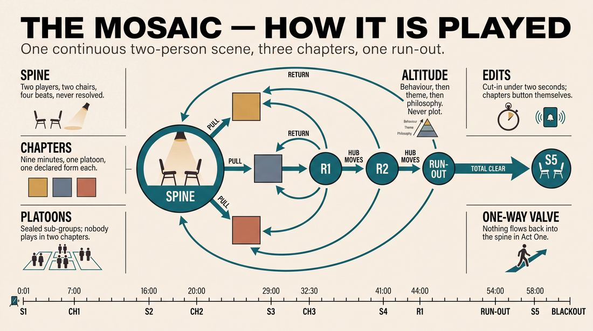
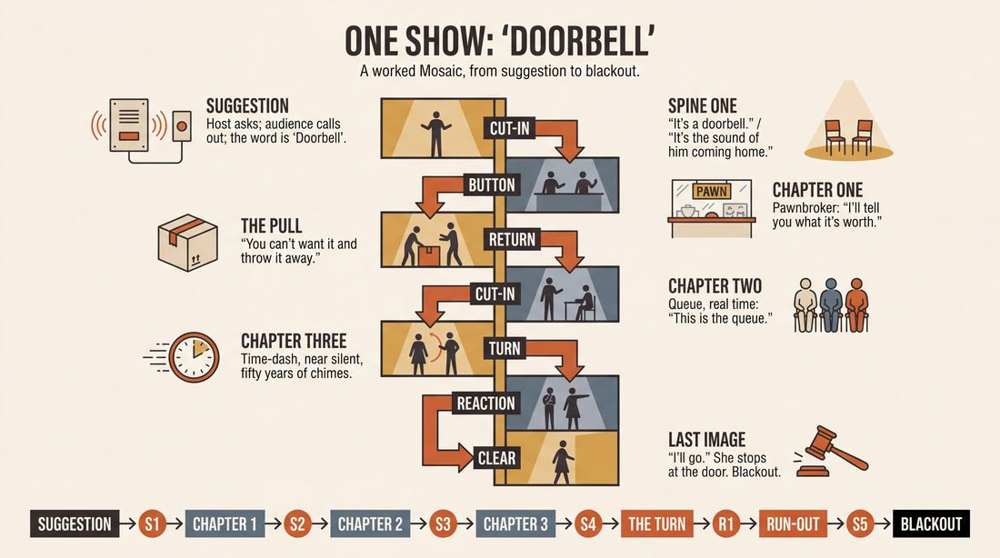
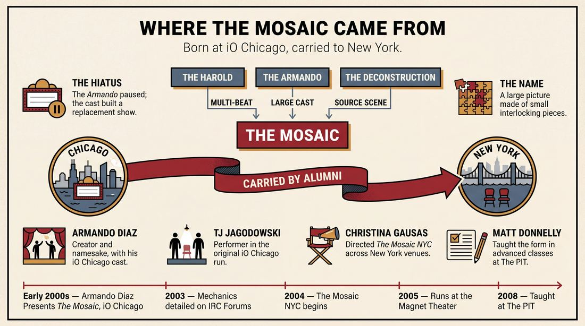
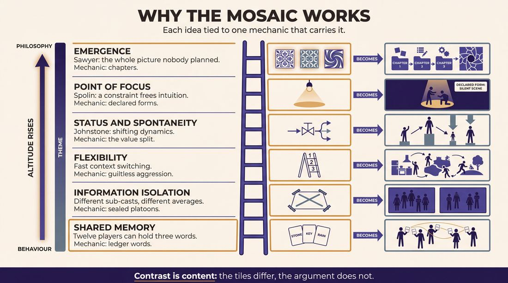
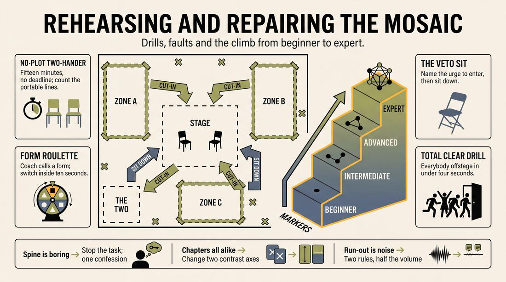

# The Mosaic

> **A complete study of the long-form improv format _The Mosaic_** - the original archived write-up, five infographics, grounded historical and pedagogical research, and a full mechanics-and-coaching manual.

| | |
|---|---|
| **Format** | The Mosaic |
| **Primary source** | [IRC Improv Wiki](https://wiki.improvresourcecenter.com/index.php?title=The_Mosaic) |

---

## Contents

1. [Part I - The Original Write-Up](#part-i-the-original-write-up)
2. [Part II - The Infographics](#part-ii-the-infographics)
   - [1. Structure and Mechanics](#infographic-1-mechanics)
   - [2. A Show, Beat by Beat](#infographic-2-example)
   - [3. Origins and Lineage](#infographic-3-history)
   - [4. Why It Works](#infographic-4-theory)
   - [5. Rehearsal and Repair](#infographic-5-coaching)
3. [Part III - Research Dossier](#part-iii-research-dossier)
   - [Pass 1: History, Lineage, Literature and Scholarship](#research-history)
   - [Pass 2: Comparative Anatomy, Pedagogy and Production](#research-comparative)
4. [Part IV - Mechanics, Gameplay and Coaching Manual](#part-iv-mechanics-gameplay-and-coaching-manual)
   - [Pass 1: The Form, Its Mechanics and Its Gameplay](#manual-mechanics)
   - [Pass 2: Training, Coaching and Performance Companion](#manual-coaching)

---

## Part I - The Original Write-Up

*Verbatim archive of the source article, reproduced exactly as scraped. Everything after this section is generated elaboration built on top of it.*

### The Mosaic

#### Structure

This is an intricate form, with smaller 'forms' performed within it during the course of the show. It requires a fairly large cast to do it justice.

#### Shows/Classes

The Mosaic is currently taught in advanced classes at [iO](https://wiki.improvresourcecenter.com/index.php?title=IO "IO").

The Mosaic was also directed by [Christina Gausas](https://wiki.improvresourcecenter.com/index.php?title=Christina_Gausas "Christina Gausas") in the [Mosaic NYC](https://wiki.improvresourcecenter.com/index.php?title=Mosaic_NYC "Mosaic NYC"). 

#### Links

[IRC discussion on the Mosaic form](http://www.improvresourcecenter.com/mb/showthread.php?t=133)

---

*Archived from [https://wiki.improvresourcecenter.com/index.php?title=The_Mosaic](https://wiki.improvresourcecenter.com/index.php?title=The_Mosaic) (IRC Improv Wiki) on 2026-08-09 23:23 UTC.*

---

## Part II - The Infographics

*Five 16:9 posters, each teaching a different aspect of the format. Click any poster to enlarge.*

<a id="infographic-1-mechanics"></a>

### 1. Structure and Mechanics

*How the form is played: the shape of the piece, the opening, the roles, the edit vocabulary, the flow of information, and the clock.*

{ .diagram loading=lazy decoding=async width="1100" height="614" }


<a id="infographic-2-example"></a>

### 2. A Show, Beat by Beat

*A single worked performance from suggestion to blackout: what happens in each beat, with short real example lines and what the players are doing technically.*

{ .diagram loading=lazy decoding=async width="1100" height="614" }


<a id="infographic-3-history"></a>

### 3. Origins and Lineage

*Where the form came from: creators, dates, theatres, how it spread between schools and cities, and the key figures - a documented timeline and lineage map.*

{ .diagram loading=lazy decoding=async width="1100" height="614" }


<a id="infographic-4-theory"></a>

### 4. Why It Works

*The theory: the core principles of the form and the research and craft ideas that explain why the structure produces good improv, each tied to a specific mechanic.*

{ .diagram loading=lazy decoding=async width="1100" height="614" }


<a id="infographic-5-coaching"></a>

### 5. Rehearsal and Repair

*Training and fixing the form: the essential drills, the common failure modes with their symptom-and-fix pairs, and the markers of beginner through expert play.*

{ .diagram loading=lazy decoding=async width="1100" height="614" }


---

## Part III - Research Dossier

*Two research passes: the historical record, then the comparative and pedagogical record. Claims carry evidence tags - treat unverified items accordingly.*

<a id="research-history"></a>

### » Pass 1: History, Lineage, Literature and Scholarship

### Research Summary
*   **Documentation Level:** Thin but highly specific. While mainstream publications ignore it, the form is well-documented in early-2000s practitioner forums, class syllabi, and archived theatre schedules.
*   **Origin:** [DOCUMENTED] The form was created at iO Chicago in the early 2000s by the cast of *The Armando Diaz Experience* during a brief hiatus of their flagship show.
*   **Structure:** [DOCUMENTED] It is a highly intricate, two-act long-form structure that replaces a traditional opening monologue with a continuous, recurring two-person "source scene."
*   **Mechanics:** [DOCUMENTED] The first act alternates between the continuous source scene and distinct "chapters" or "mini-forms" inspired by it. The second act dissolves into a free-form run-out incorporating all characters and patterns.
*   **Transmission:** [DOCUMENTED] The form migrated from Chicago to New York City, championed by Christina Gausas, who directed a dedicated ensemble (*The Mosaic NYC*) across multiple indie and major comedy venues between 2004 and 2008.
*   **Pedagogy:** [DOCUMENTED] It was taught in advanced classes at iO Chicago and later at The Peoples Improv Theater (The PIT) in NYC as a masterclass in tracking "patterns within patterns."

### Provenance and History
The Mosaic was born out of logistical necessity at iO (formerly ImprovOlympic) in Chicago. In the early 2000s, the theatre's flagship show, *The Armando Diaz Experience, Theatrical Movement and Hootenanny* (commonly known as *The Armando*), temporarily stopped running. To keep the large, highly skilled ensemble playing together, the cast developed a new format. Billed as *Armando Diaz Presents The Mosaic*, the show retained the large-cast dynamics of *The Armando* but replaced the monologist with a structural spine of interweaving scenes. 

The name "The Mosaic" refers directly to its mechanics: a large picture constructed from smaller, distinct, interlocking pieces (in this case, mini-forms and chapters). When *The Armando* eventually resumed, The Mosaic was retired as a weekly mainstage show but survived as a curriculum piece in advanced iO classes and migrated to New York City via iO alumni.

| Year | Event | Place / Company | Source |
| :--- | :--- | :--- | :--- |
| Early 2000s | *Armando Diaz Presents The Mosaic* debuts during an *Armando* hiatus. | iO Chicago | Reddit (r/improv) archives; IRC Forums |
| 2003 | Form mechanics detailed in early online improv taxonomy lists. | IRC Forums | IRC Improv Wiki / Forums |
| 2004 | *The Mosaic NYC*, directed by Christina Gausas, begins performing. | UCB, Red Room, Under St. Mark's (NYC) | IRC Forums; Theatermania |
| 2005 | *The Mosaic NYC* runs at the newly opened Magnet Theater. | Magnet Theater (NYC) | Magnet Theater archived schedules |
| 2008 | Matt Donnelly teaches The Mosaic in advanced long-form classes. | The PIT (NYC) | IRC Forums |

### Lineage and Transmission
The Mosaic is a direct descendant of the Chicago long-form tradition, specifically mutating the DNA of *The Harold* and *The Deconstruction*. While *The Deconstruction* uses a single grounded scene to inspire a run of tangential scenes, The Mosaic uses a *continuous* scene that the ensemble repeatedly returns to. 

The form was transmitted to New York City primarily by Christina Gausas and Armando Diaz. Gausas assembled a super-group of NYC improvisers—many of whom were UCB and PIT veterans—to perform the form under the banner *The Mosaic NYC*. The form was subsequently codified into the curriculum at The PIT by Matt Donnelly, who taught it as an exercise in aggressive pattern recognition. 

**Regional Dialects:**
*   **Chicago-style (iO):** The original iteration, heavily focused on the organic, patient scene-work characteristic of early-2000s iO.
*   **NYC-style (*The Mosaic NYC*):** [INFERRED] Adapted to the faster, game-heavy pacing of the UCB/Magnet ecosystem, requiring performers to rapidly execute distinct "mini-forms" between the source scenes.

### Key Figures
| Person | Role in this form | Specific contribution | Source URL |
| :--- | :--- | :--- | :--- |
| Armando Diaz | Creator / Namesake | Originated the form with his cast at iO Chicago (*Armando Diaz Presents The Mosaic*). | [IRC Forums](https://www.improvresourcecenter.com) |
| Christina Gausas | Director / Performer | Directed and performed in *The Mosaic NYC*, cementing the form's presence in New York. | [Theatermania](https://www.theatermania.com) |
| TJ Jagodowski | Performer | Regular cast member of the original iO Chicago run. | [IRC Forums](https://www.improvresourcecenter.com) |
| Matt Donnelly | Teacher / Performer | Cast member of *The Mosaic NYC*; taught the form's mechanics in advanced classes at The PIT. | [IRC Forums](https://www.improvresourcecenter.com) |

### Canonical Shows, Companies and Recordings
*   ***Armando Diaz Presents The Mosaic*** (iO Chicago, early 2000s). The original run featuring legendary Chicago improvisers like TJ Jagodowski.
*   ***The Mosaic NYC*** (New York City, 2004–2008). Directed by Christina Gausas. The cast rotated but included Julie Brister, Steve Buck, Millicent Cho, Matt Donnelly, Chris Gethard, Birch Harms, Terry Jinn, Rebekka Johnson, Shannon Manning, Doug Moe, Matt Pack, Erik Tanouye, and Andy Whelan. They performed at UCB Theatre, Red Room at KGB, Under St. Mark's Theater, and the Magnet Theater.

*Note: As is common with indie improv from the early 2000s, there are no known, publicly accessible video recordings of these runs.*

### Published Literature
The searchable record for this form is thin in published books, existing almost entirely in the digital ephemera of early improv message boards and class syllabi.

| Work | Author | Year | What it says about this form | Where to find it |
| :--- | :--- | :--- | :--- | :--- |
| *IRC Forums: "LONG-FORM FORMS/SHOWS"* | Forum Contributors | 2003 | Provides the most detailed structural breakdown of the form's two-act mechanics and continuous source scene. | [IRC Forums](https://www.improvresourcecenter.com) |
| *IRC Forums: "Forms, Forms, and More Forms"* | Matt Donnelly | 2008 | A class syllabus detailing the pedagogical focus of the form: interweaving patterns and mini-forms. | [IRC Forums](https://www.improvresourcecenter.com) |
| *The Point Magazine* | Uncredited Author | 2010 | Cites The Mosaic alongside the Harold and Deconstruction as a "classic" long-form with an "ambitious and challenging structure." | [The Point](https://thepointmag.com) |

### Verbatim Quotes
> "It stopped running in the early 2000s for a while and the cast did a form called the Mosaic and then went back to Armando."
> — *Reddit user Apocalapse_Wow on the origin of the form at iO Chicago.*
> [Reddit r/improv](https://www.reddit.com/r/improv/comments/8tq7q8/the_oral_history_of_asssscat_the_worlds/)

> "The Mosaic NYC takes a suggestion from the audience and explores the themes and philosophies it inspires through improvised scenes, creating a show."
> — *Theatermania show description for Dorff & Gausas / The Mosaic NYC.*
> [Theatermania](https://www.theatermania.com)

> "In this session, we will cover The Mosaic: a form that is performed in two acts that builds through beats or source scenes, integrated with chapters or mini-forms in between."
> — *Matt Donnelly, PIT class syllabus.*
> [IRC Forums](https://www.improvresourcecenter.com)

> "Patterns are key. Performers will learn how to create and add to interweaving patterns, creating patterns within patterns, and how to be guiltlessly aggressive in the performance of this piece."
> — *Matt Donnelly, PIT class syllabus.*
> [IRC Forums](https://www.improvresourcecenter.com)

> "maybe a form using one opening and continuing 2-person scene to inspire the improv for the rest of the performance. First half alternates the continuous 2-person scene with three scenes that are inspired by the 2-person scene and each other. Second half is more free-form."
> — *IRC Forum contributor detailing the structure.*
> [IRC Forums](https://www.improvresourcecenter.com)

> "The 2-person scene will divide 'chapters'--each chapter with its own style and energy of improv (and usually with different improvisers depending on the numbers that evening)."
> — *IRC Forum contributor detailing the structure.*
> [IRC Forums](https://www.improvresourcecenter.com)

> "The first scene is a Reaction to the 2-person scene of the 1st half. The following scenes pull from the reaction scene. Then the cycle of Reaction scene and pulling scenes continues building to a run-out which may include everything and everyone who has apperared in the whole show."
> — *IRC Forum contributor detailing the second act.*
> [IRC Forums](https://www.improvresourcecenter.com)

> "This is an intricate form, with smaller 'forms' performed within it during the course of the show. It requires a fairly large cast to do it justice."
> — *IRC Improv Wiki.*
> [IRC Improv Wiki](https://wiki.improvresourcecenter.com/index.php?title=The_Mosaic)

### Anecdotes and Stories
**The Armando Hiatus**
The invention of The Mosaic is a classic example of theatrical necessity breeding formal innovation. In the early 2000s, *The Armando Diaz Experience* was a cornerstone of iO Chicago's schedule. When the show went on a temporary hiatus, the theatre was left with a massive cast of top-tier improvisers (including TJ Jagodowski) and a prime slot to fill. Rather than simply doing a montage, the cast engineered a form that could support a large ensemble while providing a rigorous structural challenge. They replaced the guest monologist with a continuous two-person scene, forcing the ensemble to pull thematic inspiration from their own peers' ongoing scenework rather than a true story. When *The Armando* returned, The Mosaic was shelved, but its reputation as a "player's form" kept it alive in advanced curriculums.

### Academic and Scientific Research
**Group Creativity and Collaborative Emergence**
R. Keith Sawyer's research in *Group Genius* and *Improvised Dialogues* examines how macro-structures in performance emerge unpredictably from micro-interactions, without top-down direction. 
*Relevance to this form:* The Mosaic is an extreme stress-test of collaborative emergence. Because the form requires "patterns within patterns" and distinct "chapters" that must all tie back to a continuous source scene, the ensemble must collectively hold a massive amount of narrative and thematic data in their working memory, building a cohesive two-act structure entirely through horizontal collaboration.

**Cognitive Flexibility and Transient Hypofrontality**
Neuroscientific studies on improvisation (such as Charles Limb's fMRI research on jazz musicians) demonstrate that spontaneous generation requires the deactivation of the dorsolateral prefrontal cortex (associated with self-monitoring). 
*Relevance to this form:* Matt Donnelly's instruction that performers must be "guiltlessly aggressive" speaks directly to this neurological state. The Mosaic requires players to rapidly switch contexts—from a grounded, continuous two-person scene to wildly different "mini-forms" or "chapters." This demands high cognitive flexibility; if a performer self-edits or hesitates during these aggressive transitions, the intricate structure collapses.

### Documented Variants and Descendants
*   **The Deconstruction:** While predating The Mosaic, The Deconstruction is its closest structural relative. Both rely on a "source scene" to generate thematic tangents. However, The Deconstruction uses a single opening scene that ends, whereas The Mosaic uses a *continuous* scene that the cast repeatedly cuts back to throughout the first act.
*   **The Macroscene:** [WIDELY PRACTICED, UNDOCUMENTED] A form that also relies on a single continuous narrative interrupted by cutaways, though usually lacking the strict "mini-form" chapter requirements of The Mosaic.

### Criticism, Debate and Known Failure Modes
*   **The Burden of the Source Scene:** [WIDELY PRACTICED, UNDOCUMENTED] Because the entire first act alternates between the continuous two-person scene and the ensemble's "chapters," the two players in the source scene bear a massive structural burden. If their scene lacks grounded reality, emotional stakes, or thematic richness, the rest of the cast has nothing to pull from, and the show starves.
*   **Over-Complication:** The demand to play "smaller forms within the form" (e.g., executing a mini-La Ronde or a silent scene as a "chapter") can make the show overly cerebral. Practitioners debate whether the audience actually perceives the "patterns within patterns," or if the form is merely an intellectual exercise for bored, advanced improvisers.
*   **The Run-Out Chaos:** The second act is designed to be a free-form synthesis of everything seen in the first act. [INFERRED] Without extreme ensemble discipline, this "run-out" easily devolves into a messy, screaming montage where characters are mashed together without comedic justification.

### Cultural Footprint
The Mosaic's primary cultural footprint lies in its alumni. The cast of *The Mosaic NYC* reads like a who's-who of 2000s alternative comedy, featuring future television writers, showrunners, and actors (Chris Gethard, Doug Moe, Erik Tanouye, Christina Gausas). While the form itself never achieved the ubiquity of the Harold or the Armando, it served as a vital bridge between the Chicago and New York long-form scenes, proving that highly complex, Chicago-style structural forms could thrive in the faster-paced NYC indie comedy ecosystem.

### Gaps in the Record
*   **Exact Dates:** The precise year *Armando Diaz Presents The Mosaic* debuted at iO Chicago is unverified, generally cited only as "the early 2000s."
*   **The "Mini-Forms":** While syllabi mention that the source scene divides "chapters" or "mini-forms," there is no surviving documentation detailing *which* specific mini-forms were traditionally used, or if they were entirely invented on the spot.
*   **Video Evidence:** A researcher should chase down archival VHS or MiniDV tapes from iO Chicago (circa 2001-2003) or the Magnet Theater (circa 2005) to observe the pacing and transition mechanics of the form in real-time.

### Source List
1. IRC Improv Wiki - "The Mosaic" - 2024 - https://wiki.improvresourcecenter.com/index.php?title=The_Mosaic - Supports basic definition and iO/Gausas connection.
2. Reddit r/improv - Apocalapse_Wow - 2018 - https://www.reddit.com/r/improv/comments/8tq7q8/the_oral_history_of_asssscat_the_worlds/ - Supports the origin of the form during the iO Chicago *Armando* hiatus.
3. Theatermania - "Dorff & Gausas on New York City" - 2008 - https://www.theatermania.com/ - Supports the NYC cast list and thematic description.
4. IRC Forums - "Forms, Forms, and More Forms" (Matt Donnelly) - 2008 - http://www.improvresourcecenter.com/ - Supports the structural mechanics (two acts, beats, chapters, patterns).
5. IRC Forums - "LONG-FORM FORMS/SHOWS" - 2003 - http://www.improvresourcecenter.com/ - Supports the detailed breakdown of the continuous 2-person scene and alternating chapters.
6. IRC Forums - "The Geek April Workshops" - 2004 - http://www.improvresourcecenter.com/ - Supports TJ Jagodowski's involvement in *Armando Diaz Presents The Mosaic*.
7. Little Commie / Magnet Theater Archives - 2005 - http://www.littlecommie.com/ - Supports the performance history of *The Mosaic NYC* at the Magnet Theater.
8. The Point Magazine - "The Improviser" - 2010 - https://thepointmag.com/ - Supports the classification of The Mosaic as a classic, structurally ambitious long-form.

<a id="research-comparative"></a>

### » Pass 2: Comparative Anatomy, Pedagogy and Production

### Taxonomic Placement

```text
       The Harold
       /        \
   Armando   Deconstruction
       \        /
       The Mosaic
```

The Mosaic sits structurally between the Armando and the Deconstruction. Like the Armando, it uses a central spine to generate thematic material for a large cast to explore in disparate scenes. Like the Deconstruction, that central spine is a grounded, continuous two-person scene rather than a direct-address monologue. It inherits the Harold's multi-beat structure but replaces the rigid "three beats of three scenes" with "chapters" or sub-forms, allowing platooned sub-groups of a large cast to play entirely different styles of improv within the same show.

### Head-to-Head Comparisons

#### The Mosaic vs. The Deconstruction
| Axis | The Mosaic | The Deconstruction | Consequence for the players |
| :--- | :--- | :--- | :--- |
| **Opening** | Often none; starts directly with the core 2-person scene. | Starts directly with the core 2-person scene (the "Station"). | Players must immediately establish a grounded reality without a group warm-up. |
| **Structure** | Core scene alternates with distinct "chapters" played by platooned sub-groups. | Core scene is interrupted by thematic tangents, then character runs, then merges. | Mosaic players must manage group boundaries; Deconstruction players manage scene types. |
| **Edit Logic** | Hard cuts between the core scene and the chapters. | Thematic sweeps, tag-outs, and organic pulls from the core scene. | Mosaic edits are structural and scheduled; Deconstruction edits are organic and fluid. |
| **Memory** | Platoons must remember the themes of the core scene to inspire their chapter. | Players must remember specific lines and behaviors from the core scene to deconstruct. | Mosaic allows looser, thematic inspiration; Deconstruction requires precise recall. |
| **Cast Size** | Large (10-15 players), divided into platoons. | Small to Medium (6-8 players). | Mosaic requires strict stage management to avoid crowding. |
| **Audience Contract** | "You will see a central relationship evolve, surrounded by distinct mini-shows." | "You will see a single relationship pulled apart and analyzed through other scenes." | Mosaic feels like a variety show with a narrative spine; Deconstruction feels like a thesis. |
| **Failure Mode** | "Bleed" (platoons mixing) or the core scene running out of steam. | The core scene becomes a plotty narrative rather than a grounded relationship. | Mosaic requires discipline in group division; Deconstruction requires discipline in acting. |

#### The Mosaic vs. The Armando
| Axis | The Mosaic | The Armando | Consequence for the players |
| :--- | :--- | :--- | :--- |
| **Opening** | 2-person scene acts as the spine. | True-life monologue acts as the spine. | Mosaic spine players must invent and sustain a fictional reality; Armando monologist relies on truth. |
| **Structure** | Alternates between the spine scene and chapters. | Alternates between monologues and montages of scenes. | Mosaic maintains a continuous fictional narrative; Armando resets with each monologue. |
| **Edit Logic** | Chapter transitions are often marked by lighting or a clear stage wipe. | Scenes are edited organically via sweeps or tag-outs. | Mosaic transitions are formal; Armando transitions are fast and loose. |
| **Memory** | Platoons track the evolving themes of the spine scene. | Players track the specific details and themes of the monologue. | Mosaic themes shift as the spine scene evolves; Armando themes are set by the monologue. |
| **Cast Size** | Large (10-15 players). | Medium to Large (8-12 players). | Both require sharing stage time, but Mosaic platoons guarantee everyone gets a specific slot. |
| **Audience Contract** | "A fictional relationship will inspire a variety of other fictional worlds." | "True stories will inspire fast-paced fictional scenes." | Mosaic demands investment in the spine characters; Armando demands investment in the monologist. |
| **Failure Mode** | The chapters ignore the spine scene entirely. | The scenes merely re-enact the monologue rather than exploring its themes. | Both require the skill of thematic extraction rather than literal translation. |

#### The Mosaic vs. The Harold
| Axis | The Mosaic | The Harold | Consequence for the players |
| :--- | :--- | :--- | :--- |
| **Opening** | 2-person scene. | Group opening (e.g., pattern game, invocation). | Mosaic starts intimate; Harold starts as a full ensemble. |
| **Structure** | Spine scene alternating with chapters (sub-forms). | 3 beats of 3 scenes, separated by group games. | Mosaic allows for different forms within the show; Harold follows a strict structural rhythm. |
| **Edit Logic** | Scheduled transitions between spine and chapters. | Sweeps between scenes; organic transitions into group games. | Mosaic edits are macro-level; Harold edits are micro-level. |
| **Memory** | Platoons track the spine scene. | Players track their own scenes (A, B, C) across 3 beats. | Mosaic memory is centralized; Harold memory is distributed. |
| **Cast Size** | Large (10-15 players). | Medium (6-8 players). | Mosaic accommodates larger classes/teams; Harold is optimized for a standard team size. |
| **Audience Contract** | "A central relationship anchors a variety of styles." | "Disparate worlds will eventually connect and heighten." | Mosaic is radial (outward from the center); Harold is convergent (coming together at the end). |
| **Failure Mode** | Form homogeneity (all chapters look the same). | The scenes fail to connect or heighten in the third beat. | Mosaic requires stylistic versatility; Harold requires narrative/thematic weaving. |

#### The Mosaic vs. Montage
| Axis | The Mosaic | Montage | Consequence for the players |
| :--- | :--- | :--- | :--- |
| **Opening** | 2-person scene. | None, or a brief suggestion pull. | Mosaic provides a structural anchor; Montage is entirely free-form. |
| **Structure** | Spine scene + Chapters. | A continuous series of unconnected scenes. | Mosaic has a macro-structure; Montage has no macro-structure. |
| **Edit Logic** | Formal transitions. | Sweeps, tag-outs, space work. | Mosaic edits are deliberate; Montage edits are rapid-fire. |
| **Memory** | Thematic tracking of the spine. | Minimal memory required beyond the current scene. | Mosaic requires long-term attention; Montage requires short-term reactivity. |
| **Cast Size** | Large (10-15 players). | Any size. | Mosaic organizes a large cast; Montage can become chaotic with too many players. |
| **Audience Contract** | "There is a center to this universe." | "You will see a rapid succession of funny ideas." | Mosaic asks for patience; Montage delivers immediate gratification. |
| **Failure Mode** | The spine scene is weak, dragging down the whole show. | The scenes become too brief and transactional. | Mosaic relies heavily on the two spine players; Montage relies on the whole group's energy. |

### What Makes It Uniquely Itself
1. **The Continuous Two-Person Spine**: If you remove the returning two-person scene, the form devolves into a standard Montage or a Showcase. The spine is the gravitational center that gives the show its name—the "tiles" (chapters) only make a "mosaic" because they are arranged around and inspired by this central image.
2. **Platooned Cast / Sub-groups**: If the entire cast plays in every section, it becomes a Deconstruction. The Mosaic specifically divides a large cast into sub-groups that "own" their specific chapters, ensuring that the distinct styles of the sub-forms remain uncontaminated by player bleed.
3. **Forms-Within-A-Form**: If every chapter is just a series of standard scenes, it is merely an Armando with a scene instead of a monologue. The Mosaic requires the chapters to have distinct stylistic identities (e.g., Chapter 1 is a silent monoscene, Chapter 2 is a fast-paced game montage), making it a meta-form.

### Structural Variants in Practice
| School / City | Named Variant | What it changes | Who plays it | Source |
| :--- | :--- | :--- | :--- | :--- |
| **iO Chicago** | Classic Mosaic | First half alternates the continuous 2-person scene with three inspired scenes. Second half is free-form. | Advanced classes, Del Close / Charna Halpern | IRC Improv Wiki |
| **Mosaic NYC (UCB/Magnet)** | Gausas Mosaic | Highly theatrical, focuses on exploring the themes and philosophies of the suggestion through character worlds rather than strict platooning. | Christina Gausas, Kevin Dorff, NYC indie veterans | Theatermania / IRC Improv Wiki |
| **Indie / Big Yellow Bus** | Chapter/Platoon Mosaic | Strict platooning of 10-13 performers. 3-5 minute source scenes separate 12-minute chapters. No crossover between platoons. | Large indie teams | IRC Forums |

### The Teaching Ladder
| Stage | Skill introduced | Why in this order | Typical exercise | Source or [CRAFT CONSENSUS] |
| :--- | :--- | :--- | :--- | :--- |
| **1. The Spine** | Sustaining a grounded, real-time relationship without plot. | The spine scene must be strong enough to anchor a 45-minute show. If it fails, the form fails. | 15-Minute Monoscene | [CRAFT CONSENSUS] |
| **2. Thematic Extraction** | Pulling themes, philosophies, and premises from a source scene without copying the characters. | Chapters must be inspired by the spine, not parodies of it. | Scene-to-Premise Brainstorm | [CRAFT CONSENSUS] |
| **3. Platooning** | Working exclusively within a sub-group of 4-5 players. | Players must learn to trust their small group and resist the urge to save or interfere with other platoons. | The "No Crossover" Drill | [CRAFT CONSENSUS] |
| **4. Form-Switching** | Executing different improv styles (e.g., slow play vs. fast montage) on command. | The "forms-within-a-form" concept requires stylistic versatility. | Form Roulette | [CRAFT CONSENSUS] |
| **5. The Macro-Edit** | Transitioning cleanly between the spine scene and the chapters. | The form relies on clear, structural edits rather than messy sweeps. | Buttoning the Chapter | [CRAFT CONSENSUS] |

### Documented Drills and Exercises
| Drill | Origin / teacher | How to run it | What it fixes in this form | Source |
| :--- | :--- | :--- | :--- | :--- |
| **Spine Scene Isolation** | [CRAFT CONSENSUS] | Two players perform a 15-minute scene. Every 5 minutes, the coach calls "Time Jump," and they must advance the relationship without changing the core dynamic. | Fixes plot-heavy or gag-driven spine scenes by forcing relationship focus. | [CRAFT CONSENSUS] |
| **Chapter Extraction** | [CRAFT CONSENSUS] | Group A performs a 2-minute scene. Group B must immediately initiate three distinct scenes based purely on the *themes* of Group A's scene, not the plot. | Fixes literal translation (copying characters) instead of thematic inspiration. | [CRAFT CONSENSUS] |
| **Platoon Tag-Outs** | [CRAFT CONSENSUS] | Platoon 1 is on stage. Platoon 2 physically tags all of them out simultaneously to establish a completely new world and style. | Fixes messy transitions and establishes clear platoon boundaries. | [CRAFT CONSENSUS] |
| **Form Roulette** | [CRAFT CONSENSUS] | A platoon begins a montage. The coach calls out different forms ("Monoscene!", "Silent!", "Armando!"). The platoon must instantly adapt their play style. | Fixes form homogeneity; trains players to execute the "forms-within-a-form" concept. | [CRAFT CONSENSUS] |
| **Thematic Return** | [CRAFT CONSENSUS] | Two players start a scene. They leave the stage for 10 minutes while others play. They must return and seamlessly pick up their original energy and relationship. | Fixes spine players losing their characters' grounding while waiting offstage. | [CRAFT CONSENSUS] |
| **Silent Support** | [CRAFT CONSENSUS] | The spine players perform while a platoon creates a silent, physical stage picture or environment around them. | Fixes dead stage energy during long spine scenes and integrates the cast visually. | [CRAFT CONSENSUS] |
| **Pacing the Spine** | [CRAFT CONSENSUS] | The spine scene is played in three 3-minute beats. Beat 1: Discovery. Beat 2: Heightening the dynamic. Beat 3: Resolution or explosion. | Fixes pacing issues where the spine scene peaks too early or goes nowhere. | [CRAFT CONSENSUS] |
| **Chapter Contrast** | [CRAFT CONSENSUS] | Platoon 1 performs a high-energy, fast-paced chapter. Platoon 2 must deliberately choose the exact opposite energy (e.g., slow, quiet, real-time) for their chapter. | Fixes the entire show blending into one uniform tone. | [CRAFT CONSENSUS] |
| **The "No Crossover" Rule** | [CRAFT CONSENSUS] | Players are assigned to platoons and physically restricted to designated zones offstage. They are forbidden from entering another platoon's chapter, even for walk-ons. | Fixes "bleed" where players insert themselves into chapters they don't belong in. | [CRAFT CONSENSUS] |
| **Buttoning the Chapter** | [CRAFT CONSENSUS] | A platoon performs a chapter. They must collectively find the perfect edit point to end their section and clear the stage for the spine players, without relying on a lighting blackout. | Fixes chapters that drag on too long or end on weak, unresolved notes. | [CRAFT CONSENSUS] |

### Common Failure Modes and Diagnoses
| Failure mode | What it looks like from the audience | Root cause | Fix | Who names it |
| :--- | :--- | :--- | :--- | :--- |
| **Spine Collapse** | The central 2-person scene becomes boring, plot-heavy, or argumentative, making the audience dread its return. | The spine players are trying to invent a narrative rather than exploring a relationship. | Focus on "how we feel about each other right now" rather than "what are we doing next." | [CRAFT CONSENSUS] |
| **Bleed** | Players from Platoon A start doing walk-ons in Platoon B's chapter, blurring the lines between the distinct sub-forms. | Lack of discipline; players wanting more stage time or trying to "save" a scene. | Enforce strict platooning rules; trust the assigned sub-group to handle their own chapter. | [CRAFT CONSENSUS] |
| **Thematic Drift** | The chapters feel completely disconnected from the spine scene, turning the show into a random montage. | Platoons are ignoring the source scene and just playing their favorite premises. | Require the first scene of every chapter to explicitly state or mirror a theme from the spine. | [CRAFT CONSENSUS] |
| **Form Homogeneity** | Every chapter looks exactly the same (usually a fast-paced montage), defeating the purpose of the "forms-within-a-form" structure. | Platoons default to their comfort zone rather than committing to a specific stylistic constraint. | Assign specific mini-forms (e.g., "You are doing a La Ronde") to each platoon before the show. | [CRAFT CONSENSUS] |

### Production and Logistics
- **Cast Size and Why**: 10 to 15 players. The form requires a "fairly large cast to do it justice" because it relies on platooning (dividing the cast into sub-groups of 4-5) to execute distinct chapters without exhausting the performers.
- **Runtime**: Typically 45 to 60 minutes. The spine scene requires time to breathe across multiple beats, and each chapter needs 10-12 minutes to establish its own mini-form.
- **Stage Layout**: A wide stage is preferred. The spine players often operate center stage, while platoons may be seated on opposite sides of the stage (or in the wings) to visually reinforce the separation of groups.
- **Chairs and Set**: Two chairs center stage for the spine scene. Additional chairs on the wings for the platoons.
- **Lighting and Tech Cues**: Crucial for this form. A distinct lighting wash (e.g., a warm center spot) is often used for the spine scene, while full stage washes are used for the chapters. Blackouts or musical cues mark the transitions between the spine and the chapters.
- **Music and Sound**: Thematic music can be used during the transitions to set the tone for the upcoming chapter's specific style.
- **MC and Host Duties**: The host must explain the audience contract clearly: "You will see one continuous relationship unfold tonight, and in between, you will see entirely different worlds inspired by that relationship."
- **How the Suggestion is Taken**: A single, evocative suggestion (a philosophy, a theme, or a location) is taken to inspire the initial spine scene.
- **Where the Form Belongs in a Show Lineup**: As a 45-60 minute piece, it is a headline or second-act form. It is too intricate and long for an opening slot.
- **Rehearsal Cadence**: Requires dedicated rehearsals to practice form-switching and thematic extraction. Platoons may even rehearse separately to develop their specific chapter styles.
- **What a Producer Must Prepare**: A tech improviser who understands the structure and can execute the macro-edits with lighting, and a stage large enough to hold 15 people comfortably.

### Adaptations Beyond the Stage
- **Classroom and Youth**: Used to teach thematic comprehension and group cooperation. The "spine" can be a piece of literature or a historical event, and the "chapters" are student groups exploring different facets of that event.
- **Corporate and Applied Improv**: Useful for exploring a central corporate theme (the spine) through different departmental lenses (the platoons). It teaches cross-functional awareness while maintaining departmental identity.
- **Online and Remote**: Highly adaptable to Zoom. The spine players are pinned to the main screen. When a chapter begins, the spine players turn off their cameras, and the specific platoon turns theirs on. This perfectly replicates the "platoon" structure without stage crowding.
- **Community and Therapeutic Settings**: The spine scene can represent a core conflict or trauma, while the chapters allow the group to explore the emotional fallout or alternative perspectives safely, one step removed from the core reality.
- **Accessibility and Inclusion Considerations**: The platooning system is excellent for performers with mobility or stamina issues, as they are only required to be "on" during their specific 10-12 minute chapter, rather than standing on the backline for a full hour.
- **Content-Safety and Consent Practices**: Because the spine scene returns repeatedly, the two spine players must have a strong consent check-in beforehand to ensure they are comfortable sustaining a potentially intense relationship for an hour.
- **Ethics of Using Real Stories**: If the spine scene is inspired by a real audience member's story (hybridizing with the Armando), the platoons must be careful to explore the *themes* rather than mocking the specific details of the person's life.

### Evidence Base for Those Adaptations
- **Improvisational Teaching**: Graue, Whyte, & Delaney (2014) demonstrate how improvisational practices foster culturally and developmentally responsive teaching. The Mosaic's structure of accepting a core premise and building diverse, responsive "chapters" mirrors this pedagogical approach.
- **Structure and Improvisation**: Sawyer (2011) in *Structure and improvisation in creative teaching* highlights how macro-structures (like the Mosaic's spine) provide the necessary scaffolding for micro-level creativity (the chapters) to flourish in educational settings.

### Scholarly Frames Worth Applying
- **Collaborative Emergence (R. Keith Sawyer)**: *The theory that group creativity produces outcomes that cannot be predicted by analyzing the individual members.* **Citation**: Sawyer, R.K. (2003). *Group Creativity: Music, Theater, Collaboration*. **Mapping**: Maps to the "chapters" of the Mosaic, where platoons organically develop themes from the spine scene without pre-planning, creating a meta-narrative that emerges only through the interaction of the sub-groups.
- **Status and Spontaneity (Keith Johnstone)**: *The framework that all human interaction is driven by subtle shifts in dominance and submission.* **Citation**: Johnstone, K. (1979). *Impro: Improvisation and the Theatre*. **Mapping**: Maps directly to the 2-person spine scene, which must rely on deep, shifting relationship dynamics and status plays to remain compelling across multiple beats, rather than relying on plot.
- **Point of Concentration (Viola Spolin)**: *The specific focus or constraint given to players to distract the conscious mind and allow intuition to take over.* **Citation**: Spolin, V. (1963). *Improvisation for the Theater*. **Mapping**: Maps to the "forms-within-a-form" concept, where each platoon is given a specific stylistic constraint (e.g., "play this chapter as a silent movie"), serving as their point of concentration.
- **Organizational Improvisation (Vera and Crossan)**: *The study of how teams innovate in real-time by balancing established structures with spontaneous action.* **Citation**: Vera, D., & Crossan, M. (2004). *Strategic Leadership and Organizational Learning*. **Mapping**: Maps to the platooning system, where sub-groups must operate autonomously within their chapters while still adhering to the macro-structure dictated by the spine scene.

### Where the Form Is Heading
Current practice sees the Mosaic being utilized primarily by large indie teams and advanced training programs as a "graduation" form, as it tests a cast's ability to execute multiple long-form structures within a single show. Hybrids have emerged, such as the "Documentary Mosaic," where the spine is a series of talking-head interviews, and the chapters are the re-enactments. Contemporary companies use the form to manage oversized casts, ensuring everyone gets guaranteed stage time within their platoon while maintaining a cohesive, satisfying narrative arc for the audience.

### Source List
1. "The Mosaic" - IRC Improv Wiki - 2024 - https://wiki.improvresourcecenter.com/index.php?title=The_Mosaic - Supports the definition of the form as intricate, containing smaller forms within it, requiring a large cast, and its origins at iO and Mosaic NYC.
2. "LONG-FORM FORMS/SHOWS" - Improv Resource Center Forums (User: mullaney) - 2003 - http://www.improvresourcecenter.com/ - Supports the structural definition of the Mosaic as a continuous 2-person scene alternating with chapters/scenes inspired by it.
3. "Still Making This Shit Up" - Improv Resource Center Forums - 2006 - http://www.improvresourcecenter.com/ - Supports the "platoon" variant, cast sizes of 10-13, and the 45-minute timing structure with 12-minute chapters.
4. "Dorff & Gausas / Mosaic NYC" - Theatermania - 2008 - https://www.theatermania.com/ - Supports the cast list and thematic exploration style of Christina Gausas's Mosaic NYC.
5. "The Point Magazine: Improv" - The Point Mag - 2010 - https://thepointmag.com/ - Supports the classification of The Mosaic as a "classic" long-form alongside the Harold and Deconstruction.
6. "Navigating Planning and Improvisation" - CITE Journal - 2021 - https://citejournal.org/ - Supports the evidence base for improvisational teaching frameworks (Sawyer, Graue et al.).

---

## Part IV - Mechanics, Gameplay and Coaching Manual

*Synthesis over the original article and both research dossiers: first how the form works and how to play it, then how to train an ensemble to perform it.*

<a id="manual-mechanics"></a>

### » Pass 1: The Form, Its Mechanics and Its Gameplay

### At a Glance

| Field | Detail |
|---|---|
| **Also known as** | *Armando Diaz Presents The Mosaic*; The Mosaic NYC; "Chapter/Platoon Mosaic" (indie); occasionally mislabelled "chaptered Deconstruction" |
| **Family** | Chicago long-form, source-scene branch. Direct descendant of the Harold (multi-beat architecture) crossed with the Armando (large-cast spine-and-satellites) and the Deconstruction (grounded two-person source). Distinguished from all three by being a **meta-form**: it contains other forms. |
| **Cast size** | 10–15. Absolute floor 8 (2 spine + two platoons of 3). Sweet spot 12–13: two spine players plus three platoons of 3–4. Above 16 the run-out becomes unmanageable. |
| **Runtime** | 45–60 minutes. 55 is the honest target. Two acts, with or without an interval. |
| **Opening** | No group opening in the classic version. The show **begins on the spine scene** — a two-person scene that will never fully end until the show does. Optional 60–90 second group image; see *The Opening* for the four documented variants. |
| **Suggestion taken** | One. Single, evocative — a theme, a philosophy, a location, or one concrete noun. Taken once, at the top, and spent entirely on the spine. Chapters do not get their own suggestions. |
| **Structural rigidity (1–5)** | **4.** The macro-shape (spine ↔ chapter ↔ spine ↔ chapter ↔ spine ↔ chapter ↔ spine → Act II) is fixed and non-negotiable. What happens *inside* a chapter is entirely free — which is precisely why the outside must be rigid. |
| **Difficulty (1–5)** | **5.** It is a graduation form. It demands that a cast execute three or four different long-form styles competently in one hour, while two players sustain a single relationship across an hour of interruptions. |
| **Prerequisites** | Solid two-person relationship scenework (monoscene stamina, 12+ minutes without plot); thematic extraction (reading a scene for its argument, not its events); the discipline to *not* enter a scene; fluency in at least three named mini-forms; a tech operator who knows the map. |
| **Best for** | Oversized ensembles where everyone must get real stage time; advanced classes; teams with wildly mixed stylistic tastes (the Mosaic monetises disagreement about what improv should be); showcases where you want one hour to feel like five different shows that rhyme. |
| **Avoid when** | Cast under 8; no rehearsal time; the two strongest relationship players are unavailable; you have twenty minutes; the audience is cold, drunk and short-form-trained; the team has never buttoned a scene without a light cue. |

### The Essence in One Paragraph

The Mosaic is a two-act long form in which one continuous two-person scene — **the spine** — is played in four widely separated beats across the first act, and the gaps between those beats are filled by **chapters**: self-contained ten-minute mini-shows, each performed by a different **platoon** of the cast, each executing a *different named improv form*, and each built not on the spine's plot but on the spine's **argument**. The audience watches one relationship advance in slow motion — a brother and sister clearing out a dead father's house, say — and in between each advance they are shown an entirely different piece of theatre in an entirely different style, made of entirely different people, which is nonetheless *about the same thing*. Because the chapters radiate outward from a single centre, and because each is a distinct tile with its own colour and its own edge, the accumulated picture is a mosaic: legible from a distance, discontinuous close up. In the second act the hierarchy inverts. The spine stops being the sole source; a **reaction scene** takes over the hub, the platoon walls come down, characters from different chapters meet, patterns established inside single chapters get stacked on top of each other, and the whole thing accelerates into a **run-out** that may contain everyone and everything the show has produced — before the two spine players return, alone, for a final image. The form's entire difficulty is contained in two sentences: *the spine must be worth waiting for*, and *the chapters must not be about what the spine is about — they must be about what the spine is arguing about*.

### Why This Form Exists

It exists because of a specific, unglamorous logistical problem, and the solution turned out to be formally interesting.

**The documented origin.** At iO Chicago in the early 2000s, *The Armando Diaz Experience* went on hiatus. That left a very large cast of extremely good improvisers and a prime slot. The cast built a replacement that kept the Armando's large-ensemble dynamics but removed the thing the Armando depends on and could not supply that night: a guest monologist telling true stories. In its place they put a continuous two-person scene. The name describes the mechanics — a large picture made of small, distinct, interlocking pieces.

**What it solves that a montage does not.** Four things, precisely:

1. **The oversized-cast problem.** A twelve-person montage is a cattle call. Everyone hovers; the aggressive players play six scenes and the patient players play one; the backline is a queue. The Mosaic's platoon system *guarantees* stage time by architecture: your platoon owns nine to twelve minutes and nobody else can be in it. This is not politeness. It is the mechanism that makes the chapters stylistically clean.

2. **The stylistic-monoculture problem.** Every long form has a house tempo. Do a montage with a mixed-taste team and you get a compromise tempo that satisfies nobody. The Mosaic doesn't compromise — it **platoons taste**. The three players who love slow real-time work get a monoscene chapter. The four who love fast game-stacking get a game montage chapter. Both are correct, in sequence, in the same show. This is the form's genuinely original contribution and the reason it survived as curriculum.

3. **The Armando's dependency problem.** The Armando is only as good as the monologist, and the monologist is a guest. The Mosaic internalises the source: the spine pair *are* the ensemble, and the source material is fictional, which means it can be steered. If the spine needs to become darker at minute 30, the spine pair can make it darker. A monologist cannot make his childhood darker on request.

4. **The Deconstruction's exhaustion problem.** The Deconstruction takes a source scene, ends it, and mines the corpse. It runs out of ore. The Mosaic keeps the mine open — the source scene is *continuous*, and each return produces new material, which means chapter three has fresher ore than chapter one. This is the single sharpest structural distinction between the two forms and it should drive every choice the spine pair makes: **your job is to keep producing.**

**What you buy, in one line:** an hour in which a large cast plays several different kinds of improv well, and it still adds up.

### The Audience Contract

The Mosaic asks the audience for an unusual thing: *patience across discontinuity*. That is a hard ask, so the contract must be stated and then honoured mechanically.

**What is promised, explicitly.** The host says a version of this before the suggestion:

> "One relationship is going to unfold in front of you tonight, in pieces. In between the pieces, entirely different people are going to show you entirely different worlds. Everything you see comes from that one relationship. We're going to take one suggestion."

Fifteen seconds. Do not skip it. Without it, the first chapter reads as the show abandoning the scene the audience just invested in, and you spend nine minutes climbing out of that hole.

**How the audience knows where they are.** Four redundant signals, and you want all four, because the audience's orientation is the form's load-bearing wall:

| Signal | Spine | Chapter |
|---|---|---|
| **Bodies** | Exactly two, always the same two | Three or more, never the spine pair |
| **Furniture** | The two chairs, in the same configuration every time | Chairs struck, moved, or ignored; different stage geography |
| **Light** | One consistent state — a warm centre wash, tighter than full | Full stage wash, or a state specific to that chapter's form |
| **Sound** | Silence into it | A transition sting or bed under the wipe |

The two chairs are not set dressing. They are the audience's index. **Never let a chapter use the spine chairs in Act I.** The moment a chapter character sits in Maria's chair, the audience's map is corrupted — and that is exactly why *stealing a spine chair* is one of the most powerful Act II moves available (see *The Steal*).

**What breaks the contract.**

- **The spine doesn't come back, or comes back at the same temperature.** The audience is paying for waiting with attention. If Spine Beat 2 opens with the siblings still packing the same box, having the same argument, the debt is unpaid and they stop investing. Every return must be visibly *later*.
- **The chapters are obviously about nothing in particular.** The audience does not need to be able to *articulate* the connection — practitioners have argued for twenty years about whether an audience perceives "patterns within patterns," and my judgement is that they perceive it as *tone rhyme* rather than as a decodable puzzle. But they detect its absence immediately. A chapter that could have been lifted from any other show that night reads as filler.
- **All the chapters look the same.** If chapters one, two and three are all four-person fast game montages, the audience has correctly deduced there is no mosaic — just a montage with a recurring scene in it. This is the most common death.
- **The run-out is noise.** Twelve people shouting on stage is not convergence; it is the end of the contract. Convergence must be *legible* — recognisable characters doing recognisable things in a new combination.
- **The spine resolves early.** If the siblings hug and sell the house at minute 28, the centre of the mosaic is gone and the remaining tiles have nothing to be arranged around.

### Anatomy: The Full Structural Map

**The macro-shape.** Act I is *radial*: information flows outward from a single hub, and never back. Act II is *chained and then convergent*: the hub function is handed to the ensemble, each new hub is generated by the last, and the material accumulates until everything is on stage at once.

```
                       SUGGESTION ("Doorbell")
                              |
   ACT I  -  RADIAL           v
                        +-----------+
                        |  SPINE    |  Maria & Dev, two chairs, continuous
                        |  S1 6:00  |
                        +-----+-----+
                              | pull (theme, not plot)  --> one-way valve
              +---------------+
              v
        [ CHAPTER 1 ]  Platoon A - LA RONDE - 9:00
              |
              v
        +-----------+
        |  SPINE    |  later that night. Temperature moved.
        |  S2 4:00  |
        +-----+-----+
              |
              v
        [ CHAPTER 2 ]  Platoon B - REAL-TIME MONOSCENE - 9:00
              |
              v
        +-----------+
        |  SPINE    |
        |  S3 3:30  |
        +-----+-----+
              |
              v
        [ CHAPTER 3 ]  Platoon C - TIME-DASH, NEAR-SILENT - 8:30
              |
              v
        +-----------+
        |  SPINE    |  THE TURN. Crisis stated, not solved.
        |  S4 3:00  |
        +-----------+
        = = = = = = = = = = = =  act break (optional, 0-5 min)
   ACT II  -  CHAINED, THEN CONVERGENT
        +-----------+
        |REACTION R1|  any 2 players, any platoons. New hub.
        +-----+-----+
          |    |    |
          v    v    v      pulls from R1 - platoon walls DOWN
        [p] [p] [p]        3 short scenes, crossover permitted
              |
        +-----------+
        |REACTION R2|  generated by the pulls, not by the spine
        +-----+-----+
          |  |  |  |
          v  v  v  v       pulls stack; patterns from Ch1/2/3 recur
        [p][p][p][p]
              |
              v
   #########################################
   #        THE RUN-OUT  (4-6 min)         #   everyone, everything,
   #  characters cross chapters, patterns  #   accelerating, no full edits
   #  from all three chapters collide      #
   #########################################
              |
              v
        +-----------+
        |  SPINE S5 |  Maria & Dev alone. One image. 60-90 sec.
        +-----------+
              |
           BLACKOUT
```

**Beat-by-beat.**

| Unit | Approx. clock | What happens | Who drives it | Success criterion | Common error |
|---|---|---|---|---|---|
| **Host frame + suggestion** | 0:00–0:01 | Contract stated in one sentence; one suggestion taken and repeated back | Host (or any cast member) | Audience knows two things: one relationship, many worlds | Long explanation of the form's rules; taking three suggestions |
| **Spine Beat 1 (S1)** | 0:01–7:00 | Two players establish a relationship, a place, and — critically — a *disagreement of values*. No plot goal is set. | The Two | By minute 5 an outsider could state the scene's argument in one sentence that contains no proper nouns | Establishing a task ("we have to be out by Friday") instead of a value conflict; being funny |
| **The Pull** | (inside S1, last 90s) | Each platoon lead silently commits to one word or one idea from the spine to build on | Platoon leads, offstage | Three different words chosen, ideally at three different altitudes | All three leads pull the same obvious line |
| **Cut-In to Chapter 1** | 7:00 | Platoon A wipes the stage in a single decisive movement; spine pair exits through them | Platoon A lead | Under two seconds; no eye contact between platoon and spine pair | A tentative walk-on; asking permission with the body |
| **Chapter 1** | 7:00–16:00 | Platoon A executes a declared mini-form (e.g. La Ronde), thematically descended from S1 | Platoon A only | The chapter's form is legible within 30 seconds; the theme is present but the characters are new | Recreating the spine's characters; playing a generic montage |
| **The Button** | 15:30–16:00 | The platoon finds its own ending and clears without a blackout | Platoon A lead | Chapter ends on an image, not a laugh line and not a fade | Waiting for tech to rescue them; one extra scene "to land it" |
| **Spine Beat 2 (S2)** | 16:00–20:00 | The Two return, later, at a changed temperature; the value conflict deepens | The Two | An audience member could say what changed while they were away | Resuming the identical moment; recapping |
| **Chapter 2** | 20:00–29:00 | Platoon B, *contrasting* form (if Ch1 was fast and structured, this is slow and singular) | Platoon B only | Feels like a different show by a different company | Same tempo and cast density as Chapter 1 |
| **Spine Beat 3 (S3)** | 29:00–32:30 | Shorter. The relationship reaches the thing it has been avoiding | The Two | Something is now *said out loud* that was subtext in S1 | Introducing a new plot complication instead of a new honesty |
| **Chapter 3** | 32:30–41:00 | Platoon C, third distinct form; typically the most formally extreme (silent, choral, time-dash) | Platoon C only | The audience is surprised again | Playing safe because the show "needs grounding now" |
| **Spine Beat 4 (S4) — The Turn** | 41:00–44:00 | Short and hot. The relationship arrives at crisis. **It is not resolved.** | The Two | Ends on an unanswered question or an unmoved refusal | Resolution; a hug; a decision |
| *(Act break)* | — | Optional. If you take one, it must come *after* S4, never mid-chapter | Stage manager | Audience leaves talking about the siblings | An interval placed for tech convenience |
| **Reaction Scene R1** | 44:00–48:00 | Two players — **not** the spine pair — play a scene that is the ensemble's *response* to S4 | Whoever initiates, guiltlessly | Reads as an answer, an argument or an aftermath, not as another chapter | The spine pair coming back and doing S5 too early |
| **Pull run off R1** | 48:00–51:00 | Three short scenes pulling from R1; platoon walls now down; characters may cross | Anyone | Characters from Chapter 1 appear in Chapter 2's world and it *means* something | Random mash-ups with no comic justification |
| **Reaction Scene R2 + pulls** | 51:00–54:00 | The cycle repeats one rung higher; patterns from all three chapters are now in play | Anyone | Two patterns collide and produce a third | Restating rather than heightening |
| **The Run-Out** | 54:00–58:00 | Accelerating; edits stop being clean; the stage fills; everything recurs | The whole cast, self-organising | Audience recognises at least six things and laughs from recognition, not from volume | Screaming; twelve simultaneous unrelated bits |
| **Spine Beat 5 (S5) / Final image** | 58:00–59:30 | The cast clears entirely. The Two, alone, one short beat. One image. | The Two | Silence in the room before the applause | Explaining the show; a joke button |
| **Blackout** | 59:30 | — | Tech | Called on the image, not on the line after it | Late blackout |

### The Opening

The Mosaic's opening is a deliberate absence. There is no pattern game, no invocation, no group monologue. The show starts on a two-person scene, cold. This is documented as the classic behaviour and it is correct for a reason specific to this form: **any group opening spends the ensemble's collective attention before the spine has earned it.** The spine must be the first thing the audience meets, because everything they see for the next hour will be measured against it.

**Procedure — the classic cold open, step by step.**

1. **Pre-set.** Two chairs, centre, angled toward each other at about 45°, roughly a metre apart. Platoons seated or standing in their assigned zones — Platoon A stage-left wings, B stage-right, C upstage or in the house. Tech has three states ready: SPINE (warm centre, tight), FULL (chapter wash), BLACK.
2. **House to half. FULL up.** The host walks on alone or with the cast behind.
3. **State the contract in one sentence.** Not the mechanics. The promise. "You'll see one relationship tonight in pieces, and in between, other people will show you other worlds that all came from it."
4. **Take exactly one suggestion.** Ask for something with texture: *a household object*, *a word your family uses*, *a thing people argue about*. Do not ask for a location — locations produce spines about tasks. Do not ask for a relationship — you're about to make one.
5. **Repeat the suggestion once, clearly.** This is the only time the audience will hear it named. Everything downstream is descended from this word, and half your cast will be relying on it as a shared handle in the run-out.
6. **Host exits. Lights to SPINE.** The two chairs are now lit; the rest of the stage is dim. Whoever is in shadow reads as *not in the show yet*, which is exactly right.
7. **The Two walk on in silence and take at least three seconds before the first line.** This is not affectation. It is the form telling the audience: *this is the slow thing; settle in.*
8. **The first line establishes a relationship, not a premise.** "You kept it." beats "So — Dad's house, huh."
9. **By minute 3, the environment is fully specified** (objects, geography, time of day) — because the platoons are going to steal the environment's *logic*, and abstract space gives them nothing.
10. **By minute 5, the value conflict is on the table.** The two players disagree about *what matters*, not about *what to do next*. Platoon leads are now writing their one-word ledger entries.
11. **At around 6:00, the Two plant a pull line** — one sentence that is portable, i.e. true outside this scene. Then they continue as if they hadn't.
12. **Platoon A cuts in at 6:30–7:00**, before the spine resolves anything.

**Documented and practical variants.**

| Variant | Mechanics | When to use it | Cost |
|---|---|---|---|
| **Cold spine open** (classic iO) | Exactly as above. No group work at all. | Default. Warm, patient, literate audience. Strong spine pair. | Nothing to catch a cold house. The first two minutes can feel like the show hasn't started. |
| **Suggestion image** (recommended addition) | 45–75 seconds: the full cast builds a single silent moving stage picture from the suggestion, then dissolves upstage leaving the Two in the chairs. | Cold rooms; festival slots; audiences who have just watched short form. My default recommendation for anything but a home crowd. | Slight risk of setting a group-mind tone the spine then has to undercut. Keep it wordless and keep it under 90 seconds. |
| **Gausas / theme-exploration open** | The suggestion is treated as a *philosophy*, briefly interrogated by the cast in direct address or a short choral moment, and the spine is then chosen as an embodiment of it. Documented as the Mosaic NYC's emphasis: exploring "the themes and philosophies" a suggestion inspires. | Casts strong on theatricality and theme, weaker on strict platooning. Rooms that respond to overtly artful framing. | Front-loads abstraction. The chapters may then pull from the *stated* theme rather than the spine, which flattens the radial structure. |
| **Armando hybrid open** | A guest monologist tells one true story; the spine pair then improvise a two-hander from it and that scene becomes the spine. | Nights you have a good monologist and a nervous cast; corporate and applied contexts. | Adds an authority above the spine. Content-safety note: if the spine is built on a real person's story, the chapters must be aggressive about *themes* and scrupulous about not mocking details. |
| **Documentary Mosaic open** | The spine is a talking-head interview pair rather than a naturalistic scene; chapters are re-enactments and tangents. | Contemporary hybrid; useful for casts who struggle to sustain a naturalistic two-hander. | Direct address makes the spine an *explainer*, which is easy — but it lowers the emotional ceiling, and Spine Beat 5 has almost nowhere to land. |
| **Zoom / remote open** | Spine pair pinned; entire rest of cast cameras off. At the cut-in, spine pair go dark and the platoon comes up. | Remote rehearsal or performance. This maps onto the platoon structure almost perfectly — better than most forms. | Loses the wipe. You must replace the physical cut with a hard verbal or musical cue, or the transition is mush. |

> **Conflict in the record, flagged.** Dossier 3 says the Mosaic "often" has no opening and starts directly with the core scene; Dossier 2 says the form "replaces a traditional opening monologue" with the spine — which implies the spine *is* the opening. These agree in substance. My judgement: there is no group opening, and the spine occupies the opening's structural slot. Add a wordless suggestion image only as a cold-room tool.

### The Engine

This is the section that matters. Everything else is stagecraft.

#### 1. The three altitudes of a pull

Every chapter is generated by **extraction**: reading the spine and lifting something out of it. There are four altitudes at which you can lift, and only three of them are legal.

Take this exchange from Spine Beat 1:

> **MARIA:** You can't want it and throw it away. Pick one.
> **DEV:** I don't want it. I want to be the person who has it.

| Altitude | What you lift | Example chapter initiation | Legal? |
|---|---|---|---|
| **0 — Plot** | The events. Siblings, a house, a dead father. | *"Well, Mom's flat isn't going to clear itself."* | **No.** This is the single most common Mosaic failure. It produces a chapter that is a worse version of the spine. |
| **1 — Behaviour** | A specific human move: performing ownership; wanting to be seen wanting. | *"I don't listen to it. I just like people to see it on the shelf."* | **Yes.** Safest and most reliable. Best for Chapter 1. |
| **2 — Theme** | The abstract engine: who gets to decide what a thing is worth. | An auctioneer, a pawnbroker, a valuer. | **Yes.** The workhorse altitude. |
| **3 — Philosophy** | The unanswerable question: does value exist in the object or in the witness? | A near-silent chapter in which the same object is handled by five people across fifty years. | **Yes**, but only once per show, and best at Chapter 3, after the audience trusts you. |

**Craft rule I'd teach on Thursday:** *the three chapters must sit at three different altitudes.* Chapter 1 at behaviour, Chapter 2 at theme, Chapter 3 at philosophy. That ascent is what makes the show feel like it is *going* somewhere even though the spine has barely moved. It also solves form homogeneity automatically, because altitude and style are correlated: behavioural chapters want fast game structures; philosophical chapters want silence and time.

#### 2. The one-way valve (Act I)

**In Act I, information flows spine → chapters and never chapter → spine.**

This is my strongest structural recommendation and the record is silent on it, so I own it. The reasoning is mechanical, not aesthetic. The spine is the *source*. A source that begins ingesting its own downstream output stops being a source; it becomes a mirror, and the radial structure collapses into a feedback loop. Concretely: if Chapter 1 does a bit about a pawnbroker and then Dev says "It's not a pawn shop, Maria," three things break at once — the spine's fictional integrity, the audience's mental map of what causes what, and the chapters' authority (because now the chapters are being *judged* by the spine rather than generated by it).

What the spine pair *may* absorb from a chapter, because they cannot help it:

- **Temperature.** If Chapter 2 was quiet and sad, S3 may come back quieter. This is good; it makes the show feel like one organism.
- **Tempo.** If Chapter 1 was frantic, S2 can come back with a stillness that reads as relief.
- **Nothing else.** No words, no objects, no names, no premises.

**The valve opens at the act break.** In Act II crossover is not merely permitted, it is the point.

#### 3. The chain rule inside a chapter

Within a chapter, the scenes ("tiles") do **not** each go back to the spine for a fresh pull. Only tile 1 pulls from the spine. Tile 2 pulls from tile 1, tile 3 from tile 2. The 2003 forum description supports this — the inspired scenes are inspired "by the 2-person scene *and each other*."

```
SPINE  ---->  tile 1  ---->  tile 2  ---->  tile 3  ---->  button
   (pull)         (chain)        (chain)       (chain)
```

This is what produces *patterns within patterns*, which Matt Donnelly's syllabus names as the form's core teaching. Level one: the spine generates chapters. Level two: inside each chapter, the tiles generate a local pattern with its own rules. In Act II, level three: those local patterns get stacked and interfered with. A team that understands only level one will produce a competent Armando. The Mosaic lives at levels two and three.

#### 4. Platooning as an information mechanism

Platoons are usually explained as fairness or crowd control. They are actually an **information-isolation device**.

If all twelve players can enter all three chapters, each chapter's style is an average of twelve people's instincts, and three averages of the same twelve people are identical. That is form homogeneity, and it is mathematically inevitable — not a discipline problem. Platooning fixes it at the source: three groups of four produce three *different* averages. The style differences are not willed; they emerge from the roster.

Practical consequences:

- **Cast platoons for contrast, not balance.** Do not spread your strong players evenly. Put the three slowest, most patient players together and give them the monoscene chapter. Put the four fastest together and give them the game chapter. A "balanced" platoon produces a beige chapter.
- **Assign zones physically.** Platoon A stage-left, B stage-right, C in the house or upstage. Bodies in the wrong zone are the early warning sign for bleed.
- **The spine pair belong to no platoon.** They have their own zone, usually a downstage corner or the front row, and they use the chapter time to stay in relationship (see *Thermal Holding*).

> **Conflict in the record, flagged.** Dossier 3 describes strict platooning as *definitional* ("if the entire cast plays in every section, it becomes a Deconstruction") but also lists the Gausas / Mosaic NYC variant as *not* strictly platooned. My judgement: strict platooning is the mechanism that most reliably produces the form's defining stylistic contrast, but it is not the only one. Gausas's version substitutes a *thematic* division (each chapter is a different "world" or philosophical facet) for a *personnel* division. If you drop platooning, you must replace it with an equally hard constraint, or you will get a montage. For a team learning the form, platoon strictly.

#### 5. Contrast law

Each chapter must differ from the one before on **at least two** of these five axes. This is a checkable, pre-show, whiteboard-level decision.

| Axis | Values |
|---|---|
| **Tempo** | Real-time / edited / rapid-fire |
| **Cast density** | 2 at a time / 3–4 at a time / all of the platoon at once |
| **Reality level** | Naturalistic / heightened / absurd / abstract |
| **Format** | Monoscene / La Ronde / tag run / time-dash / silent piece / genre pastiche / documentary / pattern game |
| **Sound world** | Silent / dialogue-driven / musical / choral |

A concrete failure test: cover the character names and describe Chapter 1 and Chapter 3 in five words each. If the descriptions are interchangeable, you did not do the form.

#### 6. The economy of the spine

The spine pair are running a *supply business*. Across four beats they must produce roughly six to nine usable pulls, at ascending altitude, without ever behaving like they know they're doing it.

The reliable generator is not plot. It is **the widening confession**. Each spine beat, one rung:

| Beat | Rung | What is now sayable |
|---|---|---|
| S1 | Preference | "You always liked the ugly stuff." |
| S2 | Grievance | "You weren't here. Don't audit me." |
| S3 | Admission | "I already sold the piano. In April." |
| S4 | Need | "I need you to tell me I did it right." |

Notice that none of these are plot events. Each is a *new thing that can be said*, and each one is portable — which is what makes it extractable. **Plot events are not portable; states of relationship are.** That single sentence is the whole craft of the spine.

#### 7. Act II physics: the hub relay

Act I is radial with a fixed hub. Act II hands the hub around.

The documented description is: the first scene of the second half is a **Reaction** to the spine scene; the following scenes pull from the reaction scene; the cycle repeats, building to a run-out that may include everything and everyone.

Read carefully, this is a *relay*, not a free-for-all. Each hub is generated by the previous set of pulls, so the show drifts progressively further from the spine while remaining causally attached to it. That drift is the second act's whole feeling: the centre is still there but you can no longer see it directly, only its effects. I'd draw it for a cast like this:

```
ACT I :   S -> [c c c] -> S -> [c c c] -> S -> [c c c] -> S
          hub  spokes    hub   spokes    hub   spokes   hub
          (one hub, four times)

ACT II:   R1 -> [p p p] -> R2 -> [p p p p] -> RUN-OUT -> S5
          hub   spokes     hub    spokes      everything   centre
          (hub moves, each new hub made of old spokes)
```

> **Ambiguity in the record, flagged.** The sources do not say who plays the Reaction scenes, nor whether the spine pair return in Act II. My judgement, and what I direct: **the Reaction scenes are played by anyone except the spine pair**, because the point of Act II is the handover of the source function to the ensemble; and **the spine pair return exactly once, at the very end, for 60–90 seconds.** Without S5 the show has no centre at the moment it most needs one, and the run-out becomes the ending, which it is not built to be.

#### 8. Convergence, and what it is not

Convergence in the Mosaic is **not** plot resolution. Chapter 1's pawnbroker does not turn out to be Chapter 3's dying man's son. That is Harold-thinking, and in a form with three unrelated stylistic worlds it is grotesque.

Convergence in the Mosaic is **collision of patterns**. Three legal kinds:

1. **Character crossing.** A Chapter 1 character walks into Chapter 2's world and behaves exactly as they did before. The comedy is the mismatch of behaviour to context. Cheap, effective, use twice.
2. **Pattern stacking.** Chapter 2 established that people in the queue never turn around. Chapter 3 established a doorbell nobody answers. In the run-out, a queue of people who won't turn around stands at a door nobody answers. The two rules operate simultaneously and produce a third thing.
3. **Altitude collapse.** The philosophical chapter's abstraction is spoken by the behavioural chapter's idiot. *"Everything's worth what someone'll pay, mate, including you"* — said by the pawnbroker, in the run-out, to a grieving stranger. This is the most satisfying move in the form and it is available to you only because you built three altitudes.

### Roles and Responsibilities

| Role | Owns | Must do | Must not do | Signal to the others |
|---|---|---|---|---|
| **The Two (spine pair)** | The centre of the mosaic; the show's emotional temperature; the supply of pulls | Establish a value conflict by minute 5; plant one portable line per beat; return *later* every time; stay in relationship offstage; take S5 alone | Resolve before S4; add plot to create interest; reference any chapter; be funnier than the show needs; break the two-chair geography | Walking to the chairs together, in silence, is the return signal — no line until both are seated |
| **Platoon Lead (one per platoon)** | The chapter's form, its first initiation, and its button | Hold the one-word ledger entry; declare the form to the platoon in the wings in under five words; execute the cut-in decisively; call the button | Wait to see if someone else initiates; change the form mid-chapter; add a fourth tile because it's going well | Steps to the downstage edge of their zone = "I'm going next, on my count" |
| **Platoon Player** | One tile, and support of the platoon's form | Match the chapter's declared style even if it isn't your style; stay inside your zone during other chapters; take the tile you're given | Enter another platoon's chapter for any reason, including saving it; play your favourite character regardless of altitude | Hands loose at sides at zone edge = available; seated = out |
| **Chapter-Cutter (may be the lead)** | The transition *into* a chapter | Cross the stage on a straight line, at speed, with a body attitude that already belongs to the new world | Enter tentatively; make eye contact with the spine pair | The cross itself. That is the signal. |
| **The Recaller** | The transition *back* to the spine | Watch for the button; clear the stage completely before the Two step out | Linger for a final tag; strike or move the spine chairs | Full stage clear, three seconds of empty stage |
| **Act II Initiator (rotating, everyone)** | The reaction scenes and pulls | Initiate "guiltlessly aggressively" — full commitment, no hedging preamble | Deliberate; wait for permission; check with the room | Stepping out on the last syllable of the previous line |
| **Tech / lights** | The audience's orientation | Maintain exactly one SPINE state, unchanged all night; give each chapter a distinct wash; call the final blackout on an image | Improvise a new spine state; blackout to rescue a dying chapter; fade during the run-out | Lights are a cast member: the SPINE state coming up *is* the announcement |
| **Musician (optional)** | Chapter identity and transition energy | Play *into* the new chapter's style during the wipe; go silent under the spine | Underscore the spine (it kills the naturalism); play during the pull run of Act II unless stacking | A three-second sting under a cut-in |
| **Host / MC** | The contract | Deliver the promise in one sentence; take one suggestion; leave | Explain platoons, chapters or forms to the audience | Exiting is the "go" |
| **Director (rehearsal only)** | Platoon casting; the chapter-form card; the ascent of altitudes | Cast platoons for contrast; assign or veto forms before the show; police bleed in notes | Direct from the wings during the show | — |

### The Rules That Actually Bind

**Hard rules. Break these and you are not doing the Mosaic.**

| Rule | Why it is load-bearing |
|---|---|
| **One continuous two-person scene, same two players, spanning the whole of Act I in separated beats.** | Remove it and you have a montage or a showcase. Its continuity is what distinguishes the Mosaic from the Deconstruction, which kills its source. |
| **The spine is never fully resolved before its final beat.** | The chapters are arranged *around* an open centre. Close the centre and the tiles have nothing to describe. |
| **Chapters are generated from the spine at altitude 1–3 (behaviour, theme, philosophy), never at altitude 0 (plot).** | Altitude-0 chapters are re-enactments. The form's promise is *other worlds, same argument*. |
| **Each chapter has a declared, distinct form and differs from its neighbour on at least two contrast axes.** | This is the "forms-within-a-form" requirement. Without it the show is an Armando with a scene for a monologue. |
| **In Act I, no player appears in more than one chapter, and the spine pair appear in none.** | Personnel isolation is what produces stylistic difference. Bleed averages the chapters into each other. |
| **In Act I, no chapter material may enter the spine.** | The one-way valve. Craft rule, not documented — but the alternative is a feedback loop and the collapse of the radial structure. |
| **Act II must converge: material from all chapters recurs before the end.** | Otherwise you have performed three unrelated shows and an hour of the audience's goodwill is unpaid. |
| **One suggestion, taken once, spent on the spine.** | Fresh suggestions per chapter would sever every chapter from the centre — which is the whole form. |

**Soft conventions. House by house; pick and be consistent.**

| Convention | Common options | My recommendation |
|---|---|---|
| Number of chapters | 2 (short version), 3 (classic), 4 (large cast) | 3. Four chapters at nine minutes each puts you past 70 minutes. |
| Chapter length | 8–12 min (indie platoon variant cites 12); the 2003 forum description implies as little as one scene each | 9 minutes, three tiles plus button. See the flag below. |
| Interval | Yes / no | No interval for anything under 55 min; a hard 5-minute interval after S4 if you're at 70+. Never mid-chapter. |
| Platoon assignment | Fixed pre-show / drawn at random / self-selected in the wings | Fixed pre-show, cast for contrast. Random platoons defeat the purpose. |
| Chapter forms | Assigned pre-show on a card / chosen by the lead in the moment | Assigned for the first ten shows; chosen live once the team is fluent |
| Spine pair visible during chapters | Seated in shadow on stage (theatrical, Gausas-flavoured) / fully offstage | Onstage in shadow, downstage corner, in relationship. The visual reinforces the centre and prevents thermal loss. |
| Spine returns in Act II | Yes, once at the end / no | Yes, once. S5 is worth the whole show. |
| Lighting | Distinct spine wash / single state all night | Distinct spine wash. This is the cheapest orientation aid you will ever buy. |
| Suggestion type | Object / theme / philosophy / location | Concrete noun with emotional freight. "Doorbell" over "loyalty" over "a laundromat". |
| Act II hub players | Spine pair / anyone / explicitly anyone-but-the-spine-pair | Anyone but the spine pair. |

**Myths.**

| Myth | Why people believe it | Why it's wrong |
|---|---|---|
| "It's an Armando with a scene instead of a monologue." | Superficially true of the alternation, and it's the origin story. | The Armando's scenes are stylistically uniform. The Mosaic's chapters must be *different forms*, played by *different sub-casts*. That is the entire innovation. |
| "The chapters must feature the spine's characters or world." | Confusion with the Deconstruction, which does mine the source's specifics. | The Mosaic pulls themes, not people. Reappearing spine characters in Act I chapters is the clearest sign of a team that hasn't understood the form. |
| "The spine players get to rest during the chapters." | They're offstage. | They have the hardest offstage job in improv: sustaining a relationship's temperature across nine-minute gaps, three times, without rehearsing it in their heads. |
| "Everything has to connect at the end." | Harold training. | Convergence is *pattern collision*, not plot resolution. Explaining that the pawnbroker was the dead father all along is a disaster. |
| "You need fifteen people." | The wiki says a "fairly large cast." | Eight works: 2 + 3 + 3, with two chapters. You need enough for *distinct sub-casts*, not enough to fill a stage. |
| "The mini-forms must be famous named forms." | The word "forms-within-a-form." | Any hard stylistic constraint counts. "This chapter is three scenes, all in one location, nobody may stand up" is a legitimate mini-form and will read more clearly than a botched La Ronde. |
| "The second act is a free-for-all." | The sources say "free-form." | The documented description contains a specific machine — reaction scene, pulls, repeat, run-out. Free-*form* is not form-*less*. |
| "The spine has to be funny." | It's an improv show. | The spine's job is to be *productive*. The laughs in a Mosaic come overwhelmingly from the chapters and from Act II collisions. A spine that reaches for jokes stops producing pulls. |
| "You need lights and a musician." | The production notes emphasise tech. | They help enormously. But a wall of bodies executing a clean wipe and a platoon that buttons its own chapter will orient an audience in a bare room. Tech is an amplifier of the structure, not the structure. |

### Edits and Transitions

The Mosaic has three edit *registers*, and mixing them is the most common technical failure. Macro-edits (spine ↔ chapter) are formal, visible, and slow enough to read. Micro-edits (inside a chapter) belong to that chapter's declared form. Act II edits are progressively dirtier by design.

| Edit | How to execute physically | When it is right | When it is wrong | What it costs |
|---|---|---|---|---|
| **The Cut-In** (spine → chapter) | Platoon lead crosses from their zone on a straight, fast diagonal to the opposite downstage area, already in character posture. On the cross, the Two stand and exit *upstage through* the incoming platoon. Lights snap SPINE→FULL on the cross. | Every Act I chapter start. | Before the spine has planted a pull; during a spine line rather than after one. | Two seconds of stage. Nothing else — this is the form's cheapest, cleanest edit. |
| **The Wall Wipe** | Three or four platoon members walk a tight line across the stage shoulder-to-shoulder, downstage to upstage or side to side, obliterating the picture. | Chapter → chapter tiles when the chapter's form is fast and abstract; the Time-Dash chapter; any moment you need to erase geography, not just people. | In the spine. Ever. Walls are chapter language. | Energy — a wall is loud. Overuse makes every chapter feel like a sketch revue. |
| **The Button** (chapter self-ending) | The platoon lands a final image, holds it for a full beat, then **the platoon itself clears** — no blackout. Last player out takes the audience's eye with them. | Ending every chapter in Act I. | When the platoon is out of ideas and buttons early to escape. The audience feels the flinch. | Nerve. Buttoning without a light cue is the hardest technical skill in the form. |
| **The Return** (chapter → spine) | Full stage empties. Three seconds of empty lit stage. Lights FULL→SPINE. The Two walk on together, sit, hold three beats, then speak. | Every re-entry to the spine. | Rushing it — overlapping the Two's entrance with the platoon's exit in Act I. That overlap is Act II's signature and you'll spend it too early. | Time. Roughly eight seconds per return, four returns, ~35 seconds of show. Worth every second: it is the audience's re-orientation. |
| **The Tag-Out** | Standard: touch the shoulder of a player, they leave, you replace them with a new relationship to the remaining player. | Inside a chapter, if that chapter's declared form is a tag run. | Inside a monoscene chapter, or across the spine. A tag-out into the spine is the loudest possible violation of the one-way valve. | Nothing inside its home chapter; everything outside it. |
| **The Sweep** | Single player crosses the stage in front of the scene, wiping it. | Inside chapters that use conventional montage grammar. | As the spine↔chapter transition. A sweep is too casual to mark a structural border; the audience will read it as "another scene," not "another world." | Structural legibility. This is the edit that quietly turns a Mosaic into a montage. |
| **The Overlap / Dissolve** | New scene begins upstage while the previous scene's last two lines are still landing; old scene walks out mid-image. | **Act II only.** Between pull scenes. | Act I, anywhere. | It burns the show's cleanliness. Correct — that's the effect you want in Act II. Spending it early leaves you no gear change. |
| **The Steal** | An established chapter character walks on and sits in one of the two spine chairs. | **Act II only**, once, and preferably in the run-out's first thirty seconds. | Act I. | Enormous, and worth it. It tells the audience without a word that the walls are down. Do it twice and it means nothing. |
| **The Fold** (third body into the spine) | A chapter character enters the spine scene and plays *with* the Two as a third character. | **Act II run-out only.** The most extreme move available. | Any other time. | The spine's isolation, permanently. Once folded, the Two can never be alone again — except that they must be, for S5. So: fold, then have the folded character leave on their own line, restoring the two chairs. |
| **The Freeze-and-Bleed** | The run-out scene freezes; another group begins around/behind them; the frozen group unfreezes into the new scene as different characters. | Late run-out, when you want acceleration without full edits. | Before the run-out. It is unreadable if the audience hasn't already met all the characters. | Clarity. Acceptable only because by minute 56 clarity is no longer the priority — recognition is. |
| **The Thematic Hard Cut** | A single player calls a line from the chapter's world *from the wings*, lights snap, the stage changes. | Chapter transitions in a chapter whose form is audio-driven or documentary. | Anywhere you have not established that disembodied voices exist. | Establishing a new convention mid-show. |
| **The Blackout** | Full black. | Exactly twice: (optionally) the act break, and the end of the show, called on S5's final image. | To end a chapter. To rescue anything. | If you use blackout as a chapter button, you have taught the audience that endings are tech's job, and every subsequent chapter will drift, waiting for the light to save it. |
| **The Non-Edit** (run-out accumulation) | Nobody clears. New players simply add. Volume and cast density rise; the stage picture becomes a crowd. | The final ninety seconds of the run-out. | Any earlier. | The stage. You cannot get it back except by the total clear that precedes S5 — which is why that total clear is the show's most important physical moment. |

**The single hardest transition to execute, and how to drill it:** the **total clear into S5**. Twelve people onstage, mid-run-out, must vanish in under four seconds leaving two chairs. Drill it cold: cast on stage, director claps once, everyone off, count. Under four seconds or run it again. Then add the Two walking on. This is a fire drill and should be rehearsed like one.

### Memory: Callbacks, Patterns and Heightening

The Mosaic's memory problem is unusual: the show generates far more material than a Harold, and it distributes that material across sub-casts who did not see each other's work from the inside. Left unmanaged, Act II becomes a list of things people liked. Managed, it becomes the collision engine described above.

#### The one-word ledger

Before their chapter, each platoon lead silently commits to **one word** lifted from the most recent spine beat. Not a sentence, not a premise — a word. That word is:

- the chapter's **seed** (its first tile must be about it, at altitude 1–3);
- the chapter's **handle** in Act II (say the word out loud, and the whole cast knows which world you're invoking);
- the chapter's **name** in notes afterwards.

From our worked example: Chapter 1's word is **worth**. Chapter 2's word is **queue**. Chapter 3's word is **outlast**. In Act II, someone saying "and what's that worth to you" instantly summons Chapter 1's entire pattern set without a single character reappearing. Three words are recallable by twelve people under pressure. Thirty details are not.

#### The four memory objects, and who holds them

| Object | Held by | Used when |
|---|---|---|
| **The value conflict** (one sentence, no proper nouns) | Everyone | Every chapter's first tile; every reaction scene |
| **The three ledger words** | The whole cast, said aloud in the wings after each chapter | Act II hubs and the run-out |
| **Each chapter's internal rule** (e.g. "nobody in the queue ever turns around") | That platoon | Act II pattern stacking |
| **One verbatim spine line** ("the echo line") | Everyone | Once per show, in the run-out, said by the wrong person in the wrong world |

#### Patterns within patterns: the three levels, mechanically

This is the phrase from the PIT syllabus, and it is not mystical. It is three nested loops.

- **Level 1 — the show's pattern.** Spine → chapter → spine → chapter. The audience learns this by minute 16 and it produces the pleasure of anticipation. Heighten it by *shortening the spine beats* — 6 minutes, 4, 3.5, 3 — so the show feels like it is tightening.
- **Level 2 — each chapter's internal pattern.** Every chapter establishes a local rule in its first thirty seconds and then varies it. In the La Ronde chapter, the rule is *one player carries over*. Heighten *inside* the chapter: by tile 3, the carried-over player is carrying over something else too — the same phrase, the same injury.
- **Level 3 — the pattern of patterns.** In Act II, level-2 rules are treated as *objects*. You can move a rule from one world to another. Chapter 2's "nobody turns around" is a rule; apply it to Chapter 1's auction house and you have an auction where nobody looks at the item. That is a joke that could not exist in any other form, because no other form manufactures three separate rule-sets and then licenses their combination.

#### Heightening arithmetic

| Element | Beat 1 | Beat 2 | Beat 3 | Act II |
|---|---|---|---|---|
| Spine beat length | 6:00 | 4:00 | 3:30 | 1:30 (S5) |
| Spine confession rung | Preference | Grievance | Admission | Need (S4) → silence (S5) |
| Chapter altitude | Behaviour | Theme | Philosophy | Collapse (philosophy in an idiot's mouth) |
| Cast density on stage | 2 | 2–4 | 3–6 | 12 |
| Edit cleanliness | Surgical | Surgical | Surgical | Overlapping → none |

Notice the shape: the spine contracts while the ensemble expands. That inverse relationship is the show's dramaturgy and you can hold your entire cast to it as a single instruction: **as the show goes on, the Two say less and everyone else does more — until the very last minute, when it flips back.**

#### Callback discipline

- **One echo line per show, verbatim.** More than one and the audience starts hunting for a code.
- **Callbacks must land in a *different altitude* than they were born in**, or they are just repetition. A behavioural bit repeated is a bit. A behavioural bit spoken as a philosophy is a heighten.
- **Never call back the spine's plot.** The spine's *words* are portable; the spine's *events* are not. "You can't want it and throw it away" travels anywhere. "Dad's house" travels nowhere.

### Move-Level Technique Catalogue

| # | Move | Situation | How to do it | Example line | Failure mode |
|---|---|---|---|---|---|
| 1 | **Plant the Pull** | Last 90 seconds of any spine beat | Say one sentence that is true outside this scene, then immediately continue as if you hadn't. Do not press it. | **MARIA:** "You can't want it and throw it away. Pick one." | Announcing it — slowing down, hitting it, looking out. The pull must be dropped, not handed over. |
| 2 | **The Value Split** | Spine minute 3–5 | Instead of disagreeing about an action, disagree about what a thing *is*. One of you thinks it's a chair; the other thinks it's their mother. | **DEV:** "It's a doorbell." / **MARIA:** "It's the sound of him coming home." | Splitting on logistics ("we should sell / we should keep"), which produces a task, not an argument. |
| 3 | **Thermal Holding** | Spine pair, offstage during a chapter | Sit together in your corner in silence, in character posture, not watching the chapter analytically. Keep one hand near the imaginary object. Do not discuss the show. | *(no line)* | Whispering plans for the next beat. Every planned spine beat plays cold. |
| 4 | **Later, Not Longer** | Every spine return | Open the beat mid-action at a *demonstrably later* point: a new object in hand, a coat on, a room half-emptied. State the passage physically before you speak. | **DEV** *(entering with a full binbag)*: "That's the last of upstairs." | Resuming the exact frozen moment. This is the number-one spine error and it kills the return. |
| 5 | **The Confession Rung** | S2, S3, S4 | Each return, say aloud one thing that was subtext last time. Exactly one rung. Never two. | **MARIA:** "I already sold the piano. In April." | Dumping three rungs at once in S2, leaving S3 and S4 with nothing. |
| 6 | **The Withheld Fact** | Established in S1, deployed in S4 | One player privately decides a fact in S1 and does not reveal it until The Turn. | **DEV:** "He asked me to do it. Not you. Me." | Forgetting it, or revealing it to the audience via a knowing look, which spends it. |
| 7 | **The Object Anchor** | Spine, all beats | Choose one object in S1 and re-handle it, differently, in every beat. It is the audience's clock. | *(the doorbell chime box: examined → boxed → unboxed → held)* | Introducing four objects, so none of them accumulates meaning. |
| 8 | **The One-Word Ledger Pull** | Platoon lead, during a spine beat | Silently choose one word. Say it in your head three times. Build tile 1 from it, at an altitude above plot. | *(word: "worth")* | Choosing a phrase instead of a word; choosing the funniest line rather than the most portable one. |
| 9 | **The Altitude Call** | First line of a chapter | Make your opening line name the abstraction in a new context — no spine nouns permitted. | **PAWNBROKER:** "I'll tell you what it's worth. You tell me what it cost you." | Using a spine noun ("house", "dad", "boxes"), which drops you to altitude 0 in one line. |
| 10 | **Guiltless Aggression** | Any chapter or Act II initiation | Step out on the last syllable of the previous line, fully committed, with a physical attitude already loaded. No preamble, no hedging question. (Named directly in the PIT syllabus: performers must be "guiltlessly aggressive.") | **AUCTIONEER** *(mid-stride, already selling)*: "—and we open at four hundred!" | The apologetic entrance: drifting on, hands empty, "So… hey." In this form hesitation reads as a structural error, not a personal one. |
| 11 | **The Form Declaration** | First 20 seconds of a chapter | Establish the chapter's rule with the body, not with words: if it's a La Ronde, execute the first carry-over immediately; if silent, the second player must also not speak. | *(first two-hander ends at 90s; one player stays, new player enters)* | Declaring the form verbally, or waiting three minutes to reveal it, by which point the audience has filed the chapter as "a montage." |
| 12 | **The Inversion Pull** | Chapter 2 or 3 | Build the chapter on the *photographic negative* of the spine's theme. If the spine is about people who can't throw anything away, the chapter is about people who own nothing. | **RUTH:** "I've got a rucksack. That's it. That's the whole thing." | Inverting the plot rather than the theme ("what if the parents were alive?"), which is still altitude 0. |
| 13 | **The Scale Jump** | Any chapter | Take the spine's two-person dynamic and play it at a different order of magnitude: a nation, an insect, a company, a god. | **MINISTER:** "The committee has decided the coastline has no sentimental value." | Scale-jumping without keeping the *dynamic*. A big premise is not a pull. |
| 14 | **The Literalisation** | Chapter 3, philosophical altitude | Take a metaphor from the spine and make it physically true on stage. | *(a man who is, literally, the sound of a doorbell; he can only be heard when someone arrives)* | Doing it in Chapter 1, before the audience trusts the show's reality level. |
| 15 | **The Tile Chain** | Chapter, tiles 2 and 3 | Do not return to the spine for a new pull. Take the *last* tile's most specific behaviour and build on that. | *(tile 1: pawnbroker undervalues; tile 2 opens on a woman practising being undervalued in a mirror)* | Three independent tiles all pulling from the spine — which produces three flat variations instead of a rising pattern. |
| 16 | **Chapter Contrast Check** | Next platoon lead, watching from the wings | In one word, name what the current chapter *is* (FAST). Choose the opposite (SLOW). Then choose a form that enforces it. Whisper the form to your platoon. | *(whispered)* "Monoscene. One place. Nobody leaves." | Choosing the form you like. Contrast is a decision made about the *previous* chapter, not about your preferences. |
| 17 | **Silent Support** | Long spine beat, energy sagging | The next platoon builds a slow, silent, non-competing stage picture at the edges of the light — a street, a queue, weather. No sound, no comedy. | *(three figures cross upstage in dim light, carrying boxes)* | Pulling focus. If the audience looks at you, you have broken the spine. |
| 18 | **The Button on an Image** | Last 30 seconds of a chapter | Find the picture that states the chapter's argument, hold it two full beats, clear on the platoon's own initiative. | *(the auctioneer alone, gavel raised, no bidders)* | Buttoning on a laugh line — the chapter ends on a joke and evaporates. Images survive to Act II; jokes don't. |
| 19 | **The Handoff Gift** | End of a chapter | Let the final image be inheritable — an emotional posture the spine can walk into. | *(chapter ends on someone alone with an object; spine returns to Maria alone with the chime box)* | Ending on chaos, forcing the spine pair to spend forty seconds re-establishing calm. |
| 20 | **Zone Discipline** | All of Act I, offstage | Physically stay in your platoon's assigned zone. When another platoon plays, sit down. | *(no line)* | Standing at the edge "in case." Standing is a promise to enter; the audience reads it and so does your cast. |
| 21 | **The Local Rule** | Chapter, first tile | Establish one hard rule *inside* your chapter. Announce it only through behaviour, repeat it in tile 2, break it once in tile 3. | *(rule: everyone in the queue faces forward; in tile 3 one person turns around and everything stops)* | No local rule, so nothing exists for Act II to steal. |
| 22 | **The Echo Line** | Once per show, Act II | Say one verbatim spine line, in a chapter world, in the wrong mouth. | **PAWNBROKER** *(gently, to a stranger)*: "You can't want it and throw it away. Pick one." | Using it more than once; using it in Act I; landing it as a punchline rather than as a chill. |
| 23 | **The Reaction Open** | First scene of Act II | Two players who are *not* the spine pair begin a scene that reads as the aftermath of, or the argument against, S4. | **LOCKSMITH:** "You'll want the deadbolt too. People come back." | The spine pair coming out and playing S5 by accident. Once the Two return, Act II has nowhere left to go. |
| 24 | **The Crossover Claim** | Act II pull runs | Bring a Chapter 1 character into Chapter 2's world, behaving *identically*. Do not explain. | **AUCTIONEER** *(joining the estate-sale queue)*: "Do we have four hundred? Anyone? For the space in the queue?" | Explaining the crossover, or altering the character to fit — which forfeits the mismatch that is the entire joke. |
| 25 | **Pattern Stacking** | Late Act II | Impose one chapter's local rule on another chapter's world. Name nothing; just play both rules at once. | *(auction house; nobody turns around; the auctioneer sells to a room of backs)* | Stacking three rules at once, which is unreadable. Two rules, maximum. |
| 26 | **Altitude Collapse** | Run-out | Give the philosophical chapter's abstraction to the behavioural chapter's dumbest character, sincerely. | **PAWNBROKER:** "Everything outlasts somebody, mate. That's the business." | Playing it ironically. The move only works if the idiot means it. |
| 27 | **The Steal** | Run-out, once | An established chapter character sits in a spine chair. | *(the Auctioneer sits in Dev's chair and says nothing)* | Doing it twice; doing it before the run-out; sitting and then talking a lot. Sit, hold, be seen. |
| 28 | **The Total Clear** | 10 seconds before S5 | On an unmissable cue — a single sound, a light shift, or one player's exit that everyone shadows — the entire cast leaves in under four seconds. | *(a single doorbell chime; twelve people gone)* | A ragged three-wave exit that tells the audience the show ended before it ended. |
| 29 | **The Last Image** | S5 | The Two, alone, 60–90 seconds, minimal words, one physical decision. | **MARIA:** *(the bell rings; she looks at Dev; she goes to the door)* | Talking. Explaining the theme. Any joke. Any hug that resolves what S4 opened — resolve the *image*, not the argument. |
| 30 | **The Veto Sit** | Anytime you want to enter and shouldn't | Notice the urge, name it internally as "I want stage time" or "I want to save this," and physically sit down. | *(no line)* | Rationalising ("I'll just do a walk-on"). Every bleed in the history of this form began as a walk-on. |

### Principles

**1. The spine is a relationship, not a plot.**
*Why here:* the spine must generate portable material for an hour. Plot events ("we have to be out by Friday") are not portable — nothing outside that scene can be about a Friday deadline. Relationship states ("I need you to say I did it right") are portable to any world, any scale, any genre.
*Followed:* every spine beat ends with a sentence a platoon lead can build a pawnshop out of.
*Violated:* Chapter 2 opens with two people clearing another house, because that's all the spine gave them.

**2. The chapters pull altitude, never plot.**
*Why here:* the Mosaic is defined against the Deconstruction, which mines specifics. Mosaic tiles must be *different pictures in the same colour*.
*Followed:* the audience can't say why the auction house is connected to the siblings, but they feel it and they lean forward.
*Violated:* three chapters of grief-adjacent naturalism, and a show that would have been better as one long scene.

**3. In Act I the valve is one-way.**
*Why here:* a source that ingests its own output stops being a source. The radial structure depends on a clean hierarchy of causation.
*Followed:* the Two never once acknowledge that another show happened while they were away — but the temperature of S3 has quietly picked up Chapter 2's sadness.
*Violated:* Dev makes a joke that references the pawnbroker; the audience's model of the show collapses into "everyone is in everything," and Act II's opening of the walls costs nothing because there were no walls.

**4. Contrast is content.**
*Why here:* "forms-within-a-form" is not decoration; the audience's experience of *variety* is what pays for the spine's slowness. If chapters don't differ, the form has produced nothing that a montage wouldn't.
*Followed:* five-word descriptions of the three chapters share no words.
*Violated:* form homogeneity — three fast four-person game montages, and by minute 40 the audience is watching the same show for the third time.

**5. Platoons are an information device, not a fairness device.**
*Why here:* stylistic difference emerges from personnel difference. Three different sub-casts produce three different averages; one cast produces one average, three times.
*Followed:* the slow platoon's monoscene is genuinely slower than anyone else in the company would ever play.
*Violated:* bleed. One aggressive player walks into all three chapters and all three chapters become that player's aesthetic.

**6. Every return to the spine must be visibly later.**
*Why here:* the audience is paying for the wait with attention, in four instalments. The interest payment is *change*.
*Followed:* the room is emptier, the coats are on, one more thing has been said.
*Violated:* the spine feels like a scene that keeps getting interrupted rather than a story unfolding in gaps — and the audience begins to dread it.

**7. The spine contracts as the ensemble expands.**
*Why here:* it is the only dramaturgical curve available in a form with no plot. 6 → 4 → 3.5 → 3 minutes against 2 → 4 → 6 → 12 bodies.
*Followed:* the show accelerates without anyone playing faster.
*Violated:* a five-minute spine beat at minute 41 and an audience checking the time.

**8. Chapters button themselves; light never rescues them.**
*Why here:* the chapters are autonomous sub-shows. A chapter that can't end itself has not been a form; it has been a run of scenes waiting to be stopped.
*Followed:* the stage clears on an image and the audience applauds a nine-minute piece they will remember by its picture.
*Violated:* four consecutive fade-outs, and the cast learns that endings are somebody else's job — fatal in the run-out, which has no tech to hide behind.

**9. Nobody saves anybody.**
*Why here:* in most ensemble forms, rescuing a floundering scene is a virtue. Here it is the single most destructive available act, because it destroys the isolation that generates the show's variety.
*Followed:* Platoon B watches Platoon A have a rough middle three minutes and does nothing, and Platoon A finds its own way out, and the chapter is *theirs*.
*Violated:* bleed, then homogeneity, then a Deconstruction with extra steps.

**10. Initiate guiltlessly.**
*Why here:* the form is built from hard borders — cut-in, button, return, reaction, run-out. Each border requires someone to commit before it is safe to. The PIT syllabus names this directly: performers must be "guiltlessly aggressive."
*Followed:* transitions are two seconds and read as authored.
*Violated:* five-second dead air at every join, and the audience begins to see the machinery instead of the picture.

**11. Convergence is pattern collision, not plot resolution.**
*Why here:* the chapters occupy different realities. Connecting them by story requires flattening them to one reality, which destroys the mosaic.
*Followed:* an auction where nobody turns around; a philosophical line in an idiot's mouth; the audience laughing at recognition of *structure*.
*Violated:* a run-out that stops to explain that the pawnbroker was the father all along, and the biggest laugh of the night is the sound of the form dying.

**12. Act II hands over the hub.**
*Why here:* the documented Act II mechanic is a chain of reaction scenes, each generated by the last set of pulls. If the spine keeps generating in Act II, nothing has changed and the second act is a repetition of the first.
*Followed:* the reaction scene is played by two people from two different platoons and feels like the ensemble answering the Two back.
*Violated:* Act II is "Act I but sloppier," and the show has no second gear.

**13. Say the word, not the scene.**
*Why here:* twelve people cannot share thirty details under pressure. They can share three words. The one-word ledger is the form's actual memory system.
*Followed:* someone says "worth" in the run-out and four players instantly know which world to bring.
*Violated:* Act II callbacks that only the player who made them remembers, played to a silent room.

**14. The last minute belongs to the Two.**
*Why here:* the mosaic is only a mosaic if it has a centre. The run-out disperses the picture; S5 re-collects it. This is my recommendation rather than a documented rule, and I would fight for it.
*Followed:* twelve bodies vanish in four seconds, two people sit, one image, blackout, and the audience holds its breath before it claps.
*Violated:* the show ends on twelve people shouting, and the audience leaves remembering noise instead of the siblings.

**15. Tech maintains exactly one spine state, all night, unchanged.**
*Why here:* the audience's spatial map is the only thing preventing an hour of discontinuity from reading as chaos. The spine wash is a landmark. Landmarks must not move.
*Followed:* by S3 the audience feels the light change before they see the actors, and settles.
*Violated:* a tech operator who "improves" the spine look at S3, and an audience that briefly doesn't know if this is a chapter.

### Worked Run-Through

**Cast (12).** Spine: **Ines** (plays MARIA), **Tomas** (plays DEV). Platoon A (4): Jo, Ade, Priya, Kwame — *lead: Jo*. Platoon B (3): Ruth, Sam, Lena — *lead: Ruth*. Platoon C (3): Hal, Bee, Cormac — *lead: Hal*.
**Pre-show chapter card:** A = La Ronde (fast, structured, verbal). B = Real-time monoscene, one location, three players (slow, naturalistic). C = Time-dash, five short scenes across fifty years, near-silent, musician-driven (abstract).
**Suggestion:** "Doorbell."

---

**0:00 — Host.**

> **HOST:** One relationship tonight, in pieces. In between the pieces, other people, other worlds, all of it out of that one relationship. Can we get one thing — something in your house you'd argue about?
> **AUDIENCE:** "Doorbell!"
> **HOST:** Doorbell. Thank you.

> **Mechanic:** Contract stated in one sentence; single suggestion; a concrete household object rather than an abstraction, which gives the spine an *object anchor* on a plate.

---

**0:25 — Lights to SPINE. The Two walk on, sit, four seconds of silence. Spine Beat 1.**

> **MARIA:** You kept it.
> **DEV:** It was in the drawer with the fuses.
> **MARIA:** You kept it in your hand for a minute and a half.
> **DEV:** *(setting the chime box down)* It's a doorbell.
> **MARIA:** It's the sound of him coming home.
> **DEV:** It's a doorbell, Mar.

> **Mechanic:** **The Value Split** (move 2) executed in five lines. They are not disagreeing about what to *do* with the object; they disagree about what the object *is*. That is a portable argument, and every platoon lead can now hear the show's engine: *who decides what a thing is worth?*

---

**2:00 — Environment specified.**

> **MARIA:** Don't put anything in the hall. The hall is done. The hall is *finished*, Dev.
> **DEV:** There's a chair in the hall.
> **MARIA:** That chair's staying with the house.
> **DEV:** Says who?
> **MARIA:** Says the estate agent, says me, says — it's a *chair*, it's not a person.

> **Mechanic:** Concrete geography (hall, rooms, sorted zones) is established by minute 2. Platoons need environmental *logic* to steal; "an abstract space where two siblings emote" gives them nothing.

---

**4:30 — The value conflict, on the table.**

> **DEV:** You've made three piles and one of them is called "Dev is sentimental."
> **MARIA:** One of them is called *keep*, and you keep putting things in it that you will never look at again.
> **DEV:** I don't want it. *(beat)* I want to be the person who has it.

> **Mechanic:** The **Confession Rung** at the *preference* level (move 5). Dev has said something true about himself that has nothing to do with the house. It is now available at altitude 1 (behaviour: performing ownership) and altitude 2 (theme: value as witnessed).

---

**6:10 — Plant the Pull.**

> **MARIA:** *(not looking at him)* You can't want it and throw it away. Pick one.
> **DEV:** *(taping a box)* Where do the mugs go.

> **Mechanic:** **Plant the Pull** (move 1). One portable sentence, dropped and immediately buried under a mundane line. Ines does not press it. Three platoon leads write three different words: Jo takes **worth**; Ruth takes **pick**; Hal takes **outlast**.

---

**6:45 — Cut-In.**

*Jo crosses fast from stage left on a straight diagonal, already leaning on an imaginary counter. Lights SPINE → FULL. Ines and Tomas stand and exit upstage through the platoon.*

> **Mechanic:** **The Cut-In.** Two seconds, no eye contact, the incoming body already in character posture. Notice the cut happens *after* the pull and *before* any resolution — the spine is abandoned mid-task, which is exactly the state the audience will want to return to.

---

**6:47 — Chapter 1, Platoon A: La Ronde. Tile 1.**

> **JO (PAWNBROKER):** I'll tell you what it's worth. You tell me what it cost you.
> **ADE (CUSTOMER):** Four grand.
> **JO:** Then it's worth eleven pounds and you've had a lovely eleven years.

> **Mechanic:** **The Altitude Call** (move 9). Not one spine noun. No house, no siblings, no father. The abstraction — *who decides worth* — is instantly transposed into a pawnshop. Altitude 1–2. And the chapter's form declares itself within one exchange: fast, verbal, transactional.

---

**8:20 — Tile 2 (carry-over).**

*Ade stays; Jo exits; Priya enters.*

> **PRIYA (AUCTIONEER):** And we open at four hundred.
> **ADE:** It's my mother's ring.
> **PRIYA:** It's four hundred. *(to the room)* Four? Four fifty? — Sold, to the man who is crying, at four hundred.

> **Mechanic:** **The Form Declaration** made unmissable — one player carries over, the other rotates. The audience now has the chapter's *local rule*. Also **The Tile Chain** (move 15): tile 2 builds on tile 1's *behaviour* (undervaluing sincerely), not on the spine.

---

**10:00 — Tile 3.**

*Priya stays; Ade exits; Kwame enters.*

> **KWAME (MAN WITH A PHONE):** Which one makes me look like someone you'd want?
> **PRIYA:** They're the same photo.
> **KWAME:** They're *not*. In that one I'm holding a dog.
> **PRIYA:** Whose dog?
> **KWAME:** *(beat)* Does it matter whose dog?

> **Mechanic:** The chapter has heightened its own pattern: tile 1 was valuing an object, tile 2 valuing an object *with a person attached*, tile 3 valuing a *person*. Level-2 pattern (patterns within patterns) is now visible without anyone naming it.

---

**12:30 — Tile 4 and Button.**

*Kwame stays; Priya exits; Jo returns as a different character.*

> **JO (EULOGY WRITER):** Give me three words about your dad.
> **KWAME:** He was… he had a really good handshake.
> **JO:** That's five and it's a hand.
> **KWAME:** Put "he was worth something."
> **JO:** To who?
> **KWAME:** *(long pause)* Right.

*Jo lowers the notebook. Two beats. Platoon A clears on their own, Jo last.*

> **Mechanic:** **The Button on an Image** (move 18) — a man who cannot name the witness, and a lowered notebook. No blackout, no laugh line. The image is inheritable and will be *available in Act II*. Also note the chapter closed the loop back to the ledger word (**worth**) without ever mentioning the spine.

---

**15:45 — Return.**

*Three seconds of empty lit stage. FULL → SPINE. Ines and Tomas walk on. Tomas is now wearing a coat and carrying a bin bag; the room is visibly emptier in how they move through it.*

**Spine Beat 2.**

> **DEV:** That's the last of upstairs.
> **MARIA:** *(not looking)* And?
> **DEV:** And the loft's just insulation and a bike.
> **MARIA:** Whose bike?
> **DEV:** Does it matter whose bike?

> **Mechanic:** **Later, Not Longer** (move 4) — the coat and the bag do the time-passage work before anyone speaks. And an accidental gift: Tomas has independently landed on the same construction Kwame used ("Does it matter whose dog?"). *This is not a violation of the one-way valve* — Tomas didn't hear it as material, he arrived at it from his own scene. The audience will hear a rhyme. This is what tonal bleed is supposed to sound like, and it's why the spine pair sit in shadow rather than leaving the room.

---

**17:20 — Confession rung two.**

> **MARIA:** You weren't here.
> **DEV:** I was here in March.
> **MARIA:** You were here for a weekend in March and you've been *grieving* at me ever since like you've got a receipt.
> **DEV:** Don't audit me, Maria.
> **MARIA:** Somebody has to.

> **Mechanic:** **The Confession Rung** at *grievance*. Exactly one rung up from S1. New portable material: *grief as a ledger; who is entitled to feel what*. Ruth, in the wings, adjusts her ledger word from "pick" to **queue** — she has decided her chapter is about people waiting for permission to want something.

---

**19:40 — Cut-In. Chapter 2, Platoon B: real-time monoscene.**

*Ruth, Sam and Lena walk on slowly and sit in a line facing the audience, on the floor, in coats. No wipe — they simply arrive and the spine pair leave. Lights FULL, cold.*

> **RUTH:** *(long pause)* It's twenty past four.
> **SAM:** Mm.
> **RUTH:** Doors at nine.
> **LENA:** *(behind them)* Is this the queue?
> **RUTH:** *(not turning around)* This is the queue.

> **Mechanic:** Maximum **contrast** on three axes at once: tempo (real-time vs. rapid), cast density (three static vs. rotating pairs), sound world (silence-heavy vs. verbal). And the **Local Rule** (move 21) is planted in the fifth line: *nobody in this queue turns around*. That rule will be stolen in Act II.

---

**22:00 — The monoscene works its ground.**

> **SAM:** What do you want off her?
> **RUTH:** The piano stool.
> **SAM:** Not the piano.
> **RUTH:** I don't play.
> **LENA:** Why the stool then?
> **RUTH:** *(pause)* I sat on it.

> **Mechanic:** Altitude 2 — theme, not behaviour. The chapter is now unmistakably about *the transfer of meaning through contact*, which is the spine's argument in different clothes. Nobody has said "father," "house," or "sibling."

---

**26:30 — The rule breaks once.**

> **LENA:** *(standing, turning to face the others)* Can I ask something?
> *(Ruth and Sam both slowly turn around. Silence. Nine seconds.)*
> **RUTH:** No.
> *(They turn back. Lena sits.)*

> **Mechanic:** **Local Rule broken once, in tile 3** — the platoon's own pattern heightened by violation. Nine seconds of silence is only survivable because the chapter earned a slow contract in its first minute. In a fast chapter this beat would die.

---

**28:40 — Button.**

*Sam takes off his coat and puts it over Lena's shoulders. Nobody speaks. Two beats. Platoon B stands and clears.*

> **Mechanic:** **Handoff Gift** (move 19) — the chapter ends on tenderness, not comedy, which hands the spine pair a warm room to walk into. Note this platoon buttoned with a *gesture*; Platoon A buttoned with a *line and an image*. Even the buttons contrast.

---

**29:10 — Spine Beat 3.** *(Shorter — 3:20.)*

> **MARIA:** I sold the piano.
> **DEV:** …When.
> **MARIA:** April.
> **DEV:** He died in *February*.
> **MARIA:** I know when he died, Dev. I was there in February.
> **DEV:** *(sitting down)* Was it a good piano?
> **MARIA:** *(sitting)* It was a terrible piano.

> **Mechanic:** **The Confession Rung** at *admission*, plus the payoff of the **Withheld Fact** setup — but note she withholds the *reason*, keeping ammunition for S4. Also: the spine beat has contracted from 6:00 to 4:00 to 3:20 exactly as the arithmetic requires, and the audience feels the show tightening without anyone speeding up.

---

**32:30 — Cut-In. Chapter 3, Platoon C: time-dash, near-silent.**

*Hal signals; the musician begins a low pulse. Bee and Cormac play a 45-second scene: a young couple installing a doorbell. Almost no words. Hal walks a wall; new scene. Same two, ten years older, a child's height marked on a doorframe; a bell rings and they do not answer it. Wall. Twenty years on: the bell rings, one of them looks at the door, doesn't move. Wall. Cormac alone, older, replacing the chime. Wall. Bee alone, in an empty room, ringing the bell herself and listening.*

> **Mechanic:** Altitude 3 — philosophy: *the object outlasts the witness*. Contrast on four axes (tempo, density, sound world, format). The suggestion "doorbell" is used as a *shared motif*, not as a spine reference — a legitimate move, because the suggestion belongs to the whole show while the spine's plot does not. This is the show's most formally extreme tile and it lands here, at minute 32, only because the audience has been trained by two prior chapters to accept new rules quickly.

---

**40:30 — Button.**

*Bee holds the last chime. The pulse stops. Lights hold two beats. Platoon C clears.*

---

**41:00 — Spine Beat 4. The Turn.** *(3:00.)*

> **DEV:** Why April.
> **MARIA:** Because a man came and offered and I said yes and I didn't ring you.
> **DEV:** Why didn't you ring me.
> **MARIA:** Because you'd have said no and then I'd have had a piano.
> **DEV:** *(quietly)* He asked me. Before. He asked me to do the house.
> **MARIA:** …What?
> **DEV:** In January. He asked me. And I said I'd think about it, and then he died, and you started. *(beat)* And I let you.
> *(Maria says nothing. Long silence. The doorbell chime box is between them.)*
> **MARIA:** Don't.
> **DEV:** I'm not.
> *(Lights hold. Snap to black — act break.)*

> **Mechanic:** **The Withheld Fact** (move 6) detonated at the correct moment. Crucially: **no resolution.** The crisis is stated and left standing. Both players are now in the wrong, which is the ideal condition for an Act II that wants to *argue back* rather than tidy up. The confession ladder is complete: preference → grievance → admission → need-shaped-as-accusation.

---

**44:00 — Reaction Scene R1.** *(Ade and Ruth — different platoons, permitted from here on.)*

> **ADE (LOCKSMITH):** You'll want the deadbolt as well.
> **RUTH (HOMEOWNER):** It's just me here now.
> **ADE:** That's why. *(fitting it)* People come back. Not always the ones you're thinking of.
> **RUTH:** Can you make it so *I* can't get in?
> **ADE:** *(stopping)* …I can, yeah.

> **Mechanic:** **The Reaction Open** (move 23) and the **hub handover**. Two players from two different platoons — the wall is now visibly down and the audience registers that without explanation. The scene is not a chapter; it is the ensemble's *response* to S4: the argument about permission, answered by a man who fits locks. Note the spine pair have not returned. The hub has moved.

---

**46:30 — Pull run off R1. Three quick scenes.**

*(i)* **PRIYA & KWAME:** two people at a front door, each insisting the other go first, for forty seconds, escalating to shouting, both refusing.
*(ii)* **HAL & LENA:** a woman teaching her adult son to knock. "Knuckles. No — *knuckles*."
*(iii)* **BEE & JO:** an estate agent showing a house to a buyer who will not step over the threshold. "I can see it fine from here."

> **Mechanic:** The pulls come from **R1, not from the spine** — the relay is working. Each is short (35–50s) and overlapping edits have begun (move: **The Overlap/Dissolve**). Note also the *chain*: threshold → knocking → not entering. Three players from three different platoons in three consecutive scenes, which would have been illegal forty minutes ago.

---

**49:00 — Crossover Claim.**

*The estate-sale queue re-forms — but Priya's AUCTIONEER from Chapter 1 is in it.*

> **PRIYA (AUCTIONEER):** *(to the back of Ruth's head)* Do I hear four hundred for your place in the queue?
> **RUTH:** *(not turning)* No.
> **PRIYA:** Four fifty.
> **RUTH:** *(not turning)* No.
> **PRIYA:** Sold, to nobody, for nothing, forever.

> **Mechanic:** **Crossover Claim** (move 24) *plus* **Pattern Stacking** (move 25) — Chapter 1's character imported into Chapter 2's world, operating under Chapter 2's local rule (nobody turns around). Two rules simultaneously, no explanation, no third rule. Biggest laugh of the night so far, and it is a laugh at *structure*.

---

**51:00 — Reaction Scene R2.**

> **CORMAC:** I've had it valued.
> **SAM:** And?
> **CORMAC:** They said it's worth what someone'll pay.
> **SAM:** That's not a number.
> **CORMAC:** No. *(beat)* Nobody came.

> **Mechanic:** R2 is generated by the *pulls*, not by the spine — the hub has drifted one more step from the centre. The ledger word **worth** has resurfaced, unprompted, in a player from a different platoon. This is the one-word ledger paying out.

---

**52:30 — Altitude Collapse.**

*Jo's PAWNBROKER, alone, to Bee's silent old woman from Chapter 3, who is holding a chime.*

> **JO (PAWNBROKER):** *(gently, entirely sincere)* Everything outlasts somebody, love. That's the whole business. *(beat)* Eleven pounds.

> **Mechanic:** **Altitude Collapse** (move 26): Chapter 3's philosophy in Chapter 1's idiot's mouth, meant sincerely, immediately undercut by the character's own logic. This move is only available because the show built three different altitudes in three different worlds.

---

**53:30–57:30 — The Run-Out.**

*Accumulating, no clean edits. The queue re-forms and is auctioned. The height-marked doorframe is carried on by two people. Kwame's eulogy writer takes down last words from three different characters simultaneously. Ade's locksmith fits a lock to a doorframe that has no door. Someone starts ringing the chime and the whole cast, one by one, refuses to answer it. Nine, then eleven, then twelve people on stage.*

*Then Priya's AUCTIONEER walks downstage, sits in one of the two spine chairs, and says nothing.*

> **Mechanic:** **The Steal** (move 27), once. Twelve people on stage, and the whole room's eye goes to the one who sat in the empty chair. It says, without a word: *the centre is claimable now.* Immediately after, the chime rings once —

---

**57:40 — The Total Clear.**

*One chime. In under four seconds, every player is gone. Two chairs. Empty stage. Three seconds of nothing. FULL → SPINE.*

> **Mechanic:** **The Total Clear** (move 28), cued by a single unmissable sound. This four-second vanishing is the most rehearsed technical moment in the show and the reason the ending works.

---

**58:00 — Spine Beat 5.**

*Maria and Dev, sitting. The chime box between them. Two coats on. Nothing else in the room.*

> **DEV:** It's a doorbell.
> **MARIA:** *(long pause)* Yeah.
> *(The doorbell rings. Neither moves. It rings again.)*
> **MARIA:** *(standing)* I'll go.
> **DEV:** *(not moving)* Yeah.
> *(She crosses to the door. Hand on the handle. She stops. She looks back at him.)*
> *(BLACKOUT.)*

> **Mechanic:** **The Last Image** (move 29). Sixty seconds. Eleven words. The argument from S4 is *not* resolved — the *image* is. Dev's line from S1 ("It's a doorbell") returns as surrender rather than dismissal, which is a callback that has changed altitude. And the whole ensemble's run-out — an hour of people refusing to answer doors — makes Maria's crossing to the handle mean something that two people alone in a room could never have generated.

### A Bad Run, Diagnosed

Same cast, same suggestion, a Thursday where nobody made the hard choices.

---

**S1, minute 1.**

> **MARIA:** So the estate agent's coming Friday.
> **DEV:** Right, so we've got, what, three days?
> **MARIA:** Two and a half. We need to do the loft, the garage, and get the skip booked.
> **DEV:** I'll do the skip.

**Decision point 1.** They have set a *task with a deadline*. Everything downstream will be about logistics.
**Repair:** the second line should have refused the task. **DEV:** *"You've had three days and you've done one drawer."* Split on values, not on schedule — **The Value Split** (move 2). The instant a spine beat has a deadline, it acquires plot, and plot is not portable.

---

**S1, minute 6. The pull that wasn't.**

> **MARIA:** Skip's booked for Thursday.
> **DEV:** Great.
> *(Jo cuts in.)*

**Decision point 2.** No portable line was planted. Jo has nothing but "clearing a house."
**Repair:** Ines should have used **Plant the Pull** (move 1) — one sentence true outside the room, dropped and buried. Failing that, Jo should have pulled from the only usable thing available: the *behaviour* of Dev saying "great" to something he resents. That's altitude 1 and it is always available.

---

**Chapter 1, minute 7.**

> **JO:** Right, so Mum's flat isn't going to clear itself.
> **ADE:** I've done the kitchen.

**Decision point 3.** Altitude 0. This is a slightly worse version of the spine, played by people the audience hasn't met, with none of the earned intimacy. The audience's read: *the show restarted itself, badly.*
**Repair:** kill the line before it leaves the wings. Jo's discipline check is one question: *does my first line contain a spine noun?* "Flat," "clear," "Mum" — three. Rewrite in the wings: **The Altitude Call** — *"I'll tell you what it's worth."* Different world, same argument.

---

**Chapter 1, minute 11. Bleed.**

*Priya's scene is struggling. Sam — from Platoon B — walks on as a delivery driver with a big character choice and gets a laugh.*

**Decision point 4.** Two costs, both invisible in the moment. First, Chapter 2 has now spent one of its three players and its stylistic surprise. Second, the company has learned that chapters can be rescued, so nobody will fight for their own button all night.
**Repair:** **The Veto Sit** (move 30). Sam names the impulse ("I want to save this / I want stage time") and sits. Priya's scene is allowed to be mediocre for ninety seconds and then buttoned. A mediocre tile inside a *clean* chapter costs the show far less than a good laugh inside a broken one.

---

**S2, minute 16.**

> **MARIA:** So where were we —
> **DEV:** The loft.
> **MARIA:** Right, the loft.

**Decision point 5.** The spine has resumed the identical moment. The audience's nine minutes of waiting have bought them nothing.
**Repair:** **Later, Not Longer** (move 4). Come back with the loft *already done*, both of you filthy, and one new thing sayable — **The Confession Rung**. The physical state change must precede the first line.

---

**Chapter 2, minute 20.**

*Platoon B, having lost Sam to Chapter 1, defaults to what they know: a fast four-person tag-run about difficult customers.*

**Decision point 6.** Form homogeneity. Chapters 1 and 2 are now the same shape. The audience has correctly concluded there is no mosaic.
**Repair:** **Chapter Contrast Check** (move 16) is a *pre-entry* obligation, not a preference. Ruth names Chapter 1 in one word (FAST) and enforces the opposite with a rule the platoon cannot escape: *"One place. Nobody stands up. No edits."* A hard constraint imposed in the wings survives contact with the stage; an intention does not.

---

**Chapter 3, minute 32.**

*Hal, sensing the show is loose, decides Chapter 3 should be "grounded to bring it back." Platoon C plays a naturalistic scene about a funeral.*

**Decision point 7.** Three chapters, one register. Also altitude 0 again — funerals are the spine's plot in a different room.
**Repair:** the correct response to a loose show is *more* formal constraint, not less. Hal should have gone further out: time-dash, silence, choral, anything with a visible rule. The audience does not need grounding at minute 32; they need *evidence that the show is designed*.

---

**Act II, minute 44.**

*Ines and Tomas walk out and play a fifth spine beat in which the siblings make up.*

**Decision point 8.** The hub never transferred, and the show's only unresolved question has been closed with twelve minutes to go. Everything after this is decoration.
**Repair:** **The Reaction Open** (move 23) — anyone but the spine pair, playing the ensemble's *answer* to S4. And the Two must know the rule cold: *we do not come back until the total clear.*

---

**Run-out, minute 52.**

*Ten players onstage. Three separate bits running simultaneously at volume. Kwame shouts "IT'S A DOORBELL!" and several people repeat it. Nobody can hear anything.*

**Decision point 9.** Volume substituted for convergence. Repetition substituted for heightening.
**Repair:** convergence is **pattern collision**, two rules maximum, played at *normal volume with clear geography* (moves 24–26). The correct instruction, shouted in rehearsal until it's reflex: *"In the run-out, be quieter and clearer than you want to be. The density is doing the work."*

---

**Ending, minute 56.**

*The run-out peters out; two players are left doing a bit; the lights fade slowly during a lull.*

**Decision point 10.** No total clear, no S5, and tech was asked to find an ending the cast didn't provide.
**Repair:** the **Total Clear** on a pre-agreed cue (move 28), then the Two, then one image, then a *snap* blackout. This is choreography and should be rehearsed as choreography.

### Troubleshooting

| Symptom | Root cause | In-the-moment fix | Rehearsal fix | Prevention |
|---|---|---|---|---|
| **Spine Collapse** — the centre scene becomes boring; the audience visibly deflates when the SPINE light comes up | The Two are building plot instead of exploring a relationship; they are answering "what next?" instead of "how do I feel about you right now?" | On the next return, stop the task entirely. Both sit. One line: *"Can I say something."* Then one rung of confession. | **Spine Scene Isolation:** 15-minute two-hander; coach calls "Time Jump" every 5 minutes and the pair must advance the relationship without changing the core dynamic. | Cast the spine for two people who like each other and can be still. Never cast your two funniest players. |
| **Thematic Drift** — chapters feel like a random montage | Platoon leads aren't taking a ledger word; they're playing their favourite premise | Make the *next* chapter's first line contain a near-quote of the last spine line, once, then move away from it | **Chapter Extraction:** Group A plays 2 minutes; Group B must immediately launch three distinct scenes from the *themes*, not the plot; coach vetoes any scene containing a Group A noun | Ledger words said aloud in the wings after every spine beat: three players, three words, five seconds |
| **Altitude 0** — a chapter is just the spine in a different room | Lead's first line contained a spine noun | Second player tags out the lead and re-initiates somewhere else entirely; the chapter loses 30 seconds and survives | Drill "first line, no spine nouns" as a pure reflex game: coach shouts a spine line, players fire back chapter openers, coach buzzes any spine noun | Write the three ledger words on a card in the wings, plus the banned-noun list |
| **Form Homogeneity** — all three chapters are the same fast montage | Platoons default to comfort under pressure; and/or platoons were cast for balance rather than contrast | Third platoon imposes a physical constraint the platoon cannot wriggle out of ("we all stay seated," "nobody speaks") | **Form Roulette:** platoon starts a montage; coach calls "Monoscene! Silent! Time-dash!" and they must switch inside three seconds | Pre-show chapter card assigning forms; contrast law checked on two axes minimum |
| **Bleed** — players entering other platoons' chapters | Stage hunger, or the good-hearted urge to save | Nothing mid-show; do not signal from the wings. Absorb it. | **The "No Crossover" Drill:** assigned offstage zones, physically enforced; anyone who crosses sits out the next chapter entirely | Assign zones with tape. Standing = available; seated = out. Make sitting the default posture. |
| **Return Flatness** — the spine restarts the same moment | The Two are protecting continuity instead of buying time | Enter mid-action with a new object and a new physical state; do not reference where you were | **Thematic Return:** two players start a scene, leave for 10 minutes while others play, then re-enter having advanced the relationship one rung with no discussion | Agree the four confession rungs in the abstract before the show: preference / grievance / admission / need. Not the content — the *ladder*. |
| **The Long Third Chapter** — chapter 3 sprawls past 14 minutes | No button discipline; the lead is waiting for a light | Lead finds the image and clears; the platoon follows whoever leaves first | **Buttoning the Chapter:** platoons must end and clear with no light cue available; coach times them and gives no help | Bar the tech from blacking out a chapter. Ever. Tell tech this explicitly in the pre-show. |
| **Dead Stage During the Spine** — a six-minute two-hander in a big room reads as small | Twelve people in shadow doing nothing makes the stage look emptier, not fuller | Next platoon runs **Silent Support**: a slow, wordless, non-competing picture at the edge of the light | **Silent Support** drill: spine pair play; a platoon builds environment around them; any player who pulls focus is called out immediately | Design one silent-support cue into Spine Beat 2 as standard |
| **Act II Never Launches** — the second act is just more chapters | Nobody claimed the hub; the ensemble is waiting for permission | Any two players, guiltlessly: initiate a scene that is clearly a *response* to S4 (an aftermath, a rebuttal, a consequence) | Rehearse Act II alone: play a two-minute fake S4, then run reaction → pulls → reaction → pulls, over and over, until initiating within one second is reflex | Nominate two "R1 first responders" pre-show. They don't have to go first; they have to prevent the pause. |
| **Run-Out Chaos** — noise, no legibility | Volume mistaken for convergence; three rules stacked at once | One player drops out and re-enters at half volume with a recognisable character; density does the rest | Run the run-out as a *quiet* exercise: no player above conversational volume; twelve people, still legible | Two-rule maximum, said out loud in notes every rehearsal |
| **The Ending Dribbles Away** | No total clear, no agreed cue for S5 | Whoever notices exits on a straight line; the rest shadow them | Drill the total clear cold: cast on stage, cue, under four seconds, repeat until reliable | Agree the S5 cue in the pre-show huddle: one sound, or one named player's exit |
| **The Audience Doesn't Get It** — polite, unengaged, waiting for a sketch | Contract never stated; or the spine/chapter distinction isn't visually marked | Host cannot re-explain mid-show. Make the *next* transition unmistakably physical: full wall wipe, hard light change | Perform the first ten minutes for a fresh pair of eyes and ask them what they think the show is doing | One-sentence contract from the host; distinct spine light; two chairs never used by chapters |
| **Two Chapters Accidentally Do the Same Idea** | Both leads pulled the same obvious spine line | Second platoon lead re-initiates: same theme, **Inversion Pull** — play the negative of the first chapter's take | Ledger word check in the wings: leads say their words out loud; duplicates must be changed on the spot | Assign altitudes as well as forms on the chapter card: Ch1 behaviour, Ch2 theme, Ch3 philosophy |
| **Spine Pair Burn Out** — the relationship gets nastier each beat until it's unwatchable | Escalation confused with heightening; conflict is the only tool being used | Next beat opens with tenderness. Same content, warmer temperature. | Rehearse the confession ladder with a rule: at least one rung must be *kind* | Content-safety check-in before the show. The Two are going to sustain an intense relationship for an hour; agree the territory and the out. |

### Variations and Dials

| Dial | Range | What turning it does |
|---|---|---|
| **Runtime** | 30 / 45 / 55 / 75 min | 30 min = 2 chapters, no act break, spine beats of 4/3/2; the mosaic reads as a triptych and Act II compresses to a 6-minute run-out. 55 is the true form. Past 75 the spine cannot sustain the confession ladder without becoming plot. |
| **Number of chapters** | 2 / 3 / 4 | Two chapters = contrast is a *binary* and reads as "the slow one and the fast one." Three gives you the altitude ascent (behaviour → theme → philosophy) and is the classic. Four requires 16+ players and a very disciplined stage manager. |
| **Cast size** | 8 / 12 / 15 / 20 | 8 = 2+3+3, two chapters, and the run-out is intimate rather than overwhelming. 12–13 is optimal. At 20 you must either add a fourth chapter or accept that four people won't perform, which is unacceptable — cast a different form. |
| **Platoon rigidity** | Sealed / porous / none | **Sealed** (no crossover in Act I) maximises stylistic contrast and is what I'd teach. **Porous** (one licensed crossover per chapter, agreed in advance) gives late-Act-I texture at the cost of some difference. **None** = the Gausas approach, which requires an equally hard substitute constraint (each chapter is a declared "world" or philosophical facet) or it degenerates into a montage. |
| **Form assignment** | Pre-assigned card / lead chooses in the wings / drawn blind | Pre-assigned is the training wheel and guarantees contrast. Lead-chooses is the goal state and produces better responsiveness (the lead can react to what the spine just did). Drawn blind is a rehearsal game and a bad idea in performance. |
| **Spine type** | Two-hander naturalism / documentary talking heads / Armando monologue / a scripted text | Naturalism gives the highest emotional ceiling and the hardest job. Documentary is easier to sustain but caps the ending. A monologue spine (Armando hybrid) imports truth and authority but removes the spine's steerability. A *scripted* spine — two players performing the same short text with new interpretations each beat — is a legitimate experimental setting; the chapters then pull from the *reading*, not the words. |
| **Suggestion type** | Object / theme / philosophy / audience story | Objects give the spine an anchor and the ensemble a shared motif. Philosophies (Gausas territory) push chapters straight to altitude 3 and risk skipping behaviour entirely. Audience stories add power and ethical obligation. |
| **Tone spread** | Uniform / graded / whiplash | Uniform tone across chapters is failure. **Graded** (each chapter one step further from naturalism) is the safest good version. **Whiplash** (naturalistic → clown → tragic silence) is thrilling and requires a cast who can all land tone changes; one player treating the clown chapter as licence to be silly everywhere will destroy it. |
| **Act break** | None / 5 min / full interval | No break keeps the temperature and is right under 55 minutes. A break after S4 lets the audience sit with the crisis and makes Act II's hub handover feel like a genuine new movement. Never break mid-chapter. |
| **Tech intensity** | Bare room / two states / full design | Two states (SPINE tight warm, FULL chapter wash) is the minimum viable and buys you almost all the orientation. Full design with per-chapter looks is glorious and *increases* the pressure on the cast to justify the difference. |
| **Music** | None / transitions only / underscored chapters | Transitions-only is my default: a three-second sting under each cut-in tells the audience "new world." Underscoring an entire chapter is a strong contrast tool — use it for exactly one chapter. Never underscore the spine. |
| **The spine's return in Act II** | Yes, once at the end / no / twice | Once is right. Twice halves the impact of the final image and re-establishes a hub Act II has spent twelve minutes dismantling. None leaves the show with no centre at the moment it needs one most. |
| **Chapter length symmetry** | Equal / descending / ascending | Equal (9/9/9) is clean. **Descending** (11/9/7) accelerates and pairs with the contracting spine beautifully. Ascending is almost always wrong — a 12-minute abstract chapter at minute 40 will drown the show. |

### Interfaces With Other Forms

**What nests inside the Mosaic (chapters).** Almost anything with a legible rule and a 7–12 minute footprint. Reliable choices, and what each does to the show:

| Mini-form as a chapter | What it contributes | Watch out for |
|---|---|---|
| **La Ronde** | Fast, structured, visibly rule-governed; excellent Chapter 1 because the audience learns "chapters have rules" | The carry-over must be executed sharply or it reads as a montage |
| **Real-time monoscene** | Maximum contrast against anything; deep altitude-2 exploration | Needs the platoon's three most patient players or it dies |
| **Time-dash / decades run** | Altitude 3; the "outlast" theme; very high visual impact | Requires music or a wall wipe to punctuate; can feel arty if placed first |
| **Silent / near-silent piece** | Total tonal reset; makes the following spine beat feel loud | One player talking ruins it; cast this chapter for discipline |
| **Genre pastiche** (noir, sci-fi, telenovela) | Fun, legible, audience-friendly; carries theme at scale | The genre can eat the theme; require the ledger word in the first line |
| **Tag run / pattern game** | Pure heightening, high laugh rate | The default comfort choice — only use it if the other two chapters are genuinely different |
| **A short Harold** (opening + two beats) | Shows off the cast; deeply satisfying to improv-literate rooms | Eats 14 minutes; only viable in a 75-minute Mosaic |
| **Deconstruction fragment** | Meta-rich: a source scene inside a form built on a source scene | Confusing unless the platoon's source scene is visually distinct from the spine |
| **Documentary / talking heads** | Direct address contrast; can deliver theme explicitly for once | Explaining the show's theme out loud is a real risk |
| **Chorus / movement piece** | Uses a whole large platoon at once; gorgeous transitions | Needs actual rehearsal |

**What the Mosaic nests inside.** As a 45–60 minute piece it is a headliner or a whole second act. It sits well as the closing piece of a mixed bill, after short-form or a 20-minute two-prov — the audience arrives warm and the spine's slowness reads as a change of gear rather than a lack of energy. It does not work as an opener.

**Hybrids worth building.**

- **Armando-Mosaic.** A monologist opens each act; the spine pair build the spine from the first monologue and *return to it* rather than to new monologues. This restores the Armando's truth-authority while keeping the chapter architecture. My recommendation: monologue only at the top of each act, never between chapters, or you have two competing hubs.
- **Documentary Mosaic** (noted in the record as an emerging hybrid). The spine is a talking-head interview pair; chapters are re-enactments, tangents, and archival pastiche. Structurally sound; emotionally capped. Best S5 available is a silence in the interview, which is less than a closed door.
- **Deconstruction-Mosaic.** Run the first twenty minutes as a Mosaic; then *kill the spine* (play its last beat and end it), and deconstruct it in the second act with the whole cast, walls down. This is a legitimate and rather beautiful shape, and it's the cleanest way to run the form with a cast of eight.
- **Harold-in-a-chapter.** One chapter is a compressed Harold. Best used as Chapter 2 in a 75-minute version, and it turns the show into an explicit demonstration of the form-within-a-form thesis.
- **Mosaic as Act II of a two-form show.** A 20-minute Deconstruction in Act I, whose source scene *becomes* the spine of a 40-minute Mosaic in Act II. Expensive, ambitious, and if your cast can do it they can do anything.

**What the Mosaic should not be hybridised with.** Narrative long form (a Living Room, a full improvised play). The Mosaic's chapters are not subplots; they belong to different realities. Attempting to plot-connect them forces every chapter down to a single reality level, which is the death of the form. If you want everything to connect, do a Harold.

### The Mastery Ladder

| Marker | Beginner | Intermediate | Advanced | Expert |
|---|---|---|---|---|
| **Spine scene** | Sets a task with a deadline; the scene is about clearing a house | Sustains a relationship but plateaus; the same argument in each beat | Confession ladder visible: four beats, four new sayable things, one rung each | Beats contract 6/4/3.5/3 while intensity rises; the Two look like they are *not trying*, and produce a portable line every beat without visible effort |
| **Pull quality** | Chapter opens with a spine noun (altitude 0) | Chapter is thematically related but restates rather than transposes | Three chapters at three ascending altitudes, none sharing a noun with the spine | Chapter 3 pulls at altitude 3 from something the spine did *physically*, not verbally, and the room feels the connection without being able to name it |
| **Chapter form** | Every chapter is a montage | Two chapters differ, one defaults | Three declared, distinct forms; each declares itself in under 30 seconds | Chapters have *internal* patterns that heighten and break; the platoon's local rule is designed to be stolen in Act II |
| **Platoon discipline** | Bleed in every chapter; players standing at the edge all night | Occasional heroic walk-on to "save" a scene | Sealed platoons; players seated, watching, not preparing | Platoons visibly *shape* their offstage energy for the room — silent support, held stillness, a wall that arrives from nowhere |
| **Edits** | Sweeps used for everything; blackouts button chapters | Cut-ins are clean; buttons are wobbly and often land on a joke | Every chapter buttons itself on an image; the return has three seconds of empty stage and nobody flinches | Edit register changes deliberately across the show — surgical in Act I, overlapping in Act II, none in the run-out — and the audience feels the acceleration without noticing the technique |
| **Memory** | Callbacks are quotes, repeated at volume | Callbacks land but stay in their home world | One-word ledger in active use; the echo line placed once, in the wrong mouth | Level-3 play: one chapter's rule imposed on another chapter's world, two rules maximum, no explanation, biggest laugh of the night |
| **Act II** | Spine pair come back and resolve everything | Act II is more chapters with crossover | Reaction → pulls → reaction → pulls → run-out, with the hub genuinely handed over | Each new hub is audibly descended from the last set of pulls; the show drifts a measurable distance from the spine and the audience still feels the line back to it |
| **Run-out** | Volume, shouting, three simultaneous bits | Legible but list-like: a parade of greatest hits | Pattern collisions with comic justification; density rising, volume flat | Contains at least one moment nobody could have planned and everybody recognises — an altitude collapse, or a steal — and it ends on a cue, not on exhaustion |
| **Ending** | Lights fade on a lull | Total clear happens, raggedly; S5 explains the theme | Four-second clear; S5 is 60–90 seconds and under twelve words | S5 resolves the *image* while leaving the argument open; the S1 line returns having changed meaning; the blackout is called on the picture and the room is silent for a beat before it applauds |
| **Tech** | One state all night | Two states, occasionally late | Distinct chapter looks; blackout never used to rescue | Tech is a fourteenth player: the SPINE state comes up half a second before the Two appear and the audience relaxes without knowing why |
| **Directorial signature** | Anyone's Mosaic | A Mosaic | *This company's* Mosaic — the platoons have recognisable house styles | The company can name what their Mosaic is *for* — what it argues about improv itself — and the chapter card is designed to prove it |

<a id="manual-coaching"></a>

### » Pass 2: Training, Coaching and Performance Companion

### Coaching Philosophy for This Form

You are not directing a show. You are building a **company that can hold three different aesthetics in one room without any of them apologising**, and then arranging those aesthetics around a single slow-burning relationship. Everything you do on the floor for eight weeks serves that.

The mechanics manual tells the cast what the shape is. Your job in rehearsal is narrower and harder: to install four reflexes deep enough that they survive an audience.

| Reflex | What it looks like on the floor | Why it must be reflex, not decision |
|---|---|---|
| **Sit down** | A player feels the urge to enter another platoon's chapter and physically lowers their body instead | Bleed happens in 0.4 seconds. There is no time to reason about it. |
| **No spine nouns** | A chapter's first line is checked and rewritten in the wings, silently, every time | Altitude 0 is decided by one word in one line. It cannot be fixed afterwards. |
| **Later, not longer** | The spine pair walk on already changed — coat, dirt, object, posture — before speaking | The return is the audience's payoff for nine minutes of patience. Late realisation is too late. |
| **End it yourself** | A platoon finds an image, holds two beats, clears, with no light cue | If tech ever rescues one chapter, the company stops trying, permanently. |

**The three things to protect above all others.**

1. **The spine pair's willingness to be uninteresting.** This is the one thing in the form that no amount of talent substitutes for. Two players must agree to spend an hour producing raw material and never once trying to win the room. Every note you give them should reduce their effort, not increase it. If you protect nothing else, protect this: **the spine is a supply business, and supply is quiet work.**

2. **The dignity of each platoon's taste.** The Mosaic's genuine innovation is that it platoons taste rather than compromising it. That only works if you visibly believe the slow monoscene platoon and the fast game platoon are equally correct. The moment your notes reveal that you privately prefer one, that platoon's chapter starts creeping toward your favourite, and within three shows you have form homogeneity that you caused. Give the slow chapter the same amount of note time as the funny one, and give it first.

3. **The right to fail alone.** Nobody saves anybody is not a discipline rule dressed as an aesthetic; it is the aesthetic. A mediocre nine minutes owned by four people is worth more to this form than a rescued nine minutes owned by nobody. Say this out loud in week one and repeat it every week: *"Your chapter can be bad. It cannot be somebody else's."*

**What you are deliberately not building.** You are not building a company that connects everything. You are not building a company with a house tempo. You are not building an ensemble that "supports" in the usual reflexive way — in Act I, support means *staying seated*. Expect to spend three weeks un-teaching generous habits that are correct in every other form.

**Owned craft judgement:** I direct this form as a **discipline show with a soft centre**. The rigour is entirely in the architecture — timings, zones, buttons, altitudes — so that the only place in the show where anyone has to be brave is the spine and the run-out. Teams that try to be brave everywhere produce chaos. Teams that are rigid everywhere produce a demonstration. Rigid outside, soft inside.

---

### Prerequisites and Readiness Check

**Absolute prerequisites (individual).** Every player must already be able to:

| Capability | Observable proof |
|---|---|
| Play a two-person scene for 10+ minutes without introducing a plot goal | You watched them do it. Once. |
| State what a scene was *about* in one sentence containing no proper nouns | You asked; they answered in under five seconds |
| Execute a clean edit (sweep, wall, tag) without hesitation or apology | No half-steps, no "shall I?" body language |
| Sit still and watch improv without preparing | You can see their hands are empty and their weight is settled |
| Take a note without explaining themselves | They say "got it" and change it next run |
| Name and play at least three distinct improv styles on request | Ask them: "Monoscene, tag run, silent piece — go." They can start any of the three inside three seconds |

**Absolute prerequisites (ensemble).**

- **Eight bodies minimum**, twelve preferred, with a real commitment to attendance. This form punishes a floating roster more than any other, because platoons are personnel-specific.
- **A room you can hold for three hours, weekly, for eight weeks.** Less than that and you should run the Deconstruction-Mosaic hybrid instead (see manual, *Interfaces*).
- **One person on tech from week five.** Not a stranger on the night.
- **A shared vocabulary.** Everyone has read the mechanics manual before week one. Non-negotiable. Test it in week one with three questions.

#### The Readiness Test (45 minutes, run once, before you commit to eight weeks)

Run these five gates in order, with a stopwatch. Score each **Pass / Marginal / Fail**. Do not soften your scoring — a Marginal here becomes a disaster in week six.

| # | Gate | Setup | Pass criterion | If it fails |
|---|---|---|---|---|
| 1 | **Twelve-minute two-hander** | Your two most likely spine players. Suggestion: a household object. No coaching. | At minute 12 an observer writes a one-sentence argument with no proper nouns, and it matches what a second observer wrote | Not ready. Spend four weeks on relationship monoscenes before touching the Mosaic. |
| 2 | **Altitude reflex** | You read one line from gate 1 aloud. Ten players in a line each give a chapter-opening line, one after another, two seconds each. | At least seven of ten contain **zero** nouns from the source scene | Teachable in two weeks. Proceed with Drill 5 as a standing warm-up. |
| 3 | **The Sit** | Set up a deliberately weak three-minute scene (two players, thin, drifting). Everyone else stands in the wings, permitted to enter. Tell them nothing. | Nobody enters | This is your central project. Proceed, but expect week three to be ugly. |
| 4 | **Button or bust** | Four players, five-minute scene run, no lights, no coach call. They must end and clear on their own. | They clear on an image within 5:30, and the last body out takes the eye | Fixable. Drill 11 twice a week. |
| 5 | **Style switch** | One group of four. You call "Monoscene / Tag run / Silent / Time-dash" every 60 seconds. | All four switches are legible to an outside observer within 10 seconds of the call | If two or more switches are illegible, the company will produce three identical chapters. Add Drill 13 weekly. |

**Reading the scorecard.**

| Result | Verdict |
|---|---|
| 5 passes | Run the full eight weeks. You will have a real show. |
| 4 passes, gate 1 among them | Run the eight weeks; double the drill time on the failed gate in weeks 1–4. |
| Gate 1 fails | **Stop.** No spine, no Mosaic. Do a montage season and come back. |
| Gate 3 fails badly (three or more enter) | Proceed only if you are willing to be unpopular for three weeks. |
| 2 or fewer passes | Do the Harold. Come back in six months. |

---

### Eight-Week Rehearsal Curriculum

Assumes **one 3-hour rehearsal per week**, 10–13 players, one coach. Timings inside each rehearsal: 20 min warm-up, 70 min drills, 15 min break, 60 min running material, 15 min notes. Adjust proportionally for a 2-hour room by cutting the running block, never the drill block, in weeks 1–5.

| Week | Focus | Warm-up | Drills | What to run | Notes to give | Homework |
|---|---|---|---|---|---|---|
| **1** | The spine: relationship without plot | Two Chairs, Three Breaths; Name the Argument | D1 Value Split Ladder; D2 Fifteen-Minute No-Plot; D24 Spine Supply Audit | Four separate 12-minute two-handers, rotating pairs, no chapters at all | Only two notes per pair: (a) where the value split landed, (b) which lines were portable | Everyone reads the manual's *The Engine*. Each player brings three value splits observed in real life. |
| **2** | Altitude and extraction | Word Ladder Altitudes; One-Word Pass | D5 Banned Noun Buzzer; D6 Altitude Stairs; D7 One-Word Ledger Race | 8-min spine beat → three separate 3-min chapter *openings only* (three leads, three altitudes), then stop | Name each opening's altitude out loud. Do not discuss quality yet. | Watch any long-form show and write the one-sentence argument of the first scene. |
| **3** | Platooning and the veto | Zone Walk; Sit-Down Circle | D8 The Veto Sit; D9 Zone Tape; D17 Silent Support | First half-length skeleton: S1 (6) → Ch1 (7) → S2 (4) → Ch2 (7). Platoons sealed, forms free. | Bleed is the only topic. Count incidents on paper and read the number out. No blame, just the number. | Each platoon meets for 30 min without you and agrees their default style. |
| **4** | Chapter forms, local rules, contrast | Tempo Switch Walk; Image Freeze Button | D13 Form Roulette; D14 Contrast Card Draw; D15 Local Rule Factory; D16 Tile Chain | Full Act I skeleton with the chapter card assigned by you: Ch1 La Ronde, Ch2 real-time monoscene, Ch3 time-dash | Five-word test read aloud: describe each chapter in five words; if any words repeat, say so and stop | Platoon leads write their form's opening 20 seconds as a physical plan (no dialogue). |
| **5** | Macro-edits: cut-in, button, return | Wall Wipes for Speed; Silence Tolerance | D10 Cut-In Two Seconds; D11 Button or Bust; D12 Three Seconds of Empty Stage; D4 Cold Return | Full Act I with tech present. Two states only: SPINE, FULL. | Time every transition with a stopwatch and read the numbers aloud. Numbers, not adjectives. | Spine pair rehearse Thermal Holding alone: 9 minutes of silence in character, twice. |
| **6** | Act II: hub relay and collisions | One-Word Pass (three-word version); Two Chairs, Three Breaths | D18 Reaction Relay; D19 Crossover & Stacking Lab; D22 Echo Line Placement; D23 Altitude Collapse | Fake S4 (2 min, pre-agreed crisis) → full Act II, three times through | Say which hub each scene came from. If a scene came from the spine, name it as a fault. | Everyone memorises the three ledger words from the last run and one internal rule from a platoon they were not in. |
| **7** | Run-out, total clear, S5 | Silence Tolerance; Image Freeze Button | D20 Quiet Run-Out; D21 Total Clear Fire Drill; D3 Confession Ladder Four-Beat | **Two full runs**, 50 minutes each, with tech, timed | Notes by unit (spine / Ch1 / Ch2 / Ch3 / Act II), five minutes each, in that order | Spine pair agree their four confession rungs *as a ladder shape only*, not content. |
| **8** | Consolidation and invited audience | Full pre-show ritual as it will be on the night | D21 Total Clear (cold, three times); D10 Cut-In (cold, three times) | One full run for an invited audience of 8–15 people; debrief; one targeted 20-minute patch run | Two notes per player maximum, delivered 24 hours later in writing. On the night: only logistics. | Nothing. Rest the material. |

#### What "good" looks like at the end of each week

**Week 1.** Two pairs in the room can hold twelve minutes without a deadline, a task, or a bit, and you can write their argument on a whiteboard without using a proper noun. Good week 1 sounds *boring in the room and interesting in the notes* — a scene the cast found slow, but which produced eight portable lines. If your cast is laughing during the spine work, week 1 has failed; they are still writing jokes. The diagnostic sentence to listen for from the players afterwards is "I didn't know what we were doing," said with mild anxiety. That's correct.

**Week 2.** Given any spine line, at least seven of ten players can fire a chapter opener with no source nouns in under three seconds. The company can hear the difference between altitude 1 and altitude 2 when you name it, and can *disagree with you accurately* — "that's behaviour, not theme" is the sound of a good week 2. Nobody should yet be able to sustain a chapter; you have only built the first line. Good week 2 also produces the first real argument in the room about whether an abstraction is a theme or a philosophy. Let it run for eight minutes and then move on.

**Week 3.** Bleed incidents drop from (typically) nine or ten in the first run to two or three in the last. Players are *seated* in their zones by default, and standing has become meaningful. The uncomfortable feeling in the room is the point: several players will say "it feels rude not to help." Good week 3 ends with a platoon having a genuinely rough three minutes that nobody rescued, and the platoon reporting afterwards that they found their own way out and it felt good. If that hasn't happened, engineer it next week.

**Week 4.** The five-word test passes: three chapters, fifteen words, no repeats. Each chapter declares its form within 30 seconds by behaviour, not announcement. The slow platoon has stopped apologising for being slow. Weak signal to watch for: a platoon that says "we'll decide on the night" — they will default to a fast montage. Good week 4 ends with three platoons who can each name their form in five words in the wings and mean it.

**Week 5.** Transitions are measurable and good: cut-in under two seconds, return with three seconds of empty stage, buttons with no light cue in four out of six attempts. The company has stopped looking at tech to end things. Good week 5 has one specific sound: silence on stage that nobody fills. If your cast still can't tolerate three seconds of empty lit stage before the spine returns, run D12 until they can, and tell them explicitly that the silence is content.

**Week 6.** Act II launches within one second of the fake S4 blackout, played by someone other than the spine pair, three times in a row. At least one genuine pattern collision occurs that nobody planned, and when you ask "which hub did that come from?" the answer is R1 or R2, not the spine. Good week 6 also produces one disastrous over-stack — three rules at once, unreadable — and the company diagnoses it themselves.

**Week 7.** You have two full runs on the clock. The spine beats contract (roughly 6 / 4 / 3.5 / 3). The total clear is under four seconds. S5 is under twelve words. The run-out is *quieter* than the cast wants it to be. Good week 7 feels like a show and is 20% too long; your notes are mostly about cutting. If either run finished over 62 minutes, the fix is chapter length, not spine length — say so.

**Week 8.** In front of eight strangers, the form holds. The audience laughs in the chapters, leans in at the returns, and is silent for a beat after the blackout. Good week 8 is when a player who was not in a chapter tells you what that chapter's internal rule was — unprompted. That is the memory system working, and it is the last thing to arrive.

---

### Drill Library

Twenty drills. Each is runnable as written. **Regress** means make it easier; **progress** means make it harder.

---

#### D1 — Value Split Ladder

- **Target skill:** Building a spine conflict about *what things are*, not what to do.
- **Setup:** Two chairs. One pair on. Rest of company seated as observers with paper.
- **Instructions:**
  1. Give a concrete object suggestion. Pair starts a scene.
  2. At 90 seconds, coach calls **"Split."** The pair must, within three lines, disagree about what the object *is* (not what to do with it).
  3. Observers write the split as a sentence with no proper nouns.
  4. At 3 minutes, coach calls **"Higher."** The pair must find a second split, one level more abstract, about the same object.
  5. At 5 minutes, **"Higher"** again. Third split, now about a value rather than an object.
  6. Stop. Read three observer sentences aloud. Discard the ones containing proper nouns.
- **Duration:** 7 minutes per pair; run 4–6 pairs (35–45 min).
- **Side-coaching:** "That's a plan. I want a disagreement." / "You both want the same thing — break it." / "Stop solving. What is it *to you*?" / "Now say the sentence that's true outside this room." / "Don't defend the split, live in it."
- **Common mistakes:** Splitting on logistics ("keep it / sell it"); one player conceding immediately to be agreeable; making the split a character quirk rather than a value.
- **Regress:** Give the split yourself before they start ("one of you thinks it's furniture, one thinks it's a person"). **Progress:** No coach calls; the pair must find three ascending splits in 5 minutes unprompted, and observers must be able to write all three.

---

#### D2 — Fifteen-Minute No-Plot

- **Target skill:** Spine stamina; producing without plot.
- **Setup:** Two chairs, one pair, timer visible to the coach only.
- **Instructions:**
  1. Suggestion: a concrete noun. Pair plays.
  2. Every 5 minutes the coach calls **"Time jump."** The pair must advance the relationship in *time* — new physical state, new object, new posture — without changing the core dynamic and without narrating what happened.
  3. Coach silently tallies **portable lines** (true outside the scene) on paper.
  4. At 15 minutes, stop. Read the tally number aloud and read back three portable lines verbatim.
- **Duration:** 18 min per pair. Two pairs per rehearsal maximum; it's tiring.
- **Side-coaching:** "No new information. New honesty." / "You just added a plot. Drop it." / "How do you feel about him *right now*?" / "Later. Not longer." / "That was portable — leave it alone, don't press it."
- **Common mistakes:** Inventing a deadline; introducing a third-party character in dialogue to create stakes; recapping after a time jump ("So after we did the loft…").
- **Regress:** 9 minutes with jumps every 3. **Progress:** 20 minutes, jumps at irregular intervals, and require a minimum of six portable lines. Then: no coach calls at all — the pair must jump themselves, four times.

---

#### D3 — Confession Ladder Four-Beat

- **Target skill:** Rationing revelation across four separated spine beats.
- **Setup:** One pair. Four chairs on the side for a "waiting platoon" who will play filler.
- **Instructions:**
  1. Before starting, the pair privately agree only the *shape*: preference → grievance → admission → need. Not the content.
  2. Play beat 1 (5 min): must end having landed exactly one **preference**-level confession.
  3. Filler group plays 2 minutes of anything, to force a real gap.
  4. Beat 2 (3:30): exactly one **grievance**. Coach buzzes ("**Too far**") if they land two rungs.
  5. Filler. Beat 3 (3 min): exactly one **admission**.
  6. Filler. Beat 4 (2:30): the **need**, stated or refused. No resolution permitted; coach calls "**Leave it open**" if they start reconciling.
- **Duration:** 22 min per pair.
- **Side-coaching:** "One rung." / "You've spent beat three's line — take it back by not repeating it." / "That's a plot event, not a confession." / "Don't apologise for it after you've said it." / "Open. Leave it open."
- **Common mistakes:** Dumping three rungs in beat 2; treating "need" as a hug; using the filler gaps to plan.
- **Regress:** Coach names the rung out loud before each beat. **Progress:** Filler gaps extended to 8 minutes each; no talking between beats at all (combine with D4).

---

#### D4 — Cold Return (Thematic Return)

- **Target skill:** Thermal holding; re-entering a relationship at temperature after a long gap.
- **Setup:** A pair, plus the rest of the company to play the intervening material.
- **Instructions:**
  1. Pair plays 4 minutes. Coach cuts them mid-line.
  2. Pair sits in a designated corner, **in character posture, silent, not watching analytically**, hands occupied with the imaginary object. No talking to each other. Coach polices this.
  3. Rest of company plays 9 minutes of unrelated material at full volume.
  4. Coach calls the return. Total clear, three seconds of empty stage, pair walks on with a **visible physical change** and plays 3 minutes.
  5. Ask the room one question: "What changed while they were away?" If nobody can answer, fail the rep and run again.
- **Duration:** 18 min per rep. Two reps.
- **Side-coaching (to the waiting pair, quietly):** "Stay in the body." / "Don't rehearse the line." / "Keep hold of the object." **To the returning pair:** "Show me later before you speak." / "Enter mid-action."
- **Common mistakes:** Whispering a plan in the corner (fatal — every planned beat plays cold); returning to the exact frozen moment; over-explaining the passage of time in dialogue.
- **Regress:** Gap of 4 minutes; coach permits one whispered word. **Progress:** Gap of 12 minutes; the intervening material is deliberately hilarious, so the pair must return to seriousness against a hot room.

---

#### D5 — Banned Noun Buzzer

- **Target skill:** Altitude reflex; killing altitude-0 chapter openings before they leave the wings.
- **Setup:** Whole company in a line. Coach with a source scene transcript (or a live 3-minute scene just played) and a list of its nouns written on a board.
- **Instructions:**
  1. Read one line from the source scene aloud.
  2. Player 1 has two seconds to give a chapter-opening line. If it contains any banned noun (or an obvious synonym), coach says "**Buzz**" and moves on instantly. No discussion.
  3. Down the line, then back up, three rounds, escalating speed.
  4. Round 4: the opener must also *not* be in the same physical setting family (no houses, no rooms with boxes).
- **Duration:** 10–12 minutes.
- **Side-coaching:** "Buzz." / "Faster — don't write it, say it." / "That's the theme, good — now say it as a person doing a job." / "You said 'family.' Buzz. Same argument, different species."
- **Common mistakes:** Composing a whole premise instead of one line; using a synonym and arguing about it (never argue; buzz and move on); going straight to philosophy and losing all specificity.
- **Regress:** Four seconds instead of two; ban only three nouns. **Progress:** Ban nouns *and* require a declared altitude ("Two!") before speaking; then require the line to also imply a form ("that's a tag run opener").

---

#### D6 — Altitude Stairs

- **Target skill:** Consciously choosing altitude 1, 2 or 3 off the same source.
- **Setup:** One 3-minute source scene played by two players. Three groups of three, pre-assigned altitudes: A = behaviour, B = theme, C = philosophy.
- **Instructions:**
  1. Source scene plays; groups watch, each writing **one word**.
  2. Group A plays 90 seconds at behaviour: a specific human move, transposed.
  3. Group B plays 90 seconds at theme: the abstract engine, in a new context.
  4. Group C plays 90 seconds at philosophy: the unanswerable question, usually near-silent or formally strange.
  5. Coach asks the observers: "Which was which?" If the room can't tell them apart, the drill failed; swap altitudes and re-run.
- **Duration:** 12 minutes per cycle; run three cycles with rotating groups.
- **Side-coaching:** "That's theme, you were asked for behaviour — get smaller and more specific." / "Philosophy doesn't mean people saying wise things. Make the idea *happen* to someone." / "You've got the abstraction. Now give it a job title."
- **Common mistakes:** Philosophy group playing two people discussing philosophy; behaviour group re-enacting the source; all three converging on theme because it's the comfortable middle.
- **Regress:** Coach supplies the three altitudes in words before the groups play. **Progress:** Groups draw their altitude blind, 20 seconds before entering, and must also contrast on tempo.

---

#### D7 — One-Word Ledger Race

- **Target skill:** The show's actual memory system.
- **Setup:** Whole company. Three designated leads.
- **Instructions:**
  1. A 5-minute spine beat plays.
  2. On the cut, the three leads have **five seconds** to say their ledger word out loud, in the wings, in turn.
  3. If two leads say the same word, the second must change it instantly. No negotiation.
  4. Each lead then builds a 60-second opening tile from their word only.
  5. Twenty minutes later, cold, the coach points at any player in the company and says "Word two?" They must answer instantly.
- **Duration:** 15 minutes, plus a recall check later in the rehearsal.
- **Side-coaching:** "One word, not a phrase." / "That's the funniest line, not the most portable word. Change it." / "Say it out loud so twelve people own it." / "Word three — go."
- **Common mistakes:** Choosing a proper noun; choosing a word too abstract to build from ("existence"); silently deciding and never saying it aloud.
- **Regress:** Coach assigns the three words. **Progress:** Run the whole Act I and require all three words to resurface in Act II unprompted, spoken by players from other platoons.

---

#### D8 — The Veto Sit

- **Target skill:** Not entering. Impulse recognition.
- **Setup:** Two players in a deliberately thin scene. Everyone else standing at the edge, explicitly permitted to enter.
- **Instructions:**
  1. Coach instructs: "You may enter at any time. When you feel the urge, first **name it silently** — 'I want stage time' or 'I want to save this' — then sit down."
  2. Thin scene runs five minutes, getting no better.
  3. Coach calls freeze. Ask the room: "Hands up if you felt the urge." Then: "What was it — hunger or rescue?" Get four honest answers.
  4. Re-run with a different thin scene. Target: fewer hands, same honesty.
- **Duration:** 15 minutes.
- **Side-coaching:** "Name it. Sit." / "You just took a half-step. That's a promise. Sit." / "Nothing is on fire." / "Let them find it. They will."
- **Common mistakes:** Treating sitting as punishment; the thin scene playing "badly" as a performance rather than genuinely drifting; players sitting but leaning forward (the audience reads leaning).
- **Regress:** Coach names the urge out loud for them the first three times. **Progress:** The thin scene is played by the company's weakest pair, in front of an audience, and the urge is real.

---

#### D9 — Zone Tape

- **Target skill:** Platoon geography as a physical habit.
- **Setup:** Tape three offstage zones on the floor: A stage-left, B stage-right, C upstage or house. A fourth small zone downstage-corner for the spine pair.
- **Instructions:**
  1. Assign platoons. Everyone stands in their zone.
  2. Run 20 minutes of any material with sealed platoons.
  3. **Rule:** seated = out, standing at zone edge = "I'm going next." Any body outside its tape at any time is a fault.
  4. Coach counts faults silently and reads the total at the end. No naming individuals in week 3; name them from week 5.
- **Duration:** 25 minutes.
- **Side-coaching:** "Tape." / "Sit or commit." / "You're in B's zone." / "Default posture is seated."
- **Common mistakes:** Hovering at the tape edge all night, which reads to the audience as anxiety; the spine pair wandering out of their corner.
- **Regress:** Physically separate zones with chairs. **Progress:** Remove the tape but keep the geography; faults now judged by eye. Then run in a real venue with real wings.

---

#### D10 — Cut-In Two Seconds

- **Target skill:** The macro-edit into a chapter.
- **Setup:** Spine pair on two chairs. A platoon in a zone. Stopwatch. Tech if available.
- **Instructions:**
  1. Spine plays 60 seconds. Coach calls "**Pull planted**" (simulating the moment).
  2. Platoon lead crosses on a straight fast diagonal, already in character posture; spine pair stand and exit *upstage through* the platoon; lights snap.
  3. Coach times from first step to first chapter line. Target **under 2.0 seconds**, first line landing by 2.5.
  4. Repeat eight times with different leads. Read the times aloud each time.
- **Duration:** 15 minutes.
- **Side-coaching:** "You asked permission with your shoulders. Again." / "Character before the line — arrive already selling." / "Straight line. Diagonals, not curves." / "Don't look at them. They're not in the show any more."
- **Common mistakes:** Eye contact with the spine pair; entering on a spine line rather than after it; walking on empty-handed and then finding the character.
- **Regress:** Lead announces "going" out loud before crossing. **Progress:** Lead must cut in on a moment of their own choosing during a live 6-minute spine beat, with the spine pair actively *not* helping.

---

#### D11 — Button or Bust

- **Target skill:** Ending a chapter on an image without tech.
- **Setup:** A platoon. No lights available (or tech explicitly banned from acting). Timer.
- **Instructions:**
  1. Platoon plays a 6-minute chapter.
  2. At 5:00 the coach says "**One minute**" once. That is the only help.
  3. They must land an image, hold two beats, and clear on their own initiative, last body taking the eye.
  4. Coach asks the observers: "Describe the last picture in one sentence." If they can't, no button happened.
  5. Run three chapters. Then run one with **no** time call at all.
- **Duration:** 25 minutes.
- **Side-coaching:** "Find the picture." / "That was a joke — jokes evaporate, images survive." / "Hold it. Hold it. Now go." / "Somebody leave first and mean it."
- **Common mistakes:** Buttoning early to escape a hard middle; adding "one more scene to land it"; four people drifting off at four different speeds.
- **Regress:** Coach names the image ("End on the auctioneer alone with the gavel"). **Progress:** No time call, no coach voice, and the chapter must button between 8 and 10 minutes — self-timed.

---

#### D12 — Three Seconds of Empty Stage

- **Target skill:** The return; tolerating structural silence.
- **Setup:** A chapter in progress; spine pair waiting in their corner; a timer.
- **Instructions:**
  1. Chapter buttons and clears.
  2. **Nobody moves for three full seconds.** Coach counts out loud the first four reps: "one — two — three."
  3. Lights to SPINE. Pair walks on *together*, sits, holds three beats, then speaks.
  4. Run six reps. Reps 5 and 6 with no count.
  5. Then run one rep deliberately wrong — overlapping — and ask the room what it cost. (Answer: it spent Act II's signature move.)
- **Duration:** 12 minutes.
- **Side-coaching:** "Empty. Let it be empty." / "Don't rescue the silence." / "Sit before you speak." / "Three beats. The audience is catching up, not you."
- **Common mistakes:** The pair entering while the last platoon body is still visible; speaking before sitting; a platoon member glancing back on the way out.
- **Regress:** Coach counts aloud every rep. **Progress:** Do it in a real venue with a real audience present in week 8, where three seconds feels like thirty.

---

#### D13 — Form Roulette

- **Target skill:** Style switching on command.
- **Setup:** One platoon of four onstage. Coach with a list of forms.
- **Instructions:**
  1. Platoon begins a montage.
  2. Coach calls a form every 60–90 seconds: "**Monoscene!**" "**Silent!**" "**Tag run!**" "**Time-dash!**" "**La Ronde!**" "**Documentary!**"
  3. Platoon must be legibly inside the new form within **10 seconds**, keeping the same subject matter.
  4. Observers raise a hand the moment the new form is legible. Coach notes the lag.
  5. Second pass: coach calls only the *contrast axis* ("Slower!", "Fewer bodies!", "No words!") and the platoon chooses the form.
- **Duration:** 15 minutes per platoon.
- **Side-coaching:** "Show me the form with your bodies, not with an announcement." / "Silent means the second person is also silent." / "You're doing a montage with a hat on. Commit to the rule." / "Ten seconds — I still don't know what this is."
- **Common mistakes:** Verbally declaring the form ("Right, so this is a documentary"); one player switching while the others don't; abandoning the subject matter when the form changes.
- **Regress:** Give 30 seconds to switch and pre-announce the next form. **Progress:** Two platoons alternate; each must choose the *contrasting* form to the one just played, unprompted.

---

#### D14 — Contrast Card Draw

- **Target skill:** The contrast law as a pre-entry decision.
- **Setup:** Cards with the five contrast axes and their values (tempo / cast density / reality level / format / sound world). Three platoons.
- **Instructions:**
  1. Platoon A plays a 5-minute chapter, free choice.
  2. Platoon B's lead has 20 seconds in the wings to name Platoon A's chapter in **one word** and choose values on **two axes** that oppose it. Says the plan to their platoon in five words or fewer.
  3. Platoon B plays 5 minutes.
  4. Platoon C does the same relative to B, and must also not duplicate A.
  5. Whiteboard test: five words per chapter, all fifteen written up. Circle any repeats out loud.
- **Duration:** 25 minutes.
- **Side-coaching:** "Name theirs in one word." / "Two axes, not one." / "That's your favourite form, not the opposite one." / "Five words to your platoon. Go."
- **Common mistakes:** Choosing contrast on tone only ("theirs was funny, ours is sad") without changing tempo or density; the lead negotiating with the platoon instead of declaring.
- **Regress:** Coach hands the lead the two axes. **Progress:** No cards; the lead must choose in the four seconds available during a real cut-in, and the choice must also match the assigned altitude.

---

#### D15 — Local Rule Factory

- **Target skill:** Making a chapter's internal rule that Act II can steal.
- **Setup:** Groups of three or four.
- **Instructions:**
  1. Each group secretly writes one physical/behavioural rule for their world ("nobody in this queue turns around", "everyone speaks only when holding the clipboard", "nobody sits").
  2. They play 4 minutes: establish the rule by behaviour in the first 30 seconds, repeat it visibly in the middle, **break it exactly once** near the end.
  3. Observers must guess the rule and identify the break moment.
  4. If the observers can't name the rule, the group played it too subtly — re-run with the same rule, more visibly.
- **Duration:** 20 minutes for three groups.
- **Side-coaching:** "Show me the rule again — I only saw it once." / "Don't say the rule. Obey it." / "Break it once, and let the break cost something." / "That's a quirk, not a rule. Rules apply to everyone."
- **Common mistakes:** Rules that only one character follows; announcing the rule; breaking it three times, which dissolves it.
- **Regress:** Coach assigns the rules. **Progress:** Groups must design a rule that would be funny if imported into another group's world — then, in Act II practice, import it.

---

#### D16 — Tile Chain

- **Target skill:** Chapter-internal chaining (tile 2 from tile 1, not from the spine).
- **Setup:** A platoon of four. A single source line written on the board.
- **Instructions:**
  1. Tile 1 (90 sec) pulls from the source line.
  2. Coach edits. Tile 2 must build from tile 1's **most specific behaviour** — coach asks the initiator to name that behaviour in three words *before* they enter, then they enter.
  3. Tile 3 from tile 2, same procedure. Tile 4 optional, then button.
  4. Debrief question: "Draw the chain." Someone draws four boxes and arrows on the board. If any arrow points back to the source, that's the fault.
- **Duration:** 15 minutes per platoon.
- **Side-coaching:** "Name the behaviour in three words." / "You went back to the source. That's a flat variation." / "Take the smallest thing, not the biggest." / "Heighten the pattern, don't restate the theme."
- **Common mistakes:** Three tiles all pulling from the source (three flat variations); chaining on plot ("and then the same man goes home") rather than on behaviour.
- **Regress:** Coach names the carry-over behaviour each time. **Progress:** Remove the naming step; require that by tile 3 the pattern has heightened in scale as well as content.

---

#### D17 — Silent Support

- **Target skill:** Filling a big stage during a long spine beat without stealing it.
- **Setup:** Spine pair playing. A platoon at the edges of the light.
- **Instructions:**
  1. Spine pair play a 5-minute beat, told nothing.
  2. At minute 2, coach signals a platoon to build a **slow, silent, non-competing** picture at the edges: a street, weather, a queue, people carrying things through.
  3. Any player who pulls focus gets an immediate quiet call: "**Focus.**" They must reduce, not exit.
  4. Debrief with an observer: "Where were your eyes?" If the answer isn't "the chairs, mostly," the support was too loud.
- **Duration:** 12 minutes.
- **Side-coaching:** "Slower." / "You're a texture, not a character." / "No faces. No comedy." / "If they can hear you, you're too much."
- **Common mistakes:** Doing a bit at the edge; miming loudly; entering the spine's light.
- **Regress:** Two supporters only, upstage, dim. **Progress:** Six supporters, one full cross through the light, still without stealing focus.

---

#### D18 — Reaction Relay

- **Target skill:** Act II hub handover; guiltless initiation.
- **Setup:** Whole company. A pre-agreed fake S4 crisis, played in 90 seconds by any pair (not the spine pair, to keep them fresh).
- **Instructions:**
  1. Fake S4 ends on an unresolved line. Blackout or freeze.
  2. **Within one second**, two players who were *not* in S4 initiate R1 — a scene that reads as the aftermath of, or the argument against, the crisis.
  3. Three short pull scenes (35–50 sec) come off R1, each pulling from R1, **not** from S4. Coach shouts "**Wrong hub**" if a scene pulls from S4.
  4. R2 comes off the pulls. Four more pulls.
  5. Stop. Whiteboard: draw the relay. Every scene must have a visible parent.
- **Duration:** 20 minutes per cycle; run three cycles.
- **Side-coaching:** "Out on the last syllable." / "Don't check the room." / "Wrong hub." / "That's another chapter, not a reaction — answer them, don't ignore them." / "Overlap it — start before they've finished."
- **Common mistakes:** A pause of 3–5 seconds after S4 (the show's most common death); the spine pair coming out; pull scenes reverting to the original spine.
- **Regress:** Nominate the two R1 first responders by name before starting. **Progress:** No nomination; add the rule that R2 must be played by two people who have not yet played in Act II.

---

#### D19 — Crossover & Stacking Lab

- **Target skill:** Convergence as pattern collision.
- **Setup:** Three groups each play a 4-minute mini-chapter with a declared local rule (use D15 outputs). Rules written on the board.
- **Instructions:**
  1. **Round 1 — Crossover only.** A character from world 1 enters world 2 and behaves *identically*, without explanation. 60 seconds. Coach forbids any line that explains the crossover.
  2. **Round 2 — Stacking.** Impose world 2's rule on world 3's setting. Nobody names the rule. 60 seconds.
  3. **Round 3 — Over-stack, deliberately.** Three rules at once. Play it. Ask the room what happened. (Answer: nothing legible.) This inoculation is the point of the round.
  4. **Round 4 — Two rules maximum**, chosen live.
- **Duration:** 30 minutes including the mini-chapters.
- **Side-coaching:** "Don't explain it. Just be him, here." / "Two rules. Drop one." / "You changed the character to fit — that forfeits the joke." / "Play both rules straight and let the audience do the maths."
- **Common mistakes:** Modifying the imported character; lampshading ("Wait, aren't you the pawnbroker?"); stacking rules that don't interact.
- **Regress:** Coach nominates which character crosses into which world. **Progress:** Players choose live, in a run-out, at conversational volume.

---

#### D20 — Quiet Run-Out

- **Target skill:** Density instead of volume.
- **Setup:** Whole company, all established characters and rules from a run.
- **Instructions:**
  1. Rule: **nobody above conversational volume.** Coach enforces with a raised hand, not a word.
  2. Run four minutes of accumulating run-out: no clean edits, bodies added, patterns colliding.
  3. Coach counts how many *distinct recognisable things* an observer can name afterwards. Target: six.
  4. Second pass: allow volume to rise but only in the last 45 seconds.
- **Duration:** 20 minutes.
- **Side-coaching:** "Quieter and clearer than you want to be." / "The density is doing the work." / "Geography — I can't see who's with who." / "One thing at a time, but faster."
- **Common mistakes:** Shouting a callback and everyone repeating it; three simultaneous unrelated bits; players entering as brand-new characters nobody has met.
- **Regress:** Cap at eight bodies. **Progress:** Twelve bodies, plus the Steal and the Fold executed once each, still legible.

---

#### D21 — Total Clear Fire Drill

- **Target skill:** Vanishing in under four seconds.
- **Setup:** Whole cast onstage, mid-chaos. A pre-agreed cue (a single sound, or one named player's exit).
- **Instructions:**
  1. Cast improvises a crowded stage picture at volume.
  2. Coach triggers the cue. Everyone leaves on straight lines, no crossing traffic, no glances back.
  3. Coach times to the last visible body part. **Under 4.0 seconds** or run again.
  4. Once reliable, add: three seconds of empty stage, lights to SPINE, the Two walk on and sit. Time the whole sequence: target 8–10 seconds.
  5. Run it cold at the start of a rehearsal, unannounced, at least once from week 6 onward.
- **Duration:** 10 minutes, repeated across weeks.
- **Side-coaching:** "Straight lines." / "Nearest exit, not your zone." / "Don't take your prop." / "Again. 5.2 seconds." / "Somebody hesitated. It doesn't matter who. Again."
- **Common mistakes:** A ragged three-wave exit; players finishing their line; the spine pair entering too early.
- **Regress:** Six players only. **Progress:** Trigger it mid-scene, without warning, in a full run.

---

#### D22 — Echo Line Placement

- **Target skill:** The single verbatim callback, correctly placed.
- **Setup:** A spine beat has been played; the coach writes three candidate portable lines on the board.
- **Instructions:**
  1. Company votes in five seconds (hands) for the most portable line. That is tonight's echo line.
  2. Run 10 minutes of chapter and Act II material.
  3. Exactly one player, unplanned, must say the line **verbatim, in the wrong world, in the wrong mouth**, once.
  4. If two people say it, stop and discuss the cost (the audience starts hunting for a code).
  5. Debrief: did it land as a chill or as a punchline? Only "chill" counts.
- **Duration:** 15 minutes.
- **Side-coaching:** "Don't sell it." / "Gently. It's not a joke." / "Wrong mouth — give it to someone who shouldn't have it." / "That's a paraphrase. Verbatim or nothing."
- **Common mistakes:** Landing it as a punchline; using it in Act I; three people using it.
- **Regress:** Coach nominates who says it and when. **Progress:** No vote — each player privately holds a candidate line and only one exercises it; if two go, that's a company failure and gets noted as such.

---

#### D23 — Altitude Collapse

- **Target skill:** Philosophy in the idiot's mouth.
- **Setup:** Two established characters from prior work: one broad/behavioural, one from a philosophical chapter. One abstraction written on the board.
- **Instructions:**
  1. The broad character must speak the abstraction **sincerely**, in their own idiom, to someone from another world.
  2. Coach vetoes irony instantly: "**Mean it.**"
  3. Run six attempts with different pairings. Vote on which two landed.
  4. Debrief: what made them land? (Almost always: sincerity plus the character's own vocabulary, plus immediate return to their own logic.)
- **Duration:** 12 minutes.
- **Side-coaching:** "Mean it." / "In your words, not the philosopher's words." / "Now undercut yourself with your own job." / "You winked. Again."
- **Common mistakes:** Playing it as a "sudden depth" reveal that changes the character; using the philosophical chapter's actual phrasing.
- **Regress:** Coach writes the exact abstraction as a sentence. **Progress:** Player must find the abstraction themselves, live, in a run-out.

---

#### D24 — Spine Supply Audit

- **Target skill:** Making the spine pair conscious of their output without making them self-conscious.
- **Setup:** Spine pair play a 6-minute beat. Three "leads" sit with paper.
- **Instructions:**
  1. Leads write down every line they could build a chapter from. No talking.
  2. At the end, leads read their lists aloud. Count the total distinct lines.
  3. Target: **six or more** usable lines from a 6-minute beat; at least two at different altitudes.
  4. Then, and only then, tell the pair the number. Never tell them mid-scene.
  5. If the number is under four, run the beat again with one instruction only: "Talk about each other, not about the room."
- **Duration:** 15 minutes.
- **Side-coaching (afterwards, not during):** "Six lines. Two of them were the same line twice." / "You produced most heavily in the quiet bits." / "Your best line came 20 seconds after you stopped trying."
- **Common mistakes:** The pair playing *for* the leads once they know the drill (run it unannounced the first time); leads counting jokes instead of portable lines.
- **Regress:** One lead only, listing three lines. **Progress:** Leads must classify each line by altitude and must not duplicate.

---

#### D25 — The Wings Whisper

- **Target skill:** Leading a platoon in five words under time pressure.
- **Setup:** Platoon in a zone. Coach with a stopwatch.
- **Instructions:**
  1. Coach calls a scenario: "Previous chapter was fast and loud. Your altitude is theme. Go."
  2. Lead has **four seconds** to whisper an instruction of **five words or fewer** to the platoon.
  3. Platoon plays 90 seconds. Observers judge: did the whispered instruction actually constrain what happened?
  4. Rotate leads. Every player leads at least twice, including the shy ones.
- **Duration:** 15 minutes.
- **Side-coaching:** "Five words." / "That's a suggestion. Give an instruction." / "Constrain the bodies, not the topic." / "Say it like it's already true."
- **Common mistakes:** Describing a premise instead of a constraint; asking "shall we…?"; giving a topic ("something about money") which constrains nothing.
- **Regress:** Eight words, eight seconds. **Progress:** Three words, two seconds, mid-show, with the previous chapter still running.

---

### Warm-Ups Tuned to This Form

Twenty minutes total; pick three. Each earns its place for the Mosaic specifically.

| Warm-up | How to run it (2–5 min each) | Why it earns its place **here** |
|---|---|---|
| **Two Chairs, Three Breaths** | Pairs rotate through the two spine chairs. Sit, three audible breaths together, one line each, leave. No scene. | Trains the exact physical ritual of every spine return, so that stillness before speech is muscle memory rather than nerve. |
| **Name the Argument** | Coach reads a 30-second scene fragment aloud (or two players improvise one); everyone writes the argument in one sentence with no proper nouns; three are read out. | Thematic extraction is the form's single most-used cognitive act; do it cold, twelve times, before anyone is on stage. |
| **Word Ladder Altitudes** | Circle. Coach says a concrete noun; each player in turn raises it one level of abstraction; when it hits philosophy, coach says "down" and the circle descends back to the concrete. | The three-altitude ascent (behaviour → theme → philosophy) is the show's dramaturgy; this makes climbing and descending it a reflex, both directions. |
| **Zone Walk** | Music on. Everyone walks the room; coach calls "A!" "B!" "C!" "SPINE!" and players go to their zone and *sit*. Escalate speed. | The default posture of this form is seated in your own zone — install it in the legs before the first note about bleed. |
| **Wall Wipes for Speed** | Four players cross shoulder-to-shoulder, obliterating a frozen picture; repeat eight times, faster each time, alternating directions. | Macro-edits must read as authored. A ragged wall reads as an accident and turns a Mosaic into a montage. |
| **Sit-Down Circle** | Everyone stands. Coach describes an urge ("You want stage time"; "You want to save that scene"; "You have a great idea for another platoon's chapter"). Anyone who recognises it sits, out loud: "Sitting." | Makes the veto public and normal, so that on stage sitting is a company value rather than a private defeat. |
| **One-Word Pass** | Circle. Someone plays a 60-second scene; each player then says one word they'd build from; no repeats permitted around the circle. | Twelve players cannot share thirty details; the ledger word is the memory system, and this makes word-choice competitive and fast. |
| **Tempo Switch Walk** | Walk the room at speed 1–5 on coach's call; then play 20-second scenes at the called speed; then switch speed mid-scene. | Form-switching is physical before it is stylistic; players who can't change tempo with their feet will not change it with their choices. |
| **Image Freeze Button** | Groups of four improvise 30 seconds, coach claps, they must find and hold a picture that states the scene's argument. Observers describe the picture in one sentence. | Every chapter must button on an image without light; this is that skill in miniature, twelve times in five minutes. |
| **Silence Tolerance** | Two players sit facing each other and hold a shared silence: 5 seconds, then 9, then 15, with eye contact, no laughing. Then one line each. | The form contains three-second empty stages, nine-second held beats and a wordless S5; the company must stop being frightened of gaps. |
| **Three-Word Whisper** | Pairs; one whispers a three-word instruction, the other plays 20 seconds obeying it. Swap. Ten rounds. | Platoon leads have four seconds and five words in the wings; this is the only rehearsal that ever happens for the show's real leadership moment. |
| **Cold Read of the Card** | Coach holds up the chapter card for five seconds. Company reads it. Card goes away. Coach asks three random players to recite all three chapter forms and altitudes. | Everyone must hold the map, not just the leads; the card is the show's shared plan and it must be in twelve heads by the top of the show. |

---

### Annotated Sample Transcripts

Working example for all transcripts: suggestion **"Thermostat."** Cast of 11. Spine: **Nadia** (plays PAULA) and **Ben** (plays HARRY) — two flatmates of nine years, one of whom is moving out. Platoon A (4): Zeb *(lead)*, Omar, Cat, Rin — chapter form **La Ronde**, altitude **behaviour**. Platoon B (3): Farah *(lead)*, Dee, Luis — **real-time monoscene**, altitude **theme**. Platoon C (2 + Zeb loaned as a non-speaker in a silent piece — see *Casting* for why): Iggy *(lead)*, Mo — **time-dash, near-silent**, altitude **philosophy**.

---

#### Transcript 1 — Spine Beat 1 and the top of Spine Beat 2 (rehearsal, week 7)

*Lights SPINE. Nadia and Ben walk on in silence, sit, four seconds.*

> **PAULA:** You've got it on twenty-two.
> **HARRY:** I've got it on twenty-two because it's *cold*.

**Coach's read:** Correct opening — an observation about the other person, not a premise announcement. Nine years of history is implied by the fact that she knows the number without looking.

>  **Alternative:** Ben could have opened with *"So. Last night in the flat, then."* That buys immediate clarity and a warm audience "aww" — and costs the entire first three minutes, because it sets a countdown. A deadline is plot, and plot is not portable. Once the scene is about a departure at a time, the platoons can only make chapters about departures.

> **PAULA:** It's April.
> **HARRY:** It's April *here*. In this flat it's a permanent February.
> **PAULA:** *(taking her coat off, pointedly)* Then take your jumper off.
> **HARRY:** I like my jumper.

**Coach's read:** Two minutes' worth of information delivered in four lines: the flat is old and cold, she runs hot, he doesn't, and neither of them will yield. No exposition.

> **PAULA:** You've never once turned it down. Nine years.
> **HARRY:** You've turned it down four hundred times and never once said anything.
> **PAULA:** I said something now.
> **HARRY:** Yeah. *(beat)* Now.

**The value split (minute 2:40).** Not yet — this is still a habit dispute. Watch what happens next.

> **PAULA:** It's not a temperature thing.
> **HARRY:** It's literally a temperature thing.
> **PAULA:** It's a *whose flat is it* thing.
> **HARRY:** It's a thermostat.
> **PAULA:** It's a vote. Every day. And you win it by being cold.

**Coach's read:** *There* it is — **the Value Split**, minute 3:10, executed in five lines. He thinks it is an appliance; she thinks it is a referendum. Both are right, which is the requirement. Every platoon lead in the wings can now hear the engine: **who gets to set the default that everyone else lives inside?** Note that this argument has nothing to do with flats and can therefore be built into a pawnshop, a parliament, or a marriage.

>  **Alternative:** Nadia could have said *"It's a whose-flat-is-it thing"* and then let Ben concede — *"Fine, turn it down."* That's generous, agreeable improv and it kills the show. A conceded split produces no ongoing supply. The rule for spine players: **you may lose an exchange; you may not resolve a value.**

> **HARRY:** I pay the same rent.
> **PAULA:** You pay the same rent and you live here twice as much.
> **HARRY:** That's not a crime, Paula, that's a *life*.
> **PAULA:** *(pause)* I didn't say it was a crime.

**Coach's read:** He escalated; she declined the escalation with stillness. This is the correct spine rhythm — pressure, then a refusal to match it. Two players both pressing produces a shouting match by minute five, and shouting matches produce nothing portable.

> **HARRY:** *(getting up, doing something with a box)* Where do you want the router.
> **PAULA:** With you. It's your name on it.
> **HARRY:** It's your name on the sofa.
> **PAULA:** *(not looking up)* I know what's mine.

**Confession rung 1 — preference (minute 4:40).** "I know what's mine" is small, portable, and slightly cruel. It states her worldview: things belong, definitively, to people.

>  **Alternative:** Nadia could have gone bigger here — *"I know what's mine and I've always known and you never have."* That's rung two and a half, spent in beat one. It would have got a bigger reaction in the room and left beats two, three and four with nothing to escalate to. **One rung per beat** is not a stylistic preference; it is an inventory decision.

> **HARRY:** *(after a moment)* Do you want me to leave it at twenty-two?
> **PAULA:** *(quiet)* I want you to have wanted to turn it down.

**Plant the pull (minute 6:05).** One sentence, true outside the room, portable to any world: *the difference between doing the thing and having wanted to do the thing.* Notice what happens immediately after:

> **HARRY:** *(taping a box)* There's a curry menu in the drawer that's older than the boiler.

**Coach's read:** Textbook. The pull is dropped and then buried under a mundane line. Nadia does not press it; Ben does not honour it. If either of them had paused and let the room feel it, they would have handed it over rather than planted it, and Platoon A would be building a chapter about *a great line* rather than about an idea.

*Zeb crosses fast from stage left, already leaning on an imaginary counter. Lights SPINE → FULL. Nadia and Ben stand and exit upstage through Platoon A. Elapsed: 6:40.*

**Coach's stopwatch note:** Cut-in 1.7 seconds. First chapter line at 2.3. Good.

*(nine minutes of Chapter 1 — see Transcript 2)*

---

*Total clear. Three seconds of empty stage. FULL → SPINE. Nadia and Ben walk on. **Ben is wearing a jacket and carrying a bin bag; Nadia has the thermostat cover in her hand, unscrewed.***

**Spine Beat 2 (16:05).**

> **PAULA:** The screws are stripped.
> **HARRY:** They were stripped when we moved in.

**Coach's read:** **Later, not longer.** The physical state does the time-passage work before a word is spoken: jacket, bag, and the thermostat is now literally off the wall. The audience can see three hours have passed. No recap, no "so where were we."

>  **Alternative:** They could have re-entered mid-argument, still standing where they were, and continued the exchange about the router. That is the number one spine error, and it converts nine minutes of audience patience into nine minutes of interruption. The audience's read would be: *the show keeps cutting away from a scene that isn't going anywhere.* Once they think that, the return light becomes bad news.

> **PAULA:** You could have said. Any of those years, you could have said "I'm cold."
> **HARRY:** I did say. I said it by putting it on twenty-two.
> **PAULA:** That's not saying.
> **HARRY:** It's the only way I know how to say anything in this house and you know that.

**Confession rung 2 — grievance (17:20).** Exactly one rung. He has now named a pattern about himself and accused her of complicity in it. New portable material for Platoon B: *the difference between communicating and behaving.* Farah, in the wings, drops her original ledger word (*"default"*) and takes **"say."**

>  **Alternative:** Ben could have played this as a full explosion — standing, volume, a monologue about nine years. It would have got applause in rehearsal and cost the show its S4. The escalation ladder has four rungs and the top one has to be the top one. My standing note to spine players: **"Save the volume. You'll need somewhere to go at minute forty-one."**

---

#### Transcript 2 — Chapter 1: pull, tiles, chain, button (Platoon A, La Ronde, altitude 1)

*In the wings, Zeb has taken the ledger word **"wanted."** He whispers to the platoon: "La Ronde. Fast. Carry one."*

**Tile 1 (6:42).** *Zeb is already mid-transaction as the lights hit.*

> **ZEB (BARBER):** Same as usual?
> **OMAR (CUSTOMER):** …Yeah.
> **ZEB:** You paused.
> **OMAR:** I didn't pause.
> **ZEB:** Eleven years, you've never paused. What do you actually want?
> **OMAR:** *(long pause)* Same as usual.

**Coach's read:** **The Altitude Call** executed clean — not one spine noun. No flat, no thermostat, no moving out. The abstraction (the gap between wanting a thing and asking for it) is instantly transposed to a barber's chair, at altitude 1: a specific human *behaviour*, not a theme sermon. And the chapter's tempo declares itself in the first line: fast, verbal, transactional. Total contrast to a spine that opened with four seconds of silence.

>  **Alternative:** Zeb could have opened *"Right, so who's taking the sofa?"* — the altitude-0 trap. It would have got an immediate laugh of recognition from the audience, who'd think they were being clever, and it would have made the chapter a worse version of the spine performed by people the audience has no relationship with. Nine minutes lost. **The wings discipline check is one question: does my first line contain a spine noun?**

>  **Alternative:** He could also have gone straight to altitude 2 — an ombudsman adjudicating what people are owed. Legitimate, but it would have used Chapter 2's altitude and left Chapter 3 with nowhere higher to climb except the incomprehensible. **Chapter 1 is behaviour. Reserve the ladder.**

**Tile 2 (8:10).** *Omar stays; Zeb exits; Cat enters.*

> **CAT (OMAR'S WIFE):** How was it?
> **OMAR:** Fine.
> **CAT:** It's the same haircut.
> **OMAR:** It's a good haircut.
> **CAT:** I know. I've seen it four hundred times. *(beat)* What would you have?
> **OMAR:** If what?
> **CAT:** If nobody would notice.

**Coach's read:** **The Tile Chain.** Tile 2 does not go back to the spine. It builds from tile 1's *most specific behaviour* — a man who declines to want in public — and puts it in the mouth of someone who loves him. The La Ronde rule is now unmissable: one player carries over, one rotates.

**Tile 3 (9:50).** *Cat stays; Omar exits; Rin enters.*

> **RIN (CAT'S BOSS):** I need your leave dates.
> **CAT:** I don't mind.
> **RIN:** You do mind. Everyone minds. You've said "I don't mind" in every meeting for two years and I have started to find it *hostile*.
> **CAT:** …Second week of August.
> **RIN:** *(writing)* Thank you. That was electrifying.

**Coach's read:** The chapter is heightening its own pattern, not the spine's. Tile 1: declining to want, privately. Tile 2: declining to want, intimately. Tile 3: declining to want, institutionally, and being *punished* for it. That ascent is level-2 pattern — patterns within patterns — and no one has named it.

>  **Alternative:** Rin could have played the boss as a monster and turned the tile into a game about corporate cruelty. Big laughs available. The cost: the chapter's pattern would have become "bosses are awful," which is not descended from anything, and Act II would have had nothing to steal. **A chapter's job is to manufacture a rule that Act II can pick up.**

**Tile 4 and button (11:30).** *Rin stays; Cat exits; Zeb re-enters as a new character.*

> **ZEB (RESTAURANT WAITER):** And for you?
> **RIN:** What do you recommend?
> **ZEB:** What do you feel like?
> **RIN:** I asked you first.
> **ZEB:** I know. *(beat)* I'm not going to tell you. I've decided I'm never telling anyone again.
> **RIN:** *(genuinely thrown)* …That's an odd policy for a waiter.
> **ZEB:** *(holding the pad, waiting)*
> *(Nine seconds. Rin opens her mouth. Closes it. Zeb waits. Blackout — no: Zeb lowers the pad. Two beats. Platoon A clears, Zeb last.)*

**Coach's read:** **The Button on an Image.** A man holding out a menu to someone who cannot order. The picture states the chapter's argument without a line of dialogue, it is inheritable, and it is available to Act II. No blackout. No laugh line. The last body out took the eye.

>  **Alternative:** Rin could have ordered something absurd and got the biggest laugh of the chapter, and the platoon could have gone out on that. It would have been the correct choice in a montage and the wrong one here. **Jokes evaporate at the button; images survive into Act II.** Eleven minutes later, someone in the run-out will hold something out and wait, and the room will remember.

---

#### Transcript 3 — A chapter that goes wrong, and the real-time repair (rehearsal, week 4)

This is the run where three faults arrive within ninety seconds of each other. The coach's interventions are shown as they were actually spoken.

*Spine Beat 2 has ended on Harry's line "It's the only way I know how to say anything in this house." Farah cuts in with Platoon B. Assigned form: real-time monoscene. Assigned altitude: theme.*

> **FARAH:** So who's taking the sofa?
> **DEE:** I bought the sofa.

**COACH:** *(immediately, from the side, not stopping the scene)* **"Freeze. Farah — spine noun."**

*Everyone stops.*

**COACH:** "Count them for me."

**FARAH:** "…Sofa. And it's a flat-share. That's two."

**COACH:** "Right. And what's the cost, in one sentence?"

**FARAH:** "We're doing their scene, worse."

**COACH:** "Correct, and with people the audience doesn't care about yet. Same argument, different world. You have four seconds. Go from the top of the chapter."

**Coaching note:** Do not discuss. Do not explain altitude theory in the middle of a run. Name the fault in three words, get the player to state the cost themselves, and restart the unit. This whole exchange took nineteen seconds. *The unit restart is the repair* — you are training a reflex, and reflexes are trained by repetition, not by seminars.

>  **Alternative:** The coach could have let the chapter run and given the note afterwards. In week 7 that would be the right call — you want the company diagnosing its own faults under performance conditions. In week 4 it is the wrong call, because nine minutes of altitude-0 improv teaches the body that altitude-0 is survivable. **Stop early in the drilling weeks; stop nothing in the running weeks.**

*Restart.*

> **FARAH (RECEPTIONIST):** Take a seat. He's running about forty minutes behind.
> **DEE (PATIENT):** That's fine.
> **FARAH:** It's not fine, but thank you.

**Coach's read:** Clean. No spine nouns. Altitude 2 — the theme (people who decline to state a preference, and the institutions that rely on it) in a waiting room. Real-time, slow, static: maximum contrast to Chapter 1's fast rotation.

*Ninety seconds in. The scene has settled into a genuinely slow rhythm — two people, few words, long pauses. It is not going anywhere yet. **Omar, from Platoon A, walks on as a loud man with a clipboard.***

> **OMAR:** RIGHT — who's next, who's *actually* next, because the list is a lie —

**COACH:** **"Omar. Off. Sit down."**

*Omar leaves. The scene stops on its own. Silence.*

**COACH:** "Nobody restart yet. Omar — what was the urge?"

**OMAR:** "It was dying."

**COACH:** "Was it?"

**OMAR:** *(pause)* "It was slow."

**COACH:** "Those are different words. Which one is true?"

**OMAR:** "…It was slow and I was bored."

**COACH:** "Thank you, that's honest and it's the answer nine times out of ten. Two costs. Name them, anybody."

**CAT:** "Chapter 2 just lost its stylistic surprise."

**COACH:** "And?"

**IGGY:** "And now we all know chapters can be saved, so none of us will fight for our own button tonight."

**COACH:** "That second one is the expensive one, and it lasts all evening. Farah, Dee, Luis — you're going to be slow and mediocre for another ninety seconds and then you're going to button it yourselves. Nobody is coming. Go."

**Coaching note:** The intervention was aimed at the *company*, not at Omar. I named the fault to him in four words and then spent ninety seconds making the ensemble articulate the cost, because bleed is a cultural problem, not an individual one. Note also what I did **not** do: I did not tell the platoon to be more interesting. **The correct response to a slow chapter is to protect its slowness**, or you have just done Omar's job for him with your mouth.

>  **Alternative:** I could have let Omar's entrance stand and taken the laugh, then noted it afterwards. In performance, that is exactly what you do — you absorb it silently and never signal from the wings. But this was week 4, and week 4 is where the culture gets set. **In rehearsal, stop bleed the instant it happens, every single time, for three weeks. After that, stop stopping.**

*The chapter resumes. It stays slow. At 6:40:*

> **LUIS (SECOND PATIENT):** *(after a very long silence)* Are you next or am I?
> **DEE:** You go.
> **LUIS:** No, you.
> **DEE:** Honestly.
> **LUIS:** *(sitting back down)* Then we'll both be here at six.
> **FARAH:** *(not looking up from the desk)* Most people are.

*Silence. Nobody moves. Eleven seconds.*

**COACH:** *(quietly, to the wings)* **"Nobody rescue that. That's the chapter."**

*Farah slowly turns the desk sign to CLOSED, with both patients still sitting there. Two beats. Platoon B clears.*

**Coach's read:** That eleven-second silence is the best thing in the run, and it was available only because the platoon was forced to survive its own mediocre middle. The button is a gesture — a sign turned while people wait — contrasting Chapter 1's button, which was a line plus an image. **Even the buttons contrast.** Note that the local rule the platoon invented under pressure ("nobody in this room will claim a turn") is now stealable in Act II.

*Later that rehearsal, Act II. The fault repeats in a new costume.*

*R1 has ended. Three pull scenes are running well. Then:*

*Nadia and Ben walk out and sit in the two chairs.*

**COACH:** **"Off. Both of you. Now."**

*They leave. The room laughs, awkwardly.*

**COACH:** "What did that cost, Nadia?"

**NADIA:** "…We're the ending. If we come out now, there's no ending."

**COACH:** "And what does it do to the hub?"

**BEN:** "Puts it back in the middle. Act II's whole job is to take it off us."

**COACH:** "Right. You two have exactly one entrance left in this show and it's after the total clear. Until then, you're furniture in a corner. Anyone else who feels an ending coming: that's the run-out talking, and the run-out lies. Reset to R2. Two people who haven't been in Act II. Go."

**Coaching note:** The spine pair returning early is the most seductive error in the form, because it *feels* like structure. It has a shape; it looks like a conclusion; the room relaxes. Train them to distrust that relaxation. My standing line to spine pairs: **"If coming back feels satisfying, it's too early."**

---

#### Transcript 4 — Act II hub relay, short (week 6, with side-coaching visible)

*Fake S4 has ended on Paula's line: "I'm not asking you to stay. I'm asking you to have not wanted to go."*

*Blackout-and-up. **1.1 seconds.** Cat and Luis are already on — different platoons.*

> **CAT (DRIVING INSTRUCTOR):** Mirror. Signal. And now you're going to sit here with the indicator on until you actually want to turn.
> **LUIS:** It's a T-junction. There's only two options.
> **CAT:** There's three. You can stay.

**COACH:** *(quietly)* "Good. That's an answer to them, not another chapter."

**Coach's read:** **The Reaction Open**. Two players, neither of them the spine pair, from two different platoons — which tells the audience wordlessly that the walls are down. The scene reads as the ensemble *arguing back* at S4: you say wanting matters; here is a man who cannot want, in a car, blocking a junction.

>  **Alternative:** Cat could have opened a scene about two flatmates dividing furniture — a "reaction" in content but not in function. The cost is that Act II becomes Chapter 4. The test for R1 is not *is it related* but *does it read as a response*: an aftermath, a rebuttal, or a consequence.

*Pull 1 (40 sec, off R1, not off the spine):*

> **ZEB & RIN:** two people at a set of automatic doors that only open for people who move decisively; both edge forward; the doors don't open; they stand there.

*Pull 2 (35 sec), overlapping the last line of pull 1:*

> **DEE (to MO):** "Pick a hand." *(Mo doesn't. Dee waits. Dee opens both hands. Both are empty.)*

*Pull 3 (45 sec):*

> **FARAH (WAITER, from Chapter 1's world, in Chapter 2's waiting room, holding the pad, saying nothing to a room of seated patients who will not order)*

**COACH:** *(under it)* "That's the crossover. Don't explain it. Two rules, no more."

**Coach's read:** Pull 3 is **Crossover Claim plus Pattern Stacking** in one move: Chapter 1's waiter, unmodified, in Chapter 2's world, operating under Chapter 2's local rule (nobody claims a turn). Two rules, no third, no explanation. This is the biggest laugh of the second act and it is a laugh at structure — impossible in any other form, because no other form manufactures two separate rule-sets and then licenses their collision.

>  **Alternative:** Farah could have had the waiter *notice* he was in a doctor's surgery — "Hang on, this isn't my restaurant." One line, and the joke is gone: the comedy is the mismatch, and acknowledging the mismatch converts it into a comment about the mismatch, which is always smaller.

---

### Feedback and Notes Rubric

Score by **unit** (spine / Ch1 / Ch2 / Ch3 / Act II / show), not by individual, except where noted.

| Dimension | 1 | 3 | 5 | Exact note language |
|---|---|---|---|---|
| **Spine productivity** | Beat sets a task with a deadline; leads write nothing down | Relationship is real but plateaus; two usable lines per beat | Confession ladder visible; 6+ portable lines a beat; beats contract 6/4/3.5/3 | 1: *"You gave them a Friday. Nobody can build a pawnshop out of a Friday. Next run, refuse the deadline in the first three lines."* 3: *"Your best line came when you stopped trying — 'I know what's mine.' Do less and it'll happen more."* 5: *"Six lines, three altitudes, and you looked like you weren't working. Don't change anything."* |
| **Altitude discipline** | Chapter opens with a spine noun | Thematically related but restates rather than transposes | Three chapters at three ascending altitudes, no shared nouns | 1: *"First line, three spine nouns. Same argument, different world — say the rewrite now."* 3: *"That was the theme with a hat on. Give me the theme with a job."* 5: *"Nobody in the room could say why the barber's connected, and everybody leaned in. That's the form."* |
| **Chapter form legibility** | Undeclared; reads as a montage | Form arrives around minute three | Declared by behaviour inside 30 seconds; internal rule established, repeated, broken once | 1: *"I didn't know what shape I was watching. Show me the rule with your bodies in the first thirty seconds."* 3: *"You had a La Ronde by tile three. I needed it at tile one."* 5: *"The rule was up in twenty seconds, and Act II stole it. Textbook."* |
| **Contrast** | Two or more chapters interchangeable in five words | One chapter contrasts, one defaults | Fifteen words, no repeats; contrast on 2+ axes per neighbour pair | 1: *"Fast four-person game, fast four-person game. Second one, pick two axes and change them in the wings."* 3: *"Tone changed, tempo didn't. Change the bodies too."* 5: *"Three chapters, no shared adjective. It felt like three companies."* |
| **Platoon discipline** | Bleed in every chapter; players standing all night | One heroic walk-on | Sealed; players seated; standing means something | 1 (to the company, not a person): *"Nine crossings tonight. That's the number. The chapters averaged into each other and I can prove it with the five-word test."* 3: *"One walk-on, one laugh, and Chapter 3 lost a player. Net negative."* 5: *"Nobody saved anybody, and Chapter 2 found its own way out. That's the ensemble I want."* |
| **Transitions** | Sweeps used for macro-edits; blackouts button chapters | Cut-ins clean; buttons wobbly, often on a joke | Cut-in <2s; button on an image, no light; 3 seconds of empty stage before every return | 1: *"You swept into a chapter. A sweep says 'another scene'; you need 'another world.' Cross on a diagonal, in character."* 3: *"Cut-ins 1.8, buttons landed on punchlines. Find the picture instead."* 5: *"1.6, 1.7, 1.5, and three buttons on images. Nothing to say."* |
| **Return quality** | Spine resumes the identical moment | Time has passed but is announced verbally | Physical state change precedes the first line; one new sayable thing per return | 1: *"'So, where were we' — you just told them their nine minutes bought nothing. Come back with the jacket on."* 3: *"You told me it was later. Show me instead."* 5: *"Jacket, bin bag, thermostat off the wall. Three hours passed in silence."* |
| **Memory / pattern use** | Callbacks are quotes repeated at volume | Callbacks land but stay in their home world | Ledger words used by other platoons; echo line once, wrong mouth; two-rule stacking | 1: *"Shouting 'twenty-two!' isn't a callback, it's a noise. Put the idea in a different world."* 3: *"Good recall. Now change its altitude — a behaviour repeated is a bit; a behaviour spoken as philosophy is a heighten."* 5: *"Farah said 'wanted' and four people knew which world to bring. The ledger is working."* |
| **Act II hub handover** | Spine pair return and resolve | Act II is more chapters with crossover | R1 within 1 second, not the spine pair; every scene has a visible parent that isn't the spine | 1: *"You two ended the show at minute forty-four. One entrance left, after the clear."* 3: *"Which hub did that come from? If the answer's the spine, it's Act I with the walls down."* 5: *"R2 was audibly descended from the pulls. We drifted and never lost the line back."* |
| **Run-out** | Volume; three simultaneous bits; unintelligible | Legible but list-like: a parade of hits | Density rising, volume flat; 6+ recognisable things; pattern collisions with justification | 1: *"Quieter and clearer than you want to be. The density is doing the work."* 3: *"That was a greatest-hits parade. I want two rules on top of each other, not eight things in a row."* 5: *"Auctioneer in the queue. Biggest laugh of the night and it was a laugh at structure."* |
| **Ending** | Lights fade on a lull | Clear happens raggedly; S5 explains the theme | 4-second total clear; S5 under 12 words; image resolved, argument open | 1: *"Tech had to find your ending. Never again — that's choreography and we'll drill it."* 3: *"Clear was 5.8 and Nadia explained the show. Cut everything except the one physical decision."* 5: *"Twelve bodies, 3.4 seconds, eleven words, and the room was silent for a beat."* |
| **Ensemble tone** | Players visibly disappointed in others' chapters | Polite tolerance of the slow chapter | Every platoon plays its own aesthetic at full conviction and defends the others' | 1: *"Three of you did an impression of enthusiasm for Chapter 2. The audience can see that from the wings."* 3: *"Good chapter, and nobody in the wings was watching it."* 5: *"The slow platoon didn't apologise once tonight."* |

#### How to give notes on this form without flattening the players

The Mosaic breaks the usual note economy, because a large cast means most of your notes are addressed to people who weren't in the thing you're noting. Five rules I hold to.

1. **Note in units, in structural order, with the clock.** Spine, then Ch1, Ch2, Ch3, Act II, ending. Five minutes each, timed. Everyone hears every unit's notes because everyone needs the map. This also stops you spending twenty minutes on your favourite chapter.

2. **Give the slow chapter's notes first, and give them the same length.** Note order is a value statement and your company reads it perfectly. If the monoscene platoon's notes are always the short ones at the end, they will start playing faster within two shows, and you will have caused form homogeneity while complaining about it.

3. **Notes about bleed go to the company, never to the person, until week five.** *"Nine crossings tonight"* changes behaviour; *"Omar, you keep walking into other people's chapters"* creates a defendant, and defendants explain. After week five, name it — by then it's a discipline issue rather than a culture issue, and it needs an owner.

4. **Separate craft notes from taste notes and label them out loud.** *"That's a form note: your first line had a spine noun."* versus *"That's a taste note and you can ignore it: I'd have loved the barber to be kinder."* Advanced players will absorb an enormous amount of correction if they can tell which is which. In this form especially, where the whole design monetises stylistic disagreement, a director who blurs the two teaches the company to guess at their preferences instead of committing to their own.

5. **Note the move, not the instinct.** *"You wanted to save it, which is a good instinct in every other form and a fatal one here"* is a sentence that costs nothing and changes everything. Never say "don't be selfish." Bleed is almost always generosity misfiring, and telling a generous player they're selfish makes them cautious in the one place you need them fearless — their own chapter's initiation.

**Two things to say in every notes session, verbatim, all eight weeks:** *"Your chapter can be bad; it cannot be somebody else's."* And: *"What did you not do tonight that you wanted to do?"* Ask the second one and wait. The answers are your next rehearsal's plan.

---

### Individual Skill Development

| Player type | What they bring | What the Mosaic exposes | What to work on | Their drill | The one note that lands |
|---|---|---|---|---|---|
| **The strong initiator** | Cut-ins, R1s, chapter openings; the show's engine of nerve | Their initiations are all at the same altitude and usually altitude 0–1, because velocity favours the concrete | Initiating at theme and philosophy with the same speed and zero hedging | **D5 Banned Noun Buzzer** into **D6 Altitude Stairs**, back to back; then **D25 Wings Whisper** as lead | *"You'll always be first. I need you to be first at altitude two."* |
| **The great support** | Makes everyone else's ideas real; the reason chapters feel populated | Support instinct becomes bleed; and they never lead, so their platoon defaults | Leading a platoon; and learning that in Act I, support is *staying seated* | **D8 The Veto Sit**, then forced leadership in **D25 Wings Whisper** (twice per session, minimum) | *"Staying in your chair is the most supportive thing you'll do all night — and you're leading Chapter 3."* |
| **The shy one** | Precision, listening, superb small choices; usually the best button-spotter in the room | Guaranteed stage time exposes them: platooning means there is no hiding, and no one will rescue them | Occupying nine minutes without permission; initiating tile 1 at least once | Start with **D15 Local Rule Factory** (structure protects them), then **D11 Button or Bust** where their eye is the asset, then **D10 Cut-In** last | *"Your platoon has nine minutes and nobody else is allowed in. You can't be interrupted. Take the first line."* |
| **The scene hog** | Enormous stage energy; often the funniest person in the company; genuinely useful in the run-out | Sealed platoons cut their stage time by two thirds, and they will find the loophole | Converting hunger into *chapter-internal* aggression: leading tiles, buttoning hard, and going quiet | **D8 Veto Sit** (repeatedly, with the naming step out loud), plus **D20 Quiet Run-Out** where volume is banned | *"You get nine minutes that nobody can take from you. Spend them there. Every walk-on you do outside them is stolen from your own chapter."* |
| **The analyst** | Sees the structure better than anyone; brilliant ledger words, accurate contrast calls | Plays from the neck up; hesitates while classifying; makes chapters that are *about* the theme rather than in it | Speed and body; making the abstraction *happen* to a person rather than be discussed | **D5** at two-second pressure, **D13 Form Roulette** (no time to think), **D17 Silent Support** (all body, no analysis) | *"You're right and you're late. Say the wrong thing at the right time."* |
| **The character actor / bit specialist** | Instantly recognisable creations, which Act II lives on | Repeats the same three characters at every altitude, ignoring the chapter's declared form | Building a character *out of* the form's constraint rather than importing one | **D14 Contrast Card Draw** as lead; **D19 Crossover Lab**, where their character must survive unmodified in a foreign world | *"Your guy is the best thing in Act II. In Act I he only exists if the chapter's rule makes him."* |
| **The emotional/naturalistic player** | The spine's natural home; can hold twelve minutes of nothing | Can't switch to a fast, absurd or abstract chapter, so they become spine-or-nothing | Playing an absurd chapter without irony; playing fast without going shallow | **D13 Form Roulette**, plus one rehearsal where they are *banned* from the spine and must lead the fastest chapter | *"You think fast means insincere. Play the auctioneer as if his heart's breaking."* |
| **The newcomer to the company** | Fresh eyes; no bad habits from your last three shows | Doesn't know the ledger; can't read platoon signals; over-enters or under-enters | The vocabulary and the wings signals before anything else | Shadow a platoon for one full run without playing; then **D9 Zone Tape**; then a tile-2 slot (never tile 1) in their first show | *"For your first show, you are never first and never last. Take the middle of the chapter and be excellent in it."* |

**Cross-cutting individual work.** Every player, regardless of type, must be able to do these four things solo by week six, and you should test each of them by name at least once:

1. State any scene's argument in one proper-noun-free sentence, in under five seconds.
2. Give a chapter opener with no source nouns, in under two seconds.
3. Lead a platoon with a five-word instruction, in under four seconds.
4. Button a scene on an image with no light cue.

---

### Casting and Ensemble Design

#### Ideal composition (12 players)

| Slot | Count | What you're casting for | Anti-pattern |
|---|---|---|---|
| **Spine pair** | 2 | Two people who like each other, can be still, and are willing to be uninteresting. Prior scene history together is worth more than talent. | Your two funniest players. Two people with unresolved tension. Anyone who needs the laugh. |
| **Platoon A — fast/structured** | 4 | Verbal speed, clean edits, appetite for rules; a lead with nerve | A patient player parked here "for balance" |
| **Platoon B — slow/real-time** | 3 | Stillness, silence tolerance, listening; the company's three most patient players | Anyone who talks to fill gaps |
| **Platoon C — abstract/formal** | 3 | Physical imagination, discipline, non-verbal comfort; a lead who can conduct | Someone who will start talking in the silent piece |
| **Tech** | 1 | Someone who has read the manual and can hold the map | A house tech meeting you at 7:45 |

**Cast platoons for contrast, not balance.** This is the single most counterintuitive casting instruction in improv and the one that produces the form. Three "balanced" platoons of four produce three averages of the same twelve people, which are identical. Put your three slowest players together and give them the monoscene; put your four fastest together and give them the tag run. **The style differences are then structural rather than willed**, which means they survive nerves.

**Casting the spine.** Run the test: two candidates play twelve minutes cold. Score three things — did they set a task (bad), did anyone laugh at their expense (fine), and how many portable lines did they produce. My additional check, which has never failed me: **watch them offstage together for nine minutes after the scene.** If they can sit in silence in a corner without needing to debrief, they can hold the spine. If they immediately start analysing what they just did, they will plan their returns and every beat will play cold.

Rotate the spine pair across a run of shows if you can — three pairs across six shows. It distributes the burden, and it teaches the whole company what the spine's job actually is, which improves everyone's pulls.

#### Odd numbers and awkward sizes

| Cast size | Configuration | Notes |
|---|---|---|
| **7** | Don't. Run the **Deconstruction-Mosaic** hybrid: 2 spine + 5, two chapters, kill the spine at the act break | The form's variety cannot be produced by two platoons of two-and-a-half |
| **8** | 2 + 3 + 3, two chapters, no act break, 40–45 min | The floor. Contrast is a binary — "the fast one and the slow one" — which is honest and works |
| **9** | 2 + 4 + 3, two chapters, 45 min; OR 2 + 3 + 2 + 2, three chapters where Ch3 is a two-hander with a formal constraint | I prefer the second: a two-person time-dash makes a fine philosophical chapter |
| **10** | 2 + 4 + 2 + 2, three chapters. The two-person platoons take the formally constrained chapters | Two-person chapters are *easier* to make distinct, not harder |
| **11** | 2 + 4 + 3 + 2. Alternatively **loan one player**: a non-speaking body in Platoon C's silent chapter, drawn from Platoon A | Loaning is the one licensed exception to sealing, and it must be declared pre-show and be **non-speaking** |
| **12–13** | The sweet spot: 2 + 4 + 4 + 3, or 2 + 4 + 4 + 4 | Use it if you have it |
| **14–15** | 2 + 4 + 4 + 4, plus one or two **floaters**: players who appear only in Act II and the run-out | Tell the floaters this a week in advance and mean it; a surprise floater is a demoralised player |
| **16+** | Add a fourth chapter and go to 70 minutes, or cast a different form | Four nine-minute chapters plus four spine beats is 70 minutes before Act II |

**The odd-body rule.** When the maths leaves one person over, never solve it by making a platoon of five. Five is where a chapter stops having a style and starts having a committee. Solve it with a **floater**, a **non-speaking loan**, or by putting the extra body on **Silent Support** during Spine Beat 2 as a designated, rehearsed function.

#### Seeding a new team

A twelve-week arc for a team that has never played together:

| Weeks | What you're doing | Why |
|---|---|---|
| **1–2** | Two-person relationship scenes only. Every possible pairing plays 10 minutes. Coach logs which pairs produce portable lines. | You are casting the spine, and you cannot do it from a montage |
| **3–4** | Style sampling: the whole company plays each candidate mini-form badly, together | Everyone must know what a La Ronde and a time-dash *feel like* before platoons are assigned |
| **5** | Provisional platoons announced. Platoons meet separately for 45 minutes without the coach. | Ownership. A platoon that has met alone will defend its chapter |
| **6** | First skeleton run. Expect it to be terrible. | Establishes the map |
| **7–12** | The eight-week curriculum, compressed or run as written | — |

**Seeding rules I'd defend.** Announce the platoons publicly and explain the contrast logic out loud — *"You three are the slow platoon because you're the three best listeners in the room, and Chapter 2 is the hardest thing in the show."* Never let players self-select platoons; they will sort by friendship, which sorts by taste, which sorts by tempo, which produces three groups who each want to do the same thing. And name the platoon leads in week five, not week eight: leadership takes three weeks to grow into.

---

### Rehearsal-to-Stage Checklist

#### Pre-show (venue call to house open)

| Time | Item | Owner | Done when |
|---|---|---|---|
| **T-75** | Venue call. Stage cleared, sightlines checked from three seats. | Director | You have sat in the back row and the two chairs read |
| **T-70** | Two chairs set: centre, 45°, one metre apart. Mark the floor with tape. | Stage manager | Tape down and photographed |
| **T-65** | Zones assigned physically. Walk each platoon to its zone. Spine pair to their downstage corner. | Director | Everyone has stood in their spot |
| **T-60** | Tech run: SPINE state, FULL state, any chapter looks, BLACK. Test the SPINE↔FULL snap eight times. | Tech + director | Snap time consistent; SPINE state locked and written down |
| **T-55** | **Explicit tech instruction:** *"You will never black out a chapter. If a chapter dies, it dies in full light. Blackout happens exactly twice tonight: act break if we take one, and on the final image."* Get verbal confirmation. | Director | Tech says it back |
| **T-50** | Music check if using: one sting per cut-in, tested. Confirm: nothing under the spine, ever. | Musician | Three stings played |
| **T-45** | **Chapter card written and posted in each zone.** Form, altitude, lead, and the banned-noun list (blank; filled after S1). | Director | Three cards in three zones |
| **T-40** | Spine pair consent and territory check-in, privately, away from the cast. Agree the emotional territory, agree the out. | Spine pair + director | Both say a sentence about what's off-limits tonight |
| **T-35** | Total Clear fire drill, cold, on the actual stage, three times. Under 4 seconds. | Whole cast | Timed and logged |
| **T-30** | Cut-in drill on the actual stage: each lead crosses once with the real lighting snap. | Leads + tech | Three crosses under 2 seconds |
| **T-20** | Company warm-up: three items from the warm-up list, 15 minutes, no jokes. | Director | Room is settled, not hot |
| **T-5** | The opening ritual (below). | Whole cast | — |
| **T-0** | Host frame, one suggestion. | Host | — |

#### The opening ritual (five minutes, unchanging, every show)

Do exactly this, in this order, every time. The point is not superstition; it is that a large cast needs a shared last-mile checklist, and rituals get executed under pressure where instructions don't.

1. **Circle, hands down, no touching, thirty seconds of silence.** Not eyes closed, not breathing exercises — just silence. It is the last silence before an hour of noise and it sets the spine's temperature.
2. **The card, out loud.** One person reads the whole card: *"Chapter one, Platoon A, La Ronde, behaviour, Zeb leads. Chapter two, Platoon B, real-time monoscene, theme, Farah leads. Chapter three, Platoon C, time-dash near-silent, philosophy, Iggy leads."* Everyone repeats the three forms in unison. Ten seconds. This is the shared map.
3. **The three rules, said by three different people, chosen at random by the director each night.** Person one: *"No spine nouns."* Person two: *"Nobody saves anybody."* Person three: *"Button it yourself."*
4. **First responders named.** Two players are named aloud as R1 first responders. They do not have to go first; they exist to prevent the pause. *"If there's a pause after S4, it's on you two."*
5. **The S5 cue, named.** *"Tonight's total clear cue is the chime."* Or: *"Tonight's cue is Cat walking upstage-left."* Everyone repeats the cue.
6. **The spine pair leave the circle first, in silence, and go to their corner.** They do not do the group energy thing. They start being those two people now. Everybody else does whatever noisy thing they like for the last ninety seconds.

#### In-show discipline

Print this and tape it in each zone:

- **Seated is the default.** Standing is a promise to enter.
- **Stay in your tape.** Bodies in the wrong zone are the early warning for bleed.
- **Do not signal from the wings.** Not a wave, not a face, not a helpful noise. If a chapter is dying, it is dying correctly.
- **Do not laugh loudly in the wings at another platoon's chapter.** Audible offstage laughter tells the audience the show is being watched rather than made.
- **Leads:** whisper the form in five words or fewer. Do not negotiate.
- **Spine pair:** in your corner, in the body, hands on the object, no talking to each other. Ever. Not once.
- **After each spine beat:** three leads say three ledger words aloud, in five seconds. Duplicates change immediately.
- **After the act break, the walls are down.** Before it, they are not, no matter what.
- **In the run-out: quieter and clearer than you want to be.** Two rules maximum.
- **The Two have one entrance left.** Nobody else takes those chairs except in the Steal, once.

#### Post-show debrief

**On the night: fifteen minutes maximum, and no craft notes.** Adrenaline makes everyone a bad witness and a worse listener. Do exactly three things:

1. **Numbers, read aloud, no comment.** Runtime. Spine beat lengths. Bleed count. Cut-in times if you had someone with a watch. Total clear time. Numbers are neutral and they end arguments before they start.
2. **One round: "What's the one thing you'll remember?"** One sentence each, no discussion, no responses. This is your callback inventory for next time and it is also how you find out what the audience actually got, because the cast's memories cluster around the same three moments the audience's will.
3. **Spine pair check-out, privately.** *"Are you okay? Anything from tonight you're still carrying?"* Thirty seconds. Every show. They have just spent an hour inside one intense relationship in four instalments and it is the coach's job to close it.

**Within 48 hours: written notes, by unit, in structural order.** Two notes per player maximum, one of which must be something to keep doing. Send them to everyone — the company needs to see each other's notes to hold the map.

**At the next rehearsal: twenty minutes of "what did you not do?"** Go round. Ask each player what they wanted to do and didn't. Then decide, out loud, which of those impulses were correct vetoes and which were fear. That distinction is the whole education of this form, and it can only be made retrospectively.

---

### Show Design and Production

#### Placement in a lineup

| Slot | Verdict | Why |
|---|---|---|
| **Opener** | Never | The spine's first six minutes require a settled, warm room. A cold audience reads them as the show failing to start. |
| **Second of three** | Poor | You'll be cut short or you'll wreck the closer |
| **Closer, after one or two short pieces** | **Best** | The audience arrives warm and the spine's slowness reads as a gear change, not an absence of energy |
| **Whole second act of a two-act evening** | **Excellent** | Interval reset, full attention, and you can use the real interval as the act break |
| **Full evening, 55 min plus interval** | Excellent for a home crowd | Requires a house that already trusts you |
| **Festival slot** | Only if 40+ minutes | A 25-minute Mosaic is a montage with a recurring scene. Offer them a Deconstruction instead. |

#### Pairing with other forms

| Preceded by | Effect | Watch out |
|---|---|---|
| **Short form / games** | Warm, loud room; the spine's silence lands as bravery | Audience may be trained to expect a punchline every 20 seconds; the host's contract line is doing heavy lifting |
| **A 20-minute two-prov** | Ideal. The audience already knows how to watch two people in a room | Don't let the two-prov be better at the same job. Different tone. |
| **A Harold** | Risky. The audience is primed for convergence and will hunt for plot connections your form deliberately refuses | Host contract must include *"these worlds don't join up — they rhyme"* |
| **A musical** | Good contrast; the room is generous | Keep your own musician minimal so the forms don't blur |
| **Nothing (you're the whole show)** | Best of all | You must warm the room yourself. Use the *suggestion image* opening variant. |

#### House rules

**Audience-facing (the host says these, in fifteen seconds):**
> "One relationship tonight, in pieces. In between the pieces, entirely different people will show you entirely different worlds — and all of it comes out of that one relationship. We take one suggestion, at the start, and that's it."

Add one line if the room is short-form-trained: *"It's an hour, it's one piece, and it will make sense in a way you feel rather than solve."*

**Cast-facing house rules, posted in the green room:**

1. One suggestion. It is spent on the spine.
2. In Act I, no chapter material enters the spine. Not one word.
3. In Act I, nobody plays in two chapters. Non-speaking loans only, declared pre-show.
4. Chapters button themselves. Tech does not rescue.
5. The Two return once in Act II, after the total clear.
6. Two rules maximum in any stacked collision.
7. One echo line per show, verbatim, once.
8. The Steal happens once, or not at all.
9. Nobody signals from the wings.
10. If in doubt: sit down.

#### Tech and lighting cue sheet

Give your operator this table on paper. They should never have to guess.

| Cue | Trigger | State | Timing | Notes |
|---|---|---|---|---|
| **Q1** | House to half; host walks on | FULL | Standard | — |
| **Q2** | Host exits | SPINE (warm centre, tight) | **0.5 sec before the Two appear** | The light is the announcement; the audience relaxes without knowing why |
| **Q3** | Platoon lead's first step across the stage | SPINE → FULL, **snap** | On the step, not the line | Late by half a second reads as an accident |
| **Q4** | Chapter-specific look (optional) | Per chapter card | 3-sec fade after the chapter's first line | Only if you have three distinct looks worth having; otherwise stay FULL |
| **Q5** | Stage clears at the button | Hold FULL on empty stage | 3 full seconds | **Do not fade.** The empty lit stage is content |
| **Q6** | Three seconds elapsed | FULL → SPINE, snap | Before the Two walk on | Repeat identically all night; the SPINE state never changes |
| Q3–Q6 repeat for chapters 2 and 3 | | | | |
| **Q7** | End of S4, on the last line | Hold two beats, then **BLACK** | Act break only | If no interval, hold the lights and let R1 begin in the same state |
| **Q8** | Act II | FULL, unchanged throughout | — | No state changes in Act II. Act II's texture comes from bodies, not light. |
| **Q9** | Total clear cue (sound or named exit) | Hold FULL through the clear | — | Do not help them vanish with a blackout |
| **Q10** | Stage empty | FULL → SPINE | 3 seconds after clear | Same state as all night |
| **Q11** | S5's final image | **BLACK, snap** | On the image, not on the line after it | Rehearse the exact picture with your operator |

**The one tech instruction that matters most:** *the SPINE state is a landmark and landmarks do not move.* An operator who "improves" the spine look at S3 costs the audience two seconds of disorientation at the exact moment the show needs their trust. Write it on the cue sheet in capitals.

#### Music

| Moment | Music | Reason |
|---|---|---|
| **Spine, any beat** | **None. Ever.** | Underscoring kills naturalism, and the spine's only asset is that it is real |
| **Cut-in** | 2–3 second sting, tonally matched to the incoming chapter | The audience's fastest signal that the world has changed |
| **Inside a chapter** | Exactly one chapter may be underscored throughout — usually the abstract/time-dash one | Underscoring one chapter is a powerful contrast axis; underscoring two turns the show into a film |
| **The return** | Silence, all three seconds | The gap must feel like a landing, not a transition |
| **Act II pulls** | Nothing, unless stacking | Music in Act II makes overlapping edits mushy |
| **Run-out** | Optional slow build under the last 60 seconds, quiet | If your cast can't stay quiet in the run-out, don't give them a bed to shout over |
| **Total clear** | **One sound**, unmissable, agreed in the huddle | This can be the single most useful thing the musician does all night |
| **S5** | Silence | — |

#### Briefing a guest or monologist (Armando-Mosaic hybrid)

If you're running the Armando hybrid, the monologist speaks **once per act, at the top, and never between chapters.** Two hubs compete; one must be subordinate. Brief them in three minutes, offstage, before the show, in these words:

> "You'll tell one true story, four or five minutes, at the top. Then two of our players will improvise a scene out of it, and *that scene* becomes the spine of the whole show — we'll come back to it four times. You won't be asked to speak again until the top of the second act.
>
> Three things. **One:** the story doesn't need a point or a punchline. We want a relationship you're still slightly unresolved about. **Two:** nothing you see afterwards is about you. Our people are going to take an idea out of your story and put it somewhere else entirely — a barber's, a submarine. If you see something on stage and think 'that's not what happened,' that's the form working. **Three:** tell me now if there's anything in your story you don't want played with, and I'll tell the cast, and they won't touch it."

Then tell the cast, out loud, before the show: *"Themes only. If a chapter contains a specific detail from the story, that's a fault, not a callback."* This is a content-safety instruction as much as a craft one.

**If the guest is a director or teacher watching rather than performing**, seat them where they can see the wings. Ninety percent of what's good and bad about a Mosaic happens offstage.

---

### Common Ensemble-Level Problems

| Problem | Diagnosis | Six-week fix |
|---|---|---|
| **Chronic bleed; the walls never hold** | Cultural, not individual: the company believes helping is virtuous, and nobody has ever been rewarded for sitting | W1–2: Zone Tape every rehearsal; coach counts and reads the number, no names. W3: D8 Veto Sit, with the urge named out loud. W3–4: engineer one chapter that is genuinely mediocre and let it be; debrief that it survived. W5: name individuals for the first time. W6: run with zone faults costing the offender their next chapter. Target: bleed count from 9 to ≤1. |
| **Form homogeneity; every chapter is a fast montage** | Platoons cast for balance, not contrast; and/or the director's taste is visibly fast | W1: re-cast platoons — three slowest together, four fastest together. W2: D14 Contrast Card Draw, twice. W3: assign forms by card, no choice. W4: five-word whiteboard test after every run, read aloud. W5: director gives the slow chapter's notes first and longest. W6: leads choose forms live, but must name the previous chapter in one word first. |
| **The spine is boring and the audience deflates on the return** | The pair are inventing plot to create interest, because "nothing is happening" frightens them | W1–2: D2 Fifteen-Minute No-Plot, one pair per rehearsal, with the portable-line tally. W3: D24 Supply Audit, unannounced. W4: D3 Confession Ladder, with buzzing for two-rung jumps. W5: D4 Cold Return with 12-minute gaps. W6: full runs with beats timed to 6/4/3.5/3. If no improvement by W4, **re-cast the pair** — this is the one problem where personnel is often the answer. |
| **Chapters are altitude-0 restatements of the spine** | Leads are pulling the loudest line, not the most portable idea; the wings check isn't happening | W1: D5 Banned Noun Buzzer as a standing warm-up, every session. W2: D6 Altitude Stairs. W3: banned-noun list physically written on a card in each zone after S1. W4: coach freezes and restarts any chapter whose first line contains a spine noun. W5–6: stop freezing; count faults instead. |
| **Act II never launches; a five-second hole after S4** | Nobody has permission and everyone is waiting for the spine pair | W1–3: D18 Reaction Relay, three cycles per rehearsal, timed. W2: nominate first responders and make it a named job. W4: run the act break with a real interval so the restart is genuinely cold. W5: forbid the spine pair from the wings during Act II entirely. W6: R1 must launch within one second, five times in a row, or run again. |
| **Run-out is noise** | Volume mistaken for convergence; players entering as new characters; three rules stacked | W1: D20 Quiet Run-Out, volume capped, every rehearsal. W2: rule — no new characters in the run-out, ever. W3: D19 Stacking Lab including the deliberate over-stack. W4: run-out with an observer counting recognisable things; target six. W5: add the Steal, once. W6: full run-out with density rising and volume flat, then the total clear. |
| **The company can't button; every chapter waits for a light** | Learned helplessness from previous shows where tech ended things | W1: ban tech from all rehearsals entirely. W2–3: D11 Button or Bust with a one-minute call. W4: D11 with no call. W5: tech present but forbidden to black out a chapter; get the operator to say the rule aloud. W6: full runs; log each button as image / joke / drift. Target: three images. |
| **One platoon is much weaker than the others** | Usually casting: the weak platoon has no lead, or it's where you put the leftovers | W1: name a lead and say why. W2: give that platoon the *most constrained* form — constraint carries weak platoons; freedom exposes them. W3: they rehearse alone for 45 minutes. W4: give them the shortest chapter (7 min, not 9). W5–6: they run their chapter three times per rehearsal while others watch, then get notes first. |
| **Notes produce defensiveness and the room goes flat** | Craft notes and taste notes are being blurred; and notes are landing on people rather than units | W1: switch to unit-based notes in structural order, timed. W2: label every note aloud as "form" or "taste." W3: introduce the two-notes-per-player written cap, delivered 48h later. W4: start every session with "what did you not do?" W5: have a player deliver one unit's notes instead of you. W6: check — is anyone still explaining themselves in the room? |
| **The audience is polite but unengaged** | The contract was never stated, or the spine/chapter distinction isn't visually marked | W1: fix the host line and rehearse it. W2: add the wordless suggestion-image opening for cold rooms. W3: get two states of light, even in a bare room. W4: enforce that chapters never touch the spine chairs. W5: play the first 12 minutes to three strangers and ask them what they think is happening. W6: fix whatever they say. |
| **The company privately thinks the slow chapter is a chore** | Taste hierarchy, usually inherited from the director or from the two loudest players | W1: director gives the slow chapter's notes first and longest, permanently. W2: the fast players spend one rehearsal *in* the slow platoon. W3: D2 for everyone — twelve minutes of nothing is a humbling experience. W4: put the slow chapter second, where it's structurally strongest. W5: show the company the five-word test and prove the slow chapter is carrying the contrast. W6: watch whether anyone laughs in the wings during it. |
| **Everyone is exhausted by week five and attendance drops** | The form is genuinely tiring and you have been running full shows too early | W1: cut full runs entirely; drill only. W2–3: half-runs only (S1–Ch1–S2–Ch2). W4: one full Act I. W5: one full run. W6: one full run plus a patch. Also: platoon-only rehearsals, 60 minutes, no full company — three of your eight weeks can be split rehearsals and attendance will rise. |
| **The show is 72 minutes and it should be 55** | Chapters sprawling, not spine beats | W1: time every chapter and read the numbers. W2: D11 with hard self-timing at 9 minutes. W3: three tiles plus button, maximum, enforced. W4: descending chapter lengths (11/9/7). W5: cut Act II's pull scenes to 40 seconds with a timer. W6: run to a visible clock in the back of the room for the leads only. |

---

### Glossary

**Act break** — Optional pause after Spine Beat 4, never mid-chapter; the point at which the platoon walls come down.

**Altitude** — The level of abstraction at which a chapter pulls from the spine: 0 plot (illegal), 1 behaviour, 2 theme, 3 philosophy.

**Altitude collapse** — Giving a philosophical chapter's abstraction to a behavioural chapter's broadest character, sincerely; the form's most satisfying Act II move.

**Argument (of a scene)** — What a scene is disputing, statable in one sentence containing no proper nouns.

**Banned-noun list** — The spine's concrete nouns, written in each zone after Spine Beat 1; no chapter's first line may contain them.

**Beat (spine)** — One instalment of the continuous spine scene; S1 to S5.

**Bleed** — A player entering a chapter belonging to another platoon; the form's characteristic discipline failure.

**Button** — A chapter ending itself on an image, held two beats, with the platoon clearing on its own initiative and no light cue.

**Chapter** — A self-contained 7–12 minute mini-show performed by one platoon in one declared form, generated by the spine at altitude 1–3.

**Chapter card** — The pre-show document assigning each platoon its form, altitude and lead.

**Confession ladder** — The four-rung escalation of the spine: preference → grievance → admission → need, one rung per beat.

**Contrast law** — Each chapter must differ from its neighbour on at least two of five axes: tempo, cast density, reality level, format, sound world.

**Crossover claim** — Act II move: importing a character from one chapter's world into another's, unmodified and unexplained.

**Cut-in** — The macro-edit from spine to chapter: a fast straight cross by the platoon lead, already in character, under two seconds.

**Echo line** — One verbatim spine line, used exactly once in Act II, in the wrong world and the wrong mouth.

**Fivewordtest** — Describing each chapter in five words; any repeated word indicates insufficient contrast.

**Floater** — A player, in casts of 14+, who appears only in Act II and the run-out; must be told in advance.

**Fold** — Run-out move: a chapter character entering the spine as a third body, then leaving on their own line.

**Form homogeneity** — All chapters looking the same; the form's most common death.

**Guiltless aggression** — Committed initiation on the last syllable of the previous line, without hedging or permission-seeking.

**Hub** — The scene currently generating material. Act I has one hub (the spine); Act II hands it around.

**Ledger word** — One word lifted from the most recent spine beat by a platoon lead; the chapter's seed, handle and name.

**Loan** — The single licensed exception to sealed platoons: a non-speaking body borrowed from another platoon, declared pre-show.

**Local rule** — A hard behavioural rule inside a chapter, established by behaviour in 30 seconds, repeated, broken once, and available for Act II theft.

**Macro-edit** — Structural transition between spine and chapter; formal, visible, slow enough to read.

**One-way valve** — The Act I prohibition on chapter material entering the spine.

**Pattern stacking** — Imposing one chapter's local rule on another chapter's world; two rules maximum.

**Platoon** — A sealed sub-group of 2–4 players owning one chapter; an information-isolation device, not a fairness device.

**Platoon lead** — The player who holds the ledger word, declares the form in five words, executes the cut-in and calls the button.

**Portable line** — A line true outside the scene it was said in; the spine's actual product.

**Pull** — The act of extracting material from a hub scene at altitude 1–3.

**Reaction scene (R1, R2)** — Act II hub scenes played by anyone except the spine pair, reading as the ensemble's response to the previous material.

**Return** — The transition from a chapter back to the spine: total clear, three seconds of empty stage, snap to SPINE, the Two walk on together.

**Run-out** — The accumulating final four to six minutes of Act II containing everything and everyone.

**S1–S5** — The five spine beats; S5 is the final 60–90 second image after the total clear.

**Sealed / porous platoons** — Whether crossover is forbidden (sealed, recommended) or licensed once per chapter (porous).

**Silent support** — A platoon building a slow, wordless, non-competing stage picture around a long spine beat.

**Spine** — The continuous two-person scene at the centre of the form, played across four beats in Act I plus a final image.

**SPINE state** — The single unchanging lighting state used for the spine all night; the audience's landmark.

**Steal** — Run-out move, used once: an established chapter character sits in a spine chair and says nothing.

**Thermal holding** — The spine pair's offstage discipline: silent, in character posture, no planning, hands on the object.

**Tile** — One scene inside a chapter. Tile 1 pulls from the spine; tiles 2 and 3 chain from the tile before.

**Tile chain** — The rule that only tile 1 pulls from the spine; subsequent tiles build on the previous tile's behaviour.

**Total clear** — The whole cast vanishing in under four seconds on a pre-agreed cue, immediately before S5.

**Turn (the)** — Spine Beat 4: short, hot, crisis stated and left unresolved.

**Value split** — A disagreement about what something *is*, rather than what to do about it; the spine's engine.

**Veto sit** — Naming an urge to enter internally and physically sitting down instead.

**Wall wipe** — Three or four players crossing shoulder-to-shoulder to obliterate a stage picture; chapter language only.

**Wings whisper** — The lead's five-word, four-second instruction to their platoon before a cut-in.

**Zone** — A taped or agreed offstage area belonging to one platoon; seated is the default posture.

---

### Frequently Asked Questions

**1. We only have nine people. Should we do this at all?**
Yes, at 2 + 4 + 3 with two chapters, or 2 + 3 + 2 + 2 with three chapters where Chapter 3 is a two-hander under a hard formal constraint. Two-person chapters are *easier* to make stylistically distinct, not harder. Below eight, do the Deconstruction-Mosaic hybrid instead: run twenty minutes as a Mosaic, kill the spine at the break, and deconstruct it with the whole cast.

**2. Should the spine pair be the same two people every show?**
No, if you're running more than three shows. Rotate across two or three pairs. It distributes an exhausting job, and it makes the rest of the company better at pulling, because everyone who has played the spine understands what a portable line costs to produce. Fix the pair for a single show, obviously — announce it before the audience arrives, not during.

**3. What if the suggestion is terrible?**
Take it anyway and spend it on the spine. A weak suggestion damages the spine's first ninety seconds and nothing else, because everything downstream descends from the *scene*, not the word. The one exception: if the suggestion is a location, quietly build a relationship in it rather than a task. Ask for a household object or "a thing people argue about" and you'll rarely have the problem.

**4. Our chapters keep being about grief/family/moving out, whatever the spine was about. Why?**
Your leads are pulling at altitude 0 or 1 and mistaking subject matter for theme. The fix is mechanical, not conceptual: write the spine's nouns on a card in each zone after S1 and forbid them in the chapter's first line. Then run D5 as a warm-up every week until seven of ten players pass at two-second pressure.

**5. A chapter is dying. Can I go in and help?**
No. Not once, not ever, in Act I. Two costs, and the second one is expensive: you spend that chapter's stylistic surprise, and you teach the company that chapters get rescued, which means nobody fights for their own button for the rest of the night. A mediocre chapter that is *clean* costs the show far less than a good laugh inside a broken one.

**6. What if a platoon really is going to fill nine minutes with nothing?**
Then they button at six. A platoon may end early; it may not be saved. Teach the leads that an early button on a real image is a legitimate move and a late button on nothing is not. If it happens twice with the same platoon, the fix is in casting and constraint, not in rescue: give them the most constrained form on the card, because constraint carries weak platoons and freedom exposes them.

**7. Can the spine pair be funny?**
They can be funny the way people are funny — dry, accidental, characterful. They cannot *go for* laughs, because reaching for a laugh interrupts supply. My working test: if the spine pair got the biggest laugh of the first twenty minutes, the show is in trouble, because it means the chapters aren't doing their job and the spine has stopped producing.

**8. How do we know when to cut in?**
After a portable line has been planted and before anything resolves. Practically: the lead watches for the moment the pair drops a line and immediately buries it under something mundane. That burying is the signal. If you're at 6:30 and no pull has landed, cut in anyway on the *behaviour* available — someone saying "great" to something they resent is altitude 1 and is always there.

**9. Our audiences don't seem to notice the connections. Does that matter?**
No, and stop chasing it. Practitioners have argued about this for two decades. My judgement: the audience perceives the connections as *tone rhyme*, not as a decodable puzzle — they don't say "ah, the pawnshop is about value," they say "that felt like it belonged." They detect the absence instantly, though. So build the connections rigorously and never point at them.

**10. Can a chapter be genuinely absurd or clowny?**
Yes, and one of them should be. The risk isn't the absurd chapter — it's that one player treats the absurd chapter as licence to be silly in the *next* chapter. Address it directly in notes: *"Chapter 2 was correct. Chapter 3 caught its energy and that's a fault."*

**11. What do we do if two platoons accidentally do the same idea?**
The second lead re-initiates on the *inversion* — the photographic negative of the first chapter's take. If the first chapter is about people who can't stop wanting things, the second is about a world where nobody owns anything. Prevent it by saying the ledger words aloud in the wings after every spine beat; duplicates get changed on the spot, no discussion.

**12. Do we have to have three chapters?**
No. Two is honest and works at eight or nine players — the contrast reads as "the fast one and the slow one." Three gives you the altitude ascent, which is what makes the show feel like it's going somewhere. Four requires sixteen-plus players and seventy minutes, and I'd only run it with a company that has done ten shows.

**13. What if we have no lighting at all?**
You lose the cheapest orientation aid available and you must replace it with bodies. Make every cut-in a full wall wipe rather than a single cross; make every return a genuinely empty stage held for four seconds rather than three; and put the spine chairs somewhere the chapters physically never go. The form survives a bare room. It does not survive a company that can't button.

**14. Can the spine pair watch the chapters?**
They should be visible in shadow, in a downstage corner, in character posture, *not watching analytically*. Watching the chapter as an improviser is how tonal bleed becomes literal bleed and how the one-way valve gets breached. What they can absorb is temperature and tempo; if Chapter 2 was quiet and sad, S3 may come back quieter. That's good. Words, objects, names and premises are not available to them.

**15. What happens if someone accidentally references a chapter inside the spine?**
Nothing, in the moment. Play through it, absorb it, don't flinch. It costs you the audience's causal map briefly and it makes Act II's wall-drop cheaper, but stopping to repair it costs more. Note it afterwards as a form fault, once, without drama.

**16. Our Act II is always just three more chapters. How do we fix it in one rehearsal?**
Run D18 three times with one added rule: after each scene, the coach asks "which hub?" out loud. Any scene whose parent is the spine gets restarted. Forty minutes of that will change the reflex, because it makes the causal chain audible.

**17. How much should we plan before the show?**
Platoons, zones, leads, chapter forms, altitudes, the S5 cue, and the R1 first responders. Nothing else. Specifically: never plan spine content, never plan callbacks, never plan the run-out. The chapter card is a constraint document, not a script — it says what shape you'll make, not what you'll make.

**18. What do we do about a player who keeps bleeding despite everything?**
Weeks one to four, note it to the company as a number. Week five, name it privately once: *"You went into two chapters that weren't yours. What was the urge?"* Week six, if it continues, the consequence is structural rather than moral: they sit out the next chapter entirely, in rehearsal, in front of everyone, and the platoon plays a body down. That is usually enough. If it isn't, they're a floater — Act II only. Some excellent improvisers cannot be sealed, and the form has a slot for them.

**19. Is it ever right to skip S5?**
Almost never, and I'd fight about it. Without it the run-out becomes the ending, and the run-out is not built to end anything. The one exception: if the run-out produces a genuinely perfect image with the whole cast frozen, and you have a tech operator good enough to call a snap blackout on it, take it — but that's a once-a-season event, not a plan.

**20. How long before a new company can perform this?**
Twelve weeks from scratch, eight weeks if the readiness test passes cleanly, and expect the first two performances to be structurally clean and artistically thin. The form comes alive on shows three to six, when the platoons have house styles and the leads can choose forms live instead of off a card.

**21. Can we do it on Zoom?**
Better than most forms. Spine pair pinned; everyone else cameras off. At the cut-in, the spine pair go dark and the platoon comes up. The platoon structure maps almost perfectly. What you lose is the wipe, so you must replace the physical cut with a hard verbal or musical cue, and you must rehearse the total clear as a camera-off drill, because eleven people finding a mouse button is not four seconds.

---

### Quick Reference Card

**THE MOSAIC — GREEN ROOM CARD**

**THE SHAPE**
```
S1 (6:00) → CH1 (9:00) → S2 (4:00) → CH2 (9:00) → S3 (3:30) → CH3 (8:30) → S4 (3:00)
                                                                        [act break]
R1 → 3 pulls → R2 → 4 pulls → RUN-OUT (4-6) → TOTAL CLEAR → S5 (60-90s) → BLACK
```
Act I is radial (one hub, four times). Act II is a relay (the hub moves). Spine contracts, ensemble expands.

**THE ROLES**

| Role | Owns | One job |
|---|---|---|
| The Two | The centre | Produce portable lines. Return *later*. Take S5 alone. |
| Platoon lead | The chapter | Ledger word, five-word whisper, cut-in, button. |
| Platoon player | One tile | Match the declared style. Stay in your zone. |
| Everyone, Act II | The relay | Initiate guiltlessly. Two rules max. |
| Tech | Orientation | One SPINE state, all night, unchanged. Never black out a chapter. |

**THE FIVE RULES**
1. **One suggestion**, spent on the spine. The spine never resolves before S4.
2. **No spine nouns** in a chapter's first line. Altitudes: behaviour → theme → philosophy.
3. **Sealed platoons in Act I.** No one plays two chapters. The Two play none.
4. **Nothing flows back into the spine** until the act break. Temperature only.
5. **Chapters button themselves**, on an image, with no light cue.

**THE FIVE MOVES**
1. **Value split** — disagree about what a thing *is*, not what to do.
2. **Plant the pull** — one portable sentence, dropped and buried, never pressed.
3. **Local rule** — establish in 30 seconds, repeat, break once. Act II will steal it.
4. **Stack two rules** — one chapter's rule in another chapter's world. Never three.
5. **Altitude collapse** — the philosophy, sincerely, in the broadest character's mouth.

**THE FIVE WARNINGS**
1. **Resuming the same moment.** Come back with the coat on. *Later, not longer.*
2. **The rescue walk-on.** Name the urge. Sit down. Nobody saves anybody.
3. **Three fast montages.** Five words per chapter, no repeats, or you didn't do the form.
4. **The Two coming back at minute 44.** One entrance left. After the clear.
5. **Volume in the run-out.** Quieter and clearer than you want to be. Density does the work.

**TONIGHT'S VARIABLES — write in:**
Chapter card: Ch1 ______ / ______ / lead ______ · Ch2 ______ / ______ / lead ______ · Ch3 ______ / ______ / lead ______
R1 first responders: ______ , ______ · Total clear cue: ______ · Echo line: (chosen live, once)

**IF IN DOUBT: SIT DOWN.**

---

<sub>Part I is an archived third-party article, reproduced as scraped. Parts III and IV are generated elaboration: the research passes are search-grounded but should be verified before citation, and the craft analysis is expert-style synthesis, not a primary source.</sub>

---

⬅️ [All long-form formats](index.md)
