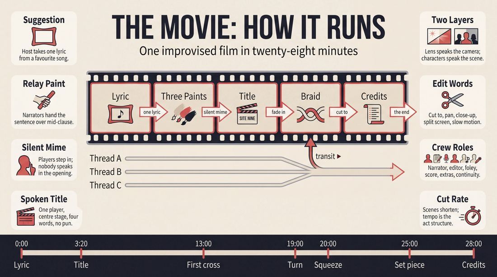
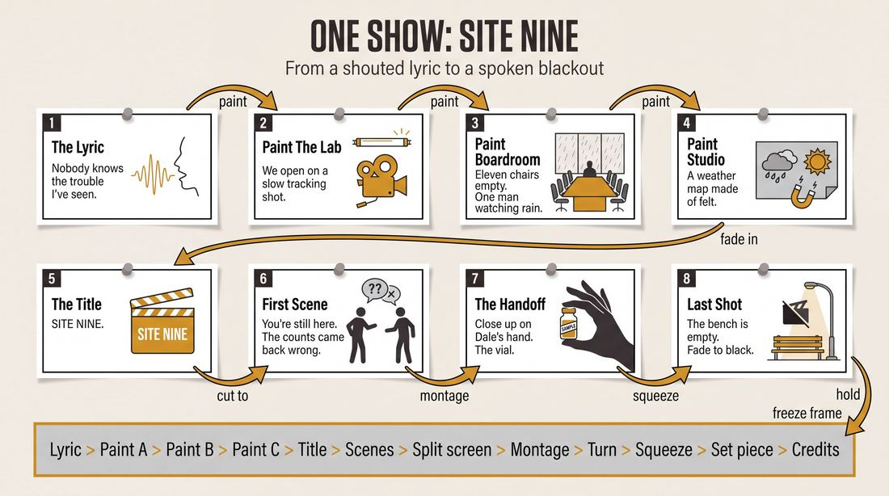
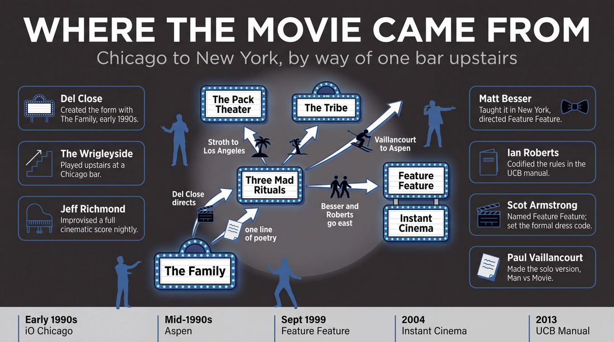
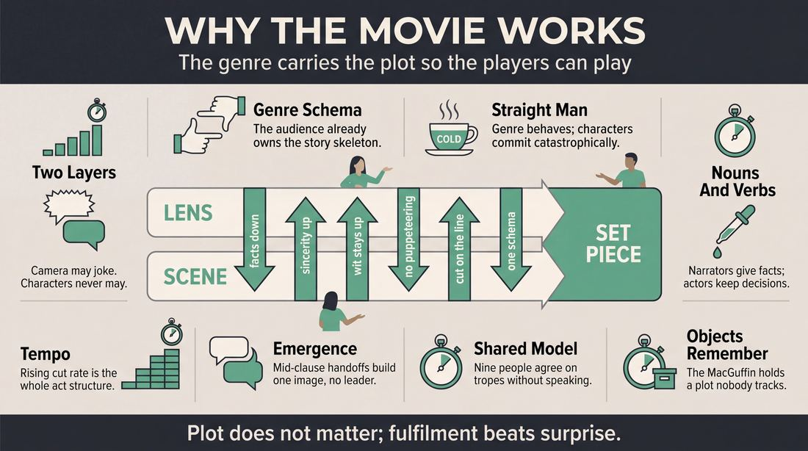
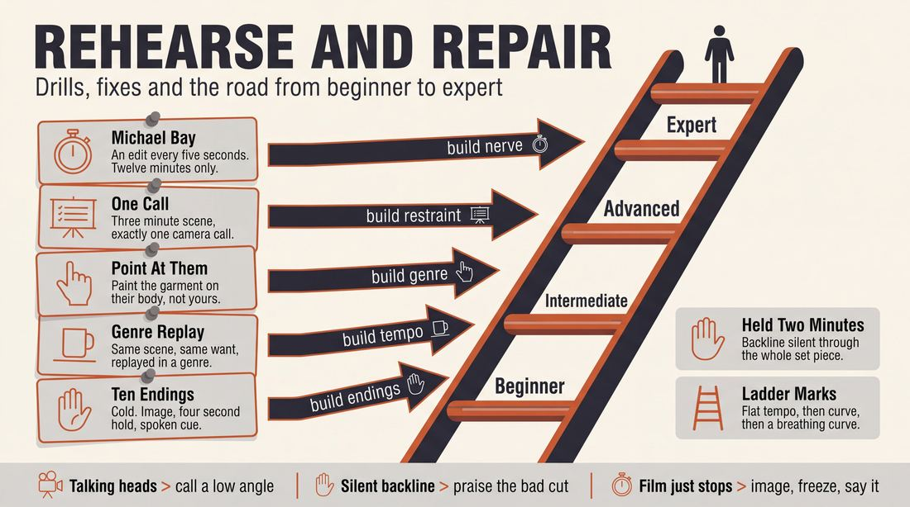

# The Movie

> **A complete study of the long-form improv format _The Movie_** - the original archived write-up, five infographics, grounded historical and pedagogical research, and a full mechanics-and-coaching manual.

| | |
|---|---|
| **Format** | The Movie |
| **Primary source** | [IRC Improv Wiki](https://wiki.improvresourcecenter.com/index.php?title=The_Movie) |

---

## Contents

1. [Part I - The Original Write-Up](#part-i-the-original-write-up)
2. [Part II - The Infographics](#part-ii-the-infographics)
   - [1. Structure and Mechanics](#infographic-1-mechanics)
   - [2. A Show, Beat by Beat](#infographic-2-example)
   - [3. Origins and Lineage](#infographic-3-history)
   - [4. Why It Works](#infographic-4-theory)
   - [5. Rehearsal and Repair](#infographic-5-coaching)
3. [Part III - Research Dossier](#part-iii-research-dossier)
   - [Pass 1: History, Lineage, Literature and Scholarship](#research-history)
   - [Pass 2: Comparative Anatomy, Pedagogy and Production](#research-comparative)
4. [Part IV - Mechanics, Gameplay and Coaching Manual](#part-iv-mechanics-gameplay-and-coaching-manual)
   - [Pass 1: The Form, Its Mechanics and Its Gameplay](#manual-mechanics)
   - [Pass 2: Training, Coaching and Performance Companion](#manual-coaching)

---

## Part I - The Original Write-Up

*Verbatim archive of the source article, reproduced exactly as scraped. Everything after this section is generated elaboration built on top of it.*

### The Movie

**The Movie** is an improvised movie as a longform [format](https://wiki.improvresourcecenter.com/index.php?title=Format "Format"). 

##### History

[The Family](https://wiki.improvresourcecenter.com/index.php?title=The_Family "The Family") originally developed The movie format under the direction of [Del Close](https://wiki.improvresourcecenter.com/index.php?title=Del_Close "Del Close"). They performed it as one of The [Three Mad Rituals](https://wiki.improvresourcecenter.com/index.php?title=Three_Mad_Rituals "Three Mad Rituals") (along with [Deconstruction](https://wiki.improvresourcecenter.com/index.php?title=Deconstruction "Deconstruction") and [Harold](https://wiki.improvresourcecenter.com/index.php?title=Harold "Harold")).

Once he moved to New York City and founded the [UCB Theatre](https://wiki.improvresourcecenter.com/index.php?title=UCB_Theatre "UCB Theatre"), [Matt Besser](https://wiki.improvresourcecenter.com/index.php?title=Matt_Besser "Matt Besser") recruited a cast to whom he taught The Movie. They became the cast of [Feature Feature](https://wiki.improvresourcecenter.com/index.php?title=Feature_Feature "Feature Feature"). Members of Feature Feature later directed the cast of [Instant Cinema](https://wiki.improvresourcecenter.com/index.php?title=Instant_Cinema "Instant Cinema").

**The Movie** is usually a very popular but difficult form. Many improvisers are movie buffs, and are eager to try and parody genres or directors or techniques, but it's difficult to avoid getting caught up in a complicated plot. Successful executions of The Movie don't focus on plot as much as character and genre \-\- leaving the details of the plot hazy or even ignored.

###### Structure

###### Opening

The cast asks the audience the name a lyric of their favorite song. Using the line as inspiration, the cast describes three scenes using the terminology of screenplay directions. They'd all take turns describing the scenes, taking over for each other in mid\-sentence. 

Here's an example of the first description in the opening, and the start of the second description.

- Improviser 1: "We open on tracking shot of students cramming in a library. They're college\-aged, well\-dressed. Piles of law books..."
- Improviser 2: "... surround them. We settle on one student who unlike the rest is dressed in blue jeans and a t\-shirt. He doesn't appear nervous at all, in fact he's asleep, with an empty notebook..."
- Improviser 3: "We see his T\-shirt is a novelty T\-shirt that says 'I took the LSAT stoned.'"
- Improviser 2: "We cut away from this scene to a luxurious townhouse. Inside is a posh bedroom where a stuffy\-looking man is getting ready for bed."

As narrators describe each scene, players from the backline step in to become the characters as they are mentioned. There is no dialogue in the opening, the characters silently mime and move in the space under the narration. After three location scenes are set up, one improvisers steps forward and gives a title to indicate the opening is over.

- Improviser: "The camera pans to a university blue book, the title appears in red ink 'Crammin' It In!'" And we fade into the first scene...."

###### Main Show

After the opening three descriptions and the title, the improvisers return to the first set\-up and start improvising the scene described. From this point forward, the characters would talk. Improvisers not in a scene would step forward to add indicate lighting changes, camera angles, or soundtrack effects. 

The hook of form is the game of the scene work is based on playing the expectations of a particular genre: sports, film noir, classic Hollywood musical, courtroom drama, inspirational teacher drama. The cast took it upon themselves to be experts in these genres, no matter how specific. Once established, their stage directions could make comments on a genre. If it were a Quentin Tarantino\-type movie, someone might say "We see this character is played by an actor who was a big star in the '70s but hasn't worked in 20 years."

Actors would end their movies, explicitly describing the moment when closing credits emerged or declaring that the words "The End" had appeared on the "screen."

###### Edits

The Movie format borrows its edits from screenplay terms as a form [scene painting](https://wiki.improvresourcecenter.com/index.php?title=Scene_painting "Scene painting")

- [Close\-up](https://wiki.improvresourcecenter.com/index.php?title=Close-up&action=edit&redlink=1 "Close-up (page does not exist)"): An improvisor from the backline verbally says "Close up on \_\_\_" framing with his hands at the front of the stage. Other players may move as needed to help create the new stage picture
- [Cut back](https://wiki.improvresourcecenter.com/index.php?title=Cut_back&action=edit&redlink=1 "Cut back (page does not exist)"): Takes back to regular stage
- [Cut\-to](https://wiki.improvresourcecenter.com/index.php?title=Cut-to "Cut-to"): In the movie, a cut to ends one scene and starts a new one.
- Angles: An improvisor from the backline can verbally call a low\-angle or high angle shot.
- Pan: Used to have vertical or horizontal movement reveal something that was previously out of "frame"
- [Split screen](https://wiki.improvresourcecenter.com/index.php?title=Split_screen&action=edit&redlink=1 "Split screen (page does not exist)"): For the movie, a backline member narrates "We see a split screen of \_\_\_". Other improvisers fill out the narrated world
- Slow motion: By saying "We see this sequence in slow motion", the improvisers in the scene slow down and their voices mimic a slowed down sound.

---

*Archived from [https://wiki.improvresourcecenter.com/index.php?title=The_Movie](https://wiki.improvresourcecenter.com/index.php?title=The_Movie) (IRC Improv Wiki) on 2026-08-09 23:23 UTC.*

---

## Part II - The Infographics

*Five 16:9 posters, each teaching a different aspect of the format. Click any poster to enlarge.*

<a id="infographic-1-mechanics"></a>

### 1. Structure and Mechanics

*How the form is played: the shape of the piece, the opening, the roles, the edit vocabulary, the flow of information, and the clock.*

{ .diagram loading=lazy decoding=async width="1100" height="614" }


<a id="infographic-2-example"></a>

### 2. A Show, Beat by Beat

*A single worked performance from suggestion to blackout: what happens in each beat, with short real example lines and what the players are doing technically.*

{ .diagram loading=lazy decoding=async width="1100" height="614" }


<a id="infographic-3-history"></a>

### 3. Origins and Lineage

*Where the form came from: creators, dates, theatres, how it spread between schools and cities, and the key figures - a documented timeline and lineage map.*

{ .diagram loading=lazy decoding=async width="1100" height="614" }


<a id="infographic-4-theory"></a>

### 4. Why It Works

*The theory: the core principles of the form and the research and craft ideas that explain why the structure produces good improv, each tied to a specific mechanic.*

{ .diagram loading=lazy decoding=async width="1100" height="614" }


<a id="infographic-5-coaching"></a>

### 5. Rehearsal and Repair

*Training and fixing the form: the essential drills, the common failure modes with their symptom-and-fix pairs, and the markers of beginner through expert play.*

{ .diagram loading=lazy decoding=async width="1100" height="614" }


---

## Part III - Research Dossier

*Two research passes: the historical record, then the comparative and pedagogical record. Claims carry evidence tags - treat unverified items accordingly.*

<a id="research-history"></a>

### » Pass 1: History, Lineage, Literature and Scholarship

### Research Summary
*   **Documentation Status:** Highly documented. Unlike many obscure regional forms, "The Movie" benefits from its direct lineage to the founders of the Upright Citizens Brigade (UCB), who codified it in their curriculum and published manual.
*   **Origin:** Created by Del Close and the legendary iO house team The Family in the early 1990s in Chicago [DOCUMENTED].
*   **Core Mechanic:** The form translates cinematic language (pans, tracking shots, split screens, voiceovers) into theatrical space, relying heavily on backline players to "scene paint" and direct the actors [DOCUMENTED].
*   **Primary Focus:** Despite the name, the form is explicitly *not* about narrative plotting. It is an exercise in genre parody and game. Teachers universally warn against trying to write a coherent screenplay on the fly [DOCUMENTED].
*   **Transmission:** Brought to New York by Matt Besser and Ian Roberts, where it became a staple of the early UCB Theatre via the team Feature Feature [DOCUMENTED].
*   **Academic Relevance:** The form serves as a perfect practical model for cognitive science concepts like "collaborative emergence" and "shared mental models," as the ensemble must rapidly achieve consensus on genre tropes without explicit communication [INFERRED].

### Provenance and History
The Movie was developed in the early 1990s at ImprovOlympic (iO) in Chicago. Del Close, who had stepped back from directing shows for several years, was inspired to direct the house team The Family in a marathon 90-minute performance called *Three Mad Rituals*. The show consisted of three long-form structures performed back-to-back off a single line of poetry: The Deconstruction, The Movie, and The Harold [DOCUMENTED]. 

The problem Close and The Family were solving was how to expand the boundaries of long-form beyond the Harold, specifically by using cinematic language to support comedic game and using genre as a "straight man" [DOCUMENTED]. The form was performed upstairs at a Chicago bar called The Wrigleyside (later Abner's Yard), with musical director Jeff Richmond improvising a full cinematic score for every performance [DOCUMENTED].

| Year | Event | Place / Company | Source |
|---|---|---|---|
| Early 1990s | Creation of the form as part of *Three Mad Rituals* | ImprovOlympic (Chicago) / The Family | [IRC Improv Wiki](https://wiki.improvresourcecenter.com/index.php?title=Three_Mad_Rituals) |
| Mid-1990s | The form is taken to the Aspen Comedy Festival | Aspen Comedy Festival / The Tribe | [Facebook / Jose Gonzalez](https://www.facebook.com/) |
| Sept 1999 | Feature Feature begins performing the form exclusively | UCB Theatre (NYC) / Feature Feature | [IRC Improv Wiki](https://wiki.improvresourcecenter.com/index.php?title=Feature_Feature) |
| 2004 | Instant Cinema is formed to perform the format | UCB Theatre (NYC) / Instant Cinema | [Magnet Theater](https://magnettheater.com/) |
| 2013 | Formal publication of the format's mechanics | *UCB Comedy Improvisation Manual* | [UCB Comedy](https://ucbcomedy.com/) |

### Lineage and Transmission
The form spread primarily through the diaspora of The Family. Matt Besser and Ian Roberts brought it to New York City when they founded the UCB Theatre. Besser taught it to a cast that became *Feature Feature*, the first group to exclusively perform The Movie in New York [DOCUMENTED]. Members of Feature Feature later directed and taught the next generation of UCB performers, forming the team *Instant Cinema* [DOCUMENTED]. 

Meanwhile, Paul Vaillancourt (who learned the form from Close with his iO team The Tribe) took the format to the Aspen Comedy Festival and later adapted it into a solo/duo show in Los Angeles [DOCUMENTED]. Miles Stroth, another original member of The Family, carried the teachings to The Pack Theater in Los Angeles [DOCUMENTED].

**Regional Dialects and Mutations:**
*   **The UCB / Feature Feature Dialect:** Characterised by formal dress (suits and dresses) to mimic a Hollywood premiere, with a heavy emphasis on fast intercutting to serve the comedic game [DOCUMENTED].
*   **The Solo Dialect:** Adapted by Paul Vaillancourt as *Man vs Movie*, adjusting the backline narration mechanics to accommodate a single performer while maintaining the cinematic edits [DOCUMENTED].

### Key Figures
| Person | Role in this form | Specific contribution | Source URL |
|---|---|---|---|
| Del Close | Creator / Director | Developed the form with The Family as part of *Three Mad Rituals*. | [IRC Improv Wiki](https://wiki.improvresourcecenter.com/index.php?title=Three_Mad_Rituals) |
| Matt Besser | Performer / Director | Original cast member; brought the form to UCB and directed *Feature Feature*. | [IRC Improv Wiki](https://wiki.improvresourcecenter.com/index.php?title=Feature_Feature) |
| Ian Roberts | Performer / Coach | Original cast member; codified the rules of the form in the *UCB Comedy Improvisation Manual*. | [Earwolf](https://www.earwolf.com/episode/ask-the-ucb-rules-vs-no-rules-w-ian-roberts-pt-2/) |
| Jeff Richmond | Musical Director | Improvised an original cinematic score for The Family's performances. | [IRC Improv Wiki](https://wiki.improvresourcecenter.com/index.php?title=Three_Mad_Rituals) |
| Paul Vaillancourt | Performer | Adapted the form for his iO team The Tribe and later created a solo version. | [Facebook](https://www.facebook.com/) |
| Scot Armstrong | Performer | Coined the name *Feature Feature* and helped establish the UCB dialect of the form. | [IRC Improv Wiki](https://wiki.improvresourcecenter.com/index.php?title=Feature_Feature) |

### Canonical Shows, Companies and Recordings
*   **Three Mad Rituals** (The Family, iO Chicago, early 1990s). The legendary foundational run. No video is known to exist publicly.
*   **Feature Feature** (UCB NY, 1999–2002). The definitive New York run. Cast included Scot Armstrong, Will Berson, John Bowie, Rob Corddry, Jamie Denbo, Brian Huskey, Dyna Moe, Seth Morris, and Andrew Secunda.
*   **Instant Cinema** (UCB NY, 2004). The successor to Feature Feature, notable for launching the career of Anthony Atamanuik.
*   **Man vs Movie** (Paul Vaillancourt). A solo adaptation. Recordings of Vaillancourt performing this are available on his YouTube channel [DOCUMENTED].

### Published Literature
| Work | Author | Year | What it says about this form | Where to find it |
|---|---|---|---|---|
| *The Upright Citizens Brigade Comedy Improvisation Manual* | Matt Besser, Ian Roberts, Matt Walsh | 2013 | Comprehensive guide to UCB long-form structures, including a dedicated breakdown of The Movie. | [UCB Comedy](https://ucbcomedy.com/) |
| *Improv, Beat by Beat* (Podcast), Ep 25 | Curtis Retherford | 2019 | Deep dive into the mechanics, difficulty, and scene-painting rules of The Movie. | [Curtis Retherford](https://curtisretherford.com/2019/05/13/25-the-movie/) |
| *Ask the UCB* (Podcast), Ep 217.5 | Ian Roberts | 2015 | Discusses the rules Del Close used to develop The Movie form. | [Earwolf](https://www.earwolf.com/episode/ask-the-ucb-rules-vs-no-rules-w-ian-roberts-pt-2/) |

### Verbatim Quotes
> "The Movie is a popular but difficult form. Feature Feature helped to solidify its appeal amongst the UCBT community at a time when that theatre was essentially the sole theater focused on long-form improv in NYC."
> — IRC Improv Wiki
> URL: https://wiki.improvresourcecenter.com/index.php?title=Feature_Feature

> "I'm really glad we did The Movie with him because that to me is exactly my sense of humour... It also taught us a lesson about, it's not about the story of the movie, which in early rehearsals we got hung up on because we learned you can't expect to improvise an honestly interesting movie script in a half hour."
> — Matt Besser
> URL: http://peopleandchairs.com/2012/05/03/matt-besser/

> "If you aren't sweating profusely by the time you've finished improvising a movie in The Movie form, then you aren't doing The Movie correctly."
> — Sam Miller (Philly Improv Theater instructor)
> URL: https://www.facebook.com/

> "When we rehearsed with Ian Roberts coaching us, he heavily emphasized using intercutting to serve humor and having the initial set ups as far apart as possible (within the same universe) and the progression of the form be about tying those seemingly disperate parts together."
> — IRC Forum User "Proofred"
> URL: https://www.improvresourcecenter.com/mb/showthread.php?t=21361

> "Jeff Richmond played piano, and was particularly impressive during The Movie, when he improvised an original score every night (not a typical accompanist just diddling along with the scenes, I mean a fucking SCORE)."
> — Craig Cackowski
> URL: https://wiki.improvresourcecenter.com/index.php?title=Three_Mad_Rituals

> "The hook of form is the game of the scene work is based on playing the expectations of a particular genre: sports, film noir, classic Hollywood musical, courtroom drama, inspirational teacher drama."
> — IRC Improv Wiki
> URL: https://wiki.improvresourcecenter.com/index.php?title=The_Movie

> "don't feel like you have to come up with a great screenplay and surprise the audience with plot. the fun of the form comes from seeing how you explore a genre."
> — Drew Tarvin (Notes from UCB Advanced Study Performance class)
> URL: https://www.drewtarvin.com/improv/ucb-advanced-study-performance-the-movie/

> "In other words, if you want to say a character that you're scene painting (played by another improvisor) is wearing a bow tie, then point towards the character's neck and say 'we see he is wearing a bow tie.' Don't point at your own neck..."
> — Curtis Retherford
> URL: https://curtisretherford.com/2019/05/13/25-the-movie/

### Anecdotes and Stories
**The Wrigleyside Origins:** The Family performed The Movie as part of *Three Mad Rituals* upstairs at a Chicago bar called The Wrigleyside. The show was a 90-minute marathon with no breaks except lighting shifts, all off a single line of poetry. It became a legendary "improviser's improv show" that sold out consistently, allowing iO to eventually move to a permanent space [DOCUMENTED].

**The Formal Dress Code:** When Matt Besser brought the form to UCB with the team Feature Feature, they established a tradition of performing the form in formal wear (suits and dresses), with their first anniversary show performed in black tie. This aesthetic nod to Hollywood premieres became a lineage marker for subsequent UCB Movie teams [DOCUMENTED].

**Anthony Atamanuik's Breakout:** During the run of Instant Cinema (the UCB team that inherited The Movie from Feature Feature), Anthony Atamanuik emerged as a breakout star. Despite his relative greenness at the time, his aggressive, fearless play style in the cinematic format consistently stole the show, launching his UCB career [DOCUMENTED].

### Academic and Scientific Research
**Collaborative Emergence (Sociology/Psychology)**
R. Keith Sawyer's sociological research on Chicago improv groups defines "collaborative emergence" as a process where group behavior is not guided by a structured plan or a single leader, but emerges from moment-to-moment contingency. 
*Relevance to this form:* The opening of The Movie—where improvisers take over each other's sentences mid-stream to describe the camera shots and setting—is a pure exercise in collaborative emergence. It forces the actors to abandon individual plot plans and build a shared narrative structure word by word [INFERRED].

**Shared Mental Models and Cognitive Convergence (Cognitive Science)**
Brian Magerko et al.'s computational research on improv theatre explores how actors resolve "cognitive divergence" (conflicting ideas about the scene) to reach "cognitive consensus" without explicit communication.
*Relevance to this form:* The Movie relies heavily on genre parody. To successfully execute a "film noir" or "sports movie" without a script, the ensemble must rely on a shared mental model of that genre's tropes, rapidly achieving cognitive consensus on the "rules" of the cinematic world they are building [INFERRED].

**Cinematic Techniques in Theatre (Performance Studies)**
The historical integration of mass media into live performance (e.g., Eisenstein's montage theories influencing Meyerhold and Piscator) shifted theatrical grammar.
*Relevance to this form:* The Movie's edits ("cut to", "pan", "split screen", "slow motion") translate cinematic grammar directly into theatrical space, forcing the audience to adopt a cinematic gaze while watching a live stage performance [INFERRED].

### Documented Variants and Descendants
*   **Man vs Movie / Two Man Movie:** A solo (or duo) adaptation of the format developed by Paul Vaillancourt. It adjusts the backline narration mechanics to accommodate fewer bodies while maintaining the cinematic edits and genre focus [DOCUMENTED].
*   **Creature Feature:** A monster-movie specific variant played at HUGE Theater in Minneapolis. One performer is designated as the monster, and the rest of the cast uses cinematic language ("we fade up on") to set up scenes of victims being killed in the style of a B-movie [DOCUMENTED].
*   **Rom Com:** An improvised romantic comedy format (also at HUGE Theater) that uses the cinematic structure of The Movie but locks the genre to '90s romantic comedy tropes [DOCUMENTED].

### Criticism, Debate and Known Failure Modes
*   **The Plot Trap:** The most universally cited failure mode of The Movie is improvisers getting bogged down in trying to invent a complex, coherent screenplay. Matt Besser noted that early rehearsals with Del Close failed because they tried to write a good movie rather than play a good improv game. Teachers constantly warn: "PLOT DOES NOT MATTER" [DOCUMENTED].
*   **Over-Narration:** Because the form allows backline players to dictate camera angles and scene descriptions, weaker teams rely too heavily on narration, puppeteering the actors rather than letting them play the scene [WIDELY PRACTICED, UNDOCUMENTED].
*   **Genre Inconsistency:** The form requires the entire ensemble to identify and commit to a single genre early on. A known failure mode is when players try to mash up two genres (e.g., a sci-fi western) or when players have divergent understandings of the chosen genre's tropes, leading to a breakdown in the shared mental model [DOCUMENTED].

### Cultural Footprint
*   **Notable Alumni:** The original cast (The Family) included Adam McKay, Neil Flynn, Matt Besser, and Ian Roberts. Feature Feature included Rob Corddry, Jamie Denbo, and Brian Huskey [DOCUMENTED].
*   **Influence on Screen:** The cinematic editing techniques practiced in The Movie (smash cuts, split screens, genre parody) heavily influenced the editing and writing style of *Upright Citizens Brigade* on Comedy Central, and later Adam McKay's directorial work (e.g., *Anchorman*) [INFERRED].
*   **Vocabulary:** Terms like "Cut to," "Pan," and "Split Screen" originated as specific mechanics for this form but have since bled into the general lexicon of long-form improv edits across all formats [WIDELY PRACTICED, UNDOCUMENTED].

### Gaps in the Record
*   **The Complex Deconstruction Link:** It is widely documented that The Movie was performed alongside The Deconstruction in *Three Mad Rituals*, but the exact thematic interplay between the two forms on those specific nights remains largely anecdotal.
*   **Jeff Richmond's Score:** While Craig Cackowski notes that Jeff Richmond improvised a full cinematic score for these shows, no audio recordings of these early Wrigleyside performances have surfaced in the public digital record.
*   **The Tribe's Aspen Run:** The exact year and reception of The Tribe performing The Movie at the Aspen Comedy Festival is mentioned by practitioners but lacks primary festival documentation online.

### Source List
1. IRC Improv Wiki - "The Movie" - 2024 - https://wiki.improvresourcecenter.com/index.php?title=The_Movie - Provides the structural breakdown and basic history.
2. IRC Improv Wiki - "Three Mad Rituals" - 2014 - https://wiki.improvresourcecenter.com/index.php?title=Three_Mad_Rituals - Documents the origin of the form with Del Close and The Family.
3. IRC Improv Wiki - "Feature Feature" - 2008 - https://wiki.improvresourcecenter.com/index.php?title=Feature_Feature - Details the UCB cast and the formal dress tradition.
4. People and Chairs - "Matt Besser" - 2012 - http://peopleandchairs.com/2012/05/03/matt-besser/ - Contains Besser's quote about abandoning plot for game in The Movie.
5. Drew Tarvin Blog - "UCB Advanced Study Performance: The Movie" - 2009 - https://www.drewtarvin.com/improv/ucb-advanced-study-performance-the-movie/ - Provides class notes on the failure modes and genre focus of the form.
6. Curtis Retherford - "Improv, Beat by Beat: Ep 25 - The Movie" - 2019 - https://curtisretherford.com/2019/05/13/25-the-movie/ - Details the mechanics of scene painting on the actor rather than the narrator.
7. R. Keith Sawyer - "Improvisational cultures: Collaborative emergence and creativity in improvisation" - 2000 - https://www.tandfonline.com/doi/abs/10.1207/S15327884MCA0703_05 - Provides the academic framework for collaborative emergence.
8. Brian Magerko et al. - "Shared Mental Models in Improvisational Performance" - 2010 - https://www.researchgate.net/publication/221469145_Shared_Mental_Models_in_Improvisational_Performance - Provides the cognitive science framework for genre consensus.
9. Earwolf - "Ask the UCB: Rules vs. No Rules w/ Ian Roberts (Pt. 2)" - 2015 - https://www.earwolf.com/episode/ask-the-ucb-rules-vs-no-rules-w-ian-roberts-pt-2/ - Documents Ian Roberts discussing Del Close's rules for the form.
10. Walker Art Center - "HUGE Theater" - 2012 - https://walkerart.org/magazine/huge-theater-minneapolis-improv - Documents the "Creature Feature" and "Rom Com" variants.

<a id="research-comparative"></a>

### » Pass 2: Comparative Anatomy, Pedagogy and Production

### Taxonomic Placement

```text
Long-Form Improvisation
 ├── The Harold (Thematic Exploration)
 ├── The Deconstruction (Relationship Deep-Dive)
 └── The Movie (Cinematic/Genre Emulation)
      ├── Feature Feature (Double-Feature Format)
      ├── Instant Cinema (UCB Successor)
      ├── The Director (Narrator-Driven Variant)
      └── Genre-Specific Spinoffs (e.g., The Gibson / Action Movie)
```

**The Movie** sits alongside the Harold and the Deconstruction as one of the three foundational long-form structures developed by Del Close and The Family in early-1990s Chicago (collectively known as the "Three Mad Rituals"). While the Harold fractures a single suggestion into thematic beats and the Deconstruction mines a single source scene for relationship dynamics, The Movie uses the shared cultural schema of cinema—specifically camera mechanics and genre tropes—as its primary structural engine. It is a highly presentational, narrator-heavy format that demands players act simultaneously as actors, cinematographers, and editors.

### Head-to-Head Comparisons

| Axis | The Movie | The Harold | Consequence for the Players |
| :--- | :--- | :--- | :--- |
| **Opening** | "Teepee Method" / Screenplay narration of 3 scenes with silent mime. | Organic, pattern game, or invocation generating thematic ideas. | Movie players must immediately establish concrete visual environments and archetypes rather than abstract themes. |
| **Structure** | Linear or parallel narrative converging on a climax. | Three distinct beats of three scenes, separated by group games. | Movie players track a continuous world; Harold players track thematic resonance across disconnected worlds. |
| **Edit Logic** | Cinematic calls ("Cut to", "Pan", "Close-up") from the backline. | Sweep edits, tag-outs, or organic stage pictures. | Movie edits dictate spatial reality and camera perspective, forcing players to physically adjust to the "lens." |
| **Memory** | Tracking Hero, Villain, and MacGuffin/Object. | Tracking character games, names, and thematic motifs. | Movie players rely on genre tropes to predict where the story must go, reducing the cognitive load of pure invention. |
| **Failure Mode** | "Writing the script" (getting bogged down in complex plot mechanics). | "Playing the plot" instead of heightening the game. | Movie players must actively abandon plot logic in favor of heightening genre-specific games. |

| Axis | The Movie | Montage | Consequence for the Players |
| :--- | :--- | :--- | :--- |
| **Cast Size** | 7–9 (Requires a robust backline for narration/effects). | 4–8 (Flexible). | The Movie requires players to actively "crew" the show from the backline (foley, lighting, camera calls). |
| **Audience Contract** | "We will improvise a cohesive film in a specific genre." | "We will perform a series of fast, funny, disconnected scenes." | The Movie demands patience and investment in a single overarching narrative and aesthetic. |
| **Edit Logic** | Verbalized camera directions. | Fast sweep edits. | Movie edits are part of the performance text; Montage edits are invisible transitions. |

| Axis | The Movie | The Deconstruction | Consequence for the Players |
| :--- | :--- | :--- | :--- |
| **Opening** | Three separate locations painted via narration. | One long, grounded, two-person source scene. | The Movie starts wide and epic; The Deconstruction starts intimate and micro. |
| **Focus** | Genre tropes, visual framing, and cinematic pacing. | Relationship dynamics, subtext, and character flaws. | The Movie rewards bold, archetypal choices; The Deconstruction rewards hyper-realistic acting and listening. |

### What Makes It Uniquely Itself

1. **Cinematic Syntax as Edit Logic:** If you remove the verbalized camera directions ("Close-up on the gun," "Pan left to reveal the assassin," "Slow motion"), you are simply playing a narrative long-form. The Movie requires the backline to act as a director/cinematographer, forcing the onstage actors to physically alter their stage picture to match the "lens."
2. **The "Teepee" Screenplay Opening:** The form mandates a highly specific opening where players take turns mid-sentence to narrate three distinct locations ("Fade in on..."). Crucially, the actors stepping into these scenes *do not speak*—they silently mime the narrated actions until the opening concludes with a spoken Title Sequence.
3. **Genre as the "Straight Man":** The comedic engine of the form is not parody, but earnest emulation. As Matt Besser explicitly directed, players must "respect the movies" and play the genre completely straight. The comedy arises from the characters' intense commitment to the tropes of that genre, not from winking at the audience.

### Structural Variants in Practice

| Variant | What It Changes | Who Plays It | Source |
| :--- | :--- | :--- | :--- |
| **Feature Feature** | Played as a "Double Feature" (two 25-30 minute movies per show with an intermission). Cast performs in formal wear (suits and dresses). | Feature Feature (UCB NY, dir. Matt Besser, 1999–2002) | IRC Improv Wiki |
| **Instant Cinema** | A direct continuation of the UCB NY format, maintaining the 3D/Cinematic branding but with a rotating cast of newer UCB performers. | Instant Cinema (UCB NY) | IRC Improv Wiki |
| **The Gibson** | Hyper-focuses on the Action Movie genre, incorporating improvised stage combat and stunt choreography as the primary physical game. | Various (noted by Kevin Mullaney) | Kevin Mullaney / [CRAFT CONSENSUS] |
| **The Director / Executive** | One player remains on stage as the "Director," actively pausing scenes, giving notes, or demanding actors replay a scene in a different style. | Various / Improv.ca | Improv.ca |

### The Teaching Ladder

| Stage | Skill Introduced | Why in this order | Typical Exercise | Source or [CRAFT CONSENSUS] |
| :--- | :--- | :--- | :--- | :--- |
| **1. Visual Framing** | Scene Painting (describing the physical environment without puppeteering the actors). | Players must learn to build the set verbally before they can place characters inside it. | "Fade In" Object Description | UCB Syllabus (Neil Casey / Dyna Moe) |
| **2. Cinematic Editing** | Calling "Cut-to," "Pan," and "Close-up" from the backline. | Establishes the mechanism for transitioning scenes and manipulating time/space. | The "Michael Bay" Drill | IRC Forums |
| **3. Archetype Identification** | Establishing the Hero, the Villain, and the MacGuffin early. | Provides the necessary anchors for a genre piece so players don't have to invent a plot from scratch. | Movie Pitch / Executive | Improv.ca |
| **4. Genre Emulation** | Playing the tropes of a specific genre completely straight. | Prevents the form from devolving into cheap parody or sketch comedy. | Genre Replay | Matt Besser / Medium |
| **WITHHELD** | **Plot Construction** | Beginners obsess over "writing a good script" and freeze up. Teachers explicitly mandate: "PLOT DOES NOT MATTER." | N/A | UCB Syllabus (Neil Casey / Dyna Moe) |

### Documented Drills and Exercises

| Drill | Origin / Teacher | How to run it | What it fixes in this form | Source |
| :--- | :--- | :--- | :--- | :--- |
| **Scene Painting (No Puppeteering)** | Neil Casey / Dyna Moe (UCB) | One player describes a location ("We see a dusty bar..."). They may describe what a character looks like, but *cannot* dictate the character's actions. The actor must initiate the action. | Cures the habit of narrators treating actors like props, restoring agency to the scene players. | Drew Tarvin Notes |
| **The "Michael Bay" Drill** | IRC Forums (User: glass hidden in the grass) | Players run a series of scenes where a backline player *must* call a cinematic edit (Cut-to, Pan, etc.) every 5 seconds. Scenes do not need to make sense. | Desensitizes players to the fear of interrupting; builds aggressive, confident editing muscles. | IRC Forums |
| **Meanwhile / Elsewhere** | Jill Bernard | Two players do a scene. A backline player yells "Meanwhile at the [Location]!" The stage clears, and a new scene begins at that location, inspired by a word from the previous scene. | Trains the backline to listen for verbal gifts and use them to establish parallel B-stories. | IRC Forums |
| **The Family Guy (Cutaway)** | [CRAFT CONSENSUS] / IRC | During a grounded scene, if a past event or off-screen concept is mentioned, the backline immediately calls "Cut to..." to show a 10-second flashback, then cuts back to the core scene. | Teaches rapid, temporary edits that heighten a joke without derailing the main narrative. | IRC Forums |
| **Movie Pitch / The Executive** | Improv.ca | One player is the "Executive." The audience provides a genre. The Executive points to players who must instantly pitch a title, synopsis, and tagline fitting that genre. | Builds rapid recall of genre tropes and forces confident, archetypal choices. | Improv.ca |
| **Sliding Doors** | Facebook Improv Pedagogy Groups | Stage is split into three sections. Three duos start separate scenes. Players must "steal focus" by repeating the last line spoken in another scene, eventually bleeding the themes together. | Trains players to track multiple parallel storylines and find thematic convergence (crucial for the climax). | Facebook Improv Resources |
| **Three-Headed Expert** | Isaac Paris | Three players stand shoulder-to-shoulder and answer audience questions about a movie plot, speaking exactly one word at a time. | Forces players to surrender individual plot control and accept the group's emergent narrative. | IsaacParis.com |
| **Sentences / The Twist** | Reddit (r/improv) | Before a scene, players are handed a piece of paper with a "twist" (e.g., "I am a ghost"). They must play a grounded scene that eventually justifies confessing this twist. | Practices reverse-engineering a scene to hit a specific, pre-determined genre beat. | Reddit |
| **Slow Motion / Fast Forward** | [CRAFT CONSENSUS] | A narrator calls "Slow motion" or "Fast forward." Actors must instantly adjust their physical speed and vocal pitch while maintaining the emotional reality of the scene. | Builds physical control and ensures actors are actively listening to the "director" on the backline. | IRC Improv Wiki |
| **Genre Replay** | [CRAFT CONSENSUS] | Players perform a mundane 2-minute scene (e.g., returning a toaster). The director then calls a genre (Noir, Sci-Fi, Western), and they must replay the exact same scene using those tropes. | Proves that genre is an overlay on top of grounded relationship, preventing players from abandoning base reality. | [CRAFT CONSENSUS] |

### Common Failure Modes and Diagnoses

| Failure Mode | What it looks like from the audience | Root cause | Fix | Who names it |
| :--- | :--- | :--- | :--- | :--- |
| **"Writing the Script"** | Players stand in a circle talking about what they *should* do next, or scenes become heavy exposition dumps with no emotional game. | Players are prioritizing plot logic over character game and genre tropes. | "Plot does not matter." Focus on the Hero's want and the Villain's obstacle; let the genre dictate the ending. | Neil Casey / Dyna Moe |
| **Spoofing / Parody** | The audience sees players winking, mocking the genre, or making anachronistic pop-culture references that break the reality of the film. | Fear of sincerity; players don't trust that playing the genre straight will be funny. | "Respect the movies. Put it up on a pedestal and worship the form." Play the tropes with absolute earnestness. | Matt Besser |
| **Talking Heads / Static Camera** | Two players stand center stage talking for five minutes while the backline watches passively. | The backline has forgotten their role as the "crew" (cinematographer/editor). | Backline must force movement by calling "Pan left," "Close-up," or adding foley/soundtrack effects. | Ed Herbstman / [CRAFT CONSENSUS] |
| **Dropping the MacGuffin** | A highly specific object or goal is established in the opening, but is completely forgotten by minute 15. | Players get distracted by fun but irrelevant tangent scenes. | Backline must use "Cut-to" to show the Villain interacting with the MacGuffin, re-anchoring the stakes. | [CRAFT CONSENSUS] |

### Production and Logistics

*   **Cast Size:** 7 to 9 players. This is larger than a standard Harold team because The Movie requires a dedicated, active backline to serve as the "crew" (calling edits, providing foley, acting as extras) while the main scene is happening.
*   **Runtime:** 25 to 30 minutes per movie. Historically (e.g., Feature Feature), this is programmed as a "Double Feature" with a short intermission, running about 60–70 minutes total.
*   **Stage Layout:** The front of the stage acts as the "Screen." The backline acts as the "Crew." When a camera movement is called (e.g., "The camera rotates 180 degrees"), the actors physically rotate their bodies to simulate the camera moving around them.
*   **Chairs and Set:** Minimal to none. Because the form relies heavily on scene painting and cinematic framing, physical chairs often get in the way of a "Pan" or a "Close-up." Mime is strictly enforced.
*   **Lighting and Tech Cues:** The tech booth is instructed to wait for a player to explicitly say "The End" or "Fade to black / Roll credits" before pulling the lights.
*   **Music and Sound:** Live musical accompaniment is highly prized. During The Family's original run, Jeff Richmond improvised a full cinematic score live. If no musician is present, the backline must provide vocal foley and soundtrack cues ("Cue sweeping orchestral music").
*   **MC and Host Duties:** The host asks the audience for a lyric from their favorite song. This lyric serves as the thematic inspiration for the opening scene paintings.
*   **Rehearsal Cadence:** Requires heavy drilling on genre studies. Casts often assign "homework" to watch specific eras of film (e.g., 1940s Noir, 1980s Teen Comedies) to build a shared vocabulary of tropes.
*   **Producer Preparation:** Producers must market the show clearly so the audience understands they are watching a single, long-form narrative rather than short-form games. Feature Feature utilized formal wear (suits/dresses) to elevate the theatricality of the event.

### Adaptations Beyond the Stage

*   **Classroom and Youth:** The cinematic language is highly accessible to youth who are native to video media. However, the "Teepee" opening is often simplified, and genres are restricted to universally understood schemas (Fairy Tales, Superheroes).
*   **Corporate and Applied Improv:** The "Movie Pitch" mechanics are frequently adapted for corporate brainstorming and agile thinking workshops. The focus shifts from performance to rapid ideation and "Yes, And-ing" a shared vision.
*   **Online and Remote (Zoom):** The Movie is uniquely suited to remote improv. "Close-ups" can be achieved by players physically leaning into their webcams; "Split Screen" is native to the gallery view; "Pans" can be simulated by passing an object across the edge of the webcam frame.
*   **Accessibility and Inclusion:** The heavy reliance on verbal Scene Painting makes The Movie inherently accessible to visually impaired audiences, as the physical environment is constantly being audio-described by the narrators.
*   **Content-Safety and Consent Practices:** **CRITICAL WARNING.** Genre emulation can easily slip into reproducing harmful historical stereotypes (e.g., the sexism inherent in 1950s Noir, the racism in classic Westerns, or ableism in Horror). Companies must establish clear boundaries (e.g., "We play the tropes of the genre, but we do not adopt the bigotry of the era") and utilize safety tools (like the "Bow-Out" or off-stage check-ins) if a narrative enters non-consensual territory.

### Evidence Base for Those Adaptations

*   **Schema Theory (Cognitive Psychology):** Research by Frederic Bartlett (1932) on schemas demonstrates that humans organize knowledge into generic templates. The Movie relies on "Genre Schemas" to reduce the cognitive load on improvisers. Because the audience and the players share the schema of a "Heist Movie," the players do not need to invent a plot; they only need to fill in the variables of the schema, allowing for higher processing power to be spent on comedic game and character.
*   **Shared Mental Models (Organizational Behavior):** Cannon-Bowers et al. (1993) note that high-performing teams rely on shared mental models to anticipate each other's actions without explicit communication. The rigid cinematic syntax of The Movie ("Cut-to", "Pan") provides a robust shared mental model, allowing a cast of 9 to instantly coordinate complex spatial realignments.

### Scholarly Frames Worth Applying

*   **Collaborative Emergence (R. Keith Sawyer):** *Frame:* Creativity in groups is not the product of one mind, but an unpredictable, emergent property of continuous micro-interactions. *Mapping:* The "Teepee" opening, where players take over a scene description mid-sentence, forces players to abandon their preconceived ideas and build a single image through collaborative emergence.
*   **Point of Concentration (Viola Spolin):** *Frame:* A specific, agreed-upon focus that frees the player from self-consciousness and the pressure to "be funny." *Mapping:* The "Camera Lens" serves as the Point of Concentration. When a player calls a "Low Angle Shot," the actors' POC shifts entirely to adjusting their physical bodies to simulate that angle, naturally generating physical comedy without forcing jokes.
*   **Status and Spontaneity (Keith Johnstone):** *Frame:* All theatrical interactions are negotiations of dominance and submission (high and low status). *Mapping:* Genre archetypes in The Movie are fundamentally status games. The Villain operates with unearned high status, the Hero often begins in low status, and the MacGuffin is the object that threatens to invert the status quo.

### Where the Form Is Heading

*   **Audio and Podcast Hybrids:** The descriptive nature of The Movie has made it a natural fit for audio formats. Matt Besser's *Estates of Perfection* utilizes the genre-respecting ethos of The Movie to create improvised/scripted hybrid sci-fi podcasts.
*   **Multimedia Integration:** Contemporary theaters are experimenting with live green-screens, live-switched multi-camera setups, and improvised OBS (Open Broadcaster Software) editing, allowing the "backline" to literally act as technical directors, cutting between actual camera feeds of the improvisers.
*   **Hyper-Specific Genre Spinoffs:** Rather than leaving the genre up to chance, modern companies often build entire shows around a single, highly specific genre schema (e.g., *Improvised Shakespeare*, *Improvised Jane Austen*, *The Improvised Quentin Tarantino Movie*), allowing for deeper, more scholarly emulation of the source material.

### Source List

1. *The Movie* - IRC Improv Wiki - 2024 - https://wiki.improvresourcecenter.com/index.php?title=The_Movie - Supports the history (Del Close, The Family, Three Mad Rituals), structure, opening mechanics, and cinematic edit terminology.
2. *Feature Feature* - IRC Improv Wiki - 2008 - https://wiki.improvresourcecenter.com/index.php?title=Feature_Feature - Supports the UCB history, Matt Besser's direction, cast size, double-feature format, and formal dress code.
3. *UCB Advanced Study: The Movie Form* - Drew Tarvin - 2009 - https://www.drewtarvin.com/improv/ucb-advanced-study-the-movie-form/ - Supports the teaching ladder, the "Plot Does Not Matter" mandate, and scene painting mechanics from instructors Neil Casey and Dyna Moe.
4. *Perfecting The Scripted Sci-fi Podcast with Matt Besser* - Medium - 2021 - https://medium.com/... - Supports Besser's philosophy on genre emulation ("respect the movies, don't make fun of them") and podcast adaptations.
5. *Improv Games and Exercises* - Improv.ca - 2014 - https://improv.ca/ - Supports the "Movie Pitch / Executive" drill.
6. *The Movie Form Thread* - IRC Forums - 2004 - https://www.improvresourcecenter.com/... - Supports Ed Herbstman's teaching notes, the "Michael Bay" drill, and the "Family Guy" cutaway drill.
7. *Improvised Movie Workshop* - Facebook Improv Resources - 2017 - https://www.facebook.com/... - Supports the "Teepee Method" of storytelling and Sliding Doors drill.
8. *Improv Games* - Isaac Paris - 2015 - https://isaacparis.com/ - Supports the "Three-Headed Expert" drill.
9. *Best Improv Exercises* - Reddit (r/improv) - 2014 - https://www.reddit.com/r/improv/... - Supports the "Sentences / Twist" drill.
10. *Improv Forms* - Kevin Mullaney - 2012 - https://kevinmullaney.com/ - Supports the existence of "The Gibson" action-movie variant and Instant Cinema.

---

## Part IV - Mechanics, Gameplay and Coaching Manual

*Synthesis over the original article and both research dossiers: first how the form works and how to play it, then how to train an ensemble to perform it.*

<a id="manual-mechanics"></a>

### » Pass 1: The Form, Its Mechanics and Its Gameplay

### At a Glance

| Field | Detail |
|---|---|
| **Also known as** | The Movie Form; The Improvised Movie; (as house shows) *Feature Feature*, *Instant Cinema*; solo/duo adaptation *Man vs Movie*. The pedagogy dossier calls the opening the "Teepee Method" — that label is thinly attested and I would not use it in a rehearsal room; call it the **Relay Paint** or the **Three-Location Opening**. |
| **Family** | Del Close / iO structural long form. One of the **Three Mad Rituals** (with the Harold and the Deconstruction). Sub-family: presentational, narrator-assisted, genre-emulation forms. |
| **Cast size** | 7–9 is the documented working number. Absolute floor 5 (thin crew, thin extras). Ceiling ~11 before the backline stops listening. Solo/duo variants exist but are a different animal. |
| **Runtime** | 25–30 minutes for one film. Programmed historically as a **double feature** (two films, short intermission, 60–70 min total). |
| **Opening** | Three locations painted in screenplay/camera language by a relay of narrators, with players stepping in to **silently mime** the described characters. Ends with a spoken **title card**. No dialogue anywhere in the opening. |
| **Suggestion taken** | A **lyric from an audience member's favourite song** (canonical). Not a genre, not a location, not a relationship. The lyric seeds imagery and tone; the genre is chosen *by the cast*, in the act of painting. |
| **Structural rigidity (1–5)** | **4.** The opening ritual, the title, the three-thread architecture and the explicit ending are fixed. Everything between the title and the credits is free — but the *shape* (diverge → cross → converge → accelerate) is close to mandatory. |
| **Difficulty (1–5)** | **5.** This is the hardest of the three Mad Rituals to run well. It asks each player to be actor, cinematographer, editor, foley artist and continuity supervisor simultaneously, for half an hour, without a script. |
| **Prerequisites** | Reliable two-person scene work; clean object work and mime (there is no furniture); the ability to hear and heighten a game; a shared, drilled library of genre tropes; and a backline that will interrupt. Teams that cannot interrupt each other cannot play this form. |
| **Best for** | Ensembles who have played together long enough to share a mental model; casts with a live musician; theatres that can sell "we will improvise a whole film" as an event; players who love cinema more than they love being clever about cinema. |
| **Avoid when** | Your cast is a pickup team; you have fewer than five bodies; your players are plot-brained and cannot let a story be hazy; you have no one willing to speak from the backline; or the show is a mixed bill where the audience arrives mid-piece. |

---

### The Essence in One Paragraph

The Movie is a 25–30 minute improvised film in which the ensemble plays **two texts at once**: the *diegesis*, where characters speak and want things, and the *lens*, where players standing at the edge of the stage speak the camera aloud — "We open on a tracking shot," "Close up on the vial," "Cut to," "We see this in slow motion." It begins with a ritual: off a single audience-supplied song lyric, three or four players take turns describing **three widely separated locations**, handing the sentence to each other mid-clause, while other players step silently into the frame and mime the people described. Nobody speaks in character. Then one player says the title out loud, and the film starts — the same three locations, now with dialogue, cut between by verbalised camera calls until the three threads braid into a single climax and someone explicitly declares the credits. The engine is not plot. The engine is a **shared genre schema** — noir, sports movie, 70s conspiracy thriller, inspirational-teacher drama — which supplies the story skeleton for free so the cast can spend all its invention on character, specificity, and comedic game. Every teacher in this lineage says the same thing in the same words: *plot does not matter.* What matters is that the genre is played with absolute earnestness by the actors while the camera, and only the camera, is allowed to be witty about it.

---

### Why This Form Exists

A montage gives you scenes. It does not give you a **world that persists**, and it does not give you **a second channel to comment on the scene without leaving it**. The Movie exists to solve four specific problems that plagued long form in the early 1990s, and it solves each with a piece of hardware you can point at.

**Problem 1: Long form needs a spine, and inventing a spine live is expensive.**
The Harold's answer is thematic resonance — expensive, abstract, and invisible to a cold audience. The Movie's answer is a **genre schema**: a story skeleton the audience already owns. If the audience knows they are watching a heist film, they already know there will be a crew, a plan, a betrayal and a last-minute reversal. The improvisers do not have to invent those; they only have to *fill the variables*. This is the single largest cognitive saving in the form. It is why Del Close described genre, in effect, as the **straight man** — the genre behaves predictably so the characters can behave absurdly against it.

**Problem 2: Improvisers cannot build a set, so location work rots.**
In a montage, "we're in a submarine" survives about ninety seconds before the players default to talking heads in neutral space. The Movie institutionalises location: the opening paints three of them in loving physical detail, and the backline **keeps repainting them all night** ("Pan left across the boardroom — twelve chairs, eleven of them empty"). Environment is not a nice-to-have; it is a job someone is doing every minute.

**Problem 3: There is no way to make a joke *about* the scene from inside the scene without breaking it.**
This is the Movie's most under-appreciated invention. The lens layer is a legitimate, in-fiction place to be funny. When a backline player says, *"We see this character is played by an actor who was a big star in the '70s and hasn't worked in twenty years,"* the joke lands hard and **not one character has winked**. The actors keep playing it straight; the film comments on itself. No other Close-lineage form has this channel. It is why the form can be simultaneously reverent and hilarious.

**Problem 4: Big casts idle.**
In a montage, five of eight players stand still. In The Movie, the backline is a **crew**: cinematographer, editor, foley, score, extras, second unit. Sam Miller's line — *"If you aren't sweating profusely by the time you've finished improvising a movie in The Movie form, then you aren't doing The Movie correctly"* — is a workload statement, not a metaphor. Nine people work for thirty minutes.

**What it buys you that a montage cannot.** Persistence (a world that accumulates), scale (you can stage a crowd, a car chase, an army, because the camera says so and the backline supplies bodies), *deferred* payoff (an object painted in minute two can be paid in minute twenty-six), and an audience that leans in because they have been promised **one thing**, not eight.

**What it costs you.** Nimbleness. The Movie cannot pivot the way a montage can. Once you have declared a boardroom, a lab and a TV studio, you are married to them. And it cannot hide weak scene work behind fast edits — the edits are audible, so a hollow scene is a hollow scene the audience *watched you choose to cut away from*.

---

### The Audience Contract

**What the audience is promised, in order:**

1. *This will be one thing, not many.* From the first "We open on," the audience stops trying to track disconnected sketches and starts tracking a film. They will forgive twenty minutes of apparent digression if they believe convergence is coming.
2. *You will be able to see it.* The form promises audio-described cinema. The audience should never be uncertain where they are. (An incidental and real virtue: because the environment is continuously narrated, The Movie is the most accessible Close-lineage form for blind and low-vision audiences.)
3. *We know this genre better than you do.* The audience is promised expertise. When the cast plays a 1970s conspiracy thriller, the audience expects the parking garage, the reel-to-reel, the click on the phone line, the downbeat freeze-frame — and expects them delivered with love, not with a smirk.
4. *We are not laughing at movies.* This is the crucial one. Besser's directive to Feature Feature was to respect the movies — put the form on a pedestal. The audience's pleasure is the pleasure of watching people who love a thing execute it, with the comedy arising from *how hard the characters are committing*.
5. *It will end like a film ends.* Not with a sweep and a blackout, but with a closing image, a declared credit roll, or the words "The End."

**How they know where they are — the four location signals:**

| Signal | What it sounds like | When the audience needs it |
|---|---|---|
| The Paint | "We're back in the water lab. Fluorescent tubes, one of them ticking." | Every time you return to a location after being away for more than one scene |
| The Slug Line | "Cut to: interior, boardroom, night." | On any hard transition to a new place |
| The Match | "Match cut on the coffee cup — to a different coffee cup, in a nicer office." | When you want the audience to feel a connection, not just a change |
| The Body | Backline players re-form the same stage picture they used last time in that location | Continuously, silently — this is the cheapest and most-neglected signal |

**What breaks the contract:**

- **Silence from the backline for more than 90 seconds.** The audience stops believing they are watching a film and starts believing they are watching two people talk.
- **A character commenting on the genre.** One line of "Ha, classic noir, right?" and the pedestal is kicked over. Anachronistic pop-culture references do the same thing.
- **Genre drift.** Starting in Western and drifting into sci-fi without a declared reason. The audience's schema is doing your plotting for you; break the schema and they have to start guessing again, which is work they did not sign up for.
- **A plot that demands to be followed and then isn't.** If you spend three minutes explaining the inheritance clause, the audience will hold you to the inheritance clause. Vague plot is forgiven; *complicated then abandoned* plot is not.
- **An unmarked ending.** If the lights come down without a declared credit roll, the audience does not applaud; they hesitate. Never make the tech booth guess.

---

### Anatomy: The Full Structural Map

The Movie is a **braid**. Three strands are laid down as far apart as the ensemble can manage while staying inside one universe (this was Ian Roberts's explicit coaching note: *setups as far apart as possible within the same universe, and the progression of the form is about tying those seemingly disparate parts together*). The strands are then progressively crossed, and the film ends when they are a single rope.

Underneath the braid runs a **tempo curve**. Act I scenes are long. Act III scenes are ten seconds. The rate of cutting *is* the act structure — this is the form's most reliable and least taught mechanic.

```
        SUGGESTION (one song lyric)
                 |
   ============= THE OPENING (relay paint, silent mime, no dialogue) ============
   [ PAINT A ]--->[ PAINT B ]--->[ PAINT C ]--->[ *** TITLE *** ]
    lab, 3am       boardroom      TV studio      "SITE NINE"
      ~60s           ~60s           ~60s            ~15s
                 |
   ==================== ACT I : DIVERGENCE (long scenes) ====================
   A1 ~~~~~~~~~~~~~~~~~   cut to
                       B1 ~~~~~~~~~~~~~~~~~   cut to
                                           C1 ~~~~~~~~~~~~~~~~~
   |<-- 2:30-3:00 each; each thread declares WANT + acquires a TOKEN -->|
                 |
   ================== ACT II : CROSSING (medium, interleaved) ==================
        A2 ~~~~~~~~~   B2 ~~~~~~~   [SPLIT SCREEN A|B]   C2 ~~~~~~   [MONTAGE]
              \_______________/            \______________/
               token transits              body transits
                        |
                   ** THE TURN ** (midpoint; the genre's mandatory reversal)
                        |
   ============ ACT III : CONVERGENCE (short, accelerating) ============
     A3 - B3 - C3 - A4 - B4 - CUT - CUT - CUT ---> ALL THREE IN ONE ROOM
      45s  30s  30s  20s  15s   10s   8s               [SET PIECE]
                        |
                  [ CLOSING IMAGE ]  (held; slow motion or freeze frame)
                        |
              "FADE TO BLACK. ROLL CREDITS." / "THE END."
                        |
                  (optional) POST-CREDITS STING
```

**Beat-by-beat table** (clock assumes a 28-minute single feature):

| Unit | Approx. clock | What happens | Who drives it | Success criterion | Common error |
|---|---|---|---|---|---|
| **Suggestion** | 0:00–0:20 | Host asks for a lyric from someone's favourite song. Takes one. Does not editorialise. | Host | The cast has one concrete image or phrase, unexplained. | Host asks for a genre instead, or takes three suggestions and "picks the best." |
| **Paint A** | 0:20–1:20 | 2–4 narrators relay-describe location 1 in camera language; players step in and silently mime the people described. | Rotating narrators | Audience can see the room; at least one character has a face, a wardrobe detail and a physical activity. | Narrating a *story* ("and then he decides to leave") instead of a *shot*. |
| **Paint B** | 1:20–2:20 | Location 2, painted the same way. Deliberately far from A. | Rotating narrators | A tone/genre has quietly become undeniable across two locations. | Painting a place adjacent to A ("we cut to the hallway outside the lab") — no braid to make. |
| **Paint C** | 2:20–3:20 | Location 3. The odd one out — the thread nobody can yet connect. | Rotating narrators | The audience is actively curious how C relates to A. | Painting C as an explanation of A and B. Mystery is the fuel. |
| **Title** | 3:20–3:40 | One player steps forward, describes the title appearing on a physical object in frame, and says the title. | One player, alone | Title names the genre and the MacGuffin/theme in ≤4 words. | Title is a pun. Titles that pun tell the audience it's a spoof. |
| **A1 / B1 / C1** | 3:40–13:00 | The three painted setups replayed **with dialogue**, in order. Each ~2:30–3:00. Camera calls begin. | Scene players; backline lenses | Each thread ends with a stated want and a physical token (object, phrase, or person) that can travel. | Playing all three as exposition. Each thread needs a *relationship* and a *game*, not a briefing. |
| **First Cross** | ~13:00 | Something from thread A appears in thread B: an object, a name spoken, a body walking through. | Any backline player | The audience audibly reacts — a small "oh." | Waiting until minute 22. Cross early; the braid needs slack to tighten. |
| **Act II block** | 13:00–20:00 | Interleaved shorter scenes, cutaways, split screens, at least one montage sequence, at least one two-hander that is genuinely emotional. | Whole ensemble | Scene length is visibly shorter than Act I. Threads now share vocabulary. | Introducing a *fourth* thread. Never introduce a new location after minute 15 unless it is the convergence site. |
| **The Turn** | ~18:00–20:00 | The genre's mandatory reversal fires: the mentor dies, the source is a plant, the team is disbanded, the girl says no. | Usually the villain's thread | The reversal is one the audience predicted and still enjoyed. | Inventing a *surprising* twist. Surprise is a plot value; the form does not want it. |
| **The Squeeze** | 20:00–25:00 | Cut rate accelerates hard. 45s → 30s → 15s → 8s. Threads physically converge on one location. | Backline editors | The audience can feel the tempo without being told. | Backline gets shy at exactly the moment it should be loudest. |
| **Set Piece** | 25:00–27:00 | All three threads in one space. Whole cast on stage. Foley and score at maximum. Slow motion is legitimate here and nowhere else so freely. | Everyone | Every named character is physically present or explicitly accounted for. | Resolving it in dialogue. Resolve it in *image*. |
| **Closing Image** | 27:00–27:40 | One held shot that states the film's attitude. Freeze frame, slow push-in, pull-back to wide, or a slow-motion walk. | One narrator + one or two actors | It could be a poster. | Adding a scene after the closing image. |
| **Credits** | 27:40–28:00 | "Fade to black. Roll credits." or "The End." Optional score cue. Optional post-credits sting. | One player, clearly | Tech has an unambiguous cue. Audience knows to clap. | Trailing off. Tech guesses. Applause is late and thin. |

---

### The Opening

The opening is the form's **ritual**, and it is the single most diagnostic thing about the piece. If you can execute the opening cleanly, you are playing The Movie; if you cannot, you are playing a montage with narration.

#### What is happening technically

Three things are being installed simultaneously:

1. **The lens grammar.** The audience is being taught, in sixty seconds, that people at the edge of the stage speak the camera and are to be believed.
2. **The genre consensus.** Nobody says "let's do noir." Three players paint, and by the second location the *whole cast* has silently converged on a genre. This is the form's collaborative-emergence moment in the strictest sense: no leader, no plan, consensus by accumulation of detail. (Sawyer's "collaborative emergence" and Magerko's "cognitive convergence" both describe exactly this — the dossiers' academic framing here is sound.)
3. **The three anchors.** Locations, archetypes, and at least one physical object that can later travel.

#### Step-by-step procedure

1. **Host takes the suggestion.** "Can I get a lyric from your favourite song?" Take **one**. Do not ask for clarification. Do not repeat it more than once.
2. **The cast forms a loose line upstage.** Nobody steps out yet. Beat of silence. This silence is load-bearing — it converts "improv show" into "film."
3. **First narrator steps to the downstage edge, on the side, not the centre.** The centre of the stage is the screen; narrators stand at its frame. Say the first line as a shot: *"We open on a slow tracking shot across…"*
   - **Required content of a first line:** a camera move, a location, and time of day. That is the minimum viable opening line.
4. **Narrator 1 describes for roughly one to two sentences, then hands over mid-sentence.** The handoff is the point. You do not finish your thought; you leave the sentence hanging on a preposition or a conjunction and another narrator takes it. Example: *"…piles of law books"* → *"…surround them."*
   - **How to take over:** step in a half-pace and speak on the other player's inhale. Do not wait to be invited. The Michael Bay drill exists to build this nerve.
5. **As people are described, players step out of the line and become them — silently.** They mime the described action. They do not speak. They do not add gestures that contradict the paint. If a narrator says "he's asleep," you sleep.
6. **Painting a person on stage: point at the person, not at yourself.** Curtis Retherford's note is exactly right and is the single most-broken rule in the form: if you want the character to be wearing a bow tie, gesture toward *their* neck and say "we see he's wearing a bow tie." Do not touch your own neck. Pointing at yourself makes the audience look at the narrator, which is the one place the camera is not.
7. **Close the location on a striking image**, not on a piece of information. The last thing said about a location should be a picture. ("We see his T-shirt reads: *I took the LSAT stoned.*")
8. **A narrator hard-cuts to location two**, ideally by beginning the transition themselves: *"We cut away from this to…"* The players who were in location one **freeze, then peel back to the line** or stay frozen at the edge as living scenery — house choice, but be consistent.
9. **Repeat for locations two and three.** Each roughly sixty seconds. Discipline the clock: an opening longer than four minutes eats the film.
10. **One player — and only one — steps forward to give the title.** The move: find a physical surface in the world you have just painted, put the title on it, and say it. *"The camera pans to a university blue book. In red ink, the title appears: 'Crammin' It In!'"* Then hand off to the film: *"…and we fade in."*
11. **Return immediately to location one and start playing it with dialogue.** No reset, no huddle, no re-explaining. The transition from opening to Act I should be seamless enough that some audience members do not notice the moment characters started speaking.

#### The rules of the paint

| Rule | Why | Violation sounds like |
|---|---|---|
| Camera language only | It installs the grammar | "So there's this guy and he's like a lawyer" |
| No character dialogue | Dialogue converts the opening into a scene and kills the ritual | *(actor in the frame says)* "Man, I hate law school." |
| Narrators own nouns and adjectives; actors own verbs and intentions | Prevents puppeteering; keeps actors alive | "He nervously drops the pen and starts crying." |
| Everything painted is true forever | Makes the opening a resource, not decoration | Contradicting the paint in Act I |
| Locations must be far apart | Creates the braid | Painting the hallway outside the room you just painted |
| One universe | Otherwise the schema shatters | Location 1 is medieval; location 3 is a spaceship |
| End on an image | Images are memorable; facts are not | "…and this is the guy who's going to inherit the company." |

#### Documented and practical variants of the opening

| Variant | What changes | When to use it | Cost |
|---|---|---|---|
| **Canonical Relay Paint** (Close / The Family) | Three locations, multiple narrators, mid-sentence handoffs, silent mime, spoken title | Default. Use this unless you have a reason. | Requires four confident narrators; brutal for beginners |
| **Solo Narrator Paint** | One player paints all three locations | When the cast is under-drilled and mid-sentence handoffs are collapsing | You lose collaborative emergence; genre becomes one person's taste |
| **Two-Location Paint** | Only two threads laid down | Short-form slot (15–18 min); youth or classroom | Braid is thinner; convergence arrives too easily and the middle sags |
| **Four-Location Paint** | Four threads | 40+ min film; cast of 10+ | One thread will die. Decide in advance which one is expendable. |
| **Genre-Declared Open** | Host asks for a genre outright, then the cast paints | Training wheels; genre-locked house shows (*Creature Feature*, *Rom Com*, *The Gibson*) | Removes the form's most interesting silent negotiation. The dossiers conflict here: the wiki and history dossier say the suggestion is a lyric; the pedagogy dossier's Movie Pitch drill takes a genre from the audience. **My judgement:** lyric is canonical and better; genre-from-audience is a rehearsal accommodation or a house-show conceit, not the form. |
| **Cold Open / Pre-Title Sequence** | A short *played* scene (with dialogue) before the paint, ending on a shock, then the paint and title | Horror, Bond-style action, prestige TV pastiche | Delays the ritual; audiences trained on the form may be briefly disoriented. Use once, deliberately. |
| **Aerial Opening** | Paint begins from an extreme wide (satellite, city skyline) and descends into location one | When the lyric suggests scale | Eats twenty seconds. Worth it for epics. |
| **Silent Overture** | Musician plays 20–30 seconds of main-title music *before* the first word | If you have a live musician | If the musician guesses the wrong genre, you have just been given a straitjacket. Which is sometimes a gift. |

---

### The Engine

This is the section that matters. Everything else is trim.

The Movie does not run on plot. It runs on **four interlocking systems**: a two-layer text, three information reservoirs, four transit routes between threads, and a tempo gradient. If you understand these four, you can direct this form. If you do not, you will keep making thirty-minute films that feel like forty-minute films.

#### System 1 — The Two-Layer Text

Every second of The Movie is happening on two channels.

| | **Diegesis (the film's inside)** | **Lens (the film's outside)** |
|---|---|---|
| Who speaks | Characters, in scene | Narrators, at the frame |
| What is true | What characters believe | What is objectively, physically so |
| Tone | **Absolutely earnest**, always | May be dry, may be witty, may editorialise |
| Can it be wrong? | Yes — characters lie, hope, misremember | **No.** The camera cannot lie. |
| Can it be funny about the genre? | **Never** | **Yes** |

This resolves the form's central apparent contradiction. The wiki describes The Movie as a form where improvisers "parody genres"; the pedagogy dossier insists it is "not parody, but earnest emulation" (Besser: respect the movies). **These are not in conflict once you assign them to layers.** The *characters* never parody. The *camera* is allowed to be the wittiest person in the building. The Tarantino example from the wiki is exactly this: "*We see this character is played by an actor who was a big star in the '70s but hasn't worked in twenty years*" is a devastating genre joke that costs the scene nothing, because the actor playing the character never blinked.

**Operating rule:** the funnier the lens gets, the straighter the acting must get. They are counterweights. A cast that starts smirking in scene while also smirking on the lens has no straight man anywhere and the piece dies within four minutes.

**Layer-crossing is the form's rarest and best move.** A narrator says, *"Close up on Halloway's hands — they are completely steady."* The actor, who was about to play nerves, now has to play steadiness, and the *audience* knows he is a monster. Information passed from lens to actor mid-scene is how The Movie makes discoveries that nobody planned.

#### System 2 — The Three Reservoirs

All material in the film comes from exactly three places. Knowing which reservoir you are drawing from stops the flailing.

**Reservoir 1: The Opening Paint (finite, high-value).**
Everything narrated before the title. This is your only *pre-agreed* material and it is the audience's only anchor. Treat it as a loaded magazine: roughly 12–20 concrete details across three locations. My working ratio: **pay at least one third of them.** A team that pays nothing from the opening has wasted its ritual; a team that tries to pay all of it becomes a checklist.

**Reservoir 2: The Genre Schema (infinite, free, shared).**
This is the big one. Because the audience and the cast share a mental template of "1970s conspiracy thriller," the cast does not have to invent story — it has to **fill variables**. This is the cognitive saving that makes the whole form possible. The schema hands you, for free:

- The **cast list**: Hero, Villain, Mentor, Sidekick, Love Interest, the Bureaucrat, the Muscle.
- The **obligatory scenes**: the genre's must-haves. Every genre has 5–8. Noir: the office at night, the client with a story, the beating, the double-cross, the confession. Sports: the tryout, the montage, the injury, the locker-room speech, the final play. Conspiracy thriller: the parking garage, the ransacked apartment, the phone that clicks, the editor who won't run it.
- The **shape**: schemas encode act structure. You do not have to decide when the reversal comes; the genre knows.
- The **ending flavour**: Westerns end on a horizon. Noir ends on a shrug. 70s paranoia ends downbeat. Musicals end on a company number.

**The discipline:** *do not invent what the schema will give you.* If you find yourself deciding what the villain's plan actually is, stop. The schema's answer is "the villain's plan is to keep making money and to have you killed." It is enough.

**Reservoir 3: The Live Paint (infinite, cheap, generative).**
Everything narrated during the film. This is where most of the form's *new* information originates, and it is the reservoir weak teams never open. When a scene stalls, you do not need a new idea — you need a new *object in the frame*. "Pan right: there's a second cup of coffee on the desk, still steaming" hands the actors a whole scene.

#### System 3 — The Four Transit Routes (how information moves between threads)

This is the braid mechanism. A thread is only connected to another thread if something has physically travelled between them. There are exactly four vehicles, and a good film uses all four.

| Route | Mechanism | Example call | When to deploy |
|---|---|---|---|
| **Object transit** | A physical thing appears in a second thread. The MacGuffin is the industrial-grade version. | "Cut to the boardroom. Close up on the table: the vial, sitting on a napkin." | Earliest and clearest. Do this by minute 13. |
| **Body transit** | A character from thread A physically walks into thread B. | "Kessel pushes through the lab door." | Act II. The single most audience-satisfying cross. |
| **Language transit** | A word or line from thread A is spoken, unknowingly, in thread B. | Halloway: "Nobody knows." / *cut to* / Chip, on air: "…and nobody knows what to expect tomorrow." | Cheapest, most elegant. Use two or three times. |
| **Image transit (match cut)** | A visual rhyme executed on the cut. | "Match cut on the spinning tape reel — to the spinning weather radar." | Once or twice per film. It is a flourish; overuse becomes a tic. |

Add a fifth if you have a musician: **score transit** — the same motif under two different threads tells the audience they are the same story. Jeff Richmond's improvised through-scores for The Family did exactly this, which is why they are remembered as scores rather than accompaniment.

**The transit budget.** In a 28-minute film: 0 transits before minute 10, 1–2 by minute 15, 3–5 by minute 20, and total merge by minute 25. Plot it in rehearsal on a whiteboard until the cast feels it without counting.

#### System 4 — The Tempo Gradient

**The cut rate is the act structure.** Nothing else in this form communicates "we are approaching the end" as reliably.

| Phase | Target average scene length | Cuts per minute | Backline behaviour |
|---|---|---|---|
| Act I | 2:30–3:00 | ~0.4 | Sparse lensing; establish, close-up, cut. Let scenes breathe. |
| Act II early | 1:30–2:00 | ~0.6 | Split screens, cutaways, first montage |
| Act II late / Turn | 1:00 | ~1.0 | Intercutting two threads directly against each other |
| The Squeeze | 0:15–0:45 | 2–4 | Rapid-fire; a cut can happen mid-sentence |
| Set piece | one continuous 2:00 | — | No cuts. Held. Slow motion available. |
| Closing image | 0:20–0:40 | — | One shot, held, then credits |

Two consequences most teams miss:

- **The set piece is a long take.** After five minutes of accelerating cuts, the audience's nervous system is primed; releasing them into one unbroken two-minute scene is the biggest available payoff. Do not cut during the climax. The acceleration bought you the right to stop.
- **A cut is a punctuation mark and it can carry the joke.** Cut *on* the line, not after it. Halloway says "There's no possible way this gets out." **Cut to:** Chip on air, saying "Good evening." The edit is the punchline. This is a mechanic that literally cannot exist in a montage, where edits are invisible transitions; here they are part of the performed text.

#### The Camera/Actor Line (the ownership rule that keeps the engine from seizing)

The most common way this engine seizes is **puppeteering**: backline players narrating what actors do, reducing them to marionettes. The fix is an ownership boundary, drilled until it is reflex.

| The lens owns | The actor owns |
|---|---|
| Location, time of day, weather | Intention, want, objective |
| Framing, angle, movement of the camera | Action, choice, physical business not yet narrated |
| Wardrobe, props, set dressing, appearance | Emotion and its expression |
| What is visible outside the current focus | Dialogue, always |
| Objective physical facts (the hands are steady) | Interpretation of those facts |
| Time compression (montage, "three weeks later") | What they do with the time |

**Legal:** "Close up on Dale's hands. He is holding the vial so tightly his knuckles are white."
**Illegal:** "Dale nervously realises he has to tell someone, and decides to call the newspaper."

The first hands the actor a physical fact to play. The second does the actor's job and steals the scene's only decision. The distinction is subtle in writing and obvious in a room: after the illegal version, the actor's next line is always dead.

**The single exception:** in the **Squeeze**, when scenes are eight seconds long, narrators may compress hard and describe actions, because there is no time for an actor to originate them. Acceleration buys you narrative authority. Use it there and nowhere else.

#### Why the whole thing coheres

Coherence in The Movie is *not* logical. It is **tonal and visual**. The audience decides the film hangs together because:

- one genre schema governs every scene (tonal coherence),
- locations recur with consistent physical detail (spatial coherence),
- objects and phrases travel (associative coherence),
- the cut rate rises monotonically (rhythmic coherence),
- and it ends with a declared ending (formal coherence).

Notice what is absent: **causal coherence**. Nobody in the audience will be able to explain, afterwards, exactly how the conspiracy worked. Nobody will ask. Besser's own account of learning this form is that early rehearsals failed precisely because they were trying to make an honestly interesting movie script in half an hour, and you cannot. What you *can* do is make thirty minutes that feel unmistakably like a film. That is the deal.

---

### Roles and Responsibilities

The Movie is the only Close-lineage form with genuine **crew positions**. On a good team these rotate fluidly, but at any given moment every player is occupying one and knows which.

| Role | Owns | Must do | Must not do | Signal to the others |
|---|---|---|---|---|
| **Narrator / Camera** (rotating, 2–4 active) | Framing, location, time, visible objects, camera movement | Speak from the downstage frame edge, not the centre. Point at the thing, not at yourself. Name a location on every "cut to." Re-paint any location returned to after two scenes away. | Never narrate an actor's intention, emotion, or decision. Never narrate more than ~15 seconds at a stretch mid-scene. | Half-step forward to the frame line = "I am about to speak the camera." Step back = "the camera is yours." |
| **Editor** (any backline player, in the moment) | The cut. Where the film goes next. | Say "cut to" **and name the destination in the same breath**. Cut on the strongest line, not after the scene has died. Accelerate through Act III. | Never call "cut to" without a location. Never cut away from a scene that just made a discovery — let it land one beat. | Sharp step to frame edge with a raised hand; some houses use a snap. Whatever it is, the cast must be able to see it peripherally. |
| **Scene Player** (2–3 at a time) | Character, want, dialogue, physical business | Obey the lens instantly and completely (low angle: adjust; slow motion: adjust voice *and* body). Play the genre dead straight. Handle painted objects as though they are real and heavy. | Never comment on the genre. Never narrate your own camera. Never ignore a paint. Never explain the plot to another character who would already know it. | A held, still frame at the end of a beat = "cut me." |
| **Foley** (1–2 rotating) | The film's sound design | Give every location a signature sound (the ticking fluorescent, the elevator ding). Provide impacts, doors, phones, weather. Hit sounds *in time* with actors' mime. | Never foley over dialogue. Never sound-effect for a laugh at the actor's expense. | Standing at a fixed "sound corner" of the backline is a useful house convention. |
| **Score** (musician, or a designated vocal ensemble) | Genre enforcement, emotional underline, transitions | Establish a main title theme in the first sixty seconds and reprise it at the credits. Give the villain a motif. Swell into the set piece. Drop out entirely at least once, deliberately. | Never noodle continuously. Never play *against* the declared genre. | Musician watches the frame edge; a narrator's phrase like "we hear strings" is a direct cue. |
| **Extras / Second Unit** (whole backline) | Crowds, traffic, background bodies, the wall of a corridor | Fill in when a narrator paints a crowd, without dialogue. Hold stage pictures. Rebuild recurring locations identically. | Never upstage. Never speak unless the lens gives you a line. | Silent flow to the stage on a painted crowd; freeze on the cut. |
| **Continuity** *(craft addition — not documented, my recommendation)* | The film's memory | One player per show is quietly tasked with tracking: the MacGuffin's location, every named character, and the three unpaid paints from the opening. They are permitted to force a re-anchor. | Never take notes visibly. Never become a director. | Their re-anchor sounds like a normal shot: "Cut to: the vial, still in the glovebox." Nobody but the cast knows what just happened. |
| **Titler / Closer** | The title, and the ending | Give the title in one clean sentence, on a physical surface, ≤4 words. At the end, declare the credit roll unambiguously. | Never let the film trail off. Never add a scene after the closing image. | Stepping to dead centre downstage is a good house convention for the title and the credits, and *only* those. |
| **Host / MC** | The contract | Explain in one sentence that the audience will see a single improvised film. Ask for one lyric. Leave. | Never explain the mechanics of the form. Never ask for a genre (unless house-locked). Never re-emerge mid-film. | Exiting the stage entirely. |
| **Tech / Lights** | The frame's brightness | Hold a single warm-white general wash for the entire film. Take the blackout **only** on an explicit spoken cue ("Fade to black" / "Roll credits" / "The End"). | Never guess an ending. Never edit with lights. Never blackout on a big laugh. | The spoken cue is the only cue. Print this on the tech sheet. |

**On dress:** Feature Feature performed in suits and dresses, black tie for their anniversary show. This is not decoration — formal wear tells the audience *before a word is spoken* that this is a single event, not a bill of games. My recommendation: adopt a uniform of some kind, formal or otherwise. It measurably changes how the audience settles.

---

### The Rules That Actually Bind

#### Hard rules — break these and you are not playing The Movie

| # | Rule | Why it is constitutive |
|---|---|---|
| H1 | **The opening is narrated in camera language and contains zero character dialogue.** | Dialogue in the opening converts the ritual into a scene and destroys the "we are watching a film being assembled" premise. |
| H2 | **At least three distinct, widely separated locations are painted before any scene is played.** | Fewer than three and there is no braid; adjacent locations and there is nothing to converge. |
| H3 | **The opening ends with a spoken title.** | The title is the boundary marker between "assembly" and "film." Without it the audience never knows when the movie started. |
| H4 | **Edits are spoken aloud in cinematic language, from the frame edge.** | Remove the verbalised camera and you are playing a narrative long form, not this one. This is the load-bearing wall. |
| H5 | **The camera cannot lie; anything narrated is physically true and permanent.** | The entire information economy collapses if paint is negotiable. |
| H6 | **Narrators do not narrate an actor's intentions, decisions, or emotions.** | Puppeteering kills actor agency, which is the only thing generating scenes. |
| H7 | **The actors play the genre with total earnestness; only the lens may comment.** | The genre is the straight man. Take away the straight man and there is no comedy engine. |
| H8 | **One universe, one genre, for the whole film.** | The genre schema is doing your plotting. Shatter it and the cast must invent plot live, which is the documented failure mode of the form. |
| H9 | **Actors physically obey every camera call, immediately.** | If a low angle produces no visible change, the lens is decorative and the audience stops believing it. |
| H10 | **The film ends with an explicit, spoken ending — credits, "The End," or a declared fade.** | Without it there is no formal closure and no applause cue. |
| H11 | **Plot is subordinate to genre and game.** Every teacher in this lineage states it flatly: *plot does not matter.* | Attempting a real screenplay in thirty minutes is the form's original, documented failure. |

#### Soft conventions — vary by house, pick one and be consistent

| Convention | Common settings | Notes |
|---|---|---|
| Suggestion | Lyric from a favourite song (canonical); a genre; a title; a poem line (as in *Three Mad Rituals*, where all three forms ran off one line of poetry) | The lyric is better than the genre because it seeds tone without prescribing schema |
| Cast size | 7–9 typical; 5–11 workable | Under 6, cut to two threads |
| Runtime | 25–30 min single; double feature with intermission | Feature Feature's double bill is the classic programming |
| Costume | Formal wear (UCB lineage); blacks; neutrals | Pick one |
| Who may call edits | Backline only (strictest); anyone including onstage players (most common); designated editor (training) | I favour backline-only for the first six months of a team's life |
| "Cut back" | Explicit verbal return to the previous shot after a close-up or insert | Some houses treat the return as automatic after 3 seconds |
| Chairs/set | None (strongly preferred); two cubes at the back | Chairs obstruct pans and rotations |
| Music | Live musician (ideal); backline vocal score; recorded stings | Vocal score is more work but keeps everyone in the film |
| Genre declaration | Emergent from the paint (canonical); locked by house show; asked of the audience | Emergent is the interesting version |
| Number of threads | Three | Four only with 10+ players and 40+ minutes |
| Post-credits sting | Used or not | If used, use it once per show, never both films of a double feature |
| Where narrators stand | Downstage frame edges; a fixed "camera position" stage left | Fixed positions help the audience parse layers |

#### Myths — things people believe are rules and are not

| Myth | Why people believe it | The truth |
|---|---|---|
| "You need a coherent plot." | It's called The Movie; movies have plots. | The form's most-documented failure mode. Successful executions leave plot hazy or ignored. Shape matters; mechanics don't. |
| "The Movie is a parody form." | The wiki uses the word "parody"; many teams play it as spoof. | **Contradiction between sources, flagged:** the wiki says parody, the pedagogy record says earnest emulation. My judgement: the *camera* may parody; the *characters* never may. Play it as a love letter with a sarcastic cinematographer. |
| "There is one narrator who runs the movie." | The Director variant exists; solo shows exist. | In the canonical form narration is **relayed**. A single permanent narrator is a documented *variant*, not the form. |
| "Every scene needs camera calls." | The Michael Bay drill overcorrects. | Some scenes should be a clean unbroken two-shot for two minutes. Restraint in Act I earns the acceleration in Act III. |
| "The backline directs the actors." | The lens has authority over the frame. | The lens has authority over the *frame*, not the *performance*. Confusing these is puppeteering. |
| "The suggestion determines the genre." | Habit from other forms. | The lyric seeds imagery. The genre emerges from the paint, collectively, unspoken. |
| "You must be an actual expert in the genre." | The lineage prized genre expertise. | You need the *audience's* level of expertise, delivered with total confidence. Six tropes played straight beats forty accurate references. |
| "It's a Harold with camera moves." | Both are Close forms, both have three openings-ish. | The Harold cuts between unrelated worlds seeking thematic resonance. The Movie tracks **one continuous world** seeking convergence. Opposite memory tasks. |
| "You need a big action climax." | Most casts pick action-adjacent genres. | The climax must be the *genre's* climax. A romantic comedy's climax is a person running through an airport. A conspiracy thriller's is a phone that doesn't ring. |
| "Slow motion is a laugh line." | It gets a laugh the first time. | Slow motion is a **tempo tool** for the set piece. Use twice per film, maximum, or it becomes a bit. |
| "The MacGuffin has to make sense." | Plot brain. | It has to be *visible* and *wanted*. What is on the tape does not matter and should probably never be revealed. |
| "You should surprise the audience." | Screenwriting advice. | Explicit teaching in this lineage: don't try to surprise them with plot. The fun is watching you explore the genre. Fulfilment beats surprise. |

---

### Edits and Transitions

Every edit in The Movie is a **spoken performance object**. The audience hears you make it. That means each one costs something and must be worth its cost.

| Edit | How to execute physically | When it is right | When it is wrong | What it costs |
|---|---|---|---|---|
| **Cut to** | Step to the frame edge, raise a hand, speak over the last syllable: "Cut to: interior, boardroom, night." Onstage players clear immediately; new players enter *while you are still speaking*. | The scene has delivered its game or discovery; or the cut itself is the joke. | Mid-discovery. Before the scene has a want. As an escape from difficulty. | The scene you left. If you cut from a scene the audience was enjoying, you owe them a better one. |
| **Cut back** | "And we cut back." Players restore the exact previous stage picture. | After any close-up, insert, cutaway, or split screen. | If more than ~20 seconds have passed and the audience has re-oriented — then re-paint instead. | Nothing, if immediate. Everything, if the picture is restored inaccurately. |
| **Close-up** | Frame with both hands at the downstage edge, aimed at the subject: "Close up on the vial." The actor holding it isolates and raises it; other players lower or turn away. | To assert that something matters. To rescue a floundering actor by giving them a beat with no dialogue. | On something you will never pay. On a character mid-speech (it stops the dialogue). | **A promise.** A close-up is a Chekhov gun. Every unpaid close-up is a small debt the audience quietly notices. |
| **Insert shot** | "Insert: the note reads — *They know about Site Nine.*" A backline player may hold up a mimed page. | Delivering written information without a character reading it aloud. | As exposition dumping. Three inserts in a row is a memo, not a film. | Momentum. Inserts stop the scene dead for two seconds. |
| **Pan** | "Pan left, across the lab, past the centrifuge, to—" Backline players may physically slide across to reveal. Actors already present hold still. | Revealing something that was always there. Extending an environment. Breaking a static two-hander. | To introduce a brand-new plot element that could not have been there. Pans reveal; they do not conjure. | Time — pans are slow by nature, roughly 4–8 seconds. |
| **Whip pan** | Fast, on a sound ("*fwip*"), landing on a different thread. | Comic juxtaposition of two threads in the same visual space. | In a sombre genre. It reads as cartoon. | Gravity. |
| **Low angle / High angle** | "Low angle on Halloway." Actors nearby crouch or kneel; the subject may stand on the balls of their feet, chin up. | Status statements. Villain entrances. A hero's lowest moment (high angle, looking down on them). | On a character whose status is currently ambiguous — you'll flatten the scene's tension. | Realism, mildly. Angles are the most theatrical of the calls and must be committed to fully or they look silly. |
| **Tracking shot** | "We track with her down the corridor." Actor walks in place; backline players pass across behind them, upstage, in the opposite direction. | Openings, arrivals, the walk to a confrontation. | In a small interior. | Bodies. Needs 3+ backline players to work. |
| **Crane / pull back to wide** | "The camera pulls back, up and away, until they are two small figures in an enormous parking structure." Actors freeze and shrink physically; other players step back. | Endings. Scale reveals. Loneliness. | Mid-scene. Pulling back releases tension you may still need. | The scene. You have effectively ended it. |
| **Push in / zoom** | "Slow push in on Ruth's face." All other players withdraw a step; the subject stays perfectly still. | Realisations. Dread. The last shot before a cut. | On a laugh line — it kills the laugh. | Speed. |
| **Rack focus** | "Rack focus — behind him, through the glass, someone is watching." Foreground actor blurs (softens, goes still); background player sharpens (crisp, defined). | Paranoia, horror, surveillance genres. Excellent in thrillers. | If nobody is available to be the background. | Nothing. It's cheap and devastating. Use it. |
| **Split screen** | "We see a split screen." Two pairs occupy stage left and stage right, each with an invisible dividing line. Both play simultaneously or alternate. | Phone calls; simultaneous action; ironic comparison between two threads. | Three-way splits with an 8-person cast — it becomes noise. | Focus. The audience can only listen to one half at a time; alternate deliberately. |
| **Slow motion** | "We see this in slow motion." Actors halve their speed and drop vocal pitch, drawing vowels out. Foley slows too. | The set piece. A hero's entrance. A death. One catastrophic accident. | Anywhere it will be funnier than the scene deserves. More than twice per film. | Real time. Ten seconds of slow motion eats forty seconds of clock. |
| **Freeze frame** | "Freeze frame." Everyone stops absolutely dead, mid-gesture. Held for 2–4 seconds. | The final image, especially in 70s/80s genres. Before a title card. | As a substitute for an ending — freezing is not resolving. | Nothing, if held long enough. Everything if someone twitches. |
| **Match cut** | "Match cut on the spinning tape reel — to the spinning radar dish at the weather station." | Once or twice, at the point where you want the audience to feel the threads are one story. | As routine transition. Overuse turns the film into a showreel. | Preparation — you need to *see* the rhyme, which requires having actually tracked the visuals. |
| **Smash cut** | Loud, abrupt, no preamble: "SMASH CUT TO —" | Comic collision. A line that is instantly contradicted. | In slow, atmospheric genres. | Elegance. |
| **Dissolve / fade** | "We slowly dissolve to…" Both sets of players are briefly on stage, one fading back. | Time passing. Dreams. Memory. Endings. | When you need pace. Dissolves are slow. | Three to five seconds. |
| **Montage / sequence** | "Montage: over the next three weeks—" then a rapid series of 3–6 five-second images, each narrated and instantly staged. Music underneath. | Training, investigation, falling in love, decline. Once per film. | Twice per film. Or as a way of skipping a scene you're scared of. | Depth. Montage is breadth. Nothing inside it can be a real scene. |
| **Time card** | "Title card: *Three weeks later.*" | Jumping the story cheaply. | More than twice. Time cards are an admission you couldn't dramatise it. | Credibility, in small amounts. |
| **Voiceover** | A narrator speaks the interior thoughts of a character, who mimes accordingly: "*I should have known then. But it was raining, and I was tired.*" | Noir, memoir, biopic, teen comedy. Genre-appropriate only. | In genres that don't use it. VO in a Western is a tell that you've lost the schema. | The actor's autonomy. Use sparingly and never over a *decision*. |
| **Flashback / cutaway** | "Cut to: eight months earlier." Play 10–30 seconds. Then "And we're back." | Paying off a mentioned event; the "Family Guy" gag cutaway. | As plot repair. If your flashback exists to explain something, cut it. | Present tense. Every second in the past is a second not spent converging. |
| **Reverse angle / over the shoulder** | "Reverse on Dale." The two actors physically swap positions. | To give the other actor the audience's eye during a two-hander. | Constantly. It becomes a spinning top. | Clarity, if the actors don't swap crisply. |
| **180-degree rotation** | "The camera swings around them." Actors rotate their bodies while continuing the scene. | High-drama two-handers; a kiss; a confrontation. | Any scene with more than three people. | Concentration; actors often drop dialogue while turning. Drill it. |
| **Establishing shot / re-anchor** | "Exterior, the water treatment plant. Wide. Rain." Two backline players form the building's silhouette. | Returning to a location after two or more scenes away. | Every single transition — it becomes plodding. | Six seconds. Worth it. |
| **Credits roll / "The End"** | Step to centre downstage. "Fade to black. Roll credits." (Optional: musician plays out.) | Exactly once, at the end, after the closing image. | Ever, as a joke. | Nothing. Costs nothing, saves the ending. |
| **Post-credits sting** | Full blackout, then one player speaks a single ten-second image, then final blackout. | One button after a completed film. | If the ending was downbeat and you're softening it out of cowardice. | The ending's weight. |

---

### Memory: Callbacks, Patterns and Heightening

The Movie remembers itself through **objects, locations and tropes** — not through themes (that is the Harold's job) and not through relationships (that is the Deconstruction's).

#### The three memory stores

**1. The Object Store — the MacGuffin and its relatives.**
Every Movie should have one object that everyone wants and at least two that recur. The MacGuffin is a **memory device before it is a plot device**: it gives the audience something to track across a hazy story, and it gives the backline a legitimate way to re-anchor a drifting film at any moment ("Cut to: the glovebox. The vial is still there.").

*My rule:* **the MacGuffin appears on screen at least once per act.** If eight minutes pass without it, the next backline call is a shot of it. This directly addresses the documented "dropping the MacGuffin" failure, and the fix in the record — cut to the villain interacting with the object — is exactly right and should be a reflex, not a rescue.

**2. The Location Store.**
A location becomes memorable through **signature detail plus signature sound**. Assign both in the opening paint and reuse both every time you return: the ticking fluorescent tube in the lab; the elevator ding in the boardroom; the weather-map jingle in the studio. When the backline rebuilds a location, it should rebuild the *same* picture — the same player kneeling where the desk was, the same body angle. Audiences read spatial consistency subconsciously and it does enormous work for coherence.

**3. The Trope Store.**
The genre's obligatory scenes function as callbacks to films the audience has never seen but somehow remembers. Landing an obligatory scene reads as a callback *to cinema itself*, which is why the form gets its warmest laughs from things that are not jokes.

#### Heightening: the three ladders

The Movie heightens along three simultaneous axes. A great film climbs all three; a mediocre one climbs only the first.

| Ladder | Rung 1 | Rung 2 | Rung 3 | Rung 4 |
|---|---|---|---|---|
| **Game** (character-level) | Chip reads the forecast with slightly too much gravity | Chip treats a light drizzle as a civic emergency | Chip refuses to leave the anchor desk during an actual crisis | Chip delivers the forecast as the building is being cleared, weeping, and gets the five-day right |
| **Genre** (schema-level) | Noir: a client walks in | The client lies | The client is dead by morning | The detective realises he was hired to be a witness |
| **Camera** (lens-level) | Standard coverage, one close-up | Split screen; low angle on the villain | Rack focus reveals a watcher; whip pans between threads | Continuous slow-motion crane over the whole cast at the climax |

**The camera ladder is the one nobody teaches and everybody needs.** The lens should get *more expressive* as the film progresses, exactly as a real film's coverage does. If your camera work in minute 26 looks like your camera work in minute 6, the film has no escalation regardless of what the characters are doing.

#### Pattern recognition: what to actually listen for

- **Repeated words across threads.** If "family" has been said in two threads, the third should say it and the film's ending should be about it. This is the cheapest thematic unity available.
- **Unpaid paints.** Keep a mental list. The three most vivid details from the opening that have not yet been used are your best material in minute 20.
- **Trope gaps.** Halfway through, ask silently: *what obligatory scene of this genre have we not done?* Do it.
- **Physical rhymes.** Two actors have now, in separate scenes, put on a coat. That's a match cut waiting to happen.

#### The callback taxonomy specific to this form

| Callback type | Example | Where in the film |
|---|---|---|
| **Paint payoff** | The novelty T-shirt from the opening is the thing that identifies the body | Act III |
| **Object return** | The vial reappears in the villain's hand | Any act |
| **Shot rhyme** | The final shot repeats the opening tracking shot, now with a body in it | Closing image |
| **Line echo** | "Nobody knows" said by the hero in Act I and the villain in Act III | The Turn or the set piece |
| **Score reprise** | The main title theme returns, in a minor key, over the credits | Credits |
| **Trope inversion** | The genre's expected saviour arrives — and is on the wrong side | The Turn |
| **Bit-part promotion** | The security guard from minute 4 turns out to matter at minute 26 | Set piece |

The **bookend** is the most reliable ending device in the form: return to the exact opening image, altered by everything that has happened, hold it, freeze, credits. It requires no plot resolution whatsoever and reads as profound.

---

### Move-Level Technique Catalogue

Thirty-four executable moves. Each one only makes sense inside this form.

| Move | Situation | How to do it | Example line | Failure mode |
|---|---|---|---|---|
| **1. The Relay Grab** | Opening; another narrator is mid-sentence | Step a half-pace in and speak on their inhale, completing their clause | *"…piles of law books—"* → *"—surround them, stacked like a fort."* | Waiting for a full stop; the opening becomes three monologues |
| **2. The Wardrobe Reveal** | Opening; a mimed character needs identity fast | Point at *their* body part, name the garment, make it a joke or a class marker | "We see his T-shirt reads: *I took the LSAT stoned.*" | Pointing at your own body — the audience looks at you, not the film |
| **3. The Far Paint** | Painting location 2 or 3 | Deliberately choose a location with no plausible connection to the previous one, but same world/era | "We cut away to a wood-panelled boardroom, forty floors up." | Painting the adjacent room; nothing to braid |
| **4. The Image Close** | Ending a paint | Finish on a picture, not a fact | "The last thing we see is the coffee, gone cold, with a film on top." | "…and this is the man who runs the company." |
| **5. The Object Title** | Ending the opening | Find a surface already in the painted world and put the title on it | "The camera drifts to the label on the sample jar. In grease pencil: **SITE NINE.**" | Titling from nowhere, in a voice-of-God tone, or punning |
| **6. The Genre Vow** | First 90 seconds of Act I | Play one unmistakable, un-ironic trope of your genre, fully committed | Ruth: "You didn't hear this from me. There is no Site Nine." | Hedging; playing "sort of noir" |
| **7. The Trope Click** | You are inside an obligatory scene | Take the trope one notch past its normal setting and *play it straight* | Halloway: "Get me the other phone." *(there are eleven phones on the table)* | Winking on the click. Click plus wink equals spoof |
| **8. The Camera Editorial** | The scene is straight but the film could use a joke | Narrate a fact about the *production*, not the story | "We see the actress playing Ruth is clearly twenty years too young for this part." | Doing it twice in a row; it becomes the show |
| **9. The Chekhov Close-Up** | You see an object that could matter | Frame it, name it, cut | "Close up on the reel-to-reel. It is still turning." | Never paying it. Every unpaid close-up is a debt |
| **10. Pay the Close-Up** | Late Act II or III | Repeat the exact framing of an earlier close-up with one thing changed | "Close up on the reel-to-reel. It has stopped." | Explaining the change in dialogue |
| **11. The Lens Gift** | A player is drowning mid-scene | Call a close-up on them; they now have four seconds with no dialogue required | "Push in slow on Dale. He isn't blinking." | Calling it so late they've already made a panicked choice |
| **12. The Static-Break** | Two-hander has become talking heads | Break the frame with a physical call that forces movement | "Low angle from the floor. We're looking up between the desks." | Cutting away instead — you lose a scene you could have saved |
| **13. The Rack-Focus Watcher** | Any thriller/horror; scene needs threat | Reveal a background player who was always there | "Rack focus. Through the glass behind them, someone in a grey coat is standing very still." | Using it in a genre with no paranoia |
| **14. Meanwhile-Elsewhere** | You want a parallel thread advanced | Grab a *word* from the current scene and use it to name the destination | Ruth: "…the whole *county* drinks it." → "Meanwhile, at the county water board—" | Choosing a destination unrelated to any spoken word — the cut feels arbitrary |
| **15. The Line Echo Cut** | You want the threads to feel like one story | Cut on a phrase and have the new scene begin with the same phrase, differently meant | Halloway: "Nobody knows." → *cut* → Chip, on air: "Nobody knows what tomorrow holds, folks." | Overdoing it; three echoes in five minutes reads as a gimmick |
| **16. The Match Cut Transit** | Two locations have a shared shape | Name the rhyme in the cut itself | "Match cut on the spinning reel — to the spinning radar dish." | Forcing a rhyme that isn't visually there |
| **17. The Body Transit** | Act II; threads must physically touch | Walk a character from thread A into thread B without comment | *(Kessel pushes open the lab door; Dale looks up.)* | Explaining the coincidence. Never explain a coincidence in this form |
| **18. The Object Handoff** | The MacGuffin needs to move | Physically hand it over, on camera, in silence, with a close-up | "Close up: the vial changes hands under the table." | Announcing it has changed hands off-screen |
| **19. The Re-Anchor** | MacGuffin unseen for 8+ minutes | Cut to a five-second shot of the object, unattended | "Cut to: the glovebox of a parked car. The vial is still in there." | Turning the re-anchor into a scene |
| **20. The Split-Screen Call** | Two characters are on the phone | Divide the stage; both players face front, never at each other | "Split screen: Halloway in the boardroom, Kessel in a phone booth in the rain." | Having them look at each other — the illusion collapses instantly |
| **21. The Foley Anchor** | Establishing or returning to a location | Assign a signature sound in the opening and *always* reproduce it | *(ticking fluorescent tube: tk… tk… tk…)* | Inventing a new sound for the same room |
| **22. The Cue-the-Strings** | The scene has reached genuine emotion | Verbally cue the score; musician or ensemble responds | "We hear a single cello come in under this." | Cueing music over a joke, which flattens it |
| **23. The Montage Ladder** | You need to compress work or time | Five images, each five seconds, each escalating one step | "Montage: Dale in the library. Dale in the archives. Dale asleep on a microfiche machine. Dale being asked to leave the archives. Dale outside the archives, in the rain, still reading." | Six identical images with no escalation |
| **24. The Time Card Jump** | Genuinely stuck between beats | Announce the jump plainly and land on a changed image | "Title card: *Nine days later.* Dale's apartment. The furniture is gone." | Using it to escape a scene rather than to leap the story |
| **25. The Cutaway Gag** | Someone mentions an off-screen event | Instantly cut, play ten seconds, cut back | Ruth: "The last guy who asked got reassigned." → "Cut to: a man in a hard hat, alone, in a field, holding a clipboard." → "And we're back." | Playing the cutaway for a minute; the main scene dies |
| **26. The Extras Wall** | The lens paints a crowd | Whole backline flows on, becomes bodies, freezes on the cut | "Pull back — the lobby is packed. Forty people, all waiting." | Extras adding dialogue |
| **27. The Slow-Mo Entrance** | The hero or villain arrives at the set piece | Actor halves speed; voices drop; foley slows | "Slow motion as the doors open." | Using it for the fourth time |
| **28. The Held Two-Minute Take** | The climax | Backline calls **no** cuts at all for the whole set piece | *(silence from the frame edge)* | A narrator getting nervous and cutting into the climax |
| **29. The Pull-Back Bookend** | The closing image | Repeat the opening shot, wider, altered | "The camera pulls back out of the lab — the same tracking shot we started on, but the bench is empty." | Adding a scene after it |
| **30. The Downbeat Freeze** | Genres that end unresolved | Freeze on the hero mid-crowd, hold four full seconds, then credits | "Freeze frame. Hold. Fade to black. Roll credits." | Breaking the freeze early |
| **31. The Third-Act Promotion** | You need a body for the climax and have no plot | Take a minute-four bit part and make them decisive | *(the security guard from the opening steps in front of the elevator)* | Promoting someone the audience has forgotten — say their name first |
| **32. The Genre Correction** | A player has drifted out of genre | Don't note it; *out-genre* them. Speak the schema's vocabulary hard in the next line. | Player drifts modern: "I'll text him." → Ruth: "There's a payphone in the lobby. Use a different one on the way back." | Correcting in the lens ("we see this is still 1974") — legal, but it embarrasses the player |
| **33. The Obligatory Scene Call** | Mid-film, momentum flagging | Silently ask which required genre scene is missing, and cut straight to it | "Cut to: interior, parking structure, level four. Night." | Choosing a scene from a *different* genre |
| **34. The Credit Declaration** | The film is over | Step centre, speak with finality, name the medium | "Fade to black. *The End.*" | Trailing off and letting the tech guess |

---

### Principles

**1. Plot is the audience's job. Yours is the genre.**
The audience arrives already knowing how a heist ends. In this form, that knowledge is not a limitation, it is *free infrastructure* — the only long-form structure that offloads narrative onto the spectator's schema. **Followed:** the cast never discusses what happens next; each scene simply plays the next thing this genre would obviously do, with maximum specificity. **Violated:** three characters stand in a doorway explaining a will, a merger and a timeline; the audience takes notes; nobody laughs. Besser's own account is that early rehearsals collapsed on precisely this.

**2. The camera comments; the characters never do.**
Because The Movie has two text layers, wit has a designated home. Put it anywhere else and you have knocked over the pedestal. **Followed:** the actors are devastatingly sincere while the lens is bone-dry; both get laughs. **Violated:** everyone is being clever; there is no straight man; the whole thing curdles into spoof within four minutes.

**3. Narrators own nouns; actors own verbs.**
This ownership line is what stops a nine-person cast from turning three actors into marionettes. It is not politeness — it is the only thing keeping the scene generative. **Followed:** "Close up on his hands, white-knuckled on the vial" and the actor discovers, live, what that means. **Violated:** "Dale panics and decides to run" — and the actor has nothing left to do but obey, badly.

**4. Set the three locations as far apart as you dare, inside one world.**
Ian Roberts's documented coaching note is the structural key: the whole progression of the form is tying seemingly disparate parts together. Adjacency at the start means no braid at the end. **Followed:** at minute three the audience cannot see how a water lab, a boardroom and a TV weather desk connect, and by minute twenty-two they can. **Violated:** three scenes in one office building; the piece has nowhere to travel and stalls at minute twelve.

**5. Everything painted is load-bearing and permanent.**
The camera cannot lie. This is what makes the opening a resource rather than scenery, and what makes the audience trust the lens for thirty minutes. **Followed:** the novelty T-shirt from minute two identifies a body in minute twenty-four. **Violated:** the ticking fluorescent tube is never heard again, the boardroom has a different number of chairs each time, and the audience quietly stops believing the narration.

**6. The cut is a punctuation mark, and it can be the joke.**
Uniquely to this form, edits are audible and therefore performable. A cut placed *on* the line is a comic instrument no montage possesses. **Followed:** "There is no possible way this gets out" — *cut* — "Good evening, I'm Chip Dandridge." **Violated:** every cut arrives three seconds after the scene has finished, so every transition reads as relief rather than wit.

**7. Cut rate is your act structure.**
The audience cannot hear you decide to enter Act III; they can hear the scenes getting shorter. **Followed:** three-minute scenes become forty-second scenes become eight-second scenes, and the audience's pulse rises without anyone announcing anything. **Violated:** a flat, medium tempo for twenty-eight minutes; the film has no third act, only a stopping point.

**8. Earn the long take.**
Because you have accelerated, you can now *stop*. The set piece should be a single unbroken two minutes with no camera calls at all. **Followed:** the backline goes silent for the climax and the whole room leans in. **Violated:** a narrator gets nervous and cuts into the climax; the built tension is discharged into nothing.

**9. Genre is the straight man; character is the clown.**
The comedy comes from a person committing catastrophically hard to what this kind of film requires of them. **Followed:** the weatherman will not leave the anchor desk during an evacuation, because a forecast is a promise. **Violated:** the cast makes fun of weathermen; three jokes land; nothing accumulates.

**10. Fulfilment beats surprise.**
The pleasure on offer is the pleasure of the genre's obligatory scenes, executed well — not a plot twist. The explicit teaching in this lineage is not to try to surprise the audience with plot. **Followed:** the audience gets the parking garage meeting, the ransacked apartment, and the editor who won't run it, and is delighted each time. **Violated:** a genuinely surprising third-act reveal that requires ninety seconds of explanation and gets a puzzled silence.

**11. Every location has a sound and a picture, and both are reproduced exactly.**
Spatial memory is how the audience navigates a plot they are not tracking logically. **Followed:** the elevator dings every single time we return to the boardroom, and the same player kneels where the desk goes. **Violated:** locations become interchangeable neutral space, and the audience loses the map.

**12. Nobody is off. Sweat is the metric.**
Sam Miller's line about sweating profusely is a workload spec: in a nine-person cast, at any second, roughly three are acting and six are crewing. **Followed:** the backline is lensing, foleying, scoring, and forming walls; nobody has stood still for thirty seconds. **Violated:** two people talk centre stage while seven watch politely; the audience watches seven people watch two people.

**13. The MacGuffin must be seen once per act.**
Objects are this form's memory hardware, and the documented failure mode is dropping the object by minute fifteen. **Followed:** the vial gets a five-second unattended shot in each act, keeping the stakes alive with no dialogue whatsoever. **Violated:** the film's stated stakes evaporate and every scene has to re-establish urgency from scratch.

**14. End with an image, not an explanation.**
A film's last statement is a shot. This form gives you crane, freeze, slow motion and pull-back for exactly this purpose. **Followed:** the closing shot is the opening tracking shot again, with one thing changed, held, frozen. **Violated:** two characters summarise what the film meant; the audience is told what they should have felt.

**15. Say "The End" out loud.**
The form is bracketed by two spoken rituals — the title and the credits. Both are hard rules because both are the audience's only reliable timestamps. **Followed:** a clean centre-stage declaration, a musical button, a confident blackout, immediate applause. **Violated:** the scene trails off, the tech guesses, the lights go half-down and come back, and thirty good minutes end in an apologetic mumble.

---

### Worked Run-Through

**Cast of nine.** Players referred to by first names: Nadia, Femi, Priya, Tom, Ruthie, Jonas, Deb, Aleks, Marcus. A pianist, Ivan, is at the keys.

**Host (Marcus):** "Good evening. In a moment these people are going to improvise one entire movie for you, start to finish. To begin, could someone shout out a lyric from your favourite song?"
**Audience member:** "Nobody knows the trouble I've seen!"
**Marcus:** "Nobody knows the trouble I've seen. Thank you." *(He steps off.)*

>  **Mechanic:** The canonical suggestion — a **lyric, not a genre**. It seeds tone and a phrase ("nobody knows") that will become a language-transit token, while leaving the genre for the cast to converge on silently during the paint.

---

**BEAT 1 — PAINT A**

*Six seconds of silence. Ivan plays a single low piano note and lets it decay.*

**Nadia** *(stepping to the downstage-left frame edge)*: "We open on a slow tracking shot down a corridor of fluorescent light. Institutional green. One of the tubes is ticking—"

*(Deb, on the backline, begins: **tk… tk… tk…**)*

**Femi** *(taking over mid-clause, stepping in)*: "—ticking, and we track past a laminated sign that reads MUNICIPAL WATER QUALITY, DIVISION THREE, and through a wire-glass window into a lab at three in the morning."

*(Tom walks quietly on and stands at an invisible bench, mimes a rack of test tubes.)*

**Priya**: "At the bench, one man. Thirty-five. Cardigan. He's been here a while — we see, on the bench beside him, a sandwich, one bite taken, from what looks like lunchtime."

**Nadia**: "Pan left, past him, to a wall of small glass vials in a rack. All of them labelled in grease pencil. We push in on one of them. It reads: SITE NINE."

>  **Mechanic:** Textbook Relay Paint. Three narrators, mid-clause handoffs, camera language only, silent mime by Tom. Deb assigns a **Foley Anchor** (ticking tube) on sentence one. The paint closes on an **Image Close** — the push-in on SITE NINE — which pre-loads the MacGuffin and the title in a single move. Nobody has said "thriller," but the fluorescent tube, the 3am, and the institutional signage have made the genre nearly unavoidable.

---

**BEAT 2 — PAINT B**

**Femi**: "Hard cut. Interior. Forty floors up. A boardroom, all walnut, and rain running down floor-to-ceiling glass."

*(Aleks and Ruthie walk on. Aleks sits — mimed high-backed chair. Ruthie stands behind him, hands folded.)*

**Jonas**: "Twelve chairs at the table. Eleven of them empty. In the twelfth, a man in his sixties, very still, watching the rain."

**Priya**: "Behind him, a woman. Grey suit, no jewellery. She is holding a manila folder against her chest with both hands, like it's warm."

**Jonas**: "Pan across the table. There are three telephones in front of him. Only one of them is plugged in."

>  **Mechanic:** A **Far Paint** — forty floors up and across the city from a basement lab, but demonstrably the same world and era. Notice that every detail is a *noun with an adjective*: nobody has said what Aleks wants. **Narrators own nouns; actors own verbs.** The three phones with one plugged in is a **Trope Click** delivered by the lens: it is the genre's paranoia rendered as set dressing.

---

**BEAT 3 — PAINT C**

**Ruthie** *(peeling off the stage to the frame edge)*: "And we cut, jarringly, to bright light. Primary colours. A cheap television studio."

*(Marcus steps on, plants his feet, mimes straightening a tie. Nadia crosses behind him with a mimed clipboard.)*

**Deb**: "A weather map made of felt. A man in a mustard blazer with a sun-shaped magnet in each hand. He is smiling at nobody — there's no red light on yet."

**Ruthie**: "Behind him, a floor manager counting down on her fingers. Four. Three."

**Femi**: "And the last thing we see, in the corner of frame, is a cup of coffee gone cold, with a film on top."

>  **Mechanic:** Deliberate tonal *contrast* — bright, cheap, absurd — against two dark locations. The odd thread is the funny thread; that is correct casting of the braid. "Smiling at nobody" is a free character game handed to Marcus without instructing him to do anything. And the cold coffee is a plant nobody has any plan for yet: **paint is a resource, not a plan.**

---

**BEAT 4 — TITLE**

**Tom** *(stepping to dead centre downstage; everyone else freezes)*: "The camera drifts back to the rack of vials in the lab. Grease pencil on glass. And the title comes up in white, over the label:"

*(beat)*

**Tom:** "**SITE NINE.**"

*(Ivan hits a four-note brass motif, low and unresolved. Blackout in nobody's imagination — the lights stay up, but every player resets to the lab picture.)*

>  **Mechanic:** The **Object Title** — the title lands on a surface that already exists in the painted world, spoken by one player alone from a fixed position. Four syllables, no pun. Ivan's main-title motif is now installed and will be reprised at the credits (**score transit**). The opening ran 3:15. On the clock.

---

**BEAT 5 — SCENE A1 (the lab)**

*(Tom at the bench. Priya enters with a mimed coat and keys.)*

**RUTH (Priya):** You're still here.
**DALE (Tom):** The counts on nine came back wrong.
**RUTH:** Wrong how.
**DALE:** Wrong like I ran it four times.
**RUTH:** *(setting the keys down, not taking off her coat)* Dale. Run it a fifth time in the morning, and if it's still wrong, you write it up, and it goes in the file, and the file goes to the board.
**DALE:** The board meets in April.
**RUTH:** Yes.
**DALE:** It's November.
**RUTH:** *(long pause)* Yes.

**Femi** *(from the frame edge)*: "Close up on Ruth's hands. She hasn't put down her keys."

**RUTH:** Go home.

>  **Mechanic:** Genre played dead straight; not one joke attempted. The **Genre Vow** is Ruth's bureaucratic stonewall, delivered with total sincerity — that is the schema declaring itself. Femi's close-up is a **layer-crossing gift**: it hands Priya an objective physical fact (she never put the keys down) that instantly makes her afraid without her having to *play* afraid, and it makes the audience suspicious of a character in ten words. Note the coverage discipline: exactly one camera call in a two-and-a-half-minute scene.

---

**BEAT 6 — CUT TO B1 (the boardroom)**

**Jonas** *(cutting on Priya's last syllable)*: "Cut to: forty floors up. Rain."

*(Aleks in the chair. Ruthie behind him.)*

**HALLOWAY (Aleks):** How many people have seen it.
**KESSEL (Ruthie):** The technician. Possibly his supervisor.
**HALLOWAY:** Names.
**KESSEL:** *(opening the folder, reading)* Prosky. Vance.
**HALLOWAY:** *(a very long pause; he watches the rain)* Vance has a boy at Rutgers.
**KESSEL:** She does.
**HALLOWAY:** That's an expensive school.

**Deb** *(frame edge)*: "Low angle on Halloway. From under the table. He looks enormous."

**HALLOWAY:** Send her a letter about the boy.
**KESSEL:** A letter.
**HALLOWAY:** A nice one.

>  **Mechanic:** The villain's thread and the hero's thread now share **two proper nouns** — Prosky and Vance. That is a **language transit** executed at minute seven, well ahead of schedule, and it is doing all the connective work with zero exposition. Deb's **low angle** is a status statement, not decoration: Aleks physically rises on his seat, Ruthie sinks, and the audience reads power without a word about it. And the film has still never explained what is in the water.

---

**BEAT 7 — CUT TO C1 (the studio)**

**Nadia**: "Cut to: three, two—"

**CHIP (Marcus):** *(instantly, blazing)* —and a *beautiful* evening to you, Tri-County! Chip Dandridge with your five-day.
**FLOOR MANAGER (Nadia, off-camera, hissing):** Ninety seconds, Chip.
**CHIP:** Now, folks, some of you have been asking me about that funny taste in the tap. And I want to tell you: I am a *weatherman.* I do the sky. *(beat)* But I will say this. That rain has to come down somewhere.

**Ruthie** *(frame edge)*: "Push in slow on Chip. He is still smiling. It has stopped meaning anything."

>  **Mechanic:** The comic thread declares its game — Chip's pathological professional dignity, played with utter earnestness. Crucially, Marcus never signals that this is funny. The **push-in** is a **Camera Editorial** in its subtlest form: the lens observes that the smile has died, which is a joke *about* the character that the character cannot make. Chip's "that rain has to come down somewhere" is unwitting **language transit** back toward the water plot.

---

**BEAT 8 — SPLIT SCREEN**

**Femi**: "Split screen. Stage left: Kessel in a phone booth in the rain. Stage right: Ruth Vance in her kitchen, holding a letter."

*(Ruthie stage left, Priya stage right, both facing front, never at each other.)*

**KESSEL:** Mrs. Vance? I'm calling from the Halloway Foundation. About a scholarship.
**RUTH:** *(reading the letter she is already holding)* I have the letter in my hand.
**KESSEL:** That was fast.
**RUTH:** It was hand-delivered.
**KESSEL:** *(beat)* Yes. We do that.

**Femi**: "And we cut back."

>  **Mechanic:** **Split Screen Call**, executed properly — both players face front, the divide is respected, and the alternation is disciplined so the audience only listens to one side at a time. The horror of the scene is entirely a matter of *timing*: the letter arrived before the call. Nobody said "we're being watched." Femi then executes an explicit **Cut back**, which the form requires — split screens do not dissolve by themselves.

---

**BEAT 9 — THE FIRST BODY TRANSIT**

**Deb**: "Cut to: the lab. Three a.m. again. The tube is still ticking."

*(**tk… tk… tk…** from the backline.)*

*(Tom at the bench. Ruthie pushes open a mimed door and stands there. She does not enter.)*

**DALE:** We're closed.
**KESSEL:** I know.
**DALE:** …Can I help you?
**KESSEL:** I'd like to see nine.

>  **Mechanic:** **Body transit** — thread B walks into thread A at minute twelve. The audience makes an audible noise. Note that nobody explains how she got in, why she's there, or what her job is; the coincidence is left unexplained, which is correct. The foley anchor (ticking tube) does the re-establishing work so the narrator needs only one sentence.

---

**BEAT 10 — OBLIGATORY SCENE: THE PARKING STRUCTURE**

**Priya**: "Cut to: interior, parking structure, level four, night. One working light. Wide."

*(Tom and Priya, ten feet apart, in the middle of an enormous empty stage. Aleks and Jonas hold a wall.)*

**RUTH:** Don't come to my house.
**DALE:** They sent you a letter about your kid.
**RUTH:** They sent me a *scholarship.*
**DALE:** Ruth—
**RUTH:** *(finally looking at him)* I have fourteen months. Fourteen months, and a pension, and a boy who wants to be a *dentist.* Do you understand what I'm telling you?
**DALE:** No.
**RUTH:** *(pressing something into his hand)* Good.

**Jonas**: "Close up on Dale's hand. She's given him the vial."

**Nadia**: "Crane up and back. From above, they're two very small people, and there is a *lot* of concrete."

>  **Mechanic:** The genre's **Obligatory Scene**, called for by the schema and delivered with love, not mockery. This is the whole thesis of the form: the audience gets a warm laugh of *recognition* at "level four, night" and then is genuinely moved ninety seconds later. **Object handoff** is done in silence and confirmed by a **close-up** — never announced. Nadia's **crane** ends the scene on scale, which is both an emotional statement and a clean, unarguable edit.

---

**BEAT 11 — MONTAGE**

**Ruthie**: "Montage. Over the next nine days—"

*(Ivan starts a driving piano ostinato.)*

**Ruthie**: "Dale in the county records office."
*(Tom mimes a filing drawer.)*
**Deb**: "Dale at a microfiche machine, and the machine is broken."
**Femi**: "Dale in a phone booth, calling the newspaper, being put on hold."
**Nadia**: "Dale in the *same* phone booth, still on hold."
**Jonas**: "Dale asleep in the phone booth."
**Priya**: "And Dale outside a television station, in the rain, holding a shoebox."

>  **Mechanic:** **Montage Ladder** — six images, each five seconds, escalating along one axis (institutional indifference) rather than restating the same joke. Note the last image *moves the story*: the montage delivers Dale to thread C's door. A montage that ends where it started is a stalled montage. Ivan's ostinato is doing all the connective tissue.

---

**BEAT 12 — THE TURN**

**Aleks** *(frame edge, cutting hard)*: "Cut to: the boardroom. Wide. All twelve chairs are full."

*(Whole backline floods on and sits. Ruthie stands behind an empty twelfth chair.)*

**KESSEL:** He went to the paper. The paper called us.
**HALLOWAY:** Of course they did.
**KESSEL:** He's at the television station.
**HALLOWAY:** *(the first time he has smiled)* Which one?
**KESSEL:** Channel Six.
**HALLOWAY:** *(to the room)* Gentlemen. We're the third-largest advertiser at Channel Six.

**Marcus** *(frame edge)*: "Cue strings. Not triumphant. Just… underneath."

>  **Mechanic:** The **Turn**, and it is exactly the reversal the audience predicted, which is why it lands. Nobody invented a twist. Note the **Extras Wall** — nine bodies filling the boardroom makes the villain's power *visible* in a way no dialogue could, and it costs nothing but coordination. This is the form's answer to scale. Marcus's score cue is a **lens-level heightening rung**: the camera work and music are now more expressive than they were in Act I.

---

**BEAT 13 — THE SQUEEZE**

**Femi**: "Cut to: Dale in the lobby of Channel Six."
**DALE:** I need ten seconds on air.
**Deb**: "Cut to: the control room."
**FLOOR MANAGER (Nadia):** Who let him past the desk—
**Jonas**: "Cut to: Halloway's phone. It's the one that's plugged in."
**HALLOWAY:** *(picking up)* Yes.
**Priya**: "Cut to: the studio floor. Forty seconds to air."
**CHIP:** *(to Dale)* Son, I do the sky.
**DALE:** I know.
**CHIP:** I do the *sky.*
**Ruthie**: "Cut to: Kessel, in a car, outside the station, in the rain."
**Aleks**: "Cut to: the vial, in Dale's hand."
**Marcus**: "Cut to: the red light on the camera. It comes on."

>  **Mechanic:** The **Squeeze**. Seven cuts in about fifty seconds; scene length has collapsed from three minutes to eight seconds. Nobody announced Act III — the tempo announced it. Note that the second-to-last cut is a **Re-Anchor** on the MacGuffin, ensuring the vial is physically present in the audience's mind at the moment of climax. The last cut is an *object* cut, not a person: the red light is the point of no return.

---

**BEAT 14 — THE SET PIECE (long take)**

*(The backline goes completely silent. No camera calls for the next two minutes. Marcus, Tom and Nadia on stage; Ruthie enters halfway through and simply stands at the edge of the studio, watching.)*

**CHIP:** *(to camera, blazing)* Good evening, Tri-County, Chip Dandridge with your five-day. *(He looks at Dale. Beat.)* Tomorrow: cloudy, high of forty-one.
**DALE:** *(off to the side, quietly)* Chip.
**CHIP:** Wednesday, more of the same.
**DALE:** *Chip.*
**CHIP:** *(a long breath; the sun magnets are shaking in his hands)* Thursday— *(He puts the magnets down.)* Thursday, folks, I'd like to tell you about a man who came to see me tonight.
**FLOOR MANAGER (Nadia):** *(hand to her earpiece)* …Chip.
**CHIP:** He works at the water division—
**FLOOR MANAGER:** Chip, they're cutting the feed.
**CHIP:** *(not stopping, not raising his voice)* —and he has a small glass vial with him, and the label says SITE NINE—
**FLOOR MANAGER:** *Chip.*
**CHIP:** —and the rain has to come down *somewhere.*

*(Kessel, at the edge, does not move.)*

>  **Mechanic:** **Earn the long take.** Five minutes of acceleration bought two minutes of absolute stillness from the backline, and the room went silent with them. Chip's game — the man who only does the sky — heightens to its final rung by *breaking*, which is the only place a well-built game can go. The **line echo** ("the rain has to come down somewhere," planted in Beat 7) returns as the emotional payload. Nobody has explained what is wrong with the water, and nobody in the audience wants to know.

---

**BEAT 15 — THE CUT**

**Jonas** *(frame edge, flat)*: "Smash cut. Black. Then a card: PLEASE STAND BY."

*(Everyone freezes.)*

**Jonas:** "Fifteen seconds."

**Deb**: "Cut to: a living room. A family, mid-dinner, looking at a television that says PLEASE STAND BY."

*(Aleks, Femi and Priya sit on the floor, mid-mime of forks.)*

**Deb:** "One of them gets up and changes the channel."

>  **Mechanic:** The genre's mandatory bleakness, delivered as a **cut** rather than as a line of dialogue. The living-room shot is a brand-new location introduced at minute twenty-six — normally forbidden, permitted here because it is not a thread, it is a **closing statement**. The form's rule is: no new *threads* after minute fifteen; a single closing image may go anywhere.

---

**BEAT 16 — CLOSING IMAGE**

**Nadia**: "And we're back in the corridor where we started. Institutional green. The slow tracking shot. Past the sign. Through the wire glass."

*(Deb, on the backline: **tk… tk… tk…**)*

**Nadia**: "The bench is empty. The sandwich is still there."

**Femi**: "Push in on the rack of vials. There's a gap where nine used to be."

**Tom** *(centre)*: "Freeze frame."

*(Four full seconds. Ivan plays the four-note brass motif, now resolved down into a minor chord.)*

**Tom:** "Fade to black. Roll credits."

*(Blackout.)*

>  **Mechanic:** **Pull-Back Bookend** — the identical opening shot, altered by exactly two details, both of them **paint payoffs** (the one-bite sandwich from Beat 1; the vial's gap from Beat 4). No dialogue, no explanation, no resolution of the plot. The **Foley Anchor** returns to close the spatial loop. Ivan's motif reprise closes the score loop. And Tom gives the tech an unambiguous spoken cue: nobody guessed anything.

Total runtime: 27 minutes.

---

### A Bad Run, Diagnosed

Same suggestion — *"Nobody knows the trouble I've seen"* — same nine players, worse choices. Decision points marked ①–⑨.

---

**Nadia:** "We open on a water treatment plant."
**Femi:** "Uh — yeah, and there's a guy there."

>  ① **Decision point.** The first paint contains no camera move, no time of day, and no visual detail. "A guy" is not a character; it is a placeholder. The relay handoff also happened at a full stop, so the sentence didn't get *taken*, it got *passed*.
> **Repair:** the first line of the form must contain a camera move, a location and a time. And grab mid-clause: *"We open on a slow tracking shot down a corridor of—"* / *"—fluorescent light, institutional green, three in the morning."*

**Priya:** "And also there's like a spaceship above the plant, because it turns out the water contamination is alien."

>  ② **Decision point — the fatal one.** A second genre has been welded onto the first at minute one. Genre schema is the reservoir the whole form draws on; two schemas is *no* schema, and now the cast will have to invent every story beat from scratch for twenty-seven minutes.
> **Repair:** paint the *third* location far away in **space** (a boardroom, a TV studio, a suburban kitchen), never far away in **genre**. If you genuinely want sci-fi, put the sci-fi in the first paint and let the rest of the cast build to it.

**Tom:** "We see Dale. He's nervous because he knows something is wrong, and he decides he has to tell someone about it."

>  ③ **Decision point.** Puppeteering, textbook. Emotion ("nervous"), motivation ("because he knows") and decision ("he decides") all belong to the actor. Tom has done every interesting job on stage and left the actor a stage direction to obey.
> **Repair:** *"Close up on the bench. There's a sandwich with one bite taken out of it, from what looks like lunchtime."* Same information, arrived at by the audience, with the actor's choices intact.

*(No title is given. The narrators simply stop and Tom begins speaking in character.)*

>  ④ **Decision point.** No boundary marker. The audience cannot tell whether the film has begun, and — critically — the cast can't either, so the first scene is played tentatively, half in narration mode.
> **Repair:** hard rule. One player, centre, an object in the world, four syllables: *"Title, in white, over the label: SITE NINE."*

**DALE:** So basically what happened was, in 1968, the county signed a contract with Amalgamated, and under section 12 of that contract—
**RUTH:** Right, but the amendment in '71 superseded—
**DALE:** —only if the EPA had jurisdiction, which they didn't until—

>  ⑤ **Decision point.** "Writing the script." Two characters who both already know this information are explaining it to each other for the audience's benefit, which is the definition of an exposition dump. Nothing is wanted, nothing is at stake, and no one is behaving like a person. The scene runs four minutes.
> **Repair:** delete the contract entirely. Two people, one want, one obstacle, in genre: *"You're still here." / "The counts on nine came back wrong."* If a fact is needed later, the **lens** can supply it in one line — that is what an insert shot is for.

*(Six minutes pass with no camera calls at all. Two players talk centre stage. Seven watch.)*

>  ⑥ **Decision point.** The crew has stopped crewing. This is now a mediocre montage scene with an audience of seven improvisers. The backline has almost certainly gone quiet because the scene felt "important" and nobody wanted to interrupt.
> **Repair:** the backline's job is not to protect scenes; it is to shoot them. Minimum viable intervention: one **Static-Break** (*"Low angle from the floor"*) or one **Lens Gift** (*"Push in slow on Dale"*). If the scene is genuinely good, one call every ninety seconds is enough — but zero calls for six minutes is a dereliction.

**ALIEN (Aleks):** *(entering)* Greetings, Earth-water-people. Ha ha, this is just like that movie *Erin Brockovich.*

>  ⑦ **Decision point.** Two failures in one line: a character has commented on the genre from *inside* the diegesis, and the reference is anachronistic to the world. The pedestal is kicked over; every subsequent sincere moment will read as a set-up for a joke.
> **Repair:** if the cast wants a genre joke, it belongs on the lens: *"We see the alien is played by a very tall British stage actor who is clearly embarrassed."* The character then says something completely sincere, and both things are funny.

*(Minutes 15–24: five new locations are introduced — a diner, a submarine, a hospital, a courtroom, "the alien homeworld." The vial has not been mentioned since minute 6. Scene length is a steady two minutes throughout.)*

>  ⑧ **Decision point.** Three compounding failures. New threads after minute fifteen mean nothing can converge. The MacGuffin has been dropped, so the film has no stakes and each scene must generate urgency from zero. And the cut rate is *flat* — the audience has no way to sense that an ending is approaching, so at minute 24 they are as relaxed as they were at minute 8.
> **Repair, in order of priority:** (a) instant **Re-Anchor** — *"Cut to: the glovebox of a parked car. The vial is still there."* (b) Freeze new locations; anything that isn't one of the three threads is now only allowed as a five-second cutaway. (c) Halve scene length every two minutes from here.

**ALIEN:** So I guess we all learned that the real contamination was greed.
**DALE:** Yeah.
**RUTH:** Yeah.
*(Players drift back to the line. Nobody says anything. Lights stay up for four seconds, then the tech takes a guess and fades.)*

>  ⑨ **Decision point.** The theme was *stated* rather than *shown*, which is the reflex of a cast that knows the plot didn't work and is trying to retroactively make it mean something. Then the film simply stopped rather than ending, and the tech booth had to make an artistic decision under duress.
> **Repair:** a closing **image**, not a thesis. Return to the opening shot with one detail changed; **freeze frame**; hold four seconds; and one player, centre stage, says *"Fade to black. Roll credits."* Even after a bad film, a properly declared ending recovers a surprising amount of goodwill — the audience forgives a messy story much more readily than it forgives not knowing whether to clap.

**Overall diagnosis:** every one of these nine failures traces to exactly two root causes — **genre incoherence at minute one** (②, ⑦), and **the crew abandoning its post** (③, ④, ⑥, ⑧, ⑨). Fix those two in rehearsal and the plot problems (①, ⑤) largely evaporate, because a cast with a working schema and a working backline never needs to invent plot in the first place.

---

### Troubleshooting

| Symptom | Root cause | In-the-moment fix | Rehearsal fix | Prevention |
|---|---|---|---|---|
| Scene has become two talking heads centre stage | Backline has forgotten it is the crew | Call a **Static-Break**: low angle, push-in, or pan to reveal a third presence | Run scenes where the backline *must* call one shot per 30 seconds; then dial back to one per 90 | Assign a standing "A-camera" player each show whose only job is coverage |
| Cast is explaining the plot to each other on stage | "Writing the script" | Whoever notices calls **cut to** the villain's thread immediately; kill the scene | Run "Genre Replay": mundane 2-minute scene, then replay it in a called genre. Proves genre is an overlay on relationship | Ban the words "because," "so that," and "which means" in Act I scene work for one rehearsal |
| Genre has drifted or fractured | No consensus was reached during the paint; or someone imported a second schema | **Genre Correction** — out-genre the drift with vocabulary in the next line; do not correct via the lens if avoidable | "Movie Pitch / Executive": one player names a genre, others must instantly pitch title, logline and tagline in-genre | Assign genre homework — a cast that has all watched three 70s thrillers shares a mental model |
| Narrators are puppeteering the actors | Camera/Actor line not internalised | Actor should *play the fact, ignore the instruction* — take the physical detail, discard the motivation | "Scene Painting, No Puppeteering" drill: narrator may describe environment and appearance, may **not** dictate action | Print the ownership table in the green room. It's two columns |
| The MacGuffin has vanished | Distraction by fun tangents | Five-second **Re-Anchor** shot of the object, unattended, then cut back | Run the whole form with a rule that the object must be visible once per five minutes | Designate a **Continuity** player each show |
| No one is cutting; scenes run 5+ minutes | Fear of interrupting; politeness | Anyone may cut. Cut on the strongest line. | The **Michael Bay drill** — a cinematic edit every five seconds, scenes need not make sense. Builds nerve | Rotate a "first editor" role so somebody always has explicit permission |
| Cutting constantly; nothing lands | Overcorrection from the Michael Bay drill | Impose a two-minute no-cut window on the next scene | Drill Act I coverage specifically: three-minute scenes, exactly one camera call each | Rehearse tempo as an explicit curve, not a vibe |
| The film has no third act; it just stops | Flat cut rate; no convergence plan | Halve scene length now; call **cut to** on the location where all three threads could plausibly be | Whiteboard the transit budget: 1 cross by min 15, merge by min 25 | Have a standing convergence heuristic: "the loudest public space in this world" |
| Threads never connect | No transit vehicle deployed | Deploy the cheapest one: **language transit** — echo a word from thread A as the first line of thread B | Drill "Meanwhile / Elsewhere": backline must build the new scene from a word just spoken | Teach the four transit routes as a named checklist |
| Audience is confused about where we are | Locations under-painted or inconsistently rebuilt | Six-second **Establishing Re-Anchor** with the location's signature sound | Assign every location a signature sound + signature stage picture in the opening; rebuild them identically all night | Foley player logs the anchors during the opening |
| The comedy has become spoof | Actors are commenting; fear of sincerity | Whoever is straightest, get straighter. Play the next thirty seconds with no attempt at a joke at all | Run scenes where actors may not attempt humour; only the lens may. Then reverse it | Besser's directive as a house standard: respect the movies, worship the form |
| Backline calls are decorative — actors don't change | Camera calls not being obeyed physically | Repeat the call, more specific: "Low angle. *From the floor.*" | Slow Motion / Fast Forward drill — actors must instantly change speed *and* pitch while holding emotional reality | Make obedience to the lens a hard-rule conversation, once, then never again |
| A player is drowning in a scene | Overexposed, no want, no partner support | **Lens Gift** — close-up on them; four seconds of no dialogue required. Or send a body in | Practise entering as the "someone who arrives" — every genre has one | Two players designated per show as the "rescue" pair |
| Ending is limp; applause is late | No declared ending; theme stated in dialogue | Whoever is nearest: closing image, freeze, "Fade to black, roll credits" | Rehearse endings *only*. Ten in a row, from cold. It's the least-drilled five percent of the form | Tech sheet says: **blackout only on spoken cue** |
| Nine-person cast, four people idle | Crew roles never assigned | Narrator calls a crowd — the **Extras Wall** pulls everyone in instantly | Assign crew rotations explicitly in rehearsal until they're reflex | Rule: nobody stands still for more than 30 seconds |
| The film contains material the cast is uncomfortable with | Genre emulation drifted into reproducing the source era's bigotry | Cut immediately — a hard cut costs nothing and is invisible to the audience | Establish the standard explicitly: *we play the tropes of the genre; we do not adopt the prejudices of the era.* Practise the cut-as-bow-out | Pre-show agreement on genres and eras; a named check-in person |

---

### Variations and Dials

| Dial | Settings | What it does to the piece |
|---|---|---|
| **Runtime** | 15 / 25–30 (default) / 45 / 60+ | 15 min forces two threads and a single act — sharp, but no convergence pleasure. 25–30 is the sweet spot the lineage settled on for a reason: long enough to braid, short enough that no plot debt accrues. 45+ requires a fourth thread and an intermission, and you will need a *sequel* structure or a genuine midpoint act break. |
| **Number of features** | Single / **Double Feature** (Feature Feature's programming) | The double feature is a superb producing decision: two 25-minute films with an intermission, and the second film can be a wildly different genre. It also gives a team a second chance in the same night, which is enormously freeing. |
| **Cast size** | 5 / 7–9 (default) / 11+ | At 5 you lose the Extras Wall and crowd work; two threads only. At 7–9 you have a real crew. Above 11 the backline stops listening as one organism and you get competing narrators — assign fixed camera positions if you must go big. |
| **Genre lock** | Emergent (default) / house-locked / audience-chosen | Emergent is the interesting version and the canonical one. House-locked (*Creature Feature*'s monster movie, *Rom Com*'s 90s romance, *The Gibson*'s action picture) trades discovery for depth: a cast that only does noir gets very good at noir. Audience-chosen genre is a training wheel that removes the paint's silent negotiation. |
| **Structural rigidity** | Free / three-thread (default) / mandated beat sheet | You can hand a cast an explicit beat sheet ("Act I ends with the hero refusing the call") for a genre-locked show. It works. It also removes the discovery that makes the form worth watching more than twice. Use it for a new team's first three shows, then take it away. |
| **Narrator concentration** | Full relay (default) / two designated camera operators / single **Director** | The **Director variant** — one player stays out, pauses scenes, gives notes, demands a scene replayed in a different style — is a genuinely different show: meta rather than immersive. Fun; not The Movie. Two designated operators is a good intermediate setting for a cast that keeps colliding. |
| **Tone** | Comedy (default) / sincere drama / horror | The form supports straight drama better than almost any other Close-lineage structure, because the lens supplies all the objectivity the drama needs. Horror is the best-value genre in the whole form: rack focus, pull-back reveals and slow motion are all *native* horror grammar. |
| **Source material** | Genre / a named director / a named film's structure / a decade | "Do a Sirk melodrama" or "do a mid-90s indie" is a richer instruction than "do a drama." Director-lock is the highest-difficulty setting and produces the best results with expert casts — it gives the lens a *style*, not just a job. |
| **Music** | Live pianist (ideal) / vocal ensemble score / recorded stings / none | This is the biggest single quality dial in the form. Jeff Richmond's improvised through-scores for The Family are remembered as a defining feature, and a real improvised score raises a mediocre film to a good one. Vocal score is second best and keeps the whole cast inside the film. Silence is survivable but costs you the genre's most efficient enforcement mechanism. |
| **Dress** | Formal wear (UCB lineage) / blacks / period-adjacent | Formal wear is a contract signal delivered before a word is spoken. Cheap and effective. |
| **Media** | Stage / Zoom / live-switched multicam | The form is unusually good on video. Close-ups happen by leaning into the webcam; split screen is native to gallery view; a pan can be simulated by an object crossing the frame edge. Live-switched multicam with a player on the vision mixer is the frontier: the backline literally becomes the technical crew, and the "cut" becomes an actual cut. |
| **Cast configuration** | Ensemble (default) / duo / solo (**Man vs Movie**) | The solo adaptation retains the cinematic edits and genre focus while collapsing narration and performance into one body. It is a virtuoso showcase, not an ensemble form, and it teaches you an enormous amount about the lens layer. |
| **Ending flavour** | Genre-appropriate (default) / mandated downbeat / mandated triumphant | Mandating an ending flavour in rehearsal is a very good drill because it forces the cast to *build toward* something without plotting. Ten endings from cold is the single most valuable thirty minutes a Movie team can spend. |

---

### Interfaces With Other Forms

**What The Movie nests inside.**

- **Three Mad Rituals.** Its native habitat: Deconstruction, Movie and Harold performed back to back off a single line of poetry, ninety minutes, no breaks. If you can staff it, this is still the most impressive thing available to a long-form theatre. The interesting interference effect: the Deconstruction has already excavated a relationship in detail, so the Movie that follows should deliberately choose a genre *far* from that emotional register.
- **A double bill or a marathon.** The Movie is a strong closer for a mixed bill precisely because its contract is different from everything else on the card — the audience notices the gear change.
- **A festival slot.** It travels badly to fifteen-minute slots. Do not try. Programme the fifteen-minute version (two threads, one act) only if you have no choice, and warn the audience the film will be short, like a short film.

**What nests inside The Movie.**

- **Group games as montage.** A Harold-style group game maps perfectly onto a montage sequence — a run of escalating images on one pattern, narrated and instantly staged. This is the single cleanest hybridisation available and it solves the "our montages are boring" problem outright.
- **A Deconstruction as a "Director's Cut."** Play a two-minute scene in the film, then have the lens announce *"We see this scene again, from the deleted footage"* and replay it with the subtext on the surface. Extraordinary when it works; deploy once.
- **A film within the film.** A character goes to the cinema; the lens paints a *second* title card; the cast plays two minutes of a completely different genre; then back. This is a legitimate way to satisfy a cast that wants two genres without breaking the schema — the second genre is *inside* the first, safely bracketed.
- **The trailer.** Two minutes, all montage, narrated in trailer voice, ending on a title. Excellent as a warm-up in front of the main film, or as the second half of a double feature when energy is low.
- **A tag-run as a montage.** Tag-outs work inside the form if you rename them: "and again," "and again," "and again," under score.

**Hybrids worth building.**

| Hybrid | How to build it | What you gain | What you risk |
|---|---|---|---|
| **Armando → Movie** | Monologist tells a true story; the cast paints three locations inspired by it; a film is made; return to the monologist between acts | Thematic depth the schema can't supply alone | The monologist's reality keeps puncturing the film's; do not let a character reference the monologue |
| **Movie Musical** | Genre-lock to classic Hollywood musical; the pianist becomes co-lead; songs *are* the set pieces | The genre's obligatory scenes are songs, which solves your climax | Needs a musician who can improvise a full number |
| **Deconstruction-of-a-Movie** | Perform a 10-minute film, then deconstruct one of its scenes for 15 | A genuinely novel bill; makes the Mad Rituals' relationship explicit | Two forms means two audience contracts; explain briefly up front |
| **Sequel Show** | Second half of the double feature is the *sequel* to the first, with the same characters | Enormous callback capital; the audience adores it | The second film inherits the first's plot debts — the one place where plot suddenly does matter |
| **Anthology** | Three short films, 8 minutes each, sharing one object that passes between them | Every film gets a first act's energy; the object does all the connective work | No convergence pleasure — you're trading the braid for variety |
| **Live-switched video** | Multiple cameras, a player on the vision mixer, the "backline" cutting real feeds | The cinematic gaze becomes literal | Enormous technical overhead; if the tech fails, the form fails |

**What it *cannot* hybridise with well.** Anything requiring frequent audience interaction (breaks the film's fourth wall permanently), anything with a rotating host (breaks the contract), and short-form games (the audience cannot hold two contracts at once). And it does not survive being played *by* a form — you cannot make "a Movie" one beat of a Harold. There is no such thing as a three-minute Movie; the opening ritual alone is three minutes.

---

### The Mastery Ladder

| Marker | Beginner | Intermediate | Advanced | Expert |
|---|---|---|---|---|
| **The opening paint** | Hands off at full stops; describes story rather than shots; points at own body | Camera language is fluent; mid-clause handoffs mostly work; three locations are genuinely distinct | Every paint ends on an image; details are planted with future payoff in mind; genre is undeniable by location two | The opening is 3 minutes, has 15 usable details, and the audience cannot tell it wasn't discussed beforehand |
| **Genre** | Genre is announced, or two genres are mashed | One genre, held, mostly straight; recognisable tropes appear | Obligatory scenes are hit deliberately; the genre is played with love and the *lens* carries the wit | The cast is playing a **director**, not a genre; the film has a visual style and holds it for 28 minutes |
| **The lens** | Camera calls are sparse and decorative; actors don't change | One call per scene; actors obey; close-ups land on the right things | Coverage escalates through the film; rack focus, crane and match cut are in active use | The camera has an attitude and an arc; the audience feels *shot* rather than watched |
| **Puppeteering** | Constant — narrators dictate emotion and decision | Occasional; caught and corrected | None; narrators reflexively supply physical facts instead of motives | Narrators use physical facts to *give* actors discoveries they couldn't have made alone |
| **Plot behaviour** | Explains the plot in dialogue; scenes are exposition | Knows plot doesn't matter but still slightly panics about it | Actively resists plot; leaves the conspiracy unexplained and is comfortable there | Uses plot *ghosts* — the film feels tightly plotted and is provably not |
| **Transits** | Threads never connect; convergence is announced verbally | One or two crosses, usually body transit | All four routes deployed; first cross by minute 13; total merge by minute 25 | Transits are invisible and inevitable; the audience believes the connections were planned |
| **Tempo** | Flat throughout; no third act | Noticeably faster at the end | A deliberate monotonic curve, 3:00 down to 0:08 | The curve breathes — accelerates, pauses for one long take at the Turn, accelerates again, then stops dead for the set piece |
| **The MacGuffin** | Forgotten by minute 15 | Remembered, occasionally re-anchored | Once per act, unattended, without dialogue | The object accumulates meaning; its final shot is the film's thesis |
| **Backline workload** | Four people idle | Everyone works during big moments | Everyone works continuously; crowd, foley, score, coverage | Backline behaves as one organism; nobody collides; roles reassign silently mid-scene |
| **Endings** | Film stops; tech guesses | Someone says "The End" | Closing image, freeze, declared credits | The last shot is a bookend that re-reads the opening, held long enough to hurt, then a score reprise, then the cue |
| **Sincerity** | Winking; anachronisms; pop-culture references | Straight in the big moments, jokey in the small ones | Actors never comment; all wit lives on the lens | Actors are so sincere the film is briefly, genuinely moving — and then the lens gets the biggest laugh of the night |
| **Sound** | Silence, or noodling | Foley on impacts; occasional score cue | Every location has a signature sound; the score has a main-title motif | The score has motifs per character, drops out deliberately once, and reprises at the credits in a changed key |
| **Observable audience behaviour** | Polite; slightly confused about location | Laughing; occasionally lost | Leaning forward at transits; audible "oh" at the first cross | Silence at the set piece; a four-second pause before applause at the freeze frame — which is the highest compliment this form can receive |

<a id="manual-coaching"></a>

### » Pass 2: Training, Coaching and Performance Companion

### Coaching Philosophy for This Form

You are not directing a play and you are not coaching a Harold team. You are building a **film crew that can also act**, and the crew half is the half nobody wants to rehearse. Every instinct your players arrive with — protect the scene, be interesting, resolve the story — works against this form. Your entire job for eight weeks is to make three counter-instincts automatic.

**What you are actually building, in order of construction:**

1. **A shared genre library.** Not taste, not trivia — a drilled, common set of tropes the cast can reach for under pressure without discussion. This is infrastructure, and it is built with homework, not with exercises.
2. **A backline that speaks.** The mechanics manual says a team that cannot interrupt each other cannot play this form. That is literally true and it is a *social* problem before it is a technical one. You are building permission.
3. **An ownership reflex.** Narrators reach for nouns; actors reach for verbs (Hard Rule H6, the Camera/Actor Line). Once this is reflex, nine people can operate one stage without collision. Until it is reflex, every rehearsal is a series of small thefts.
4. **A tempo instinct.** Cut rate is act structure. Teams do not feel this; they must be metronomed into it and then have the metronome taken away.

**The three things to protect above all others.**

| Protect | Why it is fragile | What protecting it costs you |
|---|---|---|
| **Actor sincerity** | It is the straight man. The moment a *character* is witty, the form has no counterweight and curdles into spoof within four minutes. It dies quietly and nobody notices until the run-through is over. | You will spend rehearsal hours telling funny people not to be funny in the one place they most want to be. Expect resentment in weeks 2–4. Hold the line. |
| **Actor agency** | Narration is intoxicating. A player who has just discovered they can make things true will start making people true. The scene player's next line after a puppeteered instruction is always dead. | You will interrupt narrators mid-flow, which feels harsh. Do it anyway; do it kindly; do it every single time in weeks 1–3, then let it go. |
| **The nerve to interrupt** | Politeness is the form's cause of death. A silent backline turns a nine-person film into a two-person montage with an audience of seven improvisers. | You must actively reward interruption that turns out to be badly timed. If you note a bad cut harder than you note a missing one, you will train silence in a fortnight. |

**Three coaching stances I hold and will own as judgement, not law:**

- **Coach the crew before the actors.** Your best actors will be fine. Your film will not. Spend 70% of your notes in the first four weeks on the frame edge, and reverse it in the last four.
- **Never note plot.** Not once. Not "I didn't understand the conspiracy," not "why did she have the vial." The instant you note plot, you have told nine people that plot is being marked, and they will start writing screenplays on stage on Thursday. If you genuinely could not follow the *geography*, note that instead — that is a location and lens problem, which is real.
- **Punish nothing that costs the audience nothing.** A wrongly-called close-up costs nothing. A shy backline costs everything. Calibrate your face accordingly; the cast reads your face faster than your notes.

**The one metric.** Sam Miller's line about sweating is a workload spec. At any second in a nine-person cast, roughly three are acting and six are working. If at the end of a 28-minute run-through your cast is not physically hot, you have not run The Movie. You have run a montage with narration and everyone was polite about it.

---

### Prerequisites and Readiness Check

The Movie is a difficulty-5 form. Attempting it with a team that cannot do the following is not ambitious, it is a waste of eight weeks — the team will fail at two-person scene work in front of an audience while wearing suits.

**Hard prerequisites (the team must already have these):**

| # | Prerequisite | Why this form specifically demands it |
|---|---|---|
| P1 | **Reliable two-person scene work**: a want, an obstacle, a relationship, sustainable for three minutes without a save | Act I scenes run 2:30–3:00 with roughly one camera call. There is nowhere to hide. |
| P2 | **Clean mime and object work** | There is no furniture. Every door, desk, phone and vial is mimed, repeatedly, by different people, consistently. |
| P3 | **Ability to hear and heighten a game** | The genre is the straight man; the character's game is the clown. No game, no comedy engine. |
| P4 | **Willingness to interrupt a teammate mid-sentence** | Both the relay opening and every edit depend on it. |
| P5 | **Physical availability** — players who can crouch, kneel, hold a wall, move at half speed | The lens is only real if bodies change when it speaks. |
| P6 | **Twelve weeks of playing together, minimum** | The genre consensus in the opening is unspoken. Strangers cannot converge silently. |
| P7 | **At least four players who will speak from the backline unprompted** | Two is not enough; two narrators become a duo and the relay dies. |
| P8 | **Basic cinema literacy across the cast** — everyone can name five tropes of at least four genres | Reservoir 2 is the whole engine. |

**Soft prerequisites (fix in week 0 if absent):** a musician or three players willing to sing a score; a tech operator who will take an instruction sheet; a room big enough to stand nine people upstage and still have a stage.

#### The Readiness Test (55 minutes, run once, score it honestly)

Run these five gates back to back with the whole cast present. Score each 0 (fail) / 1 (marginal) / 2 (pass). **You need 8/10 with no zeroes** to start Week 1. Anything less, run a montage/scene-work block for six weeks first.

| Gate | Time | Setup | What you run | Pass condition (score 2) |
|---|---|---|---|---|
| **G1 — Three-minute two-hander** | 12 min | Two players, no suggestion beyond a location you give them ("a dry cleaner's, closing time") | Three unbroken minutes, no edit available, no one else may enter | Both players still have something to want at 2:45. No walkout, no "well, I guess I'll go." |
| **G2 — The Mimed Hand-Off** | 8 min | Four players in a line | Player 1 establishes a heavy mimed object, hands it to 2, who hands to 3, who hands to 4, who sets it down. Coach asks the audience-side players to describe the object's size and weight. | All four agreed, without speaking, on size, weight and grip. |
| **G3 — The Interrupt Gate** | 8 min | Whole cast, one sentence | Someone begins a sentence about a room. Every player must take the sentence over **mid-clause**, once, going round. No full stops permitted. | At least 80% of handoffs land inside a clause. Nobody waits to be invited. |
| **G4 — Genre Recall Under Pressure** | 12 min | Whole cast standing in a circle | Coach names a genre; going round the circle at one second per player, each names **one obligatory scene** of that genre. No repeats. Run four genres: noir, sports movie, 80s teen comedy, haunted-house horror. | Cast gets through at least three full circuits without a stall of more than two seconds. |
| **G5 — Obedience** | 15 min | Two players in a scene, coach at frame edge | Coach calls "Low angle." "Slow motion." "Close up on the letter." "And we're back." "Push in." Every 15 seconds. | Every single call produces a *visible* physical change within one second, and the scene's emotional content survives all of it. |

**Reading the score.**

| Score | Verdict | What to do |
|---|---|---|
| 9–10, no zeroes | Ready. | Start Week 1. |
| 8, no zeroes | Ready, with a known weak spot. | Start Week 1; double the drills for the weak gate in weeks 1–3. |
| Zero on G1 or G2 | **Not ready.** | Six weeks of grounded two-person scene work and object work. Do not negotiate this. |
| Zero on G3 | Not ready — social, not technical. | Four weeks of interruption games (see Michael Bay, calibrated). This is the fastest thing on the list to fix. |
| Zero on G4 | Ready for the form, not for a show. | Start Week 1 but front-load the genre homework; you will need twelve weeks not eight. |
| Zero on G5 | Not ready. | Two weeks of Obey the Lens before anything else. Physical obedience is non-negotiable (H9). |

---

### Eight-Week Rehearsal Curriculum

Assumes **one 3-hour rehearsal per week**, cast of 7–9, one coach, plus homework. If you rehearse 2 hours, cut the "What to run" block in half and add two weeks.

#### Week 1 — The Two Layers and the Paint

| Field | Content |
|---|---|
| **Week** | 1 |
| **Focus** | The opening ritual only. Camera language. Silent mime. The relay. Nothing after the title exists this week. |
| **Warm-up** | Slug Line Round (8 min) → The Handoff Sentence (10 min) → Sound Corner Circle (7 min) |
| **Drills** | D1 Paint the Room, Nothing Else (25 min) · D2 The Relay Grab Ladder (25 min) · D3 Point At Them (15 min) · D21 Title Ten (15 min) |
| **What to run** | Six full openings, back to back, off six different song lyrics. Paint A, B, C, title, **stop**. No dialogue anywhere. Reset. Go again. |
| **Notes to give** | "First line needs a camera move, a location, and a time of day." · "You handed off on a full stop — take it on the inhale." · "You pointed at your own neck. Point at his." · "That was a story, not a shot." · "End on a picture, not a fact." |
| **Homework** | Each player writes down five opening lines in strict camera language and brings them. Everyone watches the **first four minutes only** of five films of their choice, and writes down what the camera does before the first line of dialogue. |

**What "good" looks like by end of Week 1:** the cast can produce a three-minute opening with three genuinely separated locations, four or more mid-clause handoffs, at least eight concrete visual details, silent mime that never contradicts the paint, and a spoken title on a physical surface. It will feel stilted. That is correct. The genre may not be consistent yet — do not chase it this week. If people are still saying "so there's this guy," you have not finished Week 1; repeat it.

---

#### Week 2 — The Camera/Actor Line

| Field | Content |
|---|---|
| **Week** | 2 |
| **Focus** | Ownership. Narrators own nouns; actors own verbs. Physical obedience to the lens. |
| **Warm-up** | Mirror-Speed (8 min) → Whip Pan Name Game (7 min) → Breath and Frame (3 min) |
| **Drills** | D6 Obey the Lens (20 min) · D1 revisited with the illegal/legal split (20 min) · D19 The Lens Gift / Rescue Drill (20 min) · D4 Michael Bay, calibrated (15 min) |
| **What to run** | Openings (compressed to 2 min) followed by **Act I scene one only**, 3 minutes, with a strict quota of **exactly one camera call**. Six times. Rotate who gets the one call. |
| **Notes to give** | "You told her she was nervous. Give her a fact instead — what's on the desk?" · "Take the fact, discard the instruction." · "Low angle. *From the floor.* Show me." · "Your one call arrived after the scene died. Call it on the strongest line." · "Nobody moved. If the lens doesn't change the picture, it's decoration." |
| **Homework** | Write out, for one scene you remember, three **legal** narrations and three **illegal** ones. Bring both lists. Watch one thriller and log every time the camera tells you something the characters do not know. |

**What "good" looks like by end of Week 2:** puppeteering is now *caught in the room* — usually by the actor, sometimes by the narrator mid-sentence, occasionally by another backline player. Every camera call produces a visible physical change within a second. Actors are beginning to enjoy being given facts rather than instructions; you will hear someone say "oh, that's *good*" after a close-up. The scenes themselves may be dull. Ignore that for now.

---

#### Week 3 — Genre as the Straight Man

| Field | Content |
|---|---|
| **Week** | 3 |
| **Focus** | Building the shared library. Playing tropes dead straight. Locating wit exclusively on the lens. |
| **Warm-up** | Genre Bath (12 min) → Slug Line Round in a named genre (6 min) |
| **Drills** | D8 Obligatory Scene Bingo (25 min) · D9 Movie Pitch / The Executive (15 min) · D7 Genre Replay (25 min) · D14 Straight Face / Dry Camera (20 min) |
| **What to run** | Three **genre-locked** mini-films, 10 minutes each: noir, sports movie, 70s conspiracy thriller. Two threads only. Coach declares the genre out loud before each — training wheels, removed in Week 5. |
| **Notes to give** | "That was a joke *about* weathermen. Play a weatherman who would die for the forecast." · "Take the trope one notch further and don't wink." · "The camera can say that. You can't." · "You've hedged — you're playing 'sort of noir.' Commit to the whole schema." · "Which obligatory scene have we not done? Go there next." |
| **Homework** | **Genre assignment.** Split the cast into pairs; each pair takes one genre and watches two films in it, then produces a one-page trope sheet: cast list, five obligatory scenes, three visual signatures, one ending flavour. Circulate all sheets to everyone. This is the single highest-value homework in the eight weeks. |

**What "good" looks like by end of Week 3:** the cast can hold one genre for ten minutes without drift, hit three or four obligatory scenes on purpose, and get laughs from *recognition* rather than mockery. Crucially, you should hear the first proper **Camera Editorial** — a dry, funny observation from the frame edge landing hard while the actors keep a completely straight face. When that lands, name it out loud: "*That.* That's the form."

---

#### Week 4 — Editing, Cutting Nerve, and Restraint

| Field | Content |
|---|---|
| **Week** | 4 |
| **Focus** | The cut as punctuation. Cutting *on* the line. The tempo gradient. Restraint in Act I. |
| **Warm-up** | Whip Pan Name Game (6 min) → Sound Corner Circle with signature sounds (8 min) |
| **Drills** | D4 Michael Bay, full intensity (12 min) · D5 One Call, Ninety Seconds (20 min) · D12 The Tempo Ladder / Metronome (30 min) · D13 Cut On The Line (20 min) |
| **What to run** | Two 15-minute two-thread films with the coach **calling the phase out loud** ("Act I." "Act II." "Squeeze.") and holding a stopwatch. Then one 15-minute film with no phase calls. |
| **Notes to give** | "You cut three seconds after the laugh. Cut *on* it." · "Don't cut away from a discovery — let it land one beat, then cut." · "Say the destination in the same breath as 'cut to'." · "Your Act I looked exactly like your Act III. The audience never knew we were ending." · "Somebody cut into the good scene because they were nervous. Nerve is also knowing when not to." |
| **Homework** | Everyone times the scenes of one film's third act with a phone stopwatch and brings the numbers. It is always shocking. Also: each player prepares three **destinations** they can call instantly in any genre ("Cut to: the parking structure, level four, night"). |

**What "good" looks like by end of Week 4:** scenes visibly shorten across the run without anyone announcing it. Cuts land on lines and get their own laughs. The backline is no longer waiting for permission — you will hear two people call a cut simultaneously at least once, which is a *good* problem and is fixed by fixed camera positions, not by scolding. Act I now contains long, calm, un-cut scenes that the backline has the discipline to leave alone.

---

#### Week 5 — Transits and the Braid

| Field | Content |
|---|---|
| **Week** | 5 |
| **Focus** | Three threads. The four transit routes. First cross by minute 13. Genre now **emergent**, not declared. |
| **Warm-up** | The Handoff Sentence (6 min) → Genre Bath, silent version (8 min) |
| **Drills** | D10 Transit Roulette (30 min) · D11 The Braid Board (25 min) · D16 MacGuffin Watch (15 min) · D17 Split Screen Phone Call (20 min) |
| **What to run** | Two full **20-minute three-thread films**, off lyrics, genre emergent. Coach whiteboards the transits live and shows the cast the board afterwards. |
| **Notes to give** | "Your locations were adjacent — the lab and the corridor outside the lab. There's no braid to make." · "First cross at minute nineteen. Too late. The braid needs slack to tighten." · "That was three body transits and nothing else. Use the language route: echo her word as the first line of the next scene." · "Never explain a coincidence in this form." · "You dropped the vial at minute six. Re-anchor it now — five seconds, unattended, cut back." |
| **Homework** | Each player brings one **match cut** they have noticed in a film this week, described in one sentence. Also: everyone re-reads the four transit routes and can name them cold. |

**What "good" looks like by end of Week 5:** three threads that begin genuinely far apart in one world, with the audience-side observers unable to see the connection at minute three and able to at minute fifteen. At least three of the four transit routes used. The MacGuffin visible in every act. Genre emerges from the paint without a word of discussion — check this by asking each player privately, after the opening, what genre they think this is; you want unanimity.

---

#### Week 6 — Act III: Squeeze, Set Piece, Ending

| Field | Content |
|---|---|
| **Week** | 6 |
| **Focus** | Acceleration, then the earned long take, then a declared ending. The least-drilled part of the form. |
| **Warm-up** | Mirror-Speed with slow-motion voice (8 min) → Group Freeze Pictures (7 min) |
| **Drills** | D12 Tempo Ladder, Squeeze-only (15 min) · D18 The Extras Wall (15 min) · D20 The Held Two Minutes (20 min) · D13 Ten Endings Cold (30 min) |
| **What to run** | **Act III only, five times.** Coach gives a one-line premise and three thread names; cast starts at minute 20 and plays to credits. Then two full 25-minute films. |
| **Notes to give** | "Halve it. Halve it again." · "Backline: from the set piece on, you are silent. No calls. None." · "Don't resolve it in dialogue. Resolve it in an image." · "You stated the theme. Show me the shot that says it instead." · "Somebody, centre stage, say the words. Don't make the tech guess." |
| **Homework** | Each player writes five **closing images** — one sentence each, no dialogue — for five different genres. Bring them; read them aloud; steal freely. |

**What "good" looks like by end of Week 6:** the Squeeze is genuinely frightening to watch — seven or eight cuts in fifty seconds, threads slamming together. Then the backline goes silent and *stays* silent for a two-minute set piece, which is the hardest single discipline in the form. The ending is a bookend image, a freeze, a spoken credit roll. The room should be quiet for a beat before anyone speaks. If your observers applaud instantly, the ending was fine; if they pause for two seconds first, it was excellent.

---

#### Week 7 — Full Runs, Sound, Score, and Stop-and-Fix

| Field | Content |
|---|---|
| **Week** | 7 |
| **Focus** | Whole films at length. Foley anchors. The score. Fixing in flight without a coach. |
| **Warm-up** | Sound Corner Circle, full (10 min) → Vocal Score Choir (12 min) |
| **Drills** | D15 The Foley Anchor Bank (20 min) · D22 Vocal Score Choir (20 min) · D23 Continuity Interrogation (15 min) |
| **What to run** | **Film one:** full 28 minutes, no stops, coach silent, coach's notes given after. **Film two:** 28 minutes with the coach freezing the action a maximum of five times, fixing, and restarting from the freeze. |
| **Notes to give** | "Every location gets a sound and it is the same sound every time." · "You noodled under the whole scene. Drop out once, deliberately, and let us hear the silence." · "Continuity: where is the vial right now? …That's the problem." · "You self-corrected at minute eighteen without me. That's the win of the night." |
| **Homework** | The musician (or the vocal trio) prepares three main-title motifs and can deploy any of them in ten seconds. Everyone: rest your voice, and watch one film with the sound design foregrounded. |

**What "good" looks like by end of Week 7:** a complete 28-minute film that is watchable start to finish by strangers. Locations have consistent sounds and consistent stage pictures. The score has a main-title motif that returns at the credits. The cast repairs its own problems in flight — you should be able to sit on your hands for the whole first film and still have fewer than eight notes.

---

#### Week 8 — Show Conditions

| Field | Content |
|---|---|
| **Week** | 8 |
| **Focus** | The event. Dress, tech, host, double feature, opening ritual, recovery discipline. |
| **Warm-up** | The full pre-show ritual, exactly as it will run on the night (see Rehearsal-to-Stage Checklist) |
| **Drills** | D24 Disaster Rehearsal (25 min) · D21 Title Ten under lights (10 min) |
| **What to run** | **A double feature, in costume, with tech, with a host, with an invited audience of ten people.** Intermission included. Then a 20-minute debrief in the format you will use on show nights. |
| **Notes to give** | Almost none during. Afterwards, exactly three notes for the ensemble and one note per player. That is the discipline you will keep from now on. |
| **Homework** | Nothing. Rest. Send the tech sheet. Sleep. |

**What "good" looks like by end of Week 8:** two films in one night that each end on a declared ending, with the audience clapping without hesitating. The cast is physically hot. Nobody has told the audience what the form is. Nobody has explained the plot. Someone has been genuinely moved for about fifteen seconds. And when a scene died at minute eleven of the second film, three people fixed it inside eight seconds and only you noticed.

---

### Drill Library

Twenty-four drills. Every one is runnable with 5–9 players in a bare room.

---

#### D1 — Paint the Room, Nothing Else

| Field | Detail |
|---|---|
| **Target skill** | Scene painting without puppeteering (Hard Rule H6, the Camera/Actor Line). |
| **Setup** | One narrator at the downstage-left frame edge. One or two silent players in the space. Rest of cast watching from the side, not the backline. |
| **Duration** | 25 min (90 seconds per round, everybody narrates twice). |

**Instructions**
1. Coach names a location out loud: "a laundromat at 2am."
2. Narrator paints it for 60 seconds in camera language. They may describe environment, weather, objects, wardrobe, and appearance. They may **not** describe an action, an emotion, a motivation, or a decision.
3. The silent players mime whatever they choose in response. They must not contradict the paint.
4. At 60 seconds the coach says "Freeze." The silent players stay frozen.
5. Coach asks the watchers: "What did the narrator make true? What did the actor make true?" Two lists. Anything in the wrong column is the note.
6. Rotate.

**Side-coaching phrases**
- "Nouns and adjectives. Nouns and adjectives."
- "That was a verb. Give it back."
- "What's on the floor?"
- "You just told her why. Take the why out, leave the what."
- "Give me one more object I can pick up."
- "End on a picture."

**Common mistakes**
- Narrating a story ("and then he goes to the counter") instead of a shot.
- Emotional adjectives smuggled in as description: "a *nervous* young man." Nervous is the actor's.
- Painting only large things — the room, the light — and no small handleable object. Actors need something to hold.
- The mimed player waiting to be told what to do. They must originate.

**Progress / regress**
- *Regress:* give the narrator a written list of five allowed categories (light, weather, wardrobe, one object, one sound) and let them only use those.
- *Progress:* two narrators relaying mid-clause. Then: the actors are instructed to **play against** the emotional implication of the paint, which teaches narrators that facts are richer than instructions.
- *Hard mode:* narrator has 20 seconds, not 60, and must plant one detail they intend to pay in a later round.

---

#### D2 — The Relay Grab Ladder

| Field | Detail |
|---|---|
| **Target skill** | Mid-clause handoffs in the opening; the nerve to take a sentence. |
| **Setup** | Four to six players in a shallow arc at the frame edge. No actors. |
| **Duration** | 25 min. |

**Instructions**
1. **Rung 1 (5 min):** Player 1 begins describing a location. Any other player must take over **before the third word after a conjunction**. Coach counts the words out loud at first. No content notes; only handoff notes.
2. **Rung 2 (5 min):** Same, but the taker must complete the *grammatical clause* the giver started. Giver deliberately ends on a preposition, a conjunction, or a dangling adjective.
3. **Rung 3 (5 min):** Same, plus a rule that no player may speak twice in a row and no player may go more than 12 seconds.
4. **Rung 4 (5 min):** Add two silent actors. Handoffs continue; actors must be embodied within four seconds of being named.
5. **Rung 5 (5 min):** Full opening — three locations plus title — with the rule that any handoff on a full stop costs the team a restart.

**Side-coaching phrases**
- "Leave it hanging. Don't finish."
- "Take it on the inhale."
- "Half a step in when you're taking it — let us see the camera change hands."
- "You waited. Nobody's going to invite you."
- "Good grab. That's the sound of the form."
- "You finished your own sentence. That's a monologue with extra people."

**Common mistakes**
- Politeness disguised as generosity ("I'll let them finish"). Name it as what it is.
- Grabbing but then restating what was already said, which wastes the grab.
- Grabbing and immediately changing location. The grab continues the shot; the *cut* changes the location.
- Everyone grabbing at once because there is no visible physical tell. Enforce the half-step.

**Progress / regress**
- *Regress:* two players only, alternating, coach signals with a raised hand who takes next.
- *Progress:* six players, no order, and the coach silently points at a player who must be the *next* to speak within three seconds.
- *Expert:* run it in a declared genre and require that each grab adds a detail consistent with that genre's visual signature.

---

#### D3 — Point At Them

| Field | Detail |
|---|---|
| **Target skill** | Painting a character on another player's body (Move 2, the Wardrobe Reveal); keeping the audience's eye inside the frame. |
| **Setup** | Pairs. One narrator, one silent subject. Watchers seated where the audience will be. |
| **Duration** | 15 min. |

**Instructions**
1. Narrator has 20 seconds to give the subject three visual attributes: one garment, one physical detail, one thing they are carrying or wearing that reveals class, era or character.
2. **Every attribute must be delivered with an open hand indicating the subject's body**, at the correct height. Narrator's own body is off limits.
3. Watchers raise a hand instantly if their eye went to the narrator instead of the subject.
4. Subject then takes one silent action consistent with all three attributes.
5. Swap. Run twelve rounds, fast.

**Side-coaching phrases**
- "Their neck, not yours."
- "Open hand, not a finger — you're framing, not accusing."
- "Where did your eye go? Hands up. …Yeah, run it again."
- "That garment told me nothing. Give me a class, an era, or a joke."
- "Now let them move. Don't tell them how."

**Common mistakes**
- Touching one's own body (the single most-broken rule in the form).
- Describing an attribute the subject cannot possibly embody ("we see he has a long scar down his spine") — pick attributes that change how a body stands.
- Three attributes from the same category (three garments).

**Progress / regress**
- *Regress:* one attribute per round, narrator's hands behind their back except when pointing.
- *Progress:* narrator paints three different characters in one 30-second stretch, without ever pointing at themselves and without losing which is which.
- *Expert:* paint a character who is *off* stage — "through the window, we see a woman in a fur coat" — and have a backline player appear in that spot within two seconds.

---

#### D4 — Michael Bay (Calibrated)

| Field | Detail |
|---|---|
| **Target skill** | Nerve to interrupt; aggressive, confident editing. |
| **Setup** | Two players in scene; everyone else at the frame edges. |
| **Duration** | 12–15 min. **Never longer.** It is a nerve drill, not a taste drill. |

**Instructions**
1. Two players begin any scene.
2. A backline player **must** call a cinematic edit every five seconds. Coach counts down the first few: "five, four, three…"
3. Any edit is legal: cut to, close-up, pan, whip pan, split screen, slow motion, angle.
4. The scene does not need to make sense and will not. Say so out loud before starting.
5. Rule: **nobody may call two in a row.** Everyone must call at least three in a two-minute burst.
6. After each burst, coach asks only: "Who didn't call one?" — and that person calls the first three of the next burst.

**Side-coaching phrases**
- "Louder. From the frame edge, not from the back wall."
- "Name the destination in the same breath."
- "Don't apologise with your voice. Say it like it's true."
- "You've called none. Next three are yours."
- "Nonsense is fine. Silence is not."

**Common mistakes**
- Calling from inside the stage picture rather than from the frame edge.
- Trailing intonation that makes the call a question.
- Calling "cut to" with no location — the single most common defect in the whole form.
- Running it too long, which trains a compulsive cutter.

**Progress / regress**
- *Regress:* coach calls the count and points at who must speak.
- *Progress:* every ten seconds instead of five, and each edit must be a *different type* from the last three.
- *Antidote, run immediately after:* D5. Always pair them in the same rehearsal. Nerve without restraint is worse than silence.

---

#### D5 — One Call, Ninety Seconds

| Field | Detail |
|---|---|
| **Target skill** | Act I coverage discipline; restraint; choosing the right moment. |
| **Setup** | Two scene players; whole backline present; a designated "A-camera" who owns the single call. |
| **Duration** | 20 min (six rounds). |

**Instructions**
1. Scene runs three minutes. The backline may make **exactly one** camera call in the whole scene. Nobody else may speak from the frame edge.
2. The A-camera must choose the moment. If they get to 2:45 with no call, they have failed the round.
3. After the scene, coach asks the A-camera: "Why there?" and asks the actors: "Did it help?"
4. Rotate the A-camera. Do it six times.

**Side-coaching phrases**
- "Wait. Wait. Not yet."
- "You had it and you let it go. What were you afraid of?"
- "That call gave her a beat with no dialogue. That's a gift, not a note."
- "You called it after the scene had already answered the question. Call it *on* the question."
- "One call is enough for three minutes. Believe that."

**Common mistakes**
- Calling in the first fifteen seconds out of nerves. The scene has nothing to frame yet.
- Calling a close-up on something the film will never pay.
- Actors ignoring the one call because they have got used to a flood of them.

**Progress / regress**
- *Regress:* coach makes the call and asks the A-camera to say afterwards where *they* would have put it.
- *Progress:* one call per three minutes, but it must be a **Lens Gift** — timed to rescue whichever actor is struggling.
- *Expert:* one call per scene across four consecutive scenes, and the four calls must form an escalating sequence (standard coverage → angle → rack focus → crane).

---

#### D6 — Obey the Lens

| Field | Detail |
|---|---|
| **Target skill** | Instant, total physical compliance with camera calls (H9). |
| **Setup** | Two or three players in a running scene; coach or a designated caller at the frame edge with a list. |
| **Duration** | 20 min. |

**Instructions**
1. Players begin a scene with a want and an obstacle.
2. Caller works through a fixed list, one call every 12–15 seconds: low angle · high angle · close-up on [object] · push in · slow motion · and we're back · pan left to reveal · rack focus · 180-degree rotation · freeze frame · reverse angle.
3. Players must produce a **visible** change within one second and must **not** drop the scene's emotional line. Dialogue continues through everything.
4. Coach stops the scene the moment a call produces no visible change and says the call again, more specifically.
5. Run the whole list twice with different pairs.

**Side-coaching phrases**
- "Low angle. *From the floor.* You're a giant. Show me."
- "Slow motion — the *voice* too. Drop the pitch, stretch the vowels."
- "Rotate and keep talking. Don't stop the scene to do the move."
- "Freeze means dead. That was a wobble."
- "You changed the picture but you dropped the want. Both."

**Common mistakes**
- Doing the move as a bit — mugging on a low angle. Angles are status statements, not gags.
- Slowing the body but not the voice in slow motion.
- Losing the line of dialogue during a 180-degree rotation. Drill it separately if needed.
- Backline not adjusting: a close-up requires *everyone else* to withdraw or lower.

**Progress / regress**
- *Regress:* no dialogue, physical compliance only. Then add dialogue.
- *Progress:* two calls layered ("Low angle, slow motion") and the actors must hold both.
- *Expert:* calls in a genre where the move is unusual — a 180 rotation in a kitchen-sink drama — and the actors must make it feel motivated.

---

#### D7 — Genre Replay

| Field | Detail |
|---|---|
| **Target skill** | Proving genre is an overlay on grounded relationship, not a replacement for it. |
| **Setup** | Two players. Whole cast watching. Coach holds a list of genres. |
| **Duration** | 25 min. |

**Instructions**
1. Two players play a mundane two-minute scene: returning a toaster, splitting a bill, waiting for a bus. Real relationship, real want, no genre.
2. Coach: "Same scene. Same words if you can remember them. Same want. Now it's film noir."
3. Replay, two minutes.
4. Repeat in two more genres: "Now it's a 1950s Hollywood musical." "Now it's a haunted-house horror."
5. Debrief with one question only: "What stayed the same?" Answer must be: the relationship and the want.

**Side-coaching phrases**
- "Same want. Don't invent a new scene."
- "The genre is the *how*, not the *what*."
- "You dropped the relationship the second you got a hat. Get it back."
- "Noir doesn't mean shouting. It means everybody already knows they've lost."
- "Now do the exact same beat, but the genre gets to be the reason you can't say it."

**Common mistakes**
- Abandoning the base scene entirely and playing a genre sketch.
- Doing accents instead of tropes.
- Treating genre as a costume rather than a set of *pressures* on what characters can and cannot say.

**Progress / regress**
- *Regress:* coach names one trope of the genre to use, rather than the genre wholesale.
- *Progress:* add a backline who must lens each replay in the visual grammar of that genre (noir: low angles, rack focus, VO; musical: wide, symmetrical, crane).
- *Expert:* replay in a named **director**, not a genre.

---

#### D8 — Obligatory Scene Bingo

| Field | Detail |
|---|---|
| **Target skill** | Rapid recall of a genre's must-have scenes; using the schema instead of inventing plot. |
| **Setup** | Whiteboard or big paper. Whole cast. Then a playing area. |
| **Duration** | 25 min. |

**Instructions**
1. Coach names a genre. Cast has **90 seconds** to shout out obligatory scenes while one player writes them on the board. Target: eight.
2. Coach circles five.
3. Cast plays a 10-minute mini-film in that genre and must hit **all five circled scenes**, in any order, with no discussion.
4. A backline player crosses each off the board as it lands. Everyone can see the board — this is deliberate; it makes the schema visible.
5. Debrief: which one did you avoid, and why?

**Side-coaching phrases**
- "Three left on the board and eight minutes. Which one's next?"
- "Don't build up to it. Just cut straight to it."
- "You did the *idea* of the locker-room speech. Do the speech."
- "The board is your plot. You don't need another one."

**Common mistakes**
- Trying to connect the obligatory scenes with plot glue. They don't need it; the genre's shape connects them.
- Saving the best one for last and running out of time.
- Playing the scene ironically because it is written on a board.

**Progress / regress**
- *Regress:* three scenes instead of five, and the coach calls "next one now" when it's time.
- *Progress:* remove the board halfway through the mini-film.
- *Expert:* the cast must hit five obligatory scenes **and** invert one of them at the Turn.

---

#### D9 — Movie Pitch / The Executive

| Field | Detail |
|---|---|
| **Target skill** | Instant genre-confident invention; titles; taglines; archetypes. |
| **Setup** | One player as the Executive, seated. Rest standing in a line. |
| **Duration** | 15 min. |

**Instructions**
1. Coach or audience gives a genre.
2. Executive points at a player, who has **three seconds** to deliver: a title, a one-sentence logline, and a tagline. In that order. No hedging, no "um."
3. Executive says "Next" or "Green light."
4. Speed is everything: aim for 20 pitches in five minutes.
5. Second round: Executive demands a *cast list* instead — hero, villain, mentor, comic relief — in three seconds.
6. Third round: Executive demands the **last shot of the film**, in one sentence.

**Side-coaching phrases**
- "Three seconds. Go."
- "Don't be good. Be fast."
- "That title punned. Punning titles tell the audience it's a spoof."
- "Four words or fewer."
- "Now the last shot. No dialogue in it."

**Common mistakes**
- Quality-seeking. The drill trains reflex, not craft.
- Punning titles. Kill this habit here so it never reaches the stage.
- Loglines that are plot summaries rather than premises.

**Progress / regress**
- *Regress:* five seconds; title only.
- *Progress:* the Executive names a genre *and* a decade.
- *Expert:* each pitch must reuse an element from the previous pitch, building a fake studio slate.

---

#### D10 — Transit Roulette

| Field | Detail |
|---|---|
| **Target skill** | The four transit routes: object, body, language, image. |
| **Setup** | Two threads running alternately. Four cards or four labelled spots at the frame edge. |
| **Duration** | 30 min. |

**Instructions**
1. Establish two unrelated scenes in one world: A and B. Play A for 90 seconds, cut to B for 90.
2. Coach calls out a route: "Object." The next cut must move an object from one thread into the other.
3. Then "Language." The next cut must echo a word just spoken.
4. Then "Body." Then "Image."
5. Once all four have been used, remove the coach's calls: the backline must deploy all four again, unprompted, in the next ten minutes, and afterwards name which was which.

**Side-coaching phrases**
- "Language route. What word did she just say? Use it as the first line over there."
- "Don't explain how the object got there. Never explain a coincidence."
- "Body transit — just walk in. No line about the journey."
- "Match cut needs a *shape*. What's round in both rooms?"
- "That's three body transits. You've got one tool. Get another."

**Common mistakes**
- Explaining the coincidence, which converts a transit into plot.
- Using only body transit, because it is the easiest.
- Forcing a match cut where no visual rhyme exists.
- Doing all four in ninety seconds, which reads as a gimmick. Space them.

**Progress / regress**
- *Regress:* one route only, six times, so it becomes reflex.
- *Progress:* three threads and a rule that no route may be used twice.
- *Expert:* add score transit — the musician plays the same motif under two threads and nothing else marks the connection.

---

#### D11 — The Braid Board

| Field | Detail |
|---|---|
| **Target skill** | Structural awareness: three threads, first cross by 13, merge by 25. |
| **Setup** | A whiteboard visible to the coach only. A stopwatch. Whole cast plays. |
| **Duration** | 25 min run + 10 min debrief. |

**Instructions**
1. Cast plays a 20-minute three-thread film off a lyric.
2. Coach draws three horizontal lines on the board and marks, in real time: every scene (as a bar, with length), every transit (as a vertical link, labelled with its route), every re-anchor of the MacGuffin, and the moment of merge.
3. Cast does not see the board until it is over.
4. Show the board. Say nothing. Let them read it for thirty seconds.
5. Then ask: "What do you see?" They will diagnose it themselves — flat bars, no verticals, a third thread that died at minute nine.

**Side-coaching phrases** *(during, sparingly)*
- "Thread C hasn't been touched in nine minutes."
- "Nothing has crossed yet and we're at fourteen."
- Otherwise: nothing. The board does the coaching.

**Common mistakes**
- One thread starved. Almost always the least comfortable genre-position — usually the comic thread or the villain thread.
- All transits clustered in the last four minutes.
- Coach talking during. Don't. The board is the note.

**Progress / regress**
- *Regress:* two threads and the coach announces the clock every five minutes.
- *Progress:* nominate a **Continuity** player who draws their own private board and must match yours.
- *Expert:* the cast predicts, before the film, the minute of first cross and the minute of merge, writes them down, and compares.

---

#### D12 — The Tempo Ladder (Metronome)

| Field | Detail |
|---|---|
| **Target skill** | Cut rate as act structure. |
| **Setup** | Stopwatch. Coach calls phase changes. Whole cast. |
| **Duration** | 30 min. |

**Instructions**
1. Coach announces target scene lengths and *says them out loud as the film runs*: "Three minutes." "Ninety seconds." "Forty-five." "Twenty." "Eight." "Eight." "Eight." "Set piece — two minutes, no cuts."
2. Cast plays a compressed 15-minute film to that ladder.
3. Backline must hit each length within ±20%. Coach whistles or claps once if a scene overruns its band.
4. Round two: coach shows the ladder on paper before starting but says nothing during.
5. Round three: no ladder, no calls. Coach times it and reads the numbers back afterwards.

**Side-coaching phrases**
- "Forty-five. That means the scene has one idea, not three."
- "You're at ninety in the eight-second band. Cut."
- "Set piece. Frame edge — *silence*. All of you."
- "Feel it getting shorter? That's your third act. Nobody had to announce it."
- "Don't cut mid-discovery. Discovery, beat, cut."

**Common mistakes**
- Shortening the scenes but keeping the same content, so the eight-second scenes are just truncated three-minute scenes. An eight-second scene contains one image or one line.
- Backline going shy exactly when it should be loudest.
- Cutting during the set piece.

**Progress / regress**
- *Regress:* only two bands — long and short — with a clear switch point.
- *Progress:* ladder that breathes: accelerate, one long take at the Turn, accelerate again, stop dead.
- *Expert:* cast runs the ladder with no watch and lands within 90 seconds of a 28-minute target.

---

#### D13 — Ten Endings Cold / Cut On The Line

*(Two closely related drills; run as one 30–45 minute block.)*

**D13a — Cut On The Line**

| Field | Detail |
|---|---|
| **Target skill** | The cut as punctuation; the edit as the joke. |
| **Setup** | Two threads, two pairs of players, backline editors. |
| **Duration** | 20 min. |

1. Thread A plays. Coach instructs: the next cut must land **on the last syllable** of a line, and the first line of thread B must contradict, complete or ironise it.
2. Run it ten times, fast, resetting between.
3. Score out loud: "Landed." "Late." "Late." "Landed — and it got a laugh, which is the point."

**Side-coaching:** "On the syllable." · "You waited for the breath. The breath is already too late." · "Now: what's the funniest possible first line over there?" · "The edit was the punchline. Nobody had to be clever."

**Mistakes:** cutting after the laugh instead of into it; the new scene's first line ignoring the setup; cutting on a line that wasn't strong.

**Progress/regress:** *Regress* — coach says "now" and the editor just has to speak. *Progress* — the editor must also name a location in the same breath. *Expert* — mid-sentence cuts during the Squeeze.

**D13b — Ten Endings Cold**

| Field | Detail |
|---|---|
| **Target skill** | Declared endings; closing images; the credit roll. |
| **Setup** | Whole cast standing. No warm-up into it — cold is the point. |
| **Duration** | 25 min. |

1. Coach gives a one-line premise and a genre: "A conspiracy thriller about municipal water. Go to the last ninety seconds."
2. Cast plays only the closing image and the credit declaration.
3. Reset. New genre. Ten times in twenty-five minutes.
4. Rule: every ending must contain (a) an image, (b) a hold of at least three seconds, (c) a spoken cue.
5. Ban explanation. If anyone summarises the theme in dialogue, coach says "again" immediately.

**Side-coaching:** "No dialogue in the last shot." · "Hold it. Hold it. Longer than is comfortable." · "Somebody say the words." · "You told us what it meant. Show me the shot instead." · "That's a poster. Good."

**Mistakes:** thesis statements; trailing off; the freeze breaking early; nobody declaring credits because everyone assumed someone else would.

**Progress/regress:** *Regress* — coach names the closing image, cast stages it. *Progress* — the ending must bookend an opening the cast painted ninety seconds earlier. *Expert* — ten endings, each in a different genre, each a bookend, in twenty minutes.

---

#### D14 — Straight Face / Dry Camera

| Field | Detail |
|---|---|
| **Target skill** | Locating all wit on the lens; total actor sincerity (H7). |
| **Setup** | Two actors, whole backline. |
| **Duration** | 20 min. |

**Instructions**
1. **Round 1 (7 min):** The actors may not attempt humour of any kind. Not one joke, not one funny voice, not one wry line. Only the frame edge may be funny. Backline is instructed to be as dry and observational as possible.
2. **Round 2 (7 min):** Reverse. Actors may play for laughs; the lens must be completely neutral and factual. Watch how much worse it is. Say so.
3. **Round 3 (6 min):** Round 1 rules again, and the coach counts the laughs. There will be more than in Round 2. Point at the number.

**Side-coaching phrases**
- "No jokes. Mean it. Every word."
- "Frame edge — say something true and slightly cruel about the *production*."
- "You just protected yourself with a laugh. Go back to sincere."
- "Straighter. Straighter than that."
- "Hear that? Twelve laughs and the actors never tried once."

**Common mistakes**
- Sincerity played as gloom. Sincerity means *committed*, not sad.
- Camera editorials that comment on the plot rather than the production or the image.
- Doing a Camera Editorial twice in a row so it becomes the show.

**Progress / regress**
- *Regress:* actors do a scene with no attempt at humour and no lens at all, so they feel what sincere scene work is.
- *Progress:* the lens gets one editorial per scene, maximum, and must make it count.
- *Expert:* the actors play a scene of genuine emotional weight while the lens is at its driest, and both land.

---

#### D15 — The Foley Anchor Bank

| Field | Detail |
|---|---|
| **Target skill** | Signature sounds per location; spatial memory; sound discipline. |
| **Setup** | Whole cast. A "sound corner" designated at the back of the backline. |
| **Duration** | 20 min. |

**Instructions**
1. Cast paints three locations (2 minutes total, fast).
2. Immediately, the foley players assign **one signature sound to each** and demonstrate it. Everybody repeats it in unison so all nine can produce it.
3. Coach calls locations at random: "Boardroom." "Lab." "Studio." "Boardroom." Cast produces the correct sound within one second.
4. Then play a 10-minute film. Rule: every location entry must be preceded or accompanied by its sound.
5. Rule 2: **no foley over dialogue.** Sounds land in gaps.

**Side-coaching phrases**
- "That's a different tick. Same room, same tick."
- "Under, not over. She's talking."
- "Sound first, then the line."
- "Give me the room before you give me the words."
- "Nobody's made a sound in ninety seconds. Where are we?"

**Common mistakes**
- Reinventing the sound each time.
- Foleying every single action, which is exhausting and reads as cartoon.
- Sound effects timed off the actor's mime by half a second, which is worse than no sound.

**Progress / regress**
- *Regress:* one location, one sound, ten repetitions.
- *Progress:* two-layer soundscape — a signature sound plus an occasional event sound.
- *Expert:* a location is established by sound alone, with no narration, and the audience knows where they are.

---

#### D16 — MacGuffin Watch

| Field | Detail |
|---|---|
| **Target skill** | Object memory; the five-second re-anchor. |
| **Setup** | Coach holds a real object (a mug) as a token. Whole cast plays a 12-minute film. |
| **Duration** | 15 min run + 5 debrief. |

**Instructions**
1. During the opening, the cast establishes one MacGuffin.
2. Coach starts a timer. Every time the MacGuffin appears on stage — held, seen, close-upped, or re-anchored — coach resets the timer.
3. If the timer reaches **four minutes**, coach puts the mug loudly on the floor. That is the only signal. Whoever is at the frame edge must call a re-anchor within five seconds.
4. Debrief: how many times did the mug go down?

**Side-coaching phrases**
- *(mug goes down — nothing else needs saying)*
- "Five seconds, unattended, then cut back. It's not a scene."
- "Show it with the villain. That's the strongest version."
- "You made the re-anchor into a scene. It's a shot."

**Common mistakes**
- Turning the re-anchor into a two-line dialogue exchange.
- Re-anchoring with words ("remember, we still have the vial") instead of a shot.
- Nobody taking responsibility, because everybody assumes the Continuity player will.

**Progress / regress**
- *Regress:* three-minute timer and the coach names who must call it.
- *Progress:* two tracked items — the MacGuffin and one unpaid paint from the opening.
- *Expert:* no mug, no timer, and the object accrues meaning: each appearance is a *different* framing that says something new.

---

#### D17 — Split Screen Phone Call

| Field | Detail |
|---|---|
| **Target skill** | Split-screen discipline; front-facing convention; alternation. |
| **Setup** | Stage divided by an imaginary line. Two players either side. One narrator. |
| **Duration** | 20 min. |

**Instructions**
1. Narrator: "We see a split screen. Stage left: ___. Stage right: ___."
2. Both players face **front**, never at each other. Coach stops the drill instantly if anyone turns.
3. Play a 90-second phone call. Coach counts alternations: the audience can only listen to one side at a time, so lines must not overlap.
4. Round 2: split screen where the two are **not** talking to each other — parallel action, ironic comparison.
5. Round 3: three-way split with six players. Watch it become noise. Say: "That's why we don't."
6. Narrator must always execute an explicit **"And we cut back."**

**Side-coaching phrases**
- "Front. You're not in the same room."
- "One at a time. Two voices is a wall of sound."
- "The joke is in the gap between the two halves. Let the gap exist."
- "Cut back. Split screens don't dissolve by themselves."

**Common mistakes**
- Turning to face each other — kills the illusion instantly.
- Both players talking at once.
- Forgetting to cut back, leaving the film in split screen forever.

**Progress / regress**
- *Regress:* silent split screen, physical action only.
- *Progress:* split screen where one half is a scene and the other is a close-up on an object.
- *Expert:* split screen that ends with a body walking from one half into the other — which is a lovely, slightly impossible move that reads beautifully.

---

#### D18 — The Extras Wall

| Field | Detail |
|---|---|
| **Target skill** | Whole-backline crowd work; scale; freezing on the cut. |
| **Setup** | Whole cast. Two scene players. |
| **Duration** | 15 min. |

**Instructions**
1. Two players in a scene. Narrator calls a crowd: "Pull back — the lobby is packed. Forty people, all waiting."
2. Entire backline flows on within two seconds, becomes bodies, and **does not speak**.
3. Narrator calls a cut. Everybody freezes, then clears in one silent movement.
4. Repeat with: a boardroom of twelve; a corridor wall; traffic; a stadium; rain.
5. Score each: did anyone speak? did anyone upstage? did it take longer than two seconds?

**Side-coaching phrases**
- "Two seconds. Go."
- "No lines. You are architecture."
- "Somebody's playing a character in the crowd. Stop it."
- "Freeze — and now *out*, silently, all at once."
- "That's what scale looks like and it cost you nothing."

**Common mistakes**
- One extra deciding to be funny, which pulls focus from the scene the crowd exists to serve.
- Slow entrances that turn a shot into a set change.
- Nobody moving because everyone assumed the call wasn't for them. Rule: **a crowd call is always for everyone.**

**Progress / regress**
- *Regress:* coach calls the crowd and counts the two seconds out loud.
- *Progress:* the crowd must have an internal picture — some sitting, some standing, a focal figure.
- *Expert:* crowd forms, one crowd member is promoted into the scene by the lens ("close up on the man at the back"), and the rest hold.

---

#### D19 — The Lens Gift (Rescue Drill)

| Field | Detail |
|---|---|
| **Target skill** | Using the camera to save a drowning player (Move 11). |
| **Setup** | Two players; one is secretly instructed to *stop generating* after 45 seconds — go blank, stall, repeat themselves. |
| **Duration** | 20 min. |

**Instructions**
1. Scene begins. At the 45-second mark, the secretly-instructed player stalls.
2. The backline's job: notice within eight seconds and deploy a rescue. Options: a close-up on the stalling player (four seconds of no dialogue required); a pan that reveals something they can react to; a body transit sending someone in; an object placed in frame.
3. Coach counts out loud how long the stall lasted before rescue.
4. Rotate the secret staller. Six rounds.
5. Ban the worst rescue: **cutting away**. Cutting away abandons the player and loses the scene.

**Side-coaching phrases**
- "Eight seconds. Somebody."
- "Don't cut away from them. Cut *to* them."
- "Give them a thing to look at, not a thing to do."
- "Send a body. Every genre has a person who arrives."
- "Too late — they'd already made a panicked choice. Watch earlier."

**Common mistakes**
- Rescuing with a big funny call that makes the stall visible to the audience.
- Rescuing with narration that tells the player what they're feeling (puppeteering under the guise of help).
- Waiting for the player to ask. They cannot.

**Progress / regress**
- *Regress:* coach nominates the rescuer in advance.
- *Progress:* the staller must be rescued by a **fact**, not an event — a close-up that hands them information.
- *Expert:* the rescue also advances the braid (the object in the close-up is the MacGuffin).

---

#### D20 — The Held Two Minutes

| Field | Detail |
|---|---|
| **Target skill** | The earned long take; backline silence at the climax. |
| **Setup** | Whole cast. Coach with a stopwatch, standing where everyone can see them. |
| **Duration** | 20 min. |

**Instructions**
1. Cast plays a 90-second Squeeze — six or seven very short cuts, accelerating.
2. Coach raises a flat hand. From that moment: **no camera calls, no foley events, no score changes for two full minutes.** The set piece runs.
3. Anyone who speaks from the frame edge ends the round. Restart from the Squeeze.
4. Run it until a cast can get through two clean minutes. It usually takes three attempts.
5. Then run it once with the score allowed to *swell* but no calls, so they learn the difference.

**Side-coaching phrases**
- "Hand up. Silence." *(then nothing at all)*
- "You cut because you were nervous. The tension was doing the work."
- "Two minutes is longer than you think. Let it be long."
- "Nobody rescue this. Let them have it."

**Common mistakes**
- A narrator "helping" at 1:20 because the scene has a pause in it. Pauses in a set piece are the point.
- The scene players wrapping it up at 1:10 because they feel unsupported.
- Foley continuing habitually.

**Progress / regress**
- *Regress:* one minute.
- *Progress:* three minutes, with the whole cast on stage.
- *Expert:* two minutes of held take that ends by *itself* on a closing image, with no coach signal.

---

#### D21 — Title Ten

| Field | Detail |
|---|---|
| **Target skill** | The Object Title (Move 5); ending the opening cleanly. |
| **Setup** | Cast paints a location in 30 seconds; one player titles it. Repeat ten times. |
| **Duration** | 15 min. |

**Instructions**
1. Thirty-second location paint by two narrators.
2. A third player steps to **dead centre downstage** and delivers the title in one sentence: find a physical surface already in the painted world, put the title on it, say it.
3. Constraints: four words maximum; no puns; must name the genre or the MacGuffin.
4. Coach gives one of three verdicts instantly: "Genre." "Pun — again." "Vague — again."
5. Ten rounds, rotating.

**Side-coaching phrases**
- "Find the surface. It's already in the room."
- "That's a pun. Puns tell them it's a spoof. Again."
- "Four words."
- "Now hand it to the film: 'and we fade in.'"
- "Centre. Feet planted. Say it like a title."

**Common mistakes**
- Voice-of-god titling from nowhere with no surface.
- Puns (endemic; kill it here).
- Titling from the frame edge rather than dead centre, which loses the ritual weight.
- Adding a sentence after the title.

**Progress / regress**
- *Regress:* coach names the surface.
- *Progress:* the title must plant a word that will be echoed in the closing image.
- *Expert:* title delivered after a three-location paint that the titler did not participate in.

---

#### D22 — Vocal Score Choir

| Field | Detail |
|---|---|
| **Target skill** | An ensemble score when there is no musician. |
| **Setup** | Whole cast in a semicircle, then split into a designated trio. |
| **Duration** | 20 min. |

**Instructions**
1. Whole cast hums a single sustained note. Coach conducts dynamics with a hand.
2. Coach names a genre; cast must produce a **main-title motif** — four notes, sung on "dum" — within ten seconds. Everyone joins.
3. Repeat for six genres. Write the good ones down.
4. Assign a villain motif (two low notes) and a hero motif.
5. Then play a five-minute mini-film in which a designated trio scores it: motif at the title, villain motif on the villain's entrance, one deliberate total dropout, motif reprise at the credits.

**Side-coaching phrases**
- "Four notes. Not a tune, a motif."
- "Under. You're louder than the dialogue."
- "Drop out. All of you. Now." *(the silence is the note)*
- "Reprise it at the credits, lower."
- "Don't noodle. Noodling is worse than nothing."

**Common mistakes**
- Continuous humming, which becomes tinnitus.
- Scoring over jokes, which flattens them.
- Motifs so complicated nobody can reproduce them 25 minutes later.

**Progress / regress**
- *Regress:* one motif, one player, deployed twice.
- *Progress:* three motifs and a key change at the Turn.
- *Expert:* the score is the sole transit between two threads for one cut.

---

#### D23 — Continuity Interrogation

| Field | Detail |
|---|---|
| **Target skill** | The film's memory; unpaid paints; character names. |
| **Setup** | Immediately after any run-through. Cast stands in a line. |
| **Duration** | 15 min. |

**Instructions**
1. Coach fires questions down the line, three seconds each, no conferring:
 - "Name every named character." (Each player names one, going down the line.)
 - "Where is the MacGuffin right now?"
 - "What was on the wall of location two?"
 - "What did the first narrator say in the first sentence?"
 - "Name three details from the opening we never paid."
2. Any stall over three seconds: the whole line does ten seconds of silence. That's it — no punishment, just the pause, which is enough.
3. Second phase: cast replays the film's **last ninety seconds** and must pay one of the unpaid paints in the closing image.

**Side-coaching phrases**
- "Three seconds. Where's the vial?"
- "You painted a sandwich with one bite out of it and nobody has ever mentioned it. That's your best material."
- "Pay one of those. Not all three. One."

**Common mistakes**
- Confusing paying a paint with *explaining* it.
- Trying to pay everything, which makes a checklist.
- Treating this as a memory test rather than a resource inventory. Frame it as: "here's the free material you left on the floor."

**Progress / regress**
- *Regress:* ask only about the MacGuffin and character names.
- *Progress:* run it mid-film, mid-run, with a freeze.
- *Expert:* the nominated Continuity player does the interrogation instead of the coach.

---

#### D24 — Disaster Rehearsal

| Field | Detail |
|---|---|
| **Target skill** | Real-time repair under show conditions. |
| **Setup** | Full run-through. Coach has a list of sabotages, deployed without warning. |
| **Duration** | 25 min. |

**Instructions**
Coach injects one disaster every four minutes, silently where possible (a whispered instruction to one player). Cast must repair without stopping.

| Sabotage | How to inject | The repair you're training |
|---|---|---|
| Genre drift | Whisper to one player: "mention a mobile phone" | **Genre Correction** — out-genre them with vocabulary, don't correct via lens |
| Puppeteering | Whisper to a narrator: "tell an actor what they're feeling" | Actor takes the fact, discards the instruction |
| MacGuffin dropped | Coach simply removes it from play by saying nothing for eight minutes | Someone calls a five-second re-anchor |
| A player goes blank | Whisper: "stall for twenty seconds" | Lens Gift |
| Two people cut at once | Whisper to two people: "cut at minute nine" | One yields instantly and physically steps back; no discussion |
| The ending doesn't arrive | Coach holds up "5 MINUTES LEFT" card at minute 23 | Someone starts the Squeeze; someone declares credits |
| Content boundary | Whisper: "take it somewhere the cast wouldn't want" | **Hard cut**, immediately, costs nothing, invisible to an audience |

**Side-coaching phrases** *(afterwards only)*
- "Who fixed that? …Good. Nobody else even saw it."
- "It took eleven seconds. Get it to four."
- "You corrected via the lens and it embarrassed him. Out-genre him instead."

**Common mistakes**
- Repairing by stopping. Never stop.
- Repairing with dialogue explanation.
- Everyone repairing at once.

**Progress / regress**
- *Regress:* announce each sabotage before it happens.
- *Progress:* two simultaneous sabotages.
- *Expert:* cast members secretly inject sabotages on each other.

---

### Warm-Ups Tuned to This Form

Fifteen to twenty-five minutes total. Never more — the form is a marathon and you do not want them tired at the title card.

| # | Warm-up | How it runs (2 min setup) | Why it earns its place in **this** form |
|---|---|---|---|
| **W1** | **Slug Line Round** | Circle. Each player, in turn, one second apart, speaks a slug line: "Interior. Boiler room. Night." Twice round, then round three must all be in the same world. | Installs camera language in the mouth before rehearsal begins, so the first opening of the night doesn't start with "so there's this guy." |
| **W2** | **The Handoff Sentence** | Circle. One sentence about a place travels round the group, taken mid-clause, never completed by its originator. Two minutes, no full stops permitted. | It is literally the opening ritual, rehearsed as a game — the relay grab is the single most failure-prone mechanic in the form. |
| **W3** | **Sound Corner Circle** | Everyone makes one sound. The circle repeats it in unison. Go round twice; then coach points at players randomly and the whole group must produce that person's sound within a second. | Builds the shared foley bank and the reflex of *everyone* being able to make *anyone's* sound, which is what a signature location sound requires. |
| **W4** | **Mirror-Speed** | Pairs mirror each other. Coach calls "half speed," "quarter speed," "double," "freeze," "slow motion with voice." Ninety seconds per pair, swap leads. | Slow motion and freeze frames are physical skills that look ridiculous when under-committed; this makes the bodies available before they're needed on stage. |
| **W5** | **Whip Pan Name Game** | Circle. Player says a name and whips their body toward that person with a "*fwip*" sound. Receiver whips to someone else. Build to full speed, then add a second name travelling in parallel. | Trains the peripheral awareness the backline needs to see a frame-edge step without turning their head, and makes the whip pan a body memory rather than a decision. |
| **W6** | **Genre Bath** | Coach names a genre. Cast has 60 seconds to walk the space *as* that genre — posture, tempo, eyeline — without speaking. Then 30 seconds where each player says one line, in character, no jokes. Four genres. | The genre consensus in the opening is silent and physical before it is verbal; this rehearses convergence with the mouths shut. |
| **W7** | **Group Freeze Pictures** | Coach calls a location ("a courtroom"). Whole cast forms a stage picture in three seconds and freezes. Coach calls "cut," they clear, calls another. Ten locations. | The Extras Wall and the rebuild-the-same-picture discipline both depend on nine bodies arranging fast and identically. |
| **W8** | **Breath and Frame** | Cast stands in a line upstage. Six seconds of complete silence, eyes front. Coach says nothing. Then one player steps to the frame edge and says one opening line. Repeat three times with different players. | The six-second silence before the first word is load-bearing: it converts "improv show" into "film." Rehearse the silence or it will not happen under lights. |
| **W9** | **Three Words of the Genre** | Coach names a genre; going round the circle at one second per player, each says one *word* that belongs only to that genre's vocabulary ("subpoena," "grand jury," "continuance"). No repeats. | The Genre Correction move requires reaching for schema vocabulary under pressure; this is that reach, drilled. |
| **W10** | **Object Weight Pass** | An imaginary object of a named weight passes round the circle; each player must receive it at the same size and weight and add one detail about its surface. | No furniture, endless mimed props, and a MacGuffin that must look identical in nine different pairs of hands. |

**Suggested 20-minute stack:** W8 (2) → W1 (4) → W2 (4) → W3 (4) → W6 (6). Swap W6 for W4 on Act III weeks.

---

### Annotated Sample Transcripts

Cast used throughout: **Nadia, Femi, Priya, Tom, Ruthie, Jonas, Deb, Aleks, Marcus.** Same names as the mechanics manual for continuity; this is a *different* film.

---

#### Transcript 1 — The Opening Ritual and First Scene (working well)

Suggestion taken from the audience: *"There's a hole in my bucket."*

*(Cast in a loose line upstage. Six seconds of silence. Nobody moves.)*

> **Note:** The silence is a decision, not a gap. Coach it as a beat with a count.
>  **Alternative:** A musician could play a 20-second overture here (the Silent Overture variant). It would buy atmosphere and a genre hint for free — but it would also lock the genre before the cast has painted a word, which on a bad night is a straitjacket. Cost: the silent negotiation. Bought: instant tone.

**JONAS** *(stepping to the downstage-left frame edge)*: "We open on a high, wide shot. A hillside of scrub grass, brown, mid-August, and a corrugated water tank on stilts, and under it—"

**DEB** *(taking it mid-clause, half-step in)*: "—under it, a slow drip, hitting a dinner plate somebody put there. Drip. Drip. We hold on it long enough to be uncomfortable."

*(Aleks, on the backline, begins: **tk. …tk. …tk.**)*

> **Note:** Deb's grab is textbook — mid-clause, half-step in, completes the giver's grammar. Aleks assigns the Foley Anchor on sentence two, unprompted. That is a week-7 ensemble.
>  **Alternative:** Deb could have grabbed and immediately gone somewhere else — "—under it, a man." Legitimate, faster, and gets us to a character sooner. It would cost the *hold*, which is what is currently establishing the genre (slow, dry, rural, patient). Bought: pace. Cost: tone.

**PRIYA:** "Pan down and left, off the tank, across a yard of dead grass, past a dog on a chain who does not get up, to the back door of a house with the screen hanging off one hinge."

**FEMI:** "On the step, a woman in her sixties. Sun hat. Gardening gloves on, though nothing here has been gardened in a while. She is holding a bucket."

*(Ruthie walks on, sits on an invisible step, mimes the bucket, hooks a finger through a hole in it.)*

**JONAS:** "Close up on the bucket. There's a hole in it, about the size of a coin, and it has been patched twice already with different tape."

> **Note:** The lyric has been converted into a physical object, and the object has a *history* (patched twice, different tape). That is a MacGuffin with a past, which is worth three lines of dialogue.
>  **Alternative:** Jonas could have left the lyric alone entirely and let it stay atmospheric. Some casts do this well. Cost of taking it literally: the audience gets a small, cheap, immediate pleasure and a trackable object. Cost of leaving it: more elegance, less traction. At week 8 I take the object every time.

**PRIYA:** "And the last thing we see is her looking out at the tank, and not going to it."

> **Note:** Image Close. Not a fact — a picture with a decision inside it that the *actor* still owns.
>  **Alternative:** "…and we see she is out of options." That would be puppeteering by adjective — it tells us her interior state and leaves Ruthie nothing to discover. Cost: the whole first scene.

**DEB** *(hard cut)*: "Cut. Interior. A municipal office, strip lighting, four hundred miles away."

> **Note:** Far Paint. Same country, same era, different world. This is Ian Roberts's structural note in action: as far apart as possible *within the same universe*.
>  **Alternative:** "Cut to the front of the same house." That is the classic beginner error — adjacency. You would have two locations and nothing to braid. Cost: the entire third act.

**MARCUS:** "A counter with a numbered ticket machine. The number on the wall reads 4. There is nobody in the queue."

**NADIA:** "Behind the counter, a young man, twenty-four, tie tucked into his shirt, eating a sandwich over a form so he doesn't get crumbs on it."

*(Tom walks on, stands behind an invisible counter, mimes exactly this.)*

**MARCUS:** "Pan right along the counter. Six more windows. Five of them have the blinds down."

**NADIA:** "The last thing we see is a laminated sign: WATER RIGHTS — WINDOW 6 — CLOSED."

**RUTHIE** *(peeling off her step to the frame edge; Ruthie's character freezes in place)*: "And we cut, hard, to something loud. Interior. A hotel ballroom. Blue carpet. A banner: SOUTHWEST AGRICULTURAL FUTURES SUMMIT, and a man at a lectern in a very good suit."

*(Aleks walks on, plants at a lectern, arms wide. Femi and Jonas sit as an audience.)*

**DEB:** "There are four hundred chairs and eleven people in them."

**PRIYA:** "The last thing we see is the ice sculpture at the back of the room. It's a leaping trout, and it's melting into the carpet."

> **Note:** Three locations, all painted, each closing on an image, all in one world, none adjacent. Genre has emerged without a word: dry, mid-scale American institutional drama with a sour comic edge. Nobody said so. Every one of these nine people would name roughly the same genre if you asked them now — which is the actual test.
>  **Alternative:** Someone could have painted location three as a *connective* — the woman's son works at the summit. That's the "painting C as an explanation of A and B" error. Cost: the mystery, which is the fuel for the next twenty minutes.

**TOM** *(stepping to dead centre downstage; everyone freezes)*: "The camera pushes in on the melting trout. And across it, in white, the title:"

*(beat)*

**TOM:** "**ALLOCATION.**"

*(Aleks hums a low four-note motif; two others join, quietly.)*

**TOM:** "And we fade in."

> **Note:** Object Title. One word, no pun, found on a surface already in the world, delivered from a fixed position by one person alone. Total opening: 3:05.
>  **Alternative:** "*A Hole in My Bucket.*" Titling with the suggestion is a cheap win and gets a laugh of recognition. It also announces that the film is *about* the suggestion, which is a promise you may not want to keep, and it slightly winks. Bought: an easy laugh at minute three. Cost: a little of the pedestal.

**SCENE A1 — the hillside**

*(Ruthie back on the step with the bucket. Priya enters, mimed car keys, a supermarket bag.)*

**DEL (Priya):** They said Thursday.

**MAE (Ruthie):** They said Thursday last Thursday.

**DEL:** *(setting the bag down)* I brought the big ones. Five litre.

**MAE:** I've got the tank.

**DEL:** The tank's got a hole in it.

**MAE:** The *bucket's* got a hole in it. The tank is fine.

> **Note:** Genre Vow inside six lines — this is a film about administrative attrition and two women being polite about it. Not a joke attempted. The distinction between the bucket and the tank is doing character work and *plot-substitute* work simultaneously.

**DEL:** Mum.

**MAE:** The tank is fine.

**FEMI** *(frame edge)*: "Close up on Mae's gloves. They're dry. They've been dry all day."

> **Note:** **Layer-crossing gift.** An objective physical fact — nothing has been watered — hands Ruthie the whole scene without telling her what to feel. Watch what she does with it.
>  **Alternative:** "Close up on Mae. She's frightened." Illegal, and worse than illegal: it is *boring*. The audience would be told a thing instead of deducing it. Cost: Ruthie's next line, which is the best line in the scene.

**MAE:** *(taking the gloves off, very slowly, and putting them in the bucket)* You can take these back with you. I don't need them here.

**DEL:** Mum—

**MAE:** There's a hole in it. You can put things in it. It just doesn't hold water.

> **Note:** Sincerity carrying a genre-appropriate emotional payload, and a line that will be echoable in Act III. Exactly one camera call in a 2:40 scene. That is Act I coverage discipline.
>  **Alternative:** Femi could have called a second shot here — a crane pull-back to the empty hillside. It would be beautiful and it would end the scene. It would also spend the crane in Act I, and you want that move available for the closing image. Cost: your best ending.

**JONAS** *(cutting on the last syllable)*: "Cut to: Window 6. Interior. The blind is up."

---

#### Transcript 2 — Act II Crossing and the Turn (working well)

*Approximately minute 14 of the same film.*

**COLIN (Tom)** *(behind the counter, to nobody)*: Window six is open. *(pause)* Window six is open.

*(Nobody comes. He eats.)*

**DEB** *(frame edge)*: "Pull back. It's a very long counter and he's the only one behind it."

> **Note:** A pull-back mid-Act-II is normally an ending move; here it works because the scene is a single-hander and the shot *is* the joke. The camera made the joke; Tom stayed sincere.

*(Ruthie walks on, from thread A, into thread B. Stands at the counter with the bucket.)*

> **Note:** **Body transit** at minute 14. The audience makes a noise. Nobody explains how she got four hundred miles.
>  **Alternative:** An object transit instead — the bucket arrives by post. Cleaner, funnier, less satisfying. Body transit is the highest-payoff cross and this is the right slot for it. Bought: an audible reaction. Cost: nothing, provided nobody explains it.

**MAE:** Are you six?

**COLIN:** I'm all of them.

**MAE:** *(putting the bucket on the counter)* I'd like to make an application.

**COLIN:** *(looking at the bucket, then at her, then getting a form)* Is this — is the bucket part of the application?

**MAE:** It's evidence.

**COLIN:** *(writing)* Right.

> **Note:** Two characters, both entirely sincere, in an absurd transaction. This is the comedy engine: the genre (bureaucratic drama) is behaving exactly as it must, and the characters are committing catastrophically hard.

**PRIYA** *(frame edge)*: "Insert. The form. Section 4: PURPOSE OF DIVERSION. He writes, in small careful capitals: DOMESTIC."

**NADIA** *(frame edge, immediately)*: "Match cut on the word DOMESTIC — to the same word, in forty-foot letters, on a slide behind the man at the lectern."

*(Ruthie and Tom clear. Aleks at the lectern; Femi and Jonas back in their chairs.)*

> **Note:** **Image transit** executed as the cut itself, and it's the film's first. Second transit route deployed inside ninety seconds of the first, which is aggressive but correct at minute 15.
>  **Alternative:** A plain "cut to" would have got us there for free. The match cut costs preparation (someone had to *see* the rhyme) and buys the audience the feeling that these two worlds are one story. Use it once or twice a film; this is one of them.

**RAY (Aleks):** Domestic. *(long pause)* Domestic use accounts for four per cent. Four. *(He clicks.)* And I want you to look at the room we're in, and I want you to ask yourself why there are eleven of you.

**FEMI** *(from a chair, quietly, in scene)*: Because it's August.

**RAY:** Because it's *August.*

> **Note:** Femi is in the scene as an extra with one line — legitimate, because the lens didn't forbid it and the line serves the speaker. Compare the Extras Wall rule (extras don't speak) — the difference is that Femi is a *seated character in a small room*, not part of a crowd. Coach the distinction: crowds are silent, small rooms have people in them.

**MARCUS** *(frame edge)*: "Low angle on Ray. From the floor of the ballroom, past the empty chairs. He looks enormous and there is nobody there."

> **Note:** Angle as status statement *and* as irony. Aleks rises on the balls of his feet; two backline players sink. The audience reads power and emptiness in the same image, from one call.

**RAY:** By 2041 there is no allocation. There is only *reallocation.* And I am going to be the person who does it kindly.

**JONAS** *(frame edge)*: "Cue strings. Not triumphant."

**RUTHIE** *(frame edge, cutting hard on the last word)*: "Cut to: Window 6. Colin picks up a phone."

**COLIN:** *(into the phone)* Hi. Yeah. I've got an application here for a domestic diversion and it's — no, it's a *bucket*. …No, she's still here.

**DEB** *(frame edge)*: "Split screen. Stage left: Colin, at the counter. Stage right: an office we haven't seen. A man on a phone with his feet on a desk."

*(Aleks crosses to stage right, sits, feet up, front-facing. Tom front-facing, stage left.)*

> **Note:** Split screen introduces the *only* new location after minute 15 and it is a phone-call frame, which is legal — it is not a new thread, it is a window onto an existing character.
>  **Alternative:** Deb could have made the man on the phone somebody new. That would be a fourth thread at minute 17 and nothing would converge. She made it Ray. That single choice is the Turn.

**RAY:** *(feet up, front)* Read me the name.

**COLIN:** *(front)* Mae Dorsett. D-O-R—

**RAY:** I know how to spell it.

*(A long beat. Neither turns.)*

**RAY:** Give her the form.

**COLIN:** I've given her the form.

**RAY:** Give her *another* form.

**DEB:** "And we cut back."

> **Note:** The Turn, at minute 18. It is the reversal the audience predicted — the sympathetic institutional man is the wall — and it lands precisely *because* they predicted it. Nobody invented a twist. Note also the explicit cut back; split screens do not dissolve by themselves (see the mechanics manual's edit table).
>  **Alternative:** Ray could have said something monstrous and explicit — "bury it." Bigger, cheaper, less true to the genre. "Give her another form" is the schema's own cruelty and it is funnier and worse. Bought: precision. Cost: a laugh you didn't need.

---

#### Transcript 3 — A Scene That Goes Wrong, and Its Repair in Real Time

*Rehearsal floor, Week 5. Cast is running a three-thread film. This is minute 9. Coach (**C**) is seated at the side and will intervene twice.*

**NADIA** *(frame edge)*: "Cut to: the lab."

*(Tom and Priya on. No location detail, no sound.)*

> **Problem 1:** "Cut to: the lab" with no re-establishment after two scenes away, and no signature sound. The audience — and the actors — are in neutral space.

**DALE (Tom):** Okay so the thing is, the '71 amendment only applies if the county filed under section 12, and they didn't, which means—

**RUTH (Priya):** —which means the whole thing goes back to Amalgamated.

**DALE:** Right, but only if the EPA had jurisdiction, and they didn't until '74—

> **Problem 2:** "Writing the script." Two characters who both already know this are explaining it to each other. Notice the tell: three sentences containing "which means," "only if," and "because." The mechanics manual's rehearsal fix — banning those words — exists for this exact moment.

*(Twenty seconds pass. The backline is silent and watching, faces polite.)*

> **Problem 3:** The crew has abandoned its post, and it has done so for the classic reason: the scene *feels* important, so nobody wants to interrupt.

**RUTH:** Well. We should probably find out.

**DALE:** Yeah.

*(Both players are now standing still, facing each other, four feet apart, out of ideas.)*

**FEMI** *(frame edge, decisively)*: "Close up on Dale's hands. He's still holding his coat. He never took it off."

> **Repair 1 — the Lens Gift, correctly timed.** Femi did not cut away. He cut *to* the drowning player and gave him a physical fact with no instruction attached. Tom now has four seconds where no dialogue is required and one true thing to play.
>  **Alternative:** Femi could have called "Cut to: the boardroom" and rescued the *film* by abandoning the *scene*. Cheaper, faster, and it would have taught the cast that difficulty is escapable. Cost: two players learn nothing and the film has one fewer real scene.

**DALE:** *(looking at his own coat; putting it down slowly)* I'm not going to find out. *(beat)* I already know.

**RUTH:** Dale.

**DALE:** I've known since Tuesday.

> **Repair 2, by the actor.** Tom took the fact and *discarded nothing*, because there was no instruction to discard. The exposition dump has become a confession. This is the whole argument for the Camera/Actor Line in one exchange.

**ALEKS** *(frame edge)*: "And Dale realises he has to tell someone, so he decides to go to the newspaper."

> **Problem 4:** Puppeteering, right on top of a successful rescue. Aleks has taken the scene's only remaining decision away from Tom.

**C (coach):** "**Freeze.**"

*(Everyone stops.)*

**C:** "Aleks — say that again as a thing I could photograph."

**ALEKS:** "...Uh. 'Close up on the desk. There's a phone book, open, with a page folded down.'"

**C:** "Yes. That. Whose choice is it now?"

**ALEKS:** "His."

**C:** "Right. Go from Ruth's 'Dale.' Same rescue, new call."

> **Coach's craft note:** The freeze lasted eleven seconds and contained one question, one answer, one instruction. Do not explain the principle here; the principle was explained in Week 2. Under pressure, ask for the rewrite, not the understanding. Also: I praised the rescue *by not mentioning it* and rewound to preserve it. If I had said "great rescue, Femi, but Aleks—" I would have made Aleks the failure of the moment. Rewinding is kinder and faster.

*(They restart.)*

**RUTH:** Dale.

**DALE:** I've known since Tuesday.

**ALEKS** *(frame edge)*: "Close up on the desk. There's a phone book, open, with a page folded down."

**DALE:** *(not looking at it)* Go home, Ruth.

**RUTH:** *(a long pause; she doesn't move)* No.

**DEB** *(frame edge)*: "**tk. …tk. …tk.**"

> **Repair 3, unprompted.** Deb has retro-fitted the missing signature sound. It is nine minutes late and it still works: the audience is re-anchored in the lab without a word of narration. This is the kind of self-repair you are training in Week 7.

**NADIA** *(frame edge, cutting on the "no")*: "Cut to: the boardroom. Rain."

> **Repair 4 — the cut lands on the line.** The scene had made its discovery; one beat; cut. Total repair time from the first symptom to a healthy film: about fifty seconds, with one eleven-second coach intervention.

**C** *(after the run, in notes)*: "Three things happened at minute nine. One: we cut to a location with no sound and no picture, so nobody knew where they were, including the two people in it. Two: they started explaining a contract to each other, which is what people do when they don't know where they are. Three: Femi noticed inside eight seconds. That third thing is the reason the film survived. Next time, let's make it four seconds — and can somebody give me the room before you give me the line."

> **Coach's craft note on the note:** Three sentences of diagnosis, one attribution of a save, one forward instruction. No blame assigned for the exposition — because the exposition was a *symptom* of the missing location, not a moral failure of the two actors. If you note the symptom you get a defensive cast; if you note the cause you get a fixed one.

---

### Feedback and Notes Rubric

Score the ensemble, not individuals, on these eleven dimensions. Use it after every full run from Week 5 onward. Give a 1–5 per dimension; **note only the two lowest**.

| Dimension | What a 1 looks like | What a 3 looks like | What a 5 looks like | Exact note language to use |
|---|---|---|---|---|
| **Opening paint** | Handoffs at full stops; "so there's this guy"; no time of day; narrators point at themselves | Camera language fluent; three distinct locations; some detail; a couple of clean grabs | 3 minutes, 15+ usable details, every paint ends on an image, mid-clause grabs throughout, audience can't tell it wasn't planned | *"First line needs a camera move, a location and a time. And take it on the inhale — you're waiting to be invited."* |
| **Genre discipline** | Two genres welded together; anachronisms; characters winking | One genre held, mostly straight, tropes appear by accident | Obligatory scenes hit deliberately; genre played with love; all wit lives on the lens; the film has a visual *style* | *"You're playing 'sort of noir.' Pick the whole schema and commit — the genre is doing your plotting, so don't break it."* |
| **Camera/actor ownership** | Constant puppeteering: emotions, motives, decisions narrated | Occasional puppeteering, sometimes caught in the room | Zero. Narrators reflexively give physical facts; actors get discoveries they couldn't have made alone | *"You gave her a feeling. Give her an object instead and let her find the feeling."* |
| **Lens craft and escalation** | Calls sparse, decorative; actors don't visibly change | One call per scene, obeyed; close-ups mostly land on things that matter | Coverage escalates across the film; rack focus, crane, match cut in active use; the camera has an attitude | *"Your minute-26 camera looks like your minute-6 camera. Make the lens get bolder as the film gets faster."* |
| **Scene work and game** | Talking heads; exposition; no want | Real relationships, some games found late | Every thread has a want and a game by the end of its first scene; games heighten to breaking | *"Nobody wanted anything in that scene. What did she come in for?"* |
| **Transits and braid** | Threads never touch; convergence announced in dialogue | One or two crosses, all body transit, mostly late | All four routes used; first cross by 13; total merge by 25; no coincidence ever explained | *"Only body transits tonight. Next run: echo a word from thread A as the first line of thread B."* |
| **Tempo** | Flat throughout; no perceptible third act | Noticeably faster at the end | Monotonic curve 3:00 → 0:08, then a held long take, then a stop | *"We had no third act, only a stopping point. Halve the scenes from minute 20 and don't ask permission."* |
| **Memory: MacGuffin and paints** | Object dropped by minute 15; opening details never paid | Object remembered, occasionally re-anchored; one paint paid | Once per act, unattended, no dialogue; a third of the opening details paid; the object accumulates meaning | *"Where was the vial between minutes 8 and 22? Five seconds, unattended, then cut back — that's all it takes."* |
| **Sound and score** | Silence, or noodling under everything | Foley on impacts; a score cue or two | Every location has a signature sound reproduced exactly; main-title motif reprised at credits in a changed key; one deliberate dropout | *"Same room, same tick. And drop out somewhere — the silence is a cue too."* |
| **Ensemble workload** | Four people idle for long stretches; the audience watches seven people watch two | Everyone works at the big moments | Nobody still for 30 seconds; crowd, foley, coverage, extras continuous; roles reassign silently | *"Three of you didn't move between minutes 12 and 19. There is no 'off' in this form."* |
| **The ending** | Trails off; tech guesses; theme stated in dialogue | Someone says "The End" | Bookend image, held four seconds, score reprise, unambiguous spoken cue, and the audience pauses before clapping | *"Give me an image, not a thesis. Then somebody, centre, say the words."* |

#### How to give notes on this form without flattening the players

The Movie punishes tentative performers more than almost any form, because tentativeness on the frame edge is *audible silence* and tentativeness in scene is *no straight man*. Notes that induce caution therefore do more damage here than in a Harold. Six working rules:

1. **Note the crew loudly and the actors quietly.** Crew errors are mechanical and impersonal — "name the destination in the same breath" is a spec, not a judgement. Acting notes touch identity. Give crew notes to the room; give acting notes to the individual, briefly, on the way out.
2. **Never note a plot problem.** Convert it. "I lost the story" is almost always "we lost the geography" (a location note), "we lost the object" (a memory note), or "we lost the genre" (a schema note). Diagnose to one of those three and note *that*. If you note the story, you will have a cast writing screenplays within two rehearsals.
3. **Praise interruptions that turned out badly.** Say out loud: "That cut was mistimed and I'm glad you made it." Your cast is watching to see whether nerve is safe. It has to be safe or the backline goes quiet forever, and a quiet backline is unrecoverable.
4. **Attribute saves by name; attribute failures to the system.** "Femi caught that in eight seconds" / "we cut into a location with no sound." One is a person; one is a machine. Nobody is defensive about a machine.
5. **Two notes to the ensemble, one to each player, maximum.** After a 28-minute run there will be forty available notes. Forty notes produces nine people trying to remember forty things, which produces the most cautious show of their lives. Pick the two that unlock the most.
6. **Rewind rather than lecture.** The eleven-second freeze in Transcript 3 is the model: ask for the rewrite of a single line, take the answer, go again. Understanding follows repetition; it does not precede it. Save the explanation for the top of next week's rehearsal, when nobody is standing exposed.

**A note on the sincerity note specifically.** "Stop being funny" is the most dangerous sentence in this rehearsal room and you will need to say it about forty times over eight weeks. Never say it in those words. Say instead: *"Give the joke to the camera."* It is the same instruction, it is accurate, and it tells a funny player that their impulse was right and only mis-addressed. In a form where the entire comic engine depends on comedians agreeing not to be funny in scene, the framing matters more than the content.

---

### Individual Skill Development

| Player type | How they present in **this** form | What they must build | Their drill | The one sentence to say to them |
|---|---|---|---|---|
| **The strong initiator** | Paints first every time, titles every film, calls half the edits, dominates the relay by refusing to hand off on a clause | **Handing over mid-thought**; and *entering* a scene rather than framing it | **D2 Relay Grab Ladder**, run with a rule that they may only ever *take*, never start; then **D5 One Call, Ninety Seconds** where they are banned from being A-camera | *"You're the best narrator here, which means your job is making the second-best one look good. Set them up and get out."* |
| **The great support** | Superb extras, flawless foley, holds walls, rebuilds pictures perfectly — and has not initiated a location in six weeks | **Owning the frame edge**: painting a location, titling, declaring credits | **D21 Title Ten** with them titling five of the ten; **D13b Ten Endings Cold** with them declaring the credits every time | *"You've been holding the film up all night. Tonight you also get to say what it's called."* |
| **The shy one** | Never speaks from the frame edge; visible relief when someone else calls the cut; strong in two-handers, invisible in the crew | **The physical tell before the voice**: stepping to the frame edge is 80% of the courage | **D4 Michael Bay** with a rule that they call the first three of every burst; then **D19 Lens Gift** where their only job is to rescue someone else | *"Step first, then speak. Once your foot's there, the sentence turns up on its own."* |
| **The scene hog** | Enters every scene; will not stay on the backline; adds a third person to two-handers that don't need one | **Crew appetite**: discovering that the camera is a bigger instrument than a walk-on | Assign them **Continuity** for three consecutive run-throughs (D23 Continuity Interrogation is their test), plus **D16 MacGuffin Watch** as the designated re-anchorer | *"You're the only person who can see the whole film. I need that more than I need a fourth character in the lobby."* |
| **The analyst** | Wants the plot to work; asks "but why would she—" in the debrief; slows scenes down with logic; excellent structural brain | **Tolerating haze**; and converting their structural gift from *plot* into *shape* | **D11 The Braid Board** — make them the person who draws it; and **D7 Genre Replay**, which proves genre is an overlay so they stop trying to build one from parts | *"The plot doesn't have to work. The shape does. You're in charge of the shape — that's a bigger job."* |

**Four more types you will actually meet:**

| Player type | Presents as | Build | Drill | Sentence |
|---|---|---|---|---|
| **The film nerd** | Accurate, referential, slightly superior; makes jokes only three people get; drifts into pastiche of specific films rather than genres | Playing the *audience's* level of expertise, not their own | **D8 Obligatory Scene Bingo** where they may not write on the board, only play | *"Six tropes played straight beats forty accurate references. Play the genre they know, not the one you know."* |
| **The clown** | Enormous laughs, all of them from inside the diegesis; kicks the pedestal over by minute six | Relocating wit to the lens | **D14 Straight Face / Dry Camera**, with them as the dry camera in round one and the sincere actor in round three | *"Give the joke to the camera. It'll land harder and cost you nothing."* |
| **The naturalist** | Beautiful, quiet, truthful scene work that is slightly too small for a genre film; won't take a trope | Scale, and permission to be archetypal | **D7 Genre Replay** with a rule that they must play the trope *bigger* than feels right, twice | *"You're playing a person. The genre needs you to play a person and a type. Both fit in one body."* |
| **The narrator who won't act** | Has discovered the frame edge and lives there | Being in the picture | Ban them from the frame edge for one whole run-through; make them the hero | *"You've been shooting all month. Tonight you're in it."* |

**A structural point about individual development in this form:** every player must be able to occupy every crew role, because the roles reassign silently mid-scene. Do not let anyone specialise permanently, however good they are. The single best diagnostic of a mature Movie team is that you cannot tell from watching who "the narrator" is. If you can, you have a Director variant and you didn't mean to.

---

### Casting and Ensemble Design

#### Ideal composition

Eight is the number I would choose given a free hand. Nine works. Seven is fine and slightly tighter. The composition matters more than the count.

| Slot | How many | What they bring | Failure if missing |
|---|---|---|---|
| **Frame-edge natural** | 2–3 | Speaks the camera without hesitation; fluent slug lines; will interrupt | The relay collapses into a monologue; the opening dies |
| **Grounded actor** | 2–3 | Can hold a sincere three-minute two-hander with no jokes | Everything becomes spoof by minute six |
| **Physical/foley player** | 1–2 | Loves sound, mime, crowd bodies, holding a wall | Locations become neutral space; the audience loses the map |
| **Archetype player** | 1–2 | Can be a villain, a mentor, a bureaucrat instantly and totally | Genre casting stalls; everyone plays a version of themselves |
| **Structural brain** | 1 | Tracks threads, tempo, the object; is the natural Continuity | The film has no third act |
| **Score** | 1 (musician if possible) | Main-title motif, villain motif, drops out on purpose | You lose the cheapest genre-enforcement mechanism there is |

These overlap. A cast of eight might be: three who are equally frame-edge and actor, two grounded actors, one foley obsessive, one archetype machine, one structural brain who also plays. What you must not have is **all** frame-edge naturals (a film with no one in it) or **all** grounded actors (a film nobody shoots).

**Two composition rules I hold hard:**

1. **At least four people must be willing to interrupt.** Not "capable of" — *willing to*, habitually, without being asked. Three is a duo plus a spare; four is a relay.
2. **At least two people must be able to play a scene with zero jokes for three minutes and hold the room.** These two are load-bearing. Everything the lens does is only funny because these two are not trying to be.

#### Cast size effects

| Size | What you gain | What you lose | Adjustments to make |
|---|---|---|---|
| **5** | Intimacy; everyone is always working | Extras Wall, crowd scale, comfortable relay | **Two threads only.** Ban crowd calls. One person must be permanently semi-assigned to foley. Runtime 18–20 min. |
| **6** | Just about a relay | Thin third thread | Two threads, or three with the third being deliberately small and cutaway-only |
| **7–9** | Everything the form was designed for | — | Default. Rotate all crew roles. |
| **10–11** | Enormous crowds, spectacular set pieces | Backline stops listening as one organism; competing narrators | **Assign fixed camera positions** — A-camera stage left, B-camera stage right, and nobody else calls edits except on a crowd or foley. |
| **12+** | Nothing | Chaos | Don't. Split into two casts and run a double feature with a swap. |

#### What to do with an odd number

The Movie is one of the very few long forms where an odd number is not a problem — it has no pairing structure. Two-handers are common but not mandatory, and the backline absorbs any remainder.

The genuine odd-number frictions are small and specific:

| Friction | Fix |
|---|---|
| Split screen wants even bodies | Odd body becomes the narrator who calls and cuts back, or becomes an *object* in one half (a ringing phone, a closing door) |
| Someone is always "spare" on the backline and starts to idle | Name it as a job: the spare is **A-camera** for that stretch, whose only responsibility is coverage. Rotate every scene. |
| Three-person scenes creep in because a body was free | House rule: **nobody enters a scene unless the lens has painted them or the scene has asked for them.** Free bodies crew; they don't join. |

With a cast of five or seven, the odd body should be the **Continuity** player for that show. It is a real job, it keeps them alert, and it is invisible to the audience.

#### Seeding a new team

A twelve-week runway from strangers to a first show. This is longer than the eight-week curriculum on purpose: weeks −4 to 0 are prerequisite work.

| Phase | Weeks | What happens |
|---|---|---|
| **Selection** | — | Cast for the composition table above, not for the eight funniest people. Specifically audition for: will they interrupt (run G3), and can they be sincere for three minutes (run G1). |
| **Pre-work** | −4 to 0 | Grounded two-person scenes, object work, and the genre homework. Do **not** show them the form yet. Teams that meet The Movie before they can hold a two-hander learn to hide inside narration. |
| **Genre library build** | −2 onward, ongoing | Pair up; each pair owns a genre; one-page trope sheets circulated. Aim for eight genres owned by the end of week 8. This is the team's shared brain and it is built off the floor. |
| **The eight weeks** | 1–8 | As above. |
| **First shows** | 9–12 | Three shows. First show: **two threads, 18 minutes, genre declared by the coach before the show.** Second show: three threads, 25 minutes, genre declared. Third show: canonical — lyric, emergent genre, 28 minutes. Take the training wheels off in that order and no faster. |

**Seeding heuristics:**

- **Do not build a Movie team out of an existing Harold team without a conversion period.** Harold habits — hunting theme, editing invisibly, cutting between unrelated worlds — are precisely wrong here. Give them four weeks of unlearning.
- **Recruit one person who loves sound.** They will be worth two players.
- **Recruit or borrow a musician before you recruit your eighth performer.** The score is the single biggest quality dial in the form.
- **Establish the content standard in week −4, not week 7.** The sentence is: *we play the tropes of the genre; we do not adopt the prejudices of the era.* Agree it, name a check-in person, and practise the hard cut as a bow-out (D24) so that using it is a mechanical move, not a confession.

---

### Rehearsal-to-Stage Checklist

#### Pre-show

| When | Who | What |
|---|---|---|
| **T−7 days** | Producer | Marketing copy says *one improvised film, start to finish.* Not "improv games." Not "sketch." The contract begins in the listing. |
| **T−2 days** | Coach/captain | Tech sheet sent. One line, bold: **BLACKOUT ONLY ON A SPOKEN CUE — "Fade to black" / "Roll credits" / "The End."** |
| **T−90 min** | Cast | Arrive. Costume on early — formal wear or whatever the house uniform is. The clothes change how people stand; wearing them for ninety minutes beforehand matters. |
| **T−75 min** | Musician + 2 players | Sound check. Musician plays three candidate main-title motifs. Nobody chooses one; they just hear them. |
| **T−60 min** | Whole cast | **Genre round.** Standing in a circle, each player names one genre they'd love to play tonight and one obligatory scene from it. This is not a plan — it is loading the magazine. Nobody may reference it once the show starts. |
| **T−45 min** | Whole cast | Physical warm-up: W4 Mirror-Speed, W7 Group Freeze Pictures, W5 Whip Pan Name Game. Get bodies hot. |
| **T−30 min** | Whole cast | Voice and relay: W1 Slug Line Round, W2 Handoff Sentence, W3 Sound Corner Circle. |
| **T−20 min** | Whole cast | **Content check-in.** Name the check-in person out loud. Say the standard out loud: "we play the tropes, not the prejudices." Anyone with a no-go zone names it now, without explanation and without discussion. Thirty seconds. |
| **T−15 min** | Continuity player | Nominated out loud for film one. Nominated again at intermission for film two. |
| **T−10 min** | Captain | **Three sentences, no more.** One structural reminder for tonight ("first cross by thirteen"), one energy reminder, one permission ("cut anything, any time, I'd rather a bad cut than silence"). |
| **T−5 min** | Whole cast | Silence. Standing. No chat, no phones. Then on. |

**Green room rules for this form:** no pre-planning of genre, characters, or locations — ever, including "wouldn't it be funny if." One such conversation destroys the collaborative emergence of the opening and it is very hard to prove afterwards that it happened. Make it a stated ensemble agreement.

#### The opening ritual (the first 200 seconds, run identically every time)

1. Host on. One sentence of contract: *"These nine people are going to improvise one whole film for you, start to finish."* Ask for **a lyric from someone's favourite song.** Take one. Do not editorialise, do not repeat it more than once, do not explain the form. Leave the stage entirely.
2. Cast in a loose line upstage. **Six seconds of silence.** Somebody counts it in their head. Nobody moves.
3. Optional: musician's single sustained note, decaying.
4. First narrator steps to a **frame edge, not centre**, and speaks a first line containing a camera move, a location and a time of day.
5. Relay paint, three locations, ~60 seconds each, silent mime, mid-clause handoffs, each paint closing on an image.
6. One player, alone, steps **dead centre downstage** and delivers the title on a surface in the painted world, four words or fewer, no pun, then: "And we fade in."
7. Cast resets to location one and begins with dialogue. No huddle, no reset beat, no pause. Ideally the audience cannot say precisely when the film started.

#### In-show discipline

| Rule | Enforcement |
|---|---|
| **Nobody talks on the backline.** Not a whisper, not a plan, not "you go." | Any communication is a physical tell: half-step to the frame edge = I'm speaking; step back = it's yours. |
| **A crowd call is for everyone.** | If you hear a crowd painted, you are in it within two seconds. No exceptions, no seniority. |
| **Nobody enters a scene unless painted or needed.** | Free bodies crew. |
| **Two people at the frame edge simultaneously: the one furthest downstage speaks, the other steps back instantly.** | Rehearse this once; never negotiate it live. |
| **Any player may cut at any time.** | Including scene players, after Week 8. A bad cut costs a scene; hesitation costs the form. |
| **The Continuity player may re-anchor at will**, and it always sounds like a normal shot. | Nobody, including the cast, treats it as an intervention. |
| **The set piece is silent from the frame edge.** | Whoever calls the last cut before it raises a flat hand. That's the signal. |
| **Hard cut is always available as a bow-out.** | If material goes somewhere the cast doesn't want, the nearest person cuts. No apology, no acknowledgement, no post-mortem on stage. |
| **The ending is spoken, centre, by one person.** | Whoever is nearest takes it. Never assume someone else will. |
| **Never break to acknowledge a mistake.** | The audience cannot see the mistake. They can absolutely see the acknowledgement. |

#### Post-show debrief

Run it **the same night**, standing, in the room, ten to fifteen minutes, before anybody leaves and before anybody drinks.

| Order | Item | Time | Format |
|---|---|---|---|
| 1 | **Physical check** | 1 min | "Is everyone okay? Did anything happen tonight anyone wants to flag?" Silence is an acceptable answer. |
| 2 | **What was the film?** | 2 min | Each person, one sentence: genre, MacGuffin, ending. If three different answers come back, you have found your note. |
| 3 | **Two ensemble notes** | 4 min | From the coach, off the rubric, lowest two dimensions only. Specific and forward-facing. |
| 4 | **One save named** | 1 min | Coach names one person who fixed something invisibly. Every show has one. Say it out loud. |
| 5 | **The gap** | 3 min | One question: "What did we leave on the floor?" Unpaid paints, unused obligatory scenes, threads that died. No blame; inventory only. |
| 6 | **Next rehearsal's headline** | 1 min | One sentence: "Thursday is transits." |
| 7 | **Stop.** | — | Individual acting notes go by message the next day or in person before next rehearsal. Never in the group, never on the night. |

**What not to do in a debrief:** re-tell the plot; argue about whether something "worked"; give notes to the musician in front of the cast; let the person who had the best night talk the most. The last one is a real and corrosive pattern — the coach should call on the two quietest people first.

---

### Show Design and Production

#### Placement in a lineup

| Slot | Verdict | Reasoning |
|---|---|---|
| **Opener** | Poor | The audience is cold and the form's first three minutes are a ritual with no laughs by design. A cold house reads the silence as a mistake. |
| **Second of three** | Acceptable | Works if the opener was short-form or a fast montage — the gear change is legible. |
| **Closer** | **Best** | The contract is different from everything else on the bill and the audience notices. A declared ending closes a night properly. |
| **Its own show** | Best of all | The double feature is a whole evening: 25–30 min, intermission, 25–30 min. This is the programming the form was built for. |
| **Festival 15-min slot** | Avoid | The opening ritual alone is three minutes. If forced: two threads, one act, and have the host say "a short film" in the intro. |
| **Inside a Harold** | Impossible | There is no such thing as a three-minute Movie. |

#### Pairing with other forms

| Pair with | Why it works | Watch out for |
|---|---|---|
| **A fast montage first** | Maximum contrast; the audience arrives at the film already warm and immediately notices the change in contract | Montage energy bleeding in — the Movie's Act I must be slow |
| **A Deconstruction first** (toward *Three Mad Rituals*) | Historically native pairing; intimate then epic | Choose a genre emotionally *far* from the Deconstruction's register, deliberately |
| **A short-form set** | Sells tickets; big contrast | The audience may keep waiting for audience interaction. Host must clearly close the short-form contract before the film. |
| **A monologist (Armando → Movie)** | Gives thematic depth the schema alone can't supply | See guest briefing below. Never let a character reference the monologue. |
| **A second Movie team** | A genuine double feature with two casts; superb value | Second film inherits the first's tempo. Make the second team's genre wildly different. |
| **Anything with a rotating host** | Doesn't work | Two contracts, one audience. |

#### House rules to publish to the cast (tape this to the wall)

1. No pre-planning, ever, including jokes in the green room.
2. Lyric only, one suggestion, host asks and leaves.
3. Six seconds of silence before the first word.
4. Three locations, far apart, one world.
5. Title from centre, four words, no pun.
6. Narrators own nouns; actors own verbs.
7. Backline only for edits, for a new team's first six months; everyone after that.
8. A crowd call is for everyone.
9. The set piece has no camera calls.
10. The ending is spoken aloud from centre stage.

#### Tech and lighting

| Element | Setting | Why |
|---|---|---|
| **General state** | One warm-white wash covering the whole stage including the frame edges | The narrators must be lit. They are performers, not crew hiding in the dark. |
| **Changes during the film** | **None.** | The lens does the editing. Lighting that also edits creates two editors and confuses the picture. |
| **Exception 1** | An optional slow half-fade over the last four seconds of the closing image, only if the operator is confident | Adds real finality; risky if they anticipate |
| **Exception 2** | Post-credits sting: full blackout, then a 3-second isolated look-up, then out | Only if rehearsed. Once per show, never both films. |
| **Blackout** | **Only on an explicit spoken cue.** Print this on the tech sheet in bold: *"Fade to black" / "Roll credits" / "The End."* | The single most common way a good film ends badly is a guessed blackout. |
| **House lights** | Down before the six seconds of silence; up on applause | |
| **Intermission** | House up, music, 10 minutes, hard | |
| **Operator brief** | Written, one side of paper, plus a 90-second conversation on the night | Do not brief a new operator verbally only. They will guess. |

**The tech sheet, verbatim, that I would send:**

> *One improvised film, approx. 28 minutes. Single warm general wash, up before the cast enters, held for the entire piece. No cues during the film — the performers do all the editing verbally. Take the blackout ONLY when you hear one of: "Fade to black," "Roll credits," "The End." If you do not hear one of those phrases, hold the lights, even if the stage is still and silent. If we do a post-credits sting, you'll hear "and we're back" — bring the wash up for ten seconds, then out. House up on applause.*

#### Music

| Option | Quality | How to run it |
|---|---|---|
| **Live improvising musician** | Best by a distance | Brief separately (below). They watch the frame edge. A narrator's "we hear strings" is a direct cue. |
| **Vocal ensemble score** | Second best, and it keeps the whole cast inside the film | Designate a trio at the start of each film. Main-title motif at the title; villain motif; one deliberate dropout; reprise at credits in a changed key. |
| **Recorded stings** | Workable for a genre-locked house show | Operator needs the same "spoken cue only" discipline |
| **None** | Survivable | You lose the most efficient genre-enforcement mechanism in the form. Compensate with heavier foley. |

**Musician's brief (five minutes, before the show):**

> "You're scoring a film, not accompanying scenes. Three things I need. One: a main-title theme in the first ninety seconds, on the title card — four notes is enough — and reprise it at the credits, changed. Two: a motif for whoever turns out to be the villain, so we can use it as a transit; if you play the villain's motif under a completely different thread, you have just told the audience those threads are the same story, and that's the most elegant move available to either of us. Three: drop out entirely at least once, on purpose, ideally at the set piece or just before it. Don't noodle. If a narrator says 'we hear strings,' that's a direct cue and you should take it. If we hit a genre you don't know, follow the actors' tempo, not the jokes."

#### Briefing a guest or a monologist

The canonical form has no monologist. The **Armando → Movie** hybrid does, and guests turn up in double features. Both need briefing, and both need briefing on *what not to do*.

**Guest performer (dropping into the cast for one film):**

> "Four things. One: in the opening, nobody speaks in character — narrators paint, actors mime silently, and it ends with somebody saying the title. Two: when you're on the frame edge, you own nouns — places, objects, weather, what people are wearing. You never own what someone feels or decides. Three: when you're in a scene, play the genre completely straight; if you want to be funny about the genre, step to the edge and say it as the camera. Four: if anyone says 'low angle' or 'slow motion,' change your body inside a second, and keep talking. That's it. You can't break it."

Give the guest a **thread to belong to**, not a floating role, and tell them which. Guests without an anchor drift between threads and thin the braid.

**Monologist (Armando → Movie):**

> "You'll tell us a true story from your life — three or four minutes, no punchlines needed, the more specific the better. Then we'll paint three locations inspired by it and make a film. We'll come back to you between acts for another two minutes. Two requests. First: don't tell us what your story is about. Give us the details and let us find it. Second: when you watch the film, you'll see us take things — objects, phrases, a job someone had. We won't be doing a version of your life; we'll be doing a genre film that happens to be haunted by it. Nobody on stage will ever mention you or your story out loud, and that's on purpose."

And the corresponding rule to the cast: **no character may reference the monologue.** The monologist's reality must haunt the film, not puncture it. One line of "hey, that's like what happened to Jake" and the film's fourth wall is gone for good.

---

### Common Ensemble-Level Problems

| Problem | Diagnosis | Six-week fix |
|---|---|---|
| **The backline is silent for minutes at a time** | Politeness misread as generosity; the team has trained itself that interrupting is rude. Almost always a *social* condition, not a skills gap. | **Wk1–2:** D4 Michael Bay every rehearsal, 12 min, with a rule that the quietest player calls the first three. **Wk2–3:** coach publicly praises every mistimed cut. **Wk3–4:** D5 One Call, Ninety Seconds, so nerve gains taste. **Wk5–6:** rotate a named A-camera per scene so someone always has explicit permission. Test: run a film and count frame-edge utterances; you want 30+ in 25 minutes. |
| **Every film becomes a spoof by minute eight** | Fear of sincerity, plus no designated home for wit. The funniest players are joking in scene because nobody has told them where else to put it. | **Wk1:** D14 Straight Face / Dry Camera, both directions, and count the laughs out loud. **Wk2–3:** house rule — actors may not attempt humour in Act I. **Wk3–4:** D7 Genre Replay to prove the genre carries the comedy. **Wk4–6:** one Camera Editorial per scene maximum, assigned to a named player, so wit is rationed and located. Test: a 10-min run where actors get zero laughs and the film gets fifteen. |
| **Genre drifts or fractures every time** | No shared library. The cast has taste but not overlap; two people are playing noir and two are playing crime comedy. | **Wk1:** pair up, assign genres, one-page trope sheets, circulated. **Wk2–3:** D8 Obligatory Scene Bingo, one genre per rehearsal. **Wk3–4:** W6 Genre Bath and W9 Three Words of the Genre every warm-up. **Wk5:** drill the **Genre Correction** move (out-genre, don't lens-correct) in D24. **Wk6:** privately poll the cast after each opening — "what genre is this?" You want unanimity. |
| **Puppeteering: narrators run the actors** | The ownership line has been explained but not drilled to reflex; narrators are enjoying authorship. | **Wk1–2:** D1 Paint the Room with the legal/illegal column exercise after every round. **Wk2:** print the ownership table in the green room. **Wk3:** rule for one rehearsal — narrators may only say nouns and adjectives, literally no verbs at all. **Wk4–6:** actors drilled to *take the fact and discard the instruction*, which makes puppeteering harmless as well as rare. Test: a full run with zero puppeteering incidents. |
| **The film has no third act; it just stops** | Flat cut rate and no convergence heuristic. Nobody has practised the last eight minutes because rehearsals always start at the beginning. | **Wk1–2:** D12 Tempo Ladder with the coach calling bands out loud. **Wk2–3:** rehearse **Act III only**, five times a session, starting cold at minute 20. **Wk3–4:** D13b Ten Endings Cold every rehearsal, no exceptions. **Wk4–5:** D20 The Held Two Minutes. **Wk5–6:** establish a standing convergence heuristic — "the loudest public space in this world" — so the team never has to invent a destination. |
| **Threads never connect** | The four transit routes are known as a list and have never been executed under pressure; also, the locations were painted too close together, so there was nothing to travel. | **Wk1:** drill the Far Paint specifically — six openings, coach rejects any location adjacent to the last. **Wk2–3:** D10 Transit Roulette, coach-called. **Wk4:** D10 unprompted, cast must name the routes afterwards. **Wk5–6:** D11 The Braid Board, shown after each run, with a written prediction of first-cross minute before the film. Target: first cross by 13, all four routes, merge by 25. |
| **Exposition dumps; "writing the script"** | Plot anxiety, usually driven by one or two analysts, and often a *symptom* of an under-established location. | **Wk1:** coach announces they will never again note plot, and doesn't. **Wk1–2:** ban "because," "so that," "which means" in all Act I scene work. **Wk2–3:** D7 Genre Replay to demonstrate the schema doing the plotting. **Wk3–4:** every location gets a signature sound and picture so nobody has to *say* where they are. **Wk5–6:** analysts reassigned to the Braid Board, converting plot-brain into shape-brain. |
| **Three actors work, six watch** | Crew roles were never assigned as *roles*; the backline believes its job is to wait for a scene. | **Wk1:** assign explicit crew rotations on paper for every run. **Wk2:** D18 Extras Wall until crowds form in under two seconds. **Wk3:** D15 Foley Anchor Bank; every location gets a sound owned by a named person. **Wk4–6:** the 30-second rule — nobody still for more than half a minute — enforced by the coach naming times afterwards ("you didn't move between 12 and 19"). Test: everyone is physically hot at the end. |
| **The MacGuffin vanishes by minute fifteen** | No one owns the film's memory. | **Wk1:** nominate a Continuity player every single run. **Wk2–3:** D16 MacGuffin Watch with the mug on the floor. **Wk3–4:** D23 Continuity Interrogation after every run. **Wk5–6:** raise the standard from "remembered" to "accumulating" — each appearance must be a *different framing* that says something new. |
| **Locations are neutral space; the audience is lost** | No signature sounds, no rebuilt pictures, no re-anchoring. | **Wk1–2:** D15 Foley Anchor Bank, and the rule that the sound comes before the line. **Wk2:** W7 Group Freeze Pictures until rebuilds are identical. **Wk3–4:** mandatory six-second establishing re-anchor on any return after two scenes away. **Wk5–6:** test by asking observers, mid-run, "where are we?" — you want instant, unanimous answers. |
| **Two people call an edit at once, constantly** | No physical protocol, or a cast that's too big for a free-for-all. | **Wk1:** install the protocol — half-step to frame edge to claim; furthest downstage wins; the other steps back instantly and silently. **Wk2–4:** drill the yield, not the claim: run scenes where two people deliberately claim and one must yield in under half a second. **Wk5–6:** if the cast is 10+, assign fixed A-camera and B-camera positions permanently. |
| **The ending is always limp** | It's the last five percent of the form and therefore the least-rehearsed. Also, everyone assumes someone else will declare it. | **Wk1–6:** D13b Ten Endings Cold, every rehearsal, non-negotiable, 20 minutes. **Wk2:** assign a **Closer** for each run whose job is to say the words if nobody else has by the time the closing image is held. **Wk4:** ban theme statements in dialogue outright. **Wk5–6:** the bookend as default — return to the opening shot with one thing changed. Test: observers pause before applauding. |
| **The cast plans in the green room** | Anxiety, and no ritual to replace planning with. | **Wk1:** name it and ban it explicitly, as an ensemble agreement, not a coach's rule. **Wk2 onward:** replace it with the T−60 genre round, which discharges the same anxiety legitimately. **Wk3–6:** the six-second silence, rehearsed as part of the warm-up, gives the pre-show energy somewhere to go. |
| **Material drifts into the source era's bigotry** | The standard was never spoken aloud, so nobody knows the cut is available. | **Wk1:** state the standard in the room — *we play the tropes of the genre; we do not adopt the prejudices of the era* — and name a check-in person. **Wk2:** practise the hard cut as a bow-out, mechanically, ten times, so it is a move and not a confession. **Wk3–6:** include it as a routine D24 sabotage so the cut gets used without ceremony. Debrief question every show: "did anything happen tonight anyone wants to flag?" |

---

### Glossary

**A-camera** — The player nominated, for a given scene or stretch, as primarily responsible for coverage. A rotating job, not a rank.

**Act I / II / III** — The Movie's informal act structure, marked not by announcement but by cut rate: long scenes, interleaved medium scenes, accelerating short scenes.

**Backline** — The players not currently in a scene. In this form they are a working crew, not an audience.

**Beat sheet** — A pre-agreed sequence of story beats. A training wheel for new teams; removed after roughly three shows.

**Body transit** — A cross between threads in which a character physically walks from one thread's location into another's. The most audience-satisfying transit route.

**Bookend** — Ending on the film's opening image, altered by one or two details. The form's most reliable ending device.

**Bow-out** — Leaving or shutting down material a performer does not consent to. In this form it is executed as a hard cut, which costs nothing and is invisible to the audience.

**Braid** — The form's structure: three separate threads progressively crossed until they merge.

**Braid Board** — A coach's whiteboard record of scene lengths, transits and merges during a run; shown to the cast afterwards as a diagnostic.

**Camera Editorial** — A joke made from the frame edge about the *production* rather than the story ("we see this actress is clearly twenty years too young for the part"). Legal for the lens, never for a character.

**Camera/Actor Line** — The ownership boundary: the lens owns location, framing, wardrobe, objects and objective physical facts; the actor owns intention, action, emotion and dialogue.

**Closer** — The player designated to declare the ending if nobody else does.

**Closing image** — A single held shot at the end of the film that states its attitude, without dialogue.

**Collaborative emergence** — Sawyer's term for group creativity arising from moment-to-moment interaction rather than a plan. The relay opening is an unusually pure instance.

**Continuity** — A per-show job: quietly tracking the MacGuffin, named characters and unpaid paints, and re-anchoring when needed.

**Coverage** — The total set of camera calls applied to a scene. In this form it should escalate across the film.

**Cut back** — The explicit verbal return to the previous shot after a close-up, insert or split screen. Split screens do not dissolve by themselves.

**Cut on the line** — Placing an edit on the last syllable of a strong line so that the cut itself carries the joke.

**Diegesis** — The inside of the film: what characters see, believe and say. The layer that must always be earnest.

**Double feature** — Two 25–30 minute films in one evening with an intermission; the historic UCB programming for this form.

**Far Paint** — Deliberately painting the next location as distant as possible from the last, while remaining in one world.

**Foley** — Live vocal and physical sound effects supplied by the backline.

**Foley Anchor** — A location's signature sound, assigned in the opening and reproduced identically on every return.

**Frame edge** — The downstage side positions from which narrators speak. Not centre; centre is the screen.

**Genre Bath** — A warm-up in which the cast physically inhabits a named genre without speaking.

**Genre Correction** — Repairing another player's genre drift by out-genreing them in the next line of dialogue, rather than correcting them via narration.

**Genre schema** — The shared mental template of a genre: its cast list, obligatory scenes, shape and ending flavour. The form's chief cognitive saving.

**Handoff / relay grab** — Taking over another narrator's sentence mid-clause during the opening.

**Held take** — The uncut two-minute set piece at the climax, during which the backline is silent.

**Image transit / match cut** — A cross between threads executed as a visual rhyme on the cut.

**Insert** — A shot of written information ("Insert: the note reads —"), delivering exposition without a character speaking it.

**Language transit** — A cross between threads in which a word or phrase from one thread is spoken, differently meant, in another.

**Lens** — The outside of the film: the narrated camera. The layer permitted to be witty.

**Lens Gift** — Rescuing a struggling actor by calling a close-up or push-in on them, giving them seconds with no dialogue required.

**Long take** — See *held take*.

**MacGuffin** — The object everyone wants. In this form it functions primarily as a memory device, and should be visible at least once per act.

**Michael Bay drill** — A nerve drill requiring a cinematic edit every five seconds regardless of sense. Never run for more than fifteen minutes.

**Montage** — A run of three to six five-second narrated images, escalating along one axis, under score. Once per film.

**Object transit** — A cross between threads in which a physical object appears in a second thread.

**Obligatory scene** — A scene the audience's genre schema demands: the parking-garage meeting, the locker-room speech, the client who lies.

**Opening / Relay Paint / Three-Location Opening** — The form's ritual: three locations painted in camera language by relaying narrators, with silent mime, ending in a spoken title.

**Paint** — To describe environment, objects or appearance from the frame edge. Everything painted is permanently true.

**Paint payoff** — Using, late in the film, a concrete detail planted in the opening.

**Point of concentration** — Spolin's term for an agreed focus that frees a player from self-consciousness. Here, the camera lens serves this function.

**Post-credits sting** — A single ten-second image after the blackout. Once per show at most.

**Puppeteering** — Narrating an actor's emotions, motives or decisions. The form's most common technical failure.

**Rack focus** — Shifting attention from a foreground subject to a background one; the foreground player softens and stills, the background player sharpens.

**Re-anchor** — A five-second shot re-establishing a location or the MacGuffin, without becoming a scene.

**Score transit** — Using the same musical motif under two threads to imply they are one story.

**Set piece** — The climax: all threads in one place, whole cast on stage, no cuts, foley and score at maximum.

**Signature picture** — The identical stage arrangement rebuilt every time a location returns.

**Slug line** — A spoken screenplay-style location heading: "Interior. Boardroom. Night."

**Split screen** — Two simultaneous scenes on either side of an imaginary line, both playing front, never looking at each other, closed with an explicit cut back.

**Squeeze** — The Act III acceleration, scene lengths collapsing from around 45 seconds to under 10.

**Straight man** — In this form, the genre itself: it behaves predictably so the characters can behave absurdly against it.

**Tempo gradient** — The monotonic increase in cut rate across the film, which functions as the act structure.

**The Turn** — The genre's mandatory midpoint reversal, at roughly minutes 18–20. Should be predicted by the audience and enjoyed anyway.

**Thread** — One of the three storylines established in the opening.

**Title** — The spoken title, delivered from dead centre by one player, on a physical surface in the painted world, four words or fewer, no pun.

**Transit** — Any of the four (or five) vehicles by which material crosses between threads: object, body, language, image, score.

**Unpaid paint** — A detail from the opening not yet used. The best available material in minute twenty.

**Wardrobe Reveal** — Painting a character's identity by pointing at *their* body and naming a garment or detail.

---

### Frequently Asked Questions

**1. How long before a new team can perform this in front of a paying audience?**
Twelve weeks if they already pass the readiness test, in three stages: eight weeks of curriculum, then three shows with training wheels (two threads and a declared genre; then three threads and a declared genre; then canonical). A team going from nothing to this form should budget six months.

**2. We only have five people. Can we still do it?**
Yes, at 18–20 minutes with **two threads**, no crowd calls, one person semi-permanently on foley, and everyone rotating hard. You lose the Extras Wall, scale, and comfortable relay. You keep the two-layer text, which is the actual point of the form. Do not attempt three threads with five bodies; one will die.

**3. Nobody on the backline will call an edit. What do I actually do on Thursday?**
Twelve minutes of D4 Michael Bay with a rule that the two quietest players call the first three edits of every burst. Then — and this is the part that matters — praise every mistimed cut out loud for three straight weeks. Silence is caused by fear of being wrong, so make being wrong cheap. Do not fix it with a rule that says "everyone must call two edits per film"; quotas produce mechanical calls at meaningless moments.

**4. Should we tell the audience what the form is?**
One sentence from the host: "These people are going to improvise one whole film for you, start to finish." That is all. Never explain the mechanics, never say "watch out for the camera edits." The lens grammar teaches itself in ninety seconds and explaining it turns the audience into examiners.

**5. Our genre keeps drifting. Should we just declare it up front?**
As a rehearsal accommodation and for your first shows, yes. As a permanent solution, no — you have removed the form's most interesting silent negotiation. Fix the underlying problem instead: the drift is a missing shared library, and the fix is homework (paired genre trope sheets), not a rule change. If your house show is permanently genre-locked (a monster-movie night, a romance night), that is a different and legitimate decision — but call it what it is.

**6. Can a scene player call an edit on themselves?**
After about six months as a team, yes, and it can be beautiful — a character finishes a line and the actor steps to the frame edge and cuts. For a new team, backline-only. Two editors is a discipline problem; nine editors before they can hold a two-hander is chaos.

**7. What do we do if two people call a cut simultaneously?**
The one furthest downstage speaks; the other steps back instantly and silently. Rehearse this once, in the abstract, until it's automatic. Never negotiate it live and never look at each other. The audience will not notice a collision that lasts a quarter of a second; they will absolutely notice two people apologising.

**8. Do we have to use a song lyric as the suggestion?**
It is canonical and it is better than the alternatives, because it seeds imagery and tone without prescribing a genre. A line of poetry works identically. A genre suggestion actively removes the collaborative emergence of the opening. A title suggestion is worse still, because it commits you before you've painted anything.

**9. Our films run forty minutes. How do we get them to twenty-eight?**
It is almost never the scenes; it is the *tempo gradient*. Time your run: you probably have Act I lengths throughout. Run D12 Tempo Ladder with a stopwatch for three weeks. Secondary cause: an opening longer than four minutes. Third cause: introducing a fourth thread after minute fifteen, which adds ten minutes of obligation you didn't budget for.

**10. What if the audience gives a lyric that's a joke, or offensive?**
Take it anyway if it's merely silly — "there's a hole in my bucket" produced a perfectly good film in the transcripts above. If it's genuinely offensive, the host says "let's try another one" without commentary and takes the next. Do not negotiate with the audience on stage and do not explain your reasoning.

**11. Do we really need a musician?**
No, but it is the single biggest quality dial available to you. A vocal ensemble score is the second-best option and has a real advantage — it keeps the whole cast inside the film rather than outsourcing tone. If you have neither, compensate with much heavier foley and accept that genre enforcement now rests entirely on vocabulary and camera work.

**12. Someone always plays the same role — the narrator, or the villain. Is that a problem?**
Yes, and it is the clearest sign of an immature team. If an audience can identify "the narrator" from watching, you have accidentally created the Director variant. Fix it by banning your best narrator from the frame edge for a whole run-through and casting them as the hero. Expect a bad run and a much better team.

**13. What is the actual difference between a Camera Editorial and a character winking?**
Who says it and whether the fiction absorbs it. "We see this character is played by an actor who was a big star in the '70s" is spoken from outside the film, about the production, while the character keeps a completely straight face — the pedestal stands. "Ha, classic noir, right?" is spoken by someone inside the film who has just admitted the film is fictional. The first is the form's best joke; the second is the end of the show.

**14. How do we know when to move from Act II to Act III?**
Two triggers, either of which is sufficient. Clock: at roughly minute 20 of 28, start halving scene lengths whether or not you feel ready. Content: the moment the genre's mandatory reversal has fired and all three threads have touched at least once. In rehearsal, use the clock. In performance, use the content and let the clock be your backstop.

**15. Our set pieces keep getting interrupted.**
Somebody is nervous. Install a physical signal: whoever calls the last cut into the set piece raises a flat hand and holds it. Then run D20 The Held Two Minutes until a cast can get through two clean minutes, restarting on any frame-edge utterance. It usually takes three attempts and then never happens again.

**16. Can we do two genres — a sci-fi western?**
Not as the film. Two schemas is no schema, and you will invent every story beat from scratch for twenty-seven minutes. If the cast wants two genres, put one *inside* the other: a character goes to the cinema, the lens paints a second title card, you play two minutes of a completely different genre, and you come back. Safely bracketed, and it delights an audience.

**17. What do we do when a scene is dying and the backline hasn't noticed?**
Whoever is *in* the scene should stop generating and let a held, still frame happen — that is the actor's signal for "cut me," and a trained backline reads it. If the backline still doesn't act after four seconds, an actor may hold up the scene with a physical action and wait. Do not solve it by inventing a plot turn; a dying scene rescued by plot is a worse problem than a dying scene cut.

**18. How do we rehearse the ending when rehearsals always run out of time?**
Rehearse it first. Put D13b Ten Endings Cold at the *start* of the session, not the end, for four consecutive weeks. Endings are the least-drilled five percent of the form for exactly this reason, and the fix is scheduling, not willpower.

**19. Somebody keeps introducing new locations at minute twenty.**
Two things. First, a house rule: no new *threads* after minute fifteen; anything new is a five-second cutaway or the convergence site. Second, diagnose the cause — it is almost always a player escaping a difficult scene. The fix is D19 Lens Gift, which teaches the ensemble to rescue people inside a scene rather than by leaving it.

**20. We had a great film and the applause was thin. Why?**
Almost certainly the ending. Either it trailed off, or the theme was stated in dialogue, or nobody said the words and the tech guessed. An audience forgives a messy story much more readily than it forgives not knowing whether to clap. Give them an image, hold it four seconds, and have one person say "Fade to black. Roll credits." from centre stage.

**21. How much of the opening should we actually pay off?**
About a third. Paying nothing wastes the ritual and the audience's only anchor; paying everything turns the film into a checklist. Keep a mental list of unpaid paints — the three most vivid unused details are your best material in minute twenty, and one of them belongs in the closing image.

**22. Can this form do genuine drama, or is it a comedy form?**
It supports straight drama better than almost any other Close-lineage structure, because the lens supplies all the objectivity the drama needs and the genre supplies the shape. Horror is the best-value serious genre in the whole form — rack focus, pull-back reveals and slow motion are native horror grammar. If you go this way, be disciplined about the Camera Editorial: it is a comic instrument and it will puncture a serious film instantly.

---

### Quick Reference Card

> **THE MOVIE — GREEN ROOM CARD**

**THE SHAPE**

```
LYRIC → 6s SILENCE → PAINT A → PAINT B → PAINT C → TITLE (centre, 4 words)
  |
ACT I   3 long scenes, ~2:30 each, one camera call each        [3–13 min]
ACT II  interleaved, split screens, montage, FIRST CROSS by 13 [13–20]
TURN    the genre's mandatory reversal                          [~19]
SQUEEZE 45s → 30s → 15s → 8s, threads collide                  [20–25]
SET PIECE  2 minutes, ONE TAKE, NO CALLS                        [25–27]
CLOSING IMAGE (bookend, held 4s) → "FADE TO BLACK. ROLL CREDITS."
```

**THE ROLES** *(all rotate; none is a rank)*

| Narrator/Camera | Editor | Scene Player | Foley | Score | Extras | Continuity | Closer |
|---|---|---|---|---|---|---|---|
| nouns, framing, weather, wardrobe | the cut + the destination | want, dialogue, action | signature sounds | title motif, villain motif, one dropout | crowds, walls, in 2 seconds | MacGuffin, names, unpaid paints | the title and the ending |

**THE FIVE RULES**

1. **No dialogue in the opening. Three far-apart locations. One spoken title.**
2. **Narrators own nouns. Actors own verbs.** Never narrate a feeling or a decision.
3. **Actors play the genre dead straight. Only the camera may be witty.**
4. **Every camera call changes the picture within one second.**
5. **Say the ending out loud, from centre stage.** Never make the tech guess.

**THE FIVE MOVES**

| Move | Sounds like |
|---|---|
| **Relay grab** | *"…piles of law books—" / "—surround them."* |
| **Lens gift** (rescue) | *"Push in slow on Dale. He isn't blinking."* |
| **Re-anchor** (5s, unattended) | *"Cut to: the glovebox. The vial's still there."* |
| **Language transit** | *"Nobody knows." → cut → "…and nobody knows what tomorrow holds."* |
| **Bookend + credits** | *"Same shot. The bench is empty. Freeze frame. Fade to black. Roll credits."* |

**THE FIVE WARNINGS**

1. **Two genres = no genre.** One world, one schema, all night.
2. **Plot does not matter.** If you're explaining a contract, you've lost.
3. **A silent backline kills the form.** A bad cut costs a scene; hesitation costs the show.
4. **Never explain a coincidence.** Threads just touch.
5. **Don't cut into the set piece.** The acceleration bought you the right to stop.

> *Nobody stands still for 30 seconds. A crowd call is for everyone. If you aren't hot at the end, you didn't do it.*

---

<sub>Part I is an archived third-party article, reproduced as scraped. Parts III and IV are generated elaboration: the research passes are search-grounded but should be verified before citation, and the craft analysis is expert-style synthesis, not a primary source.</sub>

---

⬅️ [All long-form formats](index.md)
