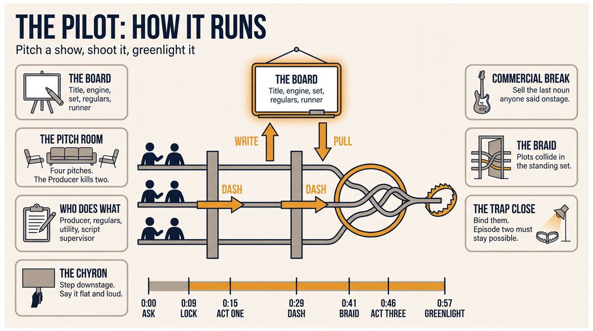
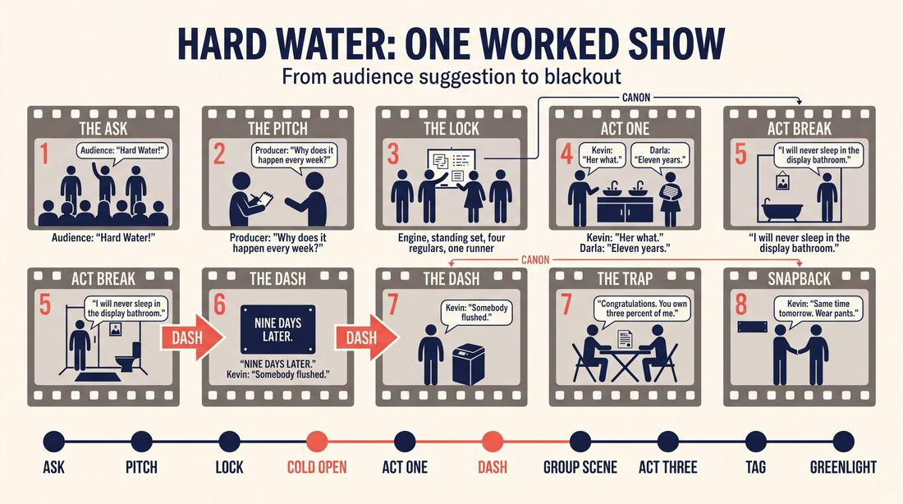
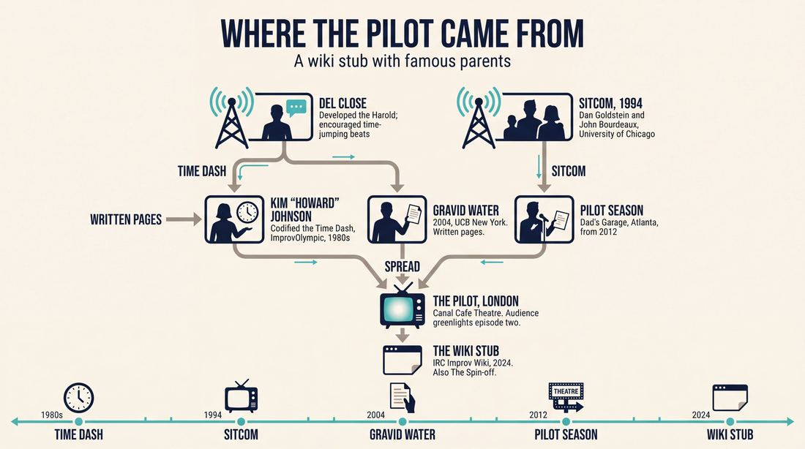
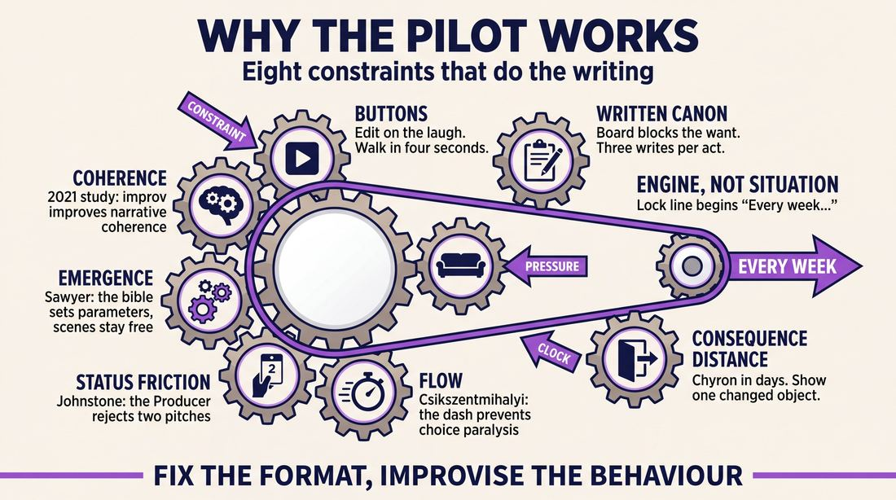
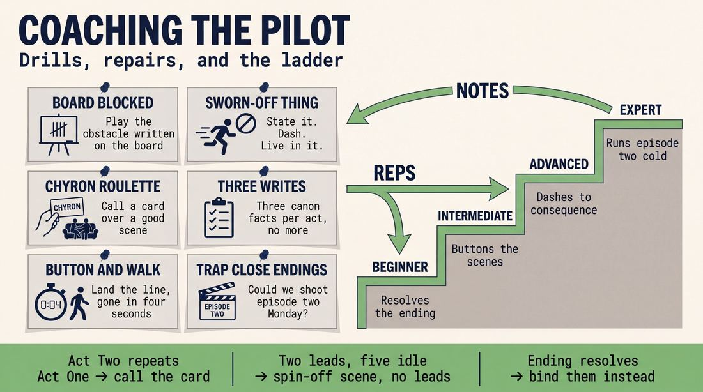

# The Pilot

> **A complete study of the long-form improv format _The Pilot_** - the original archived write-up, five infographics, grounded historical and pedagogical research, and a full mechanics-and-coaching manual.

| | |
|---|---|
| **Format** | The Pilot |
| **Primary source** | [IRC Improv Wiki](https://wiki.improvresourcecenter.com/index.php?title=The_Pilot) |

---

## Contents

1. [Part I - The Original Write-Up](#part-i-the-original-write-up)
2. [Part II - The Infographics](#part-ii-the-infographics)
   - [1. Structure and Mechanics](#infographic-1-mechanics)
   - [2. A Show, Beat by Beat](#infographic-2-example)
   - [3. Origins and Lineage](#infographic-3-history)
   - [4. Why It Works](#infographic-4-theory)
   - [5. Rehearsal and Repair](#infographic-5-coaching)
3. [Part III - Research Dossier](#part-iii-research-dossier)
   - [Pass 1: History, Lineage, Literature and Scholarship](#research-history)
   - [Pass 2: Comparative Anatomy, Pedagogy and Production](#research-comparative)
4. [Part IV - Mechanics, Gameplay and Coaching Manual](#part-iv-mechanics-gameplay-and-coaching-manual)
   - [Pass 1: The Form, Its Mechanics and Its Gameplay](#manual-mechanics)
   - [Pass 2: Training, Coaching and Performance Companion](#manual-coaching)

---

## Part I - The Original Write-Up

*Verbatim archive of the source article, reproduced exactly as scraped. Everything after this section is generated elaboration built on top of it.*

### The Pilot

| ***This article is a stub. Help the wiki grow by editing it and adding more information.*** |
| --- |

The Pilot also known as "The Spin\-off" follows the structure of a sitcom or time\-dash Harold and combined with a written narrative.

Performers improvise within the narrative, and make discoveries that are honored throughout the piece.

---

*Archived from [https://wiki.improvresourcecenter.com/index.php?title=The_Pilot](https://wiki.improvresourcecenter.com/index.php?title=The_Pilot) (IRC Improv Wiki) on 2026-08-09 23:23 UTC.*

---

## Part II - The Infographics

*Five 16:9 posters, each teaching a different aspect of the format. Click any poster to enlarge.*

<a id="infographic-1-mechanics"></a>

### 1. Structure and Mechanics

*How the form is played: the shape of the piece, the opening, the roles, the edit vocabulary, the flow of information, and the clock.*

{ .diagram loading=lazy decoding=async width="1100" height="614" }


<a id="infographic-2-example"></a>

### 2. A Show, Beat by Beat

*A single worked performance from suggestion to blackout: what happens in each beat, with short real example lines and what the players are doing technically.*

{ .diagram loading=lazy decoding=async width="1100" height="614" }


<a id="infographic-3-history"></a>

### 3. Origins and Lineage

*Where the form came from: creators, dates, theatres, how it spread between schools and cities, and the key figures - a documented timeline and lineage map.*

{ .diagram loading=lazy decoding=async width="1100" height="614" }


<a id="infographic-4-theory"></a>

### 4. Why It Works

*The theory: the core principles of the form and the research and craft ideas that explain why the structure produces good improv, each tied to a specific mechanic.*

{ .diagram loading=lazy decoding=async width="1100" height="614" }


<a id="infographic-5-coaching"></a>

### 5. Rehearsal and Repair

*Training and fixing the form: the essential drills, the common failure modes with their symptom-and-fix pairs, and the markers of beginner through expert play.*

{ .diagram loading=lazy decoding=async width="1100" height="614" }


---

## Part III - Research Dossier

*Two research passes: the historical record, then the comparative and pedagogical record. Claims carry evidence tags - treat unverified items accordingly.*

<a id="research-history"></a>

### » Pass 1: History, Lineage, Literature and Scholarship

### Research Summary
*   **Extremely Thin Documentation:** The specific format named "The Pilot" (or "The Spin-off") combining a "time-dash Harold" with a "written narrative" is highly obscure. It is documented almost exclusively as a stub on the IRC Improv Wiki.
*   **Parent Forms are Well-Documented:** Because the specific hybrid form is a ghost in the digital record, this dossier documents its traceable parent mechanics: the Sitcom format, the Time-Dash Harold, and Half-Scripted/Written Narrative improv.
*   **The Sitcom Lineage:** Improvised sitcoms (often called "The Pilot" or "Sitcom") are widely practiced globally, originating with Dan Goldstein and John Bourdeaux's *SITCOM* in Chicago (1994).
*   **The Time-Dash Mechanic:** The "time-dash" (jumping forward or backward in time between beats) is a documented Harold mechanic codified in Chicago in the 1980s by Del Close and Kim "Howard" Johnson.
*   **Written Narrative Integration:** The integration of a "written narrative" aligns with half-scripted formats (like *Gravid Water*) where improvisers make discoveries within a predetermined textual framework.
*   **Academic Relevance:** The format's reliance on narrative structure and time-jumping connects strongly to ludo-narrative theory and cognitive studies on narrative coherence in improvisation.

### Provenance and History
The exact creator of the specific hybrid form mentioned in the IRC Wiki is unverified. [INFERRED] It likely emerged from the Chicago or New York long-form scenes in the late 1990s or early 2000s as troupes experimented with Harold mutations and narrative integration. 

Because the hybrid is undocumented outside the wiki, we must look to the provenance of its structural parents. The "Time-Dash" was codified at ImprovOlympic (iO) in the 1980s to give Harold beats a temporal structure rather than just a thematic one. The "Sitcom" format was pioneered at the University of Chicago in 1994 by Dan Goldstein and John Bourdeaux, based on a philosophy they called "Structured Improvisation."

| Year | Event | Place / Company | Source |
| :--- | :--- | :--- | :--- |
| 1980s | Codification of the "Time Dash" Harold mechanic | ImprovOlympic (Chicago) | [UNVERIFIED - Kim "Howard" Johnson blog/interviews] |
| 1994 | Premiere of *SITCOM*, the first structured long-form sitcom | University of Chicago | dangoldstein.com |
| 2004 | *Gravid Water* (half-scripted format) debuts, popularizing written narrative integration | UCB (New York) | [WIDELY PRACTICED, UNDOCUMENTED] |
| 2012 | Dad's Garage begins performing *Pilot Season* | Dad's Garage (Atlanta) | dadsgarage.com |
| 2024 | "The Pilot" stub last modified on IRC Improv Wiki | IRC Improv Wiki | improvresourcecenter.com |

### Lineage and Transmission
The structural elements of this form are deeply rooted in the iO Theater's curriculum. The "time dash" is taught as a standard second-beat option (alongside the character dash/La Ronde, mapping, and tangent). 

The Sitcom mutation spread rapidly. Dan Goldstein's *SITCOM* saw 13 extended runs in 8 cities across 4 countries (including Boston, San Francisco, Amsterdam, and Munich), teaching improvisers to use television tropes (commercials, A/B/C plots). 

**Regional Dialects:**
*   **Atlanta (Dad's Garage):** Plays *Pilot Season*, focusing on 1990s sitcom tropes with a fake studio audience and a "Director/Producer" caller.
*   **London (Canal Cafe Theatre / Camden Fringe):** Plays *The Pilot*, splitting the show into short-form games to generate ideas, followed by two improvised pilots, with the audience voting on which gets a "second episode."
*   **New York (UCB):** Known for improvised *Seinfeld* episodes that utilize a Harold structure (Opening stand-up, A/B/C plot scenes, group games at the coffee shop).

### Key Figures
| Person | Role in this form | Specific contribution | Source URL |
| :--- | :--- | :--- | :--- |
| Dan Goldstein | Creator (Parent Form) | Co-created *SITCOM*, the first structured sitcom long-form | dangoldstein.com |
| John Bourdeaux | Creator (Parent Form) | Co-created *SITCOM* and the "Structured Improvisation" philosophy | dangoldstein.com |
| Del Close | Pioneer (Mechanic) | Developed the Harold and encouraged time-jumping narrative beats | [WIDELY PRACTICED, UNDOCUMENTED] |
| Kim "Howard" Johnson | Historian/Teacher | Codified the "Time Dash" as a basis for Harold scenes in the 1980s | blogspot.com |

### Canonical Shows, Companies and Recordings
*   **SITCOM:** The original 1994 University of Chicago production that spawned 13 productions globally. [dangoldstein.com](http://www.dangoldstein.com/sitcom.html)
*   **Pilot Season:** Dad's Garage (Atlanta). A highly produced version featuring a fake studio audience and live direction. [dadsgarage.com](https://www.dadsgarage.com/)
*   **The Pilot:** Canal Cafe Theatre (London). A competitive pilot-creation show where the audience greenlights their favorite pilot for a second episode. [camdenfringe.com](https://camdenfringe.com/)
*   **Improvised Seinfeld:** UCB (New York). A Harold-variant that perfectly mimics the sitcom's A/B/C plot structure and stand-up openings. [DOCUMENTED via practitioner accounts on Reddit]

### Published Literature
| Work | Author | Year | What it says about this form | Where to find it |
| :--- | :--- | :--- | :--- | :--- |
| *Truth in Comedy* | Charna Halpern, Del Close, Kim "Howard" Johnson | 1994 | Details the Harold structure which serves as the chassis for the Time-Dash | Published Book |
| *Zen and the Art of Long-form Improvisation* | Jason R. Chin | 2009 | Discusses creating and exploring a world over time, warning against forms that obfuscate scene work | Published Book |
| "SITCOM: The Show" | Dan Goldstein | 1994 | Outlines the "Structured Improvisation" philosophy behind improvised sitcoms | dangoldstein.com |
| "Second Beats" | Cindy Tonkin | 2016 | Defines the "Time dash" as a second beat occurring "Later or sooner in time" | cindytonkin.com |

### Verbatim Quotes
> "The Pilot also known as 'The Spin-off' follows the structure of a sitcom or time-dash Harold and combined with a written narrative. Performers improvise within the narrative, and make discoveries that are honored throughout the piece."
> — IRC Improv Wiki
> https://wiki.improvresourcecenter.com/index.php?title=The_Pilot

> "That changed again when we started to codify it [in the mid-80s], using the Time Dash as the basis for the scenes and an assortment of classic games as well as those we made up on the spot."
> — Kim "Howard" Johnson
> https://theimprovnetwork.blogspot.com/

> "A time dash is when a scene returns to the same characters or events at a different point in time than the one in which they were introduced. For example, a second or third beat scene showing a character at a later or earlier point in time."
> — IRC Improv Wiki
> https://wiki.improvresourcecenter.com/index.php?title=Time_dash

> "SITCOM is a longform improvisation that looks exactly like an hour of prime-time television. Two half-hour episodes of a brand-new sitcom are created on the basis of suggestions from the studio audience."
> — Dan Goldstein
> http://www.dangoldstein.com/sitcom.html

> "Like in a Harold, the second beats will be a time dash from the previous scenes. (A time dash means a passage of time.)"
> — Jimmy Carrane
> https://jimmycarrane.com/3-simple-long-forms-that-produce-great-scene-work/

> "In the second beat, we don't want to see them in the same scene, five minutes later from the first beat. We want to see them after some time has passed. Maybe it's one week, one month, one year, five years, 20 years later."
> — Victoria Koenitzer
> https://medium.com/@victoriakoenitzer/time-dash-second-beats-8e8b1a8b1a8b

> "It was founded on an improv philosophy called Structured Improvisation which holds that improv actors must study and use the fundamentals of story structure in their long form improvisations."
> — Dan Goldstein
> http://www.dangoldstein.com/sitcom.html

> "If you're trying to do an improvised Seinfeld, you follow the typical Seinfeld episode format (which is very Harold, really)."
> — Unverified UCB Practitioner
> https://www.reddit.com/r/improv/comments/

### Anecdotes and Stories
**The Genesis of SITCOM**
Dan Goldstein and John Bourdeaux conceived the *SITCOM* format during a long road trip through the southern United States. They based it on a computer program designed for plot structure analysis called STRUCTURALIST GILLIGAN, proving that rigid narrative structures could successfully house spontaneous scene work. (Source: dangoldstein.com)

**The Back to the Future Time-Dash**
Improv teachers frequently use the *Back to the Future* trilogy to explain the "time-dash Harold" to students. As writer L.A. Zvirbulis notes, the films feature the "Same scene, same location, similar characters, different details from the time period," perfectly illustrating how improvisers should approach time-dash second and third beats. (Source: howtowriteyourfavoritemovie.com)

### Academic and Scientific Research
**Narrative Coherence in Adolescents**
A 2021 study by researchers in France (published via NIH) evaluated the effects of improv on narrative skills. They found that improv significantly improved narrative coherence and story planning compared to traditional written theater.
*Relevance to this form:* The Pilot relies heavily on a "written narrative" framework. This research proves that improvisers possess heightened cognitive abilities to plan and maintain narrative cohesion, which is essential when jumping through time (time-dash) while adhering to a sitcom's A/B/C plot structure.

**Ludo-Narrative Theory and Emergent Storytelling**
Research into Tabletop Role-Playing Games (TTRPGs) and ludo-narrative theory examines how players create emergent narratives within pre-written modules (systems).
*Relevance to this form:* The Pilot's use of a "written narrative" combined with improvisation mirrors the TTRPG experience. The improvisers act as players navigating a pre-written "module" (the sitcom script/outline), generating emergent dialogue while hitting required structural beats.

### Documented Variants and Descendants
*   **Improvised Seinfeld:** A UCB variant that maps the Harold directly onto the *Seinfeld* format. The Opening is a stand-up monologue; the beats are the A, B, and C plots; and the Group Games are scenes at Monk's Diner where the characters intersect.
*   **PITCH / SHOW / FEEDBACK:** A variant documented by Ike Butler where an audience volunteer acts as a TV producer. The improvisers pitch show ideas, the producer selects one, the cast improvises a 20-30 minute pilot, and then the cast immediately transitions into network executives critiquing the pilot they just "watched."
*   **Half & Half / Gravid Water:** Variants that lean entirely into the "written narrative" aspect, where half the cast has a script and the other half is improvising completely blind, forcing the improvisers to justify the written text.

### Criticism, Debate and Known Failure Modes
*   **Obfuscating Scene Work:** As Jason R. Chin warns in *Zen and the Art of Long-form Improvisation*, highly structured forms (like sitcoms with written narratives) can become "watered down" if the performers prioritize the format over the scene work. The failure mode is focusing too much on hitting the narrative beats and forgetting to play the reality of the relationship.
*   **The Pressure of the "Laugh Track":** Sitcom formats carry the expectation of high-frequency punchlines. Practitioners note that this is one of the hardest formats to execute because the audience expects the polished, joke-dense rhythm of a writers' room, which can force improvisers into "gagging" rather than grounded play.
*   **Time-Dash Confusion:** In a time-dash Harold, improvisers often fail by advancing the plot too linearly (e.g., picking up exactly five minutes later) rather than jumping significantly forward or backward in time to explore the *game* of the scene in a new context.

### Cultural Footprint
*   **Widespread Adoption of the Sitcom Form:** While "The Pilot" specifically is obscure, the improvised sitcom is a staple of regional theatres globally, serving as a bridge for audiences who might be intimidated by abstract long-form but understand television tropes.
*   **Television Development:** The mechanics of improvising within a written narrative (or outline) heavily influenced the development of semi-scripted television shows like *Curb Your Enthusiasm*, *The League*, and *Reno 911!*, where actors are given a structural narrative but improvise the dialogue.

### Gaps in the Record
*   **The Specific "Pilot" Hybrid:** The searchable record contains zero primary source documentation (outside the IRC Wiki stub) of a troupe performing a show explicitly billed as a combination of a "time-dash Harold" and a "written narrative."
*   **Origin of "The Spin-off" Moniker:** It is unclear who coined the alternative name "The Spin-off" for this specific format.
*   **Next Steps for Researchers:** A researcher should interview legacy Chicago improvisers (from iO and Annoyance) and early UCB New York performers to determine if "The Pilot" was a short-lived house team format or a specific class exercise that was documented on the wiki but never widely published.

### Source List
1. IRC Improv Wiki - "The Pilot" - 2024 - https://wiki.improvresourcecenter.com/index.php?title=The_Pilot - Provides the foundational definition of the format.
2. IRC Improv Wiki - "Time dash" - 2020 - https://wiki.improvresourcecenter.com/index.php?title=Time_dash - Defines the time-dash mechanic.
3. Dan Goldstein - "SITCOM: The Show" - 1994 - http://www.dangoldstein.com/sitcom.html - Documents the history of the first structured improvised sitcom.
4. Kim "Howard" Johnson - Blogspot Interview - 2015 - https://theimprovnetwork.blogspot.com/ - Details the codification of the Time-Dash Harold in the 1980s.
5. Jimmy Carrane - "3 Simple Long Forms" - 2014 - https://jimmycarrane.com/3-simple-long-forms-that-produce-great-scene-work/ - Explains how to execute a time-dash in performance.
6. Victoria Koenitzer - "Time-Dash Second Beats" - 2024 - https://medium.com/@victoriakoenitzer/time-dash-second-beats-8e8b1a8b1a8b - Provides pedagogical rules for time-jumping in improv.
7. L.A. Zvirbulis - "How to Write Back to the Future part 3" - 2019 - https://howtowriteyourfavoritemovie.com/ - Connects the time-dash Harold to cinematic structure.
8. Jason R. Chin - *Zen and the Art of Long-form Improvisation* - 2009 - https://impropedia.ru/ - Offers criticism on over-structured long-form formats.
9. NIH / Frontiers in Psychology - "Improvisational Theater for Narrative Skills" - 2021 - https://www.ncbi.nlm.nih.gov/ - Scientific study on improv and narrative coherence.
10. Ike Butler - Improv Glossary - 2024 - https://ikebutler.com/ - Documents the PITCH/SHOW/FEEDBACK pilot format.

<a id="research-comparative"></a>

### » Pass 2: Comparative Anatomy, Pedagogy and Production

### Taxonomic Placement

```text
       The Harold                 Short-Form / Games
           |                              |
           +--------------+---------------+
                          |
                  Narrative Long-Form
                          |
           +--------------+--------------+
           |                             |
       The Movie                 The Pilot / The Spin-off
                                         |
                                  Time-Dash Harold
```

The Pilot (and its sibling variant, The Spin-off) sits at the intersection of narrative long-form and structured, meta-theatrical game-play. It inherits the multi-thread weaving of the Harold—specifically the "time-dash" variant where scenes jump forward in time rather than exploring the same moment—but applies the strict genre constraints and recurring character focus of a television sitcom. Unlike The Movie, which relies on cinematic tropes (pans, fades, camera angles), The Pilot relies on television tropes (commercial breaks, network pitches, pilot-to-series escalation, studio audiences). The inclusion of a "written narrative" or meta-narrative layer (such as a producer pitching or reviewing the show live) places it firmly in the family of meta-theatrical formats.

### Head-to-Head Comparisons

**The Pilot vs. The Harold**

| Axis | The Pilot | The Harold | Consequence for the players |
| :--- | :--- | :--- | :--- |
| **Opening** | Meta-theatrical pitch or audience "greenlight" | Organic group game or pattern game | Pilot players must immediately lock into a concrete narrative premise, whereas Harold players find the premise through exploration. |
| **Structure** | Episodic, linear or time-dash progression | Three beats of three distinct worlds | Pilot players stay in one unified universe; Harold players juggle three separate ones. |
| **Edit Logic** | Commercial breaks, network notes, time-dashes | Sweep edits, tag-outs | Pilot edits must serve the TV genre; Harold edits are purely associative or energetic. |
| **Memory** | Strict adherence to the "written narrative" and canon | Thematic recall and character game heightening | Pilot players must remember plot points and character arcs; Harold players remember comedic games. |
| **Cast Size** | 6–9 (Core cast + recurring/extras) | 8–10 (Ensemble) | Pilot players often get "typecast" into main vs. supporting roles for the night. |
| **Audience Contract** | We are watching a TV show being made/pitched | We are watching a thematic exploration | Pilot audiences expect narrative resolution and genre tropes. |
| **Failure Mode** | The Never-Ending Scene (plot stalls) | The Trainwreck (themes don't connect) | Pilot players must actively drive plot; Harold players must actively listen for connections. |

**The Pilot vs. The Movie**

| Axis | The Pilot | The Movie | Consequence for the players |
| :--- | :--- | :--- | :--- |
| **Opening** | Network pitch / Producer intro | Director's commentary / Trailer | Pilot focuses on television constraints (budget, network notes); Movie focuses on cinematic scale. |
| **Structure** | Sitcom A/B plots, commercial breaks | Three-act cinematic structure | Pilot players build recurring, sustainable situations; Movie players build toward a final climax. |
| **Edit Logic** | Hard cuts, time-dashes, ad breaks | Pans, fades, slow-motion, cross-cuts | Pilot edits are abrupt and episodic; Movie edits are visual and fluid. |
| **Memory** | Honoring the "series bible" | Honoring the cinematic genre tropes | Pilot players must track relationship history; Movie players track visual motifs. |
| **Cast Size** | 6–9 | 8–12 | Pilot requires a tight core ensemble; Movie requires a large cast for extras/spectacle. |
| **Audience Contract** | Intimate, character-driven comedy | Grand, visually driven storytelling | Pilot players rely on dialogue and situation; Movie players rely on stage picture and physicality. |
| **Failure Mode** | Trope Overload (cliches without heart) | Visual Chaos (too many camera tricks) | Pilot players must ground their characters; Movie players must simplify their stagecraft. |

**The Pilot vs. Monoscene**

| Axis | The Pilot | Monoscene | Consequence for the players |
| :--- | :--- | :--- | :--- |
| **Opening** | Pitch / Meta-frame | Immediate immersion into the space | Pilot players have a buffer to plan; Monoscene players must discover everything in real-time. |
| **Structure** | Time-dashes, multiple locations/episodes | Real-time, single location | Pilot players can jump past boring parts; Monoscene players must justify staying in one room. |
| **Edit Logic** | Commercial breaks, network notes | No edits (or very rare entrances/exits) | Pilot players use edits to reset energy; Monoscene players must sustain energy continuously. |
| **Memory** | Tracking plot across time jumps | Tracking physical objects and real-time emotional shifts | Pilot players track macro-narrative; Monoscene players track micro-reality. |
| **Cast Size** | 6–9 | 4–8 | Pilot allows players to play multiple characters; Monoscene restricts players to one character. |
| **Audience Contract** | Episodic television | Theatrical realism / one-act play | Pilot audiences expect fast-paced cuts; Monoscene audiences expect slow-burn tension. |
| **Failure Mode** | Dropped Canon (forgetting the pitch) | The Hostage Situation (trapped with no exit) | Pilot players must review their "written narrative"; Monoscene players must find reasons to care about the space. |

### What Makes It Uniquely Itself

1. **The "Written Narrative" Constraint**: Unlike purely emergent long-form, The Pilot operates on a pre-agreed "series bible" generated during the opening pitch or provided by a meta-theatrical Producer. Players are not just discovering the world; they are executing a specific, stated premise and honoring those discoveries as permanent canon.
2. **The Time-Dash Mechanic**: The form relies heavily on the "time-dash Harold" structure, where scenes jump forward (or backward) in time between "episodes" or "commercial breaks," forcing characters to evolve rather than just heightening the same comedic game in the exact same moment.
3. **The Meta-Theatrical Network Frame**: The presence of a "Producer," "Network Executive," or "Live Studio Audience" layer. If you remove the meta-layer of pitching, greenlighting, or receiving network notes, you are simply playing a narrative montage. The tension between the "Writers/Actors" and the "Network" is the engine of the form.

### Structural Variants in Practice

*   **The Pitch & Feedback (Ike Butler / Northeastern NU and Improv'd)**: A caller seats an audience volunteer as a TV producer. The cast pitches show ideas, the producer picks one, and the cast performs a 20–30 minute pilot. Afterward, the cast acts as network executives giving feedback and adding twists.
*   **The Greenlight Double-Feature (Canal Cafe Theatre, London)**: The cast improvises two separate, truncated pilot episodes in the first half based on audience suggestions. The audience votes on which gets "greenlit," and the second half consists of Episode 2 of the winning sitcom.
*   **Pilot Season (Dad's Garage, Atlanta)**: A highly produced variant featuring "Karen the Producer" challenging the ensemble to create a 1990s sitcom. It utilizes a fake live studio audience, heavy era-specific tropes, and live, in-scene direction from the Producer character.
*   **The Spin-off (IRC Improv Wiki / Jason Chin)**: A variant that functions as a sequel to a previous long-form set. It abandons the main characters of the original piece and uses a time-dash structure to explore the world through the eyes of secondary characters (siblings, bosses, background extras).

### The Teaching Ladder

| Stage | Skill introduced | Why in this order | Typical exercise | Source or [CRAFT CONSENSUS] |
| :--- | :--- | :--- | :--- | :--- |
| 1 | Genre Emulation | Establishes the baseline tone, pacing, and tropes of a television sitcom before adding narrative complexity. | "Sitcom Tropes" | [CRAFT CONSENSUS] |
| 2 | The Pitch | Teaches players how to collaboratively outline a "written narrative" and commit to a shared premise. | "The Pitch" | Ike Butler |
| 3 | Time-Dashing | Teaches how to advance the narrative across time jumps without losing the core character dynamics. | "Time-Dash Tag" | L.A. Zvirbulis / [CRAFT CONSENSUS] |
| 4 | World Expansion | Teaches how to populate the universe and find new A/B plots without relying solely on the main characters. | "The Spin-off Scene" | Jason Chin |
| 5 | Meta-Framing | Teaches how to give and receive live directorial notes in character, adjusting the narrative on the fly. | "Network Feedback" | Ike Butler |

### Documented Drills and Exercises

| Drill | Origin / teacher | How to run it | What it fixes in this form | Source |
| :--- | :--- | :--- | :--- | :--- |
| **The Pitch** | Ike Butler | Caller seats a volunteer as a TV producer. Players pitch show ideas; producer picks one to be the pilot. | Fixes weak initiations by establishing a clear, agreed-upon "written narrative" premise. | Ike Butler |
| **Network Feedback** | Ike Butler | Caller assembles the cast as network execs to critique the just-performed pilot and mandate twists for the next beat. | Fixes lack of narrative escalation; provides meta-theatrical course correction. | Ike Butler |
| **The Spin-off Scene** | Jason Chin | Players initiate a scene using secondary characters from a previous scene's world, explicitly excluding the main characters. | Fixes tunnel vision on the main cast; expands the sitcom universe for B-plots. | Jason Chin / Impropedia |
| **Repeat-O** | John McGregor | Play a scene, sweep, replay the exact same scene starting with the same line but heighten choices based on previous tag-outs. | Fixes inconsistent character behavior; trains players to honor established canon. | Ike Butler |
| **Turning Offer** | Alice Canton | A player uses the line "The real reason I've brought you here is..." to abruptly pivot a dying scene. | Fixes storylines that are going nowhere; forces a commercial-break-style cliffhanger. | The Spinoff (Alice Canton) |
| **Blind Dub** | Ike Butler | Two players speak the scene, two other players mime it without seeing the speakers. | Fixes disconnect between physical action and dialogue; trains sitcom-style physical comedy. | Ike Butler |
| **Bookends** | Ike Butler | Two players are given a first and last line of dialogue and must justify both within the scene. | Fixes meandering plots by forcing players to navigate toward a predetermined narrative ending. | Ike Butler |
| **Buzzer / Say It Again** | Ike Butler | Caller buzzes when a player says something that needs heightening; player must restate it with more sitcom flair. | Fixes low-energy choices; punches up the comedic dialogue to TV standards. | Ike Butler |
| **Time-Dash Tag** | L.A. Zvirbulis | Revisit the exact same location and characters, but jump forward or backward in time (e.g., 10 years later). | Fixes static relationships; forces characters to evolve across "episodes." | L.A. Zvirbulis |
| **Commercial Break Edits** | [CRAFT CONSENSUS] | Players edit scenes by stepping forward and pitching a 15-second commercial for a product mentioned in the scene. | Fixes slow sweeps; provides built-in time-dashes and palate cleansers between A and B plots. | [CRAFT CONSENSUS] |

### Common Failure Modes and Diagnoses

| Failure mode | What it looks like from the audience | Root cause | Fix | Who names it |
| :--- | :--- | :--- | :--- | :--- |
| **The Never-Ending Scene** | The pilot feels like a one-act play rather than a TV show; no scene changes or B-plots. | Players are afraid to edit or initiate time-dashes. | Implement hard "commercial break" edits or use the "Turning Offer" to force a cliffhanger. | [CRAFT CONSENSUS] |
| **Dropped Canon** | Characters change names, relationships, or core premises established in the pitch. | Poor memory; ignoring the "written narrative" constraint. | Run the "Repeat-O" drill; have the Producer character pause the show to give "notes." | [CRAFT CONSENSUS] |
| **Trope Overload** | The show is just a string of sitcom cliches (e.g., the nagging wife, the dumb husband) with no real relationship. | Playing the genre instead of the reality. | Focus on grounded scene work and relationship history before applying the sitcom layer. | [CRAFT CONSENSUS] |
| **The Echo Chamber** | The cast only plays the two main characters, leaving the rest of the ensemble on the backline. | Failure to expand the world or initiate B-plots. | Force "Spin-off Scenes" focusing exclusively on secondary characters. | Jason Chin |

### Production and Logistics

*   **Cast size and why**: 6 to 9 players. This allows for a core cast of 3–4 "series regulars" while leaving 3–5 players available to populate the world with secondary characters, perform commercial breaks, and act as Network Executives.
*   **Runtime**: 45 to 60 minutes (typically a 10-minute pitch/greenlight phase, a 20–30 minute pilot, and a 10–15 minute feedback or Episode 2 phase).
*   **Stage layout**: A split stage. Downstage/Stage Right serves as the "Pitch Room" (bare, perhaps one chair for the Producer). Upstage/Stage Left serves as the "Sitcom Set" (often featuring a couch, two chairs, and a coffee table to mimic a multi-cam sitcom living room).
*   **Lighting and tech cues**: Bright, flat lighting for the sitcom scenes to mimic television production. Spotlights or dimmed washes for the Pitch/Feedback segments.
*   **Music and sound**: A generic, upbeat sitcom theme song is essential for the opening credits. Short musical stingers (slap bass, upbeat acoustic guitar) are used to transition into and out of commercial breaks.
*   **MC and host duties**: The MC plays the "Producer" or "Network Executive." They manage the audience interaction, run the pitch session, and have the authority to interrupt the pilot to give "network notes" if the narrative strays.
*   **How the suggestion is taken**: The MC asks the audience for a title of a non-existent TV show, a target demographic, or seats an audience volunteer to act as the "Head of the Network" who selects the winning pitch.
*   **Where the form belongs in a show lineup**: Typically the anchor (second half) of a show, following a fast-paced short-form or warm-up first half (as seen in Canal Cafe Theatre's production).
*   **Rehearsal cadence**: Weekly, with a heavy emphasis on narrative outlining, genre emulation, and time-dash mechanics.
*   **What a producer must prepare**: Fake network branding, a playlist of 90s/00s sitcom transition music, and optionally an "Applause" or "Laugh Track" sign to cue the audience.

### Adaptations Beyond the Stage

*   **Classroom and youth**: Adapted as "The School Play" or "Morning Announcements." The meta-frame shifts from a cynical TV network to a school principal or drama teacher, ensuring content remains age-appropriate while teaching narrative structure.
*   **Corporate and applied improv**: Adapted as "The Product Launch" or "The Corporate Video." Teams pitch a commercial or training video for a new product, then improvise the video. It teaches collaborative outlining and presentation skills.
*   **Online and remote**: Highly adaptable to Zoom ("The Zoom Sitcom"). The Pitch phase perfectly mimics a corporate video call, and virtual backgrounds can be used to instantly establish the sitcom sets.
*   **Community and therapeutic settings**: Used to explore alternative life paths ("Spin-offs" of their own lives) in a safe, fictionalized container, allowing participants to roleplay different outcomes of personal decisions.
*   **Accessibility and inclusion**: The heavy reliance on physical sitcom tropes requires audio description for visually impaired audiences. The "Producer" role must be cast carefully to ensure it does not reinforce real-world power imbalances or marginalize players during the pitch phase.
*   **Content-safety and consent**: The "Network Censor" or "Standards and Practices" mechanic allows players or the host to safely edit, boundary-check, or veto scenes in real-time without breaking the meta-reality of the show.
*   **Ethics of using real stories**: If the pilot is based on an audience member's life (a "Spin-off" of their reality), the host must ensure the portrayal remains celebratory. The "Network Notes" mechanic can be used to steer the narrative away from mocking or exploitative territory.

### Evidence Base for Those Adaptations

*   **Sawyer (2019) on "guided improvisation"**: Research shows that teaching which guides students through open-ended problems toward specific curricular goals develops deep, flexible knowledge. This supports the use of the "written narrative" and Producer constraints in educational settings.
*   **Kim (2011) / Turner (2010) on visual-narrative methods**: Studies on storyboarding demonstrate that combining visual/performative action with a written narrative facilitates a deeper level of reflection than text alone, validating the form's use in applied and therapeutic settings.
*   **Ruppar et al. (2017) on creativity and flexibility**: Research identifies that expert educators use improvisation to adapt individualized instruction on the fly. This mirrors the improviser's ability to adapt the "written narrative" based on live "network notes," supporting the form's utility in corporate and teacher training.

### Scholarly Frames Worth Applying

*   **Sawyer on collaborative emergence**: The theory that creative output in groups cannot be predicted by analyzing the individuals, but emerges from their interaction. *Citation: Sawyer, R.K. (2003). Group Creativity: Music, Theater, Collaboration.* **Mapping**: The Pilot perfectly illustrates this; the Pitch phase sets the parameters, but the actual episode is collaboratively emergent, constrained only by the agreed-upon "written narrative."
*   **Johnstone on status and spontaneity**: The framework that all human interaction is a negotiation of status, and that playing with status unlocks spontaneity. *Citation: Johnstone, K. (1979). Impro: Improvisation and the Theatre.* **Mapping**: The Feedback/Notes session relies entirely on the high-status Producer dominating the low-status Writers/Actors, generating comedy through status friction.
*   **Csikszentmihalyi on flow**: The psychological state of optimal experience achieved when skill level perfectly matches the challenge at hand. *Citation: Csikszentmihalyi, M. (1990). Flow: The Psychology of Optimal Experience.* **Mapping**: The "Time-Dash" mechanic provides a strict structural constraint that channels the players' creativity, preventing choice paralysis and inducing flow.
*   **Vera and Crossan on organizational improvisation**: The application of theatrical improvisation principles to team innovation and corporate agility. *Citation: Vera, D., & Crossan, M. (2004). Theatrical Improvisation: Lessons for Organizations.* **Mapping**: The Pitch phase models rapid prototyping and agile development, making it a direct analogue for corporate brainstorming.

### Where the Form Is Heading

*   **Audience Voting Mechanisms**: Contemporary productions (like Canal Cafe Theatre's *The Pilot*) are gamifying the form by improvising multiple pilots in the first act and allowing the audience to vote on which one gets "greenlit" for a second episode in the second act.
*   **Actual-Play Hybrids**: Tabletop roleplaying shows (like *Dimension 20*) are utilizing "pilot arcs" and spin-offs to test new worlds and secondary characters before committing to a full, multi-month campaign.
*   **Improvised Web Series**: Troupes are taking the form off the stage and into digital media, filming their improvised pilots and releasing them as web series (e.g., *SnapCube's Real-Time Fandub* using strict improv guidelines to dub over existing media, treating the original footage as the "written narrative").
*   **Multi-Week Serials**: Theatres are experimenting with serializing the form, where Episode 1 is performed one week, and the cast must return the following week to perform Episode 2, relying heavily on the "series bible" generated in the pilot.

### Source List

1. The Pilot - IRC Improv Wiki - 2024 - https://wiki.improvresourcecenter.com/index.php?title=The_Pilot - Supports the definition of The Pilot/The Spin-off as a sitcom or time-dash Harold combined with a written narrative.
2. Improv Formats - Ike Butler - N/A - https://ikebutler.com - Supports the Pitch/Show/Feedback structure, Blind Dub, Bookends, Buzzer, and Repeat-O drills.
3. The Pilot Improv - Camden Fringe / Canal Cafe Theatre - 2024 - https://camdenfringe.com - Supports the two-pilot greenlight structure and show lineup placement.
4. Pilot Season - Dad's Garage - 2025 - https://dadsgarage.com - Supports the "Karen the Producer" meta-frame and live studio audience sitcom production logistics.
5. Zen and the Art of Long-form - Jason Chin (via Impropedia) - 2009 - https://impropedia.ru - Supports "The Spin-off" scene definition and world expansion mechanics.
6. How to Write Back to the Future part 3 - L.A. Zvirbulis - 2019 - https://howtowriteyourfavoritemovie.com - Supports the definition of the "time-dash Harold" structure.
7. How to improvise your way through the silly season - Alice Canton (The Spinoff) - 2022 - https://thespinoff.co.nz - Supports the "Turning Offer" drill.
8. Guided Improvisation and Evidence-Based Practices - Sawyer (2019) / Ruppar et al. (2017) - 2019 - https://wisc.edu - Supports the evidence base for guided improvisation and adapting written narratives.
9. Storyboarding as a reflective visual-narrative method - Kim (2011) / Turner (2010) - 2025 - https://tandfonline.com - Supports the evidence base for combining visual/performative action with written narrative.

---

## Part IV - Mechanics, Gameplay and Coaching Manual

*Synthesis over the original article and both research dossiers: first how the form works and how to play it, then how to train an ensemble to perform it.*

<a id="manual-mechanics"></a>

### » Pass 1: The Form, Its Mechanics and Its Gameplay

### At a Glance

| Field | Value |
|---|---|
| **Also known as** | The Spin-off; house-name relatives include *SITCOM*, *Pilot Season* (Dad's Garage), *The Pilot* (Canal Cafe Theatre), Pitch/Show/Feedback, "the improvised sitcom pilot" |
| **Family** | Narrative long-form / genre-emulation, with a meta-theatrical frame; structurally a **time-dash Harold wearing a television chassis** |
| **Cast size** | 6–9. Sweet spot 7: three or four series regulars, three or four utility players. Below 5 the world cannot be populated; above 10 the regulars get starved of stage time |
| **Runtime** | 45–60 min. Standard split: 8–10 min pitch, 30–35 min pilot episode, 8–12 min notes/greenlight/tag |
| **Opening** | **The Pitch Room** — the cast, as writers, pitches show ideas to a Producer (host or audience volunteer) who selects one; the selected premise is *physically written down* on a visible board and becomes binding canon |
| **Suggestion taken** | The title of a television show that has never existed. (Variants: a target demographic; a network; a job nobody has made a show about; an audience volunteer seated as Head of Network) |
| **Structural rigidity (1–5)** | **4.** The act structure, the standing set, and the board are fixed. What happens inside them is fully improvised |
| **Difficulty (1–5)** | **4.** Not because the scenes are hard, but because the form demands three simultaneous disciplines — genre pastiche, plot mechanics, and canon memory — while the audience's joke-density expectation is set by professionally written television |
| **Prerequisites** | Reliable two-person scene work; comfort with editing on plot logic rather than energy; the ability to play the *same character* three times with three different amounts of history; one person who can hold a board in their head |
| **Best for** | Ensembles with strong character actors and weak abstract instincts; audiences new to long-form; teams that keep making beautiful first beats and no second beats; theatres with a music/tech operator |
| **Avoid when** | You have fewer than six players; you have no tech (the commercial-break edit and the theme song are load-bearing); your team's failure mode is joke-first, relationship-never; the cast has never rehearsed the form and you are opening for a paying house |

---

### The Essence in One Paragraph

The Pilot is a long-form in which the ensemble spends the first ten minutes **writing a television show out loud and in public** — pitching to a Producer until a premise, a cast list, a permanent location and a repeatable weekly engine are agreed and literally written on a board the audience can see — and then spends the next thirty-five minutes **shooting the first episode of that show**, jumping forward through story time in Harold-style second and third beats separated by commercial breaks and time cards, with everything discovered onstage being added to the board as permanent canon. The written thing is not a script; it is a **series bible**, and it is the form's spine: it converts improvisation from "what do we do next" into "what does *this show* do next." The unique obligation — the thing that makes it a *pilot* rather than merely an improvised sitcom episode — is that the episode must end with the show's engine permanently installed and running, so that a second episode is not merely possible but inevitable. The piece then closes with the cast breaking frame as network executives to give notes and the audience greenlighting the series. You are not improvising a story. You are improvising a *format*, and then proving it works by running one episode through it.

---

### Why This Form Exists

A plain montage answers the question "what else is true about this idea?" The Pilot answers a harder and more commercially interesting question: **"what is the machine that will generate this idea again next week?"** Those are different jobs and they need different structures.

Four specific problems this form solves that a montage does not:

**1. The premise-amnesia problem.** In a montage or a group-game Harold, the opening's brilliance evaporates by minute twelve because nothing in the architecture forces the cast to reference it. The Pilot's Pitch phase produces a written artefact — the board — that sits in the players' sightline for the entire show. The wiki stub's whole operative clause is "*Performers improvise within the narrative, and make discoveries that are honored throughout the piece.*" The board is the honouring mechanism. Discovery without a place to put it is just a nice moment; discovery written on the board is a load-bearing beam.

**2. The static-relationship problem.** Harold second beats often stall by resuming the same conversation five minutes later. The time-dash forces the ensemble to answer "what did that decision *cost*?" rather than "what else is funny about that?" Every act break in The Pilot is a compulsory time jump. Character evolution stops being an optional grace note and becomes a structural requirement of getting to Act Two.

**3. The plot-avoidance problem.** Improvisers are trained to avoid plot ("plot is what happens while the scene is about something else"). This is excellent advice that produces, in a fifty-minute show, a fifty-minute mood. The sitcom chassis supplies a plot engine that requires almost no invention: somebody wants something, somebody else's want is incompatible, the location cannot be left, an episode ends when the status quo is restored one degree wiser. The form gives plot for free so the cast can spend its intelligence on behaviour.

**4. The literacy problem.** A first-time audience does not know how to read a Harold. Every human on earth knows how to read a sitcom. The Pilot is the form you programme when the house is half friends-of-cast and half people who bought a ticket because it was Thursday. The genre frame is free comprehension.

What it buys the ensemble that a montage would not: **a reason for the fourth scene to matter to the first**, a permanent set so that entrances are meaningful, a legitimate excuse to hard-cut for pace rather than waiting for an emotional out, and a curtain call — the greenlight — that gives the audience something to do besides clap.

---

### The Audience Contract

**What they are promised, in order, and how they know:**

| Promise | The signal that makes it legible |
|---|---|
| "You will watch a show get invented and you will remember the moment it happened." | The Pitch is played out loud, competitively, with a visible rejection of pitches; the winning premise is written on a board in front of them |
| "Nothing on that board will be broken." | The board stays lit and visible for the whole show. The Script Supervisor visibly adds to it |
| "This is television, not theatre." | Theme song, cast handshake during titles, bright flat wash, commercial breaks, a time card called aloud |
| "Time will jump, and you will always be told how far." | The chyron: someone steps to the front and says "**NINE DAYS LATER**" |
| "There is one room you will keep coming back to." | The standing set is physically staged (couch, two chairs, a table) and never struck |
| "The people you met in the first two minutes are the ones you'll finish with." | No named regular is introduced after Act One |
| "It will end tidily and someone will decide whether it lives." | The tag scene, then the notes session, then the greenlight vote |

**What breaks the contract, ranked by severity:**

1. **Burning the bible.** The pilot ends in a way that makes episode two impossible — the shop burns down, the lead dies, the couple moves to Portugal. The audience has spent an hour investing in a *format*; destroying it reads as contempt. This is the only unforgivable ending in this form.
2. **Silent canon violation.** Kevin becomes Kyle, the showroom becomes a warehouse, and nobody flinches. The board is in their eyeline. They can see you break it.
3. **Unmarked time.** Act Two starts and the audience cannot tell if it is ten minutes or ten years later. Every subsequent laugh is discounted by confusion.
4. **The frame going soft.** The Producer, having been established as the authority who greenlights, is never seen again, or gives notes without power. The meta-layer must have teeth or it should not exist.
5. **A pilot that is just a good episode.** Nothing is *installed*. Nobody says the sentence that makes the series possible. The audience leaves entertained and unable to describe the show to a friend.

---

### Anatomy: The Full Structural Map

The Pilot is built in three concentric layers.

**The outer layer — the Network Frame.** Pitch → Greenlight → Episode → Notes → Greenlight vote. This layer is meta-theatrical, high-status/low-status, and is played *as itself* (writers and executives), not as the sitcom characters. It brackets the show and provides both the opening and the ending.

**The middle layer — the Episode.** A three-act sitcom with a cold open and a tag. This is where genre lives: the flat lighting, the doorway entrances, the button lines, the commercial breaks.

**The inner layer — the Beat Grid.** Underneath the television skin is a time-dash Harold. Three plot lines, each getting a first beat, a second beat (dashed forward), and a third beat (dashed again), braided together in a group scene at the standing set. If you strip the theme song off, this is a Harold with a mandatory shared universe and a mandatory forward clock.

#### Beat-by-beat table (55-minute build)

| Unit | Approx. clock | What happens | Who drives it | Success criterion | Common error |
|---|---|---|---|---|---|
| **0. Frame set** | pre-show | Board erected, standing set placed, theme music cued, Producer character introduced | Producer/host, tech | Audience understands there is a board and it will matter | Board placed where the cast can't read it |
| **1. The Ask** | 0:00–0:02 | Suggestion: title of a show that never existed | Producer | One title, taken fast, not workshopped | Taking three suggestions and blending them |
| **2. The Pitch Room** | 0:02–0:09 | 4–6 competing pitches, each 45–75 sec; Producer interrogates and rejects | Whole cast; Producer arbitrates | At least two pitches are genuinely rejected on stage | Everyone pitches variations of the same idea |
| **3. The Board Lock** | 0:09–0:12 | Producer picks one; cast fills in Title / Logline / Engine / Standing Set / 3–4 Regulars / Runner. Script Supervisor writes it | Producer asks, cast answers | The **Engine line** is a complete sentence starting "Every week…" | Writing a *situation* and no *engine* |
| **4. Cold Open** | 0:12–0:14 | 90-second scene, one joke, button, blackout. Establishes tone and the standing set | Two players, usually not the leads | It ends on a laugh and a hard out | Cold open starts the A-plot |
| **5. Titles** | 0:14–0:15 | Theme music; each regular steps into light, says their character name and one physical hallmark | Whole cast, tech | Audience now owns the cast list | Mumbled, unlit, no music |
| **6. Act One — A1** | 0:15–0:20 | The premise event. The thing that makes the show exist happens | The two regulars in the A-plot | The A-plot's central question is askable in one sentence | Playing the aftermath instead of the event |
| **7. Act One — B1** | 0:20–0:24 | Second plot, different pair, different location or side of the set | Two other regulars | B1 contains an object or fact the A-plot will later need | B-plot is about the same thing as A |
| **8. Act One — C1 / Runner** | 0:24–0:27 | Short (60–90 sec) third thread, often the utility characters or the runner object | Utility players | It is short and it recurs | The runner becomes a full plot |
| **9. Act Break** | 0:27–0:29 | Turning offer / cliffhanger line → commercial break played by backline | Whoever is losing the scene; backline executes the ad | Cliffhanger is a *statement*, not a question | Fading out on a shrug |
| **10. Act Two — dash** | 0:29–0:41 | Chyron. Second beats of A, B and C, all after real elapsed time; plots begin to touch | Chyron caller, then scene pairs | Every character enters Act Two changed by Act One | Second beats resume the same conversation |
| **11. Standing-Set Group Scene** | 0:41–0:46 | Everyone in the standing set at once. The plots collide. The episode's biggest laugh lives here | Ensemble; one player as traffic cop | All three threads are visibly present in the room | Six people talking; no plot advances |
| **12. Act Three** | 0:46–0:52 | Second chyron. Resolution: the A-question answered, the status quo snapped back one degree wiser, the engine installed | The A-plot pair; Producer may note | Somebody says the sentence that describes the series | The premise is solved and therefore dead |
| **13. Tag** | 0:52–0:53 | 30-second post-credit runner payoff | Utility players | It pays the runner and nothing else | Tag introduces new plot |
| **14. Notes / Upfronts** | 0:53–0:57 | Cast as network executives critique the pilot; mandate absurd changes | Producer chairs | Notes are specific to what actually happened onstage | Generic executive jokes |
| **15. Greenlight** | 0:57–0:58 | Audience votes/applauds; Producer greenlights or passes; blackout | Producer, audience | The audience gets to decide something | Greenlighting before the notes are funny |

#### ASCII shape

```
        THE BOARD  (written narrative — visible, binding, growing)
 ╔══════════════════════════════════════════════════════════════════════════╗
 ║ TITLE │ LOGLINE │ ENGINE │ STANDING SET │ REGULARS │ RUNNER │ + canon →→ ║
 ╚══▲═══════════════════════════════════════════════════▲══════════▲════════╝
    │ written during PITCH                              │ added live by SCRIPT SUPERVISOR
    │                                                   │          │
 ───┴───────────────────────────────────────────────────┴──────────┴─────────►
                              STORY TIME  (only ever moves FORWARD)

 [ASK]─[PITCH ROOM]─[LOCK]║[COLD OPEN][TITLES]
                          ║
   ACT ONE                ║   ACT TWO                    ACT THREE
   day zero               ║   +9 days                    +2 weeks
                          ║
   A1 ────────────────────╫──> A2 ───────────┐          ┌─> A3 ──> SNAPBACK
   B1 ────────────────────╫──> B2 ──────────┤ GROUP    ├─> B3 ──┘
   C1(runner) ────────────╫──> C2 ──────────┘ SCENE    └─> TAG
                          ║   (standing set)
                    [ACT BREAK]              [CHYRON]
                    cliffhanger + AD          "TWO WEEKS LATER"
                          ║
                          ╚══════════════════════════════════════════
                                                    │
                                          [NOTES SESSION]─[GREENLIGHT]─[BLACKOUT]

 KEY:  ║ = hard commercial-break edit (mandatory time jump)
       ╫ = the dash: characters must arrive changed
       Vertical bars are the only places story time is allowed to move.
```

---

### The Opening

The opening of The Pilot is the Pitch Room. It is not a warm-up, not a word association, not a pattern game. It is a **scene with a decision at the end of it**, and the decision is written down.

> **A note on the record.** The wiki stub says the form combines a sitcom/time-dash Harold "with a written narrative," and the two dossiers read "written narrative" differently: the history dossier leans toward half-scripted formats (*Gravid Water*, where actual pages exist), while the comparative dossier reads it as an onstage-generated series bible. **My judgement: the bible reading is primary and the literal-page reading is a legitimate sub-variant** (documented below as the Cold Page opening). The bible reading is the only one that explains the "discoveries are honored throughout" clause, and it is the only one a normal ensemble can run on a Thursday without a playwright.

#### Standard procedure: The Pitch Room (8–10 minutes)

1. **Set the room.** Producer (host, in a jacket, holding a clipboard) sits or stands downstage right in a spotlight or separate wash. The cast lines up as writers. The board is upstage centre, blank except for four printed headers: **TITLE / ENGINE / SET / CAST**.
2. **Take the suggestion.** "Give me the title of a television show that has never existed." Take one. Do not shop. Write it on the board immediately — the physical act of writing tells the audience the rules.
3. **Pitch in pairs or solos, 45–75 seconds each, minimum four pitches.** A pitch must contain: who it is about, where it happens, and why it happens every week. Pitches that lack the third element get interrogated.
4. **The Producer must reject out loud.** "That's a movie, not a series." "Who's in the room in episode nine?" "That's a great character and no show." Rejection is the engine of the opening — it is where the comedy of the pitch phase lives, and it teaches the audience what a good premise is so the winner lands harder.
5. **Select.** Producer names the winner. Cast applauds insincerely. Losing pitchers may lobby once and lose.
6. **Interrogate to lock.** Producer asks the six lock questions in this order and the cast answers in character as writers. Script Supervisor writes each answer:
   - What's the **logline**? (one sentence, contains the reversal)
   - What's the **engine**? (a sentence starting "Every week…")
   - What's the **standing set**? (one room, named, that no one can leave)
   - Who are the **regulars**? (3–4 names, ages, and one unchangeable fact each)
   - Who is the **runner**? (an object, a phrase, or a minor character that recurs)
   - What is the **pilot's question**? (a yes/no question the episode answers)
7. **Cast the show.** Each regular is claimed by a player, out loud: "I'll play Darla." Any unclaimed regular is cut. This is a hard step; skipping it produces two Darlas in Act Two.
8. **Lock and green.** Producer says the greenlight line: "We're ordering a pilot. Don't make me regret it." Tech hits the theme.

#### Documented and recommended variants

| Variant | Mechanic | Use when | Cost |
|---|---|---|---|
| **Audience Producer** (Ike Butler's Pitch/Show/Feedback) | An audience volunteer is seated in the Producer chair and *actually chooses* the pitch | You want maximum buy-in, or the house is cold | You lose control of premise quality; brief the volunteer offstage: "Pick the one you want to watch, not the one that got the biggest laugh" |
| **The Greenlight Double-Feature** (Canal Cafe, London) | Two truncated pilots in Act One of the night; audience votes; the winner gets a full Episode 2 after interval | Full-evening show; competitive energy; recurring house night | Each pilot gets ~20 min, so plots must be two-thread, not three |
| **Karen the Producer** (Dad's Garage *Pilot Season*) | A named, characterised Producer with a decade and a demographic mandate ("It's 1997, it's for TGIF, it's got a dog"), who can interrupt mid-episode with notes | You want live course-correction and a strong comic frame | The Producer must be your best structural improviser or the notes derail rather than steer |
| **The Cold Page** (*Gravid Water* lineage) | Two or three players hold actual scripted pages — a real sitcom scene from a real show, or written by the director — and must justify them inside the improvised premise | Advanced rehearsal; a themed run; a fundraiser | Requires prep; the scripted players cannot yield; the seam is visible and must be played as a feature |
| **The Spin-off Opening** | No pitch. The form runs as a sequel to a previously performed long-form set, taking its *secondary* characters as the new regulars | Second half of a double bill; the first half was a montage or Harold with a rich world | Depends entirely on the first half; if the first half was thin, the bible is thin |
| **The Upfronts** | Three or four pitches are each shot as a 60-second "sizzle" (a montage of imagined moments) before the Producer chooses | The cast is fast and physical; you want the losing pitches to earn stage time | Adds 5 minutes; can exhaust the ideas you wanted to use in the episode |
| **Demographic Ask** | The suggestion is a target audience ("men aged 55–70 who own a boat") rather than a title | The room has been giving you joke titles | Titles are handed to you free; demographics require the cast to generate the title, which is slower |

**My recommendation for a first Thursday:** standard procedure, host as Producer, four pitches, hard rejections, and a physical whiteboard. Do not run the audience-Producer variant until the cast can lock a bible in three minutes.

---

### The Engine

This is the section to read twice. Everything else in the form is packaging.

#### 1. The three reservoirs

Material in The Pilot comes from exactly three places, and the health of the show is a function of how much traffic flows between them.

| Reservoir | What's in it | How it enters a scene | How it leaves a scene |
|---|---|---|---|
| **The Board** (fixed canon) | Title, logline, engine, standing set, regulars, runner, plus everything the Script Supervisor has added | A player *uses* it: names the set, invokes a regular's unchangeable fact, triggers the engine | Never leaves. It only grows |
| **The Live Scene** (discovery) | Anything said aloud onstage that was not on the board | Improvised in the moment | Either (a) written to the board and becomes canon, or (b) evaporates. There is no third option |
| **The Frame** (network pressure) | The Producer's mandate, notes, the demographic, the budget | The Producer speaks, or a player invokes the mandate in character-as-writer | Notes become board entries |

The single most important sentence in the form: **a discovery that is not written to the board will be forgotten by minute thirty.** This is why I recommend a physical Script Supervisor. The wiki stub says discoveries are "honored throughout the piece"; honouring is a *procedure*, not an attitude.

#### 2. The four jobs of a pilot

This is the form's defining constraint and the reason it is called The Pilot rather than The Sitcom. An episode of television has one job: be an episode. A **pilot** has four, and it must complete all four in thirty minutes or the audience knows something is wrong even if they can't say what.

| Job | What it means operationally | Where in the structure it gets done | Test |
|---|---|---|---|
| **J1. Introduce** | Every regular gets a scene in which they want something | Act One (A1/B1/C1) | Can the audience name all four regulars at the interval? |
| **J2. State** | Someone says, out loud, what the show is | Usually the Act One turning offer | Is there a line you could put on the poster? |
| **J3. Prove** | The engine is run once, in full, and it produces comedy | Act Two + group scene | Did the two people who hate each other have to do the thing together? |
| **J4. Install** | The premise becomes permanent and irreversible | Act Three snapback | Could you shoot episode two on Monday with the same set and cast? |

**J4 is the one teams miss.** Improvisers are trained to resolve. Resolution kills a pilot. The correct Act Three move is not "and so they made peace" but "and so, horribly, they are now stuck together forever." A pilot's happy ending is a *trap closing*.

#### 3. How information travels: the three transactions

**Transaction A — Board → Scene ("the pull").** A player begins a scene by touching the board out loud. Not describing it; *using* it. Weak: "Well, here we are in the showroom." Strong: "Whoever put a bath mat in the display bathroom, you are stealing from this family." The second one uses the standing set, invokes a regular's unchangeable fact, and starts a conflict.

**Transaction B — Scene → Board ("the write").** When a discovery is (i) about a regular, (ii) about the set, or (iii) a proper noun, the Script Supervisor writes it. The physical act is a signal to the cast: *that is now load-bearing.* A good rule: **three writes per act, no more.** Over-writing turns the board into noise. If everything is canon, nothing is.

**Transaction C — Scene → Scene ("the dash").** The only legal mechanism for moving story time is the time-dash across an act break or a chyron. Within an act, time is continuous or parallel. This constraint is what prevents the drift-into-montage failure. It also produces the form's signature comic device: **the audience does the arithmetic.** When Kevin says "I will absolutely not sleep in the display bathroom" and the chyron says NINE DAYS LATER and the lights come up on Kevin asleep in the display bathroom, the joke is written by the structure, not by a player.

#### 4. The physics: seven laws with operational tests

| Law | Statement | Operational test |
|---|---|---|
| **L1. The Fixed Page** | Anything on the board is unbreakable. Anything not on the board is negotiable until spoken, then it is board-eligible | Point at the board. Is the thing you are about to say contradicted by it? Then don't |
| **L2. The Ratchet** | Story time moves forward only, and only at act breaks and chyrons. There are no flashbacks in Act One | If you want to know a character's past, have someone *say* it, don't stage it |
| **L3. Consequence Distance** | A dash must be long enough that at least one character's Act One decision has produced a consequence they have to live with | "Five minutes later" fails. "Nine days later" passes if in nine days somebody moved in, got fired, or started lying |
| **L4. The Standing Set** | At least sixty percent of stage time happens in the one named room, and the group scene must happen there | Count. If the showroom got three of eleven scenes, you have made a montage with a logo |
| **L5. Conservation of Regulars** | No new *named recurring* character after the end of Act One. Guest stars are permitted and must be labelled as guest stars | If a great new character appears in Act Two, the correct move is "and we never saw her again" or "recur her in episode two" |
| **L6. The Snapback** | The episode ends approximately where it began, with exactly one thing permanently changed — and that one thing is the premise | Compare the final stage picture to the cold open. Same room, same people, one new fact |
| **L7. No Burning** | Nothing that would prevent episode two may happen | Before any big Act Three swing, ask: does the show survive this? |

#### 5. Plot geometry

Three threads, sized roughly 50/30/20 by stage time.

- **A-plot**: contains the premise event and the engine. Owned by two regulars whose incompatibility *is* the show.
- **B-plot**: owned by the other regulars. Must be about something the A-plot characters don't care about — that is what makes the braid funny when they collide.
- **C-plot / Runner**: 90 seconds total across the whole episode, in two or three hits. It is an object, a phrase, or a minor obsession. It exists to (a) pay off in the tag and (b) give the utility players a piece of the show.

**The braid** is the mandatory collision in the standing-set group scene: the B-plot's object, secret or person walks into the A-plot's room at the worst possible moment. Design this backwards from the group scene. If, at the interval of your rehearsal, you cannot say "the collision will be X walking in holding Y," you do not yet have a braid, you have three unrelated sketches.

#### 6. Dash arithmetic

How far to jump is a genuine craft decision, not a free choice.

| Dash length | Buys you | Costs you | Use when |
|---|---|---|---|
| **Hours** | Same-day escalation, tight farce | No character change; violates L3 | Almost never in this form |
| **Days (3–14)** | Habits formed, lies compounded, one bad decision now a routine | Big life changes unavailable | **Default for the Act One → Act Two dash** |
| **Weeks (2–8)** | New relationships, jobs, business consequences | Audience must be re-oriented | Good for Act Two → Act Three |
| **Months / a year** | Total transformation, physical change, offspring | Sitcom pilots rarely span this; the show can feel like a different series | Use once, for the final button, or in a "one year later" tag |
| **Backward (cold-open flashback)** | Origin of the runner or the grudge | Breaks the ratchet if used mid-episode | Only in the cold open or the tag |

#### 7. The energy economy

Sitcom carries a joke-density expectation the dossiers correctly flag as the form's hardest tax: the audience unconsciously compares you to a room of twelve paid writers. Two mitigations, both structural rather than heroic:

- **Buttons, not jokes.** You do not need more jokes; you need every scene to *end* on one. Sitcom rhythm is 3–5 laughs and a hard out. Improvisers habitually stay in a scene forty seconds past the button. Editing on the button doubles apparent joke density without writing a single new joke.
- **Let structure pay.** The chyron gag, the runner payoff, the snapback, the doorway entrance on the last word — these are laughs generated by the form. Budget for them and stop trying to be witty in the middle of a two-hander.

#### 8. Failure thermodynamics

The form has a characteristic decay curve. It never fails at the beginning; the Pitch is almost always fun. **It fails at the Act One → Act Two transition**, in one of two directions:

- **Under-dash** → the show becomes a monoscene with a logo. Symptom: Act Two feels like Act One continued. Cause: nobody committed to the chyron.
- **Over-dash** → the show becomes an anthology. Symptom: characters in Act Two have unrecognisable lives. Cause: dashing for novelty instead of consequence.

The correct target is that every character in Act Two is *recognisably themselves, doing the thing they swore they wouldn't do.*

---

### Roles and Responsibilities

| Role | Owns | Must do | Must not do | Signal to the others |
|---|---|---|---|---|
| **The Producer** (host/MC, or audience volunteer) | The frame; the ask; pitch selection; the greenlight; the notes session | Reject at least two pitches on stage; ask the six lock questions; hold the authority to freeze the episode for a note | Give notes that are vague ("more energy") or that break L7; appear during Act Two as a character | Steps into the pitch-room wash. Raises the clipboard = a note is coming. Says "We're ordering a pilot" = lock is done |
| **Series Regulars (3–4)** | One character each, for the whole show, no doubling | Claim the character aloud at cast-list; play the same person with more history each act; be *in* the standing set | Play anyone else all night; solve their own premise | Steps into the light during titles and says the character name |
| **Utility Players (3–5)** | Guest stars, customers, spouses, commercials, the chyron, walk-ons | Enter the standing set to complicate; play the commercials; take the C-plot | Invent a fifth regular; upstage the A-plot in the group scene | Enters through the established door; wears one hat/prop that says "not a regular" |
| **Script Supervisor** *(craft recommendation — not in the record, but the mechanism that makes the wiki's "honored throughout" true)* | The board after lock | Write new canon (max ~3 per act); read canon back on request | Editorialise; write jokes; write anything not about a regular, the set, or a proper noun | Steps to the board with the marker. Taps a line twice = "you are contradicting this" |
| **Chyron Caller** (rotating, any backline player) | Time cards | Step downstage, hold, state the card cleanly and loudly: "NINE DAYS LATER" | Make the chyron a joke on the first use; call a dash under three days | Steps into a downstage pool and stops moving. Everyone else clears |
| **Edit Caller / Act Runner** (usually the strongest structural player; may be the Producer) | Act boundaries and the group-scene call | Cut Act One at ~12 minutes; call the group scene; ensure J1–J4 are hit | Micro-edit inside scenes (that's the ensemble's job) | Sweeps from the wing for a hard cut; walks into the standing set and sits = "group scene now" |
| **Tech / Musician** | Theme, stingers, commercial bumper, the wash | Have a theme cued before the lock finishes; play a bumper into and out of every commercial break; keep sitcom scenes bright and flat | Underscore dialogue; use dramatic light in the episode | Theme = titles. Slap-bass stinger = act break. Dim + spot = pitch room |
| **The Censor** *(optional; comparative dossier's "Standards and Practices" mechanic)* | In-fiction content safety | Interrupt as "Standards and Practices" to redirect anything unsafe, in frame, without stopping the show | Use the role to editorialise on taste | Enters holding a folder: "Standards has a concern about the water" |

---

### The Rules That Actually Bind

#### Hard rules — break these and it is not The Pilot

| # | Rule | Why it is constitutive |
|---|---|---|
| H1 | **The premise is written down and visible before the episode starts.** | This is the wiki's "written narrative." Without a fixed external artefact you are doing an improvised sitcom, not The Pilot |
| H2 | **Onstage discoveries about regulars, the set, or proper nouns become permanent canon.** | "Discoveries that are honored throughout the piece" is the definitional clause of the form |
| H3 | **Story time advances by dash, at act breaks, announced.** | The time-dash Harold is the inner chassis. Unannounced or absent dashes collapse the form into a monoscene |
| H4 | **There is one named standing set, and the group scene happens there.** | The recurring room is what makes it a *series* rather than a story |
| H5 | **Three or four named regulars, claimed and never doubled.** | Doubling a regular destroys the audience's cast list and with it the sitcom contract |
| H6 | **No new named recurring characters after Act One.** | A pilot's job is to define an ensemble, not to keep expanding it |
| H7 | **The episode ends with the premise installed, not resolved.** | J4. This is the difference between a pilot and an episode |
| H8 | **Nothing may happen that makes episode two impossible.** | No burning the bible |
| H9 | **The frame closes.** The show that was pitched must be judged — notes, greenlight, or pass | The meta-layer must pay off or it was decoration |

#### Soft conventions — house by house, choose and be consistent

| Convention | Common positions | Recommendation |
|---|---|---|
| Who plays the Producer | House MC / a cast member / an audience volunteer | House MC for a first run; volunteer once you can absorb a bad pick |
| Whether the Producer interrupts mid-episode | Dad's Garage: yes, freely ("Karen the Producer"). Most houses: no | Allow exactly one mid-episode note, in Act Two, only if the plot has stalled |
| Number of commercial breaks | One (act break only), two, or three | Two: one at each act boundary. Three feels like a gimmick |
| Whether commercials are real scenes | Full 30-second ads for a product named in the previous scene, or just a music bumper | Full ads once the team is good; they are free C-plot and free time-dash |
| Laugh track / applause sign | Dad's Garage uses a fake studio audience; most houses don't | Skip it. A real laugh you didn't earn is worse than silence |
| Chyron wording | "NINE DAYS LATER" vs "LATER THAT MONTH" vs a card held up | Spoken and numeric. Numbers are funnier and clearer |
| Cold open before or after titles | Both are period-accurate | Cold open first, then titles. It hooks a cold house |
| Board medium | Whiteboard, flip chart, index cards on a music stand, projected | Whiteboard, large marker, upstage centre, lit |
| Episode 2 or Notes as the closer | Canal Cafe plays Episode 2 of the greenlit show; Butler's variant plays Notes | Notes for a 55-min show; Episode 2 only if you have a full evening |
| Doubling by utility players | Free doubling vs. one-hat-per-character | One clear physical signifier per guest character; free doubling otherwise |

#### Myths — things people wrongly believe are rules

| Myth | Why it's wrong |
|---|---|
| "You need the whole cast onstage in the pitch." | You need four *good* pitches. Six people pitching produces six half-pitches and a nine-minute opening. Two pitchers can carry it |
| "The written narrative means someone writes a script beforehand." | The board is written *during the show, by the cast, in front of the audience*. The Cold Page script variant exists but is a variant |
| "Sitcom means you must be broad and stupid." | Trope Overload is the named failure mode. The genre supplies the *shape*; you supply real behaviour. The best beat in any Pilot is a quiet one in the standing set |
| "Time-dash means you must jump years." | Consequence distance, not magnitude. Nine days can be plenty if a habit formed |
| "The Producer is a villain." | Status friction is the fuel, but a Producer who only obstructs makes the pitch a wall. Reject two pitches and *want* the third |
| "Every scene needs a joke every fifteen seconds." | You need a *button* every scene. Density is achieved by editing, not by writing |
| "The A-plot characters must be the funniest players." | They must be the two whose incompatibility is the engine. Funny is spread across the utility bench |
| "You can't do a serious moment." | You can do exactly one, in Act Three, and it should be forty seconds long and immediately punctured. Sitcoms live on this |
| "Spin-off is a different form." | The wiki names it as the same form. It is the same machine started from a different position: The Pilot builds a bible from nothing; The Spin-off builds one from another show's margins |
| "The audience vote at the end is just applause." | If the vote is genuinely binding — you will actually perform Episode 2 next week — it changes how the whole house watches Act Three |

---

### Edits and Transitions

| Edit | How to execute physically | When it is right | When it is wrong | What it costs |
|---|---|---|---|---|
| **Commercial Break** | Two backline players walk downstage in a bright pool as the scene players clear; play a 20–30s ad for a product named in the previous scene; stinger; blackout or clear | Act boundaries; whenever the plot needs to skip a boring middle | As an escape from a scene you're losing — the audience feels the flinch | ~30 seconds of clock; requires two players who can hold the ad rhythm |
| **Chyron / Time Card** | One player steps into a downstage pool, stops, states "**TWO WEEKS LATER**," steps out; new scene starts already in progress | Every act-internal dash; the second beat of any plot | For jumps under 72 hours; more than three times in an episode | Nothing. This is the cheapest and most valuable edit in the form |
| **Hard Cut (sitcom cut)** | Lights snap, or a player claps once and the new scene walks straight in over the last word | On a button, always | Mid-thought; when the previous scene hadn't stated its want | Kills any emotional residue — which is usually what you want |
| **Sweep to the Standing Set** | Three or more players walk across from opposite wings into the set and sit/lean; whoever was in the previous scene exits behind them | Calling the group scene; whenever the episode has fragmented | Before Act Two — early group scenes eat the braid | Everyone must arrive with an agenda or you get six people making noise |
| **Doorway Entrance** | A player enters through the established door on the last word of a line, ideally contradicting it | Sitcom's native punctuation; use 4–6 times an episode | If the door hasn't been physically established; if the entrant has no want | Requires everyone to remember where the door is |
| **Turning Offer / Act Break Cliffhanger** | The losing player pivots: "The real reason I brought you down here is—" then states the premise event; blackout on the reaction | Exactly once, at the Act One break | Twice. It becomes a tic and the second one has no weight | Burns your biggest reveal early — which in a pilot is correct |
| **Tag-out (button tag)** | Tap a player out, take their position, deliver a one-line alternate version, tag back or blackout | Runner payoffs; the tag scene | Inside the A-plot — tag-outs dissolve narrative stakes | Reads as sketch, not sitcom, if overused |
| **Producer's Note (meta-freeze)** | Producer walks into the scene wash, says "Hold. Hold." Players freeze. Producer gives one specific note. "Again, from 'the mat.'" Scene restarts | Once, in Act Two, if the plot has stalled | Any time the scene is working; more than once per show | The illusion; use it as a scalpel |
| **Establishing Shot** | A utility player crosses upstage and names the place: "Pulaski Water Solutions. Nine-fifteen on a Tuesday." | When you need a location change with no set change | Every scene — it becomes narration | One player's presence for three seconds |
| **The Bible Check** | Script Supervisor taps the board twice and reads one line aloud in a flat voice | When canon has been contradicted and the contradiction is load-bearing | For small contradictions — let those go | A small puncture in the reality; play it as a laugh and move on |
| **Recast** | A different player enters as an established guest character, and someone says "You look different." | Once, as a joke, in Act Two or the notes session | On a *regular* — H5 forbids it | Cheap laugh; charges the audience's tolerance for meta |
| **Off-Screen Report** | A character enters and describes an event we didn't see: "You will not believe what Hal did to the Lindquists' driveway." | Skipping expensive scenes; keeping the standing set active | For the emotional climax — never report your A-plot resolution | The audience is told, not shown; use for B and C only |
| **Blackout Button** | Tech kills lights on the last word | Every scene ending you want to land hard | If the button wasn't clean; a blackout on a mumble is a coffin | Requires a tech who is actually watching |
| **Greenlight Edit** | Producer stands, applauds, says "That's the show." Cast breaks frame into the notes session | Once, at the very end of Act Three/tag | Before J4 is complete | Ends the fiction; there is no going back |

---

### Memory: Callbacks, Patterns and Heightening

The Pilot remembers in four distinct registers, and they behave differently. Conflating them is the most common intermediate-level mistake.

**Register 1 — Written canon (the board).** This is *hard* memory. It does not heighten; it *constrains*. The correct use of board memory is not to call it back for a laugh but to be blocked by it. "I'd move out but I don't have a job" is funnier when the board says *Kevin, 34, has never had a job* because the audience knew the answer before he said it.

**Register 2 — Discovered canon (added mid-show).** *Semi-hard.* A discovery becomes canon the moment it is written, but its comic value is in the **second use, not the callback**. A callback repeats the fact. A second use *deploys* the fact in a context where it costs someone something. Rule of thumb: first mention = establish, second mention = complicate, third mention = pay.

**Register 3 — The runner.** *Rhythmic* memory. The runner is the only element in the form permitted pure repetition. Its structure is fixed: plant in Act One, escalate once in Act Two, pay in the tag. Three hits. Not four.

**Register 4 — Character game across the dash.** This is the register unique to this form and the hardest to teach. In a Harold, the second beat heightens the *game* in a new context. In The Pilot, the second beat heightens the **consequence** of the game across elapsed time. Compare:

| | Harold second beat | Pilot second beat |
|---|---|---|
| Beat 1 | Kevin refuses to sleep in the display bathroom | Kevin refuses to sleep in the display bathroom |
| Beat 2 | Kevin refuses to sleep at his cousin's, at a motel, in a car — heightening the refusal | NINE DAYS LATER: Kevin has a bath mat, a lamp, and a routine, and is furious that someone flushed |

The Harold version is funnier faster. The Pilot version is what makes a *series*, because it produced a change that persists into Act Three. Both are legitimate improv; only the second satisfies L3.

**The heightening ladder specific to The Pilot:**

1. **Stated intention** (Act One): "I am not working here."
2. **Reluctant compliance** (Act Two, post-dash): He is working there and hating it.
3. **Ownership** (group scene): He closes a sale and enjoys it for one second.
4. **Installation** (Act Three): He denies enjoying it and comes back tomorrow anyway.

That four-rung ladder is the pilot arc for *any* character in the form, and you can run four of them in parallel. If you teach nothing else on Thursday, teach this.

**Pattern recognition duties by role:** Script Supervisor tracks proper nouns. The A-plot pair tracks their own stated intentions (write them down at the break if you have to). The utility bench tracks the runner. The Producer tracks J1–J4. Distributing memory this way is why the cast is 6–9 and not 4.

---

### Move-Level Technique Catalogue

| # | Move | Situation | How to do it | Example line | Failure mode |
|---|---|---|---|---|---|
| 1 | **The Engine Statement** | Pitch room, lock phase | State the show as a repeatable weekly machine in one sentence beginning "Every week" | "Every week, two people who hate each other have to sell a water softener together." | Stating a *situation* ("It's about a family business") — no engine, no series |
| 2 | **The Unchangeable Fact** | Pitch lock, per regular | Give each regular one fact that can never be resolved | "Kevin, thirty-four, has never in his life had a job." | Giving a *trait* ("she's sarcastic") instead of a fact — traits generate nothing |
| 3 | **The Standing Set Claim** | Pitch lock | Name the room, name what furniture is in it, name why nobody can leave | "The showroom floor. Two display sinks, a couch nobody bought, and a model bathroom." | Claiming a set that isn't a room ("the town of Rockford") |
| 4 | **The Cast-List Handshake** | Titles | Step into light, say your character's name and do one repeatable physical hallmark | *(steps out, squints)* "Darla Voss." *(exhales like a smoker who quit)* | Mumbling the name; changing the hallmark later |
| 5 | **The Cold Open Steal** | Cold open | Play *not* the leads. Use two utility players and the standing set to show the world's normal | HAL: "Ma'am, that mirror is not warrantied against faces." | Starting the A-plot; now the premise event has no impact |
| 6 | **The Premise Event** | A1 | Stage the moment the show becomes possible, don't report it | LAWYER: "She left the business to her son. And to her wife." | Opening after the will reading, so the audience never sees the hinge |
| 7 | **The Turning Offer** *(Alice Canton)* | A dying scene, or the Act One break | "The real reason I brought you here is—" then a premise-level reveal | DARLA: "The real reason I brought you down here, Kevin, is you own half of it." | Using it twice; using it for a small reveal |
| 8 | **The Chyron Call** | Any dash | Step downstage, stop moving, say the card flat and loud | "**NINE DAYS LATER.**" | Saying it while walking; adding a joke to the first one |
| 9 | **The Contradiction Dash** | Second beat of any plot | Dash to the exact scenario the character swore off, and play it as normal | KEVIN *(from the display bath)*: "Somebody flushed. Somebody flushed my bathroom." | Dashing to something merely *new* rather than the sworn-off thing |
| 10 | **The Habit Detail** | First thirty seconds of any post-dash scene | Show elapsed time through one changed object or routine, before dialogue | *(Kevin has hung a small framed picture above the display toilet)* | Announcing the change verbally instead of showing it |
| 11 | **The Braid Walk-in** | Group scene | Bring the B-plot's object or secret physically into the A-plot's room at the worst moment | GO-GO *(entering, arms full)*: "Whose AquaMagnus catalogues are these? Oh. Mine." | Walking in with information but no object; nothing to look at |
| 12 | **The Doorway Contradiction** | Any scene with a door | Enter on the last word of a line, contradicting it | DARLA: "—and Hal never complains." HAL *(entering)*: "I want to talk about the van." | Entering *after* the line lands; the timing is the entire joke |
| 13 | **The Button-and-Out** | End of any scene | Deliver the sharpest line, then physically move toward the wing on the laugh | GO-GO: "I'll take three percent and your parking space." *(walks)* | Staying to explain the joke; the single most common sitcom-improv sin |
| 14 | **The Runner Plant** | C-plot, Act One | Name a specific object with a specific model number, put it upstage, never sell it | "That's the Sof-Tastic 3000. It's been on that floor since Clinton." | Planting an abstract runner (a mood, a theme) — runners must be objects or phrases |
| 15 | **The Commercial Steal** | Act break | Make an ad for a product named in the previous scene; use the same specifics | "The Sof-Tastic 3000. *Because your water is trying to kill you.*" | Making an ad for something unrelated; you've wasted a free callback |
| 16 | **The Spin-off Scene** *(Jason Chin)* | Act Two, when the leads are exhausted | Initiate a scene between two *secondary* characters that excludes the A-plot pair entirely | HAL: "Marguerite. I've been installing since before you had teeth." | Sneaking a regular into it "to help" — that defeats the purpose |
| 17 | **The Off-Screen Report** | You need a B-plot event you can't afford to stage | Enter the standing set and describe it in one sentence with one vivid detail | "Hal drove the van into the Lindquists' koi pond. The fish are fine. The van is not." | Reporting three things; reporting the A-plot climax |
| 18 | **The Guest Star Frame** | Any walk-on | Give the guest one hat/prop, one enormous want, and a stated exit condition | MRS. LINDQUIST: "I have forty minutes and a cheque." | Making the guest so good you accidentally make a fifth regular |
| 19 | **The Bible Check** | Someone has broken canon in a load-bearing way | Script Supervisor taps board twice, reads the line flat | *(taps)* "'Kevin has never had a job.'" | Correcting trivial slips; you'll teach the cast to fear the board |
| 20 | **The Producer's Note** | Act Two, plot stalled | Freeze, one specific instruction, restart on a named line | PRODUCER: "Hold. Nobody in America wants to watch a fair negotiation. Again, from 'three percent.'" | Vague notes ("bigger!"); noting a scene that's working |
| 21 | **The One True Moment** | Late Act Three, once | Forty seconds of unpunctuated sincerity between the A-plot pair, then puncture it | DARLA: "Eleven years, Kevin. She talked about you every single day." *(beat)* "Mostly complaining." | Letting it run ninety seconds; not puncturing it; doing two of them |
| 22 | **The Trap Close** | Act Three resolution | Resolve the conflict in a way that makes the two incompatible people permanently co-dependent | GO-GO: "Congratulations. You now own three percent of me." | Resolving so cleanly that the engine no longer runs |
| 23 | **The Poster Line** | Anywhere in Act Three | Say the sentence that describes the series | KEVIN: "Same time tomorrow. Wear pants." | Never saying it; the audience leaves unable to pitch your show |
| 24 | **The Snapback Picture** | Final beat of Act Three | Recreate the cold open's stage picture with one element changed | *(Kevin brushing his teeth in the display bathroom — now with a name plate on the door)* | A big final image that doesn't rhyme with the opening |
| 25 | **The Tag Payoff** | Post-episode, 30 sec | Pay the runner and stop | *(Sof-Tastic 3000 delivered back, boxed, with a note: "wrong water")* | Adding plot in the tag |
| 26 | **The Note That Ruins It** | Notes session | As a network exec, mandate a change that is both terrible and structurally revealing | EXEC: "Can the dead mother be alive but in the van?" | Generic executive jokes ("more diversity, less content") with no reference to what we watched |
| 27 | **The Recast Gag** | Notes session or Act Two, once | A different player enters as an established *guest*, with someone noting it | KEVIN: "Mrs. Lindquist, you're very tall today." | Recasting a regular; violates H5 |
| 28 | **The Retro-Plant** | Any board item that hasn't paid | Write a scene *for* the unpaid board item rather than waiting for it to become relevant | "Right. Everyone in the van. Hal's driving." | Letting a board line die unused — the audience is reading the board too |

---

### Principles

**1. The board is a character, and it never yields.**
*Why here:* The form's definitional clause is that discoveries are honoured throughout. The board is the only mechanism that makes honouring reliable across a fifty-minute show and eight brains.
*Followed:* Players get *blocked* by canon and play the blockage. "I'd leave, but I've never had a job."
*Violated:* The show becomes a sitcom-flavoured montage; the audience stops watching the board by minute twenty because it stopped mattering.

**2. Pitch an engine, not a situation.**
*Why here:* A pilot must prove repeatability. A situation runs out in eleven minutes; an engine runs forever.
*Followed:* The Act Two scene writes itself because the engine tells you what has to happen.
*Violated:* Act Two is a search for something to do, and the cast starts inventing new characters (violating H5) to generate motion.

**3. Time is the only thing you're allowed to cheat.**
*Why here:* The time-dash is the form's inner chassis, and the chyron is free permission from the audience to skip anything boring.
*Followed:* No scene ever contains transit, setup, or logistics. You cut to the consequence.
*Violated:* Twelve-minute scenes about arranging a meeting; the Never-Ending Scene failure mode.

**4. Dash to the sworn-off thing.**
*Why here:* Consequence distance (L3) makes the audience do the arithmetic and laugh at a joke nobody wrote.
*Followed:* "I am never sleeping here" → chyron → he lives there.
*Violated:* Second beats are variations, not consequences, and the show flattens into a Harold with a couch.

**5. Sixty percent of the show happens in one room.**
*Why here:* The standing set is what turns an episode into a series. It is also where the braid must happen.
*Followed:* Entrances mean something because we know the door. Group scenes are inevitable, not called.
*Violated:* Eleven locations, no home, and the audience cannot picture the show they were asked to greenlight.

**6. A pilot ends by closing a trap, not by solving a problem.**
*Why here:* J4. Resolution is the enemy of the format; the audience must leave believing episode two is unavoidable.
*Followed:* Everyone is worse off and legally bound to each other.
*Violated:* The problem is solved, the show is over, and the greenlight vote feels like a formality.

**7. Never make episode two impossible.**
*Why here:* The audience's investment is in the *format*. Burning it is a breach of the contract, not a bold choice.
*Followed:* Big Act Three swings are tested against "can we shoot Monday?"
*Violated:* The building burns down and the room goes cold in a way the cast can feel and cannot name.

**8. Buttons buy you joke density you didn't write.**
*Why here:* Sitcom carries an unfair joke-per-minute expectation. The only free way to meet it is to end scenes on the laugh.
*Followed:* Twelve scenes, twelve hard outs, and the show *feels* joke-dense at a normal writing rate.
*Violated:* Every scene has one good line at 40% and ninety seconds of decay after it.

**9. Cast the show out loud, then do not double the regulars.**
*Why here:* The sitcom contract includes a cast list. Doubling a regular destroys the audience's ability to track four names, which is the only tracking they signed up for.
*Followed:* Utility players carry twelve guests; the four regulars carry four people, deeply.
*Violated:* Two Darlas; the audience privately gives up.

**10. The utility bench is not the B-team; it is the world.**
*Why here:* The Echo Chamber failure mode — two leads onstage all night — is specific to this form because the regulars are so defined that the bench feels unqualified.
*Followed:* Spin-off scenes between secondary characters generate the B-plot and give the group scene its collision.
*Violated:* Five players stand on the back wall for forty minutes and the show has one texture.

**11. The Producer must have real power or no presence.**
*Why here:* The tension between writers and network is the meta-engine (Johnstone status friction with a commercial motive). A powerless Producer is just a host in a jacket.
*Followed:* Two pitches genuinely die; one mid-show note genuinely changes Act Three; the greenlight genuinely lands.
*Violated:* The frame becomes decorative, and the notes session at the end is orphaned.

**12. Play the reality; let the genre do the styling.**
*Why here:* Trope Overload is the named failure mode of sitcom improv. The tropes are the *grammar*, not the content.
*Followed:* The doorway entrances and button lines are broad; what the people want is specific and real.
*Violated:* The nagging wife, the dumb husband, and no reason for the audience to want a second episode.

**13. One true moment, forty seconds, punctured.**
*Why here:* A pilot must make the audience *want* these people back next week; that requires exactly one moment of unearned sincerity, which the sitcom form permits and then immediately undercuts.
*Followed:* The house goes quiet, then laughs harder than they have all night at the puncture.
*Violated:* Either an emotionally arid cartoon nobody would follow, or a three-minute drama that kills the form's rhythm.

**14. Write three things per act and no more.**
*Why here:* The board's authority is a function of its scarcity. Over-writing turns canon into noise and makes the Script Supervisor a distraction.
*Followed:* Nine or ten additions across the show, all of which get used.
*Violated:* A wall of text nobody reads; the honouring mechanism dies of its own success.

**15. The last picture must rhyme with the first.**
*Why here:* The snapback (L6) is the sitcom's signature and the audience's proof that the world is stable and reusable.
*Followed:* Cold open picture returns with one element changed, and the audience laughs at the recognition before anyone speaks.
*Violated:* The show ends somewhere the audience has never been, and the greenlight feels arbitrary.

---

### Worked Run-Through

*Cast of seven. Producer is the house MC. Board is a whiteboard, upstage centre.*

---

**PRODUCER:** Good evening. I'm Bev Kantor, VP of Comedy Development, and these seven people want money. I need the title of a television show that has never existed.
**AUDIENCE:** *"Hard Water!"*
**PRODUCER:** *(writes HARD WATER on the board)* You have four pitches. Go.

> **Mechanic:** The Ask. One suggestion, taken instantly, written immediately. The physical act of writing is the audience's first lesson in how this form works — the board is authoritative.

---

**MARCO** *(as a writer)*: *Hard Water*. Prison drama. It's about a prison. On a boat.
**PRODUCER:** That's a movie. What happens in episode nine?
**MARCO:** ...The boat's still going?
**PRODUCER:** Pass.

> **Mechanic:** Rejection on the criterion of repeatability, not quality. The Producer is teaching the audience what an engine is, so the winning pitch reads as *correct* rather than merely first.

---

**PRIYA:** *Hard Water*. Rockford, Illinois. Pulaski Water Solutions — a family water-softener showroom. Pauline Pulaski dies. She leaves the business to her son, who has never had a job — and to a woman nobody knew she'd been married to for eleven years.
**PRODUCER:** Why does it happen every week?
**PRIYA:** Because every week, two people who cannot stand each other have to sell a water softener together.
**PRODUCER:** *(to Script Supervisor)* Write it.

> **Mechanic:** The Engine Statement. Note the structure of the good pitch — who, where, and the weekly machine — and note that the Producer's question *forced* the engine out. The lock questions do the writing.

---

**PRODUCER:** Standing set.
**DEV:** The showroom floor. Two display sinks, a couch nobody bought, and a full model bathroom, upstage, with a working light.
**PRODUCER:** Regulars.
**PRIYA:** Darla Voss, fifty-eight. Ex-lounge singer. The secret wife. Does the books now. I'll play her.
**TOM:** Kevin Pulaski, thirty-four. The son. Has never had a job. Mine.
**AISHA:** Marguerite "Go-Go" Okonkwo, twenty-six, top salesperson, wants to buy the place. Mine.
**DEV:** Hal Brenner, sixty-one, installer. Speaks exclusively in warranty language. Mine.
**PRODUCER:** Runner?
**MARCO:** The Sof-Tastic 3000. It's been on the showroom floor since Clinton. Nobody has ever sold one.
**PRODUCER:** We're ordering a pilot. Don't make me regret it.

> **Mechanic:** The Board Lock in ninety seconds. Every regular is claimed aloud (H5), each has one Unchangeable Fact rather than a personality trait, the set is a room with furniture, and the runner is a physical object with a model number. The board now reads:
> `HARD WATER | ENGINE: every week two people who hate each other must sell a water softener together | SET: Pulaski showroom floor + model bathroom | KEVIN 34 never had a job / DARLA 58 secret wife 11 yrs / GO-GO 26 wants to buy it / HAL 61 warranty | RUNNER: Sof-Tastic 3000, never sold`

---

**COLD OPEN.** *Lights snap to a bright flat wash. HAL is polishing a display sink. MRS. LINDQUIST (Marco, in a cardigan) inspects the model bathroom. From inside it, the sound of vigorous tooth-brushing. KEVIN emerges in a towel.*
**KEVIN:** Morning.
**MRS. LINDQUIST:** Is that included?
**HAL:** Ma'am, that is not warrantied.
*BLACKOUT. THEME MUSIC.*

> **Mechanic:** The Cold Open Steal. Neither of the A-plot leads drives it; it establishes the standing set, the model bathroom, Hal's speech register, and — crucially — the stage picture that will be snapped back to at the end. Ninety seconds, one joke, hard out.

---

**TITLES.** *Each regular steps into light, says the name, does the hallmark. Priya squints and exhales like a smoker who quit. Dev holds an invisible clipboard at arm's length. Tom does nothing at all, slowly.*

> **Mechanic:** Cast-List Handshake. The audience now owns four names and four bodies, which is the entire memory load the form asks of them.

---

**A1 — THE WILL.** *The showroom. DARLA and KEVIN either side of a folding table. The LAWYER (Marco) is a voice reading.*
**LAWYER:** "...the entirety of Pulaski Water Solutions to my son, Kevin, and to my wife, Darla Voss."
*Beat.*
**KEVIN:** Her what.
**DARLA:** Eleven years.
**KEVIN:** She said you were the accountant.
**DARLA:** I *am* the accountant.
**KEVIN:** You can't be both.
**DARLA:** Kevin, I've been to your birthday party nine times.
**KEVIN:** I thought you were there for tax reasons!
**LAWYER:** There is a condition. Neither of you inherits unless the business is still operating in ninety days.
**KEVIN:** Then sell it.
**DARLA:** *(flat)* I can't sell it. She left me the *half that doesn't include the building.*
**KEVIN:** What half is that?
**DARLA:** You.
*BLACKOUT.*

> **Mechanic:** The Premise Event, staged rather than reported. The scene ends on a button and a hard out. Note the Script Supervisor writing three items and no more: `MARRIED 11 YRS · 90-DAY CONDITION · DARLA OWNS "KEVIN'S HALF"`. That is Act One's entire write budget.

---

**B1 — THE OTHER OFFER.** *Stage left, the parking lot. GO-GO on the phone. HAL enters with a coil of hose.*
**GO-GO:** *(into phone)* No — I can bring the customer list, I can bring the install schedule, I can bring Hal. *(beat)* Then I'll bring the list.
**HAL:** Marguerite.
**GO-GO:** Hal.
**HAL:** The van's been towed.
**GO-GO:** Again?
**HAL:** The tow is covered. The *contents* are not covered.
**GO-GO:** What's in the van?
**HAL:** *(long pause)* Everything.
*BLACKOUT.*

> **Mechanic:** The B-plot is about something the A-plot characters have no interest in — a rival offer and a towed van — which is precisely what will make the braid land. Note that Go-Go's betrayal is planted here and *not* played, so it can detonate in the group scene.

---

**C1 — THE RUNNER.** *MARCO and PRIYA-as-utility cross downstage into a bright pool.*
**MARCO:** Is your water *trying to kill you?*
**PRIYA:** *(holding a mimed cube)* The Sof-Tastic 3000.
**MARCO:** Twelve hundred pounds of ion exchange. Fits in most homes.
**PRIYA:** *Most* homes.
*STINGER. BLACKOUT.*

> **Mechanic:** Commercial Steal doubling as C-plot. It costs eighteen seconds, it pays the runner's first hit, and it lets two players who are not regulars be funny on their own terms.

---

**ACT BREAK.** *Showroom. DARLA has cornered KEVIN by the model bathroom.*
**KEVIN:** I'm not doing this. I have things.
**DARLA:** You have a Nintendo and an ex-girlfriend who's married.
**KEVIN:** Those are things.
**DARLA:** The real reason I brought you down here is that your mother's lawyer changed the locks on your apartment this morning. You live *here* now.
**KEVIN:** I will *never* sleep in the display bathroom.
*BLACKOUT. STINGER. Commercial: MARCO sells a Rockford-area personal injury attorney.*

> **Mechanic:** The Turning Offer at the act break, immediately followed by a Stated Intention — "I will never sleep in the display bathroom" — which is now a loaded gun the chyron will fire in eleven seconds of stage time. This is the highest-value pair of moves in the whole form.

---

**CHYRON.** *AISHA steps into a downstage pool and stops.*
**AISHA:** **NINE DAYS LATER.**

> **Mechanic:** Consequence distance. Nine days is enough for a habit to form and not enough for the world to become unrecognisable. Delivered flat and loud, with no joke on the first use.

---

**A2 — THE HABIT.** *Lights up on the model bathroom. There is a bath mat. There is a small framed photograph above the toilet. KEVIN is asleep in the tub with a blanket. DARLA enters with coffee, sets one down on the cistern without looking, and starts opening post.*
**KEVIN:** *(not opening his eyes)* Somebody flushed.
**DARLA:** It's a showroom, Kevin.
**KEVIN:** It's a *home*, Darla, is what it's become.
**DARLA:** The Lindquists are coming at eleven. They want a whole-house system.
**KEVIN:** So sell them one.
**DARLA:** They asked for the man in the bathroom.
*Beat. KEVIN sits up.*
**KEVIN:** ...They asked for me?
**DARLA:** They asked for "the man in the bathroom." I've made a judgement.

> **Mechanic:** The Contradiction Dash plus the Habit Detail. Nobody says "nine days have passed and Kevin has moved in" — the bath mat, the frame, and Darla's unthinking coffee placement say it. That unthinking coffee placement is the entire relationship arc delivered in one silent action.

---

**B2 — THE SPIN-OFF SCENE.** *Parking lot. HAL and GO-GO. No regulars from the A-plot.*
**HAL:** You printed the customer list.
**GO-GO:** I printed *a* customer list.
**HAL:** Marguerite, I installed for Pauline for nineteen years. I have never once made a claim.
**GO-GO:** AquaMagnus is offering me a territory. A *territory*, Hal. Here I'm a girl who sells salt.
**HAL:** *(long pause)* Here you're a girl who sells salt with a *lifetime warranty.*
**GO-GO:** That's not — that isn't a thing you can say about a person.
**HAL:** It's on the paperwork.

> **Mechanic:** A scene between two secondary characters that excludes both leads — Jason Chin's spin-off exercise used as live technique. It expands the world, gives the bench a plot, and covertly loads the group scene: Go-Go now has a printed list in her hand.

---

**GROUP SCENE — THE LINDQUIST SALE.** *Standing set, bright. MRS. LINDQUIST and MR. LINDQUIST (Marco and Sam). KEVIN, dressed, badly. DARLA hovering. HAL at the sink.*
**MRS. LINDQUIST:** We want the one you sleep in.
**KEVIN:** That's — the bathroom's not for sale, it's a display.
**MR. LINDQUIST:** Everything in a showroom is for sale.
**DARLA:** *(fast)* He means the *system* in it. Which is the Sof-Tastic 3000.
**HAL:** *(without turning)* That unit has been on this floor for twenty-six years.
**DARLA:** Which is *how you know it lasts.*
*GO-GO enters, arms full of catalogues, mid-sentence.*
**GO-GO:** Whose AquaMagnus catalogues are these in the — *(sees everyone)* — mine. These are mine.
*Silence.*
**MRS. LINDQUIST:** Is AquaMagnus better?
**GO-GO:** *(a very long beat)* ...No.
**KEVIN:** Say more than that.
**GO-GO:** *(to Mrs Lindquist, professional, killing herself)* AquaMagnus is a resin bed with a marketing department. This is a Pulaski. My boss's mother put her hand in that tank on the day it arrived and she never got the smell off. That's the difference.
*MRS. LINDQUIST writes a cheque. DARLA, softly, sings four bars of something. Everyone stops.*
**DARLA:** Sorry. She used to make me do that when we closed one.
*Beat.*
**KEVIN:** ...Do it again when they leave.
*BLACKOUT.*

> **Mechanic:** The Braid. The B-plot's physical object (the catalogues) walks into the A-plot's room at the worst moment; the C-plot runner (the Sof-Tastic 3000) is finally sold; the engine runs for the first time — two people who hate each other sell a water softener together — which discharges **J3**. Darla's four bars is the One True Moment, forty seconds, punctured immediately by Kevin's ungracious version of tenderness.

---

**CHYRON.** **DEV:** **THE FOLLOWING THURSDAY.**

---

**A3 — THE TRAP CLOSES.** *Showroom. GO-GO with a bag over her shoulder. DARLA at the books. KEVIN with a name plate in his hand.*
**GO-GO:** I'm taking the territory.
**DARLA:** Okay.
**GO-GO:** That's it? "Okay"?
**DARLA:** Marguerite, I have ninety days and a son-in-law who lives in a bathtub. I don't have a counter-offer.
**KEVIN:** Give her three percent.
**DARLA:** What?
**KEVIN:** Of the business. Three percent. She sold the Sof-Tastic. Nobody's ever sold the Sof-Tastic.
**GO-GO:** ...*Five*.
**KEVIN:** Three.
**GO-GO:** Three, and the parking space.
**DARLA:** Hal's van lives in the parking space.
**HAL:** *(off)* The van is currently in Loves Park!
**DARLA:** Three and the space.
*They shake. GO-GO drops the bag.*
**GO-GO:** *(horrified)* I now own three percent of *this.*
**KEVIN:** Congratulations. You own three percent of *me.*
**DARLA:** Kevin, that's not how equity works.
**KEVIN:** It is emotionally.

> **Mechanic:** The Trap Close. Nothing is solved — Go-Go now cannot leave, Kevin is now an owner, Darla is now stuck with both. This is **J4**: the premise is installed and irreversible. Compare the alternative, disastrous version: Go-Go leaves, the business is sold, everyone is free. That would be a good ending to a story and the death of a series.

---

**SNAPBACK.** *Lights shift to evening. KEVIN in the model bathroom, brushing his teeth. He hangs the name plate on the bathroom door: K. PULASKI. DARLA passes with a bag.*
**DARLA:** Night.
**KEVIN:** *(mouth full)* Same time tomorrow. Wear pants.
**DARLA:** *You* wear pants.
**KEVIN:** I'm home.
*BLACKOUT.*

> **Mechanic:** Snapback Picture — the cold open's stage image with exactly one change (the name plate) — plus the Poster Line. If you had to pitch this show to a friend in the bar afterwards, you'd say the sentence Kevin just handed you.

---

**TAG.** *A cardboard box is placed on the showroom floor. HAL enters, reads a note.*
**HAL:** *(to the empty room)* The Lindquists have returned the Sof-Tastic 3000. Reason given: "wrong water."
*He looks at it for a long moment, then pushes it back into position.*
**HAL:** Twenty-six years.
*BLACKOUT.*

> **Mechanic:** Tag Payoff. Three hits total for the runner: planted in the pitch, sold in the group scene, returned in the tag. No new plot. It also quietly restores the world to exact zero, which is the most sitcom thing in the entire show.

---

**NOTES SESSION.** *Full lights. Cast in a row, as executives.*
**PRODUCER:** Notes. Fast.
**MARCO:** Love it. Can the mother be alive?
**PRODUCER:** She's the premise.
**MARCO:** Alive *in the van.*
**AISHA:** The bathroom's great. Can he live in a kitchen? Kitchens test better.
**DEV:** I want to be clear that I have no notes on the water.
**PRIYA:** Rockford is fine. Nashville is *free.*
**PRODUCER:** *(to audience)* Rockford, Illinois. A dead lounge singer's widow, her useless son, and a girl who owns three percent of him. Do we order *Hard Water* to series?
*APPLAUSE.*
**PRODUCER:** Thirteen episodes. Goodnight.
*BLACKOUT.*

> **Mechanic:** The frame closes. Every note refers to something the audience actually watched — that specificity is what makes the notes session funny rather than a generic riff on Hollywood. The greenlight gives the audience an action, which is why they leave loud.

---

### A Bad Run, Diagnosed

*Same suggestion. Same seven people. A version I have watched, in various costumes, perhaps forty times.*

---

**PRODUCER:** Give me a show that's never existed.
**AUDIENCE:** "Hard Water!"
**MARCO:** Okay so it's about, like, a family, and there's water, and I think there's a *vibe* of, like, small-town secrets?
**PRODUCER:** Great, let's do it!

> **Went wrong:** Pitch accepted on enthusiasm rather than engine. No weekly machine, no unchangeable facts, no room. **Repair:** the Producer must ask "why does it happen every week?" and reject until someone answers in a sentence starting "Every week." One rejection would have saved the entire show. **Cost of not repairing:** everything downstream. The board now says *HARD WATER — family — secrets*, which is not canon; it is weather.

---

*Board: `HARD WATER · a family · small town · secrets`. Titles are skipped because nobody has a character name.*

**SCENE 1.** *Two players onstage.*
**A:** So Dad's dead.
**B:** Yeah.
**A:** That's crazy.
**B:** It really is. What do we do with the house?
**A:** I don't know. Sell it?
**B:** We could sell it.
*(four minutes elapse)*

> **Went wrong:** No standing set was claimed, so the scene is set in "the house," which no one can picture and nobody will return to. Neither player has a name, so nothing said can be written to the board. Both characters agree, so there is no engine. **Repair, in the moment:** either player initiates a Standing Set Claim mid-scene — "Not the house. The *shop*. Mum left us the shop and we're standing in it" — which retro-fits a room and a conflict. **Repair, structurally:** the lock questions are not optional. Three minutes of lock buys thirty minutes of show.

---

**SCENE 2.** *Two different players, immediately after.*
**C:** Did you hear about the house?
**D:** I heard about the house.

> **Went wrong:** The B-plot is about the A-plot. The braid is now impossible, because the two threads have nothing to collide *with*. **Repair:** B-plot must be about something the A-plot characters don't care about. Even "Hal's van has been towed" is enough — it gives the group scene an object and a joke. **In the moment:** whoever is on the backline should walk in as a third character with a wholly unrelated want and hijack.

---

**SCENE 3.** *Back to A and B. Same room.*
**A:** Okay so it's been like ten minutes and I've thought about it.

> **Went wrong:** The single most damaging line available in this form. "Ten minutes later" fails the consequence test (L3) and, worse, it signals to the whole cast that the dash is off the table. From here the show will be a monoscene. **Repair:** a backline player must physically walk downstage and chyron over the top of the intention — "**THREE WEEKS LATER**" — before the scene resumes. In this form, a chyron is a legal edit that anyone can call at any time, and it is the correct response to plot stagnation.

---

*(Sixteen minutes in. Five players have not spoken. The two leads are still discussing the house.)*

> **Went wrong:** The Echo Chamber. **Repair:** the Producer's one permitted mid-show note. "Hold. Two people cannot carry a network sitcom. Somebody else works here." Then a Spin-off Scene between two bench players, no leads.

---

**SCENE 6.** *A new character arrives, played by a fifth player, and is fantastic.*
**E:** I'm Uncle Ronnie and I've got the deeds!

> **Went wrong:** A named recurring character in Act Two (H6). Uncle Ronnie is now more interesting than either lead, and the last third of the show becomes about a man the pitch never mentioned. **Repair:** play him hard as a *guest star* — one hat, one enormous want, a stated exit ("I've got a bus at four") — and let the regulars be changed by him rather than replaced. If he's genuinely better than your premise, the correct move is to say so in the notes session: "The uncle's the show. Recur him." That converts the mistake into the ending.

---

**FINAL SCENE.**
**A:** So we're selling the house, we're splitting the money, and I'm moving to Portland.
**B:** I'm proud of you.
*Hug. Blackout.*

> **Went wrong:** Burning the bible (H8) and resolving instead of installing (H7). There is no episode two. The audience feels the show end correctly as *a story* and incorrectly as *a pilot*, which is why the applause is polite rather than loud, and why the greenlight vote that follows will be embarrassing. **Repair:** invert. "So we're selling the house—" / "—to me. I bought it this morning. You work for me now." Same information, same length, and now the trap closes. **Prevention:** rehearse endings separately. Take twenty minutes of a rehearsal and do nothing but improvise final beats that make episode two mandatory.

---

**Summary of the five decision points:** (1) accepting a pitch with no engine; (2) not claiming a standing set; (3) making the B-plot about the A-plot; (4) "ten minutes later"; (5) resolving instead of installing. Any *one* of these repaired would have produced a watchable show. The pitch repair alone would have produced a good one.

---

### Troubleshooting

| Symptom | Root cause | In-the-moment fix | Rehearsal fix | Prevention |
|---|---|---|---|---|
| Act Two feels like Act One continued | Under-dashing; nobody committed to the chyron | Any backline player walks downstage and calls a card over the top of the scene | Drill Time-Dash Tag: same scene, same characters, three dashes in a row, each larger | Make the chyron a *named role* with an assigned player per act |
| Characters unrecognisable after the dash | Over-dashing; jumping for novelty | Have a regular state the old intention verbatim: "I said I'd never—" to re-anchor | Run "the sworn-off thing" drill: state an intention, dash, play the violation | Teach consequence distance as a *test*, not a feeling |
| Two leads onstage all night; five players idle | Echo Chamber; the bench feels unqualified because the regulars are so defined | Producer's note; or a bench player initiates a Spin-off Scene | Chin's Spin-off Scene drill: initiate scenes where naming a regular is forbidden | Assign the B-plot to bench players *at lock*, out loud |
| Nobody can remember what's canon | No Script Supervisor; over-writing; board out of sightline | Bible Check — Supervisor taps and reads | Repeat-O: play a scene, sweep, replay it exactly, heightening only what's canonical | Board upstage centre, lit, three writes per act maximum |
| The show is a string of clichés | Trope Overload — playing genre instead of behaviour | Anyone plays a real reaction and holds it for three seconds longer than sitcom rhythm allows | Play the whole episode with the genre stripped out, then re-add only the doorway entrances and buttons | At lock, insist each Unchangeable Fact be a *fact*, not a trait |
| The plot has visibly stalled | No engine at lock; there's a situation, not a machine | Turning Offer: "The real reason I brought you here is—" then a premise-level reveal | Bookends drill: given a first and last line, navigate between them | Producer refuses to lock without an "Every week…" sentence |
| Twelve-minute scenes | Fear of editing; no one owns act boundaries | Hard Cut on the nearest button; if there's no button, commercial break out | Practise editing on buttons only for a whole rehearsal | Name an Act Runner who watches the clock |
| Audience confused about who's who | Titles skipped or mumbled; regulars doubled | Establishing Shot with a name: "Pulaski Water Solutions. Darla's office." | Titles-only drill: run the cast handshake ten times until it's clean | Titles are non-negotiable; one hallmark per regular |
| Group scene is six people making noise | No braid designed; nobody carrying an object | The player with the most damaging information enters last, holding it | Build group scenes backwards from the collision object in rehearsal | At the act break, one player silently decides what walks into the room |
| Ending kills the show | Resolving; burning the bible | Convert the resolution into a binding: "—to me. You work for me now." | Twenty minutes of endings only, judged on "can we shoot Monday?" | Post the four jobs (J1–J4) where the cast can see them |
| Notes session is generic Hollywood riffing | Executives not referencing the actual episode | Producer asks a targeted question: "Anyone have a note on the bathroom?" | Watch a recording, then improvise the notes session about it | Each exec must cite one specific thing they saw |
| The Producer feels decorative | Frame has no power; no pitch was rejected | Freeze the episode once and give a real note that changes Act Three | Cast your most structurally literate player as Producer | Producer must reject at least two pitches on stage |
| Commercials are killing momentum | Ads for unrelated products; too many | Cut to one act break only; make the ad reference the previous scene's product | Commercial Break Edit drill: 20-second ads on demand for the last-named noun | Two breaks, maximum, both at act boundaries |
| Joke density feels thin | Scenes not ending on buttons | Editor cuts hard on the next good line, mid-scene | Buzzer / Say It Again: caller buzzes weak lines; player restates with more sitcom snap | Teach the Button-and-Out as a physical habit: land it, then walk |

---

### Variations and Dials

| Dial | Range | Effect of turning it |
|---|---|---|
| **Runtime** | 25 / 45–60 / 90 min | **25:** cut to two plots, one dash, no notes session — this is the "one-act pilot" and it is the best festival version. **55:** the standard build described here. **90:** pitch + full pilot + interval + full Episode 2 of the greenlit show; the bible becomes genuinely load-bearing and the audience's memory becomes a co-author |
| **Cast size** | 4 / 6–9 / 12+ | **4:** two regulars, no braid, no commercials — becomes a two-hander sitcom, viable but thin. **6–9:** correct. **12+:** you must formally split into an A-cast and a bench with a curtain-line rule, or the group scene becomes a riot |
| **Rigidity of the written narrative** | Loose bible ↔ Full pages | **Loose:** title + engine only; more discovery, more drift. **Standard:** the six lock items. **Tight:** the bible includes an act-by-act outline written on the board during a longer pitch. **Cold Page:** actual scripted dialogue for one scene, which the improvisers must justify — the *Gravid Water* end of the dial. Each notch right buys coherence and spends spontaneity |
| **Producer power** | Absent ↔ Absolute | **Absent:** a narrative montage in a sitcom skin. **Standard:** picks the pitch, gives one mid-show note, greenlights. **Absolute** (*Pilot Season* model): interrupts freely, mandates, recasts — very funny, and the show becomes about the network rather than the family. Choose which show you're making |
| **Era / house style** | Multi-cam ↔ Single-cam ↔ Prestige | **Multi-cam (default):** flat wash, standing set, doorway entrances, buttons. **Single-cam:** allows more locations, talking-heads to the audience, and a much lower joke floor. **Prestige:** longer scenes, one location, no laughs mandated — a genuinely different and harder show; only attempt with a cast who can hold silence |
| **Number of pilots** | One ↔ Two ↔ Four | **Two** (Canal Cafe model) with an audience vote makes the pitch phase competitive and gives the second half real stakes. **Four** turns the night into an Upfronts show: four 8-minute pilots, one greenlight, no episode. Enormous fun, no depth |
| **Source material** | Audience title ↔ Real job ↔ Existing show | Titles are cheapest. An **audience member's actual workplace** produces the richest bibles and requires an explicit celebratory brief. **Existing show format** (the Improvised Seinfeld approach — stand-up opening, A/B/C plots, diner group scenes) gives you a free bible and free tropes, at the cost of pastiche fatigue |
| **The closer** | Notes ↔ Episode 2 ↔ Season Finale flash-forward | **Notes:** fastest, funniest, and gives the audience a vote. **Episode 2:** proves the format works, which is the deepest possible ending, and needs 20 extra minutes. **Season Finale:** chyron "SEVEN YEARS LATER" and play three minutes of the show's ludicrous final episode — a cheap, spectacular button |
| **The dash budget** | 1 / 2 / 3+ | One dash makes a tight two-act pilot. Two is standard. Three or more starts to read as a montage of a whole season and loses the standing set's gravity |
| **Serialisation** | One-off ↔ Weekly serial | Running the same bible across a run turns the board into a genuine series bible and the audience into fans. Requires photographing the board and re-erecting it each week — and it is, in my judgement, the most promising underexploited version of this form |

---

### Interfaces With Other Forms

**What nests inside The Pilot:**

- **A Harold group game**, inside the standing-set scene. If the group scene stalls, a pattern game about the world ("things you can say about Rockford water") is legal and reads as sitcom ensemble chaos. Keep it under sixty seconds and end it with an entrance.
- **Short-form games as the pitch generator.** The Canal Cafe model uses short-form in the first half to throw off premises. If your team is idea-shy, run a fast round of "World's Worst" or "Sales Pitch" *before* the ask, and let the pitch room harvest it.
- **Gravid Water pages**, inside any scene. One improviser holds a real page; the rest improvise. In this form the seam is doubly funny because the scripted player is, in fiction, "the one who read the script."
- **A monoscene**, as your standing-set group scene. Fifteen unedited minutes in the showroom is a legitimate Act Two, and it is where the best character work in this form tends to live.
- **A commercial parody form** in the breaks — the ads are a self-contained short-form slot.

**What The Pilot nests inside:**

- **A two-act evening:** short-form or a Harold in Act One, The Pilot as the anchor after interval. Both dossiers agree this is its natural placement, and it's right: the form needs an audience that is already warm and already laughing before you ask them to sit through a ten-minute pitch.
- **An Upfronts night:** three teams each pitch and shoot an eight-minute pilot; one gets greenlit and plays a full episode.
- **A season:** the serial variant. The Pilot is week one; weeks two through six are episodes; week seven is the finale, in which you are permitted — finally — to burn the bible.

**Hybrids that work:**

| Hybrid | How | Why it works |
|---|---|---|
| **Pilot × Armando** | An audience monologue replaces the pitch; the cast extracts a premise from the true story and builds the bible from it | The monologue supplies the unchangeable facts for free; the bible protects the storyteller by fictionalising |
| **Pilot × Deconstruction** | Play the pilot; then deconstruct the *bible* — take each board item and blow it out into unrelated scenes | The board gives the deconstruction a pre-agreed set of source material, solving deconstruction's usual "which detail?" problem |
| **Pilot × The Movie** | Act Three is announced as "the movie based on the series" and shifts to cinematic edits and scale | Genre-jump joke with real structural payoff; the snapback still applies |
| **Pilot × La Ronde** | Regulars are fixed; scene partners rotate strictly, one carry-over per scene | Guarantees J1 (every regular gets a want) and prevents the Echo Chamber mechanically |
| **Pilot × Spin-off (the sibling form)** | Second half takes the *guest stars* from the first half as the new regulars and locks a second bible | This is the wiki's "also known as" made literal, and it is the strongest full-evening structure I know for this form |

**What it does not hybridise with:** anything requiring emotional continuity across a single unbroken timeline (Close Quarters, most Annoyance-lineage relationship forms). The dash and the snapback actively destroy accumulated emotional pressure — that is their job.

---

### The Mastery Ladder

| Dimension | Beginner | Intermediate | Advanced | Expert |
|---|---|---|---|---|
| **The Pitch** | Pitches a vibe or a movie; the Producer has to write the show for them | Pitches a situation with characters; produces the engine only when asked | Pitches an engine unprompted, in one sentence, with the standing set attached | Pitches an engine *and* names the show's five-season problem; can pitch a losing pitch that is deliberately good and lose it gracefully |
| **The board** | Forgets it exists after minute ten | Refers back to it for callbacks | Is *blocked* by it and plays the blockage | Writes to it in scene — makes discoveries specifically designed to be canon, and never more than three per act |
| **The dash** | "Five minutes later"; or dashes without announcing | Announces cleanly; dashes to something new | Dashes to the sworn-off thing; shows elapsed time with an object before speaking | Sets up the dash deliberately in Act One, so that the chyron itself is the punchline |
| **Character** | Plays a trope (nagging wife, dumb son) | Plays a person with one funny behaviour | Plays a person whose behaviour changes across acts while their unchangeable fact holds | Plays a person the audience wants to see in episode two, and can be recognised from the back of the room by posture alone |
| **Plot** | One plot, or three plots that are all the same plot | A and B plots that eventually touch | Designs the braid backwards from the group scene; the collision has a physical object | Runs A, B, C and a runner, all paying off in the last four minutes, without any of it feeling arranged |
| **Editing** | Waits for the scene to die | Edits on the button most of the time | Uses the full taxonomy — commercial, chyron, doorway, off-screen report — for different jobs | Edits scenes at 80% for pace, and the audience never notices anything was cut short |
| **The bench** | Stands at the back | Enters when invited | Initiates spin-off scenes and carries the B-plot | Creates guest stars so specific the notes session mandates recurring them |
| **The ending** | Resolves; occasionally burns the bible | Ends tidily but without installing | Closes the trap; says the poster line; snaps back to the cold open picture | Makes the closing of the trap the biggest laugh of the night, and the audience leaves able to pitch the show to a stranger |
| **The frame** | Producer is a host in a jacket | Producer picks and greenlights | Producer rejects hard, notes once, with structural precision | The notes session is as funny as the episode and every note is specific to something that actually happened onstage |
| **Ensemble memory** | Two people remember everything; five remember nothing | Script Supervisor carries it | Memory is distributed by role — bench tracks the runner, leads track their own intentions | The cast can perform Episode 2 a week later, from the photographed board, with no rehearsal |

<a id="manual-coaching"></a>

### » Pass 2: Training, Coaching and Performance Companion

### Coaching Philosophy for This Form

You are not building a team that can be funny. You are building a **writers' room that can act**, and then a **cast that can remember**. Those are two different muscles and most ensembles have neither when they walk in.

The director's real job across eight weeks is to install three habits so deeply that they survive a Friday house, a bad suggestion, and a cast member who is ill:

**1. Protect the board above everything.** The board is the only thing in this form that cannot be re-improvised in the moment. Scenes can be saved, buttons can be found, a dead pitch can be resuscitated by a Producer with nerve. But once the cast learns that canon is soft, the form is gone and what remains is an improvised sitcom — pleasant, forgettable, and not what the audience was promised. Every rehearsal, from week one, must contain at least one moment where a player is visibly *stopped* by something written down, and you must praise that moment louder than you praise any joke. **If you only coach one thing, coach being blocked.**

**2. Protect the dash.** Under-dashing is the form's terminal disease and it never announces itself. It feels like generosity — "let's stay with this, it's working." Six minutes later you have a monoscene with a logo. Teach the cast that calling a chyron over a scene that is *still going fine* is a legal, praiseworthy, ensemble-serving act. The chyron is the one edit in this form that anyone may call at any time. Give that permission out loud in week one and re-give it in week eight.

**3. Protect the reality underneath the genre.** Sitcom styling is easy to teach and instantly corrosive. A cast that learns the doorway entrance and the button in week two will spend weeks three to eight producing extremely competent nothing. My working rule: **teach behaviour first, styling last.** The genre layer is two rehearsals of work; the grounded two-hander under it is four.

Two things you are *not* building, and should say so early. You are not building a joke machine — the joke density this form appears to have is manufactured by editing and structure, not by wit, and any cast that tries to out-write a paid writers' room will lose in public. And you are not building an ensemble of equals in stage time: the regulars will be onstage more than the bench. That is a design feature, not an injustice, and you must handle it in casting conversation rather than pretend it away (see *Casting and Ensemble Design*).

The tonal note for the room: this form rewards **calm**. Panic produces plot inflation — new characters, new locations, bigger events. The coach's default side-coach when the show accelerates is not "yes, more" but **"slower, in the room, with the people we already have."**

---

### Prerequisites and Readiness Check

#### What must already be true

| Capability | Why this form needs it | Minimum standard |
|---|---|---|
| Two-person scene work without a game | The A-plot is two people in a room for six minutes | A pair can hold three minutes on a relationship with no premise handed to them |
| Editing without permission | Twelve scenes in thirty-five minutes | Any player will sweep or hard-cut without checking the coach's face |
| Playing a want out loud | The engine only runs on incompatible wants | Every player can state their character's want in one sentence when frozen |
| Named characters | H5 requires four claimed regulars | Players habitually name themselves and others within 45 seconds |
| Object work sufficient to make a room legible | The standing set must be a place | The cast agrees on where the door is and uses it consistently for ten minutes |
| Tolerance for being told what to do | The Producer's authority is load-bearing | A player can take a mid-scene instruction without sulking or over-correcting |
| One person who can hold structure | Act Runner / Script Supervisor | Somebody in the room can say "we're eleven minutes in and the B-plot hasn't started" |
| A tech operator or a phone and a speaker | The theme and stingers are structural, not decorative | Someone can hit a cue within a second of a blackout |

#### The readiness test (55 minutes, run it as a rehearsal)

Run this cold, before week one, and score it. Do not tell the cast it is a test until afterwards.

| # | Test | Instruction to the cast | Pass condition |
|---|---|---|---|
| 1 | **Three-minute two-hander** | "Two people. Family. No premise. Three minutes." ×4 pairs | 3 of 4 pairs have a stated relationship and a conflict by 60 seconds |
| 2 | **Name recall** | After the four scenes: "Write down every character name you heard." | Ensemble average ≥ 6 of 8 names |
| 3 | **The engine test** | "Sixty seconds each. Pitch me a TV show. Must contain a sentence starting 'Every week.'" | ≥ half the cast produces a genuine repeatable machine, not a situation |
| 4 | **The dash test** | Replay any pair's scene. "Same two people. Two weeks later. Go." | The pair arrives *changed by* the first scene, not merely later |
| 5 | **The button test** | "Play a scene. Coach claps once on what he thinks is the button. You must be off the stage within four seconds." | Cast exits within four seconds without protest, five times running |
| 6 | **The block test** | Write three facts on a whiteboard. "Play a scene in which one of you is prevented from getting what you want by something on that board." | The scene plays the obstacle instead of ignoring or destroying it |
| 7 | **The bench test** | "Scene between two characters who have never been named tonight. Neither may be a lead from any earlier scene." | Two players who did not initiate earlier volunteer and initiate |

**Scoring.** 7/7: start at week two. 5–6: start at week one as written. 3–4: run four weeks of general two-person scene work and editing before attempting this curriculum; the form will humiliate you otherwise. Below 3: this is the wrong form for this ensemble this year.

**Non-negotiable disqualifiers.** No tech and no willingness to acquire tech. Fewer than six committed players. An ensemble whose stated identity is "we don't do plot." A cast that cannot survive one person being given authority for ten minutes.

---

### Eight-Week Rehearsal Curriculum

Assumes one 2.5-hour rehearsal per week, 6–9 players, a whiteboard, a door-shaped gap in the furniture, and a speaker.

| Week | Focus | Warm-up | Drills | What to run | Notes to give | Homework |
|---|---|---|---|---|---|---|
| **1** | Reality under the genre; the room | Name-and-Hallmark Circle; Proper Noun Pass | D1 Unchangeable Fact Round; D2 Board Blocked; D14 Button and Walk | Four 4-min two-handers set in ONE agreed standing set, no genre styling permitted | "Fact, not trait." "You are allowed to be stopped by that." "Land it and leave." | Watch any multi-cam pilot; write down its standing set, its four regulars, and the sentence that states the show |
| **2** | The Pitch and the Lock | "Every Week…" Ladder; Status Clipboard | D3 Four Pitches Two Deaths; D4 Lock in Ninety; D5 Poster Line Hunt | Three complete Pitch Rooms, back to back, different suggestions, different Producers | "Why does it happen every week?" "That's a movie." "Who's in the room in episode nine?" | Write three engines for shows about your own last three jobs |
| **3** | The dash | Nine Days Later; Habit Freeze | D6 The Sworn-Off Thing; D7 Chyron Roulette; D8 Habit Detail Freeze | One locked bible; play A1 → dash → A2 → dash → A3 only. No B-plot | "State the intention out loud so we can break it." "Show me the elapsed time before anyone talks." "Flat and loud." | Pick a sitcom character; write what they swore off in the pilot and what they were doing by episode four |
| **4** | Canon, the board, the Script Supervisor | Board Recall; Proper Noun Pass | D9 Three Writes; D10 Repeat-O with Canon; D11 The Bible Check | 20-minute half-pilot with a rotating Script Supervisor; stop for every canon breach | "Is that on the board? Then it's true." "Three writes this act — you've spent two." "Tap it, read it, move on." | Photograph week 3's board; arrive week 5 able to recite it |
| **5** | Plot geometry: A/B/C, bench, the braid | Button Volley; Doorway Line | D12 Spin-off Scene (No Names); D13 Braid Backwards; D15 Off-Screen Report Relay | Full Act One + Act Two with three threads, ending at the standing-set group scene | "B-plot must be about something A doesn't care about." "Carry the object in." "Who walks in last, and holding what?" | Each bench player invents two guest stars with a hat, a want, and an exit condition |
| **6** | Edits, buttons, tech, pace | Slap-Bass Bumper; Button Volley | D14 Button and Walk (advanced); D16 Commercial Steal Relay; D17 Guest Star In-and-Out | Full 35-min episode with live tech; coach edits ruthlessly from the wing | "Cut at eighty percent." "The ad is for the last noun you heard." "That guest has a bus at four." | Time a sitcom episode's scene lengths; bring the numbers |
| **7** | Endings: install, trap, snapback, frame | Every Week Ladder (reverse); Status Clipboard | D18 Trap Close Endings; D19 One True Moment Punctured; D20 Notes Session Live-Fire | Full show, pitch to greenlight, no stopping. Then endings-only for 25 min | "Could you shoot Monday?" "Don't solve it — bind them." "Cite something we actually saw." | Write the poster line for last week's show in under eight words |
| **8** | Performance conditions | Full pre-show ritual as a warm-up | Spot-repair only | Two complete shows with a small invited audience, 20-min notes between | Notes only between runs, never during | Rest. Re-read the board photos the morning of the show |

#### What "good" looks like by the end of each week

**Week 1.** Four scenes happened in the same imaginary room and everybody knows where the door is. Nobody did a sitcom voice. At least twice, a player wanted something, looked at the whiteboard, and visibly changed course — and the room laughed at that, not at a joke. Failure signal: the cast keeps producing charming scenes that could be set anywhere.

**Week 2.** A pitch room can be run in seven minutes, produce four distinct pitches, kill two of them out loud without anyone's feelings visibly bruised, and lock six board items. The engine sentence arrives *unprompted* from at least two players. Failure signal: every pitch is a workplace comedy about this improv team.

**Week 3.** Somebody says "I will never—" without being asked to. When the chyron lands, at least one person on the backline audibly reacts to the arithmetic. Post-dash scenes open with an object, not an announcement. Failure signal: dashes are announced but the scene that follows would play identically without them.

**Week 4.** The Script Supervisor writes three things per act and the cast *reads the board between scenes*. A player commits a canon breach and the correction takes four seconds and gets a laugh. Failure signal: the board is a decoration; nobody has looked at it since minute ten.

**Week 5.** There are genuinely three threads and the bench players own one of them. In the group scene, one person enters last, holding a physical object, and the room detonates. Failure signal: six people talking in the standing set with no traffic and no object.

**Week 6.** The episode runs 33–37 minutes without the coach editing. Scenes end on a line and a walk. Commercials reference the immediately preceding scene. Tech hits the theme within a second of the lock line. Failure signal: three good scenes at seven minutes each.

**Week 7.** The final beat closes a trap. Someone says a poster line you could put on a bus. The notes session contains at least four notes that could only exist about *this* episode. Failure signal: hugs, resolution, a polite ending.

**Week 8.** Two shows, both watchable, both different, neither rescued by you. The cast can tell you afterwards, unprompted, which of J1–J4 they missed. That self-diagnosis is the actual deliverable of the eight weeks.

---

### Drill Library

#### D1 — Unchangeable Fact Round

- **Target skill:** Writing facts rather than traits at lock (Move 2).
- **Setup:** Whole cast in a circle. Whiteboard.
- **Instructions:** (1) Each player invents a character and states name, age, and one fact in one sentence. (2) The coach rules instantly: **FACT** or **TRAIT**. (3) Traits are rejected and the player restates immediately. (4) Second pass: each player must generate a scene-starting line that is *caused* by their fact. (5) Third pass: two players play 90 seconds where both facts are obstacles.
- **Duration:** 15 min.
- **Side-coaching:** "That's a personality. Give me a fact." · "Can it be solved? Then it's not unchangeable." · "Say the fact as an excuse." · "Now let it cost you something."
- **Common mistakes:** Facts that are secretly traits ("he's bad with money"); facts that are jokes with no future ("she's a ghost"); facts too solvable ("he's late").
- **Progress:** Require the fact to be dull ("has never had a passport") and still generate conflict. **Regress:** Coach supplies the facts from a prepared list and players only play them.

#### D2 — Board Blocked

- **Target skill:** Being stopped by canon; L1.
- **Setup:** Write five arbitrary canon lines on the board: e.g. *the van is in Loves Park · Dee has never met her father · the shop cannot legally open on Sundays · Marco owes Trina £400 · the freezer is broken.*
- **Instructions:** (1) Two players get a want each, whispered by the coach. (2) They play three minutes. (3) Rule: neither may achieve their want without contradicting the board, so both must adapt. (4) Coach freezes any moment the board is ignored and says only "Read line three." (5) Rotate pairs; keep the same board all session so canon accretes.
- **Duration:** 20 min.
- **Side-coaching:** "You can't. Now what do you do instead?" · "Play the obstacle, don't argue with it." · "That's on the board — that's true." · "Complain about it, don't fix it."
- **Common mistakes:** Negotiating the canon away ("actually the freezer got fixed"); treating the block as a scene-killer instead of the scene.
- **Progress:** Twelve lines on the board, some contradictory — players must find the reading that keeps both true. **Regress:** Two lines only, and the coach names which line applies before the scene.

#### D3 — Four Pitches, Two Deaths

- **Target skill:** Pitching engines; Producer rejection.
- **Setup:** Producer chair downstage right. Board with headers.
- **Instructions:** (1) Coach or a player takes a title suggestion. (2) Four pitchers, 60 seconds each, must include who / where / why weekly. (3) The Producer must reject **exactly two** out loud with a structural reason, not a taste reason. (4) Rejected pitchers may lobby once, for ten seconds, and lose. (5) Producer selects. (6) Immediately re-run the whole thing with a new suggestion and a new Producer.
- **Duration:** 20 min for three cycles.
- **Side-coaching:** "Why does it happen every week?" · "That's a movie, not a series." · "Who's in the room in episode nine?" · "Reject it because of what it can't do, not because it isn't funny." · "You lost. Applaud insincerely."
- **Common mistakes:** Producer rejecting on taste (kills morale, teaches nothing); pitchers describing an atmosphere; nobody actually losing.
- **Progress:** Ban the word "about." Pitchers must lead with the engine sentence. **Regress:** Coach plays the Producer and asks the six lock questions of every pitch.

#### D4 — Lock in Ninety

- **Target skill:** Speed and completeness of the board lock.
- **Setup:** Stopwatch. Script Supervisor at the board. A pre-selected premise (steal one from D3).
- **Instructions:** (1) Coach starts a 90-second clock. (2) Producer fires the six lock questions in order: logline, engine, standing set, regulars, runner, pilot question. (3) Cast answers; Script Supervisor writes. (4) Every regular must be claimed aloud by a named player. (5) At 90 seconds, whatever is unwritten is *cut from the show*. (6) Run three times with three premises.
- **Duration:** 15 min.
- **Side-coaching:** "Claim it or lose it." · "One room with furniture, not a town." · "The runner is an object with a model number." · "Thirty seconds, no regular for Priya."
- **Common mistakes:** Debating; two players claiming the same regular; a set that isn't a room; a runner that's a theme.
- **Progress:** 60 seconds, and the Producer may reject one answer and demand a replacement. **Regress:** Three minutes, coach as Producer, questions written on cards handed out in advance.

#### D5 — Poster Line Hunt

- **Target skill:** J2 — saying what the show is (Move 23).
- **Setup:** A locked bible from D4.
- **Instructions:** (1) Every player writes one sentence a character could say that describes the whole series. (2) Read them aloud; the room votes on the three best. (3) Each of the three is then *earned*: play a 90-second scene that ends on that line. (4) Discuss which felt inevitable and which felt bolted on.
- **Duration:** 15 min.
- **Side-coaching:** "Under eight words." · "It's a character line, not a logline." · "Don't explain it after you've said it — leave."
- **Common mistakes:** Writing the logline instead of dialogue; saying the line and then staying onstage.
- **Progress:** Poster lines must be found live, in scene, unwritten. **Regress:** Coach supplies three candidate lines.

#### D6 — The Sworn-Off Thing

- **Target skill:** The contradiction dash (Move 9); L3.
- **Setup:** Pairs. Whiteboard for the intentions.
- **Instructions:** (1) Pair plays 90 seconds ending on a stated intention: "I will never ___." Coach writes it on the board. (2) A third player calls a chyron of the coach's chosen length. (3) Same pair, same characters: the sworn-off thing is now their normal life, played without comment. (4) Third beat: they are *defending* the sworn-off thing to someone who mocks it.
- **Duration:** 20 min, all pairs.
- **Side-coaching:** "Say what you'll never do — loudly, so we can hold you to it." · "Don't tell us how you got here. You live here." · "Now defend it." · "You're not embarrassed any more. That's the joke."
- **Common mistakes:** Playing the transition ("so after a while I thought…"); dashing to something merely new; apologising for the change.
- **Progress:** Three beats, each dash bigger, with the intention restated verbatim in beat three as a lie. **Regress:** Coach supplies the intention and the dash length.

#### D7 — Chyron Roulette

- **Target skill:** Calling dashes; consequence distance; permission.
- **Setup:** A scene running. Everyone else on the backline. A hat with slips: *3 DAYS / 9 DAYS / 3 WEEKS / 2 MONTHS / 1 YEAR / 6 HOURS.*
- **Instructions:** (1) Two players start a scene from a locked bible. (2) At any point, any backline player may step downstage, draw a slip, and call it flat and loud. (3) The scene players must immediately resume the same characters at that distance. (4) The *6 HOURS* slip is a trap: when it comes up, the coach freezes and asks the room "did anything change? No. That's under-dashing." (5) Rotate so every player calls at least twice.
- **Duration:** 20 min.
- **Side-coaching:** "Anyone can call it. Now." · "Stop walking. Say it flat." · "You called it while the scene was going well — good." · "Six hours bought you nothing. Feel that."
- **Common mistakes:** Waiting for the scene to die before calling; adding a joke to the card; the scene players re-explaining.
- **Progress:** Players choose the distance themselves and must justify it afterwards in one sentence. **Regress:** Coach calls all chyrons.

#### D8 — Habit Detail Freeze

- **Target skill:** Showing elapsed time physically (Move 10).
- **Setup:** A standing set built from real chairs. Post-dash scenes only.
- **Instructions:** (1) Coach calls "NINE DAYS LATER." (2) The two players enter and have **fifteen seconds of silence** in which they may only move, place, adjust, or use objects. (3) Coach says "hold" and the room reads the stage picture aloud: what has changed? (4) Only then may dialogue start. (5) Repeat with different pairs and different distances.
- **Duration:** 15 min.
- **Side-coaching:** "No words yet. Show me the nine days." · "One object, changed." · "Do it like you've done it forty times." · "Room — what's different?"
- **Common mistakes:** Mime that reads as generic business; announcing the change verbally the moment speech is allowed.
- **Progress:** The changed object must belong to the *other* character. **Regress:** Coach names the object to be changed before the scene.

#### D9 — Three Writes

- **Target skill:** Script Supervisor discipline; scarcity of canon.
- **Setup:** Full act being played. One player at the board with a marker and exactly three allowed writes.
- **Instructions:** (1) Play a 12-minute act. (2) Script Supervisor may write three times only, and each write must be about a regular, the set, or a proper noun. (3) After the act, the room audits: what got written, what should have been written, what was wasted. (4) Rotate the Supervisor and run again.
- **Duration:** 30 min for two acts.
- **Side-coaching:** "That's your second write. One left." · "Is that about a regular, the set, or a name?" · "Don't write jokes." · "You just spent a write on a mood."
- **Common mistakes:** Writing everything; writing the funny line instead of the load-bearing fact; writing so slowly the scene is watched from behind a marker.
- **Progress:** Two writes per act. **Regress:** Five writes, and the coach nods before each.

#### D10 — Repeat-O with Canon

- **Target skill:** Consistency of character and canon across repetitions.
- **Setup:** A pair, an established bible.
- **Instructions:** (1) Pair plays a 2-minute scene. (2) Sweep. (3) The same scene is replayed from the identical opening line, but everything discovered the first time is now canon and must be honoured *and heightened*. (4) Third pass: replay again, and now the scene must also honour two things another pair discovered in a different scene.
- **Duration:** 20 min.
- **Side-coaching:** "Same first line, word for word." · "You said he was your brother-in-law. He still is." · "Heighten the fact, not the volume." · "Third pass — bring in Trina's £400."
- **Common mistakes:** Treating the repeat as a chance to do a better scene; forgetting the opening line; heightening emotion rather than fact.
- **Progress:** Four passes with cross-scene canon required in each. **Regress:** Coach reads back the canon list before each pass.

#### D11 — The Bible Check

- **Target skill:** Repairing canon breaches without stopping the show (Move 19).
- **Setup:** Deliberate sabotage. Coach privately instructs one player per scene to break one canon item.
- **Instructions:** (1) Scene runs. (2) When the breach lands, the Script Supervisor taps the board twice and reads the contradicted line flat. (3) The scene players must absorb it **in fiction** within two lines — either the character was lying, mistaken, or the fact has just become a problem. (4) No apologies, no stopping. (5) Rotate the saboteur.
- **Duration:** 15 min.
- **Side-coaching:** "Tap it. Read it. Don't editorialise." · "You were lying. Be caught." · "Two lines to absorb it, then move." · "That's a laugh, not a wound."
- **Common mistakes:** Supervisor sounding apologetic; players going meta ("sorry, I meant—"); using the check on trivia.
- **Progress:** Two breaches per scene, one trivial (must be *ignored*) and one load-bearing. **Regress:** Coach calls the breach and the room discusses the fix before replaying.

#### D12 — Spin-off Scene (No Names)

- **Target skill:** Bench initiation; world expansion.
- **Setup:** A locked bible with four regulars. Regulars' names written large.
- **Instructions:** (1) Only players *not* cast as regulars may take the stage. (2) They initiate a scene in the show's world. (3) Rule: the four regular names may not be spoken. (4) The scene must produce one fact that the A-plot will later need. (5) After the scene, the room identifies the fact and the Supervisor writes it.
- **Duration:** 20 min.
- **Side-coaching:** "Not about them. About you." · "You have a whole life here." · "Give the A-plot a present — an object, a rumour, a deadline." · "Don't wait to be invited."
- **Common mistakes:** Talking about the leads for the whole scene; playing servants of the plot rather than people; producing an abstraction rather than a usable object.
- **Progress:** Two consecutive spin-off scenes with recurring bench characters across them. **Regress:** Allow one mention of a regular.

#### D13 — Braid Backwards

- **Target skill:** Designing the group-scene collision.
- **Setup:** Whiteboard, three threads sketched.
- **Instructions:** (1) Before any scene is played, the room decides one sentence: "In the group scene, ___ walks into ___ holding ___ at the worst moment." (2) Write it on the board face-down (cover it). (3) Play A1, B1, C1 — each pair must plant what the collision requires without knowing the others' plans. (4) Play the group scene. (5) Reveal the sentence and compare.
- **Duration:** 30 min.
- **Side-coaching:** "Plant the object now, don't use it." · "Whoever holds the damage enters last." · "Somebody has to be in the wrong room." · "The collision is physical — I need to see it."
- **Common mistakes:** The collision is information rather than an object; everybody enters at once; the plot resolves before the group scene.
- **Progress:** Two collisions in one group scene, thirty seconds apart. **Regress:** Coach designs the collision and assigns the object.

#### D14 — Button and Walk

- **Target skill:** Ending scenes on the laugh; joke density by editing.
- **Setup:** Open floor. Coach with a hand-clap or a stinger.
- **Instructions:** (1) Pairs play short scenes. (2) The coach claps on the line he judges to be the button. (3) The players have **four seconds** to be off. (4) Advanced pass: players self-button — they must exit within four seconds of their own best line, unprompted. (5) Score the round: how many scenes ended within four seconds of their peak?
- **Duration:** 15 min.
- **Side-coaching:** "That was it. Go." · "Don't explain the line you just landed." · "Land it and walk on the laugh." · "Cut at eighty percent — you'll never miss the twenty."
- **Common mistakes:** Adding a topper that isn't; the walk being apologetic rather than deliberate; the other player answering the button.
- **Progress:** Whole scenes capped at 45 seconds, button mandatory. **Regress:** Coach counts down "three, two, one, out."

#### D15 — Off-Screen Report Relay

- **Target skill:** Buying plot cheaply (Move 17).
- **Setup:** Standing set. One player seated in it at all times.
- **Instructions:** (1) A player enters and reports an unseen event in one sentence with exactly one vivid detail. (2) The seated player reacts and asks one question. (3) The reporter answers with a second detail, then leaves. (4) The next reporter enters and reports a *consequence* of the last report. (5) Chain of six.
- **Duration:** 12 min.
- **Side-coaching:** "One sentence. One detail." · "The fish are fine. The van is not." · "Don't report the A-plot climax — we need to see that." · "Now the consequence of what she just said."
- **Common mistakes:** Reporting three things; reporting things nobody cares about; reporting emotion instead of event.
- **Progress:** The reports must braid — the sixth must pay off the first. **Regress:** Coach supplies the events on cards.

#### D16 — Commercial Steal Relay

- **Target skill:** Ads as free callback and free dash.
- **Setup:** Two backline players ready at all times. Speaker with a stinger.
- **Instructions:** (1) Any scene runs for 90 seconds. (2) Coach shouts "BREAK." (3) The two backline players have three seconds to start a 20-second ad **for the last concrete noun spoken in the scene**. (4) Stinger, blackout, next scene, new backline pair. (5) Run twelve breaks.
- **Duration:** 15 min.
- **Side-coaching:** "Last noun. Go." · "Use their exact words." · "Twenty seconds — you've got a tagline and a legal disclaimer." · "Don't invent a product, sell theirs."
- **Common mistakes:** Inventing an unrelated product; long ads; ads that are a second scene.
- **Progress:** Ads must also plant something the next scene will use. **Regress:** Coach names the product.

#### D17 — Guest Star In-and-Out

- **Target skill:** Guest discipline; preventing accidental fifth regulars (H6).
- **Setup:** Standing set with two regulars in it, playing.
- **Instructions:** (1) A bench player enters with one prop/hat, one enormous want, and a stated exit condition in their first three lines: "I've got forty minutes and a cheque." (2) They must be gone within 90 seconds, having changed something. (3) The room afterwards names what changed. (4) Rotate. Every bench player does three.
- **Duration:** 20 min.
- **Side-coaching:** "Want, and a deadline, in your first breath." · "You are not moving in." · "Leave them worse off." · "Ninety seconds. Out."
- **Common mistakes:** Being too good and staying; entering with no want; the regulars adopting the guest.
- **Progress:** The guest must plant the runner's second hit on the way out. **Regress:** Coach calls the exit.

#### D18 — Trap Close Endings

- **Target skill:** J4 — installing the premise (Move 22).
- **Setup:** Take five bibles from previous weeks; write them up.
- **Instructions:** (1) Coach names a bible and a conflict state. (2) A pair has 90 seconds to improvise **the final beat only**. (3) The room votes with thumbs on one question: *could we shoot episode two on Monday?* (4) Any thumbs-down triggers an immediate re-do of the same ending, inverted. (5) Twelve endings per session.
- **Duration:** 25 min.
- **Side-coaching:** "Don't solve it. Bind them." · "Same information — now make it a contract." · "Everyone worse off, nobody free." · "Say it as good news."
- **Common mistakes:** Resolution disguised as a trap ("we agreed to try"); burning the bible for a big laugh; endings that are just a joke with no state change.
- **Progress:** The trap must close on the *bench's* B-plot, not the A-plot. **Regress:** Coach supplies the trap and the pair plays it.

#### D19 — One True Moment, Punctured

- **Target skill:** Controlled sincerity (Move 21).
- **Setup:** Pairs with history from an existing bible. Stopwatch.
- **Instructions:** (1) Pair plays 60 seconds of ordinary business. (2) Coach says "true." (3) They have up to **forty seconds** of unpunctuated sincerity — no jokes, no deflection. (4) Coach says "puncture." (5) The *same* character who was sincere, or their partner, undercuts it in one line without cruelty. (6) Discuss which punctures kept the affection and which killed it.
- **Duration:** 15 min.
- **Side-coaching:** "Don't be clever. Just be accurate." · "Hold the silence, it's working." · "Now — one line, small, ungracious." · "That puncture was contempt. Try one that's love in a bad coat."
- **Common mistakes:** Sincerity that goes ninety seconds and stops the show; punctures that are cruel; two true moments in one show.
- **Progress:** The true moment must be delivered while doing a mundane physical task. **Regress:** Coach supplies the sincere line's subject.

#### D20 — Notes Session Live-Fire

- **Target skill:** Specificity in the frame; closing the show.
- **Setup:** Immediately after any run. Cast in a line, full lights.
- **Instructions:** (1) Producer says "Notes. Fast." (2) Each exec must give one note that **cites something specific that happened onstage**. (3) Any generic Hollywood note is buzzed and the player must replace it within three seconds. (4) The Producer counters at least two notes. (5) Greenlight vote from whoever is watching.
- **Duration:** 10 min after each run.
- **Side-coaching:** "Cite it. Name the thing." · "That note would work for any show — buzz." · "Give me a note that is terrible *and* accurate." · "Producer, defend the premise once."
- **Common mistakes:** Riffing on Hollywood clichés; notes that are actually compliments; the greenlight arriving before the notes are funny.
- **Progress:** Notes must each mandate a change that would be structurally interesting in episode two. **Regress:** Coach names the moment each exec must note.

#### D21 — Titles Ten Times

- **Target skill:** The cast-list handshake (Move 4).
- **Setup:** Theme music cued. Light or a marked pool.
- **Instructions:** (1) Regulars line up. (2) Music. Each steps in, says the character name, does one physical hallmark, steps out. (3) Repeat ten times without stopping. (4) On repetitions 6–10, the coach turns his back and must be able to identify each player by the sound of the name and the rhythm alone.
- **Duration:** 8 min.
- **Side-coaching:** "Louder than you think. Nobody has heard this name before." · "Same hallmark every time — that's the point." · "Don't act. Announce." · "Stop apologising with your shoulders."
- **Common mistakes:** Mumbling; new hallmark each time; hallmarks that can't be repeated in scene.
- **Progress:** Add the utility bench doing guest-star titles. **Regress:** Names only, no hallmarks.

#### D22 — The Cold Page (advanced)

- **Target skill:** Justifying written text inside an improvised bible.
- **Setup:** Print a one-page scene of real dialogue (any published play or sitcom script, or one you wrote). Two copies for one player.
- **Instructions:** (1) One player holds the page and may only speak its lines, in order. (2) Their partner improvises blind inside the locked bible. (3) The page-holder must make each line land as their *established regular*. (4) Afterwards, the room identifies which page lines accidentally became canon.
- **Duration:** 20 min.
- **Side-coaching:** "You cannot change a word. Change the reason." · "Improviser: justify it, don't question it." · "That line is now a fact about him. Write it."
- **Common mistakes:** The page-holder paraphrasing; the improviser treating the text as nonsense.
- **Progress:** Two page-holders, interleaved pages. **Regress:** Page-holder may cut lines but not add.

#### D23 — Producer Freeze Drill

- **Target skill:** Giving and taking a live note in frame (Move 20).
- **Setup:** A scene deliberately allowed to stall. One player as Producer with a clipboard.
- **Instructions:** (1) Scene runs and is instructed to go nowhere. (2) Producer enters the wash: "Hold. Hold." (3) One specific instruction, naming a line to restart from. (4) Scene restarts and must obey. (5) Rotate — everyone plays Producer once. (6) Ban the words "bigger," "energy," "commit."
- **Duration:** 15 min.
- **Side-coaching:** "One instruction. Nameable. Actionable." · "Restart from a line, not from the top." · "Nobody in America wants to watch a fair negotiation." · "You noted a scene that was working — don't."
- **Common mistakes:** Vague notes; multiple notes; players over-correcting into mania.
- **Progress:** Producer must give the note *as a character with a commercial motive*. **Regress:** Coach whispers the note to the Producer.

#### D24 — Clock Run

- **Target skill:** Act Runner literacy; pacing the whole build.
- **Setup:** Visible clock. Board with the beat grid taped up.
- **Instructions:** (1) Run a full episode. (2) One player, the Act Runner, calls act boundaries by the clock, not by feel: Act One out at ~12 min of episode time, group scene at ~26, Act Three by ~31. (3) They may hard-cut anything. (4) Afterwards, compare actual timings to target and identify what overran.
- **Duration:** 45 min including debrief.
- **Side-coaching:** "You're two minutes over. Cut it." · "It's a good scene and it's over." · "Call the group scene now." · "Don't ask permission."
- **Common mistakes:** Runner going soft on friends; the runner also playing a regular and losing the clock.
- **Progress:** Runner also tracks J1–J4 aloud in the debrief. **Regress:** Coach calls the clock; the runner only executes.

---

### Warm-Ups Tuned to This Form

| Warm-up | How it runs (2 lines) | Why it earns its place in **The Pilot** |
|---|---|---|
| **Name-and-Hallmark Circle** | Circle. Each player invents a name and one repeatable physical hallmark; the circle copies it back in unison; go twice round with everyone recalling the previous names. | The titles sequence is where the audience's whole memory load is installed; this makes naming loud and hallmarks repeatable before a single scene is played. |
| **Proper Noun Pass** | Ball or clap pass. Each pass requires a proper noun native to one fictional town — streets, businesses, people, a local disgrace. No repeats. | Canon in this form is made of proper nouns; a cast that generates them freely gives the Script Supervisor something worth writing. |
| **"Every Week…" Ladder** | Round-robin. Each player, in three seconds, completes "Every week…" for a show invented by the person before them. No hesitating. | Manufactures engine sentences under time pressure so that the Pitch Room is a performance, not a brainstorm. |
| **Nine Days Later** | Pairs mirror a mundane task for 20 seconds. Coach calls a distance. They repeat the task as it would be after that distance — same task, evolved. Four distances. | Trains consequence distance in the body, without dialogue, which is exactly what the post-dash opening thirty seconds requires. |
| **Board Recall** | Coach reads six canon items from last week's photographed board once, then wipes it. Cast reconstructs it collectively, out loud, in 60 seconds. | The wiki's operative clause is that discoveries are honoured; honouring is a memory skill and memory is trainable. |
| **Button Volley** | Pairs. Two lines each, maximum. Player B must end the exchange with a line that makes leaving inevitable, then leaves. Rapid rotation. | Joke density in this form is bought at the exit, not in the middle; this drills the exit as a reflex. |
| **Doorway Line** | Two players hold a boring conversation; a third stands at the door and must enter on the final word of a line, contradicting it. Twenty reps. | The doorway contradiction is the form's native punctuation and it is purely a timing skill. |
| **Status Clipboard** | One player holds a clipboard and may only ask questions; the other may only answer. Swap the clipboard mid-scene and watch the status flip. | The Producer/writer friction is the meta-engine; whoever plays the Producer needs status in their hands before curtain. |
| **Slap-Bass Bumper** | Tech plays a stinger at random intervals; whoever is onstage must be *out* within two seconds and the next pair *in* within two. | Synchronises the cast with the tech operator, who in this form is a performer, and makes the commercial-break edit physical rather than theoretical. |
| **One Room, Six Entrances** | Build the standing set with real chairs. Everyone enters, does 15 seconds of business, exits, in sequence, twice. | Establishes the geography of the standing set so that L4's sixty-percent rule doesn't require anyone to think about where the door is. |

---

### Annotated Sample Transcripts

Cast of seven: **REN, JODIE, SAM, ABI, MO, TAL, KIT**. Coach/Producer: **BEV** (house MC persona). Script Supervisor rotates.

---

#### Transcript 1 — The Pitch Room and the Lock (working well)

**BEV:** I'm Bev Kantor, I have money and no patience. Give me the title of a television show that has never existed.
**AUDIENCE:** "Chapter Eleven!"
**BEV:** *(writes CHAPTER ELEVEN on the board)* Four pitches. Sixty seconds each. Go.

> **Mechanic:** The Ask — one suggestion, taken instantly, written immediately. The physical write is the audience's first lesson.
> **Alternative:** Take three suggestions and pick your favourite. Buys a better title; costs the audience their belief that the board is authoritative, because they've just watched you shop. In a cold room I'd still take one and commit.

**REN:** *Chapter Eleven.* It's about the eleventh chapter of a book. Each week, a different book.
**BEV:** Who's in the room in episode nine?
**REN:** ...Different people.
**BEV:** Pass.

> **Mechanic:** Rejection on repeatability, not on quality. Ren's pitch isn't bad; it's an anthology, which has no standing set and no regulars.
> **Alternative:** Bev could have saved it — "Same librarian every week?" That buys inclusivity and costs the demonstration; the audience needs to *see* a pitch die so the winner reads as correct.

**JODIE:** *Chapter Eleven.* Ferndale Lanes, a nine-lane bowling alley in Dudley. The family's gone bankrupt. The court appoints a trustee — a man in a cardigan — and he moves into the back office. He has to approve every single expenditure over four pounds.
**BEV:** Why does it happen every week?
**JODIE:** Because every week, the family needs something and the only person who can say yes is the man ruining their lives.
**BEV:** *(to Script Supervisor)* Write that.

> **Mechanic:** The Engine Statement, produced by the Producer's question rather than by the pitcher's foresight. The lock questions do the writing; the pitcher only has to be near a good idea.
> **Alternative:** Jodie could have led with the engine and skipped the flavour. Faster, and it costs the audience the picture of the cardigan, which is what makes them want it.

**SAM:** *Chapter Eleven.* Same thing but it's a hospital.
**BEV:** That's a drama with a worse budget. Pass.
**ABI:** *Chapter Eleven.* A woman writing her memoir gets stuck on chapter eleven, which is the one about her sister.
**BEV:** Beautiful. That's a play. Pass. *(beat)* Bowling alley. Lock it.

> **Mechanic:** Two genuine deaths on stage, as the form requires. Note Bev praises Abi's pitch while killing it — this is how you reject without making pitching feel dangerous.

**BEV:** Standing set.
**MO:** The back office. A desk, a filing cabinet, a window onto lane nine, and a sofa that used to be in the arcade.
**BEV:** Regulars.
**JODIE:** Denise Ferndale, sixty-one, runs the alley. Has not left the building in four years. Mine.
**TAL:** Gary Bostock, fifty-four, the trustee. Cardigan. Has never bowled. Mine.
**ABI:** Chelle Ferndale, twenty-nine, Denise's daughter, banned from the premises by a court order she wrote herself. Mine.
**KIT:** Ivo, nineteen, works the shoe counter, has been paid in vouchers since March. Mine.
**BEV:** Runner?
**SAM:** Lane seven. It's been out of order for eleven years. There's a bin bag over the ball return.
**BEV:** Pilot question?
**JODIE:** Does Gary sign off on reopening lane seven?
**BEV:** We're ordering a pilot. Don't make me regret it. *(THEME)*

> **Mechanic:** Board Lock in about eighty seconds. Every regular claimed aloud; each with an *unchangeable fact* (has not left in four years / has never bowled / banned by her own order / paid in vouchers) rather than a trait; a set that is a room with furniture; a runner that is a physical object with a number; and a pilot question with a yes/no answer.
> **Alternative:** Bev could have accepted "Chelle is the fun one" as a regular. Costs everything downstream — traits generate nothing, and by Act Two Chelle would have nothing to be blocked by.
> **Alternative:** Skip the pilot question to save fifteen seconds. Buys pace; costs Act Three, which now has nothing to answer. My judgement: this is the cheapest question and the one most often dropped. Never drop it.

---

#### Transcript 2 — Act break, dash, second beat, braid, trap close

**ACT BREAK.** *Back office. GARY at the desk with a ledger. DENISE in the doorway.*

**DENISE:** Four pounds.
**GARY:** Four pounds.
**DENISE:** A bag of nachos costs four pounds twenty.
**GARY:** Then you'll want two authorisations.
**DENISE:** I have run this building since I was thirty-four years old.
**GARY:** And I have read every page of what that produced.
**DENISE:** *(beat)* You can't sleep here.
**GARY:** The order says I have to be onsite until the inventory's complete.
**DENISE:** Then sleep in the car.
**GARY:** I don't have a car. I have a bus pass and a duty of care.
**DENISE:** I will *never* let you sleep in that office.
*BLACKOUT. STINGER.*

> **Mechanic:** The act break ends on a Stated Intention — "I will never let you sleep in that office" — which is now a loaded gun. Notice it's Denise's intention about *Gary*, not about herself; that's a legitimate variation and it doubles the contradiction available after the dash.
> **Alternative:** End on Gary's line "a bus pass and a duty of care," which is the better joke. Buys a stronger laugh; costs the loaded gun. In a pilot, take the gun over the laugh at an act break — you get the laugh back with interest after the chyron.

**COMMERCIAL.** *SAM and REN downstage in a bright pool.*
**SAM:** Ferndale Lanes. Nine lanes.
**REN:** *(quickly)* Eight lanes.
**SAM:** Ferndale Lanes. Some lanes.
*STINGER. BLACKOUT.*

> **Mechanic:** Commercial Steal, twelve seconds, off a noun from the pitch, and it quietly pays the runner's first hit by *not* mentioning lane seven.

**CHYRON.** *KIT steps into a downstage pool, stops, doesn't move.*
**KIT:** **THREE WEEKS LATER.**

> **Mechanic:** Flat, loud, numeric, delivered standing still. Three weeks is enough for a habit and not enough for a different show.
> **Alternative:** "LATER THAT NIGHT." Buys farce; costs L3 entirely — nothing can have become a routine in one night, and Act Two would resume the Act One argument. This is the single most common fatal choice in the form.

**A2.** *Lights up on the back office. There is a camp bed. On the filing cabinet: a kettle, a mug that says WORLD'S OKAYEST DAD, and a folded cardigan. GARY is asleep. DENISE enters, sets a mug of tea on the desk without looking, opens the window.*

**GARY:** *(eyes shut)* You've put sugar in it.
**DENISE:** One.
**GARY:** I've said.
**DENISE:** And I've heard.
*He sits up. She is already reading the ledger over his shoulder.*
**DENISE:** What's "café — miscellaneous — eighteen pounds"?
**GARY:** That's the nachos. Cumulatively.
**DENISE:** You've been *counting the nachos.*
**GARY:** I've been counting everything, Denise. That's the job.
*Beat.*
**DENISE:** Chelle's outside.
**GARY:** She's not allowed in.
**DENISE:** She's not in. She's outside. Shouting. It's Thursday.

> **Mechanic:** Habit Detail before dialogue — camp bed, kettle, folded cardigan, and above all Denise placing the tea without looking, which is three weeks of cohabitation delivered silently. The audience does the arithmetic on "I will never let you sleep in that office."
> **Alternative:** Open on Denise saying "Well, you've been here three weeks now." Costs the entire joke; the structure had already written it for free.
> **Alternative:** Have Gary have moved in *badly* — mess, resentment, no tea. Buys conflict; costs the far funnier and more series-generating fact that these two have accidentally become domestic. My judgement: always dash toward accidental intimacy. It's what makes episode two inevitable.

**B2 — SPIN-OFF SCENE.** *Outside, by the shoe counter hatch. IVO and CHELLE. No leads.*

**CHELLE:** I need you to take a photo of lane seven.
**IVO:** I'm not allowed near lane seven.
**CHELLE:** Nobody's allowed near lane seven, Ivo, that's why it's worth photographing.
**IVO:** If I take a photo do I get paid in money?
**CHELLE:** You get paid in *involvement.*
**IVO:** I've had a lot of that.
**CHELLE:** *(handing him a phone)* One photo. Under the bin bag. There's something in the ball return and it isn't balls.

> **Mechanic:** A scene with no regular from the A-plot, generating a physical object (the phone with the photo) that will walk into the group scene. It's about something Gary and Denise have no interest in — which is exactly why the collision will land.
> **Alternative:** Play B2 as Chelle and Denise, mother and daughter. Emotionally richer; costs the bench their plot and centralises the show onto two players. The Echo Chamber begins with choices exactly this reasonable.

**GROUP SCENE — THE INVENTORY.** *Back office, bright. GARY at the desk with a clipboard. DENISE. IVO in socks. A COUNCIL INSPECTOR (SAM) with a folder.*

**INSPECTOR:** I need to see all nine lanes.
**GARY:** There are eight lanes.
**DENISE:** There are nine lanes.
**GARY:** *(to Denise)* The ledger says eight.
**DENISE:** The ledger's wrong.
**GARY:** The ledger is the only thing in this building that's ever been right.
**INSPECTOR:** The licence says nine.
*Beat.*
**IVO:** *(quietly)* There's nine.
**GARY:** Where is the ninth lane, Denise?
**DENISE:** It's *there.* It's under a bag.
**INSPECTOR:** Can I see it?
**DENISE:** No.
**INSPECTOR:** Why not?
*CHELLE enters through the fire door, holding the phone up at arm's length.*
**CHELLE:** Because Dad's in it.
*Long silence.*
**GARY:** ...In what capacity?
**CHELLE:** In an urn, Gary.
**IVO:** *(to the Inspector)* Would you like a shoe?
**DENISE:** *(to Gary, not to anyone else)* He wanted to be near the machinery.
*Beat. Gary looks at the ledger. He looks at Denise. He writes something.*
**GARY:** *(flat)* Lane seven. Fixtures and fittings. Value: nil.
*He turns the ledger around so she can see it. DENISE reads it. She doesn't cry.*
**DENISE:** ...One sugar.
**GARY:** One sugar.
*BLACKOUT.*

> **Mechanic:** The Braid — the B-plot's object (Chelle's photo) enters the A-plot's room at the worst possible moment, in the presence of a guest star with a deadline, and it detonates the runner (lane seven) that has been sitting inert since the pitch. Note the guest, the Inspector, has a want and a folder and will leave.
> **Mechanic:** The One True Moment is Denise's "He wanted to be near the machinery" — nine words — and it's punctured not by a joke but by Gary's bureaucratic mercy and the tea callback. Under forty seconds, and the room goes quiet then laughs at "one sugar."
> **Alternative:** Puncture with a hard joke — Ivo: "Does that count as an asset?" That buys a bigger laugh and costs the reason to watch episode two. Both are legitimate; the joke version is a better *episode* and the quiet version is a better *pilot*.
> **Alternative:** Have Gary refuse to write it off. Buys conflict for Act Three; costs the audience's investment in Gary, who has been the antagonist for twenty-five minutes and needs exactly one moment of decency. My judgement: give the antagonist his one moment inside the group scene, then take it back in Act Three.

**CHYRON.** **MO:** **NINE DAYS LATER.**

**A3 — THE TRAP.** *Back office. Chelle inside, for the first time. Gary with a document. Denise standing.*

**CHELLE:** So the order's lifted.
**GARY:** The order was never valid. You wrote it yourself.
**CHELLE:** I was going through something.
**GARY:** You were going through a *filing cabinet.*
**DENISE:** Just tell her, Gary.
**GARY:** The alley can trade. But the trusteeship runs for a further eleven months, and the trustee has to be onsite.
**CHELLE:** So he's here till next April.
**GARY:** I'm here till next April.
**CHELLE:** *(to Denise)* And you're fine with that?
**DENISE:** I've stopped putting sugar in it.
**CHELLE:** That's not an answer.
**DENISE:** It's the only one I've got, love.
**GARY:** There's a condition. Somebody has to countersign every authorisation. A family member. In the building. Every day.
*Beat. Everyone looks at CHELLE.*
**CHELLE:** I'm *banned.*
**GARY:** You were banned by a document you wrote in crayon.
**CHELLE:** It was a *marker.*
**DENISE:** Welcome back.
**CHELLE:** *(sitting down slowly, horrified)* ...Do I get a lanyard?
**IVO:** *(off)* Nobody gets a lanyard!

> **Mechanic:** The Trap Close. Nothing is solved. Gary is stuck for eleven months, Chelle is legally required to be in the building she fled, Denise has both of them. Everyone is worse off and permanently bound. That's J4.
> **Alternative:** Gary signs off, leaves, and there's a warm goodbye. That's a lovely ending and it burns the bible — no Gary, no engine, no series. The applause would be perfectly polite and the greenlight vote would be embarrassing.
> **Alternative:** Chelle takes over the alley and Denise retires. Buys a big status reversal; costs the standing set's population and effectively pitches a *different* show than the one on the board. Save reversals of this size for the notes session, where an exec can mandate one for episode two.

**SNAPBACK.** *Evening. GARY on the camp bed, ledger on his chest. DENISE passes with a bin bag — the bin bag from lane seven, now folded.*
**DENISE:** Night.
**GARY:** Denise. The nachos.
**DENISE:** What about them.
**GARY:** Get the big bag. It works out cheaper.
**DENISE:** *(long pause)* ...Chapter eleven.
*BLACKOUT.*

> **Mechanic:** Snapback Picture — the office from the act break with exactly one thing changed (Gary lives here now, sanctioned) — plus a Poster Line that is also the title. When the poster line lands on the title, take it; it's free and audiences love the click.

**TAG.** *Lane nine. IVO lifts the folded bin bag, looks into the ball return, and speaks to it.*
**IVO:** They've reopened you. *(beat)* You'll want to know they've kept the sign that says seven.
*BLACKOUT.*

> **Mechanic:** Tag Payoff. Runner hits: planted at lock, detonated in the group scene, paid in the tag. Three hits. No new plot.

---

#### Transcript 3 — A rehearsal scene that goes wrong, repaired in real time

*Week five. Bible locked: show is* **GREENHOUSE**, *a garden centre inherited by two estranged half-brothers. Standing set: the potting shed. Regulars: NEV (has never told anyone he's illiterate), FRANKIE (owes the business £9,000), MAUD, 71 (the only one with keys), DANNY (works there for community service hours). Runner: a dead lemon tree that's been marked "reduced" for four years.*

**SCENE.** *Potting shed. NEV (Ren) and FRANKIE (Tal).*

**NEV:** So we own it.
**FRANKIE:** We own it.
**NEV:** That's mad.
**FRANKIE:** It really is.
**NEV:** What do you want to do?
**FRANKIE:** I don't know. What do you want to do?

> **What's wrong:** Mutual agreement, no wants, no obstacle, and neither player has touched the board. Ninety seconds of this and the show is dead in Act One.
> **COACH (from the wing, not stopping the scene):** "Ren — you can't read the deeds."
**NEV:** *(picking up a paper, immediately)* Read us that bit at the bottom.
**FRANKIE:** Which bit.
**NEV:** *The* bit. The bit at the bottom.
**FRANKIE:** *(reading)* "Subject to outstanding liabilities of nine thousand, one hundred and forty pounds."
**NEV:** ...Whose?
**FRANKIE:** *(long pause)* It doesn't say.
**NEV:** It says everything else.
> **Repair executed:** A single side-coach that pointed at canon, not at behaviour. Note the coach did *not* say "give it more energy" or "find the conflict" — he named the board item and let the players do the work. Two lines later there is an engine running.
> **Alternative side-coach:** "Have a fight." Cheaper and faster; costs the connection to canon, and the fight would be about nothing on the board, so nothing from this scene could be written.

*Scene continues four minutes. Both players are enjoying it.*

**NEV:** I'm not going to a solicitor.
**FRANKIE:** Then I'll go.
**NEV:** You're not going either.
**FRANKIE:** Someone's got to go.
**NEV:** Well then we'll go together, won't we, on Thursday—

> **What's wrong:** The scene has become a negotiation about a future event. The show is now scheduling. Also: five players have been on the backline for six minutes.
> **COACH:** "Kit — chyron. Over the top. Now."
**KIT:** *(stepping downstage, flat)* **SIX WEEKS LATER.**
**COACH:** "Ren, Tal — you never went. Show me six weeks of not going."
*Lights. NEV is repotting. FRANKIE enters with a carrier bag of unopened post. He adds it to a pile of unopened post that is now waist height. Neither comments.*
**FRANKIE:** Maud wants to know if we're doing bedding plants.
**NEV:** Tell her to ask the solicitor.
**FRANKIE:** *(beat)* That's not funny any more.
**NEV:** It's not meant to be, it's a *system.*

> **Repair executed:** The chyron was called over a scene that was going *fine.* That is the note to praise loudest. Six weeks bought the pile of post — a physical, silent, escalating image — and turned a scheduling conversation into a running joke about avoidance, which is a genuine engine.
> **Alternative:** Let the scene finish naturally and dash at the act break as planned. Costs nothing structurally, but costs the *lesson*: the cast needed to feel that a chyron is a legal interruption available to anyone.

**COACH:** "Hold. Who hasn't spoken in ten minutes?" *(Four hands.)* "Right — spin-off scene. Nev and Frankie's names may not be said. Go."

**DANNY (Abi)** *and* **MAUD (Jodie)**, *by the tills.*
**MAUD:** You've done eleven hours.
**DANNY:** I've done forty.
**MAUD:** You've *been here* forty. You've *done* eleven. *(She holds up a sheet.)* I'm the one who signs it.
**DANNY:** That's — Maud, that's leverage.
**MAUD:** It's a biro, love.

> **Repair executed:** The Echo Chamber broken by an assigned constraint rather than an invitation. Note the bench immediately produced an object — the signature sheet — which is now available to walk into the group scene.
> **Alternative:** Ask the bench to "get involved." In my experience this produces one apologetic walk-on. Constraints work; encouragement doesn't.

*Twenty minutes later, the run reaches its final beat.*

**FRANKIE:** So I've sold my half. To Maud.
**NEV:** ...Maud's got the money?
**FRANKIE:** Maud's had the money since 1998.
**NEV:** So that's it, then. You're off.
**FRANKIE:** I'm off.
**NEV:** Good luck, mate.
*They shake hands. A beat of real warmth.*
**COACH:** "Hold. Everybody freeze. Ren, Tal — could we shoot episode two on Monday?"
**TAL:** ...No. I've left.
**COACH:** "Correct. Same information. Same length. Invert it. From 'So I've sold my half.'"

**FRANKIE:** So I've sold my half. To Maud.
**NEV:** ...Maud's got the money?
**FRANKIE:** Maud's had the money since 1998. So she owns half. And I owe her nine grand. Which I'm working off.
**NEV:** Working off where?
**FRANKIE:** *(sitting down on the post pile)* Here. Forty hours a week. She's done me a rota.
**MAUD:** *(entering, biro)* Sign this.
**FRANKIE:** I can't read it.
**NEV:** *(instantly, before he can stop himself)* Neither can I.
*Silence. MAUD looks between them.*
**MAUD:** ...Well, that's the two of you, then.
*BLACKOUT.*

> **Repair executed:** The coach's intervention was a single question from the rubric — *could we shoot Monday?* — followed by a restart from a named line. No lecture, no discussion. The inverted version took forty seconds and produced a trap close, a fifth use of the board's most protected fact (Nev's illiteracy), and a status reversal that gives Maud a reason to exist in episode two.
> **Alternative:** The coach could have taken the note in the debrief instead of stopping the run. Buys the cast an unbroken run; costs the muscle memory. My rule: **stop the run for endings, never for scenes.** Endings are the only thing that cannot be fixed in the debrief, because the cast has to feel the difference in their bodies while the room is still watching.

---

### Feedback and Notes Rubric

| Dimension | A 1 looks like | A 3 looks like | A 5 looks like | Exact note language |
|---|---|---|---|---|
| **Pitch & engine** | Pitches a vibe; Producer writes the show for them | Situation with characters; produces the engine when asked | Engine unprompted in one sentence, with the standing set attached | 1: "Give me the same pitch again, but start with 'Every week.'" · 3: "You had it — you just made me ask. Lead with the machine." · 5: "That pitch was a series. Do that again next week and lose on purpose so Sam can win." |
| **Board discipline** | Forgets the board by minute ten | Uses the board for callbacks | Visibly blocked by canon and plays the blockage | 1: "Between now and the next scene, read the board out loud to yourself." · 3: "You called it back. Next time, let it stop you." · 5: "The bit where you looked at the board and changed your mind — that was the best acting in the show." |
| **The dash** | "Ten minutes later"; or no announcement | Announces cleanly, dashes to something new | Dashes to the sworn-off thing; shows elapsed time with an object first | 1: "Six hours bought you nothing. Name a number of days." · 3: "Good card. Now tell me what became a habit in those three weeks." · 5: "You set that up in Act One so the chyron itself was the punchline. Say how you knew." |
| **Character across time** | Plays a trope | A person with one funny behaviour | Behaviour changes across acts while the unchangeable fact holds | 1: "That's a type. Give me one fact you can't fix." · 3: "I liked him. In Act Two he was the same man on a different day — change the *behaviour*, keep the fact." · 5: "I could recognise you from the back of the room by posture. Don't touch it." |
| **Plot geometry** | One plot, or three of the same plot | A and B eventually touch | Braid designed backwards, collision has a physical object | 1: "Your B-plot is about the A-plot. Make it about something they'd find boring." · 3: "They touched. Next time make something *walk in*." · 5: "The photo entering on that line is why the room went up. That was architecture." |
| **Editing & buttons** | Waits for scenes to die | Buttons most of the time | Uses the full edit taxonomy for different jobs | 1: "Land it and walk. Four seconds." · 3: "Two scenes ran forty seconds past their button — the nachos one and the shoe counter." · 5: "You cut at eighty percent all night and I never noticed anything was short." |
| **The bench** | Stands at the back | Enters when invited | Initiates spin-off scenes and owns the B-plot | 1: "Next run, you initiate twice before minute fifteen. I'll be counting." · 3: "Good entrance — but you waited to be needed. Come in because *you* want something." · 5: "The inspector was so specific the notes session wanted to recur her. That's the job." |
| **The ending** | Resolves or burns the bible | Tidy but nothing installed | Trap closes, poster line said, snapback lands | 1: "Could we shoot Monday? No. Invert it — same information, make it a contract." · 3: "Nice ending, no show. What's the sentence that makes episode two unavoidable?" · 5: "The lanyard line was the biggest laugh of the night *and* it installed the premise. That's the whole form." |
| **The frame** | Producer is a host in a jacket | Picks and greenlights | Rejects hard, notes once with structural precision, notes session is specific | 1: "You have to kill two pitches out loud. Kill them on structure." · 3: "Your mid-show note was 'bigger.' Give me a note I could act on." · 5: "Every exec note referenced something we watched. That's why the last four minutes were the funniest." |
| **Genre vs reality** | Clichés with no behaviour | Real people wearing sitcom styling | Broad grammar, specific and true wants underneath | 1: "Drop the voice. Say the same line as yourself." · 3: "The styling's clean. Now let one reaction last three seconds too long." · 5: "The tea with one sugar carried three weeks of story and no jokes. Keep doing the quiet one." |
| **Ensemble memory** | Two people remember everything | Script Supervisor carries it | Memory distributed by role | 1: "Bench, you own the runner from now on. Say it back to me." · 3: "Supervisor did all the remembering. Leads — write your own stated intentions at the break." · 5: "You could do episode two next week off the photograph. Let's actually try it." |

#### How to give notes on this form without flattening the players

Four rules I hold myself to.

**Note the structure, praise the behaviour.** Structural failures are impersonal and can be stated bluntly — "the B-plot was about the A-plot," "nobody dashed" — and nobody's identity is at stake. Behavioural notes are where people get bruised, so make those *specific and positive*: name the exact three seconds that worked and why. A session that is 80% structural correction and 20% named praise lands as rigorous; the reverse ratio lands as either cruel or vague.

**Never note in the currency of funniness.** "That wasn't funny" is unactionable and it makes players joke harder, which in this form is exactly the wrong direction — it drives Trope Overload. Convert every funniness note into a structural one: *not funny because the scene didn't end on the button; not funny because we didn't know what she wanted; not funny because the chyron gave us no arithmetic to do.*

**Give one note per player per run, plus one to the room.** This form has ten dimensions; the temptation is to note all ten. A player who receives four notes will apply none of them. Pick the one that unlocks the others — usually the dash for the leads, initiation for the bench, and rejection for the Producer.

**Distinguish "this show" from "this ability."** Say "in that run, you played the trope" not "you play tropes." The distinction sounds pedantic and it is the entire difference between a note a person can act on and a diagnosis they have to defend against. And when the fault is the *form's* difficulty rather than the player's — which is often, because this form asks three disciplines at once — say so out loud: "That's the hardest transition in the form and everybody fails it for the first month."

---

### Individual Skill Development

| Player type | What they do brilliantly here | What sabotages the form | The work | Primary drill | Note to give |
|---|---|---|---|---|---|
| **The strong initiator** | Wins the Pitch Room; starts scenes with a want and a proper noun | Wins *every* pitch, so the show is always their idea; initiates over the bench; keeps starting new threads in Act Two instead of deepening | Learn to pitch well and *lose*; learn to be the second voice; learn to hand the initiation to a named person | **D3 Four Pitches, Two Deaths** (assigned to lose two rounds in three) and **D12 Spin-off Scene** (banned from the stage, coaching from the wing) | "Pitch something genuinely good and lose it gracefully. That's a harder skill than winning." |
| **The great support** | Makes every scene partner look better; remembers everything; natural Script Supervisor | Never claims a regular; ends up playing eleven guests and no one; their excellent memory lets the ensemble stay lazy | Claim a regular out loud in week two and hold it for three consecutive runs; state a want in the first line of every scene for a month | **D1 Unchangeable Fact Round** and **D18 Trap Close Endings** with them as the character the trap closes on | "Your job tonight is to want something before anyone offers you anything." |
| **The shy one** | Often the most truthful behaviour in the room; excellent at the habit detail and the one true moment | Waits for permission; ends up in the C-plot only; disappears entirely in group scenes | Rehearse *entrances* rather than scenes; give them a mechanical role with authority (Chyron Caller, Script Supervisor) so they have a reason to be downstage alone and loud | **D21 Titles Ten Times**, **D7 Chyron Roulette** (assigned to call four times), **D17 Guest Star In-and-Out** with a scripted first line | "You don't have to be funny to walk downstage and say a number. Do that, and the room will find you." |
| **The scene hog** | Enormous engine; fills silence; will carry a dying group scene | Talks through the braid; answers other people's buttons; becomes the fifth regular in Act Two | Physical constraints, not appeals: a word budget, a mandatory exit condition, a rule that they may not speak first in the standing set | **D17 Guest Star In-and-Out** (90 seconds, hard exit) and **D14 Button and Walk** (their own line, four seconds, every time) | "You're not being told to do less. You're being told to leave earlier so the line you just landed is the last thing we heard." |
| **The analyst** | Sees the whole board; the natural Act Runner and Producer; catches every canon breach | Plays commentary instead of characters; corrects trivia and teaches the cast to fear the board; notes scenes that are working | Give them the structural jobs formally so the analysis has an outlet, then ban analysis inside scenes; make them play the *dumbest* regular for a month | **D23 Producer Freeze Drill** (one note, nameable, actionable) and **D2 Board Blocked** playing a character who is wrong about the board | "Take the clipboard. That's your analysis, all of it, in one instruction. Inside a scene you're just a man who wants nachos." |
| **The pastiche player** *(bonus type — very common in this form)* | Instant genre fluency, perfect sitcom rhythm, brilliant commercials | Trope Overload; the whole show sounds like a parody of television rather than a show you'd watch | One month of playing every scene with the styling stripped: no sitcom cadence, no doorway gags, no punchline endings | **D19 One True Moment, Punctured** and week one's ungarnished two-handers | "Do that character again, and this time nobody in the scene knows they're on television." |
| **The emotional player** *(bonus type)* | Provides the one true moment; makes the audience want episode two | Lets the true moment run ninety seconds; resists the puncture; resists the trap close as "cynical" | Timed sincerity; practise being the one who *delivers* the puncture, not the one who receives it | **D19** with them assigned the puncture line, and **D18** with them closing the trap | "The sitcom protects the feeling by undercutting it. The undercut is not a betrayal of the moment; it's how the moment survives." |

---

### Casting and Ensemble Design

#### Ideal composition (seven)

| Slot | Count | Profile | Also carries |
|---|---|---|---|
| **A-plot regulars** | 2 | The two whose incompatibility *is* the engine. Need stamina, not brilliance. One must be able to hold a quiet beat. | Their own stated intentions |
| **B-plot regulars** | 2 | Strong character actors who can generate a plot the leads don't care about | The braid object |
| **Utility bench** | 2–3 | Fast, specific, physical; excellent at guests, commercials, chyrons | The runner |
| **Script Supervisor** | 1 (may double as a utility player) | Legible handwriting, ruthless economy, no urge to editorialise | The board |
| **Producer** | 1 (host, not counted in the seven) | Your most structurally literate person, with status in their body | J1–J4, the frame |
| **Tech** | 1 | Watching the stage, not the laptop | Theme, stingers, blackouts, the wash |

The single most important casting decision is the **Producer**, and it should not be your funniest person; it should be the person who can hear a pitch and ask "why does it happen every week?" without softening it. The second most important is *not* casting your two most dominant players as the two A-plot regulars — you'll get a brilliant twenty minutes and five players against a wall.

#### Sizes other than seven

| Cast | Adjustment |
|---|---|
| **5** | Two regulars only, one B-thread, no commercials, one dash, 25-minute episode. The Producer must come from outside the five. Viable; thin. |
| **6** | Three regulars, three utility. The Script Supervisor plays no regular. Cut the C-plot to a runner only. |
| **7** | Ideal. Four regulars, three utility, one of whom supervises the board. |
| **8** | Four regulars, four utility. Add a full second commercial and a named Chyron Caller per act. |
| **9** | Four regulars, five utility. Introduce a strict curtain-line rule for the group scene: maximum five bodies in the standing set at once, others enter only to replace. |
| **10+** | Split into an A-cast and a bench with formal rotation between shows, or run two pilots (the Canal Cafe model) with five each and a shared Producer. Do not run one pilot with eleven people; the group scene becomes a riot and four people will not speak all night. |

#### Odd numbers

An odd cast is *good* in this form, not awkward, because nothing here pairs off permanently — the seventh person is the Producer's counterweight, the chyron, the guest, the ad. The only real risk of an odd number is an orphan in the group scene. Two mechanical fixes: (a) the odd player is the standing Script Supervisor and therefore always has a job and a position; (b) the odd player is designated **the door** — they own every entrance in the episode, playing whoever comes through it, which is the single most useful non-regular role in the form.

#### Seeding a new team

1. **Cast the Producer first**, before you cast a single performer. Everything about the form's tone follows from this person.
2. **Cast for one great supporting player per two strong initiators.** Two initiators, four supports and a Producer will make a better Pilot team than four initiators and two supports, every time.
3. **Do not assign regulars permanently across the run.** Rotate who gets a regular slot show to show; announce the rotation in advance and in writing. This form typecasts hard and resentment builds fast if the same three people are always onstage.
4. **Appoint the Script Supervisor by handwriting and temperament**, not by seniority. Test it: ask three candidates to write six board lines while you talk fast. Choose the one whose board you can read from the back row.
5. **Recruit the tech operator into rehearsals from week one.** In this form the operator is a cast member who happens to be sitting down. A tech who arrives at the dress run will be a beat late on every blackout and every button will die.
6. **First public show should be at 25 minutes**, not 55. Two plots, one dash, notes session, out. Earn the long version.

---

### Rehearsal-to-Stage Checklist

#### Pre-show

| When | Item | Owner | Done when |
|---|---|---|---|
| **T–90** | Board erected upstage centre, headers written (TITLE / LOGLINE / ENGINE / SET / REGULARS / RUNNER / QUESTION), marker tested, spare marker taped to the frame | Script Supervisor | A player standing in the wings can read it |
| **T–90** | Standing set placed: couch, two chairs, table, and a *marked door position* | Whole cast | Everyone has physically walked through the door once |
| **T–75** | Tech run: theme, two stingers, bumper, blackout, sitcom wash, pitch-room wash | Tech + Producer | Six cues hit in under 90 seconds |
| **T–60** | Producer's suggestion line rehearsed aloud, twice | Producer | It's one sentence and it asks for one thing |
| **T–45** | Physical and vocal warm-up | Whole cast | Everyone has been loud in the actual room |
| **T–30** | Form warm-ups: Name-and-Hallmark, "Every Week…" Ladder, Button Volley | Whole cast | Three engine sentences generated cold |
| **T–20** | Role assignment spoken aloud: who is Script Supervisor, Act Runner, Chyron Caller per act, who owns the runner | Director | Every player can say their non-acting job |
| **T–15** | Volunteer Producer briefed offstage (if using) | Producer/host | See *Show Design* for the brief script |
| **T–10** | The three-question huddle (below) | Director | All three answered aloud |
| **T–5** | Phones away, board lit, marker in hand, house music down | Stage manager | Silence in the wings |

#### The opening ritual (do this identically every time)

Circle, upstage of the set, house music still playing.

1. **The vow.** One line, said by the whole cast in unison, chosen once and never changed. Mine is: *"Three writes, one room, forward only."* It takes four seconds and it embeds the three hard laws.
2. **The three questions.** The director asks; anyone may answer.
   - "What kills this show tonight?" — *(Correct answer: "not dashing.")*
   - "Whose job is the runner?" — *(A name.)*
   - "What do we do if we hate the pitch we picked?" — *(Correct answer: "play it anyway and note it at the end.")*
3. **The bench promise.** Every non-regular says out loud the minute by which they will have initiated. "Fifteen." "Eighteen." "Nine." This one ritual has done more to kill the Echo Chamber in my rooms than any drill.
4. **Hands in, break.** No pep talk. This form does not want adrenaline; it wants calm.

#### In-show discipline

| Rule | Enforcement |
|---|---|
| Nobody speaks on the backline | Anyone caught planning aloud is put in the next scene |
| The Script Supervisor writes, nobody else touches the board | If a player wants something written, they say the fact *loudly in scene* and let the Supervisor decide |
| Anyone may call a chyron; nobody may call two in a row | The Act Runner overrules |
| No new named recurring character after Act One | If one appears, the Producer labels them a guest star in the notes session |
| One mid-show Producer note maximum | Producer holds the clipboard up as a warning; if they've used it, the clipboard stays down |
| Nobody explains a button | Any player may sweep a scene that is coasting past its laugh |
| Before any big Act Three swing, silently ask: can we shoot Monday? | The Act Runner may kill a swing by walking on with an unrelated errand |
| The board stays lit until blackout | Tech |

#### Post-show debrief (20 minutes, same night, seated, no drinks yet)

Run in this order and refuse to let it become a highlights reel.

| # | Question | Who answers | Time |
|---|---|---|---|
| 1 | "Which of J1–J4 did we miss?" | Act Runner first, then anyone | 3 min |
| 2 | "How far were the dashes, and what did each buy?" | Chyron Callers | 3 min |
| 3 | "Read the board back. What got written and never used?" | Script Supervisor | 3 min |
| 4 | "Bench — did you hit your minute?" | Each bench player, one word | 2 min |
| 5 | "Name the button we missed." (There is always exactly one memorable one.) | Anyone | 2 min |
| 6 | "Could we shoot episode two on Monday? What would it be about?" | Whole room | 4 min |
| 7 | One named piece of praise per player, from the director | Director | 3 min |

Then photograph the board, name the file with the date and the show title, and put it in a shared folder. That photograph is the ensemble's real archive and it is the raw material for the serial variant.

---

### Show Design and Production

#### Placement in a lineup

| Slot | Verdict |
|---|---|
| **Opener, cold house** | Avoid. The Pitch Room asks a cold audience to sit through ten minutes of exposition before anything is at stake. |
| **Second half, after an interval** | **Correct.** The house is warm, drunk enough, and already laughing. This is the form's home. |
| **Anchor after a short-form first half** | Best of all — short-form teaches the audience to shout, which makes the suggestion and the greenlight vote loud. |
| **Middle of a three-act night** | Workable if the pilot is cut to 25 minutes. |
| **Closer of a festival showcase with a 25-min slot** | Excellent: two plots, one dash, no notes session, hard trap close. The compressed version is punchier than the full one. |

#### Pairing with other forms

| Pair with | Why | Watch out for |
|---|---|---|
| Short-form games (first half) | Generates premises and trains the audience to vote | Don't let the games use up the ideas you wanted to pitch |
| A Harold | Its abstraction makes the Pilot's clarity feel like a gift | Two long-forms is a long night; cut the pilot to 35 min total |
| An Armando/monologue form | Real-life monologue can *replace* the pitch and hand you the bible free | Brief the storyteller (below) — you are fictionalising their life |
| **The Spin-off** (the sibling form) | Second half takes the first half's *guest stars* as new regulars. In my judgement the strongest full-evening structure available to this form | Requires the first half to have produced at least two vivid guests; assign someone to track them |
| A musical form | Do not | The theme song is already your music joke; two music layers flatten both |

#### House rules to post in the green room

1. Three writes per act. No more.
2. Anyone may call a chyron. Nobody may call one under seventy-two hours.
3. Regulars are never doubled. Guests always get a hat.
4. No named recurring character after Act One.
5. Nothing may happen that stops us shooting Monday.
6. The Producer's note is used once, or not at all.
7. Everybody on the bench initiates before their promised minute.
8. Buttons: land it and walk. Four seconds.

#### Tech and lighting cues

| Cue | Trigger | State | Notes |
|---|---|---|---|
| **Q1 Pre-set** | House in | Warm wash on board + set; house music: 90s sitcom instrumentals | Board must be legible from row 1 and row 8 |
| **Q2 Pitch Room** | Producer walks on | Dim general, tight special on Producer chair, board still lit | Board is *never* dark all night |
| **Q3 Lock** | "We're ordering a pilot" | Snap to bright flat sitcom wash | This snap is a laugh in itself — make it fast |
| **Q4 Theme** | Immediately on Q3 | 25–35 sec of theme, cast handshake | Prepare a hard out; don't fade |
| **Q5 Scene wash** | Standing | Bright, flat, high-key, minimal colour | Resist the urge to do "mood." Television is flat |
| **Q6 Blackout button** | Operator's judgement on the last word | Snap out, 0 count | The operator must be watching the stage, not the script |
| **Q7 Commercial pool** | Two players step downstage | Bright downstage pool, upstage dark | Lets the set reset unseen |
| **Q8 Stinger** | End of commercial / act break | 2–3 sec slap-bass or acoustic sting | Two distinct stings: one for ad-in, one for ad-out |
| **Q9 Chyron pool** | Player steps into downstage centre and stops | Single special, 0.5 count in | Same position every time — teach the audience where to look |
| **Q10 One true moment** | Operator's judgement | Take the wash down 10–15% only | Anything more and you've announced the sincerity and killed it |
| **Q11 Snapback** | Final beat of Act Three | Slight evening tone shift, then blackout on the poster line | The only colour shift in the episode |
| **Q12 Notes session** | Producer stands and applauds | Full flat work-light, house up 20% | The fiction is over; the light says so |
| **Q13 Greenlight** | "Do we order it to series?" | Hold; blackout on "Goodnight" | Applause happens in light, not in the dark |

#### Music

- **One theme, composed or chosen in advance and never changed** across a run. Recognition is the point. Thirty seconds, upbeat, ends on a button.
- **Two stingers**: into break and out of break. Distinguishable in a noisy room.
- **No underscoring inside scenes.** Ever. Underscoring is a cinematic device and this is television; it also swallows buttons.
- **A pre-set playlist** of period-appropriate instrumental sitcom themes. It sets the contract before the show starts, cheaply.
- If you have a musician, their most valuable contribution is not the theme but **playing the audience out** under the greenlight applause.

#### Briefing a guest Producer (audience volunteer)

Do this offstage, in under sixty seconds, at the interval. Word for word:

> "You're the head of the network. Four of them are going to pitch you a TV show. Your only job is to pick the one *you* most want to watch — not the one that gets the biggest laugh. When you've heard them all, just point and say 'that one.' If you can, before you pick, ask any of them this one question: 'why does it happen every week?' At the end, we'll ask you whether to order it to series. You can say no. Genuinely. You don't have to be funny, and we won't make you do anything you don't want to. Ready?"

Then, on stage, protect them: give them a chair, a clipboard, and one clean laugh in the first thirty seconds so the house is on their side. Never contradict their choice.

#### Briefing a monologist (if running the Armando hybrid)

> "Tell us about a job, a family business, or a building you spent a lot of time in. Real detail is better than good stories — names, objects, layouts, complaints. We're going to build a fictional TV show out of it. We will steal your specifics and we will change the outcomes. Nobody real gets humiliated: the characters will be based on the *situation*, not on the people. If there's a person or a topic you'd rather we left alone, tell me now and it won't come up."

Then, at the lock, the Producer explicitly names the fictional distance: "Different town, different name, same water."

---

### Common Ensemble-Level Problems

| Problem | Diagnosis | Six-week fix |
|---|---|---|
| **Every pilot is the same show** (café, improv team, office) | The pitch room is defaulting to the nearest available world; nobody prepares raw material | W1–2: each player brings three engines from real jobs/hobbies as homework. W3–4: ban all pitches set in hospitality or the arts. W5: run D3 with a random-profession suggestion. W6: run the demographic ask ("men aged 55–70 who own a boat") to force unfamiliar worlds |
| **The show dies at the Act One → Act Two transition** | Under-dashing; nobody has permission to interrupt a working scene | W1–2: **D7 Chyron Roulette**, everybody calls four times. W3: run a whole rehearsal where the *only* legal edit is a chyron. W4: assign a named Chyron Caller per act with a target count. W5–6: full runs with the coach silently tallying dashes and reading the tally at the debrief |
| **Two people carry the show; five stand at the wall** | Echo Chamber. The regulars are so defined the bench feels unqualified | W1: assign the B-plot to bench players *at lock*, out loud, every time. W2–3: **D12 Spin-off Scene**, regular names banned. W4: bench promise ritual introduced. W5: run a full episode where the A-plot regulars may not speak first in any scene. W6: rotate two bench players into regular slots |
| **Canon evaporates by minute twenty** | No Script Supervisor discipline; board out of sightline; over-writing | W1: fix the board's physical position and lighting; buy a bigger marker. W2: **D9 Three Writes** with post-act audits. W3: **D10 Repeat-O with Canon**. W4: **D11 The Bible Check** with planted breaches. W5–6: board-recall warm-up before every run and a photographed board between weeks |
| **Everything is a cliché; nothing is a person** | Trope Overload; the cast has learned the styling before the behaviour | W1–2: run the whole rehearsal with the genre stripped — no sitcom cadence, no doorway gags, no punchline endings. W3: **D1 Unchangeable Fact Round** — facts only, no traits. W4: **D19 One True Moment**. W5: re-add exactly two genre devices (doorway entrance, button). W6: full run with a coach note for any line that could have come from any sitcom |
| **Endings resolve, or burn the bible** | The cast is trained to resolve; nobody has practised installation | W1–6: twenty minutes of **D18 Trap Close Endings** at the *start* of every rehearsal, twelve endings a session, thumbs vote on "shoot Monday." Nothing else fixes this; it's pure reps. By week four the trap close becomes the default instinct |
| **Scenes are seven minutes long; the show is eight scenes** | Nobody owns act boundaries; editing is polite | W1: appoint a named Act Runner with authority. W2: **D14 Button and Walk** with the four-second rule. W3: **D24 Clock Run** with visible targets. W4: rehearsal where every scene is hard-capped at 100 seconds. W5–6: Act Runner calls the clock live and the debrief compares actuals to targets |
| **The Producer is decorative** | Frame with no teeth; the Producer was cast for comedy rather than structure | W1: recast — take your most structurally literate player. W2: **D3**, Producer must reject two on structure. W3: **D23 Producer Freeze Drill**, ban "bigger/energy/commit." W4: Producer takes ownership of J1–J4 aloud in debriefs. W5: introduce the mid-show note, once. W6: **D20 Notes Session Live-Fire** with buzzing |
| **The notes session is limp and the greenlight is a formality** | Executives riffing on Hollywood instead of on the episode | W1–4: run **D20** after *every* run, buzzing generic notes. W5: each exec must cite a moment and mandate a structural change. W6: make the greenlight binding — announce that the winning show returns next week |
| **Cast morale sags because the same people play regulars** | No rotation policy; typecasting is structural in this form | W1: publish a written rotation for the next six shows. W2–5: every rehearsal, at least two players play a regular they've never played. W6: run a show where the previous show's bench are the regulars and the regulars are the bench |
| **The audience never understands who's who** | Titles skipped, mumbled, or unlit | W1: **D21 Titles Ten Times** every week, without exception. W2: hallmarks must be repeatable in scene. W3: tech rehearses the title cue to within a second. W4–6: keep drilling; this takes four minutes a week and permanently removes the problem |
| **The team can pitch and cannot play** (or vice versa) | Skill is concentrated: the writers' room and the cast are effectively different people | W1–3: pitchers are banned from playing the regular they pitched. W4: everyone must both pitch and play a regular in every run. W5–6: swap — the person who pitched the show plays the smallest part in it |

---

### Glossary

**A-plot** — The primary story thread, roughly 50% of stage time, owned by the two regulars whose incompatibility is the engine.

**Act Runner** — The player responsible for act boundaries and the clock; may hard-cut anything and calls the group scene.

**Backline** — The players standing at the rear of the stage, not currently in a scene.

**Beat** — One scene in a plot thread; a thread's first, second and third beats are separated by dashes.

**Bench** — See *utility players*.

**Bible** — The written narrative: everything on the board, fixed at lock and grown by the Script Supervisor.

**Bible Check** — The repair move where the Script Supervisor taps the board twice and reads a contradicted line flat.

**Board** — The physical whiteboard holding the bible, upstage centre, lit for the whole show.

**Braid** — The mandatory collision of plot threads in the standing-set group scene, ideally carried in on a physical object.

**Button** — The final laugh line of a scene, after which the players leave within four seconds.

**Chyron** — A spoken time card ("NINE DAYS LATER") delivered flat and loud from a fixed downstage position; the cheapest and most valuable edit in the form.

**Cold Open** — The 90-second pre-titles scene establishing tone and the standing set, played by non-leads.

**Cold Page** — The advanced variant in which one player holds actual scripted dialogue that must be justified inside the improvised bible.

**Consequence distance** — The rule that a dash must be long enough for at least one Act One decision to have produced a consequence somebody now lives with.

**Contradiction dash** — Dashing to the exact situation a character swore off, and playing it as normal.

**Dash** — A jump forward in story time; the only legal mechanism for moving the clock.

**Echo Chamber** — The failure mode in which only the two leads perform and the bench never initiates.

**Engine** — The show's repeatable weekly machine, stated in one sentence beginning "Every week…".

**Greenlight** — The closing audience vote on whether the pilot is ordered to series.

**Guest star** — A single-appearance character with one prop, one large want, and a stated exit condition.

**Habit detail** — A changed object or routine shown physically in the first seconds after a dash, communicating elapsed time without dialogue.

**Hallmark** — The one repeatable physical signature each regular performs during titles.

**Install (J4)** — Making the premise permanent and irreversible by the end of Act Three; the defining job of a pilot.

**J1–J4** — The four jobs of a pilot: Introduce, State, Prove, Install.

**L1–L7** — The seven physical laws of the form (Fixed Page, Ratchet, Consequence Distance, Standing Set, Conservation of Regulars, Snapback, No Burning).

**Lock** — The three-minute sequence after pitch selection in which the six bible items are answered and written.

**One true moment** — A single stretch of up to forty seconds of unpunctuated sincerity, immediately punctured.

**Pitch Room** — The opening phase: competing pitches to a Producer who rejects at least two out loud.

**Poster line** — A line of dialogue in Act Three that describes the whole series in under about eight words.

**Producer** — The meta-theatrical authority: takes the suggestion, rejects pitches, may give one mid-show note, chairs the notes session, greenlights.

**Pull / Write** — The two board transactions: using board canon inside a scene (pull) and adding new canon to the board (write).

**Regular** — One of three or four named series characters, claimed aloud at lock, never doubled.

**Runner** — A recurring object or phrase with exactly three hits: plant, escalate, pay in the tag.

**Script Supervisor** — The player who owns the board after lock and writes a maximum of three new canon items per act.

**Snapback** — The final stage picture recreating the cold open with exactly one thing changed.

**Spin-off scene** — A scene between secondary characters that excludes the A-plot regulars entirely.

**Standing set** — The one named room, physically staged, in which at least sixty percent of the show and the group scene must happen.

**Tag** — The 30-second post-episode beat that pays the runner and introduces nothing.

**Trap close** — The Act Three resolution that binds the incompatible characters together permanently rather than freeing them.

**Trope Overload** — The failure mode of playing the genre instead of real behaviour.

**Turning offer** — The pivot line ("The real reason I brought you here is—") used once, at the Act One break.

**Under-dash / Over-dash** — Jumping too short (nothing changed) or too far (characters unrecognisable).

**Unchangeable fact** — One permanent, unsolvable fact per regular, established at lock; not a personality trait.

**Utility players** — The three-to-five performers who play guests, commercials, chyrons and the C-plot; they are the world, not the B-team.

---

### Frequently Asked Questions

**1. We only have five people this week. Do we cancel?**
No. Run the five-hander: two regulars, one B-thread, no commercials, one dash, 25 minutes, notes session cut to two minutes. Announce nothing to the audience — they have no idea what size it's supposed to be. What you must *not* do is run the full 55-minute build with five people; the bench work is what makes the world exist.

**2. The audience gave us a terrible title. Can we ask for another?**
No. Take it, write it, and let the pitch room solve it. Bad titles produce better pitches than good ones because they force invention. The one exception is a title that is a slur or an obvious attempt to sabotage; the Producer says "I'm not buying that one, give me another" in character, and that is a laugh, not a break.

**3. Our Producer picked the worst pitch. What now?**
Play it as though it were the best one, and put the complaint into the notes session, where it becomes the funniest material of the night. If the Producer is an audience volunteer, this is non-negotiable — never make the volunteer wrong. If the Producer is your own MC, note it afterwards: their job is to pick the one with an engine, not the one with the biggest laugh.

**4. Someone broke canon and it got a huge laugh. Do we correct it?**
Ask whether it's load-bearing. If it changed a regular's name, the set, or an unchangeable fact — correct it with a Bible Check within two scenes. If it's trivia, let it die. Correcting trivia teaches the cast to fear the board, which is far more damaging than one inconsistency nobody was tracking.

**5. Act Two is dying and we're only nineteen minutes in. What's the emergency move?**
In order: (a) any backline player calls a chyron over the top; (b) a bench pair initiates a spin-off scene with no leads in it; (c) the Producer uses the one mid-show note. Do not add a character, do not add a location, do not raise the stakes. Plot inflation is the panic response and it never works.

**6. How long should the pitch really take?**
Eight to ten minutes for a 55-minute show; four to five for a 25-minute one. If it's running past twelve you have too many pitchers. Four pitches, sixty seconds each, two rejections, ninety-second lock.

**7. Can the Producer be a cast member rather than the MC?**
Yes, and it works well if that player then joins the episode as a utility player after the lock. What doesn't work is the Producer also playing a regular — you lose the frame's separateness, and the notes session at the end is meaningless if the executive was in the show.

**8. Do we need a real whiteboard?**
Yes, or an equivalent that the audience can read from the back row: flip chart, projected doc, large index cards on a music stand. A notebook doesn't count. The audience must be able to *see* the canon; that visibility is what makes them feel the constraint when the cast honours it.

**9. Our commercials keep killing the momentum. Should we drop them?**
Drop to one break, at the Act One boundary only, and make it 20 seconds for a product named in the immediately preceding scene. Commercials kill momentum when they're for invented products and when they're a second scene. Done right they're free callbacks and free time-dashes.

**10. Can we do a drama instead of a sitcom?**
Yes — the prestige dial — but understand what you're spending. You lose the flat wash, the button rhythm, the doorway entrance and the audience's free comprehension, and you keep only the board and the dash. That is a genuinely harder show and I'd attempt it only with a cast that has performed the standard version at least ten times.

**11. What if our best material happens in Act One and Act Three feels obligatory?**
That's a design fault, not a talent fault. You resolved the A-question too early. Fix it at lock: the pilot question must be one that cannot be answered until money, a deadline or a third party arrives. And rehearse endings separately, twenty minutes a week, until the trap close is instinctive.

**12. Someone invented a brilliant new character in Act Two. Do we keep them?**
Play them hard as a guest star with a stated exit, let them change the regulars, and then have an executive mandate them for episode two in the notes session. That converts a rule breach into the ending. Keeping them as a fifth regular unbalances a cast list the audience has already memorised.

**13. Can we run the same bible two weeks running?**
Yes, and in my judgement this is the most underexploited version of the form. Photograph the board, re-erect it exactly, skip the pitch, spend four minutes recapping the bible as "previously on," and play episode two. It converts your audience into fans. The requirement is that the whole cast can recite the board cold.

**14. What do we do about the laugh-track question — should we use one?**
No. A canned laugh you didn't earn is worse than silence and it retunes the cast toward gagging. If you want the studio-audience texture, get it from the bright flat wash, the doorway entrances and the hard buttons, all of which produce real laughs.

**15. Our team keeps making the pilot about the improv team / a theatre / a podcast. How do we stop it?**
Ban those worlds by house rule for two months, and make homework mandatory: everyone brings three engines from real jobs they or a relative have done. Self-referential premises are what a room reaches for when it hasn't prepared raw material.

**16. Somebody is uncomfortable with where a scene is heading. What's the mechanism?**
The Censor. Any player may enter as Standards and Practices holding a folder — "Standards has a concern about the water" — and redirect in fiction without stopping the show. Rehearse this in week two so it isn't a novelty when it's needed. Outside the fiction, the ordinary rule applies: anyone can call a hold, and there is no cost to doing so.

**17. How do we handle a player who is consistently in the wrong role — a natural bench player cast as a lead, or vice versa?**
Rotate and be honest about why. Say the structural reason out loud: "You generate three guests a night that the notes session wants to recur; that's the most valuable thing on this bench, and I want you there for the next two shows, then you take Denise." Silent typecasting is the fastest route to a resentful ensemble in this form.

**18. What's the single most common note you give?**
"Dash to the thing you swore you'd never do." Second: "Land it and walk."

**19. Can we perform this without an MC?**
Yes, with a cast member stepping into the Producer's spotlight in a jacket for the frame sections only. The change of costume item and lighting state does the work an MC would do. What you cannot do is run it without *someone* holding the frame's authority.

**20. How long before a new team should perform this publicly?**
Six weeks of this curriculum for a 25-minute version; the full eight for a 55-minute one. If the readiness test scored 5 or below, add four weeks of general scene work first. A team that performs this cold in front of a paying house will get through it, and the ninety seconds where the board dies will be visible from the back row.

---

### Quick Reference Card

```
THE PILOT  ·  green-room card  ·  tape at eye level
```

**THE SHAPE**

```
ASK → PITCH (4, two die) → LOCK (6 items) ║ COLD OPEN → TITLES
ACT ONE  A1 · B1 · C1 → TURNING OFFER → AD
   ╫ CHYRON  (days, not hours)
ACT TWO  A2 · B2 · C2 → GROUP SCENE in the standing set (the braid)
   ╫ CHYRON
ACT THREE  trap closes · poster line · SNAPBACK → TAG
NOTES (cite what we saw) → GREENLIGHT → BLACKOUT
```
Clock: pitch 8–10 · episode 30–35 · frame 8–12.

**THE ROLES**

| | |
|---|---|
| Producer | asks, rejects twice, one note, chairs notes, greenlights |
| Regulars ×3–4 | one character all night, claimed aloud, never doubled |
| Utility ×3–5 | guests, ads, chyrons, C-plot, the runner — *you are the world* |
| Script Supervisor | three writes per act, taps and reads for a Bible Check |
| Act Runner | the clock, act boundaries, calls the group scene |
| Tech | theme, two stingers, blackout on the button, flat bright wash |

**THE FIVE RULES**

1. What's on the board is true. Be blocked by it.
2. Time moves forward only, announced, in days not hours.
3. One room, sixty percent, and the group scene happens there.
4. Four regulars. No new ones after Act One.
5. End by closing a trap. Nothing may stop us shooting Monday.

**THE FIVE MOVES**

1. **Engine statement** — "Every week, two people who hate each other have to ___."
2. **Stated intention → contradiction dash** — "I will never ___." / *chyron* / he lives there.
3. **Habit detail** — show the elapsed time with one object before anyone speaks.
4. **Braid walk-in** — enter last, holding the thing, at the worst moment.
5. **Button and walk** — land it, then be gone in four seconds.

**THE FIVE WARNINGS**

1. **Under-dash.** "Ten minutes later" is how this form dies. Call the card even over a good scene.
2. **Echo Chamber.** Bench: say your minute out loud in the huddle and hit it.
3. **Trope Overload.** Play a person; let the lighting do the sitcom.
4. **Dropped canon.** Read the board between scenes. It is in your eyeline for a reason.
5. **Burning the bible.** No deaths, no sales, no moving to Portugal. Bind them instead.

**IF IT STALLS, IN THIS ORDER:** chyron over the top → spin-off scene, no leads → Producer's one note. Never: a new character, a new location, a bigger event.

**THE QUESTION THAT SETTLES EVERY ARGUMENT:** *Could we shoot episode two on Monday?*

---

<sub>Part I is an archived third-party article, reproduced as scraped. Parts III and IV are generated elaboration: the research passes are search-grounded but should be verified before citation, and the craft analysis is expert-style synthesis, not a primary source.</sub>

---

⬅️ [All long-form formats](index.md)
