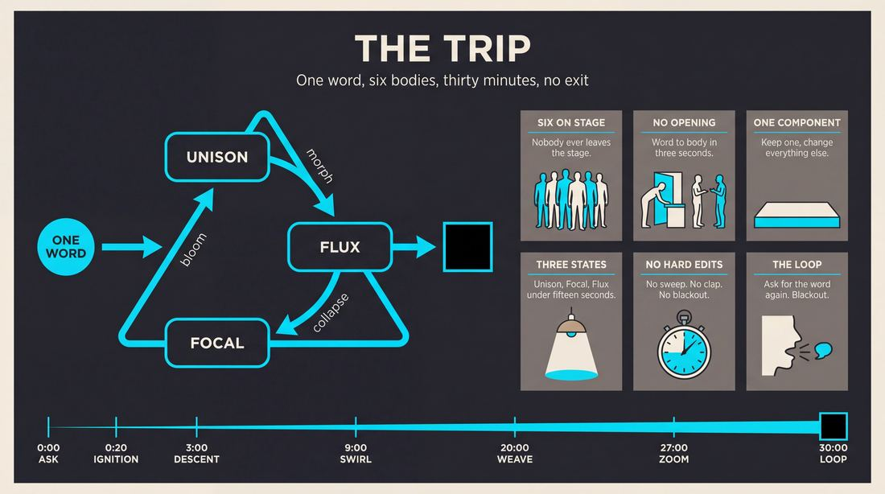
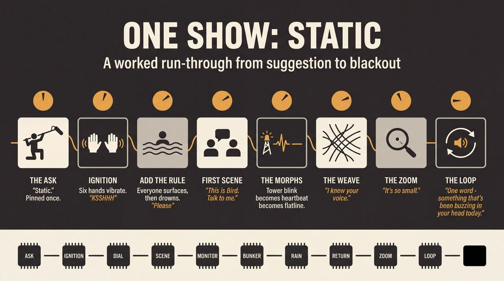
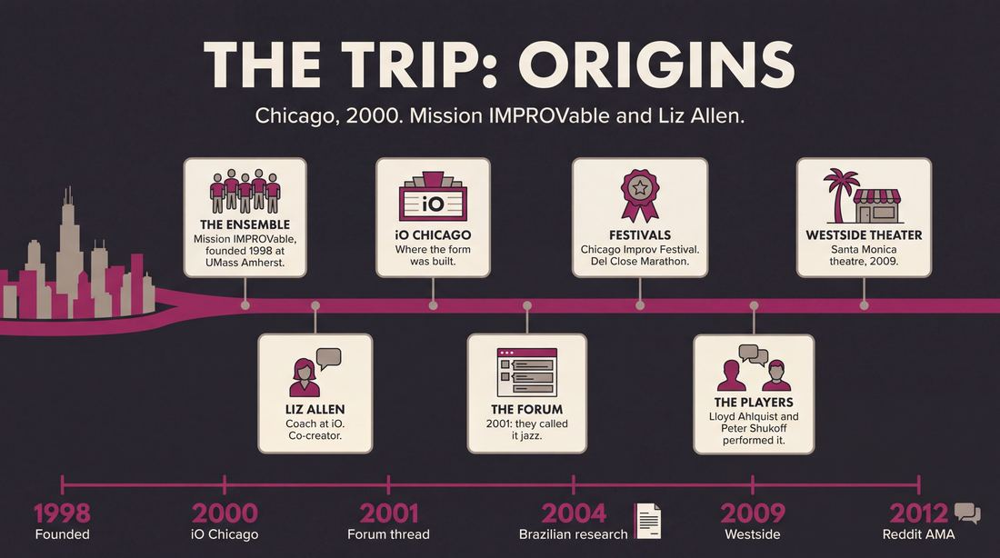
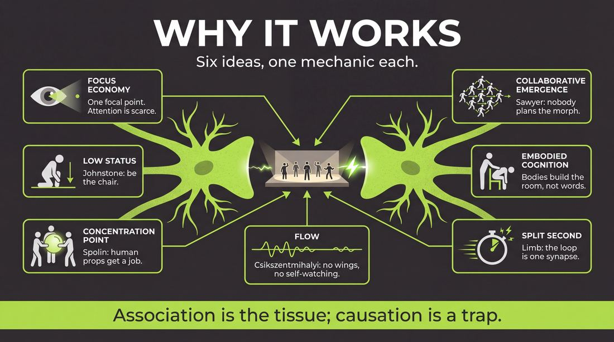
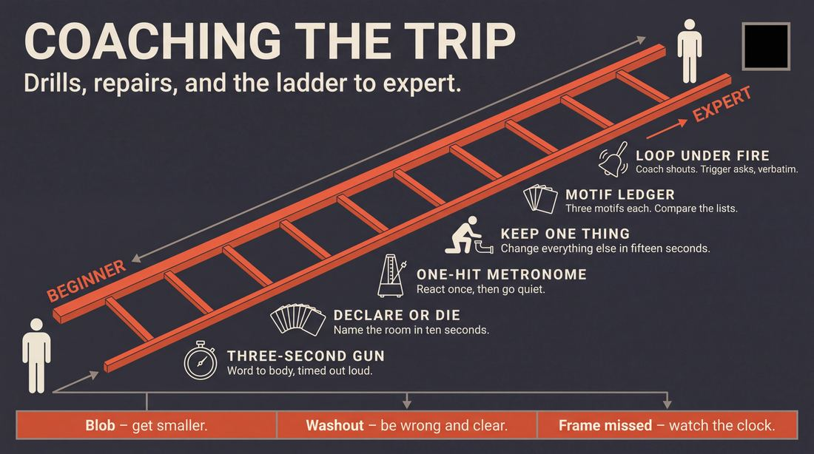

# The Trip

> **A complete study of the long-form improv format _The Trip_** - the original archived write-up, five infographics, grounded historical and pedagogical research, and a full mechanics-and-coaching manual.

| | |
|---|---|
| **Format** | The Trip |
| **Primary source** | [IRC Improv Wiki](https://wiki.improvresourcecenter.com/index.php?title=The_Trip) |

---

## Contents

1. [Part I - The Original Write-Up](#part-i-the-original-write-up)
2. [Part II - The Infographics](#part-ii-the-infographics)
   - [1. Structure and Mechanics](#infographic-1-mechanics)
   - [2. A Show, Beat by Beat](#infographic-2-example)
   - [3. Origins and Lineage](#infographic-3-history)
   - [4. Why It Works](#infographic-4-theory)
   - [5. Rehearsal and Repair](#infographic-5-coaching)
3. [Part III - Research Dossier](#part-iii-research-dossier)
   - [Pass 1: History, Lineage, Literature and Scholarship](#research-history)
   - [Pass 2: Comparative Anatomy, Pedagogy and Production](#research-comparative)
4. [Part IV - Mechanics, Gameplay and Coaching Manual](#part-iv-mechanics-gameplay-and-coaching-manual)
   - [Pass 1: The Form, Its Mechanics and Its Gameplay](#manual-mechanics)
   - [Pass 2: Training, Coaching and Performance Companion](#manual-coaching)

---

## Part I - The Original Write-Up

*Verbatim archive of the source article, reproduced exactly as scraped. Everything after this section is generated elaboration built on top of it.*

### The Trip

The Trip is a long form developed by [Mission IMPROVable](https://wiki.improvresourcecenter.com/index.php?title=Mission_IMPROVable "Mission IMPROVable") and [Liz Allen](https://wiki.improvresourcecenter.com/index.php?title=Liz_Allen&action=edit&redlink=1 "Liz Allen (page does not exist)"). It has been performed at the [Chicago Improv Festival](https://wiki.improvresourcecenter.com/index.php?title=Chicago_Improv_Festival "Chicago Improv Festival") and the [Del Close Marathon](https://wiki.improvresourcecenter.com/index.php?title=Del_Close_Marathon "Del Close Marathon").

It is organic improv. A suggestion leads to a group group game. The "form" is a constant morphing of one organic game into the next, attempting to recognize patterns and call\-back games. There was the occasional scene, but the key was that all of the performers (usually 5\-7\) were on\-stage and involved the entire time, so a 2 person scene always featured the rest of the group portraying environment.

It usually lasted 25\-35 minutes, and would end with a performer stepping forward to get the suggestion again\-\-the idea being that the show took place entirely inside the brain in the split second when the suggestion is yelled out.

- Discussed on the [IRC Improvisation forum](http://www.improvresourcecenter.com/mb/showthread.php?t=70489).

---

*Archived from [https://wiki.improvresourcecenter.com/index.php?title=The_Trip](https://wiki.improvresourcecenter.com/index.php?title=The_Trip) (IRC Improv Wiki) on 2026-08-09 23:23 UTC.*

---

## Part II - The Infographics

*Five 16:9 posters, each teaching a different aspect of the format. Click any poster to enlarge.*

<a id="infographic-1-mechanics"></a>

### 1. Structure and Mechanics

*How the form is played: the shape of the piece, the opening, the roles, the edit vocabulary, the flow of information, and the clock.*

{ .diagram loading=lazy decoding=async width="1100" height="614" }


<a id="infographic-2-example"></a>

### 2. A Show, Beat by Beat

*A single worked performance from suggestion to blackout: what happens in each beat, with short real example lines and what the players are doing technically.*

{ .diagram loading=lazy decoding=async width="1100" height="614" }


<a id="infographic-3-history"></a>

### 3. Origins and Lineage

*Where the form came from: creators, dates, theatres, how it spread between schools and cities, and the key figures - a documented timeline and lineage map.*

{ .diagram loading=lazy decoding=async width="1100" height="614" }


<a id="infographic-4-theory"></a>

### 4. Why It Works

*The theory: the core principles of the form and the research and craft ideas that explain why the structure produces good improv, each tied to a specific mechanic.*

{ .diagram loading=lazy decoding=async width="1100" height="614" }


<a id="infographic-5-coaching"></a>

### 5. Rehearsal and Repair

*Training and fixing the form: the essential drills, the common failure modes with their symptom-and-fix pairs, and the markers of beginner through expert play.*

{ .diagram loading=lazy decoding=async width="1100" height="614" }


---

## Part III - Research Dossier

*Two research passes: the historical record, then the comparative and pedagogical record. Claims carry evidence tags - treat unverified items accordingly.*

<a id="research-history"></a>

### » Pass 1: History, Lineage, Literature and Scholarship

### Research Summary
* [DOCUMENTED] The Trip is an organic long-form improv format created by the ensemble Mission IMPROVable and their coach Liz Allen in the early 2000s at iO Chicago.
* [DOCUMENTED] The format relies on continuous morphing of group games rather than traditional scene edits, with all 5-7 performers remaining on stage for the entire 25-35 minute piece.
* [DOCUMENTED] A defining mechanic is the ensemble physically portraying the environment for any two-person scenes that emerge.
* [DOCUMENTED] The show's framing device is a temporal loop: it ends by asking for the initial suggestion again, implying the entire performance occurred in the split second of the improvisers' cognitive processing.
* [DOCUMENTED] The searchable record is thin but definitive, relying heavily on archived forum discussions from 2001, a Reddit AMA by a founding performer, and the IRC Improv Wiki stub.
* [INFERRED] Because Mission IMPROVable became a massive national touring company and founded the Westside Comedy Theater in LA, the format's DNA influenced a generation of college and West Coast improvisers, even if the specific name "The Trip" is rarely used today.

### Provenance and History
**Created by:** Mission IMPROVable and Liz Allen.
**When:** Circa 2000–2001. Mission IMPROVable moved to Chicago in 2000, and the earliest documented discussion of the form is from January 2001.
**Where:** iO Theater (formerly ImprovOlympic), Chicago.
**Problem it solved:** Breaking away from the rigid structure of the Harold and traditional premise-based short-form. It sought to create a purely organic, "jazz-like" flow where edits were replaced by continuous physical and thematic morphing, keeping the entire ensemble engaged constantly.
**Origin of the name:** The name "The Trip" refers both to the psychedelic, morphing nature of the organic transitions and the framing device that the entire 30-minute show is a mental "trip" happening in the split second after a suggestion is received.

| Year | Event | Place / Company | Source |
|---|---|---|---|
| 1998 | Mission IMPROVable founded | UMass Amherst | [WIDELY PRACTICED, UNDOCUMENTED] |
| 2000 | Troupe relocates to Chicago, begins coaching with Liz Allen | iO Chicago | [DOCUMENTED] |
| 2001 | Earliest documented discussion of "The Trip" as a jazz-like organic form | IRC Improvisation Forum | [DOCUMENTED] |
| 2004 | Format documented in Brazilian academic research on improv | Universidade Federal de Uberlândia | [DOCUMENTED] |
| 2012 | EpicLLOYD discusses performing the form in a Reddit AMA | Reddit | [DOCUMENTED] |

### Lineage and Transmission
**Schools and Teachers:** Developed at iO Chicago under Liz Allen, who won the Del Close Coach of the Year Award (1999-2001) while working with the group. The form traveled with Mission IMPROVable as they became one of the most booked college touring acts in the US.
**Spread and Mutation:** When Mission IMPROVable relocated to Los Angeles and opened the Westside Comedy Theater (M.i.'s Westside Comedy Theater) in 2009, the organic, highly physical style of The Trip merged with West Coast narrative and game-based play. Lloyd Ahlquist's resume also lists a specific "The TRIP Ensemble" that performed at iO West.
**Regional Dialects:** While "The Trip" as a strict format is obscure today, its mechanics—specifically the "constant morphing" and "ensemble as environment"—are heavily present in organic forms like the Slacker, the Macroscene, and the JTS Brown.

### Key Figures
| Person | Role in this form | Specific contribution | Source URL |
|---|---|---|---|
| Liz Allen | Co-Creator / Coach | Directed Mission IMPROVable at iO Chicago; developed the organic transitions and ensemble trust required for the form. | https://www.lizallenimprov.com/ |
| Lloyd Ahlquist (EpicLLOYD) | Co-Creator / Performer | Founding member of Mission IMPROVable; performed and later documented the form's mechanics. | https://www.reddit.com/r/IAmA/comments/vc2yq/ |
| Peter Shukoff (Nice Peter) | Co-Creator / Performer | Founding member of Mission IMPROVable; performed the form during its Chicago era. | https://www.reddit.com/r/IAmA/comments/vc2yq/ |

### Canonical Shows, Companies and Recordings
* **Mission IMPROVable at iO Chicago (circa 2000-2002):** The primary canonical performances of this form took place during M.i.'s run at iO Chicago.
* **Chicago Improv Festival & Del Close Marathon:** The IRC Wiki notes that the form was performed at these major festivals by Mission IMPROVable.
* **Where to watch today:** [UNVERIFIED - No known active companies perform "The Trip" by name today. To see its mechanics performed well, one should watch organic ensembles at M.i.'s Westside Comedy Theater in LA or groups performing the JTS Brown.]

### Published Literature
| Work | Author | Year | What it says about this form | Where to find it |
|---|---|---|---|---|
| *IRC Improv Wiki: The Trip* | Various | 2024 (Archived) | Defines the form, its creators, the morphing mechanic, and the split-second framing device. | https://wiki.improvresourcecenter.com/index.php?title=The_Trip |
| *Reddit AMA* | Lloyd Ahlquist | 2012 | Describes the form as "essentially a 30 minute group games that just kept morphing over and over." | https://www.reddit.com/r/IAmA/comments/vc2yq/ |
| *IRC Forum Thread 70489 / "Harold compared to music"* | "Monahan" | 2001 | Compares the form to jazz, noting it is rooted in the group mind and twists back on itself to create clear patterns. | http://www.improvresourcecenter.com/mb/showthread.php?t=70489 |
| *A Improvisação Teatral...* (Dissertation) | Renata Bittencourt | 2013 | Catalogs "The Trip" as an organic format developed by Mission IMPROVable and Liz Allen that stimulates call-backs and keeps 5-7 actors involved. | https://repositorio.ufu.br/ |

### Verbatim Quotes
> "The Trip is a long form developed by Mission IMPROVable and Liz Allen... It is organic improv. A suggestion leads to a group group game. The 'form' is a constant morphing of one organic game into the next, attempting to recognize patterns and call-back games."
> — IRC Improv Wiki
> https://wiki.improvresourcecenter.com/index.php?title=The_Trip

> "There was the occasional scene, but the key was that all of the performers (usually 5-7) were on-stage and involved the entire time, so a 2 person scene always featured the rest of the group portraying environment."
> — IRC Improv Wiki
> https://wiki.improvresourcecenter.com/index.php?title=The_Trip

> "It usually lasted 25-35 minutes, and would end with a performer stepping forward to get the suggestion again--the idea being that the show took place entirely inside the brain in the split second when the suggestion is yelled out."
> — IRC Improv Wiki
> https://wiki.improvresourcecenter.com/index.php?title=The_Trip

> "I really love and miss a form me and the M.i. guys would do called the Trip. it was essentially a 30 minute group games that just kept morphing over and over."
> — Lloyd Ahlquist (EpicLLOYD)
> https://www.reddit.com/r/IAmA/comments/vc2yq/iama_wearethe_creators_of_the_epic_rap_battles_of/

> "The closest thing Ive seen to that [jazz form of improv] is 'The Trip' as performed by Mission Improvable. Ive had the opportunity to sit in with them, and its an experience unlike most."
> — "Monahan", IRC Improvisation Forum
> http://www.improvresourcecenter.com/mb/showthread.php?t=70489

> "The form is rooted in the group mind, where moves are supported at full tilt until the game/scene morphs into something new, frequently twisting back on itself and creating a clear pattern with very noticeable rhythms."
> — "Monahan", IRC Improvisation Forum
> http://www.improvresourcecenter.com/mb/showthread.php?t=70489

> "Im probably not explaining it well, but its very cool. Liz Allen would be the person who could explain it the best."
> — "Monahan", IRC Improvisation Forum
> http://www.improvresourcecenter.com/mb/showthread.php?t=70489

> "THE TRIP. Formato longo desenvolvido por Mission IMPROVable e Liz Allen. É um formato orgânico que estimula call backs, pois a partir de uma sugestão uma cena leva à outra tentando manter todos os atores (de 5 a 7) envolvidos em todas as cenas."
> — Renata Bittencourt, Academic Dissertation
> https://repositorio.ufu.br/

### Anecdotes and Stories
**The Jazz Metaphor Debate**
In early 2001, the IRC message boards hosted a deep, philosophical debate about whether the Harold was more like jazz or punk rock. When user "Eaton" suggested that a true jazz form of improv would be a fluid, structureless pattern of games and short scenes, improviser John Monahan chimed in to say that this theoretical form already existed. He had sat in with Mission IMPROVable and experienced "The Trip," describing it as a visceral manifestation of the "group mind" that twisted back on itself with noticeable rhythms, proving that improv could achieve the fluid, role-shifting dynamics of a jazz ensemble without relying on the rigid beats of a Harold. (Source: IRC Improvisation Forum, 2001)

### Academic and Scientific Research
**Collaborative Emergence and Group Genius**
Dr. R. Keith Sawyer's research on "collaborative emergence" in jazz and improv theater demonstrates that the most innovative group creativity occurs when no single participant can predict the outcome, and structure emerges organically from moment-to-moment interactions.
*Relevance to this form:* The Trip's reliance on "constant morphing" rather than planned edits or sweeps forces the ensemble into a state of pure collaborative emergence, where the macro-structure of the 30-minute piece is entirely dependent on micro-level agreements.

**Embodied Cognition in Performance**
Research in embodied cognition suggests that cognitive processes are deeply rooted in the body's interactions with the world. In performance studies, this explains how physicalizing an environment changes the psychological state of the actors.
*Relevance to this form:* By requiring the ensemble to physically portray the environment during two-person scenes, The Trip forces improvisers out of their heads and into their bodies, using physical proximity and kinetic feedback to drive the scene's emotional reality.

**The Neuroscience of Spontaneous Generation**
Dr. Charles Limb's fMRI studies of jazz musicians and improvisers show that during spontaneous creation, the brain's medial prefrontal cortex (associated with self-expression) activates while the dorsolateral prefrontal cortex (associated with self-monitoring and inhibition) deactivates.
*Relevance to this form:* The Trip's framing device—that the entire 30-minute show happens in the "split second" after a suggestion is given—is a theatrical metaphor for this exact neurological phenomenon: the brain's ability to instantly generate a massive, uninhibited web of associations from a single stimulus.

### Documented Variants and Descendants
* **The Slacker:** Created by Beer Shark Mice, this form also relies on continuous, organic transitions (tag-outs) rather than sweeps, though it focuses more on following characters than morphing group games.
* **The JTS Brown:** Developed in Chicago around the same era, this form shares The Trip's ethos of keeping everyone on stage, using physical transformations, and treating the ensemble as a single organism that can become the environment or morph between scenes without traditional edits.
* **The Macroscene:** A purely organic form where a single scene slowly morphs and expands, sharing The Trip's rejection of the multi-beat Harold structure.

### Criticism, Debate and Known Failure Modes
* **Exhaustion and Muddy Play:** [WIDELY PRACTICED, UNDOCUMENTED] Because all 5-7 performers are on stage and involved for 30 minutes without the relief of a backline, the form demands immense physical and mental stamina. If the ensemble loses focus, the "constant morphing" devolves into a muddy, chaotic mess where no clear game or pattern can be established.
* **The "Split Second" Gimmick:** [INFERRED] The ending mechanic—stepping forward to ask for the suggestion again—is a brilliant theatrical trick, but it requires precise timing. If the show drags or the energy drops, the ending can feel like an unearned gimmick rather than a mind-bending revelation.
* **Overcrowding Two-Person Scenes:** [WIDELY PRACTICED, UNDOCUMENTED] Having the rest of the cast portray the environment during a two-person scene requires extreme discipline. Teachers of organic improv frequently warn that overzealous improvisers playing "talking furniture" or distracting background elements can easily pull focus from the core relationship of the scene.

### Cultural Footprint
* **Westside Comedy Theater:** Mission IMPROVable parlayed their success as a touring company into founding M.i.'s Westside Comedy Theater in Santa Monica, California. The organic, high-energy DNA of The Trip heavily influenced the training center's curriculum and the West Coast indie improv scene.
* **Epic Rap Battles of History:** Mission IMPROVable alumni Lloyd Ahlquist (EpicLLOYD) and Peter Shukoff (Nice Peter) went on to create the massively successful YouTube series *Epic Rap Battles of History*. The rapid-fire pattern recognition and associative leaps required for The Trip are evident in their dense, referential songwriting.
* **Liz Allen's Pedagogy:** Liz Allen's work developing this form contributed to her reputation as one of the premier improv coaches in the world, leading to her winning the Del Close Coach of the Year award three times and eventually having the award renamed the Liz Allen Excellence in Teaching Award.

### Gaps in the Record
* **Video Documentation:** I could not verify the existence of any surviving video recordings of Mission IMPROVable performing The Trip during its peak at iO Chicago or the Chicago Improv Festival.
* **Exact Premiere Date:** The precise date of the first performance is undocumented, though it is constrained to the 2000–2001 window when M.i. moved to Chicago and began working with Liz Allen.
* **Current Practitioners:** It is contested whether any active indie teams perform this exact format today under the name "The Trip," or if it has been entirely assimilated into the broader category of "organic long-form."

### Source List
1. The Trip - IRC Improv Wiki - 2024 (Archived) - https://wiki.improvresourcecenter.com/index.php?title=The_Trip - Establishes the core mechanics, creators, and framing device of the form.
2. IAmA (WeAreThe) creators of the Epic Rap Battles of History - Lloyd Ahlquist (EpicLLOYD) - 2012 - https://www.reddit.com/r/IAmA/comments/vc2yq/ - Primary source quote from a creator confirming the 30-minute morphing group game structure.
3. Harold compared to music - IRC Improvisation Forum - 2001 - http://www.improvresourcecenter.com/mb/showthread.php?t=70489 - Earliest documented discussion of the form, detailing its jazz-like group mind mechanics.
4. A Improvisação Teatral... - Renata Bittencourt (Universidade Federal de Uberlândia) - 2013 - https://repositorio.ufu.br/ - Academic cataloging of the form's rules and creators.
5. Liz Allen Improv - Liz Allen - 2024 - https://www.lizallenimprov.com/ - Verifies Liz Allen's coaching history with Mission IMPROVable and her pedagogical focus on group mind.
6. EpicLLOYD Resume - Lloyd Ahlquist - 2024 - https://epiclloyd.com/ - Confirms Ahlquist's membership in Mission IMPROVable and "The TRIP Ensemble" at i.O. West.

<a id="research-comparative"></a>

### » Pass 2: Comparative Anatomy, Pedagogy and Production

### Taxonomic Placement

```text
      [Spolin Theater Games]       [The Harold]
                \                     /
                 \                   /
             [Organic Freeform / Group Mind]
                           |
                      [The Trip]
                     /          \
                    /            \
          [The JTS Brown]    [Modern Organic Montage]
```

The Trip sits squarely in the organic, continuous-play branch of the long-form family tree. Unlike the Harold, which relies on discrete scenes separated by edits (sweeps, tag-outs), The Trip demands that the entire ensemble remains on stage for the duration of the piece, functioning as a single organism. It inherits the group-game focus of the Harold and the physical transformation techniques of Spolin, but removes the safety net of the off-stage wings. Its direct descendants include highly physical, "no-edit" forms like The JTS Brown, where the environment and transitions are entirely generated by the actors' bodies.

### Head-to-Head Comparisons

| Axis | THIS FORM (The Trip) | THE OTHER FORM (The Harold) | Consequence for the players |
|---|---|---|---|
| **Opening** | Suggestion taken, immediate morph into group game. | Formal opening (invocation, pattern game) generating premises. | Trip players must immediately physicalize the suggestion rather than intellectualizing premises. |
| **Structure** | Continuous morphing of organic games; no discrete scenes. | 3 beats of 3 scenes, separated by group games. | Trip players rely on pattern recognition rather than narrative progression. |
| **Edit Logic** | Organic transformation (one image/sound morphs into another). | Sweeps, tag-outs, direct addresses. | Trip players cannot "save" a scene by sweeping; they must evolve it from within. |
| **Memory** | Callbacks emerge organically through physical/vocal patterns. | Explicit callbacks to earlier scene premises in Beats 2 and 3. | Trip players must track rhythm and physical motifs, not just plot points. |
| **Cast Size** | 5-7 (all on stage 100% of the time). | 8-10 (utilizing off-stage wings). | Trip players must constantly modulate their physical presence to avoid upstaging. |
| **Audience Contract** | The entire 30-minute show happens in a split second inside a brain. | We will explore a theme through varied, structured scenes. | The Trip's ending recontextualizes the entire performance, requiring audience buy-in to surrealism. |
| **Failure Mode** | "The Blob" (undifferentiated mass of players with no clear focus). | "The Math Problem" (forcing connections that aren't there). | Trip players must aggressively establish focal points to prevent visual chaos. |

| Axis | THIS FORM (The Trip) | THE OTHER FORM (The JTS Brown) | Consequence for the players |
|---|---|---|---|
| **Opening** | Suggestion taken, immediate morph into group game. | Highly stylized, often physical or sound-based opening. | Trip players focus on the immediate group mind rather than a pre-planned stylized aesthetic. |
| **Structure** | Constant morphing; 100% of players on stage 100% of the time. | Fluid, but allows for micro-scenes, simultaneous scenes, and varied edit types. | Trip players have zero downtime; they are always "on," even as background. |
| **Edit Logic** | Organic transformation only. | Transformations, physical wipes, sound edits, direct addresses. | Trip players are restricted to a single, highly demanding transition mechanic. |
| **Audience Contract** | The show is a synaptic flash in a single brain. | We will present a surreal, highly theatrical dreamscape. | Trip players must execute a very specific structural ending to fulfill the contract. |

| Axis | THIS FORM (The Trip) | THE OTHER FORM (Monoscene) | Consequence for the players |
|---|---|---|---|
| **Structure** | Constant morphing of games and environments. | One continuous scene in real-time in one location. | Trip players must constantly destroy and rebuild the physical reality. |
| **Memory** | Tracking abstract patterns and callbacks. | Memory of character details, relationships, and spatial reality. | Trip players prioritize associative logic over grounded, real-world logic. |
| **Failure Mode** | "The Washout" (transitions take too long). | "The Waiting Room" (polite conversation, no action). | Trip players must drive action through physical transformation rather than dialogue. |

### What Makes It Uniquely Itself

1. **The "Split-Second Brain" Framing**: The form explicitly ends with a performer stepping forward to ask for the suggestion *again*. This frames the entire 25-35 minute performance as a synaptic flash—a rapid-fire sequence of associations happening inside a single mind in the millisecond between hearing a word and processing it. If you remove this ending, it ceases to be The Trip and becomes a standard organic montage.
2. **100% On-Stage Ensemble**: There are no wings. Every player is on stage for the entire runtime. If a two-person scene emerges, the remaining 3-5 players do not stand on the backline; they must actively portray the physical environment (furniture, weather, architecture, background characters). Removing this turns the form into a traditional backline montage.
3. **Edit-less Morphing**: The form forbids traditional edits like the sweep or the tag-out. Scenes and games must dissolve and morph into one another through shared sound, motion, or physical transformation. Removing this mechanic breaks the "synaptic flash" illusion.

### Structural Variants in Practice

| Variant | What it changes | Who plays it | Source |
|---|---|---|---|
| **The Original (Mission IMPROVable)** | Fast-paced, highly athletic, heavily reliant on short-form energy applied to long-form structure. | Mission IMPROVable touring companies. | IRC Wiki / [CRAFT CONSENSUS] |
| **The Theatrical Trip** | Slower pacing, greater emphasis on sustained environmental soundscaping and emotional resonance over rapid-fire gags. | iO Chicago (Liz Allen directed teams). | *Improvising Better* / [CRAFT CONSENSUS] |
| **The Silent Trip** | The first 5-10 minutes are performed entirely without dialogue, forcing the ensemble to establish group mind and physical vocabulary before speaking. | Various indie teams (Chicago/NY). | [CRAFT CONSENSUS] |

### The Teaching Ladder

| Stage | Skill introduced | Why in this order | Typical exercise | Source or [CRAFT CONSENSUS] |
|---|---|---|---|---|
| 1 | **Group Mind & Flocking** | Players must learn to move as a single organism before they can generate content together. | *Sound and Motion* / *Flocking* | [CRAFT CONSENSUS] |
| 2 | **Environmental Object Work** | Since there are no wings, players must learn how to be "active background" without pulling focus from the main action. | *Human Props* | Spolin / [CRAFT CONSENSUS] |
| 3 | **Organic Transitions** | Players must learn to edit without sweeping, using a physical or vocal motif to dissolve one scene into the next. | *Transformation Circle* | [CRAFT CONSENSUS] |
| 4 | **Pattern Recognition** | The form relies on calling back games and motifs. Players must learn to identify the "game" of a chaotic organic moment. | *Pattern Game* | iO Pedagogy / [CRAFT CONSENSUS] |
| 5 | **The Split-Second Frame** | The conceptual framing (the show happens in a millisecond) is introduced last, as it requires the stamina and pacing learned in Stages 1-4. | *The Loop* | [CRAFT CONSENSUS] |

### Documented Drills and Exercises

| Drill | Origin / teacher | How to run it | What it fixes in this form | Source |
|---|---|---|---|---|
| **Sound and Motion** | Viola Spolin | Player A enters the circle with a repetitive sound and motion. Player B mirrors it exactly, then morphs it into a new sound/motion. | Fixes hesitant transitions; trains players to commit to organic morphing. | Spolin, *Improvisation for the Theater* |
| **Flocking** | [CRAFT CONSENSUS] | Ensemble moves around the space in a diamond formation. Whoever is at the front leads the movement; when they turn, the new front person takes over. | Fixes "The Blob"; trains spatial awareness and shared leadership. | [CRAFT CONSENSUS] |
| **Human Props** | [CRAFT CONSENSUS] | Two players start a scene. The rest of the ensemble must physically become the environment (chairs, lamps, trees) and react as those objects. | Fixes dead stage space; trains the ensemble to remain active when not the primary focus. | [CRAFT CONSENSUS] |
| **I Am A Tree** | Spolin / iO | Player A says "I am a tree." Player B adds "I am the apple on the tree." Player C adds "I am the worm in the apple." A takes B, leaving C to start the next image. | Trains rapid physical association and stage picture composition. | [CRAFT CONSENSUS] |
| **The Morphing Machine** | Liz Allen (adapted) | The group builds a physical machine with moving parts and sounds. On a clap, the machine organically speeds up, slows down, or morphs into a new machine. | Fixes disjointed group games; trains collective rhythm and pacing. | *Improvising Better* |
| **Focus Passing** | [CRAFT CONSENSUS] | All players on stage doing separate repetitive tasks. One player makes a loud noise/big movement to take focus. The others must instantly freeze or mute their actions. | Fixes upstaging; trains the ensemble to direct the audience's eye to the primary action. | [CRAFT CONSENSUS] |
| **Echo Chamber** | [CRAFT CONSENSUS] | A scene occurs downstage. The upstage players must echo specific words or physical gestures from the scene, amplifying the emotional subtext. | Fixes disconnected backgrounds; trains the environment to support the scene's game. | [CRAFT CONSENSUS] |
| **Blind Endings** | [CRAFT CONSENSUS] | The coach yells "Brain!" at a random interval. The player currently speaking must instantly step forward and ask the audience for the initial suggestion. | Fixes sloppy endings; trains players to be ready to execute the "Split-Second" frame at any moment. | [CRAFT CONSENSUS] |
| **Environment Only** | [CRAFT CONSENSUS] | A 10-minute set where no human characters are allowed. Players can only play animals, weather, architecture, or objects. | Fixes reliance on dialogue; forces physical storytelling. | [CRAFT CONSENSUS] |
| **The Squeeze** | [CRAFT CONSENSUS] | The playing space is physically reduced by the coach (using chairs or tape) until all 7 players are operating in a 4x4 foot square. | Fixes spatial disconnect; forces physical proximity and shared body heat/movement. | [CRAFT CONSENSUS] |

### Common Failure Modes and Diagnoses

| Failure mode | What it looks like from the audience | Root cause | Fix | Who names it |
|---|---|---|---|---|
| **The Blob** | 7 players writhing on stage making noise, with no clear focal point or discernible action. | Lack of give-and-take; everyone is leading, no one is following. | **Focus Passing** drill; enforce the rule that only 1-2 people can be the primary focus at a time. | [CRAFT CONSENSUS] |
| **Talking Heads in a Void** | Two players doing a witty dialogue scene while the other 5 stand frozen or awkwardly watch from the edges. | Fear of interrupting; lack of commitment to environmental object work. | **Human Props** drill; mandate that every player must be physically touching another player or the floor. | [CRAFT CONSENSUS] |
| **The Washout** | Transitions take 3-4 minutes of slow, agonizing morphing before a new game or scene is established. | Indecision; players waiting for someone else to make a definitive choice. | **Sound and Motion**; coach side-coaches "Make a choice!" to force rapid commitment to the new image. | [CRAFT CONSENSUS] |
| **Plot Creep** | The ensemble accidentally starts telling a linear, 20-minute narrative story instead of morphing between games. | Defaulting to narrative safety rather than trusting the organic, associative nature of the form. | **Blind Endings**; remind players that the entire show happens in a millisecond, so linear time does not exist. | [CRAFT CONSENSUS] |
| **The Forgotten Frame** | The show ends with a standard blackout or a random line, completely abandoning the "ask for the suggestion again" mechanic. | Cognitive overload; players lose track of the form's specific structural requirement. | Assign a specific "trigger" player whose sole job is to monitor the time and execute the ending. | [CRAFT CONSENSUS] |

### Production and Logistics

*   **Cast Size:** Strictly 5 to 7 players. Fewer than 5 makes it impossible to build a convincing physical environment while sustaining a scene. More than 7 creates visual clutter and makes organic morphing chaotic and dangerous.
*   **Runtime:** 25-35 minutes. The intense physical and mental demands of 100% stage time make longer runtimes exhausting for both players and the audience.
*   **Stage Layout:** Completely bare.
*   **Chairs and Set:** Zero chairs, zero set pieces. The core conceit of the form is that the actors *are* the chairs, the set, and the environment.
*   **Lighting and Tech Cues:** A general warm wash for the duration of the piece. No internal lighting cues or blackouts are permitted, as they disrupt the organic morphing. The only cue is a blackout *immediately* after the final player asks for the suggestion again.
*   **Music and Sound:** Pre-show music should be high-energy or psychedelic to set the tone. All internal soundscaping (wind, traffic, machinery) must be generated vocally by the ensemble.
*   **MC and Host Duties:** The host must clearly explain the suggestion mechanism but should *not* explain the ending conceit. The ending must be a surprise to the audience.
*   **How the Suggestion is Taken:** A single, evocative word (e.g., "Give me a word that describes a feeling you had today").
*   **Where the Form Belongs in a Show Lineup:** As a closer. The high-energy, surreal nature of The Trip makes it difficult for a traditional narrative team to follow.
*   **Rehearsal Cadence:** Weekly, with a heavy emphasis on physical conditioning, stretching, and vocal warm-ups.
*   **What a Producer Must Prepare:** A clean, swept stage (players will be rolling on the floor), and a tech operator who understands the exact timing of the final blackout.

### Adaptations Beyond the Stage

*   **Classroom and Youth:** The "Split-Second" framing is often too abstract for younger players. The form is adapted into a "Continuous Transformation" game, focusing purely on the physical play of being objects and environments.
*   **Corporate and Applied Improv:** Used to teach non-verbal communication and active support. The form is heavily modified to remove the pressure of being "funny," focusing instead on the mechanics of flocking and building physical machines together.
*   **Online and Remote:** Nearly impossible to execute in its pure form due to the lack of shared physical space. Adapted by using Zoom's "Gallery View" as a grid, where players pass sounds and motions across the screen, and use extreme close-ups to simulate morphing.
*   **Community and Therapeutic Settings:** Used in drama therapy to explore group cohesion and somatic processing. The focus shifts entirely to the physical sensation of moving together and supporting one another.
*   **Accessibility and Inclusion Considerations:** The pure form is highly ableist, demanding constant physical exertion, floor work, and lifting. To adapt for mobility-impaired players, the "environment" must be shifted from physical weight-bearing to vocal soundscaping, spatial positioning, and upper-body/facial morphing.
*   **Content-Safety and Consent Practices:** Because players are constantly touching, lifting, and acting as furniture for one another, a rigorous physical consent check-in is mandatory before every rehearsal and show. Players must establish boundaries regarding weight-bearing and touch.
*   **Ethics of Using Real Stories:** The Trip is highly abstract and rarely relies on personal trauma or true stories. However, if a suggestion triggers a sensitive organic exploration, the ensemble must rely on the "Morph" mechanic to organically transition away from the topic rather than dwelling on it.

### Evidence Base for Those Adaptations

*   **Embodied Cognition in Applied Settings:** Research by Beilock and others demonstrates that physicalizing concepts (as done in The Trip's environmental work) enhances cognitive flexibility and group problem-solving.
*   **Somatic Synchronization:** Studies in interpersonal synchrony (e.g., by Hove and Risen) show that moving together in time (flocking, sound and motion) increases pro-social behavior and group affiliation, supporting the form's use in team-building and therapy.
*   **Psychological Safety:** Edmondson's work on psychological safety is critical here; the high physical risk of The Trip requires a foundation of absolute trust, validating the need for rigorous consent practices.

### Scholarly Frames Worth Applying

*   **Collaborative Emergence (R. Keith Sawyer):** Sawyer posits that in highly creative group tasks, the outcome cannot be predicted by analyzing the individual parts, but emerges from the continuous, real-time interaction of the group. *Mapping:* This perfectly describes the "Morphing" mechanic of The Trip, where no single player dictates the next scene; the transition emerges from the collective sound and motion of the ensemble.
*   **Point of Concentration (Viola Spolin):** Spolin argues that giving actors a specific, physical problem to solve frees them from the pressure of inventing dialogue or plot. *Mapping:* In The Trip, the players not in the main scene use the physical environment (being a ticking clock, a dripping faucet) as their Point of Concentration, keeping them engaged without upstaging.
*   **Flow (Mihaly Csikszentmihalyi):** Flow is the state of optimal experience where skill and challenge are perfectly matched, resulting in a loss of self-consciousness and a distorted sense of time. *Mapping:* The 100% on-stage requirement and lack of edits force the ensemble into a continuous Flow state; they cannot step off stage to evaluate their performance, they must simply remain in the action.
*   **Status and Spontaneity (Keith Johnstone):** Johnstone explores how humans constantly negotiate status through physical space and eye contact. *Mapping:* The "Human Props" mechanic requires players to willingly adopt ultra-low status (literally becoming furniture for other players to sit on), subverting traditional theatrical ego.

### Where the Form Is Heading

While the pure, named version of "The Trip" (with its specific "split-second brain" ending) is largely a historical artifact of early 2000s Chicago and Mission IMPROVable, its DNA is ubiquitous in contemporary improv. Modern indie teams frequently employ "no-sweep" or "edit-less" montages, relying entirely on organic transformations. The rise of physical theater hybrids (like the work of the clowning and bouffon-influenced improv communities) has seen a resurgence in the intense environmental object work demanded by The Trip. Current practice often blends the organic morphing of The Trip with the emotional grounding of the Monoscene, creating surreal, fluid dreamscapes that prioritize mood and physical imagery over rapid-fire comedic games.

### Source List

1. *The Trip* - IRC Improv Wiki - 2024 - https://wiki.improvresourcecenter.com/index.php?title=The_Trip - Supports the foundational definition, origin (Mission IMPROVable/Liz Allen), cast size, runtime, and the "split-second brain" ending mechanic.
2. *Improvising Better: A Guide for the Working Improviser* - Liz Allen and Jimmy Carrane - 2006 - Supports the pedagogical approach to organic group work, pattern recognition, and the "Morphing Machine" concepts attributed to Allen.
3. *Improvisation for the Theater* - Viola Spolin - 1963 - Supports the "Sound and Motion" drill, "Point of Concentration" framework, and environmental object work.
4. *Group Genius: The Creative Power of Collaboration* - R. Keith Sawyer - 2007 - Supports the "Collaborative Emergence" scholarly frame applied to organic improv transitions.
5. *Flow: The Psychology of Optimal Experience* - Mihaly Csikszentmihalyi - 1990 - Supports the psychological framework for continuous, edit-less ensemble performance.
6. *Impro: Improvisation and the Theatre* - Keith Johnstone - 1979 - Supports the status dynamics involved in playing physical environment and human props.
7. *Interpersonal Synchrony and Social Affiliation* - Scott N. Hove and Jane L. Risen (Personality and Social Psychology Bulletin) - 2009 - Supports the evidence base for flocking and synchronous movement increasing group cohesion in applied settings.

---

## Part IV - Mechanics, Gameplay and Coaching Manual

*Synthesis over the original article and both research dossiers: first how the form works and how to play it, then how to train an ensemble to perform it.*

<a id="manual-mechanics"></a>

### » Pass 1: The Form, Its Mechanics and Its Gameplay

### At a Glance

| Field | Entry |
|---|---|
| **Also known as** | "The TRIP" (all-caps on performer résumés; Lloyd Ahlquist lists a "The TRIP Ensemble" at iO West). No widely used alternate name. Informally described by practitioners as "the jazz form" and "the split-second show." |
| **Family** | Organic / group-mind long form — the edit-less, continuous-morph branch. Sibling to the JTS Brown; ancestor-adjacent to the modern "no-sweep" organic montage. |
| **Cast size** | 5–7. Six is the sweet spot. All of them on stage, 100% of the runtime. |
| **Runtime** | 25–35 minutes, single unbroken piece. |
| **Opening** | None, in the Harold sense. There is no invocation and no pattern game. The suggestion converts *directly* into the first group game, which must be running within about five seconds of the word landing. |
| **Suggestion taken** | One evocative word, taken live from the audience by a player who steps forward — and taken again, in the same words, at the very end. |
| **Structural rigidity** | **2/5 architecture, 5/5 discipline.** There is almost no prescribed sequence; there are two inviolable constraints (nobody leaves; the loop ending) and a behavioural code that is stricter than the Harold's. |
| **Difficulty** | 5/5. Highest-demand form in common circulation for stamina, focus economy and non-verbal listening. Not a difficulty of cleverness — a difficulty of discipline under continuous exposure. |
| **Prerequisites** | Reliable group-game play; Spolin-grade environmental object work; ability to give and take focus without a verbal cue; physical consent practice for weight-bearing and contact; vocal stamina for 30 minutes of soundscaping. |
| **Best for** | Tight ensembles of 5–7 who rehearse weekly and physically trust each other; closing slot of a mixed bill; festival sets where you want to demonstrate group mind rather than writing. |
| **Avoid when** | Cast is under-rehearsed or unfamiliar; you have a pick-up line-up; anyone in the cast is injured or has undeclared contact boundaries; the room wants story; the stage is dirty, raked, or smaller than roughly 12×12 feet; you have fewer than five or more than seven players. |

---

### The Essence in One Paragraph

The Trip is a 25–35 minute, unbroken, edit-less organic long form for five to seven improvisers who never leave the stage. A single audience word ignites a group game; that game does not end, it *morphs* — one sound, shape, rhythm or word is held constant while everything else around it is re-signified, and the ensemble slides into a new game. That process repeats for half an hour. Occasional two-person scenes surface out of the churn, and when they do, the remaining players do not retreat to a backline (there isn't one) — they physically become the room the scene happens in: the counter, the wind, the blinking tower light. Because no one can walk offstage, the sweep and the tag-out are not banned so much as *unavailable*; the only way out of anything is through it. The piece coheres not by plot but by pattern: motifs are banked early, twist back on themselves later, and the last third is mostly transformed recall. Then a player steps downstage and asks the audience, in exactly the words used at the top, for the suggestion again — blackout. The whole show is retroactively revealed as the associative cascade that fired inside one mind in the split second between hearing a word and understanding it.

---

### Why This Form Exists

The Trip was built at iO Chicago around 2000–2001 by Mission IMPROVable with their coach Liz Allen, and it is a direct argument with the Harold. Three specific problems, and what the structure does about each.

**Problem 1: The Harold parks two-thirds of your cast.** In an eight-to-ten person Harold, most of the company spends most of the night on the backline, watching, waiting for a tag or a sweep. The players are engaged as *editors* — an evaluative, above-the-neck job. The Trip removes the wings entirely and caps the cast at 5–7, which makes it arithmetically impossible to be uninvolved: with six bodies and no offstage, every body is part of the stage picture whether you like it or not. What this buys you is that the ensemble stops being an audience for itself. A plain montage lets you cool down between scenes; the Trip never lets you cool down, and that continuous thermal state is where the form's peculiar heat comes from.

**Problem 2: The edit is a rescue device, and rescue devices make cowards.** In sweep-based forms, a scene that is dying can be killed. That safety valve teaches improvisers to tolerate mediocre middles because someone will come get them. The Trip closes the valve. You cannot sweep — there is nowhere to sweep from. Therefore the *only* exit from a failing image is to transform it from inside: find the one component worth keeping, and change everything else. In practice, teams find this is the single most valuable skill the form teaches, and it exports to every other format they play.

**Problem 3: Premise-first improv intellectualises the suggestion.** A Harold opening asks you to *think about* the word — to mine it for observations and premises. That's a fine engine, but it is a language engine, and it front-loads five minutes of cleverness. The Trip asks you to *hit* the word with your body inside three seconds. The suggestion is not raw material for analysis; it is a stimulus, and the show is the nervous system's response to it. The framing device makes this literal: the whole thing happens before the word has even finished being processed.

What you get that a plain montage cannot give you: **continuity of body.** In a montage, the audience watches a series of discrete propositions. In the Trip, the audience watches one continuous physical organism change state for thirty minutes, which produces a specific and rare pleasure — the pleasure of watching *a thing become another thing* without a cut. And you get the loop: a montage's ending is arbitrary (we stop when the light goes out); the Trip's ending is structural, and it retroactively reframes everything the audience just watched. No montage can do that.

A note on the record: the surviving documentation is genuinely thin — a wiki stub, a 2001 forum thread, a 2012 Reddit line from Ahlquist, and a catalogue entry in a Brazilian dissertation. No video is known to survive. Everything in this chapter that is not traceable to those sources is labelled as craft reasoning.

---

### The Audience Contract

The Trip makes four promises, none of them spoken aloud. The MC introduces the piece and takes nothing but the format's name — **the host must not explain the ending.** The ending only works as a discovery.

| The promise | How it is delivered | How the audience knows |
|---|---|---|
| **"Your word is the whole seed."** Everything you are about to see grows out of the one thing you shouted. | The ignition game must be an unmistakable, literal-physical response to the word, held long enough to read. | They see the word rendered as a body picture inside five seconds, before anyone has said a sentence. |
| **"We will not cut away."** There will be no blackouts, no sweeps, no scene endings. | Single warm wash, no tech cues, all transitions performed inside the fiction. | Twenty minutes in, the lights have not moved and nobody has walked off. The audience stops expecting punctuation and starts watching *change* instead of *scenes*. |
| **"Nobody is idle."** Every body on that stage is doing a job at all times. | Environmental object work, chorus, soundscape, or deliberate stillness that is legibly part of the picture. | They can look anywhere on stage and find something that belongs. |
| **"This will resolve, and the resolution will be structural."** | The loop. | Only at the last thirty seconds. This is the one promise the audience doesn't know is being made until it's kept. |

**How the audience knows where they are at any moment.** This is the hardest part of the contract and it is a technical problem, not a vibe problem. The audience orients using exactly three signals, and the ensemble is responsible for keeping all three clean:

1. **One focal point.** At any instant there is precisely one thing the audience is supposed to be looking at (or the whole stage is doing one unison thing). If two things compete for more than about fifteen seconds, the audience stops reading and starts scanning.
2. **Declared environment.** Human props tell you what they are, verbally or by unmistakable use. "Mind the banister, it's loose" tells the room that the thing Kwame is doing with his arm is a banister. Undeclared environment reads as clutter.
3. **Reprise.** When a motif returns, the audience gets the "I've been here" jolt, which is the form's substitute for act structure. A Trip with no reprises leaves the audience with no sense of position at all — no idea whether they are five minutes in or twenty-five.

**What breaks the contract**, in descending order of severity:

- **Anyone leaving the stage.** One exit and the piece silently becomes a montage. Even walking to a wall and standing there reads as "off."
- **A hard edit.** One sweep, one lights-down, one "and scene" — and the audience recalibrates to expect punctuation. From then on every subsequent morph reads as a *failed* edit rather than a transformation.
- **Missing the loop.** Ending on a joke and a blackout is the most common way to lose the room's retrospective goodwill. They had a promise they didn't know about, and it was quietly broken.
- **A narrative that demands resolution.** If the ensemble accidentally builds a twenty-minute story with a protagonist and a problem, the loop ending stops being a revelation and becomes an evasion. (Failure mode: **Plot Creep**.)
- **Energy death before the loop.** If minutes 20–28 sag, the ending lands as a gimmick rather than a reframe. The loop is a payoff instrument; it can only cash a cheque the middle wrote.

---

### Anatomy: The Full Structural Map

The Trip has no prescribed beats. What it has is (a) a **state machine** governing what the stage picture is legally allowed to look like at any instant, and (b) an **envelope** — an arc of new-material-to-recall ratio across the clock. Both are described below. The state machine is inferred from the documented mechanics (all-on-stage, ensemble-as-environment, constant morphing); the clock envelope is my craft model, offered because "just morph for thirty minutes" is not a runnable instruction on a Thursday.

#### The three legal stage states (plus one conditional)

At every moment, the stage must be in exactly one of these. Being in none of them is the failure mode the form calls **The Blob**.

| State | What it looks like | Legal duration | Who is doing what |
|---|---|---|---|
| **UNISON** | All 5–7 players engaged in one group game — same activity, variations off a shared engine. | 60 s – 4 min | Everyone contributes; focus rotates rapidly within the game. |
| **FOCAL** | One or two players carry the content; the remaining 3–5 are environment, chorus, or background population. | 60 s – 5 min | Focal pair drives; environment supports with the **one-hit rule** (react once, then subside). |
| **FLUX** | The morph itself. The picture is dissolving and reforming. | **≤ 15 seconds.** | One player isolates a component; the rest infect off it. |
| **SPLIT** *(conditional)* | Two simultaneous images, deliberately contrasted. | ≤ 15 s, must resolve into UNISON or FOCAL. | Use rarely, and only when the contrast is the joke. |

A Trip is therefore: `UNISON → FLUX → FOCAL → FLUX → UNISON → FLUX → FOCAL → …` for thirty minutes, with the FLUX segments never exceeding fifteen seconds and the FOCAL/UNISON segments never dropping below about a minute.

#### The whole shape

```
                       (audience word)
                             |
    +------------------------v---------------------------------+
    |                   P0  THE ASK           0:00 - 0:20       |
    |            one player downstage, scripted wording          |
    +------------------------+---------------------------------+
                             |
    +------------------------v---------------------------------+
    |   P1  IGNITION / "THE HEAD"             0:20 - 3:00       |
    |   whole ensemble, ONE game, born physically from the word  |
    |   >>> this game's sound/shape becomes the return motif <<< |
    +------------------------+---------------------------------+
                             |
    +------------------------v---------------------------------+
    |   P2  FIRST DESCENT                     3:00 - 9:00       |
    |   2-3 morphs; first FOCAL two-hander; environment declares |
    +------------------------+---------------------------------+
                             |
    +------------------------v---------------------------------+
    |   P3  MIDDLE SWIRL                      9:00 - 20:00      |
    |   widest associative range; 3-5 morphs; motif bank fills;  |
    |   FIRST RETURN happens in here, not later                  |
    +------------------------+---------------------------------+
                             |
    +------------------------v---------------------------------+
    |   P4  THE WEAVE                         20:00 - 27:00     |
    |   recall > invention. Old motifs collide with each other.  |
    |   Characters from earlier reappear inside new games.       |
    +------------------------+---------------------------------+
                             |
    +------------------------v---------------------------------+
    |   P5  THE ZOOM                          27:00 - 30:00     |
    |   scale morph inward: world -> room -> body -> synapse     |
    |   optional BRAIN FLICKER: 2-second flashes of everything   |
    +------------------------+---------------------------------+
                             |
    +------------------------v---------------------------------+
    |   P6  THE LOOP                          final 20-40 sec   |
    |   a player steps out and asks for the suggestion AGAIN     |
    |   -------------------> BLACKOUT ON THE WORD                |
    +------------------------+---------------------------------+
                             |
              the show you just watched happened
              in the gap between the shout and the hearing
```

#### The state machine

```
                +-------------------- MORPH ---------------------+
                |                                                |
                v                                                |
      +------------------+   collapse   +----------------------+ |
      |     UNISON       |------------->|   FOCAL (2 players   | |
      |  (group game,    |              |   + 3-5 as the room) | |
      |   5-7 bodies)    |<-------------|                      | |
      +------------------+    bloom     +----------------------+ |
             ^   |                            ^      |           |
             |   +------ FLUX (<=15s) --------+      |           |
             |                                       |           |
             +--------------- FLUX (<=15s) ----------+-----------+
                                  |
                                  v
                            [ SPLIT ] (<=15s, must resolve)
```

#### Beat-by-beat table

Clock figures assume a 30-minute piece. They are a target envelope, not a script.

| Unit | Approx. clock | What happens | Who drives it | Success criterion | Common error |
|---|---|---|---|---|---|
| **P0 The Ask** | 0:00–0:20 | Designated Asker steps downstage, delivers the scripted question, audience shouts, Asker repeats the word once at volume. | The Asker | The word is audible to the back row and to all six players. The wording is *memorable enough to be repeated verbatim in 30 minutes.* | Taking three suggestions; riffing on the word; the Asker improvising the wording so the ending can't match it. |
| **P1 Ignition** | 0:20–3:00 | First body commits a sound+shape response to the word within 3 seconds. Others join at 100% with offsets. A third player adds the variable that makes it a game. | First mover, then whoever adds the rule | By 90 seconds, a stranger could say out loud what the game's rule is. | Talking. Making a premise ("So this is a cable company…"). Morphing before the head is legible. |
| **P2 First Descent** | 3:00–9:00 | Two or three morphs. The first FOCAL two-hander emerges — usually by **collapse** out of a unison game. Environment players declare what they are. | Whoever isolates the carrying component; then the focal pair | The two-hander has a real relationship AND the room is physically built and specific. | Talking Heads in a Void — the four non-scene players freeze on the edges. |
| **P3 Middle Swirl** | 9:00–20:00 | The associatively widest section. Three to five morphs across large conceptual distance. Motifs get banked. **The first Return happens here** — an earlier sound, shape or phrase comes back changed. | Whole ensemble; the Focus Custodian works hardest here | At least two motifs from P1–P2 have reappeared *transformed*, not merely repeated. | The Washout (three-minute transitions). Novelty addiction — new image every 40 seconds, nothing recurs. |
| **P4 The Weave** | 20:00–27:00 | Invention rate drops deliberately. Old motifs are combined with each other. Earlier characters reappear inside later games. | The players with the best memory; the Anchor | An audience member could name three things that have "come back." Laughs now come from recognition, not from new jokes. | Gag ratchet — escalating volume instead of escalating pattern. |
| **P5 The Zoom** | 27:00–30:00 | Scale morph inward. The world shrinks: crowd → room → body → head → single synapse. Optional Brain Flicker of 2-second reprises. | The Trigger player initiates; everyone follows the scale | The audience feels the piece *tightening* without knowing why. | Announcing it ("we're inside a brain!"), which pre-spends the ending. |
| **P6 The Loop** | final 20–40 s | A player — ideally *not* the original Asker — steps downstage out of the final image and delivers the identical question. Audience shouts. Blackout on the shout. | The Trigger player | Blackout lands on the sound of the word, not two seconds after. | Forgotten Frame; asking with different wording; the ensemble breaking to bow before the light dies. |

---

### The Opening

**The Trip has no opening.** That is not a shortcut in the documentation — it is the design. There is no invocation, no pattern game, no monologue. The suggestion converts directly into the first group game, and the delay between the word landing and the first body committing is the single most diagnostic number in the whole form. Under three seconds, you have a Trip. Over eight seconds, you have a group of people thinking, and the audience can see it.

#### Procedure: The Ignition (step by step)

1. **Pre-set.** Lights up on a warm wash. The ensemble stands in a loose clump upstage-centre, close enough to touch, breathing together, neutral bodies, no character. Do not fan out into a backline — a backline is a promise you are about to break.
2. **The Asker steps out.** One designated player crosses downstage of the clump and speaks the scripted ask. In rehearsal, write the wording down and use the same wording every show. Recommended phrasings:

   | Ask | What it produces | Risk |
   |---|---|---|
   | "One word — something that's been buzzing in your head today." | Sensory/emotional words with physical texture. Best default. | Occasionally sincere and heavy; be ready to hold it. |
   | "Give us a word that describes a feeling you had today." | The dossier's documented framing. Emotional temperature. | Abstract nouns ("anxiety") are harder to physicalise fast. |
   | "One word. Anything." | Fast, unfussy, high concrete-noun rate. | Yields "penis." Yields it a lot. |
   | "A sound you heard on your way here." | Best possible ignition material — it arrives pre-physicalised. | Slightly narrows the associative range. |

3. **Pin the word.** The Asker repeats the word once, loudly, to the ensemble, and does not comment on it, riff on it, or thank the audience. One repetition, full volume. This is the last unambiguous verbal information anyone will get for half an hour.
4. **First Body In (≤3 seconds).** Whoever moves first wins. The first player makes an **unambiguous sound-plus-shape** response. Not a mime of an object. Not a joke. A *texture*: for "static," hands vibrating at chest height with a `ksshhhh`; for "burnt," a slow curl inward with a hissing exhale; for "Tuesday," a flat repetitive two-note hum and a shuffling step. The test: could a deaf audience member and a blind audience member each get something?
5. **Second Body Joins at 100%, Offset.** The second player does the *same thing* — this is the single most important instruction in the form's first ten seconds — but offset: a different pitch, a mirrored angle, half a beat behind. Joining identically produces mush; joining differently produces harmony.
6. **Third Body Introduces the Variable.** The third player adds the thing that turns a texture into a game: a direction, a target, a rule, an obstacle. In the "static" example: one player starts *resolving* out of the static into a clear radio voice, then losing it again. That's a game — everyone can now play "trying to come in clear."
7. **Everyone else in by 30 seconds.** All bodies in one picture. Nobody watching.
8. **Legibility check at 90 seconds.** Internally, each player asks: *can I state the rule in one sentence?* If not, the ensemble's job is not to morph — it is to clarify, by heightening the existing pattern until it becomes obvious.
9. **Minimum dwell.** Do not morph out of the ignition game before about 75 seconds. The ignition game is the **head** — it is the motif you will return to at minute 24 and again in the Zoom. If it is thin, you have nothing to come back to.

#### Documented and practised variants of the ignition

| Variant | What changes | When to use | Cost |
|---|---|---|---|
| **The Original (Mission IMPROVable)** | Athletic, fast, short-form energy applied to long-form structure. Ignition is loud, big, immediate; games are physical and competitive. | Late slot, hot rooms, festivals, college crowds. Any room that needs to be grabbed. | Burns voice and legs early. Makes P4 recall harder because the material is broad. |
| **The Theatrical Trip (Liz Allen-directed teams)** | Slower ignition, sustained soundscape, emotional resonance prioritised over gags. The head might be a two-minute wash of sound. | Rooms that will sit still; strong ensembles; when the word is emotional. | If the room isn't with you by 4 minutes, you have no second gear. |
| **The Silent Trip** | First 5–10 minutes with no dialogue at all. Sound, yes; words, no. | Rehearsal default. Also excellent in performance for ensembles that talk too much. | Requires unusual physical vocabulary; a weak cast will produce ten minutes of vague writhing. |
| **Freeze-Frame Ignition** *(craft addition)* | On the word, the ensemble takes three seconds and snaps into a single frozen tableau of the word. Then it animates. | Casts that hesitate; casts prone to the Washout. It forces a committed image before anyone can think. | Slightly theatrical/stylised; can read as "we rehearsed this." |
| **Split-Second Ignition** *(craft addition)* | The Asker takes the word, and *on the shout* the whole ensemble makes one loud unison sound and freezes — as if the word physically hit them — then the picture builds out of the recoil. | Any show where you want the "this is happening inside a nervous system" idea planted early without saying it. | Uses up some of the ending's surprise. Use only once per show. |

**My recommendation for rehearsal on Thursday:** run the Silent Trip ignition for the first three weeks. The single most common reason a Trip fails is that the ensemble converts the word into language before it converts it into a body, and the ban on dialogue makes that impossible.

---

### The Engine

This is the section to read twice. Everything else in the form is downstream of it.

#### 1. The unit of travel is the association, not the beat

In a Harold, material travels by **premise**: a scene establishes an idea, and later scenes take up that idea. In the Trip, material travels by **shared component**. The show does not ask "what does this scene mean?" It asks "what does this picture have that another picture could also have?"

Every stage image can be decomposed into carryable components:

| Component | Example (a group game of "commuters on a packed train") |
|---|---|
| **Sound** | The rhythmic hiss of doors; a rising rail whine |
| **Rhythm** | The `ka-CHUNK ka-CHUNK` of track joints |
| **Shape** | Six bodies crushed vertical, arms up holding straps |
| **Spatial arrangement** | Two ranks facing each other, a corridor between |
| **Emotional temperature** | Suppressed rage under enforced politeness |
| **A repeated word or phrase** | "Sorry. Sorry. Sorry." |
| **A relationship** | One person is being ignored by everyone |
| **Scale** | Human-sized, indoor, enclosed |

The morph operation is: **keep exactly one, change everything else.** Hold the raised arms and change the rest → a forest, hands up in surrender, a congregation. Hold the `ka-CHUNK` → a printing press, a heartbeat, a headboard. Hold "Sorry, sorry, sorry" → a funeral receiving line. Hold the *emotional* temperature → a family Christmas.

That single instruction — keep one, change the rest — is the whole physics of the form. Hold zero components and the audience experiences a non sequitur and stops trusting you. Hold three or four and you haven't morphed, you've just redecorated.

#### 2. Where information comes from

There are exactly four sources of new material in a Trip. Note that in a Harold, three of these four don't exist.

**(a) The word.** Everything ultimately derives from it, but only the ignition game derives from it *directly*. After that the word works by descent, not by reference. Players should feel free to say the word verbatim occasionally — it functions as a beacon, reminding the audience that the whole thing is still one associative chain — but a show that keeps returning to the literal word is doing free association homework, not improvising.

**(b) Accidents of the body.** This is the form's largest single source and it is unavailable to backline forms. Six people packed onto a bare stage generate constant unplanned physical information: someone's hand lands on someone's shoulder; two people accidentally sync; a person's fatigue makes their sound wobble. In the Trip, **an accident is an offer.** The correct response to two players accidentally doing the same gesture is for a third to *copy it*, which retroactively makes it deliberate. This is how the ensemble generates material without anyone having an idea.

**(c) The environment's own life.** When two players are in a FOCAL scene, the other four are objects — but objects with opinions. A chair that flinches, a door that hesitates, a rain that gets harder on a specific word: these produce content and, critically, produce the *next* game. The most reliable morph in the entire form is: the environment's behaviour becomes the next thing.

**(d) The motif bank.** Once the show is ten minutes old, the largest available source of material is the show itself. See *Memory*, below.

#### 3. How information travels between images: the seven canonical morphs

Every transition in the Trip is one of these. Naming them in rehearsal is worth an enormous amount, because it lets a coach say "that was a soft contagion, take it again and make it a hard isolate" instead of "make it better."

| # | Morph | The physics |
|---|---|---|
| 1 | **Isolate** | One player grabs a single component, magnifies it out of proportion to its image, and *keeps doing it* while the surrounding image falls away. Everyone else abandons the old picture and builds around the isolated component. |
| 2 | **Contagion** | A player at the edge of the picture starts a new behaviour, small. The nearest player catches it. Then the next. Within 10–12 seconds the old image has been eaten from the outside in. The workhorse morph; also the slowest, so start it early. |
| 3 | **Collapse** | UNISON → FOCAL. Four players withdraw *into the environment* (become the furniture of the place the game was happening in), leaving two in relationship. Critically, the withdrawing players don't stop — they downshift from content to context. |
| 4 | **Bloom** | FOCAL → UNISON. The environment players stop being the room and become people, and the two-hander's relationship generalises into a group game. "Everyone in this diner has the thing this waitress has." |
| 5 | **Scale (Zoom)** | Everything stays semantically the same and the magnification changes. Six people around a table → six people around an operating table → six white cells around a virus. Immensely powerful; use maybe three times a show, once in the Zoom phase. |
| 6 | **Tone Flip** | The picture holds; the emotional temperature inverts. Nothing physical changes but everything means the opposite. This is the cheapest morph to execute and the most expensive to earn. |
| 7 | **Return** | The destination of the morph is an *earlier* image, re-entered from a new angle. The form's memory operation. See *Memory*. |

#### 4. The physics of coherence: why it hangs together

Four forces do the work. If a Trip feels random, exactly one of these has failed and you can diagnose which.

**Force 1 — Chain continuity.** Every image shares at least one component with the image immediately before it. This is a *local* rule, and it produces global coherence without anyone planning: image 9 may be arbitrarily far from image 1, but the audience travelled every step, so it never feels arbitrary. This is what practitioners in 2001 meant by calling it jazz: harmonic movement one chord at a time.

**Force 2 — The motif bank.** The chain alone would produce a drifting line that never returns. The bank makes the line curve. Bank three to five motifs in the first ten minutes and force them back later, and the audience perceives *structure*.

**Force 3 — Focus economy.** With 5–7 bodies and no wings, the scarce resource is not ideas — it is the audience's eye. Every player is always doing one of two jobs: **carrying focus** or **vectoring focus**. Vectoring is active: your body angle, your amplitude, and your gaze all point at the thing that matters. The Blob is not "too many ideas"; it is "everyone carrying, no one vectoring."

**Force 4 — The temporal frame.** Because the fiction says all of this is happening in a split second, the form is *licensed* to have no causality. Nothing must follow from anything. But the licence has a price: if nothing has to follow, then everything has to *rhyme*. Association is the only justification the form offers, so the associations must be strong enough to feel inevitable in hindsight.

#### 5. The pacing law

Three numbers to hold in your body, all of them my craft recommendation:

- **≤ 15 seconds of flux.** A transition longer than fifteen seconds is a Washout. If you're at ten seconds and the new image isn't forming, someone must make an arbitrary, decisive choice. Wrong-and-clear beats right-and-late every single time in this form.
- **≥ 60 seconds of dwell.** Nothing is a game until it has been played for a minute. A Trip with twenty-five images in thirty minutes is a sketch reel, not a Trip.
- **8–14 distinct images in a 30-minute piece.** That's an average dwell of roughly two minutes including flux. Fewer than eight and you have drifted into a Macroscene; more than fourteen and nothing can return.

#### 6. The relationship between games and scenes (and a conflict in the record)

The wiki says "there was the occasional scene." The comparative dossier says "no discrete scenes." **They conflict; my judgement is that the wiki is right and the dossier is overstating.** Two-person scenes are entirely legal and desirable — what is illegal is *editing into or out of them*. A scene in the Trip is not a unit; it is a **state** the ensemble passes through by collapse and exits by bloom or contagion. Similarly, the Bittencourt dissertation describes the form scene-to-scene ("uma cena leva à outra") where the wiki and Ahlquist both describe game-to-game; I read the dissertation as a second-hand catalogue entry and take the primary sources — the form is game-forward, scene-occasional.

The practical ratio, in my experience directing organic forms: **roughly 70% UNISON, 25% FOCAL, 5% FLUX** by clock time. A Trip that inverts that ratio has quietly become a montage with an odd staging convention.

#### 7. Why the sweep isn't banned

One more correction to the record. The dossier states that the form "forbids traditional edits like the sweep." Strictly, no rule forbids it — **the geometry makes it impossible.** A sweep requires a person to be offstage to walk on and clear the picture. There is no offstage. What looks like prohibition is actually the elegant consequence of the 100%-on-stage constraint, and it's worth telling your cast that way, because "you may not sweep" produces resentment while "there is nowhere to sweep from" produces invention.

---

### Roles and Responsibilities

The Trip has no backline, so it has no *positional* roles. It has **functional** roles, which rotate second to second — with two exceptions (the Asker and the Trigger) which are assigned before the show.

| Role | Owns | Must do | Must not do | Signal to the others |
|---|---|---|---|---|
| **The Asker** *(pre-assigned)* | The top of the show. | Deliver the scripted question verbatim, at volume; repeat the word once; rejoin the clump immediately. | Riff on the word. Thank the audience. Improvise the wording (the ending must be able to match it). | Steps back into the clump and drops to neutral — that's the cue that ignition is now open to anyone. |
| **First Body** *(claimed live)* | The ignition. | Commit a sound+shape within 3 seconds. Hold it, unchanged, for at least 10 seconds so it can be joined. | Add a second idea before the first is joined. Speak. Mime an object. | The commitment itself. Volume and repetition say "join me." |
| **The Definer** | Making the first image legible. | Join at 100% with an offset; then either name what it is or use it unmistakably. | Join identically (mush) or comment on it. | Matching sound at a different pitch. |
| **The Rule-Setter** | Turning texture into a game. | Add the variable — a direction, an obstacle, a target — that gives the group something to *do*. | Add a plot. Add a character with a name and a backstory. | An action the others can copy or oppose. |
| **Environment / Chorus** *(everyone, most of the time)* | The room, the weather, the crowd, the machinery, the memory. | Declare what you are within ~10 seconds. Obey the **one-hit rule**: react once on the beat, then subside. Maintain low amplitude. | Talk as furniture unless the talking *is* the move. Escalate. Add a second object while the first is still needed. | Physical settling: dropping amplitude by half is the visible "I am giving you focus." |
| **Focus Custodian** *(rotating, unassigned)* | The audience's eye. | Notice when two things are competing and *kill your own*. Dip to 20% amplitude. Turn your body toward the focal point. | Solve competing focus by getting louder. | Stillness and gaze direction. Everyone reads it instantly. |
| **The Morpher** *(claimed live)* | The transition. | Isolate one component. Magnify it. Sustain it until at least two others have joined. | Abandon your own morph after four seconds because nobody joined instantly. | The magnified component itself, repeated three times. |
| **The Anchor** *(claimed live, rare)* | Resistance. | Refuse the morph for 5–8 seconds, holding the old reality, so the change has friction and comedy. | Anchor twice in a row. Anchor for more than about eight seconds. | Continuing the old sound alone while everything around them changes. |
| **The Archivist** *(informal; usually the most experienced player)* | The motif bank. | Track 3–5 motifs. Force the first Return before minute 15. In P4, initiate recall rather than invention. | Call back verbally as trivia ("Hey, remember the radio?"). | Reinstating an old sound or shape at low volume — an invitation, not an announcement. |
| **The Trigger** *(pre-assigned)* | The ending. | Watch the clock (a wall clock at the back, or a felt sense). Initiate the Zoom around minute 27. Step out and deliver the ask verbatim. Own it absolutely — if the piece is dying at 24 minutes, end it at 25. | Wait for a "good moment." There is never a good moment; there is only the Trigger's decision. | Detaching from the picture and walking downstage. The instant the cast sees this, everyone else settles into a still, low, unison state behind them. |
| **Tech operator** | One cue. | Bring up a warm general wash before the ensemble enters; hold it, unmoving, for the entire piece; blackout on the sound of the audience's final shout. | Give a light bump on a big laugh. Fade anything. Play music under it. | The Trigger's step downstage is the tech's standby. |
| **MC / Host** | Framing without spoiling. | Name the form, name the company, explain that we take one word. Get off. | Explain the ending. Explain "organic improv." Warm up the audience for a specific tone. | — |
| **Musician** *(optional; see Variations)* | Nothing, by default. | If used: sustain drone only; match the ensemble; never lead a transition. | Score the morphs. A musical sting is a hard edit. | — |

---

### The Rules That Actually Bind

#### Hard rules — break these and it is not The Trip

| # | Rule | Why it is constitutive | Source |
|---|---|---|---|
| H1 | **No player leaves the stage, for any reason, for the entire runtime.** | The absence of wings is what forces environmental play, kills the sweep, and produces the continuous-organism effect. One exit and the form collapses to a montage. | Documented (wiki, dossier) |
| H2 | **Five to seven players. Not four. Not eight.** | Below five you cannot build an environment and sustain a two-hander simultaneously. Above seven the stage picture cannot be read and the morphs become chaotic (and physically unsafe). | Documented |
| H3 | **No hard edits.** No sweep, no tag-out, no "and scene," no blackout, no light shift, no musical sting. Transitions occur inside the fiction. | The illusion is one continuous cognitive event. A cut is a hole in the skull. | Documented as "constant morphing"; the "forbidden" framing is inference — see *The Engine §7* |
| H4 | **Any two-person scene is played inside a physically embodied environment provided by the rest of the cast.** | Explicitly the documented "key" to the form. | Documented (wiki, verbatim) |
| H5 | **The piece ends with a player stepping forward and asking the audience for the suggestion again, in the same wording as the top.** | Without it, this is an organic montage. The loop *is* the form's thesis. | Documented (wiki, verbatim) |
| H6 | **Blackout on the audience's shout — the show does not continue past the word.** | The fiction is that the show occupies the instant *before* comprehension. Playing past the word breaks the frame. | Craft consequence of H5 |
| H7 | **Bare stage. Zero chairs, zero set, zero props, zero costume.** | The conceit is that the actors *are* the furniture. A single real chair invalidates every human chair for the rest of the night. | Documented (production dossier) |
| H8 | **One unchanging warm wash for the whole piece.** | Any lighting change is a hard edit by another instrument. *(Documented in the production dossier as consensus practice, not in the wiki. I endorse it as load-bearing.)* | Dossier / craft |
| H9 | **One suggestion, one word, taken once at the top.** | The show is the processing of a single stimulus. Taking a second word mid-show gives the brain a second input and destroys the frame. | Craft consequence of H5 |

#### Soft conventions — house by house

| Convention | Common variants | My recommendation |
|---|---|---|
| Who asks at the end | Same player as the top (tight loop) vs. a different player (ensemble-as-one-mind) | **Different player.** Same-player reads as one character's daydream; different-player reads as a single shared mind, which is the stronger idea. |
| Cast size | 5 (lean, fast, thin environments) vs. 7 (rich, harder to read) | **Six.** Two focal + four environment is the ideal ratio, and six divides into 3+3 and 2+2+2 for split pictures. |
| Ask wording | Feeling / buzzing in your head / sound you heard | Pick one and never change it. Print it on the inside of the run sheet. |
| Silent opening | 0, 2, or 10 minutes of no dialogue | Two minutes in performance; ten in rehearsal. |
| Return quota | Unspecified vs. "at least three motif returns" | Set a quota of three in rehearsal, then stop counting once the habit sets. |
| Runtime | 25 vs. 30 vs. 35 | Thirty. Twenty-five if your cast is under-conditioned; you will lose nothing. |
| Contact level | Full weight-bearing lifts vs. no lift, contact only | Set it per cast, in writing, before every show. |
| Trigger designation | Assigned vs. "whoever feels it" | Always assigned. "Whoever feels it" is how the Forgotten Frame happens. |
| Whether a musician plays | None vs. sustained drone | None by default. The ensemble's voices are the score. |
| Where in the bill | Closer vs. opener | Closer, per the production dossier and my own experience: nothing follows this well. |

#### Myths — things people wrongly believe are rules

| Myth | Why people believe it | Why it is wrong |
|---|---|---|
| "It's a string of group games — basically long-form short-form." | The wiki says group games; Ahlquist says "30 minutes of group games." | Games in the Trip must be *born from each other*. A string of unconnected group games has no chain continuity and no bank; it is a games showcase with no exits. |
| "There are no scenes." | The comparative dossier says "no discrete scenes." | The wiki explicitly says "there was the occasional scene." Scenes are legal; *editing* them isn't. |
| "The environment players must be doing something at all times." | Anti-backline instinct, overcorrected. | Undifferentiated activity is exactly what makes The Blob. Stillness that is legibly part of the picture is fully active play. Obey the one-hit rule. |
| "It has to be psychedelic / dreamlike / surreal." | The name, and the "trip" imagery. | The name refers to the associative journey and the split-second frame, not an aesthetic. A Trip can be built out of six people in a kitchen. Surrealism is a *permission*, not an obligation. |
| "The ending means it was all a dream / none of it was real." | Superficial resemblance to dream-reveal endings. | The claim is the opposite of "it wasn't real." The claim is that this cascade genuinely occurred — at the speed of thought. Playing it as "psych, it was a dream" is the one reading that makes it worthless. |
| "Callbacks have to be verbal." | Habit from scene-based forms. | The most powerful returns in this form are a *shape* or a *rhythm*, because they can re-enter under a scene without interrupting it. |
| "Because it's organic, you can't plan anything." | Purist reading of "organic." | You plan: the ask wording, the Trigger, contact boundaries, the runtime, the tech cue. Planning the container is what allows the contents to be free. |
| "No editing means nobody is responsible for shape." | Confusion of edit with authorship. | Every player is continuously responsible for shape. The Trip has *more* directorial responsibility per player than a Harold, not less, because there is no editor to fix it. |
| "It's the same thing as the JTS Brown." | Shared era, shared ethos, shared physicality. | The JTS Brown permits multiple edit types, simultaneous scenes and stylised openings. The Trip permits one transition mechanic and mandates a specific structural ending. |
| "You should announce the conceit so the audience gets it." | Fear of the ending landing flat. | The production dossier is explicit that the host must not explain the ending. Announced, it becomes a premise the audience checks you against; unannounced, it's a reframe. |
| "Everyone has to keep moving or the energy dies." | Confusing energy with motion. | Energy in this form is *attention*, not kinetics. Six people absolutely still and breathing in unison is one of the highest-energy pictures available. |

---

### Edits and Transitions

There are no edits. There are transitions performed inside the fiction, and one near-edit used sparingly. Every one of them must complete in fifteen seconds or less.

| Transition | How to execute physically | When it is right | When it is wrong | What it costs |
|---|---|---|---|---|
| **Sound Morph** | Hold the vocal texture exactly; change what your body says it comes from. `Ksshhh` (static) → same `ksshhh`, now with a slow hand-arc overhead (rain) → same `ksshhh`, now with a rising hiss and hands together (applause). | When the current image has a strong, sustained sound. Best for UNISON→UNISON. | When the sound isn't already established as a feature — you'll be introducing a sound and morphing on it in the same breath, which reads as a jump cut. | Nothing, if the sound was established. It's the cheapest morph in the form. |
| **Rhythm Morph** | Preserve tempo and accent pattern; change the activity entirely. Four people stamping a marching cadence become four people at a sewing machine at the same tempo. | Mid-show, when you want distance without disorientation. | When the two images share a rhythm *and nothing else* and there's no emotional or thematic rhyme — reads as arbitrary. | Slight loss of specificity: the new image starts inheriting the old one's pace whether it wants it or not. |
| **Shape Morph** | Freeze your body; re-signify it. Arms raised as tree branches → arms raised in surrender → arms raised holding subway straps. Say the line that redefines it. | When one player has a striking, held shape that means one thing and could mean three. | When you have to move to make it work. If you have to adjust the shape, it isn't a shape morph, it's a new offer. | The image ahead is constrained by the shape you kept. |
| **Contagion** | Start the new behaviour small, at the *edge* of the picture, facing slightly away. The nearest player catches it. Then the next. Ten to twelve seconds, outside-in. | The default morph in UNISON. Use it more than anything else. | When you need speed. Contagion is slow; if you start it at second 12 of a 15-second flux, you've already Washed Out. | Twelve seconds of clock every time. Budget for it. |
| **Collapse (UNISON→FOCAL)** | Four players *shrink* — literally lower amplitude and often literal height — while converting into architecture: a counter, a doorframe, a fence. Two players remain upright and start speaking to each other. | When a group game has produced a relationship worth staying with; when the ensemble needs a rest beat. | Before the group game's rule has been fully played out. Collapsing early kills a game that had two more heightens in it. | Kinetic energy. Post-collapse, the piece will feel slower for 60 seconds. Plan for it. |
| **Bloom (FOCAL→UNISON)** | The environment players stand up out of being objects and become people who share the focal character's condition. "Everyone here is also waiting for a call." | When a two-hander has found a game worth generalising; when the scene has stalled but its *idea* hasn't. | When the two-hander's game is specific to those two people. Generalising a relationship joke usually kills it. | Loses the intimacy you just built. Only bloom when the general version is funnier than the particular one. |
| **Scale / Zoom Morph** | Everyone changes size relative to the same object. Six around a card table become six around an operating table become six antibodies around a virus. Change your body's *scale of gesture*, not your activity. | Two or three times a show; mandatory once in P5. | Early in the show. A zoom in the first five minutes teaches the audience that nothing is stable, and they stop investing. | Extremely high legibility cost if the new scale isn't declared fast. Someone must say what size we are. |
| **Absorption** | The environment closes physically over the focal pair — the crowd swallows them, the water rises — and whatever the environment was doing becomes the new content. | The single most reliable way to end a two-hander that has run out. | When the two-hander is *good*. Absorption is a mercy killing; don't use it on the healthy. | The two-hander's characters are gone unless someone banks them for a Return. |
| **Chorus Wipe** | Three or four players cross downstage of the focal pair as a fictional mass — a train, a crowd, a wave, a herd. Behind them, the two change position and identity. When the chorus clears, the picture is new. | When you need a fast, clean picture change and contagion is too slow. The descendant of the sweep, executed *inside* the fiction. | More than twice a show. It's the closest thing to a cut, and overuse restores the montage feeling you're trying to destroy. | About 30% of the "no edits" illusion, each time. Spend carefully. |
| **Cut-on-Impact** | Everyone hits one unison sound and shape — a clap, a gasp, a single stamp — and on the release the picture is different. | Once per show, maximum, on a genuine climax. | Any time you're using it because you couldn't think of a morph. | The most expensive move available. It is a hard edit wearing a costume, and the audience feels the seam. |
| **Tone Flip** | Nothing physical changes. One player alters vocal quality and everyone matches. The birthday party becomes a wake without a single body moving. | When you want to demonstrate control; when the audience has settled into a comic rhythm and you want the last third to matter. | As a substitute for having material. A tone flip with nothing behind it is just improvisers being spooky. | Trades laughs for attention. Get them back inside 90 seconds. |
| **The Return** | Deliberately steer the morph *backwards*: reintroduce an earlier motif at low volume and let contagion do the rest. | P3 onward. Increasingly dominant through P4. | Before minute 10 — you've come back before you left. | Nothing. This is the form's highest-yield, lowest-cost move and teams chronically under-use it. |
| **The Anchor** | One player refuses to change for 5–8 seconds, continuing the previous image while everything else transforms around them, then joins. | To give a morph friction and comedy; to make a change feel *costly*. | Twice in a row, or by two players at once (that's not an anchor, that's a stalled morph). | Adds 5 seconds to your flux budget. |
| **Brain Flicker** | Late-show only. Two-second flashes of three or four earlier images, in rapid unison, one after another, with no connective tissue. | P5, immediately before the Zoom or the loop. | Anywhere before minute 25 — it reads as chaos rather than as recall. | Requires that the earlier images were strong enough to be recognised in two seconds. It's an exam on your first twenty minutes. |

---

### Memory: Callbacks, Patterns and Heightening

The 2001 forum description is the best single sentence anyone has written about this form: moves are supported at full tilt until the game morphs, "frequently twisting back on itself and creating a clear pattern with very noticeable rhythms." The twisting-back is not decoration. It is the only structural device the form has.

#### The motif bank

By minute ten, the ensemble should have deposited **three to five motifs**. A motif is bankable if it can be reinstated by one person in under three seconds. Test every candidate against that.

| Motif type | Example (word: "static") | Reinstated by |
|---|---|---|
| **A sound** | The `ksshhh` wall | One player, alone, at low volume |
| **A shape** | Arms up, fingers vibrating (antenna) | One player, from anywhere in the picture |
| **A phrase** | "You're breaking up." | Any player, in any character |
| **A rhythm** | Three long, two short (the emergency test tone) | Any player, hummed |
| **A character** | Bird, the 3 a.m. DJ | The player who made them, or **better**, a different player |

The last row deserves emphasis. **A character reinstated by a different player is worth three times a character reinstated by its originator**, because it tells the audience these figures belong to the mind, not to the performer.

#### The half-life rule *(craft)*

A motif that has not returned within roughly seven to eight minutes of first appearance is dead to the audience. They will not recognise it at minute 26 if they haven't seen it since minute 4. **Every motif needs a first return inside eight minutes, and the return can be tiny** — a single second of the sound under a scene is enough to refresh the deposit.

#### The recall ratio

This is the clearest way to explain the arc to a cast:

| Phase | New material | Recalled material |
|---|---|---|
| P1–P2 (0–9 min) | 100% | 0% |
| P3 (9–20 min) | ~70% | ~30% |
| P4 (20–27 min) | ~25% | ~75% |
| P5–P6 (27–30 min) | 0% | 100% |

If a Trip feels like it's "going nowhere" at minute 22, the diagnosis is almost always that the cast is still inventing at a P2 rate. The fix is not more energy; it's less invention.

#### The five heightening ladders

The Trip heightens differently from scene-based forms, because there is often no character whose stakes can rise. Five specific ladders, ranked by how often they should be used:

1. **Population.** More bodies in the same behaviour. One person humming becomes six. This is the form's signature escalation and it is nearly free.
2. **Scale.** Same behaviour, bigger or smaller world. The argument that was two people becomes a war; the war becomes two cells.
3. **Tempo.** Same picture, faster, until it breaks. The Morphing Machine drill trains exactly this. When it breaks, that's your morph.
4. **Precision.** Same behaviour, executed with increasing exactness and detail. Under-used, and the most sophisticated: six people doing a sloppy assembly line become six people doing a *flawless* one, and the horror of that is funnier than speed.
5. **Consequence.** Something in the pattern starts costing someone something. Reserve this for P4 — it's the only ladder that requires the audience to care about a person.

**Never heighten by volume.** Volume is what casts reach for when they have run out of the other five, and it's the audible signature of a Trip in trouble.

#### The rule of three, applied to the whole piece

Within a game, the rule of three works normally. Across the *piece*, the Trip uses a longer version:

1. **State** (P1–P2): the motif appears, played straight, and the audience registers it without knowing it matters.
2. **Vary** (P3): it comes back in a different key — different context, different players, different scale. This is the "oh" moment.
3. **Collide** (P4): it comes back *joined to another motif*. The DJ from the radio game is the surgeon in the hospital game and he's still saying "you're breaking up." This is the "oh no" moment, and it is the highest-value laugh the form produces.
4. **Compress** (P5): it flashes past for two seconds in the Brain Flicker.

#### Why the form remembers physically

The environment players are the memory. When six people spend two minutes being a radio tower, that shape lives in their bodies. Forty seconds later, in a completely different image, one of them can drop a hand into the tower shape without thinking about it, and two others will catch it before anyone has *decided* to call back. In practice this is where most of a good Trip's callbacks come from: not from an Archivist deciding to recall something, but from muscle memory leaking. Your job as a director is to teach the cast to *notice the leak and amplify it* rather than suppress it as an error.

---

### Move-Level Technique Catalogue

Thirty executable moves. Bracketed text in the Example column describes physical action.

| # | Move | Situation | How to do it | Example line | Failure mode |
|---|---|---|---|---|---|
| 1 | **Take the Word Physically** | Second zero. | Convert the suggestion to sound+shape, not to a premise. | *[hands vibrating chest-high]* `KSSSHHHH` | Making a joke about the word. Kills the ignition. |
| 2 | **Three-Second Commit** | Ignition, and after every washout. | Whatever you have at second three, do it at 100%. | *[stamps once, holds a wide low stance, exhales]* | Waiting for a better idea. There is no better idea than the one that's already happening. |
| 3 | **Join Offset** | Someone has ignited. | Copy exactly, at a different pitch, angle, or half-beat behind. | *[same `ksshhh`, a fifth lower, facing upstage]* | Joining identically — produces mush; or joining with a *new* idea — produces competition. |
| 4 | **Add the Variable** | Two or more people are doing a texture. | Introduce a direction, target, or obstacle that gives it a rule. | *[breaks briefly into a clear voice]* "…—and that's the weather for the—" `KSSHH` | Adding a plot instead of a rule. |
| 5 | **Name the Room** | You've just become environment. | Within ten seconds, tell the audience what you are, in character. | "Watch the third step, it's rotten." | Silent, undeclared object work. Reads as clutter. |
| 6 | **One-Hit Rule** | You are environment and something happens. | React once, on the beat, then subside to baseline. | *[the door creaks once as she says "leave," then silence]* | Reacting continuously. This is the number-one cause of stolen focus. |
| 7 | **Focus Dip** | Two things are competing. | Drop your amplitude to 20% and angle your body toward the other thing. Do it *first*; don't wait for them. | *[keeps humming at a whisper, turns to watch]* | Solving competition by getting bigger. |
| 8 | **Amplify On-Pattern** | You want focus and deserve it. | Take it by escalating the *existing* pattern, never by introducing novelty. | *[does the group's shuffle-step twice as fast, alone]* | Taking focus with a new idea, which reads as a hijack. |
| 9 | **The Isolate** | Time to morph. | Grab one component, magnify it to twice its natural size, keep doing it while the old image evaporates. | *[the tower's blink becomes a huge, slow, whole-body pulse]* | Abandoning it after four seconds because nobody joined. Sustain until two join. |
| 10 | **Edge Contagion** | You want a slow, organic UNISON morph. | Start the new behaviour small, at the picture's edge, facing away. Let it spread inward. | *[begins a soft tapping on her own sternum at the downstage-left corner]* | Starting it centre-stage, which reads as a hijack rather than a spread. |
| 11 | **The Collapse** | A group game has thrown up a relationship. | Four players lower amplitude and convert into architecture; two stay upright and speak. | "Bird? Bird, it's me, I called before." | Collapsing before the group game is exhausted. |
| 12 | **The Bloom** | A two-hander's game generalises. | Environment players stand and become people who all share the focal condition. | "None of us can sleep. That's why the phone lines are open." | Blooming a joke that only works for those two people. |
| 13 | **Human Prop Declaration** | You are furniture. | Say what you are, functionally, in the scene's voice. | "This booth's been sticky since 1994." | Talking as furniture *about* being furniture. Cute; costs the reality. |
| 14 | **Prop Betrayal** | The scene has gone flat and you are an object in it. | The object develops one opinion, expressed once, and returns to being an object. | *[as the chair, flatly]* "He's lying." | Doing it twice. The joke is that objects don't do this. |
| 15 | **The Anchor** | A morph needs friction. | Keep the old sound alone, 5–8 seconds, while everything transforms around you. Then join. | *[still faintly making the static after everyone's moved on]* | Anchoring longer than eight seconds, which is just not listening. |
| 16 | **The Splinter** | UNISON has run out. | Two players turn to face each other and drop volume; the other four notice and become the room. | "Can I say something? …Can I say something." | Splintering with nobody noticing. Turn *in* to each other clearly and drop volume — that's the signal. |
| 17 | **The Chorus Wipe** | Fast picture change needed. | Three or four cross downstage as a fictional mass; behind them the picture changes. | *[a commuter crowd surges left to right]* | Using it more than twice a show. It's a sweep in disguise. |
| 18 | **Absorption** | A two-hander is dying. | The environment physically closes over them; the environment's activity becomes the new content. | *[the rain intensifies until it is all we can see or hear]* | Absorbing a healthy scene out of impatience. |
| 19 | **Scale Jump** | You need distance without discontinuity. | Change your gesture scale radically; declare the new size fast. | "God, look at it from up here — they look like *cells*." | Not declaring. The audience will spend forty seconds trying to work out how big they are. |
| 20 | **The Echo** | A scene has a key phrase. | Environment players repeat the phrase, quietly, once or twice, as texture. | *[three players, under breath]* "…breaking up… breaking up…" | Echoing everything. Echo one phrase per scene, twice, maximum. |
| 21 | **The Mute** | A line matters. | Everyone drops to complete silence and stillness for two seconds around it. Someone initiates by cutting off mid-sound. | *[full stop]* "I never called back." *[full stop]* | Muting for a line that isn't worth it. You get maybe three mutes a show. |
| 22 | **Breath Sync** | The picture is muddy and no one can find the pattern. | Find the nearest player, match their breathing, audibly. It spreads. Within eight seconds the ensemble has a shared pulse to build from. | *[audible inhale, four counts, shared]* | Trying to fix mud with a big new idea. Reset first, invent second. |
| 23 | **Floor Drop** | The picture has been at standing height for four minutes. | Three players take the picture to the floor. Composition changes; new images become available. | *[the crowd becomes a field of sleepers]* | Doing it during a two-hander, which puts the focal pair in a forest of moving legs. |
| 24 | **Freeze-Frame Photo** | You want punctuation without an edit. | Ensemble snaps into a still tableau for two beats, then releases into the new image. | *[all six freeze mid-applause]* | Using it as an ending. It is punctuation, not a period. |
| 25 | **Beacon the Word** | Around minute 15, the audience may have lost the thread. | Any player says the original suggestion, verbatim, in character, once. | "The whole line's just — static." | Saying it repeatedly. Once at minute 15, maybe once at minute 25. |
| 26 | **The Return** | P3 onward. | Reinstate an old sound or shape at *low* volume and wait three seconds for the catch. | *[quietly resumes the `ksshhh` under the applause]* | Announcing it verbally ("like the radio earlier!"). Recognition must be the audience's, not yours. |
| 27 | **Cross-Cast the Character** | P4. | Play someone *else's* earlier character. | *[a different player, in the DJ's exact cadence]* "You're on the air, caller." | Doing an impression of the player instead of the character. |
| 28 | **Motif Collision** | P4, the highest-value move available. | Put two banked motifs into the same image, and let them interfere. | *[the surgeon, in the DJ's voice]* "We're losing you. You're breaking up." | Colliding motifs the audience hasn't seen twice each. |
| 29 | **The Brain Flicker** | Minute 27–29 only. | Three or four earlier images, two seconds each, unison, no connective tissue, accelerating. | *[static — tower — monitor — applause — static]* | Including an image that only appeared once. |
| 30 | **The Ask** | The final 30 seconds. | Detach from the picture, walk downstage, wait for the ensemble to settle behind you, deliver the top-of-show wording *identically*, hold for the shout. Blackout. | "One word — something that's been buzzing in your head today." | Softening it into a different phrasing, or smiling. Deliver it as if it's the first time, because for the brain it is. |

---

### Principles

**1. Keep one thread; change everything else.**
*Why here:* The Trip has no editor and no narrative causality, so the audience's only means of following you is component continuity. One shared component is the minimum for coherence and the maximum for change. *Followed:* the audience can always retrace the last step, and never predict the next. *Violated:* keep zero threads and you get a series of unrelated sketches with no blackouts; keep three and you get twenty-five minutes of the same image with new hats on.

**2. There is no offstage, so your inattention is a scenic element.**
*Why here:* Every other form gives you a place to be bored. This one doesn't. A player thinking about their next idea is, physically, a piece of scenery that has gone dead. *Followed:* the whole stage reads as one organism, and the eye can rest anywhere. *Violated:* Talking Heads in a Void — two people doing a scene while four humans stand at the edges being neither people nor furniture.

**3. Focus is the scarce resource, not ideas.**
*Why here:* Six improvisers on a bare stage generate more offers per minute than the audience can process. The bottleneck is never supply; it's attention. *Followed:* one clear focal point at all times, and every non-focal body angled toward it. *Violated:* The Blob — seven people making noise, no focal point, and an audience that has stopped watching and started waiting.

**4. You cannot rescue backwards; you can only morph forwards.**
*Why here:* There is no sweep, so a bad image cannot be removed — only transformed. *Followed:* dying material becomes fuel, because the ensemble asks "what's worth keeping?" instead of "who's going to save this?" *Violated:* players stand in a failing game getting louder, waiting for someone to edit, and nobody can, and the piece stalls for ninety seconds.

**5. Support the current move at full tilt until it changes.**
*Why here:* This is the 2001 description of the form almost verbatim, and it is a structural necessity, not a niceness rule: because there are no wings, a half-hearted joiner is a visible drag on the whole picture. *Followed:* every image is at full saturation within fifteen seconds of its birth. *Violated:* thin games that never become legible, because two people committed and four hedged.

**6. Physicalise before you conceptualise.**
*Why here:* The three-second ignition window makes thinking literally too slow, and the show's fiction is a pre-verbal cognitive event. *Followed:* images arrive as bodies and acquire meaning afterwards. *Violated:* an opening that starts with an observation about the word, which is a Harold opening, which means you're now playing a Harold on a stage with no wings — the worst of both.

**7. Association is the connective tissue; causation is a trap.**
*Why here:* The split-second frame explicitly voids linear time. Nothing needs to lead to anything. *Followed:* the piece moves by rhyme and can go anywhere. *Violated:* Plot Creep — the ensemble builds a twenty-minute story with a protagonist, and then the loop ending reads as a refusal to finish it.

**8. Nothing is retired; everything is dormant.**
*Why here:* The cast that played the radio tower is still on stage, still in those bodies, for the whole show. Nothing has exited, therefore nothing has ended. *Followed:* motifs return by muscle memory, and the last third writes itself. *Violated:* the ensemble treats each image as finished when it morphs, and arrives at minute 25 with nothing banked and nowhere to go but louder.

**9. The pattern must be nameable from the back row.**
*Why here:* Pattern recognition is the audience's only orientation instrument in a form with no scene boundaries. If they can't name the game, they can't tell whether the piece is developing. *Followed:* a stranger at minute 8 could say "oh, they're all trying to come in clear." *Violated:* the ensemble is playing a subtle, sophisticated game that only they can see, and the room reads it as noise.

**10. Fifteen seconds of flux, or make an arbitrary choice.**
*Why here:* The form's transitions are performed rather than cut, so they occupy real time — and unlike a sweep, a slow transition is *visible failure*. *Followed:* changes feel like weather. *Violated:* The Washout — three minutes of everyone gently undulating while waiting for someone else to decide what this is.

**11. Stillness is a stage picture.**
*Why here:* With no offstage, "doing something" degenerates into six people fidgeting. The form needs contrast, and the only available contrast to constant motion is deliberate, unified stasis. *Followed:* the Mute lands; a two-hander gets air; the audience's eye gets a rest. *Violated:* thirty minutes at one dynamic level, which the audience experiences as thirty minutes of one thing regardless of how varied the content was.

**12. Escalate the pattern; never escalate the volume.**
*Why here:* With six people and no scene breaks, volume is the easiest thing to add and the fastest thing to exhaust — and once you're at maximum, you have no ladder left with twelve minutes to go. *Followed:* the piece heightens by population, scale, tempo, precision and consequence, and still has somewhere to go at minute 28. *Violated:* the show peaks at minute 12 and spends eighteen minutes shouting at its own ceiling.

**13. Willingly take the lowest status in the picture.**
*Why here:* The form requires people to be furniture that other people sit on. Every ego-preserving instinct — get a line, get a laugh, be a person — actively degrades the piece. *Followed:* six players who will each spend two minutes as a wall, and the environments are consequently real. *Violated:* talking-furniture disease, where every object needs a punchline and the two-hander at the centre can't breathe.

**14. Someone owns the ending, and that person is not the muse.**
*Why here:* This is the only form where forgetting one specific action retroactively invalidates the previous half hour. *Followed:* the Trigger initiates the Zoom at 27 minutes whether or not the moment feels perfect, and the loop lands clean. *Violated:* the Forgotten Frame — the piece ends on a big laugh and a blackout, and the audience had a promise broken they never knew existed.

**15. The loop is not a twist; it is a thesis.**
*Why here:* "It was all a dream" is a cheat; "this all happened at the speed of thought" is a claim about cognition, and it's the reason the form exists. *Followed:* the ask is delivered plainly, identically, without a wink, and the audience's laugh has an inhale in it. *Violated:* the player delivers it as a punchline, smiles, and the audience files it as a cute trick rather than a reframe.

---

### Worked Run-Through

**Company:** six players — BEX, DOV, JUNIE, KWAME, MARISOL, THEO.
**Pre-assigned:** BEX is the Asker. MARISOL is the Trigger. Contact level: contact yes, weight-bearing no.
**Target:** 30 minutes.

---

**0:00 — The Ask.** Lights up on a warm wash. Six players in a loose clump upstage-centre, breathing together. BEX steps downstage.

> **BEX:** One word — something that's been buzzing in your head today.
> **AUDIENCE MEMBER:** Static!
> **BEX:** *(full volume, to the ensemble)* Static.

BEX steps back into the clump and drops to neutral.

>  **Mechanic:** The Ask, delivered in scripted wording so the loop can match it verbatim in twenty-nine minutes. BEX repeats the word once and adds nothing — no riff, no thanks. The step back into the clump is the signal that ignition is now open to anyone.

---

**0:14 — Ignition.** JUNIE's hands come up to chest height, fingers vibrating, and she makes a flat, dry `ksshhhhh`. DOV joins two seconds later, a fifth lower, facing upstage. KWAME joins with the same sound at a higher, thinner pitch. Within eight seconds all six are a wall of static, bodies vibrating at different frequencies.

>  **Mechanic:** Take the Word Physically, then Join Offset ×4. Nobody has spoken. Nobody has made a premise about cable companies. The word became a texture in under three seconds, which is the single most diagnostic number in the form.

---

**0:35 — The Variable.** MARISOL, in the middle of the static, breaks briefly into a clear, warm broadcast voice — "—and that's *seventy-one degrees* out at the—" — and is swallowed back into `ksshhh`. The others immediately start doing it: each of them surfacing for a second and a half of clear signal before drowning.

> **DOV:** "—call now, operators are—" `KSSHHH`
> **BEX:** "—and He *loves* you, He loves each and every—" `KSSHHH`
> **KWAME:** "—third and long, they'll have to—" `KSSHHH`

>  **Mechanic:** Add the Variable. The texture becomes a game with a nameable rule — *everyone is trying to come in clear and losing*. A stranger at 0:50 could state the rule aloud. Note that the game contains an emotional engine (yearning to be heard) that will carry all the way to minute 29.

---

**1:40 — Heighten by Precision.** The surfacings get shorter and more desperate. JUNIE gets exactly one word out — "*Please*" — before the static takes her. The others start stretching toward her, still vibrating.

>  **Mechanic:** Heighten by Precision, not volume. The unit shrinks from a phrase to a word, which raises the stakes without raising the decibels. Also the first deposit in the motif bank: `ksshhh` + antenna hands + "the yearning to come in clear."

---

**2:20 — Morph 1 (Isolate → Contagion).** THEO, at the downstage-right edge, stops vibrating and starts making a slow, deliberate turning motion with his right hand — a dial. He hums a rising-falling pitch as he turns. KWAME catches it and pitches his static up as THEO turns; then the whole line does it, their static rising and falling under his hand.

>  **Mechanic:** Edge Contagion started from the picture's corner, off an Isolate (the pitch of the static). Eleven seconds of flux — inside budget. The ensemble has become a radio dial, which is one component (sound) kept and everything else changed.

---

**2:50 — Game Two: The Dial.** THEO's hand becomes the focus-passer. Wherever he stops, that player becomes a station and gets three to five seconds of clear broadcast. The game the ensemble finds: *every station is a different flavour of desperation at 3 a.m.*

> **BEX:** *(infomercial)* "—and if the loneliness persists, apply a second coat—"
> **DOV:** *(sports)* "—nobody in the stands, folks. Nobody. Just us."
> **MARISOL:** *(traffic)* "—clear all the way to the coast. Nobody's going anywhere."
> **JUNIE:** *(a phone-in)* "—line four, you're on the air, sweetheart, tell me what's—"

THEO's hand stops on JUNIE. Holds.

>  **Mechanic:** Focus Passing made diegetic — the dial *is* the focus mechanism, so the audience always knows exactly where to look. This is the form solving its scarcest resource problem inside the fiction rather than outside it.

---

**4:30 — Morph 2 (Collapse).** THEO's hand stays on JUNIE. The other four sink. BEX and DOV become a desk and a microphone boom, close to KWAME, who has stood up as the DJ. MARISOL lies down along the upstage edge and becomes a low, slow, blinking pulse with her hand — *the tower light* — with a soft `hhmmp… hhmmp…` every three seconds. THEO becomes wind.

> **KWAME:** *(DJ, warm, exhausted)* You're on the air. This is Bird. Talk to me.
> **JUNIE:** *(caller, from the floor, phone at her ear)* Hi. Hi. I've called before.
> **KWAME:** I know.
> **JUNIE:** You don't.
> **KWAME:** I do. Tuesday. You hung up.
> **BEX:** *(as the desk, flat)* Line two is also her.

>  **Mechanic:** Collapse from UNISON to FOCAL. Four players convert from content to context in under six seconds. Note that they *declare* — the desk speaks once (Prop Betrayal, used exactly once) and then subsides. MARISOL's tower blink is a deliberate motif deposit: a slow physical pulse that can be reinstated by any single body later.

---

**6:10 — Environment as engine.** As JUNIE talks, THEO's wind rises whenever she gets close to saying the real thing. MARISOL's blink speeds up slightly with her breathing.

> **JUNIE:** The thing is — the thing is I keep — *[wind swells]* — I keep getting cut off.
> **KWAME:** You're breaking up, sweetheart.
> **JUNIE:** *(flat)* Yeah.

>  **Mechanic:** The Echo Chamber principle: the environment amplifies subtext instead of decorating the scene. The one-hit rule is respected — the wind swells *once*, on the specific line. And "You're breaking up" enters the bank as a phrase motif; it will be reinstated three times.

---

**7:50 — Morph 3 (Rhythm Morph).** MARISOL's tower blink accelerates: `hhmmp — hhmmp — hhmmp` at a steady 70bpm. DOV, still on the floor as the mic boom, picks it up as a flat electronic `beep`. BEX joins. Within nine seconds the whole ensemble is a heart monitor at 70bpm. KWAME's DJ posture turns into a surgeon's stance without him standing up first.

>  **Mechanic:** Rhythm Morph off a banked motif — the tower pulse becomes the heartbeat. One component (the pulse) kept, everything else changed. Crucially the *morph came out of the environment*, not out of the focal pair: in this form the room is usually the one that turns the page.

---

**8:20 — Game Three, then Collapse Again.** Brief unison of six machines in a room — ventilator, drip, monitor, a bad fluorescent buzz (JUNIE, and note the buzz is `ksshh` at low volume). Then a collapse: MARISOL upright as a nurse, DOV flat on the floor as a patient.

> **MARISOL:** Mr. Halloran. Squeeze my hand if you can hear me.
> **DOV:** *(eyes shut)* …the coast is clear all the way to the coast.
> **MARISOL:** That's — okay. That's the radio, love. That's not you.
> **DOV:** Nobody's going anywhere.

>  **Mechanic:** Motif return #1 at minute 8:30 — DOV, who played the sports station, is now the patient speaking MARISOL's traffic-report line. Inside the half-life window. Also Cross-Cast: the line has changed owner, which tells the audience these fragments belong to the mind, not the performer.

---

**11:40 — Morph 4 (Sound Morph on the flatline).** DOV's monitor flattens to one continuous tone. Everyone joins the tone — six voices on one sustained pitch, ten seconds, absolutely still.

Then BEX, holding the same pitch, says over it: **"This is a test of the Emergency Broadcast System."**

>  **Mechanic:** A Mute-adjacent unison hold (the whole stage stops for ten seconds — stillness as a picture), then a Sound Morph where the *identical* sustained tone is re-signified from death to bureaucracy. Cheapest morph in the form, biggest laugh so far, and it cost nothing because the tone was already there.

---

**12:00 — Game Four: The Bunker.** Six people in a concrete room, running a broadcast test with enormous procedural seriousness while, outside, something is obviously happening. The game: *nobody may acknowledge the thing outside; the test must be completed correctly.*

> **THEO:** Tone.
> **ALL:** *(sustained)* Nnnnnnnnnnnnn—
> **THEO:** Tone concluded. Log it.
> **KWAME:** Logged. *(a beat)* Do we — do we say anything after?
> **THEO:** There is no after in the protocol.
> **JUNIE:** *(quietly, doing the antenna hands)* Someone's calling in.
> **THEO:** There's no calling in.

>  **Mechanic:** Bloom to UNISON with a clear, nameable game. Motif return #2 — JUNIE's antenna hands from the ignition, reinstated silently, at low volume, and caught by the room without comment. This is the correct way to call back: reinstate, don't announce.

---

**15:20 — Beacon.** THEO, cracking slightly: "It's static. It's just — it's static. That's all it's ever been."

>  **Mechanic:** Beacon the Word, deployed once at the midpoint. It costs one line and it re-anchors the entire audience to the through-line at exactly the point where they might have lost it.

---

**16:00 — Morph 5 (Contagion / Texture).** JUNIE's static changes quality — wetter, softer. She raises her hands overhead, palms down. MARISOL catches it, then THEO, then everyone: the `ksshhh` becomes rain and the bunker roof dissolves.

>  **Mechanic:** Sound Morph on the *head motif itself*. Static → rain is one component (the hiss) with a change of source. And it's a Return: the ignition sound is now, sixteen minutes later, doing structural work as a bridge rather than as a game. This is the "twisting back on itself" the 2001 forum post described.

---

**16:40 — Game Five: The Rain.** Six people standing in the rain, not moving, in a field. Nobody speaks for forty seconds. Then:

> **DOV:** We used to be able to hear each other out here.
> **KWAME:** *(from across the stage)* What?
> **DOV:** *(louder)* WE USED TO BE ABLE TO HEAR EACH OTHER OUT HERE.
> **KWAME:** You're breaking up!

>  **Mechanic:** Deliberate dynamic drop — forty seconds of near-stillness at minute 17, buying contrast for the last third. Then Motif Collision: the rain game plus the phrase "you're breaking up," which now means three things at once (radio, hospital, distance). This is the P4 move arriving slightly early, which is fine.

---

**19:30 — Morph 6 (Sound Morph, escalating).** The rain intensifies. The hiss becomes a clatter, becomes discrete impacts, becomes hands: six people applauding. MARISOL steps into the middle with her arms out.

>  **Mechanic:** Rain → applause via the same texture ramped to discreteness. Note that this is the third use of the same underlying sound in three different meanings — static, rain, applause — which is the form's signature and precisely what a "clear pattern with very noticeable rhythms" means in practice.

---

**19:50 — Game Six: The Talent Show.** MARISOL as an unbearable host; the other five as a panel and an audience. And then JUNIE steps forward — the caller from minute 4, unmistakably, same posture, phone gone.

> **MARISOL:** And what are you going to do for us tonight?
> **JUNIE:** I'm going to say the thing.
> **MARISOL:** Lovely! And what's the thing?
> **JUNIE:** *(long beat; the whole stage goes silent and still)* I called on Tuesday and I hung up because I was scared you'd know my voice.

*Silence. Then KWAME — who was Bird — from the panel, quietly:*

> **KWAME:** I knew your voice.

>  **Mechanic:** Cross-show Return of a character into an unrelated game — the highest-value move in the catalogue — plus a full-ensemble Mute (six people frozen and silent for three seconds). Consequence-heightening deployed exactly once, at minute 21, which is where the recall ratio flips. The laugh in the room is an inhale, which is the sound of the form working.

---

**23:00 — Morph 7 (The Return of the Head).** Applause resumes and immediately degrades: the clapping loses discreteness and becomes hiss again. Hands come up to chest height, fingers vibrating. Six people are the wall of static from minute one — but now every one of them is surfacing with a *specific* line from earlier.

> **DOV:** "—nobody's going anywhere—" `KSSHHH`
> **THEO:** "—there is no after in the protocol—" `KSSHHH`
> **KWAME:** "—I knew your voice—" `KSSHHH`
> **JUNIE:** "*Please*" `KSSHHH`

>  **Mechanic:** Full Return to the head, re-entered with twenty-three minutes of content loaded into it. Structurally this is the jazz "head out": identical form, different information. The ignition game was deliberately kept simple at minute one precisely so it could hold this at minute twenty-three.

---

**26:10 — Morph 8 (Scale / The Zoom).** MARISOL — the Trigger — steps out of the wall of static, looks at it, and speaks very quietly:

> **MARISOL:** It's so small.

She kneels. The others' vibration reduces in scale — from full arms to hands, to fingers. THEO makes a single sharp spark sound and passes it, with one finger, to BEX. BEX passes it to DOV. Six people, low to the floor, passing one spark, faster and faster.

>  **Mechanic:** Scale Morph declared verbally in four words, then executed physically. The Trigger initiates the Zoom at minute 26 — earlier than the model's 27, because MARISOL judged the energy was at its peak and the piece should end at the top. That judgement is the Trigger's job and nobody else's.

---

**28:30 — Brain Flicker.** The spark passes, and each time it lands the receiving player flashes a two-second image before killing it:

`spark` → *[antenna hands]* — `spark` → *[the tower blink]* — `spark` → *[the flat monitor tone]* — `spark` → *[the sustained emergency tone]* — `spark` → *[rain]* — `spark` → *[the caller's posture]* — `spark` —

The passes accelerate until they are almost continuous, and then, on one pass, they all stop.

>  **Mechanic:** Brain Flicker — recall at 100%, invention at 0%. Every flashed image appeared at least twice earlier, so all six are recognisable in two seconds. This is the exam the first twenty minutes has to pass.

---

**29:20 — The Loop.** THEO — *not* the original Asker — stands up out of the frozen cluster, walks downstage, and looks at the audience. Behind him, five bodies settle into absolute stillness.

> **THEO:** One word — something that's been buzzing in your head today.
> **AUDIENCE:** *(several voices)* "Ladder!" "Coffee!" "Dogs!"

**BLACKOUT** on the sound.

>  **Mechanic:** The Ask, delivered by a different player, in identical wording, with no smile and no wink — which lets the audience make the discovery instead of receiving it. Blackout on the shout rather than after it, so the show never exists in the moment *after* the word. Total elapsed: 29 minutes 40 seconds.

---

### A Bad Run, Diagnosed

Same word — "static." Same cast size. Everything else different.

---

**0:00.** BEX takes the word. Then: "Static! Great. Anybody's cable company ever — ? Okay."

> **Repair:** Never comment on the word. The comment converts the audience from *witnesses of a cognitive event* to *judges of a premise*, and it costs you the three-second ignition window while everyone recalibrates from body to brain. Pin the word, step back, drop to neutral.

---

**0:20.** Four-second pause. Then DOV steps out and starts a scene.

> **DOV:** *(miming a remote)* Honey! Honey, the game's out again!
> **KWAME:** *(entering)* Did you pay the bill, Gerald?

The other four drift to the upstage wall and form a rough backline.

> **Two failures at once.** *(a)* The ignition was a **premise scene**, not a physicalisation — the word went through language before it went through a body, so there is now no sound, shape or rhythm banked, and the show has nothing to morph on and nothing to return to. *(b)* Four players formed a **backline**, which breaks the constitutive rule of the form in the first thirty seconds and quietly informs the audience that this is a montage.
> **Repair:** *(a)* First Body In within three seconds, sound-plus-shape, no words. *(b)* If someone starts a two-hander anyway, the other four must **collapse into the room within six seconds** — a couch, a TV, a wall, a cat. The scene is legal; the backline is not.

---

**2:40.** JUNIE, wanting to help, walks between the two players and claps her hands. "Okay — new scene!"

> **The failure:** A hard edit. The audience now knows the piece has punctuation, and from here on every genuine morph will read as a botched cut rather than a transformation. This is the single most expensive error available in the Trip.
> **Repair:** Never remove a scene; convert it. JUNIE's move was correct in intent and catastrophic in execution. What she should have done: **Isolate** — pick up the static hiss from the imaginary TV, magnify it, and let the couch and the wall become the hiss with her. Same intention, no cut, and the two-hander gets absorbed rather than executed.

---

**4:00–7:30.** The ensemble mills. Someone hums. Someone else does a slow wave motion. Someone starts a low hum in a different key. Nobody commits. This continues for three and a half minutes.

> **The failure:** **The Washout.** Everyone is making offers small enough to be deniable, because nobody wants to be wrong.
> **Repair:** Hard fifteen-second budget. At second twelve, *anyone* makes an arbitrary, enormous, unambiguous choice — a shape, a sound, a repeated word — and sustains it for ten seconds regardless of joiners. In this form, wrong-and-clear beats right-and-late every time, because the audience can follow a bad decision and cannot follow indecision.

---

**8:00.** BEX rescues the mill with a big, funny character: a rageful cable installer. It's a strong bit. It works. THEO tags in as the customer. MARISOL becomes the customer's wife. It becomes a story: the installer is fired, seeks revenge, sabotages the town's signal.

**8:00 to 24:00 is this story.**

> **The failure:** **Plot Creep**, and it's seductive because it's *working* — there are laughs, and the improvisers feel safe. But the piece now has a protagonist with a want, which sets up a narrative debt the loop ending cannot pay. Also: with a plot running, the four non-scene players spend most of sixteen minutes as generic townspeople, i.e. a standing backline with dialogue.
> **Repair, at 9:00:** The installer's rage has a *rhythm* — a stabbing gesture and a repeated "un-be-LIEVable." Isolate it. Six people doing that rhythm is a group game, and the installer survives as a motif instead of as a plot. **Repair, at 14:00 (late but recoverable):** Absorption. The environment closes over the story — the signal-sabotage becomes literal static — and the ensemble is back in the head motif with sixteen minutes of material banked.

---

**24:00.** The plot resolves. The installer is arrested. It's a decent ending to a decent story. There is a natural round of applause.

**24:40.** MARISOL — who was supposed to be the Trigger, and has been playing a wife for sixteen minutes — remembers. She steps forward.

> **MARISOL:** Uh — can we get, like, a word? Anything?
> **AUDIENCE:** *(scattered, confused)* …Bees?

Blackout, three seconds later.

> **Three failures in the last minute.** *(a)* **The Forgotten Frame, half-remembered**, which is worse than forgetting it entirely — the audience gets a strange coda after a satisfying ending, so the loop reads as an appendix rather than a reframe. *(b)* **Non-matching wording.** "Can we get, like, a word?" does not rhyme with "One word — something that's been buzzing in your head today," so there is nothing for the audience to recognise. *(c)* **Late blackout.** Three seconds of six improvisers standing in light after the shout, and the idea dies in front of everyone.
> **Repair:** Script the ask verbatim and put a card with the exact wording on the tech desk. Assign the Trigger to *watch the clock*, not to feel the moment. And run **Blind Endings** in rehearsal until the transition from any state to a clean, delivered ask takes under six seconds. Blackout lands on the *sound of the word*.

**The overall diagnosis in one line:** the ensemble converted a stimulus into a premise in the first twenty seconds, and every subsequent failure — backline, hard edit, washout, plot creep, dead loop — was a downstream consequence of that one decision.

---

### Troubleshooting

| Symptom | Root cause | In-the-moment fix | Rehearsal fix | Prevention |
|---|---|---|---|---|
| **The Blob** — 6 players, noise, no focal point | Everyone carrying, nobody vectoring | Any one player: **Focus Dip** to 20% and turn toward the loudest thing. It cascades within four seconds | *Focus Passing*; *Flocking* | Teach the three legal stage states as a checklist players run every 20 seconds |
| **Talking Heads in a Void** — a two-hander with four humans loitering | Fear of intruding; no environmental vocabulary | Nearest non-scene player names an object out loud within 8 seconds ("This booth's sticky"). The others copy | *Human Props*; mandate that every player is touching another player or the floor | Rule: any collapse must produce a **declared** environment within ten seconds |
| **The Washout** — 3-minute transitions | Everyone making deniable offers | At second 12, anyone makes an arbitrary huge choice and holds it 10 seconds | *Sound and Motion*, side-coached "MAKE A CHOICE" | Put a literal 15-second budget in the cast's heads; count it out loud in rehearsal |
| **Plot Creep** — a 20-minute story appears | Narrative feels safe and gets laughs | Isolate a *rhythm* out of the story and go to UNISON on it. Or Absorption | *Blind Endings* — being interrupted at random teaches you not to build debt | Remind the cast pre-show: linear time does not exist inside the split second |
| **The Forgotten Frame** | Cognitive overload; nobody owns the ending | Whoever remembers, executes it immediately, verbatim, no apology | Run *Blind Endings* weekly. Card with the wording on the tech desk | Always pre-assign the Trigger. Never "whoever feels it" |
| **Gag Ratchet** — funnier and funnier, going nowhere | Heightening by volume; no motif bank | Someone reinstates an earlier sound at *low* volume and waits three seconds | Run 20-minute Trips with a rule: nothing new after minute 12 | Set a Return quota of three; check it in notes |
| **Talking Furniture** | Environment players chasing laughs | The focal pair simply keep going and don't acknowledge the object. Unrewarded, it stops | *Echo Chamber* — teach environment to amplify subtext, not to compete | Teach the one-hit rule as a hard number: **one reaction, then subside** |
| **Muddy Middle** at minutes 12–20 | Chain continuity broken; images share nothing | **Breath Sync** — match the nearest player audibly. Build from the shared pulse | *The Squeeze* — run a Trip in a 4×4 square | Name the seven morphs in rehearsal so players know which one they're attempting |
| **Vocal blowout** at minute 15 | Everyone soundscaping at chest-voice full volume | Drop the whole ensemble to a whisper texture for 60 seconds — reads as a deliberate dynamic choice | Vocal warm-up; assign frequency ranges (two high, two mid, two low) | Teach that dynamic contrast is content, not weakness |
| **Nobody can remember anything** | No motifs were *bankable* — too complex to reinstate in 3 seconds | Reinstate the head motif; it's always available | Drill: after every rehearsal Trip, each player names three motifs. Compare lists | Design the ignition game to be simple. It exists to be returned to |
| **Split-focus deadlock** — two images, neither yielding | Two morphs launched simultaneously; both morphers waiting for the other to fold | The players *between* the two images decide with their bodies — commit to one. The other folds within five seconds | *Focus Passing* with two simultaneous initiators | Convention: the morpher who started **second** yields |
| **The Museum** — beautiful, sincere, no laughs | Theatrical Trip drift; no games, only images | Someone plays an unambiguous, low-status human need inside the pretty picture | Alternate rehearsal Trips: one Original/athletic, one Theatrical | Every image needs a nameable rule, not just an aesthetic |
| **Loop lands flat** | Energy died at minute 22; the ending has nothing to cash | Nothing in the moment — this is a P4 problem, not a P6 problem | Rehearse minutes 18–30 in isolation, repeatedly. Most teams over-rehearse openings | Trigger ends *at the peak*, even if that's minute 26 |
| **Someone gets hurt** | Weight-bearing without agreed consent; floor work on a dirty stage | Stop. Genuinely stop. There is no version of this worth an injury | Written contact agreement per cast; renew before every show | Sweep the stage. No lifts unless explicitly agreed with that specific partner |
| **Second suggestion creeps in** | A player asks the audience mid-show for a location | Absorb whatever the audience said as if it were an internal association, and never do it again | Ban all mid-show audience interaction in rehearsal | One stimulus, one brain. Explain *why*, not just *don't* |

---

### Variations and Dials

| Dial | Range | What turning it does |
|---|---|---|
| **Runtime** | 15 / 25 / 30 / 35 / 45 min | Below 20 there is no room for the P4 weave — you get an organic montage with a clever ending. At 25 you must bank motifs by minute 6. At 35 you need seven players to spread the vocal and physical load. Above 35 the physical exhaustion is visible and the audience starts watching the improvisers rather than the piece. **Do not exceed 35.** |
| **Cast size** | 5 / 6 / 7 | Five: fast, agile, morphs are quick, but environments are thin and a two-hander leaves only three to build the world. Six: optimal — 2 focal + 4 environment, and it divides cleanly. Seven: richest environments, but legibility becomes a constant struggle and the Blob risk roughly doubles. |
| **Loop tightness** | Hard / Soft / Double | **Hard:** identical wording, same or different player, blackout on the shout. Default. **Soft:** the ask is embedded in a line of dialogue in the final image ("…sorry, what was the word?"), which is subtler and lands with maybe half the audience. **Double:** the audience gives a new word and the ensemble does a 15-second lightning ignition on it before blackout — spectacular when it works, and it does not work at all if the ensemble hesitates for even a beat. |
| **Verbal density** | Silent Trip / 2-min silent start / normal / talkative | The silent start is the highest-yield dial on this board. Two minutes of no dialogue at the top forces the ignition to be physical and guarantees a bankable, non-verbal head motif. Turning this dial *up* (talkative) is how you accidentally get Plot Creep. |
| **Tempo / aesthetic** | Original (athletic) ↔ Theatrical | Original: short-form energy, competitive games, big physical comedy, ideal for hot late rooms. Theatrical: sustained soundscapes, emotional resonance, longer dwells. Most good Trips *travel* along this dial — start Original to win the room, drift Theatrical for the middle, return to Original energy for the Zoom. |
| **Suggestion type** | Word / feeling / a sound you heard / a physical object in the room | "A sound you heard on the way here" is the easiest ignition material in existence because it arrives pre-physicalised — recommended for a cast's first three public Trips. An abstract feeling word ("dread") is the hardest and the most rewarding. |
| **Trigger ownership** | Assigned single Trigger / rotating / collective | Always assign for the first year. Rotating is fine for veteran casts. Collective ownership reliably produces the Forgotten Frame. |
| **Return quota** | 0 / 3 / 5 / "no new material after minute X" | The "no new material after minute 20" rule is a blunt but extremely effective rehearsal instrument for teams that keep inventing to the buzzer. |
| **Contact level** | No contact / contact / weight-bearing | Turn this down without apology. A no-contact Trip loses almost nothing — proximity and negative space build environments just as well as touch, and the consent overhead drops to zero. |
| **Accessibility** | Full-body / seated-and-standing mixed / voice-and-space | The physical form as documented is genuinely ableist: floor work, lifting, thirty minutes of exertion. The adaptation that preserves the form is to shift "environment" from weight-bearing to **vocal soundscaping, spatial positioning, and upper-body/facial morphing.** Note that this changes nothing about the engine: the seven morphs all still function, because they are governed by component-continuity, not by athleticism. |
| **Music** | None / sustained drone / responsive musician | Default none — the ensemble's voices *are* the score, and an external instrument competes with the soundscaping. A drone that never changes is acceptable. A musician who scores the morphs is a hard edit machine and must not be used. |
| **Legibility** | Abstract ↔ grounded | The form permits an entirely abstract Trip (no characters, no dialogue, only images) and an entirely grounded one (recognisable people in recognisable rooms, morphing between them). Grounded is easier for audiences, abstract is easier for exhausted casts. Most shows should sit at 70% grounded. |
| **Split-focus permission** | Off / one per show / free | Turn it off entirely until the ensemble can hold single focus reliably. Split focus is a virtuoso move and it is indistinguishable from the Blob when it isn't earned. |

---

### Interfaces With Other Forms

**What nests inside The Trip.**

- **The two-person scene.** Documented and encouraged. It enters by Collapse and exits by Bloom or Absorption. It must never be entered or exited by an edit. A scene inside a Trip should run 60 seconds to about 5 minutes; longer and you have accidentally started a Monoscene.
- **The Long Dwell (a Monoscene fragment).** A deliberate 6–8 minute anchored scene in the middle of a Trip, with the other four sustaining a single environment for the whole duration. Excellent for emotionally weighty suggestions; use once, and only in P3. It buys you an emotional centre for the P4 weave. My recommendation: reserve this for ensembles who have played the form for a year, because a monoscene inside a Trip is a chance for the piece's engine to seize.
- **A song.** Legal, if the song is a *destination of a morph* (the group game's rhythm becomes a beat becomes a chorus) and if the ensemble sustains it vocally with no instrument. Illegal if a musician cues it — that's an edit.
- **A group monologue / chorus text.** Six voices building a single spoken text works beautifully as an image inside a Trip, because it is a UNISON state with an unusual medium.

**What The Trip nests inside.**

- **A Harold, as the group-game engine.** Replace the Harold's group games with three-minute Trip-fragments — full-cast, morphing, no edits, ending by collapse into the next scene. This is the most useful hybrid on this list and it improves nearly any Harold team. *(Craft recommendation, not documented practice.)*
- **A mixed bill, as the closer.** The production dossier is right: nothing follows this well. A narrative team going on after a Trip looks static and slow by comparison, through no fault of their own.
- **As a 5-minute opening for a longer show.** A compressed Trip — ignition, three morphs, no loop — functions as an extremely physical Harold opening that generates images rather than premises. Note that without the loop it is explicitly not a Trip; it is a Trip-style opening.

**Hybridisation notes, form by form.**

| Form | How it combines | Warning |
|---|---|---|
| **JTS Brown** | Closest sibling — shared era, shared physicality, shared everyone-onstage ethos. Practically, a Trip is a JTS Brown with the edit vocabulary reduced to one mechanic and a mandatory structural ending. You can play a JTS Brown and impose the loop; that's a legitimate hybrid and I'd call it a Trip. | Don't import JTS Brown's stylised opening — the Trip's whole point is that the word converts to body with no intermediate ritual. |
| **The Slacker** | The Slacker follows characters through organic tag-outs. Combine by *banking characters* rather than motifs: the same four people recur across the Trip's images. | Character-following pulls hard toward Plot Creep. |
| **Macroscene** | A Trip that morphs slowly and narrowly is a Macroscene. Use the Macroscene as the P3 section — one image that expands and mutates for eight minutes. | If your whole show becomes this, the loop has no rhymes to trigger. |
| **Armando / monologue forms** | Tempting and dangerous: a monologue as the stimulus destroys the split-second frame, because a monologue takes four minutes. The only version that works: the monologist speaks *from inside the picture*, as one voice in the head, in fragments, and the ensemble morphs off the fragments. | Never bring in an outside guest monologist. There is nothing outside the head. |
| **La Ronde / Deconstruction** | Deconstruction's "explode a scene into its associations" instinct is almost the Trip's engine with an edit vocabulary bolted on. You can run a Deconstruction where every flashback is entered by morph rather than by edit. | Deconstruction demands an anchoring first scene; the Trip demands an anchoring first *game*. Pick one. |
| **Clown / bouffon and physical theatre** | Extremely compatible — the environmental work, low status of human props, and unison chorus play are shared vocabulary. A clown-trained cast will produce the best environments you have ever seen. | Clown's audience-facing complicity is a soft edit; it punctures the "we are inside a brain, not a theatre" frame. |
| **The Bat (lights out)** | Structurally forbidden — the Trip's contract requires an unchanging wash. | — |
| **Short form** | The Trip is, in one legitimate reading, thirty minutes of short-form group games with the game announcements removed and organic bridges inserted. That reading is a useful teaching shortcut for short-form casts learning the form. | Don't let it become the actual practice: unbridged games are the "string of group games" myth. |

---

### The Mastery Ladder

| Observable marker | Beginner | Intermediate | Advanced | Expert |
|---|---|---|---|---|
| **Time from word to first committed body** | 8–15 s, often preceded by a look around | 4–6 s | Under 3 s, and it's a texture rather than an object | Under 2 s, and the first body already contains the game's emotional engine |
| **Flux duration** | 45–180 s; multiple Washouts per show | 20–30 s; occasional Washout | Consistently under 15 s | Under 10 s, and the transitions are the funniest thing in the show |
| **Focal clarity** | Blob for minutes at a time | One focal point most of the time; brief deadlocks | Single focus always; deliberate split focus once, resolved | Focus is *composed* — the eye is led around the stage as a directorial choice |
| **Environment behaviour** | Backline in all but name; or talking furniture | Objects declared, but reacting constantly | One-hit rule observed; environments are specific and named | Environments generate the next morph more often than the focal players do |
| **Morph vocabulary in one show** | 1–2 (mostly contagion, plus at least one accidental hard edit) | 3–4 | 6–7 of the seven canonical morphs | All seven, plus deliberate Anchors and a single earned Cut-on-Impact |
| **Number of distinct images (30 min)** | 4 (drifting) or 25 (fragmenting) | 10–16 | 8–14 with clear dwell discipline | 8–12, and every one of them is nameable by the audience |
| **Motif returns** | 0–1, usually verbal, usually announced | 2–3, reinstated but not transformed | 4–6, transformed and often physical | Motif *collisions* — two banked motifs interfering to produce material nobody could have written |
| **Recall ratio at minute 25** | Still inventing at 100% | ~50/50 | ~75% recall | 100% recall, and the audience doesn't notice because the recombinations are new |
| **Use of stillness/silence** | None; constant motion and noise | One accidental quiet moment | Deliberate dynamic contrast, 2–3 times | Silence used as a punctuation instrument; the biggest laugh comes out of a full stop |
| **Source of laughs** | Individual jokes and characters | Group-game escalation | Recognition — the audience laughing at their own memory | The morph itself gets the laugh; the audience laughs at the *transformation*, which almost no other form can do |
| **Relationship to the word** | Forgotten by minute 6, or literally referenced every 90 s | Referenced when the cast panics | Beaconed once, mid-show, deliberately | The word is structurally present in every image without ever being said twice |
| **The ending** | Forgotten, or delivered with different wording and a smile | Remembered, executed, wording approximately right | Verbatim, plainly delivered, blackout on the shout | The Zoom is initiated at the exact energy peak; the loop is inevitable in retrospect and invisible in advance |
| **Physical safety** | Improvised contact, occasional collisions | Contact agreed but not rehearsed | Written contact agreement, rehearsed lifts, clean stage | Contact is choreographed in the moment through shared vocabulary; nobody is ever surprised by being touched |
| **What the cast does when it's going badly** | Gets louder | Someone starts a scene | Someone Breath Syncs and resets the ensemble | Nobody notices it's going badly, because the recovery mechanism fires before the failure becomes visible to the room |

<a id="manual-coaching"></a>

### » Pass 2: Training, Coaching and Performance Companion

### Coaching Philosophy for This Form

You are not building a repertoire. You are building a **nervous system with six bodies in it**, and then teaching it to survive thirty minutes without an editor.

Every other long form gives a director something to fix things with: a sweep, a backline, a scene break, a tag. This one gives you nothing. Whatever the ensemble can do at 8:04pm is what the audience gets at 8:04pm. That single fact should reorganise how you run the room. Three consequences:

**You coach *into* the work, not between the beats.** There are no beats. In weeks 1–5, side-coach continuously and out loud, like a dance rehearsal or a fight call — short imperatives, no sentences. In weeks 6–8, taper deliberately: half as many calls each week, until week 8 where you say nothing for thirty minutes and write instead. A cast that only performs well under your voice has learned your voice, not the form. The taper is not politeness; it is the actual curriculum.

**You must not become the editor.** The temptation is enormous, because you can see the dying image from the back of the room. Do not clap. Do not say "and scene." Do not restart a run because the first four minutes were bad. The moment you rescue them, you have taught them that rescue exists, and the whole engine of the form — *the only exit is through* — dies. If a run is genuinely unsafe or genuinely dead for four straight minutes, stop it and say why you stopped it, then run the same thirty minutes again immediately.

**You rehearse the back half.** Almost every team over-rehearses minutes 0–10, because ignitions are exciting and failure is visible early. The form's failures are all in minutes 18–30: the recall ratio doesn't flip, the energy sags, the loop cashes a cheque nobody wrote. From week 4 onward, at least half your run time should start at minute 18 by artificial means (see *Head Out* and *The Thirty*).

**The three things to protect above all others.**

| Protect | Why it is first-order | What it looks like when you've lost it | The intervention |
|---|---|---|---|
| **The reflex — body before language** | Every downstream failure in this form traces back to the word being converted into a premise instead of a texture. If the cast thinks first even once, they will think first for thirty minutes. | Ignitions over five seconds. Openings that begin with a sentence. Players glancing at each other before moving. | Silent work. Ban dialogue for the first ten minutes of every rehearsal run for a month. Time the ignition with a phone stopwatch and say the number out loud. |
| **Focus economy — one thing to look at** | Six bodies on a bare stage produce more offers per minute than an audience can parse. Attention is the scarce resource, not invention. The Blob is the form's characteristic death. | Two competing images for more than fifteen seconds. Environment players reacting continuously. Everyone at 80% amplitude all night. | Amplitude discipline drills. The one-hit rule taught as a *number*, not a vibe. Reward the player who dipped, by name, in notes. |
| **Bank-and-return** | Without motifs the piece is a drift, the last third has nothing to weave, and the loop lands as a gimmick. Memory is the form's only substitute for act structure. | Minute 25 and the cast is still inventing. Post-show, three players list three completely different motifs. | The Motif Ledger after every run. The half-life alarm. "Nothing new after minute 20" as a blunt rehearsal rule. |

**A fourth thing, which is a floor condition rather than a craft goal: protect the bodies.** This form asks people to be furniture that other people lean on, to hit the floor repeatedly, and to make noise with their throats for half an hour. A cast with an unspoken injury or an unspoken touch boundary is not an under-performing cast; it is an unsafe one. Consent and vocal care go at the top of every rehearsal, every time, including week 8, including when you are behind schedule.

**What you are explicitly not building:** wit, premise, cleverness, character range. Those things arrive as by-products and you should never note them. If your notes sound like they'd apply to a Harold team, you have stopped coaching this form.

---

### Prerequisites and Readiness Check

**Company-level prerequisites.** These are not aspirational; without them the eight weeks will be spent teaching improv rather than teaching the form.

| Prerequisite | Minimum standard | Why it's non-negotiable here |
|---|---|---|
| **Group-game maintenance** | The cast can sustain a single group game for three minutes without a coach's voice and without a punchline ending it. | The form is 70% UNISON. A cast that can only hold a group game for forty seconds will produce twenty-five images and no returns. |
| **Environmental object work** | Every player can build and *sustain* an unmirrored, spatially consistent object, and can be part of an object with someone else. | There is no backline. Object work is not a garnish; it is what four of six players are doing most of the night. |
| **Non-verbal give and take** | Players can yield and claim focus without a verbal cue and without an edit. | You cannot say "hang on, I've got something." |
| **Vocal capacity** | Thirty minutes of sustained soundscaping without going hoarse; ability to work in head, chest and whisper registers. | The ensemble is the score. Blowing out at minute 15 is the most common physical failure. |
| **Contact literacy** | Everyone can state a physical boundary in one plain sentence, unprompted, in front of the group. | Weight-bearing and human furniture without this is a liability, not a style. |
| **Attendance** | Weekly, same six people, eight weeks, ≥90% attendance. | The form's material is muscle memory shared across specific bodies. Substitutes reset the ensemble. |
| **One person who can hold a clock** | Somebody willing to own the ending as a job, not a feeling. | The Forgotten Frame is a scheduling failure, not an artistic one. |

**Individual prerequisites.** Each player should have roughly a year of ensemble long-form, or six months if they come from physical theatre, clown, dance or music. Raw beginners can learn the drills; they cannot yet withstand thirty continuous minutes of exposure without reverting to jokes.

#### The Gate: a 75-minute readiness test

Run it in one session, in this order, with an outside observer (another improviser, not the coach) holding a stopwatch and a scorecard. Score honestly; a failed Gate costs you a fortnight, a passed-by-charity Gate costs you eight weeks.

| # | Test | Procedure | Pass criterion | If it fails |
|---|---|---|---|---|
| 1 | **Ignition reflex** | Observer calls ten random words, 45 s apart. Cast physicalises each as a full-ensemble picture. Stopwatch from word to first committed body. | Median ≤ 4.0 s; **no more than one** over 8 s; zero ignitions that begin with a sentence. | Two weeks of *Three-Second Gun* and *Word Volley* before starting the curriculum. |
| 2 | **Dwell** | One group game, cast's choice of engine, coach silent. | Runs ≥ 3:00, and the observer can write the rule in one sentence at the 90-second mark. | You have a montage team, not a Trip team. Four weeks on group-game maintenance first. |
| 3 | **Environment discipline** | Two players do a 2:00 scene. Four are the room. Observer tallies (a) undeclared objects at 10 s, (b) focus steals, (c) re-reactions after a one-hit. | ≤ 1 undeclared object; ≤ 2 focus steals; ≤ 2 re-reactions. | *Declare or Die* and *One-Hit Metronome* nightly for three weeks. |
| 4 | **Component continuity** | Ten-link transformation chain in 3:00. After each link, observer writes down what they think was kept. | Observer correctly names the kept component in ≥ 8 of 10 links. | The cast is free-associating, not morphing. This is the deepest problem on the list; give it four weeks. |
| 5 | **Consent** | Round the circle. Each player says one sentence: what contact they welcome, what they refuse, any injury this month. | Everyone speaks. Nobody hedges ("I'm fine with whatever" is a fail — push for specificity). | Do not proceed. Run a facilitated boundaries session first. |
| 6 | **The loop under load** | 12-minute mini-Trip. At a random point after minute 8, the observer shouts "BRAIN!" | The nominated Trigger delivers the ask *verbatim* within 8 s, plainly, no smile; ensemble settles behind them within 3 s. | Assign a Trigger permanently and run *Loop Under Fire* every week regardless of anything else. |

**Scoring.** Five of six passes = begin Week 1. Four = begin Week 1 but repeat the failed test at the end of Week 3. Three or fewer = you are not ready; run a four-week pre-course of Gate remediation, then re-Gate.

---

### Eight-Week Rehearsal Curriculum

Assumes one 3-hour rehearsal per week, six players, a bare room at least 15×15 ft, a swept floor, and a coach. Every rehearsal opens with the same eight minutes: consent round, joints, breath circle, vocal siren. Never skip it, never shorten it.

#### Master plan

| Week | Focus | Warm-up | Drills | What to run | Notes to give | Homework |
|---|---|---|---|---|---|---|
| 1 | Body before language | Word Volley; Silent Flock | Three-Second Gun; Join Offset Ladder; Sound-and-Motion Chain | 3 × 8-min Silent Trips, no loop | Speed of commitment; joining at 100% | Log 5 sounds/day as sound+shape |
| 2 | Focus economy & environment | Amplitude Dial; Contact Round | Declare or Die; One-Hit Metronome; Focus Passing; Flocking into Vectoring | 2 × 12-min Trips, dialogue allowed after min 3 | Who was the room; who stole | Watch a public space; note one "one-hit" |
| 3 | The seven morphs | Sound Bath Sustain | Keep One Change Everything; Name the Kept Thing; The Fifteen-Second Clock; Wrong and Clear | 2 × 15-min Trips; coach calls morph names aloud | Which morph, and was it inside 15 s | Name the morph in 3 things you watch |
| 4 | Dwell, legibility, heightening | Breath Circle; Morphing Machine | The Morphing Machine; Collapse & Bloom Gates; The Squeeze | 1 × 20-min Trip; 1 × 20-min with a 60-s dwell minimum enforced | Rule nameable from row F; ladder used | Rewrite last run as 8 image titles |
| 5 | Memory | Three-Motif Recall | The Motif Ledger; Half-Life Alarm; Echo Chamber; Cross-Cast Relay | 2 × 25-min Trips with a Return quota of three | Which motif, when banked, when returned | Ledger from memory, emailed within 24 h |
| 6 | The back half | Vocal split (ranges) | Head Out; Zoom Ladder; Loop Under Fire; Environment Only | 3 × 12-min runs that all **start at minute 18** | Recall ratio; who owns the ending | Rehearse the ask wording out loud 10× |
| 7 | Stamina & failure recovery | Full physical + vocal | Breath Sync Reset; The Thirty; sabotage runs | 2 × full 30-min Trips, coach near-silent | Recovery latency, not the failure itself | Sleep, hydrate, no shouting gigs |
| 8 | Performance conditions | Show-day ritual, exactly as it will run | Loop Under Fire ×2 only | 1 × full Trip with invited audience of 6; then tech run | Only: safety, loop, and one ensemble note | Rest. Learn nothing new. |

#### Week 1 — Body before language

| Element | Detail |
|---|---|
| **Focus** | Converting a stimulus into sound+shape in under three seconds; joining at full commitment with offset; the physical habit of never watching. |
| **Warm-up** | Consent round (2 min) · joints and spine (5) · breath circle (3) · siren and range assignment (4) · **Word Volley** (8) · **Silent Flock** (6). |
| **Drills** | Three-Second Gun (20 min) · Join Offset Ladder (20) · Sound-and-Motion Chain, Named (25). Break. |
| **What to run** | Three 8-minute **Silent Trips** — no words at all, no loop ending, no notes between them beyond one sentence. Between runs, the cast stands still for 60 seconds in silence. |
| **Notes to give** | Times only, spoken as numbers: "Four seconds. Six. Two — that one." "Three of you joined, two watched, one commented." Name the watcher without malice: "Dom, you were an audience for eleven seconds at the top." Praise the ugliest committed choice in the room, loudly and specifically. |
| **Homework** | Each player logs five sounds a day for a week — not the source, the *texture* — and arrives at Week 2 able to render any of them as sound+shape on demand. |

**What good looks like by the end of Week 1:** ignition medians under four seconds and dropping. Nobody has said a word in three hours of running and nobody has complained about it. At least once, all six were doing the same thing at different pitches within eight seconds of a word landing, and it looked like weather rather than like six people. The cast has stopped looking at each other before moving — the tell is that heads stay level and eyes go soft. You will still see the Blob, constantly. That's correct for Week 1; do not fix it yet.

#### Week 2 — Focus economy and environment

| Element | Detail |
|---|---|
| **Focus** | The one-hit rule as a number. Declaring what you are. Vectoring: pointing the audience's eye with your body. Being furniture without needing a laugh. |
| **Warm-up** | Standard eight · **Amplitude Dial** (6 min) · Contact Round with actual leaning practice (6). |
| **Drills** | Declare or Die (20) · The One-Hit Metronome (15) · Focus Passing with Two Initiators (20) · Flocking into Vectoring (15). |
| **What to run** | Two 12-minute Trips. Dialogue permitted only after minute 3. Rule for the run: **any collapse into a two-hander must produce a declared environment within ten seconds** or the coach calls "UNDECLARED" and the nearest player must name an object immediately. |
| **Notes to give** | "Who was the room in the diner? Nobody was the diner. You were four people standing near a diner." "Chi — one hit, then subside. You reacted to nine consecutive lines; you were the scene." "Ada dipped at 4:20 and the whole picture snapped into focus. That's the move of the night." |
| **Homework** | Sit in a café for twenty minutes. Identify the single thing an audience would look at if this were staged, and identify the one moment the room itself would have reacted. |

**What good looks like by the end of Week 2:** during a two-hander, an outside observer can name every object on stage. Focus steals drop to two or three per twelve-minute run. Somebody, at least once, gets a laugh purely from a chair having one opinion and then shutting up. The cast has stopped believing that "doing something" means "moving"; you should see the first deliberate stillness. Expect a new failure to appear: environments that are declared and then *abandoned* mid-scene. Note it, don't drill it yet.

#### Week 3 — The seven morphs

| Element | Detail |
|---|---|
| **Focus** | Naming transitions. Keep one, change everything else. The fifteen-second budget as a physical sensation. Decisiveness over correctness. |
| **Warm-up** | Standard eight · Sound Bath Sustain (8 min) — one texture held sixty seconds, morphed twice, no discussion. |
| **Drills** | Keep One, Change Everything (25) · Name the Kept Thing (20) · The Fifteen-Second Clock (15) · Wrong and Clear (15). |
| **What to run** | Two 15-minute Trips. During the first, the coach calls the morph name aloud the instant it happens ("ISOLATE." "CONTAGION — eleven seconds." "That was a hard edit, Fran, and you know it"). During the second, the coach is silent and the cast names them in the debrief. |
| **Notes to give** | "You kept three things. That's redecorating." "You kept nothing. The audience got off the bus at minute 6." "Contagion started centre-stage — that's a hijack. Start it in the corner, facing away." "Twenty-two seconds. At twelve, someone must be enormous and wrong." |
| **Homework** | Watch anything — a film cut, a piece of music changing key, a conversation changing subject — and name what was kept across the change. Bring three examples. |

**What good looks like by the end of Week 3:** the cast has a shared vocabulary and uses it unprompted in the debrief. Flux is mostly under twenty seconds with occasional sub-ten transitions that get a laugh on their own. At least one player has made a spectacularly wrong, enormous, decisive choice at second twelve and the ensemble caught it inside three seconds — and everyone agrees that run was better than the polite one. You will now see the Washout mostly disappear and be replaced by *novelty addiction*: seventeen images in fifteen minutes. Good. That's next week's problem.

#### Week 4 — Dwell, legibility, heightening

| Element | Detail |
|---|---|
| **Focus** | Nothing is a game until it has been played for a minute. The five heightening ladders. Escalating pattern, never volume. State transitions on command. |
| **Warm-up** | Standard eight · Morphing Machine as warm-up (10 min). |
| **Drills** | The Morphing Machine, full version (20) · Collapse & Bloom Gates (25) · The Squeeze (20). |
| **What to run** | Two 20-minute Trips. Run 1: **minimum dwell enforced** — the coach calls "TOO EARLY" and the ensemble must return to the game it just abandoned and find one more heighten. Run 2: no volume above conversational, all night. |
| **Notes to give** | "Name the game. Out loud. Now. …You couldn't, and neither could I, and neither could they." "You had two more heightens in that and you binned it for a new idea." "That was volume, not heightening. Give me the same thing more precisely instead." "Eleven images in twenty minutes. Aim for six." |
| **Homework** | Reconstruct the last run as eight image titles on one line each, with the morph that connected them. Compare lists at Week 5 — the mismatches are the diagnosis. |

**What good looks like by the end of Week 4:** eight to ten images in twenty minutes, each with a rule an outsider could state. The volume-capped run is the best run of the month and the cast is quietly shocked by that. Collapses and blooms happen on demand and cleanly, with the environment forming inside six seconds. Precision-heightening appears at least once and lands harder than any speed-heightening in the same run.

#### Week 5 — Memory

| Element | Detail |
|---|---|
| **Focus** | Banking motifs that can be reinstated by one person in three seconds. The half-life rule. Returning without announcing. Characters belonging to the mind, not the performer. |
| **Warm-up** | Standard eight · Three-Motif Recall from last week's run (6 min), performed not described. |
| **Drills** | The Motif Ledger (15) · Half-Life Alarm (20) · Echo Chamber (20) · Cross-Cast Relay (20). |
| **What to run** | Two 25-minute Trips with a **Return quota of three**, counted out loud by the coach ("that's one"). Second run adds: no verbal callbacks permitted at all — returns must be sound, shape or rhythm. |
| **Notes to give** | "That motif was too complicated to bank. Could one person restart it in three seconds? No. So it died." "You announced it. 'Like the radio earlier' — you did the audience's job for them and took their laugh." "Ben brought back Fran's character and it was the biggest moment in the run. Do that every week for the rest of your life." |
| **Homework** | Within 24 hours, each player emails the coach three motifs from the run, from memory, in one line each. Coach compares the six lists and brings the overlap map to Week 6. |

**What good looks like by the end of Week 5:** the six lists overlap on at least two motifs — that overlap *is* the ensemble's shared memory, and it is the first hard evidence of group mind you can show them. Returns are physical and quiet, and the room laughs at recognition. Somebody plays somebody else's character without being asked. The cast can now feel the difference between "we did a callback" and "the piece twisted back on itself."

#### Week 6 — The back half

| Element | Detail |
|---|---|
| **Focus** | The recall ratio flipping. The Zoom. The Brain Flicker as an exam on the first twenty minutes. The Trigger's authority. |
| **Warm-up** | Standard eight, with formal vocal range assignment: two high, two mid, two low, written down. |
| **Drills** | Head Out (20) · Zoom Ladder (20) · Loop Under Fire (15) · Environment Only (20). |
| **What to run** | Three 12-minute runs that all **begin at minute 18**: the coach hands the cast a written list of five motifs from a previous rehearsal, gives them ninety seconds to reinstate one of them physically, and then they play the last twelve minutes of a show they never played the first eighteen of. |
| **Notes to give** | "Nothing new after this point. Nothing. If you have an idea, it's contraband." "That flicker included an image that only happened once — the audience saw noise, not memory." "Marisol, you waited for a good moment. There is never a good moment. There is only your decision." |
| **Homework** | Every player says the ask wording out loud ten times, standing up, at home. It must be muscle by Week 7. |

**What good looks like by the end of Week 6:** the last twelve minutes stop feeling like an ending and start feeling like a *tightening*. The Trigger initiates without hesitating and the ensemble settles behind them inside three seconds, every time, from any state. The Brain Flicker is recognisable — you can name each two-second flash from the back of the room. The recall ratio is visibly near 100% and nobody is fighting it.

#### Week 7 — Stamina and failure recovery

| Element | Detail |
|---|---|
| **Focus** | Thirty unbroken minutes. Recovery latency. The reset move. Sabotage tolerance. |
| **Warm-up** | Full physical, full vocal, full consent — this is the show warm-up, rehearsed as itself. |
| **Drills** | Breath Sync Reset (15) · sabotage runs (see below) · The Thirty. |
| **What to run** | Two full 30-minute Trips with the coach near-silent, one before break and one after. In the second, the coach sabotages once, unannounced: e.g. slides a chair onto the stage; whispers to one player to start a plot; calls "BRAIN!" at minute 19. |
| **Notes to give** | Almost none during. Afterwards: "You went wrong at 14:20. You recovered at 14:34. Fourteen seconds is a good number. Last week it was ninety." "Nobody used the reset. Six of you were in mud for two minutes and all six waited." "The chair: correct answer was to make it part of the fiction and never touch it again. You all sat on it." |
| **Homework** | Nothing creative. Sleep, water, no shouting, no karaoke, no second gig this week. |

**What good looks like by the end of Week 7:** two consecutive thirty-minute pieces where nobody left the stage, nobody hard-edited, and the loop landed clean both times. Recovery latency under twenty seconds. Voices intact at minute 30. When something breaks, someone acts within five seconds rather than waiting to be rescued — and it doesn't matter who; the role rotates without discussion.

#### Week 8 — Performance conditions

| Element | Detail |
|---|---|
| **Focus** | Making the show boring to perform, in the good way. Ritual, tech, nerves. |
| **Warm-up** | Exactly the pre-show ritual, at exactly the show's clock offsets. Do not innovate. |
| **Drills** | Loop Under Fire twice. Nothing else. Do not introduce a new drill in Week 8. |
| **What to run** | One full Trip in front of six invited strangers, in the venue, with the real wash and the real blackout. Then a fifteen-minute tech run: entrance, wash up, Trigger's step downstage as the standby, blackout on the shout. Run the last forty seconds four times with the operator. |
| **Notes to give** | Three notes maximum, all ensemble-level, all behavioural. Then stop talking. The most valuable thing you can say in Week 8 is: "You have everything you need. Don't add anything on Saturday." |
| **Homework** | Rest. |

**What good looks like by the end of Week 8:** the cast's pulse doesn't spike at the word. The ritual runs itself without anyone leading it. The tech operator can describe the ending in one sentence. And crucially — you gave three notes and the cast wanted more, and you didn't give more. That hunger is what they should take on stage.

---

### Drill Library

Every drill assumes a bare floor, no chairs, and the standard warm-up already done. Durations are for six players.

#### 1. Three-Second Gun

- **Target skill:** Ignition reflex. Word → sound+shape with no verbal intermediary.
- **Setup:** Cast in a loose clump upstage. Coach downstage with a stopwatch and a list of twenty words (mix concrete, abstract, sensory: *gravel, Tuesday, iron, hush, blister, laundry, dread, copper*).
- **Steps:** (1) Coach says one word at full volume. (2) Stopwatch starts. (3) First player to commit a sound+shape stops the clock. (4) Coach says the number out loud. (5) The rest join, offset, for twenty seconds. (6) Coach says "clear," everyone returns to the clump and neutral. (7) Next word. Twenty reps.
- **Duration:** 20 minutes.
- **Side-coaching:** "Three seconds." · "Number: five point one." · "Whatever you had at three, do it now." · "That's an object. Give me a texture." · "You thought. I watched you think." · "Ugly and immediate beats pretty and late."
- **Common mistakes:** Making a joke about the word. Miming a recognisable object (a mime is a noun; you want an adverb). Waiting to see if someone else goes. Committing and then softening when nobody joins in the first second.
- **Progress:** Shorten to two seconds. Use abstract words only. Add a rule that whoever went first last time may not go first. Add: the third player must convert it to a game within fifteen seconds.
- **Regress:** Cast in a circle instead of a clump. Coach nominates who ignites. Allow five seconds. Use only sounds ("a sound you heard today") as the stimulus.

#### 2. Join Offset Ladder

- **Target skill:** Joining at 100% with variation. Killing mush.
- **Setup:** Six in a line facing the coach.
- **Steps:** (1) Player 1 makes a sound+shape. (2) Player 2 joins with the *same* thing, offset in exactly one named parameter, and calls the parameter aloud: "pitch." (3) Player 3 joins, offset in a different parameter: "tempo." (4) Continue: angle, height, amplitude, breath phase. (5) All six sustain for thirty seconds as a chord. (6) Rotate the starter.
- **Duration:** 20 minutes.
- **Side-coaching:** "Same thing, different key." · "You brought a new idea. Put it back." · "You copied exactly — now you're wallpaper." · "Find the empty frequency." · "Who's the low end? Nobody. Somebody go low."
- **Common mistakes:** Joining with an *associated* idea instead of the same idea ("he's wind, I'll be a tree"). Joining at 60%. Two players taking the same parameter.
- **Progress:** Remove the spoken parameter — offset must be legible without naming it. Six-part chord in eight seconds.
- **Regress:** Three players only. Coach assigns each player a fixed parameter for the whole drill.

#### 3. Sound-and-Motion Chain, Named

- **Target skill:** Committed transformation (the Spolin exercise the pedagogy dossier flags), upgraded with component-naming.
- **Setup:** Standing circle.
- **Steps:** (1) A enters the circle with a repeated sound+motion. (2) B mirrors it exactly for five seconds. (3) B morphs it into something new while A returns to the circle. (4) **Before C enters, the coach points at any circle member who must name the component B kept.** (5) If they can't, B redoes the morph. (6) Continue around twice.
- **Duration:** 25 minutes.
- **Side-coaching:** "Take it fully before you change it." · "What did she keep? Say it." · "That was a new idea, not a morph." · "Slower mirror, faster change."
- **Common mistakes:** Morphing during the mirror (the mirror must be genuinely identical first). Keeping nothing. The audience-circle going passive.
- **Progress:** Cut the mirror to two seconds. Ban keeping sound (shape and rhythm only). Two people in the circle morphing together.
- **Regress:** Coach names the component to keep before each morph.

#### 4. Keep One, Change Everything

- **Target skill:** The core physics of the form, isolated from performance pressure.
- **Setup:** Full ensemble builds an image on a coach-given word. Coach holds a card set with the eight component names written on it: SOUND / RHYTHM / SHAPE / ARRANGEMENT / TEMPERATURE / PHRASE / RELATIONSHIP / SCALE.
- **Steps:** (1) Ensemble plays an image for sixty seconds. (2) Coach holds up one card. (3) Ensemble has fifteen seconds to morph, keeping *only* the named component. (4) New image plays sixty seconds. (5) Repeat eight times. (6) Debrief: which card was hardest?
- **Duration:** 25 minutes.
- **Side-coaching:** "You kept the sound and the shape. Drop the shape." · "Temperature only — the picture must look completely different and feel identical." · "Fifteen. Ten. Five. Go." · "That's the same image with a hat on."
- **Common mistakes:** Keeping two or three components and calling it a morph. Discussing. Treating RELATIONSHIP and TEMPERATURE as unplayable and defaulting to sound.
- **Progress:** Player-called cards instead of coach-called. Two morphs in sequence off the same card type. Ban SOUND for a full round — most casts are sound-dependent and it's a crutch.
- **Regress:** Thirty-second flux allowance. Coach demonstrates one.

#### 5. Name the Kept Thing

- **Target skill:** Legibility of transitions from the audience's seat.
- **Setup:** Three players perform a five-morph chain; three sit out with pen and paper.
- **Steps:** (1) Performers run a chain, no discussion. (2) After each morph, the coach freezes the picture. (3) Each observer writes one word: what was kept. (4) Reveal. (5) Performers state what they *thought* they kept. (6) Swap groups.
- **Duration:** 20 minutes.
- **Side-coaching:** "Don't help them. Let it be illegible if it's illegible." · "Three different answers means it wasn't kept, it was implied."
- **Common mistakes:** Performers defending their intention. The observers guessing generously. Kill both: the standard is what a stranger perceived, not what you meant.
- **Progress:** Observers must also name the morph type from the seven. Performers cannot see the observers' faces.
- **Regress:** Two-morph chains. Coach observes alone and states the answer.

#### 6. The Fifteen-Second Clock

- **Target skill:** Flux discipline as a bodily sense of time.
- **Setup:** Full ensemble, a loud visible timer or the coach counting.
- **Steps:** (1) Ensemble plays an image. (2) Coach shouts "MORPH." (3) Coach counts down aloud from fifteen. (4) At zero, whatever is on stage is the new image and must be played for sixty seconds regardless of quality. (5) Repeat six times. (6) Final two reps: coach counts *silently* and calls out the actual elapsed time at the end.
- **Duration:** 15 minutes.
- **Side-coaching:** "Twelve — somebody be wrong." · "Eight — commit." · "Zero. That's what you've got. Play it." · "How long did that feel? It was twenty-six seconds."
- **Common mistakes:** Rushing into a decision at second one to avoid the countdown (that's not the skill either — the skill is *tolerating* eight seconds of unknown and then acting). Everyone deciding simultaneously and colliding.
- **Progress:** Silent count throughout; cast self-reports the duration and is scored on accuracy of their own estimate.
- **Regress:** Twenty-five-second budget.

#### 7. Wrong and Clear

- **Target skill:** Decisiveness. Killing deniable offers.
- **Setup:** Ensemble mills in a deliberately vague, low-commitment state (ask them to do a bad job on purpose — hum, drift, undulate).
- **Steps:** (1) The mush runs for twenty seconds. (2) Coach points at one player. (3) That player must instantly make the biggest, most unambiguous, most arbitrary choice available — a shape, a sound, a repeated word — and sustain it ten seconds no matter what. (4) The ensemble must join within four seconds. (5) Play the resulting image sixty seconds. (6) Repeat, pointing at everyone in turn.
- **Duration:** 15 minutes.
- **Side-coaching:** "Bigger. That was deniable." · "You checked their faces. Don't." · "It's wrong. Keep going. It's now right because six people are doing it." · "Nobody has ever been fired for being clear."
- **Common mistakes:** Choosing something clever and therefore slow. Sustaining for three seconds and folding. The ensemble joining sarcastically.
- **Progress:** No pointing — anyone may fire, but if two fire simultaneously, the second one must fold within five seconds (this trains the split-focus deadlock convention).
- **Regress:** Coach gives the player the choice to make.

#### 8. Flocking into Vectoring

- **Target skill:** Shared leadership; then converting that into body-angle focus direction.
- **Setup:** Diamond formation, everyone facing the same way.
- **Steps:** (1) Standard flocking for four minutes — the front player leads, turns hand over leadership. (2) **Phase two:** the coach calls a name. That player stops and does something small; everyone else must instantly angle their bodies toward them without moving their feet. (3) Coach calls a different name every eight seconds. (4) **Phase three:** no names — the ensemble flocks, and whenever any player does something notably small and still, everyone must vector to them within three seconds.
- **Duration:** 15 minutes.
- **Side-coaching:** "Feet still, chest turns." · "You're looking at them; I mean point at them with your sternum." · "Smallest thing in the room takes the focus. That's the rule."
- **Common mistakes:** Turning the head only. Vectoring by getting closer (crowding). Two players trying to be the focus.
- **Progress:** Add sound — vectoring includes dropping your amplitude by half. Add: the focal player must hand focus away within eight seconds.
- **Regress:** Slow motion. Four players.

#### 9. Focus Passing with Two Initiators

- **Target skill:** Resolving split-focus deadlock; establishing the "second one yields" convention.
- **Setup:** Six players each doing a separate repetitive task.
- **Steps:** (1) Coach silently taps two players. (2) Both take focus at once with a big move. (3) Everyone else must resolve it: the players *between* the two commit their bodies to one, and the losing initiator folds within five seconds. (4) The winning image plays forty seconds. (5) Repeat eight times, with the coach sometimes tapping two players standing next to each other, sometimes opposite ends.
- **Duration:** 20 minutes.
- **Side-coaching:** "Somebody decide with your body, not your face." · "Whoever went second, fold. Now." · "You both stayed big for eleven seconds. That's the Blob, in miniature." · "Fold generously — join them at full commitment."
- **Common mistakes:** Middle players hedging (facing neither). The loser folding sulkily or half-way. Resolution by discussion glance.
- **Progress:** Three initiators. Or: the loser must *anchor* for five seconds before folding, so the resolution has friction.
- **Regress:** One initiator; the rest simply mute.

#### 10. Declare or Die (Human Props)

- **Target skill:** Legible, declared environment inside ten seconds.
- **Setup:** Two players start a scene from a coach-given relationship line. Four are the room.
- **Steps:** (1) Scene starts. (2) Coach counts down from ten aloud. (3) By zero every environment player must have declared what they are — verbally in the scene's voice, or by unmistakable use by one of the scene players. (4) Coach shouts the name of anyone undeclared: "DOM — UNDECLARED." Dom must declare in the next three seconds. (5) Scene runs three minutes. (6) After, each observer names every object; misses are logged.
- **Duration:** 20 minutes.
- **Side-coaching:** "Name the room." · "That's a shape, not an object — tell me what it does." · "You declared and then wandered. Objects don't wander." · "Let the scene use you; that's a declaration too."
- **Common mistakes:** Declaring by *commenting* ("I'm a lamp!"). Four objects with no spatial relationship to each other (a door six feet from a wall that isn't there). Everyone becoming furniture and nobody becoming architecture or weather.
- **Progress:** Silent declarations only — the scene players must reveal each object by using it. Add: the four must build a room that is spatially consistent, and the coach walks through it afterwards checking for collisions.
- **Regress:** Coach assigns each environment player an object before the scene starts.

#### 11. The One-Hit Metronome

- **Target skill:** React once, subside. The single biggest cause of stolen focus.
- **Setup:** Two-hander running; four as environment. A metronome or the coach clapping a slow four.
- **Steps:** (1) Environment players may react **only** on a clap, and only one of them per clap. (2) They must choose among themselves, without speaking, who takes each clap. (3) After the reaction, that player returns to exact baseline within one second. (4) Run three minutes. (5) Phase two: remove the metronome; environment players may take one reaction each per minute, self-timed.
- **Duration:** 15 minutes.
- **Side-coaching:** "One hit. Back to baseline." · "You're still doing it — that was four hits." · "You took two claps in a row; give one away." · "Baseline is not frozen. Baseline is quiet and alive."
- **Common mistakes:** Reacting on the funny line rather than the important one. Reacting and then "landing" slowly, which is a second reaction. Two players hitting the same clap.
- **Progress:** Reactions must serve subtext, not comedy — the coach vetoes any laugh-seeking hit. Reduce to two total reactions for the whole scene.
- **Regress:** Each environment player gets one nominated moment, pre-agreed.

#### 12. Echo Chamber

- **Target skill:** Environment amplifying subtext rather than competing with it.
- **Setup:** Two-hander downstage. Four upstage, low amplitude.
- **Steps:** (1) Scene runs. (2) Upstage players may repeat exactly one word or gesture from the scene, at whisper volume, no more than twice each, across the whole scene. (3) They must choose the word that carries the *unspoken* thing. (4) After, the two scene players say which echoes helped and which distracted. (5) Swap.
- **Duration:** 20 minutes.
- **Side-coaching:** "Echo the thing they're avoiding, not the thing they said." · "Quieter — under, not over." · "That echo was a joke. Bin it." · "You just made his line better than he made it. Good."
- **Common mistakes:** Echoing the punchline. Echoing constantly. Echoing in a comic voice.
- **Progress:** Gesture echoes only, no words. Or: echo a word from *earlier in the show*, converting the drill into return practice.
- **Regress:** Coach nominates the word to echo.

#### 13. Collapse & Bloom Gates

- **Target skill:** Clean, fast state transitions between UNISON and FOCAL on demand.
- **Setup:** Ensemble in a group game.
- **Steps:** (1) Coach shouts "COLLAPSE." (2) Within six seconds: two upright and speaking, four converted into declared architecture. (3) Two-hander runs ninety seconds. (4) Coach shouts "BLOOM." (5) Within six seconds: environment players stand and become people who share the focal condition, and a group game is running. (6) Alternate eight times. (7) Coach never says who collapses into the scene — the ensemble must resolve it silently.
- **Duration:** 25 minutes.
- **Side-coaching:** "Six seconds. Who's the room?" · "Three people tried to stay upright. Two of you sit down." · "Bloom means everybody has her problem — say what your version is." · "You blossomed a joke that only worked for those two."
- **Common mistakes:** The same two players always staying upright. Collapsing so fast the environment is generic. Blooming into a *new* idea rather than the generalisation of the scene.
- **Progress:** Add "ABSORB" and "WIPE" as callable gates. Reduce to four seconds.
- **Regress:** Coach names the two who stay upright.

#### 14. The Squeeze

- **Target skill:** Physical proximity, shared pulse, negative space. Cures muddy middles.
- **Setup:** Tape a 4×4 ft square on the floor (or four chairs at the corners, removed before any run).
- **Steps:** (1) All six inside the square. (2) Run a full eight-minute Trip fragment without leaving it. (3) All the states still apply — UNISON, FOCAL with declared environment, morphs inside fifteen seconds. (4) After eight minutes, remove the tape and run another eight minutes on the full stage, immediately.
- **Duration:** 20 minutes.
- **Side-coaching:** "Use height. You've got a vertical axis." · "Two of you go to the floor." · "You're all facing out. Face in." · "Now the whole room — keep that density."
- **Common mistakes:** Solving the square by everyone standing still. Accidental contact without consent — restate boundaries before this drill, every time.
- **Progress:** 3×3 ft. Add a two-hander inside the square with four as the room.
- **Regress:** 6×6 ft; four players.

#### 15. Environment Only

- **Target skill:** Physical storytelling; breaking dialogue dependency.
- **Setup:** Full ensemble, one word.
- **Steps:** (1) Ten-minute piece in which no human characters may exist. (2) Legal: weather, architecture, animals, machinery, geology, liquid, light. (3) Sound permitted; language only as non-human sound. (4) The piece must still morph, dwell and return. (5) Debrief: name the eight images.
- **Duration:** 20 minutes.
- **Side-coaching:** "That's a person in an animal costume. Go further." · "Give me the *age* of that building." · "The weather wants something. What?" · "You've been at the same scale for four minutes."
- **Common mistakes:** Cute animals. Pure abstraction with no rule. Ignoring dwell because there's no dialogue to slow them down.
- **Progress:** Add a rule that the piece must contain exactly one moment of emotional consequence, achieved without characters.
- **Regress:** Allow one human, silent.

#### 16. The Morphing Machine

- **Target skill:** Collective rhythm, tempo heightening, and using the break as a morph.
- **Setup:** Empty floor.
- **Steps:** (1) One player starts a repetitive mechanical action with a sound. (2) Others attach, each part driven by an adjacent part, until six parts. (3) Coach calls "FASTER" progressively. (4) At the point of collapse — when the machine physically cannot sustain — **the break must become the next image**, not a laugh and a reset. (5) Repeat with "SLOWER" as the driver. (6) Repeat with "QUIETER."
- **Duration:** 20 minutes.
- **Side-coaching:** "Attach to a part, not to the floor." · "You're a solo. Be driven by something." · "It's breaking — go with the breakage, don't stop." · "Slower. Slower. Now what is this?"
- **Common mistakes:** Six unconnected actions. Laughing out of the break. Speed as the only dial.
- **Progress:** Machine must morph mid-run into a different machine without stopping. Two machines that interlock.
- **Regress:** Coach builds the machine part by part, naming who attaches next.

#### 17. The Motif Ledger

- **Target skill:** Banking things that are actually bankable; shared memory.
- **Setup:** After any run of 12+ minutes. Six pens, six index cards.
- **Steps:** (1) In silence, each player writes three motifs from the run, one line each. (2) Cards face down. (3) Reveal simultaneously. (4) Coach draws the overlap: motifs on four or more cards are **banked**; on two or three are **fragile**; on one are **not motifs**. (5) For each fragile one, ask: could one person restart this in three seconds? If no, it was never bankable. (6) Keep the banked list; it becomes Week 6's Head Out input.
- **Duration:** 15 minutes.
- **Side-coaching:** "Don't describe it — do it. Three seconds." · "Four of you remember the hum, none of you brought it back." · "That's a scene, not a motif. Motifs are portable."
- **Common mistakes:** Writing plot ("the argument about the dog") instead of components. Being generous about overlap.
- **Progress:** Do it blind at the *start* of the following week, a week later — anything still remembered is genuinely strong.
- **Regress:** Two motifs each; coach facilitates aloud.

#### 18. Half-Life Alarm

- **Target skill:** First return inside eight minutes; returns as invitations, not announcements.
- **Setup:** Twenty-minute run. Coach with a timer and a bell/hand clap.
- **Steps:** (1) At minutes 6, 12 and 18, coach sounds one clap. (2) Within thirty seconds of each clap, an earlier motif must reappear — physically, quietly, without commentary. (3) The clap does not stop the action. (4) The rest of the ensemble must catch the return within five seconds. (5) Coach logs which motif and who initiated.
- **Duration:** 20 minutes.
- **Side-coaching:** "That's the alarm — bring something back." · "Quieter. Invite them, don't tell them." · "You said 'remember the—'. Never say that." · "Nobody caught it. Bring it back again."
- **Common mistakes:** The same player always returning. Verbal callbacks. Loud returns that read as a new idea.
- **Progress:** Return must be initiated by someone who did *not* originate the motif. Return must be a *collision* of two motifs.
- **Regress:** Coach names the motif to return.

#### 19. Cross-Cast Relay

- **Target skill:** Characters belonging to the mind, not the performer.
- **Setup:** Six chairs' worth of standing space, no chairs.
- **Steps:** (1) Player A plays a distinctive character for sixty seconds in a solo activity with one repeated phrase and one physical tell. (2) Coach calls "PASS." (3) Player B takes over the character mid-sentence, in a new context. (4) Sixty seconds. (5) Pass again through all six. (6) At the end, all six play the character simultaneously as a chorus.
- **Duration:** 20 minutes.
- **Side-coaching:** "Take the tell and the phrase — leave the voice if you can't do it." · "That's an impression of Ada, not of the character." · "New room, same person." · "All six now. Same rhythm."
- **Common mistakes:** Impersonating the performer's mannerisms. Refining the character (adding); the job is to *carry*, not improve.
- **Progress:** Pass without the coach's call — anyone may take the character by starting the tell. Pass two characters simultaneously through the relay.
- **Regress:** Coach specifies the tell and phrase in advance.

#### 20. Head Out

- **Target skill:** Returning to the ignition game loaded with the whole show; the jazz head-out.
- **Setup:** Requires a previously banked ignition game (from the Ledger or the same rehearsal).
- **Steps:** (1) Cast plays a 12-minute fragment. (2) Coach calls "HEAD." (3) Within twenty seconds, the ensemble must be back in the *exact* ignition game. (4) But every player must now surface with a specific line, sound or shape from the intervening twelve minutes. (5) Sustain ninety seconds. (6) Debrief: how many distinct returns fitted inside the head?
- **Duration:** 20 minutes.
- **Side-coaching:** "Back to the head. Same shape, same sound." · "You brought back a mood — bring back a *thing*." · "Six returns in ninety seconds. That's the last third of your show right there."
- **Common mistakes:** Returning to an approximate version of the head (the head must be physically identical or the audience won't feel the loop). Loading it with new material.
- **Progress:** Head out with no coach call; the ensemble must find it. Head out and then Zoom without a break.
- **Regress:** Coach reinstates the head themselves as an offstage sound and lets the cast join.

#### 21. Zoom Ladder

- **Target skill:** Scale morphs, declared fast.
- **Setup:** Ensemble in a group image.
- **Steps:** (1) Coach calls "SMALLER." (2) The ensemble morphs the same semantic content down one order of magnitude, and **one player must declare the new scale in eight words or fewer within five seconds.** (3) Repeat four times: world → town → room → body → cell. (4) Then call "BIGGER" back up the ladder in three steps. (5) The final level must be recognisable as a transformation of the first.
- **Duration:** 20 minutes.
- **Side-coaching:** "Declare it. What size are we?" · "Your gestures are the same size as before — the gesture is the scale." · "Don't change the subject, change the magnification." · "Up two. Fast."
- **Common mistakes:** Changing the topic instead of the scale. Not declaring, leaving forty seconds of audience confusion. Zooming so fast the images have no dwell.
- **Progress:** Declare with a physical fact rather than a statement of size ("mind the ceiling"). Zoom inside a two-hander without stopping the scene.
- **Regress:** Coach names each destination.

#### 22. Loop Under Fire (Blind Endings)

- **Target skill:** Executing the ending from any state, cold, verbatim.
- **Setup:** Any run. The exact ask wording written on a card taped to the wall behind the coach — **facing away**, so nobody can read it.
- **Steps:** (1) Coach shouts "BRAIN!" at a random moment. (2) The nominated Trigger must detach, walk downstage, wait for the ensemble to settle, and deliver the ask verbatim. (3) Ensemble must be still and silent within three seconds. (4) Coach times it and checks the wording against the card. (5) Repeat six times per session, including once during a two-hander the Trigger is *in*, and once while the Trigger is on the floor as furniture.
- **Duration:** 15 minutes.
- **Side-coaching:** "Six seconds. Go." · "You smiled. Do it again, plainly." · "Word for word. You said 'like a word'." · "Settle behind them — you're the still frame, not a bow."
- **Common mistakes:** Softening the wording. Waiting for a good moment. The ensemble breaking into pre-bow posture. Delivering it as a punchline.
- **Progress:** Rotate the Trigger without telling the cast who it is until "BRAIN!" — the coach points. Add the Zoom: "BRAIN in ninety seconds" and the cast must build the Zoom first.
- **Regress:** Announce it thirty seconds in advance.

#### 23. Breath Sync Reset

- **Target skill:** The ensemble's emergency reset from mud, executed without discussion.
- **Setup:** Deliberately induced mud — coach asks for a bad, aimless two minutes.
- **Steps:** (1) Mud runs. (2) At any point, any player audibly matches the breathing of whoever is nearest, four counts in, four out. (3) It spreads by proximity. (4) Within twelve seconds, all six share one audible pulse. (5) From the shared pulse — and only from it — the ensemble builds one new image inside fifteen seconds. (6) Repeat five times, with a different player initiating each time.
- **Duration:** 15 minutes.
- **Side-coaching:** "Reset. Don't invent — breathe." · "Match your nearest person, not the room." · "Now build off the pulse. The pulse is the rhythm of the next thing." · "Twelve seconds. Faster next time."
- **Common mistakes:** Trying to fix mud with a big idea (that's Wrong and Clear, a different tool — teach when to use which: Wrong and Clear for indecision, Breath Sync for incoherence). Silent breathing that nobody can hear.
- **Progress:** No initiator nominated; the reset must be spontaneous in a real run.
- **Regress:** Coach calls "BREATHE."

#### 24. The Thirty

- **Target skill:** Stamina, vocal management, and the psychological experience of no exit.
- **Setup:** Full show conditions. Water at the edge of the room, not on stage. Coach silent, seated, writing.
- **Steps:** (1) Thirty minutes, no stopping for any reason short of injury. (2) Coach writes timestamped observations and says nothing. (3) At the end, the cast sits for two full minutes in silence before anyone speaks. (4) Then debrief.
- **Duration:** 35 minutes plus debrief.
- **Side-coaching:** None. That's the point. (Exception: safety.)
- **Common mistakes:** Cast asking "can we stop?" at minute 12 — the answer is no, and that no is the drill. Vocal blowout by minute 15 because the cast started in chest voice at full volume.
- **Progress:** Two Thirties in one rehearsal, thirty minutes apart. A Thirty with one saboteur instruction given privately to one player.
- **Regress:** The Twenty. Or a Thirty with three coach-called Breath Sync resets built in.

---

### Warm-Ups Tuned to This Form

Run in this order. Total 30–35 minutes for rehearsal, 25 for a show.

| # | Warm-up | How to run it | Why it earns its place **in this form specifically** |
|---|---|---|---|
| 1 | **Consent Round** (3 min) | Circle. Each player, one sentence: what contact I welcome tonight, what I refuse, any injury. No discussion, no negotiating, no "whatever's fine." | Players will be knelt on, leaned against and lifted by people who cannot ask permission mid-morph. This is the only moment permission can be given. |
| 2 | **Joints, Spine, Floor** (6 min) | Wrists, ankles, neck; three spine rolls; two minutes of getting to the floor and back up by six different routes without using hands. | The form's stage picture depends on a vertical axis — floor drops, low architecture, kneeling furniture. Untrained descents are where injuries happen. |
| 3 | **Breath Circle** (3 min) | Standing circle, eyes soft. One audible four-count breath, matched, for two minutes. Then someone changes the tempo without announcing and the circle follows. | Breath Sync is the in-show reset mechanism. It has to be a reflex, and the only way it becomes one is by starting every session with it. |
| 4 | **Siren and Range Assignment** (5 min) | Sirens through full range; then the coach assigns two high, two mid, two low for the day, written on the wall. Hold a six-part chord for thirty seconds. | The ensemble is the entire sound design for thirty minutes. Unassigned ranges means six people in chest voice and a blown-out cast by minute 15. |
| 5 | **Amplitude Dial** (5 min) | Everyone does a repetitive action. Coach calls numbers 1–10; the whole ensemble matches that amplitude instantly. Then coach calls individual names with individual numbers ("Ada, two. Everyone else, seven"). | Focus in this form is *purely* an amplitude negotiation, because nobody can leave. This is the mechanical skill underneath the entire focus economy. |
| 6 | **Word Volley** (6 min) | Coach fires ten words. On each, everyone must be in a committed sound+shape within three seconds — no joining, no game, just the reflex. Coach calls "clear," reset, next. | The single most diagnostic number in the form is word-to-body time. Warm it up like a sprinter warms up a start. |
| 7 | **Silent Flock** (5 min) | Diamond flocking, no sound, leadership passing on turns, for a full uninterrupted five minutes. | Builds the shared-leadership reflex and, more importantly, establishes the day's baseline of *not talking* before anyone gets to speak. |
| 8 | **Sound Bath Sustain** (5 min) | Ensemble builds one texture, holds it sixty seconds, morphs it twice on the coach's call, keeping only sound. | Low-stakes rehearsal of the cheapest and most-used morph in the form, done before anyone has an idea worth defending. |
| 9 | **Three-Motif Recall** (4 min) | From last rehearsal's Ledger, the coach names nothing — the cast must *perform* three motifs from memory, one at a time, in under three seconds each. | Trains the specific memory the form runs on: portable, physical, instantly reinstatable. Also proves to a cast that they remember more than they think. |

**Cut order under time pressure:** drop 8, then 7, then 6. **Never drop 1, 2, 3 or 4.**

---

### Annotated Sample Transcripts

Cast throughout: **ADA, BEN, CHI, DOM, ELI, FRAN.** Pre-assigned: ADA is Asker, ELI is Trigger. Contact: contact yes, weight-bearing on Ben and Dom only, both consented, no lifts.

---

#### Transcript A — a FOCAL two-hander with a live environment

Word: **"copper."** We join at 4:10. The ignition game was six people as a slow green oxidation spreading across a surface — a soft, dry *ffff* and hands creeping outward — which became a group game of *everyone in this house is stealing something and pretending not to*. At 4:05 the game collapses.

> **CHI:** *(the last upright, quietly)* Nothing in here but pipe.

*BEN and DOM lower themselves to a kneel, forearms up and parallel, six feet apart: a run of pipe along a wall. FRAN goes flat to the floor upstage and makes a slow, irregular tick — `tk……tk…tk` — the boiler. ELI stands in the downstage-left corner, arms in a right angle: a doorframe. ADA and CHI remain upright.*

> **Annotation:** A Collapse executed in five seconds off a single line. Note what the four withdrawing players did *not* do: stop. They downshifted from content to context and each one has a job with a rhythm. Fran's tick is the important one — it's a metronome the scene can play against, and it is already bankable (one person, three seconds, reinstatable anywhere).

>  **Alternative:** Chi could have blossomed instead — "we're *all* in here for the pipe" — pushing to UNISON and a six-person looting game. That buys a bigger, faster laugh and keeps the energy up at minute four. It costs the emotional centre; this show's whole back half turns out to depend on the relationship established in the next ninety seconds, and a bloom here means the piece has no intimacy to weave with at minute 22.

> **ADA:** Mind your head on that beam, it's low.
> **CHI:** I know it's low.
> **ADA:** You said that last time and then you—
> **CHI:** I know it's low, Ada.

> **Annotation:** Ada declares the environment in her first line, in character, without commenting on it. The beam is Eli, who has been standing in a right angle for eleven seconds without anyone naming him. He is now a beam and a doorframe simultaneously, which is fine — the audience will accept whatever is declared and used.

>  **Alternative:** Eli could have declared himself out loud ("*creak*"). Cheaper, faster, and it works — but it spends a sound on architecture that isn't yet load-bearing. Letting the scene player declare you is always stronger when someone is available to do it; declare yourself only when nobody will.

> **CHI:** *(kneeling by Ben's forearms)* Whoever had this place before us stripped the upstairs and left the downstairs. Who does that?
> **ADA:** Someone who got interrupted.
>
> *FRAN's boiler tick pauses for two beats, then resumes.*

> **Annotation:** The one-hit rule, played perfectly. The boiler reacts *once*, to the word "interrupted," and returns to baseline. The audience clocks it as the house listening. Fran does not do it again for the rest of the scene, which is what makes it land.

>  **Alternative:** Fran could have escalated — tick faster with the tension, a rising boiler under the scene. That's the Echo Chamber move and it's legitimate, but it commits the environment to underlining the scene's arc, which flattens the *next* decision (Ben's). One escalating environment element per scene, maximum; here it should be the pipe, not the boiler.

> **CHI:** *(taking hold of Ben's forearm)* This is the good stuff. This is the pre-war stuff.
> **ADA:** Don't.
> **CHI:** It's forty a metre.
> **ADA:** I said don't.
>
> *CHI pulls. BEN's arm resists — holds — then, slowly, gives, with a low metal groan from Ben's own throat.*

> **Annotation:** The environment's own life, and the highest-value thing four non-speaking players can do. Ben chose to *resist* first and yield second. That is a full dramatic beat performed by a piece of pipe, with no dialogue, and it raises the stakes of Chi's action more than any line Chi could have written for himself.

>  **Alternative:** Ben could have come away instantly and cleanly. Faster, funnier, and it moves the scene along — the cost is that the theft becomes trivial. Or Ben could have refused entirely and held, forcing Chi to fail, which is a bigger comic swing and would have pushed the scene toward absurdity. Ben's middle path (resist, then give, with a sound) is the one that keeps the scene grounded, and — decisively — the groan he invents is the component the show will morph on ninety seconds from now.

> **ADA:** You said you were done.
> **CHI:** I *am* done. This is the last of it.
> **ADA:** You've said that in four houses.
> **CHI:** *(holding the length of pipe, i.e. Ben, who is now standing and rigid)* Then it's the last of it four times.
>
> *DOM, still kneeling as the remaining run of pipe, exhales once, flatly:*
> **DOM:** He's lying.
>
> *Nobody acknowledges it. The scene continues.*

> **Annotation:** Prop Betrayal, used exactly once, unacknowledged by the scene. The laugh is that objects don't do this, and the reason the laugh is clean is that Ada and Chi don't hear it. If either of them had looked over, the reality of the room would have cost more than the joke bought.

>  **Alternative:** Ada could have acknowledged it — "even the *pipe* knows" — which is a bigger immediate laugh and a very tempting one. It costs the whole grammar: once environment can be heard by characters, every subsequent object becomes a potential commentator, and by minute 12 you have talking furniture disease and no scenes.

> **ADA:** Put it back.
> **CHI:** It's not a *thing*, Ada, it's a house nobody lives in.
> **ADA:** Put it back or I'm going to sit in the van.
>
> *Long pause. CHI holds BEN. FRAN's tick continues. Then CHI slots BEN back down between his own knees and DOM's arms — carefully, precisely — and it fits, with a small click that BEN makes.*

> **Annotation:** The Mute is coming and the ensemble can feel it. Three environment players are at baseline; the picture is completely still except for one action. Note the *precision* of the replacement: Chi puts the pipe back with more care than he took it out. That's heightening by precision and it does more emotional work than any line here.

> **CHI:** *(not looking at her)* It's the good stuff, though.
> **ADA:** I know.

*Silence, four seconds. FRAN's tick stops entirely.*

> **Annotation:** The full-ensemble Mute. The boiler stopping is the ensemble's way of saying "this line matters," and it is *tech* — a lighting cue performed by a human body. This is the reason the form bans real lighting cues: the cast can do it better and from inside the fiction.

>  **Alternative:** Hold the silence for eight seconds instead of four and this becomes a Theatrical Trip moment — heavier, riskier, potentially the best moment of the night, potentially a stall. My rule: at minute six, take four. At minute twenty-two, take eight. Silence is a currency you earn with elapsed time.

*Then BEN — still the pipe, still on the floor — starts the metal groan again, on his own, slow and rising. DOM catches it. FRAN catches it. Within nine seconds all six are the groan, and the groan has become the sound of something enormous under strain.*

> **Annotation:** Edge Contagion off the component Ben invented ninety seconds earlier, initiated by an environment player, not by the focal pair. This is the mark of a mature ensemble: **the room turns the page.** The scene didn't need to be ended by anyone; it was overtaken by its own architecture. Flux: nine seconds.

>  **Alternative:** Chi and Ada could have kept going. The scene had at least two more minutes in it and the relationship was live. Cost of continuing: at minute seven, you can afford one more two-hander later; at minute seven with a five-minute scene, you have started a Monoscene and the piece's image count won't reach eight. Ben's read — take the exit the scene generated at its emotional peak — is correct, and it's *his* call to make, which is the whole point of the form.

---

#### Transcript B — the same show, P4, minutes 21:30–24:10

Between then and now: the groan became a mine shaft; the mine became a choir loft (shape kept: six bodies leaning into one strained note); the choir became a hold-music loop for a utilities call centre. Banked motifs: the oxidation *ffff* and creeping hands; Fran's boiler tick; Ben's metal groan; the phrase "it's the good stuff"; Chi's van-driving posture.

*Six players are the call-centre hold loop: a four-bar phrase hummed in unison, with DOM interrupting every eight seconds as an automated voice: "Your call is important."*

> **CHI:** *(as the automated voice, cutting in)* Your call is—
> **DOM:** —important.
> **ALL:** *(hum)*
> **FRAN:** *(quietly, at the edge, in Chi's van-driving posture, both hands on a wheel)* It's forty a metre.

> **Annotation:** A Return executed by the *wrong* player, quietly, at the edge, with no announcement. Fran did two things at once: reinstated a phrase motif and cross-cast a character. This is the single highest-yield move in the form and the reason to drill Cross-Cast Relay for a month.

>  **Alternative:** Chi could have reinstated it himself — he owns it, it's his line, it would get a laugh. Cost: it reads as one performer remembering his own bit. Fran doing it reads as the *mind* remembering, which is the show's actual thesis. If you only give one note about callbacks all season, give this one.

*The hum thins. ADA turns from the loop and puts her hand on the imaginary passenger door.*

> **ADA:** You've said that in four houses.
> **FRAN:** *(as Chi, driving)* Then it's the last of it four times.
>
> *A beat. Then FRAN's hands come off the wheel and go up, fingers spread — the oxidation shape from minute zero. The green creep. She makes the dry `ffff`.*
>
> *CHI — the original — catches it first. Then BEN. Within seven seconds all six are the creeping oxidation, but now every hand is creeping across a different person's shoulder, arm, back.*

> **Annotation:** Motif Collision plus a Return to the head. Two banked motifs — the van conversation and the oxidation — occupy the same ten seconds, and the physical form of the second has been changed: at minute zero the creep was on an imaginary surface; now it is on each other. Same component, new consequence. The audience's laugh here has an inhale in it, which is the sound you are trying to manufacture all season.

>  **Alternative:** The ensemble could have stayed in the van and played the relationship out — a genuine two-hander reprise at minute 22, with four as the van. That's a legitimate and very moving choice, and I'd take it in a Theatrical Trip. In an Original-tempo show it costs you the physical escalation you need to reach the Zoom with a full tank. Judgement call, and the Trigger should be the tiebreaker.

> **ELI:** *(from inside the creep, flatly, to nobody)* It's the good stuff.
> **DOM:** *(surfacing, the automated voice, cracking)* Your call is—
> **BEN:** *(the groan, low)* Nnnnnnn—
> **FRAN:** *(the boiler tick, from the floor)* tk…tk…tk
> **CHI:** *(the `ffff`)*
> **ADA:** *(one clear line, cutting through)* Someone got interrupted.

> **Annotation:** Five of the six banked motifs stacked into eleven seconds, and one new-but-old line from Ada that re-signifies the whole show — "someone got interrupted" was, at minute five, a remark about a house. At minute 23 it is a description of a mind. Nobody wrote that; the piece did. Recall ratio here is 100%; invention is 0%. This is exactly the ratio the model calls for at minute 23 and it is why the cast rehearsed Head Out for a month.

*ELI — the Trigger — stands out of the creep and looks down at his own hands.*

> **ELI:** It's so slow you can't see it.

*He kneels. The creeping reduces in scale: whole arms, to hands, to fingers, to a single fingertip tremor. Six players low to the floor, one green particle passing between fingertips, faster.*

> **Annotation:** The Zoom, initiated at 24:00 rather than 27:00 — early. Eli's read: the motif collision was the show's peak and the piece should descend from the top rather than plateau. Four words to declare the scale change. Everything after this is compression.

>  **Alternative:** Eli holds and lets the collision play another two minutes, hitting the Zoom at 26:30 as modelled. If the room is still climbing, that's right. Here the room had just given its biggest inhale of the night, and the honest cost of waiting would have been three minutes of trying to top something untoppable — the Gag Ratchet. **The Trigger's authority to end early is the single most under-used tool in this form.**

---

#### Transcript C — a run that goes wrong, and the repair, in real time

Rehearsal, Week 5. Word: **"marble."** Same cast. Coach side-coaching is shown in `[brackets]` — but note that the *repair itself* is performed by the players; the coach's job here is to name, not to fix.

**0:00.** ADA takes the word: "One word — something that's been buzzing in your head today." — "MARBLE!" — "Marble."

**0:06.** Three simultaneous ignitions. CHI drops to the floor and starts rolling with a `rrrrr`. ELI stands and makes a slow, hard, statuesque shape with a stone exhale. FRAN starts a bright bouncing rhythm with a click. DOM joins Chi. BEN joins Eli. ADA hovers between all three.

> **The failure:** Triple ignition — a Blob at second six. Nobody is wrong. All three offers are good. That's precisely the problem: three good offers with no yielding produces zero legible images.

`[Coach: "Three things. Pick one."]`

**0:19.** Nobody folds. The three images continue in parallel for another eleven seconds. ADA is still hovering.

`[Coach: "Second one folds. Second one FOLDS."]`

> **Note for the coach:** This is the moment to be prescriptive rather than Socratic. The cast has a convention for this — *the morpher who started second yields* — and it isn't firing because the offers were near-simultaneous and nobody can tell who was second. When the convention is ambiguous, the tiebreaker must come from the *uncommitted* player.

**0:26.** ADA — the one player with no image of her own — walks decisively to ELI and BEN, takes a statue shape, and drops to 20% amplitude, chest angled at them. **That is the repair.** Within four seconds Fran abandons the bouncing click and joins the stone. Chi and Dom, on the floor, keep rolling for six more seconds — an accidental but useful Anchor — then Chi's roll slows and stops against Eli's foot, and he becomes a fallen piece of the statue.

> **The repair, named:** The uncommitted player resolved the deadlock with her body, not her voice, and she did it by joining *and shrinking* — vectoring, not competing. The rolling pair converted their abandoned image into part of the winner rather than binning it, which retroactively makes the collision look intentional. Total cost: twenty seconds of Blob at the top of the show, recovered without a word.

`[Coach: "Ada resolved it. Everybody clock what she did — she got smaller."]`

**1:40.** Group game established: six pieces of a public monument, complaining in the pompous voices of the men they depict. It's working. Good rule, nameable from row F: *the statues can only speak in the register of their own inscriptions.*

**3:50.** BEN, as the base of the monument, starts adding a running commentary on every line: "Ohh, he's off again." "Classic." "Someone should tell him."

> **The failure:** Talking furniture. Ben is doing a funny voice at 90% amplitude from the lowest, most focus-hungry position on stage, and he is doing it every eight seconds. The group game's engine — pomposity — is being eaten by a heckler.

`[Coach: "One hit."]` *(Ben does it again.)* `[Coach: "BEN. One hit, then subside."]`

**4:20.** Ben stops. But now the game has a hole in it: the ensemble had begun *replying* to him, and with him silent, three players are looking at the base of the monument waiting.

> **The secondary failure, which is the important one:** the note fixed the behaviour and broke the picture. This is what happens when you side-coach a *player* instead of the *ensemble* mid-run. The four seconds of dead air at 4:20 are the coach's fault, not Ben's.

**4:26.** The repair comes from DOM, who takes Ben's last comment — "someone should tell him" — and converts it into a *chorus* line: he says it, flatly, in the pompous inscription register. Then FRAN says it. Then all six, in canon, escalating in formality. The heckle has become part of the pattern, which means Ben's material survives without Ben having to keep hitting it.

> **The repair, named:** Amplify On-Pattern. The correct response to a player generating good-but-disruptive material is never to delete it — it's to *absorb it into the engine*, where it becomes everyone's. Ben, in the base, gets to be the source of a six-person chorus and loses nothing.

`[Coach: "That. Do that instead of noting each other."]`

**8:15.** Long, aimless flux. The statue chorus has exhausted itself and three people are undulating. It runs 14 seconds, 22, 31.

`[Coach, at 30 seconds: "Somebody be enormous and wrong."]`

**8:52.** Nobody. It reaches 52 seconds. This is a Washout and the coach has already given the note, so the coach now shuts up. At 1:04, FRAN — who was the last person to have an idea and least wants to go again — stamps once, hard, and starts a loud, ugly, arrhythmic hammering with both fists, no clear referent, and sustains it.

**1:08 into the flux.** CHI joins the hammering. ELI joins. ADA adds a chip-and-flake sound. Within eight seconds it is six people carving stone, badly, in a workshop.

> **The repair, named:** Wrong and Clear, at cost. Fran's choice was arbitrary and, honestly, worse than three of the deniable offers floating around at second twenty. It didn't matter. The audience can follow a bad decision and cannot follow indecision. **The note afterwards is not "good save" — it's "sixty-four seconds."**

**14:00.** DOM starts a two-hander with ELI: a sculptor and a commissioning patron. It's good. Sharp. The other four watch from the edges, standing, upright, arms folded.

> **The failure:** Talking Heads in a Void, and it happened because the scene was *good*. Nobody wanted to intrude on it. Fear of interrupting is the polite version of abandonment.

`[Coach: "Who's the room?"]`

**14:11.** ADA drops to a kneel and becomes a plinth. BEN becomes a north window with a slow-moving light — he indicates it by describing what it does: he shifts his angle once every twenty seconds and lets the shadow move. CHI becomes a dust sheet over an unfinished work, completely still, breathing shallow. FRAN stays standing and folds her arms, then — visibly deciding — becomes an apprentice who never speaks.

> **The repair, named:** Declaration under pressure. Note the range: architecture, weather, an object, a silent human. That variety is what makes a room read as a room rather than as four chairs. Fran's silent apprentice is the riskiest of the four and the best — a non-speaking human presence is a full environment element and it gives the scene a witness.

>  **Alternative:** All four could have become stone works in the studio, which is neater and more visually unified. It would have looked better and done less; a room full of identical objects has one behaviour, and this room now has four.

**16:40.** DOM, in the scene, says a line about the patron's dead father. It is a genuinely good line and the room goes quiet. CHI — the dust sheet — twitches once and makes a small sound.

`[Coach: nothing.]`

> **Why no note:** That was a one-hit, correctly placed, from the object least expected to have an opinion. If a coach speaks here, they will be heard as correcting it. Say it afterwards, by name, as the best note of the day.

**Debrief, delivered in this order:**

1. "Twenty seconds of Blob at the top, resolved by Ada getting smaller. Sixty-four second Washout at eight minutes, resolved by Fran being wrong on purpose. Fourteen seconds of a void at fourteen minutes, resolved by four declarations. Three failures, three repairs, all three from inside. Nobody edited. That's the run."
2. "Ben, I noted you mid-run and it cost four seconds of dead air. That's on me — I should have let Dom's chorus arrive on its own. But the underlying thing is real: from the floor, you're at 90%, and the floor is loud."
3. "Chi's dust-sheet twitch at 16:40 is the best thing anyone did today and none of you noticed it happening."
4. "Sixty-four seconds. Next week I want the worst Washout of the run under twenty."

---

### Feedback and Notes Rubric

| Dimension | 1 | 3 | 5 | Exact note language |
|---|---|---|---|---|
| **Ignition speed** | 8s+, preceded by looks; opens with a sentence or a joke about the word | 4–6s; a recognisable object rather than a texture | Under 3s; a texture; the emotional engine is already in the first body | 1: "Eleven seconds and a premise. The word never reached your body." 3: "Five seconds, and you mimed a noun. Give me a texture." 5: "Two point four, and the yearning was already in it. That's the whole show's engine, at second two." |
| **Flux discipline** | Repeated 45s+ Washouts; morphs abandoned when unjoined | 20–30s; one Washout; morpher sustains but hesitates | Consistently under 15s; several under 10; a transition got the biggest laugh | 1: "Fifty-one seconds. Nobody was wrong; everybody was late." 3: "Twenty-four. Where's your budget?" 5: "Nine seconds, and it was funnier than the game it left." |
| **Dwell & legibility** | 20+ images or 3 images; no rule nameable | 10–16 images; rules nameable in about half | 8–14; every image has a rule a stranger could state at 90s | 1: "Nineteen images. I couldn't name one game." 3: "Good rule in the bunker, no rule in the choir." 5: "Nine images, nine rules. I wrote all nine down." |
| **Focus economy** | Blob for minutes; competing images unresolved | Single focus mostly; occasional 15s deadlocks | Focus composed and led; deliberate split used once and resolved | 1: "There were four things. I watched none of them." 3: "Twelve seconds of two images at 9:40 — somebody fold." 5: "You led my eye around that stage on purpose. I could feel being directed." |
| **Environment quality** | Backline in all but name; or talking furniture | Objects declared but reacting constantly; generic rooms | One-hit observed; specific, varied, spatially consistent; environments generate morphs | 1: "Four humans standing near a diner." 3: "The door reacted nine times. One hit." 5: "The pipe turned the page. The room ended that scene, not the actors." |
| **Morph vocabulary** | 1–2 types, plus at least one hard edit | 3–4 types; contagion-dependent | 6–7 types, plus a deliberate Anchor | 1: "That clap was an edit. You cut a hole in the skull." 3: "Four contagions and nothing else. Where's the shape morph?" 5: "Six morph types and the anchor at 18:00 made the change cost something." |
| **Memory / returns** | 0–1 returns, verbal, announced | 2–3 returns, reinstated but unchanged | 4–6 transformed returns, plus a collision | 1: "You said 'like earlier.' You took their laugh and did their job." 3: "You repeated it. Bring it back *changed*." 5: "Two motifs in one image at 22:30. Nobody could have written that." |
| **Dynamics** | One level, mostly loud; heightening by volume | One accidental quiet passage | Deliberate contrast 2–3 times; biggest laugh out of a full stop | 1: "You were at eight for twenty-nine minutes. I stopped hearing you at twelve." 3: "The quiet at 17:00 was an accident. Do it on purpose." 5: "Four seconds of nothing and the room leaned in." |
| **The back half** | Still inventing at minute 25; energy dead by 22 | ~50/50 at minute 25 | ~100% recall from 27; the piece tightens | 1: "New character at 26 minutes. That's contraband." 3: "Half of that weave was new material. Trust what you banked." 5: "You invented nothing after 20 and it was the densest ten minutes of the show." |
| **The loop** | Forgotten, or different wording, or a smile, or late blackout | Remembered, roughly right wording, slightly apologetic | Verbatim, plain, from a peak; blackout on the shout | 1: "'Can we get, like, a word' — that rhymes with nothing." 3: "You got it right and you got it small. Say it like it's the first time." 5: "Plain, verbatim, no wink, dark on the syllable. The room inhaled." |
| **Safety & consent** | Undeclared boundaries; surprise contact; unswept floor used anyway | Boundaries stated but not rehearsed; occasional collisions | Written agreement, rehearsed, nobody ever surprised by touch | 1: "Two people were lifted tonight who didn't consent to lifts. We're stopping." 3: "Agreed, but never practised. Practise the lean." 5: "Thirty minutes of contact and nobody flinched once." |
| **Support temperature** | Hedged joining; visible evaluation; someone playing their own show | Most join fully; one or two hedge under pressure | Everything at full saturation within 15s of birth | 1: "Two committed and four hedged, so nothing became legible." 3: "You joined at sixty percent when it got weird." 5: "Every image was fully saturated inside ten seconds. Nobody protected themselves." |

#### How to give these notes without flattening the players

**Note behaviour and numbers, never taste.** "Fifty-one seconds" is a fact. "That bit was boring" is an opinion that a player can only receive as a verdict on themselves. This form is unusually generous to a coach because almost everything that matters is measurable: word-to-body time, flux duration, image count, return count, focus steals, recovery latency. Lead with the number every time, and the note stops being about whether you liked them.

**Give systemic notes to the ensemble; give craft notes to individuals; give nothing about content to anyone.** If four people froze on the edges, that is one ensemble note, not four personal ones — and it is genuinely an ensemble failure, because in this form the person who should have declared the room is whoever was nearest. If one person consistently talks as furniture, that is a private note, given quietly, once, with a drill attached. And if someone made a choice you found unfunny, say nothing. There is no note that improves a joke and every note that tries makes the next thirty minutes more cautious.

**Say what worked, by name, with the same specificity you use for failures.** The invisible jobs in this form — the dip, the fold, the one-hit, the silent return, the object that resisted before yielding — are invisible by design, which means the players doing them get no laugh, no applause and no evidence they matter. If you do not name them out loud, in front of the group, they will stop. My rule: **for every corrective note, one named observation of a support move.** Not a compliment sandwich; an actual observation, with a timestamp.

**Use the "right and late" frame.** The most demoralising thing you can tell an improviser is that their idea was bad. Almost always it wasn't — it was late, or it was at the wrong amplitude, or three other people had the same one. "Right and late" gives them the correction without confiscating the instinct. "You were the second morpher and you didn't fold" is a rule note, not a talent note.

**Never note more than three things.** After a thirty-minute run, a cast can hold three. If you have eleven, pick the one that causes the other ten. In this form it is nearly always one of: word-to-body time, amplitude discipline, or the recall ratio.

**Ask the analyst, tell the athlete.** Some players need to be given a question ("what did you keep in that morph?") because a directive makes them comply without understanding. Others need a flat instruction ("get smaller") because a question makes them think, and thinking is the thing you are trying to remove. Know which is which for each of your six, and write it down.

**Two rules about timing.** Do not note between runs of the same rehearsal unless the note is a single sentence — the second run should be the same cast, warmer, not a corrected cast. And do not send written notes within four hours of a show; the adrenaline makes everything read as an accusation. Send them the next morning, and put the safety notes first.

---

### Individual Skill Development

| Player type | What they bring | What this form exposes | The one thing to work on | Their drill | Note language that lands |
|---|---|---|---|---|---|
| **The strong initiator** | Ignitions, decisiveness, energy, the willingness to be wrong and clear | Initiates everything; other players stop trying; when two initiators collide, neither folds; heightens by volume | **Folding, and initiating small** | Focus Passing with Two Initiators; Join Offset Ladder | "You're the reason the show starts. You're also the reason it only has one voice. I want three ignitions from you tonight and I want you to fold every time you're second." |
| **The great support** | Joins at 100%, builds environments, never steals | Never banks a motif of their own; disappears in P4 when recall requires initiation; will be furniture all night if permitted | **Initiating a return** | Half-Life Alarm (as sole initiator); Cross-Cast Relay | "You are the best room-builder here. Tonight, the *only* job I care about is that you bring something back. Quietly, physically, twice." |
| **The shy one** | Precision, listening, often the best object work in the room | Amplitude too low to be read; waits to be invited; hovers in flux; vanishes in UNISON | **Being seen at a size the back row can read** | Wrong and Clear; Amplitude Dial with individual calls | "Do exactly what you did, at four times the size. Nothing else changes. That's the whole note." *(Never say "be bigger" as a character trait — say it as a dial number.)* |
| **The scene hog** | Material, confidence, comic timing | Turns UNISON into monologue; talks as furniture; sustains a two-hander past its life; treats environment work as a rest | **Low status and the one-hit rule** | The One-Hit Metronome; Environment Only; Declare or Die | "You're going to be a wall tonight for six minutes and I'm going to time it. One hit each minute, maximum. This isn't punishment — the walls in this show are the funniest thing in it and you're the one who can prove it." |
| **The analyst** | Pattern recognition, memory, structural awareness, the natural Archivist | Thinks before moving, so ignitions are slow; narrates the form in the debrief; announces callbacks verbally | **Latency, and reinstating without commentary** | Three-Second Gun; Half-Life Alarm with a no-words rule | "You are our memory and I need you at three seconds. Move first, understand later — you'll be right anyway. And when you bring something back, don't tell me you're bringing it back." |
| **The athlete / physical player** | Extraordinary images, floor work, machine-building, endurance | Movement without a rule; heightens by motion; unsafe contact; environments that are spectacular and illegible | **Naming the game inside the physicality** | Name the Kept Thing; The Squeeze; Declare or Die | "Gorgeous, and I couldn't name it. Same picture, tell me the rule in one sentence, and put that sentence in someone's mouth." |
| **The verbal wit** | Great lines, fast associations, saves rooms | Converts every image to dialogue; drags the piece toward Plot Creep; can't sustain a texture | **Silence as content** | Silent Trips; Environment Only; Sound Bath Sustain | "Your lines are the best in the room, which is why you owe the show ten silent minutes. Bank a sound instead of a joke tonight." |
| **The newest member** | Fresh eyes, no bad habits in this form | Overwhelmed by having no exit; freezes at the edges; over-copies | **A single reliable job to fall back on** | Flocking into Vectoring; The One-Hit Metronome | "When you don't know what to do, do this: find the nearest person, match their breathing, and turn your chest at whatever's loudest. You will never be wrong doing that." |

**A note on assigning these.** Give each player *one* development target per eight-week block, written down, and reference it by name in notes ("that's your fold"). Do not give a player two targets; in a form with no offstage, self-monitoring is expensive and every unit of attention a player spends checking themselves is a unit not spent on the ensemble.

**A note on the Archivist and the Trigger.** These functional jobs should be given to different people, and neither should go to the strongest initiator. The Archivist is usually the analyst; the Trigger should be someone with an unromantic relationship to the show's quality — a player who will end a good piece at minute 26 without mourning it. Sentimental players make bad Triggers.

---

### Casting and Ensemble Design

#### Ideal composition (six)

Cast by **function**, not by ability level. A six-person Trip cast wants, roughly:

| Slot | Function | What they must be able to do | How many |
|---|---|---|---|
| **Engine** | Ignites; makes the arbitrary decisive choice at second twelve | Commit ugly and sustain unjoined for ten seconds | 2 |
| **Architect** | Builds and sustains legible, specific environments; turns the page from within the room | Spatial consistency, one-hit discipline, willing low status | 2 |
| **Archivist** | Tracks the bank; forces the first return before minute 15; drives P4 | Memory for components, not plot; quiet reinstatement | 1 |
| **Anchor / clown** | Resists morphs; provides friction and comic contrast; the object with one opinion | Timing, stillness, the discipline to do it once | 1 |

These are tendencies, not castes — everyone plays every function during a show. But if you audition six people and end up with four Engines, you will have a loud, fast, forgettable half hour. **The commonest casting error is too many initiators and no one who enjoys being a wall.**

Two additional balance checks:

- **Vocal spread.** You need low end. If all six are tenors and altos, your soundscapes will be thin and shrill for thirty minutes. Cast at least one genuinely low voice, and assign ranges weekly regardless.
- **Physical spread and compatibility.** Different heights build better architecture. And check contact compatibility explicitly: who can bear weight, who has a bad knee, who does not want to be touched at all. A cast where two players will never make contact is entirely workable — it just needs to be known, not discovered.

#### Odd numbers and edge cases

| Situation | What to do | What it costs |
|---|---|---|
| **Five** | Play it. Lean, fast, morphs are quick. Rule adjustments: two-handers get a hard three-minute cap (only three people are left to be the world), and increase the UNISON share to about 80%. Cast the two Architects first. | Thin environments; a two-hander leaves three to build the room, so rooms must be simple and declared fast. |
| **Seven** | Play it, but tighten focus rules: split focus banned entirely, and the coach should drill Focus Passing weekly all season. Assign a permanent "seventh discipline" note: at any moment, at least two of the seven should be at amplitude 2 or below. | Legibility. Blob risk roughly doubles. Also raises collision risk on floor drops. |
| **Four** | Do not play the Trip. Play a two-hander-heavy organic montage, or an all-four UNISON piece of 15 minutes with a loop. Four cannot sustain a scene and a world simultaneously. | — |
| **Eight or more** | Split into two casts of five and four, or six and (rest sit out and watch with the Ledger). Never play eight. If your company is eight, run two rotating casts of six with two shared members — but note that rotation degrades muscle memory, which is this form's main asset. | Rotation costs roughly one week of ensemble sharpness per swap. |
| **Someone drops out at T-minus one week** | Play with five, do not sub in an outsider. A known five beats an unknown six by a wide margin in this form. | Loses one environment builder; adjust two-hander cap. |
| **Someone is injured on the day** | If they can stand and vocalise, they play at "voice-and-space" level: no floor, no contact, environment by sound and position. Announce nothing to the audience. If they cannot, play with five. | Slightly reduced architecture; the piece is unaffected if the cast has drilled the accessibility dial. |

#### Seeding a new team

**Audition on drills, not on scenes.** A person's two-person scene work tells you almost nothing about whether they can be a wall for six minutes. Run a 90-minute audition with exactly four things:

1. **Three-Second Gun** — ten words. Log every candidate's times. Anyone whose instinct is to be funny about the word is a red flag regardless of how funny they are.
2. **Join Offset Ladder** — watch for who joins at 100% with variation, and who joins with a *new idea*. The latter is a very common, very charming, disqualifying habit.
3. **Declare or Die** — put every candidate in the environment for someone else's scene. Watch amplitude, one-hit discipline, and — the real test — whether they seem to *enjoy* it. Enjoyment of low status is the single best predictor of success in this form.
4. **A ten-minute group run** with no notes. Watch for who resolves a deadlock, who folds, who recovers.

Talk to them about touch in the room, in the audition, before you offer anything. Someone who cannot discuss physical boundaries plainly in an audition will not do it under show pressure.

**Building the first eight weeks of a brand-new team:** run the Gate at week zero and expect to fail it; spend a month on the four Gate remediation blocks before starting Week 1. Assign the Asker and Trigger in Week 1 and do not rotate them for the first season. Play your first three public shows at 25 minutes, not 30, with "a sound you heard on the way here" as the ask — the easiest ignition material in existence, because it arrives pre-physicalised.

**Adding a member to an existing team.** Three-rehearsal onboarding, in this order: (1) the new player does drills only and watches a full run with the Ledger; (2) they play environment only — no initiating, no two-handers — for a full 30; (3) full participation. Then give the ensemble two more weeks before performing. The team's banked physical vocabulary is invisible to a newcomer and they will keep morphing off things nobody else recognises.

**Rotation policy.** My recommendation: don't. A fixed six who play together for a year will produce better Trips than a talented pool of ten rotating, because the form's memory lives in specific bodies that have been the same tower together.

---

### Rehearsal-to-Stage Checklist

#### Pre-show

| When | What | Who owns it |
|---|---|---|
| **T–24 hours** | Confirm cast. Confirm the stage is swept and mopped. Confirm runtime with the producer in writing. Confirm the operator knows there is exactly one cue. | Stage manager or the Trigger |
| **T–90** | Arrive. Walk the stage barefoot or in socks, slowly, checking for splinters, tape edges, staples, tacky spots, floor temperature. Note the hard edges of the playing area. | Whole cast, together |
| **T–85** | Remove everything from the stage. Chairs, mic stands, water bottles, set from the previous act, the monologist's stool. **Zero objects.** Check the wings for anything that will read as "offstage." | Whole cast |
| **T–80** | Consent round. Out loud, standing, one sentence each. Include anything from the last 24 hours: a tweaked back, a cold, a bad knee. Contact level for tonight is stated by the group and repeated once. | Whole cast |
| **T–75** | Physical warm-up: joints, spine, floor routes. | Whole cast |
| **T–65** | Vocal: sirens, range assignment for tonight, six-part chord. Write ranges on a scrap of paper in the green room. | Whole cast |
| **T–55** | Breath circle, three minutes, no talking. | Whole cast |
| **T–50** | Word Volley, six words. Amplitude Dial, two minutes. | Whole cast |
| **T–40** | Three-Motif Recall from the last show or rehearsal — performed, not described. Reminds the bodies what banking feels like. | Whole cast |
| **T–35** | **Loop Under Fire, twice.** The Trigger delivers the ask verbatim, cold, from a standing start and from the floor. | Trigger + cast |
| **T–30** | Tech check: house-to-stage handover, the wash level, the blackout speed. Operator reads the cue card back aloud. | Trigger + operator |
| **T–20** | Confirm roles: who is Asker, who is Trigger, the exact ask wording read aloud once by both, the runtime, the contact level. Thirty seconds, verbatim, every show. | Asker + Trigger |
| **T–10** | Silence. No notes from the coach. No new ideas. No discussion of the last show. Physical stillness or gentle movement, no talking, until call. | Whole cast |
| **T–2** | MC briefed: name the form, name the company, say you take one word, **get off.** Do not explain the ending. Do not explain organic improv. | MC |

#### The opening ritual

Do this identically every single time. Rituals are not superstition here; they are the mechanism that makes the first twenty seconds automatic under adrenaline.

1. Enter together, in silence, walking normally. No jogging on, no whooping, no high-fives. You are not a sports team; you are a nervous system.
2. Form the clump upstage-centre — close enough to touch, shoulders soft, neutral bodies, no character, no smiles.
3. Four shared audible breaths. Everyone waits for the fourth.
4. Lights are already up on the warm wash; nothing changes.
5. The Asker steps out on the fourth exhale.
6. Ask, verbatim. Pin the word once, at volume. Step back into the clump. Drop to neutral.
7. Ignition inside three seconds.

The whole ritual takes about fifteen seconds and it is the last moment anyone controls anything.

#### In-show discipline

The cast should hold these as a short list, memorised, in this order of priority:

1. **Nobody leaves.** Not for water, not for a costume, not because you feel spare. If you are lost, be architecture.
2. **No hard edits.** No claps, no "and scene," no walking through to clear. If you want to end something, isolate a component and take it somewhere.
3. **One thing to look at.** If two things are competing, *you* dip. Do not wait to see if they will.
4. **Fifteen seconds.** If flux passes twelve, be enormous and wrong.
5. **One hit, then subside.**
6. **Bring something back before minute fifteen.**
7. **Nothing new after minute twenty.**
8. **The Trigger owns the ending.** When you see them detach and walk downstage, settle behind them within three seconds — still, low, quiet, no bow posture, eyes front.
9. **Safety overrides everything.** If someone is hurt, stop the show. Do not improvise around an injury.
10. **No second suggestion, ever.** If a player accidentally asks the audience for anything, absorb whatever comes back as an internal association and never do it again.

#### Post-show debrief

**Immediately after (within five minutes, before anyone talks to the audience):** stand in a circle backstage. Two questions only, answered by everyone in one sentence:

1. "Injuries, or anything that felt unsafe?"
2. "Anything that happened tonight that you did not consent to?"

Nothing else. No craft, no "that was great," no post-mortem in adrenaline. Then go and talk to people.

**Within 24 hours (asynchronous):** every player emails or posts **three motifs** from the show, from memory, one line each. The coach or Archivist assembles the overlap map. This takes each player ninety seconds and is the highest-value habit a Trip team can have — it converts every show into rehearsal material and it measurably improves the recall ratio within a month.

**At the next rehearsal (20 minutes, before warm-up):** structured debrief in this order, and hold the order:

| Order | Item | Time |
|---|---|---|
| 1 | Safety and consent follow-ups from the show | 3 min |
| 2 | The numbers: word-to-body, longest flux, image count, return count, whether the loop was verbatim | 3 min |
| 3 | The overlap map: which motifs four or more people remembered | 4 min |
| 4 | Two named support moves nobody noticed at the time | 3 min |
| 5 | One systemic problem and the drill that addresses it, run today | 5 min |
| 6 | Stop. Warm up. | — |

Do not watch a recording as a group in this session. Recordings of this form are unflattering — the camera flattens depth and everything reads as a Blob. Use audio if you must; the sound of a Trip is a surprisingly accurate diagnostic and the vocal blowout is audible to the second.

---

### Show Design and Production

#### Placement in a lineup

**Close.** This is not preference; it is a structural consequence. The Trip trains the audience over half an hour to watch continuous change rather than punctuated scenes, and it ends by reframing everything they saw. A team that follows it looks slow and small through no fault of their own, and an audience that has just been reframed is not available for a new premise.

| Slot | Verdict | Notes |
|---|---|---|
| **Closer** | Yes. Default. | Blackout on the shout, then house lights and house music immediately — do not come back out for a bow before the light has died. |
| **Second of two** | Yes. | The strongest bill shape: a talky, warm, character-led two-prov or Armando first, then the Trip. Maximum contrast. |
| **Opener** | Only if the following act is loud and completely different in kind — a musical improv team, a stand-up. | You will burn out the room's attention for scene work. |
| **Middle of three** | No. | The third act inherits an audience that has been recalibrated and will suffer for it. |
| **Festival slot, 25 min** | Yes, and shorten to 24 with the Trigger primed for minute 22. | Do not attempt a 30 in a 25 slot; the loop is the first thing that dies to a stage manager's flashlight. |
| **Jam or mixed pick-up night** | No. | The form's entire value is rehearsed ensemble memory. A pick-up Trip is a Blob with a clever ending. |

#### Pairing with other forms

| Pair it with | Why it works | Watch for |
|---|---|---|
| **A grounded two-person form** | Maximum contrast: intimacy and quiet, then a continuous organism. | Keep the two-prov to 25 minutes; two long forms in a night is a lot. |
| **Armando / monologue form** | The audience gets language and a person first, so the Trip's wordlessness reads as a deliberate switch rather than a deficiency. | Don't let the monologist's suggestion process resemble yours; take your word differently. |
| **A narrative form (Deconstruction, La Ronde)** | Story satisfaction, then associative dissolution. | Never after — narrative after a Trip feels like homework. |
| **Musical improv** | Works in either slot; the Trip's a cappella soundscaping and a musical team's instrumentation feel like siblings. | If they precede you, ask the MD to be out of the room during your set. An instinctive underscore from the piano is a hard edit. |
| **Another all-ensemble physical form (JTS Brown, a big Harold)** | Avoid. | Two ensembles doing group physicality in one night makes both look generic. |
| **Short form** | Works surprisingly well before, as a warm room-builder. | The MC must not announce your set as "now something completely different and experimental." That primes the audience to evaluate rather than watch. |

#### House rules

Publish these to the cast and the producer in writing, once.

| Rule | Detail |
|---|---|
| **The suggestion** | One word, taken once, by the Asker, in scripted wording. If the audience gives a sentence, the Asker takes **one word out of it** and pins that. If two words arrive simultaneously, take the first one you heard clearly and pin it. Never negotiate, never ask again, never take a second. |
| **Offensive or joke suggestions** | Take it and physicalise it *non-literally*. Almost every hostile word has a texture that is not its content. If the word is a slur, the Asker does not repeat it: they pin a neighbouring word from the room ("I heard 'copper' at the back — copper") and move. Agree this policy in advance so it is a procedure, not a moral improvisation under lights. |
| **No mid-show audience interaction** | Zero. No eye contact games, no asking for anything. One stimulus, one brain. |
| **Latecomers** | House policy is the venue's, but ask for a hold once the piece has begun if at all possible; a door opening reads as someone entering the stage picture. |
| **Hecklers** | The ensemble absorbs, never engages. A heckle becomes a sound in the head. Direct address breaks the frame worse than the heckle does. |
| **Recording** | Audio: yes, always, for the ensemble's own diagnostics. Video: fine, but never show it to the cast in the week before a gig. |
| **Bows** | After blackout, house lights, then bow if the venue requires it. The blackout is the end of the show; the bow is administration. |
| **Injury** | Any player may stop the show by saying the word "stop" clearly. No penalty, no discussion, no post-hoc debate about whether it was necessary. |

#### Tech and lighting

Give the operator a single card. Literally one card, laminated or taped to the desk:

```
THE TRIP — 30 min — ONE CUE

PRE:   Warm general wash, no colour, ~70%. Up BEFORE cast enters.
HOLD:  Do not move the board. No bumps on laughs. No fades. No specials.
       There will be quiet moments that feel like scene ends. IGNORE THEM.
STBY:  A performer detaches from the group and walks downstage alone,
       looks at the audience, and asks for a word.
GO:    BLACKOUT on the sound of the audience shouting. Not after. ON it.
       Snap, not fade. Then house lights + house music 3 sec later.

ASK WORDING (so you know it when you hear it):
"One word — something that's been buzzing in your head today."
```

Rehearse the last forty seconds with the operator four times in the tech run. The blackout timing is the only technical skill the show requires and it is the difference between a thesis and a shrug.

**Lighting notes:** a warm general wash, no colour wash, no gobos, no side light strong enough to create sculptural pools (which will read as a "space" and undercut the morphing). Bring the level to somewhere the cast's faces are legible at the back but the *floor* is also lit — a lot of this show happens below knee height. If the venue has a dimmer that ticks or a fixture that buzzes, kill it; the ensemble is the sound design and every stray hum competes.

#### Music

**None during.** The ensemble's voices are the score, and any external instrument does two damaging things: it competes for the sound design, and a musician's instinct to punctuate a transition puts a hard edit in a form that has none.

- **Pre-show:** high-energy or psychedelic, at a volume that makes conversation slightly effortful. It sets the associative register without you having to explain anything.
- **Cut point:** music out before the cast enters, not during. Let the room sit in silence for five seconds while six people walk on and clump. That silence is the first thing the audience notices and it does most of the work of the "we will not cut away" promise.
- **Post-blackout:** the loudest, most abrupt house music of the night, three seconds after the blackout. The contrast makes the reframe land in the lobby rather than in the seat.
- **If the venue insists on a musician:** a single sustained drone, unchanging, entering after minute five and never resolving, never following the ensemble. Brief them in one sentence: "You are a room tone, not a scene partner." If they cannot accept that, play without.

#### Briefing a guest, and the monologist question

**The form does not use a monologist, and it must not.** A monologue takes four minutes and comes from outside; the frame requires that there is nothing outside the head. If a festival programmes you with a guest monologist, either decline the pairing or use the only version that works: the guest stands *inside* the picture, is treated as one voice among six, speaks only in fragments, never gets a solo passage, and never receives focus for more than fifteen seconds. Brief them explicitly that they will be interrupted, absorbed, and physicalised, and that this is affection, not disrespect.

**Briefing a guest improviser who is sitting in** (a festival swap, a visiting player, a substitute you had no choice about) — 20 minutes, in this exact shape:

1. **The two hard rules, first and bluntly** (2 min): "You never leave the stage. There are no edits — no sweeps, no tags, no clapping." Nothing else is as important as these.
2. **Consent** (3 min): full contact round with the whole cast including them, both directions.
3. **The one job that always works** (3 min): "If you are ever lost, do this — find the nearest person, match their breathing, turn your chest toward whatever is loudest, and be at half their amplitude. You will never be wrong."
4. **Environment declaration** (4 min): run Declare or Die once with them in it. This is the only drill worth their time.
5. **The one-hit rule** (2 min): as a number. "React once, then go quiet."
6. **The ending** (2 min): tell them the loop happens and who the Trigger is, and tell them the *only* thing required of them is to be still and silent behind that person. Do not make them the Trigger and do not make them the Asker.
7. **What you want from them** (2 min): "Ignite. Be wrong and clear. You are the one person here without our habits and that's the most useful thing you've got."
8. **What you don't want** (2 min): "Don't rescue anyone. Don't start a story. Don't do your best five minutes."

Do not brief them on the seven morphs, the phase clock or the recall ratio. It's noise at 20 minutes' notice, and a guest who is thinking about structure will be eight seconds late to everything.

---

### Common Ensemble-Level Problems

| Problem | Diagnosis | Six-week fix |
|---|---|---|
| **Every show is a Blob for the first eight minutes** | Multiple simultaneous ignitions and no yielding convention. The cast has speed but no give-and-take. | Wks 1–2: Focus Passing with Two Initiators, every rehearsal, 20 min. Wk 2: adopt and *name* the convention (second morpher folds; the uncommitted player is the tiebreaker). Wks 3–4: Amplitude Dial with individual calls. Wks 5–6: run 12-min Trips where the coach logs every deadlock and its resolution time; target under five seconds. |
| **Talking Heads in a Void — good scenes, dead stage** | The cast prizes scene work and treats environment as demotion. Culturally, being furniture reads as losing. | Wk 1: Environment Only, full session, no humans permitted. Wks 2–3: Declare or Die and One-Hit Metronome weekly. Wk 3: introduce the rule "every collapse produces a declared room in ten seconds." Wks 4–6: in notes, lead every debrief with a named environment move before mentioning any scene. Culture follows attention. |
| **Chronic Washouts; nobody commits** | Fear of being wrong in front of the ensemble; the group has (probably unknowingly) punished bad choices with silence or eye-rolls. | Wk 1: Wrong and Clear, and the coach publicly celebrates the worst choice each round. Wk 2: Fifteen-Second Clock with an audible countdown. Wks 3–4: silent count. Wk 5: the "sixty-four seconds" note style — measure, never judge. Wk 6: the longest flux of a 30-min run must be under 20 s. |
| **Plot Creep every single show** | Narrative is the cast's competence and their comfort. It gets laughs, so it self-reinforces. | Wk 1: Silent Trips only, 10 min each. Wk 2: Environment Only. Wk 3: a hard rule — no character may appear in two consecutive images. Wk 4: Blind Endings at minute 9 of every run, so no debt can accumulate. Wks 5–6: full runs with the Ledger; show the cast that their best-remembered material is always components, never plot. |
| **The last ten minutes always sag** | The cast rehearses openings and improvises endings; recall ratio never flips; no bankable motifs. | Wks 1–2: Motif Ledger after every run, plus the 24-hour email. Wk 2: adopt "motif = restartable by one person in three seconds" as the test. Wks 3–4: Half-Life Alarm. Wks 5–6: **every** run starts at minute 18 (Head Out) — three short back-half runs per rehearsal instead of one long one. |
| **The loop is unreliable** | No assigned Trigger, or a Trigger who waits for a good moment. | Wk 1: assign permanently; write the wording on a card at the tech desk. Wks 1–6: Loop Under Fire twice every rehearsal, non-negotiable, including from the floor and mid-scene. Wk 4: add the Zoom under fire ("BRAIN in 90 seconds"). Wk 6: the Trigger ends one full run at minute 24 deliberately, at the peak, to prove the authority is real. |
| **Voices gone by minute 15** | Everyone in chest voice at full volume; no range assignment; no dynamic contrast. | Wk 1: vocal assessment; assign ranges every session in writing. Wk 2: a full run capped at conversational volume. Wk 3: teach whisper-texture soundscaping as a technique, not a retreat. Wks 4–6: in notes, treat dynamic contrast as *content* — count the quiet passages and demand three per run. |
| **Nobody can remember the show afterwards** | Motifs are too complex to bank; the cast is tracking plot rather than components. | Wk 1: Ledger, and confront the non-overlap honestly. Wk 2: design ignition games deliberately simple ("it exists to be returned to"). Wks 3–4: Name the Kept Thing. Wk 5: Ledger repeated a *week* later from memory. Wk 6: aim for four of six overlapping on at least two motifs. |
| **Great rehearsals, bad shows** | Adrenaline raises everyone's amplitude by two notches and shortens everyone's dwell. The cast is playing faster and louder than they have ever rehearsed. | Wks 1–2: run rehearsals with an invited audience of two or three strangers, weekly. Wk 3: run one rehearsal deliberately at amplitude 3 throughout. Wk 4: rehearse the pre-show ritual as itself. Wk 5: full run in the venue. Wk 6: pre-show note becomes one sentence — "slower and smaller than you want to be." |
| **One player runs the show** | Talent plus habit, plus five people who have learned it's easier to follow. | Wks 1–2: that player plays environment only for two full runs. Wk 3: they may not ignite. Wk 4: they may not speak for the first ten minutes. Wks 5–6: return to normal, and the coach's notes name only the *other* five for two weeks. Do not frame this as discipline; frame it as their development target (folding, initiating small). |
| **Physical safety near-misses** | Contact improvised without vocabulary; consent stated but never rehearsed. | Wk 1: written contact agreement per pairing, not per cast. Wk 2: rehearse the specific contacts — the lean, the kneel-on, the shoulder-mount if used — slowly and repeatedly, like fight choreography. Wk 3: The Squeeze at low speed. Wk 4: floor routes and safe descents. Wks 5–6: full-speed runs with a nominated safety observer who has authority to stop. |
| **The Museum — beautiful, sincere, no laughs** | Theatrical drift; images without rules; nobody will play a low-status human need inside a pretty picture. | Wk 1: alternate runs — one Original/athletic, one Theatrical, same session, back to back. Wk 2: every image must have a nameable rule; the coach shouts "NAME IT" and someone must state the rule in-character. Wks 3–4: Morphing Machine and short-form group games for their engines. Wks 5–6: rule that at least three images per show must contain a person who wants something small and embarrassing. |

---

### Glossary

**Absorption** — Ending a two-hander by having the environment physically close over it, with the environment's activity becoming the next content.

**Amplitude** — The size of a player's physical and vocal output, treated in this training as a dial from 1 to 10. The currency of focus.

**Amplitude Dial** — Warm-up in which the coach calls numbers and the ensemble instantly matches that output size.

**Anchor** — A player who refuses a morph for five to eight seconds, giving the change friction.

**Archivist** — Informal role: the player tracking the motif bank and forcing the first return.

**Asker** — Pre-assigned player who takes the suggestion at the top in scripted wording.

**Backline** — The offstage-adjacent standing line used in most long forms. Structurally forbidden here; forming one is the fastest way to break the form.

**Bank / banking** — Depositing a motif early so it can be returned to later.

**Blob** — Failure mode: multiple bodies, no focal point, no legible action.

**Bloom** — Morph from FOCAL to UNISON; environment players stand and become people sharing the focal condition.

**Brain Flicker** — Late-show sequence of two-second reprises of earlier images with no connective tissue.

**Breath Sync** — Ensemble reset: match the nearest player's audible breathing until a shared pulse spreads.

**Chain continuity** — The rule that each image shares at least one component with the one before it.

**Chorus Wipe** — A fictional mass crossing downstage while the picture changes behind it; the in-fiction descendant of the sweep.

**Clump** — The pre-show huddle upstage-centre from which the piece ignites.

**Collapse** — Morph from UNISON to FOCAL; most players convert into architecture, two remain upright.

**Component** — A carryable feature of an image: sound, rhythm, shape, arrangement, temperature, phrase, relationship, scale.

**Contagion** — Morph in which a new behaviour starts small at the picture's edge and spreads inward.

**Cross-cast** — Playing a character originated by another player.

**Declaration** — Telling the audience what an environment element is, verbally in character or by unmistakable use.

**Dwell** — Time spent in a single image; minimum roughly sixty seconds.

**Envelope** — The clock model of new-material-to-recall ratio across the piece (P0–P6).

**Flocking** — Ensemble movement in formation with leadership passing to whoever is in front.

**Flux** — The transition state itself; budgeted at fifteen seconds maximum.

**FOCAL** — Legal stage state in which one or two players carry content and the rest are environment.

**Focus Custodian** — Rotating, unassigned job: noticing competing focus and killing your own.

**Focus dip** — Dropping to roughly 20% amplitude and angling toward the focal point.

**Focus economy** — The principle that audience attention, not ideas, is the form's scarce resource.

**Forgotten Frame** — Failure mode: the piece ends without the loop.

**Gag Ratchet** — Failure mode: escalating volume and jokes without escalating pattern.

**Gate, The** — The 75-minute readiness test in this document, run before Week 1.

**Half-life rule** — Craft rule that a motif must return within roughly eight minutes of first appearance or it is dead to the audience.

**Head** — The ignition game; the motif the piece returns to late, borrowed from jazz usage.

**Head Out** — Drill and move: returning to the ignition game loaded with the whole show's material.

**Human prop** — A player physically embodying an object or piece of architecture.

**Ignition** — The first group game, born physically from the word within three seconds.

**Isolate** — Morph in which one component is magnified out of proportion and the rest of the image is abandoned.

**Join offset** — Joining an existing sound+shape identically in kind but varied in one parameter.

**Ledger, Motif** — Post-run exercise in which each player writes three motifs and the overlap is mapped.

**Legibility** — Whether a stranger can name the current game or object from the back row.

**Loop** — The ending: a player steps downstage and asks for the suggestion again in identical wording; blackout on the shout.

**Loop Under Fire** — Drill in which the coach shouts "BRAIN!" at random and the Trigger must execute the ending cold.

**Motif** — A component reinstatable by one player in under three seconds.

**Motif collision** — Two banked motifs occupying the same image; the form's highest-yield laugh.

**Mute** — A full-ensemble stop of sound and motion for two to four seconds around an important line.

**One-hit rule** — Environment players react once, on the beat, then return to baseline.

**Pin the word** — The Asker repeating the suggestion once, at volume, with no comment.

**Plot Creep** — Failure mode: the ensemble builds a linear story the loop ending cannot pay off.

**Recall ratio** — The proportion of recalled to new material, which should approach 100% by minute 27.

**Return** — Reinstating an earlier motif, ideally quietly, physically and without announcement.

**Split** — Conditional stage state of two deliberately contrasted simultaneous images; fifteen seconds maximum.

**Split-focus deadlock** — Two images competing with neither yielding; resolved by the uncommitted players' bodies.

**Split-second frame** — The form's fiction: the whole piece occurs in the instant between hearing a word and understanding it.

**Squeeze, The** — Drill run inside a 4×4 ft taped square.

**Talking furniture** — Failure mode: environment players chasing laughs as objects.

**Talking Heads in a Void** — Failure mode: a two-hander with the other players inert at the edges.

**Thirty, The** — Stamina drill: one uninterrupted thirty-minute run with a silent coach.

**Tone flip** — Morph in which nothing physical changes and the emotional temperature inverts.

**Trigger** — Pre-assigned player who owns the clock, initiates the Zoom, and delivers the loop.

**UNISON** — Legal stage state in which the whole ensemble plays one group game.

**Vectoring** — Pointing the audience's eye at the focal point with body angle, gaze and reduced amplitude.

**Washout** — Failure mode: transitions that run far past the fifteen-second budget.

**Word Volley** — Warm-up firing rapid words for instant sound+shape responses.

**Wrong and clear** — The principle, and the drill, that a decisive bad choice beats an indecisive good one.

**Zoom** — Scale morph, especially the inward scale compression in the final three minutes.

---

### Frequently Asked Questions

**1. How long before we can perform this in public?**
Eight weeks of weekly three-hour rehearsals from a passed Gate, or twelve to sixteen weeks from a failed one. If your team has never done organic work, budget a full season before you charge money. A useful intermediate step at week five: play a 12-minute Trip as the *opener* of your own show, in front of your own audience, with the loop. Low stakes, real conditions.

**2. We only have five people this month. Play or cancel?**
Play. Five works: increase UNISON share to roughly 80%, cap two-handers at three minutes, and simplify rooms. Do not fill the gap with a guest you have not rehearsed with — a known five beats an unknown six comfortably in this form.

**3. Our rehearsal room is tiny. What can we still do?**
Almost everything. The Squeeze is *designed* for a tiny room and is one of the best drills in the library. Do Three-Second Gun, Join Offset Ladder, Keep One Change Everything, Declare or Die, One-Hit Metronome, Echo Chamber, Cross-Cast Relay, Loop Under Fire and the Ledger in a 10×10 space without modification. Save Flocking, floor drops and full runs for a bigger room once a month.

**4. Can we rehearse without a coach?**
Yes, with two adaptations. First, one player sits out each run as the observer with a stopwatch and the rubric — rotate weekly, and treat the observer's numbers as authoritative. Second, use the Ledger religiously; it is the only feedback mechanism that doesn't require an outside eye. What you will lose is side-coaching, so lean harder on drills with built-in constraints (the countdown, the metronome, the cards).

**5. What if the audience shouts something offensive?**
Have a policy, agreed in advance, so nobody improvises ethics under lights. Mine: the Asker takes an alternative word from the room without commenting or apologising ("I heard 'gravel' — gravel"), and the piece begins. If the word is merely crude rather than harmful, take it and physicalise its *texture* rather than its content; almost every crude word has a non-literal shape and a rhythm.

**6. The audience gave a whole sentence, not a word.**
Take one word out of it and pin that word alone. Do not use the sentence; a sentence is a premise, and premises defeat the ignition.

**7. What if nobody shouts anything at the end?**
It happens, especially in a stunned room. The Trigger holds a full two seconds, then the operator blacks out anyway. Brief the operator: "If there's silence, count two and go." A silent room going dark on an unanswered question is, honestly, one of the better versions of the ending.

**8. Our shows come in at 22 minutes, not 30. Is that a problem?**
Only if it's accidental. Twenty-two minutes means either your dwells are short or your Trigger is nervous. Check image count: if you're getting fourteen images in twenty-two minutes, you have a dwell problem; if you're getting eight, you simply play a fast Trip and should own it — set your target at 25 and stop feeling short.

**9. Can we use a musician?**
Not by default. If you must, a single unchanging drone entering after minute five, briefed as "you are room tone, not a scene partner." Any musician who punctuates a morph is a hard-edit machine and will silently convert your form into a montage.

**10. Someone in the cast can't do floor work / has limited mobility. Can they play?**
Yes, and the form barely changes. Shift their environment contribution to vocal soundscaping, spatial positioning, and upper-body and facial morphing. All seven morphs still function because they are governed by component continuity, not athleticism. Run one rehearsal a month with the *whole cast* at "voice-and-space" level so it's a shared vocabulary rather than an accommodation.

**11. How do we stop breaking / laughing on stage?**
Two causes, two fixes. If you're breaking at jokes, you're playing to each other — the fix is amplitude discipline and the one-hit rule, which give you a job that isn't spectating. If you're breaking from tension, you're under-warmed vocally and physically — the fix is the full 30-minute warm-up. A third, unspoken cause: some teams break to signal to the audience that they're having fun. Name that out loud once and it usually stops.

**12. A scene got emotionally heavy and one player looked genuinely distressed. What now?**
In the moment: morph. That's what the mechanic is *for* — take one component and change the meaning around it; the piece leaves the subject without anyone visibly retreating. Afterwards: check in privately within the hour, and add it to the consent round for the next show. If a topic is off-limits for a player, that goes in the pre-show round with everything else.

**13. Do we tell the audience about the loop beforehand?**
No. Never. The MC names the form and takes nothing else. Announced, the ending becomes a premise the audience checks you against; unannounced, it's a reframe. This is the one production choice with no legitimate variant.

**14. Should we record and watch shows back?**
Record audio always, video sometimes, and be careful about group viewings. Video of this form is unflattering: the camera flattens depth, and everything you did to compose focus in three dimensions reads as a crowd. Audio is a superb diagnostic — you can hear the Washouts, the volume-heightening, the vocal blowout and the loop timing with total clarity. Watch video alone, as a coach, and bring three timestamps.

**15. Can we play this at a jam or a drop-in?**
Play the *drills* at a jam; don't play the form. A Trip's value is rehearsed shared memory in specific bodies. A pick-up Trip produces a Blob with a clever ending, and — worse — it teaches everyone present that the form is chaotic.

**16. Our best player keeps starting stories. What do I say?**
Say the number, not the judgement: "You started a story at 8:00 and we were in it until 24:00, which cost us fourteen images and every callback." Then give them the tool, not the prohibition: "The installer had a rhythm and a phrase. Isolate the rhythm and he becomes a motif instead of a plot, and he survives the whole show instead of ending at minute 24." Nobody gives up a good instinct because you told them to; they give it up when you show them a better use for it.

**17. How do we practise the ending if we can't practise having an audience?**
Loop Under Fire works with an empty room — you're rehearsing the *transition into* the ask, not the ask itself, and that's the part that fails. For the shout, use the coach and any two other people in the building. What you specifically need to rehearse is: detaching from a physical state, walking downstage, the ensemble settling behind you in three seconds, and delivering the wording plainly. All of that is available in an empty room.

**18. We keep getting notes about focus and we don't know what to actually do differently in the moment.**
Three physical actions, in order of preference: (a) drop your amplitude by half and turn your chest at the loudest thing; (b) if you're the second person to start a morph, stop and join the first one at full commitment; (c) if you're an object and you just reacted, go to baseline and stay there for thirty seconds. Focus is not an attitude; it's those three motor actions.

**19. Can we change the ask wording between shows?**
Between shows, yes — pick one and print it on the run sheet. Within a show, never. The whole point is that the closing ask is *identical* to the opening one; if the wording drifts, the audience has nothing to recognise and the ending is just a man asking a question.

**20. How do we warm up when the green room is shared and full of other teams?**
Ruthlessly prioritise: consent round (can be done in a corridor, quietly), breath circle (silent, works anywhere), amplitude dial (can be done at level 1–3 in a two-metre square). Vocal sirens can be done humming. Sacrifice Word Volley and Flocking. Do the last twenty minutes of the ritual on the stage during any changeover you can get.

**21. When do we stop doing full 30-minute runs in rehearsal?**
When you can hit the numbers. Once a team consistently produces sub-3-second ignitions, sub-15-second flux, three-plus transformed returns and a clean loop, full runs become expensive maintenance — do one a month and spend the rest of the time on back-half work (Head Out) and whatever your current systemic problem is. Teams that run full Trips every week for a year get stale in a very specific way: their morphs become house style and stop surprising anyone, including them.

**22. What's the single fastest way to improve a mediocre Trip team?**
Ban dialogue for the first ten minutes of every run for one month, and do the Motif Ledger after every run. Those two habits, and nothing else, will fix ignition speed, environment quality, the recall ratio and the loop, because all four are downstream of the same two failures: converting the word into language, and failing to bank.

---

### Quick Reference Card

```
THE TRIP — GREEN ROOM CARD
6 players · 30 min · bare stage · one warm wash · nobody leaves
```

**THE SHAPE**

| | |
|---|---|
| 0:00–0:20 | **ASK** — scripted wording, pin the word once, step back |
| 0:20–3:00 | **IGNITION** — body in 3 sec · join offset · add the rule · dwell 75 sec+ |
| 3:00–9:00 | **DESCENT** — 2–3 morphs · first two-hander · DECLARE the room |
| 9:00–20:00 | **SWIRL** — widest range · bank 3–5 motifs · FIRST RETURN by min 15 |
| 20:00–27:00 | **WEAVE** — recall > invention · collide motifs · cross-cast characters |
| 27:00–30:00 | **ZOOM** — scale inward · optional Brain Flicker |
| final 30 sec | **LOOP** — different player · identical wording · BLACKOUT ON THE SHOUT |

**THE ROLES** — Asker (assigned) · Trigger (assigned, owns the clock and the ending) · First Body · Definer · Rule-Setter · Environment (everyone, most of the time) · Focus Custodian (rotating) · Morpher · Anchor · Archivist

**THE FIVE RULES**
1. Nobody leaves the stage. Ever. If lost, be architecture.
2. No hard edits — no sweep, no clap, no "and scene," no light change.
3. One thing to look at. If two things compete, **you** dip.
4. Keep one component; change everything else.
5. The loop happens, verbatim, from a peak. The Trigger decides.

**THE FIVE MOVES**
1. **Three-second commit** — whatever you have at three, at 100%.
2. **Join offset** — same thing, different pitch/angle/beat.
3. **Declare the room** — say what you are in ten seconds, then one hit and subside.
4. **Isolate & sustain** — magnify one component, hold until two join.
5. **Return quiet** — reinstate an old sound or shape at low volume; wait three seconds.

**THE FIVE WARNINGS**
1. **Blob** — everyone carrying, nobody vectoring. → Get smaller first.
2. **Washout** — flux past 15 sec. → At twelve, be enormous and wrong.
3. **Plot Creep** — a story with a debt the ending can't pay. → Isolate a rhythm, go UNISON.
4. **Talking furniture / dead edges** — objects chasing laughs, or people loitering. → One hit; then declare.
5. **Forgotten Frame** — loop missed, softened, or late. → Trigger watches the clock, not the moment.

**THE NUMBERS** — word→body **<3s** · flux **<15s** · dwell **>60s** · images **8–14** · returns **3+**, first by min 15 · nothing new after **min 20** · recall at min 27 **100%** · blackout **on the syllable**

**BEFORE YOU GO ON** — consent round · ranges assigned · stage swept and empty · ask wording read aloud by Asker and Trigger · Loop Under Fire ×2 · ten minutes of silence

---

<sub>Part I is an archived third-party article, reproduced as scraped. Parts III and IV are generated elaboration: the research passes are search-grounded but should be verified before citation, and the craft analysis is expert-style synthesis, not a primary source.</sub>

---

⬅️ [All long-form formats](index.md)
