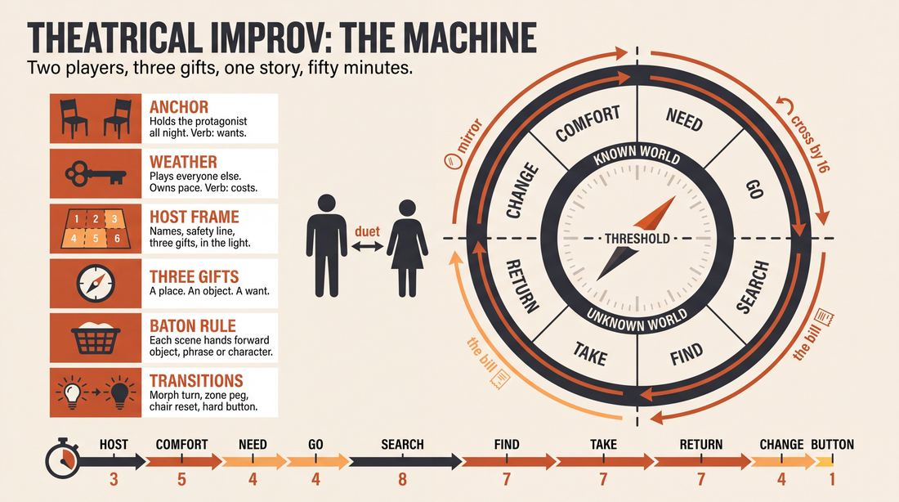
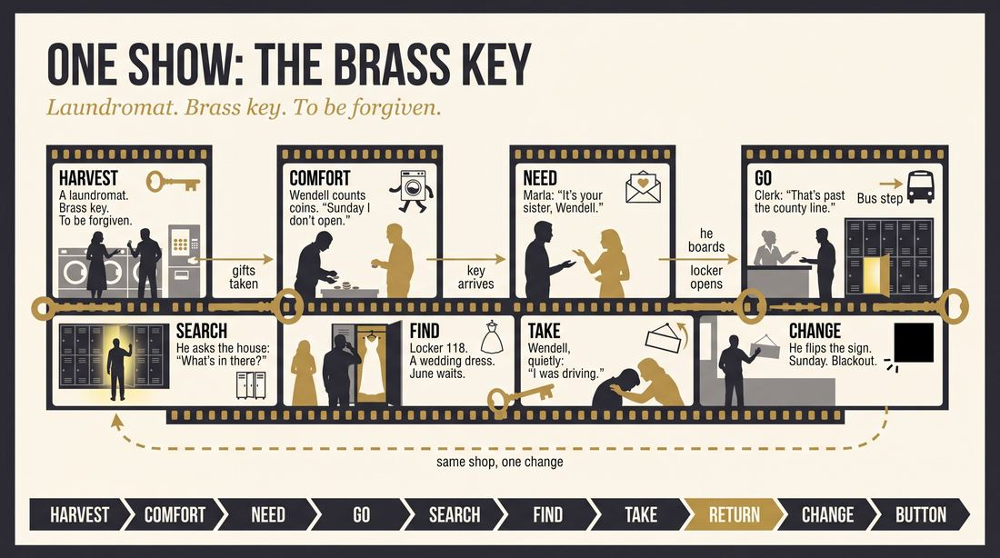
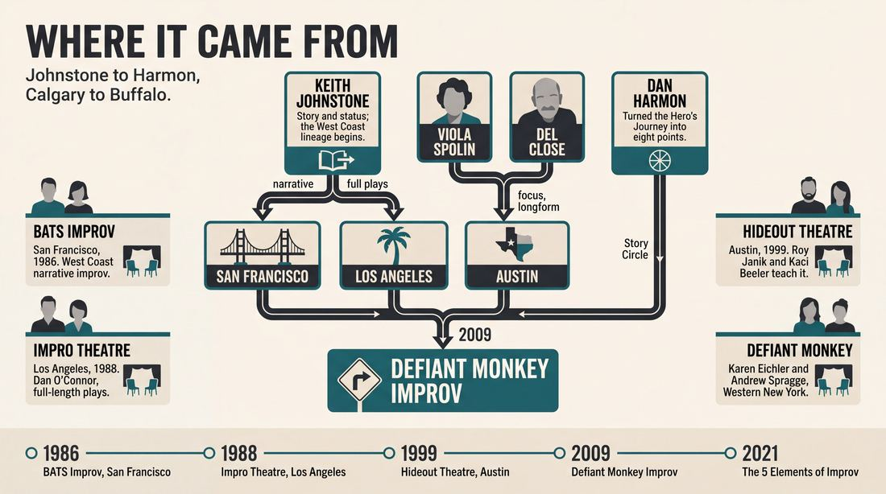
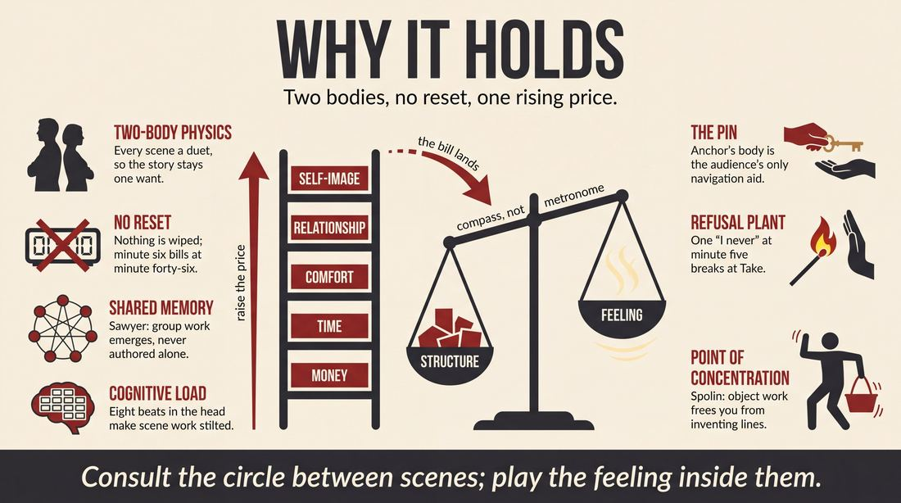
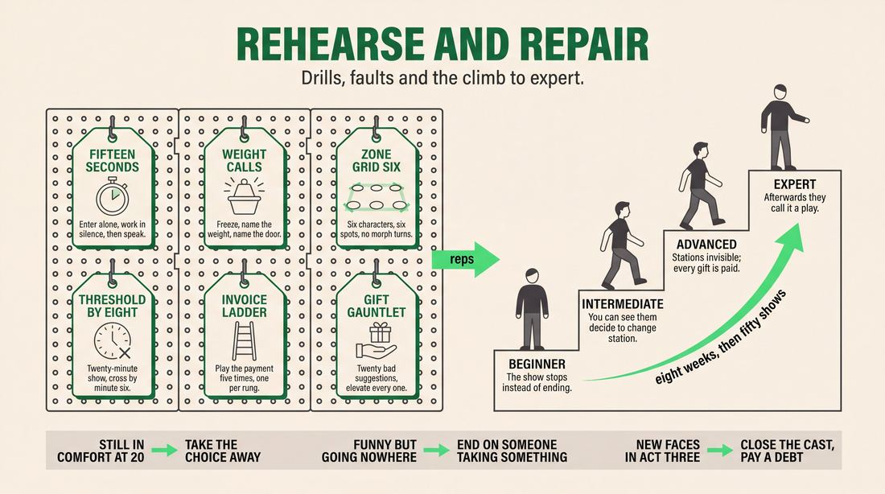

# Theatrical improv

> **A complete study of the long-form improv format _Theatrical improv_** - the original archived write-up, five infographics, grounded historical and pedagogical research, and a full mechanics-and-coaching manual.

| | |
|---|---|
| **Format** | Theatrical improv |
| **Primary source** | [IRC Improv Wiki](https://wiki.improvresourcecenter.com/index.php?title=Theatrical_improv) |

---

## Contents

1. [Part I - The Original Write-Up](#part-i-the-original-write-up)
2. [Part II - The Infographics](#part-ii-the-infographics)
   - [1. Structure and Mechanics](#infographic-1-mechanics)
   - [2. A Show, Beat by Beat](#infographic-2-example)
   - [3. Origins and Lineage](#infographic-3-history)
   - [4. Why It Works](#infographic-4-theory)
   - [5. Rehearsal and Repair](#infographic-5-coaching)
3. [Part III - Research Dossier](#part-iii-research-dossier)
   - [Pass 1: History, Lineage, Literature and Scholarship](#research-history)
   - [Pass 2: Comparative Anatomy, Pedagogy and Production](#research-comparative)
4. [Part IV - Mechanics, Gameplay and Coaching Manual](#part-iv-mechanics-gameplay-and-coaching-manual)
   - [Pass 1: The Form, Its Mechanics and Its Gameplay](#manual-mechanics)
   - [Pass 2: Training, Coaching and Performance Companion](#manual-coaching)

---

## Part I - The Original Write-Up

*Verbatim archive of the source article, reproduced exactly as scraped. Everything after this section is generated elaboration built on top of it.*

### Theatrical improv

Theatrical Improv, pioneered by **[Defiant Monkey Improv](https://wiki.improvresourcecenter.com/index.php?title=Defiant_Monkey_Improv "Defiant Monkey Improv")** in 2009 is a an improv form focused primarily on the central concept of [storytelling](https://wiki.improvresourcecenter.com/index.php?title=Storytelling&action=edit&redlink=1 "Storytelling (page does not exist)"). Employing tactics of both [longform](https://wiki.improvresourcecenter.com/index.php?title=Longform "Longform") and [shortform](https://wiki.improvresourcecenter.com/index.php?title=Shortform "Shortform"), theatrical improv's main goal is to create a central storyline roughly following the structure of Campbell's **Hero's Journey** and Dan Harmon's stylized version of it, **The Story Circle**.

Inspired by the works of **[Keith Johnstone](https://wiki.improvresourcecenter.com/index.php?title=Keith_Johnstone "Keith Johnstone")**, **[Viola Spolin](https://wiki.improvresourcecenter.com/index.php?title=Viola_Spolin "Viola Spolin")**, and **[Del Close](https://wiki.improvresourcecenter.com/index.php?title=Del_Close "Del Close")**, theatrical improv provides a comprehensive and flexible structure well suited to the demands of an improv performance.

---

*Archived from [https://wiki.improvresourcecenter.com/index.php?title=Theatrical_improv](https://wiki.improvresourcecenter.com/index.php?title=Theatrical_improv) (IRC Improv Wiki) on 2026-08-09 23:23 UTC.*

---

## Part II - The Infographics

*Five 16:9 posters, each teaching a different aspect of the format. Click any poster to enlarge.*

<a id="infographic-1-mechanics"></a>

### 1. Structure and Mechanics

*How the form is played: the shape of the piece, the opening, the roles, the edit vocabulary, the flow of information, and the clock.*

{ .diagram loading=lazy decoding=async width="1100" height="614" }


<a id="infographic-2-example"></a>

### 2. A Show, Beat by Beat

*A single worked performance from suggestion to blackout: what happens in each beat, with short real example lines and what the players are doing technically.*

{ .diagram loading=lazy decoding=async width="1100" height="614" }


<a id="infographic-3-history"></a>

### 3. Origins and Lineage

*Where the form came from: creators, dates, theatres, how it spread between schools and cities, and the key figures - a documented timeline and lineage map.*

{ .diagram loading=lazy decoding=async width="1100" height="614" }


<a id="infographic-4-theory"></a>

### 4. Why It Works

*The theory: the core principles of the form and the research and craft ideas that explain why the structure produces good improv, each tied to a specific mechanic.*

{ .diagram loading=lazy decoding=async width="1100" height="614" }


<a id="infographic-5-coaching"></a>

### 5. Rehearsal and Repair

*Training and fixing the form: the essential drills, the common failure modes with their symptom-and-fix pairs, and the markers of beginner through expert play.*

{ .diagram loading=lazy decoding=async width="1100" height="614" }


---

## Part III - Research Dossier

*Two research passes: the historical record, then the comparative and pedagogical record. Claims carry evidence tags - treat unverified items accordingly.*

<a id="research-history"></a>

### » Pass 1: History, Lineage, Literature and Scholarship

### Research Summary
*   **Thin Primary Record:** The specific proprietary format named "Theatrical Improv," as defined in the seed wiki article (created in 2009 by Defiant Monkey Improv), has an extremely thin, self-published searchable record. It appears to be a localized branding term used by the Western New York duo Karen Eichler and Andrew Spragge [DOCUMENTED].
*   **Parent Form Pivot:** Because the proprietary record is thin, this dossier documents the widely practiced mechanics described in the stub: the fusion of shortform and longform techniques to improvise a central storyline using Joseph Campbell's Hero's Journey and Dan Harmon's Story Circle. In the broader craft, this is known as **Narrative Longform** or **Story-Driven Improv** [WIDELY PRACTICED, UNDOCUMENTED].
*   **Lineage:** The mechanics of theatrical narrative improv trace back to Keith Johnstone's work in Calgary and London, which was subsequently evolved by West Coast companies like BATS Improv (San Francisco) and Impro Theatre (Los Angeles) in the 1980s and 1990s [DOCUMENTED].
*   **Structural Mechanics:** The use of the Hero's Journey and Dan Harmon's 8-point Story Circle is highly documented as a training and performance framework for improvising 25-to-60-minute plays and genre pastiches [DOCUMENTED].
*   **Core Conflict:** There is a documented, ongoing craft debate regarding this form: whether improvisers should actively steer the plot to hit Campbell/Harmon structural beats, or whether they should focus purely on character emotion and trust the narrative structure to emerge organically [DOCUMENTED].
*   **Modern Hubs:** Today, the mechanics of this form are most rigorously preserved and taught by The Hideout Theatre in Austin, Texas, and Impro Theatre in Los Angeles [DOCUMENTED].

### Provenance and History
The specific term "Theatrical Improv," as cited in the seed article, was coined as a brand/format in 2009 by Defiant Monkey Improv (Karen Eichler and Andrew Spragge) in the Buffalo/Niagara Falls region of New York [DOCUMENTED]. They sought to codify their two-person approach to storytelling, eventually publishing *The 5 Elements of Improv* to outline their methodology (Story, Environment, Trust, Focus, and Showmanship) [DOCUMENTED]. 

However, the *mechanics* of improvising a full narrative using mythic structure (The Hero's Journey) and episodic structure (The Story Circle) belong to the broader history of **Narrative Longform**. While Chicago (Del Close, Viola Spolin) focused on the Harold and associative, theme-based scene work, West Coast improvisers heavily influenced by Keith Johnstone began experimenting with linear, full-length improvised plays in the late 1980s and early 1990s [DOCUMENTED]. Dan Harmon, a ComedySportz alumnus, later distilled Campbell's Hero's Journey into the "Story Circle" for television writing; by the 2010s, improvisers had reverse-engineered Harmon's circle back into a live performance format [INFERRED].

| Year | Event | Place / Company | Source |
| :--- | :--- | :--- | :--- |
| 1986 | Founding of Bay Area Theatresports (BATS), pioneering West Coast narrative improv. | San Francisco, CA / BATS Improv | [improv.org](https://www.improv.org/) |
| 1988 | Founding of Impro Theatre (originally Los Angeles TheatreSports), evolving Johnstone's work into full-length narrative plays. | Los Angeles, CA / Impro Theatre | [facebook.com/ImproTheatre](https://www.facebook.com/ImproTheatre/posts/10158143210925000/) |
| 1999 | The Hideout Theatre opens, eventually becoming a primary hub for theatrical narrative improv. | Austin, TX / The Hideout Theatre | [hideouttheatre.com](https://www.hideouttheatre.com/) |
| 2009 | Defiant Monkey Improv is formed, pioneering their specific "Theatrical Improv" curriculum. | Western NY / Defiant Monkey Improv | [defiantmonkey.com](https://defiantmonkey.com/) |
| 2021 | Publication of *The 5 Elements of Improv: How to Take Your Improv to the Next Level*. | Western NY / Defiant Monkey Improv | [improvlibrary.com](https://improvlibrary.com/) |

### Lineage and Transmission
The transmission of narrative improv mechanics split into two distinct geographical and philosophical dialects:

1. **The West Coast / Johnstone Lineage:** Originating with Keith Johnstone's *Impro*, this dialect focuses on storytelling, platforming, and genre. It was carried by BATS Improv in San Francisco and Impro Theatre in Los Angeles. These schools teach improvisers to build 45-to-90-minute linear plays (often genre pastiches like *Jane Austen UnScripted* or *Improvised Shakespeare*) [DOCUMENTED]. 
2. **The Austin Narrative Hub:** The Hideout Theatre in Austin, Texas, heavily codified narrative longform through their "Narrative Intensive" curriculum and resident companies like Parallelogramophonograph (PGraph). They teach improvisers to build 25-minute stories using intuitive storytelling and complex relationships [DOCUMENTED].
3. **The Harmon / UCB Synthesis:** In the 2010s, improvisers trained in the Upright Citizens Brigade (UCB) "Game of the Scene" began applying Dan Harmon's 8-point Story Circle to give their associative longform sets a cohesive narrative spine. This dialect treats the Story Circle as a macro-structure while playing UCB-style comedic games in the micro-scenes [WIDELY PRACTICED, UNDOCUMENTED].

### Key Figures
| Person | Role in this form | Specific contribution | Source URL |
| :--- | :--- | :--- | :--- |
| Karen Eichler & Andrew Spragge | Creators (Defiant Monkey) | Founded Defiant Monkey Improv in 2009; authored *The 5 Elements of Improv*. | [defiantmonkey.com](https://defiantmonkey.com/) |
| Keith Johnstone | Pioneer | Created the foundational theories of narrative improv and status that West Coast narrative longform is built upon. | [mrpetermore.com](https://www.mrpetermore.com/) |
| Dan Harmon | Theorist | Adapted Campbell's Hero's Journey into the 8-point Story Circle, which improvisers use to structure longform sets. | [cracked.com](https://www.cracked.com/article_38411_15-trivia-tidbits-about-dan-harmon.html) |
| Dan O'Connor | Director/Teacher | Co-founder of Impro Theatre; pioneered the transition from shortform Theatresports to full-length improvised plays. | [facebook.com/ImproTheatre](https://www.facebook.com/ImproTheatre/posts/10158143210925000/) |
| Roy Janik & Kaci Beeler | Performers/Teachers | Core members of The Hideout Theatre and Parallelogramophonograph; codified modern narrative intensive training. | [hideouttheatre.com](https://www.hideouttheatre.com/austin-improv-classes/narrative-intensive/) |

### Canonical Shows, Companies and Recordings
*   **Defiant Monkey Improv:** The flagship duo for the specific "Theatrical Improv" brand, performing highly interactive shortform/longform hybrid shows in the Western NY region since 2009. [defiantmonkey.com](https://defiantmonkey.com/)
*   **Impro Theatre (Los Angeles):** Known for full-length, unscripted plays in specific genres, such as *Jane Austen UnScripted* and *Twilight Zone UnScripted*. They are the gold standard for character-driven narrative longform. [facebook.com/ImproTheatre](https://www.facebook.com/ImproTheatre/)
*   **Parallelogramophonograph (Austin):** A resident company at The Hideout Theatre that has performed over 1,500 narrative longform shows across 65 cities, specializing in theatrical, intuitive storytelling. [hideouttheatre.com](https://www.hideouttheatre.com/austin-improv-classes/narrative-intensive/)
*   **BATS Improv (San Francisco):** Pioneers of formats like *Family Drama* and *An Improvised Dickens Musical*, utilizing the Hero's Journey and theatrical staging. [improv.org](https://www.improv.org/)

### Published Literature
| Work | Author | Year | What it says about this form | Where to find it |
| :--- | :--- | :--- | :--- | :--- |
| *The 5 Elements of Improv* | Andrew M. Spragge & Karen L. Eichler | 2021 | Details the 5 elements of theatrical improv: Story, Environment, Trust, Focus, and Showmanship. | [improvlibrary.com](https://improvlibrary.com/) |
| *Your Story, Well Told* | Corey Rosen | 2021 | A BATS Improv performer explains how to use improv mechanics, the Hero's Journey, and the Story Spine to craft compelling narratives. | [google.com/books](https://books.google.com/) |
| *Do It Now* | Roy Janik | N/A | A collection of short essays on the philosophy and execution of narrative longform from The Hideout Theatre's perspective. | [wordpress.com](https://wordpress.com/) |

### Verbatim Quotes
> "Theatrical improv gives you practice in dealing with any situation, listening, adapting to circumstances, coming up with something, learning from the effort and trying again. Improv sharpens the mind and focus like nothing else."
> — Defiant Monkey Improv
> [https://www.quora.com/Have-you-seen-shy-or-awkward-people-or-people-with-bad-communication-or-social-skills-do-improv-How-did-they-do-Did-it-help-them](https://www.quora.com/Have-you-seen-shy-or-awkward-people-or-people-with-bad-communication-or-social-skills-do-improv-How-did-they-do-Did-it-help-them)

> "Story, Environment, Trust, Focus, and Showmanship intertwine to help you take your improv to the next level."
> — Defiant Monkey Improv
> [https://defiantmonkey.com/the-defiant-monkey-school-of-improv-library/](https://defiantmonkey.com/the-defiant-monkey-school-of-improv-library/)

> "At Impro Theatre, we improvise full-length plays and actively try not to use plot as the engine of the story. Instead, we let the emotional point of view of the characters generate the narrative."
> — Dan O'Connor, Impro Theatre
> [https://www.facebook.com/ImproTheatre/posts/10158143210925000/](https://www.facebook.com/ImproTheatre/posts/10158143210925000/)

> "West Coast companies like BATS and Impro began exploring narrative work in the early '90s. For us at Impro, this felt like the natural next step in the evolution from Keith's work. So much so that we called ourselves IMPRO inspired by his teachings."
> — Impro Theatre
> [https://www.facebook.com/ImproTheatre/posts/10158143210925000/](https://www.facebook.com/ImproTheatre/posts/10158143210925000/)

> "Dan Harmon's story circle is, at its heart, the Hero's Journey. The Once Upon A Time, And Every Day structure allows you to go different directions as long as you are always building upon the last thing that was provided."
> — Reddit user LaughAtlantis
> [https://www.reddit.com/r/improv/comments/4clz8z/tips_for_developing_narrative_improv_skills/](https://www.reddit.com/r/improv/comments/4clz8z/tips_for_developing_narrative_improv_skills/)

> "The Narrative Intensive is a crash course in The Hideout Theatre's approach to theatrical narrative improvisation. Through games, exercises and training formats, you'll learn the basic elements of improvising a 25-minute story: who is the story about, what kind of story is it, when to explore and when to move things along..."
> — The Hideout Theatre
> [https://www.hideouttheatre.com/austin-improv-classes/narrative-intensive/](https://www.hideouttheatre.com/austin-improv-classes/narrative-intensive/)

> "Think of the Dan Harmon story circle as a fundamentally comedic coping mechanism for a bleak existential reality - a whole lot of dramas actually don't end where they start, but comedies generally do in some key way."
> — Reddit user boredgamelad
> [https://www.reddit.com/r/improv/comments/1ah2z9z/ucb_vs_annoyance_vs_groundlings/](https://www.reddit.com/r/improv/comments/1ah2z9z/ucb_vs_annoyance_vs_groundlings/)

> "I think that is a very 'checklist' view of storytelling. Very 'I read Campbell and think every story can be hammered into a shape that fits the hero's journey'. The power of improv is the ways in which it can surprise us, and those surprises arise from unexpected truths..."
> — Reddit user
> [https://www.reddit.com/r/improv/comments/18qj9z9/narrative_longform/](https://www.reddit.com/r/improv/comments/18qj9z9/narrative_longform/)

### Anecdotes and Stories
*   **The Origin of Defiant Monkey:** Karen Eichler had never performed improv until after graduate school in 1997, when she saw a tiny ad for an audition and dragged a friend along. Andrew Spragge's theatre debut was playing Geppetto in the third grade. After crossing paths in the Western NY ComedySportz scene, they formed Defiant Monkey Improv in 2009 to blend their corporate training backgrounds with theatrical storytelling [DOCUMENTED].
*   **Dan Harmon's Improv Roots:** Before creating *Community* and *Rick and Morty*, Dan Harmon trained at ComedySportz. He openly credits his improv training for his writing process. He developed the "Story Circle" to counterintuitively open up avenues for creativity in television writing. Ironically, this screenwriting tool was then re-adopted by the improv community as a structural map for longform narrative sets [DOCUMENTED].
*   **The 46-Hour Improv Marathon:** To test the absolute limits of narrative endurance, improvisers at The Hideout Theatre in Austin (including Cat Drago) participated in a 46-Hour Improv Marathon in 2015. The event proved that character-driven, theatrical narrative could sustain both performers and audiences far longer than standard comedic game-play [DOCUMENTED].

### Academic and Scientific Research
*   **The Psychology of Collaborative Emergence:** Research in performance studies shows that group creativity relies on "collaborative emergence," where the narrative is generated without a single author. 
    *   *Relevance to this form:* Maintaining a coherent Hero's Journey requires shared mental models. Players must collectively track narrative beats (e.g., Crossing the Threshold, The Ordeal) without explicitly discussing them, relying on collaborative emergence rather than individual flow states [DOCUMENTED].
*   **Cognitive Load and Spontaneity:** Cognitive science indicates that holding rigid structural frameworks in working memory limits the brain's ability to generate spontaneous, divergent ideas.
    *   *Relevance to this form:* The Harmon Story Circle imposes a high cognitive load (tracking 8 specific structural beats). If improvisers focus too heavily on the plot mechanics of the circle, it inhibits their spontaneity and results in "stilted" scene work [INFERRED].
*   **Applied Improvisation in Organizational Behavior:** Improv mechanics are frequently used in corporate training to enhance adaptability and communication.
    *   *Relevance to this form:* Defiant Monkey Improv explicitly uses their 5 Elements of Theatrical Improv (Story, Environment, Trust, Focus, Showmanship) in corporate training for organizations like Kaleida Health and Moog, proving that narrative structure training translates directly to corporate problem-solving [DOCUMENTED].

### Documented Variants and Descendants
*   **Genre Pastiche:** A direct descendant of narrative longform where the Hero's Journey is filtered through a specific cinematic or literary lens (e.g., *Improvised Shakespeare*, *Jane Austen UnScripted*, *Improvised Star Trek*). Players use the tropes of the genre to inform the structural beats [DOCUMENTED].
*   **Pro Musical Longform - Hero's Journey:** Taught at venues like Comedy Bar in Toronto, this variant maps the Hero's Journey onto a 30-minute improvised Broadway-style musical, requiring the cast to time the climax and resolution songs to specific narrative beats [DOCUMENTED].
*   **The Story Spine:** Created by Kenn Adams, this is a micro-variant of the Hero's Journey used heavily in narrative improv training: *Once upon a time... And every day... Until one day... And because of that... Until finally... And ever since that day...* [DOCUMENTED].

### Criticism, Debate and Known Failure Modes
*   **The "Checklist" Failure Mode:** The most common criticism of using the Hero's Journey or Story Circle in improv is that it creates a "checklist" mentality. Critics argue that trying to hammer an improvised story into Campbell's exact shape kills spontaneity, making the show feel dead, stilted, and predictable [DOCUMENTED].
*   **Plot vs. Character:** Keith Johnstone and West Coast practitioners (like Impro Theatre) actively warn against using *plot* as the engine of the story. They argue that if players focus on hitting structural beats rather than playing the emotional truth of the characters, the narrative collapses. Emotion and point-of-view must generate the story, not a predetermined circle [DOCUMENTED].
*   **Waffling and Pacing:** In narrative longform, a single "waffled" (unfocused or stalling) scene can destroy the pacing of a 45-minute show. Because the scenes are linear and connected, players cannot simply wipe the stage and start fresh as they would in a Harold; they must live with the consequences of every scene [DOCUMENTED].

### Cultural Footprint
*   **Television Writing:** The mechanics of this form heavily influenced modern television. Dan Harmon's Story Circle—rooted in his improv background—is the foundational blueprint for critically acclaimed shows like *Community* and *Rick and Morty* [DOCUMENTED].
*   **International Festival Presence:** Narrative longform companies like Austin's Parallelogramophonograph have toured extensively, bringing theatrical, story-driven improv to over 65 cities and international festivals in London, Barcelona, and Finland [DOCUMENTED].
*   **Corporate Training:** The structural elements of theatrical improv have been widely adopted by the Applied Improvisation network to teach teamwork, presentation skills, and leadership in the corporate sector [DOCUMENTED].

### Gaps in the Record
*   **Defiant Monkey's Broader Influence:** The seed wiki article claims Defiant Monkey Improv "pioneered" Theatrical Improv in 2009. However, the searchable record cannot verify that their specific proprietary format had any significant influence outside the Western New York scene. The wiki article appears to be self-published [INFERRED].
*   **The Harmon Crossover:** It is difficult to pinpoint the exact year or theater where Dan Harmon's Story Circle transitioned from a screenwriting tool back into a formalized stage-improv curriculum. 
*   **Next Steps for Researchers:** A researcher should interview veteran directors at The Hideout Theatre and Impro Theatre to map exactly how Joseph Campbell's theories were first integrated into their rehearsal rooms in the 1990s.

### Source List
1. Theatrical Improv - IRC Improv Wiki - 2024 - [https://wiki.improvresourcecenter.com/index.php?title=Theatrical_improv](https://wiki.improvresourcecenter.com/index.php?title=Theatrical_improv) - Seed article establishing the Defiant Monkey Improv claim.
2. Defiant Monkey Improv Official Site - Defiant Monkey Improv - 2026 - [https://defiantmonkey.com/](https://defiantmonkey.com/) - Verifies the existence, history, and publications of Karen Eichler and Andrew Spragge.
3. Impro Theatre Facebook Page - Impro Theatre - 2026 - [https://www.facebook.com/ImproTheatre/posts/10158143210925000/](https://www.facebook.com/ImproTheatre/posts/10158143210925000/) - Documents the West Coast lineage of narrative longform and the philosophy of character over plot.
4. The Hideout Theatre Classes - The Hideout Theatre - 2026 - [https://www.hideouttheatre.com/austin-improv-classes/narrative-intensive/](https://www.hideouttheatre.com/austin-improv-classes/narrative-intensive/) - Details the modern curriculum for teaching 25-minute narrative longform.
5. Reddit r/improv - Various Authors - 2016-2024 - [https://www.reddit.com/r/improv/comments/4clz8z/tips_for_developing_narrative_improv_skills/](https://www.reddit.com/r/improv/comments/4clz8z/tips_for_developing_narrative_improv_skills/) - Provides practitioner debates on the use of the Story Circle and Hero's Journey in live performance.
6. 15 Trivia Tidbits About Dan Harmon - Cracked - 2023 - [https://www.cracked.com/article_38411_15-trivia-tidbits-about-dan-harmon.html](https://www.cracked.com/article_38411_15-trivia-tidbits-about-dan-harmon.html) - Documents Harmon's ComedySportz background and the creation of the Story Circle.
7. BATS Improv Official Site - BATS Improv - 2026 - [https://www.improv.org/](https://www.improv.org/) - Verifies the early West Coast adoption of narrative formats and genre pastiche.
8. Your Story, Well Told - Corey Rosen - 2021 - [https://books.google.com/](https://books.google.com/) - Published literature linking BATS Improv techniques with the Hero's Journey and Story Spine.

<a id="research-comparative"></a>

### » Pass 2: Comparative Anatomy, Pedagogy and Production

### Taxonomic Placement

```text
       Viola Spolin             Keith Johnstone             Del Close
     (Games & Focus)          (Narrative & Status)    (Longform Structure)
            |                          |                        |
            +--------------------------+------------------------+
                                       |
                   +-------------------+-------------------+
                   |                                       |
          Shortform Comedy                         Narrative Longform
          (Whose Line, CSz)                        (The Movie, The Play)
                   |                                       |
                   +-------------------+-------------------+
                                       |
                               Theatrical Improv
                            (Defiant Monkey Improv)
                                       |
                   +-------------------+-------------------+
                   |                                       |
         Library/Youth Variant                 Corporate/Applied Variant
```

Theatrical Improv, as codified by Defiant Monkey Improv (Karen Eichler and Andrew Spragge), sits at the precise intersection of Spolin's game-based focus, Johnstone's narrative storytelling, and Close's longform endurance. Unlike pure longform formats (like The Harold) which often eschew shortform games and direct audience interaction, Theatrical Improv explicitly integrates shortform tactics into a macro-narrative structure. It borrows the endurance and structural ambition of Narrative Longform (using Campbell's Hero's Journey and Dan Harmon's Story Circle) but executes it with the audience-friendly, highly interactive ethos of Shortform comedy, sustained entirely by a two-person cast.

### Head-to-Head Comparisons

**Theatrical Improv vs. The Harold**
| Axis | Theatrical Improv | The Harold | Consequence for the players |
|---|---|---|---|
| Opening | Direct audience interaction/suggestion | Abstract group game or monologue | Theatrical Improv players must immediately establish a warm, non-antagonistic rapport with the crowd. |
| Structure | Hero's Journey / Story Circle | Three beats of three scenes, group games | Theatrical Improv requires linear narrative tracking; Harold requires thematic pattern recognition. |
| Edit logic | Scene transitions follow the protagonist's journey | Sweep edits based on heightening the game | Theatrical Improv players must justify time/space jumps narratively rather than purely comedically. |
| Memory | Tracking one continuous 60-minute plot | Tracking three separate 5-minute plots | Theatrical Improv demands deep, long-term retention of early narrative details (the "Comfort" and "Need" stages). |
| Cast size | 2 players | 8-10 players | Theatrical Improv players never leave the stage and must play all supporting characters themselves. |
| Audience contract | "We have fun with you, not at you" | "Watch us build a thematic puzzle" | Theatrical Improv relies on the audience feeling safe enough to participate or shout suggestions mid-show. |
| Failure mode | Plotting over playing (stalled narrative) | Playing the plot instead of the game (ignoring the theme) | Theatrical Improv players must balance Campbellian structure with moment-to-moment Spolin focus. |

**Theatrical Improv vs. The Movie**
| Axis | Theatrical Improv | The Movie | Consequence for the players |
|---|---|---|---|
| Opening | Audience suggestion | Fictional movie title/genre | Both require genre knowledge, but Theatrical Improv focuses on a single protagonist rather than an ensemble cast. |
| Structure | Campbell's Hero's Journey | Three-act cinematic structure | Theatrical Improv players must hit specific psychological beats (the "Point of No Return"). |
| Edit logic | Organic transitions by the two players | A "Director" calling cuts, pans, and zooms | Theatrical Improv players must self-edit and morph into new characters without an external director. |
| Memory | 60 minutes of continuous narrative | 30-45 minutes of cinematic tropes | Theatrical Improv requires tracking the emotional arc of the hero, not just cinematic set-pieces. |
| Cast size | 2 players | 6-8 players | Theatrical Improv players must physically differentiate multiple characters in the same scene. |
| Audience contract | Interactive, participatory theatre | Watching a live-action film | Theatrical Improv breaks the fourth wall frequently; The Movie strictly maintains it. |
| Failure mode | Character confusion | Too many subplots | Theatrical Improv players must anchor their physical environment to avoid losing track of who is who. |

**Theatrical Improv vs. Shortform Montage (Whose Line)**
| Axis | Theatrical Improv | Shortform Montage | Consequence for the players |
|---|---|---|---|
| Opening | Suggestion to launch a 60-minute story | Suggestion to launch a 3-minute game | Theatrical Improv players must treat the suggestion as a foundational premise, not a quick punchline. |
| Structure | Story Circle with embedded games | Disconnected series of games | Theatrical Improv players must justify the inclusion of a game within the reality of the narrative. |
| Edit logic | Narrative progression | The host blowing a whistle/buzzer | Theatrical Improv players control the pacing and must know when a scene has served its narrative purpose. |
| Memory | High (tracking a full hour) | Low (resetting every 3 minutes) | Theatrical Improv players cannot rely on the "reset button" if a scene goes poorly. |
| Cast size | 2 players | 4 players + Host | Theatrical Improv players have nowhere to hide and no bench to retreat to. |
| Audience contract | "Help us build a story" | "Give us a wacky premise" | Theatrical Improv requires training the audience to give grounded, usable suggestions. |
| Failure mode | Disjointed hybrid (games break the story) | Gag fatigue | Theatrical Improv players must prioritize the story over the gimmick of the game. |

**Theatrical Improv vs. TJ & Dave (Two-Person Monoscene)**
| Axis | Theatrical Improv | TJ & Dave | Consequence for the players |
|---|---|---|---|
| Opening | Direct audience interaction | Silence, discovering the scene | Theatrical Improv starts with high energy and external input; TJ & Dave starts internally. |
| Structure | Hero's Journey / Story Circle | Real-time, unstructured discovery | Theatrical Improv players are actively building a plot; TJ & Dave are actively avoiding plotting. |
| Edit logic | Time and space jumps allowed | No edits, continuous real-time | Theatrical Improv players must manage transitions; TJ & Dave must endure the current moment. |
| Memory | Tracking a sprawling adventure | Tracking the immediate relationship | Theatrical Improv requires macro-memory; TJ & Dave requires micro-memory. |
| Cast size | 2 players (playing many roles) | 2 players (usually playing 2 roles) | Theatrical Improv players must master character morphing; TJ & Dave master deep character psychology. |
| Audience contract | Fast-paced, interactive, theatrical | Patient, voyeuristic, intimate | Theatrical Improv players must entertain and engage; TJ & Dave players must simply exist. |
| Failure mode | Rushing the plot | Stalling out / nothing happens | Theatrical Improv players must remember to play the scene, not just advance the story. |

### What Makes It Uniquely Itself

1. **The 5 Elements Framework**: The form is strictly governed by Eichler and Spragge's pedagogical pentagram: Story, Environment, Trust, Focus, and Showmanship. If a two-person show ignores the physical environment or the audience (Showmanship), it is playing a different form (like a Monoscene).
2. **The Hero's Journey Macro-Structure**: The narrative must hit the Campbell/Harmon beats (Comfort, Need, Go, Search, Find, Take, Return, Change). Without this specific structural spine, it devolves into a standard montage or a meandering two-person scene.
3. **Shortform Tactics in a Longform Shell**: The form actively invites audience participation, suggestions, and game mechanics mid-narrative. Removing this makes it a traditional Narrative Longform; keeping it makes it uniquely "Theatrical Improv."

### Structural Variants in Practice

| Variant | What it changes | Who plays it | Source |
|---|---|---|---|
| **Theatrical Improv (Original)** | The core 45-60 minute two-person show, often incorporating live musical theatre elements. | Defiant Monkey Improv (Buffalo/Niagara Falls, NY) | Defiant Monkey Improv |
| **Library/Youth Variant** | 45-minute educational version (e.g., "Go Beneath the Planet of the Monkeys"). Focuses on creative storytelling, literacy, and safe audience interaction. | Defiant Monkey Improv | Performers and Programs (NYS) |
| **Corporate/Applied Variant** | Focuses on organizational training, teamwork, and "The One Minute Improviser" secrets rather than theatrical performance. | Defiant Monkey Improv (for ATD, Moog, Kaleida Health) | Defiant Monkey Improv |
| **Netprov (Digital)** | Adapts the "Yes, and" rule to networked environments: players agree on facts but disagree on opinions to drive narrative. | Digital Storytelling Communities | Dokumen / Center for Digital Storytelling |

### The Teaching Ladder

| Stage | Skill introduced | Why in this order | Typical exercise | Source or [CRAFT CONSENSUS] |
|---|---|---|---|---|
| **1. Trust & Acceptance** | The Three Secrets: Be Accepting, Be Supportive, Be Fearless. | Without basic acceptance and fearlessness, narrative cannot begin. | The Three Secrets Gauntlet | *The One Minute Improviser* (Eichler/Spragge) |
| **2. Environment & Focus** | Spolin-style object work, establishing the "Where." | A two-person show requires a rock-solid physical reality to ground the multiple characters. | Environment Object Pass | *The 5 Elements of Improv* / Spolin |
| **3. Story & Structure** | Harmon's Story Circle, identifying the "Point of No Return." | Once players can exist in a space, they must learn to propel a protagonist out of their comfort zone. | Point of No Return Identification | Defiant Monkey Improv / Quora |
| **4. Showmanship** | Audience interaction, stage picture, musical elements. | Theatricality is layered on top of a solid narrative foundation to engage the crowd. | Audience Gift Reception | *The 5 Elements of Improv* |
| **5. Endurance (Withheld)** | Full 60-minute narrative tracking, playing 5+ characters simultaneously. | Beginners will collapse under the cognitive load of tracking a full Hero's Journey while morphing characters. | Two-Person Crowd Scene | [CRAFT CONSENSUS] |

### Documented Drills and Exercises

| Drill | Origin / teacher | How to run it | What it fixes in this form | Source |
|---|---|---|---|---|
| **The Three Secrets Gauntlet** | Eichler/Spragge | Players run a scene focusing solely on being accepting, then supportive, then fearless. | Hesitation, blocking, and self-preservation. | *The One Minute Improviser* |
| **Point of No Return Identification** | Eichler/Spragge | Players start a mundane scene and must explicitly call out the "point of no return" that forces the hero into action. | Meandering openings and refusal to start the journey. | Defiant Monkey Improv (Quora) |
| **Story Circle Relay** | [CRAFT CONSENSUS] | 8 players stand in a circle, each speaking one beat of Dan Harmon's Story Circle for a given protagonist. | Losing the narrative arc mid-show. | [CRAFT CONSENSUS] |
| **Environment Object Pass** | Spolin / Eichler | Players establish a room using only pantomime, passing invisible objects to each other to confirm weight and space. | "Talking heads" syndrome and floating environments. | *The 5 Elements of Improv* |
| **The Fourth Secret Reveal** | Eichler/Spragge | A proprietary experiential drill where players discover the unwritten "Fourth Secret" of *The One Minute Improviser*. | Over-intellectualizing the scene. | *The One Minute Improviser* |
| **Audience Gift Reception** | Defiant Monkey | Players practice taking a shouted suggestion and immediately treating it as a high-status gift rather than a joke to be mocked. | Antagonistic MCing and alienating the audience. | Defiant Monkey Improv |
| **Two-Person Crowd Scene** | [CRAFT CONSENSUS] | Two players must populate a scene with 4+ characters by rapidly switching physicalities and voices. | Limited cast size constraints and character confusion. | [CRAFT CONSENSUS] |
| **Musical Narrative Pivot** | Defiant Monkey / Dan Schroder | Players in a spoken scene must transition seamlessly into an improvised song when the accompanist starts playing, advancing the plot. | Stalled musical numbers that sing about feelings rather than action. | Defiant Monkey Improv |
| **Showmanship Stage Picture** | Eichler/Spragge | Players freeze mid-scene to evaluate their physical stage picture and adjust for maximum audience visibility. | Poor blocking, upstaging, and ignoring the audience. | *The 5 Elements of Improv* |
| **Shortform Game as Plot Device** | Defiant Monkey | Players must insert a classic shortform game into a longform narrative without breaking the reality of the story. | Disjointed hybrid forms where games stop the plot. | Defiant Monkey Improv |

### Common Failure Modes and Diagnoses

| Failure mode | What it looks like from the audience | Root cause | Fix | Who names it |
|---|---|---|---|---|
| **Plotting over Playing** | Actors discussing what to do next instead of doing it; heavy exposition. | Over-focus on the Story Circle at the expense of the present moment. | "Be Fearless" and make a strong physical choice now. | Eichler/Spragge |
| **Environment Collapse** | Actors walking through tables or forgetting where doors are. | Losing the "Focus" element in a two-person show. | Re-establish the physical space before speaking. | Eichler/Spragge |
| **Character Confusion** | An actor using the wrong voice or posture for a returning character. | Poor physical anchoring and cognitive overload. | Assign specific stage zones or postures to specific characters. | [CRAFT CONSENSUS] |
| **Antagonizing the Audience** | Stand-up style crowd work that mocks suggestions. | Forgetting the "Showmanship" and "Supportive" elements. | Treat audience suggestions as gifts, not targets. | Defiant Monkey |
| **The "No, But"** | A stalled scene where facts are disputed and reality is negotiated. | Failing the "Be Accepting" secret. | Agree on facts, disagree on opinions. | Eichler/Spragge / Netprov |

### Production and Logistics

*   **Cast size and why**: Exactly two players (Karen Eichler and Andrew Spragge), plus an optional musical accompanist. This forces a deep mind-meld, requires rapid character morphing, and creates a high-wire theatrical spectacle that a larger cast would dilute.
*   **Runtime**: 45 to 60 minutes uninterrupted.
*   **Stage layout, chairs and set**: Bare stage, 2 to 4 chairs.
*   **Lighting and tech cues**: Basic wash, adequately lit for audience interaction, with a definitive blackout at the end.
*   **Music and sound**: Often features a live keyboardist (e.g., Dan Schroder) to facilitate improvised musical theatre elements.
*   **MC and host duties**: The players themselves act as hosts, setting a safe, non-embarrassing tone ("we don't make fun of the audience; we have fun with them").
*   **How the suggestion is taken**: Direct audience interaction, shouting suggestions, and occasionally bringing volunteers on stage.
*   **Where the form belongs in a show lineup**: Headline act, due to its length and narrative weight.
*   **Rehearsal cadence**: Weekly "Improv Jams" (e.g., the Lockport jams) focusing on the 5 Elements and endurance.
*   **What a producer must prepare**: A clear, defined performance space with safe access for audience volunteers, an adult representative to introduce the show (for library gigs), and 10 minutes of setup time.

### Adaptations Beyond the Stage

*   **Classroom and youth**: Adapted into 45-minute library shows (e.g., "Go Beneath the Planet of the Monkeys"). The focus shifts to creative storytelling, literacy, and reinforcing the library as a source of knowledge.
*   **Corporate and applied improv**: Adapted for organizations like ATD, Moog, and Kaleida Health. The focus shifts to teamwork, flexibility, and the "Three Secrets" (Be Accepting, Be Supportive, Be Fearless).
*   **Online and remote**: Adapted into "Netprov" (networked improv narrative), where the rule of "Yes, and" applies to facts, but players are encouraged to disagree on interpretations and opinions to drive the story.
*   **Community and therapeutic settings**: Focuses heavily on the "Supportive" and "Accepting" secrets to build confidence and reduce social anxiety.
*   **Accessibility and inclusion considerations**: The form relies on a strict "voluntary participation only" contract. The MC explicitly states that no one will be embarrassed or forced to participate.
*   **Content-safety and consent practices**: When bringing audience members on stage, physical boundaries must be clearly established, and the improvisers must maintain high status to protect the volunteer from failing.
*   **Ethics of using real stories**: Because the form relies on fictionalized Hero's Journeys based on abstract suggestions, it avoids the ethical pitfalls of forms like The Armando that mine real personal trauma.

### Evidence Base for Those Adaptations

*   **Sawyer (2003)**: Research on collaborative emergence supports the use of unstructured group creativity to foster teamwork in corporate settings.
*   **Vera and Crossan (2004)**: Research on organizational improvisation demonstrates that theatrical improv skills (like "Yes, and") translate directly to corporate agility, supporting Defiant Monkey's work with Moog and Kaleida Health.
*   **Bermant (2013)**: Studies on applied improv in corporate settings validate the use of the "Three Secrets" (Acceptance, Support, Fearlessness) to improve workplace communication.

### Scholarly Frames Worth Applying

*   **Sawyer on collaborative emergence**: Group creativity cannot be predicted by analyzing individual members, as the output emerges from moment-to-moment interactions (Sawyer, R.K., 2003. *Group Creativity*). Maps to the two-person mind-meld required to sustain a 60-minute narrative without a script.
*   **Johnstone on status and spontaneity**: Human interaction is driven by subtle status transactions, and narrative is propelled by altering these statuses (Johnstone, K., 1979. *Impro*). Maps to the "Story" and "Showmanship" elements, particularly when playing multiple characters in a single scene.
*   **Spolin on point of concentration**: Focusing on a specific game or physical object frees the subconscious from the pressure of "inventing" dialogue (Spolin, V., 1963. *Improvisation for the Theater*). Maps to the "Focus" and "Environment" elements, specifically the heavy reliance on pantomime and object work.
*   **Csikszentmihalyi on flow**: Optimal experience occurs when a high level of skill meets a high level of challenge (Csikszentmihalyi, M., 1990. *Flow*). Maps to the "Be Fearless" secret and the sheer endurance required to perform a 60-minute two-person show.
*   **Vera and Crossan on organisational improvisation**: Improv skills like "Yes, and" translate directly to corporate agility and teamwork (Vera, D. and Crossan, M., 2004. *Theatrical Improvisation and Organizational Learning*). Maps to Defiant Monkey's corporate training variants for clients like Moog and Kaleida Health.

### Where the Form Is Heading

*   **Current practice**: Defiant Monkey Improv continues to tour, perform, and codify their pedagogy through the "Defiant Monkey School of Improv Library" (publishing *The Big Book of Improv Warmups* in 2026).
*   **Revivals and hybrids**: The form is increasingly hybridizing with digital storytelling (Netprov) and applied corporate training, proving that the Hero's Journey structure is highly modular.
*   **Contemporary companies**: While Defiant Monkey pioneered this specific blend, other two-person narrative teams are adopting the "Shortform tactics in a Longform shell" approach to make 60-minute shows more palatable to mainstream audiences who might find pure longform too abstract.

### Source List

1. IRC Improv Wiki - "Theatrical improv" - 2024 - https://wiki.improvresourcecenter.com/index.php?title=Theatrical_improv - Supports the definition, history, and structural basis (Hero's Journey/Story Circle).
2. Defiant Monkey Improv Official Website - Karen Eichler & Andrew Spragge - 2026 - https://defiantmonkey.com/ - Supports the 5 Elements, The One Minute Improviser secrets, corporate clients, and cast details.
3. Buffalo Rising - "Defiant Monkey Improv" - 2011 - https://www.buffalorising.com/ - Supports the 60-minute runtime, audience contract ("we don't make fun of the audience"), and rehearsal jams.
4. The Improv Library - Defiant Monkey Press - 2026 - https://improvlibrary.com/ - Supports the pedagogical books (*The 5 Elements of Improv*, *The One Minute Improviser*, *The Big Book of Improv Warmups*).
5. Quora - Defiant Monkey Improv Answers - 2021/2023 - https://www.quora.com/ - Supports the specific breakdown of the Point of No Return, the 5 key elements of storytelling, and class requirements.
6. Performers and Programs - "Defiant Monkey Improv" - 2025 - https://www.performersandprograms.com/ - Supports the library/youth adaptation logistics, runtime (45 mins), and producer requirements.
7. Dokumen - "Netprov" / Digital Storytelling - 2014 - https://dokumen.pub/ - Supports the adaptation of theatrical improv rules ("Yes, and" applied to facts, not opinions) in digital/networked environments.

---

## Part IV - Mechanics, Gameplay and Coaching Manual

*Synthesis over the original article and both research dossiers: first how the form works and how to play it, then how to train an ensemble to perform it.*

<a id="manual-mechanics"></a>

### » Pass 1: The Form, Its Mechanics and Its Gameplay

### At a Glance

| Field | Specification |
|---|---|
| **Also known as** | Theatrical Improv (Defiant Monkey Improv's branded name, 2009); in the wider craft the same machinery is called Narrative Longform, Story-Driven Improv, or informally "the two-hander Hero's Journey" |
| **Family** | Narrative longform / shortform hybrid. Sits at the confluence of Spolin (focus, object work), Johnstone (story, status, platform) and Close (longform endurance), with Dan Harmon's Story Circle bolted on as the macro-spine |
| **Cast size** | **Two.** One optional accompanist (keys). Scalable to 3–4 with the "Chorus dial" (see *Variations*), but the two-body constraint is the form's defining physics, not an accident of casting |
| **Runtime** | 45–60 minutes, no interval. 25-minute cut for youth/library gigs; 75–90 minutes only with a musician and a third body |
| **Opening** | Hosted direct address. No group game, no monologue, no abstract opening. The players introduce themselves, set the audience contract, and harvest suggestions in the light |
| **Suggestion taken** | Multiple, live, shouted or handed up: canonically a **place**, an **object**, and a **want** (or occupation). Treated as gifts to be elevated, never as punchlines to be mocked |
| **Structural rigidity** | **4/5 at the macro level** (eight stations, in order, on the clock) / **2/5 at the micro level** (individual scenes are free) |
| **Difficulty** | **5/5.** Two performers, no backline, no reset button, one hour of accumulating consequence, plus hosting duty |
| **Prerequisites** | Solid two-person scene work; competent pantomime that survives an hour; the ability to hold and re-enter 5–7 characters; genuine warmth with a crowd; a partner you have worked with for at least six months |
| **Best for** | Duos with a long partnership; venues where the audience is not improv-literate; touring (a bare stage, two chairs, ten minutes of setup); library, school and corporate bookings; the headline slot |
| **Avoid when** | You have a large cast wanting stage time; the group is under a year old; the room is drunk and heckling; you have less than 35 minutes; nobody in the duo is willing to be the Anchor for the whole hour |

---

### The Essence in One Paragraph

Two improvisers take three gifts from a live audience, invent one ordinary person with one unmet need, and then spend fifty uninterrupted minutes walking that person around Dan Harmon's Story Circle — Comfort, Need, Go, Search, Find, Take, Return, Change — in front of the people who supplied the gifts. One player is the **Anchor**: they take the protagonist in the first scene and never put them down until the blackout. The other player is the **Weather**: they play every other human being, animal and force the protagonist meets, morphing in place, using voice, posture and stage position as the only costume rack available. Because there are only two bodies, every scene is a duet, and because every scene is a duet, the story cannot become an ensemble sprawl: it must remain the account of one person's want being tested. On top of this hard narrative spine the form deliberately grafts *shortform* tactics that pure longform usually refuses — direct address, mid-show suggestion harvests, audience volunteers, sometimes a keyboardist and a song — but only when they can be justified inside the fiction and only when they hand a piece of information forward. The result is an hour of theatre that an audience with no improv literacy can follow completely, and that pays the last minute off against the first.

---

### Why This Form Exists

A plain montage buys you variety and buys you nothing else. Each scene begins at zero, and the audience's investment resets with it. The Harold solves that by building thematic rhyme — but the reward is a *puzzle* pleasure, not an emotional one, and it needs eight to ten people and an improv-literate room to land. The two-person monoscene (the TJ & Dave tradition) buys enormous depth of relationship but takes an explicit vow against plot; when it dies, it dies by stalling. Shortform buys you an accessible, delighted, participating audience and spends the entire evening throwing that accumulated goodwill away every three minutes.

Theatrical Improv exists to solve a specific, narrow, real problem: **how do two people hold a non-improv audience for an hour, with no reset button, and give them an ending that means something?**

It solves it with four purchases a montage cannot make:

1. **Compounded stakes.** Because nothing can be wiped, every fact established at minute six is still true at minute forty-six. The bill for scene two arrives in scene nine. Montage never gets to send a bill.
2. **A single object of attention.** The audience does not have to work out who to care about; the Anchor's body tells them, continuously, for fifty minutes. This is why the form can survive a room that has never seen improv.
3. **A legible clock.** The eight stations mean the players and the audience both know roughly how much show is left and what kind of event is due. A montage has no due dates, which is why montages end when the lights get tired.
4. **A licence to be theatrical and populist at the same time.** The Showmanship element — hosting, direct address, volunteers, songs — is normally banned in serious longform as "cheating." Here it is load-bearing, because two people cannot generate an hour of variety from scene work alone. The audience is a third instrument.

What it costs you, honestly: spontaneity is under permanent threat from the structure, and the documented central debate of this form is exactly that. The Harmon/Story-Circle school says steer for the beats; the West Coast school (Impro Theatre's Dan O'Connor, on record) says never use plot as the engine and let character emotion generate the narrative. **My judgement, and the position this chapter takes throughout: the Circle is a compass, not a metronome.** You consult it to answer *"where am I?"*, never to answer *"what should I say?"* The moment the Circle answers the second question, the show goes stilted, and every critic quoted in the record is right about you.

---

### The Audience Contract

The contract in this form is unusually explicit because the players *say most of it out loud in the first ninety seconds*. That curtain speech is not throat-clearing; it is the terms and conditions.

**What the audience is promised:**

| Promise | How it is made | How it is kept |
|---|---|---|
| "Your words will be in the show." | The gift harvest happens in the light, and the players repeat each gift back | Place, object and want all appear inside the first two stations, unmistakably |
| "You will follow one person." | The Anchor is named, described and physically established in scene one | The Anchor's body never becomes anyone else |
| "We will not make fun of you." | Stated verbatim by the hosts. Defiant Monkey's own formulation of this ethos is that they have fun *with* the audience, not *at* them | Every suggestion is elevated. Volunteers are protected and made to look competent |
| "Nobody will be dragged up here." | Stated: participation is voluntary | Volunteers are invited, never selected by pointing at a squirming person |
| "This will end, and it will end on purpose." | Implied by the form's shape and by the hosts saying "we're going to build one story" | Station 8 mirrors station 1 and the button lands within a minute of the last beat |
| "It is genuinely being made up." | Implied by the harvest | No pre-planned bits; the gifts visibly bend the story |

**How they know where they are** (this is the part most duos under-engineer):

- **The Anchor's body is the "you are here" pin.** If the audience can see the protagonist, they know which scene this is.
- **Station transitions are announced physically, not verbally.** The Weather changes the environment — a new door, new weather, new furniture — and the audience reads "new place, later."
- **The host frame is the picture frame.** Direct address at the top and, optionally, once at the mid-point. If you address the house four times, the frame becomes the picture and the story stops mattering.
- **Repeated objects.** The brass key, the laundry basket, the letter: recurring props are the audience's chapter headings.

**What breaks the contract:**

| Break | Why it is fatal here specifically |
|---|---|
| The Anchor plays somebody else for a scene without a huge, signposted reason | The audience loses the pin. In an eight-person form they'd just watch someone else; here there is no one else |
| The suggestion never shows up | You harvested in the light. They are watching for it. This is a broken promise with witnesses |
| Mocking a suggestion or a volunteer | Kills the participation the form's second half depends on. The room goes quiet and you have lost your third instrument |
| Ending on a gag instead of a change | The eight-station shape has promised transformation for fifty minutes |
| Two players offstage simultaneously | There is no stage picture at all. The show has visibly stopped |
| Renegotiating an established fact ("No, the key was mine") | With no reset, contradiction is not a wobble, it is a hole in the floor |

---

### Anatomy: The Full Structural Map

The show is **one continuous story told in eight stations**, framed by a hosted top and a buttoned end. Stations are not scenes. A station is a *narrative job*; it may take one long scene or three short ones. The clock below is for a 50-minute show and should be treated as a flight plan: you may be five minutes early or late to a station, but if you are ten minutes late to **Go**, you have a problem you cannot fix later.

```
                                  1 COMFORT
                                (03:00-08:00)
                8 CHANGE                            2 NEED
             (45:00-49:00)                       (08:00-12:00)
   ══════════════════════════════════════════════════════════════
        THRESHOLD LINE                            THRESHOLD LINE
        (crossed upward)                          (crossed downward)
   ══════════════════════════════════════════════════════════════
                7 RETURN                            3 GO
             (38:00-45:00)                       (12:00-16:00)

                  6 TAKE                          4 SEARCH
             (31:00-38:00)                       (16:00-24:00)

                                   5 FIND
                                (24:00-31:00)

              KNOWN WORLD  ↑ above the line ↑   costs are hypothetical
              UNKNOWN WORLD ↓ below the line ↓  costs are real and paid


   LINEAR VIEW (50 min)
   ┌────┬────────┬──────┬─────┬──────────────┬────────┬───────┬────────┬──────┬──┐
   │HOST│COMFORT │ NEED │ GO  │    SEARCH    │  FIND  │ TAKE  │ RETURN │CHANGE│▮ │
   │ 3' │   5'   │  4'  │ 4'  │      8'      │   7'   │  7'   │   7'   │  4'  │1'│
   └────┴────────┴──────┴─────┴──────────────┴────────┴───────┴────────┴──────┴──┘
        └─ gifts planted ─┘   └─ GAME WINDOW ─┘        └─ the bill ─┘  └ mirror ┘
                    ▲                    ▲                     ▲
              second harvest       volunteer slot        no new characters
              (optional, ~24')     (optional, ~20')      after this point
```

| Unit | Approx. clock | What happens | Who drives it | Success criterion | Common error |
|---|---|---|---|---|---|
| **Host Frame** | 0:00–3:00 | Both players in the light, as themselves. Names, contract ("we have fun with you, not at you"), voluntary-participation line, harvest of three gifts: a **place**, an **object**, a **want** or occupation | Both, alternating; whoever is warmer takes the lead | Room has laughed once, given three clean gifts, and understands nobody will be humiliated | Doing stand-up crowd work; taking eight suggestions; explaining the Hero's Journey to the audience |
| **1. Comfort** | 3:00–8:00 | The protagonist is named, embodied, and shown in their routine, in the suggested place, handling the suggested object. Establish 5 concrete facts (the **Comfort Inventory**) | Anchor initiates; Weather supplies one relationship character | Audience can say who this is, what they do every day, and what they are pretending is fine | Starting with a problem. Comfort must actually look comfortable, or Need has nothing to disturb |
| **2. Need** | 8:00–12:00 | The itch surfaces — something missing, denied or unspoken. Usually delivered by the Weather as a second character with an opposing agenda | Weather drives; Anchor resists | The want can be stated in one sentence by an audience member at the bar afterwards | Making the need abstract ("he wants to be happy") instead of concrete and refusable ("she wants her sister to answer the phone") |
| **3. Go** | 12:00–16:00 | The **Point of No Return**. A door closes behind the protagonist: a resignation, a bus, a lie told, a threshold physically crossed | Anchor must make the choice; Weather makes it cost something | The protagonist cannot get back to station 1 by simply turning around | Going "because the plot needs it." The go must be caused by the Need, not by the clock |
| **4. Search** | 16:00–24:00 | The unfamiliar world. Two or three short scenes; new supporting characters; obstacles; the natural home of the **Game Window** and the volunteer slot | Weather drives hard — this is the Weather's showcase | Three distinct new characters exist and at least one will return later | Sightseeing. Scenes that are fun but transfer no information forward |
| **5. Find** | 24:00–31:00 | The protagonist gets the thing they wanted — or its counterfeit. Bottom of the circle. Often the emotional high point | Anchor drives; Weather grants | The audience feels relief, and something in the staging says "too easy" | Making Find the ending. Find is a summit, not the destination |
| **6. Take** | 31:00–38:00 | The price. The protagonist pays something they would have refused to pay in station 1 | Weather presents the bill; Anchor pays or is broken | The cost is specific, visible, and drawn from the Comfort Inventory | An abstract cost ("she lost her innocence"). Take must cost an *object, a person, or a self-image* named earlier |
| **7. Return** | 38:00–45:00 | Crossing back. Old characters re-met by a changed person; the world has not changed, so the difference reads | Anchor drives; Weather re-uses established characters only | At least two station-1/2 characters return and are handled differently | Introducing brand-new characters. After minute 38 the cast is closed |
| **8. Change** | 45:00–49:00 | The mirror of station 1: same place, same object, same routine — one thing different | Both; usually the Weather feeds the mirror line | An audience member could name the single changed thing | Explaining the change in dialogue instead of showing it in behaviour |
| **Button + Blackout** | 49:00–50:00 | One image or one line, then out. Bow | Whoever is holding the object | The last beat is an *action*, and the lights are fast | Playing four minutes past the ending you already found |

---

### The Opening

The opening in Theatrical Improv is unique among longforms in that it is **hosted, un-theatrical, and done as yourselves**. There is no opening game, no word association, no monologue. This is a deliberate inheritance from the shortform side of the family: the form needs the audience recruited before it needs a story.

#### Step-by-step procedure (canonical, ~3 minutes)

1. **Enter in the wash, both of you.** House lights up enough to see faces. Two chairs already set. Do not enter in character.
2. **Names and the frame, ten seconds.** "I'm A. This is B. We're going to make up one whole story tonight, start to finish, from things you give us." No history of improv, no explanation of the Hero's Journey. The audience must never learn the word "station."
3. **The safety line, verbatim, five seconds.** "We don't make fun of the audience — we have fun with you. Nobody gets dragged up here." Say it every show. It buys you the volunteer slot at minute 20.
4. **Gift #1 — the place.** Ask for an *ordinary* place. "Somewhere you'd go on a Tuesday." Constraining the ask is the single highest-leverage move in the opening; it prevents "Narnia" and gets you "the laundromat on Mill Street."
5. **Elevate it out loud.** Repeat it, and add one admiring specific: "A laundromat. Fluorescent light, one machine that walks across the floor. Beautiful." This is the **Gift Elevation** move; it teaches the room that suggestions get treated well, which raises the quality of gifts #2 and #3.
6. **Gift #2 — the object.** "Something small enough to fit in a coat pocket." Take the *second* thing you hear if the first is a genital.
7. **Gift #3 — the want.** "Something a person might want that money can't buy." This is the fuel line; do not skip it, and do not accept "a million dollars."
8. **Lock and repeat all three.** "Laundromat. Brass key. To be forgiven. Thank you — that's everything we need." The repetition is a contract signature.
9. **Split the light.** Both players turn away, take three seconds, and one of them walks in as a person in that place. **Whoever speaks first as a character is the Anchor for the rest of the show.** That is the entire negotiation. Do not discuss it.

#### Documented and working variants

| Variant | Mechanics | When to use it | Cost |
|---|---|---|---|
| **Three-Gift Harvest** (canonical) | Place, object, want, as above | Default. Mixed rooms, touring, first time in a venue | None; it is the baseline |
| **Single-Word Ignition** | One word only, then straight in | Improv-literate crowds; festivals where you have 40 minutes | Less material to pay off, so callbacks must be manufactured from the scene work instead |
| **Volunteer Portrait** | Invite one volunteer up for a 60-second friendly interview (job, commute, one thing they'd change). Thank them, seat them, then build the protagonist as a *fictional* person who shares one detail | Community shows, corporate gigs, rooms that need to feel implicated | High risk. Requires an ironclad Volunteer Shield; never make the protagonist *be* the volunteer |
| **Object Gift** | Ask for a physical object from a pocket — a keyring, a receipt. Use it as a real prop all show | Small rooms, libraries, kids | You must return it, and it constrains the object work |
| **Genre Vote** | Harvest a genre alongside the place ("ghost story / western / romance") | When the duo has strong genre chops, or for a repeat audience who saw last month's show | Genre tropes start doing the plotting for you, which fights the character engine |
| **Musical Overture** | Accompanist plays 30 seconds under the harvest, establishing the show's key and mood | When you have a keyboardist and intend to sing | Sets an expectation of music you must then honour at least twice |
| **Library / Youth Cut** | An adult introducer frames the show; the harvest is done with hands up, not shouting; gifts are pre-filtered ("a place in our town") | School and library bookings, where the documented Defiant Monkey adaptation runs ~45 minutes with literacy goals | Slower; you lose the shouted-gift energy but gain total control |

---

### The Engine

This is the section to read twice. Everything above is shape; this is what actually makes material.

#### 1. The Two-Body Constraint is the engine block

Every generative property of this form descends from one fact: **there are two bodies and one of them is permanently occupied.**

Consequences, in order:

- **Every scene is a duet.** You cannot stage a committee. Therefore every scene is a *transaction between the protagonist and one other force*. Therefore the story is a chain of transactions. Therefore the story is inherently about one person's want being granted, denied or re-priced — which is precisely what a Hero's Journey is. The structure is not imposed on the form; it falls out of the casting.
- **Supporting characters must be functional.** With only one free body, you cannot afford a character who exists to be charming. Every Weather character must do one of four jobs: **give** (mentor/donor), **block** (guardian), **tempt** (trickster), or **mirror** (shadow). If you cannot name the job within twenty seconds of a character's entrance, morph out.
- **Character re-use beats character invention.** A returning character is free — the audience already has the voice, the posture and the history. A new character costs setup time you do not have. **Target: 5–7 supporting characters for the whole hour, each appearing 2–3 times.** A duo that invents fourteen characters has made a montage with a plot stapled on.
- **Off-body voices are legal and cheap.** The Weather can be onstage as the shopkeeper and *call offstage* as the shopkeeper's mother. Two-person crowd scenes are built out of exactly this: two visible bodies plus two or three voices thrown from the wings.

#### 2. Anchor and Weather

| | **Anchor** | **Weather** |
|---|---|---|
| Holds | The protagonist, for the full hour | Everyone and everything else |
| Primary verb | *Wants* | *Costs* |
| Manages | Emotional continuity, the want, the clock's felt pace | The environment, the supporting cast board, station transitions |
| Never | Plays another character; solves the story alone | Lets the protagonist have anything for free; introduces a new character after minute 38 |
| Physical home | Centre and downstage | Uses the whole grid; enters from the edges |

The Anchor is not the "lead" in the vanity sense — the Weather usually gets more laughs and more variety. The Anchor's job is harder and quieter: to be *continuously wanting something* for fifty minutes so that the Weather has something to push against.

**Craft judgement:** duos should swap Anchor and Weather show to show, never mid-show. The two skill sets atrophy differently, and a Weather-only player loses the ability to sustain an arc.

#### 3. Where information comes from — five sources, ranked by reliability

1. **The Comfort Inventory (most reliable).** Five concrete facts established in station 1: the place, the object, the routine, one relationship, one thing the protagonist refuses to do. *Everything in the back half is generated by pressuring these five items.* If you write only one thing on your mental notepad in the whole show, write these.
2. **The audience gifts.** Three items you are contractually obliged to use, which means three pre-approved pieces of plot.
3. **The Weather's characters' agendas.** Each supporting character wants something *from the protagonist*. That want is a scene-generator that outlives the scene.
4. **Accidental utterances promoted to canon.** A slip, a wrong name, a misheard word. In a no-reset form, mistakes are the only free novelty available. Promote them within thirty seconds or lose them.
5. **The Circle itself (least reliable, use sparingly).** Consulting the compass tells you what *kind* of event is overdue. It never tells you the content of that event.

#### 4. The Baton Rule — how information travels

This is the physics that makes the piece cohere, and it is enforceable in rehearsal.

> **Every scene must hand at least one baton forward. There are exactly three kinds of baton: an OBJECT, a PHRASE, or a CHARACTER.**

- **Object baton:** something physical leaves the scene with someone. The brass key changes hands. The letter is pocketed. The audience tracks objects better than they track ideas.
- **Phrase baton:** a line of dialogue distinctive enough to return with altered meaning. "You always were the one who left." Said as an accusation at minute ten; said as a blessing at minute forty-six.
- **Character baton:** somebody in this scene will appear in a later scene, and we know it — because they said where they'd be, or because they took something.

A scene that hands no baton forward is a **sightseeing scene**. Sightseeing scenes are the single largest cause of a Theatrical Improv show dying at minute thirty. In the Harold you can afford one; here, two of them and the audience stops believing the show is going anywhere.

**Rehearsal test:** run a 40-minute show, then have an observer list the batons. If any scene produced none, that scene is why the show sagged.

#### 5. Heat and Position — the scene-level alternation

Each scene does one of two things:

- **Raises heat:** the emotional temperature goes up; nothing changes in the world. (Argument, confession, seduction, refusal.)
- **Changes position:** the protagonist is physically or materially somewhere new. (Gets the key, boards the bus, is fired.)

**Rule of thumb: alternate.** Two heat scenes in a row and the audience feels the show is stuck. Two position scenes in a row and it feels like a plot synopsis. A scene that does *both* is a station transition and should be the last scene of a station. A scene that does *neither* is a sightseeing scene — edit it.

#### 6. No-reset physics

This is the deepest difference from Harold. In a Harold, a bad scene is amortised across two other beats and the group game. Here, a bad scene is *canon*. Three implications:

- **Never contradict.** Not because "yes-and" is nice, but because with a linear spine, a contradiction is load-bearing damage. Agree on facts; disagree only on opinions and feelings. (This is the documented Defiant Monkey/Netprov formulation and it is exactly right for this form.)
- **Absorb rather than abandon.** If a scene goes strange, the strangeness is now a feature of your world. A character who inexplicably speaks in nautical metaphor is now a person who used to be a sailor, and that fact is available in station 7.
- **Waffling is expensive.** The record is explicit on this point and it matches practice: one unfocused scene can destroy the pacing of a 45-minute show, because there is no wipe.

#### 7. The Game Window — the shortform graft, made legal

This form deliberately imports shortform tactics. Undisciplined, that produces the failure mode the comparative record names as "disjointed hybrid": games stop the story. Three conditions make an insertion legal:

| Condition | Test |
|---|---|
| **Diegetic** | A character inside the story would plausibly be doing this. The audience calling rewind is the protagonist's own memory misfiring; the volunteer onstage is a bus passenger; the song is a person singing |
| **Bounded** | 60–90 seconds. It has a shape and you end it, not the audience |
| **Baton-bearing** | The game *produces* a fact the story then uses. Content of the locker, name of the town, the thing the protagonist can't admit |

**Placement:** Search (minutes 16–24) is the natural home — the protagonist is in an unfamiliar world, so unfamiliar theatrical grammar reads as world-building. A secondary window exists at Take (31–38) for memory/replay games. **Never** in Go, Return or Change: those stations need unbroken forward pressure.

#### 8. The Cast Board and the Zone Grid

Two mental artefacts the Weather maintains all show:

**Cast Board** — an ordered list, held in the head, of supporting characters with three tags each: *name / voice / debt*. The "debt" is what they still owe the story.

**Zone Grid** — the stage is divided into fixed zones assigned to recurring characters. Down-left is always the sister. Up-right is always the pawnbroker. **The audience learns the map subconsciously within three uses**, and thereafter the Weather can become a character by *standing somewhere* and taking one breath. This is the highest-value technical trick in the form and the direct fix for the documented "character confusion" failure mode.

#### 9. The Circle as compass: the diagnostic question

Never ask "what beat are we on?" during a scene. Ask, between scenes, in half a second:

> **"Has the protagonist got what they want, and what did it cost?"**

| Answer | You are in | Overdue if… |
|---|---|---|
| No, and they haven't tried | Comfort / Need | past minute 12 |
| No, and they've just committed to trying | Go | past minute 18 |
| No, and they're failing in a strange place | Search | past minute 26 |
| Yes, and it was easy | Find | past minute 33 |
| Yes, and now they're being invoiced | Take | past minute 40 |
| They're carrying it home | Return | past minute 47 |
| They're home and different | Change | end the show |

That table is the whole Story Circle expressed as a thing you can actually check mid-show without leaving the character's emotional reality. **This is the resolution of the plot-versus-character debate in the record:** the character's *emotion* generates every line; the compass only tells you whether a station is overdue, and being overdue is fixed by *raising the cost*, never by narrating plot.

---

### Roles and Responsibilities

| Role | Owns | Must do | Must not do | Signal to the others |
|---|---|---|---|---|
| **Anchor (Player A)** | The protagonist; the want; the emotional clock | Establish the Comfort Inventory in scene one; keep wanting out loud; make the Go choice; pay the bill at Take physically | Play a second character; solve the plot by narration; leave the stage for more than 10 seconds | A hand on the object = "I'm still in it." Walking to the Comfort zone = "take us home, we're near the end" |
| **Weather (Player B)** | Every other character; the environment; the Cast Board; station transitions | Give each character one job (give/block/tempt/mirror); change the where physically at station turns; close the cast at minute 38; bring back old characters in Return | Introduce a genuinely new principal after Search; win a scene against the protagonist without cost; abandon a character the audience liked | A big environmental change (opening a door, changing the light of the room with body) = "new station." Re-entering in a known zone = "the sister's back" |
| **Host function (shared, top of show)** | The contract; the harvest; the room's safety | Say the no-mockery line; elevate every gift; take exactly three | Do stand-up crowd work; poll the audience about the story mid-show without a plan | Whoever repeats the third gift last is signalling "I'm ready to go in first," i.e. volunteering to Anchor |
| **Accompanist (optional)** | Tempo, transitions, songs | Underscore station turns; give a clean four-bar intro when a song is invited; stop dead when a scene finds a real moment | Start a song the players didn't cue; play under the entire Take (silence is the sound of a bill) | Two chords + vamp = "you can sing here if you want." Instant silence = "this is a real moment, play it straight" |
| **Tech / lights** | The frame at each end | Warm wash bright enough for audience faces during the harvest; one clean, fast blackout at the button | Slow fades; blackouts between scenes; "helpful" mood lighting mid-scene | Player's raised chin + stillness + last line = blackout. Agree the exact tell before the show |
| **Audience (yes, a role)** | Gifts; permission | Supply three gifts; supply the Game Window's content when asked; laugh | Heckle the plot; be mocked | Silence in Take is *good*: it means the cost is real |
| **Producer / venue** | Access and safety | Clear route from house to stage for volunteers; 10 minutes setup; two to four chairs; an adult introducer for library gigs | Book you into a 25-minute slot for a 50-minute form | — |

---

### The Rules That Actually Bind

#### Hard rules — break these and you are performing a different form

| # | Rule | Why |
|---|---|---|
| H1 | **One protagonist, one body, whole show.** | It is the audience's only navigation aid and the source of the form's legibility |
| H2 | **All three gifts appear, unmistakably, before minute 16.** | You harvested in the light. The promise is witnessed |
| H3 | **The protagonist is present, or explicitly the subject, in every scene.** | With two bodies, a scene without them is a scene about nobody the audience is tracking |
| H4 | **Cross the threshold (Go) by the one-third mark.** | Past that, the back half cannot fit and Take will be unpaid |
| H5 | **At Take, the protagonist pays something named in the Comfort Inventory.** | An unnamed cost is not a cost, it is an announcement |
| H6 | **Station 8 mirrors station 1 — same place or object or line — with exactly one thing different.** | The mirror is how a fifty-minute improvised story reads as *finished* rather than *stopped* |
| H7 | **Nothing established may be un-established.** | No reset button exists; contradiction is structural damage |
| H8 | **Embedded shortform games must be diegetic, bounded and baton-bearing.** | Otherwise you have a montage with a plot in the gaps |
| H9 | **No mockery of audience or volunteers; participation is voluntary and stated.** | The documented ethos, and the operational precondition for the mid-show interaction |
| H10 | **The stage is never empty before the blackout.** | Two players, no backline: an empty stage is a stopped show |
| H11 | **Cast closes at Return.** No new principal characters after ~minute 38. | New faces in act three read as "they've lost the plot," because they have |

#### Soft conventions — house by house, choose and be consistent

| Convention | Options | Effect |
|---|---|---|
| Number of gifts | 1 / 3 / 3 + genre | More gifts = more callback ammunition, less narrative freedom |
| Who hosts | Anchor / Weather / alternate lines | Weather hosting is smoother (they aren't about to enter as someone); Anchor hosting builds a warmer bond with the protagonist |
| Second harvest at midpoint | Yes / no | Re-energises minute 24 and buys a fresh callback; costs you the fiction's continuity for 40 seconds |
| Volunteer onstage | Yes / no | Enormous goodwill; enormous risk; needs the Shield technique |
| Narration | Banned / used at station turns only / free | Station-turn narration ("Two days later, the bus stopped where the road ran out") is the cheapest possible transition and I recommend allowing it, capped at four uses |
| Music | None / underscore / underscore + 2 songs | Songs at Find and Change are the natural slots |
| Chairs | 2 / 4 | Four chairs allow a bus, a waiting room and a table; two keep the space abstract |
| Genre | Neutral / pastiche | Pastiche (the documented descendant line: Austen, Shakespeare, Twilight Zone) supplies tropes as free plotting; costs you surprise |
| Anchor selection | First speaker / pre-agreed / alternate shows | Pre-agreeing removes a small thrill; alternating across shows is essential for skill health |
| Fourth-wall breaks after the top | 0 / 1 / 2 | More than two and the audience stops investing in the fiction |

#### Myths — commonly believed, wrong

| Myth | Why it's wrong here |
|---|---|
| "You must hit all eight beats visibly." | The Circle is a diagnostic, not a checklist. Audiences cannot count stations; they only notice *absence of cost* and *absence of change*. Shows that visibly tick beats produce exactly the "stilted, dead" quality critics of the form describe |
| "Hero's Journey means quests, swords and mentors in robes." | The threshold in a laundromat story is a phone call answered. Campbell's shape is scale-free; the mythic vocabulary is optional and usually a trap |
| "Narration is cheating." | In a two-body form with no lighting board and no backline, narration at station turns is a *tool*, like a wipe edit. Abuse is the problem, not existence |
| "Two people can't do crowd scenes." | Two bodies plus two thrown offstage voices plus one hard turn each is a crowd of six. It is a rehearsable drill (the Two-Person Crowd Scene) |
| "Audience interaction breaks the reality." | Only undiegetic interaction does. The audience shouting the contents of a locker *is* the locker being opened |
| "The protagonist must be likeable." | They must be *legible* and *wanting*. Likeability is what Change is for |
| "Change means a happy ending." | Change means the mirror shows something different. Losing everything and knowing why is a full Change |
| "Game of the scene is banned in narrative work." | Game is welcome at the micro level — the Harmon/UCB synthesis dialect runs comedic games inside the scenes while the Circle holds the macro shape. What is banned is letting a game's heightening *replace* the protagonist's want |
| "Find is the climax." | Find is the false summit. Take is the climax. Duos that treat Find as the end have twenty minutes of show left and nothing to spend |
| "You need a musician." | You need *transitions*. A musician is the most convenient one, not the only one |

---

### Edits and Transitions

Terminology check: this form has almost no "edits" in the Harold sense, because there is no backline to sweep in and the protagonist persists across the cut. What it has is **transitions**: changes of time, place or character executed by two bodies in view of the audience.

| Edit / transition | How to execute physically | When it is right | When it is wrong | What it costs |
|---|---|---|---|---|
| **The Morph Turn** | Weather turns upstage, changes spine and breath in one count, turns back as a new person and speaks a naming line ("Ticket, sir?") | Any change of supporting character within a continuous scene | When the audience hasn't yet learned the previous character | ~2 seconds of story time; audience attention if under-committed |
| **The Zone Peg** | Weather walks to a fixed stage zone and adopts that character's posture; no turn needed | Any *returning* character | Before the zone has been used twice — the map isn't learned yet | Nothing. Cheapest character change in the form |
| **The Walk-Through Wipe** | Weather crosses the stage upstage-to-down while the Anchor holds position; on the far side, new place, new time | Small time jumps inside a station | Between stations — too soft a signal for a big move | Very little; risks the audience missing the jump |
| **The Environment Pull** | Weather physically builds a new where — pushes a door, wipes a counter, opens a window — before anyone speaks | Station transitions; establishing an unfamiliar world in Search | When the Anchor is mid-emotional beat | 5–10 seconds of silence, which is usually a gain |
| **The Narrated Bridge** | Either player steps half out, speaks one sentence of storytelling voice, steps back in ("The bus took four hours and he did not sleep.") | Large time jumps; skipping travel; getting to Return fast | More than four times a show; as a way to skip a scene you're scared of | Fictional immersion. Use sparingly and it reads as literary |
| **The Time Dash** | Three micro-beats in rapid succession, each 5–10 seconds, same characters, escalating ("Monday." "Tuesday." "Friday.") | Compressing Search; showing a habit forming | For emotional content that deserves a real scene | Depth. Buys enormous pace |
| **The Off-Body Voice** | Weather stays in character A onstage and throws character B's voice from the wings or turned away | Crowd scenes; a character who need not be seen; comedy of interruption | For a character who will matter later — they need a body | Slight confusion if voices aren't distinct |
| **The Split-Focus Hold** | Anchor freezes in a lit pose while Weather plays a short beat elsewhere on stage, then Anchor unfreezes | Showing what the world does while the protagonist waits; dramatic irony | Twice in a row — it reads as a gimmick | Momentum; costs the protagonist's agency for the duration |
| **The Song Pivot** | Accompanist starts a vamp under the last spoken line; performer sings the next thought rather than saying it | Find and Change; any moment where a decision is too big for prose | When the plot is unresolved and the song will only restate feelings | 2–3 minutes of clock. Must advance action, not just report emotion |
| **The Freeze-and-Address** | Anchor steps downstage, speaks to the house for one or two lines, returns | The mid-show harvest; the volunteer invitation; one confession | In Take or Change — those must stay inside the fiction | Fourth wall. Budget two per show, max |
| **The Gift Interrupt** | Weather asks the house a bounded question in character ("What's in the locker, Mill Street?") and takes one answer | Inside the Game Window in Search | Anywhere the answer could derail an established fact | Control. Never ask a question whose answer could contradict canon |
| **The Chair Reset** | Both players silently re-place the chairs into a new configuration, 4 seconds | Station transitions, especially into Return | Mid-scene | Silence, which is fine; it functions as a scene break |
| **The Button-and-Blackout** | Last action, stillness, chin up, hold two beats, snap out | The end, and only the end | Any earlier "great ending" you are tempted by before minute 45 | Nothing, if the tech tell was agreed. Everything, if the operator hesitates |

---

### Memory: Callbacks, Patterns and Heightening

Harold remembers *thematically*: an idea recurs in disguise. Theatrical Improv remembers *materially*: the same key, the same person, the same sentence, physically re-encountered. The distinction matters because it changes what you must track.

#### The three memory stores

1. **The Comfort Inventory (5 items).** Fixed at minute 8. Written nowhere. Both players hold it. Every item is a loaded gun; the form's ending is built by discharging three of the five.
2. **The Cast Board (5–7 characters, with debts).** Held mainly by the Weather. A character with an unpaid debt is a scene waiting to happen in Return.
3. **The Phrase Ledger (2–3 lines).** Lines distinctive enough to return. Mark them by *repeating them once, immediately*, in the scene where they're born — that is how you tell your partner "this one goes in the ledger."

#### The mechanics of recall

| Mechanic | How it works | Where it belongs |
|---|---|---|
| **Rule of Three for supporting cast** | Each significant character appears three times: introduced (Comfort/Need), used (Search/Find), re-met changed (Return) | Across the whole show |
| **The Mirror Scene** | Station 8 re-stages station 1: same location, same first line of dialogue, same object business — and one deliberate difference | 45:00–49:00 |
| **Phrase inversion** | A line said in one emotional key returns in the opposite key. Not repeated for the laugh — repeated for the *meaning shift* | Take and Change |
| **Object promotion** | The audience's object accrues meaning by changing hands. Track *who holds it* at every station; whoever holds it at the button is the story's answer | Continuous |
| **Gift payoff** | The audience's *want* gift ("to be forgiven") is what Change either grants or refuses. This is the most reliable ending generator in the form | Station 8 |
| **The debt call** | Weather re-enters as a character and states their unpaid claim: "You still owe me the sixty quid." Instantly generates a Return scene from nothing | Station 7 |

#### Heightening — and how it differs here

In game-based longform you heighten by making the unusual thing *more unusual*. Here, that is wrong: the unusual thing is the protagonist's situation and making it more unusual makes it less believable. **In Theatrical Improv you heighten by raising the price, not the volume.**

The escalation ladder, in order of increasing cost:

1. It costs money.
2. It costs time.
3. It costs comfort (the routine from station 1 breaks).
4. It costs a relationship (a person from station 1 is lost).
5. It costs self-image (the protagonist does the exact thing they said in station 1 they would never do).

**Rule: the Take must land on rung 4 or 5.** A show that tops out at rung 2 will feel small no matter how funny it was. Comedy scales along this ladder perfectly well — the funniest version of rung 5 is a person cheerfully becoming the thing they despised.

---

### Move-Level Technique Catalogue

| # | Move | Situation | How to do it | Example line | Failure mode |
|---|---|---|---|---|---|
| 1 | **Gift Elevation** | Harvest | Repeat the suggestion, add one admiring concrete detail | "A laundromat. Number four machine walks across the floor when it spins. Beautiful." | Sarcasm; adding a joke instead of a detail — teaches the room to give jokes back |
| 2 | **Comfort Inventory** | Station 1 | Deliberately establish 5 facts: place, routine, object, one relationship, one refusal | WENDELL: "Sunday I don't open. Never have. Even for Marla." | Establishing five *interesting* facts instead of five *usable* ones |
| 3 | **The Refusal Plant** | Station 1 | Have the protagonist state one thing they will never do. This is the Take, pre-loaded | WENDELL: "I don't go past the county line. Nothing out there for me." | Planting a refusal nobody could ever be forced to break |
| 4 | **Anchor Claim** | First 10 seconds | Enter first, speak first, do the object work first. You are now the protagonist; no discussion | (Wendell sorts coins, hums.) | Both players entering and negotiating in front of the audience |
| 5 | **The Itch Statement** | Station 2 | The Weather's character names what the protagonist won't | MARLA: "She's been calling the shop phone. Not yours. The shop's." | Having the protagonist announce their own need — kills subtext |
| 6 | **Morph Turn** | Any new supporting character | Upstage turn, one breath, new spine, turn, naming line | TICKET CLERK: "Where to, and cash or card." | Turning without changing the body; two characters with the same posture |
| 7 | **Voice Peg** | Character creation | Peg each character to one non-negotiable vocal feature: pitch, rhythm, or a verbal tic | PAWNBROKER: "Mm. Mm. Show me. Mm." | Pegging to an accent you can't sustain for fifty minutes |
| 8 | **Zone Peg** | Recurring characters | Assign each recurring character a fixed stage position; re-enter by standing there | (Weather walks down-left, drops one shoulder — the audience knows it's Marla before she speaks.) | Moving a character's zone; the map breaks |
| 9 | **Two-Chair Where** | Establishing any location | Use the two chairs plus one piece of pantomimed architecture; establish the door before speaking | (Sets chairs back-to-back: a bus. Mimes the step up.) | Talking-heads scenes with a floating environment |
| 10 | **Environment Object Pass** | Grounding a scene | Hand your partner a mimed object with real weight; they must receive it at that weight | WENDELL: "Take the end of this — it's heavier than it looks." | Objects that change size; a basket carried like a feather |
| 11 | **Point of No Return Declaration** | Station 3 | The protagonist takes an action that closes the door behind them, and someone *names* the closure | MARLA: "If you get on that bus you don't have a job Monday." WENDELL: "Then I don't have a job Monday." | Going without cost; a threshold you could walk back over |
| 12 | **The Denied Refusal** | Station 3 | Have the world refuse the protagonist's usual escape route | CLERK: "Return's not valid. One-way's all that's left." | Leaving an exit open and having the protagonist not notice |
| 13 | **Mentor Loan** | Early Search | A supporting character gives the protagonist a rule or object that will matter later | PAWNBROKER: "Keys like this open lockers, not doors. Somebody wanted you to find something." | Giving advice that never gets tested |
| 14 | **Trial Triptych** | Search | Three fast beats, each 60–90 seconds, each a different Weather character, each a small defeat | (Bus clerk, motel woman, teenage boy — three refusals in four minutes.) | Three trials that are all the same obstacle in different hats |
| 15 | **Diegetic Game Drop** | Search or Take | Introduce a shortform mechanic that a character inside the story would be doing | WENDELL (to house): "Mill Street — what's in the locker? Shout it." | A game the fiction can't contain; a game with no baton |
| 16 | **Gift Interrupt** | Game Window only | Ask the house a bounded question, take one answer, canonise it instantly | "A wedding dress. Of course it is." | Taking three answers; taking an answer that contradicts canon |
| 17 | **Volunteer Shield** | Volunteer slot | Give the volunteer a one-word job, stand between them and any risk, thank them by name, seat them within 90 seconds | "You're the driver. Your only job is to say 'all aboard' when I nod. Perfect. That was perfect." | Asking a volunteer to invent; leaving them onstage exposed |
| 18 | **False Summit** | Station 5 | Let the protagonist get exactly what they asked for, and stage one image that says it's wrong | (He opens the locker. It's full. He doesn't smile.) | Playing Find as triumph and then having no way down |
| 19 | **The Bill Arrives** | Station 6 | A character from station 1 or 2 returns and names the price | MARLA: "You want her to forgive you, Wendell. You never once asked me." | An abstract cost; a cost paid by a stranger |
| 20 | **Cost Confession** | Station 6 | The protagonist says out loud the thing they refused to say in station 1 | WENDELL: "I was driving." | Confessing to the audience instead of to a character |
| 21 | **The Rewind** | Take, Game Window 2 | Replay a moment three times with escalating honesty, cued by the audience or the accompanist | "No — that's not how it went. Again." | Rewinding for a laugh instead of for a truth |
| 22 | **The Weather Report** | Station turns | Weather changes the physical world before anyone speaks — rain, heat, closing time — to signal a new station | (Pulls a shutter down; the light of the scene changes without any lights changing.) | Announcing the new place in dialogue instead |
| 23 | **Time Dash** | Compressing Search or Return | Three 8-second beats, same pair, escalating | "Tuesday." / "Wednesday." / "Still Wednesday." | Dashing past the scene the show actually needed |
| 24 | **Two-Person Crowd** | Busy locations | Two bodies onstage, two voices thrown offstage, one hard morph each: reads as six people | (Weather as clerk; Anchor stays Wendell; two offstage voices bicker in the queue.) | Everyone in the crowd having the same voice |
| 25 | **Debt Call** | Station 7 | A returning character states their unpaid claim as their first line | PAWNBROKER: "You left something with me. Sixty days and I sell it." | Reintroducing an old character with no reason to be there |
| 26 | **Return Reversal** | Station 7 | Offer the protagonist their old comfort back and have them decline, or accept it changed | MARLA: "Job's still here if you want it." WENDELL: "I want Sundays." | Restoring the status quo unchanged, which reads as "nothing happened" |
| 27 | **Mirror Scene** | Station 8 | Re-stage station 1 exactly: same first line, same business, one difference | (Coins. Humming. But the OPEN sign flips on a Sunday.) | Mirroring everything, changing nothing |
| 28 | **Phrase Inversion** | Station 8 | Return a ledger line in the opposite emotional key | MARLA (warm): "You always were the one who left." | Repeating the line for the recognition-laugh only |
| 29 | **Object Handover** | Button | Give the audience's object to another character as the final action | (He puts the brass key in Marla's hand and goes to open up.) | Keeping the object; the audience wants to see where their gift lands |
| 30 | **The Hard Button** | Last 20 seconds | One action, stillness, two beats, blackout. No line after the last line | (He flips the sign. Blackout.) | Talking after the ending; a fourth-wall thank-you before the lights |

---

### Principles

**1. The protagonist's body is the audience's map — never move the pin.**
*Why here:* with two performers and no backline, the only continuous visual referent in fifty minutes is the Anchor's physical presence. *Followed:* an audience member can point at one performer all night and always be right about who they're watching. *Violated:* the Anchor takes one scene as a shopkeeper "for fun"; the audience spends the next four minutes doing bookkeeping instead of caring, and never fully recovers trust in who is who.

**2. The Circle answers "where am I?", never "what do I say?"**
*Why here:* the documented central debate — Harmon-style beat-hitting versus Impro Theatre's insistence that emotional point of view generates the narrative — is settled by function. A compass consulted between scenes costs nothing; a compass consulted mid-scene puts the plot in the actor's mouth. *Followed:* the story hits all eight stations and nobody in the audience could name one. *Violated:* the "checklist" failure the record describes — visible, dead, announced plot.

**3. Every scene hands forward an object, a phrase, or a character.**
*Why here:* linear structure with no wipe edit means a scene's only value is what survives it. *Followed:* the last ten minutes practically write themselves out of stored batons. *Violated:* minute thirty arrives with three fun scenes behind you and nothing in your hands; you start inventing new plot, and the show gets longer instead of deeper.

**4. Heighten the price, not the volume.**
*Why here:* the form's climax is Take, an invoice. Escalating weirdness makes an invoice unpayable and therefore meaningless. *Followed:* the audience physically leans in when the bill arrives. *Violated:* a loud, busy, escalating show that ends in a shrug, because nothing anyone valued was ever at risk.

**5. Plant the refusal in the first five minutes; break it at minute thirty-five.**
*Why here:* the Comfort Inventory is the only stock of material guaranteed to be known by both players and the audience. A refusal planted early is the highest-yield item in it. *Followed:* the Take lands with a physical reaction from the room. *Violated:* the Take is generic — someone loses "everything," which is nothing.

**6. Supporting characters are functions, not people you like.**
*Why here:* one free body. Every minute the Weather spends on a charming character with no job is a minute the protagonist is not being pressured. *Followed:* five to seven characters, each returning, each owed something. *Violated:* fourteen delightful cameos, no cast to return to at station 7, and a Return station built from strangers.

**7. Reuse beats invention after minute twenty-four.**
*Why here:* the back half of the circle is the *same world re-entered by a changed person*. Novelty in act three reads as panic. *Followed:* the audience gets the pleasure of recognition, which in this form is the pleasure of structure. *Violated:* a Return station full of people we've never met, i.e. a second show starting when the first should be landing.

**8. Agree on facts; disagree on opinions.**
*Why here:* linear no-reset physics makes factual contradiction structural damage, but conflict is still the fuel. The split lets you have both. *Followed:* two characters furiously disputing what a shared, agreed event *meant*. *Violated:* the "No, But" — a stalled scene in which the players negotiate reality while the audience watches the machinery.

**9. Cross the threshold by minute sixteen or accept a smaller show.**
*Why here:* stations 4–8 need thirty minutes minimum; the maths is not negotiable in a fifty-minute slot. *Followed:* Search begins with the audience already invested and thirty-four minutes of runway. *Violated:* a beautiful, rich twenty-two-minute Comfort and a rushed, narrated final act — the single most common way this form fails.

**10. Games must be diegetic, bounded and baton-bearing.**
*Why here:* this is the form's distinguishing graft. Ungoverned, the graft rejects: the documented "disjointed hybrid" where games stop the story dead. *Followed:* the audience shouts the contents of the locker and that content is the show's second act. *Violated:* a ninety-second laugh followed by a visible re-entry into a story that has cooled.

**11. Treat every gift as high status.**
*Why here:* the form asks the audience for material *twice* — at the top and inside the Game Window. The second ask only works if the first was rewarded. *Followed:* the mid-show ask gets a confident, useful shout. *Violated:* one sarcastic response at minute two, and at minute twenty the room gives you nothing, or gives you obscenity, and the second half loses an engine.

**12. Silence is a legitimate instrument, and it lives in Take.**
*Why here:* an hour-long two-hander is exhausting at constant volume, and the Take station is the only place the audience will accept stillness. *Followed:* a five-second held silence before the confession that makes the whole show land. *Violated:* an accompanist or a nervous Weather filling the gap, and the confession becomes information rather than event.

**13. Change is shown as behaviour in the mirror, never explained in dialogue.**
*Why here:* the mirror scene gives you a shot-for-shot comparison the audience has been holding for forty-five minutes; a line of explanation throws that architecture away. *Followed:* one changed detail in a familiar image, and the room exhales. *Violated:* "I guess I learned that forgiveness starts with yourself," which is the sound of a form apologising for itself.

**14. Two players, one clock: the Weather owns pace, the Anchor owns pressure.**
*Why here:* nobody else can call an edit. If both players try to steer, the show stalls; if neither does, it drifts. *Followed:* transitions arrive cleanly and the protagonist never stops wanting. *Violated:* two people politely waiting for the other to move the story, which the audience reads instantly as being lost.

**15. Host at the top, then get out of the way.**
*Why here:* the shortform tactics are recruiting devices, not the show. The contract, once signed, should be invisible. *Followed:* two fourth-wall breaks all night, both earning their place. *Violated:* a chatty, likeable duo who never quite start the play, and a story that turns out to be a frame for banter.

---

### Worked Run-Through

**Show:** 50 minutes, two players, one keyboardist. Bare stage, two chairs.
*(Dialogue below is illustrative — an imagined performance constructed to demonstrate the mechanics, not a transcript of a real show.)*

---

**HOST FRAME — 0:00**

> **PLAYER A:** I'm A, this is B, and we're going to make up one entire story tonight — beginning, middle, end — out of things you give us. We don't make fun of the audience; we have fun with you. Nobody's getting dragged up here. First thing: somewhere ordinary you'd go on a Tuesday.
> **AUDIENCE:** The laundromat!
> **PLAYER B:** The laundromat on Mill Street. Fluorescent light. One machine that walks across the floor when it spins. Beautiful. Now — something small enough to fit in a coat pocket.
> **AUDIENCE:** A brass key!
> **PLAYER A:** Brass key. Last one: something a person might want that money can't buy.
> **AUDIENCE:** To be forgiven.
> **PLAYER B:** Laundromat. Brass key. To be forgiven. That's everything we need.

> **Mechanic:** Gift Elevation on all three, and constrained asks ("somewhere ordinary," "fits in a coat pocket," "money can't buy") that pre-select usable material. The third gift is deliberately a *want*, which means the show's ending has already been specified by the audience before a word of fiction is spoken.

---

**STATION 1 — COMFORT — 3:00**

*(A walks in, drops a coin bag on a chair, hums. Sorts coins into a mimed tray, one denomination at a time.)*

> **WENDELL:** Twenty. Forty. Sixty. Machine four, you're walking again. You walk out that door, I'm not chasing you.

*(B enters down-left, drops one shoulder, carries a mimed basket.)*

> **MARLA:** You're humming.
> **WENDELL:** I'm counting.
> **MARLA:** You hum when you count. Thirty years.
> **WENDELL:** Twenty-eight. Sunday I don't open, Marla. Never have. Not even for you.
> **MARLA:** I'm not asking you to open Sunday. *(beat)* The shop phone rang again.
> **WENDELL:** Wrong number.
> **MARLA:** Four times.

> **Mechanic:** Comfort Inventory complete in ninety seconds — place (laundromat), routine (coins, humming, machine four), relationship (Marla, twenty-eight years), object-in-waiting, and **the Refusal Plant** ("Sunday I don't open"). Note the Anchor Claim: A entered first, spoke first, did the object work. Marla's zone is established as down-left; that peg will be reused all night.

---

**STATION 2 — NEED — 8:00**

> **MARLA:** It's your sister, Wendell.
> **WENDELL:** I know whose number it is.
> **MARLA:** Then pick it up.
> **WENDELL:** And say what.
> **MARLA:** *(putting a mimed envelope on the counter)* Then don't pick it up. This came instead.

*(A takes the envelope, doesn't open it. Turns it over. Something slides. He tips it into his palm: a small brass key.)*

> **WENDELL:** There's no letter. There's just this.
> **MARLA:** What's it open?
> **WENDELL:** Nothing here.

> **Mechanic:** The Itch Statement is delivered by the Weather's character, not the protagonist — Wendell never says "I want forgiveness," which keeps it as subtext for forty more minutes. Both remaining gifts land simultaneously: the brass key arrives as an **object baton**, and the want ("forgiven") is now implicit in the sister. Heat scene; nothing has changed position yet, which is correct at minute ten.

---

**STATION 3 — GO — 12:00**

*(B turns upstage, straightens, comes back as a bus depot clerk behind a mimed window.)*

> **CLERK:** Help you.
> **WENDELL:** Do you have lockers here?
> **CLERK:** Not since '09. Nearest lockers are Fenmore. That's past the county line.
> **WENDELL:** *(pause)* I don't go past the county line.
> **CLERK:** Then you've got a key to nothing. Next.

*(Marla's zone. B drops the shoulder.)*

> **MARLA:** You've got that coat on.
> **WENDELL:** Machine four's yours till Thursday.
> **MARLA:** Wendell. If you get on that bus, I'm not opening up for you Monday.
> **WENDELL:** *(putting the key in his pocket)* Then don't open up Monday.

*(He steps up onto a mimed bus step. B pulls a shutter down behind him.)*

> **Mechanic:** **Point of No Return Declaration** — the refusal planted at minute five ("I don't go past the county line") is the exact line the threshold is made of, and Marla *names the closure out loud* so the audience can hear the door shut. **Denied Refusal**: the clerk removes the easy option before Wendell can take it. **Weather Report**: the shutter change signals a new station with no dialogue. Threshold crossed at 15:40 — inside the flight plan.

---

**STATION 4 — SEARCH — 16:00**

*(Three fast beats.)*

> **MOTEL WOMAN** *(B, up-right zone, flat vowels):* Cash. No visitors. Ice is broken.
> **WENDELL:** Just the one night.
> **MOTEL WOMAN:** They all say that. *(hands him a mimed towel)* This is the towel.

*(Dash.)*

> **BOY** *(B, ten years old, up-centre):* You're the laundry guy.
> **WENDELL:** How do you know that?
> **BOY:** You smell like quarters.

*(Dash.)*

> **PAWNBROKER** *(B, down-right, slow, "Mm. Mm."):* Show me. *(examines the key)* Mm. That's a locker key. Not a door key. Somebody put something somewhere and wanted you to go get it. *(pushes it back)* Sixty days, most places, then they sell what's inside.
> **WENDELL:** It's been eleven years.
> **PAWNBROKER:** Then somebody's been paying.

> **Mechanic:** **Trial Triptych** — three characters, three zones, three distinct voice pegs, four minutes total. Each hands a baton: the towel (object), "you smell like quarters" (phrase, will invert), and the pawnbroker's rule *somebody's been paying* (the engine of the entire second half — a **Mentor Loan** that reframes the search from "what's in the locker" to "who kept it open"). Cast Board now at four with debts attached.

---

**GAME WINDOW — 20:00**

*(A stands before a mimed bank of lockers, key raised, and turns half out.)*

> **WENDELL:** Fenmore bus depot. Locker 118. *(to the house)* Eleven years. What's in there? One thing. Shout it.
> **AUDIENCE:** A wedding dress!
> **WENDELL:** *(turning the key, opening the door slowly)* …It's a wedding dress.

> **Mechanic:** **Gift Interrupt**, executed legally: diegetic (the locker is being opened *now*), bounded (one answer, ten seconds), and baton-bearing (the dress becomes the second-half object and reveals the sister's story without a single line of exposition). The question was framed so that *any* answer would have worked — "one thing in a locker" cannot contradict canon. Note the Anchor did not leave the character to ask.

---

**STATION 5 — FIND — 24:00**

*(A holds the mimed dress at arm's length. Keys vamp under.)*

> **WENDELL:** *(singing, small)* She never wore it. / She never wore it. / Eleven Julys of a dress in the dark / and somebody paying the rent on a locker / so a dress in the dark stays a dress in the dark…

*(B enters, no morph, as a woman about fifty, standing very still, centre. This is the SISTER, JUNE. She has been visible in the story all night as a phone that rings.)*

> **JUNE:** You found it, then.
> **WENDELL:** You've been paying for this since—
> **JUNE:** Since the accident. Yes.
> **WENDELL:** Why?
> **JUNE:** Because I wanted you to come and get it. *(beat)* Took you long enough.

> **Mechanic:** **Song Pivot** at the bottom of the circle — the song advances action (it establishes eleven years of payment) rather than just reporting feeling. Then the **False Summit**: Wendell gets exactly what he came for — his sister, in the room, not angry. The staging says it's wrong: she is centre and still, he is holding a dress. Crucially, June enters *without* a morph turn, marking her as the one character who is not a piece of the world.

---

**STATION 6 — TAKE — 31:00**

> **JUNE:** You can put it down.
> **WENDELL:** I'd like you to say it.
> **JUNE:** Say what?
> **WENDELL:** That it's alright.
> **JUNE:** *(long pause)* Say the other thing first.
> **WENDELL:** …I don't know what you—
> **JUNE:** Wendell.

*(Keys stop dead. Silence, five seconds. A sets the dress down on a chair, carefully.)*

> **WENDELL:** I was driving.
> **JUNE:** Yes.
> **WENDELL:** I told them you were driving, and then I never said anything else, for eleven years, and I opened a laundromat six days a week so I would never have a Sunday to sit in.
> **JUNE:** *(picking up the dress)* Okay.
> **WENDELL:** Is that— is that forgiveness?
> **JUNE:** That's Tuesday. Forgiveness is a lot of Tuesdays. *(at the edge of the stage)* Don't come back down here. Come to the house.

> **Mechanic:** **The Bill Arrives** and **Cost Confession** in the same beat, and the price is drawn straight from the Comfort Inventory: the six-days-a-week routine and the never-open Sunday are revealed as a penance, which means everything the audience found charming in station 1 was evidence. This lands on rung 5 of the heightening ladder — self-image. Note the accompanist stopping dead: silence is doing the work. The audience's third gift is explicitly refused-and-redefined, which is stronger than granting it.

---

**STATION 7 — RETURN — 38:00**

*(B in the pawnbroker zone. "Mm. Mm.")*

> **PAWNBROKER:** You're back. You want to sell me the key.
> **WENDELL:** I want to know what I owe you for the advice.
> **PAWNBROKER:** Mm. Nothing. Advice is free. It's the *keys* I charge for. *(beat)* Go home, laundry man.

*(B crosses to Marla's zone, drops the shoulder. A is back behind his counter, coat still on.)*

> **MARLA:** Machine four walked out the door.
> **WENDELL:** I said I wasn't chasing it.
> **MARLA:** I chased it. *(setting down the coin bag)* Job's still here if you want it.
> **WENDELL:** I want Sundays.
> **MARLA:** You don't open Sundays.
> **WENDELL:** No. I want to be *closed* on Sundays. There's a difference. I'm going to the house.
> **MARLA:** *(after a beat, not unkindly)* You always were the one who left.
> **WENDELL:** Yeah. *(putting the key in her hand)* Hold onto that for me.

> **Mechanic:** **Debt Call** and **Return Reversal**. Two station-1/2 characters return and are handled differently by a changed man; no new characters are introduced — the cast closed at 38:00 exactly. The **Phrase Inversion** is set up here rather than saved: "you always were the one who left" is being converted from accusation to permission in real time. **Object Handover** puts the audience's brass key into Marla's hand, which is where the audience wants their gift to end up.

---

**STATION 8 — CHANGE — 45:00**

*(Same coin business as station 1. A hums. B, as Marla, enters down-left with a basket.)*

> **WENDELL:** Twenty. Forty. Sixty.
> **MARLA:** You're humming.
> **WENDELL:** I'm counting.
> **MARLA:** *(smiling)* You hum when you count.
> **WENDELL:** Twenty-nine years. *(He looks at the door. Crosses. Flips a mimed sign.)*
> **MARLA:** Wendell — it's Sunday.
> **WENDELL:** I know. *(He picks up his coat and goes out the door, leaving the shop open behind him.)*

*(Blackout.)*

> **Mechanic:** **Mirror Scene** — identical first three lines, identical business, one changed number (28 → 29 years) and one changed action: the door is open on a Sunday and he is not behind the counter. **Hard Button**: the last beat is an action, not a line, and the blackout comes two beats after it. No thank-you before the lights. Total elapsed: 49:20.

---

### A Bad Run, Diagnosed

Same three gifts: laundromat, brass key, to be forgiven. Same duo, a bad Thursday.

---

**0:00 — HOST FRAME**

> **PLAYER A:** Alright, who's had a drink tonight? *(laughs)* Sir, what do you do for a living?
> **AUDIENCE MEMBER:** I'm an actuary.
> **PLAYER A:** An actuary! Well, this'll be the most exciting thing that's happened to you all year.

> **Diagnosis:** Antagonistic MCing. It got a laugh and cost the show its second engine — this room will not shout usefully at minute twenty, because A just demonstrated what happens to people who speak.
> **Repair:** Elevate, don't puncture. "An actuary. So you're the only person here who knows how this ends." Same laugh, opposite status transaction.

---

**3:00 — STATION 1**

*(Both players enter. A: "So this is the laundromat." B: "Yeah, it's pretty run down." A: "I've worked here for years." B: "Me too.")*

> **Diagnosis:** No Anchor Claim — two people entered simultaneously and the protagonist was never assigned. Both are now describing the set instead of doing anything in it, which is the "talking heads" symptom. Zero items in the Comfort Inventory: no routine, no relationship, no refusal.
> **Repair:** One player enters first and *does the job* for fifteen seconds in silence. The other enters as somebody who wants something from them. Whoever entered first is the Anchor. This decision must not be visible to the audience.

---

**7:00 — STATION 2**

> **A:** I found this brass key.
> **B:** Weird! Where'd you find it?
> **A:** I dunno, it was just here.

> **Diagnosis:** The gift is present but unloaded — the key arrives with no giver, no history, and no emotional charge. The audience's want gift ("to be forgiven") has still not appeared at all. Also a soft "no": *I dunno* is a refusal to endow, which in a no-reset form leaves a hole nobody can fill later.
> **Repair:** Somebody must hand over the key, and the hand must belong to a character with a claim. Even a bad choice ("Your sister left it") is infinitely better than an orphaned prop, because it generates a Cast Board entry.

---

**12:00 — STATION 3 (missing)**

*(Scene: A and B discuss the key. Scene: A and a customer discuss the key. Scene: A and B discuss whether to look into the key.)*

> **Diagnosis:** Three consecutive heat scenes, none of them changing position. Nobody has gone anywhere. It is now minute 19 and the threshold has not been crossed — the flight plan is three minutes past a hard rule. Root cause is the classic "plotting over playing" inversion in reverse: the players are *discussing* the plot instead of *taking an action*.
> **Repair, in the moment:** the Weather takes the choice away from the protagonist. "Your bus is here. I bought the ticket. Go." Removing a protagonist's deliberation is always available and always faster than waiting for them to decide.

---

**22:00 — GAME WINDOW**

> **A:** *(to house)* Hey, everybody, let's play a game! Shout out a word and I'll make it into a rap!

> **Diagnosis:** Undiegetic. No character in this story is doing this; the fiction has been paused for a bit. It also produces no baton — when the rap ends, the story restarts exactly where it stopped, colder. This is the "disjointed hybrid" failure precisely.
> **Repair:** Keep the interaction, change the frame. The protagonist stands at a locker and asks what's inside. Same audience participation, same energy, and the answer becomes act two.

---

**30:00 — STATION 5 as ending**

*(A finds his sister. They hug. It is warm and lovely and the audience applauds.)*

> **Diagnosis:** Find played as climax. The emotional peak has been spent at minute thirty with twenty minutes on the clock and no unpaid cost. Everything after this is downhill and the players can feel it, which is why the next scene will be a comedy scene about a vending machine.
> **Repair:** At Find, one image must contradict the victory. She hugs him and then says "You can stay till Friday." The reunion is granted; the forgiveness is not. Now there are twenty minutes of legitimate show.

---

**36:00 — DRIFT**

*(New character: a wacky bus driver. New character: the sister's neighbour. New character: a dog.)*

> **Diagnosis:** Cast opened when it should have closed. Three new bodies in act three signal to the audience that the players are foraging. Meanwhile Marla, the one relationship established at minute four, has not been seen since minute twelve and is now the largest unpaid debt in the show.
> **Repair:** Hard rule H11. After Return begins, the only permitted entrances are re-entrances. Every impulse to invent should be redirected to "who from the first ten minutes has not been paid?"

---

**47:00 — ENDING**

> **A:** I guess what I learned is that you can't be forgiven until you forgive yourself.
> **B:** That's beautiful, Wendell.
> *(Slow fade.)*

> **Diagnosis:** The change is stated instead of shown, in a location that is not station 1, with no mirror and no object handover. The audience's brass key is never seen again. The slow fade is the lighting equivalent of a shrug.
> **Repair:** Get back to the laundromat, however abruptly — a narrated bridge is legal and takes four seconds. Repeat the opening business. Change one thing. Hard button, snap blackout. Even in a poor show, an executed mirror rescues the last impression, because the audience judges narrative satisfaction almost entirely on the final image.

---

### Troubleshooting

| Symptom | Root cause | In-the-moment fix | Rehearsal fix | Prevention |
|---|---|---|---|---|
| Minute 20 and still in the Comfort zone | Both players enjoying the world; nobody willing to spend it | Weather removes the choice: bring a bus, a summons, a body | Run "threshold by minute 8" compressed 20-minute shows until crossing feels natural | Post the flight-plan clock in the wings; Weather owns pace |
| Audience can't tell characters apart | No Zone Peg, no Voice Peg, morphs without a full turn | Re-name the character in the next line: "Because I'm the *pawnbroker*, son" | Two-Person Crowd Scene drill: six characters, two bodies, ten minutes | Assign zones before you have characters; commit to three fixed zones in scene one |
| Environment collapses (walking through the counter) | Focus loss under narrative cognitive load | Stop, touch the counter, re-establish it in silence for two seconds | Environment Object Pass with weight callouts | Do the object work *before* the first line of every new location |
| Scenes are funny but the show feels stuck | Sightseeing — no batons | End the scene on someone taking something | Baton audit: run a show, list every baton, name the empty scenes | "Object, phrase or character" as a pre-show mantra |
| The Take doesn't land | Cost is abstract, or drawn from something not established | Have a station-1 character arrive and name the price in one line | Refusal Plant drill: 5-minute scenes that must contain one "I never…" | Write the Refusal Plant into the Comfort Inventory checklist |
| Audience won't shout / gives obscenity | Contract not set, or a suggestion was mocked earlier | Take the second thing you hear; elevate it warmly; move on fast | Audience Gift Reception drill: receive twenty deliberately terrible suggestions as high-status gifts | Constrain the ask ("somewhere ordinary you'd go on a Tuesday") |
| The show ends three times | Playing Find as climax, then again at Return | Once you feel an ending arrive before minute 44, add a cost instead of a resolution | Practise the "one image that says it's wrong" at False Summit | Mark 44:00 as the earliest legal ending in rehearsal |
| Two players politely stalling | Nobody owns pace | Weather makes a hard environmental change and speaks first | Assign Anchor/Weather explicitly in every rehearsal run | Never rehearse without assigning the roles |
| Volunteer freezes onstage | They were asked to invent | Give a one-word job, take the initiative back, thank and seat them | Volunteer Shield drill with a non-improviser | Never ask a volunteer an open question |
| A song stops the show | Sung feelings, no action | End the song at the end of the current line; keys resolve; carry on speaking | Musical Narrative Pivot drill: every song must end with a decision | Cue songs only at Find and Change |
| Contradiction on stage ("No, the shop's mine") | "No, but" reflex under pressure | The *later* speaker yields instantly and absorbs: "Ours. Since Dad." | The Three Secrets Gauntlet, focusing on acceptance | Agree facts / disagree opinions, drilled to reflex |
| Cast bloat in act three | Foraging for material | Re-enter as a character owed something; state the debt as your first line | Cast Board drill: run a show, then recite all characters and their debts from memory | Hard close the cast at Return |
| Protagonist becomes passive | Anchor waiting for plot | Anchor states the want out loud to a wall or an object and then does something about it | Anchor endurance runs: 20 minutes of one character wanting one thing | Anchor's only job is to want. Say it that bluntly |
| Story is coherent but emotionally flat | Beat-hitting; the Circle got into the actors' mouths | Play the next thirty seconds with no plot content at all: only what the character feels about what just happened | Run a full show with the Circle *banned* from post-show notes; note only emotional beats | Compass between scenes only |
| Show runs to 68 minutes | Every station overrun by 25% | Narrated Bridge straight into Return; cut Search entirely if you must | Rehearse with a visible clock; call station times aloud in notes | Weather calls the transition, not the scene's natural death |

---

### Variations and Dials

| Dial | Settings | What it does |
|---|---|---|
| **Length** | 25' / 45–50' / 60' / 90' | 25' (the Hideout-scale narrative) forces the threshold to minute 8 and collapses Search into a single scene; it is a *better teaching length* and a thinner show. 60' allows a genuine B-relationship. 90' is not sustainable for two bodies — add a third or an interval |
| **Cast** | 2 / 3 / 4 / ensemble | Two is canonical and generates the two-body physics. **Three** adds an enormous freedom (a scene the protagonist is absent from) and loses the form's high-wire quality. **Four+** turns it into ordinary narrative longform: better spectacle, weaker mind-meld, and you must appoint an edit-caller because self-editing stops working past three |
| **Rigidity** | Compass / Metronome / Freeform | *Compass* (recommended): stations consulted between scenes. *Metronome*: a stage manager or musician marks each station with a sting — good for teaching, visibly mechanical in performance. *Freeform*: keep only Comfort, Take and Mirror; the loosest version that still reads as this form |
| **Anchor policy** | Fixed / Handoff / Braided | *Fixed* is canonical. *Handoff* passes the protagonist at Find — high-risk, and only legible if the handoff is theatricalised (the two players physically exchange the object). *Braided* (two protagonists alternating) is a different form; don't call it this one |
| **Tone** | Comic / Dramatic-comic / Straight drama | The form is tone-flexible because the structure, not the jokes, holds it. Straight drama is *easier* here than in Harold and is where the form's West Coast cousins live. Comic version: keep the comedy in the Weather's characters, keep the Anchor sincere |
| **Audience interaction** | 0 / 1 window / 2 windows + volunteer | Zero windows makes it a two-person narrative longform and loses the distinguishing graft. Two windows plus a volunteer is the full Showmanship setting: maximum warmth, maximum risk, best for non-improv rooms |
| **Music** | None / underscore / underscore + songs | Underscore alone is the highest value-per-risk setting: it solves transitions. Songs raise the ceiling and the floor drops with them |
| **Source material** | Original / genre pastiche / literary / community-sourced | Pastiche (the documented Austen/Shakespeare/Twilight Zone line) supplies tropes as free plot and free character function; it also does the surprising for you, so guard the Take. Community-sourced (a local place name, a local institution) is devastating in the Mirror Scene |
| **Audience type** | Adults / youth-library / corporate | Youth: 45 minutes, hands-up harvest, threshold by minute 6, cost on rung 3 not rung 5. Corporate: the Five Elements framing spoken aloud, protagonist as a recognisable workplace figure, and the Take *must* be recoverable |
| **Chairs** | 0 / 2 / 4 | Zero chairs forces pure pantomime and reads as poor. Four chairs unlocks vehicles and waiting rooms. Two is canonical and correct |

---

### Interfaces With Other Forms

**What nests *inside* it:**

- **Shortform games**, under the Game Window's three conditions. Best fits: audience-supplied content games (locker contents, headlines), replay/rewind games (perfect at Take), and expert-interview games (a natural Mentor scene). Worst fits: anything requiring a host, anything requiring an audience buzzer, anything whose whole pleasure is the players failing — this form cannot afford to break the protagonist's dignity mid-quest.
- **A monoscene.** Station 6 (Take) can legitimately be run as a single unbroken eight-minute two-hander in real time. It is the only station where the monoscene's virtues (endurance, discovery, no escape) are exactly what the structure needs.
- **A musical number.** One at Find, one at Change. More than two and the runtime maths fails.
- **The Story Spine** (Kenn Adams' *Once upon a time / And every day / Until one day / And because of that / Until finally / And ever since that day*) as a narrated bridge device, or as a rehearsal-room scaffold — its six phrases map cleanly onto stations 1, 1, 3, 4–6, 7, 8.

**What it nests *inside*:**

- **A mixed bill:** it is the headline act. Never open with it — it needs a warm room and it will exhaust an audience placed before something else.
- **A Theatresports or shortform first half:** an excellent pairing, because the shortform half trains the audience to shout and the long half then harvests a trained crowd. This is arguably the form's ideal habitat.
- **A festival slot:** cut to 35 minutes by compressing Search to one scene and Return to two beats. Do not cut the Mirror.

**Hybrids that work:**

| Hybrid | How | Why it works |
|---|---|---|
| **Theatrical Improv × genre pastiche** | Harvest a genre with the gifts; let genre tropes populate the Cast Board | Genre supplies character functions for free, which is exactly what a two-body form is short of |
| **Theatrical Improv × Armando-style monologue** | Open with a *player's* true short story instead of gifts; build the protagonist from it | Gives you a richer Comfort Inventory. Caution: the record notes this form's ethical advantage is that it fictionalises rather than mining real trauma — you spend that advantage here |
| **Theatrical Improv × La Ronde** | Run only the Search station as a La Ronde chain of hand-offs | Solves the "Search is three scenes of the same obstacle" problem structurally |
| **Theatrical Improv × Harold** | Run the Harold's three-beat logic *inside* Search only | Gives the middle third the associative pleasure it lacks without disturbing the spine |

**Hybrids that don't work:** Deconstruction (its whole method is the reset button this form forbids); Living Room / talk-show frames (they compete with the host frame for the audience's fourth-wall attention); anything with an onstage director calling cuts — a director makes the Weather redundant and the two-body physics evaporates.

---

### The Mastery Ladder

| Level | Structure | Character work | Two-body craft | Audience | Observable tell |
|---|---|---|---|---|---|
| **Beginner** | Hits Comfort and something like an ending; threshold arrives at minute 25 or never; the show stops rather than ends | Protagonist is a job title with a mood; supporting characters are accents | Morphs are announced verbally ("Now I'm the bus driver"); environment drifts and objects change size | Harvest is taken and forgotten; direct address is nervous | The last two minutes are spent explaining the story that just happened |
| **Intermediate** | All eight stations are visible, in order, on the clock — *visibly*. Take exists but costs money or time, not a person | Protagonist has one clear want and states it too often; 8–12 supporting characters, most used once | Clean morph turns; zones used inconsistently; the whole cast is remembered but only half return | Contract is set properly; one Game Window, sometimes undiegetic | You can see the players decide to change station; the audience can feel the plan |
| **Advanced** | Stations are invisible. The threshold is caused by the Refusal Plant. Take lands on a relationship. The Mirror Scene is exact | 5–7 supporting characters, each with a job and a debt; every one returns; the protagonist's want is spoken twice all night and subtext carries the rest | Zone Peg fully operational — a character exists the moment the Weather stands somewhere; environment survives the full hour without a wobble | Two windows, both diegetic and baton-bearing; the audience's gift lands in the final image | The show could not have been planned, yet nothing in it is wasted; every gift is paid |
| **Expert** | The structure is used *against* itself — Find is withheld, or the Return is refused, or Change is a diminishment — and the shape still reads as complete | The protagonist changes in a way neither player could have named at minute ten; supporting characters have interior lives the story never explains | The two performers change station, place, time and character with no dialogue at all, in silence, and the audience follows without effort | The volunteer leaves the stage having been made to look like the best performer in the room | An audience member describes the show afterwards as "a play," and has to be reminded it was improvised |

<a id="manual-coaching"></a>

### » Pass 2: Training, Coaching and Performance Companion

### Coaching Philosophy for This Form

You are not directing a cast. You are building **one instrument with two moving parts**, and the parts have to keep working when they are tired, unfunny, and forty minutes into a story with no reset button. Everything in this companion is bent towards that.

**What you are actually building, in order of how long it takes:**

| What | Time to build | How you know it exists |
|---|---|---|
| **A shared memory system** — Comfort Inventory, Cast Board, Phrase Ledger held identically in two heads | 6–8 weeks | Both players, questioned separately after a run, list the same five inventory items and the same character debts |
| **A wordless signalling vocabulary** — zones, environmental turns, the blackout tell, "take us home" | 4–6 weeks | A station change happens in silence and the observer can name the new place before anyone speaks |
| **Hour-length stamina of attention** (not energy — *attention*) | 8–12 weeks | Minute 38 is as detailed as minute 8; the object work has not degraded |
| **Public warmth** — the ability to be liked by a room in ninety seconds without being a comedian | 3–4 weeks, then permanent maintenance | The mid-show harvest gets a confident, usable shout |
| **Consequence tolerance** — the reflex to absorb a mistake rather than escape it | Slowest. 6 months+ | A contradiction happens and neither player's face changes |

**The three things to protect above all others.** When you have to choose — and in a fifty-minute two-hander you always have to choose — protect these, in this order.

**1. The Pin.** The Anchor's continuous, legible, spoken-or-visible want. It is the audience's only navigation aid, and it is the only thing that cannot be repaired later. If the protagonist stops wanting for ninety seconds, the show is a series of sketches with recurring cast. Protect it by noting it first, always, and by never letting a rehearsal run start without the Anchor role being explicitly assigned out loud. My standing rule on the floor: *if I only get to give one note tonight, it is a want note.*

**2. The Bill.** The Take, and everything that loads it — the Refusal Plant, the Comfort Inventory, the cost ladder. Duos naturally over-rehearse openings, because openings are pleasant and endings are frightening. Your counter-pressure is structural: **half of all rehearsal-floor minutes across eight weeks should be spent on stations 5–8.** A duo that can only play the first twenty minutes has a hobby, not a show.

**3. The Room.** The audience is the third instrument and it is *spendable*. One sarcastic response at minute two, one volunteer left hanging, and the second half loses an engine you cannot re-buy. Protect it by treating the safety line and Gift Elevation as *blocking* — fixed, rehearsed, non-improvised — not as personality.

**The one thing you protect them from: their own structure.** The documented failure of this family is the checklist show. My working discipline as a coach, and I own it as judgement rather than doctrine: **the Circle vocabulary is legal in notes and illegal on the floor.** In rehearsal you may say "you were nine minutes late to Go." In performance, and in any exercise where a scene is running, the words *Comfort, Need, Go, Search, Find, Take, Return, Change* are banned side-coaching. What you say instead is the compass question — *"has she got it yet, and what did it cost?"* — because that question can be answered from inside a character's feelings, and "what beat are we on" cannot.

**Coaching stance.** Sit where the audience sits, not in the wings. Keep a paper clock. Write timestamps, not adjectives. Never stop a run in weeks 5–8 — the whole skill is not stopping. In weeks 1–4, stop constantly. Side-coach in imperatives of three words or fewer ("Touch the counter." "Want it louder." "Close the cast."), because anything longer pulls the player out of the fiction to parse grammar.

**Two things I deliberately do not note in the first month:** jokes, and taste. Comedy instinct and aesthetic preference are the two notes that make improvisers self-conscious fastest, and in a form where self-consciousness reads as hesitation and hesitation is visible on two bodies with nowhere to hide, you cannot afford it. Note mechanics until the mechanics are automatic. Then note taste.

---

### Prerequisites and Readiness Check

This form is a 5/5. Attempting it with a duo that cannot yet hold a clean eight-minute two-hander produces an hour of visible panic and usually ends the partnership. Gate it.

| # | Prerequisite | Why this form specifically demands it | Observable evidence | If missing |
|---|---|---|---|---|
| P1 | **Two-person scene work that survives eight minutes without a game** | Every scene in the form is a duet; there is no backline to bail you out | An 8-minute scene with no edit that neither player abandons | 6 weeks of two-hander monoscene work before starting |
| P2 | **Object work that survives an hour** | The environment is the set. The set is your bodies | Weight, height and door positions consistent across a 20-minute run, verified by an observer | Spolin object-work block; drills 16, 1 |
| P3 | **Five to seven characters, held and re-entered** | The Weather plays everyone; re-entry is what makes Return possible | After a 20-minute run, an observer names six characters and the player reproduces each voice on request | Drills 7, 8, 9, 19 |
| P4 | **Genuine, non-ironic warmth with strangers** | The audience is a working instrument, harvested twice | Ten hostile suggestions elevated without a defensive joke | Drill 13, plus hosting real shortform for a month |
| P5 | **Reflex acceptance of facts** | No-reset physics: a contradiction is structural damage | Ten minutes of scene with zero factual negotiation | Drill 20 |
| P6 | **Emotional exposure without irony** | Take lands on rung 4–5 or the show is small | One rehearsal scene in which a player is visibly, sincerely upset and does not undercut it | Slow work; never force it. Cast around it temporarily |
| P7 | **A partnership of at least six months** | The mind-meld is the form. There is no substitute and no shortcut | Shared shorthand already exists offstage | Do not start. Run montages together for six months |
| P8 | **Stamina and voice** | 50 minutes, multiple voices, no interval | Both can talk and move for 50 minutes without vocal fry or gasping | Vocal warm-up discipline; see warm-up W7 |
| P9 | **Someone owns pace** | Nobody else can call an edit | In a run, transitions happen; nobody politely waits | Assign roles explicitly every single run |

#### The Gate: a 90-minute readiness test

Run this as one session with an outside observer holding a stopwatch and a notepad. Nothing is "graded on effort." Pass/fail per task, out loud, at the end.

| Task | Setup | Time | Pass condition | Fail signature |
|---|---|---|---|---|
| **G1. The Silent Where** | Coach names a location. Both players build it in silence, then play four minutes | 6 min | Observer draws the floor plan afterwards and both players confirm it is right | Doors move; a counter is walked through |
| **G2. Six Bodies, Two People** | One player plays six characters in five minutes; partner feeds | 5 min | Observer names all six unprompted and matches each to a stage zone | Two characters share a posture; observer can only name four |
| **G3. The Twenty-Minute Compression** | Full story, threshold by minute 6, mirror at the end | 20 min | Threshold crossed on time; final scene mirrors the first with one changed thing | Threshold at minute 12; the story stops rather than ends |
| **G4. Inventory Recall** | Immediately after G3, players separate and write the five Comfort Inventory items and the cast list with debts | 4 min | 4 of 5 items match; cast lists match | Players disagree about who the protagonist's relationship even was |
| **G5. The Gift Gauntlet** | Coach and any bystanders fire twenty deliberately bad suggestions | 3 min | Every one elevated with a warm concrete detail; zero defensive jokes | A sarcastic "great, thanks" appears within the first five |
| **G6. The Bill** | Coach hands a two-line premise with a stated refusal; players must reach a rung-4 or rung-5 cost inside eight minutes | 8 min | Cost is a named person or a named self-image from the premise | "He lost everything"; cost is money or time |

**Scoring.** G1, G3 and G6 are non-negotiable — fail any one and you are not ready. Of G2, G4 and G5 you need two. A duo that passes can start the eight weeks. A duo that fails G6 only is common and fine: they are ready, and week 6 is aimed straight at them.

---

### Eight-Week Rehearsal Curriculum

**Assumptions:** one 3-hour rehearsal per week, plus one 45-minute pair call and roughly 90 minutes of solo homework. Every rehearsal begins with 20 minutes of warm-up, ends with 20 minutes of notes and debrief, and has a hard stop. Roles (Anchor / Weather) are assigned aloud before every run and **swapped between runs, never inside one.**

| Week | Focus | Warm-up | Drills | What to run | Notes to give | Homework |
|---|---|---|---|---|---|---|
| **1** | Two-body physics; acceptance; no story allowed | W1 Zone Claim; W4 Breath Sync; W8 Refusal Round | D1 Fifteen Seconds; D16 Weight Calls; D20 Yes-Fact/No-Opinion; D10 Hot or Move | Four 8-minute two-handers. **Story is banned.** Anyone who advances plot gets a friendly buzzer | Only two notes exist this week: "did the environment survive?" and "did you accept?" Nothing about story, nothing about laughs | Each player writes five ordinary people they could be for an hour — job, routine, one refusal each |
| **2** | Environment, focus, and the Zone Grid as reflex | W1 Zone Claim; W2 Weight Pass; W9 Silent Where | D16; D7 Zone Grid Six; D8 Morph Turn Metronome; D1 | Three 10-minute scenes, each in a location with three named zones agreed beforehand; then one where zones are chosen silently mid-scene | "Establish before you speak." "You moved the sister's zone." "Where's the door?" | Photograph or sketch three real local places; memorise the floor plan of each |
| **3** | The Weather's craft: character economy and function | W5 Names & Debts; W7 Status Seesaw; W2 | D9 Two-Person Crowd; D18 Off-Body Voice; D19 Cast Board Recital; D8 | Weather-focused runs: 15 minutes each, Anchor plays a deliberately passive protagonist so the Weather has to generate everything | "What's this character's job — give, block, tempt or mirror?" "You liked him but he didn't cost anything." "That's twelve characters. Give me six." | Build a personal library of eight voice pegs you can hold for an hour; record yourself and check for drift |
| **4** | The Anchor's craft: wanting out loud, Comfort Inventory, the Refusal Plant | W3 Want Out Loud; W8 Refusal Round; W4 | D2 Comfort Inventory Five; D3 Refusal Roulette; D24 The Sit (short version, 20 min) | Two 20-minute runs where the Weather is instructed to give the Anchor nothing to react to. The Anchor must generate pressure by wanting | "Say it to someone, not to the audience." "You solved it. Don't solve it." "Five facts by minute two — I got three" | Anchor solo: 10 minutes a day of one character doing one routine task and wanting one thing, out loud, at home |
| **5** | Structure as compass; threshold discipline; pace ownership | W3; W10 Hard Button Snap; W1 | D11 Threshold by Eight; D12 Compass Whisper; D10; D5 Baton Relay | Four 20-minute compressed shows, threshold hard-capped at 6:00. Coach calls "**Where?**" between scenes; players answer in one word in two seconds | "Nine minutes to Go. That's a smaller show." "That scene handed nothing forward." "Two heat scenes running. Move somebody." | Each watch one filmed narrative show (any company) and write only the timestamps of the eight stations |
| **6** | The back half: False Summit, the Invoice, cast closure, the Mirror | W2; W3; vocal care | D4 Invoice Ladder; D17 Mirror Cold Build; D21 The Silent Take; D18 Twenty Buttons | Start runs **at Find**. Coach supplies the first thirty minutes as a spoken premise; the duo plays only minutes 24–50 | "That cost money. Cost me a person." "Nothing was refused at minute five, so nothing can break now." "Who from the first ten minutes hasn't been paid?" | Write, on paper, five endings for a story you already ran. Then delete every one with a stated lesson in it |
| **7** | Showmanship: hosting, harvest, Game Window, volunteers, music | W6 Gift Rain; W3; full vocal | D13 Gift Gauntlet; D14 Locker Drill; D15 Volunteer Shield (with an actual non-improviser); D22 Song That Decides | Two full 45-minute runs **with an invited audience of four to six non-improvisers**, including the host frame and one Game Window | "You punctured that gift instead of raising it." "Undiegetic — who in the story is doing that?" "The volunteer was funnier than you. Perfect" | Each player hosts something in real life this week — a jam, a shortform set, a meeting — and reports back |
| **8** | Integration, tech, and dress | Full show-day ritual (see checklist) | None new. One repair drill chosen by the coach based on week 7 | Two full 50-minute shows on the actual stage with actual lights, actual accompanist, actual chairs | Notes reduced to three per show, delivered next day. Timestamps only | Sleep. Learn the tech tell. Agree the post-show debrief protocol in writing |

#### What "good" looks like at the end of each week

**Week 1.** The word "story" has not been spoken on the floor and nobody misses it. Two players can be in a room together for eight minutes and the room stays the same shape the whole time. Crucially, when one of them says something factually inconvenient, the other's face does not flicker: they absorb it and it becomes true. If you still see a player *deciding* whether to accept, you are not out of week 1, whatever the calendar says.

**Week 2.** A player can become a character by walking to a place. That is the whole test. By Friday, the Weather should be able to stand down-left, drop a shoulder, and the observer should say "that's the sister" before a word. The environment now survives interruption: a phone rings, a fight happens, and afterwards the counter is still exactly where it was. Expect a dip in dialogue quality this week; it is the cognitive load moving from the mouth to the body, and it comes back.

**Week 3.** Six to eight characters exist and each one wants something *from the protagonist*. The Weather can name every character's function without hesitating: this one gives, this one blocks, this one tempts, this one mirrors. Delightful cameos with no job start dying spontaneously, because the Weather feels them going nowhere. Off-body voices sound like different people. If your Weather is still inventing new characters when the scene sags, they need another week of D19.

**Week 4.** The Anchor is generating heat with nothing. Given a scene partner who offers nothing, the Anchor still creates pressure by wanting audibly and physically. The Comfort Inventory arrives in the first ninety seconds without looking like a checklist — five facts embedded in behaviour. The Refusal Plant lands as character, not as setup: "Sunday I don't open" sounds like a man, not like a Chekhov's gun. This is the week where quiet players usually get much better and confident players get worse; say so out loud so nobody panics.

**Week 5.** Threshold happens on time and it happens *because of the Need*, not because the coach coughed. The duo can answer "Where?" in one word in under two seconds while still breathing as their characters. Every scene ends with somebody taking, saying or promising something. When you do the baton audit after a run, there is at most one empty scene, and both players already know which one it was.

**Week 6.** The duo stops being frightened of the second half. Find is played as a summit with something wrong in the staging. The bill arrives from an established character and lands on a person or a self-image. Silence appears — a real five-second silence that neither player fills. The mirror is exact enough that the observer, who saw station 1 forty minutes earlier, physically reacts to the one changed thing. This is the week the show becomes a play.

**Week 7.** Strangers in the room like them within ninety seconds. The Game Window is diegetic and produces a fact the story eats. A non-improviser is brought up, given a one-word job, made to look excellent, and seated inside ninety seconds. Watch for the classic week-7 regression: showmanship comes back and the story quality drops for a session as attention splits. Note it, don't panic, it re-integrates in week 8.

**Week 8.** Two complete shows, on time, with a hard button and a fast blackout, and afterwards the duo can give each other notes without a fight. They know the tech tell. They know the debrief protocol. The final measure is boringly simple: **can they run the whole thing twice in one week without either the environment or the friendship degrading?** If yes, book the show.

---

### Drill Library

Every drill below assumes a coach with a stopwatch and a habit of talking over the work. Side-coaching phrases are meant to be said out loud, at volume, into a running scene.

#### D1. Fifteen Seconds Before Anyone Speaks
- **Target skill:** Anchor Claim; environment-first discipline; killing talking-heads openings.
- **Setup:** Bare space, two chairs. Coach names a location.
- **Instructions:** (1) One player enters alone. (2) They do the job of that place, in silence, doing real object work, for a full fifteen seconds — coach counts down out loud from five. (3) At fifteen, the second player enters as someone who wants something from them. (4) Play four minutes. (5) Swap who enters first. Six rounds.
- **Duration:** 30 minutes.
- **Side-coaching:** "Fifteen. Ten. Five — and enter." / "Do the job, don't mime the job." / "You're the Anchor now. Nobody had to discuss it." / "What do you want from him? Ask for it in your first line."
- **Common mistakes:** Entering together and negotiating; mime-in-general (wiping a surface that isn't a specific surface); the second player entering as scenery instead of as a want.
- **Progress/regress:** *Harder* — thirty seconds of silence, and the entering player must establish three of the five inventory items non-verbally. *Easier* — coach names the job out loud ("you are counting coins") so the player only has to do it.

#### D2. Comfort Inventory Five
- **Target skill:** Establishing five *usable* facts fast, as behaviour.
- **Setup:** Coach holds a checklist: place, routine, object, one relationship, one refusal. Observer marks them off with timestamps.
- **Instructions:** (1) Play station 1 only, hard-capped at 3 minutes. (2) Observer calls out which items landed and when. (3) Re-run the same premise attempting to land all five in 90 seconds. (4) Then run a version where the five must land with **no exposition** — every fact carried by an action or by another character's line.
- **Duration:** 25 minutes.
- **Side-coaching:** "Three down, two missing — relationship and refusal." / "Don't tell me the routine, be sick of it." / "Give me something she'd never do." / "That fact is interesting. Is it usable?"
- **Common mistakes:** Five interesting facts instead of five pressurable ones; the protagonist narrating their own biography; a refusal nobody could ever force.
- **Progress/regress:** *Harder* — the Weather must supply three of the five as another character's observations. *Easier* — allow four minutes and let the coach call the missing item mid-scene.

#### D3. Refusal Roulette
- **Target skill:** Planting a breakable refusal in station 1; paying it in station 6.
- **Setup:** Slips of paper, pen. Two chairs.
- **Instructions:** (1) Play a 3-minute Comfort scene containing exactly one clear "I never / I don't / I won't." (2) Coach writes it on a slip. (3) Jump straight to a Take scene, no middle, in which the world forces exactly that refusal to break. (4) The Weather must present the break through a character with a claim, not through circumstance. (5) Six rounds; swap roles every two.
- **Duration:** 30 minutes.
- **Side-coaching:** "Plant it. One sentence." / "Now break it. Not around it — through it." / "Who has the right to ask this of him?" / "Don't let him off. He's about to let himself off."
- **Common mistakes:** Planting an unbreakable refusal ("I never fly to Mars"); breaking it by accident rather than by choice; the protagonist breaking it cheerfully.
- **Progress/regress:** *Harder* — the coach randomly swaps slips between pairs, so you must break a refusal you didn't plant. *Easier* — coach supplies the refusal from a list before the scene starts.

#### D4. The Invoice Ladder
- **Target skill:** Costing on rungs 4 and 5 instead of 1 and 2.
- **Setup:** Write the five rungs on a wall: money / time / comfort / relationship / self-image.
- **Instructions:** (1) Coach gives a one-line premise with a refusal and a named relationship. (2) Play the moment of payment five times, once per rung, 90 seconds each, in ascending order. (3) After rung 5, discuss for sixty seconds which was the *smallest* effective cost. (4) Repeat with a new premise.
- **Duration:** 30 minutes.
- **Side-coaching:** "That's rung two. Take her sister off him." / "The cost has to be something he liked at minute five." / "Rung five: make him do the thing he despises, and let him enjoy it a little." / "Don't announce the price. Send it."
- **Common mistakes:** Escalating volume rather than price; abstract costs ("her innocence"); costing something the audience never met.
- **Progress/regress:** *Harder* — the payer must not say anything about the cost; it must be visible only in behaviour. *Easier* — run rungs 4 and 5 only, with the coach naming the person or self-image to be taken.

#### D5. Baton Relay
- **Target skill:** Making every scene hand forward an object, a phrase or a character.
- **Setup:** Coach with a whiteboard, three columns: OBJECT / PHRASE / CHARACTER.
- **Instructions:** (1) Play a chain of six 3-minute scenes in one story. (2) At the end of each scene, the players must *state* the baton in one word before the next begins ("the towel"). (3) Coach writes it up. (4) Any scene producing no baton gets replayed immediately, with the instruction that it must end on someone taking something.
- **Duration:** 35 minutes.
- **Side-coaching:** "End it on a taking." / "Say a line you want back later — and repeat it once now, so he hears you mark it." / "That's the same baton as last scene. Give me a different kind." / "Sightseeing. Land it."
- **Common mistakes:** Announcing batons in a stagey way; three object batons in a row and no people; marking a phrase and then never earning its inversion.
- **Progress/regress:** *Harder* — the coach assigns the baton type per scene in advance, so the duo must generate a character baton on demand. *Easier* — allow the coach to name the baton for them after the scene, and just notice it.

#### D6. The Baton Audit *(procedure, not a game)*
- **Target skill:** Diagnostic literacy; self-coaching.
- **Setup:** A 40-minute run, an observer, a sheet of paper ruled into scenes.
- **Instructions:** (1) Run the show. Observer logs scene start times and one line per scene: what it handed forward. (2) After a 10-minute break, hand the sheet to the duo. (3) Both players independently mark the scenes they *felt* were empty. (4) Compare. Where feel and log disagree, that is the interesting conversation.
- **Duration:** 60 minutes including the run.
- **Side-coaching:** *(after)* "Which one did you both feel go dead, and how long did it take you to know?" / "You knew at ninety seconds and stayed for four minutes. Why?"
- **Common mistakes:** Debating the audit instead of using it; blaming the Weather for empty scenes the Anchor stalled.
- **Progress/regress:** *Harder* — the duo audits from memory before seeing the sheet. *Easier* — audit only the middle third.

#### D7. Zone Grid Six
- **Target skill:** Zone Peg reflex; character legibility for the audience.
- **Setup:** Tape six positions on the floor and number them. Observer seated front-of-house with a pen.
- **Instructions:** (1) Weather invents six characters, one per zone, in five minutes, each with one line. (2) Clear the floor. (3) Now run a 12-minute scene chain where the Weather may only become a character by standing in their zone. No morph turns allowed. (4) Observer names each character on sight; every miss is called out live ("Who?"). (5) Remove the tape and repeat.
- **Duration:** 30 minutes.
- **Side-coaching:** "Who?" *(every time it's unclear)* / "That's the pawnbroker's spot. You're standing in the sister." / "Stand there and breathe. That's all a character needs now." / "Third use — the map's learned. Stop over-signalling."
- **Common mistakes:** Drifting zones; using zones without shifting posture; more than six zones (the map stops being learnable).
- **Progress/regress:** *Harder* — the Anchor moves furniture mid-scene so the Weather must re-map on the fly. *Easier* — three zones, three characters, with the coach naming them aloud on each entrance for the first two uses.

#### D8. Morph Turn Metronome
- **Target skill:** Clean, fast, fully-committed character changes.
- **Setup:** Metronome or coach clapping at 60bpm.
- **Instructions:** (1) Weather stands centre. On each clap: turn upstage, change spine, breath and centre of gravity, turn back, speak one naming line as a new person. (2) Twenty in a row, no repeats. (3) Then halve the tempo and demand *bigger* differences. (4) Finally, run a real scene where the coach claps unexpectedly and a new character must arrive on that beat.
- **Duration:** 15 minutes.
- **Side-coaching:** "Spine first, voice second." / "That's the same person in a hat." / "Where's their weight — heels or toes?" / "Name yourself in the line: 'Ticket, sir.'"
- **Common mistakes:** Turning without changing anything below the neck; accent-only characters; morphing while still talking.
- **Progress/regress:** *Harder* — morph without the upstage turn, in full view, in one breath. *Easier* — allow three seconds and a verbal self-naming line.

#### D9. Two-Person Crowd
- **Target skill:** Populating a busy location with two bodies.
- **Setup:** Open floor, wings clearly defined.
- **Instructions:** (1) Establish a crowded place (queue, bar, waiting room). (2) Anchor stays the protagonist throughout. (3) Weather must generate the sensation of at least five other people using: one onstage character, two thrown offstage voices, and one hard morph. (4) Play four minutes. (5) Observer counts how many distinct people they believed.
- **Duration:** 25 minutes.
- **Side-coaching:** "Throw one to the wings." / "The crowd all sound the same — one of them's much older." / "Let someone interrupt the interruption." / "Protagonist: react to people who aren't there. You sell them, not him."
- **Common mistakes:** All voices in the same register; the Anchor helping by playing a crowd member (illegal — it moves the pin); the crowd becoming the scene instead of the pressure on the scene.
- **Progress/regress:** *Harder* — a crowd of eight, including one who returns later in the story. *Easier* — two people plus one offstage voice.

#### D10. Hot or Move
- **Target skill:** Alternating heat scenes and position scenes; killing the stalled middle.
- **Setup:** Two signs, HEAT and POSITION, or coach's two hands.
- **Instructions:** (1) Coach assigns each scene a type before it starts. (2) Play 2-minute scenes in a chain, strictly alternating. (3) Round two: coach stops assigning; players must self-alternate, and coach calls "Repeat!" whenever two of the same type occur in a row. (4) Round three: attempt one scene that does both, and identify it as a station transition.
- **Duration:** 25 minutes.
- **Side-coaching:** "That's heat. He's still in the same room. Move him." / "You moved him twice — nobody feels anything. Stop and burn." / "Both at once. That's your station turn. End it there."
- **Common mistakes:** Confusing loudness with heat; treating narration as position change; heat scenes with no actual disagreement.
- **Progress/regress:** *Harder* — the Anchor must not be the one who initiates the position change. *Easier* — coach calls the type mid-scene as a live correction.

#### D11. Threshold by Eight
- **Target skill:** Threshold timing; getting out of the pleasant world.
- **Setup:** Visible clock. 20-minute compressed shows.
- **Instructions:** (1) Run a full 20-minute story. (2) Threshold must be crossed by 6:00 and be *caused* by the Need. (3) Coach calls the time aloud at 4:00, 5:00 and 6:00 and nothing else. (4) If 6:00 passes uncrossed, coach claps once; the Weather must remove the protagonist's choice within one line. (5) Four runs, swapping roles.
- **Duration:** 90 minutes with notes.
- **Side-coaching:** "Four minutes." / "Six. Take the choice off him." / "Name the door closing — someone say it out loud." / "Don't tidy up before you go. Go dirty."
- **Common mistakes:** Crossing on the clock rather than on the need; crossing a threshold that can be walked back; the Anchor deliberating out loud for two minutes.
- **Progress/regress:** *Harder* — threshold by 4:00 in a 15-minute show. *Easier* — coach supplies the threshold event as an offstage announcement.

#### D12. The Compass Whisper
- **Target skill:** Consulting the structure without letting it into your mouth.
- **Setup:** A run in progress. Coach seated close to the playing area.
- **Instructions:** (1) Between scenes only, coach says quietly: "Where?" (2) Players must answer with one word in under two seconds, without turning to the coach and without leaving their bodies. (3) If they disagree, coach says "Weather decides" and the run continues immediately. (4) Later rounds: coach asks the full question — "Has she got it, and what did it cost?" — and players answer in one sentence.
- **Duration:** Continuous inside a 20–30 minute run.
- **Side-coaching:** "Where?" / "Two seconds." / "You said Search, he said Find. Weather decides — go." / "Right answer. Now stop thinking about it."
- **Common mistakes:** Answering out of character in a stage voice; long answers; letting the answer dictate the next line's content.
- **Progress/regress:** *Harder* — internalise: coach raises a finger and both players silently write their answer; compare after. *Easier* — coach names the station and players simply confirm or reject.

#### D13. The Gift Gauntlet
- **Target skill:** Gift Elevation; hosting warmth under hostility.
- **Setup:** As many bystanders as you can find. Player stands in the light.
- **Instructions:** (1) The group fires twenty suggestions, escalating from bland to obscene to nonsensical. (2) The player must, in under four seconds each, repeat it back and add one admiring concrete detail. (3) Any sarcasm, any defensive joke, any "okaaay" — coach buzzes, and that one is re-done. (4) Round two: the player must also *choose* — take the second thing they hear, gracefully, without visibly rejecting the first.
- **Duration:** 15 minutes.
- **Side-coaching:** "Elevate, don't survive it." / "You just made a joke about them. Again." / "Take the second one. Don't announce that you're skipping the first." / "Add a detail only someone who loved that place would know."
- **Common mistakes:** Praising in a sarcastic register; freezing on the obscene ones; over-elevating (a paragraph where a phrase would do).
- **Progress/regress:** *Harder* — the group heckles between suggestions. *Easier* — only bland suggestions, focusing purely on the added detail.

#### D14. The Locker Drill
- **Target skill:** Legal Game Window insertion — diegetic, bounded, baton-bearing.
- **Setup:** Small invited audience (even three people). A story already in progress.
- **Instructions:** (1) Coach names a shortform game. (2) Duo must insert it inside two minutes of story, satisfying all three conditions. (3) The audience judges: "Would a character be doing this? Did it end cleanly? Did it give the story a fact?" Three thumbs required. (4) Repeat with harder games (word-at-a-time; genre replay; expert interview).
- **Duration:** 30 minutes.
- **Side-coaching:** "Who in the story is doing this?" / "Ninety seconds. You end it, not them." / "What fact did that buy you? Use it in the next line." / "That was a bit. Get back in the fiction and try again."
- **Common mistakes:** Stepping fully out of character to host the game; games that produce a laugh and no fact; asking a question whose answer could contradict canon.
- **Progress/regress:** *Harder* — insert two windows in a fifteen-minute run without the audience feeling the fiction pause. *Easier* — use only the audience-supplied-content family (contents, names, headlines).

#### D15. Volunteer Shield
- **Target skill:** Protecting and elevating a non-improviser.
- **Setup:** You must use an actual non-improviser — a partner, a friend, the venue's bar staff. Do not use another improviser; the drill does not work.
- **Instructions:** (1) Duo invites the volunteer up mid-story. (2) They have 90 seconds: give a one-word job, stand physically between the volunteer and any risk, get one usable contribution, thank them by name, seat them. (3) Afterwards, ask the volunteer only one question: "At any point did you not know what to do?" (4) Repeat with a different volunteer until the answer is no.
- **Duration:** 25 minutes.
- **Side-coaching:** "One word job. Don't explain." / "Never ask them an open question." / "Take the initiative back — now." / "Thank them with their name and mean it."
- **Common mistakes:** Asking the volunteer to invent; leaving them onstage past 90 seconds; getting a laugh at their expense and thinking it went well.
- **Progress/regress:** *Harder* — the volunteer must deliver a baton the story then uses. *Easier* — the volunteer holds an object and says one pre-given word on a nod.

#### D16. Weight Calls
- **Target skill:** Environment integrity under narrative load.
- **Setup:** Normal scene. Coach calls "WEIGHT" at random.
- **Instructions:** (1) Play a scene with continuous object work. (2) On "WEIGHT", both players freeze and each states, out loud, the weight and dimensions of whatever they are holding, plus the location of the nearest door. (3) Mismatch = re-establish in silence for five seconds and continue. (4) Later rounds: add "DOOR" and "FLOOR" (what's underfoot).
- **Duration:** 20 minutes.
- **Side-coaching:** "WEIGHT." / "That basket got lighter." / "You just walked through your own counter. Touch it. Again." / "Hand it to her at the weight you said."
- **Common mistakes:** Objects that shrink over time; players who establish beautifully then forget within ninety seconds; furniture that migrates.
- **Progress/regress:** *Harder* — call WEIGHT during an emotional climax. *Easier* — one object each, named aloud at the top.

#### D17. Mirror Cold Build
- **Target skill:** Station 8 as an exact mirror.
- **Setup:** Record station 1 on a phone (audio is enough).
- **Instructions:** (1) Play a 3-minute Comfort scene; record it. (2) Do a completely unrelated 15-minute exercise to flush the memory. (3) Without replaying the recording, play the Mirror: same location, same opening lines, same business, one deliberate change. (4) Play the recording back and compare. (5) Score: how many of the first three lines matched, and could the observer name the single changed thing?
- **Duration:** 30 minutes.
- **Side-coaching:** "Same first line. Say it exactly." / "You changed four things. Change one." / "Don't explain the change. Do the change." / "Button it. Action, stillness, out."
- **Common mistakes:** Mirroring "in spirit" rather than in words and business; changing everything; adding a line of moral summary.
- **Progress/regress:** *Harder* — 40 minutes of story between the two scenes. *Easier* — allow the coach to read the first three lines back before the mirror.

#### D18. Twenty Buttons
- **Target skill:** Ending on an action; tolerating the blackout.
- **Setup:** A tech operator or someone clapping for the blackout.
- **Instructions:** (1) Coach gives a one-line situation. (2) Duo plays 45 seconds and must button it: one action, stillness, two beats, out. (3) No line after the last line. (4) Twenty in a row, fast. (5) Any button with a spoken summary is re-run immediately.
- **Duration:** 20 minutes.
- **Side-coaching:** "Action, not sentence." / "You talked after the ending. Again." / "Hold it. Two beats. Out." / "That's the button — you found it eight seconds before you took it."
- **Common mistakes:** Verbal buttons; buttons that are jokes; hesitating so the operator can't read the tell.
- **Progress/regress:** *Harder* — the operator only takes the lights on a specific agreed physical tell. *Easier* — coach calls "button" and the duo has five seconds to land it.

#### D19. Cast Board Recital
- **Target skill:** Character memory with debts attached.
- **Setup:** After any run of 20+ minutes.
- **Instructions:** (1) Players separate. (2) Each writes every supporting character: name, one-word voice peg, zone, and what they are still owed. (3) Compare lists. (4) Then, on the floor, the Weather must re-enter as the character with the largest unpaid debt and state the debt as their first line.
- **Duration:** 15 minutes.
- **Side-coaching:** "Debt first. What do they still want?" / "You've got nine characters and four debts — that's four characters too many." / "Re-enter as the one you forgot."
- **Common mistakes:** Listing characters with no debt (they were decoration); the Anchor being unable to name half the cast (they weren't listening, they were planning).
- **Progress/regress:** *Harder* — recite 24 hours later. *Easier* — recite after 10 minutes with three characters only.

#### D20. Yes-Fact / No-Opinion
- **Target skill:** Absolute factual acceptance with full-blooded conflict.
- **Setup:** Two chairs. A coach with a buzzer sound.
- **Instructions:** (1) Play a scene of high disagreement. (2) Every fact stated by either player is instantly and permanently true. (3) Every *opinion* must be contested. (4) Coach buzzes any factual negotiation ("no it wasn't", "actually I'm the manager") and the offending player must immediately say "Yes — and worse than that," then escalate the agreement.
- **Duration:** 20 minutes.
- **Side-coaching:** "That's a fact-fight. Absorb it." / "Agree the event, fight about what it meant." / "Yes — and worse than that." / "You're being nice. Be agreeable and furious."
- **Common mistakes:** Confusing acceptance with agreement (scene goes soft); soft-blocking with "I dunno"; absorbing a fact but visibly hating it.
- **Progress/regress:** *Harder* — the coach feeds one player deliberately absurd facts to plant. *Easier* — the coach names the disputed opinion in advance.

#### D21. The Silent Take
- **Target skill:** Stillness and silence tolerance at station 6.
- **Setup:** Accompanist present if you have one; they are instructed to stop dead on a signal.
- **Instructions:** (1) Set up a confession scene. (2) Before the confession lands, the coach calls "HOLD." (3) Both players hold, silent, for a full count of eight — coach counts silently and says "Now." (4) The confession then happens. (5) Repeat with holds of five, eight and twelve, and let the duo choose which felt right.
- **Duration:** 20 minutes.
- **Side-coaching:** "HOLD." / "Don't fill it. Don't move your feet." / "Keep wanting during the silence." / "Now."
- **Common mistakes:** Filling with a joke; the Weather shifting weight and breaking it; the accompanist noodling.
- **Progress/regress:** *Harder* — the whole scene played with fewer than forty words. *Easier* — a four-count hold with the coach counting aloud.

#### D22. Song That Decides
- **Target skill:** Musical pivots that advance action.
- **Setup:** Accompanist. Two chairs.
- **Instructions:** (1) Play a scene. (2) Accompanist starts a vamp under a line, unannounced. (3) The player must sing the next thought. (4) **The song must end on a decision or a new fact** — not on a feeling. (5) Coach cuts any song that reaches 90 seconds without a decision. (6) Five rounds.
- **Duration:** 25 minutes.
- **Side-coaching:** "Sing what you're going to *do*." / "That's the third verse about sadness. Decide something." / "Land it and speak." / "Accompanist — resolve. Now."
- **Common mistakes:** Feelings-reportage songs; singing over the accompanist's endings; songs that appear at station 3 or 7 where forward pressure is needed.
- **Progress/regress:** *Harder* — the song must contain a callback to a Phrase Ledger line. *Easier* — coach names the decision the song must arrive at.

#### D23. Phrase Ledger Tag
- **Target skill:** Marking and inverting lines.
- **Setup:** Coach with a notepad.
- **Instructions:** (1) In a running scene, whenever a player hears a line worth keeping, they repeat it once, immediately, in character. (2) Coach writes it down. (3) At the end of the chain, the coach reads back three lines; the duo must play a 60-second scene in which one of them returns in the opposite emotional key.
- **Duration:** 20 minutes.
- **Side-coaching:** "Mark it — say it back." / "That's a ledger line, don't lose it." / "Now say it warm." / "Not for the laugh. For the meaning."
- **Common mistakes:** Marking everything (the ledger holds two or three lines, not ten); returning the line as a wink to the audience.
- **Progress/regress:** *Harder* — invert the line forty minutes later, unprompted, in a full run. *Easier* — coach hands the line back with the emotional key specified.

#### D24. The Sit
- **Target skill:** Raw endurance and attention stamina.
- **Setup:** No audience. No coach interruption. A clock.
- **Instructions:** (1) Run a full-length story with zero notes and zero stopping, whatever happens. (2) The coach writes timestamps only. (3) At the end, ten minutes of silence before anyone speaks. (4) Then debrief. Start at 25 minutes in week 4, 35 in week 5, 50 in weeks 6–8.
- **Duration:** 25–60 minutes.
- **Side-coaching:** None. That is the drill.
- **Common mistakes:** Stopping to fix something; treating a dead patch as a reason to bail; players apologising mid-run.
- **Progress/regress:** *Harder* — 60 minutes, or a hostile constraint (no narration allowed). *Easier* — 20 minutes with one permitted reset.

#### D25. Take the Choice Away
- **Target skill:** The Weather's emergency intervention for a stalling protagonist.
- **Setup:** Anchor is instructed, secretly, to be indecisive.
- **Instructions:** (1) Play a scene where the Anchor deliberates. (2) The Weather must, within 60 seconds, remove the protagonist's option through a character with authority ("Your bus is here. I bought the ticket."). (3) The Anchor must accept and move. (4) Ten rounds, fast, different removals each time: bought ticket, locked door, arrived visitor, fired, phone call, weather, deadline, someone else's confession, a body, a bill.
- **Duration:** 20 minutes.
- **Side-coaching:** "Sixty seconds — take it off him." / "Not a suggestion. A fact." / "Anchor: don't argue, go." / "Different removal. You've used doors twice."
- **Common mistakes:** Removing the choice by narration instead of a character; removing so hard the protagonist has no agency for the rest of the show.
- **Progress/regress:** *Harder* — remove the choice while making the protagonist feel it was their idea. *Easier* — the coach names the removal type.

---

### Warm-Ups Tuned to This Form

Twenty minutes total. Two or three of these, never all nine.

| # | Warm-up | How | Why it earns its place *here* |
|---|---|---|---|
| **W1** | **Zone Claim** | Walk the space; on each clap, stop, claim a zone by name and give it a posture; six zones in ninety seconds | The Zone Peg is the single highest-value technical trick in the form; it must be in the feet before it is in the story |
| **W2** | **Weight Pass** | Standing pair; pass invisible objects, announcing weight and size; partner must receive at that weight | The set is the two bodies, and an hour is long enough for any sloppy object to shrink to nothing |
| **W3** | **Want Out Loud** | Each player, sixty seconds, one character doing one task, saying what they want to no one | The Anchor's only job is to want continuously for fifty minutes; that muscle is specific and it atrophies weekly |
| **W4** | **Breath Sync** | Stand back to back, breathe together for ninety seconds, then walk the space maintaining the shared tempo | Two people with no backline must change station simultaneously and silently; shared tempo is the mechanism |
| **W5** | **Names & Debts** | Circle or pair; invent eight characters fast, then recall all eight names plus one thing each is owed | The Cast Board is memory work and memory work needs a daily rep |
| **W6** | **Gift Rain** | Someone throws suggestions; the players elevate each one in four seconds with a concrete admiring detail | You harvest in the light and you harvest twice; warmth cannot be switched on cold at 8:02pm |
| **W7** | **Status Seesaw** | Two-line exchanges where status inverts each line, physically as well as vocally | The Weather's four functions — give, block, tempt, mirror — are all status transactions, and the protagonist must be pushed by *someone*, not by circumstance |
| **W8** | **Refusal Round** | Rapid-fire: each player, in character, says "I would never ___" ten times | The Refusal Plant is the highest-yield item in the Comfort Inventory and inexperienced duos simply forget to plant it |
| **W9** | **Silent Where** | Ninety seconds, both players build one location in silence, no dialogue, then hold and describe it aloud to check they built the same room | The most common visible failure in performance is two people in different rooms |
| **W10** | **Hard Button Snap** | Coach gives ten tiny situations; each gets a five-second scene and a snapped button | Endings are the last thing an audience judges the whole hour by, and the last thing improvisers ever practise |
| **W11** | **Voice Care** | Five minutes: humming glissandi, lip trills, resonance placement, water | Fifty minutes of morphing between four voices is athletic vocal work; strained duos lose their character differentiation by minute thirty, which reads to the audience as character confusion |

---

### Annotated Sample Transcripts

Three transcripts follow, all invented for teaching purposes and not records of any real performance. Gifts throughout: **place — a bowling alley on a weekday afternoon; object — a hearing aid; want — to be believed.** Anchor plays DENNY, the pin-machine mechanic at Pinbury Lanes. Weather plays everyone else.

#### Transcript 1 — Stations 1 and 2 (Comfort into Need), 3:00–11:30

*(A enters alone. Kneels at an imagined machine housing, down-right. Takes out a small tool. Fifteen seconds of work before any speech. He hums two notes, off-key, then taps the housing twice with the tool.)*

> **Mechanic:** D1 executed. Anchor Claim is settled without discussion: A entered, A did the job, A is the protagonist for fifty minutes. The two-tap habit is deliberate: it is a routine that can be mirrored at minute 46 and broken at minute 35.

**DENNY:** Sweetheart, if you jam again this afternoon I will let them all bowl on nine.

*(B enters up-left, walks to a fixed zone by the imagined shoe counter, sets down a ring binder, changes weight onto one hip.)*

**PRIYA:** Denny. The Wednesday ladies are here.
**DENNY:** The Wednesday ladies are always here. They're the only reason we've got a Wednesday.
**PRIYA:** Machine four's making the noise again.
**DENNY:** *(not looking up)* Four doesn't make a noise.

> **Mechanic:** Weather establishes her zone (shoe counter, up-left) before her second line. Note that Priya, not Denny, supplies two of the five inventory items — the routine (Wednesday ladies) and the fault. Facts about the protagonist land harder when someone else has to say them.

> **Alternative:** Priya could have entered as an *ally* rather than a mild antagonist — "I brought you a tea, love." Cost: it delays the itch, and warmth between two people who already like each other is the slowest possible engine. Buys: a much richer Return at minute 40, because a genuinely tender station 1 makes the loss of Priya expensive. A duo with only twenty-five minutes should take the version above; a duo with fifty could afford the tea.

**PRIYA:** It's making a noise.
**DENNY:** It's the ball return on five. Different sound entirely.
**PRIYA:** *(a beat)* You'd hear it if you had that thing in.
**DENNY:** *(finally looks up)* It's in.
**PRIYA:** Is it on?

*(A reaches to his right ear, adjusts something small, winces at a whistle only he hears.)*

> **Mechanic:** The audience's second gift arrives at minute five, embedded in a relationship rather than announced. It is not a prop; it is a piece of Denny's dignity. Also: this line quietly loads the *want* — a man whose hearing is used against him is a man who will not be believed.

**DENNY:** It's on. *(back to the machine)* Twenty-two years, Priya. Twenty-two years on these eight lanes and nobody's ever had to go home early.
**PRIYA:** Nine lanes.
**DENNY:** Eight. I don't work nine.
**PRIYA:** Denny—
**DENNY:** I service one to eight and I don't go behind nine, and everybody in this building knows it, and everybody in this building has known it since Ferris.

> **Mechanic:** **Refusal Plant**, and it is doing three jobs at once: it is a rule, it is a wound, and it names a character who is not present (Ferris) — a character baton thrown forward twenty-five minutes. The inventory is now complete: place, routine (two taps, Wednesdays, eight lanes), object (hearing aid), relationship (Priya), refusal (lane nine).

> **Alternative:** Denny could have refused something more portable — "I don't sign anything." Buys: an easier Take (a signature is a physical, stageable payment). Costs: less mystery, and no free character. Best practice for an intermediate duo is the signature; the lane-nine version above is the advanced choice because it requires the duo to build Ferris later out of nothing.

**PRIYA:** *(after a pause, gently)* There's a man coming Thursday.
**DENNY:** What man.
**PRIYA:** From the group. They're doing a — an assessment.
**DENNY:** An assessment.
**PRIYA:** Of the site.

*(B turns upstage, straightens the spine, comes back downstage-centre with a clipboard held at chest height. New character, no announcement.)*

**VAUGHAN:** Mr Pallett? Vaughan. I know it's not Thursday.

> **Mechanic:** Morph Turn into station 2 with no transition line. Vaughan enters early — the itch arrives *before* Denny is ready, which is what makes it an itch. Vaughan's function is **block**. If the Weather cannot name a new character's function within twenty seconds, morph out; here it is instant.

**DENNY:** You're a day early.
**VAUGHAN:** I like to see a place working. *(looks around, writes)* You've got a lane out of service.
**DENNY:** Nine's out of service.
**VAUGHAN:** For how long?
**DENNY:** Eleven years.
**VAUGHAN:** *(writing)* Eleven years. And there's a note on the file, a maintenance report, 2013, unsigned—
**DENNY:** It's not unsigned. I wrote it.
**VAUGHAN:** It's unsigned, Mr Pallett.
**DENNY:** I *wrote* it. I wrote it and I gave it to Kerr and Kerr said—
**VAUGHAN:** I've read what Mr Kerr said.
**DENNY:** *(a step towards him)* What did Mr Kerr say.
**VAUGHAN:** He said you'd misheard the machine.

> **Mechanic:** **Itch Statement**, delivered by the Weather. Denny never says "I want to be believed"; the audience's third gift is now the load-bearing beam of the show and has not been named once. Note that the scene is pure heat — nothing has changed position — which is correct at minute nine.

> **Alternative:** Denny could have gone quiet here instead of stepping forward. Costs: it delays the threshold, and quiet protagonists in station 2 tend to arrive at Go three minutes late. Buys: a much larger explosion later, and a more truthful man. Legitimate — but the duo would have to spend the credit within ninety seconds.

**DENNY:** Ferris lost two fingers on nine.
**VAUGHAN:** I know what happened to Mr Ferris.
**DENNY:** Then you know I told them a fortnight before.
**VAUGHAN:** *(closing the clipboard)* I know that you say that. *(beat)* The group's decision is Friday. If it helps, nobody's blaming you.
**DENNY:** *(quietly)* That's not the same thing.

*(B walks to the shoe-counter zone, drops the hip. Priya again, no words for three seconds.)*

**PRIYA:** Denny. Let it go.
**DENNY:** *(picking up his tool, and after a long beat, walking towards the lane-nine end of the stage and stopping short of it)* Ferris still lives out on the Broadway, doesn't he.

> **Mechanic:** Three things at once, which is why this is the last scene of the station. A **phrase baton** ("nobody's blaming you" / "that's not the same thing") is now in the ledger. A **character baton** — Ferris, who lives on the Broadway — is thrown into the second half. And the protagonist physically approaches the refusal without breaking it, which is exactly the tension a threshold is made of.

> **Alternative:** The Weather could have brought Ferris on immediately here. Costs: burns the show's best return card at minute eleven and leaves station 7 with nothing. Buys: pace, if the duo is running cold. Rule of thumb I'd give any duo: **the character you most want to bring on now is usually the one you should bring on at minute forty.**

---

#### Transcript 2 — Station 6 (Take), 32:00–38:00

*Since the transcript above, Denny crossed the threshold at 15:20 by going behind lane nine for the first time in eleven years; searched (the group's regional office; a locksmith; Kerr's daughter at a garden centre); and at Find, at minute 27, obtained the original 2013 report from Kerr's daughter — with his own handwriting on it, and a date. Ferris has been mentioned twice more and not yet seen.*

*(B enters from up-right, a zone not yet used tonight — deliberately. Older, heavier, keeps his right hand in his coat pocket for the entire scene.)*

**FERRIS:** They said you'd been to the office.
**DENNY:** Ferris.
**FERRIS:** In a suit, they said.
**DENNY:** It's not a suit. It's a jacket.
**FERRIS:** *(sitting)* Twenty-two years I never saw you in a jacket.

> **Mechanic:** New zone for the show's most important returning name, and the hand in the pocket is a permanent, silent piece of costume the audience will read instantly. The Weather has arrived at Take with the exact character required to present the bill: the person the protagonist's want is actually about.

**DENNY:** *(producing a paper)* I've got it. The report. Kerr's girl had it in a box with his fishing licences. My handwriting, Ferris. Dated the ninth. Twelve days before.
**FERRIS:** *(doesn't take it)* Right.
**DENNY:** Twelve days. So when they said I'd misheard—
**FERRIS:** Denny.
**DENNY:** —when they said that, in front of you—
**FERRIS:** Denny. *(beat)* Read me the ninth of what.
**DENNY:** …The ninth of March.
**FERRIS:** And what day did it take my fingers.
**DENNY:** *(long pause)* The twelfth of February.

*(Silence. Six seconds. B does not move. A looks at the paper.)*

> **Mechanic:** **The Bill Arrives**, and it is built entirely from an object the audience watched him win nine minutes ago. This is why Find must be a false summit: the trophy is the invoice. Note the accompanist has been given the silence — if there were keys under this, the six seconds would be atmosphere instead of an event.

> **Alternative:** Ferris could have accepted the paper warmly and forgiven him. Costs: the show ends at minute thirty-four with sixteen minutes of nothing; forgiveness granted before it is paid for is the most common way this form deflates. Buys: nothing I can identify. This is one of the rare places where I would say the alternative is simply wrong.

**DENNY:** I wrote it after.
**FERRIS:** You wrote it after.
**DENNY:** I heard the noise in the January. I heard it for three weeks and I told nobody, because if I put it in writing they shut two lanes and we lose the league and Priya loses her hours, and I thought — I *thought* — it's a bearing, it's a bearing, I'll do it myself on the Sunday. And then it was February the twelfth.
**FERRIS:** And then you wrote it.
**DENNY:** And then I wrote it and I put the ninth on it. *(beat)* And when Kerr said I'd misheard, I let him. I let him say it. Because if I was the deaf old fool who imagined a noise, I wasn't the man who heard it.

> **Mechanic:** **Cost Confession** on rung five: the self-image goes. Everything the audience found charming in station 1 — the eight lanes, the twenty-two years, the refusal to go behind nine — is retrospectively revealed as penance. That is the maximum available payload in this form, and it costs nothing to stage: two men and a chair.

> **Alternative:** Denny could have confessed to Priya instead. Costs: it lets him off, because Priya loves him; a bill presented by someone who loves you is discounted. Buys: a warmer show, and it keeps Ferris in reserve for station 7. Acceptable in a youth or corporate cut, where the manual's dial says cost should land on rung 3 and must be recoverable.

**FERRIS:** *(standing, still one-handed)* You want me to say I believe you.
**DENNY:** I want—
**FERRIS:** You want the one thing off me I've got left. *(beat)* Sign it.
**DENNY:** What?
**FERRIS:** The report. Sign it, date it today, and put on it what you just told me. Then take it Friday.
**DENNY:** That's the lanes shut. That's Priya's hours. That's twenty-two—
**FERRIS:** *(at the edge of the stage)* Aye. *(He takes his right hand out of his pocket for the first time. Holds it up. Two fingers missing.)* Costs something, doesn't it.

*(B exits. A alone with the paper. He reaches up and switches off the hearing aid. Silence. Then he takes out a pen.)*

> **Mechanic:** The price is named by the person entitled to name it, and it is drawn straight from the inventory: the lanes, Priya's hours, the twenty-two years. The gesture with the hand is the cheapest and largest image in the show. Then the button of the station: switching *off* the hearing aid — the object gift, used as an action, meaning "I am no longer listening for permission." No line explains it. Nothing should.

> **Alternative:** Denny could refuse to sign and walk. Costs: you now need a second Take, and there are twelve minutes left. Buys: a darker, rarer show, in which Change is a diminishment — legitimate at the Expert rung of the mastery ladder, ruinous below it. If a duo takes this route in rehearsal, make them run it twice and show them what it costs in clock.

---

#### Transcript 3 — A Search scene going wrong, and repaired live, 18:00–23:00

*Same show, different night, different Weather choices. Denny has crossed the threshold and gone to the regional office.*

**DENNY:** *(at a counter)* I need to see whoever holds the maintenance files for Pinbury.
**RECEPTIONIST:** *(B, no zone chosen, standing centre)* Do you have an appointment?
**DENNY:** No.
**RECEPTIONIST:** You'll need an appointment.
**DENNY:** Right.

*(Pause. Neither moves.)*

> **Diagnosis, live:** No zone, no object work, and a refusal that generates nothing. This is a **sightseeing scene** forming in real time. Both players can feel it at about eight seconds. The Anchor's instinct will be to ask again; the Weather's instinct will be to invent a new, funnier character. Both instincts are wrong.

**DENNY:** Can I make an appointment?
**RECEPTIONIST:** The system's down.
**DENNY:** Of course it is.
**RECEPTIONIST:** *(a comedy beat)* It's been down since 2019.

*(A small laugh from the imagined house. Then nothing. Fifteen seconds of nothing.)*

> **Diagnosis:** The laugh bought them four seconds and cost them the scene, because it confirmed the *situation* rather than pressuring the *person*. This is where the show dies at minute thirty if nobody acts.

> **Alternative that was available and not taken:** the Anchor could have raised the price immediately — "Then I'll wait here till Friday" — turning a transaction into a siege. Buys: instant heat and a position change. Costs: nothing. This is the cheaper repair and the Anchor should have taken it.

**DENNY:** *(pushing)* My name's Pallett. There's a report on that system with my name on it and a date that's a lie, and I'm not going anywhere until somebody—
**RECEPTIONIST:** *(overlapping, panicking as a player, reaching for authority the character doesn't have)* Sir, the bowling alley closed years ago.

> **Diagnosis:** A hard contradiction. The alley is open; we saw the Wednesday ladies at minute four. In this form, that is not a wobble, it is a hole in the floor, and there is no reset. Note also what caused it: a player under pressure grabbed a plot-shaped line instead of a character-shaped one.

**Repair, in real time:**

**DENNY:** *(without a flicker, quietly)* …Say that again.
**RECEPTIONIST:** *(hearing the offer, absorbing instantly)* On our system. Pinbury Lanes. Closed. Two thousand and thirteen.
**DENNY:** It's open. I was there this morning.
**RECEPTIONIST:** *(turning a screen)* Not on here you weren't.
**DENNY:** Then who's been paying the insurance on a place that closed eleven years ago?
**RECEPTIONIST:** *(a beat; and now she is a person, and she has a job in the story)* …I can't tell you that.
**DENNY:** You can tell me *that* there is a name.
**RECEPTIONIST:** There's a name.

> **Mechanic of the repair:** The later speaker did not yield — the *earlier* speaker did, which is the counter-intuitive part. Denny reframed the contradiction as a **discovery** rather than an error: the building isn't closed, the *record* says it's closed, and now the record is a mystery. The contradiction has become the second act's engine. Two seconds, one line, and it cost nothing but a held nerve.

> **Alternative:** the Weather could have retracted — "Sorry, I mean the *old* alley on Broadway." Costs: the audience sees the machinery; the moment is survived rather than used; and worse, it teaches the duo that retraction is available, which makes the next contradiction more likely. Buys: clarity, in a show already confusing. I would only accept this in a first public show.

> **Alternative:** the Anchor could have absorbed it as literally true — "It closed? Since when?" — and played the rest of the show in a haunted, empty building. Buys: a wildly more interesting show and a genuine surprise. Costs: it contradicts the Wednesday ladies, so the duo would have to re-frame minute four as memory or delusion, which is a lot of machinery to build at minute twenty with two bodies. Advanced duos should take this bet occasionally. Beginners should not.

**DENNY:** Write it down for me.
**RECEPTIONIST:** *(writing, sliding a paper across)* I didn't give you that.
**DENNY:** *(pocketing it)* Nobody ever gives me anything.

> **Mechanic:** Baton secured — an object *and* a name — and the phrase is ledger-worthy and self-pitying enough to invert at station 8. The scene that was dying at 18:20 is delivering at 20:40. Total repair time: about ninety seconds.

**Coach's note afterwards, verbatim, and this is the whole note:** *"Eight seconds. You both knew at eight seconds and you stayed for forty. Next time, whoever knows first raises the price. And — the contradiction was the best thing in the scene. Do that on purpose sometime."*

---

### Feedback and Notes Rubric

| Dimension | A 1 looks like | A 3 looks like | A 5 looks like | Exact note language |
|---|---|---|---|---|
| **Anchor continuity (the Pin)** | Anchor plays a second character; audience does bookkeeping | Anchor holds the protagonist but disappears for stretches; the pin goes cold | The Anchor's body is trackable at every second; you could point at them all night | "You left him for two minutes at the depot. Stay in his body even when she's talking." |
| **Wanting out loud** | Protagonist is a mood with a job title | Wants clearly, states it too often, sometimes to the audience | Wants continuously; states it twice all night; subtext carries the rest | "You told me what you wanted six times. Tell one person, once, and then just want it." |
| **Comfort Inventory** | Two vague facts | Four facts, one of them decorative | Five usable facts inside ninety seconds, all as behaviour | "I got place, routine and Priya. No object and no refusal. Give me a refusal by minute five." |
| **Refusal Plant → Take** | No refusal; the Take is generic loss | Refusal planted, cost lands on money or time | The refusal planted at 5:00 is the exact thing broken at 35:00 | "You planted 'I don't go behind nine' and then charged him twelve quid. Charge him the lane." |
| **Threshold timing** | Minute 25 or never | Minute 18–20; caused partly by the clock | Crossed by 16:00 and caused by the Need; someone names the door closing | "Fifteen-forty. On the money — and it was Priya who shut the door, which is why it landed." |
| **Baton discipline** | Two or more empty scenes | One empty scene; batons mostly objects | Every scene hands forward, and the types vary | "Scene four handed nothing. End it on someone taking something." |
| **Weather economy** | Twelve characters, none return | Seven or eight; half return | Five to seven, each with a job and a debt, each returning | "Eleven characters. Which six could do all that work? Cut the neighbour and give his line to Kerr." |
| **Character legibility** | Observer can't tell two apart | Distinct when introduced, drift by minute thirty | Zone and voice pegs hold for the hour; the audience knows before you speak | "Ferris moved zones at minute forty. He'd earned up-right. Give it back to him." |
| **Environment integrity** | Walking through furniture; floating objects | Establishes well, degrades after twenty minutes | The room survives the whole hour, including the emotional peak | "The counter drifted three feet stage-left over the show. Touch it every time you pass." |
| **Cast closure and Return** | New characters at minute forty-two | Cast closes late; one old character returns | Cast closed by 38:00; at least two return and are handled differently | "Who from the first ten minutes hasn't been paid? Start Return with them." |
| **Mirror and button** | Ending explained in dialogue; slow fade | Mirror attempted, three things changed | Exact mirror, one change, action button, fast blackout | "Same three lines. Change one thing. Don't tell me it's changed." |
| **Audience contract** | A suggestion or volunteer is mocked | Contract stated but mechanically; gifts used but not elevated | Room is warm in ninety seconds; every gift elevated; volunteer looks brilliant | "You punctured the actuary for a laugh and the room went quiet at twenty. Raise them next time." |
| **Game Window legality** | A bit; fiction pauses; no baton | Diegetic but overlong, or bounded but produces nothing | Diegetic, under ninety seconds, and the answer becomes act two | "Who in the story is doing that? Find them, and let *them* ask the house." |
| **Pace ownership** | Both politely waiting | Transitions happen, often late | Weather owns pace, Anchor owns pressure, and neither hesitates | "Two stalls tonight, both four seconds. Weather — move the world, don't wait for a line." |
| **Emotional truth over plot** | Visible beat-hitting; announced plot | Coherent but cool; you can see the plan | Structure invisible; nothing wasted; the change surprises both players | "Everything was in the right place and I didn't feel anything at Take. Play thirty seconds of pure feeling next time and let the plot wait." |

#### How to note this form without flattening the players

**Note the pair, not the person.** In a two-hander, every failure has two authors. A stalled scene is an Anchor who stopped wanting *and* a Weather who didn't move the world. Phrase every structural note in the plural: "you two lost the threshold," not "you were slow to go." The exception is craft-specific technique — object work, voice pegs, zones — which is individual and should be named individually, kindly, and immediately.

**Note in verbs, and give the next rep.** "Elevate the second gift" is a note. "Your hosting was a bit cold" is a mood. If you cannot express a note as something a body does, you have not finished thinking about it.

**One-one-one, and no more.** One structural note (clock, cost, cast), one craft note (an individual technique), one appetite note (something to go and want more of). Three notes per show. A duo that receives eleven notes will play the next show trying not to be wrong, and this form dies instantly on caution.

**Timing.** Nothing substantial in the first twenty minutes after a show — the adrenaline makes players hear all criticism as verdicts. My habit: two sentences of specific praise in the room, and the real notes at the next rehearsal with timestamps. Never notes in the bar, never notes in front of an audience member, never a note that begins "the audience didn't like."

**Protect the confessor.** Whichever player carried the rung-5 material has just been exposed in public. Never give them a technical note first. Say what you saw ("that landed; the six seconds of silence was the best thing in the show") before you say anything else at all.

**Ask before you tell.** Four questions that get better results than any note I could give: *"Where did you know it was going wrong?" "What did you almost do instead?" "Who in the first ten minutes never got paid?" "What was the show about?"* If their answers to the last question differ, that is your note.

**Praise as specifically as you criticise.** Vague praise ("great show, guys") is functionally identical to no praise, and duos who receive only precise criticism and imprecise praise will conclude, correctly, that you only see the failures.

**Name the risk, separately from the result.** "That was the right bet and it didn't land" is a legitimate and important note. A form with no reset button requires players to take bets in public; if you only ever note outcomes, they will stop betting, and the shows will get tidy and dead.

---

### Individual Skill Development

| Player type | What they already give this form | Where they break it | The growth edge | Prescribed drill | Note language for them | Cast them as |
|---|---|---|---|---|---|---|
| **The strong initiator** | Instant thresholds, no stalls, comfortable hosting | Initiates over their partner's offers; drives plot to escape feeling; sightsees at speed | Stillness, and letting a scene cost something before moving on | D21 The Silent Take; D2; D24 | "You had the whole story by minute nine. Give me one scene where you don't know what happens next." | Anchor half the time; forcing them to Weather teaches them to serve |
| **The great support** | Beautiful Weather, generous, remembers everything | Will not hold the protagonist; disappears when required to want; hands the show to their partner | Wanting audibly for fifty minutes without permission | D4 Want-Out-Loud homework; D25 with roles reversed (they must *refuse* to be moved); D3 | "You gave him everything and asked for nothing. Ask for something in your first line and don't stop asking." | Anchor, deliberately and repeatedly, until it stops frightening them |
| **The shy one** | Truthful, unshowy, excellent at rung-5 material because they don't armour it | Hosting; harvesting; volunteer handling; being liked in ninety seconds by strangers | Public warmth as a technique, not a personality trait | D13 Gift Gauntlet; W6 Gift Rain daily; hosting a real jam weekly | "You don't have to be funny at the top. Be *interested*. Ask for somewhere ordinary and mean it." | Weather at first (the characters are a mask), then Anchor; give the *partner* the harvest until week 6 |
| **The scene hog** | Energy, invention, will never let a show die of silence | Plays both sides of every scene; morphs to grab focus; answers their own questions | Making space that they do not fill | D20 with a word cap; D9 (where the crowd must be *heard* not performed); "second-to-speak" rule for a whole rehearsal | "Count two seconds before every line tonight. Every one. I want to see what she does in the gap." | Weather, with a hard character cap of five for the show |
| **The analyst** | Impeccable structure; always knows where the show is; excellent self-coach | The Circle gets into their mouth; scenes become plot administration; emotionally cool | Playing the next thirty seconds with no plot content at all | D12 (to satisfy the itch legally); then a full run with the Circle *banned* from notes, and only emotional beats discussed | "Right place, no pulse. Next run, tell me what he *feels* about what she just said, and let the story wait." | Weather early (structure serves), Anchor later once feeling is available |
| **The comedian** *(bonus type, very common)* | Room warmth; the Weather's characters sing | Undercuts every rung-4 moment; wins scenes against the protagonist; treats Take as an opportunity | Letting a moment be unfunny on purpose | D21; D4 at rungs 4–5 only; the "one joke per scene" cap | "You had three ways out of that silence and you took the first. Take none of them next time." | Weather, with the standing note that the Anchor's dignity is not a resource |
| **The dramatist** *(bonus)* | Genuine stakes, gorgeous Takes | Comfort is joyless, so Need has nothing to disturb; the audience never relaxes | Playing a genuinely pleasant, funny five minutes at the top | D2 with the instruction "make me want to live there"; W3 with a happy want | "I need to like his life before you take it off him. Five minutes of nice. Then ruin it." | Either; pair with a comedian |

---

### Casting and Ensemble Design

**The unit is the duo.** Everything else is scaffolding around it.

| Company size | Structure | How it works |
|---|---|---|
| **2** | One duo | The canonical unit. Needs an outside eye booked for at least every third rehearsal, or the pair will go blind to their own habits within three months |
| **4** | Two fixed duos + reciprocal coaching | My recommended shape for a new company. Duos alternate headline slots; each duo coaches the other's runs. The coaching is where most of the learning happens |
| **5** | Two duos + one swing | The swing rotates weekly through three jobs: outside eye, tech operator, third-body understudy. Never a permanent trio |
| **6** | Three duos, or two duos + accompanist + producer | Sustainable for a monthly show. Enough bodies to cover illness without breaking any partnership |
| **8+** | You are running a school, not a company | Split into duos under one artistic director; run a shared curriculum and a shared show slot |

**Composition of the ideal duo.** Not "similar" and not "opposite." The two things that must be complementary and the two that must match:

| Must be complementary | Must match |
|---|---|
| **Appetite:** one who prefers to hold a person, one who prefers to build a world | **Taste in endings.** A duo that disagrees about what a satisfying ending is will fight every week for years |
| **Default tempo:** one who slows things, one who moves things | **Tolerance for exposure.** If one will go to rung 5 and the other always deflects, the shows will top out at rung 3 and the deep player will resent it |

**Odd number of players.** Three options, ranked:

1. **The swing role** (best). The fifth or seventh person is the outside eye and tech for the week and plays in a rotating slot each month. This is a real job, must be described as a real job, and must come with a real rehearsal-floor voice, or the person will leave within two months.
2. **The Chorus dial** (acceptable). Run the three-body variant from the manual for that person's slot, with the third body playing *only* environment, offstage voices, and one recurring character. Announce it as a variant; do not pretend it is the same physics.
3. **The rotating third duo** (worst but common). Person C partners A one month and B the next. It works technically and it starves the mind-meld, because the six-month partnership prerequisite is never satisfied with anybody.

**Seeding a new team — the Three Dates protocol.** Before anyone commits to a partnership:

| Date | What you run | What you are watching for |
|---|---|---|
| **1** | Three 8-minute two-handers, no story permitted, roles unassigned | Does either of them make the other more comfortable within ninety seconds? Do they build the same room? |
| **2** | Two 20-minute compressed stories, roles swapped between runs | Can each of them Anchor? A duo where only one can Anchor is a duo with half a repertoire |
| **3** | One 20-minute run, then **notes to each other with no coach in the room for ten minutes** | This is the real test. If either becomes defensive or apologetic, they are not ready to be in a two-person show together, whatever the runs looked like |

Then a written agreement, however informal, covering: rehearsal cadence, show cadence, who hosts, Anchor rotation policy, what happens if one of them cannot make a show (the answer must be "we cancel" or "we have a named third body who has rehearsed"), and how they will handle a bad show. Write the last one down when you are happy. You will need it when you are not.

**The accompanist.** Cast them like a third performer, not a hire. They need to attend at least four of the eight weeks, must know the station clock, and must be able to *stop dead*. A musician who cannot play silence will cost you every Take you ever have.

---

### Rehearsal-to-Stage Checklist

#### Pre-show

| Time | Who | Task |
|---|---|---|
| **T–90** | Producer | Room open; chairs on; check the volunteer route from house to stage is clear and lit |
| **T–75** | Duo | Walk the actual stage. Establish the venue's zones **physically**, in silence: six positions, walked and touched |
| **T–70** | Duo + tech | Agree the blackout tell out loud, demonstrate it twice, and have the operator call it back. Agree the harvest wash level with faces visible |
| **T–65** | Duo + accompanist | Two-minute run of the cue vocabulary: vamp offer, silence, sting, resolve |
| **T–55** | Duo | Vocal warm-up (W11), full, not token |
| **T–45** | Duo | W1 Zone Claim on the real stage; W4 Breath Sync; W3 Want Out Loud |
| **T–30** | Duo | W6 Gift Rain with the producer or bar staff firing suggestions — including two deliberately obscene ones |
| **T–20** | Duo | Say the safety line to each other, verbatim, out loud. Yes, every show. It is blocking |
| **T–15** | Duo | Agree tonight's three soft conventions: number of Game Windows, volunteer yes/no, narration budget. Write the numbers on a hand if necessary |
| **T–10** | Duo | Stop talking about the show. Stop talking about anything. Two minutes of silence |
| **T–5** | House | Doors policy: latecomers held until the first station transition, then seated. A linear show cannot absorb a door opening during station 1 |
| **T–0** | Both | Enter in the wash, as yourselves |

#### The opening ritual (fixed, rehearsed, never improvised)

1. Both in the light, faces visible, chairs already set.
2. Names and the frame — one sentence. No improv history, no explanation of structure.
3. The safety line, verbatim: *"We don't make fun of the audience — we have fun with you. Nobody's getting dragged up here."*
4. Constrained ask #1 (place, ordinary). Elevate with one concrete admiring detail.
5. Constrained ask #2 (object, pocket-sized). Take the second thing you hear if the first is unusable.
6. Constrained ask #3 (a want money can't buy).
7. Repeat all three back, in order. *"That's everything we need."*
8. Both turn away. Three seconds. One walks in. Whoever speaks first is the Anchor and there is no discussion.

#### In-show discipline

- **There is no backstage.** Both of you are the show. If you are offstage for more than ten seconds, the show has stopped.
- **No new information from outside the fiction.** No glancing at the coach, no checking a face in row two.
- **The clock is glanced at twice**: once at the threshold and once at the top of Return. The Weather owns the glance. Any more and the audience learns you are watching a clock.
- **When something goes wrong, the earlier speaker yields** and the later fact stands. Decide this before you need it.
- **No apology, ever.** Not a face, not a shrug, not a "well, *that* happened."
- **Cast closes at Return.** From that moment, the only permitted entrances are re-entrances. If you feel the urge to invent, ask silently: who from the first ten minutes hasn't been paid?
- **Once you find the ending, take it.** The most expensive four minutes in this form are the ones after an ending you didn't take.

#### Post-show debrief

- **In the room, within five minutes:** one thing each, specific, positive, out loud. Nothing else. This is a rule, not a nicety.
- **Twenty-minute embargo** on anything critical.
- **Within 24 hours, by message or call, ten minutes maximum:** each player sends three items — the Comfort Inventory as they remember it, the cast list with debts, and the timestamp of the moment they felt the show was most alive. Compare. Divergence is the whole diagnostic.
- **At the next rehearsal:** the coach's three notes with timestamps. Then run the one scene that went wrong, once, differently.
- **Never** debrief in the bar with the audience present, and never in earshot of the volunteer.
- **Once a quarter:** the full Baton Audit (D6) on a recorded show.

---

### Show Design and Production

**Placement in the lineup.** Headline, always. It needs a warm room, it exhausts an audience, and it cannot follow itself. Never open a night with it and never place a shortform set after it — the audience has just watched someone confess something and will not be recruited into a party game.

| Bill | Shape | Why it works / fails |
|---|---|---|
| **Shortform first half + this form second half** | 30 min shortform, 15 min interval, 50 min narrative | The form's ideal habitat. The first half trains the audience to shout and rewards them for it; you harvest a trained crowd |
| **Two duos, both playing this form** | 25 min each, no interval | Fails. Two Hero's Journeys back to back and the audience feels the machine. If you must, dial the second to a genre pastiche so the surfaces differ |
| **Musical shortform opener + this form** | 20 + 50 | Excellent if you share the accompanist; the audience has already accepted that music is part of the evening |
| **Stand-up opener + this form** | Avoid | Stand-up teaches the room that people onstage make fun of people in the room. You then spend ninety seconds un-teaching it |
| **Festival slot, 35 minutes** | Compress Search to one scene, Return to two beats | Never cut the Mirror. An audience will forgive a thin middle and will not forgive an ending that isn't one |

**House rules to publish and to state.** Voluntary participation only, stated aloud. No heckling of the story (the MC or duo can defuse: "keep that — we'll need it in ten minutes"). Latecomers held until the first transition. Drinks service paused during the second half if the venue can manage it; a bar in the sightline during Take is a real cost. If the show may reach rung-5 material, a one-line front-of-house notice — *"an improvised play; content is invented live and may go to serious places"* — costs nothing and prevents the one complaint you would otherwise get.

**Tech and lighting cue sheet.**

| Cue | State | Trigger | Notes |
|---|---|---|---|
| **LX 1** | House at 60%, warm stage wash, faces visible in row 1–4 | Pre-set | You must be able to see who is shouting |
| **LX 2** | House to 20%, wash to full | On "that's everything we need" | The only visible lighting change until the end |
| **LX 3** *(optional)* | Wash down 15% | On the Weather's environmental change into Search | Use once, or not at all. Never a mood change mid-scene |
| **LX 4** *(optional)* | Wash down 15% further | At the top of Take | Sparingly. Silence is the better instrument |
| **LX 5** | **Snap blackout** | The agreed tell only | Rehearse the tell. A hesitant blackout destroys a good button |
| **LX 6** | Bow state, then house up | Two seconds after blackout | Fast. Don't leave them in the dark wondering |

**Absolute prohibitions:** no blackouts between scenes; no slow fades anywhere except the bow; no "helpful" colour changes; no follow spot. The environment is made of bodies and any lighting cleverness competes with it.

**Music.** Underscore is the highest value-per-risk setting: it solves transitions, which is the two-body form's structural weakness. Brief the accompanist on this cue vocabulary and drill it:

| Signal | Meaning |
|---|---|
| Two chords, then a held vamp | "You may sing here. You do not have to." |
| Instant, total silence | "This is real. Do not decorate it." |
| Low sustained tone under an environmental change | Station transition |
| A resolving cadence | "End the song on the current line" |
| Nothing at all for the whole of Take | Standing instruction, unless the duo signals otherwise |

Two songs maximum: one at Find, one at Change. The accompanist must never start a song the players didn't cue, and must never play under the confession.

**Briefing a guest.** This form has no monologist, but it has three kinds of guest, and each needs a specific brief.

*Guest accompanist (brief in ten minutes, before warm-up):* "Fifty minutes, one story, one protagonist — that's him tonight. Underscore transitions freely. Two songs, and only when I give you this look. The most important thing you'll do all night is stop playing: when he confesses, we want nothing. If in doubt, silence."

*Guest third body (rare; the Chorus dial):* Give them exactly three jobs and no more — environment, offstage voices, and **one** named recurring character with a fixed zone. They do not initiate stations, they do not host, and they never take the protagonist. Rehearse at minimum two full runs together. A guest who improvises their own remit will pull the pin.

*Library or corporate introducer:* hand them a written card. *"Please say: our names; that this is entirely made up; that we'll ask for three ideas; and that nobody has to join in unless they want to. Then leave the stage. Please don't tell them we're hilarious — that's a promise we have to make ourselves."*

*The volunteer, briefed onstage in eight seconds:* one word for their job, one physical cue for when to do it, your body between them and any risk, their name in the thank-you, seated within ninety seconds.

---

### Common Ensemble-Level Problems

| Problem | Diagnosis | Six-week fix |
|---|---|---|
| **Every show stalls in Comfort** | The pleasant world is comfortable for the players too; nobody will spend it | W1–2: D11 at 20 min with threshold at 6:00, four runs per session. W3: threshold at 4:00 in 15-minute shows. W4: D25 ten reps a session. W5: full-length runs with the coach clapping once at 16:00. W6: no clapping — self-policed. Test: three consecutive runs crossing by 16:00 unprompted |
| **Funny, well-made, emotionally hollow** | Beat-hitting; the Circle is in their mouths | W1: full run with the Circle banned from notes; emotional beats only. W2: D4 Invoice Ladder, rungs 4–5 only. W3: D21 Silent Take, every session. W4: run only stations 5–8. W5: D3 Refusal Roulette with a coach-forced break. W6: full run; the coach's only question afterwards is "what was it about?" and the two answers must agree |
| **The duo has no shared memory** | Both improvising forward, neither storing | W1–2: D19 Cast Board Recital after every run. W3: D2 with written inventory comparison. W4: D23 Phrase Ledger Tag. W5: D17 Mirror Cold Build. W6: recital 24 hours later. Test: 4/5 inventory items match, cast lists identical |
| **One player runs the show** | Unassigned pace ownership plus a personality gradient | W1: explicit role assignment every run, non-negotiable. W2: the dominant player Weathers only, five-character cap. W3: "second-to-speak" rule for the quieter player. W4: the dominant player Anchors a deliberately passive protagonist. W5: notes given by the quieter player only. W6: normal runs, coach counting initiations. Test: initiation count within 60/40 |
| **The audience won't shout** | Contract not set, or a suggestion was punctured earlier | W1: D13 Gift Gauntlet, twenty per session. W2: constrained asks scripted and memorised. W3: host frame run ten times cold, on the real stage. W4: invited audience of four strangers, full harvest. W5: two Game Windows with the same strangers. W6: public show, harvest measured — three clean gifts in under ninety seconds |
| **The environment collapses by minute 25** | Focus lost under narrative cognitive load | W1–2: D16 Weight Calls in every scene. W3: D16 during emotional peaks. W4: D1 at 30 seconds of silence. W5: 40-minute runs with an observer drawing the floor plan every ten minutes. W6: hour run; floor plan matches at the end |
| **Every show is the same story** | Default character library; unexamined taste | W1: list the last six protagonists and find the pattern out loud. W2: forbid the pattern (no more sad men behind counters). W3: harvest gifts from strangers, not from each other. W4: genre pastiche run to break surface habits. W5: swap Anchor policy — the under-used player takes protagonist. W6: two runs; the coach must be unable to predict the Take |
| **Notes turn into a fight** | No agreed protocol; notes given hot | W1: install the protocol (five-minute positives, twenty-minute embargo, three notes, timestamps). W2–3: notes only in writing. W4: reintroduce spoken notes with the four questions, not statements. W5: each gives one note only. W6: unassisted debrief with the coach silent in the room. Test: they can disagree for two minutes and then run a scene |
| **Energy dies at minute 30** | Find played as climax; no unpaid cost remaining | W1: D4 Invoice Ladder. W2: the False Summit drill — every Find must end with one image that says it's wrong. W3: runs starting at Find. W4: runs where the Anchor is forbidden to get what they want at Find. W5: full runs, coach flagging any pre-44:00 ending impulse. W6: full run; the room should lean in at minute 34 |
| **Endings apologise for themselves** | Fear of the last image; stated lessons | W1: D18 Twenty Buttons. W2: D17 Mirror Cold Build. W3: ban all abstract nouns from the last two minutes. W4: last beat must be an action with no line at all. W5: full runs with a tech operator taking a real blackout on the tell. W6: three consecutive shows ending on an action inside 60 seconds of the last beat |
| **Games break the story** | Undiegetic insertion; the fiction pauses | W1: teach the three conditions; audit last month's shows against them. W2: D14 Locker Drill, five insertions per session. W3: insertions must produce a fact used within two minutes. W4: one insertion inside a full run. W5: two insertions, audience judging. W6: public show; no visible seam |
| **Both players are visibly tired by minute 40** | Stamina, breath and vocal technique, not talent | W1: W11 vocal care becomes mandatory. W2: D24 The Sit at 25 min. W3: 35 min. W4: 45 min. W5: 50 min with a full harvest and Game Window. W6: 50 min twice in one week. Test: minute 45 has the same object detail as minute 5 |

---

### Glossary

**Absorb** — Taking an unexpected or contradictory offer and making it permanently true and useful, rather than correcting or ignoring it.

**Accompanist** — Optional musician (usually keys) who underscores transitions, offers songs, and — most importantly — plays silence at Take.

**Anchor** — The player who takes the protagonist in the first scene and holds them, and only them, until the blackout.

**Anchor Claim** — The unspoken settlement of who Anchors: whoever enters and speaks first as a character.

**Baton** — Something a scene hands forward to the rest of the show. Exactly three kinds: an object, a phrase, or a character.

**Baton Audit** — Post-run diagnostic in which an observer logs what each scene handed forward; empty scenes are the diagnosis of a sagging show.

**Blackout Tell** — The agreed physical signal from a player that tells the operator to snap the lights out.

**Button** — The final action of the show (or of a station): one action, stillness, two beats, out. No line after the last line.

**Cast Board** — The Weather's running mental list of supporting characters, each tagged with name, voice peg, zone, and unpaid debt.

**Change** — Station 8. The mirror of station 1 with exactly one thing different.

**Chorus dial** — The three-or-four-body variant, in which extra players handle environment, offstage voices and one recurring character each.

**Comfort** — Station 1. The protagonist's ordinary, functioning life, shown as pleasant enough to be worth losing.

**Comfort Inventory** — The five concrete facts established in station 1: place, routine, object, one relationship, one refusal. The show's fuel supply.

**Compass** — The Story Circle used as a between-scenes diagnostic ("where am I?"), never as a source of dialogue.

**Compass Check** — The half-second question between scenes: *has the protagonist got what they want, and what did it cost?*

**Cost Confession** — The protagonist saying aloud, to a character, the thing they refused to say in station 1.

**Debt** — What a supporting character is still owed by the story; the reason they can legitimately return in station 7.

**Debt Call** — A returning character whose first line states their unpaid claim.

**Denied Refusal** — The world removing the protagonist's habitual escape route at the threshold.

**Diegetic** — Belonging inside the fiction. The test that makes an audience-interaction game legal.

**False Summit** — Playing Find as an apparent victory with one staged element that says it is wrong.

**Find** — Station 5. The protagonist gets the thing they wanted, or a counterfeit of it.

**Game Window** — The bounded slot (usually inside Search) where shortform tactics may be imported, subject to being diegetic, bounded and baton-bearing.

**Gift** — An audience suggestion. Canonically three: a place, an object, a want.

**Gift Elevation** — Repeating a suggestion back with one admiring concrete detail; the move that trains a room to give good gifts.

**Gift Interrupt** — Asking the house a bounded, canon-safe question in character and canonising one answer.

**Go** — Station 3. The threshold; the point of no return.

**Hard Button** — See Button. Named "hard" to distinguish it from a fade or a verbal wind-down.

**Heat scene** — A scene that raises emotional temperature without changing the protagonist's material position.

**Heightening ladder** — The five rungs of cost: money, time, comfort, relationship, self-image.

**Host Frame** — The first three minutes: names, contract, safety line, harvest, performed by the players as themselves.

**Invoice** — Informal name for the Take; the bill the protagonist pays for the Find.

**Mentor Loan** — A rule or object given by a supporting character early that the story later tests.

**Mirror Scene** — Station 8 re-staging station 1 with the same lines and business and one deliberate difference.

**Morph Turn** — Changing supporting character in one count: upstage turn, new spine and breath, turn back, naming line.

**Narrated Bridge** — One sentence of storytelling voice used to leap time or place. Budget: four per show.

**Need** — Station 2. The itch, usually delivered by a Weather character rather than announced by the protagonist.

**Off-Body Voice** — A character voiced from the wings or turned away, allowing a two-body crowd.

**Phrase Ledger** — The two or three lines marked (by immediate repetition) as candidates for later inversion.

**Pin** — Informal name for the Anchor's body as the audience's continuous "you are here" marker.

**Position scene** — A scene in which the protagonist ends up somewhere materially new.

**Refusal Plant** — A stated "I never / I don't / I won't" in station 1, designed to be broken at Take.

**Return** — Station 7. Re-crossing into the known world, using only established characters.

**Rung** — A level on the heightening ladder. The Take should land on rung 4 or 5.

**Search** — Station 4. The unfamiliar world; the Weather's showcase; natural home of the Game Window.

**Sightseeing scene** — An entertaining scene that hands nothing forward. The main cause of death at minute thirty.

**Station** — One of the eight narrative jobs of the show; not a scene, and may contain several.

**Story Circle** — Dan Harmon's eight-point distillation of the Hero's Journey, used here as macro-structure.

**Swing** — In an odd-numbered company, the rotating outside eye / tech / understudy role.

**Take** — Station 6. The price is presented and paid. The real climax of the form.

**Threshold** — The line between the known and unknown worlds, crossed at Go and re-crossed at Return.

**Time Dash** — Three rapid micro-beats compressing time within a station.

**Two-Body Constraint** — The founding physics: two performers, one permanently occupied by the protagonist.

**Volunteer Shield** — The technique for protecting an onstage audience member: one-word job, physical cover, thanks by name, seated in ninety seconds.

**Waffling** — Unfocused stalling; disproportionately expensive here because there is no reset.

**Want** — What the protagonist is trying to get. The Anchor's sole continuous responsibility.

**Weather** — The player who plays every other character, the environment, and the station transitions.

**Weather Report** — A physical, silent change to the environment that signals a new station.

**Zone Grid** — Fixed stage positions assigned to recurring characters; learned by the audience within three uses.

**Zone Peg** — Becoming a returning character simply by standing in their zone and taking a breath.

---

### Frequently Asked Questions

**1. We only have four rehearsals before the show. What do we cut?**
Cut weeks 3 and 7. Keep two-body physics and environment (1–2), keep the Anchor's want (4), and keep the back half (6). A show with weak supporting characters and a strong Take is a good show; the reverse is a variety night.

**2. Should we plan anything at all before we go on?**
Two things, and no more: who hosts, and any soft conventions for the night (number of Game Windows, volunteer yes/no, narration budget). Never a premise, never a character, never an ending. Planning a protagonist is the fastest way to make the harvest feel fraudulent, and the audience can always tell.

**3. Our threshold is always late. What is the single fix?**
The Weather takes the choice away. Drill D25 until it is reflex. A protagonist who is deliberating at minute fifteen is not making a decision, they are avoiding a scene, and no amount of patience will help.

**4. What if the audience gives us a terrible suggestion — genuinely unusable or obscene?**
Take the second thing you hear, warmly, without visibly rejecting the first. Never comment on the rejected one. If the whole room is hostile, constrain the ask harder ("somewhere you'd go on a Tuesday, in this town") — narrowing the question fixes ninety per cent of bad gifts.

**5. Can the Anchor ever play someone else?**
Practically, no. The one exception I would defend: the Anchor plays the protagonist *at a different age* in a flashback, physically transformed, for under ninety seconds, with the transformation staged in view. Anything else moves the pin.

**6. What if we forget an established fact mid-show?**
Play as though the character has forgotten, not as though the player has. "What did you say his name was again?" is in character for almost anyone. If your partner has forgotten, re-supply it as information a character would naturally give: "Kerr. Kerr, from the office."

**7. What do we do if a scene simply dies?**
Whoever knows first raises the price. Not a new joke, not a new character — a cost. "Then I'll wait here till Friday." Cost restarts a dead scene faster than invention, because it re-engages the want.

**8. How do we handle a heckler?**
Absorb into the fiction if it is usable ("keep that — we'll need it in ten minutes"), ignore once if it is not, and let the venue handle a third instance. Never win against them. A duo that beats a heckler has demonstrated to the room exactly what happens to people who speak, and the mid-show harvest dies.

**9. Do we have to use the Story Circle at all?**
You have to use *cost* and *change*. If you have those, the Circle is describing what you did anyway. Where the Circle earns its keep is diagnostics: at minute 26, with no threshold, you need a name for what is wrong, and "we haven't gone yet" is a name.

**10. How long until we're good?**
The eight weeks makes you performable. In my experience the *mind-meld* — the silent station changes, the shared memory, the ability to absorb a contradiction without a flicker — takes between forty and sixty shows together. There is no way to buy it in rehearsal alone; some of it only exists in front of people.

**11. Should we record our shows?**
Yes, audio at minimum. Watch one per month, and watch it with a specific job: baton audit, or environment tracking, or a timestamp map. Watching a show generally, with no job, produces self-consciousness and no learning.

**12. Our shows keep running long. Where does the time go?**
Almost always Search, and almost always because it's fun. The Weather owns pace: call the transition when the station's job is done, not when the scene has finished being enjoyable. If you are at 38:00 with three stations left, narrate the bridge into Return and go. Nobody has ever complained that a show ended cleanly a bit early.

**13. Can we do this without an accompanist?**
Yes. You need transitions, and music is only the most convenient supplier of them. Without music, invest twice as much in the Environment Pull and the Chair Reset: silence plus a physical change reads perfectly well as "new place, later."

**14. What if one of us is much more experienced?**
Cast the less experienced player as Anchor more often than feels comfortable, and make the experienced player Weather with a five-character cap. The Anchor's job is simpler to describe and harder to do; it will accelerate them faster than anything else. And give the notes to the experienced player: they can carry more without losing nerve.

**15. Is it acceptable for the show to be sad?**
Yes, and this form is unusually good at it because the structure holds where jokes would have to. What is not acceptable is a show that is *only* sad. The audience must like the protagonist's life in station 1 for anything later to hurt. Give me five minutes of nice first.

**16. What if the protagonist should obviously die?**
It is legal, but the mirror still has to happen. If the protagonist dies, station 8 belongs to someone else standing in their place, doing their business, with one thing different. A death without a mirror is a stop, not an ending.

**17. Can we bring an audience member onstage for longer than ninety seconds?**
Only if they have visibly enjoyed the first sixty and only with a job that cannot go wrong. My rule: the volunteer's total exposure is capped at ninety seconds and their possible failure is capped at zero. If you cannot describe their task in one word, do not invite them.

**18. What do we do when a show is genuinely bad in public?**
Finish it properly. Execute the mirror and the hard button however abruptly you have to get there, because audiences judge narrative satisfaction almost entirely on the last image, and an executed ending rescues a mediocre hour. Then do the five-minute positives, the twenty-minute embargo, and the notes tomorrow.

**19. How do we stop every protagonist being the same person?**
List your last six. Say the pattern out loud. Then ban it for three months. Also: harvest the *want* from the audience and let it choose your protagonist, rather than picking a person and retrofitting the want.

**20. Can we swap Anchor mid-show?**
The manual's Handoff dial exists and it is high-risk. My judgement: not until you have fifty shows, and never without theatricalising it — the two players physically exchange the object in front of the audience. Otherwise you have just moved the pin and the audience will spend act three doing arithmetic.

**21. How do we practise the audience part with no audience?**
Recruit four strangers for the last thirty minutes of a rehearsal — bar staff, friends' partners, another team finishing in the next room. Four real strangers is worth more than forty simulated ones, because the specific skill is warmth to someone who has not agreed to be warm back.

**22. Our Weather is brilliant and our Anchor feels invisible. Is that normal?**
Yes, and it is a note for the whole duo, not a fact of life. The Weather gets the laughs and the Anchor gets the show. Two counter-measures: the Anchor must want *out loud* more than feels natural, and the Weather must lose at least half their scenes — a Weather character who wins for free has stolen the protagonist's story and given nothing back.

**23. When should we consider a third body?**
When you want a scene the protagonist is absent from, and only then. That is the only thing the third body buys that two cannot fake. It costs you the high-wire quality that makes this form feel like an event, so buy it deliberately.

---

### Quick Reference Card

```
THE SHAPE (50 min)
HOST 3' │ COMFORT 5' │ NEED 4' │ GO 4' │ SEARCH 8' │ FIND 7' │ TAKE 7' │ RETURN 7' │ CHANGE 4' │ BUTTON 1'
        └── plant the gifts ──┘  └ game window ┘        └─── the bill ───┘   └ cast closed ┘ └ mirror ┘
CHECKPOINTS:  threshold by 16:00  •  cast closes 38:00  •  earliest legal ending 44:00
```

**ROLES**

| | ANCHOR | WEATHER |
|---|---|---|
| Holds | The protagonist, all night | Everyone and everything else |
| Verb | **Wants** | **Costs** |
| Owns | Pressure, emotional continuity | Pace, environment, Cast Board, transitions |
| Never | Plays anyone else | Gives anything for free; adds a new principal after 38:00 |

**THE FIVE RULES**
1. One protagonist, one body, whole show. Never move the pin.
2. All three gifts appear, unmistakably, before minute 16.
3. Every scene hands forward an **object, a phrase, or a character.**
4. What is established stays established. Agree facts; fight about opinions.
5. Station 8 mirrors station 1 — one thing different — and the button is an action.

**THE FIVE MOVES**
1. **Gift Elevation** — repeat it back, add one admiring concrete detail.
2. **Refusal Plant** — one "I never…" in the first five minutes. That is the Take, pre-loaded.
3. **Zone Peg** — stand in their spot, take a breath, you are them.
4. **Take the choice away** — when the protagonist stalls, a character removes the option in one line.
5. **The Bill Arrives** — an established person names the price; it costs a *person* or a *self-image*.

**THE FIVE WARNINGS**
1. **Still in Comfort at 20:00.** Weather: bring a bus, a summons, a body.
2. **Two heat scenes in a row.** Move somebody somewhere.
3. **Find played as the ending.** Stage one image that says it's wrong. Never end before 44:00.
4. **New characters in act three.** You are foraging. Ask instead: who from the first ten minutes hasn't been paid?
5. **A laugh at the audience's expense.** You just spent the second half's engine. Elevate, don't puncture.

**BETWEEN SCENES, ASK ONLY THIS:** *"Has she got what she wants — and what did it cost?"*
**NEVER ASK ON STAGE:** *"What beat are we on?"*

---

<sub>Part I is an archived third-party article, reproduced as scraped. Parts III and IV are generated elaboration: the research passes are search-grounded but should be verified before citation, and the craft analysis is expert-style synthesis, not a primary source.</sub>

---

⬅️ [All long-form formats](index.md)
