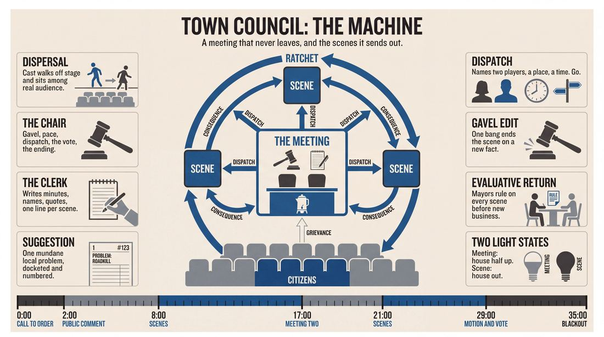
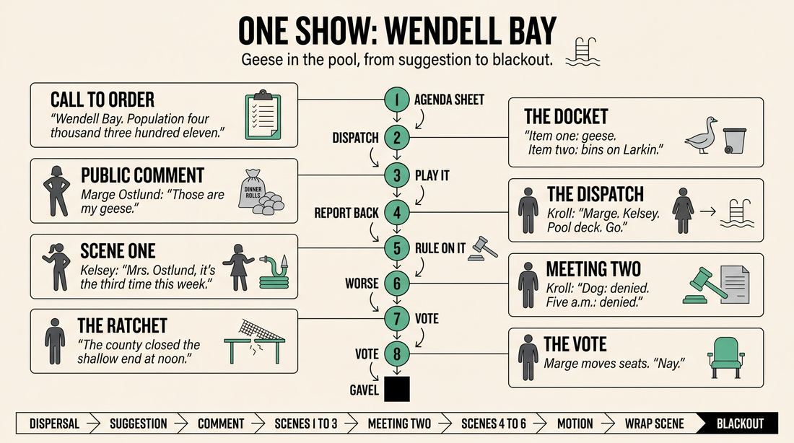
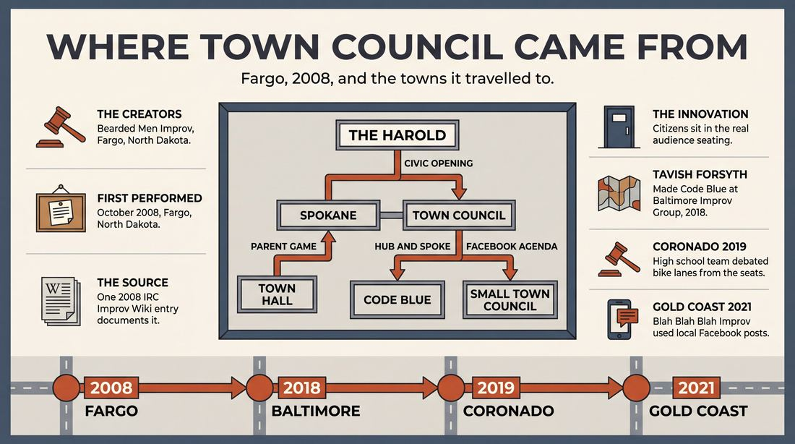
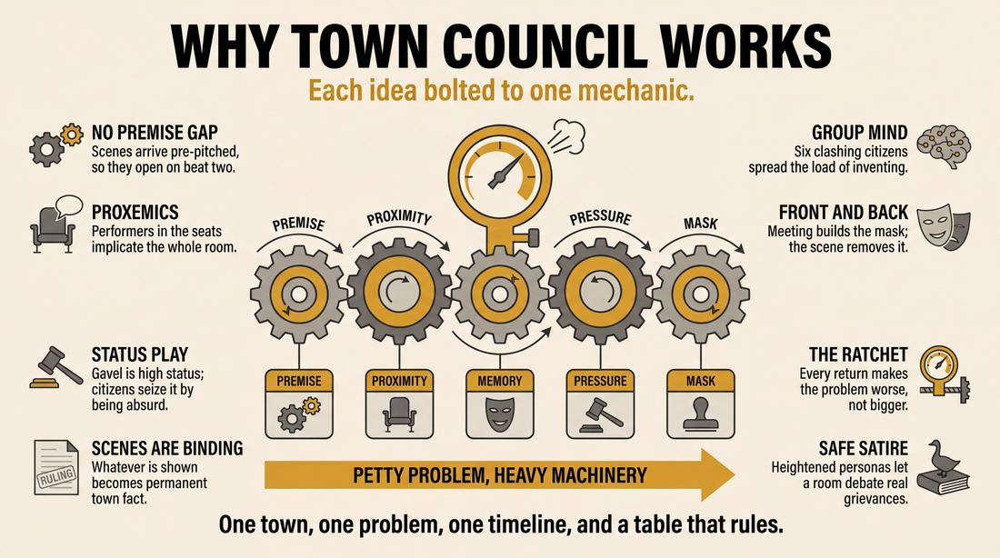
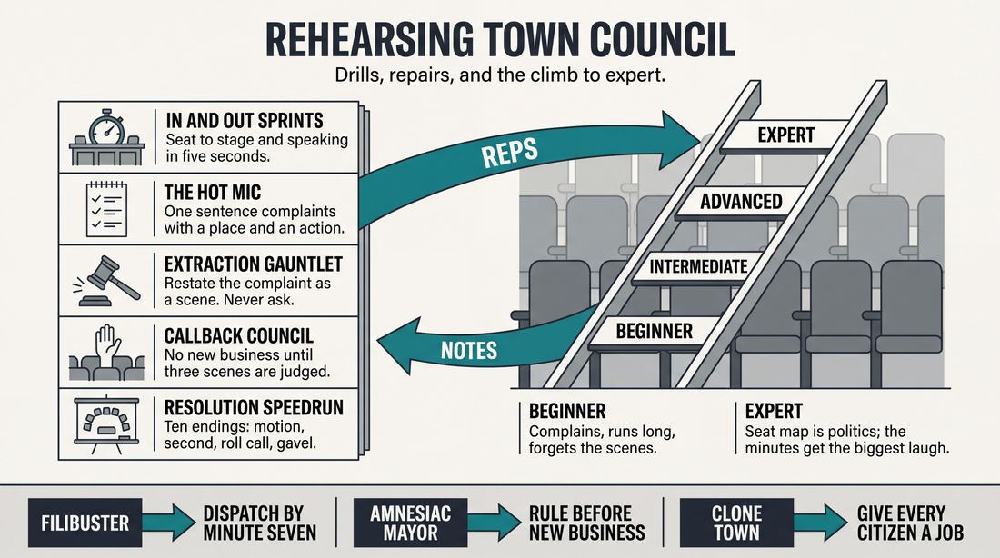

# Town Council

> **A complete study of the long-form improv format _Town Council_** - the original archived write-up, five infographics, grounded historical and pedagogical research, and a full mechanics-and-coaching manual.

| | |
|---|---|
| **Format** | Town Council |
| **Primary source** | [IRC Improv Wiki](https://wiki.improvresourcecenter.com/index.php?title=Town_Council) |

---

## Contents

1. [Part I - The Original Write-Up](#part-i-the-original-write-up)
2. [Part II - The Infographics](#part-ii-the-infographics)
   - [1. Structure and Mechanics](#infographic-1-mechanics)
   - [2. A Show, Beat by Beat](#infographic-2-example)
   - [3. Origins and Lineage](#infographic-3-history)
   - [4. Why It Works](#infographic-4-theory)
   - [5. Rehearsal and Repair](#infographic-5-coaching)
3. [Part III - Research Dossier](#part-iii-research-dossier)
   - [Pass 1: History, Lineage, Literature and Scholarship](#research-history)
   - [Pass 2: Comparative Anatomy, Pedagogy and Production](#research-comparative)
4. [Part IV - Mechanics, Gameplay and Coaching Manual](#part-iv-mechanics-gameplay-and-coaching-manual)
   - [Pass 1: The Form, Its Mechanics and Its Gameplay](#manual-mechanics)
   - [Pass 2: Training, Coaching and Performance Companion](#manual-coaching)

---

## Part I - The Original Write-Up

*Verbatim archive of the source article, reproduced exactly as scraped. Everything after this section is generated elaboration built on top of it.*

### Town Council

##### Town Council

**Origin**
Town Council is a form developed by Bearded Men Improv and is based on a basic Harold.

**Needed**
*This form works well for mid to larger sized groups.*
\-Two improvisers to take on the roles as leaders of the meeting (Two helps in keeping each other in check and helping move the meeting along). 
\-Other improvisers act as town people.

**How it Works**
The "leaders" make up a town name, call the meeting to order and get a few an audience suggested town problems. The other improvisers disperse into the audience to act as citizens.

From here, they all (leaders and improviser citizens) discuss the main issue and possible scenarios to solve it. After this *brief* discussion period, all improvisers participate in scenes based off the provided scenarios. The scenes may or may not be exactly like the scenarios, but should always be helping move the whole story forward. They can involve characters from the meeting or new ones.

After three or four scenes, we return to the town meeting, with the same people acting as the leaders, to quickly discuss how well the previous scenes helped the overall problem or didn’t and to suggest more. 

This pattern continues until some type of resolution is come to, but most likely only three, maybe four times will it return to the meeting. The set can either end with the town meeting being adjourned or during a wrap up type scene.

  

**First Performed**
First performed in October 2008 in Fargo, ND with Bearded Men Improv.\\

---

*Archived from [https://wiki.improvresourcecenter.com/index.php?title=Town_Council](https://wiki.improvresourcecenter.com/index.php?title=Town_Council) (IRC Improv Wiki) on 2026-08-09 23:23 UTC.*

---

## Part II - The Infographics

*Five 16:9 posters, each teaching a different aspect of the format. Click any poster to enlarge.*

<a id="infographic-1-mechanics"></a>

### 1. Structure and Mechanics

*How the form is played: the shape of the piece, the opening, the roles, the edit vocabulary, the flow of information, and the clock.*

{ .diagram loading=lazy decoding=async width="1100" height="614" }


<a id="infographic-2-example"></a>

### 2. A Show, Beat by Beat

*A single worked performance from suggestion to blackout: what happens in each beat, with short real example lines and what the players are doing technically.*

{ .diagram loading=lazy decoding=async width="1100" height="614" }


<a id="infographic-3-history"></a>

### 3. Origins and Lineage

*Where the form came from: creators, dates, theatres, how it spread between schools and cities, and the key figures - a documented timeline and lineage map.*

{ .diagram loading=lazy decoding=async width="1100" height="614" }


<a id="infographic-4-theory"></a>

### 4. Why It Works

*The theory: the core principles of the form and the research and craft ideas that explain why the structure produces good improv, each tied to a specific mechanic.*

{ .diagram loading=lazy decoding=async width="1100" height="614" }


<a id="infographic-5-coaching"></a>

### 5. Rehearsal and Repair

*Training and fixing the form: the essential drills, the common failure modes with their symptom-and-fix pairs, and the markers of beginner through expert play.*

{ .diagram loading=lazy decoding=async width="1100" height="614" }


---

## Part III - Research Dossier

*Two research passes: the historical record, then the comparative and pedagogical record. Claims carry evidence tags - treat unverified items accordingly.*

<a id="research-history"></a>

### » Pass 1: History, Lineage, Literature and Scholarship

### Research Summary

*   **Record Strength:** The searchable historical record for "Town Council" as a distinct long-form structure is exceptionally thin. It is primarily documented by a single 2008 stub on the IRC Improv Wiki and scattered regional theatre programs.
*   **Origin:** [DOCUMENTED] The format was created by Bearded Men Improv in Fargo, North Dakota, with its first performance in October 2008.
*   **Structural Lineage:** [DOCUMENTED] It is explicitly based on the Harold, utilizing a central town meeting as an opening and recurring group game to generate and frame scenes.
*   **Staging Mechanic:** [DOCUMENTED] The format requires improvisers to break the fourth wall by physically dispersing into the audience seating to act as "citizens" during the meeting segments.
*   **Parentage:** [INFERRED] The format is a structural expansion of the classic short-form game "Town Hall" (or "Town Meeting"), stretched into a long-form framework by inserting premise-based scenes between the meeting beats.
*   **Legacy:** [DOCUMENTED] Despite its obscurity, the format's mechanics directly inspired at least one documented descendant format: *Code Blue: Improv Taboo* (Baltimore Improv Group, 2018).

### Provenance and History

The "Town Council" format was developed in the autumn of 2008 by Bearded Men Improv, an ensemble originally based in Fargo, North Dakota (which later expanded to Minneapolis and Los Angeles). [DOCUMENTED] 

[INFERRED] The format was created to solve a common problem in long-form improvisation: the abstract, sometimes disjointed nature of the traditional Harold opening. By replacing the abstract opening with a highly relatable, unified theatrical framing device—a civic town meeting—the ensemble could immediately generate character premises, establish stakes, and ground the subsequent scenes in a shared universe. The name derives directly from this central framing device.

| Year | Event | Place / Company | Source |
| :--- | :--- | :--- | :--- |
| 2008 (Oct) | First documented performance of Town Council. | Fargo, ND / Bearded Men Improv | IRC Improv Wiki |
| 2018 | Creation of *Code Blue: Improv Taboo*, citing Town Council as a structural inspiration. | Baltimore, MD / Baltimore Improv Group | IRC Improv Wiki |
| 2019 (Mar) | High school ensemble performs the format to deliberate local civic issues. | Coronado, CA / Coronado High School Improv! | Coronado Times |
| 2021 | Premiere of *Small Town Council*, a localized variant using Facebook posts. | Gold Coast, QLD, Australia / Blah Blah Blah Improv | Blah Blah Blah Improv |

### Lineage and Transmission

Because the searchable record is thin, the transmission of "Town Council" appears highly regional and decentralized. [WIDELY PRACTICED, UNDOCUMENTED] The core mechanic—improvisers sitting in the audience to interrupt a speaker on stage—is a staple of short-form improv (often called "Town Hall", "Press Conference", or "I Object!"). However, Bearded Men Improv's specific innovation of using this as the spine of a Harold-like long-form spread primarily through the company's own touring and teaching footprint across the American Midwest and West Coast.

The format mutated in transit. In educational settings, it became a tool for teaching character point-of-view (e.g., Dayton Black Box Improv uses a "Town Hall" format for their Level 3 graduation shows). In Australia, Blah Blah Blah Improv adapted it into a regional dialect called *Small Town Council*, replacing audience suggestions with actual posts from local Facebook community groups to fuel the civic debate. On the East Coast, Tavish Forsyth extracted the format's "hub-and-spoke" structure (returning to a central meeting between scenes) to create a taboo-breaking format called *Code Blue*.

### Key Figures

| Person | Role in this form | Specific contribution | Source URL |
| :--- | :--- | :--- | :--- |
| Bearded Men Improv (Ensemble) | Creators | Developed the format in Fargo, ND, adapting the Harold structure to a civic meeting frame. | [IRC Improv Wiki](https://wiki.improvresourcecenter.com/index.php?title=Town_Council) |
| Tavish Forsyth | Adopter / Innovator | Cited Town Council as the structural inspiration for the *Code Blue* format at Baltimore Improv Group. | [IRC Improv Wiki](https://wiki.improvresourcecenter.com/index.php?title=Code_Blue:_Improv_Taboo) |
| Joseph Seirras & Spencer Gerber | Performers | Captained the Coronado High School teams that utilized the format for local civic satire. | [Coronado Times](https://coronadotimes.com/news/2019/03/04/cosa-improv-brings-the-laughs/) |

### Canonical Shows, Companies and Recordings

*   **Bearded Men Improv (Fargo, ND / Minneapolis, MN):** The originating company. While specific archival video of their 2008 Fargo shows is unavailable, they are the canonical founders of the form.
*   **Small Town Council by Blah Blah Blah Improv (Gold Coast, Australia):** A currently active, highly produced variant of the form. [Link](https://www.blahblahblahimprov.com/small-town-council)
*   **Improv! at Coronado High School (Coronado, CA):** Documented in 2019 performing the format in their Black Box Theater.

### Published Literature

| Work | Author | Year | What it says about this form | Where to find it |
| :--- | :--- | :--- | :--- | :--- |
| *Town Council* (Wiki Article) | IRC Improv Wiki Contributors | 2008 | Outlines the exact mechanics, origin, and staging of the format. | [IRC Improv Wiki](https://wiki.improvresourcecenter.com/index.php?title=Town_Council) |
| *Code Blue: Improv Taboo* (Wiki Article) | IRC Improv Wiki Contributors | 2018 | Cites Town Council and Spokane as the primary structural inspirations for a hub-and-spoke format. | [IRC Improv Wiki](https://wiki.improvresourcecenter.com/index.php?title=Code_Blue:_Improv_Taboo) |
| *Game Library: "Town Hall"* | ImprovDr (Dr. Kevin Scott) | 2025 | Details the short-form parent game, explaining the mechanics of improvisers sitting in the audience to interrupt a mayor. | [ImprovDr.com](https://improvdr.com/2025/10/10/game-library-town-hall/) |

### Verbatim Quotes

> "Town Council is a form developed by Bearded Men Improv and is based on a basic Harold."
> [IRC Improv Wiki](https://wiki.improvresourcecenter.com/index.php?title=Town_Council)

> "The 'leaders' make up a town name, call the meeting to order and get a few an audience suggested town problems. The other improvisers disperse into the audience to act as citizens."
> [IRC Improv Wiki](https://wiki.improvresourcecenter.com/index.php?title=Town_Council)

> "After this brief discussion period, all improvisers participate in scenes based off the provided scenarios. The scenes may or may not be exactly like the scenarios, but should always be helping move the whole story forward."
> [IRC Improv Wiki](https://wiki.improvresourcecenter.com/index.php?title=Town_Council)

> "The game that stands out the most is 'Town Council' where the actors infiltrate the audience and are on sides of a town debate."
> [Coronado Times](https://coronadotimes.com/news/2019/03/04/cosa-improv-brings-the-laughs/)

> "The audience provided the topic of bike lanes for each team to deliberate from their characters' point of view."
> [Coronado Times](https://coronadotimes.com/news/2019/03/04/cosa-improv-brings-the-laughs/)

> "Tavish was inspired by the Town Council and Spokane formats, as well as play styles taught by Jimmy Carrane, Liz Allen, Keisha Zollar, Elana Fishbein, and Upright Citizens Brigade."
> [IRC Improv Wiki](https://wiki.improvresourcecenter.com/index.php?title=Code_Blue:_Improv_Taboo)

> "You're invited to a rare town hall meeting! Have your neighbourhood community group on Facebook ready because the posts you submit just before the show starts will form this council's agenda!"
> [Blah Blah Blah Improv](https://www.blahblahblahimprov.com/small-town-council)

> "This all-play game invites audience involvement as players position themselves in the auditorium to engage in a heated Town Hall... The town hall meeting steadily devolves from its initial agenda until it (usually) culminates in a panicked breakdown or retreat from the hosting official."
> [ImprovDr.com](https://improvdr.com/2025/10/10/game-library-town-hall/)

### Anecdotes and Stories

**The Coronado Bike Lane Debate**
In March 2019, the Coronado High School (CoSA Tech) improv ensemble performed Town Council in their Black Box Theater. The audience suggested the highly localized, mundane topic of "bike lanes." As the town meeting began, team captain Spencer Gerber physically left the stage and plopped himself into an empty seat right next to a local reporter in the audience. From the house seating, Gerber loudly advocated for adding bike lanes, while his castmates popped up around the auditorium voicing the opinions of "longtime residents, school teachers, soccer moms, and the head scratching town smoker." The seamless blending of the audience's physical space with hyper-local civic satire was noted as the standout moment of the night. [DOCUMENTED] ([Source](https://coronadotimes.com/news/2019/03/04/cosa-improv-brings-the-laughs/))

**The Facebook Agenda**
When Blah Blah Blah Improv on Australia's Gold Coast adapted the format into *Small Town Council*, they realized that modern civic disputes no longer happen primarily in town halls—they happen online. To modernize the format, they began requiring the audience to open their local neighborhood Facebook community groups right before the show. The improvisers scroll through the live, mundane, and often petty complaints (noise disputes, parking issues, lost pets) and use those verbatim posts as the official agenda for the improvised council meeting. [DOCUMENTED] ([Source](https://www.blahblahblahimprov.com/small-town-council))

### Academic and Scientific Research

**Proxemics and Environmental Psychology in Theatre**
*Finding:* Breaking the proscenium arch to place performers in the same physical zone as the audience (proxemic manipulation) increases audience physiological arousal and feelings of implication in the narrative (Hall, 1968; Schechner, 1994).
*Relevance to this form:* By forcing the improvisers to disperse into the audience seating to act as citizens, Town Council weaponizes proxemics. The audience is no longer safely observing a Harold; they are physically surrounded by the "citizens," making the civic debate feel immersive and immediate.

**Collaborative Emergence and Distributed Cognition**
*Finding:* Group creativity thrives in environments where multiple distinct viewpoints are introduced rapidly, allowing a "group mind" to synthesize disparate offers into a cohesive structure (Sawyer, 2003).
*Relevance to this form:* The opening town meeting acts as a high-density incubator for collaborative emergence. Rather than a traditional Harold opening where players might do abstract sound-and-movement, the town meeting allows 6-8 distinct character archetypes to clash simultaneously. This distributes the cognitive load of premise-generation across the entire ensemble before they break off into two-person scenes.

**Role-Play and Psychological Safety in Civic Discourse**
*Finding:* Applied improvisation research demonstrates that adopting heightened personas allows individuals to explore polarizing or taboo civic issues with reduced defensive reactivity (Ting-Toomey, 1999).
*Relevance to this form:* The format provides a psychologically safe container to satirize local politics. Because the improvisers are playing exaggerated archetypes (the town smoker, the angry soccer mom), the ensemble can aggressively debate real audience-suggested problems without alienating the crowd.

### Documented Variants and Descendants

*   **Code Blue: Improv Taboo:** Created by Tavish Forsyth at the Baltimore Improv Group (2018). This format lifts the "hub-and-spoke" structure of Town Council. Instead of a town meeting, the central hub is a "briefing room" where agents discuss highly taboo, audience-suggested topics. They then break out into "missions" (scenes) based on those topics, returning to the briefing room between beats.
*   **Small Town Council:** Played by Blah Blah Blah Improv (Australia). It changes the suggestion-gathering mechanic by using live posts from local Facebook community groups as the town's agenda.
*   **Town Hall (Short-Form / Harold Opening):** The parent mechanic. Often played as a standalone game where a mayor attempts to give a speech while improvisers in the audience interrupt with escalating, absurd questions. Paul Vaillancourt has documented using this specific game as an opening for a traditional Harold.
*   **Carousel / Town Hall (Dayton Black Box):** Used as a Level 3 graduation format where students present a town meeting to introduce a cast of characters handling a bizarre civic issue, focusing heavily on character POV rather than narrative resolution.

### Criticism, Debate and Known Failure Modes

*   **The "Spaghetti Throwing" Problem:** [WIDELY PRACTICED, UNDOCUMENTED] In the initial town meeting phase, improvisers eager to establish their characters often interrupt the "leaders" too frequently with disconnected, wacky premises. As noted by improv educators regarding the parent game, this can cause the meeting to devolve into chaos, making it impossible for the leaders to pull coherent premises for the subsequent scenes.
*   **Pacing and Momentum Stalls:** [INFERRED] The format requires returning to the town meeting three or four times. If the leaders merely use this time to recap the scenes that just happened, the show's momentum dies. The meeting must escalate the stakes of the town's problem, not just review it.
*   **The Burden of the Leaders:** [INFERRED] The two improvisers playing the town leaders bear a massive cognitive load. They must manage the crowd, remember the names and POVs of the citizen characters, synthesize the chaotic offers into actionable scene premises, and edit the scenes to bring the cast back to the meeting. If the leaders are weak, the format collapses.

### Cultural Footprint

While "Town Council" remains a niche format within the improv community, its comedic engine—the absurd, hyper-local civic meeting—has a massive cultural footprint. The format perfectly mirrors the comedic dynamics later popularized by the television show *Parks and Recreation* (which heavily utilized UCB-trained improvisers). Furthermore, the creators of the format, Bearded Men Improv, went on to achieve significant success in the narrative improv space, eventually launching the highly produced improvised Dungeons & Dragons podcast *Break the Dice*.

### Gaps in the Record

*   **Exact Premiere Details:** The IRC Wiki states the format was first performed in October 2008 in Fargo, ND, but the specific venue, exact date, and the names of the specific Bearded Men cast members on stage that night are unverified.
*   **Current Performance Status:** It is unverified whether Bearded Men Improv still performs this specific format in their current Minneapolis or Los Angeles iterations, or if it has been entirely retired in favor of their genre-narrative work.
*   **Direct Link to *Parks and Recreation*:** While the format predates the premiere of *Parks and Recreation* (2009) by a few months, there is no documented evidence that the format influenced the show; it is more likely a case of parallel comedic evolution drawing from the same short-form "Town Hall" exercises taught at major training centers.

### Source List

1. *Town Council* - IRC Improv Wiki - 2008 - [https://wiki.improvresourcecenter.com/index.php?title=Town_Council](https://wiki.improvresourcecenter.com/index.php?title=Town_Council) - Supports the origin, creators, date, and core mechanics of the format.
2. *Code Blue: Improv Taboo* - IRC Improv Wiki - 2018 - [https://wiki.improvresourcecenter.com/index.php?title=Code_Blue:_Improv_Taboo](https://wiki.improvresourcecenter.com/index.php?title=Code_Blue:_Improv_Taboo) - Supports the lineage and descendant format created by Tavish Forsyth.
3. *CoSA Improv! Brings the Laughs* - Coronado Times - 2019 - [https://coronadotimes.com/news/2019/03/04/cosa-improv-brings-the-laughs/](https://coronadotimes.com/news/2019/03/04/cosa-improv-brings-the-laughs/) - Supports the anecdote of the high school performance and audience integration.
4. *Small Town Council* - Blah Blah Blah Improv - 2021 - [https://www.blahblahblahimprov.com/small-town-council](https://www.blahblahblahimprov.com/small-town-council) - Supports the existence of the Australian variant using Facebook posts.
5. *Game Library: "Town Hall"* - ImprovDr.com - 2025 - [https://improvdr.com/2025/10/10/game-library-town-hall/](https://improvdr.com/2025/10/10/game-library-town-hall/) - Supports the mechanics and failure modes of the parent short-form game.

<a id="research-comparative"></a>

### » Pass 2: Comparative Anatomy, Pedagogy and Production

### Taxonomic Placement

```text
          The Harold
              |
      +-------+-------+
      |               |
   Spokane       Town Council
                      |
             +--------+--------+
             |                 |
         Code Blue     Small Town Council
```

Town Council is a premise-generating, multi-beat long-form structure descended directly from the Harold, sharing its DNA of a central recurring group game that generates premises for subsequent scene montages. However, where the Harold uses abstract openings (like pattern games or invocations) that disappear once the scenes begin, Town Council uses a grounded, recurring base reality—a municipal meeting—that serves as both the premise generator and the evaluative framing device. It sits taxonomically adjacent to the Spokane (which also uses a central narrator/panel to launch scenes) but distinguishes itself through its spatial subversion: the cast physically infiltrates the audience to play the "citizens," breaking the fourth wall and turning the entire theatre into the playing space.

### Head-to-Head Comparisons

#### Town Council vs. The Harold
| Axis | Town Council | The Harold | Consequence for the players |
| :--- | :--- | :--- | :--- |
| **Opening** | Grounded base reality (a town meeting). | Abstract or thematic (pattern game, invocation). | Town Council players must maintain consistent characters in the opening, whereas Harold players act as a hive-mind. |
| **Structure** | Meeting -> 3-4 Scenes -> Meeting -> 3-4 Scenes. | Opening -> 3 Scenes -> Group Game -> 3 Scenes. | Town Council returns to the *exact same* base reality to evaluate the scenes, forcing a linear narrative progression. |
| **Edit Logic** | Mayors explicitly call for scenes based on pitched scenarios. | Organic sweep edits based on heightening or timing. | Town Council edits are highly verbal and structural; players know exactly what the premise of the next scene is before stepping out. |

#### Town Council vs. Spokane
| Axis | Town Council | Spokane | Consequence for the players |
| :--- | :--- | :--- | :--- |
| **Cast Placement** | Mayors on stage, citizens scattered in the audience. | Entire cast on stage, usually in a line or panel. | Town Council requires players to project from the house and physically navigate the audience seating to enter scenes. |
| **Audience Contract** | The audience is treated as part of the town; the fourth wall is entirely removed during the meeting. | The audience watches a panel present a story or theme. | Town Council risks actual audience members speaking up, requiring the Mayors to possess crowd-work skills. |
| **Failure Mode** | "The Filibuster" (the meeting goes on too long and no scenes happen). | "The Disconnect" (the panel and the scenes feel like two different shows). | Town Council players must aggressively pitch actionable scenarios rather than just complaining in character. |

#### Town Council vs. The Documentary
| Axis | Town Council | The Documentary | Consequence for the players |
| :--- | :--- | :--- | :--- |
| **Framing Device** | Live public forum (Town Meeting). | Retrospective interviews (Talking Heads). | Town Council characters are actively trying to solve a problem in real-time; Documentary characters are reflecting on the past. |
| **Conflict** | Direct, face-to-face debate between citizens and Mayors. | Intercut, contrasting perspectives delivered to a camera. | Town Council generates high-energy, overlapping dialogue; Documentary relies on dramatic irony and juxtaposition. |
| **Memory** | Mayors must remember and evaluate the scenes that just happened. | Interviewees must justify the scenes that just happened. | Both require sharp memory, but Town Council requires the Mayors to act as real-time judges of the scenes' effectiveness. |

#### Town Council vs. Armando (Monologue Deconstruction)
| Axis | Town Council | Armando | Consequence for the players |
| :--- | :--- | :--- | :--- |
| **Source Material** | Fictional town problem suggested by the audience. | True personal story told by a monologist. | Town Council is entirely fictional and character-driven from the start; Armando relies on vulnerability and truth. |
| **Scene Generation** | Scenes are explicitly pitched as "scenarios" to solve the problem. | Scenes are inspired by themes, words, or tangents from the monologue. | Town Council scenes are highly premise-driven and plot-relevant; Armando scenes can be completely tangential. |
| **Cast Size** | Mid-to-large (6-12) to populate the "town". | Small-to-mid (4-8). | Town Council requires high discipline to prevent the stage from becoming crowded during the meeting beats. |

### What Makes It Uniquely Itself

1. **The Infiltrated Audience:** If the entire cast remains on stage, you are playing a Spokane or a standard panel form. Town Council requires the "citizens" to physically sit among the real audience. This spatial dynamic turns the entire theatre into the set, forces players to project from the house, and creates a unique immersive contract where the real audience feels like they are attending a genuine municipal meeting.
2. **The Evaluative Return:** If the opening meeting never returns, it is just a premise-generating opening. Town Council requires the Mayors to return after the scene montage to explicitly evaluate the scenes. They must discuss whether the "scenarios" played out in the scenes actually solved the town's problem, creating a feedback loop that drives the narrative forward.
3. **The Problem-Solution Engine:** Scenes in Town Council are not random explorations of a theme; they are explicitly framed as hypothetical or actual solutions to the town's central grievance. If a citizen complains about raccoons, the subsequent scenes *must* show the town dealing with raccoons. If this engine is removed, the form loses its structural spine.

### Structural Variants in Practice

| Variant | Source / Company | What It Changes | Who Plays It |
| :--- | :--- | :--- | :--- |
| **Classic Town Council** | Bearded Men Improv (Fargo, ND) | The original structure. Two Mayors, citizens in the audience, audience suggests a town problem. | Mid-to-large ensembles looking for a highly structured, premise-driven form. |
| **Small Town Council** | Blah Blah Blah Improv (Gold Coast, QLD) | Replaces the audience suggestion with real, live posts from local Facebook community groups or Nextdoor. | Regional troupes leaning into hyper-local, observational comedy. |
| **Code Blue: Improv Taboo** | Baltimore Improv Group (Tavish Forsyth) | Replaces the town meeting with a "Briefing Room" of secret agents. Uses audience-submitted taboo topics in manila folders. | Advanced players exploring transgressive or politically incorrect material. |
| **The Aftermath** | Parker Players (Denver, CO) | Focuses less on the meeting itself and more on the scandalous, quirky events that happen *after* the routine meeting adjourns. | Troupes prioritizing character-driven soap-opera dynamics over structural problem-solving. |

### The Teaching Ladder

| Stage | Skill Introduced | Why In This Order | Typical Exercise | Source |
| :--- | :--- | :--- | :--- | :--- |
| **1. The Spatial Divide** | Projecting from the house, navigating aisles, and holding focus while seated next to real audience members. | Players must master the physical logistics of the form before they can generate content. | *In-and-Out Sprints* | [CRAFT CONSENSUS] |
| **2. The Grievance Pitch** | Formulating a character complaint that contains a clear, playable premise for a scene. | The meeting will stall if citizens just complain without offering a scenario that can be acted out. | *Premise Pull* | [CRAFT CONSENSUS] |
| **3. The Scenario Scene** | Executing the pitched premise immediately, without unnecessary exposition or throat-clearing. | The audience already knows the context from the meeting; the scene must hit the ground running. | *The Gavel Edit* | [CRAFT CONSENSUS] |
| **4. The Evaluative Return** | Mayors summarizing the previous scenes and judging their effectiveness to launch the next beat. | This is the structural glue of the form. Without it, the show becomes a disconnected montage. | *The Callback Council* | [CRAFT CONSENSUS] |
| **5. Crowd Control** | Handling real audience members who decide to chime in during the meeting. | Withheld from beginners until they are confident in their own characters and the form's structure. | *The Planted Civilian* | [CRAFT CONSENSUS] |

### Documented Drills and Exercises

| Drill | Origin / Teacher | How To Run It | What It Fixes In This Form | Source |
| :--- | :--- | :--- | :--- | :--- |
| **The Hot Mic** | [CRAFT CONSENSUS] | One player stands on stage as Mayor. The rest of the cast sits in the house. On a clap, a seated player must stand and deliver a one-sentence complaint that includes a specific location and action. | Fixes vague, unplayable complaints during the meeting. | [CRAFT CONSENSUS] |
| **Premise Pull** | [CRAFT CONSENSUS] | A citizen pitches a complaint. The Mayor must immediately point to two other players and say, "Let's see that. I want to see [Character A] dealing with [Character B] at the [Location]." | Fixes the disconnect between the meeting's discussion and the subsequent scenes. | [CRAFT CONSENSUS] |
| **The Gavel Edit** | [CRAFT CONSENSUS] | During a scene montage, the coach holds a physical gavel. The moment the premise of the scene has been clearly demonstrated and heightened once, the coach bangs the gavel to force an immediate edit. | Fixes scenes that drag on too long and lose the momentum of the "scenario" engine. | [CRAFT CONSENSUS] |
| **The Callback Council** | [CRAFT CONSENSUS] | Run a 10-minute Town Council. When the Mayors return for the second meeting, they are not allowed to take new complaints until they have explicitly named and judged the three previous scenes. | Fixes the "Amnesiac Mayor" pathology where the meeting ignores the scenes that just happened. | [CRAFT CONSENSUS] |
| **In-and-Out Sprints** | [CRAFT CONSENSUS] | Players sit in the audience. The coach calls two names. Those players must safely but rapidly navigate the aisles, get on stage, and establish a base reality within 5 seconds. | Fixes dead air and awkward transitions between the meeting and the scenes. | [CRAFT CONSENSUS] |
| **Status Seesaw** | [CRAFT CONSENSUS] | Run a town meeting. The coach calls "Mayors High!" (Mayors act arrogant, citizens act submissive) or "Citizens High!" (Citizens act rebellious, Mayors act panicked). | Fixes flat, low-energy town meetings by injecting clear status dynamics. | [CRAFT CONSENSUS] |
| **The Planted Civilian** | [CRAFT CONSENSUS] | Run a town meeting. The coach secretly assigns one player to act like a real, slightly disruptive audience member. The Mayors must incorporate their disruption without breaking character or being mean. | Prepares the cast for the inevitable moment a real audience member tries to participate. | [CRAFT CONSENSUS] |
| **Bipartisan Scenes** | [CRAFT CONSENSUS] | Two players are assigned opposing viewpoints on a town issue (e.g., Pro-Bike Lane vs. Anti-Bike Lane). They must perform a grounded scene where both characters are entirely justified in their beliefs. | Fixes scenes that turn into cartoonish "good vs. evil" arguments. | [CRAFT CONSENSUS] |
| **The Facebook Scroll** | Blah Blah Blah Improv | The coach reads a real, mundane complaint from a local Facebook group. A player must instantly adopt the persona of the person who wrote it and justify their outrage. | Trains players to find the absurdity in hyper-local, mundane issues. | Blah Blah Blah Improv |
| **Resolution Speedrun** | [CRAFT CONSENSUS] | The cast has 3 minutes to run the final meeting and the final wrap-up scene. The Mayors must declare a definitive (usually absurd) solution, and the cast must immediately act it out. | Fixes meandering endings where the town never actually solves the problem. | [CRAFT CONSENSUS] |

### Common Failure Modes and Diagnoses

| Failure Mode | What It Looks Like From The Audience | Root Cause | Fix | Who Names It |
| :--- | :--- | :--- | :--- | :--- |
| **The Filibuster** | The opening town meeting goes on for 10 minutes. The audience gets restless waiting for a scene to start. | Players are enjoying their citizen characters too much and refuse to pitch actionable scenarios. | The Mayors must aggressively cut off citizens and declare, "Let's see how that would play out." | [CRAFT CONSENSUS] |
| **The Disconnect** | The town meeting is about a broken traffic light, but the scenes are about a divorce and a bank robbery. | Players are ignoring the "scenario" engine and just playing whatever scenes they want. | Implement the *Premise Pull* drill. Mayors must explicitly dictate the premise of the next scene. | [CRAFT CONSENSUS] |
| **The Civilian Uprising** | A real audience member starts shouting out suggestions or trying to argue with the Mayors, derailing the show. | The Mayors lost control of the room, or the spatial divide was not clearly established. | Mayors must use high-status crowd work to validate the audience member ("Noted for the minutes, sir") and immediately move on. | [CRAFT CONSENSUS] |
| **The Amnesiac Mayor** | The Mayors return after a montage of scenes and ask, "Okay, what other problems do we have?" without mentioning the scenes. | The Mayors zoned out during the scenes instead of watching them as evaluators. | Mayors must take actual physical notes during the scenes to use in the next meeting beat. | [CRAFT CONSENSUS] |
| **The Clone Town** | Every citizen sounds exactly the same (usually a generic, angry redneck stereotype). | Lack of character diversity and specific points of view. | Players must endow themselves with specific town jobs (the librarian, the crossing guard, the local teen). | [CRAFT CONSENSUS] |

### Production and Logistics

*   **Cast Size:** 6 to 12 players. The form requires two Mayors on stage and enough "citizens" in the audience to make the theatre feel populated. A cast smaller than 6 makes the town feel empty; a cast larger than 12 makes the meeting chaotic.
*   **Runtime:** Typically 25 to 45 minutes. The structure (Meeting -> Scenes -> Meeting -> Scenes -> Meeting -> Wrap-up) naturally fills a standard long-form slot.
*   **Stage Layout:** Two chairs and a table (or podium) center stage for the Mayors. The rest of the cast is seated in the front two rows of the audience, scattered among the real ticket-buyers.
*   **Lighting and Tech Cues:** 
    *   *Meeting Beats:* House lights at 50%, stage lights at 100%. This allows the Mayors to see the citizens and the audience to see the players in the house.
    *   *Scene Beats:* House lights out, standard stage wash.
    *   *Transitions:* A sharp light cue or a physical gavel bang from the Mayor signals the tech booth to shift the lights.
*   **MC and Host Duties:** The Mayors effectively act as the internal MCs of the show. They call the meeting to order, take the suggestion, and manage the pacing.
*   **How the Suggestion is Taken:** The Mayors ask the audience for "A mundane problem this town is currently facing" or "Something you recently complained about on Nextdoor."
*   **Rehearsal Cadence:** Rehearsals must take place in a space with actual audience seating. Rehearsing Town Council in a flat, empty studio fails to train the physical logistics of moving from the house to the stage.
*   **Producer Prep:** Producers must ensure the venue allows for safe movement in the aisles. Cords must be taped down, and the front rows must have reserved seats for the cast.

### Adaptations Beyond the Stage

*   **Classroom and Youth:** Highly effective for civics and debate classes. The form can be adapted to "Model UN" or "Historical Council" (e.g., "You are the town council of Salem in 1692"). The focus shifts from comedy to historical empathy and argumentation.
*   **Corporate and Applied Improv:** Adapted as "The All-Hands Meeting" or "The Boardroom." Used to safely satirize company culture or brainstorm solutions to actual workplace friction. *Change required:* The "problems" must be fictionalized enough to avoid HR violations, focusing on process rather than specific personnel.
*   **Online and Remote:** Town Council adapts brilliantly to Zoom. The Mayors are "Spotlighted," while the citizens use the "Raise Hand" feature to be unmuted. The gallery view perfectly replicates the chaotic energy of a municipal Zoom meeting.
*   **Accessibility and Inclusion:** Because the form requires rapid physical movement from the audience to the stage, directors must ensure the venue is fully accessible (no stairs to the stage) or adapt the form so that players with mobility issues are permanently stationed on stage (e.g., as the Mayors or a specialized panel).
*   **Content-Safety and Consent:** When using real local issues (like Blah Blah Blah Improv's Facebook variant), troupes must avoid punching down. Mocking a local politician is fair game; mocking a specific, named private citizen who posted about a lost cat crosses an ethical line.

### Evidence Base for Those Adaptations

*   **Civic Role-Play:** Hess (2009) in *Controversy in the Classroom* demonstrates that structured role-play and debate around local issues significantly increases students' civic engagement and ability to process multiple perspectives. Town Council operationalizes this pedagogical framework into a theatrical format.
*   **Applied Improvisation in Organizations:** Vera and Crossan (2004) in *Theatrical Improvisation: Lessons for Organizations* argue that improv structures train teams in "collaborative emergence" and rapid problem-solving. The Town Council format specifically models how a centralized leadership team (the Mayors) processes decentralized feedback (the citizens) to iterate on solutions.

### Scholarly Frames Worth Applying

*   **Collaborative Emergence (R. Keith Sawyer):** *Frame:* Group creativity is not the product of a single mind, but an unpredictable outcome that emerges from the moment-to-moment interactions of the ensemble. *Citation:* Sawyer, R. K. (2003). *Group Creativity: Music, Theater, Collaboration*. *Mapping:* Maps directly to the "brief discussion period" in the town meeting. The Mayors do not dictate the town's reality; it emerges collaboratively as each citizen adds a new, compounding detail to the original grievance.
*   **Status and Spontaneity (Keith Johnstone):** *Frame:* All human interaction involves the negotiation of status, and comedy often arises from the subversion of expected status roles. *Citation:* Johnstone, K. (1979). *Impro: Improvisation and the Theatre*. *Mapping:* Maps to the dynamic between the Mayors and the citizens. The Mayors hold structural high status (they have the stage, the gavel, and the authority), but the citizens frequently seize situational high status by being unmanageable, absurd, or aggressively mundane.
*   **Front Stage and Back Stage (Erving Goffman):** *Frame:* Individuals perform idealized versions of themselves in public ("front stage") but drop the facade in private ("back stage"). *Citation:* Goffman, E. (1959). *The Presentation of Self in Everyday Life*. *Mapping:* The town meeting is the "front stage" where characters present their public, civic personas. The subsequent scenes are the "back stage," revealing the messy, private realities of those same characters.

### Where the Form Is Heading

Contemporary practice is pushing Town Council away from generic "wacky town" tropes and toward hyper-local, observational satire. Companies like Blah Blah Blah Improv in Australia use real-time Facebook community group posts to generate the agenda, turning the form into a direct reflection of the audience's actual neighborhood. Meanwhile, formats like *Code Blue: Improv Taboo* demonstrate how the structural engine of Town Council (a central deliberative body dispatching agents to explore scenarios) can be hybridized to tackle transgressive, political, or taboo subject matter that would be too heavy for a standard Harold. The form is increasingly being recognized not just as a comedy show, but as a theatrical mechanism for processing community anxiety.

### Source List

1. *Town Council* - IRC Improv Wiki - 2008 - https://wiki.improvresourcecenter.com/index.php?title=Town_Council - Supports the origin (Bearded Men Improv, Fargo ND), structural mechanics, cast requirements, and the meeting-to-scene loop.
2. *Small Town Council* - Blah Blah Blah Improv - 2024 - https://www.blahblahblahimprov.com/ - Supports the hyper-local variant using Facebook community group posts as the agenda and suggestion mechanism.
3. *Code Blue: Improv Taboo* - IRC Improv Wiki / Tavish Forsyth - 2018 - https://wiki.improvresourcecenter.com/index.php?title=Code_Blue:_Improv_Taboo - Supports the adaptation of the Town Council structure into a "Briefing Room" format for handling taboo and transgressive topics.
4. *Town Hall (Improv Game)* - ImprovDr - 2025 - https://improvdr.com/ - Supports the pedagogical focus on audience infiltration, the "Curve of Absurdity" in citizen complaints, and the necessity of strong character choices from the constituents.
5. *The Parker Players Present Town Council* - Bug Theatre - 2023 - https://www.bugtheatre.org/ - Supports the continued contemporary use of the form and its focus on the scandalous/quirky events following a routine meeting.

---

## Part IV - Mechanics, Gameplay and Coaching Manual

*Synthesis over the original article and both research dossiers: first how the form works and how to play it, then how to train an ensemble to perform it.*

<a id="manual-mechanics"></a>

### » Pass 1: The Form, Its Mechanics and Its Gameplay

### At a Glance

| Field | Value |
| :--- | :--- |
| **Also known as** | Town Hall (long-form usage); *Small Town Council* (Blah Blah Blah Improv variant); "the civic Harold." Not to be confused with the short-form game **Town Hall**, which is its parent and runs 5–8 minutes with no breakout scenes. |
| **Family** | Harold descendant. Hub-and-spoke premise-generating long form. Sibling to Spokane; parent of *Code Blue: Improv Taboo* (Baltimore Improv Group, 2018). |
| **Cast size** | 6–12. Two leaders (Mayors) plus 4–10 citizens. Below 6 the town reads as empty; above 12 the public-comment period becomes uneditable. |
| **Runtime** | 25–45 minutes. 35 is the sweet spot: three meeting beats, seven or eight scenes. |
| **Opening** | The town meeting itself. There is no separate opening — the "opening" is a permanent set that the show keeps returning to. Cast disperses into the real audience seating before the first line. |
| **Suggestion taken** | One mundane, local, civic problem. Ask: *"What's something you'd actually complain about at a town meeting?"* or *"What's the last thing you saw on Nextdoor?"* Mayors may take 2–4 and docket them; one becomes the spine. |
| **Structural rigidity (1–5)** | **4.** The hub-and-spoke loop is non-negotiable and the return to the meeting is scheduled. What happens inside each spoke is free. |
| **Difficulty (1–5)** | **4 overall**, but wildly asymmetric: **5 for the two Mayors**, **2 for the citizens**. This is the form's defining production fact. |
| **Prerequisites** | Character POV held under interruption; grounded two-hander scenework; comfort with verbal/announced edits; vocal projection from a seated position in the house; basic non-hostile crowd work; a cast that will let itself be cut off mid-sentence. |
| **Best for** | Mid-to-large ensembles with an experience gradient (put the veterans at the table, the newer players in the seats); hometown and community gigs; festival slots where you want the room implicated; classes teaching character point-of-view. |
| **Avoid when** | Cast under 5; a flat cabaret room with no house seating or no safe aisle; an audience smaller than your cast (nowhere to hide, nobody to hide among); a drunk late-night crowd that will genuinely try to join the council; a venue where the stage is only reachable by stairs and a cast member can't use them (adapt: station that player at the table permanently); a cast with no one who can politely and firmly shut a person up. |

### The Essence in One Paragraph

Town Council is a Harold in which the opening never leaves. Two improvisers sit at a table onstage as the leaders of a municipal meeting; the rest of the cast walks off the stage and sits down *in the real audience* as citizens of the town. The audience gives one petty local problem — geese in the public pool, a stoplight, Christmas lights still up in March — and the citizens stand up out of the house, one at a time, to complain about it in character. Each complaint must contain a scenario that could be acted out. The Mayors listen, take actual notes, and then dispatch: *"Fine. Let's see how that plays out. Kelsey — you're at the pool at six a.m. Dwayne, you're the man with the net."* The players walk down the aisle, take the stage, and play the scene. Three or four scenes later the lights snap back to the table, and here is the mechanic that makes this form itself and not a montage: **the Mayors evaluate**. They read back their minutes, judge whether the scenario worked, and rule on what is now true in the town. Whatever happened in those scenes is civic fact — the pool is closed, a goose is dead, Dwayne is a hero — and the meeting must now deal with the consequences it caused. The loop runs three or four times, the problem ratcheting worse each cycle, until the council votes on an absurd final solution and either adjourns or we watch the town live under it.

### Why This Form Exists

The problem Town Council solves is the **premise gap** at the front of the Harold. An abstract opening — a pattern game, an invocation, sound-and-movement — produces themes, images and word-associations, but it produces them in a hive-mind register in which nobody is anybody. The players then have to convert that vapour into three scenes with characters, relationships and premises, and the conversion happens invisibly, in each improviser's head, in the two seconds before they step out. Weak Harolds fail exactly there. The dossier's inferred account is right: Bearded Men Improv replaced the abstract opening with a "highly relatable, unified theatrical framing device" so that premises arrive pre-loaded with a character, a point of view, a location and a stake.

Four things a plain montage cannot buy you, and Town Council buys all four in its first ninety seconds:

1. **Every scene arrives pre-justified.** The audience already knows who these people are, what they want, and why this scene is happening, because they watched it get pitched. That deletes the exposition-heavy first minute of every scene in the show. Scenes can open on their second beat.
2. **A shared universe by construction, not by discipline.** In a montage, connection between scenes is a skill; in Town Council it is a floor. Every scene takes place in one town, on one timeline, under one problem. You cannot be disconnected without breaking the form.
3. **A built-in engine for the middle of the show.** Most long forms sag at minute 20 because the material from the opening is spent. Town Council manufactures new material at minute 17 by having the Mayors evaluate the scenes you just watched and reopen the floor. The show refuels itself on its own exhaust.
4. **A cast-size solution.** Ten-person montages crowd the stage and leave three people with nothing to do all show. Here, ten people have a *seat*, a *name*, an *address* and a job in the base reality; they are performing continuously while seated, and the stage stays a clean two- or three-hander.

What it costs you: the show can only be about one thing. That is the trade.

### The Audience Contract

The promise made in the first thirty seconds, when a performer walks off the stage and sits down two seats away from a stranger:

**"You are in this town. We are your neighbours. Nothing will be asked of you."**

Every clause matters.

- **You are in this town.** The house lights stay up at roughly half. This is not decoration; it is the signal that the theatre and the town hall are the same room. The audience is scenery with a pulse — the silent majority of Wendell Bay. Mayors may address them collectively ("Thank you all for coming out on a Tuesday") and that is *inclusive*, not interrogative.
- **We are your neighbours.** The citizens sit *among* the ticket-buyers, not in a reserved block that reads as a cast bench. Scatter. The dossier's Coronado anecdote is the clean example: the team captain sat down next to a working reporter and started advocating for bike lanes. The comedy of that moment is proxemic, not verbal.
- **Nothing will be asked of you.** This is the clause that beginners break. The audience is promised the pleasure of being surrounded without the terror of being called on. A Mayor who points at a real person and says "Sir, what do *you* think?" has converted a warm room into a defensive one, and every subsequent citizen stand-up now reads as a threat rather than a joke.

**How they know where they are.** The form runs on a two-state indicator that must be absolutely legible:

| State | Lights | Bodies | Fourth wall |
| :--- | :--- | :--- | :--- |
| **Meeting** | House at ~50%, stage at full | Two at the table; everyone else seated in the house | Off — the room is the room |
| **Scene** | House out, standard stage wash | 2–3 on stage only; Mayors silent or absent from focus | On — the room is a pool, a garage, a kitchen |

A gavel bang, a light shift, or both. Do not let a scene begin with the house lights still up; the audience will not know whether it is allowed to laugh at a private moment.

**What breaks the contract:**

| Break | What the audience feels |
| :--- | :--- |
| Asking a real audience member a question that requires an answer | Ambushed; the seat next to a performer becomes unsafe |
| The meeting never returning after the scenes | Cheated — you promised a council and gave a montage |
| A citizen holding forth for 90 seconds with no scene resulting | Trapped in an actual town meeting, which is the joke, but only for 20 seconds |
| Mayors who don't remember the scenes | The show has no memory, therefore no stakes; the audience stops tracking |
| Punching at a specific, identifiable private person from the room | Cruelty; the town turns on you |
| A scene that has nothing to do with the town | The frame was a lie and you have been watching a normal improv show wearing a hat |

### Anatomy: The Full Structural Map

The architecture is a **hub and spoke with a ratchet**. The hub (the meeting) is a persistent base reality that survives the whole show. The spokes (scenes) are dispatched from it and return their consequences to it. The ratchet is the rule that each pass through the hub must leave the town's problem *transformed and worse*, never merely reviewed.

```text
                        TOWN COUNCIL  (35 min default)

  [-2:00]  DISPERSAL      cast walks off stage into house, takes seats
     |
  [ 0:00]  CALL TO ORDER  town named / gavel / agenda / SUGGESTION taken
     |
     v
 ##############   MEETING I  (public comment)  ~6 min  ##############
 #  MAYOR A (gavel, agenda)      MAYOR B (minutes, memory)         #
 #      ^        ^        ^        ^        ^        ^             #
 #      |        |        |        |        |        |             #
 #   [cit]    [cit]    [cit]    [cit]    [cit]    [cit]  <- HOUSE  #
 ####################################################################
        |            |            |
        | DISPATCH   | DISPATCH   | DISPATCH        <- "Let's see that."
        v            v            v
     +------+     +------+     +------+
     |SCENE1|     |SCENE2|     |SCENE3|              spokes, 2-3 min each
     +------+     +------+     +------+
        |            |            |
        +------------+------------+
        | CONSEQUENCES return as FACT (canon)
        v
 ##############  MEETING II  (evaluative return)  ~4 min  ###########
 #  read back minutes -> judge scenes -> RATCHET: problem worsens   #
 #  new grievances admitted only after old ones are ruled on        #
 ####################################################################
        |            |            |            |
        v            v            v            v
     +------+     +------+     +------+     +------+
     |SCENE4|     |SCENE5|     |SCENE6|     |SCENE7|
     +------+     +------+     +------+     +------+
        |            |            |            |
        +------------+------------+------------+
        v
 ##############  MEETING III  (crisis + motion)  ~4 min  ###########
 #  the town is now unrecognisable; a motion is made; a VOTE       #
 ####################################################################
        |
        v
   [ WRAP-UP SCENE: the town living under the ruling ]   or   [ ADJOURNMENT BUTTON ]
        |
     BLACKOUT
```

| Unit | Approx. clock | What happens | Who drives it | Success criterion | Common error |
| :--- | :--- | :--- | :--- | :--- | :--- |
| **Dispersal** | −2:00 → 0:00 | Cast crosses from stage into the house; sits scattered among real audience; house lights up | Whole cast, pre-set | Every citizen has a seat with aisle access and a real person on at least one side | Cast clumps in a reserved block — reads as "the improvisers' bench," kills the infiltration |
| **Call to Order** | 0:00 → 1:00 | Mayors name the town, gavel, welcome the room, state the agenda | Mayor A | Town has a name, a population figure, and one piece of civic texture in under 60 seconds | A three-minute comic preamble before the suggestion; the show hasn't started yet |
| **Suggestion** | 1:00 → 2:00 | "What's something you'd complain about at a town meeting?" Take 2–4, docket them, choose one spine | Mayor A asks, Mayor B writes | A concrete, mundane, *local* noun on the docket | Accepting an abstraction ("capitalism") or a fantasy ("dragons") — both destroy the mundanity that fuels the form |
| **Meeting I: Public Comment** | 2:00 → 8:00 | Citizens stand from the house in turn, self-endow (name/job/street), complain, propose | Citizens pitch; Mayor A paces | 5–7 distinct characters established; 3 actionable scenarios docketed; factions visible | The Filibuster — everyone loves their character, nobody pitches a scene |
| **Dispatch 1** | at 8:00 | Mayor names the scene: who, where, when | Mayor A | Players are moving before the sentence ends | Vague dispatch ("let's see a scene about geese") — the players have to invent the premise in the aisle |
| **Scenes 1–3** | 8:00 → 17:00 | The scenarios played out; 2–3 min each | Scene players | Each scene *proves or destroys* its scenario and generates one new civic fact | Scenes that ignore the pitch; scenes with no consequence to report |
| **Meeting II: Evaluative Return** | 17:00 → 21:00 | Mayors read minutes, judge each scene, rule on new facts, take the next round of grievances | Mayor B leads (memory), Mayor A gavels | All three scenes explicitly named and ruled on before any new complaint is heard | The Amnesiac Mayor — "Okay, what else have we got?" |
| **Scenes 4–7** | 21:00 → 29:00 | Second-cycle scenes: consequences, private lives, institutional response | Scene players | At least one scene features characters *from* the meeting; at least one crosses two earlier scenes | A second identical montage — same shape, same energy, no escalation |
| **Meeting III: Crisis + Motion** | 29:00 → 33:00 | Town is transformed/ruined; someone makes a motion; the council votes | Both Mayors; a citizen makes the motion | A specific, absurd, *implementable* policy passes or fails on a named vote | A vague "we'll all just be nicer" ending; or no vote at all |
| **Resolution** | 33:00 → 36:00 | Either a final scene of the town living under the ruling, or the meeting adjourns on a button | Mayor A calls it | The last image answers the suggestion | Fading out; three false endings; the gavel never coming down |

### The Opening

The opening *is* the base reality, so "opening well" means "installing the machine." Run it as a procedure.

**Standard procedure (Classic Town Council)**

1. **Pre-set (before the audience is aware).** Two chairs and a table or a podium, centre or slightly upstage. On the table: a gavel (a real one, wooden, loud — this is a tech instrument), a legal pad and pen for each Mayor, a jug and two glasses. My recommendation: also a small nameplate placard. It does one job and does it instantly.
2. **The dispersal.** Full cast enters onstage; the two Mayors take the table; the rest of the cast walks off the front of the stage into the house *while the audience watches*. Scatter to aisle seats in the first four rows, no two citizens adjacent, each with at least one real person beside them. Do not sit in a reserved block. Producers must reserve individual aisle seats, not a row.
3. **Lights.** House to 50%, stage full. Hold that state for the whole meeting. Tech should have this as a single cue named MEETING and a second named SCENE; they will alternate eight to ten times.
4. **Call to order.** Mayor A: gavel, town name, population, one texture detail, one piece of housekeeping that establishes the civic register.

   > **MAYOR KROLL:** *(bang)* All right. Calling to order the regular monthly meeting of the Wendell Bay Town Council, population four thousand three hundred and eleven, minus Doreen Fitch, God rest her. Coffee's in the back, it's decaf, I'm sorry.

5. **The suggestion.** Mayor A asks the room directly. Phrase it to constrain: *"Before we get to old business — what is something in your actual neighbourhood that you would genuinely stand up and complain about?"* Take three or four. Mayor B writes them down and reads them back as an agenda. This is the single most important craft moment in the opening: **the agenda read-back turns loose shouts into a document the show can consult later.**

   > **CLERK BITTNER:** Item one, the geese at the municipal pool. Item two, whoever keeps putting the wrong bin out on Larkin. Item three — sir, I'm not writing that one down. Item three, the geese again, from a different gentleman.

6. **Open the floor.** Mayor A: *"Public comment. Three minutes each, and I mean it."* This line is load-bearing: it pre-authorises every cut-off you will make for the next six minutes.
7. **Run public comment** (see The Engine for the grievance grammar).
8. **First dispatch at 6–8 minutes maximum.** Set a hard clock in rehearsal. The Filibuster is the number-one documented killer of this form.

**Contradiction in the record, flagged:** the 2008 wiki says the leaders "get a few audience suggested town problems" (plural), while the comparative dossier treats the form as single-problem. My judgement: take several, docket several, but drive one as the spine and hold the others as reserve fuel for Meeting II and III. Multiple live spines fracture the ratchet.

**Documented and practical variants of the opening**

| Variant | Mechanic | When to use it | Cost |
| :--- | :--- | :--- | :--- |
| **Classic suggestion** | Mayors ask the room for a mundane local problem | Default; any audience | Can land on an abstraction if you phrase the ask loosely |
| **The Nextdoor / Facebook Scroll** (*Small Town Council*, Blah Blah Blah Improv) | Audience opens their real neighbourhood group; posts submitted pre-show become the agenda, read verbatim | Hyper-local rooms; hometown gigs; when your audience is one community | Ethics: verbatim posts by identifiable private people. Read the *complaint*, never the name. Mock the policy, not the poster. |
| **The written docket** | Slips of paper collected at the door in a bowl on the table; Mayor B draws them | Shy or very large audiences; when you want silence-free suggestion-taking | Loses the live crowd contact of the ask |
| **Old business first** | Meeting opens on a leftover item from "last month" invented by the Mayors, *then* takes the suggestion | Advanced casts; instantly implies history and a town with a past | Two problems live at once; needs a Mayor who will kill one |
| **Roll call opening** | Mayor B reads a roll and each citizen answers "here" in character with one line | Casts who struggle to establish distinct citizens; classes | Front-loads 60 seconds of low-stakes material; can feel like a warm-up |
| **The genre council** | The frame is stated as something other than a town: HOA, PTA, colony ship, guild hall, 1692 Salem | When your cast is bored of civic satire, or for youth/education work | Loses the proxemic realism — the audience is no longer plausibly "the town" unless you re-endow them |

**Tactical note on taking the suggestion:** if the room offers something too big ("homelessness," "the government"), do not reject it and do not play it. **Localise it at the table.** *"Noted. Referred to the county. What I've got in front of me tonight is the bench outside the library."* This is in-character, keeps the ask friendly, and protects the form's engine, which runs on pettiness.

### The Engine

This is the section to read twice. Everything else in the form is decoration on this machine.

#### 1. What the engine burns

Town Council converts four distinct currencies in a fixed cycle. Learn the names; they make rehearsal notes possible.

| Currency | Definition | Produced by | Consumed by |
| :--- | :--- | :--- | :--- |
| **Grievance** | A character's complaint, stated in the meeting, containing a POV | A citizen standing in the house | The Mayors, who dock it |
| **Scenario** | A *playable* proposition extractable from a grievance: who, doing what, where | The citizen (best) or the Mayor's extraction (fallback) | The dispatch |
| **Consequence** | What actually happened when the scenario was played | The scene | The evaluative return |
| **Fact** | A consequence ruled true by the council; now permanent town canon | Mayor's ruling in the meeting | The next round of grievances |

Fact feeds Grievance. That closed loop is the show. When people say a Town Council "had no engine," what they mean is that one of these four conversions failed.

#### 2. Grievance grammar

A grievance is only fuel if it contains a scene. The rehearsal-usable test: **name + stake + location + action + antagonist**, ideally in two sentences.

> **Bad (unplayable):** "The geese are disgusting and something needs to be done."
> **Good (playable):** "Marge Ostlund, Reservoir Road, forty-one years. Every morning at six I take a bag of dinner rolls down to the pool and I feed those birds, and last Tuesday a *lifeguard* — a *child* — sprayed me with a hose."

The good version hands the Mayors a cast list (Marge, a teenage lifeguard), a location (the pool), a time (6 a.m.), an action (feeding, spraying), and a conflict. The Mayor can dispatch it without inventing anything.

**The extraction fallback.** When a citizen gives you the bad version, the Mayors *do not* ask a follow-up interview question. They extract by assertion:

> **MAYOR KROLL:** So what you're describing is you, at the pool, at six in the morning, in a physical altercation with a minor. Let's see that.

This is the most valuable single skill for the table. You take a vapour complaint and hand it back as a staged proposition. The citizen either plays it or corrects it — either way you now have a scene.

#### 3. The dispatch, and its two grammatical moods

Every scene in this form is launched by a Mayor's spoken dispatch. The dispatch has a mood, and the mood determines the scene's canonical weight. **Name the mood out loud.** This is the fix for the single most common structural confusion in the form.

| Mood | Dispatch phrasing | What the scene is | Canonical status |
| :--- | :--- | :--- | :--- |
| **Indicative** (this happened) | *"Let's see what happened Tuesday morning at the pool."* | A flashback / a report / a private moment happening in real town time | Fully canon. The council must now deal with it. |
| **Subjunctive** (this is proposed) | *"Let's see how that would play out."* | A hypothetical: the citizen's proposal, dramatised | Its *content* is provisional, but its *demonstrated outcome* is canon. If the hypothetical goes badly, the council may not adopt it — but the audience has seen the truth. |
| **Imperative** (do it) | *"Motion carries. Public Works, go."* | The council has ordered it; we watch the order executed | Fully canon and the council owns the blame |

**My recommendation:** run your first two cycles indicative-heavy and save subjunctive for proposals you intend to reject. A show made entirely of hypotheticals has no consequences and therefore no ratchet — this is the deep, invisible reason many Town Councils feel weightless despite good scenes.

#### 4. Canon law

Two hard physics rules that must be stated to a cast in these words:

- **Scenes are legally binding.** Anything shown onstage is true in Wendell Bay. If the goose dies, the goose is dead for the rest of the show. If Dwayne kissed the lifeguard's mother, the town knows by Meeting III.
- **The meeting is the only place canon is declared.** Two scenes may contradict each other; the council resolves the contradiction by ruling. This is an enormous gift: contradictions become *material* ("The minutes have you at the pool at six and at the Menards at six, Mr. Petrick") instead of errors.

#### 5. Information routes

Six channels carry material through the piece. In rehearsal, audit a run by asking which channels fired.

| Route | Carrier | Example |
| :--- | :--- | :--- |
| **Meeting → Scene** | The dispatch: character, location, relationship, premise | "Kelsey, six a.m., you and the man with the net." |
| **Scene → Meeting** | Consequence: a casualty, an object, a new grievance, a changed character | The lifeguard returns to her seat with a bandaged hand |
| **Scene → Scene** | Shared canon: a scene may reference what the previous scene established | Scene 3 opens with someone reading about Scene 1 in the *Wendell Bay Clarion* |
| **House → Stage** | The walk-on: a seated citizen enters a live scene | Marge appears at the pool fence mid-scene, still holding the rolls |
| **Stage → House** | The return: a scene player goes back to their *own seat*, now changed | Dwayne sits back down and won't look at anyone |
| **Minutes → Anything** | Mayor B's literal written notes, read back verbatim | "I have you on record: 'I would die for those birds.'" |

The Minutes channel is the form's distinctive memory organ and I treat it as a role requirement, not a flourish. See **Memory**.

#### 6. The ratchet: how the problem escalates

The form fails as often from *stasis* as from chaos. A returning meeting that merely reviews is dead air with a gavel. Every return must move the problem along at least one axis. Give the Mayors this table as a physical cheat sheet at the table if necessary:

| Escalation vector | Cycle 1 → Cycle 2 (geese example) |
| :--- | :--- |
| **Scope** | Geese in the pool → geese in the school, the Dairy Queen, the cemetery |
| **Cost** | A nuisance → a $40,000 emergency appropriation |
| **Casualty** | Annoyance → someone is hurt / a goose is dead / the pool is condemned |
| **Moral** | "Pests" → "Are we the kind of town that gasses animals?" |
| **Personnel** | A complaint → someone is fired, deputised, or resigns |
| **Legal / external** | Local → the state inspector is coming Thursday; the *Clarion* has a photo |
| **Faction** | Two grumblers → an organised group with T-shirts and a petition |

**Rule of thumb I use in rehearsal:** Meeting II escalates *scope and casualty*; Meeting III escalates *moral and legal*, then forces a vote. Casts that escalate only absurdity (geese → dinosaurs) lose the audience because the mundanity was the premise.

#### 7. Pressure alternation

The form alternates two opposite densities, and the pleasure is in the switch:

- **Meeting:** high density, low depth. Six voices, twenty seconds each, overlapping, status warfare, public masks. Front stage (Goffman, per the dossier — and the mapping is genuinely useful here).
- **Scene:** low density, high depth. Two people, three minutes, private truth. Back stage.

Therefore: **the single best scene you can play in Town Council is the private version of a public person.** Marge in the meeting is a civic warrior; Marge in her kitchen at 5 a.m. buttering rolls for birds, talking to a photograph of her late husband, is the show. The meeting builds the mask; the scene removes it; the next meeting shows us the mask being put back on, now cracked.

#### 8. Why it coheres

Coherence is not a virtue the players supply here; it is a structural consequence of four constraints operating at once: one problem, one timeline, persistent characters with fixed seats, and a body onstage whose job is to declare what everything meant. Remove any one of the four and you have a montage with a recurring bit. Remove the fourth — the evaluative return — and you have Spokane.

### Roles and Responsibilities

| Role | Owns | Must do | Must not do | Signal to the others |
| :--- | :--- | :--- | :--- | :--- |
| **Mayor A / The Chair ("the gavel")** | Pace, agenda, edits, the vote, the ending | Call to order; take the suggestion; cut people off; dispatch every scene with named players + location; call the ratchet; end the show | Play a scene offstage in a way that empties the table; win arguments with citizens; ask real audience members direct questions | The gavel bang = hard edit. Standing = "we are wrapping this beat." "Let's see that" = dispatch imminent. |
| **Mayor B / The Clerk ("the minutes")** | Memory, canon, callbacks, character names | Physically write names, streets, quotes, scene outcomes; read back verbatim in Meeting II and III; correct the Chair; hold the second point of view at the table | Duplicate the Chair's function (two gavels = no gavel); disappear into note-taking and stop performing | Sliding the pad toward the Chair = "you're forgetting something." Reading aloud = a callback is landing. |
| **Citizens (in the house)** | One character each: name, street, job, POV, seat | Stay in character while seated and visible; project without a mic; pitch actionable grievances; yield when gavelled; return to *the same seat* | Stand up more than roughly every third grievance; invent a new character mid-show; touch, lean on, or address real audience members individually | Standing = "I want the floor." Half-rising and sitting = "I'll take the next one." Hand up = deferential citizen (a character choice). |
| **Scene players** | The dispatched premise | Be onstage within 5 seconds; open on the second beat of the scene; deliver one consequence the council can rule on | Re-explain the premise the audience just watched get pitched; end on a joke that changes nothing | Walking to the aisle before the dispatch finishes = "I've got this one." |
| **Walk-on citizen** | Complication and edit-by-entrance | Enter with a specific reason tied to the meeting; raise, don't resolve | Enter to be funny; enter as a new character | Rising from the house mid-scene, moving to the stage edge |
| **Tech / LD** | The two-state indicator | Hold two crisp cues (MEETING / SCENE); follow the gavel; snap, don't fade | Fade slowly; light the house during a scene; miss a gavel | Gavel bang; Chair's standing; a Mayor's raised hand |
| **Musician (optional)** | Beat texture, not scene underscore | A three-note "call to order" sting; a low bed under the crisis meeting | Underscore the two-hander scenes into vagueness | Watch the Chair only |
| **Stage manager / producer** | Physical safety and seating | Tape cords, reserve scattered aisle seats, keep the aisle clear, house-manage latecomers away from cast seats | Seat the cast in a block | Pre-show |
| **Director / coach (rehearsal only)** | The clock | Hold a gavel and enforce the 6-minute Meeting I and 3-minute scene caps | Give notes on scene content before the structure is reliable | Bang the gavel |

**On whether the Mayors play in scenes.** The 2008 wiki says "all improvisers participate in scenes"; the comparative dossier says the Mayors stay at the table. My judgement, and I'd hold this firmly: **the table is never empty.** One Mayor may step down for a single scene per cycle — and it is often a great scene, because seeing the Chair at home unable to control her own kitchen is delicious — but the other stays seated, lit, and in the frame. If both leave, the base reality evaporates and the audience loses its anchor.

### The Rules That Actually Bind

**Hard rules — break these and it is not Town Council**

| # | Rule | Why it is constitutive |
| :--- | :--- | :--- |
| H1 | Two (or one, or a panel — but a *fixed*) presiding body remains at a table onstage as a persistent base reality | Without a persistent hub there is no hub-and-spoke; you are playing a montage with a framing device |
| H2 | The non-presiding cast sits **in the real audience seating**, not on the stage, not on a backline | This is the form's signature. On a backline it is Spokane. |
| H3 | Scenes are **dispatched verbally** from the table with named players and a named location | Organic sweep-only editing dissolves the council's authority and the premise clarity |
| H4 | The show **returns to the meeting** and the presiding body **explicitly evaluates the scenes just played** | The evaluative return is the difference between this form and any premise-generating opening |
| H5 | Scenes are **causally connected to the docket** — they depict, propose, cause or suffer the town's problem | The dossiers conflict here (see below); connection is non-negotiable, literalness is not |
| H6 | The town's problem must **change state** at every return | Otherwise the loop is a circle instead of a ratchet |
| H7 | The show ends with a **civic act** — a vote, a ruling, an adjournment, a resignation | The form promises deliberation; it must deliver a decision |
| H8 | No real audience member is required to speak | The proxemic contract |

**On H5:** the wiki says scenes "may or may not be exactly like the scenarios, but should always be helping move the whole story forward"; the comparative dossier states scenes *must* be about the problem. My judgement: the wiki is right and the dossier is over-strict. A scene may be about the mayor's marriage — provided the marriage is failing *because of the geese*. Causal connection, not topical identity.

**Soft conventions — house by house**

| Convention | Common alternative | Effect of the switch |
| :--- | :--- | :--- |
| Two Mayors | One Mayor; or a five-person panel with a lawyer and a treasurer | One Mayor = faster, riskier, better for a star performer. Panel = richer status play, much harder to edit. |
| House lights at 50% during meetings | Full house lights throughout, including scenes | Full-up all show is a legitimate immersive choice; it flattens the private scenes badly. Not recommended below expert level. |
| Citizens self-endow name + street | Pre-assigned character cards drawn before the show | Cards fix Clone Town instantly; they cost spontaneity |
| Three cycles | Two cycles (25 min) or four (45 min) | See Variations |
| Ends with a vote | Ends with the meeting adjourning mid-chaos, per the parent game's "panicked breakdown or retreat" | The breakdown ending is funnier and lower-status; the vote ending is more satisfying and more narrative |
| Mayors take literal written notes | Mayors trust memory | Written notes are, in my experience, worth a full skill level to the whole show |
| Scenes 2–3 minutes | Scenes 60–90 seconds ("blackout council") | Faster = more premise churn, less character depth |

**Myths**

| Myth | Why people believe it | Why it is false |
| :--- | :--- | :--- |
| "The Mayors are the leads." | They talk most and control edits. | They are utilities. The Mayors who try to be funniest kill the form; the citizens supply the comedy, the Mayors supply the plumbing. The great Chair performances are performances of *administration*. |
| "Every scene must literally solve the problem." | The dossier's problem-solution framing. | Scenes may *worsen*, *reveal*, *evade* or *profit from* the problem. A scene where two guys start a goose-meat food truck is perfect Town Council. |
| "The citizens should heckle constantly." | It's inherited from the short-form parent game, where interruption is the whole engine. | In long form, constant interruption produces the Filibuster and prevents dispatch. Interruption is a spice; recognition-by-the-Chair is the default. |
| "You need a big cast." | The wiki says mid-to-large. | Six is plenty. I have run good 4-person versions with one Mayor and three citizens playing two characters each (different seats = different people). |
| "The audience is fair game." | The fourth wall is down. | The wall is down for *inclusion*, not extraction. The room is scenery, not scene partner. |
| "The suggestion should be something big enough to sustain 35 minutes." | Sounds sensible. | Backwards. The pettier the suggestion, the longer it sustains, because the comedy is the disproportion between the problem and the machinery. "Dragons" dies in four minutes; "the bins" runs an hour. |
| "It's basically a Harold, so do three tilts and a group game." | It's Harold-descended. | There are no group games. The meeting *is* the group game, and it recurs. Do not add a separate one. |
| "The Mayors should stay neutral." | Chairs are supposed to be impartial. | The Mayors must have secret, escalating personal interests in the problem — that's the third-act fuel. Impartial chairs are furniture. |

### Edits and Transitions

Town Council is unusually edit-rich because the edits are *diegetic*: the council itself performs them. Every edit should be executable by a player and readable by tech.

| Edit | How to execute physically | When it is right | When it is wrong | What it costs |
| :--- | :--- | :--- | :--- | :--- |
| **The Dispatch** | Chair says the premise with named players and location; lights snap to SCENE as players hit the stage | Launching any scene from the meeting; the default | When you haven't got a premise yet, so you dispatch vaguely and hope | Nothing. This is the form's engine idling correctly. |
| **The Gavel Edit** | One hard bang from the table; lights snap to MEETING; scene players clear to their seats | Ending a scene the instant its premise has been demonstrated and heightened once | Banging on a laugh that was actually the *setup* for a better beat; banging to rescue a scene you dislike | Some scene depth; occasionally a great third beat |
| **The Point of Order** | Mayor B speaks *from the table, into the live scene*, without lights changing: "Point of order — that's not what the minutes say." Scene players may freeze or absorb it | Mid-scene, once per show maximum, to reassert the frame or to expose a lying citizen | More than once or twice — it teaches the audience that scenes aren't real | The scene's autonomy; use sparingly, it's a heavy tool |
| **The Aisle Wipe** | The next scene's players walk up the aisle *through* the ending scene; the previous players exit down the other aisle | Fast montage sections in cycle 2 | When the aisle isn't clear or the venue is tight — safety first | Nothing; it's the prettiest edit in the form |
| **The Walk-On Edit** | A seated citizen rises, enters the scene, and their arrival reframes it; the old scene ends inside the new frame | When a scene has stalled and a meeting character can complicate it | When the walk-on is a random new character — it dilutes the town | Two seconds of confusion about who just arrived |
| **The Return-With-Receipts** | Scene ends; one player walks straight from the stage to the table (not their seat) and hands the Clerk an object or a line | Bringing a hard consequence into the meeting | Every scene — it becomes a tic | Slightly slows the montage; buys enormous continuity |
| **Blackout** | Tech kills stage light on a button | End of a cycle; end of the show | Mid-cycle — it reads as the show ending | The audience's sense of forward flow; use as punctuation only |
| **The Sweep (house-side)** | A citizen sweeps *from the house* across the stage front to end a scene | Rare; when the Mayors are inside a scene and can't gavel | When it competes with the Chair's authority | Muddles who's in charge of the show |
| **The Recess** | Chair calls a five-minute recess; the cast holds a beat of overlapping lobby chatter in the house, then reconvenes | Once, at the top of cycle 3, for texture and for an audience breather | Any other time | 45 seconds; buys a completely different flavour of meeting |
| **The Motion / Vote** | A citizen makes a motion; Clerk seconds; Chair calls the vote; citizens vote from their seats by hand | Endgame only | Early — you've spent your ending | Your third act, if used early |
| **The Adjournment** | Gavel, "We're adjourned," house lights to full, blackout on the table | Final button | If the problem hasn't changed state | Everything, if premature |

**Transition discipline that is specific to this form:** the walk from seat to stage is *performed time*. Two to four seconds of a citizen shuffling past real knees, apologising, is not dead air — it is characterisation, and the audience loves it. But it becomes dead air at five seconds. Drill it (see *In-and-Out Sprints* in the dossier's exercise list, which I endorse without modification).

### Memory: Callbacks, Patterns and Heightening

The form has an unusual advantage: **it has a diegetic memory organ.** The minutes. Nobody else in improv gets to hold a written record of the show onstage in character.

**The five memory systems**

1. **The Minutes (written).** Mayor B writes, in real time: citizen names + streets, verbatim quotes worth reading back, and one line per scene ("S2 — Dwayne & Kelsey, pool, net breaks, K quits"). In Meeting II these are read aloud. A verbatim read-back is the highest-yield callback in the form because it is simultaneously a laugh, a plot point, and proof to the audience that the show is tracking itself.

   > **CLERK BITTNER:** I'm reading from the minutes. Nine-forty p.m. Mrs. Ostlund: "I would die for those birds." Mrs. Ostlund, is that accurate?
   > **MARGE:** *(standing, from row two)* I'd *maim* for them. He's paraphrasing.

2. **The Docket (numbered).** Items get numbers and the numbers persist. "We're back on Item One." Numbering is free structure — the audience can hear the show's architecture without being taught it.
3. **The Seat Map (spatial).** Each citizen has a fixed seat, and the geometry of the house becomes the politics of the town: pro-goose faction house left, anti-goose house right, one contrarian at the back. When a character *changes seats* in Meeting III, that's a defection, and it plays without a word. This is a callback mechanism unique to Town Council and grossly underused.
4. **The Object.** Anything created in a scene can be carried into the meeting: a broken net, a signed petition, a Tupperware of dinner rolls. Objects survive edits and give a physical spine to escalation.
5. **The Refrain.** One phrase per citizen, deployed on every stand-up: "I've been coming to these meetings for eleven years." "As a *veteran*." "And I'll say this as a nurse." Refrains are pattern engines — the audience starts applauding the phrase by cycle three, and the Chair can weaponise it ("Don't. Don't say the eleven years.").

**Heightening mechanics specific to the loop**

Heightening in Town Council happens on **four independent tracks** running simultaneously. Track them in rehearsal as four columns:

| Track | Cycle 1 | Cycle 2 | Cycle 3 |
| :--- | :--- | :--- | :--- |
| **The problem** | Geese in the pool | Geese in the school; pool condemned | Geese have a lawyer / the state is coming |
| **The council's power** | Polite chair with a gavel | Emergency powers, a budget line | Martial civic authority, or total collapse |
| **A citizen's arc** | Marge feeds the geese | Marge is arrested at the pool fence | Marge is elected to the council |
| **The town's morality** | "Pests" | "It's just one goose" | "We are the town that did this" |

A show that heightens only the problem gets absurd and hollow. A show that heightens the council's power and a citizen's arc alongside the problem gets to be a *story* while remaining a comedy. **The third track is the one casts forget.** Assign one citizen at the top of rehearsal to be the show's arc-carrier and see what it does.

**Pattern recognition at the table.** The Chair should be listening for repeats across grievances and *naming them from the table*, because naming a pattern is both a laugh and an editorial instruction to the cast:

> **MAYOR KROLL:** That's the fourth person tonight who has mentioned Dwayne Petrick's van. Is the van an agenda item now? Fine. Item Six: the van.

That single move converts three throwaway mentions into a B-plot with a docket number.

### Move-Level Technique Catalogue

| # | Move | Situation | How to do it | Example line | Failure mode |
| :--- | :--- | :--- | :--- | :--- | :--- |
| 1 | **Stand-and-Slate** | Your first grievance | Rise, state name + street/tenure + job in seven words before complaining | "Dwayne Petrick, snack bar, twenty-two seasons." | Slating a name with no address or job — no POV yet, just a noise |
| 2 | **The Actionable Grievance** | Any public comment | Pack location + time + action + other person into the complaint | "Last Tuesday, six a.m., a *child* hosed me." | Editorialising with no scene inside ("It's a disgrace, frankly") |
| 3 | **The Extraction** | A citizen gives vapour | Restate their complaint as a staged proposition; don't ask questions | "So: you, the pool, six a.m., assaulted by a minor. Let's see that." | Interviewing the citizen for details — the meeting becomes an intake form |
| 4 | **The Dispatch** | Launching any scene | Name 2–3 players, a location, a time, and the mood, then gavel | "Kelsey. Dwayne. Pool deck, before opening. Go." | Saying "let's see a scene about geese" and abandoning the players |
| 5 | **The Second** | Another citizen just pitched | Stand from the *opposite side of the house* and amplify from a different angle | "I'll second that, and I'll go further —" | Seconding by repeating; adds a body, no information |
| 6 | **The Faction Rise** | A grievance splits the room | Three citizens on one side of the house stand at once; Chair must pick | *(three simultaneous "Madam Chair—")* | Everyone stands every time; the meeting becomes noise |
| 7 | **The Tabling** | You have a grievance the show isn't ready for | Pitch it, let the Chair defer it explicitly to "old business" | "Tabled to Item Nine. We will get to the van." | Never planting anything; cycle 3 has no reserve fuel |
| 8 | **The Confided Aside** | You're seated next to a real person | Mutter a line *forward*, projected, ostensibly to your neighbour, never requiring a reply | "This is exactly what happened with the gazebo." | Actually asking your neighbour a question |
| 9 | **The Aisle Approach** | Your status is rising | Leave your seat and speak from the aisle, then the stage edge | *(walking down)* "I'll come closer, since you can't hear me." | Getting on the stage during the meeting — that's a scene space, don't muddy it |
| 10 | **Noted For The Minutes** | A real audience member speaks | Warm, high status, no eye contact held: absorb and move | "Noted for the minutes, sir. Thank you. Next." | Riffing with them; you've just started an unstructured crowd-work set |
| 11 | **The Second Beat Open** | Starting a dispatched scene | Begin *after* the exposition; the audience saw the pitch | "Ma'am, this is the third time I've asked you to put the rolls down." | Opening with "Hi, welcome to the municipal pool, I'm the lifeguard" |
| 12 | **Play It Straight, Prove It Wrong** | Playing a subjunctive scenario | Execute the citizen's proposal with total sincerity until it collapses under its own logic | "The dog *is* trained to herd them. Watch. — No. Wrong way. Wrong way!" | Winking at the proposal's stupidity from line one |
| 13 | **The Back-Stage Reveal** | Cycle 2, a meeting character | Play the same person alone or with an intimate, contradicting their public mask | "Don't tell them at the meeting. I *hate* the pool. I've hated it since Ray died." | Making the private self merely "the same but sadder" |
| 14 | **The Bureaucrat Scene** | Any consequence needs implementing | Play the two municipal employees who have to actually do it | "Do we have a form for euthanising a bird, or do I use the deer form?" | Playing the policy debate again, one floor down |
| 15 | **The Consequence Button** | Ending any scene | Land the scene on one new fact the council can rule on | *(net snaps)* "…I'm going to need a bigger net and a lawyer." | Ending on a joke that changes nothing |
| 16 | **Return-With-Receipts** | Your scene ended badly for you | Walk to the table, not your seat; report | "I'm reporting an injury sustained in service to this council." | Reporting from your seat — loses the physical proof |
| 17 | **The Evidence Object** | You made something in a scene | Carry it into the meeting and put it on the table | *(places broken net on table)* "That's a two-hundred-dollar net." | Miming the object into existence and then dropping it |
| 18 | **The Read-Back** | Meeting II or III, Clerk | Quote a citizen verbatim from the pad and ask them to confirm | "'I would die for those birds.' Is that accurate?" | Paraphrasing — the exactness is the joke |
| 19 | **The Ruling** | Meeting II, after each scene | Judge the scene explicitly as council business, in one sentence | "That solution cost us a lifeguard and a net. Denied." | "Okay, what else?" — the Amnesiac Mayor |
| 20 | **The Ratchet Call** | Top of Meeting II or III | State the new, worse fact before opening the floor | "Before comment: as of noon the pool is condemned. That's the county, not me." | Opening the floor and hoping someone escalates |
| 21 | **The Amendment** | Someone made a reasonable proposal | Attach an absurd rider that has to be voted on together | "I'll support the fence *if* the fence has my late husband's name on it." | Amending with a non-sequitur; riders must be self-interested, not random |
| 22 | **The Recusal** | A Mayor is implicated | Announce a conflict of interest and refuse to leave the chair | "I'll note for the record that the van is my brother's, and I'll be chairing anyway." | Actually recusing and leaving the table |
| 23 | **The Pattern Docket** | Three scattered mentions of one thing | Name it and give it an item number | "Item Six: the van." | Letting the runner stay a runner |
| 24 | **The Defection Seat-Change** | A citizen changes their mind | Physically move to a seat on the other side of the house, silently, mid-meeting | *(no line — the Chair sees it)* "Mrs. Ostlund has moved." | Announcing it verbally; the whole value is that it's visual |
| 25 | **The Motion** | 30 minutes in | A *citizen*, not a Mayor, proposes the specific absurd policy | "I move we drain the pool and let them have it. Permanently. As a bird pool." | The Mayor proposing it — the town must own its own decision |
| 26 | **The Roll-Call Vote** | Ending | Clerk calls each named citizen; each votes with one in-character clause | "Ostlund." — "Aye, and God forgive us." | A show of hands; you lose eight tiny character buttons |
| 27 | **The Panicked Retreat** | Alternative ending | Chair loses control entirely, abandons the gavel, walks out through the audience | "You know what? You people run it. I've got a *husband*." | Doing this *and* the vote; pick one |
| 28 | **The Adjournment Button** | Final line | One short sentence that answers the suggestion, then gavel, then black | "Next month: the bins. God help us." | A four-sentence speech |

### Principles

**1. The meeting is a location, not an opening.**
Every other Harold-descendant discards its opening. Here the opening has an address, chairs, a gavel and a coffee urn, and you will be back in it four times. *Followed:* players re-enter the meeting with the same posture, the same seat, the same grudge, and the audience feels a room they know. *Violated:* the second meeting has different energy, different status, half the characters vanished — the audience experiences it as a new scene and stops trusting the structure.

**2. Every complaint must contain a scene.**
A grievance that cannot be dispatched is a monologue with a witness. The Mayors' clock is unforgiving; if your complaint has no location and no other person in it, the show cannot use you. *Followed:* the Chair can dispatch within four seconds of your last word. *Violated:* the Filibuster — eight minutes of adjectives, an audience checking the time, and Mayors forced to invent premises the cast didn't pitch.

**3. Scenes are legally binding.**
Anything shown becomes town fact, and the council must contend with it. *Followed:* the goose dies in Scene 2 and by Meeting III there is a memorial subcommittee. *Violated:* consequence-free scenes; the audience learns nothing they see matters, and the meetings become recaps of fiction rather than reactions to events.

**4. The problem must get worse before it gets solved.**
The return is a ratchet, not a circle. *Followed:* Meeting II opens with a condemnation notice; Meeting III opens with a lawsuit. *Violated:* three meetings about the same undamaged pool; the show has three first acts.

**5. Edits are spoken by the people in charge.**
This form replaces the anonymous sweep with an in-world authority who says who plays what, where. *Followed:* players know their premise before their feet move; scenes start on their second beat. *Violated:* organic edits creep in, the council's authority evaporates, and the frame becomes vestigial.

**6. Your seat is your address.**
Seat position is characterisation and continuity; the geometry of the house is the politics of the town. *Followed:* the audience can predict who is about to stand from where; a seat change reads as a defection without a line. *Violated:* players sit wherever after each scene, the factions blur, and the house becomes an undifferentiated pool of bodies.

**7. Play the citizen, not the joke.**
The parent short-form game rewards wackiness; the long form cannot survive on it, because you have to live with these people for 35 minutes. *Followed:* six people who could be photographed for a local paper — a school nurse, a snack-bar lifer, a teenager doing her first job. *Violated:* Clone Town — six variations on "angry man with an opinion," indistinguishable by voice, and the Clerk cannot write down anything useful.

**8. The public mask exists so that a scene can remove it.**
The meeting is Goffman's front stage; the scenes are the back stage. That contrast is the form's dramatic yield. *Followed:* the loudest anti-goose voice is shown at home crying at a nature documentary. *Violated:* people are the same in private as in public, so the scenes carry no information the meeting didn't already give — the show becomes redundant with itself.

**9. Small problem, big machinery.**
The comedy is the ratio between the pettiness of the grievance and the weight of the apparatus deployed against it. *Followed:* a $40,000 emergency appropriation for a bird. *Violated:* someone suggests the problem is "an asteroid," the ratio inverts, and there is nothing absurd about a council meeting about an asteroid.

**10. Two leaders means two functions, not two of the same person.**
The wiki's stated reason for two leaders — "keeping each other in check" — is a division of labour: gavel and memory. *Followed:* the Chair drives, the Clerk remembers and contradicts; the table has an internal relationship that itself escalates. *Violated:* two chairs both trying to steer, both funny, neither taking notes; no callbacks in Meeting II and no dispatch discipline.

**11. The real audience is scenery, never a scene partner.**
The proxemic gift only works while it is free. *Followed:* the room is addressed collectively, warmly, and never questioned; a real interjection is absorbed with "noted for the minutes." *Violated:* one direct question to a stranger, and every audience member in row two spends the rest of the show tensed and unavailable to laugh.

**12. Every return must change the agenda, not review it.**
The evaluative return is a *ruling*, not a recap. *Followed:* three scenes get one-sentence verdicts, one new fact is declared, and the floor reopens on different business. *Violated:* the Amnesiac Mayor, or its twin the Recap Mayor, who narrates back what the audience just watched — the deadest 90 seconds available in this form.

**13. The Mayors must want something personally.**
An impartial chair is furniture. The Chair's secret interest is the fuel for the third act. *Followed:* it emerges in Meeting III that the Chair's brother-in-law owns the netting company. *Violated:* the council remains a neutral processing function, the ending is administrative, and nobody has an arc.

**14. Resolution is legislated, not felt.**
This form promises deliberation; it must therefore deliver a decision, absurd or catastrophic. *Followed:* a named motion, a roll-call vote, a specific policy the audience could describe on the way out. *Violated:* the show peters into a vague "we've all learned something" — the machine ran for 35 minutes and produced no output.

**15. Punch at the apparatus, not at the neighbour.**
Structurally as well as ethically: the council, the process, the budget and the officials are the satirical targets that survive escalation, because they can absorb infinite contempt. *Followed:* the Chair is destroyed; the citizens are loved even when ridiculous. *Violated:* the show mocks a recognisable local private person (the *Small Town Council* Facebook variant makes this a live risk) — the room goes cold and cannot be recovered.

### Worked Run-Through

**Cast (8).** MAYOR KROLL (Chair) · CLERK BITTNER (minutes) · MARGE OSTLUND, 71, Reservoir Rd · DWAYNE PETRICK, snack bar · KELSEY, 16, lifeguard · LINDA VASQUEZ, school nurse · PASTOR RICK · TERRY, unemployed, smokes.

---

**Beat 0 — Dispersal (−1:30).** Eight players onstage. Six walk off into the house and take scattered aisle seats. House to 50%.

> **Mechanic:** The infiltration establishes the proxemic contract before a word is spoken. Scattering (not blocking) makes the town appear to outnumber the cast.

---

**Beat 1 — Call to order (0:00).**

> **KROLL:** *(bang)* Calling to order the regular meeting of the Wendell Bay Town Council. Population four thousand three hundred eleven. Coffee's decaf, I'm sorry. Public comment, three minutes each, and I mean it this time, Terry.
> **TERRY:** *(from row three)* I didn't say anything.
> **KROLL:** You breathed in.

> **Mechanic:** Town named, register set, and the three-minute rule pre-authorises every cut-off for the next six minutes. Terry is established from the house in two lines — a character exists before the suggestion is even taken.

---

**Beat 2 — Suggestion (0:50).**

> **KROLL:** New business. What is something in your neighbourhood — your real one — you'd stand up at a meeting and complain about?
> *(Audience: "geese!" … "the bins")*
> **BITTNER:** *(writing)* Item one: geese. Item two: bins on Larkin.
> **KROLL:** Item one. The geese at the municipal pool. Floor's open.

> **Mechanic:** Two suggestions taken, both docketed and numbered, one selected as the spine. The bins are now reserve fuel for cycle three. The agenda read-back turns audience shouts into a document.

---

**Beat 3 — Public comment (1:20 → 7:00).**

> **DWAYNE:** *(standing, row two)* Dwayne Petrick, snack bar, twenty-two seasons. There is a bird in the shallow end and it has *opinions*.
> **MARGE:** *(standing, opposite aisle)* Marge Ostlund. Reservoir Road. Forty-one years. Those are my geese.
> **KROLL:** They're not *your* geese, Marge.
> **MARGE:** I feed them dinner rolls every morning at six and last Tuesday a *child* sprayed me with a hose.
> **KELSEY:** *(row one, not standing)* I'm the child.
> **BITTNER:** *(writing)* Kelsey. Lifeguard. Hose.
> **LINDA:** Linda Vasquez, school nurse — and I'll say this as a nurse — there is a *bacterial* dimension here that nobody is —
> **KROLL:** Noted. Pastor?
> **PASTOR RICK:** I'd only observe that God made the goose.
> **MARGE:** *Thank* you.
> **PASTOR RICK:** And God made the hose.

> **Mechanic:** Six characters, each with name + tenure + job, in 90 seconds. Two factions are visible by aisle position. Marge's grievance is fully actionable — location, time, action, antagonist — and the Clerk has written it down. The Chair is cutting people off, which is the form's pacing valve.

---

**Beat 4 — First dispatch (7:10).**

> **KROLL:** So what I'm hearing is: a seventy-one-year-old woman and a minor employee, at the pool, at six in the morning, in a physical incident. Let's see that. Marge. Kelsey. Pool deck. Go. *(bang)*

> **Mechanic:** The Extraction (Move 3) followed by an Indicative Dispatch (Move 4). Named players, named location, named time. Nobody has to invent a premise in the aisle. Lights snap to SCENE.

---

**Beat 5 — Scene 1 (7:20 → 9:40).** *Kelsey with a hose. Marge with a bag.*

> **KELSEY:** Mrs. Ostlund, it's the third time this week.
> **MARGE:** I've been coming here since before your mother was born.
> **KELSEY:** I know. She told me. She said "if Marge Ostlund is at the fence at six, hose her."
> **MARGE:** *(beat)* Denise said that?
> **KELSEY:** *Everyone* says that.
> **MARGE:** *(putting rolls down, very quietly)* I'll come at five.

> **Mechanic:** Second-Beat Open — no exposition, we're already in the third instance of a recurring conflict. The Back-Stage Reveal is embedded: Marge's public defiance collapses privately into "I'll come at five." One new fact for the council: Marge intends to escalate her hours.

---

**Beat 6 — Dispatch 2 and Scene 2 (9:45 → 12:00).**

> **KROLL:** *(bang)* Dwayne, you said you had a solution.
> **DWAYNE:** *(from his seat)* I have a *dog*.
> **KROLL:** Let's see how that would play out. Dwayne. Terry, you're holding the dog.

*(Scene: Dwayne and Terry at the pool fence.)*

> **DWAYNE:** He's a herding breed. It's in the blood.
> **TERRY:** He's asleep.
> **DWAYNE:** He's *assessing*. — Buster. Buster, the geese. The geese, Buster. — Okay he's in the water. He's in the water with them. He's — Terry, he's *joined* them.
> **TERRY:** He's happy, though.

> **Mechanic:** Subjunctive Dispatch — a hypothetical proposal, played straight until it collapses under its own logic (Move 12). The mood matters: the council can now vote this down, but the *demonstrated outcome* (Buster defects) is canon.

---

**Beat 7 — Scene 3 (12:05 → 14:30).** *Aisle Wipe: Linda and Pastor Rick walk up as Dwayne and Terry exit.*

> **LINDA:** Rick, I need you to say something at the meeting.
> **PASTOR RICK:** I said God made the goose.
> **LINDA:** I need you to say God made *chlorine*. — Rick, I've got four kids with pink eye and a mother who wants to know why.
> **PASTOR RICK:** *(long pause)* If I say chlorine, Marge stops coming Sundays.
> **LINDA:** So it's about the collection.
> **PASTOR RICK:** It's about *Marge*, Linda. She's the only one who sings.

> **Mechanic:** Scene → Scene travel plus a Back-Stage Reveal for two meeting characters at once. Neither is a "solution scene," yet both are causally chained to Item One — this is the correct reading of the wiki's "may or may not be exactly like the scenarios."

---

**Beat 8 — Meeting II: the evaluative return (14:40 → 18:30).**

> **KROLL:** *(bang)* We're back. Bittner.
> **BITTNER:** *(reading)* Item one, three demonstrations. One: Mrs. Ostlund agreed to relocate her feeding to five a.m., which is not a solution, that's a *schedule change*. Two: Mr. Petrick's dog is now, by my count, a goose. Three: I don't have notes on three because it was a private conversation between the school nurse and a member of the clergy and I don't know how we all saw it.
> **KROLL:** Rulings. Dog: denied. Five a.m.: denied. And I'm required to inform this body that at noon today the county closed the shallow end. Pending inspection.
> **DWAYNE:** *(standing, fast)* Closed?
> **KROLL:** Closed.
> **DWAYNE:** My whole business is the shallow end. Nobody eats at the deep end. There's nothing to *lean on* at the deep end.
> **MARGE:** *(standing)* Good.
> **KROLL:** Mrs. Ostlund, sit down.
> **MARGE:** I've been coming to these meetings for eleven years —
> **KROLL:** *Don't* do the eleven years.
> **LINDA:** I move we bring in a professional.
> **KROLL:** A professional what?
> **LINDA:** *(pause)* A man. With a van.
> **TERRY:** *(from the back)* Petrick's got a van.
> **BITTNER:** *(writing)* That's the fourth mention of the van tonight.
> **KROLL:** Item Six: the van.

> **Mechanic:** Everything in the form's spine fires in one beat. The Clerk *rules on all three scenes by name* before new business (defeating the Amnesiac Mayor). The Chair delivers a **Ratchet Call** — the pool is condemned, a fact the council did not choose and must now suffer. Marge's **refrain** lands and gets weaponised. And the Chair executes a **Pattern Docket**: three scattered mentions of a van become Item Six, a B-plot with a number.

---

**Beat 9 — Scenes 4–6 (18:40 → 26:00).**

*Scene 4 — Dwayne and Kelsey, snack bar, closing.*
> **DWAYNE:** You can keep the tips.
> **KELSEY:** There's four dollars.
> **DWAYNE:** Keep 'em. I'm going to go see a man about a van.

*Scene 5 — Marge alone in her kitchen, buttering rolls at 4:40 a.m., speaking to no one.*
> **MARGE:** They know my car. Fifteen of them, when they hear the car. — Ray, they know the *car*.

*Scene 6 — Two county inspectors at the pool with clipboards.*
> **INSPECTOR 1:** How many birds are we calling it?
> **INSPECTOR 2:** I count nine and one dog.
> **INSPECTOR 1:** Is the dog a bird?
> **INSPECTOR 2:** For the form? The dog's a bird.

> **Mechanic:** Cycle-2 scene design. Scene 4 = consequence of the council's ruling on a character. Scene 5 = the deep back-stage reveal, played with no jokes, which is what earns the ending. Scene 6 = the Bureaucrat Scene (Move 14), the institution absorbing canon absurdly — including the callback that Buster is officially a goose.

---

**Beat 10 — Meeting III: crisis and motion (26:10 → 31:00).**

> **KROLL:** *(bang)* Emergency session. Bittner.
> **BITTNER:** County report. Pool condemned twelve months. Cost to remediate: forty-one thousand dollars. Available in the parks budget: nine hundred and something. Also the dog is legally a bird now and we're liable for it.
> **PASTOR RICK:** *(standing)* Chlorine.
> **KROLL:** What?
> **PASTOR RICK:** I said it. Chlorine. God made chlorine.
> **MARGE:** *(quietly, from her seat)* Rick.
> **DWAYNE:** *(standing)* I'll do it. I've got the van, I've got a net —
> **BITTNER:** *(placing the broken net on the table)* This net?
> **DWAYNE:** That's a *two-hundred-dollar net*.
> **KROLL:** And I should disclose, for the minutes, that the netting supplier is my brother-in-law and I'll be chairing anyway.
> **LINDA:** *I move* we drain the pool. Permanently. And declare it a bird sanctuary.
> **TERRY:** Second.
> **KROLL:** A sanctuary. In the pool.
> **LINDA:** It's cheaper than forty-one thousand dollars and we get a *plaque*.
> **KROLL:** Roll call. Petrick.
> **DWAYNE:** *(long pause)* …Aye.
> **KROLL:** Vasquez.
> **LINDA:** Aye.
> **KROLL:** Pastor.
> **PASTOR RICK:** *(looking at Marge)* Aye.
> **KROLL:** Ostlund.
> **MARGE:** *(standing, moving one seat, to the other side of the aisle)* Nay.
> **KROLL:** …Marge, you *want* the geese.
> **MARGE:** I want the *pool*. With the geese in it. And the children. And the hose. — If you give them the whole thing they don't need me at six in the morning.

> **Mechanic:** The full third-act stack. Ratchet on cost and legal exposure; the Evidence Object (broken net) returns to the table; the Chair's **Recusal** (Move 22) exposes her secret interest; a **citizen** makes the motion, not a Mayor; a **Roll-Call Vote** gives every character a one-clause button; and Marge's **Defection Seat-Change** (Move 24) reverses her position visually, which lands harder than any line could.

---

**Beat 11 — Wrap-up scene (31:10 → 33:30).** *Lights to SCENE. Marge at the fence of the new sanctuary. Kelsey, in plain clothes, no hose.*

> **KELSEY:** They took my job.
> **MARGE:** I know.
> **KELSEY:** I don't know what to do at six a.m.
> **MARGE:** *(holding out the bag)* Half each.

> **Mechanic:** The resolution scene shows the town living under the ruling, and it closes the show's arc-carrier track (Principle: heightening runs on four tracks). Note it is not a joke — the last laugh was in the meeting; the last *image* is human.

---

**Beat 12 — Adjournment button (33:35).** *Lights snap back to MEETING. Kroll alone at the table, Bittner packing the pad.*

> **KROLL:** Meeting adjourned. Next month: the bins on Larkin. *(bang)* God help us.

**BLACKOUT.**

> **Mechanic:** The Adjournment Button (Move 28) in one sentence, and it collects Item Two — the suggestion the audience gave 33 minutes ago and forgot they gave. The docket, not the improvisers, remembered it.

### A Bad Run, Diagnosed

Same cast, same suggestion, everything technically "yes-anded," and it dies.

---

> **KROLL:** Okay, welcome everyone to the town of… uh… Bigsville? Bigsville. Ha. Okay. So what's a problem in your town? *(audience: "geese")* Geese! Great, we love that. Okay, so, geese. Thoughts?

**Decision point 1.** No gavel, no population, no register, no docket. "Bigsville" is a joke name, so the town cannot be taken seriously, so the machinery cannot be disproportionate to the problem (Principle 9). "Thoughts?" opens the floor with no constraint.
**Repair:** a real town name, a population number, one civic texture detail, and *"Public comment, three minutes each."* Have the Clerk write "Item One: geese" out loud.

---

> **TERRY:** *(standing)* Yeah, hi, I hate geese. They're jerks. They bit my cousin. They're basically dinosaurs, when you think about it, and honestly, I've read that a swan can break a man's arm, and geese are like swans' angry cousins, and —
> **LINDA:** *(standing, cutting in)* And they poop everywhere!
> **PASTOR RICK:** *(standing)* Big time!
> **DWAYNE:** *(standing)* Poop everywhere!
> **KROLL:** *(laughing)* Okay, so we all hate the geese.

**Decision point 2.** Four characters, one opinion, no names, no addresses, no jobs — **Clone Town**. Nothing is actionable: there is no location, no time, no antagonist, nobody to dispatch. And the Chair *agreed*, which collapses the faction structure. If everyone hates the geese there is no debate, therefore no meeting, therefore no form.
**Repair:** Chair refuses the consensus and manufactures the split — *"Is there anyone here who is* pro *-goose? …Mrs. Ostlund, I can see your face."* The Clerk should be writing names and refusing unnamed comment: *"I need a name for the minutes, sir."*

---

> **KROLL:** So what should we do about them?
> **DWAYNE:** Shoot 'em!
> **TERRY:** Nuke 'em!
> **LINDA:** Get a big magnet!
> **KROLL:** Ha, okay, let's see a scene about the geese!

**Decision point 3.** Six minutes of adjectives and punchlines with no scenario, then a **vague dispatch** — no players named, no location, no mood. Two improvisers will now walk to the stage inventing a premise, which is exactly the premise gap the form was built to eliminate.
**Repair:** Extraction plus specific dispatch: *"Mr. Petrick suggests shooting them. Let's see how that would play out. Petrick, and — Vasquez, you're the neighbour who hears the shot. Back yard. Dawn."*

---

> *(Scene: two players onstage.)*
> **A:** Hey, so, this is a pretty nice pool, huh?
> **B:** Yeah, I love coming here. I'm the pool manager.
> **A:** Oh cool, I'm a guy who's here.
> **B:** There sure are a lot of geese here at this pool!
> **A:** Yeah! Bad!

**Decision point 4.** Thirty seconds of exposition that the *audience already watched get pitched*, and two characters who did not exist in the meeting. The form's principal gift — pre-justified scenes — has been thrown away, and the town's population has just been diluted with strangers.
**Repair:** Second-Beat Open, and use meeting characters. *"Mr. Petrick, put the gun down."* Cycle 1 can use new characters, but cycle 2 must recruit from the house.

---

> *(Scene 2: two people rob a bank. Scene 3: a couple gets divorced. Neither mentions geese, the pool, or the town.)*

**Decision point 5.** **The Disconnect.** These may be good scenes; they are not this show. The docket has no jurisdiction over them, so the council cannot rule on them, so Meeting II has nothing to do.
**Repair:** in the moment, one of the Mayors executes a **Point of Order** into the second scene — *"Point of order: is this bank in Wendell Bay?"* — which annexes the scene to the town at the cost of one laugh. In rehearsal: run *Premise Pull* until every player can state the docket item their scene serves before stepping out.

---

> **KROLL:** *(bang)* Okay, back to the meeting! Any other problems, folks?
> **PASTOR RICK:** The library's closed on Sundays!
> **KROLL:** Great, let's see that!

**Decision point 6.** **The Amnesiac Mayor**, and the death of the form. Three scenes just happened; none is named, judged or converted into fact. The town's problem has not changed state — no ratchet. And a brand-new unrelated problem is admitted, so the show now has two spines and no memory. From here it is a montage with a recurring bit, and the audience can feel that nothing accumulates.
**Repair:** hard rule at the table — *no new business until every scene has a verdict.* Run the **Callback Council** drill until the Clerk can name three scenes cold. And the Chair must open with a Ratchet Call: *"Before comment: the county closed the shallow end at noon."*

---

> *(Twelve minutes later.)*
> **KROLL:** Well, I guess we all learned that geese are just people too. Meeting adjourned!

**Decision point 7.** No motion, no vote, no policy, no consequence — the deliberative machine produced no output, and the moral is asserted rather than legislated.
**Repair:** *Resolution Speedrun* in rehearsal. The ending must be a **specific, implementable, absurd policy** passed by a named vote: *"Motion carries four to two: the pool is drained and rededicated as the Raymond Ostlund Memorial Bird Facility."*

### Troubleshooting

| Symptom | Root cause | In-the-moment fix | Rehearsal fix | Prevention |
| :--- | :--- | :--- | :--- | :--- |
| **The Filibuster** — Meeting I runs past 8 minutes, no scenes yet | Citizens are enjoying their characters; no one is pitching an actionable scenario | Chair extracts and dispatches on the *next* half-decent line, even mid-sentence: "Stop. Let's see that." | *The Hot Mic* drill — one-sentence complaints containing a location and an action | Announce "three minutes each" in the call to order; give the Chair a visible timer |
| **The Disconnect** — scenes have nothing to do with the town | Players treating the meeting as a mere opening | Point of Order edit: annex the scene to the town by naming it | *Premise Pull* — Mayor must dictate character + location before every scene | Never dispatch without naming two players and a place |
| **The Amnesiac Mayor** — Meeting II ignores the scenes | Mayors watched the scenes as audience, not as evaluators | Clerk stalls and improvises rulings from memory of *anything*; even a wrong callback beats none | *The Callback Council* — no new business until three scenes are named and judged | The Clerk physically writes one line per scene; make it a hard job requirement |
| **Clone Town** — every citizen is the same angry person | No self-endowment; nobody claimed a civic function | Chair asks for occupation-specific comment: "Anyone here from the school? The church? The businesses?" | Pre-assign occupations; run a meeting where duplicate archetypes are gonged out | Distribute the town's institutions before the show: school, church, business, elderly, youth, law |
| **The Civilian Uprising** — a real audience member starts participating | Fourth wall down, no status established, or the Chair invited it | "Noted for the minutes, sir. Thank you." Then *look away* and recognise a cast member by name. Never argue, never invite a second contribution | *The Planted Civilian* drill | Never ask a real person a direct question in the first five minutes |
| **Dead aisle time** — 6+ seconds of shuffling between meeting and scene | No aisle discipline; players seated in the middle of rows | Dispatch the players *earlier* — name them, let them walk while you finish the sentence | *In-and-Out Sprints* | Aisle seats only; producer reserves individual seats, not a block |
| **Inaudible citizens** | Speaking from a seated position at scene volume, facing the stage | Chair says "Stand up, and turn round, sir — talk to the room" (in character, fixes it permanently) | Rehearse in the actual house, coach standing at the back row | Rule: you stand to speak, and you address the *room*, not the table |
| **The Ratchet fails** — meetings 1, 2 and 3 feel identical | Nobody owns escalation | Chair delivers an external fact at the top of the meeting: an inspector, a lawsuit, a newspaper, a death | Run the escalation-vector table as a drill: same suggestion, escalate on a called axis | Assign the Chair one prepared escalation per return before the show |
| **The stage fills up** — five people in a scene | Citizens walking on out of enthusiasm | Clerk edits verbally: "Only two of you were at the pool. Everyone else, sit." | Ban walk-ons for a whole rehearsal, then allow one per cycle | Establish the walk-on as a *dispatch-authorised* move only |
| **The table is empty** — both Mayors in a scene | Mayors chasing playtime | Nothing to do but end the scene fast; long term, forbid it | Rule: one Mayor down per cycle maximum | Cast a Mayor who is content to administrate |
| **Ending fizzle** | No motion, no vote | Any citizen: "I move we —" and make it specific. The Chair must call a vote within 30 seconds of the first motion | *Resolution Speedrun* | Rehearse ten endings in a row; endings are a separate skill |
| **Uneven playtime** — three players never got a scene | Chair dispatching favourites | Clerk intervenes: "The chair recognises Mr. Terry, who has not spoken." | Track dispatches on the pad; a name can't be dispatched twice before everyone once | Clerk's pad has a tally column |
| **Too wacky, too fast** — geese become aliens by minute 12 | Escalating absurdity instead of scope/cost/morality | Chair anchors with bureaucracy: cost figures, forms, county officials | *Bipartisan Scenes* — both sides fully justified, grounded | Ban the words "magic," "alien," "ghost" for one whole run |
| **The room goes cold** — a joke landed on a real, identifiable person | Punching down; hyper-local material without a filter | Chair takes the hit in character: "That was out of order and it's struck from the minutes." Move immediately | Explicit content agreement; the Facebook variant reads complaints, never names | Target the apparatus, not the neighbour |

### Variations and Dials

| Dial | Settings | What it does to the piece |
| :--- | :--- | :--- |
| **Length** | 20 min (2 cycles, 4 scenes) · **35 min (3 cycles, 7–8 scenes)** · 50 min (4 cycles) · 70 min with an in-world "recess" as intermission | Two cycles gives premise-and-consequence but no moral escalation; four cycles requires a genuine narrative arc for at least two citizens or it repeats. The recess intermission is a great gag and a real audience service. |
| **Presiding body** | One Mayor · **Two (Chair + Clerk)** · Five-person panel (Chair, Clerk, Treasurer, Attorney, silent Sheriff) | One = fast, exposed, needs a strong performer. Two = the documented default and the best load-balance. Five = luxurious status comedy, but the panel argues with itself instead of dispatching; only for expert casts, and appoint a single edit authority. |
| **Cast size** | 4 (one Mayor, three citizens doubling in different seats) · **8** · 12+ | Small casts must double: change seat, change voice, change name — the audience accepts it instantly because the room is a crowd. 12+ requires the Chair to run a formal speakers' list or the meeting becomes noise. |
| **Rigidity** | Hard dispatch (Chair names every scene) · **Mixed** · Organic (players self-launch from the house) | Hard dispatch is the training setting and the safest for a show. Organic launching is expert-level and quietly deletes the form's premise-clarity advantage; if you go organic, keep the evaluative return absolutely rigid or you have a montage. |
| **Canonical mood** | All-subjunctive (everything hypothetical) · **Mixed** · All-indicative (everything really happens) | All-subjunctive = weightless; all-indicative = heavy and near-narrative, excellent for dramatic Town Councils. Mixed is the comedy default. |
| **Tone** | Satire · **Warm hometown comedy** · Soap opera (*The Aftermath* variant) · Drama · Horror | Horror is underexplored and works alarmingly well: the same loop, the town's problem is something the council is covering up, and the evaluative return becomes complicity. |
| **Source material** | Audience suggestion · **Nextdoor/Facebook posts** (*Small Town Council*) · Written slips in a bowl · Real published council agenda from the host city | Real agendas produce the strongest hyper-local shows and the highest ethical risk. Read items, never names. |
| **Setting skin** | Town council · HOA · PTA · Church committee · Guild hall (fantasy) · Colony ship · Salem 1692 · Corporate all-hands | The skin changes what authority means. HOA maximises pettiness; colony ship maximises stakes; 1692 makes the vote lethal and turns the form into tragedy. |
| **Ending** | **Roll-call vote** · Panicked retreat by the Chair (the parent game's classic) · Recall election · Adjournment with the problem unsolved and worse | Pick one *before* the show. Two attempted endings is the most common closing failure. |
| **Audience integration** | Zero (cast only) · **Collective address only** · Real audience votes on the final motion | Letting the real audience vote at the end is a superb button — it is the one moment where asking something of them is a gift rather than an ambush, because it's a raised hand, not a line. |
| **Tech** | Two hard cues · Full house up throughout · Add a musician sting for call-to-order | Two hard cues is the minimum viable and I'd call it near-mandatory; the audience needs the state indicator. |
| **Remote** | Zoom: Mayors spotlighted, citizens use Raise Hand and unmute; scenes = only two cameras on | The form is unusually Zoom-native, because a chaotic municipal Zoom is a real cultural object. The loss is proxemics — the whole signature mechanic — so on Zoom, lean the compensation into gallery-view visual gags. |

### Interfaces With Other Forms

**What nests inside Town Council (the spokes can be almost any scene form):**

| Nested form | How it attaches | Watch out for |
| :--- | :--- | :--- |
| **Two-person grounded scenework** | The default spoke. Dispatch names two people and a place. | Nothing; this is the form's native scene |
| **La Ronde** | Run cycle 2 as a chain: each scene shares one character with the last, all inside the town | Chain logic can override docket logic; the Clerk must still rule on each |
| **Deconstruction** | Take Meeting I itself as the "monologue": deconstruct one citizen's grievance into three scenes about its origin | Very strong for advanced casts; the danger is drifting off-docket into pure association |
| **Musical numbers** | A citizen's grievance becomes a song from the house; the Chair gavels the outro | Requires an MD who watches the Chair, not the singer |
| **Tag runs** | Inside a spoke, tag-outs from the *house* keep the townspeople in circulation | Tag runs blow past the Gavel Edit; cap the run and let the Chair bang it dead |
| **Genre scenes** | The council dispatches "what if we brought in a specialist," and the specialist scene is a hard-boiled noir | Genre must remain the *town's* fantasy about itself, or the frame snaps |

**What Town Council nests inside:**

- **A Harold.** Use the town meeting as the Harold's opening only — 3 minutes, no return — and you have Paul Vaillancourt's documented use of Town Hall as an opening. Cheap, effective, and *not* this form.
- **A full-length narrative show.** Town Council makes an excellent Act One: it populates a town, establishes factions and passes a disastrous policy. Act Two abandons the meeting entirely and plays out the consequences as a straight narrative, returning for one final council scene as a coda.
- **A double bill.** Run Town Council as the second half after a montage first half, using characters the montage created — the montage becomes the town's "before."

**Adjacent forms and how to convert between them:**

| From → To | Change exactly this |
| :--- | :--- |
| Town Council → **Spokane** | Put the citizens back on a backline onstage; scenes become the panel's illustrations rather than the council's business |
| Town Council → **Code Blue** (documented descendant) | Swap the town hall for a briefing room, citizens for agents, the docket for sealed envelopes of taboo topics; keep the hub-and-spoke and the evaluative return exactly as they are |
| Town Council → **The Documentary** | Replace live public comment with retrospective interviews; you gain dramatic irony, you lose overlapping real-time conflict |
| Town Council → **Armando** | Replace the docket with a monologist's true story; you gain vulnerability, you lose the whole problem-solution engine — these two forms want opposite things and should not be blended casually |
| Short-form **Town Hall** → Town Council | Add: named characters that persist, dispatched scenes, an evaluative return, a ratchet, and a vote. Everything else is already there. |

**A hybrid I'd actually recommend building:** *Town Council with a monologist as the first public comment.* One performer stands up from the house and tells a two-minute *true* personal story about a real neighbourhood grievance from their own life, in their own voice, addressed to the council. The council then dispatches scenes from it. You keep the docket and the evaluative return, and you buy the truth-fuel of an Armando. My judgement, offered as construction rather than documentation: this is the most promising unbuilt version of this form.

### The Mastery Ladder

| Marker | Beginner | Intermediate | Advanced | Expert |
| :--- | :--- | :--- | :--- | :--- |
| **Citizen identity** | An opinion with a voice; no name given | Name, street and job stated in the first stand-up | A civic function plus a private wound; the mask is visibly a mask | Two or three citizens carry genuine arcs across all three cycles; the audience could describe their homes |
| **Grievance quality** | Complains; nothing dispatchable | Contains a location and another person | Contains a *proposal* the council could actually adopt, self-serving and specific | Proposals conflict with each other in ways that generate the third act automatically |
| **Use of the house** | Sits in a cast block; stands and faces the stage | Scattered aisle seats; stands and addresses the room | Fixed seat as address; asides that include real neighbours without requiring them | Seat geography maps the town's politics; defections and alliances are played by moving chairs |
| **Chair's dispatch** | "Let's see a scene about that" | Names two players and a location | Names players, location, time and *mood* (indicative/subjunctive), and does it in one breath | Dispatches that are themselves character beats — the Chair's bias is audible in who she picks |
| **Clerk's memory** | No notes; nothing recalled | Notes taken; scenes named in Meeting II | Verbatim quotes read back; contradictions between citizens exposed from the pad | The minutes become a comic character in their own right and produce the show's biggest laugh |
| **Scene execution** | Exposition restating the pitch | Second-beat open; premise demonstrated | Premise demonstrated *and* a back-stage truth revealed about a meeting character | The scene both serves the docket and quietly re-frames what the whole show is about |
| **Consequence discipline** | Scenes end on jokes; nothing returns | One consequence reported per cycle | Objects and casualties travel back; the council rules on them by name | Scenes contradict each other deliberately, so the council's rulings become the drama |
| **The ratchet** | Three identical meetings | Problem gets bigger | Problem escalates on scope, cost *and* morality; the council's own power escalates alongside | The town becomes unrecognisable by Meeting III and it happened one plausible step at a time |
| **Crowd handling** | Freezes or riffs when a real person speaks | Absorbs with "noted for the minutes" | Converts the interruption into an agenda item without asking anything of the person | Can survive a genuinely disruptive audience member and make it the show's best callback |
| **Editing** | Scenes run long; no gavel | Gavel edits on the heightened beat | Aisle wipes, walk-ons and one surgical point of order | Edits are invisible as edits; every transition reads as the council doing its job |
| **Ending** | "I guess we learned something" | A vote happens | A named motion, roll-call vote, and a specific implementable policy | The final image answers the original suggestion and lands an emotional beat nobody expected from a show about geese |

<a id="manual-coaching"></a>

### » Pass 2: Training, Coaching and Performance Companion

### Coaching Philosophy for This Form

You are not directing a comedy show. You are training a **civic institution that happens to be funny**, and the institution has to work whether or not anyone is funny that night. The mechanics manual describes the machine; this document is about installing the machine in eight to ten human beings so that it runs under pressure, in a real room, with strangers sitting between your performers.

Three things a director is actually building here, in priority order.

**1. A table that remembers.** The single greatest predictor of whether a Town Council lands is whether the two people at the table can name and rule on the scenes that just happened. Everything else — character work, jokes, scene craft — is recoverable in the moment. Memory is not. A cast with mediocre scenework and an excellent Clerk produces a show the audience calls "so smart." A cast with brilliant scenework and an Amnesiac Mayor produces a show the audience calls "fun, I guess." Protect the minutes above all. In rehearsal, if you only have twenty minutes, spend them on the return, not the scenes.

**2. A town, not a cast.** Six distinct human beings with jobs, addresses and a reason to be in that room on a Tuesday. Clone Town is the default failure state of any ensemble that hasn't been coached out of it, because "angry person with an opinion" is the cheapest thing an improviser can produce under time pressure in front of an audience. You are fighting a gravity well. The counterweight is specificity assigned early, held consistently, and *written down* — by the Clerk in the show, and by you in rehearsal.

**3. The audience's safety.** The proxemic contract — *you are in this town, we are your neighbours, nothing will be asked of you* — is the form's unique pleasure and its unique liability. It is broken in one second by one player and it cannot be repaired in the same show. This is the only thing in the form I coach as an absolute prohibition rather than a preference. Everything else is a dial; this is a wall.

**What to deprioritise, and say so out loud to your cast.** Jokes. Individual playtime fairness in any given show. Scene "completeness." Anyone's desire to be the funniest person in the room. This form is a plumbing form: the pleasure comes from the *system* visibly working, and systems are ruined by people who want credit. Tell them in week one: "In this show, the biggest laugh will usually belong to someone who set it up eleven minutes earlier. If that bothers you, be a citizen in row two and let it bother you there."

**The director's posture.** You are the fourth Mayor during rehearsal. You hold the gavel, you hold the clock, and you interrupt more than you would in any other form — because *being interrupted* is a core competency of this form and your cast needs 200 reps of it before opening night. Warn them at the top of week one: "I am going to cut you off constantly for eight weeks. That is not a note on your work. That is the form."

---

### Prerequisites and Readiness Check

Do not attempt Town Council with a cast that cannot already do the following. Every one of these is a *pre-existing* skill; this form will expose all of them and teach none of them.

| # | Prerequisite | Why this form demands it | If absent |
| :--- | :--- | :--- | :--- |
| P1 | Grounded two-person scenework with a relationship | The spokes are naked two-handers with the exposition already spent | Run four weeks of straight two-person scene class first |
| P2 | Character POV held for 30+ seconds under interruption | Citizens are performing continuously while seated and get cut off constantly | Do character work; this form will just produce shouting |
| P3 | Vocal projection, seated, unamplified, to a back row | Half the show is delivered from the house with no mic and no stage acoustics | Fixable in two weeks of drilling; see Warm-Up W2 |
| P4 | Tolerance for verbal, announced edits | Nobody sweeps; a person with a gavel ends your scene mid-thought | If the cast bristles, address it as an ensemble agreement before week three |
| P5 | Two players willing to *administrate* rather than star | Mayors are utilities; a Mayor chasing laughs collapses the form | You may not have this cast; see Casting |
| P6 | Basic non-hostile crowd handling | Real audience members will speak. Someone must absorb it warmly | Drill D14; do not open without it |
| P7 | Ensemble memory: can any player name three scenes from the previous run? | The evaluative return is memory made structural | Drill D9 weekly from week one |
| P8 | A rehearsal space with actual raked or rowed seating, at least once a fortnight | You cannot train aisle logistics on a flat studio floor | Beg, borrow, book the venue for two rehearsals minimum |

#### The Readiness Test (45 minutes, run it as a diagnostic, score it)

Run this at the end of week zero and again at the end of week four. Score each item 0/1/2. Total is out of 20.

| Test | Instruction | 0 | 1 | 2 |
| :--- | :--- | :--- | :--- | :--- |
| **T1 — Slate** | Every player stands from a house seat and delivers name, street or tenure, job, in under 7 words | Gives a name only, or nothing | Gives two of three | All three, in character, audible from the back |
| **T2 — Audibility** | Coach stands at the back wall, players speak seated | Coach can't hear | Coach hears half | Coach hears every word without strain |
| **T3 — Actionable pitch** | Each player delivers one grievance containing location + time + action + another person | Adjectives only | Two elements | All four, in two sentences or fewer |
| **T4 — Extraction** | Coach gives a vapour complaint; a nominated Mayor must restate it as a staged proposition without asking a question | Asks a follow-up question | Restates vaguely | "So: you, [place], [time], [conflict]. Let's see that." |
| **T5 — Second-beat open** | Coach dispatches a premise; two players open a scene with no exposition | "Hi, welcome to the pool" | Some exposition then the scene | First line is already the third instance of the conflict |
| **T6 — Cut-off tolerance** | Coach gavels three players mid-sentence | Player argues, sulks, or finishes the line | Player stops but drops character | Player stops instantly, stays in character, sits |
| **T7 — Memory** | Run three quick scenes; a nominated Clerk names and one-sentence-judges all three from written notes | Can't name them | Names two | Names three with a verbatim quote from one |
| **T8 — Ratchet** | Given "the problem is X," a Mayor must state one new worse fact that nobody chose | Restates the problem | Escalates absurdity only | Escalates scope, cost, casualty, moral or legal |
| **T9 — Crowd contract** | Coach plays a real audience member who interrupts | Player argues or asks them a question | Player freezes | "Noted for the minutes, sir. Thank you. Next." then looks away |
| **T10 — Ending** | Cast has 3 minutes to reach a named motion and a roll-call vote | No motion | Motion but no vote | Motion, second, roll call, one clause per voter |

**Reading the score.** 16–20: you can rehearse toward a show in six weeks. 11–15: eight weeks, and spend two of them on prerequisites. 6–10: you have a general improv problem, not a Town Council problem; do not book the show yet. 0–5: this is the wrong form for this ensemble this season.

**Individual gate.** No player performs as a Mayor in public until they have personally scored 2 on T4, T7, T8 and T9. That is non-negotiable and I say it out loud to casts: "The table has a licence. Here's the test."

---

### Eight-Week Rehearsal Curriculum

Assumes one 2.5-hour rehearsal per week plus homework. A 2-hour version: cut the second drill in each week and shorten the run. Weeks 4 and 8 must be in the real venue or a rowed-seating room; book those first.

| Week | Focus | Warm-up | Drills | What to run | Notes to give | Homework |
| :--- | :--- | :--- | :--- | :--- | :--- | :--- |
| **1** | The room, the contract, the spatial divide | W1 Aisle Walk (5m), W2 Back Row Voice (8m) | D1 In-and-Out Sprints (15m), D2 One-Breath Slate (15m), D14 The Planted Civilian, light version (15m) | Two 8-minute *meeting-only* runs; no scenes at all | Audibility, seat discipline, "your seat is your address," no direct questions to real people | Choose and write a one-page bio for your citizen: name, street, job, tenure, one refrain, one secret |
| **2** | The citizen: POV, mask, refrain, faction | W3 Name-Street-Job Circle (6m), W4 Refrain Round (5m) | D3 The Hot Mic (20m), D4 Clone Town Gong (15m), D5 Faction Geometry (15m) | Three 8-minute meetings, different suggestions, same citizens | Distinctness, civic function coverage, refrains, standing discipline | Write your citizen's *front stage* line and *back stage* truth on one index card; bring the card |
| **3** | The grievance and the extraction | W2 (5m), W5 Three-Minutes-Each (8m) | D6 Actionable or Not (15m), D7 The Extraction Gauntlet (25m) | Meeting I + first dispatch only, ×4, rotating Mayors | Grievance grammar, extraction by assertion not question, dispatch specificity | Every player writes five grievances for tonight's suggestion, each containing location + time + action + antagonist |
| **4** | The dispatch and the spoke — **in the venue** | W1 (5m), W6 Gavel Reflex (5m) | D1 (10m), D8 Second-Beat Cold Open (20m), D10 The Gavel Edit (20m) | Half-shows: Meeting I → three scenes → stop | Second-beat opens, 5-second aisle time, consequence buttons | Watch one scene from any film that starts mid-argument; be ready to describe its first three lines |
| **5** | The minutes and the evaluative return | W7 Minutes Sprint (8m) | D9 The Callback Council (25m), D11 Minutes Only (20m), D12 Consequence Relay (15m) | Meeting I → 3 scenes → **Meeting II**, ×2 | Ruling language, verbatim read-backs, no new business before verdicts | Clerks: take minutes on a real podcast episode for 15 minutes and read them back to yourself |
| **6** | The ratchet | W4 (5m), W8 Escalation Ladder (8m) | D13 Ratchet Ladder (25m), D15 Bipartisan Scenes (20m) | Two full cycles: Meeting I → scenes → Meeting II → scenes → stop before III | Escalate scope/cost/casualty/moral, not absurdity; council's own power must grow | Each player: write how *your* citizen would be personally ruined by this problem getting three times worse |
| **7** | Endings, crowd control, tone | W6 (5m), W5 (5m) | D16 Resolution Speedrun (25m), D14 The Planted Civilian, full (20m), D17 Roll-Call Buttons (10m) | Three full 20-minute compressed shows, endings only-focus | Motion must come from a citizen; one ending, not three; punching at the apparatus | Learn your one-clause vote button; know your citizen's price |
| **8** | Full runs, tech, stress test — **in the venue with an invited audience** | W1 (4m), W3 (4m), W6 (3m) | D18 The Empty Table (10m, as a stress test only) | Two full 35-minute shows with lights, gavel, invited friends | Structure only; hold content notes | Rest. Reread the Quick Reference Card. |

#### What "good" looks like at the end of each week

**Week 1.** Nobody clumps. The dispersal takes under 25 seconds and looks deliberate. Every citizen has an aisle seat with a real body next to them and can be heard, seated, at the back wall. The cast has *felt* what it's like to speak from the house and stopped apologising for it. Crucially: someone tried to ask a real audience member a direct question and you stopped rehearsal to make it a rule. Meetings are still shapeless — that's fine, you ran no scenes on purpose. The success criterion is purely physical and vocal.

**Week 2.** Six citizens who could be photographed for a local newspaper. You can walk into the room and name each character's job without being told. Two visible factions with a spatial logic. Each citizen has a refrain that got a laugh at least once. Clone Town is now a joke the cast makes about itself — "that's my third angry contractor, gong me" — which is exactly the culture you want. Meetings still run long; do not fix that yet.

**Week 3.** The Mayors can extract. Given the worst possible vapour complaint, a Mayor restates it as a staged proposition within four seconds and dispatches with two names and a location. The cast has stopped complaining and started *pitching*. You should hear grievances that make you, the coach, want to see the scene — that's the test. Meeting I is now landing at 6–7 minutes without you enforcing it.

**Week 4.** The transition is clean. Five seconds from dispatch to first line. Scenes open on their second beat, and when one doesn't, another player can name why. Gavel edits land on heightened beats, not on random laughs, and nobody flinches when cut. You should be able to watch a spoke and, at the end, state in one sentence the fact the council now has to rule on. If you can't for more than one scene in three, stay on week 4.

**Week 5.** The return works. Meeting II opens with a ratchet call, all scenes are named and judged before new business, and at least one verbatim read-back gets the biggest laugh of the night. The Clerk's pad is legible and the Clerk is still performing while writing — that dual load is the specific skill and week 5 is where it arrives or doesn't. If the Clerk has gone silent and administrative, split the role: assign one citizen to be a "recording secretary" who feeds lines. (Rare, but a legitimate patch.)

**Week 6.** Meeting II and III feel *different* from Meeting I. Different status, different stakes, someone has been fired or injured, an external body has intervened. The town's morality has entered the conversation ("are we the kind of town that…"). At least two citizens have visible arcs. You should be able to draw the escalation on a whiteboard afterwards from memory, and if you can't, the ratchet didn't fire.

**Week 7.** The cast can land a plane. Ten endings in one rehearsal, each with a citizen-made motion, a second, a roll-call vote, and a specific implementable policy. Nobody attempts two endings. The planted civilian gets absorbed with warmth and no cost. Tone is agreed: you know what this ensemble will and won't do to a real local person, and it's written down.

**Week 8.** Two 35-minute shows in front of humans, with lights. Structure holds without you. The thing you're watching for is *self-repair*: someone forgets, someone else covers; a scene disconnects, a Mayor annexes it with a point of order; a real audience member speaks and nobody's night is damaged. If self-repair happens twice unprompted, you're stage-ready.

---

### Drill Library

Twenty drills. Every one has been sized for a real floor. Where a drill needs rowed seating, it says so.

---

#### D1 — In-and-Out Sprints

- **Target skill:** Aisle logistics; five-second transitions; safe navigation past real knees.
- **Setup:** Rowed seating required (or tape an "aisle" and place chairs to simulate rows). Cast seated in the house, scattered, aisle seats. Coach on stage with a gavel.
- **Instructions:**
  1. Coach bangs the gavel and calls two names plus a location: "Priya, Marcus — the laundromat."
  2. Those two must be on stage, in position, and speaking within five seconds. Coach counts out loud.
  3. They play four lines, then coach gavels; they return to *their own seats* within five seconds.
  4. Rotate through all pairs twice, then run a version where the coach calls the next pair *during* the previous scene, forcing the aisle wipe.
- **Duration:** 10–15 minutes.
- **Side-coaching:** "Move on the name, not on the location." · "Down the aisle, not through the row." · "Your walk is performed time — you're still that person while you climb over someone's coat." · "Five, four, three — talk!" · "Back to *your* seat. Your seat is your address."
- **Common mistakes:** Waiting for the full dispatch before standing. Sitting in a different seat on return. Running (unsafe, and it reads as panic). Apologising out of character while passing people.
- **Progress:** Add a real object handoff. Add a walk-on: a third player must enter the scene from the house at second three. Do it in the dark with only stage light. **Regress:** Allow eight seconds; let players start from the aisle rather than mid-row.

---

#### D2 — One-Breath Slate

- **Target skill:** Establishing a citizen in seven words with name, tenure/street, and civic function.
- **Setup:** Cast in the house. Coach at the back wall.
- **Instructions:**
  1. Coach points at a player. They stand and slate: "Dwayne Petrick, snack bar, twenty-two seasons."
  2. Coach either says "Seated" (accepted) or "Again" (rejected: too long, missing an element, inaudible, or indistinct from someone else's).
  3. Go round three times. Third round: the slate must be delivered while the previous player is still sitting down, so the meeting has overlap energy.
  4. Final round: coach names the element to omit — "no job this time, make me know the job anyway."
- **Duration:** 12–15 minutes.
- **Side-coaching:** "Seven words. I'm counting." · "Tell me where you live, not how you feel." · "That's a name, not a person. Give me an address." · "Louder — I'm the back of the house, not the front row."
- **Common mistakes:** Leading with the complaint. Comic names ("Bob Poopington") that cost the town its plausibility. Tenure without function ("I've lived here thirty years" — doing what?).
- **Progress:** Slate + refrain + a status choice (deferential hand-raise vs. standing without permission). **Regress:** Let them write the slate on a card first and read it.

---

#### D3 — The Hot Mic

- **Target skill:** One-sentence complaints that contain a playable scene.
- **Setup:** One player on stage as Mayor with a gavel. Everyone else in the house.
- **Instructions:**
  1. Coach gives a mundane suggestion. Mayor opens the floor.
  2. On each gavel bang, a seated player must stand and deliver **one sentence** that includes a specific location and a specific action.
  3. The Mayor's only response is "Docketed" or "Not a scene." No discussion.
  4. Run 20 complaints in five minutes. Then swap the Mayor and do 20 more.
  5. Round two: the sentence must also contain another named person.
- **Duration:** 15–20 minutes.
- **Side-coaching:** "That's a feeling. Give me a Tuesday." · "Where were you standing?" · "Who else was there? Name them." · "Not a scene. Next." · "Good — I could dispatch that right now."
- **Common mistakes:** Editorial complaints ("it's a disgrace"). Complaints with no other human in them. Two sentences becoming five.
- **Progress:** Add the constraint that no location may be reused. **Regress:** Give the location; the player supplies action and antagonist.

---

#### D4 — Clone Town Gong

- **Target skill:** Character differentiation; owning the town's institutions.
- **Setup:** Whole cast in the house. Coach has a gong, a bell, or just shouts "GONG."
- **Instructions:**
  1. Before the drill, write the town's institutions on a whiteboard: school, church, small business, county/state, elderly, youth, law enforcement, media, health, agriculture/industry, arts, the visibly unemployed.
  2. Cast runs a meeting. Any citizen who sounds like a citizen already established gets gonged and must sit and re-enter as a different institution.
  3. Second pass: coach assigns each player an institution at random. Play a five-minute meeting.
  4. Debrief with the whiteboard: which institutions were never heard from?
- **Duration:** 15 minutes.
- **Side-coaching:** "Gong. Same guy. Give me the church." · "You're the only person here with a payroll — act like it." · "Who in this town is *not* angry?" · "Someone here has to be sixteen."
- **Common mistakes:** Differentiating by voice/accent only (that's Clone Town in hats). Everyone claiming high-status institutions.
- **Progress:** Ban anger entirely for one round — every citizen must be pleasant and still generate conflict. **Regress:** Assign institutions on cards before the drill starts.

---

#### D5 — Faction Geometry

- **Target skill:** Using seat position as politics; defection as a silent move.
- **Setup:** Rowed seating. Chalk or tape a line down the middle aisle.
- **Instructions:**
  1. Coach names a binary town issue. House left = for, house right = against, back = undecided/contrarian.
  2. Cast takes seats according to their citizen's position and runs a four-minute meeting.
  3. At any point, a citizen who is genuinely persuaded must **move seats silently**, mid-meeting. No announcement.
  4. Mayor's job: notice and name every move for the minutes. "Mrs. Ostlund has moved."
  5. Round two: coach whispers a private incentive to two players ("your brother owns the fencing company") and sees whether the geometry shifts believably.
- **Duration:** 15 minutes.
- **Side-coaching:** "Move if you're moved. Don't explain it." · "Chair — did you see that? Say it." · "Nobody changes their mind in a straight line; go halfway, sit in the middle, hate yourself."
- **Common mistakes:** Announcing the defection verbally, destroying the visual. Moving too early (before the argument earns it). Everyone in one bloc.
- **Progress:** Add a third faction with an incompatible agenda. **Regress:** Coach calls "move" and the player invents the reason afterwards.

---

#### D6 — Actionable or Not

- **Target skill:** Diagnosis. Everyone learns to hear the difference, not just the Mayors.
- **Setup:** Circle. Coach with a list of 20 pre-written complaints, half actionable, half vapour.
- **Instructions:**
  1. Coach reads a complaint. On "three," everyone points thumb up (actionable) or thumb down (vapour).
  2. Split votes: the cast argues for 15 seconds, then coach rules.
  3. For every vapour complaint, a nominated player must repair it in one sentence.
  4. Second half: players generate the complaints and the room votes.
- **Duration:** 12–15 minutes.
- **Side-coaching:** "Why is that a scene? Who's in it?" · "You can't stage an adjective." · "Repair it. Add a Tuesday and a teenager."
- **Common mistakes:** Confusing "funny" with "actionable." A very funny complaint with no scene in it is still vapour and the cast must learn to say so.
- **Progress:** Timed — three seconds to repair. **Regress:** Run it with only the four elements on the board as a checklist.

---

#### D7 — The Extraction Gauntlet

- **Target skill:** The Mayor's core move: converting vapour into a staged proposition by assertion, never by question.
- **Setup:** One player at a table with a gavel and a pad. Everyone else lined up in the aisle.
- **Instructions:**
  1. Each player in turn delivers a deliberately unplayable complaint, as bad as they can make it.
  2. The Mayor must, within four seconds, restate it as a proposition containing two named people, a location and a time, then dispatch.
  3. **Any question the Mayor asks costs them a point.** Coach calls "Question!" out loud and the Mayor starts again.
  4. Run the whole line. Swap Mayors. Run again.
  5. Final round: two Mayors at the table, alternating extractions, with the Clerk writing each one down and reading all of them back at the end.
- **Duration:** 20–25 minutes.
- **Side-coaching:** "Don't interview them. Tell them what happened." · "You're allowed to be wrong. Being wrong is *also* a scene." · "Question — start again." · "Faster. The audience is ahead of you." · "'So what you're describing is…' — use the stem if you're stuck."
- **Common mistakes:** Asking "and where did that happen?" (an intake form, not a meeting). Waiting for the citizen to finish. Extracting a premise with only one person in it.
- **Progress:** The extraction must also assign the *mood* — indicative, subjunctive or imperative — out loud in the dispatch phrasing. **Regress:** Give Mayors the sentence stem on a card: "So what you're describing is [you], at [place], at [time], with [person]. Let's see that."

---

#### D8 — Second-Beat Cold Open

- **Target skill:** Starting a dispatched scene after the exposition.
- **Setup:** Coach dispatches; two players play.
- **Instructions:**
  1. Coach gives a full dispatch: two names, a location, a time.
  2. Players must open with a line that implies this has already happened at least twice before.
  3. **Banned first lines:** any greeting; any statement of the location; any statement of either character's job; "so."
  4. If a banned line occurs, coach says "Rewind" and they restart with a new first line.
  5. Run 12 scenes at 45 seconds each.
  6. Final round: the *first line must contain a number* ("This is the third time," "Forty dollars," "Six a.m.").
- **Duration:** 20 minutes.
- **Side-coaching:** "Rewind. You just told me where we are and I already knew." · "Come in on the argument, not the door." · "What did they say to each other yesterday? Start after that." · "Give me a number in the first line."
- **Common mistakes:** Establishing the relationship verbally ("as your sister…"). Playing the pitch rather than the consequence of the pitch.
- **Progress:** Add a required consequence button in the last line. **Regress:** Allow one line of orientation, then the cold open on line two.

---

#### D9 — The Callback Council

- **Target skill:** The evaluative return; killing the Amnesiac Mayor.
- **Setup:** Full cast. Mayors at the table with pads.
- **Instructions:**
  1. Run a compressed cycle: 4-minute Meeting I, three 90-second scenes.
  2. Return to the meeting. **The Mayors may not accept a single new complaint until all three scenes have been named, described in one sentence, and ruled on.** Coach enforces with the gavel.
  3. Bonus round: the Clerk must produce one *verbatim* quote from each scene.
  4. Repeat with the Mayors' pads confiscated. Compare quality. Discuss.
- **Duration:** 25 minutes.
- **Side-coaching:** "Name it. Scene one. What happened, one sentence." · "Now rule on it. Approved, denied, or referred." · "Verbatim. What did she actually say?" · "You cannot take new business. Sit down, sir." · "Notice how much better this was with the pad."
- **Common mistakes:** Recapping instead of ruling (narrating what the audience saw). Ruling on all three at once with a single sentence. The Clerk reading notes in a flat administrative voice, forgetting to perform.
- **Progress:** Five scenes to rule on, plus a contradiction between two of them the council must resolve. **Regress:** Two scenes; the coach cues each ruling.

---

#### D10 — The Gavel Edit

- **Target skill:** Ending a scene the moment its premise has been demonstrated and heightened once.
- **Setup:** Coach holds the gavel and edits everything, initially.
- **Instructions:**
  1. Run a montage of dispatched scenes. Coach gavels the instant the premise is proven and topped once.
  2. After each edit, coach asks the room: "Early, late, or right?" Take a show of hands. Coach explains their reasoning in one sentence.
  3. Phase two: hand the gavel to a Mayor. The coach still calls "early / late / right" from the back.
  4. Phase three: deliberately gavel three scenes *too early*. Discuss what was lost and whether it mattered. (Usually it doesn't. That's the lesson.)
- **Duration:** 20 minutes.
- **Side-coaching:** "That's the premise. One more beat and I'm banging." · "Bang. That was right — you had the laugh and the fact." · "Too late. You got three more jokes and no new information." · "Don't rescue the scene with the gavel because you dislike it. Rescue it by naming its worst fact."
- **Common mistakes:** Gavelling on any laugh. Gavelling on a setup line. Never gavelling because the Mayor is enjoying watching.
- **Progress:** Mayor must gavel *and* deliver the ruling in the same breath. **Regress:** Coach counts down out loud: "Ten seconds to bang."

---

#### D11 — Minutes Only

- **Target skill:** The Clerk's dual load: writing and performing simultaneously.
- **Setup:** One player at the table with a legal pad. Cast runs a meeting and scenes around them.
- **Instructions:**
  1. The Clerk may only speak in one of four registers: reading back, correcting the Chair, requesting a name for the minutes, or asking a citizen to confirm a quote.
  2. Run a 10-minute cycle. The Clerk must produce: every citizen's name and street, three verbatim quotes, one line per scene, and a tally of who has and hasn't spoken.
  3. At the end, the Clerk reads the entire pad aloud, in character, as a closing statement.
  4. Rotate. Every cast member does this at least once across the eight weeks, including people who will never be Clerk in a show — it teaches everyone what the Clerk needs from them.
- **Duration:** 20 minutes, plus rotation.
- **Side-coaching:** "I need a name for the minutes, sir." · "Write less, hear more — three words per line." · "You went silent for ninety seconds. Say something while you write." · "Don't paraphrase. The exactness is the joke."
- **Common mistakes:** Full-sentence note-taking (too slow, kills performance). Head permanently down. Notes with no quotes.
- **Progress:** The Clerk must find and expose one contradiction between two citizens using only the pad. **Regress:** A second player offstage takes shadow notes and slides them over.

---

#### D12 — Consequence Relay

- **Target skill:** Every scene ends on one new fact the council can rule on; consequences travel.
- **Setup:** Chairs in a line; four scene pairs ready.
- **Instructions:**
  1. Scene 1 plays for 90 seconds and must end with a stated consequence ("the net is broken," "I quit," "she's in the hospital").
  2. Coach writes the consequence on a card and hands it to the next pair.
  3. Scene 2 must *begin* from that consequence and end with a new one.
  4. Chain four scenes. Then a Mayor rules on all four in sequence.
  5. Round two: the consequence must be a physical object that literally travels from scene to scene and ends on the table.
- **Duration:** 15 minutes.
- **Side-coaching:** "Land it. One fact. What's different now?" · "That was a joke, not a consequence. Try again." · "Take the object. It's real. It has weight." · "Who has to clean this up? That's the next scene."
- **Common mistakes:** Consequences that are emotional only ("I'm sad now") — legitimate in drama, useless to a council that needs to rule. Ending on a punchline that resets the world.
- **Progress:** Consequences must alternate between institutional and personal. **Regress:** Coach supplies the consequence for scene 1.

---

#### D13 — Ratchet Ladder

- **Target skill:** Escalating on scope, cost, casualty, moral, personnel, legal and faction rather than on absurdity.
- **Setup:** Whiteboard with the seven escalation vectors written up. Mayors at the table.
- **Instructions:**
  1. Coach names a mundane problem.
  2. Coach calls a vector: "Cost." A Mayor must immediately deliver a ratchet call using that vector, in character, in one sentence.
  3. Go through all seven vectors on the same problem, in escalating order chosen by the cast.
  4. Round two: run a real meeting. Each time a Mayor opens a return, the coach silently holds up a card naming the vector they must use.
  5. Round three: **ban absurdity**. No new species, no supernatural, no aliens. Only scope/cost/casualty/moral/personnel/legal/faction.
- **Duration:** 25 minutes.
- **Side-coaching:** "Cost. Give me a number with a decimal point in it." · "Legal. Who's coming Thursday?" · "That's just bigger. Make it *worse*, not bigger." · "Moral: ask the room what kind of town this is." · "Don't invent a dragon. Invent an inspector."
- **Common mistakes:** Escalating only the size of the problem. Escalating something the town *chose*, rather than something imposed from outside — the best ratchets are facts the council did not vote for.
- **Progress:** Escalate two vectors in one sentence. **Regress:** Coach supplies the fact; Mayor supplies the phrasing.

---

#### D14 — The Planted Civilian

- **Target skill:** Absorbing a real audience interjection without cost, and never inviting a second one.
- **Setup:** Real friends in seats if you can get them; otherwise cast members playing civilians.
- **Instructions:**
  1. Coach secretly assigns one to three "civilians" a behaviour card: *Enthusiastic Helper* ("Ooh! Squirrels!"), *Heckler* ("This is boring"), *Genuine Question* ("Are we allowed to talk?"), *Drunk*, *Someone's Kid*, *Person Who Thinks They're On The Team*.
  2. Run a meeting. Civilians interject on their own timing.
  3. Mayors must absorb: acknowledge warmly, high status, no eye contact held, no question back, immediately recognise a *cast member by name*.
  4. After each incident, freeze and ask the room: "Did that person feel good?" That's the only success criterion.
  5. Escalate: two civilians at once; a civilian who won't stop; a civilian who says something genuinely offensive.
- **Duration:** 15–20 minutes.
- **Side-coaching:** "Noted for the minutes. Now look away." · "Don't riff with them — you just opened a crowd-work set." · "Don't ask them anything. Ever." · "Warm, high status, done in three words." · "That one was offensive. Take the hit in character: 'That's struck from the minutes.' Then move."
- **Common mistakes:** Winning against the audience member (fatal — the room turns). Freezing. Enjoying the interaction and returning to it later, which trains the whole house to shout.
- **Progress:** Add the offensive-interjection scenario and drill the strike-from-the-minutes response until it's reflexive. **Regress:** Only one civilian, friendly type, coach cues the timing.

---

#### D15 — Bipartisan Scenes

- **Target skill:** Both sides fully justified; killing cartoon villains.
- **Setup:** Two players, assigned opposing positions on the town issue.
- **Instructions:**
  1. Coach assigns positions. Players play a grounded two-hander in which each is entirely right *from inside their own life*.
  2. Rule: neither player may say anything the other could not respect.
  3. At 90 seconds, coach calls "Swap" and the players continue arguing the *other* side, same characters.
  4. Debrief: which side was harder? That's the side your ensemble is politically lazy about.
- **Duration:** 20 minutes.
- **Side-coaching:** "Give me the reason that isn't stupid." · "What did this cost you personally?" · "You're playing them as wrong. Play them as tired." · "Swap." · "Nobody in a town meeting thinks they're the villain."
- **Common mistakes:** One player secretly playing straight-man-as-author-surrogate. Making the opposing view absurd so it can be defeated.
- **Progress:** Three-way scene with three incompatible justified positions. **Regress:** Coach supplies each character's personal stake before they start.

---

#### D16 — Resolution Speedrun

- **Target skill:** Landing the plane. Motion, second, vote, specific policy.
- **Setup:** Full cast. Timer visible.
- **Instructions:**
  1. Coach announces the situation: "The town's problem is X, it is now catastrophically worse in way Y. You have three minutes."
  2. A **citizen** must make a motion within 45 seconds. If a Mayor makes it, restart.
  3. Second, roll-call vote, one clause per voter, gavel, adjournment button.
  4. Run **ten of these back to back** with different problems. Endings are a separate muscle and they only build under volume.
  5. Round two: alternate ending types — vote, panicked retreat, recall election, adjournment with the problem unsolved.
- **Duration:** 25 minutes.
- **Side-coaching:** "Motion. Now. Somebody." · "Too vague. What specifically are we doing on Monday morning?" · "Roll call — one clause each, don't write an essay." · "Button. One sentence. Gavel. Black." · "Pick *one* ending. You just did two."
- **Common mistakes:** Motions that are attitudes ("I move we be kinder"). Mayors legislating instead of citizens. Three false endings.
- **Progress:** The motion must have an absurd self-interested amendment attached that also passes. **Regress:** Coach gives the motion; cast supplies the vote and the button.

---

#### D17 — Roll-Call Buttons

- **Target skill:** Every citizen has one perfect eight-word character beat in the vote.
- **Setup:** Cast in seats. One Clerk with a list of names.
- **Instructions:**
  1. Clerk calls names. Each citizen votes with one clause: "Aye, and God forgive us." / "Nay. Ask my wife why."
  2. Coach rejects any button over ten words, any that is only "aye," and any that reveals nothing new.
  3. Second pass: the button must contradict something the character said earlier in rehearsal.
  4. Third pass: the last vote must swing the result.
- **Duration:** 10 minutes.
- **Side-coaching:** "Ten words. Make it hurt." · "That's just a vote. Give me the reason you'd never say out loud." · "The last one decides it — make us wait."
- **Common mistakes:** Speeches. Jokes with no character in them. Everybody voting the same way, which makes the roll call pointless.
- **Progress:** Blind — no one knows how anyone else will vote. **Regress:** Coach assigns the vote; player supplies the clause.

---

#### D18 — The Empty Table (stress test only)

- **Target skill:** Diagnostic. Shows the cast exactly what the Mayors are doing for them.
- **Setup:** Full cast, no Mayors — the table is empty.
- **Instructions:**
  1. Run a meeting with nobody in charge for four minutes. Let it fail.
  2. Then put one Mayor in. Run four minutes. Then two.
  3. Debrief only. Ask: "What appeared when someone sat down?" Answers you're fishing for: pace, edits, memory, permission to be cut off, a place for consequences to land.
- **Duration:** 10–12 minutes. **Use once, in week 8 or with a cast that undervalues the table.**
- **Side-coaching:** "Nobody is going to save this. Keep going." · "Notice how long that lasted." · "Now watch what one gavel does."
- **Common mistakes:** Running it too early (demoralising). Running it more than once (it's a lesson, not an exercise).
- **Progress/Regress:** None. It is what it is.

---

#### D19 — Front Stage / Back Stage Pairs

- **Target skill:** The mask and its removal — the form's core dramatic yield.
- **Setup:** Pairs. Each player has their citizen card (front-stage line + back-stage truth).
- **Instructions:**
  1. Player A delivers their citizen's most public, mask-on 20-second grievance to the room.
  2. Immediately, without a break, A plays a 90-second scene with B in which the mask comes off. B's job is to be the one person who knows.
  3. Rule: the private version may not simply be "the same but sadder." It must contain information that would embarrass the public version.
  4. Swap. Then run a third beat: A returns to the meeting and delivers the *same* grievance again, now cracked.
- **Duration:** 20 minutes.
- **Side-coaching:** "The public version is a performance. Who is it for?" · "Same but sadder is not a reveal. What would ruin them?" · "B — you're the only person who's seen the kitchen." · "Now go back and say it again with that underneath."
- **Common mistakes:** Reveals that are melodramatic backstory rather than contradictions. Reveals that make the character *nicer* — usually less interesting than reveals that make them smaller.
- **Progress:** The back-stage partner is another meeting citizen, so the reveal becomes public risk. **Regress:** Coach supplies the contradiction.

---

#### D20 — The Cold Room

- **Target skill:** Playing to actual strangers; testing the proxemic contract.
- **Setup:** Invite 8–15 people who are not improvisers. Bribe them with pizza. Rowed seating.
- **Instructions:**
  1. Run a 15-minute compressed Town Council with real strangers in the seats.
  2. Cast must sit scattered among them, each with at least one stranger adjacent.
  3. Afterwards, ask the *guests* three questions, not the cast: "Did you ever feel you might be asked to speak?" "Who were the two people at the table?" "What was the town's problem, and what did they decide?"
  4. Score the show on their answers, not on your notes.
- **Duration:** 40 minutes including debrief. Run in weeks 4 and 7.
- **Side-coaching (given to the cast beforehand, not during):** "You will want to make friends with your neighbour. Don't. Be their neighbour, not their scene partner." · "If someone speaks, note it for the minutes and look away."
- **Common mistakes:** The cast performing to each other across the aisle rather than to the room. Someone touching an audience member's arm during an aside.
- **Progress:** Larger, less friendly audience; add a plant instructed to be difficult. **Regress:** Guests are friends of the cast; cast sits in a partially reserved block.

---

### Warm-Ups Tuned to This Form

| # | Warm-up | Run time | Instructions | Why it earns its place in THIS form |
| :--- | :--- | :--- | :--- | :--- |
| **W1** | **Aisle Walk** | 4–5 min | Cast disperses to house seats. On a clap, everyone stands, exits their row, walks the aisle, crosses the stage, and finds a *different* aisle seat. Repeat five times, faster each round, never running. Final round: do it in character, apologising to imaginary knees. | The form's most common dead air is six seconds of shuffling; this makes the geometry of the house muscle memory before a word is spoken. |
| **W2** | **Back Row Voice** | 6–8 min | Coach stands at the back wall. Cast seated in the front rows, facing the stage. Each player must be understood while seated, then while seated *and turned to address the room*, then while seated with a hand covering their mouth (forces support). No shouting allowed — coach rejects strain. | Half of this show is delivered unamplified from a chair by people facing away from most of the room; nothing else in improv trains that. |
| **W3** | **Name-Street-Job Circle** | 5–6 min | Circle. Each player: "Marge Ostlund, Reservoir Road, forty-one years." Next player must repeat all previous slates before adding theirs. Go round twice. | Trains the exact three-element self-endowment the form runs on, and simultaneously trains the ensemble memory the Clerk will depend on. |
| **W4** | **Refrain Round** | 4–5 min | Each player states their citizen's refrain ("As a *veteran*…", "I've been coming to these meetings eleven years"). Then the circle plays a 60-second overlapping babble in which every player must land their refrain twice and hear everyone else's once. | Refrains are the form's cheapest, most reliable pattern engine, and they only work if the whole cast can recognise each other's on hearing. |
| **W5** | **Three-Minutes-Each** | 6–8 min | Players take turns speaking passionately about anything. Coach gavels them at random intervals — sometimes at four seconds, sometimes at forty. Rule: stop instantly, mid-word, no reaction, sit. Second round: stop instantly *and* stay in the emotional state. | This form cuts people off more than any other; a cast that resents being gavelled will fight the Chair all night. This makes the interruption pleasurable. |
| **W6** | **Gavel Reflex** | 3–5 min | Two players improvise. On a gavel bang, they must be off the stage in three seconds. On two bangs, they must freeze and let a Mayor speak into the scene. On three, everybody stands. Randomise. | Encodes the tech-and-body language of the form's diegetic edits so the cast responds to sound, not to a director's voice. |
| **W7** | **Minutes Sprint** | 6–8 min | Whole cast babbles a fake meeting for 90 seconds. Everyone (not just the Clerk) writes minutes. Then each player reads their minutes aloud. Compare. Discuss what got captured and what got lost. | Teaches the whole ensemble what is capturable, which changes how they pitch: players start speaking in *writable* units. |
| **W8** | **Escalation Ladder** | 6–8 min | Circle. Coach names a mundane annoyance. Each player in turn escalates it by exactly one plausible step. Anyone who jumps to absurdity or the supernatural is out; last three standing win. | The form dies from wacky escalation more than from any other cause; this warm-up rewards plausible worsening, which is the ratchet in miniature. |
| **W9** | **Decaf Lobby** | 5 min | Cast mingles in the house as their citizens, pre-meeting, small-talking about weather, the coffee, and each other's families. No plot allowed. Coach calls "Order" and everyone takes their seat mid-sentence. | Builds the invisible pre-existing relationships that make the meeting feel like a town instead of an audience of strangers who happen to share a grievance. |
| **W10** | **Institution Sort** | 4 min | Coach calls an institution ("the school!"), and every player who could plausibly be from it takes one step forward. Coach then assigns exactly one. Repeat down the list until the whole town is covered. | Fastest known cure for Clone Town, and it makes coverage of the town's institutions a *pre-show* decision rather than a mid-show hope. |

---

### Annotated Sample Transcripts

Town: **Pellam Creek**, population 6,200. Suggestion taken from the room: **the new roundabout by the Dollar General.** Cast of eight: MAYOR ANNETTE HOY (Chair) · CLERK DESMOND FRY (minutes) · BEV LACHANCE, 68, Quail Run, retired postal · TOMMY DEEB, 19, works at the Dollar General · RITA SOLIS, driving instructor · HAROLD "SKIP" MENARD, contractor, built the roundabout · PASTOR JEANNIE · CURTIS, has a scanner and no visible job.

---

#### Transcript A — Meeting I, from call to order to first dispatch (annotated)

**HOY:** *(bang)* Calling to order the regular monthly meeting of the Pellam Creek Town Council. Population six thousand two hundred. There is coffee at the back, it's from the pot, and I want to say up front that the pot is a *donation* and I won't hear about the pot.

*[Coach's eye: town named, population given, one civic texture detail, and a pre-emptive refusal that establishes both her authority and her fatigue — three seconds of work, an entire character. Note she has already told the room what she will not discuss, which is a very cheap and very good way to make the audience want to discuss it.]*

> **Alternative:** She could have opened with the suggestion immediately, saving 15 seconds. That buys pace and costs the register — without the coffee-pot line the audience doesn't yet know this is a *municipal* comedy rather than a generic panel. My judgement: the texture detail is worth the seconds every time. If you're running a 20-minute version, cut the population, not the pot.

**HOY:** Public comment is three minutes each and I will be enforcing it tonight. New business. I want to hear from this room: what is something in your actual neighbourhood you would stand up at a meeting and complain about?

*(Audience: "the roundabout!" … "recycling" … something inaudible)*

**FRY:** *(writing)* Item one, the roundabout. Item two, recycling. Item three — sir, I heard you and I'm not writing it.

*[The three-minute rule pre-authorises every cut-off for the next six minutes. The Clerk's docket read-back converts shouts into a document. Item three's refusal is a joke that also protects the show from a bad suggestion without rejecting the audience.]*

**HOY:** Item one. The new roundabout at the Dollar General. Floor's open.

**SKIP:** *(standing, house right)* Skip Menard, Menard and Sons, I built it.

**HOY:** I know you built it, Skip.

**SKIP:** I'm just saying it for the minutes.

*[One-Breath Slate, and the highest-status possible entry: the man responsible speaks first and volunteers his own liability. This is a gift to the show — it means the antagonist is available from minute two and doesn't have to be invented later.]*

**BEV:** *(standing, house left)* Bev Lachance, Quail Run, thirty-one years with the postal service, and I want to say that on Tuesday morning I went round that thing four times.

**HOY:** Four times.

**BEV:** I could not get off it. I could see the Dollar General. I waved at Tommy.

**TOMMY:** *(from row one, not standing)* I waved back.

**BEV:** He waved *back*.

*[This is a fully actionable grievance: location (the roundabout), time (Tuesday morning), action (circling four times), and a second named person who has already confirmed it from another seat. The Clerk can write this. The Chair can dispatch it without inventing anything. Note also that two seated players just established a relationship across the house without either of them being on stage.]*

> **Alternative:** Tommy could have stood and taken his own floor time here, adding a second grievance. That buys a fuller picture of the town and costs the crispness of Bev's pitch — and, more importantly, it delays the first dispatch. My rule for cycle one: **the first fully actionable grievance gets dispatched within 90 seconds of it landing.** Support it from your seat, don't compete with it.

**PASTOR JEANNIE:** *(standing)* Pastor Jeannie, Living Water. I'd only observe that the roundabout has been very good for our attendance, because people can't leave.

**HOY:** Noted. Rita.

**RITA:** *(standing)* Rita Solis, I teach driving. I have to teach that roundabout now. There are *eleven* signs on it and four of them are the same sign.

**CURTIS:** *(from the back, not standing, loudly)* Five.

**HOY:** Curtis.

**CURTIS:** There's five. I counted.

*[Six characters in about 100 seconds, each with a name, an institution and a distinct relationship to the problem. Curtis is established purely by refusing to stand — a status choice that will pay off in cycle three. The Chair is cutting people off, which is the pacing valve and must be visible early so it doesn't read as rude later.]*

**HOY:** Mrs. Lachance. So what you're telling this council is that on Tuesday morning you were physically unable to exit a public roadway, in view of a Dollar General employee, for a period of — how long, actually, no, I'm not asking. Let's see it. Bev. Tommy. Tuesday morning, the roundabout and the parking lot. Go. *(bang)*

*[**The Extraction** and **the Dispatch** in one breath. Notice she starts a question, catches herself, and refuses it — that's the extraction discipline made visible and funny. Two names, a location, a time, indicative mood. The players are moving before the word "go."]*

> **Alternative:** She could have dispatched Rita's eleven-signs pitch instead — arguably a funnier premise. Cost: Rita's pitch has no second person in it, so the scene has to invent one in the aisle, which is the exact premise gap this form exists to eliminate. Bought: a bigger initial laugh, probably. My judgement: dispatch the *structurally* better pitch first and dispatch the funnier one second, because by then the town is established and the scene can carry an invented partner.

> **Alternative:** She could have taken two more grievances before dispatching, reaching all eight citizens. Cost: Meeting I creeps toward eight minutes and the Filibuster risk rises steeply. Bought: full coverage, so nobody is unheard. Better solution: dispatch now, and have the Clerk say "I have Menard, Solis and Curtis still on the list" — which promises the unheard citizens a turn and puts the promise on the record.

---

#### Transcript B — Scene 1, the dispatched spoke (annotated)

*Lights: house out, stage wash. Bev enters miming a steering wheel; Tommy enters with an apron and a price gun.*

**TOMMY:** That's five.

**BEV:** I know it's five.

*[**Second-Beat Open** executed correctly. No greeting, no location statement, no job statement, and a number in the first line. We are already deep into an established ritual, and the audience — who watched this get pitched 20 seconds ago — needs zero orientation.]*

**TOMMY:** You want me to come out there?

**BEV:** Don't you dare come out there. It's got a *momentum*, Tommy.

**TOMMY:** Mrs. Lachance, you can just — you signal, and you go.

**BEV:** I signalled. I have been signalling since Tuesday.

*[The premise is now demonstrated. By the manual's Gavel Edit standard, the Chair could bang here. She shouldn't yet — the premise has been *demonstrated* but not *heightened once*, and there's no consequence for the council to rule on.]*

**TOMMY:** Six.

**BEV:** *(long beat)* Do you know how long I carried mail in this town.

**TOMMY:** Thirty-one years.

**BEV:** I have never in thirty-one years not been able to *get somewhere*.

*[**Back-stage reveal inside a comedy scene.** The public grievance was "the roundabout is confusing." The private truth is "I have lost the one thing I was competent at." This costs four seconds and it is the difference between a sketch and a show. Coach this hard: the reveal should be the *smallest* possible version, not a speech.]*

> **Alternative:** Tommy could have escalated instead — jumped the barrier, got in the car, become trapped too. That buys a bigger, more physical laugh and a shared casualty. It costs the reveal, and it makes the scene about a stunt rather than about a person. Both are legitimate. My preference in **cycle one** is the reveal, because you need the town's humans installed early; save the stunt escalation for cycle two, when it will land as a ratchet rather than as a gag.

**TOMMY:** …You want a Slurpee?

**BEV:** *(beat)* Can you throw it?

**TOMMY:** I can throw it.

**BEV:** Throw it on the third pass, I'll be coming from your left.

*[**Consequence Button.** The council now has a fact to rule on: a resident is being resupplied mid-circuit by a retail employee. It is funny, it is specific, and it is *administratively actionable* — which is exactly the kind of consequence this form eats. Bev is now on the roundabout indefinitely, which is a running condition the show can escalate.]*

**HOY:** *(bang, from the dark table)*

*[Right on the button. The scene ended on a new fact, not on a joke that resets the world.]*

> **Alternative:** The Chair could have let it run for one more exchange to see the throw. Bought: a possible physical laugh and a visual. Cost: the consequence is already banked and any further beat risks resolving it — if Tommy successfully throws the Slurpee, the problem is *solved* and the council has nothing. **Coaching principle to state out loud: gavel before the scene solves anything.** The council must be the only body that resolves things.

---

#### Transcript C — Meeting II goes wrong, and is repaired in real time

This is the failure mode I see most in week five casts: the Filibuster and the Amnesiac Mayor arriving together, plus one disconnected scene. Watch where it goes wrong, and watch the four repairs that pull it back.

*Scenes 1–3 have played: Bev on the roundabout; Rita's driving lesson; and a third scene, dispatched loosely, in which two players played a wedding proposal with no connection to Pellam Creek. Lights up to MEETING.*

**HOY:** *(bang)* Okay! We're back. Any other problems, folks?

*[**Failure 1 — The Amnesiac Mayor,** in the first line. Three scenes just happened. None named, none judged, no fact declared, no ratchet. The audience is being told the last nine minutes were decorative.]*

**CURTIS:** *(standing, finally)* Yeah, I've got something, and this goes back to the water tower, because in 1998 —

**HOY:** Go ahead, Curtis.

*[**Failure 2 — The Filibuster admitted.** Curtis has a monologue and no scene in it. The Chair has just handed him the floor with no clock and no constraint, and this cast will now lose 90 seconds.]*

**CURTIS:** — in 1998 they said the water tower was temporary, and I have the minutes, I have every set of minutes since Reagan, and what I'm saying is nobody in this room has ever told the truth about *any* infrastructure —

**FRY:** *(cutting in, from the table, sliding his pad forward)* Mr. Curtis. Hold on. Before we go to 1998, I've got three items from tonight I have to close out or I can't file this.

*[**REPAIR 1 — the Clerk rescues the Chair.** This is the single most valuable in-show repair in the form and every Clerk should have it memorised as a stem: *"Before we go there, I've got three items I have to close out."* It is in character, it is high status, it is not rude to the citizen, and it forces the evaluative return that the Chair skipped. Note the Clerk did not correct the Chair in front of the town — he corrected the *agenda*.]*

**FRY:** *(reading)* Item one, sub-item A: Mrs. Lachance was observed on the roundabout for what the record now says is nine consecutive passes, receiving food from a Dollar General employee by air.

**BEV:** *(from her seat)* Eleven.

**FRY:** *(writing)* Eleven.

**HOY:** Ruling: Mrs. Lachance, that's littering and it's also — Desmond, is it a drive-through?

**FRY:** Legally, it may be a drive-through.

**HOY:** Then Pellam Creek has an unpermitted drive-through and I don't have a form for that.

*[**REPAIR 2 — the ruling, delivered as bureaucracy.** The scene is named, the fact is ratified, and the ruling *creates a new problem* rather than closing one. Compare to the dead version: "Well, that didn't work!" The Chair has escalated on the legal vector without inventing anything, using only what the scene gave her.]*

> **Alternative:** She could have ruled "Denied, Mrs. Lachance, stop it" — clean, fast, one second. That buys pace and costs the ratchet. The best rulings *convert a consequence into a new liability.* Give your Mayors this sentence in rehearsal: "Rule on it, then say what it now makes us responsible for."

**FRY:** Sub-item B: Ms. Solis conducted a driving lesson in which the student exited via the Sonic.

**RITA:** *(standing)* He *passed*. I want that in the minutes. He passed.

**FRY:** Sub-item C. There was — *(pause)* — there was a proposal of marriage.

**HOY:** *(beat)* Where.

*[**Failure 3 — the Disconnect** has arrived at the table. The Clerk is honest enough not to skip it, which is correct: never pretend a scene didn't happen. But the council has no jurisdiction over it, so it's about to die in the minutes.]*

**FRY:** It doesn't say where. My notes just say "man, woman, ring."

**HOY:** Was it on the roundabout?

**FRY:** *(without hesitation)* It was on the roundabout.

**HOY:** Then it's ours. Item one, sub-item C: a marriage proposal occurred on the roundabout, which means we now have people *stopping* on it, and I want to know who's liable when a man kneels in a public roadway.

*[**REPAIR 3 — annexation.** The council has retroactively pulled a disconnected scene into its jurisdiction. It costs one small laugh (the audience knows it wasn't on the roundabout) and buys total structural coherence. This is a two-person move: the Chair asks the leading question, the Clerk answers the way the show needs, not the way the truth demands. Rehearse the pair on it — the Clerk must never say "I don't think so."]*

> **Alternative:** The Chair could have used a mid-scene Point of Order during the offending scene itself — "Point of order: is this bank in Pellam Creek?" — which annexes it earlier and cheaper. Cost: it interrupts a scene that might have been going well, and it teaches the audience that scenes aren't autonomous. Use the point of order at most once a show; use table-side annexation freely.

> **Alternative:** She could have let it go: "Struck, that's not council business." Bought: a laugh at the improvisers' expense, and a very clean docket. Cost: two performers just learned their nine-minute contribution was worthless, and in my experience that is a note you give in the debrief, never on stage. **Never orphan a castmate's scene in front of an audience.**

**HOY:** Now. Before public comment. I'm required to inform this body that at four p.m. today the county pulled the *provisional* on that roundabout, pending a safety review, which means as of tonight it is not a roundabout. It's a circle. With no legal status.

**SKIP:** *(standing, fast)* It's a roundabout.

**HOY:** It's a circle, Skip.

**SKIP:** It's got a *centre island*.

**HOY:** It's a circle with a bush in it.

*[**REPAIR 4 — the Ratchet Call.** An external fact the council did not choose, escalating on the legal vector, delivered *before* new business. It reactivates the show's antagonist, gives the second cycle its engine, and it took eleven seconds. Note that the ratchet is not "bigger" — there are not now a hundred roundabouts — it is *worse*: the same small object with a new legal status.]*

**HOY:** Now. Curtis. 1998. You've got ninety seconds and there'd better be a person in it.

**CURTIS:** …There's a guy.

**HOY:** Name him.

**CURTIS:** Dale.

**HOY:** Where's Dale.

**CURTIS:** Dale's at the tower.

**HOY:** Right. Curtis, Dale, the water tower, 1998. Let's see it.

*[**REPAIR 5 — the compressed extraction.** The Chair returns to the filibusterer, but with constraints attached: a clock, a person, a name, a location. Four questions in ten seconds, and note that these *are* questions — the no-questions rule for extraction is a default, not an absolute, and when a citizen is genuinely stuck, three staccato interrogatives from the Chair are a legitimate, high-status rescue. What matters is that the questions are *demands*, not curiosity.]*

**Coach's note to this cast afterwards, in this order:** (1) Desmond, that recovery was the best thing in the show and you should feel it — do it every time, don't wait for me. (2) Annette, your first line after a montage is never "any other problems." Write "RULE FIRST" on the top of your pad. (3) Whoever played the proposal — that was a good scene in the wrong show; before you step out, name to yourself which docket item you're serving. (4) Curtis, you had a whole show in your pocket and no person in it. Give me Dale in the first sentence next time.

---

### Feedback and Notes Rubric

| Dimension | What a 1 looks like | What a 3 looks like | What a 5 looks like | Exact note language to use |
| :--- | :--- | :--- | :--- | :--- |
| **Citizen specificity** | An opinion with a voice; no name given; indistinguishable from two other players | Name, street and job stated in the first stand-up and held all show | A civic function plus a private wound; the mask is visibly a mask; the audience could describe their kitchen | 1: "Give me a name and a payroll in your first seven words." · 3: "You've got the job. Now tell me what this problem costs *you* personally." · 5: "Nothing. That was a person." |
| **Grievance actionability** | Adjectives and editorials; nothing dispatchable | Contains a location and one other person | Contains a specific, self-serving proposal the council could actually adopt | 1: "You can't stage an adjective. Give me a Tuesday and a teenager." · 3: "Good. Now what do you want the council to *do*? Make it something that benefits you." |
| **Dispatch quality** | "Let's see a scene about that" | Two names and a location | Names, location, time and mood, in one breath, with the Chair's bias audible in who she picks | 1: "You just sent two people into the aisle with no premise. Name them and name a place." · 3: "Add the clock. 'Six a.m.' does more work than any adjective." |
| **Minutes and memory** | No notes; nothing recalled | Notes taken; all scenes named in the return | Verbatim read-backs; contradictions exposed from the pad; the minutes get a laugh of their own | 1: "Three words per line. Names, streets, and one quote you'd want back." · 3: "You paraphrased. The exactness is the joke — write the actual sentence." |
| **The evaluative return** | "Okay, what else have we got?" | Scenes named and judged before new business | Rulings that create new liabilities; the agenda visibly changes shape | 1: "Write RULE FIRST at the top of your pad." · 3: "Now say what that ruling makes the town responsible for." |
| **The ratchet** | Three identical meetings | The problem gets bigger | Scope, cost, casualty, moral, legal and personnel all move; the council's own power escalates alongside | 1: "Open the meeting with a fact nobody voted for." · 3: "That was bigger. Make it *worse* — who's liable, who got hurt, what does it cost?" |
| **Scene execution** | Exposition restating the pitch | Second-beat open; premise demonstrated and topped once | Premise demonstrated *and* a back-stage truth revealed, ending on a bankable fact | 1: "Come in on the argument, not the door. Put a number in your first line." · 3: "Lovely. Now what's true about this person that they'd never say at the meeting?" |
| **Consequence discipline** | Scenes end on jokes; nothing returns | One consequence per cycle makes it back | Objects and casualties travel; scenes contradict each other and the council must adjudicate | 1: "End on a fact, not a laugh. What's broken now?" · 3: "Bring it to the table, not to your seat. Put it down in front of the Clerk." |
| **Use of the house** | Cast block; players stand and face the stage; different seat each time | Scattered aisle seats; stands and addresses the room; returns to the same seat | Seat geography maps the town's politics; defections played by moving | 1: "Your seat is your address. Go back to it." · 3: "You've changed your mind — don't say so. Move." |
| **Crowd contract** | Direct questions to real people; riffing with a heckler | Absorbs interruptions with "noted for the minutes" | Converts an interjection into an agenda item without asking anything of the person | 1: "Never ask a stranger a question. Never. That's the wall." · 3: "Absorb it, then dispatch a cast member by name — that closes the door warmly." |
| **Editing and pace** | Scenes run long; Meeting I over eight minutes | Gavel edits on the heightened beat; Meeting I at six | Aisle wipes and walk-ons; every transition reads as the council doing its job | 1: "First dispatch by minute seven, no exceptions. Set a watch." · 3: "You banged on a setup. Wait for the top, then bang." |
| **Ending** | "I guess we learned something" | A vote happens | Citizen-made motion, roll-call vote, specific implementable policy, one-sentence button that answers the suggestion | 1: "The machine ran for 35 minutes and produced no output. Somebody has to move something." · 3: "Now make the policy specific enough that I could describe it in the car park." |
| **Load balance** | Three players never got a scene | Everyone got one dispatch | Dispatch distribution is itself a character choice, and the Clerk's tally is visible in the minutes | 1: "Clerk, keep a tally column. Nobody twice before everybody once." |
| **Tone and target** | The show punched at a recognisable private person; the room cooled | Satire aimed at the apparatus; citizens ridiculous but loved | The Chair is destroyed and the town is treated with affection; the ending has an emotional beat | 1: "That landed on a real person. In character: 'struck from the minutes,' then move. And we'll talk after." · 3: "Keep aiming at the budget and the process. Those can absorb infinite contempt." |

#### How to give notes on this form without flattening the players

**Note the machine, not the person, for the first six weeks.** Almost every failure in Town Council has a structural name — Filibuster, Disconnect, Clone Town, Amnesiac Mayor, ratchet failure. Use the names. "That was a Filibuster" is a diagnosis a player can act on tomorrow; "you were talking too much" is a wound they'll carry into week five and never fully fix, because they'll respond by contributing less, which is the wrong correction. Give the cast the vocabulary in week one specifically so your notes can be impersonal.

**Separate structural notes from craft notes, and say which you're giving.** Announce it: "Two structural notes, then one craft note each." Structural notes are non-negotiable and can be blunt. Craft notes are invitations and should be phrased as such. Improvisers get flattened when they can't tell which kind they just received, and default to assuming everything is a judgement of their talent.

**Give the Mayors their notes privately.** The table carries 70% of the form's cognitive load and receives 90% of the structural notes. Delivering that pile in front of eight people creates a caste system where the citizens feel like passengers and the Mayors feel like they're failing. Five minutes with the table after the group note, every week.

**Note *up* on the citizens.** The citizens' work is easy to underrate because it's brief and seated. Find and name one specific thing per player per rehearsal — a refrain, a status choice, a moment of holding character while being ignored for four minutes. Holding a character while unattended in a chair is genuinely hard and nobody ever gets credit for it.

**Never orphan a scene in the note-giving.** If a scene disconnected, note the *pre-scene decision*, not the scene: "Before you stepped out, which docket item were you serving?" The scene was probably fine. The routing was wrong.

**The three-note cap, and one of the three is a keep.** Group note: two things to change, one thing to keep doing exactly as-is, named to a specific person. Then stop. A cast that gets nine notes fixes zero.

**Ask before you tell, once per rehearsal.** "Meeting II — what did you feel go wrong?" Casts diagnose this form very accurately once they have the vocabulary, and a cast that diagnoses itself will self-repair on stage, which is the whole point of week eight.

**Protect the person who took the risk.** In this form, that's usually whoever made the motion, whoever escalated the ratchet, and whoever ate a heckler. Those three moves are exposed and unrewarded. Name them publicly every single time, even when they went badly.

---

### Individual Skill Development

| Player type | What they do well | Their failure mode in this form | What to work on | Their drill | Their sentence |
| :--- | :--- | :--- | :--- | :--- | :--- |
| **The strong initiator** | Walks in with a premise; never dies on stage; fills silence instantly | Becomes a Filibusterer. Pitches five grievances in Meeting I, none of them actionable, because initiating feels like contributing. Also: initiates *scenes* the council didn't dispatch. | Converting initiative into *dispatchable* material. Learning that the best initiation in this form is a pitch someone else plays. | **D3 The Hot Mic**, one-sentence limit, with the "not a scene" rejection running hot. Then **D6 Actionable or Not** as the *diagnostician*, judging others. | "Your job is not to start things. Your job is to hand the Chair something she can throw." |
| **The great support** | Yes-ands anything; makes everyone look good; endows generously | Invisible from row three. Never stands. Supports so hard they never pitch, so they get no dispatches, so they never appear on stage, so the audience never learns who they are. | Claiming floor time as a *service*. Framing a stand-up as support for someone else's grievance — the Second (Move 5) is built for this player. | **D5 Faction Geometry** — they get to support a faction with their body, which is comfortable — then **D2 One-Breath Slate** with a quota: stand three times per meeting, minimum. | "Seconding is supporting. Stand up and second, from the other side of the room." |
| **The shy one** | Precise, listens, often the best scene partner in the ensemble | Disappears entirely in the meeting because the meeting rewards volume. Then gets one dispatch and is excellent in it, which nobody connects to the meeting. | Volume and stance, not content. Their content is fine. Also: the deferential-citizen status choice (hand raised, waits to be recognised) which turns their reticence into a *character* the Chair can seek out. | **W2 Back Row Voice** every week without fail, plus **D19 Front Stage / Back Stage Pairs**, where their strength lives. Give the Chair a standing instruction: recognise this player by name once per meeting, unprompted. | "You don't have to be louder than them. You have to be audible to the back wall, and you have to be *found* — raise your hand and hold it." |
| **The scene hog** | Enormous energy; the audience likes them; commits fully | Walk-ons. They enter scenes they weren't dispatched to, stand for every grievance, and the stage fills up. In cycle two they're in five of the four scenes. | Restraint framed as power, not punishment. The hog's best tool in this form is the *refrain*, which gets them a laugh from a seated position without costing anyone anything. Also make them Clerk for one full rehearsal — it's the strongest cure I know. | **D11 Minutes Only** (as Clerk), plus a hard walk-on ban for two weeks, then one walk-on per cycle earned by naming the reason aloud first. **W4 Refrain Round** to give them a low-cost outlet. | "You get one walk-on per cycle and it must complicate, not resolve. Everything else you do sitting down, and you'll still be the funniest person in this room." |
| **The analyst** | Sees the structure; can name the form's mechanics; excellent Clerk material | Plays the structure instead of the person. Comments on the meeting rather than participating in it. Their citizen is "a guy who knows how councils work," which is Clone Town for smart people. Also: gives notes on the floor. | A body, a want and an embarrassment. Assign them the least analytical institution in town — the teenager, the church, the person with the scanner. And put them at the table, where their analysis is a job rather than a leak. | **D19 Front Stage / Back Stage Pairs** with a hard rule that the back-stage truth must be humiliating, plus **D7 The Extraction Gauntlet** where their diagnostic speed becomes an asset. | "Stop describing the town. Want something in it." |
| **The veteran who's done everything** | Reliable, unflappable, can Chair on no notice | Coasts. Plays a competent generic Mayor and stops taking risks, which quietly caps the whole show's ceiling because the table sets the ambition. | A secret personal interest in the problem, decided before the show and escalated ruthlessly. Nothing else. | **D13 Ratchet Ladder** where they must escalate their own culpability each cycle, plus mandatory recusal-that-isn't (Move 22) once a show. | "Impartial chairs are furniture. What are you hiding, and when does the room find out?" |
| **The newcomer** | Fresh, unspoiled, no bad Town Council habits | Doesn't yet know they're allowed to be cut off, so takes the gavel personally; also invents a new character each time they stand. | One character, one seat, one refrain, for eight weeks. That's the whole curriculum. | **W3 Name-Street-Job Circle** and **W5 Three-Minutes-Each** until being gavelled is neutral. | "One person. Same seat all night. If you do nothing else, do that, and you'll be in the show." |
| **The player who can't Chair but wants to** | Ambition; often a fine performer | Their meetings run long and their dispatches are vague, and they know it, and it hurts. | Clerk first. Clerk for a whole season. The Clerk's skillset — memory, ruling, contradiction — is what makes a Chair, and it's learnable in a way that pace instinct isn't. | **D9 The Callback Council** and **D11 Minutes Only** exclusively. Chair audition at the end of the season, using the T4/T7/T8/T9 gates. | "The gavel is the last thing you learn, not the first. Take the pad for six months and you'll be the best Chair we've got." |

---

### Casting and Ensemble Design

#### Ideal composition (8 players)

| Slot | Count | Profile | Notes |
| :--- | :--- | :--- | :--- |
| **Chair** | 1 | Fast, warm, high status, comfortable interrupting, indifferent to being the funniest | The single hardest cast slot in the form. Look for people who can run an actual meeting. |
| **Clerk** | 1 | Excellent memory, legible handwriting, dry, happy to be second | Second hardest. Do not cast a Chair-type here; two drivers is no driver. |
| **The Antagonist Citizen** | 1 | Someone with a personal stake in causing the problem — the contractor, the developer, the person who voted for it | Gives the town a face to blame; hugely simplifies cycle three |
| **The Arc Carrier** | 1 | Grounded player who can be moved, humiliated and changed over 35 minutes | Assign this deliberately before the show. Casts forget the arc track. |
| **Institutional Citizens** | 2–3 | School, church, business, health, law, media — one each | Cover the town's institutions; this is a coverage decision, not a talent decision |
| **The Wild Card** | 1 | The teenager, the scanner guy, the visibly unemployed, the person who doesn't stand | Cheap, reliable, and carries the show's best runner |
| **Floating utility** | 0–1 | Anyone; plays the county inspector, the vet, the lawyer, the outsider | The only cast member allowed to invent new characters mid-show |

**Below 8.** At six: Chair, Clerk, four citizens, and the citizens must cover school/business/church/wildcard. At five: one Mayor, four citizens. At four: one Mayor and three citizens, each doubling by changing seats — the audience accepts doubling instantly because the house reads as a crowd. Doubling rule: **change seat, change voice, change name, and never double within the same cycle.**

**Above 10.** The Chair must run a formal speakers' list ("I've got Menard, then Solis, then the gentleman in the back") or Meeting I becomes uneditable noise. Above 12, split the town into two committees that meet alternately, and accept that some players will get one dispatch all night — cast them as the funniest seated presences you have.

#### Odd numbers

| Cast size | Configuration | Why |
| :--- | :--- | :--- |
| **5** | 1 Mayor + 4 citizens | Two Mayors leaves only three citizens; the town reads empty. A solo Chair is faster and more exposed, which suits a small room. |
| **7** | 2 Mayors + 5 citizens | The default. Fine. |
| **9** | 2 Mayors + 7 citizens, with one citizen designated **Sergeant-at-Arms** | Gives the ninth body a job: they enforce order physically, escort people out, and become the Chair's instrument in cycle three. A great slot for a physical comedian. |
| **11** | 3 at the table (Chair, Clerk, **Treasurer**) + 8 citizens | The Treasurer only ever speaks in numbers, which is funny and structurally useful — they own the cost vector of the ratchet. Appoint the Chair as sole edit authority; the Treasurer never dispatches. |
| **Any odd number** | Never leave a citizen without an aisle seat | Physical constraint beats symmetry. If the venue has four aisle seats in the first two rows, that's your citizen count in those rows; the rest sit further back and take longer walks, which is fine and reads as "the back of the room." |

#### Seeding a new team

A twelve-step sequence I'd run for a brand-new ensemble taking this on:

1. **Cast the Clerk first, not the Chair.** Memory is rarer than authority. Find the person who can already tell you what happened in last week's rehearsal.
2. **Cast the Chair second, from among the people who are calm when interrupting.** Test it: run five minutes of D7 with three candidates and watch who is *warm* while cutting people off. Warmth is the whole job.
3. **Never cast the two funniest people at the table.** Put your two biggest laughs in row two. This feels wrong and it is right.
4. **Assign institutions before you assign characters.** Run W10 Institution Sort in the first rehearsal and write the map on a wall. Players build characters into the slots, not the other way round.
5. **Assign seats in week two and don't change them.** Seat map on the wall next to the institution map.
6. **Appoint an understudy Chair and an understudy Clerk in week three,** and give them one full run each in weeks five and seven. The form is fragile to a single absence; a team with one Chair has a cancellation policy, not a show.
7. **Rotate the table for the first four weeks so everyone knows what it costs,** then lock it. Casts that rotate all season never develop the Chair–Clerk relationship, which is the second-biggest thing an audience feels after the ratchet.
8. **Write a one-page town bible after week four:** town name (if you use a fixed one), the map of institutions, each citizen's name/street/job/refrain, and the seat plan. Update it weekly. It costs ten minutes and saves a season.
9. **Decide the tone contract in week two, in writing:** what this ensemble will and will not do to real local people, real politicians, real businesses. Everyone signs. This must exist before you ever use the Nextdoor variant.
10. **Do not fix the town's name across shows unless you want a recurring universe.** Both are valid — a fixed town buys returning characters and a serialised audience; a new town each night keeps the suggestion sovereign. Decide, don't drift.
11. **Give the newest player the wild card slot.** Lowest structural load, highest laugh potential, and it's the fastest route to feeling essential.
12. **Run D20 The Cold Room before you announce the show.** Real strangers will tell you in ninety seconds whether the contract works.

---

### Rehearsal-to-Stage Checklist

#### Pre-show

| Time | Who | Action |
| :--- | :--- | :--- |
| **T−90** | Producer / SM | Walk the aisles. Tape every cord. Confirm the route from every citizen seat to the stage has no step-up hazard and no dark patch. |
| **T−90** | Producer | Reserve **individual scattered aisle seats**, not a block. Signs on the seats, not a rope. |
| **T−75** | SM + LD | Set the table: two chairs, table or podium, **a real wooden gavel with a block**, two legal pads, two pens that work, water jug, two glasses, nameplate placards. |
| **T−70** | LD | Program and label exactly two cues: **MEETING** (house ~50%, stage full) and **SCENE** (house out, stage wash). Snap, not fade. Test the alternation eight times. |
| **T−60** | Chair + Clerk | Table-only rehearsal, 15 min: one extraction gauntlet, one ratchet call, one roll-call vote. This is the most valuable hour of the day. |
| **T−45** | Full cast | Warm-ups: W1 Aisle Walk, W2 Back Row Voice, W3 Name-Street-Job, W6 Gavel Reflex. Nothing longer. |
| **T−30** | Director | **The Three Decisions.** Announce out loud: (a) the ending type — vote, retreat, or unsolved; (b) the arc carrier's name; (c) the antagonist citizen's name. Everyone repeats them back. |
| **T−25** | Clerk | Pre-write the pad header: date, town blank, docket columns, tally column for dispatches. |
| **T−20** | Cast | Seat check: every citizen sits in their assigned seat, confirms aisle access, and speaks one line to the back wall. |
| **T−15** | Director | Tone reminder in one sentence: "Apparatus, not neighbours. Nobody in the house gets asked a question." |
| **T−10** | House opens | Cast **out of the house**, backstage or in the lobby in character if you like it, but not in their seats — the dispersal must be witnessed. |
| **T−2** | SM | Confirm LD has MEETING standing by, confirm the gavel is on the table, confirm the aisles are clear of coats and bags. |

#### The opening ritual

Do the same thing every single show. Rituals are structural insurance.

1. **The huddle, 90 seconds before.** Everyone says their citizen's name, street and job aloud, in a circle, once. Then the Chair says the three decisions. Then one shared breath. No pep talk.
2. **The entrance.** The full cast walks on together, in silence, and stands in a line. Two seconds of stillness. This is the only moment the whole cast is on stage and it should look like a company.
3. **The dispersal, witnessed.** The two Mayors take the table; the citizens walk off the front of the stage into the house and take their seats while the audience watches. Under 25 seconds. Nobody rushes and nobody chats.
4. **Lights to MEETING.** Held for a beat before anyone speaks.
5. **The gavel.** One bang. Then the call to order. Nothing precedes the gavel — no "hey everybody, welcome to the show."

#### In-show discipline

| Rule | Enforced by | Note |
| :--- | :--- | :--- |
| First dispatch by minute **7:00**, hard | Chair, with a watch on the table | Put an actual watch or phone face-up on the table. It's in period for a council. |
| **No new business before every scene has a verdict** | Clerk, with the "before we go there" stem | The Clerk's non-negotiable duty |
| **The table is never empty** | Both Mayors | Maximum one Mayor down per cycle |
| **One walk-on per cycle**, dispatch-authorised or reason-first | Whole cast | Otherwise the stage fills |
| **Same seat every time** | Whole cast | Unless the seat change *is* the move |
| **No question is ever asked of a real audience member** | Everyone | The wall |
| **Scenes end on a fact, not a joke** | Scene players | If you can't find the fact, name the damage |
| **One ending only** | Chair | Chosen before the show and not revisited |
| Citizens stand to speak, and address **the room**, not the table | Whole cast | Fixes 80% of audibility problems |
| A castmate's disconnected scene gets **annexed, never orphaned** | Chair + Clerk | Cost: one laugh. Worth it. |

#### Post-show debrief (20 minutes, same night, same structure)

Run it in this order. Do not deviate; the order protects people.

1. **Two minutes of nothing.** Water, sit down, no talking about the show. Genuinely useful.
2. **The facts round (3 min).** Clerk reads the pad aloud: the docket, the scenes, the rulings, the final motion. No commentary. This is the only accurate record of what happened and everyone's memory is wrong.
3. **Keeps (4 min).** Every person names one thing *someone else* did that they want to see again. Specific, one sentence, no reciprocation required.
4. **The four structural questions (6 min).** Answered by the room, not the director:
   - Did Meeting I dispatch by seven minutes?
   - Did every scene get a verdict before new business, every time?
   - Name the ratchet at each return. Was it scope, cost, casualty, moral, personnel, legal or faction?
   - What was the policy, in one sentence, and could a stranger repeat it?
5. **Director's three notes (3 min).** Two changes, one keep. Structural first, labelled as such.
6. **The table, separately (5 min, after the group disperses).** Chair and Clerk only. Pace, memory, dispatch distribution, the ratchets they chose, and one thing each wants from the other next time.
7. **Never debrief tone or ethics in the debrief.** If something landed badly on a real person or a real audience member, raise it with the individual within 24 hours, privately, and with the whole ensemble at the next rehearsal with the heat off. Post-show adrenaline is the worst possible condition for that conversation.

---

### Show Design and Production

#### Placement in a lineup

| Slot | Verdict | Reasoning |
| :--- | :--- | :--- |
| **Opener** | Good, with a caveat | The dispersal is a superb first image and the house lights being up eases a cold room into laughing. Caveat: a cold audience takes longer to make noise, and Meeting I depends on audience energy for its density. If you open with it, have the Chair explicitly warm the room in the call to order. |
| **Second of three** | **Best slot.** | The audience is warm, has learned to shout, and has not yet been asked to sit still for 40 minutes. The proxemic surprise lands hardest on a room that thinks it knows what tonight is. |
| **Closer** | Good for a hometown or community gig | The vote and the button make a genuinely satisfying final image, and the "real audience votes on the final motion" option is a superb curtain. Risk: 35 minutes of one problem is a long ask from a tired late crowd. |
| **Late-night slot** | **Avoid.** | Documented and predicted failure: a drunk audience will genuinely try to join the council, and the form's contract cannot survive it. If you must, cut to 20 minutes and put your best crowd-handler in the Chair. |
| **Festival showcase (15–20 min)** | Workable | Two cycles: Meeting I → 3 scenes → Meeting II → 2 scenes → motion and vote. Cut the wrap-up scene, end on the adjournment button. |

#### Pairing with other forms

| Pair it with | Effect | Watch out for |
| :--- | :--- | :--- |
| **A fast short-form or games set** | Excellent contrast. The audience arrives at Town Council already trained to shout suggestions, and the slow-burn of the meeting feels like a change of gear. | The audience may keep shouting. Chair must establish "recognised speakers only" quickly. |
| **A montage or Harold first half** | Very strong: run the montage, then run Town Council as the same town, using the montage's characters. The montage becomes the town's "before." | Requires the Chair to have watched the first half with a pad. Assign this explicitly. |
| **A monologue-based form (Armando)** | Structurally dangerous as a *blend*, excellent as a *neighbour*. The two forms want opposite things: truth-association vs. problem-solution. | Do not put a monologist inside Town Council casually; see the briefing below for the version that works. |
| **A second Town Council by another team** | Only if the suggestions are guaranteed different, and only if the second team's town has a different tone. Otherwise the audience experiences a repeat. | Coordinate suggestions backstage. |
| **A narrative or genre long form** | Fine. Complete contrast in register. | Put Town Council first; a narrative form followed by 35 minutes of civic bickering feels like a comedown. |
| **Anything with heavy audience participation** | Avoid on the same bill. | Town Council's contract is "nothing will be asked of you"; a preceding form that hauls people on stage poisons it. |

#### House rules (announce or don't)

My recommendation: **announce nothing.** No pre-show speech explaining that performers will sit among you. The surprise of the dispersal is a real asset and explaining it converts a delight into an instruction. Two exceptions:

- **Accessibility and safety:** the house manager should mention, in the standard pre-show announcement, that "performers will move through the aisles tonight; please keep bags under your seat." That's a safety notice, not a spoiler.
- **If the venue has genuinely difficult sightlines or a rowdy reputation:** a single line from the MC — "Tonight's show uses the whole room" — is enough.

Internal house rules to write down and post in the green room:

1. Reserved seats are individual and scattered. Never a block. Never a rope.
2. No performer sits next to another performer.
3. No performer touches an audience member, ever, including a friendly arm.
4. No performer takes a coat, bag or drink from an audience member as a bit.
5. Latecomers are seated away from cast seats by the house manager, mid-scene only, never during a meeting.
6. If an audience member gets up to leave during a meeting, nobody comments.
7. The gavel lives on the table and travels in the SM's kit. It is a tech instrument, not a prop, and it goes missing if you let people play with it.

#### Tech and lighting

| Cue | State | Trigger | Notes |
| :--- | :--- | :--- | :--- |
| **PRESET** | House full, stage at 50%, no music or a low pre-show bed | Doors | Cast not yet in seats |
| **MEETING** | House at 45–55%, stage full and even, no colour, no pools | Cast reaches the table; then held | The default state. Must be flat and unromantic — this is fluorescent municipal light and it should feel like it. |
| **SCENE** | House out, standard stage wash, slightly warmer | **Gavel bang** or Chair's "Go" | Snap, never fade. Fades destroy the crispness of the diegetic edit. |
| **MEETING (return)** | As above | Gavel bang from the dark table | LD must be able to hear the gavel. If the booth is glassed in, run a talkback or a hand signal from the SM. |
| **RECESS** (optional) | House to full, stage to 50% | Chair says "five-minute recess" | Only if you're using the recess move |
| **VOTE** | MEETING plus a subtle 10% lift | Clerk begins the roll call | Optional and very effective — the audience feels the show tighten without knowing why |
| **BUTTON / BLACK** | Snap to black on the final gavel | Final gavel | The gavel and the blackout must be simultaneous. Rehearse it six times. |

**Tech rehearsal minimum:** 15 minutes, alternating MEETING and SCENE eight times on gavel cues, plus three blackout buttons. The LD needs to internalise that the gavel is the cue, not the dialogue.

#### Music

Less is much more here. My standard:

- **A three-note call-to-order sting** under the first gavel. Nothing else in Meeting I.
- **Nothing under the two-hander scenes.** Ever. The scenes are the form's back stage and underscore makes them vague; the contrast between the noisy meeting and the silent private scene is the show's main dynamic and music flattens it.
- **A low sustained bed under Meeting III only**, starting when the Chair says "emergency session." Twenty seconds is plenty.
- **A short, cheap, civic-sounding out-music** on the blackout — think a municipal cable-access theme. It's a joke that costs nothing.
- **If you have a live MD:** they watch the Chair and nobody else. Give them one instruction: "Play the room's temperature at the table. Ignore the scenes."
- **The musical variant** (a citizen's grievance becomes a song from the house) is delightful but sits badly in a first outing; add it in season two.

#### Briefing a guest or a monologist

Town Council does not require a guest, but three guest configurations work well. Brief them in writing beforehand and verbally 20 minutes before curtain.

**Guest as citizen (easiest, recommended for any drop-in).**
Brief: "You have one job: be one specific person from this town for the whole show. Pick a name, a street and a job before we start and tell me what they are — I'll write them down. You sit in the house, in that seat, all night. When you want to speak, stand up; the Chair will either take you or wave you down, and being waved down is normal and not a rejection. When you complain, tell us where you were, when, and who else was there. If you're sent into a scene, start in the middle of the argument. Don't invent a second character. Don't talk to the real audience members next to you. That's everything."

**Guest as Chair (only for a very experienced guest, and I'd usually decline).**
Brief with the T4/T7/T8/T9 gates, hand them the Quick Reference Card, and give them a Clerk who has done fifty shows and is authorised to steer. Tell them explicitly: "Your Clerk will interrupt you and correct you. That's the design, not a comment on you."

**Monologist hybrid (the version I'd actually build).**
One guest stands up from the house as the first public comment and tells a **two-minute true personal story** about a real grievance from their own neighbourhood, in their own voice, addressed to the council. Then they sit back down and the show proceeds normally.

Brief for that guest: "Two minutes, true, from your life, about something petty that happened where you live. Tell it to the two people at the table like you're actually complaining to them — not to the audience. Be specific about the street, the time of day, and the other person involved; those details are what the cast will build from. You do not have to be funny and you should not try to be. When you're done, sit down; you're a citizen for the rest of the night and you may be referred to by name, so tell me now if there's anything in that story you don't want revisited. When the council votes at the end, you vote too. That's the whole job."

Director's note on that hybrid: the Chair must extract from the monologue exactly as she would from a fictional grievance, and must **never** ask the monologist a follow-up question — the extraction-by-assertion rule protects a real person's real story from becoming an interview.

---

### Common Ensemble-Level Problems

| Problem | Diagnosis | Six-week fix |
| :--- | :--- | :--- |
| **Meeting I always runs 9–11 minutes** | The cast has confused floor time with contribution; no one has internalised that a pitch is a gift to someone else. Usually compounded by a Chair who is enjoying the meeting. | W1–2: D3 The Hot Mic every rehearsal, one-sentence limit, hard rejections. W2–3: put a visible countdown clock on the table facing the Chair. W3–4: D7 Extraction Gauntlet — the Chair learns she can dispatch off a *half*-good pitch. W5: run three meetings with an artificial 4-minute cap so 6 feels generous. W6: measure and post the time to first dispatch on the wall after every run. |
| **The table can't remember anything** | The Clerk isn't writing, or is writing full sentences, or has stopped performing. Sometimes the Chair is talking over the Clerk's note-taking window. | W1: D11 Minutes Only, everyone rotates through Clerk. W2: three-words-per-line rule; hand out a pre-printed pad template (docket / names / quotes / scene outcomes / tally). W3–4: D9 Callback Council twice per rehearsal. W5: Clerk must produce a verbatim laugh in every run. W6: confiscate the pad for one run so the cast sees the drop, then give it back. |
| **Clone Town — six angry people** | Institutions were never assigned; characters are built from attitude rather than function. | W1: W10 Institution Sort, map on the wall. W2: D4 Clone Town Gong. W3: index cards — front-stage line and back-stage truth, held all season. W4: D19 Front Stage / Back Stage Pairs. W5: ban anger for one full run; the town must generate conflict while being pleasant. W6: the "photograph test" — could each character appear in a local newspaper photo? Name them one by one. |
| **The Disconnect — scenes drift off-docket** | Players decide their scene in the aisle instead of receiving it from the table. Usually a symptom of vague dispatches, not of wilful players. | W1–2: D7 Extraction Gauntlet targeting dispatch specificity (two names, place, time, mood). W3: the "state your item" rule — before stepping out, every player says the docket number to themselves and can be asked afterwards. W4: rehearse the Point of Order annexation. W5: D12 Consequence Relay so scenes chain naturally. W6: run a whole show where every scene must contain a physical object mentioned in the meeting. |
| **The ratchet never fires; three identical meetings** | Nobody owns escalation, and the cast escalates absurdity because it's easier than escalating consequence. | W1: D13 Ratchet Ladder with the seven vectors on the wall. W2: ban the supernatural and all new species for the entire six weeks. W3: the Chair prepares one escalation per return *before* each run and writes it on the pad. W4: W8 Escalation Ladder as a standing warm-up. W5: run cycle 2 and 3 only, cold, ten times. W6: the whiteboard test — the director draws the escalation from memory after each run; if they can't, it didn't happen. |
| **Endings fizzle every time** | Endings are treated as a consequence of the show rather than as a separate skill, and Mayors are legislating instead of citizens. | W1: D16 Resolution Speedrun, ten endings in a rehearsal. W2: every citizen writes their vote button and their character's price. W3: D17 Roll-Call Buttons. W4: alternate ending types — vote, retreat, recall, unsolved. W5: choose the ending type pre-show as a fixed ritual. W6: run endings cold with no show in front of them, twenty in a row. |
| **The room feels tense; audiences don't relax** | Someone is breaking the proxemic contract — direct questions, physical contact, or aggressive asides — or the cast is seated in a block that reads as a jury. | W1: state the wall as an absolute; write it on the green-room door. W2: seat map redesigned, scattered, individual reservations. W3: D14 Planted Civilian, gentle types only. W4: D20 The Cold Room with strangers, and score the show on *their* answers. W5: D14 with hostile types. W6: repeat D20; the target is "nobody ever thought they'd be asked to speak." |
| **Three players never get on stage** | The Chair dispatches friends and strong pitchers; the Clerk isn't tracking. Compounds fast — unheard players pitch worse, so get dispatched less. | W1: tally column added to the pad, permanently. W2: rule — no name dispatched twice before every name once. W3: the Clerk gets an explicit line: "The chair recognises Mr. Curtis, who has not spoken." W4: the quiet players get first dispatch in every run. W5: D5 Faction Geometry so the quiet ones get bodily presence. W6: measure dispatch distribution after each run and post it. |
| **The show is funny but weightless** | All-subjunctive canon: every scene is a hypothetical, so nothing that happens is real, so the council never has to suffer anything. | W1: teach the three moods explicitly and make the Chair name the mood in every dispatch. W2: run an all-indicative show — everything really happens. W3: D12 Consequence Relay with physical objects. W4: mandate one casualty per cycle. W5: run a *dramatic* Town Council with no jokes permitted; casts find this revelatory. W6: return to mixed mood with the weight retained. |
| **Two Mayors both driving; no one remembering** | Both cast for authority. The most common casting error in the form. | W1: name the two functions out loud and assign them permanently. W2: physical differentiation — gavel on one side, pad on the other, never swap. W3: D11 Minutes Only for the Clerk exclusively. W4: forbid the Clerk from dispatching for six weeks. W5: rehearse the Clerk's four registers (read back / correct / request a name / confirm a quote). W6: if it still fails, recast — this is a compatibility problem, not a skill problem. |
| **The cast resents the gavel** | Being cut off feels like rejection because it hasn't been normalised, and the Chair is apologising for it, which confirms it's an insult. | W1: W5 Three-Minutes-Each every single rehearsal. W2: the Chair practises cutting off *warmly and without apology*. W3: cast members privately rank how it feels; discuss. W4: the "thank you for the gavel" ritual — anyone gavelled says nothing but nods. W5: run a meeting where everyone is cut off within four seconds; it becomes a game. W6: it's fine now. |
| **The show mocked a real person and the room went cold** | No tone contract, or a hyper-local suggestion source with no filter. | W1: write and sign the tone contract; specify named individuals, businesses, protected characteristics. W2: the "apparatus test" — before any joke lands on a person, could it land on the process instead? W3: rehearse the in-show recovery: "That's struck from the minutes," then move, no apology to the audience. W4: if using the Nextdoor variant, institute a pre-show read-through and veto. W5: run a show with a deliberately provocative source and practise refusing it in character. W6: review; the standard is that no identifiable private person is ever the target. |

---

### Glossary

**Actionable grievance** — A complaint containing location, time, action and another person, so a Mayor can dispatch it without inventing anything.

**Adjournment button** — The one-sentence final line before the gavel and blackout; ideally answers the original suggestion.

**Aisle wipe** — An edit in which the next scene's players walk up the aisle through the end of the current scene while its players exit the other way.

**Amnesiac Mayor** — Failure mode: returning after a montage and opening with "what else have we got?" without naming or ruling on the scenes.

**Annexation** — Retroactively declaring a disconnected scene to have happened in the town, from the table, so the council has jurisdiction over it.

**Antagonist Citizen** — A cast slot: the person with a personal stake in having caused the problem (the contractor, the developer, the voter).

**Arc Carrier** — A cast slot: the citizen designated before the show to be visibly changed across all three cycles.

**Back stage** — The private register; scenes in which a meeting character's public mask is removed.

**Bipartisan scene** — A two-hander in which both opposing positions are fully justified from inside each character's life.

**Call to order** — The Chair's opening: gavel, town name, population, one civic texture detail, the three-minute rule.

**Canon / civic fact** — Anything shown in a scene, ratified by the council, and permanently true for the rest of the show.

**Chair (Mayor A)** — The table role owning pace, agenda, dispatch, edits, the vote and the ending.

**Citizen** — Any cast member seated in the real audience playing a townsperson.

**Clerk (Mayor B)** — The table role owning the minutes, memory, callbacks, names and contradiction.

**Clone Town** — Failure mode: every citizen is a variation on "angry person with an opinion."

**Cold Room** — Drill D20: a rehearsal run in front of real non-improviser strangers, scored on their answers.

**Consequence** — What actually happened in a scene, expressed as one new fact the council can rule on.

**Consequence button** — The last line of a scene, which lands the fact rather than the joke.

**Defection seat-change** — A citizen silently moving to a different part of the house to signal a change of position.

**Dispatch** — The Chair's spoken launch of a scene, naming players, location, time and mood.

**Docket** — The numbered list of the evening's items, read back by the Clerk, consulted throughout.

**Dispersal** — The pre-show crossing of the citizens from the stage into the real audience seating.

**Empty table** — Failure state (and diagnostic drill D18): both Mayors in a scene, base reality evaporated.

**Escalation vectors** — The seven axes on which the ratchet can fire: scope, cost, casualty, moral, personnel, legal/external, faction.

**Evaluative return** — The meeting beat in which the Mayors name, judge and rule on the scenes just played. The form's defining mechanic.

**Extraction** — Converting a vapour complaint into a staged proposition by assertion rather than by question.

**Faction geometry** — Using seat position in the house to map the town's political divisions.

**Filibuster** — Failure mode: Meeting I runs long because citizens enjoy their characters and nobody pitches an actionable scenario.

**Front stage** — The public register; how a character presents themselves in the meeting.

**Gavel edit** — Ending a scene with a single hard bang, the instant the premise has been demonstrated and heightened once.

**Grievance** — A citizen's complaint delivered in the meeting.

**Hub and spoke** — The form's architecture: a persistent central meeting dispatching and reabsorbing scenes.

**Imperative mood** — Dispatch mood in which the council has ordered an action and we watch it executed; fully canon and the council owns the blame.

**Indicative mood** — Dispatch mood in which the scene depicts something that really happened; fully canon.

**Institution map** — The pre-show allocation of the town's institutions (school, church, business, health, law, media, youth, elderly) across the cast.

**Minutes** — The Clerk's literal written record; the form's diegetic memory organ.

**Motion** — The formal proposal, ideally made by a citizen, that triggers the endgame vote.

**"Noted for the minutes"** — The standard warm, high-status absorption of a real audience member's interjection.

**One-Breath Slate** — Name, street/tenure, job in seven words on a citizen's first stand-up.

**Orphaning** — Publicly abandoning a castmate's disconnected scene instead of annexing it. Forbidden.

**Point of order** — A Mayor speaking from the table into a live scene without a light change; a heavy tool, once per show.

**Proxemic contract** — The audience promise: you are in this town, we are your neighbours, nothing will be asked of you.

**Ratchet** — The rule that each return leaves the problem transformed and worse, never merely reviewed.

**Ratchet call** — The Chair's one-sentence statement of a new worse fact, delivered before new business at the top of a return.

**Read-back** — The Clerk quoting a citizen verbatim from the pad and asking them to confirm.

**Recusal-that-isn't** — A Mayor disclosing a conflict of interest and continuing to chair anyway.

**Refrain** — A citizen's repeated signature phrase, deployed on every stand-up; the form's cheapest pattern engine.

**Return-with-receipts** — Walking from a scene directly to the table rather than to one's seat, to report a consequence.

**Ruling** — A one-sentence verdict on a scene, delivered as council business, ideally creating a new liability.

**Second (the)** — Standing from the opposite side of the house to amplify another citizen's grievance from a different angle.

**Second-beat open** — Starting a dispatched scene after the exposition, as though the conflict has happened twice before.

**Seat map** — The fixed assignment of citizens to specific house seats; a character's address and continuity anchor.

**Sergeant-at-Arms** — Optional ninth cast slot: a citizen who enforces order physically.

**Spoke** — Any scene dispatched from the meeting.

**Subjunctive mood** — Dispatch mood in which a proposal is dramatised hypothetically; its content is provisional, its demonstrated outcome is canon.

**Tabling** — Pitching a grievance and letting the Chair explicitly defer it to later business; reserve fuel for cycle three.

**Tone contract** — The written, signed ensemble agreement about what this company will and will not do to real people.

**Town bible** — The one-page living document: town name, institution map, character list, seat plan.

**Treasurer** — Optional third table role in casts of eleven or more, speaking only in numbers, owning the cost vector.

**Vapour complaint** — A grievance made of adjectives and editorial with no scene inside it.

**Walk-on** — A seated citizen entering a live scene to complicate it; one per cycle, dispatch-authorised or reason-first.

**Wild card** — A cast slot: the teenager, the scanner guy, the person who never stands; low structural load, high laugh yield.

---

### Frequently Asked Questions

**1. We only have five people. Can we still do this?**
Yes. One Mayor at the table, four citizens in the house. Cut to two cycles and 20 minutes. The single Mayor is faster and more exposed, which suits a small room; give them a hard pre-show ending choice because a solo Chair has nobody to rescue them from a fizzle. Do not do two Mayors and three citizens — the town reads empty and the meeting has no density.

**2. Our venue is a flat black box with no rows. Are we sunk?**
Not sunk, but you lose the signature. Options in descending order of preference: (a) set the chairs in genuine rows with two aisles and treat the front two rows as house seating for the cast — this works better than people expect; (b) put the "council" at one end and let the citizens stand at the back and sides of the crowd rather than sit; (c) if the room genuinely cannot support it, play Spokane instead and don't pretend. Never play Town Council with the citizens on a backline; that's a different form wearing a hat.

**3. What if a real audience member stands up and starts giving a grievance in character?**
This is the good version of the problem — they've understood the game and want to play. Take it warmly, briefly, and once: "The chair recognises the gentleman in the blue. Noted for the minutes, sir, thank you." Then immediately recognise a cast member by name. Never dispatch a scene from a real person's pitch and never go back to them. If they stand again, the Chair says "I've got you down, sir, we'll get to you," and never does. Everyone laughs and the room stays safe.

**4. Should we tell the audience beforehand that performers are sitting among them?**
No, beyond a safety note about the aisles from the house manager. The dispersal is a better reveal than an announcement.

**5. Can the Mayors play in scenes?**
One at a time, once per cycle at most, and the other stays lit at the table. A Chair at home unable to control her own kitchen is one of the best scenes available in this form. Two empty chairs and the base reality evaporates.

**6. The audience gave us a huge suggestion — "climate change." What do we do?**
Localise it at the table, in character, without rejecting anyone: "Noted. Referred to the county. What I've got in front of me tonight is the flooding at the bottom of Marsh Lane." Take three or four suggestions in the first place so you always have a mundane one to select. The pettier the suggestion, the longer it sustains.

**7. How do we stop the second meeting feeling like the first one again?**
The Chair opens with a fact the council did not choose, from outside — a condemnation, an inspector, a lawsuit, an injury, a newspaper photograph — before opening the floor. Eleven seconds of work. If your Chair prepares only one thing before the show, prepare this.

**8. Should we use the same town every show?**
It's a real choice. A fixed town buys returning characters, running jokes across a season and an audience that feels like locals; it costs the suggestion's sovereignty and can become in-jokey for newcomers. A fresh town each night keeps every show honest. My preference for a new ensemble: fresh town for the first season, then consider a fixed one. Whichever you choose, decide it deliberately and write it in the town bible.

**9. Can we do this on Zoom?**
Yes, and it's unusually Zoom-native, because a chaotic municipal video meeting is a real cultural object. Mayors spotlighted, citizens use Raise Hand and unmute, scenes played with only two cameras on. You lose the proxemics entirely — which is the signature mechanic — so lean the compensation into gallery-view visual gags: virtual backgrounds as character choices, the citizen who is clearly driving, the one whose camera is a nostril.

**10. Our Clerk is a brilliant note-taker but goes silent for minutes at a time. Fix?**
Three-words-per-line notes, a pre-printed pad template, and one rule: never write for more than four seconds without speaking. Drill D11 Minutes Only with a coach calling "Say something" every time the head stays down. If it persists, add a "recording secretary" citizen who feeds names to the table — an unusual patch but better than a silent Clerk.

**11. How long should scenes be?**
Two to three minutes in a 35-minute show. Shorter (60–90 seconds) gives more premise churn and less character depth — legitimate for a 20-minute festival version. The real rule isn't length: **gavel before the scene solves anything.** The council must be the only body that resolves.

**12. Can a scene be entirely about two characters who weren't in the meeting?**
In cycle one, yes. In cycle two, prefer meeting characters — you have a town full of established people and using strangers dilutes it. The exception is institutional outsiders: the county inspector, the state vet, the insurance adjuster. Those are excellent and they carry the legal escalation vector.

**13. What if nobody makes a motion at the end?**
The Chair invites it in a way that is an instruction, not a question: "The chair will entertain a motion. Somebody make one." If ten seconds pass, the Clerk makes it and attributes it to a citizen: "Mrs. Lachance moved it before the meeting, I've got it here in writing." Never let a Mayor propose the policy in their own name if you can avoid it — the town must own its own decision.

**14. Two of our scenes contradicted each other. Do we ignore it?**
Never. Contradiction is one of the form's best gifts: the council resolves it by ruling, which is funnier and more structural than either scene was alone. "The minutes have you at the pool at six and at the Menards at six, Mr. Petrick." Teach your Clerk to hunt for these actively.

**15. Is it okay to use real local politicians by name?**
Public officials acting in their public capacity are fair satirical targets in most jurisdictions and most rooms; check your local defamation law if you're going hard. Private individuals are not, ever, regardless of how public their Facebook post was. The line I'd hold and put in your tone contract: **mock the office, the process and the budget; never the neighbour.**

**16. Our funniest performer wants to be the Chair. They're bad at it. What do I say?**
Say it plainly and early: "The Chair is a plumbing job. It's the least funny role and the most necessary one, and you'd be wasted there — you'd get four laughs an hour instead of twenty. Take row two and destroy us." If they insist, offer the Clerk role for a season as a genuine apprenticeship, and hold the T4/T7/T8/T9 gates as an objective standard so it isn't a matter of taste.

**17. How many scenes should we actually get through?**
Seven or eight in 35 minutes: three or four in cycle one, three or four in cycle two, plus a wrap-up. If you get five, the meetings ran long. If you get twelve, the meetings aren't doing their job and you're playing a montage with a gavel.

**18. Do we need a real wooden gavel?**
Yes. It is a tech instrument, not a prop. Miming it costs you the edit's crispness, and a soft toy gavel isn't audible to the booth. Buy one with a sound block, keep it in the SM kit, and don't let people play with it in the green room.

**19. Can we run this without a light board — just work lights?**
You can, but you must find another absolutely legible two-state indicator, because the audience needs to know whether the fourth wall is up. Options: the Mayors physically stand and turn their chairs around for scenes; a practical lamp on the table that goes off during scenes; the gavel plus the Mayors freezing with heads down. Pick one and never vary it.

**20. Our shows are funny but nobody talks about them afterwards. Why?**
Almost always the ratchet. A show that escalates absurdity but not consequence produces continuous laughter and no memory. Check: at the end of the show, could a stranger in the car park state (a) the problem, (b) what the town decided, and (c) one person's name? If not, run week 6 again. The three-answer test is the most useful post-show diagnostic I know for this form.

**21. Can we do a dramatic or horror Town Council?**
Yes, and horror in particular works alarmingly well — same loop, but the town's problem is something the council is covering up, and the evaluative return becomes complicity. Run all-indicative mood, drop the wackiness ban to zero tolerance, and cast a Chair who can be genuinely frightening while remaining bureaucratically polite. Do it in season two, not season one.

**22. How do we handle a player who is genuinely bad at being interrupted?**
Diagnose it, don't punish it. Usually the player experiences the gavel as a verdict on their material. Fix in three steps: (1) run W5 Three-Minutes-Each until the interruption is arbitrary and obviously not personal; (2) have the Chair, once per rehearsal, gavel them and then *immediately dispatch them* into a scene — teaching the body that being cut off leads to more playing, not less; (3) give them the tabling move so their unused material has a home. Almost always resolved within three weeks.

---

### Quick Reference Card

> **TOWN COUNCIL — GREEN ROOM CARD**

**THE SHAPE (35 min)**
`DISPERSE → CALL TO ORDER + SUGGESTION → MEETING I (6 min) → 3 SCENES → MEETING II (rule + ratchet) → 4 SCENES → MEETING III (crisis + motion + VOTE) → WRAP SCENE or ADJOURN → BLACK`

**THE ROLES**

| Role | One job |
| :--- | :--- |
| **Chair** | Pace, dispatch, gavel, the vote, the ending |
| **Clerk** | The pad. Names, quotes, one line per scene, tally |
| **Citizen** | One person. One seat. One refrain. All night |
| **Scene player** | Second beat in, one new fact out |
| **Tech** | Two cues. MEETING / SCENE. Snap, never fade |

**THE FIVE RULES**
1. **First dispatch by minute seven.** No exceptions.
2. **No new business until every scene has a verdict.**
3. **Every return makes it worse** — scope, cost, casualty, moral, personnel, legal, faction. Not weirder.
4. **Your seat is your address.** Same seat, all night.
5. **Nothing is ever asked of a real audience member.** This is a wall, not a preference.

**THE FIVE MOVES**
1. **Slate:** "Bev Lachance, Quail Run, thirty-one years."
2. **Actionable grievance:** where + when + what + who else. Two sentences.
3. **Extraction:** "So what you're describing is you, at the pool, at six, with a minor. Let's see that." *(Assert. Never ask.)*
4. **Ruling:** name the scene, judge it in one sentence, say what it now makes the town liable for.
5. **Motion → second → roll call → one clause each → button → gavel → black.**

**THE FIVE WARNINGS**
1. **Filibuster** — you love your character; dispatch anyway.
2. **Amnesiac Mayor** — "what else have we got?" is the death sentence. Write **RULE FIRST** on the pad.
3. **Clone Town** — if you're the fourth angry person, be the school nurse instead.
4. **Disconnect** — before you step out, name the docket item you're serving.
5. **Punching at the neighbour** — target the budget, the process, the office. Never a real person in that room or that town.

**IF IT GOES WRONG, SAY THIS**
- Chair blanks → **Clerk:** "Before we go there, I've got three items I have to close out."
- Scene was off-docket → **Chair:** "Was that on the roundabout?" **Clerk:** "It was on the roundabout."
- Real person speaks → **"Noted for the minutes, sir. Thank you."** Then look away and recognise a castmate by name.
- Something landed badly → **"That's out of order and it's struck from the minutes."** Move immediately.
- No ending in sight → **"The chair will entertain a motion. Somebody make one."**

**BEFORE CURTAIN, DECIDE OUT LOUD:** the ending type · the arc carrier · the antagonist citizen.

---

<sub>Part I is an archived third-party article, reproduced as scraped. Parts III and IV are generated elaboration: the research passes are search-grounded but should be verified before citation, and the craft analysis is expert-style synthesis, not a primary source.</sub>

---

⬅️ [All long-form formats](index.md)
