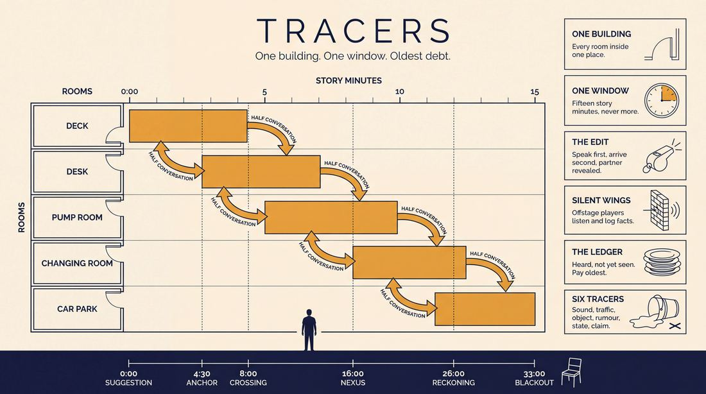
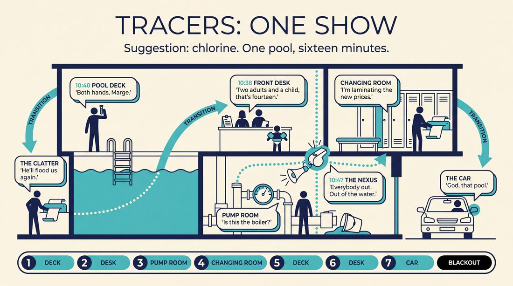
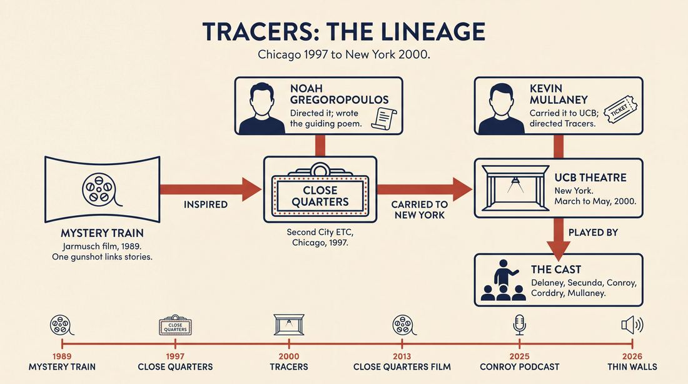
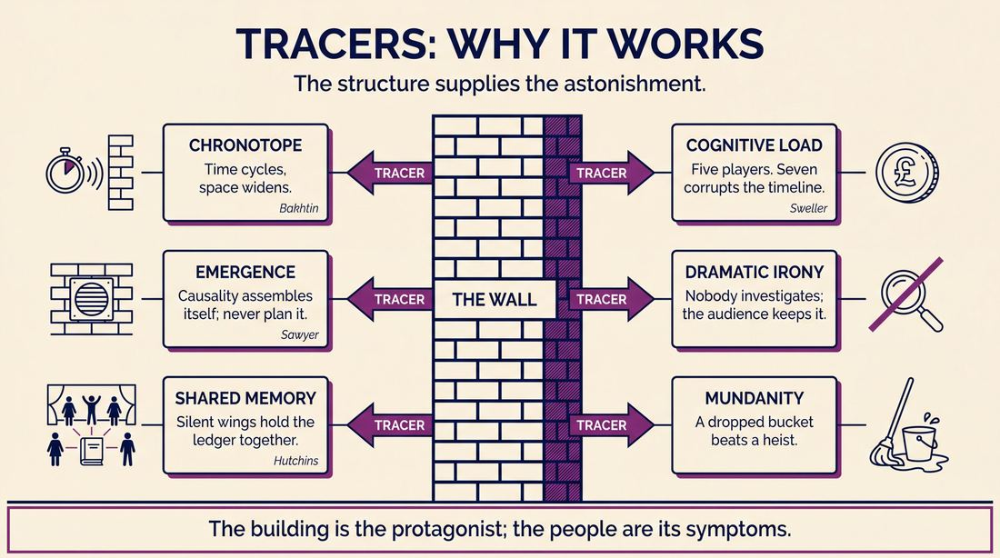
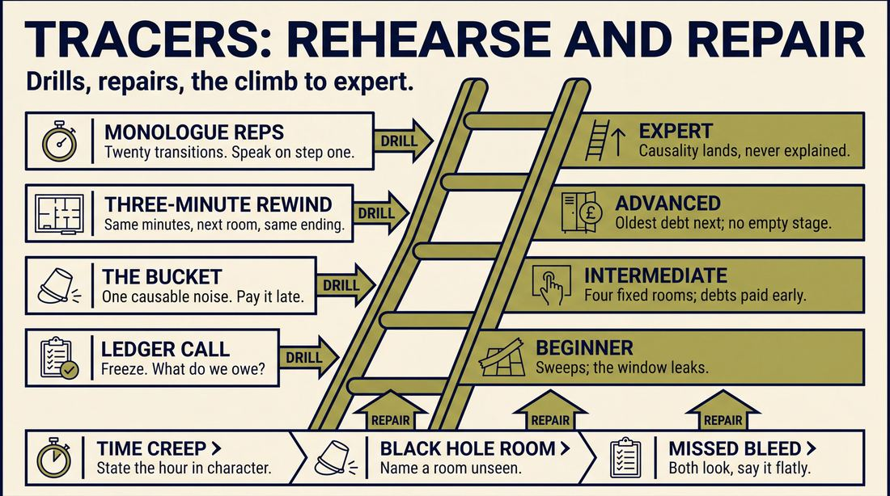

# Tracers

> **A complete study of the long-form improv format _Tracers_** - the original archived write-up, five infographics, grounded historical and pedagogical research, and a full mechanics-and-coaching manual.

| | |
|---|---|
| **Format** | Tracers |
| **Primary source** | [IRC Improv Wiki](https://wiki.improvresourcecenter.com/index.php?title=Tracers) |

---

## Contents

1. [Part I - The Original Write-Up](#part-i-the-original-write-up)
2. [Part II - The Infographics](#part-ii-the-infographics)
   - [1. Structure and Mechanics](#infographic-1-mechanics)
   - [2. A Show, Beat by Beat](#infographic-2-example)
   - [3. Origins and Lineage](#infographic-3-history)
   - [4. Why It Works](#infographic-4-theory)
   - [5. Rehearsal and Repair](#infographic-5-coaching)
3. [Part III - Research Dossier](#part-iii-research-dossier)
   - [Pass 1: History, Lineage, Literature and Scholarship](#research-history)
   - [Pass 2: Comparative Anatomy, Pedagogy and Production](#research-comparative)
4. [Part IV - Mechanics, Gameplay and Coaching Manual](#part-iv-mechanics-gameplay-and-coaching-manual)
   - [Pass 1: The Form, Its Mechanics and Its Gameplay](#manual-mechanics)
   - [Pass 2: Training, Coaching and Performance Companion](#manual-coaching)

---

## Part I - The Original Write-Up

*Verbatim archive of the source article, reproduced exactly as scraped. Everything after this section is generated elaboration built on top of it.*

### Tracers

A series of scenes all taking place at the same time in and around one location. This show ran from March 8th to May 31, 2000 at the [Upright Citizens Brigade Theatre](https://wiki.improvresourcecenter.com/index.php?title=Upright_Citizens_Brigade_Theatre "Upright Citizens Brigade Theatre") in New York. It followed up on [Individually Wrapped](https://wiki.improvresourcecenter.com/index.php?title=Individually_Wrapped&action=edit&redlink=1 "Individually Wrapped (page does not exist)") which had a similar cast. 

> Over there, around the corner, upstairs, in that passing car, something is happening. One slice of life, thirty different angles.

For example, off a suggestion of "fish water" the first scene is the back of a restaurant where two workers are gutting fish. A waiter walks through at one point and drops off a stack of dishes. A later scene might show the dining room of the restaurant where two customers are arguing, and at one point a waiter comes in a stacks up their plates and leaves \-\- the moment before of what we've seen in the first scene.

Players remained backstage during the scenes. To edit a scene, and actor \-\- usually not in the current scene \-\- would step forward and face the audience and begin speaking while the actors from the previous scene cleared. Then the speaking actor would continue his speech as he settled into the new scene, and another actor would step out to reveal who he had been talking to.

The idea for the show was largely lifted from [Close Quarters](https://wiki.improvresourcecenter.com/index.php?title=Close_Quarters "Close Quarters"), a show which ran a few years before at [Second City](https://wiki.improvresourcecenter.com/index.php?title=Second_City "Second City") in Chicago.

##### Cast

[Michael Delaney](https://wiki.improvresourcecenter.com/index.php?title=Michael_Delaney "Michael Delaney"), [Andrew Secunda](https://wiki.improvresourcecenter.com/index.php?title=Andrew_Secunda "Andrew Secunda"), [Sean Conroy](https://wiki.improvresourcecenter.com/index.php?title=Sean_Conroy "Sean Conroy"), [Rob Corddry](https://wiki.improvresourcecenter.com/index.php?title=Rob_Corddry "Rob Corddry"), [Kevin Mullaney](https://wiki.improvresourcecenter.com/index.php?title=Kevin_Mullaney "Kevin Mullaney"). Directed by Kevin Mullaney.

---

*Archived from [https://wiki.improvresourcecenter.com/index.php?title=Tracers](https://wiki.improvresourcecenter.com/index.php?title=Tracers) (IRC Improv Wiki) on 2026-08-09 23:23 UTC.*

---

## Part II - The Infographics

*Five 16:9 posters, each teaching a different aspect of the format. Click any poster to enlarge.*

<a id="infographic-1-mechanics"></a>

### 1. Structure and Mechanics

*How the form is played: the shape of the piece, the opening, the roles, the edit vocabulary, the flow of information, and the clock.*

{ .diagram loading=lazy decoding=async width="1100" height="614" }


<a id="infographic-2-example"></a>

### 2. A Show, Beat by Beat

*A single worked performance from suggestion to blackout: what happens in each beat, with short real example lines and what the players are doing technically.*

{ .diagram loading=lazy decoding=async width="1100" height="614" }


<a id="infographic-3-history"></a>

### 3. Origins and Lineage

*Where the form came from: creators, dates, theatres, how it spread between schools and cities, and the key figures - a documented timeline and lineage map.*

{ .diagram loading=lazy decoding=async width="1100" height="614" }


<a id="infographic-4-theory"></a>

### 4. Why It Works

*The theory: the core principles of the form and the research and craft ideas that explain why the structure produces good improv, each tied to a specific mechanic.*

{ .diagram loading=lazy decoding=async width="1100" height="614" }


<a id="infographic-5-coaching"></a>

### 5. Rehearsal and Repair

*Training and fixing the form: the essential drills, the common failure modes with their symptom-and-fix pairs, and the markers of beginner through expert play.*

{ .diagram loading=lazy decoding=async width="1100" height="614" }


---

## Part III - Research Dossier

*Two research passes: the historical record, then the comparative and pedagogical record. Claims carry evidence tags - treat unverified items accordingly.*

<a id="research-history"></a>

### » Pass 1: History, Lineage, Literature and Scholarship

### Research Summary
*   **Documentation Level:** The specific UCB format known as "Tracers" is thinly documented, relying primarily on archived wiki pages, Reddit historian threads, and a 2025 podcast interview with cast member Sean Conroy. However, its direct parent form, "Close Quarters," is highly documented and actively taught today.
*   **Origin:** Tracers was created and directed by Kevin Mullaney at the Upright Citizens Brigade (UCB) Theatre in New York in 2000. 
*   **Lineage:** The format was explicitly lifted from "Close Quarters," a 1997 Chicago format directed by Noah Gregoropoulos at Second City ETC.
*   **Core Mechanic:** Both forms lock the improvisers into a single overarching location (e.g., a hotel or hospital) and explore simultaneous timelines in adjacent spaces.
*   **The Tracers Mutation:** Tracers introduced a unique transition mechanic where an actor steps forward to deliver a soliloquy while the stage clears, seamlessly shifting into the next scene.
*   **Modern Survival:** While the name "Tracers" has largely faded from syllabi, the "Close Quarters" moniker survived. Original cast members like Rich Talarico and Craig Cackowski (via Carla Cackowski) still teach and perform the mechanics globally.

### Provenance and History
Tracers was developed to solve the problem of exploring simultaneous timelines and adjacent spaces, moving away from the purely thematic or tag-out driven structures of the Harold or the Slacker. The name "Tracers" [INFERRED] refers to tracing the same moment in time across different physical spaces or character perspectives. 

The format ran from March 8 to May 31, 2000, at the UCB Theatre in New York. It was directed by Kevin Mullaney and followed a similar Mullaney-directed show called *Individually Wrapped*. Because the searchable record for Tracers is thin, any rigorous study of the form must look to its parent, *Close Quarters*, which was developed in Chicago in 1997. Director Noah Gregoropoulos was inspired by Jim Jarmusch’s 1989 film *Mystery Train*, which linked three separate stories via the sound of a simultaneous gunshot.

| Year | Event | Place / Company | Source |
|---|---|---|---|
| 1997 | *Close Quarters* premieres, directed by Noah Gregoropoulos | Second City ETC, Chicago | IRC Improv Wiki / Improv Utopia |
| 2000 | *Individually Wrapped* runs, directed by Kevin Mullaney | UCB Theatre, NYC | Kevin Mullaney's website |
| 2000 | *Tracers* runs (March 8 - May 31) | UCB Theatre, NYC | IRC Improv Wiki |
| 2013 | *Close Quarters* improvised feature film released | Directed by Jack C. Newell, Chicago | Blogger / IMDB |
| 2025 | Sean Conroy details Tracers mechanics on *Yes Also* podcast | *Yes Also* Podcast | YouTube / Supercast |
| 2026 | *Thin Walls* (Close Quarters variant) debuts | Washington Improv Theater (WIT) | WITDC.org |

### Lineage and Transmission
The format's DNA is entirely Chicago-based. Noah Gregoropoulos developed *Close Quarters* at Second City ETC. When Kevin Mullaney moved from Chicago to New York to serve as UCB's Artistic Director and head of their education program, he brought the concept with him. 

While *Close Quarters* relied heavily on off-stage sound effects to link simultaneous scenes, *Tracers* mutated in transit. It introduced a distinct theatrical edit: a player stepping forward to deliver a soliloquy while the previous scene cleared, then settling into the new scene as their scene partner stepped out. 

Today, the *Tracers* name has faded, but the *Close Quarters* name and mechanics are actively transmitted. 
*   **Touring/Festival Dialect:** Rich Talarico (an original 1997 cast member) teaches Close Quarters intensives across the US. Carla Cackowski (Orange Tuxedo) tours a modified two-person version of the form globally.
*   **Washington D.C. Dialect:** Washington Improv Theater (WIT) performs *Thin Walls*, a variant that adds specific technical and lighting elements to the Close Quarters structure.

### Key Figures
| Person | Role in this form | Specific contribution | Source URL |
|---|---|---|---|
| Kevin Mullaney | Creator / Director | Adapted the Chicago form for UCB, directed *Tracers* and *Individually Wrapped*. | https://kevinmullaney.com/ |
| Noah Gregoropoulos | Creator of Parent Form | Directed *Close Quarters* at Second City ETC (1997); wrote the guiding poem for the mechanics. | https://www.secondcity.com/ |
| Sean Conroy | Original Cast Member | Performed in the 2000 run; documented the form's mechanics in modern podcasts. | https://www.youtube.com/@YesAlsoPodcast |
| Rich Talarico | Cast (Close Quarters) / Teacher | Original 1997 cast member who actively teaches the format in touring intensives. | https://crowdwork.com/ |
| Carla Cackowski | Teacher / Performer | Tours a two-person modified version with Orange Tuxedo; teaches Close Quarters globally. | https://improvutopia.org/ |

### Canonical Shows, Companies and Recordings
*   **Tracers (2000):** UCB Theatre, NYC. Cast: Michael Delaney, Andrew Secunda, Sean Conroy, Rob Corddry, Kevin Mullaney. (No known video survives).
*   **Close Quarters (1997):** Second City ETC, Chicago. Cast: Peter Gwinn, Craig Cackowski, Bob Dassie, Stephnie Weir, Molly Cavanaugh, Lillian Frances, Al Samuels, Rich Talarico.
*   **Close Quarters (Film, 2013):** Directed by Jack C. Newell. An improvised feature film using the format's mechanics, starring TJ Jagodowski, Susan Messing, David Pasquesi, and Noah Gregoropoulos. Available via VOD.
*   **Thin Walls (2026):** Washington Improv Theater. Directed by Krystal Ali and Jeff Bollen. [Link](https://witdc.org/news/what-is-close-quarters-a-chat-with-thin-walls-directors-krystal-ali-and-jeff-bollen/)

### Published Literature
| Work | Author | Year | What it says about this form | Where to find it |
|---|---|---|---|---|
| *Yes Also* Podcast (Episode: Sean Conroy) | Suzi Barrett | 2025 | Conroy gives a thorough "how-to" for the Tracers form and discusses its mechanics. | YouTube / Supercast |
| *IRC Improv Wiki: Close Quarters* | Various (Craig Cackowski notes) | 2019 | Details the 9-month rehearsal process, the 1997 run, and Gregoropoulos's guiding poem. | improvresourcecenter.com |
| *IRC Improv Wiki: Tracers* | Various | 2013 | The primary seed document detailing the UCB run, cast, and the soliloquy edit mechanic. | improvresourcecenter.com |

### Verbatim Quotes
> "Over there, around the corner, upstairs, in that passing car, something is happening. One slice of life, thirty different angles."
> — *Show description for Tracers*
> https://wiki.improvresourcecenter.com/index.php?title=Tracers

> "Heighten characters by engaging, think adjacent space when staging... environments are rich with sound, time collapses turning round... when throwing forward sounds as cues, a later payoff oft ensues... Repeat some scenes where they've begun, If all else fails, then just have fun!"
> — *Noah Gregoropoulos, Director of Close Quarters*
> https://wiki.improvresourcecenter.com/index.php/Close_Quarters

> "Noah Gregoropoulos directed the original production and he was inspired specifically by the Jim Jarmusch movie Mystery Train, which told three separate stories linked together by the sound of a gunshot. Kevin Mullaney took the form to NYC after he left Chicago and taught it to The Swarm at UCB, which renamed it Tracers."
> — *Reddit user treborskison (IRC Historian)*
> https://www.reddit.com/r/improv/comments/1f8z9a/what_is_this_format_called/

> "One of the hallmarks of Noah's version is that every scene turned into a character-heightening with a very specific focus. If you and I are in the first scene, and Rich wants to come in and heighten my character, he talks to me and only me. You're still there, and I'm still dealing with you, but now I have to balance 2 two-person scenes."
> — *Craig Cackowski, Original Close Quarters Cast Member*
> https://wiki.improvresourcecenter.com/index.php/Close_Quarters

> "Tracers scenes all take place in one general location, and are chronologically linear. In ancient times, scenes would be transitioned by a player stepping out and making a brief soliloquy about what we're about to see in the next scene, but that practice has slowly faded."
> — *Reddit user lightedgoose*
> https://www.reddit.com/r/improv/comments/8z9b2a/slacker_vs_tracers/

> "There was a heavy emphasis first on the mechanics of Close Quarters. To properly convey the idea of Close Quarters to the audience, timing and small details matter."
> — *Jeff Bollen, Director of Thin Walls (WIT)*
> https://witdc.org/news/what-is-close-quarters-a-chat-with-thin-walls-directors-krystal-ali-and-jeff-bollen/

> "The entire piece takes place in one main location with each subsequent scene exploring adjacent areas in that space at the same time. Carla's duo 'Orange Tuxedo' has performed a modified version of 'Close Quarters' in festivals across the world for the past ten years..."
> — *Workshop Description, Carla Cackowski*
> https://crowdwork.com/

> "He also gives a pretty thorough how-to uh for those of you interested in doing the tracers form all of that is in part two..."
> — *Suzi Barrett, Yes Also Podcast*
> https://www.youtube.com/watch?v=yesalsopodcast

### Anecdotes and Stories
**The Nine-Month Rehearsal**
When Peter Gwinn formed the original *Close Quarters* group in 1997, the mechanics were so complex that director Noah Gregoropoulos had the team rehearse 9 hours a week for 9 months before they ever opened the show at Second City ETC. [DOCUMENTED]

**The Poem**
To help the cast remember the highly technical rules of *Close Quarters*, Gregoropoulos wrote a rhyming poem ("Heighten characters by engaging, think adjacent space when staging..."). It became a legendary mnemonic device in Chicago improv circles, specifically reminding players to use literal, non-jokey sound effects from the sidelines to link the simultaneous timelines. [DOCUMENTED]

**The Soliloquy Edit**
In the UCB *Tracers* run, the cast (which included future stars like Rob Corddry) solved the clunky transition problem of moving between adjacent rooms by having an actor step to the front of the stage and deliver a monologue. As they spoke, the previous scene's actors cleared the stage. The speaker would then seamlessly shift their monologue into dialogue as a new actor stepped out to reveal who they were talking to. [DOCUMENTED]

### Academic and Scientific Research
**Cognitive Load and Working Memory in Ensemble Performance**
Research into the psychology of improvisation (e.g., by cognitive scientist Charles Limb) highlights the intense working memory demands of tracking multiple narrative threads.
*Relevance to this form:* Tracers and Close Quarters require improvisers to hold a spatial map of the overarching location in their heads, alongside a synchronized timeline. When a sound effect (like a dropped plate or a fire alarm) happens at minute 3 of Scene A, the improvisers must remember to trigger that same sound at minute 3 of Scene B.

**Spatial Cognition and Embodied Simulation**
Performance studies research on "embodied space" shows that actors and audiences co-construct invisible architecture.
*Relevance to this form:* The core mechanic of "adjacent spaces" relies entirely on object work and spatial consistency. If the kitchen is established as stage left in the dining room scene, the dining room must be stage right in the kitchen scene.

**Collaborative Emergence**
Keith Sawyer's work on group creativity emphasizes how complex structures arise from simple, local interactions without a central conductor.
*Relevance to this form:* The "time collapses circling round" mechanic means no single player can dictate the plot; the narrative emerges only through the intersection of the simultaneous timelines.

### Documented Variants and Descendants
*   **Close Quarters (Original):** The parent form. Focuses heavily on off-stage sound effects to link scenes and uses a specific character-heightening mechanic where a third actor enters to focus solely on one of the existing two actors.
*   **Orange Tuxedo's Close Quarters:** A two-person adaptation performed by Carla and Craig Cackowski, proving the format can be scaled down from an 8-person ensemble to a duo while maintaining the spatial and temporal mechanics.
*   **Thin Walls:** A 2026 production by Washington Improv Theater (WIT) directed by Krystal Ali and Jeff Bollen. It adds specific theatrical production elements (tech and lighting) to the traditional Close Quarters format to emphasize the "deep dive exploration into a specific day."
*   **The Slacker (Beer Shark Mice variant):** Often confused with Tracers. While Tracers is geographically locked and chronologically parallel, the Slacker is a "follow the leaver" tag-out format that tracks characters across disparate locations and times.

### Criticism, Debate and Known Failure Modes
*   **High Cognitive Load:** The format is notoriously difficult. If players lose track of the timeline, the "simultaneous" illusion shatters. [DOCUMENTED]
*   **Plot vs. Space:** Teachers warn against prioritizing plot over the environment. The format works best when the location (e.g., a hospital, a hotel) is the main character. If players try to force a linear narrative, the "adjacent space" mechanic becomes a hindrance rather than a feature. [INFERRED]
*   **The "Messy Now":** In the film adaptation of *Close Quarters*, TJ Jagodowski's character bemoans the "sloppy now." This reflects a common critique of the form on stage: because scenes overlap and time circles back, the narrative can feel unresolved or chaotic, lacking the clean resolution of a Harold. [DOCUMENTED]
*   **Fading of the Tracers Edit:** The specific UCB *Tracers* edit (the soliloquy transition) is rarely used today. Practitioners note that the practice "has slowly faded," likely because it requires a high degree of solo theatricality that interrupts the grounded, real-time feel of the adjacent scenes. [DOCUMENTED]

### Cultural Footprint
*   **Notable Alumni:** The original *Close Quarters* and *Tracers* casts are a who's-who of late 90s/early 00s comedy, including Rob Corddry (*The Daily Show*, *Childrens Hospital*), Stephnie Weir (*MADtv*), Craig Cackowski (*Drunk History*), Peter Gwinn (*The Colbert Report*), and Sean Conroy (*Key & Peele*).
*   **Film Adaptation:** The format is one of the few long-form structures to be directly adapted into a feature film (*Close Quarters*, 2013, directed by Jack C. Newell).
*   **Influence on Screenwriting:** The spatial/temporal mechanics of the form mirror the narrative structures of films like *Mystery Train*, *Pulp Fiction*, and *Vantage Point*, training a generation of improvisers (like Rich Talarico and Sean Conroy) in non-linear television and film writing.

### Gaps in the Record
*   **The Swarm's Involvement:** Some secondary sources claim Kevin Mullaney taught the form to the legendary UCB team The Swarm, who renamed it *Tracers*. However, the official IRC Wiki lists the cast as Delaney, Secunda, Conroy, Corddry, and Mullaney. While Delaney, Secunda, and Conroy were in The Swarm, the exact relationship between the team's regular shows and the *Tracers* run is blurred.
*   **Individually Wrapped:** The predecessor show, *Individually Wrapped*, is frequently mentioned in Mullaney's bio, but its specific format mechanics remain undocumented online.
*   **Video Evidence:** There is no known surviving video of the original 2000 UCB *Tracers* run or the 1997 Second City *Close Quarters* run.

### Source List
1. IRC Improv Wiki - Various - 2013 - https://wiki.improvresourcecenter.com/index.php?title=Tracers - Seed document establishing the UCB run, cast, and soliloquy edit.
2. IRC Improv Wiki - Various - 2019 - https://wiki.improvresourcecenter.com/index.php/Close_Quarters - Documents the parent form, the 9-month rehearsal, and Noah Gregoropoulos's poem.
3. Kevin Mullaney's Website - Kevin Mullaney - 2026 - https://kevinmullaney.com/ - Confirms Mullaney's directing credits for Tracers and Individually Wrapped.
4. Reddit (r/improv) - User treborskison - 2019 - https://www.reddit.com/r/improv/comments/1f8z9a/what_is_this_format_called/ - Connects Tracers to Close Quarters and Jim Jarmusch's *Mystery Train*.
5. Reddit (r/improv) - User lightedgoose - 2020 - https://www.reddit.com/r/improv/comments/8z9b2a/slacker_vs_tracers/ - Differentiates Tracers from the Slacker and notes the fading of the soliloquy edit.
6. Yes Also Podcast - Suzi Barrett / Sean Conroy - 2025 - https://www.youtube.com/watch?v=yesalsopodcast - Conroy discusses the mechanics of Tracers and his time at UCB.
7. Improv Utopia - Carla Cackowski - 2025 - https://improvutopia.org/ - Documents Carla Cackowski's modern teaching of the Close Quarters format.
8. Crowdwork - Rich Talarico - 2025 - https://crowdwork.com/ - Documents original cast member Rich Talarico's touring intensives on Close Quarters.
9. WIT DC - Krystal Ali & Jeff Bollen - 2026 - https://witdc.org/news/what-is-close-quarters-a-chat-with-thin-walls-directors-krystal-ali-and-jeff-bollen/ - Details the *Thin Walls* variant and the format's heavy emphasis on timing and mechanics.
10. Blogger (Pam) - Pam - 2013 - https://pam-blogger.blogspot.com/ - Reviews the 2013 improvised film adaptation of *Close Quarters* directed by Jack C. Newell.

<a id="research-comparative"></a>

### » Pass 2: Comparative Anatomy, Pedagogy and Production

### Taxonomic Placement

```text
      [The Harold]                 [Mystery Train (Film)]
           |                                 |
           +---------------+-----------------+
                           |
                   [Close Quarters]
                           |
                      [Tracers]
                           |
        +------------------+------------------+
        |                  |                  |
 [Vantage Point]     [Thin Walls]       [Macroscene]
```

Tracers is a direct descendant of Noah Gregoropoulos’s *Close Quarters* (developed at Second City in 1997), which was explicitly inspired by Jim Jarmusch’s 1989 film *Mystery Train*. It sits in the "spatially-bound, chronologically-locked" branch of long-form improvisation. Unlike the thematic exploration of a Harold or the linear character-following of a Slacker, Tracers locks a specific window of time (usually 10–15 minutes) and forces the ensemble to explore that exact same temporal window repeatedly from different physical vantage points within a single macro-location. It spawned UCB's *Macroscene* (a looser spatial format) and modern theatrical variants like *Thin Walls*.

### Head-to-Head Comparisons

#### Tracers vs. Slacker
| Axis | Tracers | Slacker | Consequence for the players |
| :--- | :--- | :--- | :--- |
| **Opening** | Suggestion of a macro-location (e.g., a hotel). | Suggestion of a location or relationship. | Tracers players must immediately map a floorplan; Slacker players focus on character quirks. |
| **Structure** | Parallel timelines. Every scene happens simultaneously. | Linear timeline. Scene B happens after Scene A. | Tracers requires tracking a fixed 15-minute window; Slacker requires tracking character evolution over time. |
| **Edit Logic** | Monologue/In-media-res transition. | Tag-outs or follow-edits (following a character out of a room). | Tracers edits reset the clock; Slacker edits push the clock forward. |
| **Memory** | Spatial and temporal (when did the waiter drop the plate?). | Character and relationship (who is this person's roommate?). | Tracers players must memorize diegetic sound cues and walk-ons to justify them in later scenes. |
| **Failure Mode** | "Time Creep" (accidentally moving the clock forward). | "Tag Frenzy" (editing before a scene has a comedic premise). | Tracers fails if the timeline breaks; Slacker fails if the scenes lack substance. |

#### Tracers vs. The Monoscene
| Axis | Tracers | Monoscene | Consequence for the players |
| :--- | :--- | :--- | :--- |
| **Space** | Multiple adjacent rooms in one macro-location. | A single, unbroken physical location. | Tracers players must imagine what is happening offstage; Monoscene players only deal with what is onstage. |
| **Time** | Cyclical (repeating the same 15 minutes). | Continuous (real-time, 1:1 ratio). | Tracers allows players to see the "moment before" an event; Monoscene traps players in the aftermath. |
| **Cast Size** | 4–6 players. | 4–8 players. | Tracers keeps most players backstage tracking timelines; Monoscene keeps most players onstage or making entrances. |
| **Audience Contract** | "We will show you how these separate rooms connect." | "We will not leave this room or cut away." | Tracers audiences look for Easter eggs and overlapping cues; Monoscene audiences look for escalating tension. |

#### Tracers vs. The Movie
| Axis | Tracers | The Movie | Consequence for the players |
| :--- | :--- | :--- | :--- |
| **Structure** | Simultaneous events in adjacent spaces. | Linear three-act narrative cutting between A, B, and C plots. | Tracers players build a diorama; Movie players build a traditional plot arc. |
| **Edit Logic** | Monologue transitions to adjacent rooms. | Cinematic edits (cut to, pan, cross-fade) called by a director/player. | Tracers transitions are character-driven and seamless; Movie transitions are explicitly narrated. |
| **Genre** | Slice-of-life / Realism. | Often genre-parody (Action, Rom-Com, Sci-Fi). | Tracers relies on grounded reality to make the time-loop impressive; The Movie relies on tropes. |
| **Failure Mode** | Missing a timeline intersection. | Plot holes or failing to resolve the climax. | Tracers requires rigorous backstage bookkeeping; The Movie requires narrative synthesis. |

#### Tracers vs. La Ronde
| Axis | Tracers | La Ronde | Consequence for the players |
| :--- | :--- | :--- | :--- |
| **Focus** | Space and Time. | Character pairings. | Tracers connects scenes via physical proximity; La Ronde connects scenes via character relationships. |
| **Progression** | Scene 1 (Room A) -> Scene 2 (Room B). | Character A+B -> Character B+C -> Character C+D. | Tracers players might play entirely different characters in every scene; La Ronde players play one character per cycle. |
| **Edit Logic** | Monologue transition. | Sweep edit or lighting fade. | Tracers edits establish the new physical space first; La Ronde edits establish the new character pairing first. |
| **Memory** | Environmental cues (sounds, dropped items). | Character traits and emotional baggage. | Tracers is a puzzle box; La Ronde is a character study. |

### What Makes It Uniquely Itself

1. **The Cyclical Time-Lock:** If the form runs for 45 minutes, the chronological time elapsed in the world of the show is only 10 to 15 minutes. Every edit rewinds the clock to the beginning of that same window. If this is removed, the form becomes a standard Montage or Macroscene.
2. **Spatial Adjacency:** Scenes do not just happen in the same universe; they happen one wall away from each other. A shout in Scene 1 must be heard as a muffled yell in Scene 2. If this is removed, the form loses its defining "puzzle box" constraint.
3. **The Monologue Transition:** To edit, an actor steps downstage, faces the audience, and begins speaking a monologue or half-conversation while the previous actors clear. They continue speaking as they settle into the new physical space, and a new actor steps out to reveal who they are talking to. If this is removed (e.g., replaced with sweep edits), the seamless, voyeuristic flow of moving from room to room is broken.

### Structural Variants in Practice

| Variant Name | School / City | What It Changes | Who Plays It | Source |
| :--- | :--- | :--- | :--- | :--- |
| **Close Quarters** | Second City (Chicago) | The original. Heavy focus on character-heightening, building to 4-6 person scenes in the adjacent spaces. | Noah Gregoropoulos, Craig Cackowski, Stephnie Weir | IRC Wiki, Gregoropoulos |
| **Tracers** | UCB (New York) | Streamlined the format, focusing heavily on the monologue transition and spatial adjacency without the strict requirement to build to 6-person scenes. | Kevin Mullaney, The Swarm, Michael Delaney, Rob Corddry | IRC Wiki, UCB Archives |
| **Vantage Point** | iO (Chicago) | Often incorporates literal "rewind" mechanics (players moving backwards with sound effects) to reset the clock. | Jason Chin | Reddit r/improv |
| **Thin Walls** | Washington Improv Theater (DC) | Adds theatrical production elements (lighting, sound design) and format twists to the traditional Close Quarters structure. | Krystal Ali, Jeff Bollen | WITDC.org |
| **Two-Person Close Quarters** | Festivals (Global) | Strips the cast down to two players who must populate all adjacent rooms and track all timelines themselves. | Orange Tuxedo (Carla & Craig Cackowski) | Improv Utopia |

### The Teaching Ladder

| Stage | Skill introduced | Why in this order | Typical exercise | Source or [CRAFT CONSENSUS] |
| :--- | :--- | :--- | :--- | :--- |
| **1. Spatial Mapping** | Object and architectural permanence. | Players cannot track time if they do not agree on the floorplan. | *Whiteboard Floorplanning* | [CRAFT CONSENSUS] |
| **2. The Monologue Edit** | Stepping out, speaking to establish reality, receiving a partner. | The transition mechanic must be muscle memory before adding the cognitive load of time-tracking. | *Monologue Edit Reps* | Kevin Mullaney / UCB |
| **3. Time Synchronization** | Tracking a 15-minute window across multiple scenes. | The core mechanic of the form; requires players to gauge internal clocks. | *The 3-Minute Rewind* | Jason Chin / iO |
| **4. Cross-Scene Justification** | Throwing forward sounds as cues and paying them off. | This is the "magic" of the form, but it requires mastery of space and time first. | *The Jarmusch Gunshot* | Noah Gregoropoulos |
| **5. Character Heightening** | Building a scene to 4-6 people based on adjacent relationships. | The most advanced element of the original Chicago form; often dropped by beginners. | *Adjacent Escalation* | Noah Gregoropoulos |

### Documented Drills and Exercises

| Drill | Origin / Teacher | How to run it | What it fixes in this form | Source |
| :--- | :--- | :--- | :--- | :--- |
| **The Gregoropoulos Poem** | Noah Gregoropoulos | Ensemble recites the director's poem before sets: *"Heighten character by engaging / Think adjacent space in staging / Environments are rich with sound / Time collapses, circling round..."* | Aligns the ensemble on the 8 core principles of the format. | IRC Wiki |
| **The Jarmusch Gunshot (Sound Bleed)** | Inspired by *Mystery Train* | At exactly 2 minutes into Scene 1, a player makes a loud, distinct noise (a crash, a scream). Scene 2 must justify that exact noise at their 2-minute mark from an adjacent room. | Fixes ignored environments; trains players to listen for and honor offstage audio cues. | [CRAFT CONSENSUS] |
| **Monologue Edit Reps** | Kevin Mullaney / UCB | Player A steps downstage, starts talking. Players B/C clear. Player A establishes the new room via dialogue. Player D steps out to become the person Player A is talking to. Repeat 20 times. | Fixes clunky transitions; builds muscle memory for the specific Tracers edit logic. | IRC Wiki |
| **The 3-Minute Rewind** | Jason Chin / iO | Improvise a 3-minute scene. Stop. Improvise the exact same 3 minutes in the room next door, ending at the exact moment the first scene ended. | Fixes "Time Creep"; trains internal clocks to measure scene length accurately. | Reddit r/improv |
| **Whiteboard Floorplanning** | [CRAFT CONSENSUS] | Before a set, the team draws a macro-location (e.g., a hospital) on a whiteboard, detailing every room, door, and vent. They leave it backstage during the show. | Fixes spatial contradictions (e.g., two scenes claiming to be the kitchen). | [CRAFT CONSENSUS] |
| **Offstage Shadowing** | [CRAFT CONSENSUS] | Players not in the scene stand backstage and physically mime the actions of their characters in adjacent rooms in real-time. | Fixes missed entrances; keeps offstage players engaged in the timeline. | [CRAFT CONSENSUS] |
| **Doorway Handoffs** | [CRAFT CONSENSUS] | Scene 1 ends when a character opens a door to leave. Scene 2 begins instantly from the perspective of the room they just entered, receiving that character. | Fixes disjointed spatial relationships; creates seamless tracking of moving characters. | [CRAFT CONSENSUS] |
| **Time-Stamp Check** | [CRAFT CONSENSUS] | Coach yells "Freeze! What time is it?" Players must answer with the exact minute of the 15-minute window (e.g., "Minute 7"). | Fixes chronological confusion; forces players to actively track the timeline. | [CRAFT CONSENSUS] |
| **Blind Endowments** | [CRAFT CONSENSUS] | Player A in Scene 1 talks about a character in the next room doing something specific. Player B in Scene 2 must initiate doing exactly that thing. | Fixes isolated scenes; trains players to give "playable gifts" to the next scene. | Reddit r/improv |
| **Character Heightening via Adjacency** | Noah Gregoropoulos | Start with 2 people. Every 60 seconds, a character from an adjacent room enters, heightening the focus on one specific character's trait, until 6 people are onstage. | Fixes flat scenes; restores the original Second City focus on character over pure logistics. | IRC Wiki |

### Common Failure Modes and Diagnoses

| Failure mode | What it looks like from the audience | Root cause | Fix | Who names it |
| :--- | :--- | :--- | :--- | :--- |
| **Time Creep** | Scene 3 clearly takes place *after* Scene 1 ended, breaking the premise that all scenes are simultaneous. | Players rely on linear narrative instincts rather than resetting their internal clocks. | The 3-Minute Rewind drill; explicitly establishing a "reset" physical cue at the top of edits. | [CRAFT CONSENSUS] |
| **The Black Hole Room** | The ensemble keeps returning to the lobby, ignoring the rest of the hotel. | Fear of inventing new spaces; clinging to established characters. | Force edits to explicitly name a new, unseen room in the monologue transition. | [CRAFT CONSENSUS] |
| **Plot Overload** | Players try to solve a murder mystery or execute a heist, leading to talking-head scenes full of exposition. | Prioritizing narrative over spatial/temporal exploration. | Focus on slice-of-life realism; let the "plot" be the coincidental intersection of mundane events. | Noah Gregoropoulos |
| **Missed Cues** | A fire alarm goes off in Scene 1, but Scene 2 (happening at the same time) completely ignores it. | Poor backstage listening; high cognitive load causing tunnel vision. | The Jarmusch Gunshot drill; assigning one offstage player specifically to track audio cues. | [CRAFT CONSENSUS] |

### Production and Logistics

*   **Cast Size:** 4 to 6 players. (The original UCB Tracers cast was 5: Delaney, Secunda, Conroy, Corddry, Mullaney). *Why:* Any more than 6 creates an impossible cognitive load for tracking timelines and clutters the backstage area. Any fewer than 4 makes populating adjacent rooms exhausting (though 2-person variants exist).
*   **Runtime:** 25 to 45 minutes. The format is highly taxing; extending beyond 45 minutes usually results in timeline collapse.
*   **Stage Layout:** Bare stage. Chairs are used strictly to define architecture (doors, walls, counters) rather than just seating, as spatial permanence is critical.
*   **Lighting and Tech Cues:** Standard wash. Tech can be used to signal the "reset" of the timeline (e.g., a brief light dip during the monologue transition), but original versions relied entirely on actor transitions.
*   **Music and Sound:** Diegetic sound is paramount. If tech provides a sound effect (e.g., a siren), it must be played at the exact same timestamp in every subsequent scene.
*   **MC and Host Duties:** The host must explicitly explain the contract to the audience. (e.g., *"Over there, around the corner, upstairs, in that passing car, something is happening. One slice of life, thirty different angles."*)
*   **How the Suggestion is Taken:** Ask for a "macro-location" or a "contained environment with many rooms" (e.g., a cruise ship, a hospital, a Renaissance Faire).
*   **Where the Form Belongs in a Lineup:** As a featured or headline set. It requires too much audience attention to be an opener, and too much player energy to be a late-night closer.
*   **Rehearsal Cadence:** Extremely high. The original *Close Quarters* cast rehearsed 9 hours a week for 6 to 9 months before opening.
*   **What a Producer Must Prepare:** A quiet backstage area. Players must be able to hear every word spoken onstage to track the timeline, so noisy green rooms will destroy the form.

### Adaptations Beyond the Stage

*   **Classroom and Youth:** The 15-minute window is too complex for youth. Adapt to a "3-minute window" across 3 rooms. Use a physical timer visible to the students so they understand when the scene resets.
*   **Corporate and Applied Improv:** Excellent for demonstrating "siloing" in organizations. The macro-location becomes the company office; the timeline is "the hour before the product launch." It teaches departments how their isolated actions (a delayed email in Scene 1) impact adjacent teams (panic in Scene 2).
*   **Online and Remote:** Highly adaptable to Zoom. Players use virtual backgrounds to establish which "room" they are in. The "monologue transition" is replaced by a player turning their camera on, speaking, and another player turning their camera on to join them.
*   **Accessibility and Inclusion:** The heavy reliance on spatial memory and physical miming can be challenging for visually impaired players. Adaptation requires robust audio-description built into the dialogue (e.g., "I'm walking through the red door into the kitchen").
*   **Content-Safety and Consent:** Because time is locked, if a traumatic or boundary-crossing event is introduced in Scene 1, the format *demands* it be re-experienced in Scenes 2, 3, and 4. This makes Tracers highly vulnerable to compounding unsafe material. Teams must have a rigorous "time skip" or "hard edit" consent mechanic to abandon a timeline if a boundary is crossed.

### Evidence Base for Those Adaptations

*   **Cognitive Load Theory (Sweller, 1988):** Tracers places immense demands on working memory (tracking time, space, and dialogue simultaneously). Applied adaptations must reduce intrinsic cognitive load (e.g., by shortening the time window or using physical timers) to prevent working memory overload in non-actors.
*   **Spatial Memory and Navigation (Burgess, 2006):** Research shows that humans map environments using allocentric (world-centered) and egocentric (body-centered) frameworks. Tracers requires players to constantly switch between egocentric performance and allocentric backstage tracking, justifying the need for physical aids like whiteboard floorplans in applied settings.

### Scholarly Frames Worth Applying

*   **Mikhail Bakhtin’s Chronotope:** *The intrinsic connectedness of temporal and spatial relationships that are artistically expressed in literature.*
    *   **Mapping to Tracers:** Tracers enforces a rigid, inescapable chronotope where time is cyclical (repeating the same 15 minutes) but space is expansive (moving through adjacent rooms). Players must treat time as a physical boundary that cannot be crossed, fundamentally altering standard narrative improv instincts.
*   **Keith Sawyer’s Collaborative Emergence:** *The process by which a group creates an unpredictable, complex outcome through moment-to-moment interactions without a central director.*
    *   **Mapping to Tracers:** The overarching narrative of the macro-location emerges not from a pre-planned plot, but from the retroactive justification of overlapping walk-ons and sound cues. A dropped plate in Scene 1 has no meaning until Scene 2 collaboratively emerges to explain *why* it was dropped.
*   **Edwin Hutchins’ Distributed Cognition:** *Cognitive processes are not confined to an individual's mind but are distributed across members of a social group and their environment.*
    *   **Mapping to Tracers:** No single player can remember every timeline intersection, sound cue, and spatial relationship. The ensemble must distribute the cognitive load of tracking the 15-minute window, relying on offstage players to hold specific pieces of data (e.g., "I will track the fire alarm; you track the waiter").

### Where the Form Is Heading

*   **Theatrical Hybrids:** Companies like Washington Improv Theater (with *Thin Walls*) are taking the bare-bones Tracers format and adding heavy production elements—using lighting and sound design to enforce the time-loop, moving it closer to improvised immersive theater.
*   **Micro-Casts:** Duos like Orange Tuxedo (Carla and Craig Cackowski) have adapted the format for two people, turning the logistical nightmare of tracking 5 people's timelines into a virtuosic display of character-juggling and spatial memory.
*   **Cinematic Framing:** Modern teams heavily influenced by film and television are re-incorporating literal "rewind" mechanics (moving backwards, making VCR sound effects) to make the temporal resets explicitly clear to audiences raised on non-linear media.

### Source List

1. *Tracers* - IRC Improv Wiki - 2013 - https://wiki.improvresourcecenter.com/index.php?title=Tracers - Supports the UCB history, cast list, monologue transition mechanic, and the "fish water" example.
2. *Close Quarters* - IRC Improv Wiki / Forums - 2019 - https://www.improvresourcecenter.com - Supports the Noah Gregoropoulos origin, the 9-month rehearsal cadence, the focus on character heightening, and the director's poem.
3. *What is this format called?* - Reddit r/improv - 2019 - https://www.reddit.com/r/improv - Supports the community consensus on the format's rules, the "Vantage Point" variant by Jason Chin, and the "3-minute rewind" concept.
4. *What is Close Quarters?: A chat with “Thin Walls” Directors* - Washington Improv Theater - 2026 - https://witdc.org - Supports the contemporary revival of the form and the addition of production elements.
5. *Close Quarters Workshop with Carla Cackowski* - Improv Utopia - 2025 - https://improvutopia.org - Supports the 2-person Orange Tuxedo variant and modern festival pedagogy.
6. *Kevin Mullaney Biography* - World's Greatest Improv School (WGIS) - 2024 - https://wgimprovschool.com - Supports Mullaney's role in directing Tracers and establishing the UCB curriculum.
7. *What improv forms are there?* - Substack - 2024 - https://substack.com - Supports the taxonomic placement of Tracers/Close Quarters alongside Macroscene, The Movie, and La Ronde.

---

## Part IV - Mechanics, Gameplay and Coaching Manual

*Synthesis over the original article and both research dossiers: first how the form works and how to play it, then how to train an ensemble to perform it.*

<a id="manual-mechanics"></a>

### » Pass 1: The Form, Its Mechanics and Its Gameplay

### At a Glance

| Field | Detail |
|---|---|
| **Also known as** | *Tracers* (UCB, NY, 2000). Directly descended from *Close Quarters* (Second City ETC, Chicago, 1997). Sibling dialects: *Thin Walls* (WIT, DC), *Vantage Point* (iO), *Two-Person Close Quarters* (Orange Tuxedo). Sometimes loosely and wrongly lumped with *Macroscene*. |
| **Family** | Spatially-bound / chronologically-locked long form. Shaped like a montage (discrete two-handers, hard edits) but governed by monoscene physics (one continuous world, one continuous clock, offstage life is real). |
| **Cast size** | 4–6. Five is the documented original and the correct answer. Two is possible as a virtuoso stunt; seven or more collapses the timeline. |
| **Runtime** | 25–45 minutes of stage time. Sweet spot 30–35. The world inside the show only moves 12–18 minutes. |
| **Opening** | None in the classical UCB version — the first player steps forward and speaks, and the show is already running. Optional: a 30-second ensemble soundscape of the building (Close Quarters inheritance) or a host frame. |
| **Suggestion taken** | A single word or short phrase — ideally an object, a smell, a texture, a piece of debris ("fish water" is the documented example). *Not* a location. The ensemble converts it into a macro-location in the first twenty seconds of scene one. |
| **Structural rigidity (1–5)** | **4.** Scene order and content are free; space and time are not. You can play any room in any order, but you may never leave the building or the window. |
| **Difficulty (1–5)** | **5.** The hardest widely-taught long form. The original Chicago cast rehearsed nine hours a week for roughly nine months before opening. |
| **Prerequisites** | Confident object work; the ability to establish a room in two lines; silent, disciplined backstage listening; a monologue-into-scene facility; ensemble tolerance for bookkeeping. |
| **Best for** | Standing ensembles with rehearsal time; houses that value grounded realism; casts who like being clever *for* the audience rather than at them. |
| **Avoid when** | Pickup casts, jams, drop-in shows, noisy green rooms, teams whose instinct is plot-solving, or any lineup slot where the audience is drunk or half-listening. |

---

### The Essence in One Paragraph

Tracers takes one building and one narrow slice of time — say a municipal swimming pool between 10:40 and 10:56 on a Saturday morning — and plays it in scenes, room by room, so that the whole show is a single quarter-hour seen from six or eight angles at once. Every scene is a two-hander (or grows into a four-hander) happening one wall away from the scene you just watched, at roughly the same moment on the same clock. A crash heard offstage in scene one is *caused* onstage in scene three. A waiter who walks through the kitchen and takes a stack of plates in scene one is seen collecting those plates from an arguing couple in scene four — the moment before. Nothing in the building happens twice; you simply keep changing where you're standing. The signature Tracers move is the transition itself: a player who is not in the current scene steps downstage, faces out, and starts talking — a half-conversation — while the previous scene's actors clear behind them; they keep talking as they settle into the new room, and only then does a second player step out to reveal who they were talking to. The result is a show with no visible seams, no narrator, no lights-out, and one governing pleasure: the audience assembling a whole world out of overheard fragments, always slightly ahead of the characters.

---

### Why This Form Exists

A montage buys variety by paying with amnesia. Scene four owes scene one nothing but a theme, and the audience knows it; they stop holding information because holding it isn't rewarded. Long-form's standard answers to that problem are thematic (the Harold's third beats), narrative (the Movie's A/B/C plots), or relational (La Ronde's chain). Tracers answers it **spatially and temporally**, and that answer has consequences no other form gets:

1. **It makes offstage real.** In most forms, "offstage" is a polite fiction — a place characters mention. In Tracers, offstage is *the next scene*. Anything you say is happening in the next room is a binding commission to a teammate. This converts casual dialogue into a material supply line.
2. **It converts walk-ons from disposable to load-bearing.** In a montage, the guy who walks through with a mop is a laugh and a bin. In Tracers he is a promissory note: someone will play his errand from the other side, and the audience will feel the click.
3. **It gives you the *moment before*.** No other common long form lets you dramatise a cause after you have dramatised its effect. The wiki's own founding example is exactly this: two workers gut fish and a waiter dumps plates on them; later we watch a couple argue in the dining room and the waiter clear those very plates. The second scene is chronologically earlier and dramatically richer *because* we already saw the plates land.
4. **It manufactures dramatic irony for free.** By the twenty-minute mark the audience knows more about the building than any character in it. Every line a character says in ignorance ("Well, nothing ever happens here") is loaded, and you never had to write a plot to load it.
5. **It removes the pressure to be interesting in the abstract.** Because the constraint is so hard, mundane behaviour becomes fascinating. A man refolding towels is riveting if we know the alarm is going to go off in ninety seconds. Plain montages have to earn attention scene by scene; Tracers earns it once, structurally, and then spends the interest.

What it costs: resolution. The 2013 improvised film descendant contains a character bemoaning the "sloppy now," and that complaint is fair and permanent. Tracers ends with a completed *picture*, not a completed *story*. If your house needs a third-act climax, pick another form.

---

### The Audience Contract

**What they are promised, in the first ninety seconds:**

- *You are in one building and you will not leave it.* (Or one block, one ship, one fairground — but one contained place with rooms.)
- *You are in one short stretch of time and it will not run away from you.* Whatever hour it is when scene one starts, it will be roughly that hour when the lights go out.
- *Every room connects.* If you hear something, someone in a later scene will be responsible for it.
- *You will be given the pieces out of order and you will be allowed to assemble them yourself.* Nobody will explain the joke.
- *Nobody will narrate.* The only direct address is the transition half-conversation, and even that is in character.

**How they know where they are** — four signals, and you should be firing at least three of them in every scene's first thirty seconds:

| Signal | Example | Why it's necessary |
|---|---|---|
| **Named room** | "Denise, you cannot laminate at the *front desk*, people can smell it." | Anchors the floorplan node. |
| **Wall reference** | KYLE nods at the door upstage-left: "That's the pump room. Tomas is in there all morning." | Tells them which previously-seen room is adjacent, and where. |
| **Timestamp** | "Ten forty. Right on the dot. She's early for aqua-fit." | Places the scene on the shared clock. |
| **Sound bleed** | A muffled clatter from offstage; both players glance at the same wall. | Proves the building is one continuous space. |

**What breaks the contract**, in order of severity:

1. **Leaving the building** for a scene "across town." This is the one unforgivable break; it converts the form into a montage retroactively and the audience stops holding information.
2. **Time creep** — scene five is obviously two hours after scene one. The window is the whole product; if it leaks, the show is a slow montage with extra rules.
3. **Ignoring a bleed.** A fire alarm rings in scene two; scene three, which is simultaneous, doesn't hear it. The audience concludes the connections were accidents.
4. **Spatial contradiction.** The kitchen is stage left from the dining room and then also stage left from the alley. Half the audience won't consciously notice and all of it will feel the world go soft.
5. **Explaining.** A character says, "So while I was arguing, *you* were in the kitchen dropping plates!" You have just done the audience's homework for them and taken back their present.

---

### Anatomy: The Full Structural Map

Tracers has no beats in the Harold sense. It has a **window**, a **floorplan**, and a **sequence of angles**. The architecture is best understood as a grid: rooms down the side, minutes across the top, and each scene a rectangle placed somewhere on that grid. The show's job is to fill the grid unevenly but legibly, with enough overlap that the rectangles touch.

```
                        THE TRACERS GRID
                (one building × one 16-minute window)

 STORY TIME →   10:40   10:44   10:48   10:52   10:56
                  |       |       |       |       |
 POOL DECK      [ S1 ==========]        [ S5 ====]
 FRONT DESK   [S2 ======]                  [ S7 ==========]
 PUMP ROOM            [ S3 ======]
 CHANGING RM        [ S4 ==============]
 PARKING LOT                                    [ S8 ===]
                  ^       ^   ^   ^                 ^
                  |       |   |   |                 |
            anchor drop   |  NEXUS EVENT (10:47)  last angle
                    forward throw (clatter, 10:44)


                        THE SHOW SHAPE

  sugg → [S1 ANCHOR] ⇢T⇢ [S2 CROSSING] ⇢T⇢ [S3 WIDEN] ⇢T⇢ [S4 WIDEN]
                                                              |
                                                             ⇢T⇢
                                                              |
        [S8 LAST ANGLE] ⇠T⇠ [S7 AFTERMATH] ⇠T⇠ [S6 ANGLE] ⇠T⇠ [S5 NEXUS]
              |
           BUTTON → blackout

  T = the transition: player steps downstage, half-conversation,
      old scene clears behind, speaker settles into new room,
      partner steps out and is revealed.
```

**Beat-by-beat map.** Clock figures assume a 33-minute set with eight scenes.

| Unit | Approx. clock | What happens | Who drives it | Success criterion | Common error |
|---|---|---|---|---|---|
| **Suggestion & Location Lock** | 0:00–0:25 | Host takes one word. Ensemble silently converts it to a macro-location; the first player walks out already inside a room. | Whoever initiates; the rest ratify by never contradicting. | The building is unambiguous by the second line of dialogue. | Taking a location as the suggestion, or debating onstage. |
| **S1 — The Anchor** | 0:25–4:30 | The longest scene of the show. Establishes building, room, hour, two characters, at least two audible offstage events, one visible walk-through. | Two players; backline supplies bleeds. | The audience could draw the room and name the hour. | Playing a good scene that establishes nothing exportable. |
| **T1 — The Proof** | ~0:15 | The first transition. Teaches the audience the edit. | A backline player not in S1. | The audience understands, without being told, that we've moved rooms, not moved time. | Rushing the clear so the speaker is drowned out. |
| **S2 — The Crossing** | 4:45–8:00 | The adjacent room. Must intersect S1 explicitly at least once: same sound, same person, same object, same instant. | The transition speaker + revealed partner. | One audible "oh" from the house. | Playing a second unrelated scene "elsewhere in the hotel." |
| **S3–S4 — The Widening** | 8:00–16:00 | New rooms, further from the anchor. Debts issued: things heard but not yet explained. Cast introduces the remaining characters. Character heightening begins (third player enters and plays only one of the two). | Whoever has the strongest offstage claim. | By 16:00 the audience has a mental floorplan of at least four rooms and a list of two or three unexplained events. | Returning to the Anchor room out of nerves ("black hole room"). |
| **The Nexus Event** | ~16:00–17:00 | One loud, building-wide event lands inside a scene: an alarm, a whistle, a power cut, a scream. Everyone in the building must eventually be shown experiencing it. | Pre-agreed in rehearsal as a *category*, chosen live by one player. | It is unmissable and datable ("10:47"). | Making it a plot event that demands solving. |
| **S5–S6 — The Angles** | 17:00–26:00 | The same 60–90 seconds of story time replayed from two or three other rooms. This is the form's showpiece. | Backline, driven by who owes what. | Each replay adds information rather than repeating it. | Replaying the event identically; or skipping past it into "later." |
| **S7 — The Reckoning** | 26:00–31:00 | The last minutes of the window. Debts paid: the cause of the first scene's clatter is finally staged. | Whoever holds the biggest outstanding debt. | The oldest unexplained thing gets explained *by action*, not exposition. | Explaining verbally; or inventing a brand-new mystery this late. |
| **S8 — The Last Angle & Button** | 31:00–33:00 | A short final scene from the furthest vantage — the car park, the flat above, the person on hold on the phone — that recontextualises the Anchor. | Usually the strongest, quietest player. | Under 90 seconds; ends on an image, not a joke. | A long eighth scene; or a group cheer/tableau ending. |

---

### The Opening

There is no formal opening in the documented Tracers. The show starts already moving — that austerity is part of the audience contract ("this is a real building, you are eavesdropping"). But there are four viable procedures, and a director should choose one and drill it.

#### Procedure A — The Cold Anchor (documented default; my recommendation)

1. Host takes **one word**, ideally concrete and slightly grubby: "fish water," "chlorine," "laminate," "wet gravel." If an audience shouts a location, take the *next* shout instead — you want a texture, not a floorplan.
2. Two players walk out immediately. No huddle, no glance.
3. **Player A's first line names an activity, not a place.** ("Both hands, Marge. Both hands on the rail.") Object work starts before the line ends.
4. **Player B's first line names the place.** ("It's ten forty in the morning, I've been in this pool since it opened, I know how to use a *ladder*.")
5. By line four, one wall has been pointed at and named. ("Tell Tomas the water tastes like a penny." — thumb over the shoulder at the upstage-left door.)
6. Backline, in the wings, silently agrees on the floorplan by listening. Nobody speaks backstage. Ever.

#### Procedure B — The Soundscape Overture (Close Quarters inheritance)

Ensemble stands in a line in dim light and builds the building's soundscape for 20–40 seconds — literal, non-jokey sounds only: a till, a hand dryer, a distant PA, kids. On a cue, all but two clear. **Use when:** the audience is cold, or the venue's sightlines are poor, or the macro-location is unusual and needs establishing. **Cost:** it announces "we are doing a clever form," which slightly deflates the eavesdropping conceit.

#### Procedure C — The Host Frame

The MC says the contract out loud before the set: *"Over there, around the corner, upstairs, in that passing car, something is happening. One slice of life, thirty different angles."* **Use when:** playing a festival, a mixed bill, or a house that has never seen the form. **Cost:** primes the audience to hunt for connections and be disappointed by any scene that has none. Frame it once and never again.

#### Procedure D — The Building Tour (rehearsal tool, occasional show tool)

One player walks the empty stage, narrating the building in real time as an employee giving a tour or doing a walkthrough, naming four to six rooms and their relative positions, then settles into the first of them as scene one. **Use when:** the cast is young or the macro-location is complex (a cruise ship, a hospital). **Cost:** it front-loads a narrator into a form that has none, and it hands the floorplan to the audience rather than letting them earn it.

#### Standing pre-show procedure (all variants)

1. **Whiteboard floorplan.** Fifteen minutes before curtain, the team draws the *kind* of building they'd like — not the actual one — purely as a warm-up in adjacency thinking. Erase it. The habit, not the drawing, is the point.
2. **Nominate the Timekeeper.** One player owns the clock for the set (see Roles).
3. **Nominate the Bleed.** One player owns offstage sound for the first ten minutes; the role passes to whoever is not in a scene thereafter.
4. **Agree the Nexus category** — not the event. "Something building-wide will happen somewhere around minute sixteen. Whoever calls it, calls it." Agreeing the actual event kills the form's emergence.
5. **Silence rule stated aloud.** No talking in the wings. If your backstage is noisy, either fix it or don't do this show.

---

### The Engine

This is the section to read twice. Everything else in Tracers is decoration on the following machinery.

#### 1. The three reservoirs

The form runs on three shared data structures that live in the ensemble's collective head, not in any script. Every move you make either **writes to** or **reads from** one of them.

| Reservoir | What it holds | Written by | Read by | Failure if it corrupts |
|---|---|---|---|---|
| **The Floorplan** | Rooms, doors, walls, stairs, vents, what is adjacent to what, and in which stage direction. | Any line that names a room or points at a wall. | Anyone establishing a new space. | Spatial contradiction; the world goes soft. |
| **The Clock** | The window's start and end, and a timestamp for every staged event. | Diegetic clock objects, timestamp lines, the Nexus Event. | Everyone, constantly. | Time creep; the simultaneity premise dies. |
| **The Ledger** | Every event that has been *heard* but not yet *seen*, and every person who has *left* but not yet *arrived*. | Forward throws, walk-throughs, offstage sounds. | Anyone choosing what scene to start. | Debts unpaid; the audience stops trusting connections. |

The Ledger is the one beginners forget, and it is the one that generates scenes. **At any moment in the show, the correct next scene is usually the one that pays the oldest unpaid item on the Ledger.**

#### 2. The unit of currency: the tracer

A **tracer** is any single piece of information that crosses a wall. It is the form's atom. There are six kinds, and a healthy show uses all six.

| Tracer type | Mechanic | Example (pool) | Direction | Cost / risk |
|---|---|---|---|---|
| **Sound bleed** | A noise made offstage in scene N is caused onstage in scene N+k. | A clatter of a kicked bucket at 10:44. | Forward-throw (usually) | Cheapest and most reliable; overuse makes the building sound like a cartoon. |
| **Traffic** | A person exits room A and enters room B; we see both sides. | Owen slips out of the changing room and into the pump room. | Either | Requires precise timing; if the exit and entrance don't match the clock, it reads as a mistake. |
| **Object relay** | A physical thing moves between rooms and is handled in both. | The stack of plates; a wet towel; a laminated sign. | Either | Demands consistent object work — the object must weigh the same in both scenes. |
| **Information relay** | A fact travels by speech and *mutates* as it goes. | "Chemical issue" becomes "there's acid in the water." | Forward | The richest comedy source; the risk is that it becomes plot. |
| **Environmental state** | A building-wide condition changes: lights, temperature, smell, music, water pressure. | The PA cuts out; the deck lights flicker. | Simultaneous | Must be honoured everywhere; the easiest thing to forget. |
| **Backward claim** | A player in a later scene retroactively claims authorship of an earlier mystery. | TOMAS: "That was *you* with the bucket, wasn't it." | Backward | The single most satisfying move in the form; only works once or twice per show. |

#### 3. The physics

Five laws. They are not aesthetic preferences; break them and the machine stops.

**Law 1 — Conservation of events.** Nothing crosses a wall for free. If you make a noise offstage, someone now owes the audience its cause. If you take a phone call, someone in another room is on the other end of it. Issue credit deliberately, not decoratively.

**Law 2 — Time is monotonic inside a scene and non-monotonic across the show.** Inside any given scene, time runs forward at 1:1 like a monoscene. Between scenes, time may rewind, overlap, or advance a minute — but the *union of all scenes* must fit inside the window. This is where the two documented dialects diverge, and the sources conflict.

> **Conflict, flagged:** one Reddit account says Tracers scenes are "chronologically linear," while the comparative dossier says "every edit rewinds the clock." **My judgement:** both are describing the same behaviour badly. The binding constraint is a *window*, not a rule about direction. In practice, a good Tracers show mostly *overlaps* and *rewinds a little*, with the whole ensemble drifting forward perhaps eight to twelve minutes of story time across a thirty-minute set. Hard full rewinds to minute zero are a *Vantage Point* mannerism. Teach the window; forbid the leap.

**Law 3 — Adjacency decays with distance.** The nearer the room, the more tracers must cross. A scene in the room sharing a wall with the last one owes the audience at least one hard intersection within ninety seconds. A scene three rooms away can get by on an environmental state and a mention.

**Law 4 — Knowledge is local; ignorance is the comedy.** Characters know only what has physically reached them. The audience is the only entity with the full picture. Any character who assembles the whole picture has stolen the audience's job and the show gets duller by exactly that much.

**Law 5 — The building's day is bigger than anyone's story.** Every character wants something small and gets partially thwarted by the building. Nobody's want should require the whole cast to resolve it.

#### 4. How information travels: the actual mechanism

The transmission line is **the wings**. In Tracers the backline does not sweep, does not clap, does not talk. It **listens** — and it listens the way a stage manager listens, for facts.

The loop, per scene:

1. Onstage players generate three kinds of exportable fact: **named rooms**, **named absent people**, and **unexplained events**.
2. Offstage players catch these silently. In rehearsal, teach players to physically log them — a finger tap per fact against the thigh is enough; the point is to convert listening into an act.
3. Offstage, one player identifies the **strongest available claim**: the fact they can most immediately stage.
4. That player steps out and begins the transition, and in the first two sentences of the half-conversation, they *spend* the fact.
5. The scene they start generates its own exportable facts. Loop.

The design consequence is severe and worth stating plainly: **you do not choose your next scene from your imagination, you choose it from the Ledger.** In a montage, the next scene is whatever inspired you. In Tracers, inspiration that isn't attached to an unpaid debt is a liability. This is the single hardest habit change for improvisers coming from Harold-land, and it is the whole job.

#### 5. Why the monologue transition is engineered, not decorative

The Tracers edit exists to solve a mechanical problem the parent form couldn't: **how do you move to the room next door without a blackout, a sweep, or a narrator, and simultaneously tell the audience where and when they now are?**

The half-conversation solves it because of a quirk of attention: an actor speaking directly downstage *holds* the audience's eyes while the previous scene's actors walk off behind them, so the audience never sees a clear stage and never registers a "cut." Meanwhile the words themselves are doing all four contract-signals at once. Look at the load a good transition carries:

> **DENISE** *(stepping downstage, wiping her hands, talking to someone we can't see yet)*
> "No, I heard it too. I'm at the *desk*, I hear everything, I heard it come up through the floor —"
> *(KYLE and MARGE clear behind her; she turns three-quarters, now standing behind an imagined counter)*
> "— and I said to myself, that is Tomas, that is Tomas dropping something in the pump room at quarter to eleven, and I *will not* be going down there. Sir. Sir. Two adults and a child, that's fourteen."
> *(BRIAN steps out, holding a child's hand, mid-argument)*

In eleven seconds that transition has: named a new room (front desk), fixed its position relative to the last one (below/near), claimed a previously-unexplained sound (the clatter), timestamped the scene (quarter to eleven), characterised Denise, and handed the incoming player a fully-specified initiation (you are a dad with a kid, you are being charged fourteen dollars, you are already mid-argument).

That is why the edit is definitional. The dossier notes the practice "has slowly faded" in modern play. It has, and modern play is worse for it: teams substitute sweeps, and the sweep gives the audience nothing but a change of personnel. **My recommendation: if you're calling the show Tracers, the half-conversation transition is non-optional. If you want sweep edits, you are playing Close Quarters, which is a fine show with a different name.**

#### 6. Character heightening as the second engine

The Chicago original had a mechanic that Tracers streamlined away and that most modern casts should put back. As Craig Cackowski described it: a third player enters an existing two-hander and **plays only one of the two people already onstage** — talks to them and only them — while the first relationship stays live. The scene becomes two overlapping two-person scenes, and the shared character has to balance both. Then a fourth enters and does the same, and a fifth.

Why this belongs in a spatial form: each new entrant **arrives from a named adjacent room**, so heightening a character and expanding the floorplan are the same action. The scene gets funnier and the building gets bigger on the same move. Teams who drop this end up with a technically correct, emotionally flat diorama.

#### 7. Emergence, not plot

The narrative of a Tracers show is retroactive. A bucket getting kicked at 10:44 means nothing when you hear it. It becomes the cause of the whole morning only when scene six shows a six-year-old doing it. **You cannot plan this. You can only keep the Ledger honest and let the causality assemble itself.** The corollary is a prohibition: no character may open an *investigation*. The instant someone says "we need to find out what happened," the form converts to a mystery and the emergent pleasure dies, because the show is now promising an answer instead of a picture.

---

### Roles and Responsibilities

| Role | Owns | Must do | Must not do | Signal to the others |
|---|---|---|---|---|
| **Anchor pair (scene one)** | The building, the hour, the first two characters | Name room, name hour, point at one wall, make/receive one offstage sound, allow one walk-through | Resolve their own conflict; leave the room | Physically indicate the adjacent wall so the backline knows where room two is |
| **Transition Speaker** (the edit-caller; whoever steps out) | The edit, the new room, the new timestamp, the incoming partner's initiation | Step downstage-centre, face out, speak *before* the previous scene stops, spend one Ledger item in the first two sentences | Step out while another player is stepping out; narrate the previous scene; speak in third person | The step itself is the signal. One foot downstage of the plane = "I have the edit." |
| **Revealed Partner** | Accepting whatever they've been endowed with | Step out within 5–8 seconds of the speaker settling; take the specific endowment as given, including their own name and business | Correct or negotiate; arrive too early and blur the clear | Enter from the wing on the side that matches the floorplan |
| **Backline / Listeners** | The Ledger | Stand in absolute silence; log rooms, absent names, unexplained sounds; be ready to enter | Talk, laugh, shuffle, prep with each other | None. Silence *is* the signal. |
| **The Timekeeper** (one nominated player) | The Clock | Track the story-time minute continuously; provide diegetic clock lines when the show drifts; own the last-scene call | Announce the time out of character; police others mid-scene | Enters a scene and delivers a timestamp line ("It's ten to eleven, Marge") when the show has lost the hour |
| **The Bleed** (rotating; whoever is offstage) | Offstage sound | Make literal, non-jokey noises — a bucket, a hand dryer, a door — at a *memorable moment*; repeat exactly when the same instant recurs | Make comedy sounds; make a sound they can't imagine a cause for | Nothing. The sound is the signal. |
| **Tech / Lights** | The window's frame | One wash up at top, one blackout at the end; optionally a two-second dip under each transition to mark the clock reset | Fade between scenes; use music under transitions; use lighting to punctuate jokes | Follows the Timekeeper's final scene call |
| **Host** | The contract | Take one concrete non-location word; optionally deliver the framing line once | Explain the mechanics in detail; promise cleverness | Leaves the stage before the first player is out |
| **Director (rehearsal only)** | The Floorplan discipline and the Ledger discipline | Freeze scenes to ask "what time is it?" and "what do we owe?"; run transition reps | Assign scenes or plan the Nexus Event | — |

---

### The Rules That Actually Bind

#### Hard rules — break these and it is not this form

| # | Rule | Why |
|---|---|---|
| H1 | **One macro-location.** Every scene occurs inside, on, or immediately outside a single contained place. Legal: the passing car outside, the flat above, the loading bay. Illegal: "across town." | The founding definition: "a series of scenes all taking place at the same time in and around one location." |
| H2 | **One window.** All scenes fall inside a single short stretch of story time — 12–18 minutes typically, and no scene may be more than a few minutes outside the others. | The premise; without it you have a montage in a hotel. |
| H3 | **Scene two must hard-intersect scene one.** A shared sound, person, object or instant, staged explicitly. | The audience learns the form from this one move. Miss it and they never learn it. |
| H4 | **The edit is the half-conversation.** A player not in the current scene steps downstage, speaks out, the old scene clears behind them, they settle into the new room, a partner is revealed. | The documented Tracers mutation; the thing that distinguishes it from its parent. |
| H5 | **Backstage is silent.** Players remain offstage during scenes and must be able to hear every word. | Documented staging; and mechanically necessary — the wings are the data bus. |
| H6 | **Floorplan consistency.** Once a room's position is stated, it is fixed for the show, including stage direction. | Spatial permanence is what makes the wall real. |
| H7 | **Offstage events get paid.** Any deliberate sound or absence that the audience clocks must eventually be caused onstage — or at minimum, referred to by someone who saw it. | Conservation of events. |
| H8 | **No narrator, no direct-address commentary.** The only speech to the house is in-character transition speech. | Preserves the eavesdropping contract. |
| H9 | **No investigation.** No character may set out to discover the show's own structure. | The audience owns the assembly; taking it back kills the form. |
| H10 | **The clock never jumps.** No "three hours later," no "that evening." | Time creep is the form's cardiac arrest. |

#### Soft conventions — house by house

| Convention | Chicago / Close Quarters | UCB / Tracers | Modern variants |
|---|---|---|---|
| Edit mechanic | Sweeps, sound-cue edits, walk-ons | Half-conversation transition | Tag-outs, literal rewind walks (*Vantage Point*), tech-assisted (*Thin Walls*) |
| Scene population | Build to 4–6 players via adjacency heightening | Mostly two-handers with walk-throughs | Two-person total cast (*Orange Tuxedo*) |
| Time behaviour | Overlap-heavy, "time collapses circling round" | Overlap with mild forward drift | Explicit rewinds, sometimes signposted with reverse sound effects |
| Sound | Extensive offstage foley by the whole cast | Present but lighter | Tech-designed sound cues at fixed timestamps |
| Character continuity | Players may play several building inhabitants | Same | Duo variants: everyone plays everyone |
| Repeating a scene | Encouraged ("repeat some scenes where they've begun") | Occasional | Formalised as the replay of the Nexus Event |
| Runtime | 45+ (revue context) | 25–45 | 25–35 |
| Nexus Event | Emergent, sometimes absent | Emergent | Sometimes pre-planned as a tech cue |

#### Myths

| Myth | Why people believe it | The truth |
|---|---|---|
| "Every scene happens at *exactly* the same time." | The word "simultaneous" in every description. | The founding example is explicitly the *moment before* — the waiter clearing plates we already saw him carry in. It's a window, not an instant. |
| "You can't repeat a scene." | Montage hygiene. | Gregoropoulos's own mnemonic says *"repeat some scenes where they've begun."* Replaying the same minute from a new angle is the showpiece. |
| "Tracers has no plot." | Overcorrection from "plot overload." | It has enormous causality; what it forbids is characters *pursuing* a plot. Causality is fine; agendas are fine; investigations are not. |
| "Each player plays one character." | La Ronde and Slacker habits. | Players routinely play several building inhabitants. The building persists, not the person. |
| "The transition is a soliloquy." | The wiki says "speech." | It is a **half-conversation** — you are already talking to someone who hasn't stepped out yet. A true soliloquy to the audience breaks H8 and gives the incoming player nothing. |
| "It's a monoscene." | One location. | A monoscene never cuts away and never rewinds. Tracers does both constantly; the space is multi-room and the offstage is playable. |
| "It's the Slacker." | Both are UCB-era, both feel connected. | The Slacker follows the *leaver* across disparate places and forward through time; Tracers stays in the building and holds the clock. |
| "You need a big cast to fill the building." | The building sounds populous. | Four to six. Above six, the wings get noisy and the Ledger corrupts. The building is populated by *sound*, not bodies. |
| "The suggestion should be a location." | Efficiency instinct. | Taking "hospital" hands you the least interesting decision pre-made. Take "fish water," get the restaurant, and the whole cast owns the derivation. |
| "Every walk-on must be explained." | H7 taken too far. | Only the ones the audience *clocks*. Deliberately leave two or three ambient mysteries; a building that explains itself completely feels like a mechanism, not a place. |

---

### Edits and Transitions

| Edit | How to execute physically | When it is right | When it is wrong | What it costs |
|---|---|---|---|---|
| **The Half-Conversation (canonical Tracers edit)** | Step from the wing to downstage-centre, square to the house, start speaking *while the previous scene is still audible*. Old players clear upstage/opposite. On sentence three, rotate three-quarters and begin object work in the new room. Partner enters within 5–8 seconds. | Default. Use for at least 70% of transitions. | When the previous scene ended on a huge laugh — the speech gets buried. Wait one beat. | Nothing, if drilled. Everything, if not: a botched one reads as a mistake and the audience braces for the next. |
| **The Doorway Handoff** | Character exits scene A through a specified door. As they cross the plane of the wing, they turn back and re-enter as if arriving in a new room. Two waiting players are already establishing that room in silence. | When traffic is the tracer: someone physically moves between rooms. | When the two rooms aren't actually adjacent. | Very cheap and extremely legible; overuse makes the show feel like a corridor. |
| **The Sound-Cue Edit** | An offstage sound lands loudly; the onstage pair freeze in a two-second look; a new player enters *from the direction of the sound*, mid-cause. | To pay a debt at maximum impact — the audience is already looking at that wall. | If the sound hasn't been established as a mystery yet. Don't answer questions nobody asked. | Slightly magical; costs you the surprise of a later reveal. Spend once, mid-show. |
| **The Rewind Walk** | Everyone onstage walks backwards through their last thirty seconds, at speed, with a soft reverse-hiss from the wings, then freeze; new scene begins at the earlier timestamp. | *Vantage Point* dialect. Use when the audience is genuinely lost on the clock, or in youth/corporate settings. | In a grounded slice-of-life set. It's a cartoon in a documentary. | Breaks the eavesdropping contract for clarity. A legitimate trade, twice per show maximum. |
| **The Wall Pivot** | The two onstage players turn 180° in place while a third crosses behind them; we are now on the other side of the same wall, same instant. | The single most impressive edit in the form when it lands. Use once. | If the audience hasn't already firmly established which wall. | High difficulty. If either player pivots the wrong way, the floorplan is contradicted in front of everyone. |
| **The Overlap / Cross-Fade** | New scene's first line starts while old scene's last line is still landing; the two rooms are audible together for one second. | To dramatise simultaneity directly — two rooms, one instant. | More than twice. It muddies dialogue. | Costs intelligibility; buys the form's thesis in a single second. |
| **The Adjacency Tag-In (not an edit)** | A player enters an existing scene from a *named* adjacent room and plays only one of the two people present. | To heighten a character while growing the floorplan. Chicago's core move. | When the scene hasn't yet established a character worth heightening. | Costs scene cleanliness; buys density. |
| **The Solo Bridge** | One player alone in a room doing sustained object work for 20–40 seconds while sounds from other rooms cross them. | To let the audience *feel* the building and re-anchor the clock. | Early in the show, before the audience trusts you. | Costs pace. Buys enormous credibility. Put one at roughly the 60% mark. |
| **The Sweep** | Standard cross-stage sweep. | Almost never. Emergency only — when a scene has genuinely died and no one has a claim. | Habitually. | Costs the seam. The audience is shown the machinery, and the immersive premise wobbles. |
| **The Button/Blackout** | Final image held for two beats; Timekeeper's cue to tech. | Once, at the end. | On any interior transition. | Blackouts between scenes convert Tracers into a sketch revue. |

---

### Memory: Callbacks, Patterns and Heightening

Tracers remembers itself differently from every other long form, because the thing being remembered is not a *joke* but a *timestamp*.

#### The three registers

1. **Spatial memory** — "the pump room is downstage-left of the deck." Held by everyone. Repaired by pointing.
2. **Chronological memory** — "the clatter was at 10:44." Held primarily by the Timekeeper. Repaired by a diegetic clock line.
3. **Ledger memory** — "nobody has yet explained why the PA cut out." Held by the wings. Repaired by paying it.

#### The pre-back: the form's unique memory move

A callback normally points *backwards* in story time. In Tracers, the most powerful recall points **backwards in stage time and forwards in story time, or vice versa** — you show the audience the origin of something they already witnessed. Call this the **pre-back**. Mechanically:

1. Identify an item on the Ledger the audience clocked but nobody has claimed.
2. Start a scene set one to two minutes *earlier* in the window, in a different room.
3. Play a full scene about something else entirely.
4. Let the Ledger item happen **as a by-product** in the last twenty seconds — never as the scene's subject.

That last step is the craft. If the scene is *about* explaining the clatter, it's exposition. If the scene is about a father not noticing his son has wandered off, and the son happens to kick a bucket on his way out, it's a pre-back and the room detonates.

#### Heightening in a form where you can't escalate time

You cannot heighten by "and then it got worse the next day." You have three legal escalations:

| Escalation | Mechanic | Example |
|---|---|---|
| **Escalate the angle** | Each replay of the same instant is from a room with more at stake. | The whistle heard: on the deck (annoying), in the changing room (terrifying — a father can't find his kid), in the pump room (guilt — the man who caused it). |
| **Escalate the character** | Adjacency tag-ins pile onto one person's defining trait, each entrant treating it as more normal than the last. | Three separate staff members, over three scenes, each mention Denise's laminator without being asked. |
| **Escalate the information's distortion** | A fact travels room to room and mutates each hop. | "Chemical reading's high" → "they've closed the pool" → "someone's been poisoned" → "it's the *council*." |

#### The rule of three angles

A pattern in Tracers needs **three vantage points**, not three iterations. One angle is an event. Two angles is a coincidence. Three angles is a *building*. Directors: if your show has one thing seen from three rooms and one running character trait seen from three rooms, you have a show, regardless of what else happened.

#### The Last Angle rule

The final scene should be the vantage that **recontextualises the anchor scene**, and it should be short. If scene one was two people in a room complaining that nothing ever happens here, the last scene should be somebody outside the building, hearing the whole morning through a wall or a phone, saying something that makes that first complaint funny. This is the closest Tracers gets to an ending, and it is enough.

---

### Move-Level Technique Catalogue

| Move | Situation | How to do it | Example line | Failure mode |
|---|---|---|---|---|
| **1. Anchor Drop** | First line of the show | Name an activity, then let your partner name the place | KYLE: "Both hands, Marge. Both hands on the rail." | Naming the place yourself; the scene turns into an announcement |
| **2. Wall Point** | Within 30 sec of any scene start | Physically indicate a specific offstage direction and name what's through it | DENISE: "That door goes down to Tomas. I don't go down there." | Vague gesturing; the floorplan doesn't update |
| **3. Timestamp Line** | Any scene, once | Have a character state the clock time for a mundane reason | MARGE: "Ten forty. She's early. She's *never* early." | Making it feel like an announcement to the audience |
| **4. Clock Object** | Anchor scene | Establish a diegetic timekeeper the whole building shares | KYLE: "Twenty to. Whistle at quarter to for adult swim." | Establishing it and then never using it |
| **5. Forward Throw (Jarmusch Gunshot)** | Mid-anchor scene | Backline makes one loud, specific, *causable* noise; both onstage players react to the same wall | *(a metal bucket goes over offstage-left)* KYLE: "…Tomas." | A sound with no plausible cause; a comedy honk |
| **6. Backward Claim** | Late show | Enter a scene set earlier and physically cause a previously-heard sound | *(TOMAS kicks the bucket, swears, doesn't look up)* | Announcing it: "Ah, I've knocked over the bucket that you all heard" |
| **7. Half-Conversation Open** | Every transition | Step downstage, talk mid-sentence to an unseen person, spend a Ledger item in two sentences | DENISE: "No, I *heard* it too, I'm at the desk, I hear everything —" | Speaking in general terms; the partner has nothing to enter with |
| **8. Reveal Entrance** | Being the received partner | Enter with an immediate physical want that matches the endowment | BRIAN: "Fourteen? It said nine on the *website*." | Entering to ask what's going on |
| **9. Moment Before** | Any point after scene two | Stage the two minutes preceding an event we've already seen | MARGE *(pre-whistle)*: "He won't blow it. He never blows it." | Making the scene *about* the coming event |
| **10. Moment After** | Late show | Stage the immediate aftermath of an event from a room we've not visited | RONNIE: "Everyone out, apparently. In my *pants*." | Drifting past the window into "later" |
| **11. Doorway Handoff** | When traffic is the tracer | Exit through a named door; re-enter as arriving in the new room | OWEN *(exiting)*: "I'm getting a locker." / *(re-enters)* "Hello? Is this the boiler?" | Exiting through an unnamed door |
| **12. Muffled Repeat** | Simultaneity proof | Repeat a line from an earlier scene, offstage, at half-volume, at the right instant | *(offstage, indistinct)* "…BOTH HANDS, MARGE…" | Repeating it audibly; it should be *almost* recognisable |
| **13. Object Relay** | Mid-show | An object seen in one room is handled in another, with identical weight and handling | TOMAS: "Whose bucket. Whose bucket is this." | Inconsistent miming; the object changes size |
| **14. Rumour Relay** | Any information tracer | Repeat a fact you heard through a wall, one degree wrong | DENISE *(on phone)*: "It's chemical. It's a chemical *situation*." | Repeating it accurately — no comedy, no travel |
| **15. Second-Hand Endowment** | Late in a scene | Describe an offstage person doing something specific, thereby commissioning the next scene | KYLE: "There's a dad in there been in that changing room fifteen minutes." | Describing something unplayable ("he's thinking about his divorce") |
| **16. Adjacency Heighten** | A two-hander with one strong character | Enter from a named room, address only one of the two, escalate their defining trait | TOMAS *(entering)*: "Denise. *Denise.* Are you laminating." | Entering to serve the plot rather than the person |
| **17. Solo Room** | 60% mark | One player, sustained object work, 20–40 seconds, reacting to three separate offstage sounds | *(TOMAS, alone, reading a gauge, flinches at the whistle)* | Filling the silence with talking to yourself |
| **18. Non-Reaction** | Any big bleed | Deliberately have a character fail to notice a building-wide event, revealing character | MARGE *(as the whistle blows)*: "Where was I. The hip." | Non-reaction from *everyone*; then it wasn't loud |
| **19. Ceiling Look** | Vertical adjacency | Both players look up at the same moment at the same thing | BRIAN: "That's above the pool. That's someone running." | Looking up at different times |
| **20. Vent Channel** | You need to link non-adjacent rooms | Establish an air vent/pipe/PA as a legal audio path early, then use it | DENISE: "Everything the pump room says comes out that grille." | Inventing the vent at the moment you need it |
| **21. Passing Car** | Last angle | A scene immediately outside the building, hearing it from without | HUSBAND *(in car)*: "That's the fire one. That's the fire whistle." | Driving away; leaving the location |
| **22. Cross-Wall Duet** | Twice a show | Match the rhythm of the previous scene's physical action in a new room | *(TOMAS pumps a valve at exactly the tempo MARGE swam)* | Making it a dance number |
| **23. Nexus Call** | ~16 min mark | Make one loud building-wide thing happen, timestamped and unmissable | KYLE: *(three sharp whistle blasts)* "Everybody OUT. Out of the water." | Making it something that requires a solution |
| **24. The Reset Breath** | Top of a rewound scene | One held beat of stillness plus a timestamped first line, so the audience feels the clock move back | RONNIE: "Quarter to. Right, ten more minutes." | Starting fast; the audience assumes time moved forward |
| **25. Debt Naming (backstage)** | Between transitions | Silently claim a Ledger item by stepping to the wing edge — the physical claim tells the others you have it | *(no line — a step forward)* | Two players stepping out simultaneously |
| **26. Name Drop Forward** | Any scene | Mention a person we haven't met, with a location and an activity | KYLE: "Denise'll be laminating. She laminates when she's upset." | Mentioning a name with no room and no verb |
| **27. Institutional Verb** | Anywhere | Do a piece of object work that only exists in this specific building | *(KYLE dips a test vial, holds it to the light, shakes it twice)* | Generic mime; the building becomes anywhere |
| **28. The Held Wall** | When space is drifting | Both players consistently avoid walking through the same three feet of stage all scene | *(no line)* | One player walking through the wall; the room dissolves |

---

### Principles

**1. The building is the protagonist; the people are its symptoms.**
*Why here:* the only element present in every scene is the location. Character arcs cannot span the show because a character may only exist in one twelve-minute window and one room.
*Followed:* the audience leaves able to describe the pool's smell, its staffing problems, and its politics.
*Violated:* you get five unrelated two-handers that happen to be in a hotel — a montage with an expensive constraint and no payoff.

**2. Every scene must be locatable and datable inside sixty seconds.**
*Why here:* the audience's pleasure is placement. An unplaceable scene isn't ambiguous, it's *noise*, because the whole grid depends on knowing which cell you're in.
*Followed:* every scene's first minute contains a room name, a wall reference and a time cue, all in character.
*Violated:* the audience stops trying to place scenes at around minute twelve, and from then on you are performing a mediocre montage to people who are still politely doing homework.

**3. A wall is a two-way medium, not a boundary.**
*Why here:* the form's entire information economy runs through walls. A wall that only blocks is dead scenery.
*Followed:* players routinely look at, lean on, shout through, and complain about specific walls.
*Violated:* the rooms feel like separate stages; the "adjacency" is asserted rather than felt.

**4. Play what you heard, not what you planned.**
*Why here:* your next scene should discharge a Ledger debt. If you've been prepping an idea in the wings, you weren't listening, and the debt is now unpaid.
*Followed:* the show feels uncannily tight; each transition seems to answer the last scene.
*Violated:* "Black Hole Room" and orphan scenes — the ensemble accumulates unexplained events and never pays any of them.

**5. Issue credit early, pay debts late.**
*Why here:* a mystery planted at minute two and resolved at minute twenty-eight is the form's most powerful shape; the reverse is a shrug.
*Followed:* two or three big offstage events in the first eight minutes, all cashed after minute eighteen.
*Violated:* immediate payoffs — the crash is explained in the very next scene — which trains the audience that nothing is worth holding.

**6. The clock belongs to the room, not the plot.**
*Why here:* the only way to keep the window honest without narration is to have the building itself tell the time — PA announcements, shift changes, an oven timer, a whistle at quarter to.
*Followed:* players can answer "what time is it?" instantly, and so can the audience.
*Violated:* time creep. Scene six is plainly the afternoon and the show quietly becomes something else.

**7. Rewind is a gift, not a trick.**
*Why here:* the audience cannot see your timestamps; only your signposts. A rewound scene that isn't signposted reads as a continuity error.
*Followed:* every backward scene opens with a Reset Breath and a time cue, and gets a small pleasurable murmur.
*Violated:* the house thinks you've made a mistake, and a section of them spends the next scene arguing with themselves instead of watching.

**8. The walk-on is a promissory note.**
*Why here:* in this form, and only this form, an anonymous person crossing the stage is a scene that has already been half-sold.
*Followed:* the waiter who dumps plates in scene one gets a full scene of his own — and we discover he's just walked out of an argument.
*Violated:* walk-ons used as jokes and abandoned; the audience concludes the building is scenery.

**9. Heighten by adjacency, not by stakes.**
*Why here:* you can't raise stakes over time — you don't have time. You raise density: more people, from more named rooms, all fixated on one trait.
*Followed:* a two-hander becomes a five-hander in which four people have each arrived from a different named room to comment on one man's behaviour.
*Violated:* players inflate consequences instead ("the pool's going to explode"), which drags the piece into disaster-plot and ruins the mundanity.

**10. Speak first, arrive second.**
*Why here:* the transition works because the voice establishes the reality before the body finishes travelling. That's what hides the seam.
*Followed:* the audience never sees an empty stage all show.
*Violated:* players walk to their new position and *then* speak; every edit becomes a visible scene change and the immersion is spent.

**11. Mundanity is the load-bearing wall.**
*Why here:* the structure supplies the astonishment. If the content is also astonishing, the audience has no baseline against which to measure the coincidences.
*Followed:* people are late, cold, annoyed, mid-errand; the "story" is that a bucket got kicked.
*Violated:* plot overload — a heist, a murder, a bomb — and every scene degenerates into people telling each other information.

**12. Nobody in the building may know what the audience knows.**
*Why here:* dramatic irony is the form's only reliable comic engine, and irony is a knowledge *gap*. Close it and you have nothing.
*Followed:* characters are consistently, confidently wrong about what's going on one room away.
*Violated:* a character becomes the detective, assembles the picture aloud, and the last third of the show has nothing left to reveal.

**13. Space is memory; contradiction is the only real error.**
*Why here:* forgetting to be funny costs you a laugh; putting the kitchen on the wrong side costs you the world.
*Followed:* players cheerfully break the fourth wall of their own plans to preserve the floorplan.
*Violated:* two scenes claim the same room, or a door leads two places, and every subsequent tracer is met with mild audience doubt.

**14. Silence in the wings is a performance skill.**
*Why here:* the wings are the data bus. A whispered conversation offstage doesn't just leak — it means two players have stopped receiving.
*Followed:* the ensemble stands still, faces the stage, and enters knowing everything.
*Violated:* contradictions multiply, entrances get missed, and the show develops the specific sag of players who are guessing.

**15. The last angle must recontextualise the first.**
*Why here:* it's the only ending shape available: not a resolution, but a completed circle in space.
*Followed:* a short final scene from outside or above, which makes the show's very first line funny in retrospect.
*Violated:* the show ends on whatever scene was happening when someone got tired, and the whole architecture reads as a stunt without a point.

---

### Worked Run-Through

**Cast of five.** Host asks for a single word. Someone shouts **"chlorine."**

---

**BEAT 1 — Location Lock (0:00–0:25)**

Two players walk out immediately. KYLE begins mimed object work — dragging a lifeguard chair a few inches, squinting at water.

> **KYLE:** Both hands, Marge. Both hands on the rail.
> **MARGE:** *(hauling herself up a ladder, breathing hard)* It's ten forty in the morning. I've been in this pool since it opened at six. I know how to use a *ladder*, Kyle.

> **Mechanic:** Anchor Drop plus Timestamp Line in two lines. Kyle names an activity, Marge names the place ("this pool"), the hour ("ten forty"), and her own status ("since six"). The suggestion "chlorine" was never said aloud — it was *converted*, which is correct: the word is a seed, not a title.

---

**BEAT 2 — Scene 1, the Anchor: Pool Deck, 10:40–10:45 (0:25–4:30)**

> **KYLE:** You're not meant to be in adult swim, that's at quarter to.
> **MARGE:** I *am* adult.
> **KYLE:** You're not meant to be in *general* swim either. There's a family session.
> **MARGE:** There's one family and they haven't come out of the changing room. Fifteen minutes that man's been in there. What's he doing.
> **KYLE:** *(dipping a test vial, holding it up, shaking it twice)* Hm.
> **MARGE:** What.
> **KYLE:** Nothing. It's reading a bit high. It's always reading a bit high, it's this pool. *(nods at a door, downstage-left)* Tomas has been at the feeder all morning.

> **Mechanic:** Institutional Verb (the test vial — object work that could only be this building), Wall Point (the pump-room door, fixed downstage-left forever), Second-Hand Endowment (a man in the changing room, fifteen minutes — this is now a commissioned scene), and Name Drop Forward (Tomas + a room + a verb).

*Ninety seconds later:*

> *(From offstage-left: a metal bucket goes over. Loud. Real.)*
> **KYLE:** *(not looking up)* …Tomas.
> **MARGE:** He'll flood us again.
> **KYLE:** He won't flood us.
> **MARGE:** He flooded us in March.

> **Mechanic:** Forward Throw. The backline made one loud, specific, *causable* noise. Note that both players attribute it *wrongly* to Tomas — Principle 12. The Ledger now holds one unpaid debt: **who kicked the bucket at 10:44?**

---

**BEAT 3 — Transition 1 (4:30–4:45)**

DENISE steps from the wing to downstage-centre, wiping her hands on a towel, already mid-sentence, while Kyle and Marge quietly clear behind her.

> **DENISE:** No, I *heard* it too. I'm at the desk, I hear everything, I hear it come up through the floor — *(rotating three-quarters, setting a counter in front of her, tapping a till)* — and I said to myself, that's Tomas, that's Tomas dropping something at quarter to eleven, and I *will not* be going down there. Sir. *Sir.* Two adults and a child, that's fourteen.

*BRIAN steps out holding a small boy's hand.*

> **BRIAN:** Fourteen? It said nine on the website.

> **Mechanic:** The Half-Conversation. Eleven seconds, and it has: named the new room (front desk), fixed it vertically ("comes up through the floor" — the pump room is *below*, updating the floorplan in three dimensions), spent a Ledger item (the clatter), timestamped, characterised Denise, and handed Brian a complete initiation. Note the clock has rewound: we are now at roughly 10:38, *before* Marge complained about the man in the changing room.

---

**BEAT 4 — Scene 2, the Crossing: Front Desk, 10:38–10:43 (4:45–8:00)**

> **DENISE:** Nine is the *concession*. Are you a concession?
> **BRIAN:** I'm — no.
> **DENISE:** Is he a concession?
> **BRIAN:** He's six.
> **DENISE:** Then he's a concession and you're not. Fourteen. *(begins feeding a piece of paper into a laminator)*
> **BRIAN:** Are you laminating?
> **DENISE:** I'm laminating the new prices.
> **OWEN:** *(the boy, flatly)* It smells like a swimming pool that died.
> **DENISE:** That's the chlorine, love. Changing rooms are through there. *(points upstage-right)* Don't let him run.

> **Mechanic:** The Crossing — scene two hard-intersects scene one. Brian and Owen are the family Marge complained about, arriving *before* she complained. Denise points upstage-right: the changing room's position is now fixed, on the opposite side from the pump room. The laminator is planted as a character trait for later Adjacency Heightening. And the suggestion word finally surfaces, from a six-year-old, as a smell.

---

**BEAT 5 — Transition 2 (8:00–8:15)**

TOMAS steps downstage, phone clamped to his shoulder, shouting over a hum only he can hear.

> **TOMAS:** — no, I know it's out of hours, I know that, but the reading's climbing and I've got a *manual feeder* down here, mate, this thing is from 1974 — *(turns, crouches, opens an imagined panel; the hum stops when he speaks, resumes when he doesn't)* — hello? Hello. *(pockets phone)* Course.

*Beat. OWEN wanders on from upstage-right, dripping, in armbands.*

> **OWEN:** Is this the boiler?

> **Mechanic:** Half-Conversation with an *absent* partner (the phone) resolving into a genuine reveal — the child. This is the Doorway Handoff done across two scenes: Owen was told not to run, from a door we've seen. The vertical geography is honoured: he came *down*.

---

**BEAT 6 — Scene 3, the Pump Room: 10:43–10:45 (8:15–12:00)**

> **TOMAS:** You can't be down here.
> **OWEN:** Is this the boiler?
> **TOMAS:** It's the plant room. Where's your dad?
> **OWEN:** He's doing his socks.
> **TOMAS:** *(under his breath)* Right. *(turning back to a dial)* Stand there. Don't touch the — stand *there*.
> *(He turns a wheel, checks a gauge, mutters numbers.)*
> **OWEN:** What's this bucket for.
> **TOMAS:** Don't —
> *(OWEN kicks over the bucket. The exact clatter from Scene 1.)*
> **TOMAS:** *(not looking, hands full, wrenching the wheel)* Oh for — *(and he over-turns it, two full extra rotations)* No. No no no.
> **OWEN:** Sorry.
> **TOMAS:** *(staring at the gauge)* …It's fine. It's fine. That's fine.

> **Mechanic:** Backward Claim, executed correctly — the scene is *about* a man being interrupted by a child, and the bucket happens as a by-product in the last twenty seconds. The debt is paid without a word of explanation. Simultaneously it plants the Nexus cause. Notice nobody says "that was the noise you heard."

---

**BEAT 7 — Transition 3 (12:00–12:15)**

BRIAN steps downstage, one shoe off, talking to a man he hasn't met yet.

> **BRIAN:** — because they don't put hooks in any more, do they, they put a *bench*, and the bench is wet, so where does that leave you —
> *(settles onto an imagined bench, upstage-right)*
> — and my lad's already changed, he's fine, he's just sat there. Sorry. You don't want to hear this.
>
> *RONNIE steps out, towel round his neck.*
> **RONNIE:** No, no. Hooks. I've said it for years.

> **Mechanic:** Half-Conversation into the commissioned scene. Marge's complaint ("fifteen minutes that man's been in there") is being paid off. Brian's line "he's just sat there" is a **wrong belief** we know is wrong — dramatic irony, live, with no character aware of it.

---

**BEAT 8 — Scene 4, the Changing Room: 10:42–10:47 (12:15–17:00)**

Brian and Ronnie build a long, boring, wonderful two-hander about locker deposits and whether you can get a pound coin back. Around 15:30, DENISE enters from upstage-right.

> **DENISE:** Whoever's got the family locker key, I need it back at eleven.
> **BRIAN:** I've got it.
> **DENISE:** *(to Ronnie only)* Ronnie. Do you know I'm laminating today.
> **RONNIE:** I heard.
> **DENISE:** Not one person has asked what.
> **RONNIE:** What.
> **DENISE:** Prices. *(leaves)*

> **Mechanic:** Adjacency Heighten — Denise arrives from a *named* room, and talks to only one of the two men, escalating a trait planted twenty minutes ago in a different scene. Brian, who has the key, has to hold both relationships. This is the Chicago engine reinstalled inside the UCB form.

*Then, at 10:47 story time — offstage, three sharp whistle blasts. A distant PA crackle. Feet running above.*

> **RONNIE:** That's the pool.
> **BRIAN:** *(standing, one shoe on)* That's — where's Owen. Where's Owen.

> **Mechanic:** The Nexus Event, called from the wings, timestamped by the whistle that Kyle established in Scene 1 ("adult swim at quarter to"). Note it lands in the *changing room*, not on the deck — the form's instinct is always to feel the big event from a small room first.

---

**BEAT 9 — Transition 4 (17:00–17:15)**

MARGE steps downstage in a towel, addressing the middle distance with total authority.

> **MARGE:** I'm not getting out. I've paid for the hour and I'm not getting out.
> *(turns, lowers herself back into an imagined pool, upstage-left)*
> Blow it again, then. Go on.

*KYLE steps out, whistle in hand.*

> **KYLE:** Marge.

> **Mechanic:** Reset Breath plus rewind — we're back on the deck at 10:46, one minute *before* the changing-room version of the whistle. The audience has now seen the whistle's effect before its cause, twice over. This is the third angle on the same instant: Rule of Three Angles satisfied.

---

**BEAT 10 — Scene 5, the Deck: 10:46–10:49 (17:15–21:30)**

> **KYLE:** Everybody out. Out of the water. *(three blasts)*
> **MARGE:** Why.
> **KYLE:** *(reading a vial, hand shaking slightly)* It's — the reading's —
> **MARGE:** It's always high. You said. You said it's this pool.
> **KYLE:** It's not a bit high, Marge. *(beat)* Out. Please. Out.
> *(MARGE, appalled, begins to climb the ladder. Both hands.)*
> **KYLE:** Both hands.
> **MARGE:** *Don't.*

> **Mechanic:** Muffled Repeat and callback in one — "both hands" is the show's very first line, returned under total inversion of stakes. Kyle's terror is created entirely by information the audience has (Tomas's two extra rotations) and Kyle does not. Nobody investigates, nobody explains, and the pleasure belongs to the house.

---

**BEAT 11 — Transition 5 into the Reckoning: Front Desk, 10:47–10:52 (21:30–27:00)**

DENISE steps downstage with a phone handset, mid-page.

> **DENISE:** *(into a PA, flat, unhurried)* Would all bathers please leave the water. Would all bathers. *(covers the mouthpiece)* No, I don't *know*, Tomas rang up and said a word and hung up.
> *(settles behind the counter; TOMAS bursts on from downstage-left, wet to the knee.)*
> **TOMAS:** Denise. Denise, don't say chemical.
> **DENISE:** I've said chemical.
> **TOMAS:** Who to.
> **DENISE:** Everyone. It's a *tannoy*, Tomas.

> **Mechanic:** Rumour Relay and Information Distortion. Tomas's actual problem — a manual valve over-turned because a child kicked a bucket — has now become "chemical," building-wide, from a woman who wasn't there. The causal chain is complete for the audience and completely opaque to every character in it.

*At 26:00, BRIAN arrives at the desk.*

> **BRIAN:** Has anyone seen a boy. Six. Armbands.
> **DENISE:** *(without looking up)* Is he a concession?
> **BRIAN:** *He's my son.*
> **TOMAS:** *(very carefully)* …Green armbands?

> **Mechanic:** Two Ledger debts converge in three lines. Denise's transactional monomania pays off as character heightening; Tomas's guilt pays off as a Backward Claim by implication only. Note nobody has yet said what actually happened, and nobody will.

---

**BEAT 12 — The Last Angle & Button (27:00–29:30)**

A player steps downstage, jangling keys, and settles into a car seat, downstage-right, facing out. It's MARGE'S HUSBAND. Nobody joins him. He winds a window down. From far off: the whistle, the tannoy, a child, a laminator.

> **HUSBAND:** *(checking a watch)* Ten to. *(beat)* She'll be another hour.
> *(He picks up a newspaper. Beat. He sniffs.)*
> **HUSBAND:** …God, that pool.

*Blackout.*

> **Mechanic:** The Last Angle — the furthest vantage in the building's orbit, "in that passing car," recontextualising everything: the man who has been outside the entire show, hearing a catastrophe as ambient noise, and identifying the whole morning by its smell — which is the suggestion. Under ninety seconds, ends on an image, no group tableau, no bow-tie resolution. The window is closed and the picture is complete.

---

### A Bad Run, Diagnosed

Same suggestion, same cast, a Thursday rehearsal when nobody has warmed up.

---

**Host:** "Can I get a suggestion?" — **"Chlorine."**

> **BAD DECISION 1.** Two players walk out and one says: *"Welcome to the Sunnyvale Leisure Centre!"*
> **Diagnosis:** The Anchor Drop was skipped in favour of an announcement. The building is now a *setting*, not a place someone works in.
> **Repair:** Name an activity, not the venue. "Both hands, Marge" tells us more about the pool than the pool's name does.

---

**Scene 1 (six minutes, deck):**

> **KYLE:** So how long have you been coming here?
> **MARGE:** Oh, years. Since my hip.
> **KYLE:** My uncle had a hip.

> **BAD DECISION 2.** Six minutes, no room named beyond "here," no wall pointed at, no time stated, no offstage sound, no walk-through. It's a pleasant relationship scene.
> **Diagnosis:** Nothing exportable. The Ledger is empty and the backline has nothing to spend. The scene "went fine" and killed the show.
> **Repair:** By minute two the anchor scene must have issued at least two credits — a sound with an unknown cause and a named person in a named room. The backline should have thrown the bucket at ninety seconds regardless of how well the scene was going. In this form, the wings are entitled to interrupt a good scene with data.

---

**Transition:** A player runs across the stage in a sweep.

> **BAD DECISION 3.** The sweep.
> **Diagnosis:** The audience is shown a scene change. The immersive premise — you are eavesdropping on a continuous building — is retracted twelve minutes in, and never really comes back.
> **Repair:** Half-Conversation, every time. And if you have nothing to say, that's a Ledger problem, not an edit problem: go back and fix Decision 2.

---

**Scene 2 (deck again, with Denise and Kyle):**

> **DENISE:** Kyle, we've got the health inspection at two.

> **BAD DECISION 4.** Same room; and "at two" hurls the window open.
> **Diagnosis:** Two errors compound. Returning to the anchor room is the Black Hole Room reflex — clinging to established characters because inventing a room feels risky. And a future appointment invites the show to travel to it.
> **Repair:** The transition speaker must *name a new room* in their first two sentences, as a hard discipline for the first four transitions. And forbid future-tense appointments outside the window; if you need pressure, make it "in nine minutes," not "at two."

---

**Scene 3:**

> **RONNIE:** Someone's been taking money out of the till. I've been watching her for a week.
> **BRIAN:** We should check the CCTV.

> **BAD DECISION 5.** Plot overload plus investigation.
> **Diagnosis:** The show now owes the audience a solution. Every subsequent scene becomes two people exchanging information, because that's what investigations are. The building stops being interesting and becomes a set for a caper.
> **Repair:** Kill it on the next line. Have the accused walk in from a named room and be boring about something else. Then, at the level of principle: the "plot" in Tracers is the coincidental collision of mundane errands. If your scene needs a *crime* to be interesting, your object work isn't specific enough.

---

**Scene 4:** A fire alarm rings offstage. The two players continue their conversation without acknowledging it.

> **BAD DECISION 6.** The missed cue.
> **Diagnosis:** Tunnel vision from cognitive overload — the players were busy inventing and stopped receiving. The audience has just been told, definitively, that connections between rooms are accidental.
> **Repair, in the moment:** Stop. Both look at the same wall. Somebody says, flatly, "That's the alarm." Then continue as if annoyed rather than alarmed. Late is survivable; ignoring is not.
> **Repair, in rehearsal:** Assign a Bleed Tracker. One offstage player's entire job for the set is to log every sound and ensure it's honoured within two scenes.

---

**Ending:** At 34 minutes, energy sags, and all five players walk on for a group scene in the lobby, cheering.

> **BAD DECISION 7.** The group tableau finish.
> **Diagnosis:** No Last Angle. The show ends by *dissolving the form* — everyone in one room at one time is precisely the opposite of the piece's thesis.
> **Repair:** The Timekeeper calls the ending one scene early, by stepping out for a short final vantage: one player, the furthest room, hearing the whole building through a wall, under ninety seconds, blackout. If you must have all five onstage at the end, put them in five *different* rooms doing five simultaneous small things — that's a legal closing image.

---

### Troubleshooting

| Symptom | Root cause | In-the-moment fix | Rehearsal fix | Prevention |
|---|---|---|---|---|
| **Time creep** — scene five is obviously hours later | Linear narrative instinct; no diegetic clock | Next transition opens with a hard timestamp tied to an established cue: "Whistle's at quarter to, that's four minutes" | The 3-Minute Rewind drill: play a scene, then play the identical three minutes next door, ending on the same beat | Establish a Clock Object in the anchor scene and a nominated Timekeeper |
| **Black Hole Room** — the ensemble keeps returning to the lobby | Fear of inventing space; attachment to established characters | Impose the rule live: the next four transitions must each name a room not yet seen | Whiteboard Floorplanning: draw a building with eight rooms and force one scene in each | Second-Hand Endowments — every scene commissions the next room out loud |
| **Missed sound cues** | Backline noise; tunnel vision; nobody owns the audio | Late acknowledgement is fine: freeze, both look, "That's the alarm," carry on | The Jarmusch Gunshot drill: a loud noise at 2:00 of scene one that scene two must cause at its own 2:00 | Nominate a Bleed Tracker per set; enforce backstage silence as a fireable offence |
| **Plot overload** — everyone's solving something | Improvisers trained to seek "the game" reach for narrative | Have an entering character be totally uninterested in the plot and pull the scene back to an errand | Run sets with an explicit ban on crimes, emergencies, and secrets | Direct the ensemble toward institutional friction: shifts, keys, deposits, forms |
| **Clunky transitions** — the audience sees a scene change | Speaking after moving instead of before | Nothing mid-show; just do the next one properly | Monologue Edit Reps: twenty in a row, no scenes, just transitions | Drill "speak on step one, arrive on step three" until it's muscle |
| **Spatial contradiction** — the kitchen moves | Nobody logged the first placement | Whoever notices, fixes it in-character on their next line: "Other side, Denise, that's the plant room" | Time-Stamp Check variant: "Freeze — point to the pump room" and everyone points simultaneously | The Wall Point in every scene's first thirty seconds |
| **All tracers are sounds** | Sound bleeds are the easiest to make | Force a traffic tracer next: exit through a door and re-enter as arriving | Run a set with sound bleeds banned; only traffic, objects and rumours allowed | Consciously assign tracer types across the set |
| **The show is technically perfect and dead** | Character heightening dropped in favour of logistics | Someone enters from a named room and plays only one person, hard | Adjacent Escalation drill: 2 → 6 people, one new entrant every 60 seconds, each fixated on one character | Keep the Chicago heightening mechanic in the form's definition, not as an option |
| **Two players step out at once** | No claim protocol | The one further downstage continues; the other retreats without breaking stride | Drill the wing-edge step as a silent claim; practise yielding | Rotate the "you have first claim" nod between scenes in rehearsal |
| **Audience looks confused, not curious** | Rewinds unsignposted | Next scene opens with a Reset Breath plus explicit timestamp | Run rewind scenes with an audience of teammates who raise a hand when they know the time | Two signals per rewind: stillness, then a clock line |
| **Fifteen minutes in and nothing has been paid** | Everyone issuing credit, nobody spending it | Next transition must resolve the *oldest* item, not the newest | Ledger drill: coach freezes the show and asks "what do we owe?" — anyone who can't answer sits out | The 60/40 rule: after minute fifteen, at least 60% of transitions must pay a debt |
| **Boundary-crossing material now locked into the timeline** | The window forces re-experience of whatever's in it | The next transition establishes a hard time skip to the *end* of the window; the whole ensemble treats it as the new floor | Agree a verbal safety phrase that means "that timestamp is abandoned" | Pre-set consent conversation, because this form uniquely compels repetition of whatever gets planted |

---

### Variations and Dials

| Dial | Range | Effect of turning it |
|---|---|---|
| **Window length** | 5 min → 45 min of story time | Short windows (5–10) make every scene overlap and produce a dense puzzle box, but exhaust the material fast. Long windows (30+) ease cognitive load and drift toward a Movie. **Sweet spot: 12–18 minutes for a 30-minute set.** |
| **Runtime** | 20 → 60 min | Under 20 you can't establish enough rooms for the third-angle payoff. Over 45, timeline discipline collapses regardless of skill. |
| **Cast size** | 2 → 8 | Two (Orange Tuxedo model): virtuosic, each player carries several building inhabitants; transitions become character switches. Five: canonical. Eight: the wings get noisy, the Ledger corrupts, and half the cast plays walk-ons only. |
| **Rigidity of the clock** | Overlap-drift ⟷ hard rewind | Overlap-drift (UCB) is more naturalistic and forgiving. Hard rewind to minute zero every scene (*Vantage Point*) is more legible to modern audiences and more mechanical to play. |
| **Edit dialect** | Half-conversation ⟷ sweep ⟷ tech-cued | The half-conversation is the identity of the form. Sweeps make it Close Quarters. Tech-cued transitions (lighting dips, sound design) make it *Thin Walls* — very legible, more theatre, less eavesdropping. |
| **Heightening ceiling** | Two-handers ⟷ six-handers | Capping at two-handers gives a cool, cinematic show. Allowing adjacency escalation to six gives a hotter, funnier, Second City-flavoured show and risks the floorplan. |
| **Building type** | Domestic ⟷ institutional ⟷ transit | Domestic (a house party) gives intimacy and few legitimate room-to-room sounds. Institutional (hospital, pool, hotel, abattoir) is the form's natural home: shifts, PA systems, corridors, strangers. Transit (a ferry, a train, a plane) adds forced proximity and a natural deadline. |
| **Tone** | Slice-of-life ⟷ genre | Realism is the default and the safest. Genre (a haunted hotel, a heist) works only if you keep every scene about mundane errands *within* the genre — the maid who has to clean around the séance. |
| **Nexus Event** | Absent ⟷ one ⟷ several | No event: a pure diorama, elegant, low-energy. One: the standard, gives the show a spine. Several: chaos, and every scene owes three reactions. |
| **Source material** | Suggestion ⟷ monologue ⟷ documentary | Instead of a word: take a two-minute audience interview about their workplace and set the show in that building. Enormously effective, and the audience becomes the fact-checker. |
| **Verticality** | Flat ⟷ multi-storey | Adding floors doubles your legal adjacencies (up, down, through) and doubles the floorplan errors. Introduce only with experienced casts. |
| **Exterior licence** | Sealed ⟷ orbit permitted | "Sealed" (inside only) is purest. "Orbit permitted" (car park, passing car, the flat above, the phone line) gives you the Last Angle and is worth the small dilution. |
| **Tech** | Bare wash ⟷ designed | A designed version can enforce the clock with light state changes at fixed story-time minutes — powerful, but it removes the players' obligation to signpost, and the skill atrophies. |

---

### Interfaces With Other Forms

**What nests inside Tracers**

- **The Monoscene.** Any single Tracers room can be played as a five-minute real-time monoscene; the form's DNA is compatible. Use this for your anchor and your Solo Bridge.
- **Two-person heightening scenes / game-of-the-scene work.** Perfectly legal *inside* a room, provided the game doesn't require time to pass. A game that escalates over hours is illegal; a game that escalates over ninety seconds is ideal.
- **The Deconstruction beat.** You can take one moment (the whistle) and treat it as a deconstruction seed, playing it three ways — as long as all three are *rooms*, not fantasies.
- **Sound-design pieces / ensemble tableaux.** A ten-second all-cast soundscape works as a "the whole building at 10:47" interlude, once.

**What Tracers nests inside**

- **A two-form show.** Tracers works beautifully as the second half of a night whose first half is a montage or a Harold using the same suggestion. The audience arrives at the building already knowing the vocabulary.
- **A revue.** Its parent was born in a Second City ETC context; scripted sketch alternating with Tracers scenes from one location is a legitimate and under-explored theatre piece.
- **An improvised feature/film format.** The 2013 *Close Quarters* film is the documented proof that the mechanics survive the transition to camera — arguably they get *easier*, because the camera can literally cut between rooms.

**Hybrids worth building**

| Hybrid | How | Watch out for |
|---|---|---|
| **Tracers + Harold** | Three "beats," each beat being a sweep through four rooms of the same building at three overlapping timestamps; group games become building-wide events (a fire drill, a power cut). | The Harold's thematic instinct will pull scenes out of the building. Ban the abstract group game; make every group game a building event. |
| **Tracers + La Ronde** | Each scene shares one character with the previous *and* is in the adjacent room. Extremely elegant; the character is the traffic tracer. | The chain constraint plus the spatial constraint is very tight; cast must be excellent or the scenes get thin. |
| **Tracers + Armando/monologue form** | A monologist tells a true story about a workplace; the ensemble plays that workplace across one window; the monologist returns between "angles." | The monologue interrupts the clock. Keep monologues to two, at the 40% and 70% marks. |
| **Tracers + Documentary/interview** | Interview an audience member about a real building; play it. Return to the subject for one clarification mid-show. | Don't let the subject correct your floorplan mid-show; take facts before, not during. |
| **Tracers + The Movie** | Genre-inflect the building (a spaceship, a precinct) but keep the window and the adjacency. | The Movie's three-act instinct is the enemy of the window. Cap it: the "plot" resolves offstage and the show never sees it. |

**Adjacent forms it is often confused with, and the distinguishing test**

- *Slacker*: follow the character who leaves, across town, forward in time. **Test:** if a scene ever begins somewhere you can't walk to in ninety seconds, it's a Slacker.
- *Monoscene*: never cuts away. **Test:** if there's been no edit, it's a monoscene.
- *Macroscene*: same location, but time is free to run forward across the piece. The comparative dossier calls Macroscene a descendant of Tracers; **I'd call it a sibling — same "one location" instinct, without the window, which is the whole point.** Ancestry unproven; use the family resemblance, not the lineage claim.
- *La Ronde*: chained by character, not by wall. **Test:** if the connection between consecutive scenes is a person rather than a wall, it's La Ronde.

---

### The Mastery Ladder

| Level | Space | Time | Tracers (information) | Transitions | Character | Observable tell from the audience |
|---|---|---|---|---|---|---|
| **Beginner** | Names the building; rooms are vague ("out the back"). Frequently contradicts a previously placed door. | Window leaks within three scenes; nobody can state the hour. | Sound bleeds only, usually ignored by the next scene. | Sweeps, or half-conversations delivered after the walk. | One character per player, played from the outside. | The audience understands it's "all one hotel" but doesn't hold anything from scene to scene. Polite laughter at jokes, none at connections. |
| **Intermediate** | Four rooms with fixed positions; players point at walls. | Window mostly holds; occasional drift; one or two rewinds, unsignposted. | Sounds and traffic both used; roughly half the debts get paid, usually too fast. | Half-conversations executed, but generic ("So anyway…"). Partner reveal sometimes late. | Distinct characters; heightening happens within scenes but not across rooms. | The audience gets three or four "oh!" moments, all of them sound-based. They can describe the building afterwards but not the morning. |
| **Advanced** | Six-plus rooms, vertical adjacency, a legal audio channel (vent, PA) established early. | Window is airtight; rewinds are signposted with Reset Breaths and clock objects; the Timekeeper is invisible but present. | All six tracer types in play; the oldest debt is consistently the next scene; two or three deliberate ambient mysteries left unexplained. | Every transition spends a Ledger item in two sentences and hands the incoming player a specific initiation. No empty stage all show. | Characters heighten *across* scenes: a trait planted in room one escalates via entrants from rooms three and five. | The audience is visibly ahead of the characters and enjoying it. Laughs come on entrances, on time-stamps, on non-reactions — not on jokes. |
| **Expert** | The floorplan is so stable that players can execute a Wall Pivot and be believed. Object weight is consistent across rooms. | Time is *used* dramatically: the moment before is deployed for pathos, not just cleverness. The Nexus Event is felt in the smallest room first. | Causality is emergent and never articulated. The show's central event has three angles, none of which explains it, and all of which together do. | Transitions are indistinguishable from scenes; one of them will be so smooth the audience won't realise a scene changed until the second line. | The building has a *culture* — shared idiom, shared grievance, a class system — evident by minute ten. | The audience leaves talking about the building as if they've been in it, and reconstructing the causal chain for each other in the lobby. Nobody mentions the structure. |

<a id="manual-coaching"></a>

### » Pass 2: Training, Coaching and Performance Companion

### Coaching Philosophy for This Form

You are not directing scenes. You are building a **shared spatial-temporal database that five people can write to and read from while improvising**, and then getting out of its way. Everything in the mechanics manual — the Floorplan, the Clock, the Ledger, the six tracer types, the half-conversation — is a description of that database. This companion is about installing it in a group of humans who have spent years being trained to do the opposite.

The opposite, specifically, is this: most improv training rewards a player for having the best idea in the room and getting to it fastest. Tracers punishes exactly that. In Tracers the correct next scene is almost never your best idea; it is the oldest unpaid item on the Ledger, and it will usually feel slightly boring to the person who has to play it. **Your central coaching job for eight weeks is to make debt-payment feel better than invention.** Until a player gets a genuine hit of pleasure from thinking "nobody has explained the bang yet, that's mine," you do not have a Tracers ensemble; you have a montage team with a floorplan.

Three things to protect above all others, in priority order:

**1. Backstage silence.** It is not etiquette, it is the data bus. Every other failure in this form is downstream of two people whispering in the wings for eight seconds and missing the fact that the pump room was placed downstage-left. Protect it like a stage manager protects a fly rail. I treat one whispered conversation in the wings as a bigger note than a dead scene, and I say so out loud in week one so that nobody thinks I'm being precious about it in week six.

**2. The audience's job.** The whole pleasure of this form is that the house assembles the building faster than the characters do. Every coaching instinct you have to make things *clearer* — a line of explanation, a character who notices the pattern, a narrator, a helpful tech cue — is a withdrawal from that account. Signpost the *clock* generously; never signpost the *causality*. If a player says "So that was you dropping the tray!" you should feel a small physical wince, and your ensemble should learn to feel it too.

**3. Mundanity.** A team that is frightened will reach for plot, because plot feels like content. Plot is the form's cancer: it converts every scene into two people exchanging information, and information-exchange scenes have no walls, no objects, and no time. Protect mundanity by making it the thing you praise most loudly. The note "that scene was two people arguing about a pound coin and it was the best scene of the night" is one of the most useful sentences a director of this form can say.

Two secondary things worth naming so you don't sacrifice them accidentally: **character heat** (the Chicago adjacency-heightening engine, which teams drop first when the logistics get heavy, leaving a technically perfect corpse) and **the willingness to be wrong in public** (a player who is terrified of contradicting the floorplan will stop making offers at all; you would rather have a placed door in the wrong place than no doors).

What you are *not* building: a story team, a game team, or a group with a signature style. Tracers has a house style built in — grounded, institutional, slightly cold, extremely warm about small grievances. Your ensemble's individuality will show up in *which buildings they invent* and *what those buildings are annoyed about*, not in tone.

---

### Prerequisites and Readiness Check

This is the hardest widely-taught long form. Attempting it with an ensemble that fails the gate below does not produce a bad Tracers show; it produces six weeks of demoralisation and a team that has learned to hate rules.

#### Non-negotiable prerequisites

| # | Prerequisite | Why this form specifically | If missing |
|---|---|---|---|
| P1 | **Object work that survives being looked at.** Players can handle an imaginary object for 60 seconds with consistent weight, size and location. | Object relay is one of six tracers; the audience must recognise the same tray in two rooms. | Four weeks of object work class before you start. Non-negotiable. |
| P2 | **Two-line environment establishment.** A player can make the audience know where they are inside two lines without saying "Welcome to the X." | Every scene must be locatable within 60 seconds or the grid collapses. | Run *Two-Line Room* (Drill 2) as a standalone weekly exercise for a month. |
| P3 | **Silent, sustained offstage attention.** Players can stand still in the wings, facing the stage, not speaking, for 30 minutes. | The wings are the data bus. | This is a discipline problem, not a skill problem. Solve it socially before you cast. |
| P4 | **Comfort with direct address in character.** Player can walk downstage, face out, and speak mid-sentence to an unseen person. | The canonical edit. | *Half-Sentence Circle* warm-up daily; Drill 3 for two weeks. |
| P5 | **Tolerance for low-status, low-stakes scenes.** The ensemble can play "waiting for a form to print" for four minutes without inventing a bomb. | Mundanity is load-bearing. | Run *Boring Errand* (Drill 20) until they stop resisting. |
| P6 | **A standing ensemble with rehearsal time.** Minimum two rehearsals a week for eight weeks, same five people. | The database lives in shared memory; substitutes corrupt it. | Do not attempt. Play Macroscene instead. |
| P7 | **A quiet backstage.** Physically possible to hear stage dialogue from the wings. | Mechanical necessity. | Fix the venue or change the venue. This alone disqualifies some rooms. |
| P8 | **A basic consent mechanic already in use.** A phrase or gesture the whole cast recognises. | Time-lock compels repetition of whatever gets planted; see the mechanics manual's note on compounding unsafe material. | Establish one in week zero and drill it. |

#### The readiness test (45 minutes, run it as your first rehearsal)

Run these six gates in order. Score each 0 (fail), 1 (partial), 2 (clean). **Twelve is a green light. Nine to eleven: start, but repeat weeks 1–2. Eight or below: you are not ready; do the remedial list and re-test in a month.**

| Gate | Setup | Pass criterion (score 2) | Score 1 looks like | Score 0 looks like |
|---|---|---|---|---|
| **G1 — Draw the same building** | Cast agrees a macro-location in 15 seconds. Each player privately sketches its floorplan in 90 seconds. Compare. | At least 5 rooms appear on 4 of 5 sketches, in compatible relative positions. | Rooms match, positions don't. | Different buildings entirely. |
| **G2 — Two-Line Room** | Each player, solo, opens a scene in a room of that building with two lines, no partner. | Observers can name the room and the character's job after line two. | Room clear, character generic. | "So, here we are in the laundry." |
| **G3 — Minute sense** | Everyone closes eyes. Coach says "go." Players raise a hand when they believe 90 seconds have passed. | 4 of 5 land within ±15 seconds. | Within ±30. | Spread of a minute or more. |
| **G4 — Half-conversation cold** | Each player steps downstage and talks for 20 seconds to an unseen partner. A second player then enters. | The entering player knows who they are, where they are and what they want, without asking. | They enter and ask a question. | The speaker delivered a soliloquy about their feelings. |
| **G5 — The silence gate** | Cast stands in the wings while two players run a 6-minute scene. | Zero speech, zero laughter above a breath, all five facing the stage, and all five can afterwards list three exportable facts from the scene. | Silence held, facts patchy. | Whispering, phones, turned backs. |
| **G6 — The boring gate** | Two players, one room, four minutes, on a task with no conflict: filling in a stock sheet. Coach kills any crime, emergency or secret instantly. | Four minutes sustained, watchable, no invented jeopardy. | They survive but visibly strain. | They invent a heist by minute two. |

**Remedial list for a failing ensemble**, in the order I'd fix them: G5 (discipline) → G1 (space) → G2 (economy) → G6 (taste) → G4 (transition) → G3 (clock). Clock sense is the easiest to train and the last thing you need; discipline is the hardest and the first.

---

### Eight-Week Rehearsal Curriculum

**Assumptions.** Two rehearsals a week, 2.5 hours each — forty hours total. The original Chicago parent form took roughly nine hours a week for nine months. So be honest with your cast in week one: **forty hours gets you to solid Intermediate on the mastery ladder in the mechanics manual, with flashes of Advanced.** It gets you a show that works. It does not get you the show where the audience reconstructs the causal chain in the lobby. That takes a year. Say this out loud and the eight weeks are a joy; leave it unsaid and week six feels like failure.

**Standing structure of every rehearsal:** 15 min warm-up → 45 min drills → 10 min break → 50 min running the form → 20 min notes. Never skip the break; this form is cognitively exhausting and tired players stop listening in the wings, which is the one thing you cannot afford.

| Week | Focus | Warm-up | Drills | What to run | Notes to give | Homework |
|---|---|---|---|---|---|---|
| **1** | The building, before time or edits exist | Silent Building (W1); Point and Name (W2) | D1 Grid Fill; D2 Two-Line Room; D3 Wall Point Relay; D4 Institutional Verb Bank | Eight disconnected 3-min two-handers, one per room of a single agreed building. Coach claps each to an end. No transitions, no clock. | "Room by line two." "Point at one wall and name what's through it." "Give me a verb that only exists in this building." | Map a real building you know well: 8 rooms, every door, and what is audible from each. Bring the paper. |
| **2** | The transition as muscle memory | Half-Sentence Circle (W3); Silence Ladder (W4) | D5 Half-Conversation Reps ×20; D6 The Claim Step; D7 Reveal Entrance | Transition Chains: six rooms, each scene capped at 60 seconds, linked only by half-conversations. Repeat three times. | "Speak on step one, arrive on step three." "Spend something in two sentences." "Partner out inside five." | Record ten 20-second half-conversations on your phone. Listen back: could a stranger enter? |
| **3** | The Clock and the window | Minute Count (W5); Clock Object round (W6) | D8 Twin Scenes (3-Minute Rewind); D9 Time-Stamp Freeze; D10 Reset Breath Reps | Four-scene, 15-minute set. Window = 8 story minutes. Timekeeper nominated aloud. | "What time is it — right now, in the building?" "Signpost the rewind: stillness, then a clock line." | Sit somewhere public for 15 minutes; write a minute-by-minute log of everything you hear from another room. |
| **4** | The Ledger and tracers | Errand Circle (W7); Weight Pass (W8) | D11 The Bucket; D12 Blind Commission; D13 Ledger Call; D14 Ban-a-Tracer | 20-min set. Hard rule: **every** transition pays the oldest unpaid debt and names a room not yet seen. | "Play what you heard, not what you planned." "Oldest debt, not newest." "That was a great idea and it wasn't on the Ledger." | Watch *Mystery Train* (or any deliberately overlapping-timeline film). List every cross-scene cue you notice. |
| **5** | People: adjacency heightening and mundanity | Institutional Word Storm (W9); Trait Pass (W10) | D15 Adjacency Escalation 2→6; D16 Non-Reaction; D20 Boring Errand | 25-min set. Ban on crimes, emergencies and secrets. At least two scenes must grow to four players via named adjacent rooms. | "Enter from a room and talk to one of them only." "Heighten the person, not the danger." "Nobody solves anything tonight." | Write down three real grievances from a real job you've had. One sentence each. |
| **6** | Shape: nexus, three angles, the pre-back | Silent Building (W1); Two-Room Hum (W11) | D17 Nexus Drop; D18 Three Angles; D19 Solo Room; D21 Muffled Repeat | Two 25-min sets with coach freezes allowed. Nexus called live from the wings around minute 16. | "That instant needs a third room." "Let the payoff be a by-product, not the subject." "Feel the big thing from the small room first." | Nothing. Rest. Re-listen to a recording of one of your own sets with the sound down and just watch the transitions. |
| **7** | Whole runs; endings; tech | Full pre-show ritual, timed | D22 Last Angle Reps; D23 Button Practice; tech cue walkthrough | Two uninterrupted 30-min sets. Notes only afterwards. Bring in three friends as an audience for the second. | "The last angle recontextualises the first line." "Under ninety seconds. End on an image." | Each player writes down their own three habits to break and gives the list to one other cast member. |
| **8** | Show conditions and stress | Full ritual; Errand Circle | D24 Hard Edit / consent drill; D25 Disaster Drill | Invited-audience preview (25–30 min), 20-minute break, second set the same night. Full tech, host, everything. | Post-show only. Structural notes to the room, habit notes in private. | Sleep. Then read the Quick Reference Card once before every show for the next three months. |

**Week 1 — what "good" looks like.** By Friday, any player can walk out alone and make an audience believe in a specific room of one specific building inside two lines, using a verb nobody else on the team would have thought of. The five sketches of the building are, if not identical, *compatible*: everyone agrees the loading bay is behind the stockroom. Nobody has said "Welcome to" all week. Scenes are still bad in the ordinary sense — flat, unresolved — and that is correct; you have deliberately withheld both the clock and the edit, and the team should feel slightly starved of them. If your team is fighting the constraint by making the scenes funny, you have a taste problem to fix now, not in week five.

**Week 2 — what "good" looks like.** Twenty half-conversations in a row without the speaker walking first and speaking second. The stage is never empty. The claim step is legible: one player at the wing edge, everyone else visibly yielding. Reveal partners enter within five to eight seconds with a want, not a question. The scenes themselves will be threadbare because they're 60 seconds long — ignore that. What you're watching for is whether the transition *carries load*: a good week-two transition names a new room, spends one fact and hands the incoming player their name and their business. A bad one says "So anyway, as I was saying…" Count the load-bearing ones; you want 15 out of 20.

**Week 3 — what "good" looks like.** Stop the set at random and every player can name the story-time minute within one minute of each other. Twin Scenes end within five seconds of each other without anyone watching a clock. Rewinds get a small murmur from watching teammates rather than a frown. The Timekeeper has learned to fix drift *diegetically* — walking into a scene and saying "It's twenty past, the machine's on" — rather than by announcing it. The failure to watch for: a team that becomes so clock-obsessed that every scene opens with a timestamp line delivered like a train announcement. Note it as "the clock belongs to the room, not to us."

**Week 4 — what "good" looks like.** This is the week that separates Tracers from a montage, and it is the week teams hate. Good looks like a visible pause in the wings — three seconds of five people thinking "what's oldest?" — followed by the right person stepping out. It looks like a player abandoning an idea they clearly loved. By the end of week four you should be able to freeze at any point and get an accurate list of unpaid debts from at least three players. Expect a genuine dip in scene quality this week: cognitive load has doubled and comedy is the first thing to go. Tell them it's coming, on Monday, before it happens.

**Week 5 — what "good" looks like.** The heat comes back. Scenes are populated: a two-hander becomes a four-hander because three people have arrived from three named rooms, each obsessed with the same man's behaviour, and the floorplan grew on every entrance. Nobody has committed a crime. The best scene of the week is about a deposit, a key, a form or a queue. If week five doesn't feel like the funniest week, something is wrong: check whether logistics anxiety is suppressing entrances, and if so, run one set where the *only* rule is adjacency heightening and you have suspended the Ledger.

**Week 6 — what "good" looks like.** The show has a spine. One building-wide event lands around minute sixteen, is felt first in a small room, and gets three angles that each add rather than repeat. Someone executes a pre-back cleanly — the debt gets paid as a by-product in the last twenty seconds of a scene about something else — and the room makes the noise. Your freezes should be getting rarer and shorter; if you're still freezing every four minutes at the end of week six, you have over-coached and you need to sit on your hands for the whole of week seven.

**Week 7 — what "good" looks like.** Thirty minutes, no interventions, no empty stage, and a last angle under ninety seconds that makes the first line of the show funny. The set will probably contain one visible structural error; that's fine and expected. What must be present: the whole shape, unaided. The tell that you're ready is behavioural rather than artistic — after the set, the cast argue about *the building* ("no, the office is above the shop floor") rather than about *the rules*.

**Week 8 — what "good" looks like.** Two sets in one night with an audience present, and the second one better than the first. The cast recovers from at least one live error without you. The post-show debrief takes twenty minutes and produces three notes, not thirty. And the audience — this is the real gate — talks about the building on the way out. If they talk about how clever the form is, you've made a machine. If they talk about the woman on the shoe desk, you've made a show.

---

### Drill Library

Every drill assumes the shared vocabulary of the mechanics manual (Floorplan, Clock, Ledger, tracer types, half-conversation, Nexus Event, Last Angle). Durations are for a five-player cast.

---

#### D1 — Grid Fill

**Target skill:** Floorplan invention and adjacency thinking; killing the Black Hole Room reflex before it forms.
**Setup:** Whiteboard or big paper, one marker per player. One agreed macro-location.
**Instructions:**
1. Coach names a macro-location (or converts a one-word suggestion). 30 seconds.
2. Each player in turn adds **one room and one door**, saying both aloud as they draw. Two laps.
3. Coach adds one vertical element (a floor above, a cellar) and one audio channel (a vent, a PA, a stairwell).
4. Rub the board out. Reconstruct it verbally, one room per player, going round.
5. Immediately play four 2-minute scenes, one in each of the four rooms nobody chose to draw.

**Duration:** 20 minutes.
**Side-coaching:** "Door first, room second." / "Where does the noise from that room come out?" / "Give me a room the public never sees." / "Now the room you'd least like to play."
**Common mistakes:** Drawing a building of glamorous rooms (nobody draws the corridor with the mop sink, and that's where the show lives). Drawing rooms without doors between them. Treating the drawing as the deliverable — the drawing is disposable; the *habit* of adjacency is the point.
**Progress:** Do it entirely verbally, no board, and then test with D3. Add three floors.
**Regress:** Coach provides the building and four rooms; players add two each.

---

#### D2 — Two-Line Room

**Target skill:** Locating a scene in sixty seconds without announcement.
**Setup:** Chairs available but not required. One building agreed.
**Instructions:**
1. One player walks out and begins object work *before* speaking.
2. Line one names an **activity**. Line two names the **place** and, if possible, the hour.
3. Observers put a hand up the moment they can name the room. Coach notes how many lines it took.
4. Rotate through the whole cast twice, different rooms each time.
5. Round three: same, but the room must be one that has already been used, played from a different job's point of view.

**Duration:** 12 minutes.
**Side-coaching:** "Hands are working before your mouth is." / "That's the venue's name, not the room. Again." / "Don't tell me it's a hotel, tell me the linen's late."
**Common mistakes:** "Welcome to…" openings. Naming the macro-location instead of the room. Standing still and describing.
**Progress:** One line only. Or: establish the room *and* one adjacent room in two lines.
**Regress:** Three lines allowed, and coach whispers the room to the player beforehand.

---

#### D3 — Wall Point Relay

**Target skill:** Spatial permanence; making walls two-way media.
**Setup:** Established floorplan from D1. Mark the stage's four corners mentally as fixed compass points.
**Instructions:**
1. Two players play a 90-second scene. Somewhere in it, one must point at a wall and name what's through it.
2. Coach freezes. Everyone in the room, including the wings, points at where they think that named room is. Anyone pointing differently sits.
3. New pair. Same building. They must honour the previous placement and add one more.
4. Continue until four rooms are placed and everyone agrees.
5. Final round: play a scene in one of the placed rooms and point back at the *original* room.

**Duration:** 15 minutes.
**Side-coaching:** "Point, don't wave." / "Freeze — everyone point at the kitchen." / "You just walked through the wall. Adjust and carry on, don't apologise."
**Common mistakes:** Vague thumb-jerks. Placing a room "over there" without a name. Players in the wings not tracking because they're not in it — this is exactly the habit to break, so run the freeze on the wings hardest.
**Progress:** Add vertical adjacency and freeze-point at the ceiling. Then run a Wall Pivot (D-variant: two players turn 180° and are now the other side of the same wall).
**Regress:** Coach calls "wall point" as a cue when one is due.

---

#### D4 — Institutional Verb Bank

**Target skill:** Specificity of object work; making the building unmistakable.
**Setup:** Standing circle.
**Instructions:**
1. Coach names a building. Round the circle, each player performs — silently, fully — one physical action that could only happen in that building. Three seconds each.
2. No repeats. Keep going round until someone repeats or blanks; they're out; continue.
3. Second phase: pairs play 90-second scenes in which each player must perform three verbs from the bank, unremarked.
4. Third phase: same, but the verb has to be *interrupted* by an offstage sound.

**Duration:** 12 minutes.
**Side-coaching:** "Not a job, a movement." / "Show me the weight of it." / "That verb belongs to any shop. Give me this one."
**Common mistakes:** Mime clichés (the generic sweeping). Announcing the verb. Doing the verb once and abandoning it.
**Progress:** Ban speech entirely for the scene phase; the room must be readable from action alone.
**Regress:** Coach supplies three verbs per building.

---

#### D5 — Half-Conversation Reps

**Target skill:** The canonical Tracers edit, to muscle memory.
**Setup:** Two players hold a fake "previous scene" (they can mumble improvised dialogue). Others queue in the wings.
**Instructions:**
1. Rep player steps from wing to downstage-centre and starts speaking **on the first step**, mid-sentence, to an unseen person.
2. The two "previous scene" players clear behind them, unhurried.
3. By sentence three the speaker rotates three-quarters and starts object work in the new room.
4. A fourth player enters within 5–8 seconds and takes the endowment exactly as given.
5. Coach claps three seconds after the reveal. Reset. Next rep.
6. **Twenty reps minimum, no scenes.** Coach scores each rep out loud: room named? fact spent? partner endowed?

**Duration:** 25 minutes for 20 reps.
**Side-coaching:** "Speak on step one." / "You walked and then spoke — again." / "What did you spend? Nothing. Again." / "Give them a name and a problem." / "Reveal — go — too slow, you left a hole."
**Common mistakes:** Arriving before speaking (the single most common). Speaking to the audience rather than to an unseen character (that's a soliloquy; it breaks the contract and starves the partner). Generic openings ("So anyway…"). The reveal partner entering with a question.
**Progress:** The rep must also contain a timestamp and a wall point. Then: the rep must pay a specific debt the coach shouts out one second before the step.
**Regress:** Allow the speaker three sentences of standing still before rotating. Or run it seated, voice only.

---

#### D6 — The Claim Step

**Target skill:** Wing protocol; eliminating double step-outs and dead air.
**Setup:** All five in the wings, a scene running onstage.
**Instructions:**
1. Coach establishes the rule: **one foot placed downstage of an agreed line on the wing floor = "I have the next edit."** No talking, no eye contact needed.
2. Run a rolling set of 60-second scenes. At each edit, whoever steps first has it; anyone who steps second withdraws silently, without breaking stride.
3. Coach deliberately induces collisions by shouting "edit" at awkward moments.
4. Phase two: coach silently taps two players simultaneously and points at the line; they must resolve it without sound in under a second.
5. Phase three: nobody may claim two edits in a row.

**Duration:** 12 minutes.
**Side-coaching:** "Claim it or don't, but decide." / "Yield clean — no shrug, no smile." / "Three seconds of nobody claiming is worse than the wrong person claiming."
**Common mistakes:** Claiming and then hesitating. Withdrawal that reads as an apology (the audience sees it). Everybody deferring to the strongest player.
**Progress:** Combine with D13: you may only claim if you can name the debt you're paying.
**Regress:** Rotate a fixed order for one full set so everyone experiences having the edit.

---

#### D7 — Reveal Entrance

**Target skill:** Taking a full endowment instantly, including your own name and business.
**Setup:** One player delivers 20-second half-conversations on repeat. The others queue.
**Instructions:**
1. Speaker sets up an unseen partner with **three specifics**: who they are, where they are, what the friction is.
2. Entering player has five seconds to appear with an immediate physical want.
3. Play four lines. Coach claps.
4. Rotate. Every player does five reveals.
5. Cruel round: speaker gives a *contradictory or awkward* endowment (you're my mother-in-law, you're on the roof). Entering player takes it anyway.

**Duration:** 15 minutes.
**Side-coaching:** "Don't ask, arrive." / "You're already mid-argument." / "Take the name. It's your name now." / "Physical want in the first line."
**Common mistakes:** Entering and saying "What's going on?" Negotiating the endowment. Entering slowly and neutrally, which turns the transition into a scene change.
**Progress:** Two reveal partners at once, from two different named rooms.
**Regress:** Speaker gives only one specific; partner supplies the rest.

---

#### D8 — Twin Scenes (the 3-Minute Rewind)

**Target skill:** Internal clock; killing Time Creep.
**Setup:** No visible timers for the players. Coach times.
**Instructions:**
1. Pair A plays a 3-minute scene in Room 1. Coach calls the end at exactly 3:00; players must land a natural beat.
2. Immediately, Pair B plays the *same three minutes* in the adjacent room. They must end on the same instant Pair A ended.
3. Both scenes must share at least one hard intersection: a sound, a person crossing, an object.
4. Coach reveals actual durations. Discuss the drift.
5. Repeat with a third room covering the same three minutes.

**Duration:** 20 minutes for a full triple.
**Side-coaching:** "You're at ninety seconds." *(then stop giving them this)* / "Where's your intersection? You've got forty seconds." / "End it — now — land it."
**Common mistakes:** Pair B narrating what Pair A just did. Pair B starting *after* Pair A's scene rather than during. Rushing to the intersection in the first thirty seconds and then having two minutes of nothing.
**Progress:** No coach timing at all; pairs self-time. Then: four rooms, same three minutes, each adding a different tracer type.
**Regress:** 90 seconds instead of three minutes; coach calls a mid-point bell in both scenes.

---

#### D9 — Time-Stamp Freeze

**Target skill:** Continuous, distributed clock awareness including in the wings.
**Setup:** Any running set.
**Instructions:**
1. Before the set, establish the window start time out loud once ("It's twenty past seven").
2. At random, coach shouts **"Freeze. What time is it?"**
3. Everyone — onstage and in the wings — says a minute simultaneously, on a count of three.
4. Spread of more than two minutes: the set restarts. Spread of one minute: continue.
5. Repeat four or five times per set, including immediately after a rewind.

**Duration:** Runs inside a set; 30 seconds per freeze.
**Side-coaching:** "On three. One, two — " / "Two of you are in the afternoon." / "Wings, you're guessing. You should know before they do."
**Common mistakes:** Onstage players tracking and the wings not. Players computing from the coach's stopwatch rather than from diegetic cues.
**Progress:** Ask instead: "What time is it *and* what was the last thing you heard from another room?"
**Regress:** Only the Timekeeper answers; everyone else listens to the answer.

---

#### D10 — Reset Breath Reps

**Target skill:** Making rewinds legible so they read as craft, not error.
**Setup:** Any established scene. Observers instructed to raise a hand the instant they know whether time went forward or back.
**Instructions:**
1. Player edits into a scene set 90 seconds *earlier* in the window.
2. Mandatory sequence: (a) one full held beat of stillness before the first word; (b) a first line containing a clock reference for a mundane reason.
3. Observers' hands up. Coach counts how long it took.
4. Ten reps, alternating forward and backward moves at random so observers can't cheat.

**Duration:** 12 minutes.
**Side-coaching:** "Breathe first. Let them settle." / "That clock line sounded like an announcement — say it because you're annoyed." / "They didn't know. Do it again, slower at the top."
**Common mistakes:** Starting fast and loud, which the audience reads as forward motion. Announcing the rewind ("Earlier that morning…") which breaks H8.
**Progress:** Signal the rewind with **only** stillness plus a physical state (wetter, drier, calmer) — no clock line.
**Regress:** Allow a clock object onstage (a wall clock the player looks at).

---

#### D11 — The Bucket (forward throw and payment)

**Target skill:** Issuing credit deliberately; honouring bleeds; the pre-back.
**Setup:** One offstage player designated the Bleed. One prop-free noise source they can actually make loudly.
**Instructions:**
1. Scene 1 runs. At exactly 2:00, the Bleed makes **one loud, specific, causable noise.** Not a joke sound.
2. Onstage pair must both look at the same wall and attribute it — **wrongly**.
3. Scene 2 must *not* explain it.
4. Scene 3 must stage the cause, and the cause must be a **by-product** in the last twenty seconds of a scene about something else entirely.
5. Debrief: did anyone say "that was the noise"? If so, run it again.

**Duration:** 18 minutes.
**Side-coaching:** "Same wall, both of you." / "Guess wrong. Confidently." / "Don't explain it, don't explain it — good." / "Now — let it happen and don't look at it."
**Common mistakes:** Comedy honks. Sounds nobody can imagine a cause for. Paying the debt in the very next scene (trains the audience that nothing is worth holding). Playing the cause scene *about* the cause.
**Progress:** Three simultaneous debts running; pay them in reverse order of issue, all after minute eighteen.
**Regress:** Coach nominates who pays and when.

---

#### D12 — Blind Commission

**Target skill:** Second-hand endowment as a supply line; turning dialogue into work orders.
**Setup:** Rolling scenes; the wings are listening for commissions.
**Instructions:**
1. Every scene must contain at least one line describing an **offstage person, in a named room, doing a specific physical thing**.
2. The very next scene must be that person, doing that thing, at that time.
3. The incoming player may add anything except contradict the commission.
4. Rotate so everyone both commissions and receives.
5. Cruel round: commission something difficult but playable ("she's re-doing the whole float because she's out by four pounds").

**Duration:** 15 minutes.
**Side-coaching:** "Room, person, verb — you gave me two of three." / "That's unplayable. He's 'thinking about his divorce'? Give me hands." / "Take it exactly. You don't get to improve it."
**Common mistakes:** Commissioning states of mind rather than actions. Commissioning something in a room that doesn't exist. The receiving player altering the detail to suit a better idea.
**Progress:** Commission two people in two rooms; the next two scenes must both be played.
**Regress:** Coach calls "commission" when one is due.

---

#### D13 — Ledger Call

**Target skill:** Distributed memory; making debt-payment the default scene choice.
**Setup:** Running set. Coach with a notepad, quietly keeping their own Ledger.
**Instructions:**
1. Freeze at a transition point. Coach: **"What do we owe?"**
2. Every player, in turn, names one unpaid item. No repeats.
3. Anyone who can't name one sits out the next scene (they still stand in the wings and listen).
4. The next scene must pay the **oldest** item named.
5. Repeat three times across the set. At the end, coach reads their own list and marks what the team missed.

**Duration:** Runs inside a set; 90 seconds per call.
**Side-coaching:** "Oldest, not newest." / "That's an idea, not a debt." / "Three of you owe me the same thing — which of you is going to pay it?"
**Common mistakes:** Confusing "something interesting I'd like to do" with "something the audience is holding." Listing only sounds and forgetting people who left and haven't arrived.
**Progress:** Silent version — everyone writes their list, compare after the set. Aim for 80% overlap.
**Regress:** Coach reads the Ledger aloud at each freeze and the team just chooses.

---

#### D14 — Ban-a-Tracer

**Target skill:** Diversifying the six tracer types; breaking sound-bleed monoculture.
**Setup:** A normal 15-minute set with one type outlawed.
**Instructions:**
1. Set 1: **no sound bleeds.** Links must be traffic, objects, rumour, environmental state or backward claim.
2. Set 2: **no traffic.** Nobody may physically move between rooms.
3. Set 3: **rumour only.** Every link must be a fact travelling by speech, mutating each hop.
4. After each, name which tracer type the team defaulted to under pressure.

**Duration:** 15 minutes per set; run two per rehearsal.
**Side-coaching:** "No sounds. Find another wall." / "That fact arrived intact — bend it." / "Environmental state. Change something for the whole building."
**Common mistakes:** Sulking. Sneaking a sound bleed in as "a person coughing." Under the rumour ban, players narrate instead of gossip.
**Progress:** Ban two types at once.
**Regress:** Ban one type for a single scene rather than a set.

---

#### D15 — Adjacency Escalation (2 → 6)

**Target skill:** The Chicago heightening engine; growing the floorplan and the character on the same move.
**Setup:** One two-hander onstage. Everyone else in the wings with a stopwatch discipline.
**Instructions:**
1. Two players start a scene. Within 60 seconds one of them has a clearly heightenable trait.
2. Every 60 seconds, one new player enters **from a named adjacent room** and **talks only to one of the people already onstage**, escalating that trait.
3. The addressed player must keep both (then three, then four) relationships live.
4. Build to five or six. Coach calls the end.
5. Debrief: how many rooms got named? How many new rooms did the audience learn about?

**Duration:** 12 minutes per build; run two.
**Side-coaching:** "Where have you come from? Name it." / "One person. Talk to one person only." / "You're now in two scenes — don't drop the first one." / "Treat it as more normal than the last person did."
**Common mistakes:** Entrants addressing the room. Entrants arriving to serve a plot rather than a person. The heightened player abandoning their original partner (this is the whole difficulty and the whole point).
**Progress:** The trait must escalate across *scenes* too — plant it in room one, escalate via entrants in rooms three and five.
**Regress:** Build to four only, and coach names which trait to heighten.

---

#### D16 — Non-Reaction

**Target skill:** Using a building-wide event to reveal character; avoiding uniform response.
**Setup:** Three simultaneous mini-scenes rehearsed as separate 90-second beats around one big event.
**Instructions:**
1. Establish one loud building-wide event at a fixed timestamp.
2. Beat 1: the pair reacts fully and correctly.
3. Beat 2: the pair reacts, but with the wrong interpretation.
4. Beat 3: one player fails to notice it entirely, and that failure characterises them.
5. Coach polices: no more than one non-reaction per event across the whole building, or the event wasn't loud.

**Duration:** 12 minutes.
**Side-coaching:** "Wrong, but confident." / "You didn't hear it. You genuinely didn't hear it. Carry on with the sock." / "Everyone reacting the same way is one reaction, not three angles."
**Common mistakes:** Comedy deafness played as a gag. Everybody ignoring the event, which makes it unreal.
**Progress:** Combine with D18 — three angles where one is a non-reaction.
**Regress:** Coach assigns the reaction type per pair.

---

#### D17 — Nexus Drop

**Target skill:** Calling a building-wide event live and letting it propagate.
**Setup:** Running set, minute 14 onwards. Category agreed in advance ("something building-wide"), event not agreed.
**Instructions:**
1. Any player in the wings may call it, once, by making it happen. It must be **loud, unmissable and datable**.
2. It must not require solving.
3. Every subsequent scene must place itself relative to it: before, during, or after — by no more than four minutes either side.
4. Coach freezes 90 seconds later: "Where is everyone relative to the nexus?"
5. Repeat over three sets with three different players calling it.

**Duration:** Runs inside a set.
**Side-coaching:** "Call it or don't — minute sixteen." / "That needs solving. Make it dumber." / "Feel it from the smallest room first." / "Now show me the minute before it."
**Common mistakes:** Events that are plot (a body, a robbery). Events too quiet to be building-wide. Everyone calling one at once (agree that the first person out owns it).
**Progress:** Two nexus events, six minutes apart, in one set.
**Regress:** Coach calls it from offstage with a real sound.

---

#### D18 — Three Angles

**Target skill:** The rule of three angles; making replay additive.
**Setup:** One 60-second instant, pre-selected from a previous run.
**Instructions:**
1. Team names one 60–90 second instant from an earlier set.
2. Play it from Room A: the room where it is merely annoying.
3. Replay from Room B: the room where it is frightening.
4. Replay from Room C: the room where it is *someone's fault*.
5. Rule: each replay must contain at least one fact the previous two didn't.

**Duration:** 15 minutes.
**Side-coaching:** "Annoying. Just annoying." / "This is the room where it matters." / "This is the guilty room — and he doesn't say sorry." / "What's new? You just replayed it."
**Common mistakes:** Identical replays. Escalating the event itself rather than the stakes of the room. Making the guilty room a confession scene.
**Progress:** Four angles including one from outside the building.
**Regress:** Two angles only, coach assigns the emotional register.

---

#### D19 — Solo Room

**Target skill:** Making the building audible; re-anchoring the clock; nerve.
**Setup:** One player alone. Three offstage players ready with distinct sounds.
**Instructions:**
1. Solo player does sustained, specific object work for 40 seconds. No speech.
2. At 10, 25 and 35 seconds, three different offstage sounds occur, from three different established rooms.
3. Solo player reacts to each *differently*: one ignored, one noted, one that changes their behaviour.
4. At 40 seconds they may speak one line, or not.
5. Rotate everyone through.

**Duration:** 12 minutes.
**Side-coaching:** "Don't fill it. Keep working." / "Don't talk to yourself." / "Which wall was that? Look at it." / "That one changes what you're doing."
**Common mistakes:** Talking to fill silence. Reacting identically to all three. Object work that goes vague after ten seconds.
**Progress:** 90 seconds, five sounds, and one of them must be a Muffled Repeat of an earlier line.
**Regress:** 20 seconds, two sounds, one allowed line.

---

#### D20 — Boring Errand

**Target skill:** Mundanity as content; anti-plot immunity.
**Setup:** Two players, one small administrative friction.
**Instructions:**
1. Coach assigns a friction: a pound coin stuck in a locker, a form with the wrong date, a delivery signed for by the wrong department.
2. Four minutes. No crime, no emergency, no secret, no romance.
3. Coach kills any escalation instantly with "Not that. Back to the coin."
4. Second round: the same friction, but a third player enters from a named room and makes it worse administratively.
5. Debrief: which moment was actually funny, and why?

**Duration:** 15 minutes.
**Side-coaching:** "Back to the coin." / "You don't need a stake, you need a procedure." / "Be more annoyed and less clever." / "Nobody is allowed to solve this."
**Common mistakes:** Inventing jeopardy at minute two. Playing "bored" instead of "thwarted." Winking at the audience about how mundane it is.
**Progress:** Six minutes. Or: the friction must remain unresolved and get *handed to another room*.
**Regress:** Two minutes; coach supplies both characters' wants.

---

#### D21 — Muffled Repeat

**Target skill:** Simultaneity proof; audio discipline; teasing rather than telling.
**Setup:** A scene already played earlier in the rehearsal, with one memorable line.
**Instructions:**
1. Team identifies one line from an earlier scene worth repeating.
2. New scene in an adjacent room, set at the same instant.
3. At the right moment, the original speaker delivers that line offstage at roughly **half volume and slightly indistinct** — almost recognisable, not quite.
4. Onstage players do not comment. At most, one glances at the wall.
5. Run it three times, adjusting volume until observers report "I nearly caught that."

**Duration:** 10 minutes.
**Side-coaching:** "Too clear — bury it." / "Too quiet, nobody got it." / "Don't react. Half a look." / "That's the level. Remember that level."
**Common mistakes:** Full-volume repetition (which reads as a joke). Onstage players acknowledging it verbally.
**Progress:** Repeat a whole ten-second exchange under a scene, at level, while the new scene's dialogue continues.
**Regress:** Repeat the line at full volume once, then find the level by halving.

---

#### D22 — Last Angle Reps

**Target skill:** Ending a form with no third act.
**Setup:** Team recalls the *first line* of a previous set.
**Instructions:**
1. Coach reads the first line of an earlier set aloud.
2. A player has 20 seconds to devise a final scene from the furthest legal vantage: the car park, the flat above, a phone line, the loading bay.
3. Play it: **90 seconds maximum, one or two players, ends on an image.**
4. Observers vote: did it make the first line funnier?
5. Five reps with five different players.

**Duration:** 15 minutes.
**Side-coaching:** "Furthest room. Further than that." / "Under ninety." / "Don't summarise it — hear it through a wall." / "End on the image. Not a joke. Blackout."
**Common mistakes:** Summing up. Group tableaux. Going two minutes. Ending on a punchline.
**Progress:** Last angle with no dialogue at all — one player, one sound from inside, one gesture.
**Regress:** Coach nominates the vantage point.

---

#### D23 — Button Practice

**Target skill:** Calling the end; tech coordination.
**Setup:** Tech operator or a designated cast member on lights.
**Instructions:**
1. Timekeeper practises the ending decision: identify, at minute 26 of a 30-minute set, which scene is the *penultimate* one.
2. They signal by claiming the transition after it.
3. Last angle plays. Final image held for **two full beats.**
4. Tech kills it on the second beat, not the first.
5. Run ten endings back-to-back with no scenes in between, just endings.

**Duration:** 12 minutes.
**Side-coaching:** "Hold it. Hold it. Now." / "You went early — the image hadn't landed." / "Don't move after the blackout until the applause starts."
**Common mistakes:** Fading rather than cutting. Players relaxing before the blackout. Tech anticipating.
**Progress:** Tech takes the cue with no signal at all, purely on the shape of the scene.
**Regress:** Timekeeper gives a visible hand signal to tech.

---

#### D24 — Hard Edit / Consent Drill

**Target skill:** Abandoning a timestamp when material has gone somewhere the ensemble shouldn't repeat.
**Setup:** Agreed safety phrase — I use a plain, undramatic one that can be said in character, e.g. *"Right, that's the end of the shift."*
**Instructions:**
1. Coach plants a mild version of a boundary problem in a scene (nothing genuinely upsetting in rehearsal — use a proxy, e.g. an unwanted intimacy or a slur-adjacent joke, flagged in advance as a drill).
2. Any player, onstage or off, may step out and say the phrase.
3. The **whole ensemble** immediately treats the window's end as the new floor: the next scene is set at the last minute of the window, and the abandoned timestamp is never revisited.
4. Practise five times so that the move looks like a legitimate edit, not an interruption.
5. Debrief calmly. Never debrief the *content*; debrief the *mechanics of the exit*.

**Duration:** 15 minutes, once in week 8 and once every three months thereafter.
**Side-coaching:** "Say it plainly, then keep moving." / "Nobody comments. New floor. Go." / "Someone start the next scene inside four seconds."
**Common mistakes:** Treating the call as an accusation. Freezing after the call. Returning to the abandoned minute later "to fix it."
**Progress:** Run it mid-set unannounced so it survives adrenaline.
**Regress:** Coach calls it; cast practises only the recovery.

---

#### D25 — Disaster Drill

**Target skill:** Live repair; the confidence not to panic in front of an audience.
**Setup:** A running set. Coach has a list of sabotages on cards.
**Instructions:**
1. Coach hands one player a card mid-set instructing them to commit a specific error: contradict the floorplan, jump the clock two hours, ignore a bleed, start an investigation, sweep-edit.
2. The rest of the cast doesn't know which error is coming.
3. The ensemble must repair it **in character, without stopping**, inside two scenes.
4. Freeze afterwards and name who repaired it and how.
5. Cycle all five error types.

**Duration:** 20 minutes.
**Side-coaching:** "Fix it in the line, not in the huddle." / "Late acknowledgement beats no acknowledgement." / "Kill the investigation — make somebody boring about something else." / "Don't apologise with your face."
**Common mistakes:** Repairing by exposition ("Sorry, I meant the *other* stockroom"). Everybody trying to repair at once. Visible embarrassment, which tells the audience there was an error.
**Progress:** Two sabotages in one set.
**Regress:** Announce the error type to the whole cast in advance; practise only the repair mechanics.

---

### Warm-Ups Tuned to This Form

| # | Warm-up | How it runs (2–5 min each) | Why it earns its place **for Tracers** |
|---|---|---|---|
| **W1** | **Silent Building** | Cast stands in a line, eyes closed. Coach names a building. Each player adds one literal, non-jokey sound and sustains it. Build for 45 seconds, then subtract one at a time. | Trains the Bleed instinct: literal, causable, layered sound is the form's cheapest and most-used tracer, and this is the only warm-up that punishes comedy honks. |
| **W2** | **Point and Name** | Circle. One player points anywhere in the room and names a room of the agreed building. Next player must point consistently and add an adjacent one. Two laps, then test by pointing without naming. | Installs the Floorplan as a physical rather than verbal object, so that spatial contradiction becomes bodily uncomfortable rather than an abstract rule. |
| **W3** | **Half-Sentence Circle** | Everyone in turn steps forward, faces out, and speaks **five seconds of the middle of a conversation** — no beginning, no end. Then the person to their left steps out and answers. | The canonical edit is a half-conversation, not a soliloquy; this is the only reliable way I've found to break the "I'll begin at the beginning" reflex. |
| **W4** | **Silence Ladder** | The cast stands in performance position in the wings. Coach runs a two-minute nonsense scene onstage. Any noise from the wings — a laugh, a shuffle — resets the clock. Build to five minutes. | Makes backstage silence a trained physical state rather than an instruction, because in this form the wings are the data bus and one whisper corrupts the Ledger. |
| **W5** | **Minute Count** | Eyes closed. Coach says go. Hands up at 60 seconds. Repeat at 90 and 150. Report the spread aloud. | The window is the product; a cast whose internal clocks disagree by 40% cannot hold it, and this measurably tightens in about ten sessions. |
| **W6** | **Clock Object Round** | Coach names a building; each player names one diegetic timekeeper in it (shift change, oven timer, tannoy, last orders, the machine cycle) and mimes checking it. | Gives the ensemble a bank of in-world clocks so they can signpost time without ever announcing it to the house. |
| **W7** | **Errand Circle** | Round the circle, each player states one small, thwarted, entirely mundane want in one sentence: "I want my pound coin back." No dramatic wants allowed. | Directly inoculates against plot overload; the show's engine is small errands colliding, and this is the fastest way to reset a cast that has been playing genre all week. |
| **W8** | **Weight Pass** | Cast passes one imaginary object round the circle. It must keep its size, weight and temperature. Coach randomly freezes and asks two players to describe it; discrepancies mean the object goes back to the start. | Object relay across rooms only reads if the object is identical in both; this is object-work consistency drilled as an ensemble property rather than an individual one. |
| **W9** | **Institutional Word Storm** | 60 seconds, rapid-fire, cast shouts jargon, forms, job titles and grievances belonging to one named building. Coach writes them up. | Builds the shared idiom that makes a building feel like it has a culture by minute ten — the Expert-tier tell on the mastery ladder. |
| **W10** | **Trait Pass** | Player A adopts one small physical/behavioural trait. B enters, addresses only A, treats the trait as more normal than A does. C enters, same. Three lines each. | Rehearses the adjacency-heightening move in miniature, keeping the Chicago engine alive when logistics start eating all the attention. |
| **W11** | **Two-Room Hum** | Cast splits in two, in opposite corners. Each group establishes a repetitive physical rhythm and a hum. Groups must gradually match tempo without looking. | Trains the cross-wall duet and, more importantly, peripheral listening — the exact attentional muscle used to track a scene you are not in. |
| **W12** | **Wrong Guess** | Coach makes an offstage sound. Round the circle, each player attributes it confidently and *incorrectly*, each guess wronger than the last. | Protects Principle 12 (nobody in the building knows what the audience knows) by making confident wrongness a pleasurable habit rather than a discipline. |

**Selecting a warm-up set.** Fifteen minutes: pick one spatial (W1/W2), one temporal (W5/W6), one transition (W3), one taste (W7/W12). On show nights, keep the set identical every time — the ritual value outweighs the training value once you're performing.

---

### Annotated Sample Transcripts

The building for Transcripts A and B: **Empire Lanes**, a shabby ten-lane bowling alley, Thursday league night. Suggestion word: **"shoe spray."** Five-player cast. Story-time window: 19:08–19:24.

---

#### Transcript A — The Anchor and the Crossing

*Two players walk out immediately. No huddle. COLIN is drying his hand on a towel over an air blower; TREV is squatting at a ball return.*

> **COLIN:** Don't put it on the rack. Trev. Don't put it on the rack, it's warped, it'll roll.
> **TREV:** It's not the rack that's warped, it's the *floor*.

> **Note:** Anchor Drop. Colin names an activity, Trev names the physical world. The word "chlorine"— sorry, "shoe spray" — has not been said and will not be for eight minutes. Correct: the suggestion is a seed, not a title.
>
> **Alternative:** Trev could have said "Well, that's Empire Lanes for you." That buys instant clarity for the audience and costs the entire first ninety seconds of texture: it converts the building from a place someone works in to a venue with a name. In my judgement, name the venue only when a character has a bureaucratic reason to say it — on a phone, on a form, to a stranger.

> **TREV:** Lane six has been half an inch out since they had the flood.
> **COLIN:** *(setting his stance, then breaking it)* Where's your Barbara?
> **TREV:** She's up at the desk arguing about a size nine.
> **COLIN:** They haven't got a nine.
> **TREV:** I know they haven't got a nine.

> **Note:** Two exportable facts in four lines. **Name Drop Forward** (Barbara + a room + a verb) and a **Second-Hand Endowment** that is fully playable: an argument about a shoe size, at the desk, right now. The wings have just been handed scene two. Note also that the desk's existence has been established before its position — which is a small debt of its own, and Colin pays it in the next beat.

> **COLIN:** *(nodding upstage-right, without looking)* They've got about four pairs behind that counter and three of them are odd. *(He bowls. A long pause. A flat, unimpressive rumble, then a thin clatter.)* …Seven.
> **TREV:** Six.
> **COLIN:** Seven. There's one still standing, look.
> **TREV:** That's not standing, that's leaning.

> **Note:** **Wall Point** (desk fixed upstage-right, permanently) and **Institutional Verb** (the whole bowl, the wait, the count). The rumble is the building talking. Notice that the *machinery* has now been implicitly established as being behind the pins — upstage — which the wings should log even though nobody said it.
>
> **Alternative:** Colin could have gone up to the desk himself to sort the shoes out. That's the Doorway Handoff, and it would have been legible and clean — but it spends the traffic tracer in the first two minutes and, worse, it means the audience *sees* the desk scene begin rather than hearing about it first. Hearing about a room before you see it is worth roughly one extra "oh" from the house per room. Save the traffic.

*At 1:50 of the scene, from offstage-upstage: a heavy metallic crunch, then a grinding, then nothing.*

> **COLIN:** *(not looking up)* And that's the six.
> **TREV:** That's not the six, that's the *machine*.
> **COLIN:** That's the six going into the machine.
> **TREV:** *(after a beat, both of them staring upstage at the same point)* Dez'll be under there again.
> **COLIN:** He shouldn't be under there while it's running.
> **TREV:** He is though.

> **Note:** The **Forward Throw**, precisely as drilled in D11. It is loud, specific, and causable; both players look at the same wall; both attribute it *wrongly and confidently*. The Ledger now holds its first big debt: **what actually happened behind the pins at 19:11?** Note the discipline — nobody investigates. They just resent it.
>
> **Alternative:** Trev could have gone to look. That is the most natural human choice and it is the wrong one: it would begin an investigation (H9), and it would pay the debt within ninety seconds, teaching the audience that nothing is worth holding. **Issue credit early, pay debts late.**

> **TREV:** Are we starting or not? It's ten past.
> **COLIN:** Screens go on at quarter past. It's automatic.
> **TREV:** It's never automatic.
> **COLIN:** It's automatic, Trev, it's just also broken.

> **Note:** **Timestamp Line** plus **Clock Object**, both delivered as grievance. The screens at 19:15 are now the building's shared clock and every scene in the show can reference them. This is the single most valuable thirty seconds in the anchor scene, and the coach note if it doesn't happen is: *"Give me the building's clock, not your watch."*

---

*At 4:10, MARY steps from the wing to downstage-centre, already talking, wiping something with a cloth. Colin and Trev drift off upstage-left without hurrying.*

> **MARY:** — I *have* looked. I've looked twice. I've looked in the nines and I've looked in the eights in case someone's put a nine in the eights, which they do, they do that —
> *(She rotates three-quarters, sets a counter in front of her, and starts spraying into an imagined shoe: two pumps, a shake.)*
> — and the machine's gone again which means Dez is under it which means I can't ask him because he takes his radio off. Right. What are you, an eight?
>
> *(BARBARA steps out, in socks, holding a shoe.)*
> **BARBARA:** I'm a nine. I've been a nine since 1974.

> **Note:** This is the load-bearing move of the form and it's worth counting what those eleven seconds achieved. New room named and positioned (the desk, and Mary is behind a counter so the geography holds). A Ledger item **spent** — the machine noise, now attributed to Dez by a *second* character, independently and still wrongly. A new person commissioned and placed (Dez, under the machine, radio off — which is a beautiful pre-excuse for why he won't answer a page later). And the incoming player handed a complete initiation: you are the woman arguing about a size nine, you're in socks, you're already losing. Barbara arrives with a want, not a question. She also arrives with a date — 1974 — which is free characterisation.
>
> **Alternative:** Mary could have stepped out and delivered this to the audience as a soliloquy about how hard her job is. It is easier to write, it usually gets a laugh, and it is fatal: it breaks the no-narrator contract and, mechanically, it gives Barbara nothing to enter on. The half-conversation is not a stylistic preference. It is the mechanism by which the incoming player is armed.
>
> **Alternative:** Mary could have edited by sweeping across and starting the desk scene cleanly. Cost: the audience sees a scene change, twelve minutes before they've been given enough building to forgive one. In week eight I'd allow exactly one sweep per show, for emergencies. In week two, none.

---

#### Scene 2 — The Crossing: The Shoe Desk, 19:08–19:14

> **MARY:** You're a nine in a shoe. You're a nine in a *shoe*. This is a bowling shoe.
> **BARBARA:** What's the difference.
> **MARY:** *(two pumps of the spray into the shoe, a shake)* The difference is nobody's ever worn a shoe like a hundred people have worn this shoe.

> **Note:** **Institutional Verb** repeated with identical rhythm — two pumps, a shake. Object relay begins here: the spray is now a physical thing in the world with a specific handling, and it can travel. The suggestion word has arrived, in action, without being announced.

> **BARBARA:** Is that what that smell is?
> **MARY:** That's what that smell is.
> **BARBARA:** I thought that was the carpet.
> **MARY:** It's both. *(calling upstage-right, off)* Dez. *(nothing)* Dez, the four's gone again. *(to Barbara)* He takes it off. He takes the radio off because of the noise, which is — yeah.

> **Note:** The Crossing is now hard-intersecting the anchor: same building event (the machine), same person (Dez), and — critically — **the same wrong belief**. Two rooms, independently, blaming the same man. When the truth arrives in scene four the audience will have been carrying that wrongness for twenty minutes.
>
> Note also the geography. Mary called *upstage-right* toward the machinery. But Colin looked *upstage* from the lanes. Those need to be the same place from two different rooms, and they are — the desk is upstage-right of the lanes, so the machinery is upstage-right of the desk too only if the desk is to the *left*… This is exactly the moment a floorplan wobbles. In rehearsal I'd freeze here and make everyone point. In performance, the fix is Mary's next line.

> **MARY:** *(to Barbara, jerking a thumb over her left shoulder)* It all comes through the back. Everything on that side of the wall is machinery, and everything on this side of the wall is me.

> **Note:** Live repair, in character, of a wobble the audience hadn't noticed yet. Mary has fixed the machinery relative to *herself*, which is what the audience actually tracks. **Space is memory; contradiction is the only real error.** This line costs nothing and buys the rest of the show.

*At 19:12, from offstage-upstage-right: a short burst of a man swearing, then a hydraulic hiss.*

> **BARBARA:** *(mildly)* Charming.
> **MARY:** *(not reacting at all, spraying)* Right, I can do you an eight and a half in a men's.
> **BARBARA:** A men's.
> **MARY:** A men's eight and a half is a women's nine and a half and I know that because that's the only thing I know.

> **Note:** **Non-Reaction**, used to characterise. Barbara, a customer, notices the swearing. Mary, who has heard it four thousand times, does not. One reaction, one non-reaction, same event: three angles in miniature. If both had ignored it, the sound would have been unreal.
>
> **Alternative:** Mary could have shouted back at Dez. It's funny, and it costs the non-reaction, and it makes her less specific. It also pays a fraction of the debt early. I'd take the non-reaction every time, and I'd say to the player afterwards: *"You had a laugh available and you left it. That's the note I want to give everyone."*

*BARBARA takes the shoes. TREV crosses from downstage-left to upstage-right behind her, carrying a warped bowling ball, saying nothing, and exits.*

> **Note:** The **walk-on as promissory note.** Trev crossing to the machinery with the warped ball is the moment before something we have not seen yet. It costs three seconds and it commissions a whole scene. The wings should have logged it instantly. Barbara doesn't see him; Mary sees him and says nothing, which is a second, cheaper non-reaction.

---

#### Transcript B — The Pre-Back and the Last Angle

*Later in the same show, around minute 19 of stage time. The machine noise from 19:11 is still unexplained. DEZ steps downstage with a radio in his hand, holding it away from his ear.*

> **DEZ:** — no, because when it's on, it's *on*, and I'm lying under a live rake, so what I'm saying to you, Mary, is if you want me to hear you, you have to want it enough to walk. *(He clips the radio to his belt, turns it off, and lies down flat on his back, upstage, arms up into an imagined mechanism.)* Right. Right. Come on.
>
> *(A small boy, SAM, wanders on from downstage-left, holding a warped bowling ball with both arms.)*
> **SAM:** Is this where they go?

> **Note:** A half-conversation with an *absent* partner (a radio) resolving into a genuine reveal — and the reveal isn't the person Dez was talking to, which is legal and delightful. Also: we now know why he never answers, established *before* it becomes relevant, which is how excuses should be planted. And the object relay lands — that is Trev's warped ball, which we watched cross the stage twelve minutes ago in a different room.
>
> **Alternative:** Dez could have been discovered already under the machine, with the radio squawking. Slightly more cinematic, and it costs the transition's ability to explain the radio. In this form, if a piece of information can be carried by the transition, carry it there — transitions are the only place in the show where a player has undivided attention.

> **DEZ:** *(without emerging)* Who's that.
> **SAM:** Someone said to put it back.
> **DEZ:** Who did.
> **SAM:** A man.
> **DEZ:** Right, well, you can't be back here, so. *(a metallic clunk, a grunt)* Put it — no. Don't put it there. Anywhere but there.
> **SAM:** Where.
> **DEZ:** Anywhere in the world that isn't there.

> **Note:** This scene is *about* a man on his back being interrupted by a child. It is not about the noise. That is the entire craft of the **pre-back**: the payoff must be a by-product.

> **SAM:** *(putting the ball down exactly there)* It's dirty under here.
> **DEZ:** It's a machine, mate, it's not a — *(the ball rolls; he grabs for it, one-handed, from underneath; something in the mechanism gives)* — no —
> *(The exact metallic crunch from the anchor scene. Then the grinding. Then nothing.)*
> **DEZ:** *(after a long stillness, still flat on his back, quietly)* …Right.
> **SAM:** Sorry.
> **DEZ:** *(not moving)* Go and find your dad.
> **SAM:** He's bowling.
> **DEZ:** Then go and watch him bowl.

> **Note:** Debt paid. Nobody said "that was the noise." The audience did the whole job themselves and got the pleasure of it. Note also that **Dez is now the guilty room** for the purposes of the Three Angles rule, and note the restraint: he doesn't panic, doesn't announce, doesn't get up. The size of the disaster is conveyed entirely by a man declining to move.
>
> **Alternative (bad, and tempting):** Dez says, "Do you know what you've just done? That's the whole rake. That's the whole night." It gets a bigger laugh in the room and it converts a picture into a plot: now the audience expects the night to be cancelled, and every subsequent scene owes them that. **Causality is fine; agendas are not.**
>
> **Alternative (good, and harder):** Dez says nothing at all for eight seconds while Sam wanders off, and the scene ends on the stillness. Costs a laugh, buys the best image in the show. I'd take this on a night when the house is with you and not on a night when they aren't.

---

*Two scenes later, at minute 28. The last angle. TREV'S WIFE, in a car, downstage-right, facing out. Nobody joins her. The window is down. From far off: a tannoy, a child, the flat rumble of one lane still working.*

> **WIFE:** *(checking a phone)* Quarter past.
> *(She turns the radio on. Turns it off. Winds the window up an inch. Winds it back down.)*
> **WIFE:** *(to nobody)* Six pin.
> *(A distant, thin clatter. She doesn't look up.)*
> **WIFE:** …Seven.
> *(Blackout.)*

> **Note:** The **Last Angle**. Furthest legal vantage — the car park is in the building's orbit, not outside the location. Under ninety seconds. Ends on an image. And it recontextualises the show's first exchange: the argument about whether it was a six or a seven, which we watched two men have for forty seconds, is being adjudicated correctly by a woman who has been sitting outside the whole time and can tell from the sound. The audience does not need this explained and must not have it explained.
>
> **Alternative:** All five players enter for a final tableau of the building at 19:24. It is the single most common ending in inexperienced Tracers casts and it is the exact inverse of the form's thesis: everyone in one room at one time. If you want a group ending, put all five in five *different* rooms doing five silent small things, and kill the lights on that. That's legal and it's beautiful. A group cheer is not.

---

#### Transcript C — A Scene That Goes Wrong, Repaired Live

Different building. Suggestion: **"compost."** The ensemble has landed on a garden centre. We're eleven minutes into a show. Scene one was on the tills, scene two in the plant yard. Now scene three.

> **PETE:** *(stepping out, mid-sentence)* — and I've told her, if the labels are wrong then the labels are wrong, that's not on me. *(settles behind a till)* Sorry. Bag?
>
> *(JAN steps out with a trolley.)*
> **JAN:** Do you take the vouchers?

> **⚠ ERROR 1 — The Black Hole Room.** We are back on the tills, which is where scene one happened. Nothing in Pete's transition named a new room. The ensemble has, from fear, returned to the safest space and the floorplan has stopped growing at two rooms.
>
> **Live repair, taken by JAN on her second line:**

> **JAN:** Do you take the vouchers?
> **PETE:** Not at this one. This one's the garden till, you want the main one.
> **JAN:** Which is where.
> **PETE:** *(pointing downstage-left, through)* Through the aquatics, past the fish, it's by the doors.

> **Note:** Cleanly done. In one exchange the ensemble has (a) retroactively made this a *different* till — a new room — and (b) added two more rooms to the floorplan (aquatics, the main entrance), giving the wings somewhere to go. The repair cost two lines and no dignity. This is the move to teach: **when you find yourself in the Black Hole Room, split the room.**

> **JAN:** I'm not walking back through aquatics.
> **PETE:** Then it's cash.
> **JAN:** *(after a pause)* Somebody's been putting these vouchers through wrong all month, you know.
> **PETE:** Have they.
> **JAN:** Two hundred quid, I heard. Somebody in here's taking it.
> **PETE:** *(leaning in)* Who told you that?
> **JAN:** Have you got cameras?

> **⚠ ERROR 2 — Plot overload plus investigation.** In four lines the show has acquired a theft, a suspect and a proposed method of detection. From here, every scene will be two people exchanging information about the theft, because that is what investigations are. The building has stopped mattering.
>
> **Live repair, taken from the wings.** DEREK steps in from a named adjacent room and plays only Pete, on something entirely else:

> **DEREK:** *(entering, downstage-left, carrying nothing, urgently)* Pete. Pete. Is the hose on the tap or the tank.
> **PETE:** The tap.
> **DEREK:** It's not on the tap.
> **PETE:** Then it's on the tank.
> **DEREK:** It's not on the tank either, Pete, that's why I'm stood here.

> **Note:** This is the correct kill, and it works because of three choices. It **enters from a named room** (aquatics, established nine seconds ago by the repair to Error 1, so the repair pays for itself). It **addresses one person only**, which is the adjacency-heightening move — Pete now has to hold Jan and Derek at once, and the scene gets hotter, not colder. And it is **completely uninterested in the theft**, which starves it without anybody refusing an offer out loud. Nobody blocked Jan. Her voucher rumour is still in the world; it has simply been demoted to gossip, which is where a Tracers rumour belongs.
>
> **Alternative:** Pete could have said "We're not doing a whodunnit." That's an out-of-form correction and the audience hears it as a squabble. Never repair by refusing; repair by out-boring.
>
> **Alternative:** Jan's rumour could have been kept and converted into a **Rumour Relay** — let it mutate room to room ("two hundred quid" → "the manager's been arrested") without anyone ever investigating it. That is the *best* available move, and it takes a very steady ensemble to keep a rumour travelling without letting it become a plot. If your team is Advanced, coach for that. If not, out-bore it.

> **JAN:** Are you serving me or not?
> **PETE:** *(to Derek)* Two seconds. *(to Jan)* Cash?
> **JAN:** *(handing over notes)* And I'll be back at four about these vouchers.

> **⚠ ERROR 3 — Time creep.** "Back at four" hurls the window open. It's a small line and it does large damage: the audience now has a second time on the clock, hours away, and the show has quietly offered to travel there.
>
> **Live repair, taken by DEREK, immediately:**

> **DEREK:** They shut at three today. Stocktake.
> **JAN:** Since when.
> **DEREK:** Since the sign. It's been on the door since Monday. *(to Pete)* Tap or tank.

> **Note:** The window is resealed in three lines, and it's resealed *diegetically* — the building told the time, not a player. Derek has also, in passing, given the building a culture (nobody reads the signs) and re-established his own single-minded want. This is what a good Timekeeper does: they don't police, they furnish.

*Offstage: a long metallic clatter — a rack of trays going over in the yard.*

> **PETE:** *(carries on counting the notes)*
> **JAN:** *(carries on)*
> **DEREK:** *(carries on)*

> **⚠ ERROR 4 — The missed cue.** Three people, one loud sound, no acknowledgement. The audience has just been told the connections between rooms are accidental. This is the most damaging of the four errors because it retracts the contract.
>
> **Live repair, four seconds late, by PETE:**

> **PETE:** *(stopping, looking downstage-left, flatly)* That's the trays.
> **DEREK:** *(also looking)* That's the trays.
> **PETE:** *(resuming counting)* Twenty, forty, sixty…
> **DEREK:** Tap. Or. Tank.

> **Note:** **Late acknowledgement is survivable; ignoring is not.** They both looked at the same wall, named it flatly, and returned to their business — which is also a small non-reaction, so the repair even earns something. If a full ten seconds had passed I'd still take the repair: have someone enter from that direction, annoyed, with tray-related grievance.

**The rehearsal-room version of the same repair.** If this happens in week four rather than in performance, freeze it and run this exchange:

> **Coach:** "Freeze. What did we just do?"
> **Cast:** *(various)*
> **Coach:** "Four things, and only one of them is your fault. Pete, you edited into a room we'd already seen — that's a Ledger problem, not an edit problem, so tell me: at that moment, what did we owe?"
> **Pete:** "…the woman who went to look for the manager."
> **Coach:** "Right. That's your scene. Jan, the theft — good instinct, wrong form. Keep the rumour, lose the enquiry. Derek, that entrance was the note of the night, and I want everyone to notice that it worked because you came from a room we'd just named and you talked to one person. Take it from the transition. Pete — new room, oldest debt, two sentences."

---

### Feedback and Notes Rubric

| Dimension | What a 1 looks like | What a 3 looks like | What a 5 looks like | Exact note language to use |
|---|---|---|---|---|
| **Floorplan integrity** | Rooms vague ("out the back"); doors contradict; nobody points. | Four rooms with stable positions; occasional wobble, unrepaired. | Six-plus rooms including vertical adjacency and an audio channel; wobbles repaired in character within two lines. | *"Point at one wall in your first thirty seconds and name what's through it."* / *"You moved the stockroom. When that happens, fix it in your next line — don't wait for me."* |
| **Window discipline** | Nobody could state the hour; a scene is plainly hours later. | Window mostly holds; one leak; drift forward across the set. | Airtight; the building tells the time; every rewind signposted and enjoyed. | *"Give me the building's clock, not your watch."* / *"'Back at four' opened the window. Say 'in ten minutes' instead."* |
| **Ledger discipline** | Debts issued and never paid; scenes chosen by inspiration. | Half the debts paid, usually too soon and by the newest one. | Oldest debt is consistently the next scene; two or three ambient mysteries deliberately left. | *"Play what you heard, not what you planned."* / *"That was your best idea and it wasn't on the Ledger. What was oldest?"* |
| **Transition craft** | Sweeps; or the player walks, arrives, and then speaks. Empty stage visible. | Half-conversations executed, but generic; partner reveal late. | Speaks on step one; names a room; spends a fact; hands the incoming player a name and a problem; no empty stage all show. | *"Speak on step one, arrive on step three."* / *"You spent nothing. Two sentences, one debt."* / *"Reveal — inside five."* |
| **Tracer variety** | Sound bleeds only, and they're ignored. | Sounds and traffic; objects occasionally; rumour rare. | All six types across the set, deliberately spread; one backward claim, landed. | *"Everything crossed the wall as noise tonight. Give me a person and an object."* / *"Let that fact travel and let it get one degree wrong."* |
| **Character heat** | Functionaries delivering logistics; no trait survives a scene. | Distinct characters; heightening inside scenes only. | Traits planted in room one escalate via entrants from rooms three and five; two-handers grow to fours from named rooms. | *"Enter from a room and talk to one of them only."* / *"You've got a great trait and it hasn't left the room it was born in."* |
| **Mundanity / anti-plot** | Crime, emergency, investigation; talking-head exposition. | No crime, but stakes keep inflating. | The show's central event is a dropped tray, and it's devastating. | *"Nobody solves anything tonight."* / *"You don't need a stake, you need a procedure."* |
| **Dramatic irony** | A character assembles the picture and says it out loud. | Characters mostly ignorant; one over-explains. | Everyone is confidently, specifically wrong, all night; the audience is ten minutes ahead and loving it. | *"You did the audience's homework. Let them keep it."* / *"Guess wrong. Confidently."* |
| **Wings discipline** | Whispering, laughing, turned backs; entrances missed. | Silent but passive; two players carrying all the tracking. | Absolute silence, all five facing the stage, everyone able to list the debts, claims clean. | *"One whisper costs the room its floorplan."* / *"Wings — after this scene I'm asking all five of you what time it is."* |
| **Claim protocol** | Double step-outs; or three seconds of nobody. | Mostly clean; the strongest player takes 60% of the edits. | Distributed; claims decided silently in under a second; nobody takes two in a row. | *"You claimed and hesitated. Claim or don't."* / *"You had four of the eight edits. Take two next time and see what the room does."* |
| **Endings** | Group tableau, or the set just stops. | A last scene, but two minutes and summarising. | Under ninety seconds, furthest vantage, ends on an image, makes line one funny. | *"Furthest room. Ninety seconds. End on an image, not a joke."* |
| **Live repair** | Errors visible as embarrassment; apologising with the face. | Errors repaired but with an out-of-form correction. | Repairs indistinguishable from choices; late acknowledgement done flatly and moved past. | *"Fix it in the line, not in the huddle."* / *"Late beats never. Both look, name it flatly, carry on."* |

#### Scoring in practice

Score the *set*, not the players, on all twelve dimensions after every full run from week 5. Keep the scores on one sheet across the eight weeks and show the cast the trend line, not the individual numbers. **A show scoring 3 across the board is a good show.** Fives cluster late and unevenly; my experience is that transition craft and window discipline arrive first because they're drillable, and character heat and endings arrive last because they're taste.

#### How to give notes on this form without flattening the players

The specific danger here is that Tracers has more rules than most forms, so notes default to compliance-checking, and a cast that is being compliance-checked stops making offers. Six practices that prevent it:

1. **Note the machine to the room; note the habit to the person.** Anything structural — floorplan drift, unpaid debts, plot creep — is an ensemble note, delivered to the group, using "we." Anything personal — you speak after you walk, you take too many edits, you enter to ask questions — is a private note, delivered to one person, ideally not in front of the others, ideally as a single sentence they can act on tomorrow.
2. **Cap it at three.** Three notes per run, maximum, and pick them by *leverage*, not by *severity*. Backstage silence, oldest-debt-first, and speak-on-step-one will fix nine other symptoms between them.
3. **Never note funniness.** Not once, in eight weeks. If a set is technically perfect and dead, the note is not "be funnier," it's *"nobody came in from another room to bother anyone tonight"* — a mechanical instruction that produces heat.
4. **Praise by mechanism and by name.** "Great scene" teaches nothing. *"Dez, you paid a twenty-minute debt as a by-product and you didn't look at it. That's the show."* Name the move so the ensemble learns its shape and the player learns what they own.
5. **Protect the wrong choice made bravely.** A player who places a door in the wrong place is more useful than a player who places no doors. Say so, out loud, the first time it happens: *"That contradicted the floorplan and I'd rather have that than silence. Whoever notices next fixes it in a line."*
6. **Make one note a request, not a correction.** End every note session by asking for something you haven't seen yet — *"tomorrow I want one scene played entirely through a vent"* — so the cast leaves with an appetite rather than a report card.

One thing I'd add specifically because this form punishes the confident: **do not let the notes session become a floorplan argument.** If the cast disagrees about where the office was, adjudicate in ten seconds, write it on the board, and move on. The building the audience saw is the building the audience saw.

---

### Individual Skill Development

| Player type | What they do brilliantly | What Tracers exposes | The one thing to work on | Primary drill | Coach's private sentence to them |
|---|---|---|---|---|---|
| **The strong initiator** | Walks out, opens a world, never dies. | They take the edits, so the Ledger becomes their personal reading list; and they initiate from inspiration, not debt. | **Yielding, and debt-driven initiation.** | D6 Claim Step (with a two-edit cap) + D13 Ledger Call | *"You can open anything. That's the problem — you don't need the Ledger, so you don't read it. Take two edits a set and make both of them the oldest debt."* |
| **The great support** | Makes everyone else look good; endows generously; never blocks. | They'll wait forever, and the form needs someone to *claim*. They also under-value their own commissions. | **Claiming, and initiating a room nobody asked for.** | D5 Half-Conversation Reps (as the speaker, twenty times) + D22 Last Angle Reps | *"Your endowments built three of tonight's scenes and you played none of them. This week you take the first edit after the anchor, every time."* |
| **The shy one** | Detailed, real, wonderful in two-handers; excellent listener. | The step downstage in silence, alone, talking to nobody, is their nightmare — and it's the form's signature move. | **The solo downstage moment, made survivable by having a job.** | D19 Solo Room, then D5 with the *reveal* role first, then D5 as speaker | *"You don't have to be interesting out there. You have to name a room and spend a fact. That's a task, and you're good at tasks."* |
| **The scene hog** | Enormous energy; drives when it's flat. | Stays onstage, plays every character, fills silences, and the wings lose a listener. Kills non-reactions with reactions. | **Being offstage well, and the non-reaction.** | D16 Non-Reaction + a set where they may only play the Bleed and the Timekeeper | *"You're the best listener we've got when you're not talking, and we've never found out. One set: you make sounds and you keep the clock. Nothing else."* |
| **The analyst** | Holds the Floorplan and the Clock effortlessly; catches every contradiction. | Plays logistics instead of people; corrects out of form; scenes are correct and cold. | **Playing a want, and letting an error live for one line.** | D20 Boring Errand (as a character with a grievance) + D15 Adjacency Escalation as the *entrant* | *"You are our Timekeeper and that's a gift. But your characters have jobs and no grievances. Give me one man who wants his lighter back."* |
| **The gag-merchant** | Fast, delightful, gets the house. | Comedy honks in the Bleed; jokes at the audience; explains connections for the laugh. | **Literal sound and the withheld laugh.** | W1 Silent Building + D11 The Bucket (as the Bleed, ten times) | *"Every noise you make has to have a cause someone can play. Boring noises. That's the discipline — and the payoff is somebody else's scene."* |
| **The newcomer to long form** | Fresh, unspoiled by other forms' reflexes. | Drowns in the load; freezes in the wings; cannot yet establish a room in two lines. | **Two-line rooms, and one job at a time.** | D2 Two-Line Room daily + assign them the single role of Bleed Tracker for three weeks | *"For now you have one job: log every sound and make sure it gets honoured within two scenes. Do only that and you'll be indispensable by week five."* |
| **The Harold veteran** | Pattern recognition, group-mind, third-beat instinct. | Reaches for theme and abstraction; wants the group game; drifts out of the building. | **Concreteness, and staying in the corridor.** | D4 Institutional Verb Bank + D14 Ban-a-Tracer | *"Your instinct is 'what does this mean.' Here it's 'which wall is it behind.' Every time you feel a theme coming, name an object instead."* |

**Assigning growth roles.** From week three, give each player a **standing role** for a full set (Timekeeper, Bleed, Bleed Tracker, Floorplan keeper, first-claim) and rotate weekly. Two effects: it distributes the cognitive load, which is a real mechanical need; and it gives your weaker or shyer players an unambiguous contribution that isn't "be brilliant," which is the fastest route I know to confidence in this form.

---

### Casting and Ensemble Design

#### The ideal five

Five is the documented original and, in my judgement, the correct number — three onstage at maximum density, two in the wings holding the Ledger, and never so many bodies that the wings get noisy.

| Slot | What you're casting for | Not a personality type — a *capacity* |
|---|---|---|
| **1. The Anchor** | Can open the show cold, establish a building and an hour in four lines, and stay in a scene for four minutes without inflating it. | Patience under an audience's expectation. |
| **2. The Architect** | Holds the Floorplan reflexively; points precisely; repairs contradictions in character. Usually your Timekeeper too, though split them if you can. | Spatial memory. |
| **3. The Heat** | Enters from named rooms and makes people funnier; the adjacency-heightening specialist; the one who arrives and talks to one person only. | Generosity plus aggression. |
| **4. The Ear** | Best offstage listener; owns the Bleed and the Bleed Tracking; can make a literal, causable sound at exactly the right instant. | Attention. This is the most undervalued slot and I'd cast it before slot 3. |
| **5. The Closer** | Quiet, still, plays the Solo Room and the Last Angle; can hold ninety seconds alone and end on an image. | Nerve in stillness. |

**Everyone plays every role sometimes.** These are tendencies you cast for and rotate against, not fixed jobs. But when you're building a team from a pool, cast one of each before you cast a second of any.

#### Odd numbers and other sizes

| Cast size | Verdict | What to change |
|---|---|---|
| **2** | Legitimate as a virtuoso stunt (the Orange Tuxedo model). | Everybody plays everybody. Transitions become character switches. Halve the window to 8 minutes. Cap at 25 minutes. Expect a year of rehearsal. |
| **3** | Hard but rewarding; the wings are thin and someone is almost always onstage. | Cap scenes at 2:30. Assign the Bleed to whoever is offstage, no exceptions. Use tech for one building-wide cue so the third player isn't stranded. |
| **4** | Very playable. Slightly cooler than five — fewer four-hand adjacency builds. | Increase walk-ons; use the tech desk as a sixth voice (PA announcements only). Keep the window at 12 minutes. |
| **5** | Canonical. | Nothing. |
| **6** | Playable with a strong director. Wings start to chatter. | Split the wings physically: three per side, and forbid the two sides from crossing during the set. Enforce a two-edit-per-person cap. |
| **7+** | Don't. | If you're contractually stuck with seven, rotate: five play, two sit in the house and give notes at the interval, swap at the halfway point of a double bill. Never seven at once. |

**With an odd number left over in a class or a rehearsal**, the extra person is not benched. Give them a *job*: Bleed Tracker with a notepad, or the Floorplan keeper drawing the building live at the side, or the Timekeeper with a stopwatch calling nothing but making a record. All three are genuinely useful, all three teach, and the person doing them learns more about the form in that hour than a player onstage.

#### Seeding a new team

A twelve-week schedule for building a Tracers ensemble from scratch, assuming you're drawing from an existing improv community:

| Phase | Weeks | What happens |
|---|---|---|
| **Open workshops** | 1–2 | Run two three-hour open workshops on the *parent* skills only: object work, two-line rooms, backstage listening. Never mention the form's name. Watch for the Ear and the Closer, who will not stand out in a normal audition. |
| **Invitation** | 3 | Invite eight people to a single closed session. Run the readiness test (G1–G6) as a workshop rather than as an audition, and score privately. |
| **Cast five, keep two warm** | 3 | Cast five. Tell the other three honestly that you cast for a combination and not a ranking, and offer two of them a standing "understudy" role: they attend every fourth rehearsal, and they never perform in the first run. |
| **The eight weeks** | 4–11 | The curriculum above. |
| **Preview and open** | 12 | Two invited previews, then open. |

**On understudies.** This form is uniquely hostile to substitutes, because the shared database is built by attendance. My rule: an understudy who has attended fewer than half the rehearsals does not go on; you play with four instead. Playing with four is a mild handicap. Playing with a stranger is a different show.

**On mixing experience levels.** Do it, but not more than one novice per five. The novice should be cast as the Ear and told that's their contribution for the first run. They will be better at it than your veterans.

---

### Rehearsal-to-Stage Checklist

#### Pre-show

| Time | Item | Owner | Standard |
|---|---|---|---|
| **T−90** | Backstage acoustic check. Stand in the wings; have someone speak at normal scene volume onstage. | Director / stage manager | Every word audible. If it isn't, move the cast's wing position or don't do the show. |
| **T−80** | Physical wing setup: mark the **claim line** on the floor with tape at both wings. Clear all obstacles, drinks, bags. | Cast | Nothing on the floor. Nothing that rustles. |
| **T−75** | Tech meeting: one wash up, one blackout, optional two-second dip under transitions (decide tonight, don't change mid-show). Confirm the tech operator understands they do **not** fade between scenes and do **not** play music under transitions. | Director + tech | Tech can repeat the plot back in one sentence. |
| **T−60** | Warm-up block: W4 Silence Ladder (5 min), W1 Silent Building (4), W3 Half-Sentence Circle (4), W5 Minute Count (2). | Cast | Identical every show. Ritual over novelty. |
| **T−40** | **Grid Fill on a whiteboard** with a building nobody will use tonight. Then erase it. | Cast | Twelve rooms in four minutes. The habit, not the drawing. |
| **T−30** | Nominate aloud: Timekeeper, Bleed (first ten minutes), first-claim. | Director or cast captain | Said out loud, acknowledged by name. |
| **T−28** | Agree the **Nexus category**, never the event: *"Something building-wide, somewhere around minute sixteen. Whoever calls it, owns it."* | Cast | Nobody names an event. If someone does, change the category. |
| **T−25** | Consent check-in: confirm the safety phrase; anyone with a topic they don't want in the window says so now, in one sentence, no explanation required. | Whole cast | Everyone speaks, even if it's "nothing tonight." |
| **T−15** | Phones off and out of the wings. Water bottles placed *outside* the wings. | Cast | No exceptions. A bottle cap is a corrupted Ledger. |
| **T−10** | Host briefing: the suggestion ask, the framing line (once, or not at all), and the instruction to leave the stage before the first player is out. | Director + host | Host can say the ask verbatim. |
| **T−2** | Silence begins. From here to the blackout, nobody in the cast speaks except onstage. | Cast | Physical. Two minutes standing still is a real thing to practise. |

#### The opening ritual

Keep it short, physical and unvarying. Mine:

1. **The huddle, silent.** Five people, hands in, ten seconds, no words. Words at this point become plans, and plans in this form become the Black Hole Room.
2. **One spoken line, by the Timekeeper, in a normal voice:** *"One building. One window. Oldest debt."* That's it. Nobody responds.
3. **Split the wings.** Two one side, three the other, in agreed positions so entrance sides match the floorplan.
4. **Host takes one word** — concrete, grubby, not a location. If the audience shouts a location, take the next shout.
5. **Two players out immediately, on the word.** No glance, no negotiation. Whoever moves first is the Anchor; the second person out supports. This is the moment the whole eight weeks pays off, and it must be trained until it's boring.

#### In-show discipline

| Rule | Enforcement |
|---|---|
| Silence in the wings, always. | Self-policed. If you catch a whisper, you never mention it during; you note it after, to the room. |
| Face the stage. No leaning on walls, no turning to check your phone, no sitting. | Physical stance is trained in W4. |
| Claim with the foot, yield without expression. | If two go, the one further downstage continues. |
| Bleeds are literal, causable and quiet-ish. | The Bleed makes at most three sounds in the first ten minutes. |
| No talking to the audience except in character in a transition. | Absolute. |
| No visible error-signalling. No wincing, no "oops" faces, no apologetic laughter. | The audience only knows there was a mistake if you tell them. |
| Repairs happen in the line. | Drilled in D25. |
| The Timekeeper owns the ending call, and calls it one scene early. | Nobody argues with it, onstage or off. |
| Nobody takes two edits in a row. | Soft rule; hard in rehearsal, soft in performance. |
| The safety phrase is available to everyone, always, without justification. | Instant compliance from all five, no comment, no return to that timestamp. |

#### Post-show debrief

Do it the same night if you can — twenty minutes, standing up, in the venue, before anyone gets a drink. Not two days later by message, which turns craft into grievance.

| Order | Question | Rule |
|---|---|---|
| 1 | **"What was the building?"** Each player says the building's name and one fact about its culture. | If the answers disagree materially, that's your headline note. |
| 2 | **"What did we owe at the end?"** List the unpaid debts. | Two or three left deliberately unpaid is healthy. Nine is a diagnosis. |
| 3 | **"Name a move somebody else made."** Each player must praise one specific mechanical choice by another player. | Mandatory, and no vague praise: name the move. |
| 4 | **"What time was it in the last scene?"** | Tests the window. |
| 5 | **Director's three notes.** Structural to the room; habits privately, later. | Three. Not four. |
| 6 | **"What do we want to try next time?"** One request from the cast, not the director. | Ends on appetite. |

Record every show (audio is enough — this form is largely audible). Watch or listen to one set a month as a group, with the specific task of counting unpaid debts and mistimed transitions. Do not do this more often than monthly; it makes people self-conscious in the wings, which is the one place you can't afford it.

---

### Show Design and Production

#### Placement in a lineup

| Slot | Verdict | Why |
|---|---|---|
| **Opener** | No. | The audience hasn't calibrated, the room is still filling, and the form's first ninety seconds carry the entire contract. Late arrivals during the anchor scene are catastrophic in a way they aren't in a montage. |
| **Second of three** | **Best slot.** | The house is warm, still sharp, and hasn't spent its attention. Play 30 minutes here. |
| **Headline / closer of a two-hander night** | Very good, with a caveat. | Works beautifully if the earlier act was short and the interval was brief. Fails after 90 minutes of other improv, when the audience's willingness to hold information is exhausted. |
| **Late-night closer** | No. | The audience is drunk or half-listening, and the form's failure mode with an inattentive house isn't "less funny," it's "incomprehensible." |
| **Festival slot** | Yes, with a host frame. | Festival audiences are sophisticated but cold and unfamiliar with your team; say the contract line once and open cold. |
| **Standalone hour** | Two sets of 30 with an interval, different buildings, same cast. | Better than one 60-minute set, which will collapse the timeline regardless of skill. |

#### Pairing with other forms

| Pair it with | How it plays | Watch out for |
|---|---|---|
| **A montage or Harold on the same suggestion, first half** | Excellent. The audience arrives at the building already fluent in the ensemble's references. | The Harold team's abstraction bleeding into your building. Different casts if possible. |
| **A two-person form, first half** | Ideal contrast: intimacy then architecture. | Nothing. This is my default bill. |
| **Another Tracers, by another team** | Only at a festival, and only with different building types (institutional then transit). | Two 30-minute puzzle boxes is a lot of homework for one house. |
| **Stand-up or sketch, first half** | Works. Sketch especially — the revue context is the parent form's birthplace. | Sketch's punchline rhythm makes your mundanity feel slow for the first four minutes. Ride it out; don't speed up. |
| **A musical improv set, second half** | Good palate cleanser after. | Never before. Music trains the audience to expect punctuation. |

#### House rules to publish to your cast (and tape to the wall)

1. One building. You may play its orbit — the car park, the flat above, a phone line — you may not play across town.
2. One window. No "later," no "at four," no "tomorrow."
3. The edit is the half-conversation. One sweep per show, for emergencies, and everybody knows it was one.
4. Wings are silent. This is a firing offence, said with a smile and meant.
5. No crimes, no emergencies, no secrets, no investigations. Rumours are encouraged; enquiries are banned.
6. Nobody solves the show. The instant a character starts assembling the picture, someone enters from a named room and bores them out of it.
7. Every deliberate sound gets a cause, or at minimum a witness, within four scenes.
8. Two or three ambient mysteries are left unexplained on purpose. A building that fully explains itself is a mechanism, not a place.
9. Anyone may call the safety phrase. Everyone complies instantly and silently.
10. The Timekeeper calls the end. One last angle, ninety seconds, image, blackout.

#### Tech and lighting

| Element | Standard | Notes |
|---|---|---|
| **Rig** | One warm general wash. Up at top, out at the end. | Resist everything else. The form's realism is carried by the light not changing. |
| **Transition dip** | Optional: a two-second dip to 70% under each half-conversation. Decide before the show; never mid-show. | It helps a cold house read the edits. It also does the players' signposting for them, and the skill atrophies. I use it for the first three shows of a run and then remove it. |
| **Blackout** | One, at the end, snapped on the second beat of the held final image. Never a fade. | Practise it (D23). Tech must not anticipate. |
| **Pre-set** | House lights and pre-show music down together as the host walks on. | Standard. |
| **Sound cues from the desk** | Permitted, but only diegetic building sounds (a PA chime, a fire alarm, a machine), and only if the operator will honour the **same cue at the same story-time minute in every subsequent scene**. | Give the operator a written "clock card": *"If you play the alarm, it happened at 19:17. Any scene set at 19:17 gets it again, at the same level, wherever it is in the show."* Most operators will happily do this if you brief them. Most will get it wrong if you don't. |
| **Sound level of bleeds** | Real, not theatrical. A bucket sounds like a bucket. | Rehearse offstage sounds in the actual venue at actual volume; wing acoustics vary wildly. |
| **Music** | Pre-show and post-show only. **Never under a transition, never under a scene, never as punctuation.** | Music tells the audience how to feel and where the seams are. Both are lethal here. If your venue's default is stings between scenes, tell the operator explicitly, twice. |
| **Chairs** | Four identical, stackable, on stage or immediately accessible. Used as architecture — a counter, a door, a step — not as seating. | Agree what each configuration means in rehearsal. Moving a chair should be a floorplan statement. |
| **Costume** | Neutral, individual, unchanging. Players play multiple building inhabitants; a hat rack tempts them into cartoon. | One neutral layer that can be added or removed (an apron, a hi-vis) is permissible and useful for staff/customer distinction. |

#### The host's brief

Give your host this, verbatim, and ask them not to improve it:

> *"Ask for one word. Say: 'Can I get a single word — an object, a smell, something you'd find on the floor.' If somebody shouts a place, take the next one instead. Then say the framing line once — 'Over there, around the corner, upstairs, in that passing car, something is happening. One slice of life, thirty different angles' — and get off before the first player is out. Do not explain the mechanics. Do not promise cleverness. Do not come back on until the blackout."*

Whether to use the framing line at all is a real decision. **Use it** for a house that has never seen the form, a festival, or a mixed bill. **Skip it** for a home crowd on a run, where the cold open is more powerful and the audience's discovery of the rules is part of the pleasure. Don't use it twice in a run of shows to the same regulars.

#### Briefing a guest or a monologist

Classical Tracers uses neither. Two hybrids do, and both need careful briefing.

**A guest improviser sitting in.** My honest advice: don't, before your team has forty shows. If you must:

> *"Three things. One: we're all in one building, all evening — everything you play is inside it or just outside it. Two: it's all the same fifteen minutes of one day; never say 'later' or 'tomorrow.' Three: don't sweep and don't tag out. To change scene, you walk downstage, face out, and start talking mid-sentence to somebody we can't see yet, and one of us will come out and be them. If none of that lands in the moment, just play two-handers in named rooms and let us do the edits."*

Then cast them as the Anchor's partner in scene one — the position with the least mechanical load — and never as the Timekeeper.

**A monologist (the Tracers + Armando hybrid).** Interview a guest for two minutes about a *building they have worked in*, not a story from their life. Brief them:

> *"I'm going to ask you about a place you worked. I want the layout, not the anecdotes: what rooms were there, what could you hear from where you stood, who was in the room you never went into, and what was the one thing everybody complained about. We'll play fifteen minutes of an ordinary shift in that building. I'll come back to you twice, briefly. Two things I'd ask: don't correct our floorplan while we're playing, tell us afterwards; and if there's anything about that place you'd rather we didn't touch, tell me now and it's off the table."*

Cap the monologist's returns at two — roughly the 40% and 70% marks — and keep each under 90 seconds, because every return stops the clock and the clock is the show. Take facts *before*, not during.

**A documentary/audience-interview variant.** Same brief, plus one addition: nominate a cast member to write the floorplan on a card during the interview. The card lives at the wing edge. It is the only piece of paper allowed near the stage.

---

### Common Ensemble-Level Problems

| Problem | Diagnosis | Six-week fix |
|---|---|---|
| **The wings are noisy and nobody thinks it matters.** | Cultural, not technical. The team has learned in rooms where offstage chat is normal and doesn't yet believe the wings are a working position. | W1: run W4 Silence Ladder every rehearsal, and once run an entire set where the *only* note afterwards is a count of wing noises. W2–3: physically restage the wings — tape marks, facing the stage, no bags. W4: run D9 with the wings answering first; visibly reward the wings for knowing the time before the stage does. W5–6: assign standing offstage roles (Bleed, Bleed Tracker, Timekeeper) so nobody is ever "just waiting." Metric: zero audible wing noise across two consecutive full sets. |
| **Every scene is a montage scene that happens to be in a hotel.** | The Ledger is empty because the anchor scene isn't issuing credit. Scenes are being chosen from imagination. | W1: run D11 The Bucket until a forward throw at 2:00 is automatic. W2: rule — the anchor scene must issue two credits before minute two, and the wings are entitled to interrupt a good scene with data. W3–4: D13 Ledger Call three times per set, sit out anyone who can't answer. W5: the 60/40 rule — after minute fifteen, 60% of transitions pay a debt. W6: remove the coach freezes and count unpaid debts from a recording. Metric: at any freeze, three of five players name the same oldest debt. |
| **One player takes most of the edits and effectively directs from the wings.** | Usually a strong initiator plus four people who are relieved. It reads onstage as a solo show with support. | W1: name it privately to that player and get their buy-in — this fails without it. W2: hard cap of two edits per person per set. W3: forbid consecutive edits by the same player. W4: D6 Claim Step with the strong player physically standing furthest from the claim line. W5: assign the strong player the Bleed for a whole set. W6: restore normal claiming and count the distribution; you want no player above 30% of edits. |
| **The show is technically clean and emotionally dead.** | The Chicago heightening engine has been dropped in favour of logistics. Everyone is doing bookkeeping. | W1–2: suspend the Ledger entirely for two rehearsals and run nothing but D15 Adjacency Escalation and D20 Boring Errand. W3: reintroduce the clock only. W4: reintroduce the Ledger, with the standing rule that every scene must receive one entrant from a named room. W5–6: full sets; the director's only note is character heat. Metric: at least two scenes per set grow to four players, each from a different named room. |
| **Time creep in every set; nobody can state the hour.** | No diegetic clock was established in the anchor, so the only clock is the players' guilt. | W1: W6 Clock Object Round every warm-up; the anchor scene must establish a building clock before minute two. W2–3: D8 Twin Scenes, twice per rehearsal. W4: D9 Time-Stamp Freeze, five per set, restart on a spread over two minutes. W5: D10 Reset Breath Reps, and every rewind must earn a murmur from watching teammates. W6: full sets, freeze once. Metric: five-player spread of one minute or less on every freeze. |
| **Plot addiction — every show acquires a crime by minute ten.** | The team is anxious and reaching for content, usually because they don't yet trust that mundanity holds. Often exacerbated by a house that laughs at the crime. | W1–2: total ban; D20 Boring Errand for 30 minutes per rehearsal; the coach kills escalation with "back to the coin." W3: run a set where the rule is *the biggest event tonight is an object being dropped.* W4: teach the Rumour Relay as the legal outlet — gossip travels, enquiries don't. W5: reintroduce freedom with the ban still nominally in place. W6: remove the ban and see if it holds. Metric: a full set whose central event is administrative and which the cast rates as their best. |
| **The floorplan dissolves by minute twenty.** | Nobody owns the Floorplan, and early placements are made vaguely ("out the back") so there's nothing to honour. | W1: D3 Wall Point Relay with freeze-and-point every rehearsal. W2: rule — a Wall Point in the first thirty seconds of every scene. W3: nominate a standing Floorplan keeper who draws it live in the wings during rehearsal sets. W4: introduce vertical adjacency and repeat W1–3. W5: remove the keeper; test with freeze-and-point. W6: attempt one Wall Pivot in a run. Metric: at freeze, five of five point at the same place. |
| **Transitions look like scene changes.** | Players walking then speaking; and, underneath that, players who have nothing to say because they weren't listening. | W1–2: D5 Half-Conversation Reps, twenty per rehearsal, scored aloud. W3: reps must include a room name and a timestamp. W4: reps must pay a debt shouted by the coach one second before the step. W5: full sets, transitions only noted. W6: audience test — three friends watch and raise a hand whenever they notice a scene change. Metric: no empty stage across a full set, and the friends' hands stay down twice. |
| **The team can't end. Every show peters out or ends in a group scene.** | Nobody owns the ending, and the cast believes an ending has to be a resolution. | W1: teach explicitly that this form ends on a completed picture, not a completed story. W2–3: D22 Last Angle Reps, five per rehearsal. W4: nominate the Timekeeper as the ending-caller and have them call it one scene early. W5: D23 Button Practice with tech. W6: full sets with the ending as the only note. Metric: three consecutive sets ending under 90 seconds from the furthest vantage. |
| **The audience looks confused rather than curious.** | Rewinds unsignposted, rooms unnamed, and the anchor scene under-delivered. Almost never a "form is too clever" problem; nearly always a signposting problem. | W1: audience-eye test — three outsiders watch a set with a scorecard: can they name the room within 30 seconds? W2–3: fix whichever signal is missing (named room, wall reference, timestamp, sound bleed); the standard is three of four per scene. W4: D10 Reset Breath. W5: repeat the outsider test. W6: repeat again with new outsiders. Metric: outsiders locate 90% of scenes within 30 seconds and correctly identify all rewinds. |
| **Cast turnover mid-run.** | Unavoidable sometimes; catastrophic if handled as a simple recast. | W1: do not perform. W2–3: the new player does nothing but the Ear role in rehearsal sets — Bleed and Bleed Tracker, no scenes. W4: they play the reveal partner only. W5: they take two edits per set. W6: full participation, and one invited preview before returning to public shows. Playing four is better than playing five with a stranger. |
| **The team is bored of Tracers by week six.** | Real and common. The drills are repetitive and the form withholds the usual rewards. | W1: change the *building type* every rehearsal — institutional, transit, domestic, then something absurd (a Renaissance faire, a ferry). W2: run one rehearsal of the parent form (sweep edits, heavy foley) so they feel the difference. W3: run a 10-minute micro-version with a 5-minute window — dense, fast, fun. W4: a two-person Tracers each, as a stunt. W5: invite an audience of eight friends. W6: back to the full form. Boredom in this form is almost always a variety problem, not a motivation problem. |

---

### Glossary

**Adjacency heightening (adjacency tag-in)** — A player enters an existing scene from a named adjacent room and addresses only one of the two people present, escalating that person's defining trait. Grows the character and the floorplan on the same move.

**Anchor** — Scene one: the longest scene of the show, which establishes building, room, hour, characters and at least two exportable facts.

**Backward claim** — A player in a later scene physically causes, or claims authorship of, an event the audience heard earlier. The form's most satisfying single move; good for once or twice a show.

**Black Hole Room** — The failure of repeatedly returning to an already-established room out of nerves, so the floorplan stops growing.

**Bleed** — (1) The rotating role of whoever is offstage making diegetic sound. (2) A sound crossing a wall from one room into another.

**Bleed Tracker** — A nominated offstage player whose only job for a set is to log every deliberate sound and ensure it is honoured within a few scenes.

**Button** — The final image of the show, held two beats before a snap blackout.

**Claim step** — The silent wing protocol: one foot placed downstage of an agreed line means "I have the next edit."

**Clock** — The shared reservoir holding the window's start and end and a timestamp for every staged event.

**Clock object** — A diegetic timekeeper the whole building shares: a shift change, a tannoy, a machine cycle, screens that come on at quarter past.

**Crossing** — Scene two: the scene that must hard-intersect scene one, teaching the audience the form.

**Debt** — An event the audience has heard, or a person who has left, that has not yet been staged or explained. Lives on the Ledger.

**Doorway handoff** — An edit in which a character exits through a named door and re-enters as arriving in the room next door.

**Floorplan** — The shared reservoir of rooms, doors, walls, stairs and their positions in stage directions.

**Forward throw** — A deliberate offstage sound or event issued early to create a debt that will be paid late.

**Grid** — The mental model of the show: rooms down the side, story minutes across the top, each scene a rectangle placed on it.

**Half-conversation** — The canonical Tracers edit: a player steps downstage, faces out, and speaks mid-sentence to an as-yet-unseen partner while the previous scene clears; they settle into the new room and the partner is revealed. Not a soliloquy.

**Hard intersection** — An explicit, staged overlap between two scenes: the same sound, person, object or instant.

**Institutional verb** — A piece of object work that could only exist in this specific building.

**Last angle** — The short final scene from the furthest legal vantage, which recontextualises the show's first line.

**Ledger** — The shared reservoir of unpaid debts. The generator of correct scene choices.

**Macro-location** — The single contained place that houses the entire show, plus its immediate orbit.

**Muffled repeat** — Repeating an earlier line offstage at half volume and slightly indistinct, at the same instant, as simultaneity proof.

**Nexus event** — One loud, datable, building-wide occurrence around the 50% mark that everyone in the building must eventually be shown experiencing.

**Non-reaction** — A character conspicuously failing to notice a building-wide event, used to reveal character. At most one per event.

**Object relay** — A physical object handled consistently in two different rooms.

**Orbit** — The legal exterior of the macro-location: car park, passing car, the flat above, the other end of a phone line.

**Pre-back** — Staging the cause of something the audience has already witnessed, in a scene set earlier, with the cause landing as a by-product rather than the subject.

**Reset breath** — A held beat of stillness at the top of a rewound scene, followed by a clock line, so the audience feels time move backwards.

**Rumour relay** — A fact travelling by speech room to room, mutating one degree at each hop. The legal outlet for plot energy.

**Second-hand endowment** — Describing an offstage person, in a named room, doing a specific physical thing — thereby commissioning the next scene.

**Solo bridge / solo room** — One player alone, sustained object work, reacting differently to sounds from other rooms; re-anchors the clock and the building.

**Sound bleed** — See Bleed (2). The cheapest and most overused tracer type.

**Time creep** — The failure in which later scenes are plainly hours after earlier ones, breaking the window.

**Timekeeper** — The nominated player who owns the Clock for a set and calls the ending one scene early.

**Tracer** — Any single piece of information that crosses a wall. Six types: sound bleed, traffic, object relay, information relay, environmental state, backward claim.

**Traffic** — A person moving between rooms, seen from both sides.

**Wall pivot** — An advanced edit in which two onstage players turn 180° and are now on the other side of the same wall at the same instant.

**Wall point** — Physically indicating an offstage direction and naming what is through it, within thirty seconds of a scene's start.

**Window** — The single short stretch of story time (12–18 minutes typically) inside which every scene falls.

**Wings** — The offstage position, which in this form is a working post and a data bus, not a waiting area.

---

### Frequently Asked Questions

**1. We only have one rehearsal a week. Can we do this?**
Yes, over sixteen weeks instead of eight — run each curriculum week twice. What you cannot do is one rehearsal a week for eight weeks; you'll open with an intact structure and no character heat, which is the worst version of this form. If you genuinely have twenty hours total, play Macroscene and come back to Tracers next year.

**2. What if the audience shouts a location as the suggestion?**
Take the next shout. If the host mishandles it and you're stuck with "hospital," don't argue: convert it by playing a room nobody expects (the linen store, the car park barrier) and let the anchor scene be about something absurdly small. You've lost the pleasure of deriving the building, not the show.

**3. How long should the anchor scene be?**
Four to five minutes, and it should feel long to the players. It is the only scene in the show with no prior context to lean on, and it has to issue at least two credits, name a room, fix a wall, state the hour and introduce a clock object. Teams cut it short because they get nervous; that nervousness costs them the next twenty minutes.

**4. What if nobody steps out and we get three seconds of empty stage?**
Survivable once. The fix is protocol, not courage: rotate a designated first-claim in rehearsal so everyone knows the feeling of "it's mine." In performance, the Timekeeper is the default backstop — if nothing has happened by three seconds, they go, regardless of whether they have a debt.

**5. Two of us stepped out at once. What now?**
The one further downstage continues; the other withdraws without breaking stride and without expression. Practise the withdrawal — the collision costs nothing, the apologetic face costs the illusion.

**6. Can a scene be more than two people?**
Yes, and it should be, twice a show. But grow it by adjacency heightening — entrants from named rooms, each addressing one person only — not by everyone drifting on. A four-hander that arrived from four different rooms makes the building bigger. A four-hander that just happened makes it smaller.

**7. Can we play the same room twice?**
Yes. Gregoropoulos's own mnemonic says to repeat scenes where they've begun, and replaying an instant from a room you've already visited, at a different minute, is legitimate. What you must not do is return to a room because you're scared of inventing a new one. Test: are you going back because you owe something there, or because it's comfortable?

**8. How do we stop the show becoming a mystery?**
Ban enquiries, not rumours. A character may say "somebody's nicked two hundred quid" all night; the moment a character says "let's find out who," someone enters from a named room with an administrative problem and out-bores them. Drill this as D25 until the kill is instinctive.

**9. What if someone breaks the floorplan?**
The next person to speak fixes it in a line, in character, without apology: *"Other side, Denise, that's the plant room."* Never fix it with an out-of-form correction and never fix it in the wings during the show. If nobody catches it, live with the new geography; the version the audience saw is now canon.

**10. How do we know when to end?**
The Timekeeper calls it. The rule of thumb: once you have one event seen from three rooms and one running character trait seen from three rooms, you have a show. Then play one more scene and call the last angle. In a 30-minute set, the Timekeeper should be watching for the ending from minute 24.

**11. Can we use a pre-planned Nexus Event?**
Agree the *category* ("something building-wide, around minute sixteen"), never the event. Planning the event kills emergence and, more practically, makes everyone play towards it for fifteen minutes. If you're using a tech-cued nexus (the *Thin Walls* approach), the operator should know the cue exists and *not* know exactly when it'll be asked for.

**12. What about music between scenes?**
No. Not under transitions, not as punctuation, not as a sting on a big laugh. Pre-show and post-show only. Music tells the audience where the seams are, and the entire point of the half-conversation is that there aren't any.

**13. Can we do this on Zoom or online?**
Yes, and it adapts better than most forms. Use virtual backgrounds as rooms and fix them for the whole show. The transition becomes: one player unmutes and starts speaking mid-sentence while the previous pair go to camera-off, then the partner comes on. Two adaptations you must make — the Bleed has to be one designated person with a good mic, and you need a shared floorplan document visible to the cast but not the audience, because you've lost the wings as a data bus.

**14. Is it okay to play a genre — a spaceship, a Victorian hotel?**
Yes, if every scene stays about a mundane errand *inside* the genre. The maid cleaning around the séance, the junior engineer who can't find a form on the spaceship. Genre plus mundanity works. Genre plus genre-plot is a Movie with extra rules.

**15. One of our players is much stronger than the others. Should we let them drive?**
No, and the reason is mechanical, not political: if one person makes most of the edits, the Ledger effectively becomes their memory alone, and the distributed cognition the form depends on never develops. Cap them at two edits a set for six weeks. They'll hate it for two and then discover the Bleed.

**16. What do we do about walk-ons — must every one be explained?**
Only the ones the audience clocks. Deliberately leave two or three unexplained; a building that fully accounts for itself feels like a mechanism rather than a place. If in doubt, pay the ones that made a noise and leave the ones that just crossed.

**17. Our venue's backstage is a corridor where you can't hear anything. Options?**
Three, in order of preference: (a) stand the cast in the front row of the house, or on chairs at the side of the stage in low light, facing the stage — the audience adapts within a minute; (b) get a monitor speaker fed from a stage mic; (c) don't do this show in that venue. Option (a) is entirely legitimate and I've seen it used well; it slightly reduces the eavesdropping illusion and completely preserves the data bus, which is the right trade.

**18. How do we handle a scene where something lands badly — a joke that hurts someone, an unintended slur?**
The safety phrase, said plainly by anyone, on or offstage. The whole ensemble treats the *end* of the window as the new floor: the next scene is set at the last minute of the window and that timestamp is never revisited. This form uniquely compels repetition of whatever gets planted, so the exit mechanic must be rehearsed (D24), not improvised.

**19. Can we run it for 60 minutes if the crowd's hot?**
No. The timeline collapses past 45 regardless of how good you are, and the collapse is invisible to a hot crowd and obvious on the recording. If you have an hour to fill, do two 30-minute sets in two different buildings with a short interval.

**20. Should we name the building out loud?**
Once, late, by someone with a bureaucratic reason — reading it off a form, saying it on a phone. Naming it in the first line converts a workplace into a venue and costs you the texture.

**21. What's the single most common reason a Tracers show fails?**
An anchor scene that was pleasant and exportable nothing. The team plays a good relationship scene, issues no credit, and then spends twenty-five minutes with an empty Ledger, inventing rooms at random. The audience feels the show go slack around minute twelve and never fully returns.

---

### Quick Reference Card

> **TRACERS — GREEN ROOM CARD**
> One building. One window. Oldest debt.

**THE SHAPE**

```
sugg (one grubby word)
  ↓
S1 ANCHOR  4–5 min · name room · fix a wall · state the hour
           · clock object · TWO forward throws · one walk-through
  ⇢T⇢
S2 CROSSING   must hard-intersect S1 (sound / person / object / instant)
  ⇢T⇢
S3–S4 WIDEN   new rooms · issue debts · begin adjacency heightening
  ⇢T⇢
NEXUS ~min 16 · loud · building-wide · datable · unsolvable
  ⇢T⇢
S5–S6 ANGLES  the same 60–90 sec from 2–3 other rooms — ADD, don't repeat
  ⇢T⇢
S7 RECKONING  pay the OLDEST debt, by action, never by explanation
  ⇢T⇢
S8 LAST ANGLE  furthest vantage · <90 sec · ends on an image · BLACKOUT
```

**THE ROLES** (nominate aloud before every set)

| Timekeeper | Owns the Clock · fixes drift diegetically · calls the end one scene early |
|---|---|
| **Bleed** | Literal, causable offstage sound · max 3 in the first 10 min |
| **Bleed Tracker** | Logs every sound · ensures it's honoured within four scenes |
| **First-claim** | Takes the edit after the anchor · then rotate, nobody twice in a row |
| **Everyone** | Silent in the wings, facing the stage, holding the Ledger |

**THE FIVE RULES**

1. **One building.** Its orbit is legal; across town is not.
2. **One window.** No "later," no "at four," no "tomorrow."
3. **The edit is the half-conversation.** Speak on step one, arrive on step three.
4. **Wings are silent.** The wings are the data bus.
5. **Nobody investigates.** Rumours travel; enquiries are banned.

**THE FIVE MOVES**

1. **Wall Point** — point at a wall and name what's through it, inside 30 seconds.
2. **Forward Throw** — one loud causable noise, wrongly and confidently attributed.
3. **Second-Hand Endowment** — an offstage person, in a named room, doing a specific thing. That's the next scene.
4. **Adjacency Heighten** — enter from a named room, talk to ONE of them, escalate their trait.
5. **Pre-back** — stage the cause of something we already heard, as a by-product, in the last 20 seconds of a scene about something else.

**THE FIVE WARNINGS**

1. **Time creep** — if you can't say the minute, neither can they.
2. **Black Hole Room** — every transition names a room we haven't seen.
3. **Plot overload** — if the scene needs a crime, your object work isn't specific enough.
4. **The missed bleed** — late acknowledgement survives; ignoring it retracts the contract.
5. **Explaining** — the instant a character says "so that was you," you've taken the audience's present back.

**IF IT'S GOING WRONG, IN ORDER:** name a new room → pay the oldest debt → get someone in from next door to bother one person → look at the same wall and say flatly what it was → call the last angle early.

---

<sub>Part I is an archived third-party article, reproduced as scraped. Parts III and IV are generated elaboration: the research passes are search-grounded but should be verified before citation, and the craft analysis is expert-style synthesis, not a primary source.</sub>

---

⬅️ [All long-form formats](index.md)
