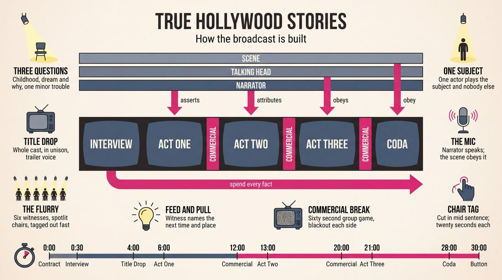
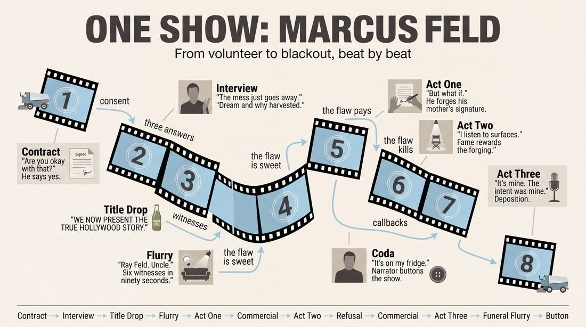
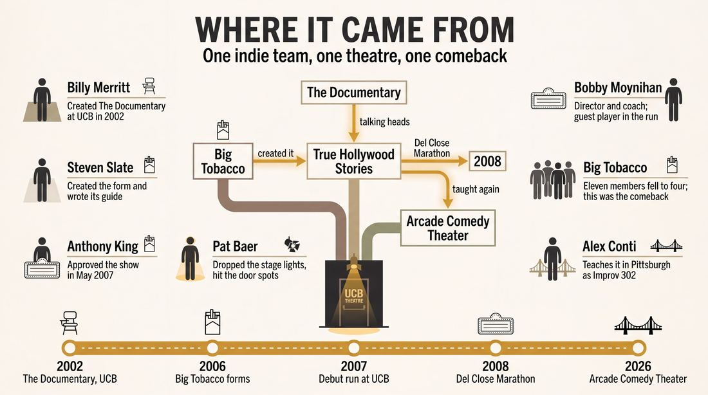
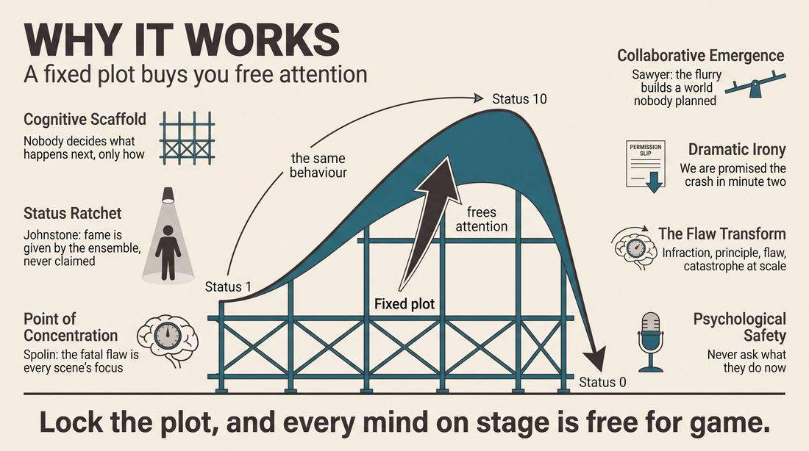
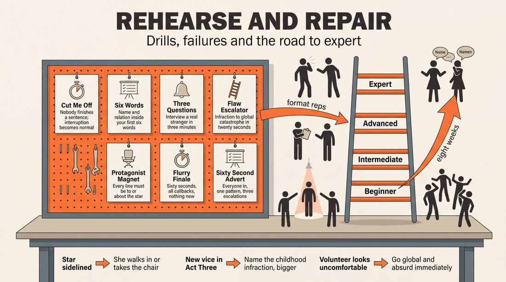

# True Hollywood Stories

> **A complete study of the long-form improv format _True Hollywood Stories_** - the original archived write-up, five infographics, grounded historical and pedagogical research, and a full mechanics-and-coaching manual.

| | |
|---|---|
| **Format** | True Hollywood Stories |
| **Primary source** | [IRC Improv Wiki](https://wiki.improvresourcecenter.com/index.php?title=True_Hollywood_Stories) |

---

## Contents

1. [Part I - The Original Write-Up](#part-i-the-original-write-up)
2. [Part II - The Infographics](#part-ii-the-infographics)
   - [1. Structure and Mechanics](#infographic-1-mechanics)
   - [2. A Show, Beat by Beat](#infographic-2-example)
   - [3. Origins and Lineage](#infographic-3-history)
   - [4. Why It Works](#infographic-4-theory)
   - [5. Rehearsal and Repair](#infographic-5-coaching)
3. [Part III - Research Dossier](#part-iii-research-dossier)
   - [Pass 1: History, Lineage, Literature and Scholarship](#research-history)
   - [Pass 2: Comparative Anatomy, Pedagogy and Production](#research-comparative)
4. [Part IV - Mechanics, Gameplay and Coaching Manual](#part-iv-mechanics-gameplay-and-coaching-manual)
   - [Pass 1: The Form, Its Mechanics and Its Gameplay](#manual-mechanics)
   - [Pass 2: Training, Coaching and Performance Companion](#manual-coaching)

---

## Part I - The Original Write-Up

*Verbatim archive of the source article, reproduced exactly as scraped. Everything after this section is generated elaboration built on top of it.*

### True Hollywood Stories

True Hollywood Stories is an improv form and show that ran at the UCB Theatre in New York in 2007\. The show starts with an interview of a random audience member. The cast than explodes that persons life into the classic sensationalized rise and fall story common to The E True Hollywood Story or VH1's Behind The Music. This show was created by [Steven Slate](https://wiki.improvresourcecenter.com/index.php?title=Steven_Slate "Steven Slate") with the indispensable help of director [Bobby Moynihan](https://wiki.improvresourcecenter.com/index.php?title=Bobby_Moynihan "Bobby Moynihan") and the remaining members of improv group [Big Tobacco](https://wiki.improvresourcecenter.com/index.php?title=Big_Tobacco "Big Tobacco").

##### Form

The basic celebrity tale as portrayed on television is one of humble beginnings, a meteoric rise to fame, and a tragic scandalous crash and burn. This is the basic form of the True Hollywood Story. The players get information from an audience member, then they follow this basic structure of doing scenes that take place during the "humble beginnings", "rise to fame", and "tragic downfall", of the audience members life. These three segments are broken up by "commercial breaks" which are essentially a chance to do a group game. There are a few devices such as talking heads, the narrator, and a more intensive use of lighting and sound that make the stage show feel like the tv show.
Here's the basic form:
Interview (3\-5 minutes)
Talking heads/dramatic narration opening (1\-2 minutes)
"humble beginnings" segment (5\-7 minutes)
Commercial Break (1 minute)
"Rise to fame" segment (7 minutes)
Commercial Break (1 minute)
"Tragic downfall" segment (7 minutes)

###### The Interview

Find a random audience member, the only requirement is that they're willing to talk about their life on stage\- make sure they're aware of that before they take the stage. Keep the interview brief, too much information can lead you all over the place, there's just a few basic pieces of info you're looking for: 

I. Get a basic picture of their childhood and family life. When something interesting comes up, explore it.

2\. Ask them about a childhood dream\- what did they wanna be when they grew up? Be sure to get this info because this what you'll make them famous for. Probe the answer and get the "why"\- what was attractive about the career, did they have a role model for it?

3\. Find out one thing they got into trouble for in their life\- anything, from getting to detention to going to jail. It doesn't matter how big a thing it was, because you're going to make it big, you'll turn some principle behind how and why they got into trouble into a fatal flaw that takes them down. You can mine great character games from this question.

These are the basic pieces of info you need. If you haven't gone too long already then you can ask about celebrities they've met, shows they like, or products they use. This isn't necessary, but you can use this info for your commercial break scenes, they can get involved with these celebrities when they make it big, or they can end up appearing on their favorite shows. Remember, the show revolves around this one character, so all the players should pay close attention during the interview, there's plenty of games to be found in the way the interviewee answers the questions. Also, if you're going to ask about dreams, don't ask about what they're doing now\- these can be very far apart, and it may come off as a depressing point\- and you don't need that information anyway, it'll only give you more to juggle. The only way you should know what your subject is doing now in their life is if they bring up that they are living their dream. Don't ask questions that will point out to them that they haven't achieved any of their dreams.

###### The Opening

We played with the opening quite a bit on this show, what we ended with and liked the best was a storm of talking heads and narration. After the interviewee leaves the stage the group can say together "We now present the True Hollywood Story of \_\_\_\_\_ \_\_\_\_\_\_\_". Immediately one of the players will sit in a chair in a spotlight and begin to talk as a character that knows the interviewee. This is similar to the Documentary opening except that the characters are alone in their interviews. The characters are speaking to the audience, they know they're being filmed for a tv show when they talk. They should identify themselves and their relation to the main character immediately, and if they don't then a player on the back line should identify them (in the narrator voice). We refer to these segments as "talking heads". The opening features a flurry of talking heads, the players should cut each other off aggressively tagging the other players out of the chair and filling out the world of the "celebrity". This will be intercut with all players taking turns as the narrator and opening the show in typical dramatic fashion e.g.\- "John Doe's ambition was too big for his small town of a thousand"\- cut to talking head "In kindergarten John was always trying to trade his Juice boxes for the other kids' gold stars"\- back to narrator "but his entrepreneurial spirit wouldn't go unnoticed in New York"\- cut to talking head.....etc. etc. ending with an intro to the first scenic block. By the end of the opening we should have seen family members, pundits, experts, kindergarten teachers, co\-workers, friends, former bosses\- anyone that a person would know\- commenting on their life. These characters can all find games in their talking head segments, and the games can continue throughout the show. After the opening, the talking heads and narration will serve as edits throughout the rest of the show. 

###### The Scenes

Plots can be confusing and troublesome in improv, and since this is a storytelling show then it could be easy to get stuck in a complicated plot, but you don't have to. The plot is built into the form, and it's always the same, the specifics and the games always change but the plot never does. It goes like this\- John Doe grows up and finds his way to his career, he gets uber\-famous in his field and lives it up, then he he makes a dreadful mistake and loses it all. That's all you need, it doesn't need to be more complicated than that. You're just showing the audience what it would be like if one of them lived the life of a celebrity. What's fun is that it won't always be the story of an entertainer\- we may see what happens when someone gets famous for being a fireman, or a doctor, or a zookeeper\- but still lives it up like a britney spears\- and crashes like a britney spears or mama cass or whoever. 
99% of scenes will feature the main character. The player who plays the main character will play no\-one else for the whole show.
During the first block just do fun game based scenes that take place before the character gets famous. Edit them with talking heads, let the talking heads inform forthcoming scenes, let the scenes inform the talking heads. Pepper it all with the overly dramatic narrators voice, and let the narrator leave you with a cliffhanger before the commercial break. Go to commercial and do a group game commercial. Have fun with it and work it into the theme of the show.
The next segment is the fame section. Let's see the main character living it up, show famous and infamous clips of them on talk shows, late\-night shows, the news, or public appearances. Let's see them partying, show their episode of "Cribs", let's see their sex tape, or interactions with paparazzi be creative and you'll find endless possibilities. Talking heads and narration provide the edits. End with a cliffhanger.
The last segment is the downfall, show them making big mistakes and getting in trouble. You'll probably morph the thing your subject said they got into trouble for in the interview into something much more serious. Let's see the misery, and play with it, have fun. 
End with a flurry of talking heads if you've got time, clips from the subjects funeral, etc... have fun with the ending, but let the narrator take over so it feels like a proper ending. Sometimes the character withers away, sometimes they die, sometimes they redeem themselves, but don't let your show die\- go to callback city and bring the show to a crescendo if you can. 
There is a lot of discussion of plot points here, but if you know them then you don't have to worry about it in your show, you can just proceed to do fun scenes and you know it'll all add up to a full show at the end\- you don't have to get stuck in the story. The audience is delighted every time you use something from the interview, so try to make sure you've hit all of it during this last beat.

###### Tech/Bells \& Whistles

At UCB we did the show using the spots that are focused on each door. We set up a chair in front of each door and when someone sat in one then Pat Baer would drop the stage lights and bring up the spot\- this is how we did all the talking heads segments. 
A microphone on stage helps, whenever a player speaks into it, you know they're the narrator.
Music\- [DC Pierson](https://wiki.improvresourcecenter.com/index.php?title=DC_Pierson&action=edit&redlink=1 "DC Pierson (page does not exist)") helped us out a lot by providing the music, the rule of thumb seems to be that the scenes should inform a musical choice, and the music should usually be very low so it accents the scene instead of stealing focus from it. An experienced tech and/or dj should handle music, but music is not necessary. The dj is improvising with you though, so it's great to have an improviser in this position.
These things make the audience experience of the show better, but are by no means necessary. This form does take a lot of practice though because you're recreating a specific tv show.

##### History

The story of improv group Big Tobacco was (within our comedy nerd world) much like a True Hollywood Story or Behind The Music show. A bunch of new improvisers got a group together and found success fast. People left the group, or "went solo". There was jealousy, controversy, infighting, and it all came apart pretty quickly. It looked like Big T had come to an end, the group went from 11 to 4 members in less than a year\- only [Phil Chorba](https://wiki.improvresourcecenter.com/index.php?title=Phil_Chorba "Phil Chorba"), [Mark Gessner](https://wiki.improvresourcecenter.com/index.php?title=Mark_Gessner&action=edit&redlink=1 "Mark Gessner (page does not exist)"), [Lydia Hensler](https://wiki.improvresourcecenter.com/index.php?title=Lydia_Hensler "Lydia Hensler"), and [Steven Slate](https://wiki.improvresourcecenter.com/index.php?title=Steven_Slate "Steven Slate") remained. But we pressed on and our comeback effort was the show True Hollywood Stories. We brought on [Kristy Webb](https://wiki.improvresourcecenter.com/index.php?title=Kristy_Webb&action=edit&redlink=1 "Kristy Webb (page does not exist)") as part of the group and eventually [Alden Ford](https://wiki.improvresourcecenter.com/index.php?title=Alden_Ford&action=edit&redlink=1 "Alden Ford (page does not exist)") became a valued player in the show as well. We put a lot of work into the show, we watched a lot of E True Hollywood Story 's together and then we presented ideas to our coach, [Bobby Moynihan](https://wiki.improvresourcecenter.com/index.php?title=Bobby_Moynihan "Bobby Moynihan"), and worked out the format for the show together. We interviewed Bobby a million times in practice where he played a lot of people who worked with him at Pizzeria Uno's, then we started dragging anyone we could find in the UCB offices into our rehearsal room to serve as a subject for the interview. [Billy Merritt](https://wiki.improvresourcecenter.com/index.php?title=Billy_Merritt "Billy Merritt") and [Jon Gabrus](https://wiki.improvresourcecenter.com/index.php?title=Jon_Gabrus&action=edit&redlink=1 "Jon Gabrus (page does not exist)") coached a few times too. We presented the show to [Anthony King](https://wiki.improvresourcecenter.com/index.php?title=Anthony_King "Anthony King") in May of 2007 and started a run the next month on Mondays/Wednesdays at UCB usually paired with [Film Noir](https://wiki.improvresourcecenter.com/index.php?title=Film_Noir&action=edit&redlink=1 "Film Noir (page does not exist)") or [Sunny Side Up](https://wiki.improvresourcecenter.com/index.php?title=Sunny_Side_Up&action=edit&redlink=1 "Sunny Side Up (page does not exist)"). Our only guest player in the run was Bobby. In 2008 we were scheduled to perform the THS at the [Del Close marathon](https://wiki.improvresourcecenter.com/index.php?title=Del_Close_marathon&action=edit&redlink=1 "Del Close marathon (page does not exist)") but several players couldn't make it\- we gave [Craig Rowin](https://wiki.improvresourcecenter.com/index.php?title=Craig_Rowin "Craig Rowin") and [Joe Spellman](https://wiki.improvresourcecenter.com/index.php?title=Joe_Spellman&action=edit&redlink=1 "Joe Spellman (page does not exist)") a crash course in the form and did the show\- it was a lot of fun. The form could still use some work, but I think my summary of it points out the main principles involved for anyone who'd like to try it.
\-Steven Slate

---

*Archived from [https://wiki.improvresourcecenter.com/index.php?title=True_Hollywood_Stories](https://wiki.improvresourcecenter.com/index.php?title=True_Hollywood_Stories) (IRC Improv Wiki) on 2026-08-09 23:23 UTC.*

---

## Part II - The Infographics

*Five 16:9 posters, each teaching a different aspect of the format. Click any poster to enlarge.*

<a id="infographic-1-mechanics"></a>

### 1. Structure and Mechanics

*How the form is played: the shape of the piece, the opening, the roles, the edit vocabulary, the flow of information, and the clock.*

{ .diagram loading=lazy decoding=async width="1100" height="614" }


<a id="infographic-2-example"></a>

### 2. A Show, Beat by Beat

*A single worked performance from suggestion to blackout: what happens in each beat, with short real example lines and what the players are doing technically.*

{ .diagram loading=lazy decoding=async width="1100" height="614" }


<a id="infographic-3-history"></a>

### 3. Origins and Lineage

*Where the form came from: creators, dates, theatres, how it spread between schools and cities, and the key figures - a documented timeline and lineage map.*

{ .diagram loading=lazy decoding=async width="1100" height="614" }


<a id="infographic-4-theory"></a>

### 4. Why It Works

*The theory: the core principles of the form and the research and craft ideas that explain why the structure produces good improv, each tied to a specific mechanic.*

{ .diagram loading=lazy decoding=async width="1100" height="614" }


<a id="infographic-5-coaching"></a>

### 5. Rehearsal and Repair

*Training and fixing the form: the essential drills, the common failure modes with their symptom-and-fix pairs, and the markers of beginner through expert play.*

{ .diagram loading=lazy decoding=async width="1100" height="614" }


---

## Part III - Research Dossier

*Two research passes: the historical record, then the comparative and pedagogical record. Claims carry evidence tags - treat unverified items accordingly.*

<a id="research-history"></a>

### » Pass 1: History, Lineage, Literature and Scholarship

### Research Summary

*   **Documentation Status:** The searchable historical record for "True Hollywood Stories" is exceptionally thin. It survives almost entirely through a single, highly detailed 2008 article on the IRC Improv Wiki written by its creator, Steven Slate, alongside scattered historical rosters of UCB indie teams, and a 2026 class syllabus from a Pittsburgh comedy theatre. [DOCUMENTED]
*   Because the primary record is so sparse, understanding this form requires analyzing its direct parent format—"The Documentary," created by Billy Merritt at UCB in 2002. [INFERRED]
*   The form was created in 2007 at the Upright Citizens Brigade (UCB) Theatre in New York by the indie team Big Tobacco, under the direction of Bobby Moynihan. [DOCUMENTED]
*   It is a highly structured, genre-parody long-form that mimics the narrative arc of *E! True Hollywood Story* and VH1's *Behind the Music*. [DOCUMENTED]
*   The format relies on a strict three-act predetermined plot: Humble Beginnings, Rise to Fame, and Tragic Downfall. [DOCUMENTED]
*   It utilizes an audience interview to generate a "fatal flaw" that drives the protagonist's downfall. [DOCUMENTED]
*   The form relies heavily on "talking head" direct-to-camera monologues and dramatic narration to serve as scene edits and exposition. [DOCUMENTED]
*   Despite its obscurity, the form has survived into the present day and is currently taught as an advanced 5-week intensive (Improv 302) at the Arcade Comedy Theater in Pittsburgh. [DOCUMENTED]

### Provenance and History

"True Hollywood Stories" was born out of necessity and group survival in the mid-2000s New York improv scene. The indie team Big Tobacco was formed in March 2006 by students from a Chris Gethard class at UCB. Originally boasting 11 members, the group suffered severe attrition, fracturing down to just four core players: Phil Chorba, Mark Gessner, Lydia Hensler, and Steven Slate. [DOCUMENTED] 

To mount a comeback, this "Phase Two" iteration of Big Tobacco (later adding Kristy Webb and Alden Ford) developed "True Hollywood Stories" as a vehicle to showcase their theatricality and character work. They studied episodes of *E! True Hollywood Story*, pitching mechanics to their coach, Bobby Moynihan. The form was approved by UCB Artistic Director Anthony King in May 2007 and ran on Monday and Wednesday nights, often paired with other genre forms like *Film Noir*. [DOCUMENTED] 

The form was designed to solve a specific improv problem: the cognitive load of generating plot. By locking the ensemble into a rigid, culturally understood narrative arc (Rise and Fall), the improvisers were freed to focus entirely on character games and heightening. [INFERRED]

| Year | Event | Place / Company | Source |
| :--- | :--- | :--- | :--- |
| 2002 | Billy Merritt creates "The Documentary" form, establishing the talking-head mechanic. | UCB Theatre, NY | [IRC Improv Wiki](https://wiki.improvresourcecenter.com/index.php?title=The_Documentary) |
| 2006 | Big Tobacco forms from a Chris Gethard class. | UCB Theatre, NY | [IRC Improv Wiki](https://wiki.improvresourcecenter.com/index.php?title=Big_Tobacco) |
| 2007 | "True Hollywood Stories" debuts and runs for several months. | UCB Theatre, NY | [IRC Improv Wiki](https://wiki.improvresourcecenter.com/index.php?title=True_Hollywood_Stories) |
| 2008 | The form is performed at the Del Close Marathon. | UCB Theatre, NY | [IRC Improv Wiki](https://wiki.improvresourcecenter.com/index.php?title=True_Hollywood_Stories) |
| 2026 | Taught as "Improv 302: True Hollywood Stories" | Arcade Comedy Theater, Pittsburgh | [Arcade Comedy Theater](https://www.arcadecomedytheater.com/classes/) |

### Lineage and Transmission

The form is a direct, highly specialized mutation of **The Documentary**, a format created by Billy Merritt at UCB in Fall 2002. Merritt's form introduced the mechanics of the "invisible camera" interview, the "fact flurry," and the use of narration to bridge scenes. [DOCUMENTED] 

While Merritt's Documentary form spread widely (currently taught internationally, such as by The Atom Improv in Liverpool), "True Hollywood Stories" remained a hyper-specific UCB dialect. It mutated the Documentary form by adding a strict chronological three-act structure and an Armando-style audience interview at the top. [INFERRED]

For over a decade, the form appeared lost to history, surviving only as a wiki stub. However, by 2026, the form had migrated to the Arcade Comedy Theater in Pittsburgh, Pennsylvania, where it is taught by Alex Conti as an advanced 5-week intensive. In this regional dialect, the heavy reliance on UCB-specific tech (spotlights and live DJs) has been stripped back, focusing instead on the theatrical challenge of the "meteoric rise and tragic crash-and-burn" narrative. [DOCUMENTED]

### Key Figures

| Person | Role in this form | Specific contribution | Source URL |
| :--- | :--- | :--- | :--- |
| Steven Slate | Creator / Performer | Conceived the form, performed in the original run, and authored its definitive written guide. | [IRC Wiki](https://wiki.improvresourcecenter.com/index.php?title=True_Hollywood_Stories) |
| Bobby Moynihan | Director / Coach | Co-developed the format's mechanics in rehearsal and played guest roles during the UCB run. | [IRC Wiki](https://wiki.improvresourcecenter.com/index.php?title=True_Hollywood_Stories) |
| Billy Merritt | Creator of Parent Form | Invented "The Documentary" form, which provided the foundational talking-head and narration mechanics. | [IRC Wiki](https://wiki.improvresourcecenter.com/index.php?title=The_Documentary) |
| Alex Conti | Instructor | Revived the form as an advanced curriculum piece in 2026, transmitting it to a new generation. | [Arcade Comedy](https://www.arcadecomedytheater.com/classes/) |
| Pat Baer | Tech Director | Developed the specific spotlight cues (dropping stage lights, bringing up door spots) for the talking heads. | [IRC Wiki](https://wiki.improvresourcecenter.com/index.php?title=True_Hollywood_Stories) |

### Canonical Shows, Companies and Recordings

*   **Big Tobacco at UCB (2007):** The original run took place on Mondays and Wednesdays at the Upright Citizens Brigade Theatre in New York, paired with *Film Noir* or *Sunny Side Up*. [DOCUMENTED]
*   **Del Close Marathon (2008):** A chaotic, late-stage performance of the form featuring fill-in players Craig Rowin and Joe Spellman. [DOCUMENTED]
*   **Arcade Comedy Theater Class Shows (2026):** Modern performances of the form occur as graduation shows for Improv 302 in Pittsburgh. [DOCUMENTED]
*   *Note on Recordings:* As is typical for mid-2000s indie improv, no video recordings of the original Big Tobacco run are known to exist in the public domain. [WIDELY PRACTICED, UNDOCUMENTED]

### Published Literature

| Work | Author | Year | What it says about this form | Where to find it |
| :--- | :--- | :--- | :--- | :--- |
| *True Hollywood Stories* (Wiki Entry) | Steven Slate | 2008 | Details the exact 3-act structure, interview technique, and history of the form. | [IRC Wiki](https://wiki.improvresourcecenter.com/index.php?title=True_Hollywood_Stories) |
| *Improv 302: True Hollywood Stories* | Arcade Comedy Theater | 2026 | Describes the form as an advanced character challenge focusing on the meteoric rise and tragic fall. | [Arcade Comedy](https://www.arcadecomedytheater.com/classes/) |
| *The Documentary* (Wiki Entry) | IRC Community | 2024 | Details the mechanics of the parent form, including invisible camera interviews and fact flurries. | [IRC Wiki](https://wiki.improvresourcecenter.com/index.php?title=The_Documentary) |

### Verbatim Quotes

> "The basic celebrity tale as portrayed on television is one of humble beginnings, a meteoric rise to fame, and a tragic scandalous crash and burn. This is the basic form of the True Hollywood Story."
> — Steven Slate
> [IRC Improv Wiki](https://wiki.improvresourcecenter.com/index.php?title=True_Hollywood_Stories)

> "Plots can be confusing and troublesome in improv, and since this is a storytelling show then it could be easy to get stuck in a complicated plot, but you don't have to. The plot is built into the form, and it's always the same..."
> — Steven Slate
> [IRC Improv Wiki](https://wiki.improvresourcecenter.com/index.php?title=True_Hollywood_Stories)

> "Immediately one of the players will sit in a chair in a spotlight and begin to talk as a character that knows the interviewee. This is similar to the Documentary opening except that the characters are alone in their interviews."
> — Steven Slate
> [IRC Improv Wiki](https://wiki.improvresourcecenter.com/index.php?title=True_Hollywood_Stories)

> "Don't ask questions that will point out to them that they haven't achieved any of their dreams."
> — Steven Slate
> [IRC Improv Wiki](https://wiki.improvresourcecenter.com/index.php?title=True_Hollywood_Stories)

> "Starting from humble beginnings, followed by a meteoric rise to fame and a tragic and scandalous crash-and-burn, this fictionalized narrative is both a crowd-pleasing show structure and an exciting challenge for advanced improvisors."
> — Arcade Comedy Theater Course Description
> [Arcade Comedy Theater](https://www.arcadecomedytheater.com/classes/)

> "The story of improv group Big Tobacco was (within our comedy nerd world) much like a True Hollywood Story or Behind The Music show."
> — Steven Slate
> [IRC Improv Wiki](https://wiki.improvresourcecenter.com/index.php?title=True_Hollywood_Stories)

> "99% of scenes will feature the main character. The player who plays the main character will play no-one else for the whole show."
> — Steven Slate
> [IRC Improv Wiki](https://wiki.improvresourcecenter.com/index.php?title=True_Hollywood_Stories)

> "The audience is delighted every time you use something from the interview, so try to make sure you've hit all of it during this last beat."
> — Steven Slate
> [IRC Improv Wiki](https://wiki.improvresourcecenter.com/index.php?title=True_Hollywood_Stories)

### Anecdotes and Stories

**The Fracturing of Big Tobacco**
The creation of the form mirrored the dramatic narrative of the form itself. Big Tobacco started as a bloated 11-person indie team formed at a bar (McManus) after a Chris Gethard class. Within a year, plagued by "jealousy, controversy, [and] infighting," the group hemorrhaged members until only four remained. "True Hollywood Stories" was explicitly designed as their "comeback effort" to prove they could survive the crash. [DOCUMENTED]

**Rehearsing with Bobby Moynihan**
To build the muscle for the "talking head" segments, the team relentlessly interviewed their coach, Bobby Moynihan. Moynihan would improvise as various bizarre characters from his real-life former job at Pizzeria Uno. Once they exhausted Moynihan, the team began dragging random UCB office workers into their rehearsal room to practice the audience interview mechanic. [DOCUMENTED]

**The 2008 DCM Crash Course**
Big Tobacco was scheduled to perform the form at the 2008 Del Close Marathon, but several core members couldn't attend. In true improv fashion, they drafted Craig Rowin and Joe Spellman at the last minute, giving them a frantic "crash course" in the highly structured format just before taking the stage. [DOCUMENTED]

### Academic and Scientific Research

**Cognitive Load and Spontaneous Generation**
*Research:* Charles Limb and Allen Braun’s fMRI studies on jazz musicians demonstrate that during flow states of improvisation, the dorsolateral prefrontal cortex (associated with conscious self-monitoring and planning) downregulates, while the medial prefrontal cortex (associated with self-expression) upregulates. 
*Relevance to this form:* By strictly pre-determining the plot (Humble Beginnings -> Rise -> Fall), "True Hollywood Stories" acts as a cognitive scaffold. Improvisers do not have to expend working memory deciding *what* happens next, allowing them to downregulate self-monitoring and focus entirely on *how* it happens (character game and heightening). [INFERRED]

**Collaborative Emergence**
*Research:* Keith Sawyer’s concept of "collaborative emergence" in group creativity posits that the most innovative group outputs occur when no single participant can predict the final outcome, yet all adhere to strict micro-interactional rules.
*Relevance to this form:* The "flurry of talking heads" opening mechanic requires actors to aggressively cut each other off, layering contradictory or escalating facts about the protagonist. This forces collaborative emergence, as the ensemble collectively builds the protagonist's world in real-time without a single "driver" controlling the narrative. [INFERRED]

**Psychological Safety and Empathy in Applied Improvisation**
*Research:* Applied improvisation in therapeutic and corporate settings emphasizes the necessity of psychological safety and empathetic listening to maintain participant willingness.
*Relevance to this form:* The audience interview requires a delicate psychological balance. The improviser must extract a "fatal flaw" (a childhood transgression) to exploit for comedy, while strictly avoiding questions that highlight the audience member's real-life failures. Slate's explicit warning—"Don't ask questions that will point out to them that they haven't achieved any of their dreams"—is a practical application of maintaining psychological safety. [DOCUMENTED]

### Documented Variants and Descendants

*   **The Documentary:** The parent form. It lacks the strict Rise-and-Fall narrative and the audience interview, focusing instead on exploring a single location or event through invisible-camera interviews and "fact flurries." [DOCUMENTED]
*   **Mockumentary Improv:** A generalized descendant taught widely (e.g., by The Atom Improv). It utilizes the talking-head edits but applies them to Christopher Guest-style ensemble pieces rather than a single protagonist's biographical arc. [DOCUMENTED]

### Criticism, Debate and Known Failure Modes

*   **The Plot Trap:** The most common failure mode in narrative improv is prioritizing plot over comedic game. Practitioners of this form explicitly warn against this. Because the plot is pre-ordained, improvisers who try to invent complex storylines rather than playing the "misery" or the "fame" of the moment will stall the show. [DOCUMENTED]
*   **Interview Cruelty:** The form requires turning an audience member's minor childhood trouble into a "fatal flaw that takes them down." Teachers warn that if the interviewer lacks tact, the show can easily cross from playful parody into mean-spirited bullying, alienating the audience. [DOCUMENTED]
*   **Tech Dependency:** The original UCB run relied heavily on a dedicated tech improviser (Pat Baer) dropping stage lights and hitting specific door spotlights for the talking heads, plus a live DJ (DC Pierson). Without a highly skilled tech booth, the rapid-fire edits required by the form can become muddy and confusing. [WIDELY PRACTICED, UNDOCUMENTED]

### Cultural Footprint

While the form itself remained niche, its DNA is woven into the fabric of mid-2000s UCB comedy. 
*   **Notable Alumni:** The form served as a crucible for several major comedy figures. Director Bobby Moynihan went on to a long tenure on *Saturday Night Live*. Original Big Tobacco member Sean Clements became a highly influential comedy writer and co-host of the *Hollywood Handbook* podcast. Lydia Hensler became a foundational teacher and performer at UCB. [DOCUMENTED]
*   **Influence on Genre Forms:** "True Hollywood Stories" helped prove that UCB's game-based, Harold-centric training could be successfully mapped onto strict television genre parodies, paving the way for later narrative forms like Improvised Law & Order and Improvised Seinfeld. [INFERRED]

### Gaps in the Record

*   **The Missing Link:** There is no documented digital trail explaining exactly how a niche 2007 UCB form made its way into the 2026 core curriculum of the Arcade Comedy Theater in Pittsburgh. It is highly likely it was carried by a UCB diaspora teacher, but the specific transmission vector is unverified.
*   **Lack of Archival Footage:** No video or audio recordings of Big Tobacco performing this form are known to exist, making it impossible to analyze the pacing, musical integration, or specific lighting cues used in the original run.
*   **End of the Run:** The exact date of Big Tobacco's final performance of this form, and the official dissolution of the team, remains undocumented.

### Source List

1. True Hollywood Stories - Steven Slate - 2008 - https://wiki.improvresourcecenter.com/index.php?title=True_Hollywood_Stories - Supports the primary mechanics, history, quotes, and creator intent of the form.
2. Arcade Academy Classes - Arcade Comedy Theater - 2026 - https://www.arcadecomedytheater.com/classes/ - Supports the modern transmission, teaching, and syllabus description of the form in Pittsburgh.
3. Big Tobacco - IRC Community - 2009 - https://wiki.improvresourcecenter.com/index.php?title=Big_Tobacco - Supports the history, roster changes, and timeline of the group that created the form.
4. The Documentary - IRC Community - 2024 - https://wiki.improvresourcecenter.com/index.php?title=The_Documentary - Supports the history and mechanics of the parent form created by Billy Merritt.
5. Advanced Study: The Improvised Documentary - The Atom Improv / TicketSource - 2026 - https://www.ticketsource.co.uk/the-atom-improv/advanced-study-the-improvised-documentary/e-zqxpxp - Supports the ongoing international teaching and spread of the parent Documentary form.

<a id="research-comparative"></a>

### » Pass 2: Comparative Anatomy, Pedagogy and Production

### Taxonomic Placement

```text
Long-Form Improvisation
└── Narrative / Thematic Forms
    ├── The Movie
    └── Documentary
        ├── Time-Dash Documentary
        └── True Hollywood Stories (THS)
            ├── The Behind-the-Music Variant
            └── The Corporate Startup Variant
```

True Hollywood Stories (THS) sits squarely in the thematic-narrative branch of long-form improvisation, acting as a highly structured, single-protagonist descendant of the Documentary form. Where the traditional Documentary form (pioneered by Billy Merritt and others) uses a scrapbook approach to explore a town, event, or theme through multiple perspectives, THS narrows the focus entirely onto the biographical arc of a single audience member. It borrows the "talking head" edit logic and narrator mechanics from Documentary but enforces a rigid, pre-ordained three-act plot (humble beginnings, rise to fame, tragic downfall) interspersed with short-form group games (commercial breaks). 

### Head-to-Head Comparisons

#### THS vs. Documentary
| Axis | True Hollywood Stories | Documentary | Consequence for the players |
| :--- | :--- | :--- | :--- |
| **Opening** | 3-5 minute audience interview. | Suggestion of a town, event, or historical item. | THS players must mine specific biographical data; Documentary players build from scratch. |
| **Structure** | Strict 3-act chronological (Rise, Fame, Fall). | Non-linear, scrapbook, or thematic exploration. | THS players never have to invent *what* happens next, only *how* it happens. |
| **Edit Logic** | Solo talking heads and an omnipresent Narrator. | Sweeps, or duo/group interviews. | THS requires strong solo character generation and aggressive tag-outs. |
| **Memory** | Hyper-focused on one protagonist's fatal flaw. | Thematic memory across a wide cast of characters. | THS players must constantly serve the protagonist's arc. |
| **Cast Size** | 6–8 (1 protagonist, 1 narrator, ensemble). | 8–12 (highly ensemble-driven). | THS requires strict role discipline; one player never changes character. |
| **Audience Contract** | "We will sensationalize your specific life." | "We will explore this topic like a PBS special." | THS carries a higher ethical burden regarding the audience member's comfort. |
| **Failure Mode** | Sidelining the protagonist or depressing the guest. | Disconnected vignettes that fail to cohere. | THS fails if the ensemble forgets whose story it is. |

#### THS vs. Armando (Monologue Deconstruction)
| Axis | True Hollywood Stories | Armando | Consequence for the players |
| :--- | :--- | :--- | :--- |
| **Opening** | Interview generates a single continuous narrative. | Monologue generates disconnected thematic scenes. | THS uses the interview as a literal blueprint; Armando uses it as abstract inspiration. |
| **Structure** | Chronological biography. | Hub-and-spoke montage. | THS requires narrative tracking; Armando requires thematic tracking. |
| **Edit Logic** | Narrator voiceover, talking head spotlights. | Standard sweep edits. | THS edits are diegetic to the TV-show format. |
| **Memory** | Cumulative (Act 3 relies on Act 1). | Resetting (scenes rarely connect directly). | THS players must remember specific names and childhood dreams from the interview. |
| **Cast Size** | 6–8. | 8–12. | THS requires a tighter ensemble to manage the narrative throughline. |
| **Audience Contract** | The audience member is the star of the show. | The monologist is the inspiration for the show. | THS requires the audience member to buy into being parodied. |
| **Failure Mode** | Plot panic (arguing over timeline). | Premise exhaustion (running out of ideas). | THS players must trust the pre-ordained scaffold. |

#### THS vs. The Movie
| Axis | True Hollywood Stories | The Movie | Consequence for the players |
| :--- | :--- | :--- | :--- |
| **Opening** | Audience interview. | Fictional movie title or genre suggestion. | THS is grounded in reality; The Movie is grounded in cinema tropes. |
| **Structure** | TV biography (Rise, Fame, Fall) with commercials. | Cinematic 3-act structure (Inciting incident, climax). | THS relies on episodic escalation; The Movie relies on cinematic pacing. |
| **Edit Logic** | Narrator and talking heads. | Director calls (cut to, pan, zoom, split screen). | THS edits are retrospective commentary; The Movie edits are real-time visual shifts. |
| **Memory** | Focused on the "fatal flaw" extracted from the interview. | Focused on the protagonist's cinematic goal. | THS is character-driven; The Movie is often plot-driven. |
| **Cast Size** | 6–8. | 6–10. | Both require strong ensemble support for the protagonist. |
| **Audience Contract** | Parody of E! True Hollywood Story / Behind the Music. | Parody of a specific film genre. | THS players must master the specific tone of trashy TV documentaries. |
| **Failure Mode** | Forgetting the commercial breaks or narrator. | Losing the cinematic visual language. | THS fails if it feels like a play rather than a TV broadcast. |

#### THS vs. The Harold
| Axis | True Hollywood Stories | The Harold | Consequence for the players |
| :--- | :--- | :--- | :--- |
| **Opening** | Interview. | Pattern game, invocation, or organic opening. | THS opening is purely data-gathering; Harold opening is thematic generation. |
| **Structure** | Single narrative with commercial breaks. | 3 beats of 3 disconnected scenes, plus group games. | THS is a single unified story; Harold is a braided thematic exploration. |
| **Edit Logic** | Spotlight talking heads. | Sweeps. | THS edits provide exposition; Harold edits provide pacing. |
| **Memory** | Linear tracking of one life. | Cross-pollination of three distinct worlds. | THS requires deep memory of one timeline; Harold requires wide memory of multiple timelines. |
| **Cast Size** | 6–8. | 8. | THS assigns permanent roles (Protagonist, Narrator); Harold roles are fluid. |
| **Audience Contract** | "Watch this person's life explode." | "Watch these themes connect." | THS is highly accessible to non-improvisers; Harold can be abstract. |
| **Failure Mode** | The downfall hits too close to reality. | The third beat fails to connect the themes. | THS requires careful handling of the guest's actual life. |

### What Makes It Uniquely Itself

1. **The Pre-Ordained Macro-Plot**: In THS, the improvisers never have to ask, "What happens next?" The macro-structure is permanently locked: Humble Beginnings → Commercial → Rise to Fame → Commercial → Tragic Downfall. If you remove this inevitable trajectory, you are simply playing a standard Documentary form. This constraint paradoxically frees the players to focus entirely on the *game* of the scene rather than the *plot*.
2. **The Single-Protagonist Lock**: One player is cast as the audience member and plays *only* that character for the entire 30-minute runtime. They are the sun around which the ensemble orbits. If players swap roles or follow multiple protagonists, the form loses its biographical focus and becomes a standard narrative.
3. **The Interview-to-Flaw Pipeline**: The entire third act (The Downfall) is reverse-engineered from a minor, seemingly innocuous infraction mentioned in the opening interview (e.g., "I got detention for talking too much"). The form demands that this minor infraction be extrapolated into a catastrophic, world-ending fatal flaw. Without this specific mechanic, the downfall feels unearned and disconnected from the audience member.

### Structural Variants in Practice

| Variant Name | What It Changes | Who Plays It | Source |
| :--- | :--- | :--- | :--- |
| **The Classic UCB** | Strict 3 acts, 2 commercial breaks, aggressive talking-head tag-outs, strict single protagonist. | Big Tobacco (Steven Slate, Bobby Moynihan, et al.) | IRC Improv Wiki |
| **The Modern Curriculum** | Often adds a "Redemption" beat after the downfall to leave the audience on a high note; heavy focus on character development over pure plot. | Arcade Comedy Theater (Improv 302 students) | Arcade Comedy Theater Syllabus |
| **The Ensemble Mockumentary** | Loosens the single-protagonist rule to follow a group (like a band or a startup team); uses "Behind the Music" tropes. | Various indie teams / Chaos Bloom Theater | [CRAFT CONSENSUS] |
| **The Time-Dash** | Removes the commercial breaks; relies entirely on lighting cuts to jump 10 years into the future between scenes. | Jimmy Carrane students | Jimmy Carrane Coaching Blogs |

### The Teaching Ladder

| Stage | Skill Introduced | Why In This Order | Typical Exercise | Source / [CRAFT CONSENSUS] |
| :--- | :--- | :--- | :--- | :--- |
| **1. The Interview** | Extracting the 3 core data points (childhood, dream, minor trouble). | Without the correct raw data, the form collapses before it begins. | 3-Question Drill | Steven Slate / IRC Wiki |
| **2. Talking Heads** | Solo character generation and direct-to-camera address. | It is the primary edit mechanism and world-building tool. | Hot Seat Confessionals | Billy Merritt / [CRAFT CONSENSUS] |
| **3. The Pre-Ordained Plot** | Surrendering to the Rise/Fame/Fall structure. | Players naturally panic about plot; they must learn to trust the scaffold. | Inevitable Timelines | [CRAFT CONSENSUS] |
| **4. The Fatal Flaw** | Escalating a minor infraction into a catastrophic failure. | It connects the interview to the climax of the show. | The Flaw Escalator | [CRAFT CONSENSUS] |
| **5. The Narrator (Withheld from beginners)** | Synthesizing scenes, controlling pacing, and executing cliffhangers. | Requires high-level situational awareness and can overwhelm novices. | Narrator Cliffhangers | [CRAFT CONSENSUS] |

### Documented Drills and Exercises

| Drill | Origin / Teacher | How to Run It | What It Fixes in This Form | Source |
| :--- | :--- | :--- | :--- | :--- |
| **3-Question Interview Drill** | Steven Slate / UCB | Player A interviews Player B (as audience). Must extract: 1. Childhood vibe, 2. Childhood dream + the "why", 3. Minor trouble. Time limit: 3 minutes. | Rambling, low-energy, or overly invasive interviews. | IRC Improv Wiki |
| **Hot Seat Confessionals** | Billy Merritt | 3 chairs downstage. Players aggressively tag each other out to deliver 15-second talking head monologues about a fictional celebrity. | Weak edits, slow transitions, and repetitive perspectives. | Reddit Improv Forums / [CRAFT CONSENSUS] |
| **Narrator Cliffhangers** | [CRAFT CONSENSUS] | Two players do a scene. A third player (Narrator) must interrupt at the climax with a dramatic voiceover that ends the scene on a cliffhanger. | Scenes that fizzle out instead of ending on a high note. | [CRAFT CONSENSUS] |
| **The Fatal Flaw Escalator** | [CRAFT CONSENSUS] | Take a minor infraction (e.g., "stole a cookie") and play 3 scenes where the underlying principle (greed) escalates to a global scale. | Boring downfalls that fail to sensationalize the guest's life. | [CRAFT CONSENSUS] |
| **Commercial Break Group Game** | UCB | The team has 60 seconds to create a cohesive, high-energy physical group game based on a product mentioned in the interview. | Low energy between acts; forgetting to use the commercial breaks. | IRC Improv Wiki |
| **Time-Dash Documentary** | Jimmy Carrane | Two players sit as talking heads. They establish a relationship. Lights cut. They are now 10 years later. Lights cut. 10 more years. | Getting stuck in one time period; failing to show the "Rise." | Jimmy Carrane Blog |
| **Single-Protagonist Tracking** | [CRAFT CONSENSUS] | 5 players. Player 1 is the protagonist. Players 2-5 must initiate scenes that *force* Player 1 to react, keeping them the center of attention. | The main character getting sidelined in their own story. | [CRAFT CONSENSUS] |
| **Paparazzi / Red Carpet** | Arcade Comedy Theater | One player is the star. The rest are paparazzi shouting questions that establish the star's absurd wealth/status. The star must justify them. | The "Rise to Fame" act lacking scale or feeling too grounded. | Arcade Comedy Theater / [CRAFT CONSENSUS] |
| **The "Why" Probe** | Steven Slate | Interview drill focusing solely on drilling down into the emotional reason behind a mundane career choice. | Superficial interview data that gives the players nothing to play with. | IRC Improv Wiki |
| **Flurry Finale** | Big Tobacco | 6 players. 60 seconds on the clock. Players must execute as many distinct talking-head perspectives on the protagonist's "death" as possible. | Endings that drag; failing to bring the show to a crescendo. | IRC Improv Wiki |

### Common Failure Modes and Diagnoses

| Failure Mode | What It Looks Like From the Audience | Root Cause | Fix | Who Names It |
| :--- | :--- | :--- | :--- | :--- |
| **Plot Panic** | Players arguing on stage about what year it is or what happens next. | Forgetting the pre-ordained plot structure. | The Narrator steps to the mic and dictates the reality/timeline. | [CRAFT CONSENSUS] |
| **The Sidelined Star** | The protagonist stands quietly while supporting characters do bits. | Ensemble playing their own games instead of serving the protagonist. | Protagonist initiates a talking head to re-center their POV. | Steven Slate / UCB |
| **Depressing the Guest** | The audience member looks visibly uncomfortable during the downfall. | Using the guest's actual current life/failures instead of a fictionalized extreme. | Exaggerate the childhood dream so the downfall is clearly absurd fiction. | Steven Slate |
| **Interview Bloat** | The opening interview drags on for 10 minutes with low energy. | Host asking too many irrelevant questions. | Stick strictly to the 3-question framework. | [CRAFT CONSENSUS] |
| **Talking Head Isolation** | The talking heads contradict the scenes or feel like a separate show. | Players not using the talking heads to inform the next scene. | "Feed and Pull": The talking head explicitly names a location for the next scene. | [CRAFT CONSENSUS] |

### Production and Logistics

*   **Cast Size**: 6 to 8 players. This allows for 1 dedicated Protagonist, 1 dedicated Narrator/Host, and 4 to 6 ensemble members to populate the world, play family members, and execute rapid talking-head edits without exhausting the cast.
*   **Runtime**: 25 to 30 minutes.
*   **Stage Layout**: 2 to 3 chairs placed far downstage for the talking heads. The main playing space is upstage of the chairs. A dedicated microphone on a stand is placed to one side for the Narrator.
*   **Lighting and Tech Cues**: Highly tech-dependent. Requires spotlights focused on the downstage chairs (when a player sits, the stage lights drop and the spot comes up). Requires hard blackouts for the commercial breaks.
*   **Music and Sound**: A DJ or tech improviser is crucial. Low, dramatic underscore is used during narration. Thematic, high-energy music is used to transition into commercial breaks.
*   **MC and Host Duties**: The Host must clearly explain the audience contract ("We are going to sensationalize your life"), select a willing participant, and conduct the strict 3-to-5 minute interview.
*   **How the Suggestion is Taken**: The Host brings the audience member on stage (or goes to them in the audience) and asks: 1. Childhood/family life, 2. Childhood dream and *why*, 3. One minor thing they got in trouble for.
*   **Lineup Placement**: Due to its high tech requirements, narrative weight, and audience-participation opening, THS almost always serves as the anchor or closing form of a show lineup.
*   **Rehearsal Cadence**: Requires dedicated format reps and tech rehearsals. Teams cannot simply do "scene work" to get better at THS; they must practice the specific transitions, narrator hand-offs, and interview extraction.
*   **Producer Prep**: Must secure a tech improviser, test the spotlights, ensure the microphone is live, and brief the house manager on the audience participation element.

### Adaptations Beyond the Stage

*   **Classroom and Youth**: The "tragic scandalous crash and burn" must be removed. Instead, the third act is framed as "a silly misunderstanding" or "overcoming a ridiculous obstacle." The focus shifts from a cautionary tale to a hero's journey.
*   **Corporate and Applied Improv**: Framed as a "Behind the Business" or "Startup Story." The form focuses on the "Rise to Success" of a fictionalized company or product. The "fatal flaw" is replaced with a "market challenge" that the team overcomes, emphasizing resilience and innovation rather than a scandalous crash.
*   **Online and Remote**: The protagonist's video is pinned. The Zoom/Teams "spotlight" feature is used manually by a tech producer to simulate the talking-head lighting cues. Commercial breaks are done via screen-sharing or rapid virtual backgrounds.
*   **Community and Therapeutic Settings**: Focuses heavily on resilience and narrative reframing. The downfall is framed as a moment of necessary growth rather than a fatal flaw.
*   **Accessibility and Inclusion**: The Host must be prepared to conduct the interview with the audience member remaining in their seat if they have mobility issues, rather than forcing them onto the stage.
*   **Content-Safety and Consent**: The Host must explicitly ask, "Are you okay with us making up a wild, scandalous, fictional story about you?" The core ethical rule is to parody the *fictionalized trajectory* (the absurd fame), never the real person's actual trauma or current life situation.

### Evidence Base for Those Adaptations

*   **Narrative Identity and Reframing**: McAdams' research on narrative identity supports the therapeutic and community value of allowing individuals to see their life stories playfully reframed and externalized. (McAdams, D. P., 2001. *The Psychology of Life Stories*).
*   **Psychological Safety via Humor**: Edmondson's work on psychological safety demonstrates that using exaggerated humor (such as the absurd downfall in the corporate variant) allows teams to safely discuss failure and market challenges without triggering defensive routines. (Edmondson, A., 1999. *Psychological Safety and Learning Behavior in Work Teams*).

### Scholarly Frames Worth Applying

*   **R. Keith Sawyer on Collaborative Emergence**
    *   *The Frame*: Creativity in groups emerges from unpredictable micro-interactions that are constrained and guided by macro-structures.
    *   *Citation*: Sawyer, R.K. (2003). *Group Creativity: Music, Theater, Collaboration*.
    *   *Mapping*: The rigid 3-act plot (macro-structure) of THS frees the players to focus entirely on the emergent game of the scene (micro-interaction) without worrying about narrative collapse.
*   **Keith Johnstone on Status and Spontaneity**
    *   *The Frame*: All dramatic interaction is driven by the seesaw of raising and lowering status.
    *   *Citation*: Johnstone, K. (1979). *Impro: Improvisation and the Theatre*.
    *   *Mapping*: The entire THS form is a macro-status play. The protagonist begins low-status (humble beginnings), is artificially elevated to maximum high-status by the ensemble (fame), and is then brutally stripped of status (tragic downfall).
*   **Viola Spolin on Point of Concentration (POC)**
    *   *The Frame*: Players must focus on a specific, solvable problem to bypass the intellect and achieve intuition.
    *   *Citation*: Spolin, V. (1963). *Improvisation for the Theater*.
    *   *Mapping*: The "fatal flaw" extracted from the interview serves as the POC for the entire cast; every scene, talking head, and commercial must heighten this specific flaw.

### Where the Form Is Heading

*   **Current Practice**: THS has transitioned from an indie team experiment to a formalized advanced curriculum. Theaters like Arcade Comedy Theater in Pittsburgh teach it as a dedicated 5-week intensive ("Improv 302: True Hollywood Stories"), focusing on character commitment and elegant heightening.
*   **Revivals**: It remains a popular festival form because the audience interview guarantees immediate crowd investment, and the pre-ordained structure ensures a complete narrative even with a pickup cast.
*   **Hybrids**: Contemporary companies are merging THS with modern mockumentary styles (akin to *The Office* or *Abbott Elementary*). Instead of isolating the talking heads to downstage chairs between scenes, players are increasingly breaking the fourth wall to deliver "confessionals" *during* the active scene, creating a more fluid, single-location documentary feel.

### Source List

1. True Hollywood Stories - IRC Improv Wiki - 2008 - https://wiki.improvresourcecenter.com/index.php?title=True_Hollywood_Stories - Supports the foundational structure, UCB origins, the 3-question interview technique, and the failure mode of depressing the guest.
2. Arcade Academy: Session 5 Classes - Arcade Comedy Theater - 2026 - https://www.arcadecomedytheater.com/classes/ - Supports the modern teaching of the form (Improv 302), its use as an advanced curriculum, and the focus on character and narrative.
3. Three Simple Long Forms you can do right now - Jimmy Carrane - 2014 - https://jimmycarrane.com/three-simple-long-forms-can-right-now/ - Supports the "Time Dash Documentary" drill and the mechanics of chair-based talking heads.
4. Game Library: “Documentary” - ImprovDr - 2023 - https://improvdr.com/2023/11/10/game-library-documentary/ - Supports the use of experts, archival footage, and reenactments in documentary-style improv.
5. Group Creativity: Music, Theater, Collaboration - R. Keith Sawyer - 2003 - N/A - Supports the scholarly frame of collaborative emergence.
6. Impro: Improvisation and the Theatre - Keith Johnstone - 1979 - N/A - Supports the scholarly frame of status.
7. Improvisation for the Theater - Viola Spolin - 1963 - N/A - Supports the scholarly frame of Point of Concentration.
8. The Psychology of Life Stories - Dan P. McAdams - 2001 - N/A - Supports the evidence base for therapeutic adaptations.
9. Psychological Safety and Learning Behavior in Work Teams - Amy Edmondson - 1999 - N/A - Supports the evidence base for corporate adaptations.

---

## Part IV - Mechanics, Gameplay and Coaching Manual

*Synthesis over the original article and both research dossiers: first how the form works and how to play it, then how to train an ensemble to perform it.*

<a id="manual-mechanics"></a>

### » Pass 1: The Form, Its Mechanics and Its Gameplay

### At a Glance

| Field | Detail |
|---|---|
| **Also known as** | THS; "the E! True Hollywood Story form"; "Behind the Music"; (in modern curriculum) *Improv 302: True Hollywood Stories* |
| **Family** | Narrative/thematic long form → Documentary branch → single-protagonist biographical parody. Direct mutation of Billy Merritt's **The Documentary** (UCB, 2002), crossed with an Armando-style audience interview. |
| **Cast size** | 5–7 onstage is the sweet spot. The dossier says 6–8; the original Big Tobacco roster was closer to 4–6. My judgement: **6** is ideal — one locked protagonist plus five bodies for talking heads, plus one tech improviser off-stage. Below 5 the talking-head flurry thins out; above 8 the protagonist gets crowded off their own show. |
| **Runtime** | 25–30 minutes, of which 3–5 is the interview. |
| **Opening** | A live interview with a volunteer audience member, followed by a "flurry" of solo spotlit talking heads intercut with dramatic narration. |
| **Suggestion taken** | Not a word. A **person** — and specifically three data points from them: (1) childhood and family, (2) childhood dream and *why*, (3) one thing they got in trouble for. |
| **Structural rigidity (1–5)** | **5.** The macro-plot is fixed and non-negotiable: Humble Beginnings → Rise to Fame → Tragic Downfall, punctuated by two commercial breaks. Only the specifics vary. |
| **Difficulty (1–5)** | **4.** The scene work is easy; the *format discipline* is hard. Interview extraction, register-switching, aggressive tag-outs and tech integration all have to be rehearsed as separate muscles. |
| **Prerequisites** | Reliable two-person game; the ability to invent and hold a distinct solo character for 15 seconds; comfort speaking directly to the audience-as-camera; a team that can edit *aggressively* without apologising; ideally a tech improviser. |
| **Best for** | Closing slot of a mixed bill. Festivals. Teams with strong character players and one great mimic/protagonist. Houses that want a form non-improvisers instantly understand. |
| **Avoid when** | You have no willing audience volunteer; the volunteer is drunk, distressed, or a plant; the room is tiny and the volunteer's whole family is in it; your team cannot resist plot-solving; you have no lighting control *and* no discipline to fake it. |

### The Essence in One Paragraph

True Hollywood Stories takes a random audience member, interviews them for three to five minutes about their childhood, their childhood dream, and one thing they once got in trouble for — and then, for the next twenty-five minutes, broadcasts the sensationalised television biography of the person they never became. One player is cast as the subject and plays *no one else* for the entire show. Everyone else plays the world: family, teachers, former bandmates, industry pundits, and an omniscient narrator at a microphone. The plot is pre-installed and never changes — humble beginnings, meteoric rise, scandalous crash — so no one on stage ever has to decide *what happens next*, only *how it happens and who testifies about it*. The engine is a transform: the trivial childhood infraction from the interview ("I forged my mom's signature on a permission slip") becomes the fatal flaw that destroys them at global scale in Act Three. Scenes are cut apart by solo talking heads under a spotlight and by narration under a mic; two "commercial breaks" serve as group games and act curtains. Because the audience knows the shape of an E! True Hollywood Story in their bones, every scene plays under dramatic irony from the first second: we are watching a man's happiest day knowing the voiceover has already promised us the wreck.

### Why This Form Exists

Long-form improvisers are, on the whole, better at scenes than at stories. The moment a team decides to "do a narrative," a specific tax gets levied: two people on stage stop listening to each other and start privately auditing the plot — *is this the midpoint? does this contradict the thing in scene two? who's supposed to enter now?* — and the scene work gets worse in exact proportion to how hard they're thinking. Slate names the problem directly: "Plots can be confusing and troublesome in improv... but you don't have to. The plot is built into the form, and it's always the same."

THS solves it by **pre-paying the plot tax before the show starts.** Because the arc is culturally universal — everybody in the room has seen a Behind the Music, even people who've never seen improv — the ensemble doesn't have to build a story; they have to *fill a story that already exists*. The cognitive budget that would have gone to narrative construction goes instead to character game and heightening.

Four things this buys you that a montage cannot:

1. **Consequence without bookkeeping.** In a montage, the fifth scene rarely costs the first scene anything. In THS, every scene is retrospectively load-bearing: a talking head in Act One about how "Marcus never asked permission for anything" is the seed of the felony in Act Three. You get the emotional payoff of narrative causation while doing nothing more complicated than remembering one adjective.
2. **A licence to compress time.** The documentary frame makes the jump cut *diegetic*. A narrator can say "Within eighteen months, he had sold four million records" and the audience accepts it as television grammar, not as an improviser skipping the hard work. No other family of forms gives you free time travel with no apology.
3. **A built-in emotional shape.** Johnstone's status seesaw is the whole architecture: the protagonist starts at status 1, is inflated by the ensemble to status 10, and is stripped to status 0. You cannot accidentally write a flat show. Even a bad THS *feels* like something happened.
4. **The audience member as star.** An Armando monologist inspires scenes; a THS volunteer *is* the show. This is a categorically different audience relationship, and it is why the form works at festivals with pickup casts. The person in seat F7 came to watch improv and is leaving as the subject of a televised tragedy.

What a plain montage gives you instead — freedom, thematic surprise, tonal range — is precisely what THS trades away. That trade is the deal. Make it consciously.

### The Audience Contract

**What the audience is promised, in order of importance:**

1. *We are going to take this specific person and make them enormously famous, and then destroy them.* Both halves matter. An audience that gets the rise without the crash feels cheated; an audience that gets the crash without a real, delicious, absurdly detailed peak feels bullied.
2. *We are going to use what they actually told us.* Slate: "The audience is delighted every time you use something from the interview." Every recycled detail — Uncle Ray, the permission slip, the town of Perrysburg — buys credit. The delight is not "that's funny," it's "they were *listening*."
3. *The person themselves will be safe.* The fiction is savage; the human is protected. The audience is watching their neighbour get roasted, and they will withdraw instantly if the roast lands on the real person's real disappointments.
4. *It will look and sound like television.* The spotlight, the mic, the underscore, the commercial break. The audience is promised a broadcast, not a play.

**How they know where they are, at any second:**

| Signal | What it tells the audience |
|---|---|
| Player sits in a downstage chair; stage lights drop; spot up | We are in a talking head. This character is being interviewed, alone, years later. |
| Player steps to the standing mic | This is the omniscient narrator. Whatever they say is now true. |
| Full stage lights, two or more players, present tense | We are inside a scene from the subject's life. |
| Hard blackout + high-energy music sting | Act break. Commercial. |
| Protagonist actor on stage | We are watching the subject. (They never play anyone else, so their presence is unambiguous.) |

**What breaks the contract:**

- **Losing the subject.** Two supporting characters doing a great two-hander with no protagonist in it. The audience doesn't consciously object; they just disengage, because the promise was *this life*.
- **Reality bleed.** Any reference to what the volunteer is *actually* doing now. Slate is explicit: don't ask, don't use it, don't gesture at it. The instant the show says "and of course, in reality, Marcus works in logistics," the fiction curdles into mockery.
- **Register collapse.** A talking head that turns into a two-person scene; a narrator who does jokes instead of mythology; a scene where someone addresses the camera without the spot. When the grammar goes fuzzy the audience stops knowing which "layer" of the TV show they're in, and the form's clarity — its whole selling point — evaporates.
- **Plot argument on stage.** "No, that was before he moved to Nashville." Two lines of that and the audience realises there is no writer's room, and the documentary illusion dies.
- **A downfall that isn't about the flaw.** If the subject is destroyed by an unrelated plane crash, the last act is just noise. The contract is *cause and effect*: we told you what was wrong with him in minute six, and now you watch it kill him.

### Anatomy: The Full Structural Map

The show is a **broadcast**, not a play, and its architecture is the architecture of a cable documentary hour compressed to half an hour: cold open, title, three segments, two ad breaks, and a coda.

Three layers run simultaneously and never blur:

- **Layer 1 — FOOTAGE.** Scenes from the subject's life, present tense, full stage light. This is where game lives.
- **Layer 2 — TESTIMONY.** Solo talking heads, past tense, spotlight, direct to camera. This is where world-building, exposition and character game live.
- **Layer 3 — NARRATION.** A voice at the mic, past tense, omniscient, mythic. This is where time, scale and inevitability live.

Everything in the form is a rule about how those three layers hand off to each other.

```
                     TRUE HOLLYWOOD STORIES — WHOLE SHAPE (≈30 min)

  0:00  ┌──────────────────────────────────────────────────────────────┐
        │  CONTRACT  "we're going to make up a wild story about you"    │  0:30
        ├──────────────────────────────────────────────────────────────┤
        │  THE INTERVIEW                                                │
        │   Q1 childhood/family    Q2 dream + WHY    Q3 the infraction  │
        │   (optional: celebs met / favourite show / a product)         │  3–5 min
  4:00  ├──────────────────────────────────────────────────────────────┤
        │  TITLE DROP  (all): "We now present the True Hollywood        │
        │                     Story of ______ ______."                  │
        │  OPENING FLURRY   TH ▸ NARR ▸ TH ▸ TH ▸ NARR ▸ TH ▸ NARR      │  1–2 min
  6:00  ├──────────────────────────────────────────────────────────────┤
        │                                                               │
        │  ACT I — HUMBLE BEGINNINGS        status ▁▁▂                  │
        │   scene ─TH─ scene ─NARR─ scene ─TH─ scene                    │  5–7 min
        │   plants: the dream, the enabler, the flaw-as-virtue          │
        │                                   ⤷ NARRATOR CLIFFHANGER      │
 12:00  ├══════════════ BLACKOUT ═══ COMMERCIAL #1 (group game) ════════┤  ~1 min
 13:00  ├──────────────────────────────────────────────────────────────┤
        │  ACT II — RISE TO FAME            status ▅▇█                  │
        │   media clips, Cribs, talk shows, paparazzi, excess           │  7 min
        │   the flaw pays off — everyone LOVES it                       │
        │                                   ⤷ NARRATOR CLIFFHANGER      │
 20:00  ├══════════════ BLACKOUT ═══ COMMERCIAL #2 (group game) ════════┤  ~1 min
 21:00  ├──────────────────────────────────────────────────────────────┤
        │  ACT III — TRAGIC DOWNFALL        status ▆▃▁▁                 │
        │   the flaw at global scale, the refusal, the loss             │  7 min
 28:00  ├──────────────────────────────────────────────────────────────┤
        │  CODA — FLURRY FINALE: funeral / wither / redemption          │
        │  CALLBACK CITY ▸ every interview fact spent ▸ NARRATOR BUTTON │  1–2 min
 30:00  └──────────────────────────────────────────────────────────────┘

  LAYER KEY:  ── scene (full light)   ▸TH talking head (spot, solo, seated)
              ▸NARR narrator (mic)    ═ blackout
```

**Beat-by-beat table**

| Unit | Approx. clock | What happens | Who drives it | Success criterion | Common error |
|---|---|---|---|---|---|
| Contract | 0:00–0:30 | Host finds a volunteer, states out loud that the team will invent a wild, scandalous, fictional life for them, and confirms consent. | Host | Volunteer visibly game; audience laughing already at the threat. | Skipping it, or burying it in a joke so the volunteer never actually agrees. |
| The Interview | 0:30–4:00 | Three questions, in order, with one "why" probe each. Optional bonus data. Volunteer returns to their seat. | Host; whole cast listening as if for a test | Cast has: a hometown, 2–3 named humans, one dream with an emotional reason, one infraction with a principle behind it. | Interview bloat; the host doing bits; asking what the person does now. |
| Title Drop | 4:00–4:10 | Whole cast, in unison, TV-announcer voice: "We now present the True Hollywood Story of ______." | Ensemble | Sharp, loud, unison. It's the theme tune. | Mumbled, unrehearsed, or one person doing it alone. |
| Opening Flurry | 4:10–6:00 | Rapid alternation of solo talking heads and narrator lines. Six to ten distinct witnesses established. Ends by naming the first scene's world. | Everyone; aggressive tagging | Audience knows the subject's town, family, dream, and has met at least five people with distinct voices. Nobody has been in the chair longer than 20 seconds. | Politeness. Waiting your turn. Talking heads that give facts but no character. |
| **ACT I — Humble Beginnings** | 6:00–12:00 | 3–4 short scenes before fame. The dream is established as absurdly sincere; the infraction happens in miniature and is *rewarded*; an enabler is planted. | Protagonist + ensemble; talking heads edit | Every scene contains the protagonist. The flaw is visible and adorable. | Making Act I sad or "grounded." It should be funny and small, not poignant. |
| Cliffhanger | 11:45–12:00 | Narrator at mic promises the turn: "…but nobody in Perrysburg could have known what was coming." | Narrator | Applause/laugh into blackout. | Fading out on an unresolved scene with no narration. |
| Commercial #1 | 12:00–13:00 | Blackout, music, lights up on a 60-second group game — ideally an advert for a product or brand mentioned in the interview. | Whole ensemble | High energy, physical, unified, over in a minute. | A slow two-person scene labelled "commercial." Or forgetting to do it. |
| **ACT II — Rise to Fame** | 13:00–20:00 | Media clips: talk show, Cribs, red carpet, awards, paparazzi, entourage, the first betrayal. The flaw is now the engine of success. | Ensemble builds status *at* the protagonist | Specific numbers, brand names and absurd wealth. The protagonist has changed how they speak. | Playing the fame generically ("this is crazy, man!") instead of with itemised, ridiculous detail. |
| Cliffhanger | 19:45–20:00 | Narrator promises the crash. | Narrator | Audience makes an "ooooh" noise. | Crashing the character *before* the break, leaving Act III with nothing to do. |
| Commercial #2 | 20:00–21:00 | Second group game; often a callback/sequel to Commercial #1, now tonally darker. | Whole ensemble | Recognisable as the same campaign, degraded. | An unrelated new game. Wasted callback. |
| **ACT III — Tragic Downfall** | 21:00–28:00 | The infraction at catastrophic scale. Lawyers, betrayals, the refusal of help, the loss of the original dream object. | Protagonist takes more of the load; witnesses turn on them | The mechanism of the fall is *the same behaviour* the audience loved in Act I. | Inventing a new, unrelated disaster. Or wallowing — playing misery without game. |
| Coda / Flurry Finale | 28:00–30:00 | Rapid final talking heads — funeral, "where are they now," the one witness who forgives them — every remaining interview fact spent. Narrator buttons the show. | Everyone; narrator lands it | Three or more callbacks land in 90 seconds; final image is the mic. | Trailing off. Letting the last scene be the ending instead of the narrator. |

### The Opening

The word "opening" does double duty in this form. There is the **Interview** (the data acquisition) and the **Flurry** (the theatrical opening proper). Run them as two separate machines.

#### Procedure A — The Interview

1. **Pre-select nothing.** Take a genuinely random willing person. Ask the room, "Who's willing to come up here and talk about their real life for three minutes?" and take the first honest hand.
2. **State the contract out loud, before they stand up.** "We're going to make up a completely fake, extremely dramatic story about your life. You're going to become famous and then it's going to go badly. Are you cool with that?" Get an audible yes. Slate's ethic and modern content-safety practice agree here.
3. **Seat them or stand them where the audience can see their face.** Craft judgement, not documented: if the person has mobility issues or is nervous, interview them *in their seat* with a handheld or a raised voice. The form does not require them on stage; it requires them audible.
4. **Q1 — childhood and family.** "Where'd you grow up? Who was in the house?" Follow *one* interesting thing and drop the rest. You are hunting for proper nouns: a town, a sibling's name, a job a parent had, one strange household detail.
5. **Q2 — the childhood dream, plus the WHY.** "When you were a kid, what did you want to be when you grew up?" Then immediately: "What was good about it? Did you know somebody who did it?" **This question produces Act II.** The "why" is more useful than the job, because the why is playable in every scene; the job is just a costume.
6. **Q3 — the infraction.** "What's one thing you got in trouble for? Anything — detention, grounded, arrested." **This question produces Act III.** Probe for the *mechanism*: what did they actually do, and what did they tell themselves? You are extracting a principle, not an anecdote.
7. **Optional bonus data, only if you're under time.** Celebrities they've met; a show they love; a product they use. These fuel commercials and Act II cameos.
8. **Forbidden zone.** Do not ask what they do now. Do not ask whether they achieved the dream. Do not ask about anything the room already knows to be painful. Slate: "Don't ask questions that will point out to them that they haven't achieved any of their dreams." The only exception is if *they* volunteer that they're living the dream.
9. **Thank them, get applause, send them back to their seat.** They watch as an audience member from here on. Keeping them on stage kills the form: the talking heads can't lie about someone who's sitting right there, and every player starts checking their face instead of playing.
10. **Hard stop at 5:00.** Set a timer at rehearsal until the discipline is automatic.

**Interview micro-technique:** ask for nouns, not adjectives. "What was your dad like?" gives you "nice." "What did your dad drive?" gives you "a Chevy Astro with a Lions sticker" — and that van will appear four times tonight.

#### Procedure B — The Flurry (the theatrical opening)

1. On the volunteer's exit and applause, the whole cast steps forward and says in unison, in trailer-voice: **"We now present the True Hollywood Story of Marcus Feld."** (Documented line, from Slate.)
2. Blackout or light shift. **One player immediately sits** in a downstage chair; spot up.
3. That player **identifies themselves in their first sentence.** "Ray Feld. I'm Marcus's uncle. I ran the Zamboni at the Toledo Sports Arena for thirty-one years." If they fail to self-identify, a backline player supplies it in narrator voice — this is a documented safety net, and it should be rehearsed as a reflex.
4. Fifteen to twenty seconds maximum. Then either (a) another player **tags them out of the chair** and takes the seat, or (b) a player at the mic **cuts them off with narration.**
5. Narration and testimony alternate, building the myth: *narrator asserts the mythic frame → talking head supplies the ludicrous human detail → narrator escalates.*
6. Aim for **six to ten distinct witnesses** in 90 seconds: family, teacher, childhood friend, neighbour, a "pundit" or expert (a journalist, an industry historian), a rival.
7. The flurry ends with the narrator **naming the first scene's time and place**, which is a cue for two players to walk into full light and start it. "It began, as these things do, in a two-bedroom house on Aspen Court."

**Documented and practical variants of the opening**

| Variant | Mechanics | Use when | Cost |
|---|---|---|---|
| **The Flurry** (documented; what Big Tobacco settled on) | Title drop → alternating solo talking heads and narration → hand-off to Act I. | Default. Always. | Requires 5+ players who can generate distinct characters instantly. |
| **Narrator-first cold open** (craft) | Narrator alone at the mic for 30 seconds of pure mythology before any face appears. | Small casts; nervous teams; when the interview ran long and you need to reset tone fast. | Less world, fewer witnesses established; Act I has to do more introducing. |
| **Teaser / "where are they now" cold open** (craft; my recommendation for advanced teams) | One talking head *from the end of the story* opens the show — a haggard witness, or the subject themselves in a rehab dayroom — then title drop, then rewind to the flurry. | You want maximum dramatic irony and a team that can hold a promise for 25 minutes. | You've spent your ending's surprise up front; you must make the *mechanism*, not the outcome, the payoff. |
| **Documentary-style duo interview** (parent form) | Two witnesses in chairs together, contradicting each other. | Rarely — it's the parent form's grammar, not this one's. Slate is explicit that THS talking heads are **alone**. | Blurs the register: two people in chairs looks like a scene. Only use as a deliberate one-off gag (e.g. the divorced parents forced to share a couch). |
| **Archive-footage open** (craft) | Open on a "home video": a scene played as if shot on camcorder, with a narrator dating it, then the flurry. | Teams with strong physical/technical play; when the interview handed you one perfect image. | Delays the establishment of the witness ensemble. |

> One-line contradiction note: the comparative dossier describes the Documentary's interviews as "duo/group," while Slate says THS is "similar to the Documentary opening except that the characters are alone in their interviews." I take Slate's version as authoritative for THS: **solo chairs, always, unless you are making a specific joke.**

### The Engine

This is the section to read twice. Everything else in the chapter is downstream of it.

#### 1. The form runs on dramatic irony, not suspense

The audience is told the shape of the ending in the first ninety seconds — the narrator's opening lines guarantee a rise and a crash. **Therefore no scene in this show is about "what will happen."** Every scene is about *watching people be wrong about the future*. This is the single largest tonal difference between THS and every other narrative form, and it dictates line-by-line choices:

> **DAD:** Marcus, nobody makes a living driving a Zamboni.
> **MARCUS (11):** Then I'll be the first one, and you'll be sorry, and I'll have a pool.

That line is funny only because a narrator has already promised us the pool and the empty pool. In a montage it's a flat kid line. **Write into the irony.** Have characters make confident predictions. Have them dismiss the thing that will make him rich, and endorse the thing that will kill him.

#### 2. The three data classes

Everything you take from the interview sorts into exactly three buckets, and each bucket has a job.

| Class | Example from the interview | Job in the show | Where it must appear |
|---|---|---|---|
| **Seed facts** (proper nouns, textures) | Toledo; Uncle Ray; the Chevy Astro; a mother named Deb | Specificity fuel. Cheap, endless delight. | Sprinkled everywhere; at least three unspent ones held back for the coda. |
| **The Dream + the WHY** | "Zamboni driver — I liked watching the mess go away." | Defines what fame *is* in this show and what the protagonist wants in every scene. | Named in the flurry; achieved in Act II; lost in Act III. |
| **The Infraction + its principle** | "I forged my mom's signature on a permission slip." Principle: *I sign for myself.* | The fatal flaw. The mechanism of Act III. | Planted in Act I as a virtue; monetised in Act II; catastrophic in Act III. |

#### 3. The Flaw Transform (the form's central operation)

The single most important mechanical skill in THS is converting a trivial infraction into a world-ending flaw. The transform has four steps and you can do it in your head in five seconds:

**Infraction → Principle → Flaw → Catastrophe at scale.**

| Interview infraction | Principle underneath | Fatal flaw | Act III catastrophe |
|---|---|---|---|
| "Forged my mom's signature on a permission slip." | I don't wait for permission; I sign for myself. | Compulsive unilateral authority | Forges the Olympic committee's ice certification; signs his uncle's name on a patent. |
| "Got detention for talking too much." | I need to be the one talking. | Cannot let a silence exist | Talks over a live broadcast during a national tragedy; deposition perjury because he wouldn't stop. |
| "I stole a candy bar." | If I want it, it's mine already. | Entitlement | Embezzles from his own charity for children with the exact condition he claimed to have. |
| "I skipped school to go to the beach." | Real life is elsewhere. | Absents himself when needed | Missing during the crisis; found in Tulum during his own custody hearing. |
| "I set off the fire alarm." | I like making everyone react at once. | Manufactured emergencies | Fakes his own kidnapping to boost album sales. |
| "I cheated on a spelling test." | The result matters, not the method. | Fraudulence | The whole career is revealed to be someone else's work. |

Rules for the transform:
- **Escalate the principle, not the crime.** The Act III event should be recognisably the *same behaviour*, done bigger. If your Act III is "he got into drugs," you have abandoned the transform and the audience feels it as a generic ending.
- **The flaw must be an asset in Act II.** This is the beautiful part. The thing that will destroy him is *exactly* what makes him a star: the man who signs for himself is the only man who can get the ice ready in time. Fame rewards the flaw; that's why it grows.
- **Name the flaw out loud, once, in Act I, in a talking head, approvingly.** "That boy never asked permission for a single thing in his life, and thank God." That line is the fuse.

#### 4. The three registers and their laws

| Register | Tense | Knows | May assert | Physical marker | Failure if misused |
|---|---|---|---|---|---|
| **Scene (footage)** | Present | Only what the character knows *now* | Nothing about the future | Full stage light, 2–4 players, no direct address | Characters who predict the future correctly kill the irony |
| **Talking head (testimony)** | Past | Everything up to today; may be wrong, biased, self-serving | *Claims* — "He told me he'd never touch it again" | Seated, solo, downstage, spotlight, direct address | Two people in the chairs; a talking head that becomes a scene |
| **Narration** | Past, mythic | Everything, including the ending | *Facts* — time jumps, numbers, deaths | Standing at the mic, one voice at a time | Narrator jokes; narrator describes what we can see; two narrators at once |

**The Canon Ladder — who can make what true:**

1. **Narrator asserts.** What the narrator says at the mic is unconditionally true. This is the emergency brake for the entire form: any confusion about timeline, geography, or who-is-who is fixed by one player walking to the mic and stating reality. Use it.
2. **Talking head attributes.** A witness's claim is true *as testimony*. It may be contradicted by another witness, and that contradiction is free comedy. But if a claim goes uncontradicted for one more beat, treat it as canon and obey it.
3. **Scene obeys.** Scenes may not overrule narration. If the narrator says he was broke by 2011, the 2011 scene is a broke scene. Full stop. This hierarchy is what prevents plot argument.

#### 5. Circulation: how information travels

There are five documented/observable paths, and a healthy show uses all five:

- **Interview → Narration.** The rawest use: the narrator states an interview fact as mythology. *"He was born in Toledo, Ohio, a city that had never produced a single celebrity — and would not produce one for long."*
- **Narration → Scene.** The narrator's assertion becomes the scene's premise. *"By nineteen, he had talked his way into the arena's night crew"* → lights up on the night crew.
- **Talking head → Scene ("Feed and Pull").** The witness explicitly names the next location or event, then vacates the chair as two players walk into it. This is the workhorse edit and the fix for talking-head isolation.
- **Scene → Talking head (Testimony Snap).** A scene ends on a line; the same actor, or a witness to it, immediately sits and comments on it years later. *"…And that's the last conversation I had with my brother for eleven years."*
- **Commercial → Show.** The product invented in Commercial #1 returns as a real endorsement in Act II and as a lawsuit in Act III. Underused; it's the highest-return callback in the form.

#### 6. The Status Ratchet

Johnstone's frame maps almost embarrassingly well and I recommend teaching it numerically because improvisers can hold a number.

| Act | Protagonist status | How the *ensemble* creates it | Concrete tell |
|---|---|---|---|
| I | 1–3 | Others correct him, ignore him, laugh at the dream | People use his full name; nobody moves out of his way |
| II | 8–10 | Others agree with him instantly, no matter what he says | People say his first name reverently; entourage repeats his lines back to him |
| III | 6 → 0 | Others hedge, then avoid, then deny knowing him | People use his full name again — this time to a lawyer |

The mechanical instruction: **status is done to the protagonist by the ensemble, not claimed by the protagonist.** A star does not announce he is a star; four people carrying his coat announce it. In Act II the ensemble's default move is *yes and yes and yes* — instant, absurd compliance. In Act III the ensemble's default move is *the delayed no*.

#### 7. The Compression Law

**Narrate the connective tissue; stage only the funny.** The narrator exists so that no one ever has to improvise a scene about getting an agent, moving to Los Angeles, or the passage of eight years. If a scene would be *about* logistics, give it to the mic in one sentence and stage the thing on the other side of it. In practice, teams that fail at THS almost always fail by staging the boring middle of the story because they think they "need" it. You never need it. You have a narrator.

Test: before you initiate, ask *"could the narrator say this in nine words?"* If yes, let them, and start your scene after it.

#### 8. The Scale Law

The show's comic engine in Acts II and III is escalating **scope**, not escalating volume. Track it explicitly:

`bedroom → school → hometown → region → national TV → global → geopolitical`

Each Act II scene should move at least one notch right. Act III does the same with damage: `embarrassment → lawsuit → industry ban → federal charges → international incident → obituary`. If two consecutive scenes sit at the same notch, the audience feels the show flatten even if the jokes are good.

#### 9. Protagonist Conservation

Slate's rule: **"99% of scenes will feature the main character. The player who plays the main character will play no-one else for the whole show."** Both halves are load-bearing.

- Why the protagonist is in nearly everything: this is a biography. A scene without them is, structurally, a scene about someone else's life.
- Why they play no one else: the audience needs one unambiguous face for the subject, and the protagonist actor needs their entire working memory for a 25-minute character arc that changes voice, posture and status three times.
- **The 1%:** legitimate protagonist-free scenes exist — a boardroom deciding his fate, two paparazzi waiting outside a house, a lawyer briefing a client. Rule of thumb: a protagonist-free scene is permitted only if the protagonist is the *subject* of every line in it. Craft judgement, not documented: allow yourself no more than two of these all night.

#### 10. Where the game lives (four sites)

Because plot is free, the ensemble has surplus attention. Spend it on game in four places:

1. **Character game in the chair.** Each recurring witness has one comic operating principle they run every time they appear (the neighbour who resents him; the pundit who over-theorises; the mother who takes credit). Slate: "These characters can all find games in their talking head segments, and the games can continue throughout the show."
2. **Scene game.** Ordinary two-person game, unaltered.
3. **Format game.** Playing with the *television* — the clip that's clearly been edited, the misspelled chyron read aloud, the interviewer's question being audible, the same stock photo used for everything.
4. **Arc game.** A pattern that only exists across acts: every time he wins, someone is thrown out of a vehicle. The rule of three across the three acts.

#### 11. Why the piece coheres

Cohesion in THS is not produced by anyone "tracking the story." It is produced by three constraints doing the work automatically:
- one face on stage all night (protagonist lock),
- one predetermined direction of travel (the arc),
- one recurring cause (the flaw).

Any player who serves those three constraints in any given moment is, by definition, serving the whole show. That is the real reason pickup casts can perform this form — as Big Tobacco proved at the 2008 Del Close Marathon with two players crash-coursed hours before.

### Roles and Responsibilities

> Contradiction, one line: the comparative dossier lists "1 dedicated Narrator" as a standing role; Slate describes "all players taking turns as the narrator." **My judgement: the narrator is a baton, not a chair** — anyone may take the mic, one at a time — but a beginner cast should assign one narrator for their first three shows, because rotating narration requires the strongest situational awareness in the form.

| Role | Owns | Must do | Must not do | Signal to the others |
|---|---|---|---|---|
| **Host / Interviewer** | The contract and the three questions | State consent aloud; extract childhood, dream+why, infraction in ≤5 min; get proper nouns; thank and dismiss the volunteer | Do bits; ask what they do now; ask a fourth topic before the three are secured; keep the volunteer on stage | Turns to the cast and says the volunteer's name once more before the unison title drop |
| **The Subject (protagonist)** | One character, whole show. Their want, their voice, their status arc | Be in ~99% of scenes; change vocal/physical register at each act line; accept every fact the ensemble invents about them; *want the dream out loud* | Play any other character; narrate; initiate their own praise; solve their own downfall | Physically re-enters the light; changes posture visibly on entering Act II and Act III |
| **Narrator (baton)** | The clock, the timeline, reality itself | Speak only at the mic; compress time; deliver the two act-cliffhangers; fix any confusion by decree; button the show | Joke; describe what we can already see; narrate over another narrator; enter a scene while holding the mic | Steps to the mic — that alone stops the scene; steps away — the mic is free |
| **Talking-head ensemble** | The world: family, friends, rivals, pundits | Self-identify in the first sentence; hold 15–20 seconds; tag aggressively; feed the next scene; keep each witness's game consistent all night | Sit two-to-a-chair; deliver facts without a character; stay in the chair too long; contradict the narrator | Walking into the chair's light = "I'm cutting you." Standing up = "chair's free." |
| **Scene support** | The subject's world in the present tense | Give the protagonist something to react to; do status *to* them; make them the subject of every line | Start a game that excludes the protagonist; two-hander a beautiful scene the subject isn't in | Enters full stage light (never the chair area) to start a scene |
| **Tech / lighting improviser** | Register clarity | Kill stage lights and hit the chair spot the instant someone sits; hard blackout on commercial cues; restore full light for scenes | Fade slowly; miss a chair; light a chair no one has committed to | Their light *is* the edit; players should feel the change and obey it |
| **DJ / musician** | Tone and pacing | Low dramatic underscore under narration; sting into commercial; theme motif that degrades across acts | Steal focus; play through a talking head at conversational volume; score the joke | Music dropping out signals "scene, go"; sting signals blackout |
| **Director / backline eye (rehearsal + occasionally live)** | Act boundaries and the callback ledger | Call the act transitions if the team drifts; keep a mental list of unspent interview facts | Rewrite the show from the wings | A hand on the mic stand from a backline player is a house-legal signal for "we need a narrator now" |

### The Rules That Actually Bind

#### Hard rules — break these and it is not this form

| # | Rule | Why it is constitutive |
|---|---|---|
| 1 | The macro-plot is Humble Beginnings → Rise to Fame → Tragic Downfall, in that order, and it never varies. | Remove it and you are doing The Documentary. |
| 2 | The subject is a real audience member, interviewed live, and the show is *their* fictional biography. | Remove it and you are doing Mockumentary. |
| 3 | One player plays the subject and no one else, all night. | Documented, and structurally required: it's the only continuous signal the audience has. |
| 4 | Talking heads are **solo**, seated (or fixed) in a designated spot, in past tense, addressed to camera, self-identifying. | This is the form's edit grammar. Two people in the chair destroys register. |
| 5 | There is a narrator voice, and it is diegetic — it is the TV show's narrator, not a stage manager. | It is the form's authority and its time machine. |
| 6 | The Act III catastrophe derives from the interview infraction. | Without the transform the show has no reason to have interviewed anyone. |
| 7 | Commercial breaks separate the acts, as group games. | They are the act curtains and the format's most audible TV signature. |
| 8 | The volunteer's actual present-day life stays out of the show. | Documented ethic; also the load-bearing wall of the audience contract. |
| 9 | The show ends with the narrator, not with a scene. | The broadcast has to sign off, or the audience doesn't know it's over. |

#### Soft conventions — vary by house, by cast, by night

| Convention | Options | When to choose which |
|---|---|---|
| Narrator | Rotating baton (original) vs. single dedicated narrator | Baton for experienced casts; dedicated for beginners and for pickup festival casts |
| Chairs | Two or three downstage chairs with dedicated spots (UCB) vs. one chair vs. a taped standing position | Match your tech. With no lighting, use **one** chair and absolute stillness from everyone else |
| Volunteer's name | Use their real name vs. a light alias ("Marcus Feld" for Marcus Fielding) | Real name for maximum delight; alias if the story is going to get legally or personally spicy |
| Number of commercials | Two (documented) vs. three vs. one | Two. A third works only in a 40-minute version |
| Act III ending | Death / withering / redemption | Documented as all three being legitimate: "Sometimes the character withers away, sometimes they die, sometimes they redeem themselves" |
| Redemption coda | Present or absent | The comparative dossier attributes a redemption beat to the modern Arcade curriculum; the quoted syllabus text doesn't actually say so, so treat "always add redemption" as unverified. My recommendation: a **10-second** redemption image after the funeral flurry is a strong closer and a courtesy to the volunteer |
| Protagonist's own talking heads | Allowed (as archival footage or a present-day sit-down) vs. forbidden | Allowing them is powerful in Act III; forbid it in Act I so the witnesses build him first |
| Interviewer's identity | Host is also a player vs. host sits out Act I | Either; if the host was very present in the interview, having them play the subject's mother is a nice sight gag |
| Act titles | Announced ("Part One: Small Ice") vs. implicit | Announced helps beginners and audiences; expert casts don't need them |

#### Myths — things people wrongly believe are rules

| Myth | Reality | Why the myth persists |
|---|---|---|
| "The subject has to be in *every* scene." | 99%, not 100%. A boardroom deciding his fate is legal — if he's the subject of every line. | Overcorrection from the real and important protagonist-conservation rule. |
| "The subject has to become an entertainer." | Explicitly not. Slate: "we may see what happens when someone gets famous for being a fireman, or a doctor, or a zookeeper — but still lives it up like a Britney Spears." The *lifestyle* is showbiz; the *profession* needn't be. | People pattern-match "Hollywood" in the title. |
| "The interview has to be funny." | The interview has to be *productive*. Laughs there are a bonus; nouns are the goal. Hosts who chase laughs come away with no material. | Hosts feel exposed and start performing. |
| "You need spotlights and a DJ." | Documented as "by no means necessary." They improve the audience experience; the grammar can be carried by body position and stillness alone. | The original run's tech was excellent and gets described in loving detail. |
| "The narrator has to be one designated person." | Slate describes all players taking turns. | Sensible beginner simplification hardened into dogma. |
| "Talking heads must tell the truth." | Witnesses are unreliable by nature and contradicting each other is one of the form's best jokes. Only the *narrator* is unconditionally true. | Confusion of the narration and testimony registers. |
| "The downfall must be death." | Death, withering, or redemption all documented. | The Behind the Music prototype. |
| "You can't contradict an established fact." | You can — via a *witness*, framed as testimony. "That's not how it happened, and I was there." The narrator then adjudicates or doesn't. | Import from other narrative forms where continuity errors are fatal. |
| "This form is about story, so game must be secondary." | Inverted. The plot is pre-installed *precisely so* that game can be primary. | The word "narrative" scares game-trained players. |
| "You have to hit exact runtimes for each act." | The clock in the record is guidance (5–7 / 7 / 7). Acts can flex; what cannot flex is the *order* and the presence of the breaks. | Rigidity of the published outline. |

### Edits and Transitions

| Edit | How to execute physically | When it is right | When it is wrong | What it costs |
|---|---|---|---|---|
| **Talking-Head Cut-In** | A player walks briskly to a chair and sits; tech drops stage lights, spot up; player speaks immediately, self-identifying. | Any time a scene has made its point. This is the default edit of the form. | On a scene that hasn't stated its game yet — you've cut before the joke exists. | Nothing, if you enter with a line ready. Costs everything if you sit and then think. |
| **Chair Tag (the aggressive tag-out)** | Second player physically taps or displaces the sitter mid-sentence and takes the seat. | Flurry openings, codas, any time the pace is sagging. Slate: "the players should cut each other off aggressively." | In the middle of a talking head that is landing a genuine emotional beat in Act III. | Costs the outgoing witness their button; buys enormous velocity. |
| **Narrator Bridge** | Step to the mic; scene players clear during the first clause; speak in past tense with a time-jump. | Whenever the next thing you want to see is far away in time or requires setup. | When the scene ended perfectly on its own — you've explained a joke. | Costs stage energy; buys years, geography and clarity. |
| **Narrator Cliffhanger** | Step to mic at the peak of a scene; interrupt; end with a promise; sting; blackout. | End of Act I and Act II. Mandatory. | Mid-act, repeatedly — it becomes a tic and drains the act breaks of power. | Costs the scene's resolution — which is the point. |
| **Feed-and-Pull** | Talking head names the next scene explicitly ("So he takes me down to the arena at two in the morning…"), stands, and the scene players are already walking in. | Every third or fourth edit. It's the cure for talking-head isolation. | When you want the audience surprised by the location. | Costs surprise; buys total clarity and momentum. |
| **Testimony Snap** | A player in the scene that just ended sits directly into the chair and comments on it in past tense. | After a scene with a strong final image or a betrayal. | If the character wasn't actually present for the scene. | Costs nothing; the highest-value edit in the form for emotional impact. |
| **Clip Announce** | Narrator: "Here is that footage." Lights slam to full; players are already mid-action. | Act II, for media moments (talk shows, awards, court steps). | More than three or four times — the device gets showy. | Costs a beat of setup; buys instant scale and a great in-medias-res start. |
| **Photo Freeze** | Players hold a tableau; narrator describes the still photograph over them; blackout or move on. | Compressing a whole era into one image; also a lovely Act III device (the last photo of him smiling). | As an escape hatch from a scene you don't know how to end. | Costs momentum if held longer than eight seconds. |
| **Reenactment** | Narrator: "What happened next has never been confirmed." Scene plays in a heightened, over-lit, badly-acted style. | When the story needs an event nobody could have witnessed. | If your team can't sustain the "cheap TV reenactment" tone — it just looks like bad acting. | Costs tonal consistency; buys one of the format's biggest laughs. |
| **Contradiction Cut** | Talking head A makes a claim; immediate chair tag; talking head B: "That is not what happened." | Anywhere; especially Act III where the witnesses turn. | If it becomes the only joke in the flurry. | Free. Use often. |
| **Commercial Blackout** | Narrator cliffhanger → sting → hard blackout → lights up on group game → blackout at 60 seconds. | Twice, at the act lines. | Any other time. Never use a commercial to escape a bad scene mid-act. | Costs one minute of story time; buys act structure and ensemble energy. |
| **Montage Sweep** | Narrator lists three or four escalating events while players rapid-fire a two-second image of each across the stage. | Compressing the "eighteen months of touring" without staging it. | Instead of a scene the audience actually wants (the confrontation). | Costs specificity; buys speed. |
| **Whip-Tag** | A player tags a scene player out and continues the same scene in a later time period. | Within Act II, to jump forward without going to the mic. | If the audience can't tell time has passed — you must say the new date. | Cheap, but muddies the timeline if abused. |
| **Chyron Read** | A player, from the backline, flatly reads an on-screen caption: "MARCUS FELD — 2009 — FILE FOOTAGE." | Establishing time and place instantly; excellent in Act II clip-storms. | As a substitute for actual narration in emotional moments. | Free; it's the cheapest clarity in the form. |
| **The Flurry** | Three or more talking heads in under 30 seconds, each tagging the last. | Opening; coda; the moment the scandal breaks in Act III. | Mid-scene-block, where it reads as chaos. | Costs depth; buys crescendo. |
| **Sound-Bite Repeat** | The same eight-word line of testimony repeated by the same witness at three points in the show, identically. | Callback architecture across acts. | If the line wasn't good the first time. | Free. Extremely high return. |
| **Hard-Out Button** | Narrator's final line at the mic; music swells; lights out. | The very end, always. | Never skip it. | Nothing. Skipping it costs you the applause. |

### Memory: Callbacks, Patterns and Heightening

THS remembers itself through four distinct memory systems. Teach them separately.

#### 1. The Interview Ledger

At the end of the interview, every player should silently hold a short list of facts. Slate's instruction for the final act is unambiguous: "try to make sure you've hit all of it during this last beat."

**Practical rehearsal device (craft, my recommendation):** during rehearsal, have a backline player write the ledger on a whiteboard. In performance, they don't — but the habit of enumerating persists. A typical ledger:

| Fact | Class | Planted | Paid |
|---|---|---|---|
| Toledo / Perrysburg | Seed | Flurry | Coda ("returned to Perrysburg") |
| Uncle Ray, Zamboni driver | Seed / role model | Flurry, Act I | Act III betrayal, Coda forgiveness |
| Mother named Deb | Seed | Act I | Act III ("Deb Feld declined to comment") |
| Dream: resurface ice; "the mess goes away" | Dream | Flurry | Act II peak, Act III final image |
| Forged permission slip | Infraction | Act I | Act III federal charge |
| Favourite show: *Wheel of Fortune* | Bonus | — | Act II cameo |
| Drinks Vernors ginger ale | Bonus | — | Commercial #1 and #2 |

Rule: **no interview fact goes unspent.** Hold at least three back for the coda deliberately.

#### 2. The Three-Hit Ladder (setup / heighten / pay)

Every callback in this form wants three appearances, one per act, because the acts are the escalation ladder.

| Element | Act I (setup, small, sweet) | Act II (heighten, huge, celebrated) | Act III (pay, monstrous, fatal) |
|---|---|---|---|
| Forged signature | Forges mom's name on a permission slip | Signs autographs *as other celebrities* for a laugh on a talk show | Signs the IOC certification and Uncle Ray's patent |
| Uncle Ray | Teaches him on the machine | Ray flown out to Vegas, given a jacket, ignored | Ray testifies against him |
| "The mess goes away" | Kid line to his dad | Tattooed on his neck; the brand slogan | Whispered while resurfacing a Bakersfield parking lot at 4 a.m. |
| Vernors ginger ale | On the kitchen table | The "Vernors Ice Cold" endorsement | The lawsuit; the bottle in the mugshot |

The discipline is: **an element that appears twice must appear a third time, and the third time must cost him something.**

#### 3. Witness Persistence

Each talking-head character is a memory object. When the same witness returns, they must be recognisably the same voice, the same grievance, and their attitude to the subject must have *moved along the arc*.

| Witness | Act I attitude | Act II attitude | Act III attitude |
|---|---|---|---|
| Mrs. Kowalcyk, 4th-grade teacher | Fond exasperation | Taking credit on local news | "I always knew. I said it in the staff room." |
| Denise, ex-girlfriend | Charmed | Bitter, watching from Toledo | Selling her story; oddly tender at the end |
| Gil Aramian, "sports culture historian" | Over-theorising his childhood | Over-theorising his fame | Over-theorising his corpse |

The pundit is the most reliable engine here, because their game (over-intellectualising) survives any content, and their reappearance is a laugh by itself.

#### 4. Format Memory

The show remembers *itself as a TV show*: the same stock photo, the same three seconds of file footage reused, the same misspelled chyron, the narrator's recurring construction ("But the ice would not stay smooth"). This layer costs nothing and reads as high craft.

**Heightening mechanics specific to THS:** heighten along **scale**, **status**, and **consequence**, in that order of reliability. Do not heighten by making the protagonist *louder*; heighten by making the world's reaction to him *bigger*. The classic Act II heightening beat is not "Marcus screams at his assistant" but "three assistants have been hired whose only job is to be screamed at, and one of them has a Wikipedia page."

### Move-Level Technique Catalogue

| Move | Situation | How to do it | Example line | Failure mode |
|---|---|---|---|---|
| **1. The Self-ID Sit** | Entering any talking head | Sit, spot up, first sentence contains name + relation + a credential | "Deb Feld. I'm Marcus's mother. I'm the one who taught him to hold a squeegee." | Talking for ten seconds before we know who you are |
| **2. Backline Rescue ID** | A teammate sat down and forgot to identify | From the backline, in narrator voice, over their first pause | *"Gil Aramian. Sports culture historian."* | Doing it as a joke instead of a service; doing it too late |
| **3. The Aggressive Chair Tag** | Flurry, coda, sagging pace | Walk in *during* their sentence, tap shoulder, take the seat, start talking before you're seated | "—no, no, no. Rick Bevilacqua. I ran the concession stand." | Waiting politely for a natural end (there isn't one) |
| **4. Feed-and-Pull** | You want to hand off to a specific scene | End your testimony by naming time, place and who's there; stand as they walk on | "So the night before regionals, he takes his father out to the arena at two in the morning." | Naming a location the incoming players can't play |
| **5. The Attribution Bridge** | You need to put a line in the protagonist's mouth without staging it | Testimony format: "He looked at me and he said—" then imitate them | "He looked at me and he said, 'Ray, permission is just a word people use when they're slow.'" | Attributing something that contradicts the narrator |
| **6. The Contradiction Witness** | The last testimony was too tidy | Chair-tag and refute one specific detail, not the whole story | "There was no snowstorm. It was April. He tells everybody there was a snowstorm." | Refuting the *premise* of the show rather than a detail |
| **7. The Pundit Drop** | The world needs scale, and fast | Invent an expert with an absurdly narrow specialty; theorise | "Gil Aramian, author of *Smooth: Ice and the American Male*. What Marcus understood was that we don't want the game. We want the *interval*." | Being funny but giving the scene players nothing |
| **8. Narrator Cliffhanger** | End of Act I / Act II | Interrupt at the peak; one sentence of promise; hold on the last word; sting | "But the ice that made Marcus Feld famous… was about to swallow him whole." | Cliffhangering something the next act doesn't deliver |
| **9. The Nine-Word Compress** | You're about to stage logistics | Take the mic and skip it | "Within a year, he had an agent, a manager, and a lawsuit." | Compressing the scene the audience wanted to watch |
| **10. Clip Announce** | Act II needs a media moment | Narrator names the show and date; lights slam up mid-action | "*The Tonight Show*, October 2011." | Announcing a clip nobody has an idea for |
| **11. Chyron Read** | Any time/place ambiguity | Backline player, flat announcer read | "MARCUS FELD — 2013 — RE-ENACTMENT." | Doing it during someone's emotional talking head |
| **12. The Paparazzi Wall** | Act II, protagonist needs status done to him | Three or more players shout overlapping questions that assert wealth and scandal; protagonist justifies | "MARCUS! MARCUS! Is it true you bought the *entire* rink?" / "Marcus, who's the woman?" | Questions that need answers instead of asserting facts |
| **13. The Cribs Tour** | Mid Act II | Protagonist walks the empty stage naming impossible rooms; one ensemble member follows with a camera | "This is where I keep the second Zamboni. This is where I keep the *first* Zamboni. We don't talk about the first Zamboni." | Listing without escalating; no relationship to the flaw |
| **14. The Talk-Show Couch** | Act II or early Act III | Two chairs, one host with a card, one obedient audience sound from the backline; the host is nervous | **HOST:** "You've had a wild year." **MARCUS:** "I've had a *smooth* year, Craig." | Host being funnier than the guest |
| **15. The Enabler Entrance** | Early Act II | Introduce a character whose entire function is to say yes and remove obstacles | "You don't need permission, Marcus. You *are* the permission." | Making the enabler the villain — they must be lovely |
| **16. The Refusal Beat** | Late Act II or early Act III. Mandatory. | The one person from Act I who loves him offers a way out; he refuses in the language of the flaw | **RAY:** "Come home. Drive nights with me." **MARCUS:** "Ray, I don't *ask* anymore." | Making the refusal reasonable; it must be tragic and stupid |
| **17. The Flaw Naming** | Once in Act I, approvingly | A witness names the flaw as a virtue in one clean sentence | "That boy never once asked permission, and thank God for it." | Naming it as a flaw too early — it kills the irony |
| **18. The Delayed No** | Act III | An ensemble character who used to say yes instantly now pauses, then hedges, then declines | "I'd have to… let me talk to some people, Marcus." | Saying no immediately (too fast a fall) |
| **19. The Deposition Clip** | Act III | Protagonist at a table, flat lighting, an unseen lawyer's voice from the backline; he answers in the language of the flaw | **LAWYER (O.S.):** "Whose signature is this?" **MARCUS:** "It's mine. I did it in his handwriting, but the *intent* was mine." | Playing it as a comedy trial rather than as documentary footage |
| **20. The Sound-Bite Repeat** | Across acts | Choose one eight-word testimony line; deliver it identically at three points | "He never asked permission. Not once. Not ever." | Varying the wording — the joke is the identical delivery |
| **21. Wardrobe Escalation** | Act II | Verbally costume the protagonist through other characters' reactions | "Are those… are those ice skates on the *jacket*?" | Describing your own outfit |
| **22. The Product Callback** | Commercial #2 and Act III | Bring back the invented product from Commercial #1, degraded | "Vernors Ice Cold: now under new management." | Inventing a fresh product in Commercial #2 |
| **23. The Archival Downgrade** | Act III | Narrator: "This was the last known footage of Marcus Feld." Scene plays small, quiet, badly lit. | *(He is alone, resurfacing a parking lot with a shopping trolley.)* | Making it a joke scene; this one should land quiet |
| **24. The Funeral Flurry** | Coda | Six talking heads in 45 seconds, each a different relation to the death, all callbacks | "They played 'Wheel of Fortune' at the service. He'd have wanted that." | Adding new information instead of spending old |
| **25. The Where-Are-They-Now Card** | Final ten seconds | Narrator reads present-tense fates of two or three *supporting* characters | "Gil Aramian is currently writing a book about Marcus Feld. It is his fourth." | Doing one for the protagonist — that's the narrator's job in prose |
| **26. Protagonist Talking Head (rationed)** | Act III only | The subject sits in the chair as a present-day, diminished version of himself | "Do I regret it? I regret that people got upset. The ice was *perfect*." | Using it in Act I, before witnesses have built him |
| **27. Scale Swap** | Any Act II scene that feels small | Restate the same beat one notch bigger in scope | Not "the local paper called," but "*Der Spiegel* sent someone." | Jumping four notches at once and stranding the audience |
| **28. The Two-Second Image** | Montage sweep | Cross the stage doing one clear physical action while the narrator lists | *(Marcus signs a woman's arm without looking. Exits.)* | Talking during the montage |
| **29. The Emergency Mic** | Timeline confusion on stage | Any player walks to the mic and states reality in one sentence | "It was 2014. He was thirty-one, and he was already finished." | Using it to punish a teammate rather than to save the scene |
| **30. The Redemption Image** | Final ten seconds, optional | One wordless picture that returns him to the dream at small scale | *(A community-rink attendant looks up: "…Marcus?" He shakes his head and keeps driving.)* | Making redemption verbal or moralising |

### Principles

**1. Trust the scaffold; never negotiate the plot on stage.**
Because the arc is fixed and public, the only way to lose the story is to visibly deliberate about it. In this form, deliberation reads as failure in a way it doesn't in a montage, because the audience *already knows what should be happening next*. Followed: players initiate confidently into whichever act they're in and let the narrator paper over any seams. Violated: two people on stage saying "wait, is he famous yet?" — and the audience realising there's no one at the wheel.

**2. The interview is the score. Play the notes.**
Slate: the audience is delighted *every time* you use something from the interview. This is not a general "callback" principle; it is specific to a form whose subject is a real person sitting in the room whose real details are the only shared text between stage and house. Followed: Uncle Ray, Vernors and Perrysburg recur; the volunteer's friends shriek each time. Violated: a generic celebrity story that could have been about anyone, and a volunteer who has stopped feeling implicated.

**3. One face all night.**
The protagonist actor plays no one else because the audience needs one uninterrupted visual anchor across a story that leaps years and continents. Followed: whenever that actor is lit, the audience instantly knows what era of his life we're in from his posture alone. Violated: the protagonist doubles as a talk-show host in Act II, and for the rest of the show the audience is doing identity arithmetic instead of laughing.

**4. Testimony makes canon; scenes obey.**
The information hierarchy — narrator asserts, witness attributes, scene obeys — is what prevents the plot arguments that kill narrative improv. Followed: a talking head says "he showed up to the Grammys on the machine," and forty seconds later he is on the machine. Violated: a scene contradicts the narrator, the audience notices, and the documentary illusion collapses into "some people making things up."

**5. The flaw must be lovable in Act I and profitable in Act II.**
The transform only pays if the audience has been made complicit in the flaw before it kills him. Followed: the room cheers the nine-year-old forging the permission slip, and that memory is what makes the federal indictment funny-sad rather than just sad. Violated: the flaw shows up first in Act III as "he had a temper," which is not a story, it's a note.

**6. Status is given, not taken.**
Fame in this form is manufactured by the ensemble's behaviour toward the subject, not by the subject's assertions. Followed: four players carry things, repeat his sentences and laugh a half-second too long, and he becomes enormous without a single boast. Violated: the protagonist declares "I'm the biggest star in the world" while three people stand doing nothing, and the fame is a claim rather than a fact.

**7. Narrate the connective tissue; stage only the funny.**
The narrator exists so that no one improvises the boring middle. Followed: "Three record labels passed. The fourth did not." — and we cut straight to the signing party. Violated: a four-minute scene about a meeting with a booking agent, which is the exact scene the mic was invented to prevent.

**8. Sensationalise the fiction; protect the person.**
The form's ethical rule is also a craft rule: the show is funny in proportion to how far the invention travels from the real human. Followed: the downfall is so absurd (an international ice-certification fraud) that the volunteer laughs hardest of anyone. Violated: the show accidentally lands on a real disappointment, the volunteer's face changes, and the room turns cold in a way no callback recovers.

**9. Every talking head is a character with a game, not a fact dispenser.**
Because talking heads are the primary edit, they occur ten to twenty times a show; if they are merely informational, a fifth of your runtime is exposition. Followed: the same neighbour returns four times and is a little more bitter each time — a running joke made of edits. Violated: a parade of neutral voices delivering plot, and an audience who can't tell any of them apart.

**10. Cut on the laugh; the edit is a television cut, not a curtain.**
Documentary editing is brutal — real talking heads get chopped mid-clause. Followed: chair tags land inside sentences, the pace is relentless, and the show fits 25 minutes of story into 25 minutes. Violated: polite waiting, scenes that resolve, and an act that runs eleven minutes and dies at nine.

**11. Fame must be itemised.**
"Rich and famous" is invisible; "a second Zamboni he has never used, in a garage in Sedona" is fame. Followed: Act II is a list of specific, absurd, purchased objects and named institutions. Violated: Act II is people shouting "this is insane, man!" at each other for seven minutes.

**12. The commercial break is a beat of the show, not a rest from it.**
It is the only pure ensemble unit in a form otherwise organised around one person, and it's the audience's proof that this is a broadcast. Followed: a 60-second high-energy group game selling a product from the interview, which returns in Act III as evidence. Violated: skipping it, or doing a slow unrelated two-person scene under the label "commercial," which reads as the team running out of ideas.

**13. Deliver the crash, and make it the *same* behaviour.**
The audience contract is causal. Followed: the fall is legible in one sentence — "he signed a name that wasn't his, again" — and the whole show snaps into shape retroactively. Violated: an unrelated catastrophe (a car crash, a pandemic) and an audience who received a shaggy dog story with a sad ending.

**14. The last ninety seconds belong to the interview.**
Slate's instruction to spend every remaining fact in the final beat is a structural requirement, not a flourish: the coda is where the audience is repaid for the interview they sat through. Followed: three unspent facts land in a funeral flurry, and the applause is for the volunteer as much as the cast. Violated: the show ends on a fresh invention nobody has heard before, and the ending feels like a different show.

**15. The narrator signs off; nobody else may end the show.**
The audience needs the broadcast to end the way broadcasts end. Followed: last image, music swell, one sentence at the mic, blackout, applause on the button. Violated: a scene fizzles, the lights go out uncertainly, and the audience claps late and thinly.

### Worked Run-Through

**Cast:** Priya (host, then ensemble), Dev (protagonist), Bea, Otto, Mina, Sam. Jo on lights and music.
**Volunteer:** Marcus, mid-thirties, sitting in row three.

---

**BEAT 0 — THE CONTRACT (0:00)**

**PRIYA:** Before you come up here — we are going to invent a totally fake, extremely dramatic version of your life, and it's going to go *badly* for you. Are you okay with that?
**MARCUS:** Absolutely.

>  **Mechanic:** Explicit consent, stated to the room. This is both the ethical gate and the first laugh; it also tells the audience the shape of the whole show before a single scene, installing the dramatic irony the form runs on.

---

**BEAT 1 — THE INTERVIEW (0:30–4:00)**

**PRIYA:** Where'd you grow up, and who was in the house?
**MARCUS:** Perrysburg, Ohio, just outside Toledo. Me, my mom Deb, my dad, and my uncle Ray was around a lot.
**PRIYA:** What did Ray drive?
**MARCUS:** [laughs] He drove the Zamboni at the Toledo Sports Arena.
**PRIYA:** Okay. When you were a kid, what did you want to be?
**MARCUS:** Honestly? That. I wanted to drive the Zamboni.
**PRIYA:** Why? What was good about it?
**MARCUS:** It's like — the ice gets all chewed up and gross, and then this thing goes around and it's perfect again. The mess just goes away.
**PRIYA:** Last one. What's one thing you got in trouble for?
**MARCUS:** Fourth grade, I forged my mom's signature on a permission slip so I could go on the ice rink field trip.
**PRIYA:** Did it work?
**MARCUS:** For about two weeks.

>  **Mechanic:** The three-question extraction, run clean in under four minutes. Note what was harvested: seed nouns (Perrysburg, Deb, Ray, the arena), a dream *with the why attached* ("the mess just goes away" — a playable emotional engine, not a job title), and an infraction whose principle is immediately legible: **I sign for myself.** Note also what was *not* asked: what he does now.

---

**BEAT 2 — TITLE DROP (4:00)**

**ALL (unison, trailer voice):** WE NOW PRESENT THE TRUE HOLLYWOOD STORY OF MARCUS FELD.

>  **Mechanic:** Documented opening line, in unison. It functions as the theme tune: it converts an interview into a broadcast in three seconds and gives the tech a hard cue.

---

**BEAT 3 — THE FLURRY (4:10–5:55)**

*Lights drop. Spot on chair one. OTTO sits.*
**OTTO:** Ray Feld. Uncle. I ran the resurfacer at the Toledo Sports Arena thirty-one years. People say I taught Marcus everything. I taught him two things and he stole the rest.

*BEA walks in, taps him out, sits.*
**BEA:** Deb Feld. I'm his mother. I want to say up front that I never signed anything.

*SAM at the mic.*
**SAM (narrator):** Perrysburg, Ohio. Population twelve thousand. A town with one rink, one dream, and no idea what was living in it.

*MINA drops into the chair.*
**MINA:** Karen Kowalcyk. I had Marcus in fourth grade. He was a lovely boy who never once asked permission for anything, and honestly? Thank God.

*PRIYA taps her out.*
**PRIYA:** Gil Aramian. Sports culture historian. Author of *Smooth: Ice and the American Male.* People misunderstand what Marcus sold. He didn't sell hockey. He sold the *interval.*

**SAM (narrator):** By the age of nine, Marcus Feld had a plan. By the age of nine and a half, he had a criminal record.

>  **Mechanic:** Six witnesses in 105 seconds, each self-identifying in their first clause, each with a visible game (Ray's grievance, Deb's legal disclaimer, the teacher's fondness, the pundit's over-theorising). Mrs. Kowalcyk's line is **the Flaw Naming** — the flaw is stated as a virtue, which is the fuse for Act III. The narrator's last line is a cliffhanger into the first scene.

---

**BEAT 4 — ACT I, SCENE 1 (5:55)**

*Full light. DEV as young MARCUS at a kitchen table. BEA as DEB.*
**DEB:** Marcus, the field trip's twenty-two dollars and you have to have a signature.
**MARCUS (9):** Right. And you're the one who signs it.
**DEB:** I'm the one who signs it.
**MARCUS (9):** *(sliding paper across)* And what if you were busy.
**DEB:** I'm not busy.
**MARCUS (9):** *(already writing)* But *what if.*

>  **Mechanic:** The infraction is staged in miniature, in Act I, played sweet and small. The protagonist is present and driving. Crucially the scene doesn't judge him — the audience is recruited into liking the behaviour that will kill him.

---

**BEAT 5 — TESTIMONY SNAP (6:35)**

*MINA drops into the chair mid-laugh.*
**MINA (Mrs. Kowalcyk):** The signature said "Deb Feld" and underneath it said "and I am fine with it." *(beat)* I let him go. I've thought about that every day for twenty-five years.

>  **Mechanic:** Testimony Snap — a witness to the scene comments on it from the future in past tense, converting a joke into mythology. Note the register discipline: past tense, solo, direct to camera.

---

**BEAT 6 — ACT I, SCENE 2 (7:00)**

*Full light. The arena, 2 a.m. OTTO as RAY. DEV as MARCUS, 14.*
**RAY:** You don't touch the throttle. You *ask* me and I touch the throttle.
**MARCUS (14):** Ray, look at it. It's all chewed up. It's disgusting.
**RAY:** It's a Tuesday. It's supposed to be chewed up.
**MARCUS (14):** *(taking the wheel)* It's not supposed to be *anything*, Ray. It's supposed to be smooth. *(the machine hums)* Look. Look at it going away.

>  **Mechanic:** The Dream and its WHY are dramatised, not described — "the mess goes away" is now a physical action with an emotional charge. Ray is planted as the enabler-who-refuses, which sets up the Act III Refusal Beat. The flaw ("you ask me" / he doesn't) recurs in a new context.

---

**BEAT 7 — NARRATOR BRIDGE + COMPRESSION (7:50)**

**SAM (narrator):** He never asked again. Two years later, he was cutting the ice at every high school game in Wood County. Three years after that, a video of Marcus Feld resurfacing a rink in one continuous, unbroken, forty-one-minute take had been watched nine million times.

>  **Mechanic:** The Nine-Word Compress, extended. Five years of unstageable career logistics disposed of in three sentences, and the *scale ladder* moves two notches (county → national internet). This is the Compression Law doing the work no scene should have to do.

---

**BEAT 8 — ACT I CLOSER + CLIFFHANGER (8:30–11:50)**

*A short scene: MINA as a local news reporter interviews MARCUS in the arena car park; he answers every question by describing ice. Then —*

**SAM (narrator):** In the spring of 2009, a man from Los Angeles left a message on Deb Feld's answering machine. *(beat)* She never told Marcus. *(beat)* She didn't have to.

*Sting. Blackout.*

>  **Mechanic:** Narrator Cliffhanger: interrupt at a peak, promise the turn, don't resolve. Note it also quietly plants a betrayal (the withheld message) that Act III can collect. Blackout on the last word — the button is the tech's job as much as the narrator's.

---

**BEAT 9 — COMMERCIAL #1 (12:00–13:00)**

*Lights up. All six players as a chorus, sharply physical.*
**ALL:** *(clinking)* VERNORS.
**OTTO:** It's the ginger ale that *hurts a little.*
**BEA:** *(seized)* It's hurting me *now.*
**MINA:** Vernors. Ohio's official pain.
**ALL:** VERNORS: DRINK IT COLD, DRINK IT ALONE.

*Blackout.*

>  **Mechanic:** A 60-second high-energy group game built from a bonus interview fact. It resets ensemble energy after a protagonist-heavy act, and it plants a product that Act III will convert into a lawsuit. Note it is a *game* (everyone playing the same pattern, escalating), not a scene.

---

**BEAT 10 — ACT II OPENS: CLIP ANNOUNCE (13:00)**

**SAM (narrator):** *The Tonight Show.* November 2011.

*Lights slam up mid-applause. MARCUS is on a couch, transformed: slower, lower, deeply relaxed. SAM as host.*
**HOST:** Marcus, they're calling you the Iceman.
**MARCUS:** They can call me whatever they want, Jimmy. I don't listen to words. I listen to *surfaces.*
**HOST:** *(genuinely lost)* …Right.
**MARCUS:** *(to the audience, holding)* You've all got a mess. *(beat)* I'll come to your house.

>  **Mechanic:** Clip Announce plus visible status shift. The protagonist's *voice and tempo have changed at the act line* — the single clearest signal that we're in Act II. He is not boasting; the format is doing the boasting for him.

---

**BEAT 11 — THE PAPARAZZI WALL (14:00)**

*Four players, overlapping, flashbulb hands.*
**BEA:** MARCUS! Is it true you bought the arena?
**OTTO:** Marcus, did you buy the *ice* or the *building*?
**MINA:** Marcus, who's the woman?
**PRIYA:** MARCUS, WHY IS THERE A SECOND ZAMBONI?
**MARCUS:** *(not stopping)* The second one has never been used and it never will be.

>  **Mechanic:** Status done *to* the protagonist by the ensemble; every question asserts a fact rather than requesting one, so the scene builds wealth and scandal without the protagonist claiming anything. Also plants "the second Zamboni," which is now a three-hit object.

---

**BEAT 12 — WITNESS PERSISTENCE (14:45)**

*PRIYA (Gil Aramian) in the chair.*
**GIL:** By 2012 he was resurfacing the Olympic short-track at Sochi, the ice for two royal weddings, and — controversially — a parking lot in Dubai. *(beat)* The parking lot was not ice. He did it anyway.

*OTTO chair-tags him.*
**RAY:** They flew me out to Vegas. Gave me a jacket with my own name on it. He didn't come out of the room. *(beat)* I kept the jacket.

>  **Mechanic:** Scale Swap (county → Olympics → geopolitics) and Witness Persistence — Ray returns with his Act I grievance intact but escalated. Ray's isolation here is the setup for the Refusal Beat, and "I kept the jacket" is a deliberate unbuttoned object for the coda.

---

**BEAT 13 — THE FLAW PAYS (15:45)**

*Full light. A hotel suite. MINA as the manager, VAL.*
**VAL:** The IOC needs a certified surface engineer to sign off before Thursday.
**MARCUS:** Fine. Who is he?
**VAL:** He's in Munich until Friday.
**MARCUS:** *(taking the pen)* No, he's not. *(signs)* He's right here, and he's *thrilled* with it.
**VAL:** *(a beat, then delighted)* God, I love working for you.

>  **Mechanic:** The flaw becomes an *asset*, and everyone loves it. This is the pivot the whole transform depends on: the audience watches the crime happen and cheers, exactly as they cheered at the permission slip. Note the enabler is *lovely* — Val's delight, not villainy, is what makes it tragic.

---

**BEAT 14 — THE REFUSAL BEAT (17:00)**

*Full light. Backstage. RAY in the jacket.*
**RAY:** Come home. Drive nights with me. Two machines, one rink. It'd be smooth by four.
**MARCUS:** *(long pause)* Ray. *(beat)* I don't ask anymore.
**RAY:** I'm not asking you to ask. I'm asking you to *come.*
**MARCUS:** Same thing.

>  **Mechanic:** The mandatory Refusal Beat, placed just before the Act II curtain. The refusal is phrased in the exact language of the flaw, which means the audience now knows precisely what will kill him and by what mechanism. This is also the show's only quiet moment — one per show is correct; two is a drama.

---

**BEAT 15 — ACT II CLIFFHANGER + COMMERCIAL #2 (19:45)**

**SAM (narrator):** On February the eleventh, a customs official in Turin opened a folder, looked at a signature, and asked a very simple question. *(beat)* Who is Deb Feld?

*Sting. Blackout. Lights up.*

**ALL:** VERNORS.
**OTTO:** *(flat, exhausted)* It's the ginger ale that hurts.
**BEA:** *(monotone)* It's hurting me now.
**MINA:** Vernors. Under new management.
**ALL:** *(dead-eyed)* DRINK IT COLD. DRINK IT ALONE.

>  **Mechanic:** The cliffhanger detonates the interview's single best fact (his mother's forged name) at international scale. Then the Product Callback: the identical commercial, degraded in tone — a free laugh that also tells the audience, wordlessly, that the world of the show has gone dark.

---

**BEAT 16 — ACT III: THE FLURRY OF THE SCANDAL (21:00)**

**BEA (Deb, in the chair):** They called me. They said, "Mrs. Feld, did you certify the Olympic ice?" And I said, *I have never signed anything in my life.*

*MINA taps in.*
**MRS. KOWALCYK:** I said it in the staff room. I said it in 1996. Nobody wrote it down.

*OTTO taps in.*
**RAY:** They found my name on a patent for a blade I've never seen. *(beat)* He spelled it wrong.

>  **Mechanic:** A three-witness flurry as the scandal breaks — the Contradiction Cut and Sound-Bite structure doing the work of an entire expository scene in twenty-five seconds. Every line is a callback; no new information is invented.

---

**BEAT 17 — THE DEPOSITION (22:00)**

*Flat light. MARCUS at a table. SAM's voice from the backline.*
**LAWYER (O.S.):** Mr. Feld, whose signature is this?
**MARCUS:** Mine.
**LAWYER (O.S.):** It says "Deb Feld."
**MARCUS:** Yes. I did it in her handwriting. But the intent was mine.
**LAWYER (O.S.):** And this one? The International Olympic Committee?
**MARCUS:** *(leaning in)* Have you seen that ice? *(beat)* Have you seen it?

>  **Mechanic:** The Deposition Clip, played as documentary footage rather than as a comedy trial. He is still running the flaw, unrepentant, in a room where it no longer works — the cleanest way to show a status crash without the protagonist "acting sad."

---

**BEAT 18 — THE STRIP (23:30)**

*Fast sequence, narrator over two-second images:*
**SAM (narrator):** The endorsements went first. Then the second Zamboni. Then the first.
*(BEA hands MARCUS a form; he signs it correctly, in his own name, and looks at his hand.)*
**SAM (narrator):** He signed that one himself. He was very careful about it.

>  **Mechanic:** Montage Sweep with two-second images, plus the show's saddest joke: the flaw is stripped from him, and correctness is worse than crime. The "second Zamboni" pays out on its third appearance.

---

**BEAT 19 — THE ARCHIVAL DOWNGRADE (25:00)**

**SAM (narrator):** This is the last known footage of Marcus Feld.

*Dim. MARCUS pushes an imaginary machine across an empty stage, alone, humming.*
**MARCUS:** *(quietly)* …and it goes away.

*A voice from the dark — MINA, as a night-shift attendant:*
**ATTENDANT:** Sir, this is a parking lot.
**MARCUS:** *(not stopping)* It's a *surface.*

>  **Mechanic:** The Archival Downgrade, played quiet and small. The dream's "why" — the exact phrase the volunteer said in his interview — returns as the last thing he says. The audience hears their neighbour's own words come back as tragedy, which is the emotional peak the whole form is built to produce.

---

**BEAT 20 — FUNERAL FLURRY + BUTTON (26:30–29:00)**

**SAM (narrator):** Marcus Feld died in Bakersfield, California, at the age of forty-one. The service was held at the Toledo Sports Arena, on the ice.

*OTTO in the chair, in the jacket.*
**RAY:** I drove for it. I did the whole surface myself. First time in eleven years. *(beat)* Took me forty-one minutes.

*BEA taps in.*
**DEB:** They asked me to sign the guestbook. I signed it "Deb Feld." *(beat)* First time it felt like a lie.

*PRIYA taps in.*
**GIL:** I'm writing a book about him. It's my fourth.

*MINA taps in.*
**MRS. KOWALCYK:** I still have the permission slip. *(beat)* It's on my fridge.

**SAM (narrator, at the mic):** They put him under the ice at centre rink. And every Tuesday, when the machine goes around and the mess goes away — *(beat)* — Perrysburg, Ohio, for forty-one minutes, is perfect.

*Music swells. Blackout.*

>  **Mechanic:** The Funeral Flurry spends every remaining ledger item — Ray's jacket, the forty-one-minute video, the mother's signature, the pundit's fourth book, the permission slip, Perrysburg — in ninety seconds and adds nothing new. The narrator, not a scene, buttons the show, on a line built from the volunteer's own words. This is "callback city."

### A Bad Run, Diagnosed

Same volunteer. Same three answers. Different Thursday.

---

**PRIYA:** So you're in Perrysburg — what's your job now?
**MARCUS:** Uh, I work in fleet logistics.
**PRIYA:** Do you ever wish you'd done the Zamboni thing?
**MARCUS:** *(shrugs, smaller)* Yeah, kinda.

> **Decision point 1.** Two forbidden questions in eight seconds. The room has now been told the true, slightly sad answer, and every joke about ice for the next twenty-five minutes lands on a real regret rather than a fiction. **Repair:** never ask about the present. If a volunteer volunteers it, the host's job is to say "we're not going to use *any* of that, we're going to make it much worse," and move on. **Rehearsal fix:** the 3-Question Drill with a coach who buzzes any fourth topic.

---

**PRIYA:** Great, thanks so much! *(volunteer sits)*
*OTTO immediately sits in the chair.*
**OTTO:** Yeah, so, I mean, he was always a kid who kind of knew what he wanted, you know? Like even back then. Like you could tell. He had that thing.

> **Decision point 2.** No unison title drop, no self-ID, no proper nouns, twenty-two seconds of adjectives. The show has not announced itself as a broadcast and the first witness is nobody. **Repair, in the moment:** a backline player says, in narrator voice, "*Ray Feld. Uncle.*" and Otto grabs it and gets specific. **Rehearsal fix:** Hot Seat Confessionals with a hard rule — name and relation in the first six words or you're tagged.

---

*Scene: MARCUS and a friend at school.*
**FRIEND:** Dude, what do you want to be?
**MARCUS:** I dunno, man. Maybe like, drive the ice thing?
**FRIEND:** That's sick.
*(Scene continues, pleasantly, for four minutes. No one edits.)*

> **Decision point 3.** Three failures stacked: the protagonist is *hedging* about his own dream (the engine of the entire show), the scene has no game, and the ensemble has forgotten that the talking-head chair is the edit. **Repair:** anyone walks to a chair and sits at the 60-second mark. **In-the-moment protagonist repair:** commit absolutely — "I'm going to drive the Zamboni at the Toledo Sports Arena and I'm going to be *the best one*." The subject must want the dream *out loud*, or the ensemble has nothing to inflate. **Rehearsal fix:** run acts with a 90-second scene cap and a stopwatch until the edit reflex is physical.

---

*No cliffhanger. Lights just fade. A commercial that is a slow two-hander about a car dealership. It runs 2:40.*

> **Decision point 4.** The act curtain has no button, and the "commercial" is a scene, so the audience reads it as the show wandering. **Repair:** the narrator must take the mic *before* the fade with one promise sentence. The commercial must be a group game — everyone in, one pattern, three escalations, sixty seconds, out. **Rehearsal fix:** the 60-Second Commercial drill against a timer, using a product from that night's interview only.

---

*Act II. Two ensemble players do a very funny four-minute scene as record executives. MARCUS is not in it.*
**EXEC 1:** He's a liability.
**EXEC 2:** He's a genius.
**EXEC 1:** He's a *liable genius.*
*(Big laughs. Protagonist stands on the backline watching.)*

> **Decision point 5.** The Sidelined Star. It's the best scene of the night and it's poison, because the show's subject has been out of his own biography for four minutes and the audience's investment is draining. **Repair:** the protagonist walks *in* — he can enter any scene in his own show — or, more elegantly, sits in the chair and takes a talking head to re-centre his POV. **Rehearsal fix:** Single-Protagonist Tracking drill, where supporting players are forbidden to address anyone but the protagonist for a full act.

---

*Act III. Narrator: "And then Marcus developed a serious drinking problem."*

> **Decision point 6.** The fall has abandoned the transform. Nothing about the permission slip, the signature, or "I sign for myself." A generic vice has been substituted for the mechanism the audience was promised. **Repair:** if you must have the vice, make it *caused by the flaw* — he drinks because he has run out of things to sign. Better: the narrator names the actual mechanism — "On February the eleventh, a customs official opened a folder." **Rehearsal fix:** the Fatal Flaw Escalator, three scenes escalating one principle to global scale, run cold in every rehearsal until the transform is automatic.

---

*Final scene: MARCUS alone, being sad, for two minutes. Lights fade slowly. Two people clap.*

> **Decision point 7.** The show ended on a scene, quietly, with no callbacks and no narrator. The ledger still contains Deb, Ray, Vernors, Perrysburg and the permission slip — all unspent. **Repair:** at 27 minutes, whoever notices takes the mic and says "Marcus Feld died in Bakersfield, California," which licences an immediate funeral flurry; everyone in the chair spends one unused fact. **Rehearsal fix:** the Flurry Finale drill — six players, sixty seconds, as many distinct perspectives on the death as possible, every line a callback.

### Troubleshooting

| Symptom | Root cause | In-the-moment fix | Rehearsal fix | Prevention |
|---|---|---|---|---|
| Players arguing about the timeline on stage | Nobody has used the narrator's authority | Any player goes to the mic and states the date and the situation as fact; scenes obey | Drill "Emergency Mic": coach shouts a contradiction mid-scene; a player must fix it at the mic in one sentence | Teach the Canon Ladder explicitly: narrator asserts, witness attributes, scene obeys |
| The protagonist has no lines for four minutes | Ensemble playing their own games; protagonist waiting to be invited | Protagonist takes the chair for a talking head, or simply walks into the scene | Single-Protagonist Tracking: supporting players may only address the protagonist | Cast the protagonist role at the top, out loud, and let them know they may enter anything |
| Talking heads feel like a separate show from the scenes | No Feed-and-Pull; testimony is decorative | Next witness ends by naming the next scene's time/place and stands as players walk on | Alternating drill: TH → scene → TH, where each TH must set the next scene | Rehearse the five circulation paths as named moves |
| Everyone in the chairs sounds the same | Witnesses being generated as functions, not people | Introduce a pundit and a hostile witness; pitch changes voice | Hot Seat Confessionals, tagged fast, with a rule that no two consecutive witnesses may share an accent, age or attitude | Assign each player a "home archetype" (family / authority / peer / expert / stranger) for their first shows |
| Act II is loud but small | Heightening by volume, not scale | Scale Swap: name a bigger institution in the very next line | Paparazzi/Red Carpet drill, with a coach calling "bigger" | Track the scale ladder on the whiteboard in rehearsal |
| The downfall feels unearned | Transform skipped; new vice invented | Narrator names the mechanism aloud, connecting it to the interview infraction | Fatal Flaw Escalator, run on random infractions | Say the flaw out loud in Act I as a virtue — the Flaw Naming move |
| The volunteer looks uncomfortable | Reality bleed: the fiction touched a real disappointment | Escalate to absurdity immediately (make the next fact preposterous and global) and get the protagonist *winning* for ten seconds before resuming the fall | Practise interviews on strangers, with a coach flagging any question that touches present-day life | State the contract aloud; forbid the present-day question; never use the volunteer's real job |
| The show runs 45 minutes | No cliffhangers, no commercials, scenes resolving | Take the mic, compress, cliffhanger, blackout | Run acts against a visible clock; cap scenes at 90 seconds | Assign one player per show as "clock" with permission to cut to commercial |
| The ending trails off | The team let a scene be the ending | Narrator takes the mic; funeral flurry; button | Flurry Finale drill | Rule: the last thing the audience hears is at the mic |
| Talking head goes on for 45 seconds | No one is willing to tag | Tag mid-sentence, physically | Chair-tag drill where the coach penalises any TH over 20 seconds | Teach "cut on the laugh" as a documentary editing value, not rudeness |
| Two people end up in the chairs having a conversation | Register collapse | One of them stands and continues the thought as a scene in full light | Register drill: coach calls "SCENE / HEAD / MIC" and players switch instantly | Physically separate the zones: chairs downstage, playing space upstage, mic to one side |
| Commercials get skipped | Team lost in the story | The moment anyone notices, narrator cliffhangers and calls the break | Rehearse the transitions *only* — cliffhanger → sting → commercial → Act open — ten times in a row | Give the tech authority to sting at the act line if nobody does |
| Fame arrives in Act I | Impatience; no faith in the scaffold | Narrator retroactively frames it as a false start: "It would be another six years before anyone outside Wood County heard his name" | "Inevitable Timelines": run Act I with a rule that no character may be recognised outside their county | Teach the three acts as three *status bands*, not three plot chunks |

### Variations and Dials

| Dial | Settings | Effect |
|---|---|---|
| **Length** | 15 min (interview 2, acts 4/4/4, one commercial) · **25–30 min (standard)** · 45 min (four acts: add "The Comeback" between Fall and Coda) | Shorter forces pure narration and flurries and suits festival slots; longer allows real scene development but risks the plot going slack in Act II. The 45-minute version needs a fourth act, not longer acts. |
| **Cast size** | 4 · **6** · 9+ | At 4, one player must be a dedicated narrator and the talking-head world thins; use more contradiction and fewer characters. At 9+, split the ensemble into two "witness pools" that alternate acts, or half your cast never speaks. |
| **Rigidity** | Locked (announce act titles; strict two commercials) · **Standard** · Loose (acts flow with only music to mark them) | Locked is correct for beginners and pickup casts and reads as *more* professional, not less. Loose is for teams who can feel a status ratchet without signposts. |
| **Tone source** | *E! True Hollywood Story* (default: trashy, gossipy, lurid) · *Behind the Music* (music, addiction, comeback) · *30 for 30* (reverent, elegiac, sports) · Netflix true-crime (sinister, sound design, "and then people started disappearing") · *Dateline* (one narrator, heavy pauses) | Tone lives almost entirely in the **narration's syntax** and the underscore. Pick one before the show and tell the DJ. Mixing two produces mush. |
| **Subject source** | Audience volunteer (canonical) · A monologist from the cast · Two volunteers ("the duo who split") · An object or institution (the true Hollywood story of a Wendy's) | The volunteer is the form's whole point; substitute only when no volunteer exists. The two-volunteer version is genuinely strong: it gives you the band-breakup engine for free. |
| **Protagonist mortality** | Dies · Withers · Redeems | All three documented. Death gives the best flurry finale. Redemption is kindest to a nervous volunteer. Withering is the most tonally sophisticated and the hardest to button. |
| **Redemption coda** | On · Off | Ten seconds only. Adding a full redemption *act* converts the form into a hero's journey and removes the crash the audience was promised. (The claim that modern curricula always add one is unverified in the record.) |
| **Tech level** | Full (door spots, DJ, live mic) · Mid (one spot, playlist, mic) · None (chairs and stillness only) | Documented as "by no means necessary." With no tech, compensate with absolute physical discipline: only the person in the chair moves; the narrator always stands in the same spot. |
| **Ethical register** | Adult (scandal, addiction, death) · All-ages (the third act becomes "a ridiculous misunderstanding" and the fall is professional, not personal) | The all-ages setting is a real, useful dial, not a compromise: "he was banned from the county fair" plays as well as "he was indicted." |
| **Fame domain** | Entertainer · **Non-entertainer living like an entertainer** (documented as the fun version) · Corporate ("Behind the Business") | The non-entertainer setting is the form's best joke generator: a famous podiatrist with a Vegas residency is funnier than a famous singer, because the excess and the profession are in permanent collision. |
| **Talking-head placement** | Between scenes only (classic) · Confessionals *during* scenes (modern mockumentary hybrid) | The modern hybrid is fluid and contemporary but weakens the edit grammar; if you use it, keep the between-scene chair as well so the audience still has a hard punctuation mark. |

### Interfaces With Other Forms

**What nests inside THS:**

- **Short-form group games,** in the commercial breaks. This is the documented use, and it is where a house's existing game library earns its keep: adverts, infomercials, PSAs, a montage of station idents.
- **A single Harold-style group game,** used as an Act II "montage of the year he lost his mind" — legal and effective, but only once, and only under narration.
- **A mini-Movie,** as an in-world artefact: the biopic they made about him, or his terrible music video, played in the film-parody register with director calls. Extremely funny in Act II, but budget 90 seconds or it eats the act.
- **A courtroom form,** as Act III's spine (see below).
- **An improvised song,** if you have a musician: his one hit in Act II, reprised badly at the funeral. The reprise is the single most reliable coda in the musical hybrid.

**What THS nests inside:**

- **A two-form bill.** Documented: the original run was paired with *Film Noir* or *Sunny Side Up*. Because it demands an audience volunteer and heavy tech, put it **second/closing** — it needs a warm, complicit room and it exhausts the tech.
- **A marathon slot.** Documented at the 2008 Del Close Marathon with two crash-coursed players. The form survives pickup casts better than almost any narrative form, because the arc, not the cast, carries the story. If you are running a pickup THS: assign protagonist and narrator by name before you go on, and tell everyone else "self-identify in your first sentence, twenty seconds max."
- **A house team's rotating repertoire,** as the "big structure night."

**Hybrids worth building:**

| Hybrid | How to fuse | What to watch |
|---|---|---|
| **THS × Documentary (ensemble)** | Loosen the single-protagonist lock to a *band* or *startup team*; talking heads become the members themselves | You lose the protagonist anchor; compensate by having one member be the clear "casualty" of the arc |
| **THS × Improvised Law & Order / courtroom** | Act III becomes the trial in real time; talking heads become press outside the courthouse | Keep the narrator — without it the trial becomes a plot machine and the documentary frame evaporates |
| **THS × Musical** | The rise is sung; the fall is spoken; the coda reprises | Songs must be *artefacts* (his hit single), not characters expressing feelings, or the documentary frame breaks |
| **THS × Armando** | Replace the audience interview with a monologist telling stories about themselves | Cheaper ethically and easier to book, but you lose the audience's investment in one of their own — this is a downgrade, use it only when no volunteer exists |
| **THS × Deconstruction** | After the blackout, run a short deconstruction of the show's best invented character (Gil Aramian's world) | Only in a long slot; it's a second show, not a coda |
| **THS × Solo performance** | One performer plays all witnesses, chair-hopping, with a recorded narrator | Astonishing when it works; requires a virtuoso and a very reliable tech |

**What THS teaches that transfers out:** register discipline (scene vs. testimony vs. narration) is the single most portable skill here, and it improves any mockumentary, any narrator-driven form, and any show with direct address. Teams that have run THS for a season are noticeably better at *editing on the laugh* in every other form they play.

### The Mastery Ladder

| Dimension | Beginner | Intermediate | Advanced | Expert |
|---|---|---|---|---|
| **The interview** | Runs long, asks five topics, chases laughs, sometimes asks what they do now | Hits the three questions in five minutes; gets a dream but not the "why" | Three questions in three minutes; harvests 6+ proper nouns and probes the why until it yields an emotional principle | Extracts the flaw's *mechanism* live and privately names it before leaving the stage; the volunteer leaves feeling flattered and slightly nervous |
| **Talking heads** | Sits and thinks; forgets to self-identify; runs 40 seconds | Self-identifies; one clear character; 20 seconds | Every witness has a game that persists across all three acts; tags mid-sentence | Witnesses contradict each other productively, evolve their attitude with the arc, and each of their last appearances is a callback that also advances the plot |
| **Narration** | Describes what we can see; makes jokes at the mic | Compresses time competently; delivers a cliffhanger | Uses the mic to fix confusion by decree, to leap years, and to control act rhythm | Narrates in a consistent syntactic style that is itself a running joke; buttons the show on a line built from the volunteer's own words |
| **Protagonist play** | Hedges about the dream; waits to be included; plays "sad" in Act III | Wants the dream out loud; present in most scenes | Voice, tempo and status visibly change at each act line; accepts every fact invented about them instantly | Never claims status; plays Act III still running the flaw, unrepentant, so the audience does the grieving for him |
| **Ensemble / status** | Supporting characters play their own games | Support serves the protagonist most of the time | Fame is manufactured *at* the protagonist through itemised, escalating specifics | The ensemble ratchets status without anyone naming it, and the "delayed no" in Act III is felt before it's understood |
| **The transform** | Downfall is a generic vice | Downfall relates loosely to the infraction | Downfall is the same behaviour at global scale, and the flaw was profitable in Act II | The flaw is named as a virtue in Act I, monetised in Act II, fatal in Act III, and mourned as a virtue again in the coda |
| **Edits** | Waits for scenes to end | Uses the chair reliably | Feed-and-Pull, Testimony Snap and Chair Tag all in rotation; cuts on the laugh | Every edit is also a joke or an escalation; nothing is transitional |
| **Memory** | One or two callbacks | Hits most interview facts once | Three-hit ladders on 2–3 elements; commercial callback | Nothing invented in Act I is left unspent by 30:00, and the last ninety seconds are entirely made of recycled material |
| **Tech integration** | Ignores lights; talks over music | Hits the chair marks; waits for the spot | Plays *with* the tech — pauses for the light, cues the sting | Tech is a seventh improviser: the underscore has a motif that degrades across acts and the final button lands on the beat |
| **Ethics** | Uses the volunteer's real job; the room goes quiet | Avoids the present day | Actively steers away from any real pain and escalates to absurdity when the fiction drifts too close | The volunteer is the loudest laugher in the room at their own funeral, and buys the cast a drink |

<a id="manual-coaching"></a>

### » Pass 2: Training, Coaching and Performance Companion

### Coaching Philosophy for This Form

You are not building a team that can improvise scenes. You already need that (see Prerequisites). You are building a **broadcast unit**: a group of people who can generate three distinct performance registers on cue, hand off between them at television speed, and keep one stranger's life at the centre of everything for twenty-five minutes without arguing about it.

The mechanics manual describes the machine. This document is about the muscles. The critical thing a director must internalise is that **THS improves through format reps, not scene reps.** A team can be brilliant at two-person work and still be catastrophic at this form, because the failure points are: the interview, the register hand-off, the edit velocity, the status ratchet, and the transform. None of those get better by "doing more scenes." They get better by doing the transitions on their own, dozens of times, against a clock, until they are reflexes rather than decisions.

Three things to protect above all others:

**1. The volunteer's dignity — as a craft matter, not just an ethical one.** Every rehearsal, from week one, drills the forbidden zone: no present-day life, no real disappointment, no punching at the actual human. This is not a note you give in week seven when someone crosses the line in front of a paying audience. It is a habit you install before anyone is allowed to hold the interview. The reason to protect it above everything is that it is the only failure the show cannot recover from. A muddy edit costs you twenty seconds. A cold room costs you the whole back half.

**2. Register clarity.** Scene, testimony, narration. The audience's entire pleasure in this form comes from knowing exactly which layer of the television show they are in at every instant. Blur it and the form loses the only advantage it has over a montage. Protect this by being ruthless in rehearsal about things that feel pedantic: two people in the chairs, a narrator wandering into a scene, a talking head that turns into a conversation. Stop the run. Reset the moment. Do it again correctly. Players resent this in week two and thank you in week eight.

**3. The team's willingness to be rude to each other.** The form runs on aggressive tag-outs and mid-sentence cuts. Nice ensembles are bad at this form. You will spend real coaching capital giving your ensemble explicit, repeated, out-loud permission to interrupt each other, and reframing the cut as a documentary editor's job rather than a social act. "Cut on the laugh" is a technical instruction; it will not be obeyed until the team believes that being cut off is a *compliment*.

What you are explicitly *not* building: a team of storytellers. Do not let anyone earn praise in your rehearsal room for plot cleverness. The plot is free. Praise specificity, character game, status work, edit courage, and callbacks. If the team starts feeling proud of the story, they will start protecting it, and protecting a story is the same thing as slowing it down.

A last philosophical note, owned as my own judgement: **this form is a status machine wearing a comedy costume.** The funniest shows I have seen in this family were the ones where the ensemble understood that their job in Act II was not to be funny but to be *obedient* — to inflate one person with absurd, itemised deference — and their job in Act III was to withdraw that deference slowly enough that the audience felt it before they understood it. Coach the ensemble's behaviour toward the protagonist and the comedy arrives on its own.

---

### Prerequisites and Readiness Check

#### Individual prerequisites

| Prerequisite | Why this form needs it | Bare minimum standard |
|---|---|---|
| Reliable two-person game | Scenes are short and must state their comic idea fast | Can find and heighten a game in a 90-second scene, three times out of four |
| Instant solo character generation | The chair is the primary edit; you will sit in it eight times a night | Can produce a distinct voice, age and attitude within two seconds of sitting |
| Direct address without flop sweat | Talking heads are to camera, alone, in a spotlight | Can talk to an imaginary lens for 20 seconds without breaking to a scene partner |
| Willingness to interrupt | The flurry requires mid-sentence tags | Will physically displace a teammate who is currently getting laughs |
| Verbal specificity under pressure | Fame must be itemised; testimony must have proper nouns | Can name a brand, a street and a sum of money without pausing |
| Emotional literacy about strangers | The interview extracts real material from a real person | Can spot the difference between "funny detail" and "sore spot" in someone's answer |
| Acceptance of imposed facts | Everything about the protagonist is invented by other people | Never says "no, actually" to a teammate's assertion about their character |

#### Ensemble prerequisites

- Can edit a scene without waiting for a natural ending.
- Has an existing short-form group-game vocabulary (for the commercials). If they don't, budget an extra week.
- Has, or can borrow, at least one person who will run lights and sound and treat it as performing.
- Has done at least one form with a fixed structure before (Harold, Movie, Deconstruction). A team whose only experience is free montage will fight the scaffold for three weeks.

#### The Readiness Test

Run this as a single 45-minute block before you commit to the eight weeks. It is pass/fail per station. Score honestly; a team that fails three or more stations should spend a month on fundamentals first.

| # | Station | Instruction | Pass condition | Time |
|---|---|---|---|---|
| 1 | **Six-Word ID** | Each player sits in a chair and starts a talking head about a fictional celebrity. | Name and relation to the subject inside the first six words, no hesitation, all players, two rounds. | 6 min |
| 2 | **The Rude Round** | Six players, one chair, 90 seconds. Every talking head must be cut off mid-sentence by the next player. | Zero polite waits. Zero apologies. At least nine tags in 90 seconds. | 4 min |
| 3 | **Register Snap** | Players mill. Coach calls "SCENE", "HEAD", "MIC". Players must land the correct body and tense within one second. | Ten calls, no more than one error total across the ensemble. | 5 min |
| 4 | **Stranger Interview** | One player interviews a genuine stranger (a friend of the theatre, a bar staff member, a plus-one) for three minutes on the three questions. | Under 3:30, three questions hit, at least five proper nouns harvested, zero present-day questions. | 6 min |
| 5 | **The Transform** | Coach reads out five random minor infractions. Team must produce, aloud, principle → flaw → global catastrophe for each. | Under 20 seconds per transform, and the catastrophe is recognisably the *same behaviour*, not a new vice. | 6 min |
| 6 | **Ninety-Second Cap** | Run four consecutive scenes with a hard 90-second cap; someone must edit before the buzzer. | No scene reaches the buzzer. All four scenes stated a game. | 8 min |
| 7 | **The Sun** | Five players improvise a five-minute block in which one designated player is the subject of every line spoken. | The designated player is addressed, discussed or reacted to in every exchange; no side-scene forms. | 6 min |
| 8 | **The Mic Fix** | Mid-scene, coach shouts a contradiction ("It's 1994!" while players are clearly in the 2010s). | A player is at the mic within three seconds and resolves it in one sentence; the scene obeys. | 4 min |

**Reading the results.** Failures at 1, 2 and 3 are format failures and are fixable in two weeks of drilling — proceed. Failures at 4 and 5 are the ones that should worry you; they indicate the team does not yet understand what the form *is*, and you should teach before you rehearse. A failure at 7 is the most predictive of a bad show, because the sidelined star is the form's most common and most invisible death.

---

### Eight-Week Rehearsal Curriculum

Assumes **one 2.5-hour rehearsal per week**, 5–7 players plus a tech improviser, in a room with chairs and ideally some light control. Each week's warm-up is 12–15 minutes, drills 45–60, running 45–60, notes 15.

| Week | Focus | Warm-up | Drills | What to run | Notes to give | Homework |
|---|---|---|---|---|---|---|
| **1** | Register discipline and the chair | Name, Relation, Credential; Cut Me Off | Six Words or You're Out (15); Twenty-Second Chair (15); Register Roulette (15); Backline Rescue (10) | No full form. Three 4-minute **flurries only**, on fictional celebrities invented by the coach. | Self-ID; length; the tag is a compliment; only one body in the chair | Watch two full episodes of a rise-and-fall TV biography with a notebook: log every talking head's first sentence |
| **2** | The interview | Proper Noun Toss; Trailer Voice Round | Three Questions Three Minutes (20); Noun Hunt (10); Forbidden Question Buzzer (15); The Why Probe (10) | Interview a real stranger, then **flurry only** off their answers (no acts). Repeat with a second stranger. | Nouns not adjectives; one probe per question; hard stop at five minutes; contract stated aloud | Interview three non-improvisers this week, timed, and bring the ledgers |
| **3** | Narration, compression, cliffhangers | Trailer Voice Round; Scale Ladder Countdown | Nine-Word Compress (15); Narrator Cliffhanger Gauntlet (20); Feed-and-Pull Relay (15) | Interview + flurry + **Act I only**, twice. Ending each on a narrator cliffhanger and a blackout. | Narrator asserts, never jokes; don't describe what we can see; the mic ends everything | Write ten narrator cliffhangers for ten fake celebrities; record yourself saying them |
| **4** | Act I: the flaw, the lock, the sweetness | Status Walk (band 1 only); Unison Title Drop | Flaw Naming as Virtue (10); Protagonist Magnet (20); Testimony Snap Drill (15) | Interview + flurry + Act I + cliffhanger + **Commercial #1**. Full stop there. | Act I is small and funny, never poignant; the protagonist must want the dream out loud; every scene contains the subject | Each player writes three "flaw named as a virtue" sentences for last week's ledgers |
| **5** | Act II: status, scale, itemised fame | Status Walk (all three bands); The Jingle Circle | Itemise the Fame (15); Paparazzi Wall (10); Scale Swap Ladder (15); Sixty-Second Commercial (15) | **Acts I and II** end to end, with both cliffhangers and both commercials. | Status is given, not taken; heighten scope not volume; the enabler must be lovely; the flaw must pay | Each player brings five absurd, specific luxury objects and three fictional institutions |
| **6** | Act III: the transform, the fall, the coda | Cut Me Off; Delayed No round | The Flaw Escalator (20); Delayed No (10); Witness Persistence Triptych (15); Flurry Finale (10) | **Full form, no tech**, twice, on strangers. | The fall is the same behaviour bigger; refuse in the language of the flaw; spend the ledger; the narrator signs off | Watch one episode and log exactly how the downfall is causally connected to act one |
| **7** | Tech integration and velocity | Register Roulette with lights; Trailer Voice with underscore | The Light-and-Sit (20); Emergency Mic (10); Ledger Game (15) | **Two full runs with full tech**, on two different strangers, back to back. | Pause for the light; play with the sting; cut on the laugh; nothing transitional | Tech improviser builds and labels the cue list and sting library |
| **8** | Dress, contingency, preview | Full company opening ritual, run as if for an audience | Contingency Carousel (25); one refresher drill chosen from the week's weakest area | **One clean full run in front of eight invited humans**, then notes, then a second run only if energy allows. | Nothing new. Confidence notes only. One note per player, maximum. | Rest. Reread the Quick Reference Card. |

#### What "good" looks like by the end of each week

**Week 1.** Nobody sits in a chair without a name. The room has stopped apologising for interrupting. When you call "MIC", people go to the mic and their voice changes; when you call "HEAD", they sit and speak in past tense. You will still have talking heads that are facts without characters — that is fine and expected. What must be true by the end of week one is that a 90-second flurry contains at least eight distinct witnesses and no dead air. If the room is still polite, do not proceed to week two. Run Cut Me Off again and again until someone gets genuinely annoyed, then point out that the annoyance is the sound of the form working.

**Week 2.** The team can run an interview that finishes under five minutes with a harvest of at least six proper nouns, one dream *with an emotional reason attached*, and one infraction whose principle is nameable in a single sentence. Crucially: two different players can host it, not just your most charming one. Good also looks like a stranger walking out of the rehearsal room grinning. If your stranger left the room subdued, you have a serious problem and it is almost always because someone asked what they do now.

**Week 3.** Somebody can walk to the mic and make time disappear. By end of week three the ensemble should physically *clear the stage* when a player reaches for the mic, without discussion. Cliffhangers should get a groan or an "oooh" from the watching players. The best diagnostic: ask the team "what scene did we skip because the narrator handled it?" If they can name three, the Compression Law has landed.

**Week 4.** Act I is short, funny and small, and the protagonist actor has said the dream out loud, unhedged, in the first ninety seconds of the act. The infraction has been staged in miniature and the room *liked* the protagonist for doing it. Somebody has said the flaw out loud as a virtue. A weak week four looks like an Act I that is "grounded and sweet" and runs nine minutes; that is a montage with chairs.

**Week 5.** Act II is a list. Specific institutions, named sums, absurd objects, and four people behaving with instant, delighted compliance toward one person. The protagonist's voice has changed at the act line and you can hear it from the back of the room. The commercials are group games — everybody in, one pattern, three escalations, out at sixty seconds — and the product came from the interview.

**Week 6.** The team can produce a downfall you can describe in one sentence that contains the interview infraction. The Refusal Beat lands quiet and is refused in the exact language of the flaw. The coda spends at least four unused ledger items in ninety seconds and adds nothing new. Runtime should be within four minutes of thirty. This is the week where a good team suddenly gets a lot better, because all three acts are finally in the same room together.

**Week 7.** The lights are a seventh player. Nobody sits in a chair before the spot; nobody stands in the dark. The team pauses a quarter-second for the light and it reads as confidence, not hesitation. Two full runs in one rehearsal is deliberately brutal — the second run is the one that teaches you what the team does when tired, which is what they will do on a Wednesday at 10:30pm.

**Week 8.** Nothing new happens. Good looks like boredom in the best sense: the team executes the machine, the eight invited humans have a good time, the volunteer laughs at their own funeral. The only notes you give are one per player and they are all about confidence and timing. If week eight reveals a structural problem, the honest coaching move is to postpone the show a fortnight rather than fix it in the room.

---

### Drill Library

#### 1. Six Words or You're Out

| Field | Detail |
|---|---|
| **Target skill** | The Self-ID Sit; instant character generation |
| **Duration** | 12–15 minutes |

**Setup.** One chair downstage. Coach names a fictional celebrity ("Delroy Vance, the world's most famous carpet fitter"). Players in a loose queue.

**Steps.** (1) Player sits and begins a talking head. (2) Their name and their relation to the subject must appear inside the first six words. (3) If it does not, the coach says "OUT" and the next player takes the chair immediately. (4) Twenty seconds maximum in the chair, then next player. (5) Run until every player has succeeded three times in a row.

**Side-coaching.** "Name. Relation. Go." · "Six words — I'm counting." · "Give me your job, not your feelings." · "You said 'so, basically' — that's two of your six." · "Credential! What do you have on your wall?"

**Common mistakes.** Warming up with "yeah, so"; giving a name but no relation; giving a relation but no name; a character who is clearly the player.

**Progress.** Require name + relation + one credential + one grievance, still in one sentence. Then require the witness's *game* to be visible in that first sentence.
**Regress.** Allow ten words. Or let the coach assign the relation before they sit ("you're the neighbour").

---

#### 2. Twenty-Second Chair (Hot Seat Confessionals)

| Field | Detail |
|---|---|
| **Target skill** | Talking-head length discipline and variety |
| **Duration** | 15 minutes |

**Setup.** One chair. A stopwatch visible to the room. Fictional subject named by the coach.

**Steps.** (1) A player sits and testifies. (2) At twenty seconds the coach claps once and the player must be out of the chair on the clap, mid-word if necessary. (3) Next player enters. (4) Rule: no two consecutive witnesses may share an age, an accent, or an attitude toward the subject. (5) Run for five minutes, note, run again.

**Side-coaching.** "Different generation." · "Now someone who hates him." · "Now someone who barely knew him and is pretending they did." · "One fact, one opinion, one grudge — out."

**Common mistakes.** All witnesses are affectionate; all are the same age; players narrate plot instead of testifying about the subject; the twenty seconds gets used up on setup with no punch.

**Progress.** Remove the clap — the ensemble must tag each other before twenty seconds or the coach stops the drill entirely. Then add persistence: each player must return as the *same* witness later with an evolved attitude.
**Regress.** Thirty seconds. Coach assigns each witness's relation and one adjective.

---

#### 3. Cut Me Off

| Field | Detail |
|---|---|
| **Target skill** | Permission to interrupt; edit courage |
| **Duration** | 8 minutes |

**Setup.** Circle. No chair needed.

**Steps.** (1) Player A begins any sentence about anything. (2) Any other player must interrupt them before they reach a full stop, by stepping into the circle and starting their own sentence. (3) The interrupted player must stop instantly and say nothing. (4) Nobody may complete a sentence for the whole drill. (5) Two minutes. Then the same again, but the interruption must be on a *laugh*, not on a pause.

**Side-coaching.** "Nobody finishes anything." · "You waited. Why did you wait?" · "That interruption was a favour to them." · "Cut on the laugh — right there, that was the laugh, you missed it."

**Common mistakes.** Interrupting at a pause instead of mid-phrase; apologising physically (hands up, wincing); interrupting only the low-status players in the room.

**Progress.** Do it with content: each interruption must also escalate the previous claim. Then move it into the chair and make it the flurry.
**Regress.** Coach points at who interrupts next, so nobody has to volunteer the rudeness.

---

#### 4. Register Roulette

| Field | Detail |
|---|---|
| **Target skill** | Instant switching between scene, testimony and narration |
| **Duration** | 15 minutes |

**Setup.** Three zones marked with tape: playing space upstage, chair downstage, mic position stage left. A fictional subject named.

**Steps.** (1) Two players begin a scene from the subject's life. (2) At random intervals the coach calls "HEAD" or "MIC". (3) On "HEAD", the nearest player must be seated and testifying in past tense within one second, and the other players must freeze and clear. (4) On "MIC", a player must be at the mic asserting a fact in mythic past tense. (5) On "SCENE", full light, present tense, two players, no direct address. (6) Rotate who is on the floor every three minutes.

**Side-coaching.** "Tense! You're still in the present." · "The mic doesn't do jokes." · "That was a scene in a chair. Sit properly and talk to the camera." · "You're describing what we can see — tell us something we can't."

**Common mistakes.** Talking heads in present tense; narrators making jokes; scene players continuing to speak after a "HEAD" call; the "camera" being a specific person in the room instead of the audience as a whole.

**Progress.** Add lights so the register switch has to happen *with* the tech. Add a fourth call: "CHYRON" (flat announcer read from the backline).
**Regress.** Slow the calls to every 30 seconds and announce them a beat before.

---

#### 5. Backline Rescue

| Field | Detail |
|---|---|
| **Target skill** | The reflex that saves a floundering witness |
| **Duration** | 10 minutes |

**Setup.** Chair, plus three players standing on a backline.

**Steps.** (1) A player sits and *deliberately* fails to identify themselves — they begin with vague, adjectival waffle. (2) A backline player must, within four seconds, supply the ID in flat narrator voice: "*Gil Aramian. Sports culture historian.*" (3) The seated player must instantly accept it and become that person. (4) Rotate. Every player must both fail and rescue at least twice.

**Side-coaching.** "Rescue is a service, not a joke." · "Faster. Four seconds is an eternity on stage." · "Now *become* it — you're a sports culture historian, act like it." · "Don't apologise for the rescue. Take it and run."

**Common mistakes.** The rescue is delivered as a punchline that humiliates the sitter; the sitter argues or ignores it; nobody rescues because everyone assumes someone else will.

**Progress.** Rescue must also give them a game ("*Gil Aramian. Sports culture historian. He has never met the subject.*").
**Regress.** Assign one designated rescuer per round so responsibility is unambiguous.

---

#### 6. Three Questions, Three Minutes

| Field | Detail |
|---|---|
| **Target skill** | Interview extraction under time pressure |
| **Duration** | 20 minutes |

**Setup.** A chair for the subject and one for the host. A visible timer. A whiteboard or large pad for the ledger. Ideally a genuine non-improviser; if not available, a player who answers **as themselves, truthfully**.

**Steps.** (1) Host states the contract aloud and gets an audible yes. (2) Q1 childhood and household. One probe. (3) Q2 childhood dream and the *why*. Two probes permitted here — this is the only question that gets two. (4) Q3 one thing they got in trouble for; probe for the mechanism, not the anecdote. (5) Hard stop at 3:00. (6) Host thanks and dismisses. (7) The watching ensemble immediately calls out the ledger and a scribe writes it up. (8) Rotate hosts. Every player hosts at least once in the eight weeks.

**Side-coaching.** (Whispered from the side, or via a raised hand.) "Noun." · "That's a fourth topic — come back." · "You have ninety seconds and you don't have the infraction yet." · "Ask what it *did* for them." · "Don't chase the laugh, chase the detail."

**Common mistakes.** Host does bits; host asks five questions; host follows a shiny tangent and loses the dream; host asks about the present; host accepts "I dunno, a footballer" without a why; host doesn't get proper nouns.

**Progress.** Reduce to 2:30. Then require the host to privately write down the principle behind the infraction *before* they leave the stage, and check it against the ensemble's reading.
**Regress.** Extend to five minutes and let a second player feed the host questions from the backline.

---

#### 7. Noun Hunt

| Field | Detail |
|---|---|
| **Target skill** | Extracting playable specifics rather than adjectives |
| **Duration** | 10 minutes |

**Setup.** Pairs. One interviewer, one subject answering truthfully about their childhood.

**Steps.** (1) Interviewer has ninety seconds. (2) Only questions whose likely answer is a proper noun or a physical object are legal: "what did he drive", "what was on the fridge", "what road", "what was the shop called". (3) Any adjective-fishing question ("what was he like?") costs a point. (4) Count the harvest at the end. (5) Swap. (6) Whole group shares the two best nouns they got.

**Side-coaching.** "'Nice' is not usable. Ask what was in the garage." · "Brand name." · "Get me a street." · "That's an adjective — convert it."

**Common mistakes.** Interrogation tone; asking too many nouns without any human warmth (the volunteer feels processed); collecting nouns but not writing them anywhere.

**Progress.** Add a requirement that the interviewer must weave two of the nouns back into a warm closing line before dismissing.
**Regress.** Give the interviewer a printed list of ten noun-questions to choose from.

---

#### 8. The Forbidden Question Buzzer

| Field | Detail |
|---|---|
| **Target skill** | Ethical reflex; protecting the volunteer |
| **Duration** | 15 minutes |

**Setup.** As Three Questions. Coach holds something that makes a noise (a bell, a phone alarm, a hand clap).

**Steps.** (1) Interview runs normally. (2) The coach buzzes instantly on: any question about the present day; any question about whether the dream came true; any question that invites disclosure of trauma; any question about money, weight, relationships or health. (3) On a buzz, the host must, without stopping, execute a **recovery line** and move on. (4) Also run the reverse: the subject deliberately volunteers something sad ("my dad died that year"), and the host must absorb it warmly and steer, in one move.

**Recovery lines to rehearse verbatim.**
- "We're not going to use any of that — we're going to make it much worse."
- "Perfect, forget that, I want to hear about the tuck shop."
- "Right — and we are absolutely not doing that in the show. Back to when you were nine."

**Side-coaching.** "Buzz — recover, don't stop." · "Warmer. You sounded like you were shutting them up." · "Don't repeat the sad thing back to them." · "Land on a laugh before you leave that topic."

**Common mistakes.** Freezing on the buzz; apologising at length (which draws the room's attention to the sore spot); using the sad disclosure "sensitively" in the show anyway.

**Progress.** Have the volunteer-player play *unhelpful* archetypes: the drunk, the show-off, the one-word answerer, the one who wants to be an improviser.
**Regress.** Coach reads out ten candidate questions and the team votes legal/illegal, before anyone runs a live interview.

---

#### 9. The Why Probe

| Field | Detail |
|---|---|
| **Target skill** | Converting a job title into a playable emotional engine |
| **Duration** | 10 minutes |

**Setup.** Circle. Each player in turn states a mundane childhood dream (astronaut, vet, footballer, lorry driver).

**Steps.** (1) The player to their left must extract the "why" in no more than three questions. (2) The answer must be a *sensation or a principle*, not a benefit. "Money" and "it's cool" are rejected. (3) The group then states, in one line each, how that why would appear in an Act II scene. (4) Rotate.

**Side-coaching.** "That's a benefit. What did it *feel* like?" · "What was the moment you saw someone doing it?" · "Give me the one image." · "Now say it in eight words so it can come back at the funeral."

**Common mistakes.** Settling for the first answer; the why being too abstract to stage ("freedom"); forgetting to write it down verbatim, which is where the coda line comes from.

**Progress.** Require the eight-word version to be usable as both a childhood line and a dying line.
**Regress.** Coach supplies the why and the group practises playing it.

---

#### 10. Nine-Word Compress

| Field | Detail |
|---|---|
| **Target skill** | The Compression Law; killing logistics scenes |
| **Duration** | 15 minutes |

**Setup.** Mic position marked. A list of boring-but-necessary story events prepared by the coach ("he gets an agent", "he moves to Manchester", "the label passes three times", "eight years go by").

**Steps.** (1) Coach reads an event. (2) A player goes to the mic and disposes of it in one sentence of nine words or fewer, in mythic past tense. (3) The next thing they say must name the *interesting* scene on the far side of it. (4) Two players immediately begin that scene, and play it for thirty seconds. (5) Rotate.

**Side-coaching.** "Nine words. That was fourteen." · "Now the good bit — what's the scene we actually want?" · "Don't explain it, *state* it." · "Bigger syntax. You sound like a man reading a bus timetable."

**Common mistakes.** Compressing the scene the audience actually wanted; narration that editorialises ("and sadly, things weren't going great"); narration in present tense.

**Progress.** Add numbers — every compress must contain a specific figure or date. Then add a scale jump: each compress must move at least one notch up the scale ladder.
**Regress.** Allow fifteen words and let players write them down first.

---

#### 11. Narrator Cliffhanger Gauntlet

| Field | Detail |
|---|---|
| **Target skill** | Ending acts on a promise; interrupting a good scene |
| **Duration** | 20 minutes |

**Setup.** Two players in a scene. One narrator at the mic. Tech (or coach) provides a sting sound and a blackout call.

**Steps.** (1) Scene runs. (2) The narrator must interrupt *at the peak*, not after it — mid-laugh. (3) One sentence. It must promise a turn, name no outcome, and end on a strong final word. (4) Sting. Blackout. (5) The watching group scores it out of three: did it interrupt at the peak? did it promise? did it land on a good last word? (6) Run twelve of them.

**Side-coaching.** "Too late. The laugh was two lines ago." · "You told us the ending — promise, don't deliver." · "Last word. Make it a noun with weight." · "Hold the last word. Now sting."

**Common mistakes.** Waiting for a natural end; explaining what we just saw; cliffhangering something the next act cannot deliver; four sentences instead of one.

**Progress.** The narrator must build the cliffhanger from a detail planted in that scene, not a generic promise. Then rotate the baton — anyone may take the mic, one at a time, no collisions.
**Regress.** Give the narrator a template: "But nobody in ______ could have known that within ______, ______ would ______."

---

#### 12. Feed-and-Pull Relay

| Field | Detail |
|---|---|
| **Target skill** | Preventing talking-head isolation |
| **Duration** | 15 minutes |

**Setup.** Chair downstage, playing space upstage, fictional subject.

**Steps.** (1) Player sits, testifies for fifteen seconds. (2) Their final sentence must name a time, a place and who is present. (3) They stand. (4) Two players are already walking on and start that exact scene. (5) Scene runs for forty-five seconds. (6) A player in the scene sits straight into the chair and comments on it in past tense (**Testimony Snap**). (7) Repeat around the group without a break for eight minutes.

**Side-coaching.** "Name the room." · "Who's in it? Tell them." · "Don't wait for them to be set — start walking as you stand." · "Snap it — you were there, comment on it."

**Common mistakes.** Naming an unplayable location; the incoming players hesitating and killing the relay; the snap being delivered by someone who wasn't in the scene.

**Progress.** Require the snap to contradict what we just saw ("that's not how he tells it"). Then chain three feed-and-pulls without any narration at all.
**Regress.** Coach calls out the next location; the talking head just has to deliver it.

---

#### 13. Protagonist Magnet (Single-Protagonist Tracking)

| Field | Detail |
|---|---|
| **Target skill** | Never sidelining the star |
| **Duration** | 20 minutes |

**Setup.** One player designated protagonist for the whole drill, standing centre. Four or five supporting players.

**Steps.** (1) Six-minute continuous block. (2) Supporting players may only speak *to* or *about* the protagonist. Any line that does not concern them is buzzed and the speaker steps out for thirty seconds. (3) Every initiation must force the protagonist to react — an accusation, a gift, a demand, a rumour. (4) The protagonist may not initiate; they must be acted upon. (5) After six minutes, swap protagonists and run again.

**Side-coaching.** "That line wasn't about him. Out." · "Do something *to* her, don't tell her about your day." · "Make him respond in the next three seconds." · "Protagonist — you're allowed to walk into anything. Walk in."

**Common mistakes.** Support players building a lovely side-relationship; the protagonist passively waiting to be included; the protagonist over-driving and turning it into a monologue.

**Progress.** Add the 1% rule: allow exactly one protagonist-free exchange, and it must be entirely about them. Then run it with talking heads in the mix.
**Regress.** Reduce to three supporting players and slow the tempo.

---

#### 14. Status Ratchet Numbers

| Field | Detail |
|---|---|
| **Target skill** | Making fame and collapse ensemble behaviour rather than protagonist assertion |
| **Duration** | 15 minutes |

**Setup.** One protagonist. Four ensemble. Coach calls a number 1–10.

**Steps.** (1) Coach calls a number; the ensemble must instantly treat the protagonist at that status. (2) At 1: correct them, use their full name, don't move out of the way. (3) At 8–10: agree instantly, repeat their sentences, carry things, laugh half a second too long. (4) At 0: avoid eye contact, refer to them in the third person while present, deny knowing them. (5) The protagonist does not change their own behaviour at all — the *treatment* changes. (6) Run a rising sequence 1→3→8→10→6→3→0 with thirty seconds per band.

**Side-coaching.** "He didn't say anything different — you did." · "At ten, somebody should already be holding something for him." · "Nobody claim status. Give it." · "At zero, use his surname. To a lawyer."

**Common mistakes.** The protagonist performing "arrogant"; the ensemble expressing status verbally instead of physically; the drop to zero happening in one beat instead of by degrees.

**Progress.** Remove the number calls; the ensemble must move the status themselves and the coach guesses the number out loud. Add the **Delayed No** at the descent.
**Regress.** Only three bands: 1, 9, 0.

---

#### 15. Itemise the Fame

| Field | Detail |
|---|---|
| **Target skill** | Specificity in Act II; killing generic "this is crazy, man" fame |
| **Duration** | 15 minutes |

**Setup.** Circle, then floor.

**Steps.** (1) Circle round: each player names one absurd, specific purchased object belonging to the fictional celebrity. Nothing generic — no "a mansion", yes "a heated floor in a house he has never visited". Go three times round, faster each time. (2) Second round: named institutions that have honoured them. (3) Move to floor: run a two-minute Cribs Tour where the protagonist names one impossible room per ten seconds, escalating, with a follower holding a camera. (4) Note which items had a relationship to the flaw — those are the good ones.

**Side-coaching.** "That's a category, not an object. Give me the brand." · "How many? Say the number." · "Now one that's about the dream." · "Bigger *scope*, not louder."

**Common mistakes.** Wealth described in general terms; the list not escalating; objects with no relationship to the character's want.

**Progress.** Each item must be a three-hit candidate — invented so it can return degraded in Act III.
**Regress.** Coach supplies the category ("vehicles", "staff", "food") and players fill it.

---

#### 16. Paparazzi Wall

| Field | Detail |
|---|---|
| **Target skill** | Doing status *to* the protagonist at speed |
| **Duration** | 10 minutes |

**Setup.** Protagonist walks a diagonal. Four players form a shouting gauntlet.

**Steps.** (1) Every shouted question must **assert a fact**, not request information. (2) The protagonist must keep walking and justify or deflect one in three. (3) Thirty-second bursts, then swap the protagonist. (4) After each burst, the group names the three best facts asserted — those go on the ledger.

**Side-coaching.** "That question needed an answer. Assert instead." · "Name the woman." · "Name the sum." · "Don't stop walking." · "Scandal — one of you accuse him of something specific."

**Common mistakes.** Questions that are actually just noise; the protagonist stopping and having a conversation; nobody asserting anything usable.

**Progress.** Add a hostile question the protagonist must refuse *in the language of the flaw*.
**Regress.** Two paparazzi only, slower, one at a time.

---

#### 17. The Flaw Escalator

| Field | Detail |
|---|---|
| **Target skill** | The transform: infraction → principle → flaw → catastrophe |
| **Duration** | 20 minutes |

**Setup.** Coach has a list of twenty genuinely minor childhood infractions.

**Steps.** (1) Coach reads an infraction. (2) The team calls out, in order and within twenty seconds total: the principle underneath it, the adult flaw, and a global catastrophe that is recognisably *the same behaviour*. (3) Coach rejects any catastrophe that introduces a new vice ("drugs", "gambling", "a temper"). (4) Once ten transforms are done verbally, move to the floor: pick one, and play three thirty-second scenes — child scale, national scale, geopolitical scale — showing the identical behaviour.

**Side-coaching.** "That's a new vice. Same behaviour, bigger room." · "Say the principle in first person: 'I ______.'" · "Who's harmed at that scale? Name them." · "Now the same line he said aged nine — say it in the boardroom."

**Common mistakes.** Substituting a generic downfall; escalating the *crime* instead of the principle; the catastrophe having no named victim.

**Progress.** Add the Act II step: before the catastrophe, show the scene where the flaw makes him rich and everyone loves it.
**Regress.** Coach supplies the principle; team only does flaw and catastrophe.

---

#### 18. Flaw Naming as Virtue

| Field | Detail |
|---|---|
| **Target skill** | Lighting the fuse in Act I |
| **Duration** | 10 minutes |

**Setup.** Chair. A known infraction and principle on the board.

**Steps.** (1) Each player sits and delivers a single sentence that names the flaw *approvingly*, in character. (2) The sentence must be clean enough to be repeated verbatim later as a sound bite. (3) The group picks the best one and it becomes canon for the rest of rehearsal. (4) Later in the run, that exact sentence must be said again, unaltered, in Act III.

**Side-coaching.** "Approving. You sound worried — you can't be worried yet." · "Eight words. Make it repeatable." · "Say 'thank God' — that's the flavour." · "Now say it identically. Identically."

**Common mistakes.** Naming the flaw as a problem (kills the irony); a sentence too long to repeat; wording drifting on the callback.

**Progress.** Three different witnesses name the same flaw as three different virtues.
**Regress.** Coach writes the sentence; players practise delivery only.

---

#### 19. The Delayed No

| Field | Detail |
|---|---|
| **Target skill** | Act III status withdrawal |
| **Duration** | 10 minutes |

**Setup.** Pairs. One is the protagonist making a request that was granted instantly in Act II.

**Steps.** (1) Round one: the partner says yes instantly and delightedly. (2) Round two, same request: the partner pauses two full seconds, then hedges, then half-agrees. (3) Round three: pause, hedge, refer to a third party, decline without ever saying no. (4) Round four: pretend not to know who they are. (5) Swap.

**Side-coaching.** "Longer pause. Let it be uncomfortable." · "Don't say no. Say you'll look into it." · "Blame someone who isn't in the room." · "Now be *kind* about it. Kindness is worse."

**Common mistakes.** Refusing outright and too early (the fall becomes a cliff, not a slide); playing villainous rather than evasive.

**Progress.** Run it inside a full Act III block, with three different characters at three different stages of withdrawal.
**Regress.** Coach counts the pause out loud.

---

#### 20. Witness Persistence Triptych

| Field | Detail |
|---|---|
| **Target skill** | Recurring characters whose attitude moves along the arc |
| **Duration** | 15 minutes |

**Setup.** Each player invents one witness and writes their name, relation and game on a card.

**Steps.** (1) Round one: each player sits and delivers that witness's Act I attitude, fifteen seconds. (2) Round two: same witness, Act II attitude — fame has changed how they talk about the subject. (3) Round three: Act III attitude. (4) Rule: the game must stay identical; only the attitude moves. (5) Group names the game aloud after each triptych to check it survived.

**Side-coaching.** "Same voice. That's a different person." · "The game didn't change — the world did." · "In act two they're taking credit. Take credit." · "In act three: 'I always knew.'"

**Common mistakes.** The witness becoming a different character; the game changing; three identical performances with no arc.

**Progress.** Add a sound-bite line delivered identically in all three appearances.
**Regress.** Two appearances only, Act I and Act III.

---

#### 21. Sixty-Second Commercial

| Field | Detail |
|---|---|
| **Target skill** | Group game as act curtain |
| **Duration** | 15 minutes |

**Setup.** Whole ensemble. A product name drawn from an actual interview ledger. A timer and a sting.

**Steps.** (1) Sting. Lights up. (2) Everyone in, immediately, from the first second. (3) One pattern, physicalised, with three clear escalations. (4) A unison tagline to end. (5) Blackout at sixty seconds regardless. (6) Run four different commercials in fifteen minutes. (7) Then run the *degraded sequel* version of the best one.

**Side-coaching.** "Everyone in. Nobody watching." · "That's a scene. Make it a pattern." · "Escalate — same idea, bigger." · "Unison tagline. Land it together." · "Out. Sixty seconds means sixty."

**Common mistakes.** Two people doing a slow scene labelled "commercial"; no unison element; nobody buttons it; the product isn't from the interview.

**Progress.** Require the product to be one that can be sued in Act III. Require the sequel to be identical in words and degraded in tone.
**Regress.** Coach names the format ("infomercial", "public information film", "pharmaceutical advert with side effects").

---

#### 22. Flurry Finale

| Field | Detail |
|---|---|
| **Target skill** | Codas; spending the ledger |
| **Duration** | 10 minutes |

**Setup.** A completed ledger on the board with items ticked as spent. Chair. Timer at sixty seconds.

**Steps.** (1) Narrator announces the death or the withering in one sentence. (2) Sixty seconds. (3) Every player must get into the chair at least once. (4) Every line must spend an unticked ledger item. (5) No new information is permitted — coach buzzes any invention. (6) Narrator buttons it with a line built from the volunteer's own words. (7) Count: how many ledger items spent?

**Side-coaching.** "That's new. Buzz — use something we already have." · "Tag him, tag him." · "Somebody forgive him." · "Narrator — take the mic and end it. Their words, not yours."

**Common mistakes.** Inventing fresh material; leaving the button to a scene; only three players getting in the chair; running ninety seconds.

**Progress.** Ten unspent items, sixty seconds. Then remove the whiteboard — from memory only.
**Regress.** Ninety seconds; coach reads out the next item to spend.

---

#### 23. The Ledger Game

| Field | Detail |
|---|---|
| **Target skill** | Ensemble memory of interview facts |
| **Duration** | 15 minutes |

**Setup.** After a real interview, everyone writes down every fact they can remember, alone, for ninety seconds.

**Steps.** (1) Compare lists. Score one point per fact you have that nobody else has, one for every fact everyone got. (2) Coach builds a master ledger on the board and classifies each item: Seed / Dream / Infraction / Bonus. (3) Assign three items to each player as their *personal* responsibility to plant and pay. (4) Run an act. (5) Afterwards, audit: which items were spent, which were planted but unpaid, which never appeared.

**Side-coaching.** "Whose was the ginger ale? You had it — you never used it." · "Two facts left. Somebody take them into the coda." · "Don't hoard them. Plant it now, pay it later."

**Common mistakes.** Everyone remembering the funny fact and nobody remembering the mother's name; players waiting for a "good moment" that never comes; facts used once and never escalated.

**Progress.** Remove the board mid-run. Then require every assigned item to be a three-hit ladder rather than a single mention.
**Regress.** Keep the board visible for the whole run and let players glance at it.

---

#### 24. The Light-and-Sit

| Field | Detail |
|---|---|
| **Target skill** | Tech integration; players and lights as one instrument |
| **Duration** | 20 minutes |

**Setup.** Full lighting state available. Tech improviser at the board. Chairs marked with tape.

**Steps.** (1) Players run a continuous chain of talking heads and scenes. (2) The rule for players: your body commits to the chair *before* you speak, and you take a quarter-beat for the light. (3) The rule for tech: the change is on the commitment, not on the sound. (4) Run twenty transitions. (5) Then deliberately break it: someone half-sits and changes their mind; tech must hold. (6) Then run twenty more transitions with music underscoring, and practise the sting-and-blackout six times in a row.

**Side-coaching.** "Commit. Sit like you mean it, then the light finds you." · "Tech — that was late, you're the edit." · "Wait a quarter-beat. That pause is confidence." · "Sting on the last word, not after it."

**Common mistakes.** Speaking in the dark; tech fading instead of snapping; players standing in a spot that isn't lit; music at conversational volume under a talking head.

**Progress.** Rotate the tech improviser so a second person can cover. Add a deliberate technical failure and practise carrying the show without lights.
**Regress.** Use a single work light and a torch, and drill the body positions only.

---

#### 25. Emergency Mic

| Field | Detail |
|---|---|
| **Target skill** | Fixing timeline collapse by decree |
| **Duration** | 10 minutes |

**Setup.** Scene running. Coach on the side with contradictions ready.

**Steps.** (1) Scene begins. (2) Coach shouts a contradiction: "He's already famous!" / "It's 1998!" / "That character is dead!" (3) A player must be at the mic within three seconds. (4) One sentence that makes the contradiction true and moves on. (5) The scene continues and obeys. (6) Ten repetitions, rotating who fixes.

**Side-coaching.** "Three seconds. Go." · "Don't explain — assert." · "You blamed your scene partner. Don't. Just state reality." · "Now the scene obeys. All of you."

**Common mistakes.** Nobody moving; the fixer using the mic to score a point off a teammate; the scene ignoring the correction.

**Progress.** Coach contradicts twice in one scene. Then have players deliberately contradict each other and repair it themselves without a coach cue.
**Regress.** Nominate one designated fixer per run.

---

#### 26. Contingency Carousel

| Field | Detail |
|---|---|
| **Target skill** | Show-night disaster resilience |
| **Duration** | 25 minutes |

**Setup.** Week eight only. Team runs a full show; coach injects one disaster per act.

**Disasters to inject.** Nobody volunteers · the volunteer is very drunk · the volunteer's answer to Q3 is "I've never been in trouble" · the volunteer starts crying · the volunteer refuses to leave the stage · the lights fail · the protagonist actor blanks completely · a player breaks character and laughs · an audience member shouts the volunteer's real job · the show hits twenty-five minutes with Act III not started.

**Steps.** (1) Coach injects with a shout. (2) The team must solve it *in the fiction*, without stopping. (3) Freeze afterwards and name the fix out loud. (4) Move on immediately — do not workshop.

**Side-coaching.** "Solve it on stage. No meeting." · "Who has the mic? Go." · "That's a real problem — make it a television problem." · "Faster. The audience noticed four seconds ago."

**Common mistakes.** Stopping the show; discussing on stage; solving it with an apology to the audience.

**Progress.** Two disasters at once. Run with the coach silent and the team self-injecting.
**Regress.** Announce the disaster before the run so they can plan a response, then run it cold next time.

---

### Warm-Ups Tuned to This Form

| # | Warm-up | How to run it (5–10 min) | Why it earns its place in THS |
|---|---|---|---|
| 1 | **Name, Relation, Credential** | Circle. Each player, fast, invents a person: "Maureen Blake. His aunt. I did the flowers at both weddings." Go round three times, accelerating. No repeats of relation. | It rehearses the exact first sentence of every talking head in the show — the most-repeated unit in the form. |
| 2 | **Trailer Voice Round** | Circle. Each player takes one step forward and delivers one mythic past-tense sentence about the person to their left. Underscore playing. | Narration has a *syntax*, not just a tone; this builds the sentence shapes the mic requires before anyone has to invent content. |
| 3 | **Cut Me Off** | As Drill 3, run as a warm-up at two minutes. | The form dies of politeness more often than anything else; this makes interruption the room's default social norm within 120 seconds. |
| 4 | **Proper Noun Toss** | Ball or clap-pass. Each catch requires a proper noun with a texture attached: "a Kenwood mixer with tape on the flex." No abstractions permitted. | Fame and testimony are both made of nouns; this puts the team's vocabulary in specificity mode before the interview. |
| 5 | **Status Walk in Three Bands** | Players walk the room. Coach calls "ONE", "NINE", "ZERO". Whole room adopts the treatment of an imaginary star among them (one player is silently designated). | The show is a status ratchet; walking it in the body means the ensemble can produce fame and collapse without thinking. |
| 6 | **Unison Title Drop** | Whole cast, in a line, six repetitions of "We now present the True Hollywood Story of ______," with a different name each time. Loud, sharp, together. | It is a literal cue in the show that most teams under-rehearse, and a mumbled title drop tells the audience in three seconds that nobody is in charge. |
| 7 | **The Jingle Circle** | Coach names a mundane product. Circle builds a unison jingle with one pattern and three escalations in ninety seconds. Three products. | Commercials are the only pure ensemble unit in the show and the easiest to fumble cold; this pre-loads the group-game reflex. |
| 8 | **Scale Ladder Countdown** | Coach names a small event ("he was in the school paper"). Round the circle, each player restates it one notch bigger, to geopolitical. | Act II heightens by scope, and teams reliably heighten by volume unless the ladder is fresh in their mouths. |
| 9 | **Eight-Word Sound Bites** | Each player invents a sentence of exactly eight words that a witness might say about a fictional celebrity, then the group repeats each one back in unison. | The Sound-Bite Repeat is the highest-return callback device in the form and requires lines short enough to be said identically three times. |
| 10 | **The Silent Chair** | Two minutes. Players take the chair in turn and testify *silently* — pure face and posture to camera. | Talking heads are half physical; a team that can hold a camera with their face will stop talking to fill silence. |

---

### Annotated Sample Transcripts

All three transcripts use the same rehearsal subject so you can see the same material handled well and badly.

**The interview harvest (established before all three transcripts):**

| Fact | Class |
|---|---|
| Slough; the 81 bus route | Seed |
| Mum: Grace. Nan: Comfort. | Seed |
| Nan's Kenwood mixer, tape on the flex | Seed |
| Dream: wedding-cake baker — "you're the last thing people remember about the best day of their life" | Dream + why |
| Infraction: suspended for running a tuck shop out of her locker; principle: *I set the price* | Infraction |
| Bonus: Wispa bars; loves *Antiques Roadshow* | Bonus |

**Cast:** ROB (host, then ensemble), AMARA-actor = **KEZ** (protagonist, plays only Amara), TESS, DANNY, IMANI, WILL. **JO** on lights/sound. **COACH** speaks only in Transcript 1.

---

#### Transcript 1 — Rehearsal: Title Drop, Flurry, Act I Scene 1 (coached)

*Week four. The interview has just finished; the volunteer-stand-in has left the space.*

**ALL (unison, trailer voice):** WE NOW PRESENT THE TRUE HOLLYWOOD STORY OF AMARA OSEI.

*Lights drop. Spot on chair. TESS sits.*

**TESS:** Grace Osei. I'm her mother. Everyone says I'm the one who taught her to bake. I taught her to *wash up*.

> **Annotation:** Textbook Self-ID Sit — name, relation, credential, and a grievance-shaped game (mum takes credit by pretending not to) all inside twelve words. This is what week one's drilling is for.

> **Alternative:** Tess could have opened with the nan instead of the mother. It would have bought warmth and the Kenwood mixer immediately, but cost her the best long-arc witness — a mother who denies involvement in Act I can be devastating in Act III when she has to deny it to a tribunal. Bank the mother early.

*DANNY walks in during her sentence and taps her out.*

**DANNY:** Rev— sorry — Reverend—

**COACH (from the side):** *"Six words. Go again, from the chair."*

**DANNY:** Reverend Paul Kitchener. St Mary's, Slough. I've buried four people who knew Amara Osei and I'll tell you now, three of them were her fault.

> **Annotation:** Coach stops the run for a six-word failure in week four. That is correct. In week one you let it slide and rescue it; by week four the standard is absolute or it will slip on stage. Note that after the reset Danny doesn't just self-ID, he front-loads the entire downfall as a promise. That is a flurry line doing three jobs.

> **Alternative:** The coach could have let it run and used a **Backline Rescue** instead — someone supplying "*Reverend Paul Kitchener, St Mary's Slough*" from the dark. That teaches the rescue reflex and keeps the run's momentum, but it lets the individual player off the hook. My rule: rescue in performance, reset in rehearsal.

*WILL at the mic.*

**WILL (narrator):** Slough. A town on the 81 bus route, thirty-four minutes from anywhere better. It had produced a bishop, a darts champion, and nothing else.

> **Annotation:** Narration doing exactly its job — a seed noun (the 81), a mythic frame, and a comic diminishment. It never comments on what we've seen and never jokes at the mic; the joke is *inside* the mythology.

> **Alternative:** Will could have gone for a number-led open: "By the age of twenty-nine, Amara Osei controlled sixty-one per cent of the world's vanilla." That's a strong cold-open promise and buys enormous dramatic irony. It costs you the small-town establishing beat, which Act I needs to make the rise feel like distance travelled. In a 25-minute show, take the town. In a 15-minute show, take the number.

*IMANI drops into the chair.*

**IMANI:** Comfort Osei. Her nan. I gave that girl my Kenwood. I want it noted, on this programme, that I never got it back.

*ROB taps her out.*

**ROB:** Dr Hilary Vance-Mbeki. I'm a sugar economist. People think Amara sold cake. Amara never sold cake. Amara sold *the last five minutes of the happiest day of your life*, and she sold it by the slice.

> **Annotation:** The pundit lands the Dream's *why* — in the volunteer's own words, rearranged — into the mythology in the flurry's final third. This is the ideal place for it: the audience hears their neighbour's own sentence come back as an economist's thesis, and it's already funny before it's ever tragic.

*TESS taps in — she is not Grace this time; she is a new witness.*

**COACH:** *"Freeze. Tess — who are you?"*
**TESS:** A school friend.
**COACH:** *"You've got four witnesses' worth of world already and no teacher. Go again as the teacher who suspended her — she's your Act III sound bite."*

> **Annotation:** A director's structural intervention, not an aesthetic one. The authority figure who punished the infraction is the single most valuable recurring witness in this form, because they can say "I always knew" in Act III with total credibility. In performance nobody gives that note; in rehearsal you give it every time until the team casts it themselves.

*TESS sits.*

**TESS:** Mrs Danvers-Okoro. Head of Year Nine. We found four hundred and twelve Wispa bars in that locker and I want to be fair to her — she had priced them *correctly*.

> **Annotation:** **Flaw Naming as Virtue.** The infraction is stated, the principle ("she sets the price") is named, and the authority figure *approves*. This is the fuse. It should happen once, in Act I, and it should be quotable.

> **Alternative:** Tess could have named it disapprovingly — "she was a child running a black market, and I said so at the time." That is a bigger laugh in the moment and a much worse choice: it tells the audience the flaw is a flaw, which spends the irony twenty minutes early. Approval now, condemnation in Act III.

**WILL (narrator):** She was thirteen years old. Within eleven years she would be the most trusted woman in British confectionery. *(beat)* It began in a kitchen on Bath Road, in the summer of two thousand and four.

*Lights up full. KEZ as AMARA, 13, at a table with IMANI as NAN COMFORT.*

> **Annotation:** The flurry hands off by naming time and place — the flurry's mandatory final function. Two players are already walking in on "Bath Road."

**AMARA (13):** Nan, I need the mixer.
**NAN:** You need to ask.
**AMARA (13):** I'm asking.
**NAN:** You're holding it.
**AMARA (13):** I'm asking *while* holding it, which is a stronger ask.

> **Annotation:** The protagonist is present, driving, and running the flaw in miniature. Note Kez plays it *charming* — the audience must be recruited into liking this before it can kill her.

**NAN:** And what am I getting?
**AMARA (13):** *(instantly)* Four pounds fifty.
**NAN:** For my own mixer.
**AMARA (13):** For *access* to your own mixer. It's a different product.

> **Annotation:** There is the game, stated inside forty seconds — Amara monetises everything, including relationships she already has. The scene now has a comic engine and can be cut whenever it peaks.

**COACH:** *"Kez — say the dream. Out loud, unhedged, before you leave this scene."*

**AMARA (13):** Nan. In ten years I'm going to make the cake that's the last thing people remember about the best day of their life. And they're going to pay whatever I say.
**NAN:** *(pause)* Four pounds fifty.
**AMARA (13):** Done.

> **Annotation:** The coach's intervention is the most common Act I note in this form. A protagonist who hedges about the dream leaves the ensemble nothing to inflate for seven minutes. Note the construction: the want *and* the flaw in the same speech, which means every later scene can play either half.

> **Alternative:** Kez could have let the nan draw the dream out of her ("what do you want all this for?"). More elegant, more naturalistic, and riskier — if the nan doesn't ask, the dream never gets stated and Act II floats. In rehearsal, elegance; on stage, say it yourself.

*IMANI stands and drops straight into the chair. Spot up.*

**NAN (talking head):** She paid me. In cash. From a Tupperware. *(beat)* I've never been so frightened of a child in my life, and I raised six.

> **Annotation:** **Testimony Snap** by a character who was in the scene, in past tense, converting a joke into mythology and giving Act III its first tick of dread. Cut on the laugh, from full light straight to the chair, no transition.

---

#### Transcript 2 — Performance: Act II peak, the Refusal Beat, cliffhanger and Commercial #2

*Approx. 17:00 into a live show. Full tech. No coach.*

*Full light. A hotel suite. TESS is now VERITY, the manager — a new, lovely enabler.*

**VERITY:** Sotheby's want you to authenticate the Windsor tier. They need a certified sugarcraft assessor and Bernard's in hospital.
**AMARA:** How long's he in for?
**VERITY:** Six weeks.
**AMARA:** *(taking the pen)* He's out. *(signs)* He's out and he's *delighted* with it.
**VERITY:** *(a beat, then genuinely thrilled)* God, I love working for you.

> **Annotation:** The flaw as an asset, and the enabler is *lovely* — Verity is not a villain, she is a fan. That is what makes it tragic rather than cynical. Note that Amara signs a name that is not hers, which is the same act as the tuck shop (deciding unilaterally what a thing is worth and who says so).

> **Alternative:** Verity could have hesitated — "are we sure?" — and been overruled. It would make Amara look stronger and the world look more sane. It costs you the crucial mechanic: in Act II, the world must *reward* the flaw instantly and enthusiastically. Save hesitation for Act III, where it becomes the Delayed No.

*DANNY, from the backline, flat announcer read.*

**DANNY (chyron):** AMARA OSEI — 2019 — SOTHEBY'S, NEW BOND STREET.

*IMANI and WILL burst in as paparazzi. Flashbulb hands.*

**IMANI:** AMARA! Is it true you bought the vanilla?
**WILL:** Amara, did you buy the *crop* or the *island*?
**IMANI:** AMARA, WHO'S THE MAN IN THE PHOTOGRAPH?
**WILL:** AMARA, WHAT'S THE PRICE OF SUGAR TODAY?
**AMARA:** *(not stopping, over her shoulder)* Whatever I say it is at four o'clock.

> **Annotation:** Every question asserts rather than requests, which means the ensemble is manufacturing her wealth and scandal while she claims nothing. The exit line is a sound bite: eight words, quotable, and it is the flaw stated as a boast. Bank it for Act III.

> **Alternative:** She could have stopped and answered one of them properly. It would have humanised her and produced a nice small moment — and it would have dropped her status by twenty points, because stars do not stop. If you want a human beat in Act II, put it in the Refusal Beat where it belongs, not on a red carpet.

*Chair. Spot. IMANI as NAN COMFORT.*

**NAN:** She flew me to Madagascar. Business class. She'd bought a field. *(beat)* She didn't come out of the hotel. *(beat)* I kept the ticket.

> **Annotation:** Witness Persistence — same voice, same grievance-about-property game as Act I's mixer, now escalated to a field and an unused business-class ticket. "I kept the ticket" is a deliberately unbuttoned object left lying around for the coda. The best Act II talking heads plant Act III's grief.

*Full light. Backstage. IMANI as NAN COMFORT, in the flesh, holding the ticket.*

**NAN:** Come home. Do the church fete. Two ovens, one afternoon. You'd be done by five.
**AMARA:** Nan.
**NAN:** They'd pay you nothing.
**AMARA:** *(long pause)* That's the problem.
**NAN:** That's not a problem, that's a *fete*.
**AMARA:** Nan, I don't do *nothing*. I haven't done nothing since I was thirteen. *(beat)* Tell me what it's worth and I'll be on the 81 tomorrow.
**NAN:** It isn't worth anything.
**AMARA:** *(gently, finally)* Then I can't come.

> **Annotation:** The **Refusal Beat**, and the show's only quiet moment. Three things are correct here. First, the person offering the way out is the Act I love object, not a stranger. Second, the refusal is phrased in the exact language of the flaw — she cannot accept anything that has no price. Third, it is *stupid and tragic*, not reasonable. The audience now knows precisely what will kill her.

> **Alternative:** Amara could have said yes and then failed to turn up. That gets a laugh and keeps the pace up. It costs you the clean causal statement of the flaw, which is the single most load-bearing sentence in Act III. Take the quiet. One per show.

> **Alternative:** The refusal could have been placed at the top of Act III instead. That works and some teams prefer it — it makes Act III start on a human beat. My preference is here, at the end of Act II, because it means the audience goes into the commercial already grieving, and the degraded jingle lands on an audience that has just been quietly hurt.

*WILL steps to the mic. IMANI clears during the first clause.*

**WILL (narrator):** On the eleventh of March, a customs officer in Antananarivo opened a certificate, looked at a signature, and asked a very simple question. *(beat)* Who is Bernard Wicks?

*Sting. Hard blackout.*

> **Annotation:** The cliffhanger detonates the show's best-planted fact at international scale and ends on a name the audience has heard exactly once. Last word is a proper noun with a question mark on it — that's the shape you drill in the Cliffhanger Gauntlet.

> **Alternative:** The narrator could have named the outcome — "and within four months, Amara Osei was finished." That is a bigger promise and a worse one: it delivers the ending instead of promising a turn, and Act III then has nothing to reveal except mechanics the audience already has.

*Lights up. Whole company, sharply physical.*

**ALL:** *(clapping once, unison)* WISPA.
**DANNY:** *(flat, exhausted)* The bar that's mostly air.
**TESS:** *(monotone)* I'm paying for air.
**IMANI:** Wispa. Under new ownership.
**ALL:** *(dead-eyed)* IT'S MOSTLY AIR AND YOU'LL TAKE IT.

*Blackout.*

> **Annotation:** The **Product Callback**. Same words as Commercial #1, same pattern, tonally degraded — a free laugh that also tells the audience the world has gone dark without a single line of exposition. The tagline has also quietly become a description of the protagonist's business model, which sets up the fraud in Act III.

> **Alternative:** They could have invented a fresh product. It would have been fine and forgettable. Inventing a second product in Commercial #2 is the single most-wasted opportunity in the form; I would put it in a team's top five habitual notes.

---

#### Transcript 3 — A run that goes wrong, and the repair in real time

*Same subject, a different Wednesday. Live show, roughly 6:30 into the running time — top of Act I.*

**ROB (host, in the interview, four minutes in):** And do you still bake?
**AMARA (volunteer, from the stage):** Not really. I did a course but I've got two kids now so.

> **Failure 1: Reality bleed.** Two forbidden questions' worth of damage in nine words. The room now knows the true, slightly wistful answer, and every cake joke for the next twenty-five minutes has somewhere real to land.

**ROB:** *(without missing a beat)* Right — and we are using *none* of that. In our version you never stop. In our version you bake so much that governments get involved. Amara Osei, everybody!

> **Repair, in the moment.** Correct and fast. Three components: an explicit disavowal, an immediate absurd escalation that redirects the room's attention, and an applause exit. Note he did not apologise, did not repeat the real detail, and did not let the room sit in it for even a second.

> **Alternative:** Rob could have simply moved on to the next question without addressing it. Cheaper and quieter, and usually fine — but here the volunteer had already given the deflating answer out loud, so the room needed to be told what the show was going to do with it. Address it when the audience has heard it; skip past it when only you noticed.

*Title drop. Flurry. Then, forty seconds into the flurry:*

*TESS is in the chair as GRACE. DANNY walks on and, instead of tagging her out, pulls a second chair over and sits beside her.*

**DANNY:** And I'm her father.
**TESS:** *(pleased, turning to him)* Well, you weren't there.
**DANNY:** I was in Reading.
**TESS:** Reading isn't there.

> **Failure 2: Register collapse.** Two people in the chairs having a conversation. It is getting laughs, which is why it's dangerous. The audience has just been taught that the chairs can contain scenes, and for the rest of the night they will not know what the chairs mean.

**WILL:** *(steps to the mic immediately, over the laugh)* Grace and Michael Osei have not spoken since 2011. This footage was assembled from two separate interviews.

*JO snaps the second chair out of light. DANNY stands and continues from a standing position in the dark for a beat, then exits. TESS remains lit and alone.*

**TESS (Grace):** *(to camera)* We were not in the same room. I want that on the record.

> **Repair, in the moment.** This is excellent and worth teaching explicitly. Rather than abandoning the mistake, the narrator **retroactively makes it legal within the format**: the two-shot becomes an artefact of documentary editing. The tech supports it by killing one light. And the register is restored — one person, alone, to camera — with the joke intact and *improved*.

> **Alternative:** Will could have said nothing and let the duo scene finish. It would have cost the show its edit grammar for the remaining twenty minutes, which is a very high price for four seconds of comfort. **Alternative 2:** Danny could have self-corrected by standing and walking into full light, converting the exchange into a scene between Grace and Michael. Also legal, also good, and slightly weaker because it hands the moment to a scene the flurry didn't need. The narrator fix is stronger because it turns an error into *format game*.

*Act I, scene two. Full light. DANNY and IMANI as two teachers in a staffroom. KEZ (Amara) stands on the backline.*

**TEACHER 1:** Four hundred Wispas, Brian.
**TEACHER 2:** Four hundred and twelve.
**TEACHER 1:** Is that a suspension or is that a *business*?
**TEACHER 2:** In this borough? It's a business.
**TEACHER 1:** I've got a mortgage, Brian.
**TEACHER 2:** I've got two.

*The scene is genuinely funny and has been running for ninety seconds. Amara has not appeared.*

> **Failure 3: The Sidelined Star.** This is the form's most invisible death, because the audience is laughing. The show's subject has been absent from her own biography for a minute and a half, and the investment built by the interview is draining out of the room at a rate no callback will refill.

*KEZ walks into full light, mid-line, and puts a Wispa on the table between them.*

**AMARA (13):** Miss. Sir. *(beat)* I'll do you both a rate.

*Huge laugh. The teachers freeze, then look at each other.*

**TEACHER 2:** …What sort of rate.

> **Repair, in the moment.** The protagonist exercised her standing licence: **she may walk into any scene in her own show.** She entered on the game already established by the other two (they are corruptible), and her entrance both re-centres the biography and heightens the existing joke. Perfect.

> **Alternative:** Kez could have taken the chair and delivered a talking head to re-centre her point of view — legal, and the correct choice if the two-hander were near its natural end. It's the safer move and costs the scene its escalation. Walk in if the scene has more in it; take the chair if it doesn't.

> **Alternative 3:** A backline player could have gone to the mic — "Amara Osei was, at that moment, standing outside the door" — and pulled her in by narration. Clean, and slightly slower. Use it when the protagonist actor hasn't spotted the problem.

*Later. Top of Act III. WILL at the mic.*

**WILL (narrator):** And it was around this time that Amara Osei began drinking heavily.

> **Failure 4: The transform abandoned.** A generic vice has been substituted for the mechanism the audience was promised in minute six. Nothing about pricing, nothing about the locker, nothing about the forged certificate. This is the note I give more than any other in this form, and it usually arrives from a narrator trying to be helpful in a lull.

*ROB steps to the mic beside him. WILL yields.*

**ROB (narrator):** She was drinking, but that is not what finished her. *(beat)* What finished her was that she had begun to price it. In November, investigators recovered a spreadsheet from her office. Every person in her life was on it. *(beat)* Her grandmother was worth four pounds fifty.

> **Repair, in the moment.** A second narrator takes the mic and does three things: accepts the teammate's offer rather than deleting it, subordinates it to the actual mechanism, and lands the correction on the show's oldest callback. Note the etiquette — Will yielded the mic instantly, because only one narrator speaks at a time, and Rob did not contradict him, he *reframed* him.

> **Alternative:** Rob could have let it stand and simply made sure the *scenes* played the flaw. Sometimes correct — narration is expensive and you don't want two narrators duelling. But when the narrator has explicitly named a wrong cause, it becomes canon under the Canon Ladder and must be adjudicated, or Act III has two competing explanations and the audience picks neither.

**Coach's note after this run, delivered in full:**

*"Four things, and only two of them are anyone's fault. Rob — the 'do you still bake' question is the only note tonight that mattered. You recovered it beautifully and you should never have had to. Three questions. Chairs: Danny, you sat next to Tess, and Will saved it so well that we all got a better joke out of it than we deserved, so let's steal it deliberately — 'assembled from two separate interviews' goes in the toolkit. Kez, that walk-in was the best move of the night, and I want it two lines earlier. And whoever's at the mic in Act III: the fall is the tuck shop. It is always the tuck shop. If you're at the mic and you don't know what to say, say the price of something."*

---

### Feedback and Notes Rubric

| Dimension | 1 | 3 | 5 | Exact note language to use |
|---|---|---|---|---|
| **Interview extraction** | Runs over five minutes, chases laughs, asks about the present day | Three questions hit in time; dream obtained without a why; some nouns | Under four minutes, six-plus proper nouns, an emotional why in the volunteer's own words, an infraction with a nameable principle | "You got the job title. Next time get the *feeling* — ask what was good about it, then ask again." |
| **Register discipline** | Two in the chairs, narrators joking, direct address in full light | Registers are distinct but transitions are slow | Register switches are instant, physical, and used as jokes in themselves | "You did a scene in the chair. Chair means alone, past tense, to camera. Stand up and it's a scene." |
| **Talking-head character** | Facts with no person attached; no self-ID; forty seconds long | Self-IDs, one clear attitude, twenty seconds | Every witness has a game that persists across all three acts and evolves in attitude | "Who is that person and what's their grudge? Give me the grudge in the first sentence." |
| **Edit velocity** | Polite waits; scenes resolve; nobody tags | Chair used reliably; edits after the peak | Edits land mid-sentence, on the laugh, and each edit is itself a joke or an escalation | "You cut two lines after the laugh. Next time cut *on* it — it's a compliment to them." |
| **Narration** | Describes what we just saw; does bits at the mic | Compresses time competently; one usable cliffhanger | Fixes reality by decree, moves years in nine words, has a consistent syntactic style | "Don't tell us what we watched. Tell us the thing we can't see: the number, the date, the consequence." |
| **Protagonist play** | Hedges the dream; waits to be invited; plays "sad" in Act III | Wants it out loud; present in most scenes | Voice/tempo/status shift visibly at each act line; accepts every imposed fact; still running the flaw at the end | "Say the dream in the first ninety seconds, unhedged, to someone who doubts you." |
| **Status ratchet** | Protagonist claims fame; ensemble stands about | Ensemble complies in Act II, refuses in Act III | Fame is manufactured *at* them in itemised specifics; the fall arrives via delayed nos before anyone says no | "Nobody carried anything. At nine, someone is already holding her coat before she asks." |
| **The transform** | Downfall is a new vice | Downfall relates loosely to the infraction | Flaw named as a virtue in Act I, profitable in Act II, catastrophic in Act III, mourned in the coda | "The fall has to be the tuck shop, bigger. If you can't say the fall in one sentence containing the infraction, it's the wrong fall." |
| **Memory / callbacks** | One or two facts used | Most facts hit once | Three-hit ladders on several elements; nothing invented in Act I unspent by the button | "You had the Kenwood and never paid it. Pick three facts each and own them for the night." |
| **Commercials** | Skipped, or a slow two-hander | A group game, roughly on time | Sixty seconds, one pattern, three escalations, unison tag, product from the interview, degraded sequel | "That was a scene with a product in it. I want everyone in from second one, one pattern, out at sixty." |
| **Tech integration** | Talks in the dark, ignores lights, fights the music | Hits the marks, waits for the spot | Plays with the tech; pauses a quarter-beat; the button lands on the beat | "Commit to the chair *before* you speak. Give Jo a quarter-beat — that pause reads as confidence." |
| **Care of the volunteer** | Uses their real life; the room cools | Avoids the present day | Actively steers to absurdity when the fiction drifts close; the volunteer laughs hardest at their own funeral | "That landed on the real person. When you feel that, go bigger and stupider immediately — global, not personal." |
| **Ensemble time-keeping** | Runs 45 minutes or 16 | Within five minutes of thirty | Act lines land within ninety seconds of target without anyone visibly checking | "Somebody owns the clock tonight. If we're not in Act Two by thirteen, take the mic." |

#### How to give notes on this form without flattening the players

**Note the format, not the taste.** Almost every note in THS is a mechanical note about position, register, length or timing. Say "that was forty seconds and it should be twenty" rather than "that character wasn't funny." Mechanical notes are actionable and impersonal; taste notes make people cautious, and a cautious player cannot execute an aggressive chair tag.

**One note per player per rehearsal.** Rigorously. Give three and they will play the third one and forget the other two. Keep a private list and spend the rest next week.

**Protect the protagonist actor from over-noting.** They are carrying a twenty-five-minute character and they will be the most-noted person in the room by default, because they are in every scene. Halve what you say to them. If they can only receive one note all rehearsal, make it "want it out loud" in weeks 1–4 and "you're still running the flaw at the end" in weeks 5–8.

**Never note anyone in front of the volunteer.** Not in rehearsal with a guest stranger present, not on show night in the bar. The volunteer must never suspect that any part of the evening was difficult.

**Praise the invisible jobs by name.** Backline rescues, the person who took the mic to fix a timeline, the player who *didn't* start a great side-scene, the tech snap. These are the behaviours that hold the form together and they get no laughs; if you don't name them, nobody will do them.

**Note the ensemble for individual failures where the failure is systemic.** If the star was sidelined, that is not one person's fault. Say "we lost Amara for ninety seconds" and let the room solve it. Save individually-addressed notes for individually-owned mechanics: self-ID, mic discipline, interview questions.

**Give the note in the currency of a move.** The mechanics manual gives every move a name; use the names. "That's a Feed-and-Pull" is a two-second note. "You could maybe have set up the next scene a bit more clearly" is thirty seconds of vagueness.

**Never workshop a moment for more than ninety seconds.** Reset, run it again correctly, move on. Analysis in this form produces analysts, and the analyst is the hardest player type to deploy (see below).

---

### Individual Skill Development

| Player type | What they give the form | What they cost it | The assignment | The drill | Note language |
|---|---|---|---|---|---|
| **The strong initiator** | Starts scenes cold, fills the flurry, never leaves a gap | Starts scenes that don't contain the protagonist; over-drives Act II; hogs the mic | Become the ensemble's *status engine*: initiate only things that are done *to* the star. Cap their mic time at two narrations per show. | Protagonist Magnet, played as support only, for four consecutive rehearsals | "Your instinct is right and your target is wrong. Same energy, aimed at her." |
| **The great support** | Makes everyone look good; the fame ratchet lives in them | Invisible in the flurry; never takes the chair; their witnesses have no game | Force ownership: assign them three ledger facts and one recurring witness with a name written on a card. They must appear in the chair four times per show. | Witness Persistence Triptych, then Six Words or You're Out until they can enter without invitation | "You made three people look great tonight and I couldn't name a single character you played. Give me a name and a grudge." |
| **The shy one** | Often the most detailed listener; frequently the best interviewer | Waits for permission; lets the flurry run without them; talking heads under-committed | Give them structural authority rather than comic exposure: make them the Chyron reader, the Backline Rescuer and the Ledger keeper. Authority roles get them speaking without needing to be funny. | Backline Rescue and The Silent Chair; then Cut Me Off with a rule that they must make the first three interruptions | "Nothing you say in the chair has to be funny. Name, job, one fact. That's the whole job and you're already good at it." |
| **The scene hog** | Enormous energy; often the best protagonist candidate | Talks over the narrator; extends talking heads to forty seconds; won't be tagged | Cast them *as the protagonist*, where their appetite is structurally correct — or, if they can't be, give them the tech-adjacent job of Clock and make them responsible for cutting others to commercial. Responsibility converts appetite. | Twenty-Second Chair with a hard clap-out; and Delayed No, where they must be refused repeatedly | "You are allowed to be in everything — you are not allowed to be in the chair for more than twenty seconds. Take the whole show, take it in fragments." |
| **The analyst** | Best transform brain in the room; catches unpaid callbacks; brilliant at the ledger | Deliberates on stage; narrates explanations; talks about structure in the wings; slows the flurry | Move their thinking *upstream*: they do the ledger and the transform in the thirty seconds after the interview, then they are forbidden to think for twenty-five minutes. Give them the narrator baton, where analysis is the job. | The Flaw Escalator (as leader) and Nine-Word Compress; then Emergency Mic, which channels analysis into a one-sentence intervention | "You were right and you were four seconds too slow. Same thought at the mic in one sentence, or don't have it." |
| **The naturalist / grounded player** *(bonus type; very common in narrative-curious teams)* | Real emotional beats; makes the Refusal Beat land | Plays Act I poignant; resists the sensationalism; treats the volunteer's life with reverence | Assign them exactly one job: the Refusal Beat and the coda's forgiving witness. Everything else must be played at broadcast size. | Scale Ladder Countdown and Itemise the Fame, repeatedly, until absurdity is comfortable | "I'm saving your best instinct for minute seventeen. Everywhere else, this is trash television and I need you playing trash." |
| **The mimic / impressionist** | Instant celebrity cameos, talk-show hosts, pundits | Impression becomes the game; the show turns into a sketch showcase | Restrict to two impressions per show, both in Act II, both interacting with the protagonist | Itemise the Fame; then Twenty-Second Chair with a ban on any recognisable voice | "Great, and it can't be the joke. What does he *want* from her?" |

---

### Casting and Ensemble Design

#### Ideal composition (six onstage plus tech)

| Slot | What you're casting for | Notes |
|---|---|---|
| **The Subject** | Emotional transparency, physical/vocal range across three status bands, appetite for being in everything, and — critically — the ability to accept imposed facts without a flicker | Not necessarily your funniest player. Often your most *watchable* one. This is a leading-actor job, not a joke job. |
| **The Anchor Narrator** | Situational awareness, a good voice, the discipline not to joke | Even with a rotating baton, one player should be the default. This is often the analyst or the shy one. |
| **The Pundit** | Loves inventing absurd expertise; can theorise about anything | The most reliable recurring laugh in the form; the pundit's game survives any content. |
| **The Warm One** | Family, love object, the Refusal Beat, the coda's forgiveness | Every show needs one witness the audience actually likes. |
| **The Hostile Witness** | Grievance, resentment, "I always knew" | The engine of Act III's turn. Frequently the same player as the pundit at a pinch. |
| **The Utility Fast-Draw** | Instant characters, aggressive tagging, will play a hospital porter with four words' notice | Fills the flurry, populates the paparazzi wall, initiates Act II clips. |
| **Tech improviser** | Treats lights and sound as performance, not operation | The seventh player. Cast them, don't recruit them. |

#### The Host

Host is a *shift*, not a role — but not everybody should do it. Cast the host on warmth and self-discipline, not charisma. My test: give three candidates a stranger each and see who returns with the most proper nouns and the least applause. Whoever the strangers liked *and* who got the nouns is your host. Rotate hosts across a run so the team has two, minimum, in case of illness.

#### Should the protagonist rotate?

Across a run, yes — but not within a show, ever. My recommendation: two or three people in the company are trained as protagonists, and you name who it is *before* you go on stage, out loud, in the huddle. There is a real argument for casting the protagonist *after* the interview to match the volunteer's energy; it produces better matches and it is a lot to ask of an improviser to be told thirty seconds before the title drop. I only recommend post-interview casting for teams past their tenth show.

#### Cast size adjustments

| Size | What changes | Specific instructions |
|---|---|---|
| **4** | Talking-head world thins dangerously | One dedicated narrator who never plays a witness; three witnesses total, all recurring; lean on Contradiction Cuts (same three people disagreeing) rather than new faces; cut one commercial or make it a two-person infomercial |
| **5** | Workable; the sweet spot's poorer cousin | Narrator baton between two named players; everyone plays exactly two recurring witnesses and one utility character; skip the paparazzi wall (three shouters isn't a wall) |
| **6** | Ideal | As above |
| **7 (odd)** | One player will float | Give the seventh the **Clock and Ledger** job: they are the designated person who takes the mic if the show is late to an act line, and they own the three most-forgotten ledger items. They still play, but they have a structural post. This is the best use of an odd body I know. |
| **8** | Crowding risk | Split into two witness pools that alternate acts (Pool A owns Act I and the coda, Pool B owns Act II), so nobody is standing about for eleven minutes and the protagonist isn't mobbed |
| **9+** | Do not | Two teams, two shows, or a designated four-person "commercial company" who only appear in the breaks |

#### Seeding a new team

1. **Cast the tech improviser first.** Everything else is easier once someone owns the register signals.
2. **Cast two protagonists and two hosts**, so illness never cancels a show.
3. **Balance archetypes, not skill levels.** A team of six brilliant initiators will produce a chaotic, star-less show. A team with two warm players, one pundit, one hostile, one fast-draw and one anchor will produce a good show even on a bad night.
4. **Recruit at least one person who is not a natural comedian.** The naturalist is the reason the Refusal Beat and the archival downgrade will land.
5. **Do the readiness test in the first meeting**, before anyone gets attached, and be honest about what it says.
6. **Establish the interruption norm socially in week one.** Have the team practise cutting each other off in conversation over drinks. It sounds silly; it is the most predictive habit for this form.
7. **Assign home archetypes for the first three shows** (family / authority / peer / expert / stranger), one per player, so no two witnesses in the flurry are the same kind of person. Drop the assignment after show three.

---

### Rehearsal-to-Stage Checklist

#### Pre-show (T-minus)

| When | Item | Owner |
|---|---|---|
| **T-7 days** | Producer confirms tech improviser and a backup; house manager briefed that there is audience participation | Producer |
| **T-3 days** | Chairs and mic confirmed available; sting/underscore library checked on the actual playback device | Tech |
| **T-90 min** | Load in. Tape the chair marks and the mic position. Walk the spots with a body in each chair. | Tech + one player |
| **T-75 min** | **Register check:** every player sits in every chair, says one sentence, tech snaps the light. Five minutes, no exceptions. | Whole cast |
| **T-70 min** | Sting-and-blackout rehearsed six times: cliffhanger → sting → blackout → commercial light → blackout. | Cast + tech |
| **T-60 min** | Title drop, six repetitions, at performance volume | Cast |
| **T-45 min** | Cast decides and says aloud: **who is protagonist, who is host, who is the anchor narrator, who owns the clock** | Director or captain |
| **T-40 min** | Tone dial named aloud: trashy E!, reverent 30 for 30, sinister true-crime, or Behind the Music. Tech told. | Director |
| **T-30 min** | Physical warm-up + Cut Me Off + Name, Relation, Credential | Whole cast |
| **T-15 min** | House opens. Nobody discusses the show. No new ideas after this point. | Everyone |
| **T-5 min** | Host reminds themselves of the three questions and the recovery lines, out loud, to one other person | Host |
| **T-2 min** | **The contract sentence** rehearsed once, verbatim | Host |

**Never on the pre-show list:** planting a volunteer; deciding in advance what the fatal flaw will be; discussing "the story."

#### The opening ritual

Do the same thing every time. Rituals are how a team stops thinking.

1. **Circle up backstage.** Hands in or not, doesn't matter — silence for five seconds.
2. **The captain says the four names:** "Kez is Amara. Rob's hosting. Will's the anchor. Imani's got the clock."
3. **Everyone says one word aloud** describing tonight's tone. If the words diverge wildly, the director picks one.
4. **The last thing said before you walk out, every night, identically:** *"Name and relation. Cut on the laugh. It's her show."* Three instructions, ten words, covers eighty per cent of the failure modes.
5. **Walk on in a line and stay in a line** until the host has the volunteer. Backline stillness from the first second teaches the audience that stillness means "not in this bit."

#### In-show discipline

| Rule | Enforcement |
|---|---|
| Only one person at the mic at a time | Yield instantly if someone else is already there; the person who arrived first speaks |
| Only one body in a chair | If you sit next to someone, the narrator legalises it and the tech kills one light |
| Backline is still, faces front, no watching each other and grinning | Grinning at your teammates tells the audience this is a workshop |
| The protagonist may enter anything | Everyone else needs a reason; they don't |
| If the show is not in Act II by 13:30, whoever owns the clock takes the mic | No discussion |
| No commentary on the volunteer's real life, ever, including in the commercials | Absolute |
| Nobody ends the show except the narrator | Absolute |
| If something breaks, solve it in the fiction, on stage, in under four seconds | The narrator has ultimate authority |
| No one leaves the stage during the show | Exits kill the ensemble energy and confuse the register |

#### Post-show debrief

Do it the same night, standing up, in under twelve minutes. Sitting down produces essays.

1. **Runtime and act times.** Say the numbers out loud. Nothing else. (Tech reports them.)
2. **The ledger audit.** Name the interview facts. Which were never spent? One sentence each, no blame.
3. **One thing the ensemble did well** that nobody would have noticed. Director names it.
4. **The single structural note.** Not five. One. The thing that, if fixed, changes the next show most.
5. **The volunteer check.** Did anyone speak to them afterwards? How were they? If the answer is "they left early," that goes on next rehearsal's agenda.
6. **Nothing else until the next rehearsal.** Explicitly ban post-mortems in the bar. Bar post-mortems are where teams learn to be frightened.

**Debrief questions worth asking, rotated:** What did the narrator fix tonight? Who did we lose for the longest? What was the third hit on our best callback? Which witness got better each time they came back? Did we sell the same product twice?

---

### Show Design and Production

#### Placement in a lineup

**Close the bill.** Three reasons, in order of weight: the form needs a warm, complicit room before you ask someone to volunteer their childhood; the tech is heavy and you don't want to reset a light plot mid-evening; and the emotional shape of the form — a rise and a crash with a funeral at the end — is a bad thing to follow with somebody else's short-form set.

If you absolutely must open with it, budget four extra minutes for the interview because a cold room volunteers slowly, and have the host do a genuinely warm two-minute audience chat before asking.

#### Pairing with other forms

| Pair with | Why it works | Watch out for |
|---|---|---|
| A **genre form** (Film Noir, horror, period melodrama) | Documented as the original pairing; two distinct televisual/cinematic worlds don't blur | Two narrator-heavy forms in one night is one too many |
| A **fast montage or short-form set** | Contrast: chaos then structure; the audience arrives at THS wanting a story | If the first act is very loud, warn the audience with a tone shift in the music |
| A **musical form** | Different pleasure entirely; also gives you a musician who can play the coda reprise if you want a hybrid | Runtime; two big forms is a 90-minute night |
| A **grounded two-person form** | The room's emotional register is already open, which helps the Refusal Beat | Two audience-interview forms in one bill — never; you'll burn the room's willingness to volunteer |

**Do not pair with:** anything else that requires an audience volunteer to disclose personal information; a roast-style show, which primes the audience to expect cruelty and makes the volunteer defensive.

#### House rules to publish to your company

1. Only one show per night takes a volunteer's life story.
2. The host asks for consent in words the whole room can hear.
3. If the volunteer is visibly drunk, the host says "let's have someone who's going to remember this" and takes another hand. Rehearse that line.
4. No plants, ever. The one time you use a plant, someone will find out, and the form's entire premise dies with your house's reputation.
5. Nobody in the cast may know the volunteer well. If a hand goes up and it's a cast member's partner, take a different hand. (A casual acquaintance is fine and often lovely.)
6. The volunteer's real occupation is out of bounds for the whole company, including in the bar afterwards.
7. If recording the show, the host asks the volunteer's permission before the interview and again afterwards. If they hesitate at either point, the recording is deleted.
8. The volunteer gets a free ticket to the next show. Small cost, big culture.

#### Tech and lighting cues

| Cue | Trigger | State | Notes |
|---|---|---|---|
| **Q1 Preset** | House to half, cast walks on | Warm general wash, mic live | Check the mic is live *before* the audience arrives, not now |
| **Q2 Interview** | Host takes the volunteer | Slightly brighter, warm, no colour | The volunteer must be lit as well as the host — never interview a face in shadow |
| **Q3 Title drop** | Volunteer sits down, cast steps forward | Snap to a hard, cold front wash on the unison line | This snap is the show's first promise that it's television |
| **Q4 Talking head** | A body commits to a chair | Stage out, chair spot in, **snap not fade** | Fading kills the edit. Snap always. |
| **Q5 Chair swap** | Second body displaces the first | Cross-snap between spots if you have two; if one chair, hold | Practise the tag-out light with two spots twenty times |
| **Q6 Narrator** | Player reaches the mic | Stage dims 30%, narrow special on the mic if available | If no special, dim everything else; the mic must be the brightest thing |
| **Q7 Scene** | Two players step into the upstage space | Full stage wash, snap | Never light a scene in the chair zone |
| **Q8 Cliffhanger button** | Narrator's last word | Sting, then **blackout on the beat after the word** | Drill the exact gap; a late blackout costs you the applause |
| **Q9 Commercial** | Two seconds of black | Bright, flat, garish, unsubtle — different colour if you have it | The commercial must look like a different programme |
| **Q10 Commercial out** | Unison tagline | Sting + instant blackout at 60s regardless | The tech has authority to cut the commercial |
| **Q11 Act II general** | First scene of Act II | Slightly warmer/richer than Act I; a hint of glamour | A colour shift across acts is the cheapest possible storytelling |
| **Q12 Clip announce** | Narrator names a show and date | Slam to full, mid-action | Deliberately over-bright: it's TV footage |
| **Q13 Deposition / reenactment** | Narrator's cue line | Flat, cold, unflattering front light | Ugly is correct |
| **Q14 Archival downgrade** | "The last known footage" | Very dim, one source, small pool | The show's quietest look |
| **Q15 Funeral flurry** | Narrator announces the death | Chair spots only, fast cross-snaps | Rehearse six snaps in forty-five seconds |
| **Q16 Button** | Narrator's final word | Music swell, blackout on the word | Then house up on the applause, not before |

**No-tech version.** Documented as viable. Substitute: one chair in a fixed position, absolute stillness from everyone not in the chair, a fixed mic position the narrator always stands in, and the whole cast physically turning their backs during a talking head. The register is carried by the body. Rehearse the no-tech version at least twice in the eight weeks anyway, because one night the board will fail.

#### Music

- **One motif, degraded three times.** Pick a simple, slightly cheap-sounding theme. Act I: warm, hopeful, mid-tempo. Act II: the same motif, bigger, brassier, faster. Act III: the same motif, slower, minor, thinner. The coda: the motif on a single instrument. This costs nothing and does more emotional work than any line of dialogue.
- **Underscore under narration only, very low.** Never under a talking head at conversational volume — it makes the witness hard to hear and flattens the character.
- **Stings:** one for cliffhangers, one for commercials, one for the button. Three sounds, used identically every time, so the audience learns the grammar.
- **Music out means "scene, go."** Teach the cast to hear the drop-out as an instruction.
- **The DJ is improvising with you.** Give them the tone dial before the show and then let them make choices. If they get a laugh, that's the form working.

#### Briefing a volunteer

**Before (in the room, on mic, ten seconds):** "We're going to invent a completely fake, extremely dramatic version of your life. You will become famous, and then it will go badly. Nothing we say is true. Are you happy with that?" Wait for an audible yes.

**During:** three questions, one probe each (two on the dream), warm eye contact, no interrogation tone, hard stop at five minutes, applause, back to their seat.

**After (in person, in the bar, not on mic):** "Thank you — that was completely made up and you were a great sport." Offer the free ticket. If they seemed at all uncomfortable at any point, say so directly and apologise: "There was a bit in the middle that got close to something real — that was our mistake, not yours."

#### Briefing a guest improviser (the crash course)

The form famously survives pickup casts. Six minutes, delivered exactly like this:

1. **"There's one plot and it never changes: humble beginnings, huge fame, terrible crash. You never have to decide what happens next."**
2. **"Kez is Amara. She plays nobody else. You play everybody else."**
3. **"When you sit in that chair, you are alone, talking to a camera, years later, in the past tense. Say your name and your relationship to her in your first six words."**
4. **"Twenty seconds maximum. Someone will cut you off. That's the show working."**
5. **"That microphone is the narrator. Whatever is said there is true and everybody obeys it. If you get confused, go to the mic and say what year it is."**
6. **"The thing she got in trouble for as a kid is the thing that destroys her at the end. Tonight it's a tuck shop. She sets the price of things. That's the whole show."**
7. **"Two blackouts, two adverts. Everybody's in them."**
8. **"Do not mention what she actually does for a living. Ever."**

Then do one 90-second flurry with them in the green room. That is the entire crash course and it works.

---

### Common Ensemble-Level Problems

| Problem | Diagnosis | Six-week fix |
|---|---|---|
| **Polite ensemble; the flurry crawls** | Social norms outweighing format norms; the team likes each other too much to interrupt | Wk1–2: Cut Me Off as warm-up every session; institute a rule that no talking head may end naturally. Wk3–4: Twenty-Second Chair with clap-outs; count tags per minute and publish the number. Wk5–6: run flurries only, three minutes at a time, targeting twelve tags per ninety seconds. Retire the clap when they beat it twice. |
| **The star is regularly sidelined** | Ensemble trained on montage; support players default to building their own two-handers | Wk1–2: Protagonist Magnet with the buzz-out rule, whole rehearsal. Wk3–4: run full acts where support players may only speak to or about the star. Wk5–6: relax to the 1% rule and have a watcher time how long the protagonist is offstage; target under sixty seconds total. |
| **Downfalls are generic** | Nobody owns the transform; players think of Act III as "the sad bit" | Wk1–2: The Flaw Escalator verbally, twenty transforms per session. Wk3–4: Flaw Naming as Virtue, plus a rule that the flaw sentence must be repeated verbatim in Act III. Wk5–6: run Act III cold from a written flaw only, three times a session, until the mechanism arrives without discussion. |
| **Interviews are long, flat and slightly invasive** | One charming host doing bits; no shared technique | Wk1–2: everyone runs Three Questions on each other; Forbidden Question Buzzer. Wk3–4: real strangers, two per rehearsal, with a public ledger count. Wk5–6: rotate hosts show to show; the standard is under four minutes and six nouns. |
| **Talking heads feel like a different show** | No circulation; testimony is decorative | Wk1–2: Feed-and-Pull Relay until every talking head ends by naming a scene. Wk3–4: Testimony Snap Drill; ban narration for a whole run so scenes must be joined by testimony alone. Wk5–6: reintroduce the narrator and require a mix of all five circulation paths per act. |
| **Act II is loud and small** | Heightening by volume; no scale vocabulary | Wk1–2: Scale Ladder Countdown as warm-up; Itemise the Fame. Wk3–4: Paparazzi Wall with a coach calling "bigger"; run Act II with a visible scale ladder on the wall and a rule that consecutive scenes may not share a notch. Wk5–6: remove the ladder; audit afterwards whether the show reached geopolitical scale. |
| **Commercials are skipped or limp** | The team is lost in the story and treats the break as an interruption | Wk1–2: Jingle Circle warm-up every week; Sixty-Second Commercial drill. Wk3–4: rehearse *only* the transitions — cliffhanger, sting, commercial, act open — ten in a row. Wk5–6: give tech the authority to sting at the act line whether or not anyone has cliffhangered; the team learns fast. |
| **The show runs 42 minutes** | No cliffhangers; scenes resolving; no clock owner | Wk1–2: Narrator Cliffhanger Gauntlet; a 90-second cap on every scene with an audible buzzer. Wk3–4: appoint a clock owner per run with authority to take the mic. Wk5–6: run against visible act-time targets; the target is thirty minutes ±3. |
| **Endings trail off** | The team lets a scene be the ending; the ledger is unspent | Wk1–2: Flurry Finale, five reps a session. Wk3–4: The Ledger Game with a public audit after every run. Wk5–6: run the last four minutes only, from "the narrator announces the death," ten times; standard is five ledger items in sixty seconds. |
| **Nobody wants to be the protagonist** | The role is being read as pressure rather than privilege; possibly one player has hogged it | Wk1–2: everyone plays protagonist in Protagonist Magnet; nobody may decline. Wk3–4: two half-length runs per rehearsal with different protagonists. Wk5–6: name three trained protagonists and rotate them across the first three shows. |
| **The room goes cold in Act III, every time** | Reality bleed, or misery without game | Wk1–2: audit past shows for what the volunteer's face did; drill the recovery lines. Wk3–4: rule that Act III must contain three laughs before the archival downgrade; run Act III with a coach calling "stupider, bigger, further from home." Wk5–6: rehearse with strangers watching and ask them afterwards how the subject felt. |
| **Tech is an afterthought** | The tech improviser was recruited, not cast, and never comes to rehearsal | Wk1–2: tech attends every rehearsal from now on and is named in the company. Wk3–4: The Light-and-Sit twice a session; tech gets notes like a performer. Wk5–6: build and label the cue list; run one full no-tech rehearsal so nobody is dependent. |
| **Everyone in the chairs sounds identical** | Witnesses generated as functions, not people | Wk1–2: assign home archetypes; Twenty-Second Chair with the no-repeat rule. Wk3–4: Witness Persistence Triptych; each player writes three witness cards and keeps them. Wk5–6: play with cards banned; the characters should now be habitual. |
| **Plot arguments happen on stage** | The Canon Ladder was never taught explicitly | Wk1–2: teach it on a whiteboard; Emergency Mic drill. Wk3–4: coach injects two contradictions per run. Wk5–6: contradictions injected by teammates, silently, and repaired without stopping. |
| **The team is bored of the form in week five** | Eight weeks of one structure is genuinely long; the scaffold feels like a cage | Wk1–2: change the tone dial every rehearsal (true-crime, sports doc, Dateline) — same machine, different flavour. Wk3–4: introduce a variant per run (non-entertainer fame; the two-volunteer version; the object biography). Wk5–6: return to classic and let them notice how much easier it now feels. |

---

### Glossary

**Anchor narrator.** The default player who takes the mic when nobody else does; named aloud in the pre-show huddle.

**Archival downgrade.** Act III device: the narrator announces "the last known footage," and the scene plays small, quiet and dimly lit.

**Backline rescue.** A player in the dark supplies a floundering witness's name and relation in flat narrator voice, which the witness then accepts.

**Button.** The narrator's final line at the mic, on which the music swells and the lights go out.

**Canon Ladder.** The information hierarchy: narrator asserts (unconditionally true), witness attributes (true as testimony), scene obeys.

**Chair tag.** Displacing a seated talking head mid-sentence and taking the seat.

**Chyron read.** A flat announcer read from the backline giving name, date and footage type.

**Clip announce.** The narrator names a programme and a date; lights slam up on a scene already in progress.

**Clock owner.** The player designated before a show as having authority to take the mic if the show is behind on act timings.

**Commercial break.** A sixty-second group game with a blackout either side, used as the act curtain.

**Compression Law.** Narrate the connective tissue; stage only the funny. If the narrator can say it in nine words, they should.

**Contract.** The out-loud, on-mic consent the host takes from the volunteer before the interview.

**Contradiction cut.** A chair tag whose purpose is to refute a specific detail of the previous testimony.

**Delayed no.** Act III status withdrawal: pause, hedge, defer to a third party, decline without ever saying the word.

**Enabler.** The Act II character whose function is instant, delighted compliance. Must be lovely, never villainous.

**Feed-and-pull.** A talking head that names the next scene's time, place and cast, then vacates the chair as the scene walks on.

**Flaw naming.** A single, quotable Act I line in which a witness names the fatal flaw *approvingly*.

**Flaw transform.** The form's central operation: infraction → principle → flaw → catastrophe at global scale.

**Flurry.** Three or more talking heads inside thirty seconds, each tagging the last. Used at the opening, at the scandal, and at the coda.

**Forbidden zone.** Interview topics that are never asked: present-day life, whether the dream came true, real pain.

**Funeral flurry.** The coda's flurry, in which every remaining ledger item is spent and nothing new is invented.

**Home archetype.** A beginner scaffold: each player is assigned a category of witness (family / authority / peer / expert / stranger) for their first shows.

**Infraction.** The minor childhood transgression obtained in the interview's third question.

**Interview.** The 3–5 minute live extraction of childhood, dream-plus-why and infraction from an audience volunteer.

**Itemised fame.** Wealth and status expressed as specific named objects, sums and institutions rather than general grandeur.

**Ledger.** The list of interview facts, classified as Seed / Dream / Infraction / Bonus, which the show must spend by the button.

**Light-and-sit.** The rehearsal technique of committing the body to the chair before speaking, allowing the tech a quarter-beat to snap the light.

**Nine-word compress.** A single short narration sentence that disposes of unstageable logistics.

**Paparazzi wall.** Ensemble device in which shouted questions assert facts about the protagonist's wealth and scandal.

**Principle.** The one-sentence, first-person rule underneath the infraction ("I set the price").

**Protagonist conservation.** The rule that the subject appears in ~99% of scenes and the actor plays nobody else all night.

**Pundit.** A recurring expert witness with an absurdly narrow specialism; the form's most reliable comic engine.

**Reality bleed.** Any reference to the volunteer's actual present life; the form's most damaging error.

**Recovery line.** A rehearsed sentence the host uses to disavow and redirect after a forbidden topic is raised.

**Refusal beat.** The mandatory late-Act-II or early-Act-III moment where the Act I love object offers a way out and is refused in the language of the flaw.

**Register.** One of the three performance layers: scene (footage), talking head (testimony), narration.

**Scale ladder.** The escalation of scope — bedroom, school, town, region, national, global, geopolitical — used to heighten Act II.

**Seed fact.** A proper noun or texture from the interview, used for cheap, constant specificity.

**Self-ID sit.** The opening move of every talking head: name, relation and credential inside the first sentence.

**Sidelined star.** The failure mode in which the protagonist is absent from their own biography while other players do good scenes.

**Sound-bite repeat.** One short line of testimony delivered identically at three points across the show.

**Status ratchet.** The macro-arc of the form, in which the ensemble inflates the protagonist from status 1 to 10 and strips them to 0.

**Sting.** A short musical hit used at cliffhangers, commercial breaks and the button.

**Talking head.** A solo, seated, spotlit, past-tense, direct-to-camera testimony.

**Testimony snap.** A player who was in the scene that just ended sitting immediately into the chair and commenting on it years later.

**Three-hit ladder.** A callback structure in which an element appears once per act, and the third appearance costs the protagonist something.

**Title drop.** The unison, trailer-voice line that converts the interview into a broadcast.

**Tone dial.** The chosen documentary flavour for the night — trashy, reverent, sinister, elegiac — decided pre-show and told to the tech.

**Two-second image.** A single wordless physical action crossing the stage during a narrated montage.

**Why (the).** The emotional reason behind the childhood dream, extracted in the interview and returned in the coda in the volunteer's own words.

**Witness persistence.** A recurring talking-head character whose game stays constant while their attitude to the subject moves along the arc.

---

### Frequently Asked Questions

**1. Nobody puts their hand up. What now?**
Have three fallbacks in rehearsed order. (a) The host names a specific type: "Somebody who came here with a friend who'd enjoy watching this happen to you." (b) The host offers to interview them in their seat, which removes the stage-fright barrier. (c) The **object variant**: take a suggestion of a business, a building or a household object and do the true Hollywood story of that. Rehearse (c) once so it isn't a panic. Never use a plant.

**2. The volunteer is drunk.**
Take a different hand, with a rehearsed line: "I love the energy, and I want someone who's going to remember this in the morning — who else?" Do not interview a drunk person. Their answers are unusable, the room will get protective of them, and consent from an intoxicated person is not consent.

**3. They say "I never got in trouble for anything."**
This happens roughly one show in five. Two moves. Ask sideways: "What did you get told off for at home? What did a teacher say about you on a report card?" Report cards are gold — "talks too much", "doesn't apply herself", "easily distracted" are all principles in disguise. If they still have nothing, take *that* as the flaw: the person who has never once been in trouble has a fatal flaw of unimpeachable rectitude, and that is a genuinely excellent show. The downfall is the first mistake.

**4. Their childhood dream already came true.**
The one documented exception: if they volunteer that they're living the dream, you may use it. Sensationalise the *scale*, not the achievement — they are a nurse, so in our show they are the most famous nurse alive, with a Vegas residency. Never gesture at the gap between their real career and the fictional one.

**5. They disclose something genuinely dark in the interview.**
Absorb it warmly, do not repeat it back, land the topic on something light, and move on within eight seconds. Then never use it. If it was heavy enough that the room heard it, the host should also do a quiet disavowal — "and we're inventing something completely different tonight" — before the title drop. Rehearse this in the Forbidden Question Buzzer drill.

**6. How do we practise the interview if we're always interviewing each other?**
You can't, adequately, and this is the single most common reason teams' interviews are weak on opening night. Drag strangers into the room. Friends of the company, front-of-house staff, someone's flatmate, a class from the level below. Big Tobacco reportedly did exactly this. Budget two strangers per rehearsal from week two onward.

**7. Who should play the protagonist — should it match the volunteer's gender, age or ethnicity?**
It does not need to match, and pretending otherwise creates worse problems than it solves. The subject is a *fictional character named after* the volunteer, not an impersonation. What matters is that the actor is watchable, has range across the status bands, and is not playing a caricature of the volunteer's identity. My rule: play the character's *want* and the character's *flaw*; never play the volunteer's accent, appearance, or manner.

**8. Can we run without lights, mic or a DJ?**
Yes — documented as "by no means necessary." Compensate with body discipline: one chair in a fixed spot, one fixed narrator position, absolute stillness from everyone not in the chair, and the cast physically turning away during testimony. Rehearse the no-tech version twice in eight weeks regardless, because equipment fails.

**9. How long should a scene be?**
Ninety seconds is a good outer cap in Acts I and III; Act II scenes can be shorter still, because clips are short. If a scene has stated its game and got two laughs, it can be cut. The mistake is almost never cutting too early.

**10. How many talking heads is too many?**
There isn't really a ceiling if they're short. A healthy thirty-minute show has somewhere between eighteen and thirty talking-head moments. The danger sign isn't quantity, it's *length* — three forty-second heads in a row will kill an act that twelve fifteen-second ones would have driven.

**11. We're only four people. Can we do it?**
Yes, badly, unless you adapt. One dedicated narrator who plays no witnesses, three recurring witnesses total who all persist across acts, heavy use of contradiction between those three, and one commercial instead of two. Accept that the world will feel small and lean into it — a story about a small town with only four people in it is a legitimate flavour.

**12. Should the narrator be one person or a rotating baton?**
Baton for experienced casts; one dedicated narrator for your first three shows and for any pickup cast. The record supports rotation; the practical reality is that rotation requires the strongest situational awareness in the form. My compromise, and what I'd recommend: an **anchor narrator** who takes 70% of the mic time, with everyone else permitted to take it when they see something that needs fixing.

**13. What if two people go to the mic at once?**
Whoever arrived first speaks; the other steps back immediately and does not react. Drill this six times in week seven. It happens in about one show in three and looks like nothing at all if handled instantly.

**14. What if the protagonist actor blanks completely?**
Anyone takes the mic and buys them ten seconds with a compress ("For eleven days, Amara Osei said nothing to anyone"), which is both a rescue and a legitimate storytelling beat. Alternatively an ensemble player does something *to* them that requires only a reaction. The protagonist should never be left to generate under pressure.

**15. Can the volunteer stay on stage?**
No. It is the single most tempting bad idea in this form. Witnesses cannot lie freely about someone sitting three feet away, players start monitoring the volunteer's face instead of playing, and the register collapses. Thank them, applaud them, send them back.

**16. What if the audience knows the volunteer really well — it's their birthday party?**
Great for delight, dangerous for reality bleed, because the room knows the true answers and will laugh at the *wrong* jokes. Brief the cast: with a known volunteer, go absurd faster and higher, and put a hard ban on anything the room might read as an in-joke about their real life. Also, take an extra beat of consent — the audience knowing them raises the stakes for them personally.

**17. Can we do this for an all-ages or school audience?**
Yes, and it's strong. Change three dials: the infraction becomes something small and silly; the downfall becomes professional and absurd rather than personal ("banned from every county fair in the state"); the coda is a redemption image rather than a funeral. Do not sanitise the *fame* — Act II should be just as excessive.

**18. Do we need a redemption ending?**
No. Death, withering and redemption are all legitimate. My practical advice: a ten-second wordless redemption *image* after the funeral flurry is a kindness to a nervous volunteer and a strong closer. A full redemption *act* converts the form into a hero's journey and removes the crash the audience was promised.

**19. The show keeps running short — we finish Act III at twenty-two minutes.**
Almost always means Act II was thin. Fixes in priority order: more itemised fame (each object is worth thirty seconds), a talk-show clip, a Cribs tour, a betrayal scene, and a proper Refusal Beat. Do not pad Act III; a long downfall is a miserable downfall.

**20. Can we record it and put it online?**
Ask the volunteer twice — once before, once after — and honour any hesitation. Also consider that the volunteer's employer may find "the true Hollywood story of [their real name]" if it's titled carelessly. Title recordings with a fictionalised surname.

**21. Two of us both saw the perfect edit at the same time and collided.**
Fine, and it will happen. Whoever's body reached the chair first takes it; the other converts their momentum into a scene entrance or returns to the backline without reacting. Never both retreat — the double retreat is a visible failure and the double-take is worse.

**22. Our commercial break got a bigger laugh than the whole of Act II.**
Enjoy it, and take the note: Act II is under-itemised. Also, keep the commercial to sixty seconds anyway. A three-minute commercial break in a thirty-minute biography reads as the team escaping the form.

**23. Can the protagonist do talking heads?**
Ration them. Forbid them in Act I so the witnesses build the character first; allow one in Act III as a present-day, diminished sit-down. That one is worth a great deal precisely because it's the only one.

**24. How do we get a tech improviser to take it seriously?**
Cast them, name them in the company, give them notes like a performer, and put them in the bow. If you treat the tech as an operator, you will get operation. Every strong version of this form I have seen had a tech who considered themselves in the show.

**25. Should we tell the volunteer beforehand — e.g. approach someone in the bar pre-show?**
It's tempting and I'd advise against it as a rule, because it starts to shade into planting and because the audience's pleasure includes the spontaneity. The one legitimate exception: an access need. If someone with a mobility or communication requirement wants to take part, arrange it in advance so the interview can be conducted comfortably, and take that hand first.

---

### Quick Reference Card

```
================ TRUE HOLLYWOOD STORIES — GREEN ROOM CARD ================

THE SHAPE (≈30 min)
  CONTRACT (0:30) → INTERVIEW (3–5) → TITLE DROP → FLURRY (1–2)
  ACT I  HUMBLE BEGINNINGS  5–7   ▸ cliffhanger ▸ COMMERCIAL 1  (60s)
  ACT II RISE TO FAME       7     ▸ cliffhanger ▸ COMMERCIAL 2  (60s)
  ACT III TRAGIC DOWNFALL   7     ▸ CODA: FUNERAL FLURRY ▸ NARRATOR BUTTON

  THREE REGISTERS:  SCENE (full light, present) · HEAD (chair, spot, past,
  solo, to camera) · MIC (narrator, past, mythic, unconditionally true)

THE ROLES (say these four names out loud before you go on)
  SUBJECT ....... one character all night, in 99% of scenes, plays nobody else
  HOST .......... contract + 3 questions + hard stop at 5:00
  ANCHOR NARRATOR the clock, the timeline, reality; the mic is a baton
  CLOCK OWNER ... authorised to take the mic if we're late to an act line
  Everyone else: WITNESSES. Name + relation in your first six words.

THE FIVE RULES
  1. It's her show. If she's not in it, it's not the show.
  2. Name and relation, first six words. Twenty seconds. Then get cut off.
  3. The mic is true. Scenes obey it. Confused? Go to the mic and state a fact.
  4. The fall is the childhood infraction, bigger. Same behaviour, global scale.
  5. Nothing about her real present-day life. Ever. Not once.

THE FIVE MOVES
  FEED-AND-PULL ... end your talking head by naming the next scene's time,
                    place and people; stand as they walk on.
  TESTIMONY SNAP .. you were in that scene — sit and comment on it years later.
  NINE-WORD COMPRESS  the boring bit goes to the mic in one sentence.
  STATUS GIVEN .... don't claim fame — carry her coat, repeat her sentences,
                    laugh half a second too long. Then, in Act III, hesitate.
  ITEMISE ......... never "rich". Always the object, the number, the brand.

THE FIVE WARNINGS
  ✗ Two people in the chairs.        → narrator legalises it, tech kills a light
  ✗ The star's been out for a minute. → she walks in, or she takes the chair
  ✗ A new vice in Act III.            → say the price / say the signature
  ✗ Nobody cliffhangered the act.     → mic, one promise sentence, sting, black
  ✗ A scene tried to end the show.    → only the narrator ends the show

LAST THING BEFORE YOU WALK OUT:
      "Name and relation. Cut on the laugh. It's her show."
===========================================================================
```

---

<sub>Part I is an archived third-party article, reproduced as scraped. Parts III and IV are generated elaboration: the research passes are search-grounded but should be verified before citation, and the craft analysis is expert-style synthesis, not a primary source.</sub>

---

⬅️ [All long-form formats](index.md)
