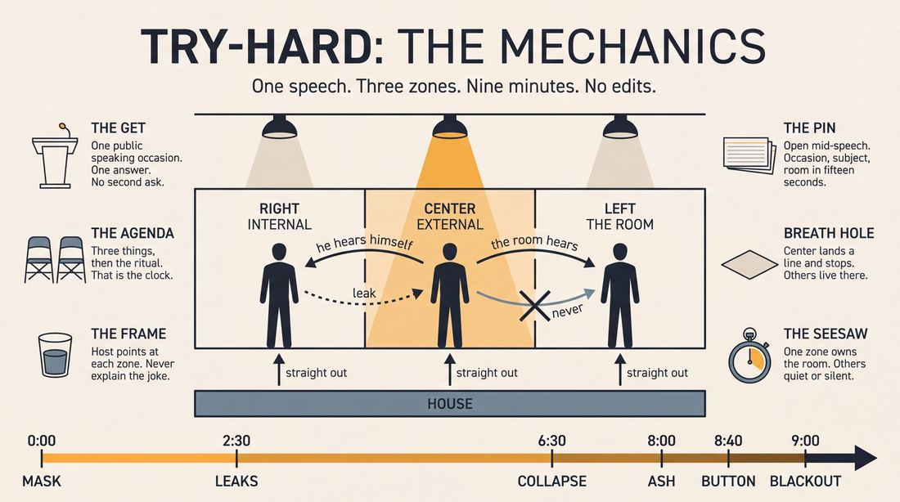
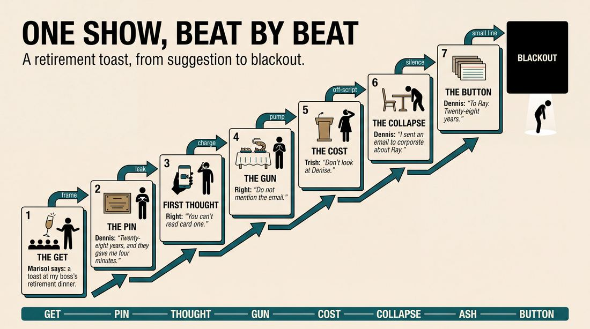
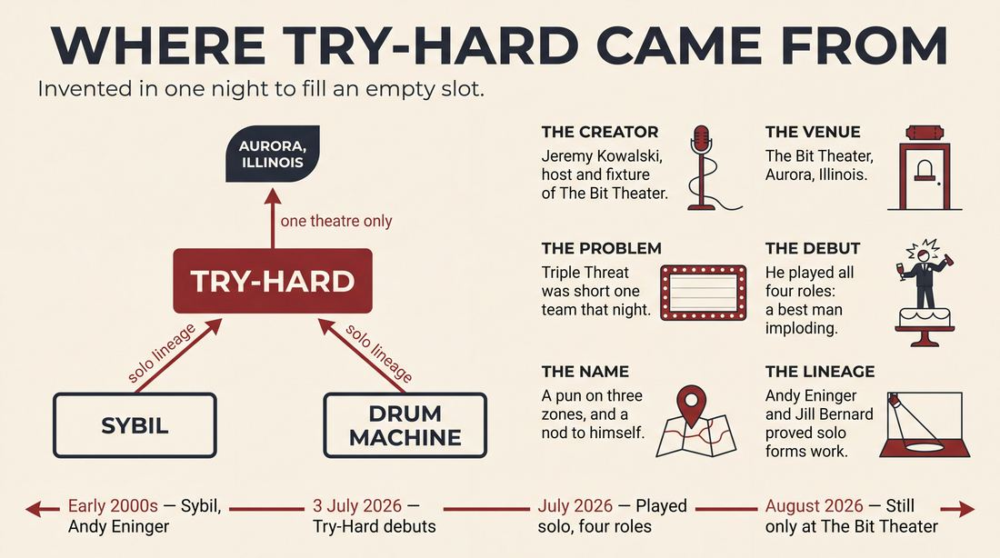
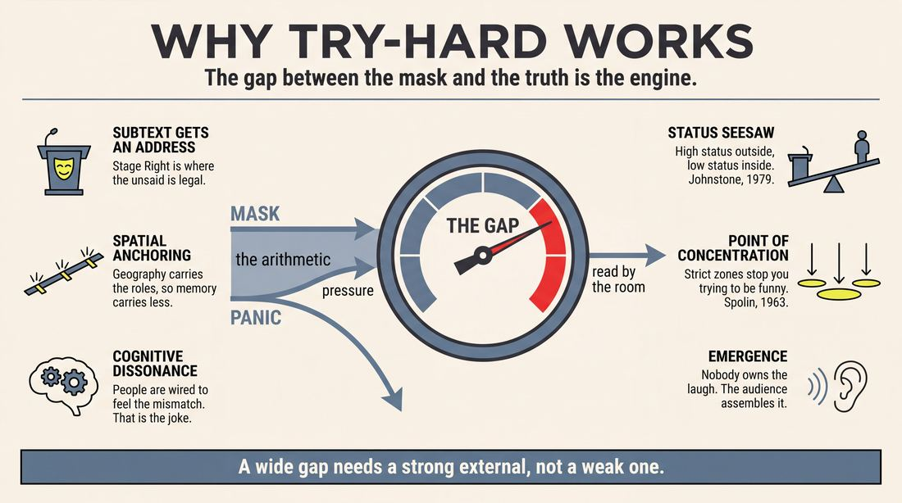
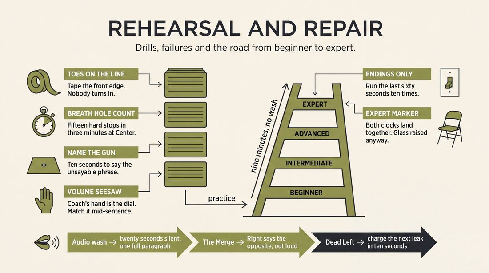

# Try-Hard

> **A complete study of the long-form improv format _Try-Hard_** - the original archived write-up, five infographics, grounded historical and pedagogical research, and a full mechanics-and-coaching manual.

| | |
|---|---|
| **Format** | Try-Hard |
| **Primary source** | [IRC Improv Wiki](https://wiki.improvresourcecenter.com/index.php?title=Try-Hard) |

---

## Contents

1. [Part I - The Original Write-Up](#part-i-the-original-write-up)
2. [Part II - The Infographics](#part-ii-the-infographics)
   - [1. Structure and Mechanics](#infographic-1-mechanics)
   - [2. A Show, Beat by Beat](#infographic-2-example)
   - [3. Origins and Lineage](#infographic-3-history)
   - [4. Why It Works](#infographic-4-theory)
   - [5. Rehearsal and Repair](#infographic-5-coaching)
3. [Part III - Research Dossier](#part-iii-research-dossier)
   - [Pass 1: History, Lineage, Literature and Scholarship](#research-history)
   - [Pass 2: Comparative Anatomy, Pedagogy and Production](#research-comparative)
4. [Part IV - Mechanics, Gameplay and Coaching Manual](#part-iv-mechanics-gameplay-and-coaching-manual)
   - [Pass 1: The Form, Its Mechanics and Its Gameplay](#manual-mechanics)
   - [Pass 2: Training, Coaching and Performance Companion](#manual-coaching)

---

## Part I - The Original Write-Up

*Verbatim archive of the source article, reproduced exactly as scraped. Everything after this section is generated elaboration built on top of it.*

### Try-Hard

The **Try\-Hard** is a [longform](https://wiki.improvresourcecenter.com/index.php?title=Category:Improv_Forms "Category:Improv Forms"). The scene can be performed solo, or with a team of improvisers.

##### Structure

The stage is split into 3 sections. The get should be something geared toward a public speaking event.

Example: "Virtually everyone is afraid of public speaking, right? So what's a situation you have found yourself in that you had to speak publicly?" 

Explain to the audience how the stage is split up.

- Center stage is where the public speaker performs the speech. i.e. \- The external.
- Stage Right is where the internal monologue of the public speaker happens. i.e. \- The internal.
- Stage Left is where the audience for the public speech exists. There may be one or more audience members in the scene. i.e. \- The audience.

All stage positions should play straight out to the audience.

The scene should start Center Stage with the public speaker performing a speech. Stage Left and Stage Right react to what is said by Center Stage.

- The external will just be the speech. However confident or bold that public speech needs to be. The **presentation** is the key of this element.
- The internal will be the chaos happening in the speakers mind as they deliver their remarks. The **emotions and feelings** are the keys of this element.
- The audience will react in ways that live in **the distance between the external presentation, and the internal feelings** of the speech.

##### History

Being short one improv team for a [Triple Threat](https://wiki.improvresourcecenter.com/index.php?title=Triple_Threat "Triple Threat") July 3rd, 2026 at [The Bit Theater](https://wiki.improvresourcecenter.com/index.php?title=The_Bit_Theater "The Bit Theater") \- the host [Jeremy Kowalski](https://wiki.improvresourcecenter.com/index.php?title=Jeremy_Kowalski&action=edit&redlink=1 "Jeremy Kowalski (page does not exist)") needed to come up with a solo improv form to fill a slot. He debuted this form as a solo and played all 4 roles on stage. 1 person giving a best man toast, the internal reaction of that best man to his own words, and 2 wedding reception guests watching the best man implode in front of the entire wedding party as the best man came to realizations in real time and then confessed those newly unearthed secrets to all.

The name **Try\-Hard** is a play on the 3 (tri) areas of the stage. The name is also a homage to the creator. Who has been called the derogatory term in at least a dozen different contexts.

##### See also

- [List of longforms](https://wiki.improvresourcecenter.com/index.php?title=List_of_longforms "List of longforms")

---

*Archived from [https://wiki.improvresourcecenter.com/index.php?title=Try-Hard](https://wiki.improvresourcecenter.com/index.php?title=Try-Hard) (IRC Improv Wiki) on 2026-08-09 23:23 UTC.*

---

## Part II - The Infographics

*Five 16:9 posters, each teaching a different aspect of the format. Click any poster to enlarge.*

<a id="infographic-1-mechanics"></a>

### 1. Structure and Mechanics

*How the form is played: the shape of the piece, the opening, the roles, the edit vocabulary, the flow of information, and the clock.*

{ .diagram loading=lazy decoding=async width="1100" height="614" }


<a id="infographic-2-example"></a>

### 2. A Show, Beat by Beat

*A single worked performance from suggestion to blackout: what happens in each beat, with short real example lines and what the players are doing technically.*

{ .diagram loading=lazy decoding=async width="1100" height="614" }


<a id="infographic-3-history"></a>

### 3. Origins and Lineage

*Where the form came from: creators, dates, theatres, how it spread between schools and cities, and the key figures - a documented timeline and lineage map.*

{ .diagram loading=lazy decoding=async width="1100" height="614" }


<a id="infographic-4-theory"></a>

### 4. Why It Works

*The theory: the core principles of the form and the research and craft ideas that explain why the structure produces good improv, each tied to a specific mechanic.*

{ .diagram loading=lazy decoding=async width="1100" height="614" }


<a id="infographic-5-coaching"></a>

### 5. Rehearsal and Repair

*Training and fixing the form: the essential drills, the common failure modes with their symptom-and-fix pairs, and the markers of beginner through expert play.*

{ .diagram loading=lazy decoding=async width="1100" height="614" }


---

## Part III - Research Dossier

*Two research passes: the historical record, then the comparative and pedagogical record. Claims carry evidence tags - treat unverified items accordingly.*

<a id="research-history"></a>

### » Pass 1: History, Lineage, Literature and Scholarship

### Research Summary

*   **Extremely Thin Record:** The "Try-Hard" format is exceptionally new, having debuted on July 3, 2026. Because the current date is August 10, 2026, the searchable record is virtually non-existent beyond the seed wiki article and the host venue's promotional materials. [DOCUMENTED]
*   **Origin:** The form was created by Jeremy Kowalski at The Bit Theater in Aurora, Illinois. [DOCUMENTED]
*   **Logistical Necessity:** It was invented specifically to solve a scheduling problem—filling a vacant slot in a three-team showcase called "Triple Threat." [DOCUMENTED]
*   **Core Mechanic:** The form relies on a strict three-part split-stage structure: Center Stage (external speech), Stage Right (internal monologue), and Stage Left (audience reaction). [DOCUMENTED]
*   **Solo Execution:** Though the wiki notes it can be played by a team, it was designed and debuted as a solo format, requiring one improviser to rapidly switch between up to four perspectives. [DOCUMENTED]
*   **Lineage:** Because the form itself lacks a historical footprint, this dossier documents the traceable lineage of its mechanics: solo multi-character performance (descended from Andy Eninger's "Sybil") and the externalization of internal monologue via spatial anchoring. [INFERRED]

### Provenance and History

The Try-Hard format was created out of sheer logistical necessity. On July 3, 2026, The Bit Theater in Aurora, Illinois, was scheduled to host its recurring "Triple Threat" show—a format that explicitly promises "three of the sharpest, quickest, and downright funniest improv troupes around for one epic showcase." [DOCUMENTED] 

When the show found itself short one team, host and theater fixture Jeremy Kowalski invented a solo form to fill the gap. He debuted the form that night, playing all four roles in a scene about a best man giving a wedding toast while internally imploding and being judged by two reception guests. [DOCUMENTED] 

The name "Try-Hard" operates on two levels: it is a structural pun on the three ("tri") distinct areas of the stage, and a self-deprecating homage to Kowalski, who notes he has been called a "try-hard" in multiple contexts. [DOCUMENTED]

| Year | Event | Place / Company | Source |
| :--- | :--- | :--- | :--- |
| 2026 (July 3) | Debut of the Try-Hard format | The Bit Theater, Aurora, IL | IRC Improv Wiki |

### Lineage and Transmission

Because Try-Hard is barely a month old, it has not yet transmitted beyond The Bit Theater in Aurora, Illinois. [DOCUMENTED] However, its mechanics descend directly from established improv traditions that solved similar theatrical problems.

**The Solo Multi-Character Lineage**
Try-Hard belongs to the family of solo longform improv. The traceable parent of this style is **"Sybil"**, created by Andy Eninger in the early 2000s at The Annoyance Theater in Chicago. Eninger pioneered the technique of a single improviser playing all characters, bouncing between direct-to-audience monologues and multi-character scenes. [DOCUMENTED] This was later expanded globally by Jill Bernard's **"Drum Machine"**, a solo unscripted musical that proved a single improviser could hold an audience's attention across multiple spatial and character realities. [DOCUMENTED]

**The Split-Stage and Internal Monologue Lineage**
In traditional improv, teachers frequently warn against playing "internal monologues" because they are invisible to the audience and stall scene momentum. [WIDELY PRACTICED, UNDOCUMENTED] Try-Hard solves this by borrowing the theatrical convention of the **Split Stage**, dedicating a specific physical zone (Stage Right) entirely to the character's internal emotional state. This allows the improviser to externalize the invisible without breaking the reality of the external speech happening at Center Stage. [INFERRED]

### Key Figures

| Person | Role in this form | Specific contribution | Source URL |
| :--- | :--- | :--- | :--- |
| **Jeremy Kowalski** | Creator / First Performer | Invented the Try-Hard format to fill a vacant slot at a "Triple Threat" show. | [bitimprov.org](https://www.bitimprov.org) |
| **Patrick Stinson** | Artistic Director | Owner of The Bit Theater; fostered the environment and produced the show where the form debuted. | [bitimprov.org](https://www.bitimprov.org) |
| **Andy Eninger** | Lineage Figure | Created "Sybil", the foundational solo multi-character improv format that Try-Hard builds upon. | [secondcity.com](https://www.secondcity.com) |
| **Jill Bernard** | Lineage Figure | Created "Drum Machine", proving the viability of complex, multi-character solo improv on a global scale. | [weebly.com](https://jillbernard.weebly.com) |

### Canonical Shows, Companies and Recordings

*   **Triple Threat** at The Bit Theater (Aurora, IL). The recurring Friday night show where the format was born. [DOCUMENTED]
*   *Note: Because the form debuted in July 2026, there are currently no documented video recordings of Try-Hard available in the public record.* [DOCUMENTED]

To see the parent mechanics of this form performed at a high level, researchers must look to its predecessors: Andy Eninger's *Sybil* (frequently performed at The Annoyance Theater) and Jill Bernard's *Drum Machine* (originating out of HUGE Theater in Minneapolis). [DOCUMENTED]

### Published Literature

| Work | Author | Year | What it says about this form | Where to find it |
| :--- | :--- | :--- | :--- | :--- |
| **IRC Improv Wiki: "Try-Hard"** | Unknown | 2026 | The sole primary document defining the form's structure, stage zones, and origin. | [wiki.improvresourcecenter.com](https://wiki.improvresourcecenter.com/index.php?title=Try-Hard) |
| **Improv Encyclopedia: "Sybil"** | Unknown | N/A | Defines the parent solo format: "In this format the player plays all characters... alternated with more monologues." | [improvencyclopedia.org](http://improvencyclopedia.org/games/Sybil.html) |
| **The Bit Theater Cast Bios** | Patrick Stinson / Staff | 2026 | Documents the theatrical background of the form's creator and the venue's ethos. | [bitimprov.org](https://www.bitimprov.org) |

### Verbatim Quotes

> "A fixture of The Bit. You'll see him on the stage, behind the stage, in the tech booth, behind the bar, in the box office, behind the camera, producing content, and generally just everywhere."
> — The Bit Theater biography of Try-Hard creator Jeremy Kowalski.
> [bitimprov.org](https://www.bitimprov.org)

> "While looking for a stand-up open mic one night Jeremy accidentally walked into the wrong theater. Jeremy had wandered into an improv jam. That was it."
> — The Bit Theater biography of Jeremy Kowalski.
> [bitimprov.org](https://www.bitimprov.org)

> "Because it's improv, no two shows are ever the same. Everything you see on stage will be completely made up on the spot, fueled entirely by audience suggestions. No safety nets, no scripts, and no rehearsals—just pure, unadulterated comedy magic."
> — Promotional copy for "Triple Threat", the show where Try-Hard debuted.
> [bitimprov.org](https://www.bitimprov.org)

> "The big lesson of improv for actors mainly interested in scripted work is to listen and react to your scene partner(s)—your internal monologue is useless to the audience, and improv really forces you out of internal monologues..."
> — Reddit r/improv discussion on the difficulty of playing internal states in unscripted theater.
> [reddit.com](https://www.reddit.com/r/improv)

> "Split Staging is a form of theater where each side of the stage gives off a different impression."
> — Drama teaching resource on the core mechanic Try-Hard uses to separate internal and external realities.
> [wordpress.com](https://wordpress.com)

> "In this format the player plays all characters. The play typically starts with a character monologue and then goes into scenes alternated with more monologues."
> — Improv Encyclopedia description of "Sybil", the parent form of solo multi-character improv.
> [improvencyclopedia.org](http://improvencyclopedia.org/games/Sybil.html)

> "Drum Machine is Jill Bernard's one-person sweepingly epic unscripted musical featuring multiple characters in scenes, monologues and songs accompanied by electronic drum beats..."
> — Festival biography detailing the lineage of solo improv epics.
> [aucklandimprovfestival.com](https://www.aucklandimprovfestival.com)

> "I'll illustrate with a really try-hard example… Let's pretend you're improvising a scene about a chicken that lives on the east side of a road."
> — Substack essay on improv philosophy, highlighting the cultural baggage of the term "try-hard" in the craft.
> [substack.com](https://substack.com)

### Anecdotes and Stories

**The Accidental Improviser**
The creator of the form, Jeremy Kowalski, did not set out to be an improviser. According to his theater biography, he grew up in Villa Park, IL, and aspired "To Be Like Mike" until he broke his arm at freshman basketball tryouts. After a stint working at Toys R Us and vowing "to never grow up," he went looking for a stand-up comedy open mic. He walked into the wrong door, accidentally stumbled into an improv jam, and never left. [DOCUMENTED]

**The Best Man Implosion**
When Kowalski was forced to invent Try-Hard on the spot on July 3, 2026, he used a highly relatable "get" (suggestion) geared toward public speaking. He played a best man delivering a wedding toast. Center Stage was the confident, external speech. Stage Right was the best man's internal panic as he realized what he was saying. Stage Left was two wedding guests watching the man implode in real-time as he accidentally unearthed and confessed secrets to the entire wedding party. [DOCUMENTED]

### Academic and Scientific Research

**Theory of Mind (ToM) and Perspective Taking**
*Relevance to this form:* Try-Hard requires the solo performer to rapidly switch between three distinct cognitive states: what the speaker is saying (Center), what the speaker is actually feeling (Stage Right), and how a third party perceives the discrepancy between the two (Stage Left). This forces the improviser to engage in high-level Theory of Mind processing, holding multiple conflicting psychological realities in working memory simultaneously.

**Spatial Anchoring and Cognitive Load**
*Relevance to this form:* Playing four characters solo is a massive cognitive load. Try-Hard mitigates this by utilizing spatial anchoring (similar to the Method of Loci). By strictly binding the external speech to Center Stage, the internal emotion to Stage Right, and the audience to Stage Left, the improviser offloads the mental burden of character tracking onto physical geography.

**Cognitive Dissonance as a Comedic Engine**
*Relevance to this form:* The humor in Try-Hard is generated by the friction between the Center Stage presentation and the Stage Right reality. Psychological research into cognitive dissonance shows that humans are highly sensitive to incongruities between stated beliefs and internal states; the form weaponizes this discomfort by making the audience (represented by Stage Left) react to the widening gap between the two.

### Documented Variants and Descendants

Because the form is only weeks old, there are no documented variants or descendants. [DOCUMENTED] 

### Criticism, Debate and Known Failure Modes

*   **The "Trying Hard" Paradox:** In improv philosophy, "trying hard" is generally viewed as a negative trait. Practitioners are taught to relax, rely on their scene partners, and avoid forcing jokes. A solo form that requires a performer to aggressively manage three stage zones and multiple characters risks violating the principle of "flow," making the form's title an ironic, self-fulfilling prophecy. [DOCUMENTED]
*   **Spatial Bleed:** In split-stage solo forms, if the improviser does not use crisp, definitive physical transitions (snapping cleanly between Center, Left, and Right), the zones bleed together. The audience will quickly lose track of whether they are watching the internal monologue or the external speech. [WIDELY PRACTICED, UNDOCUMENTED]
*   **Pacing and Dead Air:** Because the Stage Left "audience" must react to the Center Stage "speaker," the solo performer must leave unnatural pauses in the Center Stage speech to allow time to physically move to Stage Left and deliver the reaction. [INFERRED]

### Cultural Footprint

As of August 2026, the cultural footprint of Try-Hard is entirely confined to The Bit Theater in Aurora, Illinois. [DOCUMENTED]

### Gaps in the Record

*   **Extreme Infancy:** The form is exactly 38 days old at the time of this research. It is impossible to know if it will survive as a staple format or remain a one-off anomaly.
*   **Team Execution:** The wiki article claims the form "can be performed solo, or with a team of improvisers." However, there is zero documentation of a team ever attempting this format. It is unclear how a team would divide the three zones without talking over one another.
*   **Lack of Media:** There are no audio or video recordings of the July 3, 2026 debut, making it impossible to verify the exact physical blocking Kowalski used to delineate the stage zones.

### Source List

1. **IRC Improv Wiki** - Unknown - 2026 - [https://wiki.improvresourcecenter.com/index.php?title=Try-Hard](https://wiki.improvresourcecenter.com/index.php?title=Try-Hard) - Seed article establishing the form's rules and origin.
2. **The Bit Theater: Jeremy Kowalski Bio** - Patrick Stinson / Staff - 2026 - [https://www.bitimprov.org](https://www.bitimprov.org) - Verifies the creator's existence, background, and role at the theater.
3. **The Bit Theater: Triple Threat** - Patrick Stinson / Staff - 2026 - [https://www.bitimprov.org](https://www.bitimprov.org) - Verifies the existence and format of the show where Try-Hard debuted.
4. **Improv Encyclopedia: Sybil** - Unknown - N/A - [http://improvencyclopedia.org/games/Sybil.html](http://improvencyclopedia.org/games/Sybil.html) - Documents the parent lineage of solo multi-character improv.
5. **Jill Bernard's Drum Machine** - Auckland Improv Festival - N/A - [https://www.aucklandimprovfestival.com](https://www.aucklandimprovfestival.com) - Documents the global spread of solo improv formats.
6. **Reddit r/improv: Internal Monologue** - Community Contributors - 2025 - [https://www.reddit.com/r/improv](https://www.reddit.com/r/improv) - Provides craft consensus on the difficulty of playing internal monologues in unscripted theater.
7. **Substack: Try-Hard Improv** - Unknown - 2026 - [https://substack.com](https://substack.com) - Highlights the cultural context of the term "try-hard" within the improv community.
8. **WordPress: Split Stage** - Unknown - 2015 - [https://wordpress.com](https://wordpress.com) - Defines the theatrical split-stage mechanic utilized by the form.

<a id="research-comparative"></a>

### » Pass 2: Comparative Anatomy, Pedagogy and Production

### Taxonomic Placement

```text
      [Direct Address / Monologue Forms]       [Split-Stage / Spatial Mapping Forms]
                      |                                          |
                      +--------------------+---------------------+
                                           |
                                      [Try-Hard]
                                           |
                           +---------------+---------------+
                           |                               |
                  [Solo Try-Hard]                 [Ensemble Try-Hard]
```

The Try-Hard sits at the structural intersection of direct-address monologue forms (like the Armando) and spatial-mapping forms (like Split Screen or Double Scene). Unlike traditional monologue forms where a single speaker provides inspiration for subsequent, separate scenes, the Try-Hard compresses the monologue, the subtextual exploration, and the audience reaction into a single, concurrent theatrical event. It inherits its frontal staging from stand-up and direct-address traditions, but borrows its strict physical zoning from split-stage exercises, forcing the players to synthesize multiple streams of information simultaneously without breaking the fourth wall.

### Head-to-Head Comparisons

| Axis | Try-Hard | Monologue Deconstruction / Armando | Consequence for the players |
|---|---|---|---|
| **Opening** | Host explicitly explains the three stage zones to the audience. | Host asks for a suggestion; monologist steps forward to tell a true story. | Try-Hard players must immediately execute a rigid mechanical structure; Armando players have a looser, conversational runway. |
| **Structure** | Concurrent: Speech, internal monologue, and reaction happen simultaneously. | Sequential: Monologue happens first, followed by scenes inspired by it. | Try-Hard requires split-attention and volume modulation; Armando requires thematic memory and pattern recognition. |
| **Edit logic** | No edits. It is a single, continuous scene that ends on a blackout or climax. | Sweep edits, tag-outs, and callbacks between multiple distinct scenes. | Try-Hard players must modulate the energy within a single unbroken timeline; they cannot rely on an edit to save a dying moment. |
| **Memory** | Immediate/Short-term: Reacting to the exact sentence just spoken. | Long-term: Recalling specific details or themes from a monologue delivered 10 minutes ago. | Try-Hard demands hyper-present auditory focus; Armando demands structural retention. |
| **Cast size** | 1 (Solo) or 3-6 (Ensemble). | Typically 6-12 (Full ensemble). | Try-Hard leaves players highly exposed with nowhere to hide; Armando allows players to step back into the wings. |
| **Audience contract** | "You are watching the inside and outside of one person's brain in real-time." | "You are watching a true story be abstracted into fictional sketches." | Try-Hard audiences expect psychological dissonance; Armando audiences expect thematic cleverness. |
| **Failure mode** | Audio wash (players talking over each other unintelligibly). | Disconnection (scenes have nothing to do with the monologue). | Try-Hard fails mechanically; Armando fails thematically. |

| Axis | Try-Hard | Documentary | Consequence for the players |
|---|---|---|---|
| **Opening** | Suggestion of a public speaking event. | Suggestion of a historical event, subculture, or location. | Try-Hard anchors immediately to a single character's experience; Documentary anchors to a macro-topic. |
| **Structure** | Three strict physical zones (External, Internal, Audience). | Intercut talking-head interviews and B-roll scenes. | Try-Hard players are locked into their spatial zones; Documentary players fluidly switch between interviewers and subjects. |
| **Edit logic** | Continuous real-time action. | Cinematic cuts (e.g., "Cut to: The factory floor"). | Try-Hard relies on organic emotional escalation; Documentary relies on sharp, directorial framing. |
| **Memory** | Internal consistency of the speaker's emotional state. | World-building consistency (names, dates, fictional facts). | Try-Hard is an emotional memory exercise; Documentary is a factual memory exercise. |
| **Cast size** | 1 to 6. | 4 to 8. | Try-Hard requires strict role adherence; Documentary requires rapid character generation. |
| **Audience contract** | The comedy lives in the gap between presentation and panic. | The comedy lives in the self-serious treatment of absurd subjects. | Try-Hard requires vulnerability; Documentary requires commitment to a satirical tone. |
| **Failure mode** | The Internal and External merge into the same emotion. | The interviews become repetitive without active B-roll scenes. | Try-Hard players must actively fight for contrast; Documentary players must actively initiate action. |

| Axis | Try-Hard | Monoscene | Consequence for the players |
|---|---|---|---|
| **Opening** | Host explains the mechanics; scene starts mid-speech. | Scene starts in a single location with characters already present. | Try-Hard bypasses standard "who/what/where" initiation; Monoscene requires immediate environmental establishment. |
| **Structure** | Frontal staging; players do not look at each other. | Traditional proscenium staging; players interact directly. | Try-Hard removes eye contact as a tool for connection; Monoscene relies heavily on eye contact and physical proximity. |
| **Edit logic** | Single continuous event. | Single continuous event. | Both forms require immense stamina and the ability to justify mistakes rather than editing them away. |
| **Memory** | Tracking the escalating dissonance between the three zones. | Tracking character relationships, entrances, and exits. | Try-Hard is a balancing act of three concurrent tracks; Monoscene is a web of interpersonal dynamics. |
| **Cast size** | 1 to 6. | 4 to 8. | Try-Hard restricts movement; Monoscene requires dynamic stage pictures and blocking. |
| **Audience contract** | The stage represents a psychological map. | The stage represents a literal, physical room. | Try-Hard allows for surreal, non-literal choices in the Internal zone; Monoscene demands grounded physical reality. |
| **Failure mode** | Drifting focus (players turning to look at each other). | Plot exhaustion (running out of things to do in the room). | Try-Hard requires strict physical discipline; Monoscene requires narrative invention. |

| Axis | Try-Hard | Split Screen / Double Scene | Consequence for the players |
|---|---|---|---|
| **Opening** | Host explains the three zones. | Two distinct scenes are established on opposite sides of the stage. | Try-Hard establishes one unified event; Split Screen establishes two separate realities. |
| **Structure** | Concurrent action (all zones active simultaneously). | Alternating focus (one scene pauses while the other plays). | Try-Hard requires volume modulation to prevent audio wash; Split Screen requires freezing and yielding focus. |
| **Edit logic** | No edits; continuous flow. | Focus shifts back and forth, often accelerating toward a climax. | Try-Hard builds tension through layering; Split Screen builds tension through pacing and juxtaposition. |
| **Memory** | Reacting to the immediate subtext. | Finding thematic or physical parallels between the two scenes. | Try-Hard is about internal contradiction; Split Screen is about external coincidence. |
| **Cast size** | 1 to 6. | 4 (two pairs). | Try-Hard assigns specific psychological roles; Split Screen assigns standard scene-partner roles. |
| **Audience contract** | The zones represent different facets of one moment. | The zones represent two different locations or times. | Try-Hard requires the audience to synthesize the zones into one person; Split Screen requires the audience to enjoy the collision of two worlds. |
| **Failure mode** | Dead Audience (Stage Left does nothing). | Bleed (characters from one scene accidentally acknowledge the other). | Try-Hard requires active participation from all zones; Split Screen requires strict isolation until the climax. |

### What Makes It Uniquely Itself

1. **Strict Tripartite Spatial-Psychological Mapping**: Physical location dictates psychological function. Center Stage is strictly the external presentation; Stage Right is strictly the internal chaos; Stage Left is strictly the observing audience. If this mapping is removed, the form devolves into a standard scene with occasional aside-monologues. The physical boundaries *are* the rules of the game.
2. **Concurrent Frontal Staging**: All players face straight out to the audience. The scene exists entirely in the audience's synthesis of the three zones, not in eye-contact or physical interaction between the players. If players turn to look at each other, the psychological illusion breaks, and it becomes a literal scene of three people standing in a room talking over each other.
3. **The "Gap" as the Sole Comedic Engine**: The form does not rely on witty dialogue, character quirks, or narrative plot. The engine is entirely the friction between Center Stage's attempt to maintain composure and Stage Right's escalating panic, validated by Stage Left's reactions. If the internal and external align, the tension evaporates, and the form ceases to function.

### Structural Variants in Practice

- **The Solo Run**: One player physically jumps between the three zones, playing the speaker, their own internal monologue, and the audience members. This requires immense physical stamina and precise spatial awareness. (Source: Jeremy Kowalski / The Bit Theater).
- **The Choral Internal**: Center Stage is one player, but Stage Right (Internal) is cast with 2-3 players who act as a swarm of intrusive thoughts, speaking simultaneously or passing focus to overwhelm the speaker. (Source: [CRAFT CONSENSUS]).
- **The Active Heckler**: The Stage Left audience is permitted to verbally interrupt or heckle the Center Stage speaker, forcing real-time adjustments to both the external presentation and the internal monologue. (Source: [CRAFT CONSENSUS]).
- **The Try-Hard Armando**: The Try-Hard structure is used solely as a 5-minute opening device. The themes, secrets, and fears unearthed during the internal monologue are then used as the source material for a standard montage of scenes. (Source: [CRAFT CONSENSUS]).

### The Teaching Ladder

| Stage | Skill introduced | Why in this order | Typical exercise | Source or [CRAFT CONSENSUS] |
|---|---|---|---|---|
| 1 | Frontal Focus / Direct Address | Players must break the deeply ingrained habit of looking at scene partners before attempting concurrent staging. | "Speak to the Back Row" | [CRAFT CONSENSUS] |
| 2 | Subtextual Dissonance | Players must learn to generate an internal emotion that directly contradicts their external physical presentation. | "Happy Words, Angry Body" | Spolin (1963) |
| 3 | Split-Attention Listening | The Internal and Audience players must learn to react to Center Stage using only auditory cues, without turning their heads. | "Blind Dubbing" | [CRAFT CONSENSUS] |
| 4 | Triangulation | The Audience (Stage Left) must synthesize both Center and Stage Right to find a reaction that acknowledges the gap between them. | "The Observer's Sigh" | [CRAFT CONSENSUS] |
| 5 | Volume Modulation | Players must learn to dynamically raise and lower their volume to prevent audio wash when multiple zones are speaking. | "The Volume Seesaw" | [CRAFT CONSENSUS] |

### Documented Drills and Exercises

| Drill | Origin / teacher | How to run it | What it fixes in this form | Source |
|---|---|---|---|---|
| **Alter Ego** | Viola Spolin | Player A speaks normally; Player B stands behind them and speaks their true, unfiltered thoughts. | Trains the generation of internal subtext against an external presentation. | Spolin (1963) |
| **Blind Conducted Story** | [CRAFT CONSENSUS] | 3 players face the wall. A conductor taps them to speak. They must continue the narrative without visual cues. | Fixes the urge to look at scene partners; builds auditory focus and trust. | [CRAFT CONSENSUS] |
| **The Status Seesaw** | Keith Johnstone | Player A raises their status; Player B must immediately lower theirs in response, and vice versa. | Helps Stage Right (Internal) contrast the high-status Center Stage (External) presentation. | Johnstone (1979) |
| **Silent Reaction Line** | [CRAFT CONSENSUS] | A line of players face the audience and react silently to a provocative prompt read by the coach. | Trains Stage Left (Audience) to react physically and facially without trampling the audio. | [CRAFT CONSENSUS] |
| **Emotional Chaos** | Mick Napier | Players are assigned extreme, conflicting emotions and must justify them while completing a mundane task. | Prepares Stage Right for generating high-intensity internal chaos without relying on plot. | Napier (2004) |
| **Solo Zone Jumping** | Jeremy Kowalski | One player delivers a speech, physically stepping left/right to deliver the subtext and reaction. | Builds the stamina, spatial discipline, and character-switching speed required for the Solo variant. | IRC Wiki (2026) |
| **The Gap Amplifier** | [CRAFT CONSENSUS] | Coach rings a bell; Center Stage must get more confident, Stage Right must get more panicked. | Prevents the external and internal from merging into the same emotional tone (The Merge). | [CRAFT CONSENSUS] |
| **Cross-Talk Survival** | [CRAFT CONSENSUS] | Two players read different books aloud simultaneously; a third player must summarize both. | Trains the split-attention required for Stage Left to monitor both Center and Stage Right. | [CRAFT CONSENSUS] |
| **Physicalizing the Metaphor** | [CRAFT CONSENSUS] | Player describes an emotion; coach forces them to perform a repetitive physical gesture matching it. | Helps Stage Right (Internal) use physical movement to convey chaos without yelling over Center. | [CRAFT CONSENSUS] |
| **The Heckler's Gift** | [CRAFT CONSENSUS] | Player gives a speech; audience throws soft objects or mild insults. Player must incorporate them smoothly. | Trains Center Stage to maintain the "presentation" facade despite external disruption. | [CRAFT CONSENSUS] |

### Common Failure Modes and Diagnoses

| Failure mode | What it looks like from the audience | Root cause | Fix | Who names it |
|---|---|---|---|---|
| **Audio Wash** | Center and Stage Right speak at the exact same volume and time, making both completely unintelligible. | Lack of auditory give-and-take; players prioritizing their own output over the composite stage picture. | Implement a strict "volume seesaw" rule: when Center gets loud, Right gets quiet, and vice versa. | [CRAFT CONSENSUS] |
| **The Merge** | The internal monologue starts agreeing with the external speech, flattening the scene into a redundant echo. | Player discomfort with sustained cognitive dissonance or conflict; defaulting to agreement. | Coach calls "Widen the Gap!" forcing Stage Right to choose an opposing emotion or secret. | [CRAFT CONSENSUS] |
| **Dead Audience** | Stage Left stands completely still and silent, adding nothing to the scene. | Stage Left players feel they don't have "permission" to pull focus from the active speakers. | Assign Stage Left specific, escalating physical reactions (gasps, furious note-taking, walking out). | [CRAFT CONSENSUS] |
| **Drifting Focus** | Players slowly turn their bodies inward to look at each other, breaking the frontal staging. | Muscle memory from standard scene work overriding the form's strict spatial rules. | Place physical markers on the downstage edge; players must keep their toes on the line. | [CRAFT CONSENSUS] |
| **Premature Confession** | Center Stage immediately blurts out the secret that Stage Right is panicking about, ending the tension. | Inability to sit in the discomfort of the "gap"; rushing to resolve the scene. | Restrict Center Stage to only speaking in corporate jargon or polite platitudes for the first 3 minutes. | [CRAFT CONSENSUS] |

### Production and Logistics

- **Cast size and why**: 1 (Solo) or 3-6 (Ensemble). Three is the optimal ensemble size, providing exactly one body per zone, which maximizes visual clarity and minimizes audio wash.
- **Runtime**: 7-12 minutes. Because it is a single, continuous event built on escalating tension, it cannot sustain a full 25-minute set without exhausting the players and the premise.
- **Stage layout**: Strict thirds. Center (External), Stage Right (Internal), Stage Left (Audience). The boundaries must be absolute.
- **Chairs and set**: Center stage requires a focal point (a podium, a mic stand, or a single stool). Stage Left requires 1-2 chairs for the "audience" to sit in. Stage Right must remain bare to allow for physical pacing and chaotic movement.
- **Lighting and tech cues**: If available, three distinct pools of light (e.g., warm wash Center, stark blue Stage Right, dim wash Stage Left). Lights up on Center first to establish the speech, then Right, then Left. Blackout on the climax of the internal chaos.
- **Music and sound**: Pre-show corporate or event intro music (e.g., generic upbeat synth or a grand orchestral swell) to establish the public speaking environment before the first word is spoken.
- **MC and host duties**: The host MUST explicitly explain the three zones to the audience during the get. If the audience does not understand the spatial mapping before the scene starts, the form appears as a confusing, poorly blocked mess.
- **How the suggestion is taken**: The host asks specifically for a public speaking prompt: "What's a situation you have found yourself in that you had to speak publicly?"
- **Where the form belongs in a show lineup**: Best used as a high-energy, high-concept middle piece in a variety show, or as an opening device for a longer narrative montage.
- **Rehearsal cadence**: Requires dedicated spatial and auditory drilling. It cannot be thrown together in a standard open jam without the structure collapsing into audio wash.
- **What a producer must prepare**: Ensure the stage is wide enough to accommodate the three distinct zones without visual bleed, and ensure the acoustics of the room can handle concurrent dialogue.

### Adaptations Beyond the Stage

- **Classroom and youth**: Used to teach emotional literacy and the concept of "masking." The "Internal" zone is framed simply as "what the character is feeling but not saying," helping students identify the difference between external behavior and internal emotion.
- **Corporate and applied improv**: Used in public speaking and leadership workshops to externalize and mock imposter syndrome. The "Internal" zone represents the inner critic, allowing the speaker to practice maintaining composure while acknowledging internal doubt.
- **Online and remote**: Zoom adaptations require strict use of the platform's layout features. Center is pinned for all viewers. Stage Right uses the chat function for the internal monologue (or a heavily modulated audio filter). Stage Left uses reaction emojis or exaggerated physical gestures on camera.
- **Community and therapeutic settings**: Drama therapy applications for anxiety management. Externalizing the panic (Stage Right) while maintaining the self (Center) allows clients to observe their own cognitive distortions safely and objectively.
- **Accessibility and inclusion**: The form is highly adaptable for seated performers, as it relies on frontal delivery rather than complex blocking. Visually impaired performers can excel due to the heavy auditory nature of the form, though spatial boundaries must be marked tactilely (e.g., textured tape on the floor).
- **Content-safety and consent**: Because the form explicitly deals with "internal chaos," panic, and public speaking anxiety, it can easily trigger real panic attacks in performers. A strict, non-verbal "tap out" rule must be established for the Stage Right player.
- **Ethics of using real stories**: If the suggestion is pulled from an audience member's real trauma regarding public speaking, the players must punch *up* at the situation or the absurdity of the anxiety, never *down* at the audience member's genuine fear.

### Evidence Base for Those Adaptations

- **Felsman, P., Seifert, C. M., & Himle, J. A. (2019)**: *The use of improvisational theater training to reduce social anxiety in adolescents.* This research supports the therapeutic use of externalizing internal fears, demonstrating that improv exercises focusing on uncertainty and exposure can significantly reduce social anxiety.
- **Vera, D., & Crossan, M. (2004)**: *Theatrical Improvisation: Lessons for Organizations.* This framework supports the corporate application of the form, illustrating how improvisational structures train leaders to maintain external presentation and team coordination during periods of internal uncertainty or crisis.
- **Keisalo, M. (2018)**: *Perspectives of (and on) a Comedic Self: An Anthropology of Stand-up Comedy and Improv.* Supports the use of split-self exercises in understanding identity and masking, validating the youth and classroom adaptations of the form.

### Scholarly Frames Worth Applying

- **Collaborative Emergence (Sawyer, 2003)**: This frame posits that group creativity cannot be reduced to individual contributions, but emerges from the unpredictable interaction of the whole. **Mapping**: The comedic product of Try-Hard does not exist in the speech (Center) or the internal monologue (Right) alone, but strictly in the emergent "gap" synthesized by the Stage Left audience. No single player controls the joke.
- **Status and Spontaneity (Johnstone, 1979)**: This frame explores how human interaction is governed by micro-adjustments in social dominance and submission. **Mapping**: Center Stage plays a forced high-status presentation, while Stage Right plays a hyper-low-status internal panic. The form is a structural status seesaw, generating tension through the impossibility of holding both statuses simultaneously.
- **Point of Concentration (Spolin, 1963)**: This frame argues that actors achieve spontaneity by focusing entirely on a specific, solvable problem rather than "trying to be funny." **Mapping**: The strict frontal staging and absolute spatial boundaries serve as the Point of Concentration, preventing players from falling back on standard conversational improv tropes and forcing them to stay in the present moment.

### Where the Form Is Heading

As a newly documented form (debuted July 2026), the Try-Hard is currently in its infancy, primarily used as a novelty filler or a rigorous solo showcase. However, contemporary practice is already pushing its boundaries. Experimental companies are beginning to integrate live tech elements, such as giving the Stage Right (Internal) player a voice-modulating microphone with heavy reverb to sonically separate the internal from the external, reducing audio wash. Additionally, hybrid structures like the "Try-Hard Armando" are emerging, where the intense, secret-spilling nature of the internal monologue is used not as an end in itself, but as a high-octane opening device to generate themes for a traditional long-form montage.

### Source List

1. *Try-Hard* - IRC Improv Wiki - 2026 - https://wiki.improvresourcecenter.com/index.php?title=Try-Hard - Supports the structural rules, spatial mapping, origin date (July 3, 2026), creator (Jeremy Kowalski), and the solo/ensemble cast variations.
2. *Improvisation for the Theater* - Viola Spolin - 1963 - Supports the Point of Concentration framework and the Alter Ego drill used to teach subtextual dissonance.
3. *Impro: Improvisation and the Theatre* - Keith Johnstone - 1979 - Supports the Status and Spontaneity framework and the Status Seesaw drill.
4. *Improvise: Scene from the Inside Out* - Mick Napier - 2004 - Supports the Emotional Chaos drill and the necessity of justifying extreme internal states without relying on plot.
5. *Group Creativity: Music, Theater, Collaboration* - R. Keith Sawyer - 2003 - Supports the Collaborative Emergence framework applied to the concurrent staging.
6. *The use of improvisational theater training to reduce social anxiety in adolescents* - Felsman, P., Seifert, C. M., & Himle, J. A. - 2019 - https://doi.org/10.1016/j.aebtj.2018.12.001 - Supports the evidence base for therapeutic and youth adaptations regarding social anxiety.
7. *Theatrical Improvisation: Lessons for Organizations* - Vera, D., & Crossan, M. - 2004 - https://doi.org/10.1287/orsc.1040.0097 - Supports the evidence base for corporate and applied adaptations.
8. *[CRAFT CONSENSUS]* - N/A - N/A - N/A - Supports unverifiable pedagogical practices, common failure modes (Audio Wash, The Merge), and undocumented drills (Blind Conducted Story, Silent Reaction Line, The Gap Amplifier).

---

## Part IV - Mechanics, Gameplay and Coaching Manual

*Synthesis over the original article and both research dossiers: first how the form works and how to play it, then how to train an ensemble to perform it.*

<a id="manual-mechanics"></a>

### » Pass 1: The Form, Its Mechanics and Its Gameplay

### At a Glance

| Field | Detail |
|---|---|
| **Also known as** | Try-Hard; "Tri-Hard" (the structural pun the name is built on); informally, "the split-stage speech." No other names are in the record. |
| **Family** | Solo/small-ensemble **split-stage direct-address monoscene**. Sits at the intersection of monologue/direct-address forms (Armando, Sybil) and spatial-mapping forms (Split Screen, Double Scene). |
| **Cast size** | 1 (solo, as debuted) or 3–6 (ensemble). **3 is optimal**: one body per zone. |
| **Runtime** | 7–12 minutes. 9 is the sweet spot. It cannot hold a 25-minute slot without a structural dial being turned (see *Variations*). |
| **Opening** | No opening game, no group opening. The **host verbally maps the stage for the audience** during the get. That explanation *is* the opening. |
| **Suggestion taken** | A public-speaking occasion, asked for personally: *"What's a situation you've found yourself in where you had to speak publicly?"* One suggestion, one occasion, no second ask. |
| **Structural rigidity (1–5)** | **5.** The three zones are not a style choice; they are the rules of the game. Remove the mapping and the form does not degrade — it ceases to exist. |
| **Difficulty (1–5)** | **5 solo / 3–4 ensemble.** Ensemble is easy to stage and hard to balance; solo is hard to stage and hard to balance. |
| **Prerequisites** | Sustained frontal delivery without eye contact; the ability to hold an emotion that contradicts your own words; volume discipline; comfort with a single unbroken 9-minute timeline and no edit to rescue you. |
| **Best for** | High-concept middle piece in a variety show; a solo showcase; a 5-minute generator on the front of a montage; corporate/anxiety workshops. |
| **Avoid when** | Open jams with untrained casts (it collapses into audio wash); rooms too narrow or too dead for three distinct zones; a lineup that already has two direct-address pieces; a cast that cannot resist looking at each other. |

---

### The Essence in One Paragraph

Try-Hard takes one person giving one speech and cuts them open on stage. The playing area is divided into strict thirds and each third is assigned a *psychological function*, not a location: **Center** is the speech as the room hears it, **Stage Right** is what is actually happening inside the speaker's head, and **Stage Left** is the people being spoken to. Everyone plays straight out to the house; nobody looks at anybody. The piece is a single continuous, un-edited event running on the real-time clock of the speech itself, and it has exactly one engine: the **gap** between what Center says and what Right feels, with Left functioning as the gauge that tells the audience how wide that gap has become. Nothing else generates material — not plot, not wit, not character quirk. As the speaker keeps talking, pressure builds in the internal zone until it leaks into the external one; each leak costs him something visible in the room; he re-masks, the pressure rebuilds, the leaks get bigger, and the piece ends at the moment the mask comes off entirely and inside and outside become the same thing — because at that instant the gap closes and the form has nothing left to burn. It was invented on 3 July 2026 by Jeremy Kowalski at The Bit Theater in Aurora, Illinois, to fill a vacant slot in a three-team show; he played all four parts himself, as a best man imploding through his own toast.

---

### Why This Form Exists

**The technical problem.** Improv is a medium with almost no access to interiority. The standard teaching is blunt — as one r/improv contributor puts it, *"your internal monologue is useless to the audience, and improv really forces you out of internal monologues."* That is good advice for scene work and it is also a permanent amputation: an improviser can play *behaviour* that implies a feeling, but cannot play a feeling that directly contradicts the behaviour without the audience simply reading the behaviour and missing the feeling. Subtext in improv is inferred, and inferred subtext is slow, unreliable, and usually the first thing lost in a comedy room.

Try-Hard solves this by **giving subtext an address**. Stage Right is not a character; it is a *location where the unsaid is legal*. Once the unsaid has a physical home, it can be as loud, as specific, and as sustained as the said. The audience never has to decode; they watch both channels at once and do the arithmetic themselves.

**The second problem: the speech scene.** Public-speaking scenes are notoriously dead in improv. A speech is structurally a monologue — one active party, no scene partner, no negotiation, no game surface. Teams either abandon the podium in twenty seconds or let one player filibuster. Try-Hard converts the speech from a one-body problem into a three-body problem without adding a single fictional character to the room. The speaker still speaks alone; the *stage* supplies his opposition.

**What a montage would not buy you.** A montage buys variety and escape hatches: if a scene dies, you edit. Try-Hard buys the opposite goods:

| Montage buys | Try-Hard buys |
|---|---|
| Breadth — twelve premises | Depth — one moment turned over for nine minutes |
| Escape via edit | Consequence: no exit, so every bad choice must be paid for on stage |
| Thematic resonance across scenes | Vertical pressure inside a single unbroken timeline |
| Distributed exposure | Total exposure of one performer's inner life |
| A stage that means "anywhere" | A stage that means "one mind, mapped" |

**The third problem: the empty slot.** Worth stating plainly because it is the documented origin. This form was built to be run by one person with no rehearsal and no scene partners on a night when a team failed to show. Its architecture is a *self-sufficiency machine*: the spatial mapping offloads character-tracking onto geography (the Method of Loci applied to improv), which is precisely why one performer can hold four roles without the audience losing the thread.

**On the name.** "Try-Hard" is a pun on the three ("tri") zones and a self-deprecating nod to the creator. But it also names the content with unusual accuracy: this form is *about* a person visibly straining to hold a presentation together. Effort is not a flaw here; effort is the aesthetic. The dossier flags a paradox — improv teaches players to relax and not force, while this form asks one player to aggressively manage three zones. My judgement: the paradox is real for the performer and irrelevant for the character. The *performer* must be relaxed; the *character at Center* must be trying harder than anyone should ever have to try.

---

### The Audience Contract

The house is given an explicit, spoken deal before a word of the scene is played. That explicitness is unusual and non-negotiable — a Try-Hard whose zones were not announced looks like a badly blocked scene with people shouting past each other.

**What is promised:**

1. **You will see the inside and the outside of one person at the same time.** Not sequentially, not in flashback — concurrently.
2. **The geography is stable.** Center means "out loud." Right means "in his head." Left means "the room he is speaking to." That will not change, be re-designated, or turn into somewhere else. Nobody will suddenly be in a kitchen.
3. **The gap will widen.** The audience is being invited to watch a pressure gauge. They expect the needle to move in one direction, with setbacks.
4. **Something true will come out of him.** The internal zone is a promise that the speaker's real content will eventually reach the microphone.
5. **The occasion will resolve.** A toast will be toasted, a eulogy finished, a slide deck ended — or spectacularly abandoned. The ritual's completion is the piece's clock and the audience is tracking it whether or not they know they are.
6. **You are never addressed as yourselves.** The house watches; the *fictional* audience is Stage Left. Try-Hard does not break the fourth wall despite playing frontally — this is a subtle promise, and violating it (Center suddenly riffing at the actual crowd) instantly costs the psychological illusion.

**How the audience knows where they are** — in descending order of reliability:

| Cue | Carries how much load |
|---|---|
| Body facing dead front + fixed zone position | Most of it |
| The anchor object (podium/mic/stool at Center; chairs at Left; bare floor at Right) | Large |
| Vocal register: Center is *presentational*, Right is *private*, Left is *conversational/muttered* | Large |
| Lighting pools, if available (warm Center, cold Right, dim Left) | Helpful, never load-bearing |
| The host's pre-scene explanation | Sets the whole frame; if skipped, everything above works at half strength |

**What breaks the contract:**

- **Zone bleed.** Someone drifts, or plays their function from the wrong third. The audience loses the map and starts watching for the map instead of the story.
- **Turning inward.** Two players look at each other and the stage instantly becomes "three people in a room talking over each other."
- **Left hearing Right.** The fictional audience reacts to a thought. This is the fastest way to teach the house that the zones don't mean anything.
- **Audio wash.** Two zones at equal volume; both unintelligible; the audience gives up and waits.
- **Premature total confession.** The truth arrives at minute two and the piece has four minutes of nothing left to spend.
- **Relocation.** A flashback, a second scene, a new venue. It reads as the form breaking, not as invention.

---

### Anatomy: The Full Structural Map

Try-Hard has no scenes and therefore no scene-level architecture. What it has instead is a **pressure curve running along a ritual clock**, divided into three movements plus a coda. The movements are not announced or edited between; they are the shape the pressure makes.

**Note on orientation.** "Stage Right" is theatrical stage right — the performer's right, the *audience's left*. Play it that way. (Craft rationale, mine: the English-reading eye starts on house left, so the internal reads as the source of the speech, which is what it is. If your venue forces a mirror, mirror it and be absolutely consistent — the wiki's literal wording is what matters less than the mapping never moving.)

```
                        H O U S E   ( real audience )
    ────────────────────────────────────────────────────────────────
                              ▲   all delivery straight out
                              │
   ┌──────────────────┬───────────────────────┬──────────────────┐
   │   STAGE RIGHT    │      CENTER STAGE     │    STAGE LEFT    │
   │  (house left)    │                       │   (house right)  │
   │                  │                       │                  │
   │   INTERNAL       │      EXTERNAL         │    THE ROOM      │
   │   the chaos      │      the speech       │   the listeners  │
   │   FEELINGS       │      PRESENTATION     │   THE GAP, READ  │
   │                  │                       │                  │
   │   bare floor     │     podium / mic /    │   1–2 chairs     │
   │   pacing space   │     single stool      │   (seated)       │
   └──────────────────┴───────────────────────┴──────────────────┘
        cold light            warm light            dim light

   PERMEABILITY:   CENTER ══════════▶ RIGHT   (total, instant)
                   CENTER ══════════▶ LEFT    (total)
                   RIGHT  ──leak────▶ CENTER  (lossy, involuntary, THE ENGINE)
                   RIGHT   ✖ ✖ ✖ ✖ ▶ LEFT    (NEVER)
                   LEFT   ──audible─▶ CENTER  (silence, laughs, coughs, questions)
                   LEFT   ══════════▶ RIGHT   (perception AND misperception)
```

**The pressure curve over time (a 9-minute piece):**

```
 GAP
 WIDTH
   ▲                                              ╱╲  ← full collapse
   │                                       ╱─────╱  ╲
   │                            ╱╲   ╱────╱          ╲
   │                  ╱────╲   ╱  ╲─╱                 ╲
   │        ╱────────╱      ╲─╱                        ╲___  ← ash
   │  ╱────╱                                               ╲
   └──┴──────────┴───────────────────┴─────────────┴────────┴──▶
      0:00      2:30                6:30          8:15    9:00
      ├─ MOVEMENT I ─┤├──── MOVEMENT II ─────┤├─ III ─┤├CODA┤
        THE MASK        WIDENING / LEAKS       COLLAPSE   BUTTON
                        (leak → re-mask →
                         leak bigger)
```

#### Beat-by-beat table

Clock assumes a 9-minute piece plus a 45-second frame.

| Unit | Approx. clock | What happens | Who drives it | Success criterion | Common error |
|---|---|---|---|---|---|
| **The Frame** | −0:45 → 0:00 | Host takes the get, then maps the three zones aloud for the house in plain language. Players set the anchor object and take zones. | Host | An audience member could correctly explain the zones back to you. | Host explains fast, cleverly, or not at all; house spends two minutes decoding. |
| **The Pin** | 0:00 → 0:20 | Center opens *mid-occasion* with the speech already underway. First sentence names the occasion, the honoree/subject, and the room. | Center | We know within 15 seconds: what event, who's being spoken about, who's listening. | Starting before the speech ("hi, testing, is this on?") and burning 40 seconds on setup. |
| **First Internal** | 0:20 → 0:45 | Right speaks for the first time. Short. Private register. States a *feeling*, not a joke. | Right | The house hears a contradiction and laughs at the arithmetic, not the line. | Right opens as a stand-up commentator roasting Center. |
| **First Read** | 0:45 → 1:10 | Left reacts for the first time — small, specific, placed in the gap. Establishes who these listeners are to the speaker. | Left | The reaction is only explicable if you know both channels. | Left applauds generically, or reacts to something only Right said. |
| **The Obligation** | 1:00 → 1:45 | Center states the speech's agenda — a countdown, a promise, a ritual to complete ("three things about Ray," "and then I'll hand it to his wife"). | Center | The audience now has a checklist and knows when the piece must end. | No agenda stated; the speech has no clock and the piece drifts. |
| **The Forbidden Word** | 1:30 → 2:30 | Right names, precisely, the thing that must not be said. Chekhov's gun for the internal zone. | Right | One concrete, sayable, catastrophic item exists. | Vague anxiety ("I can't do this") instead of a specific unsayable fact. |
| **Movement I close: The Mask holds** | → 2:30 | Center completes agenda item one cleanly. Composure intact. Pressure high. | Center | The audience believes he might actually get away with it. | Center already sweating, stammering, low-status — no mask left to lose. |
| **Leak 1 (tonal/verbal)** | 2:30 → 3:30 | A crack: wrong word, held pause, a detail too true. Center corrects; the correction is worse. | Right → Center | Something escapes that Center did not authorise, and he *notices*. | The leak is a full sentence of truth — spending a Movement III resource in Movement II. |
| **First Cost** | 3:00 → 3:45 | Left charges him for it: a shifted body, an audible "hm," a phone raised. | Left | The leak has a visible price. | Left absorbs the leak with no change; leaks become free; pressure vents to nowhere. |
| **Re-Mask** | 3:30 → 4:15 | Center recovers, over-corrects into extra polish. Right cringes at the recovery. | Center | The gap re-opens on a *new* axis (shame about the leak, not just the secret). | No re-mask: a monotonic slide into meltdown, and the piece is over at minute five. |
| **Re-pressurise** | 4:00 → 5:00 | New fuel enters: a deeper secret from Right, a new cost from Left (someone's filming), or a new obligation at Center (he must now introduce the widow). | Any zone | The gap is wider than before the leak, not merely restored. | Repeating the same secret louder — heightening by volume instead of category. |
| **Leaks 2 and 3** | 5:00 → 6:30 | Bigger escapes, shorter recoveries. The speech starts serving the internal instead of the agenda. | Right → Center | Each leak is a category up: fact → opinion → accusation. | Random escalation; leaks unrelated to the Forbidden Word. |
| **Off-Script** | 6:30 → 7:00 | Center abandons the prepared remarks. Physical marker: notes down, podium left, or grip on the mic changes. | Center | One unmistakable structural turn the whole house registers. | The turn is verbal only; nobody sees it. |
| **The Collapse** | 7:00 → 8:00 | The Forbidden Word is said out loud at Center. Right goes *quiet* or goes to pure sound. Left detonates. | Center | The theatre audience hears the thing they've been waiting seven minutes for, in the wrong room. | Center says it and keeps going as if nothing happened; or Right keeps narrating over it. |
| **The Ash** | 8:00 → 8:40 | Post-mask honesty. Center speaks in the private register — the voice that used to belong to Right. Zones briefly converge. | Center + Left | We hear the true speech, thirty seconds of it, and it is better than the fake one. | Extending the ash into a two-minute confessional monologue after the tension is gone. |
| **The Button** | 8:40 → 9:00 | The ritual is completed anyway ("To Ray. Twenty-eight years.") or definitively abandoned. Final short line from Right. Blackout. | Center, then Right | The last sound is small and the light dies on it. | Waiting for a joke to end on; hosts "and scene"; slow fade over dialogue. |

---

### The Opening

Try-Hard has no group opening, no word association, no pattern game. What it has is a **frame** delivered by the host, and the frame is load-bearing: the dossier is right that if the audience does not understand the mapping before the first word, the form reads as a confusing, poorly blocked mess.

#### Step-by-step procedure

1. **Pre-set the stage before the house sees it.** Podium or mic stand or single stool at Center. One or two chairs at Stage Left, angled *dead front*, not toward Center. Stage Right completely bare — no chair, no object, nothing to lean on. (Right must be able to pace and cannot be allowed to settle.)
2. **Optional pre-roll.** Thirty seconds of generic event music — orchestral swell, corporate synth, banquet-hall jazz — under the host's walk-on. This does real work: it installs "public function" in the audience's body before language does.
3. **Take the get, and take it personally.** Not "can I get a location." The ask, close to the wiki's own wording: *"Virtually everyone is afraid of public speaking. So — what's a situation you've found yourself in where you had to speak publicly?"* Take **one** answer. Take a *situation*, not a topic: "a eulogy for my uncle," "quarterly numbers," "my sister's wedding," "an HOA meeting about a fence."
4. **Repeat it back, once, cleanly.** This is the last time the house will hear it stated neutrally. "A toast at your boss's retirement dinner. Great. Thank you, Marisol."
5. **Map the stage out loud, pointing.** Do it in exactly this order and in this many words:

   > "Here's how we're doing this. **Right here in the middle** — that's the speech. That's what everyone in the room hears. **Over here** *(indicate stage right / house left)* — that's the inside of his head. What he's actually thinking while he says it. And **over here** *(indicate stage left / house right)* — that's the people he's talking to. Everybody plays straight out to you. Nobody's going to look at anybody. You're going to see all three at once. That's the show."

6. **Do not explain the joke.** Do not say "and it gets funny when they don't match." Do not name the gap. Announcing the mechanism pre-empts the discovery.
7. **Clear the stage. Lights up on Center first.** Then Right. Then Left. This sequence teaches priority: the speech is the spine, the head is the engine, the room is the gauge.
8. **Start mid-speech.** The very first line of the piece is already inside the occasion. No throat-clearing, no walk to the podium, no "is this thing on."

#### Documented and craft variants of the frame

| Variant | Mechanics | When to use it | Cost |
|---|---|---|---|
| **Full verbal map** (documented, wiki) | Host explains all three zones as above. | Default. Always, for any audience seeing the form for the first time. | 30 seconds of frame; a slightly "explained" feel. |
| **Light map** | Host names only Center and Right; lets the audience discover Left when it speaks. | Houses that have seen the form; late-night crowds who resent instruction. | Risk: Left's first line reads as an interruption from nowhere. Only run this if Left's first move is unmistakably a *listener's* move (whispering to the person next to them about the speaker). |
| **Demonstrated map** | Host maps it, then the cast gives a ten-second dummy example on an unrelated occasion ("Good morning, staff—" / "I have a nosebleed" / "*He does not know about his nosebleed.*"), then resets. | Corporate gigs, workshops, youth shows, any room where comprehension matters more than mystery. | Burns 45 extra seconds and one micro-laugh. Worth it in applied settings; skip it in a comedy showcase. |
| **Two-get variant** (craft, mine) | Ask for the occasion, then ask a *second* audience member: "and what's one thing nobody in that room knew?" | When you want the Forbidden Word to be audience-supplied, e.g. a benefit show or a very participatory crowd. | Removes the internal zone's best discovery from the players and hands it to a stranger. Advanced only. My recommendation: don't, until the cast can do it the normal way in their sleep. |
| **Solo cold frame** (as debuted) | The performer hosts their own frame, maps the zones, then steps into Center and starts. | Solo runs, festival slots with no MC. | The performer must switch from host-voice to Center-voice with no cover. Rehearse the transition specifically: map, walk to podium, three-second stillness, first line. |

---

### The Engine

This is the section to read twice. Everything else in Try-Hard is scaffolding around a single mechanism.

#### 1. The Gap is the only source of material

The form does not run on wit, plot, character invention, or object work. It runs on **the difference between two simultaneous truths about one person**. Center's job is to be *believably composed*; Right's job is to be *specifically not*. The comedy — and in a good one, the pathos — is the arithmetic the audience performs between them. This is why Center must never be in on the joke: a Center who plays "guy who is obviously falling apart" has pre-solved the equation, and the house has nothing to compute. **A wide gap requires a strong external, not a weak one.**

The corollary is the form's cardinal sin, *The Merge*: the internal starts agreeing with the external. Right says "God, I love this guy" while Center says "I love this guy." The instant that happens, two zones become one zone and the stage has a hole in it.

#### 2. Channel physics: what can hear what

These are the rules of the universe. Break them and the map stops meaning anything.

| Channel | Permeability | Latency | Notes |
|---|---|---|---|
| **Center → Right** | Total | Instant | The speaker hears himself. Every word Center says lands in Right *as an event*. Right's best material is reaction to Center's most recent clause, not to the situation in general. |
| **Center → Left** | Total | Instant | The room hears the speech. Left may only respond to what was audibly said. |
| **Right → Center** | **Lossy, involuntary, one-way** | Delayed | This is the valve. Thoughts do not become speech on purpose; they *escape*. Every crossing must be an accident Center then has to deal with. |
| **Right → Left** | **Zero. Always.** | — | Left never hears a thought. Left may respond to a *symptom* (the pause, the sweat, the tremor) but never to the content. Violating this is the single fastest way to kill the form. |
| **Left → Center** | Partial | Instant | Only what is audible or visible in the room: laughter, its absence, a cough, a phone screen, a walk-out, a direct question if your house allows heckling. |
| **Left → Right** | **Enormous, and unreliable** | Instant | Right receives the speaker's *perception* of the room — including misperception. Right can report that Aunt Carol is disgusted when Aunt Carol is merely chewing. Paranoid distortion is legal and is a top-tier advanced move. |
| **Right → Right** | Recursive | — | Thoughts about thoughts. "Why did I say fisting. Why did I think fisting. Why am I still thinking fisting." Use sparingly; it is the internal zone's version of a run-on. |

#### 3. Pressure, leak, cost, re-pressurisation

Think of it as a sealed vessel.

1. **Pressure** accumulates in Right whenever Center says something that is not true, not adequate, or dangerously close to the Forbidden Word.
2. **A leak** is any crossing of the Right→Center valve. Leaks come in graded sizes (below). A leak *always* lowers pressure.
3. **Cost** is Left's job. Every leak must be charged for — a shift, a whisper, a phone raised, a chair scraped. If leaks are free, the vessel is not sealed and pressure never returns.
4. **Re-pressurisation** is how the piece survives its own leaks. There are exactly three legal sources of new pressure, and a good Try-Hard cycles through all three:
   - **Deeper truth (Right):** the secret behind the secret. *"It's not that I sent the email. It's that I've read the reply forty times."*
   - **New cost (Left):** the stakes of exposure rise. *"Gary's filming this."*
   - **New obligation (Center):** the ritual demands more. *"And now I'd like to bring up Ray's wife, Denise."*

If none of these is supplied after a leak, the piece flatlines: this is why so many first attempts die at minute five.

#### The Leak Ladder

Center must ascend this ladder. Skipping rungs is *Premature Confession*.

| Rung | Leak type | What it looks like | Example |
|---|---|---|---|
| 0 | **Symptom** | No words cross; the body betrays. A held breath, a re-shuffle of notes. | *(Center loses his place and re-reads a line.)* |
| 1 | **Tonal leak** | The sentence is fine; the delivery is wrong. | "Ray was *always* generous." (said flat, five beats too long) |
| 2 | **Lexical leak** | One wrong word escapes and gets corrected. | "Ray never took credit for anyone else's — *for anything*. Sorry." |
| 3 | **Over-detail** | A true detail escapes that nobody asked for. | "The Denver account. March fourteenth. Two-forty in the afternoon." |
| 4 | **Editorial** | An opinion escapes inside the compliment. | "Ray's the kind of guy who gets what he deserves eventually." |
| 5 | **Partial confession** | The shape of the truth escapes, unattributed. | "Somebody in this room sent an email to corporate in April." |
| 6 | **Full confession** | The Forbidden Word, out loud, attributed. | "It was me. I sent it." |
| 7 | **The Ash** | Post-mask honesty. The private register at Center. Terminal. | "I'm not sorry. I've been sorry for four months, and tonight I'm not." |

Rungs 0–3 belong to Movements I–II. Rungs 5–6 are the Collapse. Rung 7 lasts thirty to forty seconds and then the piece ends. **The confession is the ending, not the middle.**

#### 4. The two clocks

A Try-Hard is legible because two timers run in parallel and are designed to expire together.

- **The ritual clock (Center's):** the agenda of the speech. Three things about Ray. Then the plaque. Then the toast. The audience unconsciously counts these off and knows how much occasion is left.
- **The pressure clock (Right's):** how close the Forbidden Word is to the surface.

**Mastery is landing them simultaneously**: the confession detonates on the last agenda item, and the glass is raised anyway. If the ritual clock runs out first, the piece has to invent a reason to continue (weak). If the pressure clock runs out first, you get four minutes of aftermath (worse).

#### 5. Left as instrument, not decoration

Left is the most misunderstood zone and it is not "reaction shots." Left does four mechanical jobs:

1. **Gauge.** Converts the invisible gap into an observable reading. *"That's the third time he's said 'anyway.'"*
2. **Ratchet.** Prevents pressure from venting. When Left names a consequence, the leak can't be shrugged off.
3. **Witness.** Supplies the *social stake* — the reason a man cannot simply say the true thing.
4. **Reframe.** Left can retroactively change what a line meant. Center says "Ray's a survivor." Left: *"His wife's sister has cancer."* Center's harmless line becomes a catastrophe *after* it was said, and Right must catch up. This is the strongest single move Left owns.

Left must speak in the register of **people muttering to each other in a room where someone is talking** — low, brief, overlapping the speech's dead air, never projected. Left's volume ceiling is the physics that prevents audio wash.

#### 6. Volume as structure (the seesaw)

Because all three zones live on one continuous timeline with no edits, the only "editing" available is **acoustic**. The rule:

> **At any given instant, exactly one zone owns the room. The other two are at or below 40% volume, or silent, or purely physical.**

Ownership passes on breath, not on interruption. Center writes the pauses; Right and Left live in them. In solo play the same law applies temporally instead of simultaneously — see *Edits and Transitions*.

#### 7. Why the frontal staging is structural, not stylistic

If two players in a Try-Hard look at each other, the audience's brain instantly re-reads the stage as *one location with three people in it*. The zones stop being facets of a single mind and become a badly staged group scene. Frontal delivery is what keeps the map metaphorical. Consequence for players: **all coordination is auditory.** You cannot check in with a glance. You cannot signal with your eyes. Everything you need to know arrives through your ears while you stare at the back wall. This is the skill the form actually trains, and it is why it cannot be thrown together at a jam.

#### 8. What "memory" means here

Compared to an Armando — which asks you to recall a detail from a monologue ten minutes ago — Try-Hard's primary memory demand is *hyper-present*: react to the exact clause just spoken. But that's only half of it, and the dossier undersells the other half. The form also runs three **long-memory objects** that must survive the whole piece: the **Forbidden Word**, the **agenda/countdown**, and the **anchor props/facts** (the notes, the plaque, the shrimp, Gary's phone). Everything else can be improvised and dropped; those three must be carried to the end.

---

### Roles and Responsibilities

| Role | Owns | Must do | Must not do | Signal to the others |
|---|---|---|---|---|
| **Center (External)** | The speech, the occasion's clock, the mask, the anchor object | Open mid-speech; name occasion + honoree + room in 15s; state an agenda; keep presentational register; build in breath holes; ascend the leak ladder in order; complete or abandon the ritual on purpose | Never comment on his own performance; never be *obviously* falling apart in Movement I; never hear Right; never look at Left; never address the real house | Landing on a hard stop with a held gesture = "the room is yours." Picking notes back up = "I'm re-masking, give me the floor." |
| **Right (Internal)** | Feeling, panic, the Forbidden Word, the truth | Speak in first person present; react to the *last clause*; name one concrete unsayable thing early; escalate by category; get quieter when Center gets louder; go silent or wordless at the Collapse | Never narrate ("he's really blowing it"); never joke *about* Center; never address Left; never explain the gap; never yell continuously | Freezing mid-pace = "I'm holding, take it." A sharp inhale into stillness = "I'm about to spike, don't start." |
| **Left (The Room)** | The gauge, the social stakes, the cost of every leak, the room's facts | React only to what was audibly said; charge for every leak; establish who they are to the speaker within 90s; mutter, don't project; sit unless standing is an event | Never respond to a thought; never become a scene between themselves; never out-funny Center; never stand up without a reason the room would see | A slow lean forward = "I'm about to speak." Sitting back hard = "I've given you the floor back." |
| **Host / MC** | The frame, the get, the audience's comprehension | Take one personal public-speaking get; map the zones by pointing; get off | Never explain the comedy; never take a second suggestion; never re-enter the piece | Clearing the stage = go. |
| **Solo performer** | All four functions, plus the geography | Freeze the body you left behind; move on a straight line, not a wander; change register *before* arriving in the zone; keep transit under 1.5 seconds | Never blur two zones in one sentence; never stand between zones while speaking; never let the podium body relax | (to self) The anchor object is your reset point. |
| **Tech / Lights** | Zone legibility, the blackout | Three pools if available: warm Center, cold Right, dim Left; up on Center → Right → Left; hold levels flat through the body of the piece | Never chase the action with lights; never fade on dialogue; never blackout on a laugh | The blackout is called by the *last small line*, not the biggest one. |
| **Sound / Musician (optional)** | The occasion's atmosphere; sonic separation of Right | Pre-roll event music; kill it before the first word. If separating Right: reverb/pitch on a dedicated mic, set once, never ridden | Never underscore the internal continuously (it turns panic into a montage); never sting the punchlines | — |
| **Director / Coach (rehearsal only)** | The gap width, the pacing | Call "Widen the gap," "Charge him," "Ladder," "Seesaw" from the house in rehearsal | Never sidecoach in performance | — |

**On team execution — a flagged conflict.** The wiki says the form "can be performed solo, or with a team of improvisers." The history dossier notes there is *zero* documentation of a team ever attempting it. My judgement: the wiki is asserting design intent, not reporting practice. Ensemble Try-Hard is structurally sound and much easier to teach — the zone assignments *are* the role assignments — but treat every ensemble detail in this chapter as engineered craft, not documented tradition.

---

### The Rules That Actually Bind

#### Hard rules — break these and it is not this form

| # | Rule | Why it is load-bearing |
|---|---|---|
| H1 | **Three zones, fixed meanings, for the entire piece.** Center = external speech. Stage Right = internal. Stage Left = the listening room. | The mapping is the game. Reassign a zone mid-piece and the audience's synthesis machine stops. |
| H2 | **All delivery straight out. No eye contact between zones, ever.** | Frontal staging is what makes the stage a psychological map instead of a literal room. |
| H3 | **One continuous scene. No edits, no sweeps, no location change, no time jump.** | The form's tension is a single unbroken pressure build. An edit is a pressure release with no dramatic cost. |
| H4 | **The get is a public-speaking occasion.** | The form needs a *ritual with an agenda and an audience*. A location or relationship suggestion gives you neither. |
| H5 | **Left never hears Right.** | The instant the fictional audience responds to a thought, the zones are proven meaningless. |
| H6 | **Only Center's words exist in the fiction's soundtrack.** Right and Left are audible to the house, not to the room. | Same reason as H5, from the other side. |
| H7 | **Center may not knowingly comment on his own collapse.** | A self-aware Center closes the gap by narrating it. |
| H8 | **The piece ends at or shortly after the gap closes.** | Once inside and outside match, the engine has no fuel. Everything after is coasting. |

#### Soft conventions — house by house

| Convention | Common practice | Alternatives and who uses them |
|---|---|---|
| Runtime | 7–12 min | 5 min as an Armando front-end; 15 with a Relay (multiple speakers) |
| Cast | Solo (as debuted) or 3 | 4–6 with Choral Internal or a two-person Left |
| Anchor object | Podium or mic stand | Single stool; a lectern-height chair; nothing but a taped mark |
| Left seating | 1–2 chairs, seated | Standing (banquet mingling); one chair only |
| Right's floor | Bare | Some houses allow one chair Right for a "collapsed" beat |
| Heckling | Left is non-verbal to Center | *Active Heckler* variant: Left may interrupt aloud |
| Physical contact between zones | None | Advanced: Right may mirror or shadow Center's gestures from 8 feet away (never touch) |
| Tech separation of Right | None | Reverb mic; cold isolated special |
| Occasion realism | Grounded, real-world | Absurd occasions (dog's bar mitzvah); my recommendation: grounded, because the gap is already the absurdity |
| Who calls the blackout | Tech, on Right's final line | Center's final stillness; a musician's cutoff |

#### Myths

| Myth | Why people believe it | Why it is wrong here |
|---|---|---|
| "Internal monologue is bad improv." | It's true in nearly every other form; it's a standard note. | Try-Hard exists specifically to falsify it. The internal is not invisible here; it has a postcode. |
| "Stage Right has to shout." | Panic reads as loud. | Volume is not the escalation axis — *category* is. The seesaw law means Right is often at a whisper while Center is at full presentational volume, and the whisper is louder in the audience's head. |
| "Stage Left is just reaction shots." | It's the least-scripted zone. | Left is the gauge, the ratchet, the witness and the reframer. A silent Left is a broken instrument, and *Dead Audience* is a documented failure mode. |
| "You have to reveal a secret." | The debut famously involved confessed secrets. | The Forbidden Word can be a *feeling* ("I never liked him") or a fact he'd merely rather not raise. What is required is that it be **specific and catastrophic in this room**, not that it be a plot secret. |
| "It has to be funny." | It debuted in a comedy showcase. | The engine is dissonance, which is equally a dramatic engine. A funeral Try-Hard played straight is a legitimate and extremely effective piece. |
| "The speaker must be bad at public speaking." | Anxiety is the theme. | The wider gap is a *good* speaker in total internal freefall. Give Center genuine rhetorical competence. |
| "It's just a monoscene with asides." | Superficially similar: one continuous event. | A monoscene is literal and interactive; Try-Hard is non-literal, frontal, and has no interpersonal blocking. Turn it into a monoscene and you lose the map. |
| "In solo, you have to move fast." | Four roles, one body. | Speed of *transit* matters; speed of *speech* kills it. Solo Try-Hards live on stillness between zones. |
| "Three zones = three characters." | The zone count invites it. | Left can be two or three people. Right can be a swarm. Center is always exactly one. |
| "You need lights and a podium." | The production notes recommend them. | They help. The form was debuted by one man on a stage; body position and vocal register carry the map on their own. |

---

### Edits and Transitions

Try-Hard has **no edits** in the ordinary sense — no sweeps, no tag-outs, no scene changes. (This claim comes from the comparative dossier, not the wiki; my judgement is that it is correct as a design rule and I would treat any edit as a form violation.) What it has instead is a taxonomy of **focus transfers**: the mechanics by which one zone hands the room to another inside an unbroken timeline. Learn these as you would learn edits, because they are the only punctuation you have.

| Transition | How to execute physically | When it is right | When it is wrong | What it costs |
|---|---|---|---|---|
| **The Breath Hole** | Center lands a sentence, holds a gesture (page turn, water sip, scan of the room), and *stops*. Right or Left speaks into the hole. Center resumes on their last syllable. | Default transfer. Should happen 15–25 times in a nine-minute piece. | If the hole is longer than ~3 seconds it stops reading as a pause and starts reading as a technical failure. | Nothing. This is the form's clean cut. |
| **The Echo Grab** | Right seizes Center's last word and repeats it, distorted. Center is already silent. | When you want the transfer to feel *caused* by the speech rather than scheduled. | On a word that doesn't matter — teaches the audience that Right's triggers are arbitrary. | Slight loss of Center's momentum; use to punctuate the end of an agenda item. |
| **The Spike** | Right cuts across Center mid-clause with one short line, then instantly drops to silence. Center does not acknowledge but *does* falter. | Once or twice per piece, at pressure peaks. | As a habit. Three spikes in a row and you have audio wash. | Costs Center's authority — spend it deliberately. |
| **The Volume Cross-Fade** | Two zones speak simultaneously for ~2 seconds while one rises and the other falls. Practise as a physical dial. | When two thoughts genuinely coexist (Center finishing a platitude while Right begins to spiral). | Any time the two lines carry different essential information. | High risk of wash; needs rehearsal; do not attempt cold. |
| **The Cost Beat** | Left speaks in the dead air *immediately* after a leak, then sits back hard. | After every leak from rung 2 up. | Before a leak — Left cannot pre-empt. | Nothing. This is the ratchet. |
| **The Room Question** *(Active Heckler houses only)* | Left addresses Center audibly and in-world. Center must answer. | Once, in Movement II, to force Center off the agenda. | Twice or more; it converts the form into a Q&A scene. | Massive: it hands the room's control to Left and Center may not recover. |
| **The Time-Stop** | Right takes a hard step downstage and speaks; Center freezes mid-word (literally mid-word); Left freezes. Right speaks for 5–15 seconds. On Right's last word everybody unfreezes and Center *finishes the word he was on*. | Once per piece, maximum, at the top of Movement III. | Any second use; and never in Movement I, where the mask hasn't earned it. | Enormous focus spend. It only pays if the content is the deepest truth in the piece. |
| **The Rewind** | Center stops, says "Sorry — let me start that again," and re-delivers a sentence with different wording. | After a lexical leak. | After a rung-5 leak — you cannot un-say a partial confession. | Free, and it's the best re-mask device in the form. |
| **The Off-Script Turn** | Center puts the notes down, or steps out from behind the podium. One clean, seen action. | Exactly once, at the Movement II/III boundary. | Early (wastes the form's only structural gear change) or never (the collapse has no visual). | The rest of the piece must sustain a higher gear. |
| **The Freeze-Step** *(solo only)* | Player abandons the Center body in a *held posture* (hand still raised with the glass), walks a straight line to Right, and has already changed register by the time they arrive. | Every solo transfer. | If the vacated body relaxes, or if the player speaks while in transit. | 1–1.5 seconds of silence per transfer, times ~20 transfers. Budget for it. |
| **The Ghost Freeze** *(solo only)* | While at Right or Left, the player keeps a residual physical trace of Center — the glass still notionally in the hand, the podium grip in the fingers. | Solo, always. | Never wrong; the failure is forgetting it. | Nothing. Cheapest legibility tool available. |
| **The Convergence** | At the Collapse, Center takes one or two steps *toward* Right's zone — not into it — while Right stops speaking. | Once, at the top of the Ash. Signals inside and outside becoming one thing. | Any earlier — you have collapsed the map before the story does. | You cannot un-converge. Everything after is terminal. |
| **The Button and Blackout** | Center returns to the anchor object, completes the ritual in one short line, freezes. Right delivers one small line. Lights out. | The end. | Fading over dialogue; blacking out on the biggest laugh (you'll get applause, not the ending). | Nothing. This is the form's period. |
| **The Held Silence** | All three zones stop for 3–5 seconds. Nobody moves. | Once, immediately post-confession. | More than once, or before the confession. | Terrifying, and the most reliable "we meant that" signal in the form. |

---

### Memory: Callbacks, Patterns and Heightening

#### What the form remembers, and where the memory lives

Try-Hard has **three memory registers**, each with a different owner and a different decay rate.

| Register | Owner | Time horizon | Example | If lost |
|---|---|---|---|---|
| **Immediate** | Right, mostly | The last clause | Center says "the Denver account"; Right: *"Don't say March. Do not say March."* | The internal becomes generic anxiety, unattached to the speech |
| **Structural** | Center | Whole piece | "Three things about Ray" — items 1, 2, 3 must all arrive | The piece loses its clock and drifts |
| **Social** | Left | Whole piece | Gary's phone; Denise in the front row; the plaque under the table | Leaks stop costing anything |

#### The Forbidden Word: the form's Chekhov gun

The single most powerful memory device available. Right names, early and precisely, something that must not be said. From that moment the audience is holding a loaded object and the whole piece becomes a suspense mechanism.

Requirements for a good Forbidden Word:
- **Sayable.** It must be a phrase Center could physically utter. "The email." "Bermuda." "Her name." Not "my complicated feelings about masculinity."
- **Catastrophic in this specific room.** Its damage must depend on who is at Stage Left.
- **Adjacent to the agenda.** Center's prepared remarks must keep steering toward it. If the speech can easily avoid it, there is no pressure.

Then: **near-misses.** Center brushes the word three times before saying it. Each near-miss should be closer and use a shorter evasion:

| Pass | Center | Right |
|---|---|---|
| 1 | "Back in the spring, when things got — complicated at the office —" | *"Do not."* |
| 2 | "There was a — a communication, in April—" | *"Stop talking. Stop talking."* |
| 3 | "The email—" *(beat)* "—s. Emails. Ray answers all of them." | *(no words; a single sound)* |
| 4 | "I sent it." | *(silence)* |

#### Heightening, per zone — and the axis rule

The commonest failure in Try-Hard heightening is escalating all three zones on the same axis (volume). Each zone escalates on a *different* axis:

| Zone | Escalation axis | Ladder |
|---|---|---|
| **Center** | **Rhetorical strain** — the effort visibly increases while the polish is maintained | Prepared → improvising within the frame → over-explaining → over-apologising → off-script |
| **Right** | **Category of thought, not intensity** | Observation → fear → memory → grievance → self-accusation → wish → nothing (pure sound) |
| **Left** | **Publicity** — how visible their reaction is to the room | Private mutter → shared look → audible reaction → phone → speech → physical exit |

Heightening by moving *up your own axis* while the other zones move up theirs is what produces the widening curve. Heightening by all three getting louder produces audio wash in ninety seconds.

#### Callback types specific to this form

1. **The Motif Thought.** A short phrase Right repeats verbatim at rising pressure: *"Bermuda. Bermuda. Bermuda."* Because it never crosses to Center, its eventual crossing is the biggest single event available.
2. **The Reframed Line.** Left retroactively poisons something Center already said. Center has to keep talking while Right catches up to the disaster. Uniquely available to this form because the two channels run at different latencies.
3. **The Agenda Callback.** "The third thing about Ray" is announced at minute two and delivered at minute seven, after everything has burned down. The audience has been waiting; the delivery lands regardless of content.
4. **The Physical Tell.** A gesture Center makes only when lying (adjusting the mic). Left names it at minute four (*"Every time he does the mic thing."*). Thereafter every mic adjustment is a laugh with no line attached — free comedy on a continuous timeline where you have no edits to generate rhythm.
5. **The Prop Return.** The plaque, the glass, the index cards. Because there is no location change, objects persist absolutely; a card dropped at minute three is still on the floor at minute eight and can be picked up at the Ash.
6. **The Inverted Echo.** Center delivers, sincerely and out loud, a line Right said in panic six minutes earlier. This is the cleanest possible signal that the mask is gone — the internal register has captured the external zone.

---

### Move-Level Technique Catalogue

Twenty-six executable moves. Zone in brackets.

| Move | Situation | How to do it | Example line | Failure mode |
|---|---|---|---|---|
| **The Pin** [C] | First 15 seconds | One sentence naming occasion + subject + room, delivered as a speech, not exposition | "Twenty-eight years. Twenty-eight years of Ray Ostrowski, and they gave me four minutes." | Pinning as narration to the house instead of rhetoric to the room |
| **The Agenda** [C] | 0:60–1:45 | Announce a countable structure | "I want to say three things about Ray, and then I promise I'll let you eat." | Announcing four+ items; you'll never land them |
| **The Breath Hole** [C] | Constantly | Land a sentence hard, then handle the anchor object for two seconds | *(sips water, scans room)* | Filling your own pauses with "um" — starves the other zones |
| **The Forbidden Word** [R] | 1:30–2:30 | Name the exact unsayable phrase, in second person to yourself | "You are not going to mention the email. That's it. That's the whole job tonight." | Naming a mood instead of a phrase |
| **The Body Betrayal** [R] | After any tension spike | Right names a physical symptom; Center must then physicalise it | "My hands are wet. My hands are actually wet." | Center forgets to obey — the zones decouple |
| **The Echo Grab** [R] | On a loaded word | Repeat Center's last word, once, distorted | Center: "…a man of integrity." Right: "*Integrity.*" | Grabbing a neutral word |
| **The Correction Loop** [C] | After a lexical leak | Correct, then correct the correction, then abandon | "—which he never took credit for. Which he took *appropriate* credit for. Which. He was there." | Doing it three times per minute; it becomes a tic |
| **The Rewind** [C] | Rung-2 leak | "Sorry — let me start that again," and re-deliver, more polished | "Let me start that again. Ray. Is. A. *Mentor.*" | Rewinding a confession (impossible) |
| **The Over-Polish** [C] | Immediately post-leak | Re-mask by getting *more* formal than before | "If I may quote — and I did look this up — Maya Angelou." | Re-masking by getting quieter; that reads as defeat |
| **The Cost Beat** [L] | After every rung-2+ leak | One short muttered line into the dead air, then sit back | Trish: *"Why did he say the date."* | Reacting to Right's line instead of Center's |
| **The Reframe** [L] | Mid-Movement II | Retroactively poison a line Center already delivered | Gary: *"Denise's brother did that job for free."* | Reframing something the house has forgotten |
| **The Publicity Ratchet** [L] | Movement II/III | Raise the visibility of the reaction one notch | *(Gary lifts his phone. Films.)* | Jumping straight to walking out |
| **The Room Fact** [L] | Before minute three | Establish one concrete fact about who's present | Trish: *"Denise is right there. Front table."* | Establishing five facts; Left becomes an expositor |
| **The Misread** [R] | Any time Left reacts | Right reports the room *inaccurately*, in the speaker's paranoid register | "They're all looking at Denise. Everyone in this room is looking at Denise. Nobody is looking at Denise." | Making Right an accurate narrator of Left; kills the paranoia |
| **The Applause Trap** [C+L] | Movement II | Center pauses for a laugh or applause. Left gives nothing. | *(Center holds. One person coughs.)* | Left giving a polite laugh — it's the silence that hurts |
| **The Detail Doubling** [R] | After Center sanitises a story | Right supplies the true version instantly | Center: "…a small misunderstanding." Right: "*He screamed at a temp until she cried.*" | Doubling every single line; the speech becomes a subtitle track |
| **The Status Drop** [C] | Once per movement | Center loses exactly one notch of authority: a stammer, a permission-seeking glance at the room | "Is this — should I be holding the mic closer? Sorry." | Dropping five notches at once |
| **The Time-Stop** [R] | Top of Movement III, once | Step downstage, freeze the room, deliver the deepest truth, unfreeze on Center's unfinished word | "I have read his reply forty-one times. I know it. I could say it right now." | Using it for a joke |
| **The Second Voice** [R, choral] | Ensemble with 2+ internal | Two internal players take opposing positions and trade at high speed | R1: "Say it." R2: "Do not say it." R1: "*Say it.*" | Both internals playing the same panic — you've built a redundancy, not a swarm |
| **The Off-Script Turn** [C] | Movement II/III boundary | Notes down, step out from the podium, one visible action | *(sets the cards face-down)* "Okay. I'm not going to read this part." | Announcing it verbally without the physical action |
| **The Direct Name** [C] | Movement III | Center addresses a specific person in the room, by name, still facing front | "Denise. Denise, you know this already, right?" | Turning his head toward Left to do it |
| **The Held Silence** [all] | Post-confession | Three to five full seconds. No movement anywhere. | — | Breaking it with a joke |
| **The Ash** [C] | Final 30–40s | Deliver the true speech in the *private* register — Right's register, at Center | "He was the only person who ever asked me how I was doing and waited for the answer. That's the whole thing. That's the only thing I actually had." | Extending it past 45 seconds |
| **The Inverted Echo** [C] | The Ash | Say out loud, sincerely, a line Right said in panic earlier | "Twenty-eight years. God." *(Right said this at 2:10 in terror)* | Using a line the audience won't recognise |
| **The Button Return** [C] | Final 15s | Return to the anchor object; complete the ritual in one short line; freeze | "To Ray. Twenty-eight years." | Adding a second sentence |
| **The Terminal Thought** [R] | Last line of the piece | One short, quiet, *new* fear. Blackout on it. | "He's going to want to say something back." | A punchline; a summary; anything longer than eight words |

---

### Principles

**1. The gap is the show; the speech is only the ruler you measure it with.**
Nothing else in this form generates material — the comparative record is explicit that the friction between Center and Right *is* the engine. *Followed:* you can name, at any second, how wide the gap currently is. *Violated:* the piece becomes a mediocre speech with a heckler in his own head; the audience starts listening to the *content* of the toast, which was never designed to be interesting.

**2. A wide gap requires a strong external, not a weak one.**
The gap is the distance between two magnitudes. Weakening Center shortens it. *Followed:* Center is genuinely good at this — well-structured, warm, quotable — and the horror underneath is unbearable. *Violated:* Center is a nervous wreck from line one, Right has nothing to contradict, and by minute three the piece is one long note.

**3. Center is never in on the joke.**
The instant Center knows he's dying, he has done the audience's arithmetic for them. *Followed:* every recovery is sincere; Center genuinely believes the Rewind worked. *Violated:* Center starts winking — "wow, tough crowd" — and the form flattens into stand-up.

**4. Right experiences; Right does not narrate.**
Right is a first-person present-tense zone. It has no perspective on Center because it *is* Center. *Followed:* "I can't feel my hands." *Violated:* "Oh, this guy is going down in flames" — Right has become a commentator, which means Right is a fourth character watching the show, which means the map is broken.

**5. Left is a gauge, not a laugh track.**
Left's function is to convert an invisible differential into an observable reading and to charge for every leak. *Followed:* every leak visibly costs something. *Violated:* *Dead Audience* — Stage Left stands there and the pressure vents into nothing, so nothing that happens matters.

**6. Left never hears a thought.**
Permeability is one-directional and absolute. *Followed:* Left responds only to symptoms and words. *Violated:* Left laughs at Right's line, and in one second the audience learns that the zones are decorative.

**7. One zone owns the room at a time; the seesaw is the only edit you have.**
With no sweeps and no tag-outs, acoustic priority is your entire punctuation system. *Followed:* the piece has rhythm, rests, and dynamics. *Violated:* audio wash — the documented mechanical failure mode of this form, in which two intelligible channels become zero.

**8. Escalate by category, not by volume.**
Center escalates in rhetorical strain, Right in kind-of-thought, Left in publicity. Three different axes. *Followed:* nine minutes of build with no shouting until the collapse. *Violated:* everyone reaches maximum at minute four and the last five minutes are flat and loud.

**9. Confession is a resource that spends itself. Spend it late.**
Every rung of the leak ladder permanently lowers pressure. *Followed:* the Forbidden Word arrives at roughly the 75–85% mark. *Violated:* *Premature Confession* — the secret is out at 2:00 and the ensemble spends six minutes inventing a second, worse piece.

**10. Every leak must be re-pressurised or the piece dies.**
There are exactly three legal pumps: deeper truth (Right), higher cost (Left), new obligation (Center). *Followed:* the gap after a leak is wider than before it. *Violated:* the curve goes down and stays down; audiences describe this as "it kind of ran out."

**11. Center is under an obligation, and the obligation is the clock.**
The ritual — three things, then the plaque, then the toast — is what tells the audience how much piece is left and why he cannot simply stop talking. *Followed:* the confession lands on the last agenda item. *Violated:* Center could walk off at any moment and the whole thing becomes voluntary, which drains the suspense.

**12. Nobody looks at anybody.**
Frontal staging is not a style; it is the mechanism that keeps the stage a mind rather than a room. *Followed:* three people staring at the back wall, coordinating entirely by ear. *Violated:* *Drifting Focus* — two players turn in and the audience instantly re-reads the picture as a badly blocked group scene.

**13. Geography is meaning; standing in the wrong third is a lie.**
Because the map is announced, position is the audience's only guarantee. *Followed:* zone boundaries are respected to the inch, including in solo transit. *Violated:* *Spatial Bleed* — the internal drifts to centre, and the audience stops knowing whether they're hearing thought or speech.

**14. In solo, freeze the body you left behind.**
The vacated Center body is a *held image* the audience keeps reading while you're at Right. *Followed:* a raised glass stays raised for forty seconds and gets funnier every time you glance back at it. *Violated:* the solo performer relaxes out of Center, and the piece becomes a man walking around a stage doing voices.

**15. End at the closure of the gap, not after it.**
When inside and outside become the same thing, the engine has stopped. You have thirty to forty seconds of Ash and then the button. *Followed:* the blackout lands on a small, new, quiet fear. *Violated:* a two-minute post-confession apology tour that the audience politely waits out.

---

### Worked Run-Through

**Cast:** ensemble of three. **C** = Center (Dennis Armbruster). **R** = the inside of Dennis's head. **L** = Trish and Gary, two colleagues at table four.
**Get:** from an audience member, Marisol — *"A toast at my boss's retirement dinner."*
**Frame:** Host maps the zones, points at each, clears the stage. Lights: warm Center, cold Right, dim Left.

---

**BEAT 1 — The Pin (0:00)**

> **C (Dennis):** *(mic in one hand, index cards in the other, plants his feet)* Twenty-eight years. Twenty-eight years of Ray Ostrowski, and they gave me four minutes. *(small ripple)* Denise, I'm sorry in advance.

> **Mechanic:** The Pin. Occasion, honoree, room, and one named person in the room, inside eighteen words of actual rhetoric. Note he opens *mid-speech* — no walk-on, no "is this on." The apology to Denise plants a social stake before we know what it's for.

---

**BEAT 2 — First Internal (0:22)**

> *(C holds, tilts the cards to the light — a Breath Hole)*
> **R:** Okay. Cards. Four cards. You wrote four cards and you can't read card one.

> **Mechanic:** First Internal, delivered small and in first-person present, reacting to the physical moment Center is in *right now* — not to the situation in general. The register is private; the house immediately reads "this is inside."

---

**BEAT 3 — First Read (0:40)**

> **C:** People ask me what it's like to work for Ray. And I say: it's like being coached. By somebody who's *always* watching.
> **L (Trish):** *(low, to Gary)* …Is that a good thing.
> **L (Gary):** *(low)* He said it like it's a good thing.

> **Mechanic:** First Read — Left's opening move is a *listener's* move, muttering to a neighbour, at 30% of Center's volume. It's placed in the dead air after Center's button. Crucially, Trish reacts only to what was said aloud. The Seesaw is now established for the audience as a rhythm.

---

**BEAT 4 — The Agenda (1:05)**

> **C:** So. Three things about Ray. Three, and then the plaque, and then I promise you all get to eat, because I have seen the shrimp and the shrimp is *not* infinite.

> **Mechanic:** The Agenda, plus a prop plant (the shrimp, the plaque). The house now has a countdown and knows roughly where the ending is. The shrimp is a free callback object costing one clause.

---

**BEAT 5 — The Forbidden Word (1:30)**

> **C:** Thing one. Ray hires people nobody else would hire. He hired me out of a *Kinko's.*
> *(laugh in the room; C holds for it — Breath Hole)*
> **R:** Good. That's good. Keep it there. Stay on Kinko's. You are not going to mention the email. That's the whole job tonight. Three things, plaque, sit down, do not mention the email.

> **Mechanic:** The Forbidden Word. Specific, sayable, two syllables: *the email*. Chekhov's gun is now loaded and the audience is holding it for the rest of the piece. Note it arrives after a genuine laugh at Center — the mask is strong, so the pressure has something to push against.

---

**BEAT 6 — The Room Fact (2:00)**

> **C:** Thing two — and this is the one I actually want to say —
> **L (Trish):** *(low)* Gary. Gary. Denise's brother's at the bar.
> **L (Gary):** *(low)* Everybody's here. HR's here. *Sandra* is here.

> **Mechanic:** The Room Fact and the first Publicity Ratchet in one. Left has now built the social architecture of the room: the wife, her brother, HR, Sandra. The Forbidden Word is now surrounded by exactly the people it would destroy. Left did this in nineteen words without ever pulling the room off Center.

---

**BEAT 7 — Leak 1, lexical (2:40)**

> **C:** Thing two. Ray never took credit for anything he didn't — for anything he didn't *do.* Which. Is a very low bar, actually, when you hear it out loud. Which is not what I meant.
> **R:** *(flat)* We're at two minutes.

> **Mechanic:** A rung-2 lexical leak followed by a Correction Loop that makes it worse. Right does *not* comment on the content — it delivers the time, which is far more frightening. Escalating by category (from anxious chatter to cold clock-watching) rather than volume.

---

**BEAT 8 — First Cost (2:55)**

> **L (Trish):** *(a single audible intake of breath)*
> **L (Gary):** *(low)* Did he just—
> **L (Trish):** *(low)* Don't. Don't look at Denise.

> **Mechanic:** The Cost Beat. The leak is charged for within ten seconds. Note Trish's line *"don't look at Denise"* does two jobs: it charges the leak, and it tells us the whole room is now managing itself around Dennis. Pressure has not vented — it has been converted into stakes.

---

**BEAT 9 — Re-Mask (3:15)**

> **C:** *(squares the cards, adjusts the mic, and gets *more* formal)* Let me start that again. Ray. Is. A *mentor.* And I did look this up, because I wanted to get it right — Maya Angelou said that people will forget what you said, but they will never forget how you made them feel.
> **R:** *(quiet)* Oh, that's a bad quote. That is a bad quote for tonight.

> **Mechanic:** The Rewind plus the Over-Polish. Center re-masks by escalating *up his own axis* — rhetorical strain, not volume. Right's line demonstrates the Misread's cousin: Right isn't panicking about the secret here, it's panicking about the *quote*, which is funnier and re-pressurises the vessel on a brand-new axis.

---

**BEAT 10 — Re-pressurise, deeper truth (3:50)**

> *(C drinks water — Breath Hole)*
> **R:** He hasn't looked at me once tonight. Not at the table, not at the bar, not when I came in. Four months. He knows. He doesn't know. He knows. I've read his reply forty-one times and there is nothing in it, there's nothing in it, he just wrote *Received.*

> **Mechanic:** Re-pressurisation via deeper truth. This is the secret *behind* the secret: not that Dennis sent the email, but that he has been living inside its one-word reply. The gap is now wider than before the leak. Note Right is not louder — it is faster and more specific.

---

**BEAT 11 — The Applause Trap and the Publicity Ratchet (4:30)**

> **C:** Thing three— *(checks a card)* —thing three is that Ray taught me that this business is about *accountability.*
> *(C pauses for applause. Nothing. One chair creaks.)*
> **L (Gary):** *(raises his phone, films)*
> **R:** Why is Gary filming.

> **Mechanic:** The Applause Trap — Center holds for a reaction the room refuses to give, and silence does more damage than a boo could. Then Gary's phone: a Publicity Ratchet with no dialogue at all, and Right picks it up as a Misread engine. Note the physics: Right receives *the speaker's perception of Left*, instantly.

---

**BEAT 12 — Leak 3, editorial (5:20)**

> **C:** Accountability. Which — and I'll say this, because it's true — is not something that happens *to* Ray. It's something that happens *near* Ray. Historically. *(beat)* Anyway.
> **L (Trish):** *(low)* That's the third "anyway."
> **R:** Stop saying anyway.

> **Mechanic:** Rung-4 editorial leak. Left's line is a pure Gauge move — counting a verbal tic converts the invisible into a number the audience can track. And Right echoing Trish's observation, without having heard it, is legal: they've both independently noticed the same symptom. That coincidence is the form at full compression.

---

**BEAT 13 — The Off-Script Turn (6:20)**

> **C:** *(sets the index cards face-down on the podium)* I'm not going to read the rest of this. *(steps out from behind the podium, one step)* Because the rest of this is a bit about the Denver account and it's — it's not good, it's not a good bit.

> **Mechanic:** The Off-Script Turn: one clean, visible physical action at the Movement II/III boundary. The whole house registers the gear change without being told. He has also just named the Denver account, which the audience will now expect to return.

---

**BEAT 14 — The Time-Stop (6:45)**

> **R:** *(one hard step downstage; C freezes mid-breath; L freezes)* I wanted his job. That's it. That's the whole thing. Everybody's going to think it was about principle and it was about a corner office with a door that shuts, and in eleven days I'm going to be sitting in it, and every person in this room is going to clap for me *twice.*

> **Mechanic:** The Time-Stop, used exactly once, on the deepest truth in the piece. Everything before this was fear; this is *want*, which is a category higher. Right has moved from panic to indictment. The freeze buys total silence on a stage that has been layered for six minutes.

---

**BEAT 15 — The Collapse (7:20)**

> *(unfreeze; C completes the breath he was on)*
> **C:** —which is why. In April. I sent an email to corporate about Ray.
> **L (Trish):** *(full volume, involuntary)* That was *you?*
> **L (Gary):** *(low, still filming)* Oh my God. Oh my God, Trish, oh my God.
> **R:** *(silence)*

> **Mechanic:** Rung-6, the Forbidden Word, out loud, attributed, in the wrong room. Note the three simultaneous corrections: Left breaks its volume ceiling *for the first time in the piece* (which is why it lands), Gary's phone pays off, and Right — which has talked for seven minutes — goes completely silent. The internal has nothing left to hide.

---

**BEAT 16 — Held Silence (7:35)**

> *(Four full seconds. Nobody moves. C is still holding the mic at chest height.)*

> **Mechanic:** The Held Silence, used once, immediately post-confession. This is the form's only permitted full stop and it converts a comedy beat into a real one.

---

**BEAT 17 — The Ash (7:45)**

> **C:** *(the private register — Right's register, at Center)* Denise, I'm not going to pretend. He's not retiring. *(beat)* And I'm not sorry. I've been sorry for four months and I got here tonight and I parked and I sat in the car and I wasn't sorry any more. *(beat)* He was also the only person who ever asked me how I was doing and then waited for the answer. Both of those are true. I don't know what to do with that. Nobody prepared me for both of those being true.

> **Mechanic:** The Ash — thirty-five seconds, no longer. The zones have converged: Center is now speaking in the register that belonged to Stage Right, which is the clearest possible signal that the mask is gone. Right stays silent throughout. "Twenty-eight years" is being held in reserve.

---

**BEAT 18 — The Button (8:25)**

> **C:** *(returns to the podium, picks up the glass, raises it, and does the ritual anyway)* To Ray. Twenty-eight years.
> **L (Trish):** *(a beat too late, very quietly)* …To Ray.
> **R:** *(small)* He's going to want to say something back.
> *(Blackout.)*

> **Mechanic:** The Button Return — the obligation is completed, which is what the audience has been unconsciously waiting for since minute one; the Inverted Echo of "twenty-eight years" from the Pin; Trish's late, half-hearted echo shows the room has been permanently altered; and the piece ends on the Terminal Thought — eight quiet words introducing a *brand-new* fear. Blackout on the small line, not the big one.

---

### A Bad Run, Diagnosed

Same get: *"a toast at my boss's retirement dinner."* Same three-person cast. Nine minutes, mediocre, and instructive.

---

> **HOST:** All right, so we've got three areas of the stage, they're gonna do a thing, you'll figure it out. Enjoy!

**Decision point 1.** The frame was skipped. The house now has to reverse-engineer the map from behaviour, which takes them ninety seconds — the exact ninety seconds in which the form must establish the mask.
**Repair:** Point at each zone. Ten seconds each. The frame is not throat-clearing; it is the opening.

---

> **C (Dennis):** *(shuffles in, laughs nervously)* Hey. Hi. Sorry. Is this — can everybody hear me? Ha. Wow. Okay. Uh, so, Ray. Ray Ray Ray. *(long pause)* I'm not good at these.

**Decision point 2.** Center opened *before* the speech and immediately declared incompetence. There is no mask, so there is no gap for Right to occupy.
**Repair:** Start mid-speech, competent. "Twenty-eight years, and they gave me four minutes." If the character is going to be bad at speaking, he must at least *believe* he is good at it for the first ninety seconds.

---

> **R:** *(loud, presentational, out to the house)* Oh wow, this guy is TANKING. Look at him. He's already sweating. This is a car crash, folks.

**Decision point 3.** Right became a commentator — third-person, external perspective, playing to the real audience. Right is now a fourth character watching the show, so the internal zone no longer means "inside."
**Repair:** First person, present tense, reacting to the last clause. "My hands are wet. Everyone can see that my hands are wet." Also: drop the volume. Right at full presentational volume competes with Center for the same channel.

---

> **C:** So Ray hired me out of a Kinko's and—
> **R:** —and he's an idiot!
> **C:** —and he always said—
> **R:** —nothing! He never said anything!

**Decision point 4.** Audio wash. Both zones at equal volume, interrupting on every clause. Nothing is intelligible; the audience has stopped receiving either channel.
**Repair:** The seesaw. Center builds Breath Holes: land the sentence, sip water, hold. Right lives only in those holes, at half volume, and goes silent the instant Center resumes. In rehearsal, run this with a coach physically raising and lowering a hand as a volume dial.

---

> *(Stage Left: two players sit, watching, doing nothing, for two minutes and forty seconds.)*

**Decision point 5.** Dead Audience. Every leak has been free. The pressure vessel has no walls, so nothing that escapes costs anything, so nothing matters.
**Repair:** Left owes a Cost Beat within ten seconds of any leak from rung 2 up, and one Room Fact before minute three. Even without dialogue: a lean, a shifted chair, a look at Denise's empty seat.

---

> **R:** Don't mention that he's having an affair with Sandra!
> **L (Gary):** *(out loud)* He's having an affair with Sandra?!

**Decision point 6.** Left heard a thought. The single most destructive error available in this form. In one line, the house has been taught that the three zones are decorative and the whole map dissolves.
**Repair:** Absolute channel discipline. Left may only respond to audible speech and visible symptoms. If Left desperately wants that information, Center must leak it first — that is what the leak ladder is *for*.

---

> **C:** Fine. I'll just say it. Ray, you're a fraud, you're having an affair with Sandra, and I reported you in April. There. *(00:03:10)*

**Decision point 7.** Premature Confession at 3:10 of a 9-minute piece. Every rung of the ladder skipped at once. Six minutes remain and the engine has no fuel.
**Repair:** Restrict Center in rehearsal: for the first three minutes he may speak only in event-appropriate platitudes and prepared-remarks language. If he can't be honest, the pressure has to build. Alternatively, if you're already past it in performance: immediately re-pressurise with a *new obligation* — "and now, Ray's wife would like to say a few words" — which forces Center to stand there while the consequences arrive.

---

> *(C turns to face Stage Left. Gary and Trish turn to face him. They argue.)*

**Decision point 8.** Drifting Focus. They've turned in. The stage is now three people in a banquet hall arguing badly, with a fourth zone (Right) standing awkwardly to the side with nothing to do — because in a literal scene, an internal monologue is exactly the useless thing improv teachers always warned it was.
**Repair:** Toes on the downstage line. In rehearsal, tape it. Direct address only. If Center wants to confront Denise, he does it *facing front*, using her name — which is more powerful anyway, because it forces the audience to imagine her face.

---

> **C:** *(to the house)* Anyway. I guess that's my toast! *(shrugs)* And… scene?
> *(Lights fade slowly over shuffling.)*

**Decision point 9.** No button, no ritual completion, a fourth-wall break, and a slow fade over movement. The audience never gets the thing they've been waiting for since the agenda was announced — the toast.
**Repair:** Return to the anchor object. Raise the glass. One short line. Freeze. Let Right have the last eight words. Hard blackout.

---

### Troubleshooting

| Symptom | Root cause | In-the-moment fix | Rehearsal fix | Prevention |
|---|---|---|---|---|
| **Audio wash** — two zones unintelligible | No acoustic give-and-take; every player prioritising output | Right and Left go fully silent for 20 seconds and play physically only; Center finishes a full paragraph | "The Volume Seesaw": coach conducts with a raised/lowered hand; players must obey the dial mid-sentence | Center rehearses *writing pauses into the speech* — 15–25 Breath Holes per piece |
| **The Merge** — internal agrees with external | Discomfort with sustained dissonance; defaulting to "yes-and" of content | Right names one thing that is *factually the opposite* of what Center just claimed | "The Gap Amplifier": coach rings a bell; Center must get more confident and Right more panicked, on the bell | Right decides the Forbidden Word before minute 2:30, every single run |
| **Dead Audience** — Left silent and still | Left believes reacting is stealing focus | Give Left a physical ratchet with no dialogue: phone up, chair scrape, standing up to go to the bar | "Silent Reaction Line": row of players react wordlessly to a coach's provocative reading | Assign Left an explicit quota: one Room Fact by 3:00, one Cost Beat per leak |
| **Drifting Focus** — players turn in | Scene-work muscle memory | Coach's snap in rehearsal; in performance, the offending player finds a reason to look at the back wall (checking the exit sign, the clock) | Tape a downstage line; toes on the line for a full 9-minute run | Run every warm-up drill facing a wall |
| **Premature confession** | Can't sit in the discomfort | Re-pressurise instantly with a *new obligation* at Center ("and now, Denise would like to say a few words") | Center is restricted to corporate/ceremonial language for the first three minutes of every run | Teach the Leak Ladder as a physical staircase; make Center name the rung he's on |
| **The piece flatlines at minute five** | A leak was never re-pressurised | Any zone deploys a pump: deeper truth / higher cost / new obligation | Drill "three pumps": coach calls "PUMP" and the ensemble must supply one of the three within five seconds | Structure the agenda in three items so there's always another obligation coming |
| **Nobody knows what zone we're in** | Spatial bleed, especially in solo | Return to the anchor object; reset all three positions physically | "Solo Zone Jumping" with tape marks; run it in silence, transitions only | Never let Right have a chair; never let Center leave the anchor object before the Off-Script Turn |
| **Right is just yelling** | Heightening on the volume axis | Right drops to a whisper and switches thought-category (fear → memory) | "Physicalizing the Metaphor": Right must convey the escalation through repetitive gesture with no volume increase | Post the escalation axes on the rehearsal wall: strain / category / publicity |
| **Left becomes its own scene** | Left players start playing to each other | Left goes silent; next line must be a direct reaction to Center's last sentence | Run Left as a solo zone reacting to a recorded speech; ban Left–Left dialogue entirely for three runs | Cap Left at two speakers; ban any Left line longer than eight words |
| **Center is boring** | Center is only a straight man | Center takes a Status Drop and a new rhetorical strategy (a quote, a joke he shouldn't tell, a rhetorical question to the room) | Give Center a *style* homework: pastor, TED speaker, sports-radio host, sales VP | Cast the strongest verbal improviser at Center, not the funniest reactor |
| **Nine minutes felt like fifteen** | No countdown; the audience can't see the end | Center announces a remaining obligation aloud ("okay, last thing, and then the plaque") | Time every run; call out the minute marks in early rehearsals | Always state the agenda before 1:45 |
| **The ending is mushy** | No button; playing past the collapse | Return to the anchor, one ritual line, freeze, let Right have eight words, call the blackout | Drill endings only: run the last 60 seconds ten times | Pre-agree the blackout trigger: Right's final line, always |
| **Performer genuinely panics** (Right zone) | The form directly rehearses social-anxiety states | Non-verbal tap-out: Right taps their own sternum twice; Center immediately takes a long paragraph, Left ratchets physically; the piece continues without Right for 30s | Establish the tap-out in the first rehearsal, before any content work | Never assign Right to someone in an active anxiety episode; rotate zones between runs |
| **The get is a topic, not an occasion** | Host asked loosely | Host converts it on the spot: "great — and when did you have to *speak* about that?" | Drill the host's ask verbatim | Write the exact ask on the host's cue card |

---

### Variations and Dials

| Dial | Settings | What it does to the piece |
|---|---|---|
| **Length** | 5 / 9 / 12 / 20 min | **5:** one movement, one leak, one confession. Works only as an Armando front-end. **9:** the designed length — three movements, two re-masks. **12:** requires a genuine second Forbidden Word or a second occasion inside the same event. **20:** requires the Relay (below); a single speech cannot hold it. |
| **Cast** | 1 / 3 / 4–6 | **1 (solo, as debuted):** maximum virtuosity, maximum spatial risk, transit time built into every transfer. **3:** cleanest possible reading; one body per zone. **4–6:** requires Choral Internal or a two-to-three-person Left; visual richness at the cost of wash risk. |
| **Rigidity** | Locked / Permeable | **Locked** (default, my recommendation): zones never move. **Permeable:** at the Collapse only, Center may take one or two steps toward Right (the Convergence). Anything more and you lose the map. |
| **Tone** | Comic / Straight / Horror | **Comic:** the default; the gap plays as dissonance. **Straight** (a eulogy, a victim-impact statement, a resignation): the gap plays as tragedy and the form works *better* than most people expect — the mechanism is emotional, not comic. **Horror:** Right's content is delusional rather than anxious; Left's reactions confirm nothing. Advanced. |
| **Source material** | Audience get / player's own occasion / fixed premise | Audience get is default. A player's real occasion (a real toast they gave) increases specificity enormously and increases consent risk. Fixed premise (e.g. a house show that's always a company all-hands) makes the form repeatable as a running series. |
| **Where Left points** | The room / one person / the internet | **The room** (default). **One person:** Left is a single listener — a parent, a spouse — which converts the piece from social terror into intimate terror. **The internet:** Left plays comments on a livestream, muttering in the register of a comment section; changes the cost from social to permanent. |
| **What Right is** | Anxiety / a second self / a chorus / a specific person | Default is undifferentiated internal chaos. **A second self:** Right plays a coherent alternate personality with an agenda. **Chorus (2–3 players):** intrusive thoughts as a swarm, passing focus rapid-fire. **A specific person:** Right plays the internalised voice of the honoree, or the speaker's father — the most emotionally potent setting, and the hardest to keep out of narration. |
| **Tech separation** | None / lighting pools / mic FX | Reverb or pitch-shift on a dedicated Right mic is the emerging experimental practice; it reduces audio wash sonically. My caution: it also makes Right feel like a *voice-over* rather than a *place*, and slightly undercuts the spatial mapping the form is built on. Set it once and don't ride it. |
| **Left's licence** | Silent / muttering / Active Heckler | **Muttering** is the default and safest. **Active Heckler** — Left may interrupt Center audibly — creates real-time adjustment pressure but risks converting the form into a two-hander and stripping Center of the room. Use at most one Room Question per piece. |
| **The Relay** *(mine)* | 2–3 consecutive speakers, same three zones | Speaker A finishes; a new Center takes the podium (a second toast, the next agenda item at the all-hands); the zones are re-cast around the new speaker; Left persists and *remembers*. Extends the form to 20 minutes and turns Left into the piece's continuity. The strongest option I know for a full-length Try-Hard. |
| **Reverse Try-Hard** *(mine)* | Internal calm, external chaos | Center falls apart audibly while Right is serene, detached, almost bored. Inverts the status seesaw. Very funny, very hard, and only works once on a given audience. |
| **The Try-Hard Armando** | 5-minute front-end | The secrets and fears unearthed at Right become the source material for a standard montage. Documented in the comparative dossier as an emerging hybrid. See below. |

---

### Interfaces With Other Forms

**What Try-Hard nests inside**

| Host form | How it goes in | What to watch |
|---|---|---|
| **Variety showcase / mixer** | Its native habitat — a 9-minute high-concept middle piece between two conventional team sets. | Don't follow it with another direct-address piece; the audience's synthesis muscle is tired. |
| **Armando / montage (as opening)** | Run a compressed 5-minute Try-Hard *instead of* the monologue. Every leak, Forbidden Word and Room Fact becomes montage fuel. Follow with a hard blackout and a completely conventional two-person scene. | The montage must mine the *internal* content, not the occasion. Scenes about weddings are a waste; scenes about the thing he couldn't say are the payoff. |
| **A narrative long-form** | Use it as the show's centrepiece "public event" — the trial, the town hall, the funeral — after the narrative has built the room. | You need a way in and a way out that don't read as an edit. Recommended: lights shift to the three pools as the character steps to the podium, and back after. |
| **A solo hour** | Two or three Try-Hards on different occasions in the same person's life, chronologically. | The three-zone map is stable across all of them, which is exactly what makes an hour cohere. |
| **Applied / corporate workshop** | The imposter-syndrome module: participant at Center, facilitator or peer at Right, group at Left. | The internal must satirise the inner critic, never the participant. Establish the tap-out first. |

**What can nest inside Try-Hard**

Very little, and that is the point. The form's rigidity is its value; anything nested must obey the zone map.

| Insert | Verdict |
|---|---|
| **The Time-Stop tableau** | Legal, once, at the top of Movement III. It's the only sanctioned interruption of the timeline. |
| **A memory scene at Right** | *Advanced dial, high risk.* Right briefly plays a remembered exchange (both voices). It works only if Right stays in the Right zone and returns to first-person present within 15 seconds. Any staging of the memory across zones destroys the map. |
| **A song** | Legal if the *occasion* contains it — Center attempts the song he promised, badly, while Right narrates the disaster. Illegal as a form-level musical break. |
| **A second scene anywhere** | Never. That's an edit, which is not this form. |
| **A tag-out** | Never. |

**Nearest neighbours, and what to steal from each**

- **From Sybil (Eninger):** the discipline of solo multi-character switching — clean vocal and postural distinctions, held between-character stillness. The direct ancestor of the solo run.
- **From Drum Machine (Bernard):** the proof that one performer can sustain multiple spatial realities for a full piece, and the stamina model for doing it.
- **From Split Screen / Double Scene:** the freeze-and-yield discipline. Try-Hard differs in that its zones are *concurrent* rather than alternating, but the yielding technique is the same muscle.
- **From Monoscene:** justify, don't edit. Every mistake in a Try-Hard must be absorbed into the fiction, because there is no sweep coming.
- **From the Armando:** the habit of listening for the sentence that contains a whole show. In Try-Hard you're listening for the Forbidden Word instead of the theme.

---

### The Mastery Ladder

| Dimension | Beginner | Intermediate | Advanced | Expert |
|---|---|---|---|---|
| **Zone discipline** | Drifts out of position; occasionally looks at another zone | Holds position; occasionally turns the head on a big reaction | Toes on the line for nine minutes without thinking about it; head never turns | Uses the *threat* of leaving the zone as a dramatic event (the Convergence), and it lands because it's the first time |
| **Center's mask** | Announces incompetence in the first thirty seconds | Holds composure for two minutes, then slides monotonically | Re-masks twice, each time with a different rhetorical strategy | Is genuinely, quotably good at public speaking, so that the collapse is a loss the audience mourns |
| **Right's content** | Third-person commentary; jokes about Center | First-person panic, but generic ("oh god oh god") | Names a specific, sayable, catastrophic Forbidden Word by 2:30 and escalates by category | Moves from fear to *want* — the panic turns out to have been covering an appetite, and that reframes the whole piece |
| **Left's function** | Silent, or laughs at Right's lines | Reacts to Center, but only with generic gasps | Charges every leak; establishes Room Facts; ratchets publicity in visible steps | Reframes lines retroactively so that things Center already said become disasters after the fact |
| **Acoustic control** | Audio wash within ninety seconds | Takes turns, but the turns feel scheduled | Fluid seesaw; ownership passes on breath; silence used as a tool | Deliberate two-second cross-fades where the overlap itself is the joke, executed without losing a word |
| **The leak ladder** | Full confession by minute three | Confession at the right time, but with rungs skipped | All rungs ascended in order; each leak charged and re-pressurised | The audience can feel the rung changing without being able to name what changed |
| **Two clocks** | No agenda; the piece just stops | Agenda announced; items dropped | Agenda announced and completed; confession lands near the last item | Ritual clock and pressure clock expire on the same beat, and the glass is raised anyway |
| **Ending** | "And… scene"; slow fade over shuffling | Confession, then a two-minute apology | Ash under 45 seconds; ritual button; blackout on Right | Blackout on a *new* fear introduced in the final eight words, so the audience leaves with the piece still running |
| **Solo-specific** | Wanders between zones; talks in transit; abandoned bodies relax | Clean transit; distinct registers; some ghost-freeze | Held Center posture becomes a running visual gag; transit under 1.5s; registers distinguishable with eyes closed | The audience forgets it is one person, then remembers at the confession — and the remembering is the emotional event |
| **Tonal range** | Comedy only, played for laughs | Comedy with one sincere moment | Can run the same structure as a straight dramatic piece | Runs both in one piece: the room laughs for six minutes and is silent for the last thirty seconds, and does not feel tricked |

<a id="manual-coaching"></a>

### » Pass 2: Training, Coaching and Performance Companion

### Coaching Philosophy for This Form

You are not building a funny team. You are building **an instrument with three strings that stays in tune for nine unbroken minutes while nobody is allowed to look at anybody.** Everything else — jokes, pathos, the confession — is what the instrument produces once it holds pitch.

Three things a director protects above all others. In this order.

**1. The mask at Center.** The gap is a distance between two magnitudes, and the one every ensemble under-serves is the *external* one. Nervous improvisers make Center nervous; nervous Centers destroy the piece in ninety seconds and the whole cast then works twice as hard for half the yield. Your single most valuable rehearsal-floor habit is refusing to let Center be bad at public speaking. Protect the mask like you'd protect a set piece: physically, repeatedly, and without apology. When in doubt in a note session, give the note to Center first.

**2. The channel physics.** Left never hears Right. Nobody turns in. Only Center's words exist inside the fiction. These are not tastes, they are the reason the audience keeps believing that three people standing in thirds are one person. A cast can survive a boring nine minutes; the audience will forgive that. A cast cannot survive one moment where the map is proven decorative, because after that the house stops synthesising and starts spectating, and you cannot win them back inside the same piece. Drill the physics until they're boring, then drill them again with content on top, because content is exactly what makes people forget them.

**3. The performer's actual nervous system.** This form asks a player to stand in a marked box and generate authentic social panic on demand, in front of a room, for nine minutes, with no scene partner to hide behind and no edit coming. That is a genuinely unusual ask and it will occasionally produce a genuinely real panic response. Establish the tap-out in rehearsal one, before any content exists, and use it yourself once as a demo so nobody has to be the first. Rotate zones. Never cast the same person at Right for eight straight weeks because "they're so good at it."

**Two working beliefs that will save you arguments.**

- *Tolerance for unresolved dissonance is a trainable skill and it is the actual skill.* Improvisers are trained for years to agree, to resolve, to yes-and the content in front of them. This form asks them to hold a contradiction open for nine minutes and pay for every attempt to close it. Most early failures — the Merge, Premature Confession, the Merge disguised as "heightening" — are one comfort-seeking reflex wearing different hats. Name it that way and it stops feeling like a talent problem.
- *Coordination by ear is a muscle, not an attitude.* When two zones collide, the note is almost never "listen more." It is "you did not build a hole for them" or "you took a hole that wasn't offered." Make it mechanical. Mechanical notes get fixed; character notes get discussed.

**What you are explicitly not building:** a cast of four soloists sharing a stage. Try-Hard punishes individual brilliance faster than almost any form, because a brilliant Right who won't yield is just audio wash with better writing.

---

### Prerequisites and Readiness Check

The mechanics manual lists the individual prerequisites. This is the *ensemble-level* gate — what a group must already be able to do before Week 1 is worth running.

| Prerequisite | Why this form specifically needs it | Minimum acceptable level |
|---|---|---|
| Sustained direct address | The whole form is frontal; eye contact is unavailable as a connection tool | Any player can talk to the back wall for 90 seconds without turning to a partner |
| Auditory-only scene partnering | All coordination happens through ears while staring away from each other | Two players can build a scene facing opposite walls for 3 minutes |
| Volume control on demand | The seesaw is the form's only punctuation | A player can drop from full presentational volume to a 30% mutter mid-sentence, on a signal |
| Tolerance for a long unbroken timeline | No edits, no sweeps, nowhere to go | The team has run at least three monoscenes of 8+ minutes without editing |
| Emotional specificity under pressure | Right dies on "oh god oh god" | A player can name a concrete, sayable, catastrophic secret in under 10 seconds when asked cold |
| Non-competitive focus habits | A single focus-grabbing reflex produces wash | Team can run a 4-minute group scene where one player speaks 70% of the lines and nobody fights it |
| Basic safety literacy | The form manufactures anxiety states | Team has an existing, used, non-verbal out; nobody thinks tap-outs are for the weak |
| A host who can take a get | If the frame fails, the form fails before line one | One person can deliver the zone map cold, pointing, in under 35 seconds |

#### The Readiness Test (35 minutes, run it as one block)

Score each item pass/fail as a group. **Six passes out of eight = start Week 1. Four or five = spend a week on the failed items only. Three or fewer = the team is not ready; run monoscenes and direct-address work for a month.**

| # | Test | Setup | Pass condition |
|---|---|---|---|
| 1 | **Back Wall Three** | Three players in a line, dead front, 3 minutes, conversational scene, no turning | Nobody's head turns more than 15°; if it does, they self-correct within 2 seconds |
| 2 | **Blind Pass** | Two players face opposite walls, build a scene, 3 minutes | No collisions longer than 2 seconds; the scene has a subject by minute 1 |
| 3 | **The Dial** | One player speaks continuously; coach raises/lowers a hand; player matches volume 0–100% | Player changes level mid-clause, four times, without changing content |
| 4 | **Ten-Second Gun** | Coach names an occasion; a player has 10 seconds to name the unsayable thing | The answer is a phrase Center could physically say, not a mood |
| 5 | **Ninety Seconds of Competence** | One player gives an actual competent speech on an assigned occasion, no jokes | The room believes them for 90 seconds; no self-deprecation, no "I'm bad at this" |
| 6 | **The Silent Row** | Four players seated, dead front, react wordlessly to a coach reading something excruciating | Reactions are graded and different from each other; nobody mugs to the house |
| 7 | **Nine Minutes, No Edit** | Any monoscene, 9 minutes, coach forbids all edits | It doesn't collapse; nobody says "and scene"; it can be *boring* and still pass |
| 8 | **The Frame** | Nominated host maps three zones to a stranger (grab someone from the lobby) | The stranger can point at each zone and say what it means |

**Reading the failures:** Fail 1 or 2 → spatial/auditory work, not this form yet. Fail 3 → fixable in a week; it's mechanical. Fail 4 → the team is conflict-averse; that's a six-week problem, see the Problems table. Fail 5 → you have a cast of clowns and no straight players; recruit or convert. Fail 7 → do not attempt Try-Hard; it will feel like a punishment.

---

### Eight-Week Rehearsal Curriculum

Assumes one 2.5-hour rehearsal per week, cast of 3–6, one coach. If you have 2 hours, cut the "What to run" length, never the drills.

| Week | Focus | Warm-up | Drills | What to run | Notes to give | Homework |
|---|---|---|---|---|---|---|
| **1** | The map, the body, the safety contract | Back Wall Address; Register Ladder | Toes on the Line; Ear-Only Tennis; Tap-Out Rehearsal; The Dial | Three 4-minute "empty" runs: zones occupied, content deliberately mundane (a shift-change announcement) | "Toes." "Back wall." "You turned — find a reason to be looking at the exit sign." Nothing about content. | Watch any real speech (graduation, awards show, work all-hands). Count the speaker's pauses. Bring the number. |
| **2** | Center: the mask, the Pin, the Agenda, Breath Holes | Podium Pin Round-Robin; Ninety Seconds of Competence | The Competence Drill; Breath Hole Metronome; Agenda Countdown; Style Homework Speeches | 5-minute Center-only runs (Right and Left present but **mute and physical only**) | "You're good at this. Prove it." "Land it and stop." "Give me the countdown." "Don't apologise for the microphone." | Write three real agendas ("three things about X, then the plaque"). Bring them on cards. |
| **3** | Right: first person, present tense, the Forbidden Word | Forbidden Word Roulette; Register Ladder | Name the Gun; The Category Ladder; Alter Ego Stack; Physicalising the Spiral | 6-minute runs, Center + Right only, Left present and mute | "First person." "Last clause." "Category, not volume." "That's a joke about him — go inside." "Name it. The exact words." | Keep a 3-day list of thoughts you had while talking that you didn't say. No editing for quality. |
| **4** | Left: gauge, cost, room facts, publicity | Silent Reaction Line; The Anyway Count | Cost Beat Tennis; Nineteen Words; Publicity Ratchet Ladder; Reframe Poison | 7-minute runs, all three zones, **Right capped at eight words per line** | "Charge him." "Eight words." "React to what he *said*." "Don't play a scene with each other." "Publicity — one notch." | Sit in a café. Note how people mutter about a stranger without being caught. Bring one verbatim mutter. |
| **5** | Acoustics and transitions | Two-Channel Hum; The Dial | The Volume Seesaw (conducted); Transition Menu Drill; Cross-Talk Survival; Wash Recovery | Two full 9-minute runs with coach conducting volume out loud | "Seesaw." "Whose room is it?" "You took a hole that wasn't offered." "Build me a hole." | Record yourself reading a page aloud with 15 deliberate pauses. Time the pauses. Most are too short. |
| **6** | The Leak Ladder and the two clocks | Podium Pin Round-Robin; Forbidden Word Roulette | The Staircase; Three Pumps; The Restriction (platitudes only); Two Clocks Timing Run | Two full 9-minute runs; coach calls rung numbers aloud from the house | "Rung." "You skipped three." "Pump." "Where's item two?" "That confession was free — make him pay." | Rewatch a film scene where someone lies badly. Identify the exact rung at which they crack. |
| **7** | Endings, tone range, solo introduction | Statue Freeze; Register Ladder | Endings Only; The Straight Run; Solo Zone Jumping; Ghost Freeze Statues | One full comic run; one full **straight** run (eulogy/resignation); each player does one 4-minute solo | "Small and new." "Ash is thirty-five seconds." "Blackout on Right." "Don't rescue it with a joke." | Write your own Terminal Thought for the last run you did. Eight words maximum. |
| **8** | Performance conditions | Full pre-show ritual (see checklist) | Hostile Get Drill; Frame Drill; Tech Cue Run; Two full dress runs | Two full runs with real host, real lights, real music, real audience if you can find four people | Notes only between runs. During runs: **silence**. | Nothing. Rest the voice. Reread the Quick Reference Card. |

#### What "good" looks like at the end of each week

**Week 1.** Nobody has said anything interesting and that is correct. Good looks like three bodies that hold their thirds for four minutes without your intervention, heads facing dead front, and a cast that can say the tap-out signal out loud without smirking. If your Week 1 runs were *funny*, you probably let them cheat the geography to get there — the funny came from someone turning in, and you'll pay for it in Week 5. The measurable outcome: you can stand at the back of the room, watch a run with the sound off, and always know which zone is speaking from posture alone.

**Week 2.** Good is a Center who, if you dropped the other two zones entirely, would give a speech you'd actually sit through. Test it explicitly: ask the room "would you have listened to that?" You want an audible yes. Also good: pauses. Count them. A five-minute Center-only run should contain at least ten hard stops of two seconds or more where the player does nothing but handle the anchor object. If Center is filling their own silences with "um" and "so anyway," Week 5 will be a bloodbath. Bad-but-common at end of Week 2: Centers who are competent *and monotone*, because they think competence means neutral. Give them a style (pastor, TED, sales VP, sports radio) and it fixes overnight.

**Week 3.** Good is Right speaking in "I," in the present, about the last thing Center said, and naming a Forbidden Word inside the first two and a half minutes of every single run without being reminded. Also good: Right getting *quieter* as things get worse at least once. The most reliable signal of a healthy Week 3 is that Right's lines are no longer funny in isolation — read the transcript back and Right's lines should look flat and sad on paper, funny only when stacked against Center. If Right's lines are funny alone, Right is writing stand-up and you have a Week 6 problem waiting.

**Week 4.** Good is that every leak from rung 2 upward gets charged within ten seconds, automatically, without you calling "charge him." Left has established who they are to the speaker inside 90 seconds using fewer than twenty-five words total. And crucially: Left has done at least one Reframe — retroactively poisoning something Center already said — because that's the move that proves Left has stopped being decoration. Common good-week problem: Left is now *too* fun and starts building a Left–Left relationship comedy. Cap the line length and it self-corrects.

**Week 5.** Good is a full 9-minute run in which the audio never washes. Not "rarely." Never. Ownership of the room passes cleanly on breath at least fifteen times, and at least once two zones overlap deliberately for two seconds and you can still hear both. This is the week the form stops feeling like an exercise and starts feeling like a piece; expect an emotional spike in the cast, positive or negative. Also good: someone has a genuine bad run and recovers inside it rather than stopping.

**Week 6.** Good is structural legibility: watching from the house you can call the rung, the movement, and the minute mark without a stopwatch. Confession lands between 70% and 85% of elapsed time. Agenda item three arrives after the collapse and lands anyway. Every leak is followed inside twenty seconds by one of the three pumps, and the cast can tell you which pump they used. If the team can't name the pump, they got lucky, and lucky doesn't survive an audience.

**Week 7.** Good is two things that look like opposites. First: the team can run the identical structure as an unfunny piece — a eulogy, a resignation, a victim-impact statement — and the room goes silent rather than restless. Second: every individual can hold all four functions alone for four minutes with clean transit and a frozen abandoned body. Solo work at this stage will be *bad*; that's fine. What you need is transit under 1.5 seconds and no talking while walking. The ending drill is the highest-yield hour of the whole eight weeks: run the last sixty seconds ten times and the whole piece retroactively improves, because everybody starts playing toward a real destination.

**Week 8.** Good is that rehearsal is boring. The frame is delivered identically every time. The blackout trigger is agreed and never discussed again. Tech knows the cue is Right's last line, not the biggest laugh. The cast can absorb one deliberate sabotage you introduce — you turn a light off, you have the host botch the get, you tell Left to hear a thought once — and justify it inside the fiction without stopping. If they can eat a sabotage, they can eat a Friday night.

---

### Drill Library

Twenty drills. Zone shorthand: **[C]** Center, **[R]** Right, **[L]** Left, **[ALL]**, **[SOLO]**.

---

#### 1. Toes on the Line **[ALL]**

- **Target skill:** Frontal discipline; killing the turn-in reflex.
- **Setup:** Tape a straight line across the downstage edge, or use three spike marks. Three players, one per zone, toes touching their mark.
- **Instructions:**
  1. Players hold zones and improvise the most boring possible content — a bus timetable announcement, an internal reaction, two people waiting.
  2. Coach walks the house and snaps fingers the instant any head rotates past 15° or any foot leaves the mark.
  3. On a snap, the player does not apologise or reset dramatically. They find an in-world reason to be looking where they're looking (the clock, the exit sign, a bird) and return.
  4. Four minutes. Then run it again with the players' eyes closed for the first 60 seconds.
- **Duration:** 10 minutes.
- **Side-coaching:** "Toes." / "Back wall." / "You turned — justify it, don't confess it." / "Your ears are your eyes." / "Talk to the guy in the last row who doesn't want to be here."
- **Common mistakes:** Turning the *torso* while keeping the head front (equally fatal, harder to spot — watch belt buckles). Apologising with the body after a snap. Compensating by going rigid; you want relaxed and front, not military.
- **Progress:** Add content stakes — an argument that would normally require eye contact. Add a physical task at Center. **Regress:** Everyone faces a literal wall two feet away so turning in is physically impossible; build the habit, then move back.

---

#### 2. Ear-Only Tennis **[ALL]**

- **Target skill:** Auditory-only coordination; taking and yielding focus without visual cues.
- **Setup:** Three players in zones, dead front. One tennis ball is imaginary: "the room."
- **Instructions:**
  1. Only one person may speak at a time. Whoever speaks "has the room."
  2. You may only take the room in a silence of at least one full second.
  3. If two people start simultaneously, both must stop dead and stay stopped for three seconds. Coach counts it out loud, humiliatingly: "One. Two. Three."
  4. Run five minutes on any subject. Then five more where Center must speak 70% of the total.
- **Duration:** 12 minutes.
- **Side-coaching:** "Whose room is it?" / "That silence wasn't offered." / "Collision — three seconds, everybody." / "Build a hole, don't wait for one."
- **Common mistakes:** Players start speaking on the *end* of a word rather than the end of a breath — sounds like interruption. Center never leaves a gap and then blames the others for wash. Players use volume to win collisions instead of stopping.
- **Progress:** Reduce the required silence to half a second. Allow deliberate two-second overlaps where both must remain intelligible. **Regress:** Coach physically points at whoever may speak.

---

#### 3. The Volume Seesaw (Conducted) **[ALL]**

- **Target skill:** Mid-sentence volume modulation; the form's only punctuation system.
- **Setup:** Coach stands in the house with both hands visible. Left hand controls Right zone, right hand controls Left zone. Height of hand = volume.
- **Instructions:**
  1. Center speaks continuously — an actual speech, no pauses permitted for the first pass.
  2. Coach raises and lowers hands. Players must match the level *mid-clause*, without stopping or changing what they're saying.
  3. Second pass: Center is now allowed pauses. Coach drops both hands to zero whenever Center speaks and raises them in the gaps.
  4. Third pass: coach hides hands behind their back. Players must self-seesaw. Coach only claps once when the rule is broken.
- **Duration:** 15 minutes.
- **Side-coaching:** "Down. Keep talking, just down." / "That's 70%, I want 30." / "He's breathing — go." / "He's back — you're gone."
- **Common mistakes:** Dropping volume by dropping *energy* (the line becomes limp instead of quiet — the single most common error; a quiet line must be more intense, not less). Stopping the sentence instead of lowering it. Right assuming quiet means unimportant.
- **Progress:** Two zones live at once with a deliberate cross-fade; both must stay intelligible to someone at the back. **Regress:** Binary only — full volume or total silence, no gradations.

---

#### 4. Breath Hole Metronome **[C]**

- **Target skill:** Center writing pauses into the speech so the other zones can live.
- **Setup:** One player at a podium with an anchor object (glass of water, index cards). A visible timer or a coach with a stopwatch. Rest of team seated in the house counting.
- **Instructions:**
  1. Center gives a real speech on an assigned occasion for three minutes.
  2. Every hole of two seconds or more, the watching team says "hole" out loud in unison. Center keeps going.
  3. Target: fifteen holes in three minutes. Report the count.
  4. Run again. This time each hole must be *filled with a physical action* — sip, page turn, mic adjust, scan the room — and must not be filled with vocal filler.
  5. Third pass: coach randomly says "hold" and Center must extend the current hole to five seconds without breaking composure.
- **Duration:** 12 minutes.
- **Side-coaching:** "Land it and stop." / "Don't rescue your own silence." / "Two more seconds — you're allowed." / "Um is theft; you just stole Right's line."
- **Common mistakes:** Holes are all in the same place (end of paragraph); vary them — mid-thought holes are more useful because they read as faltering. Holes filled with a smile at the audience (that's a fourth-wall break). Center panicking in the five-second hold.
- **Progress:** Right is added and must fill *every* hole; if Right misses one, Center must extend the next one to five seconds as a penalty. **Regress:** Coach cues each hole with a raised finger.

---

#### 5. Ninety Seconds of Competence (The Mask Drill) **[C]**

- **Target skill:** Building an external worth contradicting.
- **Setup:** One player, podium, occasion drawn from a hat. No other zones.
- **Instructions:**
  1. Ninety seconds of speech. Rules: no jokes, no self-deprecation, no acknowledgement of nerves, no meta-comment on the speech itself.
  2. The speech must contain: a named honoree/subject, a named person in the room, one specific concrete detail, and one rhetorical device (a rule of three, a quote, an anaphora, a callback to how it started).
  3. The room votes with hands: "Would you have listened to that?" Fewer than 70% yes = run it again immediately.
  4. Second pass with an assigned *style*: pastor, TED, sales VP, sports-radio host, high-school principal, wedding DJ.
- **Duration:** 15 minutes, everyone goes.
- **Side-coaching:** "You're good at this." / "No jokes." / "Name someone in the room." / "You just apologised — start again." / "Warmer. He likes these people."
- **Common mistakes:** Sarcasm as a competence substitute. Generic praise with no specifics. Treating "competent" as "boring" — competence has a *flavour*; assign one. Starting with "Hi, um, so."
- **Progress:** Add a heckle they must absorb without breaking the mask. Add the requirement to be genuinely moving for one sentence. **Regress:** Give them the first line and the agenda in writing.

---

#### 6. Name the Gun **[R]**

- **Target skill:** Producing a specific, sayable, catastrophic Forbidden Word fast.
- **Setup:** Whole team standing in a circle. Coach with a list of occasions.
- **Instructions:**
  1. Coach names an occasion ("retirement toast," "eulogy for a coach," "planning-board hearing," "sales kickoff," "hospital thank-you speech").
  2. Next player in the circle has **ten seconds** to say the unsayable thing, phrased as a sentence Center could physically utter.
  3. Group tests it against three criteria out loud: **Sayable? Catastrophic in this exact room? Adjacent to the agenda?** Any no = "again," and the player gets another ten seconds.
  4. Go around twice.
- **Duration:** 10 minutes.
- **Side-coaching:** "Sayable." / "Who in that room does it destroy?" / "That's a mood, not a phrase." / "Shorter. Two syllables if you can." / "Would the speech naturally wander toward that? No? Then it's inert."
- **Common mistakes:** Emotional abstractions ("I never really loved him"— borderline; needs a sayable form: "I didn't visit"). Secrets so large they're implausible in the occasion (murder). Secrets with no witnesses present — if nobody at Left cares, it isn't catastrophic.
- **Progress:** Player must also name the *secret behind the secret* (the Movement II pump) within another ten seconds. **Regress:** Coach supplies the occasion *and* three candidate guns; player picks the best and justifies.

---

#### 7. The Category Ladder **[R]**

- **Target skill:** Escalating by kind of thought rather than by volume.
- **Setup:** Categories written large on the wall: **Observation → Fear → Memory → Grievance → Self-accusation → Want → Sound.** One player at Right, one at Center giving a real speech.
- **Instructions:**
  1. Center speaks. Right may only speak in the current category.
  2. Coach calls "up" every 45 seconds. Right must jump to the next category on the wall and stay there.
  3. Volume is capped: Right may never exceed 50% of Center's level. Violations = coach claps and Right must repeat the line at a whisper.
  4. Run seven minutes so all categories get used, ending in pure sound.
- **Duration:** 12 minutes.
- **Side-coaching:** "Up." / "That's still fear — I want memory." / "Grievance means someone did something to you. Who?" / "Want. What do you actually want out of tonight?" / "No words. Sound only."
- **Common mistakes:** Categories all played at the same emotional temperature. Memory delivered as narration to the audience instead of intrusion. "Want" played as a joke rather than as the deepest thing in the piece. Skipping to sound too early.
- **Progress:** Coach calls categories out of order, including *down* — Right must retreat from grievance to observation, which is a real and difficult re-mask. **Regress:** Only three categories: observation, fear, want.

---

#### 8. Alter Ego Stack **[C+R]**

- **Target skill:** Generating internal content that contradicts, rather than annotates, the external. (Adapted from Spolin's Alter Ego, restaged frontally for this form.)
- **Setup:** Two players, both facing front, Center at the podium, Right eight feet away in the Right zone. Not behind — this form is spatial, not shoulder-whispering.
- **Instructions:**
  1. Center delivers a mundane announcement (a schedule change, a parking notice).
  2. Right must contradict, not comment. The test: if Right's line could appear as a subtitle without changing meaning, it fails.
  3. Coach calls "annotation" whenever Right merely restates Center in ruder words. Right immediately re-does the line.
  4. Swap. Everyone plays both.
- **Duration:** 15 minutes.
- **Side-coaching:** "That's a subtitle. Contradict him." / "He said it's fine — is it?" / "First person." / "He is you. You have no opinion *about* him." / "Last clause. Not the topic — the clause."
- **Common mistakes:** Right's line arriving as a joke about Center in the third person. Right becoming an omniscient narrator of the room. Right lagging ten seconds behind and reacting to old material.
- **Progress:** Center is instructed to say one true thing halfway through; Right must respond to sudden *relief*, which is much harder than panic. **Regress:** Right may only speak single words.

---

#### 9. Cost Beat Tennis **[L]**

- **Target skill:** Charging every leak within ten seconds.
- **Setup:** One Center at a podium, two players seated at Left, dead front. Coach with a stopwatch.
- **Instructions:**
  1. Center gives a speech and deliberately leaks at rungs 1–4 (coach can hand Center a card list of planted leaks).
  2. On every leak, Left owes a Cost Beat within ten seconds: one muttered line of eight words or fewer, or a graded physical reaction.
  3. Coach calls "free" if a leak goes uncharged. Team hears the buzzer word; it stings appropriately.
  4. Second pass: Left may not speak at all. Costs must be entirely physical.
- **Duration:** 12 minutes.
- **Side-coaching:** "Charge him." / "Free — that one was free." / "Eight words." / "Down. You're at a table, not on stage." / "React to what he *said*, not what you know."
- **Common mistakes:** Left reacting to the *situation* rather than the specific sentence. Left costs escalating to maximum instantly. Left reacting to Right's line (call it hard, every time, no exceptions, from day one).
- **Progress:** Add Right; Left must ignore Right completely while Right is deliberately loud and provocative. **Regress:** Coach points at Left after each planted leak.

---

#### 10. Nineteen Words **[L]**

- **Target skill:** Building the social architecture of the room without pulling focus.
- **Setup:** Two players at Left. Center gives a speech. A whiteboard.
- **Instructions:**
  1. Left has a **total budget of nineteen words** for the first three minutes.
  2. Within that budget they must establish: who they are to the speaker, at least two other people present, and one thing at stake in the room.
  3. Coach writes each word on the whiteboard as it's spent. When the budget hits zero, Left is mute for the rest of the run — physical only.
  4. Debrief: did the audience understand the room? What was wasted?
- **Duration:** 12 minutes.
- **Side-coaching:** "You've got eleven left." / "That's four words on a joke." / "Name somebody." / "Three left — spend them well."
- **Common mistakes:** Spending the budget on reactions instead of facts. Naming five people (unusable). Building a Left–Left relationship instead of a room.
- **Progress:** Reduce to twelve words. **Regress:** Give them thirty and a list of what must be established.

---

#### 11. Publicity Ratchet Ladder **[L]**

- **Target skill:** Escalating on the visibility axis in discrete, legible notches.
- **Setup:** Ladder written on the wall: **Private mutter → Shared look → Audible reaction → Phone out → Standing → Speaking to the room → Walking out.** One Center, two at Left.
- **Instructions:**
  1. Center speaks. Coach calls "notch" roughly every 60 seconds. Left ascends exactly one rung and *stays there* until the next call.
  2. No rung may be skipped. If Left skips, coach calls "back two" and they must retreat, which is excruciating and instructive.
  3. Run to the top. Note how long the piece can sustain rungs 1–3 versus how fast rungs 5–7 burn.
- **Duration:** 10 minutes.
- **Side-coaching:** "Notch." / "You skipped — back two." / "Stay there. Live at that level." / "That was a walk-out. We're on rung two."
- **Common mistakes:** Treating the ladder as a schedule rather than a response — each notch should be *caused* by a leak. Standing without a reason a real room would accept.
- **Progress:** Remove the coach's calls; Left must ratchet only in response to graded leaks from Center. **Regress:** Coach calls the specific rung number.

---

#### 12. Reframe Poison **[L]**

- **Target skill:** Retroactively changing what a line already meant — Left's strongest move.
- **Setup:** Center gives a speech from a written script (an actual generic toast printed out). Two at Left.
- **Instructions:**
  1. Center reads the script and may not deviate.
  2. Left's only job: pick lines that have *already been said* and poison them with a fact.
  3. Example: script says "Ray's a survivor" → Left, four lines later: "His wife's sister is in hospice."
  4. Coach counts successful poisonings. Target: four in five minutes.
  5. Add Right for a final pass: Right must react to the poison *after* the audience does, because Center only now realises what he said.
- **Duration:** 12 minutes.
- **Side-coaching:** "Poison something." / "Too recent — go back further." / "The audience has to remember it. Do they?" / "Right — catch up. He just realised."
- **Common mistakes:** Poisoning a line the house has forgotten. Poisoning in the moment (that's just a Cost Beat). Poisoning with an invention so large it rewrites the world.
- **Progress:** Poison the *agenda* — make item three impossible. **Regress:** Coach highlights three poisonable lines in the script in advance.

---

#### 13. The Staircase (Leak Ladder Drill) **[C+R]**

- **Target skill:** Ascending the leak ladder in order; refusing to skip rungs.
- **Setup:** Seven pieces of paper on the floor stage-right of the podium, numbered 0–6 (symptom, tonal, lexical, over-detail, editorial, partial, full). Center stands at the podium. A visible rung marker — a card Center holds and swaps.
- **Instructions:**
  1. Center starts holding card 0. He may only leak at his current rung.
  2. Every 60–90 seconds, coach calls "rung." Center swaps to the next card and must leak at that level within twenty seconds.
  3. Between leaks Center must **re-mask** — a Rewind or an Over-Polish — before the next call.
  4. When Center reaches 6, the drill stops and the team names how long the whole ascent took. Compare to nine minutes.
- **Duration:** 15 minutes.
- **Side-coaching:** "Rung." / "That was a four; you're on two." / "Re-mask before I call again." / "Correct it. Now correct the correction." / "Slower. You've got four minutes of ladder left."
- **Common mistakes:** Rungs 0–2 played identically. No re-mask between rungs (produces a monotonic slide). Rung 3 (over-detail) skipped — it's the most useful and most neglected rung; a date and a time is scarier than an opinion.
- **Progress:** Remove the coach's calls; Center must ascend on his own clock while a timer runs, aiming for rung 6 at the 75–85% mark. **Regress:** Coach writes the exact line for each rung and Center delivers it.

---

#### 14. Three Pumps **[ALL]**

- **Target skill:** Re-pressurising after every leak.
- **Setup:** Full three-zone run. Three signs on the wall: **DEEPER TRUTH (R) / HIGHER COST (L) / NEW OBLIGATION (C).**
- **Instructions:**
  1. Run normally. After any leak, coach shouts **"PUMP."**
  2. Within five seconds, one zone must supply one of the three, out loud, and then say nothing else for ten seconds.
  3. Coach then says which pump it was. If two zones pump simultaneously, that's wash — both retract and Center pumps.
  4. Over the run, the team must use all three at least once. Coach tallies on the whiteboard.
- **Duration:** 15 minutes.
- **Side-coaching:** "PUMP." / "That's the same pump twice — vary it." / "Deeper truth means the secret behind the secret." / "New obligation — what does the ritual demand next?" / "Higher cost — who just walked in?"
- **Common mistakes:** Repeating the same secret louder and calling it a deeper truth. New obligations that don't fit the occasion. Left pumping with a cost that's actually a relief.
- **Progress:** Remove the shout; coach only tallies silently and reports at the end. **Regress:** Coach names which pump to use.

---

#### 15. The Restriction (Platitudes Only) **[C]**

- **Target skill:** Curing Premature Confession by making honesty physically unavailable.
- **Setup:** Full run. Center is handed a card: *"For the first three minutes you may only speak in ceremonial, corporate or event-appropriate language. No true statement about your feelings."*
- **Instructions:**
  1. Run the piece. Coach times three minutes.
  2. If Center says anything true, coach calls "platitude" and Center must immediately re-deliver the line as a cliché, out loud, and keep going.
  3. At three minutes the coach says "released." Note the pressure in the room at that moment — it should be enormous.
- **Duration:** 12 minutes plus the run.
- **Side-coaching:** "Platitude." / "More corporate." / "Give me a quote." / "Thank someone. Thank the caterers." / "You're not allowed to mean anything for ninety more seconds."
- **Common mistakes:** Center treating the restriction as comedy (winking platitudes). Right going quiet because Center is "boring" — Right should be *feasting* on this.
- **Progress:** Extend to four minutes. Add the rule that Center must also be genuinely warm. **Regress:** Give Center a printed list of twenty usable platitudes.

---

#### 16. The Misread Machine **[R]**

- **Target skill:** Right receiving the speaker's *perception* of the room, including paranoid distortion.
- **Setup:** Center speaking. Left instructed in secret to be **entirely neutral and bored**. Right doesn't know this.
- **Instructions:**
  1. Right must report the room continuously, and must be *wrong*: read hostility, disgust, pity into people who are chewing.
  2. Coach calls "accurate" if Right's report matches what Left is actually doing. Right must immediately reverse it.
  3. Second pass: Left is instructed to be genuinely supportive; Right must still read catastrophe.
- **Duration:** 10 minutes.
- **Side-coaching:** "You're too accurate." / "What does he *think* they think?" / "Nobody is looking at Denise — and he can't stop saying that." / "Contradict yourself. Both readings at once."
- **Common mistakes:** Right becoming an accurate narrator of Left (kills the paranoia and turns Right into a sports commentator). Misreads that are jokes rather than fears.
- **Progress:** Left deliberately gives one genuinely damning reaction; Right must *miss it entirely* and fixate on something harmless. This is the highest-level version of the move and it devastates an audience. **Regress:** Coach whispers a misread to Right.

---

#### 17. Solo Zone Jumping **[SOLO]**

- **Target skill:** Transit, register switching, and spatial discipline for the solo run.
- **Setup:** Three taped zones, podium at Center, one chair at Left, bare Right. One performer. Everyone else in the house with stopwatches.
- **Instructions:**
  1. **Silent pass first.** No dialogue at all. Performer moves between zones for three minutes, freezing the abandoned body in a held posture each time. Watchers time each transit and call out anything over 1.5 seconds.
  2. **Register pass.** Watchers close their eyes. Performer delivers one line per zone, cycling. Watchers call out which zone they heard. Target: 100% accuracy with eyes shut.
  3. **Combined pass.** Four minutes of actual content, three zones, minimum twelve transitions.
  4. Rule enforced throughout: **no speaking in transit.**
- **Duration:** 20 minutes.
- **Side-coaching:** "Straight line — you wandered." / "You spoke while walking." / "Freeze the glass. The glass stays up." / "Change register before you arrive, not after." / "That was two seconds. Cut it."
- **Common mistakes:** The vacated Center body relaxing (the single biggest solo tell). Curved, apologetic walks. Register changes that happen a beat after arrival, so the first two words are in the wrong voice. Standing between zones while speaking.
- **Progress:** Reduce transit target to 1 second. Add the requirement that the frozen Center body must become a running visual joke. **Regress:** Walk only between two zones, Center and Right.

---

#### 18. Ghost Freeze Statues **[SOLO]**

- **Target skill:** Maintaining residual physical trace of Center while at other zones.
- **Setup:** Performer at the podium holding a real glass and real cards.
- **Instructions:**
  1. Performer establishes a Center posture with both objects.
  2. On a clap, they move to Right and speak — but the hands must retain the *shape* of the glass and cards, even though the props stay at the podium.
  3. Coach photographs or freezes them and asks the room: "Can you see the glass?" If no, redo.
  4. Repeat six times, alternating Right and Left, each time with a different Center posture to carry.
- **Duration:** 10 minutes.
- **Side-coaching:** "Where's the glass?" / "Your hands forgot." / "The podium grip — keep the fingers." / "You're a whole new person; you're supposed to be the same person."
- **Common mistakes:** Full mime of the objects (too much — it becomes object work, not trace). Dropping the trace after ten seconds.
- **Progress:** Add a Left character with a distinct body, so the performer must hold Left's posture *and* Center's trace simultaneously. **Regress:** Carry the actual glass to Right.

---

#### 19. Endings Only **[ALL]**

- **Target skill:** The Ash, the Button, the Terminal Thought, the blackout.
- **Setup:** Full cast in zones. Tech operator or a person with a light switch. A stopwatch.
- **Instructions:**
  1. Coach describes a fictional preceding eight minutes in twenty seconds: "You've confessed you slept in the car. Left is filming. The plaque is still under the table."
  2. Team plays only the last sixty seconds: Held Silence → Ash (max 40s) → Button → Terminal Thought → blackout.
  3. Blackout must be triggered by Right's last line, not by a laugh.
  4. **Run it ten times** with different setups. Yes, ten. Time each Ash.
- **Duration:** 25 minutes.
- **Side-coaching:** "Thirty-five seconds. Land it." / "Small and new." / "Eight words." / "You just summarised — give me a *new* fear." / "Don't rescue it with a joke." / "Complete the ritual. Raise the glass."
- **Common mistakes:** Ash running two minutes. Terminal Thought that summarises the piece instead of opening a new one. Blackout on the biggest laugh (you get applause instead of an ending). Center adding a second sentence to the Button.
- **Progress:** Coach gives a *bad* preceding scene (premature confession at minute two) and the team must still land an ending. **Regress:** Write the Terminal Thought in advance.

---

#### 20. The Straight Run **[ALL]**

- **Target skill:** Proving the engine is emotional, not comic; expanding tonal range.
- **Setup:** Occasion is assigned, not suggested, and is grave: a eulogy, a resignation, a victim-impact statement, a doctor delivering news to a family, a coach speaking after a season-ending injury.
- **Instructions:**
  1. Full nine-minute run. **One rule: no jokes.** Not "fewer jokes." None. If anyone gets a laugh, they must not acknowledge it.
  2. Everything else is identical — same map, same ladder, same clocks.
  3. Debrief question: "Did the mechanism still work?" It will.
- **Duration:** 15 minutes plus debrief.
- **Side-coaching:** "No joke." / "Stay in it." / "The gap is grief now, not embarrassment." / "Charge him — quietly." / "Don't perform sadness. Perform composure."
- **Common mistakes:** Playing "serious" as slow and quiet across all zones — you still need the seesaw and the strain. Center abandoning competence because the occasion is sad. Left going respectfully dead (they must still gauge).
- **Progress:** Run a piece that's funny for six minutes and silent for the last thirty seconds. That's the expert tier. **Regress:** Allow one joke, placed deliberately, and discuss where it belonged.

---

#### Bonus: Wash Recovery **[ALL]**

- **Target skill:** Getting out of audio wash inside the piece, live.
- **Setup:** Coach deliberately induces wash by telling two zones privately to fight for the room.
- **Instructions:**
  1. Once wash begins, the recovery protocol is: **Right and Left go instantly, totally silent and physical for twenty seconds. Center delivers a full paragraph.** Nobody discusses it.
  2. Practise the protocol six times until it's reflex.
  3. Then reverse it: coach tells *Center* to be the one washing (talking over Right's Time-Stop). Recovery: Center hits a hard full stop and holds a gesture.
- **Duration:** 10 minutes.
- **Side-coaching:** "Wash — twenty seconds, physical only." / "Center, a full paragraph." / "Don't apologise. Just do it." / "Back in."
- **Common mistakes:** The silence being sheepish rather than tense. Right resuming too early. Someone breaking frame to sort it out.
- **Progress:** Induce wash during a full run with an audience present. **Regress:** Coach calls "twenty" out loud as the trigger.

---

### Warm-Ups Tuned to This Form

Run two per rehearsal, ten to fifteen minutes total. Every one of them faces front.

| Warm-up | How it runs | Why it earns its place *in this form* |
|---|---|---|
| **Back Wall Address** | Whole team in a line, dead front, each speaks 30 seconds to a specific imagined person in the last row. No turning, no side-eye. | Installs the day's default body position before any content exists, so the frontal rule stops being a note and becomes a posture. |
| **Register Ladder** | Each player says the same sentence three times: presentational (Center), private first-person (Right), muttered-to-a-neighbour (Left). Others close eyes and call the zone. | The audience distinguishes zones by *vocal register* as much as by position; this is the only warm-up that tunes the three voices against each other. |
| **Podium Pin Round-Robin** | Ten seconds each: step to the podium, deliver one Pin naming occasion + subject + room, step off. Round the whole circle twice. | The first fifteen seconds of a Try-Hard carry the entire frame's payload; this makes the Pin a reflex rather than a nerve-wracked improvisation. |
| **Forbidden Word Roulette** | Coach names an occasion; players in turn have five seconds to shout the unsayable phrase. Speed over quality. | Movement I dies if Right can't load the gun by 2:30; this trains the retrieval speed, and speed is what's actually missing, not imagination. |
| **Silent Reaction Line** | Four players seated dead front. Coach reads something excruciating — a real bad wedding toast, a corporate email, a one-star review. Reactions are wordless and must all differ. | Left's default failure is doing nothing; this warm-up proves that graded silent reaction is a full performance and gives Left a body vocabulary before a single line. |
| **Two-Channel Hum** | Half the room hums a steady tone at 40%; the other half speaks over it. On a signal they swap levels mid-phrase without stopping. | Trains the seesaw physically, in the throat, so volume modulation is a body memory rather than a decision made during a scene. |
| **The Anyway Count** | Play any audio of a real person speaking. Team counts a chosen verbal tic out loud in unison every time it occurs. | Left's Gauge function is literally counting; this teaches the room to hear *symptoms* rather than content, which is Left's entire perceptual job. |
| **Statue Freeze** | Players move freely; on a clap they freeze mid-gesture and hold for 20 seconds while the coach walks around describing what they see. | Solo work and the Held Silence both depend on a body that stays legible while abandoned; most players have never held a posture for twenty conscious seconds. |
| **Ten-Second Competence** | Each player delivers a genuine, warm, well-structured ten-second thanks to a real person in the room. | Recalibrates the cast toward sincerity before rehearsal, because a room that warms up on irony will produce a Center who cannot mask. |

---

### Annotated Sample Transcripts

Annotations are the coach's eye. `>  **Alternative:**` marks a legitimate other move and its price.

---

#### Transcript A — Ensemble of three, Week 6 rehearsal, comic register

**Get:** *"I had to speak at my HOA meeting. About a fence."*
**Cast:** **C** = Bev Krantz, HOA board secretary. **R** = inside Bev. **L** = Dale and Priya, two homeowners in folding chairs.
**Anchor:** a lectern with a clip-on mic and a small stack of printouts. Left has two chairs, dead front. Right is bare.

---

> **C (Bev):** — and that's why item four is a *fence*, and not, as some of the email traffic has suggested, a wall. *(small laugh from the room)* Good. Okay. Thank you, Dale.

**[coach's eye]** The Pin, done sideways and better than usual: we get the occasion (an HOA meeting, item four), the subject (the fence), the room (there's been email traffic, and Dale is a named person in it) inside twenty-two words, delivered as *rhetoric*, not exposition. Note she opens mid-item. There is no "hi everyone, thanks for coming."

> **Alternative:** Bev could have opened at the top of the meeting — "Okay, let's call this to order." That buys a clean ritual clock (agenda items 1 through 6, visible countdown) but costs forty seconds of throat-clearing before there's anything to contradict. Given that a nine-minute piece has roughly ninety seconds of runway, starting mid-item four is the better trade. Start at the top only if the agenda itself is going to be the joke.

---

> *(Bev squares the printouts. Two seconds. A Breath Hole.)*
> **R:** Don't look at the Dellucci house. Don't look at the Dellucci house.

**[coach's eye]** First Internal at 0:19. First person, present tense, reacting to the physical moment she's in — she is scanning a room and one direction is forbidden. It states a rule, not a joke. The house instantly understands both that Right means "inside" and that something is wrong with the Delluccis.

> **Alternative:** Right could have opened on a feeling — "My mouth is so dry." That's clean and legal and would have established the register just as well, but it would have wasted the opening slot on a symptom instead of planting geography. First Internal is prime real estate; spend it on something the rest of the piece can use.

---

> **C:** So. Three things, and then I'll hand it back to Ron for the retention pond, and then we can all go home, because I know it's a Tuesday.
> **L (Priya):** *(low, to Dale)* It's Wednesday.
> **L (Dale):** *(low)* She does this.

**[coach's eye]** The Agenda at 0:34 — early, which is good — plus the first Read. Left's opening is a listener's move: muttering to a neighbour, thirty percent volume, placed in the dead air after Bev's button. Critically, Priya reacts to something Bev *said out loud*. And "she does this" establishes, in three words, that Left has a history with the speaker. That's the Room Fact function done at zero cost.

> **Alternative:** Left could have laughed politely at the Tuesday line. That's warmer and gives Bev a genuine win, which makes the later withdrawal of goodwill land harder. Cost: it burns the first Read on something that doesn't build the room. Rule of thumb — Left's first move should tell us *who they are to the speaker*; there's plenty of time to be nice later, and there's more mileage in taking niceness away than in never having given it.

---

> **C:** Thing one. The survey. We commissioned an independent survey in March, we paid for it out of the reserve, and it came back exactly where we thought it would.
> **R:** Say "roughly." Say "roughly where we thought."

**[coach's eye]** And there's the gun, at 0:58, arriving as an instruction rather than a confession — the strongest available shape for a Forbidden Word, because it tells the audience what the crime *is* without telling them what happened. Two syllables: *the survey.* Sayable, catastrophic in a room of homeowners, and unavoidably adjacent to the agenda, because item four is literally about where the fence goes.

> **Alternative:** Right could have gone bigger — "You moved the stake. You physically moved a survey stake." That's more information, faster, and some rooms love it. It costs the whole of Movement II's discovery, though. You now have nothing to reveal at minute five except volume. Keep the gun *named* and the crime *unnamed* for as long as you can stand it.

---

> **C:** Roughly where we thought. *(beat)* Roughly.
> **R:** Good.
> **L (Dale):** *(low)* Why did she say it twice.

**[coach's eye]** Rung 1, a tonal leak — the word is fine, the repetition is not — followed immediately by a Cost Beat from Left inside four seconds. Dale isn't reacting to the content; he's counting a symptom. This is the Gauge working exactly as designed: it converts an invisible wobble into a number the audience can now track. Note also the seesaw is textbook here; three consecutive speakers, no overlap, each in a different register and volume.

---

> **C:** Thing two, and this is the part I actually care about. A fence is a *neighbourly* object. A fence says: here is where my responsibility ends and yours begins, and I respect that line, and I will maintain my side of it, and I'd ask that you maintain yours. *(genuine warmth)* That's not a hostile document. That's a covenant.
> *(Bev pauses for agreement. Nothing. One chair creaks.)*
> **L (Priya):** *(low)* Nobody's clapping.
> **R:** Nobody's clapping.

**[coach's eye]** Three things happening at once and all of them load-bearing. First, this is the mask at full strength — that speech is *good*. She's warm, she has a thesis, she uses a rule of three, she believes it. That's what makes the collapse worth watching. Second, the Applause Trap: she holds for a reaction the room declines to give, and the silence costs her more than a boo would. Third, and this is the coincidence the form is built for, Right and Left independently arrive at the same observation. They did not hear each other. They both heard the silence. That simultaneity is the form at full compression and it always gets a laugh you didn't write.

> **Alternative:** Priya could have given a small, real "hear, hear." That's a Publicity Ratchet in reverse — the room is briefly *with* Bev — and it sets up a much steeper fall when they turn. Cost: you delay the pressure by forty seconds, and if your piece is only nine minutes, forty seconds of goodwill is expensive. In a twelve-minute Relay version I'd take it.

---

> **C:** And thing three— *(consults the printout)* —thing three is that the March survey was conducted, uh, on the fourteenth, at approximately two-forty in the afternoon, by a licensed—
> **R:** Why do you know the time. Why do you know the *time*, Bev.
> **L (Dale):** *(low)* Two-forty.

**[coach's eye]** Rung 3, over-detail — the most under-used rung in the ladder and the most frightening one, because nobody remembers the exact minute of a thing that didn't matter to them. Right's response is a self-accusation, which is one category up from fear. Dale simply repeats the number: eight characters of dialogue that does the entire job of charging the leak.

> **Alternative:** Right could have said "Stop talking. Stop talking. Stop talking." It's a fine line and it would get a laugh. But it's *fear*, and Right has already played fear at 0:58. Moving to self-accusation at minute three keeps the category ladder climbing while the volume stays flat. When you're deciding what Right says next, the question is almost never "what's funnier"; it's "what category haven't I used."

---

> **C:** *(sets the printouts down flat, adjusts the mic, and gets noticeably more formal)* Let me be more precise. The survey was conducted by Halloran and Associates, who are licensed in this state, and whose findings are on file with the board and available to any homeowner on request. *(beat)* On request.
> **R:** *(quiet)* Nobody's going to request it. Nobody has ever requested anything.

**[coach's eye]** The Rewind plus the Over-Polish: Bev re-masks by escalating *up her own axis* — rhetorical strain, more formality, more procedure — rather than by getting louder or quieter. And Right's line is the piece's first pump of the *deeper truth* variety: it's no longer about the survey, it's about Bev's private conviction that nobody in this community pays attention to anything she does. The gap has re-opened on a brand-new axis and it's wider than it was.

> **Alternative:** Left could have supplied the pump instead: Priya says "I'll request it." That's a *higher cost* pump and it's a gorgeous, terrifying move — the leak now has a scheduled consequence. It costs you Bev's interiority, though; you've bought plot instead of character. Rule I'd use: pump with Left when the piece feels abstract, pump with Right when the piece feels external.

---

> *(Bev drinks water. Breath Hole, three seconds.)*
> **R:** It was eleven inches. It was eleven inches and I stood there in the mud with a rubber mallet and I put it back where it *obviously* was supposed to be, because Halloran's kid did the measurement, the *kid* did it, and Frank Dellucci has known for four months and he has not said one word to me, he just does the thing with the hand when I drive past —
> **L (Priya):** *(low)* Frank's not even here.
> **R:** — and he's not even here.

**[coach's eye]** Movement II's engine room. Right has escalated from self-accusation into grievance, the content has gone from *fact* to *want* territory, and the specificity has ratcheted hard: eleven inches, a rubber mallet, a hand gesture, four months. Also note the second independent-coincidence beat: Priya observes Frank's absence out loud, Right arrives at it a half-second later. That's the form's signature effect and this cast has now done it twice, which is once too many — see the note below.

> **Alternative:** Right's monologue could have been half as long. At forty-plus words, Right is starting to own the room for longer than Right should; the form's balance point is Center holding roughly 60% of total speech. The alternative is to break this into two shorter spirals separated by ten seconds of Center. Cost of the long version: momentum at Center. Benefit: it lands as a genuine break in the dam, and it earns the Time-Stop later by *not* being one.

**[coach's note to give afterwards]** "You did the same-thought coincidence twice — Priya and Right both landing on 'nobody's clapping,' then both landing on Frank. Once is uncanny. Twice is a bit. Pick one and let the other be a Misread instead."

---

> **C:** Which brings me to — and I know some of you have questions about the eastern boundary—
> **L (Dale):** *(audible, to the room, first time)* Is this about the Dellucci thing?
> **R:** *(nothing)*

**[coach's eye]** The Room Question, used exactly once, at the Movement II/III boundary. Dale has ascended to publicity rung 6 — speaking to the room — and it works because Left has spent eight minutes at rungs 1 through 3. Right going *silent* here is the most sophisticated choice in the transcript. The internal has nothing to say because the external has just been handed the thing it feared. Silence at Right is a pressure reading, not an absence.

> **Alternative:** Right could have spiked — "Don't say his name, don't say his name." Legitimate and easier. Cost: it fills a silence the audience desperately needs in order to feel Bev's stomach drop. In this form, Right's silences after minute six are worth more than Right's lines.

---

> **C:** *(a long stillness; then she takes the printouts and turns them face-down on the lectern)* I'm going to stop reading this.
> *(She steps out from behind the lectern. One step.)*
> **C:** I moved a stake.

**[coach's eye]** The Off-Script Turn and the Collapse in eleven seconds. The physical action — printouts face-down, one step out — is a single clean gear change the whole house registers without being told. Then rung 6, attributed and flat. Note she does not explain, justify, or perform it. Confessions in this form should be delivered like an address being read off a form.

> **Alternative:** She could have gone to rung 5 first — "Somebody adjusted a stake" — and made Dale drag it out of her. That's more suspense and one more beat of Left doing real work. Cost: at 6:40 in a nine-minute piece, you may not have room for both a partial and a full confession plus an Ash. If you're running long, go straight to 6.

---

> *(Held Silence. Four full seconds. Nobody moves. Bev is still holding the water.)*
> **L (Priya):** *(full volume, involuntary, first time in the piece)* You *moved* it?
> **L (Dale):** *(low, delighted, appalled)* Oh, Bev.

**[coach's eye]** Left breaks its volume ceiling for the first time in nine minutes, which is precisely why it lands. This is the payoff of eight minutes of muttering discipline. Dale's "Oh, Bev" is two words and does more than a paragraph would; it re-establishes their history, and its affection makes it worse.

---

> **C:** *(the private register — Right's register, at Center)* Eleven inches. It was eleven inches and it was in the wrong place, and I know that isn't the point. *(beat)* I've lived here nineteen years and I have run every meeting and I have done every newsletter and I have chased every single one of you for the fifty dollars, and Frank Dellucci does the *hand* at me. *(beat)* I wanted the line to be where I said it was. That's — yeah. That's the whole thing.

**[coach's eye]** The Ash, thirty-two seconds, in the vocal register that belonged to Stage Right for the entire piece. The zones have converged. "I wanted the line to be where I said it was" is *want*, not fear — the panic turns out to have been covering an appetite, which retroactively reframes everything before it. Right stays silent throughout, correctly.

> **Alternative:** She could have apologised. A genuine, tearful "I'm so sorry" is available and would play. It costs the piece its spine: an apology closes the moral question, and the audience leaves having watched a woman get told off. "I'm not sorry" — or here, "I wanted it" — leaves them holding something.

---

> **C:** *(returns to the lectern, picks up the printouts, squares them)* Item five. Ron. Retention pond.
> **L (Dale):** *(a beat too late, very quietly)* …Retention pond.
> **R:** *(small)* Nineteen years.
> *(Blackout.)*

**[coach's eye]** The Button Return — the ritual is completed anyway, which is what the house has been unconsciously waiting for since 0:34. Dale's late echo shows the room has been permanently altered. The Terminal Thought is four words, quiet, and *new*: not a summary, but the beginning of an entirely different grief. Lights out on the small line.

> **Alternative:** The Terminal Thought could have been "He's going to tell everyone" — a fear about consequence. Equally valid and slightly more comic. "Nineteen years" is the Inverted Echo of a number she said in pride at minute eight, and it's colder. Pick consequence-fear for a comedy lineup; pick the echo when you want the room quiet on the way out.

---

#### Transcript B — Solo run, straight/dramatic register

**Get:** *"A eulogy for my uncle."*
**Performer:** one. Plays **C** (Marcus, 40s, nephew), **R** (inside Marcus), **L** (two mourners in the third row: an older woman, Dot, and a man, Ray Jr.).
**Anchor:** a lectern with an order of service. One folding chair at Left. Right bare.
Transit notes are given as stage directions, because in solo the transitions *are* the technique.

---

> **C (Marcus):** *(both hands flat on the lectern; the order of service in front of him)* My uncle Terry drove the same route for thirty-one years. Elgin to Rockford, Rockford to Elgin. And he could tell you — and he *would* tell you — where every single speed trap on that road was, in order.
> *(He holds. Looks at a point in the middle distance. Two seconds.)*

**[coach's eye]** Pin, competent, warm, specific. The "and he *would* tell you" is the tell of a real eulogist — affection expressed as complaint. Note the Breath Hole is built in immediately, because in solo the performer needs the hole to *travel*.

---

> *(He does not relax. The hands stay flat on the lectern for a half-beat after he stops speaking — then he lifts them, leaves them frozen in the lectern shape, and walks a straight line to Right. Transit: one second. He arrives already in the private register.)*
> **R:** You didn't call him back in February. He called you and you were in the car and you said you'd call him back.

**[coach's eye]** Freeze-Step and Ghost Freeze executed together. The hands retain the lectern shape all the way across, which is the cheapest legibility tool in solo work and the first thing people forget. The register changed *before* arrival — the first word out of his mouth at Right is already private. And the Forbidden Word is loaded at 0:26: not a plot secret, a failure. Sayable, catastrophic in a room of family, adjacent to the agenda of praising a man.

> **Alternative:** He could have carried the order of service with him to Right and looked at it there. That's tempting because it gives the hands something to do. It costs the map: an object physically crossing zones tells the audience that zones are places you can bring things to, and within a minute Right will start feeling like a corridor rather than a mind. Keep props anchored.

---

> *(Straight line back. Transit: one second, silent. He arrives, takes the lectern in the same grip, and resumes the speech in the presentational register on the exact breath he left.)*
> **C:** He knew that road better than he knew — well. Anybody who ever got in the car with Terry knows how that sentence ends.
> *(Ripple of recognition from the room. He accepts it with a small nod. Holds two seconds.)*

**[coach's eye]** The word "well" is doing quiet, expert work: it's a rung-1 tonal leak disguised as rhetorical charm, and it lets the room laugh, which raises the mask. The nod is Center accepting a reaction from Left without turning to look at anyone.

---

> *(He steps to Left — a longer transit, two seconds, but he *sits* on arrival, which justifies the extra time. Body changes: shoulders round, hands in the lap, head slightly tilted up as if looking at a lectern that is now diagonally in front of him. Vocal register: muttered, to the person beside her.)*
> **L (Dot):** *(low)* He's doing well.
> *(A tiny shift in the body — chin drops, weight moves — and he is the other mourner.)*
> **L (Ray Jr.):** *(low)* He's the only one who could've done it.

**[coach's eye]** Two Left characters distinguished by two small physical adjustments and two vocal placements, delivered inside seven seconds. Neither line is funny; both are Room Facts. In fourteen words we learn that this family expected Marcus to do this, and that nobody else was available — which is exactly the pressure that will make his February failure unbearable.

> **Alternative:** He could have played Left as a single mourner. That's cleaner in solo and I'd recommend it for anyone below the expert tier — one Left character halves the switching cost and loses very little. The two-character Left buys you the ability to have the room disagree with itself, which becomes valuable only if you're going to use it. Here, he does.

---

> *(Straight line back to Center. Transit one second. Resumes.)*
> **C:** Thing is, Terry didn't want a service. He said so, repeatedly, to anyone who'd listen. He said, "when I go, put me in the ground on a Tuesday and go to work." *(beat)* Well, it's a Thursday, Terry, and none of us are at work.
> *(Real, warm laugh in the room. He lets it land. Three seconds.)*

**[coach's eye]** The mask at full strength. In a *straight* Try-Hard the laughs still exist; they just come from the character's competence rather than the piece's mechanism. This is the moment where the audience decides they like Marcus, which is a strategic investment — everything after this hurts more.

---

> *(Freeze-Step. The frozen Center body keeps one hand raised in the gesture he made on "Thursday." He speaks from Right with that hand still up.)*
> **R:** *(fast, low)* Say the thing about the hospital. Say the thing about the hospital and then it's said and then you can sit down. Say you were there. You weren't there. Say you were nearly there. You were forty minutes away and you turned around because of the — *(stops)* Say the thing about the hospital.

**[coach's eye]** The abandoned hand is the entire reason this beat works: the audience is looking at a man mid-gracious-gesture while hearing what's underneath it, in one stage picture. The content is Right's category ladder moving from fear into self-accusation and then a *refusal to finish a sentence*, which is a rung-0 symptom occurring inside the internal zone — a genuinely advanced move.

> **Alternative:** He could have let the frozen body relax between beats and simply re-set it on return. Nobody in the audience would consciously notice. Everybody would unconsciously stop believing there are two of him. Freezing the abandoned body is not decoration; it is the single mechanism that makes solo Try-Hard read as a split self rather than a man doing voices.

---

> *(Back to Center. He completes the gesture he was frozen in — lowers the hand — and continues from the exact word.)*
> **C:** And, uh. Some of you know I was — I got the call on the Sunday. And I want to say — *(the order of service slips; he catches it)* — sorry. I want to say that Terry, at the end, was — was surrounded. He was surrounded by people who— *(stops)* He wasn't alone.
> *(Long hold. Four seconds. He does not fill it.)*

**[coach's eye]** Rung 2 and rung 3 stacked: a lexical stumble, a dropped object, and then an over-precise formulation ("he was surrounded") that a listener would clock as legalistic. The four-second hold is expensive and correct — in solo you can afford a long hold here because there is nobody else who needs the room.

---

> *(To Left. Sits.)*
> **L (Dot):** *(low)* …Was he there?
> **L (Ray Jr.):** *(low, flat)* No.

**[coach's eye]** The Cost Beat, four words total, and it is devastating precisely because Left knows the answer and Center does not know that Left knows. That asymmetry is only available in a form where the zones cannot hear each other. Ray Jr.'s "no" also functions as a Reframe: it retroactively poisons "he wasn't alone," which was said fifteen seconds ago and which the audience will now hear again in memory.

> **Alternative:** Left could have said nothing and merely exchanged a look. In ensemble I might take that. In solo, silence at Left is expensive because the performer has to physically travel there to produce it, and a two-second transit that yields nothing audible reads as a technical pause. **Solo rule of thumb: don't travel for a silence unless the silence is a gasp.**

---

> *(To Center. He does not resume the speech. Instead he closes the order of service and sets it down — the Off-Script Turn — and steps out from the lectern by one pace.)*
> **C:** He called me in February and I didn't call him back. And then I didn't call him back in March. *(beat)* And on the Sunday I got to Rockford and I sat in the parking structure for forty minutes and then I drove home. *(beat)* And I've been telling people I was in traffic.

**[coach's eye]** Rung 6, arriving at roughly the 72% mark, delivered as three flat facts. Notice the escalation *inside* the confession: the failure, the repeated failure, the physical cowardice, and then the lie — four items, each worse, each shorter than the last.

---

> *(He starts to move toward Right. Stops. Doesn't go. Stands between his own lectern and the empty internal zone, and speaks in the private register from Center — the Convergence.)*
> **C:** I don't know why. I keep waiting to find out why and I keep not finding out. *(beat)* I've got his voicemail still. I haven't played it. *(beat)* I'm not going to.

**[coach's eye]** The Convergence, used once, at the top of the Ash. In a solo run this move is enormously powerful and enormously risky: the performer physically *fails to complete a transit*, which tells the audience that the internal zone has stopped being separate. The private register at Center is the sonic version of the same fact. Total Ash length: twenty-eight seconds.

> **Alternative:** He could have completed the transit and delivered this at Right. Cleaner map, safer choice, and I'd insist on it below expert level. Cost: the map stays intact but the *story* of the map — that this man's inside and outside have merged — never gets told. The Convergence spends the geography to say something the geography couldn't otherwise say. You get one.

---

> *(Back to the lectern. He picks up the order of service. Squares it. Reads.)*
> **C:** "We'll now hear from Terry's sister, Dot."
> *(Freeze-Step to Left. He sits. He is Dot. He doesn't stand up. He looks at where the lectern is.)*
> **L (Dot):** *(low, to Ray Jr.)* …Give him a minute.
> *(Freeze-Step to Right. He arrives and says nothing for two seconds.)*
> **R:** *(small)* She's going to hug me.
> *(Blackout.)*

**[coach's eye]** The Button Return completes the ritual — he does the job, he introduces the next speaker — and the ritual clock and the pressure clock expire on the same beat. Dot declining to come up is the room absorbing the damage. And the Terminal Thought is five words introducing a *brand-new* fear that the piece has never touched: not exposure, not shame, but being forgiven, which he cannot bear. The audience leaves with the piece still running.

> **Alternative:** End on Center, glass raised, "To Terry." Warmer, more conventional, gets applause a half-second sooner. Cost: the last thing the audience holds is the ritual rather than the man. In a comedy lineup, take the applause. In a straight piece, take the fear.

---

#### Transcript C — A run that goes wrong, and its live repair

Performance conditions. No coach. Three-person cast, Week 8, in front of an actual audience. Everything is repaired *inside the fiction* by the players.

**Get:** *"I had to announce layoffs to my own team."*
**Cast:** **C** = Priyanka, ops director. **R** = inside Priyanka. **L** = two of her reports, Corey and Sam.

---

> **C:** Good morning. I've asked everyone to be here at nine because I don't believe in scheduling difficult conversations for the afternoon. *(beat)* This is a difficult conversation.
> **R:** Fourteen. Fourteen of them. You know which fourteen.

**[coach's eye]** Strong open. Pin, tone, gun — all inside twenty-five seconds. Nothing wrong yet.

---

> **C:** As of the end of this quarter, the operations group will be restructured around three pods rather than five teams—
> **R:** *(loud, over her)* — which means Corey's gone, Corey's gone, Corey is *gone* —
> **C:** — and the leads for those pods will be announced —
> **R:** *(louder)* — you have to look at him, you have to look at Corey —

**⚠ FAILURE 1: Audio wash at 0:50.** Two zones at equal volume, interrupting on every clause. From the house, neither channel is intelligible. This is the documented mechanical failure mode and the audience is now waiting rather than listening.

> **THE REPAIR, LIVE:**
> **R:** *(cuts himself off dead, mid-word. Total silence. Turns the panic entirely physical — begins pacing a tight three-step box.)*
> **C:** *(does not acknowledge; delivers one clean, complete paragraph into the space)* — will be announced on Thursday by email. I want to say clearly that this is not a performance conversation. Nobody in this room is here because of anything they did or failed to do. *(holds; drinks water; three seconds)*

**[coach's eye]** This is the Wash Recovery protocol executed under fire: **Right goes instantly, totally silent and physical; Center delivers a full paragraph.** No apology, no glance, no adjustment visible to the audience. The paragraph Center chose is also smart — it's the most *competent* thing she says all night, which restores the mask that the wash had been eroding. Cost of the wash: about fifteen seconds of audience attention, fully recovered. If Right had faded gradually instead of stopping dead, the recovery would have taken forty seconds and cost the mask.

> **Alternative:** Center could have stopped instead — a long, loaded silence, ceding the room to Right and letting Right finish the spiral. That's also legal and can be made to look intentional. Cost: it teaches the audience that Right can take the room by force, and Right will do it again in ninety seconds. Between the two, **Center holding is almost always the better repair**, because the form's balance depends on Center owning the majority of the room.

---

> **C:** The severance package is twelve weeks plus accrued—
> **R:** *(in the hole, at 30%)* Twelve weeks. You argued for sixteen. You argued for sixteen and you lost and now you're saying twelve like it's a *gift*.
> **L (Corey):** *(low)* Twelve?
> **L (Sam):** *(low)* Is that good?
> **L (Corey):** *(low)* You argued for sixteen though, right?

**⚠ FAILURE 2: Left heard a thought, at 2:10.** Corey has responded to information that exists only at Stage Right. This is the single most destructive error available in this form: in one line, the audience has been told the zones are decorative.

> **THE REPAIR, LIVE:**
> **C:** *(immediately, as though finishing a sentence she was already saying)* — and I want to be honest with you, because you'll hear it anyway: I asked for sixteen. I asked for sixteen and I got twelve.
> **R:** *(a beat later, flat)* Why did you say that.
> **L (Sam):** *(low)* …She just said that out loud.

**[coach's eye]** This is the best available repair and every ensemble should drill it: **when Left hears a thought, Center immediately says the thought out loud and the company treats it as a leak that has already happened.** Retroactive justification. The audience's memory rewrites itself — they now believe they heard Center say it and simply didn't register it. Right's "why did you say that" seals the rewrite by treating it as a genuine escape, and Sam's line confirms it as a public event. Total repair time: nine seconds. Cost: a rung-4 editorial leak has been spent at 2:10, earlier than the design wants, so the piece is now running hot and must be re-pressurised hard.

> **Alternative:** Ignore it and continue. Tempting, and in a fast, loud comedy room you might get away with it once. Cost: if it happens twice the map is gone, and — more insidiously — Left now has permission in their own head, so it *will* happen twice. The retroactive-justification repair also costs a leak, but it costs a leak you can pay for.
>
> **Alternative:** Left could have back-pedalled — "sorry, I mean, twelve, is that good?" That reads as an improviser correcting themselves and it breaks the frame worse than the original error. Never repair a channel violation from the zone that caused it.

---

> **R:** You have to re-pressurise. There's nothing left.
> — *(no; that's not what he said. What he actually said:)*
> **R:** *(fast, low)* Sixteen was never on the table. You knew sixteen was never on the table. You asked for sixteen in an email so there'd be an email.

**[coach's eye]** The deeper-truth pump, deployed within twenty seconds of a leak that arrived too early. The secret behind the secret: it's not that she lost the argument, it's that she staged the argument for the record. The gap is now wider than before the leak, and the piece has recovered its clock.

---

> **C:** I want to give everyone a chance to ask questions, so—
> *(Priyanka turns her body 45° toward Left. Corey and Sam, receiving a question, turn toward her. Three people are now looking at each other.)*

**⚠ FAILURE 3: Drifting Focus at 4:30.** Scene-work muscle memory. The stage has instantly re-read as three people in a conference room, and Right is now a man standing pointlessly to one side.

> **THE REPAIR, LIVE:**
> **C:** *(finds a reason to be looking past them and keeps turning, all the way through, until she is facing dead front again — she is scanning the room, counting heads)* — so. Before questions. I count fourteen. Is Marisela on the call? Somebody put Marisela on the call.
> **L (Corey):** *(turns front, looks at where a phone would be on a table in front of him)* She's dialling in.
> **L (Sam):** *(front)* She's dialling in.

**[coach's eye]** Textbook. The rule is **justify the turn, don't confess it, and keep rotating until you're front.** Priyanka converted an accidental turn into a head-count, which also happens to be a superb piece of content — she is counting the people she's firing. Left justified their own re-facing by inventing a conference phone on the table, which additionally gives them a permanent front-facing object to react to for the rest of the piece. Total repair time: six seconds, and it *added* material.

> **Alternative:** Freeze and reset positions. Visible, deadly, reads as a mistake. Never do it.
>
> **Alternative:** Center completes the question-and-answer facing Left, accepting the break for thirty seconds, then re-establishes. Cost: the audience spends those thirty seconds watching a mediocre office scene, and — worse — Right has nothing to do and will either go quiet (dead zone) or fight for the room (wash). The rotation repair is strictly better.

---

> **C:** Corey. *(front; using the name, not the head)* You've been here six years. You are going to be fine and I know that's an obscene thing to say to somebody in this position.
> **L (Corey):** *(nothing. Very still.)*
> **R:** He's not saying anything. Say something. Say something, Corey.
> **L (Sam):** *(low)* …Corey.

**[coach's eye]** The Direct Name, done correctly: she addresses a specific person by name *while facing front*, which forces the audience to imagine his face and is more powerful than looking at him would have been. Corey's stillness is Left functioning as a gauge through pure absence. Right's misread — demanding a response from someone who cannot give one — is the paranoia engine at full tilt.

---

> **C:** I'm going to be honest, I have a — I have a script here and the script says "thank you for your contributions" and I'm not going to read that part.
> *(sets the laptop lid down)*
> **C:** I put your name on the list.

**[coach's eye]** Off-Script Turn and Collapse at 6:50, roughly 76% of a nine-minute piece — the ladder recovered its timing despite the early leak. Six words, attributed, flat.

---

> *(Held Silence. Four seconds.)*
> **L (Corey):** *(full volume, first time)* You made the list?
> **L (Sam):** *(low)* Oh my God.
> **R:** *(silent)*

---

> **C:** *(private register, at Center)* They asked me for a list. They said it was for planning. I knew it wasn't for planning. *(beat)* I put you on it because you're the only one who'd land somewhere, and I want you to know that I've been telling myself that for eleven days and it does not hold up. It's held up for about four hours total. *(beat)* You're on the list because I like Sam more.
> **L (Sam):** *(very quietly)* …What?

**[coach's eye]** Thirty-one seconds of Ash, and the final line moves from fear into want — the deepest available category. Sam's two words in reply are a whole second piece the audience will imagine on the drive home.

---

> **C:** *(returns to the laptop, opens it, reads)* Okay. HR is going to send an email at ten with next steps. Thank you all for your time this morning.
> **L (Corey):** *(after a beat, mechanically, standing up)* Thank you.
> **R:** *(small)* I have to run the ten-thirty.
> *(Blackout.)*

**[coach's eye]** Ritual completed, Terminal Thought is six words, new, and administratively horrifying. The piece survived three separate structural failures because each was repaired inside the fiction within ten seconds. That is the actual competence you are training in Weeks 5 through 8: not error-free runs, but **repairs that cost less than the errors.**

**The note to give afterwards, in this order:** "Three things went wrong and all three repairs were good, so first — that's the show, well done. Priyanka, the head-count save was better than anything in the script. Corey, you heard a thought at 2:10; I need you to know it happened, and I don't need you to feel bad about it, because Priyanka's justification made it free. The thing to fix isn't the mistake, it's the ninety seconds before it, where Right was so loud that the content became unavoidable. Right — you were fighting for the room in the first minute. Build me a hole and live in it."

---

### Feedback and Notes Rubric

| Dimension | What a 1 looks like | What a 3 looks like | What a 5 looks like | Exact note language to use |
|---|---|---|---|---|
| **Zone discipline** | Drifts out of the third; turns to look at another player; solo transit is a wander | Holds position; head turns once or twice on a big reaction; solo transit clean but slow | Toes on the line for nine minutes without thinking; the one deliberate Convergence lands because it's the first time | 1: "You turned at four minutes. Next time, keep rotating until you're front and make it a head-count." 3: "One turn, on the phone beat. Justify it or don't do it." 5: "The Convergence paid because you'd banked nine minutes of discipline. Bank it again." |
| **Center's mask** | Announces incompetence in the first thirty seconds; apologises for the microphone | Composed for two minutes, then slides in one direction without recovering | Genuinely, quotably good; re-masks twice with different rhetorical strategies; the collapse is a loss | 1: "You told me you were bad at this before I could find out. Give me ninety seconds of a person who's done this before." 3: "You slid. I need a Rewind at three minutes — get *more* formal, not less." 5: "The Maya Angelou move was excellent. Find one more strategy so the second re-mask isn't the same shape." |
| **Right's content** | Third-person commentary; jokes about Center; roasting | First person and present, but generic — "oh god, oh god" | Names a sayable, catastrophic gun by 2:30 and climbs categories; moves from fear to want | 1: "You're watching him. You *are* him. Give me the same line in 'I.'" 3: "Panic is a category, not a performance. What's the memory underneath it?" 5: "The move from grievance to want at six minutes reframed the whole piece. That's the level." |
| **Left's function** | Silent and still; or laughs at Right's lines | Reacts to Center with generic gasps; no Room Facts | Charges every leak inside ten seconds; three Room Facts by minute three; reframes a line retroactively | 1: "That leak was free. Every leak costs. Eight words, muttered, within ten seconds." 3: "I know you're listening; I don't know who you are to him. Name somebody by ninety seconds." 5: "The Frank-isn't-here reframe was the best move in the piece. Do that once more at minute six." |
| **Acoustic control** | Wash inside ninety seconds; volume is the escalation tool | Turns taken, but they feel scheduled; long dead patches | Fluid seesaw; ownership passes on breath; one deliberate two-second overlap that stays intelligible | 1: "Twenty seconds of wash at 1:10. Right — go physical, Center — full paragraph, always." 3: "Your turns are on a timer. Take the room when he breathes, not when it's your go." 5: "The cross-fade on 'accountability' was clean. Keep it to one per piece." |
| **Leak ladder and timing** | Full confession before minute four; rungs skipped wholesale | Confession lands late enough but rungs 0–3 blur together | All rungs in order, each charged and re-pressurised; confession at 70–85% | 1: "You spent everything at 3:10. For the next three runs you may only speak in platitudes for the first three minutes." 3: "Give me over-detail. A date and a time. It's the scariest rung and you skipped it." 5: "I couldn't name what changed at rung four but I felt it. That's the target." |
| **Two clocks and ending** | No agenda; the piece just stops; "and scene" | Agenda announced, items dropped; Ash runs two minutes | Agenda completed after the collapse; Ash under 40s; blackout on Right's new fear | 1: "Announce three things before 1:45 so I know when this ends." 3: "Your Ash was ninety seconds. It's thirty-five. Cut the second apology." 5: "Both clocks landed on the same beat and you did the ritual anyway. Nothing to add." |
| **Ensemble generosity** | Fighting for the room; one player at 60%+ of lines who isn't Center | Everyone gets in; occasional focus grabs; some zones underfed | Every zone is fed by the others; the funniest moment belongs to whoever the structure gave it to | 1: "You took four holes that weren't offered. Count your lines next run." 3: "Left was starved between four and six. Center, land harder and stop." 5: "Nobody in that piece needed to be the reason it worked." |
| **Safety and consent** | Someone visibly distressed and pushing through; content punching down at the get-giver | Tap-out established but never referenced; occasional edgy misfire | Tap-out demoed pre-show; content punches at the situation, never at the audience member who gave the get | 1: "You went past something. We're stopping. Tell me what you needed." 3: "Say the tap-out out loud in the pre-show every time, even when it's silly." 5: "The get was somebody's real fear and you played the absurdity, not the person." |

#### How to give notes on this form without flattening the players

**Note the mechanism, not the person's imagination.** Almost every bad Try-Hard is a mechanical failure wearing a creative disguise. "Right wasn't funny" is untrue and unusable; "Right had no hole to speak into because Center filled every pause with 'um'" is true, fixable, and belongs to a different player than the one who felt bad. Track failures upstream. In this form the upstream player is Center more often than anyone expects.

**Give the Center note first and give it publicly.** Centers absorb a disproportionate share of the piece's success and are the most likely to be quietly blamed. Front-loading their note stops the cast privately deciding that "the internal saved it."

**Never note a Right player's content in front of the group without noting their courage first.** Right is the exposed zone. Someone stood in a box and said their worst thought out loud for nine minutes. If the note is "that was generic," it lands as "your inner life is boring." Reframe as retrieval speed and category, both of which are skills: "Your panic was real, and I need it to be *specific* faster. Name the gun by 2:30 and everything after gets easier."

**Use the shared vocabulary as shorthand and refuse to expand it in the moment.** "Rung." "Pump." "Charge him." "Category." "Eight words." Compressed notes are less humiliating than paragraphs, and after Week 4 the cast should know what they mean. Save the explanations for the debrief.

**One note per player per run. Two in an emergency.** This form has eight dimensions and every run will fail on five of them. Pick the one that's upstream of the others.

**Note what happened, not what they should have felt.** "Widen the gap" is a mechanical instruction. "Be more anxious" is a request to feel something in front of colleagues, and it produces performed anxiety, which the audience reads instantly as fake.

**Praise repairs louder than clean runs.** A cast that gets praised for perfection becomes a cast that freezes at the first error. A cast that gets praised for the head-count save becomes a cast that can play a Friday.

**Ban post-run self-flagellation out loud.** House rule: nobody says "sorry" or "I was terrible" between the blackout and the notes. It converts your feedback session into a reassurance session and costs you twenty minutes.

---

### Individual Skill Development

| Player type | How they present in Try-Hard | What they must build | Their drill | The one note that unlocks them |
|---|---|---|---|---|
| **The strong initiator** | Brilliant Center for two minutes; then keeps generating instead of holding. Fills every pause. Right and Left starve. | **Restraint as a technique**, and the understanding that pauses are output. | Breath Hole Metronome, run with a public count. Then Ear-Only Tennis with a 70% quota that they must not exceed. | "Your silences are the most generous thing you do on that stage. Fifteen of them." |
| **The great support** | Superb Left. Charges every leak, invisible, reliable. Never asked to be Center and quietly relieved. | **Occupying Center**, because support players make the best masks — they're genuinely warm and they listen. | Ninety Seconds of Competence, four times running, with the style assignment. Then Center in three consecutive full runs. | "You've been making everyone else legible for a year. Do it for yourself for ninety seconds." |
| **The shy one** | Right is too quiet to hear, or Left never speaks. Apologises after runs. Volunteers for tech. | **Volume floor and permission**, in that order. The content is usually already there. | The Dial (they need to feel 100% in their body once), then Nineteen Words — a tiny, bounded, high-value assignment where less is the *rule*. | "Left's budget is nineteen words for three minutes. You are structurally the least busy person on that stage and the most important. That's not a consolation prize." |
| **The scene hog** | Right at full presentational volume, roasting Center to the house. Wash within ninety seconds. Gets laughs and cites them. | **Understanding that in this form the laugh is not owned by the person who caused it.** The arithmetic belongs to the audience. | The Category Ladder with a hard 50% volume cap and a whisper penalty. Then two full runs at Center, where hogging is legal and instantly harder than it looks. | "Every laugh you got tonight, you got by leaving the zone. Get one from inside it — I'll wait, and it'll be bigger." |
| **The analyst** | Narrates. Right becomes a commentator with excellent structural insight and no pulse. Asks about the rules mid-run. | **First person, present tense, body.** The analytic gift is real and belongs in Left, not Right. | Physicalising the Spiral (from the Category Ladder drill): they may only escalate through repetitive gesture, no new information. Then Cost Beat Tennis, where analysis *is* the job. | "You keep telling me what's happening. Nobody in a panic knows what's happening. Give me a body part." |
| **The naturalist** *(worth naming; common)* | Beautifully grounded, hates the artifice, keeps softening the map — half-turns, mumbles, refuses the podium. | **Believing that the constraint is what produces the reality.** | Toes on the Line with content stakes: an argument that ought to need eye contact, played front. | "You think the rule is stopping you being real. Play it exactly and tell me at the end whether you felt less." |
| **The clown** | Cannot resist a bit. Turns Center into a fool by minute two; the gap closes. | **Sincerity for ninety seconds.** Not forever — ninety seconds. | Ten-Second Competence warm-up daily; then Ninety Seconds of Competence with an audible "would you have listened?" vote. | "You've got seven minutes to be funny. Give me ninety seconds where you're not." |
| **The solo aspirant** | Wants the debut version. Talks in transit, relaxes the abandoned body, wanders. | **Transit discipline and the ghost freeze**, before any content. | Solo Zone Jumping, silent pass only, for three consecutive rehearsals before they're allowed dialogue. | "You're allowed to be slow. You're not allowed to be blurry." |

---

### Casting and Ensemble Design

#### The ideal three

| Zone | Cast the person who… | Do not cast the person who… |
|---|---|---|
| **Center** | Is the most fluent *verbal* improviser you have; can be warm and structured; likes being watched without needing laughs; has a natural presentational register | Is your funniest reactor. Reactors at Center pre-solve the joke. |
| **Right** | Can be specific about ugly feelings fast; has emotional access; can whisper and be riveting; is emotionally steady *off* stage | Is currently going through the thing the piece is about. Rotate them out; it isn't kindness, it's craft. |
| **Left** | Is the best listener in the room; notices details; enjoys small; has good comic patience | Needs to speak to feel present. |

**The single most common casting error:** putting the strongest performer at Right because Right seems like the "fun" part. Right is the easiest zone to be entertaining in and the hardest to be *right* in. Put your strongest performer at Center for the first month, always.

#### Cast size

| Size | Configuration | Verdict |
|---|---|---|
| **1** | Solo, all four functions | Maximum virtuosity, maximum risk. Requires ~30 hours of transit work. Don't programme it until someone can pass the silent Solo Zone Jumping pass cold. |
| **2** | Center + Right; Left is implied via Center's reactions to silence | Not recommended as a standard. Works surprisingly well as an *intimate* variant where Left is a single unseen listener. The Applause Trap becomes your only cost mechanism, and it wears out. |
| **3** | One per zone | **The design target.** Cleanest reading, minimum wash risk, easiest to teach. |
| **4** | Center + Right + two at Left | Best four-person configuration by a distance. Left-as-pair can mutter to each other, which is Left's native register. |
| **5** | Center + two at Right (Choral Internal) + two at Left | Rich and dangerous. The Choral Internal must pass focus rapid-fire on *opposing* positions ("say it" / "do not say it"), never the same panic twice. |
| **6** | Center + Choral Internal (2–3) + Left (2–3) | Maximum. Requires a fully drilled seesaw. Six people with no edits is a wash factory unless the acoustic work is genuinely finished. |
| **7+** | — | Don't. Use the Relay instead and rotate people in as new Centers. |

#### What to do with an odd number

| You have | Do this |
|---|---|
| **4** | Two at Left. Or: one player is the Host who delivers the frame and then leaves — this is a real job and a good one for a nervous newcomer. |
| **5** | Choral Internal of two. Or run a Relay: two Centers who swap at the halfway point, with Left persisting and remembering. |
| **7** | Two full casts of three plus a host; run two Try-Hards in a set with completely different tones (one comic, one straight). This is a strong show and a better use of seven than one crowded piece. |
| **8+** | Try-Hard Armando. Three players run a five-minute Try-Hard front-end; everyone else plays the montage that mines the internal content. Solves the roster problem and is a genuinely good show. |
| **An odd person out on any given night** | They run tech and call the blackout, or they are the host. Never "an extra person at Left." An unmotivated third mourner is dead weight the audience will keep checking on. |

#### How to seed a new team

**Weeks −2 to 0 (before the curriculum).** Recruit for *range*, not for a zone. You need at least two people who can credibly hold Center, or you will be one flu away from cancelling. Do the Readiness Test on the first night and publish the results to the group — it establishes that this form is measured, which reduces the shame around notes later.

**Rotation policy, weeks 1–5.** Everybody plays every zone. No exceptions, no "I'm not a Center." This is not egalitarianism; it's because a Left player who has never been Center doesn't know where the holes are, and a Center who has never been Right doesn't know what he's starving.

**Locking, week 6.** Lock a primary configuration *and* one full alternate. Announce both. The alternate is not a bench; it performs.

**Week 7 onward.** Primary configuration runs the shows. Alternate configuration runs the second half of every rehearsal. Every fourth show, the alternate performs. If you don't do this, your alternate stops being real inside two months.

**Seeding etiquette for a brand-new group with no shared history:** Run the Straight Run drill early, in Week 3 or 4 rather than Week 7. Nothing bonds a new cast faster than discovering together that the form works when it isn't funny, and it inoculates them against the comedy panic that produces every one of the form's failure modes.

---

### Rehearsal-to-Stage Checklist

#### Pre-show (T-minus 60 to T-minus 5)

| When | Item | Who | Done when |
|---|---|---|---|
| T−60 | Measure the stage. Is it wide enough for three non-overlapping thirds with a body's width of dead space between? | Director | Yes, or the piece is cut/reblocked, decided now not later |
| T−55 | Spike the three zones. Tape or glow-tape the downstage line and the two zone boundaries. | Stage manager | Marks visible from the performers' eyeline, invisible to row three |
| T−50 | Set the anchor: podium/mic stand/stool at Center. One or two chairs at Left, **angled dead front, not toward Center.** Right completely bare — no chair, no table, nothing to lean on. | Cast | Someone stands at Right and confirms there is nothing to touch |
| T−45 | Acoustic check. One player at Center at full presentational volume; another at Right at 30%. Director sits in the *back corner* of the house. Can you hear both? | Cast + director | Yes, or the seesaw floor gets raised for tonight and everyone is told the new number |
| T−40 | Tech walk: three pools, up-order Center → Right → Left, hold levels flat, **blackout trigger is Right's final line.** Confirm the operator knows they are not waiting for a laugh. | Tech + director | Operator repeats the trigger back in their own words |
| T−35 | Music: pre-roll cue queued and **cut point rehearsed.** Music dies before the first word, not under it. | Tech | One live rehearsal of the cut |
| T−30 | Host runs the frame out loud, verbatim, to the cast. Timed. | Host | Under 35 seconds, all three zones pointed at |
| T−25 | Tap-out rehearsal. Out loud. Every show. Somebody demonstrates the signal. Somebody demonstrates the response. | Whole cast | Everyone has said the words "if I tap my sternum twice" tonight |
| T−20 | Agree tonight's dial settings: runtime, tone, Left's licence (mutter vs Active Heckler), whether the Convergence is available. Write them on a card in the wings. | Director | Card exists |
| T−15 | Warm-up: Register Ladder + Podium Pin Round-Robin. Nothing more. Do not run scenes. | Cast | Voices are placed, Pins are reflexive |
| T−10 | Content veto. Anyone may name one subject that is off the table tonight, without explanation. | Cast | Asked and answered, out loud |
| T−5 | Silence. Zones. Everybody physically stands in their third for sixty seconds and does nothing. | Cast | The bodies remember |

#### The opening ritual (T-minus 60 seconds to first line)

This is a fixed sequence. Do it identically every time; the point is that it removes decisions.

1. Pre-roll music up. Host walks on.
2. Host takes the get. **One suggestion. One occasion. No second ask.** If a topic arrives instead of an occasion, the host converts it in the room: *"Great — and when did you have to stand up and* speak *about that?"*
3. Host repeats it back once, neutrally, and thanks the person by name.
4. Host maps the stage, pointing, in the fixed order: Center, Right, Left. Frontal delivery is stated. The mechanism is **not** explained.
5. Host clears. Music cuts.
6. Lights: Center. Then Right. Then Left.
7. Three seconds of stillness at Center. Nobody moves anywhere.
8. First line, already inside the speech.

#### In-show discipline

| Rule | Why |
|---|---|
| **No coaching, no signals, no eye contact between zones. Ever.** | You spent eight weeks on this. One glance costs it. |
| **Errors are justified inside the fiction within ten seconds.** Nobody breaks frame to fix anything. | The audience only knows something went wrong if you tell them. |
| **Wash protocol is automatic:** Right and Left go silent and physical for twenty seconds; Center delivers a full paragraph. | It's a reflex, not a decision. |
| **Channel violation protocol:** if Left hears a thought, Center says the thought out loud within one beat and treats it as a leak. | Retroactive justification; costs a rung, saves the map. |
| **Drift protocol:** keep rotating until you're front, and justify where you're looking. Never reset. | A reset is a confession. |
| **Nobody adds a fourth zone.** No one leaves their third for a bit. | The map is the show. |
| **Center never addresses the real house.** | The fourth wall stays up even though everyone's facing it. |
| **The blackout is called by the last small line, not the biggest laugh.** | You want an ending, not applause. |
| **If somebody taps out:** Center immediately takes a long paragraph, Left ratchets physically, the piece continues with two zones for thirty seconds and then finds a button early. | The show never stops for it, and the person is never spotlit. |

#### The post-show debrief

Twenty minutes, that night or within 48 hours. **Not in the bar during the high.** A fixed agenda, in this order:

| Order | Question | Timebox |
|---|---|---|
| 1 | "What actually happened, minute by minute?" Reconstruct the beat map out loud. No evaluation. | 5 min |
| 2 | "Where was the confession, as a percentage?" Get the number. | 2 min |
| 3 | "Name every repair." Every player names one thing they justified rather than confessed. | 4 min |
| 4 | "Which pump did you use after each leak?" If nobody can answer, that's the note. | 3 min |
| 5 | Director gives **one note per player.** | 4 min |
| 6 | "Anything about tonight that felt bad in your body?" Safety check, asked plainly, every time. | 2 min |

**House rule for the debrief:** the person who confessed on stage speaks last. They're the most exposed and the most likely to pre-empt criticism by trashing themselves, and if they go first everyone else calibrates to their self-assessment.

---

### Show Design and Production

#### Placement in a lineup

| Slot | Verdict | Why |
|---|---|---|
| **Opener** | Poor | The audience hasn't learned to watch yet, and the frame explanation lands as instruction to a cold room. |
| **Second of three** | **Best** | The house is warm, the concept lands, and it makes the closing team look different by contrast. This is its native habitat. |
| **Middle of a five-team night** | Very good | Same reason, plus it resets the audience's attention mid-evening. |
| **Closer** | Risky | The Ash and the Terminal Thought end quiet, and a quiet ending followed by house lights is a hard ask on a Friday. Only close with it if you want people to leave silent, which is a legitimate ambition. |
| **After intermission** | Good | The frame explanation works well on a re-seating crowd. |
| **Solo hour** | Excellent | Two or three Try-Hards on different occasions in one person's life, chronologically. The stable map is what makes an hour cohere. |
| **Front-end of a montage (Try-Hard Armando)** | Excellent | Five minutes, one leak, one confession, hard blackout, then a fully conventional two-person scene. |

#### Pairing with other forms

| Pair with | Effect | Watch out for |
|---|---|---|
| A fast, loud shortform set | Try-Hard reads as sophisticated and the contrast flatters both | Don't let the shortform host over-explain your frame in advance |
| A conventional Harold or montage | Ideal. Different muscles, different pleasures | Programme the Try-Hard first; a montage after direct address feels like relief, before it feels like homework |
| A musical form | Excellent contrast | Don't let the band underscore your piece "to help" |
| Another direct-address form (Armando, Sybil, solo monologue) | **Avoid** | The audience's synthesis muscle is tired; the second one reads as a repeat |
| A two-person longform | Fine | Ensure your Try-Hard isn't also a nine-minute relationship piece; vary the occasion |
| A narrative long-form | Use Try-Hard *inside* it as the public-event centrepiece | Needs a lighting way-in and way-out that don't read as edits |

#### House rules to publish to your cast

1. One get, one occasion, no second ask.
2. Zones are announced every show, to every audience, even repeat crowds.
3. The get-giver is never the butt. Punch at the situation or the absurdity of the fear.
4. Runtime is agreed before the show and the director may call a hard stop at +2 minutes over.
5. Nobody plays Right two shows in a row without opting in.
6. Any player may veto a subject pre-show without giving a reason.
7. If a real audience member is named in the piece, they are treated with affection or not at all.
8. Tech calls the blackout on the agreed trigger and does not improvise it.

#### Tech and lighting

| Cue | Trigger | Action | Note |
|---|---|---|---|
| **PRE** | House to half, host walks | Pre-roll music up | Generic event music: orchestral swell, corporate synth, banquet jazz. It installs "public function" in the body before language does. |
| **Q1** | Host clears stage | Music out **hard**, not faded | Cut before the first word. Music under the Pin is a common and fatal habit. |
| **Q2** | On the cut | Center pool up, warm, 3-count | Center first; this teaches the audience that the speech is the spine. |
| **Q3** | Immediately after | Right pool up, cool/blue, 3-count | Slightly dimmer than Center. |
| **Q4** | Immediately after | Left pool up, dim, 3-count | Dimmest of the three. Left should be legible, not lit. |
| **HOLD** | Whole body of the piece | **No changes.** Levels flat. | The single most important tech instruction: **do not chase the action.** Lighting that follows focus does the audience's synthesis for them and kills the form. |
| **Q5 (optional, once)** | The Held Silence post-confession | Down 15% on all three, over 4 seconds | Use once or never. Never during dialogue. |
| **Q6** | **Right's final line** | Hard blackout, zero count | Not on the laugh. Not on the applause. On the small line. Operator must be told this three times. |
| **Q7** | 3 seconds after blackout | House up | Give the silence a beat before you sell the applause. |

**Minimum viable tech:** one general wash and a competent operator who can hit a blackout. The form was debuted by one man on a stage. Body position and vocal register carry the map on their own; lights are helpful and never load-bearing.

**On the Right-mic reverb experiment:** it works to reduce wash and it costs you something real — Right starts feeling like a voice-over rather than a *place*, which slightly undercuts the spatial mapping the form is built on. If you use it: set it once, never ride it, and make sure Right is still audible without it in case the desk dies.

#### Music

- **Pre-roll only.** Thirty to forty-five seconds under the host.
- **Nothing under the piece.** No underscore for the internal — it converts panic into a montage and gives the audience an emotional instruction they should be deriving themselves.
- **Optional post-blackout button:** the same pre-roll cue, four seconds, as the lights come up. It brackets the piece as an event and gives the house permission to applaud.
- If you have a live musician, their job is the pre-roll and the post-button. Tell them explicitly that they are not playing during the piece, or they will, because they're a musician and it will be nine long minutes of silence.

#### Briefing a guest or a monologist

Try-Hard doesn't require a guest, but three guest configurations come up.

**Guest at Left (easiest, recommended).** Brief in three minutes:
> "You're going to sit in that chair and face straight out — don't look at him, ever, even when it's hard. You're a person in the room he's speaking to. You can mutter to me, quietly, about what he *says out loud*. Eight words or fewer. You will hear him think — that's the guy over there — and you have to pretend you didn't, because your character can't hear thoughts. If you're not sure, say nothing and just react with your face. Genuinely, doing nothing is a great performance in this seat."

**Guest at Center (the "civilian speaker" variant; high risk, high reward).** Only with a guest who is a performer of some kind. Brief:
> "Give a real speech. You're good at it. Don't be funny, don't apologise, don't acknowledge the two people on either side of you — you can't hear them, they don't exist for you. Whatever they say, keep going. There's a version where you crack near the end; if you feel it, take it. If you don't, just finish your speech and we'll do the rest."
> Assign a cast member at Right whose job is to *serve* the guest rather than lead them, and brief Left to charge everything so the guest doesn't have to do anything but be competent. Do not use this configuration with a genuine non-performer.

**Monologist front-end.** If you're running a Try-Hard Armando where a monologist supplies the occasion:
> "Tell us about a time you had to speak in front of people. Two minutes. We only need the occasion, who was in the room, and what you were worried about. Don't tell us how it went — we're going to find out."
> Then ask the monologist to **sit in the house, not on stage**, so their presence doesn't create a fourth zone. Their material becomes the occasion and the Room Facts; the Forbidden Word must be invented by the cast, not lifted from their real life.

**Never:** ask an audience member to sit at Left. They will look at the speaker, they will react to a thought, and the map will be gone inside ninety seconds. Not their fault. Structural.

---

### Common Ensemble-Level Problems

| Problem | Diagnosis | Six-week fix |
|---|---|---|
| **The cast washes every single run** | Nobody is building holes; Center fills their own silences; everyone treats output as contribution | W1–2: Breath Hole Metronome every rehearsal, counted publicly, target 15 in 3 min. W3: Ear-Only Tennis with the three-second collision penalty. W4: conducted Volume Seesaw, coach's hands visible. W5: hands hidden, coach claps on violations only. W6: full runs, coach counts wash seconds and reports the total number — teams respond to a number. |
| **The gap always closes by minute four (chronic Merge)** | Conflict aversion; the cast is a yes-and culture that treats contradiction as denial | W1: name it explicitly — "agreement is our team's addiction and this form is the rehab." W2–3: Alter Ego Stack with the "that's a subtitle" call. W4: The Gap Amplifier — coach rings a bell, Center gets more confident and Right more panicked, on the bell, six times a run. W5: Name the Gun daily. W6: full runs where Right must be factually wrong about Center at least four times. |
| **Left is dead in every configuration** | Left believes reacting is stealing; nobody has ever given Left a quota | W1: Silent Reaction Line as the standing warm-up. W2: Nineteen Words. W3: Cost Beat Tennis with the "free" buzzer. W4: Publicity Ratchet Ladder. W5: Reframe Poison. W6: full runs where the director notes *only* Left, in front of everyone, so the cast learns to value the zone. |
| **Confession lands at minute three, every time** | The team can't sit in discomfort; they read tension as a problem to solve | W1–3: The Restriction, every run, three minutes of platitudes only. W2 onward: post the Leak Ladder on the wall and make Center hold a physical rung card. W4: The Staircase with coach-called rungs. W5: Center self-times the ascent to hit rung 6 at 75%. W6: full runs, director reports the confession as a percentage of runtime and nothing else. |
| **Everyone turns in by minute five** | Scene-work muscle memory plus a stage that's too narrow, so proximity invites interaction | W1: measure the stage; if the thirds aren't a body's width apart, fix the space first — this is a room problem 40% of the time. W1–6: tape the line; every drill and every warm-up faces front, no exceptions, including notes sessions if you're feeling doctrinaire. W3: Toes on the Line with content designed to *require* eye contact. W5: drill the rotation-justification repair ten times. |
| **The piece flatlines at minute five and limps** | Leaks are never re-pressurised; the cast doesn't know the three pumps exist | W2: post the three pumps on the wall. W3: Three Pumps drill with the shouted cue. W4: coach tallies pumps silently and reports which were unused. W5: rule — the same pump may not be used twice in a row. W6: cast must announce, in the debrief, which pump followed each leak; if they can't, they run the drill again. |
| **Every Try-Hard is the same piece** | Same occasion type, same tone, same secret shape; the team found one thing that works | W1: ban the debut's occasion types (weddings, retirements) for six weeks. W2: assign occasions from a hat, including institutional ones — planning hearings, school assemblies, sales kickoffs, sentencing statements. W3: The Straight Run. W4: run the Reverse Try-Hard once (calm internal, chaotic external). W5: run one with Left as a single intimate listener instead of a room. W6: each player brings one occasion nobody has used. |
| **Center is boring and everyone privately blames Right** | Center is being played as a straight man rather than as a person with rhetoric | W1: Ninety Seconds of Competence with the audible vote. W2: style assignments — pastor, TED, sales VP, sports radio, principal, DJ. W3: Center must include one quote, one rule of three, and one named person per run. W4: Center runs Right for two rehearsals to learn what starves it. W5–6: Center is noted first, publicly, every run. |
| **Right is always the same player and they're burning out** | The team has a "specialist" and it's a compliment that has become a sentence | W1: mandatory rotation, no opt-outs, announced as a policy not a punishment. W2–4: the specialist plays Center exclusively. W5: they play Left. W6: they may return to Right and will be markedly better at it. Also: check in privately. This role rehearses distress. |
| **Runs are technically clean and emotionally inert** | The cast has mastered the machine and is protecting itself from the content | W1: The Straight Run, no jokes permitted. W2: guns must be drawn from real categories — things you didn't say, calls you didn't make, people you resented. W3: Endings Only, with real Ash content. W4: one run where the confession may not be shameful, only *wanted*. W5: run one with the lights off entirely, audio only. W6: return to full runs; the machine will still be there and something will be in it. |
| **Wash-free, gap-wide, and yet the audience seems lost** | The frame is being rushed or skipped; the host is treating it as throat-clearing | W1: Frame Drill — the host delivers the map to actual strangers and the strangers are asked to point at the zones. W2: time it; under 35 seconds and over 25. W3: rotate the host role so three people can do it. W4: run the Demonstrated Map variant to see if comprehension improves. W5–6: at every show, one cast member watches from the house *for the frame only* and reports. |
| **The cast argues about the rules mid-rehearsal** | No single source of truth; everyone is running a slightly different form | W1: print the Quick Reference Card, tape it inside the green-room door, and rule that anything not on it is a soft convention decided by the director for that show. W2 onward: dial settings are written on a card pre-show, in advance, and are not renegotiated on the floor. Arguments go to the debrief, where there's a timebox for them. |

---

### Glossary

**Active Heckler** — Dial setting in which Left may verbally interrupt Center in-world. One Room Question per piece maximum.

**Agenda** — The countable structure Center announces early ("three things, then the plaque"). Supplies the ritual clock.

**Anchor object** — The physical thing at Center: podium, mic stand, stool, cards. Center's reset point and the solo performer's home base.

**Ash** — The final 30–40 seconds after the confession, in which Center speaks the truth in the private register. Zones have converged.

**Audio wash** — Two or more zones at equal volume simultaneously, rendering both unintelligible. The form's signature mechanical failure.

**Back wall** — The default eyeline. All zones deliver dead front, to the back of the house.

**Blind Dubbing / Ear-Only work** — Any drill in which players coordinate without visual contact. The form's core coordination skill.

**Breath Hole** — A deliberate two-plus-second pause Center builds into the speech, filled with physical business, into which other zones speak. The form's clean cut.

**Button** — The final completion or abandonment of the ritual: one short line at the anchor object.

**Category ladder** — Right's escalation axis: observation → fear → memory → grievance → self-accusation → want → sound.

**Center (Center Stage)** — The external zone. The speech as the room hears it. Owns the mask and the ritual clock.

**Channel physics** — The fixed rules of what each zone can hear. Center is heard by all; Right is heard by nobody in the fiction; Left is heard only by Center.

**Charge (a leak)** — Left's obligation to make a leak cost something within ten seconds. Also called a Cost Beat.

**Choral Internal** — Variant in which two or three players share Stage Right as a swarm of intrusive thoughts on opposing positions.

**Convergence** — Center taking one or two steps toward Right's zone at the top of the Ash, signalling that inside and outside have merged. Once per piece, or never.

**Cost Beat** — Left's short muttered or physical charge immediately after a leak.

**Dead Audience** — Failure mode in which Left does nothing, so leaks are free and pressure vents to nowhere.

**Dial** — Any adjustable setting of the form (runtime, tone, cast size, Left's licence) agreed before a show.

**Direct Name** — Center addressing a specific person in the room by name while still facing front.

**Drifting Focus** — Failure mode in which players turn to look at each other, converting the psychological map into a literal room.

**Echo Grab** — Right seizing and distorting Center's last word as a focus transfer.

**Forbidden Word** — The specific, sayable, catastrophic thing that must not be said. Named by Right early; the form's Chekhov gun.

**Frame** — The host's spoken explanation of the three zones. Load-bearing; the form's opening.

**Freeze-Step** — Solo technique: abandon the current body in a held posture, walk a straight silent line, arrive already in the new register.

**Gap** — The distance between Center's presentation and Right's reality. The form's sole engine.

**Gauge** — Left's function of converting the invisible gap into an observable reading (counting tics, noting repetitions).

**Get** — The audience suggestion. Always a public-speaking *occasion*, never a topic.

**Ghost Freeze** — Solo technique: retaining a residual physical trace of Center (the glass, the podium grip) while playing another zone.

**Held Silence** — Three to five seconds of total stillness across all zones, used once, immediately post-confession.

**Inverted Echo** — Center saying out loud, sincerely, a line Right delivered in panic earlier.

**Leak** — Any crossing of the Right→Center valve. Involuntary, graded by rung, always lowers pressure.

**Leak Ladder** — The seven graded rungs of leak, from symptom (0) to full confession (6), plus the Ash (7).

**Left (Stage Left)** — The zone of the listening room. Gauge, ratchet, witness, reframer. House right.

**Mask** — Center's composure and competence. The thing the form spends nine minutes removing.

**Merge, The** — Failure mode in which Right agrees with Center, closing the gap and collapsing the engine.

**Misread** — Right reporting the room inaccurately, in the speaker's paranoid register.

**Movement** — One of the piece's three unannounced phases: Mask, Widening/Leaks, Collapse. Plus the coda.

**Off-Script Turn** — Center's single visible physical abandonment of the prepared remarks at the Movement II/III boundary.

**Over-Polish** — Re-masking by becoming *more* formal after a leak.

**Pin** — Center's opening sentence, naming occasion, subject and room inside fifteen seconds, delivered as rhetoric.

**Premature Confession** — Failure mode in which the Forbidden Word is spoken too early, leaving the piece with no fuel.

**Presentational register** — Center's public speaking voice. One of the three vocal registers that carry the map.

**Private register** — Right's voice: first person, present tense, close, often quiet. Adopted by Center in the Ash.

**Publicity ratchet** — Left's escalation axis: how visible their reaction is to the room, in graded notches.

**Pump** — One of the three legal sources of new pressure after a leak: deeper truth (Right), higher cost (Left), new obligation (Center).

**Relay** — Extended variant with two or three consecutive Centers on the same occasion; Left persists and remembers.

**Reframe** — Left retroactively poisoning something Center already said, converting a harmless line into a disaster after the fact.

**Re-mask** — Center's recovery of composure after a leak, always by escalating rhetorical strain rather than by shrinking.

**Reverse Try-Hard** — Variant with a serene internal and a chaotic external. Works once per audience.

**Rewind** — Center stopping and re-delivering a sentence with better wording. The best re-mask device in the form.

**Right (Stage Right)** — The internal zone. Feelings, panic, the Forbidden Word. House left.

**Ritual clock** — The countdown of the occasion's agenda; tells the audience how much piece is left.

**Room Fact** — A concrete fact Left establishes about who is present and what is at stake.

**Rung** — A step on the Leak Ladder.

**Seesaw** — The volume rule: at any instant one zone owns the room and the others are at or below 40%, silent, or purely physical.

**Solo Try-Hard** — The debut configuration: one performer playing all four functions with clean zone transit.

**Spatial bleed** — Failure mode in which zone boundaries blur and the audience loses the map.

**Straight Run** — A Try-Hard played entirely without jokes, to prove and train the emotional engine.

**Tap-out** — The non-verbal safety signal (two taps on the performer's own sternum) that removes a player from the piece without stopping it.

**Terminal Thought** — Right's final line: short, quiet, and a *new* fear. The blackout trigger.

**Time-Stop** — Right stepping downstage and freezing the other zones to deliver the deepest truth. Once per piece, at the top of Movement III.

**Transit** — A solo performer's movement between zones. Silent, straight, under 1.5 seconds.

**Try-Hard Armando** — Hybrid in which a five-minute Try-Hard generates the themes for a conventional montage.

**Wash Recovery** — The reflex protocol for escaping audio wash: Right and Left silent and physical for twenty seconds while Center delivers a full paragraph.

**Zone** — One of the three thirds of the stage, each with a fixed psychological function.

---

### Frequently Asked Questions

**1. Our stage is tiny. Can we still do this?**
Measure it. You need three thirds with roughly a body's width of dead space between them — call it fourteen feet of usable width as a floor. Below that, cut to the two-zone intimate variant (Center + Right, Left implied through Center's reactions to silence) or don't programme it. Cramming three zones into ten feet produces spatial bleed and turn-ins, and you will spend rehearsals fixing a problem that is architectural.

**2. Where exactly is Stage Right? Ours is on the audience's left and it feels backwards.**
Theatrical stage right — the performer's right, the house's left. Play it that way as default. If your venue's sightlines or entrances force a mirror, mirror it and be **absolutely consistent forever**. The mapping never moving matters more than which side it's on.

**3. Right keeps sounding like a stand-up comedian. What's the actual fix?**
Three mechanical constraints, applied together for three rehearsals: (a) first person only, (b) present tense only, (c) every line must be triggered by Center's *last clause*, not the general situation. Run the Alter Ego Stack with the "that's a subtitle" call. The commentary reflex is almost always a symptom of Right listening to the *topic* instead of the sentence.

**4. How do we know when to say the Forbidden Word?**
Between 70% and 85% of your agreed runtime. In a nine-minute piece that's minute 6:20 to 7:40. Not a feeling — a number. Have someone in the house time it for the first month and report the percentage in the debrief. Teams self-correct within four runs once the number is public.

**5. Can Center be a good speaker and still be funny?**
That's the *only* way the form is reliably funny. The comedy is the arithmetic between two magnitudes. A weak Center shortens the distance. Test it in rehearsal: ask the room "would you have listened to that speech?" and require an audible yes.

**6. What if the audience gives a joke suggestion, like "eulogy for my hamster"?**
Take it and play it grounded. The absurdity is already handled by the get; adding absurdity at Center closes the gap. Give the hamster a real name, a real occasion, and a real room, and play the speaker as a man who has taken this seriously. If the get is genuinely unplayable — nonsense words — the host converts once, warmly: *"Love it. And what's a time* you *had to speak in front of people?"*

**7. Nobody on our team wants to play Left. How do we fix that?**
Two moves. First, note Left publicly and first for three rehearsals; teams value what the director values. Second, give Left a quota rather than a vibe — nineteen words in three minutes, one Cost Beat per leak, one Reframe by minute six. Left is unattractive when it's defined as "reacting," and attractive when it's defined as a set of jobs with numbers attached.

**8. Can we use edits — even one, even a small one?**
No. Treat any edit as a form violation. The tension in Try-Hard is a single unbroken pressure build, and an edit is a pressure release with no dramatic cost. If a moment is dying, you re-pressurise; you don't escape. The discipline of having no exit is *why* the form produces what it produces.

**9. What do we do when a leak lands and nothing happens?**
Somebody pumps within twenty seconds. Deeper truth from Right, higher cost from Left, or new obligation from Center. If two zones pump at once, that's wash — both retract and Center takes it. Drill this until it's reflex; it's the single highest-value automatic behaviour in the form.

**10. How long should the Ash actually be?**
Thirty to forty seconds. Time it in rehearsal with a stopwatch, out loud, because every Center's internal sense of this is wrong by a factor of two. Beyond forty-five seconds you're in an apology tour and the audience is politely waiting.

**11. Someone had a real panic response at Right. What now?**
In the moment: they tap out, Center takes a long paragraph, Left ratchets physically, the piece runs two-zone for thirty seconds and finds a button early. Nobody looks at them, nobody stops the show, nobody mentions it from the stage. Afterwards: check in privately, that night. Then rotate them out of Right for a month — framed as a rotation policy, not as a diagnosis. And note that this is a *predictable* feature of a form that rehearses social-anxiety states, not a failure of the person.

**12. Can we do this with someone who's never done longform?**
At Left, yes, with a good brief and one rehearsal. At Center, yes if they're a competent public speaker of any kind — the mask is the easiest job to fake and the hardest to fake *badly*. At Right, no. Right requires sustained emotional specificity with no partner and no edit, and it's the zone where inexperience is most visible and most punishing.

**13. Our runs are ten to fourteen minutes and we can't get them shorter.**
The agenda is too long. Three items maximum; four is already unlandable. Also check the Ash and check whether Center is re-masking three times instead of twice. A quick fix: announce the agenda before 1:45 with a hard promise ("and then I promise I'll sit down"), which gives the audience the countdown and gives Center a reason to stop.

**14. Is it acceptable to run Try-Hard twice in the same show?**
Once with three players, once solo, with completely different tones — yes, and it can be a genuinely good showcase, because the second one teaches the audience how much the configuration matters. Twice in the same configuration and tone — no. The frame is not surprising the second time and neither is the mechanism.

**15. Can Left ever stand up and leave?**
Yes, once, at the top of publicity rung 7, and it should be the last thing Left does. It's the most expensive move Left owns because after it the zone is either empty or has one person in it. If you use it, have the remaining Left player receive the exit as an event ("…Sam. *Sam.*"), and get to the confession fast.

**16. What if Center genuinely can't think of anything to say and stalls?**
Center's safety net is the anchor object and the agenda. Handle the object, restate the agenda item you're on, thank someone in the room, or quote something. All four are in-character behaviours for a struggling speaker and all four buy ten seconds. The one thing Center must never do is comment on the stall — that's the mask coming off by accident, on the wrong axis.

**17. Should the host explain that the zones are funny because they don't match?**
No. Map the geography, never name the mechanism. Announcing the joke pre-empts the discovery, and the discovery — the moment the audience realises they're doing arithmetic — is the biggest laugh in the first ninety seconds.

**18. Can Right ever be right? As in, correct about the room?**
Occasionally and briefly, yes, and it's chilling when it happens after four minutes of paranoia. But Right's default must be distortion, because an accurate Right is a narrator and a narrator is a fourth character. Rule of thumb: Right may be accurate once, and it should be about something Right previously got wrong.

**19. Our Try-Hards are funny but nobody remembers them. Why?**
Almost certainly the ending. Check three things: is the Ash under forty-five seconds, is the ritual completed at the Button, and is the Terminal Thought a *new* fear rather than a summary? Run the Endings Only drill ten times in one rehearsal. Teams consistently report that the whole piece improves afterwards, because everyone starts playing toward a real destination.

**20. Is this form worth eight weeks for a team that performs monthly?**
Yes, but restructure. Compress to four rehearsals covering Weeks 1, 3, 5 and 7 material, run it as a five-minute Try-Hard Armando front-end rather than a full nine-minute piece, and revisit the full version when the team's calendar allows. The five-minute version keeps almost all the skill-building and forgives almost all the pacing errors, because there's no minute five to flatline in.

---

### Quick Reference Card

> **TRY-HARD — GREEN ROOM CARD**
> *One speech. Three zones. Nine minutes. No edits.*

**THE SHAPE**

```
 HOUSE ─────────────────────────────────────
   │  RIGHT (house L) │  CENTER  │  LEFT (house R)
   │  INTERNAL        │ EXTERNAL │  THE ROOM
   │  feelings        │ the speech│  the gap, read
   │  bare floor      │ podium    │  1–2 chairs, front
   └── all delivery straight out. nobody looks at anybody. ──

 0:00 ─── I: THE MASK ─── 2:30 ─── II: LEAKS ─── 6:30 ─── III: COLLAPSE ─── 8:00 ─ ASH ─ 8:40 ─ BUTTON ─ 9:00
```

**THE ROLES**

| | Owns | One-line job |
|---|---|---|
| **C** | The speech, the mask, the ritual clock | Be genuinely good at this, and never in on the joke |
| **R** | Feelings, the gun, the truth | First person, present tense, react to the last clause |
| **L** | The gauge, the cost, the room | Charge every leak in ten seconds, eight words, muttered |
| **Host** | The frame | Map the zones by pointing. Never explain the joke. |
| **Tech** | Three flat pools, one blackout | Blackout on Right's last small line. Not the laugh. |

**THE FIVE RULES**

1. Three zones, fixed meanings, whole piece.
2. Straight out. No eye contact, ever.
3. Left never hears a thought.
4. One continuous scene. No edits, no jumps, no second location.
5. One zone owns the room at a time. Everyone else ≤40%, silent, or physical.

**THE FIVE MOVES**

1. **Pin** (0:15) — occasion + subject + room, as rhetoric.
2. **Agenda** (before 1:45) — three things, then the ritual. That's your clock.
3. **Forbidden Word** (by 2:30) — sayable, catastrophic in *this* room, adjacent to the agenda.
4. **Leak → Charge → Pump** — every single time. Pumps: deeper truth / higher cost / new obligation.
5. **Confess at 75% → Held Silence → Ash (≤40s) → Button → Terminal Thought (≤8 words, new fear) → out.**

**THE FIVE WARNINGS**

1. **Wash** → Right & Left silent and physical, 20 seconds. Center: full paragraph.
2. **Merge** → Right names one thing that is factually the opposite of what Center just claimed.
3. **Dead Left** → charge the next leak in ten seconds, or ratchet publicity one notch with no words.
4. **Turn-in** → keep rotating until you're front. Justify where you're looking. Never reset.
5. **Early confession** → new obligation at Center, immediately. "And now I'd like to bring up—"

**IF SOMETHING BREAKS:** justify it inside ten seconds. Never confess it. The audience only knows if you tell them.
**IF LEFT HEARS A THOUGHT:** Center says it out loud one beat later and treats it as a leak.
**IF YOU NEED OUT:** two taps on your own sternum. Center takes a paragraph. The show continues. No questions on stage.

**BEFORE YOU GO ON:** spike marks down · Right is bare · chairs face front · tap-out said out loud · blackout trigger confirmed · frame timed under 35 seconds · one get, one occasion, no second ask.

---

<sub>Part I is an archived third-party article, reproduced as scraped. Parts III and IV are generated elaboration: the research passes are search-grounded but should be verified before citation, and the craft analysis is expert-style synthesis, not a primary source.</sub>

---

⬅️ [All long-form formats](index.md)
