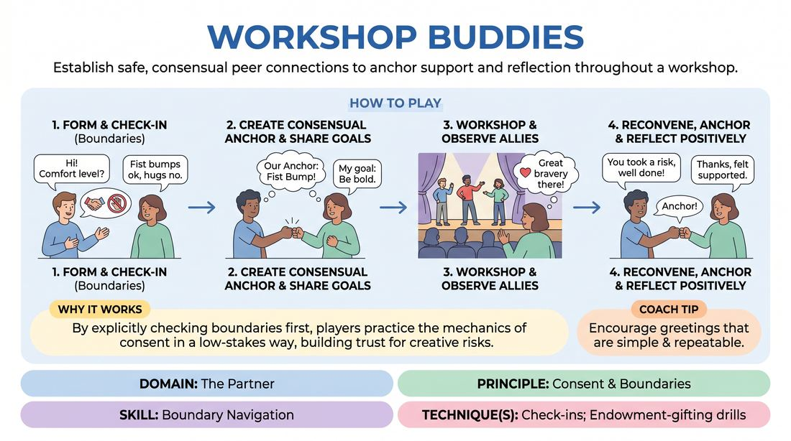

# Week 01 — Welcome & the Safety Container
> *Safety is the container Yes-And lives inside — consent overrides agreement.*

| Course | Week | Domain | Focus | Stage |
|---|---|---|---|---|
| Foundations — The Brave Beginner | 1/16 | D2 — The Partner | `D2.S6` — Boundary Navigation | Novice → Advanced Beginner |

!!! warning "Layer 0 — Safety & Consent first"
    The consent container is established before anything else and re-affirmed here. The rule of consent overrides the rule of agreement.

## ⏱️ Session flow (60 minutes)

| Time | Block |
|---|---|
| **0:00–0:05** | 🤝 Arrival & safety check-in |
| **0:05–0:15** | 🔥 Warm-up — *Peer Check-In Allies* |
| **0:15–0:27** | 🧠 Theory — *Boundary Navigation* |
| **0:27–0:52** | 🎲 Game 1 — *The Consent Connection* |
| **0:52–1:00** | 💭 Reflection & debrief |

## 1. 🧠 Today's theory

**Focus:** `D2.S6` — Boundary Navigation  
**Maturity goal today:** Novice: aware safety matters; practise check-ins and the 'Cut' call in exercises.

{ .infographic }

- **The big idea:** Safety is the container Yes-And lives inside — consent overrides agreement.
- **Where you are on the path:** Novice: aware safety matters; practise check-ins and the 'Cut' call in exercises.
- **The one cue to coach:** *“You can always say 'Cut.' Nothing happens without a yes.”*

!!! abstract "📖 Go deeper"
    Read the full write-up: [Boundary Navigation](../../content/02_the-partner/02_S6__boundary-navigation.md)

## 2. 🎲 Today's games

#### Warm-up — Peer Check-In Allies

> Establish safe, consensual peer connections to anchor support and reflection throughout a workshop.

{ .infographic }

`Players 2+` · `~5 min` · `Complexity 1/5` · `Energy medium` · `Props: none`

**Trains:** Boundary Navigation · _connection_

**How to play**

1. Divide the group into pairs or trios (allies) at the very beginning of the session.
2. Instruct partners to introduce themselves and explicitly check in about physical boundaries (e.g., asking what level of touch they are comfortable with).
3. Have partners co-create a brief, consensual anchor greeting (such as a handshake, fist bump, synchronized gesture, or verbal call-and-response) that respects everyone's stated boundaries.
4. Give partners two minutes to share their personal goals, hopes, or any anxieties they have about the upcoming session.
5. Run the main workshop or rehearsal as planned, encouraging players to keep an eye out for their allies' successes and moments of bravery.
6. At the end of the session, reconvene the allies to perform their anchor greeting and share one specific, positive observation about each other's work.

[Open the full game card »](../../games/D2_P1_S6_T1_G898__workshop-buddies.md){target=_blank rel=noopener}

#### Core game — The Consent Connection

> Practice explicit consent and physical boundary negotiation through a structured, supportive group warm-up.

{ .infographic }

`Players 3+` · `~3 min` · `Complexity 1/5` · `Energy low` · `Props: none`

**Trains:** Boundary Navigation · _connection_

**How to play**

1. Instruct all players to stand in a circle, then turn 90 degrees to their right so everyone is facing the back of the person in front of them.
2. Introduce the 'Consent Check' rule: no physical contact can begin until the giver explicitly asks for permission and receives a clear response.
3. Have each player ask the person in front of them a specific question, such as: 'May I massage your shoulders?'
4. Instruct the receiver to respond with one of three options: a clear 'Yes', a modified request (e.g., 'Yes, but very light pressure'), or a polite 'No, thank you'.
5. If a receiver says 'No, thank you', the giver must immediately respect this by keeping their hands to themselves, perhaps resting them on their own chest or holding them in a supportive, non-touching gesture near the partner's shoulders.
6. Once consent is established, players begin the shoulder massage, with givers checking in after a few seconds to ask if the pressure is comfortable.
7. After approximately one minute, call out 'Pause and Pivot'. Have all players turn 180 degrees to face the opposite direction.
8. Repeat the exact same consent check and negotiation process with the new person now standing in front of them before any physical contact begins.

[Open the full game card »](../../games/D2_P1_S6_T3_G1174__massage.md){target=_blank rel=noopener}

??? note "🎒 Backup games — if you have time, or a game falls flat"
    *Swap-ins drawn from the same maturity band; not part of the timed hour.*
    - **[Consent Architects](../../games/D2_P1_S6_T1_G043__consent-architects.md){target=_blank rel=noopener}** — `3–5` · `~15m` · `Cx 2/5` · `Energy medium` · _Boundary Navigation_
    - **[The Boundary Compass](../../games/D2_P1_S6_T1_G148__the-consent-compass.md){target=_blank rel=noopener}** — `2+` · `~15m` · `Cx 2/5` · `Energy low` · _Boundary Navigation_

## 3. 💭 Self-reflection

**Deepen your improv**
1. How did it feel to explicitly negotiate your physical boundaries before creating your greeting?
2. Did having a designated ally change how supported you felt during challenging exercises?

**Beyond the stage**
3. Psychological safety is the container that makes risk possible. Where — on a team, in a family — is the container missing, and what one act would help build it?

---
*Next:* [W02 — The First Thought Is a Gift](week-02.md) ➡️
