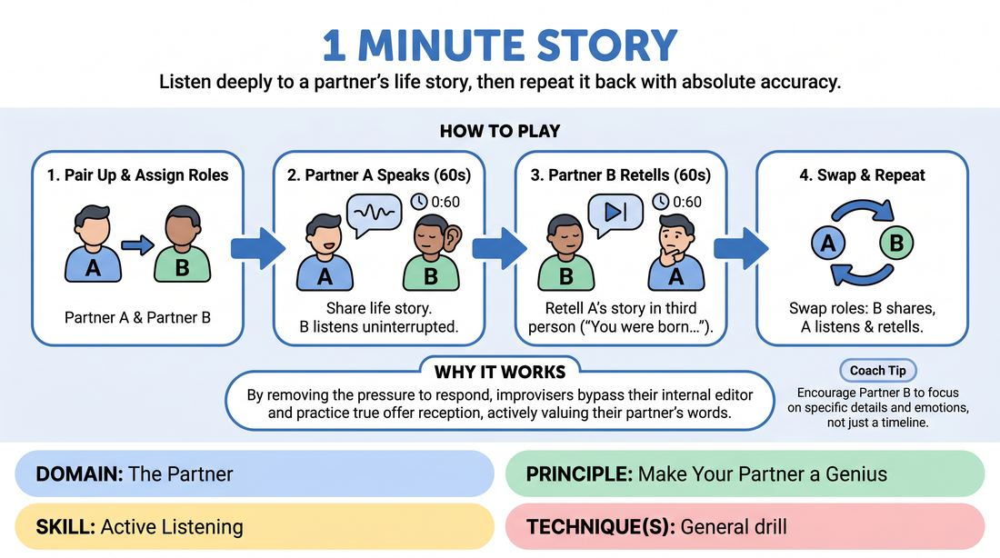
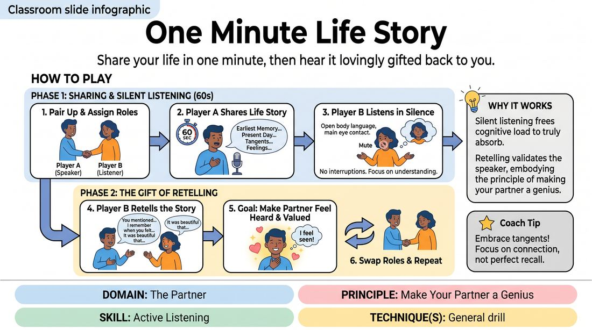

# Week 07 — Really Listening
> *Listening is the first half of every offer.*

| Course | Week | Domain | Focus | Stage |
|---|---|---|---|---|
| Foundations — The Brave Beginner | 7/16 | D2 — The Partner | `D2.S1` — Active Listening | Novice → Advanced Beginner |

!!! note "Builds on"
    W2–6 — now turn the instrument toward a partner.

## ⏱️ Session flow (60 minutes)

| Time | Block |
|---|---|
| **0:00–0:05** | 🤝 Arrival & safety check-in |
| **0:05–0:15** | 🔥 Warm-up — *Sixty-Second Biography* |
| **0:15–0:27** | 🧠 Theory — *Active Listening* |
| **0:27–0:52** | 🎲 Game 1 — *Sixty-Second Biography* |
| **0:52–1:00** | 💭 Reflection & debrief |

## 1. 🧠 Today's theory

**Focus:** `D2.S1` — Active Listening  
**Maturity goal today:** Novice → Adv. Beginner: last-word response in drills.

{ .infographic }

- **The big idea:** Listening is the first half of every offer.
- **Where you are on the path:** Novice → Adv. Beginner: last-word response in drills.
- **The one cue to coach:** *“React first, build second.”*

!!! abstract "📖 Go deeper"
    Read the full write-up: [Active Listening](../../content/02_the-partner/02_S1__active-listening.md)

## 2. 🎲 Today's games

#### Warm-up — Sixty-Second Biography

> Listen deeply to a partner's life story, then repeat it back with absolute accuracy.

{ .infographic }

`Players 2+` · `~5 min` · `Complexity 1/5` · `Energy low` · `Props: none`

**Trains:** Active Listening · _connection_

**How to play**

1. Divide the group into pairs and designate one person as Partner A and the other as Partner B.
2. Instruct Partner A that they will have exactly sixty seconds to share their life story, starting from their earliest memories up to the present day.
3. Instruct Partner B that their sole job is to listen actively and silently, without interrupting, asking questions, or nodding excessively.
4. Start the timer and let Partner A speak continuously for sixty seconds, sharing whatever details they feel comfortable disclosing.
5. When the timer sounds, immediately instruct Partner B to retell Partner A's story back to them, aiming to capture as many specific details, emotions, and chronological events as they can remember.
6. Give Partner B sixty seconds to complete the retelling, ensuring they speak in the third person (e.g., 'You were born in...').
7. Swap roles so Partner B shares their life story for sixty seconds while Partner A listens, followed by Partner A retelling the story.

[Open the full game card »](../../games/D2_P3_S1_T0_G618__1-minute-story.md){target=_blank rel=noopener}

#### Core game — Sixty-Second Biography

> Share your life in one minute, then hear it lovingly gifted back to you.

{ .infographic }

`Players 2+` · `~5 min` · `Complexity 1/5` · `Energy low` · `Props: none`

**Trains:** Active Listening · _connection_

**How to play**

1. Divide the group into pairs and designate one person as Player A and the other as Player B.
2. Instruct Player A that they will have exactly sixty seconds to share their life story, starting from their earliest memory up to the present day.
3. Instruct Player B to listen in silence, maintaining comfortable eye contact and open body language, without interrupting, asking questions, or offering verbal feedback.
4. Start the timer and have Player A speak continuously for the full minute, embracing whatever details, feelings, or tangents arise.
5. Once the minute is up, instruct Player B to immediately retell Player A's story back to them, aiming to capture as many details, emotional beats, and specific facts as they can remember.
6. Emphasize that Player B's goal is not to test their own memory, but to make Player A feel deeply understood, celebrated, and valued.
7. Swap roles so Player B shares their life story for sixty seconds while Player A listens and then retells it.

[Open the full game card »](../../games/D2_P3_S1_T0_G785__one-minute-life-story.md){target=_blank rel=noopener}

??? note "🎒 Backup games — if you have time, or a game falls flat"
    *Swap-ins drawn from the same maturity band; not part of the timed hour.*
    - **[Rapid Connection Rounds](../../games/D2_P0_S1_T0_G844__speedy-get-to-know-you.md){target=_blank rel=noopener}** — `4+` · `~10m` · `Cx 1/5` · `Energy medium` · _Active Listening_
    - **[Granular Week](../../games/D2_P3_S1_T0_G882__week-in-detail.md){target=_blank rel=noopener}** — `2+` · `~5m` · `Cx 1/5` · `Energy low` · _Active Listening_

## 3. 💭 Self-reflection

**Deepen your improv**
1. How did it feel to listen without the pressure of having to formulate a response or ask a question?
2. What strategies did you use to remember the details of your partner's story?

**Beyond the stage**
3. Recall a meeting where you were loading your reply instead of listening. What did you miss? What would change if you reacted first and built second?

---
⬅️ *Previous:* [W06 — Fail Joyfully & Recover](week-06.md)  ·  *Next:* [W08 — Yes, And — Accept & Add](week-08.md) ➡️
