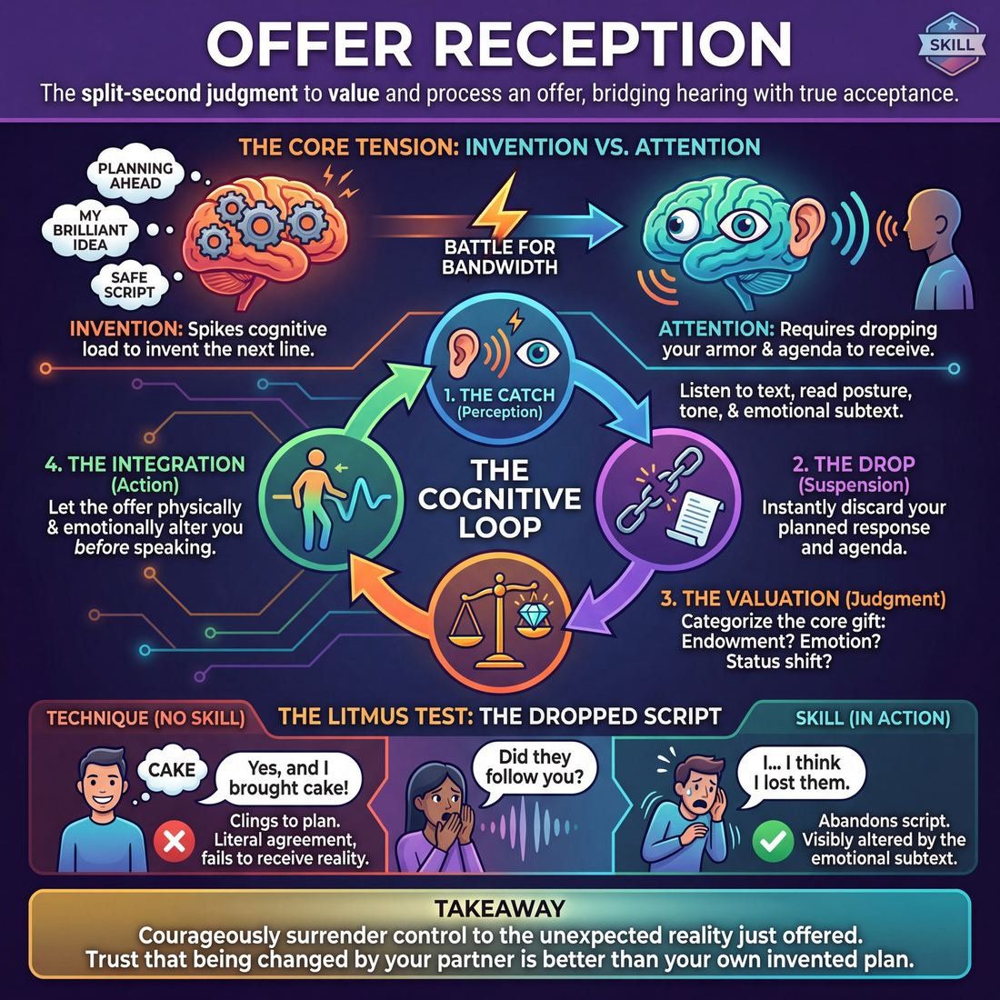
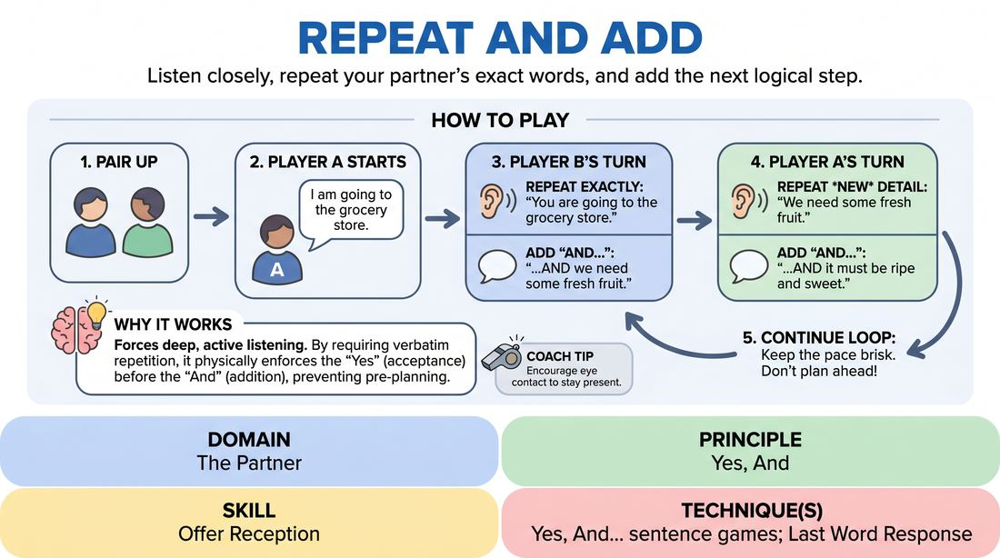

# Week 08 — Yes, And — Accept & Add
> *Accept the offered reality, then add to it.*

| Course | Week | Domain | Focus | Stage |
|---|---|---|---|---|
| Foundations — The Brave Beginner | 8/16 | D2 — The Partner | `D2.S4` — Offer Reception | Novice → Advanced Beginner |

## ⏱️ Session flow (60 minutes)

| Time | Block |
|---|---|
| **0:00–0:05** | 🤝 Arrival & safety check-in |
| **0:05–0:15** | 🔥 Warm-up — *Knife Throwing* |
| **0:15–0:27** | 🧠 Theory — *Offer Reception* |
| **0:27–0:52** | 🎲 Game 1 — *Echo and Expand* |
| **0:52–1:00** | 💭 Reflection & debrief |

## 1. 🧠 Today's theory

**Focus:** `D2.S4` — Offer Reception  
**Maturity goal today:** Adv. Beginner: a clear 'Yes, And…' in drills.

{ .infographic }

- **The big idea:** Accept the offered reality, then add to it.
- **Where you are on the path:** Adv. Beginner: a clear 'Yes, And…' in drills.
- **The one cue to coach:** *“Yes to their reality. And to your contribution.”*

!!! abstract "📖 Go deeper"
    Read the full write-up: [Offer Reception](../../content/02_the-partner/02_S4__offer-reception.md)

## 2. 🎲 Today's games

#### Warm-up — Knife Throwing

> Pass an imaginary blade across the circle with high-stakes focus and synchronized claps.

{ .infographic }

`Players 5+` · `~5 min` · `Complexity 1/5` · `Energy high` · `Props: none`

**Trains:** Offer Reception · _connection_

**How to play**

1. Form a standing circle with all players facing inward.
2. The facilitator introduces an imaginary, highly dangerous knife to the group.
3. The first player holds the imaginary knife, makes clear eye contact with another player across the circle, and throws it with a sharp physical thrust and a distinct sound like 'Whoosh!'.
4. The receiving player must track the trajectory of the knife and catch it by clapping their hands together precisely as it arrives, making a loud 'Clap!' sound.
5. The catcher immediately transforms their catch into a new throw, making eye contact with a different player and throwing it with another physical thrust and vocalization.
6. The game continues rapidly, maintaining a steady, high-energy rhythm of throw-catch-throw.
7. If a pass is dropped due to a missed clap or poor eye contact, the group briefly celebrates the mistake and immediately restarts the flow.

[Open the full game card »](../../games/D2_P3_S4_T0_G752__knife-throwing.md){target=_blank rel=noopener}

#### Core game — Echo and Expand

> Listen closely, repeat your partner's exact words, and add the next logical step.

{ .infographic }

`Players 2+` · `~5 min` · `Complexity 1/5` · `Energy medium` · `Props: none`

**Trains:** Offer Reception · _skill drill_

**How to play**

1. Divide the group into pairs and have partners stand or sit facing one another.
2. Player A initiates the conversation with a simple, single-sentence statement, such as 'I am going to the grocery store.'
3. Player B must repeat Player A's statement exactly as spoken, and then immediately add a new, single-sentence detail using 'and...', for example: 'You are going to the grocery store, and we need to buy some fresh apples.'
4. Player A must then repeat only the new detail that Player B just added, and append their own new single-sentence detail, for example: 'We need to buy some fresh apples, and they must be crisp and green.'
5. Player B repeats Player A's new detail and adds another: 'They must be crisp and green, and we will bake them into a pie.'
6. Continue this back-and-forth rhythm, ensuring that each turn begins with an exact echo of the partner's new contribution before any new information is introduced.
7. Keep the pace brisk and discourage players from planning their additions while their partner is speaking.

[Open the full game card »](../../games/D2_P2_S4_T1_G817__repeat-and-add.md){target=_blank rel=noopener}

??? star "🎒 Backup games — if you have time, or a game falls flat"
    *Swap-ins drawn from the same maturity band; not part of the timed hour.*
    - **[Yes, And Sentence Build](../../games/D2_P2_S4_T1_G903__yes-and.md){target=_blank rel=noopener}** — `2+` · `~5m` · `Cx 1/5` · `Energy medium` · _Offer Reception_
    - **[Affirmative Exchanges](../../games/D2_P2_S4_T1_G904__yes-based-conversations.md){target=_blank rel=noopener}** — `2+` · `~5m` · `Cx 1/5` · `Energy medium` · _Offer Reception_

## 3. 💭 Self-reflection

**Deepen your improv**
1. How did it feel when your partner made eye contact before throwing? How did that set you up for success?
2. What did you have to do to make sure your partner looked great when receiving your throw?

**Beyond the stage**
3. 'Yes, And' is acceptance plus contribution. Where do you reflexively block ideas ('Yes, but…') at work? Try 'Yes, And' on the next proposal you'd normally resist.

---
⬅️ *Previous:* [W07 — Really Listening](week-07.md)  ·  *Next:* [W09 — Make Your Partner a Genius](week-09.md) ➡️
