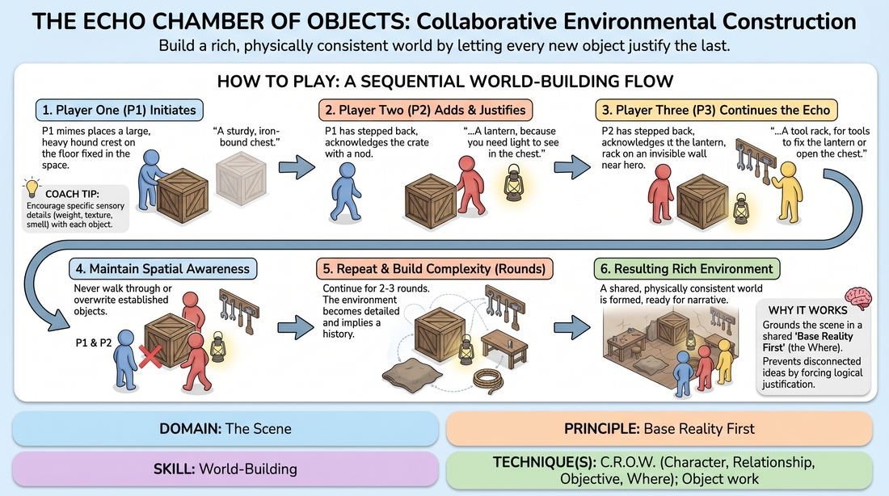
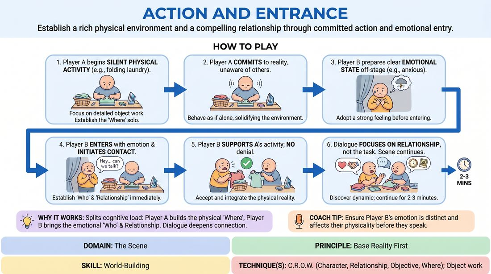

# Week 12 — Show, Don't Tell — Build a World
> *Establish the who/where/what before the unusual; play it, don't narrate it.*

| Course | Week | Domain | Focus | Stage |
|---|---|---|---|---|
| Foundations — The Brave Beginner | 12/16 | D3 — The Scene | `D3.S5` — World-Building | Novice → Advanced Beginner |

!!! note "Builds on"
    W7–11 — two people who listen and gift can now build a scene.

## ⏱️ Session flow (60 minutes)

| Time | Block |
|---|---|
| **0:00–0:05** | 🤝 Arrival & safety check-in |
| **0:05–0:15** | 🔥 Warm-up — *The Object Echo Chain* |
| **0:15–0:27** | 🧠 Theory — *World-Building* |
| **0:27–0:52** | 🎲 Game 1 — *Action and Entrance* |
| **0:52–1:00** | 💭 Reflection & debrief |

## 1. 🧠 Today's theory

**Focus:** `D3.S5` — World-Building  
**Maturity goal today:** Novice → Adv. Beginner: establish Character, Relationship, Objective, Where.

{ .infographic }

- **The big idea:** Establish the who/where/what before the unusual; play it, don't narrate it.
- **Where you are on the path:** Novice → Adv. Beginner: establish Character, Relationship, Objective, Where.
- **The one cue to coach:** *“Who are we, where are we, what do we want?”*

!!! abstract "📖 Go deeper"
    Read the full write-up: [World-Building](../../content/03_the-scene/03_S5__world-building.md)

## 2. 🎲 Today's games

#### Warm-up — The Object Echo Chain

> Build a rich, physically consistent world by letting every new object justify the last.

{ .infographic }

`Players 3–5` · `~15 min` · `Complexity 2/5` · `Energy medium` · `Props: none`

**Trains:** World-Building · _skill drill_

**How to play**

1. The facilitator designates a performance area and establishes the turn order for the 3 to 5 players.
2. Player One steps into the space and initiates the environment by clearly miming the placement of a single, stationary physical object, describing its sensory details as they place it.
3. Player One steps back to the semi-circle, leaving the imaginary object fixed in its spatial location.
4. Player Two steps into the space, physically acknowledges or briefly interacts with Player One's object, and then introduces a new, distinct object.
5. The new object must be a logical consequence of the previous object, answering the question: If the first object is true, what else must be true in this space?
6. Player Two clearly mimes the size, weight, and position of this new object, verbally describing its relationship to the first.
7. Subsequent players repeat this process, with each player adding exactly one new object that directly echoes and justifies the object placed immediately before theirs.
8. Players must maintain strict spatial awareness, ensuring they do not walk through or overwrite previously established objects.
9. Continue the rotation for two to three full rounds, allowing the environment to grow in complexity, specificity, and implied history.

[Open the full game card »](../../games/D3_P2_S5_T1_G608__the-echo-chamber-of-objects-collaborative-environmental-cons.md){target=_blank rel=noopener}

#### Core game — Action and Entrance

> Establish a rich physical environment and a compelling relationship through committed action and emotional entry.

{ .infographic }

`Players 2+` · `~15 min` · `Complexity 2/5` · `Energy medium` · `Props: none`

**Trains:** World-Building · _skill drill_

**How to play**

1. Player A steps onto the stage and immediately begins a silent, highly detailed physical activity (e.g., folding laundry, painting a wall, preparing a meal), focusing on the weight, size, and placement of imaginary objects.
2. Player A must fully commit to this activity, behaving as if they are alone and unaware of any impending entrance, establishing the 'Where' of the scene.
3. Player B prepares off-stage, adopting a clear, strong emotional state or attitude (e.g., anxious, ecstatic, irritated) before they cross the threshold.
4. Player B enters the stage, carrying their pre-established emotion, and initiates contact with Player A to define their relationship ('Who') and 'Objective'.
5. Player B must accept and support Player A's physical reality, avoiding any criticism or denial of the activity Player A is performing.
6. Both players engage in dialogue that focuses on their relationship, history, or feelings, using the physical activity as a background reality rather than the sole topic of conversation.
7. The scene continues for two to three minutes, allowing the players to discover how the physical task and the emotional dynamic influence each other, before the facilitator calls 'scene'.

[Open the full game card »](../../games/D3_P2_S5_T1_G625__action-and-entrance.md){target=_blank rel=noopener}

??? star "🎒 Backup games — if you have time, or a game falls flat"
    *Swap-ins drawn from the same maturity band; not part of the timed hour.*
    - **[Road Trip Base Reality](../../games/D3_P2_S5_T1_G650__car-journey.md){target=_blank rel=noopener}** — `5+` · `~10m` · `Cx 2/5` · `Energy medium` · _World-Building_
    - **[Dialogue and Doing](../../games/D3_P1_S5_T1_G663__chat-then-add-activity.md){target=_blank rel=noopener}** — `2+` · `~5m` · `Cx 2/5` · `Energy medium` · _World-Building_

## 3. 💭 Self-reflection

**Deepen your improv**
1. How did focusing on the immediate physical predecessor help you discover new details instead of planning ahead?
2. At what point did the environment start telling a story or suggesting who might live there?

**Beyond the stage**
3. World-building is shared specificity — establishing who, where, and what we want. Where would a team you're on benefit from explicitly naming its 'CROW'?

---
⬅️ *Previous:* [W11 — Status: High & Low](week-11.md)  ·  *Next:* [W13 — Make It Make Sense](week-13.md) ➡️
