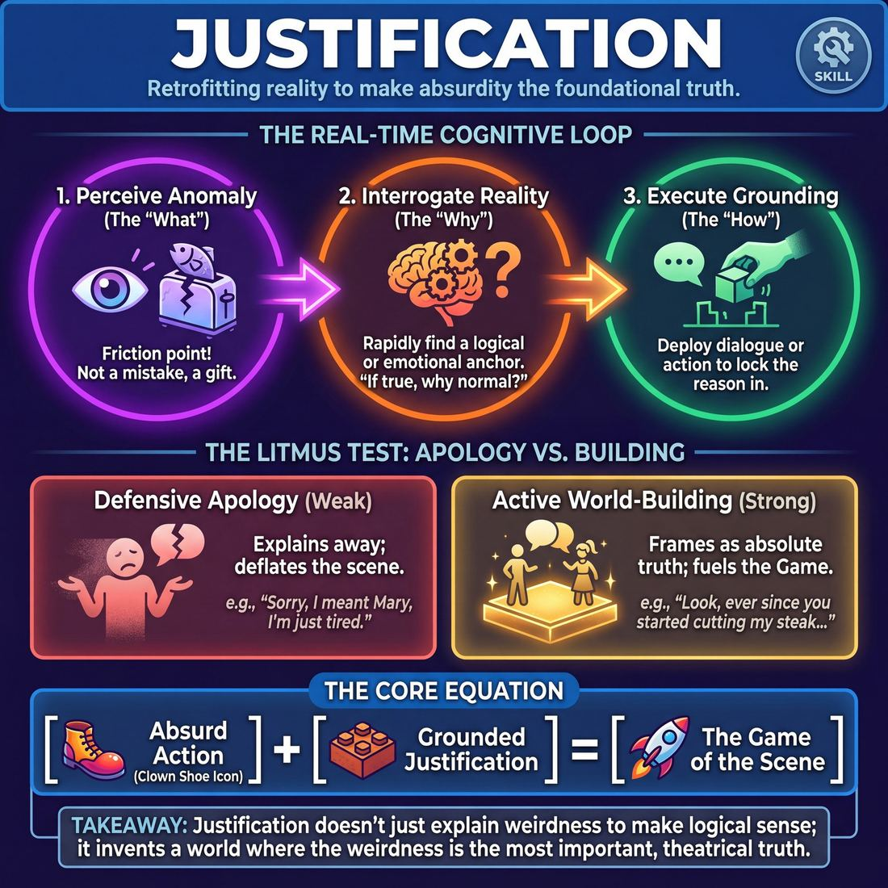
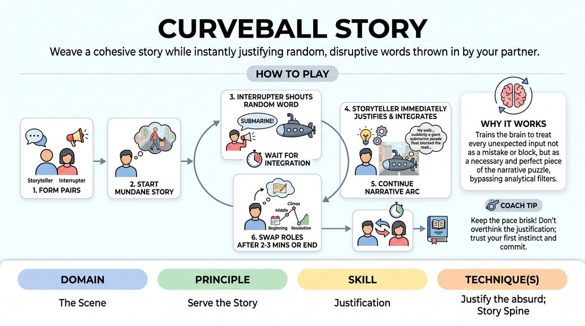
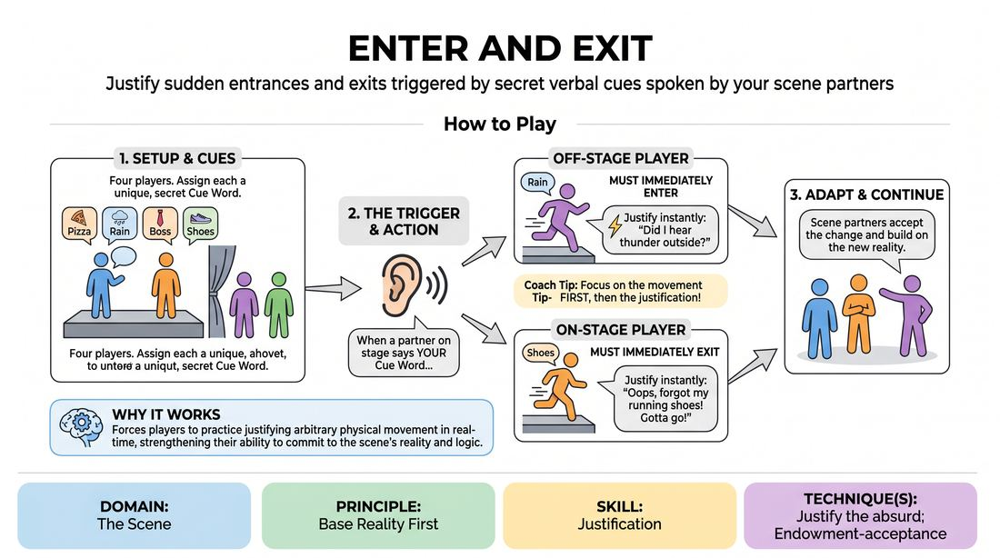

# Week 13 — Make It Make Sense
> *Anything can be justified — the absurd becomes inevitable.*

| Course | Week | Domain | Focus | Stage |
|---|---|---|---|---|
| Foundations — The Brave Beginner | 13/16 | D3 — The Scene | `D3.S6` — Justification | Novice → Advanced Beginner |

## ⏱️ Session flow (60 minutes)

| Time | Block |
|---|---|
| **0:00–0:05** | 🤝 Arrival & safety check-in |
| **0:05–0:15** | 🔥 Warm-up — *Curveball Narrative* |
| **0:15–0:27** | 🧠 Theory — *Justification* |
| **0:27–0:52** | 🎲 Game 1 — *Cue and Justify* |
| **0:52–1:00** | 💭 Reflection & debrief |

## 1. 🧠 Today's theory

**Focus:** `D3.S6` — Justification  
**Maturity goal today:** Adv. Beginner: justify the absurd.

{ .infographic }

- **The big idea:** Anything can be justified — the absurd becomes inevitable.
- **Where you are on the path:** Adv. Beginner: justify the absurd.
- **The one cue to coach:** *“If it's weird, decide why it's normal here.”*

!!! abstract "📖 Go deeper"
    Read the full write-up: [Justification](../../theory/03_the-scene/03_S6__justification.md)

## 2. 🎲 Today's games

#### Warm-up — Curveball Narrative

> Weave a cohesive story while instantly justifying random, disruptive words thrown in by your partner.

{ .infographic }

`Players 2+` · `~5 min` · `Complexity 2/5` · `Energy medium` · `Props: none`

**Trains:** Justification · _narrative_

**How to play**

1. Divide the group into pairs and designate one player as the Storyteller and the other as the Interrupter.
2. The Storyteller begins telling an original, simple story based on a mundane, everyday prompt (e.g., 'My walk to the grocery store this morning').
3. As the Storyteller speaks, the Interrupter calls out a completely random, unrelated noun or verb (e.g., 'Submarine' or 'Yodeling').
4. The Storyteller must immediately integrate this word into the narrative, justifying why and how it fits logically into the current scene.
5. The Interrupter must wait until the Storyteller has fully integrated and justified the previous word before calling out a new one.
6. The Storyteller continues building the narrative arc (beginning, middle, climax, and resolution) while adapting to each new curveball.
7. After two to three minutes, or once the story reaches a satisfying conclusion, the partners swap roles and repeat the process.

[Open the full game card »](../../games/D3_P4_S6_T1_G681__curveball-story.md){target=_blank rel=noopener}

#### Core game — Cue and Justify

> Justify sudden entrances and exits triggered by secret verbal cues spoken by your scene partners.

{ .infographic }

`Players 4+` · `~10 min` · `Complexity 2/5` · `Energy medium` · `Props: none`

**Trains:** Justification · _skill drill_

**How to play**

1. Assign each of the four players a distinct, simple cue word from different categories, ensuring everyone knows which word belongs to whom.
2. Position two players on stage to begin the scene, and place the other two players off-stage in the wings.
3. The two on-stage players begin a grounded, realistic scene based on a simple location suggestion.
4. All players must listen closely to the dialogue; when a player's assigned cue word is spoken by another player on stage, that triggered player must immediately change their location.
5. If the triggered player is off-stage, they must enter the scene; if they are on-stage, they must exit the scene.
6. The entering or exiting player must immediately deliver a verbal justification that explains why they are suddenly arriving or leaving, keeping it consistent with the scene's reality.
7. A player cannot say their own cue word to trigger their own movement; the trigger must always come from someone else's dialogue.
8. The remaining players must accept the new arrival or departure and adapt the scene's narrative to accommodate the change without breaking character.

[Open the full game card »](../../games/D3_P2_S6_T1_G697__enter-and-exit.md){target=_blank rel=noopener}

??? star "🎒 Backup games — if you have time, or a game falls flat"
    *Swap-ins drawn from the same maturity band; not part of the timed hour.*
    - **[Instant Travelogue](../../games/D3_P4_S6_T1_G739__instagram-slide-show.md){target=_blank rel=noopener}** — `2–4` · `~5m` · `Cx 2/5` · `Energy medium` · _Justification_
    - **[Sweet Talk Rivals](../../games/D3_P4_S6_T1_G762__love-hearts.md){target=_blank rel=noopener}** — `2–2` · `~5m` · `Cx 2/5` · `Energy medium` · _Justification_

## 3. 💭 Self-reflection

**Deepen your improv**
1. How did it feel to have your planned narrative disrupted by a random word?
2. What strategies did you use to make highly absurd words fit logically into your story?

**Beyond the stage**
3. Justification turns the absurd into the inevitable. Recall a constraint or odd decision you resisted — how could you 'justify' and build on it rather than fight it?

---
⬅️ *Previous:* [W12 — Show, Don't Tell — Build a World](week-12.md)  ·  *Next:* [W14 — We're a Team](week-14.md) ➡️
