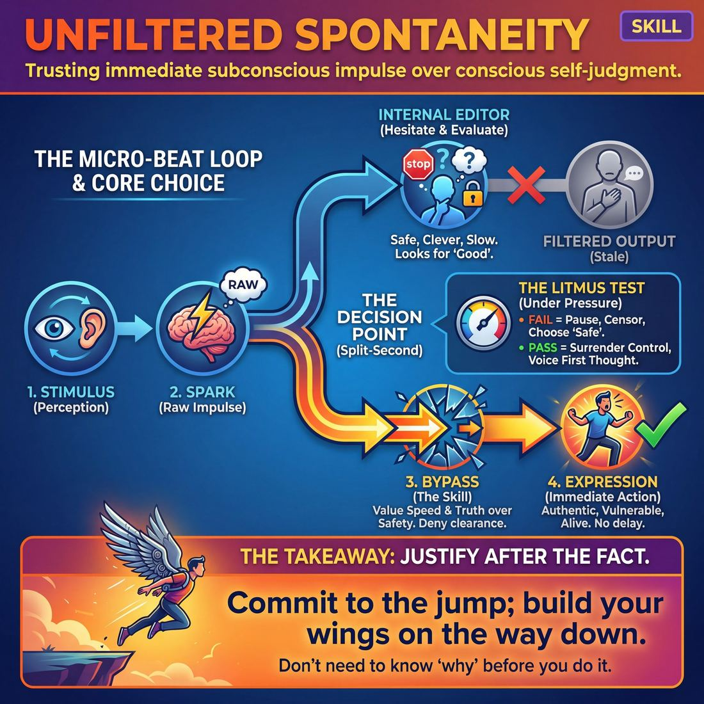
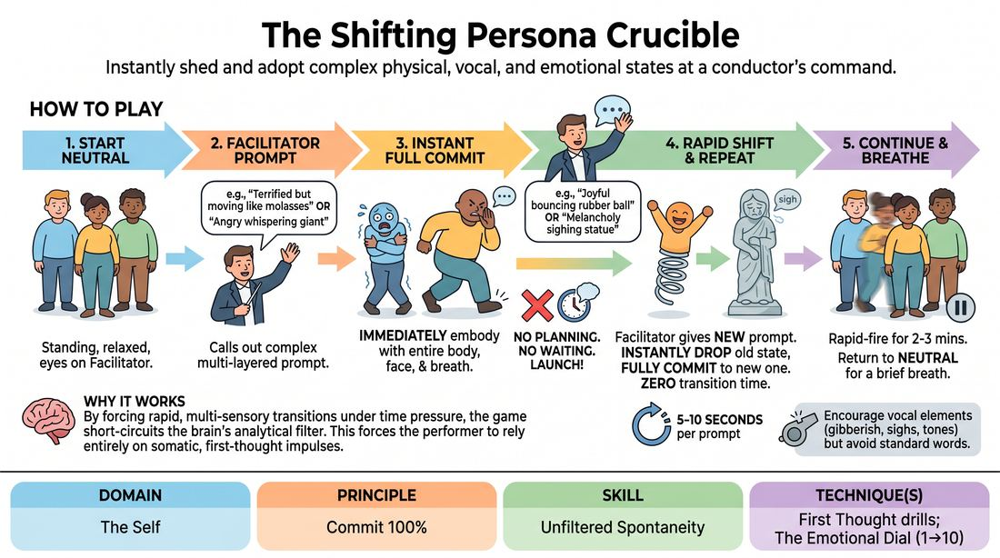

# Week 01 — Re-entry & the Safety Recommit
> *Rebuild the container, then bypass the editor under real pressure.*

| Course | Week | Domain | Focus | Stage |
|---|---|---|---|---|
| Choices Under Pressure — The Competent Improviser | 1/18 | D1 — The Self | `D1.S1` — Unfiltered Spontaneity | Competent |

!!! warning "Layer 0 — Safety & Consent first"
    The consent container is established before anything else and re-affirmed here. The rule of consent overrides the rule of agreement.

## ⏱️ Session flow (60 minutes)

| Time | Block |
|---|---|
| **0:00–0:05** | 🤝 Arrival & safety check-in |
| **0:05–0:15** | 🔥 Warm-up — *The Impulse Crucible* |
| **0:15–0:27** | 🧠 Theory — *Unfiltered Spontaneity* |
| **0:27–0:52** | 🎲 Game 1 — *Impulse Alchemy* |
| **0:52–1:00** | 💭 Reflection & debrief |

## 1. 🧠 Today's theory

**Focus:** `D1.S1` — Unfiltered Spontaneity  
**Also touches:** `D2.S6` — Boundary Navigation  
**Maturity goal today:** Competent: choose to bypass the editor under mild scene pressure.

{ .infographic }

- **The big idea:** Rebuild the container, then bypass the editor under real pressure.
- **Where you are on the path:** Competent: choose to bypass the editor under mild scene pressure.
- **The one cue to coach:** *“Safety first, then jump without the parachute.”*

!!! abstract "📖 Go deeper"
    Read the full write-up: [Unfiltered Spontaneity](../../content/01_the-self/01_S1__unfiltered-spontaneity.md)
    · [Boundary Navigation](../../content/02_the-partner/02_S6__boundary-navigation.md)

## 2. 🎲 Today's games

#### Warm-up — The Impulse Crucible

> Instantly shed and adopt complex physical, vocal, and emotional states at a conductor's command.

{ .infographic }

`Players 4–8` · `~10 min` · `Complexity 3/5` · `Energy high` · `Props: none`

**Trains:** Unfiltered Spontaneity · _skill drill_

**How to play**

1. Begin with all players standing in a relaxed, neutral physical posture with eyes focused on the facilitator.
2. The facilitator calls out a specific prompt, which can combine an emotional state, a physical quality, or a vocal restriction (e.g., 'terrified but moving like molasses').
3. Players must instantly and simultaneously embody the prompt using their entire body, facial expression, and breath, committing fully to their very first physical impulse.
4. Emphasize that there is no planning or waiting to see what others do; every player must launch into their own unique interpretation immediately.
5. After 5 to 10 seconds, the facilitator calls out a completely new, contrasting prompt.
6. Players must instantly drop their current state and fully commit to the new prompt with zero transition time or hesitation.
7. Incorporate vocal elements such as gibberish, sighs, or specific tones when prompted, but avoid standard spoken dialogue to keep the focus on physical and emotional expression.
8. Continue this rapid-fire delivery of prompts for a round of two to three minutes before returning to neutral for a brief breath.

[Open the full game card »](../../games/D1_P1_S1_T2_G110__the-shifting-persona-crucible.md){target=_blank rel=noopener}

#### Core game — Impulse Alchemy

> Transform raw physical impulses into dynamic characters and spontaneous scenes guided by a steady beat.

{ .infographic }

`Players 4–10` · `~15 min` · `Complexity 3/5` · `Energy medium` · `Props: required`

**Trains:** Unfiltered Spontaneity · _skill drill_

**How to play**

1. Establish the Pulse: Have all players stand in neutral positions throughout the space. The facilitator begins playing a steady, moderate percussive beat (60-80 BPM) to ground the room in a shared rhythm.
2. Phase 1 - Sense: On the facilitator's vocal cue of 'Sense,' players close their eyes (or soften their gaze) and focus entirely inward for 8 beats, identifying the very first raw, physical sensation or texture (e.g., a tingle in the shoulders, a heaviness in the knees) without labeling it.
3. Phase 2 - Form: On the cue 'Form,' players instantly open their eyes and translate that internal sensation into a committed, exaggerated full-body physical posture and a simultaneous non-linguistic sound (like a hum, sigh, or click) on the next beat.
4. Phase 3 - Shift: On the cue 'Shift,' players adjust the intensity of their current physical and vocal expression by dialing it up or down (using an internal 1-to-10 scale) for 8 beats, exploring the emotional range of the shape.
5. Phase 4 - Characterize: On a double-beat cue, players instantly transition their abstract shape and sound into a distinct character. They adopt a specific character voice based on their sound and begin a repetitive physical activity (e.g., sweeping, painting, typing) that matches their physical shape.
6. Phase 5 - Spontaneous Duo: On the cue 'Interact,' players lock eyes with the nearest partner and immediately initiate a rapid-fire, 30-second scene. They must let their physicalized character dictate their relationship and point of view, committing 100% to the first line of dialogue that comes out.
7. Phase 6 - Reset: On the cue 'Reset,' players release their characters and return to a neutral standing position of silence and stillness for 8 beats to clear their canvas before the next round begins.

[Open the full game card »](../../games/D1_P4_S1_T2_G022__impulse-alchemist-sensing-forming-shifting-internal-states.md){target=_blank rel=noopener}

??? star "🎒 Backup games — if you have time, or a game falls flat"
    *Swap-ins drawn from the same maturity band; not part of the timed hour.*
    - **[The Resonance Eddy](../../games/D1_P4_S1_T2_G145__the-sentient-eddy.md){target=_blank rel=noopener}** — `4–8` · `~15m` · `Cx 3/5` · `Energy high` · _Unfiltered Spontaneity_
    - **[The Resonance Crucible](../../games/D1_P4_S1_T2_G340__the-resonance-crucible.md){target=_blank rel=noopener}** — `4–8` · `~15m` · `Cx 3/5` · `Energy medium` · _Unfiltered Spontaneity_

## 3. 💭 Self-reflection

**Deepen your improv**
1. How did it feel to immediately drop a state you were enjoying to take on something completely different?
2. When you hesitated, what was the internal dialogue that caused the delay, and how did you shake it off?

**Beyond the stage**
3. Psychological safety is the container that makes risk possible. Where — on a team, in a family — is the container missing, and what one act would help build it?

---
*Next:* [W02 — Emotion with Logic](week-02.md) ➡️
