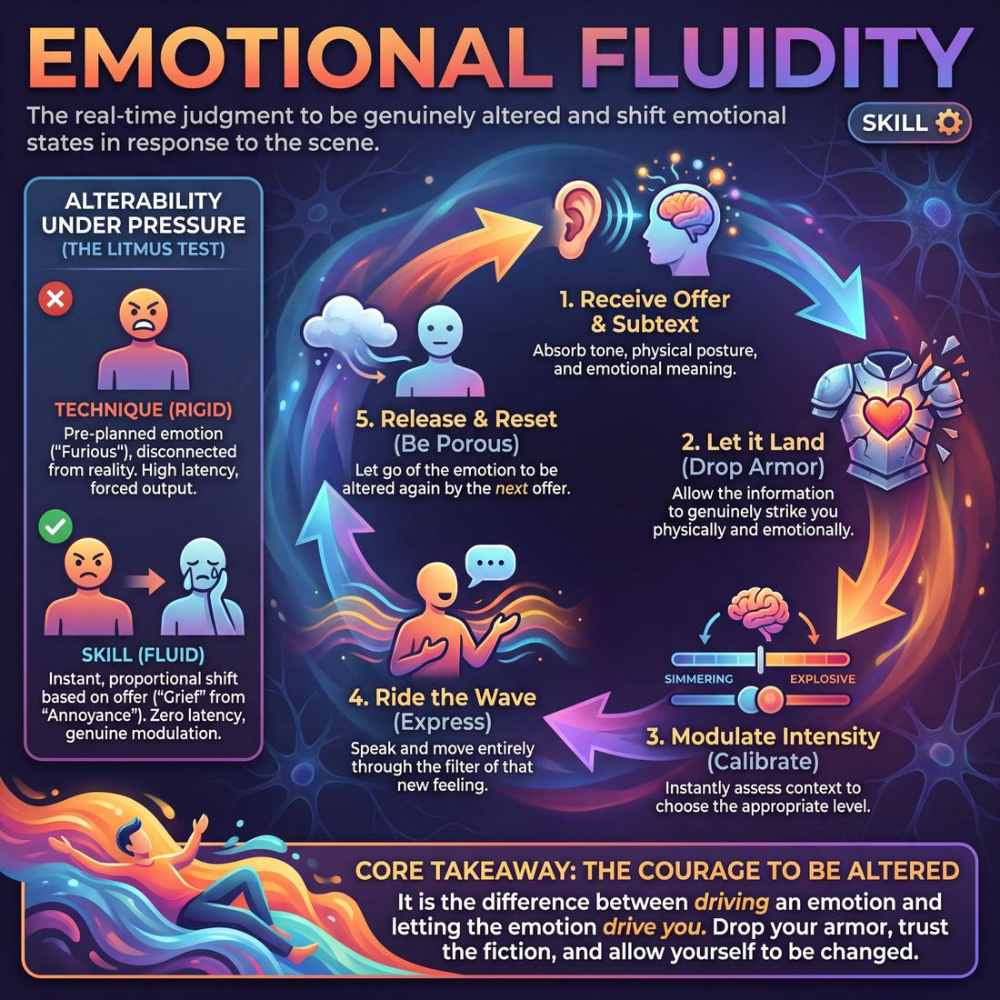

# Week 02 — Emotion with Logic
> *Let emotion transition when the scene's logic calls for it.*

| Course | Week | Domain | Focus | Stage |
|---|---|---|---|---|
| Choices Under Pressure — The Competent Improviser | 2/18 | D1 — The Self | `D1.S2` — Emotional Fluidity | Competent |

## ⏱️ Session flow (60 minutes)

| Time | Block |
|---|---|
| **0:00–0:05** | 🤝 Arrival & safety check-in |
| **0:05–0:15** | 🔥 Warm-up — *Internal Weather System* |
| **0:15–0:27** | 🧠 Theory — *Emotional Fluidity* |
| **0:27–0:52** | 🎲 Game 1 — *The Somatic Blueprint* |
| **0:52–1:00** | 💭 Reflection & debrief |

## 1. 🧠 Today's theory

**Focus:** `D1.S2` — Emotional Fluidity  
**Maturity goal today:** Competent: transition emotion when scene logic calls for it.

{ .infographic }

- **The big idea:** Let emotion transition when the scene's logic calls for it.
- **Where you are on the path:** Competent: transition emotion when scene logic calls for it.
- **The one cue to coach:** *“Earn the shift. Let the scene move you.”*

!!! abstract "📖 Go deeper"
    Read the full write-up: [Emotional Fluidity](../../theory/01_the-self/01_S2__emotional-fluidity.md)

## 2. 🎲 Today's games

#### Warm-up — Internal Weather System

> Channel shifting emotional currents into physical tasks to build somatic vulnerability and fluid expression.

{ .infographic }

`Players 5–7` · `~15 min` · `Complexity 3/5` · `Energy medium` · `Props: none`

**Trains:** Emotional Fluidity · _skill drill_

**How to play**

1. The facilitator assigns the Active Player a simple, repetitive physical task, such as sweeping a floor, folding laundry, or polishing a glass.
2. The Active Player begins performing this task at a neutral, calm baseline, establishing a steady physical rhythm.
3. An Echo player initiates an emotional current by sending a non-verbal cue, such as a gibberish phrase, a sigh, a gasp, or a distinct physical posture.
4. The Active Player pauses briefly to receive the cue, letting the emotional tone land in their body and alter their internal state.
5. The Active Player resumes their physical task, but now executes it through the lens of this new emotion, altering their movement speed, weight, and breathing.
6. The Echoes can use hand gestures to adjust the 'Emotional Dial,' signaling the Active Player to scale the intensity of the emotion from a subtle 1 to an extreme 10.
7. Once the emotion peaks, the Active Player allows the feeling to naturally subside, practicing 'self-recovery' to return to a functional, centered baseline while continuing the task.
8. The process repeats with a different Echo introducing a new emotional current, allowing the Active Player to transition through multiple distinct states.

[Open the full game card »](../../games/D1_P3_S2_T1_G020__the-internal-weather-system.md){target=_blank rel=noopener}

#### Core game — The Somatic Blueprint

> Consciously scan, sculpt, and scale your internal emotional landscape before passing it to a partner.

{ .infographic }

`Players 6–12` · `~15 min` · `Complexity 3/5` · `Energy medium` · `Props: none`

**Trains:** Emotional Fluidity · _skill drill_

**How to play**

1. The facilitator calls out an abstract, evocative prompt word to the entire circle.
2. The active player, acting as the Architect, stands in complete silence and stillness for five to ten seconds to perform an internal scan of their immediate physical and emotional reactions to the word.
3. The Architect selects one dominant sensation or emotion from their scan and mentally assigns it an intensity rating from 1 to 10 using the Emotional Dial.
4. The Architect plans how this scaled state will manifest physically through posture, tension, and movement, and vocally through breath, tone, or gibberish.
5. The Architect fully embodies this sculpted state for ten to fifteen seconds, committing completely to the physical and vocal expression of their chosen blueprint.
6. The Architect makes direct eye contact with a Receiver in the circle and delivers a single, concentrated physical gesture and non-verbal vocalization that encapsulates their state.
7. The Receiver immediately mirrors this gesture and sound for a brief moment to absorb its quality, then drops into five to ten seconds of silent, still internal scanning.
8. The Receiver consciously chooses a new state in response, either amplifying, de-escalating, contrasting, or transforming the received energy, and sets their own Emotional Dial from 1 to 10.
9. The Receiver becomes the new Architect, fully embodying their new state and passing it to another player, continuing the cycle.

[Open the full game card »](../../games/D1_P3_S2_T1_G035__the-somatic-architect-internal-blueprint.md){target=_blank rel=noopener}

??? star "🎒 Backup games — if you have time, or a game falls flat"
    *Swap-ins drawn from the same maturity band; not part of the timed hour.*
    - **[The Emotional Dialect](../../games/D1_P1_S2_T2_G103__the-somatic-symphony.md){target=_blank rel=noopener}** — `4–8` · `~15m` · `Cx 3/5` · `Energy medium` · _Emotional Fluidity_
    - **[The Spectrum Filter](../../games/D1_P1_S2_T1_G117__the-spectrum-filter.md){target=_blank rel=noopener}** — `5–10` · `~15m` · `Cx 3/5` · `Energy medium` · _Emotional Fluidity_

## 3. 💭 Self-reflection

**Deepen your improv**
1. How did anchoring your focus on a physical task affect your ability to experience and express different emotions?
2. What did you discover about your capacity to 'recover' and return to center after expressing a high-intensity emotion?

**Beyond the stage**
3. Think of a moment you 'performed calm' while feeling something else. What changes when you let a real emotion be visible — at home, or in a hard conversation?

---
⬅️ *Previous:* [W01 — Re-entry & the Safety Recommit](week-01.md)  ·  *Next:* [W03 — The Power of Stillness](week-03.md) ➡️
