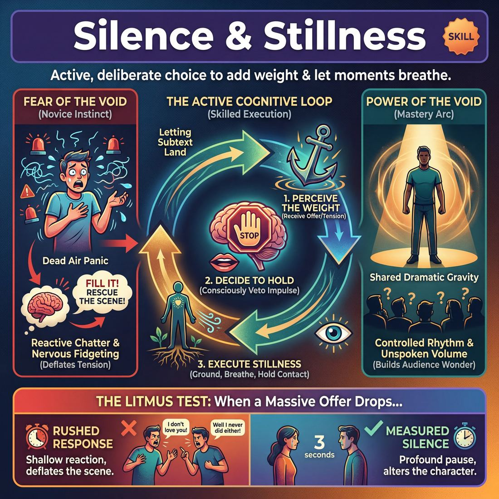
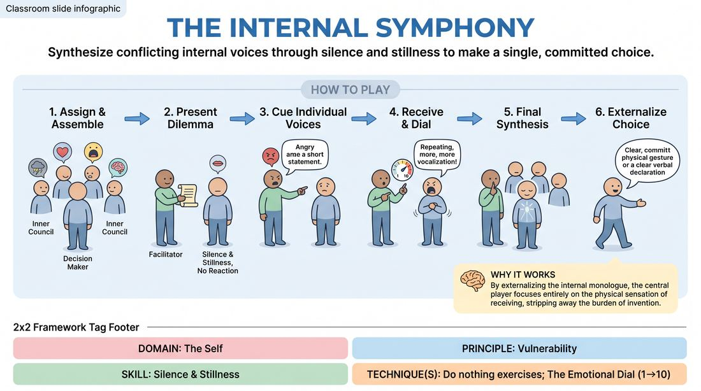
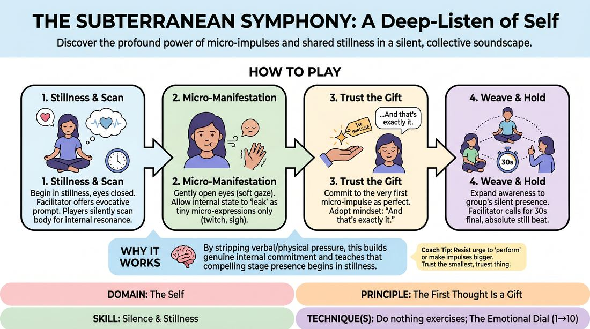

# Week 03 — The Power of Stillness
> *Decide when a moment needs silence — and hold it.*

| Course | Week | Domain | Focus | Stage |
|---|---|---|---|---|
| Choices Under Pressure — The Competent Improviser | 3/18 | D1 — The Self | `D1.S5` — Silence & Stillness | Competent |

## ⏱️ Session flow (60 minutes)

| Time | Block |
|---|---|
| **0:00–0:05** | 🤝 Arrival & safety check-in |
| **0:05–0:15** | 🔥 Warm-up — *The Inner Council* |
| **0:15–0:27** | 🧠 Theory — *Silence & Stillness* |
| **0:27–0:52** | 🎲 Game 1 — *The Silent Symphony* |
| **0:52–1:00** | 💭 Reflection & debrief |

## 1. 🧠 Today's theory

**Focus:** `D1.S5` — Silence & Stillness  
**Maturity goal today:** Competent: decide when a moment needs silence.

{ .infographic }

- **The big idea:** Decide when a moment needs silence — and hold it.
- **Where you are on the path:** Competent: decide when a moment needs silence.
- **The one cue to coach:** *“Let it breathe. Don't fill the gap.”*

!!! abstract "📖 Go deeper"
    Read the full write-up: [Silence & Stillness](../../theory/01_the-self/01_S5__silence-and-stillness.md)

## 2. 🎲 Today's games

#### Warm-up — The Inner Council

> Synthesize conflicting internal voices through silence and stillness to make a single, committed choice.

{ .infographic }

`Players 3+` · `~15 min` · `Complexity 3/5` · `Energy medium` · `Props: none`

**Trains:** Silence & Stillness · _skill drill_

**How to play**

1. Assign one player to stand in the center as the Decision Maker, while the remaining players stand in a semi-circle around them as the Inner Council.
2. Instruct each Council member to choose or receive a distinct emotional archetype and immediately adopt a physical posture and vocal quality that represents this state.
3. The facilitator presents a high-stakes, emotionally resonant dilemma directly to the Decision Maker.
4. The Decision Maker must stand in complete silence and stillness, absorbing the dilemma without reacting immediately, practicing 'doing nothing' while letting the situation register.
5. The facilitator points to individual Council members one by one to cue their input.
6. When cued, the Council member delivers a single, unfiltered, first-thought statement or non-verbal vocalization directly to the Decision Maker.
7. The Decision Maker receives each impulse in silence, allowing the conflicting inputs to register only as subtle, visible shifts in their expression, posture, or breath.
8. The facilitator may use an emotional dial cue (1 to 10) to prompt a Council member to repeat or intensify their input, or ask them to express it purely physically.
9. After several voices have spoken, the facilitator calls for silence, and the Decision Maker takes a final beat of stillness to synthesize the conflicting inputs.
10. The Decision Maker externalizes their final, integrated choice through a single, committed physical action, a clear verbal declaration, or a profound shift in demeanor.

[Open the full game card »](../../games/D1_P3_S5_T1_G013__the-internal-symphony.md){target=_blank rel=noopener}

#### Core game — The Silent Symphony

> Discover the profound power of micro-impulses and shared stillness in a silent, collective soundscape.

{ .infographic }

`Players 4–15` · `~15 min` · `Complexity 3/5` · `Energy low` · `Props: none`

**Trains:** Silence & Stillness · _connection_

**How to play**

1. Begin in Stillness: Instruct all players to find a comfortable, physically still posture (seated or standing) and gently close their eyes to focus inward.
2. Introduce the Somatic Prompt: The facilitator offers a single, evocative, open-ended prompt designed to spark an internal sensation rather than an action (e.g., 'the heavy air before a thunderstorm' or 'the quiet hum of a sleeping city').
3. Conduct the Internal Scan: For two minutes, players silently locate where this prompt resonates physically in their bodies, observing their breath, micro-tensions, and temperature shifts, using an internal 'emotional dial' from 1 to 10 to explore its intensity.
4. Transition to Micro-Manifestation: Instruct players to gently open their eyes while maintaining their internal focus, keeping their gaze soft and unfocused.
5. Release the First Impulse: Players allow their internal state to leak out only through the smallest, most irreducible physical micro-expressions—such as a subtle shift in breath rhythm, a tiny twitch of a finger, or a slight tilt of the head.
6. Commit to the Micro-Choice: Encourage players to treat their very first physical impulse as a perfect gift, silently adopting the mindset of 'and that's exactly what I meant' to validate even the tiniest movement.
7. Weave the Collective Atmosphere: Expand awareness to the room, inviting players to sense the shared presence and silent emotional shifts of the other ensemble members without direct eye contact, mimicry, or overt interaction.
8. Hold the Final Beat: After several minutes of silent, shared connection, the facilitator calls for absolute stillness, holding the quiet beat for thirty seconds to let the experience settle before ending the exercise.

[Open the full game card »](../../games/D1_P4_S5_T1_G460__the-subterranean-symphony-a-deep-listen-of-self.md){target=_blank rel=noopener}

??? star "🎒 Backup games — if you have time, or a game falls flat"
    *Swap-ins drawn from the same maturity band; not part of the timed hour.*
    - **[The Resonance Chamber](../../games/D1_P4_S5_T1_G255__the-resonance-chamber.md){target=_blank rel=noopener}** — `3+` · `~15m` · `Cx 2/5` · `Energy low` · _Silence & Stillness_
    - **[The Resonance Chamber](../../games/D1_P1_S5_T1_G368__the-emotional-resonance-chamber.md){target=_blank rel=noopener}** — `3–7` · `~10m` · `Cx 2/5` · `Energy low` · _Silence & Stillness_

## 3. 💭 Self-reflection

**Deepen your improv**
1. For the central player: What did it feel like to stand in stillness and receive those conflicting voices without the pressure to immediately respond?
2. How did practicing 'doing nothing' help you find a more authentic, spontaneous resolution at the end?

**Beyond the stage**
3. In conversations, do you rush to fill silence? Recall a time a pause would have served you better. What were you afraid would happen?

---
⬅️ *Previous:* [W02 — Emotion with Logic](week-02.md)  ·  *Next:* [W04 — Listening for Subtext](week-04.md) ➡️
