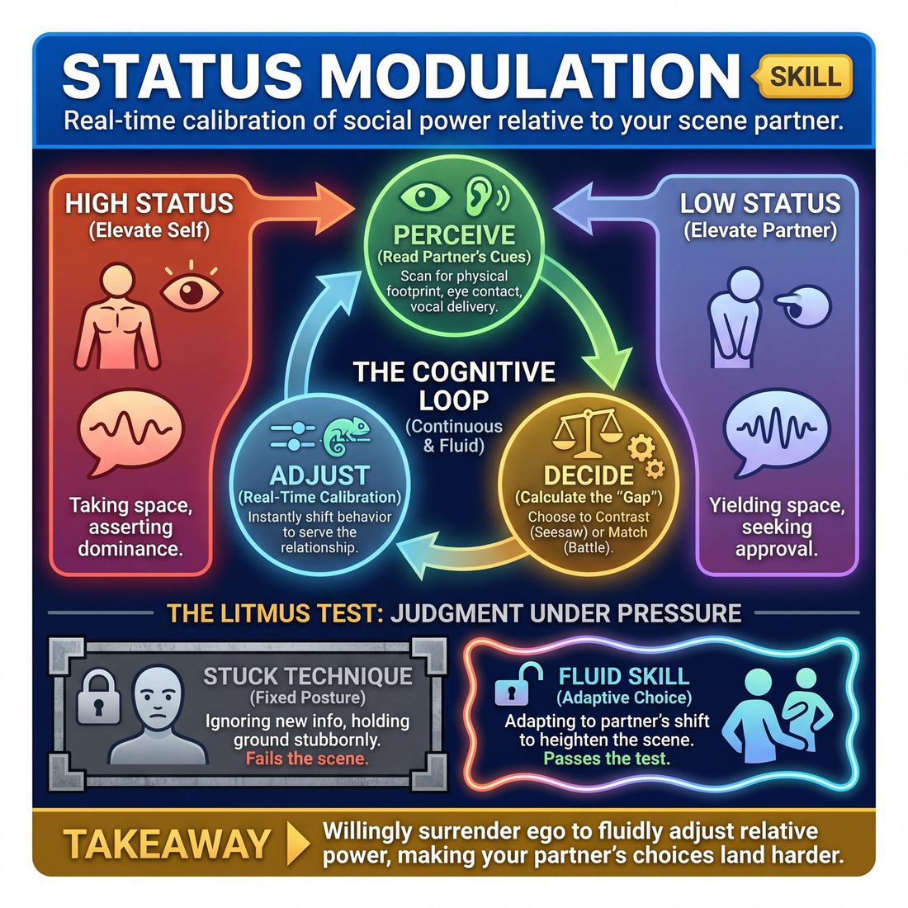
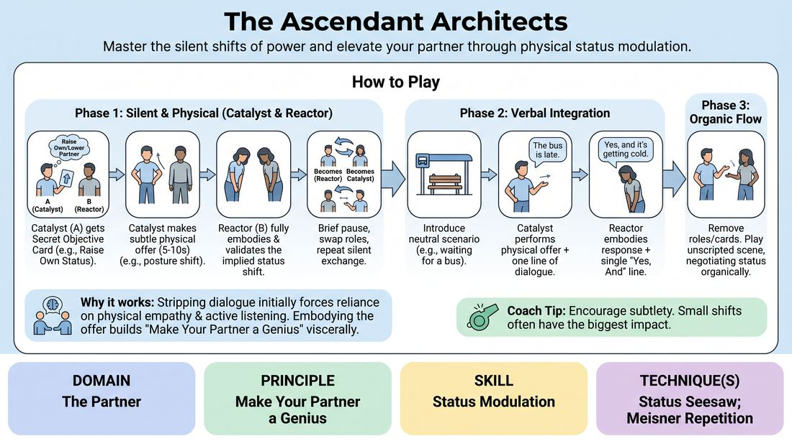

# Week 05 — The Status Seesaw
> *Pick the status that fits the relationship; let it shift.*

| Course | Week | Domain | Focus | Stage |
|---|---|---|---|---|
| Choices Under Pressure — The Competent Improviser | 5/18 | D2 — The Partner | `D2.S2` — Status Modulation | Competent |

## ⏱️ Session flow (60 minutes)

| Time | Block |
|---|---|
| **0:00–0:05** | 🤝 Arrival & safety check-in |
| **0:05–0:15** | 🔥 Warm-up — *Status Architects* |
| **0:15–0:27** | 🧠 Theory — *Status Modulation* |
| **0:27–0:52** | 🎲 Game 1 — *Status Architects* |
| **0:52–1:00** | 💭 Reflection & debrief |

## 1. 🧠 Today's theory

**Focus:** `D2.S2` — Status Modulation  
**Maturity goal today:** Competent: pick the status that fits the relationship.

{ .infographic }

- **The big idea:** Pick the status that fits the relationship; let it shift.
- **Where you are on the path:** Competent: pick the status that fits the relationship.
- **The one cue to coach:** *“Who's up, who's down — and when does it flip?”*

!!! abstract "📖 Go deeper"
    Read the full write-up: [Status Modulation](../../theory/02_the-partner/02_S2__status-modulation.md)

## 2. 🎲 Today's games

#### Warm-up — Status Architects

> Master the silent levers of relational power by gifting and receiving status through physical subtext.

{ .infographic }

`Players 2+` · `~20 min` · `Complexity 3/5` · `Energy medium` · `Props: required`

**Trains:** Status Modulation · _skill drill_

**How to play**

1. Divide players into pairs and designate one as Player A (the Catalyst) and Player B (the Reactor) for the first round.
2. Distribute a Secret Objective Card to the Catalyst (Player A) without letting the Reactor (Player B) see it.
3. Begin Phase 1 (Silent Ascent/Descent): The Catalyst initiates a single, subtle, non-verbal physical offer (such as shifting weight, changing posture, altering eye contact, or adjusting breathing) to achieve their secret objective.
4. The Reactor immediately observes and physically responds to this offer, embodying the complementary status shift (for example, if the Catalyst lowers their own status, the Reactor expands their posture to accept the higher status, making their partner's offer successful).
5. After a brief pause to register the physical dynamic, the facilitator calls 'Switch,' reversing the roles with a new secret objective card for the new Catalyst.
6. Transition to Phase 2 (Verbalizing the Unspoken): Keep the same Catalyst/Reactor structure, but now the Catalyst performs their non-verbal offer first, immediately followed by a single line of dialogue that supports their status objective.
7. The Reactor responds physically to the non-verbal cue first, then delivers a single line of dialogue that verbally 'Yes, Ands' the status relationship, cementing the dynamic.
8. Transition to Phase 3 (Organic Flow): Remove the secret cards and roles. Have the pairs play a short, two-minute scene based on a neutral scenario (such as waiting for a bus or sorting mail), allowing status to shift organically back and forth using the 'Status Seesaw' technique.

[Open the full game card »](../../games/D2_P3_S2_T1_G021__the-subtext-subwoofer.md){target=_blank rel=noopener}

#### Core game — Status Architects

> Master the silent shifts of power and elevate your partner through physical status modulation.

{ .infographic }

`Players 2+` · `~30 min` · `Complexity 3/5` · `Energy medium` · `Props: required`

**Trains:** Status Modulation · _skill drill_

**How to play**

1. Divide the group into pairs and designate one player as Partner A (the Catalyst) and the other as Partner B (the Reactor) for the first round.
2. Distribute a Secret Objective Card to Partner A, keeping it hidden from Partner B. The card dictates whether they must raise or lower their own or their partner's relative status.
3. Begin Phase 1 (Silent): Partner A initiates a single, subtle, non-verbal physical offer lasting 5 to 10 seconds (such as shifting weight, changing eye contact, altering posture, or adjusting breathing).
4. Partner B immediately registers this offer and responds physically for 5 to 10 seconds, fully embodying and validating the implied status shift to make Partner A's offer look brilliant.
5. After a brief pause, swap roles so Partner B receives a secret objective as the Catalyst, repeating the silent exchange.
6. Transition to Phase 2 (Verbal Integration): Introduce a simple, neutral scenario (such as waiting for a bus). Partner A performs their non-verbal status offer, immediately followed by a single line of dialogue that supports this status.
7. Partner B responds with their physical embodiment of the status shift, followed by a single line of dialogue that 'Yes, Ands' the relationship, using the last-word response technique to lock in the dynamic.
8. Transition to Phase 3 (Organic Flow): Remove the structured roles and secret cards. Have the pair play a short, unscripted scene where they organically negotiate status, letting the power balance shift naturally like a seesaw.

[Open the full game card »](../../games/D2_P3_S2_T1_G010__the-ascendant-architects.md){target=_blank rel=noopener}

??? star "🎒 Backup games — if you have time, or a game falls flat"
    *Swap-ins drawn from the same maturity band; not part of the timed hour.*
    - **[The Status Seesaw Echo](../../games/D2_P3_S2_T1_G194__the-symbiotic-status-echo.md){target=_blank rel=noopener}** — `2+` · `~15m` · `Cx 3/5` · `Energy medium` · _Status Modulation_
    - **[The Blueprint Builders](../../games/D2_P3_S2_T1_G197__the-blueprint-builders.md){target=_blank rel=noopener}** — `2+` · `~10m` · `Cx 3/5` · `Energy medium` · _Status Modulation_

## 3. 💭 Self-reflection

**Deepen your improv**
1. How did it feel to actively yield status to your partner, and how did that make them look more competent or powerful?
2. What physical cues (breathing, eye contact, posture) were the most effective at communicating status without words?

**Beyond the stage**
3. Status is something we do, not who we are. Where do you habitually play high or low at work — and where would deliberately shifting it serve the relationship?

---
⬅️ *Previous:* [W04 — Listening for Subtext](week-04.md)  ·  *Next:* [W06 — Gifting that Serves](week-06.md) ➡️
