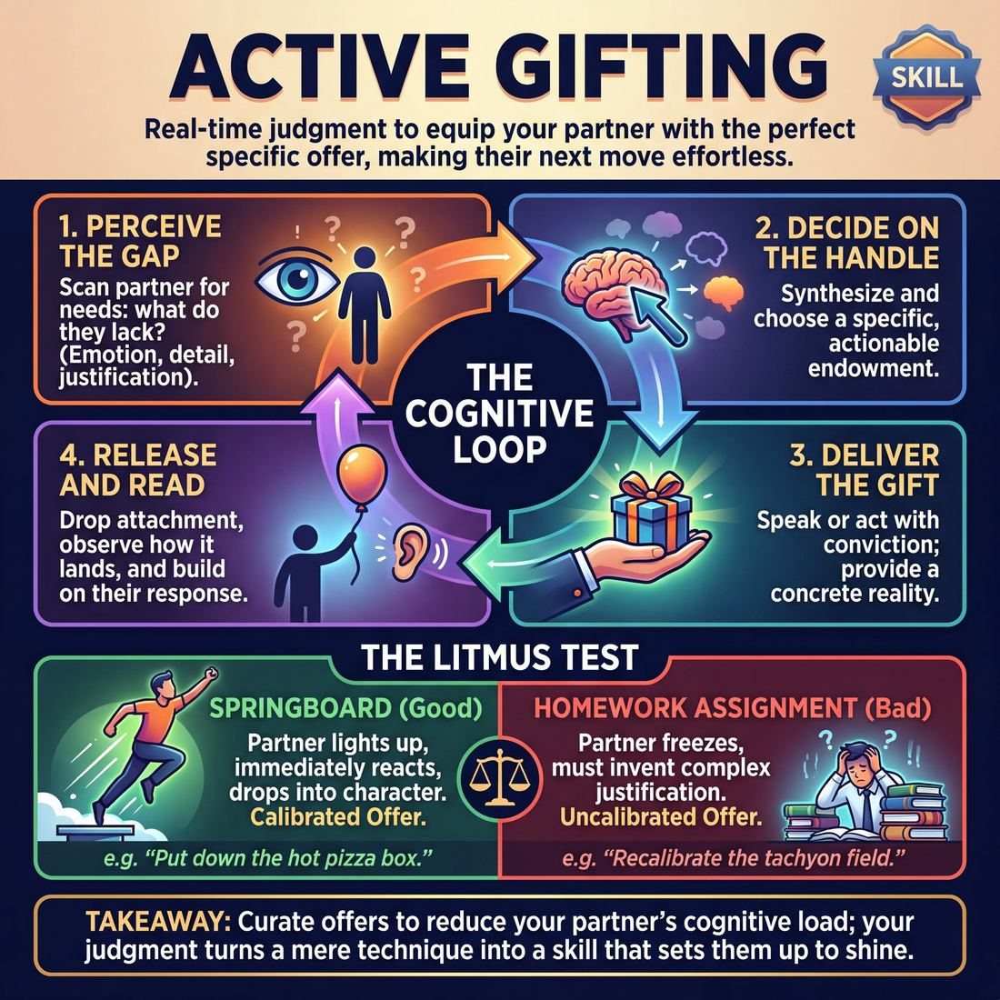
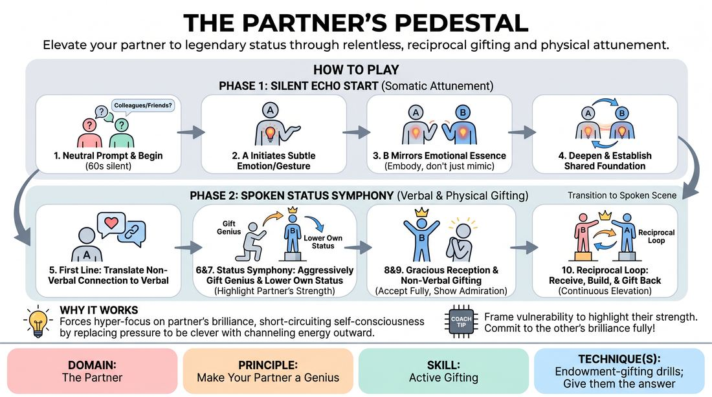
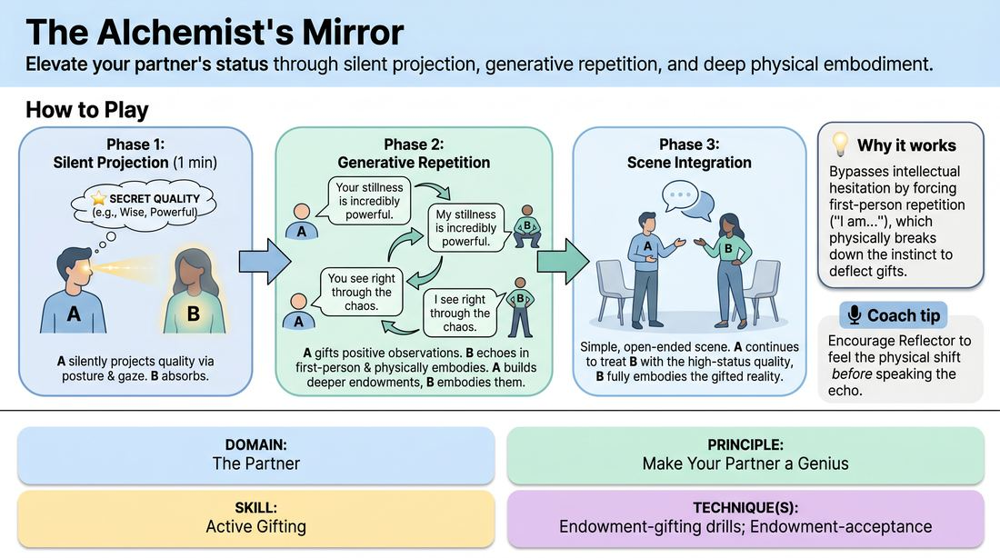

# Week 06 — Gifting that Serves
> *Choose gifts that ease the partner's job, not show off yours.*

| Course | Week | Domain | Focus | Stage |
|---|---|---|---|---|
| Choices Under Pressure — The Competent Improviser | 6/18 | D2 — The Partner | `D2.S5` — Active Gifting | Competent |

## ⏱️ Session flow (60 minutes)

| Time | Block |
|---|---|
| **0:00–0:05** | 🤝 Arrival & safety check-in |
| **0:05–0:15** | 🔥 Warm-up — *The Partner's Pedestal* |
| **0:15–0:27** | 🧠 Theory — *Active Gifting* |
| **0:27–0:52** | 🎲 Game 1 — *The Status Alchemist* |
| **0:52–1:00** | 💭 Reflection & debrief |

## 1. 🧠 Today's theory

**Focus:** `D2.S5` — Active Gifting  
**Maturity goal today:** Competent: choose gifts that ease the partner's job.

{ .infographic }

- **The big idea:** Choose gifts that ease the partner's job, not show off yours.
- **Where you are on the path:** Competent: choose gifts that ease the partner's job.
- **The one cue to coach:** *“Give them a problem to solve, or a name to be.”*

!!! abstract "📖 Go deeper"
    Read the full write-up: [Active Gifting](../../theory/02_the-partner/02_S5__active-gifting.md)

## 2. 🎲 Today's games

#### Warm-up — The Partner's Pedestal

> Elevate your partner to legendary status through relentless, reciprocal gifting and physical attunement.

{ .infographic }

`Players 2+` · `~10 min` · `Complexity 3/5` · `Energy medium` · `Props: none`

**Trains:** Active Gifting · _connection_

**How to play**

1. The facilitator provides a neutral relationship prompt, such as two colleagues waiting for critical news or two old friends meeting after a long journey.
2. Begin with a sixty-second silent Echo Start where Player A initiates a subtle, authentic physical gesture or micro-expression reflecting an internal emotional state.
3. Player B observes intently and mirrors the emotional essence of Player A's gesture, internalizing and embodying the feeling rather than just mimicking the movement.
4. Player A builds on Player B's response by deepening or shifting the physicalized emotion, and Player B mirrors this new layer, establishing a shared somatic foundation.
5. Transition to the spoken scene where Player A speaks the first line, directly translating the non-verbal emotional connection into a verbal relationship.
6. Engage in the Status Symphony where both players must actively gift status and genius to their partner by attributing high intelligence, expertise, or historical success to them.
7. Strategically lower your own status when appropriate to create space for your partner, framing your vulnerability as a way to highlight their strength and competence.
8. Incorporate non-verbal gifting by yielding physical space, looking up with genuine admiration, and reacting with visible awe to your partner's statements.
9. Practice Gracious Offer Reception where the receiving player must instantly accept all high-status endowments without self-deprecation, fully stepping onto the pedestal.
10. Maintain reciprocal gifting where every time you receive an elevating endowment, immediately build on it and offer a new gift of genius back to your partner.

[Open the full game card »](../../games/D2_P3_S5_T1_G179__the-partner-s-pedestal.md){target=_blank rel=noopener}

#### Core game — The Status Alchemist

> Elevate your partner's status through silent projection, generative repetition, and deep physical embodiment.

{ .infographic }

`Players 2+` · `~15 min` · `Complexity 3/5` · `Energy medium` · `Props: none`

**Trains:** Active Gifting · _skill drill_

**How to play**

1. Divide players into pairs and designate Player A as the 'Alchemist' and Player B as the 'Reflector.' Secretly provide Player A with a positive, high-status endowment target.
2. Begin Phase 1 (Silent Projection): For one minute, Player A silently projects the secret quality onto Player B using posture, eye contact, and physical distance to show deference or respect. Player B observes and begins to physically mirror the implied high-status posture.
3. Begin Phase 2 (Generative Repetition): Player A initiates a verbal exchange using direct, positive observations that gift the secret quality to Player B (e.g., 'Your stillness is incredibly powerful').
4. Player B must verbally echo Player A's statement in the first person ('My stillness is incredibly powerful') and immediately adjust their breath, posture, and emotional state to fully inhabit that truth.
5. Player A continues the repetition loop, building on Player B's physical adjustments to offer deeper endowments (e.g., 'You see right through the chaos'), which Player B continues to echo and embody ('I see right through the chaos').
6. Begin Phase 3 (Scene Integration): On the facilitator's cue, the pair transitions into a simple, open-ended scene where Player A continues to treat Player B with high status, and Player B plays the scene fully embodying their gifted competence.
7. Have the partners swap roles, giving Player B a new secret endowment target, and repeat the process.

[Open the full game card »](../../games/D2_P3_S5_T1_G032__the-alchemist-s-mirror.md){target=_blank rel=noopener}

??? star "🎒 Backup games — if you have time, or a game falls flat"
    *Swap-ins drawn from the same maturity band; not part of the timed hour.*
    - **[Silent Alchemy](../../games/D2_P3_S5_T1_G228__the-partner-s-silent-alchemy-echo-status-endowment.md){target=_blank rel=noopener}** — `2+` · `~15m` · `Cx 3/5` · `Energy medium` · _Active Gifting_
    - **[The Resonance Weave](../../games/D2_P3_S5_T1_G346__the-resonance-weave.md){target=_blank rel=noopener}** — `2+` · `~10m` · `Cx 3/5` · `Energy medium` · _Active Gifting_

## 3. 💭 Self-reflection

**Deepen your improv**
1. How did it feel to immediately accept and embody the high-status genius attributes your partner gifted you?
2. What physical adjustments did you make to visually place your partner on a pedestal?

**Beyond the stage**
3. Making your partner a genius means setting others up to shine. Whose work could you actively gift this week — a name, a credit, an easier next step?

---
⬅️ *Previous:* [W05 — The Status Seesaw](week-05.md)  ·  *Next:* [W07 — Finding the Game](week-07.md) ➡️
