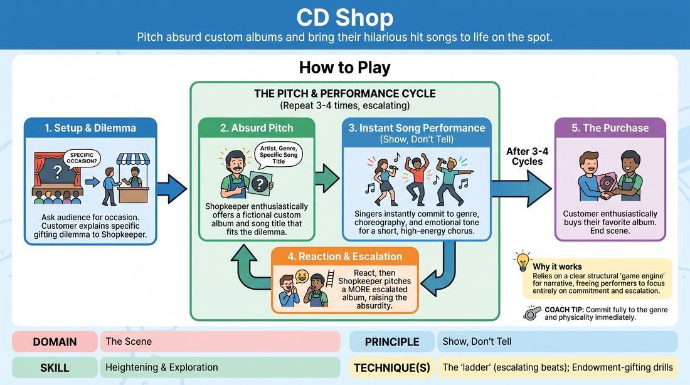
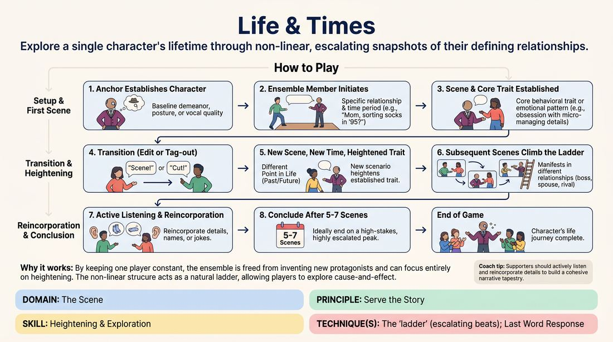

# Week 08 — Heightening the Pattern
> *Climb the ladder — each beat more extreme than the last.*

| Course | Week | Domain | Focus | Stage |
|---|---|---|---|---|
| Choices Under Pressure — The Competent Improviser | 8/18 | D3 — The Scene | `D3.S2` — Heightening & Exploration | Competent |

## ⏱️ Session flow (60 minutes)

| Time | Block |
|---|---|
| **0:00–0:05** | 🤝 Arrival & safety check-in |
| **0:05–0:15** | 🔥 Warm-up — *The Soundtrack Shop* |
| **0:15–0:27** | 🧠 Theory — *Heightening & Exploration* |
| **0:27–0:52** | 🎲 Game 1 — *Biographical Beats* |
| **0:52–1:00** | 💭 Reflection & debrief |

## 1. 🧠 Today's theory

**Focus:** `D3.S2` — Heightening & Exploration  
**Maturity goal today:** Competent: heighten with 'the ladder' and explore the 'why'.

{ .infographic }

- **The big idea:** Climb the ladder — each beat more extreme than the last.
- **Where you are on the path:** Competent: heighten with 'the ladder' and explore the 'why'.
- **The one cue to coach:** *“Same but more. Then ask why it's true.”*

!!! abstract "📖 Go deeper"
    Read the full write-up: [Heightening & Exploration](../../theory/03_the-scene/03_S2__heightening-and-exploration.md)

## 2. 🎲 Today's games

#### Warm-up — The Soundtrack Shop

> Pitch absurd custom albums and bring their hilarious hit songs to life on the spot.

{ .infographic }

`Players 3+` · `~5 min` · `Complexity 3/5` · `Energy high` · `Props: none`

**Trains:** Heightening & Exploration · _comedy game_

**How to play**

1. Ask the audience for a specific, slightly unusual occasion or person someone might buy a gift for (e.g., 'a cousin graduating from dental school' or 'a retirement party for a professional mime').
2. Establish the scene with two players: the Customer, who enters looking for the perfect musical gift, and the Shopkeeper, who runs the boutique store.
3. The Customer explains their highly specific gifting dilemma to the Shopkeeper, setting the emotional stakes.
4. The Shopkeeper enthusiastically offers a custom album solution, inventing a fictional artist, a music genre, and a highly specific song title that perfectly (or terribly) matches the occasion.
5. Upon hearing the song title, the off-stage singers immediately step forward, strike a physical pose reflecting the genre, and perform a short, high-energy chorus or verse of the song.
6. The singers must 'show, don't tell' by instantly committing to the vocal style, choreography, and emotional tone of the pitched genre.
7. After the song concludes (usually 30-45 seconds), the Customer and Shopkeeper react, and the Shopkeeper pitches a second, more escalated album and song, raising the comedic stakes.
8. Repeat this cycle for 3 to 4 songs, with each pitch and performance climbing the 'ladder' of absurdity, before the Customer enthusiastically purchases their favorite option to close the scene.

[Open the full game card »](../../games/D3_P1_S2_T1_G982__cd-shop.md){target=_blank rel=noopener}

#### Core game — Biographical Beats

> Explore a single character's lifetime through non-linear, escalating snapshots of their defining relationships.

{ .infographic }

`Players 3+` · `~15 min` · `Complexity 3/5` · `Energy medium` · `Props: none`

**Trains:** Heightening & Exploration · _mixed_

**How to play**

1. The Anchor steps forward and establishes their character's baseline demeanor, posture, or a simple vocal quality based on the given name.
2. An ensemble member steps into the space to initiate the first scene, establishing a specific relationship and time period (e.g., 'Mom, why are you sorting your socks by color at my graduation?').
3. The Anchor plays the scene, establishing a core behavioral trait, quirk, or emotional pattern (e.g., an obsession with micro-managing details).
4. To transition, an off-stage player initiates an edit. In early rounds, this can be a verbal 'Scene!' or 'Cut!'; in advanced rounds, a player tags out the supporting actor to start a new era.
5. The new scene jumps to a different point in the Anchor's life (past or future) and introduces a new scenario that heightens the established trait (e.g., the Anchor as a toddler organizing building blocks by shade).
6. Subsequent scenes continue to climb the 'ladder' of this behavioral pattern, showing how it manifests in different relationships (boss, spouse, childhood rival).
7. Supporting players should actively listen and reincorporate details, names, or recurring jokes established in previous scenes to build a cohesive narrative tapestry.
8. The game concludes after 5 to 7 scenes, ideally ending on a high-stakes, highly escalated peak of the character's life journey.

[Open the full game card »](../../games/D3_P4_S2_T1_G759__life-times.md){target=_blank rel=noopener}

??? star "🎒 Backup games — if you have time, or a game falls flat"
    *Swap-ins drawn from the same maturity band; not part of the timed hour.*
    - **[The Replay Matrix](../../games/D3_P2_S2_T0_G1266__scene-replay.md){target=_blank rel=noopener}** — `2+` · `~10m` · `Cx 3/5` · `Energy medium` · _Heightening & Exploration_
    - **[The Emotional Household](../../games/D3_P1_S2_T1_G695__emotional-family.md){target=_blank rel=noopener}** — `4–6` · `~10m` · `Cx 2/5` · `Energy high` · _Heightening & Exploration_

## 3. 💭 Self-reflection

**Deepen your improv**
1. How did the Shopkeeper's specific 'gifts' (genre and title) make it easier for the singers to commit instantly?
2. How did we use the 'ladder' technique to make each successive song feel bigger and more satisfying than the last?

**Beyond the stage**
3. Heightening is escalating with intention. Where do you under-commit and stay safe when leaning further in would create more value or delight?

---
⬅️ *Previous:* [W07 — Finding the Game](week-07.md)  ·  *Next:* [W09 — The Story Spine](week-09.md) ➡️
