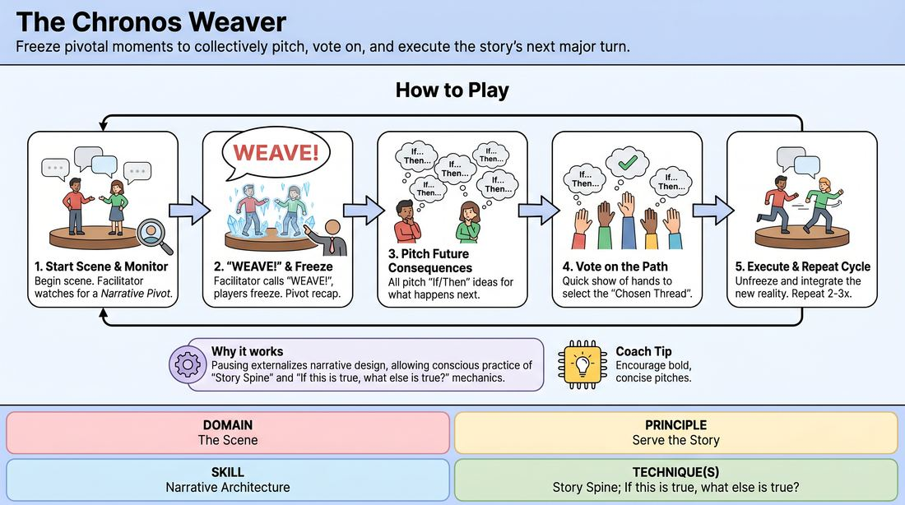
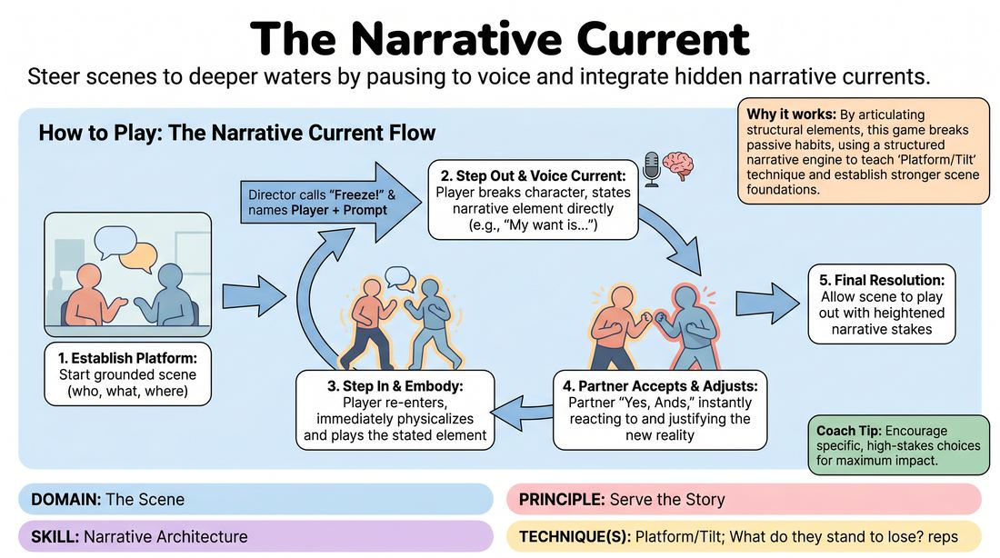

# Week 09 — The Story Spine
> *Build a platform, then tilt it — characters change [NARRATIVE].*

| Course | Week | Domain | Focus | Stage |
|---|---|---|---|---|
| Choices Under Pressure — The Competent Improviser | 9/18 | D3 — The Scene | `D3.S3` — Narrative Architecture | Competent |

## ⏱️ Session flow (60 minutes)

| Time | Block |
|---|---|
| **0:00–0:05** | 🤝 Arrival & safety check-in |
| **0:05–0:15** | 🔥 Warm-up — *The Plot Weaver* |
| **0:15–0:27** | 🧠 Theory — *Narrative Architecture* |
| **0:27–0:52** | 🎲 Game 1 — *The Narrative Current* |
| **0:52–1:00** | 💭 Reflection & debrief |

## 1. 🧠 Today's theory

**Focus:** `D3.S3` — Narrative Architecture  
**Maturity goal today:** Competent: build Platform, then Tilt deliberately.

{ .infographic }

- **The big idea:** Build a platform, then tilt it — characters change [NARRATIVE].
- **Where you are on the path:** Competent: build Platform, then Tilt deliberately.
- **The one cue to coach:** *“Establish the normal. Then break it on purpose.”*

!!! abstract "📖 Go deeper"
    Read the full write-up: [Narrative Architecture](../../content/03_the-scene/03_S3__narrative-architecture.md)

## 2. 🎲 Today's games

#### Warm-up — The Plot Weaver

> Freeze pivotal moments to collectively pitch, vote on, and execute the story's next major turn.

{ .infographic }

`Players 4–12` · `~15 min` · `Complexity 3/5` · `Energy medium` · `Props: none`

**Trains:** Narrative Architecture · _narrative_

**How to play**

1. Begin a standard scene with two or three players, focusing on establishing clear characters, relationships, and an initial conflict or dramatic premise.
2. The facilitator monitors the scene closely, looking for a pivotal choice, a major revelation, or a clear shift in character stakes (a 'Narrative Pivot').
3. Upon identifying a pivot, the facilitator calls out 'WEAVE!' and all onstage players immediately freeze in place, holding their physical postures.
4. The facilitator briefly recaps the pivotal moment that triggered the freeze (e.g., 'You just confessed your love to your rival's spouse').
5. All players—both onstage and offstage—individually formulate a potential future consequence using an 'If/Then' structure (e.g., 'If they confessed, then the rival is standing right behind them').
6. The facilitator calls on three to four players to pitch their 'If/Then' proposals, encouraging a mix of internal emotional shifts, external plot twists, and character-driven consequences.
7. The entire group (onstage and offstage) votes on the pitches via a quick show of hands; the facilitator breaks any ties to select the 'Chosen Thread'.
8. The facilitator announces the winning proposal, and on the count of three, the onstage players unfreeze and immediately play out the scene, fully integrating the chosen consequence as their absolute reality.
9. Repeat this cycle two to three times within the same scene, building a layered, highly collaborative narrative arc before calling 'Scene!'

[Open the full game card »](../../games/D3_P4_S3_T1_G038__the-chronos-weaver.md){target=_blank rel=noopener}

#### Core game — The Narrative Current

> Steer scenes to deeper waters by pausing to voice and integrate hidden narrative currents.

{ .infographic }

`Players 3+` · `~15 min` · `Complexity 3/5` · `Energy medium` · `Props: none`

**Trains:** Narrative Architecture · _narrative_

**How to play**

1. Begin with a simple suggestion of a location or relationship to establish a basic platform (the who, what, where).
2. The two active players start a grounded, natural scene, focusing on establishing their environment and connection.
3. Every 30 to 60 seconds, or when the scene reaches a plateau, the Director calls out 'Freeze!' and names a specific player along with a 'Story Current' prompt.
4. The designated player steps slightly out of the scene's physical space, breaks character eye contact, and directly states the requested narrative element clearly and concisely.
5. The player then steps back into the scene, immediately embodying the stated element through their physical choices, tone, and dialogue.
6. The scene partner must instantly accept this new reality ('Yes, And') and adjust their own behavior to justify and support the partner's revealed truth.
7. The Director guides the scene through a sequence of prompts, which may include: 'My Want' (immediate objective), 'The Stakes' (consequences of failure), 'Relationship Shift' (a change in how they view each other), 'Environmental Truth' (a discovery about the space or an object), 'Hidden Truth' (unspoken subtext), and 'Complication' (an external force or tilt).
8. After the final prompt is integrated, the Director allows the scene to play out organically for another minute, letting the players drive the heightened stakes toward a natural climax and resolution.

[Open the full game card »](../../games/D3_P4_S3_T2_G047__the-narrative-current.md){target=_blank rel=noopener}

??? note "🎒 Backup games — if you have time, or a game falls flat"
    *Swap-ins drawn from the same maturity band; not part of the timed hour.*
    - **[The Narrative Pulse](../../games/D3_P4_S3_T2_G067__the-narrative-pulse.md){target=_blank rel=noopener}** — `3+` · `~15m` · `Cx 3/5` · `Energy medium` · _Narrative Architecture_
    - **[The Narrative Circuit](../../games/D3_P4_S3_T1_G102__the-narrative-circuit.md){target=_blank rel=noopener}** — `3+` · `~15m` · `Cx 3/5` · `Energy medium` · _Narrative Architecture_

## 3. 💭 Self-reflection

**Deepen your improv**
1. How did pausing the scene to evaluate multiple futures change how you viewed the value of your onstage choices?
2. What made a proposed 'If/Then' thread feel satisfying and organic versus forced or disruptive?

**Beyond the stage**
3. Every good story has a platform and a tilt — a normal, then a change. What 'platform' in your life are you protecting that actually needs a deliberate tilt?

---
⬅️ *Previous:* [W08 — Heightening the Pattern](week-08.md)  ·  *Next:* [W10 — What's at Stake](week-10.md) ➡️
