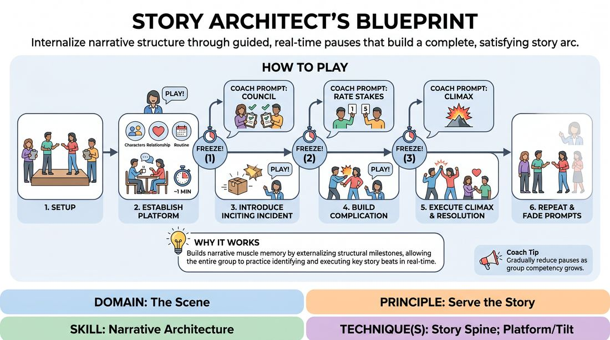

# Week 11 — Which Engine? Game vs Story
> *The master meta-skill: know which engine the scene is asking for.*

| Course | Week | Domain | Focus | Stage |
|---|---|---|---|---|
| Choices Under Pressure — The Competent Improviser | 11/18 | D3 — The Scene | `D3.S1` — Game Identification | Competent |

## ⏱️ Session flow (60 minutes)

| Time | Block |
|---|---|
| **0:00–0:05** | 🤝 Arrival & safety check-in |
| **0:05–0:15** | 🔥 Warm-up — *The Ripple Effect* |
| **0:15–0:27** | 🧠 Theory — *Game Identification* |
| **0:27–0:52** | 🎲 Game 1 — *The Narrative Scaffold* |
| **0:52–1:00** | 💭 Reflection & debrief |

## 1. 🧠 Today's theory

**Focus:** `D3.S1` — Game Identification  
**Also touches:** `D3.S3` — Narrative Architecture  
**Maturity goal today:** Competent: choose an engine consciously at scene start.

{ .infographic }

- **The big idea:** The master meta-skill: know which engine the scene is asking for.
- **Where you are on the path:** Competent: choose an engine consciously at scene start.
- **The one cue to coach:** *“Is this a pattern to play, or a story to tell?”*

!!! abstract "📖 Go deeper"
    Read the full write-up: [Game Identification](../../theory/03_the-scene/03_S1__game-identification.md)
    · [Narrative Architecture](../../theory/03_the-scene/03_S3__narrative-architecture.md)

## 2. 🎲 Today's games

#### Warm-up — The Ripple Effect

> Explore the cascading consequences of a single dramatic revelation to build deep, interconnected stories.

{ .infographic }

`Players 3+` · `~15 min` · `Complexity 3/5` · `Energy medium` · `Props: none`

**Trains:** Narrative Architecture · _narrative_

**How to play**

1. Select two to three players to step onto the stage and establish a mundane, low-stakes scene (the platform) with clear relationships and a defined physical environment.
2. Once the platform is stable (usually within one minute), either a player in the scene or the facilitator introduces a major, disruptive narrative revelation (the tilt).
3. The player most directly affected by the revelation must immediately react, visibly shifting their character's emotional state, immediate objective, or physical behavior.
4. The remaining players in the scene must immediately validate this shift, adapting their own characters' perspectives and relationships to align with this new reality.
5. For the next two minutes, the players must collaboratively discover and physically demonstrate at least three distinct consequences (ripples) of this revelation.
6. These consequences must manifest in different areas: a shift in character relationships, a change in the physical environment or meaning of an object, or a new long-term objective.
7. After the consequences are established, a player or the facilitator introduces a second revelation that either builds on the first or introduces a new narrative thread.
8. Repeat the cycle of immediate reaction, partner validation, and consequence exploration for this second revelation before bringing the scene to a natural conclusion.

[Open the full game card »](../../games/D3_P4_S3_T2_G064__the-ripple-effect.md){target=_blank rel=noopener}

#### Core game — The Narrative Scaffold

> Internalize narrative structure through guided, real-time pauses that build a complete, satisfying story arc.

{ .infographic }

`Players 3+` · `~15 min` · `Complexity 3/5` · `Energy medium` · `Props: none`

**Trains:** Narrative Architecture · _narrative_

**How to play**

1. Divide the group into two active players on stage and the remaining players off-stage as the 'Structural Council,' assigning each off-stage player a specific narrative element to track (e.g., Platform, Inciting Incident, Stakes, or Resolution).
2. Obtain a simple, mundane suggestion of a location or relationship to establish the baseline of the scene.
3. The active players begin the scene by establishing the 'Platform'—defining their characters, relationship, and routine activity for about one minute.
4. The facilitator calls 'Freeze!' to pause the action, then asks the off-stage 'Structural Council' to briefly call out what was established in the platform, keeping them actively engaged in the narrative's progress.
5. The facilitator prompts the active players to introduce the 'Inciting Incident'—an unexpected event or choice that disrupts the established normal world—then calls 'Play' to resume.
6. After the disruption is integrated, the facilitator calls 'Freeze!' again, asking the off-stage players to rate the current stakes from 1 to 5, then prompts the active players to introduce a complication that raises those stakes.
7. The facilitator calls 'Play' to let the complication unfold, then calls a final 'Freeze!' to prompt the 'Climax'—the ultimate point of no return where the conflict must be resolved.
8. The active players play out the climax and transition into the 'Resolution' (the new normal), bringing the scene to a natural conclusion without further freezes.
9. Repeat the process with new active players, gradually reducing the facilitator's verbal prompts to transition the group toward uncoached, organic narrative flow.

[Open the full game card »](../../games/D3_P4_S3_T1_G106__story-architect-s-blueprint.md){target=_blank rel=noopener}

??? star "🎒 Backup games — if you have time, or a game falls flat"
    *Swap-ins drawn from the same maturity band; not part of the timed hour.*
    - **[The Genre Crucible](../../games/D3_P4_S3_T0_G163__the-genre-crucible.md){target=_blank rel=noopener}** — `3+` · `~15m` · `Cx 3/5` · `Energy medium` · _Narrative Architecture_
    - **[The Final Beat](../../games/D3_P4_S3_T0_G171__the-final-beat.md){target=_blank rel=noopener}** — `3+` · `~15m` · `Cx 3/5` · `Energy medium` · _Narrative Architecture_

## 3. 💭 Self-reflection

**Deepen your improv**
1. How did focusing on the consequences of a revelation change the pace of your scene compared to a standard improv scene?
2. What strategies did you use to ensure the consequences felt distinct rather than repetitive?

**Beyond the stage**
3. Knowing which 'engine' a moment needs — playful pattern vs serious story — is judgment under pressure. Where do you misread which mode a situation calls for?

---
⬅️ *Previous:* [W10 — What's at Stake](week-10.md)  ·  *Next:* [W12 — Build the World, Justify the Absurd](week-12.md) ➡️
