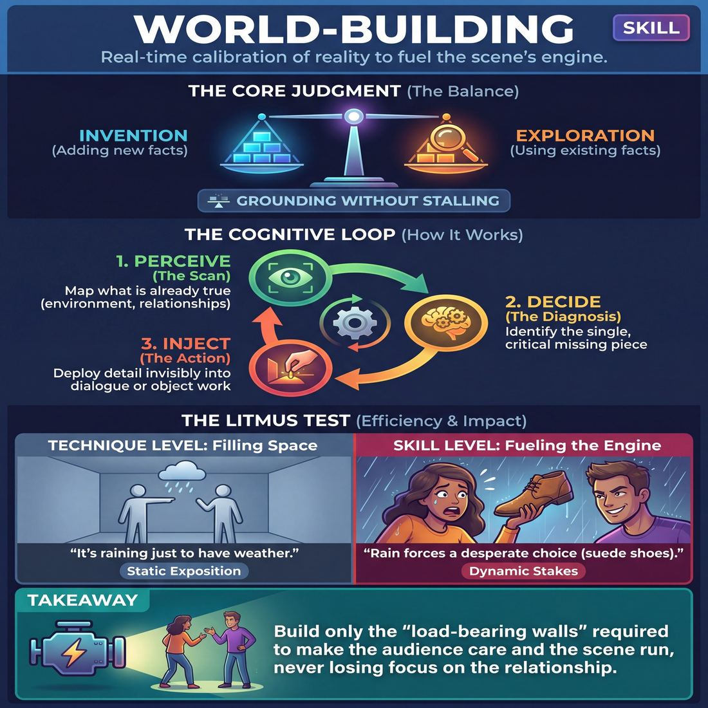
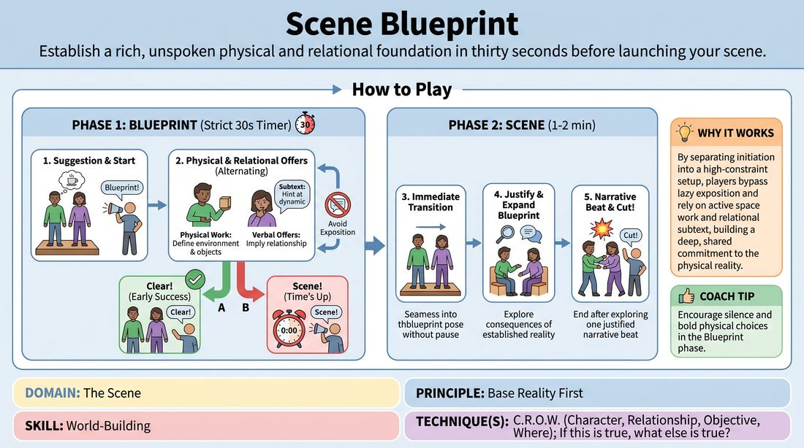
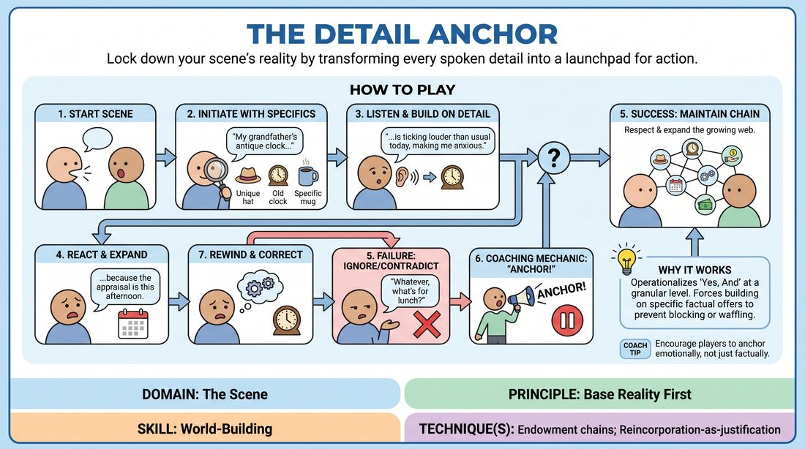

# Week 12 — Build the World, Justify the Absurd
> *Endow richly and reincorporate to make the world coherent.*

| Course | Week | Domain | Focus | Stage |
|---|---|---|---|---|
| Choices Under Pressure — The Competent Improviser | 12/18 | D3 — The Scene | `D3.S5` — World-Building | Competent |

## ⏱️ Session flow (60 minutes)

| Time | Block |
|---|---|
| **0:00–0:05** | 🤝 Arrival & safety check-in |
| **0:05–0:15** | 🔥 Warm-up — *Scene Blueprint* |
| **0:15–0:27** | 🧠 Theory — *World-Building* |
| **0:27–0:52** | 🎲 Game 1 — *The Detail Anchor* |
| **0:52–1:00** | 💭 Reflection & debrief |

## 1. 🧠 Today's theory

**Focus:** `D3.S5` — World-Building  
**Also touches:** `D3.S6` — Justification  
**Maturity goal today:** Competent: endowment chains; reincorporation-as-justification.

{ .infographic }

- **The big idea:** Endow richly and reincorporate to make the world coherent.
- **Where you are on the path:** Competent: endowment chains; reincorporation-as-justification.
- **The one cue to coach:** *“Plant it early, pay it off late.”*

!!! abstract "📖 Go deeper"
    Read the full write-up: [World-Building](../../content/03_the-scene/03_S5__world-building.md)
    · [Justification](../../content/03_the-scene/03_S6__justification.md)

## 2. 🎲 Today's games

#### Warm-up — Scene Blueprint

> Establish a rich, unspoken physical and relational foundation in thirty seconds before launching your scene.

{ .infographic }

`Players 2+` · `~10 min` · `Complexity 3/5` · `Energy medium` · `Props: none`

**Trains:** World-Building · _skill drill_

**How to play**

1. Invite two players to the stage and obtain a simple, non-locational suggestion from the audience to inspire their initial physical action.
2. Announce 'Blueprint!' and start a strict 30-second timer to begin the Blueprint Phase.
3. Instruct the players to immediately begin establishing their environment, relationship, and objective using physical space work and dialogue, strictly avoiding any direct naming of their location, roles, or tasks.
4. Require players to alternate between physical offers, such as handling imaginary objects, and verbal offers that hint at their interpersonal dynamic.
5. If the players successfully establish a clear Who, What, and Where before the timer runs out, the facilitator calls 'Clear!' to signal an immediate transition.
6. If the timer reaches 30 seconds first, the facilitator calls 'Scene!' to transition the players instantly into the next phase without any pause or reset.
7. During the Scene Phase, players must continue the scene for one to two minutes, fully committing to, justifying, and exploring the logical consequences of the established reality.
8. End the scene by calling 'Cut!' once the players have successfully explored a single, justified narrative beat built on their initial blueprint.

[Open the full game card »](../../games/D3_P2_S5_T1_G364__scene-blueprint.md){target=_blank rel=noopener}

#### Core game — The Detail Anchor

> Lock down your scene's reality by transforming every spoken detail into a launchpad for action.

{ .infographic }

`Players 2+` · `~10 min` · `Complexity 3/5` · `Energy medium` · `Props: none`

**Trains:** World-Building · _skill drill_

**How to play**

1. Two players step forward to begin an open scene with no predetermined premise or relationship.
2. Player A initiates the scene, deliberately establishing a few concrete, specific details such as a character's unique habit, a specific object in the room, or a historical event.
3. Player B must listen closely and, in their very next line, explicitly reference and build upon at least one of the specific details Player A just introduced.
4. To successfully build on a detail, the responding player must do more than repeat it; they must emotionally react to it, explain its consequences, or use it to justify a new action.
5. If a player ignores a detail, contradicts an established fact, or glosses over their partner's offer with a generic response, the facilitator calls out 'Anchor!'
6. Upon hearing the 'Anchor!' call, the active player must immediately pause, rewind their last line, and deliver a corrected line that fully integrates the missed detail before the scene continues.
7. As the scene progresses, both players must maintain this chain of endowment, ensuring that every new line of dialogue respects and expands upon the growing web of established facts.

[Open the full game card »](../../games/D3_P2_S5_T2_G518__the-detail-anchor.md){target=_blank rel=noopener}

??? star "🎒 Backup games — if you have time, or a game falls flat"
    *Swap-ins drawn from the same maturity band; not part of the timed hour.*
    - **[Relational Threads](../../games/D3_P3_S5_T1_G571__dynamic-threads.md){target=_blank rel=noopener}** — `2–3` · `~10m` · `Cx 3/5` · `Energy medium` · _World-Building_
    - **[The Spatial Engine](../../games/D3_P1_S6_T1_G596__the-spatial-engine.md){target=_blank rel=noopener}** — `3+` · `~15m` · `Cx 3/5` · `Energy medium` · _Justification_

## 3. 💭 Self-reflection

**Deepen your improv**
1. To the audience: What were the specific physical clues that told you exactly where the characters were before they even spoke?
2. To the players: How did having a pre-established physical and relational blueprint change your confidence when entering the main scene?

**Beyond the stage**
3. World-building is shared specificity — establishing who, where, and what we want. Where would a team you're on benefit from explicitly naming its 'CROW'?

---
⬅️ *Previous:* [W11 — Which Engine? Game vs Story](week-11.md)  ·  *Next:* [W13 — Eyes in the Back of Your Head](week-13.md) ➡️
