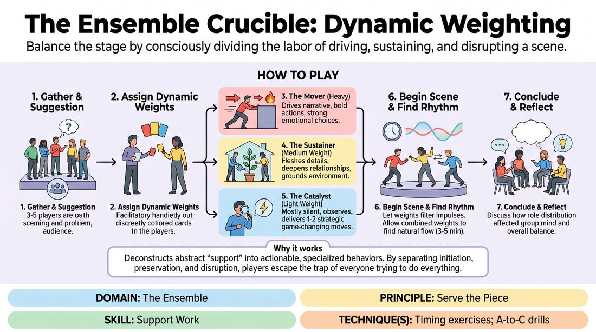
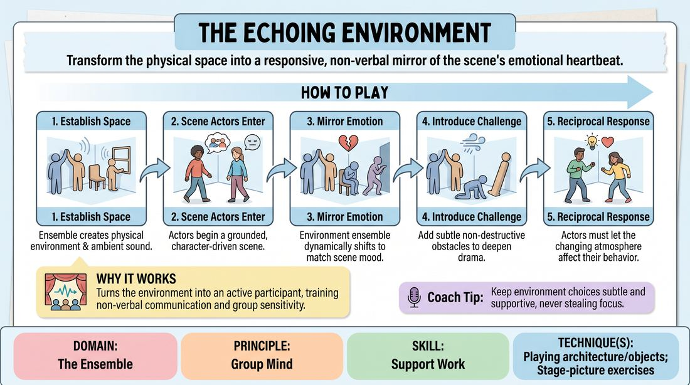

# Week 14 — Support Work that Lands
> *Enter only when the scene needs something; give it, then exit.*

| Course | Week | Domain | Focus | Stage |
|---|---|---|---|---|
| Choices Under Pressure — The Competent Improviser | 14/18 | D4 — The Ensemble | `D4.S2` — Support Work | Competent |

## ⏱️ Session flow (60 minutes)

| Time | Block |
|---|---|
| **0:00–0:05** | 🤝 Arrival & safety check-in |
| **0:05–0:15** | 🔥 Warm-up — *Dynamic Weighting* |
| **0:15–0:27** | 🧠 Theory — *Support Work* |
| **0:27–0:52** | 🎲 Game 1 — *The Living Atmosphere* |
| **0:52–1:00** | 💭 Reflection & debrief |

## 1. 🧠 Today's theory

**Focus:** `D4.S2` — Support Work  
**Maturity goal today:** Competent: choose to enter only when a scene needs something.

{ .infographic }

- **The big idea:** Enter only when the scene needs something; give it, then exit.
- **Where you are on the path:** Competent: choose to enter only when a scene needs something.
- **The one cue to coach:** *“Don't grab focus. Fill the gap, then leave.”*

!!! abstract "📖 Go deeper"
    Read the full write-up: [Support Work](../../theory/04_the-ensemble/04_S2__support-work.md)

## 2. 🎲 Today's games

#### Warm-up — Dynamic Weighting

> Balance the stage by consciously dividing the labor of driving, sustaining, and disrupting a scene.

{ .infographic }

`Players 3–6` · `~15 min` · `Complexity 3/5` · `Energy medium` · `Props: none`

**Trains:** Support Work · _skill drill_

**How to play**

1. Select three to five players to step onto the stage and obtain a simple, open-ended suggestion from the audience to establish a basic scene premise.
2. Assign each player one of three distinct Dynamic Weights, either openly to the group or whispered secretly to individual players to challenge the observers.
3. Define the first role, 'The Mover' (Heavy Weight), whose job is to drive the narrative forward, initiate bold actions, make strong emotional choices, and provide the scene's primary engine of momentum.
4. Define the second role, 'The Sustainer' (Medium Weight), whose job is to flesh out existing details, deepen relationships, ground the environment, and enthusiastically 'yes-and' whatever the Mover initiates.
5. Define the third role, 'The Catalyst' (Light Weight), who must remain mostly silent or passive, observing closely to deliver only one or two highly strategic, game-changing interventions that reframe the entire scene.
6. Begin the scene, instructing players to let their assigned weight filter their natural improvisational impulses rather than acting like rigid robots.
7. Run the scene for approximately three to five minutes, allowing the unique chemistry of these combined weights to find a natural rhythm and resolution.
8. Conclude the scene and immediately transition into a structured reflection, focusing on how the distribution of roles affected the overall group mind.

[Open the full game card »](../../games/D4_P3_S2_T0_G100__the-ensemble-crucible-dynamic-weighting.md){target=_blank rel=noopener}

#### Core game — The Living Atmosphere

> Transform the physical space into a responsive, non-verbal mirror of the scene's emotional heartbeat.

{ .infographic }

`Players 5+` · `~15 min` · `Complexity 3/5` · `Energy medium` · `Props: none`

**Trains:** Support Work · _mixed_

**How to play**

1. Obtain a simple location or relationship suggestion from the group to initiate the piece.
2. The Atmosphere Ensemble enters the stage first, silently establishing the physical layout, objects, and ambient sounds of the location using their bodies and vocalizations.
3. Once the environment is established, the Scene Actors enter the space and begin a grounded, character-driven scene, actively utilizing the physical structures created by the Atmosphere Ensemble.
4. As the scene progresses, the Atmosphere Ensemble must closely track the dialogue, emotional shifts, and subtext of the Scene Actors.
5. The Atmosphere Ensemble dynamically alters their physical shapes, proximity, and ambient sounds to mirror or amplify the scene's emotional tension (e.g., walls closing in during an argument, or wind rising).
6. The Atmosphere Ensemble may also introduce subtle, non-destructive physical obstacles or atmospheric contrasts to challenge the characters and deepen the dramatic stakes.
7. The Scene Actors must remain highly sensitive to these environmental shifts, letting the changing atmosphere directly affect their physical behavior, emotional state, and dialogue.
8. The scene concludes naturally when the narrative reaches a resolution, or when the Atmosphere Ensemble executes a unified, dramatic shift in the environment to signal a clean edit.

[Open the full game card »](../../games/D4_P1_S2_T3_G241__the-echoing-environment.md){target=_blank rel=noopener}

??? star "🎒 Backup games — if you have time, or a game falls flat"
    *Swap-ins drawn from the same maturity band; not part of the timed hour.*
    - **[Echoed Architecture](../../games/D4_P1_S2_T3_G328__echo-weave-the-blind-architect-s-blueprint.md){target=_blank rel=noopener}** — `3–6` · `~10m` · `Cx 3/5` · `Energy medium` · _Support Work_
    - **[Ecosystem](../../games/D4_P1_S2_T3_G569__the-living-landscape.md){target=_blank rel=noopener}** — `5–12` · `~15m` · `Cx 3/5` · `Energy medium` · _Support Work_

## 3. 💭 Self-reflection

**Deepen your improv**
1. How did it feel to play a weight that is opposite to your natural improvisational default?
2. For the observers, when did the Catalyst's intervention feel most satisfying, and what made that timing work?

**Beyond the stage**
3. Great support enters to give, not to take. Where could you step in to fill a gap for your team and then get out of the way — without grabbing credit?

---
⬅️ *Previous:* [W13 — Eyes in the Back of Your Head](week-13.md)  ·  *Next:* [W15 — A-to-C — Beyond the Obvious](week-15.md) ➡️
