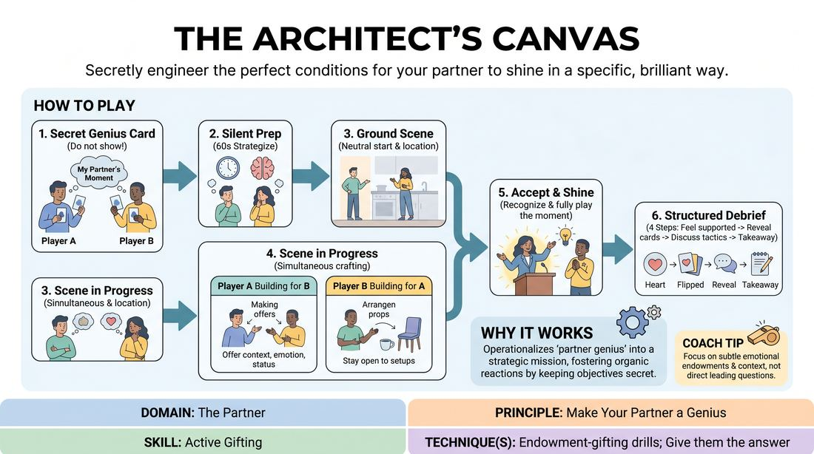

# Week 03 — The Shared Mind
> *Read breath and micro-expression; gift so well it's invisible.*

| Course | Week | Domain | Focus | Stage |
|---|---|---|---|---|
| Serve the Piece — Toward Mastery | 3/18 | D2 — The Partner | `D2.S1` — Active Listening | Proficient → Master |

## ⏱️ Session flow (60 minutes)

| Time | Block |
|---|---|
| **0:00–0:05** | 🤝 Arrival & safety check-in |
| **0:05–0:15** | 🔥 Warm-up — *Architect of Genius* |
| **0:15–0:27** | 🧠 Theory — *Active Listening* |
| **0:27–0:52** | 🎲 Game 1 — *The Symbiotic Pulse* |
| **0:52–1:00** | 💭 Reflection & debrief |

## 1. 🧠 Today's theory

**Focus:** `D2.S1` — Active Listening  
**Also touches:** `D2.S5` — Active Gifting  
**Maturity goal today:** Master: anticipate the offer from breath/micro-expressions; invisible gifting.

{ .infographic }

- **The big idea:** Read breath and micro-expression; gift so well it's invisible.
- **Where you are on the path:** Master: anticipate the offer from breath/micro-expressions; invisible gifting.
- **The one cue to coach:** *“Listen with your eyes. Set them up without them noticing.”*

!!! abstract "📖 Go deeper"
    Read the full write-up: [Active Listening](../../content/02_the-partner/02_S1__active-listening.md)
    · [Active Gifting](../../content/02_the-partner/02_S5__active-gifting.md)

## 2. 🎲 Today's games

#### Warm-up — Architect of Genius

> Secretly engineer the perfect conditions for your partner to shine in a specific, brilliant way.

{ .infographic }

`Players 6–12` · `~25 min` · `Complexity 4/5` · `Energy medium` · `Props: required`

**Trains:** Active Gifting · _connection_

**How to play**

1. Distribute one secret Genius Blueprint Card to each player, ensuring they do not show it to their partner.
2. Give players 60 seconds of silent preparation to strategize how they might establish a relationship, environment, or emotional tone that naturally invites their partner's assigned behavior.
3. Assign a simple, neutral starting relationship and location to the pair to ground the scene.
4. Begin the scene with both players actively working to set up their partner's secret prompt while simultaneously remaining open to whatever setups their partner is throwing at them.
5. Focus on gifting context, status shifts, and emotional endowments rather than asking direct, leading questions that force a specific response.
6. When a player senses their partner is setting them up for a moment of brilliance, they must enthusiastically accept the invitation and play the moment fully, even if they do not know the exact prompt.
7. Conclude the scene after three to five minutes, or once the facilitator observes that both players have attempted or achieved their respective setups.
8. Conduct a structured four-step debrief for the pair, starting with the receiving partner sharing when they felt most supported, followed by the reveal of the secret cards.

[Open the full game card »](../../games/D2_P3_S5_T1_G294__the-architect-s-canvas.md){target=_blank rel=noopener}

#### Core game — The Symbiotic Pulse

> Tune into your partner's unspoken shifts to co-create a deep, subtextual relationship.

{ .infographic }

`Players 2+` · `~10 min` · `Complexity 4/5` · `Energy low` · `Props: none`

**Trains:** Active Listening · _connection_

**How to play**

1. Assign two players to the performance space and secretly give each player a unique relational agenda, such as making their partner feel protected, making them feel self-doubt, or making them feel like an equal.
2. Provide a simple, low-stakes shared scenario that establishes a basic relationship but contains no inherent plot or high-energy action.
3. Instruct Player A to initiate the scene with a subtle, non-verbal physical offer—such as a shift in weight, a change in breathing pattern, or a micro-expression—that reflects their internal state and aligns with their secret agenda.
4. Direct Player B to actively observe this offer, absorb its emotional and status implications, and physically mirror or acknowledge its core essence.
5. Have Player B immediately build upon that received offer by sending back their own subtle non-verbal response, filtered through their own secret agenda.
6. Continue this continuous loop of non-verbal 'pulses' and 'echoes,' keeping spoken dialogue to an absolute minimum, using only single words or short, reactive phrases when absolutely necessary.
7. Focus the scene entirely on the evolving emotional landscape and status dynamic between the two characters rather than trying to advance an external plot.
8. End the scene after three to five minutes, once a clear, unspoken shift in the relationship has occurred.

[Open the full game card »](../../games/D2_P3_S1_T1_G006__the-symbiotic-pulse.md){target=_blank rel=noopener}

??? star "🎒 Backup games — if you have time, or a game falls flat"
    *Swap-ins drawn from the same maturity band; not part of the timed hour.*
    - **[Greatest Hits](../../games/D2_P3_S5_T1_G1100__greatest-hits.md){target=_blank rel=noopener}** — `4–6` · `~7m` · `Cx 4/5` · `Energy high` · _Active Gifting_
    - **[Subtextual Alchemy](../../games/D2_P2_S1_T1_G324__the-alchemist-s-subtext-unveiling-partner-intentions.md){target=_blank rel=noopener}** — `3+` · `~10m` · `Cx 3/5` · `Energy medium` · _Active Listening_

## 3. 💭 Self-reflection

**Deepen your improv**
1. To the receiver: At what point in the scene did you feel the most free, inspired, or set up to succeed?
2. To the architect: What was your strategy for guiding your partner, and how did you adapt when they took the scene in an unexpected direction?

**Beyond the stage**
3. Recall a meeting where you were loading your reply instead of listening. What did you miss? What would change if you reacted first and built second?

---
⬅️ *Previous:* [W02 — The Voice as Instrument](week-02.md)  ·  *Next:* [W04 — Invisible Status](week-04.md) ➡️
