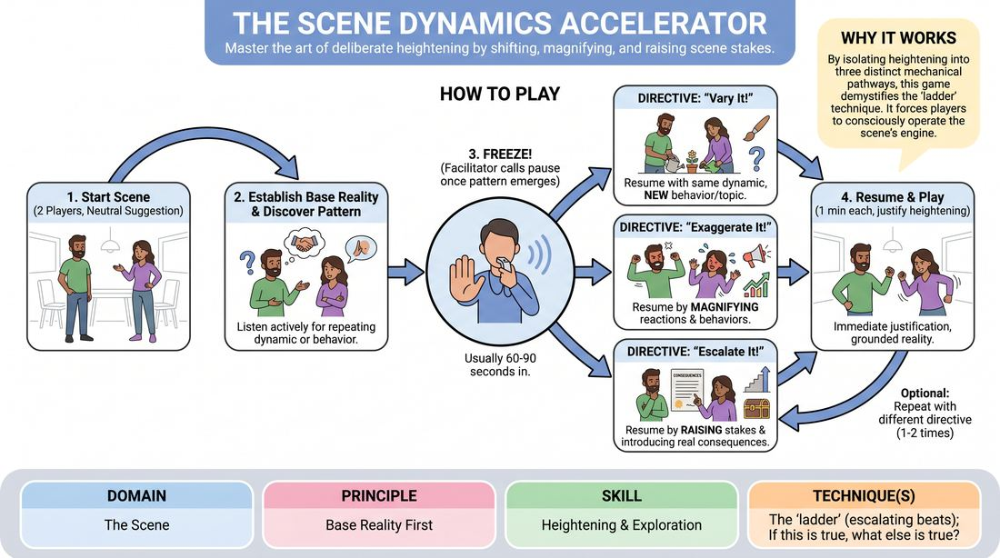

# Week 05 — Find It, Play It, Break It
> *Master the game, then break it on purpose to serve the moment.*

| Course | Week | Domain | Focus | Stage |
|---|---|---|---|---|
| Serve the Piece — Toward Mastery | 5/18 | D3 — The Scene | `D3.S1` — Game Identification | Proficient → Master |

!!! note "Builds on"
    Intermediate W7–8 — game ID & heightening, now at master level.

## ⏱️ Session flow (60 minutes)

| Time | Block |
|---|---|
| **0:00–0:05** | 🤝 Arrival & safety check-in |
| **0:05–0:15** | 🔥 Warm-up — *Understudy* |
| **0:15–0:27** | 🧠 Theory — *Game Identification* |
| **0:27–0:52** | 🎲 Game 1 — *The Heightening Accelerator* |
| **0:52–1:00** | 💭 Reflection & debrief |

## 1. 🧠 Today's theory

**Focus:** `D3.S1` — Game Identification  
**Also touches:** `D3.S2` — Heightening & Exploration  
**Maturity goal today:** Master: find, play, *and intentionally break* the game.

{ .infographic }

- **The big idea:** Master the game, then break it on purpose to serve the moment.
- **Where you are on the path:** Master: find, play, *and intentionally break* the game.
- **The one cue to coach:** *“Know the rule so well you can shatter it.”*

!!! abstract "📖 Go deeper"
    Read the full write-up: [Game Identification](../../theory/03_the-scene/03_S1__game-identification.md)
    · [Heightening & Exploration](../../theory/03_the-scene/03_S2__heightening-and-exploration.md)

## 2. 🎲 Today's games

#### Warm-up — Understudy

> Heighten character patterns and emotional games by stepping into another actor's shoes mid-scene.

{ .infographic }

`Players 4+` · `~10 min` · `Complexity 3/5` · `Energy medium` · `Props: none`

**Trains:** Game Identification · _mixed_

**How to play**

1. Two players step forward and begin a grounded, relationship-focused scene, establishing a clear base reality (who, what, where) with subtle emotional undercurrents.
2. The off-stage players watch closely, actively looking for emerging behavioral patterns, emotional tics, or unusual points of view in the active characters.
3. Once a pattern is established, the facilitator (or an off-stage player) calls out 'Understudy for [Character Name]!' and pauses the action.
4. The original actor steps out of the scene, and an off-stage player immediately steps into their exact physical position.
5. The scene resumes. The new 'understudy' player must immediately adopt the character's established pattern but perform it with significantly more intensity, commitment, and comedic heightening.
6. After a few lines of this heightened play, the facilitator calls 'Understudy out!' or 'Originals back!'
7. The original actor steps back into the scene, instantly adopting the newly amplified emotional state and behavioral choices demonstrated by their understudy.
8. The facilitator can repeat this process multiple times, swapping understudies for either character to progressively escalate the scene's comedic game to its peak.

[Open the full game card »](../../games/D3_P2_S1_T1_G880__understudy.md){target=_blank rel=noopener}

#### Core game — The Heightening Accelerator

> Master the art of deliberate heightening by shifting, magnifying, and raising scene stakes.

{ .infographic }

`Players 3+` · `~15 min` · `Complexity 3/5` · `Energy medium` · `Props: none`

**Trains:** Heightening & Exploration · _skill drill_

**How to play**

1. Begin a standard two-person scene initiated by a simple, neutral suggestion of a location or relationship.
2. Establish a grounded base reality, focusing on active listening to discover a repeating pattern, unusual behavior, or relationship dynamic.
3. Once a clear pattern or 'game' emerges (usually within 60 to 90 seconds), the facilitator calls 'Freeze!' to pause the action.
4. The facilitator issues one of three specific heightening directives: 'Vary It!', 'Exaggerate It!', or 'Escalate It!'.
5. On 'Vary It!', players resume the scene by expressing the same core dynamic through a completely new behavior, topic, or environmental factor.
6. On 'Exaggerate It!', players resume the scene by magnifying their existing emotional reactions or physical behaviors to a much higher intensity.
7. On 'Escalate It!', players resume the scene by raising the stakes, introducing real consequences, or revealing deeper personal motivations behind the dynamic.
8. Play the scene under the chosen directive for about one minute, ensuring every heightened choice is immediately justified and grounded.
9. The facilitator may freeze the scene 1-2 more times to issue different directives, allowing players to experience multiple heightening pathways within the same scene.

[Open the full game card »](../../games/D3_P2_S2_T1_G610__the-scene-dynamics-accelerator.md){target=_blank rel=noopener}

??? star "🎒 Backup games — if you have time, or a game falls flat"
    *Swap-ins drawn from the same maturity band; not part of the timed hour.*
    - **[Retroactive Reality](../../games/D3_P4_S6_T1_G452__the-chrono-warp-justifier.md){target=_blank rel=noopener}** — `3+` · `~15m` · `Cx 4/5` · `Energy medium` · _Justification_
    - **[The Narrative Crucible](../../games/D3_P4_S3_T2_G424__the-narrative-escalation-chamber.md){target=_blank rel=noopener}** — `2+` · `~15m` · `Cx 3/5` · `Energy medium` · _Narrative Architecture_

## 3. 💭 Self-reflection

**Deepen your improv**
1. How did establishing a quiet, grounded base reality at the start make it easier to identify the 'game' of the character?
2. As an understudy, what clues did you look for to determine which behavior to heighten?

**Beyond the stage**
3. Finding the game means spotting the one interesting pattern and committing. In a project or hobby, what's the 'unusual thing' worth amplifying instead of smoothing away?

---
⬅️ *Previous:* [W04 — Invisible Status](week-04.md)  ·  *Next:* [W06 — Architecting the Arc](week-06.md) ➡️
