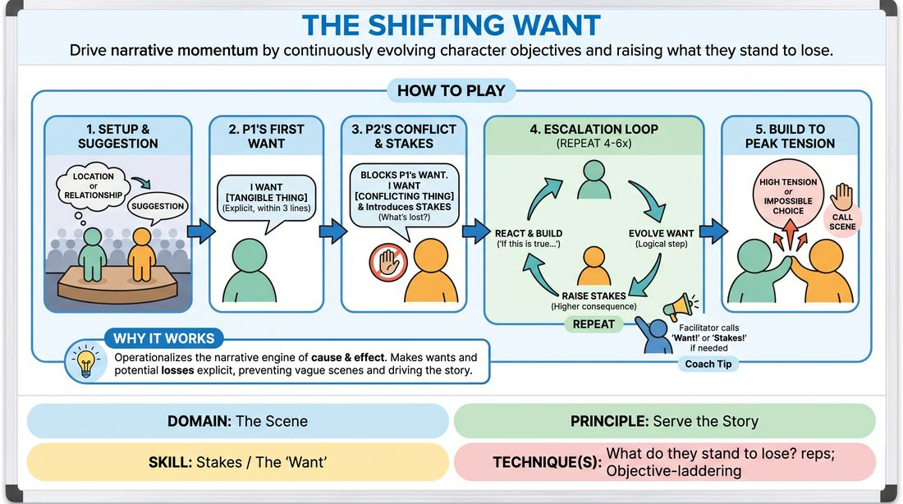

# Week 07 — Stakes They Can Feel
> *Make the audience genuinely care about absurd people.*

| Course | Week | Domain | Focus | Stage |
|---|---|---|---|---|
| Serve the Piece — Toward Mastery | 7/18 | D3 — The Scene | `D3.S7` — Raising the Stakes | Proficient → Master |

## ⏱️ Session flow (60 minutes)

| Time | Block |
|---|---|
| **0:00–0:05** | 🤝 Arrival & safety check-in |
| **0:05–0:15** | 🔥 Warm-up — *Consequence Countdown* |
| **0:15–0:27** | 🧠 Theory — *Raising the Stakes* |
| **0:27–0:52** | 🎲 Game 1 — *The Shifting Want* |
| **0:52–1:00** | 💭 Reflection & debrief |

## 1. 🧠 Today's theory

**Focus:** `D3.S7` — Raising the Stakes  
**Also touches:** `D3.S4` — Stakes / The “Want”  
**Maturity goal today:** Master: stakes are felt, not stated; consequences escalate.

{ .infographic }

- **The big idea:** Make the audience genuinely care about absurd people.
- **Where you are on the path:** Master: stakes are felt, not stated; consequences escalate.
- **The one cue to coach:** *“Don't say it matters. Show that it costs.”*

!!! abstract "📖 Go deeper"
    Read the full write-up: [Raising the Stakes](../../theory/03_the-scene/03_S7__raising-the-stakes.md)
    · [Stakes / The “Want”](../../theory/03_the-scene/03_S4__stakes-the-want.md)

## 2. 🎲 Today's games

#### Warm-up — Consequence Countdown

> Escalate narrative tension under rapid-fire time constraints and high-stakes external consequences.

{ .infographic }

`Players 2+` · `~10 min` · `Complexity 3/5` · `Energy high` · `Props: none`

**Trains:** Raising the Stakes · _narrative_

**How to play**

1. Ask the audience or group for a simple location, a relationship between two characters, and an initial minor conflict or problem to launch the scene.
2. Instruct the two active players to begin the scene, establishing their characters, environment, and relationship immediately.
3. Within the first minute of play, both players must clearly voice or demonstrate their character's immediate objective (their 'want') and a minor consequence if they fail to achieve it.
4. Let the scene play naturally for about two minutes to establish a solid baseline of reality and emotional connection.
5. Freeze the scene. As the facilitator, directly address one or both characters and introduce a new, highly specific external consequence tied to their objective, along with a strict 45-second countdown.
6. Unfreeze the scene. The players must immediately play with heightened urgency, integrating and justifying this new threat while fiercely pursuing their goals.
7. Freeze the scene again when the timer expires. Introduce an even more severe, high-stakes consequence that builds logically or comically on the previous one, and set a shorter 30-second countdown.
8. Repeat this cycle for a third and final round with an extreme, near-impossible consequence and a frantic 15-to-20-second countdown, pushing the characters to their absolute limits.
9. End the scene at the final buzzer, focusing on the peak of dramatic or comedic tension rather than forcing a neat resolution.

[Open the full game card »](../../games/D3_P4_S7_T1_G308__stakes-ascent-the-consequence-countdown.md){target=_blank rel=noopener}

#### Core game — The Shifting Want

> Drive narrative momentum by continuously evolving character objectives and raising what they stand to lose.

{ .infographic }

`Players 2+` · `~15 min` · `Complexity 3/5` · `Energy medium` · `Props: none`

**Trains:** Stakes / The “Want” · _narrative_

**How to play**

1. Select two players to step into the performance space while the remaining participants act as the audience.
2. Obtain a simple suggestion from the group, such as a location or a relationship, to establish the initial platform.
3. Player One initiates the scene and must explicitly state their character's primary, tangible want within their first three lines of dialogue.
4. Player Two enters or responds by directly acknowledging or obstructing Player One's want, while immediately stating their own conflicting want and introducing a consequence that raises the stakes.
5. Players alternate turns, ensuring that every line of dialogue directly reacts to the partner's previous statement using if this is true, what else is true logic.
6. With each exchange, players must evolve their character's want to be a logical progression of the new circumstances, while explicitly raising what they stand to lose if they fail.
7. The facilitator actively side-coaches during the scene, calling out Want! or Stakes! if a player's objective becomes vague or if the consequences flatline.
8. Continue the scene for four to six rounds of escalating exchanges, building to a natural peak of high tension or an impossible choice before calling scene.

[Open the full game card »](../../games/D3_P4_S4_T1_G404__the-shifting-want.md){target=_blank rel=noopener}

??? star "🎒 Backup games — if you have time, or a game falls flat"
    *Swap-ins drawn from the same maturity band; not part of the timed hour.*
    - **[The Implication Engine](../../games/D3_P4_S7_T1_G317__the-implication-engine.md){target=_blank rel=noopener}** — `3–6` · `~10m` · `Cx 3/5` · `Energy medium` · _Raising the Stakes_
    - **[The Narrative Escalator](../../games/D3_P4_S7_T1_G186__the-narrative-escalator.md){target=_blank rel=noopener}** — `2+` · `~15m` · `Cx 3/5` · `Energy medium` · _Raising the Stakes_

## 3. 💭 Self-reflection

**Deepen your improv**
1. How did the introduction of a ticking clock change your physical energy and decision-making on stage?
2. What strategies did you use to justify the increasingly absurd or extreme consequences within the reality of your scene?

**Beyond the stage**
3. Raising the stakes makes consequences matter more. Where are you keeping things low-stakes to stay comfortable, when the situation actually deserves more weight?

---
⬅️ *Previous:* [W06 — Architecting the Arc](week-06.md)  ·  *Next:* [W08 — Engine-Switching Mid-Scene](week-08.md) ➡️
