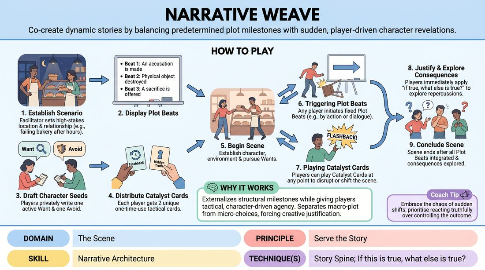

# Week 08 — Engine-Switching Mid-Scene
> *Switch between game and story as the scene demands — invisibly.*

| Course | Week | Domain | Focus | Stage |
|---|---|---|---|---|
| Serve the Piece — Toward Mastery | 8/18 | D3 — The Scene | `D3.S1` — Game Identification | Proficient → Master |

## ⏱️ Session flow (60 minutes)

| Time | Block |
|---|---|
| **0:00–0:05** | 🤝 Arrival & safety check-in |
| **0:05–0:15** | 🔥 Warm-up — *The Catalyst Collider* |
| **0:15–0:27** | 🧠 Theory — *Game Identification* |
| **0:27–0:52** | 🎲 Game 1 — *The Narrative Loom* |
| **0:52–1:00** | 💭 Reflection & debrief |

## 1. 🧠 Today's theory

**Focus:** `D3.S1` — Game Identification  
**Also touches:** `D3.S3` — Narrative Architecture  
**Maturity goal today:** Master: read what the scene needs and serve it — game or story, never forced.

{ .infographic }

- **The big idea:** Switch between game and story as the scene demands — invisibly.
- **Where you are on the path:** Master: read what the scene needs and serve it — game or story, never forced.
- **The one cue to coach:** *“Serve the scene, not your plan.”*

!!! abstract "📖 Go deeper"
    Read the full write-up: [Game Identification](../../content/03_the-scene/03_S1__game-identification.md)
    · [Narrative Architecture](../../content/03_the-scene/03_S3__narrative-architecture.md)

## 2. 🎲 Today's games

#### Warm-up — The Catalyst Collider

> Weave sudden, disruptive narrative tilts into the structural foundation of an evolving, cohesive story.

{ .infographic }

`Players 4+` · `~10 min` · `Complexity 4/5` · `Energy medium` · `Props: required`

**Trains:** Narrative Architecture · _narrative_

**How to play**

1. Obtain a mundane, everyday suggestion from the audience or off-stage players to establish a solid, grounded base reality.
2. Begin the scene with two active players focusing heavily on character relationships, physical environment, and clear individual objectives.
3. Off-stage players actively track the scene's narrative arc, writing down potential disruptive catalysts on cards or typing them into a digital chat queue.
4. After ninety seconds of established base reality, the facilitator or an off-stage player delivers the first Catalyst (a sudden, disruptive truth or physical object) to one active player.
5. The receiving player must immediately accept and integrate this catalyst, treating it as an absolute, pre-existing truth of their reality.
6. All players on stage immediately apply the 'If this is true, what else is true?' principle, adjusting their characters' relationships and objectives to accommodate this new truth.
7. A third active player enters the scene as a supporting character, carrying a second, even more disparate catalyst that must bridge the original reality and the first disruption.
8. The players collaborate to find a logical or thematic connection between all elements, driving the story to a satisfying, unified resolution that justifies every disruption.

[Open the full game card »](../../games/D3_P4_S3_T2_G132__the-catalyst-collider.md){target=_blank rel=noopener}

#### Core game — The Narrative Loom

> Co-create dynamic stories by balancing predetermined plot milestones with sudden, player-driven character revelations.

{ .infographic }

`Players 3+` · `~20 min` · `Complexity 4/5` · `Energy medium` · `Props: required`

**Trains:** Narrative Architecture · _narrative_

**How to play**

1. Establish the Scenario: The facilitator sets a simple, high-stakes location and relationship (e.g., 'Two business partners in a failing bakery after hours').
2. Display the Plot Beats: The facilitator writes 3 to 4 sequential Plot Beats on the board (e.g., Beat 1: An accusation is made; Beat 2: A physical object is destroyed; Beat 3: An unexpected confession occurs). These must happen in the scene, but players decide how and when they occur.
3. Draft Character Seeds: Each player privately writes down one Want (an active goal) and one Avoid (a fear or boundary they do not want crossed or revealed) on their paper.
4. Distribute Catalyst Cards: Hand each player 2 unique Catalyst Cards (e.g., Flashback, Sudden Alliance Shift, Hidden Truth, External Threat). These are one-time-use narrative tools.
5. Begin the Scene: Two to three players start the scene, establishing their characters, environment, and immediate relationship while actively pursuing their Wants and dodging their Avoids.
6. Triggering Plot Beats: To introduce a Plot Beat, any active player can physically or verbally initiate the event (e.g., deliberately knocking over a prop to trigger 'an item breaks'). Alternatively, the facilitator can tap the board to signal that the next beat must be integrated within the next three lines of dialogue.
7. Playing Catalyst Cards: At any point, a player can play one of their Catalyst Cards by raising it or declaring its name (e.g., 'Playing Flashback!'). The scene immediately pauses briefly or transitions to accommodate the card's prompt, which must be fully justified by all players.
8. Justify and Explore Consequences: Whenever a Plot Beat or Catalyst Card is introduced, players must immediately apply 'if true, what else is true?' to explore the emotional and narrative fallout, rather than rushing to the next event.
9. Conclude the Scene: The scene ends once all Plot Beats have been integrated, their consequences explored, and a natural narrative resolution or cliffhanger is reached.

[Open the full game card »](../../games/D3_P4_S3_T1_G051__narrative-weave.md){target=_blank rel=noopener}

??? star "🎒 Backup games — if you have time, or a game falls flat"
    *Swap-ins drawn from the same maturity band; not part of the timed hour.*
    - **[Chamber Murder Mystery](../../games/D3_P4_S3_T1_G1194__murder-mystery.md){target=_blank rel=noopener}** — `5+` · `~25m` · `Cx 4/5` · `Energy medium` · _Narrative Architecture_
    - **[Musical Story Spine](../../games/D3_P4_S3_T1_G1195__musical-fairy-tale.md){target=_blank rel=noopener}** — `6–8` · `~10m` · `Cx 4/5` · `Energy high` · _Narrative Architecture_

## 3. 💭 Self-reflection

**Deepen your improv**
1. How did the sudden tilts force you to listen more closely to your partner's immediate justification?
2. What was the difference between simply acknowledging a disruption and actually weaving it into the narrative architecture?

**Beyond the stage**
3. Knowing which 'engine' a moment needs — playful pattern vs serious story — is judgment under pressure. Where do you misread which mode a situation calls for?

---
⬅️ *Previous:* [W07 — Stakes They Can Feel](week-07.md)  ·  *Next:* [W09 — Group Mind & Follow the Follower](week-09.md) ➡️
