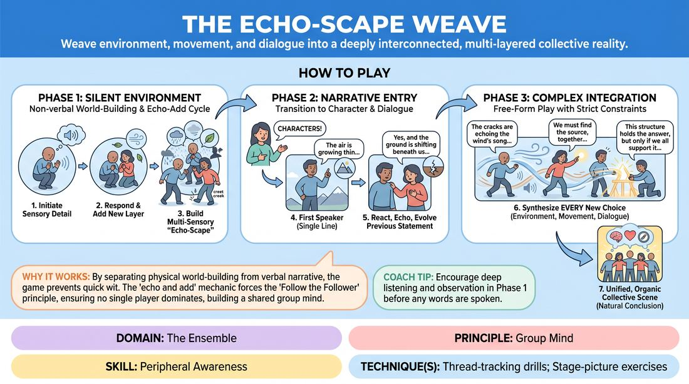
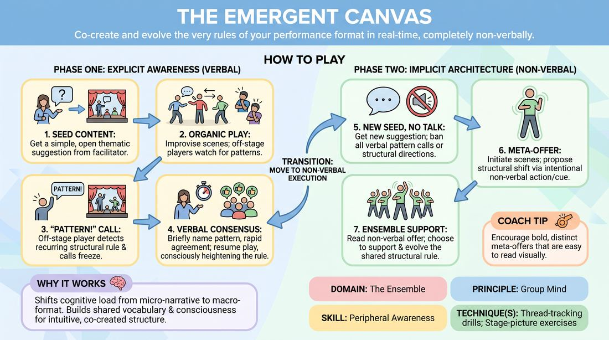

# Week 09 — Group Mind & Follow the Follower
> *See the entire show as one organism; commit to strong choices together.*

| Course | Week | Domain | Focus | Stage |
|---|---|---|---|---|
| Serve the Piece — Toward Mastery | 9/18 | D4 — The Ensemble | `D4.S1` — Peripheral Awareness | Proficient → Master |

!!! note "Builds on"
    Intermediate W13 — peripheral awareness becomes group mind.

## ⏱️ Session flow (60 minutes)

| Time | Block |
|---|---|
| **0:00–0:05** | 🤝 Arrival & safety check-in |
| **0:05–0:15** | 🔥 Warm-up — *The Echo-Scape Weave* |
| **0:15–0:27** | 🧠 Theory — *Peripheral Awareness* |
| **0:27–0:52** | 🎲 Game 1 — *The Living Grid* |
| **0:52–1:00** | 💭 Reflection & debrief |

## 1. 🧠 Today's theory

**Focus:** `D4.S1` — Peripheral Awareness  
**Maturity goal today:** Master: see the whole show as one organism.

{ .infographic }

- **The big idea:** See the entire show as one organism; commit to strong choices together.
- **Where you are on the path:** Master: see the whole show as one organism.
- **The one cue to coach:** *“When someone's strong, the whole team follows.”*

!!! abstract "📖 Go deeper"
    Read the full write-up: [Peripheral Awareness](../../content/04_the-ensemble/04_S1__peripheral-awareness.md)

## 2. 🎲 Today's games

#### Warm-up — The Echo-Scape Weave

> Weave environment, movement, and dialogue into a deeply interconnected, multi-layered collective reality.

{ .infographic }

`Players 4–8` · `~20 min` · `Complexity 4/5` · `Energy medium` · `Props: none`

**Trains:** Peripheral Awareness · _mixed_

**How to play**

1. Phase 1 (Silent Environment): One player steps forward to initiate a silent physical action or non-verbal sound that establishes a sensory detail of the environment (e.g., shivering, feeling a rough texture, or making a low wind sound).
2. The next player enters the space, physically responding to the first player's offer (e.g., huddling near them or reacting to the sound) and immediately adding a new, complementary physical or sonic detail to expand the world.
3. The remaining players join one by one, repeating this 'echo and add' cycle to build a rich, multi-sensory, non-verbal environment where every physical choice directly relates to what came before.
4. Phase 2 (Narrative Entry): Once the environment is fully established, the facilitator calls out 'Characters.' The first player to speak delivers a single line of dialogue that grounds their character in this specific physical space.
5. The next speaker must physically react to the previous player's presence, then deliver a line of dialogue that directly echoes and evolves the previous statement using an A-to-C association (e.g., building on the subtext or expanding the premise rather than introducing a random new topic).
6. Phase 3 (Complex Integration): Once characters and relationships are established, the scene transitions into free-form play, but with a strict constraint: every new line or action must visibly synthesize at least two previously established elements (such as a specific sound, a physical object, a character's line, or an emotional beat).
7. The ensemble continues to play within this highly integrated reality, treating the environment as an active participant, until the scene reaches a natural, collective conclusion or a facilitator edit.

[Open the full game card »](../../games/D4_P1_S1_T2_G017__the-echo-scape-weave.md){target=_blank rel=noopener}

#### Core game — The Living Grid

> Co-create and evolve the very rules of your performance format in real-time, completely non-verbally.

{ .infographic }

`Players 4–8` · `~60 min` · `Complexity 4/5` · `Energy medium` · `Props: none`

**Trains:** Peripheral Awareness · _skill drill_

**How to play**

1. Begin Phase One (Explicit Awareness) by obtaining a simple, open-ended thematic suggestion from the facilitator to seed the content of the scenes.
2. Players on stage begin improvising scenes organically, utilizing standard edits, walk-ons, and physical staging, while off-stage players watch with heightened peripheral focus on structural choices rather than narrative details.
3. At any point, an off-stage player who detects a recurring structural pattern (such as consistent silent openings, rapid edit tempos, or specific stage-picture arrangements) calls out 'PATTERN!' to temporarily freeze the action.
4. The player who called the freeze briefly and specifically describes the observed structural pattern, and the facilitator conducts a rapid 15-second consensus check with the ensemble.
5. If the ensemble agrees the pattern exists, play resumes with the active players consciously leaning into, heightening, and exploring that specific structural rule for the next few scenes.
6. Transition to Phase Two (Implicit Architecture) by receiving a new suggestion, but this time, ban all verbal pauses, 'PATTERN!' calls, or explicit structural discussions.
7. Initiate scenes normally, but when a player wants to propose a structural shift or rule, they must do so via a non-verbal 'Meta-Offer'—such as intentionally altering scene length, changing physical proximity, or shifting dialogue rhythms.
8. The rest of the ensemble must read this non-verbal structural offer and choose to support it by adopting the rule, elaborating on it with a complementary structural choice, or consciously pivoting to a new form if the current one has run its course.

[Open the full game card »](../../games/D4_P1_S1_T2_G002__the-emergent-canvas.md){target=_blank rel=noopener}

??? note "🎒 Backup games — if you have time, or a game falls flat"
    *Swap-ins drawn from the same maturity band; not part of the timed hour.*
    - **[The Sensory Loom](../../games/D4_P1_S1_T2_G026__the-ensemble-loom.md){target=_blank rel=noopener}** — `4–8` · `~30m` · `Cx 4/5` · `Energy medium` · _Peripheral Awareness_
    - **[Resonant Currents](../../games/D4_P1_S1_T2_G037__nexus-arc-the-silent-current.md){target=_blank rel=noopener}** — `5–8` · `~25m` · `Cx 4/5` · `Energy medium` · _Peripheral Awareness_

## 3. 💭 Self-reflection

**Deepen your improv**
1. How did starting with a silent, physical environment change the way you approached your character and dialogue?
2. What did it feel like to track and synthesize multiple threads at once during Phase 3? Where did you feel the most cognitive friction?

**Beyond the stage**
3. Group mind means the team's intelligence exceeds any individual's. When have you seen a group outperform its smartest member — and what made that possible?

---
⬅️ *Previous:* [W08 — Engine-Switching Mid-Scene](week-08.md)  ·  *Next:* [W10 — Invisible Support, Surrendered Ego](week-10.md) ➡️
