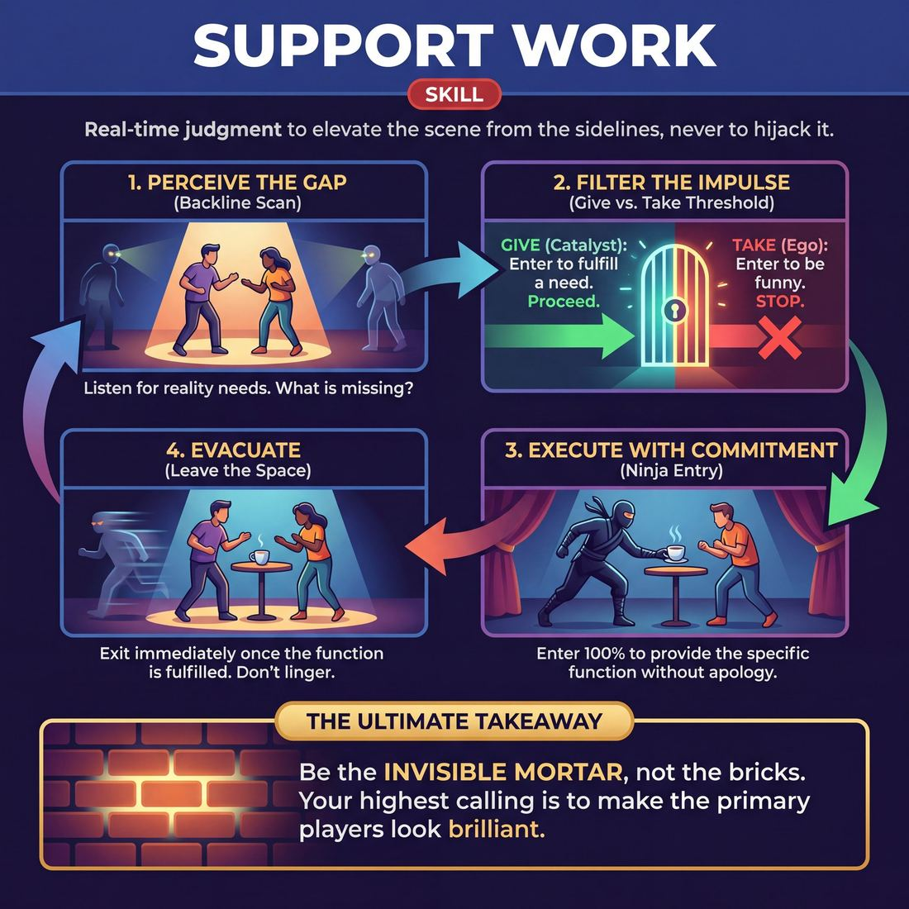
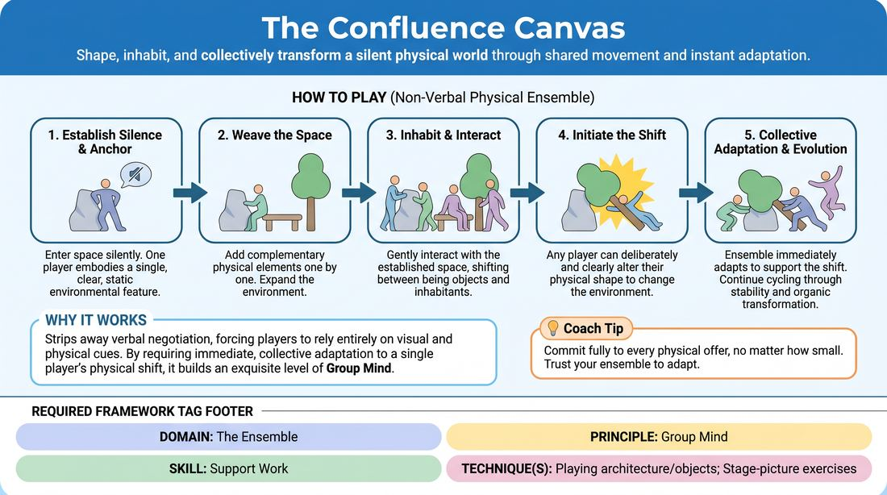
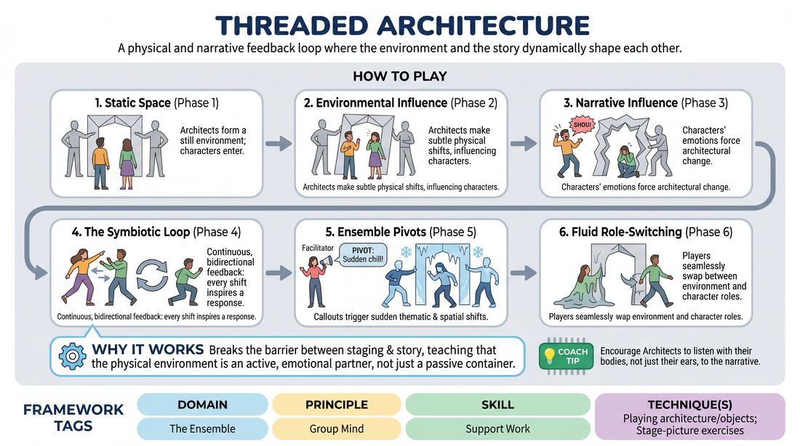

# Week 10 — Invisible Support, Surrendered Ego
> *Off-focus support elevates others; the ego is fully surrendered.*

| Course | Week | Domain | Focus | Stage |
|---|---|---|---|---|
| Serve the Piece — Toward Mastery | 10/18 | D4 — The Ensemble | `D4.S2` — Support Work | Proficient → Master |

## ⏱️ Session flow (60 minutes)

| Time | Block |
|---|---|
| **0:00–0:05** | 🤝 Arrival & safety check-in |
| **0:05–0:15** | 🔥 Warm-up — *The Living Canvas* |
| **0:15–0:27** | 🧠 Theory — *Support Work* |
| **0:27–0:52** | 🎲 Game 1 — *Symbiotic Environments* |
| **0:52–1:00** | 💭 Reflection & debrief |

## 1. 🧠 Today's theory

**Focus:** `D4.S2` — Support Work  
**Maturity goal today:** Master: supports invisibly; gives exactly what's missing, then exits.

{ .infographic }

- **The big idea:** Off-focus support elevates others; the ego is fully surrendered.
- **Where you are on the path:** Master: supports invisibly; gives exactly what's missing, then exits.
- **The one cue to coach:** *“Make them look brilliant. Disappear.”*

!!! abstract "📖 Go deeper"
    Read the full write-up: [Support Work](../../theory/04_the-ensemble/04_S2__support-work.md)

## 2. 🎲 Today's games

#### Warm-up — The Living Canvas

> Shape, inhabit, and collectively transform a silent physical world through shared movement and instant adaptation.

{ .infographic }

`Players 3–8` · `~15 min` · `Complexity 3/5` · `Energy medium` · `Props: none`

**Trains:** Support Work · _connection_

**How to play**

1. Establish Silence: The facilitator establishes that the exercise is entirely non-verbal. Players must communicate solely through physical movement, posture, and spatial relationships.
2. Plant the Anchor: One player steps into the empty space and physically embodies a single, clear, static environmental feature or large object (such as a heavy stone pillar, a weeping willow branch, or a bubbling geyser) using strong, committed physical posture.
3. Weave the Space: One by one, other players enter the space to add complementary physical elements. Each addition must logically relate to and expand the existing environment (for example, if there is a stone pillar, another player might become a crumbling archway attached to it, or a creeping vine climbing up it).
4. Inhabit and Interact: Once four to six players have established the environment, the group begins to gently interact with the space. Players can shift from being the architecture to briefly interacting with it (such as testing the weight of a stone, feeling the wind, or reacting to the geyser's heat) before returning to their physical shapes.
5. Initiate the Shift: At any moment, any player can initiate a 'Shift' by clearly and deliberately altering their physical shape or movement pattern to represent a transformation of their element (for example, the weeping willow branch slowly sags and cracks, becoming a fallen log). This movement must be deliberate and visible to serve as the transformation signal.
6. Collective Adaptation: The instant the other players perceive this physical shift, they must immediately adapt their own physical shapes and relationships to support the new reality (for example, the player who was a vine now drapes over the fallen log; the player who was a bird now hops along its length).
7. Continuous Evolution: The environment continues to cycle through phases of stability, subtle interaction, and sudden, organic transformation, driven entirely by the group's non-verbal agreement and physical responsiveness.
8. Resolution: The exercise concludes when the ensemble naturally arrives at a shared moment of stillness and collective realization, or when the facilitator calls a freeze.

[Open the full game card »](../../games/D4_P1_S2_T3_G492__the-confluence-canvas.md){target=_blank rel=noopener}

#### Core game — Symbiotic Environments

> A physical and narrative feedback loop where the environment and the story dynamically shape each other.

{ .infographic }

`Players 5–7` · `~30 min` · `Complexity 4/5` · `Energy medium` · `Props: none`

**Trains:** Support Work · _mixed_

**How to play**

1. Begin Phase 1 (Static Space): The Architects enter the stage and physically sculpt themselves into static elements of the suggested location, holding their poses or repeating simple, non-verbal physical loops. The Characters then enter this fixed environment and initiate a grounded scene, treating the physical structures as an unchanging backdrop.
2. Transition to Phase 2 (Environmental Influence): The Architects begin to introduce subtle, physical shifts in their structures (e.g., a wall slowly tilting, a gear jamming, a branch drooping). The Characters must immediately notice these changes using peripheral vision and logically justify them within the narrative.
3. Transition to Phase 3 (Narrative Influence): The Characters now drive the shifts by expressing strong emotional states or thematic declarations (e.g., 'I feel completely trapped here' or 'This place feels full of hope'). The Architects must instantly absorb these emotional offers and physically morph the environment to mirror or amplify the characters' internal states.
4. Transition to Phase 4 (The Symbiotic Loop): Combine both influences into a continuous, bidirectional feedback loop where every physical shift inspires a narrative reaction, and every narrative beat reshapes the physical space.
5. Introduce Ensemble Pivots: During Phase 4, the facilitator (or an active player) calls out a sudden thematic shift (e.g., 'Time is running out' or 'A sudden chill'). The entire ensemble must instantly adapt both the physical environment and the narrative tone to reflect this new reality.
6. Execute Role-Switching: During these pivots, encourage players to fluidly swap roles. A character might melt into a wall to support the physical space, while an architectural element steps forward to become a new character, maintaining a seamless flow without breaking the reality of the scene.

[Open the full game card »](../../games/D4_P1_S2_T3_G049__threaded-architecture.md){target=_blank rel=noopener}

??? star "🎒 Backup games — if you have time, or a game falls flat"
    *Swap-ins drawn from the same maturity band; not part of the timed hour.*
    - **[The Balladeer](../../games/D4_P2_S2_T0_G942__balladeer-1.md){target=_blank rel=noopener}** — `3+` · `~5m` · `Cx 3/5` · `Energy medium` · _Support Work_
    - **[Pop-Up Storybook](../../games/D4_P1_S2_T3_G1238__pop-up-storybook.md){target=_blank rel=noopener}** — `3+` · `~15m` · `Cx 3/5` · `Energy medium` · _Support Work_

## 3. 💭 Self-reflection

**Deepen your improv**
1. How did you know when a shift was happening without anyone speaking?
2. What physical cues were the easiest to read and support, and why?

**Beyond the stage**
3. Great support enters to give, not to take. Where could you step in to fill a gap for your team and then get out of the way — without grabbing credit?

---
⬅️ *Previous:* [W09 — Group Mind & Follow the Follower](week-09.md)  ·  *Next:* [W11 — Weaving the Threads](week-11.md) ➡️
