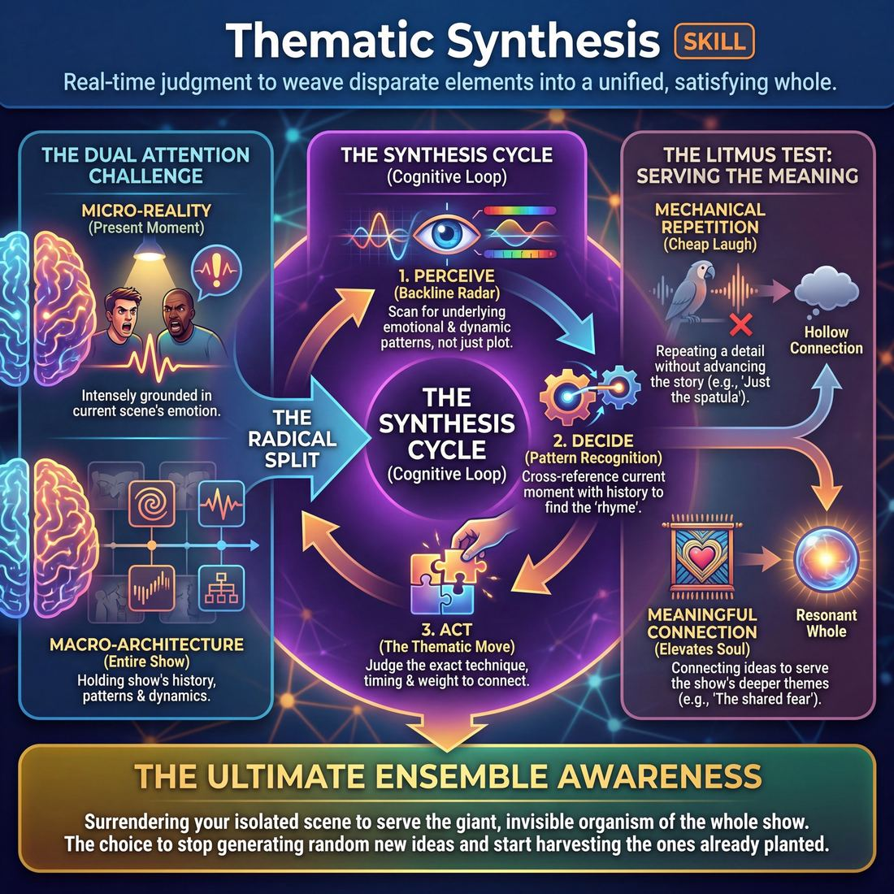
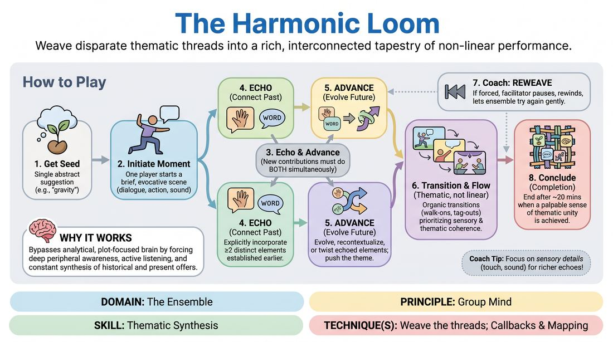

# Week 11 — Weaving the Threads
> *Callbacks and mapping turn separate scenes into one tapestry.*

| Course | Week | Domain | Focus | Stage |
|---|---|---|---|---|
| Serve the Piece — Toward Mastery | 11/18 | D4 — The Ensemble | `D4.S5` — Thematic Synthesis | Proficient → Master |

## ⏱️ Session flow (60 minutes)

| Time | Block |
|---|---|
| **0:00–0:05** | 🤝 Arrival & safety check-in |
| **0:05–0:15** | 🔥 Warm-up — *The Harmonic Loom* |
| **0:15–0:27** | 🧠 Theory — *Thematic Synthesis* |
| **0:27–0:52** | 🎲 Game 1 — *The Resonance Weave* |
| **0:52–1:00** | 💭 Reflection & debrief |

## 1. 🧠 Today's theory

**Focus:** `D4.S5` — Thematic Synthesis  
**Maturity goal today:** Proficient → Master: weave threads; callbacks land as inevitable.

{ .infographic }

- **The big idea:** Callbacks and mapping turn separate scenes into one tapestry.
- **Where you are on the path:** Proficient → Master: weave threads; callbacks land as inevitable.
- **The one cue to coach:** *“Nothing is wasted. Bring it all back.”*

!!! abstract "📖 Go deeper"
    Read the full write-up: [Thematic Synthesis](../../content/04_the-ensemble/04_S5__thematic-synthesis.md)

## 2. 🎲 Today's games

#### Warm-up — The Harmonic Loom

> Weave disparate thematic threads into a rich, interconnected tapestry of non-linear performance.

{ .infographic }

`Players 3–8` · `~20 min` · `Complexity 4/5` · `Energy medium` · `Props: none`

**Trains:** Thematic Synthesis · _connection_

**How to play**

1. Begin by obtaining a single abstract suggestion from the group or an observer to serve as the initial seed.
2. One player steps into the space to initiate a brief, evocative starting moment, which can be a line of dialogue, a physical posture, a repetitive sound, or a clear emotional state.
3. Any player may step in to initiate a new moment or edit the current one at any time, but their contribution must satisfy the dual rule of Echo and Advance.
4. To Echo, the entering player must explicitly incorporate at least two distinct elements established earlier in the session, such as a physical gesture from scene one and a vocal tone from scene two.
5. To Advance, the player must simultaneously evolve, recontextualize, or twist those echoed elements rather than simply repeating them, pushing the thematic fabric forward.
6. Allow scenes to transition organically through physical walk-ons, tag-outs, or shifts in stage focus, prioritizing thematic and sensory coherence over linear plot progression.
7. If a connection feels forced or a player struggles to integrate past threads, the facilitator calls Reweave to gently pause, rewind the last few seconds, and let the ensemble find a more organic synthesis.
8. Conclude the exercise after approximately twenty minutes, ending not on a punchline, but when the ensemble achieves a palpable sense of thematic completion and resonance.

[Open the full game card »](../../games/D4_P1_S5_T2_G077__the-harmonic-loom.md){target=_blank rel=noopener}

#### Core game — The Resonance Weave

> Weave non-verbal sound and movement into spoken thematic seeds that inspire deep, connected scenes.

{ .infographic }

`Players 3–8` · `~20 min` · `Complexity 4/5` · `Energy medium` · `Props: none`

**Trains:** Thematic Synthesis · _connection_

**How to play**

1. Phase 1 (Thread Generation): One player initiates a simple, repetitive, non-verbal offer using a physical movement, a sustained vocal sound, or an embodied emotional posture.
2. Resonant Addition: One by one, other players add their own distinct non-verbal offers. Rather than directly copying or mirroring, each player makes an 'A-to-C' leap, contributing a sound or movement that feels atmospherically or emotionally related to the whole.
3. Simultaneous Weaving: All players maintain their individual, evolving non-verbal threads simultaneously, creating a rich, polyphonic soundscape and dynamic physical picture while remaining highly aware of the collective energy.
4. Phase 2 (Verbal Seeds): At any point, when a player senses a clear theme, relationship, environment, or emotional pattern emerging from the tapestry, they step forward and state a single, concise phrase (a 'verbal seed') that names this reality (e.g., 'The long winter' or 'A forgotten promise'). This is a meta-offer, not scene dialogue.
5. Integrating the Seed: The group continues their non-verbal weaving, allowing their movements and sounds to be subtly reshaped, slowed, or colored by the newly spoken verbal seed.
6. Layering Seeds: Other players may step forward to offer additional, contrasting, or complementary verbal seeds as the non-verbal tapestry continues to evolve, creating multiple thematic anchors.
7. Phase 3 (Scene Emergence): When the ensemble feels a collective convergence of energy, they organically transition from the abstract tapestry into short, interconnected scenes. Players step into the space to initiate dialogue, drawing directly from the established verbal seeds and physical/emotional threads.

[Open the full game card »](../../games/D4_P1_S5_T2_G085__the-enso-weave.md){target=_blank rel=noopener}

??? star "🎒 Backup games — if you have time, or a game falls flat"
    *Swap-ins drawn from the same maturity band; not part of the timed hour.*
    - **[The Conscious Universe](../../games/D4_P1_S5_T1_G212__the-ensemble-s-deep-dive.md){target=_blank rel=noopener}** — `3–8` · `~30m` · `Cx 4/5` · `Energy medium` · _Thematic Synthesis_
    - **[Undercurrent Weave](../../games/D4_P1_S5_T2_G263__the-undercurrent-weave.md){target=_blank rel=noopener}** — `4–8` · `~20m` · `Cx 4/5` · `Energy medium` · _Thematic Synthesis_

## 3. 💭 Self-reflection

**Deepen your improv**
1. How did it feel to let go of linear narrative and focus entirely on thematic and physical connections?
2. What strategies did you use to track multiple threads while waiting on the sidelines?

**Beyond the stage**
3. Thematic synthesis weaves separate threads into meaning. Looking back at a messy week, what callback or pattern connects events you treated as unrelated?

---
⬅️ *Previous:* [W10 — Invisible Support, Surrendered Ego](week-10.md)  ·  *Next:* [W12 — Conducting Pace](week-12.md) ➡️
