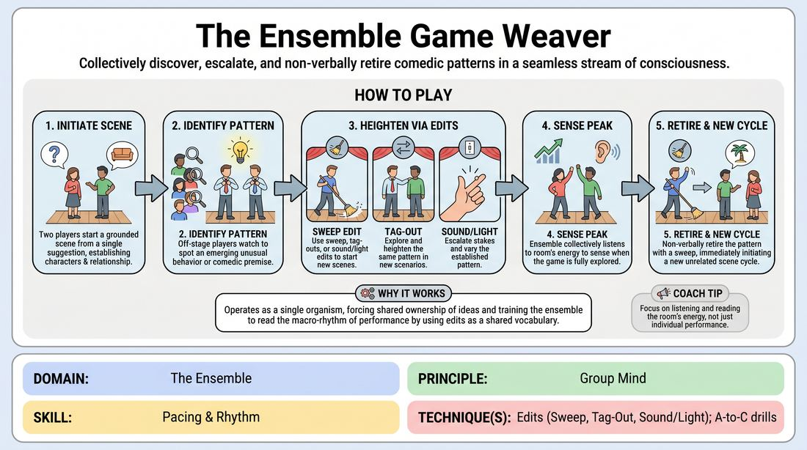

# Week 12 — Conducting Pace
> *Edit so cleanly the audience never consciously notices.*

| Course | Week | Domain | Focus | Stage |
|---|---|---|---|---|
| Serve the Piece — Toward Mastery | 12/18 | D4 — The Ensemble | `D4.S4` — Pacing & Rhythm | Proficient → Master |

## ⏱️ Session flow (60 minutes)

| Time | Block |
|---|---|
| **0:00–0:05** | 🤝 Arrival & safety check-in |
| **0:05–0:15** | 🔥 Warm-up — *The Seamless Oracle* |
| **0:15–0:27** | 🧠 Theory — *Pacing & Rhythm* |
| **0:27–0:52** | 🎲 Game 1 — *The Pattern Weaver* |
| **0:52–1:00** | 💭 Reflection & debrief |

## 1. 🧠 Today's theory

**Focus:** `D4.S4` — Pacing & Rhythm  
**Maturity goal today:** Master: pacing breathes — energy, silence, ending; edit unnoticed.

{ .infographic }

- **The big idea:** Edit so cleanly the audience never consciously notices.
- **Where you are on the path:** Master: pacing breathes — energy, silence, ending; edit unnoticed.
- **The one cue to coach:** *“Arrive on the exact peak.”*

!!! abstract "📖 Go deeper"
    Read the full write-up: [Pacing & Rhythm](../../content/04_the-ensemble/04_S4__pacing-and-rhythm.md)

## 2. 🎲 Today's games

#### Warm-up — The Seamless Oracle

> Speak as a single, omniscient entity by passing sentences seamlessly without a single hitch.

{ .infographic }

`Players 4–8` · `~10 min` · `Complexity 4/5` · `Energy medium` · `Props: none`

**Trains:** Pacing & Rhythm · _mixed_

**How to play**

1. Gather four to eight players in a shoulder-to-shoulder semi-circle facing the room.
2. Obtain a single abstract suggestion to serve as the thematic anchor for the monologue.
3. Any player initiates the monologue by speaking a short phrase or clause in a deliberate, measured tone.
4. Without any physical cue or pre-determined order, another player must instantly pick up the sentence, matching the exact pitch, volume, and cadence of the previous speaker.
5. The handoff must be completely seamless, with zero silence, stutter, or vocal shift between speakers, as if a single person is speaking.
6. Players must maintain strict grammatical integrity, completing clauses and resolving complex sentence structures collaboratively.
7. The ensemble collectively manages the pacing, executing dramatic pauses or shifts in tempo as a single unit rather than as individuals.
8. The monologue continues, weaving thematic elements and narrative threads, until the group collectively senses a natural, resonant conclusion and falls silent together.

[Open the full game card »](../../games/D4_P1_S4_T2_G578__the-oracle-s-weave.md){target=_blank rel=noopener}

#### Core game — The Pattern Weaver

> Collectively discover, escalate, and non-verbally retire comedic patterns in a seamless stream of consciousness.

{ .infographic }

`Players 4–12` · `~30 min` · `Complexity 4/5` · `Energy medium` · `Props: none`

**Trains:** Pacing & Rhythm · _skill drill_

**How to play**

1. Begin with a single, open-ended suggestion from the group, such as a location, relationship, or mundane object.
2. Two players step into the space to initiate a grounded scene, focusing on establishing clear characters, relationships, and a specific point of view.
3. Off-stage players watch closely to identify any emerging unusual behavior, repetitive dynamic, or comedic premise that naturally surfaces.
4. Once a pattern is recognized, players use edits (such as sweep edits, tag-outs, or sound/light edits) to start new scenes that explore and heighten that same underlying pattern in different contexts.
5. Continue to escalate the stakes and vary the scenarios of this established pattern, ensuring each new beat pushes the comedic engine further.
6. As the pattern reaches its natural comedic peak, the entire ensemble must listen to the room's energy to sense when the game is fully explored.
7. Without any verbal cues, an off-stage player initiates a sweep edit to wipe the stage and immediately starts a completely unrelated, grounded scene.
8. This hard transition serves as a non-verbal declaration that the previous game is retired, initiating a new cycle of discovery and heightening.

[Open the full game card »](../../games/D4_P1_S4_T1_G311__the-ensemble-game-weaver.md){target=_blank rel=noopener}

??? star "🎒 Backup games — if you have time, or a game falls flat"
    *Swap-ins drawn from the same maturity band; not part of the timed hour.*
    - **[Rapid Backstory Montage](../../games/D4_P3_S4_T1_G1063__fast-montage.md){target=_blank rel=noopener}** — `3+` · `~10m` · `Cx 4/5` · `Energy high` · _Pacing & Rhythm_
    - **[Follow the Leaver](../../games/D4_P3_S4_T1_G1073__follow-the-leaver.md){target=_blank rel=noopener}** — `3+` · `~15m` · `Cx 4/5` · `Energy medium` · _Pacing & Rhythm_

## 3. 💭 Self-reflection

**Deepen your improv**
1. How did it feel to let go of your individual narrative control and trust the group's grammatical direction?
2. What physical or auditory cues helped you anticipate when to speak without interrupting or lagging?

**Beyond the stage**
3. Pacing is knowing when to end. Where in your work do you let things run long past their peak — meetings, projects, conversations? What would a clean 'edit' look like?

---
⬅️ *Previous:* [W11 — Weaving the Threads](week-11.md)  ·  *Next:* [W13 — The Harold](week-13.md) ➡️
