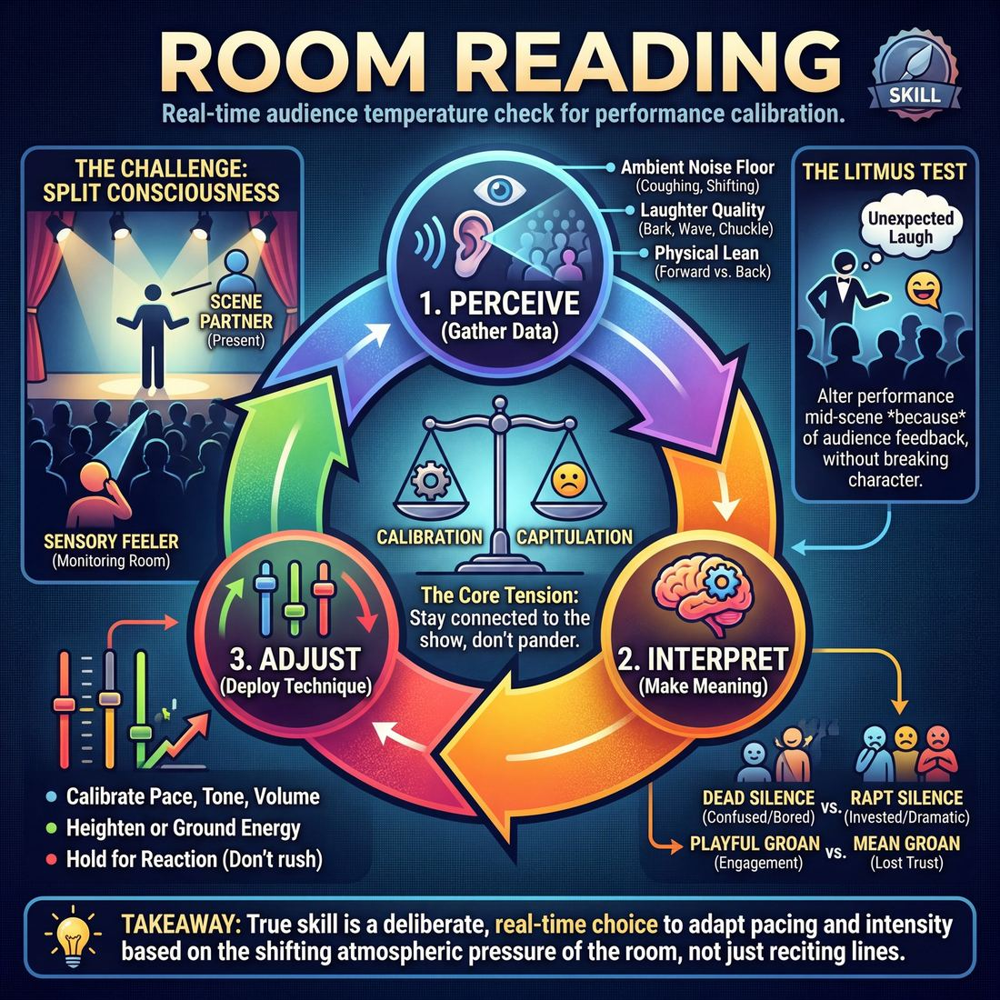

# Week 15 — Unify the Room
> *Convert a fragmented audience into one organism breathing together.*

| Course | Week | Domain | Focus | Stage |
|---|---|---|---|---|
| Serve the Piece — Toward Mastery | 15/18 | D5 — The Audience | `D5.S1` — Room Reading | Proficient → Master |

## ⏱️ Session flow (60 minutes)

| Time | Block |
|---|---|
| **0:00–0:05** | 🤝 Arrival & safety check-in |
| **0:05–0:15** | 🔥 Warm-up — *The Feedback Agreement* |
| **0:15–0:27** | 🧠 Theory — *Room Reading* |
| **0:27–0:52** | 🎲 Game 1 — *The Resonance Dial* |
| **0:52–1:00** | 💭 Reflection & debrief |

## 1. 🧠 Today's theory

**Focus:** `D5.S1` — Room Reading  
**Maturity goal today:** Master: unify the room (synchronised collective laughter/gasp).

{ .infographic }

- **The big idea:** Convert a fragmented audience into one organism breathing together.
- **Where you are on the path:** Master: unify the room (synchronised collective laughter/gasp).
- **The one cue to coach:** *“Play to everyone at once. Find the shared breath.”*

!!! abstract "📖 Go deeper"
    Read the full write-up: [Room Reading](../../content/05_the-audience/05_S1__room-reading.md)

## 2. 🎲 Today's games

#### Warm-up — The Feedback Agreement

> Transform your audience into a living dashboard of real-time performance feedback.

`Players 7+` · `~15 min` · `Complexity 4/5` · `Energy medium` · `Props: none`

**Trains:** Room Reading · _skill drill_

**How to play**

1. Divide the non-performing participants into three distinct audience zones: the Front Row, the Middle Row, and the Back Row, while two to three performers take the stage.
2. Assign the Front Row the role of the Fourth Wall Guard, instructing them to monitor eye contact and direct address by leaning forward when engaged, leaning back when ignored, and raising a flat palm if the address is too overbearing.
3. Assign the Middle Row the role of the Energy Monitor, instructing them to track emotional stakes and comedic momentum by offering a soft approving hum for clear choices, whispering quietly if the scene loses energy, and chuckling to build comedic momentum.
4. Assign the Back Row the role of the Distance Beacon, instructing them to monitor projection and physical readability by nodding slowly when clear, cupping a hand to their ear when quiet, and shrugging if a major choice is completely lost.
5. Have the audience practice their cues once with the facilitator to ensure they can deliver them subtly, instantly, and without disrupting the flow of the scene.
6. Establish the core contract: performers must treat all audience cues as direct, real-time stage directions and immediately adjust their performance to correct negative feedback or amplify positive feedback.
7. Begin a three-to-five-minute scene based on a simple suggestion, requiring the performers to split their focus between their scene partner and the physical and auditory cues of the audience.
8. Allow the scene to run, with the facilitator occasionally calling a brief freeze to ask performers what cues they are currently receiving and how they plan to adapt.

[Open the full game card »](../../games/D5_P1_S1_T1_G061__the-echo-chamber-contract.md){target=_blank rel=noopener}

#### Core game — The Resonance Dial

> Treat the audience's collective energy as your primary scene partner using a real-time visual feedback dial.

`Players 6+` · `~45 min` · `Complexity 4/5` · `Energy medium` · `Props: required`

**Trains:** Room Reading · _skill drill_

**How to play**

1. Designate 1 to 3 performers to take the stage, 3 to 5 participants to form the Resonance Council, and the remaining group to act as the active audience.
2. Establish five clear zones on the Resonance Dial: Blue (Disengaged/Distracted), Yellow (Neutral/Observing), Green (Engaged/Connected), Orange (Excited/Enthusiastic), and Red (Confused/Resistant).
3. Draw a Challenge Card detailing a starting state, a target state, and a simple audience-facing scenario (e.g., pitching an absurd invention or sharing a dramatic childhood memory).
4. Set the Resonance Dial to the designated starting state (e.g., Blue/Disengaged), and instruct the audience to begin the scene mirroring that exact energy level.
5. Instruct the performers to begin their scene, immediately assessing the dial and the physical cues of the audience to determine how to bridge the gap.
6. Direct the Resonance Council to continuously monitor the actual audience's reactions (laughter, posture, eye contact) and update the dial in real-time to reflect collective engagement.
7. Require performers to dynamically adjust their volume, physical projection, eye contact, and use of direct address to actively steer the audience's energy toward the target zone.
8. Conclude the round after 3 minutes, or once the performers successfully reach and hold the target resonance state for at least 15 seconds.

[Open the full game card »](../../games/D5_P1_S1_T1_G044__the-audience-altar-a-resonance-cultivation-experiment.md){target=_blank rel=noopener}

??? note "🎒 Backup games — if you have time, or a game falls flat"
    *Swap-ins drawn from the same maturity band; not part of the timed hour.*
    - **[Acoustic Calibration](../../games/D5_P1_S1_T1_G350__the-audience-ecosystem-training-protocol.md){target=_blank rel=noopener}** — `5+` · `~45m` · `Cx 4/5` · `Energy medium` · _Room Reading_
    - **[Audience Cartographers](../../games/D5_P1_S1_T2_G422__suggestion-safari-the-audience-cartographers.md){target=_blank rel=noopener}** — `4+` · `~15m` · `Cx 4/5` · `Energy medium` · _Room Reading_

## 3. 💭 Self-reflection

**Deepen your improv**
1. Performers: Which audience zone was the easiest to read, and which did you find yourself accidentally ignoring?
2. Performers: How did it feel to adjust your vocal projection or physical choices in direct response to a physical cue like a cupped ear?

**Beyond the stage**
3. Reading the room means sensing energy without pandering to it. When did you last misread an audience (a boss, a client, a friend)? What signals did you miss?

---
⬅️ *Previous:* [W14 — Armando, Montage & Longform](week-14.md)  ·  *Next:* [W16 — Conducting Audience Energy](week-16.md) ➡️
